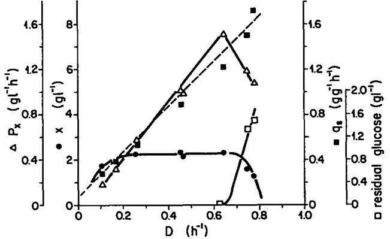
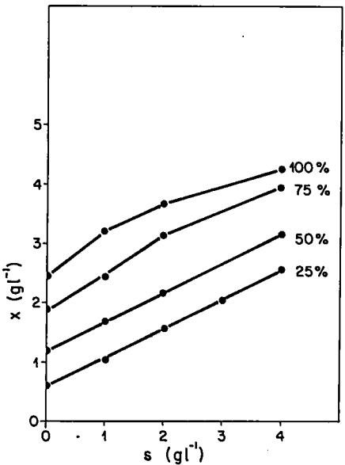
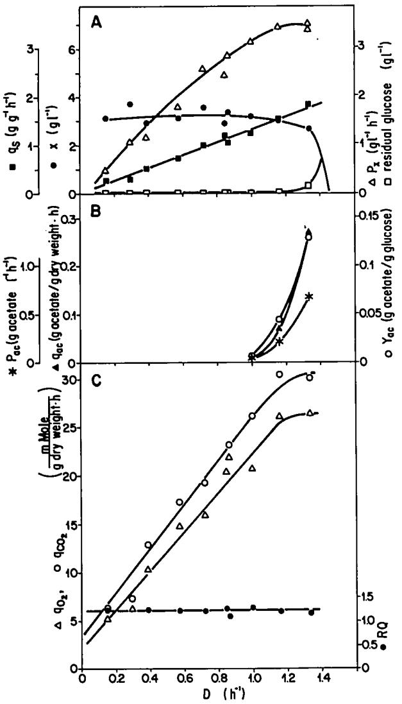
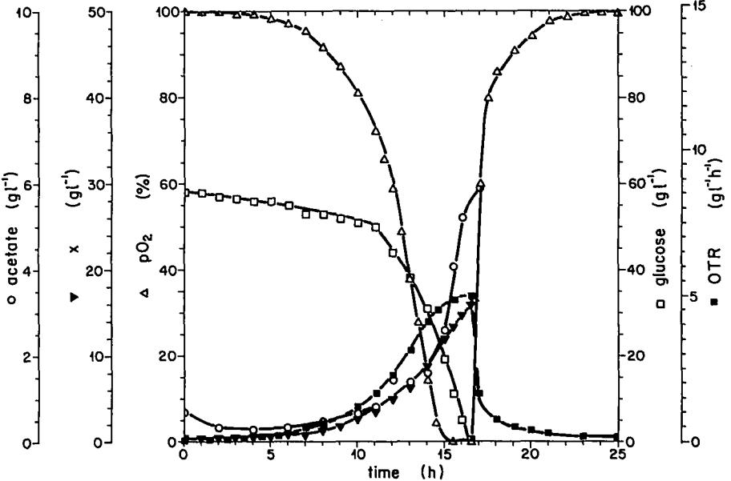

*Journal of Biotechnology,* 2 (1985) 191-206 191 Elsevier

JBT 00147

# **Mass culture of** *Escherichia coli:* **Medium development for low and high density cultivation of**  *Escherichia coli* **B/r in minimal and complex media**

**H.E. Reiling, H.** Laurila and A. Fiechter

*h~stitute of Bioteclmology, Swiss Federal Institute of Technology, 8093 Zurich, Switzerland*  (Received 6 November 1984; accepted 20 December 1984)

# Summa~

The medium development for the growth of *Escherichia coil* B/r in minimal and complex media for small- and large-scale cultivations is described. The x vs. D diagrams are presented together with important kinetic growth characteristics (productivity of biomass, glucose uptake rate, acetate production rate, oxygen consumption rate, maintenance coefficient, K s, growth yields). The main byproduct of glucose metabolism was acetate, the production of which was strongly dependent upon the ratio of the carbon to salt concentration and the growth rate. A.s an explanation for acetate accumulation a saturation of the respiratory system (including the phosphorylation system) at higher dilution rates is suggested. Based on the minimal medium developed for lab scale production a high concentrated minimal medium has been developed that permits growth up to high cell densities in batch cultivations (16.5 g 1-1 biomass).

medium optimization, acetate regulation, high cell yield production

#### **Introduction**

During the last ten years different methods have been developed for the optimization of nutrient-limited media for microbial cultures (Yano et al., 1978; Summers et al., 1979; Kuhn et al., 1979; Goldberg and Er-el, 1981) all essentially based on the pulse technique introduced by Mateles and Battat (1974).

In the present study we have used the pulse and shift technique (Kuhn et al., 1979) for the development of optimized carbon-limited minimal and complex media for *E. coli* B/r, a strain of the most investigated microorganism of the world for which only surprisingly few attempts have been made to establish defined media with predictable nutrient limitations because the cell yield for every medium component is known. The consequences of many unchecked conventional media often described in literature are unnecessary costs, lower growth rates, cell concentrations, growth yields and generally ill-defined culture conditions.

We became interested in *E. coli* growth because some genetically manipulated strains were studied in our department with respect to a-interferon production. As interferon production was found to be growth related it was near at hand to develop defined media for this specific production process for small- and large-scale cultivations (Meyer et al., 1984) and to compare the growth rates between wild-type-like strains (like *E. coli* B) and manipulated strains (like *E. coli* K12). Organisms with higher growth rates are of course more promising for such processes if their product formation is growth associated and wild-type strains very often have the shortest generation times.

Another aspect of interest in the study of *E. coli* B was concerned with the need of a procaryotic biological test system for the biological characterization and the evaluation of the performance limits (e.g. oxygen transfer rate capacity) of various bioreactor types which are under investigation in our department (Adler and Fiechter, 1983). Because intermittent feeding would have caused several serious problems" with respect to sterility and constant volume a minimal medium was required supporting batch growth to high final cell densities attaining or even surmounting the physico-chemical limits of the bioreactors in question.

The development of optimized minimal and complex media for *E. coil* B/r growth together with a kinetic characterization of the organism in continuous and batch cultivations will be reported in this paper. One example is given how such defined media developed for small-scale cell or product formation can be used as a basis for high cell production in small, and also large-scale bioreactors as has been verified during writing the manuscript.

## **Material and Methods**

#### *Microorganism*

*Escherichia coli* B/r was obtained from Professor von Meyenburg, Institute of Microbiology, University of Copenhagen, Denmark.

The purity of the cultures was routinely checked by dilution streaks on agar plates, microscopic investigation, Gram staining and with the Enterotube test system (Hoffmann La Roche, Basel, Switzerland).

The cultures were maintained at -18°C in the same medium as that used for plates mentioned below but in 257o glycerol instead of agar. Every two months a new culture was thawed and from that new agar plates were made. Stock agar plates were stored at +4°C and a new plate was prepared from the stock plate every second week.

# *Media*

We started the media optimization in the bioreactor with a medium, which was derived from the results of Yano et al. (1980) to give approximately 1 g dry weight per liter. This medium consisted of (g 1-~): glucose monohydrate 2.5, NH4CI 0.8, KH2PO 4 0.2, MgSO 4 • 7H20 0.41, CaC12 0.01, FeSO 4 • 7H20 0.018, and 2.5 mi trace elements, pH 6.8. The trace elements solution consisted of (mg l.--I): A1CI 3 • 6H20 20, COC12.6H20 8, KCr(SO4) 2. 12H20 2, CuC12.2H20 2, HaBO 4 1; KJ 20, MnSO 4. H20 20, NiSO4.6H20 0.9, Na2MoO 4.2H20 4, ZnSO4.7H20 4. All chemicals were purchased from Merck, Darmstadt, F.R.G.

The medium used for shake-flask cultivations (precultures) was the same as that used for subsequent bioreactor cultivations except for the addition of 12 g I-I MES buffer (Sigma). Deionized water was used for all cultivations.

The medium for agar plates (sterilized 20 min at 121°C) had the following composition (g 1-1): tryptone (Oxoid) 10, yeast extract (Difco) 1, glucose monohydrate 1, NaC1 8, CaCI 2 0.23, agar 15.

The various minimal and complex media developed and used during the course of experiments are given in the Results section.

For high cell yield production in batch culture all medium components were filter-sterilized into the reactor which had been sterilized before with water. Sterile antifoam (polypropyleneglycol) was added separately.

# *lnoculum*

For each bioreactor inoculum a shake flask was inoculated from an agar plate. The inoculum was prepared in 500 mi baffled shake flasks containing 100 ml medium and then incubated at 37°C overnight on a rotary shaker at 150 rpm. 20-50 ml from an overnight culture was added to the culture vessel as inoculum (2-5% inoculum). Sometimes, for complex medium studies, two thawed glycerol suspensions were injected directly into the reactor and grown in a batch until exponential growth was reached. Then the culture was switched to continuous operation.

## *Cultivation conditions*

The experiments were carried out in a 2 1 bioreactor (Bioengineering, Wald, Switzerland) with 1 1 working volume. Agitation rate was normally 1500 rpm, aeration rate 1.75 vvm and cultivation temperature was 37°C. The pH was adjusted automatically at 6.8 by the addition of 4 N KOH or 4 N H3PO 4. Partial oxygen tension (pO 2) was measured with a clark-type electrode (Ingold, Urdorf, Switzerland). Oxygen and carbon dioxide content in the exit air stream were recorded online by an Oxygen Analyzer model 540 (Taylor Instr. Anal., Rochester, U.S.A.) and a Binos 1 CO 2 Analyzer (Leybold-Heraeus, Hanau, F.R.G.), respectively.

## *Growth analysis*

Optical density was measured at 650 nm with a Beckman spectrophotometer model 24. Dry weight was determined by centrifuging 4 × 5 ml of cell suspension in preweighed tubes (20 min, 4000 × g, room temperature), washing the samples with deionized water and drying them at 105°C to constant weight.

Glucose (GOD-Perid method), acetate (UV method), lactate (UV) and gluconate (UV) were assayed with commercially available test kits (Boehringer Mannheim, F.R.G.); ethanol was determined by gas chromatography.

# Results

# *Defihed minimal medium MMI*

The mineral salt requirement in the medium was determined using the pulse and shift technique (Kuhn et al., 1979). The glucose concentration was maintained in excess during the experiments so that 1-2 g 1 -I of glucose remained in the bioreactor. The resulting yields for the respective limiting components derived from the biomass concentration during steady-state conditions under this limitation are given in Table 1.

Using the results from Table 1, the mineral salt concentrations yielding 1 g Ibiomass could be calculated: 0.77 g NH4CI, 0.125 g KH2PO 4, 17.5 mg MgSO 4. 7H20, 7.5 mg K2SO 4, 0.64 mg FeSO 4 • 7H20, 0.4 mg CaCI 2, 1 1 deionized water (trace elements as in the original medium, given in Materials and Methods).

The comparison of this optimized medium with the initial starter composition showed that except the NH4CI content all the other effectively necessary salt concentrations were reduced by factors ranging from 2 to 25.

Because we were interested in a glucose-limited medium for the *x-D* diagram, all minerals were adjusted to yield about 4 g l -t biomass (according to Table 1) and then the inflowing glucose concentration was varied. In these media we obtained at a dilution rate of D = 0.45 h -1 a linear relationship between glucose concentration and biomass production up to about 6.5 g l- i glucose, indicating a carbon limitation below and a salt limitation above this concentration. For the establishment of the *x-D* diagram a limiting glucose concentration of 4.4 g l-i was chosen whereas all mineral salts were added in excess (factor 2). The finally used composition of the glucose-limited minimal medium (MM1) is given in Table 2.

# TABLE 1

## YIELDS (g BIOMASS PER g LIMITING ELEMENT) FOR DIFFERENT MEDIUM COMPONENTS DETERMINED IN MINIMAL MEDIUM

The elements were given in the form of mineral salts as mentioned for the original medium in Materials and Methods.

| Limiting element | Yield     |  |
|------------------|-----------|--|
| N                | 5         |  |
| P                | 36        |  |
| S                | 278       |  |
| Mg               | 588       |  |
| Ca               | 7.1 × 103 |  |
| Fe               | 7.7 × 103 |  |
|                  |           |  |

Fig. 1. Continuous culture growth of *E. coil* B/r in glucose-limited minimal medium MM1. The following parameters have been plotted as a function of dilution rate, D: biomass production (x), productivity of biomass *(P.~),* specific glucose uptake rate (q,) and residual glucose concentration in effluent medium. Critical dilution rate was D c = 0.84 h- i.

The *x-D* diagram is shown in Fig. 1, together with some other parameters calculated. D c was measured with the washout method as 0.84 h -t and #max was 0.8 h- I in the following batch. The yield, Y~, was about 0.49, with a slight reduction at both ends of the D range because of acetate production (higher D) and maintenance requirements (lower D). The specific glucose uptake rate, q,, increased linearly with dilution rate, according to the equation q, = *D/Y x = D/Yxlma,, + m,,* where m~ is the maintenance coefficient. From a double-reciprocal plot of Yx versus *I~(1/Y~, =* 

TABLE 2

MINIMAL AND COMPLEX MEDIA DEVELOPED FOR *E. COLI* B/r CULTIVATION IN BATCH AND CHEMOSTAT OPERATION.

| Component      | Medium        |             |            |  |
|----------------|---------------|-------------|------------|--|
|                | MM1           | CM4         | MM2        |  |
| Casamino acids | -             | 5           | -          |  |
| Yeast extract  | -             | 1           | -          |  |
| Glucose. H 20  | 4.8           | 4.4         | 66.0       |  |
| L-Methionine   | -             | -           | 0.18       |  |
| NHaCI          | 3.22          | 3.22        | 15         |  |
| KH 2 PO4       | 0.525         | 1.05        | 2.5        |  |
| MgSO 4 • 7H 20 | 69.7 × 10 - 3 | 136 x 10- 3 | 0.6        |  |
| K2SO 4         | 21 xl0 -3     | 42x10 -3    | 0.3        |  |
| CaCi 2         | 0.8 x 10 -3   | 1.6 x 10 -3 | 8 x 10 -3  |  |
| FeSO4 • 7H20   | 2.74 x 10 -3  | 3 x 10 -3   | 25 x 10 -3 |  |
| Trace elements | 0.5 ml        | 1.0 ml      | 1.6 ml     |  |
| Antifoam (PPG) | 0.5 ml        | 0.5 ml      | 1 ml       |  |
| H20 deion.     | 1 I           | 1 i         | 1 1        |  |

Concentrations in g l- t.

*1/Y.,./m~x + ms/l~ )* we obtained the corrected maximum growth yield, *Y,./ .....* as 0.59 and when calculated from the qs curve, it was found to be 0.5. The maintenance requirement, ms, was about 0.04 g glucose per g biomass per hour.

There was no glucose left in the bioreactor when the dilution rate was below 0.65 h- 1; however, acetate appeared when the dilution rate reached 0.47 h-I. The specific acetate production rate, qa~, increased with dilution rate up to 0.2 g g-I h-I at D = 0.78 h-I and the acetate yield referring to glucose, Y~¢, approached a rather constant level of 0.1 (i.e. about 10% of glucose were converted to acetate). The acetate productivity, P~c, revealed a maximum around D = 0.7 h-I (___ 0.35 g !-1 h- i ). RQ values were around 1.3, what was fairly high but this phenomenon has also been observed with other *E. coli* strains tested in this laboratory, qo., and qco,. values increased linearly with the dilution rate (not shown) until acetate production began (D = 0.47 h-l). At this dilution rate qo, was about 9 mmol g-i h-i and q¢o, about 10 mmol g-i h-1. The qo, value did not increase further, but qco.~ increased up to 16 mmol g-1 h-~ at D=0.78 h -1. From *qo,.=D/Yo:/m;~x+mo:* a maintenance respiration rate of 1.5 mmol 02 per g dry weight per hour could be calculated as the ordinate intercept of the extrapolated straight line.

## *Complex media*

Partially with respect to preliminary results obtained during the MM1 development we started the continuous and batch cultivations of *E. coli* B/r in the complex medium CM1 with the final aim to establish a carbon-limited growth, too.

This medium differed from MM1 by the addition of 10 g 1-1 casamino acids (CA, Difco) and 2 g 1-1 yeast extract (YE, Difco) and by only about half the concentrations in magnesium and iron sulfate (34 × 10 -3 and 1.5 × 10 -3 g 1-1, respectively). It turned out that this medium was salt limited (Mg 2+, Fe 2+) and thus the corresponding salt concentrations were doubled (medium CM2).

As a consequence acetate accumulation in CM2 was observed above a dilution rate of 0.66 h-I whereas acetate in CM1 was detected at 0.3 h-1. The q.cvalues in medium CM2 were principally lower at any fixed dilution rate compared with MM1 although the biomass production was higher because of the additional complex carbon and nitrogen sources (3.3 g 1-1 compared to 2.15 g 1-1) but the maintenance coefficient was almost identical for both media (m s = 0.04 g g-i h-l).

Similar results (lower values in CM2) were found for the acetate functions qac, P~c and Y,c.

The residual glucose concentration in the culture broth of CM2 was zero below a dilution rate of 1.15 h -I (critical dilution rate was about 1.4 h-l), Y.,. in the range 0.7-0.85 and K s was determined as 8.4 mg 1-1 glucose.

Although the results obtained in medium CM2 seemed to indicate carbon-limited growth it became evident that this was not true. Neither a glucose nor a casamino acids or yeast extract pulse into the culture vessel had a positive effect on the biomass output revealing carbon sufficient conditions in medium CM2. Therefore, as a first step, the concentrations of the carbon sources were diminished. This decrease of the complex component concentrations to 5 g 1-~ CA and 1 g 1-1 YE (i.e. the reduction of the carbon to salt source ratio) caused a shift of the appearance of acetate production towards still higher dilution rates: from 0.66 h-I (CM2) to 0.82 h- 1 (CM3). Thereafter, we observed a positive growth response to a doubling of the magnesium concentration.

These results prompted us to investigate precisely the growth response of the organism to different concentrations of the complex constituents and glucose maintaining the salt concentrations constant at the level of the media CM2 and CM3, except for a magnesium sulfate increase by a factor two (MgSOa.7H20 concentration: 0.136 g 1-1).

The data of these experiments carried out at a dilution rate of 0.85 h -1 are presented in Fig. 2. There, the biomass production, x, is drawn as a function of the glucose concentration, s, and the curve parameters (in %) signify the various complex component concentrations used, where 10070 was defined as: casamino acids (CA) content 10 g 1-~ and yeast extract (YE) content 2 g 1-1 (consequently 2570 refers to 2.5 g 1 -~ CA and 0.5 g 1 -I YE). From the data in the media without any glucose supply we obtained a biomass production of about 0.6 g per 2.5 g 1- CA and per 0.5 g 1-~ YE offered what corresponds to the additional biosynthetic work of the organism due to the present complex carbon and nitrogen sources.

Furthermore, it could be seen that only the 5070 and the 2570 conditions yielded strictly carbon-limited growth within the range of glucose concentrations chosen (0-4 g 1-1). In the other cases certain kinds of limitations or inhibitions with increasing glucose concentrations were visible as demonstrated by the changing slopes.

Fig. 2. Biomass production, x, as a function of glucose concentration, s, in variably concentrated complex media. The percentage values indicate the following complex component concentrations: |0070 ~ I0 g [-I casamino acids (CA)+2 g I -I yeast extract (YE); 7570 "--7.5 g 1-1 CA+1.5 g I -I YE; 5070-'--5 g l -I CA+I g I -t YE; 2570 -'- 2.5 g 1 -I CA+0.5 g 1-1 YE.

Fig. 3. (A) Continuous culture growth of *E. coil* B/r in carbon-limited complex medium CM4. Biomass production (x), biomass productivity (Px), specific glucose uptake rate (qs) and residual glucose concentration in effluent medium, as a function of dilution rate, D. Critical dilution rate was D c = 1.46 h- ~. (B) Acetate production during continuous culture growth in CM4: specific acetate production rate (qa¢), acetate productivity (Pat) and acetate yield referring to glucose (Fat), as a function of dilution rate, D. (C) Gas turnover rates during continuous culture growth in CM4: specific oxygen consumption rate (qo~), specific carbon dioxide production rate (qco2) and respiratory quotient (RQ), as a function of dilution rate, D.

Medium CM4 (Table 2) with 5 g 1 -I CA, 1 g 1 -] YE and 0.136 g 1-1 MgSO 4 • 7H20 was thus finally shown to be carbon-limited by the positive growth effects of glucose and CA/YE pulses, respectively, and by the indifferent reactions of the bacterial culture to various salt pulses applied.

The resulting *x-D* diagram in medium CM4 is given in Fig. 3A: the dry weight production was constant for a broad range of dilution rates up to 1.18 h -1 with a value a little bit above 3 g 1-i. Critical dilution rate, De, was calculated as 1.46 h-1. The productivity of biomass had its maximum value around 1.25 h -1 and the residual glucose concentration in the bioreactor was still zero at 1.2 h-1.

Further parameters for the kinetic characterization of *E. coli* B/r growth in continuous culture in CM4 have been assessed. Fig. 3A demonstrates the linearity between the specific glucose consumption rate, qs, and the dilution rate with almost the same slope and absolute values as in medium CM2. However, they were distinctly lower than in MM1 at comparable dilution rates. This is the consequence of the fact, that glucose in MM1 serves simultaneously as carbon and energy source. Thus the turnover must be higher in MM1. The biomass yield, Yx, was fairly constant in the order of 0.7-0.8, with a slight decrease at the highest and lowest dilution rates what can be explained by the acetate production detectable at high dilution rates (above 1.0 h-i) under these carbon-limited and salt sufficient medium conditions and the maintenance requirements at low dilution rates. Both processes exert negative consequences on the organism" concerning the possible energy expenditure for biosynthetic purposes. Acetate productivity, specific acetate production rate and acetate yield increased from D = 1.0 h- 1 to D = 1.38 h- 1 (Fig. 3B), i.e. the beginning of acetate production was shifted once more to still higher dilution rates compared to CM2 and CM3. Consequently, the absolute values were lower at any given dilution rate than in media CM2 and MM1. From the 1/Y x vs. 1//t data, a determination of the theoretically possible maximum growth yield was possible (Yx/max = 0.85) and the calculation of the maintenance energy demand provided about 0.05 g of glucose per gram dry weight per hour and was thus in the same order as in MM1 and CM2. The substrate concentration at the half-maximum growth rate, K s, was obtained to lie between 9.2 mg 1-1 glucose and 14.3 mg 1-1 glucose (similar to the K s value in CM2) depending on the precision range assumed for glucose analysis. Anyway, the presented K s range was in agreement with data reported elsewhere (see e.g. Pirt, 1975). Besides acetate the production of some other metabolites excreted into the medium has been examined: varying amounts of ethanol not distinctly correlated with the dilution rate have been found, but neither lactate nor gluconate could be detected.

The gas analysis calculations referring to medium CM4 can be seen in Fig. 3C. qo2 and qco2 were linearly dependent on the dilution rate up to 1.1 h- 1 according to the equation qo2 = 19.81 • D + 2.32 (r = 0.97) and qco2 = 22.71 • D + 3.3 (r = 0.97) with a maintenance respiration rate, rno2, of 2.32 mmol O 2 per g dry weight per h and a maximum growth yield referring to oxygen, *Yo2/max,* of 50.5 g dry weight per mole of oxygen. The former value was distinctly different to that reported by Farmer and Jones (1976:rno2 = 0.4 mmol O2/g dry weight per h); the latter, however, was in a fairly good agreement (59.7 dry weight per mole of oxygen). Around D = 1.1

h-i a deflection from the iinearity in the qo, and qco2 curves occurred approaching apparently constant or only slightly increasing values of about 25 mmol 02 g- ~ hand 30 mmol CO 2 g-i h-1, respectively. The mean RQ was about 1.2, suggesting a not strictly aerobic oxidative metabolism in spite of the fact that growth was never oxygen-limited (po, never < 50%). The RQ was above 1 also at growth rates where no acetate was formed.

For comparison, batch growth of *E. coli* B/r in medium CM4 under likewise the same conditions as in continuous operation was also investigated (data not shown). The maximum growth rate,/x ...... was calculated from the exponential growth phase as about 1.36 h -I in accordance with the washout experiments in continuous culture.

During the course of glucose consumption and biomass production acetate was accumulated in the culture the degradation of which was depressed as long as glucose was still present in the medium. Exhaustion of glucose was followed by acetate conversion, an effect called catabolic repression, using large oxygen quantities with an accompanying production of CO,_ and a smaller amount of additional biomass. The accumulated acetate (1 g 1- ~) disappeared within 1.5 h completely. The cell production was about 3 g 1-1 (as in the chemostat) providing a cell yield with respect to glucose (Y.,.) of 0.75, which was also consistent with the continuous culture data.

# *High cell densities in minimal medium MM2*

The medium MM1 (Table 2) was used as a basis for the development of a minimal medium yielding high biomass concentrations. Mainly because of technical reasons a pure batch cultivation was required that did not need further additions of substrate once growth had started and that should attain an oxygen transfer rate of more than 5 g 02 1-1 h-I for the distinct establishment of oxygen-limited growth conditions, either by a high growth rate or by a dense bacterial culture.

The enlargement of the concentrations of the medium components was carried out partially in continuous culture operation with the pulse and shift technique at a dilution rate of 0.5 h-l; later on, several batch experiments were done, because it turned out that the achievable biomass concentration in the chemostat was lower than in batch studies. A mere multiplication of all mineral salt concentrations according to the increase in glucose concentration was not successful and led to very low growth rates, yields and drastic changes in cell morphology (cell clumps). The possibility of an increased biomass by introducing vitamins or amino acids individually or in groups was checked, too, and led finally to the establishment of medium MM2 (Table 2) which was supplemented only with L-methionine besides higher amounts of glucose and mineral salts compared with MM1. In MM2 all salt concentrations were adjusted such that at least 20 g 1-1 biomass could have been produced (according to the yields given in Table I for MM1) and any salt limitation was avoided.

For our 5% inoculum we took a preculture grown in medium CM4 because a well propagating preculture was required for growth in MM2. Precultures grown in MM2 had an extremely long lag phase (several days) and grew up very slowly. In MM2 we

measured a final dry weight production of about 16.5 g 1-1 and an oxygen transfer rate (OTR) of 6.5 g 02 1-1 h -1. The yield per glucose consumed, Y~, was significantly diminished: with an initial glucose concentration of 60 g 1 -t Y,. was only 0.28. The ttm,,x calculated from the exponential growth phase was 0.45 h -t. Acetate accumulated during growth and was oxidized completely after glucose exhaustion. The cultures were never oxygen limited, for the pO 2 was maintained such that it never fell below 30%.

Some problems encountered with the high salt concentrations necessary for the high biomass output: it was not possible to prevent precipitation during MM2 preparation, but this did not seem to affect the growth of the microorganism. Thus, the influence of the precipitate was neglected.

Cultivation of *E. coil* B/r in medium MM2 has been carried out also in larger scale in a 50 1 compact loop reactor (for details see Adler and Fiechter, 1983) with 28 1 working volume at 37°C, pH 6.8, 1.36 vvm aeration and 1000 rpm agitation. This first step in scale up was rather satisfying: the biomass production was around 16 g 1-n (y.,. = 0.27), as was the case in the lab-scale reactor. The RQ was between 1.1 and 1.2 and the growing culture attained oxygen limitation (po, = 0%) allowing the calculation of the ma.ximum oxygen transfer rate as 5 g 02 1-t h-t. Acetate accumulated during growth to about 5.8 g 1 -t. There were no more samples available for further analysis of the fate of acetate. The results of these larger scale batch cultures are presented in Fig. 4.

Fig. 4. Batch growth of *E. coil* B/r in larger scale cultivation in minimal medium MM2: acetate and residual glucose concentration, biomass production (x), partial oxygen tension (po2) and oxygen transfer rate (OTR), as a function of time.

## **Discussion**

## *Minimal medium MM1*

In our experiments, the yields calculated for different medium components do not differ very much from those ones obtained by Yano et al. (1980) for *E. coli* and Kuhn et al. (1979) for a thermophilic Bacillus. For 1 g nitrogen we obtained 5 g dry cells as did Yano et al. (1980), while Kuhn et al. (1979) obtained 6 g. Phosphorus cell yields were 36, 43 and 28, and magnesium yields were 588, 667 and 571, respectively. Beyond this, the results differ more. For 1 g calcium, we obtained only 7.1 kg dry cells, compared to 25 kg of Yano et al. (1980) and 10 kg of Kuhn et al. (1979) and for 1 g iron we obtained 7.7 kg, whereas Yano et al. (1980) obtained 33 kg cells.

Yano et al. (1980) measured the amounts of nutrients in the medium before and after batch cultivation and then calculated yields. However, it is possible that after a batch cultivation cells lyse or leak some components into the medium so that with their method, one may obtain too high yields. One must also have in mind that iron supply depends on the type of bioreactor used, since iron dissolves from the metallic parts of a bioreactor.

Although the salt concentrations in the medium with varying amounts of glucose were calculated to provide 4 g I-1 biomass, we obtained at maximum only 3 g 1-1 cells irrespective of the glucose concentration chosen. An explanation for this unexpected behaviour may be that perhaps in this situation when all of the nutrients begin to limit growth to a certain degree, the cells cannot compensate for the lack of all of them as might be possible when only one single nutrient limitation is present. For example, when there is phosphate limitation, the cells partly compensate for it by reducing the relative amount of phosphate in the cell wall. But the sum of several salt limitations can obviously not be circumvented by the organism.

## *Complex media*

As was obvious from the results obtained under MM or CM conditions, with #mn~ values of 0.84 h-I (MM1) and 1.46 h-i (CM4), the maximum specific growth rates in all the CM explored were significantly higher than in MM. This is to be expected if a medium is supplemented with amino acids and perhaps some other organic precursors or compounds of low and high molecular weight which otherwise have to be synthesized by the organism for its survival. About the same shift in Pm~ for *E. coli* B/r was reported by Andersen and von Meyenburg (1980) changing the conditions from minimal to caseinhydrolysate medium (0.9 to 1.4 h-l). They explained their data with the ATP gain by substrate conversion of that amount of glucose which was no more needed for monomer synthesis. The mere presence of amino acids in a glucose medium does not save energy consumption per se (Stouthamer, 1973). This argumentation holds true also for our results.

The comparison of *E. coli* B/r maximum specific growth rate with that of *E. coli*  K12 D1 (btm~ = 0.55 h -~) in both kinds of media (MM or CM) shows that the wild-type-like strains (like *E. coli* B/r) would principally have an advantage for interferon production because of the tight coupling between growth and this special product formation.

The main excreted byproduct in MM as well as in CM was acetate, except in the glucose-free complex media where acetate could never be determined. Acetate production has been observed, too, by many other authors Working with *E. coli*  cultures aerobically grown in batch or chemostat cultivations (Holms and Bennett, 1971; Hempfling and Mainzer, 1975; Andersen and von Meyenburg, 1980; Yano et al., 1980; Ishikawa et ai., 1981; Farmer and Jones, 1976) and it was found in *Aerobacter cloacae* cultures to appear essentially at higher growth rates under oxygen sufficient conditions (Pirt, 1957). As we could show during the complex medium development, the formation of acetate was shifted to higher growth rates from 0.39 h-~ in CM1 to 1.0 h-I in CM4 if the growth restriction was changed from salt to carbon limitation, maintaining a constant glucose supply.

This shift indicates the significant role of metal ions in enzyme stability and activity which will allow the fastest growth, energy production or metabolic conversions only under conditions of optimally adapted enzyme moieties with respect to structure-function relationships. The finally used salt concentrations in CM4 seem to meet these requirements. The decreasing specific acetate production rate, qac, in the line MM1 - CM1 - CM2 - CM4 fits well into this statement.

The results obtained under salt limitation were consistent with the findings of Hueting and Tempest (1979) and Neijssel and Tempest (1979) that a metabolite overflow production may occur in microbial chemostat cultures under excess carbon conditions. A part of the carbon and energy source may be wasted under such conditions either in the form of heat or in the form of metabolites because specific bottlenecks in different metabolic pathways may exist.

This latter assumption is valid, too, under carbon limitation whenever there is a limited capacity of a metabolic step which may not keep up with the glucose uptake system and, eventually, with the glycolytic mass flow rates. In this w~y, acetate may be produced at the highest dilution rates in CM4.

If this conclusion holds true one might argue that *E. coli* B/r makes the best of this situation of a restricted capacity of the metabolic pathways following glycolysis because acetate formation is accompanied by a net production of energy (ATP) which can be used for faster growth. In other words: the bottleneck leading to a lower energy gain from substrate degradation because electron transport phosphorylation is limited may partially be compensated for by the organism by the observed linear increase of qs with D, causing higher acetate production rates, yielding finally to increasing substrate phosphorylation.

Which part of the glucose metabolism may now come into question for the bottleneck function? We suggest here that the limiting process must be the electron transport through the respiratory chain and/or the accompanying oxidative phosphorylation. This suggestion implies that qs and qo, are not linearly related over the whole range of dilution rates as has been pointed out by Sonnleitner and Kaeppeli (1984) formulating and verifying a growth model for *Saccharomyces cereoisiae.* The specific oxygen consumption rate must approach to a maximum constant value with the beginning acetate production and the specific glucose uptake rate must be linear for all dilution rates applicable when the bottleneck hypothesis should be true. It can be seen from Figs. 3A and C that these demands are verified by our results.

Comparing now the deflection range from linearity for the function qo, =f(D) (around D = 1.1 h -I) with the dilution rate of the onset of acetate production (D = 1.0 h -i) a fairly good agreement is found supporting the idea of a limited capacity of the respiration chain or oxidative phosphorylation system. The same feature has been observed in MM1, where the maximum qo, value and the beginning acetate production lie around the same D value (0.5 h-l).

A saturation of the respiratory capacity of *E. coli* B/r has also been suggested by Andersen and von Meyenburg (1980) who reported for example on a threshold saturation value for qo2 of 24 mmol g-~ h -~ in caseinhydrolysate medium at ~=0.92 h -~ and of 21 mmol g-~ h -I at #= 1.26 h -~ in a mixed glucose caseinhydrolysate medium, thus being comparable to our maximum value (25 mmol g-l h-a) in CM4.

The RQ values determined in MM1 and the complex media were higher than theoretically expected with respect to an aerobic degradation of glucose but was repeatedly obtained in our laboratory. One might suppose that certain amounts of oxygen and carbon dioxide are involved in some anabolic reactions of the cell (utilization/production) which might change the theoretically expected gas balance of an aerobically grown microbial culture. This point has been discussed extensively by Rieger (1983) who determined for example the RQ to be 1.1 for a complete oxidation of glucose by the yeast *Saccharomyces cereoisiae.* 

The growth yields obtained in MM1 and CM4 corresponded to one another fairly well. Yx in MM1 was about 0.5, which is well above the values reported by Hempfling and Mainzer (1975, Y.,. = 0.34) and Ishikawa et al. (1981, Y.,. = 0.4), but nevertheless a reasonable result in view of theoretical considerations. In CM4, Y.,. was in the range between 0.7 and 0.8. With respect to the biomass output in a glucose-free complex medium CM4 (1.2 g 1 -~) effective growth yields in CM4 per gram of glucose as carbon and energy source consumed could be derived by simple subtraction as about 0.5 thus being identical with the MM1 values.

The batch of *E. coli* B/r in medium CM4 did not reveal any peculiarities compared to growth studies with this organism' described elsewhere. The acetate accumulation parallels the proceeding growth and after glucose exhaustion acetate is degraded completely under oxygen consumption.

Holms and Bennett (1971) have shown that this switch to acetate oxidation is matched by a decrease in isocitrate dehydrogenase activity to only 25% of the original level and a concomitant derepression of isocitratelyase synthesis. These two enzymes are known to possess key roles in the TCA cycle and in the glyoxylate by-pass, respectively. The glyoxylate by-pass and the isocitrate dehydrogenase (which is partially inactive under acetate degrading conditions!) compete for their common substrate, isocitrate.

The conversion from glucose to acetate in the exponential growth phase attained about 25% (w/w), and was thus at a higher level than the values reported by Holms and Bennett (1971: 17%) or by Roberts et al. (1957: 15%), and also higher than the acetate yield in CM4 in continuous culture: maximally about 13% of the inflowing glucose was recovered as acetate in the effluent medium.

#### *High cell densities in minimal medium MM2*

Fed batch technique has been used by Yano et al. (1980), Bauer and Shiloach (1974) and Gleiser and Bauer (1981) for the production of high cell concentrations of different *E. coli* strains working with minimal media supplemented partially with complex nutrients. We could not apply this method as mentioned above but were obliged to find a minimal medium allowing growth from the very beginning of an experiment.

In medium MM2 we obtained in both kinds of bioreactors used a biomass yield, y,., of about 0.3 which is in close agreement to the values reported by Bauer and Shiloach (1974). The reduced growth yields under these conditions compared to MM1 may be caused by the high salt concentrations, for larger amounts of the substrate may be needed by the organism for osmotic work to maintain the concentration gradients between the cell and its environment (Pin, 1975).

The precipitation of some inorganic material after having poured together the different salt solutions did not seem to influence growth so that we did not care about it further. The same effect of salt precipitation and negligible influence on growth has been reported by Bauer and Shiloach (1974).

The addition of methionine to the medium had a more positive effect on cell concentration than the addition of the primary amino acids glutamine, glutamic acid, alanine and aspartic acid from which all the other amino acids can be synthesized by trans- or direct amination reactions. Oxygen saturation fell below 30% (rpm 1800) only for a short time just before glucose was exhausted. When growth was stopped, the partial oxygen tension rose very quickly to 8070 and decreased again to about 3070 when the accumulated acetate was oxidized. As in the larger scale process the course of acetate concentration has not been surveyed beyond oxygen limitation conditions no comment can be made about the eventual acetate degradation in still later growth phases. The Po2 curve, however, does not give an indication with respect to acetate oxidation (Fig. 4).

The good agreement between the small and larger scale investigations shows clearly that the developed minimal medium MM2 and the investigated organism E. *coli* B/r can be used excellently as a biological test system for large-scale bioreactor studies with respect to calculations of the oxygen transfer rate capacities.

The medium MM2 may eventually be evolved for still higher cell densities, if the concentrations of various medium components are further increased and/or pure oxygen is used for aeration.

#### Acknowledgements

We thank Dr. H.P. Meyer for critical reading of the manuscript and Mrs. U. Mueller for making available the data of the larger scale experiments. The skillful technical assistance of Mrs. L. Ulmer is gratefully acknowledged.

#### References

- Adler, I. and Fiechter, A. (1983) Charakterisierung yon Bioreaktoren mit biologischen Testsystemen. Swiss Biotech. 2, 17-24.
- Andersen, K.B. and yon Meyenburg, K. (1980) Are growth rates of *Escherichia coli* in batch cultures limited by respiration? J. Bacteriol. 144, 114-123.
- Bauer, S. and Shiloach, H. (1974) Maximal exponential growth rate and yield of *E. coil* obtainable in a bench-scale fermentor. Biotech. Bioeng. XVI, 933-941.
- Farmer, S. and Jones, C.W. (1976) The energeties of *Escherichia coli* during aerobic growth in continuous culture. Eur. J. Biochem. 67, 115-122.
- Gleiser, E. and Bauer, S. (1981) Growth of *E. coli* W to high cell concentration by oxygen level linked control of carbon source concentration. Biotech. Bioeng. XXIII, 1015-1021.
- Goldberg, I. and Er-el, Z. (1981) The chemostat-an efficient technique for medium optimization. Process Biochem. Oct/Nov 81, 2-8.
- Hempfling, W.P. and Mainzer, S.E. (1975) Effects of varying the carbon source limiting growth on yield and maintenance characteristics of *Escherichia coli* in continuous culture. J. Bacteriol. 123, 1076-1087.
- Holms, W.H. and Bennett, P.M. (1971) Regulation of isocitrate dehydrogenase activity in *Escherichia coil*  on adaptation to acetate. J. Gen. Microbiol. 65, 57-68.
- Hueting, S. and Tempest, D.W. (1979) Influence of the glucose input concentration on the kinetics of metabolite production by *Klebsiella aerogenes* NCTC 418: growing in chemostat culture in potassiumor ammonia-limited environments. Arch. Microbiol. 123, 189-194.
- Ishikawa, Y., Nonoyama, Y. and Shoda, M. (1981) Microcalorimetric study of aerobic growth of *Escherichia coli* in batch culture. Biotech. Bioeng. XXIII, 2825-2836.
- Kuhn, H., Friederich, U. and Fiechter, A. (1979) Defined minimal medium for a thermophilic *Bacillus* sp. developed by a chemostat pulse and shift technique. Eur. J. Appl. Microbiol. 6, 341-349.
- Mateles, R.I. and Battat, E. (1974) Continuous culture used for media optimization. Appl. Microbiol. 28, 901-905.
- Meyer, H.P., Kuhn, H.J., Brown, S.W. and Fiechter, A. (1984) Production of human leucocyte interferon by *E. coll.* In: Proceedings of the 3rd European Congress on Biotechnology, Munich, 10-14 Sept. 1984.
- Monod, J. (1942) Recherches sur la Croissance des Cultures Bactrriennes. Hermann, Paris.
- Neijssel, O.M. and Tempest, D.W. (1979) The physiology of metabolite over-production. In: Microbial Technology: Current State, Future Prospects (Bull, A.T., EIIwood, D.C. and Ratledge, C., eds.), Syrup. Soc. Gen. Microbiol. 29, 53-82. Cambridge University Press, Cambridge.
- Pirt, S.J. (1957) The oxygen requirement of growing cultures of an *Aerobacter* species determined by means of the continuous culture technique. J. Gen. Mierobiol. 16, 59-75.
- Pitt, S.J. (1965) The maintenance energy of bacteria in growing cultures. Proc. Roy. Soc. London Set. B 163, 224-231.
- Pirt, S.J. (1975) Principles of Microbe and Cell Cultivation. Blackwell Scientific Publications, Oxford.
- Rieger, M. (1983) Untersuchung zur Regulation yon Glykolyse und Atmung in *Saccharomyces cerevisiae.*  Dissertation ETH Zurich Nr. 7264.
- Roberts, R.B., Abelson, P.H., Cowie, D.B., BoRon, E.T. and Britten, R.J. (1957) Extracellular products of metabolism. In: Studies of Biosynthesis in *Escherichia coil,* pp. 184-206, Publication 607, Carnegie Institution of Washington, Washington, DC.
- Sonnleitner, B. and K~lppeli, O. (1984) Growth of *Saccharomyces cereoisiae* is controlled by its limited respiratory capacity: Formulation and verification of a hypothesis. (Submitted for publication in Biotech. Bioeng.)
- Stouthamer, A.H. (1973) A theoretical study on the amount of ATP required for synthesis of microbial cell material. Antonie van Leeuwenhoek 39, 545-565.
- Summers, g.J., Boudreaux, D.P. and Srinivasan, V.R. (1979) Continuous cultivation for apparent optimization of defined media for *Cellulomonas* sp. and *Bacillus cereus.* Appl. Environ. Microbiol. 38, 66-71.
- Yano, T., Kobayashi, T. and Shimizu, S. (1978) Fed-batch culture of methanol-utilizing bacterium with DO-star. J. Ferment. Technol. 56, 416-420.
- Yano, T., Mori, H., Kobayashi, T. and Shimizu, S. (1980) Reusability of broth supernatant as medium, J. Ferment. Technol. 58, 259-266.