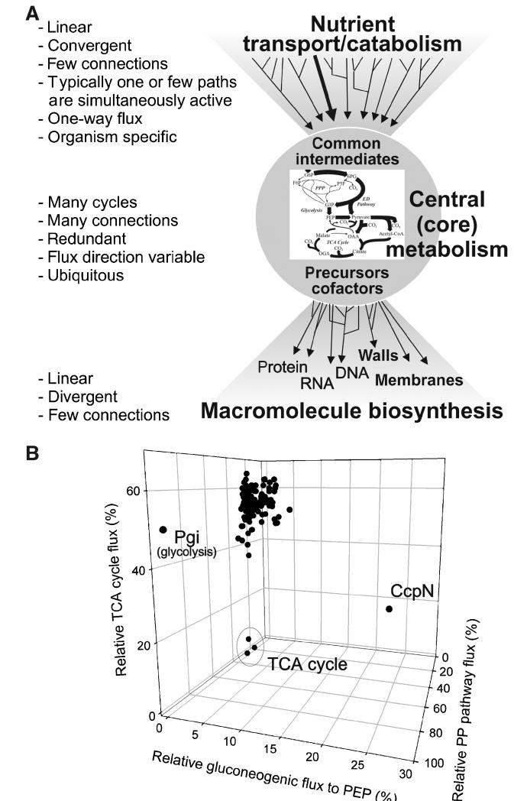

# Metabolic networks in motion: 13C-based flux analysis

#### Uwe Sauer*

Institute of Molecular Systems Biology, ETH Zurich, Switzerland

- * Corresponding author. Institute of Molecular Systems Biology, ETH Zurich, Wolfgang-Pauli-Str. 16, Zu¨rich 8093, Switzerland. Tel.: þ 41 44 633 3672; Fax: þ 41 44 633 1051; E-mail: sauer@ethz.ch
Received 21.7.06; accepted 6.10.06

Many properties of complex networks cannot be understood from monitoring the components—not even when comprehensively monitoring all protein or metabolite concentrations—unless such information is connected and integrated through mathematical models. The reason is that static component concentrations, albeit extremely informative, do not contain functional information per se. The functional behavior of a network emerges only through the nonlinear gene, protein, and metabolite interactions across multiple metabolic and regulatory layers. I argue here that intracellular reaction rates are the functional end points of these interactions in metabolic networks, hence are highly relevant for systems biology. Methods for experimental determination of metabolic fluxes differ fundamentally from component concentration measurements; that is, intracellular reaction rates cannot be detected directly, but must be estimated through computer model-based interpretation of stable isotope patterns in products of metabolism.

Molecular Systems Biology 14 November 2006;

doi:10.1038/msb4100109

Subject Categories: metabolic and regulatory networks Keywords: 13C experiments; fluxome; metabolic engineering; metabolic pathways; network analysis

#### Fluxes quantify the integrated network response of gene–protein–metabolite interactions

Metabolic networks, in particular microbial ones, are arguably the best characterized complex biological networks. We know most of the reactions, the enzymes that catalyze them, the genes that encode the enzymes, and the involved chemicals and cofactors. From this comprehensive knowledge of the components, the network topology of enzyme and metabolite interactions has been worked out to a great extent in many organisms. In contrast to protein–protein interaction or regulation networks with many yet unknown components, metabolic interactions can be mathematically represented at the genome scale (Price et al, 2004). The modern 'omics' arsenal assesses particular system variables through global monitoring of component concentrations. Proteomics or, more indirectly, transcriptomics record changes in the concentration

of the catalyzing enzymes, whereas metabolomics attempts to monitor concentration changes of the small chemical species within a cell (Nielsen and Oliver, 2005).

The concentration state of these components, however, is not the true functional bottom line of cellular operation, and hence insufficient to assess how component interaction is organized into networks with newly emerging functions and capabilities (Hellerstein and Murphy, 2004). Beyond methods to quantify component concentrations, systems biology thus requires experimental methods for (i) elucidating component interactions (e.g. physical protein–protein (Cusick et al, 2005) and protein–DNA (Workman et al, 2006) or indirect epigenetic gene–gene interactions (Tong et al, 2001)) and (ii) quantitative monitoring of integrated network responses that result from the highly nonlinear interaction of the various components across functional levels (Aderem, 2005). By tracking single molecule, virus, or organelle movement inside cells, modern imaging techniques are an example of integrated response analysis, in this case of physical behavior (Damm and Pelkmans, 2006). A particularly relevant application is the quantitative analysis of the dynamics within macromolecular assemblies, for example the protein flux of and along the cellular cytoskeleton where molecular and genetic interactions generate mechanical forces (Wittmann et al, 2001; Danuser and Waterman-Storer, 2006).

For metabolic networks, the integrated network response is given by small molecule fluxes (i.e. in vivo reaction rates) that result from all catalytic protein–metabolite interactions and the regulatory interactions at the genetic, protein modification, allosteric, and kinetic level (Figure 1). Without resolving the details, 13C-based flux analysis quantifies the integrated output of these component interactions (Stephanopoulos, 1999; Hellerstein, 2003; Sauer, 2004; Fernie et al, 2005), hence has become attractive for applications in microbes, plants (Schwender et al, 2004a; Sriram et al, 2004), and higher organisms (Hellerstein and Murphy, 2004).

After a decade of intense research and development, 13Cbased flux methods can routinely track steady-state fluxes in microbes grown on single-carbon substrates. In contrast to higher organisms, where current methods are restricted to the local detection of one or few relative fluxes or molecular turnover (Kelleher, 2001; Sherry et al, 2004), absolute fluxes through larger networks can be determined in microbes, hence the term fluxome was coined (Sauer et al, 1999). Here I will highlight how such network flux analysis is used to infer metabolic system behavior and design principles in microbes to illustrate that flux analysis is a key methodology for systems biology of metabolism.

# The principle of 13C-based metabolic flux analysis

In contrast to static, snapshot-like concentrations of transcripts, proteins, or metabolites, fluxes are the time-dependent motion of metabolites through a network, hence cannot be measured directly. Instead, they must be inferred from measurable quantities through computer model-based interpretation. One measurable quantity is uptake and production rate (i.e. fluxes in and out of cells), which can be balanced in assumed reaction networks to provide first estimates on some intracellular fluxes (Stephanopoulos, 1999). Such stoichiometric flux analysis is inherently limited in its capacity to derive new conclusions on intracellular network operation because the results are strongly based on assumptions and not on data. To experimentally quantify pathway activity, additional intracellular information must be obtained from stable isotope tracer experiments. Typically, 13C-labeled substrates are fed to a growing cell population until the isotope label is distributed throughout the network. As a function of the particular distribution of fluxes in an organism, specific labeling patterns occur in the metabolic intermediates (Wiechert, 2001; Sauer, 2004). The task now is to measure

Figure 1 Schematic overview of the relationship between concentrationbased, compositional, and functional units in metabolic networks. Regulatory interactions are indicated by dashed lines. Transcript–transcript interactions are based on average operon structures and ribosomal RNA interactions. Proteome interaction estimates include an average of 6–7 protein–protein interactions (Szallasi, 2006) as well as protein–DNA, protein–RNA, and protein–membrane interactions. Metabolic interactions include biochemical transformations and regulatory interactions between metabolites, RNA, and protein. The number of different proteins includes differences in folding, size, and covalent modifications.

Figure 2 (A) Schematic flow chart of 13C-based metabolic flux analysis. Exemplary results for flux ratios and absolute fluxes are given in the bottom boxes. (B) Example of inferring relative fluxes through the three initial pathways of glucose catabolism in E. coli from mass spectrometry data. A positional label is introduced by feeding [1-13C]glucose, and 13C-pattern are detected in alanine, which derives its carbon backbone directly from pyruvate. Although unique isotope pattern occurs in intact alanine molecules, the lack of positional information in the detected mass distribution cannot discriminate between glycolysis and the ED pathway. For discrimination of these two pathways, additionally the C2–C3 moiety of alanine must be analyzed, which occurs by fragmentation in some MS instruments. For flux ratios, the relative contribution of these pathways to the formation of alanine (pyruvate) is calculated directly from the detected abundance of the different mass isotope isomers by probabilistic equations. For absolute fluxes, a best-fit flux solution is obtained by extensive computations that seek to minimize the error between fitted intracellular fluxes not only to the six shown, but also to all other detected mass spectra and physiological uptake and production rates.

those 13C patterns and to reconstitute the network distribution of flux from the measured data (Figure 2A).

The most frequently employed isotope tracer method detects the 13C patterns in 10–15 protein-bound amino acids (Figure 2A). As the carbon backbones of eight key intermediates are conserved in amino acids, protein is a stable and abundant source of labeling information, which enables

determination of central metabolic fluxes during steady-state growth from as little as 2 mg cells (Szyperski, 1995; Marx et al, 1996; Fischer and Sauer, 2003b; Grotkjaer et al, 2004). A potentially much richer source of information is the hundreds of free intracellular metabolites themselves that would allow resolving fluxes even beyond central metabolism and also to assess dynamic flux changes. Their comparatively low concentrations, diverse chemical nature, and high turnover rates in the range of seconds, however, severely hamper metabolite-based flux analysis, but several promising methods are currently under development (van Winden et al, 2005; Wiechert and No¨h, 2005; No¨h and Wiechert, 2006).

How does one obtain flux data from labeling patterns? At least two principally different approaches can infer fluxes from 13C data that are obtained by either nuclear magnetic resonance (NMR) (Marx et al, 1996; Sauer et al, 1997; Portais and Delort, 2002) or mass spectrometry (MS) (Gombert et al, 2001; Fischer and Sauer, 2003b; Klapa et al, 2003). In the first approach, 13C data, extracellular fluxes, and biosynthetic requirements are simultaneously integrated with computer models (Figure 2A). The flux distribution is typically identified by iterative fitting of fluxes to the measured data, whereby the difference between observed and simulated isotope spectra is minimized (Wiechert, 2001). Essentially, this is a parameterfitting procedure, where the relation between unknown fluxes and measured data is described by mathematical models of varying complexity.

The second method relies on a direct and local interpretation of selected labeling patterns, for example, the mass distribution of pyruvate or its surrogate alanine (Figure 2B). For this purpose, a probabilistic equation is derived that quantifies the relative contribution of converging pathways to the formation of a particular metabolite (a flux ratio) from a particular combination of NMR or mass pattern (Szyperski, 1995; Fischer and Sauer, 2003b). Whereas the fitting method indirectly infers absolute flux values throughout the network, the flux ratio method provides direct evidence for the relative in vivo activity of a given reaction (Figure 2A). The drawback of this analytical method is its restriction to 10–15 preselected fluxes that are directly accessible from the data; hence these complementary approaches are ideally applied to the same 13C data set (Emmerling et al, 2002; Hua et al, 2003; Fischer et al, 2004). Recently, the flux ratio approach was extended to the estimation of absolute fluxes that is applicable also at higher throughput (Fischer et al, 2004; Fischer and Sauer, 2005). Further details on flux analysis can be found in several recent reviews (Wiechert, 2001; Sauer, 2004; Schwender et al, 2004b; Wiechert and No¨h, 2005; Ratcliffe and Shachar-Hill, 2006).

In practice, the focus of flux analysis is typically not on the entire network of up to a thousand reactions, but rather on the 50–100 reactions of central metabolism. This core set of reactions establishes a ubiquitous and interconnected network that catalyzes the major material flows (Figure 3A). Superimposed on the metabolic network are multiple layers of control that ensure optimal usage of pathways and even the direction of flux to meet cellular requirements under different environmental conditions. To unravel and quantify such control mechanisms is a key goal of systems biology.

Figure 3 (A) Bow-tie abstraction of metabolic network organization (after (Csete and Doyle, 2004; Stelling et al, 2006). (B) Metabolic fluxes through three major pathways in the central metabolism of 137 B. subtilis knockout mutants. The phosphoglucose isomerase (Pgi) mutant and three mutants in genes encoding for enzymes of the TCA cycle are expected outliers because one of the plotted pathways was blocked. All other mutants cluster in a distinct region of this 3D flux space with the sole exception of the novel transcriptional regulator CcpN (Servant et al, 2005). Data are taken from Fischer and Sauer (2005).

#### Network operation versus pathway concept

The traditional use of isotopic tracer experiments was the structural identification of biochemical reactions that constitute the metabolic pathways that now populate our textbooks. In the heydays of metabolic biochemistry in the 1940–1960s, tracer experiments were the key method to prove in vivo operation of individual pathways within the bewildering complexity of the then largely unknown metabolic network. These experiments essentially followed the logic that first hypothesis on the chemical reactions within a pathway were generated. Subsequently, tracer experiments were designed such that tracing isotopically labeled atoms to particular positions of pathway products could discriminate between the

initial hypotheses. The initial dominance of radioactive tracers has been almost completely replaced by stable isotopes and their analysis through NMR or MS, both for pathway elucidation (Bacher et al, 1999) and for flux analysis (Szyperski, 1998).

To facilitate comprehension, textbooks structure metabolic networks into pathways and cycles. Within the reality of the network, however, our familiar pathways are biochemical concepts that often include assumptions on functionalities. Although incredibly helpful for teaching, these assumptions might be oversimplifications or simply incorrect under certain conditions. Here, I argue that experimental flux analysis is crucial to observe and eventually understand operation of networks. By placing pathway activity in a quantitative network context, this goes beyond pathway identification. A prominent example is the pentose phosphate pathway, whose generally considered function is supply of precursors and redox equivalents for biosynthesis. In many organisms, however, its function is more properly described as a second catabolic pathway (Fuhrer et al, 2005). In the next paragraph, methodological aspects of elucidating network topology are outline.

In principle, flux analysis takes the network perspective, but the models used for flux analysis often exclude certain pathways/reactions on the basis of genetic evidence because it simplifies 13C data interpretation. Such qualitative expression level information, however, does not necessarily exclude the presence of active protein, and some discrepancies in reported flux data can be traced back to incorrect network structures (van Winden et al, 2001a). If carried out with proper care, 13C-based flux analysis offers the experimental capacity to actually determine the topology of active pathways and reactions from data. Particularly valuable is flux ratio analysis, as it yields direct and independent evidence for the in vivo operation of pathways in central metabolism (Szyperski, 1995; Emmerling et al, 2002; Fischer et al, 2004). For network flux-fitting procedures, two methods can support the inference of network topology: (i) optimal experimental design for labeling experiments that provide maximum information for particular regions of the network (Mo¨llney et al, 1999; Petersen et al, 2000; Fischer et al, 2004) and (ii) rigorous identifiability analysis of an existing data set (van Winden et al, 2001b; Isermann and Wiechert, 2003; Rantanen et al, 2006). When adding noise to the data, the latter is extended to statistical identifiability analysis that reveals how well a particular flux is actually determined from a data set, which can also be done for subnetworks (Antoniewicz et al, 2006). Model discrimination based on statistical evaluation of how well different network models fit a data set is then used to identify the correct topology of active reactions (Klapa et al, 1999; Dauner et al, 2001; Arauzo-Bravo and Shimizu, 2003; Yang et al, 2005). Thus, several methods support inference of the condition-dependent network topology and the following two paragraphs highlight how flux data provide new network insights.

Well beyond classical tracer studies, modern 13C-based flux analyses unraveled many surprises on the operation of the supposedly well-understood central metabolic network. A prominent example of unexpected activity of a principally known pathway is the Entner–Doudoroff pathway (Fuhrer et al, 2005), in particular in actinomycetes, where other data had suggested that different pathways would be operational instead (Gunnarsson et al, 2004; Borodina et al, 2005). A seemingly widespread phenomenon is gluconeogenic flux during otherwise glycolytic metabolism around the PEP– pyruvate–oxaloacetate node, although expression data suggest that the corresponding genes are not actively transcribed. Simultaneous operation of glycolytic and gluconeogenic reactions at this key node led to, in some cases, substantial loss of energy via ATP-dissipating futile cycles in Escherichia coli (Emmerling et al, 2002; Yang et al, 2003), Bacillus subtilis (Sauer et al, 1997), Corynebacterium glutamicum (Petersen et al, 2000), and others (Fuhrer et al, 2005). From the pathway concept that attempts to assign specific functions, such futile cycling is neither predicted nor understood, but may offer a flexible control strategy to rapidly reorganize network fluxes upon environmental changes.

The discrepancy between the network reality and the traditional pathway concept is highlighted by the recent 13Cbased discovery of the PEP-glyoxylate cycle in E. coli (Fischer and Sauer, 2003a), which was hypothesized earlier on theoretical grounds (Liao et al, 1996; Schuster et al, 1999). The key reactions of this bifunctional anabolic and catabolic cycle are PEP carboxykinase and the glyoxylate shunt, whose previously known functions are gluconeogenesis and anaplerosis, respectively, during growth on substrates that feed into the tricarboxylic acid (TCA) cycle. Their conjoint operation during glucose metabolism, however, effectively generates a novel cycle whose catabolic function is in sharp contrast to their known individual functions. The cycle's overall stoichiometry is almost identical to the classical TCA cycle, the previously exclusive textbook route for full oxidation of hexoses to CO2. Thus, even the seemingly well-understood central metabolism in microbes bears surprises, and the network perspective is expected to be particularly critical for higher cell or organ metabolism.

#### Regulation and control of flux

Beyond qualitative, mostly genetic knowledge, our current understanding on how cells actually control their fluxes is limited. Lacking the beauty of genetic on/off regulation, overlapping layers of genetic and metabolic regulations, often with opposite directions, influence metabolic fluxes in a highly condition-dependent manner. Current key questions are as follows: which mechanisms control flux through a particular pathway? To what extent? When is a given mechanism relevant? How can we manipulate fluxes? Such questions are currently revisited by two approaches that link particular control mechanisms to experimental flux data.

The first approach follows the logic of classical metabolic control analysis (MCA), which defines a quantitative link between flux through a particular pathway and the activity of its constituent enzymes (Fell, 1997). Extended to regulation, the current focus is to quantitatively disentangle metabolic from hierarchical (all processes that determine active enzyme concentrations) regulation of flux (ter Kuile and Westerhoff, 2001). Downregulation of glucose influx in E. coli was thus shown to be either fully hierarchical or mixed metabolic/ hierarchical, depending on whether nitrogen or glucose starvation was imposed, respectively (Rossell et al, 2005). Extending such regulation analysis from individual reactions to the sequential reactions of glycolysis, flux regulation induced by nutrient starvation was demonstrated to be inhomogeneous in the various constituent enzymes of the pathway, varying from fully hierarchical to exclusively metabolic (Rossell et al, 2006). This MCA-based regulation analysis can quantitatively describe the different levels of flux regulation through single reactions or linear pathways, but not yet for the distribution of flux through the network.

The second line of research attempts to identify and quantify the mechanisms that actually control the distribution of flux between different pathways. In particular, transcriptional and protein level regulation of flux has become a focal point, primarily because it can be tackled through flux analysis in mutants. Although many regulator knockout mutants have a strong physiological phenotype, flux analysis can identify specific flux changes in the network of such mutants. Such specific flux changes imply that the deleted regulator modulates the relative distribution of flux in the network by inducing or repressing particular pathways.

In general, surprisingly few regulators appear to have a specific impact on the distribution of flux. Out of 19 B. subtilis and seven E. coli transcriptional regulators tested, only two and one, respectively, exhibited a specific impact on the flux distribution in central metabolism (Fischer and Sauer, 2005; Perrenoud and Sauer, 2005). These and similar results support the above conclusions from regulation analysis that, in particular, central metabolic fluxes are rarely regulated at the expression level alone. An extreme case of transcriptional regulation is CcpN, a newly identified repressor of two gluconeogenic genes (Servant et al, 2005), whose knockout caused a severe flux redistribution in basically all major pathways in B. subtilis (Fischer and Sauer, 2005) (Figure 3B). The response regulator ArcA is a well-known repressor of the TCA cycle genes under oxygen limitation in E. coli. In vivo flux data demonstrated, however, that it also controls TCA cycle fluxes under fully aerobic and anaerobic conditions (Perrenoud and Sauer, 2005). Other transcriptional regulators, whose specific flux impacts were recently described, are the carbon repressor CreA in Aspergillus nidulans (David et al, 2005) and the virulence regulator PrfA in Listeria monocytogenes (Eisenreich et al, 2006). In particular, the parallel glucose sensing pathways in the model yeast Saccharomyces cerevisiae have attracted interest, and recent flux data identified several regulators whose knockout can be used to partly alleviate glucose repression of the TCA cycle (Blank and Sauer, 2004; Raghevendran et al, 2004).

With the availability of complete knockout mutant libraries for many model organisms, systematic flux analyses of mutants with defects in signal transduction and transcriptional regulation are underway. Beyond functional mapping of the hierarchical regulation network that controls metabolism, such quantitative data on the relevance of particular signaling events will be important for the construction of computer models. Obviously, quantitative understanding of flux control in the network would also enable precise and subtle reengineering of cell factories (Vemuri and Aristidou, 2005), thus circumventing the current brute force knockout/overexpression strategies that perturb cellular operation in many, often unwanted ways.

#### Metabolic engineering of biotechnologically relevant flux states

The original driver for development of modern microbial flux methods was metabolic engineering that emerged about 15 years ago (Bailey, 1991). 13C-based flux methods since became a key analytical technology in support of biotechnological applications (Stephanopoulos, 1999; Sanford et al, 2002). Beyond simple description of network responses to verify success of genetic manipulations or absence of non-obvious limitations, well-designed flux studies also enabled to devise new, non-obvious metabolic engineering strategies. A successful example was the discovery of substantial ATP-dissipating futile cycle fluxes through the PEP carboxykinase in lysineproducing C. glutamicum (Petersen et al, 2000). Subsequent deletion of this activity significantly improved lysine production (Petersen et al, 2001). An interesting recent example comes from the Wittmann Lab, where several comparative flux analyses on different substrates suggested insufficient NADPH supply through the pentose phosphate pathway for high lysine production on fructose-based substrates (Kiefer et al, 2004; Wittmann et al, 2004). From these results, the nonobvious strategy to overexpress the glucose-repressed fructose 1,6-bisphosphatase was devised, and shown to significantly improve product yields on the industrially relevant substrates fructose and sucrose (Becker et al, 2005).

Nevertheless, flux data rarely reveal a direct engineering target, primarily because fluxes result from multiple component interactions and genetic manipulations must be made at the component level through, for example, overexpression of a gene. Hence, it is necessary to integrate flux and potentially other 'omics' data by means of computational methods to identify the most promising engineering strategies and to quantitatively understand—and thus predict—complex network operation, which is discussed next.

#### Fluxes as input for or predictions of computer modeling

The most accurate representation of metabolic networks and their regulation are mechanism-based kinetic or stochastic models that reflect both the static network stoichiometry and the dynamic interaction of its components as described by kinetic parameters and reaction mechanisms. For small subnetworks, such detailed dynamic models can predict intracellular flux responses, and experimental flux data can be used to (i) interrogate those predictions or (ii) as input data for parameter estimation. However, the complexity of realistic networks and the lack of knowledge on the actual reaction mechanisms as well as the unavailable parameters limited so far the success of dynamic models (Stelling, 2004). By considering only the generally known reaction stoichiometry, static metabolic models can be generated at the genome scale with around a thousand reactions (Schilling and Palsson, 2000; Price et al, 2004; Borodina and Nielsen, 2005). Such stoichiometric models enable

qualitative predictions of an organism's metabolism in steady state with metabolic fluxes as the key variable. This constraint-based modeling approach (flux balancing analysis) does not attempt to predict precisely what the network does, but rather to distinguish feasible from unfeasible flux states, based on the constraints of connections and reaction reversibilities in the network.

These genome-scale stoichiometric models provide a biochemically and genetically consistent framework for systematic generation and testing of hypotheses on metabolic functions. Experimental data on central metabolic fluxes are then used either to further constrain the space of feasible solutions in the entire reaction network (Wiback et al, 2004; Kuepfer et al, 2005; Herrgard et al, 2006a) or to test model predictions (Segre et al, 2002; Almaas et al, 2004). Another important application is in the experimental design of large-scale flux experiments because model predictions allow one to focus efforts on the most meaningful experiments (Blank et al, 2005). Ultimately, the goal of metabolic modeling is integration of quantitative experimental data on fluxes, metabolites, and proteins to explain and predict metabolic regulation and cellular phenotypes. One attempt to this end is the second generation of genomescale models that incorporate primarily literature-based transcriptional regulation using Boolean on/off rules (Covert et al, 2004; Barrett et al, 2005). Already with such relatively crude extensions of the network stoichiometry, large-scale transcript data can be integrated in the network context and potential regulation mechanisms may thus be identified (Herrgard et al, 2006b). Similar in scope is an approach to use probabilistic graphical models to either infer or explicitly include hypotheses on links between metabolic reactions and transcription (Yeang and Vingron, 2006).

More quantitative integration may be achieved through an important extension of the constraint-based framework that considers additionally thermodynamic principles (Ku¨mmel et al, 2006). Such network-embedded thermodynamic analysis is a conceptual framework for quantitative integration of metabolite concentration and flux data. Beyond its capacity to verify consistency of flux and metabolite data and to predict concentration ranges of unmeasured metabolites, the results can also reveal putative sites of active (genetic or metabolic) regulation. Another development is hybrid models that combine stoichiometry and kinetics. By extending large stoichiometric models with a local kinetic model (for example of a particular branch point), the dynamics of a specific metabolic regulation process can be assessed in the context of the entire network (Petersen et al, 2003). For the lack of data, such hybrid models focus on one or few dynamic regulation sites. An alternative is to define a surrogate for the missing details of kinetic regulation on the premise that biological systems have evolved objective-based control programs that can be mathematically represented in large-scale models. Kinetic parameters and the underlying objectives of the metabolic control structure are then identified from flux data (Varner, 2000). Somewhat related is a first attempt to extend the static constraint-based concept of flux balance analysis to dynamic metabolite concentrations (Luo et al, 2006). All approaches mentioned in this paragraph can potentially integrate these two different data types (rates and concentrations), which opens up the road to analyze dynamics of network regulation.

### Evolutionary 'design' of metabolism

In sharp contrast to the complexity of physical systems, such as sand dunes, where every particle can interact with each other, biological complexity is highly structured and functionally shaped through evolution. A key goal of systems biology is to identify the common evolution ('design') principles that underlie structure, regulation, and operation of networks. Several recent theoretical analyses provided new insights into structural design principles of metabolism. An almost obvious one is the 'bow-tie' structure of metabolism; that is, many parallel sequential pathways for nutrient degradation merge into a core set of reactions from which again a large number of biosynthetic pathways fan out (Csete and Doyle, 2004) (Figure 3A). This ubiquitous and highly interconnected core set of reactions is largely redundant with the classical central carbon metabolism (Ma and Zeng, 2003). Not based on flux but on promoter activity data, the just-in-time transcriptional program of metabolic pathways was recently identified as a regulation design principle of biosynthetic pathways in E. coli (Zaslaver et al, 2004). It describes the wave-like temporal expression, where enzymes at the beginning of a biosynthetic pathway are transcribed from promoters with shorter response times and higher maximal activity than enzymes that are further down the pathway.

With established methods for higher-throughput flux analysis under steady-state conditions (Fischer et al, 2004), we can now begin to ask key systems biology questions about the design principles of network operation. In contrast to the generally rather variable and/or noisy concentration data of transcripts and metabolites, large-scale flux studies from bacteria and yeast revealed a surprisingly rigid distribution of fluxes that appears to be a general design principle of metabolic network operation in microbes (Blank et al, 2005; Fischer and Sauer, 2005). Whereas the overall flux into cells and the rate of growth varied significantly between mutants, and thus most likely also transcript and/or metabolite concentrations, the relative distribution of flux into different pathways remained remarkably constant (Figure 3B). Apparently, metabolism is in a stable state that is robust towards random genetic perturbations, but responds flexibly to environmental stimuli.

Another unexpected observation was mutants with higher rates and higher efficiency of growth in B. subtilis when central regulators for developmental programs such as sporulation or flagella formation were deleted (Fischer and Sauer, 2005). This led to the hypothesis of the stand-bymode design principle, where metabolism is kept in a suboptimal state in anticipation of changing environmental conditions. This stand-by-mode is probably more specific to microbes with developmental programs. Combining flux data with genome-scale stoichiometric models, there is currently significant interest to infer underlying 'rationales' of metabolic evolution by asking questions such as whether cells optimize their fluxes to maximize biomass formation (Fong and Palsson, 2004; Fong et al, 2006) or whether they minimize redirection or on/off regulation of flux changes upon genetic perturbations (Segre et al, 2002; Shlomi et al, 2005).

#### Future directions

To identify the actual control mechanisms, the need for integration of flux data with other genome-wide data is clearly recognized. As this can only be achieved through mathematical modeling, we can expect significant progress on computational methods for data integration in the near future, and several promising approaches were discussed in the modeling section. Based on the current methods, flux studies will likely identify further microbial design principles and modes of network operation. The available experimental flux methods themselves, however, suffer from a number of limitations that call for improvements.

A precondition of current flux analysis methods is metabolic steady state; that is, all fluxes must be constant over the course of the tracer experiment (Wiechert and No¨h, 2005). Although experiments can be set up to meet this requirement, continuously changing environments are a biological reality. Hence, development of dynamic flux methods is an obvious necessity that is currently followed by two approaches. In the first, the required steady-state condition is reduced by detecting the isotope patterns in free intracellular intermediates (van Winden et al, 2005). As the pool size of primary metabolites is orders of magnitude smaller than the normally analyzed proteinogenic pool of amino acids, isotopic steady state is reached much faster. Labeling experiments may thus be shortened from several hours (multiple cell divisions) to minutes, although exchange of label with large pools of unlabeled intracellular macromolecules may extend the labeling period to 1–2 h. This method will also be applicable to complex media, because central intermediates contain information-bearing label but not the normally used amino acids that are imported from the complex components. These benefits come at the cost of laborious protocols for rapid sampling of large cell quantities, instantaneous quenching of metabolic activity, and sensitive high-end MS analyses of chemically diverse species.

In contrast to the above detection of relative changes in the 13C patterns as the information-bearing unit, the second approach exploits the kinetic information of label distribution during the first minute of isotopic instationarity (but metabolic stationarity) (No¨h and Wiechert, 2006). In addition to monitoring time-dependent accumulation of tracer molecules in intracellular metabolites, also (many) pool sizes must be known. The fluxes are then calculated through systems of differential equations from pool sizes and the rate of label accumulation. As the computational effort to solve the large differential equation systems is currently extremely high, further developments are necessary (No¨h et al, 2006). Both dynamic flux methods will allow tackling a number of key problems, for example, flux changes during culture transients or the cell cycle in synchronized cells.

Lastly, global tracking of small molecule fluxes in mammalian cells, perfused organs, or humans is highly relevant for monitoring and understanding of disease phenotypes, nutrition, or drug metabolism. Unfortunately, the current method repertoire is limited to the detection of one or few relative fluxes or macromolecular turnover (Hellerstein and Murphy, 2004; McCabe and Previs, 2004; Sherry et al, 2004). One problem is the continuously changing physiology where fluxes typically vary long before metabolite pools attain isotopic steady state (Kelleher, 2001). Another fundamental problem is network complexity with temporal and spatial separation of metabolic tasks between different compartments, cell types, and organs. As flux analysis depends on a mathematical framework for the interpretation of isotope tracer patterns, two key issues currently preclude network flux analysis in higher organisms. First, as a prerequisite for model construction, our structural knowledge on all possible distributions of tracer atoms in large, possibly multicellular networks is incomplete, in particular for tracers such as 2 H that exchange with water. Second and more importantly, it is extremely difficult to acquire sufficient data to resolve fluxes in such complicated models. A conceptually novel solution is model-independent fluxome profiling that was demonstrated for genetic variant discrimination in microbes from 2 H and 13C experiments (Zamboni and Sauer, 2004), but is readily applicable to higher organisms when labeling patterns are detected in a sufficient number of intracellular metabolites. Akin to concentrationbased 'omics' analyses, fluxome profiling relies exclusively on experimental data—isotope distributions in this case—and multivariate statistical analysis. The approach lacks the biochemical resolution of model-based flux analyses, but is quantitative in terms of relative flux differences. Hence, it can be used to discriminate genetic variants, drug toxicity, nutrition, or disease states of higher cells and organisms based on their functional flux phenotype.

#### Conclusions

Metabolic flux analysis based on stable isotope experiments is a quantitative method to assess gene, protein, and metabolite interactions within metabolic networks. It thus is an important complement to the detection of global transcript, protein, and metabolite concentrations—the network components. Although neither of the component 'omes' is a functional end point of cellular processes but rather contains potentially valuable indicators of such processes, fluxes are the integrated functional output of a metabolic network. Owing to their inherent network perspective, flux data are highly relevant for fundamental systems biology of metabolic networks and for all applications that focus on manipulating or monitoring metabolic behavior in areas like metabolic engineering, nutrition, and medicine.

# Acknowledgements

I am grateful to Matthias Heinemann, Wolfgang Wiechert, and Nicola Zamboni for critical remarks on the manuscript.

# References

- Aderem A (2005) Systems biology: its practice and challenges. Cell 121: 511–513
- Almaas E, Kovacs B, Vicsek T, Oltavi ZN, Barabasi AL (2004) Global organization of metabolic fluxes in the bacterium Escherichia coli. Nature 427: 839–843
- Antoniewicz MR, Kelleher JK, Stephanopoulos G (2006) Determination of confidence intervals of metabolic fluxes estimated from stable isotope measurements. Metab Eng 8: 324–337
- Arauzo-Bravo MJ, Shimizu K (2003) An improved method for statistical analysis of metabolic flux analysis using isotopomer mapping matrices with analytical expression. J Biotechnol 105: 117–133
- Bacher A, Rieder C, Eichinger D, Arigoni D, Fuchs G, Eisenreich W (1999) Elucidation of novel biosynthetic pathways and metabolic flux patterns by retrobiosynthetic NMR analysis. FEMS Microbiol Rev 22: 567–598
- Bailey JE (1991) Toward a science of metabolic engineering. Science 252: 1668–1675
- Barrett CL, Herring CD, Reed JL, Palsson BO (2005) The global transcriptional regulatory network for metabolism in Escherichia coli exhibits few dominant functional states. Proc Natl Acad Sci USA 102: 19103–19108
- Becker J, Klopprogge C, Zelder O, Heinzle E, Wittmann C (2005) Amplified expression of fructose 1,6-bisphosphatase in Corynebacterium glutamicum increases in vivo flux through the pentose phosphate pathway and lysine production on different carbon sources. Appl Environ Microbiol 71: 8587–8596
- Blank LM, Kuepfer L, Sauer U (2005) Large-scale 13C-flux analysis reveals mechanistic principles of metabolic network robustness to null mutations in yeast. Genome Biol 6: R49
- Blank LM, Sauer U (2004) TCA cycle activity in Saccharomyces cerevisiae is a function of the environmentally determined specific growth and glucose uptake rate. Microbiology 150: 1085–1093
- Borodina I, Nielsen J (2005) From genomes to in silico cells via metabolic networks. Curr Opin Biotechnol 16: 350–355
- Borodina I, Scho¨ller C, Eliasson A, Nielsen J (2005) Metabolic network analysis of Streptomyces tenebrarius, a Streptomyces species with an active Entner–Doudoroff pathway. Appl Environ Microbiol 71: 2294–2302
- Covert MW, Knight EM, Reed JL, Herrgard MJ, Palsson BO (2004) Integrating high-throughput and computational data elucidates bacterial networks. Nature 429: 92–96
- Csete ME, Doyle J (2004) Bow ties, metabolism and disease. Trends Biotechnol 22: 446–450
- Cusick ME, Klitgord N, Vidal M, Hill DE (2005) Interactome: gateway into systems biology. Hum Mol Genet 14: R171–R181
- Damm EM, Pelkmans L (2006) Systems biology of virus entry in mammalian cells. Cell Microbiol 8: 1219–1227
- Danuser G, Waterman-Storer CM (2006) Quantitative fluorescent speckle microscopy of cytoskeleton dynamics. Annu Rev Biophys Biomol Struct 35: 361–387
- Dauner M, Bailey JE, Sauer U (2001) Metabolic flux analysis with a comprehensive isotopomer model in Bacillus subtilis. Biotechnol Bioeng 76: 144–156
- David H, Krogh AM, Roca C, Akesson M, Nielsen J (2005) CreA influences the metabolic fluxes of Aspergillus nidulans during growth on glucose and xylose. Microbiology 151: 2209–2221
- Eisenreich W, Slaghuis J, Laupitz R, Bussemer J, Stritzke RJ, Schwarz C, Schwarz R, Dandekar T, Goebel W, Bacher A (2006) 13C isotopologue perturbation studies of Listeria monocytogenes carbon metabolism and its modulation by the virulence regulator PrfA. Proc Natl Acad Sci USA 103: 2040–2050
- Emmerling M, Dauner M, Ponti A, Fiaux J, Hochuli M, Szyperski T, Wu¨thrich K, Bailey JE, Sauer U (2002) Metabolic flux responses to pyruvate kinase knockout in Escherichia coli. J Bacteriol 184: 152–164
- Fell DA (1997) Understanding the Control of Metabolism. London: Portland Press
- Fernie AR, Geigenberger P, Stitt M (2005) Flux an important, but neglected, component of functional genomics. Curr Opin Plant Biol 8: 174–182
- Fischer E, Sauer U (2003a) A novel metabolic cycle catalyzes glucose oxidation and anaplerosis in hungry Escherichia coli. J Biol Chem 278: 46446–46451
- Fischer E, Sauer U (2003b) Metabolic flux profiling of Escherichia coli mutants in central carbon metabolism by GC–MS. Eur J Biochem 270: 880–891
- Fischer E, Sauer U (2005) Large-scale in vivo flux analysis shows rigidity and sub-optimal performance of Bacillus subtilis metabolism. Nat Genet 37: 636–640
- Fischer E, Zamboni N, Sauer U (2004) High-throughput metabolic flux analysis based on gas chromatography-mass spectrometry derived 13C constraints. Anal Biochem 325: 308–316
- Fong SS, Nanchen A, Palsson BO, Sauer U (2006) Latent pathway activation and increased pathway capacity enable Escherichia coli adaptation to loss of key metabolic enzymes. J Biol Chem 281: 8024–8033
- Fong SS, Palsson BO (2004) Metabolic gene-deletion strains of Escherichia coli evolve to computationally predicted growth phenotypes. Nat Genet 36: 1056–1058
- Fuhrer T, Fischer E, Sauer U (2005) Experimental identification and quantification of glucose metabolism in seven bacterial species. J Bacteriol 187: 1581–1590
- Gombert AK, dos Santos MM, Christensen B, Nielsen J (2001) Network identification and flux quantification in the central metabolism of Saccharomyces cerevisiae under different conditions of glucose repression. J Bacteriol 183: 1441–1451
- Grotkjaer T, Akesson M, Christensen B, Gombert AK, Nielsen J (2004) Impact of transamination reactions and protein turnover on labeling dynamics in 13C-labeling experiments. Biotechnol Bioeng 86: 209–216
- Gunnarsson N, Mortensen UH, Sosio M, Nielsen J (2004) Identification of the Entner–Doudoroff pathway in an antibiotic-producing actinomycete species. Mol Microbiol 52: 895–902
- Hellerstein MK (2003) In vivo measurement of fluxes through metabolic pathways: the missing link in functional genomics and pharmaceutical research. Annu Rev Nutr 23: 379–402
- Hellerstein MK, Murphy E (2004) Stable isotope-mass spectrometric measurements of molecular fluxes in vivo: emerging applications in drug development. Curr Opin Mol Ther 6: 249–264
- Herrgard MJ, Fong SS, Palsson BO (2006a) Identification of genomescale metabolic network models using experimentally measured flux profiles. PLOS Comp Biol 2: 676–686
- Herrgard MJ, Lee BS, Portnoy V, Palsson BO (2006b) Integrated analysis of regulatory and metabolic networks reveals novel regulatory mechanisms in Saccharomyces cerevisiae. Genome Res 16: 627–635
- Hua Q, Yang C, Baba T, Mori H, Shimizu K (2003) Responses of the central carbon metabolism in Escherichia coli to phosphoglucose isomerase and glucose-6-phosphate dehydrogenase knockouts. J Bacteriol 185: 7053–7067
- Isermann N, Wiechert W (2003) Metabolic isotopomer labeling systems. Part II: structural identifiability analysis. Mathods Biosci 183: 175–214
- Kelleher JK (2001) Flux estimation using isotopic tracers: common ground for metabolic physiology and metabolic engineering. Metab Eng 3: 100–110
- Kiefer P, Heinzle E, Zelder O, Wittmann C (2004) Comparative metabolic flux analysis of lysine-producing Corynebacterium glutamicum cultured on glucose or fructose. Appl Environ Microbiol 70: 229–239
- Klapa MI, Aon JC, Stephanopoulos G (2003) Systematic quantification of complex metabolic flux networks using stable isotopes and mass spectrometry. Eur J Biochem 270: 3525–3542
- Klapa MI, Park SM, Sinskey AJ, Stephanopoulos G (1999) Metabolite and isotopomer balancing in the analysis of metabolic cycles. Biotechnol Bioeng 62: 375–391
- Kuepfer L, Sauer U, Blank LM (2005) Metabolic functions of duplicate genes in Saccharomyces cerevisiae. Genome Res 15: 1421–1430
- Ku¨mmel A, Panke S, Heinemann M (2006) Putative regulatory sites unraveled by network-embedded thermodynamic analysis of metabolome data. Mol Syst Biol 2: 34
- Liao JC, Hou S-Y, Chao YP (1996) Pathway analysis, engineering, and physiological considerations for redirecting central metabolism. Biotechnol Bioeng 52: 129–140
- Luo R-Y, Liao S, Tao G-Y, Li Y-Y, Zeng S, Li Y-X, Luo Q (2006) Dynamic analysis of optimality in mycocardial energy metabolism under normal and ischemic conditions. Mol Syst Biol 2: 31
- Ma HW, Zeng AP (2003) The connectivity structure, giant strong component and centrality of metabolic networks. Bioinformatics 19: 1423–1430
- Marx A, de Graaf AA, Wiechert W, Eggeling L, Sahm H (1996) Determination of the fluxes in the central metabolism of Corynebacterium glutamicum by nuclear magnetic resonance spectroscopy combined with metabolite balancing. Biotechnol Bioeng 49: 111–129
- McCabe BJ, Previs SF (2004) Using isotope tracers to study metabolism: application in mouse models. Metab Eng 6: 25–35
- Mo¨llney M, Wiechert W, Kownatzki D, de Graaf AA (1999) Bidirectional reaction steps in metabolic networks: IV. optimal design of isotopomer labeling experiments. Biotechnol Bioeng 66: 86–103
- Nielsen J, Oliver SG (2005) The next wave in metabolome analysis. Trends Biotechnol 23: 544–546
- No¨h K, Wahl A, Wiechert W (2006) Computational tools for isotopically instationary 13C labeling experiments under metabolic steady state conditions. Metab Eng 8: 554–577
- No¨h K, Wiechert W (2006) Experimental design principles for isotopically instationary 13C labeling experiments. Biotechnol Bioeng 94: 234–251
- Perrenoud A, Sauer U (2005) Impact of global transcriptional regulation by ArcA, ArcB, Cra, Crp, Cya, Fnr and Mlc on glucose catabolism in Escherichia coli. J Bacteriol 187: 3171–3179
- Petersen S, de Graaf AA, Eggeling L, Mo¨llney M, Wiechert W, Sahm H (2000) In vivo quantification of parallel and bidirectional fluxes in the anaplerosis of Corynebacterium glutamicum. J Biol Chem 275: 35932–35941
- Petersen S, Lieres E, de Graaf AA, Sahm H, Wiechert W (2003) A multiscale approach for the predictive modeling of metabolic regulation. In Metabolic Engineering in the Post Genomic Era, Kholodenko BN, Westerhoff HV (eds) pp 213–234. Wymondham, UK: Horizon Scientific Press
- Petersen S, Mack C, de Graaf AA, Riedel C, Eikmanns BJ, Sahm H (2001) Metabolic consequences of altered phosphoenolpyruvate carboxykinase activity in Corynebacterium glutamicum reveal anaplerotic regulation mechanisms in vivo. Metab Eng 3: 344–361
- Portais J-C, Delort A-M (2002) Carbohydrate cycling in microorganisms: what can 13C-NMR tell us? FEMS Microbiol Rev 26: 375–402
- Price ND, Reed JL, Palsson BO (2004) Genome-scale models of microbial cells: evaluating the consequences of constraints. Nat Rev Microbiol 2: 886–897
- Raghevendran V, Gombert AK, Christensen B, Kotter P, Nielsen J (2004) Phenotypic characterization of glucose repression mutants of Saccharomyces cerevisiae using experiments with 13C-labelled glucose. Yeast 21: 769–779
- Rantanen A, Mielikainen T, Rousu J, Maaheimo H, Ukkonen E (2006) Planning optimal measurements of isotopomer distributions for estimation of metabolic fluxes. Bioinformatics 15: 1198–1206
- Ratcliffe RG, Shachar-Hill Y (2006) Measuring multiple fluxes through plant metabolic networks. Plant J 45: 490–511
- Rossell S, van der Weijden CC, Lindenbergh A, van Tuijl A, Francke C, Bakker BM, Westerhoff HV (2006) Unraveling the complexity of flux regulation: a new method demonstrated for nutrient starvation in Saccharomyces cerevisiae. Proc Natl Acad Sci USA 103: 2166–2171
- Rossell S, van der Weijden CC, Kruckeberg AL, Bakker BM, Westerhoff HV (2005) Hierarchical and metabolic regulation of glucose influx in starved Saccharomyces cerevisiae. FEMS Yeast Res 5: 611–619
- Sanford K, Soucaille P, Whited G, Chotani G (2002) Genomics to fluxomics and physiomics—pathway engineering. Curr Opin Microbiol 5: 318–322
- Sauer U (2004) High-throughput phenomics: experimental methods for mapping fluxomes. Curr Opin Biotechnol 15: 58–63
- Sauer U, Lasko DR, Fiaux J, Hochuli M, Glaser R, Szyperski T, Wu¨thrich K, Bailey JE (1999) Metabolic flux ratio analysis of genetic and environmental modulations of Escherichia coli central carbon metabolism. J Bacteriol 181: 6679–6688
- Sauer U, Hatzimanikatis V, Bailey JE, Hochuli M, Szyperski T, Wu¨thrich K (1997) Metabolic fluxes in riboflavin-producing Bacillus subtilis. Nat Biotechnol 15: 448–452
- Schilling CH, Palsson BO (2000) Assessment of the metabolic capabilities of Haemophilus influenza Rd through a genome-scale pathway analysis. J Theor Biol 203: 249–283
- Schuster S, Dandekar T, Fell DA (1999) Detection of elementary flux modes in biochemical networks: a promising tool for pathway analysis and metabolic engineering. Trends Biotechnol 17: 53–60
- Schwender J, Goffman F, Ohlrogge J, Shachar-Hill Y (2004a) Rubisco without the Calvin cycle improves the carbon efficiency of developing green seeds. Nature 432: 779–782
- Schwender J, Ohlrogge J, Shachar-Hill Y (2004b) Understanding flux in plant metabolic networks. Curr Opin Plant Biol 7: 309–317
- Segre D, Vitkup D, Church GM (2002) Analysis of optimality in natural perturbed metabolic networks. Proc Natl Acad Sci USA 99: 15112–15117
- Servant P, Le Coq D, Aymerich S (2005) CcpN (YqzB), a regulator for CcpA-independent catabolite repression of Bacillus subtilis gluconeogenic genes. Mol Microbiol 55: 1435–1451
- Sherry AD, Jeffrey FM, Malloy CR (2004) Analytical solutions for 13C isotopomer analysis of complex metabolic conditions: substrate oxidation, multiple pyruvate cycles, and gluconeogenesis. Metab Eng 6: 12–24
- Shlomi T, Berkman O, Ruppin E (2005) Regulatory on/off minimization of metabolic flux changes after genetic perturbations. Proc Natl Acad Sci USA 102: 7695–7700
- Sriram G, Fulton D, Iyer V, Peterson JM, Zhou R, Westgate ME, Spalding MH, Shanks JV (2004) Quantification of compartmented metabolic fluxes in developing soybean embryos by employing biosynthetically directed fractional (13)C labeling, twodimensional [(13)C, (1)H] nuclear magnetic resonance, and comprehensive isotopomer balancing. Plant Physiol 136: 3043–3057
- Stelling J (2004) Mathematical models in microbial systems biology. Curr Opin Microbiol 7: 513–518
- Stelling J, Sauer U, Doyle FJI, Doyle J (2006) Complexity and robustness of cellular systems. In System Modeling in Cellular Biology: From Concepts to Nuts and Bolts, Szallasi Z, Stelling J, Periwal V (eds) pp 5–26. Cambridge, MA: MIT Press
- Stephanopoulos G (1999) Metabolic fluxes and metabolic engineering. Metab Eng 1: 1–11
- Szallasi Z (2006) Biological data acquisition for system level modeling—an exercise in the art of compromise. In System Modeling in Cellular Biology: From Concepts to Nuts and Bolts, Szallasi Z, Stelling J, Periwal V (eds) pp 201–220. Cambridge, MA: MIT Press
- Szyperski T (1995) Biosynthetically directed fractional 13C-labeling of proteinogenic amino acids: an efficient analytical tool to investigate intermediary metabolism. Eur J Biochem 232: 433–448
- Szyperski T (1998) 13C-NMR, MS and metabolic flux balancing in biotechnological research. Q Rev Biophys 31: 41–106
- ter Kuile BH, Westerhoff HV (2001) Transcriptome meets metabolome: hierarchical and metabolic regulation of the glycolytic pathway. FEBS Lett 200: 169–171
- Tong AH, Evangelista M, Parsons AB, Xu H, Bader GD, Page N, Robinson M, Raghibizadeh S, Hogue CW, Bussey H, Andrews B, Tyers M, Boone C (2001) Systematic genetic analysis with ordered arrays of yeast deletion mutants. Science 294: 2364–2368
- van Winden W, Verheijen P, Heijnen JJ (2001a) Possible pitfalls of flux calculations based on 13C-labeling. Metab Eng 3: 151–162
- van Winden WA, van Dam JC, Ras C, Kleijn RJ, Vinke JL, van Gulik WM, Heijnen JJ (2005) Metabolic-flux analysis of Saccharomyces cerevisiae CEN.PK113-7D based on mass isotopomer measurements of 13C-labeled primary metabolites. FEMS Yeast Res 5: 559–568
- van Winden WA, Heijnen JJ, Verheijen PJ, Grievink J (2001b) A priori analysis of metabolic flux identifiability from 13C-labeling data. Biotechnol Bioeng 74: 505–516
- Varner J (2000) Large-scale prediction of phenotype: concept. Biotechnol Bioeng 69: 664–678
- Vemuri GN, Aristidou A (2005) Metabolic engineering in the -omics era: elucidating and modulating regulatory networks. Microbiol Mol Biol Rev 69: 197–216
- Wiback SJ, Mahadevan R, Palsson BO (2004) Using metabolic flux data to further constrain the metabolic solution space and predict internal flux pattern: the Escherichia coli spectrum. Biotechnol Bioeng 86: 317–331

Wiechert W (2001) 13C metabolic flux analysis. Metab Eng 3: 195–206

- Wiechert W, No¨h K (2005) From stationary to instationary metabolic flux analysis. Adv Biochem Eng Biotechnol 92: 145–172
- Wittmann C, Kiefer P, Zelder O (2004) Metabolic fluxes in Corynebacterium glutamicum during lysine production with sucrose as carbon source. Appl Environ Microbiol 70: 7277–7287
- Wittmann T, Hyman A, Desai A (2001) The spindle: a dynamic assembly of microtubules and motors. Nat Cell Biol 3: E28–E34
- Workman CT, Mak HC, McCuine S, Tagne JB, Agarwal M, Ozier O, Begley TJ, Samson LD, Ideker T (2006) A systems approach to mapping DNA damage response pathways. Science 312: 1054–1059
- Yang C, Hua Q, Baba T, Mori H, Shimizu K (2003) Analysis of Escherichia coli anaplerotic metabolism and its regulation mechanisms from the metabolic responses to altered dilution rates and phosphoenolpyruvate carboxykinase knockout. Biotechnol Bioeng 84: 129–144
- Yang J, Wongsa S, Kadirkamanathan V, Billings SA, Wright PC (2005) Metabolic flux distribution analysis by 13C-tracer experiments using the Markov chain-Monte Carlo method. Biochem Soc Trans 33: 1421–1422
- Yeang C-H, Vingron M (2006) A joint model of regulatory and metabolic networks. BMC Bioinform 7: 332
- Zamboni N, Sauer U (2004) Model-independent fluxome profiling from 2 H and 13C experiments for metabolic variant discrimination. Genome Biol 5: R99
- Zaslaver A, Mayo AE, Rosenberg R, Bashkin P, Sberro H, Tsalyuk M, Surette MG, Alon U (2004) Just-in-time transcription program in metabolic pathways. Nat Genet 36: 486–491