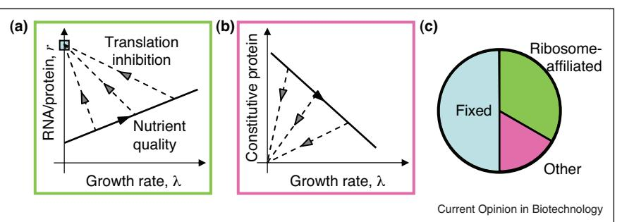
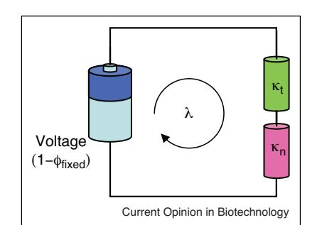
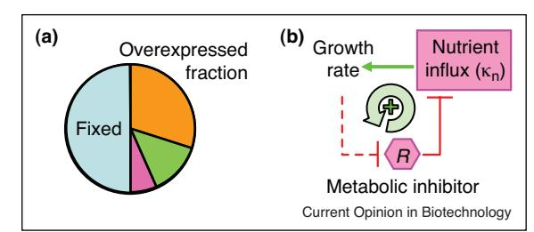

Available online at www.sciencedirect.com

# Bacterial growth laws and their applications Matthew Scott1 and Terence Hwa2,3

Quantitative empirical relationships between cell composition and growth rate played an important role in the early days of microbiology. Gradually, the focus of the field began to shift from growth physiology to the ever more elaborate molecular mechanisms of regulation employed by the organisms. Advances in systems biology and biotechnology have renewed interest in the physiology of the cell as a whole. Furthermore, gene expression is known to be intimately coupled to the growth state of the cell. Here, we review recent efforts in characterizing such couplings, particularly the quantitative phenomenological approaches exploiting bacterial 'growth laws.' These approaches point toward underlying design principles that can guide the predictive manipulation of cell behavior in the absence of molecular details.

#### Addresses

1 Department of Applied Mathematics, University of Waterloo, 200 University Ave. W., Waterloo, Ontario N2L 3G1, Canada 2 Center for Theoretical Biological Physics, Department of Physics, University of California, San Diego, 9500 Gilman Drive, La Jolla, CA 92093, USA

3Section of Molecular Biology, Division of Biological Sciences, University of California, San Diego, 9500 Gilman Drive, La Jolla, CA 92093, USA

Corresponding authors: Scott, Matthew [(mscott@math.uwaterloo.ca](mailto:mscott@math.uwaterloo.ca)) and Hwa, Terence [(hwa@ucsd.edu](mailto:hwa@ucsd.edu))

#### Current Opinion in Biotechnology 2011, 22:559–565

This review comes from a themed issue on Systems biology Edited by Roy Kishony and Vassily Hatzimanikatis

Available online 16th May 2011

0958-1669/\$ – see front matter # 2011 Elsevier Ltd. All rights reserved.

DOI [10.1016/j.copbio.2011.04.014](http://dx.doi.org/10.1016/j.copbio.2011.04.014)

# Introduction

Engineering of synthetic genetic circuits holds the promise to revolutionize medical treatment and industrial production from microbes [\[1](#page-4-0)–3]. Yet, progress over the last decade has been hindered by a lack of rational design principles to guide the interfacing of engineered components with the host organism [4–[6\]](#page-4-0). Recent work demonstrates that even constitutive protein expression [\[7](#page-4-0)- [,8](#page-4-0)--], and much more so genetic circuits [[7](#page-4-0)- [,9](#page-4-0)- ], can be strongly affected by the cell's physiological state. Thus, it appears difficult to insulate synthetic circuitry from the growth state of the host. Though orthogonal expression systems [[10\]](#page-4-0) are designed to minimize this coupling, they nevertheless draw energy and resources away from the core processes in the cell [[9](#page-4-0)- ].

Despite the inherent crosstalk between synthetic and endogenous elements, however, some of the resultant global effects have been shown to obey simple mathematical relations referred to as 'growth laws' [\[8](#page-4-0)--]. These quantitative relations may provide a framework for the design of robust synthetic systems, opening up new directions in bioengineering and biotechnology.

#### Empirical growth-rate dependence

Recent advances in the phenomenological modeling of bacterial physiology are best appreciated within a historical context. Possibly the most influential early example of coarse-grained modeling was Monod's discovery of a hyperbolic relation between the growth rate of a culture and the concentration of nutrient in the growth medium [[11](#page-4-0)]. Subject to some amendments over the years, Monod's relation continues to play an important role in current research [[12\]](#page-5-0) ([Box 1](#page-1-0)).

The simplicity of Monod's relation belies the incredible complexity of physiological regulation in bacteria. In balanced exponential growth, however, all of this complexity operates in concert with clock-like regularity to ensure that every constituent in the cell doubles at the same rate [[11](#page-4-0)]. The seminal work by Schaechter et al. [\[13](#page-5-0)] revealed that the consequences of that balance are remarkable; the macromolecular composition of Salmonella (mass of RNA, DNA, protein, and cell mass itself) is largely a function of the doubling rate alone, irrespective of the detailed composition of the growth medium. This observation has been a source of wonder and inspiration for over 50 years [\[14,15\]](#page-5-0).

A decade after Schaechter et al.'s work, Helmstetter and Cooper [\[16\]](#page-5-0) carefully analyzed synchronous cultures of Escherichia coli and established that during fast growth multiple origins of replication are employed simultaneously. Coupled with the exponential dependence of the cell mass on growth rate discovered by Schaechter et al., Donachie [\[17](#page-5-0)] turned these empirical observations around and postulated that both series of measurements could be explained if new rounds of DNA replication are initiated at a constant mass per origin of replication (referred to commonly as the 'Donachie mass'). Donachie's work marks one of the first times in biology that quantitative phenomenological relations were used to infer constraints on the underlying molecular mechanisms. Elucidating the details of DNA-replication initiation remains an active area of research [\[18](#page-5-0)], although

#### Box 1 Monod's growth relation

Monod [[11](#page-4-0)] empirically observed a relation connecting the growth rate of a culture, l, with the concentration of a growth-limiting substrate [S]:

$$
\lambda = \lambda_{\text{max}} \frac{\begin{bmatrix} \mathbf{S} \end{bmatrix}}{\begin{bmatrix} \mathbf{S} \end{bmatrix} + \mathbf{K}_M},\tag{1}
$$

where KM is the saturation constant for the substrate and depends upon the particular substrate and organism. Recent work on balanced exponential growth revealed a formally equivalent relation connecting the growth rate to the quality of a saturating substrate [[8](#page-4-0)--]:

$$
\lambda = \lambda_{\text{max}} \frac{\kappa_{\text{th}}}{\kappa_{\text{n}} + \kappa_{\text{t}}},
\tag{2}
$$

where kn is the nutritional capacity and kt is the translational capacity, independent parameters that can be estimated from the composition of exponentially growing bacteria under conditions of translation and nutrient limitation, respectively (see [Figure 1)](#page-2-0). The maximum growth rate, lmax, is the product of the mass fraction available to protein synthesis and nutrient influx, 1 ffixed, and the translational capacity,

kt: lmax ¼ ð1 ffixedÞ kt; (3) where ffixed is the growth-rate invariant fraction of the proteome ([Figure 1](#page-2-0)C, blue).

any proposed mechanism must be consistent with Donachie's observation.

In the wake of these early studies, the growth-rate dependence of a large catalogue of physiological parameters was measured in E. coli, largely driven by the meticulous efforts of Bremer and co-workers [[19](#page-5-0)--]. That accumulated data laid the foundations for the quantitative models of bacterial physiology that began to emerge in the late 1970s and early 1980s.

### Quantitative models of bacterial physiology

Growth-rate dependent physiological parameters collected over the intervening decades served as input to predictive, integrative models. Ehrenberg and Kurland [\[20](#page-5-0)] used a detailed model of bacterial physiology, subject to the maximization of growth rate, as a means to quantify the costs associated with accuracy in protein translation (see also Okamoto and Savageau [[21\]](#page-5-0)). Growth rate maximization, along with a range of other objectives [\[22](#page-5-0)], continues to be used in modern constraint-based reconstruction and analysis of metabolic networks [[23\]](#page-5-0). In some cases, the resulting analyses have met with remarkable success in predicting changes in metabolism incurred during evolutionary adaptation [[24\]](#page-5-0), and in qualitatively addressing shifts to inefficient metabolic strategies during rapid growth [[25\]](#page-5-0). Recently, Tadmor and Tlusty [\[26](#page-5-0)- ] used a coarse-grained model of macromolecular synthesis in E. coli to predict the growth defect associated with the deletion of ribosomal RNA operons, and suggested that molecular crowding effects set the limit on the optimum copy number of the ribosomal RNA operons. Klumpp and Hwa [[27\]](#page-5-0), focusing on transcription, developed a model for the free RNA polymerase concentration to explain the growth-rate dependence of promoter activities, and were thereby able to constrain admissible transcriptional control functions in response to amino acid starvation.

Although each of these studies has brought us closer to a more complete understanding of the complex interplay between regulation and physiology, the limitation of these approaches is that even the coarse-grained models involve a number of parameters that must be independently measured, for each growth condition of interest. As Klumpp et al. [[7](#page-4-0)- ] showed, simple constitutive gene expression in exponentially growing bacteria is strongly dependent upon the growth rate of the culture. The growth-rate dependence can be traced back to changes in global parameters such as the basal transcriptional and translational rates, gene dose, and cell volume at different growth rates. By analyzing these global parameters, the authors were able to make accurate, quantitative predictions regarding the coupling between gene expression and cell growth for a number of common genetic network motifs.

The success of these 'bottom-up' models suggests that the immense complexity of genetic and metabolic regulation under different growth conditions can be captured by a limited number of growth-rate dependent global parameters (e.g. those describing transcription and translation), at least as far as gene expression is concerned. Nevertheless, such approaches are not able to explain the origin of these growth-rate dependences. Furthermore, the growth rate can be altered in many ways: in a continuous culture, it is the quantity of the growth-limiting nutrient that is adjusted through the dilution rate. In batch culture, most often it is the quality of the saturating amount of nutrient that is changed (as in all the studies discussed above). The growth rate can, of course, be modulated in many other ways, including temperature, osmolarity, antibiotics, toxin, or other conditions. In that case, a 'bottom-up' approach requires careful wholesale measurements to be repeated for the dozen or so global parameters used in the model. A different perspective is needed to explain the origins of the growth-rate dependence of gene expression, and at the same time allow straightforward extension to other modes of growth modulation.

### Bacterial growth laws

Hidden within the experimental results of Schaechter et al. [[13\]](#page-5-0) is the remarkable linear relation between RNA/ total protein ratio and the growth rate over moderate to fast growth rates (faster than two hours per doubling) [(Figure 1](#page-2-0)A, solid line). In E. coli, the total RNA is approximately 85% ribosomal RNA (a fraction that is growth-rate independent over moderate to fast growth

Bacterial growth laws: (A) When growth is modulated by changes in nutrient quality, the RNA mass fraction r (proportional to the ribosomal content) of E. coli increases linearly with growth rate l (solid line): r = r0 + l/kt, where the parameter kt is related to the translation rate [[8](#page-4-0)--], and r0 is the offset. When growth is modulated by changes in translational efficiency, a conjugate relation is observed. The RNA mass fraction is inversely related to growth rate (dashed lines): r = rmax l/kn, where the parameter kn describes the nutrient quality of the growth medium, and rmax is the maximum allocation to ribosomal synthesis in the limit of complete translational inhibition. (B) Symmetric linear relations are observed in the mass fraction of a constitutively expressed protein, implying a linear constraint between ribosome-affiliated and constitutive proteins. (C) The simplest constraint is a three-component partition of the proteome: a fixed fraction that is invariant to growth-rate change (blue), ribosome and ribosome-affiliated proteins (green) and the remainder (pink), including constitutive proteins. For E. coli K-12 MG1655, the fixed fraction appears to occupy roughly half of the protein fraction [[8](#page-4-0)--].

rates [[19](#page-5-0)--[,28](#page-5-0)]), and so the RNA/protein ratio is directly proportional to the mass fraction of ribosomes in the cell. Later experiments by Neidhardt and Magasanik [[29\]](#page-5-0) brought this relation between ribosome content and growth rate to center stage. The linearity can be understood as a consequence of mass balance: protein mass accumulation is generated by elongating ribosomes, and in balanced exponential growth that implies a linear relation between the ribosomal mass fraction (proportional to the RNA/protein ratio) and the growth rate. The constant of proportionality (1/kt) is then given by the reciprocal of the translational elongation rate [\[28](#page-5-0)–30]. This interpretation of the linear relationship between ribosomal content and growth rate under changes in nutrient quality suggests a conjugate relation may be revealed by changing the translation rate.

When translation is inhibited, either by subinhibitory levels of antibiotic or targeted mutations of the ribosomal proteins, a second linear relation between the RNA/ protein ratio and the growth rate becomes apparent (Figure 1A, dashed lines) [[8](#page-4-0)--] (see also [\[31](#page-5-0)–35]). In this case, the constant of proportionality (1/kn) is inversely related to the nutrient quality. More remarkably, the two linear relations describing the RNA mass fraction observed under changes in nutrient quality and translational ability are reflected almost perfectly in the mass fraction of a constitutively expressed protein (Figure 1B). Although these empirical relations are independent of any interpretation, the mirror-symmetry between ribosome-affiliated and constitutive proteins suggests the existence of a linear constraint. The empirical relations shown in Figure 1A and B can be unified into a phenomenological theory of bacterial growth ([Box 1](#page-1-0)) by postulating a minimal three-component partitioning of the proteome (Figure 1C) that includes a growth-rate invariant fraction ffixed, a fraction containing ribosome and ribosome-affiliated proteins, and a third fraction containing the remainder (including constitutive proteins).

Taken together, these results suggest that the origin of the growth-rate dependence of constitutive gene expression arises from a tug-of-war between the need for protein synthesis (mediated by ribosomal proteins) and nutrient uptake/processing (mediated by other nonribosomal proteins). Qualitatively, this type of flux balance is expected in any autocatalytic (selfreproducing) reaction scheme, as was first proposed by Hinshelwood [\[36](#page-5-0)]. Koch [[37](#page-5-0)] applied Hinshelwood's analysis to study the biophysical constraints on bacterial growth-rate regulation by considering an autocatalytic loop composed of ribosomal and nonribosomal proteins. A similar two-component model was used by Alon and coworkers [[38\]](#page-5-0) in their recent study of promoter activities under various modes of growth inhibition.

One limitation of a two-component proteome partition is that under favorable nutrient conditions or maximum translational inhibition, the predicted ribosomal protein fraction would be close to one. In fact, including all auxiliary proteins required for translation (initiation factors, elongation factors, etc.), that fraction is substantially less than one. The minimum partition model, then, must include at least three fractions to account for this disparity (Figure 1C). Quantitative characterization of the two distinct linear relations between the ribosomal proteins and the growth rate (Figure 1A), along with the explicit recognition of the fixed fraction, makes it possible to expand Koch's analysis into a predictive theory [\[8](#page-4-0)--]. As with Donachie's mass, this phenomenological model serves as a constraint for proposed molecular mechanisms of the underlying regulatory processes.

Analogy with Kirchoff's law: the Monod-like relation for growth, Eq. [(2),](#page-1-0) is mathematically identical to the description of electric current flow through a pair of resistors connected in series to a battery with voltage (1 ffixed). In this analogy, the growth rate l is the current through the resistors. The translation-mode and nutrient-mode of growth limitation correspond to changing the conductance of one of the resistors, while the expression of unnecessary protein corresponds to reducing the applied voltage by increasing ffixed (see Figure 3A).

Of more direct relevance to biotechnology and synthetic biology applications, the growth theory outlined in [Figure 1](#page-2-0) provides a conceptual framework to guide the interfacing between synthetic constructs and the host organism. Combination of the two linear relations and the constraint on the total mass fraction yields a mathematical expression identical to Kirchoff's laws applied to two resistors in series (Figure 2). In this formulation, increase in translation rate is characterized by an increased conductance in the protein synthesis branch (increased kt), whereas an increase in nutrient quality is characterized by an increased conductance in the nutrient branch (increased kn).

#### Applications of the growth laws

The analogy to Kirchoff's laws is significant in so far as it allows the growth theory to be extended to different modes of growth rate modulation, particularly to the growth defect associated with heterologous protein expression. Heterologous protein expression effectively expands the fixed protein fraction ffixed ([Figure 1C](#page-2-0), blue), which in the Kirchoff's law analogy corresponds to a reduction of the driving voltage. Consistent with this interpretation, overexpression of an unnecessary protein in E. coli results in a linear decrease in the growth rate, with the zero-growth limit occurring when the overexpressed protein occupies a mass fraction of (1 ffixed) [\[8](#page-4-0)--], in agreement with results by others using different expression vectors and proteins [\[39,40\]](#page-5-0). These results disagree with those of Dekel and Alon [\[41](#page-5-0)], who reported a quadratic reduction in growth rate upon protein overexpression from the lac operon. Closer inspection shows that the protein expression level, and the concomitant growth rate reduction, reported in [\[41](#page-5-0)] was over a comparatively narrow range (<0.5% of the proteome), whereas the effects described in Refs. [\[8](#page-4-0)--[,39,40\]](#page-4-0) covered expression levels up to 30–40% of the proteome.

With a large part of the proteome occupied by the fixed fraction and the overexpressed protein, less of the proteome is available for the remaining fractions responsible for translation and nutrient uptake/processing (Figure 3A). The observed destruction of ribosomes upon overexpression [\[39](#page-5-0)] may simply reflect the native response to nutrient limitation. One immediate conclusion is that the metabolic load [[42,43\]](#page-5-0) associated with overexpression can be mitigated by reducing the nominal fixed protein fraction ffixed, which may lead to alternate methods of increasing heterologous protein yield that augment existing strategies of strain-optimization [[44\]](#page-5-0). Of wider interest in evolutionary studies, the relative growth defect associated with overexpression (often called the ''fitness cost'') provides a basis for quantifying different strategies of gene regulation [\[41,45,46\]](#page-5-0).

Crosstalk between endogenous and synthetic elements has long frustrated the advance of synthetic biology [\[5,6,47](#page-4-0)], despite the growing list of well-characterized components [[48\]](#page-5-0). The phenomenological framework emerging from recent work on E. coli not only suggests how this crosstalk can be incorporated into network design, but also offers a strategy to exploit coupling to host physiology for rational purposes. The interdependence of gene expression and growth rate can lead to global feedback loops, as suggested by Narang and coworkers [[49,50](#page-5-0)--] in a series of critical analyses of the regulation underlying carbon utilization in E. coli, though the existence of different modes of growth inhibition [[8](#page-4-0)--] makes the feedback scenarios much richer than the dilution models considered in that work.

Some applications of the growth laws: (A) The burden of protein overexpression. Expression of an unnecessary protein (orange) effectively decreases the fraction allocable to the protein sectors responsible for protein synthesis (green) and nutrient uptake/processing (pink), leading to a decrease in the growth rate [[8](#page-4-0)--]. (B) Growthmediated feedback. Constitutive expression of a toxin affecting nutrient influx (R) could lead to bistability through positive feedback generated by the interdependence of gene expression levels and growth rate (dotted line). A decrease in growth rate under conditions of nutrient limitation results in an increase in the constitutively expressed toxin R, reinforcing further growth rate reduction [[7](#page-4-0)- ].

It should, for example, be possible to generate complicated phenotypic switching through growth-mediated feedback if the cell expresses a toxin inhibiting nutrient influx ([Figure 3B](#page-3-0)) [7- ]. Although selfinflicted growtharrest seems counterintuitive to the survival of the organism, quiescent cells are resistant to many antibiotics and growth-arrest represents a bet-hedging strategy to ensure long-term viability of the colony (a phenomenon called 'bacterial persistence') [[51,52\]](#page-5-0). Lou et al. [\[53](#page-5-0)] proposed a growth-mediated positive feedback mechanism to facilitate spontaneous growth transition to the dormant state using a dilution model with highly cooperative regulatory interactions controlling the expression of a toxin. Klumpp et al. [7- ] further pointed out that growth-dependent global feedback could lead to persistence for constitutively expressed toxins [[54\]](#page-5-0).

In an industrial setting, bistability resulting from global feedback effects may arise unintentionally due to the action of the synthetic network used to drive heterologous expression. Regulatory motifs used in expression vectors must then be optimized to avoid bistability to prevent overgrowth of the population by the lowproducing phenotype [\[55\]](#page-6-0). Bistability of this type has already been reported by You and coworkers [9- ], where the growth defect associated with the overexpression of a foreign polymerase generates the requisite feedback. In a therapeutic setting, phenotypic bistabiltiy mediated by overexpression may underlie expression of motility and virulence factors in some bacterial pathogens [\[56](#page-6-0)].

## Outlook

The focus of this review is on the utility of a quantitative phenomenological characterization of bacteria physiology, specifically E. coli. Most existing mathematical studies of biomolecular systems take a bottom-up approach, that is starting with known molecular features and including mutual interactions to predict system-level properties [\[57](#page-6-0)]. While the bottom-up approach can be successful in analyzing small-scale systems where most of the interactions have been characterized, it becomes more and more difficult as one moves toward larger systems, where the number of parameters ''explodes'' [\[47](#page-5-0)]. In contrast, phenomenological theory requires no molecular level information; it is based on the quantification and application of empirical laws. An analogy can be made to Kirchoff's and Ohm's laws which simplify the analysis and design of electrical circuits, without requiring a detailed atomic-level description. Similarly, we believe systems biology, biotechnology and synthetic biology can benefit greatly from theoretical approaches based on empirical characterizations to complement existing characterization of synthetic genetic elements [[58\]](#page-6-0).

Clearly empirical relationships between ribosomal content, protein expression and growth rate must be characterized under other modes of growth inhibition (including transcriptional inhibition, osmotic stress, temperature change, etc.), and much work remains to extend this approach to other organisms with high application potential, including fungi [\[59,60\]](#page-6-0) and algae [\[61](#page-6-0)]. That said, there is a growing body of research suggesting that very similar phenomenological laws apply in yeast [\[62](#page-6-0)], including some exciting work linking gene expression and growth rate [[63](#page-6-0)- [,64,65](#page-6-0)]. Quantifying similar growth laws for eukaryotes may shed light on intervention strategies for diseases ranging from fungal infection to cancer proliferation [\[66](#page-6-0)].

### Acknowledgements

We are grateful to Brian Ingalls and Stefan Klumpp for comments on the manuscript. This work is supported by National Institute of Health grant RO1GM77298, National Science Foundation (NSF) grant MCB0746581, and the NSF-supported Center for Theoretical Biological Physics (grant PHY0822283).

#### References and recommended reading

Papers of particular interest, published within the period of review, have been highlighted as:

- of special interest
- -of outstanding interest
- 1. Pleiss J: The promise of synthetic biology. Appl Microbiol Biotechnol 2006, 73:735-739.
- 2. Bio FABG, Baker D, Church G, Collins J, Endy D, Jacobson J, Keasling J, Modrich P, Smolke C, Weiss R: Engineering life: building a fab for biology. Sci Am 2006, 294:44-51.
- 3. Bhalerao KD: Synthetic gene networks: the next wave in biotechnology? Trends Biotechnol 2009, 27:368-374.
- 4. Arkin AP, Fletcher DA: Fast, cheap and somewhat in control. Genome Biol 2006, 7:114.
- 5. Lu TK, Khalil AS, Collins JJ: Next-generation synthetic gene networks. Nat Biotechnol 2009, 27:1139-1150.
- 6. Purnick PE, Weiss R: The second wave of synthetic biology: from modules to systems. Nat Rev Mol Cell Biol 2009, 10:410-422.
- 7. - Klumpp S, Zhang Z, Hwa T: Growth rate-dependent global effects on gene expression in bacteria. Cell 2009,

139:1366-1375. The growth-rate dependence of global parameters involved in transcription and translation are combined to predict the growth-rate dependence of constitutive proteins and simple genetic circuits under changes in nutrient quality.

- 8. Scott M, Gunderson CW, Mateescu EM, Zhang Z, Hwa T:
- -- Interdependence of cell growth and gene expression: origins and consequences. Science 2010.

Quantitative empirical relationships between the growth rate and the ribosomal content are found by changing nutrient quality and translational efficiency. A growth theory based on these relationships explains the growth-rate dependence of constitutive protein expression and the growth-defect upon protein overexpression without invoking ad hoc parameters.

- 9. Tan C, Marguet P, You L: Emergent bistability by a growth-
- modulating positive feedback circuit. Nat Chem Biol 2009, 5:842-848.

A foreign polymerase driving its own transcription is used to create a synthetic bistable genetic circuit. Overexpression of the polymerase incurs a growth defect that further amplifies the positive feedback.

- 10. An W, Chin JW: Synthesis of orthogonal transcription– translation networks. Proc Natl Acad Sci U S A 2009, 106:8477-8482.
- 11. Monod J: The growth of bacterial cultures. Ann Rev Microbiol 1949, 3:371-394.
- 12. Bull AT: The renaissance of continuous culture in the postgenomics age. J Ind Microbiol Biotechnol 2010, 37:993-1021.
- 13. Schaechter M, Maaloe O, Kjeldgaard NO: Dependency on medium and temperature of cell size and chemical composition during balanced grown of Salmonella typhimurium. J Gen Microbiol 1958, 19:592-606.
- 14. Cooper S: The origins and meaning of the Schaechter–Maaloe– Kjeldgaard experiments. J Gen Microbiol 1993, 139:1117-1124.
- 15. Neidhardt FC: Bacterial growth: constant obsession with dN/ dt. J Bacteriol 1999, 181:7405-7408.
- 16. Helmstetter CE: DNA synthesis during the division cycle of rapidly growing Escherichia coli B/r. J Mol Biol 1968, 31:507-518.
- 17. Donachie WD: Relationship between cell size and time of initiation of DNA replication. Nature 1968, 219:1077-1079.
- 18. Wang JD, Levin PA: Metabolism, cell growth and the bacterial cell cycle. Nat Rev Microbiol 2009, 7:822-827.
- 19. -- Bremer H, Dennis PP: Modulation of chemical composition and other parameters of the cell by growth rate. In Escherichia coli

and Salmonella. Edited by Neidhardt FC. ASM Press; 2009. Encyclopedic reference that includes the growth-rate dependence in E. coli of dozens of global parameters under changes in nutrient quality.

- 20. Ehrenberg M, Kurland CG: Costs of accuracy determined by a maximal growth rate constraint. Q Rev Biophys 1984, 17:45-82.
- 21. Okamoto M, Savageau MA: Integrated function of a kinetic proofreading mechanism: dynamic analysis separating the effects of speed and substrate competition on accuracy. Biochemistry 1984, 23:1710-1715.
- 22. Feist AM, Palsson BO: The biomass objective function. Curr Opin Microbiol 2010, 13:344-349.
- 23. Price ND, Reed JL, Palsson BO: Genome-scale models of microbial cells: evaluating the consequences of constraints. Nat Rev Microbiol 2004, 2:886-897.
- 24. Lewis NE, Hixson KK, Conrad TM, Lerman JA, Charusanti P, Polpitiya AD, Adkins JN, Schramm G, Purvine SO, Lopez-Ferrer D et al.: Omic data from evolved E. coli are consistent with computed optimal growth from genome-scale models. Mol Syst Biol 2010, 6:390.
- 25. Molenaar D, van Berlo R, de Ridder D, Teusink B: Shifts in growth strategies reflect tradeoffs in cellular economics. Mol Syst Biol 2009, 5:323.
- 26. Tadmor AD, Tlusty T: A coarse-grained biophysical model of E.
- - coli and its application to perturbation of the rRNA operon copy number. PLoS Comput Biol 2008, 4:e1000038. Beyond an elegant biophysical formulation of macromolecular synthesis,

this paper provides a very thorough and critical review of past work to characterize physiological parameters in E. coli.

- 27. Klumpp S, Hwa T: Growth-rate-dependent partitioning of RNA polymerases in bacteria. Proc Natl Acad Sci U S A 2008, 105:20245-20250.
- 28. Maaløe O: Regulation of the protein-synthesizing machinery — ribosomes, tRNA, factors, and so on. In Biological Regulation and Development. Edited by Goldberger RF. Plenum Press; 1979:487-542.
- 29. Neidhardt FC, Magasanik B: Studies on the role of ribonucleic acid in the growth of bacteria. Biochim Biophys Acta 1960, 42:99-116.
- 30. Hernandez VJ, Bremer H: Characterization of RNA and DNA synthesis in Escherichia coli strains devoid of ppGpp. J Biol Chem 1993, 268:10851-10862.
- 31. Bennett PM, Maaloe O: The effects of fusidic acid on growth, ribosome synthesis and RNA metabolism in Escherichia coli. J Mol Biol 1974, 90:541-561.
- 32. Harvey RJ, Koch AL: How partially inhibitory concentrations of chloramphenicol affect the growth of Escherichia coli. Antimicrob Agents Chemother 1980, 18:323-337.
- 33. Cole JR, Olsson CL, Hershey JW, Grunberg-Manago M, Nomura M: Feedback regulation of rRNA synthesis in Escherichia coli. Requirement for initiation factor IF2. J Mol Biol 1987, 198:383-392.
- 34. Olsson CL, Graffe M, Springer M, Hershey JW: Physiological effects of translation initiation factor IF3 and ribosomal protein L20 limitation in Escherichia coli. Mol Gen Genet 1996, 250:705-714.
- 35. Bollenbach T, Quan S, Chait R, Kishony R: Nonoptimal microbial response to antibiotics underlies suppressive drug interactions. Cell 2009, 139:707-718.
- 36. Hinshelwood CN: On the chemical kinetics of autosynthetic systems. J Chem Soc 1952:745-755.
- 37. Koch AL: Why can't a cell grow infinitely fast? Can J Microbiol 1988, 34:421-426.
- 38. Zaslaver A, Kaplan S, Bren A, Jinich A, Mayo A, Dekel E, Alon U, Itzkovitz S: Invariant distribution of promoter activities in Escherichia coli. PLoS Comput Biol 2009, 5:e1000545.
- 39. Dong H, Nilsson L, Kurland CG: Gratuitous overexpression of genes in Escherichia coli leads to growth inhibition and ribosome destruction. J Bacteriol 1995, 177:1497-1504.
- 40. Bentley WE, Mirjalili N, Andersen DC, Davis RH, Kompala DS: Plasmid-encoded protein: the principal factor in the ''metabolic burden'' associated with recombinant bacteria. Biotechnol Bioeng 1990, 35:668-681.
- 41. Dekel E, Alon U: Optimality and evolutionary tuning of the expression level of a protein. Nature 2005, 436:588-592.
- 42. Glick BR: Metabolic load and heterologous gene expression. Biotechnol Adv 1995, 13:247-261.
- 43. Stoebel DM, Dean AM, Dykhuizen DE: The cost of expression of Escherichia coli lac operon proteins is in the process, not in the products. Genetics 2008, 178:1653-1660.
- 44. Sharma SS, Blattner FR, Harcum SW: Recombinant protein production in an Escherichia coli reduced genome strain. Metab Eng 2007, 9:133-141.
- 45. Savageau MA: Demand theory of gene regulation. I. Quantitative development of the theory. Genetics 1998, 149:1665-1676.
- 46. Gerland U, Hwa T: Evolutionary selection between alternative modes of gene regulation. Proc Natl Acad Sci U S A 2009, 106:8841-8846.
- 47. Kwok R: Five hard truths for synthetic biology. Nature 2010, 463:288-290.
- 48. Landrain TE, Carrera J, Kirov B, Rodrigo G, Jaramillo A: Modular model-based design for heterologous bioproduction in bacteria. Curr Opin Biotechnol 2009, 20:272-279.
- 49. Narang A, Pilyugin SS: Bistability of the lac operon during growth of Escherichia coli on lactose and lactose + glucose. Bull Math Biol 2008, 70:1032-1064.
- 50. -- Narang A: Quantitative effect and regulatory function of cyclic adenosine 50 -phosphate in Escherichia coli. J Biosci 2009, 34:445-463.

Comprehensive and critical analysis of catabolite repression and the carbon utilization hierarchy in E. coli, including the role of growth-rate dependent gene expression levels.

- 51. Balaban NQ, Merrin J, Chait R, Kowalik L, Leibler S: Bacterial persistence as a phenotypic switch. Science 2004, 305:1622-1625.
- 52. Rotem E, Loinger A, Ronin I, Levin-Reisman I, Gabay C, Shoresh N, Biham O, Balaban NQ: Regulation of phenotypic variability by a threshold-based mechanism underlies bacterial persistence. Proc Natl Acad Sci U S A 2010, 107:12541-12546.
- 53. Lou C, Li Z, Ouyang Q: A molecular model for persister in E. coli. J Theor Biol 2008, 255:205-209.
- 54. Korch SB, Hill TM: Ectopic overexpression of wild-type and mutant hipA genes in Escherichia coli: effects on

macromolecular synthesis and persister formation. J Bacteriol 2006, 188:3826-3836.

- 55. Muller S, Harms H, Bley T: Origin and analysis of microbial population heterogeneity in bioprocesses. Curr Opin Biotechnol 2010, 21:100-113.
- 56. Ackermann M, Stecher B, Freed NE, Songhet P, Hardt WD, Doebeli M: Self-destructive cooperation mediated by phenotypic noise. Nature 2008, 454:987-990.
- 57. Guido NJ, Wang X, Adalsteinsson D, McMillen D, Hasty J, Cantor CR, Elston TC, Collins JJ: A bottom-up approach to gene regulation. Nature 2006, 439:856-860.
- 58. Canton B, Labno A, Endy D: Refinement and standardization of synthetic biological parts and devices. Nat Biotechnol 2008, 26:787-793.
- 59. Buckholz RG, Gleeson MA: Yeast systems for the commercial production of heterologous proteins. Biotechnology (N Y) 1991, 9:1067-1072.
- 60. Lubertozzi D, Keasling JD: Developing Aspergillus as a host for heterologous expression. Biotechnol Adv 2009, 27:53-75.
- 61. Rosenberg JN, Oyler GA, Wilkinson L, Betenbaugh MJ: A green light for engineered algae: redirecting metabolism to fuel a biotechnology revolution. Curr Opin Biotechnol 2008, 19:430-436.
- 62. Levy S, Barkai N: Coordination of gene expression with growth rate: a feedback or a feed-forward strategy? FEBS Lett 2009, 583:3974-3978.
- 63. Airoldi EM, Huttenhower C, Gresham D, Lu C, Caudy AA,
- - Dunham MJ, Broach JR, Botstein D, Troyanskaya OG: Predicting cellular growth from gene expression signatures. PLoS Comput Biol 2009, 5:e1000257.
- Microarray data from chemostat cultures of S. cerevisiae is used to identify a small set of genes that exhibit a strong correlation with growth rate.
- 64. Lang GI, Murray AW, Botstein D: The cost of gene expression underlies a fitness trade-off in yeast. Proc Natl Acad Sci U S A 2009, 106:5755-5760.
- 65. Youk H, van Oudenaarden A: Growth landscape formed by perception and import of glucose in yeast. Nature 2009, 462:875-879.
- 66. Ruggero D, Pandolfi PP: Does the ribosome translate cancer? Nat Rev Cancer 2003, 3:179-192.