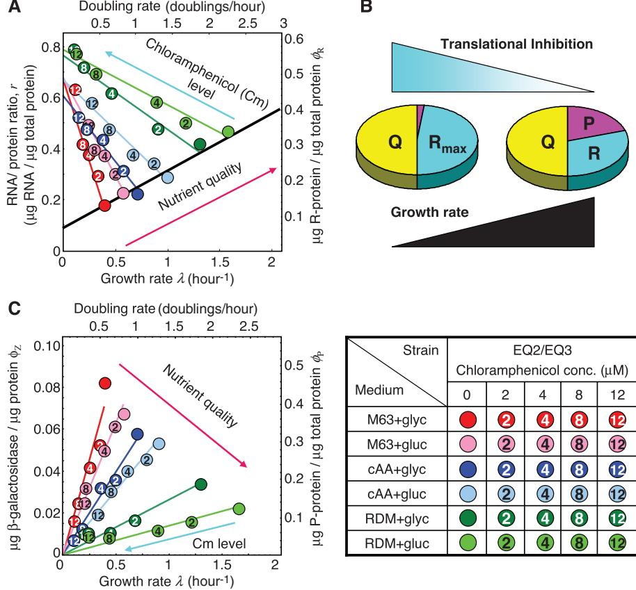
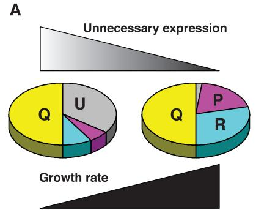
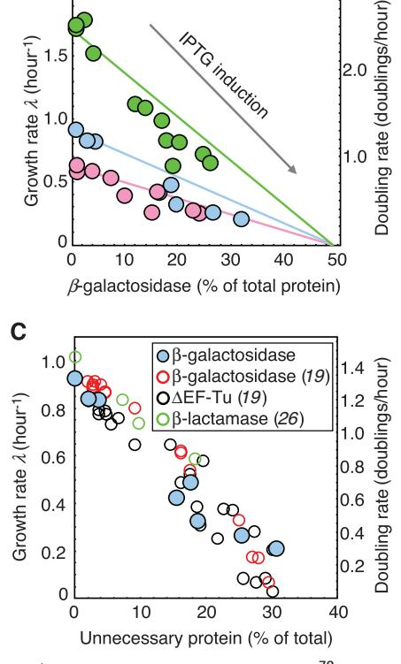

- 3. A. Lanzavecchia, F. Sallusto, Nat. Rev. Immunol. 2, 982 (2002).
- 4. I. C. MacLennan, Annu. Rev. Immunol. 12, 117 (1994).
- 5. A. Strasser, P. J. Jost, S. Nagata, Immunity 30, 180 (2009).
- 6. Y. Takahashi, H. Ohta, T. Takemori, Immunity 14, 181 (2001).
- 7. Z. Hao et al., Immunity 29, 615 (2008).
- 8. Y. Takahashi et al., J. Exp. Med. 190, 399 (1999).
- 9. K. G. Smith, U. Weiss, K. Rajewsky, G. J. Nossal, D. M. Tarlinton, Immunity 1, 803 (1994).
- 10. K. G. Smith et al., J. Exp. Med. 191, 475 (2000).
- 11. S. F. Fischer et al., Blood 110, 3978 (2007).
- 12. Materials and methods are available as supporting material on Science Online.
- 13. U. Klein et al., Proc. Natl. Acad. Sci. U.S.A. 100, 2639 (2003).
- 14. T. Yokoyama et al., Immunol. Lett. 81, 107 (2002).
- 15. K. Kwon et al., Immunity 28, 751 (2008).
- 16. M. Muramatsu et al., Cell 102, 553 (2000).
- 17. N. Motoyama et al., Science 267, 1506 (1995).
- 18. K. U. Wagner et al., Development 127, 4949 (2000).
- 19. A. Ridderstad, D. M. Tarlinton, J. Immunol. 160, 4688 (1998).
- 20. A. Radbruch et al., Nat. Rev. Immunol. 6, 741 (2006).
- 21. K. G. Smith, A. Light, G. J. Nossal, D. M. Tarlinton, EMBO J. 16, 2996 (1997).
- 22. E. M. Carrington et al., Proc. Natl. Acad. Sci. U.S.A. 107, 10967 (2010).
- 23. J. M. Adams, S. Cory, Oncogene 26, 1324 (2007).
- 24. L. Chen et al., Mol. Cell 17, 393 (2005).
- 25. S. N. Willis et al., Science 315, 856 (2007).
- 26. H. Toyama et al., Immunity 17, 329 (2002).
- 27. J. Roes, K. Rajewsky, J. Exp. Med. 177, 45 (1993).
- 28. D. Allen, T. Simon, F. Sablitzky, K. Rajewsky, A. Cumano, EMBO J. 7, 1995 (1988).
- 29. A. Cumano, K. Rajewsky, EMBO J. 5, 2459 (1986).
- 30. J. T. Opferman et al., Nature 426, 671 (2003).
- 31. C. D. Allen, T. Okada, J. G. Cyster, Immunity 27, 190 (2007).
- 32. D. Tarlinton, Nat. Rev. Immunol. 6, 785 (2006).
- 33. T. Oltersdorf et al., Nature 435, 677 (2005).
- 34. J. H. Cho-Vega et al., Hum. Pathol. 35, 1095 (2004).
- 35. D. Allen et al., Immunol. Rev. 96, 5 (1987).
- .36. This work was supported in part by grants from the National Health and Medical Research Council (NHMRC) Australia (356202 to D.M.T. and S.L.N. and 461221 to P.B. and A.S.), the Leukemia and Lymphoma Society (SCOR grant 7413), and the NIH (CA43540 and CA80188). D.M.T. and A.S. are supported by fellowships from the NHMRC; S.L.N. by a Pfizer Australia Research Fellowship; I.V. by the Olle Engkvist Byggmastare and Wenner-Gren Foundations; K.L. by a fellowship from the

German Academic Exchange Service; P.B. by the Charles and Sylvia Viertel Charitable Foundation; and M.B. by Boehringer Ingelheim. DNA sequence data are available in GenBank (accession number HM804028-HM804084). We are indebted to the facilities of our respective institutes, particularly those responsible for animal husbandry and flow cytometry. We also acknowledge the assistance of L. O'Reilly for Western blot antibodies and the many helpful discussions with members of the Walter and Eliza Hall Institute B Cell Program. Author contributions are as follows: I.V. and D.M.T. designed the research; I.V., K.L., S.G., V.P., S.C., and P.J. performed experiments and contributed to interpretation and discussion; M.B., P.B., A.S., and S.L.N. contributed to the design of experiments, interpretation of results, and drafting the manuscript; I.V., K.L., and V.P. analyzed data and prepared figures; and I.V. and D.M.T. wrote the manuscript.

### Supporting Online Material

www.sciencemag.org/cgi/content/full/science.1191793/DC1 Materials and Methods SOM Text Figs. S1 to S14 References

3 May 2010; accepted 7 September 2010 Published online 7 October 2010; 10.1126/science.1191793

# Interdependence of Cell Growth and Gene Expression: Origins and Consequences

Matthew Scott,1 *† Carl W. Gunderson,2 * Eduard M. Mateescu,1 Zhongge Zhang,2 Terence Hwa1,2‡

In bacteria, the rate of cell proliferation and the level of gene expression are intimately intertwined. Elucidating these relations is important both for understanding the physiological functions of endogenous genetic circuits and for designing robust synthetic systems. We describe a phenomenological study that reveals intrinsic constraints governing the allocation of resources toward protein synthesis and other aspects of cell growth. A theory incorporating these constraints can accurately predict how cell proliferation and gene expression affect one another, quantitatively accounting for the effect of translation-inhibiting antibiotics on gene expression and the effect of gratuitous protein expression on cell growth. The use of such empirical relations, analogous to phenomenological laws, may facilitate our understanding and manipulation of complex biological systems before underlying regulatory circuits are elucidated.

Systems biology is as an integrative approach to connect molecular-level mechanisms to cell-level behavior (1). Many studies have characterized the impact of molecular circuits and networks on cellular physiology (1, 2), but less is known about the impact of cellular physiology on the functions of molecular networks (3–5). Endogenous and synthetic genetic circuits can be strongly affected by the physiological states of the organism, resulting in unpredictable outcomes (4, 6–8). Consequently, both the understanding and implementation of molecular control are predicated on distinguishing global physiological constraints from specific regulatory interactions.

For bacterial cells under steady-state exponential growth, the rate of cell proliferation (the "growth rate") is an important characteristic of the physiological state. It is well known that the macromolecular composition (e.g., the mass fractions of protein, RNA, and DNA) of bacterial cells under exponential growth depends on the growth medium predominantly through the growth rate allowed by the nutritional content of the medium (9, 10). Such growth rate dependencies inevitably affect the expression of individual genes (4, 11) because protein synthesis is directly dependent on the cell's ribosome content. The latter is reflected by the RNA/protein ratio. In Escherichia coli, most of the RNA (~85%) is rRNA folded in ribosomes (10, 11). A predictive understanding of the impact of growth physiology on gene expression therefore first requires an understanding of the cell's allocation of cellular resources to ribosome synthesis (manifested by the RNA/protein ratio) at different growth rates.

For exponentially growing E. coli cells (10, 12), the RNA/protein ratio r is linearly correlated with the specific growth rate l [ = (ln 2)/doubling time] (Fig. 1A). The correlation is described mathematically as

$$r = r_0 + \frac{\lambda}{\kappa_t} \tag{1}$$

where r0 is the vertical intercept and kt is the inverse of the slope (table S1). This linear correlation holds for various E. coli strains growing in medium that supports fast to moderately slow growth [e.g., 20 min to ~2 hours per doubling (11)], and it appears to be quite universal; similar linear correlations have been observed in many other microbes, including slow-growing unicellular eukaryotes (fig. S1). As suggested long ago from mass-balance considerations (11) and elaborated in (13), this linear correlation is expected if the ribosomes are growth-limiting and are engaged in translation at a constant rate, with the phenomenological parameter kt predicted to be proportional to the rate of protein synthesis. Consistent with the prediction, data on RNA/protein ratios from slow-translation mutants of E. coli K-12 (triangles in Fig. 1B) also exhibited linear correlations with the growth rate l, but with steeper slopes than the parent strain (circles), which have smaller kt . Moreover, the corresponding kt values correlated linearly with the directly measured speed of translational elongation (14) (Fig. 1B, inset). Consequently, we call kt the "translational capacity" of the organism.

Translation can be inhibited in a graded manner by exposing cells to sublethal doses of a translation-inhibiting antibiotic. The RNA/protein ratios obtained for wild-type cells grown in medium with a fixed nutrient source and various 1 Center for Theoretical Biological Physics, Department of Physics, University of California, San Diego, La Jolla, CA 92093, USA. 2 Section of Molecular Biology, Division of Biological Sciences, University of California, San Diego, La Jolla, CA 92093, USA.

*These authors contributed equally to this work. †Present address: Department of Applied Mathematics, University of Waterloo, Waterloo, Ontario N2L 3G1, Canada. ‡To whom correspondence should be addressed. E-mail: hwa@ucsd.edu

τ µ 10 12 growth rate l for various strains of E. coli. (A) Comparison among E. coli strains grown in minimal medium: Strain B/r [(10), squares], 15t-bar [(12), diamonds], and EQ2 (this work, solid circles). The growth rate is modulated by changing the quality of nutrients as indicated in the key at lower left. The fraction of total protein devoted to ribosomeaffiliated proteins (fR) is given by the RNA/protein ratio as fR = r · r (table S1). (B) The RNA/protein ratio for a family of translational mutants SmR (triangles) and SmP (inverted triangles) and their parent strain Xac (circles) (27), grown with various nutrients (see key at lower left) (table S2). Translational inhibition of the parent Xac strain via exposure to sublethal doses of chloramphenicol

(circled numbers; see legend table) gave RNA/protein ratios similar to those of the mutant strains grown in medium with the same nutrient but without chloramphenicol (light blue symbols). Dashed line is a fit to Eq. 2. Inset: Linear correlation of kt values obtained for the Xac, SmR, and SmP strains (table S2) with the measured translation rate of the respective strains (14) (r 2 = 0.99).

amounts of chloramphenicol (Fig. 1B, light blue circles) were consistent with data obtained for the isogenic translational mutants grown in medium with the same nutrient but no antibiotic (light blue triangles). Surprisingly, these data revealed another linear correlation between r and l (Fig. 1B, dashed line), given by

$$r = r_{\text{max}} - \frac{\chi}{\kappa_{\text{n}}} \tag{2}$$

where rmax is the vertical intercept and kn is the inverse slope. Such a linear correlation was obtained for cells grown with each of the six nutrient sources studied (Fig. 2A and table S3). The correlation described by Eq. 2 has been observed in cells subjected to numerous other means of imposing translational limitation (fig. S2).

From Fig. 2A and the best-fit values of the parameters rmax and kn (table S4), we observed that the parameter kn exhibited a strong, positive correlation with the growth rate of cells in drugfree medium (fig. S3A). Thus, kn reflects the nutrient quality and is referred to as the "nutritional capacity" of the organism in a medium [see eq. S18 in (13) for a molecular interpretation of kn]. In contrast, the vertical intercept rmax depended only weakly on the composition of the growth medium (fig. S3B). Qualitatively, the increase of the RNA/protein ratio r with increasing degree of translational inhibition can be seen as a compensation for the reduced translational capacity, implemented possibly through the relief of repression of rRNA synthesis by the alarmone ppGpp (15), in response to the buildup of intracellular amino acid pools resulting from slow translation. Because rmax is the (extrapolated) maximal RNA/protein ratio as translation capacity is reduced toward zero, its weak dependence on the quality of the nutrients suggests a common

Fig. 2. Effect of translational inhibition. (A) RNA/protein ratio for strain EQ2 grown in different media, each with various levels of chloramphenicol (see key at lower right) (table S3). Solid lines were obtained from fitting data of the same color to Eq. 2. The black line describes the data in the absence of chloramphenicol (as in Fig. 1A). (B) Translational inhibition results in an increased synthesis of R-class proteins (cyan), effectively decreasing the fraction allocable to the P-class (magenta). (C) Mass fraction of constitutively expressed b-galactosidase (strain EQ3) plotted as a function of growth rate. The lines were fit according to Eq. 4. The growth rate dependence of constitutive gene expression due to nutrient limitation found in (4) is also well described by the theory (fig. S5C).

Fig. 3. A phenomenological theory of bacterial growth. (A) The growth theory comprises three key ingredients: (i) a three-component partition of the proteome, consisting of a fixed core sector (Q) and two adjustable sectors (R and P) whose fractions (fR and fP) must add up to a constant (fR max = 1 *−* fQ); (ii) a ribosomal fraction fR containing all the ribosomal proteins and their affiliates and exerting a positive effect on growth (with growth rate l º fR – f0, where f0 = r · r0 corresponds to the vertical intercept in Fig. 1A); (iii) a remaining fraction fP exerting a similarly positive effect on growth (with growth rate l º fP) by providing an influx of nutrients (13). (B) During steady-state exponential growth, efficient resource allocation requires that the nutrient influx (kn · fP) be flux-matched to the amino acid outflux kt · (fR – f0). This can be coordinated by ppGpp, which up-regulates ribosome synthesis and hence amino acid outflux in response to increase in the amino acid pools, and has the opposite effect (down-regulating ribosome synthesis and hence amino acid outflux) in response to decrease in the amino acid pools (15). Changes in fR also indirectly regulate nutrient influx through the constraint of Eq. 3, in addition to direct regulatory mechanisms (dashed line). (C) Balancing the demands of protein synthesis and nutrient influx leads to the constraint (fR – f0)/fP = kn/kt, sketched as the dashed black line. The other constraint (Eq. 3) is shown as the solid black line. The unique combination (fP, fR) satisfying both constraints isshown as the solid black circle. Upon increasing kn and/or decreasing kt, fR needs to be increased and fP decreased to maintain the balance (green line and circle), whereas with decreasing kn and/or increasing kt, fP needs to be increased and fR decreased (red line and symbols).

Fig. 4. Effect of unnecessary protein expression on growth. (A) Expression of an unnecessary protein (U) effectively decreasesthe fraction allocable to the R and P sectors, leading to a decrease in growth rate. (B) The growth defect caused by unnecessary protein expression in strain EQ30 (13). Data were collected from cells grown in three different media (same symbols as Fig. 2A) with various degrees of LacZ induction. The lines are predictions by Eq. 6, using the growth rate l(fU = 0) and intercept fc = 0.48 computed from the average rmax (table S4). (C) Comparison of unnecessary protein expression from various expression systems: b-lactamase driven by the s70-dependent bla promoter (open green circles) on a medium-copy plasmid (26), b-

galactosidase driven by a T7 promoter (open red circles) or truncated EF-Tu driven by the s70-dependent tac promoter (open black circles), both on high-copy plasmids (19). b-Galactosidase driven by the s54 dependent Pu promoter (solid blue circles) on a medium-copy plasmid [as in (B)] is shown for comparison.

limit in the allocation of cellular resources toward ribosome synthesis.

The simplest model connecting ribosome abundance to gene expression assumes that the total protein content of the cell (called the proteome) is composed of two classes: ribosome-affiliated "class R" proteins (with mass fraction fR), and "others" (with mass fraction 1 – fR) (5, 16). But the maximum allocation to the R-class proteins as derived from the value of rmax, fmax R ¼ r ⋅ rmax ≈ 0:55, is well below 1 [see (13) for the conversion factor r]. This suggests that the "other" proteins can be further subdivided minimally into two classes (Fig. 2B): "class Q" of mass fraction fQ, which is not affected translational inhibition, and the remainder, "class P" of mass fraction fP, with fP → 0 asfR → fmax R (17). Because fP + fQ + fR = 1, we must have fmax R ¼ 1 − fQ, with

$$
\phi_{\mathbb{P}} = \phi_{\mathbb{R}}^{\text{max}} - \phi_{\mathbb{R}} = \mathbb{p} \cdot (r_{\text{max}} - r) \qquad (3)
$$

representing an important constraint between fP and fR. Together with Eq. 2, the model predicts

$$
\boldsymbol{\phi_{\mathcal{P}}} = \boldsymbol{\mathfrak{p}} \cdot \boldsymbol{\lambda} / \kappa_{\mathrm{n}} \qquad \qquad (4)
$$

which describes a linear relation between the abundance of the P-class proteins and the growth rate l for a fixed nutritional capacity kn. The growth rate independence of protein abundance may be maintained through negative autoregulation (4) (fig. S4). Unregulated (or "constitutively expressed") proteins belong instead to the P-class and can be used to test the prediction of Eq. 4: Expression of b-galactosidase driven by a constitutive promoter (fZ, mass of b-galactosidase per total protein mass) in cells grown under different degrees of chloramphenicol inhibition indeed correlated linearly with l for each nutrient source studied (Fig. 2C), and the slopes of these correlations (colored lines) agree quantitatively with the nutritional capacity kn (fig. S5, A and B) as predicted by Eq. 4.

Although the correlations (Eqs. 2 and 4) were revealed by growth with antibiotics, their forms do not pertain specifically to translational inhibition. Equation 4 may be interpreted as a manifestation of P-class proteins providing the nutrients needed for growth [eqs. S15 to S18 in (13)], just as Eq. 1 is a reflection of R-class proteins providing the protein synthesis needed for growth (Fig. 3A). For different combinations of the nutritional and translational capacities (kn, kt), efficient resource allocation requires that the abundance of P- and R-class proteins be adjusted so that the rate of nutrient influx provided by P (via import or biosynthesis) matches the rate of protein synthesis achievable by R (Fig. 3B), while simultaneously satisfying the constraint of Eq. 3 (Fig. 3C). We can derive the resulting allocation mathematically by postulating that l, fR (or r), and fP are analytical functions of the variables kt and kn that respectively capture all molecular details of translation and nutrition (analogous to state variables in thermodynamics). The mathematics is identical to the description of an electric circuit with two resistors (fig. S6), with Eqs. 1 and 4 being analogous to Ohm's law. Solving these equations simultaneously leads to the Michaelis-Menten relation known empirically for the dependence of cell growth on nutrient level (18)

$$
\lambda(\kappa_t, \kappa_\mathbf{n}) = \lambda_\varepsilon(\kappa_t) \cdot \frac{\kappa_\mathbf{n}}{\kappa_t + \kappa_\mathbf{n}} \qquad (5)
$$

The value of the maximal growth rate lc(kt ) = kt ⋅ (rmax – r0) ≈ 2.85 hour–1 (based on the average rmax) corresponds well to the doubling time of ~20 min for typical E. coli strains in rich media. Moreover, Eq. 5 quantitatively accounts for the correlation observed between growth rate l and nutritional capacity kn (fig. S3A).

This theory can be inverted to predict the effect of protein expression on cell growth. Unnecessary protein expression leads to diminished growth (19). Understanding the origin of this growth inhibition is of value in efforts to increase the yield of heterologous protein in bacteria (20) and to understand the fitness benefit of gene regulation (21, 22). Aside from protein-specific toxicity, several general causes of growth inhibition have been suggested, including diversion of metabolites (23), competition among sigma factors for RNA polymerases (24), and competition among mRNA for ribosomes (19, 25).

We modeled the expression of unnecessary protein (of mass fraction fU) as an additional (neutral) component of the proteome that effectively causes a reduction of rmax to rmax – fU/r (Fig. 4A). Equation 5 then predicts a linear reduction of the growth rate,

$$\chi(\phi_{\mathbb{U}}) = \chi(\phi_{\mathbb{U}} = 0) \cdot [1 - (\phi_{\mathbb{U}}/\phi_{\mathbb{c}})] \qquad (6)$$

extrapolating toward zero growth at fc = r · (rmax – r0) ≈ 0.48. The prediction quantitatively described the observed growth defect caused by inducible expression of b-galactosidase (Fig. 4B), as well as previous results obtained for various proteins and expression vectors (Fig. 4C) (19, 26), without any adjustable parameters. These results suggest that growth reduction is a simple consequence of ribosome allocation subject to the constraints of Eqs. 1, 3, and 4.

Robust empirical correlations of the RNA/ protein ratio with the growth rate (Figs. 1A and 2A and figs. S1 and S2) revealed underlying constraints of cellular resource allocation and led to the formulation of a simple growth theory that provided quantitative predictions and unifying descriptions of many important but seemingly unrelated aspects of bacterial physiology. Like Ohm's law, which greatly expedited the design of electrical circuits well before electricity was understood microscopically, the empirical correlations described here may be viewed as microbial "growth laws," the use of which may facilitate our understanding of the operation and design of complex biological systems well before all the underlying regulatory circuits are elucidated at the molecular level.

#### References and Notes

- 1. N. J. Guido et al., Nature 439, 856 (2006).
- 2. H. Youk, A. van Oudenaarden, Nature 462, 875 (2009).
- 3. E. M. Airoldi et al., PLOS Comput. Biol. 5, e1000257 (2009).
- 4. S. Klumpp, Z. Zhang, T. Hwa, Cell 139, 1366 (2009).
- 5. A. Zaslaver et al., PLOS Comput. Biol. 5, e1000545 (2009).
- 6. A. P. Arkin, D. A. Fletcher, Genome Biol. 7, 114 (2006).
- 7. C. Tan, P. Marguet, L. You, Nat. Chem. Biol. 5, 842 (2009).
- 8. R. Kwok, Nature 463, 288 (2010).
- 9. M. Schaechter, O. Maaloe, N. O. Kjeldgaard,
	- J. Gen. Microbiol. 19, 592 (1958).
- 10. H. Bremer, P. P. Dennis, in Escherichia coli and Salmonella, F. C. Neidhardt, Ed. (ASM Press, Washington, DC, 1996), pp. 1553–1569.
- 11. O. Maaløe, in Biological Regulation and Development, R. F. Goldberger, Ed. (Plenum, New York, 1979), pp. 487–542.
- 12. J. Forchhammer, L. Lindahl, J. Mol. Biol. 55, 563 (1971).
- 13. See supporting material on Science Online.
- 14. T. Ruusala, D. Andersson, M. Ehrenberg, C. G. Kurland, EMBO J. 3, 2575 (1984).
- 15. B. J. Paul, W. Ross, T. Gaal, R. L. Gourse, Annu. Rev. Genet. 38, 749 (2004).
- 16. A. L. Koch, Can. J. Microbiol. 34, 421 (1988).
- 17. A particular protein species may belong to multiple classes; sometimes this is a result of expression from multiple promoters that are differently regulated.
- 18. J. Monod, Annu. Rev. Microbiol. 3, 371 (1949).
- 19. H. Dong, L. Nilsson, C. G. Kurland, J. Bacteriol. 177, 1497 (1995).
- 20. C. P. Chou, Appl. Microbiol. Biotechnol. 76, 521 (2007).
- 21. E. Dekel, U. Alon, Nature 436, 588 (2005).
- 22. D. M. Stoebel, A. M. Dean, D. E. Dykhuizen, Genetics 178, 1653 (2008).
- 23. B. R. Glick, Biotechnol. Adv. 13, 247 (1995).
- 24. A. Farewell, K. Kvint, T. Nyström, Mol. Microbiol. 29, 1039 (1998).
- 25. J. Vind, M. A. Sørensen, M. D. Rasmussen, S. Pedersen, J. Mol. Biol. 231, 678 (1993).
- 26. W. E. Bentley, N. Mirjalili, D. C. Andersen, R. H. Davis, D. S. Kompala, Biotechnol. Bioeng. 35, 668 (1990).
- 27. R. Mikkola, C. G. Kurland, Biochimie 73, 1551 (1991).
- .28. We thank H. Bremer, L. Csonka, P. Dennis, M. Ehrenberg, P. Geiduschek, M. Schaechter, A. Tadmor, and members of the Hwa lab for suggestions and discussions; D. Hughes for the Sm mutant strains; and P.-h. Lee and B. Willumsen for the use of unpublished data. Supported by NIH grant RO1GM77298, NSF grant MCB0746581, and the NSF-supported Center for Theoretical Biological Physics (grant PHY0822283). M.S. was supported by a Natural Sciences and Engineering Research Council of Canada fellowship.

#### Supporting Online Material

www.sciencemag.org/cgi/content/full/330/6007/1099/DC1 Materials and Methods

SOM Text Figs. S1 to S6

Tables S1 to S7 References

20 May 2010; accepted 6 October 2010 10.1126/science.1192588

## Symbiotic Bacterium Modifies Aphid Body Color

Tsutomu Tsuchida,1 *† Ryuichi Koga,2 † Mitsuyo Horikawa,3 Tetsuto Tsunoda,3 Takashi Maoka,4 Shogo Matsumoto,1 Jean-Christophe Simon,5 Takema Fukatsu2 *

Color variation within populations of the pea aphid influences relative susceptibility to predators and parasites. We have discovered that infection with a facultative endosymbiont of the genus Rickettsiella changes the insects' body color from red to green in natural populations. Approximately 8% of pea aphids collected in Western Europe carried the Rickettsiella infection. The infection increased amounts of blue-green polycyclic quinones, whereas it had less of an effect on yellow-red carotenoid pigments. The effect of the endosymbiont on body color is expected to influence prey-predator interactions, as well as interactions with other endosymbionts.

The world is full of colors, and many animals have color vision, recognizing their environment, habitat, food, enemies, rivals, and mates by visual cues. Body color is thus an ecologically important trait, often involved in species recognition, sexual selection, mimicry, aposematism, and crypsis (1, 2). In the pea aphid Acyrthosiphon pisum, red and green color morphs are found in the same populations. Early work has shown that the aphid body color is genetically determined, with red being dominant over

*To whom correspondence should be addressed. E-mail: t-tsuchida@riken.jp (T.T.); t-fukatsu@aist.go.jp (T.F.) †These authors contributed equally to this work.

green (3). Ecological studies show that ladybird beetles tend to consume red aphids on green plants (4), and parasitoid wasps preferentially attack green aphids (5). The predation and parasitism pressures appear to maintain the color variation in natural aphid populations (1, 4). An unexpected recent discovery showed that the aphid genome contains several genes for carotenoid synthesis not found in animal genomes. The genes are of fungal origin and appear to have been acquired in the evolutionary history of aphids via ancient lateral transfer. One of the genes is involved in synthesis of red color pigments, and the presence or absence of the gene is responsible for the red or green coloration of the aphids (6). Here, we report another factor affecting aphid color polymorphism: a previously unrecognized endosymbiont that modifies insect body color in natural populations.

While screening pea aphid strains from natural populations collected in France, we found several strains of green aphids producing red nymphs. As the nymphs grew, their body color changed from reddish to greenish, and the adults became

1 Molecular Entomology Laboratory, RIKEN Advanced Science Institute, Wako 351-0198, Japan. 2 National Institute of Advanced Industrial Science and Technology (AIST), Tsukuba 305- 8566, Japan. 3 Faculty of Pharmaceutical Sciences, Tokushima Bunri University, Tokushima 770-8514, Japan. 4 Research Institute for Production Development, Kyoto 606-0805, Japan. 5 Institut National de la Recherche Agronomique, UMR 1099 BiO3P, Institut National de la Recherche Agronomique (INRA)/ Agrocampus Ouest/Université Rennes 1, BP 35327, 35653 Le Rheu Cedex, France.