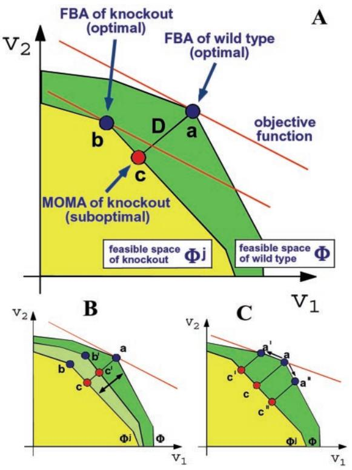
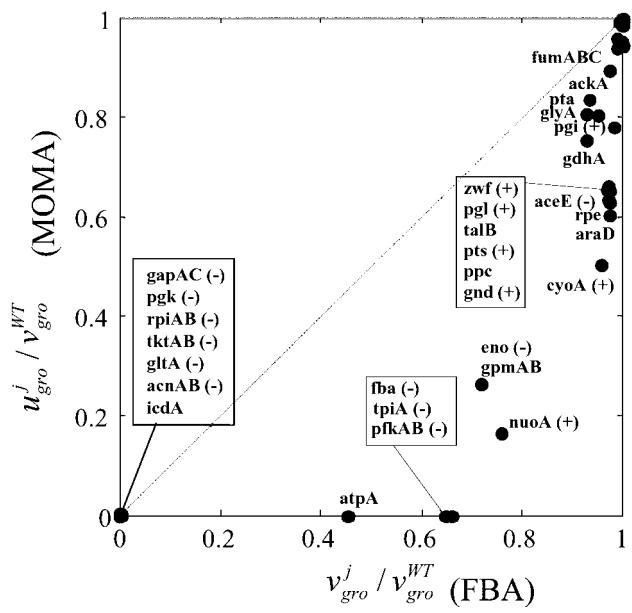
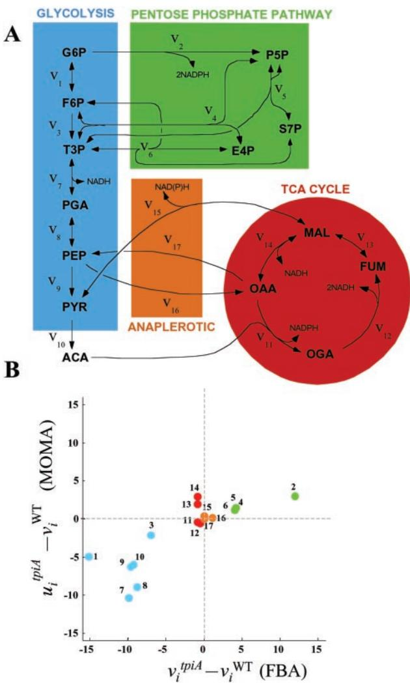
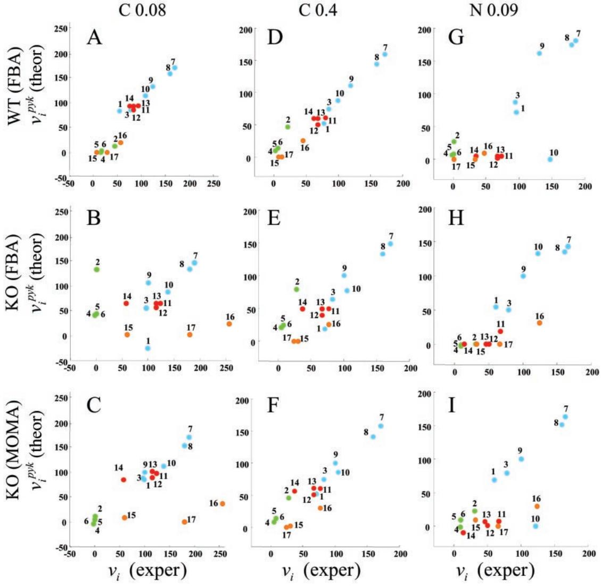

# **Analysis of optimality in natural and perturbed metabolic networks**

## **Daniel Segre`, Dennis Vitkup, and George M. Church***

Lipper Center for Computational Genetics and Department of Genetics, Harvard Medical School, Boston, MA 02115

Edited by Philip P. Green, University of Washington School of Medicine, Seattle, WA, and approved September 18, 2002 (received for review June 10, 2002)

**An important goal of whole-cell computational modeling is to integrate detailed biochemical information with biological intuition to produce testable predictions. Based on the premise that prokaryotes such as** *Escherichia coli* **have maximized their growth performance along evolution, flux balance analysis (FBA) predicts metabolic flux distributions at steady state by using linear programming. Corroborating earlier results, we show that recent intracellular flux data for wild-type** *E. coli* **JM101 display excellent agreement with FBA predictions. Although the assumption of optimality for a wild-type bacterium is justifiable, the same argument may not be valid for genetically engineered knockouts or other bacterial strains that were not exposed to long-term evolutionary pressure. We address this point by introducing the method of minimization of metabolic adjustment (MOMA), whereby we test the hypothesis that knockout metabolic fluxes undergo a minimal redistribution with respect to the flux configuration of the wild type. MOMA employs quadratic programming to identify a point in flux space, which is closest to the wild-type point, compatibly with the gene deletion constraint. Comparing MOMA and FBA predictions to experimental flux data for** *E. coli* **pyruvate kinase mutant PB25, we find that MOMA displays a significantly higher correlation than FBA. Our method is further supported by experimental data for** *E. coli* **knockout growth rates. It can therefore be used for predicting the behavior of perturbed metabolic networks, whose growth performance is in general suboptimal. MOMA and its possible future extensions may be useful in understanding the evolutionary optimization of metabolism.**

**T**he enormous number of components and interactions in a cell, together with the uncertainty about many parameters describing cellular dynamics, greatly hinder the task of performing accurate whole cell simulations. Consequently, computational efforts based on conceptual shortcuts are essential. One area in which such simplifications have proved extremely useful is metabolic flux analysis (1–7). Notably, flux balance analysis (FBA) (8–11), a method for studying the capabilities of metabolic networks at steady state, constitutes an example of how the knowledge of a restricted set of parameters in a system, combined with the application of fundamental thermodynamic and evolutionary principles, can generate quantitative predictions and testable hypotheses. In FBA, the constraints imposed by stoichiometry in a chemical network at steady state are treated analogously to Kirchoff's law for the balance of currents in electric circuits (2, 12). Thus, for each of *M* metabolites in a network, the net sum of all production and consumption fluxes, weighted by their stoichiometric coefficients, is zero:

$$\sum_{j=1}^{N} \mathcal{S}_{ij} \nu_j = 0 \qquad i = 1, \ldots, M. \tag{1}$$

Here, *Sij* is the element of the stoichiometric matrix **S** corresponding to the stoichiometric coefficient of metabolite *i* in reaction *j*. The flux *vj* is the rate of reaction *j* at steady state, and is the *j*-th component of an *N*-dimensional flux vector **v**, where *N* is the total number of fluxes. In addition to internal fluxes, which are associated with chemical reactions, **v** includes exchange fluxes that account for metabolite transport through the membrane. The steady-state approximation is generally valid because of the fast equilibration of metabolite concentrations (seconds) with respect to the time scale of genetic regulation (minutes) (1, 6).

Additional constraints, including those that relate to the availability of nutrients or to the maximal fluxes that can be supported by enzymatic pathways, can be introduced as inequalities

$$
\alpha_{\rangle} \le \nu_{\rangle} \le \beta_{\rangle}. \tag{2}
$$

For example, for a substrate uptake flux *vj*, one can set *j* and *j* equal to the corresponding measured or imposed value. Eq. **2** can also be used to distinguish reversible and irreversible reactions, where *j* 0 for the latter. Additional constraints are invoked to represent the requirement for metabolic homeostasis, and can be expressed in terms of linear relationships similar to Eq. **1** (8, 13).

All flux vectors that satisfy the constraints mentioned above define a feasible space, -. For an underdetermined system, as is typically the case in FBA models of cellular metabolic networks (11), is a convex set in the *N*-dimensional space of fluxes (14). Because of the linear nature of -, it is possible to use linear programming (15) to characterize the points in that maximize or minimize a given linear objective function. A natural choice for an objective function in metabolic models of prokaryotes is biomass production (8, 9, 13), as it is reasonable to hypothesize that unicellular organisms have evolved toward maximal growth performance. This process is formalized by introducing a growth flux that transforms a linear combination of fundamental metabolic precursors into biomass (see *Methods*).

The availability of annotated genomic sequences has led to FBA metabolic models of various microorganisms, including *Haemophilus influenzae* (16), *Escherichia coli* (13, 17, 18), and *Helicobactyer pylori* (19). The existence of 100 fully sequenced and annotated genomes (and many more in pipeline) paves the way for wide-scale application of flux analysis of the corresponding metabolic networks (5).

The theoretical basis of FBA is supported by several experiments. These include empirical validation of growth yield and flux predictions (8, 9), measurements of uptake rates around the optimum under various conditions (18), as well as results from large-scale gene deletion experiments (20). Additional strong support based on intracellular flux comparisons is presented here in Fig. 4 *A*, *D*, and *G*.

An important application of FBA is the prediction of phenotypic effects arising from complete or partial metabolic gene deletions (13, 17, 21). A complete gene deletion is implemented by constraining the corresponding flux to zero. Linear programming provides then the flux distribution and maximal growth yield for the new genotype. Crucially, this approach assumes that

This paper was submitted directly (Track II) to the PNAS office.

Abbreviations: MOMA, minimization of metabolic adjustment; FBA, flux balance analysis; QP, quadratic programming.

*To whom correspondence should be addressed. E-mail: church@arep.med.harvard.edu.

**Fig. 1.** (*A*) The optimization principles underlying FBA and MOMA. A schematic 2D depiction of the feasible space for the wild-type (-WT) and for mutant of flux j (j ) is represented by the green and superimposed yellow polygons. The coordinates are two arbitrary representative fluxes, an extremely simplified version of the multidimensional flux space. The solution to the FBA problem is the point that maximizes the objective function (red line). An optimal FBA prediction can be computed both for the wild-type (a) and for a knockout (b). The alternative MOMA knockout solution (c), calculated through QP, can be thought of as a projection of the FBA optimum onto the feasible space of the mutant (j ). The mutant FBA optimum and the corresponding MOMA solution are, in general, distinct. (*B*) Robustness analysis for partial deletions. Constraints corresponding to partial gene knockout lead to a feasible space that is intermediate between -WT and j (pale green). On such intermediate spaces, both the FBA optimum (b) and the MOMA projection (c) can be calculated. (*C*) A robustness analysis method unique to MOMA. One can perform a sampling of the feasible space around the optimum found by simplex in FBA (point a) and find correspondent MOMA projections. The robustness of the MOMA solutions is calculated for a defined threshold of sensitivity of the objective function, for *N* points obtained by limiting the corresponding fluxes to a given fraction of their wild-type value. This method is useful also for studying the possible multiplicity of MOMA solutions in case alternative FBA optima are present (points a and a).

the mutant bacteria display an optimal metabolic state; yet, mutants generated artificially in the laboratory are generally not subjected to the same evolutionary pressure that shaped the wild type. Therefore knockouts probably do not possess a mechanism for immediate regulation of fluxes toward the optimal growth configuration. To better understand the flux states of mutants, we introduce here the method of minimization of metabolic adjustment (MOMA) (Fig. 1*A*), which is based on the same stoichiometric constraints as FBA, but relaxes the assumption of optimal growth flux for gene deletions. A mutant is likely to initially display a suboptimal flux distribution that is somehow intermediate between the wild-type optimum and the mutant optimum. MOMA provides a mathematically tractable approximation for this intermediate suboptimal state, based on the conjecture that the mutant remains initially as close as possible to the wild-type optimum in terms of flux values. In other words, through MOMA, we test the hypothesis that the real knockout steady state is better approximated by the flux minimal response to the perturbation than by the optimal one. Predicting a metabolic phenotype by MOMA involves a different optimization problem than FBA, namely distance minimization in flux space. To this end, because distance in flux space is a quadratic function, we employ quadratic programming (QP) (see also ref. 22). In the present work we compare FBA and MOMA predictions for *E. coli* with experimental data from different sources, and find that MOMA can serve as a more precise method for predicting the metabolic phenotype of gene knockout bacteria. In addition to proposing MOMA as a computational tool for the analysis of artificially engineered bacteria, we suggest that this approach can help understand how a cell adapts to the loss of a gene by regulation and evolutionary optimization.

#### **Methods**

For the stoichiometric analysis of the metabolic network of *E. coli*, we have used the reconstruction by Edwards and Palsson (13). The list of metabolic reactions, and the 436 (metabolites) by 720 (fluxes) stoichiometric matrix (available at http: gcrg.ucsd.edu) were compiled using data from public databases and literature. This *in silico* model of *E. coli* MG1655 metabolism encompasses central carbon metabolism, transmembrane transport reactions, carbon source utilization pathways, as well as the metabolic pathways responsible for the synthesis and degradation of amino acids, nucleic acids, vitamins, cofactors, and lipids (13). As in previous FBA formulations, we use inequalities (Eq. **2**) to limit nutrient uptake and to implement reaction irreversibility, and we include all fluxes related to maintenance requirements (8, 18). Reconstruction of other *E. coli* strains analyzed in this work, JM101 and PB25 (4), required minimal changes with respect to MG1655 (see supporting information, which is published on the PNAS web site, www.pnas.org).

**Flux Balance Analysis.** In FBA the maximization of biomass production is implemented by defining an additional flux *vgro* associated with cell growth. For this flux, the stoichiometric factors of the reactants are the experimentally known proportions *c*i of metabolite precursors *X*i contributing to biomass production (13, 23):

$$c_1X_1 + c_2X_2 + \dots + c_MX_M \xrightarrow{\nu_{gro}} 1 \text{ } Biomass. \tag{3}$$

The search for the flux vector maximizing *vgro* under the constraints of Eqs. **1** and **2** is solved by the simplex algorithm. We denote here by **v**WT the solution of FBA for the wild-type organism in its feasible space -WT. A knockout of the enzyme catalyzing reaction *j* is obtained by imposing the extra constraint *vj* 0. Such condition defines the feasible space j for the mutant strain. The solution for knockout *j* is denoted by **v**j .

Our PERL implementation of FBA, whose results we verified matching previous FBA calculations, uses the open source GNU Linear Programming kit (24).

**Minimization of Metabolic Adjustment.** In MOMA we search for a point in j that has minimal distance from a given flux vector **w** (Fig. 1*A*). The goal is to find the vector **x** j such that the Euclidean distance

$$D(\mathbf{w}, \mathbf{x}) = \sqrt{\sum_{i=1}^{N} (w_i - x_i)^2} \tag{4}$$

**Fig. 2.** The suboptimal growth yield calculated using MOMA is plotted vs. the optimal one obtained with FBA, for central carbon metabolism *E. coli* genes, during growth on glucose. On both axes, growth yields are normalized to the wild-type yield *vgro* WT. Most points are labeled with the gene name. The ( ) and () signs correspond to genes experimentally verified to be nonessential and essential, respectively. All points lie below the diagonal because of the suboptimal nature of MOMA predictions. A cluster of lethal deletions (bottom left corner) was correctly predicted by FBA and MOMA equally. Another cluster of genes (top right corner) corresponds to genes that are not essential. More interesting are the mutants that do not belong to either of these clusters. These are the ones for which FBA and MOMA predictions differ significantly. Three essential genes (*fba*, *tpiA*, *pfk*) that were not predicted correctly by FBA are predicted correctly with the MOMA calculation. Other points, such as *nuoA* and *cyoA*, despite being known to be viable and correctly predicted by FBA, scored lower in MOMA growth function prediction. However, none of the genes that were nonessential in FBA, in agreement with experimental evidence, resulted essential in MOMA.

is minimized (22). Stated as a standard QP problem (15, 25), the aim is to minimize

$$f(\mathbf{x}) = \mathbf{L}\cdot\mathbf{x} + \frac{1}{2}\mathbf{x}^T\mathbf{Q}\mathbf{x} \tag{5}$$

under a set of linear constraints. In Eq. **5**, the vector **L** of length *N* and the *N N* matrix **Q** define the linear and quadratic part of the objective function, respectively, and **x***T* represents the transpose of **x**. By observing that minimizing the function *D* of Eq. **4** is equivalent to minimizing its square, and that constant terms can be omitted from the objective function, one can choose Q to be an *N N* unit matrix and set **L w**, and hence reduce the minimization of *D* to the minimization of *f*(**x**). Here we are interested in the case **w v**WT, i.e., in finding the point **u**j in j , which is closest to the wild-type point (as calculated with FBA). Although a formal proof is not offered in this context, it can be intuitively inferred that, if a solution for the wild-type FBA problem **v**WT exists, and if the space j is not empty (i.e., the constraint *vj* 0 is compatible with the other constraints), then a solution to this problem always exists. Its uniqueness is guaranteed by the convexity of *f*(**x**), which in turn derives from **Q** being semipositive definite (15). We emphasize that in MOMA, in contrast to FBA, the objective function does not explicitly depend on biomass production. Its linear part reflects the vector of fluxes of the wild type, whereas its quadratic part is the square of the Euclidean norm of **x**.

**Fig. 3.** (*A*) A schematic representation of the central carbon metabolism pathways, inspired by the work of Emmerling *et al.* (4), in which the numbered fluxes were measured. For fluxes details, see ref. 4 and Table 3, which is published as supporting information on the PNAS web site. The color code is used for emphasizing pathway usage in Figs. 3*B* and 4. (*B*) An example of flux prediction for one of the *E. coli* mutants shown in Fig. 2. The mutant is *tpiA*, one of the three knockouts predicted correctly by MOMA but not by FBA. Each point corresponds to a flux in the metabolic network of the *tpiA* knockout, with color coding for different pathways as in *A*. The abscissa and ordinate correspond to changes in FBA predicted fluxes and MOMA predicted fluxes, respectively, with respect to wild-type prediction. Only a limited portion of the results is displayed here. Fluxes are measured in mmol/g dry weight (DW) per h. The activity of the Pentose Phosphate Pathway, which would intensify in an optimal FBA distribution, does not increase in the MOMA prediction.

For QP, the IBM QP Solutions library (26) was used. The growth yield for the mutant can be evaluated after minimization by inspection of the corresponding flux (*ugro j* ). Time required for calculating one FBA or MOMA solution is of the order of 2 sec on a Pentium III computer running Linux.

**Robustness Analysis.** Two methods were used to assess the stability of MOMA-predicted flux points. The first (Fig. 1*B*) is analogous to the robustness analysis previously described for FBA (21), whereby one follows the gradual change in growth flux as *vj* is varied from *vj WT* to zero. In MOMA one analogously can study the gradual variation of the suboptimal flux point **u**j , and in particular of the growth flux *ugro j* . Comparative FBA and MOMA

**Table 1. Correlation coefficients and** *P* **values for the graphs of Fig. 4**

| Condition | Method    | Absolute |             |             | Relative |             |             |
|-----------|-----------|----------|-------------|-------------|----------|-------------|-------------|
|           |           |  1    | P value (a) | P value (b) |  2    | P value (c) | P value (d) |
| C-0.08    | WT        | 0.91     | 8.2  108    |             | –        | –           | –           |
|           | KO (FBA)  | 0.064    | 101 6.0  | 3.3  103    | 0.36     | 101 9.0  | 2.4  104    |
|           | KO (MOMA) | 0.56     | 7.4  103    |             | 0.48     | 2.3  102    |             |
| C-0.4     | WT        | 0.97     | 8.1  1012   |             | –        | –           |             |
|           | KO (FBA)  | 0.77     | 8.1  105    | 2.5  103    | 0.36     | 102 7.0  | 1.4  102    |
|           | KO (MOMA) | 0.94     | 2.6  109    |             | 0.74     | 2.3  104    |             |
| N-0.09    | WT        | 0.78     | 7.1  105    |             | –        | –           |             |
|           | KO (FBA)  | 0.86     | 3.0  106    | 102 9.0  | 0.096    | 101 3.5  | 4.6  102    |
|           | KO (MOMA) | 0.73     | 2.8  104    |             | 0.49     | 2.0  102    |             |

On different rows the different kinds of predictions are listed for each different condition. The third column reports, for each method, the correlation coefficient between the experimental flux values and the ones calculated through FBA or MOMA. The correspondent *P* values (a) for testing the hypothesis that the points are uncorrelated are reported in the fourth column. The fifth column contains the *P* values (b) for the hypothesis that the FBA and MOMA correlation coefficients are not significantly different. Columns 6–8 are analogous to columns 3–5, whereas the correlations are calculated only for the knockout strain, normalized (by subtraction) to the wild-type fluxes. Bold numbers represent *P* values that do not lead to rejection of null hypothesis (with 95% confidence). KO, knockout.

examples of robustness analysis can be found in the supporting information. Interestingly, there are cases in which FBA and MOMA predictions are identical for a complete knockout, but they differ from each other for partial deletions.

A second kind of robustness analysis (Fig. 1*C*) is unique to MOMA, and addresses the variability of the knockout prediction as the point **w** is displaced around the wild-type optimum **v**WT. To obtain a map of this variability in the multidimensional flux space, it is necessary to perform a systematic analysis of the effects of displacements along all possible edges departing from **v**WT. For this purpose, one can sample the flux space around **v**WT by limiting one by one each of the fluxes to a given fraction (e.g., 90%) of its wild-type FBA value; on each such displacement one can recalculate the FBA optimum and use the result as the input **w** vector for MOMA. This sensitivity analysis can also be used for studying the dependence of MOMA predictions on the possible presence of alternative FBA optima (e.g., points a and a in Fig. 1*C*). The results of this analysis can be found in the supporting information.

## **Results**

**Prediction of Essential Genes in E. coli Central Carbon Metabolism.** We compared the predicted growth yield values of *E. coli* central carbon metabolism enzyme knockouts obtained by FBA and MOMA. For metabolic reactions carried out by multisubunit complexes, all members of the complex were deleted; similarly, for reactions catalyzed by multiple isoenzymes, all corresponding genes were deleted (13).

The normalized growth yields obtained with the two methods are plotted against each other in Fig. 2. All points lie in the lower triangle of the graph because MOMA necessarily gives growth yields smaller or equal to the optimal ones predicted by FBA. In 26 of 47 cases, the two predictions differ by 5%. Of the remaining 21 knockouts, 7 display a difference that exceeds 50%; among those whose predictions differ most between the two methods are fructose-1,6-bisphosphatate aldolase (*fba*), triosphosphate isomerase (*tpiA*), and phosphofructokinase (*pfk*). These were predicted to be nonessential by FBA, whereas the literature reported that each of them is essential for growth on glucose (see ref. 13 and references therein). Some flux change differences between FBA and MOMA predictions for the *tpiA* knockout are shown in Fig. 3*B*, using the pathway color code of Fig. 3*A*. On deletion of*tpiA*, the FBA optimal solution would tend to redistribute fluxes so as to increase significantly the use of the pentose phosphate pathway, whereas the MOMA point would tend to reflect the initially less prominent usage of this pathway. A number of related flux differences are observed, including a drastic divergence in the fluxes for the serine pathway genes *serA*, *serB*, and *serC*. For the wild type, these fluxes amount to 14% of the glucose uptake flux; in the FBA prediction for *tpiA* knockout the values are reduced to 3%, whereas in the MOMA prediction they are zero. This finding explains the corresponding zero final growth yield, because serine is one of the essential biomass components. A similar situation was observed for deletion of *fba* and *pfkAB*.

**Comparison with Measured Growth Performance of Competing Insertional Mutants.** The FBA prediction of lethality for metabolic gene knockouts has been recently compared with the data obtained in an experiment of competitive growth (20). In this experiment, an *E. coli* transposon library was subjected to competitive growth in rich and minimal media, and 488 genes were classified according to whether their insertional inactivations negatively affected growth in the competition. The significance of the FBA prediction was assessed by a 2 test, comparing the observed values of negatively and nonnegatively selected genes in the different predicted classes (essential, nonessential, and reduced growth), with the outcome expected if those genes were randomly distributed among the classes. The predicted trend of enrichment was observed (20). We repeated the same test with MOMA, and found the same trend, now with even higher statistical significance. The *P* value in the 2 test for such enrichment trend was 105 in MOMA, as compared with the value of 4 104 in the FBA prediction (see Table 2, which is published as supporting information on the PNAS web site).

**Comparison with Experimental Flux Measurements of an E. coli Pyruvate Kinase (pyk) Knockout.** Recent measurements of metabolic fluxes in a *pyk* knockout (4) allowed us to test the MOMA predictions directly. Emmerling *et al.* (4) empirically determined a collection of intracellular fluxes for *E. coli* central carbon metabolism by combining NMR spectroscopy in 13C labeling experiments, physiological data measurement, and numerical data fitting. For both the wild-type strain (JM101) and the *pyk* mutant (PB25, *pykA*::*kan pykF*::*cat*), two glucose-limited (low and high concentration), and one nitrogen-limited experiments were performed, and six resulting sets of fluxes were measured (see Tables 2 and 3). For a discussion of the experimentally observed differences between the knockout and the wild-type

**Fig. 4.** Comparison of some FBA and MOMA fluxes predictions for *pyk* knockout with corresponding experimental results from ref. 4. Fluxes are expressed in percent of the glucose uptake flux. *A*–*C* relate to the low concentration carbon limited condition (C-0.08); *D*–*F* relate to the high concentration carbon-limited condition (C-0.4); and *G*–*I* relate to the nitrogen-limited condition (N-0.09). For each condition, the FBA optimal prediction for the wild type is compared with the experimental result for strain JM101 (*A*, *D*, and *G*). The FBA (*B*, *E*, and *H*) and MOMA (*C*, *F*, and *I*) predictions for the *pyk* mutant are compared with the experimental results for the knockout strain PB25. Color coding for pathways is as in Fig. 3*A*. The significant improvement in the predictive power for mutants through MOMA is quantitatively analyzed in Table 1.

phenotype, see ref. 4. A mathematical model of these strains had been discussed in ref. 35.

In the FBA and MOMA models, uptake fluxes for glucose and nitrogen were matched to the ones experimentally measured. We first compared the FBA prediction for the wild type with the corresponding experimental result. The remarkably high, and statistically significant correlation coefficients confirm the predictive value of FBA for wild-type *E. coli*, as seen in Fig. 4 *A*, *D*, and *G* and in Table 1. Correlation coefficients range between 0.78 and 0.97, with *P* values ranging from 7 105 to 8 1012. The lowest correlation is observed for the nitrogen-limited case. To our knowledge, this is the first time that several FBApredicted intracellular fluxes have been compared with experimental flux data for an array of different strains and conditions. Next, we compared the FBA and MOMA predictions for the *pyk* mutant with the corresponding experimental results. Overall, the correlation coefficients were lower than those of the wild type. Interestingly, however, the MOMA predictions in the two carbon-limited experiments were significantly more accurate than those of FBA (Fig. 4 *B*, *C*, *E*, and *F*). The lowest correlation (0.064, *P* value 6 101) is found in the FBA prediction for the mutant under low glucose uptake conditions (Fig. 4*B*). MOMA in the same case (Fig. 4*C*) improves the correlation to 0.59, with *P* value 7.4 103. When repeating the correlation analysis for relative flux changes between knockout and wild type (*ui j vi* WT vs. *vi j vi* WT for flux *i* in knockout of gene *j*) we found that MOMA scores significantly better than FBA in all three conditions (see Table 1).

A peculiar distribution is observed for fluxes 16 (*ppc*) and 17 (*pck*) in Fig. 4 *B*, *C*, *H*, and *I*. These deviate from the main diagonal by comparable amounts, suggesting that the discrepancy may be related to the circular topology of their subnetwork (see Fig. 3*A* and ref. 4).

The overall higher predictive power of MOMA relative to FBA in the analysis of the *pyk*-deleted strain is consistent with the notion that the assumption of optimality is less appropriate for knockout strains than for the wild type.

### **Discussion**

Natural selection can be extremely efficient at generating systems that are optimally adapted to their environment (27–30). Optimal metabolic adaptation for growth under various environmental conditions is especially important for many bacteria (23). Optimality can be achieved by changing the topology of the metabolic network and by tuning enzymatic and regulatory parameters. FBA predicts growth yield and metabolic fluxes based on the assumption that growth efficiency has evolved to an optimal point. The high correlation that we find between FBA predictions for wild-type *E. coli* and some recent experimental flux measurements (4) confirms earlier evidence that the assumption of optimality is valid in this case. The slightly lower correlation observed in the nitrogen-limited environment relative to the carbon-limited cases could indicate that *E. coli* evolved toward optimality primarily under carbon-limited conditions.

In contrast to FBA, MOMA does not assume optimality of growth or of any other metabolic function. Instead, for perturbations such as gene deletions, MOMA approximates metabolic phenotype by performing distance minimization in flux space. We demonstrated that MOMA correctly predicts the lethality of some *E. coli* gene deletions that FBA failed to recognize, and we analyzed flux changes possibly crucial in this prediction. It will be interesting to analyze the flux distributions of other gene deletions whose points in Fig. 2 either show a discrepancy between FBA and MOMA predictions (e.g., *eno* and *nuoA*), or deviate from experimental results in all methods (e.g., *aceE*). Fig. 2 could serve in general as a map for suggesting maximally informative sets of experimental knockout flux data. It is likely that future experiments will produce more data for the intracellular fluxes of several *E. coli* gene knockouts, and hence more facts against which MOMA predictions could be tested. As part of this analysis, a systematic comparison of FBA and MOMA flux values would provide quantitative constraints on the complex metabolite and enzyme concentration changes expected on optimization of growth performance. To understand whether a transition from a suboptimal to an optimal metabolic state requires Darwinian evolution (33), or could be accomplished gradually through gene regulation, high time-resolution experiments are required, in which fluxes are measured before and after an enzyme is abruptly inactivated. Interestingly, in line with the basic hypothesis underlying MOMA, a previous study by Schuster and Holzhu¨tter (31) revealed relative stability of erythrocyte metabolic fluxes against alterations in enzyme activity,

- 1. Heinrich, R. & Schuster, S. (1996) *The Regulation of Cellular Systems* (Chapman and Hall, New York).
- 2. Schilling, C. H., Edwards, J. S. & Palsson, B. O. (1999) *Biotechnol. Prog.* **15,** 288–295.
- 3. Stephanopoulos, G. & Kelleher, J. (2001) *Science* **292,** 2024–2025.
- 4. Emmerling, M., Dauner, M., Ponti, A., Fiaux, J., Hochuli, M., Szyperski, T., Wuthrich, K., Bailey, J. E. & Sauer, U. (2002) *J. Bacteriol.* **184,** 152–164.
- 5. Covert, M. W., Schilling, C. H., Famili, I., Edwards, J. S., Goryanin, II, Selkov, E. & Palsson, B. O. (2001) *Trends Biochem. Sci.* **26,** 179–186.
- 6. Fell, D. (1996) *Understanding the Control of Metabolism* (Portland Press, London).
- 7. Bailey, J. E. (2001) *Nat. Biotechnol.* **19,** 503–504.
- 8. Varma, A. & Palsson, B. O. (1993) *J. Theor. Biol.* **165,** 503–522.
- 9. Varma, A. & Palsson, B. O. (1994) *Appl. Environ. Microbiol.* **60,** 3724–3731.
- 10. Edwards, J. S. & Palsson, B. O. (1998) *Biotechnol. Bioeng.* **58,** 162–169.
- 11. Bonarius, H. P. J., Schmid, G. & Tramper, J. (1997) *Trends Biotechnol.* **15,** 308–314.
- 12. Yagil, G. & Hoberman, H. D. (1969) *Biochemistry* **8,** 352–360.
- 13. Edwards, J. S. & Palsson, B. O. (2000) *Proc. Natl. Acad. Sci. USA* **97,** 5528–5533.
- 14. Schilling, C. H., Edwards, J. S., Letscher, D. & Palsson, B. O. (2000) *Biotechnol. Bioeng.* **71,** 286–306.
- 15. Vanderbei, R. J. (2001) *Linear Programming, Foundations and Extensions* (Kluwer Academic, Boston).
- 16. Schilling, C. H. & Palsson, B. O. (2000) *J. Theor. Biol.* **203,** 249–283.
- 17. Edwards, J. S. & Palsson, B. O. (2000) *BMC Bioinformatics* **1,** 1.
- 18. Edwards, J. S., Ibarra, R. U. & Palsson, B. O. (2001) *Nat. Biotechnol.* **19,** 125–130.

such as the ones caused by gene mutation. A complete and detailed kinetic model, as explored for erythrocytes (31, 32), is probably beyond reach for *E. coli* at this stage (35). However, FBA and MOMA studies of erythrocytes, in parallel to kinetic models, could help relate the transition between different steady states to enzyme expression time courses. In addition, flux balance results and enzyme expression data can be in principle used to infer kinetic constants for a whole metabolic network, provided that enough independent nutrient conditions are considered.

The wild-type point that is used in MOMA does not necessarily need to be an FBA result. For example, a wild-type point determined experimentally could be used similarly. In an iterative process of gene deletions, several MOMA projections could be applied in a chain, and compared with the MOMA result for simultaneous deletion of multiple genes. The concept of suboptimal mutants could be also applied to heterologous gene additions (3), as well as to the prediction of metabolic flux distributions for bacteria grown under unnatural environmental conditions (33). Possible variants of the MOMA approach presented here could involve alternative flux space metrics. Non-Euclidean distances, in alternative to Eq. **4**, may be considered more suitable to representing some biological processes. For example, in alternative to the absolute flux changes currently used in the distance minimization algorithm, it is possible to use normalized flux changes. Such a method would remove the dependence of fluxes on constant factors, and hence may better capture the effects of gene and metabolite regulation on fluxes in mutant strains.

Among the various possible methods for identifying a single flux point given an underdetermined set of constraints (11), FBA employs the biological concept of optimal growth. Other biologically sound assumptions have been proposed for this purpose (5, 34). MOMA is an additional option, based on a simple hypothesis about the response to metabolic alterations. This approach seems especially relevant for analyzing gene deletions, but its possible future extensions could help understand metabolic networks for a wider range of perturbations.

We are grateful to J. Edwards for sharing with us his FBA experience, and to B. Palsson and U. Sauer for helpful comments. Many thanks to N. Reppas, Y. Pilpel, A. Dudley, K. Leptos, P. D'haeseleer, A. Falcovitz-Segre`, and the whole Lipper center for invaluable help with manuscript preparation, and to D. Gamarnik and A. Egun for QP advice. This work was suported by grants from the U.S. Department of Energy and Defense Advanced Research Planning Agency.

- 19. Schilling, C. H., Covert, M. W., Famili, I., Church, G. M., Edwards, J. S. & Palsson, B. O. (2002) *J. Bacteriol.* **184,** 4582–4593.
- 20. Badarinarayana, V., Estep, P. W., III, Shendure, J., Edwards, J., Tavazoie, S., Lam, F. & Church, G. M. (2001) *Nat. Biotechnol.* **19,** 1060–1065.
- 21. Edwards, J. S. & Palsson, B. O. (2000) *Biotechnol. Prog.* **16,** 927–939.
- 22. Bonarius, H. P. J., Hatzimanikatis, V., Meesters, K. P. H., deGooijer, C. D., Schmid, G. & Tramper, J. (1996) *Biotechnol. Bioeng.* **50,** 299–318.
- 23. Neidhardt, F. C. (1996) *Escherichia coli and Salmonella* (Am. Soc. Microbiol. Press, Washington, DC).
- 24. Makhorin, A. (2001) GNU Linear Programming Kit (Free Software Foundation, Boston).
- 25. Gill, P. E., Murray, W. & Wright, M. H. (1981) *Practical Optimization* (Academic, London).
- 26. IBM (1998) *QP Solutions Library* (IBM, White Plains, NY).
- 27. Freeland, S. J., Knight, R. D., Landweber, L. F. & Hurst, L. D. (2000) *Mol. Biol. Evol.* **17,** 511–518.
- 28. Heinrich, R. & Schuster, S. (1998) *Biosystems* **47,** 61–77.
- 29. Stephani, A., Nuno, J. C. & Heinrich, R. (1999) *J. Theor. Biol.* **199,** 45–61.
- 30. Akashi, H. & Gojobori, T. (2002) *Proc. Natl. Acad. Sci. USA* **99,** 3695–3700.
- 31. Schuster, R. & Holzhu¨tter, H. (1995) *Eur. J. Biochem.* **229,** 403–418.
- 32. Jamshidi, N., Edwards, J. S., Fahland, T., Church, G. M. & Palsson, B. O. (2001) *Bioinformatics* **17,** 286–287.
- 33. Ibarra, R. U., Edwards, J. S., Ramos, L. S. & Palsson, B. O. (2002) *Nature*, in press.
- 34. Klamt, S., Schuster, S. & Gilles, E. D. (2002) *Biotechnol. Bioeng.* **77,** 734–51.
- 35. Varner, J. (2000) *Biotechnol. Bioeng.* **69,** 664–678.

Downloaded from https://www.pnas.org by 104.223.103.78 on February 17, 2025 from IP address 104.223.103.78.