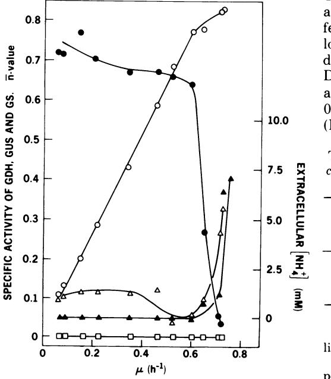
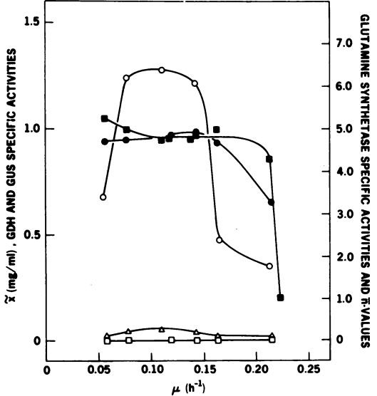
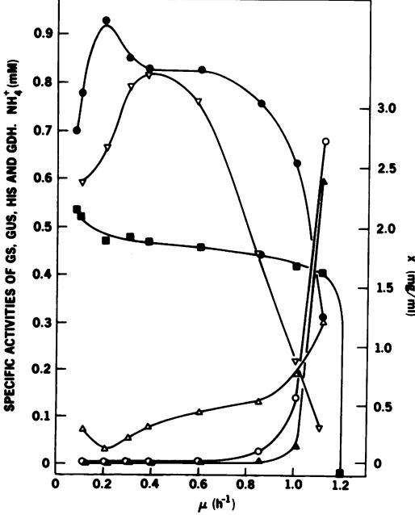
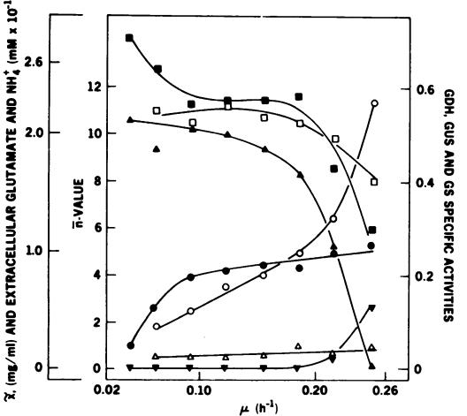
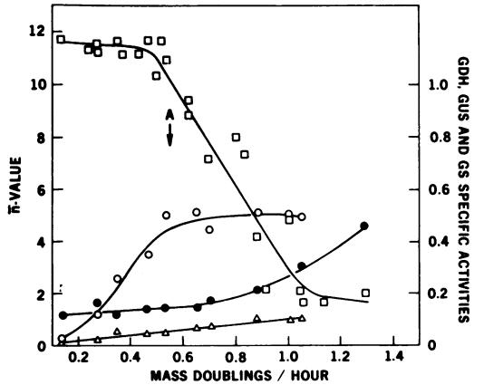
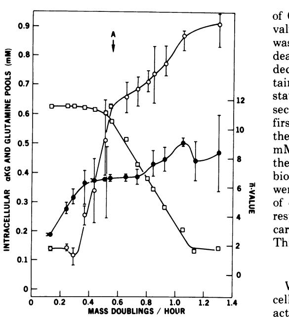
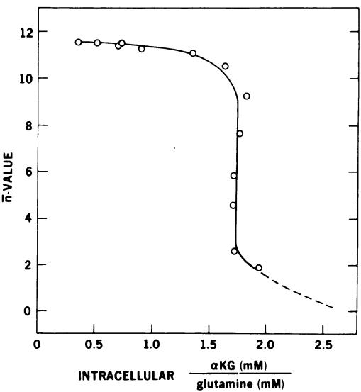

# Regulation of Nitrogen Metabolism in Escherichia coli and Klebsiella aerogenes: Studies with the Continuous-Culture Technique

PETER J. SENIOR'

Laboratory of Biochemistry, National Heart and Lung Institute, Bethesda, Maryland 20014

## Received for publication 15 April 1975

Ammonia-nitrogen-limited continuous cultures of Escherichia coli and Klebsiella aerogenes contain induced levels of glutamine synthetase that is deadenylylated (i.e., fully active). In the presence of excess ammonia or glutamate in glucose-limited cultures of E. coli, glutamine synthetase is repressed and adenylylated (inactive). The average state of adenylylation (ni) is a linear function of the specific growth rate. At low specific growth rates, glutamine synthetase is adenylylated; as the specific growth rate increases, ri decreases, approaching 0 to 2 at rapid growth rates. The average state of adenylylation correlates well with the intracellular concentrations and ratios of a-ketoglutarate and glutamine, which are key effectors in the adenylylation-deadenylylation systems. E. coli and K. aerogenes differ markedly in their growth yields, growth rates, and enzymatic composition druing nitrogen limitation. The data suggest that, unlike K. aerogenes, E. coli W uses glutamate dehydrogenase to incorporate ammonia during nitrogen limitation. In E. coli, glutamate dehydrogenase is progressively induced during nitrogen limitation when A (growth rate) approaches Amax. In contrast, in K. aerogenes glutamate dehydrogenase is repressed during nitrogen limitation, whereas glutamate synthase, an alternative supplier of glutamate to the cell, is induced. Data are presented that support the regulatory schemes proposed for the control of glutamine synthetase activity by induction-repression phenomena and adenylylation-deadenylylation reaction. We propose that the intracellular ratio of a-ketoglutarate to glutamine may be the most important physiological parameter in determining the activity of glutamine synthetase.

L-Glutamine is a key metabolite in the nitrogen metabolism of microorganisms. The amide nitrogen of glutamine is utilized in the biosynthesis of asparagine, glucosamine 6-phosphate, tryptophan, histidine, carbamyl phosphate, paminobenzoate, adenosine 5'-monophosphate, cytosine 5'-triphosphate, guanosine 5'-monophosphate, glutamate, and other amino acids. In addition, the a-amino group of glutamine can be transferred to certain a-keto acid in transamination reactions (21). Furthermore, the coupled activities of glutamine synthetase (GS), glutamate synthase, and a-ketoacid-glutamate transaminases (reactions 1 to 3) provide a pathway of biosynthesis for the assimilation of NH3 into all amino acids (39). Reactions 1, 2, and 3 are catalyzed by GS, glutamate synthase, and a transaminase, respectively:

$$\text{L-glutamate} + \text{NH}_3 + \text{ATP} \xrightarrow{\text{Me}^{\text{++}}}$$

L-glutamine + ADP + Pi (1)

L-glutamine + NADPH + a-ketoglutarate L

2 L-glutamate + NADP (2)

L-glutamate + a-ketoacid

a-ketoglutarate + a-amino acid (3)

However, this pathway of nitrogen assimilation would not be expected to operate when there was an ample supply of ammonia or organic nitrogen in the growth medium (27). Under these conditions GS is repressed (43, 45); glutamate dehydrogenase (GDH) acting biosynthetically is probably the key enzyme in NH3 assimilation, with free NH3 substituting for glutamine in most, if not all, of the glutaminedependent reactions in the cell. When the intracellular pool of ammonia is depleted, GDH

I Present address: Department of Biochemistry, University of Hull, Hull HU6 7RX, England.

will not act biosynthetically because of its low affinity for NH4+.

Whereas growth in rich media or in the presence of high concentrations of ammonium salts leads to repression of GS, glutamate synthase formation is unaffected (23). The absence of close linkage in repression and induction between GS and glutamate synthase in Escherichia coli may be due to there being no close genetic linkage between the structural genes of E. coli K-12 coding for GS, GDH, and glutamate synthase (3).

The situation in Klebsiella aerogenes appears to differ markedly from that in E. coli in that there is a clear reciprocal relationship between the activities of GS and GDH (18), and these authors have proposed that the regulation of GDH synthesis is controlled by the GS molecule, in a fashion similar to the proposed regulation of histidase (HIS) activity in a mutant of K. aerogenes (41).

In addition to the coarse control of GS activity by induction and repression, there is the fine control exerted by cumulative feedback inhibition of GS by the multiple end products of glutamine metabolism (44, 45); the significance of this regulatory mechanism has been discussed in detail previously (34, 35). A further supplement to regulation by induction-repression and cumulative feedback inhibition of GS is the fine control exerted by the reversible, enzyme-catalyzed adenylylation and deadenylylation of the GS molecule.

When this enzyme modification was first discovered (46), it was shown that each of the 12 identical subunits of GS may be adenylylated; the adenylyl group is attached by phosphodiester linkage to a specific tyrosyl residue in each subunit (14). As the GS molecule becomes progressively adenylylated to a maximum of 12, biosynthetic activity in the presence of Mg2+ decreases to zero. However, it was found that, while adenylylation caused complete inactivation in the Mg2+-supported biosynthetic assay, there was a progressive increase in Mn2+-supported activity (14). A thorough investigation of this phenomenon has been reported (11).

Another effect of adenylylation is a change in sensitivity to cumulative feedback inhibition (15, 14, 33), these changes being exceedingly complex (36).

Although the reactions and interactions of effectors and enzymes in in vitro adenylylatingdeadenylylating systems have received a great deal of attention (10), the physiological significance of the results has been inferred from studies using nonproliferating washed-cell suspensions, batch cultures in rapid transition

between maximum growth rate and zero growth rate, or batch cultures subjected to a pulse of nutrient (15, 19, 42). In most cases cells had insufficient time to adapt to their new environment before other factors influenced adaptation.

However, these experiments have been important in determining the course of our studies. Therefore, in an effort to assess the physiological significance of conclusions based on these preliminary studies with whole cells and the in vitro experiments, E. coli W and K. aerogenes were grown, in a chemostat under steady-state continuous-culture conditions, on nutritionally well-defined media.

The effects of environment and specific growth rate on the induction and repression of GS, GDH, glutamate synthase, and HIS and on the state of adenylylation of GS have been determined. In addition, the relationship between these parameters and the intracellular concentrations of glutamine and a-ketoglutarate has been investigated. These two metabolites are key effectors in regulating the adenylylating and deadenylylation reactions in vitro (30, 42) and, as is shown here, are also important in the in vivo regulation of GS activity.

# MATERIALS AND METHODS

Organisms. E. coli W was obtained from G. Cohen; K. aerogenes MK-53, a mutant that exhibits constitutive synthesis of histidine-degrading enzymes during nitrogen-limited growth (25), was kindly donated by B. Magasanik.

Growth media. All media used for continuous cultures contained (millimolar): NaCl, 43.0; K2SO4, 14.3; potassium phosphate, 20.0; disodium ethylenediaminetetraacetic acid, 0.1; CaCl2, 0.0045; FeCl3 6H20, 0.062; ZnSO4 *71 20, 0.00063; CuSO4. 5H20, 0.00064; CoCl2.6H20, 0.00076; MgSO4.7H20, 1.7. In addition to this salts mixture, various quantities of glucose, NH4Cl, glutamic acid, and L-proline were added to give the desired nutrient limitation (see Results for concentrations). The pH of the complete medium was 7.15. For cultures utilizing glutamate instead of NH4+ as the nitrogen source, L-glutamic acid was neutralized with 5 M KOH prior to addition to the medium. Media were sterilized by filtration and stored at room temperature until required.

Inocula and maintenance of cultures. All inocula for continuous cultures were grown initially in 10-ml volumes of the appropriate media. After 18 h of aerobic growth at 37 C, the culture was transferred to 300 ml of fresh medium and again grown for 18 h at 37 C. After this time the inocula were checked for contamination by microscope examination, plating out on MacConkey agar for E. coli and, in addition, using diagnostic ENTEROTUBE for K. aerogenes. While these tests were performed the original culture was kept at 4 C. Chemostat cultures were checked for purity in a similar manner.

Continuous-culture apparatus. A mechanically coupled NBS Microferm fermentor was used in conjunction with a 5-liter (2-liter working volume) culture vessel adapted for continuous-culture operation by the incorporation of a wier into the harvest line such that effluent gas and culture were driven out of the vessel down a common line. Culture pH was maintained at 7.15 by the controlled addition of either 3.5 M NaOH or 1.5 M HCl, using an NBS pH controller. Cultures were grown at 37 C, and the dissolved oxygen concentration was recorded (NBS standard galvanic probe). Culture foam was dispersed by the controlled addition of polyglycol P 2000 Antifoam, with an NBS, Antifoam controller and detector.

The culture vessel was steam sterilized (15 lb/in2, 121 C) for 1 h and cooled. Accessory equipment was connected aseptically, and the medium was pumped into the vessel by a variable-flow NBS rotary pump (60 to 1,200 ml/h). For faster growth rates (dilution rate > 0.6/h), a Manostat Varistaltic pump was used. Flow rates were measured by the timed collection of effluent culture (after separation from the gas stream) in a closed measuring cylinder incorporated into the harvest line.

To prevent "back growth" of the organism into the nutrient feed line and media reservoirs, a hot-water jacket (65 C) surrounded the feed line immediately before the inlet port of the culture vessel. All cultures were grown aerobically with air as oxygen source and at a flow rate of 1 liter/min.

Determination of bacterial dry weight. Samples from the chemostat were suitably diluted with water such that the extinction at 500 nm (E500) was in the range 0.2 to 0.5. Reference to a curve of biomass versus Es00 gave the culture dry weight. An E50, of 1.0 was equivalent to 0.236 mg/ml for E. coli and 0.392 mg/ml for K. aerogenes. For analytical purposes, culture dry weight was determined by filtering 2 ml of whole culture through a preweighed, 22-mm, 0.22-Am pore size membrane filter (Millipore Corp.), washing the compacted cells with water at room temperature, and drying the filter to a constant weight in a vacuum oven (75 C for 3 h).

Analyses. Glucose and NH4+ in culture supernatants were determined by colorimetric assay (31). L-Glutamate was determined enzymatically with commercial GDH and nicotinamide adenine dinucleotide (NAD).

Intracellular pool of free L-glutamine. Our method of determining free L-glutamine was an adaptation of that described by Schutt and Holzer (32). Whole culture (9 ml), ca. 10 to 15 mg [dry weight] of cells) was mixed with 1 ml of 6 M HClI4. After 5 min at 0 C the mixture was centrifuged (5 min at 38,000 x g), and the- supernatant was decanted. Potassium carbonate (1 ml of 2.5 M solution) was added to 5 ml of supernatant, and the insoluble KClI4 was removed by centrifugation. The supernatant was adjusted to pH 2.0 with a measured volume of 6 M HCl. Samples were stored at -80 C without any detectable change in amino acid composition over a period of 8 weeks.

Amino acid analyses. A Beckman automatic amino acid analyzer was used for the amino acid analyses. A single buffer system was used to elute amino acids from the 55-mm column of Beckman AA-15 resin. The elution temperature was 34 C, and the elution buffer was 0.3 M citrate-sodium hydroxide, pH 3.25. The resultant peak areas were compared to those from a chromatogram of a standard amino acid mixture which contained 0.05 mM glutamine plus all amino acids (0.05 mM each).

Intracellular pool of free a-ketoglutarate. (i) Sample preparation. Whole culture (2 ml) was filtered as described previously, and the filter was transferred to a centrifuge tube containing 1 ml of 0.3 M HClI4 plus 1 mM disodium ethylenediaminetetraacetic acid at 0 C. The tube contents were mixed thoroughly for 30 s and then centrifuged to remove debris. A measured volume of the supernatant (0.5 ml) was removed and neutralized by the addition of 0.1 ml of 2 M K2CO,. Potassium perchlorate was then removed by centrifugation, and the supernatant (pH 3 to 4) was stored at -80 C prior to analysis.

(ii) Determination of a-ketoglutarate. For a-ketoglutarate determination, a spectrofluorimetric method (16) was used with the following adaptations. Because of the low concentrations of a-ketoglutarate in some samples, the reaction volume was reduced to 0.3 ml, and the concentrations of GDH and NADPH were increased. A typical reaction mixture contained: 0.5 M imidazole-acetate buffer (pH 7.0), 0.06 ml; 0.625 M ammonium acetate, 0.03 ml; 0.4 mM NADPH, 0.003 ml; GDH (10 mg/ml), 0.001 ml; and sample, 0.05 to 0.1 ml. Distilled water was added to give a final reaction volume of 0.3 ml. To minimize errors caused by suspended solids, all solutions were filtered prior to use.

Fluorescence changes were measured with a Hitachi spectrofluorimeter (model MPD2) at an excitation wavelength of 340 nm, and 460-nm fluorescence was recorded with a Hewlett-Packard chart recorder (model 1704B).

(iii) Preparation of crude cell-free extracts. A sample of culture (20 to 400 ml) was removed from the vessel and rapidly cooled by passage through crushed ice. The sample was centrifuged (15,000 x g for 20 min at 0 C), the supernatant was discarded, and the cell pellet suspended in 2 to 20 ml of 50 mM 2-methylimidazole-hydrochloric acid buffer plus 1 mM 2-mercaptoethanol containing 10 mM MgCl2 (pH 7.2). Cells were disintegrated by sonic treatment at 0 C for 60 s in two 30-s periods, using a Branson Sonifier at 3-A output. Debris was removed by centrifugation (38,000 x g at 0 C for 40 min). Crude extracts were kept at 0 C and assayed immediately for the various enzyme activities of interest.

(iv) Determination of protein. Protein was determined colorimetrically (17), with crystallized bovine serum albumin as a standard.

Enzyme assays. (i) GS activity and average state of adenylylation. GS activity and ri were measured by the gamma glutamyl transfer reaction (37). Reaction blanks minus adenosine 5'-diphosphate and arsenate were used to correct both Mn2+ alone and Mn2+ plus Mg2+ assays for crude extract glutaminase activity which also forms gamma glutamyl hydroxamate under these assay conditions. Extracts from

(ii) GDH and glutamate synthase. GDH and glutamate synthase activities were measured spectrophotometrically at 37 C (26).

(iii) HIS. HIS activity was measured spectrophotometrically at 37 C (25).

Chemicals. L-Proline, L-histidine, L-glutamic acid, L-glutamine, adenosine 5'-diphosphate, adenosine 5'-triphosphate, NAD, NADH, NADP, NADPH, and a-ketoglutarate were from Sigma Chemical Co. All other reagents used were of analytical grade. GDH was obtained from Boehringer Co.

# RESULTS

Ammonia-nitrogen-limited cultures of E. coli. Cells grown in a medium containing 7.5 mM NH4Cl, 55.6 mM D-glucose, salts, and trace metals were examined upon the attainment of nitrogen-limited steady states for the specific activities of GS, GDH, glutamate synthase, and GS ri value. Ten steady states were examined, and the recorded activities are the mean of duplicate assays of triplicate chemostat sam-

FIG. 1. Ammonia-nitrogen-limited, glucose-grown cultures of E. coli W. Specific activities of enzymes in all figures have the units micromoles per minute per milligram of crude extract protein. Symbol: 0, GDH; A, glutamate synthase (GUS); 0, GS; 0, ri value; A, extracellular NH4+.

ples (Fig. 1). At low specific growth rates, GS was either derepressed or induced and ri was zero. There was no NH4+ detectable in the culture, and glucose was present in excess in all steady states (see Table 2). As A (growth rate) increased, GS specific activity declined slightly. As Amax (maximum specific growth rate) was approached, NH4+ was detected in the culture and GS became repressed (see Table 2 and Fig. 1).

The maximum specific activity of GS was recorded at a , value equivalent to a mass doubling time (td) of 7 h, reaching 0.78,gmol of gamma glutamyl hydroxamate formed per min per mg of protein with i = 0 to 1. Repression of GS at high 4 values gave an overall decrease in specific activity of 21-fold. At u = 0.062 h-l (td = 11.2 h), GDH specific activity was 0.1 j.mol/min per mg of protein, and it increased linearly with specific growth rate to achieve a maximum of0.83 atu = 0.725 h-1 (td = 58 min).

Another series of NH4+-nitrogen-limited cultures was run to investigate the effects, if any, of high extracellular phosphate on the levels of the three enzymes studied previously, HIS, and the average state of adenlylylation of GS. These results are shown in Table 1. A comparison of Table 1 and Fig. 1 shows that, whereas GDH and glutamate synthase activities are unaffected by high phosphate levels. GS at the lowest specific growth rate studied is almost double that found in low-phosphate cultures. Differences at high specific growth rates are also apparent. Whereas GS activity at = 0.68 h-1 is ca. 0.1 ,tmol/min per mg of protein (Fig. 1), in high-phosphate cultures at the same

TABLE 1. Ammonia-nitrogen-limited cultures of E. coli W in the presence of high potassium phosphate (250 mM)

| 0.68 h-1 is ca. 0.1 ,tmol/min per mg (Fig. 1), in high-phosphate cultures at the same TABLE 1. Ammonia-nitrogen-limited cultures of E. coli W |    |                                     |             | a4 in the presence of high potassium phosphate (250 mM) |                      |                   | of protein     |
|--------------------------------------------------------------------------------------------------------------------------------------------------------|----|-------------------------------------|-------------|---------------------------------------------------------------|----------------------|-------------------|----------------|
| Specific growth rate                                                                                                                             | xb | GSc                                 | ;d          |                                                               | GUSe GDH' YNH4gNH4,h |                   |                |
| 0.205 0.341 0.688                                                                                                                                |    | 0.86 1.33 0.80 1.12 0.80 1.01 | 0 0 0 | 0.16 0.18 0.08                                          | 0.18 0.25 0.80 | 115 107 107 | ND ND ND |

a Specific growth rate, A (h- l).

bx, Steady-state dry weight (milligrams per milliliter).

c Specific activity of GS (micromoles per minute per milligram of crude extract protein).

- dAverage state of adenylylation of GS.
- 'As c but for glutamate synthase.
- 'As c but for glutamate dehydrogenase.
- £ Yield (grams of cells per mole of NH4+ utilized).

h Steady-state extracellular concentration of NH4+ (millimolar). ND, Not detected.

growth rate GS activity is 10-fold greater. HIS was completely repressed at all growth rates in nitrogen-limited, glucose-grown cultures compared with HIS levels in histidinegrown batch cultures.

Glutamate-nitrogen-limited cultures of E. coli. The glutamate-glucose medium contained 7.5 mM L-glutamate and 55.6 mM D-glucose, and the results from steady states are shown in Fig. 2.

These cultures washed out (i.e., could not grow as fast as the dilution rate demanded for the attainment of a steady state) at much lower dilution rates than NH,+-limited cultures, and the maximum studied was 0.222 h-l (td = 3.1 h) compared with the minimum td of 46 min for NH4+-limited cultures. Glutamate synthase was repressed in all cultures, varying between 10 and 40% of the levels attained with NH,+ limitation. Ammonia was not detected in the medium.

Huge quantities of deadenylylated GS were synthesized by these cells, with the maximum specific activity encountered being 4.95 umol/ min per mg of protein and a minimum of 3.37, representing a 100- to 140-fold derepression of activity. High GDH activities were detected, passing through a maximum of 1.27 ,imol/min per mg at g = 0.11 h-l and decreasing to 0.34 ,gmol/min at ,u = 0.214 h-1. A rough estimate of the cellular GS content may be calculated from protein content, specific activity of puri-

FIG. 2. Glutamate-nitrogen-limited, glucosegrown cultures of E. coli W. Steady-state dry weight, *; all other symbols as in Fig. 1.

fied GS, and molecular weight, and it appears that during glutamate-limited growth 5 to 6% of the total soluble cell protein is GS.

Proline-nitrogen-limited cultures of E. coli W. The proline-glucose medium contained 10 mM L-proline and 55.6 mM D-glucose, and the results from the four steady states examined are shown in Fig. 3.

The maximum specific growth rate with 10 mM L-proline was in the range 0.150 to 0.158 h-l (td = 4.6 to 4.4 h), with both glutamate synthase and GDH repressed at all specific growth rates. As with glutamate-limited cultures, proline-limited growth caused massive synthesis of GS with specific activities 6.5 to 9.4-fold those recorded for derepressed cells growing under NH4+ limitation. Large quantities of Antifoam were required (ca. 10 ml/24 h) to control the excessive foam produced by these cultures. The resulting emulsion of culture and Antifoam gave erroneously high turbidometric readings. However, the problem was circumvented by chilling the diluted culture prior to E500 determination, whereupon Antifoam dissolved at temperatures < 19 C. GS activities were greater than those recorded with glutamate-limited cultures, reaching a maximum of 7.15 umol/min per mg of protein at M = 0.061 h-1.

Average states of adenylylation were low, varying between 0.45 and 2.45, with an upward trend at faster growth rates. Yields of cells (grams [dry weight] of biomass/mole of proline utilized) were identical to those for glutamatelimited cultures.

Ammonia-nitrogen-limited cultures of K. aerogenes MK-53. The growth medium was identical to that used for the growth of E. coli W. The variations in specific activities of GSH,

FIG. 3. Proline-nitrogen-limited, glucose-grown E. coli. Symbols: A, GDH; *, GS; 0, steady-state dry weight; 0, ni value; A, glutamate synthase (GUS) specific activity (x 10).

GS, HIS, and glutamate synthase between ,u = 0.104 and 1.103 h-l are recorded in Fig. 4, with additional data in Table 2. Growth yields (YNH4+ ), expressed in grams (dry weight) produced/mole of NH,+ consumed, were on the average 2.4-fold greater with K. aerogenes than for E. coli (Table 2). GS activity behaved in a fashion similar to that of the E. coli enzyme under identical growth conditions, with induction at slow and intermediate growth rates and repression at high growth rates as gmax was approached.

Glutamate synthase increased in specific activity with specific growth rate, particularly as steady states approached umax. HIS passed through a peak of activity at s = 0.4 h-1 thereafter decreasing rapidly such that at A = 1.103 h-l specific activity was 0.076 ,mol/min per mg of protein, representing an 11-fold repression of activity. The average state of adenylylation of the GS could not be determined by using the standard assay developed for this purpose with the E. coli enzyme. As noted above, negative ri values were recorded, and it is apparent that the K. aerogenes enzyme differs from the E. coli enzyme in its pH response and/or divalent cation specificity.

Another significant difference was the com-

FIG. 4. Ammonia-nitrogen-limited, glucose-grown cultures of Klebsiella aerogenes MK-53. Specific activity of histidase, V; all other symbols as in Fig. 1 and 2.

TABLE 2. Growth yield data for E. coli W and K. aerogenes MK-53

| Type of culture | Aa    | xb   | YN H 4+C | YG  | NH,+e |
|-----------------|-------|------|----------|-----|-------|
| NH4+-limited    |       |      |          |     |       |
| E. coli         | 0.062 | 0.79 | 102      | 20  | ND    |
|                 | 0.153 | 0.84 | 106      | 30  | ND    |
|                 | 0.350 | 0.79 | 105      | 47  | ND    |
|                 | 0.600 | 0.80 | 106      | 56  | ND    |
|                 | 0.713 | 0.60 | 95       | 60  | 1.27  |
| NH4+-limited    |       |      |          |     |       |
| K. aerogenes    | 0.080 | 2.17 | 289      |     | ND    |
|                 | 0.203 | 1.90 | 253      |     | ND    |
|                 | 0.600 | 1.85 | 246      |     | ND    |
|                 | 0.852 | 1.79 | 239      |     | 0.01  |
|                 | 1.103 | 1.62 | 235      |     | 0.59  |
| Glucose-limited |       |      |          |     |       |
| E. coli (excess | 0.040 |      | 98'      | 187 |       |
| glutamate)      | 0.094 |      | 75'      | 149 |       |
|                 | 0.187 |      | 70'      | 154 |       |
|                 | 0.250 |      | 24'      | 79  |       |
| Glucose-limited |       |      |          |     |       |
| E. coli (excess | 0.090 | 0.99 | 63'      | 56  | 25.3  |
| NH4+)           | 0.256 | 1.07 | 54'      | 61  | 20.2  |
|                 | 0.436 | 1.17 | 54'      | 69  | 18.2  |
|                 | 0.585 | 1.22 | 65'      | 72  | 21.2  |
|                 | 0.726 | 1.30 | 67'      | 77  | 20.5  |
|                 | 0.900 | 1.39 | 61'      | 82  | 17.3  |

a Specific growth rate, IA(h- 1).

° Steady-state dry weight (milligrams per milliliter of culture).

cYield (grams [dry weight] per mole of NH4+ utilized).

dYield (grams [dry weight] per mole of glucose 3.0 utilized).

eCulture steady-state NH4+ concentration (millimolar). ND, Not detected.

2.5 'Yield (YN) (grams [dry weight] per mole of glutamate nitrogen utilized).

> plete repression of GDH in nitrogen-limited K. aerogenes (Fig. 4). GDH was induced at high growth rates as NH,+ appeared in the medium. The maximum specific activity was 0.69 /smol/ min per mg of protein at ji = 1.103 h-1, decreasing to zero at At = 0.6 h-1. The steadystate dry weight of the culture (x) decreased with increasing growth rate, and cultures foamed extensively. Cells failed to form a wellpacked pellet on extensive centrifugation and were seen to possess a large extracellular capsule on microscope examination. Increased yields of cells (Table 2) at low growth rates may be accounted for by the synthesis of intraand/or extracellular polysaccharides.

Glucose-limited E. coli: glutamate nitrogen source. The glucose-glutamate medium

contained 15 mM 1-glucose and 50 mM L-glutamate. As with glutamate nitrogen-limited cultures, the maximum specific growth rate was much less than with NH,+-grown cells. Enzyme activities during different steady states are recorded in Fig. 5 along with additional data regarding Ygiuc, values in Table 2.

Despite the fact that glutamate nitrogen was in excess for a culture utilizing 15 mM glucose, at slow specific growth rates no glutamate was detectable in the culture supernatants. Free NH,+ was detected in large quantities in the medium, and supernatant glutamate was only detected during more rapid growth. A comparison of Yg,uc,o values for glutamate-excess cultures (Table 2) and NH,+-excess cultures (Table 2) shows that glutamate carbon is contributing to the elevated yields in the former case.

The excretion of NH,+ declined with increasing specific growth rate but was still detectable at p = 0.25 h- l. In all the steady states examined, GS was repressed, but a slight increase in activity was detected as specific growth rate increased. Glutamate dehydrogenase activity increased linearly from 0.088 Asmol/min per mg of protein at js = 0.065 h-1 to 0.246 umol/ min per mg of protein at A = 0.187 h-1; as Ag was increased further GDH activity increased more rapidly, reaching 0.56 Asmol/min per mg at q = 0.25 representing a nine-fold increase in activity between slowest and fastest specific growth rates. Glutamine synthetase showed a

FIG. 5. Glucose-limited cultures of E. coli with excess glutamate as the nitrogen source. Extracellular glutamate concentration, V; all other symbols as in Fig. 1 and 2.

four-fold increase in activity between u = 0.04 and 0.085 h- 2. However, as the specific growth rate increased, GS only increased a further 33%. The ni values were high ( >8) at all growth rates but intended to decrease (from 10.5-11.0 to 8.0) as As was increased.

Glucose-limited cultures of E. coli: NH,+ nitrogen source. The glucose-NH4+ medium contained 40 mM NH-Cl and 15 mM D-glucose. A total of 25 different steady states was examined between As = 0.09 and 0.90 h-1. Data on specific activities of GS, GDH, glutamate synthase, and n value are presented in Fig. 6. All cultures grew in the presence of excess NH.+ (18 to 25 mM), and glucose was not detectable in the cultures (Table 2). At low specific growth rates, all three enzymes studied were repressed with GS fully adenylylated.

GS showed a four-fold increase in specific activity between A = 0.092 and 0.90 h-1, but the increase came after As = ca. 0.35 h-1. The average state of adenylylation remained between 10.8 and 11.7 from A = 0.092 to 0.376 h-1 but decreased rapidly thereafter with increasing specific growth rate until at As = 0.726 and up to 0.90 h-l there was no further decrease (ni = 1.0 to 2.0). This all in ni value occurred without a significant change in the extracellular concentration of NH.+ (Table 2).

GDH activity increased rapidly between As = 0.092 and 0.365 h-I but did not increase further as A increased. The cessation of further increase coincided with the onset of decreasing ri value of GS (point A, Fig. 6 and 7). Glutamate synthase activity was not detected at As - 0.092 h-1, but a slight increase was observed at higher growth rates.

FIG. 6. Glucose-limited cultures of E. coli with excess NH4+ nitrogen source. All symbols as in Fig. 1.

FIG. 7. Glucose-limited cultures of E. coli with excess NH4+ nitrogen source. Symbols: 0, average state of adenylylation of GS; 0, intracellular a-ketoglutarate; 0, intracellular glutamine. The ni values are taken from the best-fitting line for the recorded ni values in Fig. 6. The limits on a-ketoglutarate and glutamine points indicate the highest and lowest determinations in multiple samples, with the recorded point the mean of all values determined.

After the initial finding that ri value changed with specific growth rate irrespective of the extracellular NH4+ concentration, we repeated these experiments, adding more steady-state data and measuring the intracellular pools of glutamate and a-ketoglutarate. The rationale for this further investigation is described below. Variations in the glutamate and a-ketoglutarate pools are shown in Fig. 7, with ri values from Fig. 6 superimposed.

Both intracellular pools increased with increasing growth rate, a-ketoglutarate showing a distinct biphasic curve with a slope change coinciding (point A, Fig. 7) with the fall in ri value and the plateau region of GDH activity (point A, Fig. 6). There was a 6.5-fold increase in the a-ketoglutarate pool (,u = 0.09 and 0.90 h-') (from 0.14 to 0.91 mM), whereas glutamine only displayed a 2.5-fold increase from 0.19 to 0.47 mM.

Thirteen steady states were examined for a-ketoglutarate and glutamine pools, and the molar ratio of a-ketoglutarate to glutamine for each steady state was plotted against the corresponding ri value (Fig. 8). Between molar ratios of 0.4 and 1.6 there was little change in the ri value of GS, adenylylation was favored, and ri was 10 to 12. When the ratio exceeded 1.6, deadenylylation was favored and ri values decreased, such that above ratio 1.8 cells containing this ratio of effectors always had states of adenylylation of less than 1. This second series of steady states differed from the first series only in the NH4Cl concentration of the growth medium, which was increased to 50 mM to ensure a large excess of nitrogen. Thus, the state of adenylylation and, therefore, the biosynthetic activity of glutamine synthetase were apparently independent of the availability of extracellular nitrogen and were more likely responding to the availability of intracell4lar carbon skeletons or adenosine 5'-triphosphate. This point is amplified below.

## DISCUSSION

When E. coli suffers a nitrogen deficiency, the cell maintains its GS in a state that is most active in utilizing the limited supply of NH3 available, and we assume that the intracellular pools of metabolites which effect cumulative feedback inhibition are severely depleted, so this form of regulation may be unimportant during nitrogen-limited growth.

E. coli responds to nitrogen deficiency by synthesizing more glutamine synthetase (19, 20, 43) when the time of exposure to the nutrient

FIG. 8. Variation of ri value with the ratio of intracellular a-ketoglutarate to glutamine in glucoselimited, NH4+-grown cultures of E. coli; ni values determined on extracts of cells containing the ratio of effectors recorded, 0.

limitation is increased at low specific growth rates, an effect which is particularly apparent for growth on limiting glutamate or proline.

Since glutamate and proline are poor nitrogen sources, these cells must suffer a nitrogen limitation in batch cultures because of the apparent high K8 values that E. coli has for the uptake of these nutrients under these conditions.

These factors combine in the slow-growing chemostat culture to allow the cell to synthesize huge quantities of GS. As the glutamate concentration is raised (Fig. 2) by increasing the dilution rate, there is a decrease in the specific activities of both GDH and GS, indicating that the severity of nitrogen deficiency is lessened. I propose that the major pathway of nitrogen assimilation in glutamate nitrogen-limited cultures is:

NADP/NAD + glutamate -

ketoglutarate + NH,+ + NADPH/NADH (1)

ATP + NH4+ + glutamate -

glutamine + ADP + Pi (2)

Reactions 1 and 2 are catalyzed by GDH and GS, respectively. Glutamate synthase would be redundant in this scheme, and the finding that this enzyme is repressed in glutamate-limited cultures supports this interpretation. A somewhat similar case may be made for prolinelimited cultures. Proline, presumably degraded to glutamate as a preliminary step in its utilization, is a very poor source of nitrogen and thus has a lower Amax compared with NH,+-grown cells.

However, unlike glutamate-limited cultures, GDH is repressed in proline-limited cultures at all specific growth rates, but the rate of proline utilization was only 0.0123 ,umol/min per mg of bacteria. Assuming that 60% of bacterial dry weight is soluble protein, then the rate approximates 0.02 gmol/min per mg of protein, which is of the same order as the specific activity of GDH (0.01 Mmol/min per mg). Thus, in proline-grown cells there may be sufficient GDH activity to support the pathway of nitrogen assimilation proposed for glutamate-limited cultures.

As with glutamate-grown cells, glutamate synthase activity would be redundant in proline-grown cells. Two molecules of glutamate nitrogen would be required to produce the molecule of glutamine necessary for glutamate synthase operation, the end product being two molecules of glutamate.

Like E. coli, K. aerogenes displays elevated levels of GS during nitrogen-limited growth (28,

40, 47). It is apparent from our studies that E. coli and K. aerogenes grown under identical conditions of NH4+ limitation assimilate NH4+ in different manners. Whereas E. coli produces GDH in response to the increased availability of nitrogen, K. aerogenes maintains complete repression of GDH, and induction of the enzyme only occurs when NH,+ becomes freely available in the medium.

It has been suggested on the basis of kinetic data that GDH would not operate during nitrogen-limited growth of either E. coli or K. aerogenes because of the high Km of GDH for NH4+ (1.5 to 3.0 mM) (23). It was therefore proposed that the glutamate synthase (Km for glutamine, 0.25 mM; Km for a-ketoglutarate, 7.3 gM)-glutamine synthetase (Km for NH,+, 0.2 mM [6]) couple would be used to form the major route of nitrogen assimilation (22, 23).

A similar proposal was made for K. aerogenes, for mutants of Bacillus subtilis lacking GDH and alanine dehydrogenase (40), and for B. megaterium (8) which lacks GDH. Our results show that this proposal is valid for K. aerogenes but that E. coli is completely different. In the latter case, our results suggest a biosynthetic role for GDH during NH4+-limited growth and a degradative role during glutamate- and proline-limited growth.

Since we do not have data on the intracellular pools of NH4+, glutamate, glutamine, and a-ketoglutarate for the steady states in Fig. 1 through 4, it is impossible to determine the nature of the key effectors operating to regulate the synthesis of GS, GDH, and glutamate synthase. There appears to be reciprocal regulation of GDH and GS synthesis in K. aerogenes, evidence which supports the hypothesis that GS may be the repressor for GDH synthesis (18). In addition, our data on HIS activity support the proposal that the levels of GS and HIS are related (24). The ratios of specific activities of GS and HIS in our cultures may be superimposed on the figure constructed by Prival et al. (24), with the peak of HIS activity occurring at a GS specific activity of 0.8 to 0.9 ,mol/min per mg of protein.

In contrast to the K. aerogenes MK-53 system, E. coli W, growing under nitrogen limitation, never synthesized HIS at derepressed levels despite the high activity of GS and its zero state of adenylylation.

Of course, K. aerogenes MK-53 is a mutant that "escapes" from catabolite repression by glucose when nitrogen limited, whereas the wild-type organism grown under the same conditions neither synthesizes HIS nor represses GS. Thus, the proposed stimulation of transcription of the hut genes (genes coding for the enzymes of histidine catabolism) in K. aerogenes MK-53 by GS (24) may not operate in the wild-type organism.

In the presence of high potassium phosphate, E. coli displayed greater GS activity and, since inorganic phosphate inhibits GS in vitro, I suggest that the cell responds to this further restraint on glutamine synthesis by producing more enzyme with ri = 0, the result being identical growth efficiency with either high- or low-phosphate medium. However, my results do not preclude the possibility that these effects were brought about by the increased K I concentration.

The behavior of GDH in carbon-limited cultures in the presence of excess glutamate is in keeping with a degradative role for this enzyme, providing a-ketoglutarate and NAD(P)H to supplement the carbon and energy derived from glucose; induction of GDH at faster growth rates reflects increased demands for a-ketoglutarate and energy. A comparison of yield data indicates that glutamate was acting as a carbon source but that at higher specific growth rates its utilization was reduced.

It has been shown that E. coli B, growing on a proline-glycerol medium, will rapidly adenylylate its GS when 10 mM NH4+ is added to the culture, the result being a complete loss of biosynthetic activity (29). This technique has been used to survey a number of microorganisms with regard to their ability to inactivate GS on the addition of NH,+ to a growing culture (9). In the light of my finding that the state of adenylylation is growth rate dependent even in the presence of excess NH4+, the technique of screening different organisms for adenylylating activity by the NH,+ pulse method may not be reliable, particularly when the pulse is administered to a fast-growing culture.

The adenylylation and deadenylylation of GS are catalyzed by adenylyltransferase (adenylyltransferase [ATase] or P protein) and requires a divalent metal ion (1, 2, 4). Unrestricted coupling of adenylylation and deadenylylation (reaction 1 plus reaction 2) would yield an energywasting futile cycle:

$$\left| \text{GS} + n(\text{ATP}) \right| \frac{\text{AT}_{\text{A}^{\text{a}}}}{\text{M}^{\text{a}*}} \Big| \text{GS} - (\text{AMP})n + n(\text{P} - \text{P}_{\text{i}}) \quad (1)$$

$$\text{GS}-(\text{AMP})n+n\,\text{P}_l\Big|\frac{\text{AT}_{\text{n}\bullet}}{\text{M}^{\text{n}+}}\Big|\text{GS}+n(\text{ADP})\quad(2)$$

It is believed that the operation of such a cycle is restricted on two levels: first, by metabolite control of ATase, where adenylylation is stimulated by glutamine and inhibited by a-ketoglutarate, Mn2+, and uridine 5'-triphosphate (4, 7, 14, 33, 46), and in deadenylylation where activity is enhanced by a-ketoglutarate and adenosine 5'-triphosphate (2, 4, 32). Second, there is a regulatory protein (P,,) that has been found to exist in two different forms, PIIA and PI,D The A-form stimulates ATase to adenylylate, and the D-form, while inhibiting adenylylation, activates ATase in deadenylylating activity. The enzyme uridylyltransferase (UTase) converts PIIA to PIID by the attachment of a uridine 5'-monophosphate groups(s) to the protein. This enzyme is activated by Mg2+ or Mn2+, a-ketoglutarate, and adenosine 5'-triphosphate and inhibited by glutamine and phosphate (4). PIIA is regenerated from PIID by the removal of uridine 5'-monophosphate, catalyzed by a Mn2+-requiring uridylyl-removing enzyme (termed UR).

Based on these in vitro findings, the response of a complete system was studied (GS, Me2 , inorganic phosphate, adenosine and uridine 5'-triphosphate, ATase, uridylyltransferase, P I A, and P I I D) in vitro in the presence of varying amounts of glutamine and a-ketoglutarate (30). In brief, these workers found that by increasing the molar ratio of a-ketoglutarate to glutamine, the average state of adenylylation at equilibrium was decreased.

These reciprocal metabolite and regulator protein effects would maintain a constant steady state ri value, and my in vivo results with glucose-limited cultures give support to this hypothesis.

The intracellular concentrations of a-ketoglutarate and glutamine both increased with increasing growth rate, such that the ratio of a-ketoglutarate to glutamine changed from 0.373 to 1.94 and that ri was a very sensitive function of the ratio. As would be expected from a cascade type of control system, small changes in the a-ketoglutarate/glutamine ratio produce dramatic changes in the state of adenylylation. The Ki for a-ketoglutarate measured in vivo with the ATase (adenylylating) preparation was 0.6 mM (13) with 1.0 mM a-ketoglutarate required for half-maximal activation of the ATase + PHD deadenylylating system (32). The Ki of the latter system for glutamine is ca. 0.25 mM, which is comparable to the concentration required for half-maximal activation (A,0.5) of the ATase + PI I A adenylylating system in the presence of saturating Mg-adenosine 5'-triphosphate (12, 32). The intracellular concentrations of a-ketoglutarate and glutamine that I have

REGULATION OF NITROGEN METABOLISM 417

measured would ensure that the adenylylating and deadenylylating systems would operate within the most sensitive ranges for metabolite effects (around K1 and A O., values).

It is interesting to note that the induction of GDH with increasing specific growth rate coincided with the increasing a-ketoglutarate pool, suggesting that a-ketoglutarate induces GDH synthesis and that, as suggested for NH4+ limited cultures, GDH is biosynthetic in carbon-limited cultures.

Further work will involve similar growth studies and analyses of intracellular pool of metabolites in mutants lacking one or more of the three enzymes that we have studied in E. coli W. By these studies I hope to elucidate the regulatory functions controlling the cell responses to these deficiencies and to assess the individual contributions of each enzyme to nitrogen assimilation.

#### ACKNOWLEDGMENTS

I am grateful to E. R. Stadtman for his assistance in preparing this manuscript and for his helpful criticism and discussion of my experimental results. I would also like to thank the N.I.H. International Visitors Center for the receipt of a Fogarty Visiting Fellowship.

## LMRATURE CITED

- 1. Anderson, W. B., S. B. Hennig, A. Ginsburg, and E. R. Stadtman. 1970. Association of ATP: glutamine synthetase adenylyltransferase activity with the P. component of the glutamine synthetase deadenylylation system. Proc. Natl. Acad. Sci. U.S.A. 67:1417-1424.
- 2. Anderson, W. B., and E. R. Stadtman. 1971. Purification and functional roles of the P. and P,, components of Escherichia coli glutamine synthetase deadenylylation system. Arch. Biochem. Biophys. 143:428-443.
- 3. Berberich, M. A. 1972. A glutamate dependent phenotype in E. coli K12: the result of two mutations. Biochem. Biophys. Res. Commun. 47:1498-1503.
- 4. Brown, M. S., A. Segal, and E. R. Stadtman. 1971. Modulation of glutamine synthetase adenylylation and deadenylylation is mediated by metabolic transformation of the P,,-regulatory protein. Proc. Natl. Acad. Sci. U.S.A. 68:2949-2953.
- 5. Dawes, E. A., and P. J. Senior. 1974. The role of energy reserve compounds in microorganisms, p. 135-266. In Tempest and Rose (ed.), Advances in microbial physiology, vol. 10. Academic Press Inc., New York.
- 6. Denton, M. D., and A. Ginsburg. 1970. Some characteristics of the binding of substrates to glutamine synthetase from Escherichia coli. Biochemistry 9:617-632.
- 7. Ebner, E., D. Wolf, C. Gancedo, S. Elsasser, and H. Holzer. 1970. ATP:glutamine synthethase adenylyltransferase from Escherichia coli B. Eur. J. Biochem. 14:535-544.
- 8. Elmerich, C., and J. P. Aubent. 1971. Synthesis of glutamate by a glutamine: 2-oxo-glutamate aminotransferase (NADP:oxidoreductase) in Bacillus megaterium. Biochem. Biophys. Res. Commun. 42:371-376.
- 9. Gancedo, C., and H. Holzer. 1968. Enzymatic inactivation of glutamine synthetase in Enterobacteriacea. Eur. J. Biochem. 4:190-192.
- 10. Ginsburg, A., and E. R. Stadtman. 1973. Regulation of glutamine synthetase in Escherichia coli, p. 9-43. In S. Prusiner and E. R. Stadtman (ed.), The enzymes of glutamine metabolism. Academic Press Inc., New York.
- 11. Ginsburg, A., J. Yeh, S. B. Hennig, and M. D. Denton. 1970. Some effects of adenylylation on the biosynthetic properties of the glutamine synthetase from Escherichia coli. Biochemistry 9:633-649.
- 12. Hennig, S. B., and A. Ginsburg. 1971. ATP:glutamine synthetase adenylyltransferase from Escherichia coli: purification and properties of a low molecular weight enzyme form. Arch. Biochem. Biophys. 144:611-627.
- 13. Holzer, H. 1969. Regulation of enzymes by enzyme-catalyzed chemical modification. Adv. Enzymol. 32:297-326.
- 14. Kingdon, H. S., B. M. Shapiro, and E. R. Stadtman. 1967. Regulation of glutamine synthetase. VIII. ATP: glutamine synthetase adenylyltransferase, an enzyme that catalyzes alterations in the regulatory properties of glutamine synthetase. Proc. Natl. Acad. Sci. U. S. A. 58:1703-1710.
- 15. Kingdon, H. S., and E. R. Stadtman. 1967. Regulation of glutamine synthetase. X. Effect of growth conditions on the susceptibility of Escherichia coli glutamine synthetase to feedback inhibition. J. Bacteriol. 94:949-957.
- 16. Lowry, 0. H., J. Carter, J. B. Ward, and L. Glaser. 1971. The effect of carbon and nitrogen sources on the level of metabolic intermediates in Escherichia coli. J. Biol. Chem. 246:6511-6521.
- 17. Lowry, 0. H., N. J. Rosebrough, A. L. Farr, and R. J. Randall. 1951. Protein measurement with the Folin phenol reagent. J. Biol. Chem. 193:265-275.
- 18. Magasanik, B., M. J. Prival, and J. E. Brenchley. 1973. Glutamine synthetase, regulator of the synthesis of glutamate-forming enzymes, p. 65-70. In S. Prusiner and E. R. Stadtman (ed.), The enzymes of glutamine metabolism. Academic Press Inc., New York.
- 19. Mecke, O., and H. Holzer. 1966. Repression and inactivation of glutamine synthetase in Escherichia coli by NH4+. Biochim. Biophys. Acta 122:341-351.
- 20. Meers, J. L., and D. W. Tempest. 1970. Regulation of glutamine synthetase synthesis in some gram-negative bacteria. Biochem. J. 119:603-605.
- 21. Meister, A. 1962. Amino group transfer (survey). In P. D. Boyer, H. Lardy, and K. Myrback (ed.), The enzymes, vol. 6. Academic Press Inc., New York.
- 22. Miller, R. E. 1973. Glutamate synthase from Escherichia coli: an iron-sulfide flavoprotein, p. 183-205. In S. Prusiner and E. R. Stadtman (ed.), The enzymes of glutamine metabolism. Academic Press Inc., New York.
- 23. Miller, R. E., and E. R. Stadtman. 1972. Glutamate synthase from Escherichia coli. J. Biol. Chem. 247:7407-7419.
- 24. Prival, M. J., J. E. Brenchley, and B. Magasanik. 1973. Glutamine synthetase and the regulation of histidase formation in Klebsiella aerogenes. J. Biol. Chem. 248:4334-4344.
- 25. Prival, M. J., and B. Magasanik. 1971. Resistance to catabolite repression of histidase and proline oxidase during nitrogen-limited growth of Klebsiella aerogenes. J. Biol. Chem. 246:6288-6296.
- 26. Prusiner, S., R. E. Miller, and R. C. Valentine. 1972. Adenosine 3',5'-cyclic monophosphate control of the enzymes of glutamine metabolism in Escherichia coli. Proc. Natl. Acad. Sci. U. S. A. 69:2922-2926.
- 27. Prusiner, S., and E. R. Stadtman. 1973. The enzymes of glutamine metabolism. Academic Press Inc., New York.
- 28. Rebello, J. L., and N. Strauss. 1969. Regulation of synthesis of glutamine synthetase in Bacillus subtilis. J. Bacteriol. 98:683-688.
- 29. Schutt, H., and H. Holzer. 1972. Biological function of the ammonia-induced inactivation of glutamine synthetase in Escherichia coli. Eur. J. Biochem. 26:68-72.
- 30. Segal, A., M. S. Brown, and E. R. Stadtman. 1972. Metabolite regulation of the state of adenylylation of glutamine synthetase. Arch. Biochem. Biophys. 161:319-327.
- 31. Senior, P. J., G. A. Beech, G. A. F. Ritchie, and E. A. Dawes. 1972. The role of oxygen-limitation in the formation of poly-0-hydroxybutyrate in batch and continuous cultures of Azotobacter beijerickii. Biochem. J. 128:1193-1201.
- 32. Shapiro, B. M. 1969. The glutamine synthetase deadenylylating enzyme system from Escherichia coli. Resolution into two components, specific nucleotide stimulation, and cofactor requirements. Biochemistry 8:658-670.
- 33. Shapiro, B. M., H. S. Kingdoii, and E. R. Stadtman. 1967. Regulation of glutamine synthetase. VII. Adenylyl glutamine synthetase: a new form of enzyme with altered regulatory and kinetic properties. Proc. Natl. Acad. Sci. U. S. A. 58:642-649.
- 34. Stadtman, E. R. 1966. Allosteric regulation of enzyme activity. Adv. Enzymol. 28:41-154.
- 35. Stadtman, E. R. 1970. Mechanisms of enzyme regulation in metabolism, p. 497-459. In P. D. Boyer (ed.), The enzymes, vol. 1, 3rd ed. Academic Press Inc., New York.
- 36. Stadtman, E. R., A. Ginsburg, W. B. Anderson, A. Segal, M. S. Brown, and J. E. Ciardi. 1972. Regulation of glutamine metabolism in Escherichia coli by enzyme catalyzed adenylylation and deadenylylation or glutamine synthetase, p. 127-143. In K. Gaede, B. L. Horecker, and W. J. Whelan (ed.), Molecular basis of biological activity, vol. I, PAABS symposium. Academic Press Inc., New York.
- 37. Stadtman, E. R., A. Ginsburg, J. E. Ciardi, J. Yeh, S. B. Hennig, and B. M. Shapiro. 1970. Multiple molecular forms of glutamine synthetase produced by enzyme

catalyzed adenylylation and deadenylylation reactions. Adv. Enzyme Reg. 8:99-118.

- 38. Stadtman, E. R., B. M. Shapiro, A. Ginsburg, H. S. Kingdon, and M. D. Denton. 1968. Regulation of glutamine synthetase activity in Escherichia coli. Brookhaven Symp. Biol. 21:378-396.
- 39. Tempest, D. W., J. L. Meers, and C. M. Brown. 1970. Synthesis of glutamate in Klebsiella aerogenes by an hitherto unknown route. Biochem. J. 117:405-407.
- 40. Tempest, D. W., J. L. Meers, and C. M. Brown. 1973. Glutamate synthase (GOGAT); a key enzyme in the assimilation of ammonia by prokaryotic organisms, p. 167-182. In S. Prusiner and E. R. Stadtman (ed.), The enzymes of glutamine metabolism. Academic Press Inc., New York.
- 41. Tyler, B., A. B. Deleo, and B. Magasanik. 1974. Activation of transcription of hut DNA by glutamine synthetase. Proc. Natl. Acad. Sci. U. S. A. 71:225-229.
- 42. Wohlheuter, R. M., H. Schutt, and H. Holzer. 1973. Regulation of glutamine synthesis in vivo in E. coli, p. 45-64. In S. Prusiner and E. R. Stadtman (ed.), The enzymes of glutamine metabolism. Academic Press Inc., New York.
- 43. Woolfolk, C. A., B. M. Shapiro, and E. R. Stadtman. 1966. Regulation of glutamine synthetase. I. Purification and properties of glutamine synthetase from Escherichia coli. Arch. Biochem. Biophys. 116:177-192.
- 44. Woolfolk, C. A., and E. R. Stadtman. 1964. Cumulative feedback inhibition in the multiple end product regulation of glutamine synthetase activity in Escherichia coli. Biochem. Biophys. Res. Commun. 17:313-319.
- 45. Woolfolk, C. A., and E. R. Stadtman. 1967. Regulation of glutamine synthetase. III. Cumulative feedback inhibition of glutamine synthetase from Escherichia coli. Arch. Biochem. Biophys. 118:736-755.
- 46. Wulff, K., D. Mecke, and H. Holzer. 1967. Mechanism of the enzymatic inactivation of glutamine synthetase from E. coli. Biochem. Biophys. Res. Commun. 28:740-745.
- 47. Wu, C., and L. H. Yuam. 1968. Regulation of synthesis of glutamine synthetase in Escherichia coli. J. Gen. Microbiol. 51:57-65.