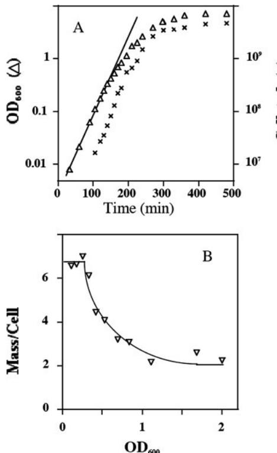
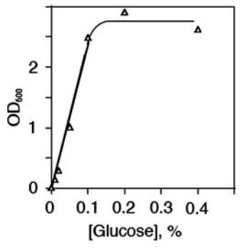

## *Escherichia coli* Physiology in Luria-Bertani Broth

Guennadi Sezonov,* Danie`le Joseleau-Petit, and Richard D'Ari

*Institut Jacques Monod, CNRS, Universite´ Paris 6, Universite´ Paris 7, F-75251 Paris Cedex 05, France*

Received 22 August 2007/Accepted 14 September 2007

**Luria-Bertani broth supports** *Escherichia coli* **growth to an optical density at 600 nm (OD600) of 7. Surprisingly, however, steady-state growth ceases at an OD600 of 0.3, when the growth rate slows down and cell mass decreases. Growth stops for lack of a utilizable carbon source. The carbon sources for** *E***.** *coli* **in Luria-Bertani broth are catabolizable amino acids, not sugars.**

The widely used rich medium called Luria-Bertani broth is popular with bacteriologists because it permits fast growth and good growth yields for many species. The recipe for Luria-Bertani broth is as follows. Combine 10 g of tryptone, 5 g of yeast extract, 10 g of NaCl, and 1 liter of distilled water; adjust the pH to 7.0 with 1 N NaOH; and autoclave the mixture for 25 min at 120°C. The tryptone used is a pancreatic digest of casein from cow's milk, and the yeast extract used is an autodigest of *Saccharomyces cerevisiae*. Dehydrated Luria-Bertani broth with the above composition is sold by Difco and called LB Broth, Miller; with 5 g/liter NaCl it is called LB Broth, Lennox.

A great deal of work on *Escherichia coli* physiology has been carried out with cultures in steady-state growth. One of the principal advantages of this is the extreme reproducibility of the physiological state of the bacteria; during steady-state growth in a given medium, a given strain will always achieve the same state. It is reached after a variable lag period and at low cell density, such that the quantity of nutrients removed from the medium is negligible and the concentration of excreted compounds does not affect growth. During steady-state growth, by definition, the following criteria must hold. (i) All intrinsic parameters of the cells remain constant. Measured as population averages, these include the mean volume, density, and macromolecular composition of the cells. (ii) All extrinsic parameters increase exponentially with precisely the same doubling time. These include the optical density of the culture, the number of cells per milliliter, the amount of protein per milliliter, the amount of RNA per milliliter, the amount of DNA per milliliter, etc. (iii) The composition, pH, and temperature of the medium all remain constant within the cells' detection limits. Cultures in steady state exhibit balanced exponential growth (3).

The period of steady-state growth is often called exponential phase or, less correctly, log phase. For *E*. *coli* growing in Luria-Bertani broth, this phase has been estimated to end when the OD600 (optical density at 600 nm) is between 0.6 and 1.0. We have consistently noticed that cells in this OD range are not always in the same physiological state. We therefore

* Corresponding author. Present address: Unite´ Biologie Mole´culaire du Ge`ne chez les Extre´mophiles, Institut Pasteur, 25, rue du Docteur Roux, F-75724 Paris Cedex 15, France. Phone: 331 4061 3722. undertook a closer study of the physiology of *E*. *coli* K-12 in Luria-Bertani broth.

**Steady-state growth stops at an OD600 of 0.3 in Luria-Bertani broth.** The parameters chosen to characterize our cells physiologically were the mass per milliliter (proportional to the OD600, measured in a Perkin-Elmer Lambda 20 spectrophotometer), the number of cells per milliliter (measured in a Coulter counter), and the average cell mass (calculated, in arbitrary units, as the ratio of OD600 to the number of cells per milliliter). Average cell mass is known to vary strongly with the growth medium, being greater in media that support rapid growth (11). The difference in average cell mass during steadystate growth in rich and poor media can exceed a factor of five (4, 11), making the mean mass per cell a sensitive indicator of the cells' physiological state.

The widely used wild-type *E*. *coli* K-12 strain MG1655 (1), which has been sequenced and annotated (2, 10), was chosen for this study. An overnight culture in Luria-Bertani broth was diluted 5,000-fold in 250 ml fresh medium in a 1-liter Erlenmeyer flask and cultivated in a shaking water bath (180 rpm) at 37°C. The OD600 and number of cells per milliliter were monitored.

The doubling time during steady-state growth in Luria-Bertani broth was 20 min (Fig. 1A). Growth becomes unbalanced at an OD600 of around 0.3 (5 - 107 cells/ml). At this point, there is a very slight but real break in the slope of the OD600 curve (Fig. 1A). The break is much more visible when the mass is plotted versus the OD600 (Fig. 1B). The amount of mass per cell was high and constant from the earliest points we could analyze, in some experiments at an OD600 near 0.01; we conclude that the culture was in steady state during this time. At an OD600 of 0.3, the average cell mass began suddenly to decrease, which is indicative of a decreasing growth rate and clearly marks the end of steady-state growth.

This departure from steady-state growth is surprisingly early since the cells continue to grow for a further 20-fold increase in the mass per milliliter. As shown in Fig. 1A, the growth rate slows down gradually from this point (an OD600 of 0.3) until saturation (an OD600 of about 7), reflecting a gradual impoverishment of the medium.

A brief drop in the growth rate of a non-K-12 strain of *E*. *coli* in Luria-Bertani broth was previously observed at an OD660 of around 0.2 (12). The slowdown was shown to be a diauxie, presumably reflecting the exhaustion of some metabolite in the medium. Interestingly, the intracellular concentration of S ,

Fax: 331 4568 8834. E-mail: sezonov@pasteur.fr. Published ahead of print on 28 September 2007.

FIG. 1. Growth of *E*. *coli* MG1655 in Luria-Bertani broth. An overnight culture was diluted 5,000-fold in Luria-Bertani broth and cultivated at 37°C with vigorous aeration. (A) The OD600 (triangles) and cell concentration (crosses) were measured periodically. (B) The ratio of the OD600 to the cell concentration was calculated at each point and multiplied by 109 .

which is inversely correlated with the growth rate, begins to increase in Luria-Bertani broth when the OD600 reaches about 0.5 (5). This sigma factor governs the expression of 252 *E*. *coli* genes on entry into stationary phase (13).

The physiological state of *E*. *coli* cells in Luria-Bertani broth clearly varies significantly in the OD660 range of 0.3 to 1.0. Many workers seem to be unaware that *E*. *coli* is no longer in steady-state growth at these relatively low ODs.

**Growth in Luria-Bertani broth is carbon limited.** Why does growth stop at an OD600 of 7? To address this question, we studied exhausted medium in which *E*. *coli* had grown to saturation. A culture of MG1655 was grown for 24 h in Luria-Bertani broth (final OD600 of 6.49). The bacteria were then removed by centrifugation and filtration. We call this conditioned medium LB*. Reinoculated with MG1655, LB* does not support further growth (OD600 of 0.01 in 24 h). When glucose was added to LB*, it once again supported growth to a final OD600 proportional to the amount of glucose added (Fig. 2). This shows that LB* contains ample amounts of all of the essential inorganic nutrients. Thus, if growth arrest reflects the depletion of an essential nutrient (rather than toxification of the medium), the limiting metabolite must be a carbon source.

The pH of LB* is routinely near 9. *E*. *coli* is unable to grow when the external pH exceeds 9 (8), so the cause of growth arrest could be the high pH rather than a lack of carbon. Since

FIG. 2. Growth response to D-glucose in exhausted Luria-Bertani medium. Filter-sterilized LB* medium was supplemented with various concentrations of D-glucose, inoculated with MG1655, and incubated for 24 h at 37°C with vigorous aeration. The OD600 of each culture was measured.

growth on glucose lowers the pH, the addition of glucose may permit growth resumption in LB* by acidification of the medium rather than by providing a carbon source. To determine whether growth in Luria-Bertani broth stops for lack of carbon or because of high alkalinity, we neutralized a sample of LB* with HCl. MG1655 was still unable to grow in it (OD600 of 0.02 in 24 h). Thus, growth in Luria-Bertani broth is limited by the availability of utilizable carbon sources, not by the high pH.

**Luria-Bertani broth contains no fermentable sugars utilizable by** *E***.** *coli***.** The sudden decrease in cell volume at an OD600 of 0.3—and the brief diauxic lag observed by others (12) could have a simple explanation, viz., that Luria-Bertani broth contains a low concentration of sugars which are depleted at this point, forcing cell metabolism to switch to using amino acids as a carbon source. To test this, we set up a bioassay for fermentable sugars by using a *hemA* derivative of MG1655. This mutant is unable to synthesize -aminolevulinic acid. In the absence of exogenous -aminolevulinate, it cannot synthesize heme and thus cannot produce cytochromes, making it unable to carry out respiration. The mutant therefore absolutely requires a fermentable sugar in order to grow in the absence of -aminolevulinate. We tested the *hemA* strain in Luria-Bertani broth (which lacks -aminolevulinate) containing increasing concentrations of D-glucose. The growth yield was strictly proportional to the amount of D-glucose, with no detectable growth in its absence (data not shown). Our data indicate that Luria-Bertani broth contains 100 M fermentable sugar equivalents utilizable by *E*. *coli* (free sugars, sugar phosphates, oligosaccharides, nucleotides, etc.).

**Availability of amino acids in Luria-Bertani broth.** The two organic ingredients in Luria-Bertani broth, both enzymatic digests, are rich in oligopeptides. *E*. *coli* has several oligopeptide permeases and a panoply of peptidases with a wide range of specificities (7), enabling it to recover free amino acids from many oligopeptides. Catabolizable amino acids recovered from these oligopeptides are the principal carbon sources in Luria-Bertani broth, accounting for the alkalinization of the medium during growth since amino acid catabolism results in excretion of the excess ammonium.

We assayed the amino acids in Luria-Bertani broth by two methods, biochemical and biological. For the biochemical assays, a sample of Luria-Bertani medium was first incubated

TABLE 1. Composition of Luria-Bertani broth

| Metabolite(s)   | Allele conferring auxotrophya | Concn (mM) determined by: |       |
|-----------------|----------------------------------|------------------------------|-------|
|                 |                                  | E. colib                     | HPLCc |
| L-Alanine       |                                  | NDd                          | 5.8   |
| L-Arginine      | argA::Tn10                       | 2.0                          | 2.8   |
| L-Asparagine    | asnA31 asnB50::Tn5               | 2.1e                         |       |
| L-Aspartate     |                                  | NDd                          |       |
| L-Asp  L-Asn    |                                  |                              | 7.3   |
| L-Cysteine      | cysG                             | 1.7                          | 0.4   |
| L-Glutamic acid | (gltA-sucB)::Spcr                | 11.2                         |       |
| L-Glutamine     | glnA1857                         | 0.6                          |       |
| L-Glu  L-Gln    |                                  |                              | 19.1  |
| Glycine         | glyA42::Tn5                      | 18                           | 4.0   |
| L-Histidine     | hisG213::Tn10                    | 0.75                         | 1.4   |
| L-Isoleucine    | ilvA454                          | 2.3                          | 5.4   |
| L-Leucine       | leu-82::Tn10                     | 7.9                          | 8.8   |
| L-Lysine        | lysA::Tn10                       | 3.8                          | 6.8   |
| L-Methionine    | metA                             | 2.0                          | 5.9   |
| L-Phenylalanine | pheA18::Tn10                     | 2.4                          | 3.6   |
| L-Proline       | proC46::Tn5                      | 1.4                          | 9.5   |
| L-Serine        | serB22                           | 7.5                          | 5.1   |
| L-Threonine     | thrA34::Tn10                     | 5.2                          | 4.4   |
| L-Tryptophan    | trp::Tn5                         | 1.1f                         | NDg   |
| L-Tyrosine      | tyrA16::Tn10                     | 1.0                          | 1.4   |
| L-Valine        | ilvD691::Tn10                    | 9.5h                         | 7.0   |
| Purines         | purK79::Tn10                     | 0.3                          | ND    |
| Pyrimidines     | purC46                           | 0.2                          | ND    |
| Sugars          | hemA::kan                        | 0.1i                         | ND    |

*a* All alleles were introduced into the MG1655 background by P1*vir* transduction. *b* Bioassays were carried out essentially as described in the legend to Fig. 3, by

using appropriate mutants of MG1655 and measuring the growth yield (final OD600) as a function of the concentration of the required nutrient (calibration

curve) and of Luria-Bertani broth (bioassay). *c* The hydrolysis and HPLC analysis of the amino acids in Luria-Bertani broth were carried out by the Service de Chimie Organique of the Institut Pasteur, Paris, France. *d* ND, not determined. We did not have auxotrophs for L-alanine or L-aspar-

tate. *e* Little or no growth was observed at L-asparagine concentrations below 50

M (which gave a final OD600 of 1.2), possibly because of poor transport. *f* Tryptophan is unstable and tends to disappear from the medium, especially

if the latter is not protected from light. *g* Tryptophan is destroyed by acid hydrolysis.

*h* The medium contained an excess of L-isoleucine, which the strain also requires. This also obviates the strain's sensitivity to L-valine. The growth response to exogenous L-valine was greater than linear. The values shown were calculated from the minimal concentration allowing saturation. *i*

Calculated from the response to D-glucose (see text).

overnight in hot HCl, hydrolyzing all peptide bonds. The free amino acids were then separated by high-performance liquid chromatography (HPLC) and quantified (Table 1).

Biologically, we carried out a series of bioassays with *E*. *coli* mutants unable to synthesize a specific metabolite. The principle of these bioassays is illustrated with L-leucine. With a *leu*::Tn*10* auxotroph, we first established a calibration curve with glucose minimal medium containing increasing amounts of L-leucine, plotting the growth yield versus the initial Lleucine concentration (Fig. 3A). We then grew the mutant in glucose minimal medium containing increasing amounts of Luria-Bertani broth (Fig. 3B). From these curves, we calculated that *E*. *coli* detects 8.0 mM L-leucine in Luria-Bertani broth. With appropriate mutant derivatives of MG1655, similar bioassays were carried out for other amino acids, purines, and pyrimidines (Table 1).

It should be noted that the composition of Luria-Bertani broth is not constant. Variations occur with age (L-tryptophan, for example, is degraded, especially in the light), with time of autoclaving (affecting the degree of deamidation of L-asparagine and L-glutamine), and from batch to batch. These variations may account for those cases in which the bioassay gave a higher estimate than HPLC analysis.

Catabolyzable amino acids are clearly plentiful in Luria-Bertani broth, presumably in the form of oligopeptides. It has been reported that wild-type *E*. *coli* K-12 growing in tryptone broth sequentially catabolizes L-serine, L-aspartate, L-tryptophan, L-glutamate, glycine, L-threonine, and L-alanine (9). Sequential catabolism probably occurs in Luria-Bertani broth as well, since a diauxic lag was observed (12). It may follow the same order, although one would also expect L-proline, a good carbon source for *E*. *coli* (6), to be depleted early on. At later times, L-arginine, L-glutamine, L-asparagine, L-cysteine, and L-lysine, for all of which *E*. *coli* possesses catabolic systems, may be consumed as well. Bioassays of the conditioned medium LB* confirmed that it no longer contains significant amounts of recoverable L-serine, L-threonine, L-proline, or glycine (data not shown).

**Conclusion.** The results presented here show that steadystate growth in Luria-Bertani broth ends surprisingly early, at an OD600 of around 0.3, and is followed by an extended period during which the growth rate and average cell mass decrease gradually. When *E*. *coli* stops growing, at an OD600 of around 7, utilizable carbon sources are exhausted, although inorganic nutrients remain plentiful. Luria-Bertani broth lacks recoverable sugars but has high concentrations of catabolizable amino

FIG. 3. Bioassay for L-leucine. A culture of a *leu*-*82*::Tn*10* derivative of MG1655 was grown in M63 glucose minimal medium containing L-leucine. Cells were resuspended in M63 and diluted 4,000-fold into M63 glucose containing increasing concentrations of L-leucine (A) or of Luria-Bertani broth (LB) (B).

acid equivalents. These are probably depleted sequentially during the postexponential phase of growth. During this period, the physiological state of the cells varies constantly. Furthermore, even using the same strain at the same OD600, if the latter is above 0.3 the cells' physiological state will not necessarily be reproducible in different experiments since the composition of Luria-Bertani broth can vary. Caveat experimentator!

We thank Conrad Woldringh for helpful discussion.

## **REFERENCES**

- 1. **Bachmann, B. J.** 1996. Derivations and genotypes of some mutant derivatives of *Escherichia coli* K-12, p. 2460–2488. *In* F. C. Neidhardt, R. Curtiss III, J. L. Ingraham, E. C. C. Lin, K. B. Low, B. Magasanik, W. S. Reznikoff, M. Riley, M. Schaechter, and H. E. Umbarger (ed.), *Escherichia coli* and *Salmonella*: cellular and molecular biology. ASM Press, Washington, D.C.
- 2. **Blattner, F. R., G. I. Plunkett, C. A. Bloch, N. T. Perna, V. Burland, M. Riley, J. Collado-Vides, J. D. Glasner, C. K. Rode, G. F. Mayhew, J. Gregor, N. W. Davis, H. A. Kirkpatrick, M. A. Goeden, D. J. Rose, B. Mau, and Y. Shao.** 1997. The complete genome sequence of *Escherichia coli* K-12. Science **277:**1453–1474.
- 3. **Fishov, I., A. Zaritsky, and N. B. Grover.** 1995. On microbial states of growth. Mol. Microbiol. **15:**789–794.
- 4. **Kubitschek, H. E.** 1974. Constancy of the ratio of DNA to cell volume in steady-state cultures of *Escherichia coli* B/r. Biophys. J. **14:**119–123.
- 5. **Lange, R., and R. Hengge-Aronis.** 1994. The cellular concentration of the S

subunit of RNA polymerase in *Escherichia coli* is controlled at the levels of transcription, translation, and protein stability. Genes Dev. **8:**1600–1612.

- 6. **McFall, E., and E. B. Newman.** 1996. Amino acids as carbon sources, p. 358–379. *In* F. C. Neidhardt, R. Curtiss III, J. L. Ingraham, E. C. C. Lin, K. B. Low, B. Magasanik, W. S. Reznikoff, M. Riley, M. Schaechter, and H. E. Umbarger (ed.), *Escherichia coli* and *Salmonella*: cellular and molecular biology. ASM Press, Washington, D.C.
- 7. **Miller, C. G.** 1996. Protein degradation and proteolytic modification, p. 938–954. *In* F. C. Neidhardt, R. Curtiss III, J. L. Ingraham, E. C. C. Lin, K. B. Low, B. Magasanik, W. S. Reznikoff, M. Riley, M. Schaechter, and H. E. Umbarger (ed.), *Escherichia coli* and *Salmonella*: cellular and molecular biology. ASM Press, Washington, D.C.
- 8. **Neidhardt, F. C., J. L. Ingraham, and M. Schaechter.** 1990. Physiology of the bacterial cell. Sinauer Associates, Sunderland, MA.
- 9. **Pru¨ss, B. M., J. M. Nelms, C. Park, and A. J. Wolfe.** 1994. Mutations in NADH:ubiquinone oxidoreductase of *Escherichia coli* affect growth on mixed amino acids. J. Bacteriol. **176:**2143–2150.
- 10. **Riley, M., T. Abe, M. B. Arnaud, M. K. B. Berlyn, F. R. Blattner, R. R. Chaudhuri, J. D. Glasner, T. Horiuchi, I. M. Keseler, T. Kosuge, H. Mori, N. T. Perna, G. Plunkett III, K. E. Rudd, M. H. Serres, G. H. Thomas, N. R. Thomson, D. Wishart, and B. L. Wanner.** 2006. *Escherichia coli* K-12: a cooperatively developed annotation snapshot—2005. Nucleic Acids Res. **34:** 1–9.
- 11. **Schaechter, M., O. Maaløe, and N. O. Kjeldgaard.** 1958. Dependence on medium and temperature of cell size and chemical composition during balanced growth of *Salmonella typhimurium*. J. Gen. Microbiol. **19:**592–602.
- 12. **Wang, C. H., and A. L. Koch.** 1978. Constancy of growth on simple and complex media. J. Bacteriol. **136:**969–975.
- 13. **Weber, H., T. Polen, J. Heuveling, V. G. Wendisch, and R. Hengge.** 2005. Genome-wide analysis of the general stress response network in *Escherichia coli*: S -dependent genes, promoters, and sigma factor selectivity. J. Bacteriol. **187:**1591–1603.