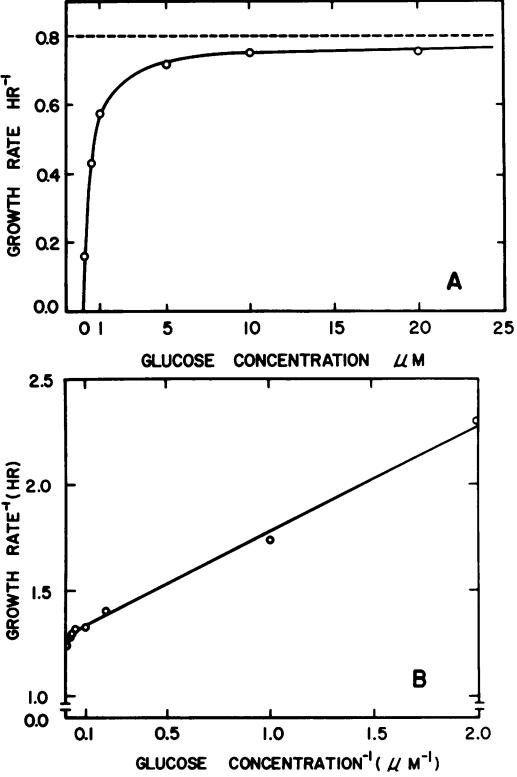
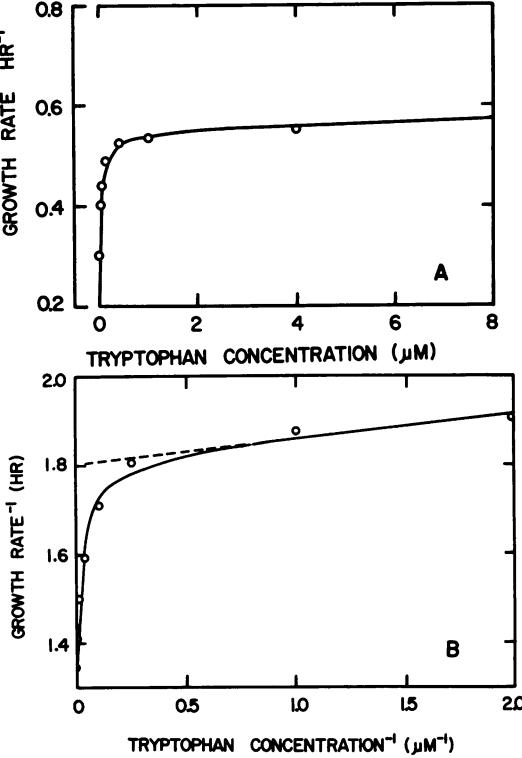
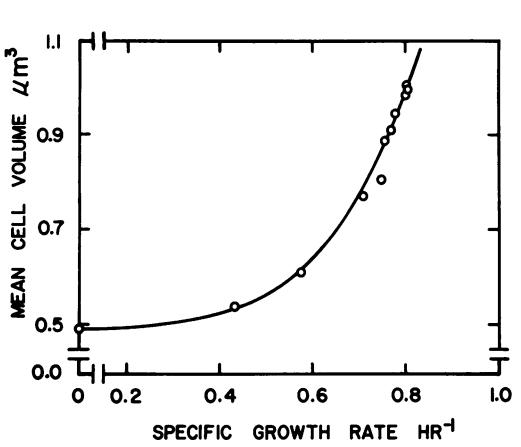
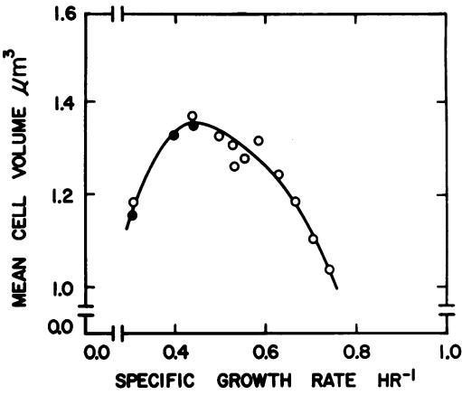

# Effect of Nutrient Concentration on the Growth of Escherichia coli

TALAAT E. SHEHATA AND ALLEN G. MARR

Department of Bacteriology, University of California, Davis, California 95616

#### Received for publication 22 March 1971

The relationship between specific growth rate of Escherichia coli and the concentration of limiting nutrient (glucose or phosphate or tryptophan) has been determined for populations in a steady state. At high concentrations the specific growth rate is independent of the concentration of nutrient, but at low concentrations the specific growth rate is a strong function of the nutrient concentration. Such a relationship was predicted by Monod; however, Monod's equation does not predict the relationship over the entire range of nutrient concentration. If parameters of the equation are estimated from the results obtained at low concentrations, then at high concentrations of nutrient, the specific growth rate is significantly higher than that predicted by Monod's equation. These results were interpreted on the basis that the rate of growth is controlled by at least two parallel reactions and that the affinities of the enzymes catalyzing these reactions are different. The relationship between specific growth rate and mean cell volume was also measured, and the results indicate that mean cell volume depends not only on the specific growth rate but also on the nature of the limiting nutrient. There are different mean cell volumes at the same specific growth rate established by different limiting nutrients. Therefore, the mean cell volume is not uniquely determined by the specific growth rate.

It is common experience that a bacterial culture, growing in a medium in which one nutrient limits the final crop, grows at a constant specific rate (exponentially) until just before growth ceases from exhaustion of the limiting nutrient. This observation implies that, over a wide range of concentration of nutrient, the specific growth rate is independent of the concentration of nutrient; only after the concentration is greatly reduced does the specific growth rate decrease. One can estimate the relationship between specific growth rate and nutrient concentration by measurements on the culture during the short interval over which the specific growth rate declines from its maximal value to zero (8, 9, 23, 24). Such an estimate is necessarily imprecise. The condition of the culture is certainly not a steady state; both nutrient concentration and specific growth rate are changing rapidly, making estimates difficult.

Continuous culture, at least in principle, permits the establishment of a steady state at a submaximal specific growth rate. If fresh medium dilutes the culture at a specific rate less than the maximal specific growth rate and if the population density stabilizes at some non-zero value, the specific growth rate must equal the

specific dilution rate. Measurement of the concentration of the limiting nutrient in the culture establishes the desired relationship (6, 16, 25).

We have chosen the alternative of preparing media with the concentration of one nutrient sufficiently low such that the specific growth rate is initially submaximal, and maintaining by periodic transfer a bacterial population sufficiently dilute such that the initial concentration of nutrient does not change significantly before transfer. In contrast with continuous culture, this design permits establishment of a steady state at a known concentration not only of the limiting nutrient but also of all other nutrients. In this design, the change in composition of the medium resulting from growth can be made as small as one wishes by restricting the population density.

The low population density required for these experiments cannot be measured by turbidimetry or nephalometry but can be measured easily by counting. Conductometric measurement of cells not only permits rapid counting but also gives the distribution of volumes of the cells. The constancy of the volume distribution and of specific growth rate are useful tests of a steady state.

The experimental results to be presented provide a test of the relationship inferred by Monod

V9NUTRIENT CONCENTRATION IN E. COLI (23, 24) by analogy with enzyme kinetics; namely,

$$k(\mathbf{c}) = k_{\max}/(\mathbf{l} + \mathbf{K_*}/\mathbf{c})\tag{1}$$

in which k(c) is the specific growth rate at a particular concentration, c, of limiting nutrient; kma,, is the maximal value of specific growth rate at large values of c; K. is a parameter analogous to the Michaelis-Menten constant, which is called the substrate constant.

## MATERIALS AND METHODS

Bacterial strains. Escherichia coli strain ML30 was used throughout this investigation. The original strain of E. coli ML30 was obtained from J. Monod, Institute Pasteur, and has been lyophilized and stored in the culture collection of the Department of Bacteriology. This strain was cultivated for 2 months in continuous exponential growth at low density by periodic transfer in glucose minimal medium, after which cultivation a clone was isolated as a colony on a plate of eosinmethylene blue-lactose agar. The isolate (29) which has been designated strain ML30G ("G" denoting long cultivation in glucose minimal medium), was kept on slants of the same medium.

A tryptophan-requiring mutant, strain TS-701, was obtained by mutagenesis of E. coli ML30G with Nmethyl-N'-nitro-N-nitrosoguanidine (1). Strain TS701 with excess tryptophan has a specific growth rate of 0.75 hr-1 and a mean cell volume of 1.04 jAm3. The mutant is identical in these respects to its parental strain, ML30G.

Media and cultivation: standard basal medium. Standard basal medium had the following composition per liter: KCI, 1.0 g; KH2PO4, 4.2 g; FeSO4 7H20, 0.0005 g; CaCI2, 0.01 g; MgCI2 6H2O, 0.2 g; NH4Cl, 0.8 g; Na2SO4, 0.2 g; K2HPO4, 8.5 g.

Phosphate-deficient basal medium. To examine the effect of the phosphate concentration on the kinetics of growth, it was necessary to change the composition of the basal medium. Many recipes, differing with respect to ionic strength and buffer systems, were tested. The recipe which was used in the investigation of the effect of phosphate concentration on the kinetics of growth was as follows: KCI, 7.46 g; FeSO4 7H20, 0.0005 g; CaC12, 0.01 g; MgCl2 6H20, 0.2 g; NH4Cl, 0.8 g; Na2SO4, 0.2 g. The filtration and sterilization of this medium was similar to that of the standard basal medium.

The following procedure was used to free the basal medium of small particles which interfere with electronic counting and sizing of dilute populations. The medium was filtered immediately after preparation through a membrane filter (type GS, Millipore Corp., Bedford, Mass.) with 0.45-;tm average pore diameter (APD) and was heated at 121 C for 30 min. When it cooled, the medium was filtered twice through a 0.22-um APD membrane filter, and 50-ml portions were distributed aseptically into 250-ml sterile Erlenmeyer flasks. The sterile flasks were covered with aluminum foil rather than cotton plugs to avoid contamination by particles and were stored in an incubator

room at 30 C.

Minimal medim. Minimal medium is composed of basal medium (standard or phosphate-deficient basal medium) and glucose. For strain TS-701, the minimal medium also contained tryptophan. The specific growth rate was varied by changing the concentration of one of the following substrates: glucose, phosphate, or tryptophan.

Solutions of all supplements except tryptophan were sterilized by heating at 121 C for 20 min and filtering immediately before use through a 0.22-Am APD membrane filter; the solution of tryptophan was sterilized by filtration only.

Organic-free distilled water. Obviously, it is necessary to reduce as low as possible the contamination of the basal medium by the nutrient under study. For the carbon source this proved particularly difficult. That E. coli can grow in a basal salts solution without an overtly added carbon source has been reported (3, 27) and is easily demonstrable; the final population density is approximately 106 cells/ml. This growth results from contamination by organic material of utensils, water, air, and filters, and, to a lesser extent, the inorganic ingredients of the medium.

Tap distilled water was the main source of organic contamination. The water was distilled in glass from an alkaline solution of permanganate, and this distillate was redistilled in glass from 5% sulfuric acid. This procedure removed the organic nutrients from the water.

Soluble organic compounds, some of which may serve as nutrients for enteric bacteria (19), were removed from the membrane filters by thorough washing of the filters with hot water.

Glassware was cooked (at least 60 C) overnight in sulfuric acid saturated with sodium nitrate, washed with redistilled water, and used immediately.

A control experiment to test these precautions demonstrated that washed cells of E. coli ML30G (5 x l10 cells/ml) did not increase in number in basal salt medium prepared from the redistilled water.

With-these precautions, it is possible to measure the kinetics of growth at low concentrations of the carbon source, as low as 10-7 M glucose.

Measurements of cell numer and cell volume. The cultures were grown in Erlenmeyer flasks incubated on a shaker at 30 C. Samples (5 ml each) from cultures in balanced growth (4, 26) at concentrations of less than 0l cells per ml were analyzed conductometrically by an electronic counter (13) with no fixation or dilution. Fixation of cells was unnecessary, since, during the short time (less than 2 min) needed for measurement, no detectable change occurs in the cell size distribution and fixation by a variety of chemicals produces an observable effect on cell size distribution (Marr and fiedden, unpublished data).

The multichannel scaling mode of the pulse height analyzer in conjunction with an absolute lower discriminator (13) was used to measure the number of cells per milliliter. Several counts (five to eight) were taken of each sample; the counts were corrected by a factor obtained from an analysis of the measured size distribution and appropriate to the discriminator setting (22). The cell size distribution was measured in I min on the same sample used to determine total count. These

data were recorded immediately by punching paper tape for subsequent analysis by computer.

The specific growth rate, k, per hour was computed by linear regression of corrected counts according to the following equation: log. N = ki + log. N,. N is the number of cells per ml at time t, and No is the number of cells per milliliter at time zero.

## RESULTS

Effect of glucose coocentration on the specific growth rate. A series of cultures which differed from each other only with respect to the glucose concentrations, which ranged from 0.1 to 1,000 AM, were inoculated from a steady-state culture and were maintained in continuous exponential growth at low density (less than 106 cells/ml) to establish a steady state. At concentrations of glucose greater than 50 ,uM, the specific growth rate is not demonstrably dependent on the glucose concentration (Fig. IA). At concentrations of glucose in the range of 5 to 50 iMm, the specific growth rate changed only slightly as the glucose concentration was changed. The specific growth rate is a strong function of the glucose concentration only in the range of 0 to 5 AM glucose.

The lowest specific growth rate corresponding to a well defined steady state was 0.155 hr-1 at 0.1 AM glucose. It was difficult to maintain the culture in a steady state at glucose concentrations lower than 0.1 AM. At 0.01 MM, an initial population of 103 cells/ml increased in number by less than a factor of 2. At this concentration of glucose, it is likely that the low rate of respiration fails to meet the maintenance requirement (20, 21).

As a test of equation 1, the reciprocal of specific growth rate was plotted against the reciprocal of glucose concentration in accord with the linear transformation

$$1/k = \left(K_{\mathfrak{s}}/k_{\max}\right)\left(1/c\right) + 1/k_{\max} \tag{2}$$

It can be seen from Fig. IB that the plot is linear only over the lower range of glucose concentrations (0.1 to 10 MM). At higher glucose concentrations, the function obviously departs from linearity.

Effect of phosphate conceatratio on the specific growth rate. With phosphate as the limiting nutrient, it is customary to add an alternative buffer system to the medium. Our experimental results indicate that tris(hydroxymethyl)aminomethane (Tris)buffer can be used only if the concentration of phosphate is greater than 10 mM; at concentrations of phosphate less than 10 mM, the cells failed to initiate growth in Tris-containing media.

Because of the use of dilute populations, it is readily calculated that the reduced concentration

of phosphate is still an adequate buffer system. Phosphate-deficient basal medium, containing 125 mM KCI as the major component of ionic strength, was used. The corresponding minimal medium contained 1 mm glucose.

Figure 2A shows the effect on specific growth rate of limiting phosphate (0.02 to 100 mM; NaH 2PO4H20 + Na2HPO,; pH 7.4); over a wide range, the specific growth rate is almost independent of the phosphate concentration. For example, at 1.0 mM phosphate or higher, there is little or no demonstrable effect of phosphate concentration on the specific growth rate. However, as the concentration of phosphate is reduced below 0.5 mM, the specific growth rate becomes strongly dependent on phosphate con-

FIG. 1. Specific growth rate of Escherichia coli ML30G in balanced growth at 30 C in minimal media containing different concentrations of glucose as a sole carbon source. The specific growth rate was determined by electronic counting of cells at intervals. The population was maintained at less than 106 cells per ml bY periodic dilution of the culture. The solid lines were computed from equation 4 by using the parameters in Table 1. A, The ordinate is specific growth rate per hour, and the abscissa is glucose concentration in zM. B, The ordinate is the reciprocal of specific growth rate, and the abscissa is the reciprocal of glucose concentration.

T

#### centration.

The reciprocal of specific growth rate was plotted as a function of the reciprocal of phosphate concentration according to equation 2. Figure 2B shows the relationship is linear only at low concentrations.

Effect of amino acid concentration on the specific growth rate. A series of media, containing I mm glucose and differing from each other only with respect to the tryptophan concentration (ranging from 0.02 to 1,000 Mm), were inoculated with E. coli TS-701; the cultures were maintained in continuous exponential growth by periodic dilution until the steady state was well established.

At high concentrations of tryptophan, the specific growth rate is independent of the amino acid concentration (Fig. 3A). However, at concentrations below I gM, the specific growth rate is a strong function of the tryptophan concentration.

The reciprocal of specific growth rate was plotted as a function of the reciprocal of tryptophan concentration (Fig. 3B). This analysis gave results comparable to those obtained with glucose or phosphate as the limiting nutrient.

Effect of nutrient concentration on cefl volume. Figure 4 shows a plot of mean cell volume (of cultures growing in steady states at different glucose concentrations) as a function of the specific growth rate, governed by the glucose concentration in the medium. As the growth rate increased by increasing the concentration of glucose, the mean cell volume increased. The mean cell volume is not an exponential function of the growth rate. Rather, the relationship between

FIG. 2. Specific growth rate of Escherichia coli ML30G in balanced growth at 30 C in minimal media containing different concentrations of phosphate. The population was maintained at less than 106 cells per ml by periodic dilution of the culture. The solid lines were computed from equation 4 using parameters in Table 1. A, The ordinate is specific growth rate per hour, and the abscissa is phosphate concentration in mm. B, The ordinate is the reciprocal of specific growth rate, and the abscissa is the reciprocal of phosphate concentration.

FIG. 3. Specific growth rate of Escherichia coli TS-701 in balanced growth at 30 C in minimal medium containing different concentrations of tryptophan. The population was maintained at less than 106 cells per ml by periodic dilution of the culture. The solid lines were computed from equation 4 using parameters in Table 1. A, The ordinate is specific growth rate per hour, and the abscissa is tryptophan concentration in JM. B, The ordinate is the reciprocal of specific growth rate, and the abscissa is the reciprocal of tryptophan concentration.

FIG. 4. Mean cell volume of E. coli ML30G in minimal medium at 30 C as a function of specific growth rate, limited by glucose concentration. The ordinate is mean cell volume in cubic micrometers, and the abscissa is specific growth rate per hour. The solid line was computed from equation 3.

mean cell volume and specific growth rate is empirically predicted by the following equation

$$\mathcal{V} = 1.2k^* + 0.49 \tag{3}$$

in which V represents the mean cell volume in cubic micrometers and k represents the specific growth rate per hour.

The relationship between mean cell volume and specific growth rate governed by tryptophan or phosphate concentration is more complex. Figure 5 shows a plot of mean cell volume as a function of the specific growth rate governed by the concentration of tryptophan. As the specific growth rate increases, the mean cell volume increases to a maximal value of 1.38 itm3 and then decreases. The relationship between the mean cell volume and the specific growth rate, governed by phosphate concentration, was similar to that obtained with tryptophan as the limiting nutrient.

### DISCUSSION

Our results show that, at quite low nutrient concentrations (glucose, phosphate, or tryptophan), the specific growth rate is directly proportional to the concentration. At such low concentrations, the results agree with Monod's equation (equation 1). However, at high substrate concentrations, the results depart from the prediction of this equation.

It is possible that the rate of growth is controlled by parallel processes and that the affinities of the enzymes catalyzing these processes are different. At low substrate concentration, only the enzyme with the highest affinity will contribute significantly to the rate of reaction. How-

FIG. 5. Mean cell volume of E. coli TS-701 in minimal medium containing different concentrations of tryptophan as a function of specific growth rate. The ordinate is mean cell volume in cubic micrometers, and the abscissa is specific growth rate per hour. The specific growth rate was governed by the tryptophan concentration in the medium. Open and closed circles represent different experiments.

ever, at high substrate concentration, other enzymatic systems will contribute. Therefore, equation I does not describe the function over the entire range of substrate concentration. To describe the results over a wide range of substrate concentration, the equation can be modified to the following

$$k(c) = \,^\Sigma \Sigma_{l \bullet 1}^n \left[ a_l / (1 + K_l / c) \right] \tag{4}$$

in which K; is the substrate constant for the ith reaction and a, is the contribution of the ith reaction to the maximal specific growth rate, such that

$$k_{\text{max}} = \Sigma_{1,1}^{\bullet} \cdot a_1$$

Other terms are as in equation 1.

For the case of n = 2, the values of a2 and K2 were computed from the slope and intercept of the linear portion of the plot of the reciprocal of specific growth rate as a function of the reciprocal of the concentration of nutrient. The value of a,1 was computed from a1 = kmax - a2 , and the value of K1 was estimated by recursive numerical solution of equation 4 by digital computer to give the apparent best fit to the experimental points. These values are given in Table 1. The solid lines shown in Figures 1-3 were computed from equation 4 using the values of parameters in Table 1. The agreement between the prediction and the experimental results is adequate.

This analysis suggests that the rate of growth is determined by at least two reactions. The most likely candidates for these reactions are specific

| Nutrient                           | Parameters'             |                   |                         |                         |
|------------------------------------|-------------------------|-------------------|-------------------------|-------------------------|
|                                    | a, (hr- ')              | K, (gM)           | a2 (hr- ')              | K2 (MM)                 |
| Glucose Phosphate Tryptophan | 0.031 0.075 0.185 | 70 4,500 60 | 0.775 0.694 0.556 | 0.378 17.35 0.034 |

TABLE 1. Parameters of the effect of nutrient concentration on growth rate of Escherichia coli

a Parameters of equation 4 estimated from data in Fig. I to 3.

entry mechanisms. Ames (2) reported two different K. values (depending on the concentration of the amino acids in the medium) corresponding to two systems for amino acid uptake: a specific permease for each aromatic amino acid with high affinity (10-7 M) and a nonspecific permease with low affinity (10-5 M). Wargel et al. (30) found at least two transport systems for D-alanine, glycine, and D-cycloserine in E. coli. Our data are consistent with similar dual transport systems for glucose, phosphate, and tryptophan in E. coli ML30G.

Schaechter et al. (28) showed a systematic variation in the mean size of the cells from cultures of Salmonella typhimurium in balanced growth, and suggested that the mean size of cells might be determined uniquely by the specific growth rate. However, our results indicate that mean cell volume depends not only on the specific growth rate but also on the nature of the limiting nutrient. If glucose is the limiting nutrient, the mean cell volume is a monotonically increasing function of specific growth rate but is not an exponential function as has been suggested by others (II, 15, 18, 28). If phosphate or tryptophan is the limiting nutrient, the relationship is not monotonic; the mean cell volume has a maximal value at specific growth rates of approximately 0.68 hr-' and 0.43 hr-' for phosphate and tryptophan, respectively. The results show different mean cell volumes at the same specific growth rate established by different limiting nutrients; thus, in agreement with the results of others (10, 11, 15) we conclude that mean cell volume is not uniquely determined by specific growth rate.

The change in mean cell volume with a change in specific growth rate is not understood. It has been shown that, if the growth rate is limited by the nitrogen source, the cells are enlarged, presumably as a result of accumulation of polysaccharide (10-12, 17, 31). It is unlikely that such accumulation can explain a maximal mean volume at intermediate growth rates.

If the specific growth rate of a culture of E.

coli is increased by enriching minimal medium with supplements, the cells are larger, have increased amounts of deoxyribonucleic acid (DNA; 18, 28), and have multiple points of DNA replication (14). The phasing of successive rounds of DNA replication appears to be the mechanism of accommodating an essentially constant rate of DNA synthesis per growing point to differing growth rates (7). The replication of DNA also controls, in some manner, cell division (5); thus, the phasing of successive rounds of replication may be responsible for altering the mean cell volume. It would be of interest to examine the pattern of DNA replication at low specific growth rates to determine whether that pattern is related to the variations in mean cell volume.

### ACKNOWLEDGMENTS

This research was supported by grants GB7027 and GB24954 from the National Science Foundation. We appreciate the assistance of the staff of the Computer Center at the University of California at Davis; some of the computation was financially supported by a grant from the National Institutes of Health (Al-05526).

#### LITERATURE CITED

- 1. Adelberg, E. A., M. M. Mandel, and G. C. C. Chen. 1965. Optimal conditions for mutagenesis by N-methyl-N' nitro-N-nitrosoguanidine in Escherichia coli K-12. Biochem. Biophys. Res. Commun. 18:788-795.
- 2. Ames, G. F. 1964. Uptake of amino acids by Salmonella typhimurium. Arch. Biochem. Biophys. 104:1-18.
- 3. Bigger, J. W., and J. H. Nelson. 1941. The growth of coliform bacilli in distilled water. J. Pathol. Bacteriol. 53: 189-206.
- 4. Campbell, A. 1957. Synchronization of cell division. Bacteriol. Rev. 21:263 272.
- 5. Clark, D. J. 1968. Regulation of deoxyribonucleic acid replication and cell division in Escherichia coli B/r. J. Bacteriol. 96:1214-1224.
- 6. Contois, D. E. 1959. Kinetics of bacterial growth: relationship between population density and specific growth rate of continuous cultures. J. Gen. Microbiol. 21:40 -50.
- 7. Cooper, S., and C. Helmstetter. 1968. Chromosome replication and the division cycle of Escherichia coli B/r. J. Mol. Biol. 31:519-540.
- 8. Dagley, S., and C. N. Hinshelwood. 1938. Physicochemical aspects of bacterial growth. J. Chem. Soc. London 2: 1930- 1936.
- 9. Dean, A. C. R., and C. Hinshelwood. 1966. Growth, function and regulation in bacterial cells. Clarendon Press, Oxford, England.
- 10. Dean, A. C. R., and P. L. Rogers. 1967. The cell size and macromolecular composition of Aerobacter aerogenes in various systems of continuous culture. Biochim. Biophys. Acta 148:267- 279.
- 11. Ecker, R. E., and M. Schaechter. 1963. Bacterial growth under conditions of limited nutrition. Ann. N.Y. Acad. Sci. 102:549 563.
- 12. Harvey, R. J. 1970. Metabolic regulation in glucose-limited chemostat cultures of Escherichia coli. J. Bacteriol. 104:698-706.
- 13. Harvey, R. J., and A. G. Marr. 1966. Measurement of size distributions of bacterial cells. J. Bacteriol. 92:805-811.
- 14. Helmstetter, C. E. 1967. Rate of DNA synthesis during the division cycle of Escherichia coli, B/r. J. Mol. Biol. 24: 417-427.
- 15. Herbert, D. 1961. The chemical composition of micro-

organisms as a function of their environment. Symp. Soc. Gen. Microbiol. 11:391-416.

- 16. Herbert, D., R. Elsworth, and R. C. Telling. 1956. The continuous culture of bacteria: a theoretical and experimental study. J. Gen. Microbiol. 14-.601-622.
- 17. Holm, T. 1957. Continuous culture studies on glycogen synthesis in Escherichia coli B. Acta Chem. Scand. 11: 763-775.
- 18. MaalOe, O., and N. 0. Kjeldgaard. 1966. Control of macromolecular synthesis. W. A. Benjamin, Inc., New York.
- 19. Maal#e, O., and M. H. Richmond. 1962. The rate of growth of Salmonella typhimurium with proline or glutamate as sole C source. J. Gen. Microbiol. 27:269-284.
- 20. Mallette, M. F. 1963. Validity of the concept of energy of maintenance. Ann. N.Y. Acad. Sci. 102:521-535.
- 21. Marr, A. G., E. H. Nilson, and D. J. Clark. 1963. The maintenance requirement of Escherichia coli. Ann. N.Y. Acad. Sci. 102:536-548.
- 22. Marr, A. G., P. R. Painter, and E. H. Nilson. 1969. Growth and division of individual bacteria, p. 237-261. In P. M. Meads and S. J. Pirt (ed.), Microbial growth, 19th Symp. Soc. Gen. Microbiol. Cambridge Univ. Press.
- 23. Monod, J. 1942. Recherches sur la Croissance des cultures bacteriennes. Masson and Cie, Paris.
- 24. Monod, J. 1949. The growth of bacterial cultures. Annu. Rev. Microbiol. 3:371-394.
- 25. Novick, A. 1955. Growth of bacteria. Annu. Rev. Microbiol. 9:97-1 10.
- 26. Painter, P. R., and A. G. Marr. 1968. Mathematics of microbial populations. Annu. Rev. Microbiol. 22:519 548.
- 27. Postgate, J. R., and J. R. Hunter. 1962. The survival of starved bacteria. J. Gen. Microbiol. 29:233-263.
- 28. Schaechter, M., 0. Maal#e, and N. 0. Kjeldgaard. 1958. Dependency on medium and temperature of cell size and chemical composition during balanced growth of Salmonella typhimurium. J. Gen. Microbiol. 19:592- 606.
- 29. Shehata, T. E., and A. G. Marr. 1970. Synchronous growth of enteric bacteria. J. Bacteriol. 103:789 792.
- 30. Wargel, R. J., C. A. Shadur, and F. C. Neuhaus. 1970. Mechanism of D-cycloserine action: transport systems for D-alanine, D-cycloserine, L-alanine, and glycine. J. Bacteriol. 103:778-788.
- 31. Wright, D. N., and W. R. Lockhart. 1965. Environmental control of cell composition in Escherichia coli. J. Bacteriol. 89:1026-1031.