## **nature chemical biology**

# **Mitochondrial ATP generation is more proteome efficient than glycolysis**

Received: 24 September 2023

Accepted: 5 February 2024

Published online: xx xx xxxx

 [C](http://crossmark.crossref.org/dialog/?doi=10.1038/s41589-024-01571-y&domain=pdf)heck for updates

**Yihui Shen 1,2, Hoang V. Dinh 3 , Edward R. Cruz2,4, Zihong Chen  1,2,5, Caroline R. Bartman1,2,5, Tianxia Xiao  1,2, Catherine M. Call  1,2, Rolf-Peter Ryseck1,2, Jimmy Pratas1,2, Daniel Weilandt1,2, Heide Baron2 , Arjuna Subramanian2 , Zia Fatma6,7, Zong-Yen Wu8 , Sudharsan Dwaraknath8 , John I. Hendry3 , Vinh G. Tran6,7, Lifeng Yang1,2, Yasuo Yoshikuni 8 , Huimin Zhao 6,7, Costas D. Maranas 3 , Martin Wühr 2,4 & Joshua D. Rabinowitz 1,2,5**

Metabolic efciency profoundly infuences organismal ftness. Nonphotosynthetic organisms, from yeast to mammals, derive usable energy primarily through glycolysis and respiration. Although respiration is more energy efcient, some cells favor glycolysis even when oxygen is available (aerobic glycolysis, Warburg efect). A leading explanation is that glycolysis is more efcient in terms of ATP production per unit mass of protein (that is, faster). Through quantitative fux analysis and proteomics, we find, however, that mitochondrial respiration is actually more proteome efcient than aerobic glycolysis. This is shown across yeast strains, T cells, cancer cells, and tissues and tumors in vivo. Instead of aerobic glycolysis being valuable for fast ATP production, it correlates with high glycolytic protein expression, which promotes hypoxic growth. Aerobic glycolytic yeasts do not excel at aerobic growth but outgrow respiratory cells during oxygen limitation. We accordingly propose that aerobic glycolysis emerges from cells maintaining a proteome conducive to both aerobic and hypoxic growth.

Cells can generate ATP via fermentation (glycolysis) or respiration. Respiration generates around tenfold more ATP per glucose. However, many fast-growing cells favor glycolysis ('Crabtree effect' leading to ethanol in yeast or 'Warburg effect' leading to lactate in cancer or immune cells)[1–](#page-8-0)[5](#page-8-1) . This metabolic shift is often assumed to be due to glycolysis being more enzyme efficient or proteome efficient[6–](#page-8-2)[8](#page-8-3) . Specifically, it is often believed that, compared to respiration, fermentation is capable of producing ATP faster per unit enzyme expression[9–](#page-8-4)[17](#page-9-0). Proteome efficiency is evolutionarily advantageous because cells have limited biosynthetic capacity (for example, ribosomes) to make enzymes and physical space to house them (constrained proteome capacity[7](#page-8-5),[8,](#page-8-3)[18,](#page-9-1)[19)](#page-9-2). If cells can achieve the same metabolic flux while using less enzyme, this allows them to grow faster.

The proteome efficiency of glycolysis versus respiration has been experimentally tested carefully in *Escherichia coli*. Like yeast, *E. coli* tend to switch from respiration to aerobic glycolysis as their growth accelerates. Unlike yeast, however, aerobic glycolytic *E. coli* engage in a mixture of glycolytic and respiratory ATP generation, excreting the

1 Department of Chemistry, Princeton University, Princeton, NJ, USA. 2 Lewis-Sigler Institute for Integrative Genomics, Princeton University, Princeton, NJ, USA. 3 Department of Chemical Engineering, The Pennsylvania State University, University Park, PA, USA. 4 Department of Molecular Biology, Princeton University, Princeton, NJ, USA. 5 Ludwig Institute for Cancer Research, Princeton Branch, Princeton, NJ, USA. 6 Carl R. Woese Institute for Genomic Biology, University of Illinois Urbana-Champaign, Urbana, IL, USA. 7 Department of Chemical and Biomolecular Engineering, University of Illinois at Urbana-Champaign, Urbana, IL, USA. 8 US Department of Energy Joint Genome Institute and Environmental Genomics and Systems Biology, Lawrence Berkeley National Laboratory, Berkeley, CA, USA.  e-mail: [wuhr@princeton.edu](mailto:wuhr@princeton.edu); [joshr@princeton.edu](mailto:joshr@princeton.edu)

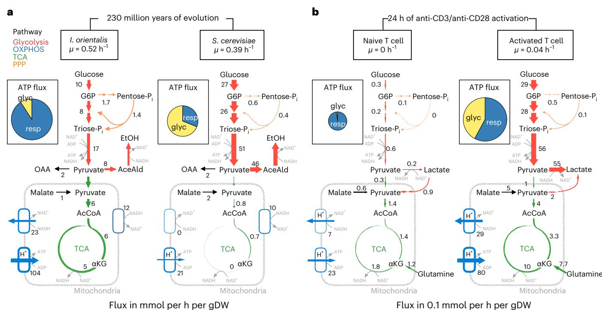

**Fig. 1 | Central carbon metabolic fluxes and ATP sources in yeast and T cells. a**, Flux map of central carbon metabolism (in units of mmol per h per gDW) in *I. orientalis* and *S. cerevisiae* (strain CEN.PK) during aerobic exponential growth in yeast nitrogen base (YNB) medium with 20 g l–1 glucose; *µ*, growth rate; G6P, glucose-6-phosphate; Pi , phosphate; EtOH, ethanol; AceAld, acetaldehyde; OAA, oxalacetic acid; AcCoA, acetyl-CoA; α-KG, α-ketoglutarate; PPP, pentose phosphate pathway. **b**, Flux map of central carbon metabolism (in units of 0.1 mmol per h per gDW) in naive mouse T cells (maintained with interleukin-7

(IL-7)) or activated T cells (24-h activation by anti-CD3 and anti-CD28 with IL-2). The insets show ATP fluxes from glycolysis (glyc) and respiration (resp). Numbers are best-estimate fluxes from large-scale 13C-informed MFA, constrained by metabolite 13C labeling ([U-13C6]glucose and [1,2-13C2]glucose for all cell types as well as [U-13C5]glutamine for T cells, each with *n* = 3 or 4 biological replicates) and metabolite consumption and excretion rate measurements (*n* = 3 biological replicates for yeast and *n* ≥ 6 for T cells).

oxidized product acetate with four glycolytic NADH feeding into the electron transport chain for each glucose (versus zero NADH in yeast or mammals). This provides an aerobic glycolytic ATP yield of about 12 per glucose (versus 2 in yeast or mammals). Such acetate fermentation is favored over full respiration for its proteome efficiency[7,](#page-8-5)[17](#page-9-0).

Due to the much lower ATP yield of eukaryotic aerobic glycolysis, the proteome efficiency of glycolysis versus mitochondrial respiration remains unclear. To address this, here we integrate quantitative fluxomics and proteomics to measure the proteome efficiency of ATP generation in yeasts and mammals. The quantified proteome efficiencies reflect what the cell gains in terms of ATP for its overall protein investment in the pathway and thus is suppressed if the pathway is not fully used, for example, due to limited substrate demand or levels of one or more gating enzymes. We carefully study naive and activated T cells and two industrially important yeasts (*Saccharomyces cerevisiae* and *Issatchenkia orientalis*, separated by 200 million years of evolution)[20](#page-9-5)[–26.](#page-9-6) Across these cell types, proteome efficiency of respiration was consistently equal to or greater than glycolysis. Integrating data from the literature, we then expand this analysis to cancer cells and to tissues and tumors in vivo, finding superior proteome efficiency of respiration in all aerobic settings. Consistent with the high proteome efficiency of respiration, across 23 evolutionarily divergent yeast species, the fastest-growing yeast were respiratory, with aerobic glycolytic yeast selectively favored during oxygen limitation. Aerobic glycolytic cells displayed a large glycolytic proteome even under fully aerobic conditions. These data support aerobic glycolysis being intrinsically inefficient from both the energy and proteome perspectives and emerging as a consequence of some cells maintaining a glycolytic proteome that enables efficient growth also during hypoxia.

### **Results**

#### **Quantitative flux analysis in yeast and T cells**

We first sought to carefully measure the proteome efficiency of glycolysis versus respiration in two budding yeasts (baker's yeast *S. cerevisiae* strain CEN.PK and a yeast used industrially for organic acid production, *I. orientalis* SD108) and in naive and activated mouse CD8+ T cells. Analogous to specific enzyme activity, measurement of proteome efficiency requires two key inputs: reaction velocities (metabolic fluxes) and enzyme abundances.

To obtain metabolic fluxes at the systems level, we performed 13C metabolic flux analysis (MFA)[27](#page-9-3) and developed large-scale metabolic flux models with complete atom mappings for both yeast and mammalian cells (Fig. [1](#page-1-0) and Extended Data Figs. 1 and 2; also see Methods, 13C Metabolic flux analysis). This approach carefully accounts for carbon fluxes devoted for both energy and biosynthesis. The models were constrained by flux balance and by experimentally measured extracellular fluxes, biomass synthesis fluxes and extensive isotope labeling data (Extended Data Fig. 1a,d for yeast and Extended Data Fig. 2a–e for T cells). This enabled comprehensive eukaryotic MFA. The entire flux maps are available in the Supplementary Information and can be visualized with Escher[28](#page-9-4) ([https://escher.github.io;](https://escher.github.io) see 13C Metabolic flux analysis).

Metabolic fluxes diverged markedly between the two budding yeasts, with *I. orientalis* more respiratory and *S. cerevisiae* more glycolytic (Fig. [1a](#page-1-0) and Extended Data Fig. 1c–e). *I. orientalis* grew faster than *S. cerevisiae* (growth rate of *µ* = 0.52 versus 0.39 h−1), had faster pentose phosphate pathway and biosynthetic fluxes, mainly generated ATP by respiration via the tricarboxylic acid (TCA) cycle and oxidative phosphorylation (OXPHOS) and maintained cytosolic redox balance by feeding NADH into the electron transport chain via quinone oxidoreductase

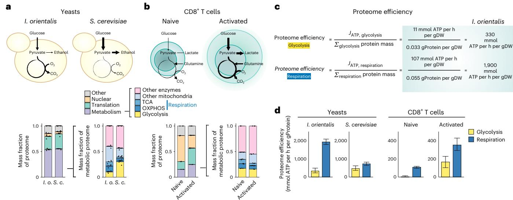

**Fig. 2 | Proteome allocation and proteome efficiency in yeast and T cells. a**, Mass fraction of proteome sectors of *I. orientalis* (*I. o.*) and *S. cerevisiae* (*S. c.*) in glucose batch culture as measured by quantitative LC–MS/MS proteomics. Data are shown as mean ± s.e.m.; *n* = 4 biological replicates. **b**, Naive and activated CD8+ T cells. Culture conditions are as in Fig. [1](#page-1-0); *n* = 3 biological replicates.

(NDE). By contrast, *S. cerevisiae* engaged in prototypical aerobic glycolysis with a truncated TCA cycle. The aerobic glycolytic phenotype was yet stronger in *S. cerevisiae* strain FY4, which has lab-acquired mutations that impair respiration (Extended Data Fig. 1b). Consistent with these findings, *Nde* knockout impaired growth of *I. orientalis* but not *S. cerevisiae*[29](#page-9-7) (Extended Data Fig. 1f). Overall, biosynthetic fluxes account for 31% of glucose carbon in *I. orientalis* and only 9% in *S. cerevisiae* (Extended Data Fig. 1g). Among 11 key central metabolites, only α-ketoglutarate in *S. cerevisiae* is mainly produced to fulfill biosynthetic demand (Extended Data Fig. 1h).

Similar analyses in mouse CD8+ T cells showed that, following in vitro activation, a shift from net lactate consumption toward aerobic glycolysis occurred (Fig. [1b](#page-1-0) and Extended Data Fig. 2c). Cell mass tripled (Extended Data Fig. 2e). Per cell weight, the median metabolic flux increased 8-fold, with glycolysis (65-fold) up more than respiration (4-fold; Fig. [1b](#page-1-0) and Extended Data Fig. 2f,g). In both naive and activated T cells, the TCA cycle was largely driven by glutamine, not glucos[e30](#page-9-8) (Fig. [1b](#page-1-0) and Extended Data Fig. 2b). Resulting excess TCA cycle four-carbon units were drained by extensive flux from malate to pyruvate, suggesting high malic enzyme activity (Extended Data Fig. 2g,h), consistent with the importance of malic enzyme in maintaining T cell redox homeostasi[s31.](#page-9-9)

The above four cell types show distinct energy profiles, including total ATP flux and how this ATP is produced (glycolysis or respiration). Both the slow ATP-burning naive T cells and fast-burning *I. orientalis* generated most of their ATP via respiration (98% and 91%, respectively). Activated T cells, despite excreting a majority of glucose carbon as lactate, still made 58% of their ATP aerobically. Only *S. cerevisiae* used glycolysis as its main ATP source, with 31% of ATP via respiration (Fig. [1)](#page-1-0).

#### **Proteome allocation in yeast and T cells**

We next assessed absolute protein abundances using quantitative proteomics with a combination of intensity-based absolute quantification (IBAQ) and isobaric tandem mass tags (TMT) tagging[32](#page-9-10). Our data on *S. cerevisiae* are comparable to those in prior literature reports (Extended Data Fig. 3a). We then assembled this information into a coarse-grained description of proteome composition focused on three proteome sectors, which together account for >80% of protein biomass: nuclear (including proteins involved in transcription), translation and metabolism (Fig. [2](#page-2-0) and Extended Data Fig. 3b,c). Within metabolism, we separately assessed the glycolytic and respiratory proteome. The former contains proteins that perform 14 reactions from glucose uptake to organic waste production, and the latter includes all reactions in OXPHOS and the TCA cycle (23 annotated reactions in yeast and 16 in T cells and, additionally for T cells, proteins involved in mitochondrial amino acid processes and fatty acid β-oxidation; Extended Data Fig. 3b,c). The two yeasts had similar proteome compositions, with the exception of repartitioning from respiratory (in *I. orientalis*) to glycolytic (in *S. cerevisiae*; Fig. [2a)](#page-2-0). Pyruvate decarboxylase (ethanol fermentation) in *S. cerevisiae* and ATP synthase (OXPHOS) in *I. orientalis* are the most highly expressed proteins in the energetic pathways, each accounting for more than 3% of the respective yeast's total proteome mass (Extended Data Fig. 3b). Thus, proteome partitioning aligns with metabolic preference in *S. cerevisiae* and *I. orientalis*.

**c**, Example calculation for proteome efficiency using *I. orientalis* data. **d**, Proteome efficiencies in yeast and T cells. Data are shown as mean ± s.d., with error propagated from flux confidence intervals (from *n* = 3 biological replicates) and proteomics (*n* = 4 biological replicates for yeast and *n* = 3 for T cells).

In T cells, after activation, on a per cell basis, there was about fivefold expansion of both translational and metabolic machinery (Extended Data Fig. 3c). The overall nature of the metabolic proteome was largely unchanged and did not explain the induction of aerobic glycolysis during T cell activation (Fig. [2b](#page-2-0)). Certain gating glycolytic proteins, however, selectively increased after T cell activation[33,](#page-9-11)[34](#page-9-12), including glucose transporter 1 (GLUT1) and hexokinase 2 (HK2; Extended Data Fig. 3c). Thus, naive T cells come preloaded with most of the machinery for aerobic glycolysis, but glycolysis remains slow until energy demand increases and/or these gating proteins are expressed.

#### **Proteome efficiency of ATP-generating pathways**

We next compared the proteome efficiency of glycolysis versus respiration, defined as the ATP generation flux per mass of all glycolytic or respiratory enzymes, respectively (Fig. [2c](#page-2-0)). It is widely assumed that glycolysis, at the expense of being less energy efficient, is more proteome efficient than respiration[9–](#page-8-4)[17.](#page-9-0) Our data on ATP flux and protein abundance, however, revealed a different picture. In *I. orientalis*, ~90% of ATP was generated via respiration (Fig. [1a](#page-1-0)), with the proteome efficiency of respiration being more than fivefold higher than for glycolysis (Fig. [2d)](#page-2-0). In aerobic glycolytic *S. cerevisiae*, despite its respiratory machinery being minimally engaged under glucose surplus, the proteome efficiency of respiration still slightly exceeded that of glycolysis

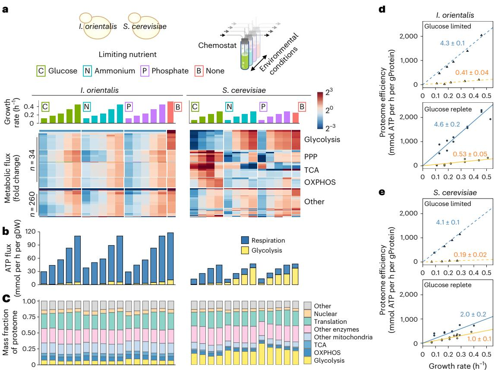

**Fig. 3 | Metabolic flux, proteome and proteome efficiency in yeast across different nutrient conditions. a**, Genome-wide metabolic fluxes (from 13C-informed MFA) from yeasts grown in nutrient-limited chemostats (limiting nutrients: C (carbon/glucose), N (nitrogen/ammonia), P (phosphorus/ phosphate) or nutrient-replete batch culture (B)). Continuous cultures are from four or five independent chemostats grown at different growth rates (*µ*), each shown individually. Data are normalized to the geometric mean value

across different conditions within each yeast. **b**, ATP fluxes from glycolysis and respiration across nutrient conditions. **c**, Mass fraction of eight proteome sectors across nutrient conditions. **d**,**e**, Proteome efficiency of ATP production by glycolysis (in yellow) and respiration (in blue) under glucose-deplete (carbonlimited) or glucose-replete (all other chemostat) conditions in *I. orientalis* (**d**) and *S. cerevisiae* (**e**). Proteome efficiency is linearly regressed to growth rate, and the slope (mean ± s.e.) in units of mol ATP per gProtein is shown.

(Fig. [2d)](#page-2-0). In highly respiratory naive T cells, the proteome efficiency of respiration was more than 40-fold that of glycolysis, whereas in the more glycolytic activated T cells, respiration was 2-fold more efficient than glycolysis (Fig. [2d)](#page-2-0). Thus, across the above cell types, respiration is equally or more proteome efficient than glycolysis.

We further assessed the proteome efficiency of ATP generation through fermentation (converting glucose to ethanol) and respiration (converting glucose to CO2) by calculating a flux-partitioned proteome cost[7](#page-8-5) , which counts glycolytic proteins in the cost of respiration (for providing pyruvate) and discounts flux diverted to biosynthetic precursors. In both yeast and T cells, this flux-partitioned analysis again identified respiration as the more proteome-efficient ATP production pathway (Extended Data Fig. 4a,b). Similarly, even if including all mitochondrial proteins as part of respiration's proteome cost (an extreme approach that overlooks the many other functions of mitochondria), the most proteome-efficient energy generation pathway was respiration in *I. orientalis*, exceeding the efficiency of the best glycolytic pathway (glycolysis in *S. cerevisiae*) by 2.3-fold (Extended Data Fig. 4c,d).

#### **Proteome efficiency in nutrient-limited yeasts**

We next sought to evaluate the generality of the greater proteome efficiency of mitochondrial respiration than glycolysis. As a complementary context to freely growing batch culture yeast, we explored nutrient-limited chemostat cultures, generating in-depth flux and proteomics data for both *S. cerevisiae* and *I. orientalis* under ≥12 chemostat conditions. Fluxes aligned closely with growth rate in both yeasts (Fig. [3a](#page-3-0) and Extended Data Fig. 5a), with the exception of increasing respiration and pentose phosphate pathway fluxes after glucose limitation in *S. cerevisiae*, which renders its metabolism similar to *I. orientalis* (Extended Data Fig. 5b). Under severe nutrient limitation, *S. cerevisiae* generated ATP mainly through respiration, switching to aerobic glycolysis with faster growth and adequate glucose (Fig. [3b)](#page-3-0). By contrast, *I. orientalis* consistently respired, even with rapid growth. Across nutrient limitation conditions, *S. cerevisiae* consistently manifested a large glycolytic proteome, and *I. orientalis* consistently manifested a large respiratory proteome (Fig. [3c)](#page-3-0). Across both yeasts, proteome efficiency fell with slower growth, reflecting spare enzyme capacity (Fig. [3d,e)](#page-3-0). In *I. orientalis*, ATP production by respiration was always at least fivefold more proteome efficient than production by glycolysis. In *S. cerevisiae*, the proteome efficiency of these pathways shifted strongly as their use (but not enzyme levels) changed with environmental conditions. Overall, the best proteome efficiency for glycolysis (*S. cerevisiae* batch, *µ* = 0.39 h−1) was about twofold lower than the best proteome efficiency of *S. cerevisiae* respiration (fast carbon-limited growth, *µ* = 0.28 h−1) and fourfold lower than the best proteome efficiency of respiration overall (*I. orientalis* batch, *µ* = 0.52 h−1). These data support mitochondrial respiration in yeast being fundamentally more proteome efficient than glycolysis.

#### **Proteome efficiency in mammals**

To explore whether ATP generation by mitochondrial respiration is also more proteome efficient than glycolysis in mammals,

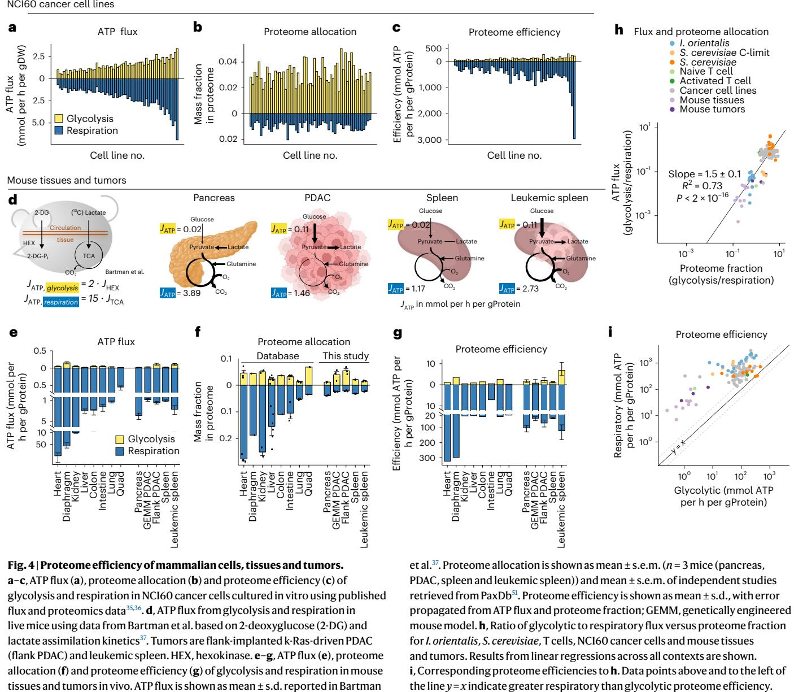

we evaluated three contexts: cultured cancer cells, mouse tissues and tumors in vivo. For cancer cells, we took advantage of published flux and proteomics data across 59 human cancer cell lines grown in vitro[35](#page-9-13),[36](#page-9-14) (Fig. [4a,b)](#page-4-0). Cancer cell lines devoted much more of their proteome to glycolysis than respiration (median of 3-fold) but still generated the majority of their ATP via mitochondrial respiration (median of 1.4-fold of glycolysis), leading to respiration being about 4-fold more proteome efficient (Fig. [4c](#page-4-0)). Thus, despite cancer cells being highly glycolytic, respiration is the more proteome-efficient ATP generation pathway.

For tissues in vivo, we used recent measurements from our lab of respiration and glucose usage in fasted mice[37](#page-9-15). These measurements are based on TCA cycle labeling dynamics and accumulation rates of 2-deoxyglucose phosphate, respectively, which together provide a good approximation of ATP production routes (Fig. [4d](#page-4-0)). Mouse tissues made >95% of their ATP aerobically (that is, respiratory ATP exceeded glycolytic ATP by more than 20-fold; Fig. [4e](#page-4-0)). Although they also expressed, on average, a threefold larger respiratory proteome than glycolytic proteome (Fig. [4f)](#page-4-0), respiration was still roughly one order of magnitude more proteome efficient than glycolysis (Fig. [4g)](#page-4-0).

We used similar published data to assess glycolytic and respiratory rates in k-Ras-driven pancreatic ductal adenocarcinoma (PDAC) and spleens infiltrated with Notch1-driven leukemia (leukemic spleen; Fig. [4d](#page-4-0)). New quantitative proteomic measurements enabled the assessment of proteome efficiency (Fig. [4f](#page-4-0) and Extended Data Fig. 6). Compared to normal tissues, pancreatic cancer, but not leukemic spleen, involved a major proteome shift, including an increase in the glycolytic proteome (Fig. [4e](#page-4-0) and Extended Data Fig. 6), consistent with hypoxic signaling via HIF1α[38,](#page-9-16) which demonstrated an increase in protein level of more than one order of magnitude in PDAC (Extended Data Fig. 6c). In both PDAC and leukemic spleen, glycolytic flux was upregulated, which in leukemia was apparently mediated by increased expression of key gating enzymes (GLUT3 and HK3; Extended Data Fig. 6f). Importantly, despite upregulated glycolysis, both cancer types still produced >80% of their ATP via respiration (Fig. [4e)](#page-4-0). The higher ATP production by respiration than by glycolysis results in respiration being much more proteome efficient than glycolysis also for tumors (Fig. [4g](#page-4-0)).

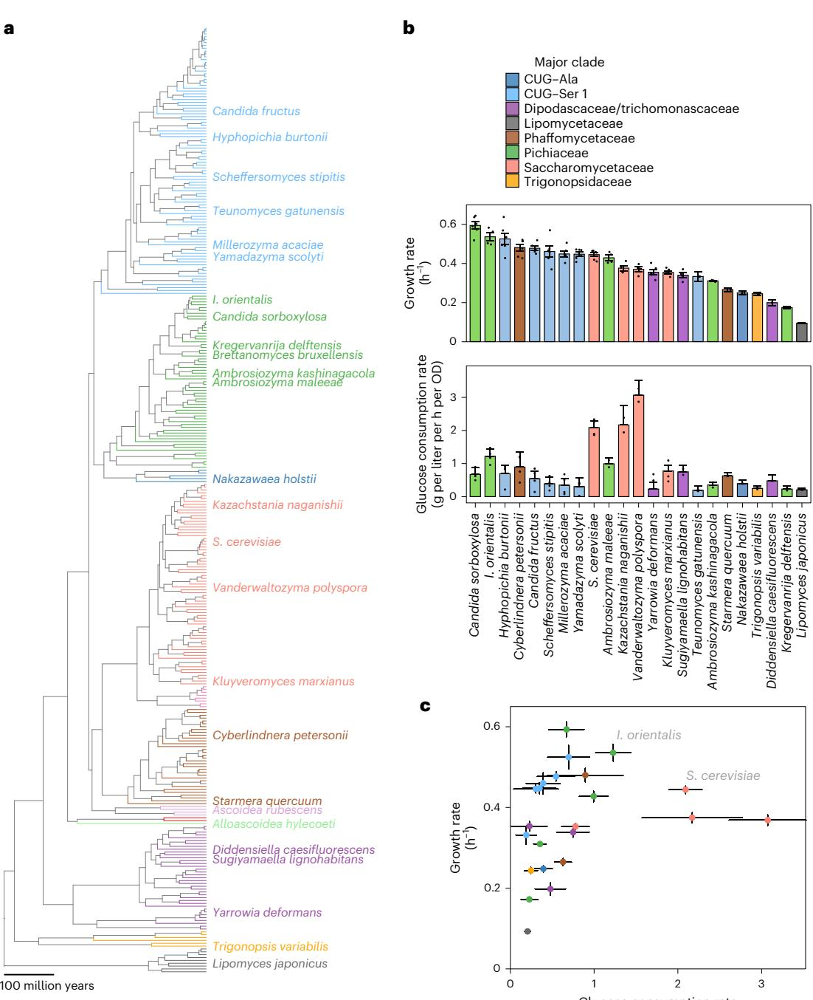

Glucose consumption rate (g per liter per h per OD)

**Fig. 5 | Growth and glucose consumption of evolutionarily divergent budding yeasts. a**, Phylogenetic tree of the budding yeast phylum[26](#page-9-6), with annotation for the studied species. **b**, Growth rates (top) and glucose consumption rates (bottom) of different budding yeasts cultured in rich yeast extract peptone

#### **Correlation between energy proteome and flux**

Across all studied cell and tissue types, the ATP contribution from glycolytic relative to respiratory pathways was predicted by their relative proteome fraction following a power law of order 1.5 (Fig. [4h](#page-4-0)). This implies that changes in glycolytic versus respiratory protein levels shape energy sources in a supralinear manner. For example, cancer cell lines devoted more of their proteome to glycolysis than to respiration, whereas normal tissues did the opposite (the median glycolysis/ respiration proteome mass was 3 in cancer cells versus 0.3 in mouse tissues), and the differential in ATP production routes was yet larger dextrose (YPD) medium containing 20 g l–1 glucose. Data are shown as mean ± s.e.m. (for *n* = 4 or 6 biological replicates) and mean ± s.e. (error from regression of *n* = 4 time points for *n* = 2 biological replicates). **c**, Growth rate plotted against glucose consumption rate.

(the median glycolysis/respiration ATP flux was 0.7 in cancer cells and 0.01 in mouse tissues). Apparently, partitioning of the energy proteome directly impacts pathway fluxes and indirectly reflects the cell's preference for which of the pathways to more fully engage. Proteome efficiencies of both respiration and glycolysis were more than one order of magnitude lower in mammalian tissues than in cultured cells, presumably reflecting high reserve capacity in mammalian tissues to enable rapid responses to organismal stressors (Fig. [4i](#page-4-0)). Across all the measured biological contexts, the superiority of respiration was striking (Fig. [4i;](#page-4-0) for flux-partitioned analysis that accounts for the glycolytic

**Fig. 6 | Yeast fitness under aerobic and anaerobic conditions. a**, Relative fitness of *S. cerevisiae* in competitive coculture with *I. orientalis* under different carbon sources (ethanol, glucose and sucrose), limited nutrients (C-limited (carbon/glucose), N-limited (nitrogen/ammonia) or P-limited (phosphorus/ phosphate) chemostats) or cyclic oxygen depletion, with numbers indicating the fraction of time spent in the anaerobic duty cycle. Data are shown as mean ± s.e.m.; *n* = 3 biological replicates (carbon sources) or 4 biological replicates (chemostats and cyclic oxygen depletion). **b**,**c**, Specific growth rates (**b**) and glucose consumption rates (**c**) for batch-cultured *S. cerevisiae* and *I. orientalis* with oxygen, without oxygen or with 10 µM respiratory inhibitor (antimycin). Data are shown as mean ± s.e.m.; *n* = 4 (+O2), 7 (+O2 + antimycin), 7 (*S. cerevisiae* −O2) and 10 (*I. orientalis* −O2). **d**, Corresponding proteome allocation as in **b**. Data are shown as mean ± s.e.m.; *n* = 3 (except *S. cerevisiae* (*S. c*.) + antimycin; *n* = 2). **e**, Energy charge in response to acute addition of 10 µM

proteome required for pyruvate production to feed respiration, see Extended Data Fig. 6g).

### **ATP generation routes and yeast growth rates**

The superior proteome efficiency of respiration should translate into a growth advantage for respiratory over aerobic glycolytic yeast. Quantitatively, each percent of the proteome that is saved through greater efficiency produces faster growth. Based on the maximum observed proteome efficiencies of respiration (*eR*, batch *I. orientalis*) and glycolysis (*eG*, batch *S. cerevisiae*) of 1,930 and 466 mmol ATP per h per gram of protein (gProtein; Fig. [2d](#page-2-0)), respectively, we calculated that every unit increase in ATP flux made by glycolysis (in mmol ATP per h per gram dry weight (gDW)) comes with a proteome cost of 1 *eG* − 1 *eR*  = 0.16%

gProtein per gDW. Decreasing glycolytic flux from 27 mmol per h per gDW in *S. cerevisiae* to 10 mmol per h per gDW in *I. orientalis*, a difference of 34 mmol ATP per h per gDW (as glycolysis makes 2 ATP) corresponds antimycin in *S. cerevisiae* and *I. orientalis* cultured in glucose minimal medium. Lines connect the mean (*n* = 4) at each time point. **f**, Dependence of growth rate and ethanol flux on metabolic proteome allocation. Values were calculated from a coarse-grained model of metabolism and growth rate parameterized using the experimentally measured proteome efficiencies of glycolysis and respiration with total metabolic proteome mass optimized to maximize growth rate under a fixed mass ratio between glycolytic and respiratory proteomes (Supplementary Note). **g**, Growth rates of 16 yeasts cultured in YPD and glucose with or without shaking (aerated and settled, respectively). Clear bars are aerated growth rates from Fig. [5b.](#page-5-0) Color bars are settled growth rates. Data are shown as mean ± s.e.m.; *n* = 4 or 8. **h**, Growth rate ratio between settled and aerated growth regressed to aerobic glucose consumption rate in the 16 yeasts described in **f**; linear correlation coefficient *R*2  = 0.63 and *P* = 0.00014.

to a protein mass savings of about 5% (or 10% of the proteome, as half of dry weight is protein). Based on this proteome savings and literature data suggesting an ~0.02 h−1 gain per 1% proteome saving[s7](#page-8-5) , we expect a growth advantage of about ~0.2 h−1, in line with the experimental growth advantage of *I. orientalis* of 0.23 h−1.

A growth difference between any particular pair of yeasts could, however, arise for reasons unrelated to the proteome efficiency of ATP generation. As an orthogonal assessment of whether respiration favors faster yeast growth, we surveyed 23 yeast strains spanning about 400 million years of evolution[26](#page-9-6) (Fig. [5a)](#page-5-0). These include, in addition to *S. cerevisiae* and *I.orientalis*, two other industrially relevant species *Scheffersomyces stipites* and *Kluyveromyces marxianus*[39](#page-9-18) and 19 species randomly picked from more than 300 species across the budding yeast phylum. Comparing glucose uptake rates and growth across these yeasts (Fig. [5b](#page-5-0) in rich medium and Extended Data Fig. 7a in minimal medium), faster glucose consumption did not robustly predict faster growth (Fig. [5c)](#page-5-0). Instead, growth rate correlated with glucose consumption rate until the glucose consumption rate reached about 1 g per liter per h per optical density (OD; about 10 mmol per h per gDW), above which aerobic glycolysis set in (Extended Data Fig. 7b), and the aerobic glycolytic yeasts grew slower than the respiratory yeasts. The fastest growing of the aerobic glycolytic yeasts was actually *S. cerevisiae*, but it still grew more slowly than a cadre of respiratory yeasts (Fig. [5c](#page-5-0) and Extended Data Fig. 7a). These data are consistent with respiration, through its greater proteome efficiency, enabling faster yeast growth.

#### **Other explanations for aerobic glycolysis**

The proteome efficiency of respiration calls for an alternative explanation for the evolutionary persistence of aerobic glycolysis. We examined three proposed explanations for aerobic glycolysis: provision of biosynthetic precursors, need for NAD+ regeneration from NADH, and a limitation in energy dissipation rate[40](#page-9-19)[,41](#page-9-20). In both *I. orientalis and S. cerevisiae*, biosynthetic fluxes consuming glycolytic intermediates account for a minority of glucose carbon (31% in *I. orientalis* and 9% in *S. cerevisiae;* Extended Data Fig. 1g), arguing against faster glycolysis being needed to support biosynthesis. Moreover, the respiratory yeast *I. orientalis* has higher, not lower, biosynthetic fluxes.

Several biosynthetic steps (such as de novo serine synthesis) use NAD+ as the electron acceptor, generating NADH. This NADH must be oxidized to NAD+ for biosynthesis to continue. Metabolomics revealed that *I. orientalis* has higher NAD+ and lower NADH concentrations than *S. cerevisiae*, consistent with respiration being more, not less, effective at regenerating NAD+ (Extended Data Fig. 8a). Thus, neither biosynthetic demand nor NAD+ regeneration are likely drivers of aerobic glycolysis.

Another possibility is that aerobic glycolysis is beneficial because cells have limitations on the maximum rate of free energy dissipatio[n41](#page-9-20). Although respiration is more efficient in generating ATP from glucose, in so doing, it also liberates more free energy, which may be problematic for reasons including overheating. We thus compared glycolysis and respiration for energy dissipation per ATP produced and also examined the total cellular free energy dissipation rate (product of Δr*G* and flux) in *S. cerevisiae* and *I. orientalis* (Extended Data Fig. 8b). Our analysis concurs with the prior literature regarding glycolysis being less energy dissipating than respiration for *S. cerevisiae*[41.](#page-9-20) Notably, respiratory energy dissipation depends on the coupling of ATP synthesis to electron transport (represented by the ATP-to-oxygen ratio, that is, the P/O ratio). The lack of a proton-pumping complex I in *S. cerevisiae* results in less coupling and thus high dissipation from respiration. However, most respiratory yeasts, including *I. orientalis*, have a proton-pumping complex I. This fundamentally changes the energetics of respiratory ATP production such that free energy released per ATP produced from respiration is less than or similar to that from glycolysis. The result is that energy dissipated during ATP synthesis is indistinguishable within error for *S. cerevisiae* and *I. orientalis*, arguing against aerobic glycolytic yeast evolving to cope with energy dissipation limits (Extended Data Fig. 8b). In addition, when ATP is used for biosynthesis, a majority of energy contained in it is eventually dissipated; therefore, the gross energy dissipation (including ATP hydrolysis) is higher in *I. orientalis* due to its faster overall ATP turnover, suggesting that *S. cerevisiae* is unlikely to be pushing up against some fundamental biological barrier of maximum dissipation.

#### **Yeast competitive fitness**

Several other explanations predict superior competitive fitness for aerobic glycolytic yeast. For example, aerobic glycolysis has been suggested to enable yeast to win the battle for limited glucose[6,](#page-8-2)[42](#page-9-21),[43](#page-9-22) or to poison competitors with ethano[l44,](#page-9-23)[45](#page-9-24). To explore such possibilities, we performed competitive growth experiments between *I. orientalis* and *S. cerevisiae* (Fig. [6a](#page-6-0)). Under aerobic conditions, the more respiratory *I. orientalis* outcompeted the more glycolytic *S. cerevisiae* in ethanol, limited glucose, and surplus of glucose (batch culture and ammoniaand phosphate-limited chemostats). The same trend was observed in batch cultures fed sucrose, which can be directly metabolized by *S. cerevisiae* but not *I. orientalis*, which apparently wins by leaching off glucose and fructose liberated by its competitor. Thus, under aerobic conditions, including conditions where *S. cerevisiae* elects to engage in aerobic glycolysis, respiration favors competitive fitness.

#### **Hypoxia**

A crucial metabolic factor is oxygen availability. Due to oxygen's limited solubility and diffusion through water, yeasts experience oxygen limitation environmentally (Extended Data Fig. 9a). *S. cerevisiae* also experienced oxygen limitation repeatedly over centuries of beverage makin[g46](#page-9-25). We examined the impact of oxygen deprivation on *S. cerevisiae* and *I. orientalis* fitness. In either fully or cyclically oxygen-depleted cocultures, *S. cerevisiae* outcompeted *I. orientalis* (Fig. [6a)](#page-6-0)*. I. orientalis* with an engineered mild respiratory defect (Δ*Nde*) was outcompeted by engineered fermentation-defective *I. orientalis* (Δ*Pdc*) under aerobic conditions, but the results flipped under oxygen depletion (Extended Data Fig. 9b). Glucose-fed *S. cerevisiae* grew at a similar rate irrespective of the presence of oxygen or the electron transport chain inhibitor antimycin (Fig. [6b](#page-6-0)) with minimal impact of oxygen availability on glucose consumption rate or proteome allocation (Fig. [6c,d](#page-6-0)). By contrast, *I. orientalis* grew about 60% slower when oxygen was removed or antimycin was added (Fig. [6b](#page-6-0)). Even this relatively sluggish anaerobic growth required substantial metabolic and proteome remodeling, doubling of glycolytic flux and tripling of glycolytic proteome fraction (Fig. [6c,d](#page-6-0)). Moreover, acute respiratory inhibition in *I. orientalis* but not *S. cerevisiae* caused severe energy stress (Fig. [6e)](#page-6-0). Thus, *S. cerevisiae*'s glycolytic proteome and associated aerobic glycolysis is inefficient during aerobic growth but enhances fitness following decreased oxygen supply.

#### **Balancing efficiency and robustness**

Both *I. orientalis* and *S. cerevisiae* can tailor their respiratory versus glycolytic enzyme expression to environmental conditions. Glucose-limited *S. cerevisiae* modestly shrank its glycolytic proteome (Fig. [3c)](#page-3-0). Oxygen-deficient *I. orientalis* expanded its glycolytic machinery at the expense of translation machinery (Fig. [6d)](#page-6-0). This tailoring, however, is incomplete. *I. orientalis* partially retained respiratory proteins during hypoxia, whereas *S. cerevisiae* retained high glycolytic enzymes under aerobic conditions (Figs. [3c](#page-3-0) and [6d)](#page-6-0).

To explore the consequences of incomplete proteome tailoring, we assembled a coarse-grained quantitative model of yeast growth and metabolism, where growth is limited both by translational machinery and ATP generation machinery (fermentative or respiratory). The model was parameterized using experimentally measured proteome efficiencies of translation and ATP generation by fermentation and respiration as well as the flux split ratio for biosynthesis (Extended Data Fig. 9c and Supplementary Note). In this modeling approach, more efficient ATP production results in more room for translation machinery and thus faster growth. Using this approach, we identified the respiratory and glycolytic proteome allocation that optimizes growth rate under fully aerobic or anaerobic conditions. This analysis revealed that the proteomes of both *I. orientalis* and *S. cerevisiae* lie between the optimal aerobic and anaerobic proteome (Extended Data Fig. 9d), suggesting an evolutionary drive toward flexibility or robustness.

Outputs of the model include predicted glucose uptake, oxygen uptake and ethanol secretion rates. The model was set up to find, for a fixed glycolytic proteome mass (Extended Data Fig. 9e) or ratio of glycolytic to respiratory enzyme expression (Fig. [6f)](#page-6-0), the metabolic fluxes (glycolytic and respiratory) and proteome partitioning between metabolism and translation that optimize growth. This analysis predicts that yeast optimized for anaerobic conditions will, even when given oxygen, secrete ethanol because it is efficient for them to use their existing glycolytic capacity to make more ATP as growth accelerates (Extended Data Fig. 9e). More generally, the model predicts two alternative modes of glucose-fed aerobic metabolism depending on the ratio of glycolytic-to-respiratory proteome: (1) complete respiration when glycolytic capacity (production of NADH and pyruvate from glucose beyond the pyruvate needed for anabolism) is less than or equal to respiratory capacity (to oxidize those glycolytic products) and (2) aerobic glycolysis when glycolytic capacity exceeds respiratory capacity (Fig. [6f)](#page-6-0). Given the superior proteome efficiency of respiration, metabolic optimality involves perfect balancing of glycolytic and respiratory capacity, that is, expressing the minimum glycolytic machinery to provide required anabolic substrates and respiratory fuel. When glucose is the only carbon source, excessive respiratory capacity relative to glycolytic capacity is perilous. Respiration fails to run maximally due to lack of fuel. By contrast, whenever glycolytic capacity exceeds respiratory capacity, both pathways can be used fully, with the outcome being aerobic glycolysis.

#### **Aerobic glycolysis and microaerobic fitness**

Neither *I. orientalis* nor *S. cerevisiae* evolved for strict anaerobicity. Yet, microaerobic conditions often occur, including in 'settled' liquid culture (that is, cultures without sufficient mechanical agitation; Extended Data Fig. 9a). We examined the growth of divergent yeasts in such settled cultures. The top 16 fast-growing yeasts, with aerobic growth rates of between 0.3 h–1 and 0.6 h−1, all showed slower growth rates in settled culture (Fig. [6g](#page-6-0)). But growth suppression was less for aerobic glycolytic yeasts. Similarly, the adapted Δ*NdeI. orientalis* grew slower than wild-type *I. orientalis* in aerated culture but not in settled culture (Extended Data Fig. 9f). Hypoxic fitness, defined as the ratio of growth rate in settled culture to that in aerated culture, correlated with basal aerobic glycolytic flux (*R*2  = 0.63 and *P* = 0.0001; Fig. [6h](#page-6-0)). Therefore, a benefit of aerobic glycolysis appears to be readiness for oxygen limitation.

### **Discussion**

We generated fluxomics and quantitative proteomics data from yeasts (in total 30 physiological conditions) and naive and activated primary mouse T cells and new proteomics data for paired healthy and tumorous mouse tissues. Based on these data and literature data, we determined the proteome efficiency of both glycolysis and respiration across two yeast strains, T cells, 59 cancer cell lines, 10 normal mouse tissues, mouse PDAC and mouse leukemic spleen. Only batch-grown *S. cerevisiae* (consistent with prior researc[h17)](#page-9-0), activated T cells and a few cancer cell lines manifested similar proteome efficiencies for glycolysis and respiration (within twofold). In every other instance, respiration was substantially more proteome efficient (Fig. [4i)](#page-4-0).

Earlier theoretical analyses point to 'rate–yield tradeoff' intrinsic to enzyme catalysis. Specifically, a low energy yield pathway would consume more thermodynamic driving force and thus decrease the amount of enzyme wasted in the reverse flux[6,](#page-8-2)[47,](#page-9-26)[48.](#page-9-27) The theory nicely predicts the divergent choice in bacteria of high-yield versus low-yield glycolytic pathways, both leading to lactate production. However, choice between glycolysis and respiration may not be subject to such a tradeoff. The low ATP yield of glycolysis does not necessarily imply a greater thermodynamic driving force. Compared to respiration that makes low-energy CO2 (glucose to CO2, Δ*G*′ = −2,800 kJ mol–1 glucose, where Δ*G*′ refers to Δ*G* with all metabolites at common physiological concentrations), glycolysis preserves a lot of glucose energy in ethanol (glucose to ethanol, Δ*G*′ = −250 kJ mol–1 glucose; Extended Data Fig. 8b). Thus, respiration can be more thermodynamically driven, whereas glycolysis is sometimes close to equilibrium[49](#page-9-28).

The chemistry used by respiratory and glycolytic enzymes also differs substantially. Glycolysis involves soluble enzymes colliding with substrates to make and break carbon–carbon and carbon–oxygen bonds, with some reactions such as enolase and pyruvate decarboxylase intrinsically chemically challenging. It occurs in the cytosol and may be subject to constraints on substrate concentrations that limit reaction kinetics[48](#page-9-27). By contrast, the reactions of respiration occur primarily in the mitochondrial matrix and on the mitochondrial inner membrane, whose two-dimensional structure confines and colocalizes the large macromolecular complexes of the electron transport chain. Moreover, from a fundamental chemical reaction perspective, the electron transport chain mainly transfers protons and electrons, which involves much lower energy barriers (that is, is intrinsically faster) than typical covalent chemical reactions, like those of glycolysis, whose transition states involve substantial distortions of heavy atom geometrie[s50.](#page-9-29) These basic differences in both reaction localization and type favor the proteome efficiency of respiration.

Despite its low energy efficiency and low proteome efficiency, glycolysis becomes crucial when respiratory energy production is hampered. In that case, some cells increase their glycolytic proteome, mediated by mechanisms such as hypoxia or energy sensing (for example, in pancreas cancer (Fig. [4f](#page-4-0)) and *I. orientalis* (Fig. [6d)](#page-6-0), respectively). Many other proliferative cell types express copious glycolytic proteins regardless of oxygen availability and default to glycolytic energy production (for example, *S. cerevisiae* and cancer cells; Fig. [4h](#page-4-0)). In normal mammalian tissues that primarily use respiratory energy, there is also substantial glycolytic enzyme expression, likely to meet acute energy demands, be ready for hypoxia and contribute to systemic blood glucose homeostasis. Such constitutive expression of glycolytic machinery aligns with a general propensity for cells of a given type to have a characteristic metabolic proteome that varies only modestly across conditions (Figs. [2b](#page-2-0) and [3c](#page-3-0)). A benefit of such proteome constancy is that cells are prepared in advance for changing metabolic environments, with high glycolytic enzyme expression leading to preparedness for hypoxia (Fig. [6](#page-6-0)). Our quantitative modeling supports high glycolytic enzyme expression per se being sufficient to render aerobic glycolysis the preferred metabolic flux mode (Fig. [6f](#page-6-0) and Extended Data Fig. 9c–e). Thus, expression of a large glycolytic proteome that ensures adequate substrate to feed respiration and prepares cells for hypoxia underlies the seemingly paradoxical phenomenon of aerobic glycolysis.

### **Online content**

Any methods, additional references, Nature Portfolio reporting summaries, source data, extended data, supplementary information, acknowledgements, peer review information; details of author contributions and competing interests; and statements of data and code availability are available at<https://doi.org/10.1038/s41589-024-01571-y>.

### **References**

- 1. Crabtree, H. G. Observations on the carbohydrate metabolism of tumours. *Biochem. J.* **23**, 536–545 (1929).
- 2. De Deken, R. H. The Crabtree efect: a regulatory system in yeast. *J. Gen. Microbiol.* **44**, 149–156 (1966).
- 3. Vander Heiden, M. G., Cantley, L. C. & Thompson, C. B. Understanding the Warburg efect: the metabolic requirements of cell proliferation. *Science* **324**, 1029–1033 (2009).
- 4. DeBerardinis, R. J. & Chandel, N. S. We need to talk about the Warburg efect. *Nat. Metab.* **2**, 127–129 (2020).
- 5. Wolfe, A. J. The acetate switch. *Microbiol. Mol. Biol. Rev.* **69**, 12–50 (2005).
- 6. Pfeifer, T., Schuster, S. & Bonhoefer, S. Cooperation and competition in the evolution of ATP-producing pathways. *Science* **292**, 504–507 (2001).
- 7. Basan, M. et al. Overflow metabolism in *Escherichia coli* results from eficient proteome allocation. *Nature* **528**, 99–104 (2015).
- 8. Molenaar, D., van Berlo, R., de Ridder, D. & Teusink, B. Shifts in growth strategies reflect tradeofs in cellular economics. *Mol. Syst. Biol.* **5**, 323 (2009).
- 9. Adadi, R., Volkmer, B., Milo, R., Heinemann, M. & Shlomi, T. Prediction of microbial growth rate versus biomass yield by a metabolic network with kinetic parameters. *PLoS Comput. Biol.* **8**, e1002575 (2012).
- 10. O'Brien, E. J., Lerman, J. A., Chang, R. L., Hyduke, D. R. & Palsson, B. Ø. Genome‐scale models of metabolism and gene expression extend and refine growth phenotype prediction. *Mol. Syst. Biol.* **9**, 693 (2013).
- 11. Mori, M., Hwa, T., Martin, O. C., De Martino, A. & Marinari, E. Constrained allocation flux balance analysis. *PLoS Comput. Biol.* **12**, e1004913 (2016).
- 12. Salvy, P. & Hatzimanikatis, V. The ETFL formulation allows multi-omics integration in thermodynamics-compliant metabolism and expression models. *Nat. Commun.* **11**, 30 (2020).
- 13. Wortel, M. T., Noor, E., Ferris, M., Bruggeman, F. J. & Liebermeister, W. Metabolic enzyme cost explains variable trade-ofs between microbial growth rate and yield. *PLoS Comput. Biol.* **14**, e1006010 (2018).
- 14. Sánchez, B. J. et al. Improving the phenotype predictions of a yeast genome‐scale metabolic model by incorporating enzymatic constraints. *Mol. Syst. Biol.* **13**, 935 (2017).
- 15. Oftadeh, O. et al. A genome-scale metabolic model of *Saccharomyces cerevisiae* that integrates expression constraints and reaction thermodynamics. *Nat. Commun.* **12**, 4790 (2021).
- 16. Elsemman, I. E. et al. Whole-cell modeling in yeast predicts compartment-specific proteome constraints that drive metabolic strategies. *Nat. Commun.* **13**, 801 (2022).
- 17. Chen, Y. & Nielsen, J. Energy metabolism controls phenotypes by protein eficiency and allocation. *Proc. Natl Acad. Sci. USA* **116**, 17592–17597 (2019).
- 18. Szenk, M., Dill, K. A. & de Graf, A. M. R. Why do fast-growing bacteria enter overflow metabolism? Testing the membrane real estate hypothesis. *Cell Syst.* **5**, 95–104 (2017).
- 19. Beg, Q. K. et al. Intracellular crowding defines the mode and sequence of substrate uptake by *Escherichia coli* and constrains its metabolic activity. *Proc. Natl Acad. Sci. USA***104**, 12663–12668 (2007).
- 20. Radecka, D. et al. Looking beyond *Saccharomyces*: the potential of non-conventional yeast species for desirable traits in bioethanol fermentation. *FEMS Yeast Res.* **15**, fov053 (2015).
- 21. Fatma, Z., Schultz, J. C. & Zhao, H. Recent advances in domesticating non‐model microorganisms. *Biotechnol. Prog.* **36**, e3008 (2020).
- 22. Xiao, H., Shao, Z., Jiang, Y., Dole, S. & Zhao, H. Exploiting *Issatchenkia orientalis* SD108 for succinic acid production. *Microb. Cell Fact.* **13**, 121 (2014).
- 23. Suthers, P. F. et al. Genome-scale metabolic reconstruction of the non-model yeast *Issatchenkia orientalis* SD108 and its application to organic acids production. *Metab. Eng. Commun.* **11**, e00148 (2020).
- 24. Cao, M. et al. A genetic toolbox for metabolic engineering of *Issatchenkia orientalis*. *Metab. Eng.* **59**, 87–97 (2020).
- 25. Douglass, A. P. et al. Population genomics shows no distinction between pathogenic *Candida krusei* and environmental *Pichia kudriavzevii*: one species, four names. *PLoS Pathog.* **14**, e1007138 (2018).
- 26. Shen, X.-X. et al. Tempo and mode of genome evolution in the budding yeast subphylum. *Cell* **175**, 1533–1545 (2018).
- 27. Gopalakrishnan, S. & Maranas, C. D. 13C metabolic flux analysis at a genome-scale. *Metab. Eng.* **32**, 12–22 (2015).
- 28. King, Z. A. et al. Escher: a web application for building, sharing, and embedding data-rich visualizations of biological pathways. *PLoS Comput. Biol.* **11**, e1004321 (2015).
- 29. Luttik, M. A. H. et al. The *Saccharomyces cerevisiae NDE1* and *NDE2* genes encode separate mitochondrial NADH dehydrogenases catalyzing the oxidation of cytosolic NADH. *J. Biol. Chem.* **273**, 24529–24534 (1998).
- 30. Kaymak, I. et al. Carbon source availability drives nutrient utilization in CD8+ T cells. *Cell Metab.* **34**, 1298–1311 (2022).
- 31. Li, W. et al. Cellular redox homeostasis maintained by malic enzyme 2 is essential for MYC-driven T cell lymphomagenesis. *Proc. Natl Acad. Sci. USA* **120**, e2217869120 (2023).
- 32. Li, J. et al. TMTpro reagents: a set of isobaric labeling mass tags enables simultaneous proteome-wide measurements across 16 samples. *Nat. Methods* **17**, 399–404 (2020).
- 33. Wolf, T. et al. Dynamics in protein translation sustaining T cell preparedness. *Nat. Immunol.* **21**, 927–937 (2020).
- 34. Jacobs, S. R. et al. Glucose uptake is limiting in T cell activation and requires CD28-mediated AKT-dependent and independent pathways. *J. Immunol.* **180**, 4476–4486 (2008).
- 35. Zielinski, D. C. et al. Systems biology analysis of drivers underlying hallmarks of cancer cell metabolism. *Sci. Rep.* **7**, 41241 (2017).
- 36. Gholami, A. M. et al. Global proteome analysis of the NCI-60 cell line panel. *Cell Rep.* **4**, 609–620 (2013).
- 37. Bartman, C. R. et al. Slow TCA flux and ATP production in primary solid tumours but not metastases. *Nature* **614**, 349–357 (2023).
- 38. Kierans, S. J. & Taylor, C. T. Regulation of glycolysis by the hypoxia-inducible factor (HIF): implications for cellular physiology. *J. Physiol.* **599**, 23–37 (2021).
- 39. Malina, C., Yu, R., Björkeroth, J., Kerkhoven, E. J. & Nielsen, J. Adaptations in metabolism and protein translation give rise to the Crabtree efect in yeast. *Proc. Natl Acad. Sci. USA***118**, e2112836118 (2021).
- 40. Luengo, A. et al. Increased demand for NAD+ relative to ATP drives aerobic glycolysis. *Mol. Cell* **81**, 691–707 (2021).
- 41. Niebel, B., Leupold, S. & Heinemann, M. An upper limit on Gibbs energy dissipation governs cellular metabolism. *Nat. Metab.* **1**, 125–132 (2019).
- 42. Bachmann, H. et al. Availability of public goods shapes the evolution of competing metabolic strategies. *Proc. Natl Acad. Sci. USA* **110**, 14302–14307 (2013).
- 43. MacLean, R. C. & Gudelj, I. Resource competition and social conflict in experimental populations of yeast. *Nature* **441**, 498–501 (2006).
- 44. Zhou, N. et al. Coevolution with bacteria drives the evolution of aerobic fermentation in *Lachancea kluyveri*. *PLoS ONE* **12**, e0173318 (2017).
- 45. Dashko, S., Zhou, N., Compagno, C. & Piškur, J. Why, when, and how did yeast evolve alcoholic fermentation? *FEMS Yeast Res.* **14**, 826–832 (2014).
- 46. Dekker, W. J. C., Wiersma, S. J., Bouwknegt, J., Mooiman, C. & Pronk, J. T. Anaerobic growth of *Saccharomyces cerevisiae* CEN. PK113-7D does not depend on synthesis or supplementation of unsaturated fatty acids. *FEMS Yeast Res.* **19**, foz060 (2019).
- 47. Flamholz, A., Noor, E., Bar-Even, A., Liebermeister, W. & Milo, R. Glycolytic strategy as a tradeof between energy yield and protein cost. *Proc. Natl Acad. Sci. USA* **110**, 10039–10044 (2013).
- 48. Noor, E. et al. Pathway thermodynamics highlights kinetic obstacles in central metabolism. *PLoS Comput. Biol.* **10**, e1003483 (2014).
- 49. Park, J. O. et al. Near-equilibrium glycolysis supports metabolic homeostasis and energy yield. *Nat. Chem. Biol.* **15**, 1001–1008 (2019).
- 50. Marcus, R. A. Transfer reactions in chemistry. Theory and experiment. *Pure Appl. Chem.* **69**, 13–30 (1997).
- 51. Wang, M., Herrmann, C. J., Simonovic, M., Szklarczyk, D. & Mering, C. Version 4.0 of PaxDb: protein abundance data, integrated across model organisms, tissues, and cell‐lines. *Proteomics* **15**, 3163–3168 (2015).

**Publisher's note** Springer Nature remains neutral with regard to jurisdictional claims in published maps and institutional afiliations.

Springer Nature or its licensor (e.g. a society or other partner) holds exclusive rights to this article under a publishing agreement with the author(s) or other rightsholder(s); author self-archiving of the accepted manuscript version of this article is solely governed by the terms of such publishing agreement and applicable law.

© The Author(s), under exclusive licence to Springer Nature America, Inc. 2024

### **Methods**

#### **Yeast strains and cultivation**

**Strains.** The *I. orientalis* strain used in this study, SD108, was originally isolated from rotting bagass[e22.](#page-9-30) Two prototrophic *S. cerevisiae* strains were used: CEN.PK2 (MATa) was a gift from J. Avalos (Department of Chemical and Biological Engineering, Princeton University), and FY4 (DBY11069, MATa) was derived from the S288C backgroun[d52.](#page-16-0) The S288C strain naturally carries mutations that affect the gene *Hap1* involved in respiratory regulation[53](#page-16-1). *I. orientalis* Δ*Nde* (Δg1781) and complex I mutant (Δg1702) was created with CRISPR–Cas9 editing[24](#page-9-31)[,54,](#page-16-2) as described in Suthers et al. [23.](#page-9-32)

*I. orientalis* Δ*Pdc* was generated in this study by deleting the only pyruvate decarboxylase gene (*Pdc*) using a previously developed CRISPR–Cas9 too[l54](#page-16-2). To target *Pdc* deletion, a single guide RNA (sgRNA) with the sequence 5′-AATGCCGGCTACGAAGCTGA-3′ was designed, which contains a TGG sequence as a protospacer-adjacent motif at its 3′ end. Specificity of the sgRNA was verified by BLAST analysis against the whole genome sequence available on JGI MycoCosm[55](#page-16-3) ([https://](https://mycocosm.jgi.doe.gov/Issorie2/Issorie2.home.html) [mycocosm.jgi.doe.gov/Issorie2/Issorie2.home.html](https://mycocosm.jgi.doe.gov/Issorie2/Issorie2.home.html)). A 200-base pair (bp) donor DNA, with sequence homology to regions upstream (100 bp) and downstream (100 bp) of the targeted site, introduces a 14-bp deletion within the *Pdc* gene's coding region, leading to a frameshift mutation that was verified by PCR and Sanger sequencing. Both the sgRNA and donor DNA were synthesized by Integrated DNA Technologies and subsequently assembled into a CRISPR–Cas9 tool plasmid using NEBuilder HiFi DNA Assembly (New England Biolabs). The donor DNA sequence was TTGGTGTTCCTGGTGATTTCAATTTG-GCATTGTTGGACCACGTTAAGGAAGTTGAAGGCATTAGATGGGTCGG-TAACGCTAACGAGTTGAATGCCGGCTAATGCAAGAATCAATGGATTTG-CATCCCTAATCACCACCTTTGGTGTCGGTGAATTGTCTGCCGTCAATGC-CATTGCAGGTTCTTATGCTGAACACGTCCC, and the primer sequences for verification were 5′-TGTCGTTATCCTTTTGGCATTGACG-3′ (sense) and 5′-TCTGCCTTCTTGACCATTTCAACAAC-3′ (antisense).

Other budding yeast strains were obtained from the ARS culture collection (NRRL) and were maintained as instructed. The NRRL accession number is shown in Supplementary Table 19.

**Media.** If not specified, yeasts were cultured in minimal medium containing 20 g l–1 glucose and 6.7 g l–1 YNB without amino acids (pH 5; Sigma, Y0626). For nutrient limitation, YNB without amino acids, ammonium or phosphate (MP Biomedicals, 114029622) was used as the mineral base and was supplemented with nutrients specified in Supplementary Table 1 (adapted from Boer et al[.56)](#page-16-4). For cultivation in rich medium, YPD was made with 10 g l–1 yeast extract, 20 g l–1 peptone and 20 g l–1 glucose. All media were filter sterilized through a 0.22-µm pore filter.

**Culture.** Cell density was quantified by measuring the OD at 600 nm (OD600) using a UV-Vis spectrophotometer (GENESYS 10, Thermo) after tenfold dilution. For batch culture, the yeast strains were first cultured overnight in minimal medium to achieve a final OD600 of about 4 for *I. orientalis* and 3 for *S. cerevisiae*. For 13C isotope tracing, the yeast strains were adapted in the same 13C culture overnight to ensure isotopic steady state in the biomass. The overnight culture was then inoculated into 4 ml of medium in 14-ml round-bottom Falcon culture tubes tilted at a 45° angle or into 20–40 ml of medium in 150-ml vented baffled culture flasks at an initial OD600 of about 0.05–0.2 and cultured in a shaker at 250 rpm and 30 °C. Pseudo-steady state was usually maintained below an OD600 of 1.5.

For nutrient-limited continuous culture, *S. cerevisiae* FY4 or *I. orientalis* SD108 was cultured in a home-built miniaturized multichannel bioreactor with a working volume of 20 ml following the previously published procedure[57.](#page-16-5) Overnight culture (200 µl) was inoculated in the culture tube and allowed to grow overnight before starting the continuous flow of medium. The flow rate was controlled by a multichannel peristaltic pump (205S/CA12, Watson-Marlow) and manifold tubing with proper internal diameter. The flow rate was calibrated each time by monitoring the effluent, and the volume of the culture was adjusted within ±2 ml to match the desired dilution rate. The cultures were mixed by sparging with 7.5 standard liters per min of water-saturated air for aerobic culture. The culture was maintained under continuous flow for at least 48 h to achieve steady state. The final pH was measured to be about 3.5. Four dilution rates (0.08, 0.16, 0.22 and 0.28 h−1) were used for *S. cerevisiae*, and five dilution rates (0.12, 0.18, 0.23, 0.34 and 0.45 h−1) were used for *I. orientalis* for each nutrient limitation.

Oxygen-depleted batch culture was performed in the same home-built bioreactor with continuous sparging of 7.5 standard liters per min of water-saturated nitrogen. For antimycin treatment, a concentrated stock of antimycin (100 mM in DMSO) was first diluted 100× with water and added to the culture at a 100× dilution.

Settled culture was performed in 96-well deep assay plates with a 1-ml culture volume. The cultures were left in an incubator at 30 °C and mixed every 3 h for growth monitoring. Dissolved oxygen was assayed with an oxygen-sensing plate. Specifically, exponential-phase yeast culture was added to 100 µl of fresh medium in a 96-well plate coated with a phosphorescence oxygen sensor at the bottom (OxoPlate, OP96U, PreSens Precision Sensing). The culture was allowed to acclimate for 10 min and was analyzed by a plate reader with or without fast shaking at 30 °C (BioTek, Synergy HT). Calibration and measurement were performed following the manufacturer's procedure.

#### **Mice**

All mouse experiments were approved by the Institutional Animal Care and Use Committee at Princeton University (protocol number 3111). C57BL/6 mice (Charles River Laboratories) were used for CD8+ T cell isolation. Female mice aged between 8 and 12 weeks were used unless otherwise noted. Mice were housed under a normal light cycle (0700 to 1900 h) at room temperature (20–26 °C) and a humidity of 40–60%, with water and food (PicoLab Rodent Diet 5053, LabDiet) provided ad libitum.

Healthy and tumorous tissues were obtained from mice described in an earlier study[37](#page-9-15), including spontaneous PDAC (genetically engineered mouse model PDAC, *Pdx1-cre*; *LSL-Kras*G12D/+; *Trp53*fl/fl) mice, syngeneic PDAC allograft tumors (flank PDAC; established by implanting tumors from *Pdx1-cre*; *LSL-Kras*G12D/+; *LSL-Trp53*R172H/+ mice subcutaneously into the mouse flank) and primary T cell acute lymphocytic leukemia (leukemic spleen; NOTCH1-induced primary cells transplanted into sublethally irradiated recipients).

#### **Mouse CD8+ T cells**

**Isolation, culture and stimulation of mouse naive CD8+ T cells.** Procedures were adapted from an earlier stud[y58.](#page-16-6) Briefly, mouse spleens were collected and pooled as single-cell suspensions by manual disruption and passage through 70-µm cell strainers into RPMI-1640 medium. After red blood cell lysis (eBioscience, 00-4300-54) and another passage through 70-µm cell strainers into PBS supplemented with 0.5% bovine serum albumin and 2 mM EDTA, naive CD8+ T cells were purified by magnetic bead separation using a naive CD8a+ T cell isolation kit (mouse; Miltenyi Biotec, 130-096-543) following the vendor's instructions. Approximately 2 × 106  – 3 × 106 purified naive CD8+ T cells were obtained from each mouse. Cell number was counted using Trypan blue staining and the Countess system (Invitrogen).

Cells were cultured in complete RPMI medium made with RPMI-1640 (11875119, Thermo Fisher) supplemented with 10% fetal bovine serum, 100 U ml−1 penicillin, 100 µg ml−1 streptomycin and 55 µM 2-mercaptoethanol. Cells were maintained at 1 × 106 cells per ml in 1 ml of medium in 12-well plates, unless specified. Naive T cells were either rested in complete RPMI medium supplemented with recombinant IL-7 (50 U ml−1; Peprotech, 217-17) or stimulated for 24 h with plate-bound anti-CD3 (10 µg ml−1; Bio X Cell, BE0001-1) and anti-CD28 (5 µg ml−1; Bio X Cell, BE0015-1) in complete RPMI medium supplemented with recombinant IL-2 (100 U ml−1; Peprotech, 217-12). All experiments on activated T cells were performed 24 h after stimulation unless otherwise noted. Within this time window, cell size expanded, but no obvious increase in cell number was observed.

**Flow cytometry.** Purity of naive CD8+ T cells (98%) and expression of activation markers were verified by flow cytometry. Specifically, cells were collected, washed with staining buffer (PBS + 2% fetal bovine serum) and stained with the viability dye Live/Dead Aqua (Thermo Fisher, L34966) according to the manufacturer's instructions. Cells were then washed with staining buffer and stained for the following surface markers on ice for 30 min: CD4 (APC-Cy7, 1:100, clone RM4-5, BD Biosciences, 565650), CD8a (PerCP-Cy5.5, 1:100, clone 53-6.7, BD Biosciences, 551162), CD25 (APC, 1:100, clone PC61, BD Biosciences, 557192), CD44 (PE-Cy7, 1:100, clone IM7, BD Biosciences, 560569), CD62L (PE, 1:100, clone MEL-14, BD Biosciences, 561918) and CD69 (FITC, 1:250, clone H1.2F3, BD Biosciences, 557392). All flow cytometry data were analyzed with an LSR II flow cytometer (BD Biosciences) and FCS Express 7.12 (De Novo Software). The following gating strategy was used: FSS/SSC lymphocyte gate (95%), singlet gate (98%), Live/Dead (98%), CD8+ (using CD4 versus CD8, 99%), naive (CD62L versus CD44, 99%) and activated (CD69 versus CD25, 90%).

#### **13C isotope tracing and metabolite extraction**

For yeasts, two glucose tracers were used for flux analysis: [U-13C6] glucose and [1,2-13C2]glucose. Each tracer was mixed with unlabeled glucose to achieve a 1:1 molar ratio (50% enrichment). Batch cultures were adapted in the tracer medium overnight before allowing to grow in fresh medium for more than three generations. Continuous cultures were cultured in tracer medium for the whole experimental period. 13C mass isotopomer distribution in about 40 metabolites was then analyzed by liquid chromatography–mass spectrometry (LC–MS) from extracted polar metabolites and biomass hydrolysates (see Dry weight and biomass composition).

Isotope tracing in T cells was performed with three isotope tracers, [U-13C6]glucose, [1,2-13C2]glucose and [U-13C5]glutamine, in RPMI-1640 medium (USBio R9011, with correct supplementation; pH 7.4) and 10% dialyzed fetal bovine serum (Thermo Fisher, 26400044) and 1% penicillin and streptomycin. Twenty-four hours after isolation, T cells were pelleted, washed and resuspended in tracing medium and cultured for 5 h before metabolite extraction.

Yeast metabolites were extracted by chilled solvent following rapid vacuum filtration. Specifically, a total amount of cell culture equivalent to 3 ml at an OD600 of 0.8 was extracted. Batch cultures were extracted at an OD600 between 0.6 and 1.0. Yeast cultures were vacuum filtered using Nylon membrane filters (0.5-µm pore size, 1213776, GVS Magna) on a fritted glass support of a vacuum filter flask. The membrane with the yeast pellet was then quickly immersed in 1.5 ml of metabolite extraction solvent (40:40:20 acetonitrile:methanol:water with 0.5% formic acid precooled to −20 °C) in a Petri dish. After an incubation of about 1 min on ice, the extract was neutralized with 132 µl of 15.8% (wt/vol) NH4HCO3. The extract was stored at −80 °C before LC–MS analysis. The extract was then centrifuged at 21,300*g* at 4 °C to obtain supernatant ready for LC–MS analysis for polar metabolites.

T cell metabolites were extracted adapting a previously described procedure[59](#page-16-7). Specifically, 3 × 106 naive cells or 1 × 106 activated cells were pelleted (6,000 rpm, 30 s, room temperature). The medium was quickly removed, followed by immediate addition of 50 µl of cold metabolite extraction solvent. One minute after extraction, 4.4 µl of NH4HCO3 was added to neutralize the extract. Supernatant of the extract was used for polar metabolites, whereas the insoluble fraction was used for analyzing isotope labeling in biomass components.

To obtain isotope labeling in biomass, yeast pellet (1 OD∙ml washed with water) or the biomass remnant in T cells (insoluble fraction from T cell metabolite extract washed with cold methanol) was hydrolyzed in 100 µl of 2 M HCl at 80 °C for 2 h. Ten microliters of the hydrolysates was dried under N2, resuspended in LC–MS solvent (40:40:20 acetonitrile:methanol:water) and analyzed by LC–MS.

#### **Metabolite analysis by liquid chromatography–mass spectrometry**

**Hydrophilic interaction chromatography liquid chromatography– mass spectrometry for polar metabolites.** Separation of polar metabolites was achieved with hydrophilic interaction chromatography using a Vanquish UHPLC system (Thermo Fisher Scientific) and an XBridge BEH Amide column (2.1 mm × 150 mm, 2.5-mm particle size, 130-Å pore size, Waters). LC ran at a flow rate of 150 µl min–1 with a 25-min solvent gradient and the following parameters: 0 min 85% B, 2 min 85% B, 3 min 80% B, 5 min 80% B, 6 min 75% B, 7 min 75% B, 8 min 70% B, 9 min 70% B, 10 min 50% B, 12 min 50% B, 13 min 25% B, 16 min 25% B, 18 min 0% B, 23 min 0% B, 24 min 85% B and 30 min 85% B, where solvent A was 95:5 water:acetonitrile with 20 mM ammonium hydroxide and 20 mM ammonium acetate (pH 9.4), and solvent B was acetonitrile. The autosampler temperature was 4 °C, the column temperature was 25 °C, and the injection volume was 10 µl. LC was coupled to a quadrupole Orbitrap mass spectrometer (Q Exactive, Thermo Fisher Scientific) via electrospray ionization. The mass spectrometer was operated in negative and positive ion switching mode and scanned from *m*/*z* 70 to 1,000 at 1 Hz and 140,000 resolution, with additional selected ion monitoring scanning from *m*/*z* 650 to 770 for NAD(P) cofactors. Due to the small sample size of T cells, to avoid ion suppression at phosphate or pyrophosphate, scans were broken into four (70–96.5, 97.5–176.5, 177.5–194.5 and 195.5–1,000); thus, labeling in citrate and aconitate could not be detected. Data were collected with XCalibur (Thermo Fisher Scientific).

**Reverse-phase liquid chromatography–mass spectrometry for saponified fatty acids.** Saponified fatty acids were analyzed by LC (Accela UHPLC) coupled with an Orbitrap mass spectrometer (Exactive, Thermo Fisher Scientific). LC separation was performed by reverse-phase ion pairing through a Luna C8 column (150 × 2.0 mm2 , 3-μm particle size, 100-Å pore size; Phenomenex) with a solvent gradient of 0 min 80% B, 10 min 90% B, 11 min 99% B, 25 min 99% B, 26 min 80% B and 30 min 80% B, where solvent A was 10 mM tributylamine + 15 mM acetic acid in 97:3 water:methanol (pH 4.5), and solvent B was methanol. The flow rate was 250 µl min–1, and the column temperature was 25 °C with an injection volume of 5 µl. The MS scans were in negative ion mode with a resolution of 100,000 and scan range of *m*/*z* 120–600. Data were collected with XCalibur (Thermo Fisher Scientific).

**Metabolite quantitation by liquid chromatography–mass spectrometry.** Raw LC–MS data were converted to mzXML format by ProteoWizard (<https://proteowizard.sourceforge.io> ref. [60](#page-16-8), version 3). Peak picking and quantitation were performed using El-Maven software (v.0.4.1, Elucidata). For comparing across nutrient conditions, samples were extracted and analyzed on the same day to reduce batch effects. Relative fold change of each metabolite was quantified by relative peak area top in the chromatogram. For comparing between different yeasts in batch culture, 12C-labeled *S. cerevisiae* was mixed 1:1 with 13C-labeled *I. orientalis*, and 13C-labeled *S. cerevisiae* was mixed 1:1 with 12C-labeled *I. orientalis*. For each compound, the ratio between labeled and unlabeled peaks was used for relative quantitation. For samples with 13C labeling, natural isotope abundance was corrected using AccuCor[61](#page-16-9) [(https://github.com/lparsons/accucor](https://github.com/lparsons/accucor)).

**Energy charge ratio.** Metabolite concentrations were obtained from LC–MS-measured relative metabolite change and basal intracellular concentrations reported earlier[62](#page-16-10) (ATP = 1.9 mM, ADP = 0.45 mM and AMP = 0.05 mM). The energy charge ratio was calculated as ([ATP] + [ADP]/2)/([ATP] + [ADP] + [AMP]).

### **Determining major fluxes in yeast**

**Determining metabolite concentrations in spent medium.** Glucose, ethanol, acetate, succinate and glycerol in spent medium were measured with 1 H NMR (500 MHz Advance III, Bruker). Trimethylsilylpropanoic acid (TMSP)-*d*4 (50 mM) internal standard was diluted 1:10 in spent medium for internal reference. A fresh sample of medium was also included to calibrate TMSP. 1 H NMR spectra were collected using the following acquisition parameters: TD = 65,536, NS = 64, D1 = 5 s, O1P = 4.68, P1 = 11.69, P12 = 2,400, SPW1 = 0.002 and SPNAM1 = Gaus1_180r.1000. The following chemical shifts were used for quantification: 0 ppm (s, 9H) for the TMSP standard, 3.22 ppm (dd, 1H) for glucose, 1.17 ppm (t, 3H) for ethanol, 2.07 ppm (s, 3H) for acetate, 2.60 ppm (s, 4H) for succinic acid and 3.64 ppm (m, 4H) for glycerol. Quantitation was performed in MestReNova.

Glucose concentration was also determined by using a biochemistry analyzer (2900, YSI). Spent medium with an initial glucose concentration of 20 g l–1 was measured with a fourfold dilution to be within linear range. Each sample was measured with at least two technical replicates.

**Growth rate and extracellular fluxes for pseudo-steady-state batch** 

**culture.** Growth rates (*µ*) and metabolite fluxes (*J*) in batch culture were determined by sampling cultures at least four times (*t*) during the exponential growth phase, starting from an OD600 of ~0.1 after allowing the culture to adapt in fresh medium (about 1 h in aerobic culture and 4 h in anaerobic culture or antimycin treatment) to an OD600 of about 1.5 or before half of the glucose was consumed. At each time point, the OD600 was measured, and the supernatant was saved for analysis of metabolite concentration (*c*). The growth rate (*µ*) was determined with linear fitting: *µ* = slope (ln OD ~ *t*), whereas extracellular flux (*J*) was the product of growth rate and the slope of *c* ~ OD, *J* = *µ* × slope (*c* ~ OD). The resulting *J* was in units of mmol per liter per OD600 per h, which was then converted to mmol per gDW per h using the OD-to-biomass conversion factor determined in the biomass analysis (for example, for batch culture, this conversion factor was around 0.35 gDW per liter per OD600 for both yeasts). Errors were determined by propagating error from the linear regression.

**Oxygen consumption rate.** The oxygen consumption rate (OCR) was measured for batch culture with a Clark-type dissolved oxygen probe (B40PCID, 89231-624, VWR). The culture was kept in a glass chamber, and the temperature was maintained by water bath. The culture was first fully oxygenated and then sealed with the temperature-equilibrated probe. Dissolved oxygen was measured every 20 s for 5 min or until the oxygen dropped to 60% saturation. During measurements, the culture was gently mixed with a magnetic stirrer. The culture density used for measurement was OD600 = 0.2 ~ 0.3 for *I. orientalis* and OD600 = 0.6 ~ 0.8 for *S. cerevisiae*. The OCR was then calculated by linear fitting of the oxygen concentration change over time and normalized by cell density.

**Flux determination in continuous culture.** After steady state was reached, the continuous culture was sampled by collecting 1 ml of effluent at least three times over 12 h. For each sampling, the OD600 was measured, and the remaining glucose concentration was determined by YSI biochemistry analyzer. The whole culture was then cooled on ice and centrifuged at 4 °C. The metabolite concentration (*c*) was determined in the supernatant. Fluxes (*J*) were then calculated as *J* = *dr* × (*c*0 – *c*), where *dr* is the dilution rate, and *c*0 is the initial concentration in the medium normalized by biomass concentration.

**Dry weight and biomass composition.** We first determined the dry weight and biomass composition in a reference yeast and developed an LC–MS assay using this reference yeast as an internal standard to quantify other samples. Specifically we first measured DNA, RNA, protein and carbohydrates under a reference condition (*S. cerevisiae* under carbon limitation at 0.1 h−1) using a previously described method[23](#page-9-32). Briefly, protein content was determined using the Biuret method with bovine serum albumin (Thermo Fisher, 23209) calibration. Cell pellet equivalent to 1 ml of OD600 = 1 was washed and lysed in 300 µl of 1 M NaOH at 98 °C for 5 min. One hundred microliters of 1.6% CuSO4 was then added to the lysate, and absorbance at 555 nm was used to quantify protein concentration. For RNA quantitation, the cell pellet was lysed in 300 µl of 0.3 M KOH at 37 °C for 60 min, and 100 µl of 3 M HClO4 was added to precipitate DNA and protein. The precipitant was washed with 600 µl of 0.5 M HClO4 and all supernatants were combined. RNA content was then determined from the combined supernatant by measuring the absorption at 260 nm with pathlength correction (1 cm) using an extinction coefficient of 31 µg per ml A260. For DNA, cell pellet equivalent to 10 ml of OD600 = 1 was hydrolyzed with 500 µl of 1.6 M HClO4 for 30 min at 70 °C and was allowed to react with 1 ml of diphenylamine reagent (0.5 g of diphenylamine in 50 ml of acetic acid, 0.5 ml of 98% H2SO4 and 0.125 ml of 3.2% acetaldehyde water solution) at 50 °C for at least 3 h. Absorption at 600 nm was measured from the supernatant and used to quantify DNA concentration with the calibration of a purified DNA standard (15633019, Thermo Fisher).

Protein, DNA, RNA and carbohydrates in biomass in other samples were then measured by acidic hydrolysis with reference to 13C-labeled *S. cerevisiae*, which was cultured under carbon limitation with [U-13C6] glucose at 0.1 h−1. To determine biomass in a given sample, three replicates of 1 ml of culture were pelleted, and each was combined with an aliquot of 13C*-S. cerevisiae* equivalent to 1 ml of OD600 = 1. The pellet was washed with water twice and hydrolyzed in 100 µl of 6 M HCl at 80 °C and 300 rpm for 2 h with a thermomixer. The hydrolysate was then centrifuged, and 8 µl of supernatant was dried with nitrogen gas and redissolved in 80 µl of 40:40:20 acetonitrile:methanol:water for LC–MS analysis. The detected monomers were categorized into components of protein, DNA, RNA and carbohydrate and the 12C:13C ratio from each category was averaged to obtain concentration relative to the reference condition.

Lipids in biomass were analyzed by saponification and quantified by spiking in a mixture of 13C-labeled fatty acids of highest abundance in yeast. Specifically, three replicates of 1 ml of culture were pelleted and saponified in 1 ml of 0.3 M KOH in 10:90 water:methanol containing internal 13C standard of 40 µM [U-13C16]palmitate, 40 µM [U-13C18]oleate and 20 µM [U-13C18]linoleate for 1 h at 80 °C. The mixture was then acidified by 100 µl of formic acid and extracted twice with 1 ml of hexane. The top layer was separated, dried under nitrogen gas, redissolved in 100 µl of 1:1 acetonitrile:methanol and analyzed by reverse-phase LC–MS. Fatty acids were quantified by 12C:13C ratio for the three with the internal reference and by MS peak intensity for other fatty acid species.

### **Determining major fluxes in mouse T cells**

**Oxygen consumption rate and respiratory capacity.** T cell OCR and extracellular acidification rate were measured using a Seahorse XFe96 Extracellular Flux Analyzer and a published procedure with modification[s63.](#page-16-11) Specifically, 2.5 × 105 naive T cells or 1 × 105 activated T cells were plated in poly-d-lysine-coated XF96 microplates (103729-100, Agilent) in Seahorse RPMI medium (103576-100, Agilent) supplemented with 10 mM glucose and 2 mM glutamine. The cells were kept in assay medium for less than 4 h throughout the entire procedure. Cellular bioenergetics were assessed with the manufacturer's Mito Stress Test kit (103015-100, Agilent) through the sequential addition of pyruvate (1 mM), oligomycin (oligo; 5 µM), fluoro-carbonyl cyanide phenylhydrazone (1 µM) and rotenone/antimycin A (Rot/AA; 2 µM). The following calculations were used to obtain parameters for the model (also see Extended Data Fig. 2d):

mitochondrial OCR ∶ OCRmito = OCRbasal–OCRRot/AA

To account for proton leak in the metabolic model, we corrected ATP yield of ATP synthase with coupling efficiency (CE) obtained from the Mito Stress data with the following equation:

$$\mathbf{CE} = \left( \mathbf{OCR}_{\text{bausal}} - \mathbf{OCR}_{\text{olligo}} \right) / \mathbf{OCR}_{\text{mitroo}}$$

For naive cells, CE = 0.861 ± 0.022, and for activated cells, CE = 0.727 ± 0.006.

**Metabolite consumption and production.** Metabolite consumption and production were measured by sampling the medium with or without cells and quantitating metabolite concentration difference. Specifically, for naive cells, cells were cultured in 0.5 ml of medium at a density of 3 × 106 cells per ml, and media were sampled at 48 h after isolation to measure consumption over 48 h. For activated cells, cells were cultured in 1 ml of medium at a density of 1 × 106 cells per ml, replaced with fresh medium at 24 h and sampled at 32 h after isolation and activation to measure consumption over 8 h. To account for evaporation and spontaneous glutamine hydrolysis (to glutamate and ammonium under neutral pH), we included replicates of control medium without cells, and all the spent media were compared to media without cells under matching conditions.

Metabolite concentration was determined with internal standard (1.1 g l–1 13C-algal amino acid mixture, 11 mM [6,6-2 H2]glucose, 2 mM [U-13C5]glutamine and 10 mM [U-13C3]lactate) and calibrated with fresh RPMI-1640 (without additional supplements). As alanine is not present in RPMI-1640, alanine concentration in the internal standard was estimated from the manufacturer's report of alanine content being 1.24 mM. For analysis, the medium was mixed 1:1 with the internal standard, diluted 1:5 in cold methanol (−20 °C) and centrifuged (10 min, 16,000 rpm, 4 °C). The supernatant was then diluted 1:4 in LC–MS solvent (40:40:20 acetonitrile:methanol:water) before loading in LC–MS.

For glucose and lactate concentrations, we also obtained measurements by YSI (see Determining metabolite concentrations in spent medium), which showed agreement with the LC–MS measurements. Lactate production in activated cells was also comparable to the glycolytic proton efflux rate from Seahorse (derived from the extracellular acidification rate and OCR according to the manufacturer's instructions). Glucose and lactate flux from orthogonal methods were averaged to constrain the flux model.

**Biomass fluxes.** The biomass synthetic flux *J*biomass,*i* (*i* = protein, DNA, RNA, glycerol-3-phosphate and fatty acid synthesis flux in the form of acetyl-coenzyme A) was approximated by using the following equation:

$$f_{\text{błoması}\downarrow} = \frac{E_{\text{hydrolystate}}^{\text{13C}}}{E_{\text{solvable}}^{\text{13C}}} \times \frac{M_l}{\Delta t} \text{ .} $$

where *E* 13*C* hydrolysate and *E* 13*C* soluble are the 13C enrichment of the same metabolite in the hydrolysate and soluble pool, respectively. Fractional renewal of fatty acids was directly calculated from the labeled fraction (1 − *fM* + 0). *Mi* is the mass of the biomass component, and Δ*t* is the duration of culture with tracer. The fractional renewal was averaged if there were multiple metabolites representing the same biomass category. Here, we used a reasonable assumption that precursor labeling is much faster than labeling of biomass, so the latter can be approximated by linear kinetics. To measure mass of the biomass component, we used the same LC–MS assay for yeast biomass quantitation by mixing 1 × 106 naive or activated T cells with 1 OD∙ml fully 13C-labeled *S. cerevisiae* pellet, followed by acidic hydrolysis and LC–MS.

We noted a less than threefold difference between the protein synthesis rate derived from the uptake rate of essential amino acids and that from isotope measured renewal. We used the former to constrain the model because it is a better reflection of net flux and does not require pre-steady-state assumption.

**Yeast genome-scale carbon mapping model for 13C metabolic flux analysis.** We developed new carbon mapping models for *S. cerevisiae* and *I. orientalis* based on their genome-scale models, *iIsor*850 for *I. orientalis*[23](#page-9-32) and *iSace*1144 for *S. cerevisiae* (reformatted from the yeast 8.3.4 model[64](#page-16-12), as described previousl[y65)](#page-16-13). For model reduction, flux variability analysis[66](#page-16-14) was performed with constraints on measured glucose uptake and byproduct (ethanol, acetate, glycerol and succinate) excretions to remove reactions incapable of carrying flux under glucose-utilizing conditions, for example, degradation pathways that form ATP-consuming futile cycles with the biosynthesis of nucleotides, lipids, fatty acids and carbohydrates. We also simplified intracellular compartments by assigning nonmitochondrial reactions to the cytosol. Carbon mapping of reactions was obtained from a previous large-scale mapping model in *E. coli*[27](#page-9-3) or for new reactions curated from the BioCyc database[67,](#page-16-15) a biochemistry textbook and the literature. Annotations of functional groups and adjacent carbon atoms were also provided for carbon atoms (which were previously associated with only numbering indexes) to facilitate future use. The models also contain cofactor balance (for example, ATP and NADH), charge and proton balance, proton pumping and the electron transport chain pathway as well as growth-associated ATP maintenance. Stoichiometries of the 52 precursors in the biomass reactions were updated to reflect condition-specific macromolecular composition measured in this study. The mapping model for *S. cerevisiae* contains 394 reactions and 354 metabolites, whereas the model for *I. orientalis* contains 386 reactions and 363 metabolites.

**Mouse T cell carbon mapping model for 13C metabolic flux analysis.** We developed new core carbon mapping models for mouse T cells. The metabolic network was reconstructed using information from the KEGG Pathway database and the mouse genome-scale model Mouse-GEM[68](#page-16-16) (accessed via the Metabolic Atlas platfor[m68)](#page-16-16). Gene–protein–reaction mappings and compartmentalization of reactions were manually assigned using information on the Mouse Genome Database[69](#page-16-17) and UniProt database (accession number [UP000000589](https://www.uniprot.org/proteomes/UP000000589)). Carbon mappings were reconstructed similar to as in yeasts. We included reactions that are necessary to explain measured extracellular and biomass flux and removed reactions that will lead to futile cycle (net flux of which is ATP wasting) if the corresponding enzymes were not detected in proteomics (for example, PPCK and FBP). For simplicity, catabolism of essential amino acids was not included because uptake of essential amino acids correlates well with their frequency in the proteome, and glutamine is the dominant fuel of the TCA cycle. The model also contains energy balance (ATP), redox balance (NADH, NADPH and so on), nitrogen balance and proton and charge balance. Stoichiometries of the 25 precursors in the biomass reactions were updated to reflect T cell-specific stoichiometry weighted by the measured biomass synthesis flux. Namely, nucleotide stoichiometry was calculated from the genome (ID GCF_000001635.27 for DNA) and transcriptome[70](#page-16-18) (for RNA), whereas amino acid stoichiometry was derived from quantitative proteomics from this study. The mapping model for mouse T cells contains 200 reactions and 194 metabolites.

**13C metabolic flux analysis.** We used a 13C MFA procedure described previously[27](#page-9-3) (formulated using the elementary metabolite unit framework[71](#page-16-19)). Briefly, a nonlinear optimization formulation was used to find a flux solution by minimizing the sum of squared differences between the simulated 13C mass isotopomer distributions (as a function of fluxes) and the observed distributions from both tracers as well as uptake/ excretion fluxes. The best-fit flux solution was chosen from 200 alternative solutions with randomized initializations. A goodness-of-fit test (chi-squared) and 95% confidence interval estimation were performed as described previousl[y72](#page-16-20),[73.](#page-16-21) For T cell 13C MFA, we used a similar procedure as in yeast, except that an additional G-factor was included for each metabolite to account for unlabeled fractions due to incomplete mixing with a pre-steady-state poo[l73](#page-16-21) (likely from biomass breakdown). The best-fit flux solution was chosen from 600 alternative solutions with randomized initializations. We also included constraints for the oxidative pentose phosphate pathway and isocitrate dehydrogenase based on a previous study using 14C and deuterium tracer in naive and activated T cells[58.](#page-16-6) For both yeasts and T cells, we also included Escher maps in each repository for visualizing the metabolic fluxes at [https://escher.github.io/.](https://escher.github.io/)

**ATP yield of the electron transport chain.** The stoichiometry of ATP synthase is three ATP produced for every ten protons translocated by ATP synthase[74](#page-16-22). We used this mechanistic ratio for the yeast flux analysis, which resulted in a ratio of ATP to atomic oxygen of about 1.9 in *S. cerevisiae* and 2.7 in *I. orientalis*. For T cells, we also included in the model the measured coupling efficiency described in Oxygen consumption rate and respiratory capacity.

### **Quantitative proteomics**

Absolute protein abundance was quantified by IBAQ using a UPS2 internal standard. Relative protein abundance across samples was quantified using TMTpro isobaric tags[32](#page-9-10).

**Proteomics sample preparation.** Yeast proteomics samples were prepared as previously described with modifications[75,](#page-16-23)[76](#page-16-24). Yeast pellets equivalent to 20 ml of OD600 = 1 were ground by CryoMill (Retsch) at 25 Hz for 10 min and lysed in 50 mM HEPES (pH 7.2), 4% SDS and 1 mM dithiothreitol to an approximate concentration of 2 mg ml–1 protein. For T cells, about 3 × 106 naive T cells or 1 × 106 activated T cells were pelleted, washed and lysed with 40 µl of the above lysis buffer. For mouse tissues, frozen tissues were ground into powder using a CryoMill. About 10–20 mg of tissue powder was weighed and added to 400 µl of lysis buffer per 10 mg of tissue. Protein concentrations were determined in the supernatant of the lysate by bicinchoninic acid assay (Pierce BCA Protein Assay Kit, Thermo Scientific). The protein concentration in the final lysate was between 1 and 2 mg ml−1.

For IBAQ, lysates equivalent to 300 µg of protein were spiked with 2.5 µg of UPS2 Dynamic Range Standard (Sigma). The sample was then reduced with 5 mM dithiothreitol for 20 min at 60 °C and alkylated with 20 mM *N*-ethylmaleimide for 20 min at room temperature. Dithiothreitol (5 mM) was added to quench the excessive alkylating reagents. Proteins were purified by methanol–chloroform precipitation. The dried pellet was resuspended in 10 mM *N*-(2-hydroxyethyl) piperazine-*N*′-3-propanesulfonic acid (EPPS; pH 8.5) with 6 M guanidine hydrochloride. Samples were heated at 60 °C for 15 min, and the protein mixture was diluted threefold with 10 mM EPPS (pH 8.5). The protein mixture was digested with 6 µg of LysC (Wako) overnight at room temperature. Samples were further diluted fourfold with 10 mM EPPS (pH 8.5) and digested with an additional 20 ng µl –1 LysC and 10 ng µl –1 sequencing-grade trypsin (Promega) at 37 °C for 16 h. For samples with limited protein amounts, proteins were precipitated following reduction and alkylation using the SP3 method, as previously described[77](#page-16-25). After binding and washing the bead-bound protein, the protein-containing beads were resuspended in 2 M guanidine hydrochloride and digested with LysC and trypsin in two steps, as described above. After digestion, the peptides were cleared by ultracentrifugation at 100,000*g* for 1 h at 4 °C (Beckman Coulter, 343775), and the supernatant was vacuum dried. The dried peptides were resuspended and desalted using homemade stage tips with C18 material (Empore). The samples were resuspended in 1% formic acid to 1 µg µl –1 before LC–MS analysis.

For TMT labeling, premixed TMTpro tags (16-plex and 18-plex, Thermo Scientific, 20 µg µl –1 in dry acetonitrile stored at −80 °C) were added at a ratio of 5 µg of TMTpro:1 µg of peptide to the above supernatant containing 200 µg of peptides, mixed and incubated at room temperature for 2 h. The reaction was then quenched by addition of 5 µl of 5% hydroxylamine (Sigma, HPLC grade) at room temperature for 30 min. The resulting mixture was vacuum dried, desalted and resuspended, as described above for the LC–MS analysis.

All replicates of T cells and tissues and one replicate of each yeast strain from batch culture were also analyzed after prefractionation to detect a larger number of peptides. Specifically, before LC–MS analysis, the dried peptides were resuspended in 10 mM ammonium bicarbonate (pH 8) with 5% acetonitrile to a peptide concentration of 1 µg µl –1. The dissolved peptides were separated into 96 fractions using medium pH reverse-phase separation (Zorbax 300Extend C18, 4.6 × 250 mm column) on a 1260 Infinity II LC system (Agilent), as described previously[76.](#page-16-24) Each resulting 96-well plate was combined into 24 fractions[78,](#page-16-26) and each fraction was desalted and resuspended for LC–MS analysis, as described above.

**Peptide analysis by liquid chromatography–mass spectrometry.** Samples were analyzed on an EASY-nLC 1200 HPLC (Thermo Fisher Scientific) coupled to an Orbitrap Fusion Lumos mass spectrometer (Thermo Fisher Scientific) with Tune version 3.3. Data were collected using XCalibur (Thermo Fisher Scientific). Peptides were separated on an Aurora Series emitter column (25 cm × 75 µm inner diameter, 1.6-μm C18; Ionopticks) and were held at 60 °C using an in-house-built column oven. Solvent A consisted of 2% DMSO (LC–MS grade, Life Technologies) and 0.125% formic acid (98%+, TCI America) in water (LC–MS grade, OmniSolv, VWR), and solvent B consisted of 80% acetonitrile (LC–MS grade, OmniSolv, Millipore Sigma), 2% DMSO and 0.125% formic acid in water. The following 90-min gradient was applied at a constant flow rate of 350 nl min–1 after thorough equilibration of the column to 0% B: 0–6% B in 5 min, 6–25% B for 70 min, 25–100% for 10 min and 100% for 5 min.

For electrospray ionization, 2.6 kV was applied between 1 min and 83 min of the LC gradient. The Fusion Lumos was operated in data-dependent mode. The survey scan was performed at a resolution setting of 120,000 in Orbitrap, followed by an MS2 duty cycle of 1.5 s. The normalized collision energy for collision-induced dissociation MS2 experiments was set to 30%, and the higher-energy collisional dissociation collision energy was set at 24%. The ion trap detector was used for MS2 scans of label-free samples or conjugate ion quantification of TMT-labeled samples[76](#page-16-24) (≤9 plex). An Orbitrap detector was used for MS3 scans of 18-plex samples. To avoid carryover of peptides, 2,2,2-trifluoroethanol (>99% ReagentPlus, Millipore Sigma) was injected in a 30-min wash between each sample. For fractionated samples, this wash was performed between every three fractions from the same original sample.

**Proteomics data analysis.** The data were analyzed using GFY software licensed from Harvard University. Raw files were converted to mzXML using ReAdW.exe. MS2 spectra assignment was performed using the SEQUEST algorithm v.28 (rev. 12) by searching the data against the combined reference proteomes for *S. cerevisiae* (S288C: [UP000002311](https://www.uniprot.org/proteomes/UP000002311), 24 February 2021; CEN.PK, [UP000013192,](https://www.uniprot.org/proteomes/UP000013192) 20 August 2021), *I. orientalis* [(UP000029867](https://www.uniprot.org/proteomes/UP000029867), 13 November 2019) and *Mus musculus* [(UP000000589](https://www.uniprot.org/proteomes/UP000000589), 11 October 2022) acquired from UniProt merged with the UPS2 Proteomics Standards FASTA file provided by the manufacturer [(https://](https://www.sigmaaldrich.com/deepweb/assets/sigmaaldrich/marketing/global/fasta-files/ups1-ups2-sequences.fasta) [www.sigmaaldrich.com/deepweb/assets/sigmaaldrich/marketing/](https://www.sigmaaldrich.com/deepweb/assets/sigmaaldrich/marketing/global/fasta-files/ups1-ups2-sequences.fasta) [global/fasta-files/ups1-ups2-sequences.fasta](https://www.sigmaaldrich.com/deepweb/assets/sigmaaldrich/marketing/global/fasta-files/ups1-ups2-sequences.fasta)) along with common contaminants such as human keratins and trypsin. The target–decoy strategy was used to estimate the peptide false discovery rate (FDR)[79](#page-16-27), and a 1% FDR cutoff was used for MS2 spectral assignment. A 20-ppm precursor ion tolerance with the requirement that both N- and C-terminal peptide ends are consistent with the protease specificities of LysC and trypsin was used for SEQUEST searches. One missed cleavage was allowed, and NEM was set as a static modification of cysteine residues (+125.047679 Da). Fragment ion tolerance in the MS2 spectrum was set at 1 Th. Filtering was performed using a linear discriminant analysis with the following features: Sequest parameters XCorr and unique ΔXCorr, peptide length, missed cleavages, adjusted PPM, fraction of ions matched and charge state. Forward peptides within 3 s.d. of the theoretical *m*/*z* of the precursor were used as the positive training set. All reverse peptides were used as the negative training set. Linear discriminant scores were used to sort peptides with at least seven residues and to filter with the desired cutoff. Furthermore, we performed a filtering step on protein level using the 'picked' protein FDR approach[80.](#page-16-28) Protein redundancy was removed by assigning peptides to the minimal number of proteins, which can explain all observed peptides, with the above-described filtering criteri[a81](#page-16-29).

Relative quantification of TMT-tagged samples was performed by summing the area of TMT reporter ion belonging to each protein. The signal was normalized to the mean across samples and then median normalized within each sample. To quantify absolute protein abundances in label-free samples, for each protein, area of precursor ion intensity from all peptides was summed and normalized by the number of theoretical peptides. Signals from UPS2 proteins were used to construct a calibration curve, which was then fitted to a power law (log (intensity) = *k* × log (concentration) + constant) to obtain the absolute concentration of yeast proteins (log linear coefficient *k* = 1.25 ± 0.08, on average). For yeasts, absolute protein abundance in batch culture is reported as mass fraction in the whole proteome, which was approximated by the product of concentration and amino acid sequence length normalized to the sum of all proteins. Absolute protein abundance under nutrient limitation or respiratory-deficient conditions was inferred from the relative fold change to batch culture obtained with relative quantification. For T cells and mouse tissues, TMT-tagged samples were spiked in UPS2 standards so that the relative abundance between samples and total abundance of all samples could be quantified simultaneously.

**Pathway assignment.** Each *S. cerevisiae* protein was assigned to a functional sector based on Gene ontology from UniProt and pathway annotation from the genome-scale metabolic model yeast 8.3.4 (ref. [64)](#page-16-12). *I. orientalis* proteins were assigned based on protein sequence identity to *S. cerevisiae* obtained from blastp ([https://blast.ncbi.nlm.nih.gov/](https://blast.ncbi.nlm.nih.gov/Blast.cgi?PAGE=Proteins) [Blast.cgi?PAGE=Proteins](https://blast.ncbi.nlm.nih.gov/Blast.cgi?PAGE=Proteins)). Functional assignment in mouse was based on pathway and Gene ontology from UniProt [(UP000000589](https://www.uniprot.org/proteomes/UP000000589)), subsystem from the mouse genome-scale metabolic model[68](#page-16-16) ([https://github.](https://github.com/SysBioChalmers/Mouse-GEM/tree/main/model) [com/SysBioChalmers/Mouse-GEM/tree/main/model](https://github.com/SysBioChalmers/Mouse-GEM/tree/main/model)), KEGG ontology from proteomap[82](#page-17-0) ([https://www.proteomaps.net/)](https://www.proteomaps.net/) and mitochondrial localization from MitoCarta2.0 (ref. [83)](#page-17-1). Glycolytic and respiratory protein assignments for NCI60 cells were obtained from Zielinski et al.[35](#page-9-13). The complete list of functional assignments can be found in Supplementary Table 15. R code to generate the pathway assignments can be found at the GitHub repository ([https://github.com/yihuishen/](https://github.com/yihuishen/metabolic_flux_regulation/) [metabolic_flux_regulation/)](https://github.com/yihuishen/metabolic_flux_regulation/).

#### **Proteome efficiency**

**ATP flux.** For yeast and mouse T cells, glycolytic ATP production was calculated as PGK_c + PYK_c – HEK_c – PFK_c flux. Respiratory ATP production is represented by the flux through ADPATPt_c_m, the mitochondrial ADP/ATP transporter. The 95% confidence interval (lb, ub) was obtained from 13C MFA, based on which the ATP flux was determined as (lb + ub)/2 with a standard error of (ub – lb)/3.84. For NCI60 cancer cells, the flux data were obtained from a previous flux analysis using a model that assumes four proton translation per ATP production from the ATP synthas[e35](#page-9-13) and constrained by experimentally measured rates (growth, uptake and excretion[)84](#page-17-2). ATP production was obtained similar to yeast. Flux in mouse tissues was obtained from a recent study that measured TCA flux and glucose uptake in vivo[37.](#page-9-15) Respiratory ATP flux was calculated as 14.5 ATP per acetyl-coenzyme A oxidized in the TCA cycle (as performed in the original study[37)](#page-9-15), whereas glycolytic ATP flux was based on two ATP per glucose. Wet tissue mass was converted to dry mass by a factor of 0.4, and protein was assumed to account for half of dry mass.

**Flux-partitioned proteome allocation.** Because glycolysis is used to provide precursors for respiration, and both glycolysis and respiration are used to provide biomass precursors, proteome allocation required for 'fermentation' (converting glucose to ethanol) and 'respiration' (converting glucose to CO2) was calculated based on flux partitioning[7](#page-8-5) . Briefly, the protein cost of enzyme *i*, *f i* , was divided among fermentation (*f*), respiration (*r*) and biomass (*bm*). Its cost for function *k*, *f i k*, is proportional to the carbon flux its product is used for *k*, *jk,*

$$f_k^i = f^i \cdot \frac{j_k}{\sum_k j_k}.$$

*jr* is approximated by the OCR, *jf* is approximated by three times the ethanol excretion flux, and *jbm* is derived from the precursor stoichiometry in the biomass equation. For simplicity, OXPHOS is not required for biomass precursors.

### **Competitive coculture and fitness**

**Coculture and genomic DNA extraction.** Overnight cultures of *S. cerevisiae* CEN.PK and *I. orientalis* SD108 were mixed 1:1 according to OD600, pelleted and inoculated into fresh medium at an OD600 of 0.5. The cultures were then grown aerobically under one of the following conditions: aerobic 10 g l–1 ethanol, 20 g l–1 glucose and 20 g l–1 sucrose YNB with serial transfer for 12–14 h or in aerobic glucose-, ammoniaor phosphate-limited continuous culture at a 0.1 h–1 dilution rate for 24 h. For (cyclically) anaerobic culture in glucose, anaerobic phase was achieved by sparging nitrogen into the culture at the desired duty cycle (75%, 18 h/24 h; 87%, 21 h/24 h; 100%, 24 h/24 h). Anaerobic culture was achieved by sparging nitrogen into the culture with 20 g l–1 glucose. Relative abundance of the two yeasts was measured by quantitative PCR (qPCR) at four to six time points and was used to obtain fitness. Specifically, at each time point, 1 ml of coculture was pelleted, and the rest was then diluted with fresh medium to keep the OD600 of the culture to approximate 1 in aerobic cultures or 0.5 in (cyclically) anaerobic cultures. Calibration curves were also prepared by mixing single cultures at different ratios. The cell pellet was lysed by lyticase (Sigma-Aldrich, L4025), and genomic DNA was extracted with a DNeasy Blood & Tissue kit (Qiagen) following the manufacturer's procedure.

**Determine relative species abundance by qPCR.** Relative abundance of *S. cerevisiae* and *I. orientalis* was determined by qPCR of the *pho2* genomic sequences for *S. cerevisiae* (gene ID 851452, [NM_001180165.1)](https://www.ncbi.nlm.nih.gov/nuccore/NM_001180165.1) and the distant homolog for *I. orientalis* (gene ID 40382003, [XM_029463910](https://www.ncbi.nlm.nih.gov/nuccore/XM_029463910)). qPCR primers were designed using OligoArchitect Online (Sigma-Aldrich, [http://www.oligoarchitect.](http://www.oligoarchitect.com) [com)](http://www.oligoarchitect.com) and checked for cross-hybridization against the genomic sequences of both species using BLAST [(https://blast.ncbi.nlm.nih.](https://blast.ncbi.nlm.nih.gov/Blast.cgi) [gov/Blast.cgi](https://blast.ncbi.nlm.nih.gov/Blast.cgi)). The primers and probes used for *S. cerevisiae* were CTCTCTTCTTCGATCATG (sense), TCTCCTCATTATTAGCATTATG (antisense) and 6-FAM-ATAACCAACACCAACAACGGACAAG-OQA (probe), and the primers and probes used for *I. orientalis* were GAGA-CTAGCACCCTTAAC (sense), CGTTCACATCTACACTGA (antisense) and JOE-ACAGCCTCCACAACGACTTCT-TAM (probe; Sigma-Aldrich). For competitive coculture of *I. orientalis* Δ*Nde* and Δ*Pdc* strains, we used primers that target *Pdc* and probes that recognize wild-type and mutated *Pdc*, respectively. The primers used were CCACGTYAAGGAA-GTTGAA (sense) and AGGTGGTGATTAGGGATG (antisense), and the probes used were 6-FAM-ATTCTTGCATAACCATCAGCTTCGTA-BHQ-1 (wild type) and JOE-AATCCATTGATTCTTGCATTAGCCG-TAMRA (mutant). Primers and probes were tested for nonspecific cross-reactivity using iTaq Universal Probes Supermix (Bio-Rad, 1725132) individually and in combination with genomic DNA from both species in various ratios. No cross-activity was observed. For qPCR, 1 to 2 ng of isolated DNA was used per 10-µl assay containing 250 nM of each primer and 125 nM of each probe in a 384-well plate. Assays were performed using the Applied Biosystems ViiATM7 Real-Time PCR System. Relative abundance was quantified from the calibration curve and fitted to log (strain 1/strain 2) = fitness × *t* + constant to obtain relative fitness.

### **Reporting summary**

Further information on research design is available in the Nature Portfolio Reporting Summary linked to this article.

### **Data availability**

All raw data, including metabolic flux, proteomics and proteome efficiency data, are provided in the Supplementary Tables or publicly available repositories. The following accession numbers were used to access publicly available proteomes: *S. cerevisiae* (S288C: [UP000002311,](https://www.uniprot.org/proteomes/UP000002311) 24 February 2021; CEN.PK, [UP000013192,](https://www.uniprot.org/proteomes/UP000013192) 20 August 2021), *I. orientalis* ([UP000029867,](https://www.uniprot.org/proteomes/UP000029867) 13 November 2019) and *M. musculus* [(UP000000589,](https://www.uniprot.org/proteomes/UP000000589) 11 October 2022). We also queried Mouse-GEM[68](#page-16-16) and the Mouse Genome Database[69](#page-16-17) for mouse genome information. Some of the healthy mouse tissue proteomics data are from PaxDb[51](#page-9-17). The MS proteomics data generated in this study have been deposited to the ProteomeXchange Consortium via the PRID[E85](#page-17-3) partner repository with the dataset identifiers [PXD048012](http://proteomecentral.proteomexchange.org/cgi/GetDataset?ID=PXD048012) (*I. orientalis*), [PXD048018](http://proteomecentral.proteomexchange.org/cgi/GetDataset?ID=PXD048018) (*S. cerevisiae*) and [PXD048041](http://proteomecentral.proteomexchange.org/cgi/GetDataset?ID=PXD048041) (*M. musculus*). Source data are provided with this paper.

### **Code availability**

Data analysis and visualization were performed in R (version 3.5.1) and MATLAB (version 2021b). R code for multiomic integration and metabolic regulation analysis is available at [https://github.com/yihuishen/](https://github.com/yihuishen/metabolic_flux_regulation) [metabolic_flux_regulation.](https://github.com/yihuishen/metabolic_flux_regulation) Input data and metabolic models for MFA can be found at <https://github.com/maranasgroup/yeastsMFA>and <https://github.com/yihuishen/T_cell_MFA>. MATLAB code for yeast MFA can be found at [https://github.com/maranasgroup/SteadyState-MFA.](https://github.com/maranasgroup/SteadyState-MFA) Some of the figures were made with [BioRender.](http://www.BioRender.com)

### **References**

- 52. Winston, F., Dollard, C. & Ricupero-Hovasse, S. L. Construction of a set of convenient *Saccharomyces cerevisiae* strains that are isogenic to S288C. *Yeast* **11**, 53–55 (1995).
- 53. Gaisne, M., Bécam, A.-M., Verdière, J. & Herbert, C. J. A 'natural' mutation in *Saccharomyces cerevisiae* strains derived from S288C afects the complex regulatory gene *HAP1* (*CYP1*). *Curr. Genet.* **36**, 195–200 (1999).
- 54. Tran, V. G., Cao, M., Fatma, Z., Song, X. & Zhao, H. Development of a CRISPR/Cas9-based tool for gene deletion in *Issatchenkia orientalis*. *mSphere* **4**, e00345-19 (2019).
- 55. Grigoriev, I. V. et al. MycoCosm portal: gearing up for 1000 fungal genomes. *Nucleic Acids Res.* **42**, D699–D704 (2014).
- 56. Boer, V. M., Crutchfield, C. A., Bradley, P. H., Botstein, D. & Rabinowitz, J. D. Growth-limiting intracellular metabolites in yeast growing under diverse nutrient limitations. *Mol. Biol. Cell* **21**, 198–211 (2010).
- 57. Miller, A. W., Befort, C., Kerr, E. O. & Dunham, M. J. Design and use of multiplexed chemostat arrays. *J. Vis. Exp.* **23**, 50262 (2013).
- 58. Ghergurovich, J. M. et al. A small molecule G6PD inhibitor reveals immune dependence on pentose phosphate pathway. *Nat. Chem. Biol.* **16**, 731–739 (2020).
- 59. García-Cañaveras, J. C. et al. SHMT inhibition is efective and synergizes with methotrexate in T-cell acute lymphoblastic leukemia. *Leukemia* **35**, 377–388 (2021).
- 60. Chambers, M. C. et al. A cross-platform toolkit for mass spectrometry and proteomics. *Nat. Biotechnol.* **30**, 918–920 (2012).
- 61. Su, X., Lu, W. & Rabinowitz, J. D. Metabolite spectral accuracy on Orbitraps. *Anal. Chem.* **89**, 5940–5948 (2017).
- 62. Park, J. O. et al. Metabolite concentrations, fluxes and free energies imply eficient enzyme usage. *Nat. Chem. Biol.* **12**, 482–489 (2016).
- 63. van der Windt, G. J. W., Chang, C. & Pearce, E. L. Measuring bioenergetics in T cells using a Seahorse extracellular flux analyzer. *Curr. Protoc. Immunol.* **113**, 3.16B.1–3.16B.14 (2016).
- 64. Lu, H. et al. A consensus *S. cerevisiae* metabolic model Yeast8 and its ecosystem for comprehensively probing cellular metabolism. *Nat. Commun.* **10**, 3586 (2019).
- 65. Dinh, H. V. et al. A comprehensive genome-scale model for *Rhodosporidium toruloides* IFO0880 accounting for functional genomics and phenotypic data. *Metab. Eng. Commun.* **9**, e00101 (2019).
- 66. Mahadevan, R. & Schilling, C. H. H. The efects of alternate optimal solutions in constraint-based genome-scale metabolic models. *Metab. Eng.* **5**, 264–276 (2003).
- 67. Caspi, R. et al. The MetaCyc database of metabolic pathways and enzymes and the BioCyc collection of pathway/genome databases. *Nucleic Acids Res.* **44**, D471–D480 (2016).
- 68. Wang, H. et al. Genome-scale metabolic network reconstruction of model animals as a platform for translational research. *Proc. Natl Acad. Sci. USA* **118**, e2102344118 (2021).
- 69. Blake, J. A. et al. Mouse Genome Database (MGD): knowledgebase for mouse–human comparative biology. *Nucleic Acids Res.* **49**, D981–D987 (2021).
- 70. Pauken, K. E. et al. Epigenetic stability of exhausted T cells limits durability of reinvigoration by PD-1 blockade. *Science* **354**, 1160–1165 (2016).
- 71. Antoniewicz, M. R., Kelleher, J. K. & Stephanopoulos, G. Elementary metabolite units (EMU): a novel framework for modeling isotopic distributions. *Metab. Eng.* **9**, 68–86 (2007).
- 72. Antoniewicz, M. R., Kelleher, J. K. & Stephanopoulos, G. Determination of confidence intervals of metabolic fluxes estimated from stable isotope measurements. *Metab. Eng.* **8**, 324–337 (2006).
- 73. Leighty, R. W. & Antoniewicz, M. R. COMPLETE-MFA: complementary parallel labeling experiments technique for metabolic flux analysis. *Metab. Eng.* **20**, 49–55 (2013).
- 74. Symersky, J. et al. Structure of the C10 ring of the yeast mitochondrial ATP synthase in the open conformation. *Nat. Struct. Mol. Biol.* **19**, 485–491 (2012).
- 75. Gupta, M., Sonnett, M., Ryazanova, L., Presler, M. & Wühr, M. in *Xenopus* Vol. 1865 (ed. Vleminckx, K.) 175–194 (Springer New York, 2018).
- 76. Johnson, A., Stadlmeier, M. & Wühr, M. TMTpro complementary ion quantification increases plexing and sensitivity for accurate multiplexed proteomics at the MS2 level. *J. Proteome Res.* **20**, 3043–3052 (2021).
- 77. Hughes, C. S. et al. Single-pot, solid-phase-enhanced sample preparation for proteomics experiments. *Nat. Protoc.* **14**, 68–85 (2019).
- 78. Edwards, A. & Haas, W. in *Proteomics in Systems Biology* Vol. 1394 (ed. Reinders, J.) 1–13 (Springer New York, 2016).
- 79. Elias, J. E. & Gygi, S. P. Target–decoy search strategy for increased confidence in large-scale protein identifications by mass spectrometry. *Nat. Methods* **4**, 207–214 (2007).
- 80. Savitski, M. M., Wilhelm, M., Hahne, H., Kuster, B. & Bantschef, M. A scalable approach for protein false discovery rate estimation in large proteomic data sets. *Mol. Cell. Proteom.* **14**, 2394–2404 (2015).
- 81. Chvatal, V. A greedy heuristic for the set-covering problem. *Math. Oper. Res.* **4**, 233–235 (1979).
- 82. Liebermeister, W. et al. Visual account of protein investment in cellular functions. *Proc. Natl Acad. Sci. USA* **111**, 8488–8493 (2014).
- 83. Calvo, S. E., Clauser, K. R. & Mootha, V. K. MitoCarta2.0: an updated inventory of mammalian mitochondrial proteins. *Nucleic Acids Res.* **44**, D1251–D1257 (2016).
- 84. Jain, M. et al. Metabolite profiling identifies a key role for glycine in rapid cancer cell proliferation. *Science* **336**, 1040–1044 (2012).
- 85. Perez-Riverol, Y. et al. The PRIDE database resources in 2022: a hub for mass spectrometry-based proteomics evidences. *Nucleic Acids Res.* **50**, D543–D552 (2022).

### **Acknowledgements**

We thank members of the Rabinowitz lab for discussions about experiments and the manuscript, S. Silverman and J. Avalos for the yeast strains, L. Ryazanova for help with the proteomics experiment, P. F. Suthers for discussion on the genome-scale model, M. Gupta for discussion of protein regulation, N. Piyush and Z. Zhang for advice on competitive fitness and R. Knowles for discussions on chemical kinetics. This work was funded by Department of Energy (DOE) DE-SC0018260 to J.D.R., M.W., C.D.M., H.Z. and Y.Y.; the DOE Center for Advanced Bioenergy and Bioproducts Innovation DE-SC0018420 to J.D.R., C.D.M. and H.Z.; DOE DE-AC02-05CH1123 to Z.-Y.W., S.D., and Y.Y.; Ludwig Cancer Research funding to J.D.R.; NIH 35GM128813 and P30CA072720 to M.W.; Princeton Catalysis Initiative to M.W.; an NSF Graduate Research Fellowship to E.R.C.; Princeton University's Summer Undergraduate Research Program to H.B. and A.S. and the Damon Runyon Foundation/Mark Foundation Postdoctoral Fellowship and NIH K99CA273517 to C.R.B. Any opinions, findings, conclusions or recommendations expressed in this publication are those of the author(s) and do not necessarily reflect the views of the US DOE.

### **Author contributions**

Y.S., M.W. and J.D.R. designed the study. Y.S. performed most of the experiments and data analysis. H.V.D. designed and performed genome-scale MFA with input from Y.S., J.I.H. and C.D.M. E.R.C., H.B. and A.S. performed proteomics measurements. Z.C. performed

mouse T cell isolation. C.M.C. performed nutrient-limited cultures and measurements. R.-P.R. designed and performed enzyme purifications and qPCR. J.P. performed enzyme purifications and competitive growth experiments. C.R.B. provided mouse tissues. Z.F. and Z.-Y.W. created mutant yeast strains with input from H.Z. and Y.Y. S.D. and Y.Y. contributed to yeast growth measurements. V.G.T. contributed to enzyme purification. T.X. contributed to metabolomics measurements. D.W. contributed to enzyme-constrained modeling. L.Y. contributed to oxygen consumption measurement. Y.S. and J.D.R. wrote the manuscript with input from all coauthors.

### **Competing interests**

J.D.R. is a paid adviser and/or stockholder in Colorado Research Partners, L.E.A.F. Pharmaceuticals, Faeth Therapeutics and Empress Therapeutics; a paid consultant of Pfizer; a founder and stockholder in Marea Therapeutics and a founder, director and stockholder of Farber Partners, Raze Therapeutics and Sofro Pharmaceuticals. The other authors declare no conflicts of interest.

### **Additional information**

**Extended data** is available for this paper at <https://doi.org/10.1038/s41589-024-01571-y>.

**Supplementary information** The online version contains supplementary material available at <https://doi.org/10.1038/s41589-024-01571-y>.

**Correspondence and requests for materials** should be addressed to Martin Wühr or Joshua D. Rabinowitz.

**Peer review information** *Nature Chemical Biology* thanks the anonymous reviewers for their contribution to the peer review of this work.

**Reprints and permissions information** is available at [www.nature.com/reprints](http://www.nature.com/reprints).

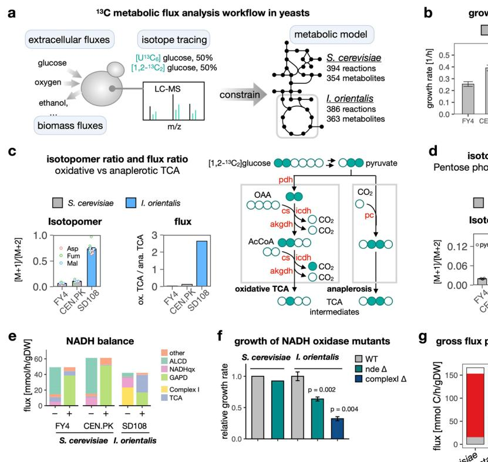

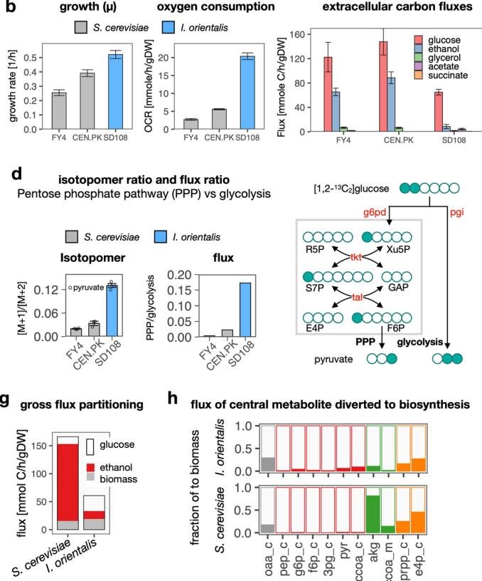

**Extended Data Fig. 1 | Metabolic flux analysis in yeasts.** (**a**) Overview of 13C metabolic flux analysis in yeasts. (**b**) Experimentally measured growth rate, oxygen consumption rate, and carbon metabolite fluxes for *S. cerevisiae* (strains FY4 and CEN.PK) and *I. orientalis* (SD108) grown in YNB with 20g/L glucose. FY4 is derived from the widely used S288C background. Mean ± s.e. derived from fitting of 3 time points in n = 3 biological replicates. (**c**) Isotopomer ratio in TCA intermediates reveals higher oxidative TCA activity in *I. orientalis*. Isotopomer ratios show average [M+1]/[M+2] ratio from [1,2-13C2] glucose tracing (1:1 mixed with unlabeled glucose) in three TCA metabolites, Asp(artate); Fum(arate); Mal(ate), mean ± s.e.m., n = 3 or 4 biological replicates. Flux ratios (from 13C genome-scale MFA) are between oxidative TCA (average of citrate synthase, alpha-ketoglutarate dehydrogenase and succinate dehydrogenase) and anaplerotic TCA (pyruvate decarboxylase). Filled circles, 13C atom. (**d**) Isotopomer ratio in pyruvate reveals higher flux through pentose phosphate pathway (PPP) in *I. orientalis*. [M+1]/[M+2] ratio of pyruvate from same experiment in (c), mean ± s.e.m., n = 4 biological replicates. Flux ratios (from 13C

genome-scale MFA) are between PPP (difference between glucose-6-phosphate dehydrogenase and phosphoribosylpyrophosphate synthetase) and glycolysis (phosphoglucose isomerase). Filled circles, 13C atom. (**e**) Consumption (−) and production (+) flux contributing to the balance of whole-cell NADH. ALCD, alcohol dehydrogenase; NADHqx, NADH quinone oxidoreductase (*Nde* and *Ndi* in *S.cerevisiae*, *Nde* in *I. orientalis*); GAPD, glyceraldehyde-3-phosphate dehydrogenase; TCA, reactions in the TCA cycle. Fluxes are best estimate from genome-scale 13C MFA. (**f**) Growth impact of NADH dehydrogenase deletions in *S. cerevisiae* and *I. orientalis*. Data for *S. cerevisiae* is from a previous study1 ; data for *I. orientalis* is determined in this study and shows mean ± s.d. from single exponential fitting of the growth curve (n = 4 time points). p value from two-sided student t test without adjustment. (**g**) Glucose uptake relative to its use to make ethanol or biomass. Fluxes are from the genome-scale flux analysis, with fluxes consuming pyruvate (for example ethanol production) counted as 3 carbon atoms. (**h**) Fraction of flux through 11 central metabolites partitioned in biosynthesis (not including the flux to another central metabolite).

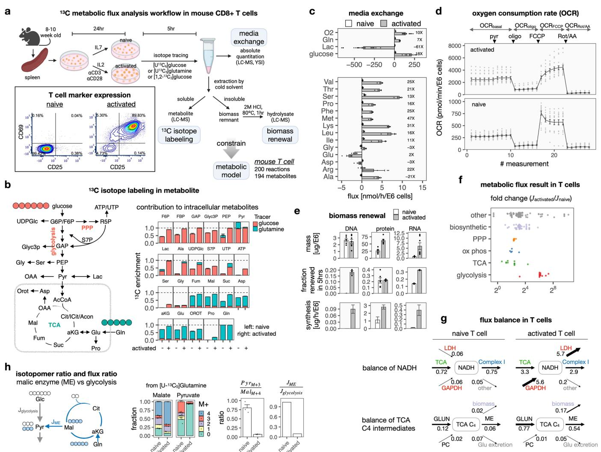

**Extended Data Fig. 2 | Metabolic measurement for T cell metabolic flux analysis.** (**a**) Overview of 13C metabolic flux analysis in mouse T cells. Primary CD8+T cells were purified from murine spleen, and kept in IL7 to remain in naïve state or activated by αCD3 and αCD28 in the presence of IL2 for 24hrs. Marker expression (CD69-FITC, CD25-APC) was evaluated by flow cytometry. (**b**) Isotope enrichment in central metabolites with [U-13C6]glucose or [U-13C5] glutamine tracing. 13C enrichment shows the average 13C labeling per carbon atom. Mean ± s.e.m., n = 3. (**c**) Media nutrient exchange flux. Positive and negative values indicate uptake and excretion, respectively. Numbers show fold change between naïve and activated T cells, with negative values reflecting change in flux direction. Mean ± s.e.m., n = 12 (O2), n = 4 (others). (**d**) Oxygen consumption rate (OCR) were measured with Mito Stress test through the sequential addition of pyruvate (pyr, 1mM), oligomycin (oligo, 5uM), fluoro-carbonyl cyanide phenylhydrazone (FCCP, 1uM), and rotenone/ antimycin A (Rot/AA, 2 uM).

Mean ± s.e.m., n = 12. (**e**) Biomass (DNA, protein, and RNA) renewal flux is the product of mass composition and fraction renewed measured by 13C enrichment in the biomass hydrolysate normalized to monomer in soluble metabolites. Mean ± s.e.m., n = 6. Flux, mean ± s.d. error propagated from mass and fraction renewed. (**f**) Fold change of metabolic fluxes (from 13C MFA) between activated and naïve T cells. (**g**) Flux balance of NADH and TCA four-carbon metabolites (TCA C4). LDH, lactate dehydrogenase; GAPDH, glyceraldehyde-3-phosphate dehydrogenase; GLUN, glutaminase; ME, malic enzyme; PC, pyruvate carboxylase; Glu, glutamate. (**h**) Isotopomer ratio (from LC-MS) reveals flux ratio (best estimate from 13C MFA) between malic enzyme (ME) and glycolysis. M+3 pyruvate (Pyr) is produced by ME from M+4 malate (Mal), whereas M+0 Pyr is produced from glycolysis. Note that malic enzyme flux increases in activated T cells despite a reduced isotopomer ratio. Mean ± s.e.m., n = 3.

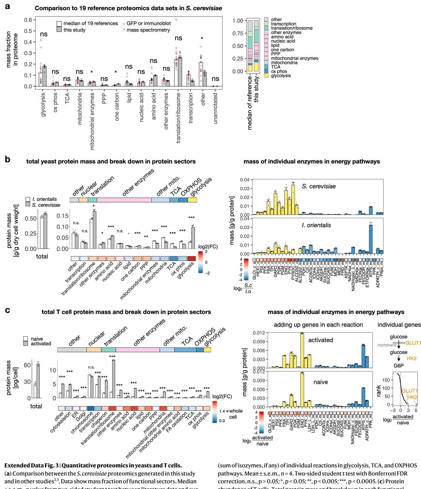

± s.e.m., p value from two-sided student t test between literature data and our data without adjustment, n = 19 (literature data); n = 4 (biological replicates, this study); *, p < 0.05, n.s., p > 0.05. Pearson's correlation R = 0.88 (p = 1E-5) between our proteome allocation and the median of reference (n = 14 sectors). (**b**) Protein abundance of yeasts. Total protein mass and breakdown in each functional sectors (left) and allocation to individual reactions (right). Fold change (FC) from *I. orientalis* to *S. cerevisiae* is shown on the bottom. Enzyme abundance

abundance of T cells. Total protein mass and breakdown in each functional sectors (left) and allocation to individual reactions (right). Fold change (FC) from naive to activated is shown on the bottom. Enzyme abundance (sum of isozymes, if any) of individual reactions in glycolysis, TCA, and OXPHOS pathways. Fold change of individual genes is also shown. Mean ± SEM, n = 3. Two-sided student t test with Bonferroni FDR correction, n.s., p > 0.05; ***, p < 0.0002.

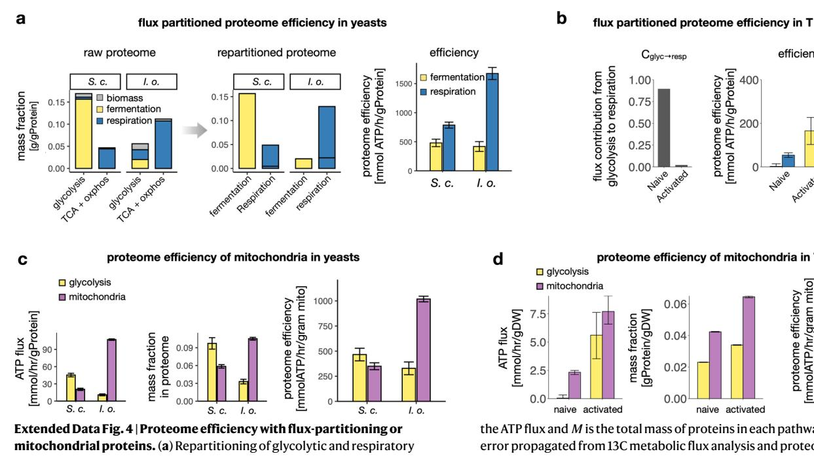

proteomes in proportion to flux distribution to biomass, fermentation, and respiration (left), and the resultant proteome efficiency (right). Data from batch cultured yeasts, mean ± s.e.m., error propagated from 13C metabolic flux analysis and proteomics (n = 4). (**b**) Flux-partitioned proteome efficiency of respiration in naïve and activated T cells given by (*JATP,resp+Cglyc→resp*∙*JATP,glyc*)/(*Mresp + Cglyc→resp*∙*Mglyc*), where (*Cglyc→resp*) is the fraction of glycolytic flux that ends up in respiration, *JATP* is

the ATP flux and *M* is the total mass of proteins in each pathway. Mean ± s.d., error propagated from 13C metabolic flux analysis and proteomics (n = 3). (**c**) Proteome efficiency accounting for all mitochondrial proteins in respiration in yeasts. Data from batch cultured yeasts, mean ± s.d., error propagated from 13C metabolic flux analysis and proteomics (n = 4). (**d**) Proteome efficiency accounting for all mitochondrial proteins in respiration in T cells. Data from T cells, mean ± s.e.m., error propagated from 13C metabolic flux analysis and proteomics (n = 3).

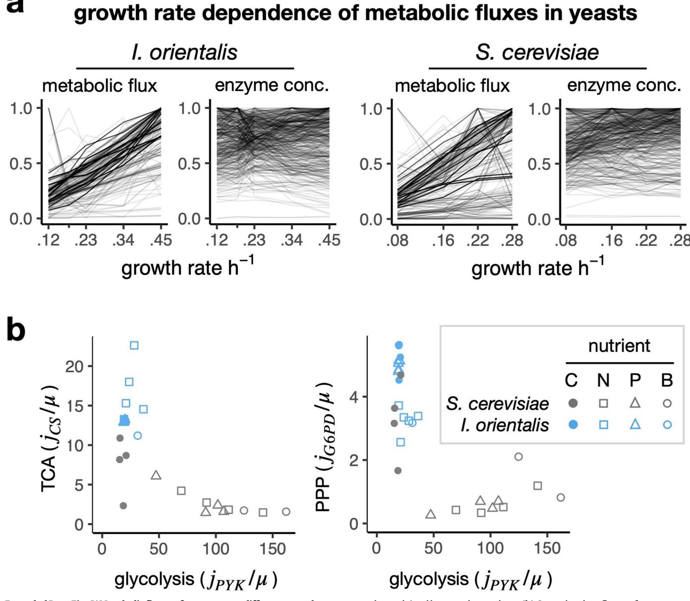

**Extended Data Fig. 5 | Metabolic fluxes of yeasts across different growth conditions.** (**a**) Dependence of metabolic flux and enzyme concentration on growth rate. Flux and enzyme concentration are normalized to maximum across nutrient conditions. For each reaction, a linear regression is done for flux versus growth rate. % variance explained is calculated, and averaged across all reactions. 53% of flux variation in *S. cerevisiae* and 71% in *I. orientalis* can be explained by growth rate alone. 21% of enzyme variation in *S. cerevisiae* and 23% in *I. orientalis*

can be explained by growth rate alone. (**b**) Central carbon fluxes of yeasts across nutrient conditions. Flux ( j) through TCA and glycolysis, and PPP are represented by flux through citrate synthase (CS), pyruvate kinase (PYK), and glucose-6-phosphate dehydrogenase (G6PD), respectively, and normalized to growth rate (µ). Limiting nutrient for chemostat, C, carbon; N, nitrogen; P, phosphorus; B, none.

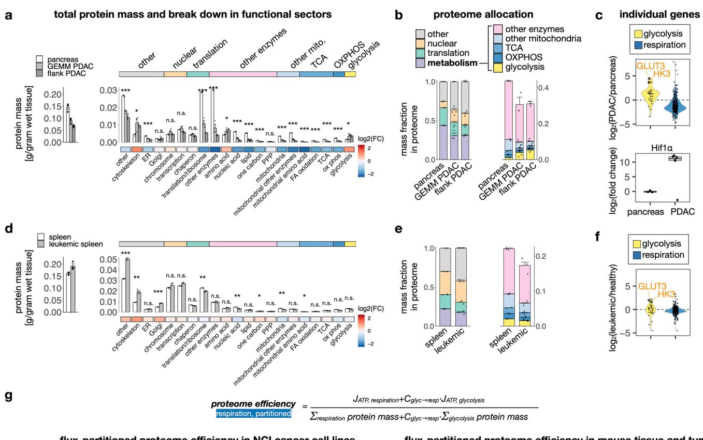

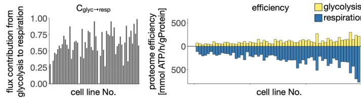

#### **Extended Data Fig. 6 | Proteomics of mouse tissues and tumors and**

**flux-partitioned proteome efficiency.** (**a**) Total protein mass and mass of each functional sectors in pancreas and k-Ras-driven pancreatic ductal adenocarcinoma (PDAC) (GEMM, genetically engineered mouse model; flank, flank implanted). Mean ± s.e.m., n = 3. Two-sided student t test between tumor and healthy without adjustment, n.s., p > 0.05; *, p < 0.05; **, p < 0.005; ***, p < 0.0005. Fold changes (FC) are shown on the bottom of each graph. (**b**) Mass fraction of proteome sectors as in (a). (**c**) Differential protein expression between healthy pancreas and PDAC. Top, glycolytic and respiratory proteins (fold change between PDAC and healthy pancreas), mean, n = 3. Bottom, hypoxia-inducible factor 1α (Hif1α), individual replicates and boxplot (median with quartiles). (**d**) Total protein mass and mass of each functional sectors in spleen and spleen

infiltrated with Notch1-driven leukemia (leukemic spleen). Mean ± s.e.m., n = 3. Two-sided student t test between tumor and healthy without adjustment, n.s., p > 0.05; *, p < 0.05; **, p < 0.005; ***, p < 0.0005. Fold changes (FC) are shown on the bottom of each graph. (**e**) Mass fraction of proteome sectors as in (d). (**f**) Differential expression of glycolytic and respiratory proteins between healthy and leukemic spleen (fold change between leukemic and healthy spleen), mean, n = 3. (**g**) Flux partitioned proteome efficiency considering flux contribution from glycolysis to respiration (Cglyc->resp), based on data in Fig. [4.](#page-4-0) For NCI60 cancer cells, Cglyc->resp is quantified as the ratio between mitochondrial pyruvate carrier flux and glucose uptake flux. For mouse tissues and tumors, Cglyc->resp is the flux ratio between glucose oxidation (estimated as 40% of TCA cycle) and glycolysis.

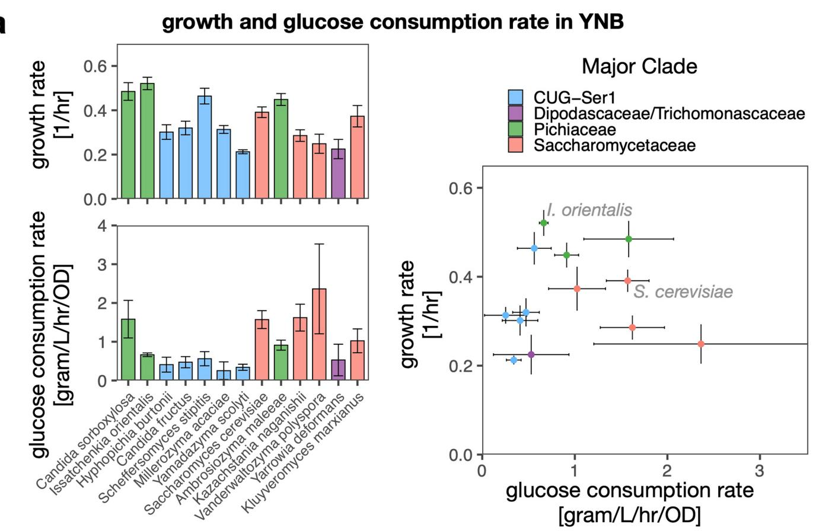

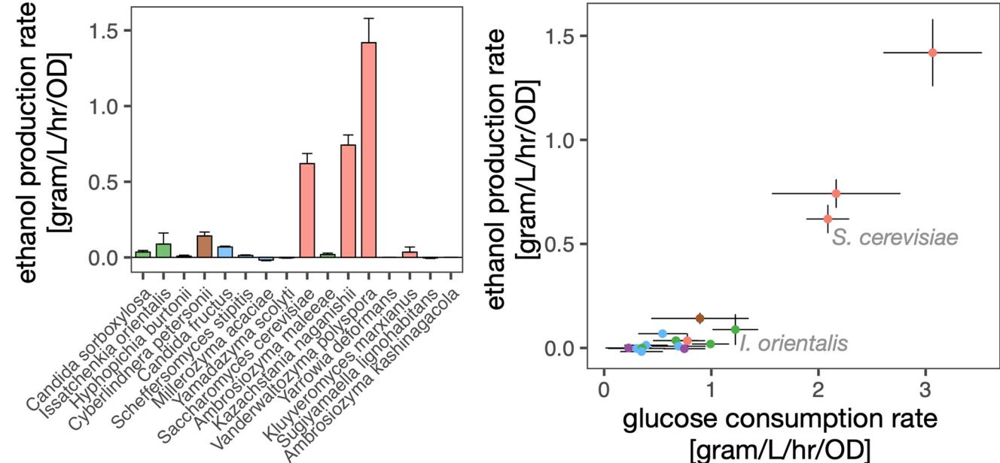

**Extended Data Fig. 7 | Metabolism of evolutionarily divergent budding yeasts.** (**a**) Growth rates (top left) and glucose consumption rates (bottom left) and their relation (right) of 13 yeasts cultured in minimal YNB media containing 20g/L glucose. 14 budding yeasts with top growth rates in YPD were selected, with *C. petersonii* not able to grow in YNB. Mean ± s.e. (error from regression),

n = 3 time points for n = 2 or 4 biological replicates. (**b**) Ethanol production rate (left) and its relation with glucose consumption rate (right) of the top 16 fast-growing yeasts in YPD containing 20g/L glucose. Mean ± s.e. (error from regression), n = 3 time points for n = 2 biological replicates.

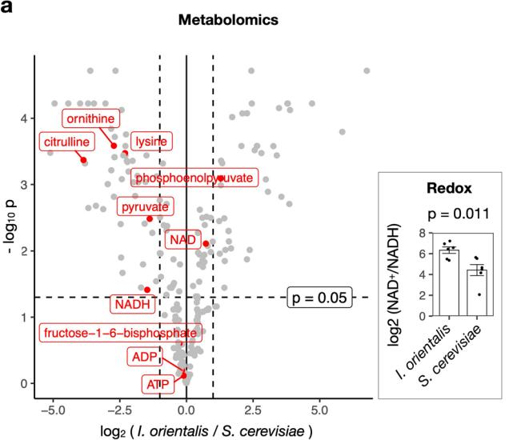

| id | reation                                                    | A-G'   |
|----|------------------------------------------------------------|--------|
| 1  | ADP(aq) + Pi(aq) = H2O(l) + ATP(aq)                        | 39.3   |
| 2  | Glucose(aq) = 2 Ethanol(aq) + 2 CO2(aq)                    | -249.6 |
|    | 3   Glucose(an) + 6 02/ag) = 6 CO2/ga) + 6 H2O/I)   2855 2 |        |

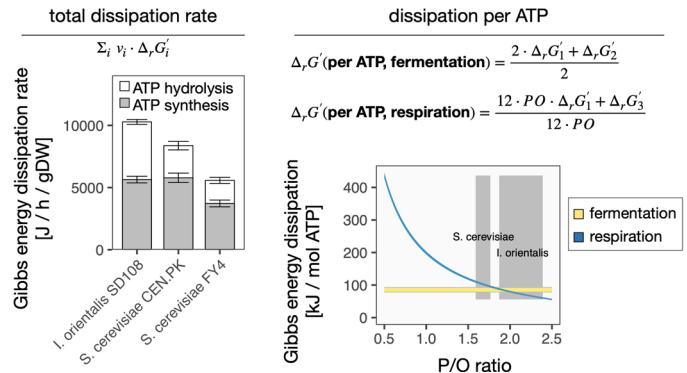

**Extended Data Fig. 8 | Alternative explanations for aerobic glycolysis.** (**a**) Fold change in metabolite abundance between *I. orientalis* and *S. cerevisiae* cultured in glucose YNB. Inset shows the ratio between NAD+ and NADH. Metabolite abundance was measured by LC-MS, mean, n = 6, p value from student t test with Bonferroni adjustment for multiple comparisons. Inset, mean ± s.e.m. (**b**) Reaction Gibbs energy under physiological concentrations (top), total Gibbs energy dissipation rate (in J/mol) for ATP synthesis and hydrolysis in *I. orientalis* and two strains of *S. cerevisiae* (bottom left), and dissipation per ATP production

as a function of ATP:oxygen (PO) ratio (bottom right). In the equations for dissipation per ATP, 2 reflects 2 ATP made per glycolysis, 12 reflects 12 pairs high-energy electrons made per glucose by respiration, and 12 ∙ PO is ATP yield per glucose by respiration. Shaded areas show experimentally obtained PO ratio (95% interval, see 'Assessment of PO ratio' in Ext. Data Note) for *S. cerevisiae* and *I. orientalis*. Mean ± s.d. propagated from error of flux measurement and flux analysis.

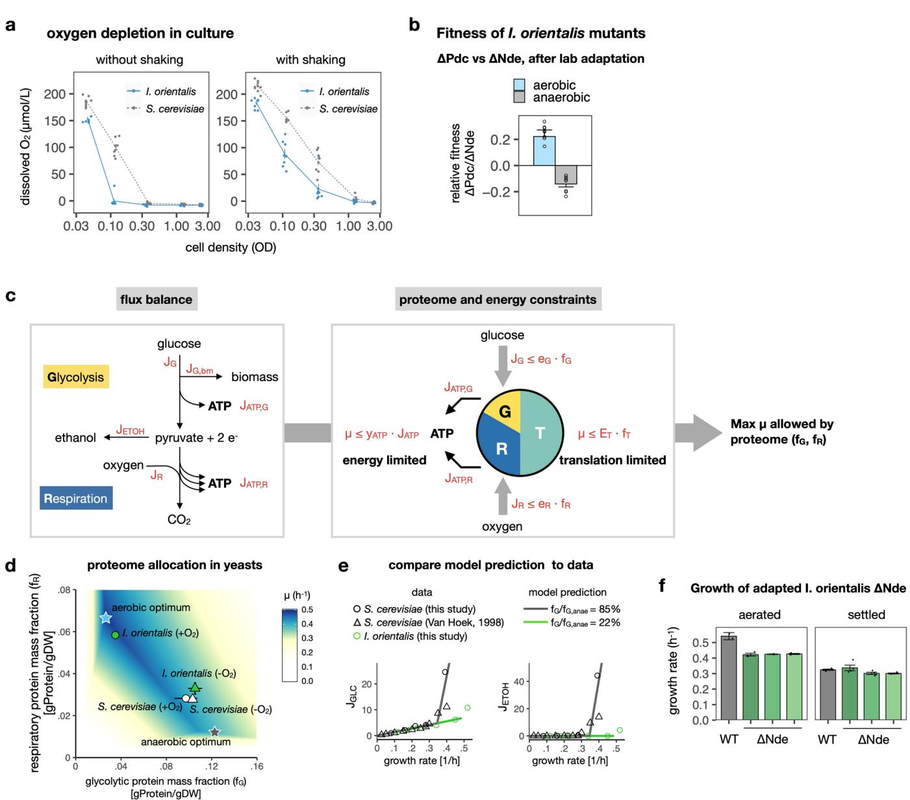

**Extended Data Fig. 9 | Fitness and proteome allocation of yeasts in aerobic and anaerobic conditions.** (**a**) Dissolved oxygen measured at the bottom of a multi-well plate culture with OxoPlate (phosphorescent oxygen sensor). Fresh exponential culture was added to the plate at indicated density and allowed to adapt for 15min. Oxygen concentration was then measured with or without active shaking. The typical maximal cell density (OD) from fully aerated culture is about 4. (**b**) Competitive fitness of lab adapted *I. orientalis* mutants, Δ*Pdc* (null mutant for pyruvate decarboxylase, essential for ethanol fermentation) and Δ*Nde* (null mutant for cytosol-facing NADH dehydrogenase, which feeds into the electron transport chain). 3 colonies of mutants were adapted for 14 days before competitive coculture. Relative fitness, mean ± s.e.m., n = 8. (**c**) A coarse-grained model where yeast growth is constrained by flux balance, energy (ATP) limitation, and proteome allocation. G, glycolysis; R, respiration; T, translation. For explanation of parameters and the model, see Ext. Data Note. (**d**) Maximal aerobic and anaerobic growth rate (µ) under different glycolytic (fG) and respiratory protein abundance (fR) (mass fractions of whole cell dry weight). Stars, optimal proteome allocation in aerobic and anaerobic conditions. Circles and triangles indicate measured proteome fractions in glucose-fed batch cultures of *I. orientalis* (aerobic, +O2; or anaerobic, -O2) and *S. cerevisiae* (aerobic, +O2). (**e**) Experimental glucose consumption ( JGLC) and ethanol excretion ( JETOH) rates (symbols, in mmol/h/gDW) and prediction from proteomeconstrained model (lines) under high (*S. cerevisiae*) or low (*I. orientalis*) glycolytic proteome capacity (rG). Literature data was obtained from Van Hoek 199[85](#page-8-1) . (**f**) Growth rate of wild type (WT) and adapted Δ*Nde* mutant *I. orientalis* in aerated and settled culture. Data show WT and three colonies of Δ*Nde* mutant picked after a 14-day adaptation. Media is YPD with 20g/L glucose. Mean ± s.e.m., n = 3 (aerated) n = 4 (settled).

|     | For all statistical analyses, confirm that the figure legend, table legend, main text, or Methods section.                                                                                                                                                    |
|-----|---------------------------------------------------------------------------------------------------------------------------------------------------------------------------------------------------------------------------------------------------------------|
| n/a | Confirmed                                                                                                                                                                                                                                                     |
|     | The exact sample size (n) for each experimental group/condition, given as a discrete number and unit of measurement                                                                                                                                           |
|     | A statement on whether measurements were taken from distinct sample was measured repeatedly                                                                                                                                                                   |
|     | The statistical test(s) used AND whether they are one- or two-sided Only common tests should be described solely by name; describe more complex techniques in the Methods section.                                                                         |
|     | A description of all covariates tested                                                                                                                                                                                                                        |
|     | A description of any assumptions or corrections, such as tests of normality and adjustment for multiple comparisons                                                                                                                                           |
|     | A full description of the statistical parameters including central tendency (e.g. means) or other basic estimates (e.g. regression coefficient) AND variation (e.g. standard deviation) or associated estimates of uncertainty (e.g. confidence intervals) |
|     | For null hypothesis testing, the test statistic (e.g. F. r) with confidence intervals, effect sizes, degrees of freedom and P value noted Give P values as exact values whenever suitable.                                                                 |
|     | For Bayesian analysis, information on the choice of priors and Markov chain Monte Carlo settings                                                                                                                                                              |
|     | For hierarchical and complex designs, identification of the appropriate level for tests and full reporting of outcomes                                                                                                                                        |
|     | Estimates of effect sizes (e.g. Cohen's d, Pearson's r), indicating how they were calculated                                                                                                                                                                  |
|     | Our web collection on statistics for biologists contains articles on many of the points above.                                                                                                                                                                |
|     |                                                                                                                                                                                                                                                               |

| Data collection | C-MS data was collected by Xcalibur  Ther Scientific) with instrumental setup described in detail in method. Flow ortometry data were collected and analyzed by FCS Express 7.12 (De Novo Software)                                                                                                                                                                                                                                                                                                                                                                                                                                                                                                                                                                                                                                                                                                                                                                                     |
|-----------------|--------------------------------------------------------------------------------------------------------------------------------------------------------------------------------------------------------------------------------------------------------------------------------------------------------------------------------------------------------------------------------------------------------------------------------------------------------------------------------------------------------------------------------------------------------------------------------------------------------------------------------------------------------------------------------------------------------------------------------------------------------------------------------------------------------------------------------------------------------------------------------------------------------------------------------------------------------------------------------------------|
| Data analysis   | For metabolomics, raw LC-MS data were converted to maxil format by ProteoWizard Sourceforge.io). Peak picking and quantitation were done in the El-Mave (v.0.4.1, Elucidata). For samples with 13C labeling, natural isotope abundance was corrected using Accucor (https://github.com/parsons/accucor). For proteomics, the data was analyzed using GFY software licensed from Harvard University. Raw files were converted to m2XML use. MS2 spectra assignment was performed using the SEQUEST algorithm v.28 (rev. 12). Other data analysis and visualization were done in R (version 9). R code for multi-omic integration and metabolic regulation analysis is available at https://github.com/yihuishen/metabolic models and code for MFA are available at https://github.com/maranasgroup/yeastsMFA and https://github.com/maranasgroup/SteadyState-MFA. T cell metabolic models and code for MFA are available at https://github.com/yihuishen/T  cell  MFA. |

- 
- 
- 

| Reporting on sex and gender | NA |
|-----------------------------|----|
| Population characteristics  | NA |
| Recruitment                 | NA |
| Ethics oversight            | NA |

| Sample size     | No sample-size calculation was performed. Sample size was chosen of biological variance and technical noise               |
|-----------------|---------------------------------------------------------------------------------------------------------------------------|
| Data exclusions | No data was excluded                                                                                                      |
| Replication     | Biological replicates have been performed independently where indicated in the manuscript. The replicates are consistent. |
| Randomization   | Randomization is not applicable as other variables are controlled or not relevant to the study.                           |
| Blinding        | Blinding is not applicable as data is acquired by the same person who designed the experiment.                            |

| Materials & experimental systems    | Methods                      |
|-------------------------------------|------------------------------|
| Involved in the study n/a l      | Involved in the study n/a |
| Antibodies X                     | ChIP-seq X                |
| Eukaryotic cell lines XI         | Flow cytometry               |
| XI Palaeontology and archaeology | X MRI-based neuroimaging  |
| Animals and other organisms X    |                              |
| Clinical data XII                |                              |
| XII Dual use research of concern |                              |

|  | μ − μ − |
|--|------------------|
|  |                  |
|  |                  |
|  |                  |
|  |                  |
|  |                  |
|  |                  |
|  |                  |
|  |                  |

| Laboratory animals      | C57BL/6 mice (Charles River Laboratories) were used CD8+ T cell isolation. Female mice aged between 8 and 12 weeks were used unless otherwise noted. Mice were housed under a normal light cycle (7 AM to 7 PM), at room temperature of 20-2690 and a humidity of 40-60%, with water and food (PicoLab Rodent Diet 5053, LabDiet) provided ad libitum.with water and food (PicoLab Rodent Diet 5053, LabDiet) provided ad libitum. Heathy and tumorous tissues were obtained from mice described in an earlier study (Bartman et al. Nature 2023), including spontaneous pancreatic adenocarcinoma (GEMM PDAC, Pdx1-cre;LSL-Kras-G12D/+;Trp53fl/fl] mice, Syngeneic pancreatic adenocarcinoma allograft tumors (flank PDAC, established by implanting tumors from Pdx1-cre;LSL-Kras- G12D/+; LSL-Trp53-R172H/+ mice subcutaneously into the mouse flank), primary T-cell acute lymphocytic leukemic spleen, NOTCH1-induced primary transplanted into sub-lethally irradiated recipients). |
|-------------------------|----------------------------------------------------------------------------------------------------------------------------------------------------------------------------------------------------------------------------------------------------------------------------------------------------------------------------------------------------------------------------------------------------------------------------------------------------------------------------------------------------------------------------------------------------------------------------------------------------------------------------------------------------------------------------------------------------------------------------------------------------------------------------------------------------------------------------------------------------------------------------------------------------------------------------------------------------------------------------------------------------------------|
| Wild animals            | Study did not involve wild animals                                                                                                                                                                                                                                                                                                                                                                                                                                                                                                                                                                                                                                                                                                                                                                                                                                                                                                                                                                             |
| Reporting on sex        | Sex was not considered in  study design.                                                                                                                                                                                                                                                                                                                                                                                                                                                                                                                                                                                                                                                                                                                                                                                                                                                                                                                                                                       |
| Field-collected samples | Study did not involve field-collected samples                                                                                                                                                                                                                                                                                                                                                                                                                                                                                                                                                                                                                                                                                                                                                                                                                                                                                                                                                                  |
| Ethics oversight        | All mouse experiments were approved by the Institutional Animal Care and Use Committee at Princeton University (protocol number 3111)                                                                                                                                                                                                                                                                                                                                                                                                                                                                                                                                                                                                                                                                                                                                                                                                                                                                       |

| Sample preparation        | Purity of naïve CD8+ T cells (98%) and expression of activation markers were verified by flow cytometry. Specifically, cells were collected, washed with staining buffer (PBS + 2% FBS) and stained with the viability dye Live/Dead Aqua (Thermo Fisher, L34966) according to the manufacturer's instructions. Cells were then washed with staining buffer and stained for surface markers on ice for 30 min: CD4 (APC-Cy7, 1:100, clone RM4-5, BD Biosciences, 565650), CD8a (PerCP-Cy5.5, 1:100, clone 53-6.7, BD Biosciences, 551162], CD25 (APC, 1:100, clone PC61, BD Biosciences, 557192), CD44 (PE-Cy7, 1:100, clone IM7, BD Biosciences, 560569), CD62L (PE, 1:100, clone MEL-14, BD Biosciences, 561918) and CD69 (FITC, 1:250, clone H1.2F3, BD Biosciences, 557392). |
|---------------------------|----------------------------------------------------------------------------------------------------------------------------------------------------------------------------------------------------------------------------------------------------------------------------------------------------------------------------------------------------------------------------------------------------------------------------------------------------------------------------------------------------------------------------------------------------------------------------------------------------------------------------------------------------------------------------------------------------------------------------------------------------------------------------------------------------|
| Instrument                | All flow cytometry was analyzed with an LSR II flow cytometer (BD Biosciences).                                                                                                                                                                                                                                                                                                                                                                                                                                                                                                                                                                                                                                                                                                                    |
| Software                  | Data were collected and analyzed by FCS Express 7.12 (De Novo Software)                                                                                                                                                                                                                                                                                                                                                                                                                                                                                                                                                                                                                                                                                                                            |
| Cell population abundance | No post-sorting populations were used. Purity of magnetic-bead-isolated naive CD8+ T cells was confirmed by expression of CD8+ markers (CD62L). Activation was confirmed by CD25 and CD69.                                                                                                                                                                                                                                                                                                                                                                                                                                                                                                                                                                                                      |
| Gating strategy           | FSS/SC lymphocyte gate (95%), singlet gate (98%), iive/dead (98%), CD8+ (using CD4 vs CD8, 99%), naive (CD62L vs CD44, 99%), activated (CD69 vs CD25, 90%).                                                                                                                                                                                                                                                                                                                                                                                                                                                                                                                                                                                                                                     |