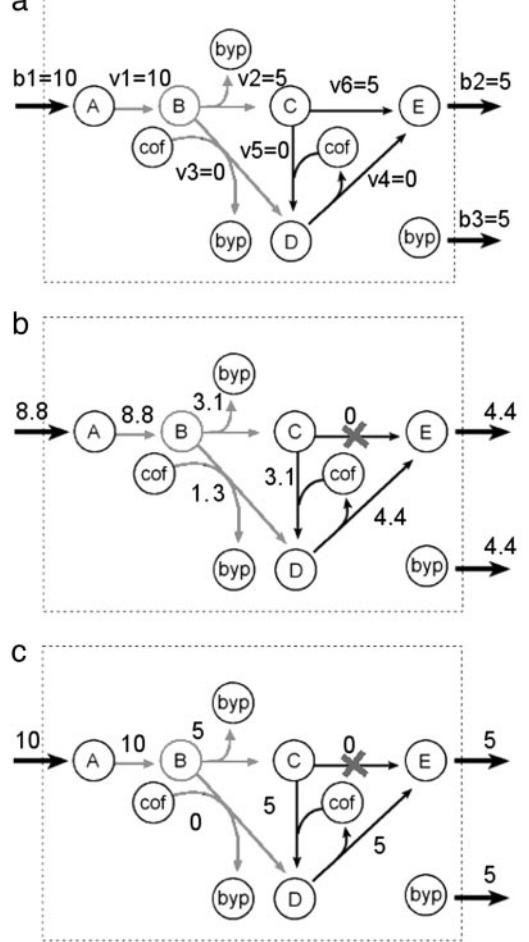
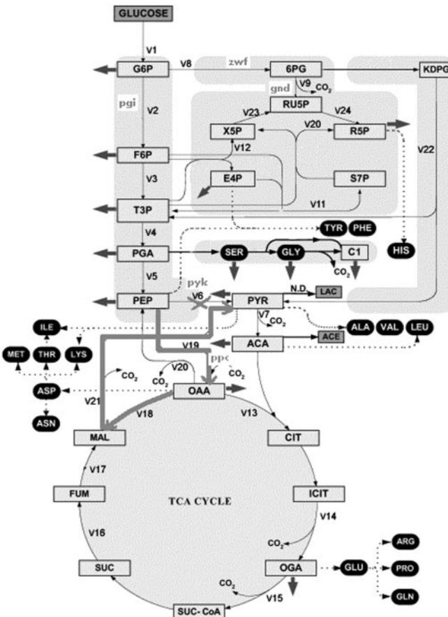
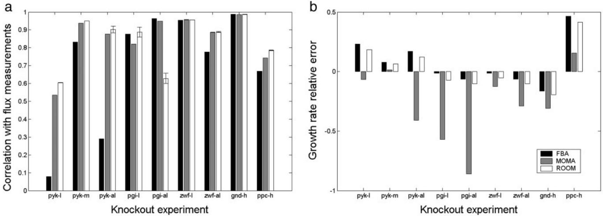
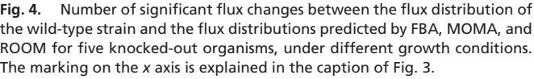

# **Regulatory onoff minimization of metabolic flux changes after genetic perturbations**

**Tomer Shlomi*, Omer Berkman*†‡, and Eytan Ruppin*§¶**

*School of Computer Science and §School of Medicine, Tel Aviv University, Tel Aviv 69978, Israel; and †Department of Computer Science, Academic College of Tel Aviv Yaffo, Tel Aviv 61162, Israel

Edited by Philip P. Green, University of Washington School of Medicine, Seattle, WA, and approved March 28, 2005 (received for review February 18, 2005)

**Predicting the metabolic state of an organism after a gene knockout is a challenging task, because the regulatory system governs a series of transient metabolic changes that converge to a steadystate condition. Regulatory onoff minimization (ROOM) is a constraint-based algorithm for predicting the metabolic steady state after gene knockouts. It aims to minimize the number of significant flux changes (hence onoff) with respect to the wild type. ROOM is shown to accurately predict steady-state metabolic fluxes that maintain flux linearity, in agreement with experimental flux measurements, and to correctly identify short alternative pathways used for rerouting metabolic flux in response to gene knockouts. ROOM's growth rate and flux predictions are compared with previously suggested algorithms, minimization of metabolic adjustment, and flux balance analysis (FBA). We find that minimization of metabolic adjustment provides accurate predictions for the initial transient growth rates observed during the early postperturbation state, whereas ROOM and FBA more successfully predict final higher steady-state growth rates. Although FBA explicitly maximizes the growth rate, ROOM does not, and only implicitly favors flux distributions having high growth rates. This indicates that, even though the cell has not evolved to cope with specific mutations, regulatory mechanisms aiming to minimize flux changes after genetic perturbations may indeed work to this effect. Further work is needed to identify metrics that characterize the complete trajectory from the initial to the final metabolic steady states after genetic perturbations.**

**T**he study of metabolic networks has attracted considerable attention in recent years. Much of this research has concentrated on building mathematical models of cell metabolism. In this paper, we focus on flux analysis using steady-state constraint-based modeling (1, 2). In constraint-based modeling, stoichiometric thermodynamic flux capacity and possibly other constraints are used to limit the space of possible flux distributions attainable by the metabolic network. Flux balance analysis (FBA) (3–6) is a specific constraint-based method that assumes optimal behavior of the network. FBA applies various optimization criteria, such as growth or energy maximization, with the aim of achieving a biologically meaningful description of the metabolic state of the system. It has been successfully used for predicting growth, uptake rates, by-product secretion, and growth after adaptive evolution, among others (7–11).

Predicting the lethality and phenotypes of organisms undergoing genetic perturbations is an additional, perhaps more challenging, task of constraint-based models (10, 12). Experiments have shown that, after stressful environmental changes and genetic perturbations, the organism may respond with rapid and dramatic alterations in global gene expression patterns. However, after the organism adapts to the new condition, the gene expression program adjusts to a new steady state that may be only slightly altered from the program seen before the perturbation.

DNA microarray experiments have shown that the expression of 900 genes in *Saccharomyces cerevisiae* drastically changes after environmental transitions and then adjusts to a steady state not very different from the original state (13, 14). This largescale response appears in environmental changes that do not necessarily impair viability or growth rates. It was suggested that these environmental responses were evolved to protect and maintain critical features of the organism and to provide for relative stability against enzymatic alterations (13, 15). Similar experimental measurements of gene expression after gene knockouts in *S. cerevisiae* have revealed a high number of transient changes, converging to a steady state that is close to the wild type (16, 17). The effect of the transient behavior of the regulatory system after genetic perturbations on metabolism has also been observed in a recent study of *Escherichia coli* adaptive evolution, showing that in many cases the growth rate of the organism drops after a gene knockout and then gradually increases and converges to a near-optimal growth rate similar to that predicted by FBA (18). Such transient drops in growth rates caused by large-scale changes in expression patterns were suggested to aid in the conservation of energy after environmental perturbations (13). It has been suggested that the nonoptimal metabolic behavior observed after a gene knockout is a result of the organism's adjustment, minimizing the changes in its flux distribution in accordance with the minimization of metabolic adjustment (MOMA) approach (19). This method minimizes the Euclidean norm of the flux differences between the metabolic states of the knocked-out strain and the wild type. MOMA was reported to provide more accurate predictions of *E. coli* lethality and metabolic fluxes after knockouts than FBA. The Euclidean metric on which MOMA is based tends to prohibit large modifications in single fluxes. However, such large modifications may be required for rerouting metabolic flux through alternative pathways and are actually observed at times experimentally (21).

For example, when a knocked-out enzyme is ''backed up'' by a short alternative pathway (e.g., isoenzymes), a reasonable adjustment would use this alternative pathway instead of the knocked-out enzyme (ref. 21; Figs. 1 and 2). This weakness of the Euclidean metric is marked also with respect to the recent notion of linearity of flow: Ihmels *et al.* (22) have recently shown that transcriptional regulation may lead metabolic flow toward linearity, because in most cases the flow is directed in one particular direction at metabolic branch points. The quadratic nature of Euclidean distance minimization used in MOMA, which favors numerous small changes in fluxes over a few large changes with an equal total sum, will be shown to yield flux distributions having a low flux linearity score, in contrast to the results of Ihmels *et al*. (22). However, as noted in ref. 23, it is not clear whether in all cases the results of Ihmels *et al.* (22) apply to metabolic flow, because in some cases, simultaneous flow through different branches is necessary.

Downloaded from https://www.pnas.org by 152.206.242.129 on January 28, 2025 from IP address 152.206.242.129.

This paper was submitted directly (Track II) to the PNAS office.

Abbreviations: FBA, flux balance analysis; MOMA, minimization of metabolic adjustment; ROOM, regulatory onoff minimization; LP, linear programming; MILP, mixed-integer LP.

‡The research of O.B. was done while he was on sabbatical at Tel Aviv University.

¶To whom correspondence should be addressed. E-mail: ruppin@math.tau.ac.il.

© 2005 by The National Academy of Sciences of the USA

The problems mentioned with the Euclidean norm suggest it may not be suitable to provide a satisfactory approximation for the metabolic state after adaptation to the gene knockout. However, we show that MOMA appropriately predicts transient metabolic states after genetic perturbations, which are characterized by large-scale changes in expression patterns.

We propose a method, regulatory onoff minimization (ROOM), for predicting the metabolic steady state of the organism after gene knockouts. ROOM uses a different norm than MOMA, minimizing the total number of significant flux changes from the wild-type flux distribution. Specifically, ROOM finds a flux distribution for a perturbed strain that satisfies stoichiometric constraints (mass balance) and thermodynamical and flux capacity constraints, while minimizing the total number of significant flux changes from the respective fluxes of the wild-type strain (*Methods*). The heuristic underlying ROOM's distance metric is motivated by the assumptions that (*i*) the genetic regulatory changes required for realizing flux changes after gene knockouts are minimized by the cell, minimizing its adaptation cost, and (*ii*) such regulatory changes can be parsimoniously described by Boolean onoff dynamics, which assign a fixed cost to each regulatory change, regardless of its magnitude.

These assumptions are supported first by studies that show there has been continuous evolutionary pressure to minimize the cost of gene expression; highly expressed genes have shorter introns and high bias in synonymous codons and amino acid composition, which altogether yield more efficient protein synthesis by reducing energetic costs (24–26). Second, the findings of Ihmels *et al.* (22) that flow is usually biased in one direction in metabolic branch points, and that in most cases isoenzymes are not coexpressed, suggest that minimization of gene expression follows onoff dynamics, under which the cost of expressing a single gene in high rate is lower than that of expressing multiple genes in lower rates.

Because regulatory constraints are not explicitly incorporated into metabolic network models, ROOM implicitly accounts for regulatory changes by identifying significant flux changes in the respective metabolic reactions. If expression is used efficiently, e.g., using ''just-in-time'' mechanisms (27, 28), a change in flux is likely to require a change in expression level through the respective gene.

Both MOMA and ROOM search for a flux distribution that is close to the wild type and are not concerned with maximizing the growth rate. It turns out, however, that in contrast to MOMA, the metric on which ROOM is based implicitly prefers high growth-rate solutions, leading to its more accurate predictions of postadaptation states.

Indeed, because ROOM acts to minimize the number of significant flux changes, a significant change in growth is unlikely, because maintaining stoichiometry after a change in flux through the growth reaction requires modification in flux toward all biomass precursors. This is not a mere technical epiphenomenon but a strong indication that, even though the cell has obviously not evolved any explicit mechanism to cope with every specific mutation by maximizing growth, the evolved regulatory mechanisms aiming to minimize flux changes after genetic perturbations may work to this effect. Thus, we find that accepting MOMA's view that the flux distribution of the knocked-out strain should be proximal to that of the wild type does not preclude the possibility of finding close-to-optimal growth solutions using ROOM's metric. It should be noted that the metric on which MOMA is based also favors high growth rates but to a much lesser extent.

Indeed, in all predictions we performed, the growth rate obtained by ROOM was very close to that of FBA, whereas the growth rate predicted by MOMA was significantly lower. However, the flux distributions predicted by ROOM are different

**Fig. 1.** An example network (adapted from ref. 20). (*a*) A given flux distribution for the wild-type intact network that can be obtained by FBA and experimental flux data. The flux through b2 represents growth rate. (*b*) MOMA's prediction for the knocked-out network following the knockout of reaction v6. (*c*) ROOM's prediction for the knocked-out network. ROOM finds changes in flux only along a short alternative pathway through v5 and v4, preserving the optimal growth rate of the wild-type strain. In all figures, metabolic branch point B, along with the reactions that produce or consume it, are highlighted. Note that in ROOM's prediction, linearity of flow is preserved in branch point B as opposed to MOMA's prediction. Note also that the MOMA solution (*b*) has Euclidean distance 62.8 from *a*. ROOM solution (*c*) has three altered fluxes with respect to *a*. On the other hand, MOMA solution has nine altered fluxes with respect to *a*, and ROOM solution has Euclidean distance 75 from *a*.

from those predicted by FBA and are shown to correlate with experimental data better than the predictions of both FBA and MOMA. Considering that for a given growth media there are multiple equivalent optimal growth FBA solutions (29, 30), it turns out that, in many cases, ROOM finds specific solutions from within this space of optimal FBA solutions that best approximate the metabolic state of the knocked-out strain.

Interestingly, we find that MOMA's flux predictions markedly improve when forcing its growth rate to be at least as large as ROOM's (see the supporting information, which is published on the PNAS web site).

The example network in Fig. 1 and Table 1 demonstrates the difference in predicted flux distribution between MOMA and ROOM. Modeling a gene knockout by constraining the flux through v6 to zero, MOMA predicts modifications in all network fluxes, whereas ROOM predicts that only fluxes v5

|     | v1 | v2 | v3 | v4 | v5 | v6 | b1 | b2 | b3 |
|-----|----|----|----|----|----|----|----|----|----|
| A   | 1  | 0  | 0  | 0  | 0  | 0  | 1  | 0  | 0  |
| B   | 1  | 2  | 2  | 0  | 0  | 0  | 0  | 0  | 0  |
| C   | 0  | 1  | 0  | 0  | 1  | 1  | 0  | 0  | 0  |
| D   | 0  | 0  | 1  | 1  | 1  | 0  | 0  | 0  | 0  |
| E   | 0  | 0  | 0  | 1  | 0  | 1  | 0  | 1  | 0  |
| byp | 0  | 1  | 1  | 0  | 0  | 0  | 0  | 0  | 1  |
| cof | 0  | 0  | 1  | 1  | 1  | 0  | 0  | 0  | 0  |

A–E, byp, and cof represent metabolites; v1–v6 represent intracellular reactions; and b1–b3 represent transport reactions.

and v4 are modified, forming a short alternative pathway to the knocked-out reaction v6. Furthermore, ROOM predicts a linear flow with respect to branch point B, whereas MOMA predicts the opposite.

#### **Methods**

We use the *E. coli* metabolic model of Edwards and Palsson (7) for all predictions other than the adaptive evolution growth predictions in which we use the model of Reed *et al.* (31) (also used in ref. 18). For the yeast *S. cerevisiae*, we use the metabolic model of ref. 32 (also used in ref. 10). The commercial solver CPLEX (ILOG, Mountain View, CA) was used for solving linear programming (LP), quadratic programming, and mixed-integer LP (MILP) problems, on an Intel (Santa Clara, CA) Pentium 4 processor running RED HAT LINUX.

**FBA.** FBA (3–6) uses LP to maximize an objective function under different constraints. In our model, we look for a steady-state flux distribution (*v*) that maximizes growth rate under mass balance, thermodynamical, and flux capacity constraints. The LP problem is formalized as follows:

$$\begin{aligned} \max f^T \nu, \\ \text{s.t. } S \cdot \nu = 0, \; \nu_{\text{min}} \le \nu \le \nu_{\text{max}}. \end{aligned}$$

Here, mass balance constraints are imposed by a system of linear equations, where *S* is an *n m* stoichiometric matrix, in which *n* is the number of metabolites, and *m* is the number of reactions. The vector *f* is an objective function maximizing growth rate, which is represented by a reaction that drains biomass components. Thermodynamic constraints that restrict flow direction and capacity constraints are imposed by setting *v*min and *v*max as lower and upper bounds on flux values. The running time of the solver for LP problems of the size we are interested in is on the order of tens of milliseconds.

**MOMA.** MOMA (19) finds a solution that satisfies the same constraints as FBA, while minimizing the Euclidean distance from a wild-type flux distribution (usually obtained previously by FBA). MOMA is formalized by using quadratic programming as follows:

$$\begin{array}{l} \min(\nu - \mathcal{w})^T(\nu - \mathcal{w}), \\\\ \text{s.t. } \mathcal{S} \cdot \nu = 0, \ \nu_{\min} \le \nu \le \nu_{\max}, \\\\ \nu_j = 0, j \in \mathcal{A}, \end{array}$$

where *w* is the wild-type flux distribution, and *A* is a set of reactions associated with the deleted genes. The running time of the solver for quadratic programming problems is 1 sec.

**ROOM.** ROOM finds a flux distribution that satisfies the same constraints as FBA while minimizing the number of significant (large enough) flux changes. We account only for significant flux changes because of the inherent noise in biological systems and to reduce the running time. We use MILP, formalized as:

$$\begin{aligned} \min & \sum_{i=1}^{m} \mathcal{y}_i, \\ & \text{s.t. } S \cdot \nu = 0, \ \nu_{\min} \le \nu \le \nu_{\max}, \\ & \nu_j = 0, j \in \mathcal{A}, \\ & \text{for } 1 \le i \le m \\ & \nu_i - \mathcal{y}_i(\nu_{\max,l} - \mathcal{w}_i^u) \le \mathcal{w}_i^u, \\ & \nu_i - \mathcal{y}_i(\nu_{\min,l} - \mathcal{w}_i^l) \ge \mathcal{w}_i^l, \\ & \mathcal{y}_i \in \{0, 1\}, \end{aligned} \tag{1}$$

$$\begin{aligned} \boldsymbol{\nu}_{l}^{\mu} &= \boldsymbol{\nu}_{l} + \boldsymbol{\mathfrak{G}}|\boldsymbol{\nu}_{l}| + \boldsymbol{\mathfrak{s}}, \\ \boldsymbol{\nu}_{l}^{l} &= \boldsymbol{\nu}_{l} - \boldsymbol{\mathfrak{G}}|\boldsymbol{\nu}_{l}| - \boldsymbol{\mathfrak{s}}, \end{aligned}$$

where for each flux *i*, 1 *i m*, *yi* 1 for a significant flux change in *v*i and *y*i 0 otherwise, and *wu* and *wl* are thresholds determining significance of the flux change, with and specifying the relative and absolute ranges of tolerance, respectively (*w* and *A* are as in MOMA).

Indeed, when *y*i 1, inequalities **1** and **2** do not impose new constraints on *v*i, whereas if *y*i 0, inequalities **1** and **2** constrain *v*i to the range defined above. The size of and influences the running time of the MILP solver; we have chosen the minimal values that resulted in reasonable running times. (Specifically, we have used 0.03, 0.001 for flux predictions, and 0.1, 0.01 for lethality predictions). The choice of these parameters influences the resulting flux distribution of the algorithm by allowing a small amount of additive () and multiplicative () flux to route through alternative pathways with no cost. The running time of the solver on our MILP problems is a few seconds.

Relaxing the integer constraints in **3** to 0 *yi*- 1 results in a LP variant of the system above. For this variant, the values of and may be set to zero. Predictions based on the LP variant of ROOM are quite accurate, although less so than ROOM's predictions (see the supporting information). The flux predictions for *E. coli* and lethality predictions for the yeast are with respect to the MILP formulation, whereas the *E. coli* lethality predictions and growth rate predictions are with respect to the LP formulation. Interestingly, the LP formulation of ROOM is somewhat similar to a variant of MOMA, suggested in ref. 19, which uses a normalized norm.

**Alternative Solutions.** In the investigation of *E. coli*, we used the method of Mahadevan and Schilling (29) to compute a set of alternative optimal flux distributions for the wild-type strain for each required growth condition. For the ammonia growth condition, there are multiple FBA solutions with flux variability in reactions for which we have experimental measurements. Therefore, we have incorporated the methods of Burgard and Maranas (33) and Mahadevan and Schilling (29) for finding a set of wild-type flux distributions that is both at minimal Euclidean distance from the experimental fluxes and optimal (providing optimal growth rate). Then, for each knockout experiment and its respective growth condition, we run MOMA and ROOM on the knocked-out network using all solutions in the wild-type set. For our *S. cerevisiae* investigation, we ignore alternative solutions and use the ones we get from the solver for simplicity [as conventionally done in previous knockout studies (10)].

**Fig. 2.** A schematic representation of the central carbon metabolism of *E. coli* (adapted from ref. 35). Experimental fluxes are labeled v1–v24 and are measured in the direction of the arrows. Note that in some cases, flux flows in the opposite direction and is measured by a negative value. The thick arrows highlight the short alternative pathway (v19–v18–v21) predicted by ROOM in response to the knockout of *pyk* (marked with an X) under medium-glucose growth conditions. Major changes in flux along this pathway were experimentally determined (21). See the supporting information for the mapping between the experimental fluxes and model reactions. (Note that unlabeled reactions such as 6PG to KDPG were not experimentally measured.)

## **Results and Discussion**

We tested ROOM's predictions of metabolic fluxes for five different *E. coli* knockouts: pyruvate kinase (*pyk*), phosphoglucose isomeras (*pgi*), glucose 6-phosphate 1-dehydrogenase (*zwf*), 6-phosphogluconate dehydrogenase (*gnd*), and phosphoenolpyruvate carboxylase (*ppc*), under growth conditions by comparing them with experimental results and with the predictions of FBA and MOMA (21, 34–36). All measured fluxes belong to the central carbon metabolism of *E. coli* and were empirically determined by combining NMR spectroscopy in 13C labeling experiments and physiological data measurements. Fig. 2 shows the central carbon metabolism of the *E. coli* and displays the reactions measured experimentally. The number of measured fluxes for each mutant varied (17 for *pyk*; 22 for *pgi*, *zwf*, and *gnd*; and 19 for *ppc*). To predict intracellular fluxes and growth rates for these experiments, we used the *E. coli* metabolic network model of Edwards and Palsson (7). To model gene knockouts, the fluxes through the associated reactions are constrained to zero (Fig. 2).

Because ROOM and MOMA depend on the flux distribution of the wild-type strain, we considered multiple possible FBA flux distributions for the wild-type strain (*Methods*). The comparison among the three algorithms is based on the average accuracy of predictions of ROOM and MOMA obtained starting from multiple FBA flux distributions for the wild-type strain. Note that the standard deviations in the accuracy are generally low, and in fact, we get similar results starting from each FBA solution for the wild-type strain (see the supporting information). For a given flux distribution of the wild-type strain, there exists a unique MOMA solution that is closest to the wild-type solution under a Euclidean norm (19). Because ROOM's prediction is not necessarily unique, we considered alternative ROOM predictions that give similar results (see the supporting information).

Comparing ROOM with FBA and MOMA for all nine knockout experiments, we find that in eight of nine knockout experiments, ROOM's flux predictions are either equal to or more accurate than its contemporaries (Fig. 3*a*). Specifically, the flux predictions obtained by applying ROOM for the *pyk* mutant under the different growth conditions are significantly more accurate than those obtained by either FBA or MOMA. For this knockout, the correlations with the experimental measurements obtained by ROOM are 13%, 1%, and 4% higher than MOMA for the low-glucose, medium-glucose, and ammonia-limited growth conditions, respectively. Inspecting ROOM, MOMA, and FBA flux distributions, we find that the average number of fluxes that are significantly changed from the wild type's flux distribution are 12, 317, and 119, respectively (Fig. 4 and *Methods*). The low number of significant flux changes in ROOM's predictions is in agreement with biological data showing a small number of regulatory changes in the adapted steady-state condition after a knockout (13, 14, 17). The high number of significant flux changes in MOMA's predictions suggests that MOMA may be more suitable for predicting transient postperturbation states, in agreement with measured large-scale transient changes in expression patterns (13, 14, 16).

Observing the flux distribution that ROOM finds for the *pyk* knockout on the medium-glucose growth condition, we see that only fluxes on an alternative pathway (v19–v18–v21 in Fig. 2) are significantly modified. Indeed, under the medium-glucose growth condition, experimental data show that the above three fluxes have the largest flux deviations between wild-type and knocked-out organisms (21). MOMA predicts smaller flux changes along this pathway as well as a large number of 314 other significant flux changes in the network. To compare the flux prediction of different methods with respect to the findings of Ihmels *et al*. (22) that flow is biased in one direction at divergent metabolic branch points, we consider all divergent junctions in the network consisting of one input reaction and two output reactions and having nonzero flow (following the branch points studied in ref. 22). The flux linearity score of a flux distribution is the percentage of such divergent junctions in which one of the output reactions has zero flow, and the other has nonzero flow. Additional support for the biological plausibility of ROOM's flux predictions over MOMA's is the high-flux linearity score it achieves. The average score over the nine knockout predictions achieved by FBA, ROOM, and MOMA is 70%, 58%, and 25%, respectively (see the supporting information). For the same set of nine flux measurement experiments, we used FBA, MOMA, and ROOM to predict the final steady-state growth rate after the adjustment of the strain to the gene knockout. We found that ROOM and FBA provide significantly more accurate predictions, with a mean relative error of 14% and 15%, respectively, than MOMA, with a mean relative error of 31% (Fig. 3*b*).

In a recent experiment of *E. coli* adaptive evolution, changes in growth rates were measured during an adaptation period after gene knockouts (18). In contrast to the previous experiments, the growth rate was measured both immediately after the knockout and after an adaptation period in which the knockedout strains increase their growth rates by 87% on average. We applied the metabolic model of Reed *et al*. (31) [also used by

**Fig. 3.** Flux and growth-rate comparison among FBA, MOMA, and ROOM for five knocked-out organisms, under different growth conditions. The marking *x-y* on the *x* axis denotes knockout of gene *xxx*-*y* in a mutant strain grown on media *y*. l, m, h, and al stand for glucose-low, glucose-medium, glucose-high, and ammonia-low, respectively. (*a*) Pearson correlations between experimental fluxes and predictions. (*b*) Relative errors in growth rate predictions, calculated by subtracting the experimentally measured growth rate from the predicted growth rate and dividing by the experimentally measured growth rate.

Fong and Palsson (18)] to examine FBA, MOMA, and ROOM predictions for these growth measurements for six knocked-out *E. coli* strains grown on four different media. We found that the correlations between the measured growth rates after adaptive evolution and the predictions obtained by FBA and ROOM are 0.724 and 0.727, respectively, whereas the correlation obtained by MOMA is only 0.658. The correlations between the measured growth rates before the adaptive evolution and FBA's and ROOM's predictions are 0.772 and 0.777, whereas MOMA's correlation is 0.834.

These results support the claim that MOMA is more appropriate for predicting transient growth rates in response to genetic perturbations, whereas ROOM and FBA better predict the final growth rate achieved after the adaptation process.

In a previous large-scale study of *in silico* gene deletion for the yeast *S. cerevisiae*, FBA was applied to the model of Forster *et al*. (32) to predict the lethality of gene knockouts for 555 genes, of which 87 were experimentally determined to be lethal (MIPS) (10) (a gene was predicted to be lethal if the respective prediction of the

mutated organism's maximal growth rate was 5% of the wild type's growth rate). We examined both ROOM and MOMA on these data, because they offers an opportunity to study a large knockout data set. Because FBA maximizes the growth rate for the knocked-out organism, the growth rate predicted by both ROOM and MOMA cannot be greater than that predicted by FBA. Consequently, genes predicted to be lethal by FBA are also predicted to be lethal by ROOM and MOMA. We find that the predictions of the three algorithms with respect to experimentally determined lethal genes are quite similar, with 26%, 29%, and 31% success for FBA, ROOM, and MOMA, respectively (Table 2).With respect to experimentally determined nonlethal genes, ROOM's and FBA's predictions are significantly more accurate than MOMA's, with 96% success for both ROOM and FBA and only 85% success for MOMA. Specifically, of the 449 genes that ROOM and FBA correctly predict to be nonlethal, MOMA falsely predicts 50 to be lethal. The large percentage of lethal genes that are incorrectly predicted to be nonlethal is mostly due to missing constraints and other known limitations of constraint-based models (10). A close examination of the 50 viable genes correctly predicted by ROOM and FBA and falsely predicted to be lethal by MOMA

### **Table 2. Lethality predictions by FBA, MOMA, and ROOM**

|                            | FBA   | MOMA  | ROOM  |
|----------------------------|-------|-------|-------|
| True-positive              | 449   | 399   | 449   |
| False-positive             | 64    | 60    | 62    |
| True-negative              | 23    | 27    | 25    |
| False-negative             | 19    | 69    | 19    |
| Positively predicted genes | 96%   | 85%   | 96%   |
| Negatively predicted genes | 26%   | 31%   | 29%   |
| Overall prediction         | 85.0% | 76.7% | 85.4% |

A true-positive is a case in which the gene deletion is lethal both experimentally and computationally. A false-positive case occurs when the gene deletion is computationally nonlethal, but the mutant cannot grow experimentally. A true-negative case occurs when the gene deletion is nonlethal both experimentally and computationally. A false-negative case occurs when the gene deletion is computationally lethal, but the mutant can grow experimentally. The positively predicted genes comprise the fraction of experimentally nonlethal genes that are correctly predicted, and the negatively predicted genes are the fraction of experimentally lethal genes that are correctly predicted. The overall prediction is the percent of true results of all predictions. (see supporting information) reveals that ROOM finds a short alternative pathway to replace the zero constrained reactions. In the majority of cases, the alternative pathway is in the form of an isoenzyme, which remains intact after the gene knockout. It is MOMA's failure to recognize these solutions in which metabolic flux is rerouted through an isoenzyme that leads it to a wrong solution.

We also compared FBA, MOMA, and ROOM with respect to a set of 31 knockout experiments in *E. coli*, taken from refs. 7 and 19 by using the metabolic network model of Edwards and Palsson (7). Using the lethality threshold of 5% of growth rate, both FBA and ROOM accurately predicted a lethality of 81% of the genes, whereas MOMA accurately predicted 90% of them. Specifically, the genes *fba*, *tpiA*, and *pfkAB*, which were incorrectly predicted to be nonlethal by FBA and ROOM, were correctly predicted to be lethal by MOMA. However, the growth rates predicted by ROOM and MOMA for these three genes are significantly lower than wild type. With a growthrate lethality threshold of 60%, ROOM already achieves the same accuracy as MOMA (87%), whereas FBA achieves 81%. For even higher threshold choices (80% and above), FBA and ROOM are more accurate than MOMA (see supporting information ). It should be noted that the lethality prediction

- 1. Price, N. D., Papin, J. A., Schilling, C. H. & Palsson, B. O. (2003) *Trends Biotechnol.* **21,** 162–169.
- 2. Reed, J. L. & Palsson, B. O. (2003) *J. Bacteriol.* **185,** 2692–2699.
- 3. Fell, D. A. & Small, J. R. (1986) *Biochem. J.* **238,** 781–786.
- 4. Kauffman, K. J., Prakash, P. & Edwards, J. S. (2003) *Curr. Opin. Biotechnol.* **14,** 491–496.
- 5. Varma, A. & Palsson, B. O. (1994) *BioTechnology* **12,** 994–998.
- 6. Watson, M. R. (1986) *CABIOS* **2,** 23–27.
- 7. Edwards, J. S. & Palsson B. O. (2000) *Proc. Natl. Acad. Sci. USA* **97,** 5528–5533.
- 8. Edwards, J. S., Ibarra, R. U. & Palsson, B. O. (2001) *Nat. Biotechnol.* **19,** 125–130.
- 9. Famili, I., Forster, J., Nielsen, J. & Palsson, B. O. (2003) *Proc. Natl. Acad. Sci. USA* **100,** 13134–13139.
- 10. Forster, J., Famili, I., Palsson, B. O. & Nielsen, J. (2003) *OMICS* **7,** 193–202.
- 11. Ibarra, R. U., Edwards, J. S. & Palsson, B. O. (2002) *Nature* **420,** 186–189.
- 12. Stelling, J., Klamt, S., Bettenbrock, K., Schuster, S. & Gilles, E. D. (2002)
- *Nature* **420,** 190–193. 13. Gasch, A. P., Spellman, P. T., Kao, C. M., Carmel-Harel, O., Eisen, M. B., Storz, G., Botstein, D. & Brown, P. O. (2000) *Mol. Biol. Cell* **11,** 4241–4257.
- 14. Braun, E. & Brenner, N. (2004) *Phys. Biol.* **1,** 67–76.
- 15. Schuster, R. & Holzhutter, H. (1995) *Eur. J. Biochem.* **229,** 403–418.
- 16. Ideker, T., Thorsson, V., Ranish, J. A., Christmas, R., Buhler, J., Eng, J. K., Bumgarner, R., Goodlett, D. R., Aebersold, R. & Hood, L. (2001) *Science* **292,** 929–934.
- 17. Daran Lapujade, P., Jansen, M. L., Daran J. M., van Gulik, W., de Winde, J. H. & Pronk, J. T. (2004) *J. Biol. Chem.* **18,** 9125–9138.
- 18. Fong, S. S. & Palsson, B. O. (2004) *Nat. Genet.* **36,** 1056–1058.
- 19. Segre, D., Vitkup, D. & Church, G. M. (2002) *Proc. Natl. Acad. Sci. USA* **99,** 15112–15117.

results presented in Table 2 are not sensitive to lethality threshold values.

#### **Conclusion**

We introduced ROOM as a model for predicting the steady-state behavior of metabolic networks in response to gene knockouts and compared its accuracy with FBA and MOMA. We find that MOMA provides accurate predictions for transient growth rates, observed during the early postperturbation state, whereas ROOM and FBA more successfully predict final steady-state growth rates. Consequently, both ROOM and FBA provide more accurate lethality predictions. ROOM is shown to provide more accurate flux predictions than FBA and MOMA for the final metabolic steady state.

Additional work is required to find metrics that better approximate the complex adaptation of the metabolic network after the knockout and to understand their possible biological consequences.

We are indebted to the anonymous referees for their invaluable remarks on the submitted version of this paper. We are grateful to Benny Chor for his comments on this work and to Daniel Segre for sharing data and ideas. We also thank Stephen Fong and Bernhard Palsson for sharing data on adaptive evolution experiments. T.S. is grateful for the generous support of the Tauber Fund.

- 20. Papin, J. A., Price, N. D., Wiback, S. J., Fell, D. A. & Palsson, B. O. (2003) *Trends Biochem. Sci.* **28,** 250–258.
- 21. Emmerling, M., Dauner Mand Ponti, A., Fiaux, J., Hochuli, M., Szyperski, T., Wuthrich, K., Bailey, J. E. & Sauer, U. (2002) *J. Bacteriol.* **184,** 152–164.
- 22. Ihmels, J., Levy, R. & Barkai, N. (2004) *Nat. Biotechnol.* **22,** 86–92.
- 23. Segre, D. (2004) *Trends Biotechnol.* **22,** 261–265.
- 24. Akashi, H. (2001) *Curr. Opin. Genet. Dev.* **11,** 660–666.
- 25. Castillo-Davis, C. I., Mekhedov, S. L., Hartl, D. L., Koonin, E. V. & Kondrashov, F. A. (2002) *Nat. Genet.* **31,** 415–418.
- 26. Akashi, H. & Gojobori, T. (2002) *Proc. Natl. Acad. Sci. USA* **99,** 3695– 3700.
- 27. Klipp, E., Heinrich, R. & Holzhutter, H. G. (2002) *Eur. J. Biochem.* **269,** 5406–5413.
- 28. Zaslaver, A., Mayo, A. E., Rosenberg, R., Bashkin, P., Sberro, H., Tsalyuk, M., Surette, M. G. & Alon, U. (2004) *Nat. Genet.* **36,** 486–491.
- 29. Mahadevan, R. & Schilling, C. H. (2003) *Metab. Eng.* **5,** 264–276.
- 30. Reed, J. L. & Palsson, B. O. (2004) *Genome Res.* **14,** 1797–1805.
- 31. Reed, J. L., Vo, T. D., Schilling, C. H. & Palsson, B. O. (2003) *Genome Biol.* **4,** R54.
- 32. Forster, J., Famili, I., Fu, P., Palsson, B. O. & Nielsen, J. (2003) *Genome Res.* **13,** 244–253.
- 33. Burgard, A. P. & Maranas, C. D. (2002) *Biotechnol. Bioeng.* **82,** 670–677.
- 34. Hua, Q., Yang, C., Baba, T., Mori, H. & Shimizu, K. (2003) *J. Bacteriol.* **185,** 7053–7067.
- 35. Jiao, Z., Baba, T., Mori, H. & Shimizu, K. (2003) *FEMS Microbiol. Lett.* **220,** 295–301.
- 36. Peng, L., Arauzo-Bravo, M. J. & Shimizu, K. (2004) *FEMS Microbiol. Lett.* **235,** 17–23.