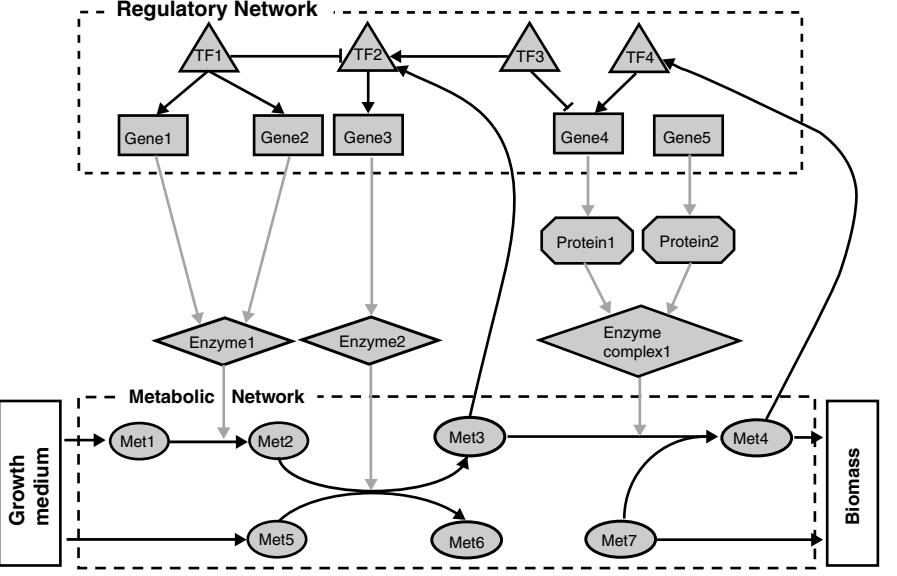

#### REPORT

# A genome-scale computational study of the interplay between transcriptional regulation and metabolism

Tomer Shlomi1,*, Yariv Eisenberg1 , Roded Sharan1 and Eytan Ruppin1,2,*

1 School of Computer Science, Tel Aviv University, Tel Aviv, Israel and 2 School of Medicine, Tel Aviv University, Tel Aviv, Israel

* Corresponding authors. T Shlomi or E Ruppin, School of Computer Science, Tel Aviv University, Tel Aviv, Israel. Tel.: þ 972 3 640 5378; Fax: þ 972 3 640 9357; E-mails: shlomito@post.tau.ac.il or ruppin@post.tau.ac.il

Received 14.12.06; accepted 11.2.07

This paper presents a new method, steady-state regulatory flux balance analysis (SR-FBA), for predicting gene expression and metabolic fluxes in a large-scale integrated metabolic–regulatory model. Using SR-FBA to study the metabolism of Escherichia coli, we quantify the extent to which the different levels of metabolic and transcriptional regulatory constraints determine metabolic behavior: metabolic constraints determine the flux activity state of 45–51% of metabolic genes, depending on the growth media, whereas transcription regulation determines the flux activity state of 13–20% of the genes. A considerable number of 36 genes are redundantly expressed, that is, they are expressed even though the fluxes of their associated reactions are zero, indicating that they are not optimally tuned for cellular flux demands. The undetermined state of the remaining B30% of the genes suggests that they may represent metabolic variability within a given growth medium. Overall, SR-FBA enables one to address a host of new questions concerning the interplay between regulation and metabolism.

Molecular Systems Biology 17 April 2007; doi:10.1038/msb4100141 Subject Categories: metabolic and regulatory networks; computational methods Keywords: FBA; metabolism; MILP; regulation; SR-FBA

## Introduction

Significant efforts have been made in reconstructing genomescale metabolic and regulatory networks for model organisms, and in the development of computational approaches for systematically interrogating their functions (Price et al, 2004; Salgado et al, 2004). Constraint-based metabolic models employ stoichiometric, thermodynamic, flux capacity and possibly other constraints to determine the space of possible flux distributions attainable by the network. Flux balance analysis (FBA) is a commonly used constraint-based approach that assumes that the organism maximizes its biomass production rate (Fell and Small, 1986; Kauffman et al, 2003), which was shown to successfully predict various metabolic phenotypes (Edwards and Palsson, 2000; Forster et al, 2003; Shlomi et al, 2005; Deutscher et al, 2006). Transcriptional regulation has been modeled by a wide range of approaches, which in most cases were applicable only for small-scale systems (de Jong, 2002). Recently, a Boolean matrix formulation was used to represent small-scale regulatory networks and identify functional states across multiple conditions (Gianchandani et al, 2006).

Although the metabolic and regulatory systems are known to be highly dependent, most previous studies had focused on the analysis of either system alone. Recently, several studies have developed and investigated genome-scale, integrated metabolic and regulatory models by incorporating regulatory constraints within FBA models (Covert et al, 2004; Herrgard et al, 2006). Two basic computational approaches were used to study the workings of such integrated models: (i) rFBA (regulatory flux balance analysis)—a method for simulating growth in batch cultures by predicting dynamic flux profiles (i.e., a series of steady-state flux distributions) in a changing environment (Covert et al, 2001, 2004; Herrgard et al, 2006). This method works by iteratively predicting a regulatory and metabolic steady state for short successive time intervals. For each time interval, a regulatory state that is consistent with the metabolic steady state of the previous interval (and with the availability of nutrients in the changing growth media) is computed. Then, FBA is used to find a steady-state flux distribution that is consistent with the regulatory state of the current time interval. The new metabolic state possibly leads to a new regulatory state, and the process is further iterated. The main limitation of this approach is that it arbitrarily chooses one single metabolic steady state at each time interval, from a space of possible solutions provided by rFBA. This arbitrary choice of specific regulatory and metabolic trajectories leaves out a whole space of possible dynamic flux profiles uncharacterized. (ii) The identification of consistent, steady-state metabolic and regulatory behaviors in a given, constant environment, using an extreme pathway analysis (Covert and Palsson, 2003). This method, which essentially

prunes extreme pathways that are inconsistent with the given active regulatory constraints and yields a characterization of permissible alternative solutions, is however not applicable for large-scale models, in which the enumeration of all extreme pathways is computationally intractable.

This paper presents a new method, steady-state regulatory flux balance analysis (SR-FBA), which enables, for the first time, a comprehensive characterization of steady-state behaviors in a genome-scale, integrated metabolic–regulatory model. The method is applied to characterize the flux activity and gene expression of Escherichia coli metabolism across different growth media. This characterization is used to study the effect of transcriptional regulation on cellular metabolism, by quantifying the extent to which regulatory versus metabolic constraints determine flux activity. Subsequently, the integrated model is used to identify specific genes and metabolic functions in which regulation is not optimally tuned for cellular flux demands.

## Results and discussion

#### The SR-FBA method characterizes the metabolic– regulatory solution space

Integrated metabolic and transcriptional regulatory models consist of two dependent components that represent metabolism and regulation (Figure 1). The functional state of the metabolic component is represented by steady-state fluxes through its reactions. The functional state of the transcriptional regulatory system at steady state is represented by a fixed, steady-state Boolean value for each gene, indicating whether it is expressed or not. The combined functional state of the entire system in a given constant environment, referred to as metabolic–regulatory steady state (MRS), is described by a pair of consistent metabolic and regulatory steady states, which satisfy both the metabolic and regulatory constraints (Covert and Palsson, 2003).

To identify an MRS for the integrated metabolic–regulatory model, we developed a new method, SR-FBA, which is based on mixed integer linear programming (MILP; Materials and methods). Specifically, an MILP problem is formulated to identify MRS solutions by translating the Boolean logic underlying the regulatory constraints and the mapping between genes and reactions to linear equations. Within this framework, we employ flux variability analysis (FVA) (Mahadevan and Schilling, 2003) to explore alternative MRS solutions (Materials and methods). An implementation of SR-FBA is provided in Supplementary Dataset 1 (and in the supplemental website: http://www.cs.tau.ac.il/~shlomito/SR-FBA).

Each transcription factor (TF) and TF-regulated gene (i.e., genes associated with a regulatory rule in the model) can be either in an expressed (non-expresses) state if it is expressed (non-expressed) in all alternative MRS solutions attainable within a given growth medium. In both cases, the genes are considered to have a determined expression state. Alternatively, a gene is considered to have an undetermined expression state if it is expressed in some of the alternative MRS solutions but non-expressed in others in the same medium. In parallel, each gene is characterized by its flux activity state, which reflects the existence of non-zero flux through one of the metabolic enzymatic reactions that it encodes. It can have a determined activity state, that is, be in an active (inactive) state across all MRS in a given media, or else have an undetermined activity state. Obviously, the expression and activity states are inter-dependent as a gene cannot be metabolically active if it is not expressed. Hence, the

Figure 1 A schematic representation of an integrated metabolic and regulatory network. The regulatory network component consists of a set of interactions between TFs and other TFs and genes. The metabolic network component consists of a set of biochemical reactions between metabolites, with metabolites available from growth medium as input, and a pseudo-metabolite representing biomass production as output. The regulatory component affects the metabolic component through the expression of proteins that catalyze the biochemical reactions (downward pointing arrows). The metabolic component affects the regulatory component via the activation or inhibition of TF expression via the presence of specific metabolites (upwards arrows).

|                                                     | Expressed | Non-expressed | Non-determined | Inter-media variability | Total      |
|-----------------------------------------------------|-----------|---------------|----------------|-------------------------|------------|
| (a) TFs TF-regulated genes                    | 15 140 | 31 74      | 3 7         | 54 260               | 103 481 |
|                                                     | Active    | Inactive      | Non-determined | Inter-media variability | Total      |
| (b) TF-regulated genes Non TF-regulated genes | 21 50  | 125 111    | 46 127      | 289 138              | 481 311 |

Table I Statistics on the expression (a) and metabolic flux activity (b) of genes in the model

The numbers of genes with uniform expression or flux activity states across all media are denoted in gray.

combinations of 'non-expressed and active', 'non-expressed and non-determined activity' and 'non-determined expression and active' are not possible.

## Gene expression and metabolic flux activity in E. coli across multiple media

We employed SR-FBA to compute the expression and flux activity states of all genes in the E. coli model of Covert et al (2004) under 110 minimal growth media (66 aerobic environments and 44 anaerobic environments). As described in the previous section, the expression and metabolic activity states of a gene may vary within a given growth medium (intramedium variability), implying that its state is undetermined. One may extend this notion in a natural way and quantify the extent to which the expression and metabolic activity states of a gene are undetermined (variable) across different growth media, referred to as its inter-media variability. Statistics on the annotation of TFs, TF-regulated genes and non TFregulated genes (genes without an associated Boolean regulation rule) according to their expression and activity patterns across different media are shown in Table Ia and b (and in Supplementary Tables 1–4). We find that the intra-media variability in gene expression is minute compared with its inter-media variability. In difference, the flux activity has a much larger intra-media variability compared with its intermedia variability. This testifies that gene expression is likely to be more strongly coupled with environmental conditions than the reactions' flux activities.

To validate the predicted expression patterns, we compared the predicted changes in expression following oxygen deprivation in a glucose medium with gene expression measurements (Covert et al, 2004). Specifically, the model predicts a set of 61 differentially expressed genes (having an expressed state in aerobic conditions and a non-expressed state in anaerobic conditions, or vice versa) and another set of 31 genes that are only putatively differentially expressed, that is, genes whose expression state is determined only in one of the (aerobic or anaerobic) states and is undetermined in the other. We find that differentially expressed genes have indeed significantly higher expression in an aerobic (t-test P-valueo1 -10300) or anaerobic (t-test P-valueo3.6 -1011) glucose medium (Supplementary Figure 2). In contradistinction, the expression of genes that the model predicted to be only putatively

differentially expressed is indeed not significantly different in aerobic versus anaerobic media. This testifies that the MRS solutions space correctly identifies the truly differentially expressed genes. For further validation, we compared fluxes predicted under glucose minimal media to experimentally measured fluxes via NMR spectroscopy in the central carbon metabolism (Emmerling et al, 2002; see Supplementary Figure 3 and its caption for further details). We find a statistically significant high Spearman correlation of 0.942 (P-valueo1.5 -108 ) between the predicted and measured fluxes, compared with a correlation of 0.914 (P-valueo2.8 - 107 ) for predictions obtained with the common metabolic FBA method.

## The direct and indirect functional effects of transcriptional regulation on metabolism

We quantify the effect of transcriptional regulation on metabolism by measuring the fraction of genes whose flux activity is determined by the integrated model but not by the metabolic component alone (i.e., the standard FBA model). The metabolic component yields a determined flux activity state for 45–51% of all genes in the network, on the average, depending on the growth medium (Figure 2A). Such genes are termed metabolically determined. The activity of a core set of 30% of all genes is determined in all growth media, involving membrane lipid metabolism, cofactor biosynthesis and cell envelope biosynthesis. Overall, the metabolic constraints determine the activity state of 57% of the genes in at least one or more growth media. The activity of the remaining genes in the metabolic-only model is undetermined, forming alternative pathways (or isozymes) for which the activity state cannot be determined solely by metabolic constraints.

The integrated metabolic–regulatory model determines the flux activity state of additional 13–20% of all genes in the network, depending on the growth medium (Figure 2A). The set of these regulatory-determined genes varies significantly between different media, overall covering 36% of the genes in the model. A core set of 5% of all metabolic genes are regulatory-determined in all growth media. The large majority of regulatory-determined genes (13–17% of the total number of genes in the model) are the direct targets of some TF (Supplementary Table 5). However, a small fraction of the regulatory-determined genes (about 2–3% of the total

Figure 2 (A) The fraction of metabolic-determined genes and the fraction of regulatory-determined genes across different growth media. For the latter, we show the fraction of genes that are TF-regulated and the fraction of non-TF-regulated genes. (B) The fraction of genes that are metabolically determined to be active, inactive and redundantly expressed, from the set of metabolically determined genes. (C) The distribution of redundantly expressed genes within various functional metabolic categories. Triangles represent a statistically significant enrichment.

across the growth media, on average, and 6% overall) are not TF-regulated. Thus, transcriptional regulation can indirectly determine the activity of reactions that are not subject to TF regulation, by regulating their pathway-associated reactions, corresponding with the findings of Rossell et al (2006). The flux activity of a considerable fraction of the genes (B30% of the total) remains undetermined at steady state even in the integrated model. This may be the result of missing constraints, for example, constraints associated with posttranscriptional regulation. Alternatively, these genes' undetermined flux activity state may reflect biologically plausible metabolic variability determined by biological factors that are out of the model's scope (e.g., stress), or potential variability within a cell population (Bilu et al, 2006).

## Redundant expression of metabolic genes

In the previous section, we have shown that the flux activity states of about half of the genes are already determined by the metabolic constraints alone. Here, we study the extent to which the regulatory constraints match the flux activity states of these genes. This investigation is motivated by previous findings of a significant, but rather moderate correlation between the flux rate through a metabolic reaction and the expression level of its associated genes. This moderate-only correlation may either result from the intermediary effects of post-transcriptional regulation, reflect the complex interplay between hierarchical and metabolic regulation (Rossell et al, 2006) or reflect the non-optimality of the regulatory system in expressing the minimal set of genes required to fulfill metabolic demands (Akashi, 2003; Daran-Lapujade et al, 2004).

Examining the metabolically determined genes that are TF regulated, we find that 22–31% of them are metabolically active across different media, whereas the rest are inactive (Figure 2B). Of the latter, 26 genes are predicted to be redundantly expressed in some media—that is, they are expressed even though their associated reactions have zero fluxes. Additionally, 10 genes whose flux activity is regulatorydetermined are also predicted to be redundantly expressed in some of the media examined. Overall, some of these 36 genes are redundantly expressed in only very few (1%) of the growth media, whereas others are redundantly expressed in almost all growth media (96%; Supplementary Figure 4). Three functional categories are significantly enriched with redundantly expressed genes (hypergeometric P-valueo0.05), including membrane lipid metabolism, TCA cycle and extracellular transporters (Figure 2C). Interestingly, several redundantly expressed transporters are affected by Crp, a major global regulator of catabolic-sensitive operons. In the absence of arabinose and gluconate in the model, Crp turns on the expression of both arae (an arabinose transporter) and gntp (a gluconate transporter) in a redundant manner, as their flux activity state requires the availability of arabinose and gluconate in the growth medium. Notably, in the case of transporters, maintaining a minimal expression level where cells starve for glucose may be beneficial for switching to utilizing alternative carbon source once they become available (Setty et al, 2003). Other examples of redundantly expressed genes in the model are fada, fadb, fadd and fadf, which are expressed in all aerobic conditions although they actively degrade fatty acids only in a glycerol medium.

Using the limited pertaining expression data (Covert et al, 2004; Fong et al, 2005), we tested whether genes are indeed significantly highly expressed in media where they are predicted to be redundantly expressed, compared with their expression levels in media where they are predicted to be nonexpressed. Correspondingly, we find that eight genes that are predicted to be redundantly expressed in growth media lacking glucose have significantly high expression levels in these media (both for glycerol (t-test Po4.5 -10105) and for lactate (t-test Po2.4 -109 ), compared with a glucose minimal medium in which they are predicted to be non-expressed. Similarly, the expression of four genes, which are predicted to be redundantly expressed in an aerobic glucose medium, is significantly higher in this medium compared with their expression in anaerobic glucose medium in which they are predicted to be non-expressed (t-test Po5 -1020). Notably, the validation of the predicted redundantly expressed genes could be strengthened by experimentally showing that they are indeed metabolically inactive even though they are highly expressed. Unfortunately, a validation of this nature is currently hampered by the very limited available data concerning flux measurements.

In summary, this paper presents a new method for predicting the expression and metabolic fluxes of a large-scale integrated metabolic model. This method paves the way to computationally study an array of new questions concerning the relationship between transcriptional regulation and cellular metabolism. Tackling a few such questions that naturally arise, we have quantified the effect of transcriptional regulation in determining metabolic flux activity in E. coli, and identified a mismatch between flux demands and transcriptional regulation. A host of related questions that can be addressed by the new approach await further investigation, including the study of the optimization that transcription regulation has evolved to exert upon metabolism, and a comparative investigation of the regulatory–metabolic interplay across species.

## Materials and methods

#### Metabolic steady-state prediction in pure metabolic models

FBA employs mass balance, thermodynamic and flux capacity constraints to identify a metabolic state (i.e., a vector, v ARm, of flux reaction rates) that provides a maximal biomass production rate. The mass balance constraints are formulated as

$$S \cdot \bar{\nu} = \mathbf{0} \tag{1}$$

where SARn m is the stoichiometric matrix, with Sij representing the stochiometric coefficient of metabolite i in reaction j. Thermodynamic constraints that limit the directionality of reaction and flux capacity constraints are formulated as:

$$
\bar{\alpha} \lessapprox \bar{\upsilon} \lessapprox \bar{\mathfrak{B}} \tag{2}
$$

where aARm and bARm represent lower and upper bounds on the flux reaction rates v . Reaction directionality is enforced by setting ai¼0 for directional reactions. The biomass production maximization is implemented by defining an additional reaction vgro, representing the production of essential biomass compounds. The stoichiometric coefficients of this reaction are based on experimentally derived proportions ci of the metabolite precursors Xi that contribute to biomass production:

$$\sum \mathbf{c}_{\dagger} \mathbf{X}_{\dagger} \to \text{Biomass} \tag{3}$$

The search for a flux distribution, v, that maximizes vgro and satisfies the above constraints is performed using a linear programming solver.

#### An integrated metabolic and regulatory model of E. coli

The integrated metabolic and regulatory model of the bacteria E. coli was obtained from Covert et al (2004). The model accounts for k¼1010 genes, j¼817 proteins, m¼1083 reactions (933 enzymatic reactions and 150 external transport reactions) and n¼761 metabolites.

The complex mapping between genes, proteins and reactions is formulated with Boolean equations. Each reaction is associated with a Boolean equation representing its dependency on the presence of one or multiple proteins. For example, the equation 'R1¼(P1 AND P2) OR (P3 AND P4)' specifies that reaction R1 is catalyzed by either the enzyme complex consisting of proteins P1 and P2, or by the enzyme complex consisting of proteins P3 and P4. Proteins are further assigned with equations representing their dependency on one or multiple genes. For example, the equation 'P1¼G1 AND G2 AND G3' specifies that protein P1 is the combined product of genes G1, G2 and G3.

Transcriptional regulation is formulated as an additional set of Boolean equations. Specifically, genes are associated with Boolean equations, reflecting their dependency on the expression of other genes in the model (i.e., TFs). For example, the equation 'G1¼NOT(TF1) AND TF2' specifies that the gene G1 is expressed if and only if TF1 is not expressed and TF2 is expressed. TFs, in turn, are treated similar to other genes in the model, having additional regulatory equations of their own.

Metabolic regulation, that is, the activation or repression of genes based on the presence of certain metabolites, is incorporated within the regulatory equations using flux predicates of specific flux rates. For example, the flux predicate 'FLUX(R1)40' may be a part of a regulatory equation G2¼TF1 AND 'FLUX(R1)40', specifying that G2 is expressed if and only if TF1 is expressed and there is non-zero (positive) flux through reaction R1. The model consists of a total of l¼117 such flux predicates.

## The SR-FBA method for predicting MRS

The SR-FBA method employs MILP to identify consistent regulatory and metabolic states. The metabolic state is denoted as v ARm (as in the above formulation). The regulatory state is denoted as g A{0,1}k , representing the Boolean expression state of all genes. The interdependency between the metabolic state and the regulatory state is formulated by using the following auxiliary variables: (i) the protein state pA{0,1}j , representing the presence of each protein; (ii) the reaction state r A{0,1}m, representing the presence of a catalyzing enzyme for each reaction; and (iii) the flux predicate state bA{0,1}l , representing the state of each flux predicate.

The MILP problem is formulated to maximize the flux through the growth reaction vgro with the following constraints imposed on v ; g ; p;r ; b:

Metabolic constraints: The metabolic state v should satisfy the stochiometric, thermodynamic and flux capacity constraints formulated in equations (1) and (2).

Regulatory constraints: The regulatory state g and flux predicate state b should satisfy the Boolean regulatory equations defined in the integrated model. Boolean equations can be formulated via a set of linear constraints using the following rules: (i) the expression 'a¼b AND c' is formulated as 1p2b þ 2c4ap3; and (ii) the expression 'a¼NOT b' is formulated as a þ b¼1. Other Boolean operators can be expressed with the above operators (which together form the universal operator NAND). A compound Boolean equation composed of a few nested Boolean expressions is formulated as a set of linear constraints by recursively iterating over the structure of the equation, while adding auxiliary variables representing intermediate Boolean terms.

Genes-to-reactions mapping constraints: The regulatory state g and protein state p should satisfy the Boolean mapping function defined in the integrated model. The formulation of these Boolean equations as linear constraints is performed as described above for the regulatory constraints. The Boolean mapping between the protein state p and reaction state r is also formulated as linear constraints in a similar manner.

Reaction enzyme state constraints: The absence of a catalyzing enzyme for a specific reaction should constrain the flux through this reaction to zero. Specifically, for each reaction i, the rule 'if r i ¼ 0 then v i ¼ 0' is formulated via the following linear constraints: vi þ (1ri)bipbi and aipvi þ (1ri)ai.

Reaction predicates constraints: The reaction predicate bi represents a rule in the form 'FLUX(j)4c', where cAR. This rule can be formulated via the following linear constraints:

bj (c þ ebi) þ vipc þ e and bj(aice) þ viXai, where e¼104 The resulting complete MILP formulation is hence as follows:

max v ;g ;p;r; b vgro s:t: S v ¼ 0 apv p b

Regulatory constraints (g ; b) Genes to reactions mapping constraints (g ; p;r ) Reaction enzyme state constraints (r ; v ) Reaction predicates constraints (v ; b)

v 2 Rn g; p;r; b 2 f g 0; 1 m

The formulation of SR-FBA in the integrated metabolic–regulatory model of E. coli (Covert et al, 2004) results in an MILP problem with 5380 variables (4296 Boolean variables) and 7323 equations. Solving this problem for a given instance takes less than a second using the commercial CPLEX 7.5 solver.

## Characterizing alternative gene expression and flux activity states

To characterize alternative possible expression states of a gene in a given growth medium, we solve two MILP problems for each gene, once setting it to be expressed and the other setting it to be nonexpressed. The gene is determined to be expressed or non-expressed if a feasible MRS solution is obtained for one of the two problems. A gene is considered undetermined if both problems have a feasible solution.

To characterize alternative flux activity states of a gene, we use the following method: (i) solve an MILP problem while considering the gene as not expressed in the Boolean equations of its associated proteins. If there is no feasible MRS solution following this modification, then the gene must be associated with a reaction with non-zero flux, and hence the gene is considered to be active. (ii) If there is a feasible MRS solution, then, to determine whether the gene is nonactive or undetermined, we test whether it is associated with a reaction that may have a non-zero flux. This is carried out by applying FVA (Mahadevan and Schilling, 2003) on the MRS solution space to determine whether one of the reactions associated with the gene may be active.

## Supplementary information

Supplementary information is available at the Molecular Systems Biology website (www.nature.com/msb).

# Acknowledgements

We are grateful to Erez Braun, Naama Brenner, Markus Herrgard and Jennifer Reed for very fruitful discussions. We also thank Elhanan Borenstein for critical reading of the paper. TS was supported by the Tauber Fund. RS was supported by an Alon Fellowship. This research was supported in part by grants from the Israeli Science Fund (ISF), the German–Israeli Fund (GIF) and the Yeshaya Horowitz Association through the Center of Complexity Science.

## References

- Akashi H (2003) Metabolic economics and microbial proteome evolution. Bioinformatics 19 (Suppl 2): II15
- Bilu Y, Shlomi T, Barkai N, Ruppin E (2006) Conservation of expression and sequence of metabolic genes is reflected by activity across metabolic states. PLoS Comput Biol 2: e106
- Covert MW, Knight EM, Reed JL, Herrgard MJ, Palsson BO (2004) Integrating high-throughput and computational data elucidates bacterial networks. Nature 429: 92–96
- Covert MW, Palsson BO (2003) Constraints-based models: regulation of gene expression reduces the steady-state solution space. J Theor Biol 221: 309–325
- Covert MW, Schilling CH, Palsson B (2001) Regulation of gene expression in flux balance models of metabolism. J Theor Biol 213: 73–88
- Daran-Lapujade P, Jansen ML, Daran JM, van Gulik W, de Winde JH, Pronk JT (2004) Role of transcriptional regulation in controlling fluxes in central carbon metabolism of Saccharomyces cerevisiae. A chemostat culture study. J Biol Chem 279: 9125–9138
- de Jong H (2002) Modeling and simulation of genetic regulatory systems: a literature review. J Comput Biol 9: 67–103
- Deutscher D, Meilijson I, Kupiec M, Ruppin E (2006) Multiple knockouts analysis of genetic robustness in the yeast metabolic network. Nat Genet 38: 993–998
- Edwards JS, Palsson BO (2000) The Escherichia coli MG1655 in silico metabolic genotype: its definition, characteristics, and capabilities. Proc Natl Acad Sci USA 97: 5528–5533
- Emmerling M, Dauner M, Ponti A, Fiaux J, Hochuli M, Szyperski T, Wuthrich K, Bailey JE, Sauer U (2002) Metabolic flux responses to pyruvate kinase knockout in Escherichia coli. J Bacteriol 184: 152–164
- Fell DA, Small JR (1986) Fat synthesis in adipose tissue. An examination of stoichiometric constraints. Biochem J 238: 781–786
- Fong SS, Joyce AR, Palsson BO (2005) Parallel adaptive evolution cultures of Escherichia coli lead to convergent growth phenotypes with different gene expression states. Genome Res 15: 1365–1372
- Forster J, Famili I, Palsson BO, Nielsen J (2003) Large-scale evaluation of in silico gene deletions in Saccharomyces cerevisiae. Omics 7: 193–202
- Gianchandani EP, Papin JA, Price ND, Joyce AR, Palsson BO (2006) Matrix formalism to describe functional states of transcriptional regulatory systems. PLoS Comput Biol 2: e101
- Herrgard MJ, Lee BS, Portnoy V, Palsson BO (2006) Integrated analysis of regulatory and metabolic networks reveals novel regulatory mechanisms in Saccharomyces cerevisiae. Genome Res 16: 627–635
- Kauffman KJ, Prakash P, Edwards JS (2003) Advances in flux balance analysis. Curr Opin Biotechnol 14: 491–496
- Mahadevan R, Schilling CH (2003) The effects of alternate optimal solutions in constraint-based genome-scale metabolic models. Metab Eng 5: 264–276
- Price ND, Reed JL, Palsson BO (2004) Genome-scale models of microbial cells: evaluating the consequences of constraints. Nat Rev Microbiol 2: 886–897
- Rossell S, van der Weijden CC, Lindenbergh A, van Tuijl A, Francke C, Bakker BM, Westerhoff HV (2006) Unraveling the complexity of

flux regulation: a new method demonstrated for nutrient starvation in Saccharomyces cerevisiae. Proc Natl Acad Sci USA 103: 2166–2171

- Salgado H, Gama-Castro S, Martinez-Antonio A, Diaz-Peredo E, Sanchez-Solano F, Peralta-Gil M, Garcia-Alonso D, Jimenez-Jacinto V, Santos-Zavaleta A, Bonavides-Martinez C, Collado-Vides J (2004) RegulonDB (version 4.0): transcriptional regulation, operon organization and growth conditions in
Escherichia coli K-12. Nucleic Acids Res 32 (Database issue): D303–D306

Setty Y, Mayo AE, Surette MG, Alon U (2003) Detailed map of a cisregulatory input function. Proc Natl Acad Sci USA 100: 7702–7707

- Shlomi T, Berkman O, Ruppin E (2005) Regulatory on/off minimization of metabolic flux changes after genetic perturbations. Proc Natl Acad Sci USA 102: 7695–7700