# RESEARCH ARTICLE

# Developing a low-cost milliliter-scale chemostat array for precise control of cellular growth

David Skelding1,*, Samuel F M Hart1 , Thejas Vidyasagar2 , Alexander E Pozhitkov1 and Wenying Shou1,*

1 Division of Basic Sciences, Fred Hutchinson Cancer Research Center, Seattle, WA 98109, USA 2 University of Washington, Seattle, WA 98195-3770, USA

* Correspondence: davidhskelding@gmail.com, wenying.shou@gmail.com

Received November 24, 2017; Revised February 6, 2018; Accepted February 27, 2018

Background: Multiplexed milliliter-scale chemostats are useful for measuring cell physiology under various degrees of nutrient limitation and for carrying out evolution experiments. In each chemostat, fresh medium containing a growth rate-limiting metabolite is pumped into the culturing chamber at a constant rate, while culture effluent exits at an equal rate. Although such devices have been developed by various labs, key parameters — the accuracy, precision, and operational range of flow rate — are not explicitly characterized.

Methods: Here we re-purpose a published multiplexed culturing device to develop a multiplexed milliliter-scale chemostat. Flow rates for eight chambers can be independently controlled to a wide range, corresponding to population doubling times of 3~13 h, without the use of expensive feedback systems.

Results: Flow rates are precise, with the maximal coefficient of variation among eight chambers being less than 3%. Flow rates are accurate, with average flow rates being only slightly below targets, i.e., 3%‒6% for 13-h and 0.6%‒ 1.0% for 3-h doubling times. This deficit is largely due to evaporation and should be correctable. We experimentally demonstrate that our device allows accurate and precise quantification of population phenotypes.

Conclusions: We achieve precise control of cellular growth in a low-cost milliliter-scale chemostat array, and show that the achieved precision reduces the error when measuring biological processes.

Keywords: chemostats; microbes; evolution; physiology; multiplex

Author summary: Chemostats are useful devices for examining cell physiology and evolution, because they maintain a population of cells at a controlled reproduction rate and cell density in a fixed volume. We have improved an existing culturing device to be run as a multi-plexed chemostat that maintains eight separate populations at independently-controlled reproduction rates with high precision and accuracy. We present experimental results showing that the precision reduces the error in measuring properties of a population of yeast cells.

# INTRODUCTION

Continuous-culturing devices are useful for measuring microbial phenotypes in a constant environment or for performing experimental evolution. Unlike batch culturing where an exponentially-growing population eventually enters stationary phase due to nutrient exhaustion or waste accumulation, continuous-culturing devices constantly supply nutrients and remove waste products.

Commonly used continuous-culturing devices include turbidostats and chemostats. A turbidostat maintains a population at a constant turbidity in a nutrient-rich environment [\[1](#page-12-0)]. For example, in Klavins lab's multiplexed turbidostats [[2\]](#page-12-0), culture turbidity in each chamber is measured via a laser beam and a light detector. Once turbidity exceeds a target value, custom software directs the flow of fresh medium using pinch valves and a syringe pump (Figure 1B). The input medium is mixed into the

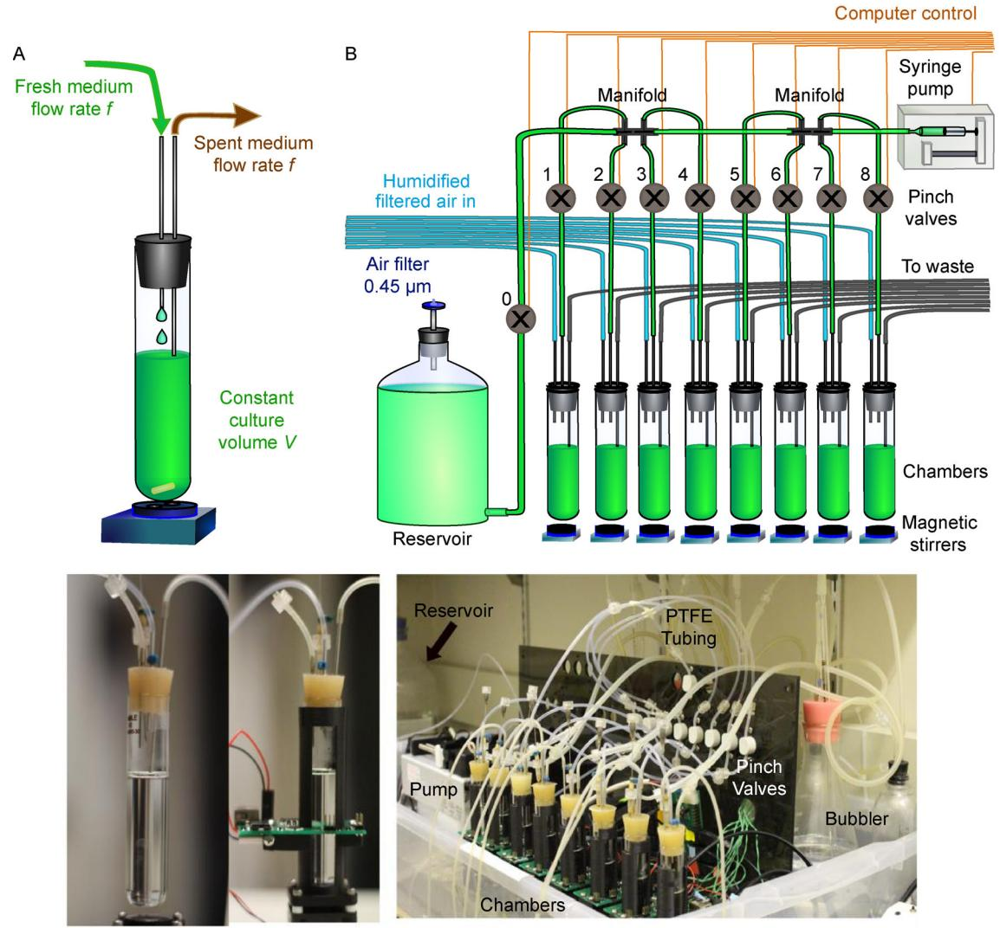

Figure 1. Chemostat and a turbidostat-chemostat array. (A) In a chemostat, fresh medium with a growth rate limiting metabolite flows into chamber at a constant rate f, and is mixed with the contents of the chamber. Excess culture effluent exits at the same rate, thus maintaining a constant volume V. (B) In the Klavins lab 8-chamber design, a computer-controlled syringe pump is used for all liquid dispenses. Pinch valves (grey circles) are used to open and close tubing. Excess volume is forced out to waste using positive pressure created by the inflow of humidified and filtered air (blue lines). Mixing is accomplished using magnetic stirrers. In the Klavins lab setup, each cycle proceeds as the following. First, only Valve 0 opens, and sufficient fresh medium is drawn from the reservoir for all eight chambers and for backlash correction (Supplementary Figure S1). Next, the backlash volume is returned to reservoir and Valve 0 is closed. Subsequently, Valve 1 to Valve 8 opens one at a time in sequence, and an appropriate amount of medium is dispensed into each Chamber.

chamber to create a uniform environment, and excess volume is forced out to waste via positive pressure exerted by the inflow of filtered and humidified air. Because current turbidity is always compared to the target turbidity in a feedback loop, turbidity remains steady despite any transient fluctuations in flow rate.

In contrast, a chemostat creates a nutrient-limited environment where the population is forced to grow at a constant, pre-determined rate slower than the maximal growth rate. Specifically, a chemostat chamber (Figure 1A) contains a culture of a fixed volume V. A medium containing a limiting metabolite is added at a constant flow rate f (mL/h). The culture effluent is removed from the chamber at the same rate f, thereby maintaining a constant volume. A steady state can be reached if the dilution rate is less than the maximal growth rate (see [\[3](#page-12-0)] for a detailed explanation). Mathematically [\[3\]](#page-12-0), live population density N satisfies

$$\frac{\text{dN}}{\text{dt}} = (r - \frac{f}{V})N,\tag{1}$$

where r (h–1 ) is the net growth rate (birth rate minus death rate), f is the flow rate, and f/V is the dilution rate (h–1 ). At steady state, the growth rate and the dilution rate are equal:

$$r = \frac{f}{V}.\tag{2}$$

M, the concentration of limiting metabolite in culturing vessel satisfies:

$$\frac{\mathrm{d}M}{\mathrm{d}t} = \frac{f}{V} \cdot M_0 - \frac{f}{V} \cdot M - c \cdot r \cdot N,\tag{3}$$

where M0 is the metabolite concentration of inflow fresh medium and c is the amount of metabolite consumed per net growth of one cell. Thus, steady-state cell density may be controlled by M0:

$$N = \frac{M_0 - M}{c}.$$

Compared to M0 which is chosen by an experimentalist to set the steady-state cell density, M is generally much smaller and thus can be neglected.

Chemostats are useful for measuring cell starvation phenotypes and for evolving cells under nutrient limitation. Multiple chemostats are often desired to test experimental repeatability or different degrees of nutrient limitation. Commercially-available chemostats are expensive and are usually geared toward large culture volumes (liter-scale instead of a few milliliters). Miniature multichamber turbidostat/chemostat devices have been constructed previously [\[4](#page-12-0)–[6\]](#page-12-0). However, the consistency and accuracy of flow rates and the operational ranges in these designs are not explicitly characterized. For example, in Ref. [[5](#page-12-0)] device, flow rate is mediated via valve opening time. At the shortest valve opening time they tested (1 s), actual dispensed volume (~0.49 mL) seemed to deviate from the regression by tens of percent. Moreover to realize 10 h doubling time in a 20 mL culturing chamber, the flow rate will be 1.39 mL/h. This translates to around three 1-s-dispenses per hour. Thus, flow is rather discontinuous at slow doubling times.

Precise flow rates may be achieved via a feedback mechanism. For example, one could use the decline rate of medium reservoir weight to measure past flow rate, and adjust future flow rate accordingly. However, this would require each chamber to have its own reservoir and scale, which is not easily scalable. Without any flow rate feedback control, chemostat flow rates were quite variable and could deviate significantly from the target as we tried to run Klavins lab's turbidostats as chemostats. Here, we have modified Klavins lab multiplexed turbidostats to offer the additional functionality of multiplexed chemostats with consistent, accurate, and independently controllable flow rates.

### RESULTS AND DISCUSSION

#### Variable dilution rates in multiplexed turbidostats

We tested the original Klavins design by running all eight chambers at the same target flow rate. We measured flow rate in each chamber by quantifying media accumulation after 1 h of run time. Flow rates in five trials deviated from the mean by up to 10% (Figure 2A, black error bars marking two standard deviations). Moreover, the first chamber showed anomalously low flow rate compared to the target (Figure 2A). Consequently, the eight chambers showed large standard deviation (Figure 2A, blue error bar) when run as replicates.

#### Rigid tubing reduces the flow rate anomaly of the first chamber

What might cause the anomalously slow flow rate in Chamber 1? We reasoned that this might result from the medium delivery silicone tubing expanding or shrinking as the internal pressure changes. The silicone tubing (green in Figure 1B) is elastic [[7\]](#page-12-0) due to its relatively small Young's modulus (typically between 0.005 GPa and 0.02 GPa). The elasticity allows pinch valves to work, but may also allow the tubing to change its inner diameter. This can affect flow rate, as we discuss below.

Specifically, at the beginning of each operation cycle, the pinch valve to reservoir is opened and the syringe pump draws fresh medium. The pressure at an arbitrary point z in the tubing is P(z) = P0 – rgh0 (Figure 3A). Here, P0 is the atmospheric pressure present in the reservoir, and rgh0 is the hydrostatic pressure of the media in the tubing, where r is the density of the media, g is Newton's constant of acceleration at the surface of the earth, and h0 is the vertical distance between the surface of the media in the reservoir and the location z (Figure 3A). When syringe pump delivers medium to Chamber 1, the pinch valve to Chamber 1 is opened. The pressure at point z becomes P(z) = PC1 – rgh1 (Figure 3B). Here, PC1 is the pressure in Chamber 1, and since positive pressure is applied, PC1> P0. Furthermore, h1, the vertical distance between the liquid surface of Chamber 1 medium inlet and z, is typically less than h0 in our experiments. Thus, the pressure at point z can increase significantly when the syringe pump switches from the reservoir to Chamber 1 (Figure 3B, ΔPRes↕ ↓C1 > 0). As the liquid level in reservoir drops, h0 increases, and the pressure increase from switching from Reservoir to Chamber 1 becomes even more drastic. Positive ΔPRes↕ ↓C1 causes the tubing to expand, and results in the lower-than-expected medium input into Chamber 1 (Figure 2A). In contrast, when the pump switches from Chamber 1 to Chamber 2, pressure change (Figure 3C, ΔPC1↕ ↓C2) will be small due to the similarity in air pressure and inlet liquid height between the two chambers. Consequently, chambers subsequent to Chamber 1 do not display as large a deviation as Chamber 1 (Figure 2A). pressure change ΔPRes↕ ↓C1 by turning off air pumps

If the above reasoning is correct, then reducing the (i.e., PC1=P0) should mitigate the anomalous flow rate of Chamber 1 while only minimally affecting other chambers. This was indeed the case (Figure 3D, compare brown and black symbols). Furthermore, the flow rate became more consistent (Figure 3D, brown error bars smaller than black error bars), suggesting that unsteady air pressure contributed to variable flow rates when using silicone tubing.

Similarly, reservoir liquid level should affect flow rate of the first chamber. Indeed, when we adjusted the height of reservoir to achieve different levels of h0 – h1, we observed a linear relationship between Chamber 1 flow rate and h0 – h1 (Figure 3E, black). When h0 – h1= 0, Chamber 1 flow rate was close to target (Figure 3E, black; Supplementary Figure S2A). As expected, the flow rates of other chambers were not affected (Supplementary Figure S2A). When h0‒h1 > 0, sequentially shifting the first dispense over eight chambers (in the subsequent Figure 6A) averages the flow rate deficit over chambers. Thus, the flow rate deficit is a property of the first dispense

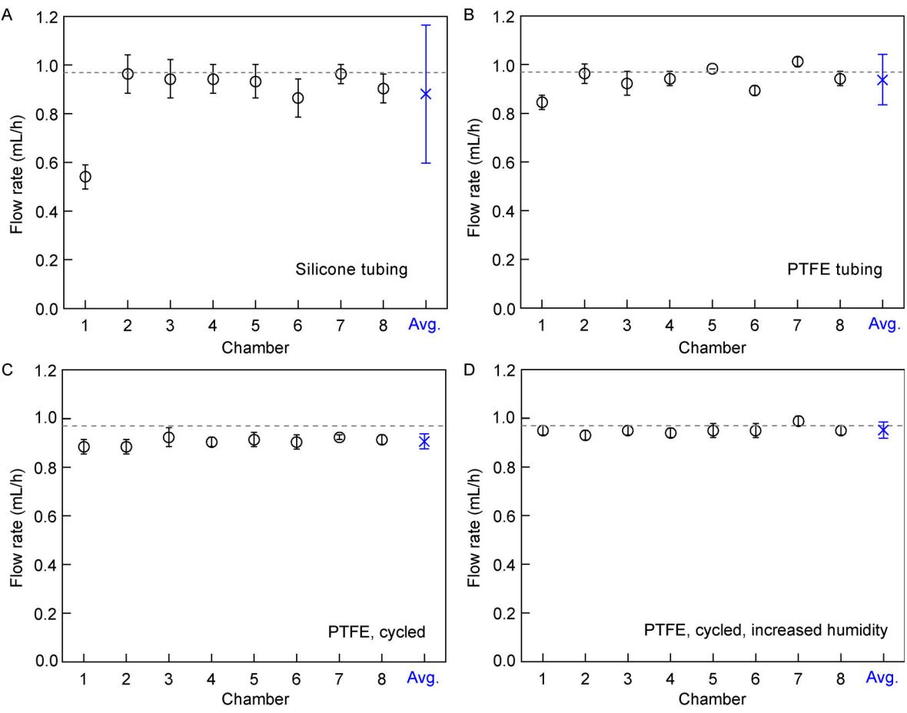

Figure 2. Chemostat flow rate improvements. Flow rates were measured by weighing media accumulated in chambers after 1 h of run time, with positive pressure on and media outlets disabled (i.e., outlets elevated so that no medium flows out). Data point for each chamber represents 5 trials, with error bars indicating two standard deviations. The average and the two standard deviations of flow rates of all eight chambers are marked in blue. Target flow rate, 0.972 mL/h, is marked by a grey line. (A) In the original Klavins Lab design, the first chamber showed anomalously low flow rate. Within Chambers 2–8, the 1 h flow rate could vary from the mean by as much as 10%. (B) Replacing silicone tubing with PTFE tubing, (C) cycling dispense order, and (D) increasing the humidity of inflow air improved the consistency and accuracy of flow rate in terms of smaller error bars and closer match to the target. The average flow rate (blue) is 0.95 mL/h, with a two standard deviation of 0.03 mL/h.

rather than a particular chamber (Supplementary Figure S2B).

To mitigate the tubing stretching problem, we replaced the entire tubing with PTFE tubing (2-mm inner diameter; 3-mm outer diameter), except for 7-cm-segments of the silicone tubing supplied by the valve manufacturer to be used with pinch valves. PTFE has a Young's modulus between 0.40 GPa and 0.55 GPa [\[8](#page-12-0)], making it an order of magnitude more rigid than silicone. After tubing replacement, flow rate of the first chamber was much closer to the target across a range of h0‒h1 (Figure 2B, magenta). Furthermore, flow rate consistency improved in all chambers even with positive pressure (note smaller error bars in Figure 2B compared with Figure 2A).

Autoclaving our PTFE-modified device resulted in some leaks. These leaks occurred at barbed fittings

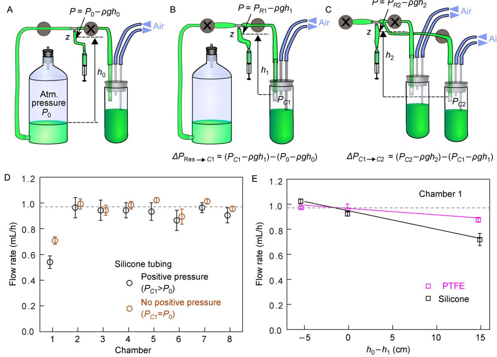

Figure 3. Pressure changes during medium delivery can lead to silicone tubing expansion and flow rate reduction. (A) For the syringe pump to draw medium from reservoir, we open the pinch valve to the reservoir (grey circle without cross) and leave pinch valves to eight chambers closed (here, pinch valve to the first chamber is shown; the rest not shown). The pressure at an arbitrary location z in the tubing is PRes(z) = P0 – rgh0. See main text for explanation. (B) When the pinch valve to Chamber 1 is open (and the other pinch valves having been closed), the pressure becomes PC1 – rgh1. Since positive pressure is applied to all chambers, PC1 >P0. Under our typical setup, h0 > h1, and as the reservoir media surface level drops during cultivation, h0 will continuously increase. Thus, pressure in z increases as the pinch valve to Chamber 1 opens, causing tubing to expand. Consequently, a certain volume of medium that should have been dispensed to Chamber 1 instead remains in the stretched tubing. (C) Pressure changes between chambers is much smaller than that between the reservoir and Chamber 1. This is because positive pressure and liquid surface level are similar among chambers (e.g., PC1 ~ PC2; h1 ~ h2). (D) Removing positive pressure from the chambers partially remedies the abnormally low flow rate of Chamber 1, and reduces the variability of the flow rate in each chamber. Flow rates were measured over 1 h intervals, N = 3. (E) Altering the height of the reservoir liquid level changes the flow rate of the first chamber. We adjusted the reservoir altitude to alter h0–h1 and measured flow rate. When silicone tubing was used (black), we obtained a slope of --0.014 +/--0.003 mL/h per cm height difference. This effect was reduced by a factor of 3 (magenta, slope = --0.0050 +/--0.0001) after replacing silicone tubing with a similar total length (within 15%) of PTFE tubing (except for around 10% of the total length, where pinch valves require silicone tubing). In these measurements, positive pressure was absent. The data for both (D) and (E) were obtained utilizing 33 dispense cycles/h. Since each cycle introduces a fixed volume deficit, more cycles per hour means greater error in Chamber 1. The effects of pressure could be further reduced by using pinch valves requiring a shorter length of silicone tubing, and by significantly reducing the total tubing length in the network.

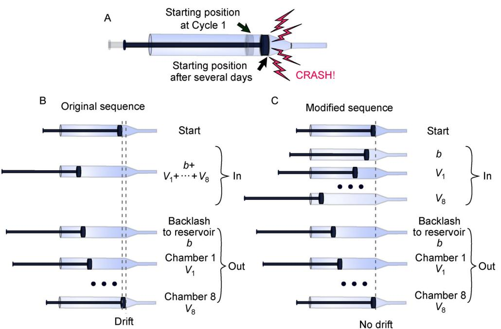

Figure 4. Identical liquid withdrawal and dispense sequences prevent syringe plunger from crashing into syringe body. (A) In the original system, we observed crashing of the syringe plunger with the end of syringe body due to slow drift in plunger starting position over time. (B) The Klavins lab software performed one withdrawal (In) and multiple dispenses (Out). Breaking up a single withdrawal volume into multiple dispense volumes may cause drift in plunger starting position. Here, b = volume to allow backlash to occur; V1 –V8: volumes dispensed to Chambers 1 to 8. Volumes to different chambers can differ depending on flow rates desired. (C) In our modified software, a set of withdrawals are followed by an identical set of dispenses. This eliminates the drift in plunger starting point.

inserted at various fluid branching points (Figure 1B, black "manifold"). To prevent leaks, a slice of silicone tubing gasket of ~1 mm long was inserted between each barbed fitting and PTFE tubing (Supplementary Figure S3). This adjustment allowed at least five autoclaving cycles without any leaks, after which we formed new seals by replacing silicone tubing gasket and trimming the end of PTFE tubing.

#### Modification of syringe pump operation for long-term culturing

We are currently using the NE500 pump (New Era Systems Inc.). Although the Klavins lab has a design for a 3-D printed pump, they also now recommend the NE500 because of its reliability.

With the original Klavins lab software, the syringe plunger would eventually collide with the end of syringe body (Figure 4A) after a few days of operation. We reasoned that a possible cause for collision was drift in plunger starting position over cycles. The pump would aspirate in one draw a sufficient amount of liquid for all eight chambers plus a backlash volume b (0.2 mL, see Supplementary Figure S1 for an explanation of backlash). Next, the pump would dispense the backlash volume b back to the reservoir, followed by dispenses into Chambers 1 through 8 (Figure 4B), in that order. Backlash is irrelevant for drift: as long as the threaded plunger drive rod (Supplementary Figure S1) turns by the same total amount in each direction there can be no drift. Rather, a single withdrawal volume versus multiple split dispense volumes may cause plunger to drift due to the necessity of converting volumes to integer numbers of steps (Figure 4B). Thus, we revised the original software so that we withdraw a series of volumes and then dispense them in the same order (Figure 4C). This has indeed eliminated plunger drift and crash. Our solution has since been implemented by the Klavins lab.

Finally, we have modified the software so that if communication errors should occur between the software and the pump, the software will log errors and attempt to resend the command.

### Cycling dispense order increases flow rate consistency

Even after switching to PTFE tubing, statistically significant variations in flow rates were observed among

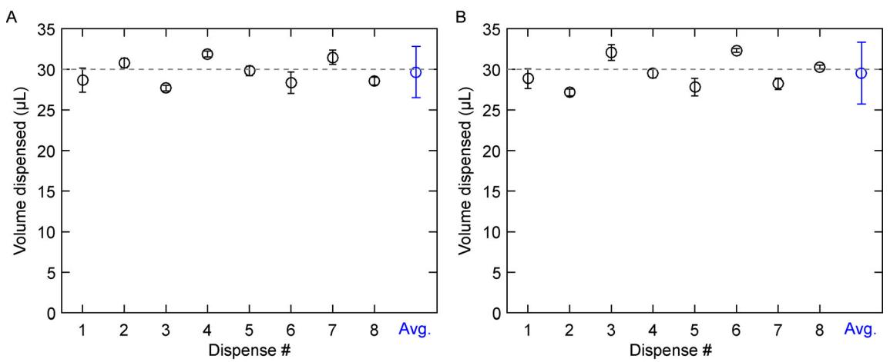

Figure 5. Order-dependent variations in syringe pump dispense amounts. To examine the behavior of the syringe pump, we measured individual dispenses. We eliminated the complicated system of tubing and pinch valves so that we can focus on pump dispenses, and modified the chemostat program to stop between dispenses. Each dispensed 30 μL volume is directed into a small vial through an 18 cm PTFE tube with a needle attached. For each dispense, we weighed the vial before and after that dispense. In the first experiment, before running the modified chemostat program, we removed power from the pump for a few seconds. Then we ran the program and measured eight individual dispenses per cycle for four cycles (A). Next, we interrupted the program after the first dispense of 30 μL. Then we ran the program and measured eight individual dispenses per cycle for four cycles (B). (A and B) show different order-dependent variations, depending on pump history. The small error bars indicate that once a chemostat program is started, the pattern of variations remains constant over cycles. Mean and two standard deviations from four cycles are plotted. The average over eight dispenses (blue) closely matches the 30 µL target volume (dotted lines).

chambers with the same target flow rate (Figure 2B). This could be caused by a variety of reasons including differences in positive pressures within different chambers or variable pump dispenses. We examined pump behavior by eliminating the pinch valves and the tubing network, and modifying the chemostat program to halt between dispenses. This way, we can measure each dispense in isolation of other confounding factors. We observed that the dispensed volumes varied systematically in an order-dependent fashion, and the sequence of variation depended on pump operation history (Figure 5).

Given the systematic variations in dispense volumes (Figure 5) and the possibility of other order-dependent variations that affect flow rate (Figure 2B, Chamber 1), we modified the control software to cyclically permute the order of dispenses over the set of 8 chambers (Figure 6A). This should average out systematic variations in the syringe pump dispense volume. Moreover, any flow rate anomalies associated with switching from reservoir to chamber will be averaged over the eight chambers. This modification indeed reduced variations in flow rate among chambers whether positive pressure is applied (compare Figure 2B and Figure 2C) or not (compare Figure 6B and Figure 6C).

#### Increasing humidity of inflow air increases flow rate accuracy

After PTFE tubing replacement and cycling dispense order, we still observed a systematic deficit from the target flow rate (Figure 2C). This is likely due to evaporation: a chamber with higher evaporation effectively receives a more concentrated medium at a lower flow rate. Consequently, cells will grow slower and reach a higher steady-state density (Equations (3) and (4)).

To ensure uniform temperature, we pre-warm the medium and the entire chemostat setup in a temperature-controlled room at 30o C. Thus, differences in evaporation rates due to temperature should be minimal. To reduce evaporation, we have modified the original design which generates large air bubbles in a humidification vessel (Figure 7A). Air in those bubbles becomes humidified as water molecules evaporate from the bubble inner surface and diffuse into the air inside the bubble. Air above the bubbler liquid surface is also humidified due to evaporation from the liquid surface. Because the air is continually flowing, and the bubbles are relatively large (Supplementary Figure S4), there may not be enough time for the air bubble to become saturated with water vapor. Thus, we added an aquarium bubbler stone at the end of

Figure 6. Cycling dispenses reduce variations in flow rate. (A) Cycling the sequence of dispenses over the eight chambers can average out variations every eight dispense cycles. (B and C) Cycling the sequence of dispenses indeed reduced flow rate variations among chambers. Here, we measured flow rates without applying positive pressure to reduce the effects of evaporation and the effects of different positive pressures within different chambers. N = 5 and 3 for (B) and (C), respectively.

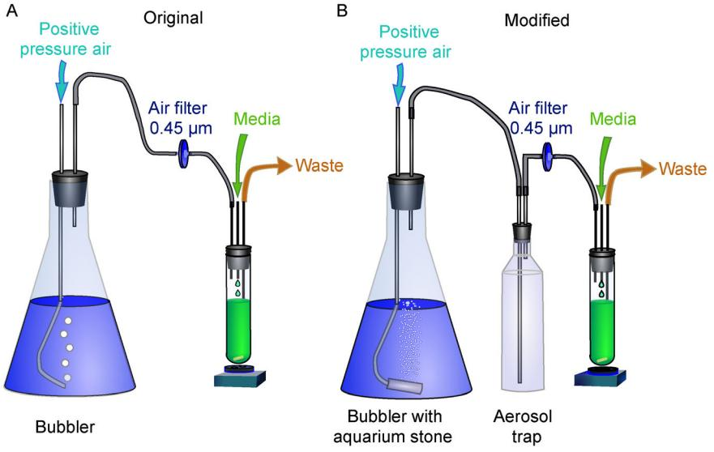

Figure 7. Increasing humidity in inflow air reduces evaporation. Humidified air flow creates positive pressure in chambers, forcing excess culture effluent out to waste. (A) In the original design, air humidification is limited due to large sizes of bubbles. (B) In our modified design, an aquarium stone generates numerous tiny bubbles. Liquid depth in bubbler is maintained at a sufficient level throughout the run so that air in bubbles has sufficient time to become humidified. The size of bubble cloud is indicative of airflow magnitude, and can be used to adjust airflow with a regulatory valve if needed.

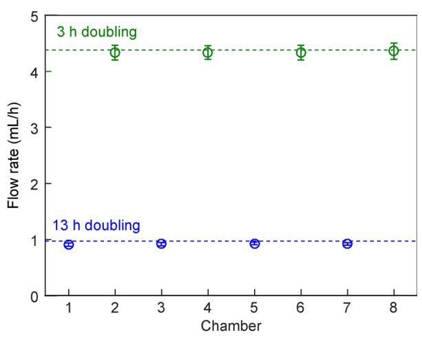

Figure 8. Accurate flow rates across a wide range. We ran four chemostats at 3 h doubling time (green) and four chemostats at 13 h doubling time (blue). The average flow rate is within 3% of target for 13 h doubling time, and within 1% of target for 3 h doubling time.

the submerged tubing to create a cloud of small bubbles (Figure 7B). We also maintained water depth in bubbler at a sufficient level (around 8 cm deep). Increased surface area and sufficient resident time in water allow more water to evaporate into the inflow air. As a precaution we added aerosol trap to prevent tiny water droplets from entering and clogging air filters used to maintain the sterility of inflow air (Figure 7B). Using an aquarium stone to create small bubbles indeed improved flow rate, bringing it closer to the target by 0.07 mL/h (2s = 0.03 mL/h) (7%-3%, Figure 2D).

Even with these modifications, actual flow rates are still lower than target values under positive pressure. Without any flow of liquid, the evaporation rate was measured to be 0.05 mL/h at 30o C, with a two standard deviation of 0.02 mL/h. With the flow of liquid, after carefully controlling for reservoir height and temperature, flow rates were 0.01 to 0.07 mL/h below targets in the tested range, and the value of deficit was largely independent of target value. For example, for 13 h doubling time, the average deficit was 0.041 mL/h (2s = 0.040 mL/h). For 3 h doubling time, the deficit was 0.034 mL/h (2s = 0.028 mL/h). The evaporation rate shows no significant dependence on flow rate. Thus, the percent deficit from target will be larger for slower flow rate.

#### High consistency and accuracy under a range of target flow rates

We tested a range of flow rates in our chemostats. We found that our chemostats can reliably achieve 3 h to 13 h doubling times (Figure 8 and Figure 2D). A shorter doubling time can in principle be achieved by using a larger-diameter syringe. A longer doubling time will be limited by the effects of evaporation and discontinuous flow. At a doubling time of 13 h, about one drop of ~30 μL is dispensed per ~111 s. At a slower dilution rate, longer times will be required for each medium droplet to drip, which may affect cell physiology and increase flow rate variability due to evaporative differences between chambers. At extreme cases (e.g., doubling time of over a week), evaporation rate may equal to flow rate, and the chemostats will not be operational. Nevertheless, the operational ranges we have tested are sufficient to investigate over a four-fold difference in population growth rates, allowing researchers to examine physiological and evolutionary differences between mildlystarved versus strongly-starved Saccharomyces. cerevisiae, for example.

#### Precise control of flow rate is important for phenotype quantification

Variations in flow (and thus growth) rate can profoundly affect experimental measurements. For example, Varma et al. [\[9\]](#page-12-0) found that in a glucose-limited chemostat, E. coli released acetate as a byproduct only when dilution rate exceeded a certain threshold.

To test the importance of flow rate control, we cultured a purine-requiring, lysine-overproducing S. cerevisiae strain [[10](#page-12-0)] in hypoxanthine-limited chemostats run at a doubling time of 6 h (dilution rate 0.116/h) or 7 h (dilution rate 0.099/h). These corresponded to a dilution rate difference of ~16%, smaller than the deviation seen for Chamber 1 in the original design (Figure 2A). The dead: live cell ratio (and thus death rate; Equation (5) in Methods) was higher in 7 h chemostats (severer nutrient limitation) than in 6 h chemostats (Figure 9A and B). Since dilution rate was lower in 7 h chemostats, lysine accumulated to a higher level compared to 6 h chemostats (Figure 9C and D; Equation (6) in Methods), thus creating different extracellular environments. Without a precise flow rate, variations in dilution rate will interfere with experimental measurements by introducing large errors (Figure 9B and D, black). Thus, precise control of flow rate is critical for quantifying phenotypes (Figure 9A and B) and the environment cells create (Figure 9C and D).

#### SUMMARY

We have improved multiplexed turbidostats to run as chemostats without expensive feedback systems. Three major modifications are: (i) replacing silicone tubing with PTFE tubing to increase tubing rigidity (Figure 2B), (ii)

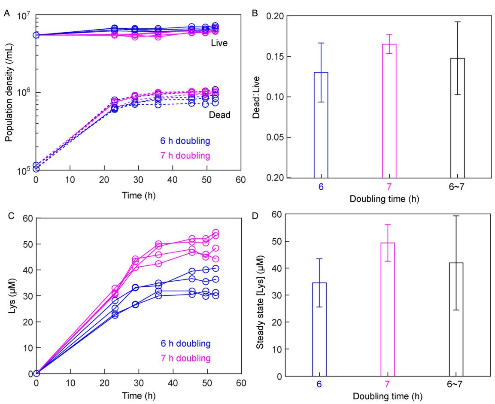

Figure 9. Precise flow rate is important. We ran four chemostats at 6 h doubling time (blue) and four chemostats at 7 h doubling time (magenta). (A) Dynamics of live and dead cell densities (Methods) reach steady states. (B) As expected, the ratio of dead cell density averaged over the last four time points to live cell density averaged over the same period of time (and thus death rate) was higher in 7 h chemostats than in 6 h chemostats (two-sample t test, P value = 0.01). (C) Dynamics of released lysine (Methods) reach steady states. (D) Steady-state lysine concentration (averaged over the last three time points) was higher in 7 h chemostat compared to 6h chemostat (two-sample t test, P value = 0.002). In (C) and (D), black bar combines data from all eight chemostats. Error bars indicate two standard deviations.

permuting dispense order to overcome systematic errors of syringe pump dispenses (Figure 2C), and (iii) adding a bubbler stone to reduce evaporation (Figure 2D). After implementing these modifications, the flow rates of all eight chemostats, which can be independently adjusted, consistently match their respective target flow rates (Figure 2D and Figure 8). Our system can be used to quantify cell physiology and to carry out evolution experiments under nutrient limitation.

# MATERIALS AND METHODS

Instructions for construction of the Kalvins lab turbidostat, without our modifications, can be found at the Klavins lab website.

## Modified components

#### Syringes

A smaller syringe diameter will result in smaller variations in flow rate due to a longer travel distance of the plunger. However, a smaller syringe diameter requires a faster speed to deliver the same volume in the same amount of time. BD 1 mL syringes (BD309659) have an inner diameter of 4.73 mm. The maximum pump speed that the NE500 will accept for this diameter is 53 mL/h. This flow rate could barely achieve a 4 h doubling time in eight chambers with 19 mL volume, if the pump were to work continuously without latency. To see this, since withdrawal and dispense account for two operations, the maximal pump rate translates to 53 mL/h/(8 chambers* (192) mL/chamber) amounts to 0.174/h, which is about 3.98 h doubling time. Pump latency (e.g., a backlash compensation volume per cycle; waiting time for the pinch valves to open and close; delays between syringe pump operations to allow pressure equalization) means that a doubling time of even 8 h cannot be achieved in this system with a 1 mL BD syringe. Because of the improvements we have made, we could use a 3 mL EXELINT® syringe (Ref. 26102) to achieve a doubling time of 3~13 h with high precision. At a slower flow rate, each cycle involves a smaller displacement of the syringe plunger, and thus pump variations become more prominent. We measured the error of flow rate at 13 h doubling time (N = 5). In the absence of positive pressure (Figure 6B), two coefficient of variation among 8 chambers is 1%, and the maximum deviation from the target flow rate is – 2%. With positive pressure (Figure 2D), two coefficient of variation among 8 chambers is 3%, and the average and the maximum deviation from the target flow rate is – 2% and – 4%, respectively.

### PTFE tubing

The PTFE tubing used in our setup was generic tubing purchased on eBay, with no manufacturer tolerance specifications. Measurements with a digital caliper gave an outer diameter of 3.07 mm, with a two standard deviation of 0.06 mm, and a wall thickness of 0.59 mm with a two standard deviation of 0.17 mm. Measurements were performed on 5 separated sections of tubing, at 8 different angles to average out ellipticity and other irregularities. To connect PTFE with manifold barbed fitting, we use a silicone gasket fitting (Supplementary Figure S3).

#### Aquarium bubbler stone and regulation valves

We used 1" Aircore Sand Airstone (JW Pet Company, available on Amazon) in the humidification vessel. Any aquarium bubbler stone should give similar results. We used Airline Control Kit (Lee's Aquarium & Pet Products, available on Amazon) as air flow regulator.

# Measurements of flow rates and distances

Flow rates in the eight chambers were measured by running the chemostat software for 33 cycles of 111 s per cycle, or 1.02 h. The waste tube was well above the liquid level in the chamber to prevent liquid outflow. This allowed us to measure flow rate by quantifying the rate of increase in chamber weight, using a Mettler PE 3600 balance. Each chamber was initially filled with a volume approximating the typical working volume of 19 mL, weighed, and capped with a temporary rubber stopper (without tubing) to limit evaporation. Bubbles were purged from chemostat lines by running water to a waste container (all chemostat stoppers were open to the air). Afterwards, the temporary stoppers were switched to chemostat chamber stoppers, and chambers were placed in their holders. A timer was set to 1 h to alert the operator to the initiation of the 33rd cycle so that chemostat software could be stopped at the end of that cycle. The chambers were then removed, and capped with temporary stoppers. Each chamber was weighed without stopper, and the difference in weight was used to calculate the volume of water pumped into the chamber (assuming the density of water = 1.00 g/cm3 at 30o C). The flow rate was determined by dividing the calculated volume by the 1.02 h total operation time. Tests with positive pressure (Figure 2) were performed with the air pumps on. Otherwise, the air pumps were off.

Distances were measured using a digital caliper (Fisher Scientific 8 inch). Sighting across caliper jaws is required for measuring liquid height within each chamber. Multiple measurements were averaged.

# Operation of chemostat

# Chemostat set up

We assembled the chemostat tubing, chambers, and empty media reservoir, and covered open tubing endings with Leuer locks or foil caps. We then autoclaved the entire assembly, skipping the vacuum dry cycle to preserve the integrity of tubing attachments. After autoclaving, we carefully uncovered these open ports and attached them to air filters (Figure 7B) or the syringe pump (Figure 1B). We autoclaved air filters separately with a vacuum cycle to ensure that they stayed dry and fully functioning, and fit the air filters over the bubbler ports to ensure sterility of inflow air. We then sterile filtered a sufficient amount of SD + 20 μM hypoxanthine into the reservoir for the desired experiment length. For example at 6 h doubling time, since each chamber is of 19 mL, the flow rate will be 19ln(2)/6 = 2.195 mL/h per chamber. Thus, if all eight chambers were used over 60 h, then we would need at least 2.195 mL/h/chamber8 chambers60 h = 1053 mL. When medium refill is necessary, the program could be momentarily stopped to switch to a new reservoir of media. Alternatively, we have used sterile tubing to drain fresh media into the reservoir without stopping the software.

We have set pump dispense cycle time to be 111 s. Thus, each chamber gets about 2.195 mL/3600 s111 s = 67.7 μL per cycle. For each cycle, we need to retrieve from reservoir 67.7 μL/chamber8 chambers = 0.541 mL. We take out an additional ~0.2 mL to correct for backlash (Supplementary Figure S1).

We allowed the medium to flow through and fill the tubing and syringe but not the chambers by sending commands to individually open pinch valves to allow the media to fill the tubing, but closing the valve when medium starts to drip into the chamber. If a bubble should form at near the barbed fitting, pressing the tubing against the fitting can reseal the junction. Throughout the run, we ensure that liquid level in bubbler maintains a depth of at least 7.5 cm, so that the bubbles have sufficient time to humidify.

#### Chemostat inoculation

We used strain WY1340 which is in the RM11 background, expresses GFP, requires adenine or hypoxanthine, and overproduces and releases lysine (ho::loxPAMN1-BY ste3::NAT fba1::FBA1-EGFP-loxP ade8::loxP lys21:: LYS21o/e). We steaked out frozen stock on rich medium YPD (10 g/L yeast extract, 20 g/L peptone, 20 g/L glucose) with 100 μM supplemental hypoxanthine. After allowing two days for colonies to grow up at 30˚C, we inoculated an isolated colony in defined minimal medium SD (6.7 g/L DifcoTM yeast nitrogen base w/o amino acids, 20 g/L glucose) with 100 μM supplemental hypoxanthine (non-limiting). We allowed this culture to grow overnight at 30˚C and harvested exponential phase cells (7106 ~3107 /mL). We washed away supplemental hypoxanthine by spinning down cells and re-suspending them in SD. We then pre-starved the cells for 24 h at 30˚C to deplete hypoxanthine storage, taking care to dilute to < 7106 /mL so that cells would not be limited for any other resource besides hypoxanthine while undergoing up to 5-fold residual growth.

After cells had starved for 24 h, we measured cell density using a flow cytometer and diluted cells with SD to roughly the expected steady state density. For example, 20 μM hypoxanthine in the input medium yields a steadystate cell density of 5~7106 cells/mL. Using a sterile 30 mL syringe, we filled each chemostat with the diluted cell culture. We programmed the chemostat to run four chambers at a 6 h doubling time (~68 μL dripped in every 111 s) and four chambers at a 7 h doubling time (~58 μL dripped in every 111 s).

To allow cells to reach a steady-state density and physiology, we allowed chemostats to run for 23 h before sampling. At each time point, we withdrew ~1.5 mL of culture using a sterile syringe. We immediately filtered 1 mL through a 0.45 μm filter and froze the supernatant at – 80˚C for later lysine analysis. We used the remaining 0.5 mL to measure cell densities using flow cytometry.

Quantifying chemostat dynamics

In order to measure live and dead cell densities in each sample, we mixed it with Fluoro-MaxTM red fluorescent beads (Thermo Fisher Cat. #R0300) of a known concentration, and a 12,500 dilution of 1mM To-Pro3 (nucleic acid stain for dead cells). We ran this mixture on a flow cytometer. Because WY1340 expresses GFP and because dead cells are stained by To-Pro3, we identified GFP cells using 50 mW 488 nm laser excitation with 505-5 nm filter (BluFL1) and ToPro + dead cells using 25 mW 637 nm laser excitation with 660-8 nm filter (RedFL1). Beads were identified as high in both 50 mW 407 nm laser excitation with 450-25 nm filter (VioFL1) and 50 mW 488 nm laser excitation with 530-15 nm filter (BluFL2). We then used cell:bead ratio and bead stock concentration to calculate live and dead cell density.

To measure lysine concentration, we employed a bioassay using a lysine-requiring yeast strain [\[10\]](#page-12-0). We mixed 120 μL of each unknown sample with 30 μL of a master mix containing lysine-requiring cells at a low density ( < 1105 /mL) and 5 SD to ensure that no other metabolites are limiting. Within each assay, we also used SD medium supplemented with various known concentrations of lysine to establish a standard curve. We placed all samples in a 96-well plate which we wrapped with parafilm, and allowed cells to grow to saturation at 30o C for ≥24 h. We re-suspended cells using a Thermo Scientific Teleshake (setting #5 for ~1 min) and read culture turbidity using a BioTek Synergy MX plate reader. Since final turbidity of the lysine-requiring strain correlated linearly with lysine concentration up to a point in the standard curve, we could use the standard curve to infer metabolite concentrations of unknown samples.

Death rates and metabolite concentrations in chemostats

Chemostat dynamics can be described as

$$\frac{\text{d}Dead}{\text{d}t} = d \cdot N - \frac{f}{V} \cdot Dead,$$

where Dead is the dead population density, N is the live population density, and d and f/V are death and dilution rates, respectively. At steady state,

$$d = \frac{f}{V} \cdot \frac{Dead}{N}.\tag{5}$$

That is, death rate is the dilution rate multiplied by the ratio of dead to live population densities. If live cells release lysine at a constant rate re, then

$$\frac{\text{dLys}}{\text{dt}} = r e \cdot N - \frac{f}{V} \cdot L \text{ys},$$

where Lys is the lysine concentration in culturing vessel. At steady state,

$$L_{\rm JS} = \frac{re \cdot N}{f/V}.\tag{6}$$

Thus, a higher dilution rate f/V leads to a lower concentration of released lysine.

#### SUPPLEMENTARY MATERIALS

The supplementary materials can be found online with this article at https:// doi.org/10.1007/s40484-018-0143-8.

#### ACKNOWLEDGEMENTS

We thank Jean-Paul Toussaint and Chris Takahashi for their help in the initial fabrication and assembly of the turbidostat array, and Kennan Mell for testing and help with software implementation. We thank Chris Takahashi and past and current members of the Shou Lab (Justin Burton, Robin Green, Li Xie, and Alex Yuan) for productive discussions of this project. This work is funded by the NIH, the W.M. Keck foundation, and Fred Hutch Cancer Research Center.

#### COMPLIANCE WITH ETHICS GUIDELINES

The authors David Skelding, Samuel F M Hart, Thejas Vidyasagar, Alexander E Pozhitkov and Wenying Shou declare that they have no conflict of interests.

This article does not contain any studies with human or animal subjects performed by any of the authors.

#### REFERENCES

- 1. Watson, T. G. (1972) The present status and future prospects of the turbidostat. J. Appl. Chem. Biotechnol., 22, 229–243
- 2. Takahashi, C. N., Miller, A. W., Ekness, F., Dunham, M. J. and Klavins, E. (2015) A low cost, customizable turbidostat for use in synthetic circuit characterization. ACS Synth. Biol., 4, 32–38
- 3. Novick, A. and Szilard, L. (1950) Experiments with the chemostat on spontaneous mutations of bacteria. Proc. Natl. Acad. Sci. USA, 36, 708–719
- 4. Miller, A.W., Befort, C., Kerr, E.O., and Dunham, M. J. (2013) Design and use of multiplexed chemostat arrays. JoVE J. Vis. Exp., 72, e50262
- 5. Matteau, D., Baby, V., Pelletier, S. and Rodrigue, S. (2015) A small-volume, low-cost, and versatile continuous culture device. PLoS One, 10, e0133384
- 6. Callens, C., Coelho, N. C., Miller, A. W., Sananes, M. R. D., Dunham, M. J., Denoual, M. and Coudreuse, D. (2017) A multiplex culture system for the long-term growth of fission yeast cells. Yeast, 34, 343–355
- 7. MATERIALS DATA _2003_ version 3.doc- materials.pdf. Available from: http://www-mdp.eng.cam.ac.uk/web/library/ enginfo/cueddatabooks/materials.pdf
- 8. Microsoft Word- Teflon- teflon.pdf. Available from: http://www. dielectriccorp.com/downloads/thermoplastics/teflon.pdf
- 9. Varma, A. and Palsson, B.O. (1994) Stoichiometric flux balance models quantitatively predict growth and metabolic by-product secretion in wild-type Escherichia coli W3110. Appl. Environ. Microbiol., 60, 3724–3731
- 10. Shou, W., Ram, S. and Vilar, J. M. (2007) Synthetic cooperation in engineered yeast populations. Proc. Natl. Acad. Sci. USA, 104, 1877–1882

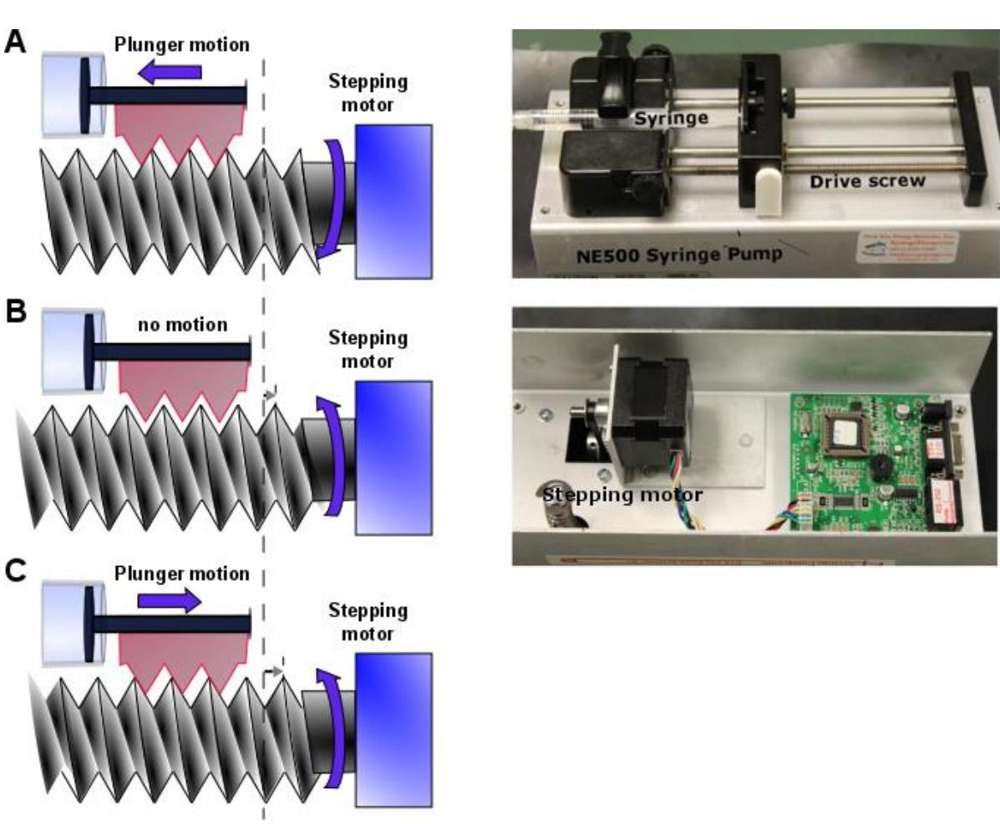

# Supplementary Figure S1. Pump backlash

The syringe pump uses a stepping motor and a threaded drive rod to move the syringe plunger. Backlash is defined here as the maximum turning of stepping motor which does not lead to plunger movement. (**A**) Counter-clockwise turning of stepping motor (viewed from the righthand side) drives plunger to move left. (**B**) When the direction of turning is reversed, the threads of the plunger holder are detached from the threads of the motor drive screw. Thus, even as the motor turns, the plunger does not move. This is the backlash. (**C**) Re-engagement between plunger and stepping motor leads to plunger motion. Long dashed line marks a reference position, and short dotted lines mark one tooth of the stepping motor. ~0.2 mL was used for backlash correction volume.

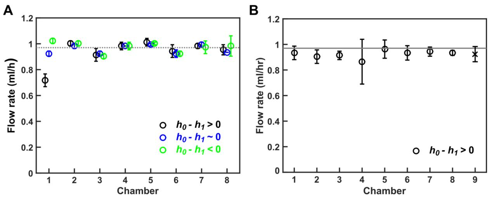

 Supplementary Figure S2. Variable flow rate in first chamber when using silicone tubing. (**A**) Depending on the liquid level of reservoir (*h0*, which changes during the course of an experiment) and the liquid level of media input to Chamber 1 (*h1*), the first dispense (which is to Chamber 1) might deviate from the target (grey line). Chambers 2 to 8 are much less affected. (**B**) When we cycle the order of dispense (Fig 6A) for the case *h0*- *h1*>0, the large flow rate deficit originally observed for chamber 1 now averages out among all eight chambers, showing that the deficit is a property of the first dispense instead of the location of a particular chamber in the setup. For all flow rates, data point for each chamber represents 5 trials, with error bars indicating two standard deviations. The cross in **B** marks the average flow rate of eight chambers, with the error bar indicating two standard deviations.

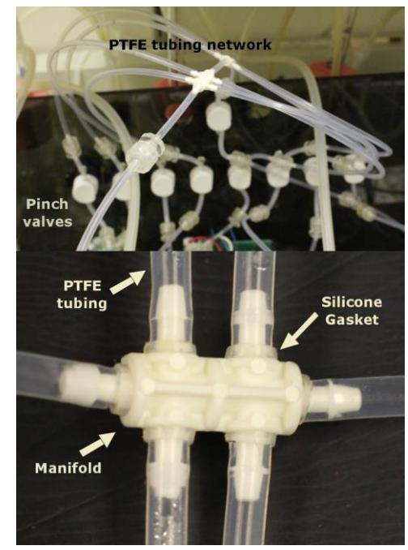

# Supplementary Figure S3. Silicone gasket assembly.

To prevent leaks from the junction of rigid PTFE tubing with the barbed fittings of manifolds, we added a small silicone gasket. Because we could not find commercial sources for such small silicone gaskets, we cut approximately 1mm sections of silicone tubing (1/16" ID 1/8" OD from VWR International) with a single edged razor blade. The silicone gasket is placed over the barbed fitting, and the fitting is inserted into the tubing, pressing the end of the tubing against the gasket, thus forming a flexible seal. Silicone gasket assembly allows at least five cycles of autoclaving without leakage.

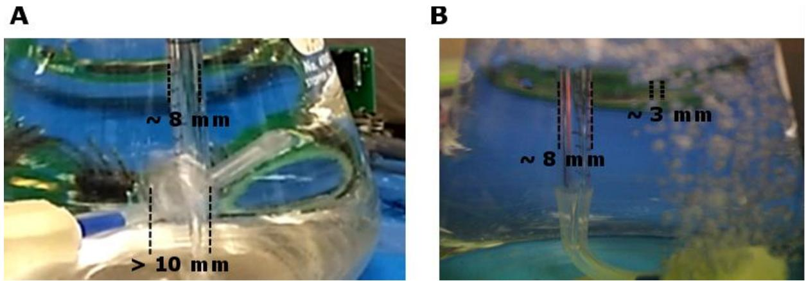

# Supplementary Figure S4. Aquarium stone reduces bubble size and potentially increases the humidity of air in the bubble

Air exits from the end of a pipet (~8 mm diameter for comparison), forming bubbles of >10 mm diameter without an aquarium stone (**A**), or of ~3 mm diameter with an aquarium stone (**B**). The large bubbles are in the liquid for around 1/3 second. Given the diffusivity of water in air, D 2.8 x 10-5 m2 /s, and assuming a characteristic bubble radius of 5 mm, we can calculate a crude estimate (an upper bound) for the time for water molecules to diffuse to the center of the bubble R 2 /D = (0.005m)2 /2.8 x 10-5 m2 /s = 0.9 s. This estimate shows that there may be inadequate time for a large bubble to become saturated with moisture. The diameter of bubbles from the bubbler stone is typically less than 3mm. This gives a timescale for saturation of R2 /D = 0.04s<<0.9 s, which may be responsible for a reduction in evaporation when using aquarium stone (Figure 2D).