# Hal L. Smith and Paul Waltman

Cambridge Studies in Mathematical Biology

# The Theory of the Chemostat

Dynamics of Microbial Competition


CAMBRIDGE STUDIES IN MATHEMATICAL BIOLOGY: 13 Editors C. CANNINGS Department of Probability and Statistics, University of Sheffield, UK F. C. HOPPENSTEADT College of Natural Sciences, Michigan State University, East Lansing, USA L. A. SEGEL Weizmann Institute of Science, Rehovot, Israel

### THE THEORY OF THE CHEMOSTAT

### CAMBRIDGE STUDIES IN MATHEMATICAL BIOLOGY

- 1 Brian Charlesworth Evolution in age-structured populations
- 2 Stephen Childress Mechanics of swimming and flying
- 3 C. Cannings and E. A. Thompson Genealogical and genetic structure
- 4 Frank C. Hoppensteadt Mathematical methods of population biology
- 5 G. Dunn and B. S. Everitt An introduction to mathematical taxonomy
- 6 Frank C. Hoppensteadt An introduction to the mathematics of neurons
- 7 Jane Cronin Mathematical aspects of Hodgkin-Huxley neural theory
- 8 Henry C. Tuckwell Introduction to theoretical neurobiology Volume 1 Linear cable theory and dendritic structures Volume 2 Non-linear and stochastic theories
- 9 N. MacDonald Biological delay systems
- 10 A. G. Pakes and R. A. Maller Mathematical ecology of plant species competition
- 11 Eric Renshaw Modelling biological populations in space and time
- 12 Lee A. Segel Biological kinetics

HAL L. SMITH PA UL WALTMAN Arizona State University Emory University

# The theory of the chemostat Dynamics of microbial competition


Published by the Press Syndicate of the University of Cambridge The Pitt Building, Trumpington Street, Cambridge CB2 IRP 40 West 20th Street, New York, NY 10011-4211, USA 10 Stamford Road, Oakleigh, Melbourne 3166, Australia

© Cambridge University Press 1995

First published 1995

Library of Congress Cataloging-in-Publication Data

Smith, Hal L.

The theory of the chemostat : dynamics of microbial competition / Hal L. Smith, Paul Waltman.

p. cm. - (Cambridge studies in mathematical biology)

Includes bibliographical references and index.

ISBN 0-521-47027-7

1. Microbial growth - Mathematical models. 2. Chemostat. 3. Microbial ecology - Mathematical models. 1. Waltman, Paul E. 11. Title. Ill. Series. QR84.5.S65 1994 576'.15 - dc20 94-19083 CIP

A catalog record for this book is available from the British Library.

ISBN 0-521-47027-7 Hardback

Transferred to digital printing 2003

To Kathi and Ruth

# Contents

| Preface |                                                   | page xi |
|---------|---------------------------------------------------|---------|
| 1       | The Simple Chemostat                              | 1       |
|         | Introduction<br>1.                                |         |
|         | Derivation of the Basic Equations of Growth<br>2. | 3       |
|         | Dynamical Systems<br>3.                           | 7       |
|         | Analysis of the Growth Equations<br>4.            | 13      |
|         | Competition<br>5.                                 | 14      |
|         | The Experiments<br>6.                             | 19      |
|         | Discussion<br>7.                                  | 20      |
| 2       | The General Chemostat                             | 28      |
|         | 1. Introduction                                   | 28      |
|         | 2. Liapunov Theory                                | 28      |
|         | 3. General Monotone Response and Many Competitors | 30      |
|         | 4. Different Removal Rates                        | 34      |
|         | 5. Nonmonotone Uptake Functions                   | 37      |
|         | 6. Discussion                                     | 42      |
| 3       | Competition on Three Trophic Levels               | 43      |
|         | 1. Introduction                                   | 43      |
|         | 2. The Model                                      | 44      |
|         | 3. A Simple Food Chain                            | 47      |
|         | 4. Elementary Floquet Theory                      | 51      |
|         | 5. The Food Chain Continued                       | 53      |
|         | 6. Bifurcation from a Simple Eigenvalue           | 59      |
|         | 7. Competing Predators                            | 65      |
|         | 8. Numerical Example                              | 68      |
|         | 9. A Long Food Chain                              | 69      |
|         | 10. Discussion                                    | 71      |

| viii | Contents |
|------|----------|
|------|----------|

| 4 | The Chemostat with an Inhibitor                | 78  |
|---|------------------------------------------------|-----|
|   | 1. Introduction                                | 78  |
|   | 2. The Model                                   | 79  |
|   | 3. The Conservation Principle                  | 81  |
|   | 4. Rest Points and Stability                   | 86  |
|   | 5. Competition without an Interior Equilibrium | 91  |
|   | 6. Three-Dimensional Competitive Systems       | 93  |
|   | 7. Competition with an Interior Equilibrium    | 96  |
|   | 8. Discussion                                  | 99  |
| 5 | The Simple Gradostat                           | 101 |
|   | 1. Introduction                                | 101 |
|   | 2. The Model                                   | 103 |
|   | 3. The Set of Rest Points                      | 106 |
|   | 4. Growth without Competition                  | 111 |
|   | 5. Local Stability                             | 114 |
|   | 6. Order Properties                            | 119 |
|   | 7. Global Behavior of Solutions                | 121 |
|   | 8. Numerical Example                           | 125 |
|   | 9. Discussion                                  | 126 |
| 6 | The General Gradostat                          | 129 |
|   | 1. Introduction                                | 129 |
|   | 2. The Conservation Principle                  | 133 |
|   | 3. Growth without Competition                  | 137 |
|   | 4. Competition                                 | 140 |
|   | 5. The Standard Gradostat                      | 151 |
|   | 6. Discussion                                  | 157 |
| 7 | The Chemostat with Periodic Washout Rate       | 159 |
|   | 1. Introduction                                | 159 |
|   | 2. Periodic Differential Equations             | 162 |
|   | 3. The Conservation Principle                  | 164 |
|   | 4. Periodic Competitive Planar Systems         | 169 |
|   | 5. Coexistence                                 | 171 |
|   | 6. Discussion                                  | 180 |
| 8 | Variable-Yield Models                          | 182 |
|   | 1. Introduction                                | 182 |
|   | 2. The Single-Population Growth Model          | 183 |
|   | 3. The Competition Model                       | 188 |
|   | 4. The Conservation Principle                  | 192 |
|   | 5. Global Behavior of the Reduced System       | 195 |
|   |                                                |     |
|   | 6. Competitive Exclusion                       | 203 |

|    | Contents                                        | ix  |  |
|----|-------------------------------------------------|-----|--|
|    | 9 A Size-Structured Competition Model           | 208 |  |
|    | 1. Introduction                                 | 208 |  |
|    | 2. The Single-Population Model                  | 209 |  |
|    | 3. Reduction to Ordinary Differential Equations | 214 |  |
|    | 4. Competition                                  | 219 |  |
|    | 5. Average Cell Size                            | 222 |  |
|    | 6. The Conservation Principle                   | 225 |  |
|    | 7. The Steady-State Size Distribution           | 226 |  |
|    | 8. Discussion                                   | 228 |  |
|    | 10 New<br>Directions                            | 231 |  |
|    | 1. Introduction                                 | 231 |  |
|    | 2. The Unstirred Chemostat                      | 231 |  |
|    | 3. Delays in the Chemostat                      | 238 |  |
|    | 4. A Model of Plasmid-Bearing, Plasmid-Free     |     |  |
|    | Competition                                     | 243 |  |
| 11 | Open Questions                                  | 248 |  |
|    | Appendices                                      | 253 |  |
|    | A Matrices and Their Eigenvalues                | 255 |  |
| B  | Differential Inequalities                       | 261 |  |
|    | C Monotone Systems                              | 268 |  |
|    | D Persistence                                   | 277 |  |
| E  | Some Techniques in Nonlinear Analysis           | 282 |  |
|    | F A Convergence Theorem                         | 294 |  |
|    | References                                      | 299 |  |
|    | Author index                                    | 309 |  |
|    | Subject index                                   | 311 |  |

# Preface

The chemostat is a basic piece of laboratory apparatus, yet it occupies a central place in mathematical ecology. Its importance stems from the many roles it plays. It is a model of a simple lake, the ideal place to study competition in its most primitive form - exploitative competition. It is also used as a model of the wastewater treatment process. In its commercial form the chemostat plays a central role in certain fermentation processes, particularly in the commercial production of products by genetically altered organisms (e.g., in the production of insulin). The theoretical literature is scattered; papers appear in mathematical, biological, and chemical engineering journals. In addition to being known as a chemostat, other common names are "continuous culture" and, in the engineering literature, CSTR (continuously stirred tank reactor). This monograph is devoted to the theoretical description of ecological models based on the chemostat and to problems that can be described in that context, drawing from literature in all fields and presented within a common framework and with consistent notation.

In order to understand the mathematical importance of the chemostat, one must look at the broader picture of the subject of nonlinear differential equations. Linear differential equations have been studied for more than two hundred years; their solutions have a rich structure that has been well worked out and exploited in physics, chemistry, and biology. A vast and challenging new world opens up when one turns to nonlinear differential equations. There is an almost incomprehensible variety of nonlinearities to be studied, and there is little common structure among them. Models of the physical and biological world provide classes of nonlinearities that are worthy of study. Some of the classic and most studied nonlinear differential equations are those associated with the simple pendulum. Other famous equations include those associated with the names of

### xii Preface

Lienard and van der Pol, whose work led to significant advances in the understanding of nonlinear differential equations. The equations of celestial mechanics motivated the original work of Poincare and the foundation of the "geometric" theory of nonlinear differential equations. Although models in physics are often accepted in spite of their restrictive (and perhaps unrealistic) hypotheses, this has not been the case with equations that arise in biology. For example, the equations of motion for the simple pendulum assume a perfect (frictionless) bearing, movement in a vacuum, and the constancy of gravity. None of these conditions is exactly satisfied, yet physicists and engineers study the pendulum and related equations for what they can learn about oscillations. In biology there are relatively few accepted mathematical models. The chemostat is one - and, in microbial ecology, perhaps the only - such model that does seem to have wide acceptance. This is true, at least in part, because the parameters are measurable and the experiments confirm that the mathematics and the biology are in agreement. The equations of population biology, in general, and those of the chemostat-like models, in particular, provide an interesting class of nonlinear systems of differential equations that are worthy of study for their mathematical properties. The study of these equations has already lead to the discovery of new mathematics. The theory of cooperative and competitive dynamical systems has been motivated, at least in part, by problems in population biology. The theory of persistence in dynamical systems grew directly from such considerations.

The chemostat models an open system, and although (strictly speaking) the exact assumptions of the model may be limited to laboratory environments, it can serve as a paradigm for more complicated naturally occurring open systems. In almost any competition problem, one can ask "What happens in the chemostat?" as a first step. The textbook Lotka-Volterra equations have an inherent shortcoming: they incorporate parameters modeling the competitive effect of one population upon the other, which can only be estimated by growing the organisms together. This negates any predictive value, although solution curves can sometimes be successfully fit to real data. With the chemostat, the relevant parameters can be measured by growing the organisms separately in "batch" culture, and predictions can be made as to the outcome of the competition in continuous culture. It would seem, and we hope to show, that the chemostat equations provide a better understanding of competition at its simplest level and are thus more appropriate for textbooks.

In describing the theoretical aspects of the chemostat, we were faced with ; decision regarding how much generality to present. The basic nutrient uptake term that is most accepted comes from a model, usually

credited to Monod, that appears in enzyme kinetics as the Michaelis-Menten model. Yet the mathematics frequently allows for more general functions than this particular nonlinearity. We have resolved this issue using the following principle: We retain the specifics of the Monod model as long as significantly stronger results (in the sense of describing behavior in the complete parameter space) can be obtained with its use. When the problems reach a level of complexity where stronger results cannot be obtained using the Monod model, we make use of more general classes of nonlinearities that subsume the Monod nonlinearity. The problems in Chapters 3, 4, and 5 retain the Monod formulation because the results are complete as a result of this assumption. The problems considered in Chapters 6, 7, 8, and 9 are treated more generally, since little is gained by the Monod assumption.

There is always the problem of how much mathematics to assume. We have tried to write the material so that the reader who is uninterested in the mathematical fine points may read the discussions and the statements of the theorems while skipping the mathematical proofs. However, one of our objectives is to show that much of the theory of chemostat-like models is based on a rigorous mathematical foundation.

The reader whose primary interests are not mathematical will gain the most by reading Chapters 1, 3, 4, and 5 - omitting all the proofs, but paying particular attention to the theorems, the figures, and the discussion sections. Chapter 8 is also accessible. Chapters 6 and 7 make strong use of the mathematical tools contained in the appendices. While the mathematical level is not high in Chapter 2, the point of this chapter is to show that the results of Chapter 1 hold in greater (mathematical) generality. We have tried to warn the reader when particularly technical proofs appear. After Chapter 1, the other chapters may be read independently, although reading Chapter 5 before Chapter 6 is recommended.

Two types of mathematics have been moved to the appendices. First of all, there is commonly known material which may not be easily found in a single source; an example is Appendix A, which is devoted to matrices. On the other hand, some very abstract mathematics (e.g. Appendix E, "Some Techniques in Nonlinear Analysis") is needed briefly in proofs, but it is not reasonable to assume this material as a prerequisite; the appendix gives the relevant definitions and theorems and refers the reader to a source of further detail. Some theorems that are used frequently for example, comparison theorems and a result of Selgrade - are proved in an appendix.

A conscious attempt has been made to make this monograph as mathematically self-contained as possible. To achieve this, we have often chosen

### xiv Preface

to avoid using more abstract mathematical results, which might have allowed a briefer (although less satisfying) mathematical treatment, in favor of a more elementary approach. Thus we have strived to use results that either are proved or can be given adequate motivation. For example, many of the results in Chapters 5 through 9 are treated by using comparison theorems and a result of Selgrade and without using the full strength of monotone dynamical systems theory.

The mathematical results in this monograph share a common feature: the attempt to describe the global behavior of solutions of the relevant differential equations. By this we mean the attempt to describe the behavior of all (or almost all) solutions, not just those in some small neighborhood of the equilibrium solutions. Such global results are essential in order to draw broad biological conclusions. For example, the principle of competitive exclusion is based on experimental results (those of Gause [Gal) and on a global analysis of the simple Lotka-Volterra model of competition. A local stability analysis is inadequate for such a conclusion. In Chapters 1 and 2 a global analysis of the model of competition in the chemostat lends further support for the competitive exclusion principle. Most of the results of the remaining chapters feature variations in the model that will lead to a conclusion other than competitive exclusion; this also requires global mathematical results.

Chapter 1 describes the basic apparatus, proves the competitive exclusion property of the chemostat, and discusses the definitive experiments that show the mathematics and the biology to be in agreement. The idea of dynamical systems is introduced here. We make no use of the deep properties of the theory of dynamical systems, although we do feel strongly that this is the proper language for problems from population biology. Most of the deterministic models in population biology make use of ordinary differential equations, functional differential equations, or reactiondiffusion equations; the language of dynamical systems is appropriate for all three. This language is used throughout the book. Chemostats have a certain conservation property - indeed, the presence of this property may be fundamental to the definition of a chemostat - which requires some mathematics to treat properly. A simpler proof of the result for a threedimensional system of chemostat equations is given in Chapter 1, and Appendix F treats a special case of a very general theorem of Thieme. When the limit sets are equilibria, this theorem is sufficient to make rigorous the reduction in complexity that follows from the conservation property. In Chapter 2 it is shown that the mathematical results for the simple chemostat hold in much greater generality. Specifically, they do not depend

#### Preface xv

on the particular Monod formulation. Chapters 3 through 9 deal with specific theoretical problems that can be modeled in a chemostat setting.

Chapter 3 contains a chemostat version of the predator-prey problem, which is obtained by adding a third trophic level to the model. Both a food chain (which is the basic predator-prey model) and competing predators at the top level are considered. Chapter 4 studies competition in the chemostat when an inhibitor is present. This problem is of importance in commercial production with biological reactors, since the genetically altered organism may be an inferior competitor to the unaltered or "wild" type. It is common to introduce antibiotic resistance in the altered organism and an antibiotic into the feed bottle of the chemostat. This chapter is also relevant to detoxification problems. Chapter 5 deals with a variation of the chemostat known as the gradostat. The purpose of the gradostat is to create an environment with a nutrient gradient and to study growth and competition along it. The presence of nutrient gradients is well known in ecological problems in nature. Chapter 5 studies a special case where there are only two vessels - that is, two levels to the gradient. Chapter 6 considers the same problem in much greater generality and with the potential for more interesting gradients. The gradostat may become a standard model, like the chemostat, for growth along a gradient. Chapter 7 leaves the domain of autonomous differential equations and introduces a time-varying environment into the problem. This is an attempt to model the cycles that appear in nature, such as day-night cycles or seasonal ones. The (not unexpected) result is oscillations; however, they are treated by very elegant methods from monotone dynamical systems (originally applied by deMottoni and Schiaffino [DS]). Chapter 8 treats the internal-stores or variable-yield model, introduced to remove the basic hypothesis of constant yield made in the chemostat. Chapter 9 presents a structured model that takes into account the size of individuals in the population. Structured models have received increased attention recently in population modeling, and here the general approach of such modeling is indicated in the context of the chemostat.

Chapters 10 and 11 are intended to steer the interested reader into open problems in the subject. Chapter 10 deals with three specific types of problems where preliminary analysis of the model has been carried out but many open questions remain. It is felt that these new directions are worthy of serious study. Some of the problems are modeling problems and some are mathematical ones. In two cases the models are not ordinary differential equations, but rather functional differential equations and partial differential equations. In Chapter 11 specific technical open questions are

mentioned. Many of these appear in the text proper, but are highlighted here to call attention to mathematical questions whose answers would help to complete the theory.

The choice of material reflects the authors' personal mathematical interests, so it is hoped that we have used both the engineering and biological literature appropriately. Although some of the results contained in this monograph are new, we have not aimed for the most general possible results, especially when achieving them would complicate and obscure the basic ideas. However, when sharper results than those presented here are known, we have tried to point out the appropriate references.

The material was used as a basis for a topics course at the Georgia Institute of Technology and one at Emory University. Both authors wish to thank their students for many comments and discussions. Several colleagues read the entire manuscript, and we especially wish to express our sincere thanks for this effort: S. B. Hsu, Y. Kuang, W. Rivera, and J. Wu. Several others read portions of the manuscript as it was developed; we wish to acknowledge their comments with greatest appreciation and thanks: J. Cushing, K. Crowe, S. Ellermeyer, R. Pennington, S. S. Pilyugin, J. Suresh, and G. Wolkowicz. The figures were prepared by Bruce Long of Arizona State University, whose very fine work is much appreciated.

One of the authors (H.L.S.) would like to acknowledge the support of the faculty and staff at the Center for Dynamical Systems and Nonlinear Analysis at the Georgia Institute of Technology, and especially Professor Jack Hale, for providing a pleasant and stimulating environment for the sabbatical leave during which this collaboration occurred. Special thanks should also go to Lorrain Ruff and Annette Rohrs for answering this author's innumerable questions about TEX.

The Simple Chemostat

### 1. Introduction

Competition modeling is one of the more challenging aspects of mathematical biology. Competition is clearly important in nature, yet there are so many ways for populations to compete that the modeling is difficult to carry out in any generality. On the other hand, the mathematical idea seems quite simple: when one population increases, the growth rate of the others should diminish (or at least not increase), a concept that is quite easily expressed by partial derivatives of the specific growth rates. If an ecosystem is modeled by a system of ordinary differential equations - for example, by

$$
\mathcal{Y}_i' = \mathcal{Y}_i f_i(\mathcal{Y}),
$$

where i = 1, 2, ..., n, f,, is a continuously differentiable function defined on lib", and y = (yi, yz, ..., y") - then competition is expressed by the condition

$$\frac{\partial f_i}{\partial y_j} \le 0$$

when i # j. Dynamical systems with such properties have been studied extensively; see Hirsch [Hit; Hi2] and Smith [S3].

Such models easily reflect the direct impact of one population upon the other - for example, the production by one population of a metabolic product that inhibits the growth of the other. The simplest form of competition, however, occurs when two or more populations compete for the same resource, such as a common food supply or a growth-limiting nutrient. This is called exploitative competition. A simple example of this type of competition occurs in a laboratory device, called a chemostat or

### 2 The Simple Chemostat

a continuous culture, that models competition in a very simple lake. This device is important in ecological studies because the mathematics is tractable and the relevant experiments are possible (although by no means easy). Its place in theoretical ecology is well documented in the surveys of Bungay and Bungay [BB], Cunningham and Nisbet [CN2], Fredrickson and Stephanopoulos [FSt], Jannash and Mateles [JM], Taylor and Williams [TW], Veldcamp [V], Waltman [WI; W2], and Waltman, Hubbell, and Hsu [WHH]. The chemostat model also plays a role in wastewater treatment problems - two examples are D'Ans, Kokotovic, and Gottlieb [DKG] and La Riviere [La] - and in the study of recombinant problems in genetically altered organisms, for example, in Stephanopoulis and Lapidus [SLa] and Stewart and Levin [SL2]. Moreover, the chemostat model is the starting point for many variations that yield more realistic biological models and interesting mathematical problems. The following quotations reflect the importance of the chemostat.

The chemostat is the best laboratory idealization of nature for population studies. It is a dynamic system with continuous material inputs and outputs, thus modeling the open system character and temporal continuity of nature. The input and removal of nutrient analogs the continuous turnover of nutrients in nature. The washout of organisms is equivalent to non-age specific death, predation or emigration which always occurs in nature. [Wi]

An ecosystem is so complex, so difficult to comprehend, that any attempt to understand the interactions of the component parts in situ is frequently doomed to failure because of a lack of rigorous controls. Under such circumstances the behavior displayed by one component may be ascribed to any number of phenomena. Consequently, if we wish to understand the mechanisms by which populations interact we must study them under simplified, controllable laboratory conditions. These should be modeled for theoretical insight, and under ideal circumstances the behavior displayed should be predictable under a variety of conditions imposed by the experimentalist.

From such a perspective, mixed microbial cultures inhabiting simple continuous culture devices are ideal model systems for the study of many ecological phenomena. Unfortunately, population biology has neglected this whole field of research for far too long and without good reason; for micro-organisms are not only economically and ecologically important, their world is every bit as fascinating as that of higher forms of life that are the stable diet of our researchers. Indeed, they can provide unique insights unavailable from almost any other experimental approach. [De]

The name "chemostat" seems to have originated with Novick and Szilard [NS].

In this monograph the basic literature on competition in the chemostat is collected and explained from a common viewpoint. The subject is by

no means complete, but sufficient progress has been made to warrant exposition in a single place. There are also many biological situations that can be modeled by similar techniques. It is also hoped that successful analysis of the models presented here will help to convince biologists of the importance and utility of modern mathematics in ecological studies.

### 2. Derivation of the Basic Equations of Growth

The apparatus consists of three connected vessels as shown in the schematic in Figure 2.1. The leftmost vessel is called the feed bottle and contains all of the nutrients needed for growth of a microorganism - all in excess except for one, which is referred to as the limiting nutrient. The second vessel is called the culture vessel, and it is here that the "action" takes place. The third vessel is the overflow or collection vessel; it is here that the products of the culture vessel are collected. It will contain nutrient, organisms, and perhaps products produced by those organisms. Note that measurements can be made on the contents of the collection vessel without disturbing the action in the culture vessel. Since some nutrient is always in shortest supply, we focus on that limiting nutrient, hereafter simply called the nutrient, and ignore the others that are present in surplus quantities. We emphasize that Figure 2.1 is a schematic; the actual realization of the device can take many forms.

The contents of the feed bottle are pumped at a constant rate into the culture vessel; the contents of the culture vessel are pumped at the same constant rate into the collection vessel. Let V denote the volume of culture vessel (V has units of 13, where l stands for length), and let F denote the volumetric flow rate (F has units of 13/t, where t is time). The concentration of the input nutrient, denoted by 5(0), is kept constant. Concentration has units of mass/13.

The culture vessel is charged with a variety of microorganisms, so it contains a mixture of nutrient and organisms. The culture vessel is well

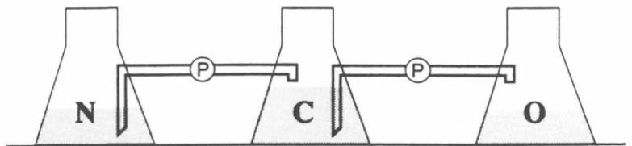

Figure 2.1. A schematic of the simple chemostat. (From [W2], Copyright 1990, Rocky Mountain Mathematics Consortium. Reproduced by permission.)

stirred, and all other significant parameters (e.g. temperature) affecting growth are kept constant. Since the output is continuous, the chemostat is often referred to as a "continuous culture" in contrast with the more common "batch culture."

We seek to write differential equations for this model, and begin by considering just one organism growing in the chemostat. (A more complete derivation can be found elsewhere; see e.g. Herbert, Elsworth, and Telling [HET].) The rate of change of the nutrient can be expressed as

rate of change = input - washout - consumption,

while that of the organism can be expressed as

rate of change = growth - washout.

Let S(t) denote the concentration of nutrient in the culture vessel at time t. Thus VS(t) denotes the amount of nutrient in the vessel at that time. The rate of change of nutrient is the difference between the amount of nutrient being pumped into the vessel per unit time and the amount of nutrient being pumped out of the vessel per unit time. If there were no organisms, and hence no consumption, then the equation for the nutrient would be

$$(V\mathbb{S})^\prime(t) = \mathbb{S}^{(0)}F - \mathbb{S}(t)F,$$

where the prime denotes the derivative with respect to time. Note that the units on each side are mass/time. Since V is constant, the quantity on the left can be written as VS'(t) and both sides divided by V. The quantity F/V, called the dilution (or washout) rate, is denoted by D and has units of 1/t. The equation then becomes

$$\mathcal{S}'(t) = \mathcal{S}^{(0)}D - \mathcal{S}(t)D.$$

The formulation of the consumption term, based on experimental evidence, goes back at least to Monod [Mol; Mo2]. The term takes the form

$$\frac{m\mathcal{S}x}{a+\mathcal{S}},$$

where x is the concentration of the organism (units are mass/13), m is the maximal growth rate (units are 1/t), and a is the Michaelis-Menten (or half-saturation) constant with units of concentration. The form (and the terminology) of the consumption term is that of enzyme kinetics, where S would be a substrate. Both a and m can be measured experimentally. Since it is generally accepted by microbial ecologists, and since it contains

parameters that can be measured, the Michaelis-Menten (or Monod) formulation is most often used as the uptake function, but the mathematical results are valid for much more general functions. Simple monotonicity in S, with a limit as S tends to infinity, is usually sufficient. Trying to squeeze the greatest mathematical generality from the theorems could interfere with our presentation, so the emphasis here is on the Monod formulation. (A partial justification is given in Chapter 2, where it is shown that - for the simple chemostat - a more general response function does not introduce any new types of behavior.)

As noted, the form of the consumption term depends on experimental evidence and does not rest on any physiological basis. The uptake of nutrient is a very complex phenomenon from the standpoint of molecular biology. Indeed, the transport of the nutrient through the cell wall is itself a very complex phenomenon. Dawes and Sutherland [DSu] give a descriptive (i.e. nonmathematical) introduction to microbial physiology and its complexities. Koch [Ko] considers the uptake and the factors affecting growth in considerable detail. The Monod and other similar formulations give an aggregate description of the nutrient uptake; to do otherwise would make the modeling problem very difficult. One can, however, take into account that the uptake by "larger" cells is more than that of "smaller" ones [Cu2].

The differential equation for S takes the form

$$S' \coloneqq (S^{(0)} - S)D - \frac{mS}{a+S} \frac{\chi}{\gamma},\tag{2.1}$$

while that of the corresponding equation for the microorganism, assuming growth is proportional to consumption, is

$$
\lambda \mathbf{x}' = \mathbf{x} \left( \frac{m \mathbf{S}}{\sigma + \mathbf{S}} - D \right), \tag{2.2}
$$

where -y is a "yield" constant reflecting the conversion of nutrient to organism. The constant -y can be determined (in batch culture) by measuring

> mass of the organism formed mass of the substrate used

and hence is dimensionless. (We will scale it out in the simple chemostat, but it is important for multiple-nutrient problems.) That 1' is a constant is a hypothesis; this hypothesis will be reconsidered in Chapter 8. The assumption that reproduction is proportional to nutrient uptake is a vast simplification. The cell cycle is a very complex phenomenon, and entire

books have been devoted to its description (see e.g. Murray and Hunt [MH]). Incorporating the essentials of the cell cycle into the chemostat model would be an interesting problem. From the mathematical point of view, this introduces a delay between nutrient uptake and cell division. Comments on the delay models can be found in Chapter 10, and their proper incorporation in microbial models is very much an open problem.

The appropriate initial conditions are S(0) >- 0 and x(0) > 0. The number of parameters in the system is excessive, so some scaling is in order. First of all, note that 5(0) and D (the input concentration and the washout rate) are under the control of the experimenter. The S(O) term has units of concentration and D has units of reciprocal time. Equations (2.1) and (2.2) may be rewritten as

$$\frac{S'}{S^{(0)}} = \left(1 - \frac{S}{S^{(0)}}\right)D - \frac{mS/S^{(0)}}{a/S^{(0)} + S/S^{(0)}} \frac{\chi}{S^{(0)}\gamma};$$

$$\frac{\chi'}{S^{(0)}\gamma} = \left(\frac{\chi}{S^{(0)}\gamma}\right)\left(\frac{mS/S^{(0)}}{a/S^{(0)} + S/S^{(0)}} - D\right).$$

By measuring S, a, and x/y in units of 5(0) and time in units of D-1, one obtains the following nondimensional differential equations (note that m and a have changed their meanings):

$$S' = 1 - S - \frac{mS\chi}{a+S},$$

$$\chi' = \chi \left(\frac{mS}{a+S} - 1\right),\tag{2.3}$$

$$S(0) \succeq 0, \ \chi(0) > 0.$$

This sort of scaling will occur frequently in the problems that follow. The constants m and a can be regarded as the "natural" parameters of the organism in this particular environment. We have standardized the environment, scaling out the factors that can be changed by the experimenter; hence the use of natural parameters expressed in (2.3). This unclutters the mathematics from the "real" world and focuses attention on the selection of the parameters a and m. This, of course, is in marked contrast to the point of view of a person who wishes to perform an experiment. There the parameters a and m are given; they come from the organism selected. An experimenter wishes to tune the chemostat to make the organisms grow. Thus, particularly in the engineering literature, one finds an emphasis on presenting results in the form of "operating diagrams," graphs that show where to operate the chemostat. Since the emphasis here is

theoretical, the scaling just described will be used whenever possible; results in terms of the original parameters can easily be obtained by reinterpreting the parameters.

### 3. Dynamical Systems

Although the system of equations (2.3) is simple enough to handle directly, we pause here to introduce some mathematical material that will be important in the remainder of the book. The reader who is not interested in mathematical tidiness may just note the definitions and go on to the next section. [CL] and [H2] are standard references for the material presented here. The focus throughout the book will be on the "dynamical systems" point of view. Dynamical systems are used primarily as a language, not because we need many deep results from that subject. The language, however, does seem natural for the problems considered. The dynamical system will be defined in terms of R', but the natural (and most efficient) formulation is that of a metric space. In a later chapter we will use the space C[0, 1], the space of continuous functions on the interval [0, 1] with the usual sup norm, and the definition will be expanded at that time.

The most basic concept is that of a dynamical (or a semidynamical) system. Let ir: M x 118 -> M be a function of two variables, where M is 118" and R denotes the real numbers. (We use M for the first variable or state space to suggest that the results are true in greater generality.) The function it is said to be a continuous dynamical system if 7r is continuous and has the following properties:

(i) ir(x,0) =x; (ii) 7r(x, t+s) = lr(7r(x, t), s).

An ordinary differential equation of the form

$$
\lambda \mathbf{y}' = f(\mathbf{y}),
\tag{3.1}
$$

with y e 118" and f : R'- 118" and where f is continuously differentiable, generates such a system by defining lr(x, t) to be the value y(t), where y(t) is the solution of (3.1) satisfying the initial condition y(0) = x. (We are tacitly assuming, of course, that all initial value problems for (3.1) exist for all time.) When (ii) holds only for positives and t, it is said to be a semidynamical system.

Given a point x, the set {1r(x, t), t ? 01 is called the positive orbit or positive trajectory through the point and is denoted by y+(x). If only

nonpositive t are considered, the set is called the negative orbit or negative trajectory through the point and is denoted by y-(x). The union of the positive and negative orbits is simply called the orbit or trajectory through the point, denoted by y(x). For emphasis, the latter is sometimes called the full orbit. For biological systems one wants to determine the eventual behavior - the asymptotic properties - of trajectories. Biological models require that trajectories remain positive (concentrations or populations are positive numbers) and that trajectories do not tend to infinity with increasing time. If a set S is such that all trajectories that begin (have their initial condition) in S remain in S for all positive time, then S is said to be positively invariant. (If trajectories remain in S for both positive and negative time, S is said to be invariant.) Hence the basic condition for positivity (of the dependent variables) can be stated as "the positive cone is positively invariant for the dynamical system generated by (3.1)." The dynamical system is said to be dissipative if all positive trajectories eventually lie in a bounded set. This is sufficient to ensure that all solutions of (3.1) exist for all positive time.

Let ( t D be a sequence of real numbers which tends to infinity as n tends to infinity. (Such a sequence is sometimes called an extensive sequence.) If P = lr(x, converges to a point P, then P is said to be an omega limit point of x. (More correctly, P is an omega limit point of the positive trajectory y+(x); both references will be used, but since there is a unique trajectory through each point x, the abuse of terminology will cause no confusion when dealing with systems of the form (3.1).) The set of all such omega limit points is called the omega limit set of x, denoted w(x). If the system is dissipative, the omega limit set is a non-empty, compact, connected, invariant set. Moreover, the orbit y+(x) is asymptotic to the omega limit set of x in the sense that the distance from 7r(x, t) and w(x) tends to zero as t tends to infinity.

Now let It, I be a sequence of real numbers which tends to negative infinity as n tends to infinity. If P = lr(x, converges to a point P, then P is said to be an alpha limit point of x. The set of all such alpha limit points is called the alpha limit set of x, denoted a(x). It enjoys similar properties if the trajectory lies in a compact set for t < 0.

A particularly important class of solutions are the constant ones, which are called steady states, rest points, or equilibrium points. In terms of (3.1), such a solution is a zero of f(y), that is, a vector y*e 118" such that f(y*) = 0. In the terminology of dynamical systems, a rest point is an element p e M such that ir(p, t) = p for all t E R. Similarly, a periodic orbit is one that satisfies ir(p, t + T) = -(p, t) for all t and for some fixed number T. The corresponding solution of (3.1) will be a periodic function.

If the omega limit set is particularly simple - a rest point or a periodic orbit - this gives information about the asymptotic behavior of the trajectory. An invariant set which is the omega limit set of a neighborhood of itself is called a (local) attractor. If (3.1) is two-dimensional then the following theorem is very useful, since it severely restricts the structure of possible attractors.

THEOREM (Poincare-Bendixson). If (3.1) is two-dimensional and if y+(x) remains in a closed and bounded region of the plane without rest points, then either y+(x) is a periodic orbit (and y+(x) = w(x)) or w(x) is a periodic orbit.

Although this is the classical statement of this theorem, a simple consequence is often useful. This is sometimes called the Poincare-Bendixson trichotomy.

THEOREM. Let y+(yo) be a positive semi-orbit of (3.1) which remains in a closed and bounded subset K of II82, and suppose that K contains only a finite number of rest points. Then one of the following holds:

- (i) w(yo) is a rest point;
- (ii) w(yo) is a periodic orbit;
- (iii) w(yo) contains a finite number of rest points and a set of trajectories y; whose alpha and omega limit sets consist of one of these rest points for each trajectory y,.

Figure 3.1 illustrates the possibilities. Additionally, if a two-dimensional system has a periodic orbit then it must have a rest point "inside" that orbit. These simple facts (and their generalizations) play an important role in the analysis presented here.

While the Poincare-Bendixson theorem yields the existence of limit cycles, it is often important to know when limit cycles do not exist. For two-dimensional systems, a result in this direction which complements the Poincare-Bendixson theorem is called the Dulac criterion. Its proof is a direct application of the classical Green's theorem in the plane (after an assumption that the theorem is false) and will not be given here; a good reference is [ALGM].

THEOREM (Dulac criterion). Suppose that (3.1) is two-dimensional. Let F be a simply connected region in R2 and let 13(x) be a continuously differentiable scalar function defined on F. If 0(f(x)13(x)) is of one sign (excluding zero) in the region F then there are no periodic orbits in P.

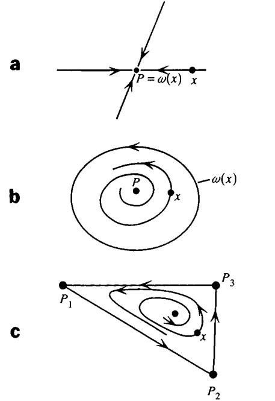

Figure 3.1. Examples of limit sets for planar systems: a a rest point; b a periodic orbit; c multiple rest points with connecting orbits.

By V is meant the gradient of the resulting two-dimensional vector function.

Local stability considerations also play a role in the analysis. For simplicity denote the solution of the autonomous system (3.1) through the point yo at time t = 0 by 0(t, yo). Let I1. II denote the Euclidean norm in R". The solution 0(t, yo) is said to be stable if, for any e > 0, there exists a S > 0 such that if IIYo -xoI< 8 then II0(t, yo) -O(t, xo)II < e for all t > 0. The solution 4(t, yo) is said to be asymptotically stable if it is stable and if there is a neighborhood N of yo such that if xo e N then lim, -. II 0(t, xo) - 0(t, yo)II = 0. We shall be concerned with the case where 0(t, yo) is a constant solution or rest point, that is, where 0(t, yo) =Yo for all t. We usually use y* to denote a rest point. Note that a rest point y* is asymptotically stable if it is stable and an attractor.

The system

$$\mathbf{x}' = f_{\mathbf{y}}(\mathbf{y}^*)\mathbf{x} \tag{3.2}$$

is said to be the linearization of (3.1) around the rest point y*, where fy(y*) is the Jacobian matrix

$$\left. \left[ \frac{\partial f_i}{\partial \boldsymbol{\alpha}_j} \right] \right|_{\boldsymbol{\nu} = \boldsymbol{\nu}^*} .$$

This matrix is called the variational matrix at y*.

If all of the eigenvalues of the variational matrix have negative real parts, then y* is an asymptotically stable rest point of (3.1). When this happens it is possible to find an arbitrarily small neighborhood around the rest point such that, on the boundary of the neighborhood, all trajectories cross the boundary from outside to inside.

If an omega limit set contains an asymptotically stable rest point P, then that point is the entire omega limit set. If all of the eigenvalues of the variational matrix have positive real part then the rest point is said to be a repeller; such a rest point cannot be in the omega limit set of any trajectory other than itself. If k eigenvalues have positive real part and n - k eigenvalues have negative real part then there exist two sets: M+(P), called the stable manifold and defined by

$$\mathcal{M}^+(P) = \langle \times | \lim_{t \to \infty} \pi(\times, t) = P \rangle;$$

and M-(P), called the unstable manifold and defined by

$$M^{-}(P) = \langle \times | \lim_{t \to -\infty} \pi(\times, t) = P \rangle.$$

The sets M+(P) and M-(P) are locally manifolds of dimension n-k and k, respectively, and all trajectories with initial conditions on these sets tend to the rest point as t tends to infinity (stable) or as t tends to negative infinity (unstable). One should think of these manifolds as surfaces in the appropriate space. On these surfaces, trajectories tend to the rest point as t tends either to positive or to negative infinity. (To assist with the notation, the reader should associate the plus sign on M+ with positive time and the minus sign on M- with negative time.) In particular, a single eigenvalue with positive real part makes the rest point unstable. The corresponding eigenvectors generate the tangent space to the respective manifolds. When no eigenvalue of the variational matrix has zero real part, the rest point is said to be hyperbolic.

Let P, Q be hyperbolic rest points (not necessarily distinct). P is said to be chained to Q, written P -+ Q, if there exists an element x, x P U Q, such that x e M-(P) fl M+(Q). A finite sequence P1, P2,..., Pk of hyperbolic rest points will be called a chain if PI P2 - Pk (PI -* PI if k = 1). The chain will be called a cycle if Pk = P1. A chain reflects the connections between equilibrium states. A cycle will turn out to be an "undesirable" type of connection.

The following theorem is often useful.

### 12 The Simple Chemostat

THEOREM (Butler-McGehee). Suppose that P is a hyperbolic rest point of (3.1) which is in w(x), the omega limit set of y+(x), but is not the entire omega limit set. Then w(x) has nontrivial (i.e., different from P) intersection with the stable and the unstable manifolds of P.

Figure 3.1c, where P is any of the three equilibria, illustrates the theorem. A short proof (due to McGehee) can be found in the appendix of [FW2], but it requires some advanced concepts from dynamical systems. The result is very general and theorems in the same spirit can be found in [BW], [BFW], [DRS], [Tl], or [HaW] in very abstract settings. Note that the linearization around such a point P cannot have all of its eigenvalues with negative real part else P = w(x); it also cannot have all eigenvalues with positive real part, for a repeller cannot be in the omega limit set of a point other than itself. Hence the stable and unstable manifolds are not empty. The intuition behind the result is that an orbit cannot "sneak" into and out of a neighborhood of P infinitely often without having accumulation points on the stable and unstable manifolds. The proof simply makes this idea precise. (The proof may be skipped on first reading.)

Proof of the Butler-McGehee Theorem. Since P is a hyperbolic equilibrium, there exists a bounded open set U containing P, but not x, with the property that if 7r(y, t) e U for all t > 0 (t < 0), then y belongs to the local stable (unstable) manifold M+(P) (M-(P)); see [H2]. (P is the largest invariant set in U, or U isolates P from any other invariant sets.) By taking a smaller open set V, P E V C PC U, we have that 7r(y, t) E V for all t > 0 (t < 0) implies y e M+(P) (M-(P)).

Since PE w(x), there exists a sequence [tn), limn-,. t = 00, such that limn-,o x = limn . 7r(x, tn) = P. It follows that x e V for all large n. Since xeM+(P), else w(x) = P, from the property of the neighborhood V one may conclude that there exist positive numbers r,,, Sn such that rn < t,,, 7r(xn, t) E V for -rn < t < s,,, and 7r(xn, -rn), 7r(xn, sn) e aV By the continuity of 7r(x, t), solutions that start near P must remain near P; hence it follows that rn and sn tend to infinity as n tends to infinity. However, V is compact, so (passing to a subsequence if necessary) one may conclude that limn -. 7r(xn, -rn) = q E V and limn -. 7r(xn, sn) = q e V We continue the proof for q; the other case is similar.

It is claimed that 7r(q, t) e V for all t > 0. Recall that limn qn = q where qn = 7r(xn, -r, ). Fix t > 0. By the continuity of 7r, limn -. 7r(gn, t) = 7r(q, t). Since -rn < t-rn < 0 for all large n, 7r(gn, t) = 7r(xn, t - rn) e V

for all large n. It follows that 7r(q, t) e V. Since t > 0 was arbitrary, the claim is established.

Since 7r(q, t) e V for all t > 0, we have q e M+(P) by the isolating property of V cited in the first sentence of the proof. However, q e y+(x) = y+(x) U ,(x). Since q e M+(P), q e y+(x) and hence q e w(x), which establishes one case of the theorem.

For many of the systems of interest here, the dynamics restricted to the various boundaries of the positive cone in I&" will be dynamical systems in their own right - the boundaries will be invariant sets. It may happen that a rest point P will be asymptotically stable when regarded as a rest point of the lower-dimensional dynamical system and yet have unstable components when the full system is considered. If the entire stable manifold is contained in the boundary, then the Butler-McGehee theorem can be used to conclude that no trajectory from the interior of the positive cone can have P as an omega limit point. Indeed, the omega limit set cannot equal P because the initial point does not belong to the stable manifold of P. If the limit set contains P then it would also contain a point of the stable manifold distinct from P, by the Butler-McGehee theorem, and would therefore contain the closure of the entire orbit through this point since the omega limit set is closed and invariant. However, this typically leads to a contradiction, since orbits in the stable manifold of P are either unbounded or their limit sets contain equilibria that can be readily excluded from the original limit set (e.g. are repellors). Section 5 will use the theorem in this way.

### 4. Analysis of the Growth Equations

For system (2.3) the positive cone is positively invariant (see Appendix B, Proposition B.7). In simpler terms, if the system is given positive initial conditions then the two components of the solution remain positive for all finite time. Moreover, if one adds the two equations and defines E _ 1-S-x, then one obtains a single equation

E'= -E

with E(0) > 0. It follows at once that lim,- E(t) = 0 and that the convergence is exponential. This not only gives the required dissipativeness but also leads to the simplification of the system by the elimination of one variable. From lim,_.[S(t)+x(t)] = 1, one can conclude that the omega limit set of the system (2.3) must lie in this set, and trajectories on the omega limit set must satisfy

14 The Simple Chemostat

$$\chi^{\prime} = \chi \left[ \frac{m(1-\chi)}{1+a-\chi} - 1 \right], \quad 0 \le \chi \le 1. \tag{4.1}$$

It might seem at first that it was extremely fortuitous that the aforementioned limit should exist. However, there is a simple, intuitive explanation. If there were no organisms in the model - that is, if only nutrient were present in the equation - then the nutrient would satisfy

$$S' = 1 - S \quad \text{and} \quad \lim_{t \to \pm \infty} S(t) = 1.$$

The scaling in the system has expressed the concentration of organism in terms of its "nutrient equivalent." Since nothing is created or destroyed in the system, the sum should satisfy the same equation. The quantity E (more accurately, 1- E) reflects this. Indeed, if all of the variables in the model are properly accounted for, this will always be true for the sum of the variables in a chemostat.

Since all trajectories of the original system are asymptotic to their omega limit set, in analyzing this equation it is sufficient to determine the asymptotic behavior of (2.3). From a more intuitive viewpoint this is merely starting on the manifold S+x = 1, to which all solutions must tend; the mathematical support for this is rigorously established later (see the proof of Theorem 5.1 or Appendix F). Define, for m > 1,

$$
\lambda = \frac{a}{m-1};
$$

A is called the break-even concentration. Equation (4.1) has two rest points, x = 0 and x = 1-A, and the equation can be rewritten as

$$
\lambda \,\, \lambda' = \lambda \left[ \frac{m-1}{1+a-\chi} \right] [1-\lambda-\chi]. \tag{4.2}
$$

Clearly, if m < 1 or m > 1 and A > 1, then lim, -. x(t) = 0 (x'(t) is negative and x(t) is bounded below by zero). On the other hand, if A < 1 and m > 1, then lim,_. x(t) = I -A (and hence lim,_. S(t) = A). If m < 1, the organism is washing out faster than its maximal growth rate, whereas if A >- I there is insufficient nutrient available for the organism to survive. In either case, extinction is not a surprising outcome. The case m = 1 is handled by using (4.1) directly.

### 5. Competition

To study competition in the chemostat, introduce two different microorganisms into the system, labeled x1 and x2, with corresponding parameters

a; and m;, i = 1, 2. We assume that the corresponding lambdas, Al and A2, are different. The overall system becomes

$$\begin{aligned} S' &= 1 - S - \frac{m_1 S \chi_1}{a_1 + S} - \frac{m_2 S \chi_2}{a_2 + S}, \\ \chi_1' &= \chi_1 \left( \frac{m_1 S}{a_1 + S} - 1 \right), \\ \chi_2' &= \chi_2 \left( \frac{m_2 S}{a_2 + S} - 1 \right), \\ S(0) &\succeq 0, \ \chi_1(0) > 0, \ \chi_2(0) > 0. \end{aligned} \tag{5.1}$$

Again, let E(t) =I -S(t)-XI(t)-X2(t), and rewrite the system as

$$\begin{aligned} \Sigma' &= -\Sigma, \\ \chi_1' &= \chi_1 \left( \frac{m_1(1-\Sigma-\chi_1-\chi_2)}{a_1+1-\Sigma-\chi_1-\chi_2} - 1 \right), \\ \chi_2' &= \chi_2 \left( \frac{m_2(1-\Sigma-\chi_1-\chi_2)}{a_2+1-\Sigma-\chi_1-\chi_2} - 1 \right), \\ \Sigma(0) &\le 1, \ \chi_1(0) > 0, \ \chi_2(0) > 0. \end{aligned} \tag{5.1'}$$

In the same manner as before, one has that

lime-, E(t) = 0,

where the convergence is exponential. Again this shows that the system is dissipative and that, on the set E = 0, trajectories satisfy

$$\begin{aligned} \chi_1' &= \chi_1 \left( \frac{m_1(1-\chi_1-\chi_2)}{a_1+1-\chi_1-\chi_2} - 1 \right), \\ \chi_2' &= \chi_2 \left( \frac{m_2(1-\chi_1-\chi_2)}{a_2+1-\chi_1-\chi_2} - 1 \right), \\ \chi_1(0) &> 0, \ \chi_2(0) > 0, \ \chi_1+\chi_2 \lesssim 1 \end{aligned} \tag{5.2}$$

$$\chi_1^\prime = \chi_1 \left[ \frac{m_1 - 1}{1 + a_1 - \chi_1 - \chi_2} \right] \left[ 1 - \lambda_1 - \chi_1 - \chi_2 \right],$$

$$\chi_2^\prime = \chi_2 \left[ \frac{m_2 - 1}{1 + a_2 - \chi_1 - \chi_2} \right] \left[ 1 - \lambda_2 - \chi_1 - \chi_2 \right],$$

$$\chi_1(0) > 0, \ \chi_2(0) > 0, \ \chi_1 + \chi_2 \le 1.$$

The system (5.2) has three rest points:

$$E_0 = (0,0), \quad E_1 = (1 - \lambda_1, 0), \quad E_2 = (0, 1 - \lambda_2).$$

If A, is different from A2 then there is no "interior" rest point, that is, a rest point with both components positive. In view of the results for growth without a competitor, the only interesting cases are where m; > 1 and 0 < A; < 1 for i = 1 and 2. If not, the corresponding population washes out of the chemostat even without a competitor (and hence is called an inadequate competitor).

The following is the principal theorem for competition between two adequate competitors under Michaelis-Menten dynamics. Proofs (with varying degrees of mathematical rigor) may be found in [AH; HHW; P; SL1]. Extensions will be discussed in the next chapter.

THEOREM 5.1. Suppose that m; > 1, i = 1 and 2, and that 0 < A, < A2 < 1. Then any solution of the system (5.2) with x;(0) > 0 satisfies

$$\begin{aligned} \lim_{t \to \infty} \mathcal{S}(t) &= \lambda_{\mathbb{I}}, \\ \lim_{t \to \infty} \varkappa_{\mathbb{I}}(t) &= 1 - \lambda_{\mathbb{I}}, \\ \lim_{t \to \infty} \varkappa_{\mathbb{Z}}(t) &= 0. \end{aligned}$$

Proof. We begin by analyzing (5.2). The first step is to compute the stability of the rest points of system (5.2) by finding the eigenvalues of the Jacobian matrix evaluated at each of these rest points. At (0, 0) this matrix takes the form

$$
\begin{bmatrix}
\frac{(m_1 - 1)(1 - \lambda_1)}{1 + a_1} & \mathbf{0} \\\\ \mathbf{0} & \frac{(m_1 - 1)(1 - \lambda_2)}{1 + a_2}
\end{bmatrix}.
$$

Both eigenvalues are positive and the origin is a repeller. In particular, the origin is not in the omega limit set of any trajectory (other than itself).

At (1-A,, 0), the variational matrix is of the form

$$\begin{bmatrix} \frac{(\lambda_1 - 1)(a_1 m_1)}{(\lambda_1 + a_1)^2} & \frac{(\lambda_1 - 1)(a_1 m_1)}{(\lambda_1 + a_1)^2} \\ 0 & \frac{(m_2 - 1)(\lambda_1 - \lambda_2)}{\lambda_1 + a_2} \end{bmatrix}.$$

### Competition 17

Since 0 < A, < A2 and m2 > 1, both eigenvalues are negative. Thus E, is (locally) asymptotically stable. At (0,1-A2), the variational matrix takes the form

$$\begin{bmatrix} \frac{(m_1 - 1)(\lambda_2 - \lambda_1)}{\lambda_2 + a_1} & 0\\ \frac{(\lambda_2 - 1)(a_2 m_2)}{(\lambda_2 + a_2)^2} & \frac{(\lambda_2 - 1)(a_2 m_2)}{(\lambda_2 + a_2)^2} \end{bmatrix}.$$

One eigenvalue is negative since A2 < 1 and one is positive since A, < A2. Thus the stable manifold is one-dimensional and, since E2 attracts along the x, = 0 axis, the stable manifold lies there. In particular, the Butler-McGehee theorem (stated in Section 3) allows one to conclude that no trajectory with positive initial conditions can have E2 as an omega limit point. Since the initial data are positive, the omega limit set cannot equal E2. If it contained E2, then it must also contain an entire orbit different from E2 belonging to the stable manifold of E2. There are only two possible orbits; one is unbounded, and the other has alpha limit set E0. But the omega limit set cannot contain an unbounded orbit and it cannot contain E0 since it is a repeller. Therefore, E2 is not a limit point.

Since E, is a local attractor, to prove the theorem it remains only to show that it is a global attractor. This is taken care of by the Poincare-Bendixson theorem. As noted previously, stability conditions preclude a trajectory with positive initial conditions from having E0 or E2 in its omega limit set. The system is dissipative and the omega limit set is not empty. Thus, by the Poincare-Bendixson theorem, the omega limit set of any such trajectory must be an interior periodic orbit or a rest point. However, if there were a periodic orbit then it would have to have a rest point in its interior, and there are no such rest points. Hence every orbit with positive initial conditions must tend to E,. (Actually, two-dimensional competitive systems cannot have periodic orbits.) Figure 5.1 shows the x1-x2 plane.

Although this argument resolves the asymptotic behavior on the set E = 0, there remains the question of whether the systems (5.1) and (5.2) have the same asymptotic behavior. This question is answered in considerable generality in Appendix F; however, we give a direct proof of the current case.

Although the stable manifold of E0 was E0 in the planar system, and the stable manifold of E2 was one-dimensional in that system, these manifolds have an extra dimension when one considers the full system (5.1') involving E. Specifically,

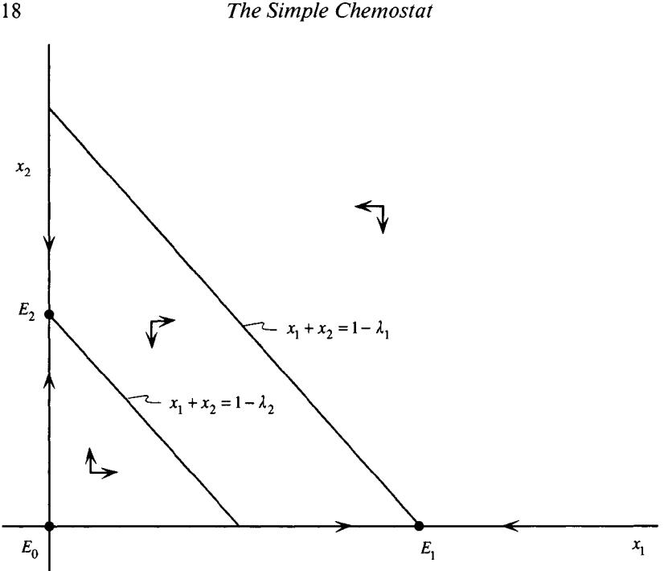

Figure 5.1. The phase plane diagram for the system (5.2).

- M+(Eo) = )(E, x1, x2) I x, = 0, i = 1, 2), M+(E2)=1(E,0,x2)Ix2>O,x2+E<_1).
Let p = x(0) be an arbitrary initial point with x;(0) > 0. Then the initial data do not belong to either stable manifold. Hence w(p) is not equal to either Eo or E2, but it does lie on E = 0. Since it is invariant and since every solution of (5.2) on E = 0 converges to an equilibrium, w(p) contains an equilibrium. By the Butler-McGehee theorem, Eo e w(p) since M+(Eo) is unbounded. If w(p) contains E2, then w(p) also contains either Eo or an unbounded orbit, again by the Butler-McGehee theorem (see Figure 5.2). Since this is impossible, El must be in co(p). However, El is a local attractor, so w(p) = El. This completes the proof.

If A = A2 then it is not difficult to show that coexistence is possible. This is a "knife-edge" effect - exactly balanced parameters - and cannot be expected to be found in nature.

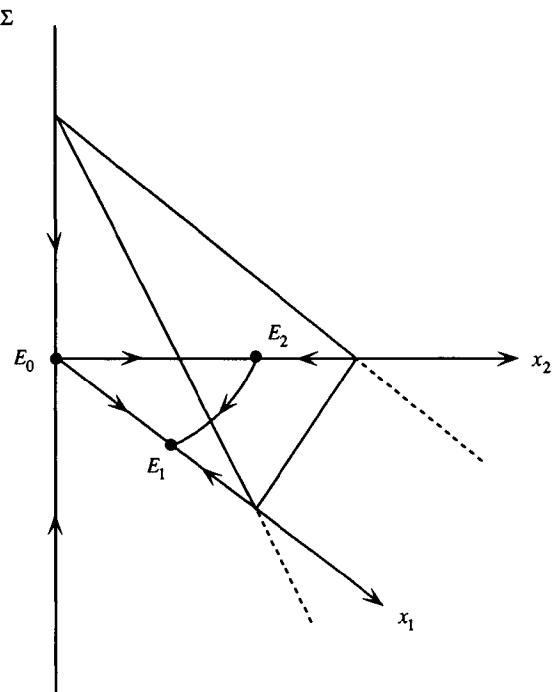

Figure 5.2. The phase space for the system (5.1).

### 6. The Experiments

The experiments of Hansen and Hubbell [HH] confirm the mathematical result. By working with various microorganisms, Hansen and Hubbell showed that it is the lambda value which determines the outcome of the competition. It is worth noting that this was an example of the mathematics preceding the definitive biological experiment on this type of competition. Although the experiments may be described by a couple of paragraphs, one should not conclude that such experiments were easy. Microbial experiments are always fraught with difficulties. The "proper" organisms and limiting nutrient must be selected so that they can grow under the circumstances where the chemostat is operated. The chemostat must be operated at a turnover rate (washout rate) that allows no growth on the cell walls and no buildup of metabolic products. The feed bottle must not contain substances from whose molecules the organisms can synthesize the limiting nutrient. If the organism mutates during the experiment,

the experiment is invalid, so careful checks are run at the end to determine that what is grown is actually what was introduced into the culture vessel. The list could continue.

To motivate the form of the experiments, note first that two parameters are properties of the organism: the m and the a of the chemostat equations. One might postulate that the competitor with the largest m or the one with the smallest a should win the competition. Recall that m is the maximal growth rate and that a (the Michaelis-Menten constant) represents the half-saturation concentration (and so is an indicator of how well an organism thrives at low concentrations). Both of these quantities are obtainable in the laboratory by growing the organism (without a competitor) on the nutrient. (Hansen and Hubbell used a Lineweaver-Burk plot.)

Three experiments were carried out (each reproduced three times) with these postulates in mind. In the first experiment, the organism with the larger m had the smaller lambda value. In the second, the organism with the smaller Michaelis-Menten constant had the larger lambda value. In both cases, the organism with the smaller lambda value won the competition as predicted by the theorem. Finally, organisms with differing m and a values but with (approximately) the same lambda value were shown to coexist (for a reasonably long time).

We reproduce here one table (as Table 6.1) and four graphs (as Figure 6.1) from [HH]. The table shows the organisms used, their parameters, and the run parameters for the chemostat. The limiting nutrient was tryptophan. Hansen and Hubbell used different notation than that presented here, so one should translate as follows: r = m - D, J = A, K = a, µ = m, and So = 5(0). The graphs show the predicted time course (with the unscaled variables) in dashed lines and the experimental values with dots connected by solid lines.

An interesting part of the technique was the way in which the equal lambdas were obtained. One strain of E. coli had a growth rate that was inhibited by a chemical (Nalidixic acid) while the other strain was essentially immune to the compound (see the third graph in Figure 6.1). By adding the proper amount of the chemical, it was possible to alter the growth rate so as to make the resulting lambda values equal. The chemostat with an inhibitor will be studied in Chapter 4.

### 7. Discussion

Theorem 5.1 is an example of the principle of competitive exclusion: only one competitor can survive on a single resource. Many of the well-known

| Table 6.1 |  |  |  |
|-----------|--|--|--|
|-----------|--|--|--|

| Bacterial<br>strain            | Yield                    | Ks                       | It            | r             |                               |                 |                    |                    |
|--------------------------------|--------------------------|--------------------------|---------------|---------------|-------------------------------|-----------------|--------------------|--------------------|
|                                | (cell/g)                 | (g/liter)                | (per<br>hour) | (per<br>hour) | J<br>(g/liter)                | S°<br>(g/liter) | D<br>(per<br>hour) | Vol<br>ume<br>(ml) |
| C-8'<br>PAO283b                | 2.5x1010<br>3.8x1010     | 3.0x10-6<br>3.1x10-4     | 0.81<br>0.91  | 0.75<br>0.85  | 2.40x10'<br>2.19x10-'         | 1x10-4          | 6.0x10-2           | 200                |
| C-8 nal'specs<br>C-8 nalsspec' | 6.3 x 1010<br>6.2 x 1010 | 1.6 x 10-6<br>1.6 x 10-6 | 0.68<br>0.96  | 0.61<br>0.89  | 1.98 X 10-'<br>1.35 x<br>10-7 | 5 X 10-6        | 7.5 x 10-2         | 200                |
| C-8 nal'specs<br>C-8 nalsspec' | 6.3 x 1010<br>6.2 x 1010 | 1.6 x 10-6<br>0.9 x 10-6 | 0.68<br>0.41  | 0.61<br>0.34  | 1.98 x 10-'<br>1.99 x 10-'    | 5 x 10-6        | 7.5 x 10-2         | 200                |
|                                |                          |                          |               |               |                               |                 |                    |                    |

a Escherichia coli. b Pseudomonas aeruginosa. INalidixic acid added (0.5 µg/ml).

Source: [HH, p. 1491], Copyright 1980, American Association for the Advancement of Science. Reproduced by permission.

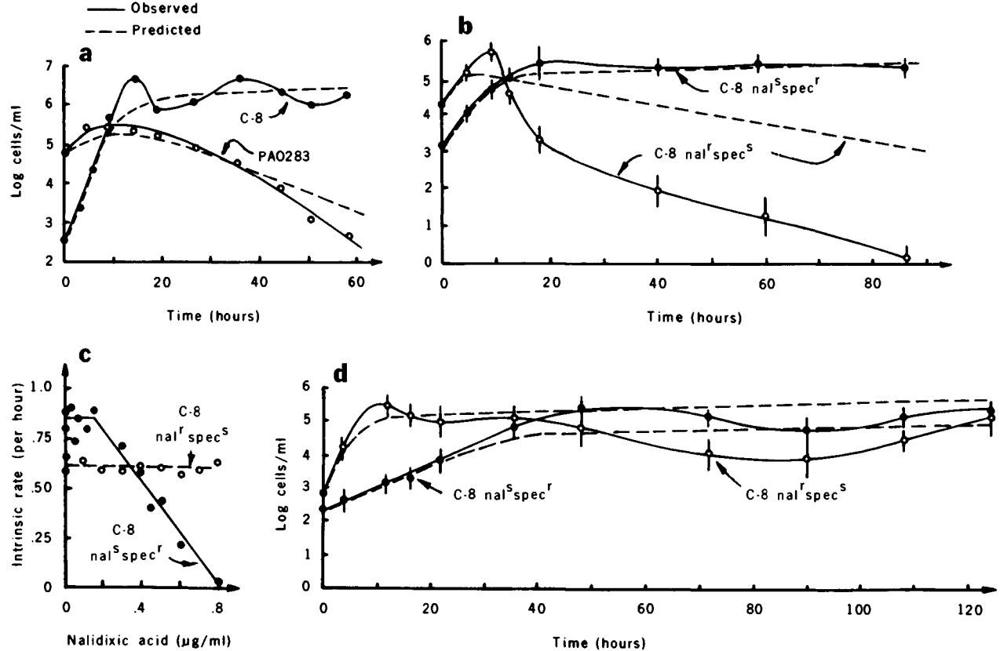

models of competitive systems seem to satisfy this conclusion - for example, the two-dimensional Lotka-Volterra competition model. In the discussion to follow, it is helpful to consider the unscaled version of the system (5.1) (see (2.1) and (2.2) for the unscaled equations (ignoring yield constants) of single population growth):

$$\begin{aligned} S' &= (S^{(0)} - S)D - \frac{m_1 S \chi_1}{a_1 + S} - \frac{m_2 S \chi_2}{a_2 + S}, \\\ \chi_1' &= \chi_1' \left(\frac{m_1 S}{a_1 + S} - D\right), \\\ \chi_2' &= \chi_2' \left(\frac{m_2 S}{a_2 + S} - D\right), \end{aligned} \tag{7.1}$$
 
$$S(0) \ge 0, \ \chi_1(0) > 0, \ \chi_2(0) > 0.$$

Three Michaelis-Menten functions are shown in Figure 7.1, where

$$f_{\vec{i}}(S) = \frac{m_{\vec{i}}S}{a_{\vec{i}} + S}.$$

Theorem 5.1 asserts that if the equations f (S) = D have unique positive solutions S = A, (i = 1, 2) and if 0 < Al < A2 < 5101, then the population x1 is the winner of the competition; it eliminates population x2 from the chemostat. It follows that if, as in Figure 7.1a, one function dominates the other for all positive values of S (or at least for 0 < S < 5(0)), then the corresponding population should win the competition. For there to be any hope of coexistence, the two functions must cross before S = 510). Denote by S* the point where the functions cross. If S* < 5(O), let D* = f (S*). If the dilution rate D is set equal to D*, then Al = A2 = S* (see Figure 7.1b) and coexistence is possible.

Caption for Figure 6.1

a Experiment 1: Strains differ principally in their half-saturation constants for tryptophan, and PA0283 loses to C-8 as predicted. b Experiment 2: Strains differ in their intrinsic rate of increase but not in their half-saturation constants, and C-8 nalrspecs loses to C-8 nalsspecr as predicted. c Effect of naladixic acid on the intrinsic rate of increase of strains C-8 nal'specs and C-8 nalsspecr. d Experiment 3: Strains differ in the half-saturation constants and in their intrinsic rates of increase, but nevertheless have identical J parameters; the strains coexisted for the duration of the experiment, as predicted. In each experiment, the predicted curves were obtained by numerical integration. Bars around points in experiments 2 and 3 indicate ranges of three replicate values. (From [HH, p. 1492], Copyright 1980, American Association for the Advancement of Science. Reproduced by permission.)

24 The Simple Chemostat

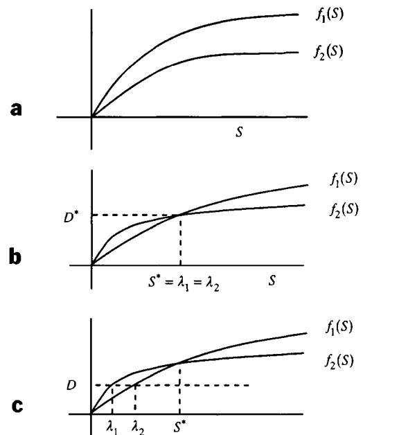

Figure 7.1. Example of Monod-type uptake (or growth) functions: a fl(S) dominates f2(S) for all values of S, and competitive exclusion holds; b f,(S) and f2(S) cross exactly at the value of D, producing coexistence, the knife-edge phenomenon; c fl(S) and f2(S) cross, and competitive exclusion holds.

In the coexistence case there is a line segment of rest points joining E, to E2, each of which can be shown to be stable (but not asymptotically stable), and each (except E, and E2) representing a coexistence rest point. As noted earlier, this occurrence is a knife-edge phenomenon in the sense that it requires exact equality, D = D*. If D < D* then the population whose growth function dominates in the region 0 < S < S* is the winner, whereas if D > D* then the population whose growth function dominates in the region S* < S < S(0) is the winner.

Although this equality was arranged artificially in the experiments of Hansen and Hubbell, it is (as noted previously) extremely unlikely to occur in nature. Since S(t) does not oscillate, if one of the f,,s passes through D first (i.e., has D in its range for a lower value of S) then the limiting value of S will fall there, and the corresponding population wins the competition; see Figure 7.1c. Intuitively, if the nutrient equilibrated at a higher value then the first population (the one with the lowest A) would continue to grow without limit (since x((t) > 0 for such S), consuming nutrient and driving its value lower.

From a mathematical point of view, the knife-edge phenomenon is structurally unstable in the sense that a small perturbation of the equations, accounting for some higher-order effect ignored in the original modeling, can be expected to "smooth out" the abrupt transition at D = D* and change the qualitative structure of the solution set. Instead of a line segment of rest points joining E1 to E2, the rest point E1 could split, at a value D = D1 = D*, into two rest points (the same E1 and EE in the interior) - a bifurcation phenomenon. A new rest point appears as D exceeds D1. The new rest point could be either asymptotically stable or unstable. If it is asymptotically stable, then for D close to D1 the coordinates of EE would be close to those of El; population 1 would dominate but not exclude population 2. As D is increased, the new rest point could persist as an isolated rest point, moving toward E2 as D increases toward a value D = D2. As D nears D2 this rest point would coalesce with E2 so that, for D < D2, population 2 would dominate in the chemostat but not exclude population 1. If the new rest point were a saddle, then it would lie on the boundary of the basin of attraction of the two stable rest points El and E2. The winner of the competition would depend on the initial values, on the way the chemostat was originally charged. One would anticipate that the "window" of existence of the new rest point, the interval D1 < D < D2 of dilution rates, would have size D2-D1 of the same order as the size of the perturbation in the model equations. If this perturbation were small then fine tuning of the chemostat would be required in order to observe it. Coexistence would be theoretically possible but difficult to observe.

The very careful experiments of Hansen and Hubbell described in the previous section seem to confirm the knife-edge effect within the accuracy of experimental technique. Where then is the perturbation? Baltzis and Fredrickson [BFr] consider the case where one population is capable of attaching itself to the wall of the chemostat and so escapes the model's implications (the dilution process does not affect the cells attached to the wall). The wall is a refuge. This is a real, practical problem in the operation of the chemostat, one that frequently affects the allowable dilution rates. (When the turnover is too slow, wall growth is a problem.) Another possibility is that there is a small perturbation due to mutual interference between the two populations. A mass action term -ex1x2 in one of the equations would remove the instability. Neither of these situations meets the basic "conservation" principle of the chemostat. G. E. Powell [Po] studies the problem quite generally and considers the case where there is an additional substitutable nutrient, which he calls P. Powell includes a term eg1(P) in the equations of growth of the competitors, along with the

constant input of the substance P. Although the two-nutrient problem does have the conservation property, it is a totally different phenomenon. An alternate nutrient is not likely in a carefully controlled laboratory experiment but certainly is reasonable in nature, where the organism may be able to synthesize the molecules it needs from many sources.

All of these objections to purely exploitative competition are valid, at least in some settings. However, the types of deviation from purely exploitative assumptions are very diverse, and no single general model is likely to cover all cases and to yield both mathematical results and experimental confirmation. As noted in the Preface, it is the view in this work that studying the chemostat is much like studying the pendulum in physics; the precise assumptions for the pendulum model are not met, but there is much to be learned about oscillations by studying it. Similarly, there is much to be learned about competition by studying it in this simple form. Moreover, like the pendulum in physics, the assumptions are close enough to reality that experiments are meaningful.

In nature, many populations do seem to coexist together, ostensibly on the same resource. It becomes then an interesting problem to modify the chemostat model, taking into account some new aspect that will produce coexistence without destroying the basic assumptions of the chemostat. It is important to note that in doing so we are modeling different phenomena, not introducing small perturbations in the old model. In the following material, modifications that might be expected to produce coexistence are discussed. The modifications add something to the model to take into account some new facet that might be found in nature, while retaining the purely exploitative competition of the chemostat. The modifications lead to mathematically interesting difficulties that require a wide variety of techniques to resolve. The new models also introduce a number of new modeling and mathematical questions whose answers would be of some interest.

The chemostat model could be modified as follows:

- (1) introduce more competitors;
- (2) modify the functional response (remove the Michaelis-Menten assumption);
- (3) introduce an additional trophic level;
- (4) introduce inhibitors to growth;
- (5) remove the "well stirred" hypothesis (provide for a nutrient gradient);
- (6) remove the constant-yield hypothesis;
- (7) make either the nutrient concentration or the washout rate timedependent (to introduce seasonal variations);
- (8) allow cell size to be a factor;
- (9) allow additional limiting nutrients.

Items (1)-(8) will be discussed in considerable detail in the chapters that follow. Item (9) is a vast subject with many open questions, and the analysis is much more difficult. It is not discussed here; see [BaWo; BWo2; HCH; HsH; LeT; Po; Ti] for more information.

The General Chemostat

### 1. Introduction

In the previous chapter it was shown that the simple chemostat produces competitive exclusion. It could be argued that the result was due to the two-dimensional nature of the limiting problem (and the applicability of the Poincare-Bendixson theorem) or that this was a result of the particular type of dynamics produced by the Michaelis-Menten hypothesis on the functional response. This last point was the focus of some controversy at one time, inducing the proposal of alternative responses. In this chapter it will be shown that neither additional populations nor the replacement of the Michaelis-Menten hypothesis by a monotone (or even nonmonotone) uptake function is sufficient to produce coexistence of the competitors in a chemostat. This illustrates the robustness of the results of Chapter 1. It will also be shown that the introduction of differing "death rates" (replacing the parameter D by D, in the equations) does not change the competitive exclusion result.

A brief mathematical digression on Liapunov stability theory will set the stage for the results of this chapter. Those familiar with the LaSalle corollary to Liapunov stability theory, also called the "invariance principle" by some authors, can skip immediately to Section 3.

### 2. Liapunov Theory

A more sophisticated mathematical approach is required for the results of this chapter because the equations considered cannot be reduced to planar systems. The theorem described in this section and used throughout this chapter is one of great power. When applied to a particular system of differential equations, it generally provides an elegant, simple,

and complete global description of the dynamics. In order to apply the theorem, one must find a function that decreases along trajectories of the given system. Herein lies the difficulty in applying the theorem - there are no general methods for finding such functions. Considerable ingenuity is usually required.

Consider the system of differential equations

$$
\boldsymbol{\alpha}' = \boldsymbol{f}(\boldsymbol{\lambda}), \tag{2.1}
$$

where f is continuously differentiable on some open subset of R". Let G* be closed and positively invariant for (2.1). A function V is called a Liapunov function for (2.1) on a set G C G* if

- (i) V is continuously differentiable on G;
- (ii) for each xe G, the closure of G, the limit

```
lim V(x) X-.X XeG
```
exists as either a real number or +co; and

(iii)

V is a Liapunov function for (2.1) on G, then we extend the domain of V to G by defining V at xE G to be the limiting value of V(y) as y approaches x with y e G. At points x0 E G where V(xo) < oo but where x0 does not belong to G, we define V(xo) = I'M suph - o+ h -1 [V(x(h)) - V(xo)] where x(t) is the solution of (2.1) satisfying x(O) = x0. Set

$$E = (\times \in \bar{G} \colon \mathcal{V}(\times) < \infty \text{ and } \dot{\mathcal{V}}(\times) = 0)$$

and let M be the largest invariant set for (2.1) in E. Notice that if x(t) is a solution of (2.1) in G then

$$\frac{d}{dt}V(\mathbf{x}(t)) = \nabla V(\mathbf{x}(t)) \cdot \mathbf{x}'(t) = \nabla V(\mathbf{x}(t)) \cdot f(\mathbf{x}(t)) \le 0 \tag{2.2}$$

by the chain rule and (iii), so that V(x(t)) is nonincreasing along solutions of (2.1).

The following theorem is a minor variation of the LaSalle corollary of Liapunov stability theory, taken from [WLu] (see also [H2], where V is required to be continuous on the closure of G). It also holds under less restrictive hypotheses than are required here.

THEOREM (LaSalle corollary). Assume that V is a Liapunov function for (2.1) on G and let y+ = Ix(t ): t >: 0] be a bounded orbit of (2.1) belonging to G. Then the omega limit set of y+ belongs to M.

Proof. By (2.2), V(x(t)) is nonincreasing so limt.. V(x(t)) = c exists. Our hypotheses ensure that c is finite and that V = c on the omega limit set co of -y+. Clearly, V = 0 on co, so w is contained in M since it is an invariant subset of E.

For the reader unfamiliar with Liapunov theory, the intuition goes like this: V is some sort of measure of "height." The magnitude of dV/dt = VV f <- 0 is a measure of how fast solutions run "downhill." The downhill slide stops at E. The theory of dynamical systems says that the omega limit set is invariant and therefore contained in M.

### 3. General Monotone Response and Many Competitors

The equations describing competition between n competitors having concentrations x1(t), x2(t), ..., xn(t) for growth-limiting nutrient S(t) in a chemostat are a straightforward generalization of equations (2.1) and (2.2) of Chapter 1. Replacing the Michaelis-Menten response function by general monotone response functions f (S) for the ith competitor, 1 < i <- n (precise hypotheses on these functions will be described shortly), one obtains the system

$$\begin{aligned} S' &= D(S^{(0)} - S) - \sum_{i=1}^{\pi} f_i(S) \frac{\chi_i}{\gamma_i}, \\ \chi_i' &= \chi_i(f_i(S) - D), \\ i &= 1, 2, \dots, n, \end{aligned}$$

with S(0) >- 0 and x,(0) > 0.

By measuring S and x;/-y1 in units of S(0) and time in units of D-', one obtains the nondimensional system

$$\begin{aligned} S' &= 1 - S - \sum_{i=1}^{n} \chi_i f_i(S), \\ \chi_i' &= \chi_i(f_i(S) - 1), \\ i &= 1, 2, \dots, n. \end{aligned} \tag{3.1}$$

(Actually, f (S) in (3.1) should really be D-'f (S (0'S), but we rename the latter to be the former.) Assume that the f satisfy the following:

- (i) f,: fR+-+R+;
- (ii) f,,(0) = 0;
- (iii) f(u)<f(v)if u<v;and
- (iv) f, is continuously differentiable.

These assumptions are really quite mild; the f need only be increasing and sufficiently smooth. It is not even required that f be bounded on 118+. From a biological perspective, of course, the model loses relevance for really large values of S. In addition to the Monod functions, other functions that have been suggested include the exponential kinetics m(1-exp(-S log 2/a)), hyperbolic kinetics m tanh(S log 3/2a), and piecewise linear kinetics given by mS/2a for S < 2a and by m for S > 2a. The piecewise linear kinetics fails to satisfy the strict monotonocity of (iii) and fails to satisfy (iv) at one point, but these assumptions could be weakened so as to include this case.

Let Ai be the unique solution of f(S) = 1 if one exists; otherwise let Ai = +oo. We assume the equations are numbered such that

$$0 < \lambda_1 < \lambda_2 \le \cdots \le \lambda_n \le \infty.$$

This assures that competitor x1 has the least requirements for growth and therefore is favored to win the competition.

As in Chapter 1, set

$$\Sigma = \mathcal{S} + \sum_{j=1}^{n} \chi_j - 1$$

and observe that in the variables E, x1, x2, ..., xn, (3.1) takes the form

$$\begin{aligned} \Sigma' &= -\Sigma, \\ \chi_i' &= \chi_i \left( f_i \left( 1 + \Sigma - \sum_{j=1}^n \chi_j \right) - 1 \right), \\ i &= 1, 2, \dots, n. \end{aligned} \tag{3.2}$$

Obviously,

lim,_0E(t)=0,

and so it follows that solutions of (3.1) and (3.2) exist and are bounded for t ? 0. Both S(t) and xi(t) remain nonnegative from the form of (3.1). Again, as in Chapter 1, we are led to consider the system (3.2) restricted to the invariant hyperplane E = 0, to which all solutions are attracted at an exponential rate. This system is given by

$$\begin{aligned} \chi_i &= \chi_i \left( f_i \left( 1 - \sum_{j=1}^n \chi_j \right) - 1 \right), \\ i &= 1, 2, \dots, n. \end{aligned} \tag{3.3}$$

The relevant domain for (3.3) is the set

32 The General Chemostat

$$\mathfrak{Q} = \left\{ \mathbf{x} \in \mathbb{R}_+^n \colon \sum_{j=1}^n \mathbf{x}_j \le 1 \right\}.$$

It is easily seen that Sl is positively invariant for (3.3); indeed, the vector field (3.3) points into the interior of 12 on that part of its boundary where Ej=1 xj = 1. To see this, observe that if x(0) lies on this component of the boundary of S2 then

$$\left. \frac{d}{dt} \right|_{t=0} \left( \sum_{j=1}^{n} \chi_j(t) \right) = -1 < 0,$$

so Eij=lxj(t)<1 fort>0.

A competitor x; for which A; >- 1 is an inadequate competitor, since its break-even concentration equals or exceeds the reservoir concentration of nutrient. Our first result makes this mathematically precise.

PROPOSITION 3.1. If A; ? 1 for some i, then lim,-. xi(t) = 0.

Proof. Define V(x(t)) = x;(t) and observe that

$$\dot{V}(\boldsymbol{\chi}) = \chi_i \left( f_i \left( 1 - \sum_{j=1}^n \boldsymbol{\chi}_j \right) - 1 \right) \le \chi_i (f_i(1) - 1) \le 0$$

in G = S2. If A; > 1 then E= (xe S2: 1''(x) =01 _ [xe S2: x; = 0}, whereas if A; = 1 then E = ( x e 9: x; = 0 or Ej=1 xj = 1 1. As the vector field (3.3) points into the interior of S2 on Ej=1 xj = 1, it follows that the largest invariant set M in E is equal to I x E 0: x; = 0 ). By the LaSalle corollary, x(t) -*M as t oo, so the assertion of the proposition holds.

Now consider the case that the favored competitor x1 is an adequate one; that is, suppose 0 < Al < 1. Let

$$E_1 = (1 - \lambda_1, 0, 0, \dots, 0)$$

be the rest point corresponding to the survival of only species x1. System (3.3) may have other rest points besides E0 = 0 and E1 in S2 if 0 < Aj < 1 for some j >: 2, but the following analysis does not require their consideration.

Our main result here states that competitive exclusion holds for n competitors in a chemostat provided each competitor possesses a monotone uptake function. The proof follows [AM].

THEOREM 3.2. Let x(t) be a solution of (3.3) in J for which x1(0) > 0. Then

$$\lim_{t \to \infty} \chi(t) = E_1.$$

Proof. DefineO=(xeS2:Ejxj=1-Ai1,63=(xeS2:Ejxj<1-A11,and C = (x e S2 : E j xj > 1- A11. It will be shown that a solution starting in e either remains in C and converges to E1 or enters 63 and remains there. Once in (B, we show that the solution converges to E1i completing the proof.

First, observe that

$$\left(\left(\sum_{j=1}^n x_j\right)' = \sum_{j=1}^n x_j \left(f_j \left(1 - \sum_k x_k\right) - 1\right) < 0$$

for xe (CUa)\E1 by the monotonicity of the fj and the fact that

$$1 - \sum_{k=1}^{n} \lambda_k \le \lambda_1.$$

It follows immediately that if x(t) e L\EI for some t then x(s) e 63 for s > t. In particular, once a solution enters 63, it can never get out.

Suppose the solution x(t) remains in C for all t > 0. The previous calculation shows that if V(x) = E,=1 xj in C then V(x) < 0. It is easy to see that V(x) = 0 for x e G U A if and only if x = E1. By the LaSalle corollary with G* = 9 and G = C, any solution remaining in C for t >- 0 converges to E1.

It suffices to consider a solution x(t) of (3.3) which belongs to 63 for t ? 0 and for which x1(0/) > 0. For such a solution,

$$
\lambda \chi_1'(t) = \chi_1(t) \left( f_1 \left( 1 - \sum_{j=1}^n \chi_j(t) \right) - 1 \right) > \chi_1(t) (f_1(\lambda_1) - 1) = 0,
$$

so 1im,.c x1(t) exists and exceeds x1(0) > 0. Obviously, if V(x) = -xl in 63 then V(x) < 0. Further, V(x) = 0 for xe 63UA if and only if either x c -A or x e 63 and x1 = 0. By the LaSalle corollary, the solution x(t) converges to the largest invariant set in (xe 63U0: V(x) = 01. For our solution, obviously w(x(0)) C 0 since x1 increases along x(t ). The only invariant subset of 0 is E1, so necessarily x(t) -> E1 as t co. This completes the proof.

We hope the reader will appreciate the elegance and simplicity of the arguments supporting Theorem 3.2, which are based on the LaSalle corollary. In particular, a linearized stability analysis about each of the rest points of (3.3), required in Chapter 1, was completely avoided. A careful reading of the proof of Theorem 3.2 reveals that assumption (iii) on f,, is not crucial to the proof; we will have more to say about this later. Finally, it should be noted that the assumption (iv) on f can be relaxed somewhat. It can be weakened to requiring only that f be locally Lipschitz continuous

(e.g., piecewise continuously differentiable), since all that is really required for Theorem 3.2 and Proposition 3.1 is that solutions of initial value problems be unique. However, in order to use Theorem F.1 of Appendix F to relate the dynamics of (3.3) to that of (3.1), it must be assumed that f is continuously differentiable.

The results of this section have shown that neither the assumption of Michaelis-Menten functional response nor the assumption of only two competitors is essential for the main results of Chapter 1 to hold. In much of what follows we retain the Michaelis-Menten kinetics, since the parameters are readily measurable in the laboratory.

### 4. Different Removal Rates

Another question that can be raised concerns the validity of our assumption that all of the removal is accounted for by the washout term. If, for example, a competitor's mortality rate is a significant fraction of the washout rate D, then the assumption is not valid. In this case, the removal rate for that competitor should be the sum of D and the mortality rate. Another possibility is that a filter on the output might slow the washout of an organism but not the nutrient. This could result in that organism's removal rate being less than D. A natural question, then, is whether a species-specific removal rate changes the outcome.

This question was studied by Hsu [Hsul] in the chemostat with Michaelis-Menten dynamics, and his work is presented here. The equations take the form (ignoring the yield constants)

$$\mathcal{S}' = (\mathcal{S}^{(0)} - \mathcal{S})D - \sum_{i=1}^{n} \frac{m_i \mathcal{S} \mathbf{x}_i}{a_i + \mathcal{S}},$$

$$\boldsymbol{\chi}'_i = \boldsymbol{\chi}_i \left(\frac{m_i \mathcal{S}}{a_i + \mathcal{S}} - \bar{D}_i\right),$$

$$i = 1, 2, \dots, n,$$

with S(O) > 0 and x,(0) > 0. Scaling by D and 5(0) as before yields the normalized equations

$$\begin{aligned} \mathbf{S'} &= 1 - \mathbf{S} - \sum_{i=1}^{n} \frac{m_i \mathbf{S} \mathbf{x}_i}{a_i + \mathbf{S}}, \\ \mathbf{x}_i' &= \mathbf{x}_i \Big( \frac{m_i \mathbf{S}}{a_i + \mathbf{S}} - D_i \Big), \\ &i = 1, 2, \dots, n, \end{aligned} \tag{4.1}$$

where D; = D;/D. The corresponding As are defined as in Chapter 1 by

$$
\lambda_i = \frac{a_i D_i}{m_i - D_i},
$$

where it is assumed that mi > Di if Ai is to be defined. Exactly as in Chapter 1, if mi < Di or if Ai ? 1 then 1im,- . xi(t) = 0; in this case, the entire system merely tends to a lower-order dynamical system, that is, one with fewer competitors. This statement provides necessary conditions for survivability, and one need only consider competitors that satisfy m; > Di andAi<1.

The mathematical difficulties in treating (4.1) are immediately apparent the conservation principle is lost, and the equations cannot be combined to eliminate one of the variables. Enough of the analysis survives, however, to at least show that (4.1) is dissipative. Adding the equations and replacing Di by d = min(D,, D2,..., D,,,11 yields a differential inequality for >G = S+ Z,%, xi of the form

$$
\psi' \le 1 - d\psi.
$$

If u(t) is the solution of u'=1-du satisfying u(0) then it follows by comparison that

$$S(t) + \sum_{i=1}^{n} \chi_i(t) \le \mu(t).$$

As lim, -. u(t) = d -', we may conclude that

$$\limsup_{t \to \infty} \left[ \mathcal{S}(\ell) + \sum_{i=1}^{n} \chi_i(\ell) \right] \le d^{-1}.$$

In other words, (4.1) is dissipative. Unfortunately, this argument does not show that S+E;'=1 x; has a limiting value, which would allow the reduction of (4.1) to a lower-dimensional system. This means that we are forced to deal with the full system (4.1).

The principal result is the following.

THEOREM 4.1. Suppose that

$$0 < \lambda_1 < \lambda_2 \le \lambda_3 \le \cdots \le \lambda_n$$

and A, < 1. Then

$$\lim_{t \to \infty} \chi_1(t) = (1 - \lambda_1) / D_1$$

and

$$\lim_{l \to \infty} x_i(t) = 0, \quad i = 2, 3, \dots, n.$$

Proof. On the set G= {(S, x1, ..., xn) e f1 ': S > 0,x1 >01, define

$$\begin{aligned} \mathcal{V}(S, \boldsymbol{\chi}_{1}, \dots, \boldsymbol{\chi}_{n}) &= S - \lambda_{1} - \lambda_{1} \log \left[ \frac{S}{\lambda_{1}} \right] \\ &+ c_{1} \Big[ \boldsymbol{\chi}_{1} - \boldsymbol{\chi}_{1}^{\star} - \boldsymbol{\chi}_{1}^{\star} \log \left[ \frac{\boldsymbol{\chi}_{1}}{\boldsymbol{\chi}_{1}^{\star}} \right] \Big] + \sum_{i=2}^{n} c_{i} \boldsymbol{\chi}_{i}, \end{aligned}$$

where xi = (1-A1)/D1 and ci = mi/(mi -D). Then it follows that in G

$$\begin{aligned} \frac{d}{dt}V(S(t),\boldsymbol{x}_{1}(t),\ldots,\boldsymbol{x}_{n}(t)) &= \nabla V \cdot (S',\boldsymbol{x}_{1}^{\prime},\ldots,\boldsymbol{x}_{n}^{\prime})^{T} \\ &= \begin{bmatrix} 1 - \frac{\lambda_{1}}{S} \\\\ c_{1} \left[1 - \frac{\boldsymbol{x}_{1}^{\prime}}{\lambda_{1}}\right] \\\\ c_{2} \\\\ \vdots \\\\ c_{n} \end{bmatrix} \cdot \begin{bmatrix} 1 - S - \sum_{1}^{n} \frac{m_{1}\boldsymbol{x}_{1}S}{a_{1} + S} \\\\ \frac{m_{1} - D_{1}}{a_{1} + S} (S - \lambda_{1})\boldsymbol{x}_{1} \\\ \frac{m_{2} - D_{2}}{a_{2} + S} (S - \lambda_{2})\boldsymbol{x}_{2} \\\ \vdots \\\ \frac{m_{n} - D_{n}}{a_{n} + S} (S - \lambda_{n})\boldsymbol{x}_{n} \\\ \frac{m_{n} - D_{n}}{a_{n} + S} (S - \lambda_{n})\boldsymbol{x}_{n} \end{bmatrix} \\ &= (S - \lambda_{1}) \left[\frac{1 - S}{S} - \frac{m_{1}\boldsymbol{x}_{1}^{\prime}}{a_{1} + S}\right] + \sum_{2} (\lambda_{1} - \lambda_{2}) \frac{m_{1}\boldsymbol{x}_{1}}{a_{1} + S}. \end{aligned}$$

The term xi may be rewritten as

$$
\lambda x_1^* = \frac{1 - \lambda_1}{D_1} = \frac{(1 - \lambda_1)(a_1 + \lambda_1)}{m_1 \lambda_1},
$$

so that the term

$$\frac{1-S}{S} - \frac{m_{\parallel}\chi_{\parallel}^{\star}}{a_{\parallel}+S}$$

may be simplified to

$$-\frac{a_{\parallel}(S-\lambda_{\parallel})}{\lambda_{\perp}S(a_{\parallel}+S)}.$$

This in turn may be substituted into the expression for dV/dt to obtain

$$\frac{d\boldsymbol{V}}{dt} = -\frac{(\boldsymbol{S} - \boldsymbol{\lambda}_{\mathrm{l}})^2 a_{\mathrm{l}}}{(a_{\mathrm{l}} + \boldsymbol{S})\boldsymbol{S}\boldsymbol{\lambda}_{\mathrm{l}}} + \sum_{2}^{n} m_{i} (\boldsymbol{\lambda}_{\mathrm{l}} - \boldsymbol{\lambda}_{\mathrm{i}}) \frac{\boldsymbol{\chi}_{\mathrm{i}}}{a_{\mathrm{i}} + \boldsymbol{S}} \le \mathbf{0},$$

since 0 < Al < Ai (i >: 2) and S > 0. The set

$$E = \left\{ (\mathbf{S}, \mathbf{x}_1, \dots, \mathbf{x}_n) \, | \, d\mathcal{V} \forall dt = 0 \right\}$$

is given by

$$E = \langle (\lambda_1, \ge_1, 0, \dots, 0) \colon \ge_1 > 0 \rangle.$$

Since A, < 1, the only invariant set in E is

$$\begin{aligned} \mathbf{S} &= \lambda_1, \\ \mathbf{x}_1 &= (1 - \lambda_1) / D_1, \\ \mathbf{x}_i &= 0, \ i = 2, \dots, n. \end{aligned}$$

An application of the LaSalle corollary yields the desired result.

The biological conclusion is, of course, that differing removal rates do not alter competitive exclusion in the chemostat. One anticipates that a similar conclusion is true if the Michaelis-Menten dynamics is replaced by the general monotone term f (S) used in Section 3. However, the Liapunov calculations depend on this form and the general question is still unresolved.

The reader will have noticed that the Liapunov function used in the proof of the theorem was not obvious on either biological or mathematical grounds. Its discovery by Hsu greatly simplified and extended earlier arguments given in [HHW ]. This is typical of applications of the LaSalle corollary. Considerable ingenuity, intuition, and perhaps luck are required to find a Liapunov function.

### 5. Nonmonotone Uptake Functions

It has been shown that competitive exclusion - that is, the extinction of all but one competitor - holds regardless of the number of competitors or the specific monotone functional response. If one restricts attention to the Michaelis-Menten functional response, then competitive exclusion has been shown even in the case of population-specific removal rates.

There is evidence, however, that a monotone functional response may be inappropriate in some cases. A nutrient which is essential at low concentrations may be inhibiting (or, indeed, even toxic) at higher concentrations. Butler and Wolkowicz [BWo1] consider this possibility; their work has been recently extended in [WuL]. We will describe some special cases of their work in terms of the unscaled system immediately preceding (3.1). Assume that the functional response f satisfies (i), (ii), and (iv) of Section 3, but replace the strict monotonicity assumption (iii) by

- (iii') there exist unique, positive, extended real numbers A, and µi with A, < µ, such that
f(S)<D if S e [A,, Nil and f(S)>D if Se(a,,µ,). Furthermore, f'(A,) > 0 if A, < oo and f'(µ,) < 0 if µ, < oo.

The interpretation of (iii') is that species x, increases when A, < S < µ, and decreases if 0:5 S <A, or if µ, < S < oo (if µ, # oo). In particular, if 0 < A, < µ, < oo then x, grows at moderate nutrient concentration (A, < S < µ) and declines at low concentration (S < A,) and at high concentration (S > µ,). See Figure 5.1 for examples. If (iii) holds, then (iii') holds where A, is defined as in Section 3 and µ, _ +oo. Consequently (iii') is more general than (iii) of Section 3.

A further assumption of a generic character is that all the finite A, and µ, are distinct from each other and from 5101.

Assume the equations are numbered such that

$$0 < \lambda_1 < \lambda_2 < \cdots < \lambda_{\nu} < S^{(0)} < \lambda_j, \quad j = \nu + 1, \ldots, n.$$

The case v = 0 corresponds to 5(0) < A1. If v # 0, set

$$Q = \bigcup_{i=1}^{r} (\lambda_i, \mu_i),$$

where Q is defined to be the empty set if v = 0. Observe that Q depends on both D and S(0), in addition to the f .

It will be convenient to have notation for the equilibrium solutions (S, x1, ..., These are E0 = (S (0), 0, ..., 0), E,, and E,*, where all components of E, (E,*) vanish except for the first and the (i+l)th, which are S = A, (S = µ,) and x, = -y,(S(O) -a,) (x, = -y,(S(O) -µ,)). The equilibrium E, exists for i = 1, 2, ..., v, but E,* exists only if µ, < 5(0) and is unstable if it exists. These are the only equilibria.

The main result in [BWo1] is that every solution converges to one of these equilibria. In particular, since at most one population has a nonzero component at equilibrium, no more than one population can survive. As expected, it is also shown that if 5(0) < Al then E0 is the global attractor. The following result gives sufficient conditions for population x1 to be the winner.

THEOREM [BWo1l. Suppose that Q is a non-empty open interval; that is, suppose Q is a connected set. Then Q = (A1, µj) for some j.

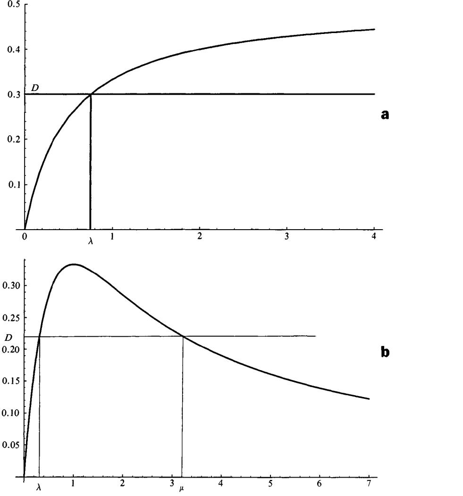

Figure 5.1. a A monotone uptake function, where 0 < A < µ = oo. b A nonmonotone uptake function, where 0 < A < It < oo.

- (i) If Al < 5(0) < µj, then El attracts all solutions with xk(0) > 0.
- (ii) If 5(0) > A j, then E0 and E1 are local attractors, their basins of attraction are non-empty open sets, and the complement of the union of the two basins of attraction has zero Lebesgue measure.

We remark that Q will always be connected in the case where it, = oo. In particular, if f, is monotone increasing then Q is connected.

Case (i) of the theorem corresponds to competitive exclusion: x, is the winner. The second case represents a new phenomenon - namely, the possibility that too much nutrient can lead to the washout of all populations. Both the competitive exclusion outcome (represented by E,) and washout (represented by E°) have significant likelihood; which one occurs depends on the initial conditions. That washout of all populations (including x1) is possible in case (ii), for some set of initial conditions, is not difficult to anticipate. If S(0) > 5(0) then f,,(S)-D < 0 for all i, so all populations decrease initially. If the populations are initially small then they may be washed out of the chemostat before they are able to lower the nutrient concentration to favorable levels.

Interesting possibilities can occur if Q is not connected. Rather than formally stating a theorem, we apply results in [BWol] to a specific example. Consider two populations with growth functions as follows: fl(S) is monotonically increasing to a maximum value M, = f1(S1), whereupon it monotonically decreases. Similarly, f2(S) monotonically increases to its maximum M2 = f2(S2), whereupon it also decreases monotonically. Suppose that f'(S) = 0 only at S = Si and S, < S2, and that f1(S) = f2(S) only at S = 0 and S = S*, where S, < S* < S2. Let D* = f (S*) and assume that f (oo) < D* for i = 1, 2. Figure 5.2 depicts the situation.

If the dilution rate D is slightly smaller than D*, then Q is connected for all values of S(0) since Al < A2 < µ, < µ2. In this case, the theorem applies. If 5(0) < A, then Q is empty and washout occurs. If A, < S(0) < A2 then Q = (A,, µ1) and competitive exclusion holds with x, the winner; if A2 < S(0) then Q = (A1, µ2) and, again, competitive exclusion holds with x, the winner. If µ2 < S(O) then 5(0 Q = (A,, µ2); both competitive exclusion and washout from too much nutrient are possible outcomes.

However, if D is slightly larger than D* then A, < µ, < A2 < 92 and Q is disconnected if either (a) A2 < S(0) < 142 or (b) µ2 < S(O) hold. If (a) holds, then E, and E2 are local attractors and the complement of the union of their basins of attraction has zero Lebesgue measure. In this case, the winner depends on how the chemostat is charged at t = 0 - that is, on the initial conditions. If (b) holds, then E0, E1, E2 are all local attractors and the complement of the union of their basins has zero Lebesgue measure. In this case, washout of all populations, competitive exclusion of x2 by x1, and competitive exclusion of x, by x2 are all possible outcomes, depending on the initial conditions.

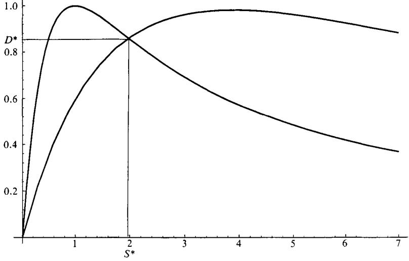

Figure 5.2. Two uptake functions are shown: f,(S) = 3S/(S2+S+1) and f2(S) _ 2.5S/(0.2S2+S+3); f, peaks first, and f,(S*) = f2(S*) = D*.

These results follow directly from general results in [BWol]. The following intriguing (and fictional) scenario is a slight embellishment of one discussed there. Suppose we would like to use one or both of two populations of microorganisms to remove a contaminant (to humans, a nutrient to the organisms) entering our wastewater treatment plant (chemostat). The contaminant serves as a nutrient for both populations; their uptake rates are depicted in Figure 5.2. Suppose further that the dilution rate is slightly larger than D* and that it is beyond our control. The Environmental Protection Agency (EPA) sets the maximum acceptable concentration of the contaminant in the water supply at S = A. The contaminant concentration entering the plant is S = S(O), and

$$
\mu_1 < A < \lambda_2 < S^{(0)} < \mu_2.
$$

We are then in an unfortunate situation. Population x, alone cannot control the contaminant since µ, < S(O), and therefore it may wash out owing to excess nutrient. Population x2 alone cannot control the contaminant because A2 exceeds the EPA acceptable level A. Both populations together cannot be guaranteed to control the contaminant level either, since population x2 could competitively exclude x, and thereby leave the unacceptable level A2 of contaminant in the water. What is needed is another organism,

x3, for which A3 < Al < A2 < µ3. In that case, Q is connected (Q = (A1, µ2) or Q = (A1, µ3)) and S(O) e Q, so xi competitively excludes x2 and x3 and S(t) -> A, < A as t -> oo. In practice, x2 and x3 would need to be continually added to maintain this situation.

Recent work of Wolkowicz and Lu [WLu] extends the results of [BWo1] described here to include, in some cases, the possibility of populationdependent removal rates. However, at the time of this writing it remains an open problem to describe the global behavior of solutions of the equations modeling n competitors in the chemostat, allowing both for speciesspecific removal rates and for not necessarily monotone functional responses (e.g., assuming only (iii')).

### 6. Discussion

In the previous chapter it was shown that exploitative competition for a single nutrient by two competitors, each with Michaelis-Menten uptake functions, results in the elimination of one competitor; that is, competitive exclusion holds. In the present chapter we have seen that the basic prediction - the elimination of all but one competitor - is unaltered by allowing any number of competitors and allowing quite general, not necessarily monotone, uptake functions. (It can be argued that any biologically realistic uptake function should satisfy the assumptions of Section 5.) The basic prediction is unaltered even if population mortality cannot be neglected that is, in the case of differing removal rates - provided that Michaelis-Menten uptake functions are used (but see [WLu] for more general uptake functions). More work is needed in the case of differing removal rates to show that they do not affect the prediction for general uptake functions. We can reasonably conclude that coexistence of competitors can only occur under different circumstances than have been considered so far. The remaining chapters address various such possible circumstances.

# Competition on Three Trophic Levels

### 1. Introduction

The previous two chapters showed that competitive exclusion holds under a variety of conditions in the chemostat and its modifications. In this chapter it will be shown that if the competition is moved up one level - if the competition occurs among predators of an organism growing on the nutrient - then coexistence may occur. The fact that the competitors are at a higher trophic level allows for oscillations, and the coexistence that occurs is in the form of a stable limit cycle. Along the way it will be necessary to study a three-level food-chain problem which is of interest in its own right; it is the chemostat version of predator-prey equations. The presentation follows that of [BHWI].

Although most of the results can be established with mathematical rigor, there are some elusive problems. These center around the possibility of multiple limit cycles and the difficulty of determining the stability of such limit cycles. At this point one must simply make a hypothesis and resort to numerical evidence in any specific case. Determining the number of limit cycles is a deep mathematical problem, and even in very simple cases the solution is not known. Hilbert's famous sixteenth problem, concerning the number of limit cycles of a second-order system with polynomial right-hand sides, remains basically unresolved. In principle, the stability of a limit cycle can be determined from the Floquet exponents (see Section 4), but this is a notoriously difficult computation - indeed, generally an impossible one.

Throughout the chapter, one assumes that the equilibria and periodic orbits that occur are hyperbolic. This means that local stability is determined from the linearization. Of course one knows this only after making the linearized computations. It is simply that nothing can be said in the

case of parameters that yield a nonhyperbolic rest point or cycle. However, since the parameters in the system studied are measured quantities, this is a reasonable assumption; it simply says that certain measured quantities are "unlikely" enough that they may safely be neglected. In these cases stability fails to be determined from the linearization.

The new mathematics that is introduced here is elementary bifurcation theory, in particular, bifurcation from a simple eigenvalue. Although the necessary theorems will not be proved, the material will be discussed in some detail.

### 2. The Model

We take as the model that of the simple chemostat of Chapter 1, with input nutrient S(t) and organism x(t) growing on that nutrient, and add two predators on x which we label y and z. It is assumed that both the nutrient uptake from the lowest level and the predation from the highest level follow Michaelis-Menten or Monod kinetics. The use of the Monod formulation has already been discussed for the consumption of the nutrient. That the same format should apply in the case of a predator feeding on prey is not immediately clear. This formulation is one of a general class known as a Holling's type-II functional responses [Hol]. A nice discussion can be found in [MD, p. 5], which we repeat here.

The object is to partition the time of an individual predator. Let N denote the number of prey caught during a food-search time period of length T. Let x denote the prey density (units are cells/unit volume), s the search rate (units are volume/time), and b the handling time (units are time/prey). One then has N = sx(T - bN). The functional response (the consumption term) for one predator is NIT or, extending over a unit volume,

$$f(\mathbf{x}) = \frac{\mathbf{x}}{\mathbf{l} + \mathbf{s}b\mathbf{x}}.$$

This is of the same form used for the consumption of nutrient where m is 1/b and a is 1/sb. Modifications and other models are discussed in [CN2, sec. 3.2].

The basic equations with all of the parameters are

$$\begin{aligned} S' &= (S^{(0)} - S)D - \frac{m_1 S x}{\gamma_1 (a_1 + S)}, \\\ x' &= \chi \left( \frac{m_1 S}{a_1 + S} - D - \frac{m_2 y}{\gamma_2 (a_2 + x)} - \frac{m_3 z}{\gamma_3 (a_3 + x)} \right), \end{aligned}$$

The Model

$$\mathbf{y}' = \mathbf{y} \left( \frac{m_2 \, \chi}{a_2 + \chi} - D \right),\tag{2.1}$$

$$z' = z \left( \frac{m_3 \, \chi}{a_3 + \chi} - D \right),$$

$$S(0) = S_0 \succeq 0, \ \chi(0) = \chi_0 \succeq 0, \ \mathcal{y}(0) = \mathcal{y}_0 \succeq 0, \ \mathcal{z}(0) = \mathcal{z}_0 \succeq 0;$$

throughout this section, the prime denotes d/dt.

The scaling is a bit more complicated than before. One makes the following changes:

$$\overline{S} = \frac{S}{S^{(0)}}, \quad \overline{\chi} = \frac{\chi}{\gamma_1 S^{(0)}}, \quad \overline{\rho} = \frac{\overline{\rho}}{\gamma_1 \gamma_2 S^{(0)}}, \quad \overline{z} = \frac{z}{\gamma_1 \gamma_3 S^{(0)}},$$

$$\overline{a}_1 = \frac{a_1}{S^{(0)}}, \quad \overline{a}_2 = \frac{a_2}{\gamma_1 S^{(0)}}, \quad \overline{a}_3 = \frac{a_3}{\gamma_1 S^{(0)}},$$

$$\overline{m}_i = \frac{m_i}{D}, \quad i = 1, 2, 3, \quad \overline{t} = Dt.$$

Substituting these into (2.1) and dropping the bars yields

$$\begin{aligned} S' &= 1 - S - \frac{m_1 \times S}{a_1 + S}, \\ \chi' &= \chi \left( \frac{m_1 S}{a_1 + S} - 1 - \frac{m_2 \, \chi}{a_2 + \chi} - \frac{m_3 \, \chi}{a_3 + \chi} \right), \\ \chi' &= \mathcal{Y} \left( \frac{m_2 \, \chi}{a_2 + \chi} - 1 \right), \\ z' &= z \left( \frac{m_3 \, \chi}{a_3 + \chi} - 1 \right), \end{aligned} \tag{2.2}$$
 
$$S(0) = S_0 \ge 0$$
, 
$$\chi(0) = \chi_0 \ge 0$$
, 
$$\chi(0) = \chi_0 \ge 0$$
, 
$$z(0) = z_0 \ge 0$$
.

The effect of such scaling is to produce a "standardized" environment. The operating parameters - those under the control of the experimenter have been scaled away by measuring everything relative to them. This has the effect of uncluttering the system by reducing the number of relevant parameters that must be considered.

Following the same approach as in Chapter 1, we seek to limit the size of the system by restricting ourselves to a set containing the omega limit set (see Appendix F). Let E = 1-S-x-y-z. Then system (2.2) may be written as

$$\begin{aligned} \Sigma' &= -\Sigma, \\ \chi' &= \chi \left( \frac{m_1[1 - \Sigma - \chi - \chi - z]}{1 + a_1 - \Sigma - \chi - \chi - z} - 1 - \frac{m_2 \chi}{a_2 + \chi} - \frac{m_3 z}{a_3 + \chi} \right), \\ \chi' &= \chi \left( \frac{m_2 \chi}{a_2 + \chi} - 1 \right), \\ z' &= z \left( \frac{m_3 \chi}{a_3 + \chi} - 1 \right), \\ \chi(0) &= \chi_0 \ge 0, \ \chi(0) = \chi_0 \ge 0, \ z(0) = z_0 \ge 0, \\ \Sigma(0) &= \Sigma_0, \ \Sigma_0 + \chi_0 + \chi_0 + z_0 \le 1. \end{aligned}$$

Clearly, lim, . E(t) = 0 and hence the omega limit set of any trajectory lies in the set E = 0. (Alternatively, one could appeal to the theory discussed in Appendix F.) Trajectories in the omega limit set are solutions of the following system:

$$\begin{aligned} \chi' &= \chi \left( \frac{m_1(1-\chi-\chi-z)}{1+a_1-\chi-\chi-z} - 1 - \frac{m_2\chi}{a_2+\chi} - \frac{m_3z}{a_3+\chi} \right), \\\chi' &= \chi \left( \frac{m_2\chi}{a_2+\chi} - 1 \right), \\\chi' &= z \left( \frac{m_3\chi}{a_3+\chi} - 1 \right), \\\chi(0) &= \chi_0 \ni 0, \ \chi(0) = \chi_0 \ni 0, \ z(0) = z_0 \ni 0. \end{aligned} \tag{2.3}$$

The first step in the analysis is to eliminate the cases of inadequate competitors and inadequate prey - "inadequate" in the sense that they could not survive in the chemostat without predators, or survive on this prey even at the prey's maximum possible level. Define

$$
\lambda_i = \frac{a_i}{m_i - 1}, \quad i = 1, 2, 3,
$$

form1>1.

LEMMA 2.1. If m, <- 1 or if m, > 1 and A, >_ 1, then lim,-. x(t) = 0, lim,-,,y(t) = 0, and lim,_. z(t) = 0. If mz <- 1 or if mz > I and A2 > 1, then lim, . y(t) = 0. If m3 < 1 or if m3 > 1 and A3 >- 1, then lim,- z(t) = 0.

Proof. If m1 <- l then

$$
\lambda x' < \lambda \left[ \frac{1}{1 + a_1} - 1 \right].
$$

From this it follows that

$$\chi(t) < \chi(0)\exp\left[-\frac{a_1}{1+a_1}t\right]$$

or

$$\lim_{t \to \infty} x(t) = 0.$$

For t large, y' < -dy and z'< -dz for some d > 0, and hence

$$\lim_{t \to \pm \infty} \mathcal{y}(t) = 0 \quad \text{and} \quad \lim_{t \to \pm \infty} \mathcal{z}(t) = 0.$$

For mz <- 1 or m3 <- 1, the argument is similar except that only the relevant predator population tends to zero. The idea of the proof is the same for the As. Suppose that m2 > 1 and A2 >- 1. Since x:5 1, it follows that

$$
\lambda \mathbf{y}' = \mathbf{y} \frac{(m_2 - 1)}{a_2 + \mathbf{x}} (\mathbf{x} - \lambda_2) \le \mathbf{0},
\tag{2.4}
$$

and consequently lim,-,o y(t) exists. If y(t) converged to -y for some -y > 0, then lim,- x(t) = A2 > 1. If A2 > 1, this is an immediate contradiction. If A2 = 1, then since limt_. E(t) = 0 this implies that y = 0, which is the desired contradiction. Similar arguments work for the other dependent variables.

The predators represented by y(t) and z(t) may be labeled (assuming A2 # A3) so that A2 < A3. Thus the only conditions of interest are

$$m_i > 1 \quad \text{and} \quad \lambda_i < 1, \ i = 1, 2, 3; \quad \lambda_2 < \lambda_3,\tag{Hl}$$

which we have denoted collectively as hypothesis (H1).

### 3. A Simple Food Chain

The argument for coexistence will be based on a bifurcation theorem to be discussed shortly. The "base" from which the bifurcation will occur is the system obtained from (2.1) by deleting one of the high-level competitors - in this case, eliminating z (or setting the initial condition for z equal to zero). The result is a food chain wherein x consumes the nutrient and y consumes x but y cannot consume the nutrient. This problem

is interesting both mathematically and practically. In a waste treatment process, the bacteria, represented by x, live on the waste (or nutrient) while other organisms such as ciliates feed on the bacteria.

The equations of interest take the form

$$S' = 1 - S - \frac{m_1 \chi S}{a_1 + S},$$

$$\chi' = \frac{m_1 \chi S}{a_1 + S} - \chi - \frac{m_2 \chi \chi}{a_2 + \chi},$$

$$\chi' = \frac{m_2 \chi \chi}{a_2 + \chi} - \chi,$$

$$S(0) = S_0 \succeq 0, \ \chi(0) = \chi_0 \succeq 0, \ \ \wp(0) = \wp_0 \succeq 0.$$

(These equations appear in [Cal; Ca2; CN2; JDFT; Se; TDJF] and no doubt in many other papers.) The same simplification effected previously may be applied to this system, letting E = 1-S-x-y. Then lim1-,, E(t) _ 0. The resulting system of interest is

$$\begin{aligned} \chi^{\prime} &= \chi \left( \frac{m_1(1-\chi-\chi)}{1+a_1-\chi-\chi} - 1 - \frac{m_2\chi}{a_2+\chi} \right), \\\chi^{\prime} &= \chi \left( \frac{m_2\chi}{a_2+\chi} - 1 \right), \\\chi &\ge 0, \quad \chi \ge 0, \ \chi+\chi \lesssim 1. \end{aligned} \tag{3.1}$$

This is a two-dimensional dynamical system, and we proceed in the standard way: identify the rest points, determine their local stability, and look for limit cycles. The interesting behavior will be in the interior of the positive quadrant, but the analysis begins with the boundary.

There are two rest points on the boundary, given by

$$E_1 = (0,0) \quad \text{and} \quad E_2 = (1-\lambda_\parallel, 0).$$

The local stability is determined by the eigenvalues of the variational matrix

$$\mathcal{M} = \begin{bmatrix} m_{11} & m_{12} \\ m_{21} & m_{22} \end{bmatrix},$$

where

$$m_{1\parallel} = \frac{m_1(1-\chi-\chi)}{1+a_1-\chi-\chi} - \frac{m_2\,\,\nu}{a_2+\chi} - 1 + \chi \left( -\frac{m_1a_1}{(1+a_1-\chi-\chi)^2} + \frac{m_2\,\,\nu}{(a_2+\chi)^2} \right),$$

$$m_{12} = \frac{-m_1 a_1 \chi}{(1 + a_1 - \chi - \chi)^2} - \frac{m_2 \chi}{a_2 + \chi},$$

$$m_{21} = \frac{m_2 a_2 \chi}{(a_2 + \chi)^2}, \quad m_{22} = \frac{m_2 \chi}{a_2 + \chi} - 1.$$

The matrix is to be evaluated at the coordinates of each rest point. At E1 this takes the particularly simple form

$$M = \begin{bmatrix} \frac{(m_1 - 1)(1 - \lambda_1)}{1 + a_1} & 0\\\\ 0 & -1 \end{bmatrix}.$$

The eigenvalues are on the diagonal; one is negative and the other, under our hypothesis (HI), is positive, so E1 is a saddle point. This is expected because (3.1) is a predator-prey system; without the prey, the predator cannot be expected to survive. The eigenvector corresponding to the negative eigenvalue lies along the y axis, reflecting this. The eigenvector corresponding to the positive eigenvalue lies along the x axis, reflecting the prey's ability to grow in the absence of a predator.

Evaluated at E2, M takes the form

$$M = \begin{array}{c|c} & -(1-\lambda_1)\frac{a_1 m_1}{(a_1+\lambda_1)^2} & -(1-\lambda_1)\left[\frac{m_1 a_1}{(a_1+\lambda_1)^2} + \frac{m_2}{1+a_2-\lambda_1}\right] \\ & \mathbf{0} & \frac{(m_2-1)(1-\lambda_1-\lambda_2)}{1+a_2-\lambda_1} \end{array}$$

Again the eigenvalues are on the diagonal, and one is clearly negative; its eigenvector lies along the x axis. This corresponds to an attracting steady state when the predator is absent. The rest point will be a local attractor for the full system if the remaining eigenvalue is negative. Clearly, this can happen only if A,+A2 > 1, since we are assuming (Hl). This corresponds to the (local) extinction of the predator and the survival of the prey. If A, +A2 < 1 then E2 is a saddle point. In this case the eigenvector points into the positive quadrant, since both terms in the first row have the same sign and the eigenvalue is positive. The Butler-McGehee theorem, discussed in Section 3 of Chapter 1, may be applied at both E, and E2 to conclude that no trajectory starting in the interior of the positive quadrant may have E, or E2 in its omega limit set.

We turn now to the question of an interior rest point. Such a point, which we label EE = (xe, y,), exists if there is a solution in the positive quadrant of the algebraic system

$$\frac{m_1(1-\chi_c-\chi_c)}{1+a_1-\chi_c-\chi_c} - \frac{m_2\,\chi_c}{a_2+\chi_c} = 1,$$

$$\frac{m_2\,\chi_c}{a_2+\chi_c} = 1.$$

Clearly, xx is given by

$$
\lambda_{\mathbf{c}} = \lambda_2 = \frac{a_2}{m_2 - 1},
$$

which is positive by our basic hypothesis (H1). Substituting this value into the first equations gives an equation for yc of the form

$$\frac{m_1(1-\lambda_2-\nu_c)}{1+a_1-\lambda_2-\nu_c} - \frac{m_2\,\nu_c}{a_2+\lambda_2} = 1,\tag{3.2}$$

which (using the fact that a2+A2 = M2 AD simplifies to the form

$$\frac{m_1(1 - \lambda_2 - \nu_c)}{1 + a_1 - \lambda_2 - \nu_c} - 1 = \frac{\nu_c}{\lambda_2}$$

or

$$(m_1 - 1)(1 - \lambda_2 - \lambda_1 - \chi_c) = \frac{\mathcal{Y}_c}{\lambda_2}(1 + a_1 - \lambda_2 - \chi_c). \tag{3.3}$$

Since A2+yy must be less than 1, by (3.2) one can see from this form of the equation that if A,+A2 > 1 then there is no positive solution y, since one side of the equation would be positive while the other side is negative.

On the other hand, if A,+A2 < 1 then the left-hand side of (3.3) is a line with positive y intercept and a zero at 1-A, -A2. The right-hand side of (3.3) is a parabola with zeros at 0 and at 1 +a, -A2. Since 1-A, -A2 < 1 +a, -A2 there is a unique value of yy, 0 < yv < 1-A, - A2, that satisfies (3.3). The value of x, is already unique. We summarize this in the following remark.

REMARK. If A, +A2 > 1 then there is no positive solution of (3.2) and hence no interior equilibrium. In this case E2 is a globally asymptotically stable rest point. If A,+A2 < 1, there exists a unique interior rest point and E2 is unstable.

Everything in the statement has been established except the claim of global asymptotic stability of E2 in the first case. Since the system is twodimensional, the Poincare-Bendixson theorem provides a proof of the global claim.

The next step is to analyze the stability of the interior rest point. To do this one considers the variational matrix at EE

$$M = \begin{bmatrix} \frac{-m_1\lambda_2 a_1}{(1+a_1-\lambda_2-\chi_c)^2} + \frac{m_2\chi_c\lambda_2}{(a_2+\lambda_2)^2} & \frac{-m_1a_1\lambda_2}{(1+a_1-\lambda_2-\chi_c)^2} - 1\\ \frac{(m_2-1)\chi_c}{\lambda_2+a_2} & 0 \end{bmatrix}.$$

The determinant of M is positive; hence the real parts of the eigenvalues have the same sign, and stability depends on the trace (the sum of the eigenvalues of M). This is just the term in the upper left-hand corner. The rest point will be locally asymptotically stable if

$$\frac{m_2 \, ^\circ \text{y}_c}{(a_2 + \lambda_2)^2} < \frac{m_1 a_1}{(1 + a_1 - \lambda_2 - \nu_c)^2}.$$

This simplifies to

$$\frac{y_c}{m_2 \lambda_2^2} < \frac{m_1 a_1}{(1 + a_1 - \lambda_2 - y_c)^2}.\tag{3.4}$$

If the inequality is reversed then the rest point Ec is unstable - a repeller. The Poincare-Bendixson theorem then allows one to conclude that there exists a limit cycle. Unfortunately, there may (theoretically) be several limit cycles. If all limit cycles are hyperbolic then there is at least one asymptotically stable one, for if there are multiple limit cycles the innermost one must be asymptotically stable. Moreover, since all trajectories eventually lie in a compact set, there are only a finite number of limit cycles and the outermost one must be asymptotically stable. Since the system is (real) analytic, one could also appeal to results for such systems. For example, Erle, Mayer, and Plesser [EMP] and Zhu and Smith [ZS] show that if Ec is unstable then there exists at least one limit cycle that is asymptotically stable. Stability of limit cycles will be discussed in the next section. We make a brief digression to outline the principal parts of this theory, and then return to the food-chain problem.

### 4. Elementary Floquet Theory

A standard reference for the material in this section is [CL]. Here, the basic definitions and theorems are given but no proofs are presented.

Floquet theory deals with the structure of linear systems of the form

$$
\lambda x' = \mathcal{A}(t)\lambda,\tag{4.1}
$$

where x(t) e R" and A(t) is an n x n matrix of functions of period T. Associated with the system (4.1) is the corresponding matrix system

$$Y' = A(t)Y,\tag{4.2}$$

where Y is an n x n matrix. A nonsingular matrix solution of (4.2) is called a fundamental matrix. Given a fundamental matrix F(t), every solution of (4.1) can be written as 4 (t)c for a constant vector c. It is usual to take (4.2) with the initial condition 4 (0) = I, where I is the n x n identity matrix. The principal theorem may be stated as follows.

THEOREM 4.1. LetA(t) be periodic of period T. Then if F(t) is afundamental matrix, so is fi(t) = F(t+T). Corresponding to any fundamental matrix (D(t) there exists a periodic nonsingular matrix P(t) of period T and a constant matrix B such that

$$
\Phi(t) = P(t)e^{Bt}.
$$

As customary, the exponential of a matrix means the sum of the matrix series corresponding to the exponential function. The eigenvalues of cF(T) = eBT are called the Floquet multipliers. The eigenvalues of B are called the Floquet exponents. (There is some delicacy about the uniqueness of B which we will ignore because it is not relevant to our use.) Usually it is not possible to compute the Floquet exponents or multipliers. However, for low-dimensional systems of the kind we will investigate, there is a general theorem about the determinant of a fundamental matrix which is helpful. Let fl t) be a fundamental matrix for (4.1) with 4)(0) _ I. Then

$$\det \Phi(t) = \exp\left[\int_0^t \text{tr}\,\mathcal{A}(s) \,ds\right],\tag{4.3}$$

where det indicates determinant and tr indicates trace of a matrix. Using Theorem 4.1 yields

$$\det \Phi(T) = \det[e^{\mathcal{B}T}] = \exp\left[\int_0^T \text{tr}\,\mathcal{A}(s)\,ds\right].\tag{4.4}$$

Thus the product of the Floquet multipliers is the determinant of c(T). Equation (4.4) will be useful in some stability calculations.

Suppose now that

$$
\alpha' = f(\alpha),
\tag{4.5}
$$

where f is continuously differentiable, and suppose (4.5) has a periodic trajectory -y that can be thought of as being parameterized by time, giving

a solution y(t) which is periodic of period T. (We are using y to denote the point set or trajectory and -y(t) to denote the solution; -y is a closed curve, y(t) is a periodic function.) The linearization about this solution gives a system of the form

$$
\lambda^{\prime} = f_{\times}(\gamma(t))\lambda,\tag{4.6}
$$

where f,(y(t)) is the Jacobian matrix evaluated at the periodic solution. This is a system of the form (4.1). The Jacobian matrix evaluated at y(t) is periodic of period T. A solution -y(t) is said to be asymptotically orbitally stable if, for every e > 0, there is a S > 0 such that if a trajectory of (4.5) comes within 6 of the orbit -y then that trajectory remains within e of -y and has y as its omega limit set.

THEOREM 4.2. Let n -1 of the Floquet multipliers of (4.6) lie inside the unit circle in the complex plane. Then -y is an asymptotically orbitally stable trajectory of (4.5).

A trajectory y is unstable if one of the multipliers is outside the unit circle. Hyperbolicity, in this case, is taken to mean that exactly one multiplier is on the unit circle. When a periodic solution of (4.5) exists, one multiplier of the linearization is always equal to 1. This is where (4.4) is useful, particularly when the system is two-dimensional.

### 5. The Food Chain Continued

We return now to the discussion of Section 3. A criterion for the stability or instability of the rest point EE had been obtained in the form (3.4). If the rest point EE is locally asymptotically stable, it is possible that there could still be limit cycles surrounding it. The following arguments show that this cannot happen. These arguments are very detailed and very tedious; the reader who is not interested in the technique might be well advised to skip to the statement of the main theorem.

In the proofs that follow, the quantity 1-x(t) -y(t) turns up so frequently that we use the equivalent (in terms of the original system) S(t) to keep the computations simpler. Similarly, we use S, = I-x,-yy in order to shorten the notation. We begin with the following computation.

REMARK.

$$S(t) - S_c = \frac{\frac{1}{\chi} \frac{d\chi}{dt} - \frac{m_2}{m_2 - 1} \left( 1 + \frac{y_c}{a_2 + \lambda_2} \right) \frac{1}{\chi} \frac{dy}{dt}}{\frac{m_1 a_1}{(a_1 + S_c)(a_1 + S(t))} + \frac{m_2}{a_2 + \chi}}.$$

Proof.

$$\begin{split} \frac{\chi'}{\chi} &= \frac{m_1 S}{a_1 + S} - \frac{m_2 \chi}{a_2 + \chi} - 1 \\ &= \frac{m_1 S}{a_1 + S} - \frac{m_1 S_c}{a_1 + S_c} + \frac{m_2 \chi_c}{a_2 + \lambda_2} - \frac{m_2 \chi}{a_2 + \chi} \\ &= \frac{m_1 a_1 (S - S_c)}{(a_1 + S)(a_1 + S_c)} - \frac{m_2}{a_2 + \chi} (\chi - \chi_c) + \frac{m_2 \chi_c}{(a_2 + \lambda_2)(a_2 + \chi)} (\chi - \chi_c) \\ &= \left( \frac{m_1 a_1}{(a_1 + S)(a_1 + S_c)} + \frac{m_2}{a_2 + \chi} \right) (S - S_c) \\ &+ \left( \frac{m_2}{a_2 + \chi} + \frac{m_2 \chi_c}{(a_2 + \chi)(a_2 + \lambda_2)} \right) (\chi - \lambda_2) \\ &= \left( \frac{m_1 a_1}{(a_1 + S)(a_1 + S_c)} + \frac{m_2}{a_2 + \chi} \right) (S - S_c) \\ &+ \frac{\chi'}{\chi'} \frac{m_2}{m_1 - 1} \left( 1 + \frac{\chi_c}{a_2 + \lambda_2} \right), \end{split}$$

from which the remark follows by solving for S-Se. (Note that use has been made of (3.2) and various arrangements of the fact that a2+A2 = m2A2.)

To avoid excessive mathematical notation the next lemma is stated in terms of the system

$$\mathbf{x}' = f(\mathbf{x}, \mathbf{y}), \qquad \mathbf{y}' = \mathbf{g}(\mathbf{x}, \mathbf{y}), \tag{5.1}$$

where we have in mind that the functions f and g are given by the righthand side of (3.1).

LEMMA 5.1. Let r(t) _ (x(t), y(t)) be an arbitrary periodic trajectory of (3.1) with period T. Let R denote the set of points in the plane that are interior to r and let

$$
\Delta = \int_0^T \left( \frac{\partial f}{\partial \boldsymbol{\chi}}(\boldsymbol{\chi}(t), \boldsymbol{\chi}(t)) + \frac{\partial \mathbf{g}}{\partial \boldsymbol{\chi}}(\boldsymbol{\chi}(t), \boldsymbol{\chi}(t)) \right) dt. \tag{5.2}
$$

Then one can write A as a sum of the form

$$
\Delta = \left(\frac{\nu_c}{m_2 \chi_c} - \frac{m_1 a_1 \chi_c}{(a_1 + \mathcal{S}_c)^2}\right) T + \int\int_R \mathcal{Q}(\mathbf{x}, \mathbf{y}) \, d\mathbf{x} \, d\mathbf{y}, \tag{5.3}
$$

where Q(x, y) < 0.

Since S, = 1-xx-y' and x, = A2, if the quantity in brackets in (5.3) is negative then (3.4) is satisfied (and conversely). The use of this complicated lemma has the following consequence for the stability of a periodic orbit.

### COROLLARY 5.2. If (3.4) holds then r is asymptotically (orbitally) stable.

Proof. The quantity under the integral sign in the definition of A in (5.2) is the trace of the Jacobian matrix for the system (5.1) evaluated along the periodic orbit. Theorem 4.2 then applies. A periodic orbit for an autonomous system has one Floquet multiplier equal to 1. Since there are only two multipliers and one of them is 1, e° is the remaining one. The periodic orbit is asymptotically orbitally stable because, in view of Lemma 5.1, 0<0.

Proof of Lemma 5.1. Differentiation and substitution yield

$$\Delta = \int_0^T \left\{ \left[ \frac{m_1(1-\chi-\chi)}{1+a_1-\chi-\chi} - \frac{m_2\,\,\chi}{a_2+\chi} - 1 \right] \right.$$

$$+ \left. \times \left[ \frac{-m_1a_1}{(1+a_2-\chi-\chi)^2} + \frac{m_2\,\,\chi}{(a_2+\chi)^2} \right] + \left[ \frac{m_2\,\,\chi}{a_2+\chi} - 1 \right] \right\} dt. \tag{5.4}$$

The quantity in the first square bracket is just x'(t)/x(t) and hence integrates to 0 since x(t) is periodic of period T. Similarly, the third square bracket is just y'(t)/y(t) and integrates to 0 for similar reasons. Thus

one obtains that 
$$\Delta = \int_0^T \left( \frac{m_2 \, \text{y}(t)}{(a_2 + \varkappa(t))^2} - \frac{a_1 m_1}{(1 + a_1 - \varkappa(t) - \text{y}(t))^2} \right) \text{x}(t) \, dt. \tag{5.5}$$

The proof reduces to the application of Green's theorem to yield a function Q(x, y) with the alleged sign. Unfortunately, the details are somewhat involved (although not atypical of the use of Green's theorem). Note that

$$\begin{split} \int_{0}^{T} \frac{m_{2}\chi(t)\varphi(t)}{(a_{2}+\chi(t))^{2}} dt &= \int_{0}^{T} \left(\frac{\chi(t)}{a_{2}+\chi(t)}\right) \left(\frac{m_{2}\chi(t)}{a_{2}+\chi(t)}\right) dt \\ &= \int_{0}^{T} \frac{\chi(t)}{a_{2}+\chi(t)} \left(\frac{m_{1}S(t)}{a_{1}+S(t)} - 1 - \frac{\chi'(t)}{\chi(t)}\right) dt \\ &= \int_{0}^{T} \frac{\chi(t)}{a_{2}+\chi(t)} \left(\frac{m_{1}S_{c}}{a_{1}+S_{c}} - 1\right) dt \\ &+ \int_{0}^{T} \frac{\chi(t)}{a_{2}+\chi(t)} \left(\frac{m_{1}S(t)}{a_{1}+S(t)} - \frac{m_{1}S_{c}}{a_{1}+S_{c}}\right) dt, \end{split}$$

where we have used Equation (3.1) and the fact that x%(a2+x) integrates to 0. Thus one has that 0 = I,+I2. We investigate each integral separately, beginning with I2. First the terms are combined to give

$$I_2 = \int_0^T \frac{\chi(t)}{a_2 + \chi(t)} \left( \frac{m_1 S(t) (a_1 + S_c) - m_1 S_c (a_1 + S(t))}{(a_1 + S(t))(a_1 + S_c)} \right) dt$$

$$= \frac{m_1 a_1}{a_1 + S_c} \int_0^T \left( \frac{\chi(t)}{a_2 + \chi(t)} \frac{S(t) - S_c}{a_1 + S(t)} \right) dt.$$

The remark preceding Lemma 5.1 can be applied to convert I2 to a line integral of the form

$$\begin{split} I_{2} = \frac{m_{1}a_{1}}{a_{1} + \mathcal{S}_{c}} \int_{\Gamma} \frac{\chi}{(a_{2} + \chi)(a_{1} + \mathcal{S})} \left( \frac{m_{1}a_{1}}{(a_{1} + \mathcal{S}_{c})(a_{1} + \mathcal{S})} + \frac{m_{2}}{a_{2} + \chi} \right)^{-1} \\ & \times \Big\{ \frac{d\chi}{\chi} - \frac{m_{2}}{m_{2} - 1} \Big( 1 + \frac{y_{c}}{a_{2} + \lambda_{2}} \Big) \frac{dy}{y} \Big\}. \end{split}$$

This is of the form

$$\int_{\Gamma} P_{\parallel} \, d\mathbf{x} + Q_{\parallel} \, d\mathbf{y}.$$

Green's theorem may now be applied to deduce that

$$I_2 = \frac{m_\perp a_\parallel}{a_\parallel + S_c} \int_{\mathcal{R}} \left( \frac{\partial \mathcal{Q}_\parallel}{\partial \boldsymbol{\chi}} - \frac{\partial \mathcal{P}_\parallel}{\partial \boldsymbol{\chi}} \right) d\boldsymbol{\chi} \, d\boldsymbol{\chi},$$

where

$$\begin{aligned} Q_1(\chi, \chi) &= -\frac{m_2}{m_2 - 1} \left( 1 + \frac{\chi_c}{m_2 \lambda_2} \right) \frac{\chi}{\chi} P(\chi, \chi), \\ P_1(\chi, \chi) &= (a_2 + \chi)^{-1} P(\chi, \chi), \\ P(\chi, \chi) &= \left( \frac{m_1 a_1}{a_1 + \xi_c} + \frac{m_2 (a_1 + 1 - \chi - \chi)}{a_2 + \chi} \right)^{-1}. \end{aligned}$$

Differentiation shows that

$$
\frac{\partial \mathcal{Q}_{\parallel}}{\partial x} < 0, \qquad \frac{\partial P_{\parallel}}{\partial y} > 0
$$

and hence that the integrand is negative.

The integral I, is much easier. First write

$$I_1 = \left(\frac{m_1 S_\emptyset}{a_1 + S_\emptyset} - 1\right) \int_0^\tau \frac{\varkappa(t)}{a_2 + \varkappa(t)} \, dt.$$

Then use the differential equation for y and (3.2) to obtain

The Food Chain Continued

$$\begin{split} I_{1} &= \frac{1}{m_{2}} \left( \frac{m_{1} \mathbf{S}_{\mathbf{c}}}{a_{1} + \mathbf{S}_{\mathbf{c}}} - 1 \right) \int_{0}^{T} \left( \frac{\nu'}{\nu} + 1 \right) dt \\ &= \frac{T}{m_{2}} \left( \frac{m_{1} \mathbf{S}_{\mathbf{c}}}{a_{1} + \mathbf{S}_{\mathbf{c}}} - 1 \right) = T \frac{\nu_{\mathbf{c}}}{a_{2} + \lambda_{2}} = \frac{\nu_{\mathbf{c}} \, T}{m_{2} \, \lambda_{2}}. \end{split}$$

The same technique will be applied to the second integral in (5.5), although it is much more complicated. First of all, write

$$\begin{split} -\int_{0}^{T} \frac{a_{1}m_{1}\chi(t)}{(a_{1}+S(t))^{2}}dt \\ &= -\int_{0}^{T} \frac{\chi(t)}{a_{2}+\chi(t)} \left\{ \left[\frac{m_{1}a_{1}(a_{2}+\chi(t))}{(a_{1}+S(t))^{2}} - \frac{m_{1}a_{1}}{(a_{1}+S_{c})^{2}}(a_{2}+\chi(t))\right] \right. \\ &\left. + \left[\frac{m_{1}a_{1}(a_{2}+\chi(t))}{(a_{1}+S_{c})^{2}} - \frac{m_{1}a_{1}(a_{2}+\lambda_{2})}{(a_{1}+S_{c})^{2}}\right] \right. \\ &\left. + \left[\frac{m_{1}a_{1}(a_{2}+\lambda_{2})}{(a_{1}+S_{c})^{2}}\right] \right) dt \\ &= I_{3} + I_{4} + I_{5}. \end{split}$$

We begin with 13. As before (suppressing the notation for the dependence on tin the integrand),

$$\begin{split} I_3 &= -\int_0^T \frac{\chi}{a_2 + \chi} \left[ \frac{m_1 a_1 (a_2 + \chi)}{(a_1 + \mathcal{S})^2} - \frac{m_1 a_1 (a_2 + \chi)}{(a_1 + \mathcal{S}_c)^2} \right] dt \\ &= a_1 m_1 \int_0^T \frac{\chi (\mathcal{S} - \mathcal{S}_c) (2a_1 + \mathcal{S} + \mathcal{S}_c)}{(a_1 + \mathcal{S}_c)^2 (a_1 + \mathcal{S})^2} dt. \end{split}$$

This can be broken into two integrals:

$$I_3 = \frac{a_1 m_1}{(a_1 + \mathcal{S}_c)^2} \int_0^T \frac{\chi(\mathcal{S} - \mathcal{S}_c)}{a_1 + \mathcal{S}} \, dt + \frac{a_1 m_1}{a_1 + \mathcal{S}_c} \int_0^T \frac{\chi(\mathcal{S} - \mathcal{S}_c)}{(a_1 + \mathcal{S})^2} \, dt.$$

Each of these integrals can be converted to a line integral (as before) by using the remark preceding Lemma 5.1. The procedure is exactly the same and, in the interest of cutting the presentation short, we note only that the end result is

$$\int_0^T \frac{\chi(\mathcal{S} - \mathcal{S}_c)}{a_1 + \mathcal{S}} \, dt = \int \int_{\mathcal{R}} \left( \frac{\partial \mathcal{Q}_2}{\partial \chi} - \frac{\partial P_2}{\partial \mathcal{y}} \right) d\chi \, d\mathcal{y},$$

where

$$P_2 = P(\mathbf{x}, \mathbf{y}), \qquad Q_2 = -\frac{m_2}{m_2 - 1} \left( 1 + \frac{\mathbf{y}_c}{m_2 \lambda_2} \right) \frac{\mathbf{x}}{\mathbf{y}} P(\mathbf{x}, \mathbf{y}),$$

and

$$\int_{0}^{T} \frac{\varkappa(\mathcal{S} - \mathcal{S}_{c})}{(a_{1} + \mathcal{S})^{2}} \, dt = \int_{\mathcal{R}} \left( \frac{\partial Q_{3}}{\partial \boldsymbol{\omega}} - \frac{\partial P_{3}}{\partial \boldsymbol{\mathcal{Y}}} \right) d\boldsymbol{x} \, d\boldsymbol{y},$$

$$P_{3} = \frac{P(\boldsymbol{x}, \boldsymbol{y})}{1 + a_{1} - \boldsymbol{x} - \boldsymbol{y}},$$

$$Q_{3} = \frac{m_{2}}{m_{2} - 1} \left( 1 + \frac{\mathcal{y}_{c}}{m_{2}\lambda_{2}} \frac{\varkappa P(\boldsymbol{x}, \boldsymbol{y})}{\varkappa(1 + a_{1} - \boldsymbol{x} - \boldsymbol{y})} \right).$$

Note that

$$
\frac{\partial Q_2}{\partial \mathbf{x}} < 0, \quad \frac{\partial Q_3}{\partial \mathbf{x}} < 0, \quad \frac{\partial P_2}{\partial \mathbf{y}} > 0, \quad \frac{\partial P_3}{\partial \mathbf{y}} > 0.
$$

Thus 13 can be written as an integral over R which has a negative integrand. The remaining two integrals are easy. By (2.4), one has

$$I_4 = -\frac{m_1 a_1}{(a_1 + S_c)^2} \int_0^T \frac{\chi(\chi - \lambda_2)}{a_2 + \chi} \, dt$$

$$= -\frac{m_1 a_1}{(m_2 - 1)(a_1 + S_c)^2} \int_0^T \frac{\chi \mathbf{y}'}{\mathbf{y}'} \, dt$$

$$= -\frac{m_1 a_1}{(m_2 - 1)(a_1 + S_c)^2} \int_\Gamma \frac{\chi}{\mathbf{y}'} \, d\mathbf{y}$$

$$= -\frac{m_1 a_1}{(m_2 - 1)(a_1 + S_c)^2} \int \int_R \frac{1}{\mathbf{y}'} \, d\mathbf{x} \, d\mathbf{y}$$

and

$$I_3 = -\frac{m_1 a_1 (a_2 + \lambda_2)}{(a_1 + S_c)^2} \int_0^T \frac{\chi}{a_2 + \chi} \, dt$$

$$= -\frac{m_1 a_1 (a_2 + \lambda_2)}{m_2 (a_1 + S_c)^2} \int_0^T \left(\frac{\chi'}{\chi} + 1\right) dt$$

$$= \frac{-m_1 a_1 (a_2 + \lambda_2)}{m_2 (a_1 + S_c)^2} T = \frac{-m_1 a_1 \lambda_2}{(a_1 + S_c)^2} T.$$

Collecting all of the above integrals yields

$$
\Delta = \left(\frac{-m_1 a_1 \lambda_2}{(a_1 + S_c)^2} + \frac{y_c}{m_2 \lambda_2}\right) T + \int_A \int_R Q(x, y) \, dx \, dy. \tag{7}
$$

THEOREM 5.3. If (3.4) holds then all trajectories of (3.1) tend to EE as t tends to infinity.

Before giving a proof, note that the components of Ec are readily obtainable: x, = A2, and y, is the root of a quadratic. The condition is stated in the form (3.4) to avoid the complicated expression that would result from using the quadratic formula.

Proof of Theorem 5.3. Condition (3.4) makes Ec locally asymptotically stable. By the Poincare-Bendixson theorem, it is necessary only to show that with condition (3.4) there are no limit cycles. Suppose there were a limit cycle. However, there is at most a finite number of limit cycles and each must contain Ec in its interior. Hence there is a periodic trajectory F that contains no other periodic trajectory in its interior. Intuitively speaking, IF is the trajectory "closest" to the rest point. The constant term in the formula given in Lemma 5.1 is negative. The corollary shows that r is asymptotically stable. This is a contradiction, since the rest point is asymptotically stable - that is, between the two there must be an unstable periodic orbit.

When the inequality in (3.4) is reversed, there will be a periodic orbit (by an application of the Poincare-Bendixson theorem). By our assumption of hyperbolicity, this orbit must be asymptotically orbitally stable since it is so from the "inside." These comments establish the next result.

THEOREM 5.4. If EE exists in the positive quadrant and if

$$\frac{y_c}{m_2 \lambda_2^2} > \frac{m_1 a_l}{(1 + a_1 - \lambda_2 - y_c)^2},\tag{5.6}$$

then there exists an asymptotically orbitally stable periodic orbit for (3.1).

Kuang [Kl] has shown that if the parameters are such that

$$-\frac{\varkappa_{\rm c}}{m_{2}\lambda_{2}^{2}} - \frac{m_{1}a_{1}}{(1+a_{1}-\lambda_{2}-\varkappa_{\rm c})^{2}}$$

is small and positive, then the limit cycle is unique and asymptotically stable.

### 6. Bifurcation from a Simple Eigenvalue

In Section 4 it was shown that a food chain depending on the nutrient S, a first-level consumer x, and a predatory could possess a periodic solution. From the standpoint of the full system (2.2) or the simplified system

(2.3), this food chain corresponds to the absence of a predator z competing with y. After the simplification, one can view (3.1) as (2.3) with the initial condition z(0) = 0, since the x-y subsystem represents an invariant set. A natural question, then, is: If one chooses the parameters so that the food chain has a periodic limit cycle, can the full system have a limit cycle in the positive cone in ff83? The tools to answer questions of this type come from bifurcation theory. The kind of theorem needed is of the simplest sort, bifurcation from a simple eigenvalue. Although no theorems will be proved, this section attempts to sketch the basic ideas needed. Some familiarity is required with the fundamental theory of ordinary differential equations, particularly the Floquet theory, so the reader who is interested in only the results should skip ahead to Section 7 for application to the system under study.

A good explanation of the theory can be found in Smoller [Smo] (see also [MM]). All forms of the basic result are essentially equivalent. Bifurcation theory is not restricted to differential equations but is actually concerned with mappings or functions. A principal tool in developing the theory is the implicit function theorem. When the theory is used in infinitedimensional spaces, quite sophisticated mathematics is required. However, the problem here can be dealt with in a finite-dimensional setting.

Suppose one has an equation

$$f(\mathbf{x}, \lambda) = 0,\tag{6.1}$$

where f is a smooth function from 118" x R into ff8" and where we think of A as a parameter. One seeks the set of solutions - that is, the set

$$f^{-1}(0) = \langle (\times,\lambda) \in \mathbb{R}^n \times \mathbb{R} \mid f(\times,\lambda) = 0 \rangle.$$

Further, we are interested in curves of such solutions (i.e., a solution for each value of A in some interval).

Suppose that (xo, AO) is a solution of (6.1) belonging to some smooth curve r of solutions that can be parameterized by A. That is, suppose there exists an interval I with A0 as an interior point and a smooth function x: I- 118" such that x(Ao) = x0 and

$$
\Gamma = \langle (x(\lambda), \lambda) \, | \, \lambda \in I \rangle \subset f^{-1}(0).
$$

Typically, I' is a curve of obvious (usually trivial) solutions. The point (xo, A,)) will be called a bifurcation point of (6.1) if every neighborhood of (xo,A0) contains a solution of (6.1) which does not belong to F. Figure 6.1 crudely pictures a bifurcation point with x0 = 0.

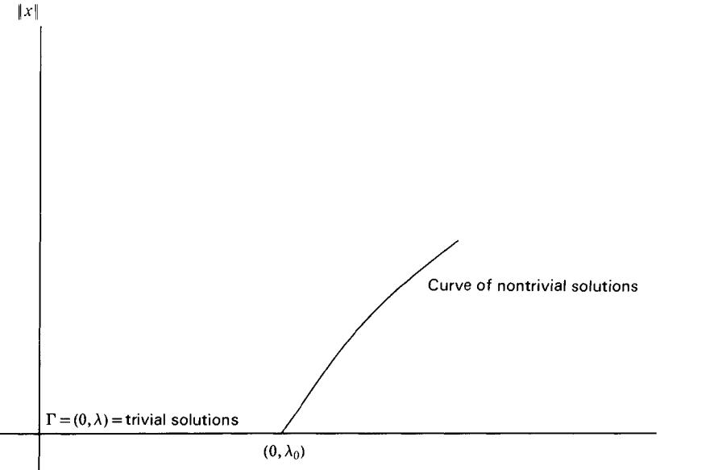

Figure 6.1. A bifurcation diagram.

If the Jacobian of f with respect to x, the matrix

$$J = \left[\frac{\partial f_i}{\partial x_j}\right],$$

is nonsingular at (xo, A0), then the implicit function theorem implies that there exists an interval J containing A0 as an interior point and a smooth function z: J- R' such that 2(Ao) = x0, and

$$\mathfrak{I} = \{ (\breve{x}(\lambda), \lambda) \mid \lambda \in J \}$$

consists of solutions of (6.1). Furthermore, these are the only solutions of (6.1) in a neighborhood of (xo, A0). Obviously, then, r and r overlap and

$$\mathfrak{x}(\lambda) = \mathfrak{x}(\lambda)$$

for A e Jfl I. Consequently, we see that a necessary condition for (xo, A0) to be a bifurcation point is that J be singular at (x0, A0).

Fortunately, although the implicit function theorem would appear to be inapplicable as a tool to discover the structure of solutions of (6.1) in a neighborhood of a bifurcation point, it can be successfully applied once

the branch of solutions P is appropriately "factored out" of the map f. In most applications it is the case that, or it can easily be arranged that, (xo, AO) = (0, Ao) and that

$$
\Gamma = \langle (0, \lambda) \mid \lambda \in I \rangle.
$$

In stating the result used in this chapter, we assume this to be the case.

The ideas of dynamical systems were introduced in Chapter 1 (Section 3). Two mappings appear in the discussion here, both based on ideas best expressed in terms of dynamical systems. The discussion is limited to dimension 3 because that is what we need, but it is valid for R". Suppose one has a differential equation

$$\mathbf{x}' = f(\mathbf{x}),\tag{6.2}$$

where xe 083. Given an initial point x0, there is a trajectory through it, lr(xo, t). If the time t is fixed, say at t = T, then 7r(x, T) is a function from 083 to 083. This is called the solution mapping. Now suppose that xo is a point on a periodic orbit y of period T. Let P be a plane through xo and orthogonal to the tangent vector f(xo). Let N be a sufficiently (in a sense to be made clear in what follows) small neighborhood of xo in P. By continuity, solutions corresponding to initial conditions near xo will remain "close" to the periodic orbit and return to a point "near" xo at time T. Indeed, if we are close enough, the orbit will reach the plane P although not necessarily at time T. By using the implicit function theorem, one can show that given x close enough to xo there is a time r(x) such that 7r(x, r(x)) e P. (There is a good discussion of this in the textbook of Hartman [Har].) Hence, for xe N, lr(x, r(x)) defines a mapping from R2 into R2. This mapping is called the Poincare map associated with y. The two mappings are related and we shall make use of this relation. The Poincare map is what we need, but the solution map makes the computations tractable. The principal approach may be summarized in the following statement.

REMARK 6.1. Let y and xo be as before. A fixed point of the Poincare mapping (different from x0) gives the initial conditions for a periodic orbit of equation (6.2) in a neighborhood of x0.

Since each of these mappings is from 08" to 08", where n = 3 for the solution map and n = 2 for the Poincare map, their linearizations are given by a matrix. The following is a basic result connecting the linearization of the two maps.

LEMMA 6.2. Let -y be as before, and consider the solution map and the Poincare map in a neighborhood of a point of y. Then the eigenvalues of the linearization of the Poincare map together with [1) are the eigenvalues of the linearization of the solution map.

A proof of this lemma is given in Appendix E.

Now replace the differential equation by one with a parameter,

$$\mathbf{x}' = f(\mathbf{x}, \lambda). \tag{6.3}$$

Suppose now that -y is a periodic trajectory for every value of the parameter. This corresponds to a curve of fixed points - a trivial curve - of the Poincare map in the terms discussed for equation (6.1). We can take coordinates in the plane P such that xo corresponds to the origin, and then look for conditions that will yield a bifurcation point of the Poincare mapping. The following theorem provides such conditions in very general terms.

THEOREM 6.3. Let W be an open neighborhood of 0 e R" and let I be an open interval containing AO in R. Let P(x, A) be a twice continuously differentiable mapping of W X I into 1f8" satisfying P(0, A) = 0 for all A C- I. Let L (A) be the Jacobian of P with respect to x evaluated at (x, A) = (0, A). Suppose that 1(A) is a real, simple eigenvalue of L(A) satisfying 1(Ao) = 1 with dl(A0)/dA * 0 and that vo spans the null space of L(A0) - Id. Then there exist S > 0 and a continuously differentiable map (0,A): (-S, S) VOL x (f8 such that

(i) (0(0), A(0)) = (0, 0) and

- (ii) P(s(vo+ct(s)), A(s)+Ao) = s(vo+4(s)), JsJ< S.
Furthermore, there is a neighborhood of (0, AO) e W x I such that the only solutions of P(x, A) -x = 0 in the neighborhood are (0, A) and (x, A) _ (s(vo+4(s)), Ao+A(s)).

A simple eigenvalue is one where the algebraic multiplicity as a root of the characteristic polynomial is 1. Theorem 6.3 follows from [Smo, thm. 13.4] and the remarks following it. The difficulty in applying the theorem is in computing the eigenvalues of the linearization of the Poincare map. The term vo denotes the (n -1)-dimensional subspace orthogonal to vo, and Id is the identity mapping.

In the linearization of the two-dimensional system (3.1) around the stable limit cycle, one multiplier is equal to 1 and, if hyperbolic, the other

### 64 Competition on Three Trophic Levels

must be inside the unit circle because of the stability. For the Poincare map corresponding to (2.3), then, one eigenvalue will be inside the unit circle; the object of applying this theorem is to have the remaining one move across the unit circle as prescribed in the theorem's hypotheses. The linearization of (2.3) about the periodic orbit in the z = 0 plane takes a special form; the following useful lemma is used to compute the needed eigenvalues.

LEMMA 6.4. Let A(t) be a 2 x 2 continuous, periodic matrix of period T, and let Y(t) be the fundamental matrix of y' = A(t) y. Let B(t) be a 3 x 3 periodic matrix of the form

$$\mathcal{B}(t) = \begin{bmatrix} \mathcal{A}(t) & b_1(t) \\ & b_2(t) \\ 0 & 0 & b_3(t) \end{bmatrix}.$$

Then the fundamental matrix F(t) of z'= B(t)z is given by

$$
\Phi(t) = \begin{bmatrix}
\begin{bmatrix}
Y(t) & z_1 \\ & z_2 \\ 0 & 0 & z_3
\end{bmatrix},
$$

where

$$z_3(t) = \exp\left[\int_0^t b_3(s) \, ds\right]$$

and z = (z1, z2) is given by

$$z(t) = \int_0^t Y(t)Y^{-1}(s)\,b(s)\,z_3(s)\,ds$$

with b(s) = col(bl(s), b2(s)). In particular, if P1, P2 are the Floquet multipliers associated with the 2 x 2 system (eigen values of Y(T)) then the Floquet multipliers of the 3 x 3 system are p1i P2, and p3 = z3 (T ).

Proof. The proof is a straightforward computation. The z3(t) term decouples from the system and can be obtained by a quadrature. The formulas for zi(t), i = 1, 2, can be obtained by substituting z3(t) into the two-dimensional system

$$z_1'(t) = a_{11}z_1 + a_{12}z_2 + b_1(t)z_3(t),$$

$$z_2'(t) = a_{21}z_1 + a_{22}z_2 + b_2(t)z_3(t),$$

and applying the variation-of-constants formula. The formulas for the multipliers follow by expanding the determinant of flT).

### 7. Competing Predators

Armed with the preceding discussion, we can now state the main theorem of this chapter. It shows that, in contrast to the basic chemostat, coexistence can occur if the competition is at a higher trophic level. (We remind the reader of the general assumption of hyperbolicity of limit cycles.)

THEOREM 7.1. Let ai and m; (i = 1, 2) be fixed so that m; > 1, let Ai < 1, and assume that the parameters are fixed so that (5.6) holds. Then there exists a number a3 such that for some values of a3 with I a3 - a3 I sufficiently small, (2.3) has a periodic orbit in the positive octant near the x-y plane.

Proof. Let y = (x(t), y(t), 0) be the orbitally asymptotically stable periodic orbit of period T given by Theorem 5.4. (We have already noted that if there are several orbits then one must be asymptotically stable, by our assumption of hyperbolicity.) Let the Floquet multipliers of y, viewed as a solution of (3.1), be 1 and p,, where 0 < p, < 1. This trajectory remains a solution of the system (2.3) for all values of m3 and a3. Fix m3. For this periodic orbit, define µ(a3) by

$$
\mu(a_3) = \frac{m_3}{\bar{T}} \int_0^{\bar{T}} \frac{\varkappa(\xi)}{a_3 + \varkappa(\xi)} \, d\xi.
$$

Note that µ(0) = m3 > I and µ(a3) is decreasing in a3. In fact, it follows that

$$\frac{\partial \mu}{\partial a_3} = \frac{-m_3}{T} \int_0^T \frac{\mathbf{x}(\xi)}{(a_3 + \mathbf{x}(\xi))^2} \, d\xi < 0. \tag{7.1}$$

It also follows that

$$
\mu(a_3) \le \frac{m_3}{a_3 T} \int_0^T \chi(\xi) \, d\xi. \tag{7.2}
$$

Therefore, as a3 tends to infinity, µ(a3) tends to zero. Consequently, there exists a unique value of a3 such that µ(a3) = 1. Denote this value of a3 by a3.

Fix a point po = (x(to), y(to), 0) on y such that y'(to) = 0. Then the plane x = x(to) = A2 cuts the periodic orbit -y at the point po. See Figure 7.1.

The intersection of the plane with a sufficiently small ball centered at po is transversal to y at po for all a3 in a neighborhood I of a3. Denote this transversal section by Q. We use coordinates (Y, Z) on 12 given by

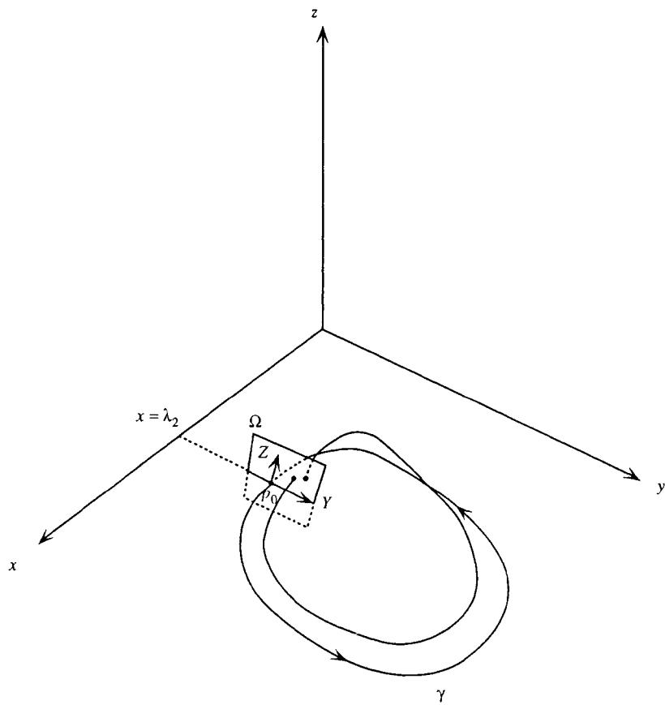

Figure 7.1. The Poincare map.

Y= y-y(to) and Z = z-z(t0), so that po corresponds to (0, 0) in Q. The Poincare map

$$P = P(Y, Z; a_3) = (P_1(Y, Z; a_3), P_2(Y, Z; a_3))$$

is defined for (Y, Z) in a neighborhood W of (0, 0) in J and for a3 E I. Here Pi denotes the Y coordinate and P2 denotes the Z coordinate of the point P(Y, Z; a3) e Sl (see Figure 7.1). Since yy is a periodic solution of (2.3) for all values of a3, it follows that

$$P(0,0;a_3) = (0,0)$$

for all values of a3 e I.

Since the x-y plane is an invariant set for (2.3), one has

$$P_2(Y, 0; a_3) = 0$$

for all (Y, 0) e W and a3 E I. Consequently the Jacobian of P with respect to (Y, Z) at (0, 0, a3) is given by

$$J = \begin{bmatrix} \frac{\partial P_1}{\partial Y} & \frac{\partial P_1}{\partial Z} \\ 0 & \frac{\partial P_2}{\partial Z} \end{bmatrix}.$$

Because the periodic solution (x(t),y(t)) of (3.1) is assumed to have Floquet multipliers 1 and p,, where 0 < pi < 1, Lemma 6.2 implies that

$$\rho_1 = \frac{\partial P_1}{\partial Y}(0, 0; a_3)$$

is independent of a3.

To compute the remaining eigenvalue of P, one computes the eigenvalues of the solution map. The linearization of (2.3) about y takes the form

$$
\begin{bmatrix}
\mathcal{A}(t) & f_z \\
& & 0 \\
0 & 0 & \frac{m_3 \mathcal{X}(t)}{a_3 + \mathcal{X}(t)} - 1
\end{bmatrix},
$$

where fZ denotes the partial derivative of f, the right-hand side of the first equation in (2.3), with respect to z. The matrix A(t) is just the linearization of (3.1) about (x(t), y(t)). Its fundamental matrix possesses Floquet multipliers 1 and p, e (0, 1) as noted previously. By Lemma 6.4, the other multiplier is P2 = eT(A(a3)_,). Consequently, from the upper triangular form of J and Lemma 6.2,

$$\rho_2 = \frac{\partial P_2}{\partial Z}(0, 0; a_3) = e^{\mathcal{T}(\mu(a_3) - 1)}.$$

This eigenvalue, which we denote by 1(a3) (in anticipation of verifying Theorem 6.3), clearly satisfies 1(a3) = 1 and d1(a3)/da3 < 0, since d1A/da3 < 0.

An eigenvector vo corresponding to the eigenvalue 1(a3) = 1 of J is easily computed to be

$$\upsilon_0 = \left(\frac{\partial P_1}{\partial \mathbb{Z}}, \, 1 - \rho_1\right).$$

Note that its second Z component is positive. The hypotheses of Theorem 6.3 have now been verified. Therefore, the Poincare map has a fixed point given in (x, y, z) coordinates by

$$s(x, y, z) = p_0 + s(0, v_0) + o(s)$$

corresponding to a parameter a3 given by

$$a_3 = a_3^\bullet + \bar{\lambda}(s),$$

where o(s) represents a term satisfying 1ims_o o(s)/s = 0, A(0) = 0, and A(s) is continuously differentiable. This completes the proof of the theorem.

The question of which values of a3 yield the periodic orbit is not resolved by the theorem. Generically, the derivative of A at s = 0 is not expected to be zero. In that case there would be an interval of values on one side of a3 for which there would be a periodic solution in the positive cone; see Figure 7.2. This affects the stability as well. A sample computation is given in the next section.

### 8. Numerical Example

The limit cycle found in the previous section holds only for I a3 - a3 I small. Obviously, once the limit cycle exists, it can be continued, either globally or until certain "bad" things happen such as the period tending to infinity or the orbit collapsing to a point. It is very difficult to show analytically that these events do not occur. Moreover, the computations necessary to actually prove the asymptotic stability of the bifurcating orbit are very difficult. We discuss briefly some numerical computations, shown in Figure 8.1, which suggest answers to both these problems.

The differential equations were solved for a variety of values of a3 less than a3. The program was run for considerable time and the last 100 points saved. If the limiting periodic orbit were asymptotically stable, these points would be near the periodic orbit - equal as well as the eye can determine. These periodic orbits, corresponding to different parameters and hence to different systems of differential equations, were then plotted on a single three-dimensional graph (Figure 8.1). This illustrates the stability.

At first the orbits were in the x-y plane, and then out of it but close to it, as the theorem states. However, as the parameter was varied, the periodic orbits continued to exist (as one might expect). Moreover, as the parameter was continued, the periodic orbits moved near the x-z plane and collapsed into it. The figure also illustrates this point.

Figure 8.1 gives a pictorial view of bifurcation. The periodic orbits in the respective planes correspond to the periodic orbits of the food chains studied in Sections 3 and 5. The periodic orbits in the interior of the cone correspond to periodic orbits of two predators feeding on a single prey growing on the nutrient.

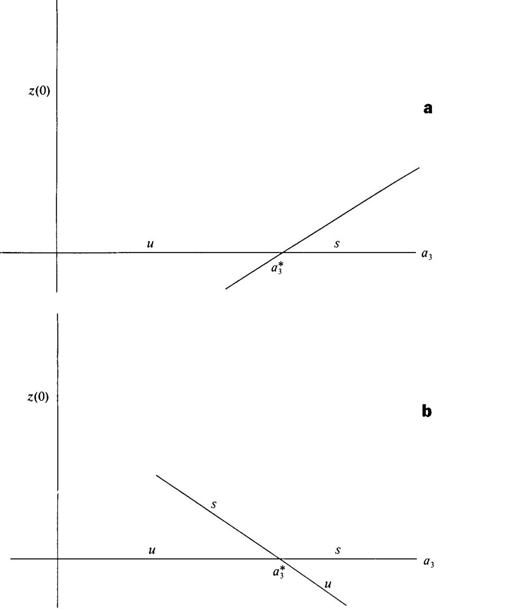

Figure 7.2. a A possible bifurcation diagram with positive solutions for a3 > a3, b A possible bifurcation diagram with positive solutions for a3 < a3.

### 9. A Long Food Chain

It is expected that more complicated dynamic behavior would be possible in a longer food chain. Indeed, we will illustrate (numerically) that adding

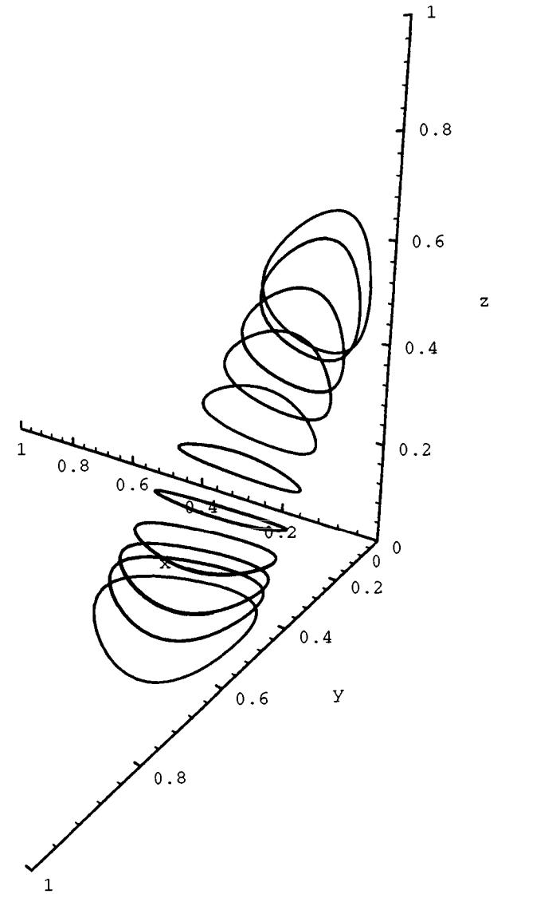

Figure 8.1. Numerical solutions showing bifurcation from a limit cycle in a plane into a limit cycle in the interior. The fixed parameters are a, = 0.3, a2 = 0.4, m, = 10.0, m2 = 4.5, and m3 = 5.0. The parameter a3 was varied between 0.46 and 0.48. The limit cycle moves from one plane (a face of 118+) through the interior of 118+ (showing coexistence) and collapses into the opposite face of IfB+.

Discussion 71

another trophic level to the model of Section 3 can produce complex dynamics. This was suggested by recent (unpublished) work of Wolkowicz on a food chain with a reproducing prey at the lowest level, and by the results of Hastings and Powell [HP].

If one adds another predator to the model of Section 3, then the system is governed by the equations (in scaled form)

$$\begin{aligned} S' &= 1 - S - \chi f_1(S), \\ \chi' &= \chi(f_1(S) - 1) - \chi f_2(\chi), \\ \chi' &= \chi(f_2(\chi) - 1) - zf_3(\chi), \\ z' &= z(f_3(\chi) - 1), \end{aligned}$$

where

$$f_l(\mu) = \frac{m_l \mu}{a_l + \mu}.$$

As in the earlier work, one has immediately that

$$\lim_{t \to \infty} \mathcal{S}(t) + \mathcal{x}(t) + \mathcal{y}(t) + \mathcal{z}(t) = 1.$$

On the omega limit set, then, one may eliminate the S variable by using S= 1-x-y-z to obtain the system

$$\begin{aligned} \chi' &= \chi(f_1(1-\chi-\nu-z)-1) - \chi f_2(\chi), \\ \chi' &= \chi(f_2(\chi)-1) - zf_3(\chi), \\ z' &= z(f_3(\nu)-1). \end{aligned}$$

The parameters of the first two levels were fixed: ml = 10.0, m2 = 4.0, a, = 0.08, and a2 = 0.23. The values are consistent with those suggested in [CN2]. The growth rate of the top predator was fixed at m3 = 3.5, and the value of a3 varied to obtain Figures 9.1-4. Figure 9.1 shows the attractor as a limit cycle; Figure 9.2 indicates the appearance of a perioddoubling bifurcation. Figure 9.3 shows the attractor after two such bifurcations, while Figure 9.4 suggests a chaotic attractor.

### 10. Discussion

The final conclusion of Section 7 was that two predators could survive on a common prey. It is significant that this can happen only as an oscillatory phenomenon. This is easy to understand intuitively. If the prey

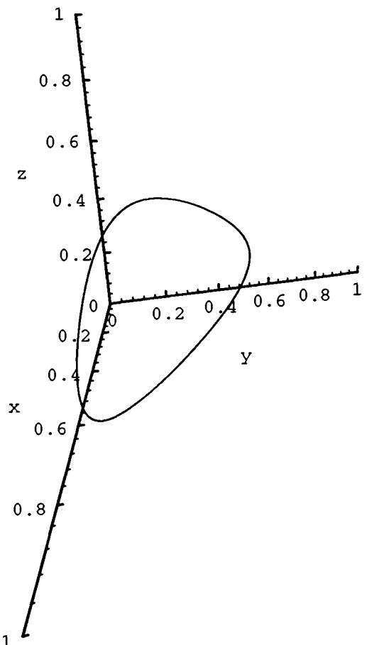

Figure 9.1. A periodic orbit in the long food chain. Parameters are a, = 0.08, a2 = 0.23, a3 = 0.40, m,=10.0, m2 =4.0,andm3=3.5.

level came to a steady state, it would favor one predator or the other. While it is oscillating, sometimes the concentration favors one competitor and sometimes the other. Each manages to grow enough while it has the advantage to survive. One does well at higher concentrations and then crashes rapidly; the other is steady at lower concentrations and improves while the first is "crashing." This is a manifestation of the common r-K strategist discussion in the ecology literature.

The "platform" from which the (four-dimensional) oscillations were launched was the (three-dimensional) food chain, which was already oscillatory. Experiments confirming the behavior of the food chain exist in

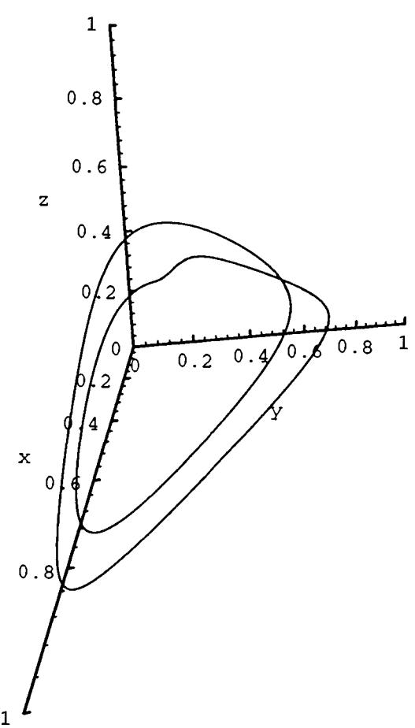

Figure 9.2. Period doubling in the long food chain. Parameters are as in Figure 9.1 except that a3 = 0.3.

the literature. Figure 10.1 shows the results of the experiments of Jost et al. [JDFT]. A food chain was constructed in a chemostat consisting of a nutrient (glucose), a bacteria living on that nutrient (Azotobacter vinelandii), and a ciliate (Tetrahymena pyriformis) feeding on the bacteria. Both sustained oscillations (Figure l0.la) and convergence to a steady state (Figure 10.1b) were observed, depending on the washout rate. A discussion of these and other experiments can be found in Jannasch and Mateles [JM]. Although we are unaware of any definitive experiments, it is clear from the mathematics that if the food chain can oscillate then competing predators at the top can also oscillate.

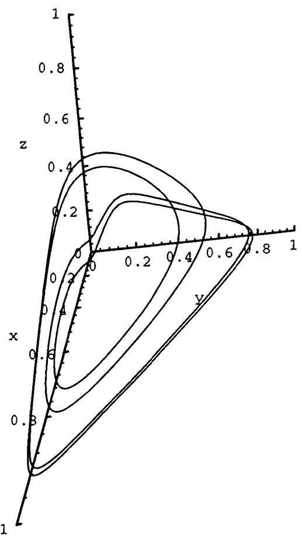

Figure 9.3. Two period doublings in the long food chain. Parameters are as in Figure 9.1 except that a3 = 0.24.

If coexistence is possible because of the oscillation, then might two competitors also coexist in an oscillatory environment - that is, with oscillatory inputs but with only two trophic levels? The answer is clearly Yes. This problem, however, requires very different techniques, since it is a forced oscillation and does not generate a dynamical system. Chapter 7 is devoted to one approach to such problems.

Delays can also introduce oscillations. These problems are infinitedimensional ones and much more difficult to analyze rigorously. Comments on the delayed chemostat can be found in Chapter 10, along with

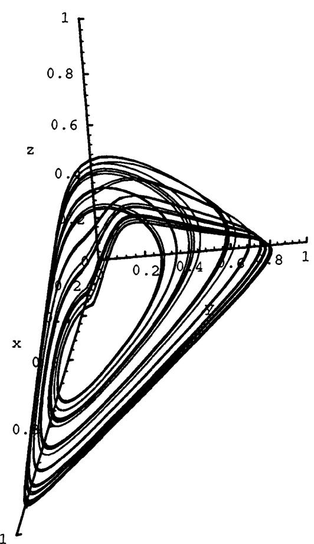

Figure 9.4. A complicated attractor in the long food chain, possibly chaotic. Parameters are as in Figure 9.1 except that a3 = 0.20.

references. However, the problem will not be considered in detail in this work.

Although Theorem 7.1 can be interpreted to show the possibility of coexistence, many questions of a mathematical nature remain unanswered. One would like to know the direction of bifurcation (i.e., determining the range of the function A(s)) of the bifurcating solutions, the extent of their continuability, and so forth. The numerical results answer these questions for a particular case, but this is mathematically unsatisfactory. The questions are answerable in principle, but the required calculations

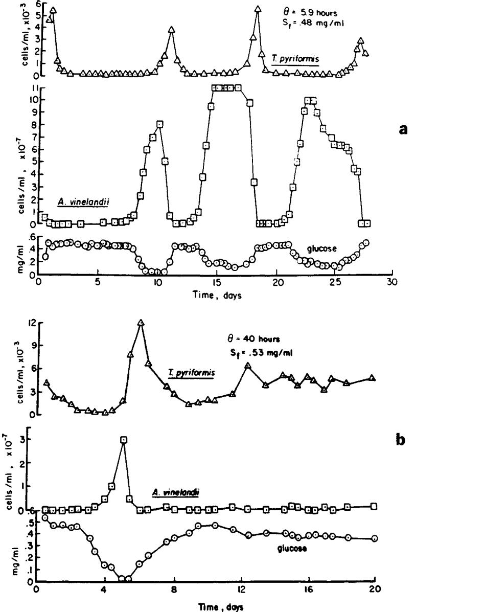

Figure 10.1. A food chain constructed of a nutrient (glucose), a bacteria (A. vinelandii) living on that nutrient, and a ciliate (T. pyriformis) feeding on the bacteria: a sustained oscillations; b convergence to a steady state. (From [JDFT], Copyright 1973, American Society for Microbiology. Reproduced by permission.)

are formidable. Generically, of course, the derivative of A(s) at s = 0 is nonzero. Hence there will be periodic orbits in the positive cone for a3 on one side of a3. Keener [Kel; Ke2] has a technique for answering such questions under a further assumption. Essentially, the idea is to make all of the bifurcations occur at one point and then "peel" them apart (unfold them) as the parameter changes.

Pavlou and Kevrekidis [PK] consider periodically forced food chains and investigate the effect of forcing on the periodic orbit. Using numerical bifurcation techniques, they exhibit quasiperiodicity and entrainment of frequencies.

# The Chemostat with an Inhibitor

### 1. Introduction

In the first two chapters the general theory of the chemostat was developed, and it was shown that competitive exclusion is the expected outcome. In Chapter 3, coexistence was shown to occur when the competition was at a higher trophic level; the mechanism was simply the oscillation of the object of the competition - the prey in the case being considered. In this chapter, we return to the basic chemostat model but add another factor, the presence of an inhibitor. The inhibitor affects the nutrient uptake rate of one of the competitors but is taken up by the other without ill effect. The use of Nalidixic acid in the experiments of Hansen and Hubbell [HH], discussed in Chapter 1, is an example. Its effect on one strain of E. coli was essentially nil while the growth rate of the other was severely diminished.

The interest in this subject goes far beyond laboratory examples. It is common for one strain of bacteria to be affected by an antibiotic while another is resistant. The antibiotic acts as the inhibitor in our discussion, and we want to know whether the resistant strain will eliminate the nonresistant strain. If it can, the antibiotic will not be effective in treating the disease. In commercial applications, genetically altered organisms are used to generate "products." Resistance to an antibiotic is often introduced with the genetic material as well, in order to prevent reversion of the organism to the "wild" (i.e. the unaltered) type which presumably is a better competitor. A similar situation occurs in the use of bacteria to eliminate pollutants. One strain may be able to take up the pollutant without ill effect while another may be inhibited by it. One wants to know whether the inhibited strain can eliminate the uninhibited strain; if it can, then the pollutant cannot be removed. Intuitively, if the

### The Model 79

inhibited strain is the weaker competitor without the presence of the inhibiting agent, then one expects it to be eliminated. The focus is thus on the case where the superior competitor is the one sensitive to the inhibitor. The question remains the same: Does competitive exclusion still hold?

Taking the chemostat as the basic model, the inquiry focuses on determining the outcome as a function of the basic parameters of the organisms and the operating parameters of the chemostat. In the Michaelis-Menten formulation, the parameters of the organisms are the a,s and m,s of Chapter 1; the operating parameters of the chemostat are S(0) and D, the input concentration of nutrient and the washout rate. If the inhibitor is assumed to be input into the chemostat at a constant rate, then new parameters are introduced. One new operating parameter would be this constant input concentration. The uptake characteristic of the uninhibited organism and the effect of the inhibitor on the growth of the inhibited organism are the other new elements that can be expected to play key roles. The former will be treated in Michaelis-Menten form whereas the latter will be treated in a quite general fashion.

The basic model is that of two competitors in the chemostat, and the new element is the effect of the inhibitor. The model was first proposed by Lenski and Hattingh [LH], who investigated the various outcomes with a computer simulation. The mathematical analysis here follows that contained in Hsu and Waltman [HWI].

### 2. The Model

As noted in the introduction, the model is that of a standard chemostat with two competitors, but with the added feature that an inhibitor is also input from an external source. The nutrient (and inhibitor) uptake and conversion (in the case of nutrient) are assumed to follow Michaelis-Menten dynamics. The results are probably valid for general monotone dynamics, although this has not been established.

Let S(t) denote the nutrient concentration at time tin the culture vessel, x1(t), xz(t) the concentration of the competitors, and p(t) the concentration of the inhibitor. The equations of the model take the form [LH]:

$$\begin{aligned} S' &= (S^{(0)} - S)D - \frac{m_1 \varkappa_1 S}{a_1 + S} f(p) - \frac{m_2 \varkappa_2 S}{a_2 + S}, \\\ \varkappa_1' &= \varkappa_1 \left(\frac{m_1 S}{a_1 + S} f(p) - D\right), \end{aligned}$$

$$\begin{aligned} \chi_2' &= \chi_2 \left( \frac{m_2 S}{a_2 + s} - D \right), \\ p' &= (p^{(0)} - p)D - \frac{\delta \chi_2 \, p}{K + p}, \\ S(0) &\ge 0, \ \chi_i(0) > 0, \ (i = 1, 2), \ p(0) \succeq 0, \end{aligned} \tag{2.1}$$

where S(0) is the input concentration of the nutrient and p(0) that of the inhibitor, both of which are assumed constant; D is the dilution rate of the chemostat. The terms mi, a; (i = 1, 2) are the usual parameters, the maximal growth rates of the competitors (without an inhibitor) and the Michaelis-Menten (or half-saturation) constants, respectively. The parameters S and K play similar roles for the inhibitor, with S the maximal uptake rate by x2 and K a half-saturation parameter. The function f (p) represents the degree of inhibition of p on the growth rate of x1.

To reduce the number of parameters - and to provide a standard environment so that comparisons can be made in terms of the parameters of the competing populations - the equations will be scaled, much as was done in the first three chapters. First, scale the units of concentration of S, x1, x2, by the input concentration S(0). This includes the parameters a,, i = 1, 2. (We have already tacitly scaled out the yield parameters, which scale the conversion of nutrient to organism.) Then scale time by the dilution rate (with units 1/time). This reduces D to unity and replaces m; by m,/D (i =1, 2) and S by S/D. Finally, scale p by p(0), which has the effect of scaling p(0) to unity. In [LH],

$$f(p) = e^{-\lambda p},$$

so this would now be written

$$f(p) = e^{-\lambda p^{(0)}(p/p^{(0)})}.$$

The new variable is p/p(0) and the new parameter is Ap". If one makes these changes and then returns to the "old" names (e.g., using m, as the new "maximal growth rate," the "old" m1/D), the system (2.1) takes the form

$$\begin{aligned} S' &= 1 - S - \frac{m_1 \varkappa_1 S}{a_1 + S} \, f(p) - \frac{m_2 \varkappa_2 S}{a_2 + S}, \\\ x_1' &= \varkappa_1 \Big(\frac{m_1 S}{a_1 + S} \, f(p) - 1\Big), \end{aligned}$$

The Conservation Principle 81

$$\begin{aligned} \varkappa_2' &= \varkappa_2 \Big(\frac{m_2 S}{a_2 + S} - 1\Big), \\\\ p' &= 1 - p - \frac{\delta \varkappa_2 \, p}{K + p}, \\ S(0) &\succeq 0, \ \varkappa_i(0) > 0 \ (i = 1, 2), \ p(0) \succeq 0. \end{aligned} \tag{2.2}$$

The analysis of this set of nonlinear ordinary differential equations forms the content of this chapter.

Concerning the function f(p), we shall assume that

- (i) .f(P) ? 0, .f(0) = 1; (ii) f(p) < 0, p > 0.
The function f(p) adjusts the effective value of the parameter ml; the quantity m1f(p) represents the maximal growth rate of this population if the concentration of the inhibitor is p.

As noted in [LH], the ability of x2 to consume the inhibitor (S > 0) is of crucial importance. Lenski and Hattingh refer to this ability of x2 to "detoxify" the environment and note that without it (i.e., with S = 0 in (2.2)) p(t) tends to unity as t tends to infinity. Therefore, the limiting system obtained by dropping the p equation and replacing p by 1 describes the dynamics of (2.2) on the omega limit set. This limiting system is just the equations for competition in the chemostat without an inhibitor and where m, is replaced by m1 f(1). Competitive exclusion must then result.

### 3. The Conservation Principle

The method of procedure is much like that in the previous chapters. The equations will be rearranged to make clear that the omega limit set lies in a smaller set, one governed by three ordinary differential equations. The analysis will then proceed on this reduced set of differential equations. Since every trajectory is asymptotic to its omega limit set, knowledge of the global behavior of this set of equations is essential for determining the asymptotic behavior of (2.2). (See Appendix F for the general result on returning to the asymptotic behavior of (2.2).)

Let

$$
\Sigma = 1 - S - \varkappa_1 - \varkappa_2.
$$

Then

$$
\Sigma' = -S' - \chi_1' - \chi_2' = -1 + S + \chi_1 + \chi_2 = -\Sigma.
$$

The system (2.2) may then be replaced by

$$\begin{aligned} \Sigma' &= -\Sigma, \\ \chi_1' &= \chi_1 \Big( \frac{m_1(1-\Sigma-\chi_1-\chi_2)}{a_1+1-\Sigma-\chi_1-\chi_2} f(\rho)-1 \Big), \\ \chi_2' &= \chi_2 \Big( \frac{m_2(1-\Sigma-\chi_1-\chi_2)}{a_2+1-\Sigma-\chi_1-\chi_2} - 1 \Big), \\ \rho' &= 1-p-\delta \frac{\chi_2 \, \rho}{K+p}. \end{aligned} \tag{3.1}$$

Clearly, lim1_. E(t) = 0. Hence, the solutions in the omega limit set of (3.1) must satisfy

$$\begin{aligned} \chi_1' &= \chi_1 \Big( \frac{m_1(1-\chi_1-\chi_2)}{1+a_1-\chi_1-\chi_2} f(\rho)-1 \Big), \\\\ \chi_2' &= \chi_2 \Big( \frac{m_2(1-\chi_1-\chi_2)}{1+a_2-\chi_1-\chi_2} - 1 \Big), \\\\ \rho' &= 1-p-\delta \frac{\chi_2 \, p}{K+p}, \\\\ \chi_i(0) &> 0 \ (i=1,2), \ \ x_1(0)+x_2(0)<1, \ \ p(0)\neq 0. \end{aligned} \tag{3.2}$$

Let

$$
\lambda_1 = \frac{a_1}{m_1 - 1}, \qquad \lambda_2 = \frac{a_2}{m_2 - 1}. \tag{3.3}
$$

These are the determining parameters for the simple chemostat, as discussed in Chapter 1, and would determine the outcome if the inhibitor p were not present. The form of the equations (3.2) guarantees that if xi(0) > 0 (i = 1, 2) then xi(t) > 0 for t > 0. Moreover, p' In=o = 1 > 0, so if p(O) >- 0 then p(t) > 0 fort > 0. The terms x1(t) and x2(t) satisfy

$$\begin{aligned} \chi_1' &\lesssim \chi_1 \left( \frac{m_1(1-\chi_1-\chi_2)}{1+a_1-\chi_1-\chi_2} - 1 \right), \\\chi_2' &= \chi_2 \left( \frac{m_2(1-\chi_1-\chi_2)}{1+a_2-\chi_1-\chi_2} - 1 \right). \end{aligned} \tag{3.4}$$

Taking advantage of the monotonicity (in the variable 1-x, -x2) in the right-hand side of (3.4) yields a set of two scalar differential inequalities of the form

$$\begin{aligned} \chi_1' &\lesssim \chi_1 \left( \frac{m_1(1-\chi_1)}{1+a_1-\chi_1} - 1 \right), \\\chi_2' &\lesssim \chi_2 \left( \frac{m_2(1-\chi_2)}{1+a_2-\chi_2} - 1 \right). \end{aligned}$$

The comparison with the growth equations for the chemostat (equation (4.1) or (4.2) of Chapter 1) establishes the following proposition.

PROPOSITION 3.1. If m; s 1 or if m; > 1 and A, >- 1, lim,_. x,(t) = 0. If m, > 1 and 0 < A, < 1 then lim sups _ xi (t) <- 1- A, with i = 1 or 2.

This simply states the biologically intuitive fact that if one of the competitors could not survive in the simple chemostat, that competitor will not survive in the chemostat with an inhibitor. Thus we may assume m, > 1 and 0 < Ai < 1, i = 1, 2. There are some other simple cases that can also be easily dispatched.

PROPOSITION 3.2. If 0 < A2 < A, < 1, then

$$\begin{aligned} \lim_{t \to \infty} \varkappa_1(t) &= 0, \\ \lim_{t \to \infty} \varkappa_2(t) &= 1 - \lambda_2, \\ \lim_{t \to \infty} p(t) &= p_2^\bullet < 1, \end{aligned}$$

where p2 is the positive root of the quadratic

$$(1 - p)(K + p) - \delta(1 - \lambda_2)\,\mu = 0.\tag{3.5}$$

(The reason for labeling the root p2 will become clear in the next section.) Biologically, the proposition states that if x2 eliminates x1 in a chemostat without x, being inhibited, x2 eliminates x, when x, is inhibited.

Proof of Proposition 3.2. That p2 < 1 follows from the fact that p(t) satisfies

p'<1-p

and the basic comparison theorem. The boundedness of p and the fact that E tends to zero also show that all solutions of (3.1) are bounded. The other assertions in the proof will follow from the more general comparison theorem (see Appendix B, Theorem B.4) and a knowledge of the behavior of solutions of the basic chemostat equations, system (5.2) of Chapter 1. Since "=" is also "?," (3.4) may be written

$$\begin{aligned} \mathbf{x}_1' &\le \mathbf{x}_1 \Big( \frac{m_1(1-\mathbf{x}_1-\mathbf{x}_2)}{1+a_1-\mathbf{x}_1-\mathbf{x}_2} - 1 \Big), \\\mathbf{x}_2' &\ge \mathbf{x}_2 \Big( \frac{m_2(1-\mathbf{x}_1-\mathbf{x}_2)}{1+a_2-\mathbf{x}_1-\mathbf{x}_2} - 1 \Big). \end{aligned}$$

Let ul and u2 be solutions of the system (5.2) in Chapter 1 satisfying u; (0) = x, (0), i = 1, 2. It follows from Theorem B.4 that

$$
\varkappa_1(t) \le \varkappa_1(t) \quad \text{and} \quad \varkappa_2(t) \ni \varkappa_2(t).
$$

If A2 < A1i then limf_. u1(t) = 0 and limn-, u2(t) = 1-A2 (by Theorem 5.1 of Chapter 1). Thus one can conclude that lim1 . x1(t) = 0 and lim inf1- x2(t) >_ 1-A2 (Theorem 5.1 of Chapter 1). Since we already have (by Proposition 3.1) that lira SUP, - x2(t) <- 1-A2i the proof is complete.

The hypothesis of Proposition 3.2 excludes the case Al = A2. This is ordinarily not biologically important because the A, are computed from measured quantities; it is unlikely that they would be exactly the same (or the same with respect to this environment). However, an interesting potential application is the case where the organisms are indeed the same (mutants of the same organism) except for their sensitivity to the antibiotic. Intuitively, if the organisms are the same except for sensitivity to the inhibitor, one expects the x1 population to lose the competition when the inhibitor is present. However, establishing this mathematically cannot be done directly from the comparison theorem as used before, since if Al = A2 then coexistence occurs with the chemostat equations used for comparison purposes. In order to use the comparison principle, one needs a better estimate than f (p) <- 1, p >- 0. This is the purpose of the following lemma.

LEMMA 3.3. There exists a number y > 0 such that p(t) > -y for t sufficiently large.

Proof. Suppose liminf1-. p(t) = 0. If p(t) decreased to zero monotonically then there would be a point to such that, for t> to, p(t)+Sp(t)/ (K+p(t)) < 1. For such values, p'(t) > 0, which contradicts p(t) decreasing. Hence there exists a set of points tn, t, -> oo, such that p'(tn) = 0 and p(tn) -> 0 as to -> oo. For such values of tn,

$$0 = 1 - p(t_n) - \frac{\delta p(t_n) \chi_2(t_n)}{K + p(t_n)}$$

$$\begin{aligned} &> 1 - p(t_n) - \frac{\delta p(t_n)}{K + p(t_n)} \\ &> 0 \end{aligned}$$

for n large. This establishes the lemma.

THEOREM 3.4. If 0 < A2 <- Al < 1, then

$$\begin{aligned} \lim_{t \to \infty} \chi_1(t) &= 0, \\ \lim_{t \to \infty} \chi_2(t) &= \chi_2^\bullet > 0, \\ \lim_{t \to \infty} p(t) &= p_2^\bullet > 0, \end{aligned}$$

where x2 and pZ are as before.

Proof. In view of Lemma 3.3, the inequalities (3.4) can be replaced by

$$\begin{aligned} \chi_1' &\lesssim \chi_1 \left( \frac{m_1(1-\chi_1-\chi_2)}{1+a_1-\chi_1-\chi_2} - 1 \right), \\\chi_2' &\gtrsim \chi_2 \left( \frac{m_2(1-\chi_1-\chi_2)}{1+a_2-\chi_1-\chi_2} - 1 \right), \end{aligned}$$

where -y is given by Lemma 3.3 and t is sufficiently large. This system of inequalities can be compared to the equations for the chemostat, where Al is replaced by al/(m1 f(y)-1), so that the first component of the comparison system tends to zero as t tends to infinity, as in the proof of Proposition 3.2. Hence, so does x1(t).

Thus, for the remainder of this chapter, one may assume

$$\begin{aligned} \, \, _l m_l &> 1, \quad l = 1, 2, \\ \, _l &< \lambda_1 < \lambda_2 < 1. \end{aligned} \tag{3.6}$$

The results in this section provide conditions for one or both of the competitors to wash out of the chemostat; these are the uninteresting cases. To avoid "unlikely" cases in the analysis to follow, we shall tacitly assume that all rest points are hyperbolic - that is, their stability is determined by their linearization.

It is easy to anticipate that oscillations in the concentrations of x1, x2, and p may be possible when 0 < Al < A2 < 1. If p(0) is small then the system (3.2) behaves as if there were essentially no inhibitor. The superior competitor xl will begin to prevail over its rival x2, driving its concentration

to a low level. When x2 becomes small it is no longer detoxifying the chemostat by consuming p, so the concentration of p increases toward p = 1. Once p attains an appreciable concentration, it begins to inhibit the growth of x1. This may allow x2 to recover and begin to detoxify the chemostat by consuming the inhibitor. Once again, we may arrive at the situation where p is small. Repeating this scenario results in the oscillation of all concentrations. Therefore, the possibility of coexistence in the form of oscillatory behavior is plausible. Section 7 will clarify the conditions for a specific f(p).

### 4. Rest Points and Stability

There are three potential rest points of (3.2) on the boundary, which we label

$$E_0 = (0,0,1), \quad E_1 = (\chi_1^*,0,1), \quad E_2 = (0,\chi_2^*,p_2^*).$$

These correspond to one or both competitors becoming extinct.

The rest point E0 always exists, and E2 exists with x2 = 1-A2 and p2 the root of (3.5) if 0 < A2 < 1, which is contained in our basic assumption (3.6). The existence of E, is a bit more delicate. In keeping with the definitions in (3.3), define A0 = a1/(m1 f(l) -1). Then 0 < A0 < 1 corresponds to the survivability of the first population in a chemostat under maximal levels of the inhibitor. Easy computations show that E1 = (1-A0, 0, 1) will exist if A0 > 0 and will have positive coordinates and be asymptotically stable in the x, -p plane if 0 < A0 < 1. If 1-A0 is negative then E1 is neither meaningful nor accessible from the given initial conditions, since the x2-p plane is an invariant set. The stability of either E, or E2 will depend on comparisons between the subscripted As. The local stability of each rest point depends on the eigenvalues of the linearization around those points. The Jacobian matrix for the linearization of (3.2) at E;, i = 1, 2, takes the form

$$J = \begin{bmatrix} m_{11} & m_{12} & m_{13} \\ m_{21} & m_{22} & 0 \\ 0 & m_{32} & m_{33} \end{bmatrix}. \tag{4.1}$$

At E0,

$$J = \begin{bmatrix} \frac{m_1 f(1)}{1+a_1} - 1 & 0 & 0\\ & 0 & \frac{m_2}{1+a_2} - 1 & 0\\ & 0 & -\frac{\delta}{1+K} & -1 \end{bmatrix}.$$

The eigenvalues are the diagonal elements. One eigenvalue is -1, and the associated eigenvector lies along the p axis. This corresponds to the growth of the inhibitor to its limiting value in the absence of a consumer. The set ((0, 0, p) I p > 01 is positively invariant and is part of the stable manifold of E0. Because A2 < 1, m22 = m2/(1+a2)-1 is positive. Similarly, the remaining diagonal term, m11, is positive if 0 < A0 < 1 and negative otherwise. When this eigenvalue is negative, the stable manifold of E0 is the entire x, -p plane.

At El, m21 = 0, which means (since m23 = m31 = 0) that the eigenvalues are just the diagonal elements of J. Thus

$$\begin{aligned} \mu_1 &= -\frac{m_1 a_1 (1 - \lambda_0)}{(a_1 + \lambda_0)^2} f(1), \\\\ \mu_2 &= \frac{m_2 a_2 (\lambda_0 - \lambda_2)}{(a_2 + \lambda_0)(a_2 + \lambda_2)}, \\\\ \mu_3 &= -1. \end{aligned}$$

If 0 < A0 < A2 < 1, then E, is asymptotically stable. This reflects the fact that x1, in the presence of the maximal inhibitor concentration, is still a better competitor than x2. If A0 > A2 then E1 is unstable and, of course, if A0 > 1 then E, does not exist.

At E2, m12 = m13 = m23 = 0, so again the eigenvalues are just the diagonal elements

$$\mu_1 = \frac{m_1 \lambda_2 f(p_2^*)}{a_1 + \lambda_2} - 1,$$

$$\mu_2 = -\frac{m_2 a_2 (1 - \lambda_2)}{(a_2 + \lambda_2)^2},$$

$$\mu_3 = -1 - \frac{\delta K (1 - \lambda_2)}{(K + p_2^*)^2}.$$

Clearly, 142 and µ3 are negative so that E2 always has a two-dimensional stable manifold; E2 is asymptotically stable (unstable) if It, < 0 (µ, > 0).

The local behavior of the rest point set on the boundary is summarized in Table 4.1, where 0 < A, < A2 < 1 is assumed. The more interesting case is that of an interior rest point. Let E, = (xjc, xzc, p*) denote the coordinates of a possible interior rest point. First of all, it must be the case that

$$1 - \varkappa_{1c}^* - \varkappa_{2c}^* = \lambda_2,\tag{4.2}$$

for this is the only nontrivial zero of the derivative of x2 in (3.2). Using this, one sets the derivative of x1 equal to zero to find

| Point | Existence  | Stability                                                      |
|-------|------------|----------------------------------------------------------------|
| Eo    | Always     | 1- or 2-dimensional<br>stable manifold                         |
| E,    | 0 < AO < I | Asymptotically stable<br>if0 <a0<a2< td=""></a0<a2<>           |
| E2    | Always     | Asymptotically stable<br>if m,A2f(P2*) <a, +a2<="" td=""></a,> |

Table 4.1

$$\frac{m_1\lambda_2}{a_1+\lambda_2}f(p) = 1$$

or that one needs (al+A2)/m1A2 to be in the range of f. The inequality Al <A2 implies (a1+A2)/m1A2 < 1. If

$$\frac{a_1 + \lambda_2}{m_1 \lambda_2} > \lim_{p \to \infty} f(p)$$

then (a1+A2)/m1A2 will be in the range of f. If this inequality holds, set

$$p_c^\bullet = f^{-1}\left(\frac{a_1 + \lambda_2}{m_1\lambda_2}\right). \tag{4.3}$$

Since f is monotone, if p* exists then it is unique. If p* < 1 then x*c can be determined by setting p'(t) equal to zero, yielding

$$1 - p_c^\star - \frac{\delta \varkappa_{2c}^\star p_c^\star}{K + p_c^\star} = 0$$

or

$$
\lambda \mathbf{x}_{2\varepsilon}^{\star} = \frac{(1 - p_{\varepsilon}^{\star})(K + p_{\varepsilon}^{\star})}{\delta p_{\varepsilon}^{\star}}.\tag{4.4}
$$

Hence, we see that p* < 1 is a necessary condition for Ec to exist. The coordinate x2c is unique because p* is unique. If xzc < 1-A2, then xlc is uniquely determined from (4.2) as

$$
\lambda \mathbf{x}_{1c}^* = 1 - \mathbf{x}_{2c}^* - \lambda_2. \tag{4.5}
$$

Thus Ec exists if and only if f(1) <- (a1+A2)/m1A2 and x2c < 1-A2. Since 1-A2 =xz, it follows that if x2c exists then x2c < x2. This last inequality is the biologically expected statement that x2 will do less well in the

coexistent steady state than in the steady state where it is the sole survivor. The inequality is true if and only if (see (3.5))

$$
\lambda \mathbf{x}_{2c}^{\star} = \frac{(1 - p_c^{\star})(K + p_c^{\star})}{\delta p_c^{\star}} < \frac{(1 - p_2^{\star})(K + p_2^{\star})}{\delta p_2^{\star}} = 1 - \lambda_2 = \mathbf{x}_2^{\star}.
$$

In view of the monotonicity of this expression in p, this occurs if and only if p2 < p*. From (4.3) one has that the preceding inequality is equivalent to

$$f(p_2^*) > \frac{a_1 + \lambda_2}{m_1 \lambda_2} \tag{4.6}$$

or to the instability of E2 if E2 is nondegenerate. This establishes that a necessary condition for the existence of an interior equilibrium for (3.2) is that E2 is unstable. The next proposition improves on this result.

PROPOSITION 4.1. The rest point EE exists (and is positive) if and only if (i) the Jacobian matrix at E2 has a positive eigenvalue and (ii) if E1 exists, then the Jacobian matrix at E1 has a positive eigen value.

Proof. To see the sufficiency of the conditions, note that if the Jacobian of E2 has a positive eigenvalue then

$$f(p_2^\star) > \frac{a_1 + \lambda_2}{m_1 \lambda_2}.$$

If E1 exists and its Jacobian has a positive eigenvalue, then A2 < A0. Consequently, one has f(l) < (a1+ A2)/m1A2. It is easily seen from the monotonicity of A/(a1+A) that this inequality also holds if E1 does not exist. There are two cases. If A0 < 0 then

$$f(1) < m_1 f(1) < 1 = \frac{a_1 + \lambda_1}{m_1 \lambda_1} < \frac{a_1 + \lambda_2}{m_1 \lambda_2}.$$

Similarly, if A0 > 1 then

$$|f(1) < \frac{a_1 + 1}{m_1} < 1 = \frac{a_1 + \lambda_1}{m_1 \lambda_1} < \frac{a_1 + \lambda_2}{m_1 \lambda_2}.$$

Thus the inequality holds even if E1 does not exist.

From

$$f(1) < \frac{a_1 + \lambda_2}{m_1 \lambda_2} < f(p_2^*)$$

one can conclude from the mean value theorem that there exists a unique number p* with f(p*) = (a1+A2)/m1A2 and p2 < p* < 1.

Since

$$1 = \rho_2^\star + \frac{\delta \chi_2^\star \rho_2^\star}{K + p_2^\star},$$

it follows from (4.4) that x2c < x2 = 1 +A2. Therefore Ec exists and is positive.

Conversely, if Ec exists then p* < p7 < 1 and x2c < x2, so

$$f(p_2^\bullet) > f(p_c^\bullet) = \frac{a_1 + \lambda_2}{m_1 \lambda_2}.$$

Hence, the Jacobian evaluated at E2 has a positive eigenvalue (denoted by µ, in the previous discussion of the eigenvalues of this Jacobian).

Since f(p2) > f(p7) > f(l),

$$\frac{m_1\lambda_2 f(1)}{a_1 + \lambda_2} < \frac{m_1\lambda_2 f(p_\varepsilon^\star)}{a_1 + \lambda_2} = 1.$$

If E, exists (0 < A0 < 1), then A2 < A0. Therefore the Jacobian at E, has a positive eigenvalue (denoted by µ2 in the previous discussion of the eigenvalues of this Jacobian). This completes the proof of the proposition.

There remains the question of the stability of E. The matrix J in (4.1) takes the form

$$J = \begin{bmatrix} -\frac{m_1 a_1}{(a_1 + \lambda_2)^2} f(p_c^\star) \chi_{\mathbb{C}\mathbb{C}}^\star & -\frac{m_1 a_1}{(a_1 + \lambda_2)^2} f(p_c^\star) \chi_{\mathbb{C}\mathbb{C}}^\star & \frac{m_1 \lambda_2}{a_1 + \lambda_2} \chi_{\mathbb{C}\mathbb{C}}^\star f'(p_c^\star) \\\ -\frac{m_2 a_2}{(a_2 + \lambda_2)^2} \chi_{2\mathbb{C}}^\star & -\frac{m_2 a_2}{(a_2 + \lambda_2)^2} \chi_{2\mathbb{C}}^\star & 0 \\\ 0 & -\frac{\delta p_c^\star}{K + p_c^\star} & -1 - \frac{\delta K \chi_{2\mathbb{C}}^\star}{(K + p_c^\star)^2} \end{bmatrix}.$$

By expanding the determinant of J in elements of the last row, one sees that it is negative; thus the dimension of the stable manifold is 1 or 3.

The characteristic roots of J satisfy

$$
\mu^3 + \mu^2 \left( 1 + \frac{\delta K \chi_{2c}^\star}{(K + \rho_c^\star)^2} + \frac{a_1 \chi_{1c}^\star}{(a_1 + \lambda_2)\lambda_2} + \frac{a_2 \chi_{2c}^\star}{(a_2 + \lambda_2)\lambda_2} \right)
$$

$$
+ \mu \left( 1 + \frac{\delta K \chi_{2c}^\star}{(K + \rho_c^\star)^2} \right) \left( \frac{a_1 \chi_{1c}^\star}{(a_1 + \lambda_2)\lambda_2} + \frac{a_2 \chi_{2c}^\star}{(a_2 + \lambda_2)\lambda_2} \right)
$$

$$
- \frac{f'(\rho_c^\star)}{f(\rho_c^\star)} \frac{a_2}{(a_2 + \lambda_2)\lambda_2} \frac{\delta \rho_c^\star}{K + \rho_c^\star} \chi_{1c}^\star \chi_{2c}^\star = 0. \tag{4.7}
$$

Since f'(p) < 0, the constant term is positive, so the Routh-Hurwitz criterion (Appendix A) says that EE will be asymptotically stable if and only if

$$\left(1+\frac{\delta K \boldsymbol{\chi^{*}_{2c}}}{(K+p^{*}_{c})^{2}}+\frac{a_{1}\boldsymbol{\chi^{*}_{1c}}}{(a_{1}+\lambda_{2})\lambda_{2}}+\frac{a_{2}\boldsymbol{\chi^{*}_{2c}}}{(a_{2}+\lambda_{2})\lambda_{2}}\right)$$

$$\times \left(1+\frac{\delta K \boldsymbol{\chi^{*}_{2c}}}{(K+p^{*}_{c})^{2}}\right)\left(\frac{a_{1}\boldsymbol{\chi^{*}_{1c}}}{(a_{1}+\lambda_{2})\lambda_{2}}+\frac{a_{2}\boldsymbol{\chi^{*}_{2c}}}{(a_{2}+\lambda_{2})\lambda_{2}}\right)$$

$$\geq -\frac{f'(p^{*}_{c})}{f(p^{*}_{c})}\frac{a_{2}}{(a_{2}+\lambda_{2})\lambda_{2}}\frac{\delta p^{*}_{c}}{K+p^{*}_{c}}\boldsymbol{\chi^{*}_{1c}}\boldsymbol{\chi^{*}_{2c}}\tag{4.8}$$

This condition is obviously difficult to verify in general. It will be used later for the special case f(p) = e-''".

### 5. Competition without an Interior Equilibrium

With our standing hypotheses that all rest points are hyperbolic, Proposition 4.1 implies that if EE does not exist then either E2 is asymptotically stable (all eigenvalues of the Jacobian are negative) or El exists and is asymptotically stable (all eigenvalues are negative). The results to follow establish that if E i = 1, 2, is asymptotically stable then it attracts all solutions (is globally asymptotically stable for positive initial conditions). Therefore, when EE does not exist, one of the rest points El or Ez attracts all solutions of (3.2).

THEOREM 5.1. If 0 < A0 < A2, then El attracts all solutions of (3.2) with x1(0) > 0; that is,

$$\begin{aligned} \lim_{t \to \infty} \boldsymbol{x}_1(t) &= \boldsymbol{x}_1^*, \\ \lim_{t \to \infty} \boldsymbol{x}_2(t) &= 0, \\ \lim_{t \to \infty} \boldsymbol{p}(t) &= 1. \end{aligned}$$

Proof. Since

$$0 < \frac{a_{\parallel}}{m_{\parallel}f(\mathbf{l}) - 1} < \lambda_2,$$

there exists an e > 0 such that

$$0 < \frac{a_{\parallel}}{m_1 f(1+\epsilon) - 1} < \lambda_2.$$

Since p(t) < 1 +e for all large t, for such t one has that

$$\begin{aligned} \chi_1' \ge \chi_1 & \left( \frac{m_1(1-\chi_1-\chi_2)}{1+a_1-\chi_1-\chi_2} f(1+\epsilon)-1 \right), \\\chi_2' = \chi_2 & \left( \frac{m_2(1-\chi_1-\chi_2)}{1+a_2-\chi_1-\chi_2} - 1 \right). \end{aligned}$$

By Theorem B.4, x1(t) and x2(t) can be compared to the solutions of the chemostat system (5.2) of Chapter 1. (See the proof of Proposition 3.2 with the inequalities reversed.) The break-even concentrations are al/(mi f(1+E)-1) and A2. From the comparison, one may conclude that lim,- x2(t) = 0 and

$$\liminf_{\iota \to \infty} \chi_1(\iota) \ge 1 - \frac{a_1}{m_1 f(1+\epsilon) - 1}.$$

Since E may be chosen arbitrarily small, it follows that

$$\liminf_{l \to \infty} \chi_1(l) \ni 1 - \lambda_0.$$

Using lim,-,o x2(t) = 0 in the equation for p, it is easy to see that

$$\lim_{t \to \infty} p(t) = 1.$$

Then, for c small,

$$\lambda \mathbf{x}_1' \le \lambda_1 \left( \frac{m_1(1-\chi_1)}{1+a_1-\chi_1} f(1-\epsilon) - 1 \right)$$

holds for all large t (where t depends on E). By comparison with the growth equations (4.1) of Chapter 1, it follows that

$$\limsup_{t \to \infty} \chi_{\mathbb{I}}(t) \le 1 - \frac{a_1}{m_1 f(1 - \epsilon) - 1}.$$

Since E may be chosen arbitrarily small,

$$\limsup_{l \to \infty} \chi_l(\iota) \le 1 - \lambda_0.$$

This completes the proof.

THEOREM 5.2. If m1A2 f(pl)/(at+A2) < 1, then E2 attracts all solutions of (3.2) with x2(0) > 0; that is,

$$\lim_{t \to \infty} \boldsymbol{\varkappa}_1(t) = \mathbf{0},$$

$$\lim_{t \to \infty} \boldsymbol{\varkappa}_2(t) = \boldsymbol{\varkappa}_2^*,$$

$$\lim_{t \to \infty} \boldsymbol{p}(t) = p_2^*.$$

Proof. For c- > 0, let p = p*(E) be the root of

$$1 - p - \frac{\delta(1 - \lambda_2 + \epsilon)p}{K + p} = 0.$$

Clearly,

$$\lim_{\epsilon \to 0} p^\star(\epsilon) = p^\star(0) = p_2^\star.$$

Since limsup,-,,, x2(t) < 1-A2 (by Proposition 3.1), for each E > 0 there exists TI(E) > 0 such that x2(t) <- 1-A2+E for t > TI(E). It follows that

$$p' \succeq 1 - p - \frac{\delta(1 - \lambda_2 + \epsilon) \, p}{K + p},$$

and consequently there exists T2(E) >- TI(e) such that p(t) >- p*(E) -E for t > T2(E). One therefore has that

$$\begin{aligned} \chi_1' &\le \chi_1 \left( \frac{m_1(1-\chi_1-\chi_2)}{1+a_1-\chi_1-\chi_2} f(\boldsymbol{\rho}^\star(\epsilon)-\epsilon)-1 \right) \\ &\le \chi_1 \left( \frac{m_1(1-\chi_1)}{1+a_1-\chi_1} f(\boldsymbol{\rho}^\star(\epsilon)-\epsilon)-1 \right) \end{aligned}$$

and

$$\chi_2' = \chi_2 \left( \frac{m_2(1 - \chi_1 - \chi_2)}{1 + a_2 - \chi_1 - \chi_2} - 1 \right)$$

fort >- T2(E). If m, f(p*(E) - E) <- 1, then the second differential inequality for x, implies that

$$\lim_{t \to \pm} x_1(t) = 0.$$

If m, f(p2*) > 1, then m, f(p*(E) - E) > 1 for sufficiently small E. Since the hypotheses imply that A2<a,/(mlf(p2)-1), it follows that A2< a,/(m, f(p*(E)-E)-1). Using the first comparison for x,, the equations for x2, and Theorem B.4, one can again conclude that lim t - . x, (t) = 0. The remainder of the proof is similar to that of the previous theorem.

### 6. Three-Dimensional Competitive Systems

We interrupt the analysis of the inhibitor model in order to present some theorems on competitive systems which are needed in the analysis. Consider the system

$$
\lambda^\prime = f(\lambda), \quad \lambda \in \mathbb{R}^3,\tag{6.1}
$$

where one assumes that

$$\frac{\partial f_i}{\partial \mathbf{x}_j} \le 0, \quad i \ne j. \tag{6.2}$$

Such systems are said to be competitive (as noted in Chapter 1). When (6.1) represents a population growth equation, (6.2) indicates that an increase in the size of one component inhibits the growth of the others. Such a system is not necessarily order-preserving, so the theory of monotone systems does not apply. However, if solutions exist for all time and if one runs time "backwards" (more correctly, if one makes the change of variables t = --r and regards r as "time"), then the corresponding dynamical system is monotone. More formally, the system

$$
\lambda' = -f(\mathbf{x})\tag{6.3}
$$

is monotone and the results of Appendix C apply. Thus the limit properties in the theory of monotone dynamical systems (discussed in Appendix C) apply to the alpha limit sets, not the omega limit sets, of competitive systems. Observe that periodic orbits are both alpha and omega limit sets. The results on monotone systems may be reinterpreted for (6.1) satisfying (6.2).

REMARK 6.1. If two points are ordered at time t, then the trajectories through them have been ordered for all previous time. That is, x:5 y implies that lr(x, t) <- 7r(y, t) for all t < 0.

An alternative statement is as follows.

REMARK 6.2. If two points are unordered at time t, then the trajectories through them remain unordered for all future time. That is, x not comparable toy implies that ir(x, t) is not comparable to ir(y, t) for all t> 0.

In Remark 6.1 we have used < rather than <-K because K is the usual positive cone. A consequence of these remarks is that planar cooperative or competitive systems do not have periodic orbits. For example, consider a planar cooperative system and let P be an arbitrary point on a periodic orbit. Impose the standard two-dimensional coordinate system at P. The orbit cannot be tangent to both the x and they axes at P and so must have points in both quadrants II and IV (the sets unordered with respect to P), since points in quadrant I or III would be ordered. The orbit cannot pass through P again and cannot have points in quadrants I

and III, and so is not a closed orbit. This argument fails in three dimensions, which can support periodic orbits for competitive systems.

A major difference between competitive and cooperative systems is that cycles may occur as attractors in competitive systems. However, threedimensional systems behave like two-dimensional general autonomous equations in that the possible omega limit sets are similarly restricted. Two important results are given next. These allow the Poincare-Bendixson conclusions to be used in determining asymptotic behavior of threedimensional competitive systems in the same manner used previously for two-dimensional autonomous systems. The following theorem of Hirsch is our Theorem C.7 (see Appendix C, where it is stated for cooperative systems).

THEOREM 6.3 [Hi4]. Let L be a compact omega limit set of a competitive system in 1183. If L contains no equilibria, then L is a closed orbit.

The system (6.1) is said to be competitive and irreducible if it is competitive and if the Jacobian of f(x) in (6.1) is an irreducible matrix (see Appendix A) for all x.

PROPOSITION 6.4. Let x0 be a hyperbolic rest point of a continuously differentiable, competitive and irreducible dynamical system generated by (6.1) in l83. Suppose that M+(xo) is one-dimensional and M-(xo) is two-dimensional. Then:

- (1) M-(xo) is unordered, that is, if xi e M-(x0) for i = 1, 2 and x, <_ x2 or X2:5 x1, then x, = x2.
- (2) M+(xo) is totally ordered by <; that is, if x, and x2 are distinct points of M+(X0), then either x, < x2 or x2 < X,.

Proof. Assertion (1) is just Theorem C.4. The assertion concerning M+(xo) follows from the Perron-Frobenius theory (Theorem A.5) and the monotonicity of the time-reversed system (6.3). If J is the Jacobian matrix off at x0, then (6.2) implies that -J satisfies the hypotheses of Theorem A. 5. It follows that r = -s(-J) < 0 is an eigenvalue of J corresponding to an eigenvector v > 0. Because M+(xo) is tangent at x0 to the line through x0 in the direction v, the local stable manifold of x0 is totally ordered. Since M+(xo) is the extension of the local stable manifold by the order-preserving "backward" (or time-reversed) system, it follows that M+(xo) is totally ordered.

### 7. Competition with an Interior Equilibrium

By Proposition 4.1, if E, exists then E2 is unstable and E1, if it exists, is also unstable. We begin by showing that if EE exists, the omega limit set of every solution for which xi(0) > 0 (i = 1, 2) remains a positive distance away from the boundary of R ; in the terminology of Appendix D, the system (3.2) is persistent.

THEOREM 7.1. Let E, exist and let (x1(t), x2(t), p(t)) be a solution of (3.2) with xi(0) > 0, i = 1, 2. Then

lim inf,.,,,x1(t) > 0 and lim inf,_.x2(t) > 0.

The omega limit set of any trajectory lies interior to the positive cone.

Proof. Note that M+(Eo), the stable manifold of E0, is either the p axis if E1 exists or the x1-p plane if E1 does not exist. The manifold M+(E2) is the x2-p plane less the p axis; if El exists, M+(E1) is the x, -p plane less the p axis. Since (x1(0), x2(0), p(0)) does not belong to any of these stable manifolds, its omega limit set (denoted by w) cannot be any of the three rest points. Moreover, w cannot contain any of these rest points by the Butler-McGehee theorem (see Chapter 1). (By arguments that we have used several times before, if co did then it would have to contain E0 or an unbounded orbit.) If w contains a point of the boundary of R then, by the invariance of w, it must contain one of the rest points E0, E1, E2 or an unbounded trajectory. Since none of these alternatives are possible, w must lie in the interior of the positive cone. This completes the proof.

One can work a little harder, using the full theory of Appendix D, and conclude uniform persistence. However, uniform persistence will not be needed in this chapter.

Theorem 7.1 guarantees the coexistence of both the x1 and x2 populations when EE exists. However, it does not give the global asymptotic behavior. The further analysis of the system is complicated by the possibility of multiple limit cycles. Since this is a common difficulty in general twodimensional systems, it is not surprising that such difficulties occur in the analysis of three-dimensional competitive systems.

THEOREM 7.2. Suppose that system (3.2) has no limit cycles. Then E, is globally asymptotically stable.

Proof. In view of Theorem 7.1, the omega limit set of any trajectory cannot be on the boundary x1 = 0 or x2 = 0. Away from the boundary, the system is irreducible. Since there are no limit cycles, all trajectories must tend to E, by Theorem 6.3.

THEOREM 7.3. Suppose that EE is unstable and hyperbolic, and let (x1 (t), x2(t), p(t)) be a solution of (3.2) satisfying x;(0) > 0, i = 1, 2. If q = (x1(0), x2(0), p(0)) \$ M+(EE), then w(q) is a nonconstant periodic orbit.

Proof. Theorem 7.1 guarantees that none of the boundary rest points belong to its limit set, w(q). It must be shown that EE does not belong to w(q). The result will then follow from Theorem 6.3.

Suppose EE e w(q). Since q ff M+(E,), it follows that w(q) # E, The Butler-McGehee theorem implies that w(q) contains a point r of M+(E,) distinct from E, By Proposition 6.4, either r > EE or r < E, In either case, w(q) contains the two ordered points EE and r, contradicting the fact that w(q) is unordered (Theorem C.5). This contradiction establishes the theorem.

To show the instability of E, one must show that the inequality (4.8) is violated. This, however, is a very formidable task without further information about the function f(p), which gives the effect of the inhibitor. In the next remark, a specific function is chosen, the function used originally by Lenski and Hattingh [LH]. The proof then reduces to the application of the Routh-Hurwitz condition, still a computationally formidable task. However, the point of interest is deriving any oscillation at all, given the tendency of the chemostat to approach a steady state.

REMARK 7.4. Let f(p) = e-'"Pin (3.2). Then font sufficiently large there exists a b0 > 0 and a K0 such that, for 8 > 60 and K < KO, (3.2) has a limit cycle.

Proof. As noted before, the remark follows if E, is unstable. To show this, one must show that (4.8) is violated. In the case under consideration, -f'(p)/f(p) =,q; this simplifies the computation. Define c by

$$c = \ln\left(\frac{m_1\lambda_2}{a_1 + \lambda_2}\right)$$

and note that c =1tp,. It follows that

98 The Chemostat with an Inhibitor

$$1 - p_c^\bullet = 1 - \frac{c}{\eta} = \frac{(\eta - c)}{\eta}.$$

Note that when q is fixed, pc is fixed. From the definition of x2c (see (4.4)), it follows that

$$\frac{\delta K \chi_{2c}^{\bullet}}{(K + p_c^{\bullet})^2} = \frac{K}{K + p_c^{\bullet}} \frac{1 - p_c^{\bullet}}{p_c^{\bullet}} = \left(\frac{K}{K + p_c^{\bullet}}\right) \left(\frac{\eta}{c} - 1\right) \tag{7.1}$$

for any choice of ,t and the corresponding pc. Fix 71 satisfying

$$a_{\eta} > c + 2\left(3 + \frac{a_1(1-\lambda_2)}{(a_1+\lambda_2)\lambda_2}\right)\left(\frac{a_1(1-\lambda_2)}{(a_1+\lambda_2)\lambda_2} + 1\right)\left(\frac{2(a_2+\lambda_2)\lambda_2}{(1-\lambda_2)a_2}\right) \tag{7.2}$$

and

$$\frac{m_1}{a_1+1}e^{-\eta} < 1.$$

Let KO be so small that the expression in (7.1) is less than unity. To show that (4.8) is violated, we estimate both sides. Note that, since xic = 1+A2-x2c, limb_, x2c=0 and limb _,xic=1+A2. Hence, for S sufficiently large,

$$\frac{a_2 \varkappa_{2c}^\bullet}{(a_2 + \lambda_2)\lambda_2} < 1 \quad \text{and} \quad 1 - \lambda_2 > \varkappa_{1c}^\bullet > \frac{1 - \lambda_2}{2}.$$

The right-hand side of (4.8) is bounded below by (using (3.1))

$$\frac{a_2}{2(a_2+\lambda_2)\lambda_2}(1-\lambda_2)(\eta-c).$$

The left-hand side of (4.8) has three factors, which we denote by F1, F2, F3 in the order given. By the discussion so far, for S sufficiently large we have

$$\begin{aligned} F_1 &< \left( 3 + \frac{a_1(1 - \lambda_2)}{(a_1 + \lambda_2)\lambda_2} \right), \\ F_2 &< 2, \\ F_3 &< \frac{a_1(1 - \lambda_2)}{(a_1 + \lambda_2)\lambda_2} + 1. \end{aligned}$$

Using (7.2), it follows that

$$F_1 F_2 F_3 < \frac{(\eta - c)a_2}{(a_2 + \lambda_2)\lambda_2} \frac{(1 - \lambda_2)}{2},$$

which contradicts (4.8). Hence, Ec is unstable and the conclusion of Remark 7.4 follows from Theorem 7.3, completing the proof.

### Discussion 99

If, in addition, the vector field is analytic, then it can be shown (see [ZS]) that there must be an attracting periodic orbit.

### 8. Discussion

The material in this chapter makes several interesting points. First of all, the need for the more sophisticated tools is clear; without them, there can be no global results. It also illustrates that three- and four-dimensional systems can be analyzed. Better mathematical tools might make even more complex systems tractable. Although coexistence can occur either as an attracting rest point or as a stable periodic orbit, the interesting case is the oscillatory one. The time course is shown in Figure 8.1 for a sample problem; Figure 8.2 shows a three-dimensional phase plot of the limit cycle. Experiments involving the chemostat with an inhibitor should be no more difficult than those of ordinary chemostat experiments (which, however, are not easy). The oscillatory case suggests an interesting experiment, which is hinted at in the work of Hansen and Hubbell [HH] discussed in Chapter 1: they used an inhibitor (in a very limited way) as an alternate explanation of the coexistence case. A definitive experiment remains to be done to see if the oscillations can occur for parameters in a realistic region.

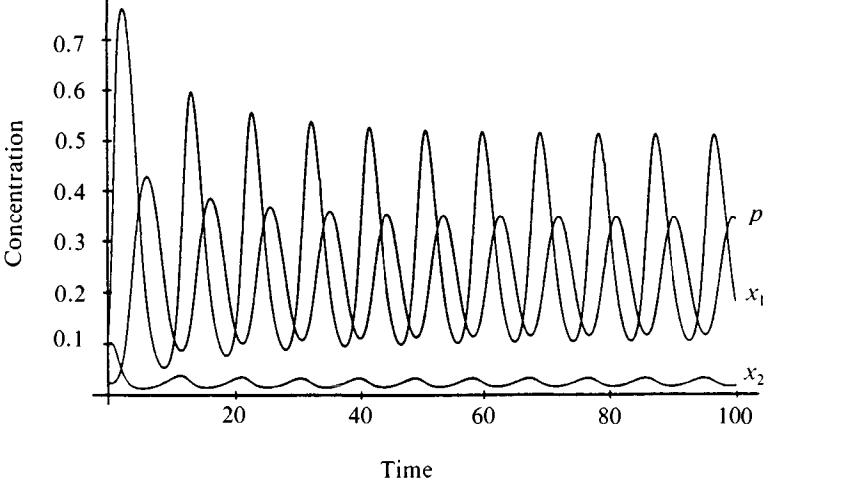

Figure 8.1. Plot of 100 time steps in the case of oscillatory coexistence. Parameters are a, = 0.5, a2 = 3.4, m, = 5.0, m2 = 6.0, K = 0.1, n = 5.0. (From [HWI], reprinted with permission from the SIAM Journal on Applied Mathematics, volume 52, number 2, pp. 528-40. Copyright 1992 by the Society for Industrial and Applied Mathematics, Philadelphia, Pennsylvania. All rights reserved.)

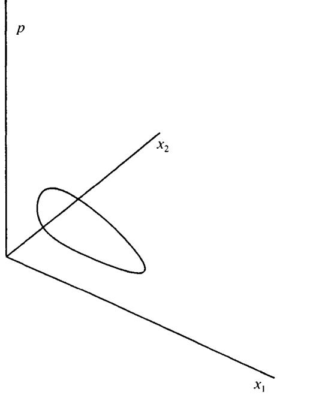

Figure 8.2. Plot in E3 of the limit cycle given in Figure 8.1. (From [HW1], reprinted with permission from the SIAM Journal on Applied Mathematics, volume 52, number 2, pp. 528-40. Copyright 1992 by the Society for Industrial and Applied Mathematics, Philadelphia, Pennsylvania. All rights reserved.)

The Simple Gradostat

### 1. Introduction

In the preceding chapter we saw how the chemostat could be modified to account for a new phenomenon - the presence of an inhibitor. In this chapter we extend the idea behind the simple chemostat to a new apparatus in order to model a property of ecological systems that it is not possible to model in the simple chemostat. The idea is to capture the essentials of the new phenomenon without destroying the tractability of the chemostat either as a mathematical model or as an experimental one. A very simple situation will be described here; a more complicated one with a less explicit (in the sense of less computable) analysis - will be discussed in the next chapter. Just as the chemostat is a basic model for competition in the simplest situation, the apparatus here shows promise of being the model for competition along a nutrient gradient.

The "well mixed" hypothesis for the chemostat does not allow a nutrient gradient to be generated. A basic tenet is that the nutrient concentration is the same everywhere; hence any advantage in nutrient consumption is present everywhere. The model that incorporates a true gradient would be one involving partial differential equations; a new variable, space, must be accommodated. Systems of nonlinear partial differential equations are difficult mathematical objects to understand and analyze. Even numerical solutions pose added and significant difficulties. Moreover, even if an experimental gradient is devised, measurements that do not disturb the local environment take on new difficulties.

A piece of laboratory apparatus was devised by Lovitt and Wimpenny [LWI; LW2; WL] for experiments along a nutrient gradient. It is a concatenation of chemostats in which the adjacent vessels are connected in both directions. Output occurs at the first and last vessels, and those in

between exchange their contents - nutrient and organisms. The flow rates in, out, and between vessels are constant and equal. The apparatus was named a gradostat. It does not occur in nature, at least in this form. Indeed, although we shall think of the apparatus as connected horizontally, the closest approximation in nature may be vertically, as in a water column. In Chapter 6, we shall see that much more imaginative connection patterns are possible. Growth along nutrient gradients does occur in abundance in nature. For example, the surface films in dental plaque represent growth along such a gradient, as does growth along the banks of a stream or along a seacoast. In a water column, sunlight replaces the nutrient as an essential source needed for growth.

In a loose sense the apparatus generates a "discrete" gradient; the nutrient concentrations will vary from vessel to vessel, so the "parameters" of competition change from vessel to vessel. If there is no consumption, the nutrient concentrations arrange themselves as discrete points along a linear gradient. The effect of a nutrient gradient on growth and competition can be studied with such a device.

Figure 1.1 shows the device used by Lovitt and Wimpenny, and Figure 1.2 is a schematic of the device to be analyzed in this chapter. The mathematical analysis is restricted to two vessels, two competitors, and one

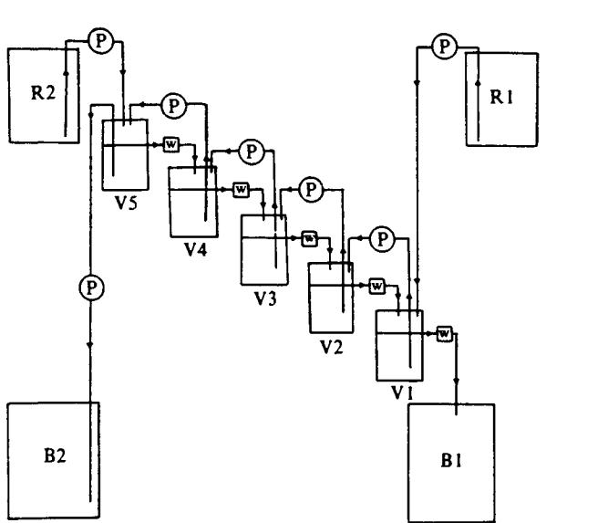

Figure 1.1. The device of Lovitt and Wimpenny. (From [LW2], Copyright 1981, Society for General Microbiology. Reproduced by permission.)

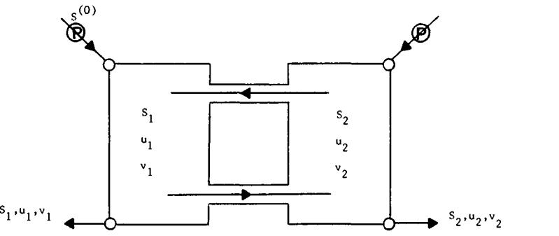

Figure 1.2. A schematic of a two-vessel gradostat. (From [JSTW], Copyright 1987, Journal of Mathematical Biology. Reproduced by permission.)

nutrient. The analysis in this special case takes a particularly elegant form, the relevant conditions being expressed as a set of basic inequalities. As we shall see in the next chapter, much more general formulations can cover many more interesting situations (more interesting gradients), but at the expense of a more complex analysis. The analysis will make extensive use of the theory of monotone systems discussed in Appendix C. The presentation closely follows that of [JSTW]. Since there are only two vessels, the model can be completely analyzed.

To keep the volume in each vessel constant, it is necessary to have medium (without nutrient) input at the right-hand end (as shown in Figure 1.2).

### 2. The Model

The competitors will be labeled as u and v with a subscript denoting the vessel: ul is the first competitor in the first vessel, v, the other competitor in the first vessel, and so on. The nutrient concentration in each vessel is also labeled this way. The equations will differ from that of the basic chemostat only in the flow of nutrient between vessels; for example, there are two outputs from each vessel, one out of the system and one into the adjoining vessel. If there were more vessels in the gradostat, then the middle ones would have two connections as well - that is, connections to the two adjoining vessels.

The equations take the form

$$S_1' = (S^{(0)} - 2S_1 + S_2)D - f_\nu(S_1)\mu_1/\gamma_\mu - f_v(S_1)v_1/\gamma_v,$$

$$S_2' = (S_1 - 2S_2)D - f_\nu(S_2)\mu_2/\gamma_\mu - f_v(S_2)v_2/\gamma_v,$$

$$\begin{aligned} \mu_1' &= (-2\mu_1 + \mu_2)D + f_u(S_1)\mu_1, \\ \mu_2' &= (\mu_1 - 2\mu_2)D + f_u(S_2)\mu_2, \\ \nu_1' &= (-2\upsilon_1 + \upsilon_2)D + f_v(S_1)\upsilon_1, \end{aligned} \tag{2.1}$$

$$\upsilon_2' = (\upsilon_1 - 2\upsilon_2)D + f_v(S_2)\upsilon_2,$$

$$S_i(0) \ni 0, \ \mu_i(0) \ni 0, \ \upsilon_i(0) \ni 0, \ i = 1, 2.$$

The functions

$$f_{\boldsymbol{u}}(\mathcal{S}_{i}) = \frac{m_{\boldsymbol{u}}\mathcal{S}_{i}}{a_{\boldsymbol{u}} + \mathcal{S}_{i}}, \quad f_{\boldsymbol{v}}(\mathcal{S}_{i}) = \frac{m_{\boldsymbol{v}}\mathcal{S}_{i}}{a_{\boldsymbol{v}} + \mathcal{S}_{i}}, \quad i = 1, 2, \ldots$$

are the usual Michaelis-Menten response terms. The constants mu and my are the maximal growth rates for the u and v populations, while au and av are the corresponding Michaelis-Menten (or half-saturation) constants and yu and yv are the conversion factors. The term S(0) denotes the input concentration of the limiting nutrient, and D is called the washout rate. These terms are used exactly as in Chapter 1. As noted there, the last two quantities are under the control of the experimenter, while m, a, and y depend on the population being cultured. Since the focus is on competition, it is reasonable to assume that the functions fu and fv are different. Specifically, it is assumed that either mu # m, or au # av.

The quantities au and av have units of concentration, so if all concentrations (nutrients, organisms, and Michaelis-Menten constants) are measured in units of 5(0) then S(0) may be scaled out of system (2.1). Similarly, the units of mu, m, and D are reciprocal time, so with an appropriate change of time scale D may also be scaled out of the system. Moreover, the conversion factors yu and yv can be incorporated into ui and vi. This is essentially the scaling that has been used in all of the previous models. With these changes of scale, the new system takes the form

$$\begin{aligned} S_1' &= 1 - 2S_1 + S_2 - f_u(S_1)u_1 - f_v(S_1)v_1, \\ S_2' &= S_1 - 2S_2 - f_u(S_2)u_2 - f_v(S_2)v_2, \\ u_1' &= -2u_1 + u_2 + f_u(S_1)u_1, \\ u_2' &= u_1 - 2u_2 + f_u(S_2)u_2, \\ v_1' &= -2v_1 + v_2 + f_v(S_1)v_1, \\ v_2' &= v_1 - 2v_2 + f_v(S_2)v_2, \\ S_i(0) &\ge 0, \ u_i(0) \ge 0, \ v_i(0) \ge 0, \ i = 1, 2. \end{aligned} \tag{2.2}$$

The Model 105

The as and ms have changed their biological meaning, although the new fs are formally the same as those in (2.1).

Now define

$$\Sigma_1(t) = \frac{2}{5} - S_1(t) - \mu_1(t) - \nu_1(t)$$

and

$$\Sigma_2(t) = \frac{1}{3} - S_2(t) - \mu_2(t) - \upsilon_2(t).$$

Adding the equations that correspond to a dependent variable with a subscript 1 and those with a subscript 2 yields

$$\begin{aligned} \Sigma_1' &= -2\Sigma_1 + \Sigma_2, \\ \Sigma_2' &= \Sigma_1 - 2\Sigma_2, \\ \mu_1' &= -2\mu_1 + \mu_2 + f_u(\frac{2}{3} - \Sigma_1 - \mu_1 - \upsilon_1)\mu_1, \\ \mu_2' &= \mu_1 - 2\mu_2 + f_u(\frac{1}{3} - \Sigma_2 - \mu_2 - \upsilon_2)\mu_2, \\ \upsilon_1' &= -2\upsilon_1 + \upsilon_2 + f_v(\frac{2}{3} - \Sigma_1 - \mu_1 - \upsilon_1)\upsilon_1, \\ \upsilon_2' &= \upsilon_1 - 2\upsilon_2 + f_v(\frac{1}{3} - \Sigma_2 - \mu_2 - \upsilon_2)\upsilon_2. \end{aligned} \tag{2.3}$$

The form of (2.2) and the uniqueness of initial value problems guarantee that the nonnegative cone (in 1186) is positively invariant (see Appendix B, Proposition B.7). The following "conservation" result parallels that for the simple chemostat.

LEMMA 2.1. The system (2.2) is dissipative. Moreover,

lim,_ E1(t) = 0 and lim,-, E2(t) = 0,

where the convergence is exponential. The four-dimensional set

$$\Gamma = \{ (\Sigma_1, \Sigma_2, \mu_1, \mu_2, \upsilon_1, \upsilon_2) \in \mathbb{R}_+^\bullet \mid \Sigma_1 = 0, \Sigma_2 = 0 \}$$

is positively invariant.

Proof. E1 and E2 satisfy the linear system

$$\begin{aligned} z_1' &= -2z_1 + z_2, \\ z_2' &= z_1 - 2z_2, \end{aligned}$$

and the assertions about limits follow by solving this constant coefficient system.

The difference between this and the previous conservation results is that it holds in each vessel rather than for the entire "biomass." As a consequence of this lemma, the omega limit set of any trajectory is nonempty, compact, connected, and contained in F. Since every trajectory is asymptotic to its omega limit set, it is important to analyze the system on this set. (See Appendix F for a rigorous justification.) Trajectories in the omega limit set satisfy

$$\begin{aligned} u_1' &= -2\mu_1 + u_2 + f_u(\frac{2}{3} - \mu_1 - \upsilon_1)u_1, \\ u_2' &= u_1 - 2\mu_2 + f_u(\frac{1}{3} - \mu_2 - \upsilon_2)u_2, \\ \upsilon_1' &= -2\upsilon_1 + \upsilon_2 + f_v(\frac{2}{3} - \mu_1 - \upsilon_1)\upsilon_1, \\ \upsilon_2' &= \upsilon_1 - 2\upsilon_2 + f_v(\frac{1}{3} - \mu_2 - \upsilon_2)\upsilon_2 \end{aligned} \tag{2.4}$$

on the region that we again call r to conserve notation. This region r is defined by

$$\Gamma = \{(\mu_1, \mu_2, \upsilon_1, \upsilon_2) \in \mathbb{R}_+^4 \mid \mu_1 + \upsilon_1 \le \frac{2}{3} \text{ and } \mu_2 + \upsilon_2 \le \frac{1}{3}\}.$$

System (2.4) is the one that will receive most of the analysis. Several of the results in the appendices will be used; the theory of monotone systems and the persistence results will be particularly useful. It is generally not possible to analyze a four-dimensional system such as (2.4) because the dynamics can be very complicated; indeed, they can be chaotic. One must work very hard, using the theory developed, to show rigorously that the dynamics are, in fact, very simple. From the standpoint of dynamical systems, this is extraordinary "luck"; from the standpoint of the biology, it is expected. What is new, biologically, is that coexistence is possible and the competition uncomplicated.

### 3. The Set of Rest Points

As with the chemostat, the basic approach is to locate the rest points, analyze their local stability, and determine the global properties of the dynamical system. The first lemma gives some estimates of quantities that will be important in the analysis. It turns out to be easier to state the results in terms of rest points of the system (2.2) rather than those of the system (2.4). These results will be interpreted as needed for the system (2.4).

LEMMA 3.1. Let (Si, Sz, u*, u2, v*, v2) be an equilibrium point of (2.2). Then:

$$\begin{aligned} \text{(a)} \quad u_1^* > 0 &\text{ if and only if } u_2^* > 0, \\ v_1^* > 0 &\text{ if and only if } v_2^* > 0, \text{ and} \\ S_1^* > S_2^* &> 0; \\ \text{(b)} \quad f_u(S_1^*) > f_u(S_2^*) &\text{ and} \\ f_v(S_1^*) > f_v(S_2^*); \\ \text{(c)} \quad \dot{y}f\, u_1^* > 0 &\text{ then} \\ \frac{1}{2} < 2 - f_u(S_1^*) < 1, \\ 1 < 2 - f_u(S_2^*) < 2, \text{ and} \\ (2 - f_u(S_1^*))(2 - f_u(S_2^*)) = 1; \\ \text{(d)} \quad \dot{y}\, v_1^* > 0 &\text{ then} \\ \frac{1}{2} < 2 - f_v(S_1^*) < 1, \\ 1 < 2 - f_v(S_2^*) < 2, \text{ and} \\ (2 - f_v(S_1^*))(2 - f_v(S_2^*)) = 1. \end{aligned}$$

Before proving this technical lemma, we make some observations. One might think that coexistence in the gradostat is possible by having one competitor win in one vessel and the other in the second vessel. Statement (a) shows this is not possible (at least, not as a steady state). The last statements in (c) and (d) provide a crucial key to actual computation of the coordinates of the rest points. The other inequalities provide estimates that will be useful in stability considerations.

Proof. The proofs of these assertions are all relatively straightforward. The results will be established for u7; the others follow similarly. The equations for the rest point are just the equations with the left-hand side of (2.2) set equal to zero. The equations for u, yield the first statement in (a) directly. The second equation in (2.2) at equilibrium becomes

$$S_1^\star - 2S_2^\star = \mu_2^\star f_\iota(S_2^\star) + \upsilon_2^\star f_\iota(S_2^\star) \ni 0.$$

It follows that

$$\mathbf{S}_1^* \succeq \mathbf{2} \mathbf{S}_2^* > \mathbf{S}_2^*.$$

The SZ term cannot be zero. Since fu is monotone increasing, (b) follows. To prove (c), note that

$$
\mu_2^* = (\mathcal{Z} - f_\mu(S_1^*))u_1^* \quad \text{and} \quad u_1^* = (\mathcal{Z} - f_\mu(S_2^*))u_2^*.
$$

From (a), it follows that

$$2 - f_{\mu}(\mathbb{S}_1^*) > 0 \quad \text{and} \quad 2 - f_{\mu}(\mathbb{S}_2^*) > 0$$

and hence, combining these two equations, that

108 The Simple Gradostat

(2-.fu(Si))(2-.fu(Sz)) = 1.

The inequalities then follow from (b). This completes the proof of the lemma.

There is an equilibrium point of the form (;, i , 0, 0, 0, 0). This corresponds to both organisms washing out of the gradostat. In view of Lemma 3.1(a), there are potential equilibrium points of the form (Sb S2, 0 1, u2, 0, 0) and (Sl, S2, 0, 0, v"1, v2), with all nonzero entries positive. These correspond to one of the competitors washing out of the gradostat. For coexistence to occur as a steady state, it must be shown that there also is an equilibrium point with all components strictly positive. The existence and the stability of these rest points are closely related, as the following sections show. To determine the stability of rest points it turns out that certain functions of the coordinates of the rest points must be evaluated, so it is important to be able to compute them explicitly. Our inability to make these computations when the number of vessels is more than two restricts the analysis, as the next chapter will show.

Both ul and u2, if they exist, are solutions of

$$\begin{aligned} -2\mu_1 + \mu_2 + f_\mu(\frac{2}{3} - \mu_1)\mu_1 &= 0, \\ \mu_1 - 2\mu_2 + f_\mu(\frac{1}{3} - \mu_2)\mu_2 &= 0. \end{aligned} \tag{3.1}$$

A straightforward analysis reduces the question of solutions to finding the roots of a cubic equation. Of course, these quantities must be positive for the rest points to be meaningful. Conditions for this, based on stability considerations, will be given in the next section. Numerically solving a cubic is simple; in fact, there is an unlovely formula that does it explicitly. The important point is that since solving the cubic is possible, conditions based on the numerical coordinates are testable. A similar computation gives the coordinates of v, and v2.

The more difficult question is the existence of an interior rest point that is, where Si, ui, and vi are all positive. (Stability considerations, or the arguments that follow here, show that there is at most one interior rest point.) From Lemma 3.1 one has

$$\begin{aligned} (2 - f_{\iota}(\mathbb{S}_1^\star))(2 - f_{\iota}(\mathbb{S}_2^\star)) &= 1, \\ (2 - f_{\iota}(\mathbb{S}_1^\star))(2 - f_{\iota}(\mathbb{S}_2^\star)) &= 1. \end{aligned} \tag{3.2}$$

Although (3.2) is nonlinear in S* and S2, it is linear in ri = S* +SZ and r2 = S1 Sz. Rewriting (3.2) gives

$$\begin{aligned} \text{The Set of Rest Pointts} \\ 3a_{\mu}^2 - \mathcal{A}_{11}a_{\mu}r_1 + \mathcal{A}_{12}r_2 &= 0, \\ \text{1.} \end{aligned} \tag{3.3}$$

where

$$\mathcal{A}_{11} = (\mathcal{D}m_{\iota} - \mathfrak{Z}), \quad \mathcal{A}_{12} = (m_{\iota} - 1)(m_{\iota} - \mathfrak{Z}),$$

$$\mathcal{A}_{21} = (\mathcal{D}m_{\iota} - \mathfrak{Z}), \quad \mathcal{A}_{22} = (m_{\iota} - 1)(m_{\iota} - \mathfrak{Z}).$$

3a, -A21avr1+A22r2 = 0,

The condition that the determinant in (3.3),

$$
\begin{bmatrix}
-\mathcal{A}_{11}a_{\nu} & \mathcal{A}_{12} \\
-\mathcal{A}_{21}a_{\nu} & \mathcal{A}_{22}
\end{bmatrix},
$$

not vanish is

$$a_u(2m_u - 3)(m_v - 1)(m_v - 3) \neq a_v(2m_v - 3)(m_u - 1)(m_u - 3)\dots$$

If this is the case, then

$$r_1 = c_2/c_1 \quad \text{and} \quad r_2 = c_3/c_1.$$

where

$$\begin{aligned} c_1 &= \mathcal{A}_{12}\mathcal{A}_{21}a_v - \mathcal{A}_{11}\mathcal{A}_{22}a_\mu, \\ c_2 &= 3\mathcal{A}_{12}a_v^2 - 3\mathcal{A}_{22}a_\mu^2, \\ c_3 &= 3\mathcal{A}_{11}a_v^2 - 3\mathcal{A}_{21}a_\mu^2. \end{aligned}$$

If either r1 or r2 is nonpositive then there is no interior rest point in U . Given r1 and r2, Sl and Sz can now be recovered from

$$\begin{aligned} \mathbf{S_1^*} \mathbf{S_2^*} &= \mathbf{c_3} / \mathbf{c_1}, \\ \mathbf{S_1^*} + \mathbf{S_2^*} &= \mathbf{c_2} / \mathbf{c_1}, \end{aligned}$$

or, upon substitution, from

$$c_1(\mathbb{S}_1^\bullet)^2 - c_2\mathbb{S}_1^\bullet + c_3 = 0.$$

Hence, one has that

$$\begin{split} S_1^\star &= \frac{c_2 \pm \sqrt{c_2^2 - 4c_1c_3}}{2c_1}, \\ S_2^\star &= \frac{c_2 \mp \sqrt{c_2^2 - 4c_1c_3}}{2c_1}. \end{split} \tag{3.4}$$

Since S* > Sz, there is only one choice of signs. Hence S* and S2, if they exist, are uniquely determined by (3.4). If Si and SZ are determined from (3.4), then the components of u* and v* can be determined from the basic equations (2.2).

| Point | Coordinates                            |
|-------|----------------------------------------|
| Eo    | (0,0,0,0)                              |
| El    | (z 1, u2, 0, 0),<br>ui>0, i=1,2        |
| E2    | (0, 0,<br>V1, v2),<br>t;>0, i=1,2      |
| E.    | (ui, uz, vi, vz),<br>u*>0, v*>0, i=1,2 |

Table 3.1

We seek to use these values in (2.4) to determine the coordinates of the rest point. We make use of the fact that, at an equilibrium, Lemma 3.1 applies to the coordinates. Hence one has that

$$\begin{split} f_{\boldsymbol{\mu}}(S_{\parallel}^{\star})\boldsymbol{\mu}_{1}^{\star} &= 2\boldsymbol{\mu}_{1}^{\star} - \boldsymbol{\mu}_{2}^{\star} \\ &= \frac{4}{3} - 2\boldsymbol{S}_{1}^{\star} + \boldsymbol{S}_{2}^{\star} - 2\boldsymbol{\nu}_{1}^{\star} - \frac{1}{3} + \boldsymbol{S}_{2}^{\star} + \boldsymbol{\nu}_{2}^{\star} \\ &= 1 - 2\boldsymbol{S}_{1}^{\star} + \boldsymbol{S}_{2}^{\star} - 2\boldsymbol{\nu}_{1}^{\star} + \boldsymbol{\nu}_{2}^{\star} \\ &= 1 - 2\boldsymbol{S}_{1}^{\star} + \boldsymbol{S}_{2}^{\star} - f_{\boldsymbol{\nu}}(\boldsymbol{S}_{1}^{\star})(\frac{2}{3} - \boldsymbol{S}_{1}^{\star} - \boldsymbol{\nu}_{1}^{\star}). \end{split}$$

Thus the coordinate of uj is

$$
\mu_1^* = \frac{2S_1^* + f_v(S_1^*) (\frac{2}{3} - S_1^*) - S_2^* - 1}{f_v(S_1^*) - f_\mu(S_1^*)}.
$$

Similarly,

$$
\mu_2^\star = \frac{2S_2^\star + f_\nu(S_2^\star)(\frac{1}{3} - S_2^\star) - S_1^\star}{f_\nu(S_2^\star) - f_\nu(S_2^\star)}.
$$

The remaining two coordinates follow directly as

$$\begin{aligned} \upsilon_1^\star &= \frac{2}{3} - \mathcal{S}_1^\star - \mu_1^\star, \\ \upsilon_2^\star &= \frac{1}{3} - \mathcal{S}_2^\star - \mu_2^\star. \end{aligned}$$

The analysis is valid provided that the denominators in uj or uz are not zero. Note that they cannot both be zero since then fu = f,,. If one of them is zero, we can first determine one variable and then solve for the other by direct substitution into the appropriate equation in (2.2).

If the determinant condition does not hold (i.e., if equality prevails), then the solution of (3.2) represents two parallel lines. If they are coincident,

there is a continuum of solutions; if they are not coincident, there are no solutions. The possibility of a continuum of solutions will be eliminated on stability grounds (provided, as we are assuming, that either m # my or au # av). The proof will be given in Lemma 5.2.

The generic assumption of hyperbolicity is made throughout this chapter. In fact (as we will show), all eigenvalues are real, so the hyperbolicity assumption means that none of them vanish. This section is summarized in Table 3.1, which lists the possible rest points for the system (2.4).

### 4. Growth without Competition

Before analyzing the full gradostat system, the system without competition will be considered. We arbitrarily eliminate the v variable; similar results hold when u is eliminated. The defining equations are:

$$S_1' = 1 - 2S_1 + S_2 - f_u(S_1)u_1 - f_v(S_1)v_1,$$

$$S_2' = S_1 - 2S_2 - f_u(S_2)u_2 - f_v(S_2)v_2,$$

$$u_1' = -2u_1 + u_2 + f_u(S_1)u_1,\tag{4.1}$$

$$u_2' = u_1 - 2u_2 + f_u(S_2)u_2,$$

$$S_i(0) \ni 0, \ u_i(0) \ni 0, \ i = 1, 2.$$

The conservation principle established previously applies here, so one may deal (on the omega limit set) with the system obtained by setting S,(t) = i - ui(t) and S2(t) = 3 - u2(t):

$$
\mu_{\parallel}' = -2\mu_1 + \mu_2 + f_{\mu}(\frac{2}{3} - \mu_{\parallel})\mu_{\parallel},
$$

$$
\mu_2' = \mu_1 - 2\mu_2 + f_{\mu}(\frac{1}{3} - \mu_2)\mu_2,\tag{4.2}
$$

$$
\mu_i(0) \ni 0, \ i = 1, 2.
$$

Of course, the equations are restricted to the region defined by 0 < ul(t) < 3, 0 < u2(t) < ;. This region may be seen to be positively invariant by checking the derivatives along the boundary. Equation (4.2) will be analyzed by determining the stability of rest points and eliminating limit cycles. Since the system is two-dimensional and dissipative, the Poincare-Bendixson theory applies, and this program is sufficient for determining the asymptotic behavior.

The off-diagonal entries in the Jacobian matrix of the right-hand side of system (4.2) satisfy

112 The Simple Gradostat

$$
\frac{\partial}{\partial u_2} \left( -2u_1 + u_2 + f_u(\frac{2}{3} - \mu_1)u_1 \right) = 1,
$$

$$
\frac{\partial}{\partial u_1} \left( u_1 - 2u_2 + f_u(\frac{1}{3} - \mu_2)u_2 \right) = 1.
$$

Thus the system is cooperative, which eliminates the possibility of limit cycles (see the comments following Remark 6.2 of Chapter 4). The Poincare-Bendixson theorem then guarantees convergence of each bounded trajectory to a rest point.

Define

$$\alpha_1(\mathbf{z}) = 2 - f_u(\frac{2}{3} - \mathbf{z}) \quad \text{and} \quad \alpha_2(\mathbf{z}) = 2 - f_u(\frac{1}{3} - \mathbf{z}).$$

The variational matrix for (4.2) at the origin is of the form

$$J = \begin{bmatrix} -\alpha_1(0) & 1\\ 1 & -\alpha_2(0) \end{bmatrix}$$

with eigenvalues

$$
\lambda = \frac{-(\alpha_1(0) + \alpha_2(0)) \pm \sqrt{(\alpha_1(0) - \alpha_2(0))^2 + 4}}{2}.
$$

The eigenvalues are real, and if a, (0)a2(0) < 1 then the origin is a saddle point.

LEMMA 4.1. If cx,(0)a2(0)> 1, the origin is an attractor or repeller as a,(0)+a2(0) is positive or negative. If a,(0)a2(0) < 1, the origin is not in the omega limit set of any trajectory with positive initial conditions.

Proof. If a,(0)a2(0) > 1 then both eigenvalues have the same sign, so the origin is an attractor or a repeller according to whether a,(0)+a2(0) is positive or negative.

Note that for (4.2) the nonnegative quadrant is positively invariant. When a,(0)a2(0) < 1 (i.e., when the origin is a saddle point), we will show that the stable manifold of (0, 0) does not intersect the interior of the positive quadrant. Let A+ and A- denote the positive and negative eigenvalues of J,,, respectively. One has that

$$
\alpha_1(0) + \lambda^+ = \frac{(\alpha_1(0) - \alpha_2(0)) + \sqrt{(\alpha_1(0) - \alpha_2(0))^2 + 4}}{2} > 0.
$$

Similarly, one has that a2(0)+A- < 0. An eigenvector (z,, z2) corresponding to A- satisfies

$$z_1 - (\alpha_2(0) + \lambda^-)z_2 = 0,$$

or the slope of the eigenvector is negative. Hence the stable manifold of the origin lies exterior to QB+. If u(t) = (u1(t), u2(t)) is a trajectory of (4.2) with the origin as an omega limit point then u(t) cannot be on the stable manifold, and hence the omega limit set must contain a point of the stable manifold other than the origin (Butler-McGehee theorem), a contradiction. Thus the origin is not an omega limit point of any nontrivial trajectory with positive initial conditions.

LEMMA 4.2. If the origin is an attractorfor (4.2) (i.e., if al(0)a2(0) > 1 and a1(0)+a2(0) > 0), then

- (a) there is no rest point of the form (I , u2) with u; > 0, i = 1, 2, and
- (b) the origin attracts all trajectories with initial conditions in A+ n F, where (f8+ denotes the interior of R .

Proof. A rest point (u1, u2) with u; > 0 is a positive solution of

$$-2\mu_1 + \mu_2 + f_\mu(\frac{2}{3} - \mu_1)\mu_1 = 0,$$

$$\mu_1 - 2\mu_2 + f_\mu(\frac{1}{3} - \mu_2)\mu_2 = 0,$$

which can be rewritten as

$$\begin{aligned} (2 - f_{\mu}(\frac{2}{3} - \mu_1))\mu_1 - \mu_2 &= 0, \\ -\mu_1 + (2 - f_{\mu}(\frac{1}{3} - \mu_2))\mu_2 &= 0. \end{aligned} \tag{4.3}$$

A nontrivial rest point can exist if and only if the determinant is zero; hence, a1(u1)a2(u2) = 1. However, ai(z) is monotone increasing, so

a1010a2012) > a1(0)a2(0) ? 1.

Hence there is no rest point with positive coordinates if the origin is a (local) attractor.

Conversely, since trajectories are bounded, the positive quadrant is invariant, and there are no limit cycles in the invariant set R2 +n r, so there must be a rest point of the form 01, u2) E 118+ if the origin is not an attractor.

LEMMA 4.3. If the origin is a repeller or a saddle point for 118+ n r, then there is exactly one rest point of (3.2) in the interior of this set and it is a global attractor.

Proof. The existence of a rest point with positive coordinates has been established in the paragraph preceding the statement of the lemma. Suppose there were two distinct rest points (i1, u2) and (u1, u2) with

114 The Simple Gradostat

$$
\hat{u}_i > 0, \quad \tilde{u}_i > 0, \quad i = 1, 2.
$$

Assume that the labeling is such that u, < u,. Then it follows that

$$
\hat{\mu}_2 = \hat{\mu}_1 \alpha_1(\hat{\mu}_1) \lesssim \tilde{\mu}_1 \alpha_1(\tilde{\mu}_1) = \hat{\mu}_2,
$$

with equality only if ii, = u,. Hence, if (u,, u2) * (u,, u2) it follows that

$$1 = \alpha_1(\hat{\mu}_1)\alpha_2(\hat{\mu}_2) < \alpha_1(\tilde{\mu}_1)\alpha_2(\tilde{\mu}_2) = 1,$$

which is a contradiction. Thus there is only one equilibrium point in the interior of the positive quadrant. Since the only equilibrium point on the boundary - the origin - cannot be an omega limit point of trajectories with positive initial conditions, all trajectories must tend to the interior equilibrium.

REMARK. Similar lemmas apply to the equations for the v population,

$$\begin{aligned} \upsilon_1' &= -2\upsilon_1 + \upsilon_2 + f_\upsilon(\frac{2}{3} - \upsilon_1)\upsilon_1, \\ \upsilon_2' &= \upsilon_1 - 2\upsilon_2 + f_\upsilon(\frac{1}{3} - \upsilon_2)\upsilon_2, \end{aligned}$$

with a3(z) = -z) and a4(z) = -z) replacing a, (z) and a2(z), respectively.

The conclusion of the preceding arguments is very simple. There are only two possibilities: The origin is an attractor and all trajectories tend to it; or the origin is not the omega limit point of any trajectory with positive initial conditions, and there exists a unique rest point with positive coordinates to which all trajectories tend. In biological terms, either the organism can survive in the gradostat in all vessels without competition or it cannot survive at all. We are interested in determining the parameter ranges wherein survival occurs.

### 5. Local Stability

We turn now to computing the local stability of the rest points of the full system. The arguments are based on standard linearization techniques, but the size of the variational matrix makes some of the computations difficult. The variational matrix for (2.4) takes the form

$$J = \begin{bmatrix} -\alpha_1 - \beta_1 & 1 & -\beta_1 & 0\\ 1 & -\alpha_2 - \beta_2 & 0 & -\beta_2\\ -\beta_3 & 0 & -\alpha_3 - \beta_3 & 1\\ 0 & -\beta_4 & 1 & -\alpha_4 - \beta_4 \end{bmatrix},\tag{5.1}$$

where the as and f3is are given by

$$\alpha_1 = 2 - f_u(\frac{2}{3} - \mu_1 - \upsilon_1),$$

$$\alpha_2 = 2 - f_u(\frac{1}{3} - \mu_2 - \upsilon_2),$$

$$\alpha_3 = 2 - f_v(\frac{2}{3} - \mu_1 - \upsilon_1),$$

$$\alpha_4 = 2 - f_v(\frac{1}{3} - \mu_2 - \upsilon_2),$$

$$\beta_1 = \frac{m_u a_u \mu_1}{(a_u + \frac{2}{3} - \mu_1 - \upsilon_1)^2},$$

$$\beta_2 = \frac{m_u a_u \mu_2}{(a_u + \frac{1}{3} - \mu_2 - \upsilon_2)^2},$$

$$\beta_3 = \frac{m_v a_v \upsilon_1}{(a_v + \frac{2}{3} - \mu_1 - \upsilon_1)^2},$$

$$\beta_4 = \frac{m_v a_v \upsilon_2}{(a_v + \frac{1}{3} - \mu_2 - \upsilon_2)^2}.$$

When evaluated at a hyperbolic rest point, J will determine the (local) asymptotic stability of that point. The computational problem is increased by the size of the matrix and the complexity of the entries. Fortunately, for some of the rest points there will be a large number of zero entries in J.

For a fixed set of parameters, let SZ denote the rest point set of the system (2.4) in F. There are four possible types of rest points, which we denote as follows:

$$\begin{aligned} E_0 &= (0, 0, 0, 0); \\ E_1 &= (\hat{\mu}_1, \hat{\mu}_2, 0, 0) \quad \text{with } \hat{\mu}_i > 0, \ i = 1, 2; \\ E_2 &= (0, 0, \hat{\upsilon}_1, \hat{\upsilon}_2), \quad \text{with } \hat{\upsilon}_i > 0, \ i = 1, 2; \\ E_* &= (\mu_1^*, \mu_2^*, \upsilon_1^*, \upsilon_2^*) \quad \text{with } \mu_i^* > 0 \text{ and } \upsilon_i^* > 0, \ i = 1, 2. \end{aligned}$$

The rest point Eo always exists. The results in Section 4 provide conditions for El and E2 to exist. The existence and stability of E,, is a major consideration.

The matrix J at Eo has (3i = 0, i = 1, 2, 3, 4, so

$$J = \begin{bmatrix} J_u & 0\\ 0 & J_v \end{bmatrix},$$

where J and JJ are the variational matrices for the two-dimensional systems considered in Section 4. Hence the origin is asymptotically stable if and only if both of the two-dimensional systems (the systems without competition) are stable. From Section 4, this is the case if and only if

116 The Simple Gradostat

$$
\alpha_{\parallel}(0)\alpha_{\parallel}(0) > 1, \quad \alpha_{\parallel}(0) > 0 \tag{5.2a}
$$

$$
\text{and}
$$

$$
\alpha_3(0)\alpha_4(0) \ge 1, \quad \alpha_3(0) > 0. \tag{5.2b}
$$

If one of the conditions in (5.2) is reversed, then the origin is a repeller in the corresponding two-dimensional system (u1-u2 if a1(0)a2(0) < 1 or a1(0) < 0, and v1-v2 if a3(0)a4(0) < 1 or a3(0) < 0), and hence a nontrivial equilibrium point exists in the corresponding two-dimensional subset of the boundary.

The rest point El corresponds to a rest state without the v competitor. When it is asymptotically stable, the v competitor will become extinct (will wash out of the system) for nearby initial conditions. If the stability is global (which will turn out to be the case when stability is local), then v becomes extinct for all positive initial conditions. At E1, J takes the form

$$
\begin{bmatrix}
- \alpha_1 - \beta_1 & 1 & -\beta_1 & 0 \\
1 & -\alpha_2 - \beta_2 & 0 & -\beta_2 \\
0 & 0 & -\alpha_3 & 1 \\
0 & 0 & 1 & -\alpha_4
\end{bmatrix},
$$

where the a;s and (3,s are evaluated at (u1, u2, 0, 0). The zero block in the lower left corner makes the computation of eigenvalues easy, for (using a1a2 = 1) they satisfy

$$\begin{aligned} \left[\lambda^2 + (\alpha_1 + \alpha_2 + \beta_1 + \beta_2)\lambda + \alpha_2\beta_1 + \alpha_1\beta_2 + \beta_1\beta_2\right] \\ \times \left[\lambda^2 + (\alpha_3 + \alpha_4)\lambda + \alpha_3\alpha_4 - 1\right] = 0. \end{aligned} \tag{5.3}$$

Since a, > 0 and (3; > 0, i = 1, 2, the eigenvalues

$$\lambda = \frac{-(\alpha_1 + \alpha_2 + \beta_1 + \beta_2) \pm \sqrt{(\alpha_1 + \alpha_2 + \beta_1 + \beta_2)^2 - 4(\beta_1 \alpha_2 + \alpha_1 \beta_2 + \beta_1 \beta_2)}}{2}$$

from the first square bracket are real (the radical simplifies) and always have negative real parts. These eigenvalues correspond to eigenvectors in the subspace (u1i u2, 0, 0), which is the stable manifold of (ul, u2) viewed as a rest point of the two-dimensional system (4.2). This is expected, in view of the results in Section 4 on the stability of the two-dimensional system.

The eigenvalues corresponding to the second square bracket in (5.3) satisfy

$$
\lambda = \frac{-\left(\alpha_3 + \alpha_4\right) \pm \sqrt{\left(\alpha_3 - \alpha_4\right)^2 + 4}}{2}.
$$

The eigenvalues are real, and the sign depends on the values of a3(u1) and a4(u2). Clearly, if a301)a402) > I then the two eigenvalues are of

the same sign. Then E1 will be an attractor if a3(u1) > 0 and have a twodimensional unstable manifold if a3(u1) < 0.

If CO (u1)a4(u2) < 1, there is one negative and one positive eigenvalue. Let A- denote the negative eigenvalue and let z = (z1, z2, z3, z4) be the corresponding eigenvector. Since

$$
\lambda^- + \alpha_3 = \frac{\alpha_3 - \alpha_4 - \sqrt{(\alpha_3 - \alpha_4)^2 + 4}}{2} < 0
$$

and (A-+a3(u1))z3 = z4, z3 and z4 are of opposite signs and hence z must point out of the positive cone at (u1, u2i 0, 0). In particular, the stable manifold of El does not intersect the interior of the positive cone. This statement is trivially true in the other case, since the unstable manifold is two-dimensional and the stable manifold lies in the boundary. In this case no trajectory with initial conditions in the interior of r can tend to El. This argument is summarized in the following lemma.

LEMMA 5.1. If a3(U1)a4(L 2) > 1, then E1 is an attractor if a3(u1) > 0 and has a two-dimensional unstable manifold if a3(u1) < 0. If a3(u1) a4(u2) < 1, or if a3(u1)a4(u2) > 1 and a3(u1) < 0, then E1 is not the limit of any trajectory with initial conditions in the interior of P. Similar statements apply at E2 using a1(01) and a2(02). When either E1 or E2 is unstable, the stable manifold of that rest point lies in the corresponding two-dimensional face containing E1 or E2.

The difficult part remains - the stability of an interior rest point. Conditions for the existence of such a rest point will be established, on geometric grounds, later in the chapter.

LEMMA 5.2. If au # a or mu # m, and if E* exists, then E* is locally asymptotically stable.

Proof. A sufficient condition for J, evaluated at E*, to have eigenvalues with negative real parts is that if the off-diagonal elements are replaced by their absolute values, then the determinants of the principal minors alternate in sign (Theorem A.11).

Let d1, i = 1, 2, 3, 4, denote the determinants of the principal minors of

$$
\begin{bmatrix}
- \alpha_1 - \beta_1 & 1 & \beta_1 & 0 \\
1 & -\alpha_2 - \beta_2 & 0 & \beta_2 \\
\beta_3 & 0 & -\alpha_3 - \beta_3 & 1 \\
0 & \beta_4 & 1 & -\alpha_4 - \beta_4
\end{bmatrix},
$$

It must be shown that dl < 0, d2 > 0, d3 < 0, and d4 > 0. It follows at once that dl = -a1- 01 < 0. Moreover,

$$\begin{aligned} d_2 &= \alpha_1 \alpha_2 + \alpha_1 \beta_2 + \alpha_2 \beta_1 + \beta_1 \beta_2 - 1 \\ &= \alpha_1 \beta_2 + \alpha_2 \beta_1 + \beta_1 \beta_2 \\ &> 0, \end{aligned}$$

since ala2 = 1 by Lemma 3.1. An easy computation shows that

$$\begin{aligned} d_3 &= -\alpha_1 \beta_2 \beta_3 - \alpha_1 \alpha_3 \beta_2 - \alpha_2 \alpha_3 \beta_1 - \alpha_3 \beta_1 \beta_2 \\ &< 0. \end{aligned}$$

The more difficult problem is that of computing d4. The estimates in Lemma 3.1 are crucial here. The determinant d4 can be expanded in elements of the last row to obtain

$$d_4 = \beta_4 D_1 - D_2 - (\alpha_4 + \beta_4) d_3,$$

where d3 is as given previously. If each of the 3 x 3 determinants D1 and D2 are expanded (a tedious computation that we omit) and heavy use is made of the fact that ala2 = a3a4 = 1 (Lemma 3.1), one can simplify this to

$$d_4 = (\alpha_1 \alpha_4 - 1)\beta_2 \beta_3 + (\alpha_2 \alpha_3 - 1)\beta_1 \beta_4. \tag{5.4}$$

The idea behind the following computations is to express all of the quantities as a function of the two parameters a1 and a4, and to show positivity of the resulting expression for the allowable parameter range.

First write

$$\beta_1 = \frac{a_\nu}{m_u(S_1^\star)^2} (\alpha_1 - 2)^2 \nu_1^\star, \qquad \beta_2 = \frac{a_\nu}{m_u(S_2^\star)^2} (\alpha_2 - 2)^2 \nu_2^\star,$$

$$\beta_3 = \frac{a_\upsilon}{m_\upsilon(S_1^\star)^2} (\alpha_3 - 2)^2 \nu_1^\star, \qquad \beta_4 = \frac{a_\upsilon}{m_\upsilon(S_2^\star)^2} (\alpha_4 - 2)^2 \nu_2^\star,$$

by multiplying and dividing by the square of the appropriate S. Then replace a2, a3, u2, and v* by the substitutions (obtained from Lemma 3.1 and the equations determining rest points)

$$\alpha_2 = 1/\alpha_1, \qquad \alpha_3 = 1/\alpha_4;$$

$$\mu_2^\star = \alpha_1 \mu_1^\star, \qquad \upsilon_1^\star = \alpha_4 \upsilon_2^\star.$$

The first term in (5.4) takes the form

$$(\alpha_1 \alpha_4 - 1)\beta_2 \beta_3 = (\alpha_1 \alpha_4 - 1) \frac{a_u a_v}{m_u m_v} \frac{1}{(S_1^\bullet S_2^\bullet)^2} \left(\frac{1}{\alpha_1} - 2\right)^2 \left(\frac{1}{\alpha_4} - 2\right)^2 \alpha_1 \alpha_4 u_1^\bullet v_2^\bullet,$$

while the second term is given by

$$(\alpha_2 \alpha_3 - 1)\beta_1 \beta_4 = \left(\frac{1}{\alpha_1 \alpha_4} - 1\right) \frac{a_u a_v}{m_u m_v} \frac{1}{(\mathbf{S}_1^* \mathbf{S}_2^*)^2} (\alpha_1 - 2)^2 (\alpha_4 - 2)^2 u_1^* v_2^*.$$

Hence one can write

$$d_4 = \frac{a_\mu a_v}{m_\mu m_v} \frac{\mu_1^\star v_2^\star}{\mathcal{S}_1^\star \mathcal{S}_2^\star} \mathcal{R}(\alpha_1, \alpha_4),$$

where

$$R(\alpha_1, \alpha_4) = (\alpha_1 \alpha_4 - 1) \left(\frac{1}{\alpha_1} - 2\right)^2 \left(\frac{1}{\alpha_4} - 2\right)^2 \alpha_1 \alpha_4$$

$$+ \left(\frac{1}{\alpha_1 \alpha_4} - 1\right) (\alpha_1 - 2)^2 (\alpha_4 - 2)^2.$$

It is necessary only to show that R(al, a4) is positive in the allowable range of a, and a4 given by Lemma 3.1 (i.e., z < al < 1, 1 < a4 < 2). We may rewrite R as

$$\mathcal{R}(\alpha_1, \alpha_4) = \frac{\mathfrak{Z}(\alpha_1 \alpha_4 - 1)^2}{\alpha_1 \alpha_4} \mathcal{Q}(\alpha_1, \alpha_4),$$

where Q(a1, a4) = 5+5a1a4-4a, -4a4. Because Q is an increasing function of a, in the allowable range of a4, Q > 3 - 3a4/2 which must then be positive.

If ala4 # 1 this completes the proof. If equality holds then it follows that a1 = CO and a2 = a4 or that f(Sj) =f f(SZ ). The functions f,, and f cross at the origin and at most one other point. Since 0 < S2 < S*, the two functions are exactly the same. This contradiction completes the proof of the lemma.

#### 6. Order Properties

In the preceding sections, the possible rest points for the gradostat equations were determined and their stability analyzed. The problem that remains is to determine the global behavior of trajectories. In this regard, the theory of dynamical systems plays an important role. First of all, some information can be obtained from the general theorem on inequalities discussed in Appendix B. We illustrate this with an application to the gradostat equations.

Let u(t) = (u1(t), u2(t), v,(t), v2(t)) be the solution of (2.4) with omega limit point p, and let x(t) = (x1(t), x2(t)) be a solution of (4.2) with

x,(0) = u,(0), i = 1, 2. Then, because of the monotonicity of f the first two components of u(t) satisfy

$$
\mu_{\parallel}'(t) < \mu_2(t) - \left(2 - f_{\mu}(\frac{2}{3} - \mu_{\parallel}(t))\right)\mu_{\parallel}(t).
$$

$$
\mu_2'(t) < \mu_1(t) - \left(2 - f_{\mu}(\frac{1}{3} - \mu_2(t))\right)\mu_2(t),
$$

while the components of x(t) satisfy an equation with the same righthand side:

$$\begin{aligned} \chi_1'(t) &= \chi_2(t) - \left(2 - f_\nu(\frac{2}{3} - \chi_1(t))\right)\chi_1(t), \\ \chi_2'(t) &= \chi_1(t) - \left(2 - f_\nu(\frac{1}{3} - \chi_2(t))\right)\chi_2(t). \end{aligned}$$

Hence, for all t > 0, Theorem B.1 (the basic comparison theorem) states that

$$
\mu_1(t) < \varkappa_1(t) \quad \text{and} \quad \mu_2(t) < \varkappa_2(t).
$$

However, if (5.2a) is satisfied then lim,_ x,(t) = 0 (i = 1, 2), so the omega limit point p must be of the form (0, 0, *, *); that is, the u population becomes extinct. Similarly, if (5.2b) holds then p is of the form (*, *, 0, 0) and the v population is eliminated. Note that this is independent of initial conditions and hence is a global result. The component marked * will be zero or positive depending on the other inequality.

If one of the inequalities in (5.2a) is reversed then

$$
\lim_{t \to \infty} \boldsymbol{\chi}_1(t) = \boldsymbol{\hat{\mu}}_1 \quad \text{and} \quad \lim_{t \to \infty} \boldsymbol{\chi}_2(t) = \boldsymbol{\hat{\mu}}_2,
$$

so pl <- 01 and p2 <- u2. A similar argument shows that if one of the inequalities in (5.2b) is reversed, p3 <- vl and p4 < v2. These comments are summarized in the next lemma.

LEMMA 6.1. Let p = (PI, p2, p3, p4) be an omega limit point of any trajectory with initial condition in P. If El exists, pl <- ul and P2 <- u2. If E2 exists, p3 <- 0l and P4:5 V2. If El does not exist, p1 = P2 = 0; if E2 does not exist, p3 = p4 = 0.

The system of interest, (2.4), is neither cooperative nor competitive with respect to the obvious order. The u1-u2 populations cooperate, as do the vl-v2 populations, but u and v compete. In ecological terms, the problem involves families of competing mutualists [S2]. Let x = (u1, u2, v1i v2) and y = (u1, ii2i vl, v2). Define the partial order relation X :5K y by u; < u,, v, ? v,. We shall also usex <K y to mean u; < u,, v, > v,. (This corresponds to the notation x << y used by some authors.) The system (2.4) is monotone (see Appendix C) with respect to this order (see also the discussion

in Appendix B). Let Df(x) be the variational matrix evaluated at an arbitrary point. A sufficient condition for strong monotonicity of a monotone system is given in Theorem C.1 - namely, that the matrix J be irreducible. From (5.1) this is easily seen to be the case in the interior of P and some of its boundary. The dynamical system generated by (2.4) is strongly monotone in the interior of U.

PROPOSITION 6.2. The system (2.4) is uniformly persistent if and only if the rest points El and E2 are unstable.

In the previous section it was shown that the rest points El and E2, when unstable, had no part of their stable manifolds in the positive cone (Lemma 5.1). This shows that (H) of Theorem D.2 holds. If the covering is taken to be the set of rest points, the flow on the boundary is acyclic (in terms of Appendix D), for the rest points in the faces ul = u2 = 0 and the VI = v2 = 0 attract all points in that face. An application of Theorem D.2 completes the proof: take X = lRl and E = ((u1i u2, v1, v2) E l j ui > 0 for some i and vj > 0 for some j).

Recall that hyperbolicity is a generic assumption in this chapter and that dissipativeness has been established. This has the following consequence.

PROPOSITION 6.3. The rest point E* exists if and only if El and E2 are unstable.

Proof. If El and E2 are unstable, then dissipativeness and uniform persistence (previous proposition) yield the existence of an interior rest point E. for 7r(x, t) (Theorem D.3). If E. exists then it is unique and has all eigenvalues negative (Lemma 5.2). Suppose that E* exists and that El is asymptotically stable. Then, since E. <K El and both are asymptotically stable, Theorem E.1 contradicts the uniqueness of E. A similar argument applies if E2 is asymptotically stable. Note that the computations leading up to Lemma 5.1 explicitly determine the signs of the eigenvalues for linearization about E1 and E2.

### 7. Global Behavior of Solutions

Enough information has now been collected to classify the behavior of all solutions of the gradostat equations. This classification will be given as a function of the set SI of rest points. The existence and stability of the rest points has already been established. Indeed, the coordinates of the rest

points can be given in terms of the system parameters - the au, a,,, mu, m that are functions of the organism being cultured. The (local) stability of equilibria is determined by a and 0 evaluated at these points. The set Sl belongs to one of four categories, and for each category the global behavior is given.

THEOREM 7.1. Suppose all of the rest points of (2.4) are nondegenerate.

- (a) If 0 = {Eo1, then Eo is an attractor for all trajectories with initial conditions in f'.
- (b) If [ = {Eo, El) or {Eo, Ei 1, then the nontrivial rest point is an attractorfor all trajectories with initial conditions in 1".
- (c) If SZ = 1 Eo, E,, E2 1, then exactly one of E, or E2 is an attractor for all trajectories with initial conditions in f
- (d) If 0 = {Eo, E,, E2, E. 1, then E, is an attractor for all trajectories with initial conditions in t.

Proof. Case (a) is covered by Lemmas 4.2 and 6.1. This case occurs if and only if the inequalities (5.2) are satisfied.

Case (b) occurs if and only if one of the inequalities in (5.2a) or (5.2b) is reversed and the other set of inequalities holds. Lemma 6.1 again yields that E, belongs to the omega limit set of any trajectory with positive initial conditions.

For case (c) to hold, one inequality in each part of (5.2) must be reversed and (by Proposition E.2) both E, and E2 cannot be stable. Thus, one of E, and E2 is a local attractor, say E,. (Lemma 5.1 provides the explicit conditions for determining which is stable.) Similarly, if case (d) holds, both E, and E2 must be unstable.

The next lemma will be useful in our proof. It will be convenient to let [P,, P2]K denote the order interval, that is

$$\{P_1, P_2\}_K = \{p \mid P_1 \preceq_K p \preceq_K P_2\}.$$

LEMMA 7.2. Suppose that E, and E2 belong to fl and that E, is unstable. If hypothesis (c) holds, then every solution starting at a point xo = (u,(0), u2(0), v,(0), v2(0)) belonging to I' fl [E2, E,]K satisfies

$$\lim_{t \to \infty} \pi(x_0, t) = E_2.$$

If hypothesis (d) holds, then every solution starting at a point xo e f fl[E2,E,]Ksatisfies

$$\lim_{t \to \infty} \pi(x_0, t) = E_{\bullet}.$$

Proof. Let x denote a point (ul, ul, v1, v2), and let F(x) denote the vector field on the right-hand side of (2.4). Let A denote the largest eigenvalue of J, the Jacobian of F at x = El. (J is displayed just prior to (5.3).) Since EI is unstable, A > 0. An eigenvector z = (u, v), u = (ul, u2), v = (vl, v2) corresponding to A must satisfy

$$A\mu + Bv = \lambda\mu,$$

$$Cv = \lambda v,$$

where A, B, and C are (respectively) the three nonzero matrices in the upper left, upper right, and lower right corners of J, A is an eigenvalue of C, and the eigenvalues of A are both negative. By direct calculation (or by an appeal to Theorem A.5), one can choose v > 0. Then u satisfies

$$\mu = -(A - \lambda I)^{-1}Bv.$$

Since By < 0 and -(A-AI)-I > 0, by Theorem A.12(i) (or by direct calculation) one concludes that u < 0 and x <K 0.

Consider a point xr = E, + rx for 0 < r and r sufficiently small. A calculation yields that

$$\begin{aligned} F(\chi_r) &= F(E_\parallel + r\vec{\chi}) \\ &= rJ\vec{\chi} + o(r), \end{aligned}$$

where o(r) represents a term satisfying

$$\lim_{r \to 0} (o(r)/r) = 0.$$

Thus

$$F(\chi_r) = r(\lambda \bar{x} + o(r)/r) <_K 0$$

for all sufficiently small r > 0, since AV <K 0. By Theorem C.2 and monotonicity of (2.4),

$$E_2 <_K \pi(\chi_r, t) \leq_K \chi_r <_K E_1$$

and 7r(xr, t) converges monotonically to a rest point for all small positive r. In Theorem 7.1(c) it is clear that

$$\lim_{t \to \infty} \pi(\chi_r, t) = E_2,$$

since E2 is the only rest point contained in [E2, xr]K. In Theorem 7.1(d), the inequalities may be strengthened to read

$$E_\bullet <_K \pi(\chi_r, t) \leq_K \chi_r <_K E_\bullet,$$

since E. <K xr <K EI for small positive r. Consequently, in case (d),

$$\lim_{t \to \infty} \pi(\chi_r, t) = E_*.$$

The assertions of Lemma 7.2 will now follow by comparison arguments. We give the argument in case (d). Let x0 be an arbitrary point of f' fl [E2, El ] K There exist points xr as before, and xs chosen similarly with respect to E2, such that

$$E_2 <_K \chi_s <_K \chi_0 <_K \chi_r <_K E_1.$$

Since

$$\lim_{t \to \infty} \pi(\chi_r, t) = E_\star \quad \text{and} \quad \lim_{t \to \infty} \pi(\chi_\circ, t) = E_\star,$$

it follows that

$$\lim_{t \to \infty} \pi(\chi_0, t) = E_*. \tag{7}$$

Proof of Theorem 7.1 (cont.). Suppose that the hypothesis of (c) holds and that E2 is locally asymptotically stable. (There is a similar proof if E, is locally asymptotically stable, and by Theorem E.1 both are not.) To establish the conclusion in case (c), we must show that E2 is globally asymptotically stable. Since f fl [E2i E, 1K is positively invariant for (2.4), and belongs to the basin of attraction of E2 as a consequence of Lemma 7.2, one need only show that

$$\lim_{t \to \infty} \pi(\boldsymbol{x}, t) = E_2$$

for xeP\[E2,El]K. Assume this is false; that is, assume there is an xe P\[E2,El]K such that the y+(x) does not enter [E2iE1]K.

By Lemma 6.1, every limit point p of lr(x, t) must satisfy p e [E2, EI]K. By Lemma 5.1, lr(x, t) cannot converge to El. Hence, one can find a limit point P = (p], p2, P3, p4) with p3 > 0 or p4 > 0 or both. By the invariance of limit sets, 7r(p, t) must have third and fourth entries positive for t positive and hence belong to [E2, El]K. By Lemma 7.2,

$$\lim_{t \to \infty} \pi(p, t) = E_2.$$

Thus

$$\lim_{t \to \infty} \pi(x, t) = E_2,$$

since its limit set contains the asymptotically stable rest point E2. This completes the proof of case (c).

In case (d), both El and E2 are unstable. An argument similar to Lemma 7.2 shows that

$$\lim_{t \to \infty} \pi(\chi_0, t) = E_*$$

for xo e f fl [E2i E* ] K. If x0 e P fl [E2, El ] K, choose x1 E P fl [E2, E* ]K and X2 E f fl [E*, El ]K such that

$$
\boldsymbol{\chi_1} \preceq_K \boldsymbol{\chi_0} \preceq_K \boldsymbol{\chi_2}.
$$

(This can be accomplished by choosing x, close enough to E2 and x2 close enough to E1.) Strong monotonicity and the fact that lim,-,, lr(xi, t) = E, i = 1, 2, implies that 1im, lr(xo, t) = E. Therefore, the positively invariant set f' fl [E2, El1 K belongs to the basin of attraction of E.

Suppose that x0 is a point such that

$$
\pi(\chi_0, t) \notin \mathring{\Gamma} \cap [E_2, E_1]_K
$$

for any t > 0. As before, to prove the theorem it is sufficient to show that a limit point p of ry+(xo) belongs to f fl [E2, EI]K, since all such points are attracted to E. Since 7r(xo, t) cannot converge to either El or E2 and remains outside of f' fl [E2, El ]K, there must be a limit point of -y+(xo) distinct from E] and E2 in f fl [E2, El 1K, with p, >_ 0, PI +p2 > 0, and p3+p4 > 0. By the invariance of limit sets and strong monotonicity, ir(p, t) E I' fl [E2, El 1K. This completes the proof of case (d), since lim,-.. ir(p, t) = E*.

### 8. Numerical Example

The theoretical results in section 6 show the global asymptotic behavior of the gradostat. The outcome of the competition was always a steady state, but there were several different possibilities. In each case, however, computations were provided not only to locate the rest points but also to determine their stability. It remains to show that these computations can be carried out. In doing so, a single parameter will be changed to illustrate all three of the nontrivial cases. (The total washout case is not illustrated because it is uninteresting and clearly achievable.)

The outcomes are presented in Table 8.1. The parameters a and m are fixed, which in turn fixes the value of El as shown. The a, term is fixed but m is assigned three different values (as shown), which in turn yields three different sets of coordinates for E2. Given the coordinates of these points, a can be computed. The terms a, and a2 determine the stability of E2, while CO and a4 determine the stability of El. All three permutations are illustrated: El stable and E2 unstable; El unstable and E2 stable; both E, and E2 unstable, in which case E,, exists and is stable. As a consequence of Theorem 6.1, stability means global stability (with respect to the interior of the cone).

The interesting case is coexistence. Figure 8.1 illustrates the time course for this choice of parameters, showing the asymptotic approach to a steady state with all limits clearly above zero.

### 126 The Simple Gradostat

|         |                     | m,                            |                     |
|---------|---------------------|-------------------------------|---------------------|
|         | 15                  | 20.18                         | 25                  |
| E,      | (0,0,0.3092,0.1348) | (0,0,0.3123,0.2076)           | (0,0,0.3794,0.2434) |
| a,      | 0.3917              | 0.6918                        | 0.8841              |
| a,a,    | 0.4590              | 0.9972                        | 1.4036              |
| E,      | Unstable            | Unstable                      | Stable              |
| a3      | 1.0006              | 0.6557                        | 0.3344              |
| a3 a4   | 1.6463              | 0.9984                        | 0.4711              |
| E,      | Stable              | Unstable                      | Unstable            |
| E.      | Does not exist      | (0.2140,0.1471,0.0968,0.0638) | Does not exist      |
| Outcome | u wins              | u and v coexist               | v wins              |

| Table 8.1. Predicted outcomes for different values |
|----------------------------------------------------|
| of the parameter m, with mu, au, a fixed           |

Note: m = 5, a = 1, a, = 5; E, = (0.3098, 0.2122, 0, 0).

Source: [JSTW], data Copyright 1987, Journal of Mathematical Biology. Reproduced by permission.

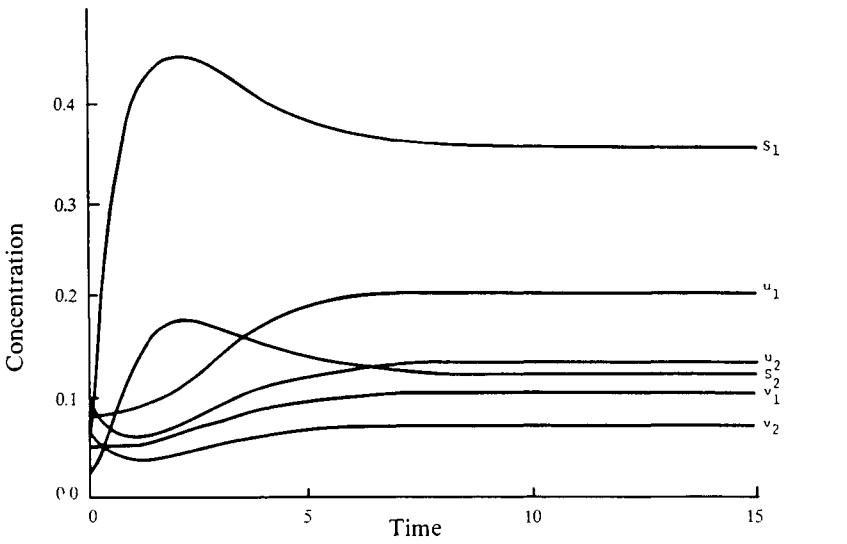

Figure 8.1. The coexistence case with the parameters from Table 8.1. (From [SW2], Copyright 1991, Microbial Ecology. Reproduced by permission.)

### 9. Discussion

The important conclusion from this chapter is that coexistence for two populations can occur in the gradostat for an open set in the parameter space. Since the purpose of the gradostat was to mirror behavior along a nutrient gradient, one can speculate that some of the coexistence observed in nature can be attributed to the existence of such gradients. The gradostat analyzed had only two vessels, but we anticipate that coexistence of two populations could occur in more complicated gradostats. A complete analysis of the asymptotic behavior was obtained in terms of the parameters of the system, and the computability of the conditions was also demonstrated. In the next chapter, the general gradostat will be studied and, unfortunately, some of this computability will be lost.

A surprising consequence of the analysis was that, when the interior rest point existed, it was unique and globally asymptotically stable.

Competition in a modified gradostat was considered in Smith and Tang [STa]. There the rate E between the vessels (called the communication rate) was allowed to differ from the rate D (the dilution rate) from the feed bottle and to the overflow vessel. This, of course, still maintains the assumption that the volume in each vessel is constant. It was shown that the outcome of competition can be sensitive to the ratio E/D in the following sense: As E/D is increased, first one competitor wins the competition, then coexistence occurs, and finally the second competitor wins. The analysis in the case E # D is entirely similar to the case E = D discussed in this chapter. In [STa], a number of operating diagrams were determined numerically. For fixed population parameters au, a,,, mug m,,, these operating diagrams depict regions in the E-D plane in which the various outcomes occur. One such diagram is shown as Figure 9.1 (see page 128).

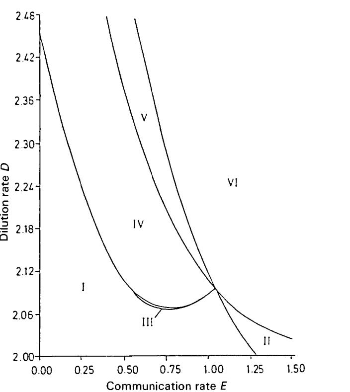

Figure 9.1. Operating diagram for two-species competition with a varying communication rate E different from the washout rate D. In region VI, SI = (E01; in region V, SI = [Eo, E21; in region II, f = [Eo, Ell; in regions I and IV, fI = (Eo, E,, E21; in region III, SI = (EO, E, E2, E. 1. (From [STa], Copyright 1989, Journal of Mathematical Biology. Reproduced by permission.)

The General Gradostat

### 1. Introduction

In the previous chapter the gradostat was introduced as a model of competition along a nutrient gradient. The case of two competitors and two vessels with Michaelis-Menten uptake functions was explored in considerable detail. In this chapter the restriction to two vessels and to Michaelis-Menten uptake will be removed, and a much more general version of the gradostat will be introduced. The results in the previous chapter were obtained by a mixture of dynamical systems techniques and specific computations that established the uniqueness and stability of the coexistence rest point. When the number of vessels is increased and the restriction to Michaelis-Menten uptake functions is relaxed, these computations are inconclusive. It turns out that unstable positive rest points are possible and that non-uniqueness of the coexistence rest point cannot be excluded. The main result of this chapter is that coexistence of two microbial populations in a gradostat is possible in the sense that the concentration of each population in each vessel approaches a positive equilibrium value. The main difference with the previous chapter is that we cannot exclude the possibility of more than one coexistence rest point.

Throughout this chapter we rely extensively on the results contained in Appendices A, B, and C. The presentation here follows closely that in [STW] (see also the review [SW2]).

The most straightforward generalization of the work of Chapter 5 would be simply to extend the number of vessels from two to an arbitrary number, say n. This is the original proposal of Lovitt and Wimpenny [LW1], and would take the form indicated in the schematic in Figure I.I. Since we are considering only one nutrient, the input at the right-hand end is only medium without nutrient. Let S denote the nutrient concentration

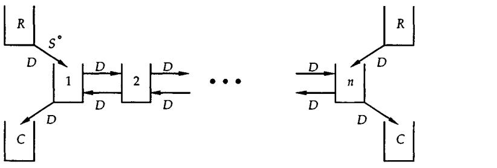

Figure 1.1. The standard n-vessel gradostat. The left vessel labeled R is a reservoir containing nutrient at concentration S(O), C is an overflow vessel, and D denotes the dilution rate. All vessels have the same volume.

and u and v the concentration of the two competitors. Then, using the subscript i to denote concentrations of S, u, and v in vessel i, the equations take the form

$$S'_i = (S_{i-1} - 2S_i + S_{i+1})D - \frac{\mu_i}{\gamma_\mu} f_\nu(S_i) - \frac{\upsilon_i}{\gamma_\upsilon} f_\upsilon(S_i),$$

$$\mu'_i = (\mu_{i-1} - 2\mu_i + \mu_{i+1})D + \mu_i f_\mu(S_i),$$

$$\upsilon'_i = (\upsilon_{i-1} - 2\upsilon_i + \upsilon_{i+1})D + \upsilon_i f_\upsilon(S_i),$$

$$i = 1, \ldots, n,$$

where

$$\mathcal{S}_0 = \mathcal{S}^{(0)}, \quad \mu_0 = \upsilon_0 = \mathbf{0},$$

$$\mathcal{S}_{n+1} = \mu_{n+1} = \upsilon_{n+1} = \mathbf{0},$$

$$\mathcal{S}_i(0) \succeq 0, \ \mu_i(0) \succeq 0, \ \upsilon_i(0) \succeq 0,$$

and fn and f satisfy the following:

- (i) f : 118+- El is continuously differentiable;
- (ii) f(0) = 0 and f'(S) > O for S> 0.

The Michaelis-Menten function

$$f(S) = \frac{mS}{a+S}$$

is the prototypical example. In Chapter 2 we noted other functions with these properties that have appeared in the literature. The principal reason for allowing quite general monotone uptake functions in this case is that we are unable to obtain sharper results under the stronger hypotheses that the uptake functions are Michaelis-Menten.

The 5(0) is the input concentration of nutrient (to the leftmost vessel), and D is the washout rate. These two parameters are under the control of the experimenter. The terms yu and yu are the yield coefficients. For convenience, one can scale substrate concentrations Si by S(°), time by 1/D (making m, nondimensional and D = 1), and microorganism concentrations by yu5(O) and yU5() to obtain the less cluttered system

$$\begin{aligned} S_i' &= S_{i-1} - 2S_i + S_{i+1} - \mu_i f_u(S_i) - \upsilon_i f_v(S_i), \\ \mu_i' &= \mu_{i-1} - 2\mu_i + \mu_{i+1} + \mu_i f_u(S_i), \\ \upsilon_i' &= \upsilon_{i-1} - 2\upsilon_i + \upsilon_{i+1} + \upsilon_i f_v(S_i), \\ i &= 1, \ldots, n, \end{aligned} \tag{1.1}$$

where we use the same conventions as in the unscaled equations except that SO = 1. Hereafter, we refer to (1.1) as the "standard" n-vessel gradostat model.

Mathematically and experimentally there is no reason to connect the vessels linearly, to restrict the source to the left-hand vessel, or to keep the washout rates D equal so long as the volume of the fluid in each vessel is kept constant (see [S7]). We next describe a class of gradostat models which is sufficiently general to include all cases of biological interest and yet remain mathematically tractable.

Suppose that our gradostat consists of n vessels. Let E,1 be the constant (volumetric) flow rate from vessel j to i (i # j), with the convention that Ei, = 0 for i = 1, ..., n. Let V be the volume of fluid in the ith vessel, Di the flow rate from a reservoir to vessel i (D, = 0 if no such reservoir exists), SP) the concentration of substrate in the reservoir feeding vessel i (5;(0) = 0 if D; = 0), and C, the flow rate from vessel i to an overflow vessel (Ci = 0 if no such vessel exists). The notation diag(f3) is used to denote a diagonal matrix whose diagonal elements are given by 0,; E is the matrix of flow rates E,1.

The rate of change of the vector S(t) = (S1(t), ..., at time tin a general gradostat, in the absence of any consumers, is given by

$$[\operatorname{diag}(\mathcal{V}_i)]\mathcal{S}' = \mathsf{\mathcal{A}}\mathcal{S} + \mathsf{g},$$

where

$$\begin{aligned} \vec{A} &= E - \text{diag}\{C_i\} - \text{diag}\left[\sum_{\prime=1}^n E_{\prime i}\right], \\ \mathbf{g} &= (D_1 \mathbb{S}_1^{(0)}, D_2 \mathbb{S}_2^{(0)}, \dots, D_n \mathbb{S}_n^{(0)}). \end{aligned}$$

Of course, the volume V of fluid in vessel i must be constant if this system is to describe a gradostat. This requires that

132 The General Gradostat

$$\sum_{j} E_{ij} + D_i = \sum_{l} E_{li} + C_i \tag{1.2}$$

or that the volumetric flow rates in and out of any fixed vessel are the same.

It is convenient to multiply through by [diag V, ] ' and obtain

$$\mathbf{S'} = A\mathbf{S} + e_0,\tag{1.3}$$

where e° = diag(V-')g and A = diag(V-')A. We assume that at least one vessel receives substrate, since otherwise no microorganisms can survive. Mathematically this means that V) > 0 for some i, so e° * 0. From the definition of A we have that Ai, < 0, since E = 0 (excluding one trivial case of no input or output). In addition, A satisfies

$$A_{ij} \succeq 0, \quad i \neq j,\tag{1.4}$$

and

$$\sum_{j=1}^{n} A_{ij} = -\mathcal{V}_i^{-1} \mathcal{D}_i \preceq 0 \tag{1.5}$$

by virtue of (1.2). Our assumption that S; °> > 0 for some i implies D, > 0, and hence strict inequality holds in (1.5) for some i.

Our principal hypothesis is that the matrix A (or, equivalently, the matrix E) will be assumed to be irreducible (see Appendix A for a mathematical definition). This means that the set of vessels comprising the gradostat may not be partitioned into two disjoint non-empty subsets, I and J, such that no vessel in subset J receives input from any vessel in subset I. Note that the standard gradostat has this property but that the gradostat in Figure 1.2 does not. In that figure, the subset J consisting of the two vessels on the left receives no input from the vessel on the right, which comprises subset I. If that gradostat were of interest, one could

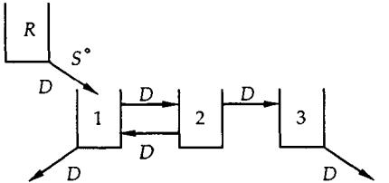

Figure 1.2. A three-vessel gradostat that does not satisfy the irreducibility hypothesis. The two vessels on the left receive no input from the vessel on the right. Arrows pointing down from the first and last vessel represent flow to overflow vessels not depicted. Notation is the same as in Figure 1.1.

simply treat the third vessel as an overflow vessel and effectively ignore it. The subset J could be viewed as the gradostat and the results to be described in this chapter could be applied to it. Once this subgradostat is understood, the input to the third vessel is known and it is then a simple matter to describe what happens in this last vessel. Thereby, the behavior of the entire gradostat can be worked out. More generally, if the matrix A does not have the property of being irreducible, then one can always partition the gradostat into irreducible subsets (subgradostats) that can be studied sequentially (see [BP]). In this sense, there is really no loss in generality in assuming irreducibility from the start. We also mention another way to view the hypothesis of irreducibility: for any pair of distinct vessels i and j, material from vessel i can travel to vessel j, though perhaps indirectly by first passing through intermediate vessels before entering vessel j.

While we focus on irreducible gradostats, reducible gradostats may be of biological interest as well. They could be used to model a system of mountain lakes situated at different elevations, where a lake at higher elevation feeds a lake at lower elevation.

Let F. = diag[ f (S1), fu(S2), ..., and let FU be defined analogously with subscript v replacing subscript u. Then, introducing consumption, the general model takes the form

$$\begin{aligned} S' &= e_0 + A S - F_u(S) \mu - F_v(S) v, \\ \mu' &= A \mu + F_u(S) \mu, \\ v' &= Av + F_v(S) v. \end{aligned} \tag{1.6}$$

The standard model (1.1) is a special case of (1.6), where eo is the vector with first component equal to 1 and all others equal to 0 and where A is the matrix with -2 in the main diagonal entries, 1 in the superdiagonal and subdiagonal entries, and 0 elsewhere. Although the standard model is of primary interest, the general gradostat described by (1.6) can be treated with the same mathematics. In Figure 1.3, two irreducible gradostat configurations are described. See [LW1; LW2; S7] for other possibilities.

### 2. The Conservation Principle

In this section it will be shown that the conservation principle holds and allows the reduction of the 3n-dimensional system (1.6) to a 2n-dimensional system, eliminating the nutrient from consideration. In order to do this we will need to make use of those results of Appendix A dealing

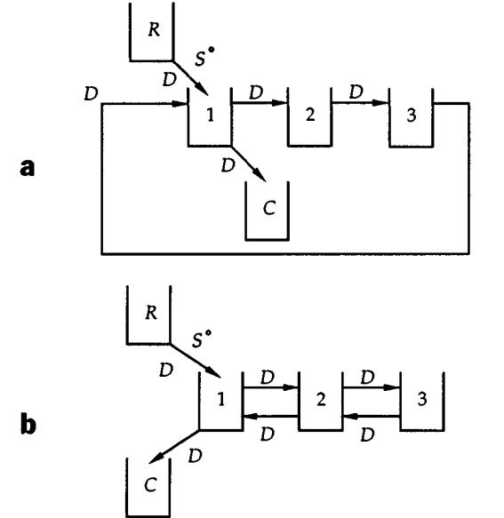

Figure 1.3. Two irreducible gradostats: a cyclic gradostat; b "dead-end" gradostat. Note that the inflow to each vessel balances the outflow.

with quasipositive matrices. Recall that a real matrix is quasipositive if its off-diagonal entries are nonnegative. The matrix A in (1.6) has this property. (The reader may wish to briefly review Appendix A at this time.) If M is a matrix, we denote by a(M) the set of eigenvalues of M and

$$s(\mathcal{M}) = \max(\Re(\lambda) \colon \lambda \in \sigma(\mathcal{M})),$$

where 9? (A) denotes the real part of A; s(M) is called the stability modulus of M. The next result is crucial for establishing the conservation principle. The properties of the matrix A in the hypotheses of this result have already been noted in the previous section.

LEMMA 2.1. Let A = (aij) be an irreducible matrix with nonnegative offdiagonal entries. Suppose that

$$\sum_{j=1}^{n} a_{ij} \le 0$$

for each i and that strict inequality holds for some i. Then s(A) < 0 and -A-'>0.

Proof. Since A has nonnegative off-diagonal entries and is irreducible, Theorem A.5 asserts that s(A) is a simple eigenvalue of A, larger than the real parts of all other eigenvalues. The inequality hypothesis and the Gershgorin circle theorem (Theorem A.1) together imply that s(A) s 0. If s(A) < 0, then the final assertion of the lemma follows from Theorem A.12. If s(A) = 0, then Theorem A.5 implies that there exists x > 0 such that Ax = 0. We can assume that xj<- 1 for all j and that xi = 1 for a nonempty subset I of indices. If J is the complementary set of indices then J is non-empty by our assumptions on the row sums of A. For i c- I we have

$$\begin{aligned} 0 &= \sum_{l} a_{il} \chi_{l} = \sum_{l \in J} a_{il} + \sum_{l \notin J} a_{il} \chi_{l} \\ &= \sum_{j} a_{ij} + \sum_{l \in J} a_{il} (\chi_{l} - 1) \\ &\lesssim \sum_{l \in J} a_{il} (\chi_{l} - 1) .\end{aligned}$$

As xi < 1 for 1 E J and ail > 0, it must be that ail = 0 for all 1 E J; otherwise, the sum is negative. Thus aid = 0 for all i c- I and j c- J. This contradicts the irreducibility of A and so proves the lemma.

The conservation principle is stated next. Like its analog, Lemma 2.2 of Chapter 5, it states that the total nutrient in each vessel, consisting of both pure nutrient and that making up the biomass of microorganisms, approaches a constant value (which depends on how the vessels making up the gradostat are configured) exponentially fast. As in the previous chapter, the conservation principle is crucial for our analysis because it allows the reduction of (1.6) to a lower-dimensional dynamical system.

LEMMA 2.2. Solutions of (1.6) with nonnegative initial data exist and are nonnegative and bounded for t ? 0; moreover,

$$\lim_{t \to \infty} S(t) + \mu(t) + \upsilon(t) = z,$$

where z > 0 is the unique solution of

$$Az + e_0 = 0.$$

Proof. Solutions of (1.6) remain nonnegative by Proposition B.7. Let w(t) = S(t)+u(t)+v(t). Then

$$\mathbf{w}' = A\mathbf{w} + \mathbf{e}_0,\qquad \mathbf{w}(\mathbf{0}) = S(\mathbf{0}) + \boldsymbol{\mu}(\mathbf{0}) + \boldsymbol{\nu}(\mathbf{0}) \succeq \mathbf{0}.$$

By Lemma 2.1, the equation Az + e° = 0 has a unique solution z = (-A)-'eOi which is positive because e° ? 0 does not vanish and (-A)-' > 0. Putting y = w - z in the linear system, we find that y' = Ay. Since s(A) < 0, limt- y(t) = 0, completing the proof.

It follows from (1.3) that S = z is the steady-state distribution of nutrient in the gradostat when no species of microorganisms are present (u = v = 0). In the case of the standard gradostat of Figure 1.1, modeled by (2.1), one can easily calculate that z; = S 0)[1-i/(n+1)], 1 s i <- n. The concentration of nutrient declines linearly from the value 5(0) in the leftmost vessel to the value S (0)1(n + 1) in the rightmost vessel, just as one might expect by analogy with a diffusion process. Thus, a nutrient gradient is established. This observation explains the term "gradostat" coined by Wimpenny and Lovitt to describe this continuous culture device.

Lemma 2.2 says that on the omega limit set, solutions of the system (1.6) satisfy

$$\begin{aligned} \mu' &= [A + F_{\mu}(z - \mu - \upsilon)]\mu, \quad \mu(0) = \mu_0 \succeq 0, \\\upsilon' &= [A + F_{\upsilon}(z - \mu - \upsilon)]\upsilon, \quad \upsilon(0) = \upsilon_0 \succeq 0 \end{aligned} \tag{2.1}$$

on

$$
\Gamma = \langle (\iota, \upsilon) \in \mathbb{R}_+^{2,n} \colon \iota + \upsilon \le z \rangle.
$$

Note that P is positively invariant for (2.1). In fact, solutions remain nonnegative (by Proposition B.7) and, if u, + v, = zi,

$$(\mu_i + \upsilon_l)' = [\mathcal{A}(\mu + \upsilon)]_l \le (\mathcal{A}z)_l = -(e_0)_l \le 0.$$

From this inequality we conclude that the vector field points into r on the hyperplane u; + v; = z,.

We will use several notations for a solution of (2.1). The notation

$$(u(t, \mu_0, \upsilon_0), v(t, \mu_0, \upsilon_0))$$

will be used to indicate the solution of (2.1) satisfying

$$(\mu(0, \mu_0, \upsilon_0), \upsilon(0, \mu_0, \upsilon_0)) = (\mu_0, \upsilon_0).$$

The initial condition (uO, vO) may be dropped from the notation when no confusion can occur over which initial condition is being considered. We will also find it convenient to let x = (uO, vO) and write lr(x, t) for the solution of (2.1), that is,

$$
\pi(\boldsymbol{x},t) = (\boldsymbol{\mu}(t,\boldsymbol{\mu}_0,\boldsymbol{\upsilon}_0), \boldsymbol{\upsilon}(t,\boldsymbol{\mu}_0,\boldsymbol{\upsilon}_0)) = \pi(\boldsymbol{\mu}_0,\boldsymbol{\upsilon}_0,t).
$$

When vo = 0 in (2.1) then v vanishes identically, so we write u(t, u0) for the solution of the first of equations (2.1). A similar notation is used for vifu0=0.

The next result states that a solution of (2.1) - starting at t = 0 from an initial distribution of each microbial population among the vessels of the gradostat - which has the property that each population is present in some (not necessarily the same) vessel, thereafter has the property that both populations are present in every vessel. A population must occupy all of the vessels or none of the vessels. This property is an important consequence of the irreducibility assumption on the matrix A. Obviously, it can fail for the gradostat of Figure 1.2.

LEMMA 2.3. If (u(t), v(t)) satisfies (2.1) and u;(0) > 0 (resp. v;(0) > 0) for some i, then u(t) > 0 (resp. v(t) > 0) for all t > 0.

Proof. The linear equation u'(t) =A(t)u(t) is satisfied by u(t), where A(t) =A+Fu(z-u(t)-v(t)) is quasipositive and irreducible. If u;(0) > 0 for some i, then u(t) > 0 for t > 0 follows from the positivity of the fundamental matrix (see Theorem B.3). O

### 3. Growth without Competition

When there is only one population, say u, one equation in (2.1) drops out. The growth of population u is then governed by

$$
\mu' = [A + F_{\mu}(z - u)]\mu, \quad u(0) = \mu_0. \tag{3.1}
$$

The initial data u0 must belong to the order interval [0, z] = [ u : 0s u:5 z j. It is easy to see that [0, z] is positively invariant. Solutions of (3.1) exist for all t >- 0 and are nonnegative and bounded, by Lemma 2.2 and the fact that (u(t), 0) is a solution of (2.1). The next result is the analog of Lemmas 4.2 and 4.3 of Chapter 5. It describes the global behavior of solutions of (3.1). The proof, which is similar to the one given in [Ta], makes use of the fact that (3.1) generates a strongly monotone dynamical system in the interior of [0, z] (see Appendix Q. The reader may be well advised to skip the proof, which is quite technical, on first reading. Following the proof, a simple argument is given which makes the result seem plausible.

THEOREM 3.1. If s(A+F,,(z)) s 0, then lim,-,0 u(t, u0) = 0 for every u0 e [0, z]. If s(A+Fu(z)) > 0, then there exists a unique equilibrium u, u > 0 and lim, u(t, u0) = u, for every nontrivial u0 in [0, z].

Proof. Suppose that s = s(A+FF(z)) < 0. Then

$$
\mu' \le [A + F_{\mu}(z)]\mu,
$$

so u(t) <-y(t) where y(O) = u(0) and y satisfies y'= [A+Fu(z)]y (by Theorem B.1). Since y(t) -- 0 as t --> oo, the same holds for u(t). The case where s = 0 is more difficult; we refer the reader to [S7]. Now suppose that s > 0 and let v be a corresponding eigenvector for A +Fu (z) such that v > 0. Such an eigenvector exists by Theorem A.5. Put G(u) = [A+F,, (z-u)]u, the right-hand side of (3.1). Then G(rv) = rG'(0)v+o(r), where G'(0) is the Jacobian of G at u = 0 and o(r)/r- 0 as r-> 0. It follows that G(rv) > 0 for all small positive r. By Theorem C.2(a), we conclude that the solution u(t) of (3.1) satisfying u(O) = rv converges to an equilibrium e >- rv belonging to [0, z]. Therefore, ifs > 0 then there exists a positive rest point of (3.1). Lemma 3.3 implies that any nontrivial rest point in [0, z] must be positive. We must show that this rest point is both unique and a global attractor for [0, z]\{0).

Suppose that the uniqueness of the positive rest point has been established and denote it by a. If u(t) is any solution of (3.1) with u,(0) > 0 for some i, then u(t) > 0 for t > 0 by Lemma 3.3, so we can assume without loss of generality that u(0) > 0. The dynamical system generated by (3.1) is strongly monotone in the interior of [0, z]. Let J be the portion of the line joining 0 to u(0) which lies in the interior of [0, z]. By Theorem C.5, the solutions starting at all (but at most finitely many) points of J converge to a rest point. In fact, these convergent solutions must converge to tt, since the solutions starting at rv converge to u for all small r > 0 and we may compare any solution starting on J with one of these. The solution u(t) must converge to u, since we can find points u1, u2 on J satisfying u1 < u(0) < u2 and such that the solutions u,(t) starting at u, converge to u and u1(t) <- U(0:5 u2(t) holds for all t > 0. We have established the convergence of nontrivial solutions of (3.1) to u, provided this rest point is unique. We remark that if A is symmetric, as in (1.1), then (3.1) is a gradient system [Ta]; in this case, convergence to equilibrium could be established by appealing to the LaSalle corollary of Chapter 2.

Choose p > 0 sufficiently large so that, for each i, the function u, pu, + fu(z, - u,)u, has a positive derivative on [0, z,]. It is easy to see that nontrivial rest points of (3.1) are positive fixed points of the map T: [0, zl -> [+ defined by

$$T\mu = [-(\mathcal{A} - p)^{-1}][F_{\mu}(z - \mu) + pI]\mu,$$

where I is the identity matrix. Note that the matrix in the first bracket on the right side is positive for the same reasons that [-A]-1 is. The map T is monotone in the sense that if x:5 y then Tx s Ty. Furthermore, for each u > 0 and for each rE (0, 1), there exists q > 0 (depending on u, r) such that T(ru) ? (1+q)rT(u). Now if uI and u2 are distinct positive fixed points of T, then one of the relations u1 s u2 or u2 s u1 must fail to hold. Suppose that u2 <_ u1 does not hold. Then we can find re (0, 1) with the property that rue <_ ul and r is the largest positive number with this property. But then we have a contradiction to the maximality of r from

$$(1+q)r\nu_2 = (1+q)rTu_2 \le T(ru_2) \le Tu_1 = \nu_1.$$

This establishes the uniqueness of the nontrivial rest point.

In words, Theorem 3.1 states that a microorganism can either survive in the gradostat, eventually reaching a positive equilibrium concentration in each vessel, or it cannot survive in the gradostat and it is washed out of every vessel. One number, the stability modulus of the matrix A+Fu(z), determines which of the two outcomes holds. The terms A and z contain all the information about the physical apparatus: the flow rates between vessels, the volumes of fluid in each vessel, and the nutrient inputs to each vessel. The function Fu contains the relevant information about the microorganism. For example, if fu is Michaelis-Menten then the maximum growth rate mu and the half-saturation constant au are the key biological data. Considering the freedom allowed in the construction of the general gradostat, it is remarkable that, according to the model, microorganism survival is determined by the sign of a single number, s = s(A+FF(z)). If s < 0 then washout occurs but if s > 0 then survival is assured.

In fact, this result is not difficult to anticipate. Imagine introducing an infinitesimally small concentration of a microbial population into a gradostat that has been operating for a considerable time without any microbes present. According to Lemma 2.2 and (1.3), the nutrient concentration will have had time to equilibrate to the level zi in vessel i. The microbial population will see this level of nutrient in each vessel and therefore its concentration u(t) will approximately obey the linear equation u'= [A+FF(z)]u, where we have neglected to subtract u from z in the argument of Fu because we are assuming that u is negligible compared to z. Thus the microbial population will grow ifs > 0 and decay ifs < 0.

In the corresponding single-population equation for v, we denote the positive equilibrium, which exists if and only if s(A+FF(z)) > 0, by D. For the full system (2.1), both (u, 0) and (0, v) will be equilibria.

### 4. Competition

We turn now to the question of competition. In the previous chapter, we established a classification of the dynamic behavior based on the set of rest points. Unfortunately, our computations - which established the stability of any interior rest point and thereby led to the conclusion that such an equilibrium is unique in the case of two vessels and Michaelis-Menten uptake functions - are extremely difficult for n vessels and general uptake functions [HSo], so the results in this case are not as simple as in that chapter. In the present context we attempt to classify the dynamics in terms of both the set 0 of rest points and the sign of the stability modulus of certain key matrices. The theory of monotone dynamics is then used to resolve global questions. The principal result is Theorem 4.4.

There are three obvious candidates for equilibria:

$$E_0 = (0,0), \quad E_1 = (\hat{\mu},0), \quad E_2 = (0,\tilde{\nu}),$$

where a and v were defined in Section 3. Throughout this section we let 0 denote the set of equilibria of (2.1). Clearly, 0 depends on the parameters of (2.1). The next result summarizes what we already know about 12.

#### LEMMA 4.1. The following hold:

```
(a) Eo always exists;
```
- (b) El exists if and only if s(A+FF(z)) > 0;
- (c) E2 exists if and only if s(A+FF(z)) > 0;
- (d) if E. = (u, u) is an equilibrium distinct from Eo, E1, E2, then E,, > 0.

Proof. Part (a) is clear, and (b) and (c) follow from Theorem 3.1. Part (d) follows from Lemma 2.3.

The stability of the rest points is determined by the linearization at these points. The variational matrix for (2.1) takes the form

$$\begin{aligned} \text{The variational matrix for (2.1) takes the form} \\ J = \begin{bmatrix} A + F_u(z - \mu - v) - D_u & -D_u \\ -D_v & A + F_v(z - \mu - v) - D_v \end{bmatrix}, \end{aligned} \tag{4.1}$$

where

$$D_{\mu} = \text{diag}\left(\mu_1 f'_{\mu}(z_1 - \mu_1 - \upsilon_1), \dots, \mu_n f'_{\mu}(z_n - \mu_n - \upsilon_n)\right)$$

and

$$D_v = \text{diag}(\upsilon_1 f_v'(z_1 - \iota_1 - \upsilon_1), \dots, \upsilon_n f_v'(z_n - \iota_n - \upsilon_n)).$$

### Competition 141

At E0, both Du and D vanish so that J has only the two diagonal blocks A+FF(z) and A+FF(z). Clearly, the eigenvalues of J consist of the union of the eigenvalues of the two blocks. Consequently, Eo is stable in the linear approximation (all eigenvalues have negative real parts) if and only if s(A+FF(z)) < 0 and 0. It is unstable if either of these is positive, in which case I contains either El or E2.

We now turn to the question of the stability of El. The main results are stated formally, since they are crucial for our later analysis. The basic idea is simple. Imagine that a microbial population is allowed to grow in the gradostat in the absence of competition. This population will approach the equilibrium concentration u; in vessel i corresponding to the rest point El. Now add an infinitesimally small concentration of the competing population and ask whether or not it can survive. If the vector of concentrations of the competing population is v(t), then v(t) approximately satisfies the linear system v'= [A+FU(z-a)]v, since v is assumed to be negligibly small. Consequently, the competing population v survives or decays as s(A+Ft,(z-a)) is positive or negative. This is all made precise in what follows.

LEMMA 4.2. If El exists then s = (i)) is an eigenvalue of the variational matrix corresponding to E,, which is asymptotically stable in the linear approximation if and only ifs < 0. Ifs > 0, then the variational matrix at E, has a corresponding eigenvector w satisfying w <K 0.

Proof. At E, the matrix (4.1) takes the form

$$J = \begin{bmatrix} \mathcal{A} + F_{\boldsymbol{\mu}}(z - \hat{\boldsymbol{\mu}}) - D_{\boldsymbol{\mu}} & -D_{\boldsymbol{\mu}} \\ 0 & \mathcal{A} + F_{\boldsymbol{\upsilon}}(z - \hat{\boldsymbol{\mu}}) \end{bmatrix},$$

where submatrices are n x n. The existence of E, implies that

$$[\mathcal{A} + F_{\mu}(z - \hat{u})] \times = 0$$

has the solution x = u > 0. This fact and Theorem A.5 imply that

$$s(\mathcal{A} + F_{\mu}(z - \hat{\mu})) = 0$$

and that a is the corresponding eigenvector. Since Du >- 0 is not the zero matrix, s(A+F,,(z-a)-Du) <s(A+FF(z-a)) =0 by Theorem A.5. The structure of the matrix J implies that the eigenvalues of J are just the eigenvalues of the two blocks on the diagonal. Since the upper block is stable, the stability of E, is determined by s. If it is negative then E, is

stable in the linear approximation, and if it is positive then El is unstable in the linear approximation.

If s> 0, a corresponding eigenvector w = (WI, w2) satisfies

$$[A + F_{\boldsymbol{\mu}}(\boldsymbol{z} - \boldsymbol{\hat{\mu}}) - D_{\boldsymbol{\mu}}] \boldsymbol{\omega}_{\text{l}} - D_{\boldsymbol{\mu}} \boldsymbol{\omega}_{\text{2}} = \boldsymbol{\varepsilon} \boldsymbol{\omega}_{\text{l}},$$

$$[A + F_{\boldsymbol{\upsilon}}(\boldsymbol{z} - \boldsymbol{\hat{\mu}})] \boldsymbol{\omega}_{\text{2}} = \boldsymbol{\varepsilon} \boldsymbol{\omega}_{\text{2}}.$$

Thus we may take w2 > 0, by Theorem A.5. Once w2 is fixed, w, is determined by

$$\mathbf{w}_1 = \{A + F_{\mu}(\mathfrak{z} - \hat{u}) - D_{\mu} - \mathrm{s}I\}^{-1} D_{\mu} \mathbf{w}_2 < 0,$$

where we have used -[A+Fu(z-u)-Du-sI]-1 > 0. This holds by first appealing to Theorem A.5 to conclude that s(A+Fu(z-u)-Du-sI) = s(A+Fu(z-u)-Du)-s<-s(A+F,,(z-u))-s=-s; then apply Theorem A.12. Thus, W <K 0.

A similar result holds concerning the stability of E2, which is asymptotically stable if s = s(A+Fu (z - v)) < 0 and unstable if s > 0.

An important observation concerning (2.1) is that it generates a strongly monotone dynamical system in the interior of P. This observation is immediate from (4.1) and Theorem C.1. Let x = (u, v) and y = (u, v) be two points of R2n. We write x <K y in case u < u and U <- v; we write x <K y if u<uandv<v.If x<-Kywe let [x,y]K=[z:x<-KZ<Ky].

If x and y are distinct points belonging to the interior of IF and satisfying x :SKY, then lr(x, t) <K 7r(y, t) for t > 0. An even stronger monotonicity property is needed. If x and y are distinct points belonging to r, x <K y, and either x > 0 or y > 0, then lr(x, t) <K 7r(y, t) holds for t > 0.

The monotonicity properties of (2.1) provide additional information about 1 which is cataloged in the following result. The most important of these is the assertion that a positive rest point cannot exist unless each competitor can survive alone in the gradostat, that is, unless both El and E2 exist. Later we will see that coexistence of the two populations is possible, but only if there exists a positive rest point. Therefore, coexistence is only possible when each competitor can survive alone in the gradostat.

### THEOREM 4.3. Let 0 denote the set of rest points of (2.1). Then:

- (a) if there exists an equilibrium E. e 0 satisfying E, > 0, then bl contains El and E2;
- (b) if 0 = [E0], then E0 is a global attractor for (2.1);

### Competition 143

- (c) if 0 = [E0, EI) (resp. (ll = (E0, E2}), then the nontrivial rest point attracts all orbits of (2.1) with initial conditions (u0, v0) E F satisfying u0 # 0 (resp. v0 * 0).
Proof. If (u(t), v(t)) is a solution of (2.1) then u':!5 [A+ F,(z-u)ju, so (by Theorem B.1) u(t) <- u(t), where a is a solution of (3.1) satisfying u(0) = u(0). If El does not exist then u(t) -0 as t -oo, by Theorem 3.1. It follows that u(t) -+ 0 as t -4 oo if El does not exist. A similar argument shows that v(t) 0 as t -* oo if E2 does not exist. These observations prove (a) and (b).

If <Z = [E0, El] then the omega limit set of every solution of (2.1) belongs to t(u, v) e F: v = 01, by the arguments of the previous paragraph. The equilibrium El is asymptotically stable because s(A+FU(z)) <- 0, where we have used Theorem A.5 and Lemma 4.1(c). Therefore, if El belongs to the omega limit set then it must be the omega limit set. As the omega limit set is invariant, we conclude (using Theorem 3.1) that the limit set is El provided that it contains any point (u, 0) with u # 0. Suppose that x(t) = (u(t), v(t)) is a solution satisfying u(0) # 0 and v(0) # 0. Then x(t) > 0 fort > 0. If x(t) -* 0 as t oo then, by monotonicity, so do all solutions z(t) with initial conditions z(0) satisfying z(0) <-K (u(1), v(l)). Therefore E0 attracts an open set of initial values, and it follows (see [Hi3]) that s(J0) 5 0 where J0 is the Jacobian (4.1) evaluated at E0. But this contradicts Lemma 4.1(b) and so proves that the limit set of x(0) must contain a point (u, 0) with u # 0.

We can now state the main result of this chapter. It provides sufficient conditions for the coexistence of the two populations in the gradostat and ensures that SI contains a positive rest point E. In fact, it guarantees that the two populations are uniformly persistent in the sense of Appendix D. Briefly, Theorem 4.4 states that coexistence holds if each population can successfully invade its competitor's rest point.

THEOREM 4.4. Suppose that El and E2 exist and

s(A+Fu(z-v)) > 0, 0.

Then there exist rest points (which may coincide)

$$E_{\star} = (\iota_{\star}, \upsilon_{\star}) > 0 \quad \text{and} \quad E_{\star \star} = (\iota_{\star \star}, \upsilon_{\star \star}) > 0$$

of (2.1) belonging to IF and satisfying

144 The General Gradostat

$$E_2 \prec_K E_{\ast \star} \preceq_K E_{\ast} \prec_K E_{\mathbb{I}}.\tag{4.2}$$

The rest point E* attracts all solutions (u(t), v(t)) with

E* :!5K (u(0), v(0)) !5K El

such that v(0) # 0; E** attracts all solutions with

$$E_2 \preceq_K (\iota(0), \iota(0)) \preceq_K E_{**}$$

such that u(0) # 0. The set

$$O = [E_{\bullet \bullet}, E_{\bullet}]_K \cap \Gamma$$

attracts all orbits corresponding to initial data (u0, vo) E r satisfying uo 0 and vo # 0. If E* = E** then E* attracts all orbits as before. If Sl has no accumulation points in r, then there exists a subset of r whose complement has zero Lebesgue measure consisting of points (u0, vo) for which lr(uo, vo, t) approaches a rest point in 0 as t-> oo. Both E* and E** have the property that the stability modulus of the Jacobian of (2.1) at these points is not positive.

Figure 4.1 describes the theorem schematically.

Proof. Consider a solution of (2.1) starting from a point xr = El +rw, where w <K 0 is the eigenvector corresponding to s > 0 in Lemma 4.2. Let fi(x) denote the vector field defined by (2.1), where x = (u, v). Let J denote the Jacobian of 5 at EI. Then

$$\mathfrak{F}(\chi_r) = \mathfrak{F}(E_1) + rJ\mathfrak{w} + o(r) = r\mathcal{S}\mathfrak{w} + o(r) <_K 0$$

for small positive r, since o(r)/r -* 0 as r 0. Choose ro so small that the displayed inequality holds for 0 < r. ro. It follows from Theorem C.2(a) that the solution starting at Xr, 7r(xr, t), converges monotonically to an equilibrium Er of (2.1) satisfying E2 <K Er <_K 7r(Xr, t) <K Xr <K El for t >_ 0. That Er = Ero = E. is independent of r for ro >_ r > 0 will be established as follows. If 0 < rI < r2 <_ ro then Xr2 <K xri <K EI, so applying t) and monotonicity and letting t -* oo we find that Er, <K Er,. Since Er <K xr = El + rw, we can choose h > 0 such that r+ h < ro, and Er <K EI+(r+h)w=xr+h, and such that h is maximal with these properties. Then Er = 7r(Er, t) <K ir(xr+h, t), which implies that Er <K Er+h. Since Er+h Er, we conclude that Er+h = Er. Consequently, Er = Er+h <K EI+(r+h)w, and the maximality of h implies that r+h = ro. Thus Er = Ero, and since r was an arbitrary element of 0 < r:5 ro, the equality holds for all such r.

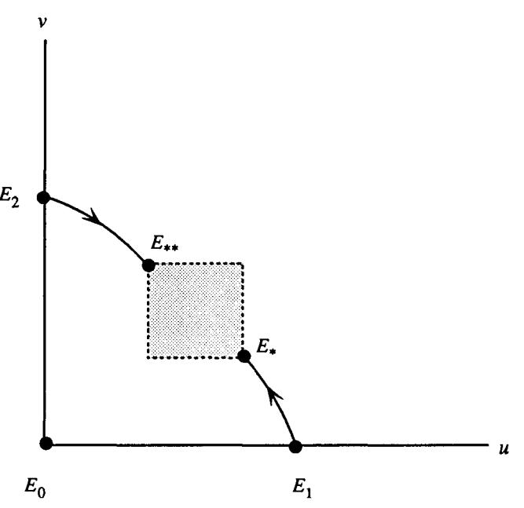

Figure 4.1. The attracting hypercube 0 is shaded. Each axis represents a copy of R". The monotone trajectory emanating from near E, and converging to E*, and a similar one emanating from near E2 and converging to E**, are described in the proof of Theorem 4.4.

If (uo, vo) e [E*, EI]K and v0#0 then E * <K lr(uo, vo, t) <K E1 for t > 0, by strong monotonicity and Lemma 2.3. For all sufficiently small positive r, 7r(uo, vo,1) <K Xr and monotonicity implies that

$$\lim_{t \to \infty} \pi(u_0, v_0, t) = E_\star.$$

The key facts that allowed us to construct monotone converging orbits emanating from the ray through E, in the direction w were that s(J) > 0 and that the corresponding eigenvector could be chosen to satisfy w <K 0 or 0 <K w. It follows that a similar construction can be carried out from E2, where now the eigenvector w can be chosen to satisfy 0 <K w. This construction will yield the rest point E** in the same way that E* was obtained. It is easy to see that (4.2) must hold. Furthermore, if (uo, vo) c [E2, E** ] and uo * 0 then lr(uo, vo, t) converges to E** as t -> oo.

If s(J*) > 0, where J* is the Jacobian of (2.1) at E, then (5.1) and Theorem A.6 give a corresponding eigenvector 0 <K w*. But then a monotone increasing (with respect to <K) orbit starting at a point of the ray through

E. in the direction w. could be constructed exactly as in the first paragraph of the proof. This would clearly contradict the conclusions of the second paragraph of the proof. Thus s(J.) <_ 0 and a similar argument shows that s(J..) <_ 0, where J.,, is the Jacobian of (2.1) at E*..

If (uo, v0) E F satisfies E2 <K (uo, vo) <K El, then choose a point Xr on the ray through El in the direction w such that lr(uu, vo,1) <K xr. Since ir(xr, t) -> E. as t oo, monotonicity implies that (u, v) <_K E. for every point (u, v) of the positive limit set of the orbit of (2.1) starting at (uo, vo). A similar argument establishes E.. <_K (u, v). Therefore, the limit set corresponding to the orbit through (uo, vo) is contained in O.

We complete the proof by showing that the omega limit set A of a point (u(0), v(0)) E F satisfying u(0) # 0 and v(0) # 0 is contained in O. We first show that E2:5K x <_K El for each xE A. By Lemma 2.3, (u(t), v(t)) > 0 for t > 0. The solution (u(t), v(t)) of (2.1) with (u(0), f)(0)) = (u(0), 0) must satisfy (u(t), v(t)) <K (u(t), 0(t)) = (11(t), 0) for t > 0 by strong monotonicity, since (u(0), v(0)) <_K (u(0), 0). Similarly we have

$$
\left(\hat{u}(t), \hat{v}(t)\right) <_K \left(u(t), v(t)\right) \quad \text{for } t > 0,
$$

where (u(t), v(t)) is the solution of (2.1) satisfying (u(0), v(0)) _ (0, v(0)). Letting t - oo in the inequalities (u(t), 0(t)) = (0, 0(t)) <K (u(t), v(t)) <K (u(t), 0) and observing that (0, v(t))-4E2 and (u(t), 0) -+ El as t --goo, we see that every limit point of the orbit starting from (u(0), v(0)) must belong to Ffl[E2iEl]K.

If x c- A then x = ir(y, l) for some y E A, since A is invariant. This and Lemma 2.3 imply that if x = (u, v) e A then either u = 0 (v = 0) or u > 0 (v > 0). Furthermore, if u > 0 and v > 0 then E2 <K X <K El. In this case, as x is a limit point of (u(t), v(t)), it follows that E2 <K (u(to), v(to)) <K El for some to > 0. By arguments in a preceding paragraph we may then conclude that A C O. Therefore, this containment holds whenever A contains a point x = (u, v) with u > 0 and v > 0. Suppose that A contains no such point. Then every point x = (u, v) E A satisfies either u = 0 or v = 0 but not both, since Eo does not belong to A. Furthermore, A contains the entire orbit through x together with the alpha and omega limit sets of this orbit. Consider the case where x = (u, 0). The omega limit set of the orbit through x is clearly El, and the alpha limit set of any entire orbit that belongs to [0, z] is Eo unless x = El. Since Eo e A, we conclude that El is the only point of the form (u, 0) in A. A symmetric argument shows that E2 is the only point of A of the type (0, v). Since A is connected, it follows that A C 0, A = El, or A = E2.

Suppose that A = El. Then u(t) + v(t) --> a as t -> oo. By continuity of s(-), we can find e > 0 such that

$$\mathbf{s} = \mathbf{s}(\mathcal{A} + F_v(\mathcal{z}(1 - \epsilon) - \hat{u})) > 0.$$

Let v > 0 be the eigenvector corresponding to s. Then there exists to > 0 such that z-u(t)-v(t) ? z(1-e)-u for all t? to. Consequently,

$$v'(t) \succeq \left[\mathcal{A} + F_v(z(1-\epsilon) - \hat{u})\right] v(t)$$

for t ? to. As v(to) > 0, we may choose S > 0 such that v(to) >- Sv. Then, by Theorem B.1,

$$v(t) \cong \delta \bar{v} e^{s(t - t_0)}, \quad t \cong t_0.$$

This contradiction to the boundedness of v(t) shows that A = El cannot hold. A similar argument shows that A = E2 cannot hold. Therefore, A C 0 as asserted.

Our assertion - that almost all initial conditions (uo, vo), in the sense of Lebesgue measure, belong to orbits converging to a rest point in 0 if the set Sl has no accumulation points - follows from Theorem C.B.

The hypotheses of Theorem 4.4 are stable to perturbation, in the sense that if they hold for particular values of the parameters and uptake functions then they continue to hold for all nearby values of the parameters and for nearby uptake functions. By a "nearby" uptake function we mean an uptake function with the properties that (a) it satisfies requirements (i) and (ii) of Section 1, and (b) it and its derivative are uniformly close to the given uptake function and its derivative on the closed interval [0, 1]. The reason for this stability is that simple eigenvalues depend continuously on the entries of a matrix.

In [STW] it is shown that the assumption that St has no points of accumulation can be dropped from the hypotheses of Theorem 4.4 with no change in the conclusions. One can also replace the assertion that almost all initial data, in the sense of Lebesgue measure, belong to orbits converging to a rest point in 0 by the assertion that this holds for an open and dense set of initial data.

We remark that (generically) E* and E** are asymptotically stable, since it is expected that s(J*) # 0 where J* is the Jacobian of (2.1) at E. In this case, when E* * E**, by Theorem E.1 there must exist another positive rest point belonging to [E**, E*]K for which the corresponding Jacobian matrix is not stable.

In [STW ], a global bifurcation theorem is used to show the existence of a connected global branch of ordered pairs (m,,, E*) connecting (m*, E1) to (m *, E2), where the bifurcation parameter is the maximum growth rate m of population u and where in;, mu* are critical values of this parameter.

The idea in the proof of Theorem 4.4 can be used to prove the following result, which describes some of the possible behavior of solutions of (2.1) when the two key stability moduli in Theorem 4.4 have different signs.

THEOREM 4.5. Suppose that El and E, exist, and that

$$s_1 \equiv s(\boldsymbol{A} + F_{\boldsymbol{\upsilon}}(\boldsymbol{z} - \widehat{\boldsymbol{\upsilon}})) \neq 0,$$

$$s_2 \equiv s(\boldsymbol{A} + F_{\boldsymbol{\upsilon}}(\boldsymbol{z} - \widehat{\boldsymbol{\upsilon}})) \neq 0.$$

(a) If sl > 0 and s2 < 0, then either:

- (i) E2 attracts all solutions (u(t), v(t)) with v(0) # 0; or
- (ii) there exists a positive rest point E*, E2 <K E* <K El, that attracts all solutions satisfying E, <K (u(0), v(0)) <-K El for which v(0) # 0, and s(J*) <_ 0 where J. is the Jacobian (4.1) at E. If s(J*) < 0 then there exists another positive rest point E such that E2 <K E <K E. and s(Jv) >_ 0, where J., is the Jacobian (4.1) at E,,.

(b) If s2 > 0 and sl < 0, then either:

- (i) El attracts all solutions (u(t), v(t)) with u(0) # 0; or
- (ii) there exists a positive rest point E**, E2 <K E** <K El, that attracts all solutions satisfying E2 <K (u(0), v(0)) sK E** for which u(0) * 0, and s(J**) <_ 0 where J** is the Jacobian (4.1) at E**. If s(J* < 0 then there exists another positive rest point E+ such that E** <K E+ <K El and s(J*) >_ 0, where J4, is the Jacobian (4.1) at E,.

(c) If sl < 0 and s2 < 0 then there exists a positive rest point E+ such that s(J+) > 0, where J+ is the Jacobian (4.1) at E+, E2 <K E+ <K El. If s(J+) > 0 then there exist rest points Ep and Eq satisfying

$$E_2 \lesssim_K E_\natural \lesssim_K E_\bullet \lesssim_K E_\sharp \lesssim_K E_\natural,$$

where equality may hold in either the first or last inequalities. The rest point Ea attracts all solutions satisfying Eq <K (u(0), v(0)) <K E+ except E+; Ep attracts all solutions satisfying E+ _<K (u(0), v(0)) <_K Eq except E+. Both s(Jq) <- 0 and s(JJ) <_ 0, where Jq and Jq are the Jacobians (4.1) at Eq and respectively.

Figure 4.2 describes some of the possibilities schematically.

Proof. If sl > 0 then the rest point E*, obtained in the proof of Theorem 4.4, exists and is either positive or coincides with E2. The rest point E.

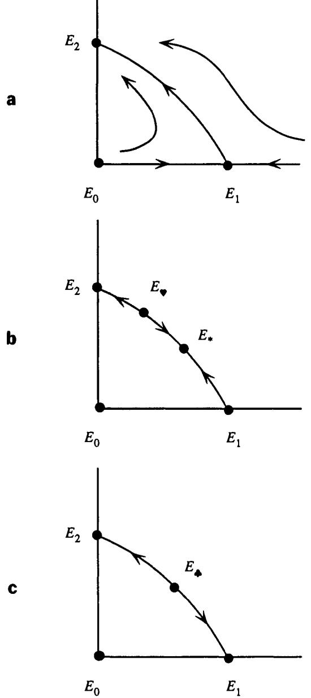

Figure 4.2. a Case (a)(i) of Theorem 4.5, where E2 is the global attractor. b One of several possible scenarios in case (a)(ii); there could be more rest points. c A possible scenario in case (c); this case cannot be eliminated, but it is believed to be unlikely for biologically reasonable uptake functions.

attracts all solutions of (2.1) satisfying E. <-K (u(0), v(0)) <-K El and v(0) * 0, by the argument given in the proof of Theorem 4.4. If E. = E2 then E2 attracts all solutions with v(0) * 0 because every such solution either converges to E2 or eventually enters and remains in [E2, El I K, in which case it converges to E2. The argument is similar to the one in the proof of Theorem 4.4 showing that 0 attracts all solutions. The assertion s(J*) <- 0 follows as in the proof of Theorem 4.4. This establishes all the assertions of case (a) except for those concerning the rest point E,, which follow from Theorem E.I. The proof of case (b) is analogous to that of case (a).

Consider case (c). The existence of the rest point E+ with s(J+) ? 0 is proved in Proposition E.2. If s(J+) is positive then the main construction of Theorem 4.4 can be applied to obtain a monotonically converging solution starting at E++rw, where r > 0 and 0 <K w is the principal eigenvector of J+. The limit of this solution is Ep, which may coincide with El. Another monotonically converging solution starts at E+-rw, where r > 0 and this solution converges to Eq, which may coincide with E2. The remaining assertions in this case follow from now standard arguments.

It is important to stress that, in the case (considered in the previous chapter) of two vessels and Michaelis-Menten uptake functions, there can be at most one positive rest point and it is asymptotically stable when it exists. In that case, E. = E** in Theorem 4.4, and only cases (a)(i) and (b)(i) of Theorem 4.5 are possible. Furthermore, each of these possibilities has been observed. Because we cannot exclude the possibility that positive rest points are not unique or might be unstable, in the generality considered in the present chapter, we cannot exclude the other alternatives contained in the theorems. However, as of this writing, the authors are aware of no example for which there is more than one positive rest point.

In a recent paper [HSo], Hofbauer and So obtain a number of results bearing on the uniqueness and stability question. For general two-vessel gradostats they show:

- (1) If f,,, ff satisfy (i) and (ii) of Section 1, f,',/f is monotone, f, 0 f on any interval [0, c], and s(A) where S is the unique positive solution of ,,(S) = and s(A) is the stability modulus of A, then there exists at most one positive equilibrium. It is globally attracting with respect to positive initial data if it exists. (2) If fU, f satisfy (i) and (ii) and there exist Si (i = 1, 2) satisfying 0 < S2 < S, f, (S) =.fvand (Si), f, (S1)/.f 1 < then
- 

there exists a matrix A satisfying the hypotheses of Lemma 2.1 and an input vector eo such that (2.1) has an unstable positive rest point.

Note that, for the first result, the equation f, (S) = f, (S) has at most one positive solution, and that the additional hypotheses imply uniqueness and global stability. Distinct Michaelis-Menten functions automatically satisfy all but the last hypothesis, which holds for almost all A. The second result shows that if the aforementioned equation can have two distinct solutions, yet fu 0 f,,, then an unstable positive rest point exists for some two-vessel gradostat.

Hofbauer and So give two examples of three-vessel gradostats with Michaelis-Menten uptake functions where an unstable positive rest point exists. The data for the case where A is tridiagonal are: fn =S/(1 +S), f, (S) = 3S/(2+65), all = -103/286, a12 = 35/143, a13 = 0, alt = 1,049,864,998/ 300,040,001, a22 = -1,499,919,999/300,040,001, a23 = 1, a31 = 0, a32 = 3/32, a33 = -9/32, eo = (el, e2, e3), el = 262,703/2860,

e2 = 18,302,665,105,500/300,040,001,

e3 = 510,249/160. The rest point E. = (u, v) (where u = (u1, u2, u3) and similarly for v) given by ul = 10, u2 = 11, u3 = 9, vl = v2 = v3 = 22,000 is unstable. One concludes that unstable positive rest points are possible for the class of gradostat models considered in this chapter.

### 5. The Standard Gradostat

It is possible to obtain interesting information on how each microbial population is distributed among the n vessels of the standard gradostat of Figure 1.1 at equilibrium if the number of vessels is large. The approach is to pass to a continuum limit. This section is devoted to an informal presentation of the results (following [S9]).

We are primarily interested in the steady-state values of ui and vi, so we set u'= 0 and v'= 0 in (2.1) where zi = 1- i /(n + 1) (see the paragraph following Lemma 2.2). We obtain

$$0 = (\mu_{i-1} - 2\mu_i + \mu_{i+1}) + \mu_i f_u(1 - i/(n+1) - \mu_i - \upsilon_i),$$

$$0 = (\upsilon_{i-1} - 2\upsilon_i + \upsilon_{i+1}) + \upsilon_i f_v(1 - i/(n+1) - \mu_i - \upsilon_i),\tag{5.1}$$

$$\mu_0 = \upsilon_0 = \mu_{n+1} = \upsilon_{n+1} = 0,$$

where the index i runs from 1 to n. If the vessel i is imagined to be located at xi = i/(n+1), with n large so that E = 1/(n+1) is small, and using the approximation

$$
\mu_{\chi\chi}(\chi_i) \approx \epsilon^{-\omega} (\mu_{i-1} - 2\mu_i + \mu_{i-1}),
$$

we are led to considering the singularly perturbed boundary value problem

$$\begin{aligned} 0 &= \epsilon^2 u_{xx} + \iota f_{\iota} (1 - \chi - \iota - \upsilon), \\ 0 &= \epsilon^2 v_{xx} + \iota f_{\iota} (1 - \chi - \iota - \upsilon) \end{aligned} \tag{5.2}$$

on 0 < x < 1 with boundary conditions

$$
\mu(0) = \upsilon(0) = \mu(1) = \upsilon(1) = 0.
$$

The boundary conditions follow naturally from the conventions uo u, 1 = 0, and similarly for v, which say that there are no microorganisms in the two reservoirs. They are justified by the agreement between the numerically computed rest points of (5.1) and the solutions of (5.2) obtained by using singular perturbation theory (as in [S9]).

Consider first the single-population equilibrium for u. Setting v = 0 in (5.2) leads to the boundary value problem

$$\begin{aligned} 0 &= \epsilon^2 \mu_{xx} + \mu f_{\mu} (1 - x - \mu), \\ \mu(0) &= \mu(1) = 0. \end{aligned} \tag{5.3}$$

A positive solution u must be concave on 0 < x < 1, since uxx < 0. The function

$$
\mu = 1 - \mathbf{x} \tag{5.4}
$$

satisfies the differential equation (5.3) and the boundary conditions at x = 1. Therefore, one guesses that (5.4) is an accurate approximation except for a boundary layer near x = 0. Standard singular perturbation techniques lead to the approximation

$$
\mu \approx U(\boldsymbol{\chi}/\boldsymbol{\epsilon}) - \boldsymbol{\chi},\tag{5.5}
$$

where U(X) is the solution of

$$\begin{aligned} 0 &= U'' + U f_u (1 - U), \\ U(0) &= 0, \ U(+\infty) = 1. \end{aligned} \tag{5.6}$$

The condition U(O) = 0 ensures that the right side of (5.5) vanishes at x = 0. The condition U(+oo) = 1 implies that U(x/E) = 1, so that (5.4) is approximated outside a neighborhood of x = 0 of size order E. The system (5.6) is derived by passing to the variable X = x/E in (5.3) and dropping all but the lowest-order terms in E. Figure 5.1 shows the phase plane associated with (5.6), and Figure 5.2 gives a qualitative sketch of the approximation (5.5).

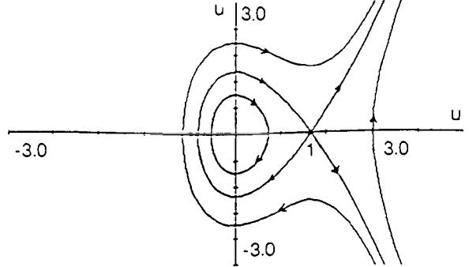

Figure 5.1. The phase portrait of (5.6). The orbit corresponding to the solution satisfying U(O) = 0, U(oo) = 1, is the upper orbit asymptotic to the saddle point (1, 0). (From [S9], Copyright 1991, Journal of Mathematical Biology. Reproduced by permission.)

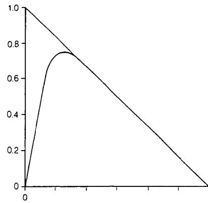

Figure 5.2. A qualitative sketch of the approximation (5.5). (From [S9], Copyright 1991, Journal of Mathematical Biology. Reprinted by permission.)

With u given approximately by (5.5) for small e, the nutrient is given by

$$
\mathbf{S} \approx \mathbf{1} - U(\mathbf{x}/\epsilon).
$$

Thus the nutrient is present in significant quantity only in an order-c neighborhood of x = 0, and is virtually absent outside this region. Clearly, most of the growth must take place in the boundary layer near x = 0. Diffusion then distributes the population away from the boundary, which acts as a source, in a monotone decreasing manner. Basically, all the biology occurs in the boundary layer. The analogy for the standard gradostat

with many vessels is that all growth and consumption occur in the first few vessels.

A coexistence equilibrium corresponds to a solution (u, v) of (5.2), where u and v are positive in some region and satisfy the boundary conditions. By the results of the previous section, we expect that such a solution exists provided each single-population equilibrium is unstable to invasion by its rival. The stability of these equilibria can be considered (see [S9]), but we do not require the formalities for our brief treatment here. Both u and v must be positive and concave on the interval 0 < x < 1. There is a family of solutions of (5.2) given by

$$
\mu = r(1 - \chi), \qquad \upsilon = (1 - r)(1 - \chi) \tag{5.7}
$$

(where r is a parameter satisfying 0 < r < 1), which satisfies the boundary conditions at x = 1. Of course, the boundary conditions at x = 0 are not satisfied, and this suggests that (5.7) is valid outside a small neighborhood of x = 0 for some value of r which must be determined. In order to determine the solution in the boundary layer near x = 0, we set X = x/e, u(x) = U(X), and v(x) = V(X) in (5.2), keeping only the lowest-order terms in E. This gives

$$\begin{aligned} 0 &= U'' + U f_u (1 - U - V), \\ 0 &= V'' + V f_v (1 - U - V), \end{aligned} \tag{5.8}$$

where U and V must satisfy

$$U(0) = 0, \quad V(0) = 0, \quad U(+\infty) = r, \quad V(+\infty) = 1 - r. \tag{5.9}$$

The first two boundary conditions are necessary in order for u and v to vanish at x = 0. The second two conditions are required in order for the solution to match up with (5.7) near x = 0. Of course, we also expect that

$$U > 0, \quad V > 0, \quad U' > 0, \quad V' > 0, \quad U + V < 1\tag{5.10}$$

hold for all X > 0.

The system (5.8) is four-dimensional for (U, U', V, V') if equations for U' and V' are included. In addition to the trivial rest point, there is a line of rest points given by PS = (s, 0, 1 -s, 0) for 0:5 s:5 1. In mathematical terms, we seek a solution in the stable manifold of P for some value of r satisfying 0 < r < 1, which remains in the region (5.10) and at X = 0 satisfies U(0) = 0 and U'(0) > 0, and similarly for V. It turns out that the set of eigenvalues of the Jacobian of the vector field on the right side of (5.8) at the rest point PS contains exactly one positive number (another

is negative and there are two zero eigenvalues). The corresponding eigenvector can be chosen to point into the region (5.10). This implies that the stable manifold of P5 consists of two orbits, one of which lies, at least in part, in the region (5.10). In [S9], sufficient conditions are given for the existence of a value of r satisfying 0 < r < 1 for which there is a solution of (5.8) satisfying (5.9) and (5.10). These sufficient conditions, which will not be given here because they are of a technical nature and shed no light on the biology, are at least consistent with the hypothesis that both singlepopulation equilibria are unstable to invasion by the rival population. Unfortunately, the proof only gives the existence of r and provides no information about its value.

The corresponding coexistence equilibrium solution is thereby approximated by

$$u \approx U(\mathbf{x}/\epsilon) - r\mathbf{x}, \qquad v \approx V(\mathbf{x}/\epsilon) - (1 - r)\mathbf{x}, \tag{5.11}$$

where (U, V) is the solution described previously. Note that the form of (5.11) guarantees that (5.7) holds away from an order-e neighborhood of x = 0, since U(x/e) - r and V(x/e) = 1-r when e is small.

The biological content of this analysis is revealed by considering also the nutrient, which is given approximately by

$$S \approx 1 - U(\boldsymbol{\chi}/\epsilon) - V(\boldsymbol{\chi}/\epsilon).$$

Away from the boundary layer near x = 0 there is a negligible amount of nutrient, and population densities are dominated by simple diffusion from the source which, in effect, is contained in the boundary layer. This is where most growth and consumption of nutrient occurs. The implications for the n-vessel standard gradostat are that if n is large then all of the interesting biology occurs in the first few vessels. It might reasonably be concluded that, at least for the standard gradostat, there is little point in considering gradostats with a large number of vessels.

It is particularly unfortunate that our analysis sheds no light on the value of r, since (5.11) implies that r determines which population is dominant in the gradostat.

In Figure 5.3 and Figure 5.4 (taken from [S9] ), the numerically computed steady states of (5.1) for a five-vessel gradostat are displayed and compared with the appropriate approximate solutions (5.5) and (5.11). The agreement is quite good even for the second vessel. The value of r was estimated using the ratios r/(1-r) = u5/v5, which resulted in r = 0.243. As a check, that portion of the stable manifold of (5.8) corresponding to

156 The General Gradostat

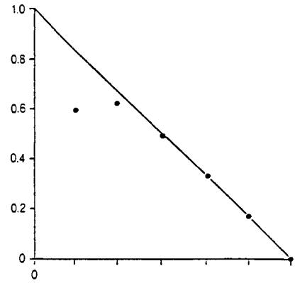

Figure 5.3. The five points represent computed values of the steady-state concentrations of a single species with m = 5 and a = 1 in a five-vessel gradostat. The last three points are very close to the solid line. (From [S9], Copyright 1991, Journal of Mathematical Biology. Reprinted by permission.)

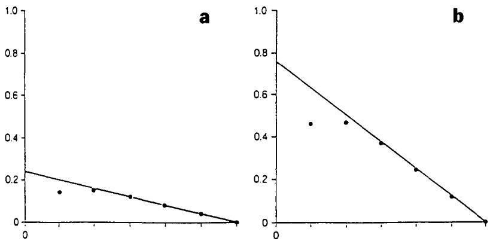

Figure 5.4. a The five points depicted represent computed values of the concentrations of population U in each of the five vessels for the coexistence rest point. For U, m = 5 and a= 1. The points are close to the line a(l-x), where a = U5/V5, the ratio of computed values of U and V in vessel 5. b The corresponding concentrations for the competitor V, with m = 22.2 and a = 5.08; compare with the line (1-a)(1-x). (From [S9], Copyright 1991, Journal of Mathematical Biology. Reprinted by permission.)

(r, 0, 1-r, 0), with r as before, was computed using PHASE PLANE [Er]. Its projection in the U-V plane passed through the origin to within screen resolution. The estimated value of r was used in Figure 5.4 to give a qualitative (not computed) picture of the approximation (5.11).

### Discussion 157

### 6. Discussion

In the previous chapter, a fairly complete analysis was given of the twovessel gradostat with Michaelis-Menten uptake functions. In the present chapter we have seen that much, but not all, of this analysis carries over to very general gradostats consisting of an arbitrary number of vessels connected together in a wide variety of ways and using arbitrary monotone uptake functions. The main result of this chapter, as in the previous one, is the prediction that coexistence of two microbial populations in the gradostat is possible provided that each population can successfully invade its rival's single-population equilibrium. Coexistence occurs in the form of convergence to a positive equilibrium - which may not be unique, although no example of non-uniqueness is known. By extrapolation, the model suggests that coexistence is possible in a natural environment supporting a nutrient gradient.

Two key results of the previous chapter - the uniqueness of a positive rest point and the local asymptotic stability of a positive rest point - are left unsettled in the present chapter. As already mentioned, the second result no longer holds in the generality considered in the present chapter. In [HSo], examples are given in which an unstable positive rest point exists. While we know of no case where non-uniqueness of the positive rest point has been shown, the fact that positive rest points may be unstable suggests the possibility that uniqueness too may fail in the generality considered in this chapter. It is not clear at the time of this writing whether unstable positive rest points can occur in biologically interesting cases. The examples of Hofbauer and So are not conclusive in this sense, since apparently there are no counterexamples to the conjecture that the results of the previous chapter carry over to the standard n-vessel gradostat with monotone uptake functions whose graphs intersect in at most one positive value of S.

We know that coexistence of two microbial populations in the gradostat is possible. It is natural to ask how many microbial populations can coexist in an n-vessel gradostat. In [JST] it is shown that the number is not greater than n. This is done by first showing that, generically, there does not exist a coexistence rest point, and second by showing that there are solutions corresponding to the presence of all populations which converge to rest points on the boundary - that is, to rest points with certain populations absent. Numerical simulations in [BWu; CB] suggest that three competitors cannot coexist in a three-vessel gradostat but can in a

### 158 The General Gradostat

four-vessel gradostat. Very little has been rigorously established concerning competition between more than two competitors in a gradostat. For more than two competitors, the equations no longer give rise to a monotone dynamical system.

# The Chemostat with Periodic Washout Rate

### 1. Introduction

The results of Chapters 1 and 2 demonstrate that coexistence cannot occur in the chemostat with constant values of the operating parameters (the washout rate D and the input nutrient concentration S°). Roughly speaking, in a temporally homogeneous (constant operating parameters) and spatially homogeneous (well-stirred chemostat) environment, the model predicts competitive exclusion. Of course, real environments are far from being homogeneous, either in space or in time. In addition to the daynight variability in the environment, there are both seasonal effects and random effects caused by the variable climate. In this chapter, the simple chemostat model of competition will be modified to create a periodically varying environment, and it will be shown that coexistence of the two competitors can occur.

There are two basic ways to modify the chemostat model to create a periodic environment - make the reservoir nutrient concentration S° vary periodically in time, or make the washout rate D vary periodically. The first modification was studied by Hale and Somolinos [HaS], Hsu [Hsu2], Smith [SI], and Stephanopoulos, Fredrickson, and Aris [SFA]. This study is natural from the ecological point of view, as nutrient levels in many ecosystems might be expected to vary with the day-night cycle or with the season. The second modification was studied by Butler, Hsu, and Waltman [BHW2] and in [SFA]. It is more natural from the point of view of the experimenter working with a chemostat, since controlling the pump speed (so as to vary the washout rate) is simpler than controlling the nutrient concentration. The chemostat is sometimes viewed as a simple model of a wastewater treatment plant, especially by chemical and industrial engineers [SFA], and in this role also it is more sensible to vary

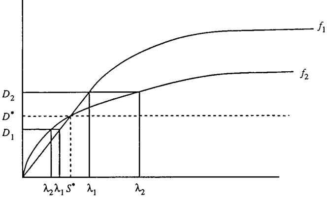

Figure I.I. If D = D2, then A, < A2 and population 1 has a competitive advantage over population 2. If D = D,, then A2 < A, and the reverse holds. If D = D(t) oscillates periodically between D, and D2, then each population enjoys the competitive advantage during a part of the cycle.

the washout rate. We will vary the washout rate in this chapter. The mathematics, however, is the same regardless of which operating parameter is varied, and the end results are similar - coexistence is possible.

The intuition supporting the expectation that coexistence should be possible in a chemostat with oscillatory washout rate D is fairly simple. It should be possible to vary D in such a way that first one competitor, then the other competitor, has the competitive advantage. More precisely, suppose the growth curves, or functional responses f, and f2, of the two competitors are monotone and intersect in exactly one point: f,(S*) = f2(S*) = D*. Let f, be smaller than f2 for positive S smaller than S* and larger than f2 for S larger than S*; see Figure I.I. Then, in a chemostat with constant values of the operating parameters, competitor x, is favored when D is larger than D* since A, is smaller than A2, and competitor x2 is favored when D is less than D* since in that case A2 is the smaller. It seems plausible to expect that if D is allowed to vary with time in such a way that alternately D is less than D* and D is larger than D*, then coexistence of the two competitors is possible. As simple as this reasoning sounds, it turns out to be surprisingly difficult to prove rigorously. The reason is that the corresponding equations are non-autonomous (i.e. time-dependent), and one can no longer explicitly compute the analogs of the steady states as was done for the autonomous equations of Chapter 1.

Introduction 161

The focus in this chapter will be on the possibility of coexistence of two competitors competing for a single nutrient in a chemostat with an oscillatory washout rate. Therefore, an exhaustive study of sufficient conditions for competitive exclusion to hold, as was carried out in Chapter 1, will not be made here. The reference [BHW2] may be consulted for results of this type.

The differential equations of the model take the following form:

$$S' = (S^0 - S)D(t) - \gamma_1^{-1}\chi_1 f_1(S) - \gamma_2^{-1}\chi_2 f_2(S),$$

$$\chi_i' = \chi_i(f_i(S) - D(t)), \quad i = 1, 2,$$

$$\chi_i(0) > 0, \ S(0) > 0.$$

The main change in this system compared to (5.1) of Chapter 1 is that the constant washout rate D of (5.1) is replaced by a positive, continuous, periodic function D(t):

$$D(t+\omega) = D(t)$$

for some positive co. A typical example is

$$D(t) = D_0 + d \sin(2\pi t/\omega).$$

We assume that f satisfies

(i) f : R+--> 118+ is continuously differentiable;

$$\text{(ii)}\ \,\,\,f_i(0) = 0,\,\,f_i^{\prime}(\mathbb{S}) > 0.$$

In other words, the functional response f,, is monotone increasing. Note that it need not be bounded.

In dealing with periodic functions the following notation is convenient. If g is a continuous co-periodic function then <g> will denote the mean value of g:

$$
\langle \mathbf{g} \rangle = \omega^{-1} \int_0^\omega \mathbf{g}(\mathbf{s}) \, d\mathbf{s}.
$$

The system displayed previously will be scaled by measuring S in units of S° and x, in units of y;S°. If time is measured in units of <D>-', the system takes the form:

$$\begin{aligned} S' &= (1 - S)D(t) - \chi_1 f_1(\mathcal{S}) - \chi_2 f_2(\mathcal{S}), \\ \chi_i' &= \chi_i(f_i(\mathcal{S}) - D(t)), \quad i = 1, 2. \end{aligned} \tag{1.1}$$

We have relabeled <D> as 1 in the equations (1.1). The f (S) in (1.1) are actually (D>-'f (S°S), but again we have relabeled. Furthermore, since

time was rescaled, D(t) in (1.1) is actually (D>-'D(t/(D>) in terms of the unscaled system. This affects both the period and the mean value of D. The former becomes <D>w, which we relabel w, and the latter becomes unity: <D> = 1.

### 2. Periodic Differential Equations

Equations (1.1) are periodic in the time variable. As this is the first encounter with such equations, it is appropriate to review the basic strategy for dealing with them. For the purposes of this review, consider the general periodic system

$$\mathbf{x}' = f(t, \mathbf{x}),\tag{2.1}$$

where f and of/ax, its derivative with respect to x, are continuous on O x 118" (or on l x SZ with Sl a suitable subset of R") and, for some w > 0,

$$f(t + \omega, x) = f(t, x)$$

holds for all (t, x). The w-periodic (hereafter simply "periodic") solutions x(t+w) = x(t) play the same role for (2.1) as rest points do for autonomous systems.

Just as the stability of rest points can be determined by linearization, the stability of a periodic solution x(t) can often be determined by linearizing (2.1) about x(t). The linearization, or variational equation, corresponding to x(t) is

$$z' = \frac{\partial f}{\partial \boldsymbol{x}}(t, \boldsymbol{x}(t))z. \tag{2.2}$$

This system is periodic and therefore the Floquet theory described in Section 4, Chapter 3, applies. Let 4i(t) be the fundamental matrix solution of (2.2). The Floquet multipliers of (2.2) are the eigenvalues of 4'(w); if it is a Floquet multiplier and p. = e"A then A is called a Floquet exponent. Only the real part of a Floquet exponent is uniquely defined.

A fundamental difference between (2.2) and (4.6) of Chapter 3 is that 1 is not necessarily a multiplier for (2.2) as it is for (4.6). Therefore, the analog of Theorem 4.2 of Chapter 3 is different.

THEOREM 2.1. If JAI < I for all multipliers of (2.2) then x(t) is a uniformly asymptotically stable periodic solution of (2.1). If CAI > 1 for some multiplier µ of (2.2) then x(t) is unstable.

Recall [H2] that x(t) is uniformly asymptotically stable (hereafter simply "asymptotically stable") provided that (i) for every e > 0 there exists S > 0 such that, if I x(to)-y(to)I < S for some to ? 0 and some solution y(t), then Ix(t) -y(t) I < e for all t >- to; and (ii) there exists b > 0 such that, if I x(to) -y(to)l < b for some to - 0, then lim,.,Ix(t)-y(t)l=0 and this convergence is uniform in to.

In terms of Floquet exponents, the condition for stability is 92(.x) < 0 for all exponents and the condition for instability is that 92(A) > 0 for some exponent A. Here, 92(A) denotes the real part of A.

A powerful conceptual tool for the analysis of (2.1) is the Poincare map. Let x(t, xo) denote the solution of (2.1) satisfying x(0) = xo. The Poincare map is defined by

$$P\mathbf{x}_0 = \mathbf{x}(\omega, \mathbf{x}_0);$$

P simply advances a point one period along the trajectory through the point. The basic properties of P follow from standard theorems for ordinary differential equations: P is continuous and one-to-one, and x(t, xo) is a periodic solution of (2.1) with period w if and only if Pxo = xo. The orbit of a point xo under P is the set O+(xo) _ [xo, Pxo, P2xo, ...1, where P" denotes the n-fold composition of P with itself. Note that P'xo = x(nw, xo), so that the orbit of xo under P is just a sampling of the solution of (2.1) through xo at integral multiples of W. The map P captures all of the dynamical features of (2.1). For example, if limo _. P"xo =.k then, by the continuity of P, Pz = x. Therefore x(t, x) is a periodic solution and lim, . Ix(t, xo)-x(t, 9) = 0; that is, x(t, xo) tends asymptotically to the periodic solution x(t, z).

As f has a continuous partial derivative with respect to x, P is continuously differentiable and its Jacobian derivative is given by

$$P'(\boldsymbol{\chi}_{\parallel}) = \frac{\partial \boldsymbol{\chi}}{\partial \boldsymbol{\chi}_{0}}(\boldsymbol{\omega}, \boldsymbol{\chi}_{\parallel}) = \Phi(\boldsymbol{\omega}),$$

where 1(t) is the fundamental matrix for (2.2) with x(t) = x(t, x1) (see [H2]). If Px1 =x, so that x(t,x,) is a periodic solution, then the eigenvalues of the derivative of P at x, are precisely the Floquet multipliers.

The behavior of orbits of P near a fixed point z can be described in the case where z is a hyperbolic fixed point, that is, when no eigenvalue (multiplier) of the Jacobian of P at z has modulus equal to 1. In this case there exist (local) stable and unstable manifolds M+(z) and M-(x) (respectively) containing the point X which are tangent to the stable (resp. unstable) subspace of the Jacobian of P at z. (The stable (unstable) subspace

is that space spanned by the real parts of the generalized eigenvectors corresponding to eigenvalues with modulus less (greater) than 1.) The stable and unstable manifolds have the dimensions of the stable and unstable subspaces, respectively. The manifold M+(x) contains all those points near z whose orbit under P converges to x, and M-(x) contains all those points near x whose orbit under P-' converges to k. Points near z not belonging to the stable manifold have the property that their orbit cannot remain in a neighborhood of,?.

The (local) unstable manifold M-(x) can be extended to a (global) object, which we will also call the unstable manifold (although its geometry can be quite complicated; in particular, it need not be a submanifold), simply by taking the union of the images of M-(x) under P", n = 0, 1, 2, .... Then the (global) unstable manifold can be characterized as (x I P-"x x as n -> ol. A similar construction gives the (global) stable manifold. Hereafter, we will not distinguish between the local and global objects.

In concluding this brief review, we remark that the principal motivation for working with the Poincare map as opposed to the solutions of (2.1), neither of which is explicitly computable in general, is that the Poincare map has its domain in Euclidean n-space whereas solutions of (2.1) must be viewed in Euclidean (n+1)-space - that is, as (t, x(t)). The advantage of working in a lower-dimensional space is the key. We hope the utility of the Poincare map will be evident in the remaining sections of this chapter.

### 3. The Conservation Principle

The analysis of equations (1.1) begins by establishing that the conservation principle holds exactly as in the previous chapters and so allows for the reduction of (1.1) to a two-dimensional system. Letting E = S+x1+x2-1 and adding the equations (1.1) yields the periodic linear equation

$$
\Sigma' = -D(t)\Sigma.\tag{3.1}
$$

Therefore, as (D> = 1, we have

$$
\Sigma(t) = q(t)e^{-t},
$$

where

$$q(t) = \Sigma(0) \exp\left(-\int_0^t [D(s) - 1] \, ds\right)$$

is a periodic function. Consequently,

$$\lim_{t \to \pm \infty} \Sigma(t) = 0.$$

In other words, independently of initial conditions, solutions of (1.1) asymptotically approach the plane, S+x1+x2 = 1, at an exponential rate. The asymptotic behavior of (1.1) is therefore determined by the twodimensional system obtained from (1.1) by deleting the equation for S and replacing S by I-x1-x2i just as in the previous chapters. This yields

$$\begin{aligned} \mathbf{x}_i' &= \mathbf{x}_i \{ f_i(\mathbf{1} - \mathbf{x}_1 - \mathbf{x}_2) - D(t) \}, \\ &i = \mathbf{1}, \mathbf{2}. \end{aligned} \tag{3.2}$$

Biologically relevant initial data for (3.2) belong to

$$
\Omega = ((\boldsymbol{\chi_1}, \boldsymbol{\chi_2}) \in \mathbb{R}_+^z : \boldsymbol{\chi_1} + \boldsymbol{\chi_2} \le 1),
$$

which is positively invariant for (3.2).

In the remainder of this chapter, our attention will be restricted to the system (3.2). The results of Appendix F can be shown to hold for discrete dynamical systems (e.g., generated by the Poincare map for the system of equations for (E, x1, x2)); this makes it possible to deduce the asymptotic behavior of (1.1) from that of (3.2).

We begin by obtaining a sufficient condition for the washout of a competitor from the chemostat which is independent of the presence or absence of an adversary. The following result is "sharp" in the sense that if it fails to hold then the competitor can survive in the absence of competition in the chemostat.

PROPOSITION 3.1. If f (1) < I then lim,_. x,(t) = 0.

Proof. If x,(0) = 0 then xi(t) = 0 and there is nothing to prove, so we assume that 0 < x(0) <- 1. It follows that x; < x,(f (l)-D(t)), which implies that

$$
\propto_l (t + \omega) < \propto_l (t) \exp[(f_l(1) - 1)\omega] \le \propto_l (t).
$$

We conclude that

$$
\propto_i ((n+1)\omega) < \propto_i (n\omega) \quad \text{for} \quad n = 1, 2, \dots, 2
$$

so lim, x,(nw) = I >: 0 exists. If 1 > 0 then it is easy to see that

$$\liminf_{l \to \infty} \mathbb{1}_l(t) = \epsilon > 0.$$

Then, for all large t, one has 1-x1(t) -x2(t) <- 1- (E/2), and for such t it follows that

$$
\chi_i'(t) \le \chi_i(f_i(1 - (\epsilon/2)) - D(t)).
$$

Therefore, for all large s and all t ? 0,

$$
\lambda \chi_i(t+s) \le \chi_i(s) \exp\left[-\int_s^{t+s} \left[f_i(1-(\epsilon/2)) - D(r)\right] dr\right].
$$

Since 0, the exponential term tends to zero as t --> 00, and we have reached a contradiction to our assumption that 1 > 0. Consequently, lim _ xi (nco) = 0, which implies the assertion of the proposition.

It is easy to see that the numbers (f (1) -1), i = 1, 2, are the Floquet exponents corresponding to the identically zero periodic solution of (3.2). Consequently, the solution is asymptotically stable when both exponents are negative and unstable when one of the exponents is positive. Proposition 3.1 says more than this; it states that competitor xi is washed out of the chemostat if f (1) <- 1, but this outcome has nothing to do with competition since it occurs even in the absence of the other competitor. As our main interest is in the effects of competition, we assume hereafter that

$$f_i(1) > 1, \quad i = 1, 2. \tag{3.3}$$

When (3.3) holds for the ith competitor, that competitor can survive in the chemostat in the absence of competition and with its concentration oscillating in response to the periodically varying washout rate. This is the content of the next result.

PROPOSITION 3.2. There exist unique, positive, periodic functions E(t) and ii(t) such that (E (t), 0) and (0,,1(t)) are solutions of (3.2). If (x1 (t), 0) is a solution of (3.2) satisfying xr(0) > 0, then

$$\lim_{t \to \infty} |\chi_1(t) - \xi(t)| = 0.$$

If (0, x2(t)) is a solution of (3.2) satisfying x2(0) > 0, then

$$\lim_{t \to \infty} |\chi_2(t) - \eta(t)| = 0.$$

Proof. The assertion essentially concerns the scalar equation

$$\mathbf{x}' = \mathbf{x}[f(1-\mathbf{x}) - D(t)],$$

where we have omitted the subscripts. It is assumed that f (l) > 1. Let P denote the Poincare map P: [0, 1] -> [0, 1] given by Px0 = x(w, x0). Then P is continuously differentiable, one-to-one, and satisfies PO = 0

and P1 < 1. The derivative P'(xo) = (ax/axo)(w, xo) = v(w), where v(t) is the solution of

$$v' = v\left[f\left(1 - \chi(t, \chi_0)\right) - D(t) - \chi(t, \chi_0)f'(1 - \chi(t, \chi_0))\right]$$

satisfying v(0) = 1. The equation can be solved, giving

$$P'(\boldsymbol{\chi}_0) = \exp[\omega(f(1-\boldsymbol{\chi}(t,\boldsymbol{\chi}_0)) - D(t) - \boldsymbol{\chi}(t,\boldsymbol{\chi}_0)f'(1-\boldsymbol{\chi}(t,\boldsymbol{\chi}_0)))].$$

It is apparent that P'(xo) > 0 for all xo, and that

$$P'(0) = \exp[\omega(f(1) - 1)] > 1.$$

Recalling that P1 < 1, it follows that Px-x changes sign in (0, 1) so there exists at least one fixed point of P in that interval. If z is a fixed point of P, it then follows from the differential equation that

$$<\langle f(1 - \mathbf{x}(t, \tilde{x})) - D(t) \rangle = 0.$$

Consequently,

$$P'(\tilde{\mathbf{x}}) = \exp[-\omega(\mathbf{x}(t, \tilde{\mathbf{x}}) f'(1 - \mathbf{x}(t, \tilde{\mathbf{x}})))] < 1.$$

It is now easy to see that P can have only one fixed point, x, in (0, 1) and, moreover, that x is an asymptotically stable fixed point of P.

If xo # z and belongs to (0,1 ] then either Pxo > xo or Pxo < xo. Consider the latter case, as the argument in the former case is simpler. Since P is strictly increasing, it follows that {P"xo]" is a strictly decreasing sequence. Therefore, it converges to a point y in [0, 1] which is a fixed point of P. As Px > x for all small x, y # 0 and soy = z. We have shown that every orbit of P starting at a point in (0, 1] converges to z. Consequently, if fli(t)=x(t,z) then 0 is periodic and limt_.Ix(t)-,'(t)0 for every positive solution x(t).

It will be convenient to use the familiar notation El and E2 for the singlecompetitor periodic solutions whose existence is asserted in Proposition 3.2:

$$E_1(t) = (\xi(t), 0) \quad \text{and} \quad E_2(t) = (0, \eta(t)).$$

The outcome of competition between two competitors depends on the stability properties of the single-competitor periodic solutions El and E2. It turns out that the stability of these solutions is determined, in each case, by a single Floquet exponent in a biologically intuitive way. Suppose that a chemostat is charged at t = 0 with only the competitor x1. According to Proposition 3.2, the concentration x, very rapidly approaches the level

E(t). Now imagine that a small concentration of competitor x2 is added to the chemostat, where x1 is essentially at concentration E(t). Will x2 increase or decrease in concentration? To find out, it is reasonable to linearize the second of equations (3.2) about x2 = 0, setting x1 = fi(t), since x2 is assumed to be very small. This results in the equation

$$\mathbf{x}_2' = \mathbf{x}_2 \{ f_2(1 - \xi(t)) - D(t) \},$$

which can be solved in terms of as

$$
\propto \chi_2(t+\omega) = \chi_2(t) \exp[\omega(\langle f_2(1-\xi)\rangle - 1)].
$$

Setting A12 = U20 - )) -1, one sees that x2 increases when it is at very low concentration if A12 > 0 and decreases if A12 < 0.

Similar arguments apply to the solution E2. Our next result makes these heuristic arguments precise.

PROPOSITION 3.3. Floquet exponents of the periodic solution E1 are given by

$$
\lambda_{11} = -\langle \xi f_1'(1-\xi) \rangle < 0 \quad \text{and} \quad \lambda_{12} = \langle f_2(1-\xi) \rangle - 1.
$$

Consequently, E1 is asymptotically stable (unstable) if A12 < 0 (A12 > 0). An analogous statement holds for the periodic solution E2.

Proof. The variational equation corresponding to E1 is

$$z' = \begin{pmatrix} \left[f_1(1-\xi) - D - \xi f_1'(1-\xi)\right] & -f_1'(1-\xi)\xi\\ 0 & f_2(1-\xi) - D \end{pmatrix} z,\tag{3.4}$$

where we have suppressed the t dependence of the coefficients. A computation yields the fundamental matrix 1(t):

$$\Phi(t) = \begin{pmatrix} \exp\{\int_0^t a_{\text{II}}(\mathbf{s}) \, d\mathbf{s}\} & \mu(t) \\ \mathbf{0} & \exp\{\int_0^t a_{22}(\mathbf{s}) \, d\mathbf{s}\} \end{pmatrix},$$

where (a1) denotes the coefficients in (3.4) and where u(t) is given by

$$\mu(t) = \int_0^t \exp\left[\int_r^t a_{11}(\mathbf{s}) \, d\mathbf{s}\right] a_{12}(r) \exp\left[\int_0^r a_{22}(\mathbf{s}) \, d\mathbf{s}\right] \, dr.$$

Note for future reference that u(t) < 0 for t > 0 since a12(r) < 0. Evaluating F at t = w, we obtain the multipliers exp[ f o ail(s) ds], i = 1, 2. It follows immediately that all and A12 are Floquet exponents. The remaining assertions follow from the discussion of Section 2.

Denote by A21 and A22 the Floquet exponents of the periodic solution E2:

$$
\lambda_{22} = -\langle \eta f_2'(1-\eta) \rangle \quad \text{and} \quad \lambda_{21} = \langle f_1(1-\eta) \rangle - 1.
$$

The solution E2 is asymptotically stable if A21 < 0 and unstable if A21 > 0.

Further analysis of the system (3.2) requires understanding the dynamics generated by the Poincare map in the interior of Q. For general periodic systems, such an understanding is beyond current knowledge. Fortunately, system (3.2) - in addition to being two-dimensional - has the property that it is competitive. A beautiful theory for such systems has recently been constructed. The next section is devoted to the principal result of this theory.

### 4. Periodic Competitive Planar Systems

The study of mathematical models of competition has led to the discovery of some very beautiful mathematics. This mathematics, often referred to as monotone dynamical systems theory, was largely developed by M. W. Hirsch [Hil; Hi3], although others have made substantial contributions as well. In this section we describe a result that was first obtained in a now classical paper of DeMottoni and Schiaffino [DS] for the special case of periodic Lotka-Volterra systems. Later, it was recognized by Hale and Somolinos [HaS] and Smith [S4; S5] that the arguments in [DS] hold for general competitive and cooperative planar periodic systems. The result says that every bounded solution of such a system converges to a periodic solution that has the same period as the differential equation.

We proceed to state and prove this result. Consider the system

$$\begin{aligned} \mathbf{x}_1' &= f_1(t, \mathbf{x}_1, \mathbf{x}_2), \\ \mathbf{x}_2' &= f_2(t, \mathbf{x}_1, \mathbf{x}_2), \end{aligned} \tag{4.1}$$

where f(t+w,x1ix2)=f(t,x1ix2)and

$$\frac{\partial f_i}{\partial \mathbf{x}_j}(t, \mathbf{x}_1, \mathbf{x}_2) \le 0, \quad i \ne j. \tag{4.2}$$

The requirement (4.2) means that (4.1) is a competitive system - an increase in x2 has a negative effect on the growth rate of x1 and vice versa. The system is said to be a cooperative system if the reverse inequalities hold in (4.2). Our interest here will be in the competitive case since (3.2) satisfies (4.2) in 12, as is easily checked. However, the cooperative case is

also of interest, so the main result will be stated so as to include it as well. Some definitions are required before stating the result.

If x, y e R2 then we write x:5 y whenever x, <- y, holds for i =1, 2. We write X :5K y whenever x1 <- yl and x2 > Y2. If one imagines the x1 axis pointing east and the x2 axis pointing north, then x <- y means that y lies to the northeast of x and X :5K y means that y lies to the southeast of x.

The key facts about competitive and cooperative planar systems are summarized next in terms of the Poincare map P for (4.1).

LEMMA 4.1. The following inequalities hold for (4.1) satisfying (4.2):

(i) ifX<Ky, then Px<-KPY;

(ii) ifPx<- Py, then x :5 y.

If (4.1) is cooperative, then analogous implications hold with the two partial orders interchanged in (i) and (ii).

Proof. We consider only the competitive case. Case (i) follows immediately from Theorem B.4 (see Appendix B). (ii) asserts that if x(w, x) < x(w, y) then x:5 y. To see this, let u (t) = x(w- t, x) and v(t) = x(w- t, y), and observe that u and v are solutions of

$$
\lambda \chi'_1 = -f_1(t, \chi_1, \chi_2), \qquad \chi'_2 = -f_2(t, \chi_1, \chi_2).
$$

This system is cooperative and so, as u(0) <- v(0), we conclude from Corollary B.2 that u(w) <- v(w). This proves (ii).

The main result can now be stated.

THEOREM 4.2. If O+(X0), the orbit of xo under P, is bounded then

$$\lim_{n \to \infty} P''\chi_0 = \bar{\mathfrak{x}} = P\bar{\mathfrak{x}}.$$

Consequently, if x(t) = x(t, xo) andp(t) = x(t, z), then p is periodic and

$$\lim_{t \to \infty} |\chi(t) - p(t)| = 0.$$

Proof. Given two points x, y e R2, one or more of the four relations X:5 y, Y:5 x, X :5K y, or Y <K X must hold. Now, if P"OXO <_K P"0+lxo (or the reverse inequality) holds for some no >: 0, then Lemma 4.1 implies that P"xo <-K P"+l xo (or the reverse inequality) holds for all n > no. Therefore, (P"xo)" converges to some z, since the sequence is monotone and bounded. The proof is complete in this case, so we assume that there

### Coexistence 171

does not exist such an no as just described. In particular, it follows that xo is not a fixed point of P. Then it follows that for each n we must have either that P"+lxo <- P"xo or that the reverse inequality holds. Suppose for definiteness that xo -< Pxo, the other case being similar. We claim that P"xo <- P"+Ixo for all n. If not, there exists no such that

$$\chi_0 \le P\chi_0 \le P^2 \chi_0 \le \dots \le P^{n_0 - 1}\chi_0 \le P^{n_0}\chi_0$$

but P"oxo >- Pno+ixo. Clearly, no ? 1 since xo <- Pxo. Applying Lemma 4.1(ii) to the displayed inequality yields P"o-1xo > P"oxo and therefore P"o-Ixo = P"oxo. As P is one-to-one, xo must be a fixed point in contradiction to our assumption. This proves the claim and implies that the sequence (P"xoI converges to some x. The theorem now follows from the facts described in Section 2.

We remark that if (4.1) is autonomous and is either competitive or cooperative then we are free to choose w and a corresponding Poincare map P, Theorem 4.2 implies that every bounded solution of (4.1) is asymptotic to an w-periodic solution. Since w is arbitrary, it follows that every bounded solution converges to a rest point.

As an immediate corollary of Theorem 4.2, we have the following result for (3.2).

COROLLARY 4.3. Let x(t, xo) be a solution of (3.2) corresponding to xo E SI. Then there exists a periodic solution p(t) of (3.2) such that

lim,.. I p(t)-x(t, xo)I = 0.

#### 5. Coexistence

In the previous section we saw that every solution of (3.2) converges to a periodic solution. The goal of this section is to provide sufficient conditions for the existence of a positive periodic solution of (3.2) possessing strong stability properties. Hereafter, a solution (or vector) x(t) = (x1(t ), x2(t)) will be called positive provided both components are positive. A positive stable periodic solution of (3.2) corresponds to the coexistence of both competitors in the chemostat. In this case, each competitor's concentration oscillates between a positive minimum and maximum value. It is important to point out that coexistence of two competitors can take place only if there exists a positive periodic solution of (3.2). If coexistence means that the concentrations of each of the two populations must remain

above some fixed positive concentration for all future time, then the main result of the previous section shows that the corresponding solution of (3.2) must approach a positive periodic solution.

This fact can be exploited to give simple necessary conditions for coexistence (or sufficient conditions for competitive exclusion). Suppose that x(t) is a positive periodic solution of (3.2) and let S(t) = 1-x1 (t) _X2(0- It is apparent that 0 < S(t) < 1. From (3.2) we have

$$\chi_i(t+\omega) = \chi_i(t) = \chi_i(t) \exp(\omega[\langle f_i(S(t)) \rangle - 1])$$

and, consequently

$$$$

It follows immediately from these two equalities that if S(t) is nonconstant and the two growth functions f (i = 1, 2) are not identical on any open subset of 0 < S < 1, then f (S(t)) -f2(S(t)) must change sign, from positive to negative and back again, as t increases. Therefore, first one and then the other competitor must have the competitive advantage. In particular, coexistence can only occur if the graphs of the two growth functions intersect at some value S* of S, where 0 < S* < 1. The reader will recall that this is precisely the intuition which suggested that coexistence should be possible.

Our goal then is to show that positive periodic solutions exist under suitable hypotheses. It turns out that it is simpler to state our results in terms of the discrete dynamical system generated by the Poincare map, P: SZ I2, rather than in terms of solutions of (3.2); (3.3) is assumed to hold throughout this section.

The following notation will be used in this section:

$$\begin{aligned} E_0 &= (0,0), \\ E_1 &= E_1(0) = (\xi(0),0), \\ E_2 &= E_2(0) = (0,\eta(0)). \end{aligned}$$

Recall that in the previous section E; denoted the periodic solutions obtained in Proposition 3.2, whereas now we reserve this same notation for the corresponding fixed points of the Poincare map. In order to avoid confusion we will write E,(t) from now on whenever we wish to refer to the solutions.

Solutions of (3.2) possess a stronger order-preserving property than was used in Section 4, one that will be needed for the present section. The reader may wish to review Appendix B at this time. For the statement of

our main result here, the following definitions are used. For vectors x and y in (182, X <K y means that xl < yl and x2 > y2. Recall from Section 3 that x <K y means that the corresponding weak inequalities hold - for example, the inequalities, E2 <K El and E2 <K E0 <K El hold.

One of the main results of this section is the following.

THEOREM 5.1. If A12 > 0 then there exists a fixed point E* of P, possibly coinciding with E2, with the following properties:

- (i) E2<_KE*<KEl.
- (ii) For all x0 e 12 satisfying E. <K x0 <K El, limn-- P"x0 = E*. (5.1)
- (iii) If E. = E2 then (5.1) holds for all positive x0 and, furthermore, A21 <_ 0. If E,, * E2 then E. is positive and E2 <K E* <K El.
- (iv) The Floquet multipliers (eigenvalues of P'(E*)) µl,µ2 corresponding to E.satisfy 0<µl<12<_1.

An analogous statement holds if A21 > 0.

As the statement of the theorem is a bit technical, we offer Figure 5.1 as a geometrical description of the result. The somewhat lengthy proof is postponed until the end of this section. Essentially, Theorem 5.1 says that if A12 is positive (meaning that El is unstable) then there exists a fixed point E. of P, corresponding to a periodic solution of (3.2), which has strong stability properties. The domain of attraction of E*, denoted by

$$W^{+}(E_{\bullet}) = (\chi_0 \in \Omega \colon P^{\prime}\times_0 \to E_{\bullet}),$$

is substantial. In fact it includes the set (x0 e 12: E. <K x0 <K El) if E. E2, and it coincides with { x0 e 12: x0 is positive) when E. = E2. In either case, W+(E*) contains an open set. Furthermore, the Floquet multipliers of E. have modulus less than or equal to 1. Generically, we expect E. to be hyperbolic, in which case it is an attractor.

Let us be specific about the final assertion of Theorem 5.1. If we assume that A21 rather than A12 is positive then there exists a fixed point E** of P satisfying:

- (i) E2 <K E** -K El.
- (ii) limn- P"x0 = E** for all x0 e 12 satisfying E2 <K x0 <K E**.
- (iii) If E** = El, then A12 is nonpositive and the orbit of every positive point of 12 converges to E**; if E** # El then E** is positive and E2 <K E** <K El.
- (iv) The Floquet multipliers of E** have property (iv) of Theorem 5.1.

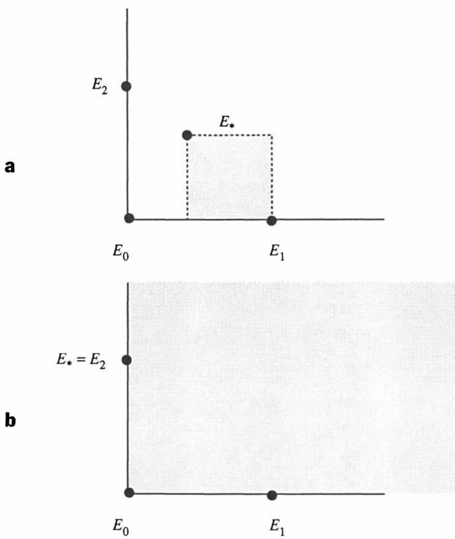

Figure 5.1. The shaded areas denote W+(E), the region of attraction of E.. a E. is positive and represents a positive periodic solution (coexistence). b E. _ E2 which therefore attracts all positive initial data.

Obviously, the cases where A12 > 0 and E. = E2, or where A21 > 0 and E.. = E1i correspond to competitive exclusion and therefore are of less interest. On the other hand, if both A12 and A21 are positive then Theorem 5.1(iii) implies that both E, and E.. are positive. In fact, in this case every solution starting with positive initial values converges to a positive periodic solution by the following result, which is the main result of this chapter. Its proof is given following the proof of Theorem 5.1.

COROLLARY 5.2. Suppose that both A12 and A21 are positive. Then there exist positive fixed points E. and E.*, possibly identical, satisfying:

Coexistence 175

- (i) E2 <K E** _<K E. <K El;
- (ii) limn-oo PnX0 = E** if E2 <K XO :5K E**;
- (iii) limn-ioo Pnx0 = E* if E* :5K x0 <K E1;
- (iv) if xp is positive then there exists a fixed point X of P satisfying E.. <K x <_ K E. such that limn - P "x0 = z;
- (v) the multipliers of both E** and E. satisfy Theorem 5.1(iv); and (vi) if E** = E* then limn - P"x0 = E. for all positive x0 e U.
- 

Corollary 5.2 can be paraphrased as follows. Provided both A12 and A21 are positive, so that both E1 and E2 are unstable, the orbit of every positive point of ) is attracted to a positive fixed point of P belonging to the "box"

$$B = (\times \in \Omega \colon E_{\bullet \bullet} \lesssim_K \times \lesssim_K E_{\bullet}).$$

Equivalently, every solution of (3.2) corresponding to positive initial data is asymptotic to a positive periodic solution. The two populations coexist in the chemostat. Figure 5.2 illustrates the result.

It is important to point out that the box B is a fixed positive distance from the two coordinate axes. Because every orbit of P corresponding to a positive starting point approaches B, it follows that there exists a positive number S, independent of the positive initial value, such that each coordinate of the corresponding solution of (3.2) exceeds S for all sufficiently large t. This fixed distance 6 provides a cushion against the extinction of either population. Later, we will say that the system (3.2) is uniformly persistent when this situation holds. (See Appendix D.)

Another important observation concerning Corollary 5.2 is that if the hypotheses are satisfied for a particular set of growth functions f,1 and parameters, then the hypotheses continue to hold if these functions and parameters are perturbed by a small amount. Such a property is clearly important, because parameters and functions are never known precisely. The stability of the conditions to perturbations follows from the wellknown continuity of simple eigenvalues of matrices to changes in their entries.

It must be stressed that the hypotheses of Corollary 5.2 give sufficient, but not necessary, conditions for the existence of a positive periodic solution possessing strong stability properties. Furthermore, since the singlepopulation periodic solutions E1(t) and E2(t) are not explicitly computable, as the corresponding rest points were in Chapter 1, it does not seem possible to obtain explicit formulas for A12 and A21. However, these crucial Floquet exponents can be easily approximated numerically. One must

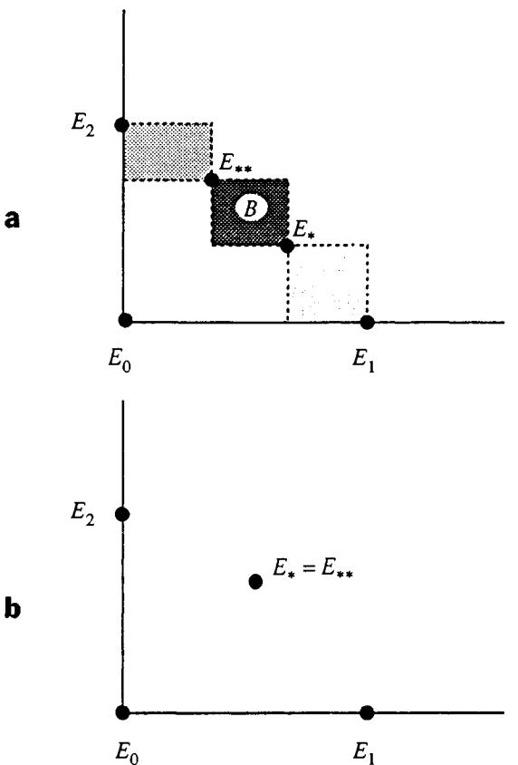

Figure 5.2. a The general case E. # E**; all positive starting points iterate to a fixed point in the box B. Points in the uppermost box are attracted to E**, while those in the lowermost box are attracted to E*. b The case E* = E**. Here, E* attracts all positive starting points.

simply obtain accurate numerical approximations of the E,(t) so that the mean values in the expressions for A21 and A12 (see Proposition 3.3) can be estimated.

In our numerical simulations of (3.2) using PHASE PLANE [Er], we chose Monod-type functional responses f (S) = m,S/(a,+S) and a sinusoidal dilution rate D(t) = l + d sin(t ). An apparently periodic solution was found using the parameter values m, = 1.155, a1 = 0.05, m2 = 3, a2 = 0.65, and d = 0.1 with initial values x1 = 0.4283661 and x2 = 0.2878206 at t = 0. See Figure 5.3. We also computed A12 and A21 by computing EI(t) and E2(t) and then integrating to find

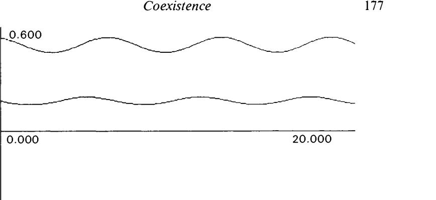

- Figure 5.3. A positive, periodic, numerically computed solution representing coexistence of the two populations. Parameter values are given in the text.

$$T^{-1}\int_0^T f_2(1-\xi) \,d\mathfrak{s} \quad \text{and} \quad T^{-1}\int_0^T f_1(1-\eta) \,d\mathfrak{s}$$

for large values of T These computations yielded (0) = 0.7346227, 77(0) _ 0.6966805, A12 = 0.0021145, and A21 = 0.000472.

We now return to the proof of Theorem 5.1. It is convenient to begin with a preliminary result. The system (3.2) possesses stronger monotonicity properties than we have exploited so far, and these properties will be needed in the proof of Theorem 5.1. They are stated next.

LEMMA 5.3. Let xo e Sl be positive. Then

$$P'(\chi_0) = \begin{pmatrix} a & b \\ c & d \end{pmatrix}$$

satisfies:

- (i) a>0,d>0,c<0,b<0;
- (ii) P'(xo) has eigenvalues µ, satisfying 0 < µt < A2;
- (iii) there exists an eigenvector u2 corresponding to µ2 and satisfying 0 <K u2;
- (iv) if x and y are distinct points of 9, at least one of which is positive, and if x !5K y, then Px <K Py.

Proof. Assertion (i) follows from Theorem B.6 since, for (3.2), strict inequality holds in (4.2). (ii) is a consequence of Theorem A.6, or can easily be established by observing that ad - be > 0 by (4.3) of Chapter 3. (iii) follows from Theorem A.6, and (iv) is a consequence of Theorem B.6.

Now we can prove Theorem 5.1.

Proof of Theorem 5.1. Consider the behavior of P in a neighborhood of El. The derivative of P at El is given by

$$P'(E_1) = \Phi(\omega) = \begin{pmatrix} e^{\omega \lambda_{\parallel}} & \mu(\omega) \\ 0 & e^{\omega \lambda_{\parallel}} \end{pmatrix}$$

(see the discussion following (3.4)), where I(t) is the fundamental matrix of (3.4). Clearly, (1, 0)T is an eigenvector for P'(E1) corresponding to the eigenvalue e' All < 1. An eigenvector corresponding to the eigenvalue eW\12 > 1 is easily computed to be

$$\upsilon = (-1, [e^{\omega \lambda_{\parallel}} - e^{\omega \lambda_{\parallel}}] / \mu(\omega)).$$

Note that v <K 0 since u(W) < 0.

Consider the action of P on the points w(E) = El +Ev, where E > 0 is small. We have

$$\begin{aligned} P\,\omega(\epsilon) - \nu(\epsilon) &= E_1 + \epsilon P'(E_1)\upsilon + o(\epsilon) - E_1 - \epsilon \upsilon \\ &= \epsilon \left[ (e^{\psi \lambda_{12}} - 1)\upsilon + o(\epsilon)/\epsilon \right] \\ &<_K 0 \end{aligned}$$

for small E, since o(E)/E 0 as E -* 0. It follows that for some E0 > 0 and all 0 < E <- E0, Pw(E) <K w(E). Assume that Eo is so small that E2 <K W(E) <K El for 0 < E:5 Eo. by Lemma 5.3(iv) we conclude that E2 <K P"+'w(E) <K P"w(E) <K E1 for n = 1, 2, .... Obviously, P"w(E) -* EE as n -> co, where EE is a fixed point of P satisfying E2 5K EE <K El.

If 0 < E < E'then E2 <K WW) <K W(E) <K EI, so E2 <-K EE. 5K EE <K El. Put E,, = lim, -O+ EE. Then PE,, = E. by continuity and E2 5K EE 5K E* <-K El. In fact, E. <K El and E. = EE for all e, 0 < E <- co. To see this, fix E1 with 0 < E1:5 E0. We claim that EEI <K w(E0). If not, then, as EE, <K w(E1), there exists E2 (El < E2 <- EO) such that EEI <-K w(E2) but EE, <K w((2) does not hold. Applying P to the former inequality and using Lemma 4.1 gives EE, <-K Pw(E2) <K w(E2), contradicting that EEI <K w(E2) does not hold and so proving the assertion. Therefore EE, <K w(E0) and, since E1 was arbitrary, EE <K w(E0) for all E, 0 < E:5 E0. Consequently, E. <K w(EO). Combining inequalities, for 0 < E :s EO we have EE0 <-K EE <-K E* 5K W(60); hence, by Lemma 4.1, E,, !5K EE <--K E* <K P"w(E0). Letting n go to infinity, we find that E,0 :5K EE <K E, :!5K EEo. This proves that EE = E. for 0 < E:5 EO, and (i) follows.

If x0 e SI and E. <K x0 <K El, then xO <K w(E) for all small E. Therefore E. <K P"x0 <K P"w(E) and, as P"w(E) -> E*, (ii) follows immediately.

#### Coexistence 179

If E. = E2 then P"xo -> E2 for all xo with E2 <-K xo <K EI. This is obviously incompatible with a positive value of A21 since an argument parallel to that just given for El shows, when applied to E2, that (5.1) cannot hold for an xo satisfying E2 <K xo <K E1. Indeed, the stable manifold of E2 is contained in the x2 axis if A21 is positive. This proves that A21 <- 0 if E. = E2.

Consider the first assertion of (iii). If xo a 1 is positive then we can find w = (0, w2) and v = (v1, 0) in t such that w <K xo <K v. Applying Lemma 4.1, we have P"w <-K P"xo <-K P"v. As P"w -> E2 and P"v -> EI, and since P"xo -p z and Px = z, by Theorem 4.2 we have E2:5 K x <-K E. Since A12 is positive, the stable manifold of E1 belongs to the x1 axis and so z # E1. Therefore, by the fundamental theorem of calculus,

$$E_1 - \bar{\mathcal{X}} = P E_1 - P \mathcal{X} = \int_0^1 P'(tE_1 + (1 - t)\mathcal{X})(E_1 - \mathcal{X}) \, dt.$$

Applying Lemma 5.3(i), we conclude that 0 <K El -9 or (equivalently) z <K El. But then x = E2, since z = P"z-> E2 as n -* oo by (ii).

If E. # E2 then, since 0 :5K E. -E2, an argument identical to that given previously shows that 0 <K E,K - E2, so E2 <K E. and it follows that E. is positive. This proves (iii).

Finally, consider (iv). If E. = E2 then (iv) follows from A21 being nonpositive, as noted in (iii), and Proposition 3.3. Therefore, assume that E # E2 and so, by (iii), E2 <K E, <K EI. The eigenvalues 1A1, µ2 of P'(E*) satisfy 0 < µ1 < µ2 by Lemma 5.3. Suppose that µ2 > 1. By Lemma 5.3, there is a corresponding eigenvector u2 satisfying 0 <K U2. By considering the action of P on points w(E) =E.+EU2 for small positive e, exactly as in the beginning of the proof, we find that E,, <K W(E) <K PW(E) <K EI. As before, this implies that if E. <K xo <K E1 and xo is near E,, then P"xo converges to a fixed point 9 of P satisfying E. <K I. But, on the contrary, P"xo->E as n oo by (ii), so we have contradicted the assumption that µ2 > 1. This establishes (iv).

Proof of Corollary 5.2. Since A12 is positive, Theorem 5.1 implies the existence of a fixed point E. of P satisfying assertions (i)-(iv) of the theorem. In particular, as A21 is also positive, Theorem 5.1(iii) implies that E. is positive and E2 <K E. <K EI. Similarly, since A21 is positive there exists a positive fixed point E*. of P satisfying E2 <K E** <K EI. By (ii) of the theorem, we can find xo e f satisfying E** <K xo <K E1 sufficiently near E1 such that (5.1) holds. It follows by monotonicity of P that <K E. Therefore, (i) of the corollary holds. Assertions (ii) and (iii)

are immediate from (ii) of the theorem. Assertion (v) of the corollary follows from (iv) of the theorem.

It remains to show that (iv) holds, since (vi) follows from (iv). Let xo e I be positive. Arguing as in the proof of the theorem, it can be shown that lim" -_ P"xo = x, where X is a fixed point of P satisfying E2 <_K <_K El. Since the stable manifold of E, is the x, axis, X # E,. Similarly, . # E2 and X * E0. Consequently, as in the proof of the theorem, E2 <K X <K E, and X is positive. Choose x,, i = 1, 2, such that x1 <_K X 5K X2 and E2 <K X1 <K E** <K E* <K X2 <K E,. By monotonicity of P, P"x1 <_K z <_K P"x2 and, letting n oo, we find that E** sK 9:5K E*. This completes the proof.

#### 6. Discussion

It was observed in Section 1 that coexistence of two competitors competing for a single growth-limiting nutrient in a chemostat with a periodically varying washout rate should be possible, provided that the graphs of the functional responses of the two competitors intersect for some positive value of S and that the washout rate varies in such a way that alternately one, then the other, competitor has the advantage. In Section 5 it was shown that coexistence of the two competitors is only possible if there exists a positive periodic solution of (3.2). This allowed us to show rigorously that the intuition described previously is, in fact, necessary for coexistence to occur.

The very beautiful theory of the dynamics generated by planar, competitive maps, developed in [DS], was used to show that every solution of (3.2) asymptotically approaches a periodic solution. Building on this result, the main result of this chapter, Corollary 5.2, gives a sufficient condition for the coexistence of two competitors (equivalently: for the existence of a positive periodic solution of (3.2)). This condition is that each of the two single-competitor periodic solutions of (3.2) be unstable to invasion by its rival. Either numerical computations or perturbation techniques [Sl] are apparently required to verify the conditions of Corollary 5.2. The numerical calculations required are straightforward: one need simply compute each single-competitor periodic solution (the solution of a scalar periodic equation) and then compute the average value along this solution of one of the growth functions. This gives the key Floquet exponent, and one only needs to know the sign of each of these - if both are positive, then coexistence is assured.

Our limited numerical study, described in Section 5, detected a case where the hypotheses of Corollary 5.2 were satisfied. We were able to find what appears to be a positive periodic solution for parameter values such that Corollary 5.2 applies, since both A21 and A12 are positive. Therefore, coexistence holds for these parameter values. Furthermore, as remarked in that section, coexistence continues to hold for all sufficiently nearby values of the parameters.

Very little information exists on the robustness of the parameter region for which coexistence occurs. Studying the case where the nutrient concentration, rather than the washout rate, is varied periodically, Hsu [Hsu2J obtains very interesting information about the parameter region corresponding to coexistence. Perturbation methods are used in [S1] to explore this region in the case studied by Hsu. See also [SFA] for other numerical work in both cases.

It is worth noting that positive periodic solutions of (3.2), though possibly unstable, can be shown to exist by using the bifurcation techniques described in Chapter 3, Section 6. We have chosen not to pursue this route here because we are unable to carry out the necessary calculations to determine the stability of the bifurcating periodic solutions. See [BHW2; Cul], where this approach is used.

More is known about the dynamics generated by P than has been discussed in this chapter. In [DS] and [HaS] it is shown that there is a curve C joining E1 and E2 which is the graph of a strictly decreasing continuous function. This curve C forms the boundary of the unstable manifold of E0 and every fixed point, except E0 must lie on C. Therefore, every orbit of P except E0 is attracted to a fixed point on C. If each fixed point of P is assumed to be hyperbolic, then there are finitely many fixed points. Moving along the curve C, the fixed points alternate between saddle points and attractors. In particular, if the hypotheses of Corollary 5.2 hold then there are an odd number of positive fixed points on C, at least one of which is an attractor. See [S5] for more details.

Variable-Yield Models

### 1. Introduction

In the classical model of the chemostat, discussed in Chapter 1, it is assumed (following Monod [Mol; Mo2]) that the nutrient uptake rate is proportional to the reproductive rate. The constant of proportionality, which converts units of nutrient to units of organism, is called the yield constant. As a consequence of the assumed constant value of the yield, the classical model is sometimes referred to as the "constant-yield" model.

In phytoplankton ecology, it has long been known that the yield is not constant and that it can vary depending on the growth rate [DI]. This led to the formulation of the variable-yield model, also called the variableinternal-stores model [Gl] and the Caperon-Droop model [CNI]. This model effectively decouples specific growth rate from external nutrient concentration by introducing an intracellular store of nutrient. The specific growth rate is hypothesized to depend on a quantity, called the cell quota, which may be viewed as the average amount of stored nutrient in each cell of the particular organism in the chemostat. The cell quota increases with nutrient uptake and decreases with cell division, which acts to spread the total stored nutrient over more cells. The uptake rate is assumed to depend on the ambient nutrient concentration and, perhaps, the cell quota. In fact, it is reasonable to assume that when the latter is at a high value then uptake will be at a lower level, for a given nutrient concentration, than would be the case if the quota were at a low level.

The purpose of this chapter is to give a complete global analysis of the variable-yield model. Essentially, we confirm that the variable-yield models make the same predictions - concerning the growth of a single population, and concerning the outcome of competition between two microbial populations - as do the simpler constant-yield models discussed in Chapter 1. Our presentation follows [SW3].

The chapter proceeds as follows. In the next section the variable-yield model of single-population growth is derived and analyzed. In Section 3, the competition model is formulated and its equilibrium solutions identified. The conservation principle is introduced in Section 4 in order to reduce the dimension of the system of equations by one; local stability properties of the equilibrium solutions are also determined. The global behavior of solutions of the reduced system is treated in Section 5, and the global behavior of solutions of the original competitive system is discussed in Section 6. The chapter concludes with a discussion of the main results.

### 2. The Single-Population Growth Model

In this section, the variable-yield model of growth of a single population in the chemostat is derived and analyzed. Let S(t) denote the free nutrient in the chemostat at time t (the quantity we have used all along), and let x(t) denote the concentration of microorganism at time t. It is not reasonable to model the actual process of storing nutrient in a single cell, so a new variable, the cell quota Q(t), is introduced. The variable Q(t) is the average amount of stored nutrient per cell at time t; x(t)Q(t) is the total amount of stored nutrient at time t. Note that this Q(t) can also be thought of as the average biomass of the cells. The uptake of free nutrient, p, will be assumed to be a function of S and Q, the idea being that if there is a considerable stored nutrient then the uptake rate will be smaller. The equation for free nutrient is then

$$\mathbf{S'} = (\mathbf{S}^{(0)} - \mathbf{S})D - \mathbf{x}\rho(\mathbf{S}, \mathbf{Q}),$$

where p is a function to be specified. The organism will reproduce according to the level of the cell quotient, so the growth equation becomes

$$\mathbf{x}' = \mathbf{x}(\mu(Q) - D),$$

where µ(Q) is to be specified. Note that in this formulation x(t) corresponds to the number of cells (or a concentration) and x(t)Q(t) is the total "biomass" in the vessel. It remains to determine the equation for Q.

Throughout this book we have made use of the conservation principle, which is the defining property of a chemostat. In the previous discussions this principle followed from the form of the equations, but in this formulation we assume the principle and use it to construct the equation for Q.

The principle simply states that if everything is expressed in nutrient equivalents then the sum of the variables should behave as a chemostat without consumption. Nutrient is neither created nor lost, but rather is merely converted from a free to a "stored" state. For the situation just described, the sum at time t of free and stored nutrient, called E, should satisfy

$$
\Sigma' = (\mathcal{S}^{(0)} - \Sigma)D.
$$

In previous chapters we have usually made use of the consequence of this - namely, that

$$\lim_{t \to \infty} \mathbb{E}(\Sigma(t) - S^{(0)}) = 0.$$

In the present case,

$$\Sigma(t) = \mathcal{S}(t) + \varkappa(t)\mathcal{Q}(t)$$

so

$$\begin{aligned} \Sigma' &= S' + \chi' \mathcal{Q} + \chi \mathcal{Q}' \\ &= S^{(0)}D - SD - \chi \rho(S, \mathcal{Q}) + \chi \mu(\mathcal{Q})\mathcal{Q} - \chi \mathcal{Q}D + \chi \mathcal{Q}' \\ &= (S^{(0)} - S - \chi \mathcal{Q})D. \end{aligned}$$

From the last equality it follows that

$$
\mu \ge \mu(t)[\underline{Q}'(t) - \rho(S(t), \underline{Q}(t)) + \mu(\underline{Q}(t))\underline{Q}(t)] = 0.
$$

Assuming that x(t) remains positive, one has the following equation for the cell quota:

$$Q' = \rho(S, Q) - Q\mu(Q).$$

Thus, the model takes the form

$$\begin{aligned} \chi' &= \chi(\mu(Q) - D), \\ Q' &= \rho(S, Q) - \mu(Q)Q, \\ S' &= (S^{(0)} - S)D - \chi\rho(S, Q). \end{aligned} \tag{2.1}$$

Because of the division by x(t) in the derivation of the equation for Q, some comments are in order. First of all, this division means that for x = 0 there is no biologically meaningful equation for Q. However, the equation for Q makes mathematical sense even if x is zero. In the mathematical analysis, the case where x = 0 and S = 5(O) corresponds to a biological steady state of the system, with no organism and with free nutrient at the input level. To mathematically achieve a rest point for (2.1), there must also be a value of Q that satisfies p(S 0), Q)-µ(Q)Q = 0. Although this may seem strange, and biologically unmeaningful, the resulting linear analysis is benign (and valid). (The reader may be more familiar with this anomaly as it occurs in the analysis of linear oscillators in polar coordinate form, when the equation for the polar angle makes mathematical sense even if the polar radius is zero.)

The functions µ(Q) and p(S, Q) are, respectively, the per-capita growth rate and the per-capita uptake rate. To motivate appropriate hypotheses for these functions, we consider some examples from the literature. The following form for the growth rate is attributed to Droop [D1; D2; CNI; CN2]:

$$
\mu = \mu_{\text{max}} \xrightarrow[K + (Q - Q_{\text{min}})_+]{},
$$

where Qmin is the minimum cell quota necessary to allow any cell division. The term (Q-Qmin)+ is the positive part of Q-Qmin and therefore vanishes when the quantity is negative. Motivated by this example, we assume that µ is defined, continuous, and nondecreasing, and that there exists P > 0 such that:

$$
\mu(\mathcal{Q}) \succeq 0,\\
$$

$$
\mu'(\mathcal{Q}) > 0 \text{ and continuous for } \mathcal{Q} \succeq P,\\
$$

$$
\mu(P) = 0.
$$

The growth rate increases with cell quota. The following form for the uptake rate appears in [G2], where Q has the range Qmin :5 Q:5 Qmax:

$$\begin{aligned} \rho(\mathcal{S}, \mathcal{Q}) &= \rho_{\text{max}}(\mathcal{Q}) \frac{\mathcal{S}}{K + \mathcal{S}}, \\\rho_{\text{max}}(\mathcal{Q}) &= \rho_{\text{max}}^{\text{high}} - (\rho_{\text{max}}^{\text{high}} - \rho_{\text{max}}^{\text{low}}) \frac{\mathcal{Q} - \mathcal{Q}_{\text{min}}}{\mathcal{Q}_{\text{max}} - \mathcal{Q}_{\text{min}}}. \end{aligned}$$

In other words, p has the Monod form in S but the saturation value of the Monod function, Pmax, decreases with cell quota Q. Cunningham and Nisbet [CN1; CN2] take Pmax to be constant. Therefore, we assume that p is continuously differentiable in (S, Q) for S ? 0 and Q >- P and satisfies

$$\begin{aligned} \rho(0, Q) &= 0, \\ \frac{\partial \rho}{\partial S} &> 0, \\ \frac{\partial \rho}{\partial Q} &\le 0. \end{aligned} \tag{2.3}$$

In particular, p(S, Q) > 0 when S > 0. Equation (2.2) requires that the uptake rate vanish in the absence of nutrient, increase with increasing nutrient, and decrease as the cell quota increases.

Observe that (2.2) and (2.3) imply that Q'? 0 if Q = P, and that therefore the interval of Q values, [P, oo), is positively invariant under the dynamics of (2.1).

It will be convenient to scale the variables appearing in (2.1) as follows:

$$\begin{aligned} \overline{t} &= Dt, \\ \overline{\mathcal{S}} &= \mathcal{S} / \mathcal{S}^{(0)}, \\ \overline{Q} &= \mathcal{Q} / \mathcal{Q}^*, \\ \overline{\kappa} &= \varkappa \mathcal{Q}^* / \mathcal{S}^{(0)}. \end{aligned}$$

The term Q* is an arbitrarily chosen value of the variable Q. If we also define

$$\begin{aligned} \bar{\mu}(\tilde{Q}) &= D^{-1} \mu(Q^\star \tilde{Q}), \\ \rho(\tilde{S}, \tilde{Q}) &= (DQ^\star)^{-1} \rho(S^0 \tilde{S}, Q^\star \tilde{Q}), \end{aligned}$$

then (2.1) becomes

$$\begin{aligned} \chi' &= \chi(\mu(Q) - 1), \\ Q' &= \rho(S, Q) - \mu(Q)Q, \\ S' &= 1 - S - \chi\rho(S, Q), \end{aligned} \tag{2.4}$$

where for convenience we have omitted the bars over the variables.

To determine the equilibrium points of (2.4), we use the following consequence of (2.2) and (2.3): For a fixed value of S, p(S,Q)-µ(Q)Q is strictly decreasing in Q for Q ? P. Also note that Qµ(Q) increases without bound as Q increases. Equation (2.4) has at most two equilibrium solutions. One of these, which we label E0, corresponds to the absence of the microorganism. It is given by

$$E_0 = (\times, Q, \mathbb{S}) = (0, Q^0, 1)$$

and it always exists. Here Q0 is the unique solution of p(1, Q) -Qµ(Q) _ 0. The other possible equilibrium, labeled El, corresponds to the presence of the population:

El =(x,Q, S),

where

$$\begin{aligned} \mu(\hat{Q}) &= 1, \\ \rho(\hat{S}, \hat{Q}) &= \hat{Q}, \\ \hat{\mathfrak{x}} &= (1 - \hat{S}) / \hat{Q}. \end{aligned}$$

Examination of these formulas reveals that El exists, in the sense that x > 0 and P, if and only if

$$
\mu(\mathcal{Q}) = 1 \text{ has a solution } \mathcal{Q} = \mathcal{\tilde{Q}} \tag{2.5a}
$$

$$\mathtt{and}$$

$$
\rho(\mathfrak{l}, \mathring{\mathfrak{Q}}) > \mathring{\mathcal{Q}}.\tag{2.5b}
$$

By the monotonicity assumptions mentioned previously, E, is unique if it exists.

The conservation principle allows the reduction of (2.4) to a planar system. Let

$$T = S + \mathcal{Q}x,$$

where T consists of unbound free nutrient plus stored nutrient. An easy computation shows that T satisfies

$$T' = 1 - T.$$

Therefore, all solutions of (2.4) asymptotically approach the surface

$$S + Q\chi = 1\tag{2.6}$$

as t ->oo; that is, T(t)-*1 as t -+oo. Consequently, as a first step in the analysis of (2.4), we consider the restriction of (2.4) to the exponentially attracting invariant subset given by (2.6). Dropping S from (2.4), we obtain the system

$$\begin{aligned} \chi' &= \chi(\mu(Q) - 1), \\ Q' &= \rho(1 - Q\chi, Q) - Q\mu(Q) \end{aligned} \tag{2.7}$$

in

$$\mathcal{L} = \{ (\times, Q) \in \mathbb{R}_+^2 \colon \times Q \le 1, \, Q \ni P \},$$

where L is positively invariant for (2.7).

The equilibria for (2.7) are obtained from those of (2.4) by deleting the S coordinate and replacing S by 1- Qx. To conserve notation we use the same letters, Eo and El, to denote the equilibria of (2.7). This should not result in confusion so long as the equation is clear from the context.

A straightforward calculation shows that if E, exists as an equilibrium of (2.7), then it is locally asymptotically stable. In this case, Eo is a saddle point. The first result of this section describes the asymptotic behavior of (2.7).

THEOREM 2.1. If El does not exist, then every solution of (2.7) satisfies limt-.. (x(t), Q(t)) = E0.

188 Variable-Yield Models

If E, exists, then every solution of (2.7) satisfying x(O) > 0 satisfies lim,-.(x(t), Q(t)) = E,.

Proof. Solutions of (2.7) are bounded in L. Indeed, Q'< 0 for all large Q independent of x and x'< 0 when Q is near P - that is, when x is large. The result is now a standard application of the Poincare-Bendixson theorem using the Dulac criterion (discussed in Chapter 1) to eliminate nontrivial periodic orbits and cycles of steady states in L. Indeed, since

$$\frac{\partial \chi^{\prime}}{\partial \chi} + \frac{\partial \mathcal{Q}^{\prime}}{\partial \mathcal{Q}} = \mu(\mathcal{Q}) - 1 + \frac{\partial \rho}{\partial \mathcal{Q}} - \chi \frac{\partial \rho}{\partial S} - \mu(\mathcal{Q}) - \mathcal{Q}\mu^{\prime}$$

$$= -1 + \frac{\partial \rho}{\partial \mathcal{Q}} - \chi \frac{\partial \rho}{\partial S} - \mathcal{Q}\mu^{\prime} < 0,$$

there can be no periodic orbits in L.

Using the results from Appendix F, we obtain the following result for (2.4).

THEOREM 2.2. If E° _ (0, Q0, S°) is the only steady state of (2.4) and µ(Qo) # 1, then EO attracts all solutions of (2.4). If EO and E, = (X, Q, S) exist as steady states, then E, attracts all solutions of (2.4) for which x(0) > 0.

As usual, the proof of Theorem 2.2 involves consideration of the equations

$$\begin{aligned} \chi' &= \chi(\mu(Q) - 1), \\ Q' &= \rho(1 - Z - Q\chi, Q) - \mu(Q)Q, \\ Z' &= -Z, \end{aligned}$$

where Z = I - T. The condition µ(Qo) # 1 ensures that EO is hyperbolic.

### 3. The Competition Model

Consider two populations, with densities x, and x2, competing for a single nutrient of concentration S in the chemostat. Competition occurs in the sense that each population consumes nutrient and so makes it unavailable for the competition. The average amount of stored nutrient per individual of population x, is denoted by Q,, and for population x2 by Q2. Following the derivation of Section 2, we have the following equations:

$$\begin{aligned} \chi_1' &= \chi_1(\mu_1(Q_1) - D), \\ Q_1' &= \rho_1(S, Q_1) - \mu_1(Q_1)Q_1, \\ \chi_2' &= \chi_2(\mu_2(Q_2) - D), \\ Q_2' &= \rho_2(S, Q_2) - \mu_2(Q_2)Q_2, \\ S' &= D(S^0 - S) - \chi_1\rho_1(S, Q_1) - \chi_2\rho_2(S, Q_2). \end{aligned} \tag{3.1}$$

The functions µi(Q,) and pi(S, Q,) are, respectively, the per-capita growth rate and the per-capita uptake rate of population xi. We assume that gi is defined and continuously differentiable for Qi ? Pi, where Pi >- 0, and satisfies:

$$
\mu_i(Q_i) \succeq 0,\\
$$

$$
\mu_i'(Q_i) > 0,\\
$$

$$
\mu_i(P_i) = 0.
$$

We assume that pi is continuously differentiable in (S, Qi) for S ? 0 and Qi >- Pi, and that pi satisfies

$$\begin{aligned} \rho_i(0, Q_i) &= 0, \\ \frac{\partial \rho_i}{\partial S} &> 0, \\ \frac{\partial \rho_i}{\partial Q_i} &\le 0. \end{aligned} \tag{3.3}$$

In particular, pi(S, Qi) > 0 when S > 0.

Observe that (3.2) and (3.3) imply that Q, >- 0 if Qi = Pi, and that therefore the interval of Qi values, [Pi, oo), is positively invariant under the dynamics of (3.1). Biologically relevant initial values for (3.1) are

$$\chi_i(0) > 0, \quad Q_i(0) \succeq P_i, \quad S(0) \succeq 0.$$

We will repeatedly use the following consequence of (3.2) and (3.3): For a fixed value of S, pi(S, Qi)-µi(Qi)Q, is strictly decreasing in Qi for Qi >- Pi. Also note that Qiµi(Qi) increases without bound as Qi increases.

Continuing as in Section 2, we scale the variables appearing in (3.1) as follows:

$$\begin{aligned} \bar{I} &= D I, \\ \mathcal{S} &= \mathcal{S} / \mathcal{S}^0, \\ \bar{Q}_i &= Q_i / Q_i^*, \\ \bar{x}_i &= x_i Q_i^* / \mathcal{S}^0. \end{aligned}$$

The Q; are arbitrarily chosen representative values of the variables Q,. If we define

$$\begin{aligned} \bar{\mu}_i(\check{Q}_i) &= D^{-1} \mu_i(Q_i^* \check{Q}_i), \\ \bar{\rho}_i(\check{S}, \check{Q}_i) &= (D Q_i^*)^{-1} \rho_i(\mathcal{S}^0 \check{S}, Q_i^* \check{Q}_i), \end{aligned}$$

then (3.1) becomes

$$\begin{aligned} \chi_1' &= \chi_1(\mu_1(Q_1) - 1), \\ Q_1' &= \rho_1(S, Q_1) - \mu_1(Q_1)Q_1, \\ \chi_2' &= \chi_2(\mu_2(Q_2) - 1), \\ Q_2' &= \rho_2(S, Q_2) - \mu_2(Q_2)Q_2, \\ S' &= 1 - S - \chi_1 \rho_1(S, Q_1) - \chi_2 \rho_2(S, Q_2), \end{aligned} \tag{3.4}$$

where we have omitted the bars over the variables for convenience and because, hereafter, we treat only (3.4). The hypotheses (3.2) and (3.3) are carried over without a change in notation. In particular, the Q, range over the interval Q, ? Pi.

Generically, (3.4) has at most three steady-state solutions. One of these, which we label E0, corresponds to the absence of both competitors. It is given by

$$E_0 = (\boldsymbol{\chi}_1, \boldsymbol{Q}_1, \boldsymbol{\chi}_2, \boldsymbol{Q}_2, \mathbf{S}) = (0, \boldsymbol{Q}_1^0, 0, \boldsymbol{Q}_2^0, 1)$$

and it always exists. Here, Q° is the unique solution of

$$
\rho_i(1, Q_i) - Q_i \mu_i(Q_i) = 0.
$$

The two other possible steady states, labeled El and E2, correspond to the presence of one population and the absence of the other. For example,

$$E_1 = (\pounds, \oint_{\mathbb{T}} 0, \mathbf{0}, \oint_{\mathbb{Z}} \mathbf{S}),$$

where

$$\begin{aligned} \mu_1(\hat{Q}_1) &= 1, \\ \rho_1(\hat{S}, \hat{Q}_1) &= \hat{Q}_1, \\ \pounds_1 &= (1 - \hat{S}) / \hat{Q}_1, \\ \rho_2(\hat{S}, \hat{Q}_2) - \hat{Q}_2 \mu_2(\hat{Q}_2) &= 0. \end{aligned} \tag{3.5}$$

Examination of (3.5) reveals that El exists - in the sense that all components are nonnegative, Q, >_ Pi, and xl is positive - if and only if

The Competition Model 191

$$\mu_1(Q_1) = 1 \text{ has a solution } Q_1 = \tilde{Q}_1 \tag{3.6a}$$

$$\underset{\rho_{\mathsf{I}}(\mathsf{I},\,\hat{\mathsf{Q}}_{\mathsf{I}})>\hat{\mathsf{Q}}_{\mathsf{I}}}{\text{and}}\tag{3.6b}$$

Conditions (3.6) state that the population xl can achieve a steady-state population provided that: (a) the dilution rate is not too large; and (b) the reservoir contains sufficient nutrient, that is, 1 > S.

An analogous steady state in which only population x2 is present is given by

$$E_2 = (0, \tilde{Q}_1, \tilde{x}_2, \tilde{Q}_2, \tilde{S}),$$

where

$$\begin{aligned} \mu_2(\tilde{Q}_2) &= 1, \\ \rho_2(\tilde{S}, \tilde{Q}_2) &= D \tilde{Q}_2, \\ \tilde{x}_2 &= (1 - \tilde{S}) / \tilde{Q}_2, \\ \rho_1(\tilde{S}, \tilde{Q}_1) - \tilde{Q}_1 \mu_1(\tilde{Q}_1) &= 0. \end{aligned} \tag{3.7}$$

The steady state E2 exists if and only if

$$
\mu_2(Q_2) = 1 \text{ has a solution } Q_2 = \tilde{Q}_2 \\ \tag{3.8a}
$$

$$
\rho_2(\mathfrak{l}, \mathring{\mathfrak{Q}}_2) > \mathring{\mathfrak{Q}}_2. \tag{3.8b}
$$

It is possible, but highly unlikely, that there exist steady states with both xl and x2 present. This can happen if and only if both (3.6) and (3.8) are satisfied and

$$
\mathbf{S} = \mathbf{S},
\tag{3.9}
$$

where S and S are as defined in (3.5) and (3.7), respectively. In this case, there is a line segment of steady states of (3.4) joining El to E2. Since (3.9) is highly unlikely, this case will be ignored. That is, we assume that S' * S when both are defined.

It will be assumed hereafter that if both (3.6) and (3.8) hold then

$$
\vec{S} < \vec{S}.\tag{3.10}
$$

Inequality (3.10) can always be achieved by simply renumbering the two populations, if necessary, since we assume that (3.9) does not hold. In biological terms, we label as x2 the competitor able to grow at the least amount of nutrient.

### 4. The Conservation Principle

In this section, following a now familiar argument, the conservation principle is used to reduce the dimension of system (3.4) by eliminating the equation for the nutrient. The local stability properties of the equilibria of the reduced system are also investigated.

Let

$$T = S + \mathcal{Q}_1 \boldsymbol{x}_1 + \mathcal{Q}_2 \boldsymbol{x}_2,$$

where T consists of unbound free nutrient plus stored nutrient and satisfies

$$T' = 1 - T.\tag{4.1}$$

Therefore, all solutions of (3.4) asymptotically approach the surface

$$\mathbf{S} + \underline{Q}_1 \mathbf{x}_1 + \underline{Q}_2 \mathbf{x}_2 = \mathbf{I} \tag{4.2}$$

as t - oo; that is, T(t) -+ 1 as t -> oo. Consequently, as a first step in the analysis of (3.4), we consider its restriction to the exponentially attracting invariant subset given by (4.2). Dropping S from (3.4), we obtain the system

$$\begin{aligned} \chi_1' &= \chi_1(\mu_1(Q_1) - 1), \\ Q_1' &= \rho_1(1 - Q_1 \chi_1 - Q_2 \chi_2, Q_1) - \mu_1(Q_1) Q_1, \\ \chi_2' &= \chi_2(\mu_2(Q_2) - 1), \\ Q_2' &= \rho_2(1 - Q_1 \chi_1 - Q_2 \chi_2, Q_2) - \mu_2(Q_2) Q_2. \end{aligned} \tag{4.3}$$

The biologically relevant domain for (4.3) is

$$\Omega = \langle (\boldsymbol{\times}_1, \boldsymbol{Q}_1, \boldsymbol{\times}_2, \boldsymbol{Q}_2) \in \mathbb{R}_+^4 \colon \underline{Q}_1 \boldsymbol{\times}_1 + \underline{Q}_2 \boldsymbol{\times}_2 \le 1, \, \underline{Q}_i \succeq P_i \rangle.$$

It is immediate from the form of (4.3) that Sl is a positively invariant set. We will refer to (4.3) as the "reduced system."

The equilibria of (4.3) are obtained from those of (3.4) by deleting the S equation and using (4.2) to replace S. In order to conserve notation, we retain the labels E0, El, E2 for the equilibria of (4.3). For convenience, and since we require some of the relations below, we restate the equilibrium conditions here. The steady state Eo is given by

$$E_0 = (0, \mathcal{Q}_1^0, 0, \mathcal{Q}_2^0),$$

where the Q° are uniquely determined by pi (I, Qo) = Qoµ (Qo) The steady state El is given by

$$E_1 = (\hat{x}_1, Q_1, 0, Q_2),$$

provided that µ1(Q1) =1 has a solution Ql > 0 and p, (1, Q1) > Q. In this case,

$$\mu_{\parallel}(\mathcal{Q}_{\parallel}) = 1,$$

$$\begin{aligned} \rho_{\perp}(1 - \hat{\mathcal{Q}}_{\parallel}\hat{x}_{\parallel}, \hat{\mathcal{Q}}_{\parallel}) &= \hat{\mathcal{Q}}_{\perp}, \\ \rho_{\mathcal{Q}}(1 - \hat{\mathcal{Q}}_{\perp}\hat{x}_{\parallel}, \hat{\mathcal{Q}}_{\mathcal{Q}}) &= \hat{\mathcal{Q}}_{2}\mu_{2}(\hat{\mathcal{Q}}_{2}). \end{aligned}$$

Similarly, the steady state E2 is given by

$$E_2 = (0, \bar{Q}_1, \vec{x}_2, \vec{Q}_2),$$

provided that µ2(Q2) = 1 has a solution 02 and pl (1, Q2) > Q. In this case,

$$\mu_2(\vec{Q}_2) = 1,$$

$$\rho_2(1 - \vec{x}_2 \vec{Q}_2, \vec{Q}_2) = \vec{Q}_2,$$

$$\rho_1(1 - \vec{x}_2 \vec{Q}_2, \vec{Q}_1) = \vec{Q}_1 \mu_1(\vec{Q}_1).$$

We continue to assume that if both El and E2 exist then (3.10) holds:

$$
\tilde{S} = 1 - \tilde{\varkappa}_2 \tilde{Q}_2 < 1 - \hat{\varkappa}_1 \hat{Q}_1 = \hat{S}.
$$

If (3.10) holds, then E0, El, and E2 are the only possible steady states of (4.3).

The local stability of E0 is determined by Jo = [a,1], the Jacobian matrix of (4.3) at E0. The nonzero entries of Jo are

$$a_{11} = \mu_1(Q_1^0) - 1, \quad a_{21} = -Q_1^0 \frac{\partial \rho_1}{\partial S},$$

$$a_{22} = -Q_1^0 \mu_1'(Q_1^0) - \mu_1(Q_1^0) + \frac{\partial \rho_1}{\partial Q_1}, \quad a_{23} = -Q_2^0 \frac{\partial \rho_1}{\partial S},$$

$$a_{33} = \mu_2(Q_2^0) - 1, \quad a_{41} = -Q_1^0 \frac{\partial \rho_2}{\partial S}, \quad a_{43} = -Q_2^0 \frac{\partial \rho_2}{\partial S},$$

and

$$a_{44} = -\mu_2(Q_2^0) - Q_2^0 \mu_2'(Q_2^0) + \frac{\partial \rho_2}{\partial Q_2}.$$

The arguments of the partial derivatives of pi are (1, Q°). It follows that the eigenvalues of Jo are its diagonal entries and that the two eigenvalues µ20(Q9) -1 (i = 1, 2) determine the stability of E0, since the other two eigenvalues are negative.

PROPOSITION 4.1. E0 is locally asymptotically stable if both µ,(Q°) < 1, i = 1, 2, and unstable if µ; (Q°) > 1 for some i. Furthermore, µi (Q°) > 1 if and only if E, exists.

Proof. The first assertion has already been noted. If µ1(Q0) > 1 then, by our assumptions about µ,, Q1 exists such that µ,(Q,) = 1 and Q1 < Q°. Therefore p1(1, Qo) = Q0µ1(Q0) > Qo > Ql This implies that E, exists. Conversely, if E, exists then p1(1, Q,) > Q1 = Qlµ,(Q,), so

$$
\langle Q_{\parallel}^0 \mu_{\parallel}(Q_{\parallel}^0) - \rho_{\parallel}(1, Q_{\parallel}^0) = 0 > \hat{Q}_{\parallel} \mu_{\perp}(\hat{Q}_{\parallel}) - \rho_{\parallel}(1, \hat{Q}_{\parallel}).
$$

Therefore, by monotonicity of Qµ, (Q) -p1(1, Q), Q° > Q1 and consequently

$$
\mu_1(Q_1^0) > \mu_1(\hat{Q}_1) = 1.
$$

The local stability of E, is determined by J, = [c,j], the Jacobian matrix of (4.3) at E,. The nonzero entries of J, are j

$$c_{12} = \hat{\kappa}_1 \mu_1'(\hat{Q}_1), \quad c_{21} = -\hat{Q}_1 \frac{\partial \rho_1}{\partial S},$$

$$c_{22} = -1 - \hat{\kappa}_1 \frac{\partial \rho_1}{\partial S} - \hat{Q}_1 \mu_1'(\hat{Q}_1) + \frac{\partial \rho_1}{\partial Q_1}, \quad c_{23} = -\hat{Q}_2 \frac{\partial \rho_1}{\partial S},$$

$$c_{33} = \mu_2(\hat{Q}_2) - 1, \quad c_{41} = -\hat{Q}_1 \frac{\partial \rho_2}{\partial S}, \quad c_{42} = -\hat{\kappa}_1 \frac{\partial \rho_2}{\partial S},$$

$$c_{43} = -\hat{Q}_2 \frac{\partial \rho_2}{\partial S}, \quad c_{44} = \frac{\partial \rho_2}{\partial Q_2} - \mu_2(\hat{Q}_2) - \hat{Q}_2 \mu_2'(\hat{Q}_2),$$

where the argument of the partial derivatives of pi is (1-x,Q,, Q;). It is easy to see that J1 has three eigenvalues with negative real part and A, = µ2(Q2)-1; the sign of A, determines the stability of E,. A parallel analysis shows that the stability of E2, if it exists, is determined by the eigenvalue A2 = µ1(Q1) -1 of the Jacobian of (4.3) at E2.

PROPOSITION 4.2. If E, exists and E2 does not exist, then A, < 0 and E1 is locally asymptotically stable. Similarly, if E2 exists and E1 does not exist, then A2 < 0 and E2 is locally asymptotically stable. If E1 and E2 exist and (3.10) holds, then A, > 0 and A2 < 0; hence E1 is unstable and E2 is locally asymptotically stable.

Proof. Suppose E, exists and E2 does not and that A, >- 0. Then µ2(Q2) 1, so there exists a unique solution, 02, of µ2(Q2) = 1. By monotonicity of µ2 it follows that Q2 >- Q2. Since

$$
\rho_2(1, \check{Q}_2) > \rho_2(1 - \hat{Q}_1 \hat{x}_1, \check{Q}_2) = \mu_2(\hat{Q}_2)\check{Q}_2 \cong \check{Q}_2 \cong \check{Q}_2,
$$

we conclude that E2 exists, contradicting our hypothesis. Therefore, Al < 0 if El exists and E2 does not.

Suppose that El and E2 exist and that (3.10) holds. Then

$$\begin{aligned} \label{eq:SDAC-1} \hat{Q}_2 \mu_2(\tilde{Q}_2) - \rho_2(\tilde{S}, \tilde{Q}_2) &= \tilde{Q}_2 - \rho_2(\tilde{S}, \tilde{Q}_2) \\ &= 0 \\ &= \hat{Q}_2 \mu_2(\hat{Q}_2) - \rho_2(\hat{S}, \hat{Q}_2) \\ &< \hat{Q}_2 \mu_2(\hat{Q}_2) - \rho_2(\tilde{S}, \hat{Q}_2), \end{aligned}$$

implying that 02 < Q2. Similar reasoning gives 01 < Ql. Therefore,

$$
\lambda_2 = \mu_1(\check{Q}_1) - 1 < \mu_1(\check{Q}_1) - 1 = 0
$$

and

$$
\lambda_1 = \mu_2(\check{Q}_2) - 1 > \mu_2(\check{Q}_2) - 1 = 0. \tag{7}
$$

In the next section, these local stability considerations will be shown to lead to corresponding global results. For this analysis, it will be important to approximate the one-dimensional unstable manifold of El when both El and E2 exist and (3.10) holds. To this end, we provide information on an eigenvector corresponding to the eigenvalue Al of J1. Let x = (x1, Q1, X2, Q2) denote such an eigenvector. We find that

$$\chi_1 = \lambda_1^{-1} \hat{\chi}_1 \mu_1^\prime(Q_1) Q_1,$$

$$\left[\lambda_1^{-1} \hat{Q}_1 \frac{\partial \rho_1}{\partial S} \hat{\chi}_1 \mu_1^\prime(\hat{Q}_1) + \lambda_1 + \hat{\chi}_1 \frac{\partial \rho_1}{\partial S} + 1 + \hat{Q}_1 \mu_1^\prime(\hat{Q}_1) - \frac{\partial \rho_1}{\partial Q_1}\right] Q_1 = -\hat{Q}_2 \frac{\partial \rho_1}{\partial S},$$

$$\left[-\frac{\partial \rho_2}{\partial Q_2} + \mu_2(\hat{Q}_2) + \hat{Q}_2 \mu_2^\prime(\hat{Q}_2)\right] Q_2 = -\hat{Q}_1 \frac{\partial \rho_2}{\partial S} \chi_1 - \hat{\chi}_1 \frac{\partial \rho_2}{\partial S} Q_1 - \hat{Q}_2 \frac{\partial \rho_2}{\partial S},$$

$$\chi_2 = 1,$$

where the argument of the partial derivatives of p, is (1-x101, Q). If Al > 0 then evidently

$$\begin{array}{cccc} \chi_1 < 0, & \mathcal{Q}_1 < 0, & \chi_2 = 1, \\ \end{array} \tag{4.4}$$

by our assumptions concerning µ, and pi.

### 5. Global Behavior of the Reduced System

The global asymptotic behavior of the reduced system, (4.3), is worked out in this section. The main result is stated immediately, for the convenience of the reader who may not wish to slog through the remainder

of this mathematically technical section. Essentially, we claim that competitive exclusion holds as expected; the winner is the organism that can grow at the lowest nutrient concentration.

THEOREM 5.1.

- (i) If EO is the only steady state, then all solutions tend to EO as t oo.
- (ii) If EO and El are the only steady states, then all solutions with x1(0) > 0 approach El as t -> oo.
- (iii) If EO and E2 are the only steady states, then all solutions with x2(0) > 0 approach E2 as t -> oo.
- (iv) If Eo, E, and E2 exist and (3.10) holds, then all solutions with x2(0) > 0 approach E2 as t -+ oo.

Case (iv) is the interesting one, since both organisms can survive in the absence of competition in the chemostat. Recall that (3.10) is simply our convention of labeling as x2 the organism that can grow at the lowest nutrient concentration.

The proof will be divided into various cases and presented as separate propositions. The key to the proof is the use of new variables defined by

$$\begin{aligned} \chi_1 &= \chi_1, \quad \mathcal{U}_1 = \chi_1 \mathcal{Q}_1, \\ \chi_2 &= \chi_2, \quad \mathcal{U}_2 = \chi_2 \mathcal{Q}_2. \end{aligned} \tag{5.1}$$

In the new variables (x1, U1, X2, U2), system (4.3) takes the form

$$\begin{aligned} \chi_1' &= \chi_1(\mu_1(U_1/\chi_1) - 1), \\ U_1' &= \rho_1(1 - U_1 - U_2, U_1/\chi_1)\chi_1 - U_1; \\ \chi_2' &= \chi_2(\mu_2(U_2/\chi_2) - 1), \\ U_2' &= \rho_2(1 - U_1 - U_2, U_2/\chi_2)\chi_2 - U_2. \end{aligned} \tag{5.2}$$

As we will see, (5.2) is particularly useful as a tool in the analysis of those solutions of (4.3) for which xi > 0. An appropriate domain for (5.2) is

$$
\Delta = ( (\boldsymbol{\chi}_1, \boldsymbol{U}_1, \boldsymbol{\chi}_2, \boldsymbol{U}_2) \in \mathbb{R}_+^4 \mid \boldsymbol{\chi}_i > 0, \boldsymbol{U}_1 + \boldsymbol{U}_2 \le 1 \rangle,
$$

which is positively invariant for (5.2). In fact, notice that (U1 + U2)' = -1 when U, + U2 = 1, so this hyperplane repells in A.

Although (5.2) appears to be singular at xi = 0, it is not hard to see that the functions µi(U,/xi)xi and pi(1 - U1- U2, Ui/xi)xi are locally Lipschitz, vanishing at xi = Ui = 0, in a wedge shaped region 0 < c < Ui/xi < C of

the origin in the Ui-xi plane. If Pi > 0, so that pi and pi are defined for Q, > Pi, then the lower bound c may be chosen as Pi. Therefore, we can view

$$\begin{aligned} E_0 &= (0, 0, 0, 0), \\ E_1 &= (\hat{x}_1, \hat{U}_1, 0, 0), \\ E_2 &= (0, 0, \bar{x}_2, \tilde{U}_2), \end{aligned}$$

as steady states of (5.2), where U] = xl Q] and U2 = Q2 X2 - provided, of course, that E0, E1i E2 exist for (4.3).

The principal reason that (5.2) is a useful way of viewing (4.3) is that (5.2) generates a strongly monotone dynamical system in A. Observe that for fixed U1 (U2), the (x1, U1) subsystem ((x2i U2) subsystem) is cooperative, while the two subsystems compete in the sense that an increase in U2 (U1) has a negative effect on Ui (U2). By Theorem C.1 of Appendix C, (5.2) preserves the partial ordering defined by

$$(\boldsymbol{\chi}_{1}, \boldsymbol{U}_{1}, \boldsymbol{\chi}_{2}, \boldsymbol{U}_{2}) \lessapprox_{K} (\bar{\boldsymbol{\chi}}_{1}, \bar{\boldsymbol{U}}_{1}, \bar{\boldsymbol{\chi}}_{2}, \bar{\boldsymbol{U}}_{2})$$

if and only if x1 <- Xl, U1 <- U1, X2 > X2, and U2 ? U2. By this we mean that two solutions with initial data so related remain related in the future. Furthermore, as the variational matrix of (5.2) is irreducible in 0, Theorem C.I implies that if the initial data are distinct and ordered as shown then the strong order relation, denoted by

$$(\boldsymbol{\chi}_1, \boldsymbol{U}_1, \boldsymbol{\chi}_2, \boldsymbol{U}_2) \prec_K (\bar{\boldsymbol{\chi}}_1, \bar{\boldsymbol{U}}_1, \bar{\boldsymbol{\chi}}_2, \bar{\boldsymbol{U}}_2),$$

holds for all future times.

As a first use of (5.2), we apply Theorem B.1 to obtain bounds on solutions of (5.2) and, consequently, of (4.3). If (x1(t), UIM, X2(0, U2(0) is a solution of (5.2) in 0 then

$$\begin{aligned} \mathbf{x}_i' &= \mathbf{x}_i(\mu_i(U_i/\mathbf{x}_i) - 1), \\ U_i' &\in \rho_i(1 - U_i, U_i/\mathbf{x}_i)\mathbf{x}_i - U_i \end{aligned} \tag{5.3}$$

for i = 1, 2. The solutions (x1, U1) can be compared to the solutions (Xi, Ui) of

$$\begin{aligned} \mathfrak{X}_i' &= \mathfrak{X}_i(\mu_i(\overline{U}_i/\mathfrak{x}_i) - 1), \\ \bar{U}_i' &= \rho_i(1 - \bar{U}_i, \bar{U}_i/\mathfrak{x}_i)\,\mathfrak{x}_i - \bar{U}_i \end{aligned} \tag{5.4}$$

with (x1(0), U,(0)) = (X1(0), Ui(0)), since (5.4) is a cooperative system. More precisely,

198 Variable-Yield Models

$$
\lambda \mathbf{x}_i(t) \le \vec{\mathbf{x}}_i(t) \quad \text{and} \quad U_i(t) \le \vec{U}_i(t) \quad \text{for} \ t \ge 0, \ i = 1, 2. \tag{5.5}
$$

Of course, (5.4) is just (3.4) transformed by (5.1). Therefore, either by a direct analysis of the cooperative planar system (5.4) or by appeal to Theorem 2.1, we know that

$$\lim_{t \to \infty} (\vec{\boldsymbol{x}}_i(t), \boldsymbol{\varPi}_i(t)) = \begin{cases} (\mathbf{0}, \mathbf{0}) & \text{if } \boldsymbol{E}_i \text{ does not exist,} \\ (\boldsymbol{\hat{x}}_1, \boldsymbol{\hat{U}}_1) & \text{if } \boldsymbol{i} = 1 \text{ and } \boldsymbol{E}_1 \text{ exists,} \\ (\boldsymbol{\tilde{x}}_2, \boldsymbol{\tilde{U}}_2) & \text{if } \boldsymbol{i} = 2 \text{ and } \boldsymbol{E}_2 \text{ exists.} \end{cases} \tag{5.6}$$

In any case, (5.5) and (5.6) imply the boundedness of solutions of (5.2) and hence the boundedness of solutions of (4.3). Furthermore, (5.5) and (5.6) essentially imply the first assertion of Theorem 5.1.

The second and third assertions of Theorem 5.1 are symmetric, so it is sufficient to prove only the second one. It will often be necessary to use our knowledge of the behavior of solutions of (5.2) in order to draw conclusions about the corresponding solution of (4.3). In particular, it will be necessary to use knowledge of the behavior of xi (t) and U; (t) to determine the behavior of Qi(t) = Ui(t)/xi(t). From (5.2), we find that Qi(t) satisfies

$$
\underline{Q}'_i = \rho_i(1 - U_1(t) - U_2(t), \underline{Q}_i) - \mu_i(\underline{Q}_i)\underline{Q}_i,\tag{5.7}
$$

where we have selectively introduced the argument tin order to make the point that we may view this equation as a non-autonomous equation for Q;, particularly when we know the limiting behavior of the Ui. The next lemma addresses this issue.

LEMMA 5.1. Let (XI (0, U1 (0, x2(t), U2(t)) be a solution of (5.2) satisfying xi(0) > 0 and Ui(0) > 0 for i = 1, 2. Then there exist constants c, C such that 0 < c < C and

$$c < Q_i(t) = U_i(t) / \chi_i(t) < C$$

for all large t. If Ui(t) Ui(oo) as t -*oo for i = 1, 2, then Qi(t) - Qi(oo) as t-> oo where Q = Qi(oo) is the unique solution of

$$0 = \rho_i(1 - U_1(\infty) - U_2(\infty), Q) - \mu_i(Q)Q.$$

Proof. The upper bound for Qi is obvious from (5.7), which implies that Qi < 0 whenever Q, is large, so it suffices to show that lim inft - ,. Qi (t) > 0. If not, then there exists t -> co such that Qi (tn) -> 0 and Q, (tn) <_ 0. Now 0 < U1(t)+U2(t) < 1 fort > 0, and we may assume that U,(tn)+U2(tn) -> c e [ 0,1 ]. Furthermore, c < 1 since (as noted previously) the line U, + U2 = 1 is repelling for (5.2). Therefore, from (5.7) we have

$$\lim_{n \to \infty} Q'_l(t_n) = \rho_1(1 - c, 0) \le 0,$$

contradicting that p1(1- c, 0) > 0 since 1-c> 0.

The second assertion of the lemma follows easily because the right side of (5.7) is strictly decreasing in the variable Q,. If the limit superior of Q,(t) as t oo differed from the limit inferior, then we could find two sequences of times t and s tending to infinity along which Q;(t) approaches distinct limits and along which (Q1)'(t) vanishes. Taking the limit as n -> oo of (5.7) along each sequence produces a contradiction to the monotonicity mentioned previously.

The importance of the first assertion of Lemma 5.1 lies in the local Lipschitz continuity of (5.2) in the domain ((x1, U1, X2, U2) e OR+: U1 + U2 <_ 1, x1 <- z1, x2 <- x2, and either (x1, U,) = 0 or c < x;/ U; < C}. This domain contains the positive limit set of any solution satisfying the hypotheses of Lemma 5.1. Therefore, this limit set is invariant for (5.2).

The next result establishes part (ii) of the theorem.

PROPOSITION 5.2. If Eo and E1 are the only steady states, then all solutions of (4.3) with x1(0) > 0 approach E1 as t-* oo.

Proof. If x2(0) = 0 then the result follows from Theorem 2.1. Therefore, assume that x2(0) > 0. By Proposition 4.2, E1 is locally asymptotically stable. Conditions (5.5) and (5.6) together imply that (x2(t), U2(t)) -* 0 as t oo and

$$
\limsup_{t \to \infty} \chi_1(t) \le \hat{\chi}_1, \qquad \limsup_{t \to \infty} U_1(t) \le U_1.
$$

Suppose that x1(t) does not converge to 0 as t -*oo. Then the omega limit set of the solution x(t) = (x1( t), Q1 M, x2(t), Q2(t)) contains a point (X1, Q1, 0, Q2) with X1 > 0. As this point belongs (by Theorem 2.1) to the domain of attraction of E1, and since E1 is locally asymptotically stable (by Proposition 4.2), it follows that x(t) -* E1 as t oo and we are done.

If x1(t) -> 0 as t oo then, by Lemma 5.1, U, (t) 0 and Q, (t) - Q° as t -> oo. Now Q° > 01 (see proof of Proposition 4.1) and so, taking Q with Q1 < Q < Q1, we conclude that Q1(t) >- Q for all t 2t to, for some to > 0. Therefore

$$\chi_1' \succeq \chi_1(\mu_1(Q_1) - 1)$$

holds for t >- to. By comparison, therefore,

$$\chi_1(t) \ge \chi_1(t_0) \exp[(\mu_1(Q) - 1)(t - t_0)].$$

Because µ1(Q) -1 > µ1(Q1) -1 = 0, x1(t) -> oo as t -> oo, a contradiction. Consequently, our assumption that x1(t) -> 0 as t - oo cannot hold. This completes our proof.

We begin the treatment of Theorem 5.1(iv) by showing that the part of the one-dimensional unstable manifold of El contained in SZ is a "heteroclinic" orbit connecting El to E2.

PROPOSITION 5.3. Let El and E2 exist and let (3.10) hold. Then there exists a solution (xl (t), Q* (t), x2 (t), Q* (t)) = x*(t) of (4.3) satisfying

- (a) x*(t) +El as t- -oo; (b) x*(t)->E2ast->+oo; (c) x* (t) and UU*(t) = x* (t) Q* (t) are monotone decreasing; (d) x2(t) and UU(t)=x?(t)Q*(t) are monotone increasing.
Proof. By (4.4), an eigenvector x = (x1, Q1, X2, Q2) of the Jacobian matrix J1, at the steady state El of (4.3) corresponding to the positive eigenvalue A1, can be shown to satisfy x1, Ql < 0 and x2 = 1 > 0; Q2 is unimportant, as we shall see. It follows that the part of the unstable manifold of El belonging to SZ is a one-dimensional curve that can be expressed, near El, in terms of a parameter r as

$$\chi(r) = E_1 + r\chi + o(r)$$

as where o(r) represents a term satisfying o(r)/r-*0 as r-*0.

In the new coordinates (5.1), x(r) takes the form

$$\mathcal{Y}(r) = (\pounds_{\shortparallel}, \pounds_{\shortparallel} \hat{Q}_{\shortparallel}, \pounds, 0, 0) + r(\times_{\shortparallel}, \hat{Q}_{\shortparallel} \times_{\shortparallel} + \pounds_{\shortparallel} \hat{Q}_{\shortparallel}, 1, \hat{Q}_{2}) + o(r).$$

We will follow the orbit of (4.3) through x(r), for small r > 0, by considering the orbit of (5.2) through y(r). Let F = (FI, F2, F3, F4) denote the right side of (5.2). Then straightforward calculation shows that

$$\begin{aligned} F_1(\boldsymbol{\wp}(r)) &= r \hat{\boldsymbol{\chi}}_1 \frac{d\mu_1}{dQ_1} (\hat{Q}_1) Q_1 + o(r), \\ F_2(\boldsymbol{\wp}(r)) &= r \hat{\boldsymbol{\chi}}_1 Q_1 [\lambda_1 + \hat{Q}_1 \mu_1'(\hat{Q}_1)] + o(r), \\ F_3(\boldsymbol{\wp}(r)) &= r \lambda_1 + o(r), \\ F_4(\boldsymbol{\wp}(r)) &= r \hat{Q}_2 \lambda_1 + o(r). \end{aligned}$$

Therefore,

F(y(r)) <K 0

for all sufficiently small r > 0. It follows from Theorem C.2 that the solution (xi (t), Ul*(t), xz (t), Uz (t)), starting at t = 0 and at such a point y(r), satisfies assertions (c) and (d) of the proposition. Therefore, the x7(t) and U,*(t) have limits as t ->oo. By (5.5) and (5.6), these limits are finite. In fact, since (x2(0), U2 (0)) <- (z2, U2), it follows that (x2* (t), U2* (t)) <_ (12,U2)forallt>0.

Since x2(t) is monotone increasing to a positive limit, it follows from (4.3) that (x2)'(t) -4 0 as t- oo and therefore that Q*(t) --> 02- If x* (t) has a positive limit as t oo then, since (x*)'(t) --> 0 as t-> oo, it follows that Q* (t) -*Ql. But then (x* (t), Q* (t), x2 (t), Q2 (t)) has the limit (x* (oo), Ql, x2(00), Q2) as t - oo, which is not a rest point of (4.3). This is impossible, so we conclude that x* (t)-*0 as t --goo. Now, using that QZ(t) - 02 (and therefore (Q*)'(t) 0) as t - oo, we conclude that

$$
\rho_2(1 - \check{Q}_2 \chi_2^*(\infty), \check{Q}_2) - \mu_2(\check{Q}_2)\check{Q}_2 = 0.
$$

Obviously x2(oo) = z2, since µ2(Q2) = 1. Thus we have shown that

$$(\chi_1^\bullet(t), \mathcal{Q}_1^\bullet(t), \chi_2^\bullet(t), U_2^\bullet(t)) \to E_2 \quad \text{as} \ t \to \infty.$$

Since (x, (0), Qi (0), x2(0), Uz (0)) = x(r), a point of the unstable manifold of El, (x* (t), Qi (t), x2 (t), Q2 (t)) -*El as t-- -oo. This concludes our proof.

We can determine the asymptotic behavior of solutions of (4.3) for which x;(0) > 0, i = 1, 2, by considering solutions of (5.2) in A. We begin with the following preliminary result.

### LEMMA 5.4. Every solution of (5.2) with initial condition belonging to

$$R = \left\{ (\mathbf{x}_1, U_1, \mathbf{x}_2, U_2) \in \mathbb{R}_+^4 \colon \mathbf{x}_i, U_i > 0 \ (i = 1, 2) \text{ and} \\
$$

$$(0, 0, \vec{x}_2, \vec{U}_2) \preceq_K (\mathbf{x}_1, U_1, \mathbf{x}_2, U_2) \preceq_K (\hat{\mathbf{x}}_1, \hat{U}_1, \mathbf{0}, \mathbf{0})) $$

remains in R for all t ? 0 and satisfies

$$(\mathbf{x}_1(t), U_1(t), \mathbf{x}_2(t), U_2(t)) \to (\mathbf{0}, \mathbf{0}, \tilde{\mathbf{x}}_2, \tilde{U}_2) \tag{5.8}$$

and

$$Q_1(t) = U_1(t) / \chi_1(t) \to \tilde{Q}_1, \qquad Q_2(t) = U_2(t) / \chi_2(t) \to \tilde{Q}_2 \tag{5.9}$$

as t -* oo.

Proof. By strong monotonicity, any solution starting at t = 0 in R satisfies

$$(0,0,\,\check{\chi}_2,\,\bar{U}_2) <_K (\chi_1(t), \, U_1(t), \,\chi_2(t), \,\bar{U}_2(t)) <_K (\pounds_l, \,\bar{U}_l, \,0, 0)$$

for all t > 0. This assertion also follows from the comparison arguments (5.5) and (5.6). Noting that y(r) satisfies y(r) <K (1], U1, 0, 0) and that y(r) -- (Xl, U1, 0, 0) as r -* 0, it follows that we can find r > 0 such that

$$(\chi_1(1), U_1(1), \chi_2(1), U_2(1)) <_K \chi(r).$$

Monotonicity of (5.2) implies that

$$(\mathbf{x}_{\parallel}(t+1), U_{\parallel}(t+1), \mathbf{x}_{\mathcal{Q}}(t+1), U_{\mathcal{Q}}(t+1)) \preceq_K (\mathbf{x}_{\parallel}^*(t), U_{\parallel}^*(t), \mathbf{x}_{\mathcal{Q}}^*(t), U_{\mathcal{Q}}^*(t))$$

for all t ? 0, where (x* (t), UU (t), xz(t), Uz (t)) is the solution of (5.2) starting at y(r) and described in Proposition 5.3. This implies

$$x_1(t+1) \le x_1^*(t) \to 0 \quad \text{and} \quad U_1(t+1) \le U_1^*(t) \to 0 \quad \text{as} \ t \to \infty,$$

so it follows that (x1(t), U1(t)) -> 0 as t - oo. Since

$$
\chi_2(t+1) \cong \chi_2^*(t) \to \tilde{\chi}_2 \quad \text{and} \quad U_2(t+1) \cong U_2^*(t) \to \tilde{U}_2,
$$

we conclude that

$$\liminf_{t \to \infty} \mathbf{x}_2(t) \cong \tilde{\mathbf{x}}_2 \quad \text{and} \quad \liminf_{t \to \infty} U_2(t) \cong \tilde{U}_2.$$

On the other hand, the comparison arguments (5.5) and (5.6) imply that

limsup1 x2(t) <12 and limsupt_cU2(t) <_ U2.

Therefore, (5.8) follows; (5.9) follows from the second assertion of Lemma 5.1.

We complete the proof of Theorem 5.1(iv) in the next result.

PROPOSITION 5.5. Every solution of (5.2) satisfying x,(0) > 0 and U,(0) > 0 for i = 1, 2 must satisfy (5.8) and (5.9).

Proof. This is obvious if the solution ever meets the positively invariant set R, which by Lemma 5.4 lies in the basin of attraction of E2. On the other hand, the omega limit set L consists of points x satisfying (0, 0, x2, U2) <_K X :SK ((1 , U1, 0, 0), by the comparison arguments (5.5) and (5.6). We may suppose that the solution remains outside R for all t, and that therefore an omega limit point x = (x1, U1, x2i U2) must satisfy one or more of x1 = .xl, x2 = x2, U2 = U2, or U1 = U.

If x1 = zl then xi = 0 at (x1, U1, X2, U2), since L is invariant and zl < Xl for all points (RD U1, 92, U2) e L. Therefore, U1 = U1.

If U1 = U1, then U(= 0 at (x1, U1, X2, U2) and so

$$
\hat{U}_1 = \rho_1(1 - \hat{U}_1 - U_2, \hat{U}_1/\mathbf{x}_1) \\
\mathbf{x}_1 \le \rho_1(1 - \hat{U}_1, \hat{U}_1/\hat{\mathbf{x}}_1) \\
\hat{\mathbf{x}}_1 = \hat{U}_1.
$$

Therefore, xl = zl and U2 = 0. By Lemma 5.1, U2 = 0 implies x2 = 0. It follows that if either xl = zl or U1 = Ul then (x1, U1, X2, U2) = (1 , (J1, 0, 0). Similarly, if x2 = x2 or U2 = 02 then (x1, U1, X2, U2) _ (0, 0, x2, U2). Consequently, either L = (kl, Ul, 0, 0) or L = (0, 0, x2, 02). As the proof is complete in the second case, assume that L = (kl, 01i 0, 0). Equation (5.7) is satisfied by Q2(t) = U2(t)/x2(t). Since U1(t) U1 and U2(t) -> 0 as t oo, we conclude from Lemma 5.1 that Q2 -> Q2 as t - oo. But then µ2(U2(t)/x2(t)) -1-> µ2(Q2) -1 > 0, implying that x2 grows exponentially. This contradiction rules out the case L = (k1, (J1, 0, 0), and the proof is complete.

### 6. Competitive Exclusion

In Section 5, the global behavior for the reduced system (4.3) was determined. It remains to show that the results obtained for this system carry over to the original model system (3.4). This will be done by making a change of variables in (3.4) and using the results of Appendix F.

Under the conventions and assumptions described previously, our main result is the following.

THEOREM 6.1. Assume that the steady states of (3.4) are nondegenerate. Then the following assertions hold.

- (i) If (3.6) and (3.8) do not hold, then Eo is the only steady state and every solution of (3.4) satisfies
(xl(t), Q1(t), x2(t), Q2(t), S(t)) --> Eo as t

- (ii) If (3.6) holds and (3.8) does not hold then Eo and El are the only steady states and every solution for which x1(0) > 0 satisfies
(xl(t),Ql(t),x2(t),Q2(t),S(t))-*E1 as too.

- (iii) If (3.8) holds and (3.6) does not hold then Eo and E2 are the only steady states and every solution for which x2(0) > 0 satisfies
(x1(t), Ql(t), x2(t), Q2(t), S(t)) --E2 as t cc.

- (iv) If (3.6) and (3.8) hold then E0, El, E2 exist; if also (3.10) holds then every solution for which x2(0) > 0 satisfies

$$(\chi_1(t), \mathcal{Q}_1(t), \chi_2(t), \mathcal{Q}_2(t), \mathcal{S}(t)) \rightharpoonup E_2 \quad \text{as} \ t \to \infty.$$

The first three assertions of the theorem describe outcomes in which one or both populations are eliminated from the chemostat - owing not to

competition but to the chemostat's environment, which is hostile for one or both populations. For example, in case (ii) the x2 population is unable to survive in the chemostat, even in the absence of its rival x1, and therefore has no chance for survival in competition with another population. These cases, then, have nothing to do with competition.

The most interesting case is, of course, the last one. If both (3.6) and (3.8) hold, then the chemostat environment is sufficiently benign that each competitor can survive in it in the absence of the other competitor. The theorem states that the competitor capable of reducing the nutrient concentration to the lowest level is the winner. From a different viewpoint, the competitor that can grow at the lower nutrient concentration is the winner. Competitive exclusion holds, with the weaker competitor being washed out of the chemostat.

The assumption that the steady states are nondegenerate is a mild one. In fact, for the last assertion of the theorem it is an empty assumption (it holds automatically). For the first assertion of the theorem, nondegeneracy holds for Eo if and only if µ,(Q°) * D, i = 1, 2. For the second (third) assertion, only the single condition µ2(Q2) # D (µ,(Q°) # D) is needed to ensure that the nondegeneracy assumption holds for both steady states. As all eigenvalues are real, nondegeneracy is equivalent to hyperbolicity.

The argument for Theorem 6.1 follows the familiar pattern, using Appendix F. The main ideas are briefly sketched here. Set

$$Z = 1 - S - Q_1 x_1 - Q_2 x_2$$

in (3.4) and note that Z'= -Z. Replace S by 1-Z-Q1x1-Q2x2 in (3.4) to obtain the new system

$$\begin{aligned} \chi_1' &= \chi_1(\mu_1(Q_1) - 1), \\ Q_1' &= \rho_1(1 - Z - Q_1 \chi_1 - Q_2 \chi_2, Q_1) - \mu_1(Q_1)Q_1, \\ \chi_2' &= \chi_2(\mu_2(Q_2) - 1), \\ Q_2' &= \rho_2(1 - Z - Q_1 \chi_1 - Q_2 \chi_2, Q_2) - \mu_2(Q_2)Q_2, \\ Z' &= -Z. \end{aligned} \tag{6.1}$$

It suffices to determine the global behavior of solutions of (6.1). Clearly Z(t) 0 as t -> oo, so (6.1) converges to (4.3) as t oo. In order to apply the theorem of Appendix F, we note that the equilibria of (4.3) are isolated and that, by Theorem 5.1, every solution converges to an equilibrium of (4.3). Furthermore, there are no cycles of equilibria for (4.3).

| 205 |  |
|-----|--|
|     |  |

| Equilibria<br>present | Conditions for<br>hyperbolicity     |
|-----------------------|-------------------------------------|
| Eo                    | Vi(Q10) # 1,<br>i= 1,2              |
| Eo, E,                | µ2(Q2°) #<br>1                      |
| E0, E2<br>E,, E,, E2  | µI (Q°) #<br>1<br>S <s< td=""></s<> |

Table 6.1

Therefore, we conclude from Theorem F.1 that every solution of (6.1), and therefore every solution of (3.4), converges to an equilibrium as t 00. However, in order to determine the global behavior of (3.4), we must determine which initial data are attracted to which equilibria. That is, we must determine the stable manifolds of each equilibrium of (3.4). Fortunately, owing to the invariance of the x, = 0 and x2 = 0 hyperplanes, it is possible to locate these (global) stable manifolds provided we assume that each equilibrium is hyperbolic. From Propositions 4.1 and 4.2, we easily verify the hyperbolicity conditions in Table 6.1. From the form of Jacobian matrices J,, i = 0, 1, 2 (see Section 4), the dimensions of the stable manifolds of each equilibria for (3.4), (4.3), and (6.1) are easily deduced. The form of (6.1) implies that the dimension of the stable manifold for each equilibrium of (3.4) is one more than the dimension of the stable manifold for the corresponding equilibrium of (4.3). Consequently, assuming the hyperbolicity assumptions of Table 6.1, the dimension of the stable manifold of each equilibrium is as follows:

dim M+(Eo) = 5 when Eo is the only equilibrium; dim M+(Eo) = 4 when exactly one of the single-population equilibria E,, E2 exists; dim M+(E0) = 3 when both E, and E2 exist; dim M+(E,) = 5 if only Eo and E, exist; dim M+(E,) = 4 if E0, E,, and E2 exist; dim M+(E2) = 4 if only Eo and E2 exist; dim M+(E2) = 5 if E0, E,, E2 exist.

The arguments in the four cases of Theorem 6.1 are very similar, so we present only one case, the last and most interesting one. When Eo, E,, and E2 exist and 9 < S, then E2 is a local attractor for (3.4) and E, is

unstable, with a four-dimensional stable manifold consisting of that portion of the x2 = 0 invariant hyperplane for (3.4) with x, > 0. The onedimensional unstable manifold of El connects to E2, by Proposition 5.3. The equilibrium E0 has a three-dimensional stable manifold contained in the region where x1 = 0 and x2 = 0. Since every solution of (3.4) converges, we conclude that E2 attracts all solutions corresponding to initial data satisfying x2(0) > 0. This establishes the last case of the main theorem. The other cases follow similar arguments.

#### 7. Discussion

The conclusions of Theorem 6.1 correspond precisely to those of Theorem 5.1 of Chapter 1 and Theorem 3.2 of Chapter 2. In fact, following Grover [G2], a constant-yield model can be associated with (3.1) in such a way that both models give the same predictions (this is not proved in [G2]). Consider the case where both El and E2 exist. Omit from (3.1) the equations for Q, and substitute

$$\mu_{\mathbb{I}}(\mathcal{Q}_{\mathbb{I}}) = \tilde{\mathcal{Q}}_{\mathbb{I}}^{-1} \rho_{\mathbb{I}}(\mathcal{S}, \tilde{\mathcal{Q}}_{\mathbb{I}}),$$

$$\mu_{\mathbb{Z}}(\mathcal{Q}_{\mathbb{Z}}) = \tilde{\mathcal{Q}}_{\mathbb{Z}}^{-1} \rho_{\mathbb{Z}}(\mathcal{S}, \tilde{\mathcal{Q}}_{\mathbb{Z}})$$

for µ;(Q;) in the equations for x,, i = 1, 2. Replace Q; by the equilibrium values Q1 and 02 in the equation for S. This results in the system

$$\begin{aligned} \chi_1' &= \chi_1(\underline{Q}_1^{-1}\rho_1(S, \hat{Q}_1) - D), \\ \chi_2' &= \chi_2(\underline{Q}_2^{-1}\rho_2(S, \hat{Q}_2) - D), \\ S' &= D(S^0 - S) - \chi_1\rho_1(S, \hat{Q}_1) - \chi_2\rho_2(S, \hat{Q}_2), \end{aligned} \tag{7.1}$$

which can be viewed as the constant-yield model corresponding to (3.1). Its global behavior is determined by the break-even nutrient concentrations for each population, that is, the value of S at which x, = 0. By (3.5) and (3.7) these are S = S for i = 1 and S = S for i = 2. The main results of Chapters 1 and 2 show that the winner is the population with the smaller breakeven concentration - provided, of course, that it is smaller than S°. This is precisely the conclusion of Theorem 6.1. Furthermore, the equilibria of (7.1) are obtained from those of (3.1) by deleting the Q; components.

The predictions of the variable-yield model (3.1) and the corresponding constant-yield model (7.1) are identical. Typical solutions of each model approach the corresponding equilibrium in a monotone fashion (see Proposition 5.3).

### Discussion 207

In one respect, the variable-yield model has been a disappointment in the sense that it was hoped that the transient behavior of its solutions would better fit the transient behavior seen in experiments with certain algae [CN1]. The experiments, described in [CM], involved the growth of a Chlamydomonas reinhardii population on a nitrogen substrate. Following a step increase in the dilution rate, damped oscillations were observed in cell numbers. Cunningham and Nisbet [CNI] note that the singlepopulation variable-yield model could not reproduce these oscillations without the introduction of time delays into the equations. See also the monograph [NG].

The variable-yield model is not the only model proposed for uncoupling the per-capita nutrient uptake rate from the per-capita growth rate. Tang and Wolkowicz [TaW] formulate a model in which the nutrient substrate is converted by the organism to an intermediate product, on the external surface of the cell, which is subsequently released. The per-capita growth rate of the organism is assumed to depend on the concentration of this intermediate product, which in turn is assumed to be uniformly distributed throughout the chemostat. This model gives different predictions than both the variable-yield and constant-yield models. The asymptotic behavior of both variable- and constant-yield models is practically independent of the initial conditions. This is not true for the models developed in [TaW].

# A Size-Structured Competition Model

### 1. Introduction

The models considered in previous chapters of this monograph have ignored the fact that populations of microorganisms contain individuals with differing body size and that individuals of different size have different characteristics. Body size is clearly an important factor in determining an organism's energy requirements and its ability to uptake resources. Furthermore, if an organism can grow as well as reproduce, then it becomes important to determine how the organism allocates its energy resources between growth and reproduction.

Data from [Wi] - particularly figures 3, 6, 8, 10, 18, 19, and 21 - leave no doubt that, at least for certain populations of algae, individual cell volume varies significantly during the course of experiments in the chemostat. These data also suggest that steady-state size distributions are reached which have remarkably stable shapes with respect to changes in the control parameters for the chemostat (flow rates, temperature, C02).

The purpose of this chapter is to present a model of competition in the chemostat for a single resource that takes these factors into account, and to determine the extent to which these factors influence the outcome of competition. The model presented here is a special case of a more general class of models formulated in [DMKH] and treated in [MD, sec. I.3]. This simplified model is one of several considered in an elegant paper by Cushing [Cu2]. Most of the results of this chapter are taken from [Cu2].

A model that accounts for individual variation in one or more characteristics - such as age, size, or class - is often called a structured population model, and the particular characteristics allowed to vary are called the structure variables. In this chapter, a size-structured population model is presented. There is a large and rapidly developing literature on structured population modeling, much of which is reviewed in the important book of Metz and Diekmann [MD].

The central theme of structured population modeling is to begin with a careful description of the life cycle of an individual (how it changes in size, reproduces, dies, etc.) and then to infer the aggregate behavior of the population by simply summing over all individuals. This is how we begin. In Section 2, the model of a single size-structured population in a chemostat is formulated. The model takes the form of an ordinary differential equation for the resource coupled with a hyperbolic partial differential equation for the size density function of the population, together with appropriate initial and boundary conditions. In Section 3, these equations are reduced to a system of ordinary differential equations for the resource, the scaled total surface area, total length, and total number of the population. A further reduction is made to a system of two equations which can be directly compared to the equation for single population growth derived in Chapter 1.

In Section 4, competition between two populations is analyzed. Again, the equations can be reduced to a system that can be directly compared to the systems derived in Chapters 1 and 2. Section 5 explores the evolution in time of the population average length, surface area, and volume; in Section 6 we formulate the conservation principle, which played such a crucial role in earlier chapters. The steady-state size distribution of a population is determined in Section 7. Our findings are summarized in a discussion section, where a comparison is made between the conclusions derived from the size-structured model and the unstructured models considered in Chapters 1 and 2.

### 2. The Single-Population Model

An individual in the population is characterized by its length 1. It is assumed that all individuals have the same length (lb) at birth and that they do not shrink, so that lb <_ 1. If nutrient is available at concentration S in the chemostat, then the rate of nutrient uptake by an individual of length I is given by

nutrient uptake rate = 12f(S),

where f(S), the uptake rate per unit surface area, satisfies:

- (a) f is continuously differentiable; (b) f(0) = 0; and (c) f'(S) > 0.
The Monod function

$$f(\mathcal{S}) = \frac{m\mathcal{S}}{a+\mathcal{S}}$$

is the primary example. The factor 12 in the uptake rate reflects the assumption that, for fixed nutrient concentration, uptake is proportional to surface area. We suppose that a fraction K of the energy derived from the ingested nutrient is used for growth of the organism and the remaining fraction, 1- K, is channeled into reproduction. It is assumed that the amount of energy required for maintenance of the organism can be neglected. If ,t is the conversion factor relating nutrient to biomass, then the rate of growth of the organism is given by

$$\frac{d(l^{\flat})}{dt} = \eta^{-1} \kappa l^2 f(\mathbf{S})$$

or, in terms of length, by

$$\frac{dl}{dt} = \frac{\kappa}{3\eta} \mathcal{J}(\mathcal{S}).$$

The remaining fraction of uptake, (1-K)12f(S), is used for producing offspring, each requiring wlb units of resource, where w is a conversion factor relating nutrient units to the weight of offspring. Therefore, the birth rate for individuals of length 1 is taken to be

$$\text{birth rate} = \frac{1-\kappa}{\omega l_b^3} f(\mathbf{S}) l^2.$$

Finally, the washout rate D in the chemostat and the population death rate d are assumed to be constant, independent of 1. Therefore, the removal rate of the organism is given by D1 = D + d.

Having described the behavior of individuals, we now focus attention at the population level. Let p(t,1) be the density of individuals of size 1 at time t, so that

$$\int_{a}^{b} \rho(t, l) \, dl$$

is the number of individuals with lengths l satisfying a:5 1:5 b. Fix a time to > 0 and consider the fate of the cohort of individuals with length between a and b at time to. At time t > to, this cohort occupies the size range a(t) <-1 <- b(t), where

$$a(t) = a + \int_{t_0}^{r} \frac{\kappa}{\mathfrak{J}\eta} f(S(r)) \, dr,$$

$$b(t) = b + \int_{t_0}^{r} \frac{\kappa}{\mathfrak{J}\eta} f(S(r)) \, dr.$$

Here, it is assumed that the nutrient S(t) is given for t > to. The number of individuals in this cohort can change only owing to mortality and washout, so

$$\frac{d}{dt}\int_{a(t)}^{b(t)}\rho(t,l)\,dl=-D_1\int_{a(t)}^{b(t)}\rho(t,l)\,dl.$$

Using the Leibniz rule for the derivative on the left, this expression becomes

$$\int_{a(t)}^{b(t)} \frac{\partial \rho}{\partial t}(t, l) \, dl + b'(t)\rho(t, b(t)) - a'(t)\rho(t, a(t)) = -D_1 \int_{a(t)}^{b(t)} \rho(t, l) \, dl.$$

Since a'(t) = b'(t) = (K/3j) f(S(t)), the fundamental theorem of calculus can be applied to the previous equality, resulting in

$$\int_{\rho(t)}^{b(t)} \left[ \frac{\partial \rho}{\partial t}(t, l) + \frac{\kappa}{3\eta} f(S(t)) \frac{\partial \rho}{\partial l}(t, l) + D_1 \rho(t, l) \right] dl = 0.$$

This holds at t = to, so the limits of integration can be taken to be arbitrary numbers a, b satisfying lb < a < b. If the integrand (the term in brackets) is not identically zero as a function of 1, for arbitrary fixed to, then there is a point l0 where it is (say) positive. It would then be positive in some interval containing 10, since the integrand is continuous in 1. Taking a and b to be the endpoints of such an interval in the integral would result in a contradiction. Therefore, the integrand must be identically zero:

$$\frac{\partial \rho}{\partial t} + \frac{\kappa}{\Im \eta} f(S(t)) \frac{\partial \rho}{\partial l} = -D_1 \rho$$

holds for lb < I and t > 0. This equation describes how p changes with time. It must, of course, be supplemented with appropriate boundary and initial conditions. For example, it is necessary to specify the initial density po of the population at time t = 0:

$$
\rho(0, l) = \rho_0(l), \quad l \ge l_b.
$$

The rate at which offspring of size lb are added to the population must also be determined. The number of offspring born in the time interval

from t to t+At, where At > 0 is small, is given by adding the individual contribution of each size class:

$$\frac{1-\kappa}{\omega l_b^3} f(\mathcal{S}(t)) \int_{l_b}^{\infty} l^2 \rho(t,l) \, dl \, \Delta t.$$

Here, At must be small so that offspring born of offspring in this period can be neglected. At time t+Ot, the offspring born at time t have length given approximately by

$$l_{\Delta t} = l_b + \frac{\kappa}{3\eta} f(S(t)) \Delta t;$$

hence, at time t+Ot, the newborns accounted for in the preceding expression occupy the size range Ib s 1:5 la,. It therefore follows that

$$\int_{l_b}^{l_{\Delta}} \rho(t + \Delta t, l) \, dl = \frac{1 - \kappa}{\omega l_b^3} f(S(t)) \int_{l_b}^{\infty} l^2 \rho(t, l) \, dl \, \Delta t$$

or

$$\frac{3\eta}{\kappa f(\mathcal{S}(t))\Delta t} \int_{l_b}^{l_{\Delta t}} \rho(t + \Delta t, l) \, dl = \frac{3\eta(1 - \kappa)}{\kappa \omega l_b^3} \int_{l_b}^{\infty} l^2 \rho(t, l) \, dl.$$

Letting At -* 0 in this last expression leads to:

$$
\rho(t, l_b) = \frac{3\eta(1-\kappa)}{\kappa \omega l_b^3} \int_{l_b}^{\infty} l^2 \rho(t, l) \, dl.
$$

This equation gives the desired boundary condition at I = lb.

Finally, an expression for the nutrient S is needed. We assume as usual that the nutrient is supplied to the chemostat at constant concentration 5(0), and that the flow rate into and out of the vessel is at the constant rate D. The rate of uptake of nutrient by the individuals at time t is given by summing over individuals of all sizes, yielding

$$\left| f(\mathcal{S}(t)) \right| \int_{l_b}^{\infty} l^2 \rho(t, l) \, dl.$$

This leads immediately to an equation for S of the form

$$S' = D(S^{(0)} - S) - f(S(t)) \int_{l_b}^{\infty} l^2 \rho(t, l) \, dl.$$

In summary, S and p satisfy

$$S' = D(S^{(0)} - S) - f(S(t)) \int_{l_b}^{\infty} l^2 \rho(t, l) \, dl,\tag{2.1a}$$

$$\frac{\partial \rho}{\partial t} = -\frac{\kappa}{\Im \eta} f(\mathbf{S}(t)) \frac{\partial \rho}{\partial l} - D_1 \rho,\tag{2.1b}$$

The Single-Population Model 213

$$
\rho(t, l_b) = \frac{3\eta(1 - \kappa)}{\kappa \omega l_b^3} \int_{l_b}^{\infty} l^2 \rho(t, l) \, dl,\tag{2.1c}
$$

$$
\rho(0, l) = \rho_0(l),
\tag{2.1d}
$$

$$\mathbf{S}(0) = \mathbf{S}_0. \tag{2.1e}$$

It might appear unnatural to allow unbounded individual length in the model (2.1), inasmuch as the algae or bacteria being modeled are quite small. However, it will be shown in Section 5 that the average individual length at time t approaches a constant value as t -> oo which is of order lb in magnitude. Furthermore, the standard deviation in length at time t approaches a constant value of order Ib as t -> oo. Therefore, while the model may allow some individuals to attain unnaturally large sizes, these individuals represent a negligible fraction of the total population. Another fact bears mentioning in this regard. It is expected that the initial length distribution of the population, pO(l), vanishes for large lengths say, for I ? 1,,, where lm > lb. It then follows that

$$
\rho(t, l) \equiv 0, \quad l \ge l_m(t), \tag{2.2}
$$

where

$$l_m(t) = l_m + \int_0^t \frac{\kappa}{3\eta} \, f(\mathcal{S}(r)) \, dr.$$

Before proceeding further, it seems appropriate to take a critical look at the assumptions of the model that lead to the equations (2.1). From a general perspective, the model appears to handle nutrient uptake and growth quite reasonably. The scaling of nutrient uptake by cell surface area and growth in terms of cell volume is reasonable. Neglecting the energy required for cell maintenance is a drawback of the model. However, the most serious deficiency of the model is its description of reproduction. The model does not adequately reflect the cell division process, at least for bacteria, where a mother cell divides into two daughter cells of comparable size. The size of the daughter cell is very much of interest. One approach is to consider the ratio of the size of the daughter to the mother as a random variable and treat the problem in a stochastic way. See for example the discussion in Harvey [Ha, sec. 4.2]. Metz and Diekmann [MD, p. 237] analyze just such a model, although they scale uptake in a different way (see Section 8). Despite the obvious deficiencies in the model, it has the important advantage of being mathematically tractable, as we shall see. It is highly likely that a model that more accurately accounts for reproduction will be much more complicated or impenetrable

to mathematical analysis. In what follows, we explore the predictions of the present model, cautiously optimistic that some of these predictions may hold up in a more accurate model.

### 3. Reduction to Ordinary Differential Equations

Systems containing coupled partial differential equations and integrodifferential equations, such as (2.1), present significant challenges to mathematical analysis. Much progress on these difficult equations is presented in [MD]. Following Cushing [Cu2] with only minor differences, we assume that (2.1) defines a unique solution S(t) and p(t, t) for t > 0 and introduce the moment functions:

$$A(t) = l_b^{-2} \int_{l_b}^{\infty} \rho(t, l) l^2 \, dl,$$

$$L(t) = l_b^{-1} \int_{l_b}^{\infty} \rho(t, l) l \, dl,\tag{3.1}$$

$$P(t) = \int_{l_b}^{\infty} \rho(t, l) \, dl.$$

In [Cu2], the factors 162 and 16' of A(t) and L(t) are omitted. We introduce them to make for cleaner expressions. Ignoring a scaling factor, A(t) is the total surface area of the population, L(t) is the total length of the population, and P(t) is the total number of individuals in the population at time t.

The immediate goal is to obtain differential equations for these new variables. Multiplying (2.1b) by (1/lb)2 and integrating from lb to infinity results in

$$\mathcal{A}'(t) + \frac{\kappa}{3\eta l_b^2} f(\mathcal{S}(t)) \int_{l_b}^{\infty} l^2 \frac{\partial \rho}{\partial l}(t, l) \, dl = -D_1 \mathcal{A}(t).$$

Integrating by parts in the integral, and requiring that 12p (t, 1) -> 0 (see (2.2) for justification) as 1- co, leads to

$$\mathcal{A}'(t) + \frac{\kappa}{3\eta l_b^2} f(\mathcal{S}(t)) [-l_b^2 \rho(t, l_b) - 2l_b L(t)] = -D_1 A(t).$$

The boundary conditions (2.1c) can be used to obtain

$$\mathcal{A}'(t) = \frac{2}{3} \beta l_b^{-1} f(\mathcal{S}) L + \alpha l_b^{-1} f(\mathcal{S}) A - D_1 A,$$

where

$$
\alpha = (1 - \kappa) / \omega \quad \text{and} \quad \beta = \kappa / \eta.
$$

In a similar way, multiplying (2.1b) by (I11b) (or by 1), and using the boundary condition (2.1c) and requiring 1'p (t, 1) 0 as I moo, leads to

$$\begin{aligned} L' &= -D_1 L + \alpha l_b^{-1} f(S) A + \frac{1}{3} \beta l_b^{-1} f(S) P, \\ P' &= -D_1 P + \alpha l_b^{-1} f(S) A. \end{aligned}$$

The net result is that we can trade (2.1) for the following system of ordinary differential equations:

$$\begin{aligned} S' &= D(S^{(0)} - S) - f(S)l_b^2 A, \\ A' &= -D_1 A + \alpha l_b^{-1} f(S) A + \frac{2}{3} \beta l_b^{-1} f(S) L, \\ L' &= -D_1 L + \alpha l_b^{-1} f(S) A + \frac{1}{3} \beta l_b^{-1} f(S) P, \\ P' &= -D_1 P + \alpha l_b^{-1} f(S) A. \end{aligned} \tag{3.2}$$

Initial conditions for (3.2) are obtained from (2.1e) and by putting t = 0 into (3.1) and using (2.1d).

In [Cu2] a is called the reproductive efficiency of the organism, since it is a ratio of the fraction of energy derived from uptake that is allocated to reproduction to the conversion factor relating food units to weight for reproduction (wlb is the amount of nutrient needed to produce one offspring). For similar reasons, 0 is called the growth efficiency of the organism.

It will be useful to write the last three equations of (3.2) in vector form. Let p = col(A, L, P) and let

$$M = \begin{pmatrix} \alpha & \alpha & \alpha \\ \frac{1}{3}\beta & 0 & 0 \\ 0 & \frac{1}{3}\beta & 0 \end{pmatrix}.$$

Denoting the transpose of M by M', the last three equations of (3.2) take the form

$$p' = -D_1 p + l_b^{-1} f(\mathbb{S}) M' p. \tag{3.3}$$

Equation (3.3) can be simplified further by the change of variables q = T'p, where T' is the transpose of a nonsingular matrix T to be determined shortly. Introducing this change in (3.3) results in

$$q' = -D_1 q + l_b^{-1} f(S) (T^{-1}MT)' q.$$

The problem is to determine the matrix T in such a way that the new variable q = col(x, y, z) retains some biological interpretation while at the same time the new system becomes more tractable. The next result describes how to do this; it is based on the Perron-Frobenius theorem (see Appendix A, Theorem A.4).

LEMMA 3.1. The matrix M has a positive eigenvalue a and a corresponding eigen vector

$$v = \text{col}(\frac{g}{2}(\mu/\beta)^2, \mathfrak{J}(\mu/\beta), 1).$$

The eigenvalue µ = µ(a, /3) is strictly increasing in a and 13. Furthermore, it can be expressed as either

$$
\mu = \alpha \delta(\beta/\alpha) \quad or \quad \mu = \beta \epsilon(\alpha/\beta),
$$

where S(r) is strictly increasing in r >_ 0 and satisfies 6(0) = 1 and where e(s) is strictly increasing in s ? 0 and satisfies e(0) = 0. The functions µ(a, l3), S(r), e(s) are smooth. Corresponding to the eigenvalue µ, M' also has a positive eigen vector w > 0 satisfying w v = 1, the first component of which is given by

$$\mathcal{W}_1 = \frac{2\mu\beta^2}{9\mu^3 + 6\alpha\beta\mu + 4\alpha\beta^2}.$$

The remaining eigenvalues of M are y ± iv, where y < 0 and v > 0. There is a nonsingular matrix T such that

$$T^{-1}MT = \begin{pmatrix} \mu & 0 & 0\\ 0 & \gamma & \nu\\ 0 & -\nu & \gamma \end{pmatrix}.$$

The first column of T is the eigenvector v, and the first row of T-1 is the transpose of the eigenvector w.

Proof. Both M and M` are irreducible, nonnegative matrices, so Theorem A.4 implies that the spectral radius it = µ(M) is a positive eigenvalue and that there is a corresponding positive eigenvector v. As µ(M) = µ(M), it is an eigenvector of M' with a corresponding positive eigenvector w. The eigenvectors v and w are easily calculated in terms of µ.

The characteristic polynomial of M is

$$-\lambda^3 + \alpha\lambda^2 + \frac{2}{3}\alpha\beta\lambda + \frac{2}{9}\alpha\beta^2 = 0.\tag{3.4}$$

It is easy to show that (3.4) has only one real root, which must be µ. If we denote the eigenvalues of M by Al = µ, A2 = y+iv, and A3 = A2, then

$$\lambda_1\lambda_2 + \lambda_1\lambda_3 + \lambda_2\lambda_3 = -\frac{2}{3}\alpha\beta \quad \text{or} \quad \gamma^2 + \nu^2 + 2\gamma\mu = -\frac{2}{3}\alpha\beta.$$

It follows that -y < 0.

By factoring a (resp. a) out of the matrix M resulting in M = aM' (M = ,6M"), we see that µ(M) = aµ(M') = aS(1/a) (µ = /3µ(M") =

f3e(ca/(3)). Theorem A.4(v) implies that S(r) is strictly increasing in r, µ(a, (3) is strictly increasing in a and 0, and c(s) is strictly increasing in s. That each of these functions is smooth in its arguments follows from the implicit function theorem and the fact that they are simple roots of (3.4). One can easily obtain expressions for their derivatives.

Finally, the canonical form T -'MT expressed in the lemma is just the real Jordan canonical form of M.

Despite its slightly different scaling, our it agrees with the µ in [Cu2]. Cushing calls µ the "physiological efficiency coefficient" of the population, since it reflects both the reproductive efficiency and the growth efficiency of the organism.

In the new variables q = col(x, y, z),

$$\alpha = \upsilon \cdot p = \frac{9}{2} (\mu/\beta)^2 A + 3(\mu/\beta) L + P > 0$$

is a weighted average of A, L, and P that will serve as a measure of population size. Furthermore,

$$\mathcal{A} = \mathbf{c} \cdot \mathbf{q} = \mathbf{w}_1 \mathbf{x} + \mathbf{c}_2 \mathbf{y} + \mathbf{c}_3 \mathbf{z},$$

c = col(w,, c2, c3) is the first column of T containing the first component w, > 0 of the positive eigenvector w. Consequently, the equations for S, x, y, z take the form

$$\begin{aligned} S' &= D(S^{(0)} - S) - f(S) \, l_b^2(w_1 x + c_2 y + c_3 z), \\ \chi' &= -D_1 \chi + \mu \, l_b^{-1} f(S) \ge, \\ \chi' &= -D_1 \chi + l_b^{-1} f(S)(\gamma y - \nu z), \\ z' &= -D_1 z + l_b^{-1} f(S)(\nu y + \gamma z). \end{aligned} \tag{3.5}$$

Introducing the complex variable

$$
\eta = \nu + i\varepsilon,
$$

the last two equations can be expressed as

$$\eta' = [-D_1 + \gamma l_b^{-1}f(S(t)) + l\nu l_b^{-1}f(S(t))]\eta.$$

Consequently,

$$\frac{d}{dt} |\eta|^2 = 2[-D_1 + \gamma l_b^{-1} f(S(t))] |\eta|^2.$$

Since y < 0, it follows that 71(t) 0 as t -> oo at an exponential rate. Therefore, it suffices to consider the system (3.5) with y = z = 0:

218 A Size-Structured Competition Model

$$\begin{aligned} S' &= D(S^{(0)} - S) - \boldsymbol{\varkappa}_1 l_b^2 f(S) \boldsymbol{\varkappa}, \\ \boldsymbol{\chi}' &= -D_1 \boldsymbol{\chi} + \mu l_b^{-1} f(S) \boldsymbol{\chi}. \end{aligned}$$

To compare this equation with the standard model of Chapter 1, let

$$
\bar{f}(\mathbb{S}) = \mu l_b^{-1} f(\mathbb{S}) \quad \text{and} \quad \gamma^{-1} = \varkappa_1 l_b^3 / \mu.
$$

Then

$$\begin{aligned} S' &= D(S^{(0)} - S) - \gamma^{-1} \vec{f}(S) \ge \mathbf{x}, \\ \mathbf{x}' &= (\vec{f}(S) - D_1) \ge \mathbf{.} \end{aligned} \tag{3.6}$$

The key parameter associated with (3.6), as observed in Chapters 1 and 2, is the break-even nutrient concentration A, defined to be the solution of

$$\vec{f}(\lambda) = \mu l_b^{-1} f(\lambda) = D_1$$

or (equivalently)

$$f(\lambda) = l_b D_1 / \mu,\tag{3.7}$$

where A = oo if no such solution exists. Since f is strictly increasing, A is uniquely defined. If insufficient nutrient is supplied to the chemostat (i.e. if S(0) <- A) then

$$\lim_{t \to \infty} \chi(t) = 0 \quad \text{and} \quad \lim_{t \to \infty} \mathbb{S}(t) = \mathbb{S}^{(0)}.$$

However, if adequate nutrient is supplied (A < S(0)) then

$$\lim_{t \to \infty} \chi(t) = \gamma(\mathcal{S}^{(0)} - \lambda) \frac{D}{D_1} \quad \text{and} \quad \lim_{t \to \infty} \mathcal{S}(t) = \lambda$$

hold for all solutions of (3.6) for which x(O) > 0.

In Section 5, we show that if A < 5(0) and P(0) > 0 (equivalently, if x(0) > 0) then

$$\lim_{t \to \infty} P(t) = \frac{1-\kappa}{\omega l_b^3} (S^{(0)} - \lambda) \frac{D}{D_1}. \tag{3.8}$$

Obviously, P(t) -> 0 when 5(0) <- A.

Whether or not the population described by the model (2.1) can survive in the chemostat is determined solely by the break-even concentration A. It is evident from (3.7) that A increases with increasing 1b and decreases with increasing 12. Recall that smaller is "better" when it comes to A. A population that can grow at low nutrient levels is more likely to survive and be a strong competitor. Decreasing Ib has the effect of making offspring cheaper to produce - since each costs Wlb in nutrient units - so decreasing lb should have a positive effect on a population's ability to

survive in the chemostat. Increasing µ also has the effect of increasing the ability of the population to survive in the chemostat, and since it = µ(a, (3) is increasing in a and in 0, an increase in either the reproductive efficiency a = (1-K)/W or the growth efficiency 3 = K/rl has the effect of increasing the population's ability to survive in the chemostat.

A natural question to ask is whether a population is better off devoting all, or nearly all, of its resources to reproduction at the expense of growth. Why should an organism grow at all? More explicitly, how does the ability of an organism to survive in the chemostat change as we vary the parameter K, the fraction of energy derived from nutrient uptake that is channeled to growth? Mathematically, we ask: How does µ depend on K? Expressing a and 0 in terms of K and differentiating (3.4) with respect to K leads to

$$\frac{\partial\mu}{\partial\kappa} = \frac{9\,\eta^2\mu^2 + 6\eta(2\kappa - 1)\mu + 2\kappa(3\kappa - 2)}{-27\omega\eta^2\mu^2 + 18\eta^2\mu(1 - \kappa) + 6\eta\kappa(1 - \kappa)}.$$

Now, as K-0, µ -> W -I and therefore

$$\frac{\partial \mu}{\partial \kappa}(0^+) = \eta^{-1} \left(\frac{2}{3} - \frac{\eta}{\omega}\right).$$

Consequently, if ,1 < i W then an organism that devotes nearly all its energy resources to reproduction will do better if it allocates more to growth, but if the reverse inequality holds then it will do better by devoting even more resources to reproduction.

It is quite remarkable - and not at all obvious from the equations (2.1) that the question of survival of the population in the chemostat should depend on a single number.

### 4. Competition

The equations describing the competition between two size-structured populations for a single nutrient can easily be inferred from (2.1). A subscript i is used for variables and parameters associated with the ith population, i = 1, 2. In particular, let 1, denote the length at birth of an individual of the ith population. We consider only two populations for simplicity; a similar analysis can be carried out for any number of competitors [Cu2]. The equations are

$$S' = D(S^{(0)} - S) - f_1(S(t)) \int_{l_1}^{\infty} l^2 \rho_1(t, l) \, dl$$

$$-f_2(S(t)) \int_{l_2}^{\infty} l^2 \rho_2(t, l) \, dl,\tag{4.1a}$$

$$\frac{\partial \rho_i}{\partial t} = -\frac{\kappa_i}{3\eta_i} f_i(\mathbf{S}(t)) \frac{\partial \rho_i}{\partial l} - D_i \rho_i,\tag{4.1b}$$

$$\rho_i(t, l_i) = \frac{\Im \eta_i(1 - \kappa_i)}{\kappa_i \omega_l l_i^3} \int_{l_i}^{\infty} l^2 \rho_i(t, l) \, dl,\tag{4.1c}$$

$$
\rho_i(\mathbf{0}, l) = \rho_{i0}(l), \tag{4.1d}
$$

$$\mathcal{S}(\mathbf{0}) = \mathcal{S}_0. \tag{4.1e}$$

Introducing the moment functions A;, L;, P; as in (3.1), we may reduce (4.1) to

$$\mathcal{S}' = D(S^{(0)} - S) - f_1(S) \, l_1^2 A_1 - f_2(S) \, l_2^2 A_2,$$

$$\mathcal{A}'_i = -D_i A_i + \alpha_i \, l_i^{-1} f_i(S) \, A_i + \frac{1}{3} \beta_i \, l_i^{-1} f_i(S) L_i,$$

$$L'_i = -D_i L_i + \alpha_i \, l_i^{-1} f_i(S) \, A_i + \frac{1}{3} \beta_i \, l_i^{-1} f_i(S) P_i,\tag{4.2}$$

$$P'_i = -D_i P_i + \alpha_i \, l_i^{-1} f_i(S) \, A_i,$$

$$i = 1, 2,$$

where

$$
\alpha_i = (1 - \kappa_i) / \omega_i \quad \text{and} \quad \beta_i = \kappa_i / \eta_i.
$$

The quantity a; is the reproductive efficiency and (3; is the growth efficiency of the ith organism.

In the same way that (3.2) was reduced to (3.6) by a change of variables, (4.2) can be reduced to

$$\begin{aligned} S' &= D(S^{(0)} - S) - \mathbf{w}_1 l_1^2 f_1(S) \mathbf{x}_1 - \mathbf{w}_2 l_2^2 f_2(S) \mathbf{x}_2, \\ \mathbf{x}_i' &= -D_i \mathbf{x}_i + \mu_i l_i^{-1} f_i(S) \mathbf{x}_i, \quad i = 1, 2, \end{aligned} \tag{4.3}$$

where

$$L\chi_i = \frac{\mathfrak{g}}{2} (\mu_i/\beta_i)^2 A_i + \mathfrak{J} (\mu_i/\beta_i) L_i + P_i \tag{4.4}$$

and µ, > 0 is the spectral radius of

$$
\mathcal{M}_i = \begin{pmatrix}
\alpha_i & \alpha_i & \alpha_i \\
\frac{2}{3}\mathcal{\beta}_i & \mathbf{0} & \mathbf{0} \\
\mathbf{0} & \frac{1}{3}\mathcal{\beta}_i & \mathbf{0}
\end{pmatrix}.
$$

The term µi will also be referred to as the "physiological efficiency coefficient" of the ith organism; w, > 0 is the first component of the positive eigenvector W of M;` and is given by

$$\mathfrak{w}_{i} = \frac{2\mu_{i}\beta_{i}^{2}}{9\mu_{i}^{3} + 6\alpha_{i}\beta_{i}\mu_{i} + 4\alpha_{i}\beta_{i}^{2}}.\tag{4.5}$$

Competition 221

The following scaling will allow a direct comparison of (4.3) to the equations immediately preceding (3.1) or (4.1) in Chapter 2:

$$
\vec{f_i}(\mathbb{S}) = \mu_i l_i^{-1} f_i(\mathbb{S}), \qquad \gamma_i^{-1} = \le_i l_i^3 \not\le_i.
$$

Then (4.3) becomes

$$\begin{aligned} S' &= D(S^{(0)} - S) - \gamma_1^{-1} \bar{f}_1(S) \, \chi_1 - \gamma_2^{-1} \bar{f}_2(S) \, \chi_2, \\ \chi_1' &= (\bar{f}_1(S) - D_1) \chi_1, \\ \chi_2' &= (\bar{f}_2(S) - D_2) \, \chi_2. \end{aligned} \tag{4.6}$$

Define the break-even nutrient concentration Ai to be the solution of

$$
\vec{f_i}(\lambda_i) = \mu_i \vec{f_i}(\lambda_i) / l_i = D_i,
$$

or Ai = oo if no such solution exists. Then we have the following result.

THEOREM 4.1. Suppose that either

- (i) f, (S) = miS/(ai+S) or (ii) the f, are restricted as in Section 2 and D, = D2 = D.
Assume also that

$$
\lambda_1 < \lambda_2 \quad \text{and} \quad \lambda_1 < \mathbb{S}^{(0)}.
$$

If x,(0) > 0 in (4.6), then

$$\begin{aligned} \lim_{t \to \infty} \boldsymbol{x}_1(t) &= \boldsymbol{\gamma}_1(\boldsymbol{S}^{(0)} - \boldsymbol{\lambda}_1) \frac{D}{D_1}, \\ \lim_{t \to \infty \atop t \to \infty \atop t \to \infty} \boldsymbol{x}_2(t) &= 0, \\ \lim_{t \to \infty} \boldsymbol{S}(t) &= \boldsymbol{\lambda}_1. \end{aligned} \tag{4.7}$$

Proof. If (i) holds then this is Theorem 4.1 of Chapter 2. If (ii) holds then this is Theorem 3.2 of Chapter 2.

Competitive exclusion holds, and the winner is the population able to grow at the lowest nutrient concentration. It is interesting to examine the condition A, < A2 with respect to the new parameters 1i and µi. From

$$f_i(\lambda_i) = l_i D_i / \mu_i$$

it is evident that the length at birth or the physiological efficiency coefficient can decide the winner under certain conditions. All else (i.e. f , Di, µi) being equal, the winner is the population with the smaller length at

birth; if f , D,, l; are equal then the winner is the population with the larger physiological efficiency coefficient. As µ, depends on the growth efficiency a and the reproductive efficiency i3, it follows that either can be of decisive importance under suitable conditions. In fact, it is possible that the winner could be the population with a smaller uptake function for all values of S in the range 0 < S < 5(0), provided its length at birth is suitably smaller - or its physiological efficiency coefficient suitably larger than that of its rival. This is not possible for the models of Chapters 1 and 2. Typically, however, all things are not equal and the winner will be decided by a complicated weighting of the form of the uptake functions (Michaelis-Menten parameters), the death rates, length at birth, and the growth and reproductive efficiencies of the organisms.

In Section 5 we show that, under the hypotheses of Theorem 4.1,

$$\lim_{t_1 \to \infty} P_1(t) = \frac{1 - \kappa_{\parallel}}{\omega_{\parallel} l_{\parallel}^3} (\mathbb{S}^{(0)} - \lambda_{\parallel}) \frac{D}{D_{\parallel}}.\tag{4.8}$$

Obviously, PA(t) -> 0 as t - oo. It is also possible to obtain expressions for the limiting values of A; (t) and Li(t).

### 5. Average Cell Size

A remarkable feature of the model (4.1) of size-structured competitors is that the average individual length and the average individual surface area of the ith population at time t approaches a constant value as t -+ 00, and this value is independent of initial conditions and independent of whether or not a competing population is present. In order to see this, let

$$
\vec{A}(t) = \mathcal{A}_i(t) / P_i(t),
$$

$$
\vec{L}(t) = L_i(t) / P_i(t)
$$

denote the (scaled) averages corresponding to the ith population at time t. Direct calculation gives

$$\begin{aligned} \vec{A}' &= l_b^{-1} f(S(t)) [\alpha \vec{A} + \frac{2}{3} \beta \vec{L} - \alpha \vec{A}^2], \\ \vec{L}' &= l_b^{-1} f(S(t)) [\alpha \vec{A} + \frac{1}{3} \beta - \alpha \vec{A} \vec{L}], \end{aligned}$$

where we have omitted the subscript i (from f,,, a,, and (3,) and replaced 1, with lb. Passing to the new time variable r given by

$$
\tau = \frac{l_b}{\alpha} \int_0^\prime \frac{dr}{f(S(r))},
$$

the system now becomes

Average Cell Size 223

$$\begin{aligned} \frac{d\vec{A}}{d\tau} &= \vec{A} + \frac{2\beta}{3\alpha} \vec{L} - \vec{A}^2, \\\\ \frac{d\vec{L}}{d\tau} &= \vec{A} + \frac{\beta}{3\alpha} - \vec{A}\vec{L}. \end{aligned} \tag{5.1}$$

Analysis of (5.1) leads to the following result.

THEOREM \$.I. For any solution of (4.2),

$$\begin{aligned} \text{For any solution of (4.2),}\\ \lim_{t \to \infty} \frac{A(t)}{B_t(t)} = \frac{\mu_t}{\alpha_t} = \hbar \left(\frac{\beta_t}{\alpha_t}\right), & \quad (5.2a)\\ \lim_{t \to \infty} \frac{L_t(t)}{B_t(t)} = 1 + \frac{\beta_t}{\beta_{\text{TF}}} = 1 + \left(3\kappa_t \left(\frac{\alpha_t}{\beta_t}\right)\right)^{-1}. \end{aligned} \tag{5.2b}$$

$$\lim_{t_l \to \infty} \frac{L_l(t)}{P_l(t)} = 1 + \frac{\beta_l}{3\mu_l} = 1 + \left(3\epsilon_l \left(\frac{\alpha_l}{\beta_l}\right)\right)^{-1}.\tag{5.2b}$$

Proof It suffices to show that (A, L) _ (µ/a,1 +/3/3µ) is a globally attracting equilibrium for (5.1). Setting the derivatives to zero and solving for L in terms of A in the second equation leads to the equation for A:

$$-\vec{A}^3 + \vec{A}^2 + \frac{2\beta}{3\alpha}\vec{A} + \frac{2\beta^2}{9\alpha^2} = 0.$$

Comparing this with (3.4), it is clear that aA must satisfy (3.4). Therefore aA = µ, since µ is the only real root of (3.4). It follows that there is only one equilibrium of (5.1) and it is given in the first line of the proof. A direct calculation shows that the trace of the variational matrix at this equilibrium is negative and the determinant is positive. Therefore, the equilibrium is locally asymptotically stable.

The Dulac criterion of Chapter 1 can be used to rule out periodic orbits for (5.1). In fact, setting 0 (A, L) = (AL) and computing the divergence gives

$$\frac{\partial}{\partial \bar{A}} \left[ \left( \frac{1}{\bar{A}\bar{L}} \right) \left( \bar{A} + \frac{2\beta}{3\alpha} \bar{L} - \bar{A}^2 \right) \right] + \frac{\partial}{\partial \bar{L}} \left[ \left( \frac{1}{\bar{A}\bar{L}} \right) \left( \bar{A} + \frac{\beta}{3\alpha} - \bar{A}\bar{L} \right) \right]$$

$$= -\frac{2\beta}{3\alpha} \bar{A}^{-2} - L^{-1} - L^{-2} - \frac{\beta}{3\alpha} \bar{A}^{-1} L^{-2} < 0$$

in the open first quadrant.

Finally, it is easy to see from Proposition B.7 that solutions of (5.1) remain nonnegative if their initial conditions are nonnegative. A tedious analysis shows that solutions are bounded. An application of the Poincare-Bendixson theorem completes the proof.

Keeping in mind the scale factors lit in A, and li in L,, Theorem 5.1 implies that the asymptotic value of the average individual surface area is li2µi/ai and of the average individual length li(1+e3/(3µi)). Since Si is monotone increasing, the asymptotic average length increases with Iii and decreases with increasing ai. Similarly, since ei is monotone increasing, the asymptotic average surface area increases with /3i and decreases with ai.

The reader might wonder why the average individual volume has been ignored. As in (3.1), it can be defined by

$$V = l_b^{-3} \int_{l_b}^{\infty} l^3 \rho(t, l) \, dl.$$

Direct computation gives

$$V' = (\alpha + \beta) J_b^{-1} f(\mathbf{S}) A - D_1 V. \tag{5.3}$$

The average individual volume V = V/P satisfies

$$\mathcal{V}' = \alpha l_b^{-1} f(\mathcal{S}) \bar{A} \left[ \frac{\alpha + \beta}{\alpha} - \mathcal{V} \right]. \tag{5.4}$$

Consequently, the limiting value is

$$\lim_{t_l \to \infty} \frac{V_i(t)}{P_i(t)} = 1 + \frac{\beta_l}{\alpha_i}.\tag{5.5}$$

As before, this value should be multiplied by li3 to account for our scaling.

From (5.5) and (5.1) we may conclude that any reasonable measure of average individual size for the ith population, whether it be the asymptotic value of Li(t)/Pi(t), Ai(t)/Pi(t), V (t)/Pi(t) or some weighted average of these, is increasing in (3i and decreasing in a,.

Finally, we aim to verify that (4.8) holds under the hypotheses of Theorem 4.1. From (4.4) it follows that

$$P_{\parallel}(t) = \frac{\varkappa_{\parallel}(t)}{\frac{9}{2}(\mu_{\parallel}/\beta_{\parallel})^2 \vec{A}_{\parallel}(t) + (3\mu_{\parallel}/\beta_{\parallel})\vec{L}_{\parallel}(t) + 1}.$$

The limit (4.8) results from taking the limit as t -> oo and using (4.5), (4.7), and (5.1).

The standard deviation a(t) in the length at time t also approaches an asymptotic value. This can be seen from the formula for the variance,

$$
\sigma^2(t) = l_1^2(\vec{\mathcal{A}}_1(t) - L_1^2(t)).
$$

Using (3.4) and (5.2), we obtain

$$\lim_{t \to \infty} \sigma(t) = \frac{I_1 \beta_1}{\mathfrak{Z} \mu_1}.$$

### 6. The Conservation Principle

In the previous chapters, the conservation principle has often played a decisive role in allowing for the reduction of the system of equations to one of lower dimension. Thus it is natural to ask what form the principle takes in the present context and whether there is additional information to be gained from it. This question, not addressed in [Cu2], is the subject of this brief section.

Suppose that the individual death rates d; are so small that they can be ignored. That is, suppose

$$D_1 = D_2 = D.$$

What is required is an expression for the amount of nutrient that is stored by each population in the form of offspring and in the form of biomass derived from growth. Such an expression for the ith population is given by

$$U_i(t) = \frac{l_i^3}{\alpha_i + \beta_i} V_i(t) = \frac{\omega_i \eta_i}{(1 - \kappa_i)\eta_i + \kappa_i \omega_i} \int_{l_i}^{\infty} l^3 \rho_i(t, l) \, dl.$$

The total amount of nutrient (in all its forms) in the chemostat at time t is

$$T(t) = S(t) + U_1(t) + U_2(t).$$

Direct calculation using (4.2), (5.3), and Di = D gives

$$T' = D(S^{(0)} - T). \tag{6.1}$$

Here is the desired conservation principle: T approaches S(O) at an exponential rate,

$$\mathcal{S}(t) + U_1(t) + U_2(t) \to \mathcal{S}^{(0)},\tag{6.2}$$

as t -*oo.

The conservation principle leads to a plausible explanation of (4.8) in the case where D = D, = D2. Asymptotically, as t - co, the total amount of nutrient (in all its forms) is given by

$$S(\infty) + U_1(\infty) + U_2(\infty) = S^{(0)}.$$

If A, < A2 and A, < S(0) then (by Theorem 4.1) S(ao) = A, and U2(oo) = 0, since the second population is eliminated from the chemostat. Therefore, the amount of nutrient stored in the form of offspring and in biomass derived from growth for the first population is

$$U_1(\infty) = \mathcal{S}^{(0)} - \lambda_1.$$

The fraction 1-K1 of this is in the form of offspring, each worth W,11 nutrient units, so

$$P_{\parallel}(\infty) = \frac{(1 - \kappa_{\parallel})(\mathcal{S}^{(0)} - \lambda_{\parallel})}{\omega_{\parallel} l_{\parallel}^3}.$$

### 7. The Steady-State Size Distribution

The steady-state size distribution for a single population obeying equations (2.1), or of the surviving population for two competing populations obeying (4.1), can be readily computed. The case of a single population will be treated, with an appropriate subscript on the result yielding the distribution of the surviving population in the case of competition. Assume that 0 < A < S(0). Then set S' and ap/at equal to zero in (2.1a,b); using the fact that the steady-state value of S is A, we have f(S) =lbD,/µ in (2.Ib). This leads to

$$\rho(l) = \rho(l_b) \exp\left[-\frac{3\eta\mu}{\kappa l_b}(l - l_b)\right],\tag{7.1}$$

where p(lb) must be determined either from (2.1a) or (more efficiently) from (3.8). The latter yields

$$\rho(l_b) = 3\frac{\mu\eta}{\kappa l_b}(1-\kappa)\frac{S^{(0)} - \lambda}{\omega l_b^3}\frac{D}{D_1}.\tag{7.2}$$

The data in [ Wi] are in terms of cell volume, so for comparison purposes it is necessary to convert the distribution by length, (7.1), to one by volume. Let R(v) be the steady-state cell-volume distribution corresponding to the distribution (7.1). Then the number of individuals with cell volume in the range v, to v2, where Vb = lb < v1 < v2, is given by

$$\int_{v_1}^{v_2} \mathcal{R}(v) \, dv.$$

If v =13, then differentiating the identity

$$\int_{v_b}^{v} \mathcal{R}(\nu) \, d\nu = \int_{l_b}^{l} \rho(\eta) \, d\eta$$

wi th respect to 1 leads to

$$R(v) = \frac{1}{3}v^{-2/3}\rho(v^{1/3})$$

or

The Steady-State Size Distribution 227

$$\text{The Stelady-Satz Stze Distribution}\tag{7.2}$$

$$\mathcal{R}(\upsilon) = \frac{\mu \eta}{\kappa l_b} (1 - \kappa) \frac{S^{(0)} - \lambda}{\omega \upsilon_b} \frac{D}{D_l} \upsilon^{-2/3} \exp\left[ -\frac{3 \eta \mu}{\kappa} \left( \left( \frac{\upsilon}{\upsilon_b} \right)^{1/3} - 1 \right) \right].\tag{7.3}$$

As this distribution monotonically decreases with v for v >- Vb, it fails to account for the peak in observed cell volume seen in Figure 7.1 (taken from [Wi, fig. 19] ).

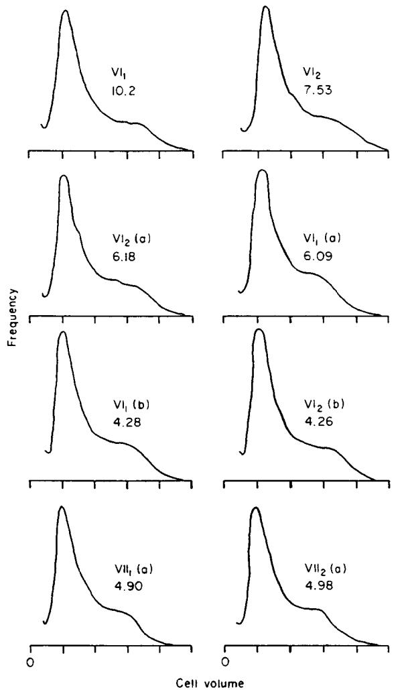

Figure 7.1. Eight steady-state size distributions observed under different experimental conditions (flow rate, temperature, CO2), scaled for equal means and areas. The mean cell size for each graph is indicated next to the graph. (From [ Wi, fig. 19], Copyright 1971, Academic Press. Reproduced by permission.)

#### 8. Discussion

The system of equations (4.1), like those in Chapters 1 and 2, models competition between two populations competing for a single nutrient in the chemostat. The difference is that for the model introduced in this chapter, each population contains individuals having different lengths. The energy derived from nutrient uptake by an individual of the ith population is assumed to be partitioned into a fraction K, channeled to growth and a fraction 1- K; channeled to reproduction. Appropriate scaling of uptake (by surface area) and of individual growth (by volume) has been taken into account. Despite this added complexity, relative to the models considered in Chapters 1 and 2, it has been shown that the principal prediction of competitive exclusion made in the earlier model remains valid. The winner is the population able to grow at the lowest nutrient concentration. In fact, the system (4.1) was reduced to equations comparable to those treated in Chapters 1 and 2. Consequently, we could define a breakeven concentration A for each population and conclude that the population having the smaller value of A is the winner in competition. The novelty in the case of size-structured competitors is that A is more complicated; it not only depends on the form of the uptake function f and the removal rate but also (inversely) on the physiological efficiency coefficient µ of the population and on the length at birth. In turn, µ depends on the growth efficiency and the reproductive efficiency. In the discussion following Theorem 4.1, it was argued that the physiological efficiency coefficients or the length at birth of the competitors can be of decisive importance in determining the outcome of competition under suitable circumstances. It would seem to be theoretically possible and of considerable interest to test the predictions of Theorem 4.1, especially those relating to the role of physiological efficiency coefficients in determining the winner of competition in the chemostat.

Like all models in science, the one treated in this chapter makes many unrealistic assumptions. These were pointed out at the end of Section 2. The most notable deficiencies are that the model inadequately reflects the cell division process and neglects the energy required for cell maintenance. It should be pointed out, however, that the main predictions of the simple (even less realistic) models of Chapters 1 and 2 survive intact in the more complex model treated in this chapter. Therefore, it is not unreasonable to expect that many of the predictions made on the basis of Theorem 4.1 will continue to hold for more realistic models.

As noted in Section 2, Metz and Diekmann [MD, p. 237] describe a different size-structured model, one that reflects the cell-division process quite well. They assume that cell size x varies among the individual cells of the population, from a minimum value xmin to a maximum value that is normalized to 1. A function b(x) gives the per-unit time probability of a cell of size x dividing. Small cells are not allowed to divide (b(x) = 0, x :s a). A mother cell of size x is assumed to divide into two daughter cells, one of size px and one of size (1- p) x, with probability d(p), 0 < p < 1. Of course, d(p) = d(1-p) and fo d(p) dp = 1. The unit of size x whether length, area, or volume - is not specified in [MD]. This makes their assumption that the growth rate of a cell of size x is proportional to x (and to f(S)) subject to different interpretations. The reader is referred to [MD, p. 238] for the equations and hypotheses. Their model also can be reduced to the equations considered in Chapter 1.

It would be of considerable interest to construct and analyze a model that treats growth and consumption as in this chapter (following [Cu2], i.e., proportional to surface area) and that treats cell division as in [MD]. It seems unlikely that this marriage of the two approaches would yield a model that can easily be reduced to the ordinary differential equation models of Chapter 1.

Cushing's study [Cu2] was motivated by the so-called size-efficiency hypothesis formulated in [BD]. Based on studies of zooplankton communities, Brooks and Dodson proposed that (1) larger individuals are more efficient at exploiting resources, which provides the potential for competitive exclusion of the smaller individuals in the population, and (2) size-selective predation by predators, which falls more heavily upon the larger individuals, can allow for the survival of smaller individuals or in some cases can even result in the elimination of larger individuals. To test hypothesis (1), it is natural to ask whether, in the model treated in Section 4, the superior competitor is necessarily the larger competitor. To answer this question, some measure of population size must be chosen. In Section 5, it was argued that suitable choices are the asymptotic values of average individual length, surface area, volume, or some weighted average of these. Each of these measures of average individual size shares the common feature that it is an increasing function of growth efficiency Ki/rli and the length 1i at birth, and a decreasing function of reproductive efficiency (1-Ki)/wi.

On the other hand, competitive success is determined solely by having the smaller break-even concentration Ai. Since Ai decreases (and so the ith

population becomes a stronger competitor) as «i/?7i or (1- ici)/wi increases and as li decreases, it is not evident that a clear-cut relationship exists between competitive success and average individual size. For example, in the case where the two populations have identical per-unit surface area uptake rates f, = f2 and identical death rates DI = D2, the superior competitor is the one with the larger value pi since that populatioin has the smaller Jai (see (3.7)). However, from (5.2), the population with larger pi need not have the larger average size, by any of the measures of size. Consequently, the model considered here does not appear to support the size-efficiency hypothesis. For more on this interesting subject the reader is referred to [Cu2] and the references therein.

New Directions

### 1. Introduction

In this chapter, several recent models that make use of the chemostat are described. The situations that occur are not as fully understood as those in the previous chapters, and no attempt will be made to present a detailed analysis. The mathematical results are only partial and, in fact, in some cases the modeling is clearly inadequate at this time. The title of the chapter is intended to suggest that further work is needed. The problems are important and interesting, and it is hoped that the reader might find something of interest here and contribute to the development of the theory.

Three types of new directions are discussed. In two of these, ordinary differential equations are not an adequate model to describe the phenomenon of interest; functional differential equations and partial differential equations provide the appropriate setting. In the remaining case ordinary differential equations are appropriate but the modeling is not complete. Improving the model would result in a larger system for which the techniques of monotone dynamical systems are inappropriate. The problems will be described and results indicated, but no proofs are given. In all cases, much more work needs to be done before the problem is appropriately modeled and analyzed.

### 2. The Unstirred Chemostat

The gradostat was an attempt to create a nutrient gradient in a piece of laboratory apparatus; it was discussed in detail in Chapters 5 and 6. An alternative to the gradostat is to remove the "well mixed" hypothesis that is, to think of the chemostat but without mixing the vessel. If the

nutrient is added to the vessel at one point, allowed to diffuse, and then removed at a different point, a gradient will occur. The nutrient concentration will become spatially dependent, and the organisms will compete at different nutrient levels at different locations. (There is a tacit assumption that the turnover of the chemostat - typically 12-24 hours - is so slow that there is no relevant transport.)

Reformulating the chemostat with diffusion introduces a new level of difficulty into the modeling. First of all, the equations will become nonlinear partial differential equations with all of their attendant complexity. The input and the output now occur at the boundary, so the boundary conditions for the system of partial differential equations must be formulated with care. If nutrient and organisms are diffusing, a new constant occurs: the diffusion coefficient. To simplify matters, we will assume that all the quantities diffuse with the same constant, an assumption that is mathematically convenient but not biologically rigorous. The analysis is limited to only one space dimension, so one must perform a thought experiment to visualize a one-dimensional chemostat when the real one is three-dimensional. A tubular reactor is an approximation. This will have the mathematical consequence that the rest states will be solutions of a boundary value problem for ordinary differential equations. With these limiting assumptions, the problem was considered in [HSW], [HW2], and [SoW] with an attempt to recover the standard gradostat results in this setting. The resulting boundary value problems were also considered in [BT].

We do not give the derivation here, but the equations take the form

$$\begin{aligned} \frac{\partial S}{\partial t} &= d \frac{\partial^2 S}{\partial \chi^2} - \frac{m_1 S u}{a_1 + S} - \frac{m_2 S v}{a_2 + S}, \\\\ \frac{\partial u}{\partial t} &= d \frac{\partial^2 u}{\partial \chi^2} + \frac{m_1 S u}{a_1 + S}, \\\\ \frac{\partial v}{\partial t} &= d \frac{\partial^2 v}{\partial \chi^2} + \frac{m_2 S v}{a_2 + S}, \\ &\qquad 0 < \chi < 1, \end{aligned} \tag{2.1}$$

with boundary conditions

$$\frac{\partial \mathcal{S}}{\partial \boldsymbol{\chi}}(\boldsymbol{\iota}, \mathbf{0}) = -\mathcal{S}^{(0)},$$

$$\frac{\partial \mathcal{U}}{\partial \boldsymbol{\chi}}(\boldsymbol{\iota}, \mathbf{0}) = \frac{\partial \boldsymbol{\upsilon}}{\partial \boldsymbol{\chi}}(\boldsymbol{\iota}, \mathbf{0}) = \mathbf{0},$$

$$\begin{aligned} \frac{\partial S}{\partial \chi}(t, 1) + rS(t, 1) &= 0, \\\\ \frac{\partial u}{\partial \chi}(t, 1) + ru(t, 1) &= 0, \\\\ \frac{\partial v}{\partial \chi}(t, 1) + rv(t, 1) &= 0 \end{aligned} \tag{2.2}$$

and initial conditions

$$\begin{aligned} S(0, \boldsymbol{x}) &= S_0(\boldsymbol{x}) \succeq 0; \\ \boldsymbol{u}(0, \boldsymbol{x}) &= \boldsymbol{u}_0(\boldsymbol{x}) \succeq 0, \quad \boldsymbol{u}_0(\boldsymbol{x}) \not\models 0; \\ \boldsymbol{v}(0, \boldsymbol{x}) &= \boldsymbol{v}_0(\boldsymbol{x}) \succeq 0, \quad \boldsymbol{v}_0(\boldsymbol{x}) \not\models 0. \end{aligned} \tag{2.3}$$

The boundary conditions in (2.2) are fairly intuitive and appropriate for this type of equation. However, the boundary conditions are not defined in terms of the operating parameters of the simple chemostat. The problem will be considered in a heuristic way to see how the units compare between the simple chemostat and the chemostat without the assumption of well mixing. To keep matters simple, we work with the nutrient equation without consumption (equivalently, zero initial conditions for the microorganisms); the other cases will be clear by analogy. Under these circumstances, the simple chemostat takes the form

$$\mathbf{S}'(t) = (\mathbf{S}^{(0)} - \mathbf{S}(t))D.$$

The units of S are concentration, mass/volume = m/13. The total mass of substrate is VS, where V is the volume of the vessel; if F is the flow rate (the rate of the pump operating the chemostat) then the parameter D is defined as F/V. Rewriting the equation just displayed for the mass of the substrate in the vessel yields

$$\mathcal{V}\mathcal{S}'(t) = F\mathcal{S}^{(0)} - F\mathcal{S}(t). \tag{2.4}$$

Equation (2.4) states that the rate of change in mass is proportional to the difference between the incoming flux and the outgoing flux.

When considering the partial differential equation, the basic quantity S(t, x) becomes a density, measured in units of mass per unit length. The nutrient equation, using a subscript to denote differentiation, is

$$\mathbf{S}_t = d\mathbf{S}_{xx}.\tag{2.5}$$

If one integrates over the interval [0, 1], an equation for the total mass of the nutrient is obtained:

234 New Directions

$$\frac{d}{dt}\int_{0}^{1} \mathcal{S}(t, \mathbf{x}) \, d\mathbf{x} = d\mathcal{S}_{\mathbf{x}}(t, 1) - d\mathcal{S}_{\mathbf{x}}(t, 0). \tag{2.6}$$

The two terms on the right-hand side of the equation represent the flux at the right and left endpoints, so equation (2.6) is the counterpart of (2.4). These quantities must be determined from the boundary conditions. The flux at the left end is given by S(0)F, where S(0) corresponds to the S(0) of the basic chemostat (as a density; i.e., the units are m/l ). The condition at the left endpoint can be written

$$d\mathcal{S}_{\mathbf{x}}(t,0) = -\mathcal{S}^{(0)}F;$$

if one defines

$$\mathcal{S}^{(0)} = \mathcal{S}^{(0)} F \!\!/ \!d\!/ \!d\!/ \!$$

then the first boundary condition in (2.2) is obtained. Similarly, the flux at the right-hand end is given by

$$d\mathcal{S}_{\chi}(t,1) = -FS(t,1).$$

Thus, if r is defined by r = F/d then the second boundary condition holds.

Equation (2.6) states that the rate of change of the mass of the nutrient in the vessel is proportional to the difference between the input nutrient flux and the output nutrient flux, as in the basic chemostat. The diffusion coefficient d has units of length squared over time, 12/t; thus the units are appropriate.

The following basic lemma will allow the problem to be simplified. (Note that this simplification depends upon the fact that the diffusion coefficients are the same.)

LEMMA 2.1. The solutions S(t, x), u(t, x), v(t, x) of (2.1)-(2.3) exist for all t > 0 with 0 < x < 1. The solutions are nonnegative and bounded, and

$$\sup_{t} \sup_{\|\mathbf{0}_{t}\| \leq 1} \left| \mathbf{S}(t, \cdot) + \boldsymbol{\mu}(t, \cdot) + \boldsymbol{\nu}(t, \cdot) - \phi \right| = O(e^{-\alpha t}) \quad \text{as} \ t \to \infty \quad (2.7)$$

for some a > 0, where

$$
\phi = \phi(\varkappa) = \mathcal{S}^{(0)}(\frac{1+r}{r} - \varkappa), \quad 0 < \varkappa < 1.
$$

The function 4(x) represents the distribution of nutrient for the case of no consumption (uo(x) = 0, vo(x) = 0). The lemma reflects the fact that the total nutrient and equivalent organism biomass equilibrate to this function as well. As noted frequently in this work, this is essentially a definition of the chemostat if all variables are taken into account. The

parameters s 0) and r are reflected in the function O(x); these are the operating parameters of the apparatus.

Solutions of (2.1)-(2.3) generate a semidynamical system on

$$
\mathsf{C}_{+} \times \mathsf{C}_{+} \times \mathsf{C}_{+},
$$

where C+ is the set of nonnegative continuous functions on [0, 1] with the usual supremum norm. The setting is far more abstract than any considered in the body of this book, but the basic definitions of dynamical systems theory and persistence carry over. This semidynamical system is denoted by 7r(x, t), where t ? 0 and x represents the triple of initial conditions given by (2.3). For t > 0, the semiflow is compact [H3]. The lemma shows that the system is dissipative, and that all omega limit sets are in the subset given by S + u + v - 0 = 0. On this set, (2.1) -(2.3) become

$$\begin{aligned} \frac{\partial u}{\partial t} &= d \frac{\partial^2 u}{\partial \chi^2} + f_1(\phi - u - v)u, \\\\ \frac{\partial v}{\partial t} &= d \frac{\partial^2 v}{\partial \chi^2} + f_2(\phi - u - v)v; \end{aligned} \tag{2.8}$$

$$\begin{aligned} \frac{\partial u}{\partial \chi}(t, 0) &= 0, \qquad \frac{\partial u}{\partial \chi}(t, 1) + ru(t, 1) = 0, \\\\ \frac{\partial v}{\partial \chi}(t, 0) &= 0, \qquad \frac{\partial v}{\partial \chi}(t, 1) + rv(t, 1) = 0; \end{aligned} \tag{2.9}$$

$$u(0, x) = u_0(x) \succeq 0, \qquad v(0, x) = v_0(x) \succeq 0, \tag{2.10}$$

where

$$f_i(\mathcal{S}) = \begin{cases} \ m_i \mathcal{S} / (a_i + \mathcal{S}) & \text{if } \mathcal{S} \succeq 0, \\ 0 & \text{if } \mathcal{S} \le 0 \end{cases}$$

u0(x) 0 0, v0(x) 0 0, 0(x) -u0(x) - v0(x) ? 0,

for i = 1, 2. ([HSW] allows for a more general functional response than this.)

This system can be investigated as a dynamical system on the space C+ x C+. Note that the theorem used in Appendix F is not adequate to show that the dynamics are the same as those of the original equations; however, the orbits in the omega limit set are solutions of these equations. The steps in the analysis generally follow those of the gradostat, although the investigation is much more technical. For example, one establishes the existence of a steady state (temporally independent but spatially dependent) for each population growing in the absence of the other. The parameter conditions involve the eigenvalues of linear problems. We state two results to give the flavor of one-population growth problems.

### 236 New Directions

For example, if only the u population is growing in the chemostat, the equation is

$$\begin{aligned} \frac{\partial u}{\partial t} &= d \frac{\partial^2 u}{\partial \chi^2} + \frac{m_1(\phi(\chi) - u)}{a_1 + \phi(\chi) - u} u; \\\\ \frac{\partial u}{\partial \chi}(t, 0) &= 0, \qquad \frac{\partial u}{\partial \chi}(t, 1) + ru(t, 1) = 0. \end{aligned} \tag{2.11}$$

The following lemma provides conditions under which an organism cannot survive in the given environment - that is, with the given r and the given input concentration 5(0).

LEMMA 2.2. If m, < Aod then u(x, t) decays to zero exponentially as t -> oo, where )o > 0 is the smallest eigenvalue of

$$
\psi'' + \lambda \left(\frac{\phi(\chi)}{a_1 + \phi(\chi)}\right) \psi = 0;
$$

$$
\psi'(0) = 0, \qquad \psi'(1) + r\psi(1) = 0.
$$

This lemma states that if the maximum growth rate is small then the organism will tend to extinction as time becomes large.

LEMMA 2.3. If m, > and and u(t, x) is the solution of (2.11), then

$$\lim_{t \to \infty} \mu(t, \chi) = \widehat{\mu}(\chi)$$

uniformly in x, where u(x) is the unique positive steady-state solution of

$$\mu'' + \frac{m_1(\phi(\chi) - \mu)}{a_1 + \phi(\chi) - \mu} \mu = 0;$$

$$\mu'(0) = 0, \qquad \mu'(1) + r\mu(1) = 0.$$

These lemmas and their counterpart for v (labeling the eigenvalue as µo) establish the existence of the rest points on the boundary of C+ x C. As before, we label these rest points E0, El, E2. As with the gradostat, the condition for coexistence is tied to the question of invasiveness. Now, however, the conditions take the form of comparison with the eigenvalues of certain Sturm-Liouville problems rather than with the stability modulus of matrices, as was the case in Chapter 6. We describe just enough of this to show the parameters on which the result depends.

First consider the following boundary value problem:

$$\lambda \, p(\boldsymbol{x}) = d\boldsymbol{p}'' + \left[ \frac{-m_1 a_1 \hat{u}}{(a_1 + \phi - \hat{u})^2} + \frac{m_1(\phi - \hat{u})}{a_1 + \phi - \hat{u}} \right] \boldsymbol{p} + \frac{-m_1 a_1 \hat{u}}{(a_1 + \phi - \hat{u})^2} \boldsymbol{q},$$

$$\lambda \, q(\boldsymbol{x}) = d\boldsymbol{q}'' + \frac{m_2(\phi - \hat{u})}{a_2 + \phi - \hat{u}} \boldsymbol{q};$$

$$p'(0) = 0, \qquad q'(0) = 0,$$

$$p'(1) + rp(1) = 0, \qquad q'(1) + rq(1) = 0.$$

Since the second equation is independent of the first, the set of eigenvalues for the full system is a subset of the set of eigenvalues of the second equation and therefore they are real.

Think of m2 as a parameter and let A(m2) be the largest eigenvalue of the Sturm-Liouville problem just displayed. The eigenvalue A(m2) is a strictly increasing function of m2 satisfying

$$
\bar{\lambda}(m_2) < 0 \quad \text{if} \quad m_2 \text{ is small}
$$

and

$$\lim_{m_1 \to \infty} \widehat{\lambda}(m_2) = \infty.$$

Since ,(m2) is monotone, there is a unique value mz such that A(m) = 0. If m2 > m2 then the largest eigenvalue is positive and E, is unstable; there is a similar result for E2. Of course, given A and q, one must solve the remaining boundary value problem for p. This is dealt with in varying degrees of generality in [BT], [HSW], and [SoW]. Table 2.1 describes the situation.

The theorem on coexistence can be stated in terms of the instability of the boundary rest points.

THEOREM 2.4. Fix m, and m2 such that m> > Aod and m2 > µod. If, in addition, m, > mt and m2 > m2, then the semidynamical system generated by (2.8)-(2.10) is uniformly persistent.

Although this is a coexistence result, it contains much less information than the previous results on models that involve ordinary differential equations. To apply the theorem, one must fix the parameters and then compute the m*s to see if both inequalities hold.

One can proceed further and show the existence of an interior order interval to which all solutions converge. In fact, from monotonicity, almost all solutions must converge to a rest point in this order interval [HSW]. Finally, we note that the system of equations in this section is

| Table 2.1 |  |  |  |
|-----------|--|--|--|
|-----------|--|--|--|

|             | Existence | Instability     |
|-------------|-----------|-----------------|
| Eo = (0, 0) | Always    | E, or E2 exists |
| E, = (u, 0) | m, > .hod | m2 > mz         |
| E, = (0, u) | m2 > pod  | m, > m;         |

similar in form to those studied in chemotaxis; see Lauffenberger and Calcagno [LC].

Many questions remain open. Key among these are the questions of uniqueness of the interior steady state in the case of Michaelis-Menten dynamics and of sufficient conditions for uniqueness in the general case. The model does not contain any transport terms, although their inclusion would be important to model a moving stream. Periodic coefficients, as discussed in Chapter 7, are certainly relevant to this model and have not been considered. In addition, the case of non-equal diffusion is not considered at all by these methods. Hence further modeling and mathematics are still needed.

### 3. Delays in the Chemostat

Delays occur naturally in biological systems. In the chemostat, the use of ordinary differential equations carries the implication that changes occur instantaneously, so this is a deficiency of the model. There are two obvious sources of delays: delays due to the possibility that the organism stores the nutrient (so that the "free" nutrient concentration does not reflect the nutrient available for growth); and delays due to the cell cycle. An internal-stores model was considered in Chapter 8 without delays; ones that include delays appear in [Cap], [McD], and [NG]. Bush and Cook [BC] investigated the growth of one organism in a chemostat with a delay term that reflected the delay between consumption and growth. (As a consequence there is a delay in the growth equation but no delay in the consumption term in the nutrient equation.) This approach was extended to the competitive situation in [FSWI]. This model is discussed first; the form of the equations here is very much like that of those discussed in Chapters 1 and 2.

The model is written for Michaelis-Menten kinetics but holds in greater generality at the expense of a more complicated statement for the theorems. It is supposed that each competitor has a delay Ti which affects its

growth rate; that is, the quantity Ti is the time delay in nutrient conversion. The specific growth rate is assumed to be a function of the nutrient level at time t-7-i. The model takes the form of a system of differential difference equations:

$$\begin{aligned} S'(t) &= 1 - S(t) - \chi_1(t) f_1(S(t)) - \chi_2(t) f_2(S(t)), \\ \chi_1'(t) &= \chi_1(t) [f_1(S(t - \tau_1)) - 1], \\ \chi_2'(t) &= \chi_2(t) [f_2(S(t - \tau_2)) - 1] \end{aligned} \tag{3.1}$$

with

$$f_i(\mathcal{S}) = \frac{m_i \mathcal{S}}{a_i + \mathcal{S}},$$

where 'TI, T2 ? 0, S(t) _ 0(t) ? 0 on [-T, 0], T = max(7-1, T2), and xi(0) _ xio >0 (i = 1, 2).

The last two equations can be written in integral form as

$$\chi_i(t) = \chi_i(0) \exp\left[\int_0^t f_l(S(\theta - \tau_i) - 1) \, d\theta\right].$$

This illustrates that the proper initial value problem is the one indicated by the initial conditions just listed. The theory for such delay differential equations is much more complicated than that for ordinary differential equations, and is not so widely known among nonspecialists. The basic reference is Hale [H1]; see also Kuang [K2].

Let C denote the space of continuous functions on [-T2, 0] equipped with the sup norm. We will tacitly assume the labeling is such that 7,2 > T1. Using our integral representation and a simple inequality argument for S', it is not difficult to show that solutions of the system (3.1) are nonnegative for all positive time; (3.1) defines a semidynamical system on C+ X C+ X C+ (C+ was defined in Section 2). The "conservation" argument used previously to obtain boundedness (and to reduce the complexity of the problem) is no longer valid, since the uptake and the consumption terms do not cancel. This fact alone casts suspicion on the model as a description of the chemostat. The model does, however, produce oscillations, which makes it very interesting. The boundedness and the continuability of solutions of the system (3.1) can be established, but it is not quite as easy as with the previous chemostat problems.

The investigation of solutions takes the following form. First, one population growing on the nutrient is analyzed (after some scaling) and a bifurcation (with the delay as parameter) is shown to exist, establishing the existence of a periodic solution (S(t), zi(t), 0). For one population of microorganisms, the two-dimensional system governing growth is

240 New Directions

$$\begin{aligned} S'(t) &= 1 - S(t) - \chi_{\parallel}(t) \, f_{\parallel}(S(t)), \\ \chi_{\parallel}'(t) &= \chi_{\parallel}(t) [f_{\parallel}(S(t-\tau)) - 1]. \end{aligned} \tag{3.2}$$

After scaling, one has

$$\begin{aligned} S'(t) &= \tau [1 - S(t) - \chi_1(t) f_1(S(t))], \\ \chi_1'(t) &= \tau \chi_1(t) [f_1(S(t-1)) - 1]. \end{aligned} \tag{3.3}$$

System (3.3) has a unique equilibrium point E* _ (S*, x*), since f, is strictly increasing. A periodic orbit bifurcates from E. for T large.

THEOREM 3.1. There exists To > 0 such that a family of periodic solutions of (3.2) bifurcates from the equilibrium point E* for T near To.

Although stability may in principle be computed, the calculation is extremely complicated. Numerical calculations suggest the asymptotic stability of the limit cycle, but the stability has not been rigorously established. Assuming that the solution is asymptotically stable, a secondary bifurcation can be shown to occur. The argument is quite technical and requires a form of a Poincare map in the appropriate function space; it is analogous to the bifurcation theorem used in Chapter 3 for bifurcation from a simple eigenvalue. The principal theorem takes the form of a bifurcation statement.

THEOREM 3.2. Suppose that the parameters a,, m,, and T, are chosen so that (3.2) has a (linearly) asymptotically orbitally stable periodic solution (S(t), z(t)) with period T > 0. Fix a2 and T2 > T,. Then there exist a critical value m* and a branch of periodic orbits of (3.1), with positive x2 component, bifurcating from the hypothesized orbit for m2 near m2.

All of the comments raised in Chapter 3 in connection with a similar bifurcation apply. The computations needed to determine the direction of bifurcation (which side of m*) and the stability are formidable. However, for particular parameter values one can solve the differential equations numerically and exhibit the periodic orbit. Figure 3.1 shows the time course of a sample problem, and Figure 3.2 shows the projection of the periodic or the coexisting periodic orbits onto each of the possible pairs of variables.

Ellermeyer [ E ] takes a different approach to modeling the internal storage of nutrient. With our preceding notation letyi, i = 1, 2, be the nutrient

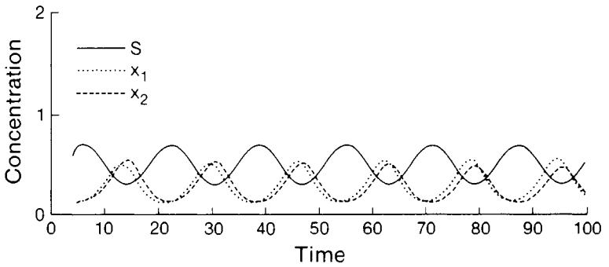

Figure 3.1. Plot of 100 time steps in the case of oscillatory coexistence. Parameters are a, = 1.0, a2 = 1.0, m, = 3.1, m2 = 3.09, r, = 3.0, r2 = 4.0. (From [FSWI], reprinted with permission from the SIAM Journal on Applied Mathematics, volume 49, number 3, pp. 859-70. Copyright 1989 by the Society for Industrial and Applied Mathematics, Philadelphia, Pennsylvania. All rights reserved.)

stored internally by population i. Taking the input and washout into consideration, this quantity is given by

$$y_i(t) = \int_{t-\tau_i}^t e^{-D(t-u)} f_i(S(u)) \, \chi_i(u) \, du, \quad i = 1, 2.$$

The exponential accounts for the stored nutrient, which washes out of the vessel - along with the cells containing it - during the storage period. Balancing input and output with consumption and washout yields integral equations of the form

$$S(t) = S(0) + \int_0^t DS^{(0)} du - \int_0^t DS(u) \, du - \int_0^t \sum_{i=1}^2 f_i(S(u)) \chi_i(u) \, du,$$

$$\chi_i(t) + \mathcal{y}_i(t) = \chi_i(0) + \mathcal{y}_i(0) + \int_0^t f_i(S(u)) \chi_i(u) \, du - D \int_0^t \left[ \chi_i(u) + \mathcal{y}_i(u) \right] du.$$

Differentiation produces the following system of differential difference equations:

$$\begin{split} S'(t) &= D(S(0) - S(t)) - \sum_{i=1}^{2} f_i(S(t)) \chi_i(t), \\ \chi_1'(t) &= -D\chi_1(t) + e^{-D\tau_1} f_1(S(t-\tau_1)) \chi_1(t-\tau_1), \\ \chi_2'(t) &= -D\chi_2(t) + e^{-D\tau_2} f_2(S(t-\tau_2)) \chi_2(t-\tau_2). \end{split} \tag{3.4}$$

The initial conditions now take the form

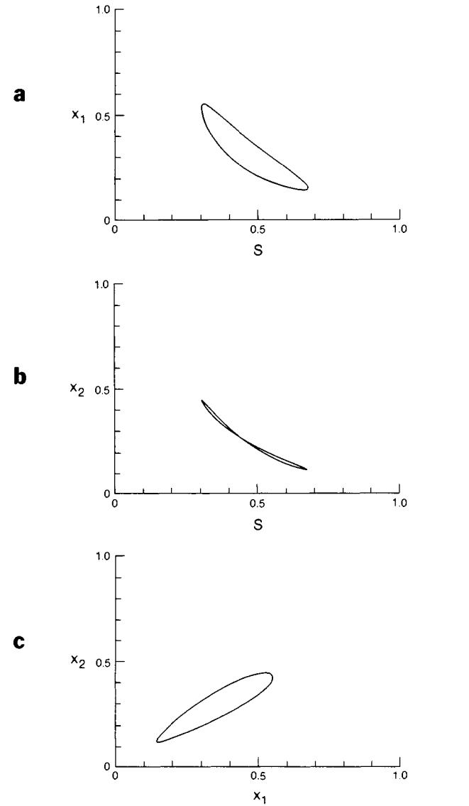

Figure 3.2. Plot of projections onto two dimensions of the solution given in Figure 3.1: a S-x,; b S-x2; c x1-x2. (From [FSW1J, reprinted with permission from the SIAM Journal on Applied Mathematics, volume 49, number 3, pp. 859-70. Copyright 1989 by the Society for Industrial and Applied Mathematics, Philadelphia, Pennsylvania. All rights reserved.)

$$\begin{aligned} \mathcal{S}(t) &= \phi_0(t), \\ \chi_1(t) &= \phi_1(t), \\ \chi_2(t) &= \phi_2(t), \\ -\tau_2 &\le t \le 0, \end{aligned}$$

where again one assumes that T2 ? Tl and that the initial conditions are continuous functions. These same equations occurred also in [FSW2].

Although the equations look quite similar to (3.1), the behavior of solutions is quite different. There is a conservation principle but, as we would expect owing to the delay, it takes a rather different form.

LEMMA 3.3. For any fixed initial condition cb = (00, 01, 02), the corresponding trajectory satisfies

$$\lim_{t \to \infty} \left[ S(t) + e^{D\tau_1} \chi_1(t + \tau_1) + e^{D\tau_2} \chi_2(t + \tau_2) \right] = S^{(0)}.$$

As in the model of Section 2, the problem can be studied on its omega limit set with three rest points E0, El, E2. A local stability analysis and, for some special cases, the asymptotic behavior of solutions were given in [E]. However, the populations cannot invade each other simultaneously (El and E2 cannot be simultaneously unstable), so the persistence theory does not hold [E]. Moreover, for Michaelis-Menten dynamics, when one of the boundary rest points is locally stable and the other unstable, the locally stable one is globally stable [HWE]. In particular, the oscillation observed in the case of system (3.2) does not occur with (3.4). Indeed, the delayed system seems to behave much like the simple chemostat.

The totally different behavior of the two models illustrates the importance of the modeling process. Both models appear reasonable. Neither uses any cell physiology in deriving the delay term. The cell cycle does not appear in either. Clearly, more work in this direction is needed, with particular emphasis on more careful modeling of the delay.

### 4. A Model of Plasmid-Bearing, Plasmid-Free Competition

Genetically altered organisms are used in industry to manufacture a desired product, for example, a pharmaceutical. The alteration is accomplished by introducing DNA into the cell, frequently in the form of a plasmid. Plasmids contain bits of DNA which exist separately from the chromosome and replicate independently; the plasmid codes for the added

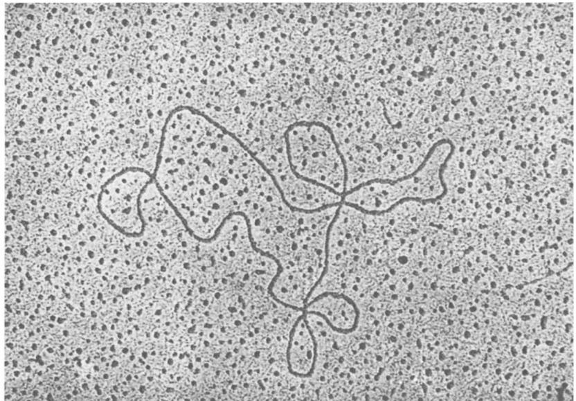

Figure 4.1. A plasmid. Photograph courtesy of Mervyn Bibb, John Innes Institute, Norwich, England. Reproduced by permission.

production. A micrograph of a plasmid is shown in Figure 4.1. A good description of plasmids can be found in Postgate [Pos]. The burden imposed on the cell by the task of production can result in the genetically altered (the plasmid-bearing) organism being a less able competitor than the plasmid-free organism. Unfortunately, the plasmid can be lost in the reproductive process; that is, it may not be passed to the daughter cells, producing a plasmid-free organism (the "wild" type). Since commercial production can take place on a scale of many generations, it is important to understand the asymptotic behavior of this system.

A model of competition between plasmid-bearing and plasmid-free organisms in a chemostat was proposed by Stephanopoulos and Lapidus [SLa], who give a local analysis of various models. A global analysis of the behavior of system trajectories was presented in [HWW], and a portion of that analysis is sketched here. The major remaining problem is discussed after the description of the known results. There are other models of plasmid loss (and conjugation), for example, Stewart and Levin [SL2] and Macken, Levin, and Waldstatter [MLW]. The survey article of Simonsen [Si] contains a discussion of the experiments and the theory.

The model of Stephanopoulos and Lapidus takes the form

$$\begin{aligned} S' &= \left( S^{(0)} - S \right) D - f_1(S) \frac{\chi_1}{\gamma} - f_2(S) \frac{\chi_2}{\gamma}, \\\\ \chi_1' &= \chi_1(f_1(S)(1 - q) - D), \\\\ \chi_2' &= \chi_2(f_2(S) - D) + q \chi_1 f_1(S), \\\\ S(0) &= S_0 \ge 0, \qquad \chi_i(0) > 0, \; i = 1, 2, \end{aligned} \tag{4.1}$$

where for descriptive purposes we will take

$$f_i(\mathcal{S}) = \frac{m_i \mathcal{S}}{a_i + \mathcal{S}} \quad \text{and} \quad 0 < q < 1.$$

The variables and the units are those which have been used since Chapter 1: S(t) is the nutrient concentration at time t, x,(t) is the concentration of plasmid-bearing organisms at time t, and x2(t) is the concentration of plasmid-free organisms at time t; 5(0) is the input concentration of the nutrient, and D is the washout rate of the chemostat. These are the operating parameters. The m; term is the maximal growth rate of x,, and a; is the Michaelis-Menten (or half-saturation) constant of x;. These are assumed to be known (measurable) properties of the organism that characterize its growth and reproduction. A plasmid is lost in reproduction with probability q, and ry is the yield constant.

We proceed as before to obtain dimensionless variables by measuring concentrations in units of 5(0), time in units of 1/D, and x; in units of 1/-y;S(° . The number of parameters can be reduced, and the equations then take the form

$$\begin{aligned} \mathcal{S}' &= 1 - \mathcal{S} - \chi_1 f_1(\mathcal{S}) - \chi_2 f_2(\mathcal{S}), \\ \chi_1' &= \chi_1 (f_1(\mathcal{S})(1 - q) - 1), \\ \chi_2' &= \chi_2 (f_2(\mathcal{S}) - 1) + q \chi_1 f_1(\mathcal{S}). \end{aligned} \tag{4.2}$$

Although the system (4.2) looks similar to the equations for the chemostat in Chapter 1, the analysis is more difficult because the system is no longer competitive. Stephanopoulos and Lapidus used a very clever index argument to generate phase portraits. However, such arguments are only local; [HWW] determined the global asymptotic behavior.

Let E(t) = 1-S(t)-x1(t)-x2(t). The system (4.2) may be written

$$\begin{aligned} \Sigma' &= -\Sigma, \\ \lambda_1' &= \chi_1 \{ f_1 (1 - \Sigma - \chi_1 - \chi_2)(1 - q) - 1 \}, \\ \lambda_2' &= \chi_2 \{ f_2 (1 - \Sigma - \chi_1 - \chi_2) - 1 \} + q \chi_1 f_1 (1 - \Sigma - \chi_1 - \chi_2). \end{aligned}$$

| Table 4.1 |  |
|-----------|--|
|-----------|--|

| [   | f,(1)(1 - q) < 1 | f2(1) < 1 |                     |
|-----|------------------|-----------|---------------------|
| II  | f1(I)(1 - q) > 1 | f2(1)<1   |                     |
| III | f,(1)(1 - q) < 1 | f2(I) > 1 |                     |
| IV  | f1(1)(1-q)>1     | f2(1) > 1 | (a) f,(A2)(1-q) < 1 |
|     |                  |           | (b) .f1(A2)(1-q)>1  |

| Table 4.2 |  |  |  |
|-----------|--|--|--|
|-----------|--|--|--|

| I   | (E,1           |
|-----|----------------|
| II  | (EI,E*1        |
| III | IE1i E21       |
| IV  | (a) IEI,E21    |
|     | (b) 1El,E2,E*1 |

Clearly limr . E(t) = 0 and trajectories on the omega limit set satisfy E = 0. If all of the rest points of the limiting system are hyperbolic (which will be implied by the conditions stated) and if there are no periodic orbits (which needs to be proved), then the results of Appendix F apply. The limiting system is

$$\begin{aligned} \chi_1' &= \chi_1 [f_1(1-\chi_1-\chi_2)(1-q)-1], \\ \chi_2' &= \chi_2 [f_2(1-\chi_1-\chi_2)-1] + q\chi_1 f_1(1-\chi_1-\chi_2). \end{aligned} \tag{4.3}$$

The equations, of course, are restricted to the region

$$\Omega = \{ (\boldsymbol{\chi}_1, \boldsymbol{\chi}_2) \mid \boldsymbol{\chi}_i \succeq 0, \, \boldsymbol{\chi}_1 + \boldsymbol{\chi}_2 \le 1 \};$$

0 is a positively invariant region. Note that the system is not a competitive one.

The analysis breaks conveniently into four cases, which are given in Table 4.1. The rest point sets are shown in Table 4.2. The rest points are defined as E, = (0, 0), E2 = (0, 1 -A2), and E* = (xr, xZ) where the quantities A2, x*, x2 are defined next.

The A2 term is defined to be the unique value such that f2(A2) = I and A* is defined by fl(A*) = 1/(1-q), if such a A* exists. A necessary and sufficient condition for there to be such a A* is that f1(1) > 1/(1-q). If one

assumes A* # A2 (a hyperbolicity assumption), then the interior rest point E. will exist and have coordinates

$$\begin{aligned} \chi_1^* &= \frac{(1 - \lambda^*)(1 - f_2(\lambda^*))}{f_1(\lambda^*) - f_2(\lambda^*)}, \\ \chi_2^* &= 1 - \lambda^* - \chi_1^* \\ &= \frac{(1 - \lambda^*)(f_1(\lambda^*) - 1)}{f_1(\lambda^*) - f_2(\lambda^*)}, \end{aligned}$$

provided the right-hand side is positive and less than 1.

The principal global result takes the following form.

THEOREM 4.1.

- (i) In case I, El is a global attractor of the interior of Q.
- (ii) In cases II and IV(b), E* is a global attractor of the interior of Q.
- (iii) In cases III and IV(a), E2 is a global attractor of the interior of Q.

The theorem shows clearly that plasmid loss is detrimental (or fatal) to the production of the chemostat. To compensate for this possibility, in commercial production a plasmid that codes for resistance to an antibiotic is added to the DNA that codes for the item to be produced. Thus, if the plasmid is lost then the "wild" type is susceptible to (inhibited by) the antibiotic. The antibiotic is introduced into the feed bottle along with the nutrient. The dynamics produced by adding an inhibitor to the chemostat was modeled in Chapter 4. A new direction for research on chemostat models would be to include the inhibitor, as in Chapter 4, and the plasmid model of this section (or one of the more general models) into the same model. This is a mathematically more difficult problem to analyze, since the reduced system will not be planar. Moreover, because the methods of monotone dynamical systems do not apply, other techniques would need to be found in order to obtain global results. The model also assumes extremely simple behavior for the plasmid; more could be included in a model.

# 11 Open Questions

In this brief final chapter we collect in one place the main questions that remain unanswered concerning the models explored in this work. We proceed more or less in the order of the chapters. In many cases, the open problems mentioned here have already been identified and discussed in the discussion section of the corresponding chapter, so the reader may wish to check there as well.

As noted in the discussion section of Chapter 2, there remains a gap in our knowledge of the basic chemostat model in the case of differing removal rates for the competitors. The principal open problem is to extend the result of [Hsul], described in Section 4 of Chapter 2, to general monotone uptake functions. It would also be desirable to include the class of not necessarily monotone uptake functions identified in [BWo1]. The recent work [WLu] represents a major step in this direction.

In Chapter 3, two limit cycles played a prominent role. The first occurred in the planar system, representing oscillations in the simple food chain. Neither the stability nor the uniqueness of the limit cycle was established. Kuang [Kl] shows that the limit cycle is unique and asymptotically stable - for parameter values near where the rest point loses stability - by examining the Hopf bifurcation from the rest point. For other values of parameters, the uniqueness and stability questions remain open.

The second limit cycle was obtained as a simple bifurcation from the first limit cycle. It represents the oscillations of two competing populations preying on the population consuming the nutrient. The direction of bifurcation (a3 < a3 or a3 > a3) and the stability of this limit cycle were left undetermined, although numerical simulations suggest that it is stable and exists for a3 < a3. Numerical simulations suggest the possibility of establishing a global bifurcation such that, as parameters are adjusted, the cycle "lifts off" from the cycle in the x-y plane of the octant (one

food chain) and moves toward and eventually coalesces with the cycle in the x-z plane (second food chain). This was established in [ Ke2] under an additional condition. The limit cycle continues, so long as hyperbolicity is maintained, since there is strong dissipation (solutions are bounded by a uniform constant). The problem seems to be bounding the period of the limit cycle from above. Establishing the global bifurcation rigorously would be of interest and, along with uniqueness, would help to complete the theory. The proof of Lemma 5.1 in Chapter 3 is very long and inelegant. A simpler proof would be of interest.

Limit cycles also appear in Chapter 4, but no bifurcation theorems were used (although the Hopf bifurcation theorem could have been used). Uniqueness of these cycles is a question of major interest and importance. To more accurately model the chemostat as it is used in commercial production, the plasmid model discussed in Chapter 10 should be combined with the inhibitor model of Chapter 4. More specifically, consider two organisms - differing only by the presence or absence of a plasmid that confers immunity to the inhibitor - competing in a chemostat (equation (4.2) of Chapter 9 modified for the presence of the inhibitor). The techniques of analysis used in Chapter 4 do not apply, since the system is not competitive in the mathematical sense. Yet an understanding of this system would be very important.

The model in Chapter 4 had only one competitor taking up the inhibitor, but this is only a first approximation. One could justify this assumption only by showing that nothing changes if the system is modified to allow for uptake by both competitors. However, such modification complicates the analysis. Finally, could it be that a threshold amount needs to be consumed before the inhibitor is effective? Adding thresholds to the model would be an interesting modeling task.

In Theorem 7.2 of Chapter 4, we assumed there were no limit cycles and showed that the positive rest point was globally attracting. It might be conjectured that this rest point is globally attracting when it is locally asymptotically stable. Establishing this conjecture would require criteria for eliminating limit cycles for competitive systems. The development of such criteria would be very important for applications to many ecological systems. Remark 7.4 of Chapter 4 provided an interesting case where the stability computations for the positive rest point could be carried out and the existence of a limit cycle established. Are there more general cases where the computations can be carried out?

In Chapter 5, a complete analysis of competition between two microorganisms with Michaelis-Menten uptake functions in a two-vessel gradostat

was given. This analysis relied on two calculations which established that if a positive coexistence rest point exists then it is both unique and asymptotically stable. As noted in Section 4 of Chapter 6, more general conditions are known [HSo] for two monotone uptake functions in order that these two results hold. Furthermore, counterexamples are given in [ HSoJ where these conditions fail and there exists an unstable positive rest point for some two-vessel gradostat (not necessarily the same one considered in Chapter 5). As a result of our ignorance of general sufficient conditions for these two results to hold for monotone uptake functions and for more general n-vessel gradostats, the analysis of Chapter 6 is less complete than that of Chapter 5. The main difficulty seems to be the possible nonuniqueness of the positive rest point. Sufficient conditions for the uniqueness of this rest point would greatly simplify the main result (Theorem 4.4) of Chapter 6, since in that case E. = E,,. and so E. would be globally attracting. Such sufficient conditions on the monotone uptake functions, even if limited to the case of the standard n-vessel gradostat, would be highly desirable.

One might ask if the results of Chapter 5 hold for the case of nonnegligible death rates. There seems to be no work in this direction.

A more interesting question from the ecological point of view is that of how many different populations can coexist in an n-vessel gradostat. [JST] shows that this number cannot exceed n. Some numerical simulations and conjectures appear in [BWu; CB], but very little is known about this question. New techniques must be developed to handle this problem, since the resulting equations do not generate a monotone dynamical system when the number of competitors exceeds two (see [JST]).

The principal open questions that arise in the treatment of the chemostat with periodic washout rate, discussed in Chapter 7, are analogous to those mentioned in connection with Chapter 6. Namely, can sufficient conditions be given for the uniqueness of the positive periodic solution (fixed point of the Poincare map) that represents the coexistence of the two populations? What can be said of the case of more than two competitors?

Similarly, our analysis of the variable-yield model in Chapter 8 is limited to two competing populations because we rely on the techniques of monotone dynamical systems theory. One would expect the main result of Chapter 8 to remain valid regardless of the number of competitors, just as it did for the simpler constant-yield model treated in Chapters 1 and 2. Perhaps the LaSalle corollary of Chapter 2 can be used to carry out such an extension, using arguments similar to those used in [AM] (described in Chapter 2). As noted in [NG], a structured model in which

### Open Questions 251

individual organisms vary in the amount of nutrient stored would be more appropriate, but such models are mathematically less tractable and require knowledge of various parametric functions which is generally unavailable.

A size-structured model of the growth in a chemostat of a single population, and the competition between two populations, was analyzed in Chapter 9. The model erred principally in its description of the celldivision process. Metz and Diekmann describe a size-structured model in [MD, p. 237] which more accurately accounts for the cell-division process. A brief description of their assumptions follows. The cell size x is assumed to vary among individuals of the population, from a minimum value xmi,, to a maximum value which is normalized to 1. A function b(x) gives the per-unit time probability of a cell of size x dividing. Small cells are not allowed to divide (b(x) = 0, x:5 a). A mother cell of size x divides into two daughter cells, one of size px and one of size (1- p)x, with probability d(p), 0 < p < 1. One must assume that d(p) = d(1 - p) and fo d(p) dp = 1. The unit of size x - whether length, area, or volume - is not specified in [MD], and this makes their assumption that the growth rate of a cell of size x is proportional to x (and to f(S)) subject to different interpretations. Their model also can be reduced to the equations considered in Chapter 1.

An interesting open problem is to construct and analyze a model which, following [Cu2], treats growth and consumption as in Chapter 9 (i.e., as proportional to surface area) and which treats cell division as in [MD]. Questions of existence, uniqueness, and continuous dependence of solutions on initial data were not considered for the model discussed in Chapter 9. This problem seems to be an open one. The analysis should follow along the lines of arguments given in [MD, p. 238].

All of the open problems for the standard gradostat system of Chapter 6 are open problems for the unstirred chemostat model discussed in Chapter 10. It can be shown [HSW] that the dynamics of the unstirred chemostat system mirror those of the gradostat in the sense that there is an order interval, bounded by two (possibly identical) positive rest points, that attracts all solutions. Furthermore, an open and dense set of initial data generates solutions that converge to a stable rest point. The question of the uniqueness of the interior rest point is a major open problem. Another is how to handle the case where the diffusion coefficients of the competitors and nutrient are distinct. Although there must still be conservation of total nutrient, it is no longer a pointwise conservation relation and the reduction to two equations is not clear. Even if accomplished, it may be difficult to exploit. If one is forced to analyze the full

### 252 Open Questions

system (three equations), then the corresponding dynamical system is no longer monotone and different techniques need to be applied. From the biological point of view, this is important because it is expected that the nutrient, being a molecule, will diffuse differently than the organisms, which are cells.

One of the basic assumptions in the unstirred chemostat was that the turnover rate was so slow that any transport (perhaps induced by pumps operating the chemostat) was negligible. If one thinks of a model for a flowing stream, or a lake with circulation, this assumption is unwarranted. Hence a mathematical analysis of the case where transport has been added to the model equations would be an important contribution. The steady-state case (with equal diffusion) was considered in [J W ], but the dynamical model is the important one.

Delay models were discussed in Chapter 10. We repeat here that the most interesting problem is a modeling one. Since the problem is sensitive to how the delay is introduced, care must be taken in the modeling. A physical delay is caused by the physiology of the cell, so model equations must be modified to consider or approximate the cell physiology. Once a model is known, analysis of the corresponding system of equations (either functional differential equations or hyperbolic partial differential equations of a structured model) would be an important contribution. It is likely, however, that the delay will be state-dependent, and the theory for such equations is not well developed. A model with delays due to both cell physiology and diffusion in an unstirred chemostat would also be of interest.

Finally, as has been noted repeatedly, most of the material after Chapter 2 is limited to two competing populations. Obviously, in nature one is concerned with greater numbers of competitors. The models are straightforward - one just adds equations - but the techniques for analysis, namely monotone dynamics, fail here. This remains a major consideration in the development of the theory. One final point deserves mention here, since it is not addressed adequately in the text. How robust or how extensive is the parameter region where coexistence occurs in the models discussed in Chapters 3-7 and 9? The theory developed in these chapters points to the calculations required to address this question, but the parameter space is multidimensional and exploring all of it will not be possible. Operating diagrams for specific competitors - where the range of dilution rates, reservoir nutrient concentration, and other control parameters that result in coexistence of the populations are displayed - will probably remain the most useful answers.

# Appendices

- A Matrices and Their Eigenvalues
- B Differential Inequalities
- C Monotone Systems
- D Persistence
- E Some Techniques in Nonlinear Analysis
- F A Convergence Theorem

## Matrices and Their Eigenvalues

Matrices are encountered on a number of occasions in the text, particularly in arguments for the linearization about rest points or periodic orbits. On some occasions we encounter matrices of dimension large enough that direct computation of the eigenvalues may not be feasible. Fortunately, the matrices are often of a special form and there are theorems to cover such cases. In this appendix we list some of the useful theorems in the analysis of these special systems, along with appropriate references.

For stability at a rest point one wishes to show that the eigenvalues of the linearization lie in the left half of the complex plane. There is a totally general result, the Routh-Hurwitz criterion, that can determine this. It is an algorithm for determining the signs of the real parts of the zeros of a polynomial. Since the eigenvalues of a matrix A are the roots of a polynomial

$$f(z) = a_0 z^n + a_1 z^{n-1} + \dots + a_n z^n$$

obtained from

$$f(z) = \det(A - zI),$$

this theory applies. Unfortunately, the explanation of the algorithm depends on describing a certain index for quotients of polynomials, and the explanation of the necessary computations is also very complex. Thus, although the question of the signs of the real parts of the roots can be answered theoretically, practical application of the theory is very difficult. A complete explanation of the theory can be found in the appendix to [Co]. When the degree of the polynomial is small, however, the computations can be carried out. If

$$a_0 z^3 + a_1 z^2 + a_2 z + a_3 = 0$$

with ao > 0, then the relevant condition is

a3>0, a1>0, ala2>a0a3.

The next result is also general and, while the conditions are not often met, it is an important tool when it can be applied. The theorem is called the Gerschgorin circle theorem. An excellent general reference on matrices is Lancaster and Tismenetsky [LT], and most of the results here are quoted from that source. Another important source is Berman and Plemmons [BP], particularly for special results on nonnegative matrices.

THEOREM A.1 [LT, p. 371]. Let A be an n x n matrix with elements denoted by aid, and let p be defined by pi = Zk I aik I where Zk denotes the sum on k from k = 1 to n with the term k = i omitted. (The diagonal element of the matrix is omitted from the sum.) Then every eigenvalue of A lies in at least one of the disks

$$\{z \mid |z - a_{ii}| \le \rho_i\}, \quad i = 1, 2, \dots, n,$$

in the complex plane. Furthermore, a set of m of these disks having no point in common with the remaining n - m disks contains m and only m eigenvalues of A.

As generally used in stability theory, the diagonal element is negative, and Theorem A.1 is used in attempts to show that the radius of the disk (called a Gerschgorin disk) is smaller in absolute value. There are many generalizations that yield finer results at the expense of a more complicated criterion. One of these, useful for our work, involves the concept of an irreducible matrix.

A matrix is said to be irreducible if it cannot be put into the form

$$
\begin{bmatrix} A & B \\ 0 & C \end{bmatrix}
$$

(where A and C are square matrices) by reordering the standard basis vectors. In applications, not being irreducible often leads to the interpretation that the object being studied can be separated into two compartments, with at least one of them not influencing the other.

There is a simple test to see if an n x n matrix A is irreducible. Write n points P1, P2, ..., P in the plane. If a,j # 0, draw a directed line segment P,Pj connecting Pi to Pp The resulting graph is said to be strongly connected if, for each pair (P,, Pj), there is a directed path P,Pk,, Pk, Pk2, ..., P,_,Pj. A square matrix is irreducible if and only if its directed graph is strongly connected [LT, p. 529].

This test reflects the preceding interpretation of "separated compartments." When there is no path between two vertices of the graph, no material may pass from the first to the second vertex. Hence there is no influence of the first on the second.

THEOREM A.2 [LT, p. 376]. Let A be an irreducible matrix, and let A be an eigenvalue of A lying on the boundary of the union of the Gerschgorin disks. Then A is on the boundary of each of the Gerschgorin disks.

The set of all eigenvalues of the matrix A is called the spectrum of A and is denoted by a(A). The stability modulus of a matrix A, denoted by s(A), is defined by

$$s(\mathcal{A}) = \max \{ \operatorname{Re} \lambda | \lambda \in \sigma(\mathcal{A}) \}.$$

The traditional statement in stability theory that all of the eigenvalues have negative real part becomes s(A) < 0. The spectral radius of a matrix, denoted µ(A), is defined by

$$
\mu(\mathcal{A}) = \max(|\lambda| | \lambda \in \sigma(\mathcal{A})).
$$

For special matrices there are theorems that give information about the stability modulus. A matrix is said to be positive if all of the entries are positive; this is written A > 0. (Similarly, a matrix is nonnegative if all of the entries are nonnegative.) The very elegant Perron-Frobenius theory applies to such matrices.

THEOREM A.3. If then x n matrix A is nonnegative, then

- (i) µ(A) is an eigenvalue; and
- (ii) there is a nonnegative eigenvector v associated with p(A).

Since the hypotheses allow for A to be a null matrix, the theorem is of limited value. If irreducibility is added, a stronger theorem applies.

THEOREM A.4 [LT, p. 536]. If the n x n matrix A is nonnegative and irreducible, then:

- (i) the matrix A has a positive eigenvalue r = µ(A);
- (ii) there is a positive eigen vector v associated with r;
- (iii) the eigenvalue r has algebraic multiplicity 1;
- (iv) any nonnegative eigenvector of A is a positive multiple of v; and
- (v) if B >_ A but B * A then µ(B) > µ(A).

The following theorem is a consequence of Theorem A.4 and the observation that ifA is a matrix such that A+cI >_ 0, then µ(A+cI) = s(A)+c.

THEOREM A.5. If A is irreducible and has nonnegative off-diagonal elements, then s(A) is an eigenvalue with algebraic multiplicity 1, and Re A < s(A) for AE a(A) and A # s(A). Moreover, there exists an eigenvector v > 0 such that Av = s(A)v. Any nonnegative eigenvector of A is a positive multiple of v. If B is an n x n matrix satisfying B > A and B # A, then s(B) > s(A).

The following consequence is also useful.

THEOREM A.6. Let

$$A = \begin{bmatrix} B & C \\ D & E \end{bmatrix},$$

where B and E are square matrices of dimension k and I (respectively) with nonnegative off-diagonal elements, D:5 0 and C:5 0, and where A is irreducible. Then s(A) is an eigenvalue of multiplicity 1 and ReA < s(A) for A # s(A). Moreover, there is an eigenvector v = (VI, v2), v, E Rk and v2 e R1 satisfying v, > 0 and v2 < 0, such that Av = s(A)v.

If A is a positive matrix, some of the theorems may be strengthened.

THEOREM A.7 [LT, p. 542]. If A is a positive matrix then, in addition to the conclusions in Theorem A.4, r exceeds the modulus of all other eigenvalues of A.

Another concept that is important is that of "positive (or negative) definite." For this, it is required that A be a symmetric matrix, that is a,j = aj,. An important theorem is the following.

THEOREM A.8. The spectrum of a symmetric matrix is real.

Thus, one may order the eigenvalues of a symmetric matrix

$$
\lambda_1 \le \lambda_2 \le \cdots \le \lambda_n.
$$

A symmetric matrix A is said to be positive definite if all of the eigenvalues are positive; it is said to be negative definite if all of the eigenvalues are negative. Semidefinite is similarly defined. There is a simple test to determine if a symmetric matrix is positive or negative definite.

The principal minors are those determinants whose upper left element is all and have contiguous rows and columns. For example, the first principal minor, dl, is just all. The second is given by

$$d_2 = \det\begin{bmatrix} a_{11} & a_{21} \\ a_{21} & a_{22} \end{bmatrix},$$

and the last by

$$d_n = \det \begin{vmatrix} a_{11} & a_{12} & \dots & a_{1n} \\ a_{21} & a_{22} & \dots & a_{2n} \\ \vdots & \vdots & \ddots & \vdots \\ a_{n1} & a_{n2} & \dots & a_{nn} \end{vmatrix} .$$

THEOREM A.9. A symmetric matrix is positive definite if and only if

d1>0,d2>0,...,dn>0.

THEOREM A.10. A symmetric matrix is negative definite if and only if

d1<0,d2>0,...,(-1)ndn>0.

Theorem A.10 allows us to conclude stability if the matrix is the variational matrix evaluated at a rest point. An important result is that the test in Theorem A.10 will work for some matrices that are not symmetric, not in the sense of being negative definite but in the sense of yielding stability based on the sign of the real parts of the eigenvalues. The type of matrix is closely associated with the orderings and monotone flow discussed in Appendices B and C.

THEOREM A.11 [S6, thm. 2.7; BP, chap. 6]. Let A be as in Theorem A.6. Let A be defined by

$$
\tilde{A} = \begin{bmatrix}
\mathbf{B} & -C \\
-\mathbf{D} & E
\end{bmatrix}.
$$

Then s(A) < 0 if and only if (-1)kdk > 0, k = 1, 2, ..., n, where dk is the kth principal minor of A.

Finally, we will have need of the following.

THEOREM A.12. Let A have nonnegative off-diagonal elements and be irreducible. Then

- (i) if s(A) < 0 then -A-' > 0; and
- (ii) if s(A) > 0 and r> 0, then Ax+ r = 0 has no solution x satisfying x> 0.

Proof. (i) follows from the identity -A-' = fo eA` dt and (B.7) of Theorem B.3, which implies that eAl > 0 fort > 0.

If (ii) is false then there exists an x > 0 such that -Ax > 0. According to [BP, p. 134, 127], -A = sI- (sI+A), where s > 0 is chosen so that B = sI+A? 0. The spectral radius of B, µ(B), satisfics µ(B) = µ(sI+A) = s+s(A) > s, so -A cannot be an M matrix. This contradiction establishes (ii).

### Differential Inequalities

In this appendix, basic theorems on differential inequalities are stated and interpreted. The main theorem is usually attributed to Kamke [Ka] but the work of Muller [Mu] is prior. A more general version due to Burton and Whyburn [BWh] is also needed. We follow the presentation in Coppel [Co, p. 27] and Smith [S2; S6]. The nonnegative cone in lib", denoted by R', is the set of all n-tuples with nonnegative coordinates. One can define a partial order on Eli" by y <- x if x-y E IIB+. Less formally, this is true if and only if yi <- xi for all i. We write x < y if xi < y; for all i. The same notation will be used for matrices with a similar meaning.

Let f : IIB X D - E", where D is an open subset of W", be a vector-valued function, f = (fl, fZ, ..., f"). We first give the general form of the needed condition. The function f is said to be of type K in D if, for each i and all t, f (t, a) <- f (t, b) for any two points a and b in D satisfying a:5 b and a,=b;.

The object is to compare solutions of the system of differential equations

$$
\lambda^\prime = f(t, \mathbf{x}),
\tag{\mathbf{B}.1}
$$

with solutions of the system of differential inequalities

$$z' \in f(t, z) \tag{B.2}$$

or

$$
\mathbf{y}' \succeq f(t, \mathbf{y}) \tag{\mathbf{B.3}}
$$

on an interval. We always assume that solutions of initial value problems for (B.1) are unique.

THEOREM B.I. Let f be continuous on ll x D and of type K. Let x(t) be a solution of (B.1) defined on [a, b]. If z(t) is a continuous function on [a, b] satisfying (B.2) on (a, b) with z(a) <- x(a), then z(t) <_ x(t) for all

t in [a, b]. If y(t) is continuous on [a, b] satisfying (B.3) on (a, b) with y(a) ? x(a), then y(t) ? x(t) for all t in [a, b].

Proof. Form= 1, 2,..., let xm(t) be a solution of the initial value problem

x'=f(t,x)+(1/m)e

satisfying xm(a) = x(a), where e = (1, 1, ..., 1). Then [H2, chap. 1, lemma 3.1], xm(t) is defined on [a, b] for all sufficiently large m and xm(t) ->x(t) as m oo, uniformly on [a, b]. We show that z(t) <xm(t), a < t < b, for all large m, from which the first assertion of the theorem follows by taking limits as m -+ oo. The second assertion is proved in a similar manner.

Let m >- 1 be fixed such that xm(t) is defined on [a, b]. As zi(a) = xmi(a) (the latter is the ith component of xm(a)) and z,(a) < xmi(a) for 1 <_ i <_ n, it follows that zi (t) < xmi (t) for t > a and t -a small. Consequently, if z(t) < xm(t) does not hold for some t e (a, b) then there exist j and to C (a, b) such that zi(t) < x,,,i(t) for a < t < to and 1 <_ i:5 n and such that zj(to) =xmj(to). Therefore,

$$f_j(t_0, \mathbf{z}(t_0)) \cong \mathbf{z}_j'(t_0) \cong \mathbf{x}_{mj}'(t_0) = f_j(t_0, \mathbf{x}_m(t_0)) + (1/m) > f_j(t_0, \mathbf{x}_m(t_0)).$$

But z(to) <_ xm(to) and zj(to) = xmj(to) implies, by the type-K condition, that fj(to, z(to)) <_ fj(to, xm(to)). This contradiction proves the theorem.

See [Co] for a more general result. The theorem is traditionally used when the solution of (B.1) is known, or a bound on it is known, and z(t) or y(t) arises from some more complicated differential equation whose righthand side can be bounded by f.

The type-K condition can be expressed in terms of the partial derivatives of f on suitable domains. We say that D is p-convex if tx+(1-t)y e D for all t e [0,1 j whenever x, y e D and x:5 y. In all applications in this book, D is a convex set and so D is also p-convex. In the next result, we compare two solutions of the same equation which have related initial values.

COROLLARY B.2. Let f(t, x) and (af/ax)(t, x) be continuous on l xD, where D is a p-convex subset of R". Let

$$\frac{\partial f_i}{\partial \mathbf{x}_j}(t, \boldsymbol{\chi}) \succeq 0, \quad i \neq j, \ (t, \boldsymbol{\chi}) \in D,\tag{B.4}$$

hold. If y(t) and z(t) are two solutions of (B.1) defined for t >_ to satisfying y(to) <_ z(to), then y(t) <_ z(t) for all t >_ to.

Proof. Conditions (B.4), together with the fundamental theorem of calculus, imply that f is of type K in 118 x D. In fact, if a <- b and a, = bi then

$$f_l(t,b) - f_l(t,a) = \int_0^1 \sum_{j \neq l} \frac{\partial f_l}{\partial \chi_j}(t, a + r(b-a))(b_j - a_j) \, dr \succeq 0,$$

by (B.4). The result then follows by applying Theorem B.1.

The conclusion of Corollary B.2 holds if f is merely continuous and of type K in D. We have stated the special case of this more general result, since we will always have the additional smoothness and since (B.4) is easy to check in applications.

The system (B.1) is said to be a cooperative system if the hypotheses of Corollary B.2 hold; (B.1) is said to be cooperative and irreducible if it is a cooperative system and if (af/ax)(t, x) is an irreducible matrix (see Appendix A) for each (t, x) e 118 xD.

We write x(t, s, i) for the solution of (B.1) satisfying x(s) Recall that if f has a continuous derivative with respect to x then x(t, s, E) is continuously differentiable,

$$X(t) = \frac{\partial \chi}{\partial \xi}(t, s, \xi)$$

satisfies X(s) = I (the identity matrix), and X(t) is the fundamental matrix solution of

$$
\varpi'(t) = \frac{\partial f}{\partial \varkappa}(t, \varkappa(t)) \varpi(t), \tag{B.5}
$$

where x(t) = x(t, s, i). If (B.1) is a cooperative system, then Corollary B.2 can be applied to (B.5) since it is also a cooperative system. Indeed, if xi(t) denotes the ith column of X(t) then xi(s) is the ith element of the standard basis for R", which is nonnegative. Therefore, Corollary B.2 applied to xi(t) and 0 implies that xi(t) ? 0 for t >- s. Therefore, if (B.1) is cooperative then

$$\frac{\partial \chi}{\partial \xi}(t, s, \xi) \succeq 0, \quad t \succeq s. \tag{B.6}$$

Recall that the inequality (B.6) means that each entry in the matrix is nonnegative. A stronger conclusion holds if (B.1) is cooperative and irreducible.

THEOREM B.3. Let (B.1) be a cooperative and irreducible system in R x D. Then

264 Differential Inequalities

$$\frac{\partial \chi}{\partial \xi}(t, s, \xi) > 0 \tag{B.7}$$

for t > s. Furthermore, if E. 2 e D are distinct points satisfying < 2, then

$$
\chi(t, s, \xi_1) < \chi(t, s, \xi_2) \tag{B.8}
$$

for t > s.

Proof. Inequality (B.8) follows from (B.7) and the formula

$$
\chi(t, s, \xi_2) - \chi(t, s, \xi_1) = \int_0^1 \frac{\partial \chi}{\partial \xi}(t, s, \xi_1 + r(\xi_2 - \xi_1))(\xi_2 - \xi_1) \, dr.
$$

Let

$$X(t) = \frac{\partial \chi}{\partial \xi}(t, s, \xi) \quad \text{and} \quad A(t) = \frac{\partial f}{\partial \chi}(t, \chi(t)).$$

Equations (B.4) and (B.6) imply that if X(t) = (xij(t)) then

xi'(t) > all(t)xij(t), t? S.

If t, ? s and xij(tl) > 0, it follows that xij(t) > 0 for t ? t1. Consequently, Zij = t: t > s and xij(t) = 0) is either empty or is an interval (s, eij], s < eij < oo. Obviously, Zii is empty since xii (s) = 1, 1 <_ i:!5 n. Suppose that Zij is not empty for some pair of indices i, j. Let S = (k: xkj(t) = 0 for all t c- (s, eij] ). Since i e S, S is not empty, and as X(t) is nonsingular, S # 11, 2, ..., n). Let S` denote the complement of S in 11, 2, ..., n). For t C (s, eij] and k e S,

$$0 = \chi_{kj}'(t) = \sum_{l} a_{kl}(t)\,\chi_{lj}(t) = \sum_{l \notin \mathcal{S}^{\triangleleft}} a_{kl}(t)\,\chi_{lj}(t).$$

But, by the definition of S, it follows that xlj(t) > 0 for t near eij, 1 E Sc. Consequently there exists t, < eij such that xlj(t) > 0 for t, < t and all 1 e S`. It follows from the equality just displayed that akl(t) = 0 for t, < t <_ eij and for all l E S`. As k e S was arbitrary, we have that akl(t) = 0 for t, < t :s eij for all k e S and all 1 e S'. This contradicts the irreducibility of A(t) and so completes the proof.

Another kind of system encountered frequently in our applications has the form

$$\mathbf{x}' = F(t, \mathbf{x}, \mathbf{y}), \qquad \mathbf{y}' = G(t, \mathbf{x}, \mathbf{y}), \tag{\text{B.9}}$$

where x, y e 118", H = (F, G): R x D -> ff 2n, and D C l 2 " is open. The function H, or (B.9), is said to be of generalized type K in D if (a) for each i

(1 <- i <- n) F, (t, a, c) ? F, (t, b, d) whenever a >- b, c<- d, t E 118, and a, = bi; and (b) for each j (n+1 <- j< 2n), Gj(t, a, c) <- Gj(t, b, d) whenever a >: b, c:!5 d, t E 118, and cj = d;. It is assumed that (a, c) and (b, d) belong to D. We write (b, d) <--K (a, c) ifb<-aandd>-c; if b < a and d > c then we write (b, d) <K (a, c). The reader should be cautioned that the notations < and <K are used in different ways in the literature.

There is no particular reason why the dimension of the vectors x and y appearing in (B.9) need to be the same. See Burton and Whyburn [BWh] and Smith [S2; S6] for the more general case. In all the systems considered in this work, the two components have the same dimension, so we will restrict our attention to this case even though all our results hold for the general case.

Let P: [I8 2n -+ 1182" be defined by P(u, v) = (u, -v). If (B.9) is of generalized type Kin D, let D'= PD. The change of variables (u, v) = P(x, y) in (B.9) yields the system

$$u' = F(t, u, -v), \qquad v' = -G(t, u, -v). \tag{B.10}$$

It is easy to see that if (B.9) is of generalized type K in D then (B.10) is of type K in D', and conversely. Also observe that (b, d) <-K (a, c) if and only if P(b, d):5 P(a, c). These simple observations allow us to state analogs of each of the preceding results.

Consider the differential inequality

$$u' \preceq F(t, u, v), \qquad v' \succeq G(t, u, v). \tag{B.11}$$

Observe that if z = (u, v) then (B.11) is just z' <-K H(t, z).

The following result is the analog of Theorem B.I. There is, of course an analogous result for the reverse set of inequalities in (B.11).

THEOREM B.4. Let H be continuous on 118 x D and suppose that H is of generalized type K in D. Let (x(t), y(t)) be a solution of (B.9) on an interval [a, b]. If (u(t), v(t)) is continuous on [a, b] and satisfies (B.11) on (a, b) and if (u(a), v(a)) <-K (x(a),y(a)), then (u(t), v(t)) <-K (x(t), y(t)) for all to [a, b].

Theorem B.4 follows directly by an application of Theorem B.1 to (B.10), and interpreting this result by way of the transformation P. The next result is the analog of Corollary B.2 for (B.9).

COROLLARY B.5. Let H = (F, G) be continuous and have a continuous derivative with respect to (x, y) in R x D, where D is a convex subset of 1182". Assume that

266 Differential Inequalities

$$\begin{aligned} \frac{\partial F_i}{\partial \mathbf{x}_j} &\cong 0, \quad \frac{\partial G_i}{\partial \mathbf{y}_j} \cong 0, \quad i \neq j;\\ \frac{\partial F_i}{\partial \mathbf{y}_j} &\preceq 0, \quad \frac{\partial G_i}{\partial \mathbf{x}_j} \preceq 0, \quad all \; i, j. \end{aligned} \tag{B.12}$$

Let (x(t),y(t)) and (u(t), v(t)) be solutions of (B.9) defined for t >_ to satisfying (x(to), y(to)) <_K (u(to), v(to)). Then (x(t), y(t)) <_K (u(t), v(t)) for all t >_ to.

The convexity of D is a stronger requirement than necessary, but will be satisfied for all cases of interest here.

The same argument used to conclude (B.6) from (B.4) shows, when applied to (B.10), that if z(t, s, a) = (x(t, s, a), y(t, s, a)) is the solution of (B.9) satisfying z(s) = a ° Q, ,q) e D and if (B.12) holds, then

$$\frac{\partial z}{\partial \alpha}(t, s, \alpha) = \begin{pmatrix} \frac{\partial \chi}{\partial \xi} & \frac{\partial \chi}{\partial \eta} \\ \frac{\partial \chi}{\partial \xi} & \frac{\partial \chi}{\partial \eta} \end{pmatrix}$$

satisfies

$$\begin{aligned} \frac{\partial \chi}{\partial \xi} & \cong 0, \quad \frac{\partial \chi}{\partial \eta} \cong 0, \\\\ \frac{\partial \chi}{\partial \eta} & \le 0, \quad \frac{\partial \chi}{\partial \xi} \le 0. \end{aligned} \tag{B.13}$$

The irreducibility assumption implies that the strong inequalities hold in (B.13).

THEOREM B.6. Let (B.9) satisfy (B.12) and suppose that (aH/az)(t, z) is irreducible for each (t, z) e R x D, where D is a convex subset of R2 ' and H = (F, G), z = (x, y). Then strict inequality (> or <) holds in each of the four inequalities of (B.13). Furthermore, if (i,, n;) for i = 1, 2 are distinct points of D, se Q8, and ( 1, n1) <K ( 2,17 2), then

$$z(t, s, \xi_1, \eta_1) <_K z(t, s, \xi_2, \eta_2) \tag{B.14}$$

for t > s.

In the systems treated in this work, each component represents the concentration of a nutrient or microbial population and hence must be nonnegative. Therefore, in order to be biologically meaningful, the systems

treated here must have the property that R is positively invariant. The next result supplies sufficient conditions for this basic property to hold.

PROPOSITION B.7. Suppose that f in (B.1) has the property that solutions of initial value problems x(to) = xo ? 0 are unique and, for all i, f (t, x) ? 0 whenever x >- 0 satisfies xi = 0. Then x(t) > 0 for all t >- to for which it is defined, provided x(to) > 0.

Proof. The assertion is obvious when f satisfies the stronger condition that f (t, x) > 0 whenever x ? 0 satisfies xi = 0. The general case can be treated by a limiting argument. For s > 0, define f, (t, x) = f(t, x)+sv, where v is the vector with all entries equal to 1. Then fs satisfies the stronger condition, and so solutions of x'= fs(t, x) which start nonnegative remain nonnegative in the future. Since the solution of (B.1) and x(to) = xo > 0 can be approximated at any fixed t >- to by solutions of the corresponding initial value problem for fs for sufficiently small s > 0, by continuity of solutions with respect to parameters [H2] it follows that x(t) ? 0.

The condition on f in Proposition B.7 is clearly necessary for the result to hold. An analogous condition (with inequalities reversed) suffices to ensure that x(t) <- 0 for all t >_ to provided x(to) <- 0. An immediate corollary of the proposition and the previous remark is the following.

COROLLARY B.8. Let f satisfy the hypotheses of Corollary B.2 and suppose that there exists x0 E D such that f (t, xo) >_ 0 for all t >- to. Then the solution of (B.1) and x(to) = xo satisfies x(t) >_ x0 for all t ? to. A similar conclusion holds if the inequalities between vectors are reversed.

Let H = (F, G) satisfy the hypotheses of Corollary B.5, and suppose there exists zo ED such that 0 <-K H(t, zo) for all t ? to. Then the solution of (B.9) and z(to) = zo satisfies zo <-K z(t) for all t ? to. A similar conclusion holds if the inequalities between vectors are reversed.

Proof. Only the first assertion regarding (B.1) will be treated in detail. Following the change of variables y = x-xo, this assertion is equivalent to showing that solutions of y'= f(t, xo+y) which begin nonnegative remain nonnegative. Because f is type K, we have that if y > 0 and yi = 0 for some i then

$$f_i(t, \chi_0 + \wp) \cong f_i(t, \chi_0) \cong 0.$$

Therefore, Proposition B.7 implies the desired conclusion.

# Monotone Systems

Let 7r(x, t) denote the dynamical system generated by the autonomous system of differential equations

$$\mathbf{x}' = f(\mathbf{x}),\tag{\text{C.1}}$$

where f is continuously differentiable on a subset D C R'. Recall that lr(x, t) denotes the solution of (C.1), which starts at position x at t = 0. It will be assumed that solutions of (C.1) extend to all t >_ 0. The basic concepts and definitions of a dynamical system were given in Chapter 1. The notation for the various partial order relations was given in Appendix B. The main results on monotone dynamical systems are stated here in terms of the dynamical system to suggest their generality, although most of the dynamical systems encountered in this work will be generated by differential equations of the form (C.1). A dynamical system will be called a monotone dynamical system with respect to <_K if it has the property that 7r(x, t) sK ir(y, t) for t ? 0 whenever x <_K y. The dynamical system will be called strongly monotone with respect to <_K if x sK y and x # y implies that lr(x, t) <K ir(y, t) for all t > 0. A dynamical system is a monotone (resp. strongly monotone) dynamical system with respect to <_ (<) when these conditions hold with <_ replacing <_K (< replacing <K). In order to simplify the statement of results, we assume that D is convex throughout this appendix.

Sufficient conditions for (C.1) to generate a dynamical system which is monotone (strongly monotone) are given in Appendix B. Corollary B.2, Theorem B.3, Corollary B.5, and Theorem B.6 imply the following result.

THEOREM C.1. If (C.1) is cooperative in D, then ir is a monotone dynamical system with respect to <_ in D. If (C.1) is cooperative and irreducible in D, then r is a strongly monotone system with respect to <_ in D. If

(C.1) has the form (B.9) where F and G are independent oft and (B.12) holds in D, then it is a monotone dynamical system with respect to <K. If in addition, the Jacobian matrix off is irreducible at every point of D, then 7r is strongly monotone with respect to <_K.

Hereafter, results will be stated only for the partial order <_K; it will be understood that they hold as well for the order :5.

Although the most important and well-known results of the theory hold only for strongly monotone dynamical systems, there are some significant results that hold when it is merely a monotone dynamical system. For example, Theorem 4.2 of Chapter 4 implies that if the dimension of the state space is 2 (xE R2) then every bounded forward (or backward) orbit of a monotone dynamical system converges to an equilibrium. This result no longer holds for higher-dimensional monotone dynamical systems. The next result gives two different sufficient conditions for a bounded solution to converge to a rest point.

THEOREM C.2. Let y (x) be an orbit of the monotone dynamical system (C.1) which has compact closure in D. Then either of the following conditions is sufficient for w(x) to be a rest point:

(a) [S] 0 :5K f(x) (f(x) :5K 0); (b) [Hi3] X <K lr(x, T) (lr(x, T) <K x) for some T > 0.

Proof If 0:5K f(x) then, by Corollary B.8, X :5K lr(x, t) for all t >_ 0. By monotonicity, lr(x, s) <_K 7r(x, t+s) for t, s >_ 0. Therefore, 9r(x, t) is monotone nondecreasing in t and lim, lr(x, t) = e exists. The hypotheses ensure that e is a rest point.

If X <K 7r(x, T) then monotonicity implies that

$$
\pi(\boldsymbol{\chi}, n\boldsymbol{T}) \leq_K \pi(\boldsymbol{\chi}, (n+1)\boldsymbol{T}) \quad \text{for} \quad n = 1, 2, \ldots, 
$$

and consequently there exists a point p such that 7r(x, nT) p as n 00. Furthermore, continuity of 7r implies that ir(p, T) = p. It follows that w(x) is the T-periodic orbit 17r(p, t): t e R1. However, T may not be the minimal period of ir(p, t). Let P = (T: ir(p, t+r) = 7r(p, t)1 be the set of all periods of the solution ir(p, t). It is easy to see that P is a closed set which is closed under addition and subtraction (it's a subgroup of (R, +)) and which contains nT for every integer n. Since the strict inequality x <K lr(x, T) holds, the continuity of rr implies that for some e > 0, x <K lr(x, T+s) holds for all s satisfying Isl < E. Arguing as before, this implies that w(x) is a periodic orbit generated by a solution having period

### 270 Monotone Systems

T+s. But w(x) is the orbit of the point p, so P must contain the interval (T-e, T+e) and consequently it must contain the interval Since P is closed under addition, it must contain an open interval of length 2e centered on each of its points. Therefore, P is open. Since it is also closed, P = R. This implies that p is a rest point and that ir(x, t) -> p ast---.

Theorem C.2(b) immediately leads to the following result, first proved by Hadeler and Glas [HG]. See also [Hi2].

THEOREM C.3. A monotone dynamical system cannot have a nontrivial attracting periodic orbit.

By a "nontrivial" periodic orbit we mean a periodic orbit that is not a rest point. Such an orbit is attracting if the omega limit set of each point of some neighborhood of the periodic orbit is the periodic orbit.

Proof of Theorem C.3. If there were an attracting periodic orbit, then one could find a point x in its domain of attraction such that x <K p for some point p on the periodic orbit. As p is a limit point of the positive orbit through x, there exists T > 0 such that x <K 7r(x, T). Consequently, r(x, t) converges to a rest point by Theorem C.2(b), contradicting our assumption that it converges to a nontrivial periodic orbit.

Monotonicity of a dynamical system places restrictions on the basin of attraction of a rest point. Suppose that x0 is a rest point of the monotone dynamical system generated by (C.1). Let B denote the basin of attraction of x0:

$$B = (\times \colon \pi(\times, t) \to \times_0, \, t \to \infty).$$

If x, and x2 are two points of B satisfying x, SK x2 and if X, <K Z :5K x2, then z e B. This follows from monotonicity, since lr(x,, t) <-K ir(z, t) <K 1r(x2, t) holds for all t >- 0 and rr(x;, t) - x0 as t - oo. The next result exploits this property in the hyperbolic case.

THEOREM C.4. The stable manifold of an unstable, hyperbolic rest point of a monotone dynamical system cannot contain two points that are related by the strict inequality <K. If the system is strongly monotone, then the stable manifold cannot contain two distinct points that are related by <-K. In other words, the stable manifold is unordered.

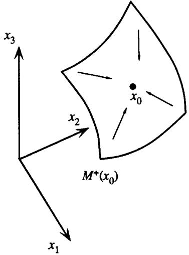

Figure C.I. Two-dimensional unordered stable manifold in 1183.

Proof. If x0 is a hyperbolic rest point then B = M+(xo), the stable manifold of x0. Since x0 is hyperbolic and unstable, M+(xo) has empty interior (see the proof of Theorem F.1). It follows that M+(xo) cannot contain two points xl and x2 satisfying x, <K x2, since then M+(xo) would contain all points of the open set {z: x1 <K Z <K x2). The second assertion of the theorem follows from strong monotonicity and the positive invariance of the stable manifold.

Figure C.1 depicts a two-dimensional stable manifold in 083. The reader should sketch a one-dimensional stable manifold in 082.

A similar assertion to that of Theorem C.4 holds for a compact limit set of a monotone dynamical system.

THEOREM C.S. A compact limit set of a monotone dynamical system cannot contain two points related by <K. If the system is strongly monotone then the limit set is unordered.

Proof. Consider first the case that the limit set L is the omega limit set of y+(x0). Suppose that L contains distinct points x, and x2 satisfying x, <K x2. As the x; are omega limit points of y+(xo), and since (x: x <K x21 is a neighborhood of x1, there exists t1 > 0 such that lr(x0, t1) <K x2. Similarly, (x: 7r(x0, t1) <K x) is a neighborhood of x2, so there exists t2 > ti

such that 7r(x0, t)) <K lr(xo, t2) = lr(lr(xo, t,), t2 - ti). By Theorem C.2(b), L is a rest point and the proof is complete in this case.

Consider now the case that L is the alpha limit set of -y-(xo). Let x(t) _ lr(xo, t) for t - 0. Arguing as before, there exists t, < 0 such that x, <K x(t,) and t2 < t, such that x(t2) <K XU,). Continue by choosing t3 < t2 such that x(t3) <K x2 and t4 < t3 such that x(t3) <K x(t4). Therefore, the interval I = [t4i t,] contains the interval [t4, t3] on which x(t) "falls" and the interval [t2, t,] on which x(t) "rises," and these intervals are disjoint. This contradicts the following lemma, proving the theorem in this case.

If the system is strongly monotone and x,, x2 are distinct points of L satisfying x, <K x2, then yi = 7r(xi,1) for i = 1, 2 also belong to L and satisfy y, <K Y2. This contradicts the first assertion of the theorem.

Before stating the lemma required to complete the proof of Theorem C.5, the following definitions are needed. Let x(t) be a solution of the monotone dynamical system (C.1) on an interval I. A subinterval [a, b] of I is called a rising interval if x(a) <-K x(b) and if equality does not hold (i.e. x(a) # x(b)); it is called a falling interval if x(b) <_K x(a) and if equality does not hold. The definitions are due to Hirsch [Hil], who attributes the proof of the next lemma to L. Ito. Recall that in the proof of Theorem C.5 the interval [t4i t3] is falling and the interval [t2, t,] is rising.

LEMMA. A solution x(t) cannot have a rising interval and a falling interval that are disjoint.

Proof. The most important observation is that if [a, b] is a rising (falling) interval contained in I and if s> 0 is such that [a+s, b+s] is contained in I, then the latter is also a rising (falling) interval in I. In fact, if x(a) <_K x(b) and equality does not hold, then by monotonicity x(a+s) = lr(x(a), s) <_K 7r(x(b), s) = x(b+s) and equality does not hold. Consequently, rising and falling intervals remain such under right translation.

Suppose that I contains the falling interval [a, r] and the rising interval [s, b], and suppose that a < r < s < b. The other cases can be treated similarly. Let A = It e [s, b]: x(t) <-K x(s)] and s'= sup A. Then s:5 s'< b and [s', b] is a rising interval that contains no falling interval [s', r] for any r e (s', b]. Redefines = s'so that the rising interval [s, b] has the same property as just described for [s', b]. A contradiction will be reached in each of the two cases r-a <- b-s and r-a> b-s.

If r - a < b - s then [s, s + r - a] is a translate to the right of [a, rl, which is contained in I, and therefore is a falling interval. As s + r - a :5 b, this contradicts that [s, b] contains no such falling interval.

If r-a> b-s then a< a+b-r< s< b, so [a+b-r,b] is a translate to the right of [a, r], contained in I, so it too is a falling interval. It follows that x(s) <-K x(b) <_K x(a+b-r), where equality does not hold in either inequality. Let c = sup[te [a+b-r,s]: x(b) <-K x(t)]. Then c < s < b and x(b) <-K x(c), so [c, s] is a falling interval adjacent to the rising interval [s, b]. Ifs-c <- b-s then [s, 2s-c] is a translate to the right of the falling interval [c, s], contained in [s, b], and therefore is a falling interval. But this contradicts the earlier argument that [s, b] contains no such interval. If s-c> b-s then c < c+b-s <s and [c+b-s, b] is a right translate of the falling interval [c,s], so it too is a falling interval. Therefore x(b) <-K x(c+b-s), with equality not holding, and this contradicts the definition of c.

Theorem C.5 places strong restrictions on how a limit set is imbedded in W. Note in particular that a periodic orbit may always be considered as a limit set of one of its points and hence Theorem C.5 applies to a periodic orbit. This should convince the reader that periodic orbits are ruled out for two-dimensional monotone systems.

The following result of Hirsch [Hill exploits the strong restrictions on how a limit set is imbedded in space, described in the previous theorem.

THEOREM C.6. A compact limit set of a monotone dynamical system in Il8" can be deformed by a Lipschitz homeomorphism (with a Lipschitz inverse) to a compact invariant set of a Lipschitz system in 118"-I in such a way that trajectories are mapped to trajectories and such that the parameterization of solutions is respected.

Proof. Consider a compact, unordered subset L of 118". Let v be a unit vector satisfying 0 <K v and let H be the hyperplane orthogonal to v. This hyperplane Hv consists of vectors x such that x v = 0, where is the standard dot (or scalar) product in W. Let Q be the orthogonal projection onto Hv; that is, Qx = x- (x v) v. Since L is unordered, Q is one-toone on L (this could fail only if L contains two ordered points). Therefore, QL, the restriction of Q to L, is a Lipschitz homeomorphism of L onto a compact subset of Hv. A straightforward argument by contradiction establishes the existence of m > 0 such that I QLxi - QLX2 1 ? M I xX21

whenever xi # x2 are points of L. Therefore, QE' is Lipschitz on Q(L). In any case, L is at most an (n -1)-dimensional set. Since L is a limit set, it is an invariant set for (C.1). It follows that the dynamical system restricted to L can be modeled on a dynamical system in H,,. In fact, if y e Q(L) then y = QL(x) for a unique xe L, and H(y, t) = QL(7r(x, t)) is a dynamical system on Q(L) generated by the vector field

$$F(\mathcal{Y}) = \mathcal{Q}_L(f(\mathcal{Q}_L^{-1}(\mathcal{Y})))$$

on Q(L). Since a Lipschitz vector field on an arbitrary subset of R"-1 can be extended to a Lipschitz vector field on all of R"-1 while preserving the Lipschitz constant [McS], it follows that F can be extended to all of H as a Lipschitz vector field. Therefore, Q(L) is a compact invariant set for the (n -1)-dimensional dynamical system on H, generated by the extended vector field. Since the restriction of this dynamical system to Q(L) is equivalent to that of it on L, we have proved the theorem.

Theorem C.6 establishes that the dynamical system generated by the vector field (C.1) on R", restricted to the limit set L, is topologically equivalent to the dynamical system generated by a Lipschitz vector field on H - R"-' restricted to Q(L). As a consequence, these two dynamical systems share common dynamical properties. Since L is a compact invariant set, so too is Q(L) a compact invariant set. It is also known that limit sets are chain-recurrent (see [C] for the definition) and so Q(L) has this property as well. Therefore, the dynamics on L are that of a compact, invariant, chain-recurrent set in one less dimension.

Theorem C.6 makes plausible the following result of Hirsch [Hil; Hi4] (see also [S3]).

THEOREM C.7. A compact limit set of a monotone dynamical system in II83 which contains no rest points is a periodic orbit.

According to Theorem C.6, the limit set can be deformed to a compact invariant set A, without rest points, of a planar vector field. By the Poincare-Bendixson theorem, A must contain at least one periodic orbit and possibly entire orbits which have as their alpha and omega limits sets distinct periodic orbits belonging to A. Using the fact that A is chainrecurrent, Hirsch [Hil] shows that these latter orbits cannot exist. Since A is connected it must consist entirely of periodic orbits; that is, it must be an annulus foliated by closed orbits. Monotonicity is used to show

that the limit set is, in fact, a single periodic orbit (see the references listed just prior to Theorem C.7).

Theorem C.7 bears a strong resemblance to the Poincare-Bendixson theorem stated in Chapter 1. It will be used in Chapter 4 for the case where (C.1) is a competitive system, that is, for a system (C.1) where -f is cooperative. Note that the omega (alpha) limit set of a competitive system is the alpha (omega) limit set of the "time-reversed" cooperative system, so Theorems C.5, C.6, and C.7 apply to competitive systems. Unlike cooperative systems, competitive systems can have attracting periodic orbits. For more on the Poincare-Bendixson theory of competitive and cooperative systems in [I83, see [S3], [SW1], and [ZS].

A particularly important construction of Smale [Sm] will put the previous results in better context. Smale begins by fixing an arbitrary infinitely differentiable tangent vector field h on the (n-1)-dimensional simplex S=Ixell8+:x1 By a tangent vector field, we mean that E hi(x) = 0 so that h generates a (local) dynamical system on S by the differential equation y'= h(y). Putting P(x) = fTx,, the differential equation z'= P(z) h (z) generates a dynamical system on S which is equivalent to that generated by h in the interior of S (namely, in ( x e S: x, > 01) but which vanishes on the boundary of S. Smale shows that this latter vector field can be extended to a smooth vector field on R having the form x, = x,M; (x) where 8M;/8xj < 0; that is, the system is competitive. Furthermore, all solutions corresponding to positive initial data approach the invariant set S as t - oo. Therefore, the competitive system can have essentially arbitrary dynamics on S, consistent of course with the fact that S is an (n -1)-dimensional manifold! For example, if n = 3 then one could choose h so that in the interior of S there is a single equilibrium surrounded by a single periodic orbit. Several periodic orbits could easily be accommodated. If n = 4 then the celebrated Lorentz attractor could be imbedded in the interior of S as an attractor for the competitive system in R4

By reversing time - that is, by replacing the vector field f constructed in the previous paragraph by -f - we see that a monotone dynamical system can have essentially arbitrarily complex, (n -1)-dimensional dynamics. Of course, upon reversing time the invariant set S now becomes a repelling set and the equilibrium points 0 and oo become the attractors.

Now we state without proof some results that require ir to be strongly monotone. They are all due to Hirsch. Let E be the set of rest points of 1r: E=fx:f(x)=01.

THEOREM C.8. Let r be a strongly monotone dynamical system such that E has no points of accumulation in D. Suppose that -y+(x) has compact closure in D for every xe D. Then the set of points x for which 7r(x, t) does not converge to an equilibrium has Lebesgue measure zero.

Recall that x e D is an accumulation point of E if every neighborhood of x contains a point of E different from x. The hypotheses of Theorem C.8 exclude such points. In most applications, E is a finite set and so this hypothesis holds.

Hirsch proves (a more general result than) Theorem C.8 by first obtaining the following result, which is useful in its own right, and then appealing to Fubini's theorem of integration theory.

THEOREM C.9. Let the hypotheses of Theorem C.8 hold, except that E is assumed to be a finite set, and let J be a compact, totally ordered arc contained in D. Then w(x) is an equilibrium point for all except possibly a finite subset of points of J.

This result will typically be used where J is a line segment parallel to a positive vector: J = (a+ tv: 0 <_ t:5 11 where a e D, a+ v e D, and 0 <K V-

A more complete exposition of the theory of monotone dynamical systems can be found in the works of Hirsch [Hil; Hit; Hi3; Hi4], the review article [S6], and [ST1; ST2].

# IC

### Persistence

As we have seen in the text, the equations governing interacting populations in a chemostat-like environment eventually take the form

$$\begin{array}{c} \chi_{i}^{\circ} = \chi_{i} f_{i}(\chi_{1}, \chi_{2}, \dots, \chi_{n}), \\\\ \chi_{i}(0) = \chi_{i0} \succeq 0, \\\\ i = 1, 2, \dots, n. \end{array} \tag{D.1}$$

To avoid technical conditions, assume that f is such that solutions of initial value problems are unique and extend to [0, oo). Thus (D.1) generates a semidynamical system. Of course, one could assume (as has been done before) that solutions extend to all of R. However, checking the backward continuation of solutions presents a problem in one of the applications, so the results are stated for semidynamical systems. The form of the equations causes the positive cone to be invariant (Proposition B.7) and the coordinate axes and the bounding faces to be invariant (and represent lower-order dynamical systems).

The notion of persistence attempts to capture the idea that if the equations (D.1) represent a model ecosystem then all components of the ecosystem survive. The system (D.1) is said to be persistent if

$$\lim\inf_{t \to \infty} \chi_i(t) > 0, \quad i = 1, 2, \dots, n$$

for every trajectory with positive initial conditions. The system (D.1) is said to be uniformly persistent if there exists a positive number e such that

$$\liminf_{l \to \infty} \chi_i(t) \succeq \epsilon, \quad i = 1, 2, \dots, n$$

for every trajectory with positive initial conditions. The term "persistent" was first (?) used in this context by Freedman and Waltman, [FW1], with lim sup instead of lim inf. Other definitions are relevant; see Freedman

and Moson [FM] for a discussion. A similar notion appears in Hofbauer [Ho] and in Schuster, Sigmund, and Wolf [SSW], where the term "cooperative" was used. (This later became "permanence.") There are two primary approaches to determining persistence; one can analyze the flow on the boundary, or one can develop a Liapunov-like technique. The former will be explained here in a general setting. Survey articles on the subject include [HS] and [W3]; see also [T2].

The general setting is that of topological dynamics in a metric space. Although the results will not be needed in this generality, this is the most elegant presentation of the results. The reader who does not wish to be concerned with this level of abstraction should just read "lv" for "locally compact metric space."

We review the basic definitions and set up the semidynamical system appropriate for systems of the form (D.1). Let X be a locally compact metric space with metric d, and let E be a closed subset of X with boundary aE and interior E. The boundary, 3E, corresponds to extinction in the ecological problems. Let 7r be a semidynamical system defined on E which leaves aE invariant. (A set B in X is said to be invariant if 7r(B, t) = B.) Dynamical systems and semidynamical systems were discussed in Chapter 1. The principal difficulty for our purposes is that for semidynamical systems, the backward orbit through a point need not exist and, if it does exist, it need not be unique. Hence, in general, the alpha limit set needs to be defined with care (see [H3]) and, for a point x, it may not exist. Those familiar with delay differential equations are aware of the problem. Fortunately, for points in an omega limit set (in general, for a compact invariant set), a backward orbit always exists. The definition of the alpha limit set for a specified backward orbit needs no modification. We will use the notation a,(x) to denote the alpha limit set for a given orbit y through the point x.

Denote the flow on the boundary (the restriction of ir to aE x R') by era. The flow is said to be dissipative if for each xE E, w(x) is not empty and there exists a compact set G in E such that the invariant set Sl = UXEEW(x) lies in G. A nonempty invariant subset M of X is called an isolated invariant set if it is the maximal invariant set in some neighborhood of itself. Such a neighborhood is called an isolating neighborhood.

The stable (or attracting) set of a compact invariant set A is denoted by W+ and is defined as

$$W^+(A) = (\times | \ge \in X, \,\omega(\lambda) \ne \emptyset, \,\omega(\lambda) \subsetneq A).$$

The unstable set W- is defined by

$$W^{-}(A) = \{ \boldsymbol{\chi} \mid \boldsymbol{\chi} \in X, \text{ there exists a backward orbit } \boldsymbol{\gamma}^{-}(\boldsymbol{\chi}) \text{ such that} $$
 
$$\alpha_{\boldsymbol{\gamma}}(\boldsymbol{\chi}) \neq \emptyset \text{ and } \alpha_{\boldsymbol{\gamma}}(\boldsymbol{\chi}) \subset A\text{)},$$

where a,y(x) is the alpha limit set of the orbit y through x. The weakly stable and unstable sets are defined as

$$W_{\le}^{+}(A) = \langle \times | \chi \in X, \,\omega(\chi) \ne \emptyset, \,\omega(\chi) \cap A \ne \emptyset \rangle$$

and

$$W_{\le}^{-}(A) = \langle \times \mid \chi \in X, \alpha_{\gamma}(\chi) \not\equiv \emptyset, \alpha_{\gamma}(\chi) \cap A \neq \emptyset \rangle.$$

The stable and unstable sets correspond to the stable and unstable manifolds introduced for rest points and periodic orbits in Chapter 1. Unfortunately, if the attractors are more complex than rest points or periodic orbits, the question of the existence of stable and unstable manifolds becomes a difficult topological problem. In the applications that follow, these more complicated attractors do not appear, so one can simply deal with the stable manifold theorem. The Butler-McGehee lemma (used in Chapter 1) played a critical role in the first uses of persistence. The following lemma is a generalization of this work. It can be found (with slightly different hypotheses) in [BW], [DRS], and [HaW]. (In particular, the local compactness is not needed if a stronger condition - asymptotic smoothness - is placed on the semidynamical system.)

LEMMA D.I. Let M be a compact isolated invariant set for the dynamical system 7r, defined on a locally compact metric space. Then for any xe Ww (M)\W+(M) it follows that

$$
\omega(\mathfrak{x}) \cap (W^+(M) \backslash M) \neq \emptyset \quad \text{and} \quad \omega(\mathfrak{x}) \cap (W^-(M) \backslash M) \neq \emptyset.
$$

A similar statement holds for a.,(x).

The following definitions are motivated by the technique used in the proofs in [FW1; FW2; FW3]. Let M, N be isolated invariant sets (not necessarily distinct). The set M is said to be chained to N, written M-*N, if there exists an element x, x 0 M U N, such that x e w -m fl W +(N). A finite sequence Ml, M2, ..., Mk of isolated invariant sets will be called a chain if M, -> M2 - -> Mk (MI -> M, if k = 1). The chain will be called a cycle if Mk = Ml. (These definitions were used for rest points instead of invariant sets in Chapter 1.)

The system it will be said to be persistent if for all x e

lim inf, d(ir(x, t), aE) > 0;

7r will be said to be uniformly persistent if there exists an E such that for

$$\liminf_{t \to \infty} \mathcal{A}(\pi(\chi, t), \partial E) \succeq \epsilon > 0.$$

The boundary flow ira is said to be isolated if there exists a covering M = U`_1 M, of 12(1ra) = UXEaE w(x) by pairwise disjoint, compact, isolated invariant sets Ml, M2, ..., M,, for ira such that each M, is also an isolated invariant set for 7r. This is a sort of "hyperbolicity" assumption; for example, it prevents interior rest points (or other invariant sets) from accumulating on the boundary. In this case M is called an isolated covering. The boundary flow ira is called acyclic if there exists some isolated covering M = U I M/ of ira such that no subset of the M,s forms a cycle. An isolated covering satisfying this condition is also said to be acyclic.

The following theorem provides a criterion for uniform persistence in terms of the flow on the boundary (see [BFW; BW; HaW]).

THEOREM D.2. Let it be a semidynamical system defined on a subset E, the closure of an open set, in a locally compact metric space X. Suppose that aE, the boundary of E, is invariant under 7r. Assume that 7r is dissipative and that the boundary flow Ira is isolated and acyclic with acyclic covering M. Then 7r is uniformly persistent if and only if

$$W^+(M_i) \cap \vec{E} = \emptyset \quad \text{for each} \ M_i \in \mathcal{M}. \tag{H}$$

The assumption of the invariance of the boundary is stronger than needed, and the assumption that the space is locally compact can be removed at the expense of further assumptions on the dynamical system. The combination of dissipative and uniform persistence allows the use of fixedpoint theorems. The following is sufficient for our applications in IIg".

THEOREM D.3. Let the hypotheses of Theorem D.2 hold for a dynamical system ir, with X = U8" and E = I+ (thus the invariant boundary aE is composed of the coordinate faces), and let (H) hold. Then there is a rest point in the interior of E.

The proof can be made to follow from [HaW, thm. 3.2] and [BS, thm. 2.8.6]. A rigorous discussion would involve introducing new (and otherwise unneeded) concepts. However, the intuition is easy. The orbits

of points inside the positive cone must eventually be inside a ball (the dissipative hypothesis) and "outside" a strip along the boundary (uniform persistence). This region is homeomorphic to a ball in I18". Thus it has the fixed-point property.

### Some Techniques in Nonlinear Analysis

In this section, we compile some results from nonlinear analysis that are used in the text. The implicit function theorem and Sard's theorem are stated. A brief overview of degree theory is given and applied to prove some results stated in Chapters 5 and 6. The section ends with an outline of the construction of a Poincare map for a periodic solution of an autonomous system of ordinary differential equations and the calculation of its Jacobian (Lemma 6.2 of Chapter 3 is proved).

In working with nonlinear differential equations, one often faces the problem of solving nonlinear equations of the form

$$f(\mathbf{x}) = 0,\tag{E.1}$$

where f is a map from one Euclidean space lJ 'to another one 118'. When p > m and a particular solution can be found, the implicit function theorem then gives a method of finding all nearby solutions. Because this result is used so frequently, we state it here (following [H2]).

IMPLICIT FUNCTION THEOREM. Suppose that F: 1 m x R"- 118m has continuous first partial derivatives and satisfies F(0, 0) = 0. If the Jacobian matrix of F(x, y) with respect to x satisfies

$$
\det \frac{\partial F}{\partial \mathbf{x}}(0,0) \neq 0,
$$

then there exist neighborhoods U of 0 E 118' and V of 0 E R" such that for each fixed y c- V the equation F(x, y) = 0 has a unique solution x e U. Furthermore, this solution can be given as a junction x = g(y), where g(0) _ 0 and g has continuous first partial derivatives.

More generally [Smo], g is as smooth as F. For example, if F has continuous second partial derivatives then so does g.

Sard's theorem is referred to on several occasions in the text. It states that certain sets are "small" in the sense of Lebesgue measure. For completeness, we state the theorem here, following [CH, chap. 2, thm. 10.1].

SARD'S THEOREM. Let f : U-+ RP be r-times continuously differentiable on Uc 08" with r> max[0, n-p1. Then

$$f((x \in U \colon \text{rank } Df(x) < p))$$

has Lebesgue measure zero.

Recall that the rank of the Jacobian matrix Df(x) at x is the dimension of its column space (or range). When p = n, r must be at least 1 and the rank condition becomes det Df(x) = 0.

We now return to the problem of solving (E.1). When the Euclidean spaces have the same dimension, a more topological approach to solving equation (E.1) is often appropriate. In what follows we describe such an approach, called (topological) degree theory. Degree theory is useful because it gives an algebraic count of the solutions of the equation (E.1) that is stable under small perturbations of the function f. We will often refer to a solution of (E.1) as a zero of f. For example, if f is the righthand side of a differential equation then we will be concerned with the set of rest points of that equation. A full account of degree theory is beyond the scope of this brief appendix. Instead, we will simply state some of its important definitions and properties and then go ahead and use it for our purposes. The reader may consult [Smo] for a more thorough account of the theory.

Let f be continuously differentiable on an open bounded subset 0 of R' and continuous on the closure, O, and suppose that f has no zeros on the boundary of 0. If it is assumed that every solution of (E.1) is nondegenerate - in the sense that the Jacobian J(x) of f at the zero xe 0 is nonsingular - then the degree of f relative to 0, denoted deg(f, 0), is defined by

$$\deg(f, O) = \sum_{f(\chi) = 0} \text{sgn} \det J(\chi) \tag{E.2}$$

where sgn denotes the sign (+1 or -1), det denotes determinant, and the sum is taken over all zeros of f in 0. This sum is finite by the inverse function theorem [Smo] and because O is compact and f does not vanish on the boundary of 0. As an example, let f(x) =x2-e on 0 = (-1, +1) for small positive E. In this case, deg(f, 0) = 0 is a warning that while f has zeros, they could be perturbed away.

### 284 Some Techniques in Nonlinear Analysis

Sard's theorem - and the fact that continuous functions can be uniformly approximated by continuously differentiable ones on O - allows one to extend this definition to continuous functions that do not vanish on the boundary of O. So defined, the degree of a mapping has many useful properties, among which the following will be particularly important for our purposes.

HOMOTOPY INVARIANCE. If H(x, t) = O has no solutions (x, t) for which x belongs to the boundary of 0 and 0:5 t:5 1, then t), 0) is defined and independent of t c- [0, 1] provided H(x, t) is continuous.

DOMAIN DECOMPOSITION. If [Oi) is a finite collection of disjoint open subsets of 0 and if (E.1) has no solutions xe (O-Ui Oi), then

$$\deg(f, O) = \sum_{i} \deg(f, O_i).$$

SOLUTION PROPERTY. If deg(f, 0) # 0, then (E.1) has at least one solution in O.

Clearly, the last property accounts for the usefulness of the theory. The example following (E.2) demonstrates that the converse is false, in general.

One purpose of this section is to obtain two results concerning the rest points of certain vector fields that have the monotonicity properties described in Appendix C. Consequently, we will use the notation from that appendix. As the applications of our results come from Chapters 5 and 6 and it will frequently be necessary to refer to numbered equations from one of these chapters, we use the following convention: equation number (5.2.4) will refer to equation (2.4) in Chapter 5.

In order for the degree of a mapping to be stable to small perturbations of the mapping, the restriction that f not vanish on the boundary of 0 is obviously necessary. However, for the problems we have in mind, it turns out that f does vanish on the boundary of the appropriate open set 0; our goal is to show that there must exist solutions in O. This dilemma occurs frequently in the applications. One often has quite a bit of knowledge about the zeros off on the boundary of 0 and very little information about those inside O. For example, in Chapters 5 and 6, we may know that rest points E0, El, E2 lie on the boundary of the region F and we may also know the stability properties of these rest points. We would like to know if there is a positive rest point in the interior of F. Of course, one is free to choose the open set 0 in a different way so that no zeros

of f belong to its boundary, but it is often more convenient to do the following instead. Perturb the function f by adding a small term depending on a single parameter. Then use the implicit function theorem to determine the fate of the rest points of f that lie on the boundary of 0 under the perturbation. Certain of these rest points will enter into 0 while others will leave O. If the perturbation is carefully chosen, the perturbed function will have no zeros on the boundary of 0, so its degree relative to 0 can be computed and compared with an algebraic count of those zeros of f on the boundary of 0 which entered 0 under perturbation. If there is a discrepancy then there must exist other zeros, belonging to 0, for the perturbed function. Information about the zeros of f in 0 can then be obtained by a limiting argument as the perturbation parameter tends to zero. We will use such an argument here; similar ones appear in [HoS] and [JST].

One first application of the theory will be to show that, roughly speaking, between two asymptotically stable rest points of a cooperative system there must exist another rest point which is, generically, unstable. This improves a result in [S2, prop. 3.7] which requires that the system be cooperative in an open region containing the order interval. In Theorem E.1, it is assumed only that (E.l) be cooperative on the order interval. Recall that f is "cooperative" if the off-diagonal entries of the Jacobian of f are nonnegative.

THEOREM E.I. Let f be continuously differentiable and cooperative on the order interval [x1,x2]= (xe ElB": X1:5 x<-x21, wherex1 <x2 and f(x1) 0, i = 1, 2. If s(Df(x1)) < 0 for i = 1, 2, then there exists a rest point x0 e [x1, x2] distinct from x, and x2 such that s(Df(xo)) >- 0.

REMARK 1. A similar result holds if f has the form of the right side of (B.9) and (B.12) holds in [x1, x2]K where x, <K x2.

REMARK 2. If, in addition, Df(x) is also irreducible in [x1i x2], then x0 cannot belong to the boundary of [x1, x2]. In fact, if x1 <- xo <- x2 and equality does not hold, then strong monotonicity of the dynamical system induced by f implies that x1 < xo < x2.

REMARK 3. Generically, one expects x0 to be nondegenerate, which implies that s(Df(xo)) > 0 or that x0 is unstable.

Proof of Theorem E.1. Let 0 denote the interior of [x1, x2], and let y be a point of the line segment joining x1 and x2 so that y-x1 > 0 and

X2-Y> 0. Define F(x,s) = f(x) -s(x-y) and note that F(x,s) is cooperative in [x1, x2] for s? 0. Since F(x1, s) = s(y-x1) > 0 and F(x2, s) = -s(x2-y) < 0 for s>0, Corollary B.8 implies that [x1, x21 is positively invariant for the autonomous differential equation x' = F(x, s) with fixed positive parameter s. Let lr(x, t, s) denote the solution operator corresponding to this one-parameter system. Theorem C.2 and the inequalities just listed imply that lr(x1i t, s) monotonically increases to a rest point in O as t increases. Similarly, 7r(x2i t, s) monotonically decreases to a rest point in 0 as t increases. We use the implicit function theorem to study these two rest points.

Since DF(x1, 0) = Df(x1) is nonsingular by hypothesis, the implicit function theorem implies that there exists a smooth branch of rest points x=X1(s),X1(0) = x1, F(X1(s),s) =0. Implicit differentiation of the last identity at s = 0 gives

$$\frac{dX_{\mathsf{l}}}{ds}(0) = -Df(\boldsymbol{\chi}_{\mathsf{l}})^{-1}(\boldsymbol{\chi} - \boldsymbol{\chi}_{\mathsf{l}}).$$

As -Df(x1)-1 >- 0 (see proof of Theorem A.12) and is nonsingular, and since y-x1 > 0, it follows that (dX1/ds)(0) > 0. Consequently, for small s > 0, x1 < X1(s) < x2. A similar analysis at x2 shows that there exists a smooth branch of rest points x = X2(s), X2(0) = x2, F(X2(s), s) = 0, and (dX2/ds)(0) < 0. By continuity, for small s > 0, x1 < X1 (S) < X2(s) < x2.

It follows by a comparison argument, using the monotonicity properties of the differential equation x' = F(x, s), that s) has no zeros on the boundary of 0 and so s), O) is defined for s > 0. Define H(x, s, t) = tf(x) -s(x-y) for 0 <- t <- 1 and xe O. The same considerations establishing that F does not vanish on the boundary of 0 also show that H(x, s, t) = 0 has no solutions x belonging to the boundary of 0 for s > 0 and t c- [0, 1 ]. By the homotopy property of the degree,

$$\deg(H(\cdot,\,\mathfrak{s},0),O) = \deg(H(\cdot,\,\mathfrak{s},1),O) = \deg(F(\cdot,\,\mathfrak{s}),O).$$

A simple calculation yields

$$\deg(H(\cdot, s, 0), O) = \text{sgn}\, \det(-sI) = (-l)^n.$$

Thus, s), 0) = (-1)" for small positive s.

Let O; (s) C 0 be a sufficiently small neighborhood of X; (s) such that there are no other zeros of s) in O; (s) except X; (s). Such a neighborhood exists because X,(s) is a nondegenerate zero of F for small positive s. Then

$$\deg(F(\cdot,\mathbf{s}),O_i) = \text{sgn}\,\det D_{\chi}F(X_i(\mathbf{s}),\mathbf{s}) = \text{sgn}\,\det Df(\chi_i) = (-1)^n$$

for sufficiently small s > 0, by continuity of DF and the fact that

s(Df(x,)) < 0.

Let 03(5) = 0\(O1(s)UO2(s)). By the domain decomposition property of the degree,

$$\begin{aligned} \deg(F(\cdot,\mathbf{s}),O) &= \deg(F(\cdot,\mathbf{s}),O_1) + \deg(F(\cdot,\mathbf{s}),O_2) + \deg(F(\cdot,\mathbf{s}),O_3) \\ &= 2(-1)'' + \deg(F(\cdot,\mathbf{s}),O_3). \end{aligned}$$

Consequently,

$$\deg(F(\cdot, s), O_3) = (-1)^{n+1}$$

and therefore F(x, s) = 0 has a solution x = X0(s) E 03(5) for small positive s, by the solution property of the degree. Clearly, X0(s) # X,(s) for i = 1, 2, and the comparison argument (using the differential equation) shows that Xo e [X1, X2].

If every zero x of F(., s) in 03(s) satisfies s(DXF(x, s)) < 0 then, using the domain decomposition property as before, we would have

$$\deg(F(\cdot, s), O_3) = p(-1)'',$$

where p >- 1 is the number of such zeros. Since this contradicts the previous displayed formula, X0(s) may be chosen to satisfy s(DXF(Xo(s), s)) >- 0.

Since [x1, x2] is compact, we can select a sequence s" such that s" -> 0 and Xo(s") xo as n -> oo. Continuity of F implies that f(xo) = 0. Furthermore, xo * x; for i = 1, 2, since if (for example) xo = x1 then (Xo(sn), sn) would be a branch of solutions of F = 0 distinct from the branch (XI (s), s), both converging to (x1, 0). This violates the uniqueness of the latter branch, as provided by the implicit function theorem. This establishes the existence of a zero xo for f distinct from the xi. Finally, s(Df(xo)) >- 0 by continuity of DXF(x, s) and the fact that s(DXF(Xo(s), s)) >- 0. This completes the proof.

We now turn our attention to the zeros of the map F: F --> R 2n, F(x) = (F,(u, v), F2 (u, v)) where x = (u, v), r = [(u, v) e I18+": u+v <_ z], z > 0, and

$$F_1(\mu, \upsilon) = [\mathcal{A} + F_\nu(z - \mu - \upsilon)]\mu,$$

$$F_2(\mu, \upsilon) = [\mathcal{A} + F_\upsilon(z - \mu - \upsilon)]\upsilon.$$

See Chapter 6, and in particular (6.2.1), for further details. In the case of the simple gradostat model (5.2.4), we have

$$A = \begin{pmatrix} -2 & 1\\ 1 & -2 \end{pmatrix}, \qquad z = (\frac{2}{3}, \frac{1}{3}),$$

$$F_{\mu}(z - \mu - \upsilon) = \begin{pmatrix} f_{\mu}(\frac{2}{3} - \mu_1 - \upsilon_1) & 0\\ 0 & f_{\mu}(\frac{1}{3} - \mu_2 - \upsilon_2) \end{pmatrix},$$

with an analogous formula for Fu (z - u - v).

Our goal is to show that for both the simple gradostat model (5.2.4) and the general gradostat model (6.2.1), a positive rest point representing the coexistence of the two populations must exist if both single-species rest points, E, and E2, exist and are asymptotically stable in the linear approximation. Furthermore, this positive rest point is generically unstable. This result is used in Chapter 5 to exclude the possibility that both E, and E2 are asymptotically stable, since it is shown by Lemma 5.5.2 that any positive rest point must be asymptotically stable. It is also used in Chapter 6, where the case that both E, and E2 are asymptotically stable cannot be excluded.

The existence of an unstable positive rest point when both E, and E2 are stable does not follow immediately from Theorem E.1 and Remark 1 for two reasons. First, F is defined on r, which may not include the order interval [E2i E, ]K. This is only a technical point, however, as we shall see. Second, even if r contained the order interval, the rest point E0 also belongs to the order interval and it cannot be excluded that E0 is the zero of F (which Theorem E.1 guarantees) since it is unstable. However, the proof of Proposition E.2 uses the same ideas as the proof of Theorem E.1.

Since the general gradostat model includes the simple gradostat model as a special case, we consider the latter. Notation and results from Chapters 5 and 6 will be used as required. Suppose that F vanishes at E0, El, and E2; that is, suppose these are the rest points for (5.2.4) or (6.2.1), where

$$E_0 = (0,0), \quad E_1 = (\hat{\mu},0), \quad E_2 = (0,\tilde{\upsilon}).$$

Let J; denote the Jacobian matrix of F at E;, i = 0, 1, 2.

PROPOSITION E.2. Suppose that s(J;) < 0, i = 1, 2; that is, suppose E, and E2 are asymptotically stable rest points of (6.2.1) in the linear approximation. Then there exists a positive rest point E. e I' satisfying E2 <K E. <K E, and 0, where J. is the Jacobian of F at E.

Proof. Add an "immigration" term ee to the second and third equations of (6.1.6), where e > 0 is small and e = (1,1, ..., 1). The arguments of

Lemma 6.2.2 lead to the following vector field F(x, e), the analog of (6.2.1):

$$F_{\mathbb{L}}(\mu, \upsilon, \epsilon) = [\mathcal{A} + F_{\mathbb{L}}(\mathbb{S}(\epsilon))]\mu + \epsilon e,$$

$$F_{\mathbb{L}}(\mu, \upsilon, \epsilon) = [\mathcal{A} + F_{\upsilon}(\mathbb{S}(\epsilon))]\upsilon + \epsilon e,$$

where S(e) = z(e) - u - v and z(e) > 0 satisfies

$$
\mathcal{A}z + e_0 + \mathcal{2}\epsilon e = 0.
$$

Note that z(0) = z. The domain for F(., e) is P(e) = (x = (u, v) a +": u + v <- z(e)1. The vector field F(x, e) possesses all the monotonicity properties of F(x) = F(x, 0).

The Jacobian J1 of F (with respect to x) at E1, with e = 0, is given in the proof of Lemma 6.4.2. It is nonsingular by hypothesis (see Lemma 6.4.2). Therefore, by the implicit function theorem, there exists a zero E1(e) of e) which is smooth in e for all small a and E1(0) = El. The important question is whether or not El (e) belongs to r(E) for small e > 0. By implicit differentiation,

$$J_1 \frac{dE_1}{d\epsilon}(0) + \frac{\partial F}{\partial \epsilon}(E_1, 0) = 0.$$

Setting E1(e) _ (u(e), v(e)), we find that v(e) satisfies

$$(A + F_{\upsilon}(z - \hat{\upsilon})) \frac{d\upsilon}{d\epsilon}(0) + e = 0.$$

Therefore

$$\frac{dv}{d\epsilon}(0) = -(\mathcal{A} + F_v(z - \hat{u}))^{-1}e > 0,$$

where the inequality follows from Theorem A.12 and the fact that s(J1) = s(A+FU(z-u)) < 0. It follows immediately that El (E) belongs to the interior of F(e) for small positive E. By continuity, s(J1(e)) < 0 where J, (E) is the Jacobian of F(., c) at El (c).

A similar analysis applies to E2 and we obtain E2(e), a smooth branch of zeros of F(., e) belonging to the interior of F(e) with s(J2(e)) < 0 for small positive e, where J2(e) is the Jacobian of F(., e) at E2(e). Clearly, E2 (E) for small positive E.

The Jacobian JO of F(., e) at E0, with e = 0, is described in the text following (6.4.1). It is nonsingular, so the implicit function theorem implies that there exists a zero E0(e) of F(., E) which is smooth in e and satisfies E0(0) = E. We must determine whether E0(e) belongs to F(e) for small positive E. Letting E0(e) = (u(e), v(e)), implicit differentiation yields

$$\begin{aligned} \left(\mathcal{A} + F_{\mu}(z)\right) \frac{d\mu}{d\epsilon} \left(0\right) + e &= 0, \\\\ \left(\mathcal{A} + F_{v}(z)\right) \frac{dv}{d\epsilon} \left(0\right) + e &= 0. \end{aligned}$$

It is easy to see that both derivatives have at least one negative component. For example, if the derivative of u were nonnegative then one easily sees, by writing the equations in component form, that it is necessarily positive. But this violates Theorem A.12 since s(A+Fu(z)) > 0. Consequently, E0(E) does not belong to IF(E) for small positive E.

We will now use degree theory to show that there exist zeros of F in r(E) distinct from the E,(E). Let O(E) denote the interior of F(E). Define

$$H(\mathbf{x}, \epsilon, t) = (A\boldsymbol{\mu} + \epsilon \boldsymbol{e}, A\boldsymbol{\upsilon} + \epsilon \boldsymbol{e}) + t(F_{\boldsymbol{\mu}}(\mathbb{S}(\epsilon))\boldsymbol{\mu}, F_{\boldsymbol{\upsilon}}(\mathbb{S}(\epsilon))\boldsymbol{\upsilon})$$

for xe r(E) with E > 0 and 0 <- t <- 1. Observe that if u; = 0 then

$$H(\mathfrak{x}, \epsilon, t)_l \cong \epsilon > 0,$$

so H has no zeros x with ui = 0. Similarly, it has no zeros with v, = 0. Suppose that H vanishes at a point xer(E) such that u;+v, =z,(E) for some i. Let I be the set of all such indices i and let J be the complementary set of indices. If j e J, then uJ+ vj < zi(E). Taking components of the identity H = 0 we find that, for i e I,

$$\sum_{j} \mathcal{A}_{ij} \mu_j + \epsilon = 0 \quad \text{and} \quad \sum_{j} \mathcal{A}_{ij} \upsilon_j + \epsilon = 0.$$

Adding these equations gives

$$\begin{aligned} 0 &= \sum_{j \in I} A_{ij} z_j + \sum_{j \notin J} A_{ij} (u_j + v_j) + 2\epsilon \\ &\le \sum_j A_{ij} z_j + 2\epsilon = -(e_0)_i \le 0. \end{aligned}$$

Since eo * 0, it follows that J is non-empty. Furthermore, the inequality implies that Aij = 0 for every i E I and j e J since otherwise a strict inequality would occur, a contradiction. But this contradicts the irreducibility of A. We conclude that no zero of H can belong to the boundary of r(E). The homotopy property of degree implies that

$$\begin{aligned} \deg(F(\cdot,\epsilon),O(\epsilon)) &= \deg(H(\cdot,\epsilon,\operatorname{l}),O(\epsilon)) \\ &= \deg(H(\cdot,\epsilon,0),O(\epsilon)) \\ &= \operatorname{sgn}(\det \mathcal{A})^2 \\ &= +1, \end{aligned}$$

since (Au+Ee, Av+Ee) vanishes only at -E(A-'e, A-'e) e O(E).

Let O,(e) be an open subset of O(e) such that E,(e) e O,(e) and F(., e) has no zeros in O, (e) other than E, (e). Then

$$\deg(F(\cdot,\epsilon),O_i(\epsilon))=(-1)^{2n}=+1,$$

since s(J,(e)) < 0 by continuity. By the domain decomposition property,

$$\deg(F(\cdot,\epsilon),O_3(\epsilon))=-1,$$

where 03(e) = O(e)\(O1(e) U O2(e)). Therefore, by the solution property of degree, there is a zero of F, denoted by x(e), in 03(e). An argument similar to that in Theorem E.1 shows that we may assume s(J(e)) >_ 0, where J(e) denotes the Jacobian of e) at x(e). Clearly, x(e) # E,(e) for i= 1, 2.

Let xn = x(11n) for n = 1, 2, .... We may assume that xn converges to E. as n - oo by passing to a subsequence if necessary. By continuity, E. is a zero of F. We claim that E. # E0, El, E2. Indeed, this follows by the uniqueness part of the implicit function theorem and the fact that xn # E,(1/n) for i = 0, 1, 2. Therefore, by Lemma 6.4.1(d), E. > 0. Since every solution of (6.2.1) is attracted to [E2, El]K, by a comparison argument (see e.g. the last part of the proof of Theorem 6.4.4 or Lemma 5.6.1), the inequality E2 <K E* <K El is easy to see.

Since s(J(e)) >_ 0 for e > 0 and x, -> E* as n oo, continuity of the Jacobian of F in (x, e) implies that s(J*) >_ 0.

We conclude this appendix by constructing the Poincare map corresponding to a nonconstant periodic solution x(t) = x(t + T) of the autonomous system of differential equations x' = f(x) and by verifying Lemma 6.2 of Chapter 3. We assume that T > 0 is the smallest period of x(t) and, by translating and rotating our coordinate system, we assume that x(0) = 0 and x'(0) = f(0) = ael, a > 0. Here, e, (1 <_ i <_ n) denotes the standard basis vectors in R". The notation lr(x, t), introduced in Chapter 1 for the solution map of our differential equation, will be used. With this notation, x(t) = ir(0, t) = ir(0, t+T) and

$$\frac{\partial \pi}{\partial t}(0, T) = f(\pi(0, T)) = f(0) = ae_1.$$

The variational equation (see Section 4 of Chapter 3) about the periodic solution 7r(0, t) is given by

$$
\mu' = Df(\pi(0, t))\mu.
$$

Denote by (k(t) the fundamental matrix solution 4)(0) = In, where In is the n x n identity matrix. Since u = x'(t) is a periodic solution of the variational equation, it follows that x'(t) = a4(t)el and therefore

$$
\Phi(T)e_\perp = e_\parallel.
$$

Let the Floquet multipliers (eigenvalues of F(T)) of the variational equation be 1, p,, p2, ..., pn_,, where the terms are listed according to multiplicity and the first one corresponds to the eigenvector e,. Finally, recall from the fundamental theory of ordinary differential equations [H2, chap. 1, thm. 3.3] that

$$
\Phi(t) = \frac{\partial \pi}{\partial \chi}(0, t).
$$

The Poincare map will be defined in a neighborhood of zero in the hyperplane

$$\Sigma \equiv \{ \boldsymbol{\chi} \colon \boldsymbol{\chi}_{\parallel} = \mathbf{0} \} = \mathbb{R}^{n-1}$$

as follows. Since we know that solutions starting at points on E near x = 0 remain near x(t) = ir(O, t), at least on bounded t intervals, they will return to E after approximately time T. Consequently, we look for solutions of 7r,(x, t) = 0 for x near 0 and t near T. For the time being, we do not restrict x to lie on E. Since

$$\frac{\partial \pi_{\parallel}}{\partial t}(0, T) = f_{\parallel}(0) = a > 0,$$

the implicit function theorem implies that we can solve for t = T(x) as a function of x for x in some neighborhood N of zero: 7r,(x, T(x)) = 0 satisfying T(0) = T. Restricted to E, T is called the first-return-time map. Finally, we define Q to be the orthogonal projection onto E along e, that is,

$$Q\boldsymbol{\chi} = (\boldsymbol{\chi}_2, \boldsymbol{\chi}_3, \dots, \boldsymbol{\chi}_n) \in \mathbb{R}^{n-1}$$

for x = (x,, ..., x") - and R to be the injection of Rn-' into R" defined by

$$R(\boldsymbol{\chi_2}, \boldsymbol{\chi_3}, \dots, \boldsymbol{\chi_n}) = (0, \boldsymbol{\chi_2}, \dots, \boldsymbol{\chi_n}).$$

Then the Poincare map P is defined by

$$P = \mathbb{Q} \circ H \circ R,$$

where H(x) = lr(x, T(x)); or, in simpler terms,

$$P(\boldsymbol{\chi}_2, \dots, \boldsymbol{\chi}_n) = Q \pi(0, \boldsymbol{\chi}_2, \boldsymbol{\chi}_3, \dots, \boldsymbol{\chi}_n, \tau(0, \boldsymbol{\chi}_2, \dots, \boldsymbol{\chi}_n))$$

for (x2, ..., x") E Nn E. By the chain rule and the fact that Q and R are linear, the Jacobian of P at 0 E R"-' is given by

$$DP(0) = \mathcal{Q}DH(0)\mathcal{R}.$$

The ith column of the n x n matrix DH(O) is

$$
\frac{
\partial \pi}{
\partial \boldsymbol{x}_{\bar{l}}}(\boldsymbol{0}, \boldsymbol{T}) + \frac{
\partial \pi}{
\partial t}(\boldsymbol{0}, \boldsymbol{T}) \frac{
\partial \tau}{
\partial \boldsymbol{x}_{\bar{l}}}(\boldsymbol{0}).
$$

As (air/at)(0, T) = ae1 and Qe1 = 0, we have

$$DP(0) = Q\Phi(T)R.$$

Note that the first column of F(T) is e1. Consequently, the eigenvalues P1, P2, ",Pn-1 of l(T) are the eigenvalues of the (n-1)x(n-1) lower right block B of 4(T). Using QR = Ii_1, we find that

$$DP(0) = \mathcal{B}.$$

It follows that p1, ..., are the eigenvalues of DP(0), as asserted in Lemma 6.2 of Chapter 3.

## A Convergence Theorem

In many of the arguments involving chemostats it was shown that the omega limit set had to lie in a restricted set, and the equations were analyzed on that set: one simply could choose initial conditions in the restricted set at time zero. The equation defining the restricted set - in effect, a conservation principle - allowed one variable to be eliminated from the system. We want to abstract this idea and make it rigorous. The omega limit set lies in a lower-dimensional set, and the trajectories in that set satisfy a smaller system of differential equations. However, it is not clear (and, indeed, not true [T3]) that the asymptotic behavior of the two systems is necessarily the same. (A very nice paper of Thieme [Ti] gives examples and helpful theorems for asymptotically autonomous systems. A classical result in this direction is a paper of Markus [MI.) In this appendix, a theorem is presented which justifies the procedure on the basis of stability.

Consider two systems of ordinary differential equations of the form

$$z' = Az, \qquad y' = f(y, z), \tag{F.1}$$

and

$$\mathbf{x}' = f(\mathbf{x}, \mathbf{0}),\tag{\text{F.2}}$$

where

$$z \in \mathbb{R}^m, \qquad (\nu, z) \in D \subset \mathbb{R}^n \times \mathbb{R}^m,$$

$$\varkappa \in \Omega = \{x \mid (x, 0) \in D\} \subset \mathbb{R}^n.$$

It will be assumed that f is continuously differentiable, D is positively invariant for (F.1), and (F.1) is dissipative in the sense that there is a compact subset of D into which every solution eventually enters and remains. The following additional hypotheses will be used.

- (H1) All of the eigenvalues of A have negative real parts.
- (H2) Equation (F.2) has a finite number of rest points in 9, each of which is hyperbolic for (F.2). Denote these rest points by x1, x2, ..., xn.
- (H3) The dimension of the stable manifold of xi is n for 1 <_ i <_ r, and the dimension of the stable manifolds of xj is less than n for j = r + 1, ..., p. In symbols, dim(M+(xi)) = n, i = 1, ..., r; dim(M+(xj)) < n for j = r+1, .., p.
- (H4) 12 = UP 1 M+(xi)
- (H5) Equation (F.2) does not possess a cycle of rest points.

Note first that the only rest points of (F.1) are of the form (xi, 0), and that each is hyperbolic for (F.1). To avoid confusion between (F.1) and (F.2), denote the stable and unstable manifolds for (F.1) by A+ and A-, respectively. Then

- (a) dim A+(xi, 0) = m+dimM+(xi) and (b)
Note also that xi and (xi, 0) are locally asymptotically stable for (F.1) and (F.2), respectively, i = 1, ..., r. By (H4), every point of 12 is attracted to one of the rest points xi, i = 1, ..., p.

The following theorem is a very special case of a general result of Thieme [Ti].

THEOREM F.I. Let (Hl)-(H5) hold and let (y(t), z(t)) be a solution of (F.1). Then, for some i,

$$\lim_{t \to \infty} (\varphi(t), z(t)) = (\chi, 0).$$

In other words, D C Up A(xi, 0). Furthermore, Up r+] A+(Xi, 0) has Lebesgue measure zero.

Proof. Let (y(t), z(t)) be a solution of (F.1), and assume that the first assertion of the theorem is false. If 0 denotes the omega limit set of this solution, then 0 # 1(xi, 0) for i = 1, 2, ..., p. Let (x, 0) E O. By (H4), either x = xi for some i or the solution of (F.2) through x converges to some xi. By the invariance of 0 we conclude that (xi, 0) belongs to 0 for some i. Clearly, i ? r+1 because points of the form (xi, 0), 1 <_ i <_ r, are asymptotically stable, and a limit set containing an asymptotically stable rest point is that rest point, a contradiction to our hypothesis. Since 0 # {(xi, 01), the Butler-McGehee theorem says that 0 must contain a point (x, 0) with xE M-(xi) and x * {(xi, 0)1. By (H4), xE M+(xj) for some j,

and consequently x; is chained to x;, x, -> x;, in 0. Continuing the argument a finite number of steps leads to a cycle, contradicting (H5). This proves the first assertion of the theorem, D C U f 1 A(x;, 0).

It is well known that the stable manifold A+(x;, 0) of a hyperbolic, unstable rest point (x1, 0) has Lebesgue measure zero. This follows from Sard's theorem (see Appendix E) and the fact that the stable manifold is the image of a smooth one-to-one map of 0811 into 118" x R', where 1, is the dimension of the stable subspace of the linearization of (F.1) about (x1, 0) and consequently I, < n+m [Pi, p. 43]. It follows that Up ,+1 A+(x;, 0) has measure zero.

The theorem states that almost all trajectories converge to one of the asymptotically stable rest points (x,, 0). In most of our applications, r = 1: there is exactly one asymptotically stable rest point. In this case, an observer would conclude that all trajectories converge to (xi, 0), since the probability of an initial condition being in the exceptional set is zero.

To illustrate the procedure, Theorem F.1 will be applied to the systems (5.1) and (5.2) of Chapter 1. The system corresponding to (F.1) is

$$\begin{aligned} \Sigma' &= -\Sigma, \\ \chi_1' &= \chi_1 \big( \frac{m_1(1-\Sigma-\chi_1-\chi_2)}{1+a_1-\Sigma-\chi_1-\chi_2} - 1 \big), \\ \chi_2' &= \chi_2 \big( \frac{m_2(1-\Sigma-\chi_1-\chi_2)}{1+a_2-\Sigma-\chi_1-\chi_2} - 1 \big), \\ D &= \{ (\Sigma,\ \chi_1,\ \chi_2) \mid \chi_i > 0, \ \chi_1+\chi_2+\Sigma \le 1 \}. \end{aligned} \tag{F.3}$$

The system corresponding to (F.2) is

$$\begin{aligned} \boldsymbol{\chi}_{1}^{\prime} &= \boldsymbol{\chi}_{1} \Big( \frac{m_{1}(1-\boldsymbol{\chi}_{1}-\boldsymbol{\chi}_{2})}{1+a_{1}-\boldsymbol{\chi}_{1}-\boldsymbol{\chi}_{2}} - 1 \Big), \\ \boldsymbol{\chi}_{2}^{\prime} &= \boldsymbol{\chi}_{2} \Big( \frac{m_{2}(1-\boldsymbol{\chi}_{1}-\boldsymbol{\chi}_{2})}{1+a_{2}-\boldsymbol{\chi}_{1}-\boldsymbol{\chi}_{2}} - 1 \Big), \\ \boldsymbol{\Omega} &= \{ (\boldsymbol{\chi}_{1}, \boldsymbol{\chi}_{2}) \,|\, \boldsymbol{\chi}_{i} > 0, \, \boldsymbol{\chi}_{1} + \boldsymbol{\chi}_{2} \preceq 1 \}, \end{aligned} \tag{F.4}$$

which is the same as (5.2) of Chapter 1.

In this case, m = 1 and n = 2. The matrix A is 1 x 1, or A = [-1]. Clearly (Hl) is satisfied. System (F.4) has three rest points, which were labeled E0, E1, E2 in Section 5 of Chapter 1. We restrict the analysis to the situation of Theorem 5.1 of Chapter 1. (The other cases can be done similarly.) The set 0 is just the portion of the nonnegative cone in 1182 which

lies on the origin side of the line xi +x2 = 1 (SZ is a positively invariant set). All of the rest points are hyperbolic. Since El is a local attractor, the dimension of its stable manifold is 2. The stability of El prevents it from being a part of any chain of equilibria. Similarly, E0 is a repeller, has no stable manifold, and cannot be part of any chain of equilibria. The rest point E2 is not chained to itself, so (H4) is satisfied. The dimension of the stable manifold of E2 is 1. This shows that (H3) is satisfied. The part of the stable manifold of E2 which lies in 9 is just a portion of the x2 axis; thus (H5) is satisfied. The proof given of Theorem 5.1 in Chapter 1 establishes (H4) by showing that every solution of (F.4) converges to a rest point. Theorem F.1 then allows one to conclude that every trajectory of (F.3) tends to a rest point of (F.4). Orbits through all initial conditions excluding those in the exceptional set converge to El.

The exceptional set is just the E-x2 face of the positive cone in IR3. No interesting initial conditions lie here.

- [ALGM] A. A. Andronov, E. A. Leontovich, I. I. Gordon, and A. G. Maier (1973), Qualitative Theory of Second-Order Dynamical Systems. New York: Wiley.
	- [AH] R. Aris and A. E. Humphrey (1977), "Dynamics of a chemostat in which two organisms compete for a common substrate," Biotechnology and Bioengineering 19: 1375-86.
	- [AM] R. A. Armstrong and R. McGehee (1980), "Competitive exclusion," American Naturalist 115: 151-70.
	- [BaWo] M. M. Ballyk and G. S. K. Wolkowicz (1993), "Exploitative competition in the chemostat for two perfectly substitutable resources," Mathematical Biosciences 118: 127-80.
		- [BFr] B. C. Baltzis and A. G. Fredrickson (1983), "Competition of two microbial populations for a single resource in a chemostat when one of them exhibits wall attachment," Biotechnology and Bioengineering 25: 2419-39.
	- [BWu] B. C. Baltzis and M. Wu (1994), "Coexistence of three pure and simple competitors in a four member reactor network," Mathematical Biosciences (to appear).
		- [BT] J. V. Baxley and H. B. Thompson (1994), "Nonlinear boundary value problems and competition in the chemostat," Nonlinear Analysis 22: 1329-44.
		- [BP] A. Berman and R. J. Plemmons (1979), Nonnegative Matrices in the Mathematical Sciences. New York: Academic Press.
		- [BS] N. P. Bhatia and G. P. Szego (1967), "Dynamical systems: Stability theory and applications," in Lecture Notes in Mathematics, vol. 35. Berlin: Springer.
		- [BD] J. L. Brooks and S. I. Dodson (1965), "Predation, body size and composition of plankton," Science 150: 28-35.
		- [BB] H. R. Bungay and M. L. Bungay (1968), "Microbial interactions in continuous culture," Advances in Applied Microbiology 10: 269-90.
	- [BWh] L. P. Burton and W. M. Whyburn (1952), "Minimax solutions of ordinary differential systems," Proceedings of the American Mathematical Society 3: 794-803.

- [BC] A. W. Bush and A. E. Cook (1975), "The effect of time delay and growth inhibition in the bacterial treatment of wastewater," Journal of Theoretical Biology 63: 385-95.
- [BFW] G. Butler, H. I. Freedman, and P. Waltman (1986), "Uniformly persistent systems," Proceedings of the American Mathematical Society 96: 425-30.
- [BHW1] G. J. Butler, S. B. Hsu, and P. Waltman (1983), "Coexistence of competing predators in a chemostat," Journal of Mathematical Biology 17: 133-51.
- [BHW2] G. J. Butler, S. B. Hsu, and P. Waltman (1985), "A mathematical model of the chemostat with periodic washout rate," SIAM Journal on Applied Mathematics 45: 435-49.
	- [BW] G. Butler and P. Waltman (1986), "Persistence in dynamical systems," Journal of Differential Equations 63: 255-63.
- [BWo1] G. J. Butler and G. S. K. Wolkowicz (1985), "A mathematical model of the chemostat with a general class of functions describing nutrient uptake," SIAM Journal on Applied Mathematics 45: 138-51.
- [BWo2] G. J. Butler and G. S. K. Wolkowicz (1987), "Exploitative competition in a chemostat for two complementary, and possibly inhibitory, resources," Mathematical Bioscience 83: 1-48.
	- [Cal] R. P. Canale (1969), "Predator-prey relationships in a model for the activated process," Biotechnology and Bioengineering 11: 887-907.
	- [Ca2] R. P. Canale (1970), "An analysis of models describing predator-prey interaction," Biotechnology and Bioengineering 12: 353-78.
	- [Cap] J. Caperon (1969), "Time lag in population growth response of Isochrysis galbana to a variable nitrate environment," Ecology 50: 188-92.
	- [CL] E. A. Coddington and N. Levinson (1955), Theory of Ordinary Differential Equations. New York: McGraw-Hill.
	- [C] C. Conley (1978), "Isolated invariant sets and the Morse index," in Conference Board of Mathematical Sciences, vol. 38. Providence, RI: American Mathematical Society.
	- [Co] W. A. Coppel (1965), Stability and Asymptotic Behavior of Differential Equations. Boston: D. C. Heath.
	- [CB] S.-W. Chang and B. C. Baltzis (1989), "Impossibility of coexistence of three pure and simple competitors in configurations of three interconnected chemostats," Biotechnology and Bioengineering 33: 460-70.
	- [CH] S. N. Chow and J. K. Hale (1982), Methods of Bifurcation Theory. New York: Springer.
	- [CM] A. Cunningham and P. Mass (1978), "Time lag and nutrient storage effects in the transient growth response of Chlamydomonas reinhardii in nitrogen limited batch and continuous culture," Journal of General Microbiology 104: 227-31.
	- [CN1] A. Cunningham and R. M. Nisbet (1980), "Time lag and co-operativity in the transient growth dynamics of microalgae," Journal of Theoretical Biology 84: 189-203.
	- [CN2] A. Cunningham and R. M. Nisbet (1983), "Transients and oscillations in continuous cultures," in M. J. Bazin (ed.), Mathematics in Microbiology. New York: Academic Press, pp. 77-103.
	- [Cul] J. M. Cushing (1977), "Periodic time-dependent predator prey systems," SIAM Journal on Applied Mathematics 23: 972-9.

- [Cu2] J. M. Cushing (1989), "A competition model for size-structured species," SIAM Journal on Applied Mathematics 49: 838-58.
- [DKG] G. D'Ans, P. V. Kokotovic, and D. Gottlieb (1971), "A nonlinear regulator problem for a model of biological waste treatment," IEEE Transactions on Automatic Control AC-16: 341-7.
- [DSu] 1. W. Dawes and I. W. Sutherland (1976), Micro-organism Physiology. New York: Springer.
	- [De] A. M. Dean (1985), "The dynamics of microbial commensalisms and mutualisms," in D. H. Boucher (ed.), The Biology of Mutualism, Ecology, and Evolution. Oxford: Oxford University Press, pp. 270-304.
- [DS] P. deMottoni and A. Schiaffino (1982), "Competition systems with periodic coefficients: A geometric approach," Journal of Mathematical Biology 11: 319-35.
- [DMKH] O. Diekmann, J. A. J. Metz, A. L. M. Kooijman, and J. J. A. M. Heijmans (1984), "Continuum population dynamics with an application to Daphnia magna," Nieuw Archief voor Wiskunde (4) 2: 82-109.
	- [Dl] M. R. Droop (1973), "Some thoughts on nutrient limitation in algae," Journal of Phycology 9: 264-72.
	- [D2] M. R. Droop (1974), "The nutrient status of algae cells in continuous culture," Journal of the Marine Biology Association U.K. 54: 825-55.
	- [DRS] S. R. Dunbar, K. P. Rybakowski, and K. Schmitt (1986), "Persistence in models of predator-prey populations with diffusion," Journal of Differential Equations 65: 117-38.
	- [EMP] D. Erle, H. Mayer, and T. Plesser (1979), "The existence of stable limit cycles for enzyme catalyzed reactions with positive feedback," Mathematical Biosciences 44: 191-208.
		- [E] S. F. Ellermeyer (1994), "Competition in the chemostat: Global asymptotic behavior of a model with delayed response in growth," SIAM Journal on Applied Mathematics 54: 456-65.
		- [Er] B. Ermentrout (1990), "Phase Plane: The Dynamical Systems Tool," ver. 3.0. Pacific Grove, CA: Brooks Cole.
		- [FSt] A. G. Frederickson and G. Stephanopoulos (1981), "Microbial competition," Science 213: 972-9.
	- [FM] H. I. Freedman and P. Moson (1990), "Persistence definitions and their connections," Proceedings of the American Mathematical Society 109: 1025-33.
	- [FSW1] H. I. Freedman, J. W.-H. So, and P. Waltman (1989a), "Coexistence in a model of competition in the chemostat incorporating discrete delays," SIAM Journal on Mathematical Analysis 49: 859-70.
	- [FSW2] H. I. Freedman, J. W.-H. So, and P. Waltman (1989b), "Chemostat competition with time delays," in J. Eisenfeld and D. S. Levine (eds.), Biomedical Modelling and Simulation. J. C. Baltzer AG Scientific Publishing, pp. 171-3.
	- [FW1] H. I. Freedman and P. Waltman (1977), "Mathematical analysis of some three-species food chain models," Mathematical Bioscience 33: 257-76.
	- [FW2] H. I. Freedman and P. Waltman (1984), "Persistence in a model of three interacting predator-prey populations," Mathematical Bioscience 68: 213-31.

- [FW3] H. I. Freedman and P. Waltman (1985), "Persistence in a model of three competitive populations," Mathematical Bioscience 73: 89-101.
	- [Ga] G. F. Gause (1934), The Struggle for Existence. Baltimore: Williams and Wilkens.
	- [GI] J. P. Grover (1991), "Resource competition in a variable environment: Phytoplankton growing according to the variable-internal-stores model," American Naturalist 138: 811-35.
	- [G2] J. P. Grover (1992), "Constant- and variable-yield models of population growth: Responses to environmental variability and implications for competition," Journal of Theoretical Biology 158: 409-28.
	- [HG] K. P. Hadeler and D. Glas (1983), "Quasimonotone systems and convergence to equilibrium in a population genetic model," Journal of Mathematical Analysis and Applications 95: 297-303.
	- [H1] J. K. Hale (1977), Theory of Functional Differential Equations. New York: Springer.
	- [H2] J. K. Hale (1980), Ordinary Differential Equations. Malabar, FL: Krieger.
	- [H3] J. K. Hale (1988), Asymptotic Behavior of Dissipative Systems. Providence, RI: American Mathematical Society.
- [HaS] J. K. Hale and A. S. Somolinas (1983), "Competition for fluctuating nutrient," Journal of Mathematical Biology 18: 255-80.
- [HaW] J. K. Hale and P. Waltman (1989), "Persistence in infinite dimensional systems," SIAM Journal on Mathematical Analysis 20: 388-95.
- [HH] S. R. Hansen and S. P. Hubbell (1980), "Single nutrient microbial competition: Agreement between experimental and theoretical forecast outcomes," Science 207: 1491-3.
- [Har] P. Hartman (1964), Ordinary Differential Equations. New York: Wiley.
- [Ha] J. D. Harvey (1983), "Mathematics of microbial age and size distribution," in M. Bazin (ed.), Mathematics and Microbiology. London: Academic Press, pp. 1-35.
- [HKW] B. D. Hassard, N. D. Kazarinoff, and Y.-H. Wan (1981), Theory and Application of Hopf Bifurcation. London: Cambridge University Press.
	- [HP] A. Hastings and T. Powell (1991), "Chaos in a three species food chain," Ecology 72: 896-903.
- [HET] D. Herbert, R. Elsworth, and R. C. Telling (1956), "The continuous culture of bacteria; a theoretical and experimental study," Journal of Canadian Microbiology 14: 601-22.
- [Hil] M. Hirsch (1982), "Systems of differential equations which are competitive or cooperative, I: Limit sets," SIAM Journal on Applied Mathematics 13: 167-79.
- [Hi2] M. Hirsch (1984), "The dynamical systems approach to differential equations," Bulletin of the American Mathematical Society 11: 1-64.
- [Hi3] M. Hirsch (1985), "Systems of differential equations which are competitive or cooperative, II: Convergence almost everywhere," SIAM Journal on Mathematical Analysis 16: 423-39.
- [Hi4] M. Hirsch (1990), "Systems of differential equations that are competitive or cooperative, IV: Structural stability in three dimensional systems," SIAM Journal on Mathematical Analysis 21: 1225-34.
- [Ho] J. A. Hofbauer (1980), "A general cooperation theorem for hypercycles," Monatshefte fur Mathematik 91: 233-40.

- [HoS] J. Hofbauer and K. Sigmund (1988), Dynamical Systems and the Theory of Evolution. Cambridge: Cambridge University Press.
- [HSo] J. Hofbauer and J. W.-H. So (1994), "Competition in the gradostat: The global stability problem," Nonlinear Analysis 22: 1017-33.
- [Hol] C. S. Holling (1959), "Some characteristics of simple types of predation and parasitism," Canadian Entomologist 91: 385-95.
- [Hsul] S. B. Hsu (1978), "Limiting behavior for competing species," SIAM Journal on Applied Mathematics 34: 760-3.
- [Hsu2] S. B. Hsu (1980), "A competition model for a seasonally fluctuating nutrient," Journal of Mathematical Biology 9: 115-32.
- [HCH] S. B. Hsu, K. S. Cheng, and S. P. Hubbell (1981), "Exploitative competition of micro-organisms for two complementary nutrients in continuous culture," SIAM Journal on Applied Mathematics 41: 422-44.
- [HsH] S. B. Hsu and S. Hubbell (1979), "Two competitors competing for two prey species: An analysis of McArthur's model," Mathematical Biosciences 47: 143-72.
- [HHW] S. B. Hsu, S. P. Hubbell, and P. Waltman (1977), "A mathematical theory for single nutrient competition in continuous cultures of micro-organisms," SIAM Journal on Applied Mathematics 32: 366-83.
- [HSW] S. B. Hsu, H. L. Smith, and P. Waltman (1994), "Dynamics of competition in the unstirred chemostat," preprint, Department of Mathematics and Computer Science, Emory University, Atlanta.
- [HW1] S. B. Hsu and P. Waltman (1992), "Analysis of a model of two competitors in a chemostat with an external inhibitor," SIAM Journal on Applied Mathematics 52: 528-40.
- [HW2] S. B. Hsu and P. Waltman (1993), "On a system of reaction-diffusion equations arising from competition in an unstirred chemostat," SIAM Journal on Applied Mathematics 53: 1026-44.
- [HWE] S. B. Hsu, P. Waltman, and S. F. Ellermeyer (1994), "A remark on the global asymptotic stability of a dynamical system modeling two species competition," Hiroshima Mathematical Journal 24: 435-46.
- [HWW] S. B. Hsu, P. Waltman, and G. S. K. Wolkowicz (1994), "Global analysis of a model of plasmid-bearing, plasmid-free competition in the chemostat," Journal of Mathematical Biology (to appear).
	- [HS] V. Hutson and K. Schmitt (1992), "Permanence in dynamical systems," Mathematical Biosciences 111: 1-71.
	- [JST] W. Jager, H. Smith, and B. Tang (1991), "Some aspects of competitive coexistence and persistence," in S. Busenberg and M. Martelli (eds.), Delay Differential Equations and Dynamical Systems. Berlin: Springer, pp. 200-9.
- [JSTW] W. Jager, J. W.-H. So, B. Tang, and P. Waltman (1987), "Competition in the gradostat," Journal of Mathematical Biology 25: 23-42.
	- [JW] W. Jager and P. Waltman (1990), "Coexistent steady states for competitive populations with a spatial gradient and convection," preprint, Department of Mathematics and Computer Science, Emory University, Atlanta.
	- [JM] H. W. Jannash and R. T. Mateles (1974), "Experimental bacterial ecology studies in continuous culture," Advances in Microbial Physiology 11: 165-212.

- [JDFT] J. L. Jost, J. F. Drake, A. G. Fredrickson, and H. M. Tsuchiya (1973), "Interaction of Tetrahymena pyriformis, Escherichia coli, Azobacter vinelandii and glucose in a minimal medium," Journal of Bacteriology 113: 834-40.
	- [Ka] E. Kamke (1932), "Ziir Theorie der Systems Gewohnlicher Differentialgleichungen II," Acta Mathematica 58: 57-85.
	- [Kel] J. P. Keener (1983), "Oscillatory coexistence in the chemostat: A codimension-two unfolding," SIAM Journal on Applied Mathematics 43: 1005-9.
	- [Ke2] J. P. Keener (1985), "Oscillatory coexistence in a food chain model with competing predators," Journal of Mathematical Biology 22: 123-35.
	- [Ko] A. L. Koch (1985), "The macroeconomics of bacterial growth," in M. M. Fletcher and G. D. Floodgate (eds.), Bacteria in Their Natural Environments. London: Academic Press, pp. 1-41.
	- [Kl] Y. Kuang (1989), "Limit cycles in a chemostat-related model," SIAM Journal on Applied Mathematics 49: 1759-67.
	- [K2] Y. Kuang (1993), "Delay differential equations with applications in population dynamics," in Mathematics in Science and Engineering, vol. 191. Boston: Academic Press.
	- [LT] P. Lancaster and M. Tismenetsky (1985), The Theory of Matrices. Orlando, FL: Academic Press.
	- [La] J. W. M. La Riviere (1977), "Microbial ecology of liquid waste," Advances in Microbial Ecology 1: 215-59.
	- [LC] D. Lauffenberger and B. Calcagno (1983), "Competition between two microbial populations in a non-mixed environment: Effect of cell random motility," Biotechnology and Bioengineering 25: 2103-5.
	- [LH] R. E. Lenski and S. Hattingh (1986), "Coexistence of two competitors on one resource and one inhibitor: A chemostat model based on bacteria and antibiotics," Journal of Theoretical Biology 122: 83-93.
	- [LeT] J. A. Leon and D. B. Tumpson (1975), "Competition between two species for two complementary or substitutable resources," Journal of Theoretical Biology 50: 185-201.
	- [LW1] R. W. Lovitt and J. W. T. Wimpenny (1979), "The gradostat: A tool for investigating microbial growth and interactions in solute gradients," Society of General Microbiology Quarterly 6: 80.
- [LW2] R. W. Lovitt and J. W. T. Wimpenny (1981), "The gradostat: A bidirectional compound chemostat and its applications in microbiological research," Journal of General Microbiology 127: 261-8.
- [McD] N. MacDonald (1989), Biological Delay Systems: Linear Stability Theory. Cambridge: Cambridge University Press.
- [MLW] C. A. Macken, S. A. Levin, and R. Waldstatter (1994), "The dynamics of bacteria-plasmid systems," Journal of Mathematical Biology 32: 123-45.
- [McS] E. J. McShane (1934), "Extension of the range of functions," Bulletin of the American Mathematical Society 40: 837-42.
	- [M] L. Markus (1953), "Asymptotically autonomous differential systems," in Contributions to the Theory of Nonlinear Oscillation, vol. 3. Princeton, NJ: Princeton University Press, pp. 17-29.
- [MM] J. E. Marsden and M. McCracken (1976), The Hopf Bifurcation Theorem and Its Applications. New York: Springer.

- [MD] J. A. J. Metz and O. Diekmann (1986), "The dynamics of physiologically structured populations," in Lecture Notes in Biomathematics, vol. 68. Berlin: Springer.
- [Mol] J. Monod (1942), Recherches sur la croissance des cultures bacteriennes. Paris: Herman.
- [Mo2] J. Monod (1950), "La technique de culture continue; theorie et applications," Annales de l'Institute Pasteur 79: 390-401.
- [Mii] M. Miiller (1926), "Uber das Fundamentaltheorem in der Theorie der gewohnlicher Differentialgleichungen," Mathematische Zeitschrift 26: 619-45.
- [MH] A. Murray and T. Hunt (1993), The Cell Cycle: An Introduction. New York: Freeman.
- [NG] R. M. Nisbet and W. S. C. Gurney (1982), Modelling Fluctuating Populations. New York: Wiley.
- [NS] A. Novick and L. Szilard (1950), "Experiments with the chemostat on spontaneous mutations of bacteria," Proceedings of the National Academy of Science 36: 708-19.
- [PK] S. Pavlou and J. G. Kevrekidis (1992), "Microbial predation in a periodically operated chemostat: A global study of the interactions between natural and externally imposed frequencies," Mathematical Biosciences 108: 1-55.
- [Pi] S. Y. Pilyugin (1992), Introduction to Structurally Stable Systems of Differential Equations. Basel: Birkhauser.
- [Pos] J. Postgate (1992), Microbes and Man. Cambridge: Cambridge University Press.
	- [P] E. O. Powell (1958), "Criteria for the growth of contaminants and mutants in continuous culture," Journal of General Microbiology 18: 259-68.
- [Po] G. E. Powell (1988), "Structural instability of the theory of simple competition," Journal of Theoretical Biology 132: 421-35.
- [SSW] P. Schuster, K. Sigmund, and R. Wolf (1979), "Dynamical systems under constant organization, III: Cooperative and competitive behavior of hypercycles," Journal of Differential Equations 32: 357-86.
	- [S] J. Selgrade (1980), "Asymptotic behavior of solutions to single loop positive feedback systems," Journal of Differential Equations 38: 80-103.
	- [Se] G. Sell (1977), "What is a dynamical system?" in J. Hale (ed.), Studies in Ordinary Differential Equations, Studies in Mathematics, vol. 14. Washington, DC: Mathematical Association of America.
	- [Si] L. Simonsen (1991), "The existence conditions for bacterial plasmids: Theory and reality," Microbial Ecology 22: 187-205.
	- [Sm] S. Smale (1975), "On the differential equations of species in competition," Journal of Mathematical Biology 3: 5-7.
	- [Sl] H. L. Smith (1981), "Competitive coexistence in an oscillating chemostat," SIAM Journal on Applied Mathematics 40: 498-522.
	- [S2] H. L. Smith (1986a), "Competing sub-communities of mutualists and a generalized Kamke theorem," SIAM Journal on Mathematical Analysis 4: 856-74.
	- [S3] H. L. Smith (1986b), "Periodic orbits of competitive and cooperative systems," Journal of Differential Equations 65: 361-73.
	- [S4] H. L. Smith (1986c), "Periodic solutions of periodic competitive and cooperative systems," SIAM Journal on Mathematical Analysis 17: 1289-1318.

- [S5] H. L. Smith (1986d), "Periodic competitive differential equations and the discrete dynamics of competitive maps," Journal of Differential Equations 64: 165-94.
- [S6] H. L. Smith (1988), "Systems of ordinary differential equations which generate an order preserving flow: A survey of results," SIAM Review 30: 87-113.
- [S7] H. L. Smith (1990), "Microbial growth in periodic gradostats," Rocky Mountain Journal of Mathematics 20: 1173-94.
- [S8] H. L. Smith (1991a), "Competition in a modified gradostat," in 0. Arino, S. E. Axelrod, and M. Kimmel (eds.), Mathematical Population Dynamics. New York: Marcel Dekker, pp. 233-43.
- [S9] H. L. Smith (1991b), "Equilibrium distribution of species among vessels of a gradostat," Journal of Mathematical Biology 30: 31-48.
- [STa] H. L. Smith and B. Tang (1989), "Competition in the gradostat: The role of the communication rate," Journal of Mathematical Biology 27: 139-65.
- [STW] H. L. Smith, B. Tang, and P. Waltman (1991), "Competition in an n-vessel gradostat," SIAM Journal on Applied Mathematics 5: 1451-71.
- [ST1] H. L. Smith and H. Thieme (1990), "Quasi convergence for strongly order preserving semiflows," SIAM Journal on Mathematical Analysis 21: 673-92.
- [ST2] H. L. Smith and H. Thieme (1991), "Convergence for strongly order preserving semiflows," SIAM Journal on Mathematical Analysis 22: 1081-1101.
- [SW1] H. Smith and P. Waltman (1987), "A classification theorem for three dimensional competitive systems," Journal of Differential Equations 70: 325-32.
- [SW2] H. Smith and P. Waltman (1991), "The gradostat: A model of competition along a nutrient gradient," Microbial Ecology 22: 207-26.
- [SW3] H. Smith and P. Waltman (1994), "Competition for a single limiting resource in continuous culture: The variable-yield model," SIAM Journal on Applied Mathematics 54: 1113-31.
- [Smo] J. Smoller (1983), Shock Waves and Reaction Diffusion Equations. New York: Springer.
- [SoW] J. W.-H. So and P. Waltman (1989), "A nonlinear boundary value problem arising from competition in the chemostat," Applied Mathematics and Computation 32: 169-83.
- [SFA] G. Stephanopoulos, A. G. Fredrickson, and R. Aris (1979), "The growth of competing microbial populations in a CSTR with periodically varying inputs," American Institute of Chemical Engineering Journal 25: 863-72.
- [SLa] G. Stephanopoulos and G. Lapidus (1988), "Chemostat dynamics of plasmid-bearing plasmid-free mixed recombinant cultures," Chemical Engineering Science 43: 49-57.
- [SL1] F. M. Stewart and B. R. Levin (1973), "Partitioning of resources and the outcome of interspecific competition: A model and some general considerations," American Naturalist 107: 171-98.
- [SL2] F. M. Stewart and B. R. Levin (1977), "The population biology of bacterial plasmids: A priori conditions for the existence of conjugationally transmitted factors," Genetics 87: 209-28.

- [Ta] B. Tang (1986), "Mathematical investigations of growth of microorganisms in the gradostat," Journal of Mathematical Biology 23: 319-39.
- [TaW] B. Tang and G. S. K. Wolkowicz (1992), "Mathematical models of microbial growth and competition in the chemostat regulated by cell-bound extra-cellular enzymes," Journal of Mathematical Biology 31: 1-23.
- [TW] P. A. Taylor and J. L. Williams (1975), "Theoretical studies on the coexistence of competing species under continuous-flow conditions," Canadian Journal of Microbiology 21: 90-8.
- [Ti] H. R. Thieme (1992), "Convergence results and a Poincare-Bend ixson trichotomy for asymptotically autonomous differential equations," Journal of Mathematical Biology 30: 755-63.
- [T2] H. R. Thieme (1993), "Persistence under relaxed point-dissipativity (with an application to an epidemic model)," SIAM Journal on Mathematical Analysis 24: 407-35.
- [T3] H. R. Thieme (1994), "Asymptotically autonomous differential equations in the plane," Rocky Mountain Journal of Mathematics 24: 351-80.
- [Ti] D. Tilman (1982), Resource Competition and Community Structure. Princeton, NJ: Princeton University Press.
- [TDJF] H. M. Tsuchiya, J. F. Drake, J. L. Jost, and A. G. Fredrickson (1972), "Predator-prey interactions of Dictyostelium discoideum and Escherichia coli in continuous culture," Journal of Bacteriology 110: 1147-53.
	- [V] H. Veldcamp (1977), "Ecological studies with the chemostat," Advances in Microbial Ecology 1: 59-95.
	- [WI] P. Waltman (1983), Competition Models in Population Biology. Philadelphia: Society for Industrial and Applied Mathematics.
	- [W2] P. Waltman (1990), "Coexistence in chemostat-like models," Rocky Mountain Journal of Mathematics 20: 777-807.
	- [W3] P. Waltman (1991), "A brief survey of persistence," in S. Busenberg and M. Martelli (eds.), Delay Differential Equations and Dynamical Systems. Berlin: Springer, pp. 31-41.
- [WHH] P. Waltman, S. P. Hubbel, and S. B. Hsu (1980), "Theoretical and experimental investigations of microbial competition in continuous culture," in T. Burton (ed.), Modeling and Differential Equations in Biology. New York: Marcel Dekker, pp. 107-52.
	- [Wi] F. M. Williams (1971), "Dynamics of microbial populations," in B. C. Patten (ed.), Systems Analysis and Simulation in Ecology. New York: Academic Press, pp. 197-265.
	- [WL] J. W. T. Wimpenny and R. W. Lovitt (1984), "The investigation and analysis of heterogeneous environments using the gradostat," in J. M. Grainger and J. M. Lynch (eds.), Microbiological Methods for Environmental Biotechnology. Orlando, FL: Academic Press, pp. 295-312.
- [WLu] G. S. Wolkowicz and Z. Lu (1992), "Global dynamics of a mathematical model of competition in the chemostat: General response functions and differential death rates," SIAM Journal on Applied Mathematics 52: 222-33.
	- [ZS] H.-R. Zhu and H. Smith (1994), "Stable periodic orbits for a class of three dimensional competitive systems," Journal of Differential Equations 110: 143-56.

# Author index

Andronov, A. A., 9 Aris, R., 16, 159, 161 Armstrong, R. A., 32, 250 Ballyk, M. M., 27 Baltzis, B. C., 25, 157, 250 Baxley, J. V., 232, 237 Berman, A., 133, 260 Bhatia, N. P., 280 Brooks, J. L., 229 Bungay, H. R., 2 Bungay, M.L., 2 Burton, L. P., 261, 265 Bush, A.W., 238 Butler, G. J., 12, 27, 37, 38, 40, 41, 42, 43, 159, 161, 181, 248, 279 Calcagno, B., 238 Canale, R. P., 48 Caperon, J., 238 Chang, S.-W., 157, 250 Cheng, K. S., 27 Chow, S. N., 283 Coddington, E. A., 7, 51 Conley, C., 274 Cook, A. E., 238 Coppel, W. A., 255, 261 Cunningham, A., 2, 48, 182, 185, 207 Cushing, J. M., 5, 181, 208, 214, 215, 219, 229, 230, 251 D'Ans, G., 2 Dawes, I. W., 5 Dean, A. M., 2 DeMottoni, P., 169, 180 Diekmann, 0., 44, 208, 209, 213, 214, 229, 251 Dodson, S. 1., 229 Drake, J. F., 48, 73, 76

Droop, M. R., 182 Dunbar, S. R., 12, 279 Ellermeyer, S. F., 240, 243 Elsworth, R., 4 Erle, D., 51 Ermentrout, B., 156 Fredrickson, A. G., 2, 25, 48, 73, 76, 159, 181 Freedman, H. 1., 12, 238, 241, 242, 277, 279 Glas, D., 270 Gordon, I. 1., 9 Gottlieb, D., 2 Grover, J. P., 181, 206 Gurney, W. S. C., 207, 238, 250 Hadeler, K. P., 270 Hale, J. K., 7, 12, 29, 159, 169, 181, 235, 239, 267, 278, 279, 280, 282 Hansen, S. R., 19, 20, 21, 22, 78, 99 Hartman, P., 62 Harvey, J. D., 213 Hastings, A., 71 Hattingh, S., 79, 80, 81, 97 Heijmans, J. J. A. M., 208 Herbert, D., 4, 269 Hirsch, M., 1, 95, 143, 169, 269, 270, 272, 273, 274, 276 Hofbauer, J., 140, 150, 157, 285 Holling, C. S., 44 Hsu, S. B., 2, 16, 27, 34, 43, 79, 99, 100, 159, 161, 181, 232, 237, 243, 244, 248, 251 Hubbell, S. P., 2, 16, 19, 20, 21, 22, 27, 37, 78, 99 Humphrey, A. E., 16

Hunt, T., 6 Hutson, V., 278 Jager, W., 103, 126, 250, 252, 285 Jannash, H. W., 2, 73 Jost, J. L., 43, 73, 76 Kamke, E., 261 Keener, J. P., 77 Kevrekidis, J. G., 77 Koch, A. L., 5 Kokotovic, P. V., 2 Kooijman, A. L. M., 208 Kuang, Y., 239, 248 Lancaster, P., 256, 257, 258 Lapidus, G., 2, 244 La Riviere, J. W. M., 2 Lauffenberger, D., 238 Lenski, R. E., 79, 80, 81, 97 Leon, J. A., 27 Leontovich, E. A., 9 Levin, B. R., 2, 16, 244 Levin, S. A., 244 Levinson, N., 7,51 Lovitt, R. W., 101, 102, 133 Lu, Z., 29, 37, 42, 248 McCracken, M., 60 MacDonald, N., 238 McGehee, R., 32, 250 Macken, C. A., 244 McShane, E. J., 274 Maier, A. G. ,9 Marsden, J. E., 60 Markus, L., 294 Mass, P., 207 Mateles, R. T., 2 Mayer, H., 51 Metz, J. A. J., 44, 208, 209, 213, 214, 229, 251 Monod, J., 4 Moson, P., 278 Muller, M., 261 Murray, A., 6 Nisbet, R. M., 2, 48, 182, 185, 207, 238, 250 Novick, A., 2 Pavlou, S., 77 Pilyugin, S. Y., 296 Plemmons, R. J., 133, 260 Plesser, T., 51 Postgate, J., 244

Powell, E. 0., 16 Powell, G. E., 25, 27 Powell, T., 71 Rybakowski, K. P., 12, 279 Schiathno, A., 169, 180 Schmitt, K., 12, 278, 279 Schuster, P., 278 Selgrade, J., 269 Sell, G., 48 Sigmund, K., 278 Simonsen, L., 244 Smale, S., 275 Smith, H. L., 1, 51, 120, 126, 127, 128, 129, 131, 133, 147, 151, 153, 156, 157, 159, 169, 181, 183, 232, 237, 250, 251, 259, 261, 265, 274, 275, 276, 285 Smoller, J., 60, 63, 282 So, J. W.-H., 103, 126, 140, 150, 157, 232, 237, 238, 241, 242, 282, 285 Somolinas, A. S., 159, 169, 181 Stephanopoulos, G., 2, 159, 181, 244 Steward, F. M., 2, 16, 244 Sutherland, I. W., 5 Szego, G. P., 280 Szilard, L., 2 Tang, B., 103, 126, 127, 128, 129, 138, 147, 157, 207, 250, 285 Taylor, P. A., 2 Telling, R. C., 4 Thieme, H. R., 12, 276, 278, 294 Thompson, H. B., 232, 237 Tilman, D., 27 Tismenetsky, M., 256, 257, 258 Tsuchiya, H. M., 48, 73, 76 Tumpson, D. B., 27 Veldcamp, H., 2 Waltman, P., 2, 3, 12, 16, 37, 43, 79, 99, 100, 103, 126, 127, 129, 147, 157, 161, 181, 183, 232, 237, 238, 241, 244, 251, 252, 275, 277, 279, 280 Waldstatter, R., 244 Whyburn, W. M., 261, 265 Williams, F. M., 2, 208, 227 Williams, J. L., 2 Wimpenny, J. W. T., 101, 102, 133 Wolf, R., 278 Wolkowicz, G. S. K., 27, 29, 37, 38, 40, 41, 42, 207, 244, 248 Wu, M., 57, 250 Zhu, H.-R., 51, 275

### 310

# Subject index

acyclic flow, covering, 280 alpha limit point, 8 alpha limit set, 8 antibiotic, 78 asymptotically autonomous system, 294 asymptotically orbitally stable solution, 53, 55, 59, 240 asymptotically stable solution, 10 attractor, 9; chaotic, 71 Azotobacter vinelandii, 73 basin of attraction, 40, 270 batch culture, 4 bifurcation point, 60 bifurcation theory, 60, 147 body size, 208 break-even concentration, 14, 218 Butler-McGehee theorem, 12, 13, 49, 96, 97, 113, 295 Caperon-Droop model, 182 cell cycle, 4 cell quota, 182 chain: rest points, 11; invariant sets, 279 chain-recurrent set, 274 chaotic attractor, 71 characteristic polynomial, 63, 216, 255 chemotaxis, 238 Chlamydomonas reinhardii, 207 ciliates, 48 collection vessel, 3 communication rate, 127 comparison theorem, 120 competitive exclusion, 81, 159, 203, 221, 228 competitive system, 17, 93, 120, 169, 263 conservation principle, 25, 35, 81, 105, 135, 164, 183, 192, 225, 243 constant-yield model, 182, 206 consumption term, 4, 5

contaminant, 41 continuous culture, 2, 4 continuous dynamical system, 7 cooperative system, 95, 120, 169, 263 culture vessel, 3 cycle: of equilibria, 11; of invariant sets, 279 degree theory, 283 delay differential equation, 239 differential difference equation, 241 diffusion coefficient, 232 dilution rate, 4, 127, 130 discrete gradient, 102 dissipative system, 8, 105, 235, 278 Droop, Caperon-Droop model, 182 Dulac criterion, 9, 188, 223 dynamical system, 7; discrete, 172 E. coli, 20, 21, 78 enzyme kinetics, 4 equilibrium point, 8 exploitative competition, 1, 26 exponential kinetics, 31 falling interval, 272 feed bottle, 3 first-return-time map, 292 Floquet exponent, 52, 162, 166, 168 Floquet multiplier, 52, 67, 162, 292 Floquet theory, 53, 60, 162 flow rate, 3, 131 food chain, 47, 53, 73, 248; long, 69; three-level, 43 functional differential equations, 231, 252 functional response, 44 fundamental matrix, 52, 163, 263 generalized type-K function, 264 genetically altered organism, 2, 78, 243

### 312 Subject index

Gerschgorin circle theorem, 256 Gerschgorin disk, 256 global attractor, 17, 38, 247 global bifurcation, 249 global stable manifold, 164 glucose, 73 gradostat, 101, 102 Green's theorem, 9, 55, 56 growth efficiency, 215 half-saturation constant, 4, 80, 104 handling time, 44 heteroclinic orbit, 200 Hopf bifurcation, 248 hyperbolic equilibrium, 11, 43, 85, 295; periodic solution, 53; fixed point, 163 hyperbolic kinetics, 31 implicit function theorem, 60, 61, 62, 217, 282 inadequate competitor, 16, 32, 46 inadequate prey, 46 inhibitor, 20, 78 integro-differential equations, 214 internal-stores model, 182, 238 invariance principle, 28 invariant set, 8 irreducible dynamical system, 95; matrix, 121, 132, 256 isolated covering, 280 isolated invariant set, 278 isolating neighborhood, 278 Jacobian matrix, 10 Jordan canonical form, 217 knife-edge effect, 18, 24 LaSalle corollary, 28, 29, 32, 33, 37 Leibniz rule, 211 Liapunov function, 29 limit cycles, 112, 249 limiting nutrient, 3 linearization, 10, 63 mean value, 161 Michaelis-Menten: dynamics, 5, 37; constant, 4, 80 moment functions, 214 Monod function, 185 monotone dynamical system, 94, 103, 106, 121, 268 monotone dynamics, 140 monotone response function, 30 Nalidixic acid, 20, 21, 78

negative definite matrix, 258

negative orbit, 8 negative trajectory, 8 non-autonomous equations, 160 nondegenerate rest point, 283, 285 nutrient gradient, 101, 102, 129, 231 omega limit point, 8 omega limit set, 8 open system, 2 orbit, 8 oscillations, 85, 239, 243 oscillatory washout, 160 overflow vessel, 3, 130 p-convex set, 262 partial differential equation, 209, 214, 231, 232 partial order relation, 120, 261 period-doubling bifurcation, 71 periodic differential equation, 162; planar, 169 periodic orbit, 8 Perron-Frobenius theory, 95, 215, 257 persistent dynamical system, 96, 277, 279 physiological efficiency coefficient, 217, 221, 222 piecewise linear kinetics, 31 plasmid, 243, 244 Poincar6 map, 62, 63, 66, 67, 163, 169, 170, 172, 250, 292 Poincare-Bendixson theorem, 9, 17, 51, 59, 95, 111, 112, 188, 223 Poincar6-Bendixson trichotomy, 9 pollutants, 78 positive definite matrix, 258 positive orbit, 7 positive trajectory, 7 positively invariant set, 8, 32 predator-prey equations, 43 principal minors, 117, 259 Pseudomonas aeruginosa, 21 quasipositive matrix, 134 repeller, 11 reproductive efficiency, 215 reservoir, 130, 131 resistance (to an antibiotic), 78 rest point, 8 rising interval, 272 Routh-Hurwitz criterion, 91, 97, 255 Sard's theorem, 283 semidynamical system, 7, 235, 239 simple eigenvalue, 63 singularly perturbed boundary value problem, 152

size distribution, 226 size-structured competitors, 228 size-efficiency hypothesis, 229 solution map, 62, 63 spectral radius, 257 spectrum, 257 stability modulus, 134, 257 stable limit cycle, 43 stable manifold, 11, 117, 163, 205 stable set, 278 stable solution, 10 standard n-vessel gradostat, 130, 131 steady state, 8 stored nutrient, 182, 241 strongly connected graph, 256 strongly monotone dynamical system, 137, 142, 197, 268 structure variables, 208 structured population model, 208 Sturm-Liouville problem, 236, 237 substrate, 4 symmetric matrix, 258

Tetrahymena pyriformis, 73, 76 trajectory, 8 tryptophan, 21 tubular reactor, 232 type-K function, 261 uniform persistence, 121, 143, 175, 237, 277, 280 uniformly asymptotically stable periodic solution, 162, 163 unstable manifold, 11, 117, 163, 164 unstable set, 278 variable-yield model, 182, 206 variational matrix, 11 washout rate, 4 , 159 wastewater treatment, 2, 159 weakly stable set, 279 weakly unstable set, 279 "well mixed" hypothesis, 101, 231 yield constant, 5, 182

313