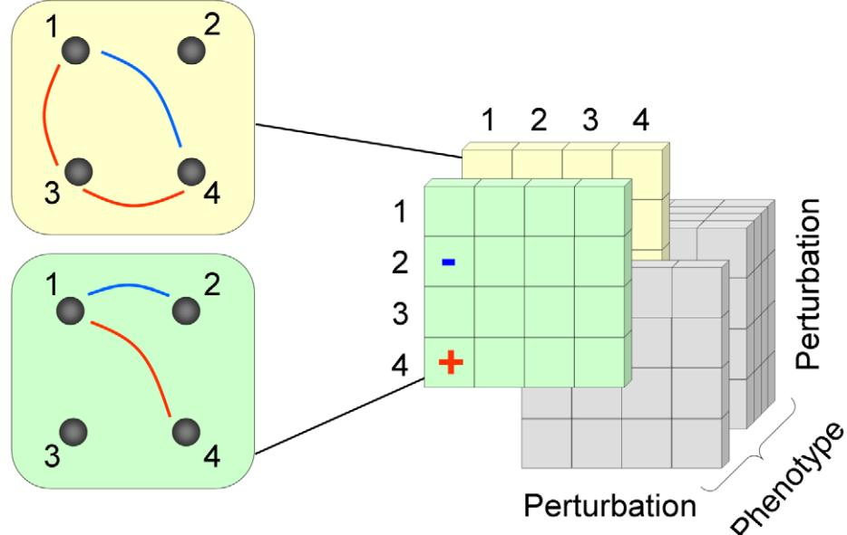
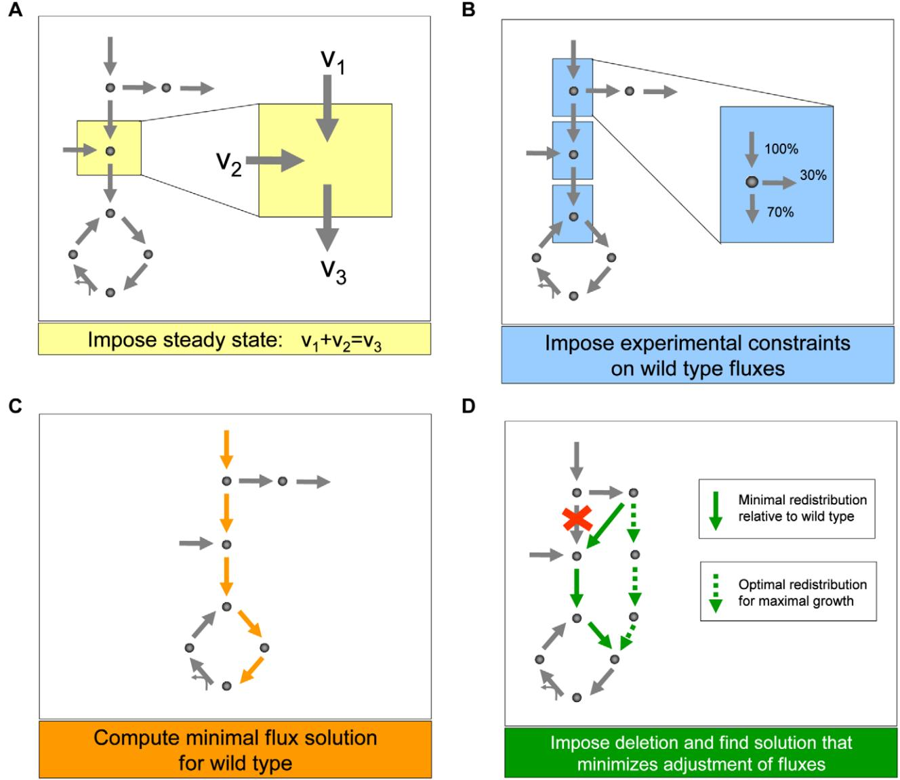
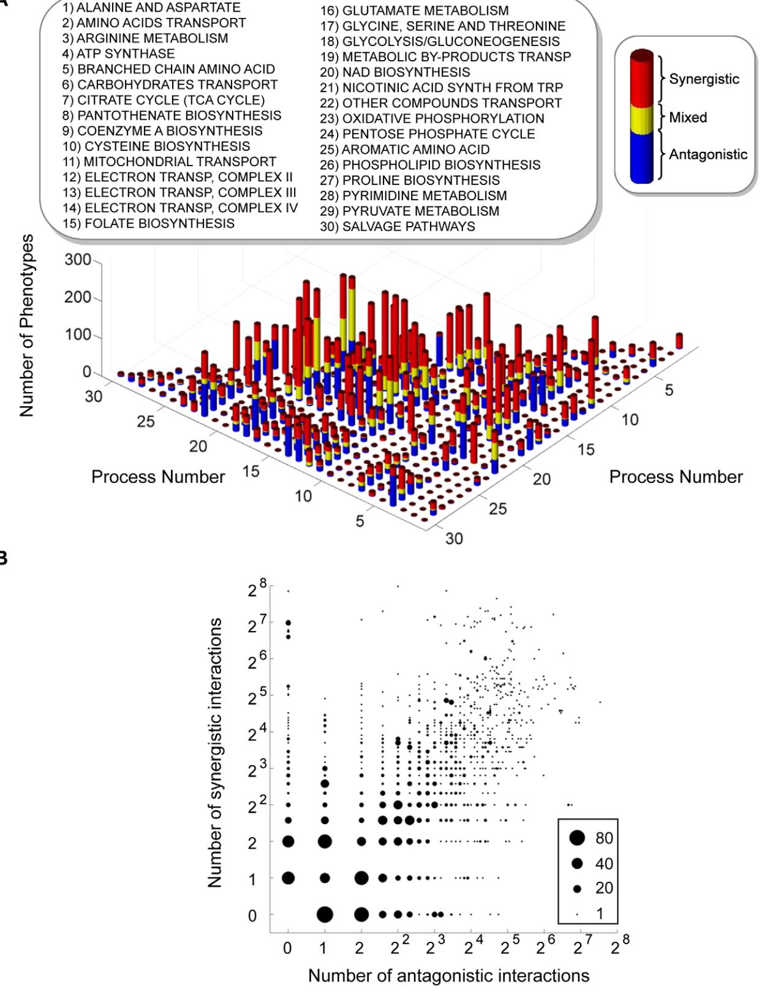
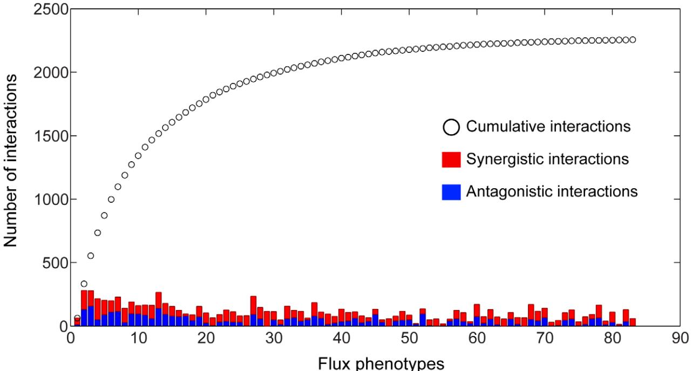
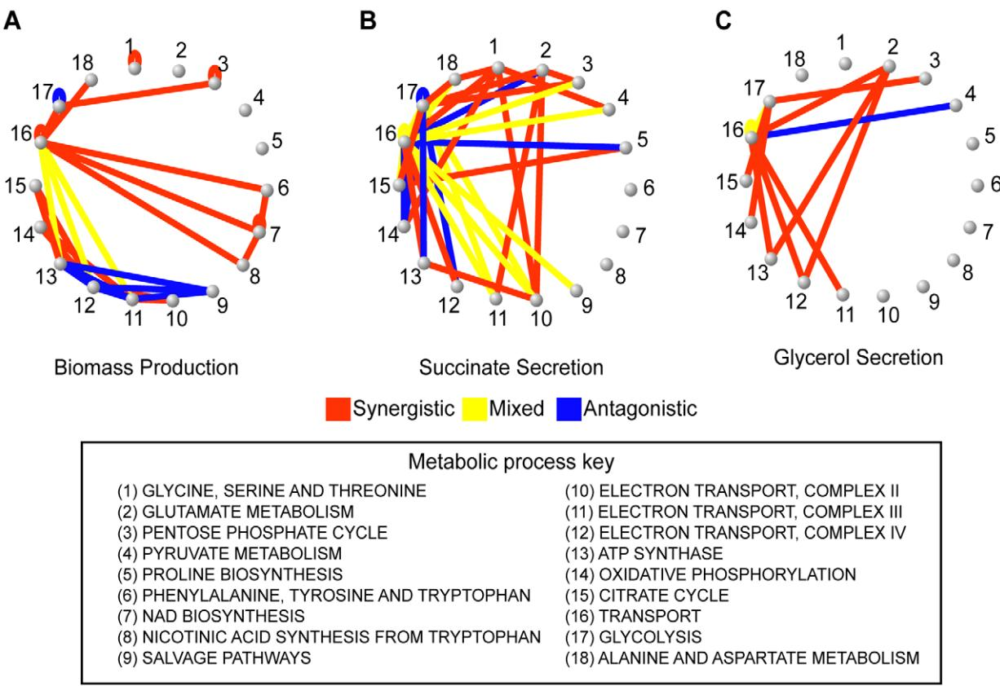
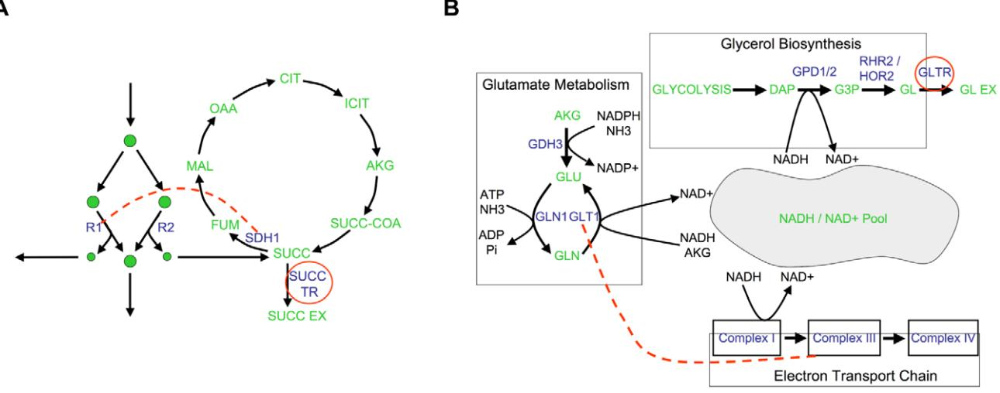
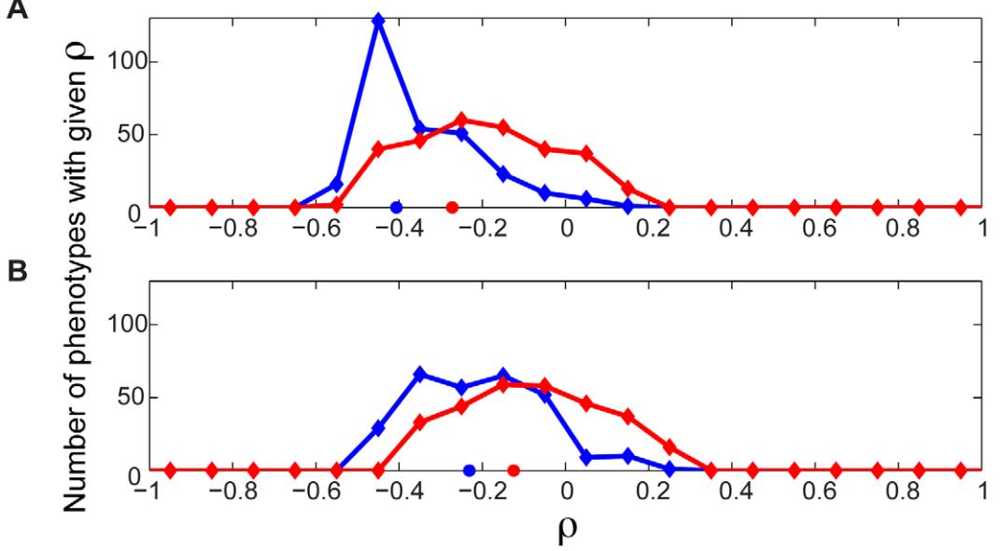
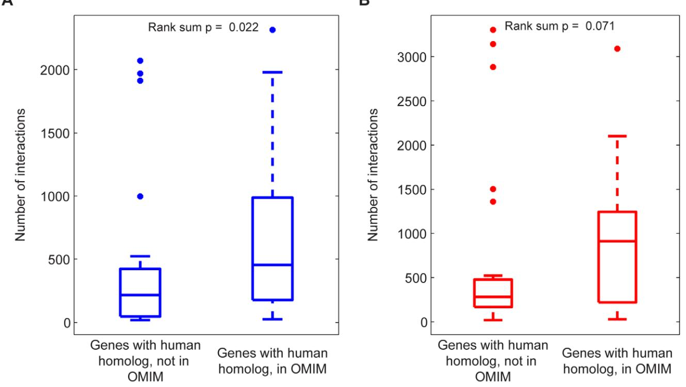

# Epistatic Interaction Maps Relative to Multiple Metabolic Phenotypes

# Evan S. Snitkin1,2, Daniel Segre` 1,3*

1 Program in Bioinformatics, Boston University, Boston, Massachusetts, United States of America, 2 Genetics and Molecular Biology Branch, National Human Genome Research Institute, National Institutes of Health, Bethesda, Maryland, United States of America, 3 Department of Biology and Department of Biomedical Engineering, Boston University, Boston, Massachusetts, United States of America

# Abstract

An epistatic interaction between two genes occurs when the phenotypic impact of one gene depends on another gene, often exposing a functional association between them. Due to experimental scalability and to evolutionary significance, abundant work has been focused on studying how epistasis affects cellular growth rate, most notably in yeast. However, epistasis likely influences many different phenotypes, affecting our capacity to understand cellular functions, biochemical networks adaptation, and genetic diseases. Despite its broad significance, the extent and nature of epistasis relative to different phenotypes remain fundamentally unexplored. Here we use genome-scale metabolic network modeling to investigate the extent and properties of epistatic interactions relative to multiple phenotypes. Specifically, using an experimentally refined stoichiometric model for Saccharomyces cerevisiae, we computed a three-dimensional matrix of epistatic interactions between any two enzyme gene deletions, with respect to all metabolic flux phenotypes. We found that the total number of epistatic interactions between enzymes increases rapidly as phenotypes are added, plateauing at approximately 80 phenotypes, to an overall connectivity that is roughly 8-fold larger than the one observed relative to growth alone. Looking at interactions across all phenotypes, we found that gene pairs interact incoherently relative to different phenotypes, i.e. antagonistically relative to some phenotypes and synergistically relative to others. Specific deletion-deletion-phenotype triplets can be explained metabolically, suggesting a highly informative role of multiphenotype epistasis in mapping cellular functions. Finally, we found that genes involved in many interactions across multiple phenotypes are more highly expressed, evolve slower, and tend to be associated with diseases, indicating that the importance of genes is hidden in their total phenotypic impact. Our predictions indicate a pervasiveness of nonlinear effects in how genetic perturbations affect multiple metabolic phenotypes. The approaches and results reported could influence future efforts in understanding metabolic diseases and the role of biochemical regulation in the cell.

Citation: Snitkin ES, Segre` D (2011) Epistatic Interaction Maps Relative to Multiple Metabolic Phenotypes. PLoS Genet 7(2): e1001294. doi:10.1371/ journal.pgen.1001294

Editor: Trudy F. C. Mackay, North Carolina State University, United States of America

Received July 26, 2010; Accepted January 6, 2011; Published February 10, 2011

This is an open-access article distributed under the terms of the Creative Commons Public Domain declaration which stipulates that, once placed in the public domain, this work may be freely reproduced, distributed, transmitted, modified, built upon, or otherwise used by anyone for any lawful purpose.

Funding: This work was supported by grants from the National Institute of Health (1RC2GM092602-01, 1R01GM089978, and 1R01GM078209). The funders had no role in study design, data collection and analysis, decision to publish, or preparation of the manuscript.

Competing Interests: The authors have declared that no competing interests exist.

* E-mail: dsegre@bu.edu

# Introduction

An epistatic interaction between two genes occurs when the phenotypic impact of at least one of the genes is dependent on the other [1]. This dependence is often a consequence of an underlying functional relationship between the two genes [2,3]. By extending the study of epistasis from individual interactions to networks of interactions, recent work in S. cerevisiae has demonstrated that genome-wide patterns of epistasis can be used to uncover the global organization of biological systems [4–7]. In such studies epistatic interactions are identified as instances where the effect of a double perturbation on growth differs from the expectation based on the observed effects of the corresponding single perturbations [8]. The choice of growth rate as a phenotype is motivated by the role of epistasis in the dynamics of selection [9], and by the fact that growth rate, a proxy for fitness, can be accurately measured in a highthroughput manner [10]. In parallel to the experimental efforts, large-scale studies of epistasis on growth phenotypes have also been pursued computationally, especially using the approach of flux balance analysis [6,11,12]. Such computational studies have offered preliminary novel insight before the availability of corresponding experimental data, e.g. in predicting a coherence principle (monochromaticity) in the organization of epistatic interaction networks [6], subsequently observed experimentally [7,13]. Overall, large-scale studies of epistasis have become increasingly relevant to functional genomics [4,7,14], drug development [13,15,16] and evolutionary biology [17,18].

Albeit important, growth rate is just one of many possible phenotypes relative to which genes can interact epistatically with each other. In contrast with the rapidly increasing understanding of the nature and scope of epistatic interactions relative to growth, many questions remain unresolved with respect to epistasis relative to non-growth phenotypes. Are interactions relative to non-growth phenotypes as widespread as interactions with respect to growth? Do genes tend to interact relative to more than one phenotype, and if so, is the type of epistasis consistent across phenotypes? How much more dense can an epistatic network become upon adding new phenotypes? Do interactions with respect to specific

#### Author Summary

An epistatic interaction between two genes occurs when the phenotypic impact of one gene is dependent on the other. While different phenotypes have been used to uncover epistasis in different contexts, little is known about how cell-scale genetic interaction networks vary across multiple phenotypes. Here we use a genome-scale mathematical model of yeast metabolism to compute a three-dimensional matrix of interactions between any two gene deletions with respect to all metabolic flux phenotypes. We find that this multi-phenotype epistasis map contains many more interactions than found relative to any single phenotype. The unique contribution of examining multiple phenotypes is further demonstrated by the fact that individual interactions may be synergistic relative to some phenotypes and antagonistic relative to others. This observation indicates that different phenotypes are indeed capturing different aspects of the functional relationships between genes. Furthermore, the observation that genes involved in many epistatic interactions across all metabolic flux phenotypes are found to be highly expressed and under strong selective pressure seems to indicate that these interactions are important to the cell and are not just the unavoidable consequence of the connectivity of biological networks. Multi-phenotype epistasis maps may help elucidate the functional organization of biological systems and the role of epistasis in the manifestation of complex genetic diseases.

phenotypes provide biological insight than cannot be obtained from knowing interactions relative to growth rate? Most importantly, does the potential presence of multi-phenotype epistasis affect the way cells operate and evolve? While these questions have not, to our knowledge been asked before, epistasis relative to non-growth phenotypes is not in itself a new concept. Interactions between polymorphisms have been detected by using multiple mRNA transcript levels as phenotypes [19]. Another recent study searched for interactions among genes conferring resistance to a DNA-damaging agent and showed that a denser network was observed with respect to the capacity to cope with the damaging agent, than was found with respect to growth rate under standard conditions [20]. In addition, in the study of human genetic diseases, while epistasis relative to disease-related traits poses challenging technical problems, it is a potentially important component, especially in light of the relative paucity of explanatory power detected through the analysis of individual loci [21–23]. Hence interactions relative to diverse phenotypes are likely widespread and informative. However, the combinatorial complexity resulting from the large number of possible genetic perturbations and phenotypes has prevented so far a systematic analysis of the extent and biological implications of this phenomenon.

In this work we report the computational study of epistatic interactions in a flux balance model of metabolism that is simple enough to allow an exhaustive computation of all possible perturbations relative to all possible phenotypes, but at the same time realistic enough to provide meaningful biological insight. Specifically, we use an experimentally informed variant of the method of minimization of metabolic adjustment (MOMA) in a genome-scale metabolic network model of Saccharomyces cerevisiae [24] to predict all steady state metabolic reaction rates (fluxes) in response to all possible single and double enzyme gene deletions. By comparing single and double mutant values for all fluxes and defining appropriate metrics, we construct an epistatic map for each flux phenotype (Figure 1). This multi-phenotype genetic interaction map allows us to explore for the first time the properties and significance of epistasis across a combinatorial set of perturbations and phenotypes.

Figure 1. A schematic representation of the 3D epistatic map. The 3D epistatic map is represented as a 3-dimensional entity (perturbation by perturbation by phenotype). Each ''slice'' of the 3D epistatic map represents an epistatic interaction network, created with respect to a single phenotype. Previous genome-scale studies of epistasis in yeast metabolism have focused on a single ''slice'', whose interactions were computed with respect to the biomass production phenotype. doi:10.1371/journal.pgen.1001294.g001

#### Results

# Generalizing the study epistasis to multiple metabolic flux phenotypes

Quantifying epistasis relative to multiple metabolic flux phenotypes introduces three fundamental challenges, one specific to the use of flux balance models and two broadly relevant to any study of multi-phenotype epistasis.

The first issue is the reliability of flux predictions for deletion mutants. The availability of experimentally determined growth phenotypes for all gene deletion mutants in S. cerevisiae has allowed for extensive evaluation of the yeast model's capacity to predict mutant growth. These previous studies [25,26], including a comparison of model predictions against experimental growth measurements for 465 gene deletion mutants under 16 metabolically diverse conditions [26], have demonstrated that the yeast model can predict deletion mutant viability with high accuracy. Furthermore, observed discordances between model predictions and experimentally determined mutant growth phenotypes have been used in refinements of the existing yeast model, further bolstering the ability of the model to accurately mimic the effect of different gene deletions [25,27]. In addition to effectively predicting single mutant growth, flux balance models have also been shown to predict viabilities of double deletion mutants with high accuracy [28]. However, while model predictions of mutant growth have been evaluated extensively, comparisons between measured and predicted fluxes through the underlying metabolic reactions in different mutants are less readily available [29]. To address this need we recently evaluated the ability of the yeast model to predict the fluxes through central carbon metabolism in single gene deletion mutants by comparing model predictions to a previously released compendium of experimentally measured mutant fluxes [30]. An assessment of different approaches for mutant flux prediction revealed that an experimentally driven variant of the minimization of metabolic adjustment [31] gives the best correlation with measured fluxes (Spearman rank correlation greater than 0.90, Figure S1), and hence chose it for our calculations (See Materials and Methods). In essence, this method implements the hypothesis that the metabolic response to genetic perturbation will be a minimal rerouting of flux around the insult. A conceptual illustration of the methodology for predicting mutant fluxes is shown in Figure 2, with a detailed quantitative description provided in the Materials and Methods and Text S1.

A second issue, which is critical to any multi-phenotype study of epistasis, is the choice of a metric for quantifying epistasis. The quantification of epistasis requires an assumption as to how the phenotypic effects of non-interacting mutations combine: deviations from this expectation are inferred to be indicative of epistasis. While previous work has provided both theoretical and empirical evidence for how the effects of mutations on fitness combine [8], no comprehensive study has yet explored how the effects of mutations on metabolic fluxes combine. To this end we evaluated two standard metrics for computing epistasis (multiplicative and additive definitions), in addition to a novel metric. This novel metric was designed so as to avoid making any assumption on how the phenotypic effects of two mutations combine. Avoiding such assumptions is ideal for detecting epistasis across multiple phenotypes, relative to which the effects of mutations may combine differently (See Text S1 and Table S1). However, comparing these three different quantitative definitions (See Materials and Methods and Text S1), we found that epistasis relative to metabolic fluxes is overall robustly detectable independent of the metric used (Figure S2). In the following analyses, based on this result, a multiplicative model is used, and all main conclusions were verified to be robust relative to different metrics.

A third issue arising in a global analysis of epistatic effects with respect to metabolic fluxes is the partitioning of interactions into different classes of epistasis [32]. These different classes of epistasis represent different ways in which the combined effect of two mutations may defy expectation, and can be indicative of different types of underlying functional relationships between genes [2,6]. In moving from growth to flux phenotypes, the classification of interactions becomes more complex, due to the fact that fluxes can increase or decrease upon genetic perturbation, while the growth rate typically only decreases. While the increased complexity present in our data allows for discrimination of many different classes of interactions (See Figure S3 and Text S1), for the current analysis we consolidate all sub-classes of interactions into two groups, synergistic and antagonistic (See Materials and Methods, Figure S3). A synergistic interaction between two genes indicates that the change in the observed flux (phenotype) caused by the simultaneous deletion of both genes is greater than expected based on the effects of the corresponding single deletions, while an antagonistic interaction indicates a flux change in the double mutant that is less than expected. Synergistic interactions are indicative of a compensatory relationship between two genes, such that the extreme phenotype of the double mutant is a consequence of this compensation being lost. Antagonistic interactions are indicative of two genes working together towards some function, such that the reduced phenotypic effect of the double mutant occurs because the common function is compromised by the loss of either of the genes individually.

#### Overview of a multi-phenotype epistatic map

These preparatory steps allowed us to compute and analyze a 3 dimensional epistatic map for the yeast metabolic network, as illustrated in Figure 1. The complete set of synergistic and antagonistic epistatic interactions were reduced to a highconfidence set by independently applying a standard deviation cutoff to the distributions of epistasis relative to each phenotype (See Materials and Methods and Figure S4). Considering only these high confidence interactions, it was found that 100 of the 672 genes in the model interact with respect to at least one of the 293 fluxes active under the modeled minimal glucose condition. To simplify the subsequent analysis of the epistatic map, we consolidated the 100 interacting genes into the 30 metabolic processes to which they are assigned in the model, and counted an interaction between two processes if any gene from one process interacts with any gene from the other. This consolidated epistatic map is represented in Figure 3A, where the total numbers of synergistic (red), antagonistic (blue) and mixed (yellow) interactions between pairs of biological processes, across all phenotypes, are displayed as a stacked histogram. Mixed interactions between two processes occur when some pairs of genes across the processes interact synergistically, while others antagonistically. Figure 3A indicates that such mixed process interactions are less frequent than process interactions that are purely synergistic or antagonistic, suggesting that the previously observed monochromaticity of epistatic interactions between biological processes [6] applies to diverse metabolic phenotypes. Monochromaticity is a consequence of the fact that genes in the same biological processes function cohesively, and hence share similar patterns of epistatic interactions [4,5,7]. Notably, however, in our multi-phenotype epistatic map, the ''color'' (synergistic or antagonistic) of the interaction between two processes depends on the phenotype observed. Figure 3B demonstrates that this dependence of process interaction colors on phenotype is due to the fact that individual gene

Figure 2. Schematic depiction of the main steps we used to generate predictions of metabolic fluxes for yeast single and double deletion mutants. (A) As in any flux balance model, we implement a steady state approximation, yielding for each metabolite in the network a linear constraint on reaction rates (fluxes). (B) We then generate the best possible flux state for the wild type, using flux and growth rate data from the literature [30] as additional constraints, and (C) minimizing the sum of the absolute values of all fluxes. This last step prevents the generation of arbitrarily large loops of fluxes associated with alternative optima. (D) Lastly, to generate flux predictions for the deletion mutants, we impose that the fluxes associated with the deleted genes be set to zero, and identify the flux state for the mutant that is as close as possible to the wild type state, identified in step C. Note that this approach does not employ growth rate maximization, as often done in flux balance analysis. Instead, using the concept of minimization of metabolic adjustment [29], it searches for mutant fluxes that undergo minimal rerouting relative to the (experimentally tuned) wild type flux solution. This approach was proven to be the most accurate way of predicting fluxes in yeast knockout strains. doi:10.1371/journal.pgen.1001294.g002

pairs often interact synergistically relative to some phenotypes and antagonistically relative to others. This pattern reveals that the class of an epistatic interaction is not an absolute characteristic of a pair of genes, but rather a characteristic of the gene-genephenotype triad. This suggests that the functional relationship between two genes is not necessarily one dimensional, but may depend on the function (the phenotype) being probed.

The intuition that different phenotypes convey complementary insight into the functional associations between genes and processes was confirmed in a quantitative manner by determining how many unique interactions each phenotype contributes to the 3D epistatic map. Figure 4 shows that the total number of interactions identified when considering all phenotypes is ,8 times larger than can be identified relative to any individual phenotype, although the exact increase in interaction coverage is dependent on the threshold for defining a significant interaction (See Materials and Methods). Figure 4 also shows that 83 of the 293 total metabolic flux phenotypes are required to identify all unique epistatic interactions in yeast metabolism. Examining the distribution of metabolic processes where these 83 phenotypes come from (Figure S6), reveals that they are spread across all metabolic processes. This suggests that a set of phenotypes that represents all

Figure 3. Interactions in the yeast multi-phenotype epistatic map. (A) Histogram of the number of phenotypes relative to which different metabolic processes interact with synergistic (red), antagonistic (blue) or mixed (yellow) interactions. Two processes are said to interact with respect to some phenotype if any two genes belonging to those processes interact. Mixed interactions occur when different gene pairs from the same pair of processes interact differently (antagonistic or synergistic) relative to the same phenotype. (B) Interaction classes for gene pairs across multiple phenotypes. In the multi-phenotype interaction map, one can ask how many gene pairs interact synergistically with respect to a number ns of

different phenotypes and antagonistically with respect to a number na of phenotypes. In this graph, for each pair (ns, na) we plot a circle with diameter proportional to the number of gene pairs displaying such interaction pattern. Only gene pairs that interact relative to at least one flux phenotype are included.

doi:10.1371/journal.pgen.1001294.g003

metabolic functions is required to identify all epistatic interactions. Conversely, this implies that different phenotypes are providing insights into unique aspects of the functional relationships between genes.

# Epistatic interactions with respect to secretion phenotypes reflect functional interconnectivity of metabolic processes

To solidify the observation that different flux phenotypes reveal unique aspects of the functional relationships between genes, we next focus on the epistatic networks relative to two secretion phenotypes (succinate, Figure 5B, and glycerol, Figure 5C). We chose to focus on secretion flux phenotypes because they are the most tractable fluxes to measure experimentally, and hence potentially the most relevant for future experimental studies. Both of these secretion flux epistatic networks contain several interactions that are not detected relative to the growth phenotype (Figure 5A). In particular, in the succinate secretion network, the genes that are part of complex II of the electron transport chain (ETC II) display synergistic interactions with several other biological processes (Figure 5B). Among these interactions, which are indicative of an unexpectedly large increase in succinate secretion in the double mutant, the one between serine biosynthesis and ETCII has been reported in previous experimental efforts to overproduce succinate [33]. This interaction occurs because the predicted alternate pathway for serine biosynthesis produces succinate as a byproduct, and ETC II is the primary route through which this succinate is metabolized in the wild-type (Figure 6A, Figure S7). Thus, interactions with respect to succinate may in general probe the way in which TCA cycle intermediates are produced and consumed.

In the glycerol secretion phenotype network there is enrichment for synergistic interactions between glutamate biosynthesis and respiratory processes (Figure 5C). Among these interactions, the interaction between glutamate synthase and the electron transport chain is supported by experimental data gathered in the context of ethanol production optimization [34]. This epistatic interaction is a consequence of the fact that glutamate biosynthesis, the electron transport chain and glycerol biosynthesis correspond to three of the major routes for cytosolic NADH oxidation (Figure 6B, Figure S9). Thus, interactions with respect to glycerol secretion may reflect the way in which different processes contribute to cellular redox balance. These examples, and others in Text S1 and Figure S8, further demonstrate that interactions with respect to metabolic flux phenotypes can provide detailed insights into different aspects of the functional relationships between genes.

# Properties of genes involved in many interactions across all metabolic phenotypes

So far, we have shown that epistatic interactions between gene deletions relative to metabolic flux phenotypes are ubiquitous, and can provide an understanding of the relationships between

Figure 4. Coverage of the 3D epistasis map. The total number of antagonistic and synergistic interactions for each phenotype are displayed as stacked bars, with the cumulative sum of interactions at a given point in the list being represented by a black circle. Phenotypes were sorted according to the number of unique interactions added to a cumulative tally. It should be noted that the first phenotype in the list is the biomass flux, which does not have the maximal number of interactions. It was placed first so as to clearly demonstrate the gain in interaction coverage by observing non-growth phenotypes. Only the first 83 phenotypes are shown, as the number of unique interactions reaches saturation at this point. doi:10.1371/journal.pgen.1001294.g004

Figure 5. Epistatic networks with respect to growth rate and two other flux phenotypes. To explore the biological diversity underlying the different epistatic networks, the presence of synergistic and antagonistic interactions between pairs of metabolic processes were determined for (A) growth, (B) succinate secretion and (C) glycerol secretion phenotypes. These process interactions are visualized as networks, where nodes are biological processes and edges indicate that gene pairs in the two biological processes interact antagonistically (blue), synergistically (red) or mixed (yellow). Visualizing the interaction networks in this way demonstrates that the variability in interaction coverage found relative to different phenotypes is a consequence of phenotype-specific interactions among completely different biological processes. Specific process interactions observed in these networks are described in detail in Figure 6 and in Text S1. doi:10.1371/journal.pgen.1001294.g005

different processes in the cell. The ubiquity of epistasis relative to metabolic flux phenotypes brought to our attention the possibility that these complex network-level functional interdependencies might impose constraints on evolutionary trajectories. We hypothesized that this phenomenon might manifest itself in the form of increased evolutionary constraints on enzymes that are involved in many epistatic links with other genes. Such a relationship between epistatic connectivity and evolutionary rate has been recently observed in the experimentally constructed global genetic interaction network with respect to growth rate in yeast [7]. Thus, we set out to explore whether predicted connectivity with respect to metabolic phenotypes other than growth rate are also correlated with evolutionary constraint. To this end we calculated the Spearman rank correlation between the number of interactions in which different genes participate and the evolutionary rates of such genes, as measured by their nonsynonymous to synonymous substitution ratios. This correlation was calculated separately for synergistic and antagonistic interactions relative to each of the 293 flux phenotypes, for a total of 586 correlations. The distributions of correlation coefficients for synergistic and antagonistic interactions across all phenotypes are shown in Figure 7A. Both distributions significantly deviate from zero, with an overall bias towards negative correlations (Sign test, p = 8.5610225 (synergistic), 2.2610254 (antagonistic), n = 293). This trend towards negative correlations suggests that genes involved in many interactions with respect to metabolic flux phenotypes do indeed evolve slower.

While the negative skew of these distributions is robustly maintained upon removal of most potential confounding factors (see Figure S11) we found that it is significantly reduced when controlling for the codon bias of the genes (Figure 7B). Codon bias is a proxy for gene expression level, which previous research has shown to be the dominant correlate of evolutionary rate [35,36]. Therefore, we cannot rule out that a portion of the apparent evolutionary importance of genes with a high degree of genetic interactions across different phenotypes may be explainable by the expression level of the genes. Yet, regardless of whether the interaction degree correlates with evolutionary rate or gene expression level, either result indicates the functional importance of these multi-phenotype hubs. The increased expression level of these hubs in fact supports their central role in metabolic function. Furthermore, in our model, epistatic interaction degree with respect to growth flux alone is not significantly anti-correlated with evolutionary rate, even without controlling for expression level (Figure S12). This indicates that the importance of genes is associated with their total phenotypic impact, not just their impact on growth.

While the distributions of correlations between evolutionary rate, and both synergistic and antagonistic interaction count, shift towards zero when controlling for codon bias, the distribution

Figure 6. Examples of epistatic interactions (red dashed lines) with respect to flux phenotypes (red circles), overlaid on the corresponding metabolic pathways. (A) In Figure 5B, there is an abundance of synergistic interactions between complex II of the electron transport chain (ETC II) and various other biological processes, with respect to succinate secretion. The basis for these interactions is the fact that ETC II catalyzes the succinate dehydrogenase reaction (SDH), which is the major flux consuming succinate under the modeled condition. If SDH is deleted, succinate is predicted to be secreted from the cell. Therefore, a gene deletion resulting in an increase in flux through SDH, will be observed to interact synergistically with SDH relative to succinate secretion. (B) A second predicted interaction is a positive synergistic interaction between glt1 and cox1 relative to glycerol secretion as a phenotype. The metabolic basis for this interaction is the involvement of both the genes and the phenotype in NADH/NAD balancing. Specifically, glt1 is an NADH dependent reaction, and in its absence, glutamate is synthesized by the NADPH dependant glutamate dehydrogenase reaction. Therefore, the deletion of glt1 leaves an excess of NADH, which is in turn oxidized via the respiratory chain. In the cox1 mutant, the respiratory chain is no longer functional, and the redox imbalance is alleviated through glycerol production (Figure S9). Hence, there is an unexpectedly large increase in glycerol secretion in the double mutant, relative to what is observed in the single mutants. doi:10.1371/journal.pgen.1001294.g006

Figure 7. Evolutionary significance of epistasis with respect to metabolic flux phenotypes. The number of antagonistic and synergistic epistatic interactions for each of 39 genes was determined across each of the 293 flux phenotypes. (A) For each phenotype, the number of synergistic and antagonistic interactions involving the genes was correlated separately with the Ka/Ks of the genes, yielding distributions of Spearman Rank Correlation r values for synergistic (red) and antagonistic (blue) interactions. Both distributions are significantly skewed towards negative r values (sign test p = 8.5610225 (synergistic), 2.2610254 (antagonistic)). The red and blue circles indicate the correlation coefficient when the total numbers of synergistic (r = 20.27, p = 0.09, n = 39) and antagonistic (r = 20.41 p = 0.01, n = 39) interactions across all phenotypes are considered. (B) The above correlations were repeated, but controlling for the codon bias of the genes using partial correlation analysis. The distributions of r move closer to zero, with only the distribution for antagonistic interactions remaining significantly different from zero (sign test p = 0.07 (synergistic), 2.3610231 (antagonistic)).

doi:10.1371/journal.pgen.1001294.g007

remains significantly different from zero only for antagonistic interactions (p = 0.07 (synergistic), p = 2.3610231 (antagonistic)). We believe that this observation can be understood by considering more closely the relationships between genes that interact antagonistically, versus synergistically. An antagonistic interaction implies that the phenotypic effect of deleting a gene is reduced in the absence of its interaction partner. A possible interpretation of this is that a gene's full function, as manifested in its associated phenotypic effect, is contingent on the presence of its antagonistic interaction partner. Therefore highly antagonistic genes are phenotypic hubs, whose evolutionary changes are constrained by the dependency of other genes upon them. Conversely, the reduced constraint on synergistic hubs can be understood by considering that a synergistic interaction between two genes implies that the phenotypic impact of deleting a gene is increased in the absence of its interaction partner. This can be interpreted as a gene's function being compensated for by its synergistic interaction partners. Therefore, the reduced correlation with evolutionary rate for synergistic hubs may reflect the fact that the phenotypic effect of changes in such hubs is dampened by the presence of their interaction partners.

# Genes associated with human genetic disorders have higher epistatic connectivity

The implications of the current analysis are not limited to yeast. In fact, multi-phenotype epistatic interactions may be relevant to the manifestation and treatment of human disease. Given the previously discussed importance of multi-phenotype hub genes, it is likely that perturbations of these genes would have major effects in a biological network. Translating this observation to humans, we hypothesize that the disruption of more highly connected genes in the human metabolic network would be more likely to result in a disease state. We sought evidence for this by evaluating whether the epistatic connectivity of genes in the yeast model was predictive of the role of their human homologs in genetic diseases. Indeed, we observe a significant difference between the connectivity of yeast homologs of human genes that have been associated with a genetic disease, versus those that have not (Figure 8). While the statistical significance is limited due to the small sample size, this result provides support for the growing sentiment that majority of human genetic disorders are a consequence of complex interactions between numerous cellular components [1,21].

#### Discussion

We described the systematic generation of epistatic interaction networks relative to all observable phenotypes in a genome-scale model of yeast metabolism. Analysis of these networks revealed that different metabolic flux phenotypes yield different sets of interactions, and that a large set of phenotypes is required to capture all interactions. The basis for these observations is that different metabolic flux phenotypes capture different aspects of gene function. This is likely a consequence of the complex wiring of metabolic networks, which include multiple branching pathways, shared pools of commonly used metabolites and a high level of interconnectedness between different metabolic processes:

Figure 8. Disease association of genes involved in many interactions across all metabolic flux phenotypes. The relevance of multiphenotype epistasis to human disease was explored by comparing the total number of (A) antagonistic and (B) synergistic interactions across all phenotypes for those yeast genes with a human homolog in OMIM to those yeast genes with a human homolog that is not in OMIM. The distributions of interaction counts are displayed as box-plots with the boxes encompassing the 25th to 75th percentiles, and the line at the median value. Genes with a human homolog in OMIM have more antagonistic and synergistic interactions, with the difference for antagonistic interactions being significant at p,0.05 (Signed-rank test, p = 0.022 (antagonistic), p = 0.071 (synergistic), n1 = 30, n2 = 19). doi:10.1371/journal.pgen.1001294.g008

seemingly remote processes on the metabolic chart may nonlinearly affect a third readout process (the phenotype). Furthermore, because of this complexity, the relationships between different genes and processes may not be easily captured by straightforward patterns, as indicated by the observation that the same genes can interact synergistically relative to some phenotypes and antagonistically relative to others.

From a functional genomic perspective, the results imply that, in future studies of epistasis, the set of observed phenotypes could be selected so as to influence the set of interactions identified and to maximize insight into the functional organization of the biological process of interest. While the focus here has been on metabolism, this concept can be generalized to other types of biological networks. For instance, mRNA transcript levels may be the most appropriate phenotype to tease out the logic of transcriptional regulatory networks [37] and phosphorylation states the most relevant for signal transduction pathways. Furthermore, our results demonstrate that the particular mRNA levels or protein phosphorylation states monitored should depend on the particular regulatory module or transduction pathway of interest. An additional layer of complexity that has not yet been addressed here is the dependence of epistatic networks on environmental conditions. As hinted to before (Supplementary Figure 3 in [6]) epistatic networks will likely vary under different conditions. Hence, future extensions of the current work may explore the complexity and significance of environmental conditions as a fourth dimension in the epistatic matrix of Figure 1.

From an evolutionary perspective, we found that the number of epistatic interactions with respect to multiple metabolic flux phenotypes is strongly anti-correlated with the genes' evolutionary rates and expression levels. This anti-correlation is larger than found with the number of epistatic interactions relative to growth phenotype only. On the surface this result seems surprising, given that growth rate and fitness are often taken to be synonymous with one another, and genes that have a large impact on fitness would be expected to evolve slower. However, one must consider that growth in the model is based solely on the capacity to produce biomass components, while fitness in an organism's natural environment is assuredly more complex. An organism's success (in other words, its fitness) likely depends on the complex interplay of a multitude of biological properties, including the proportions and efficiency of resources utilized, the choice of secreted byproducts (which can influence the environment and the interactions with other species), and how fluxes are managed in the face of varying nutrient availability. Thus, the apparently reduced importance of the growth flux, and conversely, the increased importance of all metabolic phenotypes, may simply be reflective of the relative simplicity of growth in the model, when compared to the complexity of growth in the wild. More broadly, our results raise the possibility that the apparent robustness observed in the insulated environment of the laboratory may not translate to an organism's natural environment, where additional constraints exist with respect to not just how fast one grows, but the precise manner in which this is accomplished.

A potential limitation of past and present, computational and experimental studies of the evolutionary impact of epistasis may lie in the use of gene deletions as the mutation relative to which epistasis is detected. While gene deletion mutations have been effective in terms of uncovering functional dependencies and the evolutionary constraints imposed by these dependencies, left unanswered is the evolutionary impact of epistasis relative to smaller perturbations to gene function. It is these minor perturbations, such as those caused by amino acid substitutions or stochastic fluctuations in protein levels that the cell must constantly confront. If epistasis relative to these small perturbations is as ubiquitous as has been observed relative to gene deletions, this begs the question as to how the cell copes with the complexity of a large number of long-distance nonlinearities affecting virtually every metabolic function. While experimental studies have begun to address this question [38], perhaps computational frameworks such as flux balance analysis can be used to extend these analyses to the genome-scale. For flux balance analysis, or any computational framework, to adequately address this problem much work will have to be done to more fully understand the phenotypic consequences of small genetic perturbations.

While our current analysis is purely computational, we anticipate that xperimental measurements of interactions based on multiple metabolic phenotypes will be increasingly feasible and valuable in the near future. Our analysis provides predictions about the properties of multi-phenotype epistatic networks, in addition to a plethora of specific interaction predictions to which these future experiments can be compared (data downloadable at http://prelude.bu.edu/multi-phenotype-epistasis). Finally, being the first genome-scale analysis of multi-phenotype epistatic networks, we hope that the groundwork we have laid with respect to quantifying, discretizing and analyzing multi-phenotype epistatic interaction networks will aid future experimental and computational studies using similar approaches to help unravel the functional complexity of biological systems.

#### Materials and Methods

#### Flux balance analysis

To enable our study of multi-phenotype epistasis at a genomescale we utilized flux balance models [24]. Specifically, to compute steady state reaction rates (the fluxes, vi ) in deletion mutants, we used the iLL672 yeast stoichiometric reconstruction. Flux balance models take as input the stoichiometry of all known metabolic reactions in the modeled organism, along with possible constraints on flux ranges, and through a Linear Programming optimization step provide predictions of fluxes through each metabolic reaction. The complete stoichiometry of an organism is typically represented mathematically as the stoichiometric matrix, S. Each row i of the matrix S represents a metabolite, and each column j represents a reaction, with an entry Sij representing the stoichiometric coefficient of metabolite i in reaction j. The set of possible flux solutions is constrained by imposing a steady state assumption along with bounds on individual fluxes. The set of steady state solutions is described mathematically as the null space of the matrix S, and dictates that the production of each metabolite is equaled by its consumption. Bounds on individual fluxes are described by inequality constraints, and are used to model known limitations, such as nutrient availabilities, reaction reversibility and maintenance requirements. Constraints on nutrient limitation in the present study were set so as to mimic as closely as possible the media conditions from a recent study by Blank et al. [30]. This condition was selected since it allowed us to use experimental flux data from that study to perform more accurate flux predictions throughout our work (See below). Upon setting the linear constraints, a particular flux solution is typically computed by searching the optimal value of a given linear combination of the fluxes. Previously utilized optimization criteria are maximal ATP production [39], minimization of total flux [40], and the most commonly used maximization of biomass production [41]. Formally, this can be expressed as a Linear Programming (LP) problem:

$$\max \sum_{r}^{R} c_{r} \cdot v_{r}$$

$$\text{s.t.} \quad S \cdot v = 0$$

$$\omega_{j} \le v_{j} \le \beta_{j}$$

where cr is the coefficient of flux r in the objective function (r= 1, …, R, with R is the total number of reactions), and aj and bj are the upper and lower bounds on reaction j, respectively. Because of the nature of our study, accurate predictions for all individual fluxes are desirable. Hence, we wanted our flux predictions to match available experimental data as closely as possible. To this end we evaluated several optimization criteria for predicting fluxes in deletion mutants by comparing flux predictions to a previously released set of experimentally measured fluxes in yeast single deletion mutants [30] (see Text S1). Our evaluation demonstrated that the most accurate optimization criteria utilized the previously described Minimization of Metabolic Adjustment (MOMA) criteria [29], along with an experimentally constrained wild type solution [24]. In effect, this criterion assumes that upon a gene deletion, fluxes will undergo a minimal rearrangement, compatible with the flux constraints imposed by the gene deletion. We found that the performance of this approach is highly dependent on the accuracy of the wild-type solution from which the distance is minimized. Therefore the wild type fluxes were computed using the following LP optimization:

$$\begin{aligned} \min & \sum_{r}^{R} |\mathbf{v}_{r}^{WT}| \\ \text{s.t.} & \quad S \cdot \mathbf{v}^{WT} = 0 \\ \mathbf{a}_{j} \le \mathbf{v}_{j}^{WT} & \le \boldsymbol{\beta}_{j} \\ \mathbf{v}_{j}^{\text{exp}} - (\mathbf{v}_{j}^{\text{exp}} \cdot \boldsymbol{\delta}) - \boldsymbol{\varepsilon}_{j} & \le \mathbf{v}_{j}^{\text{WT}} \le \mathbf{v}_{j}^{\text{exp}} + (\mathbf{v}_{j}^{\text{exp}} \cdot \boldsymbol{\delta}) + \boldsymbol{\varepsilon}_{j} \end{aligned}$$

where v exp j is the experimentally measured value for flux j, d is a parameter that describes the stringency of the requirement (currently set to 0.10, as done previously [24]) and e represents the error associated with the experimental measurement. This approach identifies, among all states compatible with the experimentally measured fluxes, the one with minimal overall flux. Mutant fluxes were computed by constraining to zero the flux through any reaction requiring the protein product of the deleted gene(s), and then identifying the flux solution with the minimal Manhattan distance from the wild type flux solution v WT. The optimization problem, which can be solved using LP, is formulated as follows:

$$\begin{aligned} \min & \quad \sum_{i=1}^{R} |\mathbf{v}_r^{KO} - \mathbf{v}_r^{WT}| \\ \\ & \quad \text{s.t.} \quad S \cdot \mathbf{v}^{KO} = 0 \\ & \mathbf{a}_j \le \mathbf{v}_j^{KO} \le \boldsymbol{\beta}_j \\ & \mathbf{v}_{\mathcal{g}_j}^{KO} = 0 \end{aligned}$$

where vKO gi represents the flux(es) requiring the protein product of gene gi . This approach for determining mutant fluxes has been described in detail elsewhere [24]. All LP calculations were performed using the software Xpress, under free academic license.

#### Filtering of genes used analyses

From the total set of genes present in the model, only a subset was used in our analyses. First, all essential genes were excluded, as by definition they cannot participate in any epistatic interactions when considering gene deletion mutations. Second, for genes assigned to complexes in the model, only a single representative gene from the complex was used. This was done because complexes are treated in a trivial way in the model, wherein removal of any gene in the complex is assumed to have the equivalent effect of disabling the complex. Finally, only genes whose deletion affected at least one metabolic flux relative to the wild-type were included. This filter was applied in response to the trivial way in which isozymes are treated in the model, wherein complete backup is assumed.

#### Calculation of epistatic interactions

The predicted fluxes for all single and double gene deletions can be represented as a three-dimensional matrix V, whose element Vijk indicates the normalized k-th flux for the deletion of genes i and j (single mutants being represented by the diagonal elements i=j). The three-dimensional matrix of epistatic interactions, E, is in turn defined by measuring how much the flux for each double mutant differs from expectation, based on the flux in the corresponding single mutants. Specifically, we define an element of E as Eijk= Vijk – F(Viik, Vjjk), where the specific shape of the function F is discussed in the next section. The element Eijk represents the interaction between genes i and j relative to the phenotype k. Two genes i and j were considered to have an epistatic interaction relative to phenotype k if |Eijk|.ssk, where sk denotes the standard deviation for the distribution Eijk values across all pairs (i,j). For assessing total interaction coverage and process interaction patterns a value of s= 1.0 was used, so as to provide a cleaner picture by retaining only the most high confidence interactions. For the evolutionary rate analysis, a value of s= 0.5 was used, as we deemed the inclusion of weaker interactions to be conceptually important here. Note that none of the major conclusions change with respect to varying of s (see Figures S5 and S10 for sensitivity analysis relative to s). Note that flux values were rounded to 5 digits after the decimal point, in order to avoid numerical errors associated with the optimization software.

#### Metrics of epistasis (shape of the function F)

To identify an appropriate metric for quantifying epistasis with respect to metabolic phenotypes, we evaluated two commonly used metrics, as well as a newly defined one. The two previously applied metrics correspond to a multiplicative definition and an additive definition of epistasis respectively. The multiplicative metric assumes that the expected wild-type-normalized phenotype (flux) change for the double mutant is the product of the corresponding changes for the two single mutants. The additive metric, on the other hand, assumes that the expected double mutant change is the sum of the two individual mutant changes (see Text S1 and reference [8] for details). The novel metric we developed is a Z-score based metric that quantifies the difference in the effect of a mutation in the wild type and mutant backgrounds (See Text S1 for details).

#### Classes of epistasis

All interactions were classified as either antagonistic or synergistic. In general, an interaction was deemed as antagonistic if the phenotype of the double mutant was less severe than expected based on a multiplicative definition and as synergistic if the double mutant phenotype was more severe than expected (See Text S1 for details).

#### Ka/Ks analysis

For our analysis of the relationship between the number of epistatic interactions associated with perturbed genes and the ratio of the rate of non-synonymous substitutions to the rate of synonymous substitutions (Ka/Ks), we computed the total number of synergistic and antagonistic interactions associated with 39 genes across 293 flux phenotypes. The 39 genes were selected on the basis of Ka/Ks data being available from a previous study [42]. Statistical tests were performed as described in figure legends. Partial correlation analysis was done to control for single mutant fitness defects, metabolic network connectivity and codon bias (See Figure S11).

# Relationship between multi-phenotype epistasis and human disease

In order to assess the potential relevance of multi-phenotype epistasis to the manifestation of human disease the number of epistatic interactions was compared between yeast genes that have a human homolog in Online Mendelian Inheritance in Man (OMIM) database [43] and those genes that have a human homolog that is not in the OMIM database. Human homologs of yeast genes were determined based on the Kyoto Encyclopedia of Genes and Genomes [44]. The OMIM morbid map data set was downloaded on April 9th, 2009.

#### Supporting Information

Figure S1 Correlation between predicted and experimentally measured fluxes. Experimentally measured fluxes through 36 reactions from central carbon metabolism, in 13 single gene deletion mutants, are plotted against corresponding model predictions on a log-log scale (in units of mmol/grDM h). Model predictions were made with an experimentally constrained variant of the minimization of metabolic adjustment algorithm (See Text S1). Overall good agreement was found for all mutants, with Spearman rank correlation coefficients ranging from 0.90 to 0.99. A more detailed discussion of model predictions can be found in reference [1] in Text S1.

Found at: doi:10.1371/journal.pgen.1001294.s001 (0.39 MB TIF)

Figure S2 Metrics for quantifying epistasis. Three metrics of epistasis were compared based on their abilities to accurately identify epistatic interactions, with respect to metabolic flux phenotypes. In addition to previously utilized multiplicative and additive definitions, a novel Z score metric was evaluated. (A) The additive, multiplicative and Z score metrics were assessed based on their propensity to generate epistasis profiles for genes, such that genes having similar profiles tend to function in the same metabolic process. Specifically, for a given phenotype and epistasis metric, all gene pairs were ranked based on the Pearson correlations between vectors representing the epistatic interactions of each gene with all other genes. Next, the mean sensitivity and specificity across all phenotypes were computed at different rank cutoffs. An interaction was counted as a true positive if the pair of genes participated in at least one common metabolic process, with process membership being defined in the iLL672 stoichiometric model. The mean sensitivity is plotted against 1-specificity. This plot indicates that the three metrics on average perform similarly across all phenotypes. (B) Despite the similar performance of the three metrics, we observed that all the metrics vary in their performance across different phenotypes. For example, looking at the 100 gene pairs with the most correlated epistasis vectors, with respect to each different phenotypes, revealed that the number of gene pairs that function in the same metabolic process varies widely, depending on the phenotype considered. In Figure S2B each circle represents a different phenotype, with the x axis representing the number of pairs in the top 100 sharing a process when correlations are computed between vectors of multiplicative values of epistasis, and the y axis representing the number of pairs in the top 100 sharing a process when correlations are computed between vectors of Z score values. It can be seen that regardless of metric, a similar number of gene pairs sharing a metabolic process are identified. On the other hand, for both metrics, the number of gene pairs sharing a metabolic process varies greatly with the phenotype considered.

Found at: doi:10.1371/journal.pgen.1001294.s002 (0.65 MB TIF)

Figure S3 Classes of epistasis. Different classes of epistasis (synergistic/red and antagonistic/blue) were designated based on the flux changes in single and double mutants, relative to the wildtype. Delineation of classes was based on the approach detailed in reference [9] in Text S1. (A) In previous studies using flux balance models to study patterns of epistasis with respect to the growth flux, interactions were limited to either negative synergistic or positive diminishing returns. This is a consequence of the assumption of optimal growth in the wild-type and mutants. Specifically, because of the optimality assumption, the implementation of an additional gene deletion could not result in increased growth, hence limiting the scope of interaction classes. (B,C) In the current study, all metabolic fluxes are considered as phenotypes. As non-growth fluxes are free to change in any direction upon gene deletion, the number of possible interaction classes expands to eight. Flux v1 (B) decreases in response to the deletions of genes x and y individually, but is unconstrained in the way it could change in the double mutant. The class of interaction is determined by the flux of v1 in the double mutant, with the classes of interactions in different ranges noted on the figure. Flux v2 (C) increases in response to the deletions of genes x and y individually, but similar to v1, is unconstrained in how it may change in the double mutant. Again, the class of interaction is determined by the flux of v2 in the double mutant.

Found at: doi:10.1371/journal.pgen.1001294.s003 (0.51 MB TIF)

Figure S4 Distributions of e relative to different phenotypes. Distributions of multiplicative e are shown relative to the phenotypes: (A) biomass production, (B) succinate secretion, (C) glycerol secretion and (D) acetate secretion. Dotted red lines indicate a single standard deviation threshold, which was used to discretize interactions for several of the analyses in the main text. Found at: doi:10.1371/journal.pgen.1001294.s004 (0.47 MB TIF)

Figure S5 Sensitivity of classification into interaction types to standard deviation cutoff. Figure 3A in the main text shows number of phenotypes relative to which pairs of processes interact antagonistically, synergistically or mixed. The analysis in the main text was performed with a cutoff for epistasis distributions of 1.0 standard deviations. Using this cutoff we observed fewer mixed interactions than synergistic or antagonistic. We take this as evidence that the previously reported observation of ''monochromaticity'' of epistatic interactions holds with respect to various metabolic phenotypes. As the set of interactions found with respect to any phenotype depends on the standard deviation cutoff used, here we explore how the presence of mixed interactions depends on the cutoff. (A) The percentage of process interactions which are synergistic (red), antagonistic (blue) and mixed (yellow) are shown at different standard deviation cutoffs. As the standard deviation cutoff to discretize epistatic interactions becomes more stringent, the number of mixed interactions decreases. (B) Process interactions which are composed of only a single gene pair by definition cannot be mixed, because mixed interactions occur when both classes of epistasis are observed among the gene pairs which interact between two processes. To check for this potential bias against mixed interactions we calculated the percentage of process interactions composed of at least two interactions which are synergistic (red), antagonistic (blue) and mixed (yellow). While this adjustment results in an increase in the percentage of mixed interactions, the same trend still holds whereby the percentage of mixed interactions decreases with an increase in standard deviation cutoff.

Found at: doi:10.1371/journal.pgen.1001294.s005 (0.74 MB TIF)

Figure S6 Metabolic process distribution of 83 phenotypes required to capture all epistatic interactions. The distribution of metabolic processes which the 83 flux phenotypes in Figure 4 from the main text (blue) and all 293 considered flux phenotypes (gray), belong to. The 83 phenotypes span all 30 metabolic processes, indicating that monitoring all processes is required to identify all epistatic interactions.

Found at: doi:10.1371/journal.pgen.1001294.s006 (0.78 MB TIF)

Figure S7 Positive synergistic interactions between glutamate biosynthesis and the electron transport chain, with respect to glycerol secretion. As detailed in the Text S1, the interaction between glutamate biosynthesis and the electron transport chain, with respect to glycerol secretion is a consequence of the fact both the deleted genes and the phenotype are involved in mitochondrial NADH/NAD balancing. In all metabolic network maps showing fluxes for the wild-type and mutant backgrounds, blue nodes represent metabolites, red nodes represent reactions and edges represent either absolute or relative fluxes, whose magnitude is represented by the thickness of the edge. For the wild-type, edges represent the absolute flux, and in mutants, edges represent flux changes relative to the wild-type. (A) In the wild-type oxidation of NADH is performed via many different metabolic processes, including glutamate biosynthesis, electron transport and glycerol production. (B) The glt1 reaction, involved in glutamate biosynthesis, yields glutamate at the expense oxidizing one NADH to NAD. Upon deletion of glt1, glutamate is synthesized via the NADPH dependent glutamate dehydrogenase reaction. The NADH previously oxidized by glt1, is predicted to be oxidized via the electron transport chain. (C) The deletion of cox1 disables the electron transport chain. The NADH oxidized by the electron transport chain in the wild-type is predicted to be oxidized via ethanol production and glutamate biosynthesis. (D) In the absence of both glt1 and cox1, the excess NADH is predicted to be oxidized via the pathway leading to glycerol production. Hence, the synergistic interaction with respect to glycerol occurs because only in the double mutant is an increase in glycerol production required to alleviate the redox imbalance.

Found at: doi:10.1371/journal.pgen.1001294.s007 (1.53 MB TIF)

Figure S8 Antagonistic interactions among phospholipids biosynthetic genes, with respect to myo-inositol uptake. As detailed in the Text S1, the antagonistic interactions found among phospholipids biosynthetic genes are a consequence of multiple pathways existing for the production of certain phospholipids. In all metabolic network maps showing fluxes for the wild-type and mutant backgrounds, blue nodes represent metabolites, red nodes represent reactions and edges represent either absolute or relative fluxes, whose magnitude is represented by the thickness of the edge. (A) In the wild-type, it is predicted that the Kennedy pathway is used to synthesize phosphatidylcholine (PC) and phosphatidylethanolamine (PE) from choline taken up from the media. (B/C) Upon deletion of any of the genes in the Kennedy pathway, it is predicted that there is an alternate route by which PC and PE are synthesized. This alternate route requires an increased uptake of myo-inositol. Antagonistic interactions are found because there are several gene deletions that are sufficient to disable the Kennedy pathway, and cause this rerouting. Once a gene required for Kennedy pathway activity has been removed, deletion of a second gene in the pathways will have no additional effect. Figure S8B shows that absolute fluxes upon disabling of the Kennedy pathway and Figure S8C shows the fluxes in the mutant, relative to the wild-type.

Found at: doi:10.1371/journal.pgen.1001294.s008 (1.68 MB TIF)

Figure S9 Positive synergistic interactions between serine biosynthesis and the succinate dehydrogenase complex, with respect to succinate secretion. As detailed in the Text S1, the synergistic interactions between serine biosynthesis and succinate dehydrogenase, with respect to succinate secretion, are a consequence of the fact that alternate pathways for serine biosynthesis produce different amounts of succinate as a byproduct. In all metabolic network maps showing fluxes for the wild-type and mutant backgrounds, blue nodes represent metabolites, red nodes represent reactions and edges represent either absolute or relative fluxes, whose magnitude is represented by the thickness of the edge. For the wild-type, the edges represent the absolute flux and in mutants, edges represent flux changes relative to the wild-type. (A) In the wild-type serine is produced via a pathway originating from the glycolytic intermediate, 3-phosphoglycerate. This pathway to serine biosynthesis does not directly result in any succinate production. (B) The deletion of ser1 disables the path to serine, originating from 3-phosphoglycerate. Instead, serine is produced via a route originating from glyoxylate. The glyoxylate required for serine biosynthesis is in turn produced via the glyoxylate cycle, which results in the production of succinate as a byproduct. This excess succinate is predicted to be consumed by the succinate dehydrogenase reaction. (C) In the succinate dehydrogenase mutant it is predicted that cytosolic TCA cycle reactions can be used to bypass the missing reaction, and maintain a functioning TCA cycle. (D) In the ser1/sdh double mutant, the succinate produced via the glyoxylate cycle can no longer be consumed by succinate dehydrogenase, and is instead predicted to be secreted.

Found at: doi:10.1371/journal.pgen.1001294.s009 (1.87 MB TIF)

Figure S10 Influence of standard deviation cutoff on the anticorrelation between the number of interactions involving a gene across all phenotypes and Ka/Ks. Figure 7A in the main text shows the distributions of correlations between the synergistic and antagonistic interaction degree of genes across different phenotypes and the genes Ka/Ks. However, the number of interactions found for a given gene, with respect to a given phenotype, depends on the standard deviation cutoff used to discretize epistasis distributions. A cutoff of 0.5 standard deviations was used in Figure 4, and here we demonstrate that the observed trend is largely robust to the particular standard deviation cutoff used. Found at: doi:10.1371/journal.pgen.1001294.s010 (0.48 MB TIF)

Figure S11 Impact of confounding factors on the anticorrelation between the number of interactions involving a gene and its Ka/Ks. (A) The distributions of Spearman rank r for the correlation between the synergistic (red) and antagonistic (blue) interaction degree of genes across different phenotypes and the Ka/Ks of the genes is shown (same as Figure 7A). A signed rank test was used to determine if the distributions were significantly different from zero, with the result showing significance for both synergistic (signed test p = 8.5610225, n = 293) and antagonistic (signed test p = 2.2610254, n = 293) interactions. (B–D) To test whether other known correlates of evolutionary rate could account for the observed anti-correlation between epistatic interaction degree and Ka/Ks, partial correlation analysis was performed. (B) Previous work has shown that the fitness impact of a gene's deletion is correlated to its evolutionary rate. Controlling for single mutant fitness, as determined by Kuepfer et al. (see [3] in Text S1), did not have a significant impact on either distribution (signed test p = 7.3610221 (synergistic), 4.8610245 (antagonistic), n = 293). (C) Other work has shown that degree of an enzyme in the metabolic network is anti-correlated with evolutionary rate (see [11] in Text S1). Controlling for enzyme degree as determined by Vitkup et al. (see [11] in Text S1) did not have a significant impact on either distribution (signed test p = 3.0610221 (synergistic), 2.5610240 (antagonistic), n = 293). (D) Finally, codon bias has been shown to be a dominant correlate of evolutionary rate (see [12–14] in Text S1). Controlling for Codon Adaption Index as determined by Wall et al. (see [12] in Text S1), did impact the distributions, with the significance being diminished (signed test p = 7.861022 (synergistic), 2.4610231 (antagonistic), n = 293).

Found at: doi:10.1371/journal.pgen.1001294.s011 (0.51 MB TIF)

Figure S12 Sensitivity to standard deviation cutoff of the anticorrelation between the number of antagonistic interactions of genes relative to growth and the Ka/Ks of genes. The number of interactions involving genes with respect to the growth flux is correlated with the Ka/Ks of the genes. The number of interactions found for a given gene depends on the standard deviation cutoff used to discretize epistasis distributions, thus we show the correlation for different standard deviation cutoffs in order to demonstrate the robustness of the result to this parameter. Irrespective of the standard deviation cutoff, there is no significant negative correlation between the number of antagonistic interac-

#### References

- 1. Phillips PC (2008) Epistasis the essential role of gene interactions in the structure and evolution of genetic systems. Nat Rev Genet 9: 855–867.
- 2. Guarente L (1993) Synthetic enhancement in gene interaction: a genetic tool come of age. Trends Genet 9: 362–366.
- 3. Stein A, Aloy P A molecular interpretation of genetic interactions in yeast. FEBS Lett. In Press, Uncorrected Proof. Available at: http://www.sciencedirect. com/science/article/B6T36-4RW9H0W-9/2/65bd6932e8a94989a5767a584e c5a47d. Accessed 25 February 2008.
- 4. Schuldiner M, Collins SR, Thompson NJ, Denic V, Bhamidipati A, et al. (2005) Exploration of the Function and Organization of the Yeast Early Secretory Pathway through an Epistatic Miniarray Profile. Cell 123: 507–519.
- 5. Ye P, Peyser BD, Pan X, Boeke JD, Spencer FA, et al. (2005) Gene function prediction from congruent synthetic lethal interactions in yeast. Mol Syst Biol 1. Available at: http://dx.doi.org/10.1038/msb4100034. Accessed 4 December 2008.
- 6. Segre` D, Deluna A, Church GM, Kishony R (2005) Modular epistasis in yeast metabolism. Nat Genet 37: 77–83.
- 7. Costanzo M, Baryshnikova A, Bellay J, Kim Y, Spear ED, et al. (2010) The Genetic Landscape of a Cell. Science 327: 425–431.
- 8. Mani R, St Onge RP, Hartman JL, Giaever G, Roth FP (2008) Defining genetic interaction. Proc Natl Acad Sci U S A 105: 3461–3466.
- 9. Kondrashov AS (1994) Muller's ratchet under epistatic selection. Genetics 136: 1469–73.
- 10. Mazurkiewicz P, Tang CM, Boone C, Holden DW (2006) Signature-tagged mutagenesis: barcoding mutants for genome-wide screens. Nat Rev Genet 7: 929–939.
- 11. Deutscher D, Meilijson I, Kupiec M, Ruppin E (2006) Multiple knockout analysis of genetic robustness in the yeast metabolic network. Nat Genet 38: 993–998.
- 12. Harrison R, Papp B, Pal C, Oliver SG, Delneri D (2007) Plasticity of genetic interactions in metabolic networks of yeast. Proc Natl Acad Sci U S A 104: 2307–12.
- 13. Yeh P, Tschumi AI, Kishony R (2006) Functional classification of drugs by properties of their pairwise interactions. Nat Genet 38: 489–494.
- 14. Tong AHY, Lesage G, Bader GD, Ding H, Xu H, et al. (2004) Global Mapping of the Yeast Genetic Interaction Network. Science 303: 808–813.
- 15. Parsons AB, Brost RL, Ding H, Li Z, Zhang C, et al. (2004) Integration of chemical-genetic and genetic interaction data links bioactive compounds to cellular target pathways. Nat Biotechnol 22: 62–69.
- 16. Chait R, Craney A, Kishony R (2007) Antibiotic interactions that select against resistance. Nature 446: 668–671.

tions with respect to growth and Ka/Ks. The lack of a significant correlation also holds true when considering synergistic interactions (data not shown).

Found at: doi:10.1371/journal.pgen.1001294.s012 (0.49 MB TIF)

Table S1 Toy example of Z score metric of epistasis. With the Z score metric, epistasis between two mutations x and y, is computed by comparing the effect of mutation x in the wild-type background, to the effect of mutation x in the y knockout background. In this example, the deletion of gene A is found to interact with the deletion of gene z, because in the wild-type background the deletion of A has the smallest impact on the phenotype compared to all other mutations, while in the z mutant background, the deletion of A has the largest phenotypic impact. See the Text S1 for specific details.

Found at: doi:10.1371/journal.pgen.1001294.s013 (0.14 MB PPT)

Text S1 Supporting Methods and Discussion.

Found at: doi:10.1371/journal.pgen.1001294.s014 (0.11 MB DOC)

## Acknowledgments

We are grateful to Roy Kishony, Aime´e Dudley, and members of our lab for helpful suggestions and discussions.

### Author Contributions

Conceived and designed the experiments: ESS DS. Performed the experiments: ESS DS. Analyzed the data: ESS DS. Contributed reagents/materials/analysis tools: ESS. Wrote the paper: ESS DS.

- 17. Elena SF, Lenski RE (1997) Test of synergistic interactions among deleterious mutations in bacteria. Nature 390: 395–398.
- 18. Jasnos L, Korona R (2007) Epistatic buffering of fitness loss in yeast double deletion strains. Nat Genet 39: 550–554.
- 19. Brem RB, Storey JD, Whittle J, Kruglyak L (2005) Genetic interactions between polymorphisms that affect gene expression in yeast. Nature 436: 701–703.
- 20. St. Onge RP, Mani R, Oh J, Proctor M, Fung E, et al. (2007) Systematic pathway analysis using high-resolution fitness profiling of combinatorial gene deletions. Nat Genet 39: 199–206.
- 21. Carlborg O, Haley CS (2004) Epistasis: too often neglected in complex trait studies? Nat Rev Genet 5: 618–625.
- 22. Cordell HJ (2009) Detecting gene-gene interactions that underlie human diseases. Nat Rev Genet 10: 392–404.
- 23. Moore JH, Williams SM (2009) Epistasis and Its Implications for Personal Genetics. Am J Hum Genet 85: 309–320.
- 24. Kuepfer L, Sauer U, Blank LM (2005) Metabolic functions of duplicate genes in Saccharomyces cerevisiae. Genome Res 15: 1421–1430.
- 25. Fo¨rster J, Famili I, Palsson BO, Nielsen J (2003) Large-scale evaluation of in silico gene deletions in Saccharomyces cerevisiae. OMICS 7: 193–202.
- 26. Snitkin E, Dudley A, Janse D, Wong K, Church G, et al. (2008) Model-driven analysis of experimentally determined growth phenotypes for 465 yeast gene deletion mutants under 16 different conditions. Genome Biol 9: R140.
- 27. Duarte NC, Herrgard MJ, Palsson BO (2004) Reconstruction and Validation of Saccharomyces cerevisiae iND750, a Fully Compartmentalized Genome-Scale Metabolic Model. Genome Res 14: 1298–1309.
- 28. Harrison R, Papp B, Pal C, Oliver SG, Delneri D (2007) Plasticity of genetic interactions in metabolic networks of yeast. Proc Natl Acad Sci U S A 104: 2307–2312.
- 29. Segre` D, Vitkup D, Church GM (2002) Analysis of optimality in natural and perturbed metabolic networks. Proc Natl Acad Sci U S A 99: 15112–15117.
- 30. Blank L, Kuepfer L, Sauer U (2005) Large-scale 13C-flux analysis reveals mechanistic principles of metabolic network robustness to null mutations in yeast. Genome Biol 6: R49.
- 31. Snitkin ES, Segre` D (2008) Optimality criteria for the prediction of metabolic fluxes in yeast mutants. In:, Genome Informatics 2008 - Proceedings of the 8th Annual International Workshop on Bioinformatics and Systems Biology (IBSB 2008). Zeuten Lake, Berlin, Germany: pp 123–134. Available at: http:// eproceedings.worldscinet.com/9781848163003/9781848163003_0011.html. Accessed 13 January 2010.
- 32. Wolf JB, Brodie ED, Wade MJ (2000) Epistasis and the Evolutionary Process.
- 33. Otero J, Olsson L, Nielsen J (2008) Industrial Systems Biology of Saccharomyces cerecisiae: Succinic Acid Production, International Conference on Systems Biology.
- 34. Nissen TL, Kielland-Brandt MC, Nielsen J, Villadsen J (2000) Optimization of Ethanol Production in Saccharomyces cerevisiae by Metabolic Engineering of the Ammonium Assimilation. Metab Eng 2: 69–77.
- 35. Drummond DA, Raval A, Wilke CO (2006) A Single Determinant Dominates the Rate of Yeast Protein Evolution. Mol Biol Evol 23: 327–337.
- 36. Drummond DA, Bloom JD, Adami C, Wilke CO, Arnold FH (2005) Why highly expressed proteins evolve slowly. Proc Natl Acad Sci U S A 102: 14338–14343.
- 37. Boj SF, Petrov D, Ferrer J (2010) Epistasis of Transcriptomes Reveals Synergism between Transcriptional Activators Hnf1a and Hnf4a. PLoS Genet 6: e1000970. doi:10.1371/journal.pgen.1000970.
- 38. Lunzer M, Golding GB, Dean AM (2010) Pervasive Cryptic Epistasis in Molecular Evolution. PLoS Genet 6: e1001162. doi:10.1371/journal.pgen. 1001162.
- 39. Ramakrishna R, Edwards JS, McCulloch A, Palsson BO (2001) Flux-balance analysis of mitochondrial energy metabolism: consequences of systemic stoichiometric constraints. Am J Physiol Regul Integr Comp Physiol 280: R695–704.
- 40. Holzhu¨tter H (2004) the Principle of Flux Minimization and Its Application to Estimate Stationary Fluxes in Metabolic Networks. Eur J Biochem 271: 2905–2922.
- 41. Edwards JS, Ibarra RU, Palsson BO (2001) In silico predictions of Escherichia coli metabolic capabilities are consistent with experimental data. Nat Biotechnol 19: 125–130.
- 42. Wall DP, Hirsh AE, Fraser HB, Kumm J, Giaever G, et al. (2005) Functional genomic analysis of the rates of protein evolution. Proc Natl Acad Sci U S A 102: 5483–5488.
- 43. McKusick VA (2007) Mendelian Inheritance in Man and Its Online Version, OMIM. Am J Hum Genet 80: 588–604.
- 44. Kanehisa M, Goto S (2000) KEGG: kyoto encyclopedia of genes and genomes. Nucleic Acids Res 28: 27–30.