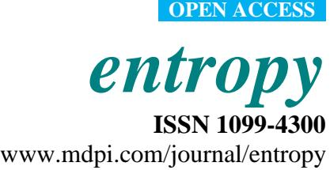
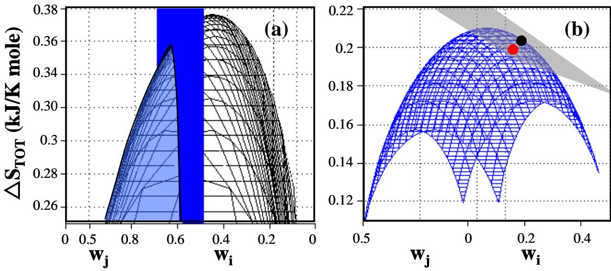
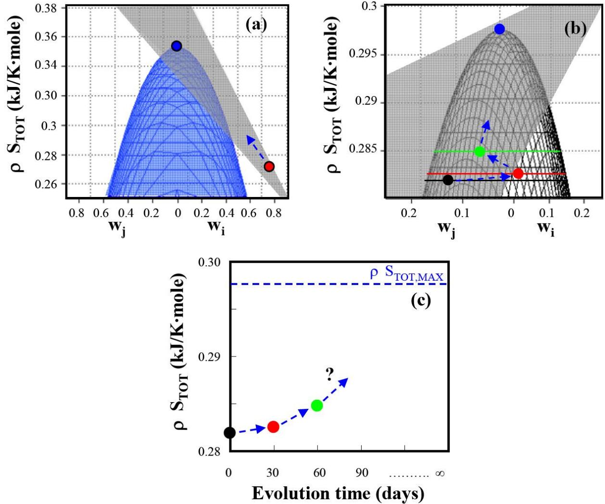

## *Article*

# **A Statistical Thermodynamical Interpretation of Metabolism**

# **Friedrich Srienc * and Pornkamol Unrean**

Department of Chemical Engineering and Materials Science, and BioTechnology Institute, University of Minnesota, Minneapolis/St. Paul, MN 55455/55108, USA; E-Mail: unrea001@umn.edu

* Author to whom correspondence should be addressed. E-Mail: [srienc@umn.edu;](mailto:srienc@umn.edu) Tel.: +1-612-624-9776; Fax: +1-612-625-1700.

*Received: 14 June 2010 / Accepted: 2 August 2010 / Published: 17 August 2010*

**Abstract:** The metabolic network of a cell can be decomposed into discrete elementary modes that contribute, each with a certain probability, to the overall flux through the metabolism. These modes are cell function supporting, fundamental pathways that represent permissible 'quantum' states of the metabolism. For the case that cellular regulatory mechanisms for pathway fluxes evolved in an unbiased way, we demonstrate theoretically that the usage probabilities of individual elementary modes are distributed according to Boltzmann's distribution law such that the rate of entropy production is maximized. Such distribution can be observed experimentally in highly evolved metabolic networks. Therefore, cell function has a natural tendency to operate at a maximum rate of entropy generation using preferentially efficient pathways with small reaction entropies. Ultimately, evolution of metabolic networks appears to be driven by forces that can be quantified by the distance of the current metabolic state from the state of maximum entropy generation that represents the unbiased, most probable selection of fundamental pathway choices.

**Keywords:** elementary flux modes; maximum entropy principle; metabolic networks; evolution

# **1. Introduction**

Elementary modes represent unique, minimal sets of reactions enabling the operation of specific pathways that are embedded in a metabolic network [1–6]. The reactions produce or consume external metabolites that accumulate in the system, and they link internal metabolites that are at steady state with constant concentrations in the cells. The number and the type of elementary modes can be rigorously determined with recently developed computational tools [7–10] providing a powerful means to quantitatively evaluate the complexity, robustness, and capabilities of a metabolic network [11–13].

The overall operation of the metabolism has to be viewed as a weighted average of all possible elementary modes that individually contribute to the metabolic flux in the cell [14]. The identification of these contributions is a challenging problem that has been previously addressed with different approaches [15,16]. We have previously made the experimental observation that the individual contributions of elementary modes to the overall metabolism appear to be correlated with the standard reaction entropy of individual elementary modes as defined by their overall reaction stoichiometry. Using concepts from statistical mechanics and statistical thermodynamics we develop here a theory that shows that such correlation is in fact expected. It is shown that the usage probability of individual elementary modes is distributed according to the Boltzmann distribution law such that the rate of entropy production is maximized. Moreover, the theory predicts the path that evolution takes when systems are not at the fully evolved, maximum entropy generating state.

#### **2. Results and Discussion**

An elementary mode can be formally represented by a vector whose elements define all the reaction rates (fluxes) of the metabolic network. The non-zero fluxes in such a vector define the pathway that represents a specific elementary mode. If cells use only glucose as the carbon and energy source, all pathways start with the uptake of glucose. The elements of the elementary mode vector are then conveniently normalized to the uptake rate of glucose. The metabolic flux through the network can be viewed as a weighted average of all elementary modes. Thus, the knowledge of all possible elementary modes provides a useful tool for evaluating metabolism in quantitative terms since the rate of individual reactions is the weighted average of all elementary modes, expressed as:

$$\text{Magnesium energy on an continuum } j \text{ muons, compression mass}$$

$$R_j = \mathbf{w}_1 \cdot \mathbf{r}_{1,j} + \mathbf{w}_2 \cdot \mathbf{r}_{2,j} + ... + \mathbf{w}_n \cdot \mathbf{r}_{n,j} = \sum_{i=1}^n \mathbf{w}_i \cdot \mathbf{r}_{i,j} \tag{1}$$

where the index j refers to the jth reaction step in the network and the index i to the ith elementary mode. Rj is then the jth reaction rate of the metabolic network, the reaction rates ri,j are defined by the n elementary modes, and wi is the fractional contribution of the ith elementary mode to the reaction j. Due to the normalization step, the unit of Rj and of ri,j is the glucose uptake rate. The reactions leading to and from external metabolites are normally the transport reactions through the cell envelope. They define the overall reaction equation, and the ratios between their rates and the glucose uptake rate represent the yields or stoichiometry coefficients in the overall reaction equation.

The utilization of individual elementary modes is subject to cellular regulation that must coordinate the expression and metabolic regulation of enzymes to support the operation of individual elementary modes at specific rates. This poses the challenging question whether the utilization of specific reaction sequences, as defined by elementary modes, follow certain principles and laws that govern the magnitude of the weighting factors that quantify the flux through specific elementary modes. The identification of some law that is the basis for these quantities would provide an understanding of the principles that are responsible for the behavior of a cell and ultimately explain what drives evolution.

The overall growth equation can be expressed on the basis of the overall reaction stoichiometry that connects the reactants (nutrients) to the products. The overall reaction is defined by the external metabolites. The rates of disappearance of reactants and accumulation of products in the cell environment are part of the metabolic network and represent individual reactions that meet the terms of Equation (1). However, the pathways expressed in individual elementary modes have different overall stoichiometries, relating the external metabolites, than the overall growth equation. But the overall growth equation is recovered through application of the linear combination of individual elementary modes as shown in Equation (1).

Entropy is a path independent state function. Therefore, the reaction stoichiometry between the external metabolites of the overall growth reaction and between the external metabolites in individual elementary modes permits computation of the entropy of reaction as:

$$
\Delta S = \sum_{m=1}^{k} \nu_m \cdot S_m \tag{2}
$$

where *S* is the entropy of reaction. It represents the amount of entropy produced per mole of glucose reacted if the stoichiometry coefficient associated with glucose equals one. *m S* are the molar entropies of the k reactants and products that appear in the reaction equation with stoichiometry coefficients m [17]. Multiplication of the entropy of reaction with the rate of glucose consumption results in the rate of entropy production. However, the glucose consumption rate represents only a multiplication factor and effects related to entropy formation can be analyzed based on reaction entropies.

In order to use these quantities for practical applications they have to be estimated. The molar entropy of individual compounds can be calculated from their enthalpy and their free energy of formation using the Gibbs relationship (S = (H – G)/T). The standard molar enthalpies and the standard molar free energies of the individual compounds can be estimated from correlations with the degree of reduction of the compounds [17,18]. In practical applications, an accurate value of the molar Gibbs free energy should account also for the concentration of the compound which may not be known in all situations. However, the concentrations change the standard values only to a small degree. For instance, the standard Gibbs free energy for glucose is 2,872 kJ/mole, and at a concentration of 10 mM glucose the free energy is 2,860 kJ/mole. Therefore, the standard molar quantities of the thermodynamic properties provide a reasonable approximation useful in practical applications because there is usually no other option to estimate the values [17,18].

The overall reaction entropy STOT can be computed based on the macroscopic reaction stoichiometry between external metabolites using Equation (2), or from:

$$\text{reminal meanBontions using Equation (2), or from:}$$

$$\Delta S_{\text{TOT}} = \boldsymbol{\nu}_1 \cdot \Delta S_1 + \boldsymbol{\nu}_2 \cdot \Delta S_2 + \dots + \boldsymbol{\nu}_n \cdot \Delta S_n = \sum_{i=1}^n \boldsymbol{\nu}_i \Delta S_i \tag{3}$$

where the individual reaction entropies of elementary modes, Si , computed using Equation (2), contribute to the overall value with weighting factors wi . Since the reaction entropies are expressed per mole of glucose consumed, the total rate of entropy production is obtained when Si is multiplied with the rate of glucose consumption.

We have previously made the experimental observation that individual weighting factors appear to be correlated with the entropy of reaction defined by the overall stoichiometry of external metabolites in individual elementary modes according to:

$$
\Delta S_i = a - b \ln w_i \tag{4}
$$

where a and b are constants of the linear correlation [19]. Substitution of Equation (4) in (3) results in an expression for the overall reaction entropy that depends only on weighting factors:

$$
\Delta S_{\text{TOT}} = a - b \sum_{i=1}^{n} \mathbf{w}_i \cdot \ln \mathbf{w}_i \tag{5}
$$

This remarkable relationship is surprising as it is reminiscent of the Boltzmann distribution law describing the probability distribution of microstates that define the entropy content of a system. This relationship motivated the quest for further, theoretical investigations that could explain this result. In what follows, theoretical evidence is provided that the relationships expressed by Equations (4) and (5) are in fact expected expressions that can be derived in analogy to principles known from thermodynamics of irreversible processes and from familiar concepts in statistical mechanics.

For an open system operating at a steady state, two seemingly contradicting principles for the rate of entropy production have been proposed. The principle of minimum entropy production rate derived by Prigogine [20,21] has been an inherent part of non-equilibrium thermodynamics and applied to the description of various processes in physics, chemistry and biology. In contrast, the principle of maximum entropy production appears to be equally applicable in many other situations and appears to have even a more general validity for a recent review see [22]. Both principles involve an extreme value of the rate of entropy production in an open system operating at steady state under non-equilibrium conditions. Without adopting a priori any of the two extremum principles we will first evaluate whether the rate of entropy production reaches such an extreme value under such conditions and show later the nature of the extreme value.

The reaction entropy is an extensive function as expressed by Equation (3), *i.e.*, it is the sum of reaction entropies generated by all contributing elementary modes present. Thus, the entropy of reaction of the overall process is the sum of reaction entropies of individual elementary modes weighted according to their respective usage as expressed by Equation (3). Therefore, the overall reaction entropy can be viewed as a function of the usage probabilities of individual elementary modes present in the system:

$$
\Delta S_{\text{rotor}} = \Delta S(p_1, p_2, p_3, \dots, p_n) \tag{6}
$$

Please note that we interpret now the weighting factors as usage probabilities of elementary modes and use, therefore, the symbol p instead of w. The task is now to find out how the probability of using individual elementary modes is distributed among all elementary modes present such that the total entropy function reaches an extreme value. This assignment can be objectively done by satisfying the principle of Fair Apportionment of Outcomes [23] which represents a basic postulate of statistical mechanics. The Principle of Fair Apportionment states that in an unbiased and unconstrained system, all outcomes will be observed with the same probability, *i.e.,* the system 'treats each outcome fairly' in comparison with every other outcome. While following this principle in the presence of

constraints, the extremum of the entropy generating function can be found with the method of Lagrange multipliers [23].

To find the functional form of the probability apportionment that defines the extreme value of the reaction entropy one can rewrite Equation (3) in many different ways by varying the magnitude of probability assigned to a given elementary mode. This is done to enforce that assigned probabilities satisfy the multiplication rule of probability theory which is a requirement of the Principle of Fair Apportionment. While many options are possible, only one possibility yields the extreme value of the rate of entropy generation. We can arrange the assigned probabilities in a m x n matrix defined by m ways of distributing the usage probability among n elementary modes. Each probability element in this matrix follows the product rule (pi,j = viuj), *i.e.*, it is defined by the product of the sum of column elements and the sum of row elements.

The method of Lagrange multipliers finds the extremum of the function S under the constraints that the sum of all probabilities must be equal to one and that the weighted sum over the columns and rows must sum to constant values (see Figure 1a) [23]. The optimization problem can be expressed as finding the solution to:

$$\sum_{i=1}^{m} \sum_{j=1}^{n} \left[ \frac{\partial \Delta S_i}{\partial p_{i,j}} - \lambda_i \Delta S_i - \mathcal{B}_j \Delta S_i - \alpha \right] dp_{i,j} = 0 \tag{7}$$

where and are the Lagrange multipliers that enforce the three constraints:

$$\begin{aligned} \sum_{j=1}^{m} \Delta S_i \cdot p_{i,j} &= \{ \Delta S_i \} \\ \sum_{i=1}^{n} \Delta S_i \cdot p_{i,j} &= \{ \Delta S_j \} \\ \sum_{i,j} p_{i,j} &= 1 \end{aligned} \tag{8}$$

It is interesting to note that the problem statement [Equation (7)] does not assume any form of the reaction entropy function. The type of function obtained as the solution is entirely intrinsic to the nature of the problem.

The solution to this problem is:

$$
\Delta S_{\text{TOT}} = -b \sum_{i=1}^{n} p_i \cdot \ln p_i + a \tag{9}
$$

where *b* and *a* are constants. For S*TOT* to have *a* positive value, *b* must be positive. In that case the extreme value is a maximum. The result can be rewritten as:

$$
\Delta S_{\text{TOT}} = \sum_{i=1}^{n} p_i (-b \cdot \ln p_i + a) \tag{10}
$$

Comparison of the individual terms of Equation (10) with Equations (3) and (4) shows that the expression in brackets corresponds to the individual reaction entropies Si , and the probabilities to the weighting factors. Thus, the reaction entropies Si are linearly correlated with the natural log of the probability of usage of the corresponding elementary modes. This provides the theoretical justification for the relationship that has been previously observed.

**Figure 1.** Entropy generation as a function of weighting factors of elementary modes for E. coli under anaerobic non-growth conditions. (a) Total entropy production without constraint (black) and with the applied constraint of weighting factor w1 = exp(–S1/b) = 0.549 (blue plane). The system shows a global maximum entropy production of 0.376 kJ/K-mole when entropy generation is uniformly distributed and a local maximum entropy production of 0.352 kJ/K-mole located at the intersection between the cone and the plane when entropies are constrained to the value of the reaction entropies of individual elementary modes. (b) Comparison of predicted, maximum entropy production ()with experimentally determined entropy generation () based on data reported by Aristidou *et al*. (1999) [24]. The weighted average of entropy production of any combination of existing elementary modes is located on the gray plane (Equation (3)) while the blue surface represents combinations of elementary modes distributed according to the Gibbs measure. The blue surface touches the gray plane at the location of the constrained maximum entropy production point. The experimentally determined point is located very close to the predicted maximum entropy generation point reflecting the highly evolved metabolism of wildtype *E. coli* cells. (see Appendix 1 for detailed data).

The constant *a* is expected to be zero since the solution applies to all temperatures. And at an absolute temperature of zero all entropies are zero and the probability of producing zero entropy with any elementary mode is 1. A detailed derivation of Equation (10) is provided in Appendix 2.

An alternate way to get to the same result is by using the most likely distribution of probabilities of microstates of a system that is given, according to statistical mechanics, by the Boltzmann distribution law [23]. In this distribution the entropy content of the macrosystem is maximized according to:

$$S = -k \sum_{i=1}^{n} p_i(\ln p_i) \tag{11}$$

The maximized entropy implies that the expression on the right side of Equation (11) is a maximum. If we recall that the reaction entropy of the macrosystem is composed of the weighted contributions of individual elementary modes [as stated also in Equation (3)]:

$$
\Delta S_{\text{TOT}} = \sum_{i=1}^{n} p_i \Delta S_i \tag{12}
$$

then the right side of Equation (12) is a maximum if probabilities are assigned such that:

$$
\Delta S_i = -k(\ln p_i) \tag{13}
$$

as this leads to the same expression as in Equation (11). Thus, the reaction entropy (and rate of entropy production if multiplied with the rate of glucose consumption) is maximized if the probabilities are distributed according to this relationship.

Equation (10) has several further implications. The entropy of reaction for elementary mode i can be expressed as:

$$
\Delta S_i = a - b \cdot \ln p_i \tag{14}
$$

Or:

$$p_i = e^{\frac{\Delta S_i - a}{-b}} = e^{\frac{\Delta S_i}{-b}} e^{\frac{-a}{-b}} \tag{15}$$

and with the definition of a probability, one obtains:

$$p_i = \frac{e^{\frac{\Delta S_i}{b}}e^{\frac{a}{b}}}{\sum_i e^{\frac{\Delta S_i}{b}}e^{\frac{a}{b}}} = \frac{e^{\frac{\Delta S_i}{b}}}{\sum_i e^{\frac{\Delta S_i}{b}}} = \frac{e^{\frac{\Delta S_i}{b}}}{\mathcal{Q}}\tag{16}$$

where Q is similar to a partition function known from statistical mechanics:

$$\mathcal{Q} = \sum_{i} e^{\frac{\Delta S_i}{\epsilon}} \tag{17}$$

Comparing Equation (15) with Equation (16) and considering that *a* = 0, results in:

$$Q = 1\tag{18}$$

This provides a convenient relationship to evaluate the constant b which depends only on the number of elementary modes and on their reaction entropies. The constant b expresses the constant ratio between reaction entropies of individual elementary modes and the associated usage probability that results in the maximum rate of entropy production in the system. It represents the ultimate state of a fully evolved metabolic network. The constant b is a quantity analogous to the Boltzmann constant, but it is different as it has different units.

The presented theory is supported by experimental data of byproduct secretion of wildtype *E. coli* [24] (see Figure 1b). The byproduct secretion pattern can be explained by the operation of four groups of elementary modes with the same overall stoichiometry (see Appendix 1). The total rate of entropy generation computed on the basis of the four experimentally determined weighting factors is in excellent agreement with the maximum entropy formation predicted by the presented theory because wildtype *E. coli* presumably is a highly evolved system. Furthermore, one would expect that experimental systems that are further away from the maximum entropy point of operation will eventually evolve in time towards that point (Figure 2a). An example of such evolution is shown in Figure 2b [25].

**Figure 2.** Total entropy production as a function of weighting factors for E. coli under anaerobic non-growth conditions. (a) Comparison of predicted maximum total entropy production with experimental entropy generation () reported in Wlaschin *et al.* (2006) [19]. The experimental point is on the gray plane and is expected to evolve in time towards the predicted maximum entropy generation point () (b) Time course of the entropy generation in an evolving system determined from data by Hua *et al.* (2006) [25]. The experimentally determined reaction entropies are located on the gray plane and move with time during adaptation towards the predicted maximum entropy production point: (), unevolved system; (), after 30 days of adaptation; (), after 60 days of adaptation. (c) Total entropy generation as function of evolution time. With time the system is expected to reach the maximum entropy generation where the elementary mode weighting factors are distributed according to Equation (16). (see Appendix 1 for detailed data analysis).

The developed relationships for the total reaction entropy of the system is very similar to the concept of information content of a system that tends to reach a maximum degree of uncertainty and is expressed as entropy [26]. In fact the qualitative form of the relationship is the same. The maximum

degree of uncertainty, expressed as the Shannon entropy, has been recently used to evaluate the elementary mode composition of the metabolism [29].

The evolution of living systems has been often connected with Prigogine's minimum entropy production principle [20,21]. However, this principle does not appear to apply for all cases. Rather, it is only applicable in situations where multiple reactions in an open system can occur in parallel. If one fixes the condition for one reaction and allows the others to adjust freely, then the other reactions will tend to reach equilibrium thus minimizing the rate of entropy formation. But this is evidently not the case in situations where reactions are enclosed by a cell envelope, and only a limited number of reaction metabolites reach the environment. In the open steady state system the individual reactions never reach a state of thermodynamic equilibrium since all pathways start with glucose as the carbon and energy source, and glucose is constantly replenished in the continuous operation of the open system. Thus, since individual reactions are all confined to the same cellular space and the reaction conditions cannot adjust independently, the principle of maximum entropy production applies. In fact it has been shown that for a continuous stirred tank reactor (CSTR) operating near equilibrium, the theorem of minimum entropy production does not apply due to the convective flows between CSTR and its surroundings [27].

The system selects a mixture of elementary modes in the most probable way. It is a direct reflection of this principle that an inherent advantage is given to more efficient, less entropy producing modes. This is a testable hypothesis that is already supported by some experimental evidence [19,28]. It will be interesting to see whether further experimental work that is directly aimed to investigate this relationship, can confirm this behavior.

#### **Acknowledgements**

We thank David Morse and Arkady Khodursky for helpful discussions, Anja Srienc for proofreading the manuscript, and NIH for support (GM077529). We thank an anonymous reviewer to make us aware of the recent publication [29].

## **Authors' Contributions**

F.S. developed the theory and wrote the paper. P.U. developed the examples, performed the calculations and prepared the Figures.

## **References**

- 1. Carlson, R.; Srienc, F. Fundamental Escherichia coli biochemical pathways for biomass and energy production: identification of reactions. *Biotech. Bioeng.* **2004**, *85*, 1–18.
- 2. Carlson, R.; Srienc, F. Fundamental Escherichia coli biochemical pathays for biomass and energy production: creation of overall flux states. *Biotech. Bioeng.* **2004**, *86*, 149–161.
- 3. Klamt, S.; Stelling, J. Two approaches for metabolic pathway analysis? *Trends Biotech.* **2003**, *21*, 64–69.
- 4. Schuster, S.; Dandekar, T.; Fell, D.A. Detection of elementary flux modes in biochemical networks: a promising tool for pathway analysis and metabolic engineering. *Trends Biotech.* **1999**, *17*, 53–60.
- 5. Schuster, S.; Hilgetag, C.; Fell, D. Detecting elementary modes of functioning in metabolic networks. *Mode. Tren. Bio. Thermo. Kinetics* **1994**, *3*, 103–105.
- 6. Trinh, C.T.; Wlaschin, A.; Srienc, F. Elementary mode analysis: a useful metabolic pathway analysis tool for characterizing cellular metabolism. *Appl. Microbiol. Biotech.* **2009**, *81*, 813–826.
- 7. Pfeiffer, T.; Sanchez-Valdenebro, I.; Nuno, J.C.; Montero, F.; Schuster, S. METATOOL: for studying metabolic networks. *Bioinformatics* **1999**, *15*, 251–257.
- 8. Von Kamp, A.; Schuster, S. Metatool 5.0: fast and flexible elementary modes analysis. *Bioinformatics* **2006**, *22*, 1930–1931.
- 9. Wagner, C. Nullspace approach to determine the elementary modes of chemical reaction systems. *J. Phys. Chem. B* **2004**, *108*, 2425–2431.
- 10. Terzer, M.; Stelling, J. Large-scale computation of elementary flux modes with bit pattern trees. *Bioinformatics* **2008**, *24*, 2229–2235.
- 11. Stelling, J.; Klamt, S.; Bettenbrock, K.; Schuster, S.; Gilles, E.D. Metabolic network structure determines key aspects of functionality and regulation. *Nature* **2002**, *420*, 190–193.
- 12. Urbanczik, R.; Wagner, C. Functional stoichiometric analysis of metabolic networks. *Bioinformatics* **2005**, *21*, 4176–4180.
- 13. Trinh, C.T.; Unrean, P.; Srienc, F. Minimal Escherichia coli cell for the most efficient production of ethanol from hexoses and pentoses. *Appl. Env. Microbiol.* **2008**, *74*, 3634–3643.
- 14. Schuster, S.; Hilgetag, C.; Woods, J.H.; Fell, D.A. Reaction routes in biochemical reaction systems: Algebraic properties, validated calculation procedure and example from nucleotide metabolism. *J. Math. Biol.* **2002**, *45*, 153–181.
- 15. Poolman, M.G.; Venkatesh, K.V.; Pidcock, M.K.; Fell, D.A. A method for the determination of flux in elementary modes, and its application to Lactobacillus rhamnosus. *Biotech. Bioeng.* **2004**, *88*, 601–612.
- 16. Wiback, S.J.; Mahadevan, R.; Palsson, B.O. Reconstructing metabolic flux vectors from extreme pathways: defining the alpha-spectrum. *J. Theor. Biol.* **2003**, *224*, 313–324.
- 17. Sandler, S.I.; Orbey, H. On the thermodynamics of microbial-growth processes. *Biotech. Bioeng.* **1991**, *38*, 697–718.
- 18. Roels, J.A. *Energetics and Kinetics in Biotechnology*; Elsevier Biomedical Press: Amsterdam, the Netherlands/New York, NY, USA, 1983.
- 19. Wlaschin, A.P.; Trinh, C.T.; Carlson, R.; Srienc, F. The fractional contributions of elementary modes to the metabolism of escherichia coli and their estimation from reaction entropies. *Metab. Eng.* **2006**, *8*, 338–352.
- 20. Prigogine, I. Modération et transformations irréversibles des systèmes ouverts. *Bull. Acad. Roy. Belg. Cl. Sci*. **1945**, *31*, 600–606.
- 21. De Groot, S.R.; Mazur, P. *Non-equilibrium thermodynamics*; North-Holland Pub. Co.: Amsterdam, The Netherlands, 1962.
- 22. Martyushev, L.M.; Seleznev, V.D. Maximum entropy production principle in physics, chemistry and biology. *Phys. Rep-Rev. Sect. Phys. Lett*. **2006**, *426*, 1–45.
- 23. Dill, K.A.; Bromberg, S. *Molecular Driving Forces: Statistical Thermodynamics in Chemistry and Biology*; Garland Science Press: New York, NY, USA, 2003.
- 24. Aristidou, A.A.; San, K.Y.; Bennett, G.N. Metabolic flux analysis of Escherichia coli expressing the Bacillus subtilis acetolactate synthase in batch and continuous cultures. *Biotech. Bioeng.* **1999**, *63*, 737–749.
- 25. Hua, Q.; Joyce, A.R.; Fong, S.S.; Palsson, B.O. Metabolic analysis of adaptive evolution for in silico-designed lactate-producing strains. *Biotech. Bioeng.* **2006**, *95*, 992–1002.
- 26. Jaynes, E.T. Information theory and statistical mechanics. *Phys. Rev.* **1957**, *106*, 620–630.
- 27. Tarbell, J.M. Thermodynamic liapunov-function for near equilibrium CSTR. *Chem. Eng. Sci.* **1977**, *32*, 1471–1476.
- 28. Zhao, Q.Y.; Kurata, H. Maximum entropy decomposition of flux distribution at steady state to elementary modes. *J. Biosci. Bioeng.* **2009**, *107*, 84–89.
- 29. Zhao, Q.Y.; Kurata, H. Use of maximum entropy principle with Lagrange multipliers extends the feasibility of elementary mode analysis. *J. Biosci. Bioeng.* **2010**, *110*, 254–261.

## **Appendix 1.**

Appendix 1 describes in detail how the entropy production rates and the associated experimental weighting factors have been computed. The results of these calculations are displayed in Figure 1 and Figure 2 of the manuscript.

**(1)** Entropy calculations in Figure 1b based on secretion data from Aristidou *et al*. [24]. The metabolic model used for the elementary mode analysis was the model for wildtype *E. coli* described by Carlson and Srienc (2004) [1] under anaerobic conditions. This model results in 21 elementary modes that can be grouped into four families of modes that have the same overall stoichiometry. The overall stoichiometries and the number of associated modes are shown in Table S1. The entropy of reaction has been computed from Equation (2) using the methods by Sandler and Orbey [17] for computing the standard entropies of formation for the individual components. With the entropies of reaction we computed the constant b from Equation (15) which resulted in a value of b = 0.1511 kJ/K-mole.

| Family | Reaction stoichiometry                      | No. of EMs | Si (kJ/K-mole) |
|--------|---------------------------------------------|---------------|--------------------|
| 1      | Glucose = Acetate + Succinate               | 3             | 0.1934             |
| 2      | Glucose = 2 Lactate                         | 6             | 0.1604             |
| 3      | Glucose = Ethanol + Acetate + 2 Formate     | 6             | 0.2326             |
| 4      | Glucose = Ethanol + Acetate + Formate + CO2 | 6             | 0.2752             |

**Table 1.** Stoichiometric equations of elementary mode families for strain GJT001.

Table 2 shows the secretion rates as described by Aristidou *et al*. [24]. From these experimental data the weighting factors for the individual mode families have been computed as described in Wlaschin *et al*. [19]. Essentially, it involves the solution of:

$$R = N \text{"} \cdot \text{w}$$

where R is the column vector of known metabolite secretion rates, N is the stoichiometry matrix of known mode families, and w is the vector of the corresponding unknown weights.

|           | Metabolic flux  |
|-----------|-----------------|
|           | (mmole/g CDW h) |
| Glucose   | −1.000          |
| Ethanol   | 0.457           |
| Acetate   | 0.180           |
| Lactate   | 0.699           |
| Succinate | 0.566           |
| Formate   | 0.637           |

**Table 2.** Measured metabolite flux vector for E. coli strain GJT0011 .

1 The fluxes are extrapolated to a zero growth rate from measured fluxes from a series of chemostats at different dilution rates as described by Aristidou *et al*. [24].

Table 3 compares the weighting factors computed from the experimental data to the predicted values calculated from only the entropies of elementary modes

|        |                    | Weighting factors1     |                     |  |  |  |
|--------|--------------------|------------------------|---------------------|--|--|--|
| Family | Si (kJ/K-mole) | Experimental values | Predicted values |  |  |  |
| 1      | 0.1934             | 0.2681                 | 0.2780              |  |  |  |
| 2      | 0.1604             | 0.3688                 | 0.3458              |  |  |  |
| 3      | 0.2326             | 0.2865                 | 0.2146              |  |  |  |
| 4      | 0.2752             | 0.0766                 | 0.1618              |  |  |  |
| STOT  |                    | 0.1987                 | 0.2037              |  |  |  |

**Table 3.** The weighting factors and entropies for each family of modes of *E. coli* GJT001.

1 The weighting factors are computed from the measured fluxes reported in Aristidou *et al*. [24]. The predicted weight factors are calculated from entropies of the family modes as described in Equation (14). The total entropies are calculated from the weighted sum of entropies of the family modes, wiSi.

**(2)** Entropy calculations in Figure 2a of the main text contain the total entropy data as described by Wlaschin *et al*. [19]. The entropy calculations in Figure 2b are based on experimental data described by Hua *et al*. [25]. We used the metabolic model described by Carlson and Srienc [1] containing the two gene knockouts, adhEpta (Hua *et al*., [25]), for elementary mode calculations. The computation yielded 16 elementary modes that can be grouped into five families of modes with the same overall stoichiometry. They are shown in Table 4 together with the entropies of reaction. Table 5 summarizes the weighting factor for the three time points during the adaptation.

| Table      | 4. Stoichiometric equations of elementary mode families for E. coli with deletions |  |  |  |  |  |
|------------|------------------------------------------------------------------------------------|--|--|--|--|--|
| adhEpta. |                                                                                    |  |  |  |  |  |

| Family | Reaction stoichiometry                            | No. of EMs | Si (kJ/K-mole) |
|--------|---------------------------------------------------|---------------|--------------------|
| 1      | Glucose = 2 Lactate                               | 8             | 0.2735             |
| 2      | Glucose = Lactate + 0.86 Succinate                | 3             | 0.2927             |
| 3      | Glucose = 0.49 Lactate + 1.28 Succinate           | 1             | 0.3022             |
| 4      | Glucose = 0.8 Lactate + 1 Succinate + 0.2 Formate | 3             | 0.3027             |
| 5      | Glucose = 1.67 Succinate + 0.33 Formate           | 1             | 0.3222             |

**Table 5.** The weighting factors and entropies for each family of modes of E. coli containing the deletions adhEpta during adaptive evolution. The total reaction entropies per mole glucose consumed, STOT, are the sums of products of individual weighting factors and associated family entropies Si .

|        |             | Weighting factors1 |           |           |           |  |  |  |
|--------|-------------|--------------------|-----------|-----------|-----------|--|--|--|
|        | Si         |                    | 30-day    | 60-day    | Predicted |  |  |  |
| Family | (kJ/K-mole) | adhEpta          | evolved   | evolved   |           |  |  |  |
|        |             |                    | adhEpta | adhEpta | wi        |  |  |  |
| 1      | 0.2735      | 0.7280             | 0.7000    | 0.7150    | 0.2258    |  |  |  |
| 2      | 0.2927      | 0.1460             | 0.0710    | 0.0000    | 0.2054    |  |  |  |
| 3      | 0.3022      | 0.0000             | 0.1410    | 0.1300    | 0.1960    |  |  |  |
| 4      | 0.3027      | 0.1270             | 0.0880    | 0.1550    | 0.1955    |  |  |  |
| 5      | 0.3222      | 0.0000             | 0.0000    | 0.0000    | 0.1776    |  |  |  |
| STOT  |             | 0.2818             | 0.2825    | 0.2848    | 0.2975    |  |  |  |

1 The experimental weighting factors are computed from the measured fluxes reported in Hua *et al*., [25] while the predicted weighting factors are calculated from entropies of the family modes.

#### **Appendix 2. Detailed Derivation of the Maximum Entropy Production**

The Lagrange multiplier method for finding the maximum of the entropy generation function is analogous to the derivation of the Boltzmann entropy as described in the textbook by Dill and Bromberg [23]. The problem involves finding the probabilities pi such that the macroscopic reaction entropy:

$$
\Delta \mathbf{S}_{\text{TOT}} = p_1 \cdot \Delta \mathbf{S}_1 + p_2 \cdot \Delta \mathbf{S}_2 + \dots + p_n \cdot \Delta \mathbf{S}_n \tag{A.1}
$$

is maximized while satisfying the principle of 'Fair Apportionment of Outcomes'. To satisfy this principle the probabilities must obey the multiplication rule of probability theory. Therefore, it is useful to rewrite Equation (A.1) in m different ways and to generate a m x n probability matrix representing the individual probability elements of the equations. The arbitrarily assigned probabilities satisfy the multiplication rule such that the sum of probabilities across a row i is ui and over a column j is vj:

$$\begin{aligned} \sum_{i=1}^{m} p_{i,j} &= \nu_j\\ \sum_{j=1}^{n} p_{i,j} &= u_i\\ p_{i,j} &= u_i \nu_j \end{aligned} \tag{A.2}$$

The method of Lagrange multipliers finds the extremum of the function S under the constraint that the sum of all probabilities must be equal to one and that the weighted sum over the columns and rows must sum to a constant value. The optimization problem can be expressed as finding the solution to:

$$\begin{aligned} & \text{due. The optimization problem can be expressed as finding the solution to:}\\ & \sum_{i=1}^{m} \sum_{j=1}^{n} \left[ \frac{\partial \Delta S_{i}}{\partial p_{i,j}} - \lambda_{i} \Delta S_{i} - \beta_{j} \Delta S_{i} - \alpha \right] dp_{i,j} = 0 \end{aligned} \tag{A.3}$$

where and are the Lagrange multipliers that enforce the three constraints:

$$\begin{aligned} \sum_{j=1}^{n} \Delta S_i \cdot p_{i,j} &= \{ \Delta S_i \} \\\\ \sum_{i=1}^{m} \Delta S_i \cdot p_{i,j} &= \left\{ \Delta S_j \right\} \\\\ \sum_{i,j} p_{i,j} &= 1 \end{aligned} \tag{A.4}$$

By focusing on one probability element and omitting the subscript one can see that p(u,v) and:

$$\frac{\partial \Delta S}{\partial p} \equiv r[p(\mu, \nu)] \tag{A.5}$$

The individual reaction entropies associated with the probabilities differ between elements but they are fixed quantities and do not depend on u and v. Because probabilities must always sum to 1, is also independent of u and v. The bracket expression in (A.3) can be rewritten as:

$$\text{The common approximation in (mm.) sum over momentum }\omega.$$

$$\text{For } [p(\mu, \nu)] = \lambda(\mu)\Delta S + \beta(\nu)\Delta S + \alpha. \tag{A.6}$$

Taking the derivative and enforcing the multiplication rule results in:

$$\begin{aligned} \frac{\partial r}{\partial \nu} &= \frac{\partial r}{\partial p} \frac{\partial p}{\partial \nu} = \frac{\partial r}{\partial p} \frac{p}{\nu} = \Delta S \, \beta^{\dagger}(\nu) \\ \frac{\partial r}{\partial u} &= \frac{\partial r}{\partial p} \frac{\partial p}{\partial u} = \frac{\partial r}{\partial p} \frac{p}{u} = \Delta S \, \lambda^{\dagger}(u) \end{aligned} \tag{A.7}$$

and:

$$\frac{\partial r}{\partial p} = \frac{\nu \Delta S \, \hat{\boldsymbol{\beta}}'(\boldsymbol{\nu})}{p} = \frac{\nu \Delta S \, \hat{\boldsymbol{\lambda}}'(\boldsymbol{\nu})}{p} \tag{A.8}$$

This equality has to hold for any arbitrary value of u and v. This can only happen if the expressions in the numerator are equal and constant:

$$
\nu \Delta S \,\beta^\circ(\nu) = \mu \Delta S \,\dot{\lambda}^\circ(\mu) = -b \tag{A.9}
$$

(A.8) can be rewritten as:

$$\frac{\partial r}{\partial p} = \frac{-b}{p} \tag{A.10}$$

which can be integrated to get:

$$r(p) = -b \ln p + c_1 \tag{A.11}$$

This expression can be substituted in (A.5). A second integration results in:

1 2 *S p b p p p c p c* ( ) ( ln ) (A.12)

Summation over all elements results in the desired expression:

$$\begin{aligned} \text{elements results in the desired expression:}\\ \Delta S_{\text{TOT}} = \sum_{i,j} \Delta S_i(p) = -b \sum_{i,j} p_{i,j} \ln p_{i,j} + \text{const.} \end{aligned} \tag{A.13}$$

The row index can be omitted if it equals one. The result corresponds then to (A.1). Furthermore, the constant in (A.13) must be zero since at a temperature of absolute zero all entropies have a value of zero, and the probability of generating zero entropy is 1.

© 2010 by the authors; licensee MDPI, Basel, Switzerland. This article is an Open Access article distributed under the terms and conditions of the Creative Commons Attribution license (http://creativecommons.org/licenses/by/3.0/).

Copyright of Entropy is the property of MDPI Publishing and its content may not be copied or emailed to multiple sites or posted to a listserv without the copyright holder's express written permission. However, users may print, download, or email articles for individual use.