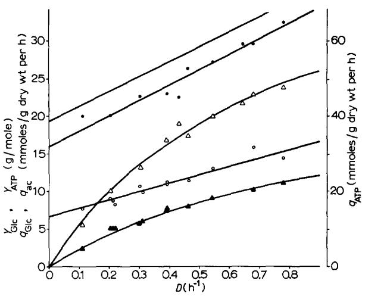
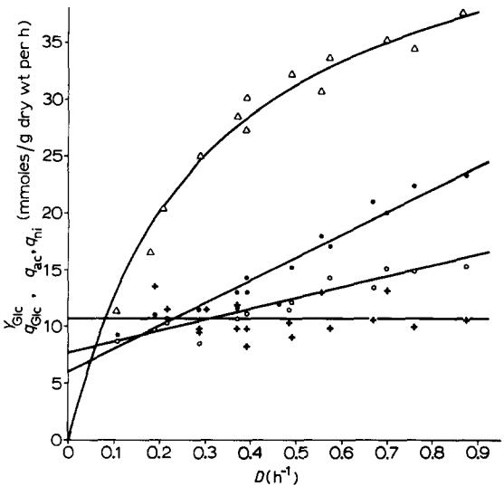
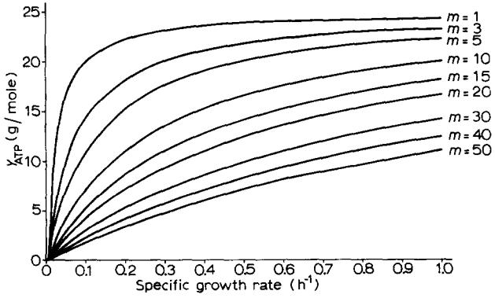

### BBA 86003

# UTILIZATION OF ENERGY FOR GROWTH AND MAINTENANCE IN CONTINUOUS AND BATCH CULTURES OF MICROORGANISMS

### A REEVALUATION OF THE METHOD FOR THE DETERMINATION OF ATP PRO-DUCTION BY MEASURING MOLAR GROWTH YIELDS

### A. H. STOUTHAMER and CORRY BETTENHAUSSEN

*Biologieal Laboratory, de Boelelaan 1087, Free University, Amsterdam (The Netherlands)*  (Received June 6th, 1972)

### CONTENTS

| List of symbols .                                                                                           | 54 |
|-------------------------------------------------------------------------------------------------------------|----|
| I. Introduction .                                                                                        | 54 |
| A. YArP as a possible biological constant .                                                                 | 54 |
| B. Use of YArP to predict ATP production .                                                                  | 55 |
| C. Occurrence and possible influence of maintenance energy on calculations of ATP production with YArP . | 56 |
| II. Calculations                                                                                         | 57 |
| A. Derivation of an equation relating specific rate of ATP production and specific growth rate .         | 57 |
| B. Derivation of an equation relating specific rate of ATP production, YArP and main                        |    |
| tenance coefficient .                                                                                       | 58 |
| MAX IlL Determination of qArP, YATP, YArP and m~ for A. aerogenes .                                      | 58 |
| IV. Discussion .                                                                                            | 61 |
| A. Influence of growth rate on specific rates of substrate consumption and product formation .           | 61 |
| MAX B. Value of YArP and m .                                                                             | 62 |
| V. Influence of maintenance energy on molar growth yields in batch culture                               | 63 |
| A. Derivation of curves relating YArP, /~ and ms .                                                          | 63 |
| B. Quantitative data on the relation between growth rate and YATP .                                         | 63 |
| C. Influence of the composition of the growth medium .                                                      | 65 |
| D. Growth in the presence of growth-inhibitory compounds                                                    | 66 |
| E. Growth with citric acid cycle intermediates and simple compounds                                         | 66 |
| F. Conclusions .                                                                                            | 67 |
| VI. Influence of transitions in growth rate or growth conditions .                                          | 67 |
| VII. Consequences of the utilization of YA~P for the prediction of ATP production in batch cultures      | 68 |
| References .                                                                                                | 68 |

### LIST OF SYMBOLS

| Symbol      | Specification                                                          | Dimension                           |
|-------------|------------------------------------------------------------------------|-------------------------------------|
| YG~c        | Molar growth yield for glucose                                         | g dry weight organisms/mole glucose |
| YATP        | Molar growth yield per mole ATP                                        | g dry weight organisms/mole ATP     |
| MAX YATP | Molar growth yield per mole ATP corrected for energy of maintenance | g dry weight organisms/mole ATP     |
| MAX YGIc | Molar growth yield for glucose corrected for energy of maintenance  | g dry weight organisms/mole glucose |
| Yo          | Growth yield per gatom O                                               | g/gatom O                           |
| #           | Specific growth rate                                                   | h-l                                 |
| D           | Dilution rate                                                          | h-I                                 |
| m~          | Maintenance coefficient                                                | gmoles glucose/g dry weight per h   |
| me          | Maintenance coefficient                                                | gmoles ATP/g dry weight per h       |
| SR          | Glucose concentration in input medium                                  | mmoles/ml                           |
| S           | Glucose concentration in the outgoing culture                       | mmoles/ml                           |
| qGIc        | Specific rate of glucose consumption                                   | mmoles glucose/mg dry weight per h  |
| qae         | Specific rate of acetate production                                    | mmoles acetate/mg dry weight per h  |
| q~t         | Specific rate of nitrite production                                    | mmoles nitrite/mg dry weight per h  |
| X           | Concentration of cells                                                 | mg/ml                               |
| qAa'P       | Specific rate of ATP production                                        | mmoles ATP/mg dry weight per h      |
| P/2e        | moles of ATP formed per electron pair transferred to nitrate        | moles ATP/mole nitrite              |
| td          | Generation time                                                        | h                                   |

## **I.** INTRODUCTION

# IA. *YATP as a possible biological constant*

**In 1960** Bauchop and Elsden 1 concluded that the amount of growth of a microorganism **was directly proportional to the amount of ATP that could be obtained from the degradation of the energy source. From the investigations of Bauchop and Elsden 1 and others it was concluded that YATP was a constant for different microorganisms (reviewed by Stouthamer z, Payne a and Forrest and Walker4). The generally accepted value for YATP was 10.5. However, recent work has questioned the concept of a constant YAT~ value for different microorganisms. For some rumen micro-**  organisms it was found that YAV~ varied with growth rate 5. From optimum growth yields and known fermentation reactions a YAa'P value of about 20 was calculated for *Bacteroides amylophilus* and *Selenomonas ruminantium,* growing on maltose and glucose, respectively, and 15 for the lipolytic bacterium 5S growing on fructose. For certain *Streptococcus* strains YATP values of 17 were found 6. Other workers, however, found normal values for YArP with the same strains 4. Similarly very high YATP values were recorded for *Actinomyces israelii 7.* However, all these calculations were considered to be of questionable validity since the metabolic pathways in these organisms were not sufficiently well known and the carbon recovery in most of these systems was unsatisfactory. Consequently these YATP values were classified as anomalous growth yields by Forrest and Walker 4. These authors concluded accordingly that the value of 10.5 for YATP might be considered as an upper limit for cells of normal average composition growing in a medium where full energetic coupling occurs. However, in two recent studies with microorganisms with known metabolic pathways and in experiments with satisfactory carbon recoveries, it could be definitely shown that *YAxP* is not a constant for different microorganisms. For *Lactobacillus casei* a YATP value of about 20 was found 8 and for *Zymomonas anaerobia* a value of only 5.9 9. Consequently we may conclude that YAVP values can be very different for different microorganisms. In the following chapters it will be argued that YAav for an organism is determined by the cell composition, the specific growth rate and the maintenance coefficient.

# lB. *Use of YA~P tO predict ATP production*

It seemed evident that if YATP for an organism was known this value might be used to predict the ATP yield for processes which are carried out by this organism. This approach was used to calculate the ATP production associated with oxygen uptake and nitrate reduction in *Aerobacter aerogenes 1°'~1.* In this organism YAVP was calculated as 10.2 from the molar growth yield for glucose, the amount of glucose fermented and the acetate production in anaerobic experiments. In the presence of oxygen or nitrate the molar growth yield for glucose was strongly increased. By dividing Yo by YA~P the number of moles of ATP formed per 2 electrons transferred to oxygen was obtained. Similarly, the amount of ATP formed per electron pair transferred to nitrate was obtained from the molar growth yield, the acetate production, the amount of nitrate reduced and YAVP. The results indicated that the P/2eratios for phosphorylation associated with the transfer of 2 electrons to oxygen and nitrate was 3 ~°,al. In similar experiments with *Proteus mirabilis* P/2e- ratios for electron transfer to oxygen, nitrate and tetrathionate of, respectively, 2.80, 1.48 and 1.23 were obtained ~ 2. These results seemed to indicate that oxidative phosphorylation in growing bacteria is as efficient as in mitochondria.

In a similar way the occurrence of oxidative phosphorylation was demonstrated in *Streptococcus faeealis 13.~4* and *Streptococcus agalactiae ~s,* which either do-not contain cytochromes at all or which have a very incomplete electron-transport chain. In these organisms low P/O ratios of 0.5-1.0 were found.

For a number of other organisms *(Pseudomonas fluorescens, Escherichia coli, Pseudomonas oxalaticus, Acetomonas oxydans, Saccharomyces cerevisiae, Candida utilis) Yo* values were determined (reviewed in Stouthamer2). No determination of YATP was made for these organisms, with the exception of *E. coli* for which different values have been reported 2'16 in the literature. For these organisms P/O ratios were obtained by dividing Yo values by the normal value of YATP. It is evident that these values are very inaccurate, since YATP values for different microorganisms can be very different.

# IC. *Occurrence and possible influence of maintenance energy on calculations of ATP production using YATP*

All experiments mentioned previously were performed in batch culture. YATP was determined in anaerobic experiments and in the subsequent calculations this anaerobic YATP value was used to calculate ATP yields under conditions in which the organisms grow in the presence of a hydrogen acceptor. Consequently it was assumed that YATP would be the same under aerobic and anaerobic conditions. In these experiments it was observed that not only the molar growth yield, but also the growth rate, was strongly increased in the presence of oxygen, nitrate or tetrathionate as hydrogen acceptor lz. It is known that microorganisms need a continuous supply of energy for maintenance lv-2°. This requirement for energy of maintenance is very easily detectable in *Bacillus* species. It was shown that lysis of *Bacillus subtilis* and *Bacillus licheniformis* occurred when aeration of the culture was suddenly interrupted 21,2z ("anaerobic lysis") or when the carbon source had been completely consumed 2z-24. These organisms consequently appeared to be subject to autolysis in the absence of the continued synthesis of cell wall substance for which ATP is required. Turnover of the cell wall in these organisms was demonstrated 25 and was found to be essential for normal growth 16. Therefore, we may expect that in *Bacillus*  species a large part of the energy for maintenance is required for cell wall synthesis. In other bacteria, however, this may be very low or non-existent zv. Consequently the presence of turnover of the cell wall may be species or strain specific as well as dependent on experimental conditions. The energy necessary for the turnover of cell wall substance and other cell components and for the preservation of the right ionic composition of the cells is the maintenance energy. An equation was derived to calculate the maintenance energy from the molar growth yield for bacteria growing at various specific growth rates l°'z°. In this study the maintenance coefficient (m0 (the substrate requirement for energy of maintenance/unit amount of organism per unit time) was introduced. At higher growth rates the relative amount of energy needed for maintenance will be smaller than at lower growth yields. Consequently it might be possible that YAVP determined in anaerobic experiments at low growth rates may not be used to calculate ATP yields in experiments at higher growth rates in the presence of hydrogen acceptors. To study this possibility *A. aerogenes* was grown in continuous culture at different growth rates in the presence or absence of nitrate as hydrogen acceptor. The results (see later) show that YATP for a microorganism depends on the

specific growth rate and the maintenance coefficient. Curves are given which relate YATp with specific growth rate for various values of the maintenance coefficient. The implications of these findings for the determination and significance of molar growth yields in batch cultures is subsequently reviewed.

### II. CALCULATIONS

IIA. *Derivation of an equation relating rate of ATP production and growth rate* 

For the calculation of qATP it is necessary to know qol~, qa¢, q,~ and YG~c- The specific rate of glucose consumption was calculated by the following equation (Neidhardt 28),

$$q_{\rm{G1c}} = \frac{(\mathbf{S_{\overline{\mathbf{R}}}} - \mathbf{S})}{\mathbf{x}} \frac{\mathbf{D}}{}$$

The dilution rate, which is the ratio of the flow rate (ml/h) and the working volume of the culture vessel, is identical to #, the specific growth rate, provided that steady-state conditions have been achieved. By definition the specific growth rate,/~, is the amount of dry weight formed per mg of cells per hour (mg/mg dry weight per h). The specific rates of nitrite and acetate formation (qni and qac, respectively) were calculated in the same way as qc~c. The molar growth yield for glucose (Yoic) was calculated by the equation :

$$Y_{\text{Gle}} = \frac{\mathbf{x}}{\mathbf{S}_{\mathbf{R}}} \frac{\mathbf{b}}{-\mathbf{S}} = \frac{\mathbf{D}}{\mathbf{q}_{\text{Gle}}} \dots$$

The ATP production was calculated as described previously j2. This calculation was based on the following considerations: The net gain of ATP per mole of glucose transformed into pyruvate by the glycolytic pathway is 2 moles per mole glucose. Furthermore, one extra ATP is formed per mole of acetate formed. However, not the total amount of glucose can be fermented, since a defined medium is used and glucose serves both as carbon and energy source. Consequently the ATP production was calculated with the following equation:

ATP production/mole glucose ~-- (part of the glucose dissimilated) • 2 + (acetate production/mole glucose) + (amount of hydrogen acceptor utilized/mole glucose) • P/2e-

The part of the glucose dissimilated can be approximated by the equation12:

$$\text{Part of glucose dissipated} = \frac{180 - \frac{s}{4}}{180}Y_{\text{GHz}}$$

In this equation account was made of the carbon content of the cells, which was reported to be 50 %29.

Consequently, the specific rate of ATP production was calculated as:

$$q_{\rm ATP} = 2q_{\rm Gilc} \stackrel{(180-\frac{s}{\star})}{\cdots} \frac{Y_{\rm Glc}}{180} + q_{\rm ac} + q_{\rm nl} \cdot \text{P/}2e^{-}$$

IIB. *Derivation of an equation relating rate of ATP production,* YATP *and maintenance coefficient* 

The maintenance energy was calculated by means of the equation derived by Pirt ~ 9 :

$$1/Y_{\text{Gle}} = \left. m_*/\mu \right. + 1/\left. Y_{\text{Gle}}^{\text{MAX}} \right.$$

Normally the maintenance coefficient is determined by measuring Y at various specific growth rates in chemostat cultures in which the concentration of the carbon and energy source is growth limiting. A double reciprocal plot of estimated values of Y against the experimental D values results in a straight line, whose intercept at the ordinate is the reciprocal of yMAX Glc the growth yield corrected for energy of maintenance and whose slope is ms. This procedure has several drawbacks. In some cases the double reciprocal plot of Y estimates against the experimental D values did not give a straight line s'19. This was shown to be due to an influence of the growth rate on the yMAX fermentation pattern of the organism s. Therefore, YGIe and GIe were replaced by YATP and vMAX (the growth yield/mole of ATP corrected for energy of maintenanceS). ATP A double reciprocal plot of YATP estimates against the experimental D values did indeed yield a straight with *L. casei 8.* Subsequently the equation was multiplied by D. In this way the following equation was obtained:

$$\frac{D}{\bar{Y}_{\text{ATP}}} = \frac{D}{\bar{Y}_{\text{ATP}}} + m_{\text{e}} = q_{\text{ATP}}$$

Consequently, when the relation between qATP and D is known ],,MAX ATP and me can be calculated.

In a number of cases the specific growth rate was calculated from generation times (td) reported in the literature. For this purpose we used the equation:

$$\mu = \frac{\text{"log 2}}{\text{ "}_{\text{d}}} = \frac{0.693}{\text{ "}_{\text{d}}}$$

MAX III. DETERMINATION OF qATP, YATP, Y ATP AND rn~ FOR *A. AEROGENES* 

In *A. aerogenes* qATP, YATP, YATP MAX and me have been determined with tryptophanlimited chemostat cultures growing anaerobically with excess glucose (Stouthamer, A. H. and Bettenhaussen, C., unpublished). The effect of the growth rate on the rates of glucose consumption, ATP and acetate production, the molar growth yield and

Fig. 1. Effect of specific growth rate on the rates of glucose consumption, acetate and ATP production on the molar growth yields and on YAI~ by *A. aerogenes* during tryptophan-limited anaerobic growth in the absence of nitrate. • -- •, specific rate of glucose consumption; (3 --©, specific rate of acetate production; A--A, molar growth yield; Ak-A, YArP. The line without symbols is the curve for qATP. The lines were drawn by the method of least squares as a line of regression of y on x. The line D for the molar growth yield was calculated by the equation Yc,c -- . The line for YATP was

qGle

D D calculated with the equation yA~ = 25.4 + 0.0387.

Fig. 2. Effect of specific growth rate on the rates of glucose consumption, acetate and nitrite production and on the molar growth yields by *A. aerogenes* during tryptophan-limited anaerobic growth in the presence of nitrate. + -- ~-, specific rate of nitrite production. Other curves and details as in the legend of Fig. 1.

YATP for anaerobic growth in the absence of a hydrogen acceptor is shown in Fig. I. It is evident that the plots of the rates of glucose consumption and acetate production against specific growth rate give straight lines. Thus these rates are a linear function of D. Similar results for anaerobic growth in the presence of nitrate are shown in Fig. 2. In this case the amount of acetate formed per mole of glucose is much larger than during anaerobic growth in the absence of nitrate. The plot of the rate of nitrite production as a function of growth rate yields a straight line parallel to the abscissa. Consequently the amount of nitrite produced per mole of glucose decreases at higher growth rates. This indicates that less nitrate is used as hydrogen acceptor when the growth rate increases. In accordance with this result the amount of acetate produced per mole of glucose also decreases at higher growth rates. One of the most important observations in this study is that the rate of glucose consumption during anaerobic growth in the presence of nitrate is much lower than during anaerobic growth in the absence of nitrate. The molar growth yield under both growth conditions strongly depended on the specific growth rate. At one specific growth rate the molar growth yield for glucose is much higher during anaerobic growth in the presence of nitrate than in its absence. In both experiments a good agreement was found between the experimental YoLc values and the values calculated from the equation

$$Y_{\mathbf{G}\mathfrak{e}} = \frac{D}{\mathfrak{q}_{\mathbf{G}\mathfrak{e}}}$$

From these experiments we may conclude that the rate of glucose consumption decreases under conditions that produce a larger amount of ATP/mole glucose. The growth parameters derived from the results in Figs 1 and 2 are given in Table I.

# TABLE I

### GROWTH PARAMETERS, CALCULATED FROM THE RESULTS OF FIGS. 1 AND 2, OF *A. AEROGENES* GROWING ANAEROBICALLY AT VARIOUS SPECIFIC GROWTH RATES IN THE PRESENCE OR ABSENCE OF NITRATE AS HYDROGEN ACCEPTOR

| Parameter | Growth condition    |                                    |  |
|-----------|---------------------|------------------------------------|--|
|           | Nitrate absent      | Nitrate present                    |  |
| qGl¢      | 0,0160 + 0.0205 D   | 0.0060 + 0.0200 D                  |  |
| qac       | 0,0067 + 0.0121 D   | 0.0073 + 0.0099 D                  |  |
| qni       |                     | 0.0107                             |  |
| qATP      | 0.0387 -~- 0.0393 D | 0.0193 ÷ 0.0360 D ~- 0.0107 ' P/2e |  |
| me        | 0.0387              | 0.0193 + 0.0107 ' P/2e             |  |
| MAX YATP  | 25.4                | 27.8                               |  |
| P/2e-     | --                  | 1.8                                |  |

They are calculated by means of the equations derived in Section II. For cultures growing anaerobically in the absence of nitrate we find

$$q_{\text{ATP}} = 0.0387 + 0.0393 \,\text{D} = \begin{array}{c} D \\ \overline{Y_{\text{MAX}}} \end{array} + m_{\text{g}}$$

By substitution of D = 0 we find me = 0.0387 gmole ATP/g dry weight per h. Consequently --I--ATpr~/yMAX 0.3093 D and yMA× --ATP = 25.5. For cultures growing anaerobically in the presence of nitrate a value of 27.8 is found for yUAX When we assume that me --ATP " is the same for growth in the presence and absence of nitrate, a value of 1.8 for the P/2e- ratio for phosphorylation coupled to electron transfer to nitrate can be calculated. The YATP values also strongly depend on the specific growth rate. The experimental YATP values are in good agreement (Fig. 1) with the values calculated from the equation

$$\frac{D}{Y_{\text{ATP}}} = \frac{D}{25.5} + \text{0.0387}$$

The me value found is very large. One might wonder for what purposes this large amount of ATP is used. In this respect it must be mentioned that the composition of the growth medium had a strong influence on the me value (Stouthamer, A. H. and Bettenhaussen, C., unpublished). When the NH4CI content of the medium was increased from 0.2 (Fig. 1) to 0.4 % the specific rate of glucose consumption strongly increased. However, the slope of the curve relating the rate of glucose consumption and the growth rate did not change. These results indicate that in the medium with high NH4CI content the me value increased to about 0.050 gmole ATP/g dry weight per h, without a change in yMAX When, on the contrary, the NH4C1 content of the ~ATP " medium was decreased, a decrease in the me value was observed, again without a change in yMAX It seems likely from these results that a considerable part of the large ~ATP " ATP requirement for maintenance is used for the preservation of the right ionic composition of the cells.

### IV. DISCUSSION

# IVA. *Influence of growth rate on the rates of substrate consumption and product formarion*

In most continuous culture studies the carbon and energy source was growth limiting. In a number of other studies growth was limited by other nutrients. With *Streptococcusfaecalis* no influence of the growth rate was found on the specific rate of glucose consumption 3°. Similar conclusions have been drawn for theoretical reasons by a number of other authors 31.32 In studies with *.4. aerogenes,* growing aerobically with glucose or histidine as carbon and energy source it was found however that the specific rates of glucose and histidine consumption, respectively, strongly depended on the growth rate 27,33. Similar results were obtained by studying the growth of *Bacillus subtilis* in a chemostat under conditions of nitrogen or L-tryptophan limitation 34. In this study it was concluded that the coupling between the rate of glucose

consumption and the growth rate was not complete and amounted to 60-86~o. Furthermore, a linear relationship was found between Qo2 (#1 02 uptake/mg protein per h) and growth rate in nitrogen-limited chemostat cultures of *Torula utilis* and *A. aerogenes 3s'36.* In our study a linear relationship between the specific rate of glucose consumption, the specific rate of acetate production and the specific growth rate was also found. However, the specific rate of nitrite formation was independent of the growth rate. Consequently, in this respect there is a clear difference between respiration with oxygen and that with nitrate. The explanation for this phenomenon has not yet been studied.

# IVB. *Value of v* --ATP *~Ax and m e*

In none of the above cases was any account made of a requirement for energy of maintenance. The equations derived by Pirt 19 and van Uden 2°, relating Y and D, are supposed to be valid only for conditions when the limiting nutrient is the energy source. However, the same theory can be applied to conditions in which growth is limited by nutrients other than the energy source. The results mentioned in Section I with the *Bacillus* species in fact show a need for energy of maintenance in batch cultures growing with excess glucose:~-:4

The maintenance coefficient found in this study is much higher than the values found in previous studies with *A. aerogenes 19'37.* In our case we can calculate that at a specific growth rate of 0.1 about 90 ~o of the total amount of ATP produced is used for maintenance. In previous studies with *A. aerogenes* the maintenance coefficient was determined with chemostat cultures in which the energy source was growth limiting. In these cases the bacteria always completely consumed the total amount of glucose provided (consequently S ~ 0) 3s. It may be that under these conditions me is lower than under conditions in which the energy source is present in excess.

The yMAX values found in this study are close to those found by de Vries *et al. ~.* --ATP with glucose-limited chemostat cultures ofL. *casei* (24.3 g/mole). Forrest and Walker 4 calculated the amount of ATP required for polymerization of preformed monomers (glucose, amino acids, purine and pyrimidine bases, and acetate) in the synthesis of I g of bacterial cells. These calculations were based on estimates for the composition of microbial cells 39,4°. With these estimates values for YATP of 27.6 and 26.7 are obtained. These values are valid for bacteria growing in complex medium in which all monomers are present, or for bacteria growing with glucose, since it has been derived that energy consumption to form monomers from mineral salts and glucose is very small 4,a2. It is evident that the IATpV~AX values found for *L. casei* and *A. aerogenes* approach the theoretical values of yMAX very closely. It is known that the growth rate --ATP has a strong influence on the macromolecular composition of bacterial cells 4~-43. Generally, the relative content of RNA increases greatly at increasing growth rates, whereas the relative contents of DNA and protein show some decline under these circumstances. This change in macromolecular composition has only a very limited influence on --ATP yMAX however, especially since in recent work it has been shown that the ' influence of the growth rate on the relative rate of RNA synthesis is much less pronounced than the influence on the RNA content 44,4s. Drastic changes in yMAX ~A.TP occur only when large amounts of storage compounds are accumulated. We assume, however, that this does not occur under conditions of active growth.

## V. INFLUENCE OF MAINTENANCE ENERGY ON MOLAR GROWTH YIELDS IN BATCH CULTURE

Molar growth yield studies in batch culture more closely resemble growth in the chemostat where growth is limited by another nutrient than the energy source. In batch culture the organisms grow initially in the presence of a certain amount of glucose, which decreases steadily during growth. Only when growth is finished does the same situation exist as in the chemostat under conditions where the energy source limits growth. Therefore, we feel that our study has important consequences for molar growth yield studies in batch culture.

# VA. *Derivation of curves relating* YATP, /Z *and me*

On the basis of the results presented in Sections III and IV we propose, that:

(a) The ATP production in growing bacteria is, at all growth rates, carefully adjusted to meet the requirements for growth and maintenance.

(b) YATP ~Ax:. x~ a constant, with a value of about 25 for different microorganisms of normal average cell composition.

(c) The maintenance coefficient can have very different values for various microorganisms.

(d) YArP is consequently determined by the specific growth rate and the maintenance coefficient.

Most of these proposals are in strong contrast with previous ideas of growth of bacteria in batch cultures 4.32 and in continuous cultures with excess glucose a3,34. Now it is possible to calculate curves relating YArP and D at various values of m, with the equation:

$$\frac{D}{Y_{\text{ATP}}} = \frac{D}{Y_{\text{ATP}}^{\text{MAX}}} + m_{\text{e}} = \frac{D}{2\mathcal{S}} + m_{\text{e}}$$

These curves are shown in Fig. 3. These calculations show indeed that YATP for an organism is strongly influenced by the maintenance coefficient and the specific growth rate.

## VB. *Quantitative data on the relation between growth rate and YarP*

The first fact in favour of the correctness of this view is that it gives an explanation for the great variance of YArP values found for different microorganisms. Microorganisms for which high YATP values were found were always cultivated in rich media in which high growth rates were achieved 5,s. Furthermore, for *L. casei* a very low maintenance coefficient (1.5 mmoles ATP/g dry weight per h) was indeed found s.

Fig. 3. Theoretical curves relating YAvp with the specific growth rate at various values of the maintenance coefficient.

Similarly McGill and Dawes 9 proposed that a large maintenance coefficient might explain the low value of YAvP for *Z. anaerobia.* Differences found in the *YAXP* value for one microorganism by different investigators 4,6,13 might be explained by differences in the specific growth rate, due to the use of different media or differences in the cultivation method. Unfortunately in most papers on molar growth yields no information is given about the specific growth rate of the organism studied. Therefore, few quantitative data are available to test the validity of the starting points for the calculation of the curves in Fig. 3. YAXP values have been determined in batch culture for *L. casei* growing with different carbon sources at various specific growth rates 8. The specific growth rate varied from 0.31 to 0.60 and YATP from 18.2 to 20.9. This corresponds in Fig. 3 with a maintenance coefficient of about 4.5 mmoles ATP/g dry weight per h. This value is also higher than the value determined in glucoselimited chemostat cultures of *L. casei 8.* Similarly YAXP values determined in batch cultures of *Propionibacterium pentosaceum* and *Propionibacterium freudenreichii*  vary from 15.7 to 7.6 at specific growth rates of 0.14 to 0.03 (de Vries, W., van Wijk-Kapteijn, W. M. C. and Stouthamer, A. H., unpublished). These values, which are in the range where the curves relating YAvP to/t are very steep, correspond in Fig. 3 with a maintenance coefficient of 3 mmoles of ATP/g dry weight per h. The YATP value of 10.2 for *A. aerogenes* at a specific growth rate of 0.691° corresponds in Fig. 3 with a maintenance coefficient of 40 mmoles/g dry weight per h, which is of the same order of magnitude as the experimental value of 38.7 determined in Section III. A strong inhibition of anaerobic growth in the presence of nitrate has been reported for a mutant of *A. aerogenes,* defective in a-ketoglutarate dehydrogenase 46. This inhibition was prevented by addition of succinate, indicating that a-ketoglutarate dehydrogenase was essential for the formation of succinate for biosynthetic purposes during anaerobic growth in the presence of nitrate. Both molar growth yields and growth curves were given for this mutant, growing under various conditions ~6. The molar growth yields decreased strongly, at decreasing growth rates, although the total amount of ATP produced under conditions of inhibited growth actually increased. The results cotrespond exactly with the curve in Fig. 3 with a maintenance coefficient of 40 mmoles ATP/g dry weight per h. For *P. mirabilis* in defined medium (# = 0.17) a YArP value of 5.5 was found, whereas in complex medium (p~ = 0.69) a YATP value of 12.6 was obtained 12. This corresponds in Fig. 3 with a maintenance coefficient of about 28 mmoles/g dry weight per h. Very recently the influence ofpantothenate starvation on the growth rate and the molar growth yield was studied in various media with Z. *mobilis 47.* The specific growth rate varied from # = 0.4 to bt = 0.15 and YATP from 8.3 to 2.9. It was concluded that since the rate of glucose fermentation remained constant, anabolic processes do not control catabolic activity. It is not possible to give a me value which corresponds exactly with the data provided. However, the results indicate a me value between 30 and 50. Possibly part of the ATP produced is in this case indeed wasted and not used for either growth or maintenance, since an increase in the ATP pool was found under conditions of growth limited by pantothenate a4. The authors suggest that part of the ATP produced under these conditions is hydrolyzed by an ATPase. From these examples it is evident that as far as quantitative data on the effect of the specific growth rate on YATP are available they are in perfect agreement with the curves derived from the theory proposed. Furthermore, there is much qualitative evidence on the influence of specific growth rate on YATP, which gives additional support to the correctness of the theory proposed.

## VC. *Influence of the composition of the growth medium*

In addition to *P. mirabilis 12,* differences in YATP have been reported for *Zymomonas mobilis 49* and for *E. coli 16.* These differences were explained by the assumption that the rate at which an unknown compound is synthesized from glucose is ratelimiting, thus causing "uncoupling of growth and energy production ''3z. This proposal was made to explain the fact that for *A. aerogenes* the specific rate of glucose consumption was the same in minimal medium with either ammonia or nitrate as nitrogen source, whereas the molar growth yield and the growth rate were lower with the latter nitrogen source. Similarly, the same value for the specific rate of lactate consumption was found for *Desulfovibrio desulfuricans* growing in minimal medium with either ammonia or molecular nitrogen as nitrogen source. In this case the growth yield and the growth rate were also lower with molecular nitrogen as the nitrogen source. It is evident that v MAx is lower when nitrate or molecular nitrogen ~ATP are used as nitrogen source than when ammonia is used, since the reduction of nitrate or molecular nitrogen needs reducting equivalents whereas the reduction of molecular nitrogen also needs ATP. In accordance with this explanation Neidhardt 28 observed that for *A. aerogenes* the curve relating the specific rate of glucose consumption was steeper with nitrate as nitrogen source than with ammonia. Consequently these examples of"uncoupled growth" must be explained by a lower yMgx value and a lower --ATP specific growth rate.

An interesting, but up to now completely inexplicable, influence of the com-

position of the medium was found in *A. israeliiT.* For anaerobic growth in the presence of CO2 (carbon dioxide) much higher YATP values were found than for growth in its absence. YATP values between 10.1 and 21.8 were reported for this organism 7. The authors made no account for extra ATP which might be associated with the formation of succinate as an end product of glucose fermentation in the presence of CO2. In propionic acid bacteria 1 and in *Selenomonas ruminantium s°* it was shown that the formation of propionate is associated with the formation of extra ATP. This is possible because, in the fermentation pathway of these organisms, the formation of NADH in the glycolytic system is compensated by the reduction of fumarate by reduced cytochrome b 51. This makes oxidative phosphorylation during electron transport from NADH to cytochrome b possible. However, even when account is made of this extra ATP formation, we still find a large variation in YATP for various growth conditions. Most likely these variations are explained by the observation 7,s2 that CO2 strongly stimulates growth of this organism. Under some conditions growth in the absence of CO2 is even impossible 52.

### VD. *Growth in the presence of growth-inhibitory compounds*

It is known that smaller growth yields are found when growth-inhibitory compounds are present in the medium or are formed during growth. In *A. aerogenes*  nitrite was found to depress the molar growth yield on glucose, although the ATP yield from glucose was increased 11. Similar results were reported for the influence of ferricyanide on molar growth yields in *E. coli s3* and of sulfide on molar growth yields in *p. mirabilis 12.* In these cases the decrease in molar growth yield was also explained by the assumption that uncoupled growth took place in the presence of the growthinhibitory compounds. However, it seems more likely that a larger part of the energy source is used for maintenance. From the specific growth rate of *P. mirabilis* in the presence of sulfide (formed from thiosulfate), the results of Fig. 3 and the value of me reported above we can derive a value of 3.5 g/mole for YAT, under these conditions. In the normal medium a value of 5.5 is found 12.

### VE. *Growth with citric acid cycle intermediates and simple compounds*

Low Yo values for citric acid cycle intermediates are found in *A. aerogenes I o.*  Similarly the Yo values reported in the literature for simple compounds such as acetate, formate, oxalate and CO2 are much smaller than the values found for glucose in a number of microorganisms (for review see Stouthamer2). It is evident that in these cases v ~ATP MAx is lower than 25, since in this case the formation of monomers needs a large amount of ATP. Forrest and Walker 4 have calculated that in autotrophic organisms, in which all cell material is synthesized from CO2, about 0.036 mole ATP is required for polymerization and 0.17 mole ATP for monomer formation from CO2 per g of cells synthesized. Thus the cost of monomer synthesis from CO2 in v MAx of 4.85 for relation to polymerization is very large. These data correspond to a --ATP autotrophic growth. Similar calculations from known biochemical pathways yield yMAX values for growth with other compounds. When in this way account is made for ATP the amount of ATP needed for assimilation of these compounds, the Yo values are still lower than expected z. Initially these differences were also explained by the assumption that the rate of conversion of these substrates to a component needed for growth was rate limiting again causing uncoupling of growth and energy production. The alternative interpretation, utilization of a larger part of the energy source for maintenance due to the small growth rate with these substrates, was considered less likely at that time 2. It now seems that the low Yo values with these substrates must be explained by a lower yMAx and a lower growth rate, due to which a larger part of the ~ATP energy source is used for maintenance.

## VF. *Conclusions*

Since all these examples, which previously seemed contradictory or inexplicable, can be explained very well with the theory proposed, we feel that it is correct that YArP in batch cultures is indeed a function of the specific growth rate and the maintenance energy. Thus, it is clear that the influence of the maintenance energy on molar growth yields in batch culture has been seriously underestimated. Furthermore, it seems that the coupling between energy production and growth rate is much tighter, and that uncoupling of growth and energy production, as proposed by Senez 3z, occurs less frequently in growing cultures than supposed up to now. However, the recent experiments with *Z. mobilis* indicate that under some conditions uncoupling of growth and energy production indeed takes place 47'48.

#### vI. INFLUENCE OF TRANSITIONS IN GROWTH RATE OR GROWTH CONDITIONS

The results discussed so far suggest that during growth the rate of ATP production is always carefully adjusted to the growth rate to meet the requirements for growth and maintenance. For growth yield studies in batch culture it is of great importance to know whether much time is needed to adjust the ATP production after a change in growth rate or growth conditions. The influence of transitions in growth rate and growth conditions has been studied extensively in chemostat cultures of *A. aerogenes 33"36"54.* It was concluded that after a sudden change in the dilution rate from 0.003 to 0.24 h -1 of a glycerol-limited culture, it took about 25 h before new steady-state levels for the bacterial dry weight and the Qo2 were reached a6. Initially the Qo2 had a much higher value than that in the steady state. During the period of the increase in Qo2 the bacterial dry weight in the culture decreased. Consequently in the first 6-8 h after the transition the Yo values in the culture were very low and in this case it seems very likely that uncoupled growth did indeed occur. After a change from anaerobic to aerobic conditions about 8 h were required to obtain new steadystate values for Qo2 and Y6~c 5'~. In this study an initial loss of the tight coupling between growth and energy conserving processes was also observed. When an aerobic culture was made anaerobic it took 14 h for the CO2 production to attain a steady state. During transitions from low to high growth rates and *vice versa* with argininelimited chemostat cultures growing with histidine as carbon source it was also concluded that about 6-8 h were needed for readjustment of the rate of histidine utilization a3.

#### VII. CONSEQUENCES OF THE UTILIZATION OF YATP FOR THE PREDICTION OF ATP PRODUCTION IN BATCH CULTURES

It is evident that it is inadmissible to utilize the *YArP* value determined in anaerobic experiments at low growth rates to calculate yields in experiments at higher growth rates in the presence of oxygen, nitrate or tetrathionate as hydrogen acceptor. Consequently P/2e- ratios for phosphorylation coupled to electron transfer to oxygen, nitrate and tetrathionate have been overestimated 1° ~2. The value of 1.8, calculated now, for the P/2e ratio for phosphorylation coupled to electron transport to nitrate seems more realistic than the value of 3 calculated previously 11. Similarly the P/O ratio of 3, calculated for *A. aerogenes* and *P. mirabilis* must have been overestimated 1 o. 12. With the maintenance coefficient given above for *A. aerogenes* and the specific growth rate under aerobic conditions (tz = 1.05) the original data indicate a P/O ratio of 1.9. Recently Hempfling 55 claimed to have confirmed a P/O ratio of 3 for *E. coli.* However, results obtained in this laboratory with the same method show that it also gives an overestimation of the P/O ratio (van der Beek, E. G. and Stouthamer, A. H., unpublished). We must therefore conclude that in these organisms the efficiency of oxidative phosphorylation is less than in mitochondria, in contrast to previous conclusions.

A last and most important conclusion from this work is that molar growth yields must always be determined at a number of different specific growth rates, to make the calculation of the ATP production associated with a certain process possible. The results presented in Fig. 3 will be of great help in such studies in the future, since they enable a rapid estimation of the maintenance coefficient in batch culture. However, because the experiments on the influence of transitions in growth rate and growth conditions, indicate that a long period is needed for adjustment of the rate of ATP production, it is essential that the pre-culture is grown under the same conditions as those employed for the determination of the molar growth yield.

When these precautions are taken, the method for the calculation of ATP production by measuring molar growth yields will have a great future in store.

### REFERENCES

- 1 Bauchop, T. and Elsden, S. R. (1960) *J. Gen. Microbiol.* 23, 457469
- 2 Stouthamer, A. H. (1969) in *Methods in Microbiology* (Norris, J. R. and Ribbons, D. W., eds), Vol. 1, pp. 629-663, Academic Press, London and New York
- 3 Payne, W. J. (1970) *Annu. Rev. Microbiol.* 24, 17-52
- 4 Forrest, W. W. and Walker, D. J. (1971) *Adv. Microb. Physiol.* 5, 213-274
- 5 Hobson, P. N. and Summers, R. (1967) *J. Gen. Microbiol.* 47, 53 65

#### ATP PRODUCTION AND GROWTH OF MICROORGANISMS 69

- 6 Moustafa, H. M. and Collins, E. B. (1968) J. *Bacteriol.* 96, 117-125
- 7 Buchanan, B. B. and Pine, L. (1967) *J. Gen. Microbiol.* 46, 225-236
- 8 de Vries, W., Kapteyn, W. M. C., van der Beck, E. G. and Stouthamer, A. H. (1970) J. *Gen. Microbiol.* 63, 333-345
- 9 McGill, D. J. and Dawes, E. A. (1971) *Biochem. J.* 125, 1059-1068
- 10 Hadjipetrou, L. P., Gerrits, J. P., Teulings, F. A. G. and Stouthamer, A. H. (1964) J. *Gen. Microbiol.* 36, 139-150
- 11 Hadjipetrou, L. P. and Stouthamer, A. H. (1965) *J. Gen. MicrobioL* 38, 29-34
- 12 Stouthamer, A. H. and Bettenhaussen, C. (1972) *Antonie van Leeuwenhoek* 38, 81-90
- 13 Smalley, A. J., Jahrling, P. and Van Demark, P. J. (1968) *J. Bacteriol.* 96, 1595-1600
- 14 Bryan-Jones, D. J. and Whittenbury, R. (1969) *J. Gen. Microbiol.* 58, 247-260
- 15 Mickelson, M. N. (1972) *J. Bacteriot.* 109, 96-105
- 16 Hernandez, E. and Johnson, M. J. (1967) *J. Bacteriol.* 94, 991-995
- 17 Marr, A. G., Nilson, E. H. and Clark, D. J. (1963) *Ann. N.Y. Acad. Sci.* 102, 536-548
- 18 Dawes, E. A. and Ribbons, D. W. (1964) *Bacteriol. Rev.* 28, 126-149
- 19 Pirt, S. J. (1965) *Proc. R. Soc. London, Ser. B* 163,224-231
- 20 van Uden, N. (1969) *Annu. Rev. Microbiol.* 23, 473-486
- 21 Nomura, M. (1955) *J. Agric. Chem. Soc. Japan* 29, 674-682
- 22 Schulp, J. A. and Stouthamer, A. H. (1970) *J. Gen. Microbiol.* 64, 195-203
- 23 Monod, J. (1942) *Recherches sur la Croissance des Cultures Bacteriennes,* p. 210, Herman and Cie, Paris
- 24 Hadjipetrou, L. P. and Stouthamer, A. H. (1963) *Antonie van Leeuwenhoek* 29, 256-260
- 25 Mauck, J., Chan, L. and Glaser, L. (1971) *J. Biol. Chem.* 246, 1820-1827
- 26 Fan, D. P. and Beckman, M. M. (1971) *J. Bacteriol.* 105, 629-636
- 27 Higgins, M. L. and Shockman, G. D. (1971) in *Critical Reviews in Microbiology* (Laskin, A. and Lechevalier, H., eds), Vol. 1, pp. 29-72, The Chemical Rubber Co., Cleveland, Ohio
- 28 Neidhardt, F. C. (1965) in *MOchanismes de ROgulation des ActivitOs Cellulaires chez les Microorganismes,* Centre Natl. Rech. Sci. Syrup., Paris,Vol. 124, pp. 329-336
- 29 Luria, S. E. (1960) in *The Bacteria* (Gunsalus, I. C. and Stanier, R. Y., eds), Vol. 1, pp. 1-34, Academic Press, London and New York
- 30 Rosenberger, R. F. and Elsden S. R. (1960) *J. Gen. Microbiol.* 22, 726-739
- 31 Gunsalus, I. C. and Schuster, C. W. (1961), in *The Bacteria* (Gunsalus, I. C. and Stanier, R. Y., eds ), Vol. 2, pp. 1-58, Academic Press, London and New York
- 32 Senez, J. C. (1962) *Bacteriol. Rev.* 26, 95-107
- 33 Jensen, D. E. and Neidhardt, F. C. (1969) *J. Bacteriol.* 98, 131-142
- 34 Baschnagel-De Pamphilis, J. and Hanson, R. S. (1969) *J. Bacteriol.* 98, 222-225
- 35 Tempest, D. W. and Herbert, D. (1965) *J. Gen. Microbiol.* 4l, 143-150
- 36 Tempest, D. W., Herbert, D. and Phipps, P. J. (1967) in *Microbial Physiology and Continuous Culture* (Powell, E. O., Evans, C. G. T., Strange, R. E. and Tempest, D. W., eds), pp. 240-254, Her Majesty's Stationary Office, London
- 37 Harrison, D. E. F. and Loveless, J. E. (1971) *J. Gen. Microbiol.* 68, 35-43
- 38 Herbert, D., Elsworth, R. and Telling, R. C. (1956) *J. Gen. MicrobioL* 14, 601-623
- 39 Mandelstamm, J. and McQuillen, K. (1968) *Biochemistry of Bacterial Growth,* p. 540, Blackwell Scientific Publications, Oxford and Edinburgh
- 40 Morowitz, H. J. (1968) *Energy Flow in Biology,* p. 179, Academic Press, London and New York
- 4l Herbert, D. (1958) in *Recent Progress in Microbiology, 7tn Int. Congr. Microbiol.* (Tunevall, G., ed.), Vol. 6, pp. 381-396, Almqvist and Wiksell, Stockholm
- 42 Tempest, D. W., Hunter, J. R. and Sykes, J. (1965) *J. Gen. Microbiol.* 39, 355-366
- 43 Maal~e, O. and Kjeldgaard, N. (1966) *Control of Macromolecular Synthesis,* p. 284, W. A. Benjamin, New York
- 44 Koch, A. L. (1971) *Adv. Microb. Physiol.* 6, 147-217
- 45 Norris, T. E. and Koch, A. L. (1972) *J. Mol. BioL* 64, 633-649
- 46 Stouthamer, A. H. (1967) *J. Gen. Microbiol.* 46, 389-398
- 47 Belaich, J. P., Belaich, A. and Simonpietri, P. (1972) *J. Gen. MicrobioL* 70, 179-185
- 48 Lazdunski, A. and Belaich, J. P. (1972) *J. Gen. Microbiol.* 70, 187-197
- 49 Senez, J. C. and Belaich, J. P. (1965) in *M~chanismes de Rdgulation des Activit~s Celhdaires chez les Microorganismes,* Centre Natl. Rech. Sci. Syrup., Paris, Vol. 124, pp. 357-369
- 50 Hobson, P. N. and Summers, R. (1972) *J. Gen. Microbiol.* 70, 351-360
- 51 de Vries, W., van Wijk-Kapteijn, W. M. C. and Stouthamer, A. H. (1972) *J. Gen. Microbiol.* 71, 515 -524
- 52 Pine, L. (1970) *Int. J. Syst. Bacteriol.* 20, 445-474
- 53 Hadjipetrou, L. P., Gray-Young, T. and Lilly, M. D. (1966) *J. Gen. Microbiol.* 45, 479-488
- 54 Harrison, D. E. F. and Loveless, J. E. (1971) *J. Gen. Microbiol.* 68, 45-52
- 55 Hempfling, W. P. (1970) *Biochim. Biophys. Acta* 205, 169-182