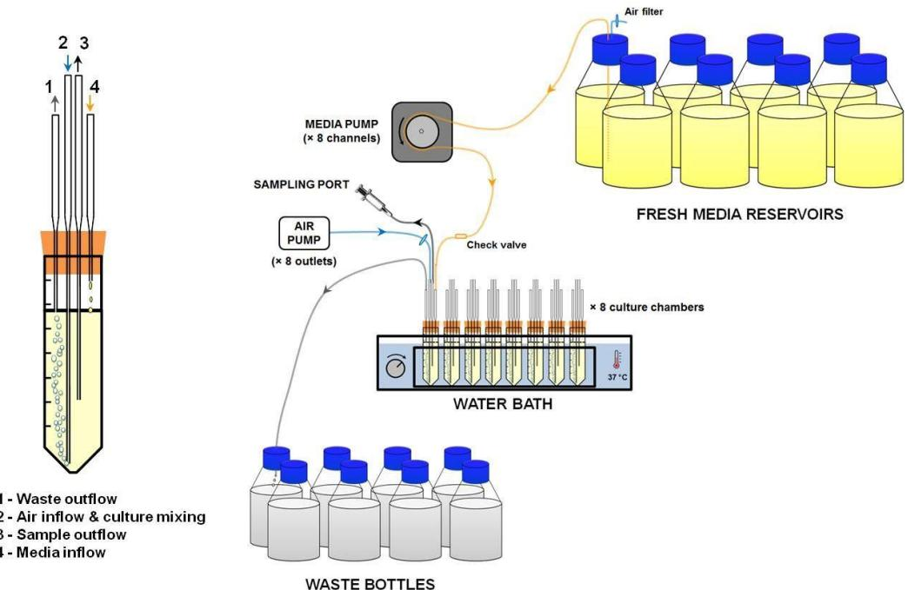
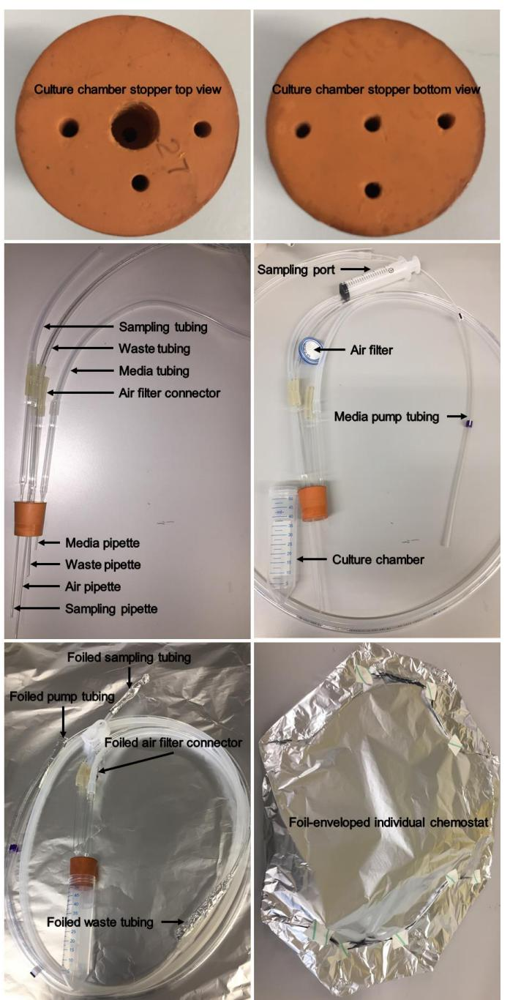
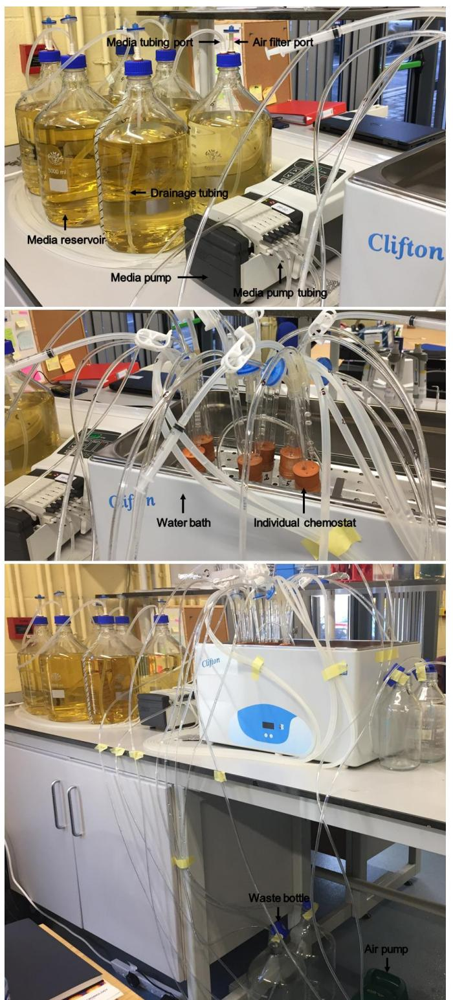
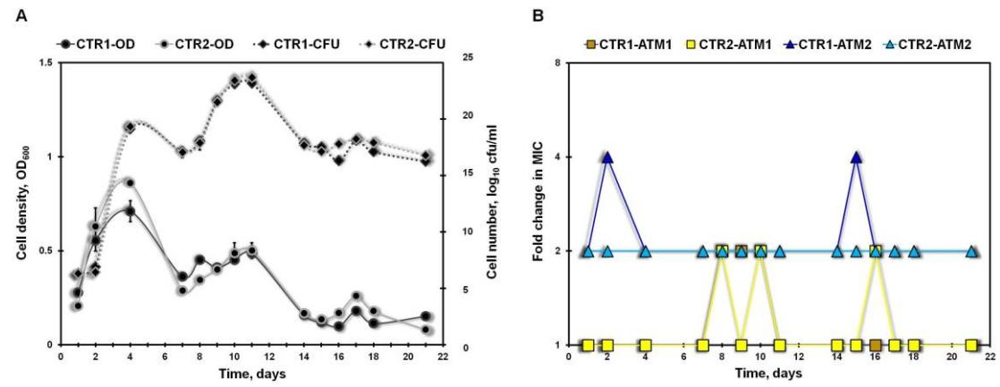

55555111112000

# **Construction and Validation of A Low-cost, Small-scale, Multiplex Continuous Culturing System for Microorganisms**

Lilit Tonoyan1, *, Freddy Guihéneuf2 , Ruari Friel1 and Vincent O'Flaherty3, *

1Westway Health, National University of Ireland Galway, Galway, Ireland; 2 Inalve, Nice, France; 3Microbiology, School of Natural Sciences and Ryan Institute, National University of Ireland Galway, Galway, Ireland

*For correspondence: [lilit.tonoyan@gmail.com;](mailto:lilit.tonoyan@gmail.com) [vincent.oflaherty@nuigalway.ie](mailto:vincent.oflaherty@nuigalway.ie)

**[Abstract]** This protocol details the construction of a simple, low-cost, small-scale, multiplex chemostat system designed for the continuous cultivation of microorganisms in suspension (*i.e.*, bacteria, yeast, microalgae). The continuous culture device can operate at a working volume of 25 ml and allows the run of 8 chemostats in parallel by a single person. It provides a platform for parallel, long-term studies of evolution and adaptation of microorganisms under the stress of antimicrobial agents and/or toxic pollutants. The system complies with the varied needs of researchers for an accessible, highly-throughput and reliable tool that is nevertheless easy to construct, use and operate, and not demanding of space, materials, medium supply and workload. Here, we also validate the use of this system to generate *de novo* resistance towards a novel antimicrobial and a commonly used antibiotic in an antimicrobial-sensitive model organism. We believe that this "Do It Yourself" (DIY) system may constitute a useful tool to address the global problem of antibiotic resistance and to develop non-antibiotic based therapies.

**Keywords:** Continuous culturing, Chemostat, Multiplex platform, Adaptive laboratory evolution, Antimicrobial resistance

**[Background]** Adaptive laboratory evolution experiments provide a powerful tool for readily-replicated, precisely-controlled, long-term, real-time study of evolutionary paths to antibiotic resistance that needs to be considered for the development of sustainable new antimicrobial therapies. The simplest protocol for an experimental evolution is passaging cells in batch cultures using the method of serial transfer (Gresham and Dunham, 2014). During the serial passage, the bacterial population is cultured for 24 h covering populations at exponential to stationary phases, followed by transfer of small bacterial inoculum from sub-inhibitory medium to fresh culture medium restarting the entire cycle anew (Jansen *et al*., 2013). This protocol can be parallelized using microtiter plates and multiplex liquid handling, which enable the simultaneous analysis of hundreds of populations. The long-term selection can also be performed by continuous chemostat culturing techniques. The chemostat protocol implies the maintenance of a bacterial population continuously in exponential phase by regular inflow of fresh media (that may be supplemented with the desired dose of an antimicrobial) and simultaneous outflow of the waste culture.

Jansen and co-authors (2013) stated that each method covers certain situations in the patient and/or

55555111112000

clinical environment. They pointed out that serial passage reflects patient-to-patient transfer or spread across tissues within a single patient, where the transmitted inoculum is initially low and can outgrow after the successful invasion. The chemostat would rather represent infection within a single tissue or systemic bacteremia. When the evolving pathogen population in the chemostat is also continuously challenged by a temporal gradient of an antimicrobial, the chemostat system may simulate bacterial evolution in the host environment, in response to antimicrobial treatment. During this adaptive evolution, mutations may arise, and those that are beneficial under the antimicrobial selection pressure will be fixed over time in the population. Cryopreservation of regular samples from different time points will allow the generation of a living fossil record of the evolving population (Jansen *et al*., 2013; Gresham and Hong, 2015). After the adaptation, understanding what genetic changes confer the resistance is desirable. Therefore, combining the experimental evolution study with whole-genome sequencing of the evolved population, one can study the evolution of antimicrobial resistance in real-time and identify resistance mechanisms to a novel antimicrobial.

 Despite the advantages, the chemostat continuous devices have been limited in their utility first of all because of difficulties posed by the construction, operation and maintenance. Aside from these, only very few publications provide relevant detailed instructions. One other drawback with chemostat systems is that they require large amounts of media and are expensive to build or purchase as commercially available options. Additionally, the replication requiring the operation of several chemostats in parallel over extended periods is technically challenging and rather laborious. We have developed a multiplex, low-cost, small-scale continuous culture device that can operate at a working volume of 25 ml and allows the operation of 8 chemostats in parallel by a single person (Figure 1). Herein, we provide a detailed technical information how to build and operate it. Another challenge with continuous culture devices is that for longer experiments their use is often limited by biofilm formation on the culture chamber walls. Our solution to this problem may be simply aseptically transferring the culture to a new polypropylene culture tube to prolong the experiment each time biofilm formation becomes obvious.

 Here, we also validate the use of our DIY continuous culture system to generate and study the resistance emergence in bacteria. The drug-sensitive model bacterium is challenged by progressively increasing concentration of a novel antimicrobial/common antibiotic, thus generating drug-resistant mutants and keeping them constantly challenged. This device and method can be used ultimately to forecast antimicrobial treatment outcomes, including the likelihood of resistance, cross-resistance and collateral-sensitivity. We anticipate that this affordable system will become a useful tool to address the resistance and to develop non-antibiotic based therapies capable of bypassing resistance acquisition. Alternatively, we propose its use to assess the adaptative evolution of photosynthetic microorganisms, such as cyanobacteria and microalgae, to extreme environmental changes derived from anthropogenic pollution (*i.e.*, herbicides, heavy metals, petroleum contamination and others).

#### **Materials and Reagents**

- 1. Aluminum foil, 450 mm × 90 m roll (Sparks Lab Supplies, catalog number: ALF01)
- 2. Antibiotic/antimicrobial of interest, *e.g.*, gentamicin sulfate salt hydrate (Sigma-Aldrich, catalog number: 17849-5G-F)
- 3. Antibiotic-free Luria-Bertani (LB) agar plates (see Recipe 1)
- 4. Bacterial strain of interest, *e.g.*, *Escherichia coli* DSM 1103 (DSMZ culture collection)
- 5. Centrifuge tubes, polypropylene, autoclavable, conical, 50 ml (Sparks Lab Supplies, catalog number: AB-P10403)
- 6. Cryogenic vials, sterile, 2 ml (Fisher Scientific, FisherbrandTM, catalog number: 11787939)
- 7. Ethanol solution, 70% (Fisher Scientific, Fisher BioReagentsTM, catalog number: 15430665)
- 8. Glycerol, ≥ 99.5% (Sigma-Aldrich, catalog number: G9012-500ML)
- 9. Glycerol, 30% (see Recipe 2)
- 10. LB broth (Sigma-Aldrich, Lennox, catalog number: L3022-1KG)
- 11. LB broth at quarter strength (see Recipe 3)

- 12. LB broth with agar (Sigma-Aldrich, Lennox, catalog number: L2897-1KG)
- 13. Micropipette tips, 10 µl/200 µl/1,000 µl (Sparks Lab Supplies, catalog number: AB-P10115/AB-P10107/PT011)
- 14. Multiwell plates, U 96-well, polystyrene, sterile (Sparks Lab Supplies, catalog number: G650161)
- 15. Pasteur pipettes, glass, 150 mm/230 mm (Sparks Lab Supplies, catalog number: PP150/PP230)
- 16. Phosphate buffered saline (PBS), 10× concentrate, sterile (Sigma-Aldrich, catalog number: P5493-1L)
- 17. PBS, 1× (see Recipe 4)
- 18. Syringe, sterile, disposable, 20 ml (Sparks Lab Supplies, Terumo, catalog number: SYR6208)
- 19. Syringe filters, sterile, blue, 0.22 µm, 25 mm (Sparks Lab Supplies, catalog number: FIL6610)

# **Equipment**

- 1. Air pump with 8 outlet chrome manifold, 25 L (Warehouse Aquatics, Blagdon Koi)
- 2. Autoclave (Mason Technology, Tuttnauer, LABV-D 3870ELV-D 85L)
- 3. Bottle, Duran style, glass, autoclavable, 1 L, 45 mm wide mouth, blue plastic cap (Sparks Lab Supplies, catalog number: BOT5310)
- 4. Bottle, Duran style, glass, autoclavable, 5 L, 45 mm wide mouth, blue plastic cap (Sparks Lab Supplies, catalog number: BOT5314)
- 5. Electric drill with 2 mm, 4 mm and 6 mm bits (Bosch, Hardware store)
- 6. Freezer, -80 °C (Haier Biomedical)
- 7. Fridge, 4 °C (Kenwood)

- 8. Incubator shaker, 37 °C (Mason Technology, New BrunswickTM Innova® 42R, catalog number: M1335-0006)
- 9. Microplate reader (Tecan, SunriseTM)

- 10. Multichannel pipettor Lambda Plus 8, 1-10 µl/20-200 µl (Fisher Scientific, CorningTM, catalog number: 11333625/11353625)
- 11. Peristaltic pump, 205S manual drive (Watson-Marlow, catalog number: 026.3001.00U)
- 12. 205Ca8, 8 channel, 8 roller acetal cassette P/H (Watson-Marlow, catalog number: 023.1201.000)
- 13. Stopper, rubber, red, No. 27, 31 mm top diameter, 27 mm bottom diameter, 32 mm height (VWR, catalog number: 391-2117)
- 14. Tube rack, stainless steel, 10 × 30 mm (Fisher Scientific, Grant InstrumentsTM, catalog number: 15365842)
- 15. Tubing clamps, stainless steel, pinch-cock (Fisher Scientific, BochemTM HOFFMANNTM, catalog number: 11885091)
- 16. Tubing clumps, plastic, autoclavable, mid-range with 15 positions (Fisher Scientific, Bel-ArtTM SP SciencewareTM, catalog number: 11753177)
- 17. Tubing connectors, polypropylene, straight, for 4-7 mm tubing (Fisher Scientific, AzlonTM, catalog number: 10772227)
- 18. Tubing, medium, silicone, translucent, 5 mm inside diameter, 1.5 mm wall thickness (VWR, catalog number: DENE3100508/25)
- 19. Tubing, pump, PVC manifold, 2.79 mm inside diameter, 0.8 mm wall thickness, purple/white (Fisher Scientific, Watson-Marlow, catalog number: 980.0279.000)
- 20. Tubing, small, silicone, translucent, 4 mm inside diameter, 1.5 mm wall thickness (Fisher Scientific, FisherbrandTM, catalog number: 10644182)
- 21. Water bath, unstirred, digital, 22 L (Sparks Lab Supplies, Clifton, catalog number: NE2-22D)

### **Software**

- 1. MagellanTM software (Tecan, SunriseTM)
- 2. Excel (Microsoft)

### **Procedure**

This small-scale, multiplex chemostat system was built according to the designs from Miller *et al*., 2017 and Tonoyan *et al*., 2019 (see schematic representation in Figure 1).

*Note: The following steps refer to the construction of one individual small chemostat; repeat the Procedures A-C to assemble a multiplex system.*

**Figure 1. Schematic representation of the DIY, small-scale, multiplex continuous culture system**

- A. Fabrication and attachment of the parts
	- 1. Culture chamber (Figures 1, 2). Simply use a 50 ml polypropylene centrifuge tube which has several advantages: a) enough headspace for a 20-30 ml culture, b) autoclavable, c) transparent, d) with volume markings.

**Figure 2. Illustration of an individual chemostat.** The constituents of an individual chemostat and autoclaving details are presented.

- 2. Culture chamber stopper (Figure 2). Use an autoclavable red rubber stopper, which fits inside the 50 ml tube and drill 4 holes. For media inflow, using an electric drill in conjunction with 6 and 2 mm drill bits, drill two access holes on the top (big) and bottom (small) sides of the stopper, respectively. For air inflow, sample outflow and waste outflow, drill holes using a 2 mm bit.
- 3. Air inflow and culture mixing (Figures 1, 2). Air is delivered into the culture chamber by a 230 mm glass Pasteur pipette. This is the longest pipette and reaches to the bottom of the culture

tube. The culture is mixed by bubbling with sterile air.

- a. Push the air pipette into the central big hole of the stopper and carefully break the bottom tip of the glass to fit inside the culture tube.
- b. Fit a 4-5 cm piece of medium silicone tubing (serves as a connector) on the top end of the air pipette and attach a 0.22 µm syringe air filter. *Note: This filter is not autoclavable, thus it should be attached aseptically at the start of a run.*
- c. Connect the other end of the air filter to one of the outlets of the air pump by medium silicone tubing at sufficient length (Figure 3).

*Note: This tubing does not need to be sterile and is not autoclaved to keep it dry.*

- d. Control the rate of aeration by the outlet of the air pump.

**Figure 3. Illustration of the multiplex continuous culturing system.** The constituents of the system and their connections are depicted.

- 4. Sample outflow (Figures 1, 2). The sample is collected from the culture chamber by a 230 mm glass Pasteur pipette immersed inside the culture tube (the second-long pipette).
55555111112000

- a. Push the sampling pipette into one of the 3 small holes of the stopper and carefully break the bottom tip to the appropriate length.
- b. Attach a 2-3 cm piece of medium silicone tubing on the top end of the sampling pipette.
- c. Connect to a 15 cm-long small silicone tubing and fit a clamp on it. *Note: You may use 200 µl pipette tips as connectors between different sized tubings by cutting their sharp edges and inserting between tubings.*
- d. Attach a sterile syringe at the end of the sampling tubing to serve as a sampling port. *Note: Do not autoclave the syringe and attach it aseptically at the first sampling.*
- 5. Waste outflow (Figures 1, 2). Waste is removed from the culture chamber by a 230 mm glass Pasteur pipette, which enters inside the culture tube until the 30 ml mark to ensure the exact volume (25 ml) of the culture (this is the third-long pipette). Control the volume of the culture by the length of this pipette.
	- a. Push the waste pipette into a small hole of the stopper and carefully break the bottom tip to the appropriate length.
	- b. Attach a sufficiently long piece of medium silicone tubing on the top end of the waste pipette.
	- c. Fit a 1 ml pipette tip to serve as a waste port, which is placed inside a 1 L waste bottle (Figures 1, 3).
- 6. Media reservoir (Figures 1, 3). It is a blue-cap 5 L bottle.
	- a. With a 4 mm bit, drill 2 holes in the cap to hold 2 inserts. Use Azlon straight connectors as inserts.
	- b. Fit a 5-6 cm piece of medium silicone tubing (serves as a connector) to one of the inserts (named air filter port) and connect to a 0.22 µm syringe air filter to ensure sterile pressure equalization.

*Note: This filter is not autoclavable, thus it should be attached aseptically after the media autoclaving.*

- c. Attach a 45 cm-long small silicone tubing (named drainage tubing) to the second insert (named media tubing port) inside the media reservoir by which the media is drained and circulated through the media tubing.
- d. Attach a sufficiently long piece of medium silicone tubing to the outside end of the media tubing port. Fit a cut 200 µl tip (serves as a connector) to the other end of this tubing.
- e. Connect to white/purple pump tubing (at the purple end) only before the run.
- 7. Media inflow (Figures 1, 2). The media is delivered to the culture chamber by a 150 mm glass Pasteur pipette and is the shortest of the pipettes.
	- a. Push the media pipette into a small hole of the stopper and carefully break the bottom tip to a short length, but not so short that the bubbling causes back contamination into the media tubing and media reservoir.

*Note: Though not implemented here, you may fit a 4-5 cm piece of medium silicone tubing on the top end of the media pipette and attach a check valve to avoid contamination into* 

*the media reservoir.*

- b. Attach a sufficiently long piece of medium silicone tubing to the media pipette (or to the check valve before a run).
- c. Connect with the white/purple pump tubing (at the white end).
- d. Connect the white/purple pump tubing with the media reservoir tubing above at the start of a run.
- e. Control the dilution rate by the speed of the peristaltic media pump (Figure 3).
- B. Sterilization of the parts before an experiment
	- 1. Autoclaving of the media reservoirs (Figure 3).
		- a. Put an autoclave tape on a 5 L media bottle and make 250 ml volume markings up to 5,500 ml.
		- b. The continuous cultures may be grown in quarter-strength LB broth to ensure nutrient limitation. Prepare according to Recipe 3.
		- c. Cap the 5 L media bottle with the cap housing two inserts.
		- d. Attach the drainage tubing inside the media bottle.
		- e. Fit a metal Hoffman clamp on the media tubing. *Note: It is important to clamp the media tubing as the media will flow out of the bottle during the autoclaving.*
		- f. Wrap an aluminum foil on the exposed end of the media tubing.
		- g. Foil the small silicone tubing attached to the air filter port.
		- h. Make sure that the media bottles are vented so that they do not explode–leave the cap of the 5 L media bottle loose.
		- i. Fit the assembled media bottle into an autoclave (big enough to house a 5 L bottle with tubings) and autoclave at 121 °C for 15 min using the liquid cycle.
		- j. (Optional) Let the media sit on the benchtop for a couple of days to check for contamination.
	- 2. Autoclaving of an individual chemostat (Figure 2). Assemble all the parts and tubings of a chemostat except:
		- a. Do not connect the syringe filter to the air pipette, but foil the silicone ending of the air pipette.
		- b. Do not connect the white/purple pump tubing to the ending of the media reservoir, but foil the ending of the white/purple pump tubing.
		- c. Do not attach a syringe to the sampling tubing, but wrap it with a foil.
		- d. Foil the ending of the outflow tubing.
		- e. Wrap each chemostat and its tubings by one big piece of foil as an envelope and autoclave at 121 °C for 15 min using the liquid cycle.
	- 3. Autoclaving of the waste bottles. Cover the heads of several 1 L blue-cap bottles with aluminum foil and autoclave.

- C. Connection of the parts
	- 1. Connecting the parts of an individual chemostat (Figures 1-3).
		- a. After autoclaving, open the foil envelope of a chemostat in a laminar hood and connect all the disassembled parts if any.
		- b. Attach a sterile syringe filter to the air pipette.

- c. Fit the stainless steel tube rack in the digital unstirred water bath and place the individual chemostats inside it.
- 2. Connecting the air filter to the media reservoir (Figures 1, 3). After autoclaving, attach a sterile blue syringe filter to the air filter port.

*Note: To connect the different parts in the open air, spray plenty of 70% ethanol to begin with.*

- 3. Connecting the media reservoir to an individual chemostat (Figures 1, 3).
	- a. Aseptically connect the media tubing and pump tubing.
	- b. Set the pump tubing into the pump cassette and clip inside.
- 4. Connecting the air filter to the air pump (Figures 1, 3).
	- a. Connect the air filter of the chemostat to the dry, non-sterile air tubing.
	- b. Attach the air tubing to one of the 8 outlets of the air pump.
- 5. Fabricating the sampling port (Figures 1-3).
	- a. Aseptically remove the foil from the sampling tubing and attach a sterile 20 ml syringe.
	- b. Clamp the sampling tubing with a mid-range clamp.
- 6. Arranging the waste outflow (Figures 1, 3). Aseptically remove the foil from the waste port and insert it inside a sterile 1 L waste bottle by piercing the aluminum foil.

*Note: 1 L bottles are the most convenient containers for the waste, as it will be possible to measure the effluent volume (for dilution rate adjustments) and do not require a change of a bottle every second day.*

- D. Starting an experiment
After the construction, sterilization and final assembly of the small-scale multiplex continuous system (see schematic illustration in Figure 1) set up an experiment for bacterial cultivation.

- 1. Setting up the media pump.
	- a. Once all the constituents of the multiplex system are connected, individual small chemostats (up to 8) are placed in the water bath and the pump tubings are inserted into the pump cassette, turn on the peristaltic media pump to circulate the media and fill the culture chambers to a desired volume.

*Note: Make sure that the media is pumped from the media reservoirs to the culture chambers and not backwards.*

- b. Aseptically (spray the top of a culture chamber with 70% ethanol) adjust the waste pipette to the height of about 30 ml mark, to ensure 25 ml volume of the culture.
- c. Turn off the media pump and leave the media inside the culture chamber overnight to check for contamination.

55555111112000

*Note: In case there is no contamination, the individual small chemostats are ready to be inoculated.*

- d. Set the media pump to the desired dilution rate: D = waste volume/(elapsed time × culture volume). The desired dilution rate for our experiments was 0.4/h. For 25 ml culture the flow rate is 10 ml/h, which corresponds to *ca.* 0.75 rpm on the Watson–Marlow pump and chemostat system described here.
*Note: Regularly record the volume of the waste from individual small chemostats and calculate the dilution rate. Adjust the pump or individual pump cartridges accordingly to arrange the desired dilution rate.*

- 2. Setting up the air pump*.* Regulate the flow of the filter-sterilized air by the handle of the outlet manifold of the air pump.
*Note: Ideally, we want the air to be delivered into the culture chamber at a specific rate (e.g., 100 ml/min); however, the air supply is regulated visually, to ensure that the pipettes do not clog.*

- 3. Inoculating the chemostat system.
	- a. The day before the experiment, pick a single colony from an overnight culture of the desired strain grown on the agar plate and transfer the growth into 3 ml of the same liquid media used for continuous culturing (*e.g.*, quarter-strength of LB).

*Note: This single colony suspension, aka the chemostat parent, will be used to inoculate the 8 parallel chemostats to ensure that the parental strain utilized throughout the continuous culturing was genetically homogeneous at the start.*

- b. Infer the cell density of this culture by visually comparing its turbidity with a culture at an optical density of OD625 = 0.08 (*ca.* 108 colony-forming units per ml).
- c. Stop the media and air pumps, aseptically open the rubber stopper of the culture chamber and inoculate each of the small chemostat chambers with the parent culture at *ca.* 105 -106 cfu/ml final density (*e.g.*, transfer 0.25 ml of the chemostat parent suspension at *ca.* 108 cfu/ml into 25 ml of media inside the culture chamber).
- d. Set the temperature of the water bath to 37 °C and initiate the air pump.
- e. Grow the cultures in small chemostat chambers for 24 h in a batch mode to reach culture saturation.
- f. Switch to the continuous mode by initiating the media pump for media inflow.
- 4. Preserving the chemostat parent strain.
	- a. Directly after the inoculation of the chemostat system (Step D3c), incubate the unused suspension of the chemostat parent for a few hours under continuous shaking 37 °C conditions.
	- b. Keep a few microliters for Step E1a. Preserve a stock by freezing the remaining *ca.* 1 ml of the culture mixed with 1 ml 30% sterile glycerol in a clearly labelled cryogenic vial at -80 °C.
- 5. Sampling the individual small chemostats. *Note: Chemostats are ideally sampled daily for the measurements of different parameters.*

- a. Spray plenty of 70% ethanol on the sampling port, unclamp it, remove 1 ml culture, discard, reattach another sterile syringe and sample 2.5 ml of culture.
- b. Reattach another sterile syringe and clamp the sampling port.
- 6. Preserving the samples from individual small chemostats.
	- a. Transfer 1.5 ml of a sampled culture into 1 ml of 30% sterile glycerol in a clearly labelled cryogenic vial. Mix well by pipetting up and down.
	- b. Preserve at -80 °C.

- c. Use the rest of the sampled culture for Steps E3a, E4a, E5a.
- E. *De novo* resistance generation

Starting with an isogenic drug-sensitive bacterial strain (*e.g.*, *E. coli* DSM 1103), the evolving population is exposed to increasing levels of an antimicrobial (*e.g.*, gentamycin). To implement selective pressure, while maintaining a sizeable population, the concentration of the antimicrobial is increased gradually–increases administered when the density of the culture returns to the value recorded prior to the addition of the antimicrobial.

- 1. Determination of minimum inhibitory concentrations (MIC) of antimicrobials against the isogenic chemostat parent strain*.* To infer the initial antimicrobial concentrations to be added in the media reservoirs of the chemostat system, the MICs of the antimicrobials of interest are determined against the chemostat parent using a standard broth microdilution method.
	- a. Before the preservation of the chemostat parent, use appropriate volume from the culture (Step D4a) to prepare a *ca.* 106 cfu/ml suspension.
	- b. Prepare suitable 2-fold dilution ranges of the antimicrobials of interest in quarter-strength LB using 96-well plates.
	- c. Using a multichannel pipette, top the antimicrobial dilutions with equal volumes of the prepared inoculum (Step E1a). In doing so, the starting density of the inoculum is standardized to 5 × 105 cfu/ml.
	- d. Carry on Steps E1a-E1b in triplicates; incubate the triplicate 96-well MIC plates for 24 h at 37 °C.
	- e. Define the MIC as the lowest concentration of an antimicrobial preventing the appearance of turbidity.
	- f. Report the median of the triplicate measurements as MIC of an antimicrobial against the chemostat parent (see an example in Table 1).

55555111112000

**Table 1. An example of minimum inhibitory concentration (MIC) data from isogenic parent culture at day 0 (D0); unexposed (replicate 1); antimicrobial 1-exposed (replicate 1) and antimicrobial 2-exposed (replicate 1) continuous cultures throughout** *n* **days of evolution.** MIC values (µg/ml) from 3 measurements (from broth microdilution assay), median MIC values (µg/ml) and the ratio of the MIC obtained on the particular sampling day to the MIC for chemostat parent (on D0) are presented.

| Isogenic parent culture         | D0  | D1  | D2  | …   | Dn  |
|---------------------------------|-----|-----|-----|-----|-----|
| Antimicrobial 1                 |     |     |     |     |     |
| #1 measurement                  | 8   |     |     |     |     |
| #2 measurement                  | 8   |     |     |     |     |
| #3 measurement                  | 8   |     |     |     |     |
| median                          | 8   |     |     |     |     |
| Antimicrobial 2                 |     |     |     |     |     |
| #1 measurement                  | 0.1 |     |     |     |     |
| #2 measurement                  | 0.1 |     |     |     |     |
| #3 measurement                  | 0.1 |     |     |     |     |
| median                          | 0.1 |     |     |     |     |
| Unexposed culture               | D0  | D1  | D2  | …   | Dn  |
| Antimicrobial 1                 |     |     |     |     |     |
| #1 measurement                  |     | 8   | 8   | 8   | 8   |
| #2 measurement                  |     | 8   | 8   | 8   | 8   |
| #3 measurement                  |     | 8   | 8   | 8   | 16  |
| median                          |     | 8   | 8   | 8   | 8   |
| ratio (Dn/D0)                   |     | 1   | 1   | 1   | 1   |
| Antimicrobial 2                 |     |     |     |     |     |
| #1 measurement                  |     | 0.1 | 0.1 | 0.2 | 0.2 |
| #2 measurement                  |     | 0.1 | 0.1 | 0.1 | 0.1 |
| #3 measurement                  |     | 0.1 | 0.1 | 0.2 | 0.1 |
| median                          |     | 0.1 | 0.1 | 0.2 | 0.1 |
| ratio (Dn/D0)                   |     | 1   | 1   | 2   | 1   |
| Antimicrobial 1-exposed culture | D0  | D1  | D2  | …   | Dn  |
| Antimicrobial 1                 |     |     |     |     |     |
| #1 measurement                  |     | 8   | 4   | 4   | 8   |
| #2 measurement                  |     | 8   | 8   | 4   | 8   |
| #3 measurement                  |     | 8   | 8   | 4   | 8   |
| median                          |     | 8   | 8   | 4   | 8   |
| ratio (Dn/D0)                   |     | 1   | 1   | 0.5 | 1   |
| Antimicrobial 2                 |     |     |     |     |     |
| #1 measurement                  |     | 0.1 | 0.1 | 0.2 | 0.2 |
| #2 measurement                  |     | 0.1 | 0.1 | 0.2 | 0.2 |
| #3 measurement                  |     | 0.1 | 0.1 | 0.2 | 0.2 |
| median                          |     | 0.1 | 0.1 | 0.2 | 0.2 |

| ratio (Dn/D0)                   |    | 1   | 1   | 2   | 2   |
|---------------------------------|----|-----|-----|-----|-----|
| Antimicrobial 2-exposed culture | D0 | D1  | D2  | …   | Dn  |
| Antimicrobial 1                 |    |     |     |     |     |
| #1 measurement                  |    | 8   | 8   | 8   | 8   |
| #2 measurement                  |    | 8   | 8   | 8   | 8   |
| #3 measurement                  |    | 16  | 4   | 4   | 8   |
| median                          |    | 8   | 8   | 8   | 8   |
| ratio (Dn/D0)                   |    | 1   | 1   | 1   | 1   |
| Antimicrobial 2                 |    |     |     |     |     |
| #1 measurement                  |    | 0.1 | 1.6 | 3.2 | 3.2 |
| #2 measurement                  |    | 0.1 | 1.6 | 3.2 | 3.2 |
| #3 measurement                  |    | 0.1 | 1.6 | 1.6 | 6.4 |
| median                          |    | 0.1 | 1.6 | 3.2 | 3.2 |
| ratio (Dn/D0)                   |    | 1   | 16  | 32  | 32  |

- 2. Addition of antimicrobials in individual media reservoirs*.*
	- a. At first, supplement an individual media reservoir with an antimicrobial of interest at its 0.5 × MIC (according to the chemostat parent) by aseptically introducing the appropriate volume inside a media reservoir.
	- b. Increase the concentration of an antimicrobial in an individual media reservoir stepwise by 0.5 × MIC increments when OD600 of the antimicrobial-exposed culture reaches the value recorded prior to the addition of the antimicrobial.
- 3. Measurement of the optical density of the sampled cultures.
	- a. Add 150 µl from the sampled chemostat cultures into the wells of a 96-well plate and measure the OD600 using a microplate reader.
	- b. Carry on the measurements in triplicates, average the results (see an example in Table 2).

55555111112000

**Table 2. An example of cell density data from unexposed (replicate 1); antimicrobial 1-exposed (replicate 1) and antimicrobial 2-exposed (replicate 1) continuous cultures throughout** *n* **days of evolution.** OD600 values from 3 measurements (from microplate reader), the average and the standard deviation are presented.

| Unexposed culture               | D1      | D2      | …       | Dn      |
|---------------------------------|---------|---------|---------|---------|
| #1 measurement                  | 0.226   | 0.387   | 0.478   | 0.736   |
| #2 measurement                  | 0.296   | 0.339   | 0.511   | 0.71    |
| #3 measurement                  | 0.267   | 0.378   | 0.382   | 0.726   |
| average                         | 0.263   | 0.368   | 0.457   | 0.724   |
| standard deviation              | 0.03517 | 0.02551 | 0.06701 | 0.01311 |
| Antimicrobial 1-exposed culture | D1      | D2      | …       | Dn      |
| #1 measurement                  | 0.227   | 0.158   | 0.125   | 0.296   |
| #2 measurement                  | 0.215   | 0.137   | 0.099   | 0.336   |
| #3 measurement                  | 0.179   | 0.167   | 0.109   | 0.163   |
| average                         | 0.207   | 0.154   | 0.111   | 0.265   |
| standard deviation              | 0.02498 | 0.01539 | 0.01311 | 0.09057 |
| Antimicrobial 2-exposed culture | D1      | D2      | …       | Dn      |
| #1 measurement                  | 0.246   | 0.127   | 0.08    | 0.12    |
| #2 measurement                  | 0.268   | 0.1     | 0.1     | 0.128   |
| #3 measurement                  | 0.164   | 0.121   | 0.06    | 0.127   |
| average                         | 0.226   | 0.116   | 0.08    | 0.125   |
| standard deviation              | 0.05481 | 0.01418 | 0.02    | 0.00436 |

- 4. Enumeration of the viable cell numbers of the sampled cultures.
	- a. Take 10 μl aliquots from a daily chemostat sample, serially dilute 10-fold in 1× PBS using a multichannel pipette and 96-well plates.
	- b. Replica spot-plate (3 per sample dilution) 5 μl aliquots from appropriate dilutions (different dilutions may be required depending on the density of the culture) on antimicrobial-free LB agar plates using a multichannel pipette.
	- c. Dry the spots and incubate the LB agar plates overnight at 37 °C.
	- d. Enumerate the single colonies from each dilution that can be counted; calculate the cfu/ml of the original sample using the formula: cfu/ml = # of cfu/dilution/volume plated; average the results from triplicates (see an example in Table 3).

### [www.bio-protocol.org/e3813](http://www.bio-protocol.org/e3813)

55555111112000 **Table 3. An example of the cell counts from unexposed (replicate 1); antimicrobial 1-exposed (replicate 1) and antimicrobial 2-exposed (replicate 1) continuous cultures for day (D)1 and D2 of evolution.** Only the counts within acceptable counting range are considered. The values used for average (avg) cfu/ml and standard deviation (std) calculations are boxed. TNTC – too numerous to count.

| Unexposed culture               |          |           |           |               |           |           |               |           |           |               |            |         |
|---------------------------------|----------|-----------|-----------|---------------|-----------|-----------|---------------|-----------|-----------|---------------|------------|---------|
| D1                              |          |           |           |               |           |           |               |           |           |               |            |         |
| Volume plated (ml)              | Dilution | #1 cfu    | #1 cfu/ml | #1 avg cfu/ml | #2 cfu    | #2 cfu/ml | #2 avg cfu/ml | #3 cfu    | #3 cfu/ml | #3 avg cfu/ml | avg cfu/ml | std     |
| 0.005                           | 1        | confluent | confluent |               | confluent | confluent |               | confluent | confluent |               |            |         |
| 0.005                           | 0.1      | confluent | confluent |               | confluent | confluent |               | confluent | confluent |               |            |         |
| 0.005                           | 0.01     | TNTC      | TNTC      |               | TNTC      | TNTC      |               | TNTC      | TNTC      |               |            |         |
| 0.005                           | 0.001    | 8         | 1.6E+06   |               | 14        | 2.8E+06   |               | TNTC      | TNTC      |               |            |         |
| 0.005                           | 0.0001   | 0         | 0         |               | 0         | 0         |               | 0         | 0         |               |            |         |
| 0.005                           | 0.00001  | 0         | 0         |               | 0         | 0         |               | 0         | 0         |               |            |         |
|                                 |          |           |           | 1.6E+06       |           |           | 2.8E+06       |           |           |               | 2.2E+06    | 8.5E+05 |
| D2                              |          |           |           |               |           |           |               |           |           |               |            |         |
| Volume plated (ml)              | Dilution | #1 cfu    | #1 cfu/ml | #1 avg cfu/ml | #2 cfu    | #2 cfu/ml | #2 avg cfu/ml | #3 cfu    | #3 cfu/ml | #3 avg cfu/ml | avg cfu/ml | std     |
| 0.005                           | 1        | confluent |           |               | confluent | confluent |               | confluent |           |               |            |         |
| 0.005                           | 0.1      | confluent |           |               | confluent | confluent |               | confluent |           |               |            |         |
| 0.005                           | 0.01     | TNTC      |           |               | TNTC      | TNTC      |               | TNTC      |           |               |            |         |
| 0.005                           | 0.001    | 8         | 1.6E+06   |               | 0         | 0         |               | 11        | 2.2E+06   |               |            |         |
| 0.005                           | 0.0001   | 10        | 2.0E+07   |               | 0         | 0         |               | 0         |           |               |            |         |
| 0.005                           | 0.00001  | 1         | 2.0E+07   |               | 0         | 0         |               | 0         |           |               |            |         |
|                                 |          |           |           | 1.4E+07       |           |           |               |           |           | 2.2E+06       | 8.0E+06    | 8.2E+06 |
| Antimicrobial 1-exposed culture |          |           |           |               |           |           |               |           |           |               |            |         |
| D1                              |          |           |           |               |           |           |               |           |           |               |            |         |
| Volume plated (ml)              | Dilution | #1 cfu    | #1 cfu/ml | #1 avg cfu/ml | #2 cfu    | #2 cfu/ml | #2 avg cfu/ml | #3 cfu    | #3 cfu/ml | #3 avg cfu/ml | avg cfu/ml | std     |
| 0.005                           | 1        | confluent | confluent |               | confluent | confluent |               | confluent | confluent |               |            |         |
| 0.005                           | 0.1      | confluent | confluent |               | confluent | confluent |               | confluent | confluent |               |            |         |
| 0.005                           | 0.01     | TNTC      | TNTC      |               | TNTC      | TNTC      |               | confluent | confluent |               |            |         |

|                                 |          |           |           | www.bio-protocol.org/e3813 |           | Bio-protocol 10(21): e3813. DOI:10.21769/BioProtoc.3813 55555111112000 |               |           |           |               |            |         |
|---------------------------------|----------|-----------|-----------|----------------------------|-----------|---------------------------------------------------------------------------------|---------------|-----------|-----------|---------------|------------|---------|
| 0.005                           | 0.001    | 0         | 0         |                            | 3         | 6.0E+05                                                                         |               | 22        | 4.4E+06   |               |            |         |
| 0.005                           | 0.0001   | 0         | 0         |                            | 0         | 0                                                                               |               | 0         | 0         |               |            |         |
| 0.005                           | 0.00001  | 0         | 0         |                            | 0         | 0                                                                               |               | 0         | 0         |               |            |         |
|                                 |          |           |           |                            |           |                                                                                 | 6.0E+05       |           |           | 4.4E+06       | 2.5E+06    | 2.7E+06 |
| D2                              |          |           |           |                            |           |                                                                                 |               |           |           |               |            |         |
| Volume plated (ml)              | Dilution | #1 cfu    | #1 cfu/ml | #1 avg cfu/ml              | #2 cfu    | #2 cfu/ml                                                                       | #2 avg cfu/ml | #3 cfu    | #3 cfu/ml | #3 avg cfu/ml | avg cfu/ml | std     |
| 0.005                           | 1        | confluent |           |                            | confluent | confluent                                                                       |               | confluent |           |               |            |         |
| 0.005                           | 0.1      | confluent |           |                            | confluent | confluent                                                                       |               | confluent |           |               |            |         |
| 0.005                           | 0.01     | TNTC      |           |                            | confluent | confluent                                                                       |               | TNTC      |           |               |            |         |
| 0.005                           | 0.001    | 6         | 1.2E+06   |                            | 10        | 2.0E+06                                                                         |               | 8         | 1.6E+06   |               |            |         |
| 0.005                           | 0.0001   | 0         | 0         |                            | 0         | 0                                                                               |               | 0         |           |               |            |         |
| 0.005                           | 0.00001  | 0         | 0         |                            | 0         | 0                                                                               |               | 0         |           |               |            |         |
|                                 |          |           |           | 1.2E+06                    |           |                                                                                 | 2.0E+06       |           |           | 1.6E+06       | 1.6E+06    | 4.0E+05 |
|                                 |          |           |           |                            |           |                                                                                 |               |           |           |               |            |         |
| Antimicrobial 2-exposed culture |          |           |           |                            |           |                                                                                 |               |           |           |               |            |         |
| D1                              |          |           |           |                            |           |                                                                                 |               |           |           |               |            |         |
| Volume plated (ml)              | Dilution | #1 cfu    | #1 cfu/ml | #1 avg cfu/ml              | #2 cfu    | #2 cfu/ml                                                                       | #2 avg cfu/ml | #3 cfu    | #3 cfu/ml | #3 avg cfu/ml | avg cfu/ml | std     |
| 0.005                           | 1        | confluent | confluent |                            | confluent | confluent                                                                       |               | confluent | confluent |               |            |         |
| 0.005                           | 0.1      | confluent | confluent |                            | confluent | confluent                                                                       |               | confluent | confluent |               |            |         |
| 0.005                           | 0.01     | TNTC      | TNTC      |                            | TNTC      | TNTC                                                                            |               | confluent | confluent |               |            |         |
| 0.005                           | 0.001    | 0         | 0         |                            | 4         | 8.0E+05                                                                         |               | 17        | 3.4E+06   |               |            |         |
| 0.005                           | 0.0001   | 0         | 0         |                            | 0         | 0                                                                               |               | 0         | 0         |               |            |         |
| 0.005                           | 0.00001  | 0         | 0         |                            | 0         | 0                                                                               |               | 0         | 0         |               |            |         |
|                                 |          |           |           |                            |           |                                                                                 | 8.0E+05       |           |           | 3.4E+06       | 2.1E+06    | 1.8E+06 |
| D2                              |          |           |           |                            |           |                                                                                 |               |           |           |               |            |         |
| Volume plated (ml)              | Dilution | #1 cfu    | #1 cfu/ml | #1 avg cfu/ml              | #2 cfu    | #2 cfu/ml                                                                       | #2 avg cfu/ml | #3 cfu    | #3 cfu/ml | #3 avg cfu/ml | avg cfu/ml | std     |
| 0.005                           | 1        | confluent | confluent |                            | confluent | confluent                                                                       |               | confluent | confluent |               |            |         |
| 0.005                           | 0.1      | confluent | confluent |                            | confluent | confluent                                                                       |               | confluent | confluent |               |            |         |

| www.bio-protocol.org/e3813 |         |      |         |         |   |         |         |      |      | Bio-protocol 10(21): | e3813. DOI:10.21769/BioProtoc.3813 |         |
|----------------------------|---------|------|---------|---------|---|---------|---------|------|------|----------------------|---------------------------------------|---------|
| 0.005                      | 0.001   | TNTC | TNTC    |         | 1 | 2.0E+05 |         | TNTC | TNTC | 55555111112000       |                                       |         |
| 0.005                      | 0.0001  | 1    | 2.0E+06 |         | 3 | 6.0E+06 |         | 0    | 0    |                      |                                       |         |
| 0.005                      | 0.00001 | 0    | 0       |         | 0 | 0       |         | 0    | 0    |                      |                                       |         |
|                            |         |      |         | 2.0E+06 |   |         | 3.1E+06 |      |      |                      | 2.6E+06                               | 7.8E+05 |

- 5. Determination of MICs of antimicrobials against daily sampled cultures to detect the resistance emergence.
	- a. Prepare 3 inocula from a daily chemostat sample by taking aliquots from a planktonic population sample and diluting in quarter-strength LB to a cell density of 106 cfu/ml in 3 separate tubes.
	- b. Challenge these 3 inocula at 5  × 105 cfu/ml final density with an antimicrobial of interest at serial 2-fold dilutions in 96-well plates as described in Steps E1b-E1c.
	- c. Incubate the 96-well MIC plates over 24 h at 37 °C.

- d. Define the MICs from these triplicates; report the median value as a MIC (see an example in Table 1).
- e. For each of the chemostat cultures, calculate the MIC change as the ratio of the MIC at sampling day to the MIC for chemostat parent (Table 1). Consider the chemostat-derived cultures to be resistant to an antimicrobial when a sustained > 4-fold MIC increase from chemostat parent MIC is noted.
- 6. Extraction of genomic DNA from daily sampled polymorphic cultures or individual colonies for whole-genome sequencing (WGS) analysis (not described here)*.*
	- a. Thaw the leftover of the preserved glycerol stocks of polymorphic population samples and immediately pellet for gDNA isolation using a preferred extraction method.
	- b. Alternatively, streak from the cultures on LB agar plates and choose individual colonies for gDNA extraction.
- F. Clean up after an experiment
	- 1. Disconnect the individual chemostats and media reservoirs by detaching the media tubing from the pump tubing.
	- 2. Discard the culture chamber tube and place the rubber stopper inside a new 50 ml tube.
	- 3. Wrap the individual chemostat and its tubing in a big foil envelope and autoclave.
	- 4. Autoclave the media reservoir and its tubings separately.
	- 5. After the decontamination, rinse thoroughly all the tubings and bottles with tap water.
	- 6. Foil and autoclave once more all the parts separately and store for reuse.

## **Data analysis**

Each of the small individual chemostats may be designated to a particular treatment or a replicate (*e.g.*, chemostat 1 (Ch1) – control unexposed culture, replicate 1; Ch2 – control unexposed culture, replicate 2; Ch3 – antimicrobial 1-exposed culture, replicate 1; Ch4 – antimicrobial 1-exposed culture, replicate 2; Ch5 – antimicrobial 2-exposed culture, replicate 1; Ch6 – antimicrobial 2-exposed culture, replicate 2; etc. The minimum inhibitory concentration (µg/ml), cell density (OD600) and cell number (cfu/ml) data can be collected as shown in Tables 1-3, respectively. After obtaining all the necessary data, the growth and phenotypic resistance profiles of

55555111112000

chemostat-derived cultures can be presented as depicted in Figure 1 of Tonoyan *et al.*, 2019.

 Averaging values from replicate cultures would not be correct, since each datapoint depends on the previous and therefore replicates are not independent measurements. Also, experiments with chemostat selection are snapshots of the evolutionary process and each parallel evolving culture is in fact another case of evolution which will create a different growth pattern and different set of mutations. If the replicate cultures display almost identical outcome, you may report one of the replicates. You may also include the replicates in one graph if it does not result in a confusing figure (see Figure 4).

**Figure 4. An example of the growth (A) and resistance (B) profiles of control (CTR) unexposed continuous cultures.** The cell density (OD600), viable cell number (cfu/ml) and minimum inhibitory concentrations (MICs) of antimicrobial ATM1 and ATM2 were measured daily for 2 parallel replicate cultures evolving under no antimicrobial selection (CTR1 and CTR2). The fold change in MIC was the ratio of the MIC of the CTR unexposed cultures obtained on the particular sampling day to the MIC of the chemostat parent.

#### **Notes**

Additional alterations in the described continuous culturing system for the extended use with photosynthetic microorganisms.

 The growth of cyanobacteria and microalgae requires additional growth conditions such as light and continues CO2 supply. Of many light sources available for cultivation, the light-emitting diode (LED; *e.g.*, Photon Systems Instruments, LED Light Source SL 3500) has emerged as the appropriate choice for photosynthetic microorganisms. Additionally, a thermostatic water bath with transparent polycarbonate tank (*e.g.*, Huanghua Faithful Instrument Co., LTD., model: DK-98-IV) will be required to allow the light passing through the system. For the CO2 supply, the air pump can be linked to a gas mixing system (*e.g.*, Photon Systems Instruments, Gas Mixing System GMS 150) which can produce precise mixtures of different gases. As required for optimal photosynthetic growth, the gas mixture can be defined by setting applicable relative composition of the final gas mixture (*e.g.*, 2% CO2 in air) and the total gas flow (1 ml/min).

#### **Recipes**

- 1. Antibiotic-free LB agar plates
- a. Prepare according to manufacturer's instructions
- b. Autoclave at 121 °C for 15 min using the liquid cycle
- c. Pour into Petri dishes
- d. Store at 4 °C for further use
- 2. Glycerol, 30%
	- a. Add 30 ml of ≥ 99.5% glycerol and bring the final volume to 100 ml with distilled water (dH2O)
	- b. Sterilize by autoclaving at 121 °C for 15 min using the liquid cycle
	- c. Store at room temperature for further use
- 3. LB broth at quarter-strength
	- Weight 27.5 g of LB broth and dissolve in 5,500 ml of dH2O
- 4. PBS, 1×
	- a. Add 10 ml of sterile 10× PBS and bring the final volume to 100 ml with sterile dH2O
	- b. Store at room temperature for further use

#### **Acknowledgments**

This protocol was adapted from previously published works (Miller *et al.*, 2017 and Tonoyan *et al.*, 2019).

### **Competing interests**

Dr. RF is an employee of Westway Health and owns shares in the company. Prof. VOF also owns shares in the company. Dr. LT was an employee of Westway Health. Dr. FG declares no conflict of interest.

# **References**

- 1. Gresham, D. and Dunham, M. J. (2014). [The enduring utility of continuous culturing in](http://www.ncbi.nlm.nih.gov/pubmed/25281774)  [experimental evolution.](http://www.ncbi.nlm.nih.gov/pubmed/25281774) *Genomics* 104(6 Pt A): 399-405.
- 2. Gresham, D. and Hong, J. (2015). [The functional basis of adaptive evolution in chemostats.](http://www.ncbi.nlm.nih.gov/pubmed/25098268) *FEMS Microbiol Rev* 39(1): 2-16.
- 3. Jansen, G., Barbosa, C. and Schulenburg, H. (2013). [Experimental evolution as an efficient](http://www.ncbi.nlm.nih.gov/pubmed/24594007)  [tool to dissect adaptive paths to antibiotic resistance.](http://www.ncbi.nlm.nih.gov/pubmed/24594007) *Drug Resist Updat* 16(6): 96-107.
- 4. Miller, A. W., Kerr, E. O. and Dunham, M. J. (2017)[. Assembly of a Mini-Chemostat Array.](http://www.ncbi.nlm.nih.gov/pubmed/28679698) *Cold Spring Harb Protoc* 2017(7): pdb prot088997.

- 5. Tonoyan, L., Fleming, G. T. A., Friel, R. and O'Flaherty, V. (2019). [Continuous culture of](http://www.ncbi.nlm.nih.gov/pubmed/30787338)  *Escherichia coli*[, under selective pressure by a novel antimicrobial complex, does not result in](http://www.ncbi.nlm.nih.gov/pubmed/30787338)  [development of resistance.](http://www.ncbi.nlm.nih.gov/pubmed/30787338) *Sci Rep* 9(1): 2401.