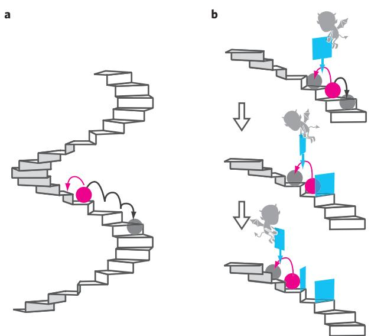
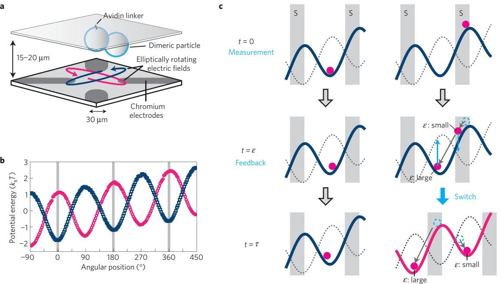
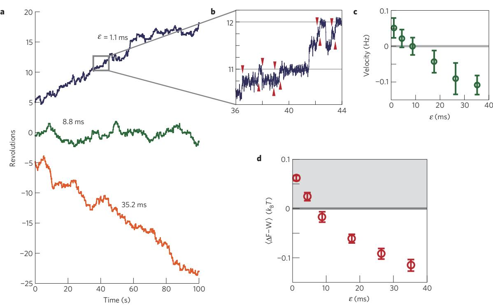
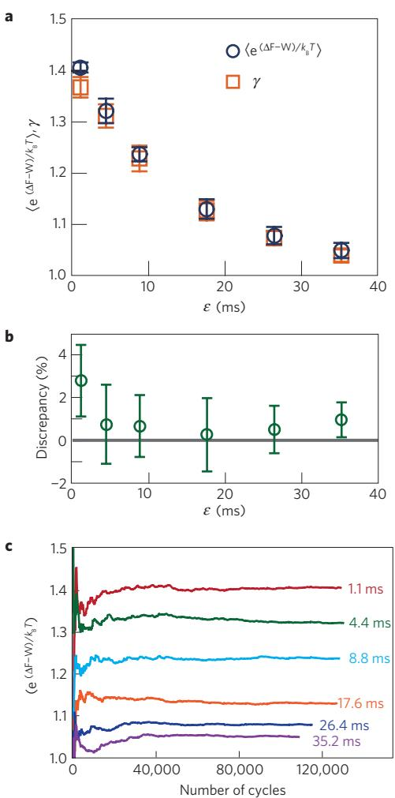
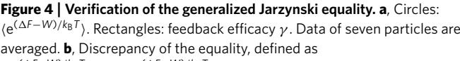

# **Experimental demonstration of information-to-energy conversion and validation of the generalized Jarzynski equality**

**Shoichi Toyabe1 , Takahiro Sagawa2 , Masahito Ueda2,3, Eiro Muneyuki1 * and Masaki Sano2 ***

**In 1929, Leó Szilárd invented a feedback protocol[1](#page-4-0) in which a hypothetical intelligence—dubbed Maxwell's demon—pumps heat from an isothermal environment and transforms it into work. After a long-lasting and intense controversy it was finally clarified that the demon's role does not contradict the second law of thermodynamics, implying that we can, in principle, convert information to free energy[2–](#page-4-1)[6](#page-4-2) . An experimental demonstration of this information-to-energy conversion, however, has been elusive. Here we demonstrate that a non-equilibrium feedback manipulation of a Brownian particle on the basis of information about its location achieves a Szilárd-type information-to-energy conversion. Using realtime feedback control, the particle is made to climb up a spiral-staircase-like potential exerted by an electric field and gains free energy larger than the amount of work done on it. This enables us to verify the generalized Jarzynski equality[7](#page-4-3) , and suggests a new fundamental principle of an 'information-to-heat engine' that converts information into energy by feedback control.**

To illustrate the basic idea of our feedback protocol, let us consider a microscopic particle on a spiral-staircase-like potential [(Fig. 1)](#page-0-0). We set the height of each step comparable to the thermal energy *k*B*T*, where *k*B is the Boltzmann constant and *T* is temperature. Subjected to thermal fluctuations, the particle jumps between steps stochastically. Although the particle sometimes jumps to an upper step, downward jumps along the gradient are more frequent than upward jumps. In this manner, on average, the particle falls down the stairs unless it is externally pushed up [(Fig. 1a](#page-0-0)). Now, let us consider the following feedback control: We measure the particle's position at regular intervals, and if an upward jump is observed we place a block behind the particle to prevent subsequent downward jumps [(Fig. 1b](#page-0-0)). If this procedure is repeated, the particle is expected to climb up the stairs. Note that, in the ideal case, energy to place the block can be negligible; this implies that the particle can obtain free energy without any direct energy injection. In such a case, what drives the particle to climb up the stairs? This apparent contradiction to the second law of thermodynamics, epitomized by Maxwell's demon, inspired many physicists to generalize the principles of thermodynamics[1,](#page-4-0)[5,](#page-4-4)[6](#page-4-2). It is now understood that the particle is driven by the 'information' gained by the measurement of the particle's location[5](#page-4-4)[,8](#page-4-5) .

In microscopic systems, thermodynamic quantities such as work, heat and internal energy do not remain constant but

**Figure 1** | **Schematic illustration of the experiment. a**, A microscopic particle on a spiral-staircase-like potential with a step height comparable to *k*B*T*. The particle stochastically jumps between steps owing to thermal fluctuations. As the downward jumps along the gradient are more frequent than the upward ones, the particle falls down the stairs, on average. **b**, Feedback control. When an upward jump is observed, a block is placed behind the particle to prevent downward jumps. By repeating this cycle, the particle is expected to climb up the stairs without direct energy injection.

fluctuate[9](#page-4-6)[,10](#page-4-7). In fact, stochastic violations of the second law have been observed[11](#page-4-8)[,12](#page-4-9); nonetheless, the second law still holds, on average, if the initial state is in thermal equilibrium: h1*F* −*W* i ≤ 0, where 1*F* is the free-energy difference between states, *W* the work done on the system and h·i the ensemble average. However, the feedback control enables us to selectively manipulate only fluctuations that cause 1*F* − *W* > 0 such as upward jumps by using the information about the system[13](#page-4-10)[–15](#page-4-11). Here, 'feedback' means that control protocols depend on measurement outcomes of the controlled system, in other words, 'feedback control' means a 'closed-loop control'[16](#page-4-12). Our gedanken experiment shows that, by employing feedback control, the information can be used as a resource for free energy. In fact, Szilárd has developed a model that converts one bit of information about the system to *k*B*T* ln2

1Department of Physics, Faculty of Science and Engineering, Chuo University, Kasuga, Tokyo 112-8551, Japan, 2Department of Physics, Graduate School of Science, University of Tokyo, Hongo, Tokyo 113-0033, Japan, 3ERATO Macroscopic Quantum Control Project, JST, Yayoi, Tokyo 113-8656, Japan. *e-mail: [emuneyuk@phys.chuo-u.ac.jp;](mailto:emuneyuk@phys.chuo-u.ac.jp) [sano@phys.s.u-tokyo.ac.jp.](mailto:sano@phys.s.u-tokyo.ac.jp)

**Figure 2** | **Experimental set-up[29,](#page-4-13)[30](#page-4-14) . a**, The particle was pinned at a single point of the top glass surface and exhibited rotational Brownian motion. To impose a tilted periodic potential on the particle, an elliptically rotating electric field (blue and pink curves) was induced (not to scale; see Methods and Supplementary Information for details). **b**, Typical potentials with opposite phases to be switched in the feedback control. The particle experienced a tilted periodic potential with a period of 180◦ . The height and slope were 3.05±0.03 *k*B*T* and 1.13±0.06 *k*B*T*/360◦ (mean±S.E., seven particles), respectively. **c**, Feedback control. At time *t* = 0, the particle's angular position is measured. If the particle is observed in the angular region indicated by 'S', we switch the potential at *t* = ε by inverting the phase of the potential (right). Otherwise, we do nothing (left). At *t* = τ , the next cycle starts. The location of region S is altered by the switching. The potential wells correspond to the steps of the spiral stairs in Fig. 1. The switching of potentials corresponds to the placement of the block.

of free energy or work[1](#page-4-0) . In other words, the second law is generalized[17](#page-4-15) as follows:

$$
\langle \Delta F - W \rangle \le k_{\mathbb{B}} T I \tag{1}
$$

Here *I* is the mutual information content obtained by measurements[6,](#page-4-2)[18](#page-4-16) (see Methods). So far, the idea of a simple thermal rectification by feedback control has found applications such as the reduction of thermal noise[15](#page-4-11) and the rectification of an atomic current at low temperature[13](#page-4-10). On the other hand, the Szilárd-type Maxwell demon enables us to evaluate both the input (used information content) and the output (obtained energy) of the feedback control and relate them operationally. Therefore, it has provided an ideal test-ground of information-to-energy conversion and played the crucial role in the foundation of thermodynamics. However, its experimental realization has been elusive. In this experiment, we develop a new method to evaluate the information contents and thermodynamic quantities of feedback systems and demonstrate the Szilárd-type information-to-energy conversion for the first time using a colloidal particle on a spiral-staircase-like potential.

A dimeric particle comprising polystyrene beads (diameter = 287 nm) was attached to the top glass surface of a chamber filled with a buffer solution [(Fig. 2a](#page-1-0)). The particle was pinned at a single point by a linker molecule; it exhibited rotational Brownian motion (Supplementary Fig. S2). By using quadrant electrodes imprinted on the bottom glass plate, we imposed 1 MHz electric fields to simultaneously create periodic potentials and constant torque on the particle along the angle of rotation. By using this new method, a tilted periodic potential with an ideal sinusoidal shape for the particle can be achieved, which is a realization of the spiral-staircase-like potential mentioned above [(Fig. 2b](#page-1-0), see also Supplementary Information). A feedback control was carried out under a microscope by constructing a real-time feedback system including video capture, image analysis, potential modulation and data storage. We repeated the following feedback cycle with a period of τ =44 ms and a minimum feedback delay of 1.1 ms, as illustrated in [Fig. 2c](#page-1-0). At *t* = 0, the particle's angular position is measured. If the particle is observed at the angular region indicated as 'S', the potential is changed to that with an opposite phase at *t* = ε; otherwise, no action is taken. At *t* =τ , the next cycle begins with the measurement of the angular position. Region S was chosen for its energy advantage; in region S, the potential energy before switching is always higher than that after switching. In the case of small ε, the particle is expected to be at rest around region S just before the switching at *t* = ε and then jump to the rightward well of the switched potential after the switching. On the other hand, for large ε, the particle falls down in the well away from region S before the switching. In this case, with a large probability, the particle jumps down to the leftward well of the switched potential after the switching. In this manner, the feedback delay ε regulates the efficiency of the feedback control. Note that, as τ = 44 ms is sufficiently larger than the relaxation time in each well (∼10 ms) and smaller than the typical time to jump to neighbour wells (∼1 s), each feedback cycle is supposed to be a transition between equilibrium states.

In [Fig. 3a](#page-2-0), typical trajectories with the feedback control are shown. The trajectories are stepwise with a step size of 90◦ , which reflects the potential profile [(Fig. 3b](#page-2-0)). We find that for small ε the particle rotates unidirectionally while climbing up the potential, whereas for large ε the particle goes down along the gradient. The rotation rate decreases monotonically with ε, as expected [(Fig. 3c](#page-2-0)).

We then focused on the energetics during a cycle. In [Fig. 3d](#page-2-0), we show the difference between the obtained free energy 1*F* and the work done on the particle by the switching, *W* , which is averaged

**Figure 3** | **Trajectories, mean velocities and excess free energy under feedback control. a**, Typical trajectories for different values of the feedback delay ε. **b**, Magnified plot of the region indicated by a rectangle in **a**. The particle rotates with steps with a size of 90◦ reflecting the profile of the potential. Red triangles indicate the timings of the switchings. **c**, Variation of the rotation rate with feedback delay ε. The rotation rate is defined as positive when the particle climbs up the potential. Data of seven particles are averaged. Error bars indicate standard deviations among particles. **d**, 1*F*, the free-energy difference between the initial and final states of the cycle; *W*, the amount of work done on the particle by the switching calculated as the potential-energy change associated with the switching (see Methods). In cycles without switching, *W* = 0. h·i denotes the mean per cycle. In the shaded region, we obtain the excess free energy beyond the conventional limitation of the second law of thermodynamics. Error bars indicate standard deviations among particles.

over a cycle (see Methods). We find that h1*F* −*W* i > 0 for small ε; this implies that the particle gains a net free energy larger than the work done by absorbing heat beyond the conventional limitation of the second law of thermodynamics. For small ε, the switching mostly occurs when the particle is in region S. In such cases, the particle absorbs heat from an isothermal environment to reach region S before the measurements at *t* = 0, then does work on the electric field at the switching, and finally jumps to the rightward well after the switching (Supplementary Fig. S7). Although such an event is not prohibited even if we randomly switch potentials without feedback control, it is typically an accidental and rare event in accordance with the second law of thermodynamics or the fluctuation theorem[19–](#page-4-17)[21](#page-4-18). However, the feedback control can increase the likelihood of occurrence of such an event. This is the crux of the control by Maxwell's demon. The resource of the excess free energy is the information obtained by the measurement. If the estimation error of the particle's angular position is negligible, the amount of information is characterized by the Shannon information content *I* (ref. [22)](#page-4-19). In this study, *I* = −*p*ln*p* − (1 − *p*)ln(1 − *p*), where *p* is the probability that the particle is observed in region S (see Methods). As noted in [(1)](#page-1-1), *I* can be converted to free energy of up to *k*B*TI* (ref. [1)](#page-4-0). In our system, for the shortest feedback delay (ε=1.1 ms), *p*, *I* and h1*F* −*W* iwere 0.059, 0.22 and 0.062 *k*B*T*, respectively (Supplementary Fig. S9). This gives the efficiency of the information-to-energy conversion as h1*F* − *W* i/*k*B*TI* = 28%. 100% efficiency can be achieved by quasistatic information heat engines such as the Szilárd engine[1](#page-4-0) .

Although the second law concerns only the average, or the first-order cumulant, of the stochastic quantity 1*F* −*W* , Jarzynski pointed out that the second law naturally emerges as the first-order cumulant expansion of the following equality that involves 1*F* −*W*

to all orders[23](#page-4-20)[,24](#page-4-21): he (1*F*−*W* )/*k*B*T* i = 1. Recently, the Jarzynski equality, which assumes a prescribed control scheme, was generalized to systems with a feedback control as follows[7](#page-4-3) (see Methods for heuristic derivation):

$$
\langle \langle \mathbf{e}^{(\Delta F - W)/k_{\rm fl}T} \rangle = \mathcal{Y} \tag{2}
$$

where γ is an experimentally measurable quantity and is defined as the sum of the probabilities that the time-reversed trajectories are observed under time-reversed protocols for all possible protocols (see Methods). From its definition, 0 ≤ γ ≤ 2 in our system. Whereas *I* concerns the information obtained by the measurements, γ quantifies how efficiently we use the obtained information for the feedback control. If we control the system perfectly and deterministically, a time-reversed trajectory is always realized under the time-reversed protocol; γ then takes its maximum value. We repeated time-reversed cycles with and without switchings to obtain γ with a period of 220 ms, which is sufficiently long to ensure that the initial state of the cycle is relaxed to equilibrium.

[Figure 4](#page-3-0) shows that the conventional Jarzynski equality is violated in the presence of the feedback control. For large ε where h1*F* −*W* i ≤ 0, the second law holds on average, but the Jarzynski equality is violated. On the other hand, the generalized Jarzynski equality [(2)](#page-2-1) holds over a broad range of ε [(Fig. 4a](#page-3-0)), showing that equality [(2)](#page-2-1) expresses the effect of feedback control to all orders. γ seems to converge to unity in the limit of infinite ε; here, the angular position at the switching becomes independent of that at the measurement, and the conventional Jarzynski equality recovers. For a close examination, we plotted the discrepancy between γ and he (1*F*−*W* )/*k*B*T* i and its convergence in [Fig. 4b](#page-3-0) and c, respectively. The small discrepancy, less than 3%, for small ε [(Fig. 4b](#page-3-0)) is supposed to

[he (1*F*−*W*)/*k*B*T* i−γ ]/he (1*F*−*W*)/*k*B*T* i, as a percentage. **c**, Convergence of the estimate of he (1*F*−*W*)/*k*B*T* i as a function of the number of cycles, plotted for different feedback delays ε. Error bars indicate standard deviations among particles.

result from the definition of the states. The equality assumes that each cycle starts from an equilibrium state. However, as the probability that the particle escapes from the well is not zero, an equilibrium state cannot be realized in a precise sense. Although the typical escape time (∼1 s) is much larger than the period of cycle (44 ms), it is possible that such a small discrepancy arises. It is known that a large number of cycles is necessary for the Jarzynski equality to converge owing to the exponential average[24](#page-4-21). We repeated more than 100,000 cycles for each ε and confirmed the convergence of the left-hand side of [(2)](#page-2-1) [(Fig. 4c](#page-3-0)). The validity of [(2)](#page-2-1) verifies a new fundamental principle of an 'information-heat engine', which converts information to free energy, in terms of all orders.

As the energy converted from information is compensated for by the demon's energy cost to manipulate information[2–](#page-4-1)[4](#page-4-22), the second law of thermodynamics is not violated when the total system including both the particle and demon is considered. In our system, the demon consists of macroscopic devices such as computers; the microscopic device gains energy at the expense of the energy consumption of a macroscopic device. In other words, by using information as the energy-transferring 'medium', this information-to-energy conversion can be used to transport energy to nanomachines[25](#page-4-23)[,26](#page-4-24) even if it is not possible to drive them directly (Supplementary Fig. S1). The next step will be to extract work from the obtained free energy explicitly by coupling the system with a microscopic transducer. This can cause a further loss of the conversion efficiency. However, in this study, compared with the obtained free energy of ∼*k*B*T*, a huge amount of energy was consumed for the information processing at the macroscopic level. The future challenge is to realize a nanoscale informationprocessing device such as an artificial molecular motor[27](#page-4-25), in which both the demon and the controlled system are microscopic.

### **Methods**

**Experimental set-up.** A dimeric particle composed of particles (287 nm diameter, Seradyn) was non-specifically attached to the top glass surface by means of a streptavidin linker coated on the particle's surface. To impose a tilted periodic potential on the particle, an elliptically rotating electric field was induced by applying 1 MHz sinusoidal voltages on the quadrant electrodes patterned on the bottom glass surface. The direction of the long axis of the elliptically rotating electric field corresponds to the local minima of the potential. By changing the direction of its axis, we inverted the phase of the potential. The particle was observed on an upright microscope equipped with a high-speed camera at a period of 1.1 ms with an exposure time of 0.3 ms. Potentials were measured from transition probabilities. More than 100,000 feedback cycles were carried out for each feedback delay (ε). See Supplementary Information for details.

**Free energy and work.** Each potential well separated by peaks was defined as a state (Supplementary Fig. S6). The free energy of state *k* was calculated as *F*k = −*k*B*T* ln[ R d*x*e −*U*(*x*)/*k*B*T* ], where *U*(*x*) is the potential energy at angular position *x*, and the integration is carried out in the angular region corresponding to state *k*. As the shapes of all the wells are almost the same, the free-energy difference between states is nearly equal to the difference of the potential energies of their local minima. The work done on the particle, *W* , was calculated as the potential-energy change associated with the switching: the potential energy after the switching minus that before the switching. In cycles without switching, *W* =0.

**Information content.** For an event *k* with a probability of occurrence *p*(*k*), the Shannon information content associated with this event is defined as −ln*p*(*k*). This definition leads to well-defined properties that the information content should satisfy[22](#page-4-19). The average Shannon information content becomes *I* ≡ −P *k p*(*k*)ln*p*(*k*). Measurements are usually accompanied by errors, which reduce the amount of information that can be used. Although *I* denotes the amount of the information embedded in the system, the mutual information content, *I* 0 , denotes the amount of information that is obtained by the measurement[7](#page-4-3)[,18](#page-4-16): *I* 0 ≡ P k,m *p*(*m*|*k*)*p*(*k*)ln*p*(*m*|*k*)/*p*(*k*), where *p*(*m*|*k*) is the conditional probability that the outcome of the measurement is the *m*th event when the *k*th event occurs actually. If the measurement is free from error, *p*(*m*|*k*) = δ*k*,*m* (δk,m = 1 if *k* = *m*, and otherwise 0). In such a case, *I* 0 =*I*. In the present experiment, we distinguished two events: the particle is observed in region S or not with negligible measurement errors. Then, the (average) Shannon information content per cycle becomes the so-called binary entropy function: *I* = −*p*ln*p*−(1−*p*)ln(1−*p*), where *p* is the probability that the particle is observed in region S.

**Generalized Jarzynski equality and feedback efficacy.** Let us consider the situations in which we make measurements without error and divide the phase-space of the particle into several regions. Then, in each region, a more detailed expression of the Jarzynski equality holds[28](#page-4-26): he (1*F*−*W* )/*k*B*T* iA = *P* † (A)/*P*(A), where h···iA is the ensemble average over trajectories under the condition that the particle is observed in region A (A=S or outside S in our set-up) with probability *P*(A), and *P* † (A) is the probability that the particle is observed in A under the time-reversed control protocol. Without feedback control, this detailed equality reproduces the Jarzynski equality as he (1*F*−*W* )/*k*B*T* i = P A *P*(A)he (1*F*−*W* )/*k*B*T* iA = P A *P* † (A) = 1. In contrast, with feedback control, *P* † (A)A is no longer a single probability distribution in terms of A, because the control protocols depend on A. Therefore, P A *P* † (A) is not necessarily equal to unity. In such cases, the Jarzynski equality needs to be generalized to [(2)](#page-2-1), where γ = P A *P* † (A).

We measured the feedback efficacy, γ , as follows (see Supplementary Fig. S8). In the forward feedback cycle, we measured the particle's angular position at *t* = 0 and (1) switched or (2) did not switch the potential at *t* = ε depending on the angular position. Corresponding time-reversed trajectories are that the particle is observed in the region (1) S at *t* = τ after the switching at *t* = τ −ε or (2) outside S without switching. Let the occurrence probabilities of time-reversed trajectories under timer-reversed protocols be *p*sw and *p*ns, respectively. Then, γ is γ = *p*sw +*p*ns. From its definition, if there are *m* states to be distinguished (*m* = 2 in our experiment: whether the particle is in region S or not), 0 ≤ γ ≤ *m*. We repeated time-reversed cycles with/without switchings to obtain γ with a period of 220 ms, which is sufficiently long to ensure that the initial state of the cycle is relaxed to equilibrium.

### Received 22 July 2010; accepted 21 September 2010; published online 14 November 2010

### **References**

- 1. Szilárd, L. On the decrease of entropy in a thermodynamic system by the intervention of intelligent beings. *Z. Phys.* **53,** 840–856 (1929).
- 2. Landauer, R. Irreversibility and heat generation in the computing process. *IBM J. Res. Dev.* **5,** 183–191 (1961).
- 3. Bennett, C. H. The thermodynamics of computation—a review. *Int. J. Theor. Phys.* **21,** 905–940 (1982).
- 4. Sagawa, T. & Ueda, M. Minimal energy cost for thermodynamic information processing: Measurement and information erasure. *Phys. Rev. Lett.* **102,** 250602 (2009).
- 5. Leff, H. S. & Rex, A. F. *Maxwell's Demon 2: Entropy, Classical and Quantum Information, Computing* (Institute of Physics Publishing, 2003).
- 6. Maruyama, K., Nori, F. & Vedral, V. The physics of Maxwell's demon and information. *Rev. Mod. Phys.* **81,** 1–23 (2009).
- 7. Sagawa, T. & Ueda, M. Generalized Jarzynski equality under nonequilibrium feedback control. *Phys. Rev. Lett.* **104,** 090602 (2010).
- 8. Serreli, V., Lee, C-F., Kay, E. R. & Leigh, D. A. A molecular information ratchet. *Nature* **445,** 523–527 (2007).
- 9. Bustamante, C., Liphardt, J. & Ritort, F. The nonequilibrium thermodynamics of small systems. *Phys. Today* **58,** 43–48 (July, 2005).
- 10. Sekimoto, K. in *Stochastic Energetics* (Lecture Notes in Physics, Vol. 799, Springer, 2010).
- 11. Wang, G. M., Sevick, E. M., Mittag, E., Searles, D. J. & Evans, D. J. Experimental demonstration of violations of the second law of thermodynamics for small systems and short time scales. *Phys. Rev. Lett.* **89,** 050601 (2002).
- 12. Carberry, D. M. *et al*. Fluctuations and irreversibility: An experimental demonstration of a second-law-like theorem using a colloidal particle held in an optical trap. *Phys. Rev. Lett.* **92,** 140601 (2004).
- 13. Thorn, J. J., Schoene, E. A., Li, T. & Steck, D. A. Experimental realization of an optical one-way barrier for neutral atoms. *Phys. Rev. Lett.* **100,** 240407 (2008).
- 14. Lopez, B. J. *et al*. Realization of a feedback controlled flashing ratchet. *Phys. Rev. Lett.* **101,** 220601 (2008).
- 15. Jourdan, G., Torricelli, G., Chevrier, J. & Comin, F. Tuning the effective coupling of an AFM lever to a thermal bath. *Nanotechnology* **18,** 475502 (2007).
- 16. Doyle, J. C., Francis, B. A. & Tannenbaum, A. R. *Feedback Control Theory* (Prentice Hall, 1992).
- 17. Sagawa, T. & Ueda, M. Second law of thermodynamics with discrete quantum feedback control. *Phys. Rev. Lett.* **100,** 080403 (2008).
- 18. Cover, T. M. & Thomas, J. A. *Elements of Information Theory* (John Wiley, 1991).
- 19. Evans, D. J., Cohen, E. G. D. & Morriss, G. P. Probability of second law violations in shearing steady states. *Phys. Rev. Lett.* **71,** 2401–2404 (1993).
- 20. Gallavotti, G. & Cohen, E. G. D. Dynamical ensembles in nonequilibrium statistical mechanics. *Phys. Rev. Lett.* **74,** 2694–2697 (1995).
- 21. Crooks, G. E. Entropy production fluctuation theorem and the nonequilibrium work relation for free energy differences. *Phys. Rev. E* **60,** 2721–2726 (1999).
- 22. Shannon, C. E. A mathematical theory of communication. *Bell System Tech. J.* **27,** 379–423, 623–656 (1948).
- 23. Jarzynski, C. Nonequilibrium equality for free energy differences. *Phys. Rev. Lett.* **78,** 2690–2693 (1997).
- 24. Liphardt, J., Dumont, S., Smith, S. B., Tinoco, I. Jr & Bustamante, C. Equilibrium information from nonequilibrium measurements in an experimental test of Jarzynski's equality. *Science* **296,** 1832–1835 (2002).
- 25. Leigh, D. A., Wong, J. K. Y., Dehez, F. & Zerbetto, F. Unidirectional rotation in a mechanically interlocked molecular rotor. *Nature* **424,** 174–179 (2003).
- 26. van Delden, R. A. *et al*. Unidirectional molecular motor on a gold surface. *Nature* **437,** 1337–1340 (2005).
- 27. Hänggi, P. & Marchesoni, F. Artificial Brownian motors: Controlling transport on the nanoscale. *Rev. Mod. Phys.* **81,** 387–442 (2009).
- 28. Kawai, R., Parrondo, J. M. R. & den Broeck, C. V. Dissipation: The phase-space perspective. *Phys. Rev. Lett.* **98,** 080602 (2007).
- 29. Watanabe-Nakayama, T. *et al*. Effect of external torque on the ATP-driven rotation of F1-ATPase. *Biochem. Biophys. Res. Commun.* **366,** 951–957 (2008).
- 30. Toyabe, S. *et al*. Nonequilibrium energetics of a single F1-ATPase molecule. *Phys. Rev. Lett.* **104,** 198103 (2010).

## **Acknowledgements**

We thank T. Okamoto, M. Miyazaki and N. Akiyama for critical discussions and A. Ozeki for illustrations. This work was supported by Japan Science and Technology Agency (JST) and Grants-in-Aid for Scientific Research 18074001, 17049015, 19037022 and 18031033 (to E.M.), and 21740291, 21023007 (to S.T.) and 21244061 (to M.S.). T.S. acknowledges JSPS Research Fellowships for Young Scientists (208038).

### **Author contributions**

S.T. designed and carried out experiments, analysed data and wrote the paper. T.S. and M.S. designed experiments and wrote the paper. T.S. and M.U. supported theoretical aspects. E.M. and M.S. supervised the experiments. All authors discussed the results and implications and commented on the manuscript at all stages.

# **Additional information**

The authors declare no competing financial interests. Supplementary information accompanies this paper on [www.nature.com/naturephysics.](http://www.nature.com/naturephysics) Reprints and permissions information is available online at [http://npg.nature.com/reprintsandpermissions.](http://npg.nature.com/reprintsandpermissions) Correspondence and requests for materials should be addressed to E.M. or M.S.