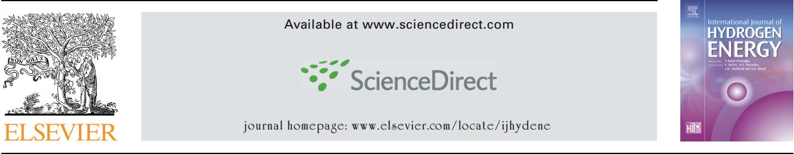
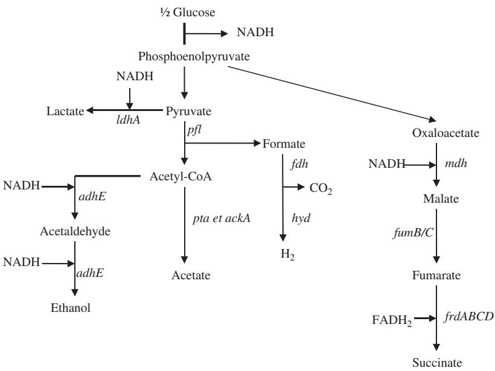
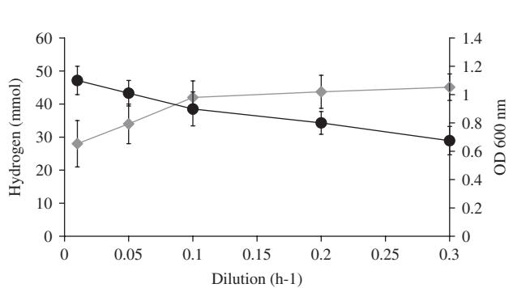
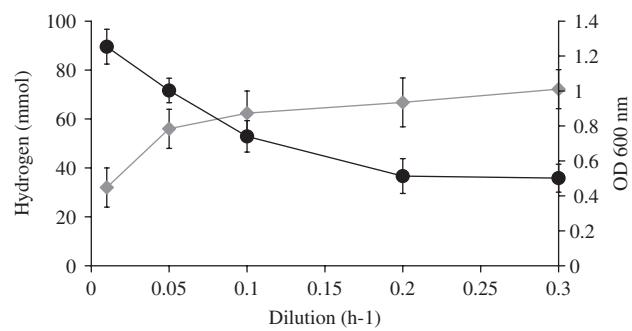
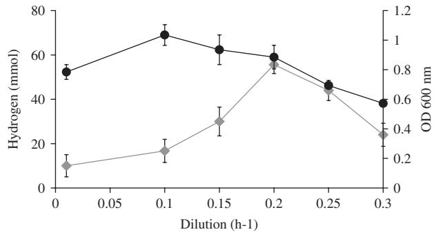
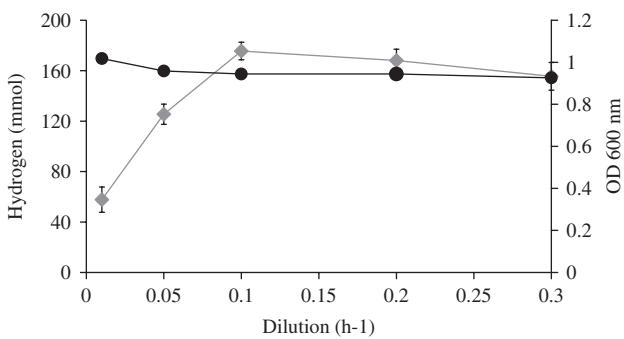
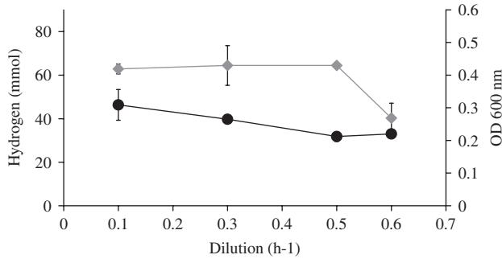
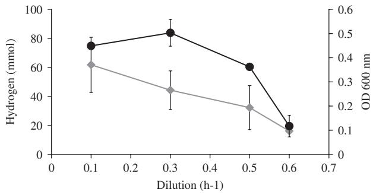

# Hydrogen production by continuous cultures of Escherchia coli under different nutrient regimes

### Jonathan Turcot1 , Ariane Bisaillon1 , Patrick C. Hallenbeck-

De´partement de Microbiologie et Immunologie, Universite´ de Montre´al, CP 6128, succursale Centre-ville, Montre´al, Que´bec, Canada H3C 3J7

### article info

Article history: Received 14 June 2007 Accepted 29 September 2007 Available online 26 November 2007 Keywords: Fermentation Escherchia coli Hydrogen yields Continuous cultures Nutrient limitation

## abstract

The effects of nutrient limitations on hydrogen yields during fermentation by chemostat cultures of Escherchia coli were studied. Four nutrient regimes (limiting nutrients) were chosen; glucose, nitrogen, sulfur and phosphate. Yields with limiting phosphate or sulfate were low, at or below 1 mol H2=mol glucose. Yields with continuous cultures limited for nitrogen decreased with increasing dilution rate ðDÞ, and were lower than that obtained with a static culture ðD ¼ 0 h-1 Þ. The highest yields (at, or somewhat higher than 2 mol H2=mol glucose) were obtained with cultures limited for glucose. Under most conditions, total hydrogen production and yield were inversely related, with higher production, but lower yields, at increasing dilution rate. A strain, DJT135, mutated in the uptake hydrogenases, in lactate dehydrogenase, and with constitutively active FhlA gave the highest H2 production and greatest H2 to glucose yields.

& 2007 International Association for Hydrogen Energy. Published by Elsevier Ltd. All rights reserved.

### 1. Introduction

Soaring crude oil costs, decreasing quantities of finite petroleum reserves, and concern for abatement of greenhouse gas emissions leading to climate change are driving a search for green technologies for producing alternative fuels. Hydrogen is being widely touted as the fuel of the future, but for this option to be acceptable in the long term it is necessary to find a renewable avenue for its production. One possible approach is to use a biological process, which has been termed biohydrogen. Several scenarios have been proposed, including using solar energy through various photosynthetic processes, or carrying out an anaerobic fermentation [\[1\].](#page-4-0) Among the different avenues proposed for biohydrogen production, dark fermentation is promising because it could use numerous readily available waste streams, while at the same time requiring only relatively simple equipment [\[2\].](#page-5-0) A large variety of substrates and microorganisms have been used in studies of fermentative hydrogen production (for recent reviews see [\[2,3\])](#page-5-0). However, the major problem that presently limits its practical application is the relatively poor yields of substrate conversion to hydrogen typically obtained in all cases. Thermophilic fermentations may give higher yields, but in practical terms it is hard to justify the additional energy inputs required. For mesophilic fermentations, yields are generally around 2 (mol H2=mol glucose equivalent) [\[2\].](#page-5-0) This is so even though the fermentations are carried out by different metabolic types. Actively growing enteric type bacteria carrying out a mixed-acid fermentation are predicted to have a maximal yield of 2 (see [Fig. 1)](#page-1-0), whereas growing Clostridial type bacteria are predicted to have a maximal yield of 4. In practice, these yields are usually not obtained due to either diversion of reducing power to other products (enteric and Clostridial type), or to inhibition by the generated hydrogen partial pressure (Clostridial type) [\[2\]](#page-5-0). Again, for practical considerations, gas sparging to reduce hydrogen

-Corresponding author. Fax: +1 514 343 5701.

E-mail address: [patrick.hallenbeck@umontreal.ca (P.C. Hallenbeck).](mailto:patrick.hallenbeck@umontreal.ca)

1 Both authors contributed equally to this work.

0360-3199/\$ - see front matter & 2007 International Association for Hydrogen Energy. Published by Elsevier Ltd. All rights reserved. doi[:10.1016/j.ijhydene.2007.09.034](dx.doi.org/10.1016/j.ijhydene.2007.09.034)

Fig. 1 – The mixed-acid fermentation of Escherchia coli.

partial pressures [\[4\]](#page-5-0) would generate an unacceptably dilute hydrogen stream.

Various factors have been shown to affect hydrogen yields and/or productivity. Both yield and hydrogen production rate are sensitive to pH, which also affects end product distribution [\[5,6\].](#page-5-0) As well, temperature affects both the hydrogen yield and the productivity of mesophilic cultures, with both parameters increasing with temperature up to a falloff point ð41 CÞ [\[7,8\]](#page-5-0). We have been studying nutrient limitation as one possible avenue for controlling hydrogen yields during fermentation. Previously we have studied nutrient limitation with batch cultures of various strains of Escherchia coli [\[9\].](#page-5-0) Hydrogen yields were affected by limitation for phosphate, nitrogen, or glucose; phosphate limitation gave a maximal yield of 1, nitrogen limitation a maximal yield approaching 2, and glucose limitation gave a maximal yield of 2. Similarly, a study with batch cultures of Enterobacter cloacae showed that maximum productivity was achieved at intermediate glucose concentrations [\[10\]](#page-5-0). One study using a CSTR (continuous stirred tank reactor) demonstrated that the highest yields and productivity were obtained at intermediate sucrose concentrations [\[11\]](#page-5-0). Using chemostat reactors it has been shown that decreasing the glucose loading rate increased hydrogen yields [\[12\].](#page-5-0) In accordance with this, when sucrose was varied at a constant ammonium concentration, conversion to hydrogen was more efficient at lower substrate loadings [\[13\]](#page-5-0). On the other hand, continuous flow studies with a trickle bed reactor showed that productivities increased with increasing glucose concentrations (varied from 1 to 10:5gl-1 Þ, however, yields were quite low [\[14\].](#page-5-0) Here we have investigated the effects of limitation in four different nutrients on the fermentative hydrogen production of continuous cultures of defined strains of E. coli.

### 2. Experimental procedures

Continuous cultures were carried out using an automated chemostat, BioFlos 110 (volume 750ml), or BioFlos C30 (volume 250ml), New Brunswick Scientific Co. Inc. Dilution rates varying from 0 to 0:6 h-1 were used. Cultures were grown in modified M9 medium [\[15\]](#page-5-0) with the appropriate modifications required to generate limiting media.

M9 media with MES (42.55mM Na2HPO4, 19.22mM KH2PO4, 18.7mM NH4Cl, 8.56mM NaCl, 1mM MgSO4, 0.1mM CaCl2 0.8% glucose, 100mM MES, pH 6.6 [\[16\])](#page-5-0) was used for most of the nutrient limiting conditions, M9 with MOPS (40mM MOPS, 4mM tricine, pH 7.4, 1mM FeSO4 7H2O, 9.5mM NH4Cl, 0.276mM K2SO4, 0.5mM CaCl2, 0.525mM MgCl2, 50mM NaCl, 1.32mM K2HPO4, 0.8% glucose [\[17\])](#page-5-0) for phosphate limitation. The levels of nutrients for limiting conditions were those previously established with batch cultures [\[9\]](#page-5-0). Media were inoculated to 1% v/v with an overnight culture. Anaerobic conditions were maintained by flushing the liquid culture with high-purity argon ð5mlmin-1 Þ. The chemostat was thermostated at 37 C and the culture was continuously agitated (250–300 rpm). Automatic additions of base (10 M NaOH) maintained the pH at 6.4. Samples (in triplicate) were taken for measurement of the hydrogen concentration and optical density at steady state (three times the hydraulic retention time, or greater).

The E. coli strains used were JW135 (kind gift of KT Shanmugam), a hyd1- hyd2- ðDhya-Km Dhyb-KmÞ derivative of BW535 [\[18\]](#page-5-0). An ldhA mutation was introduced using P1 transduction of the ldhA::Tn10 allele from strain SE1750 [\[19\]](#page-5-0). FhlA is the positive regulator of the synthesis of the formate hydrogen lyase (fhl) components normally responsive to the intracellular formate concentrations. FhlA-C, an allele of fhlA

that carries a deletion of the N-terminal part of FhlA, was introduced by transformation with the plasmid pWS165 which carries this allele [\[20\].](#page-5-0) This deletion has been shown to render FhlA active even in the absence of the normal inducer formate [\[20,21\],](#page-5-0) thus strains carrying this plasmid should constitutively induce expression of the fhl system. A derivative of JW135 carrying both mutations, DJT135, was obtained.

Hydrogen was measured by injecting an aliquot of the effluent gas into a Shimadzu GC-8A chromatograph equipped with a thermal conductivity detector. The 2m column contained molecular sieve 5A with argon as the carrier gas. Residual glucose was measured using an Amplexs Red Glucose/Glucose Oxidase Assay Kit from Invitrogen.

### 3. Results

### 3.1. Hydrogen production under sulfur limitation

Hydrogen production by cultures of strain JW135 was examined at various dilution rates under sulfur limitation (Fig. 2). Strain JW135 was chosen as it is multiply mutated so as to lack all uptake hydrogenase activity (see Materials and methods). Batch studies with this strain have previously shown it to have a higher net hydrogen evolution capacity than its otherwise isogenic parent strain, BW435 [\[9\].](#page-5-0) As expected, optical density decreased with increasing dilution rate ðDÞ, reaching 0.65 OD600 nm at D ¼ 0:3 h-1 . On the other hand, hydrogen production increased with increasing dilution rate, reaching 45mmol/48 h at D ¼ 0:3 h-1 . Hydrogen production by cultures of strain DJT135 was also studied under sulfur-limiting conditions (Fig. 3). Again, optical density of the culture decreased with increasing dilution rate, reaching 0.5 OD600 nm at D ¼ 0:3 h-1 . As seen with JW135 under sulfur-limiting conditions, hydrogen production increased with increasing dilution rate, reaching in this case at 72mmol H2=48 h at D ¼ 0:3 h-1 . Therefore hydrogen production by strain DJT135 was 50% higher than with strain JW135. Thus, under continuous culture conditions this strain outperforms strain JW135, as previously reported for batch cultures [\[9\].](#page-5-0) 3.2. Hydrogen production under glucose limitation

Fig. 2 – H2 production by sulfur-limited continuous cultures of JW135. The chemostat, BioFlos 110, was run as described in Materials and methods with modified M9 medium containing 0.5 mM MgSO4. Dilution rates varied from 0.01 to 0:3 h-1 . E, H2 as mmol per 48 h; , optical density at 600 nm.

Fig. 3 – H2 production by sulfur-limited continuous cultures of DJT135. The chemostat, BioFlos 110, was run as described in Materials and methods with modified M9 medium containing 0.5 mM MgSO4. Dilution rates varied from 0.01 to 0:3 h-1 . E, H2 as mmol per 48 h; , optical density at 600 nm.

Fig. 4 – H2 production by glucose-limited continuous cultures of JW135. The chemostat, BioFlos 110, was run as described in Materials and methods with modified M9 medium containing 22 mM glucose. Dilution rates varied from 0.01 to 0:3 h-1 . E, H2 as mmol per 48 h; , optical density at 600 nm.

Hydrogen production by cultures of strain JW135 was examined at various dilution rates under glucose limitation (Fig. 4). As expected, and as seen for cultures of this strain under sulfur limitation, in general optical density decreased with increasing dilution rate, reaching 0.57 OD600 nm at D ¼ 0:3 h-1 . Hydrogen production under glucose limitation showed a more complex relationship with dilution rate than that seen under sulfur limitation, increasing with increasing dilution rate, reaching a maximum at D ¼ 0:2 h-1 , and then declining. Maximum hydrogen production at this dilution rate was 56mmol H2=48 h. Hydrogen production by glucoselimited cultures of strain DJT135 was also examined [(Fig. 5](#page-3-0)). The decrease in optical density with dilution rate was much less than that observed either with this strain under sulfur limitation, or with that of strain JW135 under both sulfur and glucose limitation. The OD600 nm of glucose-limited DJT135 at D ¼ 0:3 h-1 was 0.93. As seen with glucose-limited strain JW135 (Fig. 4), hydrogen production of glucose-limited strain

Fig. 5 – H2 production by glucose-limited continuous cultures of DJT135 The chemostat, BioFlos 110, was run as described in Materials and methods with modified M9 medium containing 22 mM glucose. Dilution rates varied from 0.01 to 0:3 h-1 . E, H2 as mmol per 48 h; , optical density at 600 nm.

DJT135 increased with increasing dilution rate, reached a maximum at intermediate dilution rates, and then declined. Maximum hydrogen production at D ¼ 0:1 h-1 was 176mmol H2=48 h. The decline in hydrogen production with glucoselimited strain DJT135 was much less dramatic than that seen with glucose-limited JW135, and was still quite high, 156mmol H2=48 h, at D ¼ 0:3 h-1 .

### 3.3. Hydrogen production under phosphate or nitrogen limitation.

Hydrogen production by continuous cultures of strain JW135 was also examined under phosphate or nitrogen limitation. Hydrogen production with this strain under these conditions was similar to that observed under sulfur or glucose limitation (see above). Maximum hydrogen production under phosphate limitation was 64mmol H2=48 h at D ¼ 0:3 or 0:5 h-1 ([Fig. 6](#page-4-0)). There was little variation with dilution rate until the greatest dilution rate, 0:6 h-1 was reached when hydrogen production decreased to 63% of its value at 0:3 h-1 . Under nitrogen limitation, dilution rate had at a greater influence over rates of hydrogen production with the maximal hydrogen production, 62mmol H2=48 h, being observed at D ¼ 0:1 h-1 . Hydrogen production decreased as the dilution rate was increased. At the greatest dilution rate examined, D ¼ 0:6 h-1 , the rate of hydrogen production was only 26% of its rate at D ¼ 0:1 h-1 ([Fig. 7)](#page-4-0). The values for both phosphate and nitrogen limitation are lower than those determined with ''batch'' cultures, i.e. with the chemostats at D ¼ 0 h-1 : nitrogen, 118mmol H2=48 h; phosphate, 74mmol H2=48 h.

### 3.4. Factors influencing yields

In general, hydrogen yields (mol H2=mol glucose) appeared to be affected by dilution rate (shown in Table 1 for strain JW135). Yields decreased with increasing dilution rate for all nutrient limitations examined (Table1). This was especially evident when nitrogen or phosphate ''batch cultures'' ðD ¼ 0 h-1 Þ were examined. In fact, these D ¼ 0 h-1 measurements were taken

### Table 1 – H2 yields (mol H2=mol glucose) obtained with JW135 under different limiting conditions

| Limitation                                                                  | Dilution rate                                          |                                                      |
|-----------------------------------------------------------------------------|--------------------------------------------------------|------------------------------------------------------|
|                                                                             | 0:1 h 1                                             | 0:3 h 1                                           |
| Phosphatea Sulfurb Nitrogenc Glucosed                              | 0:36  0:011 0:31  0:04 0:46  0:035 0:24  0:07 | 0.13770.012 0.1670.02 0.13970.018 0.1270.03 |
| a 0.13 mM KH2PO4. b 0.5 mM MgSO4. c 3.15 mM NH4Cl. d 22mM Glucose. |                                                        |                                                      |

### Table 2 – H2 yields (mol H2=mol glucose) obtained with DJT135 under different limiting conditions

| Limitation                         | Dilution rate            |                          |                          |
|------------------------------------|--------------------------|--------------------------|--------------------------|
|                                    | 0:01 h 1              | 0:1 h 1               | 0:3 h 1               |
| Sulfura Glucoseb                | 2:36  0:11 2:39  0:13 | 0:45  0:07 2:55  0:10 | 0:26  0:03 0:78  0:06 |
| a 0.5 mM MgSO4. b 22mM Glucose. |                          |                          |                          |

with the chemostats after 48 h of growth, but before dilution had commenced. Yields, 0:989 0:024 (phosphate), 2:073 0:027 (nitrogen), were higher than any continuously fed culture (not shown). These values are in accordance with the yields we previously determined with batch cultures limited for phosphate or nitrogen [\[9\].](#page-5-0) Yields of continuously fed cultures of JW135 for all limiting nutrients were surprisingly low, less than 0.5 at D ¼ 0:1 or 0:3 h-1 . Indeed, increasing the dilution rate from 0.1 to 0:3 h-1 caused a 50% decrease in calculated yields (Table 1). With nitrogen or phosphate limitation, yields were even lower at dilution rates ðDÞ greater than 0:3 h-1 (not shown).

Hydrogen yields for strain DJT135 were higher than those of JW135 at all dilution rates tested (Table 2). This is not surprising since DJT135 is a doubly mutated derivative of JW135, carrying ldhA, and an FhlA allele that is constitutively active. This strain has previously been shown to outperform JW135 during restricted batch fermentation tests of hydrogen yields [\[9\].](#page-5-0) Like JW135, yields with DJT135 varied with dilution rate, being higher with decreasing dilution rate. There was a dramatic drop off of yield when the dilution rate was changed from 0.1 to 0:3 h-1 , with the yields at 0:3 h-1 being p50% of those at 0:1 h-1 . At a dilution rate of 0:1 h-1 glucose limitation provided higher yields than sulfur limitation.

### 4. Discussion

Measurements of hydrogen production by the continuous cultures studied here show that strain DJT135, carrying a

Fig. 6 – H2 production by phosphate-limited continuous cultures of JW135. The chemostat, BioFlos C30, was run as described in Materials and methods with modified M9 medium containing 0.13 mM KH2PO4. Dilution rates varied from 0.1 to 0:6 h-1 . E, H2 as mmol per 48 h; , optical density at 600 nm.

Fig. 7 – H2 production by nitrogen-limited continuous cultures of JW135. The chemostat, BioFlos C30, was run as described in Materials and methods with modified M9 medium containing 3.15 mM NH4Cl. Dilution rates varied from 0.1 to 0:6 h-1 . E, H2 as mmol per 48 h; , optical density at 600 nm.

mutation in ldhA and an N-terminally truncated FhlA, is superior to its mother strain, JW135 (see [Figs. 4 and 5)](#page-2-0). Thus introduction of these alterations is a successful means of decreasing the diversion of reducing power away from hydrogen production, and of increasing the expression of hydrogenase. For example, under glucose limitation, maximal hydrogen production of DJT135 was three-fold greater than that of JW135 (two-fold greater under sulfur limitation). This corroborates what was found previously under more restricted conditions with batch cultures [\[9\].](#page-5-0) The maximal volumetric hydrogen production rates noted in this study, which varied from 1.3 to 5.3mmol H2 l -1 h-1 , are similar to what has been shown in some other studies of a variety of bacteria using continuous cultures limited for glucose; 2.5 [\[5\],](#page-5-0) 7.9 [\[4\],](#page-5-0) 8.4 [\[22\],](#page-5-0) and 8.8mmol H2 l -1 h-1 [\[23\]](#page-5-0). Different degrees of nutrient limitation, achieved using continuous cultures, were shown to have an effect on both hydrogen production and yields of conversion of glucose to hydrogen. It is not entirely clear why different nutrient limitations should give different yields. The apparent conversion of glucose to hydrogen could be lower when nutrients other than carbon

(glucose) are limiting due to the utilization of at least some of the excess glucose for carbon storing polymer (e.g. exopolysaccharide or glycogen) synthesis. Increased glycogen synthesis under nutrient (other than carbon) limitation is well established [\[24\]](#page-5-0). Some of the continuous cultures (JW135, S limitation and DJT135, S limitation) exhibited behavior that might not seem to fit what is usually considered the classical model. That is, there was considerable variation of cell density (OD) with dilution rate ðDÞ. The physiological reason for this is unclear at present. In this regard, it is interesting to note that a previous study [\[25\]](#page-5-0) on hydrogen production by mixed flora with sucrose as the limiting substrate showed great variation in cell density at very low dilution rates, with considerable variation (more than two-fold) at moderate dilution rates (0.075–0:176 h-1 ). On the other hand, with many of the cultures there was relatively little variation of OD with D (JW135, glucose; DJT135, glucose; JW135, P limitation; and JW135, N-limitation (the highest dilution rate, 0.6, was near washout)).

In some cases with DJT135 at low dilution rates, apparent yields somewhat higher than 2mol H2=mol glucose were obtained. This is surprising since a maximum of 2 would be predicted from the known metabolic pathways ([Fig. 1](#page-1-0)). More extensive research would be needed to fully understand this result, including the determination of mass balance and carbon and electron recovery. Interestingly, under most cases, hydrogen production increased, up to a point at least, with increasing dilution rate, whereas hydrogen yield was inversely proportional to dilution rate. The variation of these two parameters with dilution rate has been little studied in the past. One study, which only examined two very low dilution rates, 0.03 and 0:1 h-1 , with a heterogeneous microbial community, found that production and yield were increased at the higher dilution rate [\[23\].](#page-5-0) Our finding that these two parameters are inversely related under some conditions suggests that there may be a trade-off during hydrogen fermentation between increased production and increased substrate conversion. Previously, a comparison of a UASB (Upflow anaerobic sludge blanket) reactor with a CSTR has suggested that there is a trade-off between hydrogen productivity and yield, with hydrogen production rates being higher in UASB reactor and yields greater, at all retention times studied, with the CSTR [\[20\].](#page-5-0) Thus, as shown here, dilution rate (hydraulic retention time) may be an important factor controlling the overall efficiency of a hydrogen producing fermentation.

### Acknowledgment

This research was supported by the Natural Sciences and Engineering Research Council of Canada and Natural Resources Canada under their joint Greenhouse Gas Mitigation program (GHGPJ 256813-02).

REFERENCES

[1] Hallenbeck PC, Benemann JR. Biological hydrogen production; fundamentals and limiting processes. Int J Hydrogen Energy 2002;27:1185–93.

- [2] Hallenbeck PC. Fundamentals of the fermentative production of hydrogen. Water Sci Tech 2005;52(1–2):21–9.
- [3] Kapdan IK, Kargi F. Bio-hydrogen production from waste materials. Enz Microbiol Tech 2006;38:569–82.
- [4] Mizuno O, Dinsdale R, Hawkes FR, Hawkes DL, Noike T. Enhancement of hydrogen production from glucose by nitrogen gas sparging. Bioresource Technol 2000;73:59–65.
- [5] Fang HH, Liu H. Effect of pH on hydrogen production from glucose by a mixed culture. Bioresource Technol 2002;82:87–93.
- [6] Mu Y, Zheng X-J, Yu H-Q, Zhu R-F. Biological hydrogen production by anaerobic sludge at various temperatures. Int J Hydrogen Energy 2006;31:780–5.
- [7] Lin C-Y, Hung C-H, Chen C-H, Chung W-T, Cheng L-H. Effects of initial cultivation pH on fermentative hydrogen production from xylose using natural mixed cultures. Proc Biochem 2006;41:1383–90.
- [8] Zhang Y, Shen J. Effect of temperature and iron concentration on the growth and hydrogen production of mixed bacteria. Int J Hydrogen Energy 2006;31:441–6.
- [9] Bisaillon A, Turcot J, Hallenbeck PC. The effect of nutrient limitation on hydrogen production by batch cultures of Escherchia coli. Int J Hydrogen Energy 2006;31:1504–8.
- [10] Nath K, Kumar A, Das D. Effect of some environmental parameters on fermentative hydrogen production by Enterobacter cloacae DM11. Can J Microbiol 2006;52:525–32.
- [11] Kim S-H, Han S-K, Shin H-S. Effect of substrate concentration on hydrogen production and 16 sDNA-based analysis of the microbial community in a continuous fermenter. Proc Biochem 2006;41:199–207.
- [12] Van Ginkel SW, Logan B. Increased biological hydrogen production with reduced organic loading. Water Res 2005;39:3819–26.
- [13] Van Ginkel S, Sung S, Lay J-J. Biohydrogen production as a function of pH and substrate concentration. Environ Sci Technol 2001;35:4726–30.
- [14] Zhang H, Bruns MA, Logan BE. Biological hydrogen production by Clostridium acetobutylicum in an unsaturated flow reactor. Water Res 2006;40:728–34.
- [15] Davis RW, Botstein D, Roth JR. Advanced bacterial genetics. Cold Spring Harbor, NY: Cold Spring Harbor Laboratory; 1980.
- [16] Miller JH. A short course in bacterial genetics: a laboratory manual and handbook for Escherichia Coli and related bacteria. Cold Spring Harbor, NY: Cold Spring Harbor Laboratory; 1992.
- [17] Neidhardt FC, Bloch PL, Smith DF. Culture medium for enterobacteria. J Bacteriol 1974;119:736–47.
- [18] Menon NK, Robbins J, Wendt JC, Shanmugam KT, Przybyla AE. Mutational analysis and characterization of the Escherchia coli hya operon, which encodes [NiFe] hydrogenase 1. J Bacteriol 1991;173:4851–61.
- [19] Bunch PK, Mat-Jan F, Lee N, Clark DP. The ldhA gene encoding the fermentative lactate dehydrogenase of Escherchia coli. Microbiol 1997;143:187–95.
- [20] Self WT, Hasona A, Shanmugam KT. N-terminal truncations in the FhlA protein result in formate- and MoeA-independant expression of the hyc (formate hydrogenlyase) operon of Escherchia coli. Microbiol 2001;147:3093–104.
- [21] Leonhartsberger S, Ehrenreich A, Bo¨ ck A. Analysis of the domain structure and the DNA binding site of the transcriptional activator FhlA. Eur J Biochem 2000;267:3672–84.
- [22] Gavala HN, Skiadas IV, Ahring BK. Biological hydrogen production in suspended and attached growth anaerobic reactor systems. Int J Hydrogen Energy 2006;31:1164–75.
- [23] Iyer P, Bruns MA, Zhang H, Van Ginkel S, Logan BE. H2 producing bacterial communities from heat-treated soil inoculum. Appl Microbiol Biotechnol 2004;66:166–73.
- [24] Preiss J, Yung G-S, Baecker PA. Regulation of bacterial glycogen metabolism. Mol Cell Biochem 1983;57:61–80.
- [25] Chen C-C, Lin C-Y, Chang J-S. Kinetics of hydrogen production with continuous anaerobic cultures utilizing sucrose as the limiting substrate. Appl Microbiol Biotechnol 2001;57:56–64.