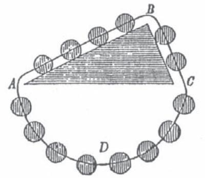

# Conservation of Energy Readings on the Origins of the First Law of Thermodynamics. Part I*

## abstract **(Conservation of Energy. Readings on the Origins of the First Law of Thermodynamics. Part I)**

The concepts of matter, motion, and energy have occupied the minds of philosophers and scientists since ancient times. Although there were many who believed that mass and energy are conserved, it took many years until the first law of thermodynamics acquired its present form. The law of conservation of energy is one of the fundamental principles of the physical world as we understand it today. By negating the possibility of perpetual motion it puts a ceiling to the utilization of energy and to the thermodynamic efficiency of processes.

palabras clave Energy, thermodynamics, conservation of energy, perpetuum mobile, first law, Bernouilli, Descartes, Carnot, Spinoza, Leibniz

*Jaime Wisniak1*

### Resumen

Los conceptos de masa, movimiento y energía han ocupado la atención de filósofos y científicos desde tiempos ancestrales. Aun cuando hubo muchos que creían que la masa y la energía se conservaban, debieron pasar muchos años hasta que la primera ley de la termodinámica adquiriera su forma actual. La ley de conservación de la energía es uno de los principios fundamentales del mundo físico como lo entendemos hoy. Negar la posibilidad del movimiento perpetuo le coloca un límite superior a la utilización de la energía y a la eficiencia termodinámica de un proceso.

The First Law of Thermodynamics speaks about the conservation of the energy: energy cannot be destroyed or created; it can only be transformed. In a given situation energy may be present in several forms; use of a common denominator allows calculation of the total amount present. In the words of John Bernhardt Stallo (1823-1900) "it may be truly asserted that human intelligence begins and ends with the principle above stated" (Stallo, 1960).

Although this law is only about 170 years old, the ancient philosophers elaborated extensively on phenomena that today would be explained in terms of energy and matter. Not

**Correo electrónico:** wisniak@bgumail.bgu.ac.il

only that, they devoted much thinking and discussion about the possibility of creation and disappearance of energy and mass, and some of them, well ahead their time, concluded against the possibility of perpetual motion. Epicurus (ca. 341-271 bce) may be considered the first to apply to motion the principle that nothing can absolutely originate or perish. He wrote (Epicurus, 1963) that there is no place beyond the universe to which matter or motion can be communicated or from which it can be derived. Titus Lucretius Carus (? - 55 bce) in his book De Rerum Natura (Lucretius, 1992) he says: "Things cannot be created from nothing nor again, once engendered, can they be reduced to nothing… Add unto this, nature to their first state doth all dissolve, nothing annihilate… Nature preserves it whole from dissipation… Since Nature one thing, from another makes, nor is there ought indeed which she supplies without the aid of something else that dies… "

In Aristotelian philosophy *matter* is the potential thing actualized by the energy of form, but matter and form are inseparable, inasmuch as the actual is itself potential having reached completion. Despite the clear Greek roots of the word *energy* (energeia), the materialization of a significant concept associated with it dates only from the first decades of the nineteenth century. The technical term itself was introduced in 1807 by Thomas Young (1773-1829) in Lecture VIII (*On Collision*) of his *Lectures on Natural Philosophy*  (Young, 1807), as follows: "When bodies are perfectly elastic, it may be also be shown that the sum of their energies or ascending forces in their respective directions remains also unaltered. The term energy may be applied with great propriety to the product of the mass or weight of the body, into the

1 Department of Chemical Engineering, Ben-Gurion University of the Negev, Beer-Sheva, Israel 84105.

**Fecha de recepción:** 13 de julio de 2007; **fecha de aceptación:**  19 de septiembre de 2007.

square of the number expressing its velocity… This product has been denominated the living or ascending force, since the height of the body's vertical ascent is in proportion to it; and some have considered it as the true measure of the quantity of motion, but although this opinion has been universally rejected, yet the force thus estimated well deserves a distinct denomination… Notwithstanding the simplicity of this view of the subject, Leibniz, Smeaton, and many others, have chosen to estimate the force of a moving body, by the product of its mass into the square of its velocity… Thus also when the resistance, opposed by any body to a force tending to break it, is to be overcome… the power of any body to break it is proportional to the energy of its motion, or to its weight multiplied by the square of the velocity… In almost all cases of the forces employed in practical mechanics, the labour expended in producing any motion, is proportional not to the momentum but to the energy which is obtained…" In the following lecture, *On the Motions of Connected Bodies*, Young (Young, 1807) extended his analysis to the motion of bodies connected by an inflexible line, in these words: "Hence in a connected system of bodies, revolving round a given point, with equal angular velocities, the effect produced by the rotatory motion… as well as the force which is employed in producing it, is expressed by the product of the mass multiplied by the square of the velocity… and this product is the same that I have denominated the energy of a moving body." The examples given by Young make it very clear that he is defining kinetic energy and nothing more; he is not referring or implying a conservation of energy in its general connotation.

There are two important corollaries to the postulation of conservation of energy; one is the reciprocal conversion of all forms of energy and the other, the impossibility of a perpetuum mobile, a device that creates energy from nothing. In its widest meaning the first law should then be considered the *energy balance sheet* of the Universe, or in theory of games language, *a zero-gain game situation*. Interesting enough, the law talks about the quantity of energy but not about its *quality*; every process that maintains the parity is potentially possible. It does not take into account the fact that natural and spontaneous processes exhibit a directional property, that there is an entropy arrow that denies the prospect of processes that are impossible in nature (a perpetuum mobile of the second kind). The quality of the energy is taken into account by the second law of thermodynamics. The impossibility of a perpetuum mobile of the first class indicates that idealized processes are fully reversible, but natural processes always proceeds toward an equilibrium position and on reaching it they stop. In other words, spontaneous processes dissipate their motive power. The second law is no exception to this; when operating a reversible Carnot cycle part of the energy provided by the heat source is degraded; although the heat rejected can be used again and again to produce work against a sink with lower and lower temperature, in the long run none of the energy will be available to do work, although its total remains unchanged.

At present we have a number of concepts that help understanding the laws regulating the changes on the condition of material aggregates. *Work* is defined as a change in the configuration of a system in opposition to the resisting forces and energy as the capacity to do work. Whenever such a system is under the sole control of the mutual forces of its constituent units, i.e., when it is neither acted upon by other systems, nor acts upon them, it is called a *conservative system* (Stallo, 1960).

The possibility or impossibility of perpetual motion has been the subject of much discussion among scientists. According to Isaac Newton (1642-1727) "the seekers after perpetual motion are trying to get something from nothing" while Willelm Jacob's Gravesande (1688-1742) wrote (Gravesande, 1737): "Les Mathematiciens & les Physiciens sont partagés sur la Force du choc. Les uns croient, & c'est le sentiment le plus ordinaire, que les Forces des différents chocs d'un même corps sont entre elles, comme les vitesses de ces corps. Les autres, au contraire, soutiennent que ces même Forces sont entre elles comme les carrés des vitesses. Tous conviennent que la Force du choc et proportionnelle à la masse… je me propose de faire voit: (1) Qu'en admettant le premier il faut admettre la possibilité du Mouvement perpétuel, dans les Machines qui auront pour principe de leur mouvement le choc des corps, (2) Qu'en admettant le second principe, l'impossibilité du Mouvement perpétuel n'a pas encore été démontrée dans tous les cas possibles. Et (3) enfin, je tâcherai de faire voir que les loix de la nature ne nous sont pas assez connues pour en tirer une conclusion générale que le Mouvement perpétuel est contraire à ces loix" (Mathematicians and physicists are divided regarding the force of collision. Some of them believe, and this is the most common feeling, that the forces of the different collisions of a body, are between them as their velocities. Others, on the contrary, maintain that these forces are between them as the square of the velocity. All of them agree that the force of collision is proportional to the mass… I intend to show (a) that admitting the first explanation it is necessary to admit the possibility of perpetual motion in engines for which their movement is based on collisions, (2) that admitting the second possibility, the impossibility of perpetual motion has not been yet demonstrated for all possible cases, and finally (3) I will try to show that the laws of nature are not known enough to reach a general conclusion that perpetual motion is contrary to these laws) (Elkana, 1974).

As an example of perpetual movement, consider the device proposed by Simon Stevinus (Stevinus, 1605) (c. 1548- 1620) in 1605: an endless cord or chain, containing fourteen equal weight balls strung at equal distances, is wrapped around a triangular prism ABC having an horizontal side (AC) (figure 1).

According to Stevinus, we can imagine the lower symmetrical part of the chain (ADC) taken away so that the four balls on AB hold in equilibrium the two balls on BC. For if this equilibrium were disturbed by a virtual displacement, then it would not recover and the cord would keep moving forever in the same direction, "a continuous and ending motion, which is false". Clearly, this device must satisfy the contentions of Galileo Galilei (1564-1642) that in virtue of the velocity acquired by a falling body, it can at the most rise exactly as it fell.

Young (Young, 1807) also came out against perpetual motion when discussing the motion of connected bodies: "To seek for a source of motion in the construction of a machine, betrays a gross ignorance of the principles on which all machine operate. The only interest we can take in the projects which have been tried for procuring a perpetual motion, must arise from the opportunity that they afford us to observe the weakness of human reason, to see a man spending whole years in the pursuit of an object, which a week's application to sober philosophy might have convinced him was unattainable."

The reader interested in learning about the many perpetual motion devices proposed up to the eighteenth century should read the fascinating book of Henry Dircks (1806-1873) on the subject (Dircks, 1870).

An interesting fact on the development of thermodynamics is that decisions against the possibility of constructing a perpetual motion engine were taken well before there was a consensus regarding the conservation of energy. For example, in 1775 the *Académie des Sciences* declared (Anonymous, 1775) that no more suggestions for the construction of a perpetual motion would be considered, not only in mechanics but also in all branches of physics: "L'Académie a pris, cette année, la résolution de ne plus examiner aucune solution des problèmes de la duplication du cube, de la trisection de l'angle, ou de la quadrature du cercle, ni aucune machine annoncée comme une mouvement perpétuelle. Nous avons cru devoir render compte ici des motifs qui l'ont déterminée" (This year the Academy has passed the resolution not to examine any solution of the problems of duplication of the cube, trisection of the angle, quadrature of the circle, or any machine announced as showing perpetual motion. We believe we should account for the motives which have led to this determination)."

The arguments given by the Académie were: "Quand même le frottement, la résistance du milieu de détruiraient point à la longue l'effet de la force motrice, cette force ne peut produire qu'un effet égal à sa cause, si donc on veut que l'effet d'une force finie dure toujours, il faut que cet effet soit infiniment petit dans un tems fini. En faisant abstraction du frottement et de la résistance, un corps à qui on a une fois imprimé un mouvement le conserverait toujours, mais c'est en n'agissant point sur d'autres corps, et le seul mouvement perpétuel possible, dans cette hypothèse… seroit absolument inutile à l'objet que se proposent les constructeurs des mouvement perpétuels (If even friction and the resistance of the medium did not eventually destroy the effect of the motive force, this force can only produce an effect equal to its cause, if then it is desired that the effect of a complete motive force

**Figure 1.** Perpetual movement device proposed by Simon Stevinus (1605).

should act continually, the effect must be infinitely small in a given time. If the friction and resistance are subtracted, the first motion given to a body will always continue, but it will not act in regard to other bodies, and the only perpetual motion possible in this hypothesis… would be absolutely useless in carrying out the object proposed by the constructors of these perpetual motion machines).

Of the four conservation laws that came to regulate physics, the energy one was the last to materialize. Chronologically, the seventeenth century saw the acceptance of the law of conservation of linear momentum (the law for the conservation of angular momentum came much later). Conservation of charge was accepted in mid-eighteenth century and the law of conservation of matter in the late eighteenth century or early nineteenth (Elkana, 1974).

According to Hiebert (Hiebert, 1962) conservation of energy was first demonstrated as a restricted theorem in mechanics at least a century before the enunciation of a general conservation law embracing other forms of energy. This initial statement was based on the principle of conservation of mechanical (or virtual) work and/or *vis a viva* (quantity of motion), that is, in every transformation of one form of potential energy and or kinetic energy into another form the total energy remains unchanged, By 1750 this law of conservation of energy had been accepted for ideal mechanical systems.

 The equivalence of the different forms of energy implies that a given transformation can be carried out by any numbers of paths. For example, if the quantity of thermal energy *Q* is equivalent to the amount of electrical energy *E*, and this amount of electrical energy is also equivalent to an amount of mechanical energy *M*, then since *Q = E* and *E =M*, then *Q = M* also. Thus the same result is obtained whether the transformation from *Q* to *M* is achieved directly or indirectly by way of *E*. In other words, all the energy changes for any given process are independent of the path; they depend only upon the initial and final states (energy is then a state property). Negation of this statement means that it is possible to build a perpetuum mobile, operating in cycles: In the forward direction the device produces a certain amount of work *W1* and requires *W2 < W1* to return to the initial state. The observant reader will note immediately that this equivalence is independent of the nature of the working substance; it may be a combination of air, fire, water, and earth, or atoms, quarks and other particles. There is another interesting characteristic of the law of conservation of energy. Assume any change of a system between two equilibrium states that involves only heat and work effects. Considering the thermal effect as the interaction between the system and its surroundings caused by a difference in temperature, and work, in its most general way, as any interaction not due to a difference of temperature, it so happens that both heat and work are line integrals, that is, their actual value depends on the trajectory of the process. Now, since the energy change is the difference between the thermal and work effects, it turns out that the difference between two line integrals is equal to a perfect integral that does not depend on the trajectory.

In general, work can be represented as the dot product of a *generalized force Fk* and a generalized displacement *dXk* so that d*Wk = F·dXk* where index *k* represents the *k* mode of work. Some of the pertinent expressions are as follow:

| Type of work    | Generalized | Generalized  | Work       |
|-----------------|-------------|--------------|------------|
|                 | force       | displacement | F·dXk      |
| Boundary        | P           | V            | –PdV       |
| (expansion or   |             |              |            |
| compression)    |             |              |            |
| Spring          | Fs          | Xs           | Fs dXs  |
|                 |             |              |            |
| Elastic         | s           | e            | Vsde       |
| Torsion         | t           | θ            | τdθ        |
| Surface         | g           | A            | gdA        |
| deformation     |             |              |            |
| Electrostatic   | ξ           | Qc           | ξ dQc      |
| reversible cell |             |              |            |
| Electric        | E           | P            | VEdP       |
| polarization    |             |              |            |
| Magnetic        | H           | M            | Vm0 HdM |
| polarization    |             |              |            |
| Frictional      | Fx          | x            | Ff dx   |

where σ is the stress, ε the strain, τ the torque, θ the angular displacement, γ the surface tension, *A* the surface, ξ the potential difference, *Qc* the quantity of charge, *E* the electric field strength, *P* the polarization, *H* the magnetic field strength, *M* the magnetization per unit volume, µ0 the permeability of free space, and *V* the volume.

Calculation of the numerical value of the work requires knowledge of the intrinsic value of the generalized force at every instant of the process, that is, it must be mapped against the actual displacement that occurs in the real process. This is equivalent to say that the process must proceed through a set

Although in many cases of energy conversion the energy is alternately stored as energy of position and restored as energy of motion, there are others in which there is a loss of energy of motion without being articulated as a change of position. The best example is collision: when two equal inelastic bodies, moving with equal velocities in opposite directions, collide centrally, there is, apparently at least, a total destruction of motion and no gains of position, for the bodies remain at rest at the point of collision. A similar loss of actual energy is observed whenever work is done against friction. What becomes of the energy of motion, which seems to disappear in cases of this kind? This question is discussed by Newton in his book *Opticks* (Newton, 1730): "All bodies seem to be composed of hard particles… The *vis inertiae* is a passive principle by which bodies persist in their motion or rest, receive motion in proportion to the force imposing it, and resists as much as they are resisted. By this principle alone they never could have been any motion in the world. Some other principle was necessary for putting bodies in motion; and now that they are in motion, some other principle is necessary for conserving the motion, For from the various composition of two motions it is very certain that there is not always the same quantity of motion in the world… motion is more apt to lost than got, and this is always upon the decay. For bodies which are either absolutely hard or so soft as to be void of elasticity will not rebound from one another. Seeing therefore the variety of motion which we find in the world is always decreasing, there is a necessity of conserving and recruiting it by active principles. Such as are the cause of gravity… and the cause of fermentation… if and that, the *vis inertice* being a passive principle…"

Our present understanding that the apparent loss of molar motion results from its real conversion into molecular motion, was anticipated by Leibniz, and expressed in his fifth letter to Clarke (Leibniz, 2000): "I had maintained that the active forces are conserved in the world. It is objected that two soft or inelastic bodies, when they collide, lose part of their force. I answer: they do not. It is true that the whole lose it in reference to their total movement; but it is received by the particles, they being agitated inwardly by the force of the collision. Thus the loss ensues only in appearance. The forces are not destroyed, but dissipated among the minute parts. This is not losing them, but it is doing what those do who turn money into small change." Leibniz is simply implying that in a collision kinetic energy is being transformed into thermal energy.

In the nineteenth century the different forms of energy were compared against mechanical work simply because mechanics was the oldest and most investigated branch of physics, and on the other, that mechanical effects are more easily measured than other energy effects. The notion of mechanical work appeared very early in the history of mechanics; Gaspard-Gustave de Coriolis (1792-1843) and René Descartes (1596-1650) introduced the expressions *mechanical work* (travail mécanique) and *quantity of motion*, respectively.

Expressed in modem terminology the problem can be reduced to a comparison of the losses in potential energy, which accompany the gains in kinetic energy of bodies *falling* in the gravitational field; and the gains in potential energy and the losses in kinetic energy, which accompany the *ascent* of bodies in the gravitational field. Galileo investigated this problem during his experiments on motion along an inclined hard smooth plane, a motion, which is also equally or uniformly accelerated. Galileo assumed that in the absence of external resistances a perfectly round moving body acquires equal final speeds (and therefore *impeto*) when moving down planes of different inclination, if the heights of these planes are equal (Galilei, 1898). Galileo concluded that equal *impeti* are acquired so that it is impossible to design any series of connected inclined planes that will impart to the descending object a velocity, which will carry it to a greater vertical height that it possessed before the fall. Obviously, the extreme case of this situation is the one where the plane is inclined 90º with respect to the horizontal. Galileo assumed that this result was also valid for the pendulum. His example with the pendulum implies an important concept, which can be extended to include all mechanical systems: the ideal reversibility of every mechanical process. If B is the lowest point in the path of a pendulum, then according to Galileo we can conclude that the impetus, which a ball acquires at B by falling through an arc CB is sufficient to produce an upward motion through a similar arc BD to the same height. According to Galileo the *momento* acquired by the ball in falling through the arc BD must be equal to the *momento*, which moves it upwards from B to D, so that in general every *momento* acquired in falling must be equal to the *momento*, which is able to raise the body through the same arch (Hiebert, 1962).

The manner in which Evangelista Torricelli (1608-1647) reached his famous law of efflux for liquids leads again to the same consequence. Torricelli assumed that the liquid which flows out of the basal orifice of a vessel cannot by its velocity of efflux ascend to a greater height that its level in the vessel (Mach, 1911).

 More than 150 years later Sadi Carnot (1796-1832) would reach the same conclusion using a non-mechanical example. In his *Réflexions sur la Puissance Motrice du Feu* (Carnot, 1824), Carnot stated "wherever there exists s difference in temperature, wherever it has been possible for the equilibrium of the caloric to be re-established, it is possible to have also the production of impelling power… All substances in nature can be employed for this purpose, all are susceptible of changes in volume, of successive contractions and dilations, through the alternation of heat and cold… We have already remarked upon this self-evident fact, or fact which at least appears evident as soon as we reflect on the changes of volume occasioned by heat: wherever there exists a difference in temperature, motive power can be produced. Reciprocally, wherever we can consume this power, it is possible to produce a difference in temperature it is possible to occasion destruction of equilibrium in the caloric. Are not percussion and the friction of bodies actually means of rising their temperature, of making it reach spontaneously a higher degree than that of the surrounding bodies, and consequently of producing a destruction of equilibrium in the caloric, where equilibrium previously existed? To the performance of work corresponds a transfer of heat. Inversely, with the same amount of work obtained one can again transfer heat from the cooler body to the warmer one." Carnot deduced that the amount of work produced by a given amount of heat flowing from a hot source at temperature t to a cold sink at the temperature t1 depends only the temperature of the source and the sink and is independent on the chemical nature of the substances involved.If not, a combination of bodies, which would continually generate work out of nothing, could be imagined. Here, then, an important discovery is founded on the principle of excluded perpetual motion: "The motive power of heat is independent of the agents utilized to realize it; its quantity is fixed solely by the temperatures of the bodies between which is effected, finally, the transfer of caloric."

In a posthumous document of Carnot we can find a more explicit expression of the inter convertibility of energy: "We can establish the general proposition that motive power is, in quantity, invariable in nature; that it is correctly speaking, never either produced or destroyed. It is true that it changes its form, that is, produces sometimes some sort of motion, sometimes another, but it is never annihilated" (Mendoza, 1960).

According to Mach (Mach, 1911) this should be considered undoubtedly the first non-mechanical application of the principle of conservation of energy. Mach also indicates that Franz Ernst Neumann(1798-1895) made the second nonmechanical application of the theorem of excluded perpetual motion, in his analytical establishment of the laws of electrical induction (Newman, 1904).

The central concept of Cartesian physics is the concept of motion. In his book *Principia Philosophiae Descartes* (Descartes, 1951) asserted that God is the primary cause of motion and that he always maintains an equal amount of it in the Universe. God is the creator of all things and conserves; all that exists he created and still continues to create. Descartes talks of the same amount of motion and rest being conserved in the universe as a whole, distributed differently in different parts of the universe at different time. God has put movement in the universe and has also conserved it because bodies are unable to extinguish movement in the same way as before were unable to produce it. Here appears the concept of conservation of movement, or better, of quantity of motion, once we learn how to quantify it. It is ultimately because causation is conserved that motion is conserved: "For on the assumption that He placed a certain amount of motion in matter in general at the same time he created it, we must admit either that He preserves the same amount of motion in it or not believe that He always acts in the same way. God still conserves by his cooperation the same quantity of motion and rest that he once implanted in matter… We must think that when one part of matter moves twice as fast as another which is twice as large, there is a much motion in the smaller than in the larger", that is, Descartes claims that what is conserved is the scalar mass times speed. The scalar notion originates because Descartes illustrates his point with a lever, he translates a static situation to a kinetic one. The immutability of God, underlies the conservation of motion; "rest is the opposition of motion and nothing moves by virtue of its own nature towards its opposite or towards its destruction." For Descartes, the behaviour of bodies in collision is to be explained fully in terms of the conservation of motion, the balls rebounds simply because its motion, as an absolute quantity, persists: "If body *A* meets body *B* and carries it along with it, A loses from its motion as motion as *B* acquires from *A* on account of its encounter with *A*… A body conserves its motion except in collision, the total motion of colliding bodies is conserved, but may be redistributed among them, and since a body's tendency to move is instantaneous, this tendency must be rectilinear because only rectilinear motion can be determined. Motion in a circle or some other path would require us to consider "at least two of its instants, or rather two of its parts and the relation between them". According to Descartes the world is to be looked upon as an extension of matter and motion. Matter is continuous, there are no atoms and there is no void. All motion results from other motions by matter in contact with matter. Action at a distance is thus ruled out and also the possibility of inner forces of repulsion and attraction, as well as the transference of external motion of matter to the internal motion of parts. Since God is the last cause of all motion, and He always remains the same, the same amount of motion is present in the universe since creation. Descartes conception of the physical world leaves physical change or motion accounted for as the effect of the Creator's will.

Most of the scientist and philosophers of the time followed the idea that physical phenomena were the result of Divine decision, either because of religious conviction or out of fear of the ecclesiastical authorities.

Benidicti (Baruch) di Spinoza (1632-1677), in his 1663 book about Cartesian philosophy (Spinoza, 1895), took some of Descartes' thoughts and discussed them in the form of propositions and proofs. Spinoza formulated the conservation law for motion essentially as Descartes had done and again offered a theological proof. God, he says, is not only the cause of things coming into existence but also of their continuing in existence; a thing which has been conditioned by God to act in a particular way cannot render itself unconditioned. Consequently the nature of motion is determined directly from God. Every moved body tends in itself to continue to be moved in a straight line and not a curved one, precisely because a curved motion would take a longer time; since motion is procreated every moment by God we can never attribute duration to motion such that a lesser duration may be conceived.Only in a general case is motion determined by its primary cause or God, which is the same to saying that the laws of motion are stable and unchanging, "we have said that God conserves the same quantity of motion in nature… All natural bodies can and ought to be considered in the same way as we have considered the blood, for all bodies are surrounded by others, and mutually determined to exist and operate in a fixed and definite proportion, while the relations between motion and rest in the sum total of them, that is, in the whole universe, remain unchanged" (Spinoza, 1895).

 The importance of the problem of collision led in 1724 the Académie des Sciences to propose a prize for the best dissertation on the subject of the laws of impact of bodies. Johannes Bernoulli (1616-1713) submitted a memoir (that did not gain the prize) developed along the ideas of Leibniz (see below). In it he remarked that "la troisième loi consiste enfin dans la conservation de la quantité des forces vives. Ce seroit obscurcir cette loi que d'entreprendre de la démontrer. En effet, tout le monde regarde comme un axiome incontestable, que toute cause efficiente ne saurait périr, ni en tout ni en partie qu'elle ne produise un effet égal à se perte" [Finally, (Leibniz's) third lawconsists on the conservation of live forces. Any attempt to try to demonstrate it will result in blurring it. Actually, everyone accepts as an incontestable axiom that no efficient cause can be destroyed totally or in part without producing an action equal to the loss in the cause] (Bernoulli, 1742). According to Hiebert (Hiebert, 1962) Bernoulli considered that *vis viva* was something substantial, which existed by itself and by its quantity and depended on nothing else. Any *vis viva*, possesses a definite quantity none of which can perish without producing an effect. This live force is located in one or several bodies before a process, and must of necessity be found in one or more other bodies after the process. Bernoulli maintained, as Leibniz had done, that wherever vis viva seems to disappear the power to do work is not lost but is only changed into some other form.

The question whether in collisions what it retained is *mv* or *mv*2 is not only a philosophical question. It was crucial in the development of the kinetic theory of gases. Thus, for example, John Herapath (1790-1868), one of the pioneers of this theory, made a clear description of the kinetic model but at the critical step of his mathematics he took the wrong decision that what was conserved was the momentum *mv.* Shortly thereafter John James Waterston (1811-1883) modified Herapath's theory and this paved the way for the seminal work of James Clerk Maxwell (1831-1879) (Wisniak, 2004, 2007).

As started by Kuhn (Kuhn, 1959) the inventory of conversion processes resulted principally from the stream of discoveries that came from Alessandro Volta's (1745-1827) invention of the battery in 1800. According to the theory of galvanism the electric current was generated at the expense of forces of chemical affinity and its conversion proved only to be the first step in a chain. Electrical current invariably produced heat and, under appropriate conditions, light as well. By electrolysis the current could overcome the forces of chemical affinity, closing the chain of transformations. A current has magnetic effects, magnetism in turn, could produce motion, and motion had long been known to produce electricity through friction. Another chain of conversions was closed. Heat applied to a bimetallic junction would produce a current directly. Current could on occasions absorb heat, producing cold.

In 1834, Michael Faraday (1791-1867) concluded five popular lectures on the new discoveries in chemistry and galvanism, with a sixth on the "*Relations of Chemical Affinity, Electricity, Heat, Magnetism, and other Powers of Matter* (Faraday and Crookes, 1860). He illustrated his talks with a series of practical demonstrations on the inter-convertibility of the different forms of energy and concluded his lecture saying: "What can then surpass these evidences of the change of chemical force into electricity and electricity into magnetism? I might show you many other experiments whereby I could obtain electricity and chemical action, heat and light from a magnet, but what more need I show you to prove the universal correlation of the physical forces of matter and their mutual conversion on into another?" (Youmans, 1876).

We have already mentioned that in 1824 Carnot stated his conviction that heat and work are quantitatively interchangeable; Marc Séguin in 1839, Karl Holtzmann in 1845, and Gustave Adolphe Hirn (1815-1890) in 1854 repeated this assumption. In a posthumous document of Carnot (Mendoza, 1960) we find a definition of the gives the value of the mechanical equivalent of heat in these words: "According to some ideas that I have formed on the theory of heat, the production of a unit of power necessitates the destruction of 2.70 units of heat. A machine which could produce 20 units of motive power per kilogram of coal ought to destroy (20) (2.70)/7000 of the heat developed by the combustion." As indicated by Mendoza (Mendoza, 1960), Carnot left no account of his method of calculating the equivalence. His figure of 2.70 corresponds to 3.7 J/cal.

Summarizing, we can see that by the end of the first quarter of the nineteenth century the interchangeability between the different forms of mechanical energy, and the equivalence of heat and mechanical work, were already becoming accepted issues. In the short period between 1840 and 1850 the experimental evidence was ripe enough for the declaration of the general law of conservation of energy. The hypothesis of energy conservation was publicly announced in different forms by four widely scattered European scientists, Julius Lothar Mayer (1830-1895), James Prescott Joule (1818- 1889), Ludvig August Colding (1815-1888), and Hermann Ludwig von Helmholtz (1821-1894), all but the last working in complete ignorance of the other (Wisniak, 2007).

In what follows (including Part II of this paper), we will describe the contributions of the most important scientists that led to the present statement of the law of conservation of energy. These descriptions are necessarily somewhat detailed because through them we learn how the law started to take the form it has today.

# Christiaan Huygens (1629-1695)

Huygens invented the pendulum clock in the winter of 1656-1657. Although the idea of using pendulums to count off equal times and to measure time was not new, Huygens was the first to connect through a handle and a fork, a freely suspended pendulum with clockwork driven by a weight or a spring. In this arrangement the pendulum gives regularity to the clock's motion while the clock provides the force, which keeps the pendulum in motion.Fifteen years later, Huygens published his book *Horologium Oscillatorium* (Huygens, 1673) in which he gave a very detailed account of the construction of the pendulum clock, and also a very formal and precise mathematical and geometrical analysis of the mechanical phenomena involved. Among the subjects studied were the relation between the period of a pendulum and its length in the case of small oscillations, the path followed by the pendulum bob (a cycloid), the form to be given to the laminae used to force the bob into a more isochronous path, the length of a pendulum of arbitrary shape, and the complete theory of the center or oscillation. The latter was based on the hypothesis that if the bodies of a system start moving under the influence of gravity alone, the center of gravity of the system cannot rise above its original position.

The important chapters of Huygen's book are Parts II and IV where he discusses the falling of heavy bodies and their motion in a cycloid, and the center of oscillation. These chapters are structured as a series of definitions, hypotheses, and propositions. The hypotheses are stated without demonstration, and the propositions are theses, which are then discussed.We will now quote and analyze the ones that are important in relation to the conservation of energy.

Huygen's study of heavy bodies and their motion in a cycloid is based on three hypotheses: (a) if there were no gravity and if the air did not impede the motion of bodies, then any body will continue its given motion with uniform velocity in a straight line, (b) by the action of gravity… bodies are moved by a motion composed both of a uniform motion in one direction and of a motion downward due to gravity, and (c) these two motions can be considered separately, with neither being impeded by the other.

Propositions III, IV, and IX of this chapter state "if two distances are crossed by a falling bodies in any times… these are related to each other… as the squares of the velocities acquired at the end of these times", "if a heavy body begins to move upward with the same velocity as acquired at the end of the descent… it will rise to the same height from which it descended", (in other words, the times of ascent and descent are equal) and, "if after falling a body converts its motion upwards, it will rise to the same height from which it came, no matter how many contiguous plane surfaces it may have crossed and no matter what their inclinations are." These propositions are generally demonstrated with lengthy wordily and graphical arguments, without using equations, for example, "… but perhaps someone might say that the (ascending) body would rise higher than A (the initial height), and then fall back to A. But this is absurd since in a motion due only to gravity it is not possible for a body to rise higher than the place from which it fell. For … when the body is at A it has no velocity left, and thus does not rise higher" (in other words, heavy bodies do not by themselves move upwards, and hence the perpetuum mobile is impossible). Proposition IV points out that equal quantities of velocity are lost (or gained) in equal parts of time, a statement that can be interpreted to mean that only the initial and final conditions need be considered in order to specify completely the energy changes involved in that process.

The discussion of the movement of the centre of gravity of pendulum is based on the hypotheses that if any number of weights begin to move by the force of their own gravity, their center of gravity cannot rise higher than the place at which it was located at the beginning of the motion, and the center of gravity of a rotating pendulum crosses equal arcs in descending and ascending; there is thus an equality between actual descent and potential ascent of the center of gravity of moving bodies. Huygens asserted furthermore, that the principle was absolutely independent of the manner in which the individual masses of the system were connected; that if a pendulum composed of many weights is released from the position of rest to complete any part of its entire oscillation, and if thereafter the common connections between the individual weights are undone then they would have to ascend so high with their acquired velocities that the center of gravity of the total system at the end of its motion would be carried to he same altitude which it occupied before the start of the oscillation (Hiebert, 1962).

Huygens also treated only elastic collisions in another paper and offered no proofs.The basic axiom was that two elastic bodies striking head on with equal velocities rebound symmetrically with equal velocity. His conclusions was, first, that the quantity of motion can be considered to be constant only if one takes the algebraic sum of their individual quantities of motion, and second, that in the collision of elastic bodies the sum of the products of the weights and the squares of the individual velocities are the same before and after collision. Although Leibniz was the first to formulate the principle of the conservation of vis viva (see below), Huygens was the first one to state it in unequivocal terms: "The quantity of motion possessed by two bodies may be augmented or diminished by their encounter, but there remains always the same quantity on the same side, if we subtract the quantity of opposite motion… The sum of the products of every hard body multiplied by the square of its velocity is always the same before and after the encounter." Nevertheless, for Huygens the quantity *mv*2 was merely a number, without metaphysical significance.

#### Robert Hooke (1635-1703)

Hooke devoted a large part of his lectures to the concepts of matter and motion, and their properties (Hooke, 1969). Like many of his predecessors, he adopted a religious explanation for their origin, based mostly on the opening chapter of the book Genesis in the Bible, and assuming that they were two basic powers in the Creation: "By Motion I understand nothing but and alteration, or power of alteration, of the Minims of a whole, in respect of on another, which power may be increased or diminished in any assignable quantity; but the natural balance of the universe if reciprocal to the bulk or extension, or to the quantity of the other power, Body. These I take to be two single powers, which cooperate in effecting the most of the sensible and insensible effects of the world."

"Both of these Powers I take to be the immediate product of the Omnipotent Creator, and immutable in themselves, without a like command of the same Power; and always to act in a regular and uniform geometrical or mechanical methods… These are the *Male* and *Female* of nature, from the cooperation of which the most of natural productions are effected. The first is, as it were, the Female or Mother principle, and is therefore rightly called by Aristotle and other philosophers, *Materia*, material substance, or *Mater*; this being in itself abstractly considered, without life or Motion, without form, and void, and dark, a Power in itself wholly inactive, until it be, as it were, impregnated by the second principle, which may represent the *Pater*, and be called *Paternus Spiritus*… without whose conjunction nothing or no alteration can be produced; for neither can Matter without Motion, nor Motion without Matter, produce any effect. As for Matter that I conceive in its essence to me immutable, and its essence being expatiation determinate cannot be altered in its quantity wither by condensation or rarefaction… The second principle or Power, which is Motion, is of a different nature, and may be rarified and condensed, diminished or increased, within the same quantity of Body or Matter, in any proportion assigned, that is, the same quantity of the first Power body, or part of Matter, may receive any assignable quantity of the second, that is any assignable degree of Motion; and being possessed of it, it may communicate or lose any assignable part of what it has and still the Body, as Body, remain unaltered and the same: For as it may be moved with any Motion, how swift so ever it be supposed, so may it move with indefinitely slow Motions, and that so far, as that next step one would suppose it must lose all its Motion, and remain in entire rest, and unalterable position, as to the contiguous Body."

 It is easy to see from the above quotation that Hooke is affirming the conservation of matter and the conservation of kinetic energy; not only that, although matter is constant, kinetic energy can be transformed into other modes. The combination of matter and motion, the mother and the father, stand at the root of all physical phenomena.

Hooke goes on to describe the properties of these Powers: "It may possibly be still demanded, what is Mater and what is Motion? To which I can only answer, that they are what they are; Powers created by the Omnipotent to be what they are, and to operate as they do, which are unalterable in the whole, either by addition of subtraction, by any other Power but the same that at first made them to be what they are; and what partial alterations or compositions are by them produced, they flow from that Omnipotent Wisdom, that ordered them to do so; and these are those which we call the Laws of Nature, which tough at first glance they seem wholly unsearchable and incomprehensible, yet God has planted in man a faculty by which I conceive, he has a power of understanding and finding out, by an according to what order, rule, method or law, they act, and produced the effects that are produced by them. And these I conceive to be that we call natural knowledge, and our advance in this inquiry, I conceive to be what we call the improvement of natural knowledge and the nearer we can approach from the lowest and most sensible effects, to higher and higher steps of causes, the nearer we shall be to the highest and utmost pitch that human nature is capable of arriving at."

Here Hooke reinforces his arguments that although matter and energy have a divine origin and are immutable, humans have the faculty and the "authorization" to study and try to understand the purposes of the Omnipotent: "Both these Powers I take to be the immediate Product of the Omnipotent Creator, and immutable in themselves, without a like Command of the same Power; and always to act in a regular and Uniform Geometrical or Mechanical Method; which Method by diligent Observations and curious Scrutiny may by natural and artificial Means be discovered, and, as I conceive, reduced under certain Rules, and Geometrically demonstrated. The doing of which I take to be the true end of the Science of Physicks, or of Natural and Experimental Philosophy…"

Hooke proceeds now to justify his thesis on the basis of the Holy Scriptures: "But to proceed, this supposition of the two fundamental and primary Powers… Matter, and… Motion… seems to me very consonant to the sense… of the history of the Genesis of the World, delivered by Moses in the first chapter of Genesis: And though the words of that history be by diverse authors very differently explained and applied… I conceive they may genuinely bear this sense in which I shall here mention them. The words of the first Verse, as rendered in our English are *In the beginning God created the Heaven and the Earth*: In the Hebrew it is, *the Heavens*… which expression does seem to signify the first Power… Matter or Mater, the whole substance of the heavens and the earth; that is, that substance, which being afterwards informed and qualified by Motion constituted the heavens and the earth. For it seems by the next Verse to be for some time without the Impregnation of the second principle, Motion; for it is said, *the Earth was without form, and void, and darkness was upon the face of the deep, or the abyss*… All which expressions seem to signify, that the Mater of Heaven and Earth was yet without any kind of Motion in it, but like that imaginary entity we call vacuity or space; which was without any moving or acting Power in it, but had as yet only the Power of expansion, extension, or expatriation: For this is what we understand by the notion of vacuum or space; and so is darkness, namely, a defect of the Motion of light: For light… is a Motion, and that a regular uniform, and truly geometrical Motion. So that the sense of the second verse to me seems to be this, that the Mater out of which the Earth, or all the solids in the world were afterwards made… had not in it the second Power Motion… maketh all the distinction, quality and action that is in the world. Then follows the next words… infusion of this second Power Motion: *And the Spirit of God moved upon the Face of the Waters*… which seem to signify the creation and production of… Motion… signifying its Power of moving… Next it is said to move or be moved or blown in or carried upon the face or superficies of the waters. The Mater was now no longer dead, and unactive and Earth, but it became a fluid, signified by water… God joining the second Power Motion and impregnating the Mater with it, made every Minim of it to move with infinite varieties of Motions: … those which before lay still… are now by this… acting of the Spirit of God… became a perfect fluid, or a water. And hitherto seems to be the History of the Creation, or making of the first two Powers, Mater and Motion, Body and Spirit, or Matter and Form."

 Now Hooke gives a more detailed description of his two laws of motion, which constitute the form and order of the world. The first is that of Light and the second that of Gravity: "First for that of Light, which is the first regular Motion, or rule of nature, which is that regular propagation of Motion, which… extends itself instantaneously through the whole of Matter. We find in the third Verse *And God said, let there be light*, and God divided the light from the darkness… the first regulation of Motion was the principle of light… this property of the fluid Matter was then first implanted… to propagate the pulse, of light to all imaginable distance; and this substance was distinguished from that other substance, which would not propagate it, which was opaque and dark… neither the sun nor stars were made, nor the Earth itself formed but only a qualification of Matter fit for the performing of those functions which were accordingly made distinct, and secondarily implanted: *And God said, Let there be an Expansion, or a Firmament and let it divide the Waters from the Waters*." This seems to signify the second general and grand rule of natural Motion, namely, Gravity. For this expansion or firmament is said to divide the waters from the waters or one fluid from another. And this made all those Fluids, which were of a terrestrial nature, to congregate or gather together into the mass of the Earth, or Earths; and the other of a more celestial Nature, to gather together in the Sun and Stars... These two powers seem to constitute the souls of the greater bodies of the world… and both these are… found in every such body in the world… in some more, in some less, in some one is predominant, in others the other; but no one without some degree of both: For as there is none without the principle of gravitation, so there is none without some degree of light… In the consideration then of Motion these things as observable: (1) The Quantity, (2) the Quality, (3) the Power. By the quantity of Motion I understand only the degrees of velocity existent in a certain quantity of Matter… by the Power I mean the act or effect it produces upon other bodies, in agitating or moving them."

In few words, what Hooke is saying is that *Let there be Light* signals the appearance of a definite amount of motion in the Universe and after *Let there be a Firmament* matter appeared, also in a definite amount. In addition he is clearly defining quantity of motion as the product of the mass and the velocity and insinuating that energy is related to the effect impressed by the quantity of motion of a body.

The relation that force is proportional to the square of the velocity comes from the following description of phenomena related to light: "These then will be give the proportions of the pulses or strokes of Light at several distances from the luminous body, and consequently the velocity of those pulses… the Force of Power of Light must decrease in quadruplicate proportion of the distance reciprocally taken, that is as the squared squares of the distances reciprocally and consequently… will be in subduplicate proportion of the powers…"

Hooke employed the above relation in various forms, although without writing it specifically. In 1669, for example, he sought to demonstrate by experiment that the strength of a body in motion is proportional to the square of its velocity. A week later, another experiment showed that one must quadruple the depth of a fluid to double the rate at which it flows from a vessel.In his Cutler Lecture of 1677, *Lampas*, Hooke restated the proportionality between the squared velocity and "the strength or power of moving" as the "General Rule of Mechanicks", for which he have a number of examples, including projectiles, pendulums, vibrating springs, and falling bodies. He proposed the principle as one which held for all "Mechanical and Local motions, allowance only being made for the impediment of the Air or other Fluid Medium, through which the Body is moved." Then, in his Cutler Lecture of 1678, *De Potentia Restitutiva*, Hooke applied the law of the conservation of vis viva to the problem of the vibrating spring. In this later lecture he included a consideration of the effect of the mass, and the law appears complete except for the constant of proportionality (Hooke, 1969).

In the introduction to his lecture of 5 March 1690 *Of the Preference of Strait to Bunting Sails* (Hooke, 1969), Hooke stated his paternity to the conservation law for the velocities of bodies moved by the Earth's gravitational force: "I have in this place read several discourses and shown many experiments concerning Light and Gravity… by the later of which Terrestrial Bodies are powerfully, and (if their way be not impeded by the Media, through which they pass) most rapidly moved towards the middle parts of the Earth, with velocities always accelerated in sub-duplicate proposition of the aggregate of Powers moving, of the effects of which Monsieur Huygens hath treated no further than thereby to find what is the comparative Gravitation here upon the surface of the Earth with the gravitation at the distance of the Moon… The other effects of Gravity upon Bodies here upon the Earth… have been fully discovered by Galileo, Torricelius, and diverse other… who have all proceeded upon the equal power of Gravity… in short spaces of descent near the Earth", that is, these scientists had studied only phenomena in which gravity is constant.

A more definite expression concerning potential energy appears *In the Posthumous Works* from a lecture of 1682: "Bare propension to Motion, is not Motion, and consequently cannot propagate Motion; and Endeavour to move is not moving, and so cannot propagate Motion. But for the Propagation of Motion, Motion is Necessary" (Hooke, 1969).

According to Patterson (Patterson, 1948) Hooke proposed not only the conservation but also the equivalence of matter and motion when he wrote (Hooke, 1969), "both these Powers are but distinct Effects produced by one and the same Power… these two do always counterbalance each other body in all the effects, appearances and operations of Nature, and therefore it is not impossible but that they may be one and the same, for a little body with great motion Is equivalent to a great body with little motion as to ill its sensible effects In Nature."

# Daniel Bernoulli's (1700-1782)

Bernoulli's work rests upon his acceptance of the assumption that the distance through which the center of gravity of a given portion of liquid falls is equal to the height to which the center of gravity of the separated portions of that liquid can ascend by virtue of the velocity acquired in the fall. In this position he is rejecting that of his father John Bernoulli, that energy has a metaphysical status. In the opening statements of his book *Hydrodynamica* (Bernoulli, 1738) he states that his reasoning is based on the findings of Galileo and Huygens: "The primary (principle) is the conservation of forces, or as I say, the equality between actual (*descensus actualis*) and potential descent (*ascensus potentialis*)… a body descending either vertically or on some curved plane acquires the same velocity as long as the height of fall is the same", and "the velocities of the individual weights… will be such that the products gathered from the squares of these velocities multiplied by their appropriate masses as proportional to the vertical height through which thecenter of gravity of the composite of the bodies descends multiplied by the masses of all of them… I adopt this hypothesis… and… mark it with the name of the equality between the actual descent and potential descent, rather thanby the other of conservation of live forces… although the principle mentioned above is universal… it is to be treated with circumspection because it often occurs that the motion carries over into another material… it is easy to see that for a non perfectly elastic body a portion of the live forces, or of the potential ascent expended in the compression of the bodies, is not restored to the bodies but remains impressed in certain fine material to which it is transferred… the live force contained in a compressed elastic body is the potential ascent which it can communicate to other bodies before it will have lost all his elastic force (pressure)."

A mathematical analysis of this situation leads Bernoulli to conclude that "it is evident from this correspondence between the conservation of live forces contained in compressed air and in a body having fallen from a certain height that no advantage is to be hoped for from the principle of compressing air for improving the use of machines… but since it happens in many ways that air is compressed not by force but by nature, or acquires a greater expansion than is natural, there is certainly hope that from natural occurrences of this kind great advances can be devised for driving machines, just as Mr. Amontons once showed a method for driving machines by means of fire. I am convinced that if all the live force, which is latent in one cubic foot of coal and is brought out of the latter by combustion were usefully applied for driving a machine, more could thence be gained than from a day's labor of eight or ten men. For the coal not only significantly increases the elasticity of the air while it burns, but it also generates an enormous quantity of new air" (Bernoulli, 1738).

#### Gottfried Wilhelm von Leibniz (1646-1716)

The science of motion occupies a position of key importance in the philosophy of Leibniz. We have already mentioned some of Leibniz' ideas regarding motion and collision, and how his conceptions were adopted by some of the most famous scientists of his time. We will now discuss these in more detail.

One of Leibniz' constant endeavours was to discover and give a priori proofs of universal laws about the nature of created things. Leibniz (Leibniz, 1934) regarded himself as having proved that the total quantity of force in nature remains constant, force being proportional not, as Descartes thought, to the product of the mass and the velocity, but to the product of the mass and the square of the velocity. According to Leibniz, in a system of moving bodies mv was demonstrably not constant, whereas *mv*2 could be shown to be always the same. Since God had not made a faulty machine, it was evident that in nature the total quantity of force was conserved. Thus if we wished to understand the principle of change in the physical universe what we had to consider was not motion but force, "now force is calculated by looking at its effects. But it cannot be maintained, of course, that the force is its effect. The effects are in the future whereas the force is in the body now… To say that a body is endowed with a certain force is different from saying that it is actually doing work… Force is thus neither actual activity nor mere potency, but something between the two."

 In his *Principles of Nature and of Grace, Founded on Reason*  (1714), principle 11, Leibniz wrote (Loekmer, 1956):"The supreme wisdom of God has made Him choose especially the laws of motion, which are the best adjusted and the most fitted to abstract and metaphysical reasons. According to them there is always conserved the same quantity of total and absolute force or activity; the same quantity of relative force or reaction; the same quantity, finally, of force of direction. Moreover the activity is always equal to the reaction, and the whole effect is always equivalent to its full cause. It is surprising that those laws of motion discovered in our day, some of which I have myself discovered, cannot be explained merely by the consideration of efficient causes or of matter. For I have found that it is necessary to have recourse to final causes, and thatthese laws do not depend on the principle of necessity as do the truths of logic, arithmetic, and geometry, but on the principle of fitness, that is to say, on the choice of wisdom. Thus it is one of the most effective and sensible proofs of the existence of God for those who are able to go deeply into these matters."

From 1686 on, Leibniz (Leibniz, 1686, 1934: Loekmer, 1956) repeatedly criticized Descartes for saying (Descartes, 1951) that the same quantity of motion is conserved. Descartes taught that the total quantity of motion in nature is always the same; Leibniz argued that the quantity of motion in nature is not constant but that the quantity of motion *in any given direction* is constant.

Some of Leibniz arguments against Descartes' claims were as follows: "If motion is nothing but the change of contact or of immediate vicinity, it follows that we can never define which thing is being moved. For just as the same phenomena can be interpreted by different hypotheses in astronomy, so it will always be possible to attribute motion to either one or the other of the two bodies which change their mutual vicinity or position… the consequences of this will be that there is no real motion. Thus in order to say that something is moving, we will require not only that it change its position with respect to other things but also that there be within itself a cause of change, a force, an action."

"The most famous proposition of the Cartesians is that the same quantity of motion is conserved in things. They have given no demonstration of this, not one can fail to see the weakness of their arguments derived from the constancy of God. For although the constancy of God may be supreme… we may still ask what is, after all, that he has decreed should be conserved in the series, whether the quantity of motion, or something different, such as the quantity of force. I have proved that it is rather the latter, which is conserved, that is distinct from the quantity of motion, and that it often happens that the quantity of motion changes while the quantity of force remains permanent… I shall give the heart of my conception in a brief example. Assume two bodies, *A* with a mass of 4 and a velocity of 1, and *B* with a mass of 1 and a velocity of 0, that is, at rest. Now imagine that the entire force of *A* is transferred to *B*, that is, *A* is reduced to rest and *B* moves in its place. We ask what velocity *B* must assume. According to the Cartesians, the answer is that *B* should have a velocity of 4, since the original quantity of motion and the present quantity would then be equal, since mass 4 multiplied by velocity 1 is equal to mass 1 multiplied by velocity 4. Thus the increase in velocity is proportional to the decrease in quantity of the body. But in my opinion the answer would be that B, whose mass is 1, will receive the velocity 2 (= 4 ), in order to have only as much quantity of power as A, whose mass is 4 and whose velocity is 1… To explain the method of calculation… it is clear that force is doubled, tripled, or quadrupled when its simple quantity is repeated twice, three times, or four times, respectively. So two bodies of equal mass and velocity will have twice as much as force as one of them. It does not follow, however, that one body with twice the velocity must have only twice the force of a body with simple velocity, for even though the degree of velocity may be doubled; the subject of this velocity is not itself duplicated... Let us assume, namely, that these two bodies are heavy and that *A* can change its direction and rise; then by virtue of its velocity of 1 it will rise to the height of 1 foot, while *B*, by virtue of its velocity of 2, will rise 4 feet, as Galileo and others have demonstrated… Let me summarize, therefore. If the whole power of body *A*, 4, with a velocity of 1, is transferred to *B*, 1, *B* must receive a velocity of 2; or, what amounts to the same thing, if *B* is first at rest and *A* in motion, but *A* is then at rest and *B* has been placed in motion, other things remaining equal, the velocity of *B* must be double, since the mass of *A* was quadrupled. If, as is popularly held, *B* should receive four times the velocity of *A* because it has one fourth of its mass, we should have perpetual motion or an effect more powerful than its cause… since the quantity of motion is known to be the product of mass and velocity, while the quantity of force is, as we have shown, the product of mass and the altitude to which it can be raised by force of its power, altitude being proportional to the square of the velocities of ascent. Meanwhile this rule can be set up: The same quantity of force as well as of motion is conserved when bodies tend in the same directions both before and after their collision… In the same way we can conclude in general that the forces of equal bodies are proportional to the squares of their velocities and that the forces of bodies in general are proportional, compositely, to their simple masses and the squares of their velocities."

From the above statements we learn that for Leibniz quantity of force (today kinetic energy) is proportional to the mass and is conserved in collision, and that during a free fall potential energy is transformed into kinetic energy. Leibniz' basic premise was that of Galileo, that a body descending from a certain height *h* during an interval of time *t* cannot raise itself nor a body of equal weight to a height which is greater than the original height from which it fell. According to the law of falling bodies *h* = *gt*2 /2, but since *v = gt*, then *v2 = 2hg*, where *g* is the acceleration of gravity. In other words, the height of fall is proportional to the square of the velocity.

Leibniz' criticism of Descartes' quantity of motion aroused considerable interest in scientific, philosophical, and even literary circles. Among those who accepted Leibniz' views were John and Daniel Bemoulli, Christian von Wolff (1679-1754), 's Gravesande, Jacob Hermann (1678-1738), Petrus van Musschenbroek (1692-1761), the Marquise du Châtelet (1706-1749), while Newton, Denis Papin (1647-1714), Jean-Jacques Dortous de Mairan (1678-1771), Samuel Clarke (1675-1729), Edmé Mariotte (1620-1684), Pierre Varignon (1654-1722), and Voltaire (1694-1778) favored the Cartesian view (Hiebert, 1962).

In another manuscript (*Specimen Dynamicus*) written in 1695 (Loekmer, 1956) Leibniz came against the existence of atoms, when discussing what happens during collisions: "Whatever happens in substances much be understood to happen spontaneously and in an orderly way. With this is connected the principle that no change occurs through a leap. If this is established it follows that there can be no atoms… No change occurs through a leap but only by a gradually diminished progression finally reduced to rest, after which regression begins. Just so… nothing passes from one place to another… except by passing through all the intermediate places… all rebound arises from elasticity… a body is bent before it is propelled… there is no body, which has no elasticity and it is thus not permeated by a still subtler fluid, and thus there are no elementary bodies… When *A* and *B* collide the resistance of the bodies combined with elasticity makes them to be compressed through the percussion, and the compression is equal in both… Then the balls will restore themselves by force of the active elasticity compressed within them, repel each other, and burst apart as driven by a bow…"

We should remember that what happens during collision was an important argument in the development of the kinetic theory of gases (Wisniak, 2004, 2007).

In the same manuscript (*Specimen Dynamicus*) Leibniz made a differentiation between primitive, and passive forces. Primitive force, which characterized the nature of the substance, was in all corporeal things as such, corresponded to the *soul* or substantial form, and related only to general causes that cannot suffice to explain phenomena. Derivative active forces, *vis mortua* (dead force) and *vis viva* (live force), were exercised in various ways through a limitation of primitive forces resulting from the conflict of bodies with each other. Dead force was elementary; motion did not yet exist in it but only a solicitation to motion, such as gravity and centrifugal force, or a stone in a sling (potential energy). Living force could be understood in two senses, total and partial. Partial force was either relative or directive that is proper to the parts themselves or common to all. Relative force was that by which the bodies included in an aggregate could interact upon each other. The directive or common force was that by which the aggregate can itself also act externally.

Both expressions, *mv* and *mv*2 , were eventually found to be useful concepts for mechanics, and both were accepted as conserved quantities within certain well-defined limits of application. The mv of Descartes, (later corrected to be as a vector quantity having magnitude and direction), received the name momentum. The *mv*2 of Leibniz, when multiplied by ½, received the usage of the modern notion of *kinetic energy*. The word *force* came to mean *work/distance*, or *mechani-* *cal energy/distance*, i.e., by definition, force was related to work (or mechanical energy) by the factor of distance (Hiebert, 1962).

## References

- Anonymous, *Histoire Académie Royale des Sciences*, 61-66 (1775).
- Bernoulli,, D., *Hydrodynamica, sive de viribus et motibus fluidorumcommentarii. Opus academicum ab auctore, dum Petropoli ageret, congestum*; J. R. Dulseckeri, 1738. Translated and reprinted as *Hydraulics*, Dover Publications, New York, 1968.
- Bernoulli, J., Discours sur les Loix de la Communication du Mouvement, in *Opera Omnia*, Sumptibus Marci-Michaelis Bousquet & Sociorum, Lausanne, 1742.
- Carnot, S., *Réflexions sur la Puissance Motrice du Feu et Sur les Machines Propres a Développer Cette Puissance, Bachelier,* Paris, 1824.
- Descartes, R., *Principia Philosophiae*, translated by L J LaFleur, Liberal Arts Press, New York, 1951; Part II, Sections 48ff.
- Dircks, H., *Perpetuum Mobile, or the History of the Search for Self-Motive Power From the 13th to the 19th Century*, E&F Spon, London, 1870.
- Elkana, Y., *The Discovery of the Conservation of Energy*, Harvard University Press, Cambridge, 1974.
- Epicurus, *The Philosophy of Epicurus; Letters, Doctrines, and Parallel Passages from Lucretius*, translated by George K Strodach, Northwestern University Press, Evanston, 1963.
- Faraday, M., Crookes, W., *A Course of Six Lectures on the Various Forces of Matter, and their Relations to Each Other,* Griffin, R, London, 1860.
- Galilei, G., *Le Opere di Galileo Galilei, Edizione Nationale*, G. Barbera, Florence, 1898-1909; 21 vols.
- Gravesande, W., *Mathematical Elements of Natural Philosophy Confirmed by Experiments*, translated by J. T. Desaguliers, London, 1737, 2 vols; chapter Remarks Regarding Perpetual Motion. Hiebert, E. N., *Historical Roots of the Principle of Conservation of Energy*, The State Historical Society of Wisconsin, Madison, 1962.
- Hiebert, E. N., *Historical Roots of the Principle of Conservation of Energy*, The State Historical Society of Wisconsin, Madison, 1962.
- Hooke, R., *The Posthumous Works of Robert Hooke*, with an introduction by Richard S Westfall, Johnson Reprint Corporation, New York, 1969.
- Huygens, C., *Horologium Oscillatorium*, Muguet, Paris, 1673; translated by Richard J Blackwell, The Iowa State University Press, Ames, 1986.
- Kuhn, T. S., *Energy Conservation as an Example of Simultane-*

*ous Discovery*, in *The Critical Problems in the History of Science*, edited by Marshall Clagett, University of Washington Press, Madison, 1959, pp 321-356.

- Leibniz, G. W., A Brief Demonstration of a Notable Error of Descartes and Others Concerning a Natural Law, *Acta Eruditorium,* 6117-123 (1686) Leipzig.
- Leibniz, G. W., *Philosophical Writings*, Selected and Translated by Mary Morris, Dent & Sons, London, 1934.
- Leibniz, G. W., Clarke, S., *Correspondence*, edited by Roger Ariew, Hackett Publishing Co, Indianapolis, 2000.
- Loekmer, L. E., *Leibniz Philosophical Papers and Writings*, Reidel, Dordrecht, 1956.
- Lucretius, T., *De Rerum Natura*, English translation by W. H. D. Rouse, Harvard University Press, Cambridge, 1992.
- Mach, E., *History and Root of the Principle of Conservation of Energy*, translated by Philip E B Jourdain, The Open Court Publishing Co, Chicago, 1911.
- Mendoza, E. (editor), *Reflections on the Motive Power of Fire by Sadi Carnot, and Other Papers on the Second Law of Thermodynamics by E Clapeyron and R Clausius*; Dover Publications, New York, 1960.
- Neumann, L., *Franz Neumann: Erinnerungsblätter*, Tübingen-Leipzig, 1904.
- Newton, I., *Opticks*, G. Bell & Sons, London, 1730; Dover Publications, New York, 1952; Book 3, Part I, Question # 31.
- Patterson, L. D., Robert Hooke and the Conservation of Energy, *Isis*, 38, 151-156 (1948).
- Spinoza, B., Renati des Cartes Principiorum Philosophiae More Geometrico Demonstratae, in *Opera Quotquot Repertata Sunt*, edited by J. van Sloten and J. P. N. Land, The Hague, 1895; vol. 3, page 163, 2nd edition. Also translated by Harry E Wedeck as *Principles of Cartesian Philosophy*, Owen, London, 1961.
- Stallo, J. B., *The Concepts and Theories of Modern Physics*, R. Clarke, Cincinnati, 1872; Edited by Percy W. Bridgman, Harvard University Press, Cambridge, 1960.
- Stevinus, S., *De Statica, in Hypomnemata Mathematica*, Leiden, 1605, vol. IV, page 34.
- Wisniak, J., John Herapath–The Beginning of the Kinetic Theory of Gases, *Indian J. Chem. Technol.*, **11**, 275-285 (2004).
- Wisniak, J., John James Waterston–A Pioneer of the Kinetic Theory of Gases, *Educ. quím*., 18, 146-159, 2007.
- Young, T., *A Course of Lectures on Natural Philosophy and the Mechanical Arts*, 2 vols, Johnson, London 1807.
- Youmans, E. L., *The Correlation and Conservation of Forces: A Series of Expositions by Prof. Grove, Prof. Helmholtz, Dr. Mayer. Dr. Faraday, Prof. Liebig, and Dr. Carpenter*, Appleton and Co, New York, 1876.