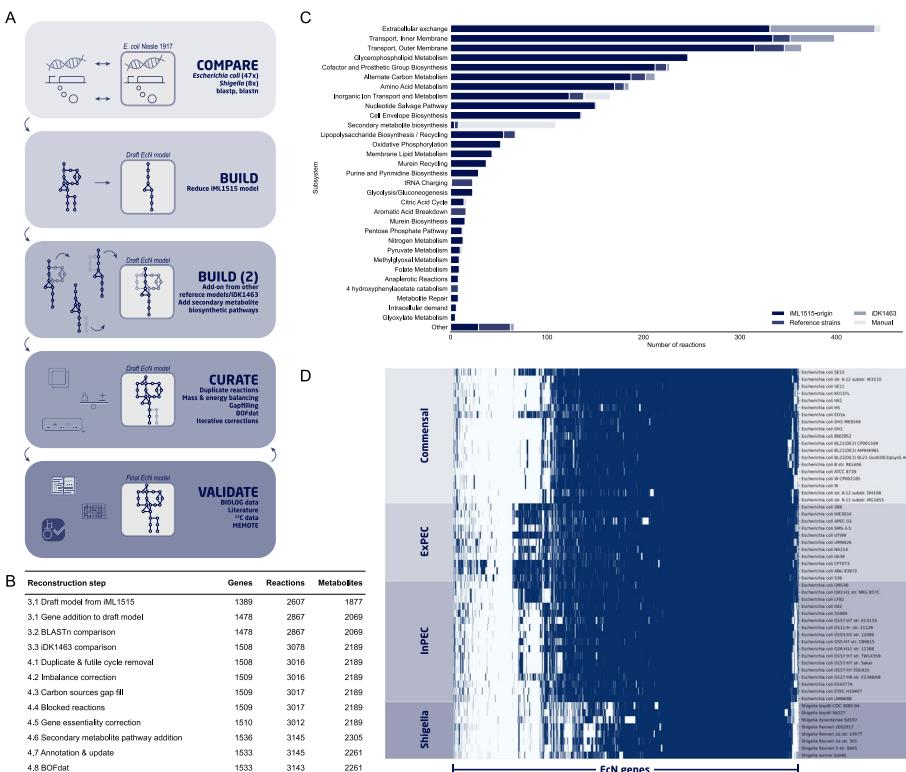
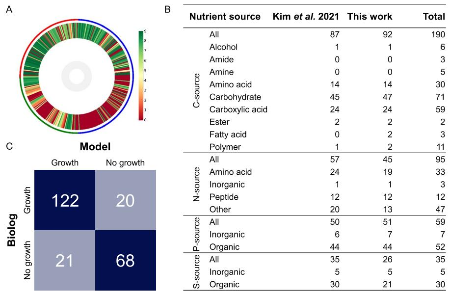
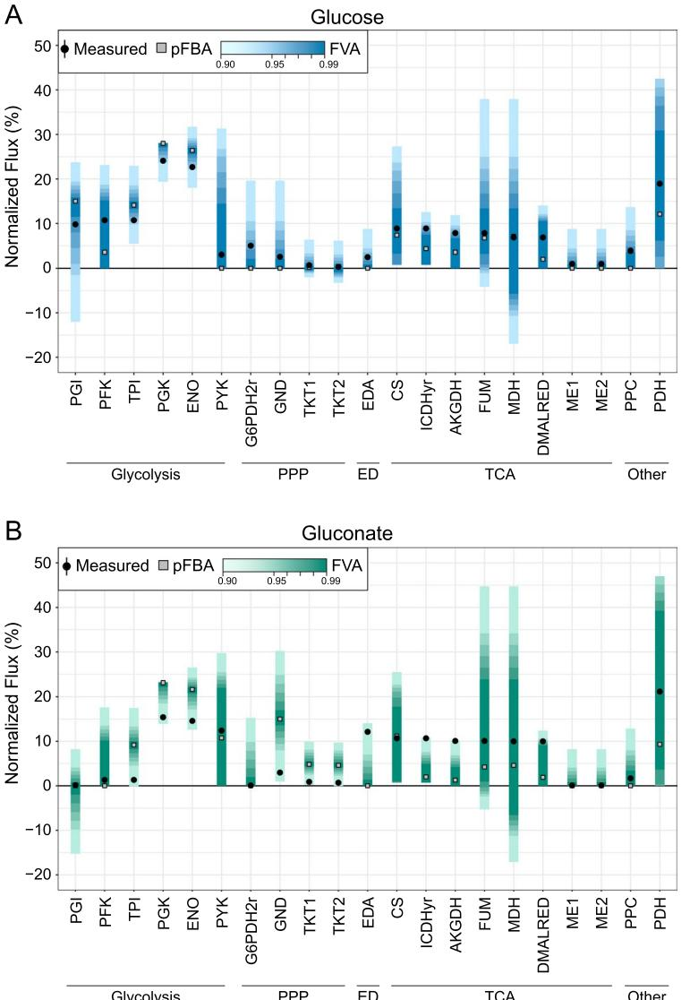
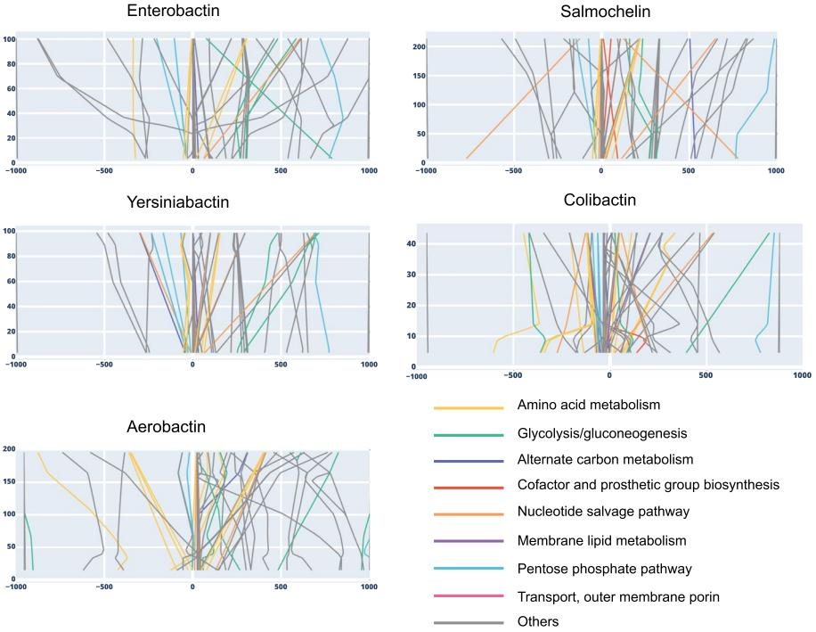

# **RESEARCH**

Max van't Hof1 , Omkar S. Mohite1 , Jonathan M. Monk2 , Tilmann Weber1 , Bernhard O. Palsson1,2 and Morten O. A. Sommer1*

*Correspondence: msom@bio.dtu.dk

1 The Novo Nordisk Foundation Center for Biosustainability, Technical University of Denmark, 2800 Kongens Lyngby, Denmark 2 Department of Bioengineering, University of California San Diego, La Jolla, CA 92093, USA

## **Abstract**

**Background:** *Escherichia coli* Nissle 1917 (EcN) is a probiotic bacterium used to treat various gastrointestinal diseases. EcN is increasingly being used as a chassis for the engineering of advanced microbiome therapeutics. To aid in future engineering eforts, our aim was to construct an updated metabolic model of EcN with extended secondary metabolite representation.

**Results:** An updated high-quality genome-scale metabolic model of EcN, iHM1533, was developed based on comparison with 55 *E. coli/Shigella* reference GEMs and manual curation, including expanded secondary metabolite pathways (enterobactin, salmochelins, aerobactin, yersiniabactin, and colibactin). The model was validated and improved using phenotype microarray data, resulting in an 82.3% accuracy in predicting growth phenotypes on various nutrition sources. Flux variability analysis with previously published 13C fuxomics data validated prediction of the internal central carbon fuxes. A standardised test suite called Memote assessed the quality of iHM1533 to have an overall score of 89%. The model was applied by using constraint-based fux analysis to predict targets for optimisation of secondary metabolite production. Modelling predicted design targets from across amino acid metabolism, carbon metabolism, and other subsystems that are common or unique for infuencing the production of various secondary metabolites.

**Conclusion:** iHM1533 represents a well-annotated metabolic model of EcN with extended secondary metabolite representation. Phenotype characterisation and the iHM1533 model provide a better understanding of the metabolic capabilities of EcN and will help future metabolic engineering eforts.

**Keywords:** Genome-scale metabolic models, Probiotic, Nissle 1917, Phenotype microarray, Secondary metabolites, Constraint-based fux analysis

## **Background**

Genome-scale metabolic models (GEMs) are becoming an increasingly popular and useful tool to understand and engineer microbial metabolism. Te frst GEM of *Escherichia coli* was reconstructed in the early 2000s, and has subsequently been updated with

© The Author(s) 2022. **Open Access** This article is licensed under a Creative Commons Attribution 4.0 International License, which permits use, sharing, adaptation, distribution and reproduction in any medium or format, as long as you give appropriate credit to the original author(s) and the source, provide a link to the Creative Commons licence, and indicate if changes were made. The images or other third party material in this article are included in the article's Creative Commons licence, unless indicated otherwise in a credit line to the material. If material is not included in the article's Creative Commons licence and your intended use is not permitted by statutory regulation or exceeds the permitted use, you will need to obtain permission directly from the copyright holder. To view a copy of this licence, visit [http://](http://creativecommons.org/licenses/by/4.0/) [creativecommons.org/licenses/by/4.0/.](http://creativecommons.org/licenses/by/4.0/) The Creative Commons Public Domain Dedication waiver [(http://creativecommons.org/publi](http://creativecommons.org/publicdomain/zero/1.0/) [cdomain/zero/1.0/)](http://creativecommons.org/publicdomain/zero/1.0/) applies to the data made available in this article, unless otherwise stated in a credit line to the data.

various biological functions and improved prediction capabilities [\[1](#page-19-0), [2\]](#page-19-1). Te latest GEM of *Escherichia coli* K-12 MG1655, iML1515, represented the knowledge base of that strain's metabolism at that time, and is used frequently in metabolic engineering applications for the production of desired chemicals [\[1](#page-19-0)]. More recently, strain-specifc GEMs of several species have been developed to investigate metabolic diversity across specifc strains within species [[3,](#page-19-2) [4](#page-19-3), [5](#page-19-4)]. For example, GEMs of 55 fully sequenced *Escherichia* and *Shigella* strains were previously reconstructed to investigate functional diferences between strains [[3\]](#page-19-2). Further, a GEM for *E. coli* BL21(DE3), a common industrial microbe, was recently developed for biotechnological applications [\[6](#page-19-5)]. Reconstructing high-quality GEMs of other commonly used *E. coli* strains will further enhance the application of GEMs and constraint-based modelling tools for engineering purposes.

*Escherichia coli* Nissle 1917 is a gram-negative probiotic strain commonly used for metabolic engineering and synthetic biology applications. *E. coli* Nissle 1917 (also referred to as strain DSM 6601, O6:K5:H1, EcN) was detected and isolated in 1917 by Alfred Nissle due to its antagonistic activity against pathogenic *Salmonella* strains [\[7](#page-19-6)]. Historically, EcN has been used in its native form to treat various gastrointestinal conditions. EcN is sold commercially as Mutafor and is clinically approved to treat diseases such as infammatory bowel disease and ulcerative colitis [\[8](#page-19-7), [9\]](#page-19-8). Over the last few years, the strain has been engineered for the expression of therapeutic activities to treat a wider range of diseases, both inside and outside of the gut [\[10,](#page-19-9) [11](#page-19-10), [12](#page-19-11)]. EcN belongs to the *E. coli* phylogenetic group B2 that includes well-known clinical pathogens such as *E. coli* CFT073. However, EcN is non-invasive, lacks most known virulence factors like α-hemolysin and P/M/S-fmbriae, does not produce most toxins associated with other pathogenic *E. coli* strains, is serum-sensitive, and is not resistant to commonly used antibiotics [[13\]](#page-19-12). EcN carries various genomic islands (GEIs), which include genes encoding for several ftness factors, like microcins which exhibit antibacterial activity, but also pathogenicity islands, like *pks.* Te *pks* island is associated with EcN's probiotic efect, but its product, the genotoxin colibactin, has been linked to colorectal cancer [[14,](#page-20-0) [15](#page-20-1), [16](#page-20-2), [17](#page-20-3)]. Additionally, the siderophores produced from other genomic islands provide versatile iron transport systems assisting EcN's survival in the gut by competing with pathogenic enterobacteria [\[18](#page-20-4)]. For example, yersiniabactin allows EcN to acquire zinc in the infamed gut to compete with pathogenic *Salmonella* strains [\[19](#page-20-5)]. Overall, the specifc phenotype of EcN in combination with the availability of well-developed synthetic biology tools for *E. coli* strains makes it a desirable candidate for cell-factory design and engineering.

GEMs computationally describe properties of a strain, enable the prediction of metabolic fuxes at various conditions, and provide gene manipulation targets for metabolic engineering. Additionally, GEMs ofer a platform to integrate and analyse multi-omics and kinetic datasets [\[20\]](#page-20-6). Te complete genome for EcN was frst sequenced in 2014 and resequenced multiple times afterwards [\[21](#page-20-7)]. Recent years have also seen the generation of transcriptomics [[22](#page-20-8), [23](#page-20-9)], metabolomics [\[24](#page-20-10)], and 13C metabolic fux data [[25](#page-20-11)] of EcN. Te advances in omics data generation of EcN and its unique metabolic capabilities demand a high-quality GEM for EcN that will help in diverse engineering applications in the future.

A GEM of EcN called iDK1463 was published based on the frst genome assembly of EcN (CP007799.1) [\[26\]](#page-20-12). Building on this initial model we created an updated GEM for EcN called iHM1533, which was validated using phenotypic microarray data and 13C fuxomics. Te fnal model was used to investigate engineering targets for optimisation of secondary metabolite production.

## **Results**

## **Reconstruction of a draft genome‑scale metabolic model for** *E. coli* **Nissle 1917**

Te GEM reconstruction process involved multiple steps based on comparative genomics, manual curation, and validation following published reconstruction protocols [\[5](#page-19-4), [27](#page-20-13)] (Fig. [1A](#page-2-0)). A high-quality genome (CP022686.1 from 2018, as compared to CP007799.1 from 2014 used by Kim et. al.) of EcN was used for reconstruction, with a length of 5,055,316 bp and annotated with a total of 5045 genes. Additionally, EcN harbours two plasmids, pMUT1 and pMUT2 [\[28](#page-20-14)]. First, we compared the genome of EcN against 55

**Fig. 1** Genome-scale reconstruction steps and gene comparison. **A** Workfow of the construction of iHM1533 **B** All stages of the iHM1533 model construction, with the number of genes, reactions, and metabolites present in the model at each stage. **C** Origin of all reactions in iHM1533, divided by subsystem. The iHM1533 model is based on a reduced iML1515 model (iML1515-origin), to which reactions were added from 54 models of *E. coli*/*Shigella* strains (Reference strains) and the existing EcN model (iDK1463). During curation, additional reactions were added to correct the model and to expand various secondary metabolite biosynthesis pathways (Manual). **D** Heatmap of gene homology of all 55 strains to EcN. Strains were clustered in four groups: commensal, extraintestinal pathogenic *E. coli* (ExPEC), intestinal pathogenic *E. coli* (InPEC), and *Shigella*. Genes with homology above 80% were deemed homologous (blue) and those below 80% were not (white). The highest number of homologous genes is shared with ExPEC strains, which also has previously been observed by Grozdanov et al*.* [\[34](#page-20-15)], when comparing EcN to 324 non-pathogenic and pathogenic *E. coli* isolates

related strains with high-quality GEMs available, herafter referred to as reference strains, using bidirectional best blastp hits [[3](#page-19-2)]. Of the 5045 EcN genes compared, 1783 were common among all strains and 196 were unique to EcN (Fig. [1](#page-2-0)D, Additional fle [1](#page-18-0): Data S1). We observed that the genome of EcN shared the highest number of homologous genes with uropathogenic *E. coli* strains (UPEC) such as CFT073 (87.0% of EcN genes) and ABU 83972 (86.8% of EcN genes), with which it may share a common ancestor [[29](#page-20-16), [30](#page-20-17), [31](#page-20-18), [32](#page-20-19)]. CFT073 has hitherto repeatedly been compared to EcN and ABU 83972, to identify potential causes for the diference in pathogenicity between these highly related strains [\[24,](#page-20-10) [29,](#page-20-16) [33](#page-20-20)]. Te commonly used strain *E. coli* K-12 MG1655 has 3693 (73.2%) homologous genes. Several horizontally acquired DNA regions that are, at least partially, shared with other *E. coli* strains such as CFT073, are not present in MG1655. Tese regions may contribute to the diference in phenotypic traits of EcN [\[34](#page-20-15)]. EcN contains regions that are mostly shared with extraintestinal pathogenic *E. coli* (ExPEC) strains (Fig. [1](#page-2-0)D). EcN specifc sequences (selected regions among genetic islands I to IV) were previously observed to be shared among many ExPEC strains, but less frequently observed in intestinal pathogenic *E. coli* (InPEC) and non-pathogenic strains [[34\]](#page-20-15). Te lowest number of homologous genes was shared with all *Shigella* strains (59.0–66.5%).

Using the gene homology analysis between EcN and all reference strains, a draft GEM was reconstructed based on the corresponding reference GEMs. Tis draft model consisted of 1487 genes, 2867 reactions, and 2069 metabolites (Fig. [1](#page-2-0)B). Of these reactions, 90.9% (2607) originated from the *E. coli* K-12 MG1655 model iML1515, which was used as the base for the construction of this model as this is one of the most highly curated *E. coli* models. One of the subsystems of which multiple reactions were added from the other reference strains was tRNA charging (22 reactions). When comparing the sequence context of tRNA loci in EcN versus K-12, 15 out of 37 tRNA loci varied due to the integration of horizontally acquired genetic information, including *asnT, argW, ileY, leuX, pheV, serX,* and *thrW* [[34\]](#page-20-15). Te genes encoding for these seven tRNA synthetases, among others, did not have homology with the K-12 genome and were added from models other than iML1515 during the construction of the draft model (Fig. [1](#page-2-0)C). Te remaining 260 reactions added from other models belonged to subsystems such as various forms of transport systems (65 reactions), alternate carbon metabolism (16), and metabolism of various amino acids (Fig. [1C](#page-2-0)). Several of the 260 reactions were unassigned (26) or removed during manual curation (63).

Furthermore, an additional comparison between nucleotide sequences of all EcN genes (BLASTn) did not identify any additional genes to be added. Finally, the draft EcN model was compared to iDK1463 and 211 reactions only present in the latter were imported along with 30 additional genes (Fig. [1](#page-2-0)C, Additional fle [2](#page-18-1): Data S2) [\[26](#page-20-12)].

#### **Manual curation of EcN draft model to remove network inconsistencies**

A thorough manual curation of the draft model was performed in multiple stages, which included removing inconsistencies, correcting mass and charge balances, gap flling with phenotype microarray data, and expansion of secondary metabolite biosynthetic pathways (Fig. [1B](#page-2-0)). In general, the reconstruction process followed the standard protocols [\[5](#page-19-4), [27](#page-20-13)]. First, 48 reaction duplications caused by diferences in directionality, metabolites, and gene rules across reference models were removed (e.g., MTHFD and MTHFD_1). Additionally, 14 reactions causing futile energy-generating cycles were corrected. Subsequently, mass and charge imbalances were identifed and 53 such inconsistencies were manually resolved (6 remaining). One of the cases involved a mass imbalance of two reactions (ACGAL6PI & ACGAL6PISO) involving the metabolite N-acetyl-Dgalactosamine-6-phosphate (GalNac-6-P). Te conversion of GalNAc-6-P to Tag-6-P is performed in two steps: deacetylation of GalNAc-6-P to GalN-6-P and deamination/ isomerisation of GalN-6-P to Tag-6-P [\[35\]](#page-20-21). Both original reactions were replaced by two reactions: ACGAL6PDA (deacetylation step) and GALAM6PISO (deamination/isomerisation step) with gene rules *agaA* and *agaS*, respectively (Additional fle [3](#page-18-2): Fig S1).

In the next stage of gap flling, we used an algorithm available in cobrapy [[36\]](#page-20-22) that evaluates a minimal set of reactions required to be added to make a pathway feasible [[37\]](#page-20-23). All blocked pathways in the model were checked for gap flling using the panreactome of all the reference GEMs. Gap flling suggested that a malate decarboxylating oxidoreductase ('MALDDH') reaction was missing in the model, preventing growth on D-malate. Upon addition of this reaction, growth was restored in the model. However, no homologous gene could be identifed in EcN that could be linked to this reaction. Presence of this ability without an identifable genomic background gives the opportunity to discover new genes related to D-malate metabolism [\[38](#page-20-24)].

Te previous genome-scale reconstructions of *E. coli* strains contained biosynthetic pathways for secondary metabolites like enterobactin. EcN produces a wider range of secondary metabolites that also includes salmochelins (glucosylated enterobactin), yersiniabactin, aerobactin, and colibactin (Additional fle [3:](#page-18-2) Fig S2) [[15\]](#page-20-1). Here, we expanded the representation of biosynthetic pathways for enterobactin, salmochelins, aerobactin, yersiniabactin, and colibactin. Tis process involved defning new reactions representing various biochemical steps common to non-ribosomal peptide synthetase (NRPS) and polyketide synthase (PKS) assembly, similar to the descriptions in the GEM of *Streptomyces coelicolor* [\[39](#page-20-25)] (Additional fle [3:](#page-18-2) Fig S2). Te various chemical steps involved in these pathways were added from available pathways for enterobactin, colibactin, salmochelins, and aerobactin in the MetaCyc database. In the case of yersiniabactin, however, the entire pathway was reconstructed using the literature [[40\]](#page-20-26). In addition to biosynthetic reactions, we also included reactions involved in the transport of secondary metabolites and various metal ion import reactions related to them. In total, iHM1533 included 177 curated reactions and 110 metabolites to represent secondary metabolism of EcN (Additional fle [2](#page-18-1): Data S2).

Next, all metabolites, reactions, and genes were annotated with identifers from external databases, such as KEGG, BioCyc, MetaNetX, SEED, and CHEBI. Inclusion of these identifers is important for interoperability between various knowledge bases and multiple omics data types. Te locus tag, gene ID, and protein ID were added for all genes, when available in the genbank fle, and all disconnected genes and metabolites were removed from the model. Lastly, the biomass objective function was updated using BOFdat (Biomass Objective Function from experimental data) [\[41\]](#page-21-0). In the frst step, the stoichiometric coefcients for the major macromolecules were defned. Genomic (CP022686.1), transcriptomic [\[42](#page-21-1)], and growth data [[26\]](#page-20-12) of EcN was used, while MG1655 data was used for the macromolecular composition, proteomics, lipidomics, and maintenance [\[41\]](#page-21-0), as EcN data was lacking. Coenzymes and inorganic ions were identifed in the EcN model and included in the biomass objective function in the second step. Te newly defned function was used to update the existing iDK1643 biomass objective function and get the fnal GEM iHM1533 (Additional fle [4](#page-18-3)).

Te curated GEM restored the in silico growth of 1.05 h–1 on synthetic minimal medium with 15 mM glucose as a carbon source (when using iDK1463 and iML1515 respectively 1.07 and 1.33 h–1). Te predicted growth rate is higher than the 0.79±0.02 h–1 described in literature on this media [\[25\]](#page-20-11). Although the biomass function was adjusted using BOFdat, additional experimental data of EcN is required to further increase accuracy. Additionally, various factors such as constraints on total protein, catalytic rates, and transcriptional regulation were not included in the model.

#### **Phenotype characterisation of EcN**

EcN naturally resides in the large intestine. Successful colonisation of the gut environment is dependent on various factors, including nutrient specifcity and efciency. Terefore, we were interested in the range of nutrients EcN can metabolise. Here, we generated phenotype microarray data for this strain. Four diferent Biolog plates were used, PM 1-4, consisting of 190 carbon, 95 nitrogen, 59 phosphorus, and 35 sulfur nutrient sources. We analysed the phenotype microarray data using DuctApe software that assigns activity indices between 0 and 9 to represent growth on each nutrient [[41\]](#page-21-0). An activity index of 3 and above was considered as growth. We found that EcN could utilise 92 of the 190 carbon sources that included 47 carbohydrates (of 71 total), 24 carboxylic

**Fig. 2** Phenotype characterisation of EcN and validation of GEM. **A** Circular heatmap of phenotype microarray data. PM1 and PM2 contain carbon sources (blue ring), PM3 nitrogen sources (green ring), and PM4 phosphorus and sulfur (red ring). For each nutrient, an activity index was assigned between 0 (no growth, red) and 9 (maximum growth, green). Activities of 3 and above were considered as growth. **B** Comparison of the number of nutrients that enabled the growth of EcN in the work of Kim et al*.* [[26\]](#page-20-12) and in this work. The carbon (C) source when testing the nitrogen (N)/phosphorus (P)/sulfur (S) source was succinate/citrate and pyruvate, respectively. Total is the total number of sources tested for each nutrient. **C** Comparison of phenotype microarray data of EcN (Biolog) to growth predictions made by the fnal iHM1533 GEM (Model)

acids (59 total), 14 amino acids (30 total), and others (Fig. [2A](#page-5-0)/B, Additional fle [5](#page-18-4): Data S3). For the nitrogen sources, 45 nutrients facilitated growth of EcN that included 19 amino acids (33 total), all 12 of the peptides, and others. EcN could utilise 51 of the 59 phosphorus nutrients including all 7 inorganic and 44 organic sources (52 total). EcN was also capable of growth on all 5 of the inorganic and 21 of the 30 organic sulfur nutrient sources.

Overall, EcN has a wide range of nutrient sources it can utilise. In the large intestine, various nutrients are supplied by ingested food, epithelial and bacterial cell debris, and the mucus lining of the epithelium. Tis includes, e.g., gluconate from muscle tissues and sugar acids like galacturonate from pectin [[42\]](#page-21-1). Te mucus lining is a combination of glycoproteins and glycolipids that provide nutrients to intestinal bacteria, including N-acetylglucosamine, N-acetylgalactosamine, galactose, fucose, sialic acid (N-acetylneuraminic acid), and lesser amounts of glucuronate and galacturonate [[43\]](#page-21-2). EcN is capable of growing on all these compounds as a carbon source (Additional fle [5](#page-18-4): Data S3). Te capacity of EcN to metabolise this range of carbohydrates makes sense when put into perspective with its origin in the gut.

We compared our dataset with previously published Biolog data of EcN (Fig. [2B](#page-5-0)) [[26\]](#page-20-12). In our experiment, EcN was capable of growth on six carbon sources (adonitol, dulcitol, pectin, Tween 20, Tween 40, and a-hydroxybutyric acid) that did not permit growth of EcN in the published dataset (Additional fle [5](#page-18-4): Data S3). However, the latter could grow on b-hydroxybutyric acid, which was not the case in our work. For the non-carbon source profling PM plates, a diferent carbon source was used in the published experiment, 2 M succinate/200 µM citrate, compared to 2 M pyruvate used in our experiment. On succinate, EcN was capable of metabolising 57 nitrogen, 50 phosphorus, and 35 sulfur nutrient sources. In comparison, EcN could metabolise on pyruvate 45 nitrogen (40 shared, 5 only with pyruvate, 17 only with succinate), 51 phosphorus (49 shared, 2 on pyruvate, 1 on succinate), and 26 sulfur (17 shared, 9 only with succinate) sources (Additional fle [5](#page-18-4): Data S3). We note that the comparison of growth prediction here against Kim et al. might also be afected by the cut-of of the activity index used for what is considered growth. Overall, we found that EcN can consume a wide range of nutrients of which many can be found in the gut and that utilisation of nitrogen and sulfur sources specifcally can be dependent on the carbon source. Tis dataset can help with understanding EcN's role in the gut microbiome and aid future genome engineering endeavours.

#### **Phenotypic characterisation of EcN largely corresponded to iHM1533 model predictions**

Next, the phenotype microarray data was compared with growth predictions by iHM1533 to validate the accuracy of the reconstructed model (Fig. [2](#page-5-0)C). A total of 231 nutrient sources out of 379 on the Biolog plates could be linked to exchange reactions present in the model. EcN was able to grow on 20 nutrients that did not allow growth in the model (Additional fle [5](#page-18-4): Data S3). Gap flling was used to identify reactions that would enable the model to grow on these compounds from the panreactome of the reference strains, but no reactions were found that could restore growth [\[37\]](#page-20-23). For several pathways, e.g., methionine and phenylalanine metabolism, reactions had previously been added from the *E. coli* reference strains to the model (Fig. [1C](#page-2-0)). However, the pathways needed for growth on these compounds are not present in any of the models upon which iHM1533 was built, as none of them can grow on these compounds themselves [\[3\]](#page-19-2). As a result, these pathways could not be complemented by the reference stain panreactome. Te model predicted growth on sucrose, while Biolog data showed the opposite. As EcN does not contain the genes for sucrose catabolism, the reactions SUCtpp, SUCptspp, SUCR, and FFSD were removed from the model [\[44](#page-21-3)].

Similar to iDK1463, reactions that are reported to be inactive under non-stressful aerobic conditions (ARGAGMt7pp, CELBpts, CLBtex, DTARTD, LCARS, PTRCORNt7pp, SUCTARTtpp, TARTD, and TARTRt7pp) were deactivated by constraining the fux to zero for this analysis [[26\]](#page-20-12). Additionally, the catabolism of 3-hydroxyphenylacetic acid (3HPA) and 4-hydroxyphenylacetatic acid (4HPA) was deactivated by restricting fow through the reactions HPAtex and 3hoxpactex. Based on homology, genes required for the metabolism of these aromatic compounds are present in EcN, but Biolog data showed an inability of growth in normal aerobic conditions [\[45\]](#page-21-4).

With the corrected model, growth on a total of 82.3% of nutrients was predicted correctly, which is just above the score of iDK1463 (81.8%) and in line with predictions in other recently published models (68–84%) [[6,](#page-19-5) [46,](#page-21-5) [47\]](#page-21-6). We found 122 true positives and 68 true negatives, while 21 nutrients were incorrectly predicted to accommodate growth by the model and growth on 20 nutrients was still not supported in the model (Additional fle [3](#page-18-2): Table S1). Adonital and pectin, which only sustained growth in our Biolog dataset but not in the previously reported work [\[26\]](#page-20-12), were among the 20 false-negative predictions. Te false-positives included fve nitrogen sources that showed very slow growth with an activity between 1 and 2.5 in the Biolog data set (l-Tyrosine, N-Acetyld-Glucosamine, N-Acetyl-d-Galactosamine, N-Acetyl-d-Mannosamine, and allantoin). All fve sources did enable growth when succinate was used as a carbon source instead of pyruvate (Additional fle [5:](#page-18-4) Data S3). Generally, false-positive predictions may occur if an enzyme is transcriptionally repressed, which is not represented in a metabolic model. Alternatively, an enzyme does not catalyse the designated reaction at a high enough rate under specifc growth conditions and is thereby observed as false-positive, as appears to be the case for these fve sources [[48\]](#page-21-7). In addition to the Biolog data, growth on various carbon sources described in literature was checked [[13](#page-19-12), [25](#page-20-11), [49](#page-21-8)]. iHM1533 correctly predicted growth on all 21 carbon sources, including l-arabinose, l-fucose, d-galactose, d-gluconate, and d-mannose (Additional fle [6:](#page-18-5) Data S4). Terefore, the iHM1533 model could correctly predict a large part of the nutrient sustaining growth correctly, which is a prerequisite for making good predictions on behaviour in the gut or as a cell factory.

## **13C‑fuxomics data comparison of EcN to iHM1533 model fux predictions**

After comparing the GEM predictions with the Biolog data, the predictive quality of internal fuxes was validated with previously published 13C-fuxomics data. Fluxes determined by 13C experiments with growth on glucose and gluconate were compared to model-predicted fuxes [\[25\]](#page-20-11). Te media conditions and efux of acetate were set and internal fuxes were predicted in a sensitivity analysis with fux variability analysis (FVA) in combination with a Parsimoneous enzyme usage Flux Balance Analysis (pFBA). Te predicted in silico fuxes and pFBA results were mapped to the

**Fig. 3** Comparison of 13C fuxomics data to iHM1533 fux predictions on minimal media. Comparison of predicted internal fuxes to experimental 13C fuxomics data from Revelles et al*.* [[25\]](#page-20-11) of EcN on glucose (**A**) and gluconate (**B**). The Flux Variability Analysis (FVA) was run with FVA thresholds from 90 to 99%. The Parsimonious FBA (pFBA) is depicted as squares and the experimental data is visualised with the mean (dots) and standard deviation of three biological replicates (error bars, too small to observe) The fux is normalised to the glucose/gluconate uptake rate. The conversion of malate to oxaloacetate can both be performed by malate dehydrogenase (MDH) and by malate:FAD oxidoreductase (DMALRED) that uses FAD+ instead of NAD+. Therefore both reactions are included

experimentally determined fuxes on glucose and gluconate (Fig. [3,](#page-8-0) Additional fle [7](#page-18-6): Data S5). Te pFBA shows limitations of predicting the fuxes in the tested conditions, for example a higher fux on glucose in the glycolysis (PGI) and a lower fux in the PPP (G6PDH2r). However, when the constraints in the objective function optimisation (biomass formation) were relaxed in the FVA, the internal central carbon fux corresponds more accurately to the experimental data. All experimental data points were within the 90% FVA threshold, and a large part within > 97%. Tese analyses validate the predictive quality of the model and display its use in prediction of internal fuxes based on media composition.

#### **Essential gene prediction of EcN in gut microbiome media using iHM1533**

GEMs can be used to predict essential genes. iHM1533 predicted 156 genes and 230 reactions to be essential in anaerobic gut microbiome media (Additional fle [8:](#page-18-7) Data S6). Te reactions that were essential were linked, among others, to cofactor and prosthetic group biosynthesis (53), amino acid metabolism (66), and purine and pyrimidine biosynthesis (17). When compared to *E. coli* K-12 MG1655, one gene was found to be only essential in MG1655, *zupT*, and three were found to be only essential in EcN, *pgsA*, *can* and *leuB*. Te latter two have been experimentally validated under aerobic conditions [[26\]](#page-20-12). In Kim et al*.* (2021) the gene *argF* was additionally mentioned to be only essential in EcN, due to the lack of the gene *argI* in the genome. However we identifed two genes in EcN encoding for an ornithine carbamoyltransferase [\[24,](#page-20-10) [50](#page-21-9)]. Both are annotated in the EcN genome as *argF,* with locus tags CIW80_16625 and CIW80_16605. During construction, only the frst gene was included as *argF*. Terefore, the second locus tag was included in the model as *argI* and linked to the same reaction (OCBT).

In addition to single essential genes, we also investigated synthetic lethality. Synthetic lethality arises when knocking out a combination of two or more genes results in cell death while knocking out the individual genes does not. Te predictions of synthetic double lethals encompassed a total of 158 gene combinations in aerobic conditions and 157 in anaerobic conditions (Additional fle [8:](#page-18-7) Data S6). Te diference was the combination of *hemN* and *hemF,* two oxidases catalysing the same step in heme biosynthesis. Te knockout of *hemN* is lethal in anaerobic conditions, as the product of *hemF* is oxygen-dependent. In aerobic conditions this knockout is not lethal, except when combined with a *hemF* knockout [[51\]](#page-21-10). Overall, the essential genes difer very little between anaerobic and aerobic conditions. Predictions of these essential genes could aid with and be targets in genome engineering studies in the future, for example in knockout studies or biocontainment strategies.

#### **Quality assessment of iHM1533 using Memote test suite**

Te fnal product, iHM1533, was tested using the Memote web application, a standard in the community for metabolic model testing [\[52](#page-21-11)] (Additional fle [3](#page-18-2): Fig S3). Te analysis showed an overall score of 89%, which is a combination of the score on consistency and metabolite, reaction, gene, and SBO annotation. Te consistency score was 97%. Te score was lower than for iML1515, because in the secondary metabolite pathways of EcN a rest group (R) was added to multiple metabolites to represent the protein domains bound to the metabolite, resulting in mass and charge imbalances in iHM1533. Metabolite and reaction annotations scores were 84% and 83%, respectively. Nearly all genes have NCBI identifers, but lack some other annotations (refseq, kegg, ccds, and hprd), resulting in a score of 68%. SBO terms had a score of 86%.

Further, we compared the Memote score of iHM1533 and iDK1463. Te consistency score is the same, as an improvement in this score by the manual curation of the mass and charge balance in iHM1533 is negatively compensated by the imbalances resulting from the rest groups in the secondary metabolites. Te annotations added as the last step of the curation resulted in a higher score for iHM1533 in all metabolite, reaction, and gene annotation scores. Te SBO annotation was not updated and thereby gave a lower score for iHM1533. Overall the total score is the same, as the SBO score counts double.

#### **Prediction of manipulation targets for secondary metabolites produced by EcN**

Te updated and validated GEM was used to investigate relationships between primary and secondary metabolic pathways and predict engineering targets for the over-production of secondary metabolites. Te parsimonious fux balance analysis showed that iHM1533 can produce all secondary metabolites, except for aerobactin under anaerobic gut microbiome media. Te frst step of aerobactin biosynthesis involved oxygenation of lysine and thus required oxygen (MetCyc: META:1.14.13.59-RXN) [[53](#page-21-12), [54\]](#page-21-13). Terefore we used gut microbiome media with oxygen in order to analyse all secondary metabolite fuxes.

An algorithm called fux scanning with enforced objective function (FSEOF) was applied to identify targets for enhanced secondary metabolite production, while also allowing fux through biomass objective function [[55](#page-21-14)]. Te predicted targets from FSEOF analysis included reactions from various primary metabolism subsystems such

**Fig. 4** Predicted target reactions for secondary metabolite production using FSEOF. Line plots of variation of fux through secondary metabolite exchange reactions against enforced fuxes through predicted target reactions from various reaction subsystems (displayed by colour). A few membrane transport reactions of common metabolites such as H2Otpp, CO2tex, CO2tpp, H2Otex, and ATPS4rpp were ignored in the plots due to their large scale impact (Additional fle [9:](#page-18-8) Data S7)

as glycolysis/gluconeogenesis, various amino acid pathways, nucleotide salvage pathway, alternate carbon metabolism, and cofactor and prosthetic group biosynthesis, among others (Fig. [4](#page-10-0), Additional fle [3:](#page-18-2) Table S2). A combined total of 219 reactions that infuence secondary metabolite production were predicted (Additional fle [9](#page-18-8): Data S7). Only 29 of 219 reactions were predicted as common targets for all secondary metabolites with 7 of them from the pentose phosphate pathway subsystem. On the other hand, 98 targets were predicted for only one of the secondary metabolites, including 40 for colibactin (24 of these from membrane lipid metabolism and 3 from methionine metabolism); 10 for salmochelin (3 of these from cofactor and prosthetic group biosynthesis); 30 for aerobactin (7 of these from threonine and lysine metabolism, where lysine is a key substrate for aerobactin); 9 for yersiniabactin (4 of these from methionine metabolism); and 9 for enterobactin (4 of these from nucleotide salvage pathway).

Further, we calculated the slope of fux variation of secondary metabolites against predicted FSEOF target reaction. A positive slope denotes increased fux through secondary metabolite as the fux through target reaction is increased and a negative slope denotes a decrease in secondary metabolite fux as the fux through target reaction is increased (Fig. [4](#page-10-0), Additional fle [9:](#page-18-8) Data S7). Reactions such as FBA, PFK, DHORDfum, and SUCDi were among the largest negative slopes common for all secondary metabolites, whereas PPA was one of the few reactions with a positive slope. Although many reactions for cofactor and prosthetic group biosynthesis were predicted as targets, the value of their slope was very low, indicating a minor impact on secondary metabolite biosynthesis. A total of 43 reactions from 10 diferent amino acid metabolism subsystems were part of the predicted target with mostly positive slopes. Reactions from cysteine and methionine metabolism were largely predicted as targets for yersiniabactin and colibactin biosynthesis. Reactions from tyrosine, tryptophan, and phenylalanine metabolism were predicted as targets for yersiniabactin, enterobactin, and salmochelin biosynthesis. Reactions from threonine and lysine metabolism were predicted specifcally for aerobactin, whereas reactions from glycine and serine metabolism were largely predicted for all secondary metabolites but aerobactin. In general, these predictions of targets align with the amino acid substrates required as precursors for respective secondary metabolites.

Lastly, we carried out a biomass sensitivity analysis to measure the impact of the transition from primary to secondary metabolism across the subsystems. For this purpose, we created series of conditions where biomass reaction bounds were constrained to series of values between 0 and 100% of the optimal fux, while keeping the secondary metabolite exchange reaction as the objective function. Tis allowed us to measure reaction fuxes across all reactions at various stages going from no secondary metabolite production (100% biomasss) to maximum secondary metabolite production (0% biomass). Te theoretically allowed fux ranges for all reactions at each biomass constraint were calculated using FVA, whereas the optimal solution fux was calculated using pFBA (Additional fle [10:](#page-18-9) Data S8). To visualize the impact of primary to secondary metabolism, we visualised 10 reactions with the lowest slopes and 10 reactions with the highest slopes in the FSEOF analysis for each secondary metabolite (Additional fle [3](#page-18-2): Fig S4-S8). For example, there were a total of 9 targets predicted for improving aerobactin production from the subsystem of threonine and and lysine metabolism. Lysine is the key amino acid used as a precursor in aerobactin biosynthetic pathway. Te predicted fuxes through reactions from threonine and lysine metabolism such as DAPE, SDPDS, DHDPRy, DAPDC increased signifncantly as the model was being optimised for aerobactin production over biomass, whereas the fuxes through SDPTA and ASAD from the same subsystem kept decreasing (Additional fle [3](#page-18-2): Fig S6). Our analysis thus shows the impact on the fuxes at systems level when the cell shifts from biomass to secondary metabolite production. In summary, this model can be used to investigate the link between primary and secondary metabolism and reactions can be predicted that provide targets for manipulation of secondary metabolites production.

## **Discussion**

*E. coli* Nissle 1917 has been used for many years in clinical settings and could prove to be a good chassis for advanced microbiome therapeutics in the future [[11,](#page-19-10) [50](#page-21-9), [56](#page-21-15), [57,](#page-21-16) [58](#page-21-17), [59](#page-21-18), [60](#page-21-19), [61\]](#page-21-20). Genome-scale metabolic models can aid in the understanding and engineering of EcN. To our knowledge, this was the frst time a large number of multiple high-quality GEMs was combined to reconstruct a model. Even though the complete panreactome of 55 GEMs was available, most reactions in the EcN model still originated from the iML1515 model, as this model was used as the base for reconstruction. Only~9% of the reactions in the iHM1533 model were added from the other GEMs, many of which contributed only a very limited number of reactions or none at all. Reactions for tRNA charging, for example, were added from other GEMs. While the benefts are modest, the use of multiple models does produce a more complete draft model compared to using only one.

Although this strategy did result in a more complete model, several aspects can still be improved upon. As the comparison of the growth rate of the model to experimental data showed, additional efort is needed to accurately describe EcN's growth and biomass formation. A new biomass function was defned using BOFdat (Biomass Objective Function from experimental data), a Python package for the generation of species-specifc biomass objective functions [[62\]](#page-21-21). Future improvement of the biomass objective function will require EcN specifc macromolecular weight fractions and omics datasets in various conditions to get a more accurate description of EcN's growth dynamics. Although the current biomass objective function is not a direct ft to EcN's growth, it was considered sufcient for this model's purpose of aiding metabolic engineering and secondary metabolism examination, based on its prediction capacity in the phenotypic microarray and 13C fuxomics validation.

In the models used for construction, secondary metabolite biosynthetic pathways were absent or very limited. As a result, the draft model contained only a limited description of these processes. In this work, a more extensive description of the secondary metabolite formation process was defned. Application of the FSEOF algorithm on iHM1533 predicted a total of 219 target reactions to boost production of various secondary metabolites. Te fuxes through many of the predicted target reactions changed as the biomass fux was constrained. Tese target reactions essentially form a set of primary metabolic pathways that enable the switch to secondary metabolites production. As many modular PKS and NRPS products are an important source of antibiotics, there is growing interest in heterologously expressing them in easy to manipulate bacterial hosts. However, *E. coli* has not been a very successful host given the large size of the responsible biosynthetic gene clusters (BGCs) of PKS and NRPS and the high complexity of these modular megaenzymes. EcN is one of the few non-pathogenic *E. coli* strains harbouring an NRPS and two other hybrid PKS-NRPSs, including the 55-kb large colibactin biosynthetic gene cluster. Hence, the iHM1533 may provide a platform to guide future microbial host design for important PKS and NRPS products in *E. coli.*

Model predictions on fuxes and growth phenotypes were compared to experimental data (Biolog and 13C fuxomics data). Phenotypic growth data could be predicted with an accuracy of 82.3% and the fux variability analysis validated the ability of predicting internal fuxes. Te inability to correctly predict all behaviour is due to the simplifcation of the model compared to the organism. Multiscale models are gradually developing, in which elements such as enzyme kinetics, 3D structures, or transcriptional regulation are included. For example, Metabolism and macromolecular Expression (ME) models take into account the processes of enzyme synthesis, such as the transcription and translation machinery, folding, and complex formation [[63\]](#page-21-22). Future integration of these processes in the iHM1533 model could improve its predictive power and provide a better understanding of processes such as transcription and translation.

## **Conclusion**

Te genome comparison of EcN to the reference strains showed that EcN shared a total of 1,783 genes with all 55 reference strains, with the highest number of homologous genes shared with *E. coli* CF072, and 196 genes not shared with any other strain. Te draft model was manually curated for duplicate reactions, reaction imbalances, energygenerating cycles, and blocked pathways. Comprehensive descriptions of fve secondary metabolite biosynthetic pathways were added to the model. Biolog phenotype microarray data was collected to verify the nutrient utilisation. EcN was capable of growth on a wide range of nutrient sources and comparison to a previously published Biolog dataset showed that utilisation of non-carbon nutrients can be dependent upon the carbon source. Verifcation of model predictions using the phenotype microarray data showed that the model was capable of correctly predicting the growth behaviour of EcN in 82.3% of a total of 230 nutrients. iHM1533 was used to predict gene essentiality of EcN by calculating both single and double lethals, and fux variability analysis of the iHM1533 model was compared to 13C fuxomics data and showed accurate prediction of internal fuxes when constraints in optimisation of the biomass formation were relaxed. Te fnal GEM was used to investigate relationships between primary and secondary metabolic pathways and predicted 219 engineering targets from various subsystems for secondary metabolite production. In future studies, iHM1533 can serve as a framework for the integration of various omics data and aid in metabolic engineering applications of EcN.

## **Methods**

## **Reference strains homology analysis**

Te pipeline for comparison of EcN to the reference strains and construction of the draft model was based on work of Norsigian et al*.* [\[5](#page-19-4)], in which a workfow was defned to automatically generate draft multi-strain genome-scale metabolic models based on the high-quality model of a reference strain. Instead in this work, multiple reference strains were used to create one strain-specifc model. Fifty-fve *Escherichia coli* and *Shigella* strains were chosen as reference strains to represent a larger part of the genomic diversity in the *E. coli* species than each individual model could. All these reference strains have a high-quality genome-scale model available [[3\]](#page-19-2). A high-quality genomic sequence of EcN was available on NCBI (CP022686.1). Te reconstruction was performed using Constraint-Based Metabolic Modeling in Python (COBRApy) version 0.16.0 [[36\]](#page-20-22).

First, a list of all reference strains with NCBI identifers was compiled (Additional fle [1:](#page-18-0) Data S1). Annotated genomes of all reference strains and EcN were downloaded from NCBI as genbank fles and parsed to generate FASTA fles for the protein sequences. A bidirectional protein blast (BLASTp) was run between EcN and the reference strains. Protein sequences with a percentage identity (PID) above an 80% similarity threshold and alignment length of at least 25% were deemed homologous. Te best bidirectional hit (BBH) was identifed for each EcN gene and a binary orthology matrix was created based on the gene homology (Additional fle [1:](#page-18-0) Data S1). Additionally, bi-directional blast best hits were identifed for all *E. coli* K-12 MG1655 genes in comparison to EcN. Te heatmap of gene homology of EcN to all reference strains was generated using the binary orthology matrix and visualised with the clustermap function of the seaborn package with default clustering of the genes (Fig. [1D](#page-2-0)).

#### **Draft model construction**

Te MG1655 model (iML1515) was downloaded from the BiGG database in JSON format and reduced by removing all reactions associated with genes that did not have homology to EcN, except S0001, an artifcial gene for i.a. spontaneous reactions [\[64](#page-21-23)]. Subsequently, models of all other reference strains were taken from the BiGG database. Reactions dependent on EcN homologous genes were added to the reduced model to create the draft EcN model. Gene-protein-reaction (GPR) associations were updated to use EcN gene identifers after each iteration in this process and the origin of each reaction in the model was saved (Additional fle [2](#page-18-1): Data S2). Based on the origin and the subsystem of the reactions, a bar plot was created using the barplot function of the seaborn package, to visualise the origin of the reactions in the diferent subsystems (Fig. [1C](#page-2-0)).

Te draft EcN model was compared to iDK1463 for addition of reactions missing in the draft model. As iDK1463 was based on an older genome sequence, locus tags of the genes difered between the two models. A bidirectional protein blast (BLASTp) was run to correlate the old to the new locus tags. Next, gene names, subsystems, and annotation were updated using the BioCyc and BiGG database [\[64](#page-21-23), [65\]](#page-21-24).

#### **Curation**

Te draft model was corrected for duplicate reactions, based on identical reaction formulas and diferent versions of the same reaction identifer. Te BioCyc database and comparison to related strains was used to identify the correct directionality of reactions. Unbound fux cycles found by Memote that involved energy generation were corrected [[52\]](#page-21-11). Mass and charge imbalances were identifed and adjusted. Model performance on various carbon sources was compared to literature data. Gap flling was used to identify missing steps that prohibited the model to grow on carbon sources it grows on in vitro on based on literature data. Additionally, gap flling of blocked reactions (based on Memote) identifed four pathways that could be corrected by the addition of a reaction from the pangenome of all reference strains. As evidence for the existence of these pathways in EcN was missing in literature and the BioCyc database, no reactions were added. A frst analysis of gene essentiality identifed two problems in the model; one reaction that should not be present in the model and one wrong annotation of genes. Both were corrected. Similarly, Biolog data showed an inability of EcN of growth on sucrose. As EcN does not have the genes for sucrose catabolism, the reactions SUCtpp, SUCptspp, SUCR, and FFSD were removed from the model [\[44\]](#page-21-3). Next, fve secondary metabolite biosynthesis pathways were added to the draft model (see next section). Lastly, metabolites and reactions were annotated using the BiGG and KEGG databases [[64](#page-21-23), [66](#page-21-25), [67,](#page-21-26) [68](#page-21-27)]. Locus tag, NCBI gene and NCBI protein identifers were taken from the genbank fle of EcN's genome and annotated to the genes in iHM1533. Both metabolites and genes without reactions were removed from the model.

#### **Addition of secondary metabolite biosynthetic reactions**

We searched for biosynthetic reactions of secondary metabolites at the BiGG database containing curated reactions from many diferent high-quality GEMs. Only enterobactin and salmochelins biosynthetic pathways were covered in the BiGG database. Most of the GEMs at the BiGG database lack a comprehensive description of complex secondary metabolism. Next, we searched for the biosynthetic reactions described in the MetaCyc database. Comprehensive description of the biosynthesis of enterobactin (ENTBACSYN-PWY), salmochelins (PWY-8023), aerobactin (AEROBACTINSYN-PWY) and colibactin (PWY-8117) were found. Te biosynthetic reactions for the yersiniabactin pathway were still represented by a single lumped reaction (PWY-6407). Tus we manually reconstructed yersiniabactin biosynthesis pathways based on chemical steps described in literature [\[40\]](#page-20-26). Various metabolites were newly created to constitute a series of intermediate chemical reactions of the pathways (Additional fle [2:](#page-18-1) Data S2). With the help of pathways present in the MetaCyc database and literature, we created corresponding reactions and metabolites (Additional fle [2](#page-18-1): Data S2). New reactions and metabolite identifers were assigned, when not present in BiGG or MetaCyc. We further manually curated these pathways for the related gene-protein-reaction rules and added annotations from MetaCyc, MetaNetX and other metabolic databases if available.

## **Biomass objective function (BOF) update**

BOFdat (Biomass Objective Function from experimental data), a Python package for the generation of species-specifc biomass objective functions was used to generate a new biomass objective function (BOF) based on experimental data [\[62](#page-21-21)]. BOFdat consists of three independent modules. In the frst step, the genome and genbank fles (CP022686.1), and transcriptomics data [\[42\]](#page-21-1) of EcN were used. For the other parameters (macromolecular composition, proteomics, and lipidomics), data from *E. coli* MG1655 was used [[62\]](#page-21-21). Te assessment of the maintenance costs was done on a combination of data from MG1655 and EcN, as only two growth conditions were available for EcN [[25,](#page-20-11) [62](#page-21-21)]. For the second step, inorganic ions and coenzymes were identifed in iHM1533 and updated in the product of step one [\[62\]](#page-21-21). Te third step was skipped, as packages required for execution of this step were no longer functional. Instead, the product from the second step was used to update the existing BOF in the model, originating from the iDK1463 model. Te two biomass reaction originating from iML1515 (_core and _WT) were removed from the model.

#### **Biolog phenotype microarray**

EcN was purchased as Mutafor (Pharma-Zentrale, Germany) and both plasmids (pMut1 & pMut2) were removed. Cells were streaked from glycerol stock on LB agar, grown overnight at 37 °C and restreaked twice. Individual colonies were picked by inoculation loop and suspended in inoculating fuid (IF-0) at an absorbance of 0.37 at 600 nm [[69\]](#page-21-28). Tis was diluted 1:5 in IF-0+indicator dye (tetrazolium violet). A 100×dilution of 2 M sodium pyruvate was added to the inoculation fuid for plates PM3 and PM4. Te suspended cell solution was inoculated into the appropriate microplates at a volume of 100 µl/well. Te PM plates (Biolog Inc., Hayward, CA, USA) were four types of 96-well microplates containing diferent sources of carbon (PM1 and PM2), nitrogen (PM3), phosphorus and sulfur (PM4). Each PM was tested in triplicate. After inoculation, the microplates were incubated in the OmniLog system for 48 h at 37 °C, with readings every 15 min. Te raw kinetic PM data was analysed using DuctApe software which assigns an activity index between 0 and 9 for growth curves. Activity indexes of three and above were considered as growth of EcN (Additional fle [5](#page-18-4): Data S3). Te Biolog data of EcN was compared to the performance of another *E. coli* Nissle strain in literature (Fig. [2](#page-5-0)B) and the models iHM1533 and iDK1463 (Fig. [2](#page-5-0)C, Additional fle [3](#page-18-2): Table S1) [[26\]](#page-20-12).

#### **Comparison phenotype microarray to model**

For 319 nutrients of the PM plates, exchange reactions were identifed from the BiGG database (Additional fle [5:](#page-18-4) Data S3). Of these, 231 reactions were present in the EcN model. Growth predictions of the model for all available exchange reactions were made on media with defned pyruvate, ammonium, phosphate, sulfate, magnesium and ferric iron, based on the inoculation fuid composition: 2 M sodium pyruvate, 100 mM NaCl, 30 mM triethanolamine HCl (pH 7.1), 5.0 mM NH4Cl, 2.0 mM NaH2PO4, 0.25 mM Na2SO4, 0.05 mM MgCl2, 1.0 mM KCl, and 1.0 μM ferric chloride [\[70](#page-22-0)]. Te model's growth was classifed as absent when the predicted growth was below 5% of WT growth. A matrix was constructed to visualise the similarity and diference between the model predictions and the Biolog growth data (Fig. [2C](#page-5-0)). Te iDK1463 model was run at the same conditions for comparison (Additional fle [5](#page-18-4): Data S3). Both models were run a second time with the same media conditions, except 2 M sodium pyruvate was replaced by 2 M sodium succinate and 200 µM ferric citrate. Tese results were compared to the Biolog data of Kim et al*.* [[26\]](#page-20-12) (Additional fle [5:](#page-18-4) Data S3).

In the comparison between iHM1533 and the Biolog data, false-negative nutrients were identifed. Te gapflling function of the cobra toolbox was used to predict reactions that would enable growth on these nutrients using a panecoli genome-scale model constructed of the reactions from all reference strains.

## **13C fux comparison**

To assess the accuracy of predicted fuxes by the iHM1533 model, experimental data describing fuxes in EcN in minimal synthetic medium with 15 mM of glucose or gluconate was used for comparison [\[25](#page-20-11)]. Te synthetic medium consisted of 48 mM Na2HPO4, 22 mM KH2PO4, 9 mM NaCl, 19 mM NH4Cl, 2 mM MgSO4, 0.1 mM CaCl2, 0.1 g/L of thiamine and 15 mM carbon source (glucose or gluconate). Te compounds were split up in NH4, PO4, SO4, Mg2+, Ca2+, Na+, K+, Cl−, thiamine and carbon source to defne them as media in silico. All reactions described in the 13C experimental data were linked to a reaction in the model.

Flux variability analysis (FVA) and a parsimonious FBA were run (Additional fle [7](#page-18-6): Data S5). Te sensitivity analysis was run with FVA thresholds from 90 to 99%, to evaluate at which sensitivity level the model better matches the experimental data. Resulting datasets were visualised using R Studio (Fig. [3](#page-8-0)). Te python notebook and R script were based on the work by Mol et al*.* (2021) [[68\]](#page-21-27).

## **Gene essentiality**

Te essentiality of each gene in iHM1533 in gut microbiome media (Additional fle [11](#page-18-10): Data S9) [[71,](#page-22-1) [72,](#page-22-2) [73](#page-22-3)] for both aerobic and anaerobic conditions was predicted using the function "single_gene_deletion" from the COBRA toolbox (Additional fle [8:](#page-18-7) Data S6). Anaerobic conditions were simulated by setting the oxygen exchange reaction to zero. Gene knockouts in which the growth was less than 5% of WT growth were considered as essential genes. Double lethal simulations were carried out with the "double_gene_ deletion" function of the COBRA toolbox. Essential genes were excluded, since double lethals by defnition consist of two genes that are not essential on their own.

## **Constraint‑based fux analysis**

Secondary metabolite production levels were predicted using parsimonious FBA using CobraPy. Flux scanning based on an enforced objective fux (FSEOF) algorithm applied by using exchange reactions for each secondary metabolite as objectives to predict reaction amplifcation targets for secondary metabolite production [\[55](#page-21-14)]. Te slope of fux variation through various identifed targets were calculated against the fux through 5 diferent secondary metabolite exchange reactions (Additional fle [9](#page-18-8): Data S7). Since the slope was not constant for all pairs of reactions, we also plotted line plots of fux through secondary metabolites as constrained by an enforced objective on identifed target reactions (Fig. [4)](#page-10-0). In order to understand how the fux through the predicted target reactions varied, we carried out a biomass sensitivity analysis by creating series of model conditions where the biomass reaction was constrained. Te fux through the biomass reaction was varied from 0 to 100%, while maintaining the secondary metabolite exchange reaction as an objective (Additional fle [10](#page-18-9): Data S8). Based on FSEOF predicted target reactions, we selected a total of 20 reactions per secondary metabolite, the 10 highest and 10 lowest slopes of fux variation. Tese reactions represent top candidates where the fuxes are changing at maximum while transitioning from primary to secondary metabolism. Visualisation of the data was performed with R Studio (Additional fle [3:](#page-18-2) Fig S4–S8). Te R script was based on work by Mol et al*.* [[74\]](#page-22-4).

#### **Memote**

To compare the performance of iHM1533, iDK1463, and iML1515, all three models were run on the Memote web application and scores were compared (Additional fle [3](#page-18-2): Fig S3) [[52\]](#page-21-11).

#### **Abbreviations**

| BOFdat | Biomass objective function from experimental data       |
|--------|---------------------------------------------------------|
| EcN    | Escherichia coli Nissle 1917                            |
| ED     | Entner-Doudorof pathways                                |
| ExPEC  | Extraintestinal pathogenic E. coli                      |
| FBA    | Flux balance analysis                                   |
| FSEOF  | Flux scanning with enforced objective function          |
| FVA    | Flux variability analysis                               |
| GAM    | Growth-associated maintenance energy                    |
| GEI    | Genomic island                                          |
| GEM    | Genome-scale metabolic model                            |
| InPEC  | Intestinal pathogenic E. coli                           |
|        | ME model Metabolism and macromolecular Expression model |
| NGAM   | Non-growth-associated maintenance energy                |
| NRPS   | Non-ribosomal peptide synthase                          |
| pFBA   | Parsimonious fux balance analysis                       |
| PID    | Percentage identity                                     |
| PKS    | Polyketide synthase                                     |
| PPP    | Pentose phosphate pathway                               |
| TCA    | Tricarboxylic acid cycle                                |
| UPEC   | Uropathogenic E. coli                                   |

## **Supplementary Information**

The online version contains supplementary material available at [https://doi.org/10.1186/s12859-022-05108-9.](https://doi.org/10.1186/s12859-022-05108-9)

**Additional fle 1.** Data S1. **Additional fle 2.** Data S2. **Additional fle 3.** Supplementary fgures and tables. **Additional fle 4.** iHM1533 model. **Additional fle 5.** Data S3. **Additional fle 6.** Data S4. **Additional fle 7.** Data S5. **Additional fle 8.** Data S6. **Additional fle 9.** Data S7. **Additional fle 10.** Data S8. **Additional fle 11.** Data S9.

#### **Acknowledgements**

We would like to thank Marc Abrams for editorial corrections and Vivienne Mol for advice on the fux variability analysis.

#### **Author contributions**

MH and OSM performed the model construction, validation and constraint-based analysis. MH performed the Biolog experiment. OSM defned the secondary metabolite biosynthesis pathways and carried out the analysis. JMM advised on the manuscript. MH and OSM wrote the manuscript. JMM, TW, BOP and MOAS reviewed and edited the manuscript. All authors read and approved the fnal manuscript.

#### **Funding**

This work is funded by a grant of the Novo Nordisk Foundation, Denmark (NNF20CC0035580) and their Challenge programme, CaMiT (NNF17CO0028232). T.W. and O.S.M. furthermore acknowledge funding from the Novo Nordisk Foundation Challenge programme IIMENA (NNF16OC0021746).

#### **Availability of data and materials**

The strain name, accession number of the reference genome and reference model for each strain used in this work: *Escherichia coli* Nissle 1917, CP022686.1, iDK1463; *Escherichia coli* LF82, CU651637, iLF82_1304; *Escherichia coli* O83:H1 str. NRG 857C, CP001855, iNRG857_1313; *Escherichia coli* UM146, CP002167, iUMN146_1321; *Escherichia coli* APEC O1, CP000468, iAPECO1_1312; *Escherichia coli* ATCC 8739, CP000946, iEcolC_1368; *Escherichia coli* B str. REL606, CP000819, iECB_1328; *Escherichia coli* BL21(DE3) BL21-Gold(DE3)pLysS AG, CP001665, iECBD_1354; *Escherichia coli* BL21(DE3)

AM946981, AM946981, iB21_1397; *Escherichia coli* BL21(DE3) CP001509, CP001509, iECD_1391; *Escherichia coli* BW2952, CP001396, iBWG_1329; *Escherichia coli* DH1, CP001637, iEcDH1_1363; *Escherichia coli* DH1 ME8569, AP012030, iECDH1ME8569_1439; *Escherichia coli* ED1a, CU928162, iECED1_1282; *Escherichia coli* HS, CP000802, iEcHS_1320; *Escherichia coli* IAI1, CU928160, iECIAI1_1343; *Escherichia coli* KO11FL, CP002516, iEKO11_1354; *Escherichia coli* SE11, AP009240, iECSE_1348; *Escherichia coli* SE15, AP009378, iECSF_1327; *Escherichia coli* str. K-12 substr. DH10B, CP000948, iECDH10B_1368; *Escherichia coli* str. K-12 substr. MG1655, U00096, iJO1366; *Escherichia coli* str. K-12 substr. W3110, AP009048, iY75_1357; *Escherichia coli* W CP002185, CP002185, iECW_1372; *Escherichia coli* W, CP002967, iWFL_1372; *Escherichia coli* 042, FN554766, iEC042_1314; *Escherichia coli* 55,989, CU928145, iEC55989_1330; *Escherichia coli* O103:H2 str. 12,009, AP010958, iECO103_1326; *Escherichia coli* O111:H- str. 11,128, AP010960, iECO111_1330; *Escherichia coli* O157:H7 str. EC4115, CP001164, iECH74115_1262; *Escherichia coli* O157:H7 EDL933, AE005174, iZ_1308; *Escherichia coli* O157:H7 str. Sakai, BA000007, iECs_1301; *Escherichia coli* O157:H7 str. TW14359, CP001368, iECSP_1301; *Escherichia coli* O26:H11 str. 11,368, AP010953, iECO26_1355; *Escherichia coli* O55:H7 str. CB9615, CP001846, iG2583_1286; *Escherichia coli* SMS-3-5, CP000970, iEcSMS35_1347; *Escherichia coli* O127:H6 str. E2348/69, FM180568, iE2348C_1286; *Escherichia coli* E24377A, CP000800, iEcE24377_1341; *Escherichia coli* ETEC H10407, FN649414, iETEC_1333; *Escherichia coli* UMNK88, CP002729, iUMNK88_1353; *Escherichia coli* IHE3034, CP001969, iECOK1_1307; *Escherichia coli* S88, CU928161, iECS88_1305; *Escherichia coli* 536, CP000247, iECP_1309; *Escherichia coli* ABU 83972, CP001671, iECABU_c1320; *Escherichia coli* CFT073, AE014075, ic_1306; *Escherichia coli* IAI39, CU928164, iECIAI39_1322; *Escherichia coli* NA114, CP002797, iECNA114_1301; *Escherichia coli* UMN026, CU928163, iECUMN_1333; *Escherichia coli* UTI89, CP000243, iUTI89_1310; *Shigella boydii* CDC 3083-94, CP001063, iSbBS512_1146; *Shigella boydii* Sb227, CP000036, iSBO_1134; *Shigella dysenteriae* Sd197, CP000034, iSDY_1059; *Shigella fexneri* 2,002,017, CP001383, iSFxv_1172; *Shigella fexneri* 2a str. 2457T, AE014073, iS_1188; *Shigella fexneri* 2a str. 301, AE005674, iSF_1195; *Shigella fexneri* 5 str. 8401, CP000266, iSFV_1184; *Shigella sonnei* Ss046, CP000038, iSSON_1240. The jupyter notebooks, R scripts and data used to reconstruct, validate, and analyse the iHM1533 model are available at GitHub link <https://github.com/maxvthof/EcN_model>.

#### **Declarations**

#### **Ethics approval and consent to participate** Not applicable.

**Consent for publication**

Not applicable.

#### **Competing interests**

The authors declare that they have no competing interests.

Received: 24 March 2022 Accepted: 12 December 2022

#### **References**

- 1. Monk JM, Lloyd CJ, Brunk E, Mih N, Sastry A, King Z, et al. iML1515, a knowledgebase that computes *Escherichia coli* traits. Nat Biotechnol. 2017;35:904–8. [https://doi.org/10.1038/nbt.3956.](https://doi.org/10.1038/nbt.3956)
- 2. Fang X, Lloyd CJ, Palsson BO. Reconstructing organisms *in silico*: genome-scale models and their emerging applications. Nat Rev Microbiol. 2020. <https://doi.org/10.1038/s41579-020-00440-4>.
- 3. Monk JM, Charusanti P, Aziz RK, Lerman JA, Premyodhin N, Orth JD, et al. Genome-scale metabolic reconstructions of multiple *Escherichia coli* strains highlight strain-specifc adaptations to nutritional environments. Proc Natl Acad Sci U S A. 2013;110:20338–43.<https://doi.org/10.1073/pnas.1307797110>.
- 4. Bosi E, Monk JM, Aziz RK, Fondi M, Nizet V, Palsson BØ. Comparative genome-scale modelling of Staphylococcus aureus strains identifes strain-specifc metabolic capabilities linked to pathogenicity. Proc Natl Acad Sci U S A. 2016;113:E3801–9.<https://doi.org/10.1073/pnas.1523199113>.
- 5. Norsigian CJ, Fang X, Seif Y, Monk JM, Palsson BO. A workfow for generating multi-strain genome-scale metabolic models of prokaryotes. Nat Protoc. 2020;15:1–14. [https://doi.org/10.1038/s41596-019-0254-3.](https://doi.org/10.1038/s41596-019-0254-3)
- 6. Kim H, Kim S, Yoon SH. Metabolic network reconstruction and phenome analysis of the industrial microbe, *Escherichia coli* BL21(DE3). PLoS ONE. 2018;13:e0204375. [https://doi.org/10.1371/journal.pone.0204375.](https://doi.org/10.1371/journal.pone.0204375)
- 7. Nissle A. Die antagonistische behandlung chronischer darmstörungen mit colibakterien. Med Klin. 1918;2:29–33.
- 8. Schultz M, et al. in infammatory bowel disease. Infamm Bowel Dis. 1917;2008(14):1012–8. [https://doi.org/10.1002/](https://doi.org/10.1002/ibd.20377) [ibd.20377.](https://doi.org/10.1002/ibd.20377)
- 9. Scaldaferri F, Gerardi V, Mangiola F, Lopetuso LR, Pizzoferrato M, Petito V, et al. Role and mechanisms of action of *Escherichia coli* Nissle 1917 in the maintenance of remission in ulcerative colitis patients: An update. World J Gastroenterol. 2016;22:5505–11.<https://doi.org/10.3748/wjg.v22.i24.5505>.
- 10. Yu X, Lin C, Yu J, Qi Q, Wang Q. Bioengineered *Escherichia coli* Nissle 1917 for tumour-targeting therapy. Microb Biotechnol. 2020;13:629–36.<https://doi.org/10.1111/1751-7915.13523>.
- 11. Charbonneau MR, Isabella VM, Li N, Kurtz CB. Developing a new class of engineered live bacterial therapeutics to treat human diseases. Nat Commun. 2020;11:1738. <https://doi.org/10.1038/s41467-020-15508-1>.
- 12. Armetta J, Schantz-Klausen M, Shepelin D, Vazquez-Uribe R, Bahl MI, Laursen MF, et al. *Escherichia coli* Promoters with consistent expression throughout the Murine Gut. ACS Synth Biol. 2021;10:3359–68. [https://doi.org/10.1021/](https://doi.org/10.1021/acssynbio.1c00325) [acssynbio.1c00325](https://doi.org/10.1021/acssynbio.1c00325).
- 13. Sonnenborn U, Schulze J. The non-pathogenic *Escherichia coli* strain Nissle 1917 – features of a versatile probiotic. Microb Ecol Health Dis. 2009;21:122–58.<https://doi.org/10.3109/08910600903444267>.
- 14. Pleguezuelos-Manzano C, Puschhof J, Rosendahl Huber A, van Hoeck A, Wood HM, Nomburg J, et al. Mutational signature in colorectal cancer caused by genotoxic pks+ *E. coli*. Nature. 2020;580:269–73. [https://doi.org/10.1038/](https://doi.org/10.1038/s41586-020-2080-8) [s41586-020-2080-8.](https://doi.org/10.1038/s41586-020-2080-8)
- 15. Nougayrède J-P, Chagneau CV, Motta J-P, Bossuet-Greif N, Belloy M, Taieb F, *et al.* A Toxic Friend: Genotoxic and Mutagenic Activity of the Probiotic Strain *Escherichia coli* Nissle 1917. mSphere 2021;6:e0062421. [https://doi.org/10.](https://doi.org/10.1128/mSphere.00624-21) [1128/mSphere.00624-21](https://doi.org/10.1128/mSphere.00624-21).
- 16. Dubbert S, von Bünau R. A probiotic friend. mSphere. 2021;6:e0085621.<https://doi.org/10.1128/mSphere.00856-21>.
- 17. Jean-Philippe N, Eric O. Reply to dubbert and von Bünau, "a probiotic friend." mSphere. 2021;6:e00906-e921. [https://](https://doi.org/10.1128/msphere.00906-21) [doi.org/10.1128/msphere.00906-21.](https://doi.org/10.1128/msphere.00906-21)
- 18. Valdebenito M, Crumbliss AL, Winkelmann G, Hantke K. Environmental factors infuence the production of enterobactin, salmochelin, aerobactin, and yersiniabactin in *Escherichia coli* strain Nissle 1917. Int J Med Microbiol. 2006;296:513–20. [https://doi.org/10.1016/j.ijmm.2006.06.003.](https://doi.org/10.1016/j.ijmm.2006.06.003)
- 19. Behnsen J, Zhi H, Aron AT, Subramanian V, Santus W, Lee MH, et al. Siderophore-mediated zinc acquisition enhances enterobacterial colonization of the infamed gut. Nat Commun. 2021;12:7016. [https://doi.org/10.1038/](https://doi.org/10.1038/s41467-021-27297-2) [s41467-021-27297-2](https://doi.org/10.1038/s41467-021-27297-2).
- 20. Gu C, Kim GB, Kim WJ, Kim HU, Lee SY. Current status and applications of genome-scale metabolic models. Genome Biol. 2019;20:121. [https://doi.org/10.1186/s13059-019-1730-3.](https://doi.org/10.1186/s13059-019-1730-3)
- 21. Reister M, Hofmeier K, Krezdorn N, Rotter B, Liang C, Rund S, et al. Complete genome sequence of the gram-negative probiotic *Escherichia coli* strain Nissle 1917. J Biotechnol. 2014;187:106–7. [https://doi.org/10.1016/j.jbiotec.2014.](https://doi.org/10.1016/j.jbiotec.2014.07.442) [07.442](https://doi.org/10.1016/j.jbiotec.2014.07.442).
- 22. Yim J, Cho SW, Kim B, Park S, Han YH, Seo SW. Transcriptional profling of the probiotic *Escherichia coli* Nissle 1917 strain under simulated microgravity. Int J Mol Sci. 2020;21:2666. <https://doi.org/10.3390/ijms21082666>.
- 23. Crook N, Ferreiro A, Condiotte Z, Dantas G. Transcript barcoding illuminates the expression level of synthetic constructs in *E. coli* nissle residing in the mammalian gut. ACS Synth Biol. 2020;9:1010–21. [https://doi.org/10.1021/acssy](https://doi.org/10.1021/acssynbio.0c00040) [nbio.0c00040.](https://doi.org/10.1021/acssynbio.0c00040)
- 24. van der Hooft JJJ, Goldstone RJ, Harris S, Burgess KEV, Smith DGE. Substantial extracellular metabolic diferences found between phylogenetically closely related probiotic and pathogenic strains of *Escherichia coli*. Front Microbiol. 2019. [https://doi.org/10.3389/fmicb.2019.00252.](https://doi.org/10.3389/fmicb.2019.00252)
- 25. Revelles O, Millard P, Nougayrède J-P, Dobrindt U, Oswald E, Létisse F, et al. The carbon storage regulator (Csr) system exerts a nutrient-specifc control over central metabolism in *Escherichia coli* strain nissle 1917. PLoS ONE. 2013;8:e66386. [https://doi.org/10.1371/journal.pone.0066386.](https://doi.org/10.1371/journal.pone.0066386)
- 26. Kim D, Kim Y, Yoon SH. Development of a genome-scale metabolic model and phenome analysis of the probiotic strain nissle 1917. Int J Mol Sci. 2021;22(4):2122. [https://doi.org/10.3390/ijms22042122.](https://doi.org/10.3390/ijms22042122)
- 27. Thiele I, Palsson BØ. A protocol for generating a high-quality genome-scale metabolic reconstruction. Nat Protoc. 2010;5:93–121. <https://doi.org/10.1038/nprot.2009.203>.
- 28. Blum-Oehler G, Oswald S, Eiteljörge K, Sonnenborn U, Schulze J, Kruis W, et al. Development of strain-specifc PCR reactions for the detection of the probiotic *Escherichia coli* strain Nissle 1917 in fecal samples. Res Microbiol. 2003;154:59–66. [https://doi.org/10.1016/s0923-2508(02)00007-4.](https://doi.org/10.1016/s0923-2508(02)00007-4)
- 29. Vejborg RM, Friis C, Hancock V, Schembri MA, Klemm P. A virulent parent with probiotic progeny: comparative genomics of *Escherichia coli* strains CFT073, Nissle 1917 and ABU 83972. Mol Genet Genom. 2010;283:469–84. [https://doi.org/10.1007/s00438-010-0532-9.](https://doi.org/10.1007/s00438-010-0532-9)
- 30. Mobley HL, Green DM, Trifllis AL, Johnson DE, Chippendale GR, Lockatell CV, et al. Pyelonephritogenic *Escherichia coli* and killing of cultured human renal proximal tubular epithelial cells: role of hemolysin in some strains. Infect Immun. 1990;58:1281–9. [https://doi.org/10.1128/iai.58.5.1281-1289.1990.](https://doi.org/10.1128/iai.58.5.1281-1289.1990)
- 31. Welch RA, Burland V, Plunkett G, Redford P, Roesch P, Rasko D, et al. Extensive mosaic structure revealed by the complete genome sequence of uropathogenic *Escherichia coli*. Proc Natl Acad Sci. 2002;99:17020–4. [https://doi.org/](https://doi.org/10.1073/pnas.252529799) [10.1073/pnas.252529799](https://doi.org/10.1073/pnas.252529799).
- 32. Andersson P, Engberg I, Lidin-Janson G, Lincoln K, Hull R, Hull S, et al. Persistence of *Escherichia coli* bacteriuria is not determined by bacterial adherence. Infect Immun. 1991;59:2915–21. [https://doi.org/10.1128/iai.59.9.2915-2921.](https://doi.org/10.1128/iai.59.9.2915-2921.1991) [1991](https://doi.org/10.1128/iai.59.9.2915-2921.1991).
- 33. Hancock V, Vejborg RM, Klemm P. Functional genomics of probiotic *Escherichia coli* Nissle 1917 and 83972, and UPEC strain CFT073: comparison of transcriptomes, growth and bioflm formation. Mol Genet Genom. 2010;284:437–54. [https://doi.org/10.1007/s00438-010-0578-8.](https://doi.org/10.1007/s00438-010-0578-8)
- 34. Grozdanov L, Raasch C, Schulze J, Sonnenborn U, Gottschalk G, Hacker J, et al. Analysis of the genome structure of the nonpathogenic probiotic *Escherichia coli* Strain Nissle 1917. J Bacteriol. 2004;186:5432–41. [https://doi.org/10.](https://doi.org/10.1128/jb.186.16.5432-5441.2004) [1128/jb.186.16.5432-5441.2004](https://doi.org/10.1128/jb.186.16.5432-5441.2004).
- 35. Reizer J, Ramseier TM, Reizer A, Charbit A, Saier MH. Novel phosphotransferase genes revealed by bacterial genome sequencing: a gene cluster encoding a putative N-acetylgalactosamine metabolic pathway in *Escherichia coli*. Microbiology. 1996;142(Pt 2):231–50. <https://doi.org/10.1099/13500872-142-2-231>.
- 36. Ebrahim A, Lerman JA, Palsson BO, Hyduke DR. COBRApy: COnstraints-based reconstruction and analysis for Python. BMC Syst Biol. 2013;7:74. [https://doi.org/10.1186/1752-0509-7-74.](https://doi.org/10.1186/1752-0509-7-74)
- 37. Reed JL, Patel TR, Chen KH, Joyce AR, Applebee MK, Herring CD, et al. Systems approach to refning genome annotation. Proc Natl Acad Sci U S A. 2006;103:17480–4. [https://doi.org/10.1073/pnas.0603364103.](https://doi.org/10.1073/pnas.0603364103)
- 38. Orth JD, Palsson B. Gap-flling analysis of the iJO1366 *Escherichia coli* metabolic network reconstruction for discovery of metabolic functions. BMC Syst Biol. 2012;6:30. [https://doi.org/10.1186/1752-0509-6-30.](https://doi.org/10.1186/1752-0509-6-30)
- 39. Kim M, Sang Yi J, Kim J, Kim J-N, Kim MW, Kim B-G. Reconstruction of a high-quality metabolic model enables the identifcation of gene overexpression targets for enhanced antibiotic production in streptomyces coelicolor A3(2). Biotechnol J. 2014;9:1185–94. [https://doi.org/10.1002/biot.201300539.](https://doi.org/10.1002/biot.201300539)
- 40. Miller DA, Luo L, Hillson N, Keating TA, Walsh CT. Yersiniabactin synthetase: a four-protein assembly line producing the nonribosomal peptide/polyketide hybrid siderophore of Yersinia pestis. Chem Biol. 2002;9:333–44. [https://doi.](https://doi.org/10.1016/s1074-5521(02)00115-1) [org/10.1016/s1074-5521(02)00115-1](https://doi.org/10.1016/s1074-5521(02)00115-1).
- 41. Galardini M, Mengoni A, Biondi EG, Semeraro R, Florio A, Bazzicalupo M, et al. DuctApe: a suite for the analysis and correlation of genomic and OmniLog™ Phenotype Microarray data. Genomics. 2014;103:1–10. [https://doi.org/10.](https://doi.org/10.1016/j.ygeno.2013.11.005) [1016/j.ygeno.2013.11.005](https://doi.org/10.1016/j.ygeno.2013.11.005).
- 42. Peekhaus N, Conway T. What's for dinner?: Entner-doudorof metabolism in*Escherichia coli*. J Bacteriol. 1998;180:3495–502.<https://doi.org/10.1128/jb.180.14.3495-3502.1998>.
- 43. Allen A. The structure and function of gastrointestinal mucus. In: Boedeker EC, Edgar C, Boedeker MD, editors. Attachment of organisms to the gut mucosa. CRC Press; 2018. p. 3–12. [https://doi.org/10.1201/9781351069977-2.](https://doi.org/10.1201/9781351069977-2)
- 44. Maltby R, Leatham-Jensen MP, Gibson T, Cohen PS, Conway T. Nutritional basis for colonization resistance by human commensal *Escherichia coli* strains HS and Nissle 1917 against *E. coli* O157:H7 in the mouse intestine. PLoS ONE. 2013;8:e53957. [https://doi.org/10.1371/journal.pone.0053957.](https://doi.org/10.1371/journal.pone.0053957)
- 45. Díaz E, Ferrández A, Prieto MA, García JL. Biodegradation of aromatic compounds by *Escherichia coli*. Microbiol Mol Biol Rev. 2001;65:523–69. [https://doi.org/10.1128/MMBR.65.4.523-569.2001.](https://doi.org/10.1128/MMBR.65.4.523-569.2001)
- 46. Seif Y, Monk JM, Mih N, Tsunemoto H, Poudel S, Zuniga C, et al. A computational knowledge-base elucidates the response of Staphylococcus aureus to diferent media types. PLoS Comput Biol. 2019;15:e1006644. [https://doi.](https://doi.org/10.1371/journal.pcbi.1006644) [org/10.1371/journal.pcbi.1006644.](https://doi.org/10.1371/journal.pcbi.1006644)
- 47. Jensen CS, Norsigian CJ, Fang X, Nielsen XC, Christensen JJ, Palsson BO, et al. Reconstruction and validation of a genome-scale metabolic model of streptococcus oralis (iCJ415), a human commensal and opportunistic pathogen. Front Genet. 2020;11:116. [https://doi.org/10.3389/fgene.2020.00116.](https://doi.org/10.3389/fgene.2020.00116)
- 48. O'Brien EJ, Monk JM, Palsson BO. Using genome-scale models to predict biological capabilities. Cell. 2015;161:971–87. [https://doi.org/10.1016/j.cell.2015.05.019.](https://doi.org/10.1016/j.cell.2015.05.019)
- 49. Conway T, Cohen PS. Commensal and pathogenic *Escherichia coli* metabolism in the gut. Metab Bact Pathogene. 2015;3:343–62. <https://doi.org/10.1128/microbiolspec.mbp-0006-2014>.
- 50. Kurtz CB, Millet YA, Puurunen MK, Perreault M, Charbonneau MR, Isabella VM, et al. An engineered Nissle improves hyperammonemia and survival in mice and shows dose-dependent exposure in healthy humans. Sci Transl Med. 2019.<https://doi.org/10.1126/scitranslmed.aau7975>.
- 51. Troup B, Hungerer C, Jahn D. Cloning and characterization of the *Escherichia coli* hemN gene encoding the oxygen-independent coproporphyrinogen III oxidase. J Bacteriol. 1995;177:3326–31. [https://doi.org/10.1128/jb.](https://doi.org/10.1128/jb.177.11.3326-3331.1995) [177.11.3326-3331.1995](https://doi.org/10.1128/jb.177.11.3326-3331.1995).
- 52. Lieven C, Beber ME, Olivier BG, Bergmann FT, Ataman M, Babaei P, et al. MEMOTE for standardized genome-scale metabolic model testing. Nat Biotechnol. 2020;38:272–6. [https://doi.org/10.1038/s41587-020-0446-y.](https://doi.org/10.1038/s41587-020-0446-y)
- 53. de Lorenzo V, Bindereif A, Paw BH, Neilands JB. Aerobactin biosynthesis and transport genes of plasmid ColV-K30 in *Escherichia coli* K-12. J Bacteriol. 1986;165:570–8.<https://doi.org/10.1128/jb.165.2.570-578.1986>.
- 54. Boulette ML, Payne SM. Anaerobic regulation of *Shigella* fexneri virulence: ArcA regulates Fur and iron acquisition genes. J Bacteriol. 2007;189:6957–67. [https://doi.org/10.1128/JB.00621-07.](https://doi.org/10.1128/JB.00621-07)
- 55. Choi HS, Lee SY, Kim TY, Woo HM. *In silico* identifcation of gene amplifcation targets for improvement of lycopene production. Appl Environ Microbiol. 2010;76:3097–105. <https://doi.org/10.1128/AEM.00115-10>.
- 56. Puurunen MK, Vockley J, Searle SL, Sacharow SJ, Phillips JA 3rd, Denney WS, et al. Safety and pharmacodynamics of an engineered *E. coli* Nissle for the treatment of phenylketonuria: a frst-in-human phase 1/2a study. Nat Metab. 2021;3:1125–32. [https://doi.org/10.1038/s42255-021-00430-7.](https://doi.org/10.1038/s42255-021-00430-7)
- 57. Hwang IY, Koh E, Wong A, March JC, Bentley WE, Lee YS, et al. Engineered probiotic *Escherichia coli* can eliminate and prevent Pseudomonas aeruginosa gut infection in animal models. Nat Commun. 2017;8:15028. [https://doi.](https://doi.org/10.1038/ncomms15028) [org/10.1038/ncomms15028.](https://doi.org/10.1038/ncomms15028)
- 58. Geldart KG, Kommineni S, Forbes M, Hayward M, Dunny GM, Salzman NH, et al. Engineered *E. coli* Nissle 1917 for the reduction of vancomycin-resistant Enterococcus in the intestinal tract. Bioeng Transl Med. 1917;2018(3):197– 208. <https://doi.org/10.1002/btm2.10107>.
- 59. Palmer JD, Piattelli E, McCormick BA, Silby MW, Brigham CJ, Bucci V. Engineered probiotic for the inhibition of salmonella via tetrathionate-induced production of microcin H47. ACS Infect Dis. 2018;4:39–45. [https://doi.org/](https://doi.org/10.1021/acsinfecdis.7b00114) [10.1021/acsinfecdis.7b00114](https://doi.org/10.1021/acsinfecdis.7b00114).
- 60. Chen Z, Guo L, Zhang Y, Walzem RL, Pendergast JS, Printz RL, et al. Incorporation of therapeutically modifed bacteria into gut microbiota inhibits obesity. J Clin Investig. 2014;124:3391–406. [https://doi.org/10.1172/jci72](https://doi.org/10.1172/jci72517) [517.](https://doi.org/10.1172/jci72517)
- 61. Somabhai CA, Raghuvanshi R, Nareshkumar G. Genetically engineered *Escherichia coli* nissle 1917 synbiotics reduce metabolic efects induced by chronic consumption of dietary fructose. PLoS ONE. 2016;11:e0164860. [https://doi.org/10.1371/journal.pone.0164860.](https://doi.org/10.1371/journal.pone.0164860)
- 62. Lachance J-C, Lloyd CJ, Monk JM, Yang L, Sastry AV, Seif Y, et al. BOFdat: generating biomass objective functions for genome-scale metabolic models from experimental data. PLoS Comput Biol. 2019;15:e1006971. [https://doi.](https://doi.org/10.1371/journal.pcbi.1006971) [org/10.1371/journal.pcbi.1006971.](https://doi.org/10.1371/journal.pcbi.1006971)
- 63. O'Brien EJ, Palsson BO. Computing the functional proteome: recent progress and future prospects for genomescale models. Curr Opin Biotechnol. 2015;34:125–34. <https://doi.org/10.1016/j.copbio.2014.12.017>.
- 64. King ZA, Lu J, Dräger A, Miller P, Federowicz S, Lerman JA, et al. BiGG models: a platform for integrating, standardizing and sharing genome-scale models. Nucleic Acids Res. 2016;44:D515–22. [https://doi.org/10.1093/nar/gkv1049.](https://doi.org/10.1093/nar/gkv1049)
- 65. Karp PD, Billington R, Caspi R, Fulcher CA, Latendresse M, Kothari A, et al. The BioCyc collection of microbial genomes and metabolic pathways. Brief Bioinform. 2019;20:1085–93.<https://doi.org/10.1093/bib/bbx085>.
- 66. Kanehisa M, Goto S. KEGG: kyoto encyclopedia of genes and genomes. Nucleic Acids Res. 2000;28:27–30. [https://](https://doi.org/10.1093/nar/28.1.27) [doi.org/10.1093/nar/28.1.27.](https://doi.org/10.1093/nar/28.1.27)
- 67. Kanehisa M. Toward understanding the origin and evolution of cellular organisms. Protein Sci. 2019;28:1947–51. [https://doi.org/10.1002/pro.3715.](https://doi.org/10.1002/pro.3715)
- 68. Kanehisa M, Furumichi M, Sato Y, Kawashima M, Ishiguro-Watanabe M. KEGG for taxonomy-based analysis of pathways and genomes. Nucleic Acids Res. 2022. <https://doi.org/10.1093/nar/gkac963>.
- 69. Mackie AM, Hassan KA, Paulsen IT, Tetu SG. Biolog Phenotype Microarrays for phenotypic characterization of microbial cells. Methods Mol Biol. 2014;1096:123–30. <https://doi.org/10.1007/978-1-62703-712-9_10>.
- 70. Bochner BR, Gadzinski P, Panomitros E. Phenotype microarrays for high-throughput phenotypic testing and assay of gene function. Genome Res. 2001;11:1246–55.<https://doi.org/10.1101/gr.186501>.
- 71. Goodman AL, Kallstrom G, Faith JJ, Reyes A, Moore A, Dantas G, et al. Extensive personal human gut microbiota culture collections characterized and manipulated in gnotobiotic mice. Proc Natl Acad Sci U S A. 2011;108:6252–7. [https://doi.org/10.1073/pnas.1102938108.](https://doi.org/10.1073/pnas.1102938108)
- 72. Tramontano M, Andrejev S, Pruteanu M, Klünemann M, Kuhn M, Galardini M, et al. Nutritional preferences of human gut bacteria reveal their metabolic idiosyncrasies. Nat Microbiol. 2018;3:514–22. [https://doi.org/10.1038/](https://doi.org/10.1038/s41564-018-0123-9) [s41564-018-0123-9.](https://doi.org/10.1038/s41564-018-0123-9)
- 73. Heinken A, Acharya G, Ravcheev DA, Hertel J, Nyga M, Okpala OE, et al. AGORA2: Large scale reconstruction of the microbiome highlights wide-spread drug-metabolising capacities. bioRxiv. 2020. [https://doi.org/10.1101/2020.11.](https://doi.org/10.1101/2020.11.09.375451) [09.375451](https://doi.org/10.1101/2020.11.09.375451).
- 74. Mol V, Bennett M, Sánchez BJ, Lisowska BK, Herrgård MJ, Nielsen AT, et al. Genome-scale metabolic modeling of *P. thermoglucosidasius* NCIMB 11955 reveals metabolic bottlenecks in anaerobic metabolism. Metab Eng. 2021;65:123– 34. [https://doi.org/10.1016/j.ymben.2021.03.002.](https://doi.org/10.1016/j.ymben.2021.03.002)
- 75. Hu Z, Patel IR, Mukherjee A. Genetic analysis of the roles of agaA, agaI, and agaS genes in the N-acetyl-D-galactosamine and D-galactosamine catabolic pathways in *Escherichia coli* strains O157:H7 and C. BMC Microbiol. 2013;13:94. <https://doi.org/10.1186/1471-2180-13-94>.

## **Publisher's Note**

Springer Nature remains neutral with regard to jurisdictional claims in published maps and institutional afliations.

#### Ready to submit y your research ? Choose BMC and benefit from:

- **•** fast, convenient online submission
- **•** thorough peer review by experienced researchers in your field
- rapid publication on acceptance
- support for research data, including large and complex data types
- **•** gold Open Access which fosters wider collaboration and increased citations
- **•** maximum visibility for your research: over 100M website views per year

#### **At BMC, research is always in progress.**

**Learn more** biomedcentral.com/submissions

