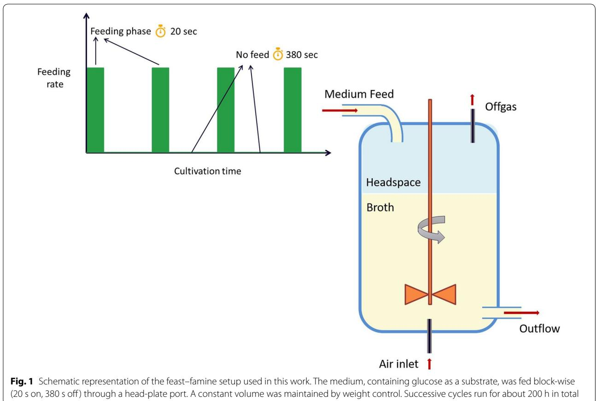
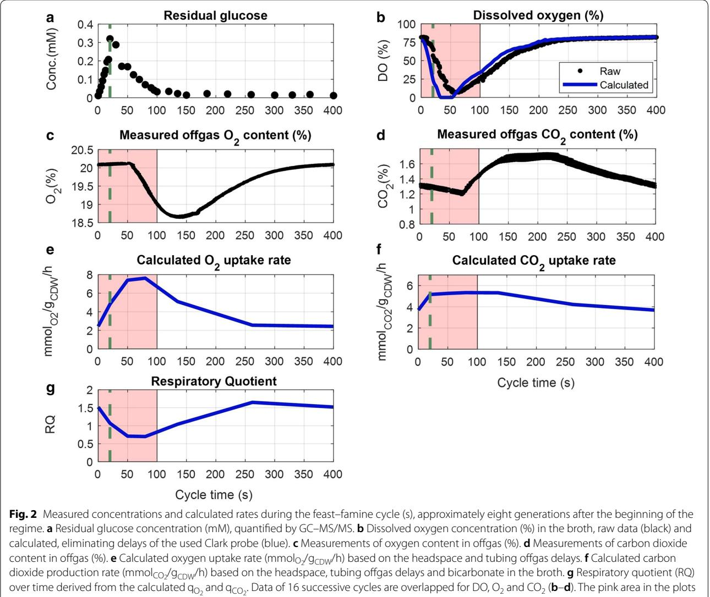
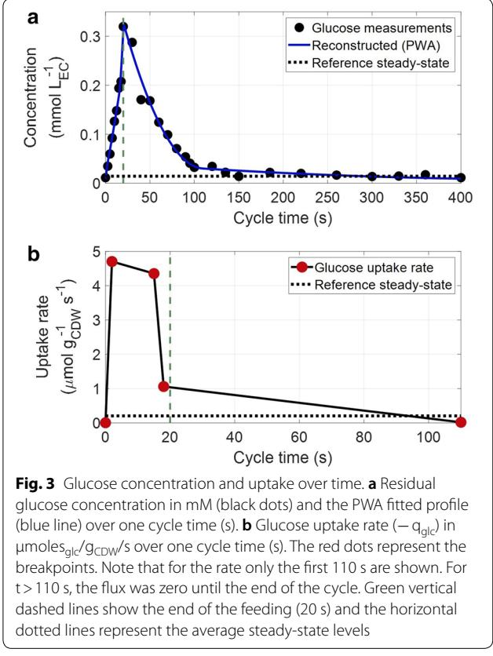
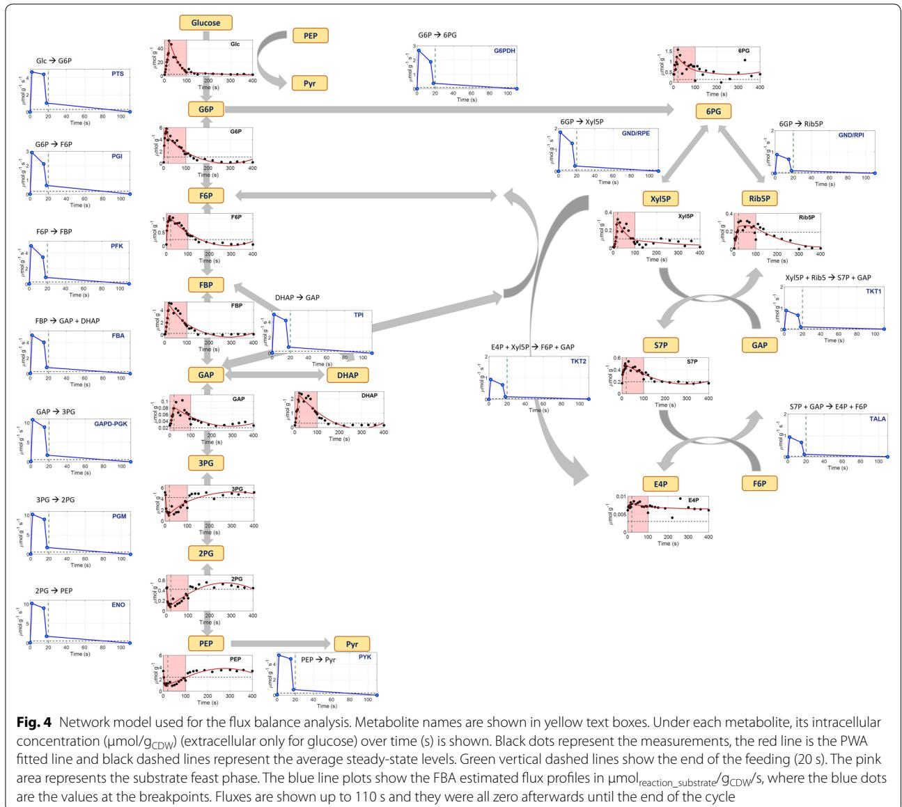
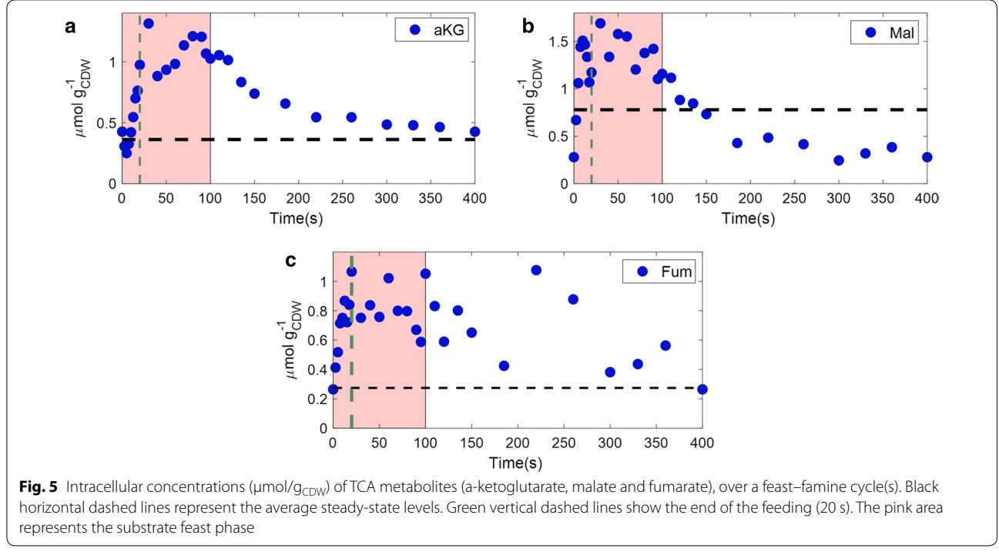
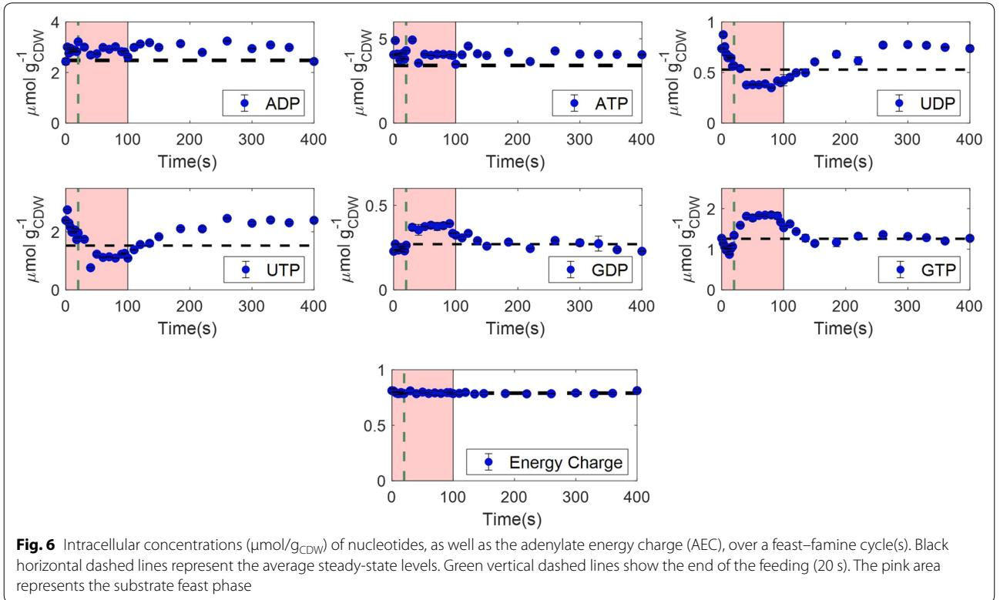
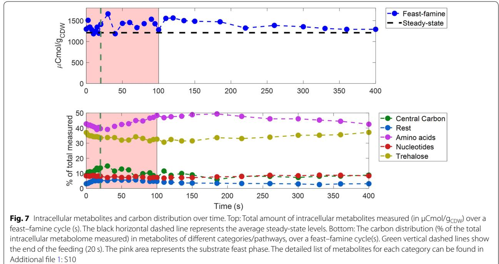

## **RESEARCH**

**Open Access**

# *Escherichia coli* metabolism under short-term repetitive substrate dynamics: adaptation and trade-ofs

Eleni Vasilakou* [,](http://orcid.org/0000-0003-1220-1099) Mark C. M. van Loosdrecht and S. Aljoscha Wahl*

## **Abstract**

**Background:** Microbial metabolism is highly dependent on the environmental conditions. Especially, the substrate concentration, as well as oxygen availability, determine the metabolic rates. In large-scale bioreactors, microorganisms encounter dynamic conditions in substrate and oxygen availability (mixing limitations), which infuence their metabolism and subsequently their physiology. Earlier, single substrate pulse experiments were not able to explain the observed physiological changes generated under large-scale industrial fermentation conditions.

**Results:** In this study we applied a repetitive feast–famine regime in an aerobic *Escherichia coli* culture in a timescale of seconds. The regime was applied for several generations, allowing cells to adapt to the (repetitive) dynamic environment. The observed response was highly reproducible over the cycles, indicating that cells were indeed fully adapted to the regime. We observed an increase of the specifc substrate and oxygen consumption (average) rates during the feast–famine regime, compared to a steady-state (chemostat) reference environment. The increased rates at same (average) growth rate led to a reduced biomass yield (30% lower). Interestingly, this drop was not followed by increased by-product formation, pointing to the existence of energy-spilling reactions. During the feast–famine cycle, the cells rapidly increased their uptake rate. Within 10 s after the beginning of the feeding, the substrate uptake rate was higher (4.68 μmol/gCDW/s) than reported during batch growth (3.3 μmol/gCDW/s). The high uptake led to an accumulation of several intracellular metabolites, during the feast phase, accounting for up to 34% of the carbon supplied. Although the metabolite concentrations changed rapidly, the cellular energy charge remained unafected, suggesting well-controlled balance between ATP producing and ATP consuming reactions.

**Conclusions:** The adaptation of the physiology and metabolism of *E. coli* under substrate dynamics, representative for large-scale fermenters, revealed the existence of several cellular mechanisms coping with stress. Changes in the substrate uptake system, storage potential and energy-spilling processes resulted to be of great importance. These metabolic strategies consist a meaningful step to further tackle reduced microbial performance, observed under large-scale cultivations.

**Keywords:** *Escherichia coli*, Feast–famine, Substrate dynamics, Dynamic metabolic responses, Energy homeostasis

## **Background**

Microorganisms are widely used for the production of chemicals, ranging from small organic acids to large proteins, including biopharmaceuticals, biochemicals and bulk biofuels [\[1](#page-15-0)[–3](#page-15-1)]. In order to meet the cost targets and demands, large-scale production cultivations are and will be required [\[4](#page-15-2)]. However, scale-up of microbial processes

*Correspondence: elenvasil16@gmail.com; s.a.wahl@tudelft.nl Department of Biotechnology, Delft University of Technology, Van der Maasweg, 2629 HZ Delft, The Netherlands

© The Author(s) 2020. This article is licensed under a Creative Commons Attribution 4.0 International License, which permits use, sharing, adaptation, distribution and reproduction in any medium or format, as long as you give appropriate credit to the original author(s) and the source, provide a link to the Creative Commons licence, and indicate if changes were made. The images or other third party material in this article are included in the article's Creative Commons licence, unless indicated otherwise in a credit line to the material. If material is not included in the article's Creative Commons licence and your intended use is not permitted by statutory regulation or exceeds the permitted use, you will need to obtain permission directly from the copyright holder. To view a copy of this licence, visit [http://creativeco](http://creativecommons.org/licenses/by/4.0/) [mmons.org/licenses/by/4.0/.](http://creativecommons.org/licenses/by/4.0/) The Creative Commons Public Domain Dedication waiver ([http://creativecommons.org/publicdomain/](http://creativecommons.org/publicdomain/zero/1.0/) [zero/1.0/)](http://creativecommons.org/publicdomain/zero/1.0/) applies to the data made available in this article, unless otherwise stated in a credit line to the data.

is not a trivial process, as strain performance usually declines from lab to industrial-scale bioreactors [\[5](#page-15-3)[–7](#page-15-4)]. One root of this problem is the mixing limitations, which characterize large-scale bioreactors, and lead to several heterogeneities in the cultivation environment. Important parameters, afected by the constraints in mass and heat transfer, are nutrient concentrations, pH, dissolved gases, temperature and other parameters, which have been extensively reported in many studies and reviews [[8–](#page-15-5)[13\]](#page-15-6).

Substrate gradients are frequently considered as a main reason for performance reduction. Commonly, the substrate concentration should be kept at low levels to avoid overfow metabolism [\[14](#page-15-7)[–17\]](#page-16-0). To achieve such conditions, fed-batch or chemostat regimes are applied. At large scale with mixing limitations, this leads to varying concentration of the substrate in diferent areas of the reactor [\[8](#page-15-5), [18](#page-16-1)–[20\]](#page-16-2). Especially, for most large-scale bioreactors, there is one feeding inlet; close to that point the substrate concentration is (very) high, while it becomes lower in the other parts of the reactor. Tus, cells inside the reactor circulate between zones of substrate excess and zones of substrate limitation. Depending on the scale and the type of the reactor, the timeframes are in order of seconds to minutes [[11](#page-15-8), [12](#page-15-9), [18](#page-16-1)]. Te presence and origin of these gradients has also been demonstrated by computational fuid dynamic simulations [\[18](#page-16-1), [21](#page-16-3)[–23](#page-16-4)].

It is known that such heterogeneities have a big impact on the cellular metabolism, from physiology to metabolic fuxes and gene expression, and subsequently on product formation. Cells traveling close to the feeding zone will increase their substrate uptake rates, which may lead to increased overfow metabolism leading to unwanted products and energy spilling. Additionally, the high uptake rate leads to high oxygen demands, potentially inducing oxygen depletion in this zone [\[24](#page-16-5)[–26](#page-16-6)]. On the other hand, cells passing through areas with low substrate concentration may re-consume overfow metabolites and/or activate stress response pathways, due to substrate limitations [[12\]](#page-15-9). For example, *Escherichia coli* cultures, cyclically circulating from high to low glucose levels, have shown decreased biomass yields and byproduct formation [\[8,](#page-15-5) [19](#page-16-7)].

Two approaches to improve the cell performance in large-scale bioprocesses are: (1) Optimization of bioreactor design and operating conditions preventing gradients, and/or (2) Development of more robust strains which can cope with these conditions.

Especially, for designing more robust strains a mechanistic understanding of the (metabolic) responses to the environment dynamics is required. Te cellular regulation mechanisms to cope with frequently changing environments have been, and still are, key questions in microbiology, not only for industrial applications, but also for understanding microbial ecosystems such as the natural habitat of *E. coli*, involving the lower intestine of humans and animals, water, sediment and soil [\[27](#page-16-8)].

Te cellular behaviour, under substrate dynamic conditions, has been studied using numerous scale-down experiments, for many types of microorganisms (for reviews check [\[28,](#page-16-9) [29\]](#page-16-10)). Commonly these studies derived observations on the physiology, such as average rates of growth, substrate uptake, product formation and respiration, but focused less on the metabolic network and the underlying mechanisms of the cellular responses. For example, the energetic state of the cell, storage accumulation, futile cycles and more phenomena, occurring under dynamic conditions, need further investigation. In addition, the fact that microorganisms, cultivated in large-scale bioreactors, face substrate gradients in a cyclic mode (alternating from substrate excess to limitation), has been highly neglected. Most of the scale-down experiments assessed the behaviour of the culture shortly after applying a single perturbation event. However, we strongly consider that cells develop diferent adaptation strategies, when facing variations in environmental conditions, over long time periods (not long enough for genetic evolution). Several researchers studied such conditions [[30–](#page-16-11)[34](#page-16-12)] and suggested signifcant changes in physiology, metabolic fuxes, as well as transcription and translation, when the cells moved between diferent stress zones repeatedly, eventually leading to reduced growth and productivity [\[6](#page-15-10)]. Terefore, the long-term responses to successive substrate gradients will be different than those which would occur in short-term (<5 generations) or after a sudden perturbation. Suarez-Mendez et al. [\[35](#page-16-13)] applied repetitive glucose perturbations to *Saccharomyces cerevisiae* culture, using a feast–famine regime, proving that the dynamic responses of the adapted culture showed many diferences compared to stimulus–response experiments, such as the absence of the ATP paradox [[36](#page-16-14)]. A similar study has been performed for *Penicillium chrysogenum* [[37](#page-16-15)]. However, only a few studies have been previously performed with *E. coli*, assessing the efects of substrate gradients in long-term. Pickett et al. [\[38\]](#page-16-16) were the frst ones to apply repeating square-wave glucose perturbations, studying the efects on growth and composition of *E. coli* ML30. However, they applied cycles of 2 h duration, which are not able to capture the metabolic responses occurring in timescales of seconds in large-scale bioreactors. Sunya et al. [[39\]](#page-16-17) characterized the dynamic behaviour of *E. coli* DPD2085 imposed in four successive cycles, of 7 min duration each, of glucose pulses in diferent intensities. All cycles were compared to each other, in terms of specifc formation and consumption rates. Nonetheless, the profles of O2 and CO2 concentration were still changing after four cycles of successive perturbations, indicating that the microorganism did not yet reach a metabolic steady response. In addition, the intracellular metabolic activity was not monitored.

Te main goal of this study was to investigate the cellular responses of bacteria under changes in substrate availability, separated from other gradients. For this reason, a feast–famine regime was applied, for the frst time, in a physiologically adapted *E. coli* K12 aerobic culture, with successive glucose perturbations and both intracellular and extracellular metabolic responses, occurring in short-time scale (seconds), were quantitatively described.

## **Methods**

#### **Strain and cultivation medium**

*Escherichia coli* wild-type strain K12 MG1655, obtained from Te Netherlands Culture Collection of Bacteria (NCCB, 3508 AD, Utrecht, Te Netherlands), was used in all the experimental work of this study. Te cultivation (and preculture) medium consisted of (per litre): 0.151 mol glucose (C6H12O6·1H2O), 0.5 g MgSO4·7H2O, 0.5 g NaCl (Avantor J.T.Baker, Gliwice, Poland), 1.25 g (NH4)2SO4, 1.15 g KH2PO4, 6.75 g NH4Cl (Merck KGaA, Darmstadt, Germany), 0.001 g thiamine-HCl (Sigma-Aldrich, St. Louis, Missouri, USA) and 2 mL of trace elements solution [[40](#page-16-18)]. Te pH of the medium was adjusted to 7.0 by the addition of 1 M K2HPO4, before flter sterilization (pore size 0.2 μm, cellulose acetate, FP 30/0.2, Whatman GmbH, Dassel, Germany).

## **Preculture**

Culture aliquots, previously stored in 80% v/v glycerol at −80 °C, were used for the preculture. Cells were grown in shake-fasks flled with 100 mL of the above-mentioned mineral medium, in an incubator (37 °C, 220 rpm) and were used as inoculum for the bioreactor cultivation.

## **Cultivation conditions**

Te cultivation was performed in a 1.2 L stirred tank bioreactor (Applikon Biotechnology B.V., Delft, Te Netherlands), with 0.95 L working volume, controlled by weight. Te bioreactor was aerated with pressurized air at 0.44 L/min (0.5 vvm), using a Smart series mass fow controller 5850S (Brooks Instrument, PA, USA). Te bioreactor was operated at 0.3 bar overpressure, at 37 °C and a stirrer speed of 700 rpm. pH was controlled at 7.0 by automatic addition of either 4 M KOH or 2 M H2SO4. Antifoam (Basildon Chemicals Ltd, UK) was added manually, when necessary, during the batch phase. During the whole experiment, pH, temperature, medium and efuent vessel weight, base and acid addition were monitored online. In addition, the dissolved oxygen in the broth was measured by a polarographic ADI sensor (Applisens, Applikon, Delft, Te Netherlands). A gas analyser (NGA 2000, Rosemount, Emerson, USA) was used to measure on-line the oxygen (O2) and carbon dioxide (CO2) concentrations in the ofgas. After the batch phase was completed (indicated by the decrease of carbon dioxide and the increase of dissolved oxygen), the medium feeding was switched on and a chemostat phase began at a dilution rate of 0.044 h−1 . After 114 h (5 residence times), samples for metabolite and biomass quantifcation were withdrawn.

## **Dynamic feast–famine regime**

After sampling of the reference chemostat, the regime was changed to an intermittent feeding. Te feast–famine setup is shown in Fig. [1](#page-3-0). Successive cycles of 400 s were applied by a continuous medium feeding for 20 s, followed by a period of 380 s of no feeding. Te feeding pump was controlled automatically by a timer (Omega, CT, USA). Te waste outfow was controlled by a scale, on top of which the reactor operated, maintaining the broth volume at 0.95 L. Te regime was designed to feed the same amount of medium over time, as in the chemostat culture, leading to an average dilution rate of 0.047 h−1 . Aeration rate was increased to 0.7 L/min (0.8 vvm), to avoid oxygen limitation. Te rest of the cultivation conditions remained the same as the reference chemostat. After 180 h (8 residence times) of the intermittent feeding, samples for biomass and metabolite quantifcation were withdrawn.

## **Sample analysis**

## *Cell dry weight measurements*

For the determination of the biomass concentration (dry weight), 2 mL of broth were collected and centrifuged (Heraeus Biofuge Stratos centrifuge) at 4 °C for 5 min at 13,800*g*. Te supernatant was then discarded and the pellet was resuspended in 1 mL Milli-Q water. Centrifugation and resuspension were repeated, the sample was then transferred to a previously dried (for 48 h at 70 °C) and weighted glass vial and dried at 70 °C for at least 48 h. Te vials were then weighted again (after cooling down to room temperature inside a desiccator) and the cell dry weight was calculated as the diference between the fnal weight and the empty vial weight. Te average of four replicate samples was used for the steady-state culture, six replica were used for the feast–famine regime.

## *Total organic carbon*

Total broth samples (2 mL each) were withdrawn from the reactor and immediately stored at −80 °C. Supernatant samples were acquired by centrifuging total broth samples (Heraeus Biofuge Pico microcentrifuge) at room

temperature for 1 min at 10,400*g*. Te supernatant was then fltrated (pore size 0.2 μm flter, cellulose acetate, FP 30/0.2, Whatman GmbH, Dassel, Germany) and stored at −80 °C. Te total amount of organic carbon (TOC) was quantifed with a TOC Analyzer (TOC-L CSH, Shimadzu), using the "diference method": TOC was calculated from the diference between total carbon and inorganic carbon. Calibration standards were obtained from LPS b.v. (Oss, Te Netherlands).

## *Extracellular metabolite sampling*

For the determination of extracellular metabolite concentrations, 2 mL of broth were withdrawn into a tube (Eppendorf) and immediately centrifuged (Heraeus Biofuge Pico microcentrifuge) at room temperature for 1 min at 10,400*g*. Te supernatant was then fltrated (pore size 0.2 μm flter, cellulose acetate, FP 30/0.2, Whatman GmbH, Dassel, Germany) into an empty tube, submerged into liquid nitrogen and stored at −80 °C until analysis. Centrifugation was used before fltration to prevent blocking of the flter, due to the high biomass concentration of the samples. For GC–MS and LC–MS analysis, 60 μL of 13C cell extract were added to 300 μL of sample, as internal standard mix, before freezing with liquid nitrogen and storage at −80 °C until further analysis.

## *Intracellular metabolite sampling*

For the determination of intracellular metabolite concentrations, the diferential method was applied with some modifcations [\[41](#page-16-19)]. For the total broth measurement, 1 mL of broth was withdrawn from the reactor into a tube flled with 5 mL aqueous methanol quenching solution (60% v/v) at −40 °C, to rapidly stop metabolic activity. Te sample was immediately vortexed to ensure homogeneity and then weighted. 120 μL of 13C cell extract (production method described in [[42](#page-16-20)]) were added to the sample, as internal standard mix. For the extraction of metabolites, 5 mL of aqueous ethanol solution (75% v/v), preheated at 70 °C, were added to the sample and the tube was then placed into a water bath at 95 °C for 4 min. After the boiling extraction, the sample was immediately cooled down to −40 °C in a cryostat.

Te ethanol–water mixture in all samples was then evaporated in a Rapid-Vap (Labconco, MO, USA) at 30 °C, under vacuum. Te dried sediment was resuspended in 600 μL Milli-Q water, vortexed and transferred to Eppendorf tubes. Te samples were centrifuged at 15,000*g* for 5 min at 1 °C (Heraeus Biofuge Stratos centrifuge). Te supernatants were transferred to new empty tubes and centrifuged again under the same conditions. Te fltrate was stored in screw-cap vials, at −80 °C, until further analysis. Te intracellular concentrations were obtained from the diference between total broth and extracellular measurements.

#### *Analytical methods*

Extracellular concentrations of organic acids (acetate, lactate, formate) and ethanol were determined by HPLC (BioRad HPX-87H 300*7.8 mm column, at 59 °C, 0.6 mL/ min, 1.5 mM phosphoric acid in Milli-Q water as eluent, coupled to a Waters 2414 RI detector and a Waters 2489 UV detector at 210 nm).

Processed extracellular and total broth samples were analysed by GC–MS/MS, GC–MS and LC–MS/MS. Metabolites of the central carbon pathways [glycolysis, pentose phosphate pathway (PPP), tricarboxylic cycle (TCA)] were quantifed with GC–MS/MS (7890A GC coupled to a 7000 Quadrupole MS/MS, both from Agilent, Santa Clara, CA, equipped with a CTC Combi PAL autosampler, CTC Analytics AG, Zwingen, Switzerland), as described in [[43](#page-16-21)] and/or anion-exchange LC–MS/MS [[44\]](#page-16-22). GC–MS was used for the quantifcation of amino acids, as described in [\[45](#page-16-23)]. Ion-pair reversed phase LC– MS/MS was used for the quantifcation of nucleotides, as described in [[46](#page-16-24)]. Te isotope dilution mass spectrometry (IDMS) method, described in [[42](#page-16-20), [47\]](#page-16-25), was used for the metabolite quantifcation.

## **Results**

Te adaptation of *E. coli* to repetitive, dynamic perturbations was evaluated with respect to short and long-term physiological and metabolic characteristics:

- 1. Comparison between average metabolic rates and yields under repetitive dynamic conditions and steady-state (reference) conditions, at the same dilution rate.
- 2. Comparison of the metabolic response between repetitive dynamics, single perturbations (pulse experiments) and steady-state levels.

It was assumed that cells were adapted after fve residence times under the feast–famine regime, and a repetitive metabolic response was obtained. Tis assumption was supported by the observation that the online measurements of dissolved oxygen (DO) and ofgas (O2 and CO2) concentrations (Fig. [2](#page-5-0)) and the RCO2 production rate (Additional fle [1](#page-15-11): S1), showed a highly reproducible pattern over the cycle.

## *Escherichia coli* **physiological behaviour under substrate dynamics**

#### *Extracellular environment*

During the frst 100 s of the cycle the residual glucose concentration (Fig. [2a](#page-5-0)) was higher than the reported glucose afnity constant (*KM* =10 μM) of the microorganism [[48\]](#page-16-26). Tis time period will be referred to as (substrate) feast phase. Te concentration increased from 0.01 to 0.32 mM, which was the maximum value, during the frst 20 s of the cycle. Ten, glucose depleted after 100 s (<10 μM), leading to a (substrate) famine phase.

Te broth dissolved oxygen profle was estimated by deconvolution (Fig. [2](#page-5-0)b blue line), i.e. accounting for the dynamics of the Clark electrode (see Additional fle [1:](#page-15-11) S2 for details).

With the supply of substrate, a decreased dissolved oxygen concentration was observed, suggesting a (high) oxygen consumption during the substrate feast period. Te same behaviour was expected for the ofgas measurements. Te minimum O2 concentration (and maximum CO2) was observed only after the end of the feast phase. Tis delay can be explained by the headspace and tubing gas hold-up [\[49](#page-16-27)]. Te O2 uptake rate and CO2 production rate over time (Fig. [2](#page-5-0)e, f) were therefore calculated, taking into account these delays (Additional fle [1](#page-15-11): S3). For the CO2 production, the interconversion of dissolved carbon dioxide to bicarbonate in the broth, due to the neutral pH 7 was, also, taken into account. Te respiratory quotient (RQ) was then derived from these rates over time (Fig. [2](#page-5-0)g). We observed that the RQ decreased from 1.5 to 0.7 during the frst 50 s of the feast phase, and increased back to the initial value after approximately 200 s, indicating that the electrons, from 20 to 120 s of the regime (RQ<1), are transferred to oxygen, while the respective carbon is not found in the form of CO2. Terefore, we expect a form of intracellular storage compound (with electron to carbon ratio e−/C<3), synthesized in the feast phase and degraded in the famine phase. Further discussion on this follows after the metabolome section.

#### *Average biomass specifc rates and yields*

In order to compare the physiology of the cells between steady-state and feast–famine conditions, the respective biomass specifc conversion rates were calculated (Table [1)](#page-5-1). For the steady-state culture, rates were derived from the respective mass balances. During the intermittent feeding regime, all of the glucose supplied over one cycle was consumed, according to the GC–MS/MS measurements. Terefore the average glucose uptake rate (qglc) was calculated as the amount of substrate fed over the total cycle time. Taking into consideration the 20 h average doubling time of *E. coli* at a dilution rate of

represents the substrate feast phase. Green vertical dashed lines show the end of the feeding (20 s)

## **Table 1 Steady-state and average feast–famine biomass specifc rates with their associated standard deviations**

|                                                | Steady-state | Feast–famine (cycle average) | log2-fold changes between the two regimes |
|------------------------------------------------|--------------|------------------------------|-------------------------------------------------|
| Biomass concentration (g/L)                    | 9.33±0.01    | 6.28±0.03                    | −0.6                                            |
| Biomass growth μ (g/gCDW/h)                    | 0.044±0.002  | 0.048±0.003                  | +0.1                                            |
| Lysis rate (g/gCDW/h)                          | –            | 0.008±0.006                  | –                                               |
| qGlucose (mmolglc/gCDW/h)                   | −0.73±0.01   | −1.12±0.02                   | +0.6                                            |
| qO2 (mmolO2 /gCDW/h)                     | −2.08±0.02   | −4.42±0.06                   | +1.1                                            |
| qCO2 (mmolCO2 /gCDW/h)                   | 2.30±0.02    | 4.53±0.06                    | +1.0                                            |
| Respiratory quotient                           | 1.11±0.01    | 1.03±0.02                    | −0.1                                            |
| Total biomass yield (gCDW/gglc)                | 0.31±0.01    | 0.21±0.01                    | −0.5                                            |
| Oxygen to substrate ratio (mmolO2 /mmolglc) | 2.85±0.05    | 3.94±0.08                    | +0.5                                            |

All the results presented in the table were calculated using data reconciliation. Raw data can be found in Additional fle [1:](#page-15-11) S5

0.05 h−1 , we expected the biomass concentration to vary by 0.5% during one cycle. Tis small change could not be determined experimentally, therefore a constant specifc growth rate (μ) was considered within a cycle and calculated using the average of six cell dry weight measurements. To calculate the average O2 uptake and CO2 production rates, the respective online measurements were frst integrated (trapezoidal method) over time, and then averaged for 16 successive cycles.

Te extracellular by-product (acetate, lactate, formate and ethanol) concentrations (Additional fle [1:](#page-15-11) S4), obtained from HPLC measurements, were also integrated over the cycle and their average formation rates were then calculated from their mass balances (raw data can be found in Additional fle [1:](#page-15-11) S5). Te average acetate production did not exceed 0.02 mmol/gCDW/h, both during steady-state and feast–famine conditions. Te absence of high amounts of by-products in *E. coli* cultivations has been observed in previous studies, both during chemostat [usually at lower dilution rates (up to 0.3 h−1 )] and after glucose or oxygen perturbations [\[50](#page-16-28)[–54](#page-16-29)]. Te by-product formation is related to overfow metabolism, a common phenomenon in *E. coli* cultivations in glucosecontaining medium, where acetate is produced even when the culture is fully aerated [\[55–](#page-16-30)[57\]](#page-16-31). Here, overfow metabolism was not signifcantly afected by the transition of the cells from steady-state to long-term dynamics.

Te biomass specifc rates were reconciled using the approach described in [\[58](#page-16-32)], using element conservations as constraints and the total organic carbon (TOC) measurements of the broth and the fltrate. A constant biomass composition of CH1.73N0.24O0.35S0.006P0.005 (γΧ=4.38, MW =23.2 g/Cmol) [[59\]](#page-17-0) was used for all calculations. Te phenomenon of cell lysis was also introduced in the reconciliation to account for carbon and electrons of non-viable biomass.

Te most evident observation is that the calculated rates for glucose and oxygen uptake and CO2 production were higher (+0.6, +1.1, +1.0 log2-fold times respectively) for the intermittent feeding, compared to the reference continuous regime. More specifcally, during the reference chemostat operation, the oxygen to substrate consumption ratio was 2.85±0.05 molO2/molglc, which is comparable to the values reported in literature for similar cultivation conditions, ranging from 2.74 to 3.62 molO2/ molglc [\[50](#page-16-28), [51](#page-16-33), [59–](#page-17-0)[61](#page-17-1)]. When the cells were subjected to feast–famine cycles, the average oxygen to substrate ratio increased, reaching 3.94±0.08 molO2/molglc.

Introducing potential cell lysis in the reconciliation, we observed that the lysis rate during the steady-state was calculated as negative (while positive by defnition), with a high standard deviation and therefore the steady-state lysis was assumed zero.

Te intermittent feeding, resulted in decreased average cell dry weight concentration and subsequent 0.5 log2-fold decrease (−30.3%) of the total biomass yield. Te biomass yield was calculated as the ratio of the total biomass growth rate (including lysed biomass) over the glucose uptake rate. A decrease in biomass yield has also been reported in previous studies for *E. coli,* when varying the substrate availability. Many studies attributed this phenomenon either to overfow metabolism, due to high growth rates (>0.15 h−1 ) [\[25](#page-16-34), [39](#page-16-17)], or to oxygen limitation. For example, Neubauer et al. [\[62](#page-17-2)] observed a 10% decrease in yield for cells circulating from zones of glucose excess to glucose starvation in a scale-down twocompartment reactor (continuous stirred and plug fow), compared to reference conditions. Tis was explained by the oxygen limitation occurring in high-concentrated regions of glucose. However, this was not the case in our experimental setup. Only minor amounts of acetate were produced as a by-product and did not increase under the dynamic conditions. In addition, we did not observe any changes (elemental analysis) in the biomass composition or morphology, during the reference conditions compared to the one during the feast–famine regime (Additional fle [1:](#page-15-11) S6) Lower biomass yields were also reported for other microorganisms, such as *Saccharomyces cerevisiae* (almost 25% decrease), subjected to an intermittent feeding (similar to the regime used here) [\[63](#page-17-3)].

Te ratio of CO2 produced per glucose consumed, during the steady-state regime, was 3.16±0.05 molCO2 /molglc, while for the feast–famine a value of 4.05±0.08 molCO2/molglc (+28.1%) was observed. Together with the increase in O2 consumption, it indicates that more glucose was used for respiration, rather than biomass production, during the feast–famine cycles [[8\]](#page-15-5).

#### **Glucose uptake dynamics: a matter of seconds**

Te feast–famine setup allows to measure the shortterm responses of *E. coli* cells with high time resolution and repeated measurements. Especially, samples can be obtained from repetitive cycles (Fig. [2](#page-5-0)b–d), which allowed for distributing sampling over several cycles.

Special focus was to obtain a high-resolution uptake profle as substrate uptake has a major impact on the intracellular metabolic behaviour of the microorganism. To calculate the short-term glucose uptake profle, a piecewise afne (PWA) rate approximation [\[64\]](#page-17-4) was calculated. Te breakpoints used were timepoints of 0, 2, 15, 18, 110 and 400 s. Tese breakpoints were chosen based on the highest goodness of ft (R2 was used), among various combinations [\[65\]](#page-17-5). Te fux between the breakpoints followed a frst order linear function (Fig. [3](#page-7-0)). Note that the frst and last breakpoint were coupled (cyclic regime).

Te rate was normalized using the reconciled biomass concentration of 6.28 g/L.

Tere was no obvious correlation between the glucose uptake rate and the extracellular glucose concentration. Te rate reached its highest value (4.68 μmol/gCDW/s) immediately after the beginning of the feeding and then decreased slightly until the end of the feeding, followed by signifcant decrease between 15 s and 18 s, i.e. from 4.40 to 1.04 μmol/gCDW/s.

Tis contradiction is explained by the activity of the phosphotransferase system (PTS) [[66\]](#page-17-6), which is the main substrate uptake system in *E. coli* under glucose excess (Km is in the range of 3–10 μΜ [[48,](#page-16-26) [67\]](#page-17-7)). Terefore, the glucose transport did not depend only on the extracellular concentration, but also on the intracellular concentrations of other metabolites like glucose-6-phosphate (G6P), phosphoenolpyruvate (PEP) and pyruvate, which are key components of the PTS.

Te overshoot in the glucose uptake rate has been previously observed in cells exposed to excess of substrate after a starvation period, in diferent experimental setups [[52,](#page-16-35) [60,](#page-17-8) [62\]](#page-17-2). However, the main diference of our work is that we described an adapted microorganism, which has sustained substrate perturbations for more than eight generations, while the above-mentioned studies reported the behaviour of the cells right after applying a perturbation for the frst time.

Te highest estimated uptake rate in our work was signifcantly higher than the maximum observed during batch cultivations for the same strain (3.06 [[68](#page-17-9)] and 3.30 [\[52\]](#page-16-35) μmol/gCDW/s), proving that the microorganism has a higher uptake capacity than the one observed under maximum growth. It is, however, puzzling that the glucose uptake rate was decreasing already (mainly after 18 s), while glucose was still in excess (above the glucose afnity constant). An additional test experiment was performed under the same cultivation conditions, with a shorter feeding phase (13 s) but the same cycle length (400 s) and the same total amount of glucose fed over the cycle. Te glucose uptake rate calculated (data not shown) exhibited the same decreasing pattern 2 s before the end of the feeding phase (at 11 s), while glucose was still in excess. Raw observations of this test experiment are included in Additional fle [1](#page-15-11): S4(Table S2). Terefore, it is concluded that the specifc feeding time, chosen for the experimental setup of this study, was not an infuencing factor of this behaviour. Tis decrease suggests that there was another limitation in further metabolizing glucose, which arose early in the feast phase. Another critical observation is that the uptake of glucose was decoupled from the oxygen uptake. While there was no glucose uptake after 100 s (Fig. [3b](#page-7-0)), oxygen was still consumed (Fig. [2e](#page-5-0)), suggesting that an intracellular compound was oxidised during the substrate famine phase. Diferent hypotheses for both observations will be derived (see ["Discussion"](#page-13-0)) based on the analysis of the intracellular metabolite measurements.

## **Metabolite dynamics in the intracellular space**

Te highly dynamic glucose uptake rate, discussed in the previous section, was expected to result in signifcant fuctuations in the intracellular metabolite levels. Terefore, it is important to observe how *E. coli* is regulating its metabolic network to handle the increased fuxes under these rapidly changing conditions, without detrimental efects on its survival. For this aim, a broad range of intracellular metabolites were quantifed during the reference chemostat regime and the feast–famine cycle regime, including glycolysis, tricarboxylic acid (TCA) cycle, pentose phosphate pathway (PPP) intermediates and amino acids. Tese measurements originated from one experiment, but metabolites were sampled densely in time, over several cycles. Te clear trends of the measurements showed high technical reproducibility (i.e. sampling and analysis).

#### *Glycolysis and pentose phosphate pathway*

Te intracellular fux profles over time were estimated by (dynamic) Flux Balance Analysis (FBA) for the glycolytic and pentose phosphate reaction steps. Te stoichiometric network included reactions of central carbon metabolism, where the intermediates could be measured (otherwise lumped, see Additional fle [1](#page-15-11): S7 for details). Te glucose uptake rate, derived previously, was used as input for the PTS fux. For the steady-state fux determination it was assumed that 70% of the PTS fux was directed towards glycolysis, while the rest was directed towards the pentose phosphate pathway; this ratio is a recurring value reported in literature [\[59](#page-17-0), [69–](#page-17-10)[71\]](#page-17-11). For the dynamic fux determination during the feast–famine cycles, instead of setting the PTS fux split ratio, we used the minimization of the squared diference between the dynamic and the steady-state phosphoglucoisomerase (PGI) and PPP fuxes as the optimization target (i.e. minimization of metabolic adjustment—MOMA) [\[72\]](#page-17-12). It has been suggested that mutant *E. coli* strains redistribute their metabolic fuxes in such way to minimally divert from the wild-type metabolic network [[72](#page-17-12)[–74](#page-17-13)]. Our work is a comparable case, where the perturbation of the cells was not genetic, but kinetic, as a result of an intermittent substrate feeding. It was, therefore, assumed for our analysis that the optimal fux distribution after the perturbation required the smallest change from the steady-state metabolism, the same way the genetic engineered strains adapt with respect to the wild-type.

Te simple network used in FBA is shown in Fig. [4](#page-9-0), along with the measured metabolite concentrations and the estimated fuxes over time. MOMA was performed in Matlab R2018a, Te MathWorks, Inc., using quadratic programming. Te derived fuxes in the chosen breakpoints can be found in Additional fle [1:](#page-15-11) S8.

Looking at the dynamics in terms of concentration profles, we observed that the microorganism transported the glucose from the extracellular to the intracellular space, causing all the upper glycolytic metabolites to increase during the frst 20 s, in agreement with the extracellular glucose decrease. After fast flling of the pools, depletion also followed the extracellular concentration profle, i.e. very low concentration levels were observed during the famine phase (>100 s). Te measured concentrations were signifcantly higher than the steady-state levels (e.g. up to 20 fold change for FBP), due to the shortterm overshoot of carbon fux. Te opposite trend was observed for the lower glycolytic metabolites (3PG, 2PG, PEP), whose concentration immediately decreased in the frst seconds of the feast phase (three to sixfold change from steady-state). Te reason behind this drop is based on the PTS system. In order to import and phosphorylate glucose to G6P, PEP needs to be produced and then converted to pyruvate. Unfortunately, pyruvate could not be quantifed in this experiment. PEP concentration showed negative correlation with G6P, as it reached its lower concentration after 12.5 s, the same time the maximum concentration of G6P was reached. Tis behaviour has been observed before in *E. coli* responses to glucose pulses [[50](#page-16-28), [75–](#page-17-14)[77\]](#page-17-15). Even in lower concentrations PEP was always available, during the whole cycle, for the import of glucose, therefore no limitation in the glucose transport system of *E. coli* was observed.

Te metabolites of pentose phosphate pathway related well to the dynamics observed in glycolysis, as they exhibited the same behaviour of rapid accumulation in the beginning of the feast phase and later decrease to the initial levels. Te pool of 6PG responded directly to the changes occurring in its precursor, G6P, reaching its maximum concentration at 20 s (7.5 s delay compared to G6P). Tis peak was observed slightly later in the rest of the metabolites, with the exception of Xyl5P, which responded equally fast.

Looking at the fux profles, we observed that the glucose uptake rate dynamics propagated through glycolysis. Te peak observed in the PTS fux right at the beginning of the feeding, also occurred in the succeeding reactions towards the formation of PEP and they all decreased signifcantly after 15 s. After 110 s all metabolite pools remained constant, while there was no more fux running in glycolysis. Te same trend was also observed in all the reaction steps of the pentose phosphate pathway.

Compared to the steady-state levels, the immediate increase of the PTS fux (16 fold) led to a higher change in all the glycolytic fuxes (18–19 fold) and an even higher increase in the fux towards PPP (30 fold). Tis observation, together with the fact that 62.4% of the PTS fux was directed into glycolysis (less than the 70% assumed in steady-state), gives an indication that the cells may increase the fux to pentose phosphate pathway, under these dynamic conditions, therefore enhancing the production of NADPH, assumingly for redox balance purposes. Similar increase was observed after a single-pulse of glucose in an aerobic *E. coli* culture, which was used to further support the calculated increase in growth rate during the feast phase [[52\]](#page-16-35). NADPH was, therefore, needed to support the increased growth. Tis behaviour has, also, been observed as a response to oxidative stress for *E. coli* [[78,](#page-17-16) [79](#page-17-17)] and other organisms [[80,](#page-17-18) [81](#page-17-19)].

### *TCA cycle*

In the case of the TCA cycle, only a few metabolites could be precisely quantifed, which are shown in Fig. [5.](#page-10-0)

Following glycolysis, also the TCA metabolites showed a dynamic profle over time. We observed

that aKG and malate reached their highest concentration 30 s after the beginning of the feast–famine cycle (Fig. [5](#page-10-0)), displaying a delay of 10 s compared to the glucose profle (Fig. [3)](#page-7-0). Tis delay was also evident during the famine phase, as the metabolite levels reached low levels much later than the glycolytic ones (> 100 s). Fumarate showed a more oscillating profle over time, but a general increase of the pool during the feast phase and a following decrease, to the initial levels at the end of the cycle, was detected. Te highest concentration change during the cycle was observed for malate (6.1 fold), which was still lower than the dynamics of the upper glycolytic metabolites, such as G6P (31.7 fold) and F6P (18.8 fold).

#### *Amino acids*

Amino acids are relevant precursors for protein synthesis. At the same time, several amino acids are closely connected with their respective central carbon metabolism precursor. For example alanine is only one (equilibrium) reaction step from pyruvate. Tus, on the one hand one could expect homeostasis to ensure balanced growth, on the other hand a high dependency on central carbon metabolism (Additional fle [1](#page-15-11): S9). Amino acids derived from E4P (Additional fle [1:](#page-15-11) S9(Figure S3)) displayed a

similar dynamic profle with their precursor, with delays in reaching their highest values. Te same trend was observed for the amino acids derived from aKG (Additional fle [1](#page-15-11): S9(Figure S7)) and the ones from pyruvate. Tey all increased and decreased over time related to the concentration of their precursors, with some exhibiting more pronounced and faster dynamics (e.g. glutamine, alanine, leucine) than others (e.g. lysine, proline). On the other hand, serine, tryptophan and glycine were not signifcantly afected by the profle of their precursor, 3PG, as they displayed small changes over time, remaining close to their steady-state values (Additional fle [1](#page-15-11): S9(Figure S4)). Te amino acids, derived from oxaloacetate, also, displayed various trends, either rapidly increasing (e.g. threonine) or decreasing (e.g. aspartate, cysteine) during the feast phase (Additional fle [1](#page-15-11): S9(Figure S5)).

Te largest deviation of concentrations from the steady-state ranged from one to threefold times for most of the amino acids, more modest than the changes in their precursors. Cysteine was the only exception, as its concentration was measured to be 200 fold higher than the steady-state, in the beginning of the feast–famine regime (Additional fle [1](#page-15-11): S9(Figure S5)). Interestingly, while all amino acid concentrations decreased at the end of the cycle towards biomass synthesis, some even reaching their low steady-state levels, the opposite trend was observed for aspartate. Aspartate decreased rapidly during the feast phase and then increased during the famine phase, reaching a concentration of around 6 μmol/gCDW, while its steady-state concentration was 2.6 μmol/gCDW (Additional fle [1](#page-15-11): S9(Figure S5)).

## *Nucleotides and energy homeostasis*

Nucleotide responses to the feast–famine regime are of high interest and especially the ATP/ADP levels, which refect the adenylate energy state (AEC = ATP+ 1 2 ADP ATP+ADP+AMP [[82\]](#page-17-20)) of a cell and can provide insights on how the cells encounter the dynamic perturbations energetically. As expected, but still surprising, the AEC of the cell showed stability throughout the cycle (average value of 0.79), indicating that the total rate of ATP production is equal to the one of ATP consumption. Te average AxP (sum of ATP and ADP) concentration was in the range of 6.99 μmol/gCDW, while the energy turnover is expected in the range of 0.4 to 1 s, using a normal P/O ratio (2.98) for *E. coli* [[59\]](#page-17-0). Terefore, such balancing occurred in subseconds. Under glucose-limited and batch growth conditions the AEC, in most microorganisms, ranges between 0.7 and 0.95 [\[83–](#page-17-21)[86\]](#page-17-22). AMP concentration was at noise level and therefore not quantifed. Its contribution on the AEC calculations was neglected.

Our fndings are in agreement with results from single pulse experiments [\[50](#page-16-28), [52,](#page-16-35) [87\]](#page-17-23), as well as two-compartment scale-down cultivations [[34\]](#page-16-12), in *E. coli* K12, where the energy homeostasis was also reported during glucose excess (AEC ranging from 0.8 to 0.85 in the diferent studies). However, in these studies, the AEC was decreasing during the famine phase, sometimes reaching values even lower than 0.7 [[34](#page-16-12)], which was not the case in our experiment. Link et al. [\[88](#page-17-24)] also observed that the AEC remained unafected, ranging between 0.7 and 0.8, after transferring fed-batch grown cells to batch reactors.

In contrast to AxP's, UDP and UTP were not homeostatic. Tey decreased over the feast phase and increased during the famine phase. Also, GDP and GTP were dynamic with a trend opposite to UxP's (Fig. [6](#page-11-0)).

#### *Total metabolome*

From the extracellular observations, it was observed that the carbon uptake and excretion were signifcantly shifted. While the substrate carbon was consumed only during the frst 100 s, excretion in the form of CO2 was observed over the whole cycle (400 s). Te specifc glucose uptake rate was higher than at the reference steady-state and there was no signifcant accumulation of by-products. Tis suggests high intracellular accumulation of carbon during the feast phase and degradation during the (extracellular) famine phase.

Te total amount of intracellular carbon during steadystate and feast–famine was calculated from the measured metabolites at every timepoint and is shown in Fig. [7.](#page-12-0)

Te total amount of metabolites was changing over time, during the feast–famine regime. We observed a small decrease in the total metabolome during the frst 10 s of the cycle, followed by an increase until the highest point (1661 μCmol/gCDW), at 30 s (Fig. [7-](#page-12-0)top). After this point, the concentrations remained constant (around 1420 μCmol/gCDW) until approximately 120 s. Ten a constant decrease, until reaching the initial level, was observed. Signifcantly, the total amount of carbon in the measured metabolome was, at all timepoints, higher than the steady-state levels, resulting from the overshoot in the glucose uptake.

But which metabolites accounted for the highest changes? In Fig. [7](#page-12-0) (bottom) metabolites have been divided in diferent categories, based on their pathways, and the carbon percentage of the total metabolome that they represented was plotted over time. Amino acids were found to contain most of the total carbon during the whole cycle, ranging from 39 to 49%, with glutamate contributing the most to this observation, being the most abundant pool measured. Trehalose was also a signifcant pool, accounting for approximately 34% of the total carbon, remaining however, constant over time. In the frst 20 s of the feast–famine regime, the carbon percentage of central carbon intermediates (glycolysis, PPP and TCA) was increasing, in addition to the metabolites M6P, T6P, UDP-glucose, M1P and G1P (representing the rest in Fig. [7](#page-12-0)-bottom). Besides increasing metabolites in central carbon metabolism, there were also several

metabolites with the contrary response (see metabolites of lower glycolysis—Fig. [4](#page-9-0)). Because of this, the change in the central carbon metabolites (Fig. [7](#page-12-0)-bottom) seems less dynamic than the concentration profles shown in Fig. [4](#page-9-0). Te highest change was attributed to citrate (2–6% of the total carbon measured) (Fig. [7-](#page-12-0)bottom). After 20 s, while glucose uptake rate was already lower, the flling of the amino acid pools was evident, as their carbon percentage increased during the feast, as well as the frst 100 s of the famine phase. Nucleotides remained constant over time, as discussed earlier in this section.

From the oxygen uptake profle (Fig. [2](#page-5-0)e), we derived that 41.5% of the total oxygen consumption occurred during the frst 110 s of the cycle (feast). However, oxygen was still consumed in the famine phase, with a lower rate, until approximately 250 s when it reached the initial uptake level and remained constant until the end of the cycle. Since glucose was depleted during that phase and by-product concentrations were not changing over time, the electrons consumed must have been supplied either by an intracellular storage compound or other accumulated intermediates, as is also shown from the RQ calculation (Fig. [2g](#page-5-0)).

Te most common storage polysaccharides in *E. coli* are trehalose [[89\]](#page-17-25) and glycogen [\[90\]](#page-17-26). As discussed above, trehalose was a big intracellular pool, but did not change over time and was therefore ruled out as a bufer compound. Glycogen is the most well-known storage polysaccharide in *E. coli*. When the substrate is in excess, some of the glycolytic fux is diverted in the production of glycogen by G1P. Te cells can then use this storage to grow under substrate limitation [[91](#page-17-27)]. An attempt to quantify intracellular glycogen was performed, leading only to the conclusion that glycogen levels were increased during feast–famine, compared to steady-state. However, the measurements were not accurate enough to conclude if there was production and consumption during the dynamic cycle and therefore data are not shown.

Looking at the rest of the intracellular intermediates, the total accumulation, in terms of carbon, during the feast phase was calculated to be 256 μCmol/gCDW, which is 1.6 mCmol/LEC (Fig. [7](#page-12-0)-top). Tis amount represented 34% of the total glucose (4.7 mCmol/LEC) consumed by the cells in the frst 100 s of the feast–famine cycle. In terms of electrons, this accumulation in the feast phase was 6.4 mEmol/LEC. If all the electrons were used during the famine phase, the maximum oxygen consumption observed would be 1.6 mmolO2/LEC. In fact, we estimated, from the calculated qO2 , that indeed around 1.6 mmolO2/LEC were consumed during the famine phase. Terefore, all of the accumulated intracellular metabolites could have been used as electron donors and could explain the O2 uptake, while the substrate was depleted. Taymaz-Nikerel et al. [\[52\]](#page-16-35) reached to similar conclusions. In their case, 50% of the intracellular metabolites were catabolised in the famine phase, after a single glucose pulse, with glutamate being the most abundant pool.

## **Discussion**

*Escherichia coli* cultured under dynamic substrate conditions exhibited a diferent physiology compared to conditions supplying the same amount of substrate steadily. Namely, the average biomass specifc consumption (glucose, O2) and production rates (CO2) increased under the feast–famine regime, compared to the steady-state, while by-product synthesis remained unafected. Consequently, biomass formation was adversely disturbed with 30% decrease in yield.

Tese observations suggest that during the intermittent feeding, more glucose was used for respiration than biomass production. Tis would mean that the excess of ATP produced was used in other cellular processes. If the energy-spilling scenario is correct, it would imply an increase in maintenance or the presence of futile cycles.

Alternatively, this change in physiology could be attributed to an increase in competitiveness. Fast consumption of the substrate generates an advantage compared to slow competitors, as an increasing share of the substrate will go to the faster consuming cells [[92](#page-17-28)].

#### **Maintenance**

Maintenance is defned as the energy-consuming processes "for functions other than production of new cell material" [\[93\]](#page-17-29). In *E. coli*, the most important maintenance processes described in literature, are protein turnover (synthesis and degradation), switches in metabolic pathways, proteome and RNA repair and cell motility [[92,](#page-17-28) [94](#page-17-30)[–96](#page-17-31)]. Any of these parameters can, therefore, provide an explanation of the decrease in biomass yield. Protein turnover rate is an important characteristic of the cell. Energetically, a majority of ATP is used for protein synthesis and degradation. It is well-known that the cell uses its proteasome to degrade misfolded proteins or proteins with other abnormalities. Terefore, the change from a steady-state to a dynamic environment may have resulted in accumulation of proteins which have to be rapidly eliminated by the cell [[97\]](#page-17-32). Te ATP demands for protein turnover could have thus increased, causing the loss in biomass yield. Te cost of protein degradation by the proteasome has been estimated to be minimum two ATP molecules per peptide bond [\[98](#page-17-33), [99](#page-17-34)]. Protein turnover rates can be quantifed with dynamic 13C labeling of the amino acids pools and proteasome activity essays [[100,](#page-17-35) [101\]](#page-17-36), which were not performed in this study.

## **Futile cycles**

Futile cycles may also explain the ATP-spilling during the feast–famine regime. Some potential futile cycles, already described in literature, are:

- 1. Te reconversion of oxaloacetate to phosphoenolpyruvate by the gluconeogenic PEP carboxykinase [[102](#page-17-37)]. Tis ATP-dissipating futile cycle has been identifed for low dilution rates in glucose-limited chemostats of a pyruvate kinase defcient *E. coli* strain [\[103](#page-17-38)], as well as, for the wild-type under very low glucose availability [[104](#page-17-39)]. Te induction of this futile cycle showed stimulation of glucose and oxygen uptake rates, decrease of growth yield on glucose and increase of fermentation products [[105](#page-18-0)]. Yang et al. [[106\]](#page-18-1) demonstrated that ATP dissipation, by the PEP carboxykinase futile cycle, increased with the decrease of the growth rate, reaching 8.2% of the total ATP produced, at a dilution rate of 0.01 h−1 .
- 2. Te reconversion of fructose-1,6-biphosphate to fructose-6-phosphate by fructose 1,6-bisphosphatase. Usually this futile cycle is tightly regulated by the cells and is therefore minimal under both glycolytic and gluconeogenic conditions [[107](#page-18-2), [108](#page-18-3)].
- 3. Te reconversion of pyruvate to phosphoenolpyruvate by phosphoenolpyruvate synthase, with the involvement of Enzyme I of the PTS [[109](#page-18-4), [110\]](#page-18-5). 10% of PEP was found to be produced by pyruvate during growth of *E. coli* wild-type on glucose [\[109\]](#page-18-4).
- 4. Te reconversion of acetate to acetyl-coA by acetylcoA synthetase [\[111\]](#page-18-6). Valgepea et al. [[112\]](#page-18-7) claimed that bacteria may use this futile cycle under low nutrient availability, for chemotaxis, fghting other organisms, bioflm formation and other functions.
- 5. Glycogen formation and re-consumption. Te formation of glycogen, by glycogen synthetase, requires one ATP per glucose, while its consumption does not form any ATP [[92](#page-17-28), [113](#page-18-8)].

All of the above-mentioned futile cycles could be active in *E. coli* during the feast–famine conditions. It is well possible that the cells up-regulate the enzymes of these futile cycles, in order to rapidly switch the direction of the fuxes, when shifting from feast to famine conditions. Te reasons behind this metabolic strategy can be the rapid re-initiation of growth and the tight regulation of the ATP levels in the cell. We indeed observed a constant energy cellular status over the intermittent regime, which enhances the hypothesis of this role of futile cycles. However, the identifcation and interpretation of these energy-spilling reactions, under alternating feast– famine conditions, has not been studied in literature. Measurements of the enzyme expression and 13C fux determination will be needed to confrm our hypotheses. In addition, knocking out some of the enzymes causing these futile cycles and growing the engineered strains under the same conditions would be a strategy to verify if they are key elements of the ATP homeostasis.

#### **Short-term uptake dynamics**

Based on high time resolution, extracellular glucose concentration measurements and PWA rate approximations, the glucose uptake rate was calculated over cycle time and showed an immediate increase after the feeding was switched on. Tis rate reached a maximum value, higher than batch maximum rates, and decreased before the concentration decreased. Te fact that glucose was still in excess, but the uptake rate could not follow up, indicates the existence of an intracellular metabolic limitation. From our intracellular metabolic analysis, we showed that there was enough PEP during the whole cycle to drive glucose transport in the cell through the PTS, therefore, the import of substrate was not the limiting step. One hypothesis which could explain the switch in the uptake rate is the phenomenon of macromolecular crowding. Macromolecular crowding is occurring in all living organisms, as a large part of the volume of the cell is occupied by high concentrations of macromolecules, such as proteins. Tus, there is limited intracellular volume available for other molecules. Tis volume exclusion afects various enzymatic reactions, either by increasing or decreasing their rates, depending on the change in size of the reactants [\[114](#page-18-9)[–117\]](#page-18-10). While it has been shown that macromolecular crowding demonstrates mostly advantageous efects on cell metabolism [\[114](#page-18-9), [117](#page-18-10)[–119](#page-18-11)], it can also function as a constraint for cells which exhibit high metabolic rates [[120\]](#page-18-12). Beg et al. [\[121\]](#page-18-13) developed a fux balance model of *E. coli* (FBAwMC), including a constraint for the enzyme concentrations, considering the macromolecular crowding. With this model they predicted the maximum growth both in single-substrate, but also in mixed substrate media, accurately representing experimental observations, showing that the growth rate was infuenced by the solvent availability in the cytoplasm. In a following study, Vazquez et al. [\[122](#page-18-14)] applied the same modelling framework to changes from low to high growth rates. Teir results demonstrated, among others, that under high metabolic rates the limitation in substrate uptake and growth rate is highly related to the crowding of the intracellular space. Terefore, the high metabolic rates observed in our study, during the feast– famine regime, may have caused the limitation observed in the glucose uptake rate after 18 s, as the cytosol space may have been unable to handle further increase of macromolecules produced. It was, however, challenging to identify if this source of regulation is indeed the cause for the change in the uptake rate, with the current dataset. More reasons could involve membrane integrity, as there is a minimal lipid to transporter proteins ratio [\[123\]](#page-18-15) or enzyme kinetic constraints [[120\]](#page-18-12).

Furthermore, we observed the high capacity of intracellular metabolism facing the substrate gradients applied. Tere was a rapid response in intracellular metabolite concentrations and fuxes, which generally deviated signifcantly from the steady-state. Te dynamics observed were less pronounced moving downstream, from glycolysis to TCA and then to amino acid synthesis, with more modest changes over time.

In addition, during the highly dynamic conditions, applied in this study, we demonstrated the ability of the cells to store an amount of carbon and electrons intracellularly during the feast phase, which were then used when substrate was depleted, therefore, explaining oxygen consumption during the famine phase. Tis strategy proves to be important for the survival and robustness of *E. coli* under nutrient-limited conditions.

#### **Industrial relevance**

Tese observations are highly relevant in an industrial context, where *E. coli* is aerobically cultivated in largescale bioreactors, facing long-term substrate gradients. Fed-batch regimes are often preferred, since the substrate concentration or the specifc growth rate can be controlled in such a way to avoid overfow metabolism [[124,](#page-18-16) [125](#page-18-17)]. Terefore fed-batch cultivations facilitate higher biomass and product yields than batch or chemostat cultivations [\[126\]](#page-18-18). However, with the present study, we have shown that the circulation of cells around zones of substrate excess and limitation can lead to signifcant biomass yield losses, decreasing the proftability of the process. In addition, the immediate response of the microorganism to the excess of substrate, observed by the increased capacity of uptake rate, also leads to higher oxygen consumption. Terefore, oxygen limitation will be observed in these zones, or more oxygen should be supplemented in the process, which is not economically favourable. Moreover, several modelling approaches, which have been used to predict the behaviour of the cells in the scale-up, assume biomass yield as the optimization target. However, yields from steady-state cannot be transferred to dynamic conditions. Additional energy is required for processes like maintaining the energy charge homeostasis. Also, if these dynamic conditions afect severely the endogenous pathways of a wild-type strain, we would expect that artifcial metabolic pathways would be even more sensitive, as their regulation in an engineered strain has not evolved over various environmental conditions [\[127\]](#page-18-19).

## **Conclusions**

Studying the physiological and metabolic responses of an adapted *E. coli* culture to substrate perturbations, highlights parameters to take into account for metabolic engineering and process design in relation to large-scale reactor operation.

- 1. Cells responded immediately to an excess of substrate, by increasing their uptake rate and consequently the intracellular fuxes in tens of seconds. Carbon was stored in intracellular intermediates, during substrate feast and was consumed during a famine phase.
- 2. Despite, the highly changing dynamics, energy charge homeostasis was observed, as a remarkable ftness characteristic of the response to perturbations, indicating rapid metabolic regulation.
- 3. More important and highly relevant to industrial fermentations, was the 30% decrease of the biomass yield, occurring during the intermittent feeding, compared to a reference steady-state. Energyspilling, was therefore, a trade-of for the adaptation of the microorganism in the dynamic environment, seeking for robust growth.

Te obtained results revealed some reasons for the reduced performance of cell factories during scale-up. *E. coli* responds to stress, induced by substrate gradients, by launching a specifc metabolic strategy. In order to improve productivity cost-efectively in largescale bioprocesses, we need to further identify the mechanisms behind stress adaptation, limitations in substrate uptake and respiration, potential energy-spilling pathways and optimal growth targets of the cells, combining multi-omics approaches.

## **Supplementary information**

**Supplementary information** accompanies this paper at [https://doi.](https://doi.org/10.1186/s12934-020-01379-0) [org/10.1186/s12934-020-01379-0](https://doi.org/10.1186/s12934-020-01379-0).

**Additional fle 1.** Additional fle supporting the results discussed in the text.

#### **Abbreviations**

#### **Metabolites**

2PG: 2-phosphoglycerate; 3PG: 3-phosphoglycerate; 6PG: 6-phosphogluconate; ADP: Adenosine diphosphate; aKG: Alpha-ketoglutaric acid; AMP: Adenosine monophosphate; ATP: Adenosine triphosphate; DHAP: Dihydroxy acetone phosphate; E4P: Erythrose-4-phosphate; F6P: Fructose-6-phosphate; FBP: Fructose-1,6-bis-phosphate; G1P: Glucose-1-phosphate; G6P: Glucose-6-phosphate; GAP: Glyceraldehyde-3-phosphate; GDP: Guanosine-5-diphosphate; GTP: Guanosine-5-triphosphate; M1P: Mannitol-1-phospate; M6P: Mannose-6-phosphate; NADPH: Reduced nicotinamide adenine dinucleotide phosphate; PEP: Phosphoenolpyruvate; PYR: Pyruvate; Rib5P: Ribose-5-phosphate; S7P: Sedoheptulose-7-phosphate; T6P: Trehalose-6-phosphate; UDP: Uridine-5-diphosphate; UTP: Uridine-5-triphosphate; Xyl5P: Xylulose-5-phosphate.

#### **Pathways/reactions**

TCA: Tricarboxylic acid cycle; PPP: Pentose phosphate pathway; PGI: Phosphoglucoisomerase reaction.

#### **Acknowledgements**

The authors express their gratitude to Cor Ras (LC–MS/MS), Patricia van Dam (GC–MS/MS) and Carol de Ram (GC–MS) for the exceptional analytical work and Johan Knoll for the TOC measurements.

#### **Authors' contributions**

EV performed the experimental work, analysed the experimental data and wrote the manuscript, including construction of fgures and tables. EV, SAW and MCML contributed to the design of this work. SAW and MCML supervised all the work. All authors read and approved the fnal manuscript.

#### **Funding**

This research was part of the ERA-IB funded consortium DYNAMICS (ERA-IB-14-081) and was also funded by the Netherlands Organization for Scientifc Research (NWO) under the code 053.80.724.

#### **Availability of data and materials**

The datasets used and/or analysed during the current study are available from the corresponding author on reasonable request.

#### **Ethics approval and consent to participate**

Not applicable.

## **Consent for publication**

Not applicable.

#### **Competing interests**

The authors declare that they have no competing interests.

Received: 24 March 2020 Accepted: 25 May 2020

### **References**

- 1. Choi S, Song CW, Shin JH, Lee SY. Biorefneries for the production of top building block chemicals and their derivatives. Metab Eng. 2015;28:223–39.
- 2. Gavrilescu M, Chisti Y. Biotechnology—a sustainable alternative for chemical industry. Biotechnol Adv. 2005;23:471–99.
- 3. Lee JW, Kim HU, Choi S, Yi J, Lee SY. Microbial production of building block chemicals and polymers. Curr Opin Biotechnol. 2011;22:758–67.
- 4. Straathof AJJ, Wahl SA, Benjamin KR, Takors R, Wierckx N, Noorman HJ. Grand research challenges for sustainable industrial biotechnology. Trends Biotechnol. 2019;37:1042–50.
- 5. Humphrey A. Shake fask to fermentor: what have we learned? Biotechnol Prog. 1998;14:3–7.
- 6. Schmidt FR. Optimization and scale up of industrial fermentation processes. Appl Microbiol Biotechnol. 2005;68:425–35.
- 7. Junker BH. Scale-up methodologies for *Escherichia coli* and yeast fermentation processes. J Biosci Bioeng. 2004;97:347–64.
- 8. Bylund F, Collet E, Enfors SO, Larsson G. Substrate gradient formation in the large-scale bioreactor lowers cell yield and increases by-product formation. Bioprocess Eng. 1998;18:171–80.
- 9. Lapin A, Schmid J, Reuss M. Modeling the dynamics of *E. coli* populations in the three-dimensional turbulent feld of a stirredtank bioreactor—a structured-segregated approach. Chem Eng Sci. 2006;61:4783–97.
- 10. Takors R. Scale-up of microbial processes: impacts, tools and open questions. J Biotechnol. 2012;160:3–9.
- 11. Noorman H. An industrial perspective on bioreactor scale-down: what we can learn from combined large-scale bioprocess and model fuid studies. Biotechnol J. 2011;6:934–43.
- 12. Lara AR, Galindo E, Ramirez OT, Palomares LA. Living with heterogeneities in bioreactors: understanding the efects of environmental gradients on cells. Mol Biotechnol. 2006;34:355–81.
- 13. Wehrs M, Tanjore D, Eng T, Lievense J, Pray TR, Mukhopadhyay A. Engineering robust production microbes for large-scale cultivation. Trends Microbiol. 2019;27:524–37.
- 14. Farmer IS, Jones CW. The energetics of *Escherichia coli* during aerobic growth in continuous culture. Eur J Biochem. 1976;67:115–22.
- 15. Postma E, Verduyn C, Schefers WA, Van Dijken JP. Enzymic analysis of the crabtree efect in glucose-limited chemostat cultures of *Saccharomyces cerevisiae*. Appl Environ Microbiol. 1989;55:468–77.
- 16. Valgepea K, Adamberg K, Vilu R. Decrease of energy spilling in *Escherichia coli* continuous cultures with rising specifc growth rate and carbon wasting. BMC Syst Biol. 2011;5:106.
- 17. Vemuri GN, Altman E, Sangurdekar DP, Khodursky AB, Eiteman MA. Overfow metabolism in *Escherichia coli* during steady-state growth: transcriptional regulation and efect of the redox ratio. Appl Environ Microbiol. 2006;72:3653–61.
- 18. Enfors SO, Jahic M, Rozkov A, Xu B, Hecker M, Jurgen B, Kruger E, Schweder T, Hamer G, O'Beirne D, et al. Physiological responses to mixing in large scale bioreactors. J Biotechnol. 2001;85:175–85.
- 19. Larsson G, Tornkvist M, Wernersson ES, Tragardh C, Noorman H, Enfors SO. Substrate gradients in bioreactors: origin and consequences. Bioprocess Eng. 1996;14:281–9.
- 20. Larsson G, Tornkvist M. Rapid sampling, cell inactivation and evaluation of low extracellular glucose concentrations during fed-batch cultivation. J Biotechnol. 1996;49:69–82.
- 21. Haringa C, Tang W, Deshmukh AT, Xia J, Reuss M, Heijnen JJ, Mudde RF, Noorman HJ. Euler–Lagrange computational fuid dynamics for (bio)reactor scale down: an analysis of organism lifelines. Eng Life Sci. 2016;16:652–63.
- 22. Lapin A, Muller D, Reuss M. Dynamic behavior of microbial populations in stirred bioreactors simulated with Euler–Lagrange methods: traveling along the lifelines of single cells. Ind Eng Chem Res. 2004;43:4647–56.
- 23. McClure DD, Kavanagh JM, Fletcher DF, Barton GW. Characterizing bubble column bioreactor performance using computational fuid dynamics. Chem Eng Sci. 2016;144:58–74.
- 24. Bylund F, Castan A, Mikkola R, Veide A, Larsson G. Infuence of scale-up on the quality of recombinant human growth hormone. Biotechnol Bioeng. 2000;69:119–28.
- 25. Xu B, Jahic M, Blomsten G, Enfors SO. Glucose overfow metabolism and mixed-acid fermentation in aerobic large-scale fed-batch processes with *Escherichia coli*. Appl Microbiol Biotechnol. 1999;51:564–71.
- 26. Castan A, Enfors SO. Formate accumulation due to DNA release in aerobic cultivations of *Escherichia coli*. Biotechnol Bioeng. 2002;77:324–8.
- 27. Savageau MA. *Escherichia-coli* habitats, cell-types, and molecular mechanisms of gene-control. Am Nat. 1983;122:732–44.
- 28. Neubauer P, Junne S. Scale-down simulators for metabolic analysis of large-scale bioprocesses. Curr Opin Biotechnol. 2010;21:114–21.
- 29. Spadiut O, Rittmann S, Dietzsch C, Herwig C. Dynamic process conditions in bioprocess development. Eng Life Sci. 2013;13:88–101.
- 30. Brand E, Junne S, Anane E, Cruz-Bournazou MN, Neubauer P. Importance of the cultivation history for the response of *Escherichia coli* to oscillations in scale-down experiments. Bioprocess Biosyst Eng. 2018;41:1305–13.
- 31. Ferenci T. Adaptation to life at micromolar nutrient levels: the regulation of *Escherichia coli* glucose transport by endoinduction and cAMP. FEMS Microbiol Rev. 1996;18:301–17.
- 32. Lambert G, Kussell E. Memory and ftness optimization of bacteria under fuctuating environments. PLoS Genet. 2014;10:e1004556.
- 33. Schweder T, Kruger E, Xu B, Jurgen B, Blomsten G, Enfors SO, Hecker M. Monitoring of genes that respond to process-related stress in largescale bioprocesses. Biotechnol Bioeng. 1999;65:151–9.
- 34. Lofer M, Simen JD, Jager G, Schaferhof K, Freund A, Takors R. Engineering *E. coli* for large-scale production—strategies considering ATP expenses and transcriptional responses. Metab Eng. 2016;38:73–85.
- 35. Suarez-Mendez CA, Sousa A, Heijnen JJ, Wahl A. Fast "feast/famine" cycles for studying microbial physiology under dynamic conditions: a case study with *Saccharomyces cerevisiae*. Metabolites. 2014;4:347–72.
- 36. Somsen OJ, Hoeben MA, Esgalhado E, Snoep JL, Visser D, van der Heijden RT, Heijnen JJ, Westerhof HV. Glucose and the ATP paradox in yeast. Biochem J. 2000;352(Pt 2):593–9.
- 37. de Jonge L, Buijs NA, Heijnen JJ, van Gulik WM, Abate A, Wahl SA. Flux response of glycolysis and storage metabolism during rapid feast/famine conditions in *Penicillium chrysogenum* using dynamic (13)C labeling. Biotechnol J. 2014;9:372–85.
- 38. Pickett AM, Bazin MJ, Topiwala HH. Growth and composition of *Escherichia*-*coli* subjected to square-wave perturbations in nutrient supply—efect of varying amplitudes. Biotechnol Bioeng. 1980;22:1213–24.
- 39. Sunya S, Bideaux C, Molina-Jouve C, Gorret N. Short-term dynamic behavior of *Escherichia coli* in response to successive glucose pulses on glucose-limited chemostat cultures. J Biotechnol. 2013;164:531–42.
- 40. Verduyn C, Postma E, Schefers WA, Van Dijken JP. Efect of benzoic acid on metabolic fuxes in yeasts: a continuous-culture study on the regulation of respiration and alcoholic fermentation. Yeast. 1992;8:501–17.
- 41. Taymaz-Nikerel H, de Mey M, Ras C, ten Pierick A, Seifar RM, van Dam JC, Heijnen JJ, van Gulik WM. Development and application of a diferential method for reliable metabolome analysis in *Escherichia coli*. Anal Biochem. 2009;386:9–19.
- 42. Wu L, Mashego MR, van Dam JC, Proell AM, Vinke JL, Ras C, van Winden WA, van Gulik WM, Heijnen JJ. Quantitative analysis of the microbial metabolome by isotope dilution mass spectrometry using uniformly C-13-labeled cell extracts as internal standards. Anal Biochem. 2005;336:164–71.
- 43. Niedenfuhr S, ten Pierick A, van Dam PT, Suarez-Mendez CA, Noh K, Wahl SA. Natural isotope correction of MS/MS measurements for metabolomics and (13)C fuxomics. Biotechnol Bioeng. 2016;113:1137–47.
- 44. Canelas AB, ten Pierick A, Ras C, Seifar RM, van Dam JC, van Gulik WM, Heijnen JJ. Quantitative evaluation of intracellular metabolite extraction techniques for yeast metabolomics. Anal Chem. 2009;81:7379–89.
- 45. de Jonge LP, Buijs NA, ten Pierick A, Deshmukh A, Zhao Z, Kiel JA, Heijnen JJ, van Gulik WM. Scale-down of penicillin production in *Penicillium chrysogenum*. Biotechnol J. 2011;6:944–58.
- 46. Seifar RM, Ras C, van Dam JC, van Gulik WM, Heijnen JJ, van Winden WA. Simultaneous quantifcation of free nucleotides in complex biological samples using ion pair reversed phase liquid chromatography isotope dilution tandem mass spectrometry. Anal Biochem. 2009;388:213–9.
- 47. Mashego MR, Wu L, Van Dam JC, Ras C, Vinke JL, Van Winden WA, Van Gulik WM, Heijnen JJ. MIRACLE: mass isotopomer ratio analysis of U-C-13-labeled extracts. A new method for accurate quantifcation of changes in concentrations of intracellular metabolites. Biotechnol Bioeng. 2004;85:620–8.
- 48. Stock JB, Waygood EB, Meadow ND, Postma PW, Roseman S. Sugar transport by the bacterial phosphotransferase system. The glucose receptors of the *Salmonella typhimurium* phosphotransferase system. J Biol Chem. 1982;257:14543–52.
- 49. Wu L, Lange HC, van Gulik WM, Heijnen JJ. Determination of in vivo oxygen uptake and carbon dioxide evolution rates from of-gas measurements under highly dynamic conditions. Biotechnol Bioeng. 2003;81:448–58.
- 50. De Mey M, Taymaz-Nikerel H, Baart G, Waegeman H, Maertens J, Heijnen JJ, van Gulik WM. Catching prompt metabolite dynamics in *Escherichia coli* with the BioScope at oxygen rich conditions. Metab Eng. 2010;12:477–87.
- 51. Hua Q, Yang C, Baba T, Mori H, Shimizu K. Responses of the central metabolism in *Escherichia coli* to phosphoglucose isomerase and glucose-6-phosphate dehydrogenase knockouts. J Bacteriol. 2003;185:7053–67.
- 52. Taymaz-Nikerel H, van Gulik WM, Heijnen JJ. *Escherichia coli* responds with a rapid and large change in growth rate upon a shift from glucoselimited to glucose-excess conditions. Metab Eng. 2011;13:307–18.
- 53. Kayser A, Weber J, Hecht V, Rinas U. Metabolic fux analysis of *Escherichia coli* in glucose-limited continuous culture. I. Growth-rate-dependent metabolic efciency at steady state. Microbiology. 2005;151:693–706.
- 54. Renilla S, Bernal V, Fuhrer T, Castano-Cerezo S, Pastor JM, Iborra JL, Sauer U, Canovas M. Acetate scavenging activity in *Escherichia coli*: interplay of acetyl-CoA synthetase and the PEP-glyoxylate cycle in chemostat cultures. Appl Microbiol Biotechnol. 2012;93:2109–24.
- 55. Holms H. Flux analysis and control of the central metabolic pathways in *Escherichia coli*. FEMS Microbiol Rev. 1996;19:85–116.
- 56. Luli GW, Strohl WR. Comparison of growth, acetate production, and acetate inhibition of *Escherichia-coli* strains in batch and fed-batch fermentations. Appl Environ Microbiol. 1990;56:1004–11.
- 57. Xu B, Jahic M, Enfors SO. Modeling of overfow metabolism in batch and fed-batch cultures of *Escherichia coli*. Biotechnol Prog. 1999;15:81–90.
- 58. Verheijen PJT. Data reconciliation and error detection. In: Metabolic pathway engineering handbook: fundamentals. 2010.
- 59. Taymaz-Nikerel H, Borujeni AE, Verheijen PJT, Heijnen JJ, van Gulik WM. Genome-derived minimal metabolic models for *Escherichia coli* MG1655 with estimated in vivo respiratory ATP stoichiometry. Biotechnol Bioeng. 2010;107:369–81.
- 60. Lara AR, Taymaz-Nikerel H, Mashego MR, van Gulik WM, Heijnen JJ, Ramirez OT, van Winden WA. Fast dynamic response of the fermentative metabolism of *Escherichia coli* to aerobic and anaerobic glucose pulses. Biotechnol Bioeng. 2009;104:1153–61.
- 61. Sunya S, Delvigne F, Uribelarrea JL, Molina-Jouve C, Gorret N. Comparison of the transient responses of *Escherichia coli* to a glucose pulse of various intensities. Appl Microbiol Biotechnol. 2012;95:1021–34.
- 62. Neubauer P, Haggstrom L, Enfors SO. Infuence of substrate oscillations on acetate formation and growth yield in *Escherichia coli* glucose limited fed-batch cultivations. Biotechnol Bioeng. 1995;47:139–46.
- 63. van Kleef BH, Kuenen JG, Heijnen JJ. Heat fux measurements for the fast monitoring of dynamic responses to glucose additions by yeasts that were subjected to diferent feeding regimes in continuous culture. Biotechnol Prog. 1996;12:510–8.
- 64. Vieth E. Fitting piecewise linear regression functions to biological responses. J Appl Physiol. 1985;1989(67):390–6.
- 65. Schumacher R, Wahl SA. Efective estimation of dynamic metabolic fuxes using (13)C labeling and piecewise afne approximation: from theory to practical applicability. Metabolites. 2015;5:697–719.
- 66. Kundig W, Roseman S, Ghosh S. Phosphate bound to histidine in protein as intermediate in novel phospho-transferase system. Proc Natl Acad Sci USA. 1964;52:1067.
- 67. Misset O, Blaauw M, Postma PW, Robillard GT. Bacterial phosphoenolpyruvate-dependent phosphotransferase system. Mechanism of the transmembrane sugar translocation and phosphorylation. Biochemistry. 1983;22:6163–70.
- 68. Fischer E, Zamboni N, Sauer U. High-throughput metabolic fux analysis based on gas chromatography-mass spectrometry derived 13C constraints. Anal Biochem. 2004;325:308–16.
- 69. Nanchen A, Schicker A, Sauer U. Nonlinear dependency of intracellular fuxes on growth rate in miniaturized continuous cultures of *Escherichia coli*. Appl Environ Microbiol. 2006;72:1164–72.
- 70. Siddiquee KA, Arauzo-Bravo MJ, Shimizu K. Metabolic fux analysis of pykF gene knockout *Escherichia coli* based on C-13-labeling experiments together with measurements of enzyme activities and intracellular metabolite concentrations. Appl Microbiol Biotechnol. 2004;63:407–17.
- 71. Zhao J, Shimizu K. Metabolic fux analysis of *Escherichia coli* K12 grown on C-13-labeled acetate and glucose using GC–MS and powerful fux calculation method. J Biotechnol. 2003;101:101–17.
- 72. Segre D, Vitkup D, Church GM. Analysis of optimality in natural and perturbed metabolic networks. Proc Natl Acad Sci USA. 2002;99:15112–7.
- 73. Willemsen AM, Hendrickx DM, Hoefsloot HCJ, Hendriks MMWB, Wahl SA, Teusink B, Smilde AK, van Kampen AHC. MetDFBA: incorporating time-resolved metabolomics measurements into dynamic fux balance analysis. Mol BioSyst. 2015;11:137–45.
- 74. Ren SG, Zeng B, Qian XN. Adaptive bi-level programming for optimal gene knockouts for targeted overproduction under phenotypic constraints. BMC Bioinform. 2013;14:S17.
- 75. Buchholz A, Hurlebaus J, Wandrey C, Takors R. Metabolomics: quantifcation of intracellular metabolite dynamics. Biomol Eng. 2002;19:5–15.
- 76. Hoque MA, Ushiyama H, Tomita M, Shimizu K. Dynamic responses of the intracellular metabolite concentrations of the wild type and pykA mutant *Escherichia coli* against pulse addition of glucose or NH3 under those limiting continuous cultures. Biochem Eng J. 2005;26:38–49.
- 77. Schaub J, Reuss M. In vivo dynamics of glycolysis in *Escherichia coli* shows need for growth-rate dependent metabolome analysis. Biotechnol Prog. 2008;24:1402–7.
- 78. Christodoulou D, Link H, Fuhrer T, Kochanowski K, Gerosa L, Sauer U. Reserve fux capacity in the pentose phosphate pathway enables *Escherichia coli*'s rapid response to oxidative stress. Cell Syst. 2018;6(569–578):e567.
- 79. Rui B, Shen T, Zhou H, Liu J, Chen J, Pan X, Liu H, Wu J, Zheng H, Shi Y. A systematic investigation of *Escherichia coli* central carbon metabolism in response to superoxide stress. BMC Syst Biol. 2010;4:122.
- 80. Anastasiou D, Poulogiannis G, Asara JM, Boxer MB, Jiang JK, Shen M, Bellinger G, Sasaki AT, Locasale JW, Auld DS, et al. Inhibition of pyruvate

kinase M2 by reactive oxygen species contributes to cellular antioxidant responses. Science. 2011;334:1278–83.

- 81. Ralser M, Wamelink MM, Kowald A, Gerisch B, Heeren G, Struys EA, Klipp E, Jakobs C, Breitenbach M, Lehrach H, Krobitsch S. Dynamic rerouting of the carbohydrate fux is key to counteracting oxidative stress. J Biol. 2007;6:10.
- 82. Atkinson DE, Walton GM. Adenosine triphosphate conservation in metabolic regulation. Rat liver citrate cleavage enzyme. J Biol Chem. 1967;242:3239–41.
- 83. Hardiman T, Lemuth K, Keller MA, Reuss M, Siemann-Herzberg M. Topology of the global regulatory network of carbon limitation in *Escherichia coli*. J Biotechnol. 2007;132:359–74.
- 84. De la Fuente IM, Cortes JM, Valero E, Desroches M, Rodrigues S, Malaina I, Martinez L. On the dynamics of the adenylate energy system: homeorhesis vs homeostasis. PLoS ONE. 2014;9:e108676.
- 85. Chapman AG, Fall L, Atkinson DE. Adenylate energy charge in *Escherichia coli* during growth and starvation. J Bacteriol. 1971;108:1072–86.
- 86. Walker-Simmons M, Atkinson DE. Functional capacities and the adenylate energy charge in *Escherichia coli* under conditions of nutritional stress. J Bacteriol. 1977;130:676–83.
- 87. Taymaz-Nikerel H, De Mey M, Baart G, Maertens J, Heijnen JJ, van Gulik W. Changes in substrate availability in *Escherichia coli* lead to rapid metabolite, fux and growth rate responses. Metab Eng. 2013;16:115–29.
- 88. Link H, Anselment B, Weuster-Botz D. Rapid media transition: an experimental approach for steady state analysis of metabolic pathways. Biotechnol Prog. 2010;26:1–10.
- 89. Ruhal R, Kataria R, Choudhury B. Trends in bacterial trehalose metabolism and signifcant nodes of metabolic pathway in the direction of trehalose accumulation. Microb Biotechnol. 2013;6:493–502.
- 90. Preiss J. Bacterial glycogen-synthesis and its regulation. Annu Rev Microbiol. 1984;38:419–58.
- 91. Morin M, Ropers D, Cinquemani E, Portais JC, Enjalbert B, Cocaign-Bousquet M. The Csr system regulates *Escherichia coli* ftness by controlling glycogen accumulation and energy levels. MBio. 2017;8:e01628-17.
- 92. Russell JB, Cook GM. Energetics of bacterial growth: balance of anabolic and catabolic reactions. Microbiol Rev. 1995;59:48–62.
- 93. Pirt SJ. The maintenance energy of bacteria in growing cultures. Proc R Soc Lond B Biol Sci. 1965;163:224–31.
- 94. Kempes CP, van Bodegom PM, Wolpert D, Libby E, Amend J, Hoehler T. Drivers of bacterial maintenance and minimal energy requirements. Front Microbiol. 2017;8:31.
- 95. van Bodegom P. Microbial maintenance: a critical review on its quantifcation. Microb Ecol. 2007;53:513–23.
- 96. Tempest DW, Neijssel OM. The status of YATP and maintenance energy as biologically interpretable phenomena. Annu Rev Microbiol. 1984;38:459–86.
- 97. Gottesman S. Proteases and their targets in *Escherichia coli*. Annu Rev Genet. 1996;30:465–506.
- 98. Burton RE, Siddiqui SM, Kim YI, Baker TA, Sauer RT. Efects of protein stability and structure on substrate processing by the ClpXP unfolding and degradation machine. EMBO J. 2001;20:3092–100.
- 99. Menon AS, Goldberg AL. Binding of nucleotides to the ATP-dependent protease La from *Escherichia coli*. J Biol Chem. 1987;262:14921–8.
- 100. Hong KK, Hou J, Shoaie S, Nielsen J, Bordel S. Dynamic 13C-labeling experiments prove important diferences in protein turnover rate between two *Saccharomyces cerevisiae* strains. FEMS Yeast Res. 2012;12:741–7.
- 101. Pratt JM, Petty J, Riba-Garcia I, Robertson DH, Gaskell SJ, Oliver SG, Beynon RJ. Dynamics of protein turnover, a missing dimension in proteomics. Mol Cell Proteomics. 2002;1:579–91.
- 102. Sauer U, Eikmanns BJ. The PEP-pyruvate-oxaloacetate node as the switch point for carbon fux distribution in bacteria. FEMS Microbiol Rev. 2005;29:765–94.
- 103. Emmerling M, Dauner M, Ponti A, Fiaux J, Hochuli M, Szyperski T, Wuthrich K, Bailey JE, Sauer U. Metabolic fux responses to pyruvate kinase knockout in *Escherichia coli*. J Bacteriol. 2002;184:152–64.
- 104. Sauer U, Lasko DR, Fiaux J, Hochuli M, Glaser R, Szyperski T, Wuthrich K, Bailey JE. Metabolic fux ratio analysis of genetic and environmental modulations of *Escherichia coli* central carbon metabolism. J Bacteriol. 1999;181:6679–88.
- 105. Chao YP, Liao JC. Metabolic responses to substrate futile cycling in *Escherichia coli*. J Biol Chem. 1994;269:5122–6.
- 106. Yang C, Hua Q, Baba T, Mori H, Shimizu K. Analysis of *Escherichia coli* anaplerotic metabolism and its regulation mechanisms from the metabolic responses to altered dilution rates and phosphoenolpyruvate carboxykinase knockout. Biotechnol Bioeng. 2003;84:129–44.
- 107. Chambost J-P, Fraenkel DG. The use of 6-labeled glucose to assess futile cycling in *Escherichia coli*. J Biol Chem. 1980;255:2867–9.
- 108. Daldal F, Fraenkel DG. Assessment of a futile cycle involving reconversion of fructose 6-phosphate to fructose 1,6-bisphosphate during gluconeogenic growth of *Escherichia coli*. J Bacteriol. 1983;153:390–4.
- 109. Long CP, Au J, Sandoval NR, Gebreselassie NA, Antoniewicz MR. Enzyme I facilitates reverse fux from pyruvate to phosphoenolpyruvate in *Escherichia coli*. Nat Commun. 2017;8:14316.
- 110. Patnaik R, Roof WD, Young RF, Liao JC. Stimulation of glucose catabolism in *Escherichia coli* by a potential futile cycle. J Bacteriol. 1992;174:7527–32.
- 111. Irague R, Massou S, Moulis C, Saurel O, Milon A, Monsan P, Remaud-Simeon M, Portais JC, Potocki-Veronese G. NMR-based structural glycomics for high-throughput screening of carbohydrate-active enzyme specifcity. Anal Chem. 2011;83:1202–6.
- 112. Valgepea K, Adamberg K, Nahku R, Lahtvee PJ, Arike L, Vilu R. Systems biology approach reveals that overfow metabolism of acetate in *Escherichia coli* is triggered by carbon catabolite repression of acetyl-CoA synthetase. BMC Syst Biol. 2010;4:166.
- 113. Portais JC, Delort AM. Carbohydrate cycling in micro-organisms: what can (13)C-NMR tell us? FEMS Microbiol Rev. 2002;26:375–402.
- 114. Ellis RJ. Macromolecular crowding: obvious but underappreciated. Trends Biochem Sci. 2001;26:597–604.
- 115. Minton AP, Colclasure GC, Parker JC. Model for the role of macromolecular crowding in regulation of cellular volume. Proc Natl Acad Sci USA. 1992;89:10504–6.
- 116. Minton AP. The infuence of macromolecular crowding and macromolecular confnement on biochemical reactions in physiological media. J Biol Chem. 2001;276:10577–80.
- 117. Chung S, Lerner E, Jin Y, Kim S, Alhadid Y, Grimaud LW, Zhang IX, Knobler CM, Gelbart WM, Weiss S. The efect of macromolecular crowding

on single-round transcription by *Escherichia coli* RNA polymerase. Nucleic Acids Res. 2019;47:1440–50.

- 118. Golkaram M, Hellander S, Drawert B, Petzold LR. Macromolecular crowding regulates the gene expression profle by limiting difusion. PLoS Comput Biol. 2016;12:e1005122.
- 119. Al-Habori M. Macromolecular crowding and its role as intracellular signalling of cell volume regulation. Int J Biochem Cell Biol. 2001;33:844–64.
- 120. Goel A, Wortel MT, Molenaar D, Teusink B. Metabolic shifts: a ftness perspective for microbial cell factories. Biotechnol Lett. 2012;34:2147–60.
- 121. Beg QK, Vazquez A, Ernst J, de Menezes MA, Bar-Joseph Z, Barabasi AL, Oltvai ZN. Intracellular crowding defnes the mode and sequence of substrate uptake by *Escherichia coli* and constrains its metabolic activity. Proc Natl Acad Sci USA. 2007;104:12663–8.
- 122. Vazquez A, Beg QK, Demenezes MA, Ernst J, Bar-Joseph Z, Barabasi AL, Boros LG, Oltvai ZN. Impact of the solvent capacity constraint on *E. coli* metabolism. BMC Syst Biol. 2008;2:7.
- 123. Molenaar D, van Berlo R, de Ridder D, Teusink B. Shifts in growth strategies refect tradeofs in cellular economics. Mol Syst Biol. 2009;5:323.
- 124. Habegger L, Crespo KR, Dabros M. Preventing overfow metabolism in crabtree-positive microorganisms through on-line monitoring and control of fed-batch fermentations. Fermentation. 2018;4:79.
- 125. Henes B, Sonnleitner B. Controlled fed-batch by tracking the maximal culture capacity. J Biotechnol. 2007;132:118–26.
- 126. Hewitt CJ, Nienow AW. The scale-up of microbial batch and fed-batch fermentation processes. Adv Appl Microbiol. 2007;62:105–35.
- 127. Deparis Q, Claes A, Foulquie-Moreno MR, Thevelein JM. Engineering tolerance to industrially relevant stress factors in yeast cell factories. FEMS Yeast Res. 2017. <https://doi.org/10.1093/femsyr/fox036>.

## **Publisher's Note**

Springer Nature remains neutral with regard to jurisdictional claims in published maps and institutional afliations.

#### Ready to submit your research ? Choose BMC and benefit from:

- **•** fast, convenient online submission
- **•** thorough peer review by experienced researchers in your field
- rapid publication on acceptance
- support for research data, including large and complex data types
- **•** gold Open Access which fosters wider collaboration and increased citations
- **•** maximum visibility for your research: over 100M website views per year

#### **At BMC, research is always in progress.**

**Learn more** biomedcentral.com/submissions

