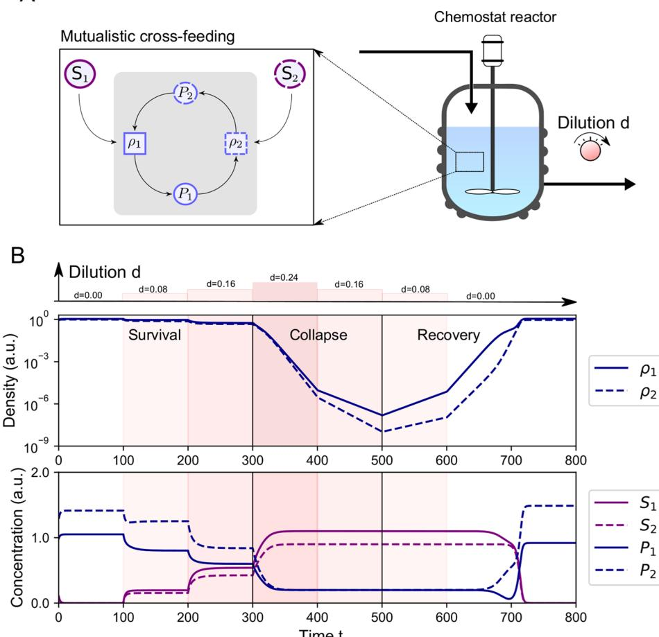
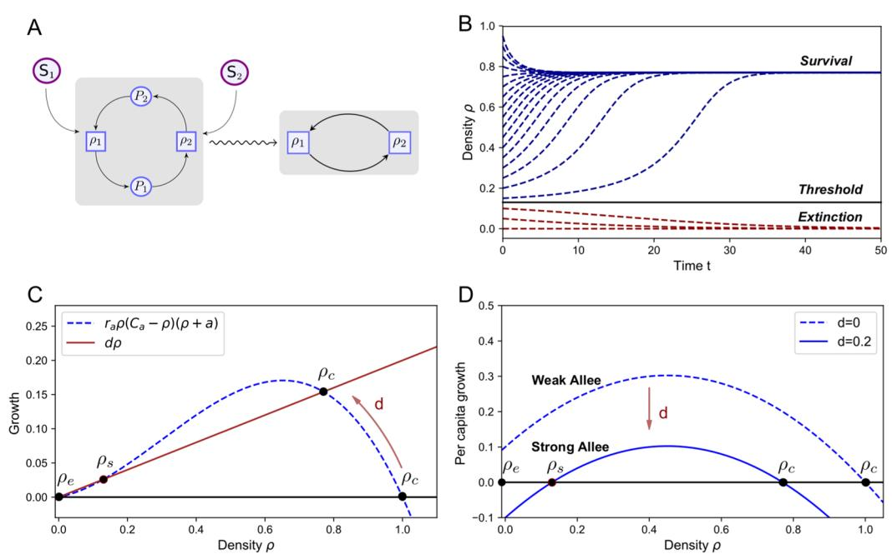
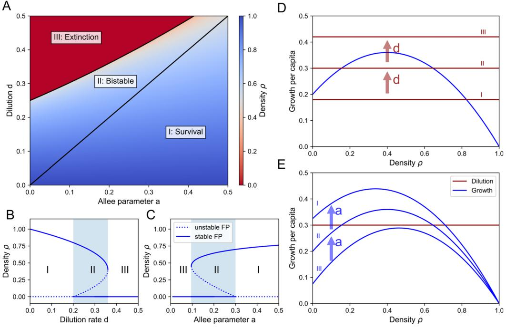
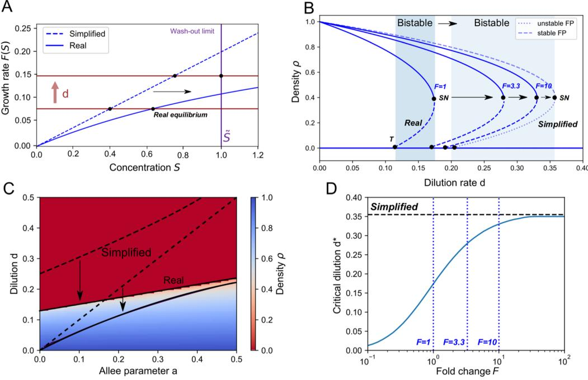
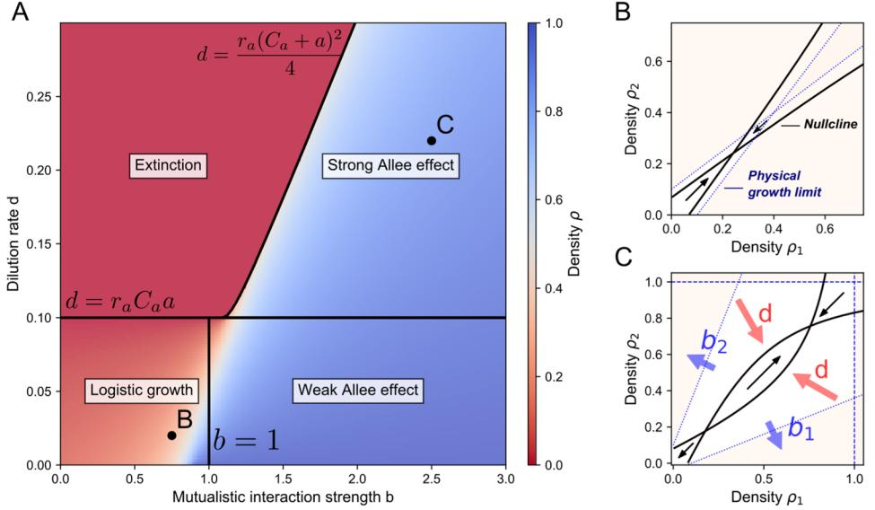

**OPEN**

**Mutualistic cross-feeding in microbial systems generates bistability via an Allee efect**

**StefanVet1,2,4** ✉**, LendertGelens2,3,5 & DidierGonze1,4,5**

**In microbial ecosystems, species not only compete for common resources but may also display mutualistic interactions as a result from metabolic cross-feeding. Such mutualism can lead to bistability. Depending on the initial population sizes, species will either survive or go extinct. Various phenomenological models have been suggested to describe bistability in mutualistic systems. However, these models do not account for interaction mediators such as nutrients. In contrast, nutrient-explicit models do not provide an intuitive understanding of what causes bistability. Here, we reduce a theoretical nutrient-explicit model of two mutualistic cross-feeders in a chemostat, uncovering an explicit relation to a growth model with an Allee efect. We show that the dilution rate in the chemostat leads to bistability by turning a weak Allee efect into a strong Allee efect. This happens as long as there is more production than consumption of cross-fed nutrients. Thanks to the explicit relationship of the reduced model with the underlying experimental parameters, these results allow to predict the biological conditions that sustain or prevent the survival of mutualistic species.**

Microbes play a fundamental role in diferent ecosystems on Earth. For example, they provide nutrients for plants in the rhizosphere via a symbiotic relationshi[p1](#page-10-0) , contribute to the formation of planktonic communities in the ocea[n2](#page-10-1),[3](#page-10-2) and are used in the treatment of wastewater[4](#page-10-3) . Even the human body is home to large ecosystems of microbial species, called microbiota, contributing to our health by providing essential nutrients and protecting us against potential threats or harmful microbial specie[s5](#page-10-4) .

To understand the dynamics of microbial ecosystems, the growth of microbes can be studied *in vitro* under well controlled environmental condition[s6](#page-10-5) . Tis way, microbes also provide convenient model systems to study general ecological interaction[s7](#page-10-6) . A particularly suited laboratory device to experimentally study microbial growth is the chemosta[t8](#page-10-7) . Such a bioreactor allows to grow microbes in a chemically constant environment and to explictly monitor the consumption of metabolites. A chemostat consists of a well-mixed growth tank with a continuous infow of nutrients and an outfow of the suspension with microbes and nutrients. It is a simplifcation of natural systems as the infow and outfow occur at the same rate and the suspension is well-mixed so that spatial efects are ignored. Nevertheless, it constitutes an appropriate tool to probe the behavior of natural systems, which are typically open environments with a fux of energy. For instance, it has been shown that the human intestines can, to some extent, be modeled by chemostat equation[s9](#page-10-8) , which are particularly suitable to assess the correlation between perturbed microbiomes (dysbiosis) and diseases. Experimental as well as theoretical studies involving a chemostat thus provide an appropriate framework to predict behavior related to microbial interactions such as competition and mutualism in a natural environment.

Although mutualism is thought to be less common than competition in microbial ecosystems because it tends to destabilize the communit[y10](#page-10-9), mutualism can arise via bi-directional cross-feeding of metabolite[s11.](#page-10-10) It has been shown that microbial diversity is promoted by cross-feeding, which can prevent competitive exclusio[n12.](#page-10-11) Furthermore, cross-feeding can be essential for diferent functions. For example, in the intestines metabolites are broken down in smaller components by some species for their consumption by other specie[s11.](#page-10-10) Tis is necessary for the formation of health-promoting short-chain fatty acid[s13–](#page-10-12)[15](#page-10-13). Mutual cross-feeding has also been shown to reduce the energetic cost by dividing the labor for the utilization of metabolic pathways, for example for amino acid synthesi[s16](#page-10-14). Besides the apparent benefts of mutualism, there is a downside: the interdependency increases the possibility of a collapse of the system due to a density threshold for survival, which has been observed experimentall[y17,](#page-10-15)[18.](#page-10-16) A density threshold

1 Interuniversity Institute of Bioinformatics Brussels, Brussels, Belgium. 2 Applied Physics Research Group, Department of Physics, Vrije Universiteit Brussel, Brussels, Belgium. 3 Laboratory for Dynamics in Biological Systems, Katholieke Universiteit Leuven, Leuven, Belgium. 4 Unit of Theoretical Chronobiology, Université Libre de Bruxelles, Bruxelles, Belgium. 5 These authors contributed equally: Lendert Gelens and Didier Gonze. ✉e-mail: [Stefan.Vet@vub.be](mailto:Stefan.Vet@vub.be)

between two diferent states of the system, in this case survival and extinction, is related to the concept of bistability. In mutualism, this is generated by an Allee efect[19](#page-10-17)[–23.](#page-10-18) An Allee efect is characterized by a decreased ftness at low densities so that the individual growth rate reaches a maximum at an intermediate density due to cooperative behavior. In the case of obligate mutualism, the Allee efect leads to a survival dependency as one species cannot survive without the othe[r22.](#page-10-19) Tis efect is in contrast with the prediction of the classical logistic growth which predicts that an increased population density limits the growth[24](#page-10-20). A distinction between a weak and a strong Allee efect is made[1](#page-10-0) . Whereas a weak Allee efect leads to a single stable state (the species always survives), a strong Allee efect is characterized by bistability, whereby a density threshold for survival is present.

Diferent models showing how mutualism causes bistability via the interdependence between the species have been propose[d25](#page-10-21)[–28.](#page-10-22) In some of these models the species are competitive as well as mutualistic, e.g. when mutualists become competitors for a resource or for available space at high density[29](#page-10-23)[–31.](#page-10-24) One study showed that the type of interaction could be modulated by varying the resource concentration[17](#page-10-15). Bistability is generated if the beneft of cooperation is counteracted by a cost, for example via the dispersal of the species. Tis increases the possibility of a collapse of the mutualistic system[23](#page-10-18). In order to predict when such disruptions occur and, if needed, to intervene to prevent the collapse of the community, a deeper understanding of mutualistic interactions and of the occurrence of thresholds in microbial communities is necessary.

A currently unresolved problem is that phenomenological models where interaction mediators, like nutrients, are neglected can behave diferently than models where these are explicitly incorporated[32](#page-10-25). As both types of models describe similar phenomena, it should be possible to reduce the mechanistic model into a phenomenological mode[l33,](#page-10-26)[34](#page-10-27). Such reductions of mechanistic models already exist for the growth of a single specie[s8,](#page-10-7)[35](#page-10-28)[,36](#page-10-29) or for competitive consumer-resource model[s37.](#page-10-30) In the case of mutualism, one approach described the occurrence of bistability by the saturation of the mutualistic strength at high densitie[s38](#page-10-31). Nevertheless, it remains unclear how the occurrence of bistability in a mutualistic cross-feeding community is related to nutrient concentrations and to their consumption and production kinetics. Tis is essential to quantify the efects of prebiotics or biological parameters on the survival of the species.

In this theoretical work, we use a nutrient-explicit model for the growth of mutualistic species in a chemostat reactor and show how an Allee efect is created. Tis allows to interpret the efect of biological parameters on the dynamics in order to predict when bistability is created and to estimate the density threshold for survival. Nutrient-explicit models of a single species in the chemostat can be reduced to the logistic growth equation[8,](#page-10-7)[35,](#page-10-28)[36.](#page-10-29) Using a similar approach, we reduce chemostat equations of a mutualistic system to an appropriate mechanistic model which only involves the species densities. Tis allows to relate the obtained equations to a generic growth model with an Allee efect. By establishing this analogy, we show that mutualism causes a weak Allee efect, which can be turned into a strong Allee efect under the infuence of the dilution in the chemostat. Critical chemostat parameters such as the dilution rate and the infux of nutrients thus allow to manipulate the strength of the Allee efect and therefore of the survival threshold. As a consequence, it is possible to switch between regions of bistability, monostable survival, or monostable extinction. We also show that the production of cross-feeding nutrients needs to be larger than the consumption for an Allee efect to exist. Tis explicit relationship between experimental parameters and the Allee efect provides a way to bridge the gap between biological experiments and theoretical models.

#### **Results**

**Bistability in mutualistic systems creates a survival threshold.** We study a theoretical system of two mutualistic species with densities *ρ*1 and *ρ*2 . Mutualism is mediated by cross-feeding: each species consumes a nutrient, with resp. concentrations *P*1 and *P*2, produced by the other species. We also assume that each species requires an additional nutrient which we refer to as the substrate, with resp. concentrations *S*1 and *S*2. Te substrate is a necessary component of the model to avoid a violation of mass conservation when production of the cross-fed nutrients is higher than the consumption. We choose to model the use of two diferent substrates as it is the least complex, symmetric case. Other scenarios like the exploitative competition for the same substrate for both species or the dependence of one substrate by one of the two species lead to cumbersome algebraic calculations but result in similar dynamics (Supplementary Material, Section S2).

A chemostat consists of a well-mixed growth vessel with an infow of nutrients, at concentrations *S i* and *P i* (*i* = 1, 2), and an outfow of the suspension. Both infow and outfow occur at a dilution rate *d*. Te consumption of nutrients is considered proportional to the growth of the species, which corresponds to the conservation of biomass when *d* = 0 (Supplementary Material S1). In the same way, we also assume the production of nutrients to be proportional to the growth of the species. Te equations that describe the mutualistic chemostat system are then:

$$\begin{aligned} \frac{d\rho_1}{dt} &= F_1(\mathcal{S}_1, \mathcal{P}_l)\rho_1 - d\rho_1, \\ \frac{d\rho_2}{dt} &= F_2(\mathcal{S}_2, \mathcal{P}_l)\rho_2 - d\rho_2, \\ \frac{d\mathcal{S}_1}{dt} &= d\mathcal{S}_1 - d\mathcal{S}_1 - \nu_{l1}F_l(\mathcal{S}_1, \mathcal{P}_l)\rho_1, \\ \frac{d\mathcal{S}_2}{dt} &= d\mathcal{S}_2 - d\mathcal{S}_2 - \nu_{l2}F_2(\mathcal{S}_2, \mathcal{P}_l)\rho_2, \\ \frac{d\mathcal{P}_1}{dt} &= d\tilde{P}_1 - d\mathcal{P}_1 - \nu_{p1}F_l(\mathcal{S}_1, \mathcal{P}_l)\rho_1 + a_{12}F_2(\mathcal{S}_2, \mathcal{P}_l)\rho_2, \\ \frac{d\mathcal{P}_2}{dt} &= d\tilde{P}_2 - d\mathcal{P}_2 - \nu_{p2}F_2(\mathcal{S}_2, \mathcal{P}_l)\rho_2 + a_{21}F_l(\mathcal{S}_1, \mathcal{P}_l)\rho_1. \end{aligned} \tag{1}$$

| Variable    | Biological meaning                                           |  |
|-------------|--------------------------------------------------------------|--|
| ρi          | microbial density of species i                               |  |
| Si          | substrate of species i (concentration)                       |  |
| Pi          | cross-fed nutrient, produced by species i (concentration) |  |
| Parameter   | Biological meaning                                           |  |
| d           | dilution rate                                                |  |
|  S i | infow concentration of Si                                    |  |
| P i     | infow concentration of Pi                                    |  |
| νsi         | consumption/growth ratio (yield) of Si by species i       |  |
| νpi         | consumption/growth ratio (yield) of Pi by species i       |  |
| aij         | production/growth ratio (yield) of Pi by species j        |  |
| µi          | Maximal growth rate of species i                             |  |
| Ksi         | Monod constant for Si (consumption by species i)          |  |
| Kpi         | Monod constant for Pi (consumption by species i)          |  |

**Table 1.** Defnition of the variables and parameters of nutrient-explicit chemostat equations of the mutualistic cross-feeding system, Eq. ([1)](#page-1-0), for *i* = 1, 2 and *i* ≠ *j*.

Te variables and parameters are defned in Table [1](#page-2-0). Troughout the simulations, we use hypothetical parameter values that are relative to the infow of the substrate concentration *S* 1, as the values may vary over a broad range in different experiments. We thus use arbitrary units (with *S* = . 1*a u*. 1 ) for the densities and concentrations.

We focus on obligate cross-feeding. Terefore, we assume obligatory dependence of the nutrients which means that the growth rate of the species (*F S*( , *P*) *i i i* , with *i*, 1 *j* = , 2) needs to satisfy the following condition: *F P* (0, ) = = *F S*( , 0) 0 *i i i i* . Diferent assumptions for the type of growth rates can be made. We will show that our results require the possibility to linearize the growth rate. A frequently used growth rate is the Monod functio[n39,](#page-10-32) so that we use the following extension of the Monod function for two nutrients as an exampl[e40:](#page-10-33)

$$F_l(\mathbf{S}_l, P_j) = \mu_l \frac{\mathbf{S}_l}{\mathbf{K}_{sl} + \mathbf{S}_l} \frac{P_l}{\mathbf{K}_{pl} + P_l}.\tag{2}$$

Te mutualistic relationship creates a positive feedback loop which can lead to bistability. Tis phenomenon becomes apparent if we simulate the behavior of the species when cultured in a chemostat reactor (Fig. [1](#page-3-0)). As an illustrative example, we consider what happens if the dilution is varied with steps of 0 0. 8 for consecutive time frames of *t* = 100. When the equilibrium state is reached, the growth rate of each species equals the dilution rate *d*, allowing to set the equilibrium point by adjusting the value of . Tis increase in the dilution rate leads to a decrease of the equilibrium density. However, a survival threshold exists: if the density drops below some critical values the species are washed-out. Tis is an irreversible collapse of the system, in the sense that reversing the dilution rate does not immediately lead to a return of the surviving state. Instead the species density continuous to drop. Survival is only restored by a sufcient decrease of the dilution rate. Tis concept is ofen called hysteresis[41](#page-11-0): the state of the system depends on its history. It is an efect related to bistability, meaning that there are two distinct equilibrium states for the same environmental parameters. In this case there is bistability between survival and extinction of the two species. Even though this simulation provides some intuition, it is not straightforward to predict how the diferent parameters of the system afect bistability. Tis is essential to determine when the threshold for survival is crossed. To provide an answer, we show how these parameters afect the dynamics by revealing a close connection to the widely studied growth equation with an Allee efect.

**Dilution allows to switch between a weak and a strong Allee efect.** Mutualistic cross-feeding is a form of cooperative behavior and causes a positive feedback loop between the two species. As a consequence, at small densities an Allee efect is created. Te per capita growth rate of a species, a proxy for their ftness, increases with the density at small densities and it reaches a maximum at an intermediate density. Tis is in contrast with the logistic growth, where the per capita growth rate becomes maximal near zero density. Tere is an important distinction between a weak Allee efect, associated to monostable dynamics, and a strong Allee efect, associated to bistability. Here, we show that the mutualistic cross-feeding creates a weak Allee efect and that increasing dilution in the chemostat is able to turn this into a strong Allee efect. Dilution can thus promote bistability: the two species coexist via cooperation or both die (the community collapses). Te separation between the two types of behavior is determined by a threshold of the population size.

Based on the reduction of nutrient-explicit equations for the growth of one species in the chemostat to the logistic equatio[n8](#page-10-7)[,35](#page-10-28)[,36](#page-10-29) (see Supplementary Material, Section S1), we can reduce the explicit chemostat equations to a two-variable mutualistic system. Te calculations are detailed in the Supplementary Material (Section S2). In brief, this reduction relies on the following assumptions (*i* = 1, 2 and *i* ≠ *j*):

**Figure 1.** Bistability in mutualistic systems creates a survival threshold. (**A**) Te microbial system we study consists of two species, characterized by their densities *ρ*1 and *ρ*2 , consumption of substrates (concentrations *S*1 and *S*2) and mutualistic cross-feeding via the production of nutrients (concentrations *P*1 and *P*2). We theoretically investigate the growth of these species in a chemostat reactor: a well-mixed growth vessel with an infow of nutrients with concentrations *S i* , *P i* (*i* = 1, 2) and an outfow of the suspension, occuring at an equal rate: the dilution rate *d*. (**B**) Te behavior of the system is simulated with Eq. [(1](#page-1-0)) using the growth rate Eq. ([2)](#page-2-1). Te dilution is gradually increased from *d* = 1 to *d* = . 0 24 with steps of 0 0. 8 for consecutive time frames of *t* = 100, using a logarithmic scale for the species density for clarity. Te equilibrium densities of the species decrease with the dilution. For *d* = . 0 24, a threshold is reached and the species will be washed-out. Decreasing the dilution to its previous rate does not lead to the recovery of the initial abundances of the species. Te dilution needs to be further decreased to *d* = . 0 08 the make the population growing again. Tis is a phenomenon called hysteresis: the system has memory of the previous state. It is a consequence of bistability between survival and extinction at intermediate dilution, so that a density threshold for survival exists. Initial conditions: *ρ* = . (0) 0 4 1 , *ρ* = . (0) 0 7 2 , *S* (0) 0 = .3 1 , *S* (0) 0 = .9 2 , *P*(0) 1 = .0 1 , *P* (0) 0 = .9 2 . Parameters values: *µ* = 2 1 , *µ* = 2 2 , *K* = 2 *s*1 , *K* = 2 *s*2 , *K* = 1 *p*1 , *K* = 1 *p*2 , *S* = . 1 1 1 , *S* = . 0 9 2 , *P* = . 0 2 1 , *P* = . 0 2 2 , *ν* = 1 *s*1 , *ν* = 1 *s*2 , *ν* = 1 *p*1 , *ν* = 1 *p*2 , *a* = 2 1 , *a* = 2 2 (arbitrary units).

1. Conservation of mass for *t*≫1/*d*:

*i i*

$$
\nu_{\rm s\dot{l}} \rho_j + \mathbb{S}_l = \mathbb{S}_l,
$$

$$
\nu_{\rm p\dot{l}} \rho_j - a_{\rm ij} \rho_j + P_l = \mathbb{P}_l.\tag{3}
$$

2. A Taylor approximation of the growth rate at low nutrient concentrations: ≈ + ∂ ∂ ∂ *F S*( , *P S* ) (0,0) *P O*(3) *i i i F S P i i i* 2 .

The second assumption only holds in the case of obligatory dependence of the nutrients (*F P* (0, ) = = *F S*( , 0) 0 *i i i i* ), such as the given example of the adapted Monod growth rate (Eq. ([2](#page-2-1))).

Using a newly defned reduced set of parameters (see Table [2](#page-4-0)), we fnd that the two-species system can be described by the following equations:

**Scientific Reports** | *(2020) 10:7763* | https://d[oi.org/10.1038/s41598-020-63772-4](https://doi.org/10.1038/s41598-020-63772-4) 4

| Parameter | Biological meaning                          | Relation to chemostat system                |
|-----------|---------------------------------------------|------------------------------------------------|
| d         | dilution rate                               | d                                              |
| ri        | growth rate                                 | 2 ν ν ∂ Fi 0, 0 si pi ∂ ∂ Si Pi |
| Csi       | Carrying capacity on the limiting substrate |  S i ν si                         |
| Cpi       | Carrying capacity by a cross-fed nutrient   | Pi ν pi                                 |
| bi        | Growth stimulation through cross-feeding    | aij ν pi                                 |

**Table 2.** Defnition of the parameters for the reduced equations for the mutualistic cross-feeding system, Eq. ([4](#page-4-1)), as a function of chemostat parameters, for *i* = 1, 2 and *i* ≠ *j*.

$$\begin{aligned} \frac{d\rho_1}{dt} &= r_1 (\mathbf{C}_{i1} - \rho_1)(\mathbf{C}_{p1} + b_1 \rho_2 - \rho_1)\rho_1 - d\rho_1, \\ \frac{d\rho_2}{dt} &= r_2 (\mathbf{C}_{i2} - \rho_2)(\mathbf{C}_{p2} + b_2 \rho_1 - \rho_2)\rho_2 - d\rho_2. \end{aligned} \tag{4}$$

Tese equations can be interpreted as follows. Each species (with density *ρi* ) grows with a growth rate *ri* , which can be increased via mutualistic interactions (*bi* ). Te available nutrients increase with the other species population. As this is the case for both species, this results in positive feedback: the growth of each species is positively infuenced by its own density. Such growth is limited by two carrying capacities, one related to the available substrate (*Csi*) and one determined by the available cross-fed nutrients (*Cpi*). Te exact biological mechanism behind the limitation through these carrying capacities is not critical for the dynamics, which remain qualitatively similar even when species compete for the same substrate (see Supplementary Material, Section S2). Additionally growth is further limited by the dilution rate in the chemostat (*d*).

In order to analyze the dynamics of these reduced Eqs. ([4](#page-4-1)), we frst study the symmetric case where all parameters of both species are the same (e.g.: *r r* = = *r* 1 2 ). In this situation the dynamics maps to the subspace where the densities of the species are equal: *ρ* = = *ρ ρ* 1 2 . Te reduced mutualistic system is then found to be described by the following generic equation including cubic growth and an Allee efec[t42](#page-11-1):

$$\frac{d\rho}{dt} = r_a (\mathbf{C}_a - \rho)(a + \rho)\rho - d\rho. \tag{5}$$

Here, the growth rate *ra*, carrying capacity *Ca*, Allee parameter *a*, and loss term caused by the dilution (parameter *d*) are defned in Table [3.](#page-5-0) Te Allee efect is introduced by the factor ( ) *a* + *ρ* and is a consequence of the positive feedback between the species so that at low densities the per capita growth increases. Without dilution (*d* = 1) this equation takes the usual form of a growth equation with an Allee efec[t42](#page-11-1). Based on the parameter *a*, the following distinction is made:

- • *a* < 0: strong Allee efect (bistable)
- • *a* > 0: weak Allee efect (monostable)

A weak Allee efect corresponds to monostable growth towards an equilibrium, while a strong Allee efect is associated to bistability between survival and extinction so that a densitiy threshold for survival is generated (Fig. [2B](#page-5-1)). As the Allee parameter is determined by the infow of the cross-feeding nutrients and is therefore strictly positive, the mutualistic cross-feeding causes a weak Allee efect. Te equilibria of the system are determined by the points where the growth is zero, which happens at *ρ* = 1 and *ρ* = *Ca* when *d* = 1 (Fig. [2C)](#page-5-1). Te extinction state *ρ* = 1 is unstable, while the coexisting state *ρ* = *Ca* is stable. For the chemostat case, the dilution is switched on (*d* > 0), the per capita growth is reduced by *d* and a new steady state may arise (Fig. [2D)](#page-5-1). Te new steady state is unstable forming the threshold for survival between the two stable equilibria (survival and extinction). Tis way, the dilution rate can turn a weak Allee efect into a strong Allee efect.

**Bifurcation analysis reveals regions of bistability.** Before analyzing the biological consequences of the Allee efect in mutualistic interactions, it is useful to illustrate how the diferent parameters in Eq. [(5](#page-4-2)) afect the behavior. Tis can be done via a bifurcation analysis, showing the stability of the diferent equilibria as a function of the parameters.

Te equilibria of the system correspond to the intersections of the growth term and the dilution term, where *d d ρ*/ 0 *t* = , and are given by:

| Parameters | Biological meaning | Relation to reduced system |
|------------|--------------------|-------------------------------|
| ra         | growth rate        | 1 − ) r b(                 |
| Ca         | carrying capacity  | Cs                            |
| a          | Allee parameter    | Cp − b 1             |
| d          | dilution rate      | d                             |

**Table 3.** Defnition of the parameters for growth equation with Allee efect, Eq. ([5)](#page-4-2).

**Figure 2.** Dilution allows to switch between a weak and a strong Allee efect. (**A**) Te nutrient-explicit chemostat equations, Eq. ([1](#page-1-0)), are reduced (wavy arrow) to equations which only involve the species densities, Eq. [(4)](#page-4-1). Te mutualism causes an Allee efect via a positive feedback loop, which promotes bistability under the infuence of the dilution rate. (**B**) Simulating the dynamics of Eq. ([5)](#page-4-2) shows the efect of bistability for diferent initial abundances (*ρ*( 0 *t* = ) varies from 0 and 1 with steps of 0.05). Te species may coexist or become extinct. A threshold for survival separates the two outcomes. (**C**) Te dilution rate is crucial for bistability. Without a dilution term, the system is monostable: there is only one stable equilibrium (*ρC*), corresponding to the survival of the species. Under the infuence of the dilution, bistability occurs when there are three intersections of the growth and the dilution term: two stable fxed points corresponding to extinction (*ρe* ) and survival (*ρC*) and an unstable steady state (saddle point, *ρs* ) that separates both regions. (**D**) An Allee efect is present when the per capita growth increases with the density, which is the case for small densities and is the result of the positive feedback between the mutualistic species. For a small dilution rate, the per capita growth does not become negative for small densities, corresponding to a weak Allee efect. When the dilution rate is increased, the per capita growth rate becomes negative for small densities. Tis is a strong Allee efect and creates bistability between survival and extinction. Parameter values: *r* = 1 *a* , *a* = . 0 1, *C* = 1 *a* , *d* = . 0 2, see Supplementary Material, Table S7.

$$\begin{aligned} \rho_i &= 0, \\ \rho_i &= \frac{C_a - a - \sqrt{(C_a + a)^2 - 4\frac{d}{r_a}}}{2}, \\ \rho_C &= \frac{C_a - a + \sqrt{(C_a + a)^2 - 4\frac{d}{r_a}}}{2}. \end{aligned}$$

Here, *ρe* is the extinction state, *ρC* the coexisting state and *ρs* the separating state between the two equilibria in the case of bistability. Te equilibria are determined geometrically by calculating how many times the per capita growth intersects with the dilution term (Fig. [3D,E)](#page-6-0). When there is only one intersection, the only stable

**Figure 3.** Bifurcation analysis reveals regions of bistability. (**A**) heatmap showing the equilibrium density *ρ* of Eq. [(5)](#page-4-2) as a function of the Allee parameter *a* and the dilution rate *d*. Te diferent regimes correspond to survival (I), bistability between survival and extinction (II), and extinction (III). (**B**) Infuence of the dilution *d*, for *a* = . 0 2 kept constant. (**C**) Infuence of the Allee parameter *a*, for *d* = . 0 3 kept constant. (**D**) Visual interpretation of the equilibrium states, corresponding to the intersection of the per capita growth rate and the dilution, showing how increasing the dilution shifs regime I into regime II, into regime III. (**E**) Te Allee parameter *a* has the opposite efect than the dilution *d*: increasing *a* allows for survival by shifing regime III into regime II into regime I. Parameter values: *r* = 1 *a* , *C* = 1 *a* .

equilibrium is *ρC* (*ρs* is negative and thus not physical). When there are two intersections, i.e. when *ρs* and *ρC* are both positive, the system is bistable: both the extinction state *ρe* and the coexisting state *ρC* are stable, and *ρs* is a so-called saddle point that separates the two stable equilibria. When the dilution rate is too large, there are no intersections and the net growth is always negative so that the only equilibrium is *ρe* , corresponding to extinction of the species. In this manner, it is straightforward to calculate the values of the dilution rate which determines the stability of the solutions. Tis can be represented in bifurcation diagrams, which show the diferent equilibria *ρe* , *ρs* and *ρC* and their stability as a function of parameters like the dilution rate *d* (Fig. [3B](#page-6-0)) or the Allee parameter *a* (Fig. [3C](#page-6-0)). For the dilution rate *d*, the density *ρC* decreases and the survival threshold is created at *d r* = *C a a a* , leading to bistability. Tis critical point is called a transcritical bifurcation[41](#page-11-0). At = + *d r C*( ) *a* 4 *a a* 2 the coexistence state *ρC* and the saddle point *ρs* collapse and disappear, leaving *ρe* as the only equilibrium state. Tis leads to the following condition for bistability:

$$r_a \mathcal{C}_a a < d < \frac{r_a (\mathcal{C}_a + a)^2}{4} \tag{7}$$

For lower values of the dilution rate there is only survival and for higher values there is only extinction, thereby explaining the observed hysteresis in Fig. [1.](#page-3-0) Te same analysis shows that the Allee parameter *a* has a counter-acting efect on the dynamics in comparison to *d* (Fig. [3A,C,E](#page-6-0)): when the dilution rate is too large for survival, increasing *a* causes the per capita growth to intersect with the dilution, thereby allowing survival of the community. Te complete behavior is summarized in Fig. [3A](#page-6-0): for large values of *a* and low values of *d* there is always survival via cooperation (regime I), for intermediate values of *a* and *d* there is bistability (regime II) and for low values of *a* and large values of *d* there is always extinction of the community (regime III).

In order to check the validity of the used simplifcation of the growth rates, we simulated the original chemostat equations, Eq. [(1)](#page-1-0), with extended Monod growth rates, Eq. [(2)](#page-2-1) (Fig. [4](#page-7-0)). Te used Taylor approximation of the Monod growth rates in the simplifed model corresponds to a linear dependence of the nutrients. Both are monotonically increasing functions, but the Monod growth rate yields a smaller value than its linearization. Terefore, we expect extinction to occur at lower dilution than predicted with the simplifed model (Fig. [4A)](#page-7-0). We quantifed the diferences in the locations of the critical dilution rate ⁎ *d* where the saddle-node bifurcations (SN) occurs for both the full model and the reduced model (Fig. [4B)](#page-7-0). We performed the same calculation for diferent values of

**Figure 4.** Original chemostat Eq. ([1](#page-1-0)) confrm fndings in the reduced Eq. ([5)](#page-4-2). (**A**) Te frst-order Taylor approximation of the growth rate (Eq. ([2)](#page-2-1)) causes the wash-out limit to be reached for lower dilution rates. (**B**) By constructing the bifurcation diagram as a function of *d*, using chemostat Eq. ([1)](#page-1-0) and the Monod-like growth rates, we can estimate the error by considering the point at which the saddle-node bifurcation (SN) occurs (T: transcritical bifurcation). A fold change *F* of the Monod constants ( = ⋅ *K F s s* ′ *K* & = ⋅ *K F p p* ′ *K* ) is used to quantify the deviation from the simplifed bifurcation curve of Eq. [(5](#page-4-2)). At *F* = 1 the error is large as *Ks* and *Kp* are of the order of *S* and *P* (Table S5), the error is signifcantly reduced for *F* = . 3 3 and almost negligible for *F* = 10. (**C**) Using *F* = 1, Te calculated regions of survival, bistability and extinction in the reduced system (dashed curves) map on the simulated regions of the chemostat equations (solid curves) so that the qualitative behavior is conserved. (**D**) Te error of the simplifcation is visualized by mapping the critical dilution rate at which the saddle node bifurcation (SN) occurs. For *F* = 1 the critical value of the dilution ( ⁎ *d* ) is about 50% lower than the estimated value using the simplifed model (Parameter values listed in Table S5).

the Monod constants, whereby we multiplied the Monod constants by a factor *F* and the maximal growth rate *µ* by *F*2 so that the Taylor approximation of the growth rate remains the same. Te bifurcation diagrams for diferent values of *F* shows the qualitative correspondence to the bifurcation diagram related to Eq. ([5](#page-4-2)), whereby the density decreases with the dilution and the regime changes from monostable survival to bistability via a transcritical bifurcation and to extinction via a saddle-node bifurcation (Fig. [2B)](#page-5-1). For *F* = 1 the similarity is only qualitative, while a better quantitative correspondence is obtained for increased values of *F*. Te dynamic regimes are quantifed for *F* = 1 (Fig. [4C](#page-7-0)) as a function of the Allee parameter *a*, highlighting the qualitative correspondence and a lower critical dilution rate ⁎ *d* than estimated. Tis shows how the regimes of Eq. ([5)](#page-4-2) map unto the real dynamic regimes. Te resemblance is only qualitative. For *F* = 1 a large error is observed. We estimate the error of the simplifcation by considering the critical dilution rate ⁎ *d* for diferent values of *F*. Multiplying the Monod constants by a factor *F* = . 3 3 signifcantly decreases the error. A factor *F* = 10 yields a negligible error, i.e. a good quantitative match of the bifurcation diagrams was obtained with the explicit model and the simplifed model (Fig. [4B)](#page-7-0). By using the extended Monod function (Eq. [2)](#page-2-1) as an example, we show that two conditions on the experimental growth rates should be fulflled to expect Eq. ([5](#page-4-2)) to be a valid approximation. First, it should be possible to linearize the growth rate for low nutrient concentrations (*S K*). Second, the function should be monotonically increasing. As long as these conditions are fulflled, the dynamics is qualitatively described by Eq. ([5)](#page-4-2).

**Bistability requires a sufcient production of cross-feeding nutrients.** Bistability results from the mutualistic relationship between the two species. Having a dilution rate *d* in the correct parameter range is, by itself, not sufcient to guarantee bistability. Another necessary condition for bistability is obtained by considering the efect of the mutualistic interaction strength *b*, defned as the ratio of the production to the consumption of cross-fed nutrients = = *ν* ( , *b i* 1, 2) *i aij pi* . Tis parameter afects the growth rate *ra* as well as the Allee parameter *a* (Table [3)](#page-5-0), so that its overall efect on the dynamics is not straightforward to predict intuitively. Terefore, we simulated the mutualistic system (Eq. [(4)](#page-4-1)) with symmetric parameters, for diferent values of *b* and of dilution rate *d* (Fig. [5A](#page-8-0)). Tis analysis shows that the region of bistability is limited to *b* > 1. Tis means that bistability only occurs when the production of cross-fed nutrients is higher than the consumption. When *b* < 1, the production

**Figure 5.** Bistability requires a sufcient production of cross-feeding nutrients. (**A**) Diferent regimes are distinguished as a function of the parameter values, using Eq. ([4)](#page-4-1). For *b* < 1, the growth is limited by the crossfeeding nutrient, leading to monostable dynamics similar to logistic growth. Tere is survival for small dilution (*d r* < *C a a a* ) and extinction for large dilution. For *b* > 1, the growth only becomes limited by the substrate, allowing for bistability. Tere is a weak Allee efect, corresponding to monostable survival, for small dilution, a

strong Allee efect for intermediate dilution ( ) *r Cs p C d* 0 25 (*r b* 1) *Cs C b* 1 2 *p* < < . − + − and monostable

extinction for large dilution. (**B**) For *b* < 1, the growth is limited by the cross-feeding nutrients (Eq. ([9](#page-8-1))), so that the physical growth region is small and does not allow bistability. For small dilution the dynamics is similar to logistic growth as the population monotonically grows towards its equilibrium. (**C**) For *b* > 1, high population densities are possible, whereby the growth is limited by the substrate *S* (Eq. ([8)](#page-8-2)). Increased values of *b* lead to a larger growth region, allowing for bistability when *b* > 1. Increasing the dilution rate *d* causes the nullclines to bend into hyperbola with the linear functions at *d* = 1 as asymptotes. Bistability is obtained when the hyperbolic nullclines intersect twice parameter values as listed in Table S6).

of cross-fed nutrients is insufcient. Te growth is limited by these cross-fed nutrients, and the dynamics becomes similar as in the case of logistic growth, so that there is only one equilibrium state. Te carrying capacity is then determined by the infow of cross-feeding nutrients, via *Cp*, and not by the infow of substrate, via *Cs*. Tus, for *b* < 1 there is no Allee efect.

Te diference between the logistic growth at *b* < 1 and the Allee efect at *b* > 1 is visually interpreted by representing the physical growth (i.e. feasible) regions in the phase plane for *b* < 1 (Fig. [5B](#page-8-0)) and for *b* > 1 (Fig. [5C](#page-8-0)). Tese feasible regions originate from the mass conservation laws (Eq. ([3](#page-3-1))), as the nutrient concentrations need to be positive. For each species, the limitation by the substrate causes the growth region to be bounded by the following function (*i* = 1, 2):

$$
\rho_i \le \mathbb{C}_i. \tag{8}
$$

Similarly for the cross-feeding nutrients the following limitation functions are obtained (*i* = 1, 2 and *i* ≠ *j*):

$$
\rho_{\dot{\rho}} \le \rho_{\dot{\iota}} + \mathcal{C}_p. \tag{9}
$$

Te interaction strength *b* determines the slope of Eq. [(9)](#page-8-1), so that for *b* < 1, the growth is entirely limited by Eq. ([9](#page-8-1)) and thus by the availability of cross-feeding nutrients (Fig. [5B)](#page-8-0). Te species cannot grow sufciently to become limited by the substrate. In contrast, for *b* > 1, the species can grow sufciently. In this case, the feasible region is limited at high densities by the availability of the substrate, Eq. ([8)](#page-8-2) (Fig. [5C)](#page-8-0).

The overall influence of the parameters is understood by looking at the nullclines: the functions where *d d ρi* / 1 *t* = (*i* = 1, 2). Te intersections of the nullclines defne the equilibria of the system. Te nullclines are hyperbolic functions, with the limiting functions (Eqs. [(8)](#page-8-2) and [(9](#page-8-1))) as asymptotes. For bistability, the slopes need to be such that the nullclines can intersect twice (Fig. [5C)](#page-8-0), thereby forming a stable equilibrium corresponding to coexistence of the species and a saddle point which creates the threshold between coexistence and survival. Tis only occurs when *b* > 1, so that in this region we observe the same dynamics as described in last section: survival when the hyperbola intersect once at low dilution, bistability when the nullclines intersect twice for intermediate dilution < < . − + ( ) − *r Cs p C d* 0 25 (*r b* 1) *Cs C b* 1 2 *p* and extinction for high dilution (for the phase plane analysis,

see Supplementary Material, Fig. S3).

Bistability is created in the same way when asymmetric parameters are used. A similar analysis was performed for asymmetric values of the mutualistic interaction strength *b* (Supplementary Material, Fig. S5 and Section S3), resulting in the general necessary condition for bistability: *b b* > 1 1 2 . Finally, the choice to model two substrates, as it is the least complex case, does not afect this result. When two mutualistic species compete for a substrate, we found that the qualitative efect of the dilution rate and the mutualistic strength remains the same (Supplementary Material, S4)). Returning to the chemostat parameters, the obtained condition for bistability *b b* > 1 1 2 corresponds to *a a* > *ν ν* 1 2 *p p* 1 2, which means that the overall production of cross-fed nutrients needs to be larger than their consumption.

#### **Discussion**

Microbial interaction networks are characterized by multiple positive and negative interactions. Species enter in competition for limited resources, but they can also display mutualistic relationships through cross-feeding. Trough mutualistic interactions, both species beneft of each others presence. Tis may be seen as a stabilizing factor. However, mutualism carries the seed of its own instability: under the infuence of dilution bistability may occur, causing a critical density threshold for the species to survive. Once the abundances of the species drop below this threshold, the community eventually collapses and the species become extinct.

How biological parameters afect the survival threshold is ofen unclear. To provide an understanding of the efect of diferent parameters, we showed how nutrient-explicit equations for two mutualistic cross-feeding species can be reduced to a set of equations which only involve the densities of the species. Tese could then be related to a growth equation with an Allee efect, which can be analyzed to obtain a deeper understanding of the impact of the diferent biological parameters.

Density thresholds for survival have previously been observed in mutualistic systems. For example, a survival threshold was found in a spatially cooperating microbial community[18](#page-10-16) and in a cross-feeding system which could switch to other interactions like competition and parasitism, depending on the availability of nutrients[17.](#page-10-15) Besides cross-feeding, mutualism can also arise via the protection of another species towards antibiotics. In such a cross-protection system it was found that periodic dilution drives oscillatory dynamics, potentially leading to extinction if the survival threshold was crossed[43.](#page-11-2)

Our results showed that the overall production rate of cross-fed nutrients needs to be larger than the overall consumption rate to create an Allee efect. Te production and consumption rates can experimentally be altered by making use of synthetic cross-feeding systems[17,](#page-10-15)[44,](#page-11-3)[45,](#page-11-4) which can be designed to display bistability, or on the contrary, to prevent bistability and thereby the risk of an abrupt collapse of the community. We obtained quantitative results for the case where both species have symmetric parameter values, but showed that this framework still applies to the case of asymmetric parameter values.

By using time traces of microbial growth experiments it is possible to ft the experimental values of biological parameters[46.](#page-11-5) This would allow the validation of these theoretical predictions if the microbes are obligate cross-feeders. If the system exhibits a sufcient production of cross-fed nutrients (*a a* > *ν ν* 1 2 *p p* 1 2), then bistability is predicted for dilution rates within the range *r C a d* < < *r C*( ) + *a* /4 *a a a a* 2 . Te dilution rate and the infux of nutrients are experimental parameters which can be tuned so that these allow to manipulate the behavior. As a result, this provides experimental guidelines to study the presence of bistability in a microbial system. Moreover, the infux of nutrients (*S* and *P*) allow to study the efect of prebiotics, in order to determine the efect of these growth-promoting nutrients on the survival of the species. Furthermore, if antibiotics are used, then determining whether a survival threshold exists would be essential to predict the survival or extinction of the species.

Te presence of bistability can signifcantly afect microbial behavior. For example, the existence of a survival threshold creates susceptibility to cheaters[28](#page-10-22). A cheater is an individual of the species which does not cooperate in the production of cross-feeding nutrients, thereby increasing the risk of a collapse of the syste[m47](#page-11-6). Addition of a third species can create global stability of the coexistence state if it is a facultative mutualist, providing a solution for the presence of the survival threshol[d48.](#page-11-7)

Bistability also afects the behavior in the case of spatial expansions. Here, an Allee efect counteracts genetic drif of a species as it creates a pushed wave rather than a pulled wave corresponding to logistic growth[49](#page-11-8),[50](#page-11-9). Such behavior has been observed experimentally in a system of two cross-feeding species whereby the mutualistic strength was modulated by the infow of nutrients[51.](#page-11-10)

Mutualistic species are usually part of a larger ecosystem. Terefore, when mutualists are decreased under the survival threshold, for example in response to antibiotics, the entire ecosystem can be destabilized[10](#page-10-9). Such critical efects on ecological interactions are ofen not well characterized[52](#page-11-11). Generalized Lotka-Volterra models are ofen used to study the interactions in microbial ecosystem[s53](#page-11-12)[–55.](#page-11-13) However, Lotka-Volterra models for mutualism involve the addition of ftness efects[32](#page-10-25) so that nonlinear growth rates are not incorporated[56](#page-11-14).

We studied a theoretical microbial system that is mutualistic via cross-feeding, which is a necessary step to obtain a deeper understanding of complex behavior in microbial communities. Te obtained phase plane and the nullclines, describing the dynamics of the species, are observed in diferent mutualistic model[s25–](#page-10-21)[28](#page-10-22), so that we can state this is a general phenomenon. Our results give insights into necessary conditions to obtain bistability in a model for microbial species which are obligate cross-feeders: there needs to be an Allee efect as well as a limiting function. In particular, we show that nonlinear growth rates signifcantly afect the dynamics of microbial communities.

Received: 23 December 2019; Accepted: 3 April 2020; Published: xx xx xxxx

#### **References**

- 1. Hassani, M. A., Durán, P. & Hacquard, S. Microbial interactions within the plant holobiont. *Microbiome* **6**, [https://doi.org/10.1186/](https://doi.org/10.1186/s40168-018-0445-0) [s40168-018-0445-0](https://doi.org/10.1186/s40168-018-0445-0) (2018).
- 2. Giovannoni, S. J. & Stingl, U. Molecular diversity and ecology of microbial plankton. *Nature* **437**, 343–348, [https://doi.org/10.1038/](https://doi.org/10.1038/nature04158) [nature04158](https://doi.org/10.1038/nature04158) (2005).
- 3. Lima-Mendez, G. *et al*. Determinants of community structure in the global plankton interactome. *Science* **348**, 1262073, [https://doi.](https://doi.org/10.1126/science.1262073) [org/10.1126/science.1262073](https://doi.org/10.1126/science.1262073) (2015).
- 4. Numberger, D. *et al*. Characterization of bacterial communities in wastewater with enhanced taxonomic resolution by full-length 16s rRNA sequencing. *Scientifc Reports* **9**, 1–14,<https://doi.org/10.1038/s41598-019-46015-z> (2019).
- 5. Bhardwaj, N. & Geva-Zatorsky, N. Gut microbes as a therapeutic armory. *Drug Discovery Today: Disease Models* [https://doi.](https://doi.org/10.1016/j.ddmod.2019.08.007) [org/10.1016/j.ddmod.2019.08.007](https://doi.org/10.1016/j.ddmod.2019.08.007) (2019).
- 6. Vrancken, G., Gregory, A. C., Huys, G. R. B., Faust, K. & Raes, J. Synthetic ecology of the human gut microbiota. *Nature Reviews Microbiology* 1–10,<https://doi.org/10.1038/s41579-019-0264-8> (2019).
- 7. Jessup, C. M. *et al*. Big questions, small worlds: microbial model systems in ecology. *Trends in Ecology & Evolution* **19**, 189–197, <https://doi.org/10.1016/j.tree.2004.01.008> (2004).
- 8. Smith, H. L. & Waltman, P. *Te Teory of the Chemostat* (Cambridge Core, 1995).
- 9. Cremer, J., Arnoldini, M. & Hwa, T. Efect of water fow and chemical environment on microbiota growth and composition in the human colon. *Proceedings of the National Academy of Sciences* **114**, 6438–6443,<https://doi.org/10.1073/pnas.1619598114> (2017).
- 10. Coyte, K. Z., Schluter, J. & Foster, K. R. Te ecology of the microbiome: Networks, competition, and stability. *Science* **350**, 663–666, <https://doi.org/10.1126/science.aad2602> (2015).
- 11. Smith, N. W., Shorten, P. R., Altermann, E., Roy, N. C. & McNabb, W. C. Te Classifcation and Evolution of Bacterial Cross-Feeding. *Frontiers in Ecology and Evolution* **7**,<https://doi.org/10.3389/fevo.2019.00153>(2019).
- 12. Hoek, M. J. A. V. & Merks, R. M. H. Emergence of microbial diversity due to cross-feeding interactions in a spatial model of gut microbial metabolism. *BMC Systems Biology* **11**, 56,<https://doi.org/10.1186/s12918-017-0430-4> (2017).
- 13. Blaut, M. & Clavel, T. Metabolic diversity of the intestinal microbiota: implications for health and disease. *Te Journal of Nutrition* **137**, 751S–5S, <https://doi.org/10.1093/jn/137.3.751S>(2007).
- 14. Rivière, A., Selak, M., Lantin, D., Leroy, F. & De Vuyst, L. Bifdobacteria and Butyrate-Producing Colon Bacteria: Importance and Strategies for Teir Stimulation in the Human Gut. *Frontiers in Microbiology* **7**,<https://doi.org/10.3389/fmicb.2016.00979> (2016).
- 15. Bui, T. P. N. et al. Mutual Metabolic Interactions in Co-cultures of the Intestinal Anaerostipes rhamnosivorans With an Acetogen, Methanogen, or Pectin-Degrader Affecting Butyrate Production. *Frontiers in Microbiology* **10**, [https://doi.org/10.3389/](https://doi.org/10.3389/fmicb.2019.02449) [fmicb.2019.02449](https://doi.org/10.3389/fmicb.2019.02449) (2019).
- 16. Mee, M. T., Collins, J. J., Church, G. M. & Wang, H. H. Syntrophic exchange in synthetic microbial communities. *Proceedings of the National Academy of Sciences* **111**, E2149–E2156, <https://doi.org/10.1073/pnas.1405641111> (2014).
- 17. Hoek, T. A. *et al*. Resource Availability Modulates the Cooperative and Competitive Nature of a Microbial Cross-Feeding Mutualism. *PLOS Biology* **14**, e1002540, <https://doi.org/10.1371/journal.pbio.1002540> (2016).
- 18. Li, L. *et al*. Spatial coordination in a mutually benefcial bacterial community enhances its antibiotic resistance. *Communications Biology* **2**, 1–13, <https://doi.org/10.1038/s42003-019-0533-0>(2019).
- 19. Assaneo, F., Coutinho, R. M., Lin, Y., Mantilla, C. & Lutscher, F. Dynamics and coexistence in a system with intraguild mutualism. *Ecological Complexity* **14**, 64–74,<https://doi.org/10.1016/j.ecocom.2012.10.004>(2013).
- 20. Wang, Y. & Wu, H. A cooperative system of two species with bidirectional interactions. *Bulletin of Mathematical Biology* **76**, 1396–1415, <https://doi.org/10.1007/s11538-014-9966-2> (2014).
- 21. Friedman, J. & Gore, J. Ecological systems biology: Te dynamics of interacting populations. *Current Opinion in Systems Biology* **1**, 114–121,<https://doi.org/10.1016/j.coisb.2016.12.001>(2017).
- 22. Courchamp, F., Berec, L. & Gascoigne, J. *Allee Efects in Ecology and Conservation* (Oxford University Press, 2008).
- 23. Amarasekare, P. Spatial dynamics of mutualistic interactions. *Journal of Animal Ecology* **73**, 128–142, [https://doi.org/10.1046/j.0021-](https://doi.org/10.1046/j.0021-8790.2004.00788.x) [8790.2004.00788.x](https://doi.org/10.1046/j.0021-8790.2004.00788.x) (2004). _eprint: [https://besjournals.onlinelibrary.wiley.com/doi/pdf/10.1046/j.0021-8790.2004.00788.x.](https://besjournals.onlinelibrary.wiley.com/doi/pdf/10.1046/j.0021-8790.2004.00788.x)
- 24. Allee, W. C. & Bowen, E. S. Studies in animal aggregations: Mass protection against colloidal silver among goldfshes. *Journal of Experimental Zoology* **61**, 185–207,<https://doi.org/10.1002/jez.1400610202> (1932).
- 25. Cropp, R. & Norbury, J. Resource-Based Models of Mutualism. *Environmental Modeling & Assessment* [https://doi.org/10.1007/](https://doi.org/10.1007/s10666-018-9646-y) [s10666-018-9646-y](https://doi.org/10.1007/s10666-018-9646-y) (2018).
- 26. Gudelj, I., Kinnersley, M., Rashkov, P., Schmidt, K. & Rosenzweig, F. Stability of Cross-Feeding Polymorphisms in Microbial Communities. *PLOS Computational Biology* **12**, e1005269,<https://doi.org/10.1371/journal.pcbi.1005269> (2016).
- 27. Bull, J. J. & Harcombe, W. R. Population dynamics constrain the cooperative evolution of cross-feeding. *PloS One* **4**, e4115, [https://](https://doi.org/10.1371/journal.pone.0004115) [doi.org/10.1371/journal.pone.0004115](https://doi.org/10.1371/journal.pone.0004115) (2009).
- 28. Sun, Z., Kofel, T., Stump, S. M., Grimaud, G. M. & Klausmeier, C. A. Microbial cross-feeding promotes multiple stable states and species coexistence, but also susceptibility to cheaters. *Journal of Theoretical Biology* **465**, 63–77, [https://doi.org/10.1016/j.](https://doi.org/10.1016/j.jtbi.2019.01.009) [jtbi.2019.01.009](https://doi.org/10.1016/j.jtbi.2019.01.009) (2019).
- 29. Vet, S. *et al*. Bistability in a system of two species interacting through mutualism as well as competition: Chemostat vs. Lotka-Volterra equations. *Plos One* **13**, e0197462, <https://doi.org/10.1371/journal.pone.0197462> (2018).
- 30. Wang, Y. & Wu, H. A mutualism-competition model characterizing competitors with mutualism at low density. *Mathematical and Computer Modelling* **53**, 1654–1663,<https://doi.org/10.1016/j.mcm.2010.12.033>(2011).
- 31. Iwata, S., Kobayashi, K., Higa, S., Yoshimura, J. & Tainaka, K.-I. A simple population theory for mutualism by the use of lattice gas model. *Ecological Modelling* **222**, 2042–2048, <https://doi.org/10.1016/j.ecolmodel.2011.04.009> (2011).
- 32. Momeni, B., Xie, L. & Shou, W. Lotka-Volterra pairwise modeling fails to capture diverse pairwise microbial interactions. *eLife* **6**, <https://doi.org/10.7554/eLife.25051> (2017).
- 33. Schoener, T. W. Mechanistic Approaches to Community Ecology: A New Reductionism? *American Zoologist* **26**, 81–106 Publisher: Oxford University Press (1986).
- 34. Snowden, T. J., van der Graaf, P. H. & Tindall, M. J. Methods of Model Reduction for Large-Scale Biological Systems: A Survey of Current Methods and Trends. *Bulletin of Mathematical Biology* **79**, 1449–1486,<https://doi.org/10.1007/s11538-017-0277-2> (2017).
- 35. Kargi, F. Re-interpretation of the logistic equation for batch microbial growth in relation to Monod kinetics. *Letters in Applied Microbiology* **48**, 398–401,<https://doi.org/10.1111/j.1472-765X.2008.02537.x>(2009).
- 36. Panikov, N. S. *Microbial Growth Kinetics* (Springer Netherlands, 1995).
- 37. MacArthur, R. Species packing and competitive equilibrium for many species. *Teoretical Population Biology* **1**, 1–11, [https://doi.](https://doi.org/10.1016/0040-5809(70)90039-0) [org/10.1016/0040-5809(70)90039-0](https://doi.org/10.1016/0040-5809(70)90039-0) (1970).
- 38. Holland, J. N. & DeAngelis, D. L. A consumer-resource approach to the density-dependent population dynamics of mutualism. *Ecology* **91**, 1286–1295 (2010).
- 39. Monod, J. The growth of bacterial cultures. *Annual Review of Microbiology* **3**, 371–394, [https://doi.org/10.1146/annurev.](https://doi.org/10.1146/annurev.mi.03.100149.002103) [mi.03.100149.002103](https://doi.org/10.1146/annurev.mi.03.100149.002103) Publisher: Annual Reviews (1949).
- 40. Zinn, M., Witholt, B. & Egli, T. Dual nutrient limited growth: models, experimental observations, and applications. *Journal of Biotechnology* **113**, 263–279,<https://doi.org/10.1016/j.jbiotec.2004.03.030>(2004).
- 41. Strogatz, S. *Nonlinear Dynamics And Chaos: With Applications To Physics, Biology, Chemistry, And Engineering (Studies in Nonlinearity)* (Westview Press, 2001).
- 42. Sun, G.-Q. Mathematical modeling of population dynamics with Allee efect. *Nonlinear Dynamics* **85**, 1–12, [https://doi.org/10.1007/](https://doi.org/10.1007/s11071-016-2671-y) [s11071-016-2671-y](https://doi.org/10.1007/s11071-016-2671-y) (2016).
- 43. Yurtsev, E. A., Conwill, A. & Gore, J. Oscillatory dynamics in a bacterial cross-protection mutualism. *Proceedings of the National Academy of Sciences* **113**, 6236–6241, <https://doi.org/10.1073/pnas.1523317113>(2016).
- 44. Dunham, M. J. Synthetic ecology: A model system for cooperation. *Proceedings of the National Academy of Sciences* **104**, 1741–1742, <https://doi.org/10.1073/pnas.0611067104>(2007).
- 45. Shou, W., Ram, S. & Vilar, J. M. G. Synthetic cooperation in engineered yeast populations. *Proceedings of the National Academy of Sciences of the United States of America* **104**, 1877–1882,<https://doi.org/10.1073/pnas.0610575104> (2007).
- 46. D'hoe, K. et al. Integrated culturing, modeling and transcriptomics uncovers complex interactions and emergent behavior in a threespecies synthetic gut community. *eLife* <https://doi.org/10.7554/eLife.37090> (2018).
- 47. Gore, J., Youk, H. & van Oudenaarden, A. Snowdrif game dynamics and facultative cheating in yeast. *Nature* **459**, 253–256, [https://](https://doi.org/10.1038/nature07921) [doi.org/10.1038/nature07921](https://doi.org/10.1038/nature07921) (2009).
- 48. Takimoto, G. & Suzuki, K. Global stability of obligate mutualism in community modules with facultative mutualists. *Oikos* **125**, 535–540,<https://doi.org/10.1111/oik.02741>(2016).
- 49. Gandhi, S. R., Yurtsev, E. A., Korolev, K. S. & Gore, J. Range expansions transition from pulled to pushed waves as growth becomes more cooperative in an experimental microbial population. *Proceedings of the National Academy of Sciences of the United States of America* **113**, 6922–6927, <https://doi.org/10.1073/pnas.1521056113> (2016).
- 50. Gandhi, S. R., Korolev, K. S. & Gore, J. Cooperation mitigates diversity loss in a spatially expanding microbial population. *Proceedings of the National Academy of Sciences* **116**, 23582–23587, <https://doi.org/10.1073/pnas.1910075116> (2019).
- 51. Müller, M. J. I., Neugeboren, B. I., Nelson, D. R. & Murray, A. W. Genetic drif opposes mutualism during spatial population expansion. *Proceedings of the National Academy of Sciences of the United States of America* **111**, 1037–1042, [https://doi.org/10.1073/](https://doi.org/10.1073/pnas.1313285111) [pnas.1313285111](https://doi.org/10.1073/pnas.1313285111) (2014).
- 52. Hammarlund, S. P. & Harcombe, W. R. Refning the stress gradient hypothesis in a microbial community. *Proceedings of the National Academy of Sciences* **116**, 15760–15762,<https://doi.org/10.1073/pnas.1910420116>(2019).
- 53. Stein, R. R. et al. Ecological Modeling from Time-Series Inference: Insight into Dynamics and Stability of Intestinal Microbiota. *PLOS Computational Biology* **9**, e1003388,<https://doi.org/10.1371/journal.pcbi.1003388>(2013). Publisher: Public Library of Science.
- 54. Xiao, Y. et al. Mapping the ecological networks of microbial communities. *Nature Communications* **8**, 1–12, [https://doi.org/10.1038/](https://doi.org/10.1038/s41467-017-02090-2) [s41467-017-02090-2,](https://doi.org/10.1038/s41467-017-02090-2) Number: 1 Publisher: Nature Publishing Group (2017).
- 55. Gonze, D., Coyte, K. Z., Lahti, L. & Faust, K. Microbial communities as dynamical systems. *Current Opinion in Microbiology* **44**, 41–49,<https://doi.org/10.1016/j.mib.2018.07.004> (2018).
- 56. Wang, Q., Gai, C. & Yan, J. Qualitative analysis of a Lotka-Volterra competition system with advection, [https://doi.org/10.3934/](https://doi.org/10.3934/dcds.2015.35.1239) [dcds.2015.35.1239](https://doi.org/10.3934/dcds.2015.35.1239) (2014).

## **Acknowledgements**

Tis work was supported by the "Fonds National de la Recherche Scientifque" (FNRS, Belgium) (Project CDR J.0076.19).

## **Author contributions**

S.V. conceived the study, performed the analyses, and wrote the manuscript. L.G. and D.G. supervised the work and revised the manuscript. All authors gave fnal approval of the manuscript.

# **Competing interests**

Te authors declare no competing interests.

## **Additional information**

**Supplementary information** is available for this paper at<https://doi.org/10.1038/s41598-020-63772-4>.

**Correspondence** and requests for materials should be addressed to S.V.

### **Reprints and permissions information** is available at [www.nature.com/reprints.](http://www.nature.com/reprints)

**Publisher's note** Springer Nature remains neutral with regard to jurisdictional claims in published maps and institutional afliations.

**Open Access** This article is licensed under a Creative Commons Attribution 4.0 International License, which permits use, sharing, adaptation, distribution and reproduction in any medium or format, as long as you give appropriate credit to the original author(s) and the source, provide a link to the Creative Commons license, and indicate if changes were made. Te images or other third party material in this article are included in the article's Creative Commons license, unless indicated otherwise in a credit line to the material. If material is not included in the article's Creative Commons license and your intended use is not permitted by statutory regulation or exceeds the permitted use, you will need to obtain permission directly from the copyright holder. To view a copy of this license, visit [http://creativecommons.org/licenses/by/4.0/.](http://creativecommons.org/licenses/by/4.0/)

© Te Author(s) 2020