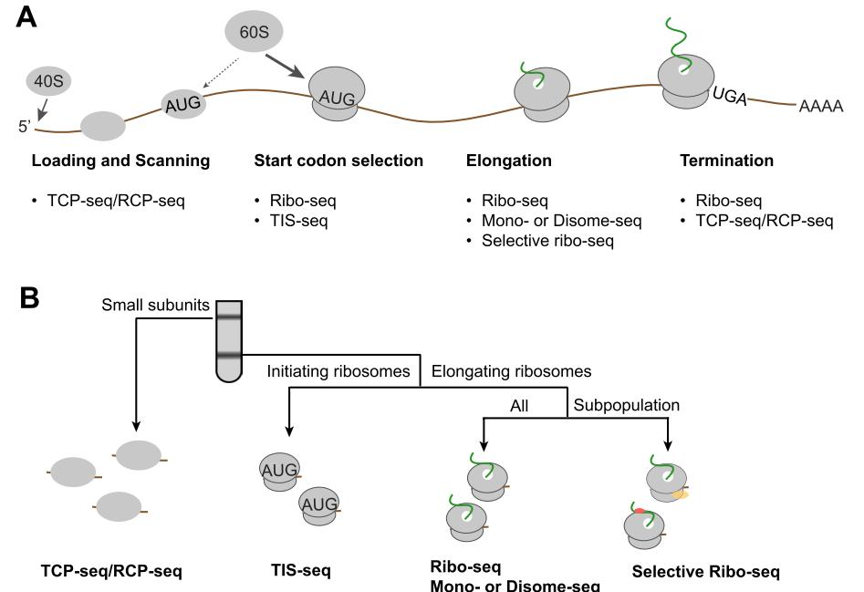
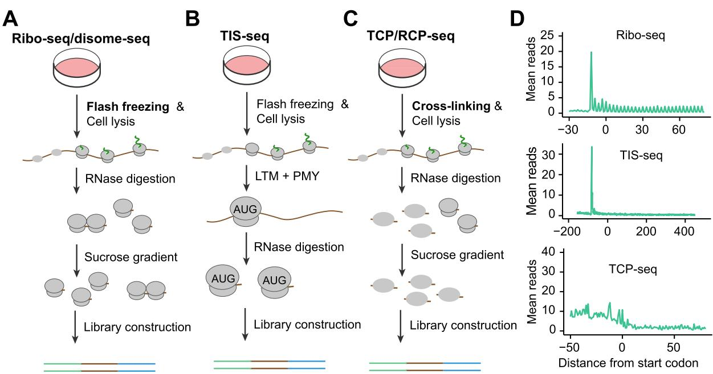
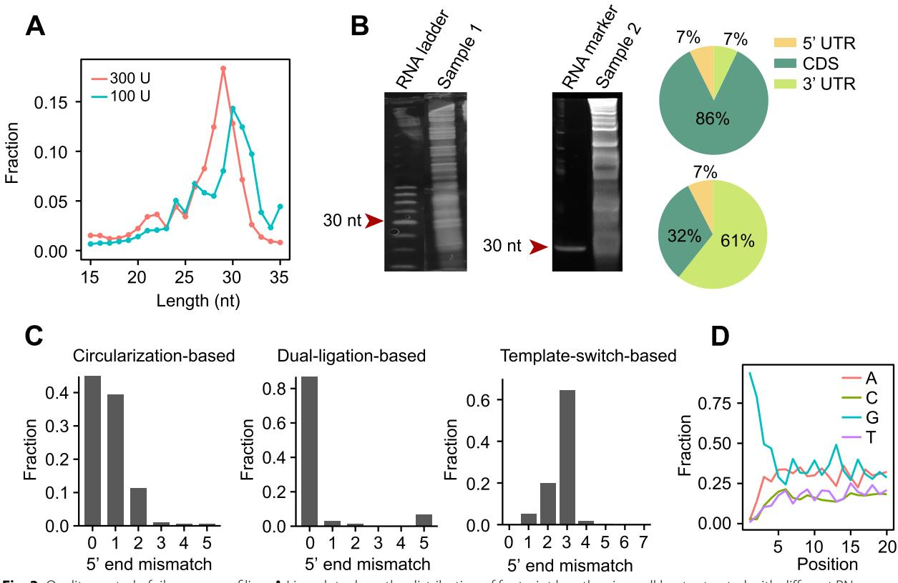
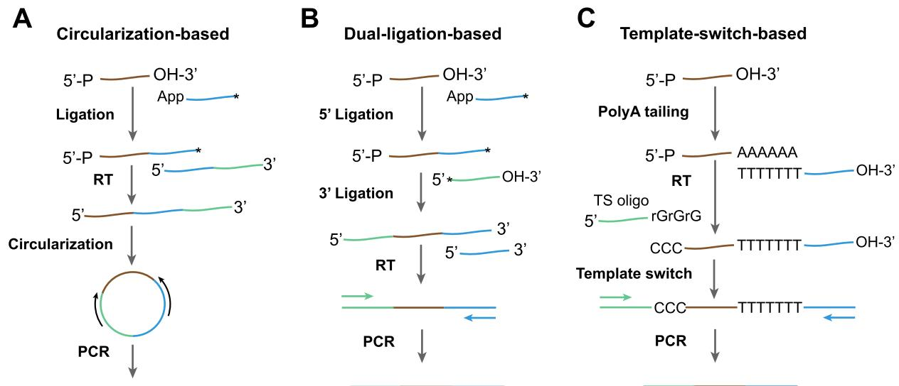
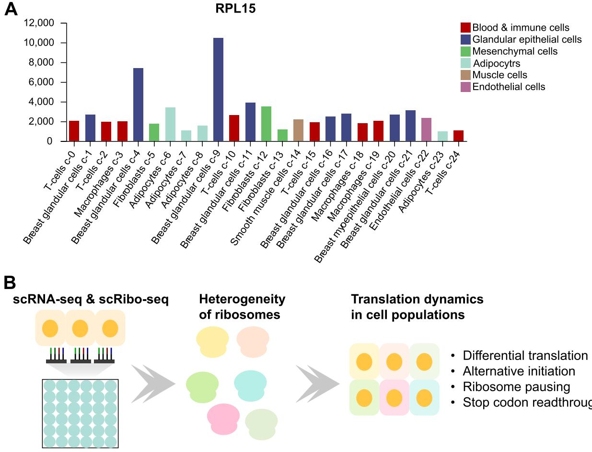

**REVIEW Open Access**

# Principles, challenges, and advances in ribosome profling: from bulk to low-input and single-cell analysis

Qiuyi Wang1,2 and Yuanhui Mao1,2[*](http://orcid.org/0000-0002-0893-2588) 

# **Abstract**

Ribosome profling has revolutionized our understanding of gene expression regulation by providing a snapshot of global translation in vivo. This powerful technique enables the investigation of the dynamics of translation initiation, elongation, and termination, and has provided insights into the regulation of protein synthesis under various conditions. Despite its widespread adoption, challenges persist in obtaining high-quality ribosome profling data. In this review, we discuss the fundamental principles of ribosome profling and related methodologies, including selective ribosome profling and translation complex profling. We also delve into quality control to assess the reliability of ribosome profling datasets, and the eforts to improve data quality by modifying the standard procedures. Additionally, we highlight recent advancements in ribosome profling that enable the transition from bulk to low-input and single-cell applications. Single-cell ribosome profling has emerged as a crucial tool for exploring translation heterogeneity within specifc cell populations. However, the challenges of capturing mRNAs efciently and the sparse nature of footprint reads in single-cell ribosome profling present ongoing obstacles. The need to refne ribosome profling techniques remains, especially when used at the single-cell level.

**Keywords** Ribosome profling, Ribo-seq quality, Dual-ligation, Template-switch

# **1 Introduction**

Te ribosome is a molecular machine that translates the nucleotide sequence of messenger RNAs (mRNAs) into the amino acid sequence of proteins. mRNA translation is a pivotal process in gene expression and consumes a substantial amount of cellular energy (Liu et al. [2016](#page-11-0); Lahtvee et al. [2017)](#page-11-1).

Te translation of mRNA typically begins with the recruitment of the preinitiation complex, comprising the ribosomal small subunit, a ternary complex, and initiation factors, to the mRNAs. In prokaryotes, the preinitiation complex is loaded onto the initiation site, usually through a Shine-Dalgarno (SD) sequence located 8–10 nucleotides (nt) upstream of the initiation site (Rodnina [2018)](#page-12-0). In contrast, the recruitment of eukaryotic ribosomes is more intricate and appears to be a ratelimiting step in translation (Hinnebusch [2014](#page-10-0); Merrick and Pavitt [2018)](#page-11-2). In eukaryotes, the preinitiation complex is recruited to the 5' end of mRNA by recognizing the 5' m7 G cap through the eukaryotic initiation factor eIF4E. Te preinitiation complex then scans the 5' untranslated region (5' UTR) until an initiation site is recognized. A commonly known scanning model suggests that the frst AUG encountered by the initiation complex serves as the initiation site. However, the fdelity of initiation site selection often involves intricate interactions between initiation factors and *cis* elements (Kozak [2005;](#page-11-3) Hinnebusch [2011](#page-10-1), [2017;](#page-10-2) Llácer et al. [2018](#page-11-4); Brito Querido et al. [2020](#page-10-3);

© The Author(s) 2023. **Open Access** This article is licensed under a Creative Commons Attribution 4.0 International License, which permits use, sharing, adaptation, distribution and reproduction in any medium or format, as long as you give appropriate credit to the original author(s) and the source, provide a link to the Creative Commons licence, and indicate if changes were made. The images or other third party material in this article are included in the article's Creative Commons licence, unless indicated otherwise in a credit line to the material. If material is not included in the article's Creative Commons licence and your intended use is not permitted by statutory regulation or exceeds the permitted use, you will need to obtain permission directly from the copyright holder. To view a copy of this licence, visit [http://creativecommons.org/licenses/by/4.0/.](http://creativecommons.org/licenses/by/4.0/)

*Correspondence:

Yuanhui Mao

yhmao_zju@zju.edu.cn

1 Bone Marrow Transplantation Center, the First Afliated Hospital, School of Medicine, Zhejiang University, Hangzhou, China

2 Liangzhu Laboratory, School of Medicine, Zhejiang University,

Hangzhou, China

Gu et al. [2021;](#page-10-4) She et al. [2023)](#page-12-1). It is not uncommon for the initiation complex to bypass several AUG triplets in the 5' UTR through a mechanism known as leaky scanning (Kozak [1999;](#page-11-5) Dever et al. [2023](#page-10-5)). Furthermore, other AUG-like triplets in the 5' UTR such as CUG, GUG, and UUG can also function as initiation codons in specifc contexts, adding an additional layer of regulation to initiation site selection (Starck et al. [2012](#page-12-2); Hinnebusch et al. [2016](#page-10-6)).

Once the initiation site is recognized, most initiation factors are released, and the ribosomal large subunit joins the initiation complex. Interestingly, while the scanning is rapid, the formation of ribosomes at the initiation site is time-consuming, potentially serving as a checkpoint for monitoring the fdelity of the initiation site and translation reading frame (Wang et al. [2019b](#page-12-3), [2020](#page-12-4), [2022](#page-12-5); Lapointe et al. [2022;](#page-11-6) Mao et al. [2023)](#page-11-7). Upon the release of the initiation factor eIF5B, the initiation ribosome proceeds to the elongation cycle (Wang et al. [2019b)](#page-12-3). During elongation, the ribosome decodes nucleotide triplets (codon) in a sequential manner (Dever and Green [2012](#page-10-7)). Te eukaryotic elongation factor eEF1 delivers amino acid-charged transfer RNAs (tRNAs) to the ribosome A site, and eEF2 catalyzes ribosome translocation. Te rate and fdelity of decoding appear to be infuenced by codon usage and the surrounding context (Liu et al. [2021](#page-11-8)). For example, non-optimal codons are translated more slowly and with lower accuracy compared to optimal codons due to a relative shortage of cognate tRNAs (Mordret et al. [2019](#page-11-9)). Te resulting rhythm of translation elongation is critical for co-translational protein folding (Zhou et al. [2013;](#page-13-0) Yu et al. [2015)](#page-13-1) and mRNA stability (Presnyak et al. [2015](#page-12-6); Hanson and Coller [2018)](#page-10-8). Interestingly, translation initiation can also be regulated by the elongation rate through a feedback pathway (Lyu et al. [2021)](#page-11-10).

When the ribosome reaches a stop codon, translation termination is triggered by termination factors (Hellen [2018](#page-10-9)), leading to the release of newly synthesized proteins and the recycling of ribosomes. Similar to initiation site selection, the fdelity of stop codon recognition is controlled by both *cis* elements and *trans* regulatory factors (Wangen and Green [2020)](#page-12-7). Intriguingly, other cognate tRNAs may also occasionally enter the ribosome A site at the stop codon, competing with the termination complex eRF1-eRF3 (Lawson et al. [2021)](#page-11-11). Mischarging of near cognate tRNAs at the stop codon can lead to ribosome readthrough, resulting in a C-terminal extension of the protein that can signifcantly impact mRNA and protein stability (Müller et al. [2023)](#page-11-12).

Despite extensive research on translation regulation, numerous fundamental questions remain unanswered. For instance, the precise roles of initiation factors and trans regulatory factors in guiding preinitiation complex loading, scanning and start site selection are not fully understood. Moreover, there is ongoing debate regarding the correlation between mRNA stability and translation, as conficting fndings have been reported (Dave et al. [2023](#page-10-10)). Emerging technologies such as single-molecule fuorescence (Prabhakar et al. [2019](#page-12-8)), massively parallel reporter assays (Jia et al. [2020](#page-11-13); Kesner et al. [2023](#page-11-14)) and multi-omics approaches have advanced our understanding of translation regulation. Ribosome profling, also known as Ribo-seq, is a technology that provides a snapshot of global translation in cells by sequencing the RNA fragments protected by translating ribosomes (Ingolia et al. [2009](#page-11-15); Brar and Weissman [2015](#page-10-11)). Since its frst application in yeast translation in 2009, ribosome profling has been adapted to various types and widely used in numerous studies (Fig. [1](#page-2-0)). Over the past 15 years, there has been a great efort to improve the quality of ribosome profling, however, obtaining high-quality Ribo-seq data is still technically challenging. In this review, we will summarize the applications of ribosome profling and related

# **2 Ribosome profling, selective ribosome profling and translation complex profling**

high-throughput sequencing technologies. Furthermore, we will discuss quality control of ribosome profling and highlight the procedures that determine its quality.

Ribosome profling hinges upon the principle that ribosomes shield specifc regions of messenger RNA (mRNA) from ribonuclease digestion. Tis methodology entails sequencing the residual RNA fragments following RNase treatment, denoted as ribosome-protected RNA fragments or ribosome footprints, to precisely determine the positions of translating ribosomes on mRNAs (Fig. [2A](#page-2-1) and D). In general, the count of footprints directly indicates the abundance of actively translating ribosomes on the mRNA. Terefore, ribosome profling has been widely used to quantify translation activity, where a reduced footprint count indicates a decrease in translation activity and vice versa (Xiao et al. [2016](#page-12-9)). For instance, under environmental perturbations, such as nutrient and hyperosmotic stress (Darnell et al. [2018](#page-10-12); Wu et al. [2019](#page-12-10); Jobava et al. [2021](#page-11-16)), cells can rapidly respond to stress by suspending global translation and increasing the translation of stress response genes including *ATF4*, *CHOP* and *GADD34*. In addition, it is worth noting that footprint reads within CDs are afected by both initiation and elongation rate. Terefore, diferential changes of translation levels can be confounded by the accumulation of ribosomes within CDS such as ribosome pausing induced by stress. While it is possible to remove outliers of footprint reads from CDS, those outlier-trimmed methods remain to be evaluated.

**Fig. 1** Translational control and ribosome profling. **A** A schematic diagram illustrating the main steps of mRNA translation and the high-throughput sequencing methods involved. **B** The relationship between ribosome profling and other high throughput sequencing methods

**Fig. 2** Procedures of ribosome profling and related high throughput sequencing methods. **A** Ribosome profling and Disome-seq. Cells were subjected to fash freezing and cell lysis. The lysates were digested by RNase (e.g. RNase I), and the digested products were fractionated by a sucrose gradient, separating RNA fragments into diferent fractions based on the number of ribosomes. The monosome fraction was collected to construct a ribosome profling library, and the disome fraction was collected for disome-seq. **B** Translation initiation site sequencing (TIS-seq). The procedure is similar to standard ribosome profling, expect for the use of lactimidomycin (LTM) and puromycin (PMY). LTM specifcally binds to the initiating ribosome, stabilizing the ribosome at the start codon, while PMY releases the nascent chain and dissociates the elongating ribosomes. **C** TCP/ RCP-seq. In contrast to ribosome profling, the ribosome subunits were immobilized on mRNAs through cross-linking. The RNase digestion products were separated by a sucrose gradient, and the fraction containing small subunits was collected for library construction. **D** Representative examples of aggregation plots for ribosome profling, TIS-seq and TCP-seq. The data from GSE176058 and GSE159210 were used

Despite the prevalent utilization of ribosome profling for mRNA translation diferential analysis, it is widely employed for discovering small open reading frames (smORFs). Numerous computational tools by leveraging ribosome profling data have been developed to identify smORFs across diverse species, yielding the number of smORFs ranging from tens of thousands to several million (Ingolia et al. [2014](#page-11-17); Calviello et al. [2016;](#page-10-13) Olexiouk et al. [2016;](#page-12-11) McGillivray et al. [2018;](#page-11-18) Clauwaert et al. [2019](#page-10-14); Wang et al. [2019a](#page-12-12); Martinez et al. [2020](#page-11-19); Mudge et al. [2021](#page-11-20), [2022](#page-11-21); Sandmann et al. [2023)](#page-12-13). Recently, a study based on super high-quality ribosome profling datasets reported a notably lower number of smORFs (~7,000 smORFs) diferentially expressed in diferent human tissues (Chothani et al. [2022](#page-10-15)). Notably, smORFs identifcation is sensitive to the quality of ribosome profling (Lei et al. [2023)](#page-11-22). To date, the precise number of smORFs in various species remains elusive (Mudge et al. [2022)](#page-11-21), primarily due to the stringent requirements for smORFs identifcation, necessitating high-quality ribosome profling.

In contrast to capturing all translating ribosomes on mRNAs, standard ribosome profling has been adapted to selectively enrich ribosomes bound by co-translational factors, referred to as selective ribosome profling. As an example, co-translational folding of nascent peptides, a pivotal process for maintaining protein homeostasis, is facilitated by the ribosome associated complex (RAC) (Zhang et al. [2020](#page-13-2); Kišonaitė et al. [2023)](#page-11-23). Te Hsp70 family member HSP70 (HSPA1A/B in human and Ssb1/ Ssb2 in yeast) targets ribosomes through the RAC complex, thus aiding the co-translational folding of nascent peptides (Hanebuth et al. [2016](#page-10-16); Chen et al. [2022)](#page-10-17). To investigate the function of the Ssb protein, previous studies performed ribosome profling combined with a procedure to selectively isolate Ssb-associated ribosomes (Oh et al. [2011](#page-11-24); Döring et al. [2017](#page-10-18); Shiber et al. [2018](#page-12-14); Stein et al. [2019)](#page-12-15). Tis approach revealed that Ssb shields hydrophobic patches within interaction domains, thus safeguarding nascent peptides against non-productive interactions and misfolding. Another example comes from the study on neuromuscular disease spinal muscular atrophy (SMA), a neuromuscular disease associated with the depletion of the survival motor neuron (SMN) protein. Employing selective ribosome profling to enrich SMN-bound ribosomes, a previous study found that the SMN protein preferentially associates with ribosomes positioned within the frst fve codons of a subset of mRNAs linked to SMA pathogenesis, thereby playing a pivotal role in the pathogenic cascade of SMA (Lauria et al. [2020](#page-11-25)). In a previous study on the Huntington disease (Eshraghi et al. [2021)](#page-10-19), a debilitative autosomal-dominant brain disorder characterized by the loss of language and behavioral abilities, the Huntingtin protein (mHTT) can promote ribosome pausing on specifc mRNAs, subsequently impeding ribosome translocating during elongation.

Notably, selective ribosome profling can also be performed by focusing on specifc subsets of ribosomes on mRNAs. Examples of these specialized methodologies include MitoRiboSeq for the enrichment of mitochondrial ribosomes (Morscher et al. [2018](#page-11-26); Li et al. [2021](#page-11-27)), TIS-seq for the specifc capture of initiation ribosomes at translation start sites (Lee et al. [2012;](#page-11-28) Gao et al. [2015](#page-10-20); Zhang et al. [2017](#page-13-3); Eisenberg et al. [2020)](#page-10-21) (Fig. [2](#page-2-1)B and D), di-/mono-ribosome profling for the analysis of di-/ mono- ribosomes on mRNAs (Biever et al. [2020;](#page-10-22) Meydan and Guydosh [2020;](#page-11-29) Zhao et al. [2021;](#page-13-4) Ferguson et al. [2023](#page-10-23)). As an example, strong ribosomal pausing can lead to the formation of di-ribosomes on mRNAs, which can inhibit translation elongation and trigger the ribosomeassociated protein quality control pathway (Ikeuchi et al. [2019](#page-10-24)). Because di-ribosomes are resistant to RNase I digestion, they are often excluded from the standard ribosome profling when a sucrose cushion is used for the isolation the monosome generated by RNase I digestion. Terefore, di-ribosome profling, using polysome profling to separate di-ribosome from mono-ribosome after RNase I digestion, can largely enrich di-ribosomes, which revealed a distinct ribosome pausing during elongation and in the region before the stop codon (Meydan and Guydosh [2020;](#page-11-29) Zhao et al. [2021](#page-13-4)). In addition, the selective ribosome profling can be performed in vivo (Gonzalez et al. [2014](#page-10-25); Doroudgar et al. [2019)](#page-10-26). For instance, the ribosomal large subunit RPL22 was genetically fused with a hemagglutinin (HA) tag (Doroudgar et al. [2019](#page-10-26)). Te expression of tagged RPL22 was specifcally induced in the mouse heart using a heart specifc Cre recombinase-expressing system, resulting in the synthesis of HA-RPL22-tagged ribosomes. By purifying tagged ribosome-associated mRNAs and performing ribosome profling, a previous study revealed a potential role of the upstream open reading frame (uORF) in cardiac metabolism through the regulation of the main open reading frame (mORF) translation.

In addition to standard and selective ribosome profling, another prevalent approach involves the capture of ribosome subunits rather than intact 80S ribosomes on mRNAs (Archer et al. [2016;](#page-10-27) Giess et al. [2020;](#page-10-28) Wagner et al. [2020](#page-12-16)). Te ribosomal subunits are often immobilized through crosslinking methods, which are subsequently separated using a sucrose gradient (Fig. [2](#page-2-1)C and D). Te RNA fragments covered by ribosomal subunits are then extracted and subjected to high-throughput sequencing. Te method is generally referred to as translation complex profling (TCP-seq) or ribosome complex profling (RCP-seq). Unlike standard ribosome profling, TCP/RCP-seq monitors ribosomal subunits, providing a unique opportunity to investigate regulations during translation initiation. Notably, TCP/RCP-seq can also be adapted to selectively enrich ribosomal subunits associated with initiation factors, a variant termed selective TCP/RCP-seq (Wagner et al. [2020](#page-12-16), [2022)](#page-12-17). Trough selective TCP-seq, previous studies have revealed molecular details of the assembly of ribosome subunits and associated initiation factors including eIF2 and eIF3, at various stages of translation initiation (Wagner et al. [2020)](#page-12-16).

# **3 Quality control of ribosome profling**

Quality control is a crucial aspect of assessing the reliability of a ribosome profling dataset, due to the susceptibility of this method to issues such as low quality and sequence bias. Several steps can be employed to evaluate a ribosome profling experiment.

# **3.1 Footprint length**

Te typical length of ribosome footprints in most species is approximately 30 nucleotides (nt), representing the region covered by a translating ribosome (Ingolia et al. [2009](#page-11-15)). However, the footprint length can vary, ranging from 20 to 31 nt. By analyzing various ribosome profling datasets, we found that the 5' end of footprints, the left boundary protected by ribosomes, is relatively fxed, whereas the 3' end exhibits fexibility, leading to a variation in footprint length (Mao et al. [2023](#page-11-7)). Footprint length is notably infuenced by RNase digestion (Fig. [3](#page-5-0)A) (Gerashchenko and Gladyshev [2017](#page-10-29); Douka et al. [2021](#page-10-30)). Inefcient digestion tends to yield longer footprints, which compromises the quality of ribosome profling. However, variation in footprint length could indicate ribosome heterogeneity. For example, during amino acid starvation, an increase in short footprints of approximately 21 nt indicates paused ribosomes with empty A sites due to the absence of cognate charged tRNAs (Wu et al. [2019)](#page-12-10).

# **3.2 Reads in coding region**

A vast majority (>80%) of footprint reads aligned to mRNAs are typically found within the coding region (CDS) (Fig. [3B](#page-5-0)). A notably lower percentage of CDS reads usually indicates a higher level of contamination and lower data quality. In addition, it is worth investigating whether reads aligned to non-coding regions or non-coding RNAs represent active translation or are background noise (Couso and Patraquim [2017;](#page-10-31) Wright et al. [2022](#page-12-18); Mao and Qian [2023](#page-11-30)). For instance, a typical ribosome profling dataset in human HEK293 cells exhibits 5–10% footprint reads in the 5' UTR, implying potential active translation in the 5' UTR of certain mRNAs (Fig. [3](#page-5-0)B). Indeed, it has been well accepted that alternative translation initiation can occur in the 5' UTR when an initiation complex scans along the 5' UTR and encounters an optimal initiation context upstream of the annotated start codon (Medenbach et al. [2011;](#page-11-31) Dever et al. [2020](#page-10-32); Orr et al. [2020](#page-12-19)). In addition, footprint reads in the 3' UTR may indicate stop codon readthrough (Dunn et al. [2013](#page-10-33); Arribere et al. [2016)](#page-10-34) or reinitiation (Young et al. [2015a](#page-12-20), [2015b;](#page-12-21) Shu et al. [2022](#page-12-22)) after translation termination. However, given that readthrough and reinitiation are relatively rare on most mRNAs and that there are many RNA binding proteins in the 3' UTR, most sequencing reads in the 3' UTR are likely contaminated by background noise and should be carefully evaluated. Identifying non-canonical translation events in non-coding regions and non-coding RNAs is of special interest (Chen et al. [2020](#page-10-35); Prensner et al. [2021)](#page-12-23). For example, alternative initiation is common in stressed cells (Hinnebusch et al. [2016](#page-10-6); Young and Wek [2016](#page-12-24)) and in many types of cancer cells (Wang et al. [1996](#page-12-25); Sendoel et al. [2017](#page-12-26); Xu et al. [2019;](#page-12-27) Huang et al. [2021](#page-10-36)), which implies an important role for alternative initiation in stress responses and tumorigenesis.

# **3.3 In‑frame rate**

Te in-frame rate (IFR) denotes the fraction of footprint reads aligned to the correct reading frame of the CDS. IFR is a critical quality control metric for ribosome profling, particularly in studies focusing on ribosome occupancy at individual codons to investigate ribosome pausing or frameshifting. A lower IFR in a ribosome profling dataset indicates lower data quality and potential contamination from non-specifc mRNA fragments during library preparation. Such contaminants can signifcantly afect the estimation of translation activity, typically calculated based on all footprint reads on mRNAs. In addition, IFR is vital for identifying new ORFs, as most computational tools use IFR to discriminate ORFs from non-coding regions (Bazzini et al. [2014;](#page-10-37) Mackowiak et al. [2015;](#page-11-32) Calviello et al. [2016)](#page-10-13). Currently, most ribosome profling experiments yield datasets with an IFR of approximately 60–70%. Recently, we developed a novel library construction method for ribosome profling, achieving an IFR up to 90% in HEK293 cells (Mao et al. [2023](#page-11-7)). Tis high-resolution dataset revealed prevalent ribosome frameshifting during the early stage of elongation. Interestingly, the frameshifting rate on individual codons seems to be associated with codon optimality, with non-optimal codons (lacking cognate tRNAs) showing a signifcantly higher frameshifting rate than optimal codons. It is important to note that IFR in most ribosome profling datasets is length-dependent. Generally, footprint reads

**Fig. 3** Quality control of ribosome profling. **A** Line plots show the distribution of footprint length using cell lysates treated with diferent RNase I concentrations (AM2295, 100 U versus 300 U), suggesting that a lower RNase I concentration may reduce RNA digestion efciency. **B** Quality check of RNase I digestion. After RNase I digestion, RNA fragments were separated on a 15% denatured PAGE gel, which was then stained with SYBR Gold. The RNA ladder (left) or marker (30 nt) is shown in lane 1 of each panel. Compared to the left panel (100 U RNase I, AM2295), the fragments at approximately 30 nt were relatively weak when an extremely low concentration of RNase I (10 U RNase I, AM2295) was used. When RNAs are efciently digested, the majority of fragments approximately 30 nt are aligned to CDS, whereas the fragments are contaminated with RNA fragments from the 3' UTR when the digestion is inefcient (right pie chart). **C** Bar plots show the accuracy of the 5' end of the footprint when diferent library construction methods were used. Circularization-based methods have~50% of reads showing additional non-templated nucleotides at the 5' end of footprint reads (mismatches>0, left panel, data from SRR7241912 were used). Compared to circularization-based methods, dual-ligation methods signifcantly improve 5' end accuracy, with<5% footprint reads having mismatches>0 (data from SRR14824510 were used). Template-switch-based methods add a variable number of non-templated nucleotides to the 5' end of cDNA (right panel, unpublished data). **D** The G preference of template-switch methods. Position refers to the positions from the 5' end of footprint reads

with length of approximately 28 nt have the highest IFR, often reaching 80% or higher. IFR decreases dramatically for reads shorter than 28 nt, which should be carefully evaluated when calculating ribosome occupancy using short reads. Notably, the IFR is mainly afected by the accuracy of the 5' end of footprint reads, which is also infuenced by library construction methods (Fig. [3](#page-5-0)C and D, discussed later).

# **3.4 Aggregation plot**

An aggregation plot displays an averaged ribosome density along the CDS, which is commonly used to examine ribosome pausing at specifc codons. However, an abnormal increase in ribosome density near the start codon can indicate potential concerns with data quality, probably resulting from ribosome movement during cell harvesting (Sharma et al. [2021](#page-12-28)).

# **4 Challenges in ribosome profling and methodology**

Ribosome profling, although widely embraced, poses technical challenges in generating high-quality datasets. Tis complexity arises from the intricate nature of the ribosome profling procedure, which encompasses numerous critical steps, each harboring distinct technical intricacies that can adversely afect the integrity of the data.

# **4.1 Cell harvesting and lysis**

Te initial step involves stabilizing ribosomes on mRNA molecules before cell lysis. To this end, cells are subjected to fash freezing to arrest translation activity (McGlincy and Ingolia [2017](#page-11-33)). However, a potential concern arises during cell harvesting and lysis in cold conditions, as mRNA translation is sensitive to stress including cold (Knight et al. [2015](#page-11-34)). Low temperature before cell harvesting may alter the translation landscape (Zhang et al. [2018](#page-13-5)). Terefore, harvesting cells as soon as possible may improve the quality of ribosome profling. Another common method to arrest translation is pre-incubating cells with cycloheximide. Cycloheximide blocks translation elongation by binding to ribosomes and inhibiting eEF2 mediated translocation (Ennis and Lubin [1964](#page-10-38); Baliga et al. [1969;](#page-10-39) Schneider-Poetsch et al. [2010](#page-12-29)). Intriguingly, previous studies have reported that cycloheximide allows one complete translocation cycle before halting further elongation (Schneider-Poetsch et al. [2010)](#page-12-29), raising questions about its ability to immobilize ribosomes in situ and thus complicating ribosome occupancy at individual codons. Systematic analysis of ribosome profling datasets in yeast with and without cycloheximide has indeed revealed biases in ribosome occupancy introduced by cycloheximide (Lareau et al. [2014](#page-11-35); Hussmann et al. [2015](#page-10-40)). In addition, cycloheximide-induced translation elongation inhibition can induce stress responses, which may perturb the global translation landscape (Santos et al. [2019](#page-12-30)). Although the use of cycloheximide in mammalian cells remains controversial (Sharma et al. [2021](#page-12-28)), it warrants particular attention when pre-incubating cells with cycloheximide.

# **4.2 Polysome profling**

Polysome profling is a technique that segregates translated mRNAs on a sucrose gradient based on the number of bound ribosomes (Chassé et al. [2017](#page-10-41); Pringle et al. [2019](#page-12-31)). Following ultracentrifugation of the cell lysate on a 15–40% sucrose gradient, actively translated mRNAs can be separated into diferent fractions according to ribosome count. Tese mRNA fractions are subsequently collected using spectrophotometric analysis at A254. Polysome profling efectively enriches ribosome-bound mRNAs, resulting in a signifcant reduction in non-coding RNA content, improved RNase digestion efciency, and, consequently, enhanced ribosome profling data quality. However, polysome profling requires a substantial amount of RNA and may not be suitable for lowinput samples (Liang et al. [2018](#page-11-36)). In addition, a fraction analyzer is needed for polysome profling, which may not be available to all research groups (Sobhany and Stanley [2021](#page-12-32)). Consequently, many ribosome profling experiments opt to omit this step. In an alternative approach, chemical labeling techniques such as puromycin labeling have been developed to enrich ribosome-bound mRNAs (Schmidt et al. [2009;](#page-12-33) Kandala et al. [2019;](#page-11-37) Hadidi et al. [2023](#page-10-42)). Puromycin, an aminonucleoside antibiotic, binds to ribosomes and nascent peptide chains, ofering a means to quantify protein synthesis (Semenkov et al. [1992](#page-12-34); Starck and Roberts [2002](#page-12-35)). Previous studies have introduced methods such as RiboLace, which utilize puromycin-containing molecules to isolate active ribosomes. (Clamer et al. [2018](#page-10-43)).

# **4.3 RNA digestion**

Efcient RNA digestion plays a pivotal role in achieving high-quality ribosome profling (Li et al. [2023)](#page-11-38). RNase I is the most commonly used RNase for ribosome profling. Digestion is usually completed at room temperature (McGlincy and Ingolia [2017)](#page-11-33). However, a recent study suggested that overnight digestion on ice could enhance digestion efciency (Douka et al. [2021)](#page-10-30). It is important to note that RNase I digests ribosomal RNAs (rRNA), resulting in signifcant rRNA contamination in ribosome profling libraries (Meador et al. [1990](#page-11-39)). rRNA contamination consumes a vast majority of sequencing reads, signifcantly reducing the number of reads aligned to mRNAs (low to 5% of total reads). It is challenging to remove rRNA contamination from ribosome profling libraries (Tompson et al. [2020](#page-12-36); Zinshteyn et al. [2020](#page-13-6)), therefore, other RNases have been explored to mitigate rRNA contamination (Gerashchenko and Gladyshev [2017](#page-10-29); Hwang and Buskirk [2017)](#page-10-44), including micrococcal nuclease (MNase) (VanInsberghe et al. [2021](#page-12-37)), RNase A (Simsek et al. [2017)](#page-12-38), and RNase T1 (Liu et al. [2018](#page-11-40); Gerashchenko [2021)](#page-10-45). However, these RNases often exhibit RNA sequence preferences in digestion, introducing additional biases to the calculation of ribosome occupancy at individual codons (VanInsberghe et al. [2021](#page-12-37)). Recently, a study indicated that the nuclease P1 may be a promising alternative with the potential to digest mRNAs without obvious sequence bias (Ferguson et al. [2023](#page-10-23)). In addition, nuclease P1 appears to have a preference for mRNA over rRNA compared to RNase I, resulting in a reduction of the rRNA fraction to less than 50% (Ferguson et al. [2023)](#page-10-23).

# **4.4 Library construction**

Selecting an appropriate methodology for constructing ribosome profling libraries is crucial. Initially, circularization-based methods were employed, involving RNA ligation and DNA circularization (Ingolia et al. [2009;](#page-11-15) McGlincy and Ingolia [2017)](#page-11-33). RNA fragments were frst ligated to a 3' adaptor, which served as priming sites for reverse transcription. After reverse transcription, the complementary DNA (cDNA) was circularized and then subjected to PCR amplifcation using the priming sites in the 3' adaptor (Fig. [4A](#page-7-0)). Te circularization-based method is time-consuming and inefcient, rendering it unsuitable for low-input RNA samples. Furthermore, reverse transcription introduces non-templated nucleotides at the 5' end of cDNA, due to the non-templated addition of reverse transcriptase. Although non-templated nucleotides can be removed using computational methods, it is impossible to discriminate additional nucleotides if they can be aligned to the genome, which signifcantly reduces the 5' end accuracy of footprint reads (Fig. [3](#page-5-0)C). To improve the efciency of library construction, other methods such as the dual-ligation method have been employed (VanInsberghe et al. [2021)](#page-12-37). Dual-ligation methods, which ligate fragments to both 3' and 5' adaptors, ofer higher efciency and are suitable for singlecell ribosome profling (Fig. [4B](#page-7-0)). Te major concern of dual-ligation is the sequence preference of ligation, which potentially alter the relative ribosome densities at individual codons. To mitigate ligation bias, random barcodes have been introduced into the ligation primers (Lecanda et al. [2016](#page-11-41); McGlincy and Ingolia [2017](#page-11-33); Lama et al. [2019](#page-11-42)). Notably, random barcodes can also serve as unique molecular identifers (UMI) to correct PCR amplifcation biases. In addition, dual-ligation methods are also prone to formation of dimers, a selfligation between 5' and 3' adaptors. Dimmers consume a substantial fraction of adaptors and sequencing depth and thus must be eliminated from libraries through gel electrophoresis. Recently, another method based on the template-switch mechanism has been utilized for ribosome profling library construction (Li et al. [2022](#page-11-43), [2023](#page-11-38); Xiong et al. [2022;](#page-12-39) Zhang et al. [2022;](#page-13-7) Zou et al. [2022](#page-13-8)). In this approach, RNA fragments are tagged with polyadenine tails and subjected to reverse transcription using Moloney murine leukemia virus (MMLV)-type reverse transcriptase with a switching property (Wulf et al. [2019)](#page-12-40). When reverse transcription reaches the 5' end of RNA fragments, the reverse transcriptase tends to add three additional non-templated nucleotides (+CCC) to the 3' end of nascent cDNAs, which allows the reverse transcriptase to switch templates to the templated switched oligo (TSO) sequence (Fig. [4C](#page-7-0)). Because the amount of input RNAs for the template-switch method can be extremely low, this method has been widely used in single-cell RNA-seq library construction (Picelli et al. [2013,](#page-12-41) [2014](#page-12-42)). However, a few concerns should be considered when it is used for single-cell ribosome profling. First, non-templated nucleotides at the 3' end of cDNAs are generally variable, with a median value of 3 nucleotides (Fig. [3](#page-5-0)C). Te variable 3' end makes it challenging to infer the accurate 5' end of footprints and thus the positions of ribosomes. Terefore, mathematical models such as random forest have been trained to predict ribosome positions, based on footprint reads around the stop codon, where ribosome positions are assumed to be accurate due to ribosome pausing at the stop codon (VanInsberghe et al. [2021](#page-12-37)). Additionally, template-switch methods exhibit a bias toward guanine, potentially enriching footprint reads with G at the 5' ends and introducing biases that may impact

**Fig. 4** Library construction method for ribosome profling. **A** Circularization-based, **B** Dual-ligation-based, and **C** Template-switch-based. RT: reverse transcription

ribosome occupancies at individual codons (Fig. [3](#page-5-0)D) (Tang et al. [2013](#page-12-43); Meistertzheim et al. [2019)](#page-11-44).

# **5 Advancements in ribosome profling: transitioning from bulk to low‑input and single‑cell ribosome profling**

Ribosome profling-based methodologies have signifcantly improved our capacity to monitor protein synthesis in vivo. Similar to RNA-seq, conventional bulk ribosome profling falls short in detecting translation controls within specifc cell populations. To scrutinize translation heterogeneity at the single-cell level, singlecell ribosome profling based on the dual-ligation method was introduced (VanInsberghe et al. [2021)](#page-12-37). Single-cell ribosome profling revealed distinct responses in translation activity and ribosome pausing throughout the cell cycle. Remarkably, ribosome pausing at codons encoding specifc amino acids was evident only in certain cells, dependent on their cell cycle state. It is believed that depletion of single amino acids or cognate tRNAs leads to ribosome pausing at specifc codons. However, most bulk ribosome profling data in mammals have failed to establish a clear correlation between ribosome pausing and the corresponding tRNA or amino acid abundance. Te heterogeneity of ribosome pausing revealed by single-cell ribosome profling may elucidate the absence of such a correlation.

In contrast to the ligation-based library used in previous studies (VanInsberghe et al. [2021;](#page-12-37) Froberg et al. [2023](#page-10-46)), several recent studies have employed the template-switch method to construct low-input ribosome profling libraries using only a few hundred cells (Li et al. [2022](#page-11-43); Xiong et al. [2022](#page-12-39); Zhang et al. [2022](#page-13-7); Ozadam et al. [2023](#page-12-44)). By applying low-input ribosome profling to cells during the early development of embryos, a stage characterized by more active mRNA translation than transcription, previous studies (Zhang et al. [2022](#page-13-7); Ozadam et al. [2023](#page-12-44))have revealed a remarkable alteration in the translation landscape within mammalian oocytes or embryos.

While both low-input and single-cell ribosome profling ofer insights into translation control at the singlecell level, cell subpopulations often need to be separated before ribosome profling. However, cell sorting can introduce stress responses due to the sensitivity of translation, leading to rapid changes in the global translation landscape. Recently, a spatially resolved single-cell translatomics method termed RIBOMap was developed (Zeng et al. [2023](#page-13-9)). Using a tri-probe system that includes probes targeting rRNA and specifc groups of mRNAs, and probe functions for DNA amplifcation, RIBOMap can detect and quantify ribosome-bound mRNA in situ. By applying RIBOMap in the mouse brain in parallel with spatial transcription analysis, a previous study (Zeng et al. [2023](#page-13-9)) revealed signifcantly diferential translation regulation during oligodendrocyte maturation. Notably, RIBOMap is also able to monitor translation activity at the subcellular level, revealing translation control in specifc localization within cells.

# **6 Perspective**

Over the past 15 years, ribosome profling has evolved signifcantly, emerging as a versatile method for monitoring translation activity at various stages of protein synthesis and in diverse cell types, tissues and numerous human diseases (Lee et al. [2021](#page-11-45); Ouspenskaia et al. [2022](#page-12-45); Passarelli et al. [2022](#page-12-46)). Moreover, the ribosome profling procedure has been streamlined, leading to the generation of high-quality datasets (Ferguson et al. [2023)](#page-10-23). Nevertheless, there persists a need for further refnement in ribosome profling quality to address fundamental questions in translation control. For instance, only a small fraction of sequencing reads generated in most ribosome profling experiments can be successfully aligned to mRNAs, typically ranging from 10 to 30%. Regardless of rRNA contamination, a signifcant proportion of reads are mapped to non-coding RNAs or non-coding regions of mRNAs, suggesting pervasive translation in certain non-coding regions (Orr et al. [2020](#page-12-19); Wright et al. [2022](#page-12-18); Mao and Qian [2023)](#page-11-30). Identifying such non-canonical translation within non-coding regions poses challenges, primarily owing to their typically lower translation levels than mRNAs. While computational tools play a crucial role in unveiling non-canonical translation events (Lei et al. [2023](#page-11-22)), improving the quality of ribosome profling can substantially reduce background noise, thus increasing the sensitivity and specifcity of the identifcation of non-canonical translation events.

Another intriguing question pertains to single-cell and spatial ribosome profling. Emerging evidence indicates signifcant variations in ribosome composition among diferent tissues and cell types (an example showing Fig. [5](#page-9-0)A) (Genuth and Barna [2018;](#page-10-47) Gay et al. [2022)](#page-10-48). Ribosomal heterogeneity plays a pivotal role in the specialized translation of specifc groups of mRNAs which can be mediated by the diversity in ribosomes. Single-cell ribosome profle together with single-cell RNA-seq ofers a powerful approach to investigate the regulation and function of specialized translation (Fig. [5B](#page-9-0)). Although singlecell ribosome profling techniques are available, many of them sufer low efciency. First, only a small fraction of mRNAs is captured, limiting the ability to detect the translation landscape in cell populations. Second, the unique reads in each cell are rather scarce. Te extreme sparsity of footprint reads makes it challenging to calculate ribosome occupancy at individual codons. Teoretically, techniques such as RIBOMap have the potential to

**Fig. 5** Ribosome heterogeneity and single-cell ribosome profling. **A** Expression levels of ribosomal protein RPL15 across diferent cell types in the breast. Data from the Human Protein Atlas were used. **B** A schematic diagram illustrating ribosome heterogeneity and the diversity of translation regulation across cell types which can be revealed by a single-cell ribosome profling (scRibo-seq) combined with a single-cell RNA-seq (scRNA-seq)

capture a higher number of mRNAs by increasing the number of probes. However, they lack information about ribosome positions, which limits their ability to detect the heterogeneity of ribosome occupancy in tissues. For example, uORF translation plays critical roles in translation regulation of downstream main ORFs (Dever et al. [2023](#page-10-5)). Whether there is heterogeneity in uORF translation in a cell-specifc manner remains unclear. Te development of high-quality single-cell ribosome profling may enhance our comprehension of the heterogeneity of uORF translation.

# **Acknowledgements**

We thank Jianhua Yang and Yalan Wang for critical comments when preparing the manuscript. We thank the Mao lab members for critical reading of this manuscript.

# **Authors' contributions**

Q.Y.W and Y.H.M wrote the manuscript. All authors discussed edited the manuscript.

#### **Funding**

This work was supported by the National Natural Science Foundation of China (32370585) to Y.H.M.

### **Availability of data and materials** Not applicable.

# **Declarations**

# **Ethics approval and consent to participate**

Not applicable.

# **Consent for publication**

The work described has not been published before, and is not under consideration for publication elsewhere. Its publication has been approved by all co-authors.

# **Competing interests**

The authors declare no conficts of interest.

Received: 25 October 2023 Revised: 17 November 2023 Accepted: 22

# November 2023

## **References**

- Archer SK, Shirokikh NE, Beilharz TH, Preiss T. Dynamics of ribosome scanning and recycling revealed by translation complex profling. Nature. 2016;535:570–4.
- Arribere JA, Cenik ES, Jain N, Hess GT, Lee CH, Bassik MC, Fire AZ. Translation readthrough mitigation. Nature. 2016;534:719–23.
- Baliga B, Pronczuk A, Munro H. Mechanism of cycloheximide inhibition of protein synthesis in a cell-free system prepared from rat liver. J Biol Chem. 1969;244:4480–9.
- Bazzini AA, Johnstone TG, Christiano R, Mackowiak SD, Obermayer B, Fleming ES, Vejnar CE, Lee MT, Rajewsky N, Walther TC. Identifcation of small ORF s in vertebrates using ribosome footprinting and evolutionary conservation. EMBO J. 2014;33:981–93.
- Biever A, Glock C, Tushev G, Ciirdaeva E, Dalmay T, Langer JD, Schuman EM. Monosomes actively translate synaptic mRNAs in neuronal processes. Science. 2020;367:eaay4991.
- Brar GA, Weissman JS. Ribosome profling reveals the what, when, where and how of protein synthesis. Nat Rev Mol Cell Biol. 2015;16:651–64.
- Brito Querido J, Sokabe M, Kraatz S, Gordiyenko Y, Skehel JM, Fraser CS, Ramakrishnan V. Structure of a human 48S translational initiation complex. Science. 2020;369:1220–7.
- Calviello L, Mukherjee N, Wyler E, Zauber H, Hirsekorn A, Selbach M, Landthaler M, Obermayer B, Ohler U. Detecting actively translated open reading frames in ribosome profling data. Nat Methods. 2016;13:165–70.
- Chassé H, Boulben S, Costache V, Cormier P, Morales J. Analysis of translation using polysome profling. Nucleic Acids Res. 2017;45:e15–e15.
- Chen J, Brunner AD, Cogan JZ, Nuñez JK, Fields AP, Adamson B, Itzhak DN, Li JY, Mann M, Leonetti MD, et al. Pervasive functional translation of noncanonical human open reading frames. Science. 2020;367:1140–6.
- Chen Y, Tsai B, Li N, Gao N. Structural remodeling of ribosome associated Hsp40-Hsp70 chaperones during co-translational folding. Nat Commun. 2022;13:3410.
- Chothani SP, Adami E, Widjaja AA, Langley SR, Viswanathan S, Pua CJ, Zhihao NT, Harmston N, D'agostino G, Whifn N. A high-resolution map of human RNA translation. Mol Cell. 2022;82(2885–2899):e2888.
- Clamer M, Tebaldi T, Lauria F, Bernabò P, Gómez-Biagi RF, Marchioretto M, et al. Active ribosome profling with RiboLace. Cell Rep. 2018;25:1097–1108. e1095.
- Clauwaert J, Menschaert G, Waegeman W. DeepRibo: a neural network for precise gene annotation of prokaryotes by combining ribosome profling signal and binding site patterns. Nucleic Acids Res. 2019;47:e36–e36.
- Couso J-P, Patraquim P. Classifcation and function of small open reading frames. Nat Rev Mol Cell Biol. 2017;18:575–89.
- Darnell AM, Subramaniam AR, O'Shea EK. Translational control through differential ribosome pausing during amino acid limitation in mammalian cells. Mol Cell. 2018;71:229–243.e211.
- Dave P, Roth G, Griesbach E, Mateju D, Hochstoeger T, Chao JA. Single-molecule imaging reveals translation-dependent destabilization of mRNAs. Mol Cell. 2023;83:589-606.e586.
- Dever TE, Green R. The elongation, termination, and recycling phases of translation in eukaryotes. Cold Spring Harb Perspect Biol. 2012;4:a013706.
- Dever TE, Ivanov IP, Sachs MS. Conserved upstream open reading frame nascent peptides that control translation. Annu Rev Genet. 2020;54:237–64.
- Dever TE, Ivanov IP, Hinnebusch AG. Translational regulation by uORFs and start codon selection stringency. Genes Dev. 2023;37:474–89.
- Döring K, Ahmed N, Riemer T, Suresh HG, Vainshtein Y, Habich M, et al. Profling Ssb-nascent chain interactions reveals principles of Hsp70-assisted folding. Cell. 2017;170:298–311.e220.
- Doroudgar S, Hofmann C, Boileau E, Malone B, Riechert E, Gorska AA, Jakobi T, Sandmann C, Jürgensen L, Kmietczyk V, et al. Monitoring Cell-Type– Specifc Gene Expression Using Ribosome Profling In Vivo During Cardiac Hemodynamic Stress. Circ Res. 2019;125:431–48.
- Douka K, Agapiou M, Birds I, Aspden JL. Optimization of Ribosome Footprinting Conditions for Ribo-Seq in Human and Drosophila melanogaster Tissue Culture Cells. Front Mol Biosci. 2021;8:791455.
- Dunn JG, Foo CK, Belletier NG, Gavis ER, Weissman JS. Ribosome profling reveals pervasive and regulated stop codon readthrough in Drosophila melanogaster. elife. 2013;2:e01179.
- Eisenberg AR, Higdon AL, Hollerer I, Fields AP, Jungreis I, Diamond PD, Kellis M, Jovanovic M, Brar GA. Translation initiation site profling reveals widespread synthesis of non-AUG-initiated protein isoforms in yeast. Cell Syst. 2020;11(145–160):e145.
- Ennis H, Lubin M. Cycloheximide: aspects of inhibition of protein synthesis in mammalian cells. Science. 1964;146:1474–6.
- Eshraghi M, Karunadharma PP, Blin J, Shahani N, Ricci EP, Michel A, Urban NT, Galli N, Sharma M, Ramírez-Jarquín UN, et al. Mutant Huntingtin stalls ribosomes and represses protein synthesis in a cellular model of Huntington disease. Nat Commun. 2021;12:1461.
- Ferguson L, Upton HE, Pimentel SC, Mok A, Lareau LF, Collins K, Ingolia NT. Streamlined and sensitive mono- and di-ribosome profling in yeast and human cells. Nat Methods. 2023. [https://doi.org/10.1038/](https://doi.org/10.1038/s41592-023-02028-1) [s41592-023-02028-1.](https://doi.org/10.1038/s41592-023-02028-1)
- Froberg JE, Durak O, Macklis JD. Development of nanoRibo-seq enables study of regulated translation by cortical neuron subtypes, showing uORF translation in synaptic-axonal genes. Cell Rep. 2023;42:112995.
- Gao X, Wan J, Liu B, Ma M, Shen B, Qian S-B. Quantitative profling of initiating ribosomes in vivo. Nat Methods. 2015;12:147–53.
- Gay DM, Lund AH, Jansson MD. Translational control through ribosome heterogeneity and functional specialization. Trends Biochem Sci. 2022;47:66–81.
- Genuth NR, Barna M. The discovery of ribosome heterogeneity and its implications for gene regulation and organismal life. Mol Cell. 2018;71:364–74.
- Gerashchenko MV. Choice of ribonucleases for ribosome profling experiments. Methods Mol Biol. 2021;2252:239–48.
- Gerashchenko MV, Gladyshev VN. Ribonuclease selection for ribosome profling. Nucleic Acids Res. 2017;45:e6.
- Giess A, Cleuren YNT, Tjeldnes H, Krause M, Bizuayehu TT, Hiensch S, Okon A, Wagner CR, Valen E. Profling of small ribosomal subunits reveals modes and regulation of translation initiation. Cell reports. 2020;31(3):107534.
- Gonzalez C, Sims JS, Hornstein N, Mela A, Garcia F, Lei L, et al. Ribosome profling reveals a cell-type-specifc translational landscape in brain tumors. J Neurosci. 2014;34:10924–36.
- Gu Y, Mao Y, Jia L, Dong L, Qian SB. Bi-directional ribosome scanning controls the stringency of start codon selection. Nat Commun. 2021;12:6604.
- Hadidi K, Steinbuch KB, Dozier LE, Patrick GN, Tor Y. Inherently emissive puromycin analogues for live cell labelling. Angew Chem Int Ed Engl. 2023;62:e202216784.
- Hanebuth MA, Kityk R, Fries SJ, Jain A, Kriel A, Albanese V, Frickey T, Peter C, Mayer MP, Frydman J, et al. Multivalent contacts of the Hsp70 Ssb contribute to its architecture on ribosomes and nascent chain interaction. Nat Commun. 2016;7:13695.
- Hanson G, Coller J. Codon optimality, bias and usage in translation and mRNA decay. Nat Rev Mol Cell Biol. 2018;19:20–30.
- Hellen CUT. Translation termination and ribosome recycling in eukaryotes. Cold Spring Harb Perspect Biol. 2018;10(10):a032656.
- Hinnebusch AG. Molecular mechanism of scanning and start codon selection in eukaryotes. Microbiol Mol Biol Rev. 2011;75:434–67 (First page of table of contents).
- Hinnebusch AG. The scanning mechanism of eukaryotic translation initiation. Annu Rev Biochem. 2014;83:779–812.
- Hinnebusch AG. Structural insights into the mechanism of scanning and start codon recognition in eukaryotic translation initiation. Trends Biochem Sci. 2017;42:589–611.
- Hinnebusch AG, Ivanov IP, Sonenberg N. Translational control by 5'-untranslated regions of eukaryotic mRNAs. Science. 2016;352:1413–6.
- Huang N, Li F, Zhang M, Zhou H, Chen Z, Ma X, Yang L, Wu X, Zhong J, Xiao F. An upstream open reading frame in phosphatase and tensin homolog encodes a circuit breaker of lactate metabolism. Cell Metab. 2021;33(128–144):e129.
- Hussmann JA, Patchett S, Johnson A, Sawyer S, Press WH. Understanding biases in ribosome profling experiments reveals signatures of translation dynamics in yeast. PLoS Genet. 2015;11:e1005732.
- Hwang JY, Buskirk AR. A ribosome profling study of mRNA cleavage by the endonuclease RelE. Nucleic Acids Res. 2017;45:327–36.
- Ikeuchi K, Tesina P, Matsuo Y, Sugiyama T, Cheng J, Saeki Y, Tanaka K, Becker T, Beckmann R, Inada T. Collided ribosomes form a unique structural

interface to induce Hel2-driven quality control pathways. Embo j. 2019;38(5):e100276.

- Ingolia NT, Ghaemmaghami S, Newman JR, Weissman JS. Genome-wide analysis in vivo of translation with nucleotide resolution using ribosome profling. Science. 2009;324:218–23.
- Ingolia NT, Brar GA, Stern-Ginossar N, Harris MS, Talhouarne GJ, Jackson SE, Wills MR, Weissman JS. Ribosome profling reveals pervasive translation outside of annotated protein-coding genes. Cell Rep. 2014;8:1365–79.
- Jia L, Mao Y, Ji Q, Dersh D, Yewdell JW, Qian SB. Decoding mRNA translatability and stability from the 5' UTR. Nat Struct Mol Biol. 2020;27:814–21.
- Jobava R, Mao Y, Guan B-J, Hu D, Krokowski D, Chen C-W, Shu XE, Chukwurah E, Wu J, Gao Z, et al. Adaptive translational pausing is a hallmark of the cellular response to severe environmental stress. Mol Cell. 2021;81:4191-4208.e4198.
- Kandala DT, Del Piano A, Minati L, Clamer M. Targeting Translation Activity at the ribosome interface with UV-active small molecules. ACS Omega. 2019;4:10336–45.
- Kesner JS, Chen Z, Shi P, Aparicio AO, Murphy MR, Guo Y, Trehan A, Lipponen JE, Recinos Y, Myeku N, et al. Noncoding translation mitigation. Nature. 2023;617:395–402.
- Kišonaitė M, Wild K, Lapouge K, Gesé GV, Kellner N, Hurt E, Sinning I. Structural inventory of cotranslational protein folding by the eukaryotic RAC complex. Nat Struct Mol Biol. 2023;30:670–7.
- Knight JR, Bastide A, Roobol A, Roobol J, Jackson TJ, Utami W, et al. Eukaryotic elongation factor 2 kinase regulates the cold stress response by slowing translation elongation. Biochem J. 2015;465:227–38.
- Kozak M. Initiation of translation in prokaryotes and eukaryotes. Gene. 1999;234:187–208.
- Kozak M. Regulation of translation via mRNA structure in prokaryotes and eukaryotes. Gene. 2005;361:13–37.
- Lahtvee PJ, Sánchez BJ, Smialowska A, Kasvandik S, Elsemman IE, Gatto F, et al. Absolute quantifcation of protein and mRNA abundances demonstrate variability in gene-specifc translation efciency in yeast. Cell Syst. 2017;4:495–504.e495.
- Lama L, Cobo J, Buenaventura D, Ryan K. Small RNA-seq: The RNA 5'-end adapter ligation problem and how to circumvent it. J Biol Methods. 2019;6(1):e108.
- Lapointe CP, Grosely R, Sokabe M, Alvarado C, Wang J, Montabana E, Villa N, Shin BS, Dever TE, Fraser CS, et al. eIF5B and eIF1A reorient initiator tRNA to allow ribosomal subunit joining. Nature. 2022;607:185–90.
- Lareau LF, Hite DH, Hogan GJ, Brown PO. Distinct stages of the translation elongation cycle revealed by sequencing ribosome-protected mRNA fragments. eLife. 2014;3:e01257.
- Lauria F, Bernabò P, Tebaldi T, Groen EJN, Perenthaler E, Maniscalco F, Rossi A, Donzel D, Clamer M, Marchioretto M, et al. SMN-primed ribosomes modulate the translation of transcripts related to spinal muscular atrophy. Nat Cell Biol. 2020;22:1239–51.
- Lawson MR, Lessen LN, Wang J, Prabhakar A, Corsepius NC, Green R, Puglisi JD. Mechanisms that ensure speed and fdelity in eukaryotic translation termination. Science. 2021;373:876–82.
- Lecanda A, Nilges BS, Sharma P, Nedialkova DD, Schwarz J, Vaquerizas JM, Leidel SA. Dual randomization of oligonucleotides to reduce the bias in ribosome-profling libraries. Methods. 2016;107:89–97.
- Lee S, Liu B, Lee S, Huang S-X, Shen B, Qian S-B. Global mapping of translation initiation sites in mammalian cells at single-nucleotide resolution. Proc Natl Acad Sci. 2012;109:E2424–32.
- Lee DSM, Park J, Kromer A, Baras A, Rader DJ, Ritchie MD, Ghanem LR, Barash Y. Disrupting upstream translation in mRNAs is associated with human disease. Nat Commun. 2021;12:1515.
- Lei T, Chang Y, Yao C, Zhang H. A systematic evaluation of computational methods for predicting translated non-canonical ORFs from ribosome profling data. J Genet Genomics. 2023;S1673-8527(1623):00182.
- Li SH-J, Nofal M, Parsons LR, Rabinowitz JD, Gitai Z. Monitoring mammalian mitochondrial translation with MitoRiboSeq. Nat Protoc. 2021;16:2802–25.
- Li Q, Yang H, Stroup EK, Wang H, Ji Z. Low-input RNase footprinting for simultaneous quantifcation of cytosolic and mitochondrial translation. Genome Res. 2022;32:545–57.
- Li Q, Stroup EK, Ji Z. Rfoot-seq: transcriptomic RNase footprinting for mapping stable RNA-protein complexes and rapid ribosome profling. Curr Protoc. 2023;3:e761.
- Liang S, Bellato HM, Lorent J, Lupinacci FCS, Oertlin C, van Hoef V, Andrade VP, Rofé M, Masvidal L, Hajj GNM, et al. Polysome-profling in small tissue samples. Nucleic Acids Res. 2018;46:e3.
- Liu Y, Beyer A, Aebersold R. On the dependency of cellular protein levels on mRNA abundance. Cell. 2016;165:535–50.
- Liu B, Molinaro G, Shu H, Stackpole EE, Huber KM, Richter JD. Optimization of ribosome profling using low-input brain tissue from fragile X syndrome model mice. Nucleic Acids Res. 2018;47:e25–e25.
- Liu Y, Yang Q, Zhao F. Synonymous but Not Silent: the codon usage code for gene expression and protein folding. Annu Rev Biochem. 2021;90:375–401.
- Llácer JL, Hussain T, Saini AK, Nanda JS, Kaur S, Gordiyenko Y, Kumar R, Hinnebusch AG, Lorsch JR, Ramakrishnan V. Translational initiation factor eIF5 replaces eIF1 on the 40S ribosomal subunit to promote start-codon recognition. Elife. 2018;7:e39273.
- Lyu X, Yang Q, Zhao F, Liu Y. Codon usage and protein length-dependent feedback from translation elongation regulates translation initiation and elongation speed. Nucleic Acids Res. 2021;49:9404–23.
- Mackowiak SD, Zauber H, Bielow C, Thiel D, Kutz K, Calviello L, Mastrobuoni G, Rajewsky N, Kempa S, Selbach M. Extensive identifcation and analysis of conserved small ORFs in animals. Genome Biol. 2015;16:1–21.
- Mao Y, Jia L, Dong L, Shu EX, Qian S-B. Start codon-associated ribosomal frameshifting mediates nutrient stress adaptation. Nat Struct Mol Biol. 2023;30:1816–25.
- Mao Y, Qian S-B. Making sense of mRNA translational "noise." Semin Cell Dev Biol. 2023;154(Pt B):114–22.
- Martinez TF, Chu Q, Donaldson C, Tan D, Shokhirev MN, Saghatelian A. Accurate annotation of human protein-coding small open reading frames. Nat Chem Biol. 2020;16:458–68.
- McGillivray P, Ault R, Pawashe M, Kitchen R, Balasubramanian S, Gerstein M. A comprehensive catalog of predicted functional upstream open reading frames in humans. Nucleic Acids Res. 2018;46:3326–38.
- McGlincy NJ, Ingolia NT. Transcriptome-wide measurement of translation by ribosome profling. Methods. 2017;126:112–29.
- Meador J 3rd, Cannon B, Cannistraro VJ, Kennell D. Purifcation and characterization of Escherichia coli RNase I. Comparisons with RNase M. Eur J Biochem. 1990;187:549–53.
- Medenbach J, Seiler M, Hentze MW. Translational control via protein-regulated upstream open reading frames. Cell. 2011;145:902–13.
- Meistertzheim M, Fehlmann T, Drews F, Pirritano M, Gasparoni G, Keller A, et al. Comparative analysis of biochemical biases by ligation- and templateswitch-based small RNA library preparation protocols. Clin Chem. 2019;65:1581–91.
- Merrick WC, Pavitt GD. Protein synthesis initiation in eukaryotic cells. Cold Spring Harb Perspect Biol. 2018;10(12):a033092.
- Meydan S, Guydosh NR. Disome and trisome profling reveal genome-wide targets of ribosome quality control. Mol Cell. 2020;79:588–602.e586.
- Mordret E, Dahan O, Asraf O, Rak R, Yehonadav A, Barnabas GD, et al. Systematic detection of amino acid substitutions in proteomes reveals mechanistic basis of ribosome errors and selection for translation fdelity. Mol Cell. 2019;75:427–441.e425.
- Morscher RJ, Ducker GS, Li SH-J, Mayer JA, Gitai Z, Sperl W, Rabinowitz JD. Mitochondrial translation requires folate-dependent tRNA methylation. Nature. 2018;554:128–32.
- Mudge JM, Ruiz-Orera J, Prensner JR, Brunet MA, Calvet F, Jungreis I, Gonzalez JM, Magrane M, Martinez TF, Schulz JF. Standardized annotation of translated open reading frames. Nat Biotechnol. 2022;40:994–9.
- Mudge JM, Ruiz-Orera J, Prensner JR, Brunet MA, Gonzalez JM, Magrane M, Martinez T, Schulz JF, Yang YT, Albà MM. 2021. A community-driven roadmap to advance research on translated open reading frames detected by Ribo-seq. BioRxiv: 2021.2006. 2010.447896.
- Müller MBD, Kasturi P, Jayaraj GG, Hartl FU. Mechanisms of readthrough mitigation reveal principles of GCN1-mediated translational quality control. Cell. 2023;186:3227-3244.e3220.
- Oh E, Becker AH, Sandikci A, Huber D, Chaba R, Gloge F, Nichols RJ, Typas A, Gross CA, Kramer G. Selective ribosome profling reveals the cotranslational chaperone action of trigger factor in vivo. Cell. 2011;147:1295–308.
- Olexiouk V, Crappé J, Verbruggen S, Verhegen K, Martens L, Menschaert G. sORFs. org: a repository of small ORFs identifed by ribosome profling. Nucleic Acids Res. 2016;44:D324–9.
- Orr MW, Mao Y, Storz G, Qian S-B. Alternative ORFs and small ORFs: shedding light on the dark proteome. Nucleic Acids Res. 2020;48:1029–42.
- Ouspenskaia T, Law T, Clauser KR, Klaeger S, Sarkizova S, Aguet F, Li B, Christian E, Knisbacher BA, Le PM, et al. Unannotated proteins expand the MHC-I-restricted immunopeptidome in cancer. Nat Biotechnol. 2022;40:209–17.
- Ozadam H, Tonn T, Han CM, Segura A, Hoskins I, Rao S, Ghatpande V, Tran D, Catoe D, Salit M, et al. Single-cell quantifcation of ribosome occupancy in early mouse development. Nature. 2023;618:1057–64.
- Passarelli MC, Pinzaru AM, Asgharian H, Liberti MV, Heissel S, Molina H, Goodarzi H, Tavazoie SF. Leucyl-tRNA synthetase is a tumour suppressor in breast cancer and regulates codon-dependent translation dynamics. Nat Cell Biol. 2022;24:307–15.
- Picelli S, Björklund ÅK, Faridani OR, Sagasser S, Winberg G, Sandberg R. Smartseq2 for sensitive full-length transcriptome profling in single cells. Nat Methods. 2013;10:1096–8.
- Picelli S, Faridani OR, Björklund AK, Winberg G, Sagasser S, Sandberg R. Full-length RNA-seq from single cells using Smart-seq2. Nat Protoc. 2014;9:171–81.
- Prabhakar A, Puglisi EV, Puglisi JD. Single-molecule fuorescence applied to translation. Cold Spring Harb Perspect Biol. 2019;11(1):a032714.
- Prensner JR, Enache OM, Luria V, Krug K, Clauser KR, Dempster JM, Karger A, Wang L, Stumbraite K, Wang VM, et al. Noncanonical open reading frames encode functional proteins essential for cancer cell survival. Nat Biotechnol. 2021;39:697–704.
- Presnyak V, Alhusaini N, Chen YH, Martin S, Morris N, Kline N, Olson S, Weinberg D, Baker KE, Graveley BR, et al. Codon optimality is a major determinant of mRNA stability. Cell. 2015;160:1111–24.
- Pringle ES, McCormick C, Cheng Z. Polysome profling analysis of mRNA and associated proteins engaged in translation. Curr Protoc Mol Biol. 2019;125: e79.
- Rodnina MV. Translation in prokaryotes. Cold Spring Harb Perspect Biol. 2018;10(9):a032664.
- Sandmann C-L, Schulz JF, Ruiz-Orera J, Kirchner M, Ziehm M, Adami E, Marczenke M, Christ A, Liebe N, Greiner J. Evolutionary origins and interactomes of human, young microproteins and small peptides translated from short open reading frames. Mol Cell. 2023;83(994–1011):e1018.
- Santos DA, Shi L, Tu BP, Weissman JS. Cycloheximide can distort measurements of mRNA levels and translation efciency. Nucleic Acids Res. 2019;47:4974–85.
- Schmidt EK, Clavarino G, Ceppi M, Pierre P. SUnSET, a nonradioactive method to monitor protein synthesis. Nat Methods. 2009;6:275–7.
- Schneider-Poetsch T, Ju J, Eyler DE, Dang Y, Bhat S, Merrick WC, Green R, Shen B, Liu JO. Inhibition of eukaryotic translation elongation by cycloheximide and lactimidomycin. Nat Chem Biol. 2010;6:209–17.
- Semenkov Y, Shapkina T, Makhno V, Kirillov S. Puromycin reaction for the A sitebound peptidyl-tRNA. FEBS Lett. 1992;296:207–10.
- Sendoel A, Dunn JG, Rodriguez EH, Naik S, Gomez NC, Hurwitz B, et al. Translation from unconventional 5' start sites drives tumour initiation. Nature. 2017;541:494–9.
- Sharma P, Wu J, Nilges BS, Leidel SA. Humans and other commonly used model organisms are resistant to cycloheximide-mediated biases in ribosome profling experiments. Nat Commun. 2021;12:5094.
- She R, Luo J, Weissman JS. Translational fdelity screens in mammalian cells reveal eIF3 and eIF4G2 as regulators of start codon selectivity. Nucleic Acids Res. 2023;51:6355–69.
- Shiber A, Döring K, Friedrich U, Klann K, Merker D, Zedan M, Tippmann F, Kramer G, Bukau B. Cotranslational assembly of protein complexes in eukaryotes revealed by ribosome profling. Nature. 2018;561:268–72.
- Shu XE, Mao Y, Jia L, Qian S-B. Dynamic eIF3a O-GlcNAcylation controls translation reinitiation during nutrient stress. Nat Chem Biol. 2022;18:134–41.
- Simsek D, Tiu GC, Flynn RA, Byeon GW, Leppek K, Xu AF, et al. The mammalian ribo-interactome reveals ribosome functional diversity and heterogeneity. Cell. 2017;169:1051–1065.e1018.
- Sobhany M, Stanley RE. Polysome profling without gradient makers or fractionation systems. J vis Exp. 2021. [https://doi.org/10.3791/62680.](https://doi.org/10.3791/62680)
- Starck SR, Roberts RW. Puromycin oligonucleotides reveal steric restrictions for ribosome entry and multiple modes of translation inhibition. RNA. 2002;8:890–903.
- Starck SR, Jiang V, Pavon-Eternod M, Prasad S, McCarthy B, Pan T, et al. LeucinetRNA initiates at CUG start codons for protein synthesis and presentation by MHC class I. Science. 2012;336:1719–23.
- Stein KC, Kriel A, Frydman J. Nascent polypeptide domain topology and elongation rate direct the cotranslational hierarchy of Hsp70 and TRiC/CCT. Mol Cell. 2019;75(1117–1130):e1115.
- Tang DT, Plessy C, Salimullah M, Suzuki AM, Calligaris R, Gustincich S, Carninci P. Suppression of artifacts and barcode bias in high-throughput transcriptome analyses utilizing template switching. Nucleic Acids Res. 2013;41:e44.
- Thompson MK, Kiourlappou M, Davis I. Ribo-Pop: simple, cost-efective, and widely applicable ribosomal RNA depletion. RNA. 2020;26:1731–42.
- VanInsberghe M, van den Berg J, Andersson-Rolf A, Clevers H, van Oudenaarden A. Single-cell Ribo-seq reveals cell cycle-dependent translational pausing. Nature. 2021;597:561–5.
- Wagner S, Herrmannová A, Hronová V, Gunišová S, Sen ND, Hannan RD, Hinnebusch AG, Shirokikh NE, Preiss T, Valášek LS. Selective translation complex profling reveals staged initiation and co-translational assembly of initiation factor complexes. Mol Cell. 2020;79(546–560):e547.
- Wagner S, Bohlen J, Herrmannova A, Jelínek J, Preiss T, Valášek LS, Teleman AA. Selective footprinting of 40S and 80S ribosome subpopulations (Sel-TCP-seq) to study translation and its control. Nat Protoc. 2022;17:2139–87.
- Wang R-F, Parkhurst MR, Kawakami Y, Robbins PF, Rosenberg SA. Utilization of an alternative open reading frame of a normal gene in generating a novel human cancer antigen. J Exp Med. 1996;183:1131–40.
- Wang H, Wang Y, Xie Z. Computational resources for ribosome profling: from database to Web server and software. Brief Bioinform. 2019a;20:144–55.
- Wang J, Johnson AG, Lapointe CP, Choi J, Prabhakar A, Chen DH, Petrov AN, Puglisi JD. eIF5B gates the transition from translation initiation to elongation. Nature. 2019b;573:605–8.
- Wang J, Wang J, Shin BS, Kim JR, Dever TE, Puglisi JD, Fernández IS. Structural basis for the transition from translation initiation to elongation by an 80S-eIF5B complex. Nat Commun. 2020;11:5003.
- Wang J, Shin BS, Alvarado C, Kim JR, Bohlen J, Dever TE, Puglisi JD. Rapid 40S scanning and its regulation by mRNA structure during eukaryotic translation initiation. Cell. 2022;185:4474-4487.e4417.
- Wangen JR, Green R. Stop codon context infuences genome-wide stimulation of termination codon readthrough by aminoglycosides. Elife. 2020;9:e52611.
- Wright BW, Yi Z, Weissman JS, Chen J. The dark proteome: translation from noncanonical open reading frames. Trends Cell Biol. 2022;32:243–58.
- Wu CC-C, Zinshteyn B, Wehner KA, Green R. High-resolution ribosome profling defnes discrete ribosome elongation states and translational regulation during cellular stress. Mol Cell. 2019;73:959–970.e955.
- Wulf MG, Maguire S, Humbert P, Dai N, Bei Y, Nichols NM, Corrêa IR Jr, Guan S. Non-templated addition and template switching by Moloney murine leukemia virus (MMLV)-based reverse transcriptases co-occur and compete with each other. J Biol Chem. 2019;294:18220–31.
- Xiao Z, Zou Q, Liu Y, Yang X. Genome-wide assessment of diferential translations with ribosome profling data. Nat Commun. 2016;7:11194.
- Xiong Z, Xu K, Lin Z, Kong F, Wang Q, Quan Y, Sha Q-q, Li F, Zou Z, Liu L, et al. Ultrasensitive Ribo-seq reveals translational landscapes during mammalian oocyte-to-embryo transition and pre-implantation development. Nat Cell Biol. 2022;24:968–80.
- Xu Y, Poggio M, Jin HY, Shi Z, Forester CM, Wang Y, Stumpf CR, Xue L, Devericks E, So L. Translation control of the immune checkpoint in cancer and its therapeutic targeting. Nat Med. 2019;25:301–11.
- Young SK, Wek RC. Upstream open reading frames diferentially regulate gene-specifc translation in the integrated stress response. J Biol Chem. 2016;291:16927–35.
- Young DJ, Guydosh NR, Zhang F, Hinnebusch AG, Green R. Rli1/ABCE1 recycles terminating ribosomes and controls translation reinitiation in 3′ UTRs in vivo. Cell. 2015a;162:872–84.
- Young SK, Willy JA, Wu C, Sachs MS, Wek RC. Ribosome reinitiation directs gene-specifc translation and regulates the integrated stress response. J Biol Chem. 2015b;290:28257–71.
- Yu CH, Dang Y, Zhou Z, Wu C, Zhao F, Sachs MS, et al. Codon usage infuences the local rate of translation elongation to regulate co-translational protein folding. Mol Cell. 2015;59:744–54.
- Zeng H, Huang J, Ren J, Wang CK, Tang Z, Zhou H, Zhou Y, Shi H, Aditham A, Sui X, et al. Spatially resolved single-cell translatomics at molecular resolution. Science. 2023;380:eadd3067.
- Zhang P, He D, Xu Y, Hou J, Pan B-F, Wang Y, Liu T, Davis CM, Ehli EA, Tan L, et al. Genome-wide identifcation and diferential analysis of translational initiation. Nat Commun. 2017;8:1749.
- Zhang Y, Burkhardt DH, Rouskin S, Li G-W, Weissman JS, Gross CA. A stress response that monitors and regulates mRNA structure is central to cold shock adaptation. Mol Cell. 2018;70(274–286):e277.
- Zhang Y, Valentín Gesé G, Conz C, Lapouge K, Kopp J, Wölfe T, Rospert S, Sinning I. The ribosome-associated complex RAC serves in a relay that directs nascent chains to Ssb. Nat Commun. 2020;11:1504.
- Zhang C, Wang M, Li Y, Zhang Y. Profling and functional characterization of maternal mRNA translation during mouse maternal-to-zygotic transi tion. Sci Adv. 2022;8:eabj3967.
- Zhao T, Chen Y-M, Li Y, Wang J, Chen S, Gao N, Qian W. Disome-seq reveals widespread ribosome collisions that promote cotranslational protein folding. Genome Biol. 2021;22:16.
- Zhou M, Guo J, Cha J, Chae M, Chen S, Barral JM, Sachs MS, Liu Y. Non-optimal codon usage afects expression, structure and function of clock protein FRQ. Nature. 2013;495:111–5.
- Zinshteyn B, Wangen JR, Hua B, Green R. Nuclease-mediated depletion biases in ribosome footprint profling libraries. RNA. 2020. [https://doi.org/10.](https://doi.org/10.1261/rna.075523.120) [1261/rna.075523.120](https://doi.org/10.1261/rna.075523.120) .
- Zou Z, Zhang C, Wang Q, Hou Z, Xiong Z, Kong F, Wang Q, Song J, Liu B, Liu B, et al. Translatome and transcriptome co-profling reveals a role of TPRXs in human zygotic genome activation. Science. 2022;378:abo7923.

# **Publisher's Note**

Springer Nature remains neutral with regard to jurisdictional claims in pub lished maps and institutional afliations.