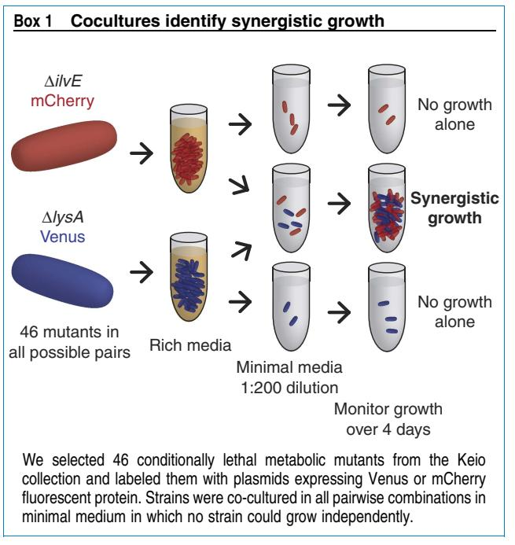
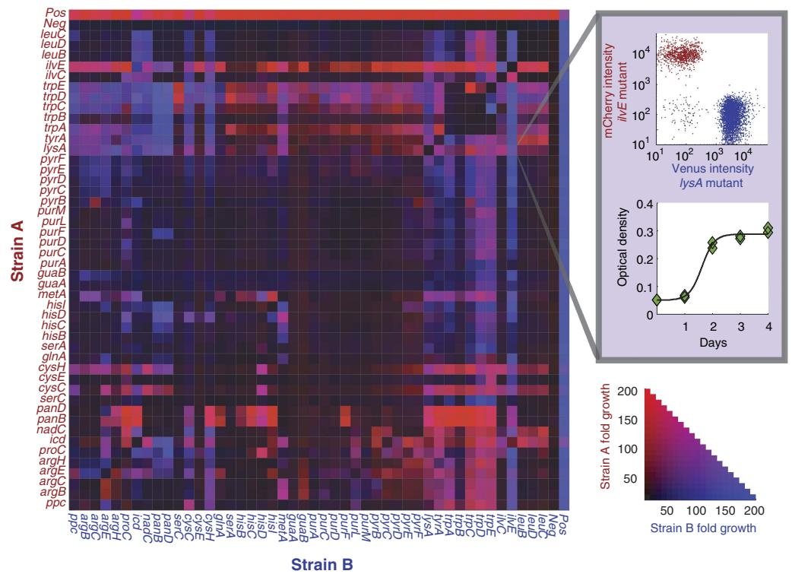
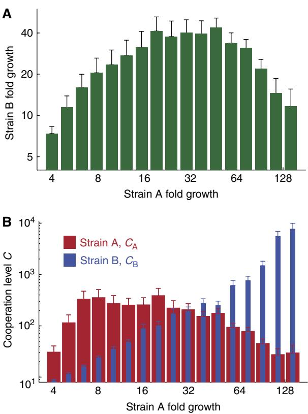
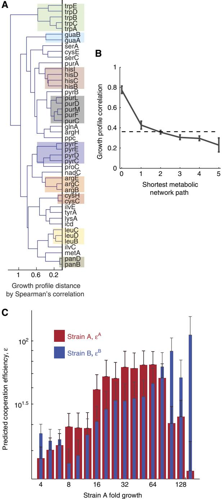

# REPORT

# Emergent cooperation in microbial metabolism

## Edwin H Wintermute and Pamela A Silver*

Department of Systems Biology, Harvard Medical School, Boston, MA, USA * Corresponding author. Department of Systems Biology, Harvard Medical School, 200 Longwood Avenue, WAB 536, Boston, MA 02115, USA. Tel.: þ 1 617 432 6401; Fax: þ 1 617 432 5012; E-mail: [pamela_silver@hms.harvard.edu](mailto:pamela_silver@hms.harvard.edu)

Received 3.5.10; accepted 23.7.10

Mixed microbial communities exhibit emergent biochemical properties not found in clonal monocultures. We report a new type of synthetic genetic interaction, synthetic mutualism in trans (SMIT), in which certain pairs of auxotrophic Escherichia coli mutants complement one another's growth by cross-feeding essential metabolites. We find significant metabolic synergy in 17% of 1035 such pairs tested, with SMIT partners identified throughout the metabolic network. Cooperative phenotypes show more growth on average by aiding the proliferation of their conjugate partner, thereby expanding the source of their own essential metabolites. We construct a quantitative, predictive, framework for describing SMIT interactions as governed by stoichiometric models of the metabolic networks of the interacting strains.

Molecular Systems Biology 6: 407; published online 7 September 2010; doi[:10.1038/msb.2010.66](http://dx.doi.org/10.1038/msb.2010.66) Subject Categories: metabolic and regulatory networks; microbiology and pathogens Keywords: cooperation; co-culture; flux balance analysis; metabolism; mutualism

This is an open-access article distributed under the terms of the Creative Commons Attribution Noncommercial Share Alike 3.0 Unported License, which allows readers to alter, transform, or build upon the article and then distribute the resulting work under the same or similar license to this one. Thework must be attributed back to the original author and commercial use is not permitted without specific permission.

## Introduction

Microbes in nature usually do not exist in isolation. The mixed microbial concourse is rich with opportunities for interaction. Metabolic interactions in particular can radically alter the biochemical phenotypes of the participating strains. Microbial communities differ from monocultures in terms of the toxins they degrade (Pelz et al[, 1999)](#page-6-0), the natural products they produce [(Pettit, 2009)](#page-6-0), and even their capacity to grow at all in certain environments ([Schink, 2006)](#page-6-0). A complete understanding of microbial metabolism must extend from the properties of individual strains in pure culture to the combinatorial interactions supported by complex communities.

Recent studies have characterized the behavior of microbes in co-culture. Such strains may exhibit naturally complementary metabolism (Kim et al[, 2008](#page-6-0); [Rozen](#page-6-0) et al, 2009; [Hillesland](#page-6-0) [and Stahl, 2010](#page-6-0)), or may be genetically engineered to interact (Shou et al[, 2007](#page-6-0); [Balagadde´](#page-5-0) et al, 2008; Gore et al[, 2009)](#page-6-0). Interacting partners share metabolites, such as hydrogen [(Hillesland and Stahl, 2010)](#page-6-0), acetate (Rozen et al[, 2009)](#page-6-0), amino acids (Shou et al[, 2007)](#page-6-0), fixed nitrogen (Kim et al[, 2008](#page-6-0)) or glucose (Kim et al[, 2008;](#page-6-0) Gore et al[, 2009](#page-6-0)). In each case, it has been possible to extrapolate interactive dynamics from the individual characteristics of the participating strains.

A general model of metabolic interaction would account for the variety of metabolites that can be exchanged and the genotypic diversity of the strains that exchange them. Ideally, such a model would not require detailed biochemical characterization of each individual participant to be predictive. Optimization-based techniques of flux balance analysis have been successful in describing metabolic systems [(Feist](#page-6-0) et al[, 2007](#page-6-0)). These approaches draw on the well-characterized biochemical reaction network of organisms such as Escherichia coli ([Kanehisa and Goto, 2000)](#page-6-0), and can be easily generalized to more exotic species (Feist et al[, 2009)](#page-6-0).

Using a model set of E. coli auxotrophs, we extend these approaches to the higher-order system of two strains in concourse. We find that certain pairs of auxotrophs will complement one-another's growth in minimal media by crossfeeding essential metabolites, a relationship we refer to as synthetic mutualism in trans (SMIT). The SMIT interactions constitute a class of synthetic genetic interactions because, similar to other synthetic interactions, they reflect and elucidate the genetic and metabolic network from which they derive. We develop a quantitative and predictive theoretical model that reveals the extent to which complex metabolic interactions emerge from the relatively simple topology of the biochemical reaction network.

## Results and discussion

We selected 46 conditionally lethal auxotrophic E. coli from the Keio collection (Baba et al[, 2006)](#page-5-0). Each deletion blocks

the biosynthesis of an essential metabolite, imparting a strict dependency on an external supply of that metabolite for growth. The selected mutations cover a significant portion of metabolic diversity and include genes required for the biosynthesis of amino acids, nucleotides, and cofactors, as well as genes involved in glycolysis and respiration. Each deletion strain exhibits robust growth in rich (LB) medium but no measurable growth in minimal (M9) medium. Strains were labeled individually with plasmids expressing either Venus or mCherry fluorescent proteins and co-cultured in minimal media in all pairwise combinations (Box 1). Growth was measured each day over 4 days by optical density. Flow cytometry allowed determination of the relative abundance of each strain in each pairing. Theoretical and empirical precedents have established that metabolic cooperation is enhanced at intermediate cell densities when the concentration of cross-fed metabolites is sufficiently high to improve cooperative fitness (Shou et al[, 2007;](#page-6-0) [Bull and Harcombe,](#page-5-0) [2009](#page-5-0)). Strains were therefore each inoculated at 107 cells per ml, roughly 1/200th saturation density, and fold growth is reported relative to this initial inoculation level.

A subset of mixed pairs showed improved growth relative to either corresponding monoculture ([Figure 1)](#page-2-0). In control cultures of self-same pairs, no strain was observed to grow more than eight-fold. However, 17% of dissimilar pairings showed greater than 50-fold growth, indicating metabolic synergy. Growth phenotypes were variable, with alternately one strain, both, or neither benefiting from the interaction. For each strain, we were able to identify at least one partner with which synergistic growth was evident. Conversely, no strain exhibited a universally cooperative phenotype, either in the role of nutrient donor or recipient.

We first explored how the growth of a given strain relates to its level of cooperation, as inferred from the growth of its partner strain. Cooperating strains in this system may show enhanced proliferation through the mechanism of invested benefits [(Connor, 1995](#page-6-0); West et al, 2007). Cooperation on the part of strain A will augment A's growth only if B cooperates in turn. By increasing B's abundance, A then cultivates the source of A's own metabolites and therefore A's own growth. Given the relatively low growth rates of the co-cultured strains and the excess availability of nutrients, we do not expect a significant metabolic burden to be associated with the production of shared metabolites. However, we do expect a limit to the invested benefits of cooperative growth. Specifically, this should arise when oversharing on the part of A results in B monopolizing the batch culture and therefore necessarily limiting A.

The data reflect a significant growth benefit for cooperating strains. We record an overall positive correlation between the growth of strains A and B (Spearman's r¼0.2, P-value: o10-10). This correlation was highest when the total growth of A and B was low to moderate. We could also observe a characteristic anti-correlation between the growth of A and B in cultures that approach saturation, when more growth of one strain tended to impede the other ([Figure 2A)](#page-3-0).

A simple dynamic model captures the essential features of this relationship.

$$\begin{aligned} \frac{\text{dA}}{\text{dt}} &= \text{C}_{\text{B}} \cdot \left(\frac{\text{B}}{\text{A} + \text{B}}\right) \cdot \left(1 - \frac{\text{A} + \text{B}}{K}\right) \\\\ \frac{\text{dB}}{\text{dt}} &= \text{C}_{\text{A}} \cdot \left(\frac{\text{A}}{\text{A} + \text{B}}\right) \cdot \left(1 - \frac{\text{A} + \text{B}}{K}\right) \end{aligned} \tag{1}$$

A and B above represent the strain abundances. We assign cooperation levels, CA and CB, to quantify cooperation on the part of strain A and B, respectively. K is the logistic carrying capacity of the batch culture. Growth was allowed to proceed for a fixed and finite amount of time, so our system does not necessarily approach a steady state.

Although analytical solutions to (1) are not available, numerically solving the system of two equations for the two variables CA and CB transforms the growth data into biologically relevant parameters that reflect the level of cooperation evidenced by each strain. The measured growth of A increases monotonically with respect to the derived value of CB, indicating that it is always beneficial to be partnered with a cooperating strain. A characteristically also increases with CA for low CA, as strain A reaps the invested benefits of cultivating strain B. However, A declines for high CA, when excess cooperation allows B to dominate the available carrying capacity ([Figure 2B](#page-3-0)).

We sought to relate the various observed cooperation phenotypes to the properties of individual mutations in the global context of E. coli metabolism. Synthetic genetic interactions, the synergistic growth effects of multiple gene deletions, are known to identify epistatic or modular relationships among genes (Segre` et al[, 2005](#page-6-0); Ooi et al[, 2006](#page-6-0); [Motter](#page-6-0) et al, 2008). Previous studies emphasize the phenotypic consequences of multiple genetic deletions within the genome of a single strain. We define a new synthetic relationship, the synergistic growth between two otherwise lethal mutants, as SMIT.

Similar to other synthetic interactions, SMIT interactions can be applied to infer properties of the E. coli metabolic network. Pairings of strains with metabolic blocks in the same biosynthetic pathway grew less than pairings of strains blocked in distinct pathways. Approximately 3.6% of path-

Figure 1 Synergistic growth in Escherichia coli metabolic mutants. Red and blue heat map intensity represents the fold growth of strain A and B, respectively, in each co-culture. Fold growth is expressed relative to the initial inoculation density. Self-same pairings, represented in the matrix diagonal, showed less than eight-fold growth in all cases. Symmetry of the matrix along the diagonal reflects reproducible growth of strains in label-switched pairs (r¼0.9). The expanded pixel illustrates the OD and flow cytometric data used to measure the growth of each strain in each pairing. The negative control lane was loaded with sterile media instead of a partner strain. The positive control strain carries a deletion at the pfs locus, and is viable in M9 medium.

way-matched pairs showed growth above 50-fold against 18% of pathway-distinct pairs (n¼55, n¼980, respectively, P-value: 2 10-6 ). However, mutants sharing pathways showed consistency in their set of cooperating partners (Supplementary Figure 1). We constructed for each strain a cooperation profile vector consisting of the measured growth of that strain and that of its partner strain in each of the 46 co-cultures. Correlations of the cooperation profiles therefore indicate the overall similarity of the cooperative behavior between two strains.

We applied an unsupervised hierarchical clustering algorithm to the set of cooperation profiles, using the Spearman rank correlation between vectors as a distance metric and a complete linkage function. Mutants in the biosynthetic pathways of tryptophan, guanine, histidine, purine, pyramidine, arginine, cysteine, leucine, and pantothenate were recovered as distinct branches in the resulting dendrogram. Analysis of SMIT interactions is therefore capable of identifying biosynthetic modules ([Figure 3A)](#page-4-0).

More distal correspondence in the metabolic network can also be detected in the analysis of SMIT interactions. For each pair of interacting mutants, we define a shortest path through the metabolic network connecting the two reactions. Reactions are considered connected if they share a common metabolite. The correlation between the cooperation profiles characterizing any two strains declines with the distance spanning their mutations (r¼-0.34, P-value: o10-10). This suggests that, to a significant extent, the complex emergent phenotype of SMIT growth is governed by the relatively simple stoichiometries of the metabolic reaction network ([Figure 3B)](#page-4-0).

Metabolic network stoichiometries can be applied to infer biochemical reaction rates through the method of flux balance analysis (FBA; [Palsson, 2006](#page-6-0)). We extend FBA modeling from a single E. coli to a system of two interacting strains. Beginning with the standard iAF1260 reconstruction (Feist et al[, 2007)](#page-6-0), the stoichiometric matrices and flux bounds for the two strains are concatenated appropriately to produce the joint model, allowing the free exchange of metabolites between the two mutants (see Materials and methods).

We derived solutions to the joint model by applying the minimization of metabolic adjustment (MOMA) objective function (Segre` et al[, 2002)](#page-6-0). The MOMA methods hypothesize that mutant systems will tend to approximate the wild-type flux distribution, even as mutation precludes an exact match. This objective function is conservative; it identifies solutions in the joint vector closest, in the Euclidean sense, to the wildtype fluxes.

Total growth of the co-cultures was correlated with predicted growth derived from the joint flux model. We calculated a rank correlation of 0.42 across predictions for all pairs (P-value: o10-10). This model performed less well in comparisons of the subset of pairs with mutations in the nucleotide biosynthesis pathway (r¼0.17, P-value: 0.13, n¼78), and better when both mutants were involved in amino-acid production (r¼0.4, P-value: o10-10, n¼378), or in neither of those classes (r¼0.72, P-value: 0.02, n¼10).

Figure 2 Cooperation improves growth and is quantified by the cooperation level. (A) The mean growth of strain B is presented for sets of co-cultures binned by the measured growth of strain A. The growth of strain B initially increases with that of A as B reaps the invested benefits of cross-feeding. B declines for high A as an excess of cooperation allows A to dominate the available carrying capacity. (B) Cooperation levels, derived from the growth data by equations (1) show characteristic relationships with growth. A always benefits from increases in B's cooperation level, CB, whereas A's own cooperation, CA, is optimal for A at an intermediate level. Error bars are 95% bootstrap confidence intervals.

The joint flux model was effective in reproducing our observation that mutants in shared pathways generally do not supplement one another's growth (Supplementary Figure 2).

In general, growth predictions from the joint flux model were higher than those measured. This might be explained by the relatively high levels of cooperation implicit in the objective function. In selecting an optimal joint flux vector, fluxes are weighted equally in their contribution to minimizing the metabolic adjustment of their own strain and of the partner strain. This is theoretically unlike the situation in vivo, in which any flux optimality is expected only within a given strain, and any benefits to the partner strain are only as a byproduct. Indeed, our system has no co-evolutionary history and has not been optimized by natural selection in any sense. We therefore sought a predictive framework independent of optimality assumptions.

We reasoned that the likelihood of a given metabolite being shared should depend on the growth value of that metabolite to both the donor and recipient strain. Metabolites less valuable to the donor might be more readily shared, and metabolites more valuable to the recipient should effect more growth. In an efficient cooperative interaction, each strain would exchange growth-cheap metabolites for growth-dear metabolites ([Boucher, 1988](#page-5-0)).

We can derive explicit predictions for the value of each exchanged metabolite for each mutant strain in our system as shadow prices. A shadow price, in a linear programming model, is defined as the marginal change in the objective function associated with the strengthening or loosening of a particular model constraint. As in standard flux balance models, calculating shadow prices requires only the reaction network stoichiometries and the measured composition of biomass. We solved the iAF1260 model for shadow prices representing the fitness benefit, bA, to each strain A in taking up a unit of its required metabolite. For example, a tryptophan auxotroph is associated with a high benefit term because a unit of the rare amino acid tryptophan is sufficient to produce a relatively high amount of biomass. Similarly, we derive a cost term, pB , representing the loss in growth rate for each strain, B, in secreting a given metabolite.

The calculated costs and benefits produced the expected correlation with measured growth. The benefit associated with a metabolite bA was positively correlated with the growth of strain A (r¼0.11, P-value: 10-3 ), but showed no correlation with the growth of the partner strain. Conversely, the production cost of metabolites pB , incurred by strain B, was negatively correlated with A's growth (r¼-0.26, P-value:o10-10) but was uncorrelated with B's growth. Thus, strains tended to show the most growth when predicted to require only small quantities of metabolites that were cheap for their partner to produce.

We define the predicted efficiency of cooperation, e B , as the ratio bA/pB . We observed that e B was more predictive than either bA or pB alone in determining the growth of strain A (r: 0.31, P-value: o10-10). We also determined an overall positive correlation between the growth of strain A and e A, the efficiency term as calculated for the partner strain, consistent with the invested benefits A receives from the growth of B (r: 0.14, P-value: 10-5 ). Indeed, in the regime of low A growth, e A was more strongly correlated with A's growth than e B , emphasizing the strong fitness advantage for efficient cooperators.

The cooperation efficiency terms reproduce the characteristic pattern in their correlation with strain growth, predicted in our invested benefits model of cooperation ([Figure 3C)](#page-4-0). The term e B is positively correlated with A's growth across all growth levels, as it is always beneficial to be paired with an efficient cooperator. The eA correlates positively to A's growth for low growth, then negatively as the strains approach saturation. Only in this narrow range would the less generous show more growth.

Cooperation efficiencies derive purely from stoichiometric information, and so can be calculated for strains without detailed biochemical characterization. They are independent of the specific physiological mechanisms that effect metabolite production, secretion, and exchange, which in the case of this system remain to be described.

Intracellular metabolites represent valuable resources, and should therefore be retained by cell membranes in the absence of a specific mechanism for secreting them. Such reasoning can explain the behavior of most co-cultures, in which essential metabolites are retained and no cross-feeding occurs. E. coli are known to secrete a number of amino acids, particularly when starved or otherwise stressed [(Burkovski](#page-5-0) et al[, 1995;](#page-5-0) [Kaderbhai](#page-6-0) et al, 2003; Valle et al[, 2008](#page-6-0)). Alternately, the intracellular metabolite pool also undergoes significant changes during starvation ([Tweeddale](#page-6-0) et al, 1998). Cell lysis may then be required for accumulated metabolites to be released and scavenged.

The results presented here reflect only cooperation before co-evolution, and do not reveal the evolutionarily stable

steady state that may arise for cross-feeding organisms. To persist in natural systems, cooperative behavior must be robust to variations of environment, and to the emergence of exploitative mutants. Many natural syntrophic systems seem to be cases of byproduct cooperation, in which one strain feeds on the waste products of another [(Marx, 2009](#page-6-0); [Rozen](#page-6-0) et al, [2009](#page-6-0)). We find that the metabolites most readily exchanged are those of little value to the secreting strain. This is consistent with proposals that byproduct cooperation evolves more readily than other forms, because it requires no active investment of one partner in the other ([Connor, 1995)](#page-6-0).

The fitness costs and benefits of biological interactions are often difficult or impossible to quantify ([Boucher, 1988)](#page-5-0), but are required for the application of population dynamic models (Nowak, 2006). The a priori prediction of such parameters in an experimentally tractable model organism brings a new degree of quantitative resolution to theories of metabolic interaction.

# Materials and methods

## Co-culture experiments

Deletion strains from the Keio collection were grown to saturation in rich (LB) medium with appropriate antibiotics, washed twice in PBS, and re-suspended in M9 minimal medium at a 1:100 dilution (6.8 g/l Na2HPO4, 3 g/l KH2PO4, 0.5 g/l NaCl, 1 g/l NH4Cl, 20 g/l glucose, 100 mM CaCl2, 1 mM MgSO4, 50 mg/l ampicillin, and 100 mg/l kanamycin). Strains were cultured overnight in minimal medium to allow depletion of residual nutrients, then re-diluted to the initial 1:100 level. Residual growth was generally less than 10%. Viable cell counts were determined by plating for all strains both before and after starvation, and were observed to be linear with OD and similar for all strains. This indicated that total cell density could be accurately measured by OD, despite the unique genetic background and metabolic conditions of each co-culture. Incubation was carried out in sealed microplates at 371C under continuous shaking. Growth was measured by optical density at 600 nm using a Perkin Elmer EnVision plate reader. Ratios were assessed with a BD LSR-II flow cytometer. Cell density for a strain A was calculated as d (ODM-ODBKG)Afrac, where ODM is the measured OD, ODBKG was the background absorbance of blank medium, d is the linear scaling factor from OD to cell density, calculated by plating standard curves, and Afrac is the proportion of strain A as measured by flow cytometry.

Growth experiments were conducted in duplicate and with labelswitched pairs, a total of four replicates for each of 1035 possible experimental pairs. Growth measurements were reproducible in both biological replicates (r¼0.92) and label-switched replicates (r¼0.9).

Figure 3 SMIT interactions are emergent properties of the metabolic network. (A) A dendrogram depicts hierarchical clusters derived from measured cooperation profiles. Most of the major metabolic pathways are recovered as distinct branches, implying that functional relationships can be deduced from SMIT interactions. Co-phenetic correlation: 0.71. (B) Mean growth profile correlations are plotted against metabolic network distance. The correlation between growth profiles declines with the distance spanning mutations. The dotted line shows the mean correlation for all pairs. Error bars are 95% bootstrap confidence intervals. (C) Theoretical cooperation efficiencies predict the features of cooperative growth. Mean cooperation efficiencies are presented for sets of co-cultures binned by the measured growth of strain A. Cooperation efficiencies, e, are derived a priori from stoichiometric models with no free parameters. A high cooperation efficiency predicts that a strain can cheaply produce metabolites that effect high growth in the conjugate partner. A's growth tends to increase monotonically with eB, B's cooperation efficiency, but reaches a maximum for intermediate levels of eA, consistent with the invested benefits model of cooperation.

Following data acquisition, a random sample of 50 growing mixed cultures were struck out on rich medium and minimal medium. In no case were single colonies observed to grow on minimal plates, indicating that observed growth was not due to the restoration of prototrophy in a single lineage from any genetic event.

#### Data analysis

Calculations and simulations were performed in MATLAB. Convex programming was performed using MOSEK Optimization Software. Correlation coefficients are Spearman's rank correlation unless otherwise noted. Metabolic network distances were calculated excluding metabolites with very high connectivities (420 reactions), because of their effect of radically shrinking the network radius.

## The joint stoichiometric model

A standard metabolic optimization problem with a MOMA-type objective function identifies a flux vector J in the mutant flux space, which minimizes the Euclidean distance to the wild-type flux vector. Thus, it satisfies the following:

$$\begin{array}{rcl}\text{Minimize :} & \left\| \begin{array}{l} \mathbf{J} - \mathbf{J}^{\text{WT}} \end{array} \right\| \\\text{Subject to :} & \begin{array}{l} \mathbf{\mathfrak{r}}_{\text{L}} \lessapprox \mathbf{J}_{\text{S}} \lessapprox \mathbf{\mathfrak{r}}_{\text{U}} \\\mathbf{\mathfrak{f}}_{\text{L}} \lessapprox \mathbf{J}_{\text{X}} \lessapprox \mathbf{\mathfrak{f}}_{\text{U}} \end{array} \quad \left[ \mathbf{S} \left| \mathbf{X} \right. \right] \cdot \left[ \begin{array}{l} \mathbf{J}_{\text{S}} \\\mathbf{J}_{\text{X}} \end{array} \right] = \left[ \mathbf{0} \right] \end{array} \tag{2}$$

where JWT denotes a wild-type flux vector, derived from a standard FBA formulation (Segre` et al[, 2002](#page-6-0)). Upper and lower bounds on the internal fluxes are set to sL and sU. Bounds on the exchange fluxes, corresponding to the media conditions, are set to sU and sL. S represents the internal reaction stoichiometries and X the exchange stoichiometries. Finally, JS and JX are the subsets of internal and exchange fluxes of J.

For the joint problem, we concatenate the flux vectors, bounds, and stoichiometric matrices appropriately to define a joint flux space, thus solving:

Minimize : JA JB " # - JWT JWT " # Subjectto : sA LpJA S psA U bLpJA Xpb0 U sB LpJB SpsB U bLpJB Xpb0 U SA X SA X X X 2 6 4 3 7 5 JA S JA X JB S JB X 2 6 6 6 4 3 7 7 7 5 p ½ 0 j0 2 X bU X ½ 0 j0 -1

Superscripts A and B denote fluxes, matrices and bounds associated with strain A or B. The exchange matrix, X, is identical for all mutants. The third row of the joint stoichiometric matrix allows the exchange of metabolites between strains. The upper bounds of the exchange reactions, b0 U, are modified to allow the uptake of all shared metabolites. The term 2Xb0 U transposes the unmodified bounds from the individual fluxes on problem 2 to apply to the sum of the joint fluxes, maintaining conservation of mass between the two strains.

## Mean marginal cost and benefit

The mean marginal production cost of a metabolite m, pm, we define as the reciprocal of the solution to a linear programming problem:

$$\begin{aligned} \text{Minimize :} \quad & \mathbf{J}_{\mathbf{m}} \\ & \mathbf{\tau}_{\mathbf{L}} \lessapprox \mathbf{J}_{\mathbf{S}} \lessapprox \mathbf{\tau} \\ \text{Subject to :} \quad & \mathbf{\tilde{\mathcal{B}}}_{\mathbf{L}} \lessapprox \mathbf{\mathcal{J}}_{\mathbf{X}} \lessapprox \mathbf{\mathcal{B}}_{\mathbf{U}} \text{ } \mbox{ } \begin{bmatrix} \mathbf{S} & \mathbf{X} \end{bmatrix} \cdot \begin{bmatrix} \mathbf{J}_{\mathbf{S}} \\ \mathbf{J}_{\mathbf{X}} \end{bmatrix} = [\mathbf{0}] \end{aligned} \quad (3)$$

This represents the minimum flux value, that is, the maximum secretion level, which can be attained consistent with a growth rate of at least 90% wild type. The reciprocal of this solution, 1/Jm, is proportional to the mean shadow price associated with the bound on the exchange flux of metabolite m, Jm, taken over the interval 100– 90% of wild-type growth rate. We allow pm to take the value of infinity for those cases when Jm¼0, meaning a given metabolite is stoichiometrically blocked from being secreted and is therefore not available at any cost.

The mean marginal benefit, bm s , which a given strain, s, receives from a metabolite, m, is the reciprocal of the solution to a similar problem:

$$\begin{array}{c} \text{Minimize}: \quad \mathbf{J}_{\mathbf{m}}^{\sigma} \\ \mathbf{r}_{\mathbf{L}}^{\sigma} \lessapprox \mathbf{J}_{\mathbf{S}}^{\sigma} \lessapprox \mathbf{r}_{\mathbf{U}}^{\sigma} \end{array}$$

$$\begin{array}{c} \text{Subject to :} \quad \begin{array}{c} \mathfrak{P}_{\mathbf{L}} \lessapprox \mathbf{J}_{\mathbf{X}} \lessapprox \mathfrak{P}_{\mathbf{U}} \end{array} \qquad \begin{array}{c} \begin{bmatrix} \mathbf{S} \left[ \mathbf{X} \right] \end{bmatrix} \cdot \begin{bmatrix} \mathbf{J}_{\mathbf{S}}^{\sigma} \\ \mathbf{J}_{\mathbf{X}} \end{bmatrix} = \begin{bmatrix} \mathbf{0} \end{bmatrix} \end{array} \qquad \begin{array}{c} \begin{array}{c} \begin{array}{c} \mathbf{0} \end{array} \end{array} \qquad \begin{array}{c} \begin{array}{c} \begin{array}{c} \mathbf{0} \end{array} \end{array} \} \end{array}$$

Note that although secretion costs are calculated with respect to the wild-type strain background, uptake benefits are defined with respect to a specific mutant strain that can not grow without supplemented metabolites. Problem 4 identifies the minimum supplemental flux consistent with growth of at least 10% of the wild-type level. Most metabolites are not capable of rescuing growth of most mutant strains, therefore the solution to problem 4 is undefined and we allow bm s¼0. Otherwise bs m ¼ Js m -1 . As above, the benefit is proportional to the mean shadow price for the uptake bound on metabolite m over the interval 0–10% of wild-type growth rate.

In cases, in which pm B and bm A are defined for more than one m, because strain A can be rescued by more than one metabolite, we take the values pB and bA to be the mean values over all m for which they are defined.

The efficiency of cooperation for a strain B, e B , for a strain B as the ratio bA/pB . In cases, in which A can be rescued by more than one metabolite, we take e B to be the mean ratio for all such metabolites.

## Supplementary information

Supplementary information is available at the Molecular Systems Biology website ([http://www.nature.com/msb)](http://www.nature.com/msb).

# Acknowledgements

We thank Roy Kishony for insight and discussions. Stewart Rudnicki, Caroline Shamu and the ICCB-Longwood Screening Facility provided advice and experimental assistance. Devin Burrill, Tami Lieberman, Patrick Boyle and Christina Agapakis contributed to revisions. EW was supported through the NSF Graduate Research Fellowship Program.

## Conflict of interest

The authors declare that they have no conflict of interest.

# References

- Baba T, Ara T, Hasegawa M, Takai Y, Okumura Y, Baba M, Datsenko KA, Tomita M, Wanner BL, Mori H (2006) Construction of Escherichia coli K-12 in-frame, single-gene knockout mutants: the Keio collection. Mol Syst Biol 2: 2006.0008
- Balagadde´ FK, Song H, Ozaki J, Collins CH, Barnet M, Arnold FH, Quake SR, You L (2008) A synthetic Escherichia coli predator–prey ecosystem. Mol Syst Biol 4: 187
- Boucher DH (1988) The Biology of Mutualism: Ecology and Evolution. New York: Oxford University Press
- Bull JJ, Harcombe WR (2009) Population dynamics constrain the cooperative evolution of cross-feeding. PLoS One 4: e4115
- Burkovski A, Weil B, Kra¨mer R (1995) Glutamate excretion in Escherichia coli: dependency on the relA and spoT genotype. Arch Microbiol 164: 24–28
- Connor RC (1995) The benefits of mutualism: a conceptual framework. Biol Rev 70: 427–457
- Feist AM, Henry CS, Reed JL, Krummenacker M, Joyce AR, Karp PD, Broadbelt LJ, Hatzimanikatis V, Palsson B (2007) A genome-scale metabolic reconstruction for Escherichia coli K-12 MG1655 that accounts for 1260 ORFs and thermodynamic information. Mol Syst Biol 3: 121
- Feist AM, Herrga˚rd MJ, Thiele I, Reed JL, Palsson B (2009) Reconstruction of biochemical networks in microorganisms. Nat Rev Microbiol 7: 129–143
- Gore J, Youk H, van Oudenaarden A (2009) Snowdrift game dynamics and facultative cheating in yeast. Nature 459: 253–256
- Hillesland KL, Stahl DA (2010) Rapid evolution of stability and productivity at the origin of a microbial mutualism. Proc Natl Acad Sci USA 107: 2124–2129
- Kaderbhai NN, Broadhurst DI, Ellis DI, Goodacre R, Kell DB (2003) Functional genomics via metabolic footprinting: monitoring metabolite secretion by Escherichia coli tryptophan metabolism mutants using FT-IR and direct injection electrospray mass spectrometry. Comp Funct Genomics 4: 376–391
- Kanehisa M, Goto S (2000) KEGG: kyoto encyclopedia of genes and genomes. Nucleic Acids Res 28: 27–30
- Kim HJ, Boedicker JQ, Choi JW, Ismagilov RF (2008) Defined spatial structure stabilizes a synthetic multispecies bacterial community. Proc Natl Acad Sci USA 105: 18188–18193
- Marx CJ (2009) Microbiology. Getting in touch with your friends. Science 324: 1150–1151
- Motter AE, Gulbahce N, Almaas E, Baraba´si AL (2008) Predicting synthetic rescues in metabolic networks. Mol Syst Biol 4: 168
- Nowak MA (2006) Five rules for the evolution of cooperation. Science 314: 1560–1563
- Ooi SL, Pan X, Peyser BD, Ye P, Meluh PB, Yuan DS, Irizarry RA, Bader JS, Spencer FA, Boeke JD (2006) Global synthetic-lethality analysis and yeast functional profiling. Trends Genet 22: 56–63
- Palsson B (2006) Systems Biology: Properties of Reconstructed Networks. Cambridge, New York: Cambridge University Press
- Pelz O, Tesar M, Wittich RM, Moore ER, Timmis KN, Abraham WR (1999) Towards elucidation of microbial community metabolic pathways: unravelling the network of carbon sharing in a pollutant-degrading bacterial consortium by immunocapture and isotopic ratio mass spectrometry. Environ Microbiol 1: 167–174
- Pettit RK (2009) Mixed fermentation for natural product drug discovery. Appl Microbiol Biotechnol 83: 19–25
- Rozen DE, Philippe N, Arjan de Visser J, Lenski RE, Schneider D (2009) Death and cannibalism in a seasonal environment facilitate bacterial coexistence. Ecol Lett 12: 34–44
- Schink B (2006) Syntrophism among prokaryotes. In The Prokaryotes, Dworkin M (ed), Vol. 2, pp 309–335. New York: Springer
- Segre` D, Deluna A, Church GM, Kishony R (2005) Modular epistasis in yeast metabolism. Nat Genet 37: 77–83
- Segre` D, Vitkup D, Church GM (2002) Analysis of optimality in natural and perturbed metabolic networks. Proc Natl Acad Sci USA 99: 15112–15117
- Shou W, Ram S, Vilar JM (2007) Synthetic cooperation in engineered yeast populations. Proc Natl Acad Sci USA 104: 1877–1882
- Tweeddale H, Notley-McRobb L, Ferenci T (1998) Effect of slow growth on metabolism of Escherichia coli, as revealed by global metabolite pool ('metabolome') analysis. J Bacteriol 180: 5109–5116
- Valle J, Da Re S, Schmid S, Skurnik D, D'Ari R, Ghigo JM (2008) The amino acid valine is secreted in continuous-flow bacterial biofilms. J Bacteriol 190: 264–274
- West SA, Griffin AS, Gardner A (2007) Social semantics: altruism, cooperation, mutualism, strong reciprocity and group selection. J Evol Biol 20: 415–432

Molecular Systems Biology is an open-access journal published by European Molecular Biology Organization and Nature Publishing Group. This work is licensed under a Creative Commons Attribution-Noncommercial-Share Alike 3.0 Unported License.