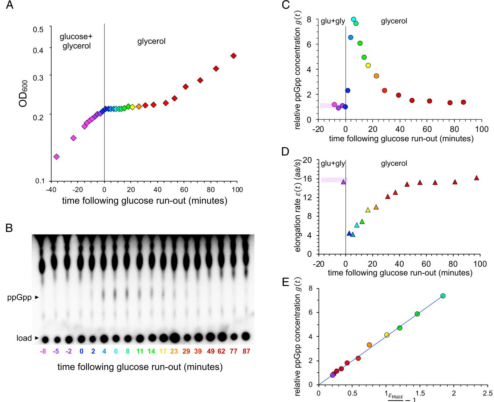
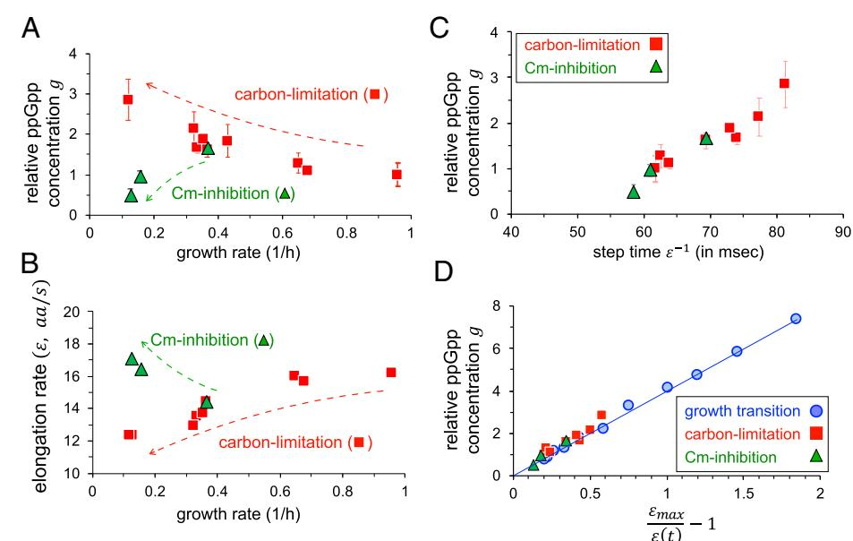
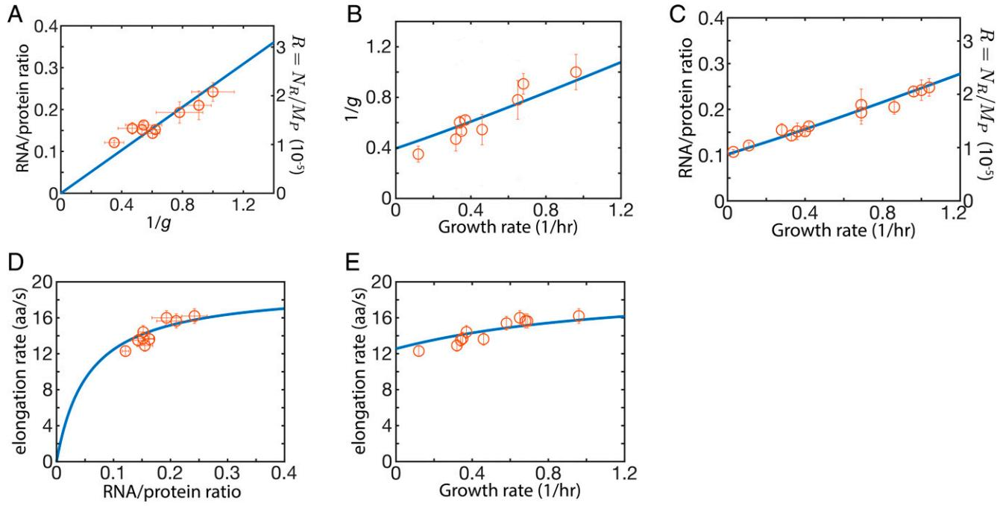
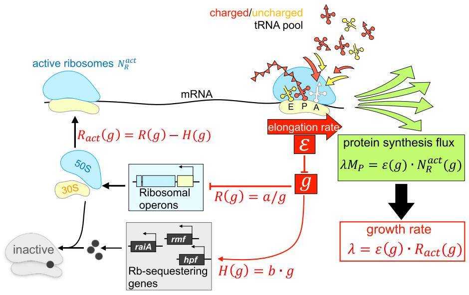
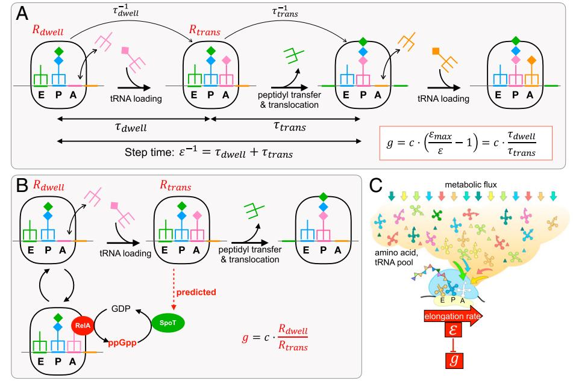

# Cellular perception of growth rate and the mechanistic origin of bacterial growth law

Chenhao Wua,1, Rohan Balakrishnana,1, Nathan Braniffa , Matteo Moria , Gabriel Manzanarezb , Zhongge Zhangb , and Terence Hwaa,b,2

This contribution is part of the special series of Inaugural Articles by members of the National Academy of Sciences elected in 2020. Contributed by Terence Hwa; received January 31, 2022; accepted March 30, 2022; reviewed by Michael Cashel and Ido Golding

Many cellular activities in bacteria are organized according to their growth rate. The notion that ppGpp measures the cell's growth rate is well accepted in the field of bacterial physiology. However, despite decades of interrogation and the identification of multiple molecular interactions that connects ppGpp to some aspects of cell growth, we lack a system-level, quantitative picture of how this alleged "measurement" is performed. Through quantitative experiments, we show that the ppGpp pool responds inversely to the rate of translational elongation in Escherichia coli. Together with its roles in inhibiting ribosome biogenesis and activity, ppGpp closes a key regulatory circuit that enables the cell to perceive and control the rate of its growth across conditions. The celebrated linear growth law relating the ribosome content and growth rate emerges as a consequence of keeping a supply of ribosome reserves while maintaining elongation rate in slow growth conditions. Further analysis suggests the elongation rate itself is detected by sensing the ratio of dwelling and translocating ribosomes, a strategy employed to collapse the complex, high-dimensional dynamics of the molecular processes underlying cell growth to perceive the physiological state of the whole.

bacterial physiology j growth control j growth law j translational elongation j ppGpp signaling

In the past decade, many efforts have been devoted toward characterizing and understanding the allocation of the bacterial proteome across different growth conditions (1–6). Central to the bacterial proteome allocation strategy is the approximate linear increase of the ribosome content with growth rate (7–9), when growth is varied by using different nutrients. This classic bacterial growth law is rationalized by Maaløe in terms of the need of more ribosomes to synthesize proteins to achieve faster growth rate, when the rate of translational elongation by ribosomes is saturated (9). This strategy of producing ribosomes as needed in different growth conditions forms the basis of the optimal resource allocation strategy, which posits that cells allocate their resources (the proteome in this case) in such a way to maximize its growth (5, 10). However, it is actually long known that the translational elongation rate (ER) itself varies across growth conditions (11), which poses a challenge to the rationalization by Maaløe. Moreover, it is known that in conditions where cells are hardly growing, a significant pool of ribosomes (the ribosome reserve) is kept idle, presumably for rapid transition to fast growth when favorable growth conditions return (12–14). Intriguingly, the ribosome reserve kept by cells is not limited to slow growth but maintained at a constant amount above the minimum needed across growth rates (2, 13, 15). This behavior again challenges the notion of optimal resource allocation for the current growth condition.

One approach toward understanding the bacterial proteome allocation strategy is to follow its regulatory mechanisms, to see how the linear growth law is implemented mechanistically. This involves the sensing and control of the cell's growth rate since the proteome allocation strategy is strongly dependent on the growth rate. Toward this end, we note that Guanosine tetraphosphate (ppGpp) (16) is a key signaling molecule involved in bacterial response to environmental changes and in coordinating growth rate–dependent responses (17–20). ppGpp signaling has been extensively studied (18–24), both for mechanisms contributing to its synthesis and degradation and for its downstream effects on hundreds of genes (25–28), including the synthesis (29, 30) and activity (19, 23) of the translation machinery. Without a doubt, ppGpp signaling plays a crucial role in responding to the cellular growth rate. Yet, despite the wealth of information at the molecular level, quantitative understanding of how bacteria perceive the state of cell growth is lacking. Here we reveal the underlying signaling strategies employed by Escherichia coli to perceive and respond to growth, established through a series of experiments in which ppGpp and other key physiological variables are

# Significance

Cell signaling involves interpreting information from the environment and implementing the appropriate regulatory control. The ppGpp signaling system is known to exert a fundamental control in bacteria, coordinating ribosome synthesis with the rate of cellular growth, but how this system can sense the cellular growth rate in different environments is unclear. Here we establish a striking linear relation between ppGpp level and the reciprocal of the translation elongation rate (ER) and show how bacteria can process complex nutritional information by monitoring this rate and using it to control ribosome synthesis. Importantly, the sensing of ER through ppGpp quantitatively and mechanistically explains bacterial growth laws which robustly relate the ribosome content and translation ERs to the growth rate.

Author affiliations: a Department of Physics, University of California San Diego, La Jolla, CA 92093; and b Division of Biological Sciences, University of California San Diego, La Jolla, CA 92093

Author contributions: C.W., R.B., and T.H. designed research; C.W., R.B., N.B., M.M., G.M., and Z.Z. performed research; Z.Z. contributed new reagents/ analytic tools; C.W., R.B., N.B., M.M., G.M., and T.H. analyzed data; and C.W., R.B., N.B., and T.H. wrote the paper.

Reviewers: M.C., NIH; and I.G., University of Illinois at Urbana–Champaign.

The authors declare no competing interest.

Copyright © 2022 the Author(s). Published by PNAS. This open access article is distributed under [Creative](https://creativecommons.org/licenses/by-nc-nd/4.0/) [Commons Attribution-NonCommercial-NoDerivatives](https://creativecommons.org/licenses/by-nc-nd/4.0/) [License 4.0 (CC BY-NC-ND).](https://creativecommons.org/licenses/by-nc-nd/4.0/)

1 C.W. and R.B. contributed equally to this work.

2 To whom correspondence may be addressed. Email: [hwa@ucsd.edu.](mailto:hwa@ucsd.edu)

This article contains supporting information online at [http://www.pnas.org/lookup/suppl/doi:10.1073/pnas.](http://www.pnas.org/lookup/suppl/doi:10.1073/pnas.2201585119/-/DCSupplemental) [2201585119/-/DCSupplemental.](http://www.pnas.org/lookup/suppl/doi:10.1073/pnas.2201585119/-/DCSupplemental)

Published May 11, 2022.

quantitatively measured. These strategies provide important insight on the initial question on bacterial proteome allocation strategy.

#### Results

A Simple, Robust Relation between ppGpp and Translational ER. During environmental changes such as diauxic shifts, E. coli responds by producing ppGpp (31). Fig. 1A shows a typical diauxic growth curve in minimal medium containing glycerol and a small amount of glucose as the only carbon sources: Cells grow exponentially on glucose without utilizing glycerol until glucose is depleted (32), followed by a period of growth arrest (∼40 to 50 min in this case), before fully resuming growth on glycerol. We followed the kinetics of ppGpp accumulation by performing such growth transition experiments in the presence of 32P-orthophosphate. Throughout the transition, labeled nucleotides were extracted and resolved by thin-layer chromatography (Fig. 1B). The ppGpp level relative to that of steady-state growth in glucose, denoted as gðtÞ, increased by over eightfold within the first 10 min of glucose depletion before relaxing to a new steady-state level (Fig. 1C).

We also characterized changes in the translational ER [denoted by εðtÞ] during the growth recovery period by assaying for the delays in LacZ induction as previous studies have established that ER determined from LacZ is representative of that of typical proteins (33, 34), and single-molecule study of translation kinetics in vivo suggested little heterogeneity in ER across codons and mRNAs in the absence of antibiotics (35, 36). Using the induction time obtained at various time t ([SI](http://www.pnas.org/lookup/suppl/doi:10.1073/pnas.2201585119/-/DCSupplemental) [Appendix](http://www.pnas.org/lookup/suppl/doi:10.1073/pnas.2201585119/-/DCSupplemental), Fig. S1 A–C) and taking into account the initiation time which showed little variation ([SI Appendix](http://www.pnas.org/lookup/suppl/doi:10.1073/pnas.2201585119/-/DCSupplemental), Fig. S2), the

Fig. 1. Relation between ppGpp and the translational ER during growth transition. (A) Growth kinetics of E. coli K-12 NCM3722 monitored by measuring the optical density at 600 nm (OD600) during the diauxic transition from glucose to glycerol. The same color scheme is used across the panels to match different measured quantities to samples taken at different time during the growth transition. (B) Resolution of ppGpp in cells sampled at different time during the growth transition by TLC. The spots at the bottom correspond to sample loading, and the migrated ppGpp are indicated alongside the chromatogram. Signal intensity from the chromatograph was used as the measure of the ppGpp level. (C) Relative ppGpp concentration, denoted by gðtÞ, was obtained as signal intensity from B, normalized to that in steady-state growth on glucose before the shift at t ¼ 0. (D) The translational ER εðtÞ was obtained as described in [SI](http://www.pnas.org/lookup/suppl/doi:10.1073/pnas.2201585119/-/DCSupplemental) [Appendix](http://www.pnas.org/lookup/suppl/doi:10.1073/pnas.2201585119/-/DCSupplemental), Fig. S1, and plotted against the time t at which sample was taken. (E) ppGpp levels gðtÞ are plotted against the reciprocal of the corresponding ERs normalized by the maximum ER (εmax ), defined as the value of the ER extrapolated to g ¼ 0 ([SI Appendix](http://www.pnas.org/lookup/suppl/doi:10.1073/pnas.2201585119/-/DCSupplemental), Fig. S1E). The line is the best fit of the data to Eq. 1, with c ≈ 4:0 and εmax ¼ 19:4 ± 1:4 aa/s.

instantaneous ER, εðtÞ, was deduced throughout the transition period (Fig. 1D and [SI Appendix](http://www.pnas.org/lookup/suppl/doi:10.1073/pnas.2201585119/-/DCSupplemental), Fig. S1D). The data show an abrupt drop in ER immediately following glucose depletion and a gradual recovery before growth resumed. During the period of growth arrest, the time course of εðtÞ strikingly mirrored that of the relative ppGpp level gðtÞ (compare Fig. 1 C and D). The scatterplot of the ppGpp level with the reciprocal of ER exhibits a striking linear relation ([SI Appendix](http://www.pnas.org/lookup/suppl/doi:10.1073/pnas.2201585119/-/DCSupplemental), Fig. S1E). Defining the value of the extrapolated ER at g ¼ 0 to be εmax , the maximum ER ([SI Appendix](https://dx.doi.org/10.1073/pnas.2201585119), Fig. S1E), the empirical relation between the relative ppGpp level and ER can be expressed as

$$g = c \cdot \left(\frac{\varepsilon_{\text{max}}}{\varepsilon} - 1\right),\tag{1}$$

where εmax ≈ 19:4 aa=s and c ≈ 4:0 (Fig. 1E).

Since the ppGpp level and ER are also known to change with the cellular growth rate during exponential growth (33, 37), we further examined their mutual relationship during steady exponential growth. We grew E. coli with different nutrient composition at growth rates ranging from 0.13 to 0.96 h1 ([SI Appendix](http://www.pnas.org/lookup/suppl/doi:10.1073/pnas.2201585119/-/DCSupplemental), Table S1) and measured the steady-state ppGpp levels relative to that in glucose, as well as the corresponding translational ERs (Methods and Materials). As growth rate was reduced, ppGpp levels increased while ER decreased (Fig. 2 A and B, red squares), consistent with earlier reports (33, 37). Additionally, ER has recently been shown to increase in the presence of sublethal amounts of chloramphenicol (Cm) (33). Accordingly, we observed ppGpp levels to decrease and ER to increase during steady-state growth in the presence of increasing doses of Cm (Fig. 2 A and B, green triangles). Owing to the difficulty of detecting low ppGpp levels, we used a ΔptsG strain (NQ1261) (33) which has reduced glucose intake and thereby shows elevated ppGpp levels in the absence of Cm. This strain allowed us to quantify changes in ppGpp level and

compare it to the changes in ER under Cm treatment. The scatterplot of the steady-state ppGpp level with the reciprocal of ER under carbon limitation again exhibited a linear relation (red squares, Fig. 2C). Moreover, those from Cm-inhibited cells fell on the same linear relationship (green triangles). Strikingly, this is the same relationship as the one observed during the diauxic shift (compare with blue circles in Fig. 2D), i.e., Eq. 1 with the same intercept and proportionality constant.

Regulatory Circuit Mediated by Translation Rate Links ppGpp Quantitatively to Growth Rate. A steady-state relationship between ER and ppGpp level allows the cell to link the ppGpp level uniquely to the steady-state growth rate via a simple regulatory circuit (see Fig. 4): Due to negligible rate of protein turnover (41, 42), the rate of protein synthesis is given by the product of ER and the total number of active (translating) ribosomes per cell, N act R . During exponential growth at rate λ, the total peptide synthesis rate is λ - MP , where MP is the total protein mass per cell (in unit of the mass of an amino acid). The number of active ribosomes is the difference between the total number of ribosomes per cell (NR ) and the number of inactive ribosomes per cell (N inact R ). Thus,

$$
\lambda M_P = \varepsilon \cdot (N_R - N_R^{iuncr}).\tag{2}
$$

The ratio NR =MP , which is proportional to the cellular ribosome concentration [since MP is proportional to the cell volume (14)], is set by the ppGpp level through regulation of rRNA expression (30). We take this regulatory function to be

$$N_{\mathbb{R}}/M_P \equiv R(\mathbb{g}) = \mathfrak{a}/\mathfrak{g} \tag{3}$$

(with an unknown constant a) since the RNA/protein mass ratio, which is proportional to R, scales linearly as 1=g (Fig. 3A). The inactive ribosome concentration, which is proportional to N inact R =MP , is more difficult to quantify directly due

Fig. 2. Relation between ppGpp and translational ER during steady-state growth. (A) The average ppGpp concentrations relative to that in the glucose minimal medium, g, are plotted against the corresponding growth rates for cells under steady-state carbon-limited growth (red) and translation-limited growth (green) for cells treated with sublethal doses of chloramphenicol (Cm) ([SI Appendix](http://www.pnas.org/lookup/suppl/doi:10.1073/pnas.2201585119/-/DCSupplemental), Table S1). For each growth medium, ppGpp level was obtained by measuring four samples taken from exponentially growing cells at different ODs and using linear regression (Methods and Materials and [SI Appendix](http://www.pnas.org/lookup/suppl/doi:10.1073/pnas.2201585119/-/DCSupplemental), Fig. S13). Error bars represent the uncertainty in the linear fit. (B) Translation ERs are plotted against the steady-state growth rates for carbon-limited (red) and Cm-treated (green) cells. (C) Scatterplot of reciprocal ERs (or the step time for ribosome advancement) in milliseconds and the relative ppGpp concentrations (g) measured during steady-state growth for wild-type E. coli under carbon limitation (red) and translation inhibition (green). (D) The same measurements from steady-state growth (C) are replotted by normalizing the ER to εmax together with the data collected under growth transition from Fig. 1E (blue symbols) for comparison. The line is the same as that in Fig. 1E.

Fig. 3. Model data comparison. (A) RNA–protein ratio (circles, left vertical axis) is proportional to the reciprocal of ppGpp level. This ratio is taken to be proportional to the ribosome content, NR=MP (right vertical axis), and is used as an input to the model (Eq. 3). The proportionality constant between the RNA–protein ratio and NR=MP, denoted by η, is one of the three fitting parameters of the model. The best fit is shown by the line. (B) The approximate linear relation between growth rate and the reciprocal of ppGpp level is well accounted for by the model (line), as is (C) the approximate linear relation between the growth rate and RNA/protein ratio, (D) the Michaelis relation between RNA-protein ratio, and (E) the weak relation between the ER and the growth rate. RNA/protein data in A, C, and D represent mean of at least three independent biological replicates, and the error bars indicate 95% confidence interval determined from SDs. The model is described by Eqs. 1 and 5. The values of the best-fit parameters were a ≅ 2:21 × 105, b ≅ 3:46 × 106, and η ≈ 8:6 × 105.

to a multitude of ppGpp-dependent effects, e.g., the binding of ribosomes to various ribosome hibernation factors including Rmf, Hpf, and RaiA (43–45), which all increase linearly with the ppGpp level as growth rate is reduced upon limiting carbon uptake ([SI Appendix](http://www.pnas.org/lookup/suppl/doi:10.1073/pnas.2201585119/-/DCSupplemental), Fig. S3). We describe this effect by the form

$$N_R^{inact}/M_P \equiv H(\mathbf{g}) = b \cdot \mathbf{g} \tag{4}$$

for simplicity, with another unknown constant b. In principle, the inhibitory effect of ppGpp on translation initiation (46–48) would also be included in the above. However, the magnitude of this effect is not expected to be large, as no strong delay in translational initiation was detected following transient growth arrest during the diauxic shift ([SI Appendix](http://www.pnas.org/lookup/suppl/doi:10.1073/pnas.2201585119/-/DCSupplemental), Fig. S2).

Putting together the form of the regulatory factors in Eqs. 3 and 4 into Eq. 2 leads us to a relationship between the growth rate and the ppGpp level for exponentially growing cells:

$$
\lambda = \varepsilon(\mathbf{g}) \cdot \left( R(\mathbf{g}) - H(\mathbf{g}) \right) = \varepsilon(\mathbf{g}) \cdot \left( \frac{\mathbf{a}}{\mathbf{g}} - \mathbf{b} \cdot \mathbf{g} \right), \qquad \text{[5]}
$$

where εðgÞ ¼ εmax=ð1 þ g=cÞ is obtained from the steady-state relation between ε and g (Fig. 2D), which is mathematically the same as inverting Eq. 1. The two constants a and b in Eq. 5 specify the magnitudes of the two regulatory interactions. With appropriate choices of these two constants, the simple model defined by Eq. 5 is able to quantitatively capture all the observed correlations among the growth rate λ, the ppGpp level (g), the ribosome content (R), and the ER (ε) under nutrient limitation (Fig. 3 B–E), with model predictions based on bestfitted values of a and b shown as solid lines. In particular, the model recapitulated the well-known inverse relation between the growth rate and ppGpp level (Fig. 3B) (37, 38). This

illustrates the general principle that the cell can perceive its own growth rate by incorporating the sensing of ER (Eq. 1) into a simple regulatory circuit (Fig. 4) that controls the active ribosome content by the sensor. Equally importantly, the simple correspondence between the growth rate and ppGpp level enables the cell to implement growth rate–dependent control of many cellular functions, ranging from metabolism to cell division control, by simply using ppGpp to control the expression of the relevant genes (17, 25, 28, 39, 49). In a previous study on bacterial growth control by Erickson et al. (50), an ansatz was introduced in which the translational activity ðσ ≡ λ=RÞ was used to successfully predict gene expression dynamics during diauxic shifts. The results here establish a one-to-one relation between σ and g ([SI](http://www.pnas.org/lookup/suppl/doi:10.1073/pnas.2201585119/-/DCSupplemental) [Appendix](http://www.pnas.org/lookup/suppl/doi:10.1073/pnas.2201585119/-/DCSupplemental), Fig. S4), thereby justifying the ansatz used in ref. 50.

Linear Bacterial Growth Law Obtained with a Special Condition on ER. At a quantitative level, our model captured the approximate linear relation between the ribosome content and the growth rate (Fig. 3C), the celebrated growth law discovered long ago (7–9). Additionally, the model captured the Michaelis-like relation between the ER and the ribosome content (Fig. 3D), substantiated with extensive data collected from many conditions as reported in Dai et al. (33). Notably, a fit of the data to the Michaelis–Menten relation ([SI Appendix](http://www.pnas.org/lookup/suppl/doi:10.1073/pnas.2201585119/-/DCSupplemental), Fig. [S5)](http://www.pnas.org/lookup/suppl/doi:10.1073/pnas.2201585119/-/DCSupplemental) recovers a maximum ER (20:0 ± 1:9 aa/s) that is indistinguishable from εmax ¼ 19:4 ± 1:4 aa/s defined by taking g ! 0 in Eq. 1 ([SI Appendix](http://www.pnas.org/lookup/suppl/doi:10.1073/pnas.2201585119/-/DCSupplemental), Fig. S1E). Finally, the model captures the weak dependence of the ER on growth rate (Fig. 3E), with the minimal ER in slow growth condition, denoted by ε0, whose value is close to one-half of εmax .

The emergence of a simple linear relation between the ribosome content R and the growth rate λ is surprising, given the nonlinear regulatory effects exerted by ppGpp (Eq. 5). In fact,

Fig. 4. Regulatory circuit connecting ppGpp to growth rate. The steady-state protein synthesis flux λ - MP is given by the product of the ER ε and the number of active ribosomes, Nact R . Because ε is simply connected to the ppGpp level g (Fig. 2D as summarized by Eq. 1), and the active ribosome content Ract ≡ Nact R =MP is given by the difference between the total ribosome content RðgÞ (Fig. 3A and Eq. 3) and the content of the ribosome-sequestering elements HðgÞ ([SI Appendix](http://www.pnas.org/lookup/suppl/doi:10.1073/pnas.2201585119/-/DCSupplemental), [Fig. S3](http://www.pnas.org/lookup/suppl/doi:10.1073/pnas.2201585119/-/DCSupplemental), and Eq. 4), each of which is a function of g due to ppGpp-mediated regulation, it follows that λ ¼ εðgÞ - RactðgÞ is a function of g. This gives rise to the correlation between the ppGpp level and growth rate (37, 38) (Fig. 3B). By using ppGpp to regulate a spectrum of cellular processes (19, 22, 24), the cell thus manages to link the regulation of these processes to the growth rate, leading to the appearance of growth rate–dependent control (17, 39, 40).

a variety of relationships among these quantities is possible for generic values of a and b ([SI Appendix](http://www.pnas.org/lookup/suppl/doi:10.1073/pnas.2201585119/-/DCSupplemental), Fig. S6). However, if the regulatory parameters a and b are such that the ratio ε0 : εmax , is exactly one-half, then mathematically, the model yields an exact linear relation between R and λ, with the slope given by 1=εmax , and an exact Michaelis–Menten relation between the ER and the ribosome content, with the maximal ER being εmax ([SI Appendix](http://www.pnas.org/lookup/suppl/doi:10.1073/pnas.2201585119/-/DCSupplemental), Note 1). Thus, to the extent that Eqs. 3 and 4 capture the forms of the regulatory functions, prescribing the appropriate regulatory parameters a and b to enforce ε0 being approximately one-half of εmax is required for the emergence of the approximate linear growth relation between the ribosome content and the growth rate. [We have separately shown that adding offsets to the simplest forms of the regulatory functions used in Eqs. 3 and 4 does not significantly affect the quality of the fit ([SI Appendix](http://www.pnas.org/lookup/suppl/doi:10.1073/pnas.2201585119/-/DCSupplemental), Fig. S7).]

Maintenance of ER above a minimal level is clearly of physiological importance as too low an ER would lead to problems in the processivity of protein synthesis (51, 52). Another physiological requirement is the maintenance of a sufficient ribosome reserve at slow growth, denoted by R0, needed for rapid growth recovery when favorable nutrient conditions return (14). Both physiological requirements are satisfied by employing hibernation factors to inactivate ribosomes. By employing both positive and negative regulation through distinct promoters (Fig. 4), the cell can readily attain the required values of ε0 and R0 by simply prescribing the regulatory parameters a and b (SI Appendix[, Fig. S8 and Note 1](http://www.pnas.org/lookup/suppl/doi:10.1073/pnas.2201585119/-/DCSupplemental)). To keep ε0 high while also maintaining a ribosome reserve is possible in principle ([SI Appendix](http://www.pnas.org/lookup/suppl/doi:10.1073/pnas.2201585119/-/DCSupplemental), Fig. S9). With high ER (e.g., above 90% of εmax ; dashed line in [SI Appendix](http://www.pnas.org/lookup/suppl/doi:10.1073/pnas.2201585119/-/DCSupplemental), Fig. S9A), the ribosome content would even be moderately reduced at fast growth rate ([SI](http://www.pnas.org/lookup/suppl/doi:10.1073/pnas.2201585119/-/DCSupplemental) [Appendix](http://www.pnas.org/lookup/suppl/doi:10.1073/pnas.2201585119/-/DCSupplemental), Fig. S9B), a fitness benefit from the proteome allocation perspective (2, 53). However, this strategy would also require exquisite mechanism for detecting very small changes in ER ([SI Appendix](http://www.pnas.org/lookup/suppl/doi:10.1073/pnas.2201585119/-/DCSupplemental), Fig. S9D). Thus, the choice of using ε0 ≈ εmax=2 may reflect a compromise between the physiological

demand for keeping ε0 high and the molecular constraint for detecting small changes in ER in order to sense slow growth and enforce growth rate–dependent regulation.

The Mechanism of Sensing Translational ER. It is important to point out that the steady-state results presented here (Eq. 5 and Fig. 3) are predicated on the existence of the empirical relation given by Eq. 1. We now return to discuss the causal link and the mechanistic origin of this empirical relation. Toward this end, the first question to address is whether ppGpp or ER is the primary driver of this response. One scenario is that ppGpp rises in response to some unknown starvation signal as glucose runs out, and the resulting increase in ppGpp then reduces the ER. However, we will show shortly below that a mutant in which ppGpp does not rise instantaneously still exhibits a strong immediate drop in ER as glucose runs out. An alternative scenario is that the drop of ER occurs first, and this drop is itself the signal that drives up ppGpp. The latter scenario is supported by metabolomic study which found the amino acid pools (and particularly the glutamate pool) drop sharply and immediately following glucose runout (54), thus imposing an obligatory reduction in ER. Sensing the drop in ER could therefore be an effective strategy to sense the nutritional status of the cell.

We next examine the form of the response [1] in terms of the known mechanisms of ppGpp synthesis and degradation. It will be convenient to reexpress ER and εmax in Eq. 1 in terms of the elemental steps of the translation cycle (Fig. 5A): a time τdwell where the ribosome dwells on the A site waiting for the cognate-charged tRNA and a time τtrans for peptidyl transfer and translocation to the next codon. This changes Eq. 1 to g ¼ c τdwell =τtrans, with the maximal ER εmax ¼ τ1 trans identified with the case where τdwell ! 0. (Incidentally, the special limit of ER at slow growth being one-half of εmax corresponds to τdwell ¼ τtrans at slow growth.)

Next, detailed analysis based on flux balance ([SI Appendix](http://www.pnas.org/lookup/suppl/doi:10.1073/pnas.2201585119/-/DCSupplemental), [Note 2)](http://www.pnas.org/lookup/suppl/doi:10.1073/pnas.2201585119/-/DCSupplemental) establishes a simple relation between two pools of

Fig. 5. Sensing of the translational ER by ppGpp. (A) A cycle of translation elongation constitutes the loading of a cognate charged tRNA to the A site (taking time τdwell), followed by peptidyl transfer and the translocation of mRNA/tRNA (taking time τtrans). The total time for one cycle, given by the reciprocal of the translational ER ε, is thus given by ε1 ¼ τdwell þ τtrans. τtrans depends on the molecular properties of the translation machinery, and τdwell depends on the concentration of uncharged tRNAs. Hence, long dwell times would lead to slow elongation speeds after a nutrient downshift owing to the increased uncharged tRNA levels, while the fastest elongation speed is obtained when τdwell ! 0, in which case ε ! τ1 trans ≡ εmax. The empirical relation observed between ppGpp and the ER ε, Eq. 1, can thus be alternatively written as g ¼ cτdwell=τtrans. According to the analysis of [SI Appendix](http://www.pnas.org/lookup/suppl/doi:10.1073/pnas.2201585119/-/DCSupplemental), Note 2, the ratio of dwelling and translocation time is given by the ratio of the dwelling to translocating ribosomes, whose concentrations are Rdwell and Rtrans as indicated. As the transition from the dwelling state to the translocation state occurs with rate τ1 dwell while the transition from the translocation to the dwelling state occurs with the rate τ1 trans, the condition of detailed balance imposes that τdwell=τtrans ¼ Rdwell=Rtrans regardless of the values of hundreds of molecular parameters underlying the translation process ([SI Appendix](http://www.pnas.org/lookup/suppl/doi:10.1073/pnas.2201585119/-/DCSupplemental), Note 2). It then follows that the empirical relation [1] can be obtained if, e.g., the synthesis of ppGpp is proportional to Rdwell and the hydrolysis of ppGpp is proportional to Rtrans. (B) According to biochemical and structural studies (24, 55, 56, 57, 58), ppGpp synthesis is activated when the A site of the ribosome is loaded by a RelAbound uncharged tRNA. This provides a mechanistic model for the control of ppGpp synthesis rate by Rdwell, the concentration of dwelling ribosomes. Although this RelA-mediated synthesis activity would provide elevated levels of ppGpp in poor nutrient conditions, it is insufficient to generate the empirical relation described in Eq. 1; see [SI Appendix](http://www.pnas.org/lookup/suppl/doi:10.1073/pnas.2201585119/-/DCSupplemental), Fig. S10, with details in [SI Appendix](http://www.pnas.org/lookup/suppl/doi:10.1073/pnas.2201585119/-/DCSupplemental), Note 2. Instead, the involvement of state-dependent ppGpp hydrolysis is predicted for a full account of the empirical relation. (C) As charged tRNAs must be delivered to the ribosomal A site to complete each step of translation, the distribution of dwelling and translocating ribosomes is dependent on the metabolic fluxes directed toward all the biosynthetic precursors needed for protein synthesis, represented here by the orange cloud: triangles, amino acids; clover leaves, tRNA; colored arrows, fluxes. The translational ER is therefore a single quantity that reflects the combined status of the hundreds of diverse metabolic reactions underlying protein synthesis and cell growth ([SI Appendix](http://www.pnas.org/lookup/suppl/doi:10.1073/pnas.2201585119/-/DCSupplemental), Note 2). In this sense, the mechanism of ER sensing described in B is a dimensional reduction technique employed by E. coli to convey the nutrient status by a single quantity, the level of ppGpp. The latter is further connected to the growth rate via the regulatory circuit of Fig. 4.

actively translating ribosomes, those in the dwelling state (of concentration Rdwell) and those in the process translocation (of concentration Rtrans):

$$R_{dwell} \cdot \pi_{dwell}^{-1} = R_{trans} \cdot \pi_{trans}^{-1} \,. \tag{6}$$

Eq. 6 is simply a condition of detailed balance between the flux of ribosomes transitioning from the dwelling state to the translocation state and the flux transition from the translocation state back to the dwelling state, with Rdwell þ Rtrans ¼ Ract being the total concentration of actively translating ribosomes. In terms of these ribosome pools, Eq. 1 then becomes

$$\mathbf{g} = \boldsymbol{c} \cdot \boldsymbol{R}_{dudell} / \boldsymbol{R}_{trans} \text{ , \tag{7}$$

i.e., the ratio of the two pools of ribosomes.

In a simple model of ppGpp composed of rapid equilibration between synthesis and degradation such that d dt g ¼ α β g, the ppGpp level is given by the ratio of the synthesis rate (α) and the specific degradation rates (β). A simple scenario giving rise to the empirical relation [1] or [7] is therefore to have the synthesis rate α∝Rdwell and the degradation rate β∝Rtrans . The effect of dwelling ribosomes on ppGpp synthesis is well supported molecularly based on the known structure of the ppGpp synthetase RelA in complex with the ribosome (55, 56) as well as earlier biochemical studies (57, 59), which find that RelA is

activated (i.e., synthesizing ppGpp) only when it is complexed with an uncharged tRNA together at the A site, i.e., when the ribosome is in the dwelling state (Fig. 5 B, Left). Less is known about ppGpp degradation, which is solely catalyzed by SpoT in E. coli (20, 60). The empirical relation [1] excludes a model with constitutive hydrolysis of ppGpp by SpoT ([SI Appendix](http://www.pnas.org/lookup/suppl/doi:10.1073/pnas.2201585119/-/DCSupplemental), [Note 2 and Fig. S10)](http://www.pnas.org/lookup/suppl/doi:10.1073/pnas.2201585119/-/DCSupplemental) and instead predicts regulation of SpoT hydrolysis activity, e.g., its stimulation by the translocating ribosomes (Fig. 5 B, Right) or more complex regulation of SpoT activity depending on the ppGpp level itself as discussed in [SI Appendix](http://www.pnas.org/lookup/suppl/doi:10.1073/pnas.2201585119/-/DCSupplemental), Note 2. Consistent with these ideas, we find deletion of relA to disrupt the linear relationship between ppGpp and ER during the diauxic transition ([SI Appendix](http://www.pnas.org/lookup/suppl/doi:10.1073/pnas.2201585119/-/DCSupplemental), Fig. [S11)](http://www.pnas.org/lookup/suppl/doi:10.1073/pnas.2201585119/-/DCSupplemental), with the remaining nontrivial ppGpp dynamics attributed to the response of SpoT, which is also the only other enzyme capable of ppGpp synthesis in E. coli (20, 24). [In this strain, a much slower accumulation of ppGpp occurred following glucose runout compared to the wild type ([SI Appendix](http://www.pnas.org/lookup/suppl/doi:10.1073/pnas.2201585119/-/DCSupplemental), [Fig. S11](http://www.pnas.org/lookup/suppl/doi:10.1073/pnas.2201585119/-/DCSupplemental)B), yet ER dropped more and for a longer period, thus negating the aforementioned scenario that the drop of ER resulted from ppGpp accumulation.]

Intriguingly, relA deletion has no effect on either the ppGpp level or the ER in steady-state growth ([SI Appendix](http://www.pnas.org/lookup/suppl/doi:10.1073/pnas.2201585119/-/DCSupplemental), Fig. S12), consistent with the knowledge that RelA is not essential during steady-state growth (37). The maintenance of the relationship [1] by the ΔrelA strain can only be attributed to SpoT. Given Eq. 7, our data thus suggest that in steady state, SpoT has acquired the ability to sense both the dwelling and translocating ribosomes, in ways that it is not capable of during transient shift. How SpoT may sense different states of the ribosome is, however, not known. While there is some evidence of SpoT associated with the ribosome (61), the functional significance of this association is unclear. It is likely that this process is aided by some unknown mediators which interact with the ribosomes in ways analogous to RelA (Fig. 5B) and convey that information to SpoT.

### Discussion

Coordination of bacterial behaviors with growth rate is widely observed (3, 40, 49, 62). While the ppGpp signaling system is known to be central to the growth rate–dependent responses (17, 18), how growth rate is perceived and used for regulation is not known at the quantitative level. Our work establishes a missing central element in E. coli's strategy to perceive its state of growth and respond to it: Changes in nutrient environment are immediately reflected in the rate of translational elongation, and this in turn sets the ppGpp level within a time scale of 5 to 10 min (Fig. 1). ppGpp's well-established regulation of the ribosome content and activity, together with its robust relation with the ER (Fig. 5), then forges a unique relation between ppGpp and growth rate since the latter is given quantitatively by the product of active ribosomes and their ER.

As translational elongation is affected by many metabolic processes in the cell, monitoring the ER is an effective strategy to diagnose the state of cell growth independently of specific nutrient bottlenecks. This is the origin of the generality of the phenomenological growth laws, i.e., why the same quantitative relation between the ribosome content and the growth rate is sustained regardless of whether cell growth is limited by carbon supply (2, 7, 63), nitrogen supply (64), partial auxotrophy (3, 63), or drugs which inhibits tRNA charging (65). This mechanism also predicts generally that for perturbations not captured by a repartition of the two ribosomal states, including antibiotics (33, 66), phosphate limitation (64), and lipid stress (67), growth rate perception is distorted and the linear relation between ribosome content and growth rate is altered.

One surprising finding of our analysis is the important role played by factors that inactivate the ribosome. These factors control the amount of ribosome reserve kept by cells at slow growth (68), and the ribosome reserve is important because it affects the rapidity of growth recovery when good growth condition returns (12–14, 68). However, the necessity of employing ribosome inactivating factors can only be appreciated in light of cell physiology at slow growth: If inactivating factors are not used, then keeping a finite ribosome reserve would require the translational ER to drop to low levels in slow growth conditions, leading to problems in protein synthesis (69). Thus, these inactivating factors serve as an effective tool to maintain ER while setting aside ribosome reserve at slow growth.

Nevertheless, the deployment of these factors complicates the overall regulation of active ribosomes, making it difficult to understand how the well-known linear relation between ribosome content and growth rate arises. Our analysis shows that the linear relation emerges for a special choice of regulatory parameters such that the ER at very slow growth is one-half of the maximal ER, or alternatively, the time a ribosome spends

in the dwelling state of the translation cycle is not longer than the time it spends in the translocating state, i.e., τdwell ≤ τtransl . It should be noted that this implementation of the linear ribosome–growth rate relation is very different from the existing ideas, based, e.g., on a Michaelis relation between translational factors and the ER (15) or on optimizing the steady-state growth rate (5, 10). Regarding the former, this work shows that the appearance of a Michaelis relation between the translational factors and the ER (33) is actually a consequence of regulation involving the ribosome inactivating factors. Regarding the latter, the existence of ribosome reserve which is detrimental to steady-state growth but needed for rapid transition from slow to fast growth is typically glossed over in optimization theories. However, the specific mechanism used to set the reserve, i.e., the use of ribosome inactivating factors which are needed for maintaining a finite ER in the presence of inactive ribosomes and which produces a constant offset (R0) in the linear ribosome–growth rate relation across the entire growth rate range, calls into question the popular notion that the linear ribosome–growth rate relation is predominantly driven by the optimization of steady-state growth. Instead, it suggests that setting aside a pool of ribosomes as a reserve is something specific that the cell intends to accomplish in its proteome allocation strategy, despite having a cost to the steady-state growth rate.

Turning to the mechanisms for sensing the translational ER, our data and analysis show that it is based on the ratio of translating ribosomes in their two alternating states (Fig. 5). Sensing of the dwelling ribosomes fits well with the elaborate molecular design known for RelA (24, 57). However, our analysis suggests that this RelA-based mechanism is insufficient by itself: As RelA is not required in steady state, ppGpp synthesis activity by SpoT must somehow also be able to respond to dwelling ribosomes. The synthesis activity of SpoT was recently shown to be correlated with the levels of acetyl phosphate, a glycolytic intermediate (70). However, glycolytic flux is not necessarily a proxy for dwelling ribosomes. While SpoT has been shown to interact with ribosome-associated proteins (71), currently, it remains unclear what interactions can enable SpoT to sense dwelling ribosomes. Moreover, even in the presence of RelA, the empirical relation observed between ppGpp and ER during growth transition requires additional regulation by SpoT ([SI](http://www.pnas.org/lookup/suppl/doi:10.1073/pnas.2201585119/-/DCSupplemental) [Appendix](http://www.pnas.org/lookup/suppl/doi:10.1073/pnas.2201585119/-/DCSupplemental), Note 2). Finer details of the ppGpp signaling system may be revealed by quantifying how the ppGpp–ER relation is modified for various combinations of RelA and SpoT mutants in future studies.

At a broader level, this study provides a rare, trackable example of how cells perform dimensional reduction at the molecular level to attain crucial physiological information at the cellular level (72). The key trick E. coli uses to collapse the high-dimensional complexity of the metabolic state of a cell, e.g., involving 20 amino acid synthesis pathways and the charging of over 60 tRNAs (Fig. 5C), is to take advantage of detailed balance between the two alternating states of the elongation ribosome, so that the ratio of the ribosome dwelling and translocation time, which reflects a weighted average of the tRNA charging ratios, can be deduced from the ratio of the dwelling and translocation pools of ribosomes regardless of molecular details (Fig. 5 A and B and [SI Appendix](http://www.pnas.org/lookup/suppl/doi:10.1073/pnas.2201585119/-/DCSupplemental), Note 2). Identifying and elucidating further instances of such strategies of dimensional reduction employed by cells will be instrumental in fundamentally advancing our understanding of the connection between molecular interaction and cellular physiology for prokaryotes as well as for eukaryotes.

## Methods and Materials

Growth Media Composition and Culture Conditions. Steady-state and growth transitioning cultures were grown in MOPS (3-(N-morpholino)propanesulfonic acid)-based minimal media (73) supplemented with various carbon sources and chloramphenicol as indicated in [SI Appendix](http://www.pnas.org/lookup/suppl/doi:10.1073/pnas.2201585119/-/DCSupplemental), Table S1. All cultures were grown at 37 °C with shaking at 250 rpm. For every experiment, culturing was carried out through sequential propagation of seed cultures in LB, precultures in the experimental medium, and the experimental cultures. Single colonies from fresh LB agar plates were first grown in LB broth for 6 h as the seeding culture. In the preculturing step, depending on the experiment, cells from seeding cultures were diluted into appropriate media such that the precultures would still be in exponential growth phase after overnight growth. Media used for preculturing in steady-state experiments were the same as the experimental media ([SI Appendix](http://www.pnas.org/lookup/suppl/doi:10.1073/pnas.2201585119/-/DCSupplemental), [Table S1](http://www.pnas.org/lookup/suppl/doi:10.1073/pnas.2201585119/-/DCSupplemental)). For the glucose to glycerol transitions, optical density was monitored at 600 nm (OD600) to follow the growth transition kinetics. Precultures were grown in medium supplemented with 20 mM glucose and 20 mM glycerol, to avoid glucose run-out during the preculturing step. Exponentially growing precultures were then diluted in the appropriate experimental medium (prewarmed) at an initial OD600 of ∼0.005, and various measurements were carried in the OD600 range of 0.1 to 0.4.

Strain Construction. Wild-type E. coli K-12 NCM3722 (74, 75) and its derivatives were used in this work. HE838 (ΔrelA) was constructed using the λ-Red recombinase method (76) as follows. The km resistance gene was amplified from pKD13 using chimeric oligos relA1-P1 and relA2-P2 ([SI Appendix](http://www.pnas.org/lookup/suppl/doi:10.1073/pnas.2201585119/-/DCSupplemental), Table [S2)](http://www.pnas.org/lookup/suppl/doi:10.1073/pnas.2201585119/-/DCSupplemental). The PCR products were electroporated into NCM3722 cells expressing Lambada-Red proteins encoded by pKD46. The Km-resistant colonies were confirmed by PCR and sequencing for the replacement of the region harboring relA by the Km gene.

Translation ER Measurement. ER was measured using LacZ as a reporter as described in Dai et al. (33) with modifications. Depending on the experiment, 10 mL cultures were grown either in different steady-state conditions or as undergoing glucose to glycerol growth transition. When cultures reached OD600 = 0.4 (for steady-state growth) or at specific time points during the growth transition, 5 mM isopropyl-β-D-thiogalactoside was added to induce the lac operon. Immediately after induction, 500 mL samples were taken at 10- or 15-s intervals to precooled ð20°C) tubes with 20 mL of 0.1 M chloramphenicol and then rapidly frozen by dry ice. Samples were stored at 80°C before betagalactosidase assay. A sensitive fluorescence substrate, 4-methylumbelliferyl-Dgalactopyranoside (MUG), was used to measure LacZ activities in this work. Briefly, each sample was diluted by Z-buffer by fivefold and added to a 96-well plate to a volume of 200 mL. The plate was warmed at 37°C for 10 min before adding MUG. A Tecan (SPARK) plate reader was used for MUG injection and fluorescence readings. Twenty milliliters of 2 mg/mL MUG was injected to each well, and fluorescence intensity (365-nm excitation filter, 450-nm emission filter) was measured every 4 min for 2 h. In the linear range of a fluorescence intensity vs. time plot, a linear fit was applied to obtain the slope as the relative LacZ activity

- 1. D. Molenaar, R. van Berlo, D. de Ridder, B. Teusink, Shifts in growth strategies reflect tradeoffs in cellular economics. Mol. Syst. Biol. 5, 323 (2009).
- 2. M. Scott, C. W. Gunderson, E. M. Mateescu, Z. Zhang, T. Hwa, Interdependence of cell growth. Science 330, 1099–1102 (2010).
- 3. S. Hui et al., Quantitative proteomic analysis reveals a simple strategy of global resource allocation in bacteria. Mol. Syst. Biol. 11, 784 (2015).
- 4. A. Schmidt et al., The quantitative and condition-dependent Escherichia coli proteome. Nat. Biotechnol. 34, 104–110 (2016).
- 5. F. J. Bruggeman, R. Planque, D. Molenaar, B. Teusink, Searching for principles of microbial physiology. FEMS Microbiol. Rev. 44, 821–844 (2020).
- 6. M. Mori et al., From coarse to fine: The absolute Escherichia coli proteome under diverse growth conditions. Mol. Syst. Biol. 17, e9536 (2021).
- 7. M. Schaechter, O. Maaløe, N. O. Kjeldgaard, Dependency on medium and temperature of cell size and chemical composition during balanced growth of Salmonella typhimurium. J. Gen. Microbiol. 19, 592–606 (1958).
- 8. F. C. Neidhardt, B. Magasanik, Studies on the role of ribonucleic acid in the growth of bacteria. Biochim. Biophys. Acta 42, 99–116 (1960).
- 9. O. Maaløe, "Regulation of the protein-synthesizing machinery—Ribosomes, tRNA, factors, and so on" in Biological Regulation and Development: Gene Expression, R. F. Goldberger, Ed. (Springer, 1979), pp. 487–542.
- 10. M. Scott, S. Klumpp, E. M. Mateescu, T. Hwa, Emergence of robust growth laws from optimal regulation of ribosome synthesis. Mol. Syst. Biol. 10, 747 (2014).
- 11. R. Young, H. Bremer, Polypeptide-chain-elongation rate in Escherichia coli B/r as a function of growth rate. Biochem. J. 160, 185–194 (1976).

for each sample. By plotting the square root of the relative LacZ activity above basal level against time (77) (Schleif plot), the lag time for the synthesis of the first LacZ molecule (Tfirst) was obtained for each sample ([SI Appendix](http://www.pnas.org/lookup/suppl/doi:10.1073/pnas.2201585119/-/DCSupplemental), Fig. S1 A–[C](http://www.pnas.org/lookup/suppl/doi:10.1073/pnas.2201585119/-/DCSupplemental)). Similar measurements using the α-complement of LacZ (33) (strain NQ1468) allows us to estimate the translational initiation time ([SI Appendix](http://www.pnas.org/lookup/suppl/doi:10.1073/pnas.2201585119/-/DCSupplemental), Fig. [S2)](http://www.pnas.org/lookup/suppl/doi:10.1073/pnas.2201585119/-/DCSupplemental). The ER measured in this work was found to be slightly higher than that reported by Dai et al. (33), likely due to the higher sensitivity of the substrate MUG compared to ONPG (ortho-Nitrophenyl-β-galactoside) as used previously (33).

ppGpp Measurement. ppGpp measurements were carried out as described by Cashel (78) with minor modifications. Typically, experimental cultures were grown in 3-mL volumes. Labeling was carried out when the experimental cultures grew to OD600 = 0.02 by adding 0.1 mCi 32P-orthophosphate (Perkin–Elmer) per milliliter culture. For steady-state growth, 20-μL aliquots were drawn at various OD600 values between the range 0.1 to 0.4 ([SI Appendix](http://www.pnas.org/lookup/suppl/doi:10.1073/pnas.2201585119/-/DCSupplemental), Fig. [S13](http://www.pnas.org/lookup/suppl/doi:10.1073/pnas.2201585119/-/DCSupplemental)A) and added to an equal volume of prechilled 10% formic acid. For cultures undergoing diauxic shift, 20-μL aliquots were drawn at various time points during the transition and added to an equal volume of prechilled 10% formic acid. Formic acid extracts were spun down at 13,000 rpm for 10 min, and a total of 2 μL supernatant was spotted 0.5 μL at a time near the base of a Polyethylenimine–Cellulose F thin layer chromatography (TLC) plate (Millipore). The spots were dried and nucleotides were resolved using freshly prepared 1.5 M KH2PO4 (pH 3.4). The TLC plates were dried and exposed to a phosphorimaging screen for 24 to 36 h. Chromatograms were imaged using a Typhoon FLA 9500 scanner (GE) and analyzed using Fiji software. For steady-state growth conditions, the slope of ppGpp signal intensities versus OD600 ([SI Appendix](http://www.pnas.org/lookup/suppl/doi:10.1073/pnas.2201585119/-/DCSupplemental), Fig. S13C) was obtained as "ppGpp level"; this quantity is proportional to the average cellular concentration of ppGpp since cell volume per OD600 was found to depend weakly on growth conditions (79, 80). To control for changes in radioactivity between batches, the ppGpp level from a sample of NCM3722 growing steadily in MOPS glucose was always measured as a reference. All ppGpp levels in that batch were normalized to that of the glucose-grown reference in the same batch, and the result is reported as relative ppGpp levels throughout the manuscript.

Total RNA and Protein Measurement. Total RNA was measured using the method of Benthin et al. (81), and protein was measured using the Biuret method (82), with minor modifications as described by You et al. (63).

Data Availability. All study data is provided in the article and/or [SI Appendix](http://www.pnas.org/lookup/suppl/doi:10.1073/pnas.2201585119/-/DCSupplemental).

ACKNOWLEDGMENTS. We are grateful for technical advice from Xiongfeng Dai and Manlu Zhu in the early stages of this work and for helpful discussions with Mike Cashel on the general roles of SpoT, with Frank Bruggeman on models of ppGpp dynamics, and with Boris Shraiman on the general issue of dimension reduction in biological regulation. This work was supported by NSF Grant MCB-1818384 and NIH Grant R01GM109069 through T.H. G.M. acknowledges a National Defense Science and Engineering Graduate Fellowship.

- 12. H. Brunschede, T. L. Dove, H. Bremer, Establishment of exponential growth after a nutritional shift-up in Escherichia coli B/r: Accumulation of deoxyribonucleic acid, ribonucleic acid, and protein. J. Bacteriol. 129, 1020–1033 (1977).
- 13. A. L. Koch, The inefficiency of ribosomes functioning in Escherichia coli growing at moderate rates. J. Gen. Microbiol. 116, 165–171 (1980).
- 14. M. Mori, S. Schink, D. W. Erickson, U. Gerland, T. Hwa, Quantifying the benefit of a proteome reserve in fluctuating environments. Nat. Commun. 8, 1225 (2017).
- 15. S. Klumpp, M. Scott, S. Pedersen, T. Hwa, Molecular crowding limits translation and cell growth. Proc. Natl. Acad. Sci. U.S.A. 110, 16754–16759 (2013).
- 16. M. Cashel, J. Gallant, Two compounds implicated in the function of the RC gene of Escherichia coli. Nature 221, 838–841 (1969).
- 17. K. Potrykus, H. Murphy, N. Philippe, M. Cashel, ppGpp is the major source of growth rate control in E. coli. Environ. Microbiol. 13, 563–575 (2011).
- 18. V. Hauryliuk, G. C. Atkinson, K. S. Murakami, T. Tenson, K. Gerdes, Recent functional insights into the role of (p)ppGpp in bacterial physiology. Nat. Rev. Microbiol. 13, 298–309 (2015).
- 19. S. E. Irving, N. R. Choudhury, R. M. Corrigan, The stringent response and physiological roles of (pp)pGpp in bacteria. Nat. Rev. Microbiol. 19, 256–271 (2021).
- 20. L. Fernandez-Coll, M. Cashel, Possible roles for basal levels of (p)ppGpp: Growth efficiency vs. surviving stress. Front. Microbiol. 11, 592718 (2020).
- 21. L. U. Magnusson, A. Farewell, T. Nystr€om, ppGpp: A global regulator in Escherichia coli. Trends Microbiol. 13, 236–242 (2005).
- 22. K. Potrykus, M. Cashel, (p)ppGpp: Still magical? Annu. Rev. Microbiol. 62, 35–51 (2008).
- 23. A. Srivatsan, J. D. Wang, Control of bacterial transcription, translation and replication by (p)ppGpp. Curr. Opin. Microbiol. 11, 100–105 (2008).
- 24. S. Ronneau, R. Hallez, Make and break the alarmone: Regulation of (p)ppGpp synthetase/ hydrolase enzymes in bacteria. FEMS Microbiol. Rev. 43, 389–400 (2019).
- 25. H. Bremer, M. Ehrenberg, Guanosine tetraphosphate as a global regulator of bacterial RNA synthesis: A model involving RNA polymerase pausing and queuing. Biochim. Biophys. Acta 1262, 15–36 (1995).
- 26. M. F. Traxler et al., The global, ppGpp-mediated stringent response to amino acid starvation in Escherichia coli. Mol. Microbiol. 68, 1128–1148 (2008).
- 27. J. J. Lemke et al., Direct regulation of Escherichia coli ribosomal protein promoters by the transcription factors ppGpp and DksA. Proc. Natl. Acad. Sci. U.S.A. 108, 5712–5717 (2011).
- 28. P. Sanchez-Vazquez, C. N. Dewey, N. Kitten, W. Ross, R. L. Gourse, Genome-wide effects on Escherichia coli transcription from ppGpp binding to its two sites on RNA polymerase. Proc. Natl. Acad. Sci. U.S.A. 116, 8310–8319 (2019).
- 29. E. Baracchini, H. Bremer, Stringent and growth control of rRNA synthesis in Escherichia coli are both mediated by ppGpp. J. Biol. Chem. 263, 2597–2602 (1988).
- 30. B. J. Paul, W. Ross, T. Gaal, R. L. Gourse, rRNA transcription in Escherichia coli. Annu. Rev. Genet. 38, 749–770 (2004).
- 31. R. B. Harshman, H. Yamazaki, Formation of ppGpp in a relaxed and stringent strain of Escherichia coli during diauxie lag. Biochemistry 10, 3980–3982 (1971).
- 32. H. Okano, R. Hermsen, K. Kochanowski, T. Hwa, Regulation underlying hierarchical and simultaneous utilization of carbon substrates by flux sensors in Escherichia coli. Nat. Microbiol. 5, 206–215 (2020).
- 33. X. Dai et al., Reduction of translating ribosomes enables Escherichia coli to maintain elongation rates during slow growth. Nat. Microbiol. 2, 16231 (2016).
- 34. X. Dai et al., Slowdown of translational elongation in Escherichia coli under hyperosmotic stress. MBio 9, e02375-17 (2018).
- 35. I. L. Volkov et al., tRNA tracking for direct measurements of protein synthesis kinetics in live cells. Nat. Chem. Biol. 14, 618–626 (2018).
- 36. I. L. Volkov, A. C. Seefeldt, M. Johansson, Tracking of single tRNAs for translation kinetics
- measurements in chloramphenicol treated bacteria. Methods 162-163, 23–30 (2019). 37. J. Ryals, R. Little, H. Bremer, Control of rRNA and tRNA syntheses in Escherichia coli by guanosine
- tetraphosphate. J. Bacteriol. 151, 1261–1268 (1982). 38. E. Sarubbi, K. E. Rudd, M. Cashel, Basal ppGpp level adjustment shown by new spoT mutants affect steady state growth rates and rrnA ribosomal promoter regulation in Escherichia coli. Mol. Gen. Genet. 213, 214–222 (1988).
- 39. R. L. Gourse, T. Gaal, M. S. Bartlett, J. A. Appleman, W. Ross, rRNA transcription and growth rate-dependent regulation of ribosome synthesis in Escherichia coli. Annu. Rev. Microbiol. 50, 645–677 (1996).
- 40. F. C. Neidhardt, Bacterial growth: Constant obsession with dN/dt. J. Bacteriol. 181, 7405–7408 (1999).
- 41. A. L. Goldberg, A. C. St John, Intracellular protein degradation in mammalian and bacterial cells: Part 2. Annu. Rev. Biochem. 45, 747–803 (1976).
- 42. K. Nath, A. L. Koch, Protein degradation in Escherichia coli. II. Strain differences in the degradation of protein and nucleic acid resulting from starvation. J. Biol. Chem. 246, 6956–6967 (1971).
- 43. K. Izutsu, A. Wada, C. Wada, Expression of ribosome modulation factor (RMF) in Escherichia coli requires ppGpp. Genes Cells 6, 665–676 (2001).
- 44. M. Ueta et al., Role of HPF (hibernation promoting factor) in translational activity in Escherichia coli. J. Biochem. 143, 425–433 (2008).
- 45. Y. S. Polikanov, G. M. Blaha, T. A. Steitz, How hibernation factors RMF, HPF, and YfiA turn off protein synthesis. Science 336, 915–918 (2012).
- 46. P. Milon et al., The nucleotide-binding site of bacterial translation initiation factor 2 (IF2) as a metabolic sensor. Proc. Natl. Acad. Sci. U.S.A. 103, 13962–13967 (2006).
- 47. S. Diez, J. Ryu, K. Caban, R. L. Gonzalez, Jr, J. Dworkin, The alarmones (p)ppGpp directly regulate translation initiation during entry into quiescence. Proc. Natl. Acad. Sci. U.S.A. 117, 15565–15572 (2020).
- 48. D. S. Vinogradova et al., How the initiating ribosome copes with ppGpp to translate mRNAs. PLoS Biol. 18, e3000593 (2020).
- 49. F. Si et al., Invariance of initiation mass and predictability of cell size in Escherichia coli. Curr. Biol. 27, 1278–1287 (2017).
- 50. D. W. Erickson et al., A global resource allocation strategy governs growth transition kinetics of Escherichia coli. Nature 551, 119–123 (2017).
- 51. E. Samatova, J. Daberger, M. Liutkute, M. V. Rodnina, Translational control by ribosome pausing in bacteria: How a non-uniform pace of translation affects protein production and folding. Front. Microbiol. 11, 619430 (2021).
- 52. Y. Liu, A code within the genetic code: Codon usage regulates co-translational protein folding. Cell Commun. Signal. 18, 145 (2020).
- 53. M. Mori, E. Marinari, A. De Martino, A yield-cost tradeoff governs Escherichia coli's decision between fermentation and respiration in carbon-limited growth. npj Syst. Biol. Appl. 5, 1–9 (2019).
- 54. H. Link, T. Fuhrer, L. Gerosa, N. Zamboni, U. Sauer, Real-time metabolome profiling of the metabolic switch between starvation and growth. Nat. Methods 12, 1091–1097 (2015).
- 55. A. B. Loveland et al., Ribosome•RelA structures reveal the mechanism of stringent response activation. eLife 5, 1–23 (2016).
- 56. S. Arenz et al., The stringent factor RelA adopts an open conformation on the ribosome to stimulate ppGpp synthesis. Nucleic Acids Res. 44, 6471–6481 (2016).
- 57. T. M. Wendrich, G. Blaha, D. N. Wilson, M. A. Marahiel, K. H. Nierhaus, Dissection of the mechanism for the stringent factor RelA. Mol. Cell 10, 779–788 (2002).
- 58. A. Brown, I. S. Fernandez, Y. Gordiyenko, V. Ramakrishnan, Ribosome-dependent activation of stringent control. Nature 534, 277–280 (2016).
- 59. W. A. Haseltine, R. Block, Synthesis of guanosine tetra- and pentaphosphate requires the presence of a codon-specific, uncharged transfer ribonucleic acid in the acceptor site of ribosomes. Proc. Natl. Acad. Sci. U.S.A. 70, 1564–1568 (1973).
- 60. H. Xiao et al., Residual guanosine 30 ,50 -bispyrophosphate synthetic activity of relA null mutants can be eliminated by spoT null mutations. J. Biol. Chem. 266, 5980–5990 (1991).
- 61. M. Jiang, S. M. Sullivan, P. K. Wout, J. R. Maddock, G-protein control of the ribosome-associated stress response protein SpoT. J. Bacteriol. 189, 6140–6147 (2007).
- 62. N. M. Belliveau et al., Fundamental limits on the rate of bacterial growth. bioRxiv [Preprint] (2020). <https://www.biorxiv.org/content/10.1101/2020.10.18.344382v1>. Accessed 18 October 2020.
- 63. C. You et al. Coordination of bacterial proteome with metabolism by cyclic AMP signalling. Nature 500, 301–306 (2013).
- 64. S. H. J. Li et al., Escherichia coli translation strategies differ across carbon, nitrogen and phosphorus limitation conditions. Nat. Microbiol. 3, 939–947 (2018).
- 65. J. Hughes, G. Mellows, Inhibition of isoleucyl-transfer ribonucleic acid synthetase in Escherichia coli by pseudomonic acid. Biochem. J. 176, 305–318 (1978).
- 66. P. M. Bennett, O. Maaløe, The effects of fusidic acid on growth, ribosome synthesis and RNA metabolism in Escherichia coli. J. Mol. Biol. 90, 541–561 (1974).
- 67. S. Vadia et al., Fatty acid availability sets cell envelope capacity and dictates microbial cell size. Curr. Biol. 27, 1757–1767.e5 (2017).
- 68. T. Prossliner, K. Skovbo Winther, M. A. Sørensen, K. Gerdes, Ribosome hibernation. Annu. Rev. Genet. 52, 321–348 (2018).
- 69. K. C. Stein, J. Frydman, The stop-and-go traffic regulating protein biogenesis: How translation kinetics controls proteostasis. J. Biol. Chem. 294, 2076–2084 (2019).
- 70. L. Fernandez-Coll, M. Cashel, Contributions of SpoT hydrolase, SpoT synthetase, and RelA synthetase to carbon source diauxic growth transitions in Escherichia coli. Front. Microbiol. 9, 1802 (2018).
- 71. P. Wout et al., The Escherichia coli GTPase CgtAE cofractionates with the 50S ribosomal subunit and interacts with SpoT, a ppGpp synthetase/hydrolase. J. Bacteriol. 186, 5249–5257 (2004).
- 72. T. Hwa, "Cell behavior and control" in The Physics of Living Matter: Space, Time and Information, D. J. Gross, A. Sevrin, B. Shraiman, Eds. (World Scientific, 2020), pp. 85–134.
- 73. S. Cayley, B. A. Lewis, H. J. Guttman, M. T. Record, Jr, Characterization of the cytoplasm of Escherichia coli K-12 as a function of external osmolarity. Implications for protein-DNA interactions in vivo. J. Mol. Biol. 222, 281–300 (1991).
- 74. E. Soupene et al., Physiological studies of Escherichia coli strain MG1655: Growth defects and apparent cross-regulation of gene expression. J. Bacteriol. 185, 5611–5626 (2003).
- 75. S. D. Brown, S. Jun, Complete genome sequence of Escherichia coli NCM3722. Genome Announc. 3, e00879-15 (2015).
- 76. K. A. Datsenko, B. L. Wanner, One-step inactivation of chromosomal genes in Escherichia coli K-12 using PCR products. Proc. Natl. Acad. Sci. U.S.A. 97, 6640–6645 (2000).
- 77. R. Schleif, W. Hess, S. Finkelstein, D. Ellis, Induction kinetics of the L-arabinose operon of Escherichia coli. J. Bacteriol. 115, 9–14 (1973).
- 78. M. Cashel, The control of ribonucleic acid synthesis in Escherichia coli. IV. Relevance of unusual phosphorylated compounds from amino acid-starved stringent strains. J. Biol. Chem. 244, 3133–3141 (1969).
- 79. M. Basan et al., Inflating bacterial cells by increased protein synthesis. Mol. Syst. Biol. 11, 836 (2015).
- 80. R. Balakrishnan et al., Principles of gene regulation quantitatively connect DNA to RNA and proteins in bacteria. bioRxiv [Preprint] (2021). [https://www.biorxiv.org/content/10.1101/2021.05.](https://www.biorxiv.org/content/10.1101/2021.05.24.445329v2) [24.445329v2.](https://www.biorxiv.org/content/10.1101/2021.05.24.445329v2) Accessed 29 April 2022.
- 81. S. Benthin, J. Nielsen, J. Villadsen, A simple and reliable method for the determination of cellular RNA content. Biotechnol. Tech. 5, 39–42 (1991).
- 82. D. Herbert, P. J. Phipps, R. E. Strange, Chemical analysis of microbial cells. Methods Microbiol. 5, 209–344 (1971).