# **nature microbiology**

# **Enzyme expression kinetics by** *Escherichia coli* **during transition from rich to minimal media depends on proteome reserves**

Received: 1 December 2021

Accepted: 15 December 2022

Published online: 3 February 2023

 [C](http://crossmark.crossref.org/dialog/?doi=10.1038/s41564-022-01310-w&domain=pdf)heck for updates

**Chenhao Wu  1,7 , Matteo Mori 1,7, Miriam Abele 2,3, Amir Banaei-Esfahani4 , Zhongge Zhang5 , Hiroyuki Okano 1 , Ruedi Aebersold 4,6, Christina Ludwig  2 & Terence Hwa 1,5**

Bacterial ftness depends on adaptability to changing environments. In rich growth medium, which is replete with amino acids, *Escherichia coli* primarily expresses protein synthesis machineries, which comprise ~40% of cellular proteins and are required for rapid growth. Upon transition to minimal medium, which lacks amino acids, biosynthetic enzymes are synthesized, eventually reaching ~15% of cellular proteins when growth fully resumes. We applied quantitative proteomics to analyse the timing of enzyme expression during such transitions, and established a simple positive relation between the onset time of enzyme synthesis and the fractional enzyme 'reserve' maintained by *E. coli* while growing in rich media. We devised and validated a coarse-grained kinetic model that quantitatively captures the enzyme recovery kinetics in diferent pathways, solely on the basis of proteomes immediately preceding the transition and well after its completion. Our model enables us to infer regulatory strategies underlying the 'as-needed' gene expression programme adopted by *E. coli*.

In the wild, bacteria are exposed to rapidly changing nutrient environments, including feast-like conditions with abundant amino acids (AAs) and saccharides such as those in the mammalian gut soon after meal[s1,](#page-10-0)[2](#page-10-1) , and famine-like conditions as what enteric bacteria encounter when they are released into the sewe[r3](#page-10-2)[,4](#page-11-0) . Rapid adaptation by bacteria to the changing environment is crucial for bacteria to seize opportunities to proliferate as much as possible given the nutrients available, and to cope and survive when nutrients are depleted[5](#page-11-1)[,6](#page-11-2) . Early studies of bacterial adaptation to the nutrient environment were done during steady state growth, and discovered the differential allocation of the bacterial proteome to ribosomes, organized in accordance with the growth rate[7](#page-11-3)[–9](#page-11-4) . More recent studies found orderly adjustment of the bacterial proteome in other components of the proteome besides the ribosomes[10–](#page-11-5)[14](#page-11-6). Focusing on bacteria growing on minimal medium, with a spectrum of growth rates obtained by using different carbon sources, by chemostat set to different dilution rates, or with growth reduction set by various sublethal doses of antibiotics, proteomic methods have been used to quantify and predict how the bacterial proteome is allocated into various functional groups[15–](#page-11-7)[19](#page-11-8) and during transitions from one carbon source to another[11,](#page-11-9)[20](#page-11-10)[–23](#page-11-11). During the course of these studies, theoretical models have been developed to explain growth phenotypes, including the quantitative prediction of lag times for different transitions based only on steady-state data[24](#page-11-12)[–29](#page-11-13). However, most of the quantitative studies have so far been limited to bacteria in minimal medium with defined (and simple) carbon and nitrogen sources. Much less is known at the quantitative level for bacterial growth in different 'rich media' containing a multitude of AAs and other nutrients, even though such nutrient conditions may be more common in natural habitats

1 Department of Physics, U.C. San Diego, La Jolla, CA, USA. 2 Bavarian Center for Biomolecular Mass Spectrometry, Technical University of Munich, Freising, Germany. 3 Chair of Proteomics and Bioanalytics, Technical University of Munich, Freising, Germany. 4 Department of Biology, Institute of Molecular Systems Biology, ETH, Zurich, Switzerland. 5 Division of Biological Sciences, U.C. San Diego, La Jolla, CA, USA. 6 Faculty of Science, University of Zurich, Zurich, Switzerland. 7 These authors contributed equally: Chenhao Wu, Matteo Mori.  e-mail: [tierwuchen@gmail.com;](mailto:tierwuchen@gmail.com) [tina.ludwig@tum.de](mailto:tina.ludwig@tum.de); [thwa@ucsd.edu](mailto:thwa@ucsd.edu)

(for example, the gut for enteric bacteria[1](#page-10-0)[,2](#page-10-1) ) than minimal medium, at least until substrates present in rich media are exhausted.

To fill the knowledge gap on proteome allocation for bacteria in rich media, we characterized the proteome of *E*. *coli* cells grown in a variety of 'rich media' commonly used in laboratory studies, with the full supplement of AAs, with/without nucleotides and vitamins and with/without the additional supplement of a carbon source. We focused on the dynamics during growth transition from rich to minimal media, particularly the kinetics of the onset of various biosynthetic pathways that are needed for growth in minimal media but not in rich media. Our study relied on data independent acquisition (DIA)-based quantitative mass-spectrometry proteomic[s19](#page-11-8) along with an improved protein quantification method (xTop v2.0), which allowed us to estimate errors in the protein abundances from the available peptide precursor signals.

### **Results**

**Proteome allocation during growth in rich and minimal media** We characterized the proteomes of exponentially growing *E. coli* K-12 cells in four common 'rich media' using a recently developed protein quantification method[19](#page-11-8). Accurate quantitative measurements of protein abundances were obtained by DIA mass spectrometry followed with library-base[d30](#page-11-22),[31](#page-11-23) and library-free (directDIA) data analysis approaches. Protein abundances were inferred from peptide measurements using the recently developed algorithm xTop[19.](#page-11-8) Here we further extended the analysis by developing a framework for estimating the uncertainty in the measured abundances, crucial for comparison of results across growth conditions or over a time series as will be done below. Our uncertainty estimate leverages the Bayesian framework upon which the xTop algorithm is built to calculate condition- and protein-specific uncertainties arising from the scatter in peptide precursors (Supplementary Note 1). We combined relative quantification provided by this updated xTop v2.0 algorithm with absolute quantification provided by ribosome profiling[32](#page-11-24) to yield accurate protein abundances and associated uncertainties for about 2,000 proteins in each condition (Methods). For ease of comparison to previous studies on proteome allocation in minimal media, we also characterized the proteomes of the same cells growing in MOPS-based minimal medium with glucose as the sole carbon source, as well as for cells subjected to reduced glucose uptake as characterized previously[15](#page-11-7),[19](#page-11-8)[,32.](#page-11-24)

Figure [1a](#page-2-0) shows the growth rate of wild-type cells in various rich and minimal glucose media (see Supplementary Tables 1 and 2 for the medium composition used and strain details). As expected, the addition of casamino acid (CAA, containing amino acid monomers) or rich-defined medium (RDM, containing AAs, nucleotides and vitamins[33)](#page-11-25) to glucose minimal medium increased the steady-state growth rate. Interestingly, however, while the growth on CAA alone well exceeded that on glucose alone, further addition of glucose boosted the growth more than the addition of nucleotides and vitamins (RDM alone). This underscores the dominant roles AAs and additional carbon supplies play in rapid bacterial growth, with the supply of nucleotides and vitamins exerting relatively minor effects.

The total abundances of expressed proteins in several main functional groups (defined in Supplementary Table 3 on the basis of pathways described in (refs. [34](#page-11-26),[35](#page-11-27))) are shown in Fig. [1b](#page-2-0) for wild-type cells grown in glucose minimal medium and in glucose supplemented with RDM. Here and throughout the text, the abundance of a protein *i* is reported as the mass fraction of that protein among the total cellular protein mass, denoted as *ϕi* , and the abundance of a functional group is the sum of the mass fraction of all proteins in that group. Figure [1b](#page-2-0) shows the clear dominance of translation-related proteins for growth in rich medium and the co-dominance of translation-related proteins and amino-acid biosynthesis (AAB) enzymes in minimal medium. By plotting the abundance of translation-related proteins against the growth rate of each culture, we found a linear increase, by ~14%-proteome from glucose alone to glucose supplemented with RDM (Fig. [1c)](#page-2-0), with similar increases for ribosomal proteins and auxiliary proteins including elongation factors and transfer RNA synthetases (Extended Data Fig. 1a–c). Since translational elongation rate is nearly saturated in these growth conditions[36,](#page-11-14) the observed increase in the abundance of the translational machinery reflects what is needed to increase protein synthesis flux in rich media, as already reported for bacterial physiolog[y8](#page-11-15),[10,](#page-11-5)[37,](#page-11-16)[38.](#page-11-17)

The total cellular protein content increases with cell volume for cells grown in different media[19](#page-11-8),[39](#page-11-18)[–41](#page-11-19), so the abundance measured in mass fraction is approximately proportional to the cellular protein concentration, with mass fraction of 1% corresponding to ~5 × 104 proteins per μm3 of cell volume for typical proteins 250 aa in length[41.](#page-11-19) Thus, the increased concentration of translational proteins in rich media is necessarily accompanied by decreased concentrations of other proteins. We found that this decrease was mainly achieved by reductions in AAB enzymes, from ~15% to <4% of total protein mass when supplied with either CAA or RDM (Fig. [1d)](#page-2-0); similar reallocation has also been reported in *Saccaromyces cerevisiae*[42](#page-11-20). The role of nucleotide synthesis in proteome allocation is negligible in comparison since the changes are below 1%-proteome (Fig. [1e](#page-2-0)). The allocation for enzymes catalyzing tricarboxylic acid (TCA) cycle was reduced with RDM supplement by ~2%-proteome (Fig. [1g)](#page-2-0), but this was largely offset by the increase in allocation for enzymes catalyzing fermentation to acetate (Fig. [1f)](#page-2-0).

Next, we compare the proteome of cells grown in CAA or RDM, with and without glucose supplement. The boost of 20–30% in growth rate due to glucose supplementation, which required a ~5%-proteome increase in translational proteins (Fig. [1c](#page-2-0)), is accompanied by reduced allocation for enzymes of the TCA cycle (2.5%-proteome), glycolysis/ gluconeogenesis, fermentation to acetate and ATPase (~0.5%-proteome each) (compare open and filled green symbols in Fig. [1f–i](#page-2-0)). The reallocation pattern we observed suggests that enzymes additionally required for growth in rich medium in the absence of a supplemental carbon source are mainly those involved in energy biogenesis and the biosynthesis of other non-AA carbon components (for example, lipids and cell-wall component) from one or more AAs (see detailed examination in Extended Data Fig. 2).

## **Growth lag during amino acid downshift**

We found that the reallocation of the proteome from AA biosynthesis to translational machineries is a primary requirement for cells to grow fast in rich media (Fig. [1](#page-2-0)). However, removal of AAB enzymes from the proteome makes it more difficult for cells to maintain growth once the supply of AAs is exhausted because de novo AA biosynthesis is needed (Fig. [2a)](#page-3-0). This could result in a lag in growth recovery when cells are shifted from rich to minimal media.

To analyse the anticipated growth lag, we grew cells in media with all 20 AAs (Supplementary Table 4) supplemented by glucose, and shifted mid-exponential cultures to the same medium containing glucose but lacking AAs (Fig. [2b](#page-3-0) and Methods). A two h lag was observed before growth recovery (Extended Data Fig. 3a,b). For convenience, most of our subsequent experiments used a mix of 18 AAs, with two minor AAs, cysteine and tyrosine, excluded due to their instability (cysteine) and poor solubility (tyrosine). The kinetics of growth recovery without these two minor AAs is indistinguishable from that with all 20 AAs (Extended Data Fig. 3b).

We hypothesized that the lag might arise due to bottlenecks in de novo AA biosynthesis and carbon substrate uptake. We first tested the effect of different carbon supplements on AA downshift kinetics. Carbon substrates that enter central metabolism from upper glycolysis (Supplementary Table 5) all had lag times of ~two h (Fig. [2c](#page-3-0)) despite differences in their pre- and post-shift growth rates (Fig. [2d,e)](#page-3-0). To test whether the uptake of glycolytic carbon sources is strongly repressed before downshifts, we performed AA downshift with glycerol, whose uptake system is well characterized[43.](#page-11-21) Repeating the AA downshift experiment with glycerol with a mutant *E. coli* (NQ399, Supplementary Table 1) that has glycerol uptake proteins GlpFK strongly expressed[11,](#page-11-9)

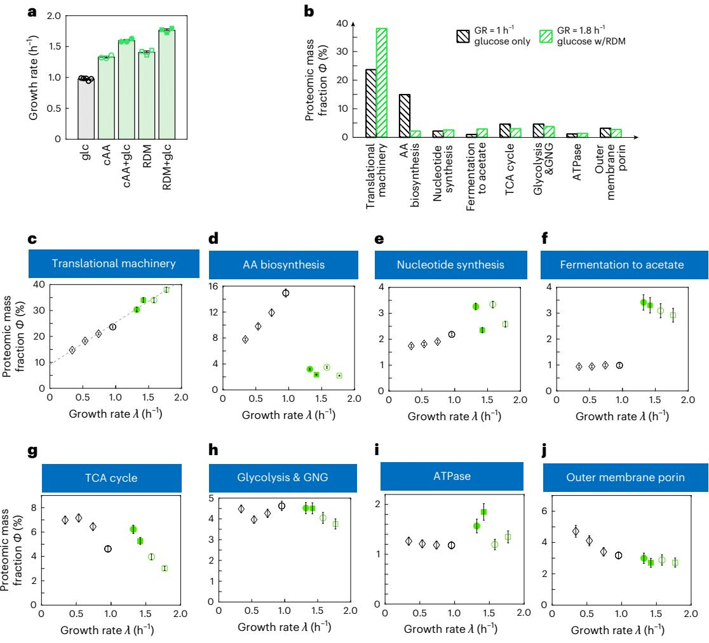

**Fig. 1 | Steady-state protein abundances. a**, The steady-state growth rate of *E. coli* K-12 NCM3722 cells are shown for various minimal and rich media used in this study (Supplementary Table 2): minimal medium with glucose as the sole carbon source, CAA with glucose and without glucose and RDM with glucose and without glucose. The c.v.s of the growth rates are no more than 3% based on at least three replicates. Bars and error bars indicate mean ± s.e.m. **b**, Proteomic allocation comparison between glucose minimal media (black bars) and RDM with glucose (green bars). The mass fraction changes in translational machinery and AAB enzymes are dominant compared with others. **c**–**j**, Total abundance of proteins in various protein groups (obtained from mass spectrometry and

reported as a fraction of total protein mass ('proteome fraction')) is plotted against the growth rate of each culture. Classification of proteins into groups is specified in Supplementary Table 3 according to (refs. [34,](#page-11-26)[35](#page-11-27)). In addition to NCM3722 cells in the five conditions described in **a**, the plots also show (as open diamonds) the results for slower-growing mutants with limited expression of glucose uptake protein PtsG[36,](#page-11-14)[43](#page-11-21) to help visualize the trend (see Supplementary Table 1 for strain details). The error bars on protein abundances indicate s.d. and reflect the scatter in the peptide precursors detected in the mass-spectrometry data (via xTop v2.0; see Supplementary Note 1) and a basal noise level originating from the uncertainty in the absolute scale of protein abundance (see Methods).

we observed the same two h lag (Extended Data Fig. 3c,d). We concluded that the two h lag arises from internal growth bottleneck(s) related to abrupt AA removal when shifting from rich to minimal media. Next, we investigated the two h lag for the downshift from 18AA to none using glycerol as the carbon supplement (hereafter used as a standard downshift protocol and just referred to as 'AA downshift' for simplicity). The steady-state mass fractions of the main protein groups in the pre-shift condition of this standard AA downshift (Extended Data Fig. 1d–k) were consistent with those in other rich conditions.

#### **Proteomic analysis during AA downshift**

To quantitate cellular recovery kinetics, we analysed the proteome after AA downshift using mass spectrometry-based proteomics[19](#page-11-8). Extended Data Fig. 4 (up-triangles) shows two biological replicates of the time courses of the protein functional groups, with the instantaneous growth rate plotted in Extended Data Fig. 4l for reference. The group of AAB enzymes increased the most (~8%-proteome) during the shift (Extended Data Fig. 4b). Interestingly, glycerol uptake enzymes increased too (Extended Data Fig. 4k), even though glycerol uptake was not a bottleneck (Extended Data Fig. 3d).

The protein mass fractions plotted in Extended Data Fig. 4 were derived by summing up mass fractions of individual proteins from each group. In Extended Data Fig. 4b, much larger protein changes of some individual AAB enzymes are masked by the summing process. Individual AAB enzymes are shown in Extended Data Fig. 5, grouped according to pathways. (Due to the excellent repeatability of the results shown in Extended Data Fig. 4, here we only show the data for set 1.) The responses exhibited across these pathways were quite diverse, both in terms of fold changes and recovery kinetics: MetE showed >100-fold change (Extended Data Fig. 5a), while enzymes in threonine synthesis pathway showed no more than twofold change (Extended Data Fig. 5j). Some enzymes started increasing their abundances in the early stage of the shift (for example, the methionine and arginine pathways; Extended Data Fig. 5a,b), while other enzymes did not increase until

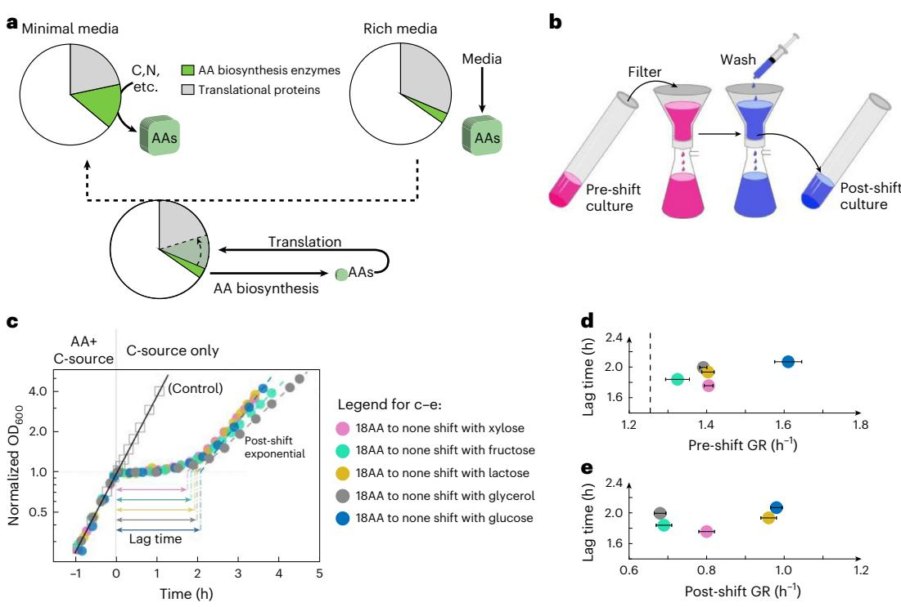

**Fig. 2 | AA downshift with various carbon supplements. a**, Remodelling of the proteome needed during AA downshift. Pie charts show the steady-state proteomic allocation in glucose minimal media and in CAA supplemented with glucose. Grey sector represents translational proteins, green sector represents AAB enzymes and the white sector represents other proteins. In minimal media, cells need to synthesize AAs using AAB enzymes, which are expressed at low levels in rich media. When the environment suddenly changes from rich media to minimal media (dashed line), cells suffer from the shortage of both AAs and AAB enzymes. Limited AAB enzymes provide limited AA fluxes, which limit the synthesis of all proteins including the AAB enzymes. **b**, Schematic diagram of the medium shift performed in this study, with the entire duration of the shift taking <5 min. **c**, Growth curves for downshift from 18AA (Supplementary Table 4) for the wild-type strain while maintaining one of the carbon sources shown in

the legend throughout the shift. Time 0 is the downshift time (see Extended Data Fig. 3a). 'Lag time' is defined by extrapolating the exponential growth of postshift steady state to the OD of the culture at the time of shift. The open squares show the results for the control experiment from 18AA with glycerol to the same medium, demonstrating that the filter-wash process in **b** does not affect cell growth. **d**,**e**, Scatterplots of lag times against pre-shift and post-shift steady-state growth rates for the shifts shown in **c** using the same colour scheme. The vertical dashed line in **d** shows the growth rate of the culture on 18AA without additional carbon source. The horizontal error bars in **d** and **e** show 95% confidence intervals from exponential fitting of growth curves. Typical variation from biological repeats were within 5% for growth rate measurements and within 10% for lag time measurements (see Extended Data Fig. 3e for repeatability of the growth curves).

100 min after the shift (for example, the serine and threonine pathways; Extended Data Fig. 5i,j).

As the enzymes in the same pathway had similar kinetics, attributed in part to operon structure (indicated in Extended Data Fig. 5), we summed up the abundances of enzymes in the same pathway to obtain a finer-grained view of the kinetic response of the AAB enzymes in Fig. [3a,](#page-4-0) which identified a variety of fold changes (*y* axis) and onset times (*x* axis). The inverse of the fold change, which is the pre-expression level of a pathway relative to its final expression level (for steady-state growth in glycerol minimal medium) referred to as (fractional) 'pre-shift reserve', is plotted in increasing order in Fig. [3b](#page-4-0). The plot reveals a surprising exponential separation of the pre-shift reserves as indicated by the red dashed line.

The kinetic behaviours of the AAB enzymes for the first several groups are plotted in order in Fig. [3c–k,](#page-4-0) with the remainders and replicates shown in Extended Data Fig. 6. A systematic change in recovery kinetics was observed in Fig. [3c–k](#page-4-0), with the enzyme groups with the smaller pre-shift reserve responding earlier after the shift. To further quantitate recovery kinetics, we estimated the recovery onset time of each group (see Extended Data Fig. 7a). Plotting the onset time obtained against the reciprocal of the fold change, we obtained a smoothly increasing relation (triangles, Fig. [3l](#page-4-0)). This obtained relation is robust to the precise definition of the onset time (Extended Data Fig. 7b–g), and is moreover seen not only at the pathway level but also for individual AAB enzymes (blue triangles in Fig. [3m](#page-4-0)). Correlations between onset time and the pre- and post-shift abundances themselves, or their differences, are much weaker (Extended Data Fig. 7h–m). Our data thus reveal a simple rule, that the recovery onset time of AAB enzymes is an increasing function of the fractional pre-shift reserves.

## **Modelling AA downshift kinetics**

The correlation between enzyme onset time and pre-shift reserve is reminiscent of qualitative predictions made in a theoretical study by Pavlov and Ehrenberg (PE), who proposed that allocating protein synthesis preferentially to enzyme groups with the smallest reserve would provide the fastest recovery[44](#page-11-28). However, it is difficult to obtain concrete predictions on enzyme onset times from the PE model to compare to the data, since the PE model was assumed to be globally applicable to all enzymes, while the relationship observed between onset time and pre-shift reserve was specific for AAB enzymes, but not for the majority of other detected proteins (circles vs triangles, Fig. [3m)](#page-4-0). We incorporated elements of the PE model into a coarse-grained model of flux-controlled proteome allocation[21](#page-11-29) to quantitate the onset of AAB enzymes and their effect on overall growth recovery.

Qualitatively, the problem cells face right after AA downshift can be described as follows: cells need to make AAB enzymes to supply the missing AA influx. However, the overall protein synthesis flux is limited due to the lack of AAs. Therefore, it is necessary to reallocate the limited

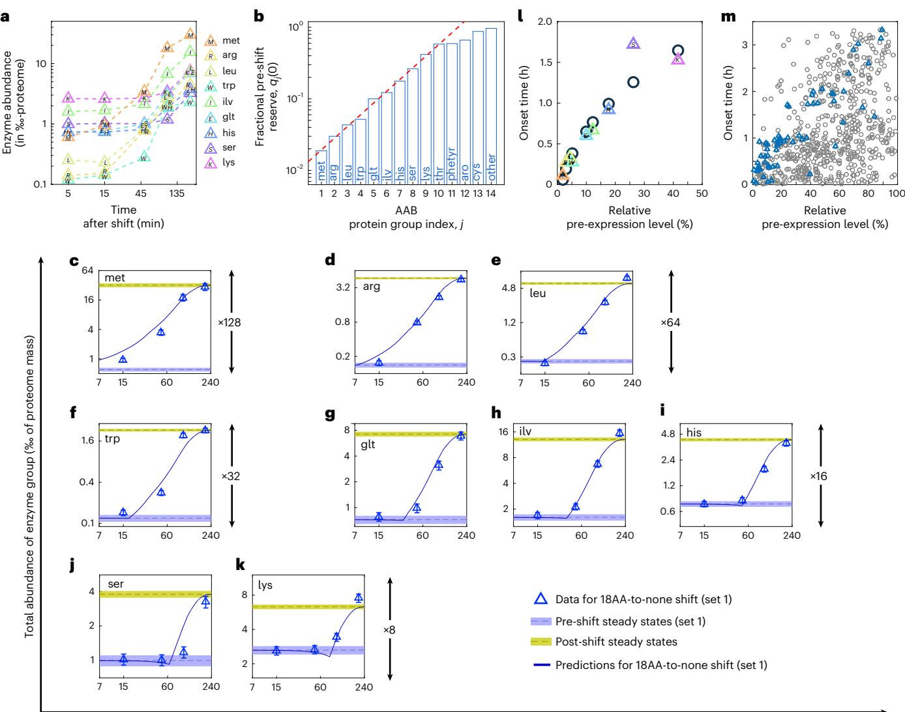

#### Time after shift (min)

**Fig. 3 | Enzyme recovery kinetics for individual AAB groups. a**, AAB enzymes are sorted into different groups according to the pathways they are in (Supplementary Table 3). The total enzyme abundance of each group that has changed at least twofold, expressed in terms of the fraction of total protein mass, is plotted at time *t* = 15 min, 50 min, 100 min and 200 min after the amino acid downshift (see Extended Data Fig. 5 for the abundances of individual enzymes in each group). The data are plotted in log scales in both axes. **b**, Pre-shift abundance level relative to final post-shift level (the reciprocal of the fold change), referred to as the 'pre-shift reserve' *qj*(0). Protein groups are sorted in the order of increasing reserves. The reserves for the first 10 AAB groups show an approximate exponential trend, with *qj* (0) ∝ *e*0.38⋅*j* (red dashed line).

**c**–**k**, Enzyme abundance of each of the pathways in **a**. The total abundances before the shift are shown as blue bars, while the total abundances in the post-shift steady state are shown as gold bars. Error bars and the width of the horizontal bars represent the estimated standard errors from our proteomics pipeline (see Methods). Solid lines represent the model predictions (see text). **l**, Onset time of each enzyme group, as defined in Extended Data Fig. 7a, against the pre-shift reserve. Circles indicate the onset time predicted from the model. The onset time observed for the ser group is clearly off from the predicted value; this will be investigated below. **m**, Same as in **l**, but for all the upregulated genes during the shift (grey circles), with AAB genes shown as blue triangles.

protein synthesis flux towards AAB enzymes right after the shift, away from the synthesis of ribosomal proteins which dominated before the shift (Fig. [2a](#page-3-0)). The generic kinetic equations for the *j*th AAB enzyme group (of proteomic mass fraction *ϕA*,*j*(*t*)) and ribosomal proteins (of mass fraction *ϕ*Rb(*t*)) can be written as (Supplementary Note 2)

$$\frac{d\phi_{Aj}}{dt} = \lambda\left(t\right) \times \left(\chi_{Aj}\left(t\right) - \phi_{Aj}\left(t\right)\right),\tag{1}$$

$$\frac{d\phi_{\rm Rb}}{dt} = \lambda\left(t\right) \times \left(\chi_{\rm Rb}\left(t\right) - \phi_{\rm Rb}\left(t\right)\right). \tag{2}$$

Here, *λ* (*t*) ≡ *d dt* ln *M*(*t*) is the instantaneous growth rate during the shift, with *M*(*t*) being the total protein mass at time *t* after the shift. It describes the magnitude of protein synthesis flux (*dM*/*dt*) normalized by the total protein mass. *χA*,*j*(*t*) and *χ*Rb (*t*) are 'allocation functions' describing the fraction of protein synthesis flux directed towards synthesizing the *j* th AAB enzyme group and ribosomal proteins, respectively. In order to solve the recovery kinetics, it is necessary to specify the time dependence of growth rate *λ*(*t*) and the allocation functions *χA*,*j*(*t*), *χ*Rb (*t*) in terms of the dynamical variables, *ϕA*,*j*(*t*), *ϕ*Rb (*t*).

We adopted the PE model[44](#page-11-28), setting the instantaneous growth rate in terms of the abundances of the rate-limiting enzyme group(s), in this case, the AAB enzyme groups *ϕA*,*j*(*t*), as

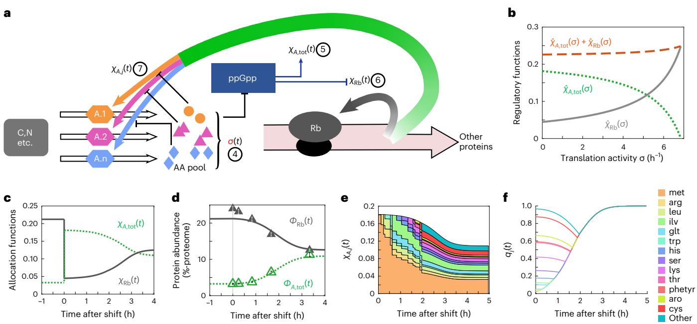

**Fig. 4 | Model of dynamic proteome allocation for AA downshift. a**, Upon AA removal, cells synthesize AAs de novo using AAB enzymes, indicated as A.1, A.2 and so on. The AAs synthesized (indicated as circles, triangles and diamonds) are consumed by ribosomes (Rb) for protein synthesis. Limited AA synthesis fluxes lead to limited AA pools and reduced ribosome activity, denoted by *σ*(*t*) and defined mathematically by equation ([4)](#page-5-2). *σ*(*t*) serves here as a 'signal' reflecting the AA pools, representing the (inverse of) the alarmone ppGpp[14](#page-11-6)[,21](#page-11-29). It controls the allocation of protein synthesis flux to AAB enzymes and ribosomal proteins, indicated by the thick green and grey arrows, respectively. The latter are described by the allocation functions, *χA*,tot(*t*) and *χ*Rb (*t*), respectively, and set by the regulatory functions *χ*̂ Rb (*σ*) and *χ*̂ *A*,tot (*σ*) according to equations [(5)](#page-5-3) and [(6](#page-5-4)). The protein synthesis flux directed to AAB enzymes is further allocated to the enzymes of each pathway by the pathway-specific allocation function *χA*,*j*(*t*) specified in Supplementary Note 2D. **b**, The forms of the regulatory functions *χ*̂ Rb (*σ*) and *χ*̂ *A*,tot (*σ*) (solid grey and dotted green lines, respectively) constructed

$$\frac{\lambda'(t)}{\lambda^*} = \min_j \left( \frac{\phi_{Aj}(t)}{\phi_{Aj}^*} \right) = \min_j q_j(t). \tag{3}$$

Here, *λ*∗ and *ϕ*∗ *A*,*j* represent the growth rate and the abundance of the *j* th AAB enzyme group in the post-shift steady-state, respectively, and *qj* (*t*) ≡ *ϕA*,*j* (*t*)/*ϕ*∗ *A*,*j* is the enzyme abundance relative to the final abundance, that is, the fractional enzyme reserve. As elaborated in Supplementary Note 2B, equation ([3](#page-5-0)) is simply a statement that the protein synthesis flux (proportional to *λ*(*t*)) is governed by the abundance of the most bottlenecked enzyme group(s), a result which follows from the assumption that the catalytic rates of the growth-limiting enzyme groups are at maximum (that is, uninhibited) as are the catalytic rates in the post-shift steady state, with allosteric inhibition of the non-limiting AAB enzyme[s45](#page-11-30).

Specifying the time-dependent allocation functions *χA*,*j* (*t*), *χ*Rb (*t*) involves more effort. Molecularly, the synthesis of different enzyme groups is regulated by their corresponding AA products (Fig. [4a](#page-5-1)). According to the well-known mechanisms of end-products inhibition[45](#page-11-30)[,46](#page-11-31), the synthesis of growth-limiting AAB enzyme group(s) is expected to be upregulated due to the low concentration of their AA products, while synthesis of non-growth limiting group(s) is expected to be repressed due to the accumulation of their corresponding AA products. To determine the protein synthesis flux allocated to each AAB group without requiring molecular details (which are mostly unknown at the quantitative level), we developed a two-stage allocation through the relation between the steady-state growth rate and the abundances of the corresponding protein sectors as detailed in Extended Data Fig. 8. **c**, Time courses of the allocation functions *χ*Rb (*t*) (solid grey line) and *χA*,tot(*t*) (dotted green line), obtained by solving the complete model defined by equations ([1](#page-4-1))–[(8)](#page-6-0). **d**, Time courses of ribosomal protein abundance (grey) and total AAB enzyme abundance (green) for model predictions (lines) and experimental data (triangles). Error bars are obtained by combining the error estimates from individual proteins in each group (Methods). **e**, Time courses of the predicted regulatory functions *χA*,*j*(*t*) (stacked) for each AAB group. The areas with different colours represent the allocation functions for the different AAB groups as described by the legend on the right. The top curve represents the time course of *χA*,tot since it is the sum of *χA*,*j* . **f**, Time courses of the relative abundance *qj* (*t*) = *ϕA*,*j* (*t*) /*ϕ*∗ *A*,*j* for each AAB group *j*. Eventually, all the *qj* (*t*) reach one, indicating that cells have reached the final steady-state expression levels.

scheme as illustrated in Fig. [4a.](#page-5-1) In the first stage, we extended the scheme of flux-controlled regulatio[n21](#page-11-29) (reviewed in (ref. [14](#page-11-6))) to describe the allocation between ribosome synthesis *χ*Rb(*t*) and total AAB enzyme synthesis *χA*,tot (*t*), this allocation being based molecularly on ppGpp-mediated regulation[47](#page-11-32). Then in the second stage, we described more refined sub-allocation of the AAB enzymes to each group, that is, from *χA*,tot (*t*) to *χA*,*j*(*t*), this sub-allocation being based on end-product inhibition.

In the flux-controlled regulation scheme, the translational activity, defined as

$$
\sigma(\mathfrak{t}) \equiv \lambda \left( \mathfrak{t} \right) / \phi_{\mathrm{Rb}} \left( \mathfrak{t} \right), \tag{4}
$$

is taken to represent the overall abundance of the AA pools, while growth is limited by AA synthesis (equation [(3](#page-5-0))). Using *σ*(*t*), we can express the allocation functions *χA*,tot(*t*) and *χ*Rb (*t*) in terms of the 'regulatory functions' *χ*̂ *A*,tot(*σ*) and *χ*̂ Rb(*σ*), as

$$
\chi_{\mathcal{A}, \text{tot}}\left(\mathbf{t}\right) = \dot{\chi}_{\mathcal{A}, \text{tot}}\left(\sigma\left(\mathbf{t}\right)\right), \tag{5}
$$

$$
\chi_{\rm Rb} \left( t \right) = \dot{\chi}_{\rm Rb} \left( \sigma \left( t \right) \right). \tag{6}
$$

The forms of these regulatory functions, shown in Fig. [4b,](#page-5-1) can be determined from steady-state measurements as detailed in Extended Data Fig. 8. We see that under limited growth (small *σ*), ribosomal synthesis is repressed while AAB enzyme synthesis is induced as may be expected intuitively. Molecularly, the translational activity *σ*(*t*) is represented (inversely) by the ppGpp signalling system during growth transition and in steady-state[47,](#page-11-32)[48.](#page-12-0) Downregulation of ribosomal synthesis by high ppGpp (small *σ*) is well documented[49–](#page-12-1)[52.](#page-12-2) Our model also expects upregulation of AAB enzyme synthesis by ppGpp (Fig. [4b](#page-5-1)), which is supported by recent studies characterizing the transient effect of ppGpp on AAB synthesis[53](#page-12-3).

In the second stage of our regulatory scheme, we specified the allocation of AAB enzyme synthesis towards the individual groups by introducing a set of relative allocation functions:

$$
\chi_{\mathcal{A}, \circ}(\mathfrak{t}) \equiv \eta_{\circ}(\mathfrak{t}) \times \chi_{\mathcal{A}, \text{tot}}\left(\mathfrak{t}\right). \tag{7}
$$

The relative allocation functions *ηj* (*t*) were chosen in accordance with the outcome of end-product inhibition[45](#page-11-30)[,46.](#page-11-31) A full implementation of this regulatory effect would require knowledge of the metabolite concentrations which we did not keep track of in this work. Instead, we adopted a simple mathematical implementation as described by PE[44.](#page-11-28) In this implementation (detailed in Supplementary Note 2C), feedback inhibition was determined through the present abundance of each enzyme group, *qj*(*t*). At a given time *t*, the AAB groups can be divided into two classes on the basis of whether a group is growth-limiting at that time. The non-limiting group (with *qj* (*t*) > *λ*(*t*)/*λ*∗ ) receives no allocation, that is, *ηj* (*t*) = 0, while the limiting groups are allocated in proportion to their final abundances, *ϕ*∗ *A*,*j* . If one orders the enzyme groups according to their relative pre-shift abundance level *qj*(0), that is, *q*1 (0) < *q*2 (0) < …, then the group-specific relative allocation imposed by end-product inhibition can be expressed as

$$\eta_{\vec{j}}(t) = \begin{cases} 0 & \mathbf{j} > \vec{j}(t) \\\\ \phi_{A,\vec{j}}^{*} / \sum_{m=1}^{\vec{j}(t)} \phi_{A,m}^{*} \, \boldsymbol{j} \le \vec{j}(t) \end{cases} \tag{8}$$

where ̃*j*(*t*) is the number of enzyme groups being synthesized at time *t*, so that the groups with *j* ≤ ̃*j*(*t*) are equally growth-limiting while those with *j* > ̃*j*(*t*) are not limiting.

#### **Enzyme and growth kinetics of the two-stage model**

Equations ([1](#page-4-1))–([8)](#page-6-0) completely specify our kinetic model of AA downshift. With the pre-shift *ϕA*,*j* (0) and the final post-shift *ϕ*∗ *A*,*j* enzyme abundance values obtained from the proteomic data (Supplementary Table 6), the model can be solved numerically to predict the quantitative time course of a long list of kinetic variables (Supplementary Table 7), including the abundances of the ribosomes, each AAB enzyme group, as well as the overall growth dynamics, without any adjustable parameters (see Supplementary Note 3 for detailed explanation of the kinetic framework). First of all, the allocation for ribosomal synthesis *χ*Rb(*t*) is predicted to be repressed right after the shift, while the total allocation for AAB enzymes *χA*,tot(*t*) is upregulated as shown in Fig. [4c](#page-5-1). The resulting changes in the abundances of these two groups of proteins, plotted as the black and green curves in Fig. [4d](#page-5-1), capture the data (triangles) very well. The predicted allocation functions *χA*,*j*(*t*) for each AAB groups are shown in Fig. [4e:](#page-5-1) right after the shift, only the Met group (orange) was synthesized since methionine was most growth limiting (based on the pre-shift reserve of the Met enzymes shown in Fig. [3c)](#page-4-0). After ~20 min when methionine was no longer the only growth-limiting AA, the synthesis of other AAB enzymes would turn on one after another, in a multistep recovery process. The resulting dynamics for each enzyme group is plotted in Fig. [4f](#page-5-1) for the relative abundance *qj* (*t*) using the same colour scheme. Predictions of the time courses of the abundance of each enzyme group also capture the data well (Fig. [3c–k](#page-4-0), lines and symbols). Again, the theoretical predictions were generated without resorting to any adjustable parameters. From these solutions, we computed the onset time for each enzyme group. The results (circles in Fig. [3l](#page-4-0)) are again in good overall agreement with the observed onset time (triangles), except for the serine group as will be addressed shortly below. The onset time predicted by the model can in fact be derived analytically without resorting to numerical simulation (Supplementary Note 4), by adopting a simplifying approximation that holds the allocation for ribosome synthesis to the basal level throughout the period of AAB recovery (as justified by the data in Fig. [4d](#page-5-1)). The analytical solution highlights a key time

scale setting the enzyme recovery kinetics, given by (*λ*∗*ϕ*max *A*,tot/*ϕ*∗ *A*,1 ) −1

where *λ*∗ and *ϕ*∗ *A*,1 are the growth rate and met group abundance, respectively, in the post-shift steady state, and *ϕ*max *A*,tot = *χA*,tot(0) gives the maximum allocation for AAB protein synthesis in the early phase of the shift (see Supplementary Note 2D).

In addition to the kinetics of each enzyme group, our model also predicted the growth kinetics itself during the shift (blue line, Fig. [5a)](#page-7-0). Although our model captured the AAB enzyme onset time very well, it predicted a growth lag (blue line) which was only about half of the two h lag observed (blue circles). Together with the poor prediction of the onset time of the serine pathway (Fig. [3l](#page-4-0)), we wondered whether the problem with the overall growth kinetics was associated specifically with the delayed onset of the serine pathway. We thus repeated the AA downshift experiment by removing serine from the starting 18AA, still with the glycerol supplement. The data (red open diamonds in Fig. [5a](#page-7-0)) exhibited notably shorter lag, reducing the two h lag to about one h. In contrast, when other single AAs whose pathways show late onset were removed from the initial AA mixture, the lag times changed much less (grey symbols, Extended Data Fig. 9b).

#### **Addressing the serine problem**

The origin of the 'serine problem' can be traced to the common recipe for the 'rich medium'[33](#page-11-25) in which the content of serine used is tenfold higher than that of the serine content in typical proteins (Extended Data Fig. 9a). With normal AA composition, serine is depleted well before other AAs[54](#page-12-4)[,55](#page-12-5); the rich medium recipe is designed to suppress this problem. We reasoned that this highly unnatural serine content might have created an unintended problem for cells during AA downshift, which would normally occur without serine. Indeed, using 'casamino acid' (obtained as the hydrolysis product of the protein casein[56](#page-12-6)) as the source of amino acid in pre-shift, we see that the growth kinetics is the same as that of '18AA-minus-ser' shift (red diamonds, Fig. [5a)](#page-7-0).

To examine whether our model can capture the recovery kinetics of the downshift starting from 18AA-minus-ser, we performed additional proteomic measurements specifically for this shift. The resulting pathway abundances and the pathway onset times are plotted as red triangles in Fig. [5b–k,](#page-7-0) again for the pathways showing at least twofold change in total abundance. The difference between this dataset and the one analysed earlier for shift from 18AA (blue triangles) is clearly substantial compared with the difference between replicates (Extended Data Fig. 6); note the logarithmic scales for both axes. To obtain theoretical predictions for downshift starting from 18AA-minus-ser (red lines in Fig. [5a–k](#page-7-0)), we simply replaced the pre-shift states with the pre-shift growth rate and pre-shift AAB enzyme reserves measured for the '18AA-minus-ser' shift (Supplementary Table 6). We see that consistent with the measured faster recovery in growth and AAB enzyme abundance, our model predictions quantitatively capture the faster kinetics during downshift from '18AA-minus-ser'. Calculated onset times (red circles, Fig. [5l)](#page-7-0) also capture well the observed onset times (red triangles). Importantly, this time the model also captures the overall growth curve (red line, Fig. [5a](#page-7-0)). More detailed examination into the differences in model prediction between the shift with and without serine shows that the two factors that are different between the two cases, the fractional pre-shift reserves (*qj*(0)) and the allocation function ( *χA*,tot), both played important roles leading to notably different dynamics (see Extended Data Fig. 9c–f).

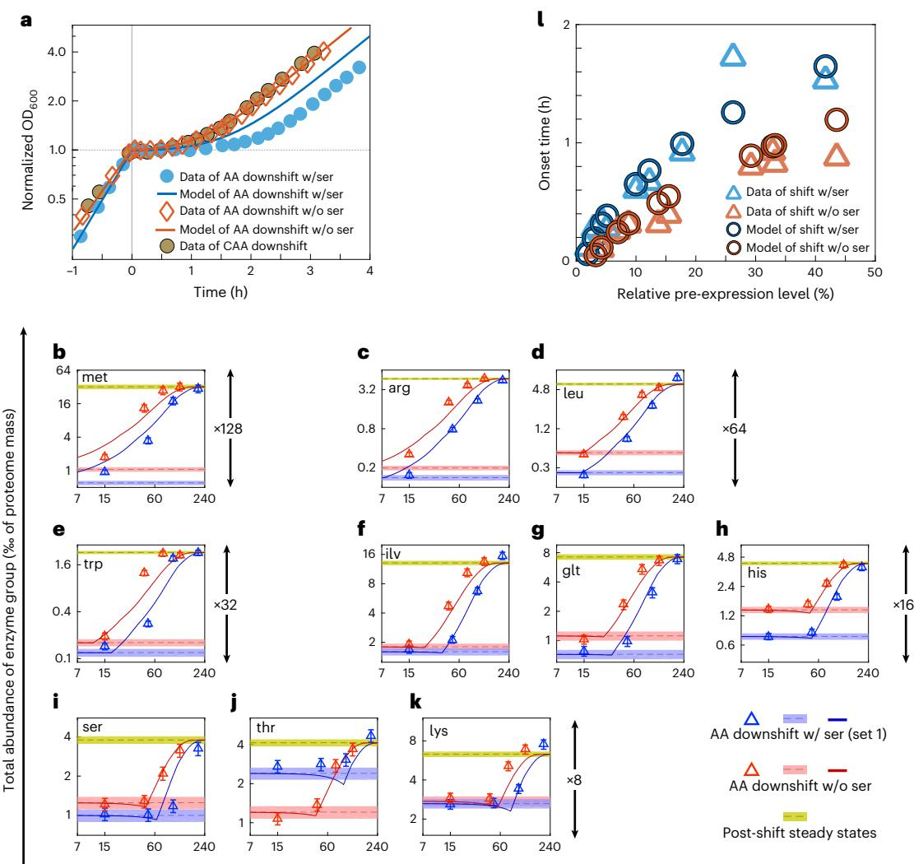

Time after shift (min)

**Fig. 5 | Data and model for AA downshift without serine. a**, The model for AA downshift (blue line) predicted significantly shorter lag than the data (filled blue circles). The growth curve for AA downshift without serine (open red diamonds) is similar to that for downshift starting with CAA (filled grey circles) with significantly shorter lag and is accurately captured by the corresponding model (red line). **b**–**k**, Recovery kinetics for total enzyme abundance of each AAB for AA downshift without serine (red triangles). Blue triangles are the data for the same pathways during downshift with serine (same as those shown in Fig. [3c–k)](#page-4-0). Only pathways with at least twofold change in total abundance are shown. Blue and red bars indicate the abundances in the pre-shift steady state, while the gold bars indicate the abundances in the post-shift steady state (same for the two

shifts). Error bars and the width of the coloured bars indicate the standard errors propagated from the errors of individual proteins (Methods). Red lines are the recovery kinetics predicted for the shift without serine on the basis of the same model as that used for the shift with serine (Fig. [3)](#page-4-0) but using the pre-shift growth rate and proteome data for steady-state growth in AAs without serine (see Extended Data Fig. 9 for details). Blue lines are model predictions for the shift with serine (same as in Fig. [3c–k](#page-4-0)). **l**, Comparison of observed and predicted onset time for each pathway (red triangles and circles) for the shift without serine plotted against the corresponding fractional pre-shift reserves. Blue triangles and circles are the same plot for the shift with serine as in Fig. [3l](#page-4-0).

Biologically, differences between the shift with and without serine can be appreciated by examining the abundances of the major functional groups. As seen in Extended Data Fig. 4, substantial differences existed in the pre-shift proteome (*t* = 0), with the exclusion of serine resulting in two- to threefold reduction in enzymes catalysing fermentation to acetate, and a compensating 50% increase in TCA cycle enzymes along with two- to threefold increase in enzymes for carbon catabolism and particularly glycerol uptake. While serine is known to be taken up rapidly[54](#page-12-4),[55,](#page-12-5) the extent of its effect on the proteome is unexpected. In fact, enzymes for the TCA cycle and fermentation to acetate were nearly at their respective post-steady-state levels (indicated by the gold bars) when growing in AAs without serine. Thus, *E. coli* appears to execute distinct programmes in central carbon metabolism (CCM) on the basis of the availability of external serine. With natural AA composition, serine would be depleted in the early phase of growth[55](#page-12-5), and cells would be able to transition to the more respiration-leaning CCM while it still has the remaining AAs. Transition to minimal medium occurs later when AAs are depleted and CCM is already pre-adapted. In our experiment of AA downshift with serine, cells need to remodel the proteome for both AAB and CCM which took twice as long (compare blue and red symbols in Fig. [5a](#page-7-0)). From the time course of proteome dynamics in Extended Data Fig. 4, we see that for the shift with serine, recovery for AAB enzymes occurred before that for CCM. This rationalizes why our model, which only deals with AAB enzyme recovery, was able to capture the AAB enzyme kinetics well (Fig. [3)](#page-4-0) but could not capture growth recovery, which also required addressing CCM remodelling after the recovery of AAB enzymes.

### **Discussion**

We investigated the allocation of the proteome of *E. coli* grown in rich or minimal media during steady-state growth and transitions between them. The most substantial changes are the trade-offs between AAB enzymes and the translational machinery, which allow cells to achieve higher protein synthesis flux, hence growth rate, in rich media when de novo AA biosynthesis is relieved (Fig. [1)](#page-2-0). However, drastically reducing the abundance of AAB enzymes causes problems when AA supply is abruptly depleted, manifested by a lag during AA downshift even when a separate carbon source is provided throughout the shift (Fig. [2)](#page-3-0).

Quantitative proteomic measurements during AA downshift revealed a hierarchy of time scales in the recovery kinetics of AAB enzymes (Fig. [3](#page-4-0) and Extended Data Fig. 5). A smoothly increasing relationship was established between the onset time and the fractional pre-shift reserve of AAB enzymes 'across' pathways (Fig. [3l](#page-4-0)). The observed relationship is a manifestation of an as-needed strategy of gene regulation for AAB enzymes, where those involved in the biosynthesis of the amino acid most needed for protein synthesis, methionine, were expressed first, followed by the enzymes for the next most-needed AA, arginine and so on. In this context, we recall that a related 'just-in-time' gene expression strategy 'within' a pathway (Extended Data Fig. 10a) was proposed long ago for AA downshift[57](#page-12-7) and was claimed as the optimal strategy for minimizing the amino acid recovery time while minimizing enzyme production cost. However, our proteomic data clearly refuted the adoption of such a strategy within AAB pathways (Extended Data Fig. 10c–f). Instead, *E. coli* adopts the just-in-time strategy 'across' AAB pathways.

To quantitate recovery kinetics during AA downshift, we devised a coarse-grained model with proteome allocation specified in two stages (Fig. [4a](#page-5-1) and Supplementary Note 3). In the first stage, we extended the framework of flux-controlled regulation[21](#page-11-29) to AA biosynthesis, using 'translational activity' to represent the collective effect of AA pools and to direct the dynamic allocation of protein synthesis flux between the AAB enzymes and ribosomal proteins. In the second stage, we allocated the synthesis of AAB enzymes into individual pathways, using the on-off strateg[y44](#page-11-28) to capture the effect of end-product regulatio[n45](#page-11-30). The resulting model has no adjustable parameters in the sense that all model parameters (listed in Supplementary Table 6) are fixed by the growth rates and the proteomic data in the pre- and post-shift steady states. When applied to AA downshift, the model was able to quantitatively capture the onset time of most AAB enzyme groups except that for serine (Fig. [3l](#page-4-0)). However, our model failed to describe the growth transition kinetics itself. Attributing the 'serine problem' to non-realistic medium composition which led to very different programmes in central carbon metabolism (Extended Data Fig. 4), we repeated the analysis for AA downshift without serine, finding the model to quantitatively capture not only the enzyme recovery kinetics (Figs. [5b–l)](#page-7-0) but also the entire growth transition kinetics (Fig. [5a](#page-7-0)). The ability of the model to capture quantitative differences in the AAB pathway recovery kinetics between the shift with and without serine (blue and red symbols in Fig. [5l)](#page-7-0) also serves as a validation of our approach, especially the robustness in the construction of the allocation function for AAB enzymes (Extended Data Fig. 4).

The success of our model raises the question of whether *E. coli* cells might have evolved to minimize the recovery time since the on-off strategy[44](#page-11-28) employed in our model was shown theoretically to give the fastest recovery kinetics within an overall proteomic resource constraint. Indeed, for a period after the shift when protein synthesis is allocated mostly to AAB enzymes, our model becomes a specific realization of the on-off model[44](#page-11-28) (Supplementary Note 4B). However, these models only describe response to 'initial conditions' imposed by the proteome set in pre-shift growth. As the initial condition affects the recovery kinetics in minimal medium, we explored the dependence of the expected recovery time on the pre-shift reserve (that is, *qj*(0)) for a fixed total abundance of AAB enzymes before the shift. The calculation in Supplementary Note 4D shows that a uniform pre-shift reserve would give a lag time that is less than half of the observed one; and even for randomly generated pre-shift reserves, the lag times would be in most cases shorter than the observed one. In this light, we can understand the long lag time observed as a consequence of the actual pre-shift reserves being broadly distributed over nearly two orders of magnitude (Fig. [3b)](#page-4-0), which is very far from a uniform distribution. In other words, *E. coli* arranges a very non-uniform, hierarchical distribution of pre-shift reserves, with the consequence of acquiring an exceptionally long lag time. These results suggest that even though *E. coli* uses feedback inhibition to allocate protein synthesis flux to the most limiting pathways given the pre-shift distribution, minimizing the recovery time of downshift to minimal media is not a primary concern for *E. coli* cells growing in rich media. The physiological reason for *E. coli* to acquire this broad distribution of pre-shift reserves is not understood.

In our model, the allocation for ribosome synthesis ( *χ*Rb(*t*)) was gradually turned on as AAB enzyme synthesis ( *χA*,tot(*t*)) was reduced (Fig. [4c)](#page-5-1), not abruptly switched on as prescribed by the on-off model[44](#page-11-28). The portion of the proteome allocated to the ribosomes and AAB enzymes, which is the focus of this study, comprised <30% of the total proteome (dashed line, Fig. [4b](#page-5-1)). The remainder of the proteome was allocated to such functions as carbon and AA transport, motility, as well as other housekeeping functions carrying no metabolic fluxes in the growth conditions we studied. Many of these proteins are turned on before the AAB enzymes (grey circles, Fig. [3m](#page-4-0)). If we applied the PE model to all these proteins beyond the AAB enzymes, the cells would adapt much faster. Clearly, such a strategy is not adopted by *E. coli*. Instead, *E. coli* casts its response broadly, underscoring the importance of anticipating different nutrient types when AA supplies are exhausted in the native habitat. The kinetic responses exhibited by the various protein groups reflect the interplay of their respective regulatory mechanisms which are set by a variety of physiological and ecological reasons that are mostly unknown. The coarse-grained kinetic framework described in this work can be used to quantitatively capture the regulatory functions, and from them, quantitatively predict the recovery kinetics merely on the basis of proteome allocation in the pre- and post-shift steady state without making assumptions on optimality.

# **Methods**

## **Strain construction**

The strains used in this study are either wild-type *E.coli* K-12 NCM3722 strain or its derivative (see Supplementary Table 1 for details).

## **Growth medium**

Unless stated otherwise, all growth media used in this study were based on MOPS buffered media[58.](#page-12-8) The medium contains 40 mM Mops and 4 mM Tricine (adjusted to pH 7.4 by NaOH), 0.1 mM FeSO4, 0.276 mM Na2SO4, 0.5 μM CaCl2, 0.523 mM MgCl2 and micronutrient mixtures used in (ref. [33](#page-11-25)).

If not specified, the media used in steady-state proteomic measurements were MOPS buffered media with 50 mM NaCl, 1.32 mM KH2PO4, plus a carbon source, a nitrogen source and other nutrients as summarized in Supplementary Table 2. For RDM, we used a kit from Teknova M2105, which was prepared on the basis of (ref. [33)](#page-11-25). CAA used was obtained from BD Bacto. The concentrations of individual amino acids are listed in Supplementary Table 4.

For most of the AA downshift experiments, the post-shift medium was MOPS buffered medium with 50 mM NaCl, 1.32 mM KH2PO4, 0.4% glycerol as the carbon source and 10 mM ammonia chloride as the nitrogen source. The pre-shift medium was made by the addition of 18 amino acids (all except cysteine and tyrosine) to the post-shift medium. The concentrations of these amino acids added were the same as those listed in RDM[33](#page-11-25) (see Supplementary Table 4). Cysteine was excluded because it oxidizes to cystine in aerobic growth. Tyrosine was also excluded because of its poor solubility. Among the 18 amino acids added, asparagine and glutamine were prepared freshly for every experiment due to their fast degradation. In this work, some 18AA downshifts were also done with carbon sources other than glycerol, for example, 0.2% glucose, 0.2% lactose, 0.2% xylose or 0.2% fructose (see Fig. [2c](#page-3-0)–[e](#page-3-0)).

In some AA downshifts starting from fewer than 18AA (Extended Data Fig. 4b), the post-shift medium was still the same glycerol MOPS medium. The pre-shift medium (referred to as '18AA-minus-X' with X indicating the AA) was again obtained by adding to the post-shift medium the same 18 amino acids stated above except X. The CAA medium used in Fig. [5a](#page-7-0) was prepared in the same way but with the addition of 0.2% casamino acids instead of 18AA.

In experiments using all 20 AAs (Fig. [3a,b](#page-4-0)), cysteine solution was prepared and added to the medium right before inoculating cells, and tyrosine was freshly dissolved in 0.1 M KOH before being added to the medium. The pH of the medium with tyrosine was still around 7.4.

#### **Cell growth and medium shift**

All the steady-state measurements and medium shift experiments were performed with five ml of cultures grown in 20-mm-diameter test tubes immersed in a 37 °C water bath shaker shaking at 240 r.p.m. Shifts always started after cells reached steady state in pre-shift medium. To grow cells to exponential phase, we followed a standard cell growth procedure taking three rounds: seed culture, pre-culture and experimental culture. For seed culture, cells were inoculated to LB broth from fresh LB plate and grown for about seven h. Then cells were washed with corresponding MOPS medium once and diluted to the same MOPS medium (pre-culture) with starting optical density (OD)600 at ~10−3. If inductions (for example, 3-methylbenzyl alcohol, IPTG) were needed in these experiments, they were also added to the pre-culture. After overnight pre-culture and before the culture reached stationary phase, cells were diluted to the same MOPS medium (experimental culture) with starting OD600 below 0.01. For exponential growth measurements, we let cultures grow to OD600 ≈ 0.5. More than five OD measurements were taken within the range of OD600 = 0.05~0.5 for growth rate calculation. OD600 was measured using a Genesys 20 spectrophotometer (Thermo Fisher), with each measurement taking 200 μl of the culture. For medium shift experiments, we let cells grow to OD600 ≈ 0.3, then washed cells twice with pre-warmed post-shift medium and diluted it to OD600 ≈ 0.1 in pre-warmed post-shift medium. The whole medium transition process was kept within five min and the moment cells were transferred to post-shift medium was defined as 'time zero'. A control shift from 18AA with glycerol to the same media was done and no lag or growth rate change was observed. We took at least five OD measurements in the pre-shift medium starting from OD600 ≈ 0.05. After medium transition, we took OD measurements every 5–20 min according to the lag time until OD600 reached ~0.5.

### **Growth rate calculation**

For steady-state exponential growth rate, we simply fitted the growth curve exponentially. If *R*2 < 0.999, we did not take it as a reliable result.

To get instantaneous growth rate, we applied the Savitzky-Golay filter[59](#page-12-9) to *N* {*ti*, ln(OD600,*i*)} dataset. Recall that because of medium switch, OD600 was not continuously at *t* = 0. Therefore, we scaled the data in post-shift region before calculating growth rate to make the first OD600 after shift (*t* < 5 min) equal to the value exponentially extrapolated from pre-shift data.

The window size we used includes three data points. First, we fitted the first three data points to the second polynomial and substituted *t* of the middle data point (*t*2) into the fitted equation to get its slope. Then we moved the window to the right and did the same thing for the second to fourth data points to get the slope at *t*3. Repeating moving windows and calculating slope, we got slopes at *t*2,*t*3, … *tN*−1. We took these slopes as the 'instantaneous growth rates' at *t*2,*t*3, … *tN*−1. Cells were in steady state at *t*1 and *tN* according to our experimental setting, so we only plotted data points from *t*2 to *tN*−1 for instantaneous growth rate plots.

### **Measurement of proteins using mass spectrometry**

For steady-state growing cells (sample ID M1-M4, P1, P8-P10, N5-N8, O8-O10, A1-A3, A7-A9, A26-A28), we followed the cell growth protocol stated above and took samples at OD600 ≈ 0.4. For each AA downshift experiment (sample ID S1-S5, A29-A39), we followed the protocol above and took one sample (S1, A29-A31) in pre-shift steady-state at OD600 ≈ 0.3. For 18AA downshifts (A32-A35), samples were taken at 15, 50, 100 and 200 min after the shift started. For 18AA-minus-ser downshift (A36-A39), samples were taken at 15, 45, 75 and 120 min after the shift start. We collected at least one OD600 ⋅ ml culture volume of cells for each sample by centrifuging at 13,200 r.p.m. for two min.

We used quantitative mass spectrometry to characterize the abundance of *E. coli* proteomes at various growth conditions (Supplementary Table 2). The samples belong to three groups: group #1, samples M1-M4, N5-N8 and O8-O10; group #2, samples P1, P3, P8-10 and S1-5; group #3, samples A1-A3, A7-A9 and A26-A39. Samples O8-O10, P3, A1-A3 were only used for internal calibration and validation. Quantitative measurements of *E. coli* proteomes for groups #1 and #2 were carried out as described previously[19](#page-11-8). Briefly, *E. coli* cell pellets were lysed with 2% sodium deoxycholate and digested with LysC and trypsin. An iRT peptide mix (Biognosys) was added to all samples for retention time alignment. Tryptic peptides were measured in SWATH mode (64 variable windows) on a TripleTOF 5600 mass spectrometer (Sciex). The data were analysed using OpenSWATH (as included in openMS v.2.1.0) as done in (ref. [19](#page-11-8)).

Quantitative measurements for group #3 were carried out in DIA mode on an Orbitrap Exploris 480 mass spectrometer (Thermo Fisher) and data were analysed using Spectronaut and the directDIA approach (Biognosys). Details for the complete group #3 workflow are given below:

**Bacterial cell lysis and protein digestion for group #3.** Cells were lysed in 100 µl absolute trifluoroacetic acid (Sigma-Aldrich; 5 min, 55 °C, shaking at 1,000 r.p.m.) and neutralized with 900 µl 2 M Tris[60](#page-12-10). Protein concentration was determined using Bradford reagent (Sigma-Aldrich). Subsequently, 50 µg of total protein amount were reduced and alkylated (10 mM Tris(2-carboxyethyl)phosphine hydrochloride, 40 mM chloroacetamide; 5 min, 95 °C). Water-diluted samples (1:1) were subjected to proteolysis with trypsin (Roche, protein ratio 1:50, 30 °C, overnight, 400 r.p.m.). Enzymatic digestion was stopped by addition of 3% formic acid (FA). Peptide samples were desalted using self-packed desalting tips prepared in-house using five discs of Empore C18 (3 M) material stacked in 200 µl pipette tips. The desalting tips were conditioned with 100% acetonitrile (ACN) and 40% ACN/0.1% FA, and equilibrated with 2% ACN, 0.1% FA in HPLC-grade water. Peptides were loaded, washed (2% ACN, 0.1% FA in HPLC-grade water) and eluted (40% ACN, 0.1% FA in HPLC-grade water). Samples were dried to completeness and re-dissolved in 30 µl 0.1% FA in HPLC-grade water. A total peptide amount of 13.3 µg (as determined by Bradford assay) was injected into the mass spectrometer per run.

**DIA-based mass spectrometric data acquisition for group #3.** Peptides were analysed on an UltiMate 3000 (micro-flow configuration) coupled to an Orbitrap Exploris 480 mass spectrometer (Thermo Fisher). Peptides (13.3 µg) were applied directly onto a commercially available Acclaim PepMap 100 C18 column (2 μm particle size, 1 mm ID × 150 mm, 100 Å pore size; Thermo Fisher) and separated using a 60 min linear gradient ranging from 3% to 28% solvent B (0.1% FA, 3% DMSO in ACN) in solvent A (0.1% FA, 3% DMSO in HPLC-grade water) at a flow rate of 50 μl min−1. The mass spectrometer was operated in DIA mode. MS1 full scans (360–1,300 *m*/*z*) were acquired with a resolution of 120,000, an AGC target value of 106 and a maximum injection time of 50 ms. MS2 scans (200–1,800 *m*/*z*) were acquired over a total of 40 DIA segments with widths adjusted to the precursor density (see Supplementary Table 8). The scan resolution in the Orbitrap was set to 15,000 with an AGC target value of 105 and a maximum injection time of 22 ms. The HCD collision energy was set to 30%.

**directDIA data analysis using Spectronaut for group #3.** DIA data were analysed with Spectronaut (v.14.2, Biognosys) using the direct-DIA functionality, which omits the need for an experimental spectral library. In brief, DIA raw files were loaded into Spectronaut and searched against the Uniprot-derived *E. coli* (K-12, MG1655) reference proteome (UP000000625, download 07.09.2021, protein entries 4,438). Trypsin/P was used as digestion enzyme and up to two missed cleavages were allowed. Oxidation of methionine and acetylation of protein N-terminus were set as variable modifications, and carbamidomethylation of cysteine as fixed modification. For directDIA data extraction, default settings provided by Biognosys were used. The mProphet approach was used to estimate the false discovery rate (FDR). The dataset was filtered to 0.1% FDR at peptide precursor level (*q*-value cut-off <0.001). Peptide quantification was performed on the basis of MS2 XIC peak areas using the best *N* fragments per peptide (minimum 3, maximum 6).

## **Protein quantification and proteomics error determination**

Protein intensities were computed from the detected peptide intensities using the algorithm xTop v2.0 developed in this work. This algorithm, described and validated in Supplementary Note 1, improves on the xTop algorithm introduced in (ref. [19](#page-11-8)) by allowing estimation of the uncertainty in the inferred protein abundances due to noise in the peptide precursor intensities. xTop v2.0 was applied separately on the three groups of samples using the following parameters: filter_thres = 0.5; thres_xTop = 300; N_c_thres = 3; s2_min = 0.01; absolute_filter_ratio = 0.1. Batch effects among different groups of samples were accounted for as follows: the relative protein abundances from groups #1 and #2 (obtained with SWATH, but in separate batches) were first harmonized by minimizing the log-ratio between the samples corresponding to glucose minimal medium and carbon-limited growth. Then, proteins from both groups were scaled so that the average protein abundances in glucose minimal medium matched the average abundances from group #3 in the same conditions. Absolute protein mass fractions were computed by calibrating the average protein abundances in samples A7, A8, A9, O10 and P3 for *E. coli* EQ353 strain to ribosome profiling data for the same strain and condition, as done in (ref. [19)](#page-11-8); protein mass fractions were computed from number fractions as done in (ref. [19)](#page-11-8). Raw proteomics data are available on the PRIDE repository (see 'Data availability' section). The resulting protein mass fractions are reported in Supplementary Table 9.

# **Statistics and reproducibility**

Uncertainties in the absolute protein intensities were calculated by combining the errors in the xTop protein intensities and the error in ribosome profiling. Errors in the xTop protein intensities originate from the observed scatter of peptide precursors. The coefficient of variation (c.v.) of the ribosome profiling data was assumed identical for all genes and estimated as follows. For each gene, we obtained from (ref. [32](#page-11-24)) the reads in the first (*Li* ) and second half (*Ri* ) of each gene *i*, and estimated the typical c.v. = 16.5% as the average value of the empirical

coefficient of variation √2 (*Li* − *Ri*) 2 /(*Li* + *Ri*) 2 over 2,870 genes with *Li*

and *Ri* >64 reads. This c.v. was combined with the protein- and condition-specific error from xTop to yield the error in the absolute protein fractions *ϕi* (see Supplementary Note 1 for details on both the relative and absolute error in proteomics data). The error in the total protein fraction for a group of proteins was obtained by summing in

*i* In Fig. [1a](#page-2-0), the growth rates were measured in at least three biological replicates. The error bars represent the s.e.m.

In Fig. [1b](#page-2-0)–[j](#page-2-0) and Extended Data Fig. 1, the proteomic data in minimal media (black symbols) are the average of two independent biological repeats (see Supplementary Table 2). Other proteomic data are from single experiments (Fig. [1](#page-2-0) green symbols, Figs. [3](#page-4-0) and [5](#page-7-0) and so on), although replicate results shown in Extended Data Fig. 4 and 7 are highly similar.

In Fig. [2d,e,](#page-3-0) each data point is derived from a single shift experiment shown in Fig. [2c](#page-3-0). The main experiment with glycerol as carbon source was independently repeated more than three times (Extended Data Fig. 3d).

In Fig. [5a,](#page-7-0) Extended Data Fig. 3 and Extended Data Fig. 9b each growth curve is from a single shift experiment where 18AA downshift with or without ser was repeated at least three times, and similar lag times (less than 10% difference) were observed for biological replicates.

# **Modelling**

The modelling approach used to capture the observed growth and proteomics data is explained in Supplementary Notes 2–4. Briefly, Supplementary Note 2 provides an extensive explanation of the model, relating growth and the lag time during a nutrient shift to the pre-shift abundance and the synthesis of biosynthetic enzymes, along with its assumptions. Supplementary Note 3 describes the concrete application of the model to the data. Supplementary Note 4 describes analytical expressions approximating the exact model solution, the relationship with the previous model of enzyme allocation, robustness of the model with respect to noise in the input data and whether the observed protein reserves (on which the lag time depends) are optimized for fast recovery.

# **Reporting summary**

Further information on research design is available in the Nature Portfolio Reporting Summary linked to this article.

# **Data availability**

The data underlying the figures are presented as Source Data. Other data are available from the corresponding authors upon request. All mass spectrometric raw data files as well as the data analysis output files have been deposited to the ProteomeXchange Consortium ([http://](http://proteomecentral.proteomexchange.org) [proteomecentral.proteomexchange.org)](http://proteomecentral.proteomexchange.org) via the PRIDE partner repository with the dataset identifier [PXD035278.](http://proteomecentral.proteomexchange.org/cgi/GetDataset?ID=PXD035278) The *E. coli* spectral library used for DIA/SWATH data analysis has been published previously[19](#page-11-8) and is available via SWATHAtlas: [http://www.peptideatlas.org/PASS/](https://db.systemsbiology.net/sbeams/cgi/PeptideAtlas/PASS_View?identifier=PASS01421) [PASS01421](https://db.systemsbiology.net/sbeams/cgi/PeptideAtlas/PASS_View?identifier=PASS01421).

# **Code availability**

The code used to compute protein intensities (xTop v2) is available at [https://gitlab.com/mm87/xtop.](https://gitlab.com/mm87/xtop) The code used to model the AA downshift growth kinetics on the basis of the mathematical model presented in the main text is available at [https://gitlab.com/ch47/](https://gitlab.com/ch47/model-of-aa-downshift) [model-of-aa-downshift.](https://gitlab.com/ch47/model-of-aa-downshift)

# **References**

- 1. Yao, C. K., Muir, J. G. & Gibson, P. R. Review article: insights into colonic protein fermentation, its modulation and potential health implications. *Aliment. Pharmacol. Ther.* **43**, 181–196 (2016).
- 2. Oliphant, K. & Allen-Vercoe, E. Macronutrient metabolism by the human gut microbiome: major fermentation by-products and their impact on host health. *Microbiome* **7**, 91 (2019).
- 3. Kellerman, A. M., Dittmar, T., Kothawala, D. N. & Tranvik, L. J. Chemodiversity of dissolved organic matter in lakes driven by climate and hydrology. *Nat. Commun.* **5**, 3804 (2014).

- 4. Sniatala, B., Kurniawan, T. A., Sobotka, D., Makinia, J. & Othman, M. H. D. Macro-nutrients recovery from liquid waste as a sustainable resource for production of recovered mineral fertilizer: uncovering alternative options to sustain global food security cost-efectively. *Sci. Total Environ.* **856**, 159283 (2023).
- 5. Koch, A. L. The adaptive responses of *Escherichia coli* to a feast and famine existence. *Adv. Microb. Physiol.* **6**, 147–217 (1971).
- 6. Mori, M., Schink, S., Erickson, D. W., Gerland, U. & Hwa, T. Quantifying the benefit of a proteome reserve in fluctuating environments. *Nat. Commun.* **8**, 1225 (2017).
- 7. Schaechter, M., MaalØe, O. & Kjeldgaard, N. O. Dependency on medium and temperature of cell size and chemical composition during balanced growth of *Salmonella typhimurium*. *Microbiology* **19**, 592–606 (1958).
- 8. Neidhardt, F. C. & Magasanik, B. Studies on the role of ribonucleic acid in the growth of bacteria. *Biochim. Biophys. Acta* **42**, 99–116 (1960).
- 9. Maaløe, O. & Goldberger, R. F. Biological regulation and development. *Biol. Regul. Dev.* **1**, 487–542 (1979).
- 10. Scott, M., Gunderson, C. W., Mateescu, E. M., Zhang, Z. & Hwa, T. Interdependence of cell growth and gene expression: origins and consequences. *Science* **330**, 1099–1102 (2010).
- 11. You, C. et al. Coordination of bacterial proteome with metabolism by cyclic AMP signalling. *Nature* **500**, 301–306 (2013).
- 12. Liebermeister, W. et al. Visual account of protein investment in cellular functions. *Proc. Natl Acad. Sci. USA* **111**, 8488–8493 (2014).
- 13. Li, Z., Nimtz, M. & Rinas, U. The metabolic potential of Escherichia coli BL21 in defined and rich medium. *Microb. Cell Fact.* **13**, 45 (2014).
- 14. Scott, M. & Hwa, T. Shaping bacterial gene expression by physiological and proteome allocation constraints. *Nat. Rev. Microbiol.* <https://doi.org/10.1038/s41579-022-00818-6>(2022).
- 15. Hui, S. et al. Quantitative proteomic analysis reveals a simple strategy of global resource allocation in bacteria. *Mol. Syst. Biol.* **11**, 784 (2015).
- 16. Peebo, K. et al. Proteome reallocation in *Escherichia coli* with increasing specific growth rate. *Mol. Biosyst.* **11**, 1184–1193 (2015).
- 17. Schmidt, A. et al. The quantitative and condition-dependent *Escherichia coli* proteome. *Nat. Biotechnol.* **34**, 104–110 (2016).
- 18. Caglar, M. U. et al. The *E. coli* molecular phenotype under diferent growth conditions. *Sci. Rep.* **7**, 45303 (2017).
- 19. Mori, M. et al. From coarse to fine: the absolute *Escherichia coli* proteome under diverse growth conditions. *Mol. Syst. Biol.* **17**, e9536 (2021).
- 20. Wick, L. M., Quadroni, M. & Egli, T. Short- and long-term changes in proteome composition and kinetic properties in a culture of *Escherichia coli* during transition from glucose-excess to glucose-limited growth conditions in continuous culture and vice versa. *Environ. Microbiol.* **3**, 588–599 (2001).
- 21. Erickson, D. W. et al. A global resource allocation strategy governs growth transition kinetics of *Escherichia coli*. *Nature* **551**, 119–123 (2017).
- 22. Wang, X., Xia, K., Yang, X. & Tang, C. Growth strategy of microbes on mixed carbon sources. *Nat. Commun.* **10**, 1279 (2019).
- 23. Basan, M. et al. A universal trade-of between growth and lag in fluctuating environments. *Nature* **584**, 470–474 (2020).
- 24. Molenaar, D., van Berlo, R., de Ridder, D. & Teusink, B. Shifts in growth strategies reflect tradeofs in cellular economics. *Mol. Syst. Biol.* **5**, 323 (2009).
- 25. Weiße, A. Y., Oyarzún, D. A., Danos, V. & Swain, P. S. Mechanistic links between cellular trade-ofs, gene expression, and growth. *Proc. Natl Acad. Sci. USA* **112**, E1038–E1047 (2015).
- 26. Dourado, H. & Lercher, M. J. An analytical theory of balanced cellular growth. *Nat. Commun.* **11**, 1226 (2020).
- 27. Bruggeman, F. J., Planqué, R., Molenaar, D. & Teusink, B. Searching for principles of microbial physiology. *FEMS Microbiol. Rev.* **44**, 821–844 (2020).
- 28. de Groot, D. H., Hulshof, J., Teusink, B., Bruggeman, F. J. & Planqué, R. Elementary growth modes provide a molecular description of cellular self-fabrication. *PLoS Comput. Biol.* **16**, e1007559 (2020).
- 29. Roy, A., Goberman, D. & Pugatch, R. A unifying autocatalytic network-based framework for bacterial growth laws. *Proc. Natl Acad. Sci. USA* **118**, e2107829118 (2021).
- 30. Gillet, L. C. et al. Targeted data extraction of the MS/MS spectra generated by data-independent acquisition: a new concept for consistent and accurate proteome analysis. *Mol. Cell. Proteom.* **11**, O111.016717 (2012).
- 31. Ludwig, C. et al. Data-independent acquisition-based SWATH-MS for quantitative proteomics: a tutorial. *Mol. Syst. Biol.* **14**, e8126 (2018).
- 32. Li, G.-W., Burkhardt, D., Gross, C. & Weissman, J. S. Quantifying absolute protein synthesis rates reveals principles underlying allocation of cellular resources. *Cell* **157**, 624–635 (2014).
- 33. Neidhardt, F. C., Bloch, P. L. & Smith, D. F. Culture medium for enterobacteria. *J. Bacteriol.* **119**, 736–747 (1974).
- 34. Keseler, I. M. et al. The EcoCyc database: reflecting new knowledge about *Escherichia coli* K-12. *Nucleic Acids Res.* **45**, D543–D550 (2017).
- 35. Karp, P. D. et al. The EcoCyc Database. *EcoSal Plus* [https://doi.org/](https://doi.org/10.1128/ecosalplus.ESP-0006-2018) [10.1128/ecosalplus.ESP-0006-2018](https://doi.org/10.1128/ecosalplus.ESP-0006-2018) (2018).
- 36. Dai, X. et al. Reduction of translating ribosomes enables *Escherichia coli* to maintain elongation rates during slow growth. *Nat. Microbiol.* **2**, 16231 (2016).
- 37. Maaløe, O. In Goldberger, R.F. (ed) *Biological Regulation and Development* Vol. 1 487–542 (Springer, 1979).
- 38. Bremer, H. & Dennis, P. P. Modulation of chemical composition and other parameters of the cell at diferent exponential growth rates. *EcoSal Plus* <https://doi.org/10.1128/ecosal.5.2.3> (2008).
- 39. Milo, R. What is the total number of protein molecules per cell volume? A call to rethink some published values. *Bioessays* **35**, 1050–1055 (2013).
- 40. Oldewurtel, E. R., Kitahara, Y. & van Teefelen, S. Robust surface-to-mass coupling and turgor-dependent cell width determine bacterial dry-mass density. *Proc. Natl Acad. Sci. USA* **118**, e2021416118 (2021).
- 41. Balakrishnan, R. et al. Principles of gene regulation quantitatively connect DNA to RNA and proteins in bacteria. *Science* **378**, eabk2066 (2022).
- 42. Björkeroth, J. et al. Proteome reallocation from amino acid biosynthesis to ribosomes enables yeast to grow faster in rich media. *Proc. Natl Acad. Sci. USA* **117**, 21804–21812 (2020).
- 43. Okano, H., Hermsen, R., Kochanowski, K. & Hwa, T. Regulation underlying hierarchical and simultaneous utilization of carbon substrates by flux sensors in *Escherichia coli*. *Nat. Microbiol.* **5**, 206–215 (2020).
- 44. Pavlov, M. Y. & Ehrenberg, M. Optimal control of gene expression for fast proteome adaptation to environmental change. *Proc. Natl Acad. Sci. USA* **110**, 20527–20532 (2013).
- 45. Smith, C. A. Physiology of the bacterial cell. A molecular approach. *Biochem. Educ.* **20**, 124–125 (1992).
- 46. Elf, J., Berg, O. G. & Ehrenberg, M. Comparison of repressor and transcriptional attenuator systems for control of amino acid biosynthetic operons. *J. Mol. Biol.* **313**, 941–954 (2001).
- 47. Wu, C. et al. Cellular perception of growth rate and the mechanistic origin of bacterial growth law. *Proc. Natl Acad. Sci. USA* **119**, e2201585119 (2022).

- 48. Hwa, T. In Gross, D. et al. (eds) *Proc. 27th Solvay Conference on Physics. The Physics of Living Matter: Space, Time and Information*, 86–97 (World Scientific, 2020).
- 49. Potrykus, K. & Cashel, M. (p)ppGpp: still magical? *Annu. Rev. Microbiol.* **62**, 35–51 (2008).
- 50. Lemke, J. J. et al. Direct regulation of *Escherichia coli* ribosomal protein promoters by the transcription factors ppGpp and DksA. *Proc. Natl Acad. Sci. USA* **108**, 5712–5717 (2011).
- 51. Scott, M., Klumpp, S., Mateescu, E. M. & Hwa, T. Emergence of robust growth laws from optimal regulation of ribosome synthesis. *Mol. Syst. Biol.* **10**, 747 (2014).
- 52. Hauryliuk, V., Atkinson, G. C., Murakami, K. S., Tenson, T. & Gerdes, K. Recent functional insights into the role of (p)ppGpp in bacterial physiology. *Nat. Rev. Microbiol.* **13**, 298–309 (2015).
- 53. Sanchez-Vazquez, P., Dewey, C. N., Kitten, N., Ross, W. & Gourse, R. L. Genome-wide efects on *Escherichia coli* transcription from ppGpp binding to its two sites on RNA polymerase. *Proc. Natl Acad. Sci. USA* **116**, 8310–8319 (2019).
- 54. Yang, Y. et al. Relation between chemotaxis and consumption of amino acids in bacteria. *Mol. Microbiol.* **96**, 1272–1282 (2015).
- 55. Zampieri, M., Hörl, M., Hotz, F., Müller, N. F. & Sauer, U. Regulatory mechanisms underlying coordination of amino acid and glucose catabolism in *Escherichia coli*. *Nat. Commun.* **10**, 3354 (2019).
- 56. Gordon, W. G., Semmett, W. F., Cable, R. S. & Morris, M. Amino acid composition of α-casein and β-casein2. *J. Am. Chem. Soc.* **71**, 3293–3297 (1949).
- 57. Zaslaver, A. et al. Just-in-time transcription program in metabolic pathways. *Nat. Genet.* **36**, 486–491 (2004).
- 58. Cayley, S., Lewis, B. A., Guttman, H. J. & Record, M. T. Characterization of the cytoplasm of *Escherichia coli* K-12 as a function of external osmolarity: implications for protein-DNA interactions in vivo. *J. Mol. Biol.* **222**, 281–300 (1991).
- 59. Steinier, J., Termonia, Y. & Deltour, J. Smoothing and diferentiation of data by simplified least square procedure. *Anal. Chem.* **44**, 1906–1909 (1972).
- 60. Doellinger, J., Schneider, A., Hoeller, M. & Lasch, P. Sample Preparation by Easy Extraction and Digestion (SPEED) a universal, rapid, and detergent-free protocol for proteomics based on acid extraction. *Mol. Cell. Proteom.* **19**, 209–222 (2020).
- 61. Gilis, D., Massar, S., Cerf, N. J. & Rooman, M. Optimality of the genetic code with respect to protein stability and amino-acid frequencies. *Genome Biol.* **2**, research0049.1 (2001).
- 62. Klipp, E., Heinrich, R. & Holzhütter, H.-G. Prediction of temporal gene expression. *Eur. J. Biochem.* **269**, 5406–5413 (2002).

# **Acknowledgements**

We thank X. Dai, V. Patsalo and R. Balakrishnan for helpful discussions and technical assistance during the course of this work, and O. Diego

for comments and suggestions. This research was supported by NSF Grant MCB 1818384 and NIH Grant R01GM109069 to T.H. C.L. and M.A. were supported by EPIC-XS funded by the Horizon 2020 programme of the European Union (project number 823839). R.A. acknowledges the support of the European Research Council (Proteomics4D: AdvG grant 670821 and Proteomics v3.0: AdvG-233226).

# **Author contributions**

C.W. and T.H. designed the experimental and theoretical studies; C.W. performed most of the measurements other than proteomics, with contributions from H.O. and Z.Z.; M.A. and A. B.-E. performed proteomic experiments with supervision from R.A. and C.L.; C.W. and M.M. performed the quantitative modelling and theoretical analysis; M.M. developed the improved xTop2.0 algorithm and performed quantitative analysis of proteomic data. All authors contributed to the writing of the manuscript.

# **Competing interests**

The authors declare no competing interests.

# **Additional information**

**Extended data** is available for this paper at [https://doi.org/10.1038/s41564-022-01310-w.](https://doi.org/10.1038/s41564-022-01310-w)

**Supplementary information** The online version contains supplementary material available at [https://doi.org/10.1038/s41564-022-01310-w.](https://doi.org/10.1038/s41564-022-01310-w)

**Correspondence and requests for materials** should be addressed to Chenhao Wu, Christina Ludwig or Terence Hwa.

**Peer review information** *Nature Microbiology* thanks Tobias Bollenbach and the other, anonymous, reviewer(s) for their contribution to the peer review of this work.

**Reprints and permissions information** is available at [www.nature.com/reprints](http://www.nature.com/reprints).

**Publisher's note** Springer Nature remains neutral with regard to jurisdictional claims in published maps and institutional afiliations.

Springer Nature or its licensor (e.g. a society or other partner) holds exclusive rights to this article under a publishing agreement with the author(s) or other rightsholder(s); author self-archiving of the accepted manuscript version of this article is solely governed by the terms of such publishing agreement and applicable law.

© The Author(s), under exclusive licence to Springer Nature Limited 2023

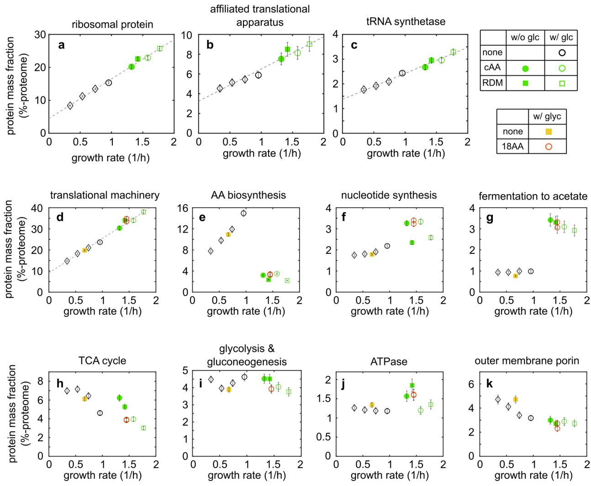

**Extended Data Fig. 1 | Steady state protein abundance of key functional groups. a–c**, Breakdown of the steady state protein abundances of the translational machinery (Fig. [1)](#page-2-0) into (**a**) ribosomal proteins, (**b**) affiliated translational apparatus and (**c**) tRNA synthetases. In all cases, the protein mass fractions are plotted against the growth rate under carbon limitations (wild type: black open circles; titratable *ptsG* mutant: black open diamonds) and four rich conditions (green symbols as shown in the legend table). The same symbols are

used in Fig. [1](#page-2-0) and Extended Data Fig. 2. **d–k**, Steady state protein abundance of key metabolic enzyme groups. These panels are the same as Fig. [1c-j](#page-2-0) except with the inclusion of conditions for 18AAs with 0.4% glycerol supplement (red circles) and 0.4% glycerol as the sole carbon source (yellow squares). See Supplementary Table 2 for the details of growth conditions and Supplementary Table 3 for gene classifications. In all panels, error bars are propagated from the estimated errors for individual proteins (Methods).

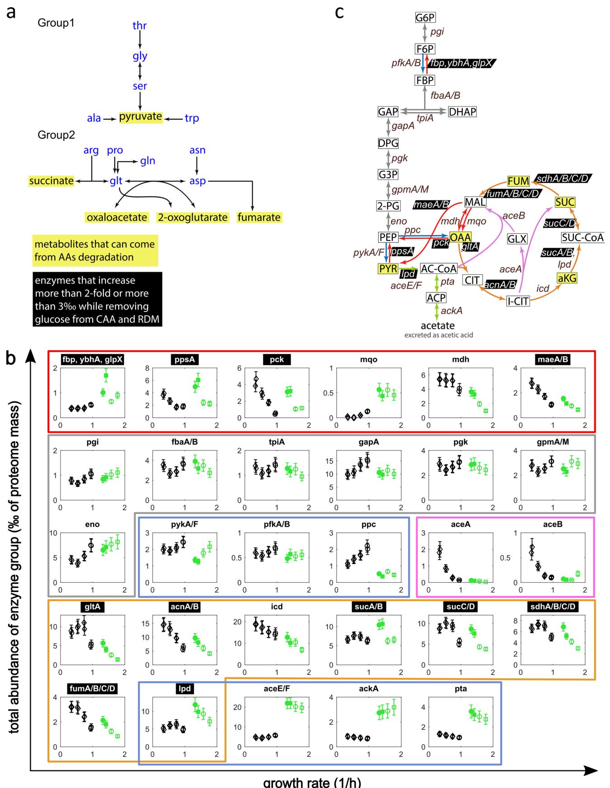

**Extended Data Fig. 2 | See next page for caption.**

**Extended Data Fig. 2 | Central carbon metabolism related to growth on amino acids. a**, Summary of AA degradation pathways based on EcoCyc[34](#page-11-26)[,35.](#page-11-27) Five AAs (ala, ser, thr, gly, trp) degrades into pyruvate and six AAs (asp, asn, glu, gln, pro, arg) degrade into TCA intermediates. Degradation pathways are not known for the remaining nine amino acids (leu, ile, val, met, cys, lys, his, phe, tyr). **b**, The abundances of enzymes of Central Carbon Metabolism (CCM) in steady state growth, plotted against the growth rate. The symbols are the same as those used in Extended Data Fig. 1. The gene names shown with a black background are enzymes that increased by more than 50% or by more than 2‰ of proteome in CAA or RDM without glucose supplement compared to those with glucose supplement (that is, increased in filled green symbols compared to open green symbols). Error bars indicate uncertainties from the protein quantification method (Methods). **c**, Enzymes and metabolites involved in CCM. Metabolites that can be produced from AA degradation are boxed in yellow. Reactions are

represented by colored arrows with the genes encoding the corresponding enzymes written next to it in italic. The color of the arrows corresponds to the box color in panel (**b**), with gray indicating reversible reactions involved in both glycolysis and gluconeogenesis, red indicating gluconeogenesis only, blue indicating glycolysis only, orange indicating TCA cycle, pink indicating glyoxylate shunt and green indicating pyruvate fermentation to acetate. The enzymes with increased abundances in rich medium without glucose supplement are clearly clustered in gluconeogenesis (red box in panel (**b**), five out of six enzymes) and in TCA cycle (orange box in panel (**b**), seven out of eight enzymes). This suggests that in the absence of glucose supplement, the AA degradation products are funneled through CCM to supply the cell's non-AA carbon needs, for example, energy biogenesis and the biosynthesis of lipids and cell wall components, via TCA cycle and via gluconeogenesis.

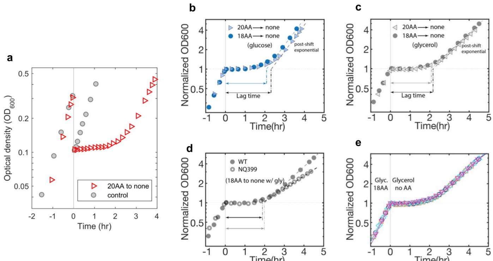

**Extended Data Fig. 3 | Various amino acid downshifts with supplement of carbon sources. a**, Optical density during a nutrient shift from 20AA to no AA (red triangles), supplemented with glucose, as well as a control sample (grey circles), with the same medium before and after the shift. As described in Methods, when the pre-shift culture reached *OD*600 ∼ 0.3, we performed the shift by filtering and washing the pre-shift cell culture and re-suspending the pellets using the post-shift medium (Fig. [1b)](#page-2-0). The post-shift culture started at *OD*600 ∼ 0.1. From this raw growth curve, we match the start of the post-shift *OD*600 to the end of the pre-shift *OD*600 to make the growth curves continuous. Then we normalized the growth curve so that the normalized *OD*600 at the start of a shift is always 1. This leads to the triangles shown in panel (**b**). **b**, Comparison of AA downshift with all 20 AAs (triangles) and downshift with 18AA (excluding cysteine and tyrosine due to poor solubility and stability); see Methods and Supplementary Table 4. Both shifts are supplemented by 0.2% glucose before and after the shift. Note the presence or absence of cysteine and tyrosine made little difference to the growth transition kinetics. **c**, AA downshift experiments of panel (**b**) is repeated with glucose replaced by 0.4% glycerol as the carbon supplement. The growth transition is nearly the same for both 20AA-to-none and 18AA-to-none shifts. **d**, The grey filled circles are the same as those in panel (**b**), indicating the 18AA downshift with glycerol supplement. Open circles represent the result of the same downshift in strain NQ399 (see Supplementary Table 1), which has fully expressed glycerol uptake system (GlpFK). [1mM IPTG and 1mM 3MBA was added to the medium before and after the shift for the shift by NQ399 so that *glpFK* expression was fully induced throughout the shift[11.](#page-11-9)] The lag period did not change, indicating that the glycerol uptake system was not the bottleneck of this growth transition. **e**, Repeatability of 18AA shift supplemented by glycerol. Symbols of different colors represent results of independent experimental runs. The CV of lag time across these runs is within 10%.

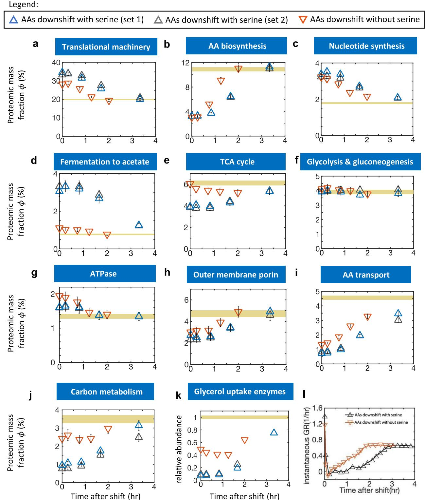

**Extended Data Fig. 4 | Time evolution of macroscopic protein groups during the AA downshift. a**–**h**, The time dependence of the total abundance of proteins from a number of key functional groups during AA downshift with glycerol as the carbon source. **i**–**k**, The eight functional groups in panels **a–h** are those introduced in Fig. [1](#page-2-0); we additionally included (**i**) AA transport, (**j**) carbon catabolism and (**k**) glycerol uptake, with the lattest added given the use of glycerol as the carbon supplement. Three sets of data are included: set 1 (blue up-triangles) and set 2 (grey up-triangles) are replicates for 18AA downshift; the third dataset indicated by the red down-triangles are for downshift starting from 18AA minus serine; see Supplementary Table 2. Raw protein abundance data for each replicate are shown in Supplementary Table 9. Membership of each functional group is shown in Supplementary Table 3. All protein abundances are

reported in mass fraction (%-proteome), except for glycerol uptake enzymes whose absolute abundance could not be fixed because these enzymes were not expressed in the reference condition where ribosome-profiling was performed[32.](#page-11-24) Data corresponding to pre-shift are shown at time 0. Error bars for all protein groups (except the glycerol uptake group) are propagated from the estimated errors for individual proteins (Methods). The horizontal gold bars indicate data for steady state growth on glycerol and no AA, which is the final post-shift stead state; the thickness of the bars indicate estimated errors. **l**, Instantaneous growth rate (see Methods) at various time after the shift. For clarity, only one set of data is shown for 18AA downshift, as the repeatability of the growth curve is already shown in Extended Data Fig. 3e.

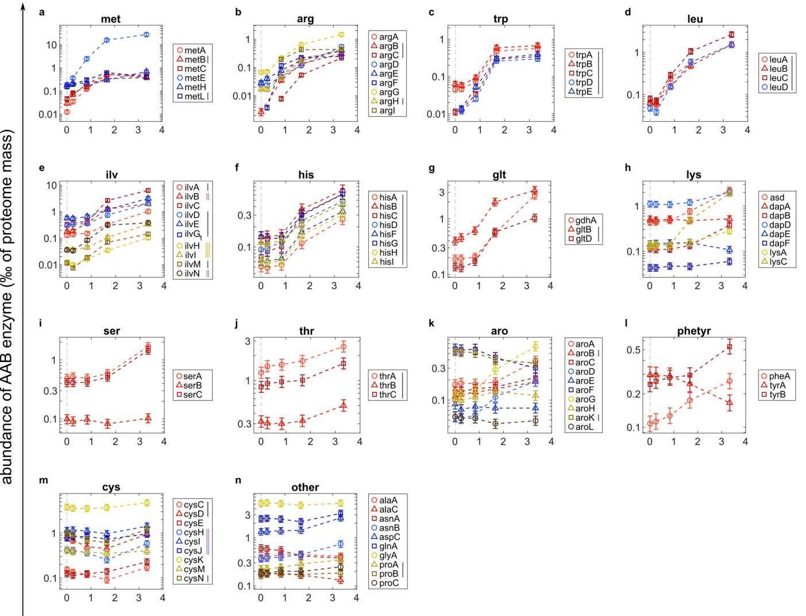

**Extended Data Fig. 5 | Time evolution of individual AA biosynthesis enzyme abundances during the AA downshift. a**–**n**, The abundance time courses for individual AA biosynthesis enzymes during '18AA-to-none' shift (set 1) supplemented by glycerol. The enzymes in the same pathway are plotted in the same plot. Error bars represent standard errors obtained using the xTop protein quantification method (Methods). In each panel, the lines in the legend box next to the gene name indicates the operon structure. The same line style means the genes belong to the same operon. E.g., for panel (**m**), *cysC* and *cysN* are in one operon, *cysHIJ* are in another operon, while *cysD*, *cysE*, *cysK*, *cysM* are by themselves. The genes in different groups don't share operons except *serC-aroA* and *aroF-tyrA*. In each panel, the similar color of the recovery curves indicating similar kinetic behavior. E.g., in (**i**), SerA and SerC (both in red) have similar kinetics, while SerB (in blue) is different. Similar kinetic behavior in panels **c-d,f,j** are all attributable to the operon structure. Similar kinetic behaviors are also seen in other panels where the genes are not in the same operons. More specifically, in the met group (**a**), changes in the abundance of MetE dominated the entire group. In the arg group (**b**), most enzymes showed large increase between 15 min and 50 min after the shift, except ArgA, ArgD, ArgH. The total abundance of this

group was mainly determined by the abundance of ArgG and ArgI. In the ilv group (**e**), several enzymes (for example ilvC, ilvN) exhibited moderate increase in the first 50 min, while the rest increased only after 50 min. Since IlvC is much more abundant than the other enzymes, the group kinetics was largely determined by this enzyme alone. In the glt group (**g**) the GdhA enzyme had a different trend compared to GltB and GltD. In the lys group (**h**), three enzymes (DapA, DapE, DapF) were approximately constant throughout the shift. The rest started increasing after 50 min, most of which showed only small increases during the shift, except for LysC, with a big jump between 50 min and 100 mins. But since LysC is not the most abundant enzyme in the lys group, it did not significantly affect the group kinetics itself. In the aro group (**k**), most of the enzymes stayed constant or dropped during the shift. Three enzymes clearly increased during the shift, among which AroG was the most abundant. In the phetyr group (**l**), decrease in TyrA could likely be attributed to the fact that tyrosine was not provided in the pre-shift medium, so that TyrA was fully expressed before the shift and was then shutoff (with abundance decreasing due to dilution) during the growth recovery phase. (**n**) The time courses of proteins belonging to the 'other' group are shown for completeness.

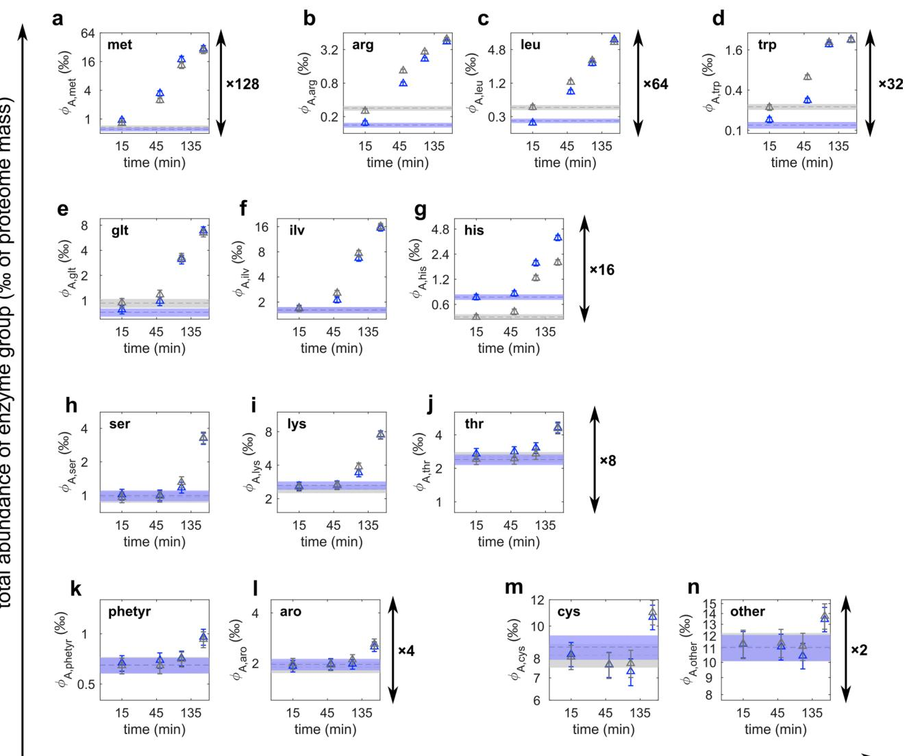

**Extended Data Fig. 6 | Recovery kinetics of AAB pathways. a**–**n**, Panels **a–i** are the same as Fig. [3c-k](#page-4-0), but showing both replicates of 18AA downshift (blue and grey triangles). Also shown are a number of AAB groups whose total enzyme abundances changed by < 2-fold (panels **j–n**). Colored bands indicate the abundances in the pre-shift conditions, with the dashed lines indicating the measured value and the width indicating the standard error. In all cases, errors on protein groups are propagated from the estimated errors for individual proteins (see Methods).

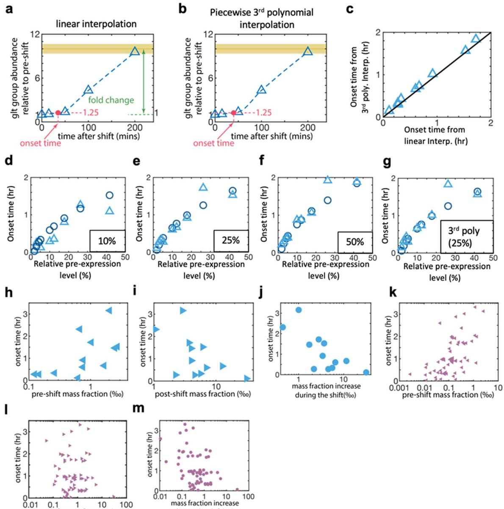

**Extended Data Fig. 7 | Relation between onset time and pre-expression levels. a**, The total abundance of the glt group relative to the pre-shift total abundance is plotted at different times after the shift (same data as Fig. [3f.](#page-4-0) Between the measured data points, we used linear interpolation (blue dashed lines) to connect the data points. The green arrow shows the fold-change in enzyme abundance in post-shift steady-state (yellow bar) from the pre-shift level for the glt pathway. The red arrow indicates the onset time, defined as the time when the enzyme abundance exceeds the pre-shift value by 25%. **b**, Same as panel (**a**), but with a piecewise 3rd degree polynomial interpolation of the time course of the enzyme abundance. **c)**, The onset times obtained from the linear and thirddegree polynomial interpolation are hardly different. **d–g**, The onset time obtained from various definition for each AAB pathway is plotted against the inverse of fold change in the total protein abundance of that pathway (triangles). Panel (**e**) is the same as that shown in Fig. [3l.](#page-4-0) Panels (**d**) and (**f**) show the same but with onset threshold defined as 10% and 50% from the initial value, respectively. Panel (**g**)

is with thirddegree polynomial interpolation. Circles are model predictions of onset time. **h–j**, show plots of the onset time (defined as in panel **a**) against the pre-shift, the post-shift abundances and the increase from pre- to post- shift for individual AAB enzymes, respectively. The Pearson's correlation coefficient between the onset time and the pre-shift abundance (or the log of abundance) is 0.56 (or 0.61). The Pearson's correlation coefficient between the onset time and the post-shift abundance (or the log of abundance) is −0.45 (or −0.56). The Pearson's correlation coefficient between the onset time and the increase abundance from pre- to post-shift (or the log of abundance) is −0.50 (or −0.75). Due to the definition of the onset time in (**a**), the enzymes with fold change less than 1.25 or undetected in the pre-shift condition do not have defined onset times, and are thus excluded in the plots. **k–m**, show plots of the onset time with the pre-shift, the post-shift abundance and the increase abundance from pre- to post- shift for all enzymes of each pathway, respectively.

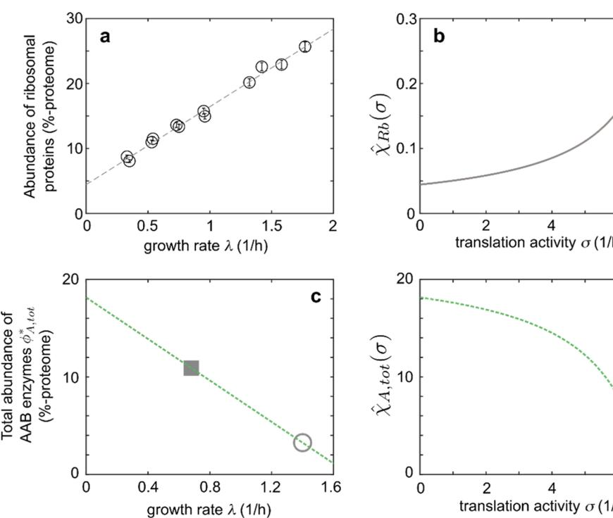

**Extended Data Fig. 8 | Construction of the regulatory functions for ribosomes and total AAB enzymes. a)**, shows the abundance *ϕ*∗ *Rb* of ribosomal proteins at different growth rate ( *λ*∗) for cultures growing exponentially in different nutrient sources. [Same data as that shown in Extended Data Fig. 1a; errors are propagated from the errors for individual ribosomal proteins (Methods).] The data is well-captured by a linear fit (dashed line), that is, *ϕ*∗ *Rb* = *ϕRb*,0 + *λ*∗/*γ*, with *ϕRb*,0 = 4.45% and inverse slope *γ* = 8.35 *h*−1 . In steady state, we have *χ*∗ *Rb* ≡ *ϕ*∗ *Rb*, obtained by setting *d dt ϕRb* = 0 in Eq. [(2](#page-4-2)). of the main text. Using the definition of *σ* in Eq. ([4)](#page-5-2). of the main text, *σ*∗ = *λ*∗ *ϕ*∗ *Rb* = *λ*∗ *ϕRb*,0+*λ*∗/*γ* (F8.1)

we can invert Eq. (F8.1) to obtain *λ*∗(*σ*∗), and obtain the regulatory function as *χ*̂ *Rb* (*σ*) = *χ*∗ *Rb* (*σ*) = *ϕ*∗ *Rb* (*λ*∗ (*σ*)) = *ϕRb*,0 1−*σ*/*γ* . (F8.2) **b**, The function obtained is sketched as the gray line in panel (**b**) and in Fig. [4b.](#page-5-1) **c**, The form of the regulatory function for the total AAB enzymes, *χ*̂ *A*,*tot*(*σ*), is derived similarly to that of *χ*̂ *Rb* (*σ*). We start with the steady state abundance *ϕ*∗ *A*,*tot* of the AAB enzymes in different growth conditions: the value in the pre-shift steady-state is indicated in figure by the open circle, and that of the post-shift steady-state is indicated by the filled square. We connect these two points by a straight line (green dash line) to yield the relation *ϕ*∗ *A*,*tot* = *ϕmax A*,*tot* − *αAλ*∗ with *ϕmax A*,*tot* = 18.1% and *αA* = 0.11 *h*. Using Eq. (F8.1) to relate *λ*∗ to *σ*∗ , we obtain *χ*̂ *A*,*tot* (*σ*) = *ϕ*∗ *A*,*tot* (*λ*∗ (*σ*)) = *ϕmax A*,*tot* − *αAσχ*̂ *Rb* (*σ*),

(F8.3) where *χ*̂ *Rb* (*σ*) is given by Eq. (F8.2). The resulting function is plotted in panel (**d**). **d**, This form shows that when the translational activity *σ* is low (reflecting limitation by the shortage of AAs), AAB enzymes are expected to be up-regulated. This is consistent with our qualitative expectation that due to the global regulation of ppGpp, cells allocate more protein synthesis to AAB enzymes after AA downshift. Quantitatively, the expression for *χ*̂ *A*,*tot* (*σ*) arise from the hypothesized linear relation between *ϕ*∗ *A*,*tot* and *λ*∗ shown in (**a**). The hypothesized linear relation shown in (**c**) is difficult to measure directly. Our hypothesis of the negative linear relation in (**c**) is based on previous characterization of protein allocation under various modes of metabolic limitations:[11,](#page-11-9)[15](#page-11-7) For exponentially growing cells with growth rate limited by the influx of carbon substrate in minimal medium, it was shown that the abundance of carbon catabolic enzymes increased linearly with decreasing growth rate, a distinct phenotype referred to as the "C-line". Similarly, under internal bottleneck in AA biosynthesis, the abundances of various AAB enzymes increased linearly with decreasing growth rate, referred to as the "A-line". The linear response depicted in panel (**c**) is in fact a form of the A-line characterized in (ref. [11](#page-11-9)), a response to limitation in AA fluxes consumed by the ribosomes. Thus, the linear form described by Eq. (F8.3) is well motivated, and its two parameters can be fixed by the abundances of AAB enzymes in the two steady state conditions, before and after the shift.

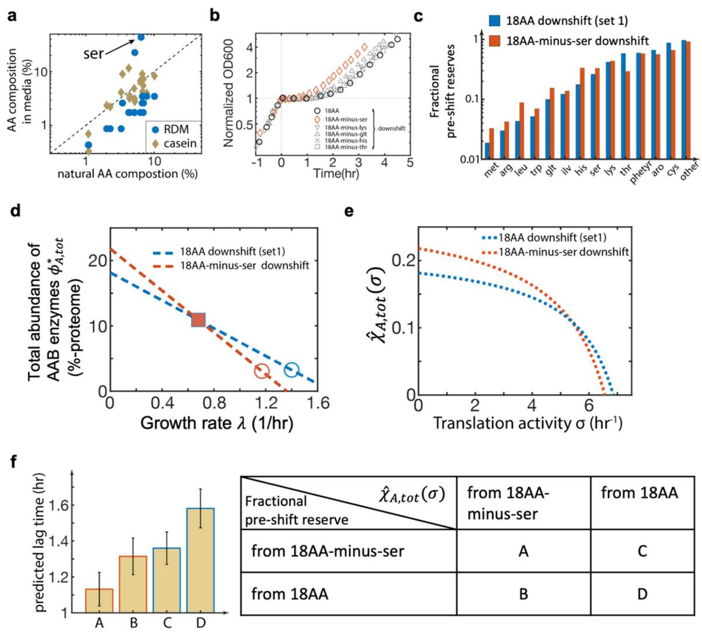

**Extended Data Fig. 9 | Detailed analysis of the serine problem. a**–**f**, Our model did not quantitatively capture the growth kinetics of 18AA downshift as seen in Fig. [5a](#page-7-0) (compare blue line and blue circles) despite its success in predicting the recovery kinetics of most AAB pathways. The discrepancy between the observed and predicted growth curves likely has to do with the behavior of the serine pathway, whose recovery kinetics was also poorly predicted (Fig. [3j)](#page-4-0). **a**, The common recipe of AA composition for the "rich medium" we used (RDM) contained >tenfold higher serine than the natural AA composition in proteins (blue circles, with arrow pointing to serine); see (ref. [33)](#page-11-25) for recipe for RDM and (ref. [56)](#page-12-6) for the composition of the protein casein (brown diamond) from which casamino acids is derived, with the latter similar to the natural AA frequency across protein[s61](#page-12-11), plotted as the x-coordinate. **b**, Growth curve for '18AA-minusser' downshift (red diamond) shows a significantly shorter lag than 18AA downshift (black circles). In comparison, if the shift starts from withholding another aa instead of ser, for example, thr, lys, his, glu, chosen because the onset time of these enzyme groups are the closest to that of the ser group (Extended Data Fig. 7), the corresponding growth curves (grey symbols) exhibited similar lag as the 18AA shift. This comparison shows that there is something special for AA downshift involving serine. In the main text, we showed that our model was able to capture accurately the shift if serine is excluded, that is, the 18AA-minusser downshift. **c**–**f**, Below, we provide a more detailed analysis of factors that lead to different predictions for the model with and without serine. We note that differences in model predictions with and without serine are completely dictated by the two different pre-shift states. It can be attributed to two aspects: First, fractional pre-shift reserves of the AAB groups, *qj* (0), are somewhat different as shown in panel (**c**). Second, different form of the allocation function *χA*,*tot* as shown in panel (**e**), constructed based on the relationship between total AAB enzyme abundance and growth rates panel (**d**). To analyze the contribution of each aspect, we mixed and matched the model input as shown in the table in panel (**f**) and calculated the lag time in each case. In each case, the height of the bar representing the average of n=1000 model runs obtained by randomly generating the input data (growth rates and protein abundances, assumed normally distributed) using the uncertainties reported in Supplementary Table 6; error bars represent the standard deviation of the simulated data. The lag difference predicted for the shift with and without serine (combinations A and D) is well beyond the uncertainty range. Although *χA*,*tot* is constructed from only two data points, its form is reliable in predicting the lag time of different shift. Furthermore, since the lag duration of the combinations B and C are in the middle of the lag time for A and D, we conclude that the difference in model predictions for the two shifts received similar contributions from *χA*,*tot* and from fractional pre-shift reserves *qj*(0).

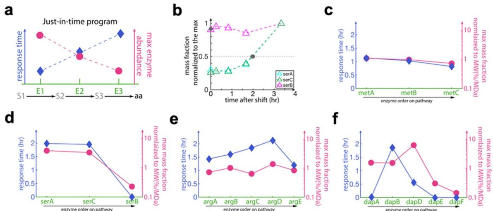

**Extended Data Fig. 10 | Applicability of the "just-in-time" program to enzyme recovery kinetics. a**, The 'just-in-time' program of enzyme recovery kinetics proposed by Zaslaver *et al*. [57](#page-12-7) states that during AA downshift, the response time of an enzyme in a linear pathway is shorter if it is located towards the beginning of the pathway (as indicated by the blue symbols), while the maximum abundance is higher towards the beginning of the pathway (as indicated by the red symbols). **b**, Examples of response time calculated based on the proteomic measurements of SerA, SerB, SerC (Extended Data Fig. 6i). Between the measured data points, we used linear interpolation (gray dash lines) to connect the data points. The x-coordinates of the solid dots represent the corresponding response times, defined as the time when the enzyme abundance reaches 50% of the maximum during the shift according to Zaslaver *et al*. [57](#page-12-7). For enzyme abundance exceeding 50% at the beginning of the shift (as in the case of SerB), we took the response time to be zero. **c**–**f**, The observed response times and maximum enzyme

abundances for four linear segments of the AAB pathways are plotted in the order of enzyme locations for met in panel (**c**), ser in panel (**d**), arg in panel (**e**), lys in panel (**f**). Neither the response time nor the maximum abundance exhibited the predicted trends shown in (**a**) for any of the four pathways. While some of the differences may arise from the fact that the study of Zaslaver *et al*. limited a single amino acid while our study limited 18 amino acids, we note that the derivation of the 'just-in-time' program done in Zaslaver *et al*. assumed that the synthesis of an enzyme in a pathway depended only on the pool of its substrates. This assumption ignored the crucial condition that all amino acids, including the one being limited, are needed in order to synthesize the enzymes. Analysis based on this assumption may well be applicable to the generic onset of a metabolic pathway where it was first proposed[62,](#page-12-12) but hard to justify for the onset of an AAB pathways where the end-product of the pathway is a limiting factor of AAB enzyme synthesis.

Corresponding author(s): Terence Hwa

Last updated by author(s): Dec 2, 2022

# Reporting Summary

Nature Portfolio wishes to improve the reproducibility of the work that we publish. This form provides structure for consistency and transparency in reporting. For further information on Nature Portfolio policies, see our Editorial Policies and the Editorial Policy Checklist.

# Statistics

|     | For all statistical analyses, confirm that the following items are present in the figure legend, table legend, main text, or Methods section.                                                                                                                 |
|-----|---------------------------------------------------------------------------------------------------------------------------------------------------------------------------------------------------------------------------------------------------------------|
| n/a | Confirmed                                                                                                                                                                                                                                                     |
|     | The exact sample size (n) for each experimental group/condition, given as a discrete number and unit of measurement                                                                                                                                           |
|     | A statement on whether measurements were taken from distinct samples or whether the same sample was measured repeatedly                                                                                                                                       |
|     | The statistical test(s) used AND whether they are one- or two-sided Only common tests should be described solely by name; describe more complex techniques in the Methods section.                                                                         |
|     | A description of all covariates tested                                                                                                                                                                                                                        |
|     | A description of any assumptions or corrections, such as tests of normality and adjustment for multiple comparisons                                                                                                                                           |
|     | A full description of the statistical parameters including central tendency (e.g. means) or other basic estimates (e.g. regression coefficient) AND variation (e.g. standard deviation) or associated estimates of uncertainty (e.g. confidence intervals) |
|     | For null hypothesis testing, the test statistic (e.g. F, t, r) with confidence intervals, effect sizes, degrees of freedom and P value noted Give P values as exact values whenever suitable.                                                              |
|     | For Bayesian analysis, information on the choice of priors and Markov chain Monte Carlo settings                                                                                                                                                              |
|     | For hierarchical and complex designs, identification of the appropriate level for tests and full reporting of outcomes                                                                                                                                        |
|     | Estimates of effect sizes (e.g. Cohen's d, Pearson's r), indicating how they were calculated                                                                                                                                                                  |
|     | Our web collection on statistics for biologists contains articles on many of the points above.                                                                                                                                                                |
|     |                                                                                                                                                                                                                                                               |

# Software and code

Policy information about availability of computer code

| Data collection | For proteomic measurements, tsamples were divided in three groups: group #1, samples M1-M4, N5-N8 and O8-O10; group #2, samples P1, P3, P8-10 and S1-5; group #3, samples A1-A3, A7-A9 and A26-A39. For groups #1 and #2, tryptic peptides from each sample were measured in SWATH mode (64 variable windows) on a TripleTOF 5600 mass spectrometer (Sciex). For group #3, tryptic peptides from each sample were measured in DIA mode on a Orbitrap Exploris 480 mass spectrometer (Thermo Fisher Scientific). |
|-----------------|--------------------------------------------------------------------------------------------------------------------------------------------------------------------------------------------------------------------------------------------------------------------------------------------------------------------------------------------------------------------------------------------------------------------------------------------------------------------------------------------------------------------------|
| Data analysis   | The DIA/SWATH data for groups #1 and #2 was analyzed using OpenSWATH (as included in openMS v.2.1.0) following the exact same pipeline as in Mori et al. 2021. The DIA data from group #3 were analyzed using Spectronaut (v.14.2, Biognosys) and the directDIA approach.                                                                                                                                                                                                                                             |
|                 | Protein intensities were computed from the detected peptide intensities using xTop v2, available as a Matlab function at https://gitlab.com/ mm87/xtop .                                                                                                                                                                                                                                                                                                                                                              |
|                 | The code used to model the AA downshift growth kinetics based on the mathematical model presented in the main text is available on https://gitlab.com/ch47/model-of-aa-downshift.                                                                                                                                                                                                                                                                                                                                     |

For manuscripts utilizing custom algorithms or software that are central to the research but not yet described in published literature, software must be made available to editors and reviewers. We strongly encourage code deposition in a community repository (e.g. GitHub). See the Nature Portfolio guidelines for submitting code & software for further information. Policy information about availability of data

All manuscripts must include a data availability statement. This statement should provide the following information, where applicable:

- Accession codes, unique identifiers, or web links for publicly available datasets
- A description of any restrictions on data availability
- For clinical datasets or third party data, please ensure that the statement adheres to our policy

The data underlying the figures are presented in Source Data. The protein abundances for all genes in the measured conditions is provided as Supplementary Table. Other data are available from the corresponding authors upon request.

All mass spectrometric raw data files as well as the data analysis output files have been deposited to the ProteomeXchange Consortium (http:// proteomecentral.proteomexchange.org) via the PRIDE partner repository with the dataset identifier PXD035278 . The E. coli spectral library used for DIA/SWATH data analysis has been published previously (Mori et al., MSB 2021) and is available via SWATHAtlas: http://www.peptideatlas.org/PASS/PASS01421.

# Field-specific reporting

Please select the one below that is the best fit for your research. If you are not sure, read the appropriate sections before making your selection.

Life sciences Behavioural & social sciences Ecological, evolutionary & environmental sciences

For a reference copy of the document with all sections, see nature.com/documents/nr-reporting-summary-flat.pdf

# Life sciences study design

All studies must disclose on these points even when the disclosure is negative.

| Sample size     | no statistical methods were used to predetermine sample size. For proteomic measurements, the sample size was chosen to obtain enough peptides for mass spectrometer detection and analysis with xTop v2, which indicatively requires at least 5 proteomics samples per batch. For growth measurements, sample size was chosen so that the growth rate or lag time can be quantified and discriminated from condition to condition. As shown in ED fig.3d, the AAs downshift experiments has good repeatability. In this study, we focus on the time scale larger than 10mins, therefore we believe 3 growth measurement replicates were enough for our kinetic study on 18AA downshift and 18AA-minus-ser downshift shown in Fig. 3 and 5. For 18AA downshift with various carbon source in Fig. 2, we measured 5 different carbon source with good range of steady-state growth.                                                                      |
|-----------------|---------------------------------------------------------------------------------------------------------------------------------------------------------------------------------------------------------------------------------------------------------------------------------------------------------------------------------------------------------------------------------------------------------------------------------------------------------------------------------------------------------------------------------------------------------------------------------------------------------------------------------------------------------------------------------------------------------------------------------------------------------------------------------------------------------------------------------------------------------------------------------------------------------------------------------------------------------------------------|
| Data exclusions | No data exclusion                                                                                                                                                                                                                                                                                                                                                                                                                                                                                                                                                                                                                                                                                                                                                                                                                                                                                                                                                         |
| Replication     | For proteomic measurements in this study, independent replicates are provided for the growth conditions of minimal media to show the reproducibility of proteomic data. Although we didn't provide replicates for other conditions, the accuracy and noise of proteomic data from our method has been studied in Mori et al, 2021. No proteomics repeats were excluded from the analysis. For growth measurements in this study, independent replicates are done for key experiments as detailed in Methods or Figure legends. For 18AA downshift and 18AA-minus-ser downshift reported in Fig. 3 and 5, at least 3 independent replicates of growth measurements were performed and they all gave the same recovery kinetics with less than 10% error in lag time. For other shifts and steady-state growth measurements, all attempts at replication were successful. Where applicable, the number of replicates is mentioned in the figure captions. |
| Randomization   | As a non-clinical study, we did not perform randomization or blinding at the sample collection. This is not relevant to this study since our data are grouped only under clear categories, such as pathways, nutrients, etc.                                                                                                                                                                                                                                                                                                                                                                                                                                                                                                                                                                                                                                                                                                                                           |
| Blinding        | As a non-clinical study, we did not perform randomization or blinding at the sample collection. This is not relevant to this study since our data are grouped only under clear categories, such as pathways, nutrients, etc.                                                                                                                                                                                                                                                                                                                                                                                                                                                                                                                                                                                                                                                                                                                                           |

# Reporting for specific materials, systems and methods

We require information from authors about some types of materials, experimental systems and methods used in many studies. Here, indicate whether each material, system or method listed is relevant to your study. If you are not sure if a list item applies to your research, read the appropriate section before selecting a response.

## Materials & experimental systems

- n/a Involved in the study Antibodies Eukaryotic cell lines
- Palaeontology and archaeology
- Animals and other organisms
- Human research participants
- Clinical data
- Dual use research of concern

# Methods

- n/a Involved in the study
- ChIP-seq
- Flow cytometry
- MRI-based neuroimaging