# The Potts r~iodel

# F. Y. Wu*

Institutfur Festkorperforschung der ECernforschungsanlage Ju/ich, D-\$170 Ju7ich, 8'est Germany

This is a tutorial review on the Potts model aimed at bringing out in an organized fashion the essential and important properties of the standard Potts model. Emphasis is placed on exact and rigorous results, but other aspects of the problem are also described to achieve a unified perspective. Topics reviewed include the meanfield theory, duality relations, series expansions, critical properties, experimental realizations, and the relationship of the Potts model with other lattice-statistical problems.

# CONTENTS

| I.   | Introduction                             |  |  | 235        |  |  |  |  |  |
|------|------------------------------------------|--|--|------------|--|--|--|--|--|
|      | A. The Potts model                       |  |  | 236        |  |  |  |  |  |
|      | B. The dilute model                      |  |  | 238        |  |  |  |  |  |
|      | C. The mean-field solution            |  |  | 238        |  |  |  |  |  |
|      | D. Experimental realizations          |  |  | 239        |  |  |  |  |  |
|      | = 2 (Ising) 1. q systems           |  |  | 240        |  |  |  |  |  |
|      | = 3 2. q systems                   |  |  | 240        |  |  |  |  |  |
|      | = 4 systems 3. q                      |  |  | 240        |  |  |  |  |  |
|      | 4. 0 ~ q ~ 1 systems               |  |  | 240        |  |  |  |  |  |
|      | E. The Bethe lattice                     |  |  | 241        |  |  |  |  |  |
| II.  | Duality Relations                        |  |  | 241        |  |  |  |  |  |
|      | A. Models with two-site interactions     |  |  |            |  |  |  |  |  |
|      | B. Models with multisite interactions |  |  | 241        |  |  |  |  |  |
|      | C. Other duality relations            |  |  | 242        |  |  |  |  |  |
|      |                                          |  |  | 243 245 |  |  |  |  |  |
|      | D. The Z(q) model E. The dilute model |  |  |            |  |  |  |  |  |
|      |                                          |  |  | 245        |  |  |  |  |  |
| III. | Series Expansions                        |  |  | 245        |  |  |  |  |  |
|      | A. Low-temperature expansion          |  |  | 246        |  |  |  |  |  |
|      | B. High-temperature expansions        |  |  | 246        |  |  |  |  |  |
|      | C. Series developments                   |  |  | 247        |  |  |  |  |  |
|      | 1. Square lattice                        |  |  | 247        |  |  |  |  |  |
|      | 2. Triangular lattice                 |  |  | 248        |  |  |  |  |  |
|      | 3. Honeycomb lattice                  |  |  | 248        |  |  |  |  |  |
|      | 4. Lattices in d & 2 dimensions          |  |  | 248        |  |  |  |  |  |
| IV.  | Relation with Other Problems             |  |  | 248        |  |  |  |  |  |
|      | A. Vertex model                          |  |  | 248        |  |  |  |  |  |
|      | (q = 1 limit} B. Percolation          |  |  | 249        |  |  |  |  |  |
|      | 1. Bond percolation                      |  |  | 249        |  |  |  |  |  |
|      | 2. Site percolation                      |  |  | 250        |  |  |  |  |  |
|      | 3. Site-bond percolation                 |  |  | 251        |  |  |  |  |  |
|      | (q = 0 limit) C. Resistor network     |  |  | 251        |  |  |  |  |  |
|      | 1. Result of Fortuin and Kasteleyn       |  |  | 251        |  |  |  |  |  |
|      | 2. Result of Kirchhoff                   |  |  | 252        |  |  |  |  |  |
|      | 3. Remarks                               |  |  | 252        |  |  |  |  |  |
|      | D. Dilute spin glass (q = '/2 limit)     |  |  | 253        |  |  |  |  |  |
|      | E. Classical spin system                 |  |  | 254        |  |  |  |  |  |
| V.   | Critical Properties                      |  |  | 254        |  |  |  |  |  |
|      | A. Location of the critical point        |  |  | 254        |  |  |  |  |  |
|      | lat tice s Two-dimensional            |  |  | 254        |  |  |  |  |  |
|      | 2. ThreeMimensional lattices          |  |  | 256        |  |  |  |  |  |
|      | 3. Lattices ind & 3 dimensions           |  |  | 256        |  |  |  |  |  |
|      | B. Nature of transition                  |  |  | 256        |  |  |  |  |  |
|      | Two dimens1ons                           |  |  | 256        |  |  |  |  |  |
|      | 2. Three dimensions                      |  |  | 258        |  |  |  |  |  |
|      | 3. General d dimensions                  |  |  | 258        |  |  |  |  |  |
|      | C. Phase diagram                         |  |  | 259        |  |  |  |  |  |
|      | D. Critical exponents                    |  |  | 260        |  |  |  |  |  |
|      | E. The antiferromagnetic model        |  |  | 262        |  |  |  |  |  |
| VI.  | Random-Bond Model                     |  |  | 263        |  |  |  |  |  |
|      | A. Model definition                      |  |  |            |  |  |  |  |  |
|      | B. Duality relation                      |  |  | 263        |  |  |  |  |  |
|      | C.' Location of the critical point    |  |  | 263        |  |  |  |  |  |
|      | D. Critical behavior                     |  |  | 264        |  |  |  |  |  |
| VII. | Problems Unsolved                     |  |  | 264        |  |  |  |  |  |
|      | Acknowledgments                          |  |  | 265        |  |  |  |  |  |
|      | References                               |  |  | 265        |  |  |  |  |  |
|      |                                          |  |  | 265        |  |  |  |  |  |

'Permanent and present address: Department of Physics, Northeastern University, Boston, MA 02115.

# I. INTRODUCTION

This is a tutorial review on the static properties of the Potts model (Potts, 1952). The Potts model is a generalization of the Ising model (Ising, 1925) to more-than-two components, and has been a subject of increasingly intense research interest in recent years. Historically, a four-component version of the model was first studied by Ashkin and Teller (1943). But the model of general q components bears its current name after it was proposed by Domb [see Domb (1974a)] three decades ago to his then research student Potts as a thesis topic (Potts, 1951). The problem was also considered two years later in an independent study by Kihara et al. (1954).

The problem attracted little attention in its early years. But in the last ten years or so there has been a strong surge of interest, largely because the model has proven to be very rich in its contents. It is now known that the Potts model is related to a number of outstanding problerns in lattice statistics; the critical behavior has also been shown to be richer and more general than that of the Ising model. In the ensuing efforts to explore its properties, the Potts model has become an important testing ground for the difFerent methods and approaches in the study of the critical point theory.

There is now a vast number of research papers published on the subject; it has come to the point that it is difGcult for new students to grasp the problem. It is with this intended readership in mind that the present article is written.

The main aim of this review is to bring out the important properties and results of the Potts model in a logical order. Derivations will be given when they are simple and illustrate a point, but these will be kept at a minimum to preserve continuity in reading. As the frontier of this active research field is fast advancing, it is not possible to give an up-to-date account of every facet of it. Instead, I shall concentrate on those aspects that are least likely to change in time. Here the choice of materials is to some extent arbitrary, and my emphasis will be on exact and rigorous results. I shall, in particular, not recount every development of the renormalization group and numerical studies, although the relevant results will be described in appropriate places as they arise in discussions. Another topic not covered in this review is the planar Potts model, a subject at the very frontier of current research interest; several reviews already exist on

this and the related planar rotator problem (Kosterlitz and Thouless, 1978; Nelson, 1979; Barber, 1980; Frolich and Spencer, 1981). Also, the topic of series expansions will be discussed only to the extent of developing the expansions for the partition function and for finite graphs (and lattices). Specific techniques for the more efficient series generation for infinite lattices will not be discussed.

With these guidelines in mind, I have organized this review as follows.

In Secs. I.A and I.B the various versions of the Potts model are defined. Section I.C gives a mean-field solution of the (standard) Potts model including a discussion on the critical dimensionality. Section I.D reviews the status on experimental realizations of the Potts model, and Sec. I.E gives the solution for the Bethe lattice.

Section II discusses the exact duality relation for the various Potts model, with derivations given in some cases. In Sec. III some graphical aspects of the series expansions are reviewed. Section IV discusses the relationship of the Potts model with other lattice-statistical problems. These include the ice-rule model, the percolation problem, and the resistor network.

The critical properties of the Potts model are reviewed in Sec. V, where the exact as well as conjectured results are presented. Results on numerical analyses and experiments are also discussed to give a unified view on the critical properties.

Section VI discusses the random-bond Potts model, a problem that has been of very recent interest. A list of unsolved problems suggested in the course of this review is provided in Sec. VII.

#### A. The Potts model

The problem originally proposed by Domb was to regard the Ising model as a system of interacting spins that can be either parallel or antiparallel. Then an appropriate generalization would be to consider a system of spins confined in a plane, with each spin pointing to one of the q equally spaced directions specified by the angles

$$
\Theta_n = 2\pi n \,/q, \quad n = 0, 1, \ldots, q - 1\ \,\,. \tag{1.1}
$$

In the most general form the nearest-neighbor interaction depends only on the relative angle between the two vectors. This is quite generally known as a system of Z(q) symmetry whose Hamiltonian reads

$$\mathcal{H} = -\sum_{\langle \langle y \rangle } J(\Theta_{\langle \bar{y} \rangle}) \ , \tag{1.2}$$

where the function J(6) is 2m periodic and BfJ Op/ Off is the angle between the two spins at ~j neighboring sites i and j. The Z(q) model plays an important role in the lattice gauge theories and has attracted a growing interest [see, for example, a review by Kogut (1979)].

The model suggested by Domb (Potts, 1952) is to

choose

$$J(\Theta) = -\varepsilon_1 \cos \Theta \ . \tag{1.3}$$

Using a Kramer-Wannier (1941) type analysis, Potts was able to determine the critical point of this model on the square lattice for q=2, 3,4. %'hile unable to extend this finding to q &4, Potts reported as a remark at the end of his paper (Potts, 1952) the critical point for all q of the following model:

$$J(\Theta_{\rm if}) = \varepsilon_2 \delta_{Kr}(n_i, n_f) \ . \tag{1.4}$$

It is this version of a q-component model that has attracted the most attention.

Following the suggestion of Domb (1974a), we shall name the model (1.3) the planar Potts model and the model (I 4) the standard Potts model, or simply the Potts model. Other names of these models have also appeared in the literature. The planar Potts model has been referred to as the vector Potts model and also as the clock model in recent literature, the standard Potts model has often been called the Ashkin-Teller-Potts model for historical reasons. It appears that Domb's suggestion is the simplest, which should be adopted in conjunction with using the name of the Ashkin-Teller model for the fourcomponent model with (and without) symmetry breaklngs.

The (standard) Potts model is ferromagnetic if e2&0 and antiferromagnetic if E2&0. The interaction (1.4) can be alternately formulated to reflect its full symmetry in a q —1 dimensional space. This is achieved by writing in (1.4)

$$\delta_{\mathbf{K}\mathbf{r}}(\alpha,\beta) = \frac{1}{q} \left[ 1 + (q-1)\mathbf{e}^{\alpha}\mathbf{e}^{\beta} \right] \,, \tag{1.5}$$

where e, +=0, 1, . . . , q —1 are q unit vectors pointing in the q symmetric directions of a hypertetrahedron in q —1 dimensions. Examples of these vectors for q =2, 3,4 are shown in Fig. 1. The Hamiltonian in the form of (1.4) and (1.5) has proven convenient to use in the continuous-spin formulation of the Potts model [see, for example, Zia and Wallace (1975)].

The planar and the standard models are identical for q =2 (Ising) and q =—3 with E2——2ei and e2——3ci/2, respectively. Also, the four-state planar model is reducible to the q =2 models (Betts, 1964) and this equivalence is valid for arbitrary lattices (Kasteleyn, 1964). There

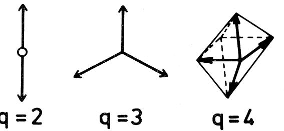

FIG. 1. The q unit vectors pointing in the q symmetric directions of a hypertetrahedron in q —1 dimensions.

exist no apparent relations between the planar and standard models for q ~ 4.

In addition to the two-site interactions, there can also be multisite interactions as well as external fields. For a Potts model on a lattice 6 of X sites, the Hamiltonian ~generally takes the form

$$\begin{aligned} -\beta \mathcal{H}^{\circ} &= L \sum_{i} \boldsymbol{\delta}_{\mathrm{Kr}}(\sigma_{i}, \mathbf{0}) + K \sum_{\langle i, f \rangle} \boldsymbol{\delta}_{\mathrm{Kr}}(\sigma_{i}, \sigma_{f}) \\ &+ K_{3} \sum_{\langle i, j, k \rangle} \boldsymbol{\delta}_{\mathrm{Kr}}(\sigma_{i}, \sigma_{j}, \sigma_{k}) + \boldsymbol{\delta}_{\mathrm{r}} \cdot \boldsymbol{\varepsilon}_{\mathrm{r}}, \qquad (1.6) \end{aligned}$$

where P=1/kT, and o;=0, 1, . . . , q —1 specifies the spin states at the ith site and

$$\delta_{\mathbf{Kr}}(\sigma_i, \dots, \sigma_k, \sigma_k) = 1, \quad \text{if } \sigma_i = \dots = \sigma_k$$

$$\mathbf{0} = \mathbf{0}, \quad \text{otherwise } \mathbf{.}$$

Here K =Ps2, K", n )3, is the strength of the n-site interactions, and L is an external 6eld applied to the spin state 0. [See Eqs. (1.18) and (3.1) for further forms of the Hamiltonian. ] The partition function is

$$\mathbf{Z}_G(q; L, K, K_n) = \sum_{\sigma_l=0}^{q-1} e^{-\beta \mathcal{H}^\vee} \,. \tag{1.7}$$

The physical properties of the system are derived in the usual way by taking the thermodynamic limit. Relevant thermodynamic quantities include the per site "free energy

$$f(q; ; L, K, K_n) = \lim_{N \to \infty} \frac{1}{N} \ln Z_G(q; L, K, K_n) \; , \tag{1.8}$$

the per site energy

$$E(q;L,K,K_{\mathfrak{n}}) = -\frac{\partial}{\partial \beta}f(q;L,K,K_{\mathfrak{n}})\,,\tag{1.9}$$

and the per site "magnetization, "

$$M(q;L,K,K_{\pi}) = -\frac{\partial}{\partial L}f(q;L,K,K_{\pi})\;. \tag{1.10}$$

The order parameter m, which takes the values 0 and 1 for completely disordered and ordered systems, respectively, is defined to be (Straley and Fisher, 1973; Binder, 1981)

$$\mathcal{C}(\mathbf{q}, L, \mathbf{K}, \mathbf{K_n}) = (\mathbf{q}\mathbf{M} - \mathbf{1}) / (\mathbf{q} - \mathbf{1}) \,. \tag{1.11}$$

A ferromagnetic transition is then accompanied with the onset of a spontaneous ordering

mo ——m(q;0+, K,K") . (1.12)

The critical exponents a, a', P, y, y', 5, . . . can be defined in the usual fashion [see, for example, Fisher (1967)] from the singular behavior of these thermodynamic quantities near the critical temperature T,.

The two-point correlation function I ~~(ri, r2) of the zero-field Potts model is (Wang and Wu, 1976)

$$\Gamma_{aa}(\mathbf{r}_1, \mathbf{r}_2) = P_{aa}(\mathbf{r}_1, \mathbf{r}_2) - q^{-2} \quad , \qquad \text{(1.13)}$$

where P~~(ri, r2) is the probability that the sites at ri and r2 are both in the same spin state a. Clearly, I takes

Rev. Mod. Phys. , Vot. 54, No. 1,January 1982

the respective values 0 and (q —1)/q for completely disordered and completely ordered systems. This then suggests the following relation between the large distance correlation and the spontaneous ordering:

$$\lim_{\mathbf{r}_1|\mathbf{r}_1-\mathbf{r}_2|\to\ast} \Gamma_{aa}(\mathbf{r}_1,\mathbf{r}_2) = (q-1)(m_0/q)^2 \,. \tag{1.14}$$

Indeed, the relation (1.14), which first appeared as a footnote in Potts and Ward (1955) for q =2, can be established by a decomposition of the correlation function into those of the extremum states (Kunz, 1981). It has also been established rigorously that I decays exponentially above the critical temperature T, (Hintermann et a/. , 1978). The decay of I ~~ for T & T, is not known except for q =2 (McCoy and Wu, 1973). Furthermore, the surface tension for the generalized Potts model has been discussed by Fontaine and Gruber (1979). It can be shown that, in two dimensions, the surface tension is related to the two-point correlation function of the dual model.

As we shall see, the analysis of the Potts model is closely related to the problem of graph colorings, so it is useful to introduce here the needed definitions.

Let Pg(q) be the number of ways that the vertices of a graph G can be colored in q different colors such that no two vertices connected by an edge bear the same color. Then Pg(q) is a function of q and is known as the chromatic function for the graph G.

Consider next an antiferromagnetic Potts model on 6 with pure two-site interactions K&0. Consider further the zero-temperature limit of K~—oo. It is clear that in this limit the partition function (1.7) reduces to

$$\mathbf{Z}_G(q; \mathbf{K} = -\underset{\mathbf{a}}{\Leftrightarrow}) = \mathbf{P}_G(q) \; . \tag{1.15a} \; . \tag{1.15a}$$

This simple connection between the Potts partition function and the chromatic function is valid for G in any dimension. . In addition, a graphical interpretation of Pg(q) for q =—1 has been given by Stanley (1973).

Wg(q)—:lim —lnPg(q) . For a lattice G of % sites, the free energy (1.8) in the zero-temperature limit of K~—00 becomes the groundstate entropy

$$\mathcal{W}_{\mathcal{G}}(q) \equiv \lim_{N \to \!\!\!- \!\!\!/ } \frac{1}{N} \ln \mathcal{P}_{\mathcal{G}}(q) \; . \tag{1.15b}$$

The existence of this limit has been discussed by Biggs (1975).

There are three exact results on Wg (q) for q ) 3. These are the values for the q =3 square lattice (Lieb, 1967a, 1967b), q =4 triangular lattice (Baxter, 1970), and the q =3 Kagome lattice (Baxter, 1970):

$$\begin{aligned} W_{\text{sq}}(3) &= (4/3)^{3/2} \\ &= 1.539 \, 60. \dots \\\ W_{\text{tri}}(4) &= \prod_{n=1}^{\text{oc}} \left[ \frac{(3n-1)^2}{(3n)(3n-2)} \right] \\ &= 1.469 \, 99. \dots \\\ W_{\text{Kagomé}}(3) &= [\, W_{\text{tri}}(4) \, ]^{1/3} \\ &= 1.134 \, 70. \dots \end{aligned} \tag{1.15c}$$

# B. The dilute model

If vacancies can occur on the lattice, then we have a site-diluted Potts model, or a Potts lattice gas (Berker et al., 1978), for which the lattice sites are randomly occupied with Potts spins. Consideration of this dilute Potts model has proven fruitful in the renormalization group studies of the Potts model (Nienhuis et al., 1979); it also generates other statistical mechanical models including those of polymer gelation (Coniglio et al., 1979) and the problem of site percolation in a lattice gas (Murata, 1979).

As in the usual consideration of random systems, the dilution in the Potts model can be either quenched, in which the vacancies are fixed in positions, or annealed, in which the vacancies can move around and are in thermoequilibrium with the surroundings. Very little is known about the quenched site-diluted system; it is the annealed system that has received the most attention.

The Hamiltonian A for an annealed site-diluted model reads

$$-\mathcal{B}\mathcal{H} = \sum_{i,j} t_i t_j [K' + K\delta_{Kr}(\sigma_l, \sigma_f)]$$

$$+\sum_l (1 - t_l) \text{lnz}_l \quad , \tag{1.16}$$

where z; is the fugacity of the vacancy at the ith site, and t;=0(1) indicates that the E'th site is vacant (occupied). The partition function of the dilute model is

$$\mathbf{Z}^{(D)}(q; ; K', K, \mathbf{z}_l) = \sum_{t_l=0}^{1} \sum_{\sigma_l=0}^{q-1} e^{-\beta \mathcal{H}'},\tag{1.17}$$

where the summation over o.; is for t; =1 only.

If the vacancies are considered as being a spin state, then the dilute model can also be regarded as an (undiluted) Potts model of (q+1) components. The Hamiltonian of this (q+1)-state model is

$$-\beta \mathcal{H}_{q+1}^{\circ} = K \sum_{(i,j)} \delta_{\text{Kr}}(\sigma_i, \sigma_j) + \sum_i L_i \delta_{\text{Kr}}(\sigma_i, 0)$$

$$+ M \sum_{(i,j)} \delta_{\text{Kr}}(\sigma_i, 0) \delta_{\text{Kr}}(\sigma_j, 0) \,, \tag{1.18}$$

where, in addition to the field I; at site i, an additional 6eld M is introduced which applies to neighboring sites that are both in the spin state 0. Writing

$$Z(q+1;K,M,L_i) = \sum_{\sigma_i=0}^{q} e^{-\beta \mathcal{N}_{q+1}},\tag{1.19}$$

we then have the identity

$$\mathbf{Z}^{(D)}(q;K',K,\mathbf{z}_l) = e^{EK'} \mathbf{Z}(q+1;K,M,L_l) \; , \tag{1.20}$$

$$\begin{aligned} \mathcal{M} &= \mathcal{K}' - \mathcal{K} \ &, \\ e^{L_i} &= \mathbf{z}_f e^{-\gamma_i K'} \ &. \end{aligned}$$

Here E is the total number of edges of the lattice and y; is the valence of the ith site.

Rev. Mod. Phys. , Vol. 54, No. 1,January 1982

For bipartite lattices it is possible to consider dilute models in which the vacancies are restricted to occurring at only one of the two sublattices. A special class of such lattices is those with bond decorations with vacancies restricted to the decorating sites. The critical properties of this diluted model can be derived from those of the underlying undiluted model, and have led to some unique features, including the existence of a two-phase region for q &4 (Wu, 1980). Similar results have also been obtained for the regular (undecorated) honeycomb lattice (Wu and Zia, 1981; Kondo and Temesvari, 1981).

#### C. The mean-field solution

It is well known that the mean-field description of the Ising model gives a qualitatively correct picture of the phase transition. In the absence of an exact solution, it is therefore natural first to examine the q-component Potts model in the mean-field approximation.

Such a study was first carried out by Kihara et al. (1954) under the Bragg-Williams approximation (Bragg and Williams, 1934). They found the transition to be of first order for all q & 2, and, apparently without realizing the importance attached to this implication, dismissed the result as "being far from reality. "

The mean-field theory was considered again by Mittag and Stephen (1974) [see also Straley and Fisher (1973)]. With the guide of the known exact critical properties of the two-dimensional model (Baxter, 1973a), they showed that the mean-field result is exact to the leading order in the large q expansion in d =2 dimensions. In fact, the exact result in d =2 shows a first-order transition for q & 4 (Sec. V.B). We then expect, more generally, the existence of a critical value q, (d) such that, in d dimensions, the mean-field theory is valid for q &q,(d). We shall look at this point briefly before going on to the mean-field solution.

Regarding q and d as being both continuous, the critical value of q, (d) implies the existence of a critical dimensionality d, (q) such that the mean-field behavior prevails in d &d, (q). The known points are d,(2)=4 and q, (2)=4. It has also been suggested (Toulouse, 1974), and subsequently verified by Monte Carlo simulation (Kirkpatrick, 1976) and by series analyses (Gaunt et al., 1976; Gaunt and Ruskin, 1978), that the critical dimensionality d, (1) for the percolation process (see Sec. IV.B) is 6. A schematic plot of q, (d) is thus made in Fig. 2, where we have also incorporated the renormalization-group results of q, (1+E)-exp(2/e) for small E (Andelman and Berker, 1981; Nienhuis et al., 1981), q, (d) =2 for d & 4 (Aharony and Pytte, 1981), and assumed first-order transition at the point q =3, d =3 (see Sec. V.B). A plot of the first-order region similar to Fig. 2 can be found in Riedel (1981) and Nienhuis, et al. (1981).

We now describe a mean-field theory of the Potts model equivalent to that of Kihara et al. (1954).

We start from the mean-field Hamiltonian (Husimi, 1953; Temperley, 1954; Kac, 1968)

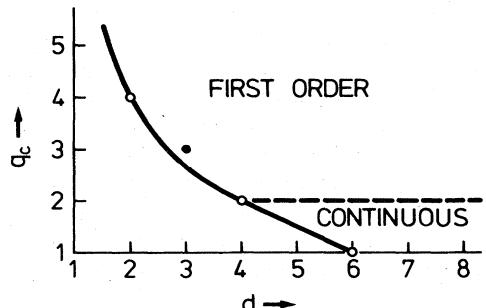

FIG. 2. Schematic plot of q, (d), the critical value of q beyond which the transition is mean-field —like (first order for q &2 and continuous for q & 2). The known points q,(2)=4, q, {4)=2, and q,(6)=1 are denoted by open circles. The black circle indicates the assumed first-order transition for d=3, q=3.

$$\mathcal{H}^c = -\frac{1}{N}\gamma \mathbf{e}_2 \sum_{l$$

for a system of X spins, each of which interacts with the other N —1 spins via an equal strength of yEz/X, y being the coordination number of the lattice.

Let x; be the fraction of spins that are in the spin state i =0, 1, . . . , q —I, subject to

$$\sum_{l} \mathbf{x}_{l} = 1 \quad \dots \quad \dots \quad \dots \quad \dots \quad \dots \quad \dots \tag{1.22}$$

Then, to the leading order in X, the energy and entropy per spin are

$$\frac{E}{N} = -\frac{1}{2}\gamma\sigma_2 \sum_{l} \mathbf{x}_l^2 \quad , \qquad \mathbf{x}_l = \mathbf{x}_l + \mathbf{x}_l \tag{1.23}$$

$$\frac{S}{N} = -k \sum_{l} \mathbf{x}_l \ln \mathbf{x}_l \quad , \qquad \mathbf{x}_l = \mathbf{x}_l \tag{1.23}$$

and the free energy per spin, A, is given by the expression

$$\beta \mathcal{A} = \sum_{l}^{l} (\mathbf{x}_{l} \ln \mathbf{x}_{l} - \frac{1}{2} \gamma \mathbf{K} \mathbf{x}_{l}^{2}) \quad , \qquad \qquad \qquad \mathbf{x}_{l} \sim \mathbf{x}_{l} \tag{1.24}$$

where X =Peq.

For ferromagnetic interactions (c,z & 0) we look for a solution in the form of

$$\begin{aligned} \mathbf{x}_0 &= \frac{1}{q} \begin{bmatrix} 1 + (q-1)\mathbf{s} \end{bmatrix}, \\ \mathbf{x}_i &= \frac{1}{q} (1-\mathbf{s}), \quad i = 1, 2, \dots, q-1, \quad \mathbf{y} = \begin{bmatrix} 1 \\ \mathbf{y} \end{bmatrix} \end{aligned} \tag{1.25}$$

where the order parameter 0(s(1 is to take the value so which minimizes the free energy. It follows that a long-range order exists (xo & x; ) in the system if so )0.

What actually happens can be readily seen from the expansion of A(s) for small s. Using (1.24) and (1.25), we find

$$\begin{split} \mathcal{J}[A(s) - A(0)] &= \frac{1 + (q - 1)s}{q} \ln\left[1 + (q - 1)s\right] + \frac{q - 1}{q} (1 - s) \ln(1 - s) - \frac{q - 1}{2q} \gamma \text{Ks}^2 \\ &= \frac{q - 1}{2q} (q - \gamma \text{Ks}) s^2 - \frac{1}{8} (q - 1)(q - 2) s^3 + \dots \end{split} \tag{1.26}$$

It is the existence of a negative coefHcient in the cubic term for q ~2 which signifies the occurrence of a firstorder transition (Harris et al., 1975; de Gennes, 1971).

The order parameter so is to be determined as a function of temperature T from A'(so)=0. It is seen that so——0 is always a solution, but at suNciently low temperatures other solutions of so & 0 emerge which may actually yield a lower free energy. The critical point is then defined to be the temperature T, at which this shift of minimum free energy occurs.

For q =2 this leads to the usual mean-field consideration of the Ising model, namely,

$$\ln[(1+\mathbf{s}_0)\dot{\lambda}(1-\mathbf{s}_0)] = \gamma \mathbf{K} \mathbf{s}_0 \; . \tag{1.27}$$

From (1.27) we see that the critical point is

$$
\gamma \mathbf{K_c} = \mathbf{2} \quad . \qquad \cdot \qquad \cdot \qquad . \tag{1.28}
$$

The transition is continuous since so ——0 at T, .

The situation is different for q &2 because the order parameter jumps from 0 to a value s, & 0 discontinuously at T, . In this case the critical parameters sc and T, are solved jointly from A'(s, )=0 and A(s, )=A(0). One finds

Rev. Mod. Phys. , Vol. 54, No. 1,January 1982

$$\gamma K_c = \frac{2(q-1)}{q-2} \ln(q-1) \quad , \tag{1.29}$$

$$s_c = (q-2)/(q-1)\ . \tag{1.30}$$

Using (1.23) we can also compute the latent heat per spin I., yielding the result

$$L = \gamma \varepsilon_2 (q - 2)^2 / 2q (q - 1) \quad . \qquad \cdot \qquad . \tag{1.31}$$

Other critical parameters can be similarly obtained. As we have already remarked, these expressions agree with the exact results in d =2 dimensions (Sec. V.B) to the leading order in the large q expansion.

# D. Experimental realizations

For many years the Potts model was considered a systern exhibiting an order-disorder transition primarily of theoretical interest. However, it has been recognized in recent years that it is also possible to realize the Potts model in experiments. Substances and experimental systerns which can be regarded as realizations of the various Potts models have been suggested and identified; relevant

experiments have been performed. It is through the combined eFort in both theory and experiments that. a converging picture in understanding the Potts transition has begun to emerge.

The underlying principle in the experimental realization of a spin system is the principle of universality, from which one is led to seek for real systems belonging to the same universality class, i.e., having the same set of critical exponents, as the spin model in question. For the Potts model one is guided by its Landau-Ginzburg-Wilson (LGW) Hamiltonian [Zia and Wallace (1975) and Amit (1976) for general q; Golner (1973) Amit and Shcherbakov (1974) and Rudnick (1973) for q =3]. An example is the transition occurring in monolayers and submonolayers adsorbed on crystal surfaces. The transitions in these systems have long been known {Somorja, 1973). But Domany et aI. (1977) showed that the adsorbed systems can be classified and catalogorized using the Landau theory and the LG'W Harniltonian of the adatoms regarded as a lattice gas. It has since been shown (Domany et al., 1978; Domany and Riedel, 1978; Domany and Schick, 1979) that transitions belonging to the various universality classes of the two-dimensional spin models can be realized by appropriately choosing the substrate array and the adatom coverage; some of these suggestions have indeed been verified in experiments.

#### 1. q = 2 {1sing) systems

Magnetic substances that are well approximated by simple Ising systems are numerous and well known (see, for example, a review by de Jongh and Miedema (1974)]. We mention here only the most notable examples, CoCs2Br» in d =2 (Wielinga et al., 1967; Mess et al., 1967), CoCs&C1» (Wielinga et al., 1967) and DyPO4 (Wright et al., 1971) in d =3.

The possibility of realizing the d =2 Ising model in adsorbed systems was suggested by Domany and Schick (1979), who showed that, at 1/2 coverage, an adsorbed system on a substrate of honeycomb array should exhibit an Ising-type behavior. This prediction has since been confirmed by the careful specific heat measurement (Tejwani et al., 1980) of the adsorbed He atoms on krypton preplated graphite.

#### 2. q = 3 systems

The critical behavior of the three-state Potts model, especially in d =3, provides a clear-cut test of the mean™ field prediction and has been a subject of considerable interest. On the experimental side Mukamel et al. (1976) have suggested that in a diagonal magnetic field a cubic ferromagnet with three easy axes can be regarded as the q =3 Potts model, thus providing an experimentally accessible realization in d =3. Experimental study on one of such cubic- ferromagnets, DyA12, has since been carried out (Barbara et al., 1978), and the finding of a first-

order transition is consistent with current understanding (see Sec. V.B). Other variants of the three-state model in cubic rare-earth compounds have also been suggested (Kim et al., 1975). In addition, the first-order structural transition occurring in some substances such as the stressed SrTiO& is in the q =3 universality class (Aharony et al., 1977; Blankschtein and Aharony, 1980a, 1980b, 1981). It has also been shown that the phase diagram of the structural transition in A15 compound in the presence of internal strain and external stress coincides with that of the q =3 Potts model (Szabo, 1975; Weger and Goldberg, 1973). A fluid mixture of five (suitably chosen) components can also be regarded as a realization of the q =3 system, and experiment on one such mixture, ethylene glycol + water + lauryl alcohol + nitromethane + nitroethane, also indicated a first-order transition (Das and Griffiths, 1979).

The relevance of' the adsorbed monolayers in the q =3, d =2 Potts model was first pointed out by Alexander (1975). Specifically, it was suggested that the adsorption of He atoms on graphite at —, coverage provides a realization of the three-state model. Such adsorbed systems have since been the subject of careful experimental studies (Bretz, 1977; Tejwani et al, 1980); the experimental results are in agreement with the theoretical predictions (see Sec. V.C). Other possible realizations of the q =3 systems in adsorptions have been discussed by Domany and Riedel (1978), Domany et aI. (1978), and Domany and Schick (1979). The adsorption of krypton on graphite as a three-component Potts model has also been considered by Berker et al. (1978). It has also been suggested that the structural ordering observed in silver P alumina is a realization of the q =3, d =2 Potts model (Gouyet et al., 1980; Gouyet, 1980).

#### 3. q = 4 systems

The general discussion on the classification scheme of the adsorbed systems (Domany et al., 1978; Domany and Schick, 1979; Domany and Riedel, 1978) has led to a variety of possible realizations of the q =4 model in d =2. It was suggested, in particular, that Xz adsorbed on krypton-plated graphite should exhibit a critical behavior as the q =4 Potts model (Domany et al., 1977). In addition, Park et al. (1980) have studied 02 adsorbed on the surface of nickel as a realization of the q =4 model. In three dimensions the realization of the q =4 (and q =3) model in type I fcc antiferromagnets (such as CeAs) has been suggested recently by Domany et aI. (1981).

# 4. 0&&q &~ 1 systems

It has been shown (Lubensky and Isaacon, 1978) that transitions in the gelation and vulcanization processes in branched polymers are in the same universality class of the 0(q & 1 Potts model. This suggests that by properly choosing the polyfunctional units which are allowed to interact in a polymeric solution, Potts models of different values of q between zero and one may be realized in the polymer systems.

# E. The Bethe lattice

The Potts model is exactly soluble on the Bethe lattice. As in the case of the Ising model (Eggarter, 1974; von Heimburg and Thomas, 1974; Matsuda, 1974), one finds a phase transition characterized by a diverging susceptibility without a long-range order (Wang and Wu, 1976).

A Bethe lattice is a Cayley tree [for definitions of graphical terms see, for example, Essam and Fisher (1970)] having the same valence y at all interior sites. Then for the Potts model (1.4) the free energy (1.8) is trivially evaluated to yield

$$f(q, \mathcal{K}) = \ln(e^{\mathcal{K}} + q - 1) \,, \qquad \cdot \qquad \tag{1.32}$$

which is analytic in the temperature T. The correlation function (1.13) can also be evaluated, yielding

$$\Gamma_{aa}(\mathbf{r}_1, \mathbf{r}_2) = \frac{q-1}{q^2} \left\{ \frac{e^K - 1}{e^K + q - 1} \right\}^{|\mathbf{r}_1 - \mathbf{r}_2|},\tag{1.33}$$

where ~ ri —r2 ~ is the distance between ri and r2. Consequently, there exists no large distance correlation.

To compute the zero-field susceptibility 7 one explicitly carries out the summation in the fluctuation relation

$$\mathcal{X}(q; \mathcal{K}) = \lim_{N \to \infty} N^{-1} \sum_{\mathbf{r}_1, \mathbf{r}_2} \Gamma_{\alpha a}(\mathbf{r}_1, \mathbf{r}_2) \tag{1.34}$$

and finds that X diverges for T & T,[v'(y 1)], where— T,(x) is defined by

$$\ln|K_{\mathfrak{c}}(\mathbf{x})| = \ln[(q+\mathbf{x}-1)/(\mathbf{x}-1)], \quad \mathfrak{e}_2 > \mathbf{0} \tag{1.35}$$

$$= \ln[(\mathbf{x}-1)/(\mathbf{x}+1-q)], \quad \mathfrak{e}_2 < \mathbf{0}, \quad q < \mathbf{x}+1 \text{ .} $$

It is noteworthy that the critical behavior on the Bethe lattice is different from that of the mean-field solution of Sec. I.C, and that of the Bethe-Peierls approximation [see, for example, Huang (1963)]. The latter solutions yield a nonzero long-range order and corresponds to the critical behavior occurring in the interior of a Bethe lattice.

# lI. DUAL ITY 8ELATI ONS

Duality relations are useful in obtaining exact information on spin systems. For a review of duality in 6eld theory and in statistical systems in general see Savit (1980). See also Gruber et al. (1977) for a discussion of duality transformation for general q-component models. Here we shall be concerned with the explicit formulation of duality for Potts models in two dimensions. These are relations connecting the partition functions in the highand low-temperature regions.

#### A. Models with two-site interactions

A duality relation for the Potts model was first derived for the square lattice with pure two™site interactions on the basis of the transfer matrix approach [Potts (1952); see also Kihara et al. , (1954)]. The duality relation has since been rederived from other considerations and generalized to all planar lattices [see, Mittag and Stephen (1971); Wu and Wang (1976)]. The following derivation is based on a simple theorem in graph theory known to mathematicians for many years (Whitney, 1932).

Write the partition function (1.7) with pure two-site interactions in the form of

$$Z_G(q;K) = \sum_{\sigma_l=0}^{q-1} \prod_{\{ij\}} \left[1 + \upsilon \delta_{\text{Kr}}(\sigma_l, \sigma_j)\right],\tag{2.1}$$

where

$$f(q,K) = \ln(e^K + q - 1) \quad . \tag{1.32} \qquad \qquad \qquad \qquad v = e^K - 1 \quad . \tag{2.23}$$

Next multiply out the product and represent the terms in the product by the subgraphs O' C:6 whose edge sets correspond to the u factors in the terms. Let b(6') be the number of edges (bonds) and n(6') the number of connected components (clusters), including isolated points, in 6'. The partition function then takes the following simple form after carrying out the spin summations (Baxter, 1973):

$$Z_G(q;K) = \sum_{G' \subseteq G} v^{b(G')} q^{\pi(G')} \,. \tag{2.3}$$

The expression (2.3) is the starting point of various formulations of the Potts model (see Sec. V); it also serves as a natural extension of the Potts model to nonintegral values of q. The latter formulation [in the form of (2.3)] leads to the random cluster model of Kasteleyn and Fortuin (1969) and forms the basis of studying the Potts model for general values of q (see, for example, Blote et al., 1981). An immediate application of (2.3) is to combine with (1.15a), yielding the chromatic function Pa(q) in the form of a polynomial in q:

$$P_G(q) = \sum_{G' \subseteq G} (-1)^{b(G')} q^{\pi(G')} \,. \tag{2.4}$$

This is the well-known Birkhoff (1912) formula for the chromatic function.

In a consideration of the problem of map colorings, Whitney (1932) introduced the following Whitney rank function:

$$\boldsymbol{W}_{\mathcal{G}}(\boldsymbol{\chi}, \boldsymbol{\upchi}) = \sum_{\boldsymbol{G}' \subseteq \mathcal{G}} \boldsymbol{\upchi}^{b(\boldsymbol{G}')} (\boldsymbol{\upchi}/\boldsymbol{\upchi})^{\varepsilon(\boldsymbol{G}')},\tag{2.5}$$

where c (6') is the number of independent circuits in 6'. Now c(6') is related to b(6') and n(6') through the Euler relation (valid for any 6' not necessarily planar)

$$c(G') = b(G') + n(G') - N \quad , \qquad \qquad \qquad \qquad \qquad \qquad \qquad \qquad \qquad \text{(2.6)}$$

where N is the number of vertices in G. Substituting (2.6) into (2.5) and comparing with (2.3), we obtain the identity

$$\mathbf{Z}_G(q; \mathcal{K}) = q^N \mathcal{W}_G \left\{ \frac{v}{q}, v \right\} \,. \tag{2.7}$$

The duality for ZG then follows from a similar relation for 8'G (Whitney, 1932). We now cast Whitney's derivation of this duality in the language of the Potts variables.

Let D be the dual of 6, and to each O'C:6 introduce a D'LD whose edge set complements that of O'. For example, if 6 is 4&4 lattice of 16 sites, then D is a graph having 16 faces and 10 sites, including one site residing exterior to G. An example of the correspondence between a typical 6' and D' for this 6 and D is shown in Fig. 3. Since by construction each circuit of 6' encircles a cluster of D', and vice versa, we have

$$n(\mathcal{D}') = c\left(\mathcal{G}'\right) + 1\ ,$$

$$n(\mathcal{G}') = c\left(\mathcal{D}'\right) + 1\ .\tag{2.8}$$

We also have

$$b(G') + b(D') = E \quad , \tag{2.9}$$

where E is the total number of edges of G (or D). Combining (2.3) with (2.6) and (2.8), we obtain

$$\mathcal{Z}_G(q; \mathbf{K}) = \upsilon^E q^{1 - N_D} \sum_{D' \subseteq D} \left| \frac{q}{\upsilon} \right|^{\nu(D')} q^{\pi(D')}$$

$$= \upsilon^E q^{1 - N_D} \mathcal{Z}_D(q; \mathbf{K}^\bullet) \quad , \qquad \qquad (2.10)$$

where

$$(e^{K} - 1)(e^{K^{\bullet}} - 1) = q \quad , \tag{2.11}$$

and XD ——E+2—X is the number of sites of D. Thus (2.10) relates the partition functions of the Potts models on 6 and D and maps the high- and low-temperature partition functions of the dual models onto each other.

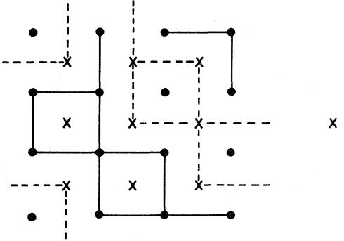

FIG. 3. Example of a mapping between a subgraph G' on a 4&4 lattice G and subgraph D' on D, the dual of G. The N =16 sites of 6 are denoted by the dots and the XD——10 sites of D are denoted by the crosses. The single site of D residing exterior to G is connected to eight other sites of D. The edges in G'(D') are denoted by the solid (broken) lines. In the configuration shown we have b(G')=l2, n(G')=6, c(G')=2, b(D') =l2, n (D') =3, c(D')=5.

The duality relation (2.11) is a local property in the sense that it also holds for edge-dependent interactions. A discussion of this generalization can be found in Wu (1978).

# B. Models with multisite interactions

Essam (1979) has extended the duality relation to Potts models with multisite interactions [see also Kasai et al. (1980)]. For the purpose of discussing this generalization, it is convenient first to extend the definition of a dual to a special class of lattices or graphs.

Consider a lattice G =(V,E) whose vertex set V is bipartite. That is, we can write V=(S,I) such that vertices in S neighbor only vertices in I, and vice versa. The edge set E consists of the lines connecting these neighboring (S and I) vertices. Examples of such lattices are shown in Fig. 4.

Let S denote the set of vertices residing in the faces of G. Then we define the dual of G, G'=(V, E*), in a similar way, i.e., the vertex set is V"=(S*,I) and the edge set E* consists of the lines connecting the neighboring (S* and I) sites. Thus the lattice of Fig. 4(a) is selfdual, while those of Fig. 4(b) and Fig. 4(c) are dual to each other.

Now consider a Potts model on 6 with the spins located at the vertices of S and interactions specified by the vertices of I. Specifically, the y spins surrounding a vertex of I interact with a y-site interaction (of strength Kr, say) of the form of (1.6). The dual model is similarly defined with spins located at S* and interacting with y-site interactions (of strength Kr) surrounding the sites of I. (Note that the I vertices serve no purpose in the two models other than specifying the interactions. ) The following duality relation exists between the two Potts models (Essam, 1979):

$$(e^{\kappa_{\mathcal{Y}}} - 1)(e^{\kappa_{\mathcal{Y}}^\bullet} - 1) = q^{\mathcal{Y} - 1} \tag{2.13}$$

1+% ~ ZG(q;Kr)=(e ~—1) 'q ZG, (q;K*), (2.12)

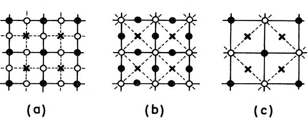

FIG. 4. Examples of lattices 6 consisting of bipartite vertex set V =(S,I) and edge set (connecting S and I) denoted by the solid lines. The S vertices are denoted by the black circles and the I vertices by the open circles. The dual lattice 6 consists of the vertex set V*=(S*,I) and the edge set (connecting S and I) denoted by the broken lines. The S* vertices are denoted by the crosses. The lattice (a) is self-dual, and the lattices (b) and (c) are dual to each other.

Rev. Mod. Phys. , Vol. 54, No. t, January 1982

and NI, N, are, respectively, the numbers of vertices in the sets I and S*.

For pure two-site interactions, i.e., y=2, (2.12) reduces readily to (2.10). Here again the duality relation (2.13) is valid more generally for position-dependent interactions and nonuniform values of y. We now outline the proof of (2.12) for the case of uniform values of Kr and y. Generalization to nonuniform values is immediate.

To facilitate the proof we define subgraphs G'C:G as the set consisting of the S vertices and randomly chosen I(G') of the I vertices, together with the yI(G') edges incident to the I(G') vertices. A typical subgraph G' obtained in this fashion for the lattice G of Fig. 4(b) is shown in Fig. 5. These subgraphs are useful in representing terms in the expansion of the partition function ZG. As in (2.1) and (2.3), we obtain the expression

$$\mathbf{Z}_{\mathcal{G}}(q;\mathcal{K}) = \sum_{G' \subseteq \mathcal{G}} (e^{K_{\mathcal{F}}} - 1)^{I(G')} q^{\pi(G')},\tag{2.14}$$

where n(G') is the number of clusters, including isolated S vertices, in 6'.

Again, to each 6'&6 a dual subgraph G*' C:6* is constructed (and vice versa) by taking the complement of G' [i.e., G*' consists of the S* vertices and the remaining NI I(G')=I—(G") of the I vertices together with their yI(G" ) incident edgesj. An example of this construction is shown in Fig. 5.

It is now straightforward to proceed as in the case of y=2 to obtain a duality relation. In place of (2.6) and (2.9) we now have the Euler relation

$$m(\mathbf{G'}) = \stackrel{\circ}{N}_S - (\gamma - 1)I(\mathbf{G'}) + c(\mathbf{G'}) \tag{2.15}$$

$$I(\mathbf{G'}) + I(\mathbf{G''}) = N_I \quad , \tag{2.16}$$

while relations (2.8) remain unchanged. Using these identities and further the equality

$$N_{\mathcal{S}} + N_{\mathcal{S}^\bullet} = (\gamma - 1)N_I + 2\text{ \textquotedblleft}, \text{ \textquotedblright} \qquad \text{(2.17)}\\ \qquad \qquad \qquad \qquad \qquad \mathbb{Z}_{\mathsf{A}}(q; K_1, K_2, K_3, L) = \sum_{i=1}^{q-1} \sum_{j=1}^{i} \frac{q^{i-1}}{2} \begin{bmatrix} \mathbb{Z}_{\mathsf{A}}(q; K_1, K_2, K_3, L) \\ \vdots \\ \mathbb{Z}_{\mathsf{A}}(q; K_1, K_2, K_3, L) \end{bmatrix}^T \in \mathbb{R}_{q-1}^{q-1}$$

one obtains (2.12) from (2.14).

As we have already remarked, the duality relation (2.12) is more general, being valid for nonuniform interactions and/or y's. As an example, consider a Potts

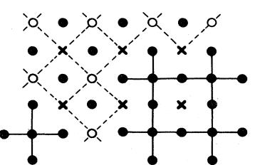

FIG. S. A subgraph 6' for the lattice G of Fig. 4(b) and the associated subgraph 6*' C:6 . 6' is denoted by the solid circles and the solid lines, and G*' consists of the vertices denoted by the open circles and the crosses, and the broken lines. In the configuration shown I(6')=5, I(6*' )=7.

Rev. Mod. Phys. , Vol. 54, No. 1,January 1982

model on the square lattice which, in addition to the usual two-site interactions E2, also possesses four-site interactions K4. in every face of the square lattice. This Potts model and the associated 6 lattice are shown in Fig. 6. In Fig. 7 we see the lattice 6* dual to 6 and the associated dual Potts model. It is seen that the dual Potts model has two-site interactions K2 and four-site interactions K4 with a different topology. The special case of K2——0 (K2 ——oo) of this relation has been considered by Burkhardt (1979).

# C. Other duality relations

In addition to the duality relations described above, there exist other relations, notable for lattices with triangular symmetry, which do not fall into the same scheme. %'hile these latter duality relations can be derived from a number of different considerations (Baxter et a/. , 1978; Wu and Lin, 1980), we describe here a derivation using a method due to Burkhardt (1979), which has the advantage of being easily adapted to other lattices.

Consider a Potts model on a lattice 6 whose dual is bipartite. The interactions, which may consist two-site and multisite components, are restricted to spins surrounding every other face of G. Then, by introducing dual spins residing in the faces where there are no interactions, a partial trace can be taken in the partition function resulting in a Potts model represented by these dual spins. This is the essential idea of Burkhardt (1979).

Consider, for instance, a triangular Potts model which has anisotropic two-site interactions K&, K2 K3 and a three-site interaction I, in every up-pointing triangle. The situation is shown in Fig. 8, where the shaded triangles denote the Potts interactions. The partition function takes the form

$$Z_{\Delta}(q; K_1, K_2, K_3, L) = \sum_{\sigma_i=0}^{q} \prod_{\Delta} e^{H(\sigma_1, \sigma_2, \sigma_3)},\tag{2.18}$$

where

$$H(\sigma_1, \sigma_2, \sigma_3) = K_1 \delta_{23} + K_2 \delta_{31} + K_3 \delta_{12} + L \, \delta_{12} \delta_{23} \,, \tag{2.19}$$

$$
\delta_{\tilde{\mathbf{y}}} = \delta_{\mathbf{Kr}}(\sigma_l, \sigma_f) \; , \; .
$$

and the product is taken over all up-pointing triangles.

r

E

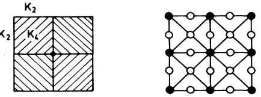

FIG. 6. A square Potts lattice with two-site interactions K2 and four-site interactions E~,' the associate 6 =(S,I) lattice is shown on the right. The solid circles denote the S vertices locating the spins; the open circles denote the I vertices defining the interactions.

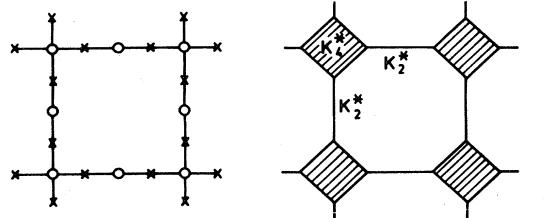

FICx. 7. The dual lattice G and its associated Potts lattice. Thus we obtain from (2.22) The Potts lattice has two-site interactions K2 and four-site interactions K4 as shown. H (cr,a, o )

Since H(o i,o2, cT3) depends only on the differences (T12—(T1 CT2 (T23—o 2 cT3 0 31—o 3 CT1 (modq), it is convenient to regard the variables o. ,j as being independent. This is permitted if we introduce to each (up- and down-pointing) triangular face a factor (hence a variable T)

$$\begin{split} \sum_{l=-\infty}^{\infty} \mathsf{S}(\sigma_{12} + \sigma_{23} + \sigma_{31}, lq) \\ = \frac{1}{q} \sum_{\tau=0}^{q} \exp\left\{ \frac{2\pi i}{q} \tau (\sigma_{12} + \sigma_{23} + \sigma_{31}) \right\}. \end{split} \tag{2.20}$$

With these factors in place, the o. ,j summations in the partition function can now be carried out. If, in addition, we also take the partial trace over the ~-variables over the up-pointing triangles, we are then left with the expression

$$Z_{\Delta}(q; K_1, K_2, K_3, L) = \sum_{\tau_l=0}^{q-1} \prod_{\nabla} e^{H^{\mathbf{A}}(\tau_1, \tau_2, \tau_3)},\qquad(2.21)$$

where

$$e^{H^{\bullet}(\tau_1, \tau_2, \tau_3)} = \frac{1}{q^2} \sum_{\sigma_1 \sigma_2 \sigma_3} e^{H(\sigma_1, \sigma_2, \sigma_3)} e^{\langle 2\pi l/q \rangle (\tau_1 \sigma_{23} + \tau_2 \sigma_{31} + \tau_3 \sigma_{12})} \tag{2.22}$$

The product in the right-hand side of (2.21) is taken over every down-pointing triangle of a triangular lattice of the same size. The evaluation of (2.22) is facilitated by writing

$$e^{H(\sigma_1, \sigma_2, \sigma_3)} = 1 + \nu_1 \mathfrak{S}_{23} + \nu_2 \mathfrak{S}_{31} + \nu_3 \mathfrak{S}_{12} + \mathcal{Y} \mathfrak{S}_{12} \mathfrak{S}_{23} \ , \tag{2.23}$$

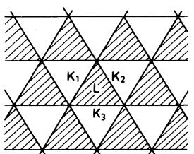

FIG. 8. Triangular Potts model with two-site interactions K] K2 K3 and three-site interactions Lr in alternate triangular faces.

Re@. Mod. Phys. , Vol. 54, No. 1,January 1982

where

$$\begin{split} v_{l} &= e^{K_{l}} - 1 \\ y &= v_{1}v_{2} + v_{2}v_{3} + v_{3}v_{1} + v_{1}v_{2}v_{3} \\ &\quad + (e^{L} - 1)(1 + v_{1})(1 + v_{2})(1 + v_{3}) \\ &= e^{L + K_{1} + K_{2} + K_{3}} - e^{K_{1}} - e^{K_{2}} - e^{K_{3}} + 2 \ . \end{split} \tag{2.24}$$

$$\begin{split} e^{H^{\mathsf{A}}(\sigma_{1},\sigma_{2},\sigma_{3})} = \frac{\mathscr{Y}}{q} \left\{ 1 + \frac{qv_{1}}{\mathscr{Y}} \mathfrak{S}_{23} + \frac{qv_{2}}{\mathscr{Y}} \mathfrak{S}_{31} \\ &+ \frac{qv_{3}}{\mathscr{Y}} \mathfrak{S}_{12} + \frac{q^{2}}{\mathscr{Y}} \mathfrak{S}_{12} \mathfrak{S}_{23} \right\}, \end{split} \tag{2.25}$$

and hence from (2.21) the duality relation

$$\mathbf{Z}_{\Delta}(q; K_1, K_2, K_3, L) = \left\langle \frac{\underline{\mathbf{y}}}{q} \right\rangle^N \mathbf{Z}_{\nabla}(q; K_1^\bullet, K_2^\bullet, K_3^\bullet, L^\bullet) \; , \tag{2.26}$$

with

$$e^{K_i^{\bullet}} - 1 = qv_i/y \quad ,$$

$$y^{\bullet} = q^2/y \quad ,$$

'

where y* is defined in terms of K;* and L" as in (2.24). In (2.26), N is the number of sites of the triangular lattice and Zv is the partition function of the same model with interactions in every down-pointing triangle.

Since by symmetry Z~(q;K;,L)=Zrt(q;K;, L), the partition function (2.18) is self-dual about the point

$$
\mathbf{y} = \mathbf{q} \; . \tag{2.27}
$$

The duality relation (2.26) was first observed by Kim and Joseph (1974) in the special case of L =0. The full duality (2.26) was first derived by Baxter et al. (1978) using an algebraic method, and later rederived by Enting (1978c) and by Wu and Lin (1980) from graphical considerations.

This method of taking partial traces can be readily adapted to other lattices. Applications to the square lattice, including a rederivation of the Essam duality (2.12) for pure four-site interactions mentioned before, have already been given by Burkhardt (1979). Here we state the result of another application (Enting and Wu, 1982).

Consider the triangular Potts model with two-site interactions K1,K2,K3 and three-site interactions L, now in every triangular face. The method of partial trace then relates this model to a Kagome Potts model with twosite interactions K1, K2, E3 and three-site interactions I* in the triangular faces of the Kagome lattice. The equivalence is best seen by starting from the Kagome lattice and taking the partial traces after introducing (2.20). The result leads to

$$\begin{aligned} &\mathbf{Z}_{\text{Triangle}}(q; \mathbf{K}_1, \mathbf{K}_2, \mathbf{K}_3, \mathbf{L}) \\ &= \left[ \begin{smallmatrix} \underline{\mathbf{y}} \\ q \end{smallmatrix} \right]^N \mathbf{Z}_{\text{Kagom\'}}(q; \mathbf{K}_1^\bullet, \mathbf{K}_2^\bullet, \mathbf{K}_3^\bullet, \mathbf{L}^\bullet) \end{aligned} \tag{2.28}$$

$$\begin{aligned} e^{K_l^\bullet} - 1 &= q v_l / y \ , \\ y^\bullet &= q^2 / y \ , \end{aligned} \tag{2.29}$$

where y* is defined in terms of K;*,I.' as in (2.24), while y is similarly defined in terms of K;/2 and I. (Enting and Wu, 1982).

Finally, it should be noted that Enting (1975c) has considered a "quasi" q-state Potts model on the triangular lattice with three-site interactions. He showed that this model, which is an extension of the q =2 three-spin Ising model of Baxter and Wu (1973), possesses an exact duality relation.

# D. The Z(q} model

The Z(q) model (1.2) plays an important role in the lattice gauge theories, and has already been eloquently reviewed in this perspective (Kogut, 1979; Einhorn et al., 1980). Here we describe an exact duality relation valid for the Z(q) model in two dimensions (Wu and Wang, 1976).

For the interaction (1.2) the nearest-neighbor Boltzmann factor reads

$$\mu(n_i - n_f) = \exp\{\beta J \{2\pi(n_i - n_f)/q\}\}\,,\tag{2.30}$$

where the interaction J(e) is 2ir periodic. Denote the partition function with the nearest-neighbor Boltzmann factor (2.30) by Z(u). It then follows from a simple geometric consideration (Wu and Wang, 1976) that Z(u) is related to a partition function Z' '(A, ) similarly defined on the dual lattice. This exact duality reads

$$\mathbf{Z}(\boldsymbol{\mu}) = \boldsymbol{q}^{\mathsf{l} - N_D} \mathbf{Z}^{(D)}(\boldsymbol{\lambda}) \; , \tag{2.31}$$

where ND is the number of sites of the dual lattice, and the A, 's are the nearest-neighbor Boltzmann factors of the dual model given by

$$\lambda(m) = \sum_{n=0}^{q} \exp(2\pi i mn/q) u^{\binom{n}{2}},$$

$$m = 0, 1, \dots, q-1, q-1. \quad (2.32)$$

[In fact, the q A, 's are the eigenvalues of the q)&q cyclic matrix whose elements are (2.30).] The duality relation (2.31} has proven to be useful in constructing the phase diagram of the Z (q) model [see, for example, Wu, (1979a), Car dy, (1980), Alcaraz and Koberle, (1980)]. Note that the duality (2.31) includes the duality (2.10) of the (standard) Potts model as a special case. Here again the duality (2.31) is valid more generally for models with edge-dependent interactions.

# E. The dilute model

Extending the idea of duality in terms of graphical representations as presented in Sec. II.A, it is straightforward to derive a dual model for the dilute Potts model in the form of a graph-generating function. We refer to Wu (1981)for details of this extension.

Of special interest is a constrained version of the dilute model (1.16) whose parameters satisfy the relation

$$e^{K'} = q \, / (e^K + q - 1) \, \dots \, \tag{2.33}$$

Under this constraint the dual of (1.16) is a Potts model with two-site and multisite interactions. The exact equivalence reads (Wu, 1981)

$$Z(q; K', K, \mathbf{z}_{\parallel}) = q^{N-1} e^{-EK^{\mathbf{A}^{\star}}} Z^{(D)}(q; K^{\mathbf{A}}, L_{\parallel}) \; , \qquad (2.34)$$

with

$$\begin{aligned} e^{K} &= (e^{K^{\bullet}} + q - 1) / (e^{K^{\bullet}} - 1) \ , \qquad \text{(2.35)}\\ e^{K^{\prime}} &= 1 - e^{-K^{\bullet}} \ , \qquad \text{(2.35)}\\ \mathbf{z}_{l} &= q \left( e^{L_{l}} - 1 \right) \ . \end{aligned} \tag{2.35}$$

Here Z and Z' ' are, respectively, the partition functions of the dilute and the dual models. The dual model has nearest-neighbor interactions K and multisite interactions L,; among the spins surrounding the ith site of the original lattice.

# Ill. SERIES EXPANSIONS

In the absence of an exact solution, series expansions and analyses remain as one of the most useful tools in the investigation of the critical properties of a model system. We describe in this section the various series expansions that can be developed for the Potts partition function. Specifically, we consider the Potts model defined on a finite graph 6, and study the various subgraph expansions of the partition function. It should be pointed out that while one can always extract from these expansions the series for infinite lattices by taking G as a lattice, as is done in Kihara et al. (1954) and Straley and Fisher (1973), the use of sophisticated techniques is more e6icient in generating long series. We shall not discuss the details of these developments.

The techniques and methods for generating long series are very much q-dependent. The q =1 and q =2 systems are special, and have been the subject of intense research interests for many years. For reviews of these developments see Essam (1980) for the q = 1 (percolation) model, Domb (1974b) for the q =2 (Ising) model, and Gaunt and Guttman (1974) for series analyses.

Development of expansions for the general q problem was initiated by Kihara et al. (1954) from a "primitive" consideration (as described in Domb, 1960) of the partition function series. Modern techniques applicable to the general q problem have since been developed, largely due to the eFort of Enting. The low-temperature, high-field series have been generated by the use of the methods of partial generating functions of Sykes et aI. (1965), the linkage rule of Sykes and Gaunt (1973) (Enting, 1974a, 1974b, 1975b, 1978a), and more recently by the finitelattice methods (de Neef, 1975; de Neef and Enting, 1977; Enting, 1978a, 1978b, 1980b). The hightemperature series for the square lattice have been generated in a similar fashion (de Neef, 1975; de Neef and Enting, 1977; Enting and Baxter, 1977; Enting, 1978a, 1978b). For specific values of q, the finite lattice methods used in conjunction with a high-speed digital computer have proven to be capable of producing series of lengths otherwise diAicult to achieve.

In the following we consider a Potts model defined on a finite graph G, which can also be a lattice, and study the various subgraph expansions of the partition function. According to the expansion parameter to be used, these expansions can be classified as the low- and hightemperature series.

#### A. Low-temperature expansion

The low-temperature expansion for the Potts model with ferromagnetic nearest-neighbor interactions (K ~0) can be generated by explicitly enumerating the spin configurations, and this can be done for any finite graph G. Starting from a configuration in which all spins are in the same state, one can generate other spin configurations one at a time by considering states with one spin different, two spins different, etc. This procedure also has the advantage of including fugacities, or external fields, to the different individual states. Thus one obtains quite generally an expansion of the form

$$Z_G(q; K, \mathbf{z}_1, \dots, \mathbf{z}_n) = e^{EK} \sum_{\substack{n_1, \dots, n_q \\ n_1 + \dots + n_q = N \\ \mathbf{z}_1 + \dots + \mathbf{z}_n = N}} a(n_1, \dots, \dots, n_q, \mathbf{s})$$

where a(n(, . . . , n~, s) is the number of spin configurations in which there are n; spins in the state i and s edges connecting neighboring spins in different states; z; is the fugacity for the ith spin state. Terms in (3.1) can be further grouped according to the relative importance of the expansion parameters of interest, and this has led to the various low-temperature series expansions.

In zero fields (zi ——. . ——z~=1) the expansion (3.1) simplifies to

$$\mathbf{Z}_G(q; \mathcal{K}) = q e^{\mathcal{K}\mathcal{K}} \left[ 1 + \sum_{s=\gamma}^{E} a_s e^{-s\mathcal{K}} \right],\tag{3.2}$$

where a, =pa(n), ..., n~, s) and y is the coordination n,-

number of G.

Despite its simple form, the usefulness of (3.2) is limited by the extent to which the numbers a, can be computed. However, an alternate expression of (3.2) can be generated as follows: For planar G, introduce the dual lattice D and draw bonds along the edges of D separating spins in different states. It is clear that the bonds form subgraphs D'LD that are closed, i.e., without vertices of degree 1. [I shall denote the summation over such subgraphs by the superscript (c).] Furthermore, to each D'

there exist precisely PD '(q) spin configurations, where PD '(q) is the number of q-colorings of the faces of D'. Thus (3.2) can be rewritten as

$$Z_G(q;K) = e^{EK} \sum_{D' \subseteq D} {}^{(c)} \mathcal{P}_{D'}^{(F)}(q) e^{-b(D')K} \,, \tag{3.3}$$

where b (D') is the number of bonds in D'. In this form the low-temperature expansion can be more conveniently enumerated.

The generalization of (3.3) to higher dimensions is straightforward but more tedious. One needs to keep track of the "partitions" separating regions of difFerent spin states as well as the number of q colorings of these regions. In this way low-temperature expansion can be in principle generated for any dimension d. [See Sykes (1979) for q =2, d =4, and Ditzian and Kadanoff' (1979) for q =4, d =4 expansions].

# B. High-temperature expansions

The expansion (2.3) for the Potts partition function is already in the form of a high-temperature expansion. [The corresponding expansion for models with multisite interactions is (2.14).] Since in this form the partition function is expanded over all subgraphs G'L:G where G is the lattice, the expansion is rather ineNcient in generating high-order terms.

To remedy this situation, one can rewrite the partition function (2.1) in the form of (Domb, 1974a)

$$Z_G(q;K) = \sum_{\sigma_l=0}^{q-1} \prod_{\{ij\}} [t\left(1+f_{lj}\right)] \,, \tag{3.4}$$

t =(q+U)/q, (3.5)

$$f_{\mathcal{Y}} = \frac{\upsilon}{q + \upsilon} \left[ -1 + q \delta_{\mathbf{K} \mathbf{r}}(\sigma_{\delta}, \sigma_{f}) \right],$$

and proceed to expand (3.4) graphically as in (2.1). It can be readily verified that

$$\sum_{\sigma_j=0}^{q-1} f_{ij} = 0 \quad , \qquad \frac{1}{q} \quad , \tag{3.6}$$

and, consequently, all subgraphs with one or more vertices of degree 1 give rise to zero contributions. The number of subgraphs that occur in the expansion is therefore greatly reduced. Thus one obtains

$$Z_G(q; \mathcal{K}) = t^E \sum_{G' \subseteq G} {}^{\langle \mathfrak{c} \rangle} w(G') \llcorner \llcorner \tag{3.7}$$

where the superscript (c) has the same meaning as in (3.3), i.e., summation over subgraphs without vertices of degree 1. Also w(G')=QIIG fJ is a weight factor associated with the subgraph G'.

Domb (1974a) noticed that the weight factor w(G') depends essentially on the topology of G' and, consequently, it is necessary to consider only those subgraphs of star topology. He then proceeded to determine w(G')

for the leading star graphs.

An expression of ui(G') for general 6' can be obtained by further expanding in w(G') the product +fJ (Wu, 1978). This procedure leads to, as in Domb (1974a), the consideration of 6,', the star graph which is topologically isomorphic to 6'. (6,' is obtained from G' by disregarding all vertices of degree 2.) This analysis (Wu, 1978) leads to the following general expression for w(6'):

$$
\omega\left(\bar{G}'\right) = q^{N - N\left(G_{\mathfrak{s}}'\right)} \left[\frac{v}{v+q}\right]^{b\left(G'\right)}
$$

$$
\times \left(-1\right)^{b\left(G_{\mathfrak{s}}'\right)} \mathbf{Z}_{G_{\mathfrak{s}}'}(q; e^K = 1 - q) \;. \tag{3.8}
$$

Here b(6,' ) and N(G,' ) are, respectively, the numbers of bonds and sites in 6,', and Z, is the partition function S of a Potts model on 6,'. For example, the weight factor for the 6' of 6 topology shown in Fig. 9 is [for a definition of graph topology see, for example, Domb (1974b)]

$$w(G') = q^{N-1} \left\{ \frac{v}{v+q} \right\}^{b(G')} (-1)^3 q \left[ (1-q)^3 + q - 1 \right]$$

$$= q^{N} (q-1)(q-2) \left\{ \frac{v}{v+q} \right\}^{b(G')} \cdot \begin{array}{c} \cdot \\\\ \cdot \\ \end{array} \tag{3.9}$$

The expression (3.7) with w(6') given by (3.8) is again a high-temperature expansion and is valid for arbitrary O. Note that the terms in the expansion are of the form of [U/(u+q)] ' ' with coefficients determined purely by the topology of O'. This expansion also reveals a curious "recursion" relation for the Potts partition function. The expansion (3.7) was first used by Nagle (1971) in a computation of the chromatic polynomial, the special case of v =—1. However, his procedure was rather elaborate and the explicit expression (3.8) for the graph weights was not made apparent. The extension of Nagle's procedure to general v was later pointed out by Temperley (1976).

The expression (3.8) for w(6') can be further reduced if 6', hence G,', is planar (6 is not necessarily planar). This is accomplished by introducing the duality relation (2.10) to rewrite Z, (q;e =1—q). This leads to, upon using (1.15a),

$$w(G') = q^{N-1} P_{G_s'}^{(F)}(q) \left[ \frac{v}{v+q} \right]^{b(G')} \quad \text{(planar } G')\,. \tag{3.10}$$

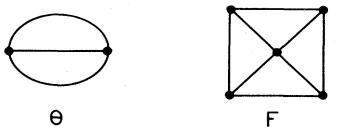

FIG. 9. Examples of star graph 6,'. The numbers of sites and bonds of the two graphs shown are %(B)=2, b(B)=3, iV(F)=5, b(F)=8.

Rev. Mod. Phys. , Voa. 54, No. 1,January 1982

Furthermore, since 6' and 6,' are topologically isomorphic, we have PG, '(q) =PG '(q) so that the coefficient in (3.10) can be quite easily generated in practice. For example, the numbers of face colorings of the subgraphs 6' represented by the 0 and I' topologies shown in Fig. 9 are

$$P_{\Theta}^{(F)}(q) = q(q-1)(q-2)$$

$$P_F^{(F)}(q) = q \left(q - 1\right) \left[ (q^2 - 3)^2 + q - 2\right] \tag{3.11}$$

$$= q \left(q - 1\right) (q^2 - 5q + 7) \, . \tag{3.12}$$

Substitution of these numbers into (3.10) then leads to the graph weights which have previously been obtained by Domb (1974a) from a more elaborate procedure.

The high-temperature expansions (2.3) and (3.7) are useful in that the subgraphs are on 6 and are valid for 6 in any dimension. For planar 6, subgraphs O'C:6 are planar. Then we can always combine (3.10) with (3.7), and this leads to

$$\begin{aligned} \mathbf{Z}_G(q, \mathbf{K}) \\ = & v^E q^{1 - N_D} e^{E \mathbf{K}^\bullet} \sum_{G' \subseteq G} {}^{(c)} P_{G'}^{(F)}(q) e^{-b \left( G' \right) \mathbf{K}^\bullet} \quad (\text{planar } G'), \end{aligned} \tag{3.12}$$

where e + =U/(U+q). We recognize that this is precisely the "low-temperature" expansion (3.3) on the dual graph D. In fact, we could have derived (3.12) more directly by combining the duality relation (2.10) with (3.3), and it was using this procedure that Kihara et al. (1954) first generated the high-temperature series for the square lattice.

The high-temperature expansion (2.3) can also be extended to include external fields as in (3.1). We refer to Kim and Joseph (1975) for a discussion on this formulation.

#### C. Series developments

I summarize in this section the present status on series developments for the q ~2 Potts models on infinite lattices. Description on the results of series analyses will be found in Sec. V.

# 1. Square lattice

Series expansion for the q-dependent zero-field partition function was first developed by Kihara et al. (1954) up to terms of u', where u can be either the lowtemperature variable e or the high-temperature variable e related by the duality relation (2.11). Enting (1977) has pointed out, however, that their coefficient of u' is in error [see also de Neef (1975)]. The series has been extended to terms of u ' for q =3 by Enting (1980a) using the finite lattice method. In addition, Enting (1980a) has also generated the q =2 series for the order

parameter to u

The q-dependent low-temperature expansion (3.1) which includes external Gelds has been developed by Straley and Fisher (1973) to the order of u ' . For specific values of q, the high-Geld low-temperature series have been developed for q =3 (Enting, 1974a) and for q =4,5,6 (Enting, 1974b). The zero-field lowtemperature series have also been obtained in various lengths by Zwanzig and Ramshaw (1977) for q =2,3,4, and by de Neef and Enting (1977) for q =3.

The q-dependent high-temperature series (2.3) including an external Geld has been formulated by Kim and Joseph (1975). From this formulation they obtained the susceptibility series for q =3,4, 5,6.

# 2. Triangular lattice

Series expansions for the triangular lattice have been derived mostly for q =3. The high-Geld expansion was first studied by Enting (1974a). Series expansions for the zero-field model with two-site and/or three-site interactions in half of the triangles have been considered by Enting (1978c, 1980c); Enting and Wu (1982) have generated series for models with pure three-site interactions in every triangle and for the antiferromagnetic model. The high-field low-temperature expansion for q =4 has been given by Enting (1975). In addition, the hightemperature susceptibility series has been given by Kim and Joseph (1975) for q =3,4, . . ., 8.

# 3. Honeycomb lattice

It is to be noted that some results of the honeycomb lattice are related to those of the triangular lattice. The only independent series for the honeycomb lattice appears to be the low-temperature, high-field series for the q =3 model (Enting, 1974b).

# 4. Lattices in d & 2 dimensions

Series developments for three-dimensional lattices have been generated mostly for the q =3 models. The hightemperature, low-field and the low-temperature, highfield expansions for the simple cubic lattice have been considered by Straley (1974). The high-field series have been further extended by Enting (1974a) for the sc, fcc, and bcc lattices; Ditzian and Oitmaa (1974) also considered the q =3 series for the fcc lattice. In addition, the q =3 high-temperature susceptibility series for the bcc lattice has been given by Kim and Joseph (1975). The most recent high-field expansions for the q =3 sc and bcc lattices have been given by Miyashita et ah. (1979).

For the q =4 model Ditzian and Kadanoff (1979) have generated the high-temperature series for the hypercubic lattices for d &2 up to d =10 dimensions. In addition, they also obtained the low-temperature series for the q =4, d =4 hypercubic lattice.

Rev. Mod. Phys. , Vol. 54, No. 1,January 1982

#### IV. RELATION WITH OTHER PROBLEMS

The Potts model is related to a number of other outstanding problems in lattice statistics. While most of these other problems are also unsolved, the connection with the Potts model has made it possible to explore their properties from the known information on the Potts model or vice versa. It is from this consideration that most of the known properties of the critical behavior of the two-dimensional Potts model have been established.

#### A. Vertex model

The Potts model in two dimensions is equivalent to an ice-rule vertex model. This representation of the Potts model, first pointed out by Temperley and Lich (1971) for the square lattice, has been extended to arbitrary planar lattices (Baxter et al., 1976). Here I shall state only the result.

Consider a Potts model on a planar lattice (or graph) W of X sites. Then this Potts model is related to an ice-rule vertex model defined on a related lattice (or graph) W' through the simple relation

$$\mathbf{Z}_{\text{Potts}} = q^{N/2} \mathbf{Z}_{\text{vertex}} \quad , \qquad \overset{\cdot}{\qquad} \tag{4.1}$$

where Zp, «, and Z",","are the respective partition functions.

For a given W, the related lattice W' is not necessarily unique. The basic properties of W' are that (i) the faces of W' are bipartite, and (ii) the lattice W can be embedded in the faces of W' such that the sites of W occupy one set of the bipartite faces. For Potts models with pure two-site interactions, one such construction of W is the surrounding lattice (or medial graph) of W, obtained by connecting the neighboring midpoints of the edges of For example, the surrounding lattice of a square lattice is a square lattice, and that of a honeycomb (and triangular) lattice is a Kagome lattice. These situations are shown in Fig. 10. Note that the coordination number of the surrounding lattice W' is always 4. Moreover, it proves convenient to shade those faces of W' containing sites of W for the purpose of distinction (there are always two shaded and two unshaded faces intersecting at a site of W').

The ice-rule vertex problem on W' is defined as follows: Attach arrows to the edges of W' such that there

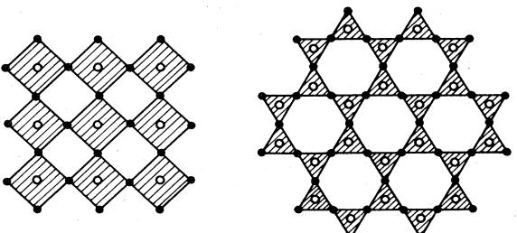

FIG. 10. Examples of a planar lattice W (open circles) and the associated surrounding lattice W' (solid circles).

are always two arrows in and two arrows out at a site of (the ice rule). The six ice-rule vertices are shown in Fig. 11. Vertex weights are then assigned according to the vertex arrow con6gurations. In the most general case the weights depend on the angles between the four incident edges relative to the face shading (Baxter et al., 1976). For the square, triangular, and honeycomb lat-

$$(\omega_1, \dots, \omega_6) = (1, 1, \mathbf{x}_r, \mathbf{x}_r, \mathbf{A}_r, \mathbf{B}_r) \; , \tag{4.2}$$

where

tices the weights are given by

$$(A_r, B_r) = (s^{-1} + \mathbf{x}_r s, s + \mathbf{x}_r s^{-1}) \quad \text{square}$$

$$= (t^{-1} + \mathbf{x}_r t^2, t + \mathbf{x}_r t^{-2}) \quad \text{triangle} \tag{4.3}$$

$$= (t^{-2} + \mathbf{x}_r t, t^2 + \mathbf{x}_r t^{-1}) \quad \text{hencecomb} \text{ ,}$$

with

$$\begin{cases} \mathbf{s} = e^{\Theta/2}, & \mathbf{t} = e^{\Theta/3}, \quad \mathbf{2} \cosh \Theta = \sqrt{q} \\\\ \mathbf{x}_r = (e^{K_r} - 1) / \sqrt{q} \end{cases} \tag{4.4}$$

Here we have allowed different Potts interactions along the diferent lattice axes. It should be pointed out that the equivalence (4.1) holds only for lattices W and W' that are both planar with special boundary conditions. It is not generally valid for lattices with toroidal periodic boundary conditions (Baxter, 1982a, 1982b).

The vertex weights (4.2) can be transformed into a more symmetric form (Hintermann et al., 1978):

$$\mathbf{a}(\mathcal{A}_r, \mathcal{B}_r) = (\mathbf{c}_r \mathbf{z}, \mathbf{c}_r \mathbf{z}^{-1}) \; , \tag{4.5}$$

with

$$\mathbf{c}_r^2 = A_r B_r = 1 + \mathbf{x}_r^2 + \sqrt{q} \ \mathbf{x}_r$$

$$\mathbf{z} = (A_1 A_2 / B_1 B_2)^{1/2} \quad \text{square} \tag{4.6}$$

(A iA2A3/BiB2B3)' triangular and honeycomb

In this form the variable lnz can be regarded as a staggered field applied to the system.

For the Potts model on the triangular W, another choice of W' is shown in Fig. 12, for which W' is again a triangular lattice. One is thus led to the consideration of a 20-vertex model on the triangular lattice. The equivalence of the triangular Potts model with such an (ice-rule) 20-vertex model was first established by Baxter et al. (1978), and a graphical analysis was later given by Wu and Lin (1980). One novel point of this choice of is the possibility of including three-site interactions in alternate triangles in the Potts model. Details of this equivalence can be found in Baxter et al. (1978).

As in (2.3) the vertex-model representation also serves as a natural continuation of the Potts model to continu-

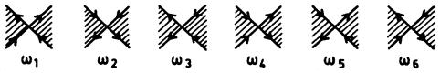

FIG. 11. The six ice-rule configurations at a vertex of the surrounding lattice and the associated vertex weights.

ous values of q. It is to be noted, however, that the vertex weights (4.2) are real for q )4 and complex for q & 4.

# B. Percolation {q = '} limit}

The percolation process provides a simple picture of a critical point transition that has been of theoretical interest for some years [see, for example, reviews by Essam (1972, 1980)]. It was first pointed out by Kasteleyn and Fortuin (1969) that the problem of the bond percolation can be formulated in terms of the Potts model. This formulation has been used in, for example, the renormalization group studies of the percolation problem (Harris, et al., 1975; Dasgupta, 1976). The method of Kasteleyn and Fortuin has since been elucidated by Stephen (1977) and by Wu (1978), and extended further to the problem of site percolation (Giri et al., 1977; Kunz and Wu, 1978). Murata (1979) has similarly formulated the site percolation in a lattice gas as a dilute Potts model.

#### Bond percolation

In a bond percolation process there is a probability p for each edge of an (infinite) lattice G to be "occupied" and a probability 1—p for it to be "vacant. " Two sites that are connected through a chain of occupied edges are said to be in the same cluster. Then various questions can be asked concerning the clusters distribution (Essam, 1972). Among others, one is interested in the percolation probability P(p) that a given point, say, the origin, of the lattice belongs to an infinite cluster, and the mean size S(p) of the finite cluster that contains the origin. In the latter instance the cluster size can be measured by either the site or the edge content.

Consider a nearest-neighbor q-component Potts model whose Hamiltonian —PA ~ is given by (1.18). A straightforward high-temperature expansion of its partition function as in (2.3) leads to the expression' (Wu, 1978)

$$Z(q; \mathcal{K}, \mathcal{M}, L) = \sum_{G' \subseteq G} v^{b(G')} \prod_{\mathfrak{c}} (e^{L_{\mathfrak{c}}(G') + L_{\mathfrak{c}}b_{\mathfrak{c}}(G')} + q - 1) \,, \tag{4.7}$$

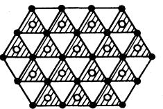

FIG. 12. Triangular W' (solid circles) for the triangular lattice W (open circles).

iThe corresponding expression in Wu (1978) contains a mis-L) print. The phase after Eq. (35) should read "where e =(e ' —1)/{e —1)."

where

$$e^{\mathcal{L}_1} = (e^{\mathcal{K} + \mathcal{M}} - 1) / (e^{\mathcal{K}} - 1) \tag{4.8}$$

and we have taken L; =L in the Hamiltonian (1.18). The product in (4.7) is over all connected clusters of G', including isolated sites, and sc(G'), b, (G') are respectively the numbers of sites and occupied edges of a cluster.

Defining the per site free energy f(q;K,L,M) as in (1.8), one then has

$$h(K, L, M) \equiv \left. \left( \frac{\partial}{\partial q} f(q; K, L, M) \right) \right|_{q=1}$$

$$= (\sum_{\mathfrak{c}} e^{-Ls_{\mathfrak{c}} - L_{\mathfrak{l}}b_{\mathfrak{c}}})_{0} \,, \tag{4.9}$$

where

$$\begin{aligned} \{\mathcal{A}\}_0 &= \lim_{N \to \infty} N^{-1}(\mathcal{A}) \\ \{\mathcal{A}\} &= \sum_{G' \subseteq G} p^{b(G')} (1 - p)^{E - b(G')} \mathcal{A}(G') \\ p &= 1 - e^{-(K + M)} \end{aligned} \tag{4.10}$$

Now the right-hand side of (4.9) is precisely the generating function for quantities of interests in the percolation problem. For example,

$$P(p) = 1 + h'(K, \mathbf{0} +, \mathbf{0}) \text{ , }$$

$$\mathcal{S}(p) = h' \, \text{ } (K, \mathbf{0} +, \mathbf{0}) \text{ , }\tag{4.11}$$

where the derivatives of h (K,L,O) are with respect to L. It is also clear that derivatives of h (K,L,M) with respect to I, & generate quantities involving the cluster bond contents. Furthermore, by rearranging and carrying out a partial summation of the terms in (4.9), the function h(K, L,M) reduces to the bond-animal generating function for G as follows (Harris and Lubensky, 1981):

$$h\left(K, L, \mathcal{M}\right) = \sum_{A} p^{b} q^{t} \mathbb{Z}^{s},\tag{4.97}$$

$$\begin{aligned} p &= e^{-M}(1 - e^{-K}) \ , \\ q &= e^{-(K+M)} \ , \\ \mathbf{z} &= e^{-L} \ . \end{aligned}$$

The summation in (4.9') is taken over all bond animals that pass through a given point—say, the origin of G, and the symbols b,s, t denote, respectively, the numbers of bonds, sites, and perimeter bonds. The bond percolation is generated, as in (4.11), by taking p+q =1 or M =0, and the pure animal problem is generated by q =1 or %+M =0.

One can show in a similar fashion (Wu, 1978) that the connectivity c(r,p), defined to be the probability that the sites at the origin and at r belong to the same cluster, is given by

$$\mathcal{L}(\mathbf{r}, p) = \left. \left( \frac{\partial}{\partial q} \Gamma_{aa}(\mathbf{O}, \mathbf{r}) \right)_{q = 1} \right|_{q = 1}, \tag{4.12}$$

where I (r(,r2) is the two-point correlation function (1.13) of the Potts model. Thus a knowledge of the Potts model for general q will yield the solution of the bond percolation problem. This is the result of Kasteleyn and Fortuin (1969).

# 2. Site percolation

In a site percolation process each site of an infinite lattice is occupied independently with a probability s. A cluster is then a set of occupied sites connected by the lattice edges. One can ask the same kind of questions regarding the cluster distributions as in the case of the bond percolation (Essam, 1972).

The site percolation problem can be formulated as the q =1 limit of a Potts model with multisite interactions (Giri et al., 1977; Kunz and Wu, 1978). In addition to the multisite interactions as given in (1.6), one also introduces a multisite external field as in (1.6). Quite generally, to describe site percolation on a lattice G of X sites and coordination number y, one considers a Potts model on the covering lattice G, defined with its —,yX sites located on the edges of G. The Potts model has the Hamiltonian

$$-\beta \mathcal{H}^{\rho} = \sum_{i} \left\{ K \sum_{a} \delta_{a}(i) + M \delta_{0}(i) \right\} \,, \tag{4.13}$$

where 5 (i)=1 if all y sites of G, surrounding the ith site of G are in the same state o., u =0, 1,...,q —1 and 5 (i)=0 otherwise. Let f(q;K, M) be the free energy (1.8) for the Hamiltonian (4.13) and define

$$h(K,M) = \left\lfloor \frac{\partial}{\partial q} f(q;K,M) \right\rfloor_{q=1} \tag{4.14}$$

Then it is straightforward to show (Kunz and Wu, 1978)

$$h(K,M) = \left\langle b \right\rangle_0 - (\gamma - \frac{1}{2})\mathfrak{s} + \left\langle \sum_{\mathfrak{c}} e^{-Ls_{\mathfrak{c}}} \right\rangle_0,\qquad(4.15)$$

where b is the number of pairs of neighboring occupied sites and ( )0 is an average defined as in (4.10) over site occupations. Additionally,

$$\begin{aligned} e^L &= (e^{K+M} - 1) / (e^K - 1) \end{aligned} \quad , \tag{4.16}$$
 
$$s = 1 - e^{-(K+L)} \quad . \tag{4.17}$$

The function h(K, M) now generates the site percolation on G. In particular, the percolation probability is

$$P(s) = 1 + \left. \left\langle \frac{\partial}{\partial \bar{L}} h(K, \mathcal{M}) \right\rangle_{L = \mathcal{O}_{+}} \right| \tag{4.17}$$

with s =1—e . One can also establish that the connec-

Rev. Mod. Phys. , Vol. 54, No. t, January 1982

The corresponding expression in Kunz and Wu (1978) contains a misprint. The 1ast expression in the phrase after Eq. (3) should read ace L (eK +H/kT 1)/(eK 1)

tivity in the percolation problem is connected to the Potts correlation function as in (4.12).

For site percolation on planar lattices, the generating Potts model is not necessarily unique (Temperley and Ashley, 1981). The situation parallels the formulation of the Potts model as a vertex model described in Sec. IV.A. Generally, the site percolation on any planar lattice W can be formulated as a Potts model on the related lattice W' as defined in Sec. IV.A. One observes that the covering lattice 6, is precisely the surrounding lattice of Sec. IV.A. But other choices of W' may also be possible. Examples of pairs of W and W' have been given in Figs. 10 and 12.

# 3. Site-bond percolation

In a mixed site-bond percolation each site of a lattice 6 is occupied with a probability s and each bond of 6 is occupied with a probability p. Two sites are in the same cluster if they are connected through a sequence of occupied sites and edges. The pure bond and site percolations are then recovered by taking the respective special cases of s = 1 and p =1.

For the mixed problem the percolation threshold is defined to be the phase boundary

$$\mathbf{g}(\mathbf{s}, \mathbf{p}) = \mathbf{0} \; , \tag{4.18}$$

beyond which there is a nonzero probability that a given site belongs to an infinite cluster.

It is straightforward to generalize the previous considerations to this site-bond percolation problem. Instead of giving this formulation in its most general form, we focus on the connection of the percolation boundary (4.18) with the corresponding Potts critical point.

Consider, for example, the site-bond percolation on the square lattice. The appropriate choice of the Potts lattice is that of Fig. 7. Let

$$f(q; \boldsymbol{e}^{-\mathsf{K}_2^\bullet}, \boldsymbol{e}^{-\mathsf{K}_4^\bullet}) = \mathbf{0} \tag{4.19}$$

denote the critical point of this Potts model, and then the previous considerations will lead to the following expression for the percolation threshold (4.18):

f(1;1—p, 1—s) =0 . (4.20)

The extension of (4.20) to lattices in general is obvious. Generally for the threshold of site-bond percolation on any lattice 6 (or W), we consider in a similar way the critical condition of the Potts model on the covering lattice 6, (or W') which has two sites on each edge of G. The two spins on an edge interact with an interaction of strength E2, while the y spins immediately surrounding a vertex of 6 interact with an interaction of strength E&. The threshold percolation is then obtained from the Potts critical condition with the substitution of e =1—p. —K* e ~=1—s at q =1. This result is valid for 6 in any dimension.

For planar 6 the duality relation (2.12) and (2.13) can

be used at this point to yield valuable information. Particularly, the threshold for the site-bond percolation with respective probabilities (s,p) can also be derived from the critical condition of the Potts model on the dual lattice 6* (as defined in Sec. II.B). [This result was first derived for the honeycomb 6 by Kondor (1980), and the generalization was later given by Wu (1981).] For pure bond percolation (s =1) the resulting Potts model can also be interpreted as generating a bond percolation on the dual lattice D (as defined in Sec. II.A); (2.13) then relates the critical probabilities p, and p, * for a pair of dual lattices by

$$p_{\mathfrak{c}} + p_{\mathfrak{c}}^{\bullet} = 1 \quad . \tag{4.21}$$

For pure site percolation (p =1) a similar consideration using (2.13) relates the critical probabilities s, and s, ' for a pair of matching lattices by

$$\mathbf{s_c + s_c^* = 1} \quad \text{and} \quad \mathbf{s_c + s_c^*} \tag{4.22}$$

Both (4.21) and (4.22) are well-known results in percolation processes [see Essam (1972, 1979)].

# C. Resistor network (q = 0 limit}

# 't. Result of Fortuin and Kasteleyn

The problem of finding the effective resistance between two node points of a network of linear resistors was solved by Kirchhoff (1847) a century and a half ago. But Fortuin and Kasteleyn (1972) showed that Kirchhoff's solution can be expressed as a q =0 limit of the Potts partition function. Here we shall examine this connection.

The Potts model is defined on a lattice 6 whose sites coincide the node points of the network and whose edges coincldc the Ics1sfors. Thus, thc Potts spins at sites and j interact with an interaction of strength kTIC,J ifthe two nodes are connected via a resistor of resistance r,j. A. consistent picture is achieved if we take K,J -re

To obtain the effective resistance RkI between two node points k and l, consider also the lattice 6 derived from 6 by adding an edge connecting the sites k and l. [G=G if the edge (kl) is already present in G.] Denote the partition function of the Potts model on 6 by ZG(q;u;1), where u;J =exp(K;~)—1, and similarly define ZG(q;, u;J). Then the result of Fortuin and Kasteleyn can be stated simply as

$$\mathcal{R}_{kl} = \lim_{q \to 0} \left( \frac{\partial}{\partial \mathbf{x}_{kl}} \mathbf{Z}_{\overline{\mathcal{G}}}(q; \mathbf{q}^a \mathbf{x}_{lj}) / \mathbf{Z}_{\mathcal{O}}(q; \mathbf{q}^a \mathbf{x}_{lj}) \right), \quad (4.23)$$

where 0&+&1 and x,j——r,J '.

Note that the value of R~~ in (4.23) is independent of the value of 0&a & 1 (a= —, in Fortuin and Kasteleyn 1972). If the edge (kl) is already in 6, then (4.23) becomes

$$\mathcal{R}_{kl} = \lim_{q \to 0} \frac{\partial}{\partial \mathbf{x}_{kl}} \ln \mathbf{Z}_G(q; q^a \mathbf{x}_{lj}), \quad \mathbf{0} < \alpha < 1 \; , \tag{4.24}$$

and is the nearest-neighbor correlation of the q~0 Potts model.

To prove (4.23) we first show that ZG(q;q x;j) generates spanning trees on G in the q~O limit [Fortuin and Kasteleyn (1972); see also Stephen (1976); Wu (1977)j.

In analogy to (2.3), we write

$$\begin{split} Z_{G}(q;q^{a}\mathbf{x}_{lj}) &= \sum_{G' \subseteq G} q^{n(G') + ab(G')} \prod_{E(G')} \mathbf{x}_{lj} \\ &= q^{aN} \sum_{G' \subseteq G} q^{ac(G') + (1-a)n(G')} \prod_{E(G')} \mathbf{x}_{lj} \,, \end{split} \tag{4.25}$$

where the product is over the edge set of O', X is the total number of sites of G, and c(G') is the number of independent circuits in G' as defined by (2.6). For O&o;~1 and in the limit of q~O, the leading contributions in (4.25) are those terms represented by the spanning trees of G. A spanning tree T' is a connected subgraph which covers all sites [n (T')= I] and has no circuit [c(T')=Oj. Equation (4.25) then leads to the following expression for the spanning tree polynomial:

$$\begin{aligned} \mathbf{x}_{\mathcal{G}} & \cdots & \mathbf{x}_{\mathcal{F}} \text{ -- } \mathbf{x} \text{ -- } \mathbf{x}_{\mathcal{F}} \text{ -- } \mathbf{x}_{\mathcal{F}} \text{ -- } \mathbf{x}_{\mathcal{F}} \text{ -- } \mathbf{x}_{\mathcal{F}} \text{ -- } \mathbf{x}_{\mathcal{F}} \text{ -- } \mathbf{x}_{\mathcal{F}} \text{ -- } \mathbf{x}_{\mathcal{F}} \text{ -- } \mathbf{x}_{\mathcal{F}} \text{ -- } \mathbf{x}_{\mathcal{F}} \text{ -- } \mathbf{x}_{\mathcal{F}} \text{ -- } \mathbf{x}_{\mathcal{F}} \text{ -- } \mathbf{x}_{\mathcal{F}} \text{ -- } \mathbf{x}_{\mathcal{F}} \text{ -- } \mathbf{x}_{\mathcal{F}} \text{ -- } \mathbf{x}_{\mathcal{F}} \text{ -- } \mathbf{x}_{\mathcal{F}} \text{ -- } \mathbf{x}_{\mathcal{F}} \text{ -- } \mathbf{x}_{\mathcal{F}} \text{ -- } \mathbf{x}_{\mathcal{F}} \text{ -- } \mathbf{x}_{\mathcal{F}} \text{ -- } \mathbf{x}_{\mathcal{F}} \text{ -- } \mathbf{x}_{\mathcal{F}} \text{ -- } \mathbf{x}_{\mathcal{F}} \text{ -- } \mathbf{x}_{\mathcal{F}} \text{ -- } \mathbf{x}_{\mathcal{F}} \text{ -- } \mathbf{x}_{\mathcal{F}} \text{ -- } \mathbf{x}_{\mathcal{F}} \text{ -- } \mathbf{x}_{\mathcal{F}} \text{ -- } \mathbf{x}_{\mathcal{F}} \text{ -- } \mathbf{x}_{\mathcal{F}} \text{ -- } \mathbf{x}_{\mathcal{F}} \text{ -- } \mathbf{x}_{\mathcal{F}} \text{$$

The expression (4.23) now follows immediately from (4.26) and the result established by Kirchhoff (1847) which states, in present notation,

$$\mathcal{R}_{kl} = \left\{ \frac{\partial}{\partial \mathbf{x}_{kl}} T_{\overline{\mathcal{G}}}(\mathbf{x}_{lj}) \, \middle| \, \Big/ T_G(\mathbf{x}_{lj}) \, . \tag{4.27}$$

# 2. Result of Kirchhoff

For completeness, I outline a proof of the Kirchhoff result (4.27) [see also den Nijs (1979c)].

Let V; be the potential at the ith node. The wellknown KirchoA's law states that there is a net current of magnitude

$$I_l = \sum_{j \neq l} \mathbf{x}_{lj} (\mathbf{V}_l - \mathbf{V}_j) \tag{4.28}$$

flowing into the network at the ith node.

Equation (4.28) can be written in the more revealing form

$$I_i = \sum_{j=1}^{N} A_{ij} V_j, \quad i = 1, 2, \dots, \dots, N \tag{4.29}$$

$$\begin{aligned} \mathcal{A}_{lj} &= \sum_{k \neq l} \mathbf{x}_{ik}, & l &= j \\ & & \quad \cdot \\ & & \quad \cdot \end{aligned} \tag{4.30}$$

are the elements of the tree matrix for G [see, for exam-

pie Hararay (1969) p. 1581. Then

$$R_{kl} = \frac{\mathcal{V}_k - \mathcal{V}_l}{I}, \qquad \qquad \qquad \ddots \qquad \qquad \cdot \qquad \cdot \tag{4.31}$$

where Vk and Vi are obtained from the solution of (4.29), with

$$I_l = I(\mathfrak{S}_{lk} - \mathfrak{S}_{il}) \ . \tag{4.32}$$

The tree matrix 3 has the property that the sum of each row or each column is identically zero. This has the consequence that all cofactors of 3 are identical and are equal to the spanning tree polynomial TG (x;j) (Hararay, 1969). It also implies that we need only to consider the %—1 independent equations

$$I\delta_{ik} = \sum_{f=1}^{N} A_{if}(V_f - V_l), \quad i, j \neq l \text{ .} \tag{4.33}$$

It follows that

$$\mathcal{R}_{kl} = |\mathcal{A}^{(kl)}| \;/\; |\mathcal{A}^{(l)}| \;, \; \text{s.t.} \tag{4.34}$$

where ~A'" ~ is the determinant of A with the lth row and column removed, and ~A'"" ~ is the same determinant but with the Ith and the kth rows and columns removed.

Now ~ A'" ~ =TG(x;j), since it is a cofactor of A. It is also apparent upon a moment's reflection that ~ A'"" ~ is the coefficient of xki in the cofactor ~A'"' ~ (or ~A'" ~ ) if the nodes k and I are connected by a resistor. If there is no resistor between k and l, we simply add such a resistor, and ~A'"" ~ is again the coe6icient of xki in ~A'"' or ~ W'" ~ . Thus

~

$$|\mathcal{A}^{(kl)}| = \frac{\mathfrak{d}}{\mathfrak{d}\mathfrak{x}_{kl}} T_{\mathfrak{G}}(\mathfrak{x}_{lj}) \dots$$

This reduces (4.34) to (4.27), thus completing the proof.

# 3. Remarks

The number of spanning trees on 6 can be obtained from (4.26) at x;j =1. For a= —, the right-hand side of (4.26) can be exactly evaluated for the square, triangular, and honeycomb lattices. Using this formulation, %'u (1977) has computed the number of spanning trees for these three lattices. The number of oriented spanning trees (complete self-avoiding walks) for the square lattice with a given orientation has been computed by Kasteleyn (1963).

It has been pointed out to this author that the spanning trees can be counted more directly by evaluating the infinite limit of the determinant ~A(x,j) ~ at x,j.——1, and that this procedure is valid for lattices in any dimension.

This fact has been used by Temperley (1958) to obtain a numerical estimate of T~I,'1), the number of spanning trees, for an infinite square lattice.

4I am indebted to P. W. Kasteleyn and H. Kunz for this comment.

Indeed, the correct values for TG(1) are generatei] from this procedure for the three two-dimensional lattices considered by Wu (1977). However, it is to be noted that the determinant ~ A(x;J ) ~ =—0 identically for 6 finite. If we denote the eigenvalues of A (x,z ) by 0, k,2, A 3 A + then for finite 6 we have

$$T_G(\mathbf{x}_{ij}) = \prod_{n=2}^{N} \lambda_n \cdot \mathbf{1}_n$$

It is only in the limit of infinite 6 that this result is identical to that obtained by directly evaluating the determinant ~A(x;;) ~.

With the choice of a= 1, Eq. (4.25) generates forests on G (Stephen, 1976; Wu, 1977). A forest is a subgraph F' without loops [c(F')=0]. This is described by

$$\begin{split} F_{\mathcal{G}}(\mathbf{x}_{ij}) &= \sum_{F' \subseteq \mathcal{G} \mathcal{E}(F')} \prod_{\mathbf{x}_{ij} \in \mathcal{G}} \mathbf{x}_{ij} \\ &= \lim_{q \to 0} q^{-N} \mathbf{Z}_{\mathcal{G}}(q, q \mathbf{x}_{ij}) \,. \end{split} \tag{4.35} \qquad \qquad \begin{split} \mathbf{x}_{i} &= \mathbf{0} \\ &= \mathbf{0} \\ &= \mathbf{0} \\ &= \mathbf{0} \end{split}$$

More generally, the Potts partition function (2.3) is precisely the dichromatic polynomial (Tutte, 1954) of 6, which generates forest weighted according to a specific description. One such possible weighting has been described by Ternperley and Lieb (1971) [see also description in Fortuin and Kasteleyn (1972)].

Finally we remark that the connection (4.23) of the resistance Rki with the Potts partition can be formally extended to networks containing nonresistive impedirnents. If capacitances and inductances are present, the only complication in the formulation is that the corresponding x,j will generally be complex. This does not change the form of (4.23) and the result is valid in all cases.

# D. Dilute spin glass {q = —limit} 2

Consider a spin glass (Edwards and Anderson, 1975) described by the Ising Hamiltonian

$$\mathcal{H} = -\sum_{(\mathbf{i},\mathbf{j})} J_{\mathbf{j}\mathbf{i}} S_{\mathbf{i}} S_{\mathbf{j}\mathbf{i}} \ , \qquad \text{and} \qquad \mathbf{j} \tag{4.36}$$

where S;=+1, and each of the exchange interactions JJ has an independent probability distribution

$$P(J_{lj}) = p\left[\delta(J_{lj} - J) + \delta(J_{lj} + J)\right] + r\delta(J_{lj})\,,\tag{4.37}$$

with

$$2p + r = 1 \quad . \tag{4.38}$$

This describes a dilute spin glass (Aharony, 1978) for which a transition from a paramagnetic magnetic phase to a spin glass phase is expected in the ground state. Some aspects of this problem are related to the Potts model in the q =—limit (Aharony, 1978; Aharony and 2 Pfeuty, 1979). In particular, an exact critical concentration can be deduced.

To begin with, we start from the Potts partition func-

tion (4.7) with M =0, which now reads

$$Z(q; \overset{\circ}{K}, L) = \sum_{G' \subseteq G} v^{\bullet(G')} \prod_{\mathfrak{c}} \left[ e^{L \mathfrak{x}_{\mathfrak{c}}(G')} + q - 1 \right], \qquad (4.39)$$

where U =e —1. The zero-field susceptibility of the Potts model, X, can be obtained straightforwardly by further differentiating the magnetization (1.10). This yields, after using (4.39) and the identity QG,s,(6')=X,

$$\mathcal{X}(q;K) = \frac{1-q}{q^2} \left\langle \sum_{\mathfrak{c}} s_{\mathfrak{c}}^2 \right\rangle_{\mathfrak{q}} \,, \tag{4.40}$$

with

$$\left< \mathcal{A} \right>_{\mathbf{q}} = \sum_{G' \subseteq G} w_{\mathbf{q}}(G') \mathcal{A}(G') \left< \sum_{G' \subseteq G} w_{\mathbf{q}}(G') \right>,\tag{4.41}$$

' b(G') U g c(G') (4.42)

Here, as in Sec. II.A, b(6') and c(G') are, respectively, the numbers of edges (bonds) and independent circuits (plaquettes) in 6'. We also obtain from (2.3) and (2.6)

$$Z(q; \mathbf{K}, \mathbf{0}) = q^N \sum_{G' \subseteq G} w_q(G') \,. \tag{4.43}$$

Now specialize these results to q = —,. Write

$$2v = (1 - r) / r \qquad \dots \qquad \dots \qquad \dots \tag{4.44}$$

and identify 1 ras t—he probability that a given edge is occupied (by either +J or —J) in the dilute spin glass. Since the interactions +J occur with equal probabilities, the probability that the sign of the product +~Jz- over the interactions around any plaquette is positive is exactly —,. It follows that r w»2(G') is the probability that the configuration 6' occurs with sgn( +~J,J )= + around all plaquettes.

Now we return to the spin glass problem and discuss its ground-state properties. Toulouse (1977) has introduced the idea of frustration which describes a plaquette as being "frustrated" if sgn(+~JJ. )=—.It is then clear that if we retain only those configurations in the dilute spin glass in which no plaquette is frustrated [the Mattis (1976) spin glass], then the relevant configurations occur with probabilities r w»z(G'), and q r"Z( —,;K,O) gives the overall probability that the system has only nonfrustrated graphs. Similarly, the susceptibility (4.40) describes the "Mattis" spin glass ordering

S;S. (i,j )CC

in an equivalent ferromagnetic ground state (Aharony and Pfeuty, 1979).

1 From the above we see that the q= —, Potts model describes a dilute spin glass in which all frustrations are excluded. The critical concentration at which the system changes from a paramagnetic to a spin-glass phase is now obtained from (4.44):

$$r_{\mathfrak{c}} = 1 \,\!/(e^{\mathfrak{e}\mathfrak{K}_{\mathfrak{c}}} - 1) \,, \tag{4.45}$$

where K, is the critical point of the corresponding q = —, Potts Inodel. For two-dimensional lattices this value can be obtained from the (presumed) exact q = —, Potts critical condition (see Sec. V.A. 1).

# E. Classical spin systems

The Potts model can be formulated as a problem of classical interacting spins. An example is the q =3 model described by the Hamiltonian [cf. (1.18)]:

$$-\beta \mathcal{H}_{\mathfrak{J}} = \sum_{\langle l,l\rangle} \left[ K \delta_{\mathbf{K}\mathfrak{r}}(\sigma_l, \sigma_f) + M \delta_{\mathbf{K}\mathfrak{r}}(\sigma_l, \mathbf{0}) \delta_{\mathbf{K}\mathfrak{r}}(\sigma_l, \mathbf{0}) \delta_{\mathbf{K}\mathfrak{r}}(\sigma_f, \mathbf{0}) \right]$$

$$+ L \sum_l \delta_{\mathbf{K}\mathfrak{r}}(\sigma_l, \mathbf{0}) \,, \tag{4.46}$$

where o.;=0,1,2. This Hamiltonian can be regarded as that of a spin-1 system whose spin variables are S;=—1,0, 1. In terms of the new variables we write

$$\mathcal{S}_{\mathbf{K}r}(\mathbf{S}_l, \mathbf{S}_f) = 1 + \frac{1}{2}\mathbf{S}_l\mathbf{S}_f + \frac{3}{2}\mathbf{S}_l^2\mathbf{S}_f^2 - \mathbf{S}_l^2 - \mathbf{S}_f^2 \tag{4.47}$$

$$\delta_{\mathbf{K}r}(\mathbf{S}_i, \mathbf{0}) = \mathbf{I} - \mathbf{S}_i^2 \tag{4.48a}$$

$$\mathbf{S}_{\mathbf{K}r}(\mathbf{S}_l, \pm 1) = \frac{1}{2} \mathbf{S}_l (1 \pm \mathbf{S}_l) \; \vert \; \tag{4.48b}$$

depending on which S; value is to be identified as the Potts spin state o.;=0. If the state S;=0 is identified as the Potts state o; =0, we use (4.48a) and obtain

$$\frac{1}{2} - \beta \mathcal{H}_3^e = K_0 + \sum_{(i,j)} (J S_i S_j + K^\bullet S_l^2 S_j^2) - \Delta \sum_i S_i^2 \, \,, \quad (4.49)$$

with

$$\begin{aligned} K_0 &= K + 2L + \mathcal{M} \ , \\ J &= K / 2 \ , \\ K^\bullet &= M + 3K / 2 \ , \\ \Delta &= \gamma K + L + \gamma M \ , \end{aligned}$$

where y is the coordination number of the lattice. The expression (4.49) is of the form of the Hamiltonian of the Blume-Capel model (Blume, 1966; Capel, 1966) and has been studied extensively [see, for example, Blume et al., 1971; Berker and Wortis, 1976). In particular, the zerofield (M =I.=0) Potts model corresponds to a Blume-Capel model with parameters satisfying J:K*:b,= I:3:2y.

If the state S;=1 or S;=—1 is identified as the o.;=0 Potts spin, then we use (4.48b) and the resulting Hamiltonian will take a diFerent form containing terms proportional to Si+Sj and SiSj +Si Sj The equivalence of these diQerent forms of the Hamiltonian reAects a general symmetry under the relabelling of the states (Berker and Wortis, 1976).

More generally, any system of classical q-state spins, the Potts models included, can be formulated as a spin (q —1)/2 system. The spin Hamiltonian will generally take the form

$$\mathsf{Rəν.\mathsf{Mod.} \mathsf{Ph}yı.\mathsf{Və}l.\mathsf{E4}, \mathsf{Və}l.\mathsf{Və}.\mathsf{I}, \mathsf{Jənıuə}r\mathsf{y}$$
 
$$\mathsf{1982}$$

$$\left[-\beta\mathcal{H}^{c}_{\;q} = \sum_{(i,j)\alpha} \sum_{\beta} K_{\alpha\beta} (S_i^{\alpha} S_j^{\beta} + S_i^{\beta} S_j^{\alpha}) + \sum_i \sum_a L_{a\beta} S_i^{\alpha}\right],\tag{4.50}$$

where the powers a and /3 run from 0 to q —1, and S;= —(q —1)/2, —(q —3)/2, . . .,(q —1)/2. Higher powers of a, p do not appear in (4.50) due to the fact that they can be eliminated using the identity

$$\begin{aligned} \left[ \mathbf{S}_{l} + (q-1)/2 \right] \left[ \mathbf{S}_{l} + (q-3)/2 \right] &\quad \cdots \\ \times \left[ \mathbf{S}_{l} - (q-1)/2 \right] &= 0 \end{aligned} \tag{4.51}$$

There are q (q +1)/2 independent interactions in (4.50) which, for a given spin model, can always be determined arbitrary to the identification (permutation) of the spin states (as in the example of q =3). This arbitrariness again reflects a general symmetry of the spin Hamiltonian (4.50).

# (4 47) V. CRITICAL PROPERTIES

The only exact solution of the Potts model known to this date is the Onsager (1944) solution of the q =2 (Ising) model in d =2 dimensions (McCoy and Wu, 1973). However, a large body of information, in both exact as well as numerical forms, has also been accumulated on the critical properties of the various Potts models. These results are surveyed in this section.

# A. Location of the critical point

# 1. Two-dimensional lattices

The critical point of the ferromagnetic Potts model is now rigorously known for the square, triangular, and honeycomb lattices for all q )4 (Hintermann et al., 1978) and for q =2 (Onsager, 1944). The critical condition can be stated simply as

(5.1a)

where z is given by (4.6), or, more explicitly,

$$\begin{aligned} \mathbf{x}_1 \mathbf{x}_2 &= 1 \quad \text{square} \\ \sqrt{q} &\ge \mathbf{x}_1 \mathbf{x}_2 \mathbf{x}_3 + \mathbf{x}_1 \mathbf{x}_2 + \mathbf{x}_2 \mathbf{x}_3 + \mathbf{x}_3 \mathbf{x}_1 = 1 \quad \text{triangle} \\ \sqrt{q} &+ \mathbf{x}_1 + \mathbf{x}_2 + \mathbf{x}_3 = \mathbf{x}_1 \mathbf{x}_2 \mathbf{x}_3 \quad \text{hence} \mathbf{c} \text{comb} \end{aligned} \tag{5.1b}$$

Here the variable x; is defined in (4.4).

The derivation of (5.1) (for q &4) follows essentially from a circle theorem (Suzuki and Fisher, 1971) for the vertex model equivalence (4.2) of the Potts model. The theorem states that, for q &4 and regarding lnz as an external field, the zeros of the Potts partition can occur only at zero external field. This then leads to (5.1).

Since the critical point (5.1) agrees with the exact Ising q =2 result (Onsager, 1944), it is expected that (5.1) is also exact for q =3, although a rigorous proof of this assumption is still lacking. The expression (5.1b) for the

critical point of the Potts model was first conjectured by Potts (1952) for the square lattice [see also Kihara et al. (1954)]. The conjecture makes use of the duality relation (2.10) and is based on a Kramers-Wannier (1941) type argurnent, which determines the transition point at the self-dual point x~x2 ——1. The extension of the conjecture to isotropic triangular and honeycomb lattices was first suggested by Kim and Joseph (1974), and later extended to anisotropic lattices by Baxter et al. (1978) [see also Burkhardt and Southern (1978)]. Baxter (1973a) and Baxter et al. (1978) have shown that a first-order transition indeed occurs at the conjectured points for all q & 4; and the uniqueness of this transition has subsequently been established by Hintermann et al. (1978). There has been no convincing proof of the validity of the critical point (5.1b) for q & 4, except in the isolated case of q =2.

The critical point of the generalized (checkerboard) square lattice of Fig. 13 has been conjectured to be (Wu, 1979)

$$\begin{aligned} \sqrt{q} + \mathbf{x}_1 + \mathbf{x}_2 + \mathbf{x}_3 + \mathbf{x}_4 &= \mathbf{x}_1 \mathbf{x}_2 \mathbf{x}_3 + \mathbf{x}_2 \mathbf{x}_3 \mathbf{x}_4 + \mathbf{x}_3 \mathbf{x}_4 \mathbf{x}_1 \\ &+ \mathbf{x}_4 \mathbf{x}_1 \mathbf{x}_2 + \sqrt{q} \mathbf{x}_1 \mathbf{x}_2 \mathbf{x}_3 \mathbf{x}_4 \end{aligned} \tag{5.2}$$

The conjecture (Wu, 1979) on the critical point for the Kagome and diced lattices has since been shown to be incorrect (Enting and Wu, 1982).

For the Potts model on the triangular lattice which has two- and three-site interactions in half of the triangular faces (see Fig. 8), the partition function satisfies the self-dual relation (2.26). Gn the basis of this duality Baxter et al. (1978) proposed that the critical point is the self-dual point

$$e^{L_1 + K_1 + K_2 + K_3} - e^{K_1} - e^{K_2} - e^{K_3} + 2 = q \quad . \tag{5.3}$$

Wu and Zia (1981) have subsequently shown from a rigorous continuity and uniqueness argument that the transition point is indeed (5.3) for q )4 in the ferromagnetic region I(;)0, L +E]+F2+%3 )0. They also showed that (5.3) is valid for q =2, regardless of the nature of the interactions. It is expected that (5.3) is also valid for the q =3 ferromagnetic transition.

For isotropic lattice (IC]——K2 ——K3) and zero three-site interactions (L =0), (5.3) can be solved giving explicitly

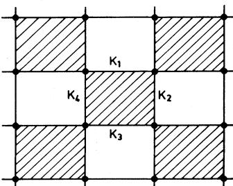

FIG. 13. Generalized (checkerboard) square lattice. Each shaded square is bordered by interactions K&, K2, K3, and X4.

$$\begin{aligned} e^{K_{\xi}} &= 2 \cos \left\{ \frac{2}{3} \cos^{-1} \frac{\sqrt{q}}{2} \right\}, \quad q \le 4\\ &= 2 \cosh \left\{ \frac{2}{3} \ln \left[ \frac{\sqrt{q}}{2} + \left[ \frac{q}{4} - 1 \right]^{1/2} \right], \quad q \ge 4 \right\}. \end{aligned} \tag{5.4}$$

The exact critical point for the triangular model where there is a three-site interaction I in every triangular face remains unknown except for q =2, for which the problem reduces to the nearest-neighbor Ising model, and for L =0 and I].;)0, for which the critical condition is (5.3). However, Enting and Wu (1982) have shown that a special limit of the isotropic model (K]=I].z ——I].3—K) reduces to the hard hexagon lattice gas solved by Baxter (1980). This leads to the critical point

$$\mathbf{z}_{\mathbf{c}} = \frac{1}{2}(11 + \mathbf{5}\sqrt{\mathbf{5}}) \qquad \qquad \qquad \mathbf{z}_{\mathbf{c}} = \frac{1}{2}(11 + \mathbf{5}\sqrt{\mathbf{5}}) \qquad \qquad \qquad \dots \qquad \qquad \text{(5.5)}$$

after first taking the K~ao, L ~—ao limit with e + =[(q —1)/z]'~ held constant, followed with the limit of q —+Do.

Of special interest is the q =3 triangular model which, with appropriate interactions, admits ferromagnetic and/or antiferromagnetic ground-state orderings. Enting and Wu (1982) have obtained a rigorous lower bound on the critical point for this model from a Peierls-type argument. Numerical estimates of the critical point has been obtained by position-space renormalization group (Schick and Griffiths, 1977), series analysis (Enting and Wu, 1982), and Monte Carlo simulation (Saito, 1982). These results are summarized in Table I.

Finally, by summing over the spin states of the decorating sites of a decorated lattice, the critical properties of a dilute Potts model on the decorated lattice can be determined from those of the underlying lattice. This is a generalization of the Syozi model (Syozi, 1965; Syozi and Miyazima, 1966), and in this way the critical point of the dilute decorated two-dimensional models can be exactly determined (Wu, 1980).

TABLE I. Numerical estimates of the critical point for the three-state triangular Potts lattice with two- and three-site interaction IK,L ]. I. Three-site interactions (K =O,L &0). II. Coexistence line (K = —2L /3 & 0). III. Antiferromagnetic two-site interactions (L =O,K &0). IV. Ferromagnetic twosite interactions (L =O,K ~ 0).

|                           |        |         |        | IV                       |
|---------------------------|--------|---------|--------|--------------------------|
| Exact value               | —LC    | KC      | KC     | —K ' =0.53208 e |
| Renormalization group" | 0.55   | 0.066   | 0.210  | 0.59                     |
| Series analysis'          | 0.5038 | 0.137   | 0.204  |                          |
| Carlo Monte            | 0.5058 | O. 1360 | 0.2050 |                          |

'

'e '=2 cos(~/9) for model IV from (5.4).

Schick and Crriffiths (1977). 'Enting and Wu (1982). Saito (1982).

# 2. Three-dimensional lattices

There is no exact result in three dimensions and the critical point can be located only by numerical means. The estimate of the transition temperature for the threedimensional Ising (q =2) model has long been known [see, for example, Fisher (1967)]; recent investigation of the three-dimensional Potts model has been mostly for the q =3 and q =4 models. Table II lists the various estimates on the critical points for three-dimensional lattices (series estimates are based on the assumption of a continuous transition).

# 3. Lattices in d & 3 dimensions

For lattices in higher-than-three dimensions we are again guided by numerical studies only. Besides the Monte Carlo renormalization group study for d =4, q =3 (Blote and Swendsen, 1979), series expansion in general d dimensions was first considered for the q =2 (Ising) model by Fisher and Gaunt (1964). This line of work has been extended further for d =4 (Sykes, 1979; Gaunt et al., 1979) and for q =4 (Ditzian and Kadanoff, 1979). Table III lists the estimates on the critical point obtained in these studies [the Ising results are also included for comparisonsj.

The mean-field solution of the Potts model has been discussed in Sec. I.C, where we have also examined the question on the existence of the critical value q, (d) above

TABLE II. Numerical estimates of the critical point for three-dimensional lattices.

| q=1  | ' =0.753' e |         |
|------|-------------------|---------|
| q =2 | 0.64816b          | 0.72993 |
| q =3 | 0.5784'           | 0.6747' |
|      | 0.5769            | 0.669'  |
|      | 0 577'            |         |
|      | 0.571'            |         |
|      | 0.575"            |         |
|      | 0.523             | 0.625'  |
|      | 0.524g            |         |
|      | 0.532"            |         |
|      | 0.472"            |         |

'Series analyses (Gaunt and Ruskin, 1978). "Series analyses (Sykes et al., 1972). 'Low-temperature series analysis (Miyashita et al., 1979). Monte Carlo (Hermann, 1979). 'Monte Carlo renormalization group (Blote and Swendsen, 1979). High-temperature series analysis (Kim and Joseph, 1975). ~High-temperature series analysis (Ditzian and Kadanoff, 1979). "Monte Carlo (Ono and Ito, 1982).

Rev. Mod. Phys. , Vol. 54, No. 1,January 1982

which the transition is mean-field —like in d dimension. We now turn to the question on the nature of transition and critical properties at the transition point.

# l. Two dimensions

It is very remarkable that one now knows quite precisely the behavior of the two-dimensional Potts model at the critical point, even though there is no exact solution. Specifically, exact information can be obtained for the Potts model at the critical point for the square, triangular, and honeycomb lattices. Qne finds that the transition is of first order for q & 4, and is continuous for q &4 (Baxter, 1973a; Baxter et al., 1978).

The analysis makes use of the ice-rule vertex model formulation of the Potts model formulated in Sec. IV.A. For the Potts model on the square, triangular, and honeycomb lattices, the weights (4.2) of the ice-rule vertex model take the simple form

$$(\alpha_1, \dots, \alpha_6) = (1, 1, \mathbf{x}_r, \mathbf{x}_r, \mathbf{c}_r, \mathbf{c}_r) \tag{5.6}$$

at the critical point (5.1). Now this last vertex model is exactly soluble (Lieb, 1967; Lieb and Wu, 1972; Kelland, 1974); therefore the Potts partition function can be evaluated exactly at the critical point.

The exact solution of the vertex model (5.6) shows a transition occurring at the point

$$\mathbf{B}. \text{ Antuer of transition} \\ \begin{array}{ccccc} & & & \mathbf{c}_r = \mathbf{i} + \mathbf{x}_r \\ \mathbf{i} & & & \mathbf{j} \end{array} \tag{5.7}$$

or, upon using (4.4) and (4.6),

$$q = \emptyset \,, \tag{5.8}$$

with q&4 corresponding to T~T,(c"&1+x")in the vertex model. Now, regarding the vertex model (5.6) as the Potts model at the critical point (for which q is free to vary), the transition suggests that the critical properties of the Potts model will exhibit a change at q =4.

To see what kind of changes occurs in the critical properties, one evaluates further the internal energy (1.9) of the Potts model. From (4.2) and (4.5) it is clear that

TABLE III. Numerical estimates of the critical point for the hypercubic lattice in d dimensions.

|                 |                             |       | 6                          |        | 8 | 10          |
|-----------------|-----------------------------|-------|----------------------------|--------|---|-------------|
| q =1' q=2    | ' =0.839 e 0.74100 | 0.882 | 0.9159 0.79607" 0.83134 | 0.9214 |   |             |
| q=3 =4' q | 0.74132' 0.6788 0.620 |       | 0.721                      | 0.754  |   | 0.781 0.821 |

'Series analyses (Gaunt and Ruskin, 1978). "High-temperature series analysis (Fisher and Gaunt, 1964). 'High-temperature series analysis (Gaunt et al., 1979). Monte Carlo renormalization group (Blote and Swendsen, 1979). Series analyses (Ditzian and Kadanoff, 1979).

the critical internal energy is related to the zero field (staggered) polarization induced by the external field lnz. That is, expression of the Potts critical internal energy will include a term proportional to the zero-field (staggered) polarization.

For the vertex model (4.2) and (4.5) on the square lattice, Baxter (1973b, 1973c) has shown that a spontaneous (staggered) polarization exists for T & T, . Baxter further argues that other terms occurring in the internal energy are continuous at the critical point. It follows that the q &4 Potts critical internal energy is discontinuous by an amount proportional to the zero-field (staggered) polarization. This then implies the existence of a nonzero latent heat for q &4, and that the transition at (5.1b), if any, is continuous for q &4. This line of analysis has been extended to the triangular and honeycomb lattices (Baxter et al., 1978), reaching the same conclusion regarding the nature of transition.

For completeness and convenience for references, I give the relevant results on the Potts model at the critical point.

For the isotropic square lattice, the free energy (1.8) at the critical temperature T, is given by the expression

$$f(q; T_{\mathfrak{c}}) = \frac{\mathfrak{l}}{2} \ln q + \Theta + 2 \sum_{n=1}^{\infty} n^{-1} e^{-n\Theta} \tanh(n\Theta) \ , \quad q \ge 4 \tag{5.9a}$$

$$q = \ln 2 + 4 \ln \left[ \Gamma(\frac{1}{4}) / 2 \Gamma(\frac{3}{4}) \right], \quad q = 4 \tag{5.9b}$$

$$\begin{aligned} &= \frac{1}{2} \ln q + \int_{-\infty}^{\infty} \frac{d\mathbf{x}}{\mathbf{x}} \tanh(\mu \mathbf{x}) \frac{\sinh(\pi - \mu)\mathbf{x}}{\sinh(\pi \mathbf{x})},\\ &\qquad q \le 4 \end{aligned} \tag{5.9c}$$

where

$$\begin{aligned} \cosh \Theta &= \sqrt{q} \text{ / 2, } & \Theta \ge 0, \quad q \ge 4\\ \cos \mu &= \sqrt{q} \text{ / 2, } & 0 \le \mu < \frac{1}{2}\pi, \quad q \le 4 \end{aligned} \tag{5.10}$$

The internal energy (1.9) at the critical point is

$$\begin{split} E(q, T_c \pm) &= \varepsilon_2 (1 + q^{-1/2}) \\ &\times \left[ -1 \pm \Delta(q) \tanh\left(\frac{\lfloor}{2} \Theta\right) \right], \end{split} \tag{5.11}$$

where

$$\begin{aligned} \Delta(q) &= 0, \quad q \le 4\\ &= \prod_{n=1}^{\infty} (\tanh n \Theta)^2, \quad q \ge 4 \end{aligned} \tag{5.12}$$

For the isotropic triangular lattice the results are

$$f(q; T_{\mathfrak{s}}) \coloneqq \frac{1}{2} \ln q + \Theta + 3 \sum_{n=1}^{\mathfrak{s}} n^{-1} e^{-n\Theta} \sinh\left[\frac{2n}{3} \Theta\right] \Big/ \cosh(n\Theta), \quad q \ge 4. \tag{5.13a}$$

$$= \ln 2 + 3 \ln \left| \frac{\Gamma(\frac{7}{6}) \Gamma(\frac{1}{3})}{\Gamma(\frac{2}{3}) \Gamma(\frac{4}{6})} \right|, \quad q = 4 \tag{5.13b}$$

$$q = \frac{1}{2} \ln q + \frac{3}{2} \int_{-\infty}^{\infty} \frac{\sinh(\pi - \mu)\mathbf{x} \cdot \sinh(2\mu\mathbf{x} \,/\Im)}{\mathbf{x} \cdot \sinh(\pi \mathbf{x}) \cosh(\mu\mathbf{x})} d\mathbf{x}, \quad q \le 4 \tag{5.13c}$$

$$E(q; T_{\varepsilon} \pm) = 3\varepsilon_{2} \left[ \sinh(\frac{\varepsilon}{3}\Theta) \sinh(\frac{\varepsilon}{3}\Theta) \right] \cdot \sinh(2\Theta) \left| \begin{array}{c} -1 - 2 \sum_{n=1}^{\infty} e^{-n\Theta} \cosh(\frac{\varepsilon}{3}n\Theta) / \cosh(n\Theta) \pm \Delta(q) \\\\ \end{array} \right|, \quad q \ge 4 \tag{5.14a}$$

$$q = -4\varepsilon_2 \left[ 1 - \frac{2}{3} \ln 2 \right], \quad q = 4 \tag{5.14b}$$

$$q = -\Im \varepsilon_2 \text{sinc}(\frac{4}{3}\mu) \text{sinc}(\frac{2}{3}\mu) \text{ssc}(2\mu) \int_{-\mathfrak{a}}^{\mathfrak{a}} \frac{\sinh\{(\pi-\mu)\mathbf{x}\} \text{cosh}(\frac{2}{3}\mu \mathbf{x})}{\sinh(\pi \mathbf{x}) \text{cosh}(\mu \mathbf{x})} d\mathbf{x}, \quad q \le 4 \tag{5.14c}$$

Corresponding expressions for the honeycomb lattice can be deduced from (5.13), (5.14)"and the duality relation (2.10). The latent heat in all cases is given by, for q & 4, )—'~ ], q =4+,

$$\begin{aligned} L(q) &= E(q, T_\mathfrak{c} +) - E(q, T_\mathfrak{c} -) \\ &\sim (q - 4)^{1/2} \exp[-\mathfrak{g}(q - 4)^{-1/2}], \quad q = 4 + 1, \end{aligned} \tag{5.15}$$

displaying an essential singularity at q =4 (g is a constant).

These results can be extended to the triangular lattice with anisotropic interactions (Baxter etal. , 1978). It is

Rev. Mod. Phys. , Vol. 54, No. 1,January 1982

noteworthy that the general expressions of the relevant quantities are of the form i'(q, xi) + @(q,x2) + g(q, x3), where the x's are defined in (4.4) and related by the critical condition (5.1b). The results (5.10)—(5.15) can then be obtained from these general expressions by taking the special cases of xi ——x2, x3——0 (square) and xi ——x2 ——x3 (triangular). For completeness I include in Table IV results of numerical evaluations (Sarbach and Wu, 1981b) of (5.11),(5.14) and (5.15) for q =1,2, . . . , 10.

Owing to the very fact that the critical behavior is precisely known, the d=2 Potts model has become an important testing ground in the modern theory of the criti-

|            |                                    |                       |                       |                       |                       |                            |                            |                            |                            |                            | 10                         |
|------------|------------------------------------|-----------------------|-----------------------|-----------------------|-----------------------|----------------------------|----------------------------|----------------------------|----------------------------|----------------------------|----------------------------|
| Square     |                                    |                       |                       |                       |                       | 1+v'q                      |                            |                            |                            |                            |                            |
|            | E(q; T, )                       |                       |                       |                       |                       | 1                          |                            |                            |                            |                            |                            |
|            | L (q)                              |                       |                       |                       |                       | 0.0265                     | 0.1007                     | 0.1766                     | 0.2432                     | 0.2998                     | 0.3480                     |
| Triangular | ' e E(q; T, ) I (q) | 1.5321 1.0000 0 | 1.7321 0.8333 0 | 1.8794 0.7603 0 | 2.0000 0.7172 0 | 2.1038 0.6881 0.0310 | 2.1958 0.6669 0.1172 | 2.2790 0.6506 0.2042 | 2.3553 0.6377 0.2795 | 2.4260 0.6271 0.3429 | 2.4920 0.6183 0.3962 |

TABLE IV. Numerical evaluations of the critical parameters.

cal point. For example, the success in predicting the known first-order transition has been crucial to the testing of the various approaches. The following developments are noted in this connection.

Renormalization group studies of the "c.-expansion" type, where e=4—d [see, for example, Golner (1973); Rudnick (1975)] led to a first-order transition for small E. But early attempts in the position space renormalization group have invariably failed to yield the known firstorder transition [see, for example, Burkhardt et al. (1976); Dasgupta (1977); den Nijs and Knops (1978); den Nijs (1979)]. However, Nienhuis et al. (1979, 1980a) have shown that, by including a dilution in the Potts model as described in Sec. I.B., the first-order transition can be seen in this enlarged parameter space as a crossover of the critical behavior into tricritical (for q &q, ) at q, . In this way, a variational renormalization group study (Nienhuis et al., 1980a) has yielded the excellent value of q, =4.08 versus the exact value q, =4. This renormalization group description of the Poits (and the cubic) model has been reviewed by Riedel (1981). The exact critical free energy for the q=4 model has also been reproduced quite accurately by a variational renormalization group calculation (Ashley, 1978; Temperley and Ashley, 1979).

For the triangular Potts model with both two- and three-site interactions, the position space renormalization group calculation yielded a continuous transition in both the ferromagnetic and antiferromagnetic models (Schick and Grifliths, 1977), while the inclusion of a dilution into this problem does not appear to lead to a consistent prediction (Kinzel, 1981). However, both series analysis (Enting and Wu, 1982) and Monte Carlo simulation (Saito, 1982) indicate that the transitions along the ferroand antiferromagnetic coexistence line (Model II in Table I) and the antiferromagnetic model (Model III in Table I) are actually first order. This finding is in line with the fact that the ground states of these two models have a higher symmetry and are, respectively, ninefold and sixfold degenerate.

The d=2 Potts model has also been studied in a Monte Carlo simulation of its dynamic as well as static properties (Binder, 1981). Excellent agreement with the known exact results for q=3,4,5,6 has been observed. Some of the theoretical predictions have also been verified by the experimental investigations of systems realizing the d=2 Potts models (Sec. I.D).

#### 2. Three dimensions

No exact results are known for the Potts model in three dimensions. Here, one is especially interested in elucidating the nature of transition in the q =3 model which resides close to the border of the validity of the mean-field scheme (see Sec. I.C).

Renormalization group studies in d=3 are inconclusive. While calculations of the "E,-expansion" type predicted a first-order transition for q=3 (see, for example, Rudnick, 1975), the real space renormalization group yielded a continuous transition [see, for example, Burkhardt etal. (1976)]. Series analyses did not fare much better either: Miyashita et al. (1979) found the q =3 low-temperature series inadequate to identify the nature of transition, although earlier work on the hightemperature series has indicated that the transition is first order for all q) 3 (Kim and Joseph, 1975). But a recent (numerical) study using the variational renormalization group has indicated that the transition in the q=3, d=3 model is definitely first order (Nienhuis et al., 1981).

A more positive identification of the nature of transition in d=3 is provided by Monte Carlo investigations. Herrmann (1979) studied tlie q=3,4 models and Knak Jensen and Mouritsen (1979) studied the q=3 model by Monte Carlo simulations; Blote and Swendsen (1979) investigated the q=3 model by the Monte Carlo renormalization group. In all cases, clear indications were obtained that the transition is first order. The cluster variation method (Levy and Sudano, 1978) also predicted a first-order transition. In addition, experiments on systems belonging to the same universality class as the q=3 model indicated the transition being of first order (Sec. I.D). The current belief based on these considerations is that the q=3 Potts model in three dimensions posseses a first-order transition, an assumption we have already taken into account in constructing Fig. 2.

# 3. General d dimensions

Only a few results are available for the Potts model in higher than three dimensions. The Monte Carlo renormaliz ation group indicated that the transition in the d=4, q=3 model is first order (Blote and Swendsen, 1979). Ditzian and Kadanoff reached the same con-

elusion for the d=4, q=4 model from analyzing the high- and low-temperature series. Extending the consideration of the dilute model of Nienhuis et al. (1979) to general d dimensions, Andelman and Berker (1981) obtained from a simple variational renormalization group analysis estimate on the value of q, (d) for continuous values of d. Their 6nding is consistent with the picture that the transition in higher dimensions is first order for all q) 2. The picture of the merging of the critical and tricritical lines at q, (d) for general d has also been confirmed in an analysis of the di6erential renormalization equation for the dilute Potts model by Nauenberg and Scalapino (1980). Their analysis also led to an essential singularity in (q —q, )'~ in the latent heat, thus extending (5.15) to all d, and a logarithmic correction to the power-law behavior in the free energy near T,. The dilute Potts model has also been studied by Berker etaI. (1980) in the infinite-state limit in one dimension. Using a Migdal-Kadanoff renormalization scheme argued to be exact in the limit of d~1 +, q~ao, with l=(d —1)lnq finite, they uncovered a variety of phase transitions and a

#### C. Phase diagram

%'e are now in a position to discuss the structure of the phase diagram of the Potts model in light of the foregoing discussions. In this regard the q=3 and q=4 models are special due to the fact that the phase diagram is dimension-dependent. The situation for the q =3 model, which has been alluded to by Straley and Fisher (1973), is as follows.

"singularity" in the critical properties at l=ln4.

Consider the q=3 model described by the general partition function (3.1) in which external fields H; =kTl zn; are applied to spin state i (=0,1,2). The structure of the phase diagram in the full (T,HO, Hi, Hz) space is best seen in the subspace

$$H_0 + H_1 + H_2 = 0 \ , \tag{5.16}$$

which retains the full symmetry of the model. This leads to the "triangle diagram" shown in Fig. 14 and 15.

Straley and Fisher (1973) argue that a planar coexistence surface, H) ——H2, exists in the region where one of the external fields, say, Hp, is large and negative. This coexistence surface is bound by a line of critical point since the transition is essentially Ising-like. By symmetry there exist two other similar coexistence planes, and the three planes must meet at the line of symmetry Hi Hz H3 ——0, T &——T, (a trip—l—e point line), since the three ordered phases can coexist below the zero-field transition temperature T, . The construction of the remaining portion of the phase diagram is now dictated by the nature of transition.

If the zero-field transition is critical (in the sense of divergent fluctuations) as found in d=2, then the three critical lines come in to meet at the zero-field transition point, turning it into an "anomalous" tricritical point. This situation is shown in Fig. 14. If the zero-field tran-

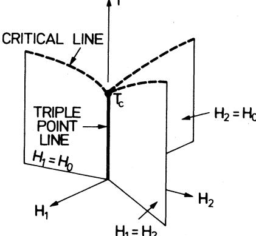

FIG. 14. Schematic phase diagram for the three-state Potts model in two dimensions. The three coexistence planes meet at the triple point line (solid line) and terminate at three critical lines (broken curves). The three critical lines meet at the zero-field transition point at T, forming an "anomalous" tricritical point.

sition is first order, as believed to be the case in d=3, then the zero-field transition point is not "critical. " Instead, it is a quadruple point where the three ordered phases and the disordered phase can coexist. Then the full phase diagram is expected to be as shown in Fig. 15. Note that there now exist three additional weblike 6rstorder surfaces, also terminating at lines of critical points. The six critical lines now join at three tricritical points of the "normal" type (in the sense that the three joining critical lines meet tangentially).

The phase diagram of the q=4 model can be discussed in a similar way by considereing a "tetrahedron diagram" in a four-dimensional space, with a comparable difference expected between the d=2 and d=3 models.

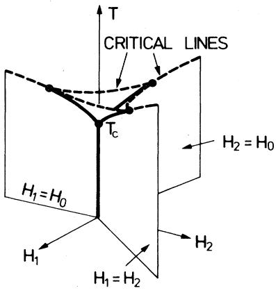

FIG. 15. Schematic phase diagram for the three-state Potts model in three dimensions. The three planar and the three weblike coexistence planes meet at the triple point lines (solid curves) and terminate at the critical lines (broken curves). The zero-field transition point at T, is a quadrupole point, and the critical lines meet at three "ordinary" tricritical points.

F. Y. Wu: The Potts model

# D. Critical exponents yh, yi,

The critical exponents of the Potts model are well defined for the d=2, q &4 system which exhibits a continuous transition. As in the usual description of the thermodynamics near a critical point [see, for example, Fisher (1967)], the critical behavior of the Potts free energy f(q;K,L) in d=2 is characterized by the "dominant" singularities

$$f(q; \mathbf{K}, \mathbf{0}) \sim \left| \mathbf{K} - \mathbf{K_c} \right|^{2/\mathbf{y}_l}, \ \mathbf{K} \sim \mathbf{K_c} \tag{5.17}$$

$$f(q; \mathcal{K}_c, L) \sim \left| L \right|^{2/\mathfrak{y}_\mathsf{h}}, \ L \sim \mathbf{0} \; . \tag{5.18}$$

These two expressions also serve to define the thermal and magnetic exponents y, and yh. The critical exponents are then obtained from the relations

$$2 - a = 2 \,\prime \text{y}_t$$
, 
$$\text{(5.19)}$$

1+1/6=2/yI, ,

and the usual scalings and hyperscaling.

In order to obtain the explicit q dependences of y, and yI, for the two-dimensional model, it is necessary to solve the vertex model (4.2), or any other equivalent formulation of the Potts model, at temperatures slightly off the critical point (5.1) or with a small field. This has not been accomplished to this date. However, on the basis of a consideration of the vertex model formulation and its connection with the Baxter (1971) eight-vertex model and the Ashkin-Teller (1943) model, den Nijs (1979b) has made the following conjecture on the thermal exponent:

$$y_t = 3(1 - u) / (2 - u), \quad q \le 4 \tag{5.20}$$

$$0 \le \mathfrak{u} \equiv (2/\pi) \cos^{-1}(\sqrt{q}/2) \le 1 \; . \tag{5.21}$$

Black and Emery (1981) have since given an argument showing the conjecture to be asymptotically exact; the conjecture has also been verified in a finite-size scaling analysis to a high degree of numerical accuracy for a wide range values of q (Nightingale and Blote, 1980; Blote et al., 1981). It now appears very likely that (5.20) is, in fact, the exact expression.

In Sec. V.B.1 I described the occurrence of a tricritical line in the enlarged parameter space of the Potts model when a dilution is introduced (Nienhuis et al. , 1979). Nienhuis etal. (1979) suggested from a consideration of the renormalization topology that a natural continuation of the thermal exponent into the tricritical region is to take y, ' ', the exponent along the tricritical branch, to be given by (5.20), as well, pmvided that one takes —1 &u &0 in (5.21). This picture has been further substantiated by Kadanoff variational renormalization calculations (Nienhuis et al. , 1980a; Burkhardt, 1980).

A conjecture similar to (5.20) has been made on the critical and tricritical magnetic exponents y~ and yI', '. The conjecture

$$
\langle y_h, y_h^{(T)} \rangle = (3 - \mu)(5 - \mu) / 4(2 - \mu) \ \ , \tag{5.22}
$$

with 0&u &1 for y~ and —1&u &O for yI', ' is obtained independently by Nienhuis et al. (1980b) from a consideration of renormalization group results and by Pearson (1980) from a pure numeral 6tting. But the validity of (5.22) has again been verified numerically to a high degree of accuracy (Nightingale and Blote, 1980; Blote et a/. , 1981).

Using the conjectured expression for the temperature and magnetic exponents, it is then a simple matter to write down all critical and tricritical exponents of the Potts model. One obtains

$$\alpha = \alpha' = 2(1 - 2u)/3(1 - u)\ \ ,$$

$$\beta = (1 + u)/12\ \ ,$$

$$\gamma = \gamma' = (7 - 4u + u^2)/6(1 - u)\ \ ,$$

$$\delta = (3 - u)(5 - u)/(1 - u^2)\ \ ,\tag{5.23}$$

$$\nu = \nu' = (2 - u)/3(1 - u)\ \ ,$$

$$\eta = (1 - u^2)/2(2 - u)\ \ ,$$

where u &0 (u &0) for the critical (tricritical) exponents. For convenience we list in Table V the predicted critical exponents for q=—0,1,2,3,4.

First we compare the conjectured values in Table V with the known exact results, which are unfortunately limited in numbers.

The value of yI, ——2 for q=0 agrees with the exact value obtained by Kunz (1981).

The q=2 values in Table V are in agreement with the known Ising results. In addition, the q=3 Potts model is believed to be in the same universality class of the hard hexagon lattice gas (Alexander, 1975), and the pre-1 dieted values of a= —, , P= —, are confirmed by the exact solution of the hard hexagon problem (Baxter, 1980). The q=4 Potts model is considered in the same universality class of the Baxter-Wu model (Enting, 1975; Domany and Riedel, 1978); the predicted values of 2 1 a = —, , P=—"again agree with the exact exponents (Baxter and Wu, 1973; Baxter et al. , 1975). These exact results lend firm support to the correctness of the conjectures.

Qn the other hand, it is fruitful and illuminating to compare the conjectured values with those obtained by various numerical means. This comparison is done in Table VI for q=1,3,4. [A more complete summary of the numerical results for q=1 can be found in Essam (1980).] It is seen that the agreement is generally good, except that a consistent difference is found in the case of q=4, the region where the finite-size scaling estimates (Blote et ah. , 1981) and the Monte Carlo renormalization group analysis (Rebbi and Swendsen, 1980) exhibit slow convergence. Presumably, this dif5culty is due to the presence of a strong (logarithmic) confluent singularity associated with a marginal exponent at q=4 (Nauenberg and Scalapino, 1980; Cardy et al. , 1981). It is noteworthy that a finite-size analysis of an associated

|        |          |        |        | 1 6  |            |           |        |         |
|--------|----------|--------|--------|---------|------------|-----------|--------|---------|
| 3 4 | 51 48 | 2 3 | 2 3 | 5 36 | 7 2— 18 | 18—1 5 | 4 3 | 5 24 |
|        | 15 8  | 1 2 |        | 1 8  | 7 4     | 15        |        | 1       |
| 6 5 | 28 15 | 1 3 | 1 3 | 1 9  | 13 9    |           | 5 6 | 4 15 |
| 3 2 | 15 8  |        | 2 3 | 1 12 | 7 6     | as        | 2 3 | 1 2  |

TABLE V. Critical exponents (5.23) for the Potts model in two dimensions.

one-dimensional quantum system (Hermann, 1981) leads to evidence supporting this correction.

The three-state models on the triangular lattice with pure three-site interactions have also been analyzed by series studies. For the model where the three-site interactions are present in half of the triangles (see Fig. 8), series analysis based on the (presumed) exact critical 1 1 point (5.3) yielded the exponents a= —, , P= —, (Enting,

1980c). The same set of exponents is also indicated for the model with three-site interactions in every triangle (Enting and Wu, 1982). These findings are consistent with the predictions of the universality argument.

Few results are available for the critical exponents of Potts models in higher dimensions. However, both the thermal and the magnetic exponents have been computed numerically as functions of q by Nienhuis et al. (1981) at

TABLE VI. Numerical estimates on the critical exponents of the q-state Potts model in two dimensions. Error bars in estimations are not included in this table. LT is low temperature, HT is high temperature, RG is renormalization group.

| Method                                                                              | —ys a=2(a     | ')      | y             | &=Xh ~(2— | Xh )   |
|-------------------------------------------------------------------------------------|------------------|---------|---------------|-----------|--------|
| 1 Conjectured value                                                              | 2 3           | 5 36 | 2— 7 18 | a8—1 5 |        |
| Monte Carlo 1976) (Kirkpatrick,                                            | 0. 136&P&0.152.3 |         |               |           |        |
| et al., Series expansion 1975) (Dunn                                       |                  | 0.15    | 2.38          |           | 1.34   |
| (Sykes et al., Series expansion 1976b, 1976a; Gaunt 1976) and Sykes, |                  | 0.138   | 2.43          | 18.0      |        |
| 1976) Series expansion (Domb and Pearse,                                | —0.668           |         |               |           |        |
| Real space RG (Reynolds et al., 1977, 1978)                                   | —0.712           | 0.138   | 2.435         | as.6      | 1.356  |
| Real space RG (Lobb and Karasek, 1980)                                        | —0.685           |         |               |           |        |
| RG (Dasgupta, Kadanoff variational 1976)                                   | —0.686           | 0.140   | 2.406         | 18.25     | 1.343  |
| RG (Eschbach et al., Carlo 1981) Monte                                  | —0.666           |         |               |           |        |
| 3 Conjectured value                                                              | 1                |         | 13            |           | 5      |
| HT series (Kim and 1975) expansion Joseph,                              | 3                |         | 9 1.42     |           | 6      |
| 1977) Series expansion and Ramshaw,                                        | 0.296            |         |               |           |        |
| (Zwanzig (de Neef and Series expansion 1977)                               | 0.42             |         |               |           |        |
| Enting, HT series et al., 1979) expansion (Miyashita                 |                  | 0.1064  | 1.50          | as.s      |        |
| Lt series 1980a) expansion (Enting,                                        |                  | 0.109   |               |           |        |
|                                                                                     | 3                |         |               |           |        |
| RG (Burkhardt Kadanoff et al., variational 1976)                        | 0.3365           | 0.1061  | 1.451         | 14.68     |        |
| RG (Dasgupta, Kadanoff 1977) variational                                   | 0.326            | 0.107   | 1.460         | 14.64     | 0.837  |
| RG (Shenker et al., Cumulant and variational 1979)                   | 0.210            |         |               |           | 0.895  |
| RG (Swendsen, Monte Carlo 1979; Rebbi 1980) and Swendsen,         | 0.352            | 0.101   | 1.445         | 15.26     | 0.824  |
| 4 Conjectured value                                                              |                  | 1 12 |               |           | 2 3 |
| HT series 1975) expansion (Kim and Joseph,                           |                  |         | 1.20          |           |        |
| Series expansion and Ramshaw, 1977) (Zwanzig                            | 0.45             |         |               |           |        |
| LT series 1975a) expansion (Enting,                                        | 0.64             | 0.089   |               |           |        |
| HT series 1979) expansion (Ditzian and KadanofI;                     | 0.5              |         | 1.17          |           |        |
| RG (Dasgupta, Kadanoff variational 1977)                                   | 0.488            | 0.091   | 1.330         | 15.53     | 0.756  |
| RG (Schenker et al., Cumulant and variational 1979)                  | 0.358            |         |               |           | 0.821  |
| RG (Hu, Duality 1980) invariant                                            | 0.4870           |         |               |           | 0.7565 |
| RG (Eschbach Monte Carlo et al. , 1981)                                 | 0.507            |         |               |           |        |
| of one-dimensional 1981) Analysis quantum (Herrmann, system          | 0.649            |         |               |           |        |
| RG (Swendsen et al. , Monte Carlo 1982)                                 | 0.660            |         |               |           |        |

d =1.58,2,2.32 (using the variational renormalization group) and for continuous values of d in 1 & d & 5 (using the Migdal bond-moving approximation). The more interesting case is the q= 1 (percolation) model for which the transition is continuous for all d &d,(1)=6. There have been a number of numerical estimates on the exponents for the q=1 model in d =3,4,S. For a comprehensive summary of these results see Essam (1980).

# E. The antiferromagnetic model

In an antiferromagnetic Potts model (X &0) it is energetically favorable for two neighboring spins to be in distinct spin states. As a consequence, the ground state of the q) 3 model on bipartite lattices (and the q=2 model if the lattice is not bipartite) has a nonzero entropy. Then the argument can be made as in Wannier (1950) that a transition of the usual type accompanying the onset of a long-range order will not arise.

However, Berker and Kadanoff (1980) have argued from a rescaling argument that in such systems a distinctive low-temperature phase in which correlations decay algebraically can exist. . For the q-state antiferromagnetic Potts model this behavior is permitted when the spatial dimensionality d is sufIiciently high, or, for a fixed d, when q is less than a cutoff value qo(d). While it remains to be seen whether such a phase indeed occurs in such systems, it is noteworthy that an approximate Migdal-KadanoA' renormalization carried out by Berker and Kadano6' (1980) yields the cuto8' values qo(2)=2. 3 and qo(3)=3.3, predicting the existence of such a phase in the q=3 model in three dimensions. Monte Carlo simulations, however, indicate the existence of an ordered low-temperature phase in three dimensions for both q=3 and q=4 (Banavar etal. , 1980). Monte Carlo simulations have also been carried out for the square lattice with anti ferromagnetic nearest-neighbor coupling and ferromagnetic next-nearest-coupling for q ) 3 (Grest and Banavar, 1981); the result shows a variety of unusual transitions.

For the square lattice it is known that the q=2 antiferromagnetic (Ising) system exhibits a transition at e =@2—1. While this transition may be an isolated singularity, more likely it is one point lying on a singular trajectory (Kim and Enting, 1979). A good indication of how this trajectory might behave can be inferred from the exact result of the antiferromagnetic model on the decorated lattice [Fig. 16(a)]. For antiferromagnetic interactions (%&0) this decorated model should exhibit the general features of a system with a nonzero entropy.

Taking the partial traces over the bond-decorating sites leads to an effective square lattice, as shown in Fig. 16(b). This Potts lattice has ferromagnetic interactions K* given by

$$e^{K^\bullet} = (e^{2K} + q - 1) / (2e^K + q - 2) \,. \tag{5.24}$$

Using the exact critical point (5.1b), or

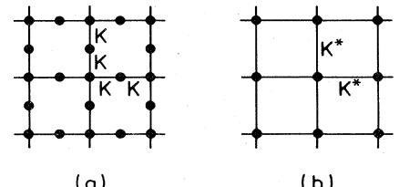

FIG. 16. {a) Decorated square lattice with interactions K. (b) Equivalent lattice with interactions I(:*.

$$e^{K_{\mathfrak{c}}^{\bullet}} = 1 + \sqrt{q} \tag{5.25}$$

for the square lattice, one obtains the following exact critical point for the antiferromagnetic (K&0) decorated model [see also Wu (1980)]:

$$e^{K_{\mathfrak{C}}} = 1 + \sqrt{q_{\mathfrak{C}}} \left( -\sqrt{q_{\mathfrak{C}}} (1 + \sqrt{q_{\mathfrak{C}}})^{1/2} \right) \tag{5.26}$$

The expression (5.26) is highly instructive, for it shows e ' decreasing monotonically from 1 to 0 in the range 1 between q=0 and q =qo ———,(3+ ~5). This cutoff value of qo(2) =2.618. . . is close to the value 2.3 of the rescaling prediction. [It is noteworthy that the same qp ——2.618. . . is found in a site-diluted antiferromagnetic Potts model on the honeycomb lattice (Kondor and Temesvari, 1981).] A similar behavior in the squarelattice model is therefore also expected. Indeed, Kim and Enting (1979) have analyzed the series expansion of the chromatic function (1.15a) for the square lattice. Their finding of a singularity at q=qp-2. 22 on the line e =0 conforms with the above reasonings.

Putting these pieces of information together, we then expect the line of singularity to behave in a fashion shown schematically in Fig. 17. Whether K, jumps from 0 to a nonzero value at qp as implied by the rescaling argument, remains to be seen. But the general behavior of the singularity trajectory should be as indicated. This contrasts with the conjecture

$$e^{\kappa_{\tilde{v}}} = [q \, (q-1)]^{1/2} + 1 - q \, \tag{5.27}$$

made by Ramshaw (1979) shown by the thin broken line in Fig. 17. Ramshaw s conjecture permits a transition

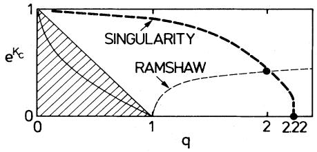

FIG-; 17. Schematic plot of the singularity trajectory (heavy broken line) of the antiferromagnetic Potts model on the square lattice. The trajectory passes through the points (0,1), (2,v 2—1), (2.22,0), and may have a jump discontinuity at q=2. 22 as shown. The shaded region is self-dual with the solid line denoting the self-dual point (5.28). The Ramshaw conjecture is given by (5.27). [See note added in proof below: The singularity trajectory should pass through the point (3,0), instead of the point (2.22,0).]

for all q& 1. It should be noted that the antiferromagnetic model on the square lattice is self-dual in the region 0&q & 1, 0&e & 1—q, indicated by the shaded area in Fig. 17. If a unique transition exists in this region, then it must occur at the self-dual point deduced from (2.11), or

$$e^{K_{\mathfrak{e}}} = 1 - \sqrt{q_{\mathfrak{e}}}, \quad 0 \le q_{\mathfrak{e}} < 1 \quad . \tag{5.28}$$

Clearly, our discussion precludes the existence of this transition.

Also of interest is the square-lattice Potts model with mixed ferromagnetic (K"&0) and antiferromagnetic (K~ &0) interactions considered by Kinzel et al. (1981). The Monte Carlo simulation suggests that the transition in this model, if any, is of an unconventional type, and a Migdal-Kadanoff transformation determines this transition point at

$$(1+e^{K_{\mathbf{x}}^{(\varepsilon)}})(1-e^{K_{\mathbf{y}}^{(\varepsilon)}}) = q^{\varepsilon}, \qquad \cdot \qquad , \qquad \cdot \qquad \tag{5.29}$$

a result know to be exact at q= 2.

Note added in pvoof: Baxter (1982b) has shown that the q &4 antiferromagnetic model (K"&0,K~ &0) on the square lattice is soluble at

$$(e^{\kappa_{\mathbf{x}}} + 1)(e^{\kappa_{\mathbf{y}}} + 1) = \mathbf{4} - q \quad . \tag{5.30}$$

He also concluded that the antiferromagnetic model exhibits a continuous transition at this point. This implies that the singularity trajectory in Fig. 17 should cross the q axis at q=3, instead of q=2.22 as shown. This crossing point is also predicted by a phenomenological renormalization group calculation (Nightingale and Schick, 1981).

#### Vl. RANDOM-BOND MODEL

#### A. Model definition

A random Potts model that has been of interest recently is the random-bond problem in which each interaction takes on values subject to an uncorrelated probability distribution. Thus the Hamiltonian takes the form

$$\mathcal{H} = -\sum_{(i,j)} J_{ij} \delta_{\mathbf{Kr}}(\sigma_i, \sigma_j) \quad , \qquad \cdot \Big|_{\mathbf{r}_i} \qquad , \qquad \cdot \Big|_{\mathbf{r}_j} \tag{6.11}$$

where Jj is a random variable governed by a distribution P (J1 ). As a realistic spin model the randomness is quenched, or frozen, in positions. One would like to investigate the properties of this system as a function of the parameters contained in P(J).

A simple choice of P(J) is the two-valued discrete distribution

$$P(J) = p\delta(J - J_1) + (1 - p)\delta(J - J_2) \ , \tag{6.2}$$

where 0&@&1. For q=2 and J~+J2 ——0, this becomes the spin glass problem (Edwards and Anderson, 197S); for J2——0 and general q, this defines the bond-diluted Potts model (as versus the site-diluted model of Sec. I.B)

Rev. Mod. Phys. , Vol. 54, No. 1, January 1982

where each bond has a probability p of possessing an interaction —J& and a probability 1—p of being vacant. We shall consider this random-bond Potts model in this section.

In a quenched system the thermodynamic quantities of interest are computed for each random configuration; only after this computation is the average over the random bond distribution taken. As an example, the per site free energy for a lattice 6 of % sites and E edges (bonds) is taken to be

fG(q;p, Ki,K2)=—g p (1 p) —FG '(q;Ki, K2), (6.3)

where K~ ——PJ;, and

$$F_G^{(M)}(q; \mathcal{K}_1, \mathcal{K}_2) = \sum_{\{\mathcal{M}\}} \ln \mathbb{Z}_G^{\{\mathcal{M}\}}(q; \mathcal{K}_1, \mathcal{K}_2) \tag{6.4}$$

is a sum over all (M) configurations I M I for which there are M bonds of interaction —Ji and E—M bonds —J2, Z\$ (q;K&,Kz) is the partition function for a fixed configuration [ M I.

Evaluation of averages of the type given by (6.3) is often effected (and also compounded) by the use of the n-replica trick (Emery, 1975). But as we shall see, it is not always necessary to use this trick to extract the needed information.

# B. Duality relation

Following the route of our discussion of the regular Potts model, we now derive a duality relation for the random-bond model (6.1) on planar lattices.

As we have already pointed out in Sec. II.A, the duality relation (2.10) is valid quite generally for edgedependent interactions. This means that we can write (2.10) for each of the partition functions Z\$ ) in (6.4). This leads to

$$\mathbf{Z}_{G}^{\{\mathcal{M}\}}(q; \mathcal{K}_{1}, \mathcal{K}_{2}) = q^{1 - N_{D}} (e^{\mathcal{K}_{1}} - 1)^{\mathcal{M}} (e^{\mathcal{K}_{2}} - 1)^{E - \mathcal{M}}$$

$$\times \mathbf{Z}_{D}^{\{\mathcal{M}\}}(q; \mathcal{K}_{1}^{\bullet}, \mathcal{K}_{2}^{\bullet}) \; , \; \qquad \text{(6.5)}$$

where

K,- (e ' —1)(e ' —1)=q

and Zg ) is the corresponding partition function on the dual lattice D specified by the same bond configuration I M I.

It is now a simple matter to substitute (6.5) into (6.4) and (6.3) to obtain the following duality relation:

$$f_G(q; p, K_1, K_2) = \frac{1 - N_D}{N} \ln q + p \frac{E}{N} \ln(e^{K_1} - 1)$$

$$+ (1 - p) \frac{E}{N} \ln(e^{K_2} - 1) \tag{6.7}$$

$$+ \frac{N_D}{N} f_D(q; p, K_1^\bullet, K_2^\bullet) \; .$$

The generalization of (6.7) which is valid for any finite G, to arbitrary distributions P(J) has been given by Sarbach and Wu (1981a) and by Jauslin and Swendsen (1981).

The duality relation (6.7) for the free energy f was first given by Schwartz (1979) [see also Fisch (1978)] for the q=2 random-bond Ising problem. The general q formulation has since been discussed using the n-replica technique by Southern and Thorpe (1979), generalizing an earlier q=2 result by Domany (1978), and by Aharony and Stephen (1980).

# C. Location of the critical point

For an infinite lattice 6 the free energy (6.7) will become singular along a certain trajectory, T= T,(p), in the (p, T) space. This trajectory then defines the critical point in the random-bond model.

It is therefore pertinent to inquire whether the duality relation (6.7) is useful in determining this critical point in the case of planar lattices, especially for the square lattice since it is self-dual.

The answer to this inquiry is negative, since, even in the case of the square lattice, the duality (6.7) simply describes a symmetry of the free energy about a point in the (Ki,K2) space for fixed p. But the square-lattice free energy possesses an additional symmetry

$$f_{\rm sq}(q; p, K_1, K_2) = f_{\rm sq}(q; 1 - p, K_2, K_1) \,. \tag{6.8}$$

Therefore, at p= —,, the singularity in the free energy is preserved under the transformation (Ki,K2)~(K2, K& ) ~(Kz,Ki ). Then, if a unique transition exists in this system, it must occur at K&——Ez ——K &, E2 ——L & ——Kz, or

$$(e^{K_1^\xi} - 1)(e^{K_2^\xi} - 1) = q \quad (p = \frac{1}{2})\ . \tag{6.9}$$

This exact critical point was 6rst obtained by Fisch (1978) for q=2 and extended to general q by Kinzel and Domany (1981).

There has been no exact result on the location of the critical point for general p. The conjectured expressions on the q=2 square lattice critical point for the bonddiluted model (Ki ——K, K2 ——0) (Nishimori, 1979a) and for the square-lattice model with arbitrary P(J) (Nishimori, 1979b) have shown to be incorrect (Aharony and Stephen, 1980). A similar determination of the general q critical point for the bond-diluted model (Southern, 1980),

$$e^{-K_{\mathfrak{c}}} = [q^{1-p_{\mathfrak{c}}/p} - 1] / (q - 1), \quad p \ge p_{\mathfrak{c}} \ , \tag{6.10}$$

where p, is the bond percolation threshold, is presumably also inexact, although it does give the correct limit for q=1 (Yeomans and Stinchcombe, 1980):

$$e^{-K_{\mathfrak{c}}} = 1 - p_{\mathfrak{c}}/p, \quad p \ge p_{\mathfrak{c}}\ . \tag{6.11}$$

In the bond-diluted model (Ki ——K, K2 ——0), we generally expect T,(p) to vanish for p (p"since below p, only finite clusters are present and there can be no ferromagnetic ordering. For q=1 the model describes a percolation process on the already diluted lattice with the exact critical point p(l —e ')=p, or (6.11). Therefore we expect T,(p) to behave as shown schematically in Fig. 18. Note that increasing the value of q corresponds to decreasing the "effective" ferromagnetic interactions; T,(p) goes down as a consequence. In addition, the behavior of T,(p) in the small dilution limit has been investigated in a cumulant expansion analysis for q=2 (Harris, 1974). The result is

$$T_{\mathfrak{c}}(p) = T_{\mathfrak{c}}(1)[1 - a(1 - p)], \quad q = 2, \ p \approx 1 \tag{6.12}$$

with a=1.329 and 1.060, respectively, for the square and the simple cubic lattices. [See also Sarbach and Wu (1981a)].

#### D. Critical behavior

Consider the bond-diluted (K2 ——0) system whose phase diagram is shown in Fig. 18. The behavior of such (bond- or site-) diluted systems near the point Q (p=p" T=0) has been of considerable theoretical interests. Stauffer (1975) has argued in the case of q=2 that the point Q should be viewed as a type of higher-order critical point. The transition is percolationlike if approached along the T=O path, and thermally driven if approached along p=p, (Stanley et aI , 1976). With the application of scaling, a crossover from the percolation problem to thermal ordering is then expected in the critical region (the vicinity of the point Q). In particular, one is led to consider the crossover exponents P=vz/v"where vz and v, are the respective percolation and thermal correlation exponents. This scaling argument has been extended to spin systems of general q components (Lubensky, 1977). Wallace and Young (1977) have shown rigorously that /=1 for the continuous Potts model in the limit of q~1. Using a renormalization procedure which is exact near T=O, Coniglio (1981) has been able to establish that P = 1 for any q and spatial dimensionality d.

The d=2 bond-diluted Potts model has been studied by the position-space renormalization group (Yeomans and Stinchcombe, 1980; Kinzel and Domany, 1981).

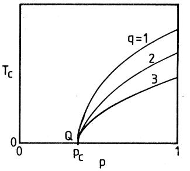

FIT+. 18. Schematic plot of T,(p), the critical temperature as a function of the bond concentration p, of the bond-diluted model for different values of q. p, is the bond percolation threshold.

This has led to numerical results on phase diagrams and thermodynamic functions. In particular, the prediction of Harris (1974) that the critical behavior of the dilute system deviates from that of the pure system only for q& 2 (when the specific heat of the pure system diverges) is verified. The bond-diluted system has also been studied under an "eA'ective interaction approximation" (Turban, 1980).

# Vl I. UNSO I V ED PROBLEMS

It is customary to include in an introductory review a list of unsolved problems to exemplify topics for further research. The following is a partial list of such problems as suggested in the presentation of this review. Here, again, emphasis has been placed on problems which require rigorous or exact treatments. But I have excluded the obviously over-ambitious problems such as the exact evaluation of the free energy (1.8).

1. Rigorous establishment of the validity of the critical condition (5.lb) for the d =2, q & 4, q+2 models. Among other implications, this would provide a rigorous proof on the (q= 1) bond percolation thresholds, which has been lacking to this date.

2. Determination of the critical point for twodimensional lattices other than those described by (5.1b). This includes the checkerboard lattice [conjecture (5.2)] and the Kagome lattice.

3. Decay of the correlation function at T=T, and for T (Tc.

4. Exact or rigorous results on the dilute model with quenched site dilution (Sec. I.B). In particular, one is interested in the crossover behavior between the thermal and percolation exponents near the percolation threshold where the transition temperature vanishes.

5. Determination of the critical point for the triangular lattice model with two- and three-site interactions. A solution to this problem will lead to, among others, the solution of two long outstanding unsolved problems: the exact percolation threshold for site-percolation on the honeycomb lattice and the Potts critical point for the Kagome lattice. It also leads to a direct determination of the critical fugacity (5.5) for the hard hexagon lattice gas.

6. The antiferromagnetic model requires further understanding including the nature of its transition for q &qo(d).

7. Rigorous proof on the validity of the conjectures (5.20) and (5.22) for the thermal and magnetic exponents for the two-dimensional models.

8. A rigorous argument proving (or disproving) that the d=3, q=3 transition is first order.

9. Exact determination of the critical point for the quenched bond-diluted model in two dimensions.

#### ACKNOWLEDGMENTS

This work is based in part on lectures I gave at Laboratorium voor Technische Natuurkunde, Delft, thus

forming part of the research programme of the "Stichting voor Fundamenteel Onderzoek der Materie (FOM)," which is financially supported by the "Nederlandse Organisatie voor Zuiver-Wetenschappelijk Onderzoek (ZWO). " I wish to thank my colleagues at Institut fiir Festkorperforschung, Kernforschungsanlage Jiilich, Instituut Lorentz, Leiden, and Laboratorium voor Technische Natuurkunde, Delft, for encouragement, and A. Aharony, A. N. Berker, E. Domany, H. J. Herrmann, P. Vf. Kasteleyn, I. Ono, E. K. Riedel, H. E. Stanley, and R. K. P. Zia for bringing relevant references to my attention. I am especially grateful to I. G. Enting and H. N. V. Temperley for critical readings of the manuscript and for their most helpful comments and criticisms. This work was supported in part by the National Science Foundation under Grant No. DMR-78-18808.

#### REFERENCES

- Aharony, A., 1978, J. Phys. C 11, L457.
- Aharony, A., and P. Pfeuty, 1979,J. Phys. C 12, L125.
- Aharony, A., and E. Pytte, 1981, Phys. Rev. B 23, 362.
- Aharony, A., and M. J. Stephen, 1980,J. Phys. C 13, L407.
- Aharony, A., K. A. Muller and W. Berlinger, 1977, Phys. Rev. Lett. 38, 33.
- Alcaraz, F. C., and R. Koberle, 1980,J. Phys. A 13, L153.
- Alexander, S., 1975, Phys. Lett. A 54, 353.
- Amit, D. J., 1976, J. Phys. A 9, 1441.
- Amit, D. J., and A. Shcherbakov, 1974, J. Phys. C 7, L96.
- Andelman, D., and A. N. Berker, 1981,J. Phys. A 14, L91.
- Ashkin, J., and E. Teller, 1943, Phys. Rev. 64, 178.
- Ashley, S. E., 1978, J. Phys. A 11, 2015.
- Banavar, J. R., G. S. Grest, and D. Jasnow, 1980, Phys. Rev. Lett. 45, 1424.
- Barbara, B., M. F. Rossignol, and P. Bak, 1978, J. Phys. C 11, L183.
- Barber, M. N., 1980, Phys. Rep. 59, 376.
- Baxter, R. J., 1970,J. Math. Phys. 11, 784.
- Baxter, R. J., 1971, Phys. Rev. Lett. 26, 832.
- Baxter, R. J., 1973a, J. Phys. C 6, L445.
- Baxter, R. J., 1973b, J. Stat. Phys. 9, 145.
- Baxter, R. J., 1973c,J. Phys. C 6, L94.
- Baxter, R. J., 1980,J. Phys. A 13, L61.
- Baxter, R. J., 1982a, "The Inversion Relation Method for Some Two-Dimensional Exactly Solved Models in Lattice Statistics, " to appear in J. Stat. Phys.
- Baxter, R. J., 1982b, "Critical Antiferromagnetic Square Lattice Potts Model, " to appear in Proc. R. Soc. London.
- Baxter, R. J., and F. Y. Wu, 1973, Phys. Rev. Lett. 31, 1294.
- Baxter, R. J., M. F. Sykes, and M. G. Watt, 1975, J. Phys. A 8, 245.
- Baxter, R. J., S. B. Kelland, and F. Y. Wu, 1976,J. Phys. A 9, 397.
- Baxter, R. J., H. N. V. Temperley, and S. E. Ashley, 1978, Proc. Roy. Soc. London, Ser. A 358, 535.
- Berker, A. N., and L. P. KadanoA; 1980, J. Phys. A 13, L259.
- Berker, A. N. , and M. Wortis, 1976, Phys. Rev. B 14, 4946.
- Berker, A. N., S. Oslund, and F. A. Putnam, 1978, Phys. Rev. B 17, 3650.
- Berker, A. N. , D. Andelman, an/ A. Aharony, 1980, J. Phys. A 13, L413.
- Betts, D. D., 1964, Can. J. Phys. 42, 1564.
- Biggs, N. L., 1975, J. Phys. A 8, L110.
- Binder, K., 1981,J. Stat. Phys. 24, 69.
- BirkhoK, G. D., 1912, Ann. Math. 14, 42.
- Black, J. L., and V. J. Emery, 1981, Phys. Rev. 8 23, 429.
- Blankschtein, D., and A. Aharony, 1980a, J. Phys. C 13, 4635.
- Blankschtein, D., and A. Aharony, 1980b, Phys. Rev. 8 22, 5549.
- Blankschtein, D., and A. Aharony, 1981,J. Phys. C 14, 1919.
- Blote, H. W. J., M. P. Nightingale, and B. Derrida, 1981, J. Phys. A 14, L45.
- Blote, H. W. J., and R. H. Swendsen, 1979, Phys. Rev. Lett. 43, 799.
- Blume, M., 1966, Phys. Rev. 141, 517.
- Blume, M., V. J. Emery, and R. B. GriAiths, 1971, Phys. Rev. A 4, 1071.
- Bragg, W. L., and E. J. Williams, 1934, Proc. Roy. Soc. London, Ser. A 14S, 699.
- Bretz, M., 1977, Phys. Rev. Lett. 38, 501.
- Burkhardt, T. W., 1979, Phys. Rev. 8 20, 2905.
- Burkhardt, T. W., 1980, Z. Phys. 8 39, 159.
- Burkhardt, T. W., and B. W. Southern, 1978, J. Phys. A 11" L247.
- Burkhardt, T, W., H. J. F. Knops, and M. den Nijs, 1976, J. Phys. A 9, L179.
- Capel, H. W., 1966, Physica 32, 966.
- Cardy, J, L. 1980, J. Phys. A 13, 1507.
- Cardy, J. L., M. Nauenberg, and D. J. Scalapino, 1981, Phys. Rev. 8 22, 2560.
- Coniglio A., 1981, Phys. Rev. Lett. 46, 250.
- Coniglio, A., H. E. Stanley, and W. Klein, 1979, Phys. Rev. Lett. 42, 518.
- Das, B. K., and R. B. Griffiths, 1979, J. Chem. Phys. 70, 5555.
- Dasgupta, C., 1976, Phys. Rev. 8 14, 1221.
- Dasgupta, C., 1977, Phys. Rev. 8 15, 3460.
- Ditzian, R. V., and L. P. Kadanoff, 1979,J. Phys. A 12, L229.
- Ditzian, R. V., and J. Pitman, 1974, J. Phys. A 7, L61.
- Domany, E., 1978, J. Phys. C 11, L337.
- Domany, E., M. Schick, and J. S. Walker, 1977, Phys. Rev. Lett. 38, 1148.
- Domany, E., and E. K. Riedel, 1978,J. Appl. Phys. 49, 1315.
- Domany, E., and M. Schick, 1979, Phys. Rev. 8 20, 3828.
- Domany, E., and M. Schick, J. S. Walker, and R. B. Griffiths, 1978, Phys. Rev. 8 18, 2209.
- Domany, E., Y. Schnidman, and D. Mukamel, 1981, "Type I fcc Antiferromagnets in a Field: A realization - of the q =3 and q=4-state Potts Models, " preprint.
- Domb, C., 1960, Adv. Phys. Pi, 149.
- Domb, C., 1974a, J. Phys. A 7, 1335.
- Domb, C., 1974b, in Phase Transitions and Critical Phenomena, edited by C. Domb and M. S. Green (Academic, London), Vol. 3, p. 1.
- Domb, C., and C. J. Pearse, 1976,J. Phys. A 9, L137.
- Dunn, A. G., J. W. Essam, and D. S. Ritchie, 1975, J. Phys. C 8, 4219.
- Edwards, S. F., and P. W. Anderson, 1975,J. Phys. F 5, 965.
- Eggarter, T. P., 1974, Phys. Rev. 8 9, 2989.
- Einhorn, M. B., R. Sauit, and E. Rabinovici, 1980, Nucl. Phys. 8 170, 16.
- Emery, V. J., 1975, Phys. Rev. 8 11, 239.
- Enting, I. G., 1974a, J. Phys. A 7, 1617.
- Enting, I. G., 1974b, J. Phys. A 7, 2181.
- Enting, I. G., 1975a, J. Phys. A 8, L35.
- Enting, I. G., 1975b, J. Phys. A 8, 727.
- Enting, I. G., 1975c, J. Phys. A 8, 1690.
- Enting, I. G., 1977, J. Phys. A 10, 325.
- Enting, I. G., 1978a, Austr. J. Phys. 31, 515.
- Enting, I. G., 1978b, J. Phys. A 11, 563.
- Enting, I. G., 1978c. Austr. J. Phys. 31, 383.
- Enting, I. G., 1980a, J. Phys. A 13, L133.
- Enting, I. G., 1980b, J. Phys. A 13, L279.
- Enting, I. G., 1980c,J. Phys. A 13, L409.
- Enting, I. G., and R. J. Baxter, 1977,J. Phys. A 10, L117.
- Enting, I. G., and F. Y. Wu, 1982, Triangular Lattice Potts Models, submitted to J. Stat. Phys.
- Eschbach, P. D., D. Stauffer, and H. J. Herrmann, 1981, Phys. Rev. 8 23, 422.
- Essam, J. W., 1972, in Phase Transitions and Cri tical Phenomena edited by C. Domb and M. S. Green (Academic, London), Vol. 2, p. 197.
- Essam, J. W., 1979,J. Math. Phys. 20, 1769.
- Essam, J. W., 1980, Rep. Prog. Phys. 43, 53.
- Essam, J. W., and M. E. Fisher, 1970, Rev. Mod. Phys. 42, 272.
- Fisch, R., 1978, J. Stat. Phys. 18, 111.
- Fisher, M. E. 1967, Rep. Prog. Phys. 30, 615.
- Fisher, M. E., and D. S. Gaunt, 1964, Phys. Rev. A 133, 224.
- Fontaine, J. R., and Ch. Gruber, 1979, Commun. Math. Phys. 70, 243.
- Fortuin, C. M., and P. W. Kasteleyn, 1972, Physica 57, 536.
- Frohlich, J., and T. Spencer, 1981, "The Kosterlitz-Thouless transition in two-dimensional Abelian spin systems and the Coulomb gas, " preprint, I.H.E.S.
- Gaunt, D. S., and A. J. Guttmann, 1974, in Phase Transitions and Critical Phenomena, edited by C. Domb and M. S. Green (Academic, London), Vol. 3, p. 181.
- Gaunt, D. S., and H. Ruskin, 1978, J. Phys. A 11, 1369.
- Gaunt, D. S., and M. F. Sykes, 1976, J. Phys. A 9, 1104.
- Gaunt, D. S., M. F. Sykes, and H. Ruskin, 1976, J. Phys. A 9, 1899.
- Gaunt, D. S., M. F. Sykes, and S. McKenzie, 1979, J. Phys. A 12, 871.
- de Gennes, P. G-. , 1971, Mol. Cryst. Liq. Cryst. 12, 193.
- Giri, M. R., M. J. Stephen, and G. S. Grest, 1977, Phys. Rev. 8 16, 4971.
- Golner, G., 1973, Phys. Rev. 8 8, 3419.
- Gouyet, J. F., 1980, in Ordering in Two Dimensions, edited by S. K. Sinha (North-Holland, New York), p. 355.
- Gouyet, J. F, B. Sapoval, and P. Pfeuty, 1980, J. Phys. Lett. 41, L115~
- Grest, G. S., and J. R. Banavar, 1981, Phys. Rev. Lett. 46, 1458;
- GriAiths, R. B., and J. C. Wheeler, 1970, Phys. Rev. A 2, 1047.
- Gruber, Ch. , A. Hintermann, and D. Merlini, 1977, "The duality transformation, " Ch. 4 of "Arbitrary Spin Lattice Systems, " Part III of Group Analysis of Classical Lattice Systems, Lecture Notes in Physics (Springer, Berlin), Vol. 60, p. 293.
- Hararay, F., 1969, Graph Theory (Addison-Wesley, Reading).
- Harris, A. 8., 1974, J. Phys. C 7, 1671.
- Harris, A. B., and T. C. Lubensky, 1981, Phys. Rev. 8 24, 2656.
- Harris, A. 8., T. C. Lubensky, W. K. Holcomb, and C. Dasgupta, 1975, Phys. Rev. Lett. 35, 327.
- von Heimberg, J., and H. Thomas, 1974, J. Phys. C 7, 3433.
- HeIrmann, H. J., 1979, Z. Phys. B. 3S, 171.
- Herrm ann, H. J., 1981, "The Potts Model as a One-Dimensional Quantum System, " preprint.
- Hintermann, A., H. Kunz, and F. Y. Wu, 1978, J. Stat. Phys. 19, 623.
- Hu, B., 1980,J. Phys. A 13, L321.
- Huang, K., 1963, Statistical Mechanics (Wiley, New York).
- Husimi, K., 1953, "Statistical mechanics of condensation, " in Proceedings of an International Conference on Theoretical Physics, edited by H. Yukawa (Science Council of Japan, Tokyo), p. 531.
- Ising, E., 1925, Z. Phys. 21, 613.
- Jauslin, H. R., and R. H. Swendsen, 1981, Phys. Rev. 8 24, 313.
- de Jongh, L. J., and A. R. Miedema, 1974, Adv. Phys. 23, 1.
- Kac, M., 1968, in Statistical Physics, Phase Transitions and Superfluidity, edited by M. Chretien, E. P. Ciross, and S. Deser (Gordon and Breach, New York), Vol. 1, p. 241.
- Kasai, Y., T. Takano, and I. Syozi, 1980, Prog. Theor. Phys. 63, 1917.
- Kasteleyn, P. W., 1963, Physica 29, 1329.
- Kasteleyn, P. W., 1964, Report in Aachen Conference on Statistical Mechanics.
- Kasteleyn, P. W., and C. M. Fortuin, 1969, J. Phys. Soc. Jpn. 26, (Suppl. ), 11.
- Kelland, S. B., 1974, Aust. J. Phys. 27, 813.
- Kihiara, T., Y. Midzuno, and J. Shizume, 1954, J. Phys. Soc. Jpn. 9, 681.
- Kim, D., and I. G. Enting, 1979, J. Comb. Theory 8 26, 327.
- Kim, D., and R. J. Joseph, 1974, J. Phys. C 7, L167.
- Kim, D., and R. J. Joseph, 1975,J. Phys. A 8, 891.
- Kim, D., P. M. Levy, and L. F. Uffer, 1975, Phys. Rev. 8 12, 989.
- Kinzel, W., 1981, private communication.
- Kinzel, W., and E. Domany, 1981, Phys. Rev. 8 23, 3421.
- Kinzel, W., W. Selke, and F. Y. Wu, 1981, J. Phys. A 14, L399.
- KirchhoK, G., 1847, Ann. Phys. Chem. 72, 497.
- Kirkpatrick, S., 1976, Phys. Rev. Lett. 36, 69.
- Knak Jensen, S. J., and O. G. Mouritsen, 1979, Phys. Rev. Lett. 43, 1736.
- Kogut, J. B., 1979, Rev. Mod. Phys. 51, 659.
- Kondor, I., 1980, J. Phys. C 13, L531.
- Kondor, I., and T. Temesvari, 1981,J. Phys. C 14, L97.
- Kosterlitz, J. M., and K. J. Thouless, 1978, Prog. Low Temp. Phys. 78, 371.
- Kramers, H. A., and G. H. Wannier, 1941, Phys. Rev. 60, 252.
- Kunz, H., 1981, unpublished.
- Kunz, H., and F. Y. Wu, 1978, J. Phys. C 11, L1.
- Levy, P. M., and J.J. Sudano, 1978, Phys. Rev. 8 18, 5087.
- Lieb, E. H., 1967a, Phys. Rev. Lett. 18, 692.
- Lieb, E. H., 1967b, Phys. Rev. 162, 162.
- Lieb, E. H., 1967c, Phys. Rev. Lett. 18, 1046.
- Lieb, E. H. and F. Y. Wu, 1972, in Phase Transitions and Critical Phenomena, edited by C. Domb and M. S. Green (Academic, London), Vol. 1, p. 332.
- Lobb, C. J., and K. A. Karasek, 1980, J. Phys. C 13, L245.
- Lubensky, T. C., 1977, Phys. Rev. 8 15, 311.
- Lubensky, T. C., and J. Isaacson, 1978, Phys. Rev. Lett. 41, 829.
- Matsuda, M., 1974, Prog. Theor. Phys. 51, 1053.
- Mattis, D. C., 1976, Phys. Lett. 56A, 421.
- McCoy, B. M., and T. T. Wu, 1973, The Two-Dimensional Ising Model (Harvard University, Cambridge Press).
- Mess, K. W., E. Lagendijk, D. A. Curtis, and W. J.
- Huiskamp, 1967, Physica 34, 126.
- Mittag, L., and J. Stephen, 1971,J. Math. Phys. 12, 441.
- Mittag, L., and J. Stephen, 1974, J. Phys. A 7, L109.
- Miyashita, S., D. D. Betts, and C. J. Elliott, 1979, J. Phys. A 12, 1605.
- Mukamel, D., M. E. Fisher, and E. Domany, 1976, Phys. Rev. Lett. 37, 565.
- Murata, K. K. 1979,J. Phys. A 12, 81.
- Nagle, J. F., 1971,J. Comb. Theory 8 10, 42.
- Nauenberg, M., and D. J. Scalapino, 1980, Phys. Rev. Lett. 44, 837.
- de Reef, T., 1975, Ph. D. Dissertation, Einhoven, University of Technology.
- de Neef, T., and I. G. Enting, 1977,J. Phys. A 10, 801.
- Nelson, D. R., 1979, Phys. Rep. 49, 255.
- Nienhuis, B., A. N. Berker, E. K. Riedel, and M. Schick, 1979, Phys. Rev. Lett. 43, 737.
- Nienhuis, B., E. K. Riedel, and M. Schick, 1980a, J. Phys. A 13, L31.
- Nienhuis, B., E. K. Riedel, and M. Schick, 1980b, J. Phys. A 13, L189.
- Nienhuis, B., E. K. Riedel, and M. Schick, 1981, Phys. Rev. 8 23, 6055.
- Nightingale, M. P., and H. W. J. Blote, 1980, Physica A 104, 352.
- Nightingale, M. P., and M. Schick, 1981, "Three-State Square Lattice Potts Antiferromagnet, " to appear in J. Phys. A.
- den Nijs, M.P.M., 1979a, Physica A 95, 449.
- den Nijs, M.P.M., 1979b, J. Phys. A 12, 1857.
- den Nijs, M.P.M., 1979c, Ph.D. thesis, Catholic University, Nijmegen.
- den Nijs, M.P.M., and H. J. F. Knops, 1978, Physica A 93, 441.
- Nishiromi, H., 1979a, J. Phys. C 12, L641.
- Nishiromi, H., 1979b, J. Phys. C 12, L905.
- Ono, I. and K. Ito, 1982, "Monte Carlo Simulation and Pair Approximation on the Phase Transition of Restricted Orientational Lattice Model for Liquid Crystal, " preprint.
- Onsager, L., 1944, Phys. Rev. 65, 117.
- Park, R. L., T. L. Einstein, A. R. Kortan, and L. D. Roelofs, 1980, in Ordering in Two Dimensions, edited by S. K. Sinha (North-Holland, New York), p. 17.
- Pearson, R. B., 1980, Phys. Rev. 8 22, 2579.
- Potts, R. B., 1951, Ph.D. thesis, University of Oxford.
- Potts, R. B., 1952, Proc. Camb. Phil. Soc. 48, 106.
- Potts, R. 8., and J. C. Ward, 1955, Prog. Theor. Phys. 13, 38.
- Ramshaw, J. D., 1979,J. Phys. A 12, L271.
- Rebbi, C., and R. H. Swendsen, 1980, Phys. Rev. 8 21, 4094.
- Reynolds, P. J., W. Klein, and H. E. Stanley, 1977, J. Phys. C 10, L167.
- Reynolds, P. J., H. E. Stanley, and W. Klein, 1978, J. Phys. A 11, L199.
- Riedel, E. K., 1981, "The Potts and Cubic Models in Two Dimensions. A Renormalization-Group Description, " to appear in Physica.
- Rudnick, J., 1975,J. Phys. A 8, 1125.
- Saito, Y., 1982, "Monte Carlo Study of the Three-State Potts Model with Two- and Three-Body Interaction, " submitted to J. Phys. A.
- Sarbach, S., and F. Y. Wu, 1981a, "Exact Results on the Random Potts Model, " to appear in Z. Phys. B.
- Sarbach, S., and F. Y. Wu, 1981b, unpublished.
- Savit, R., 1980, Rev. Mod. Phys. 52, 453.
- Schick, M., and R. B. G-riffiths, 1977, J. Phys. A 10, 2123.
- Schwartz, M., 1979, Phys. Lett. A 75, 102.
- Shenker, S. J., L. P. KadanoA; and A. M. M. Pruisken, 1979, J. Phys. A 12, 91.
- Somorjai, G. A., 1973, Surf. Sci. 34, 156.
- Southern, B. M., 1980,J. Phys. C 13, L285.
- Southern, B. M., and M. F. Thorpe, 1979,J. Phys. C 12, 5351.
- Stanley, H. E., R. J. Birgeneau, P. J. Reynolds, and J. F. Nicoll, 1976,J. Phys. C 9, L553.
- Stanley, R. P., 1973, Disc. Math. 5, 171.
- Stauffer, 1975, Z. Phys. B 22, 161.
- Stephen, M. J., 1976, Phys. Lett. A 56, 149.
- Stephen, M. J., 1977, Phys. Rev. B 15, 5674.
- Straley, J. P., 1974, J. Phys. A 7, 2173.
- Straley, J. P., and M. E. Fisher, 1973,J. Phys. A 6, 1310.
- Suzuki, M., and M. E. Fisher, 1971,J. Math. Phys. A 9, 397.
- Swendsen, R. H., 1979, Phys. Rev. Lett. 42, 859.
- Swendsen, R. H., D. Andelman, and A. N. Berker, 1982, Critical Exponents and Marginality of the Four-state Potts Model: Monte Carlo Renormalization Group, preprint.
- Sykes, M. F., 1979,J. Phys. A 12, 879.
- Sykes, M. F., J. W. Essam, and D. S. Gaunt, 1965, J. Math. Phys. 6, 283.
- Sykes, M. F. and D. S. Gaunt, 1973,J. Phys. A 6, 643.
- Sykes, M. F., D. S. Gaunt, and M. Glen, 1976a, J. Phys. A 9, 97.
- Sykes, M. F., D. S. Gaunt, and M. Glen, 1976b, J. Phys. A 9, 725.
- Sykes, M. F., D. S. Gaunt, P. D. Roberts, and J. A. Wyles, 1972, J. Phys. A 5, 640.
- Syozi, I., 1965, Prog. Theor. Phys. 34, 189.
- Syozi, I., and S. Miyazima, 1966, Prog. Theor. Phys. 36, 1083.
- Szabo, N. , 1975, J. Phys. C S, L397.
- Tejwani, M. J., O. Ferreira, and O. E. Vilches, 1980, Phys. Rev. Lett. 44, 152.
- Temperley, H. N. V., 1954, Proc. R. Soc. London 67, 233.
- Temperley, H. N. V., 1958, Faraday Soc. Discuss. 25, 92.
- Temperley, H. N. V., 1976, Report at Aberdeen Recontre on

Combinatorial Mathematics and Its Application.

- Temperley, H. N. V., and S. E. Ashley, 1979, Proc. R,. Soc. London Ser. A 365, 371.
- Temperley"H. N. V., and S. E. Ashley, 1981, "Site Percolation Problems and Multisite Potts Models, " to appear in J. Phys. A.
- Temperley, H. N. V., and E. H. Lieb, 1971, Proc. R. Soc. London Ser. A 322, 251.
- Toulouse, G., 1974, Nuovo Cim. B 23, 234.
- Toulouse, G., 1977, Commun. Phys. 2, 115.
- Turban, L., 1980, J. Phys. C 13, L13.
- Tutte, W. T., 1954, Can. J. Math. 6, 80.
- Wallance, D. J., and A. P. Young, 1977, Phys. Rev. B 17, 2384.
- Wang, Y. K., and F. Y. Wu, 1976,J. Phys. A 9, 593.
- Wannier, G. H., 1950, Phys. Rev. 79, 357.
- %cger, M. and I. B. Goldberg, 1973, Solid State Phys. 28, 1.
- Whitney, H., 1932, Ann. Math. 33, 688.
- Wielinga, R. F., H. W. J. Blote, J. A. Roest, and W. J. Huiskamp, 1967, Physica 34, 223.
- Wright, J. C., H. W. Moos, J. H. Colwell, B. W. Magnum, and D. D. Thornton, 1971, Phys. Rev. B 3, 843.
- Wu, F. Y., 1977, J. Phys. A 10, L113.
- Wu, F. Y., 1978, in Studies in Foundations and CombEnatories, edited by G.-C. Rota, Adv. in Math. Supp. Stud. , Vol. 1, p. 151.
- Wu, F. Y., 1979a, J. Phys. C 12, L317.
- Wu, F. Y., 1979b, J. Phys. C 12, L645.
- Wu, F. Y., 1980, J. Stat. Phys. 23, 733.
- Wu, F. Y., 1981,J. Phys. A 14, L39.
- Wu, F. Y., and K. Y. Lin, 1980,J. Phys. A 13, 629.
- Wu, F. Y., and Y. K. Wang, 1976,J. Math. Phys. 17, 439.
- Wu, F. Y., and R. K. P. Zia, 1981,J. Phys. A 14, 721.
- Yeomans, J. M., and R. B. Stinchcombe, 1980, J. Phys. C 13, L239.
- Zia, R. K. P., and D. Wallace, 1975, J. Phys. A 8, 1495.
- Zwanzig, R., and J. Ramshaw, 1977, J. Phys. A 10, 65.