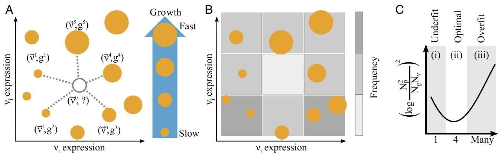
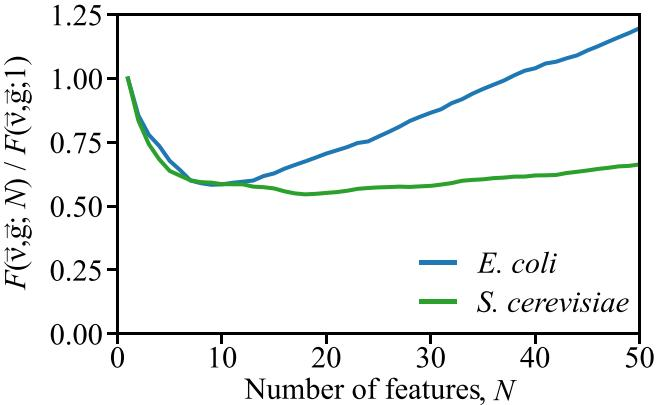
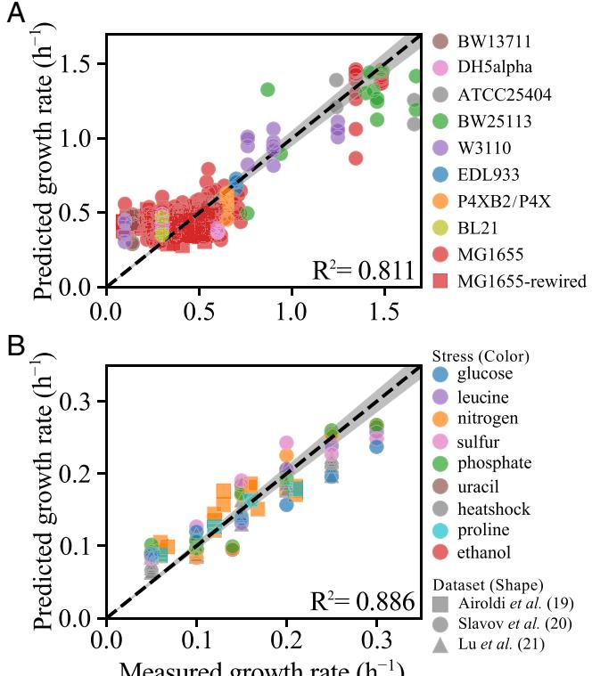

# **Predicting growth rate from gene expression**

#### **Thomas P. Wytocka and Adilson E. Mottera,b,c,1**

aDepartment of Physics and Astronomy, Northwestern University, Evanston, IL 60208; bNorthwestern Institute on Complex Systems, Northwestern University, Evanston, IL 60208; and cChicago Region Physical Sciences-Oncology Center, Northwestern University, Evanston, IL 60208

Edited by Jose N. Onuchic, Rice University, Houston, TX, and approved November 20, 2018 (received for review May 10, 2018) ´

**Growth rate is one of the most important and most complex phenotypic characteristics of unicellular microorganisms, which determines the genetic mutations that dominate at the population level, and ultimately whether the population will survive. Translating changes at the genetic level to their growth-rate consequences remains a subject of intense interest, since such a mapping could rationally direct experiments to optimize antibiotic efficacy or bioreactor productivity. In this work, we directly map transcriptional profiles to growth rates by gathering published gene-expression data from** *Escherichia coli* **and** *Saccharomyces cerevisiae* **with corresponding growth-rate measurements. Using a machine-learning technique called** *k***-nearest-neighbors regression, we build a model which predicts growth rate from gene expression. By exploiting the correlated nature of gene expression and sparsifying the model, we capture 81% of the variance in growth rate of the** *E. coli* **dataset, while reducing the number of features from** >**4,000 to 9. In** *S. cerevisiae***, we account for 89% of the variance in growth rate, while reducing from** >**5,500 dimensions to 18. Such a model provides a basis for selecting successful strategies from among the combinatorial number of experimental possibilities when attempting to optimize complex phenotypic traits like growth rate.**

biological networks | machine learning | data science | systems biology | metabolic networks

**M**apping genotype to phenotype remains a central challenge in molecular biology. In the past two decades, complex networks have emerged as a tool to organize the vast amount of data generated by genomic technologies toward mapping biochemical patterns to whole-system function. Applications include the metaanalysis of genetic interactions across organisms to find biologically conserved structures (1), the network analysis of geneannotation relationships to interpret the expression changes in gene sets (2, 3), the curation of genetic relationships into regulatory and signaling networks to predict the outcome of proposed interventions (4, 5), and the reconstruction of metabolic networks on which metabolic capacity is calculated through constraint-based models (CBMs) (6–8). These tools have also been used to explain gene essentiality and epistasis (9–11) and to study disease progression and treatment (4, 12).

Although successful, these strategies all rely on the laborintensive task of determining the network of relationships between genes. They resolve the network structure through a combination of aggregation of prior knowledge and targeted experimentation, but the benefit that network models provide by structuring data is limited by the problems they address or the conditions under which they apply. For example, annotation methods are associative and qualitative, which limit the potential for causal attribution and interstudy comparison, respectively. Meanwhile, precise dynamic models of gene-regulatory networks often require the measurement of in vivo kinetic parameters or other condition-specific quantities to validate the dynamical rules. On the other hand, CBMs require experiments with well-defined media and measurements of metabolic uptake rates for flux-balance analysis (FBA) to yield accurate maximal rates of biomass production. In addition, FBA assumes that the cell directs its metabolic activities to maximize cell growth and is fully adapted to its environment both before and after a perturbation (6, 13), although alternate methods have been developed that relax this restrictive requirement on the final state (8, 14) or more generally (15).

In this work, we establish a complementary method to predict growth rate using only gene-expression data, which we refer to as Model-Independent Prediction Of Growth Using Expression (MI-POGUE). Even though our method focuses on growth rate, it provides a strategy to answer the more general questions of how whole-cell gene expression affects phenotypic changes and thus of how to convert genome-wide observations into quantitative phenotypic predictions. The flexibility of MI-POGUE derives from using an effective model of genetic interactions in lieu of relying on prior knowledge or specialized experiments.

We develop MI-POGUE by retrieving large datasets of gene expression and growth rate in *Escherichia coli* (16) and *Saccharomyces cerevisiae* (17–22). Comprising thousands of individual observations, these datasets allow the direct measurement of gene–gene correlations present in cells, which form the basis of an effective model of genetic regulation. In our approach, we transform the gene-expression data into weighted combinations of genes derived from the gene–gene correlations called "eigengenes" (23) and predict growth rate by averaging the growth rates associated with the gene-expression profiles most similar to a given target profile—a technique known as k-nearest neighbors (KNN) regression (24). The efficacy of MI-POGUE is substantiated by comparing it with state-of-the-art methods for predicting growth rate.

The data-driven conception of MI-POGUE sidesteps the network identification problem while still accounting for all

## **Significance**

**Connecting genetic changes to organismal function has been a central problem of biology for decades. Understanding the genetic underpinnings of functional traits like growth rate remains incomplete despite efforts to uncover metabolic and gene-regulatory networks. Here, we leverage correlations derived from large-scale datasets of** *Escherichia coli* **and** *Saccharomyces cerevisiae* **to construct a mapping between gene expression and growth using the** *k***-nearest neighbors technique. Our mapping can predict growth rate more accurately than previous methods, while compressing gene-expression data from thousands of genes to tens of features without requiring network structure identification. This model can be applied to generate hypotheses, design experiments, and reduce the amount of trial and error in research.**

Author contributions: T.P.W. and A.E.M. designed research; T.P.W. performed research; T.P.W. and A.E.M. analyzed data; and T.P.W. and A.E.M. wrote the paper.y

The authors declare no conflict of interest.y

This article is a PNAS Direct Submission.y

Published under the [PNAS license.](https://www.pnas.org/site/aboutpnas/licenses.xhtml)y

Data deposition: The metadata annotating the experiments and MI-POGUE's source code are available on GitHub at [https://github.com/twytock/MI-POGUE.](https://github.com/twytock/MI-POGUE)y

This article contains supporting information online at [www.pnas.org/lookup/suppl/doi:10.](https://www.pnas.org/lookup/suppl/doi:10.1073/pnas.1808080116/-/DCSupplemental) [1073/pnas.1808080116/-/DCSupplemental.](https://www.pnas.org/lookup/suppl/doi:10.1073/pnas.1808080116/-/DCSupplemental)y

1 To whom correspondence should be addressed. Email: [motter@northwestern.edu.](mailto:motter@northwestern.edu)y

observed changes to intracellular networks in response to perturbations. Given that nonlinearity allows small changes in part of the cell to effect large changes in another part, broad-based strategies like MI-POGUE that account for changes across the whole genome promise to open new lines of inquiry in investigating fundamental systems biology, as well as in engineering microorganisms and designing antibiotics.

### Results

Dataset Overview. MI-POGUE requires a number of paired gene-expression and growth-rate measurements large enough to form a representative sample of potential organismal growth conditions to provide accurate growth estimates. We apply MI-POGUE to both *E. coli* and *S. cerevisiae*. Table 1 establishes that the size of the dataset we consider is unusually large for each organism.

The *E. coli* dataset is derived from ref. 16 and includes a broad sample of environmental conditions, measuring the effects of heat shock, hypoxia, or adaptive evolution on a variety of carbon sources in addition to >150 genetic perturbations. The primary substrains of *E. coli* K12 featured in these experiments are MG1655 and BW25113. The *S. cerevisiae* dataset, which serves to demonstrate its applicability to eukaryotes, comprises experiments performed in chemostats with various environmental stresses and nutrient limitations with gene-expression data taken from refs. 17–22 and growth rate taken from refs. 18–21. The metadata annotating the experiments is curated from these references, as described in *Materials and Methods*, and they are provided with MI-POGUE's source code (25).

Eigengene Estimation. The expression between genes is highly correlated (23), implying that each gene's expression depends on its neighbors in the network. Here, we derive eigengenes, which are combinations of genes that reorganize expression according to interdependencies implicitly mediated by the generegulatory network. Let g i and ~v i = {vj } i be the growth rate and gene expression, respectively, of the i th experiment, let j be an index over genes, and let ~g = {g i } i = 1..E and ~v = {~v i } i = 1..E be the set of all growth-rate measurements and their associated gene-expression profiles, respectively. Furthermore, let E be the total number of experiments including a growth-rate measurement, N be the number of gene-expression measurements used to estimate correlations, and J be the total number of genes common to each measurement.

We estimate the correlations between genes based on all of the available expression data (regardless of whether it had associated growth rate or not) and calculate the eigenvectors. Briefly, we compute the gene–gene (Pearson) correlation matrix **C** = Cjk , where Cjk is the Pearson correlation coefficient between the expression of the j th and k th genes. The correlation matrix is square (J by J ) and symmetric under exchange of indices. We diagonalize the matrix,

$$\mathbf{C} = \mathbf{P} \mathbf{D} \mathbf{P}^{-1},\tag{1}$$

resulting in the matrix **P** = Plj in which each column **P** l corresponds to the l th eigenvector while each row **P**j reflects the j th gene's projection onto the set of eigenvectors. The diagonal matrix **D** = (Dll) indicates the amount of correlation occurring

**Table 1. Overview of datasets**

| Description              | E. coli | S. cerevisiae |
|--------------------------|---------|---------------|
| Gene-expression profiles | 2,196   | 2,170         |
| Growth-rate measurements | 589     | 107           |

*E. coli* data from ref. 16. *S. cerevisiae* data from refs. 17–22.

along the l th column of **P**. Because the correlation matrix is symmetric, we have

$$\mathbf{P}^{-1} = \mathbf{P}^{T}.\tag{2}$$

Any expression profile may be projected onto the correlation eigenvectors by matrix multiplication:

$$
\vec{\nu}^i = \mathbf{P}^T \vec{v}^i. \tag{3}
$$

We call the ~ν i eigengenes, a portmanteau of "eigen" (proper) and "gene" (23), because they represent independent (that is, nonredundant) variations in gene-expression space. Therefore, increasing or decreasing the magnitude of one eigengene's expression (ν i l ) leaves the other projections unchanged (ν i m , m 6= l). In contrast, changing the expression of the j th gene, vj , would result in changes in other genes, modulated by **P**j , allowing this change to have wide-ranging impacts across the gene-expression profile.

Restriction of KNN Models to the Most Informative Eigengenes. The method of KNN regression is a machine-learning technique trained on a set of paired measurements of independent and dependent variables that assigns an average of selected dependent variables to a test measurement of independent variables, where the dependent variables are selected by testing independent variables' similarity with the training measurements. Here, the dependent variable is growth rate, and the independent variables are the elements of a gene-expression profile as illustrated in Fig. 1*A*. The output of the KNN-fitting process is called a regressor, which takes gene expression as input and outputs an estimate of growth rate. From the set of all calculated eigengenes, we restrict to those with the greatest potential to inform growth rate by searching for eigengenes that vary (possibly nonlinearly) the most as growth rate changes. We discretize each measurement into bins of both growth rate and gene expression, and search for eigengenes that most evenly distribute the experiments into bins and thus span the range of variation observed.

Fig. 1*B* illustrates in grids the joint distributions between growth rate and gene expression for two eigengenes. In this example, we suppose that each eigengene (and growth rate) can be in one of three states and discretize expression into these bins. Bins with higher densities of observations have darker colors. Any single eigengene places limited constraints on the possible values of growth rate, but by adding more eigengenes, the growth-rate possibilities for a given eigengene expression profile narrow. The increased specificity comes at the cost of increasing the number of possible states an experiment could occupy, thereby increasing the sensitivity to noise (as diagrammed in Fig. 1*C*). Models that incorporate enough eigengenes to estimate growth rate but avoid overfitting maximize their ability to accurately explain the observed data while retaining the ability to predict new data.

Optimization of KNN Regressors. To select features that predict growth, we require an objective function that balances the explanatory and predictive capabilities of the regressor, called G. We first quantify the explanatory capabilities of G, which is characterized by the set of features S that define the gene-expression subspace in which neighboring experiments are determined. The argument of G (S) is an experiment, ~ν i , where, as before, i is an index over experiments. We then determine the accuracy of G (S) (~ν i ) using the squared difference with the experimentally measured growth rate g i .

As the number of eigengenes |S| in S increases, the predictions converge toward the measured growth rate, but the rate of convergence slows as models incorporate |S| > 10 eigengenes. Therefore, we introduce a criterion to quantify how efficient

APPLIED PHYSICAL

BIOPHYSICS AND

COMPUTATIONAL

 BIOLOGY

SCIENCES

**Fig. 1.** Schematic illustrating growth-rate estimation and eigengene selection. (*A*) Measurements of gene expression and growth rate (location and size of solid circles, respectively) predict the growth rate of a hypothetical state (gray outlined circle) using the nearest measurements weighted by distance (dashed lines). (*B*) Discretized joint distributions of growth rate and eigengene (linear combinations of genes corresponding to the eigenvectors of the gene–gene correlation matrix) expression are indicated by size and grayscale background. The number of bins occupied (*Np* = 8), number of growth rate bins (*Ng* = 4), and number of eigengene bins (*N*ν = 9) characterize the efficiency. (*C*) Sketch of the state-space occupancy plotted vs. the number of eigengenes included in the model. Models with small *N*ν lack enough information to differentiate between the *Np* observations. As more eigenvectors are added, *N*ν increases geometrically, penalizing models using many eigengenes.

G (S) is in terms of state space. This term measures whether the decrease in error is large enough to justify the addition of another eigengene. In a maximally efficient model, each unique combination of eigengene-expression levels would have a corresponding range of growth rates, with no expression combination excluded. In other words, the number of bins occupied by the experiments in the dataset (Np) would be equal to the number of growth rate bins in Fig. 1*B* (Ng ). At the same time, Np would also be equal to the total possible number of configurations Nν = Q|S| 1 Nj , where Nj is the number of bins for the j th eigengene. We take the square of the (natural) logarithm of each ratio to obtain log[N 2 p /(NgNν)]2 , which we refer to as the state-space occupancy. Finally, we introduce the regularization parameter λ to balance the relative contribution of the explanatory and predictive terms, yielding:

$$F(\vec{\nu}, \vec{g}; |S|) = \operatorname*{arg\,min}_{S} \sqrt{\sum_{i}^{E} (G^{(S)}(\vec{\nu}^{i}) - g^{i})^{2}} + \lambda \left(\log \frac{N_{p}^{2}}{N_{g} N_{\nu}}\right)^{2} . \tag{4}$$

The value of λ at the optimal value of |S| is case-dependent and empirically found to be near 0.05 for *E. coli* (*Materials and Methods* and *[SI Appendix](https://www.pnas.org/lookup/suppl/doi:10.1073/pnas.1808080116/-/DCSupplemental)*, Fig. S1) and 0.001 for *S. cerevisiae*. Asymptotically, the optimal |S| shifts toward smaller numbers as λ →∞ and toward larger numbers as λ → 0.

We compare the performance of the various G (S) with Eq. **4** by dividing the dataset into training and test data consisting of gene-expression profiles paired with growth rate. We choose to use "stratified, fivefold cross-validation" which divides the existing data into subsets, called "folds," whose distribution of growth rates is constrained to match the distribution of the entire dataset as closely as possible. In testing the generalizability of the regressor, the dataset comprises five equally sized folds, and four folds are used as training data to fit the regressor, which is tested on the fifth. Cross-validation is repeated with each fold used as test data once, yielding predictions for each of the E experiments in the dataset. To account for variability in predictions due to fold construction, we average the predictions over 100 divisions of the dataset.

Finding the optimal set of eigengenes requires the testing of each possible set S, the number of which grows combinatorially. In view of the huge number of possibilities, we use the "forward selection" heuristic, which builds the set S by adding eigengenes one at a time to find a set that is close to optimal (26). Starting with |S| = 1, and continuing for each size of |S|, we rank all candidate regressors by the cross-validation procedure described in the previous paragraph. Next, we take the top-ranked set of eigengenes and form candidate sets of features of size |S| + 1 by adding each of the remaining features to the top-ranked set of eigengenes. The cross-validation process continues until |S| = 50, at which point the root mean squared error (RMSE) of the predictions has stopped improving.

With the process for evaluating regressors in mind, we detail the optimal regressors for each value of |S| in Fig. 2. Strikingly, the models including 9 and 18 eigengenes out of thousands achieve a better balance of accuracy and predictability than by including much larger gene-based models in both *E. coli* and *S. cerevisiae* (Fig. 2). The small number of features at the minimum compresses the gene-expression information relevant to growth rate into a relatively low-dimensional subspace, thereby facilitating further analysis.

For the best regressor composed of each number of eigengenes, we examine the trend in the square root of the sum of

**Fig. 2.** Selection of the best growth-predicting eigengenes in *E. coli* (blue, λ = 0.05) and *S. cerevisiae* (green, λ = 0.001). For presentation, values of *F*(~ν,~*g*; *N*) (defined in Eq. **4**) are scaled to their value at *N* = 1.

squared errors (SSE) (*[SI Appendix](https://www.pnas.org/lookup/suppl/doi:10.1073/pnas.1808080116/-/DCSupplemental)*, Fig. S2*A*) and the state-space occupancy (*[SI Appendix](https://www.pnas.org/lookup/suppl/doi:10.1073/pnas.1808080116/-/DCSupplemental)*, Fig. S2*B*) corresponding to the first and second terms of Eq. **4**, respectively. The SSE trend in *[SI Appendix](https://www.pnas.org/lookup/suppl/doi:10.1073/pnas.1808080116/-/DCSupplemental)*, Fig. S2*A* shows the stagnating improvements in accuracy, despite the geometric decrease in the state-space occupancy by observations in *[SI Appendix](https://www.pnas.org/lookup/suppl/doi:10.1073/pnas.1808080116/-/DCSupplemental)*, Fig. S2*B*. The large unoccupied fraction of state space hampers predictability, as it is unclear how to extrapolate to hypothetical observations in this region.

Prediction Comparison with Existing Methods. In Table 2, we compare the quality of predictions based on eigengenes with those based on the precursors of biomass—that is, all of the genes included in the metabolic reconstruction for each organism. We obtained the precursors of biomass from iJO1366 (27), containing 1,352 genes for *E. coli*, and from Yeast 7 (28), containing 897 genes for *S. cerevisiae*, and applied MI-POGUE to predict growth rate based on these genes' expression only. For both organisms, models built on eigengenes have a higher coefficient of determination (R 2 ) and lower RMSE than those built on precursors of biomass, despite requiring fewer features.

Given the overall growth-rate prediction accuracy in both organisms, we investigate the accuracy at the level of the individual experiments in Fig. 3*A*. MI-POGUE performs comparably across most of the strains present in our dataset. In *E. coli*, 348 of 589 of the predicted experiments fall inside the 5% error (gray region), despite systematic underestimation of the fastest and overestimation of the slowest growth rates. *S. cerevisiae* shows a similar pattern, with a slightly higher fraction of experiments with <5% error (66 of 107). The KNN approach systematically overestimates the slowest growth rates and underestimates the fastest growth rates because, by construction, the nearest neighbors of the slowest growth state will have faster-growth neighbors and vice versa.

Nevertheless, the level of accuracy motivated us to compare MI-POGUE with other existing methods using R 2 as a metric in Table 3. MI-POGUE achieves agreement with experimental measurements superior to other reported methods without a need for the additional step of converting the value of the biomass objective function to growth rate. MI-POGUE's accuracy outpaces that of CBMs without requiring metabolic uptake rates or enzyme kinetic parameters.

We demonstrate the flexibility of our method by applying it to predict the growth rate of *S. cerevisiae* grown in chemostats (Fig. 3*B*). We also predicted growth using the linear models from ref. 18 for comparison (*[SI Appendix](https://www.pnas.org/lookup/suppl/doi:10.1073/pnas.1808080116/-/DCSupplemental)*, *SI Methods*). With R 2 = 0.89, MI-POGUE far outpaces the moderate success of the linear growth model for *S. cerevisiae* (18), which has R 2 = 0.30. Compared with *E. coli*, MI-POGUE performs slightly better in *S. cerevisiae*, despite the additional complexity of mapping gene expression to function (3). This improvement in performance may be attributed to the relative sizes of the datasets and diversity of the conditions considered.

The success of MI-POGUE compared with the other methods derives, in part, from using eigengenes instead of single

**Table 2. Comparison of MI-POGUE's predictions when using optimized features vs. precursors of biomass**

| Organism      | Feature set        | 2 R | RMSE  | S     |
|---------------|--------------------|--------|-------|-------|
| E. coli       | Optimized features | 0.81*  | 0.125 | 9     |
|               | Biomass precursors | 0.76   | 0.138 | 1,352 |
| S. cerevisiae | Optimized features | 0.89*  | 0.028 | 18    |
|               | Biomass precursors | 0.60   | 0.049 | 897   |

*E. coli* data from ref. 27. *S. cerevisiae* data from ref. 28. *Errors are smaller than 10−3 .

**Fig. 3.** Growth-rate prediction accuracy in *E. coli* and *S. cerevisiae*. (*A*) Scatter plot of predicted vs. experimentally measured growth rates in *E. coli* for the strains indicated in the legend with the 5% margin of measurement error indicated by gray shading. (*B*) Same axes as in *A*, but for *S. cerevisiae*, with colors indicating the nutrient limitation or heat stress, and shapes indicating the dataset. For both organisms, λ is the same as in Fig. 2.

genes, but at first, one might think that this choice obscures the biological role of eigengenes. We note, however, that weighted gene coexpression network analysis (WGCNA) (31) has recently been used in fungi to associate gene modules with qualitative growth states (32). Our approach is quantitative rather than qualitative, but we can borrow this tool to interpret our eigengenes. Specifically, we develop a method to associate biological functions with eigengenes in *E. coli* using WGCNA and Protein Analysis Through Evolutionary Relationships (PANTHER) (33). For each selected eigengene, we take the outer product of the eigengene with itself, resulting in a J × J similarity matrix that is rescaled such that the largest diagonal element is one (see *Materials and Methods* for full details). The rescaled matrix is subjected to WGCNA, yielding a module of genes associated with each eigenvector. We use PANTHER to identify the most overrepresented and underrepresented Gene Ontology (GO) Biological Process annotations in each module (defined by *P* < 0.05, Fisher's exact test).

We find that the top GO terms associated with modules derived from five of the nine eigengenes are overrepresented for polysaccharide, phospholipid, lipid, fatty acid, and amino acid metabolism. In two others, DNA repair and DNA metabolism are overrepresented. Of the remaining two, one is defined by its underrepresentation of metabolic genes, while the other has no terms meeting the *P*-value threshold—reflecting the sometimes weak association between eigengenes and GO terms. That the nine selected eigengenes have largely nonoverlapping annotations is a result of the forward selection process. Once an eigengene that captures one biological process is selected, it is less likely that a second eigengene capturing the same

| Table 3. | Comparison of MI-POGUE's predictions with those of |
|----------|----------------------------------------------------|
|          | existing E. coli methods                           |

| Method   | 2* R | Reference | † n |
|----------|---------|-----------|--------|
| TRAME    | 0.36    | (16)      | 24     |
| ME-Model | 0.25    | (16)      | 24     |
| iJO1366  | 0.04    | (16)      | 24     |
| MOMENT   | 0.49    | (16)      | 24     |
| FBAwMC   | 0.13    | (16)      | 24     |
| MOMENT   | 0.22    | (29)      | 24     |
| FBAwMC   | 0.08    | (29)      | 24     |
| MOMENT   | 0.58    | (29)      | 10     |
| FBAwMC   | 0.64    | (29)      | 10     |
| RELATCH  | 0.48    | (30)      | 22     |
| FBA      | <0.01‡  | (30)      | 22     |
| MOMA     | 0.17    | (30)      | 22     |
| ROOM     | 0.37‡   | (30)      | 22     |
| MI-POGUE | 0.81    | This work | 589    |

*Italicized values are quoted from reference.

†Number of conditions tested.

‡Correlation with measured growth is negative.

process will be selected. The full gene lists and annotation lists are reported in *[SI Appendix](https://www.pnas.org/lookup/suppl/doi:10.1073/pnas.1808080116/-/DCSupplemental)*, [Datasets S1](https://www.pnas.org/lookup/suppl/doi:10.1073/pnas.1808080116/-/DCSupplemental) and [S2.](https://www.pnas.org/lookup/suppl/doi:10.1073/pnas.1808080116/-/DCSupplemental)

# Discussion

MI-POGUE both addresses the challenges faced by previous methods and reduces the labor necessary to construct models that map gene expression to phenotype. It fully incorporates gene expression, relaxes the requirement that organisms be completely adapted to their environment, reduces reliance on metabolic uptake rates, and avoids the necessity of estimating enzyme kinetic parameters (34–36). Furthermore, MI-POGUE can be applied broadly, even in cases where the growth media are not strictly defined. Because MI-POGUE is flexible, it can repurpose previous measurements without requiring extensive targeted experiments to determine the structure of intracellular networks. Its ability to reduce the relevant features to a small number of eigengenes allows for genome-wide data to be expressed succinctly without loss of predictive power. These advantages are achieved while simultaneously improving the capacity to predict growth rate.

MI-POGUE can characterize the independence, synergy, or antagonism of perturbation pairs by evaluating the growth rate of a hypothetical transcriptional state constructed by adding the (experimentally measured) transcriptional responses of two perturbations to a reference state. Whereas local models leave open the possibility that some unobserved gene accounts for growth deviations from independence, our method implies that, within limitations of the available data, such deviations result from nongenetic mechanisms (37).

The approach of generating proposed states based on experimentally measured gene-expression responses to perturbations can also prescreen experimental hypotheses. Such screening has the advantage of accounting for the real response of cells, as opposed to the simulated response based on network structure (23, 38). In the case of two perturbations where both are genetic, MI-POGUE can be used to estimate the growth of expression profiles resulting from both the individual perturbations and the double perturbation, yielding a computational prediction of growth-rate epistasis, thereby providing a tool to understand it (11). MI-POGUE could also be integrated with transcriptional regulatory network from databases (39) to predict the impact of previously unmeasured gene perturbations.

Researchers can incorporate MI-POGUE with existing strategies that interpret genetic networks to improve their effectiveness, as we demonstrate by using WGCNA and PANTHER to interpret the biological roles of eigengenes. Genomic footprinting (10), previously used to find essential genes, could be used to resolve regions of gene expression that yield zero growth, which can enhance the ability of the KNN algorithm to extrapolate beyond the training data.

The applicability of MI-POGUE to metabolic engineering, antibiotic development, and systems biology is expected to encourage its adoption and further refinement or the adoption of similar methods. For example, metabolic engineers could tailor MI-POGUE to offer predictions of a key uptake or secretion rate based on the organism's gene expression. Antibiotic developers could use transcriptional changes in response to drugs to choose combinations that result in the slowest growth rate as predicted by MI-POGUE. Systems biologists could use MI-POGUE to look for interactions between genes by taking transcriptional responses to single knockouts, adding them, and simulating the outcome. We also note that the mapping of eigengenes to biological functions as described here merits further investigation. Using modern community-detection algorithms, such as weighted stochastic block models (40), can help discern finer-scale structure of gene modules.

Given that cells are complex systems, weak and indirect interactions at the molecular level can influence behavior at the whole-cell level. Reductionist strategies are poorly suited to study these phenomena, but approaches like MI-POGUE, which combine machine learning with bioinformatic "big data," have the potential to capture these subtle effects. As systems biologists adapt machine-learning techniques to better interpret high-throughput data, the new interpretative power of these techniques has the potential to reveal underappreciated and sometimes counterintuitive effects that will drive the field into the future.

# Materials and Methods

Implementation of MI-POGUE. We used an implementation of the nearestneighbors algorithm (24) found in the Python sklearn package (41). For *E. coli* (*S. cerevisiae*) models, we chose *k* = 7 (*k* = 8) to be the number of neighbors, as this number was shown to perform better than other choices (*SI Appendix*[, Figs. S3 and S4)](https://www.pnas.org/lookup/suppl/doi:10.1073/pnas.1808080116/-/DCSupplemental). Additional details about the development and extensions of MI-POGUE are described in *[SI Appendix](https://www.pnas.org/lookup/suppl/doi:10.1073/pnas.1808080116/-/DCSupplemental)*, with the code and instructions for running MI-POGUE included on GitHub [(https://github.](https://github.com/twytock/MI-POGUE) [com/twytock/MI-POGUE)](https://github.com/twytock/MI-POGUE).

Discretization of Data. The growth-rate bins are fixed so that the number of experiments in each bin is approximately the same. In addition, for a given feature, every 10th percentile (that is, the 10*th*, 20*th* , . . . , 90*th*) of the projection of gene expression onto that feature is calculated from the available data. If the difference between consecutive percentiles (that is, the bin width) is >10% of the mean of the consecutive percentiles (the bin midpoint), then the bin is left in place. When the width is smaller, we randomly choose either the previous or subsequent percentile and merge the data into a larger bin, recalculating the width and midpoint. The bin-merging procedure continues until all bins' widths are >10% of their midpoints.

Precursors of Biomass. We downloaded the metabolic model iJO1366 (27) from *E. coli* and all those from *S. cerevisiae* considered in ref. 42 from the supporting information provided with the associated publications.

Experimental Data. For *E. coli*, we downloaded gene-expression data and experimental metadata from ref. 16. A lightly edited version of supplementary table 2 from ref. 16 describing the full *E. coli* dataset is available in ref. 25.

For *S. cerevisiae*, we downloaded gene-expression and growth-rate data from ref. 18, packaged as an ".RData" archive in dataset S1 in that reference. Loading the archive into R, we used the data frames that reported gene-expression data for strains growing at a fixed rate: "frmeDataCharles" (21) and "frmeDataGresham" (19). To these, we added data from ref. 20 (downloaded from genomics-pubs.princeton.edu/grr/), whose growth-rate, but not gene-expression, data are included in the R archive. These three datasets shared 5,527 unique genes and 107 total experiments.

For the purpose of estimating the correlations between genes in *S. cerevisiae*, we obtained data from two large-scale screens of gene knockouts (17, 22). The 300 expression profiles of ref. 17 were used as provided in the RData archive. Raw data from ref. 22 were downloaded from the Gene Expression Omnibus database (43) and preprocessed as described in the supplement of that reference. Following ref. 22, we excluded geneexpression profiles with fewer than four genes with significant responses to the gene deletion. These 1,369 experiments comprising 700 responsive strains were identified from supplemental table S1 of ref. 22.

Determining Optimal Parameter Values. The optimal number of neighbors was empirically determined in two ways: first, by starting at the previously identified set of optimal eigengenes for *k* = 7 and cross-validating the dataset with different numbers of neighbors, and second by rerunning feature selection with an optimal number of neighbors obtained from the first method. The first case is illustrated by *[SI Appendix](https://www.pnas.org/lookup/suppl/doi:10.1073/pnas.1808080116/-/DCSupplemental)*, Fig. S3 for a range of values for *k*, the number of nearest neighbors. We repeated the feature selection for *k* = 5, determined the maximum for *R* 2 of the peak, and found that this performs less well than the *k* = 7 case.

- 1. Ravasz E, Somera AL, Mongru DA, Oltvai ZN, Barabasi AL (2002) Hierarchical ´ organization of modularity in metabolic networks. *Science* 297:1551–1555.
- 2. Glass K, Ott E, Losert W, Girvan M (2012) Implications of functional similarity for gene regulatory interactions. *J R Soc Interface* 9:1625–1636.
- 3. Ku WL, Duggal G, Li Y, Girvan M, Ott E (2012) Interpreting patterns of gene expression: Signatures of coregulation, the data processing inequality, and triplet motifs. *PLoS One* 7:e31969.
- 4. Zanudo JGT, Albert R (2015) Cell fate reprogramming by control of intracellular ˜ network dynamics. *PLoS Comput Biol* 11:e1004193.
- 5. Cornelius SP, Kath WL, Motter AE (2013) Realistic control of network dynamics. *Nat Commun* 4:1942.
- 6. Edwards JS, Palsson BØ (2000) The *Escherichia coli* MG1655 *in silico* metabolic genotype: Its definition, characteristics, and capabilities. *Proc Natl Acad Sci USA* 97:5528–5533.
- 7. Forster J, Famili I, Fu P, Palsson BØ, Nielsen J (2003) Genome-scale reconstruction of ¨ the *Saccharomyces cerevisiae* metabolic network. *Genome Res* 13:244–253.
- 8. Segre D, Vitkup D, Church GM (2002) Analysis of optimality in natural and perturbed ` metabolic networks. *Proc Natl Acad Sci USA* 99:15112–15117.
- 9. Forster J, Famili I, Palsson BØ, Nielsen J (2003) Large-Scale evaluation of ¨ *in silico* gene deletions in *Saccharomyces cerevisiae*. *OMICS* 7:193–202.
- 10. Gerdes SY, et al. (2003) Experimental determination and system level analysis of essential genes in *Escherichia coli* MG1655. *J Bacteriol* 185:5673–5684.
- 11. Segre D, Deluna A, Church GM, Kishony R (2005) Modular epistasis in yeast ` metabolism. *Nat Genet* 37:77–83.
- 12. Schlauch D, Glass K, Hersh CP, Silverman EK, Quackenbush J (2017) Estimating drivers of cell state transitions using gene regulatory network models. *BMC Syst Biol* 11:139.
- 13. Fong SS, Palsson BØ (2004) Metabolic gene–deletion strains of *Escherichia coli* evolve to computationally predicted growth phenotypes. *Nat Genet* 36:1056–1058.
- 14. Shlomi T, Berkman O, Ruppin E (2005) Regulatory on/off minimization of metabolic flux. *Proc Natl Acad Sci USA* 102:7695–7700.
- 15. Mahadevan R, Schilling C (2003) The effects of alternate optimal solutions in constraint-based genome-scale metabolic models. *Metab Eng* 5:264–276.
- 16. Carrera J, et al. (2014) An integrative, multi-scale, genome-wide model reveals the phenotypic landscape of *Escherichia coli*. *Mol Syst Biol* 10:735.
- 17. Hughes TR, et al. (2000) Functional discovery via a compendium of expression profiles. *Cell* 102:109–126.
- 18. Airoldi EM, et al. (2009) Predicting cellular growth from gene expression signatures. *PLoS Comput Biol* 5:e1000257.
- 19. Airoldi EM, et al. (2016) Steady-state and dynamic gene expression programs in Saccharomyces cerevisiae in response to variation in environmental nitrogen. *Mol Biol Cell* 27:1383–1396.
- 20. Slavov N, Botstein D (2011) Coupling among growth rate response, metabolic cycle, and cell division cycle in yeast. *Mol Biol Cell* 22:1997–2009.
- 21. Lu C, Brauer MJ, Botstein D (2009) Slow growth induces heat-shock resistance in normal and respiratory-deficient yeast. *Mol Biol Cell* 20:891–903.
- 22. Kemmeren P, et al. (2014) Large-scale genetic perturbations reveal regulatory networks and an abundance of gene-specific repressors. *Cell* 157:740–752.
- 23. Alter O, Brown PO, Botstein D (2000) Singular value decomposition for genomewide expression data processing and modeling. *Proc Natl Acad Sci USA* 97:10101– 10106.

We repeated the feature selection for various values of the regularization parameter λ, which controls the relative weighting of the prediction error and the state-space occupancy terms of Eq. **4**, as shown in *[SI Appendix](https://www.pnas.org/lookup/suppl/doi:10.1073/pnas.1808080116/-/DCSupplemental)*, [Fig. S1.](https://www.pnas.org/lookup/suppl/doi:10.1073/pnas.1808080116/-/DCSupplemental) Since the forward-selection algorithm finds the best-fitting eigengene at each stage, changes to λ and the fold divisions can lead to different selections from the available eigengenes. As before, the variability in eigengenes due to fold selection can be mitigated by repeating the selection and taking the eigenvector that performs best on average. In *E. coli*, the maximal *R* 2 achieved for λ = 10−2 in both the *k*-fold and leave-one-GSE-out cross-validation strategies is greater than that achieved by the other values. Additional tests led to us selecting λ = 0.05. A similar approach was used to select λ for the *S. cerevisiae* dataset.

**ACKNOWLEDGMENTS.** This work was supported by NIH/National Institute of General Medical Sciences (NIGMS) Grant R01GM113238 and NIH/ National Cancer Institute Grant 1U54CA193419. T.P.W. was supported by NSF-Graduate Research Fellowship Program Fund DGE-0824162, as well as NIH/NIGMS Grant 5T32GM008382.

- 24. Altman NS (1992) An introduction to kernel and nearest-neighbor nonparametric regression. *Am Stat* 46:175–185.
- 25. Wytock TP, Motter AE (2018) Data and code from "Predicting growth rate from gene expression." GitHub. Available at [https://github.com/twytock/MI-POGUE.](https://github.com/twytock/MI-POGUE) Deposited September 4, 2018.
- 26. Efron B, Hastie T, Johnstone I, Tibshirani R (2004) Least angle regression. *Ann Stat* 32:407–499.
- 27. Orth JD, et al. (2011) A comprehensive genome-scale reconstruction of *Escherichia coli* metabolism–2011. *Mol Syst Biol* 7:535.
- 28. Aung HW, Henry SA, Walker LP (2013) Revising the representation of fatty acid, glycerolipid, and glycerophospholipid metabolism in the consensus model of yeast metabolism. *Ind Biotechnol* 9:215–228.
- 29. Adadi R, Volkmer B, Milo R, Heinemann M, Shlomi T (2012) Prediction of microbial growth rate versus biomass yield by a metabolic network with kinetic parameters. *PLoS Comput Biol* 8:e1002575.
- 30. Kim J, Reed JL (2012) RELATCH: Relative optimality in metabolic networks explains robust metabolic and regulatory responses to perturbations. *Genome Biol.* 13:R78.
- 31. Langfelder P, Horvath S (2008) WGCNA: An R package for weighted correlation network analysis. *BMC Bioinformatics* 9:559.
- 32. Baltussen TJ, Coolen JP, Zoll J, Verweij PE, Melchers WJ (2018) Gene co-expression analysis identifies gene clusters associated with isotropic and polarized growth in *Aspergillus fumigatus conidia*. *Fungal Genet Biol* 116:62–72.
- 33. Mi H, et al. (2017) PANTHER version 11: Expanded annotation data from Gene Ontology and Reactome pathways, and data analysis tool enhancements. *Nucleic Acids Res* 45:D183–D189.
- 34. Teusink B, Passarge J (2000) Can yeast glycolysis be understood in terms of in vitro kinetics of the constituent enzymes? Testing biochemistry. *Eur J Biochem* 267:5313– 5329.
- 35. van Eunen K, Kiewiet JAL, Westerhoff HV, Bakker BM (2012) Testing biochemistry revisited: How *in vivo* metabolism can be understood from *in vitro* enzyme kinetics. *PLoS Comput Biol* 8:e1002483.
- 36. Chubukov V, Gerosa L, Kochanowski K, Sauer U (2014) Coordination of microbial metabolism. *Nat Rev Microbiol* 12:327–340.
- 37. Penalver Bernab ˜ e B, et al. (2016) Dynamic transcription factor activity networks in ´ response to independently altered mechanical and adhesive microenvironmental cues. *Integr Biol* 8:844–860.
- 38. Brauer MJ, et al. (2008) Coordination of growth rate, cell cycle, stress response, and metabolic activity in yeast. *Mol Biol Cell* 19:352–367.
- 39. Gama-Castro S, et al. (2015) RegulonDB version 9.0: High-level integration of gene regulation, coexpression, motif clustering and beyond. *Nucleic Acids Res* 44: D133–D143.
- 40. Aicher C, Jacobs AZ, Clauset A (2014) Learning latent block structure in weighted networks. *J Complex Netw* 3:221–248.
- 41. Pedregosa F, Grisel O, Weiss R, Passos A, Brucher M (2011) Scikit-learn: Machine learning in Python. *J Mach Learn Res* 12:2825–2830.
- 42. Heavner BD, Price ND (2015) Comparative analysis of yeast metabolic network models highlights progress, opportunities for metabolic reconstruction. *PLoS Comput Biol* 11:e1004530.
- 43. Barrett T, et al. (2013) NCBI GEO: Archive for functional genomics data sets–Update. *Nucleic Acids Res* 41:D991–D995.