<span id="page-0-0"></span>

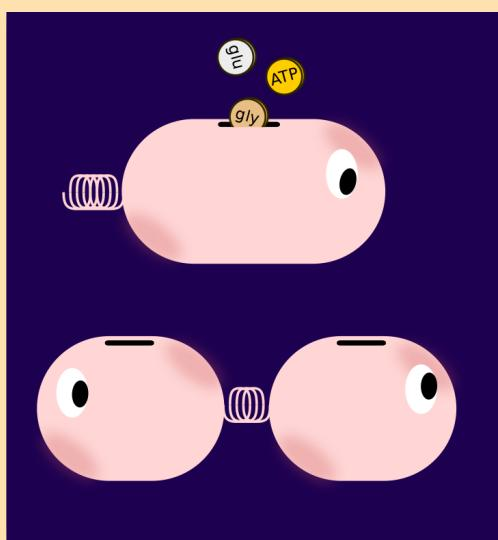

# the economic cell collective

draft edition april 2024

## About this book

Living cells, shaped by billions of years of evolution, have developed many ways to adapt to their environment, for example by regulation of gene expression. But the rules of physics and chemistry enforce certain boundaries on what cells can achieve and how they can allocate their own resources. The goal of this book is to uncover some of these governing principles, linking them to fundamental questions in cell physiology. The book gives an overview of established approaches to cellular economics, from descriptions of simple metabolic systems to cell growth, variability, and dynamic behavior. It is written as a free and open textbook to which anyone can contribute.

The authors of the current edition (January 2024), forming the Economic Cell Collective, are Agustín G. Yabo, Andrea De Martino, Andrea Weiße, Andreas Kremling, Anne Goelzer, Benjamin Mauroy, Christophe Goupil, Cyril Karamaoun, Daan de Groot, Dafni Giannari, David Lacoste, David Tourigny, Diana Széliová, Diego A. Oyarzún, Elad Noor, Elena Pascual Garcia, Éric Herbert, Felipe Scott, Frédérique Noël, Gabriele Micali, Hadrien Delattre, Herbert Sauro, Hidde de Jong, Hollie J. Hindley, Hugo Dourado, Jacopo Grilli, Jan-Philipp Dapprich, Marcelo Rivas-Astroza, Marco Cosentino Lagomarsino, Markus Köbis, Mattia Corigliano, Meike Wortel, Ohad Golan, Olivier Rivoire, Orkun S. Soyer, Paul Ross, Pranas Grigaitis, Robert West, Steffen Waldherr, and Wolfram Liebermeister, but many others also contributed to this book. We thank Maarten Droste, Michela Pauletti, and Milena Milovanović for their work on the book.

The authors of each chapter are listed in alphabetical order.

Typeset by the authors using LaTeX. Cover design by Elad Noor and Wolfram Liebermeister.

The book, lecture slides, and computer exercises can be downloaded from [principlescellphysiology.org/book-economic-principles/.](https://principlescellphysiology.org/book-economic-principles/)


© 2024 The Economic Cell Collective Licensed under Creative Commons License CC-BY-SA 4.0. An authors open access book. No publisher has been paid.


Authors who presented material from this book as lectures at the "Economic Principles in Cell Biology" summer school at LPI Paris. Other authors presented their chapters online.

# Contents

| Preface |  | 1 |
|---------|--|---|
|         |  |   |

| 1                                                                                 |     | The cell as a factory<br>5     |                                                               |    |  |  |
|-----------------------------------------------------------------------------------|-----|--------------------------------|---------------------------------------------------------------|----|--|--|
| 2                                                                                 |     | What makes up a cell           |                                                               |    |  |  |
|                                                                                   | 2.1 |                                | Describing and counting cellular components<br>. 9            |    |  |  |
|                                                                                   | 2.2 |                                | The components of a cell<br>. 9                               |    |  |  |
|                                                                                   |     | 2.2.1                          | Cell composition and structures 9                             |    |  |  |
|                                                                                   |     | 2.2.2                          | Biological molecules<br>. 10                                  |    |  |  |
|                                                                                   | 2.3 | Cell composition in numbers 12 |                                                               |    |  |  |
|                                                                                   |     | 2.3.1                          | Biomass composition 12                                        |    |  |  |
|                                                                                   |     | 2.3.2                          | Variability of biomass composition<br>. 14                    |    |  |  |
|                                                                                   |     | 2.3.3                          | Biomass composition is not uniform 15                         |    |  |  |
|                                                                                   | 2.4 | Cell size                      | . 16                                                          |    |  |  |
|                                                                                   | 2.5 | Cell density                   | . 18                                                          |    |  |  |
|                                                                                   | 2.6 |                                | The physical constraints of cell growth<br>. 19               |    |  |  |
|                                                                                   | 2.7 |                                | Macromolecule synthesis and the resources needed<br>. 19      |    |  |  |
|                                                                                   |     | 2.7.1                          | Precursors of macromolecules<br>. 20                          |    |  |  |
|                                                                                   |     | 2.7.2                          | Catalysts needed for macromolecule synthesis 20               |    |  |  |
|                                                                                   |     | 2.7.3                          | Physical proteome space 24                                    |    |  |  |
|                                                                                   | 2.8 |                                | Concluding remarks<br>. 24                                    |    |  |  |
| 3                                                                                 |     |                                | The dynamics of metabolic systems                             | 27 |  |  |
|                                                                                   | 3.1 |                                | Conceptualizing cell metabolism as a dynamical system<br>. 27 |    |  |  |
|                                                                                   |     | 3.1.1                          | Metabolism as a collection of pathways<br>. 28                |    |  |  |
|                                                                                   |     | 3.1.2                          | Metabolism - coarse grained views 28                          |    |  |  |
|                                                                                   |     | 3.1.3                          | Keeping flows in a system of interconnected fluxes<br>. 30    |    |  |  |
|                                                                                   |     | 3.1.4                          | Metabolic system and recurring motifs 32                      |    |  |  |
|                                                                                   | 3.2 |                                | Dynamics and regulation of metabolism<br>. 32                 |    |  |  |
|                                                                                   |     | 3.2.1                          | Biochemical reactions and thermodynamics<br>. 33              |    |  |  |
|                                                                                   |     | 3.2.2                          | Stoichiometric matrix and ordinary differential equations 34  |    |  |  |
|                                                                                   |     | 3.2.3                          | Dynamic steady state 36                                       |    |  |  |
|                                                                                   |     | 3.2.4                          | Multiple steady-states and oscillations 37                    |    |  |  |
|                                                                                   |     | 3.2.5                          | Regulation of fluxes 37                                       |    |  |  |
|                                                                                   | 3.3 |                                | Toolbox for modeling dynamics of metabolism<br>. 38           |    |  |  |
|                                                                                   |     | 3.3.1                          | Enzymes - a brief note<br>. 39                                |    |  |  |
|                                                                                   |     | 3.3.2                          | Modeling reaction fluxes - reaction rate models<br>. 39       |    |  |  |
| 3.4<br>Dynamics of metabolism: experimental evidence and model-based explanations |     | . 45                           |                                                               |    |  |  |
|                                                                                   |     | 3.4.1                          | Flux switching / regulation 45                                |    |  |  |
|                                                                                   |     |                                |                                                               |    |  |  |

|                                   |                                                      | 3.4.2                                                        | Bistability 47                                                             |  |  |  |
|-----------------------------------|------------------------------------------------------|--------------------------------------------------------------|----------------------------------------------------------------------------|--|--|--|
|                                   |                                                      | 3.4.3                                                        | Oscillations 47                                                            |  |  |  |
| 3.5<br>Concluding remarks<br>. 49 |                                                      |                                                              |                                                                            |  |  |  |
| 4                                 |                                                      | The space of metabolic flux distributions<br>53              |                                                                            |  |  |  |
|                                   | 4.1                                                  |                                                              | Modeling metabolic fluxes in cells<br>. 53                                 |  |  |  |
|                                   | 4.2                                                  | The flux cone                                                | . 56                                                                       |  |  |  |
|                                   |                                                      | 4.2.1                                                        | Mass-balance constraints<br>. 56                                           |  |  |  |
|                                   |                                                      | 4.2.2                                                        | Elementary flux modes 57                                                   |  |  |  |
|                                   |                                                      | 4.2.3                                                        | Irreversibility constraints 59                                             |  |  |  |
|                                   |                                                      | 4.2.4                                                        | Practical uses of elementary flux modes 61                                 |  |  |  |
|                                   |                                                      | 4.2.5                                                        | Computational challenges for elementary flux mode analysis<br>. 61         |  |  |  |
|                                   | 4.3                                                  |                                                              | Additional constraints and flux polyhedra<br>. 62                          |  |  |  |
|                                   |                                                      | 4.3.1                                                        | Inhomogeneous linear flux constraints 62                                   |  |  |  |
|                                   |                                                      | 4.3.2                                                        | Thermodynamic constraints 64                                               |  |  |  |
|                                   | 4.4                                                  |                                                              | Alternative methods for flux space exploration<br>. 65                     |  |  |  |
|                                   |                                                      | 4.4.1                                                        | Elementary conversion modes<br>. 65                                        |  |  |  |
|                                   |                                                      | 4.4.2                                                        | Flux sampling<br>. 67                                                      |  |  |  |
|                                   |                                                      | 4.4.3                                                        | Minimal cut sets 68                                                        |  |  |  |
|                                   | 4.5                                                  |                                                              | Concluding remarks<br>. 69                                                 |  |  |  |
| 5                                 |                                                      | Fluxes in constraint-based metabolic models<br>73            |                                                                            |  |  |  |
|                                   | 5.1                                                  |                                                              | Can we use an optimality assumption to predict metabolic behavior?<br>. 73 |  |  |  |
|                                   | 5.2                                                  |                                                              | Metabolic models based on linear optimization problems<br>. 74             |  |  |  |
|                                   |                                                      | 5.2.1                                                        | Types of linear objective functions used in FBA 75                         |  |  |  |
|                                   | 5.3                                                  | Optimal metabolism in terms of elementary flux modes 77      |                                                                            |  |  |  |
| 5.4                               |                                                      |                                                              | Phenotypic phase plane analysis 79                                         |  |  |  |
|                                   | 5.5                                                  |                                                              | Non-uniqueness of the optimal metabolic state 81                           |  |  |  |
|                                   |                                                      | 5.5.1                                                        | Flux Variability Analysis 81                                               |  |  |  |
|                                   | 5.6                                                  |                                                              | Limitations of constraint-based metabolic models 82                        |  |  |  |
|                                   | 5.7                                                  |                                                              | Concluding remarks<br>. 82                                                 |  |  |  |
| 6                                 | Rating metabolic pathways by enzyme efficiency<br>85 |                                                              |                                                                            |  |  |  |
|                                   | 6.1                                                  | What guides evolution to select one pathway over another? 85 |                                                                            |  |  |  |
|                                   | 6.2                                                  | Pathway efficiency - some basic notions and thoughts<br>. 89 |                                                                            |  |  |  |
|                                   | 6.3                                                  |                                                              | The role of thermodynamics<br>. 92                                         |  |  |  |
|                                   |                                                      | 6.3.1                                                        | Kinetics and driving forces 92                                             |  |  |  |
|                                   |                                                      | 6.3.2                                                        | Small driving forces should be avoided 93                                  |  |  |  |
|                                   |                                                      | 6.3.3                                                        | Max-Min Driving Force method<br>. 94                                       |  |  |  |
|                                   |                                                      | 6.3.4                                                        | The roles of thermodynamics for metabolic states 95                        |  |  |  |
|                                   | 6.4                                                  |                                                              | Enzyme cost minimization 96                                                |  |  |  |
|                                   |                                                      | 6.4.1                                                        | Enzyme cost minimization 96                                                |  |  |  |

|   |     | 6.4.2                                         | Enzyme cost landscape of a metabolic pathway<br>. 97                           |     |  |  |
|---|-----|-----------------------------------------------|--------------------------------------------------------------------------------|-----|--|--|
|   |     | 6.4.3                                         | Enzyme cost as a function of metabolite profiles 98                            |     |  |  |
|   |     | 6.4.4                                         | General lessons from Enzyme Cost Minimization 99                               |     |  |  |
|   | 6.5 |                                               | Comparison of alternative pathways 101                                         |     |  |  |
|   |     | 6.5.1                                         | A tale of two glycolyses 101                                                   |     |  |  |
|   |     | 6.5.2                                         | Metabolic engineering<br>. 103                                                 |     |  |  |
|   |     | 6.5.3                                         | Predicting the metabolite concentrations<br>. 103                              |     |  |  |
|   | 6.6 |                                               | Concluding remarks<br>. 103                                                    |     |  |  |
| 7 |     |                                               | Metabolism in states of maximal enzyme efficiency                              | 107 |  |  |
|   | 7.1 |                                               | Introduction 107                                                               |     |  |  |
|   | 7.2 |                                               | The enzyme-efficient metabolic states are elementary flux modes<br>. 108       |     |  |  |
|   | 7.3 | Illustration with an example network<br>. 109 |                                                                                |     |  |  |
|   | 7.4 |                                               | Computation of the optimal state<br>. 111                                      |     |  |  |
|   | 7.5 |                                               | Translating enzyme efficiency into cell growth rate<br>. 113                   |     |  |  |
|   | 7.6 |                                               | Concluding remarks<br>. 114                                                    |     |  |  |
| 8 |     | Models of growing cells<br>117                |                                                                                |     |  |  |
|   | 8.1 | Introduction 117                              |                                                                                |     |  |  |
|   | 8.2 |                                               | Fundamental modeling assumptions of microbial growth<br>. 119                  |     |  |  |
|   |     | 8.2.1                                         | Conservation of mass and quasi-steady-state assumption<br>. 120                |     |  |  |
|   |     | 8.2.2                                         | Proteome allocation assumption<br>. 121                                        |     |  |  |
|   |     | 8.2.3                                         | Mathematical description of reaction fluxes 122                                |     |  |  |
|   |     | 8.2.4                                         | Volume and surface area assumptions 122                                        |     |  |  |
|   | 8.3 |                                               | Derivation of growth laws from basic modeling assumptions<br>. 123             |     |  |  |
|   | 8.4 |                                               | Mechanistic links between cellular trade-offs, gene expression, and growth 127 |     |  |  |
|   |     | 8.4.1                                         | Model definitions<br>. 128                                                     |     |  |  |
|   |     | 8.4.2                                         | Model predictions 130                                                          |     |  |  |
|   |     | 8.4.3                                         | Applications<br>. 130                                                          |     |  |  |
|   | 8.5 |                                               | Concluding remarks<br>. 131                                                    |     |  |  |
| 9 |     |                                               | Large resource allocation models of cells                                      | 135 |  |  |
|   | 9.1 |                                               | Overcoming the limitations of FBA in predicting phenotypes 135                 |     |  |  |
|   |     | 9.1.1                                         | Why growth rate?<br>. 136                                                      |     |  |  |
|   |     | 9.1.2                                         | Replacing complex kinetics by catalytic constraints 137                        |     |  |  |
|   |     | 9.1.3                                         | Overview of existing FBA extensions<br>. 137                                   |     |  |  |
|   | 9.2 |                                               | Types of constraints in resource allocation models<br>. 138                    |     |  |  |
|   |     | 9.2.1                                         | Mass-conservation constraints<br>. 138                                         |     |  |  |
|   |     | 9.2.2                                         | Flux coupling constraints 138                                                  |     |  |  |
|   |     | 9.2.3                                         | Protein density constraints 140                                                |     |  |  |
|   |     | 9.2.4                                         | Interpreting the consequences of the additional constraints<br>. 141           |     |  |  |
|   | 9.3 |                                               | Resource Balance Analysis (RBA) models<br>. 141                                |     |  |  |

|     | 9.3.1  | Building a draft RBA model<br>. 141                                                         |     |
|-----|--------|---------------------------------------------------------------------------------------------|-----|
|     | 9.3.2  | Mathematical description of a RBA problem 142                                               |     |
|     | 9.3.3  | Simulation and analysis of RBA models<br>. 143                                              |     |
|     | 9.3.4  | Use of -omics data-informed kapp vs. naïve kcat values 144                                  |     |
| 9.4 |        | Biomass composition: both a constraint and a prediction<br>. 145                            |     |
| 9.5 |        | Concluding remarks<br>. 146                                                                 |     |
|     |        | 10 Optimal cell behavior in time                                                            | 149 |
|     |        | 10.1 Introduction 149                                                                       |     |
|     |        | 10.2 Mathematical formalization of dynamic optimization problems 151                        |     |
|     |        | 10.3 Enzyme expression in metabolic pathways 152                                            |     |
|     |        | 10.4 Coarse-grained models of cellular growth<br>. 155                                      |     |
|     |        | 10.5 Dynamic flux balance analysis (dFBA) of metabolic networks<br>. 159                    |     |
|     |        | 10.6 Concluding remarks<br>. 164                                                            |     |
|     |        | 11 Control of cell division                                                                 | 169 |
|     |        | 11.1 Introduction: the decision to divide illustrated through single-cell E. coli data. 169 |     |
|     |        | 11.2 Hazard rate approach to cell division<br>. 172                                         |     |
|     |        | 11.3 Cell-division control as discrete-time linear response process 175                     |     |
|     |        | 11.4 Coordination of cell division with different cell-cycle processes<br>. 176             |     |
|     |        | 11.5 Protein sectors and cell division<br>. 182                                             |     |
|     |        | 11.6 Control of cell division across species and kingdoms<br>. 183                          |     |
|     |        | 11.7 Concluding remarks<br>. 186                                                            |     |
|     |        | 12 Metabolic diversity in cell populations: probability densities over the flux polytope    | 189 |
|     |        | 12.1 Introduction 189                                                                       |     |
|     |        | 12.2 Sources of variability and uncertainty in metabolism<br>. 192                          |     |
|     |        | 12.3 Probability densities over the flux polytope 192                                       |     |
|     |        | 12.4 Representing heterogeneity and uncertainty 196                                         |     |
|     | 12.4.1 | ML, MAP and Bayesian inference<br>. 196                                                     |     |
|     | 12.4.2 | MaxEnt inference<br>. 198                                                                   |     |
|     |        | 12.5 Representing optimal populations 201                                                   |     |
|     |        | 12.6 Concluding remarks<br>. 205                                                            |     |
|     |        | 13 Cell behavior in the face of uncertainty                                                 | 207 |
|     |        | 13.1 Introduction 207                                                                       |     |
|     |        | 13.2 Strategies to cope with uncertainty: a financial analogy 208                           |     |
|     |        | 13.3 Modeling cells growing in uncertain environments<br>. 210                              |     |
|     |        | 13.4 Optimization in uncertain environments<br>. 211                                        |     |
|     | 13.4.1 | Long-term versus short-term optimization<br>. 212                                           |     |
|     | 13.4.2 | Trade-offs at intermediate time scales 214                                                  |     |
|     |        | 13.5 Strategies in correlated environments 217                                              |     |
|     |        | 13.6 Concluding remarks<br>. 219                                                            |     |

| 14 Economy of organ shapes and function                               |                                                                   |                                                 |                                                                                       |     |  |  |
|-----------------------------------------------------------------------|-------------------------------------------------------------------|-------------------------------------------------|---------------------------------------------------------------------------------------|-----|--|--|
|                                                                       |                                                                   |                                                 | 14.1 Optimization of organs and systems 223                                           |     |  |  |
|                                                                       |                                                                   | 14.1.1                                          | Organs and constraints 223                                                            |     |  |  |
|                                                                       |                                                                   | 14.1.2                                          | Energy conversion in living systems<br>. 225                                          |     |  |  |
|                                                                       |                                                                   | 14.1.3                                          | The example of the lung<br>. 225                                                      |     |  |  |
|                                                                       |                                                                   |                                                 | 14.2 The lung as a model organ for optimization under constraints<br>. 227            |     |  |  |
|                                                                       |                                                                   | 14.2.1                                          | Lung morphology, a complex structure<br>. 227                                         |     |  |  |
|                                                                       |                                                                   | 14.2.2                                          | Lung dynamics: where physics enters the play<br>. 228                                 |     |  |  |
|                                                                       |                                                                   | 14.2.3                                          | The energy expenditure or the cost of breathing 231                                   |     |  |  |
| 14.3 Allometric scaling laws for respiration and ventilation<br>. 233 |                                                                   |                                                 |                                                                                       |     |  |  |
|                                                                       |                                                                   | 14.3.1                                          | The emergence of scaling relations in nature<br>. 233                                 |     |  |  |
|                                                                       |                                                                   | 14.3.2                                          | A brief history of allometry 234                                                      |     |  |  |
|                                                                       |                                                                   | 14.3.3                                          | Allometry: a mechanistic approach 236                                                 |     |  |  |
|                                                                       |                                                                   | 14.3.4                                          | Allometric relations for the respiratory system<br>. 236                              |     |  |  |
|                                                                       |                                                                   |                                                 | 14.4 Concluding remarks<br>. 239                                                      |     |  |  |
|                                                                       |                                                                   |                                                 |                                                                                       |     |  |  |
|                                                                       | Bibliography                                                      |                                                 |                                                                                       | 243 |  |  |
|                                                                       | Index                                                             |                                                 |                                                                                       | 285 |  |  |
|                                                                       |                                                                   |                                                 |                                                                                       |     |  |  |
|                                                                       |                                                                   | Further information                             |                                                                                       | 290 |  |  |
|                                                                       |                                                                   |                                                 | List of boxes 290                                                                     |     |  |  |
|                                                                       |                                                                   |                                                 | List of abbreviations<br>. 291                                                        |     |  |  |
|                                                                       |                                                                   |                                                 | Author contributions 291                                                              |     |  |  |
| A                                                                     |                                                                   | Metabolism                                      |                                                                                       | 293 |  |  |
|                                                                       | A.1                                                               |                                                 | Derivation of enzymatic reaction rate models<br>. 293                                 |     |  |  |
|                                                                       |                                                                   | A.1.1                                           | Derivation of the single substrate, irreversible rate equation 293                    |     |  |  |
|                                                                       |                                                                   | A.1.2                                           | Derivation of a two substrate, irreversible rate equation<br>. 295                    |     |  |  |
|                                                                       |                                                                   | A.1.3                                           | Derivation of the single substrate, reversible rate equation 295                      |     |  |  |
|                                                                       |                                                                   | A.1.4                                           | Derivation of two substrate, reversible rate equation for simultaneous binding of sub |     |  |  |
|                                                                       |                                                                   |                                                 | strates<br>. 298                                                                      |     |  |  |
|                                                                       | A.2                                                               |                                                 | Example metabolic models 298                                                          |     |  |  |
|                                                                       |                                                                   | A.2.1                                           | A simple model illustrating product activation<br>. 298                               |     |  |  |
| B                                                                     |                                                                   |                                                 |                                                                                       | 301 |  |  |
|                                                                       | Cell division control<br>B.1<br>Equations for birth size<br>. 301 |                                                 |                                                                                       |     |  |  |
|                                                                       | B.2                                                               |                                                 | Growth laws 302                                                                       |     |  |  |
|                                                                       |                                                                   |                                                 |                                                                                       |     |  |  |
| C                                                                     |                                                                   |                                                 | Solutions to problems                                                                 | 305 |  |  |
|                                                                       | C.1                                                               | Chapter "What makes up a cell"<br>. 305         |                                                                                       |     |  |  |
|                                                                       | C.2                                                               | Chapter "The dynamics of metabolic systems" 307 |                                                                                       |     |  |  |
|                                                                       | C.3                                                               |                                                 | Chapter "The space of metabolic flux distributions" 308                               |     |  |  |
|                                                                       | C.4                                                               |                                                 | Chapter "Rating metabolic pathways by enzyme efficiency"<br>. 309                     |     |  |  |

viii

# <span id="page-10-0"></span>**Preface**

### Wolfram Liebermeister

How can a cell maintain itself as a living being? Living cells, shaped by billions of years of evolution, have developed many ways to adapt to their environment, for example by regulation of gene expression. But the rules of physics and chemistry enforce certain boundaries on what cells can achieve and how they can allocate their own resources. Shaped by evolution, cells "do certain things right", and computational models of cells often assume that this "doing something right" can be described by evoking optimality principles. The goal of this book is to uncover some of these governing principles. While biological optimality is often contested for good reasons, theories based on economic principles can explain many observations (about cell growth or the usage of cellular resources) much better than purely mechanistic models. Methods such as Flux Balance Analysis are well established, but the idea of resource allocation is gaining ground, and metaphors like "currency metabolites" or "energy budget" are common in cell biology. Optimality principles are often applied ad hoc, and a coherent picture - in which many single observations or models would have their place - is still missing. This book - a free and open textbook to which anyone is invited to contribute - gives an overview of established approaches to "cellular economics", from descriptions of simple metabolic systems to cell growth, variability, and dynamic behavior.

Compared to non-living matter, living organisms have some very specific abilities. How can a tiny cell maintain itself, whereas a cloud fades away? How can it grow and divide, how can it make copies of itself? Or in other words, what does it take to be alive? There is no special "life force"; what makes matter alive is its microscopic structure or molecular organization. Living matter follows the laws of physics. However, to understand life, physics alone is not enough! On the one hand, living beings are complex on many levels of organization, from biomolecules to cells, body, population, and ecosystem. Each of these levels follows its own laws, but in some cases a change on the lowest level - a point mutation - may change the fate of a population. On the other hand, living systems do not just exist as they are, but have been shaped by billions of years of evolution. This is also why some of their features - look like they were perfectly engineered. Since we do not know and certainly cannot always consider - evolution in its entirety, we often use "optimality" as a shortcut. To explain a biological feature, like the shape of dolphin, we might tell all the story of dolphin evolution, and how changes in shape appeared and some were conserved. But instead, we may simply say: this is the shape that functions best, and apparently evolution, by mutation and selection, converged to this shape.

In this book we mostly focus on microbes, and how they function internally: what compounds they need to produce, and how, in order to live and self-replicate. We can describe this on three different levels. Level 1, the "inventory" of a cell, in a molecular view, consists of molecules and biochemical reactions, which form a complex chemical network. Level 2, the dynamics of molecule concentrations, is determined by physical laws like the conservation of mass and by specific biochemical regulation mechanisms, for example molecular recognition. But there is also a third level, concerning the function (or possibly, optimality) of these dynamics, for which economic metaphors are appropriate: given a limited "protein budget", what biochemical pathways should a cell prioritize to thrive, grow, and survive? In this book we focus on the third layer, the "economy of

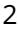


Figure 1: Protein abundances in the yeast Saccharomyces cerevisiae. Measured amounts of different sorts of proteins are shown as areas, proteins of related functions are arranged into larger regions, shown by colors. Why does the cell invest such a large fraction of their protein budget into the glycolysis pathway? Such economic questions are central in this book.

the cell", which in fact encompasses the previous two.

What do we mean by the "economy of the cell"? Economic theory is of course vast, and only a small bit of it has made its way to biology so far. In this book, by "economy" we mostly mean resource allocation and scheduling problems: what is the best allocation of protein resources in a bacterial cell (see the graphics above)? How should photosynthetic bacteria adjust these investments during the day-night cycle? Our answers to such questions, also in this book, are often based on an underlying assumption of optimality. But often we simply consider all the constraints under which a cell needs to act, and figure out what cellular behaviors are possible.

As we look at cells from the perspective of resource allocation, we will neglect other aspects: we will rarely talk about regulation (e.g. the mechanisms for regulation of gene expression), and even more rarely about gene or protein sequences. Instead, we assume that certain mechanisms are in place in the cell, and that molecules encoded by sequences exist, and either ask why (that is, for what functional reason) they are the way the are, or what the cell can do with them to perform certain tasks. This often means that we assume a mechanistic system with possible "choices" (among flux profiles, expression levels, enzyme parameters, etc), and ask, first, what choices exist (considering all the constraints) and, second, how profitable these choices are for the cell (assuming certain objectives). While we are hardly concerned with genetics, we are certainly interested in how optimality may arise from evolution - to connect the two, we need to think about fitness (how long-term fitness can be defined, and how it gives rise to "momentary" or "local" optimization objectives in a given part of the cell).

The topic of this book has emerged from the field of systems biology, and accordingly we address students and researchers in related fields, with a background in biology, physics, engineering, or math. For readers without a biological background, we recommend the book "Cell biology by the numbers" [(book.bionum](http://book.bionumbers.org/)[bers.org)](http://book.bionumbers.org/), which takes the reader on a journey through various aspects of cell biology.

The source of the book's inspiration and the questions (discussions) that motivated the investigation of the various mechanisms the cell employs to allocate resources in the most efficient way possible were a series of events in formal settings such as an annual summer workshop, the monthly online Forum "Economic principles in cell physiology", and more informal hackathons. The book's development is an endeavor that is truly global in scope, drawing on the expertise and integrating the contributions of scientists who were members of a global network (formed a global community) representing research institutions located in more than a dozen countries on three continents. Those who contributed to the book's creation recognize that the success they achieved in bringing it to a satisfactory conclusion is due, in no small part, to the support of the institutions with which they are affiliated and they are indebted to INRAE, the Learning Planet Institute Paris, and all other authors' home institutions (as well as the taxpayers financing these institutions) who encouraged the creation of the book by providing the its authors and contributors with both time and space necessary to sustain its development and achieve its completion.

Finally, why did we choose to write this textbook as a collaborative, open book to begin with? Publishing with a commercial publisher has a number of downsides, most of them reflecting a clash of interests between publishers, authors, and readers. We wish to write this book as a community for the community. Many colleagues were and are involved, and we would be glad to welcome you as part of the team!

# <span id="page-14-0"></span>**Chapter 1**

# **The cell as a factory**

### Ohad Golan

The term "metabolism" is usually used to describe the chemical reactions that occur within biological organisms to produce and transform molecules needed to sustain life. While this definition is useful, it gives no scientific or mathematical ground for the analysis of metabolic systems. Here we consider metabolic systems in a much broader sense, and in order to provide a logical framework for the analysis of metabolic systems, we begin with a more formal definition that also covers systems outside biology. Metabolic system: "A well defined system that takes up nutrients and uses them to sustain itself". This definition can be represented by a simple chemical equation:

### nutrients −→ metabolic system + waste products

The process is carried out by the metabolic system itself - a point we will expand on later. The waste products are typical leftovers of the reaction in case such products exist. The most obvious example of a metabolic system is a biological system that takes up substances from its environment and assimilates them to reproduce its own components (often summarized as "biomass"). The chemical equation of metabolism for biological systems is:

*c*1 sugar + *c*2 oxygen + *c*3 ammonia −→ biomass + waste products

The equation describes all the nutrients, including sugar, oxygen and ammonia, that are necessary to sustain a biological system. Other molecules such as certain metals and phosphate are also necessary for the reaction to occur but we neglect them for the sake of brevity. The typical waste products are water, carbon dioxide, and other possible chemicals secreted by the system.

In this book we focus on the analysis of biological metabolic systems. However, given that economic systems fall under the same definition of a metabolic system, we will use them as analogies to simplify explanations. Whenever an analogy to economical systems is presented in this book, it will be displayed in an "Economic analogy" box such as the one above.

Many metabolic systems use a strategy of reproduction to sustain itself. That is, the nutrients are used to make more of the metabolic system and not only maintain it. This means that the output of the metabolic process is more of the metabolic system. This creates a system that, when unlimited resources are available, grows exponentially - the metabolic system takes in nutrients which it uses to replicate, the output of the process is also the metabolic system which takes in more nutrients and also replicates. Metabolism includes

<span id="page-15-0"></span>

then sold in order to sustain and increase the value of the firm, just as the biological cell sustains itself. The chemical equation of metabolism for a construction firm is:

*c*1 land + *c*2 construction materials −→ value + *c*3 waste

all the processes that take place in order to carry out the overall chemical conversion of metabolism - that is, everything that happens inside the black box described above. The most fundamental model of a metabolic system is one that takes nutrients from the environment, breaks them down into building blocks, and uses these building blocks to sustain itself. In biological systems, these processes are termed catabolism and anabolism. In catabolism the cell takes up carbon and nitrogen sources from the environment and uses them to synthesize the necessary building blocks: amino acids, nucleic acids and fatty acids. In the anabolic process, the building blocks are used to form biomass which includes the functioning systems of the cells - proteins, DNA strands and the membrane. Each process is catalyzed by a specific set of enzymes. These enzymes that catalyze the reactions are actually the metabolic system itself. When the cell grows it makes more enzymes to catalyze more reactions - this is the reproduction process which leads to exponential growth.

The metabolic system controls the allocation of the available resources. When coordinating the process, the metabolic system decides between different strategies of how to best use the resources. For example, the cell decides how much of the available enzymes to allocate to the catabolic process and much to the anabolic process. When making these decisions, the cell takes into account different physical constraints. Examples of these physical constraints are: a limited physical volume to maintain and carry out the metabolic processes, a limited surface area that constrains the ability to take up nutrients or limiting thermodynamic constraints on the activity of the enzymes. There is no one best strategy that is always utilized - different organisms decide on different strategies based on the living conditions. This decision process is carried out by many mechanisms in the cell with the main information processing core of the cell being the DNA. The decisions carried out by the cell are based on the evolutionary process the metabolic system has gone through during its existence. A description of cell information processing and how it is carried out is brought in appendix A.

So far, we describe the most fundamental metabolic system. This is a coarse-grained description in which the cell catabolizes the nutrients into one type of precursor and does not take into account all the processes that take place in catabolism and anabolism. In a biological metabolic system, the cell requires multiple different types of precursors such as amino acids, nucleic acids and fatty acids. To create all the different precursors, the cell takes in nutrients from the environment and through a set of chemical reactions, turns the nutrients into the precursors that are necessary for the cell to sustain itself. Each chemical reaction in the <span id="page-16-0"></span>**Economic analogy 1.B : Catabolic and anabolic processes in cells resemble an economic system: the example of a construction firm**

In an analogy to an economic system of a construction firm, the catabolic process would correspond to the purchase and transfer of the construction materials to the construction site and the anabolic processes would correspond to the construction of the house, the catalytic enzymes would correspond to the workers carrying out the transfer of the materials and construction process. The growth process in bacteria is analogous to the growth of the firm - when the construction of the house is complete, the house is then sold to increase the value of the firm. The increased value enables the firm to hire more work force and construct more houses.


#### <span id="page-16-1"></span>**Economic analogy 1.C**

In an analogy to the economic system of a construction company, the manager of the company faces the decision of how to allocate his workforce, how many of his workers to assign to bring in materials from the factory and how many of his workers to assign to the construction process. In a similar way to the biological system, there are different limiting constraints such as a difficult topographic constructions site or limited available resources. Unlike the biological cell though, in which the decision making is embedded by the evolutionary processes, here the decision is made by the manager of the construction site.

metabolic process is carried out by proteins. The different precursors can be produced through different sets of chemical reactions known as metabolic pathways and the different chemicals in the metabolic pathways are known as metabolites. The cell decides which metabolic pathway to activate by producing the necessary enzymes. In an analogy to the economic system of a construction company, each chemical reaction is one process carried out by a worker – for example, the assembly of the frame of the house requires a carpenter while the next step in the construction pathway is to place the foundation in the correct location which is is done by another worker. The workers are analogous to enzymes and the different parts necessary for construction are the metabolites.

Many metabolic pathways have overlapping metabolite reactants and products. Some of the key parameters that describe metabolic pathways are the enzymatic catalytic rates. These parameters describe the rate at which the enzymes consume and produce metabolites and at what concentration of reactants they saturate. In the analogy to the construction firm, the enzymatic parameters are parameters that describe the rate of work of each worker. Given that each metabolic pathway is made of a series of chemical reactions, each with different catalytic rates, the different enzymes of each pathway must be coordinated perfectly to avoid any excess buildup of metabolites - just like in a factory assembly line all the workers must be coordinated together to avoid buildup of an intermediate.

In order to make sense of the complex network of metabolic reactions, different mathematical models were developed. The models take into account the known experimental data of the different reactions and compile them together to predict the overall response of the system in different growth conditions.


Figure 1.1: In the metabolic process the cell takes in available nutriets and through a set of biochemical reactions, turns them into precursors necessary for growth. The chemical reactions are carried out by proteins in the cell.

The metabolic models described above describe biological systems that are disconnected from the environment except for some artificial supply of nutrients. In natural ecological systems, different organisms exist together under a limited supply of nutrients. They compete or cooperate to best utilize the limited available resources. All organisms try to improve their chances for survival according to the laws of evolution. In such a setting, the metabolism of organisms living in an ecological system is directly dependent on the other organisms that coexist with them. In an analogy to an economic system, this would be a competition between different companies for the same possible clientele. Some companies would compete against each other while others cooperate to improve their profit.

# <span id="page-18-4"></span><span id="page-18-0"></span>**Chapter 2**

# **What makes up a cell**

Pranas Grigaitis and Diana Széliová

### **Chapter overview**

- Cells use the same building blocks to give rise to a high number of molecular species
- There are many parallel processes happening in cells, with similar precursors
- Composition of cells is environment-dependent
- Different time-scales give rise to coordination of processes

## <span id="page-18-1"></span>**2.1 Describing and counting cellular components**

Cells contain a diverse spectrum of molecules, needed to create two cells out of one (as Rudolf Virchow proposed, *omnis cellula e cellula*, all cells come from cells). These molecules come in different sizes and properties, and therefore create a demand for a cell to keep these components in different places (*spatial* organization) with different patterns of use (*temporal* organization), and book-keep their quantities. Cell composition directly influences the function of the cell: thus we observe different cellular make-up in different organisms or even in different cells of the same organism. Both historical research and the latest advancements in instrumentation allow us to characterize the constituents of cells in more and more depth. Thus in this chapter, we will do a census of cellular components: we will discuss what molecules make up a cell, what they are derived from, how to measure these components in the lab and we will briefly consider allocation of resources, directed to synthesize individual cellular components.

## <span id="page-18-2"></span>**2.2 The components of a cell**

## <span id="page-18-3"></span>**2.2.1 Cell composition and structures**

Although living matter comes in different shapes and sizes, over 99% of the cellular mass can be described by only a handful of chemical elements. 6 most abundant elements form the famous CHNOPS notation: carbon (C), hydrogen (H), nitrogen (N), oxygen (O), phosphorus (P), and sulfur (S). Taken together, these 6 elements encompass the vast majority of the mass, namely, ca. 97.5% in budding yeast *Saccharomyces cerevisiae* [\[1\]](#page-252-1). Living cells also contain minute amounts of different metal ions, such as sodium (Na), potassium (K), iron (Fe), molybdenum (Mo) and others – usually facilitating signal transduction or supporting enzymatic catalysis.

In an extremely simplified way, cells can be looked at as bags of fluid-like material, kept together by a membrane. These "bags of things" can also contain other membrane structures inside them, forming so-called <span id="page-19-1"></span>organelles. In cell biology, we call cells *prokaryotic* if they do not possess these membrane structures, and *eukaryotic* if they do. The divide between prokaryotes and eukaryotes can be illustrated by comparing two organisms: the prokaryotic bacterium *Escherichia coli* and the eukaryotic yeast *Saccharomyces cerevisiae*. They both are organisms, composed of a single cell (thus called *unicellular*), and they both are very small, compared to a typical human cell. However, *E. coli* does not contain any additional membrane structures except from the plasma membrane (which encompasses the cellular contents). Meanwhile, a handful of different organelles can be observed in *S. cerevisiae*. The cellular organization of these cells is shown in Figure [2.1.](#page-21-2)

Most biological membranes and membrane-based structures, including the plasma membrane itself, have multiple functions (not only separating space), and are highly dynamic. Some membranes can fold into very compact structures with extremely high surface area (endoplasmic reticulum, Golgi apparatus), occupy different volumes - from small vesicles to large vacuoles, occupying a major fraction of the cell volume. Moreover, some molecules can form very large structures, which might be transient (short-lived), thus capturing and defining them remains a major challenge. For these reasons, the fine structure of cells is unclear - some findings (e.g. organelle contact sites, see [\[2\]](#page-252-2) for a recent review) hint into some functional organization of organelles, yet the canonical way to look at the cellular structure remains as to a "bag of things".

A notable example of a highly specialized organelle is the mitochondrion. The mitochondrion is separated from the rest of the cell by two (outer and inner) membranes; this feature is essential for their function. In eukaryotes, mitochondria are a major hub of metabolism: they house essential biochemical pathways, such as tricarboxylic acid cycle (also known as citric acid-, or Krebs cycle), as well as the so-called *respiratory chain*, the machinery for generating energy with the use of oxygen (see Chapter [3](#page-36-0) for more details). While the most biochemical interconversions happen inside the mitochondria (in mitochondrial *matrix*), the respiratory chain proteins are located in the inner mitochondrial membrane: these proteins create an *electrochemical gradient* across this membrane, and use it to drive the conversion of energy, stored in nutrients, into the energy the cell can use (in a form of ATP). What makes mitochondria even more interesting is that they also contain mitochondria-specific genetic information (mitochondrial DNA), which is essential for mitochondria to function inside the cell. In many organisms, the loss of mitochondrial DNA results in impaired growth (in yeasts, that is called the *petite* phenotype) [\[3\]](#page-252-3), and some organisms cannot grow unless mitochondrial DNA is present (*petite-negative* yeasts).

### <span id="page-19-0"></span>**2.2.2 Biological molecules**

Although cells contain many different molecular *species* ("molecular identities"), we can crudely categorize them into *small molecules* and *macromolecules* based on their molecular weight and complexity. Small molecules, as the name suggests, are small chemical compounds, up to 1000 Daltons in mass (1 Dalton = 1 atomic mass unit, 1 amu), and are usually composed of a non-repeating single chemical unit (called *monomer*). Macromolecules, on the contrary, are up to several megadaltons (MDa = 106 Da) in weight, and are frequently composed of multiple monomers (forming so-called *polymers*). Compounds in the cells, both macro- and small molecules, based on their chemical nature, fall into 5 big groups: proteins, nucleic acids (both macromolecules), carbohydrates (exist as both small molecules and polymers), lipids (small molecules), and cofactors/other small molecules.

Proteins are polymers, composed of amino acids. Proteins are an exceptionally diverse class of molecules: in Nature, 20 amino acids can be incorporated into proteins (so-called *proteogenic* amino acids), which, combinatorially provides 20 options for each position in the protein chain. Therefore, there is an enormous amount of possible combinations to make a protein of a length of 100 amino acids (20100, to be precise), even for a amino acid chain way shorter than the average in *E. coli*, around 325 amino acids [(BioNumbers](https://bionumbers.hms.harvard.edu/search.aspx) ID (BNID) [\[4\]](#page-252-4) 108986). This diversity gives rise to the spectrum of functions proteins can do, for instance, catalysis (catalytic proteins are also called *enzymes*), transport of molecules, keeping structural integrity of membranes, and others. Also two notable properties of proteins are that they (1) need to acquire a specific three-dimensional structure ("to fold") in order to become functionally active, and (2) sometimes, they also

#### <span id="page-20-1"></span><span id="page-20-0"></span>**Box 2.A : Macromolecular machines**

An important consideration about both proteins and nucleic acids is that they are polymerized by very specialized protein- and protein-nucleic acid complexes. These molecular motors use energy (in terms of ATP equivalents) to form chains of the respective monomers. In the case of proteins, the individual amino acids are combined into a so-called *peptide chain* by a ribosome, a macromolecular complex made from proteins and RNA. The nucleic acids are synthesized by a class of enzymatic complexes, called *nucleic acid polymerases*. There are two major classes of them, specific to the nucleic acid: RNA and DNA polymerases, respectively.

need to form complexes of the same or other proteins (called *multimers*). Protein production is a major consumer of energy and biosynthetic intermediates in the cell, therefore, in this book we will frequently consider proteins as central players in implementing economic principles in cell physiology.

Nucleic acids are another category of macromolecules; their monomers are called nucleotides. There are two major classes of nucleic acids, RNA (ribonucleic acid) and DNA (deoxyribonucleic acid). RNA and DNA chemically have a slight, yet critical difference: the sugar, which is a part of the nucleotides, differs between RNA (ribose) and DNA (deoxyribose). The two sugars are almost the same but for one chemical group: one of the carbon atoms in ribose is connected to two another carbon atoms, a hydrogen atom, and a chemical group, called hydroxy- (−*OH*). In deoxyribose, the hydroxy-group is substituted with another hydrogen atom, hence the prefix "deoxy-" ("minus oxygen"). RNA and DNA have different functions in the cell: the primary function of DNA is to store genetic information, while RNA can work both as an intermediate agent to transfer that genetic information to protein production (messenger RNA, mRNA) or to participate in catalysis and protein production in general (e.g. transfer and ribosomal RNA, tRNA and rRNA, respectively). Outside the polymers, nucleotides can also act as energy-accumulating compounds (e.g. ATP, adenosine triphosphate) or signaling molecules (e.g. cyclic adenosine monophosphate, cAMP). In this text, we will mostly refer to the energy-storing function of the nucleotides, although other functions, such as signaling, also are essential aspects of describing cell physiology.

Carbohydrates are another major class of biological molecules, and are important both as monomers and high molecular-weight polymers. Monomeric carbohydrates (sometimes also referred to as sugars) are mainly used as carbon and energy sources for organisms, e.g. glucose or fructose. In oligomeric form (up to 10 monomers), carbohydrate chains are essential for cellular sensing systems, to be specific, receptor-ligand binding. Finally, polymers of carbohydrates usually serve as structural components (part of peptidoglycan, major part of bacterial cell walls) or energy/carbon storage (glycogen in, e.g. yeasts and animal cells, or starch in plants).

Lipids are a vaguely-described class of compounds, which have an overarching similarity, being water-insoluble. The major function of lipids in biological cells is structural: a very abundant subclass of lipids, phospholipids, is an essential constitutent of biological membranes. As discussed in Section [2.2.1,](#page-18-3) membranes themselves have a variety of functions, which are mostly carried out by lipids (structural) or proteins (transport, sensing, signaling etc.). Some lipids can also undertake other functions, such as signaling (various sterols), or energy storage (tryglycerides, or fats).

As we see, the metabolism of biological molecules is tightly interlinked, although they exibit major differences in their abundance, size and chemical properties. Macromolecules are present in very low concentrations, and their biosynthesis usually takes minutes. Meanwhile, the time scale of small molecule reactions is usually seconds (or fraction of), and the concentrations of small molecules are usually several magnitudes higher than these of macromolecules. Yet, despite acting at different rates and concentrations, these two types of biological molecules work in an orchestrated manner. To begin with, a number of different small molecules are required to produce both other small molecules and the macromolecules. In return, the macromolecules ensure cell integrity and growth by, among other functions, operating the reaction networks of small molecule interconversions (which we usually refer to as metabolism). Additionally, presence of some small molecules

<span id="page-21-2"></span>

Figure 2.1: Biomass composition and cell structure of a typical bacterial, yeast, and a mammalian cell. The area of each polygon corresponds to a mass fraction of a component per cell. While the average composition is quite similar in the three groups, there are major differences in size and internal organization (especially when comparing prokaryotes with eukaryotes). Data for proteome groups (length-weighted protein abundances) was obtained from [Proteomaps.](https://www.proteomaps.net/download.html) Sources of composition data: bacteria [\[5\]](#page-252-5), yeast (BNID 108200, 108196, 107234, 100261, [\[6\]](#page-252-6)), mammalian cells (BNID 107131, 107235, 107234). Pictures of cells were created using [Bioicons](https://bioicons.com/)1 .

can influence the function of macromolecules, both directly (e.g. essential cofactors, needed for enzymatic reactions; enzyme activation or inhibition), and indirectly (e.g. modulation of gene expression, signaling). Therefore, a lot of different processes have to happen in parallel to ensure the operation of the cells. Having defined the major types of molecules we find in living cells, next we will discuss how abundant are different components of the cells.

## <span id="page-21-0"></span>**2.3 Cell composition in numbers**

## <span id="page-21-1"></span>**2.3.1 Biomass composition**

Cells are composed of around 70% water and 30% dry mass. As mentioned in the previous section, we can describe the composition of the dry mass with the most abundant chemical elements. For example, the elemental formula for *E. coli* is CH1.77O0.49N0.24 (BNID 101800) and for *S. cerevisiae* CH1.61O0.56N0.16 (BNID 101801).

However, more often, we are interested in biomass composition in terms of the main macromolecules (proteins, nucleic acids, lipids, and carbohydrates) and small molecules (metabolites, cofactors, and ions). Table [2.1](#page-22-0) summarizes an average composition of *E. coli* and *S. cerevisiae* during exponential growth, the typical molecular masses and copy numbers of the components. The most abundant component is protein, which

<sup>1</sup>The icons bacterium-interior, golgi-3d-1, mitochondrium-3, endoplasmatic-reticulum-3d-medium, endoplasmaticreticulum-rough-3d-2, endoplasmatic-reticulum-rough-3d, and nucleus by [Servier](https://smart.servier.com/) are licensed under [CC-BY 3.0 Unported.](https://creativecommons.org/licenses/by/3.0/)

### <span id="page-22-1"></span>Cell composition in numbers 13

forms around half of the cell's dry mass. When we divide the proteome into functional groups, we find that the biggest fractions belong to translation, central carbon metabolism, folding, sorting and degradation, and biosynthesis. A substantial fraction belongs to proteins that are not mapped (especially in mammalian cells), illustrating that we still lack knowledge about the function of many proteins (Figure [2.1)](#page-21-2).

RNA forms 20% of dry cell mass in *E. coli*, but this number is lower in eukaryotes, such as yeast (11%) or mammalian cells (4%). While the total amount of RNA is variable in different organisms, its relative composition is similar – most of the RNA mass is formed by rRNA (80%), followed by tRNA (15%) and mRNA (5%) (BNID 100258, 100261, 106154). Lipid content is the highest in mammalian cells (13%) compared to yeast and bacteria (4-10%, BNID 111209, Table [2.1)](#page-22-0). Remarkably, there are cases where engineered yeast cells accumulated up to 80 % of lipids per cell dry mass [\[7\]](#page-252-7). The content of storage carbohydrates varies from around 30% in yeast to 3% in bacteria (Table [2.1)](#page-22-0). In bacteria, carbohydrates are stored as the polysaccharide glycogen, while yeast cells use glycogen and the disaccharide trehalose. Yeast cells also contain structural polysaccharides, such as mannan and glucan [\[6\]](#page-252-6). Bacteria contain the structural molecule peptidoglycan (3% of dry mass) – a polymer of sugars and amino acids, which forms bacterial cell walls. In addition, some bacteria (e.g. *E. coli*) also have lipopolysaccharides on their cell wall (3% of dry mass).

A small fraction of the cell mass (2- 3%) is formed by small molecules (< 1000 Da) such as metabolites and ions. This group contains thousands of different molecules with vastly different functions and concentrations. For illustration, the concentrations of the most abundant metabolites in *E. coli* range from 10−1 to 10−7 moles per cell, corresponding to a range of 108 to only 100 copies per cell [\[5\]](#page-252-5). Possibly, there are metabolites with even lower concentrations, but these are much more difficult to quantify. Similarly, the concentrations of the most common inorganic ions (K+ , Na+ , Mg+ , Ca+ , Cl – span several orders of magnitude [\[5\]](#page-252-5).

The quantities of biomass components are usually expressed in relation to other quantities. The most common units are copy numbers, moles, grams, or fractions which can be expressed per cell, per gram dry mass, or per cell volume. Membrane components can also be expressed per surface area. Often, experimental data for these quantities is not readily available, so we need to extract it from literature. Useful sources for average or "rule of thumb" values include [BioNumbers database](https://bionumbers.hms.harvard.edu/search.aspx) [\[4\]](#page-252-4) and the book [Cell Biology by the numbers](http://book.bionumbers.org/) [\[5\]](#page-252-5). Some useful quantities are summarized in Table [2.2](#page-23-1) They are organized in increasing order with respect to the dimensions (1 – mass, size, thickness; 2 – area; 3 – volume, density). Notice how the dimensions influence the numerical values. For example, while the cell size differs only about 3-fold between bacteria and yeast, the surface area differs by more than tenfold and the volume by about 60-fold. Because volume grows faster than area, the ratio of cell surface area to volume (SA/V) gets smaller and smaller as cells get bigger (see more in Section [2.4)](#page-25-0).

<span id="page-22-0"></span>

|                       | % of dry mass |       | Mass per cell [fg] |       | Molecular mass [Da] |             | Copy number |         |
|-----------------------|---------------|-------|--------------------|-------|---------------------|-------------|-------------|---------|
|                       | E. c.         | S. c. | E. c.              | S. c. | E.c.                | S. c.       | E. c.       | S. c.   |
| Proteins              | 55            | 51    | 165                | 7650  | 40000               | 55000       | 3 × 106     | 108     |
| RNA                   | 20            | 11    | 60                 | 1650  | 104<br>-106         | 104<br>-106 | 3 × 105     | 4 × 106 |
| DNA (chromosomal)     | 3             | 0.5   | 9                  | 75    | 3 × 109             | 2.5 × 108   | 2           | 16      |
| Lipids                | 9             | 6     | 27                 | 900   | 800                 | 800         | 2 × 107     | 109     |
| Storage carbohydrates | 3             | 0.5   | 9                  | 75    | 106                 | variable    | 4000        | –       |
| Structural polymers   | 6             | 23    | 18                 | 3450  | variable            | variable    | –           | –       |
| Metabolites/cofactors | 3             | 2     | 9                  | 300   | < 1000              | < 1000      | –           | –       |
| Other                 | 1             | 6     | 3                  | 900   | –                   | –           | –           | –       |

Table 2.1: Amounts, characteristic molecular masses and copy numbers of the main biomass components for *Escherichia coli (E. c.)* and *Saccharomyces cerevisiae (S. c.)*. The composition data is shown for *E. c.* with a doubling time of 40 minutes (BNID 104954) and for *S. c.* with a doubling time of 110 minutes([\[8\]](#page-252-8), BNID 111755). The storage carbohydrates include glycogen for *E. c.* / glycogen and trehalose for *S. c.*. The structural carbohydrates include peptidoglycan and lipopolysaccharides for *E. c.* / mannan and glucan for *S. c.*. Sources for molecular masses (BNID 105861, 115091, 101838, 104886, 107678, 109645, 102502, 100459); molecule copy numbers (BNID 108248, 108197, 114950).

<span id="page-23-2"></span>

Figure 2.2: Growth laws in *E. coli*. (A) Cell volume grows exponentially with growth rate (data from [\[14\]](#page-253-0)). (B) RNA/protein ratio grows linearly with growth rate (data from [\[15\]](#page-253-1)). In both cases, growth rate was varied by changing medium composition.

### <span id="page-23-0"></span>**2.3.2 Variability of biomass composition**

Table [2.1](#page-22-0) shows biomass composition of a typical *E. coli* and *S. cerevisiae* cell – these are average values in certain environmental conditions. However, cell size, mass, and composition vary with growth rate and environmental conditions. One of the most extensively studied relationships in the literature is the correlation of growth rate with cell size. The increase of cell mass and volume with growth rate has been observed in bacteria (Figure [2.2)](#page-23-2), yeast, and mammalian cells [\[9,](#page-252-9) [10,](#page-252-10) [11,](#page-252-11) [12\]](#page-252-12) (BNID 107948, 110191, 105103). For example, the cell mass of *E. coli* can vary fivefold – 150 to 870 fg per cell for generation times between 100 and 24 minutes [\[5\]](#page-252-5). Larger cell mass goes hand in hand with larger amounts of individual biomass components. The absolute amounts of protein, RNA, and DNA increase with cell size. However, the ratios of the components do not stay the same and the relative composition changes with growth rate [\[9,](#page-252-9) [13\]](#page-253-2).

One of the most consistent observations is that the relative amount of RNA per cell increases with a higher growth rate [\[9,](#page-252-9) [13,](#page-253-2) [16\]](#page-253-3), (BNID 111460, 111755, 108200). On the other hand, the data for relative protein content is more variable. For example, in bacteria, protein content decreases with growth rate in some studies [\[13,](#page-253-2) [16\]](#page-253-3) but goes up and down in another (BNID 111460); in yeast, it increases (BNID 108200, 111755). Nevertheless, when looking at RNA:protein *ratio* we consistently find a positive correlation with growth rate across various species of bacteria (see Figure [2.2)](#page-23-2) and yeast [\[15,](#page-253-1) [17\]](#page-253-4). RNA:protein ratio is a measure of protein production capacity since most RNA is dedicated to protein synthesis. 80% is rRNA, which forms 2/3 of the mass of a bacterial ribosome – the molecular machine that makes proteins, and 15% is tRNA which brings new amino acids to the ribosome (for more details about ribosomes, see Section [2.7)](#page-28-1). Indeed, we also observe a correlation between ribosome content and growth rate. The increase of RNA:protein ratio and ribosome

<span id="page-23-1"></span>

| Name                         | Unit   | E. coli | S. cerevisiae | BNID/Reference  |
|------------------------------|--------|---------|---------------|-----------------|
| Surface area/volume (SA/V)   | µm−1   | 6       | 1.2           | calculated here |
| Dry cell mass                | pg     | 0.3     | 15            | 104954, 108315  |
| Total cell mass (with water) | pg     | 1       | 60            | 104954, 108315  |
| Bilayer membrane thickness   | nm     | 4       | 4             | [5]             |
| Cell size                    | µm     | 1 − 2   | 5             | [5], 101796     |
| Cell surface area            | µm2    | 6       | 70            | 101792, 113854  |
| Cell volume                  | µm3    | 1       | 60            | 101788, 101794  |
| Cell density                 | g mL−1 | 1.1     | 1.1           | 103875, 103876  |

Table 2.2: Useful quantities for unit conversions. Note that these are average or "rule of thumb" values. In reality, these values typically cover a broad range and depend on environmental conditions.

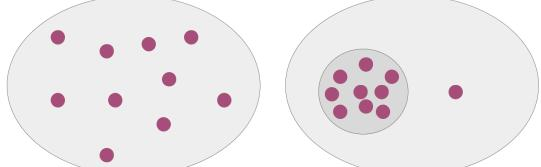

<span id="page-24-1"></span>Figure 2.3: Two cells with the same number of molecules per cell but with different concentrations.

content with increasing growth rate reflect higher biosynthetic needs of faster-growing cells. To support higher growth rate, cells need to reallocate resources according to the growth demands (for example, make more ribosomes which can then make more proteins) [\[18,](#page-253-5) [17,](#page-253-4) [15,](#page-253-1) [19\]](#page-253-6). For more details about resource allocation and how it is modeled see Chapters [8](#page-126-0) and [9.](#page-144-0)

Similarly to protein content, there is no clear correlation between the relative DNA and lipid content with growth rate across studies [\[13\]](#page-253-2) (BNID 111460, 111755, 108196). The content of storage carbohydrates decreases at higher growth rates in yeast and bacteria [\[16\]](#page-253-3) (BNID 111755, 111460).

As we have seen, biomass composition changes with growth rate, and for some components, we can describe this relationship with simple mathematical equations [\[18,](#page-253-5) [16,](#page-253-3) [13\]](#page-253-2). However, the growth rate is a result of environmental conditions (the amount or the quality of a carbon source, temperature, oxygen concentration, presence of inhibitors, and so on), and the same growth rate can be achieved in different ways. However, it may not lead to the same changes in cell physiology [\[10\]](#page-252-10). For example, modulation of growth rate by temperature rather than medium composition does not significantly alter cell size, and composition [\[9,](#page-252-9) [13\]](#page-253-2). The inhibition of ribosomes with an antibiotic decreases growth rate but increases the ribosome content (as opposed to reduced ribosome content in a medium with a "worse" carbon source) [\[15\]](#page-253-1).

Conversely, environmental factors can influence cell composition without affecting growth rate. This shows that cell metabolism is flexible – cells can reach the same growth rate in different ways, depending on the conditions. For example, in yeast, changes of O2 concentration lead to changes in biomass composition while keeping the growth constant using a chemostat [\[20\]](#page-253-7). In mammalian cells, a change of a cultivation medium leads to significant changes in lipid composition without having a considerable effect on growth rate [\[12\]](#page-252-12). Genetic background (mutations or a presence of a transgene) can also affect cell characteristics without changing the growth rate [\[10,](#page-252-10) [20\]](#page-253-7).

Interestingly, even though the total protein content is variable, the amino acid composition is roughly constant at different growth rates/conditions in bacteria, yeast, and mammalian cells and can even be predicted from a genome sequence with reasonable accuracy [\[20,](#page-253-7) [21,](#page-253-8) [12\]](#page-252-12).

## <span id="page-24-0"></span>**2.3.3 Biomass composition is not uniform**

In the previous paragraphs, we considered average cells with a homogeneous composition across the cell. However, we need to keep in mind that cells have an internal structure, and the biomass components are not uniformly distributed throughout the cell (as illustrated in Figure [2.3)](#page-24-1). Even though prokaryotic cells do not have compartments separated by membranes, they have some internal organization. For example, DNA is not spread across the cytoplasm, but wrapped around proteins and packed in a compact structure called a nucleoid. Another example is the preferential localization of certain proteins on the poles in rod-shaped bacteria. Eukaryotes have compartments with distinct compositions, pH, and membrane potential. DNA is localized only in the nucleus and mitochondria, and many proteins localize only in a particular compartment. Small molecules and ions also have different concentrations in the different compartments. Often they cannot freely diffuse through membranes, but the transport is regulated and requires energy.

These differences in concentrations have implications for cellular functions. Some processes are restricted

<span id="page-25-1"></span>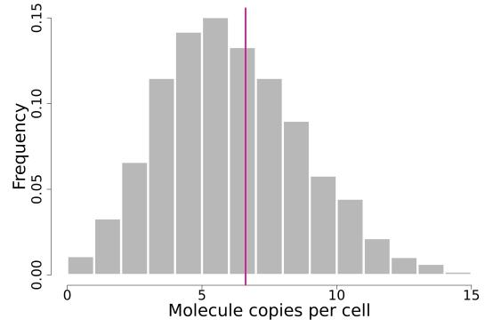

Figure 2.4: Number of molecules per cell in a population (for example protein or mRNA). The red line is the population mean, which is often the value we use (for modeling). However, the values at a single-cell level can differ several fold.

only to a particular compartment/area. For example, transcription only happens in the nucleus and mitochondria (nucleoid), and some metabolic pathways occur only in a specific compartment (e.g. tricarboxylic acid cycle in the mitochondria). Even if the same enzyme is present in several compartments, it might work at a different rate or in the opposite direction because of the different concentrations of substrates or products. In eukaryotes, certain digestive enzymes only work at low pH present in lysosomes (thus preventing a cell from digesting itself). Sometimes, consecutive enzymes in a metabolic pathway are not freely floating in a cell but form an assembly or bind to a scaffold, allowing intermediates to be channeled directly from one enzyme to another. This accelerates metabolic reactions because intermediates do not diffuse away into the bulk solution and are not consumed by competing reactions.

Finally, we need to zoom out from a single-cell (or average) view of a cell and consider the heterogeneity at the population level. This heterogeneity is often neglected, and we use a single number to describe a concentration of a molecule in a cell/compartment – an average value of the population. However, biological processes are *stochastic* (noisy), and the actual molecule numbers follow a certain distribution (Figure [2.4)](#page-25-1), which can be characterized by mean and variance. The effect of the heterogeneity becomes especially important at low copy numbers.

The heterogeneity in molecule copy numbers leads to a heterogeneity in cell phenotypes such as generation time, cell size, stress tolerance and others. Population heterogeneity can impact fitness in a positive or negative way, depending on conditions. For example, when a cell population encounters an unexpected environment, a certain subpopulation might be better suited to survive. In a different environment, another subpopulation might thrive. We can view this as a microbial "bet-hedging" which increases the chances that at least some part of a population will survive the new conditions. However, when cells try to maximize growth rate, the variability in the population can decrease fitness because it decreases the average population growth rate [\[22\]](#page-253-9). This topic is discussed in detail in the Chapter [13.](#page-216-0)

## <span id="page-25-0"></span>**2.4 Cell size**

There is a remarkable variability of cell sizes in nature (Figure [2.5)](#page-26-0). Figure [2.1](#page-21-2) shows the typical sizes of bacterial, yeast and mammalian cells, which range from 1 to 15 µm. However, we can easily find more extreme values. For example, human egg cell has 100 µm (BNID 111184). The smallest known bacteria *Mycoplasma* has only 0*.*2 µm in diameter (BNID 104717) while the largest bacteria *Thiomargarita magnifica* can reach up to 2 cm [\[33\]](#page-254-0) which is even more than most mammalian cells. However, this giant bacteria looks very different from typical bacteria like *E. coli* – it has hundreds of thousands of genome copies in organelle-like structures. There are exceptional cases where cells can reach even bigger sizes. The largest known single-celled organism is the alga *Caulerpa taxifolia*. It has many nuclei that are not separated by a membrane, and it reaches up to

#### <span id="page-26-2"></span><span id="page-26-1"></span>**Experimental methods 2.B : Experimental quantification of biomass composition**

We can measure biomass composition at different levels of detail – from a coarse elemental or macromolecular composition of an average cell to the quantities of individual molecules in each cellular compartment.

To quantify the main chemical elements (CHNOPS), we can use devices called elemental analyzers. The main macromolecular components – the total protein, lipid, carbohydrate, DNA, and RNA content – can be quantified with simple assays such as detection with fluorescent dyes, chemical reactions that lead to color change or extraction and weighing of a component. Going into more detail typically requires more sophisticated methods such as liquid or gas chromatography (LC, GC), mass spectrometry (MS) or nuclear magnetic resonance (NMR). For example, for proteins, we can measure an average amino acid composition, and for lipids, the main lipid classes (glycerophospholipids, sphingolipids, sterols, etc.). For comprehensive reviews and protocols, see for example [\[23,](#page-253-10) [24,](#page-253-11) [25\]](#page-253-12).

If we go down to the level of individual molecules, we enter fields of study collectively termed as *omics*, which aim to characterize and quantify certain pools of biomolecules. Omics methods typically involve high-throughput measurements of hundreds or thousands of different molecules and require a lot of resources (specialized equipment, computational resources) and expertise. The classic omics fields include genomics [\[26\]](#page-254-1), transcriptomics [\[27\]](#page-254-2) and proteomics [\[28\]](#page-254-3) and study the components of the central dogma of molecular biology – DNA, RNA and proteins. Other examples include metabolomics which focuses on small metabolites [\[29\]](#page-254-4) or fluxomics which measures metabolic fluxes (for example 13C metabolic flux analysis [\[30\]](#page-254-5)).

Combinations of different omics can help us obtain other parameters that are difficult to measure. For example, turnover numbers of enzymes (*k*cat) are notoriously difficult to quantify because the measurements are error-prone and low-throughput. With proteomics and fluxomics data we can calculate apparent turnover numbers (*k*app) at various conditions (see Figure [2.8)](#page-32-0) and use the maximum value (*k*max app ) as an estimate of *in vivo k*cat [\[31,](#page-254-6) [32\]](#page-254-7).

one meter [\[34\]](#page-254-8). Another special case is a neuron – its body has a small diameter (100 µm), but its axons can extend to more than a meter (BNID 109548).

For many organisms, cell size changes with environmental conditions. As already mentioned in Section [2.3.2,](#page-23-0) cell size varies with growth rate, and it depends on how a particular growth rate is reached. More than 60 years ago, Schaechter et al. discovered the nutrient growth law – cell volume increases exponentially with growth rate (as a result of the nutrient availability in the medium) [\[9\]](#page-252-9). Since then, the correlation between cell size and growth rate was also observed for other organisms [\[10,](#page-252-10) [11,](#page-252-11) [12\]](#page-252-12) (BNID 107948, 110191, 105103). However, when the growth rate is changed by other means, for example by temperature, this relationship is not observed [\[9,](#page-252-9) [13\]](#page-253-2). In some cases, even the opposite is observed. For example, for a mammalian culture, it was observed that cell division stops at the end of the exponential phase, but cell volume continues to increase threefold [\[35\]](#page-254-9).

The relationships above refer to an average volume in the population. However, size changes throughout the cell cycle at the level of single cells. Before cells divide, they need to increase their cell size. Otherwise, they would get smaller and smaller with each division. However, they also cannot grow too much, or the average cell size would get bigger and bigger. There are various mechanisms of how cells maintain a cell size homeostasis, and they are discussed in detail in Chapter [11.](#page-178-0)

Finally, we need to discuss the importance of cellular shape. Different cell types come in different shapes, such as spheres, ovals, rods, or spirals. Differently shaped cells may have the same volume but very dif-

<span id="page-26-0"></span>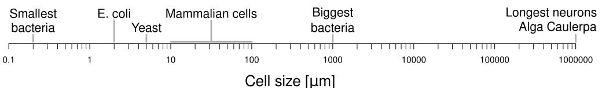

Figure 2.5: Variability of cell size across organisms

| Component/parameter       | Examples of quantification methods                            |
|---------------------------|---------------------------------------------------------------|
| Cell size                 | microscopically                                               |
| Dry cell mass             | weighing of a defined amount of dry cells                     |
| Buoyant density           | Percoll gradient                                              |
| Protein                   | colorimetric (Bradford assay; Lowry assay)                    |
| Lipid                     | weighing of extracted and dried lipids                        |
| Carbohydrates             | colorimetric (anthrone assay; phenol-sulphuric acid assay)    |
| RNA                       | fluorimetric (RiboGreen), spectrophotometric                  |
| DNA                       | fluorimetric (PicoGreen, Hoechst), spectrophotometric         |
| Amino acids/lipid classes | LC/MS, GC/MS                                                  |
| Genomics                  | next-generation sequencing (NGS) - Illumina, PacBio, Nanopore |
| Transcriptomics           | NGS (RNA-seq), DNA microarrays                                |
| Proteomics/metabolomics   | LC/MS, GC/MS, NMR                                             |

<span id="page-27-2"></span><span id="page-27-1"></span>**Experimental methods 2.C : Examples of biomass quantification methods**

To visualize composition data, consider using Voronoi diagrams instead of the traditional pie charts or bar plots. An online tool is available at [bionic-vis.biologie.uni-greifswald.de](http://bionic-vis.biologie.uni-greifswald.de/) for proteomics data, but there is also a tool that works with any type of input data (GitLab repository on the [book website)](#page-0-0).

ferent surface area and surface area to volume ratio (SA/V). Spheres have the lowest possible SA/V while more complicated shapes have higher SA/V (e.g. endoplasmic reticulum). What happens to the shape when a cell changes its volume (for example, in response to environmental conditions)? For many cells, the shape remains roughly the same – for example *E. coli* always looks like a rod. As a result, SA/V decreases when cells get bigger. We see a decreasing linear relationship if we plot SA/V against growth rate. On the other hand, some cells vary their size and shape but maintain a constant condition-specific SA/V. [\[36\]](#page-254-10)

## <span id="page-27-0"></span>**2.5 Cell density**

Most cellular parameters we discussed so far – cell size, mass, and composition – vary greatly with the cell type, growth rate, or conditions. However, one quantity does not show such variability – buoyant cell density. Buoyant density is the ratio of cell mass to volume, usually expressed as g mL−1 . For most organisms, prokaryotic or eukaryotic, the buoyant cell density is around 1.05-1.15 g mL−1 [\[37,](#page-254-11) [5\]](#page-252-5). This range results from the fact that cells are 70% water which has a density of 1 g mL−1 and that most dry mass is formed by proteins, which have a density of 1.2-1.4 relative to water (BNID 111208, 104272, 101502). Other components range from 1 for lipids (BNID 108142) to 1.4-2 for nucleic acids (BNID 111208). To try the calculation of bacterial density, see Problem [2.4.](#page-35-0)

For many organisms (*E. coli*, the yeast *Schizosaccharomyces pombe*, Chinese hamster ovary cells, mouse cells), cell density is constant throughout the cell cycle and at different growth rates when growing exponentially. However, it was observed to increase in stationary phase for *E. coli* and *S. pombe* [\[37,](#page-254-11) [38\]](#page-254-12). On the other hand, the density of *S. cerevisiae* fluctuates during the cell cycle, which might be related to a different division mode. The organisms mentioned earlier divide by binary fission – cells divide in the middle and produce two (roughly) identical daughter cells. In contrast, *S.cerevisiae* divides asymmetrically - it grows a bud that breaks away and becomes a smaller daughter cell.

Nevertheless, despite the variability, the range of the observed values is relatively small and similar for most organisms, from bacteria to mammalian cells. There are special cases where cell density deviates from the characteristic values – for example, cells with very high fat content or gas bubbles have lower densities. <span id="page-28-2"></span>However, assuming the density of 1*.*1 g mL−1 is probably a good guess unless you work with a particularly fatty or gassy cell type.

The invariability of cell density suggests that this property is highly regulated and brings us to the next question – is there an optimal density? And what are the constraints that (possibly) determine this optimum? These questions (among others) are discussed in the next section.

## <span id="page-28-0"></span>**2.6 The physical constraints of cell growth**

The living cells are constantly subject to a handful of so-called *physical constraints*, which are directly linked to the physics and the chemistry of life. Cells cannot override (evolve to bypass) these limits – only try to cope with them. Thus, sometimes these constraints are also called "hard" constraints. Notice that we consider the "hardness" of these constraints only in the space where conditions can still sustain life: some of these limitations could be relaxed by changing abiotic conditions, but would result in breakdown of biological systems.

One of the abiotic factors would be temperature; however, increased temperatures cause proteins to *denature* (lose their 3D-folded structure, thus functionality) and destabilize biological membranes. Although there are organisms, which live in extremely high temperatures (so-called *thermophiles*), as a rule of thumb, we usually consider the temperature above 393 K (120 ◦C) to be close to the limit of life. There is an organism known as *Strain 121* (*Geogemma barossii*) which can grow at 121 ◦C (hence the name), currently the highest temperature known [\[39\]](#page-255-0). Next, the suboptimal concentration of inorganic salts (osmolarity) or pH could also drive similar changes, disfavoring life. Here we will consider two prominent physical limits in life: the diffusion and density limits. These two limits describe two aspects of how molecules move in aqueous environments, in our case – living cells.

The diffusion limit describes the state where enzymatic catalysis is so specific and so fast that the reaction speed is determined only by the collisions of substrate molecules to the enzymes, which all result in conversions (i.e. no futile collisions) [\[40\]](#page-255-1). Usually, the number of futile collisions vary between 1 and 104 per successful conversion, and thus having as little futile collisions as possible greatly enhances the overall rate of the reaction. Enzymes approaching (operating at) the diffusion limit are also called *perfect* enzymes. Currently there are no enzymes reported which are considerably "above" diffusion limit (see [\[40\]](#page-255-1) for an in-depth discussion), suggesting the universality of the underlying constraint. Nonetheless, cells do have a strategy to counter the diffusion limit. Consecutive enzymes from a pathway can be placed on a scaffold, which allows the product of one reaction to be channeled directly into the next reaction without diffusing away.

Another aspect to consider is the density, or sum concentration of molecules, of the fluid. As described in previous sections, cell cytosol contains a spectrum of different molecules at different sizes and concentrations. We normally assume that some sort of optimal cell density that maximizes fitness exists, however, the density is known to fluctuate substantially in time and across conditions [\[41\]](#page-255-2). One of the most prevalent properties, linked to cytosolic density, is *macromolecular crowding*. As the name suggests, it describes the concentration of biological macromolecules, mainly proteins, in cytosol (thus in bacteria, the genomic DNA also contributes to molecular crowding). For example, the macromolecular crowding is suggested to impose a limit on the protein translation [\[42\]](#page-255-3), therefore, increased crowding would result in a growth rate decrease. The state of macromolecular crowding is relevant for the cellular function, and is proposed to be in homeostasis (reviewed in [\[43\]](#page-255-4)): optimal macromolecular crowding corresponds to a state where crowding reduces the path proteins have to diffuse, yet does not substantially decrease the speed of diffusion. In such a way, maintaining high macromolecular crowding is suggested to maximize reaction rates in the cytosol [\[44\]](#page-255-5).

## <span id="page-28-1"></span>**2.7 Macromolecule synthesis and the resources needed**

Now that we have explored the diversity of nature and abundance of biological molecules, in this and the next section we will consider the coordination of cell components in the biosynthesis of macromolecules. The

#### <span id="page-29-3"></span><span id="page-29-2"></span>**Economic analogy 2.D : A bakery**

The diversity of metabolic intermediates/end products, stemming from small number of nutrients (e.g. minimal mineral media for yeast growth, containing glucose, ammonium, phosphate and sulphate salts), can be imagined as a bakery. Every pastry starts with a small array of ingredients (flour, water, salt, sugar, ...) and using some machinery (e.g. ovens), one ends up baking bread, pretzels, cookies, muffins etc., which are way diverse in their features, compared to the starting mixture. Likewise, by taking only a handful of compounds, cells, especially microorganisms, can synthesize most of the molecules they need to eventually replicate.

overall cell growth can be called *self-replication*: a cell makes a copy of itself by synthesizing macromolecules by using molecules it either produces or takes up from the environment, all at right amounts and proportions. Three essential types of resources are needed for synthesizing the macromolecules: (1) precursors, (2) catalysts, and (3) physical space/volume for the process to happen.

As discussed earlier in the chapter, macromolecules, primarily proteins, are essential for operating metabolic networks. As synthesis of different macromolecule species competes for the same classes of resources, macromolecule synthesis can be altered to change the operational metabolic network - to switch between metabolic strategies. In different conditions, different strategies are superior in the growth they support and the best manner to allocate the limited resources will be preferred. We thus will discuss how these resources are primed and used for macromolecule synthesis, together with different considerations surrounding each type of these resources.

### <span id="page-29-0"></span>**2.7.1 Precursors of macromolecules**

Biosynthesis of the macromolecule precursors (e.g. amino acids, nucleotides, energy equivalents) is a major part of every metabolic network. Many microorganisms can grow on a very limited number of nutrients (in the lab context, so-called minimal media), which usually consist of a single source for carbon, nitrogen, phosphorus, and sulfur. For instance, a minimal growth medium with glucose as the sole carbon source can fully support growth: glucose enters glycolysis as the main energy harvesting route, however, some of the glycolytic intermediates serve as substrates for, e.g. amino acid, lipid, or nucleotide biosynthesis.

A particularly interesting fact is that metabolic networks can be described as *bow-tie* structures [\[45\]](#page-255-6): a large variety of nutrients can be converted into a very small number (usually counted up to 12) essential metabolic intermediates, which give rise to, again, a diverse set of molecules (for a detailed discussion, see Chapter [3)](#page-36-0). This gives two important insights into metabolic networks. First, this plasticity of the metabolic networks, allows organisms to grow in various environments, where different nutrients are available. Second, due to this organization, the biosynthesis of macromolecule precursors competes for the same starting molecules, independently from the initial nutrients.

### <span id="page-29-1"></span>**2.7.2 Catalysts needed for macromolecule synthesis**

Many steps of the biosynthesis of macromolecules, as discussed previously, need catalysis to proceed. Therefore, another kind of investment into macromolecule synthesis is expression of necessary proteins and RNAs (in the latter case - ribosomal RNA). Expression of proteins, starting from transcription of messenger RNAs, their translation into proteins, folding, and degradation, involve many steps with energy investment (ATP hydrolysis) and consume large amounts of precursors (nucleotides, amino acids). Talking in energetic terms alone, protein expression accounts for ca. 40% of energy investments in yeast *S. cerevisiae* [\[46\]](#page-255-7), and the investments of energy for every stage of protein expression is illustrated in Table [2.3](#page-30-0) for typical bacterial and eukaryotic cells. This concerted action of several systems, as described above, with substantial investments at every intermediate step, means that these investments thus happen on two levels: investments in the metabolic machinery and in the machinery, producing proteins themselves. We will consider these two

<span id="page-30-2"></span><span id="page-30-1"></span>

Figure 2.6: Distributions of the *k*cat and *K*M values (in *s* −1 and *mM*, respectively), collected for *E. coli*, yeast and human enzymes. The vertical solid line depicts the median of each distribution. Values were collected from the BRENDA database, release 2022.1 [\[49\]](#page-255-8).

levels in the following.

**Metabolic enzymes.** First, metabolic enzymes need to be expressed to convert nutrients into biosynthesis precursors. Some enzymes are active only in a form of complexes, which also creates a demand to express proteins at defined ratios. Enzymes and their complexes come in different sizes and flavors, and their activity can be described (in very coarse-grained way, for more details see Chapter [3)](#page-36-0) by two kinetic aspects: the efficacy (represented by the turnover number *k*cat) and substrate specificity (Michaelis constant *K*M) of an enzyme. Importantly, these two parameters are intertwined: high substrate specificity usually comes at the cost of efficacy and vice versa. Therefore, although some enzymes tend towards extremes in terms of their specificity or efficacy, most of the enzymes land close to the average/median values of these parameters, when considering the distribution of enzyme parameters among different organisms [\[48\]](#page-255-9) (Figure [2.6)](#page-30-1).

The metabolic networks need to work in a concerted manner, even though different enzymes need to perform different amounts of "work" (described as metabolite *flux* through these enzymes, *v*). Thus, even given the similarities in "average" (or "moderate") enzyme properties, the expression of proteins and the abundance of their substrates span several orders of magnitude. Based on the kinetic interpretation of enzyme kinetic parameters, we can link them to either expression level of the enzyme *e* (*e* ∝ *v k*cat ) or substrate concentration *s* (usually, 0*.*1*K*M ≤ *s* ≤ 10*K*M). Note that for substrate concentrations, the suggested range (order-of-

| Expression stage  | Bacteria          | Eukaryotes                         |
|-------------------|-------------------|------------------------------------|
| DNA synthesis     | 101 Lg            | 263 Lg (×2 for diploids)           |
| RNA transcription | 2 Nr Lg(23 + δrt) | Nr(46 × Lr,mat + 2.17 × δrtLr,pre) |
| Protein synthesis |                   | NpLp[(¯cAA − 1) + 5δpt]            |

<span id="page-30-0"></span>Table 2.3: The estimated energetic costs (units of ATP hydrolysis) of biosynthesis of a gene, as computed by [\[47\]](#page-255-10). The estimates are represented as functions of the following parameters: *Lg*, gene length; *Nr*, the steady-state number of mRNAs; *Lr,pre* and *Lr,mat*, the length of precursor and mature mRNA, respectively; *δr*, the degradation rate of mRNA; *t*, division time of a cell; *Np*, the steady-state number of protein molecules; *Lp*, length of the protein chain; *c*¯*AA*, average cost of an amino acid; *δp*, the degradation rate of proteins.

### <span id="page-31-0"></span>(A) Methionine dropout (B) Complete medium

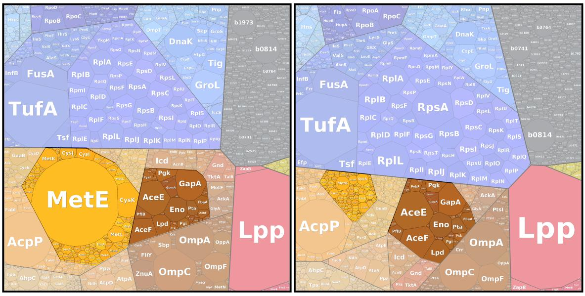

Figure 2.7: Proteome composition of *E. coli*, grown on the growth medium with full amino acid supplement (right) or its version without amino acid methionine (left). Proteome composition data from [\[50\]](#page-255-11).

magnitude difference from the *K*M to each side) is arbitrary, yet supported by empirical observations. On the higher end, the benefit from high substrate concentration becomes negligible (saturation kinetics) as the concentration moves from the order of magnitude of *K*M (see Exercises for an example). The lower bound of concentrations is defined through high demand of enzymes: in order to sustain flux, a lot of enzyme would have to be produced. As cells have a finite volume to accommodate proteins, such a strategy works only for a very small number of enzymes. Taken together the limitations on the both sides of the spectrum, enzyme kinetics set the bounds for the concentrations of metabolites in the cells.

To illustrate the diversity of enzyme turnover values *k*cat and the condition-dependent expression of enzymes (dictated by the flux *v* these enzymes have to sustain), we can consider the proteome composition of *E. coli* under two conditions: growth medium with the complete supplement of amino acids (all 20 proteogenic amino acids present in medium), in contrast to the supplement with a single amino acid missing (a "dropout" medium) (Figure [2.7)](#page-31-0). The growth of *E. coli* in a nutrient-rich medium (glucose + amino acid supplement) is indeed a very fast one (with doubling time of *τd,rich* = 21*.*5 ± 0*.*4 vs. *τd,minimal* = 56*.*3 ± 0*.*5 minutes). The omission of methionine from the amino acid supplement does increase the doubling time (*τd,*−*Met* = 26*.*5±1*.*1 minutes), yet the growth rate remains high, and so is the methionine biosynthesis demand in these conditions.

Methionine is an amino acid that is energetically the most expensive to make [\[51\]](#page-255-12), and the final enzymatic reaction in the methionine synthesis pathway is so-called *rate-limiting*, or the reaction which dictates the flux through the whole pathway. Moreover, the enzyme methionine synthase (*MetE*) is a very slow enzyme (Figure [2.7,](#page-31-0) table on the bottom), thus required at large quantities to provide enough methionine for protein synthesis at high growth. Consequently, it was observed that *MetE* alone could occupy up to ca. 7.5% of the total proteome (by mass) in medium lacking methionine, and growth on a medium, containing methionine, would reduce the proteome fraction by ca. 800-fold, to 0.009% [\[50\]](#page-255-11). To contrast this highly condition-dependent expression of *MetE*, we considered a protein in the lower glycolysis, called enolase *Eno* (Table [2.4)](#page-32-1). The expression of glycolytic proteins, including *Eno*, was determined to be similar, as both the complete- and the methionine-free media contained glucose as the main carbon source. A noticeable contrast of *Eno vs. MetE*

<span id="page-32-2"></span><span id="page-32-0"></span>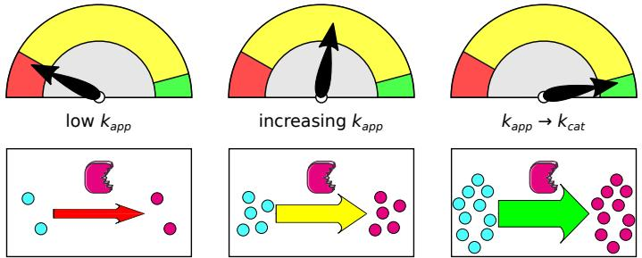

Figure 2.8: The relation between the apparent and measured turnover value(*k*app and *k*cat, respectively). Factors, leading to low net rate of reaction per unit of protein (e.g. low substrate concentration) lead to *k*app being significantly lower than the measured *k*cat value, latter of which corresponds to the maximal rate of the reaction.

is also a ca. 3 orders-of-magnitude higher *k*cat value compared to the one of *MetE*: having to invest less (per mass) into this enzyme contributes to the ability to sustain a very high flux through enolase when cells grow fast on glucose [\[50\]](#page-255-11) (see Chapter [6](#page-94-0) for a more detailed discussion).

The variable concentrations of metabolic substrates, and their relation to the enzyme parameters (*K*M in this case), also bring additional kinetic considerations. The above-introduced turnover value *k*cat represents the highest possible efficacy of the enzyme, where all substrates are accessible in concentration needed to sustain this efficacy (also called *saturating* concentrations). Turnover values are usually measured *in vitro*, with all the substrates highly in excess, thus deliberately minimizing many kinetic effects (enzyme saturation, reversibility of reactions etc.) that are prevalent in more physiological conditions (see Chapter [3](#page-36-0) for details). Therefore, what we usually observe in living cells is not the enzyme efficacy in terms of the *k*cat, but rather their *apparent turnover value k*app (Figure [2.8)](#page-32-0). The ratio of these values ( *k*app *k*cat ) is then called the *enzyme efficiency* and can be used to infer how far away the enzyme is from its optimal working conditions. The *k*app value of an enzyme *in vivo* can be computed as follows: knowing the *k*cat value, the flux through the reaction, one can compute the minimal demand (in moles) of the enzyme to sustain that flux. Then, the *k*app value can be computed by taking the ratio of predicted minimal enzyme demand and the enzyme abundance in the cells.

**Macromolecule polymerization.** Moving from the metabolic enzymes to the macromolecular synthesis machinery, the polymerization of the macromolecules (DNA replication, RNA transcription and protein translation) are catalyzed by large enzyme (and RNA, in the case of ribosomes) complexes: DNA and RNA polymerases (DNAP, RNAP) and ribosomes. Resources, needed for expressing them also significantly contribute to the total costs of macromolecule biosynthesis. For instance, the molecular weight of an intact ribosome in *E. coli* is ca. 2.3 MDa (BNID 111560), and the *E. coli* ribosome consists of 62% RNA and 38% protein (in mass %, BNID 109047). Meanwhile, eukaryal ribosomes are even larger, ca. 3.3 MDa for *S. cerevisiae* and ca. 4.3 MDa for human *H. sapiens* (BNID 111560), and have higher protein content [\[52\]](#page-255-13). For a comparison, the average length of a protein in *E. coli* is ca. 300 amino acids (BNID 100017) and average amino acid weight is ca. 109 Da (BNID 104877). By multiplying these numbers, the molecular mass of an average protein is ca. 32.7 kDa, roughly 70× lower than the ribosome that synthesizes this protein.

<span id="page-32-1"></span>

| Pathway                 | Enzyme                     | Proteome mass fraction (%) |          | −1<br>kcat (s<br>) |
|-------------------------|----------------------------|----------------------------|----------|--------------------|
|                         |                            | Met dropout                | Complete |                    |
| Glycolysis              | Enolase (Eno)              | 0.53                       | 0.53     | 192.95             |
| Amino acid biosynthesis | Methionine synthase (MetE) | 7.45                       | 0.009    | 0.12               |

Table 2.4: Abundance and *k*cat values of two selected proteins from Figure [2.7:](#page-31-0) enolase (independent on amino acid supplementation) and methionine synthase (dependent on amino acid supplementation).

<span id="page-33-2"></span>The nature of these large complexes requires an exceptional coordination of resources. The first consideration is the number of individual proteins that form these complexes: the RNA polymerases of *S. cerevisiae* contain up to 17 subunits (BNID 111568), and 79 ribosomal proteins form a fully functional ribosome [\[53\]](#page-255-14). Therefore, the assembly of these complexes must be fast and robust: thus cells contain a number of assembly factors for facilitating these processes. Next, the coordination also has to be temporal, especially for prokaryotes, where both messenger RNA transcription and protein translation can happen simultaneously. In *E. coli*, this is well illustrated by the 3-fold difference between elongation rates of mRNAs and proteins, ca. 62 *nt s*−1 and 21 *aa s*−1 , respectively (BNID 103021, 107868). This coordination is essential for coordinated transcription and translation happening at the same time [\[54\]](#page-255-15), as translation happens in steps, 3 nt each (socalled *triplets*). Even in eukaryote *S. cerevisiae* we observe a similar pattern: mRNA elongation rate of ca. 30 *nt s*−1 (BNID 103016) and protein chain elongation rate of ca. 10.5 *aa s*−1 [\[55\]](#page-256-0), nearly a 3× difference. Also, the polymerization of macromolecules is very tightly connected to the metabolism: different kinds of growth limitations (limiting amounts of nutrients) were shown to create bottlenecks at different stages of protein expression [\[56\]](#page-256-1), and the optimal regulation of these processes were selected for by the evolution [\[57,](#page-256-2) [58\]](#page-256-3).

### <span id="page-33-0"></span>**2.7.3 Physical proteome space**

A final type of asset required for macromolecule synthesis is the physical volume in the cell. As the cells are, again, "bags of things", they possess a finite volume, thus different processes compete for available proteome volume (also called "proteome space" interchangeably). A general trend across microorganisms is that ribosomes occupy larger proteome mass fraction (in the range of 10-40% total proteome) with increasing growth rate [\[15,](#page-253-1) [59\]](#page-256-4), with an estimated maximum in *E. coli* of ca. 55% of total proteome mass [\[15\]](#page-253-1). Alongside ribosomes, biosynthetic pathways also occupy a substantial share of total proteome (e.g. enzymes, required for amino acid biosynthesis occupy up to 15% of the proteome space in *S. cerevisiae* [\[59\]](#page-256-4)). Experimentally, the optimal allocation of proteome space can be challenged by, e.g. varying expression of an unneeded (gratuitous) protein. Both for *E. coli* and *S. cerevisiae* it was shown that increasing gratuitous protein expression directly affects the maximal growth rate on both minimal and rich media [\[60,](#page-256-5) [56\]](#page-256-1), suggesting that the decrease in growth rate is not dependent on the nutrient status of the cell.

Numbers provided above were measured for cells, grown in minimal medium, and some of the costs we discussed - not only proteome space, but also precursors and enzymes - could be alleviated by growth in rich medium. Uptake of biosynthetic precursors usually is less costly than biosynthesis, as expression of a single type of transporter can substitute the need of expressing a biosynthetic pathway with tens of enzymes associated. Indeed, transfer of *S. cerevisiae* cells to a amino acid-rich growth medium resulted in an increase of growth rate, caused by increased proteome allocation to ribosomes, in place of the proteins of *de novo* amino acid biosynthesis [\[61\]](#page-256-6). In conclusion, the physical space that proteins can occupy is also an asset that the proteins are competing for, and thus the optimal allocation of the available space is key for the cells to grow in the most favorable way under specific conditions.

## <span id="page-33-1"></span>**2.8 Concluding remarks**

In this chapter, we discussed the properties and the quantities of the main cellular components, how the composition changes in different environmental conditions, and what resources are needed for a cell to replicate itself. It may seem that we already have a vast amount of data, but a lot is still missing. Most available data comes from model organisms such as *E. coli*, *S. cerevisiae*, or humans, but the data for other organisms is still limited. Single-cell data (ideally with subcellular resolution) is also not widely available. Even though we can sequence a genome within a few hours or days, we still do not know the functions of many genes. Many experiments still need to be done, and new high-throughput experimental methods developed to fill the gaps in our knowledge.

Nevertheless, with the basic knowledge from this chapter, we can dive deeper into studying cellular economics and resource allocation with mathematical modeling. How is biomass represented in mathematical

### Concluding remarks 25

models? Often, models only focus on proteome as it is a cell's most abundant and expensive component. However, some models also include other major components (RNA, DNA, lipids, carbohydrates, cofactors, etc.). The components can be modeled at different levels of detail. For example, the cell proteome can be represented simply as a total proteome, divided into protein subgroups (e.g. metabolic, ribosomal, other), or modeled as individual proteins. Finally, there are two contrasting ways to include biomass in mathematical models. On the one hand, some models consider a fixed biomass composition based on measurements or literature (see Chapters [4](#page-62-0) and [5)](#page-82-0). On the other hand, some models *predict* the biomass composition (i.e. they calculate optimal resource allocation or enumerate all possible compositions, see Chapter [9)](#page-144-0).

Apart from biomass composition, we can include other cellular properties as constraints or parameters in the models, depending on the type of a model and how detailed it is. For example, we can constrain the transcription/translation rates, enzyme turnover rates, cell surface area or volume,

In conclusion, this chapter introduced the basic building blocks of a cell, processes that make them, how they are coordinated and how they depend on environmental conditions. In the next chapters you will learn how to translate this information into mathematical models and how to use them to gain deeper knowledge of cell biology.

## **Recommended readings**

### **Cell biology**

- Alberts, B., et al. (2022). Molecular Biology of the Cell. WW Norton & Co.
### **Numbers in cell biology**

- Moran, U., Phillips, R., & Milo, R. (2010). SnapShot: key numbers in biology. Cell, 141(7), 1262-1262.
- Milo, R., & Phillips, R. (2015). Cell biology by the numbers. Garland Science.

## **Problems**

**Problem 2.1 Intuition for biological numbers.** Try to answer the following questions, and only then look up the results:

- What is the volume of a cell?
- What is the size of a protein?
- What is bigger, a protein or the mRNA that encoded it?
- How many protein molecules are there in a cell?
- What is the number of genes in a genome?
- How long does it take to transcribe a gene?
- How long does it take to produce a protein molecule?
- What is the minimal doubling time of a cell?
- What other questions come to your mind?

Precise values do not matter here – think about orders of magnitude.

<span id="page-34-0"></span>**Problem 2.2 Proteins per cell - estimate one.** How many proteins are there in a bacterial/yeast/mammalian cell [\[5\]](#page-252-5)? Use data from the following table:

| Protein mass per volume     | 0.2 g mL−1     |
|-----------------------------|----------------|
| Molecular mass of a protein | 40000 g mol−1  |
| Avogadro's number           | 6 · 1023 1/mol |
| E. coli volume              | 1 µm3          |
| S. cerevisiae volume        | 60 µm3         |
| Mammalian cell volume       | 3000 µm3       |

**Problem 2.3 Proteins/ribosomes per cell - estimate two.** A typical protein has a volume of 25 nm3 (BNID 101828) and a ribosome 3400 nm3 (BNID 104919). Given that 70% of a cell volume is water, what is the maximum number of protein/ribosome molecules that fit into a typical *E. coli* cell (see Table [2.2)](#page-34-0)? Compare your answers with the previous problem/values in BioNumbers database.

<span id="page-35-0"></span>**Problem 2.4 Buoyant cell density.** Calculate the buoyant density of a typical bacteria using the following data:

| Component     | Density (g mL−1<br>) | Mass fraction per cell |
|---------------|----------------------|------------------------|
| Water         | 1                    | 0.7                    |
| Proteins      | 1.3                  | 0.18                   |
| Nucleic acids | 1.7                  | 0.08                   |
| Lipids        | 1                    | 0.03                   |
| Carbohydrates | 1.5                  | 0.01                   |

**Problem 2.5 Concentrations enzymes and substrates.** Dourado *et al.* [\[62\]](#page-256-7) suggested that there is a relationship between the concentrations of enzymes and their substrates in *E. coli*, which is a result of a constraint on the biomass density. They showed that the reaction flux is maximal when the dry mass of each substrate is equal to the dry mass of the unsaturated (free) enzyme. What is the concentration of one enzyme per cell for *E. coli* (in mol L−1 )? What would be the optimal concentration of its substrate? Use protein mass and cell volume from Problem [2.2](#page-34-0) and the mass of glucose as substrate.

**Problem 2.6 Cell size in different dimensions.** Imagine a spherical cell that increases its diameter from 1 to 2 um. How much do the surface area, volume, and SA/V change? Think about how this could influence the import of nutrients and the diffusion across the cell.

**Problem 2.7 Alien lifeforms.** Imagine alien lifeforms. Would they be composed of cells? Why? What features of cells could be completely different? What features are so much dictated by physics that they could not be different in any type of alien cell?

**Problem 2.8 Substrate demand to saturate an enzyme.** Take the following rate law: *v* = *vmax S K*M+*S* (also known as irreversible Michaelis-Menten rate law, see Chapter [3)](#page-36-0), where *vmax* is the maximal reaction velocity. Plug in the values for *v* and compare the substrate concentration needed for the reaction rate to increase from (i) 10% to (ii) 90% of the maximal rate *vmax*. Hint: express the *S* in terms of *K*M and take the ratio.

# <span id="page-36-2"></span><span id="page-36-0"></span>**Chapter 3**

# **The dynamics of metabolic systems**

Elad Noor, Hadrien Delattre, Herbert M. Sauro, Orkun S. Soyer, Robert West

### **Chapter overview**

This chapter introduces cell metabolism as a dynamical system. While the previous chapter gave an overview of the constituents of this system, i.e. enzymes, metabolites, etc., this chapter focuses on conceptual abstraction of the metabolic system as a whole and how to model its dynamics over time. The key areas introduced are:

- Conceptualizing cell metabolism as a dynamical system (section [3.1)](#page-36-1)
- Dynamics and regulation of metabolism (section [3.2)](#page-41-1)
- Toolbox for modeling dynamics of metabolism Biochemical reaction rate equations and their derivations (section [3.3)](#page-47-0)
- Dynamics of metabolism: Examples of experimental evidence and model-based explanations (section [3.4)](#page-54-0)
- Mathematical derivations and example models (appendix sections [A.1](#page-302-1) and [A.2)](#page-307-1)

This chapter links to the rest of this book by introducing dynamic of metabolism and highlighting possible dynamical features as constraints or self-regulation mechanisms on metabolic fluxes. Exploring the latter possibility is challenging, requiring both theoretical and experimental efforts. The understanding of dynamics is at the forefront of the study of cell metabolism and physiology and we hope that this chapter provides a notion in the reader to explore this area of research further.

In this chapter we will switch back-and-forth between a high-level view on metabolism, considering all of it, and a more focused, low-level view focusing on modeling individual reactions or small sets of reaction systems (e.g. pathways or motifs). These two viewpoints constitute two ends of a wide spectrum, and our aim in jumping back-and-forth between them is to allow the reader to obtain the skills to model dynamics of reaction systems that make up metabolism, while at the same time to invite them to think about the overall function of the metabolic system.

## <span id="page-36-1"></span>**3.1 Conceptualizing cell metabolism as a dynamical system**

Cell metabolism is a dynamical process that converts available metabolites from the environment into biomass and other products. The metabolism of a typical cell involves thousands of biochemical reactions and metabolites. What would be a useful way to think about such a complex, dynamical system? We need a conceptual

### <span id="page-37-3"></span><span id="page-37-2"></span>**Economic analogy 3.A**

We can make an analogy that presents metabolism as an assembly line in a factory. Metabolites enter the line from outside the cell and are processed – i.e. acted upon by enzymes – to create new metabolites that are ultimately incorporated into cellular biomass. This picture is reinforced by the common textbook illustration of metabolism as a set of isolated pathways that are placed 'upstream' or 'downstream' of each other, and that 'produce' or 'consume' outputs for each other. A key shortcoming of this analogy is that it conveys a picture in which events are strictly linear and progressive in their nature, ignoring the cyclic and inter-connected nature of metabolism (Fig. [3.1)](#page-38-0). Despite this shortcoming, this analogy captures the point that the flux of materials through the system can attain a 'steady-state' of equal in- and out-flux across individual reactions (see further discussion of the steady-state concept in the main text). One important difference however between an assembly line and metabolism is that the rate at a given assembly stage in a factory is not a function of how many units are waiting to be processed because factory machines tend run at fixed rates. In metabolism, the rate of a reaction is a function of the substrate concentration until saturated. This leads to distinctive behavior not found in factory assembly lines. Another important difference with a factory assembly line is that unlike an assembly line, metabolism in some cases is able to in both directions along the line. The most well known of these is the bidirectionality of the glycolytic and gluconeogenic pathways.

picture of metabolism to help us formulate more specific ideas about how it functions, how it can be manipulated, or even how it has evolved. Here, we first highlight a few such 'pictures', or ways of thinking about metabolism.

### <span id="page-37-0"></span>**3.1.1 Metabolism as a collection of pathways**

The common and historical view of a 'metabolic system' stems from pioneering biochemical studies from the 1930s onwards, which identified collections of reactions as so-called 'pathways' [\[63\]](#page-256-8). Known mostly through the names of their discoverers, these include the Entner–Doudoroff (ED), Embden–Meyerhof–Parnas (EMP) and pentose-phosphate (PP) pathways involved in glucose uptake and conversion into pyruvate, and the Krebs pathway (a.k.a. tricarboxylic acid cycle, TCA) involved in the conversion of pyruvate into amino acid, nucleotides, and biomass precursors [\[64\]](#page-256-9). This 'pathway-centric' view of cell metabolism lends itself readily to an assembly line analogy and the notion of (linearly) connected pathways (see Economic analogy [3.A)](#page-37-2).

**Pathways, yes, but not so linear!** The identification of well-established pathways and the subsequent focus upon them gives the false impression that cell metabolism consists of a series of neatly organized and serially connected pathways. This impression is facilitated by pictures of isolated linear pathways, common in textbooks and even research papers. In reality, these pathways are highly interconnected with other pathways (Fig. [3.1)](#page-38-0).

Part of these interconnections within metabolism arise from co-substrates and specific metabolite pairs that participate in many reactions. For example, co-substrates such as ATP and NADH link many parts of metabolism through reactions in which they are generated or consumed (Fig. [3.2)](#page-39-1), while the glutamate - *α*ketoglutarate pair is involved in the TCA cycle as well as acting as a group donor in all amino acid biosynthesis pathways.

The pathway view provides a useful starting point to think about metabolism, but a complete understanding of metabolism dynamics and metabolic phenotypes requires us to come to terms with the highly connected nature of these pathways (see below, Philosophical Remarks Box [3.C)](#page-42-1).

### <span id="page-37-1"></span>**3.1.2 Metabolism - coarse grained views**

The highly connected nature of metabolism makes it difficult to understand its overall dynamics just from individual pathways. It also makes it hard to conceptualize metabolism as a single, linear process, or as serially connected pathways. Here, a coarse-grained viewpoint, focusing on the overall function of cell metabolism, might prove helpful. There have been several such views developed, with two highlighted here.

<span id="page-38-1"></span><span id="page-38-0"></span>

Figure 3.1: Metabolic pathways and complexity. (A and B) Upper glycolysis pathway as a linear pathway, with or without co-substrates. Note that the co-substrates 'connect' this pathway to a large number of other reactions that also use these same co-substrates. (C) Upper glycolysis pathway, together with the pentosephosphate pathway. Notice metabolites participating in both.

**Metabolism as biomass generator.** A widely applied coarse-grained view of metabolism considers it as a vehicle to biomass production. In this view, metabolism is considered as two coupled processes, one producing energy and compounds that can act as building blocks (*e.g.* amino acids), and one that uses these to create larger macro molecules (*e.g.* proteins and lipids) needed to make a new cell. These two processes are called catabolic and anabolic metabolism respectively, and their coupling presents the whole cell metabolism (Fig. [3.3](#page-40-0) A). This coarse-grained model is widely used (e.g. [\[64,](#page-256-9) [65\]](#page-256-10). However, it is not always clear how to partition various pathways and reactions as anabolic and catabolic, and the notion of metabolism organized solely to satisfy for biomass production does not capture certain metabolic phenotypes, such as no-growth states or excretion of high-energy metabolites (*i.e.* metabolic overflow).

**Metabolism as electron flow.** An alternative coarse-grained view of metabolism is obtained from a more chemical standpoint. When one writes down an overall reaction for cellular metabolism, considering compounds taken up from the environment and created at the end of various metabolic processes, one realizes

<span id="page-39-2"></span><span id="page-39-1"></span>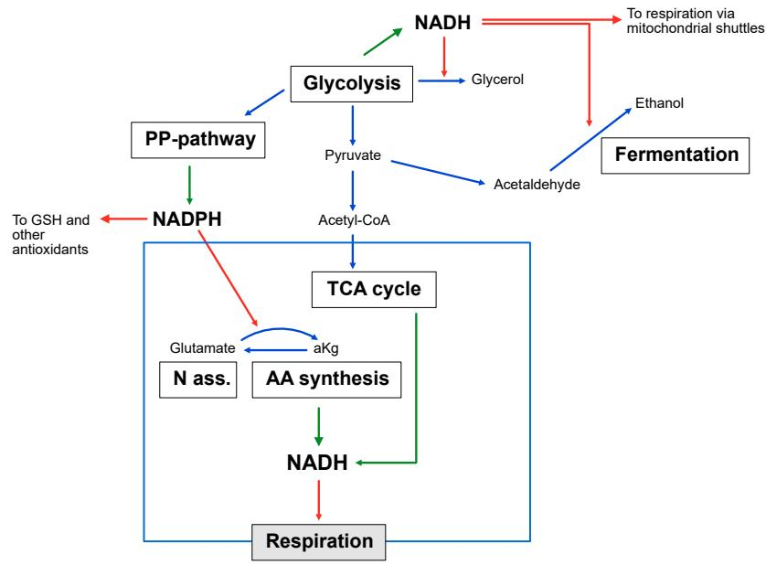

Figure 3.2: A simplified map of central metabolism, particularly highlighting interconnections among different processes (i.e. pathways) through the NAD(P)+ / NAD(P)H co-substrate pair.

that this is a redox reaction, a type of reaction where electrons are exchanged between participating reactants (see Fig. [3.3](#page-40-0) B and Box [3.B)](#page-40-1). This means that the actual reactions within metabolism that enable this overall reaction must compose also of some redox reactions. In other words, we can argue that metabolism consists of (besides other reactions) a series of redox reactions that enable flow of electrons. Metabolism is thus an inter-connected system of reactions that allows flow of electrons from readily oxidized compounds (electron rich compounds with low or negative reduction potentials) towards readily reduced compounds (electron poor compounds with positive reduction potentials) [\[66,](#page-256-11) [67\]](#page-256-12). (Fig. [3.3](#page-40-0) B). As the Nobel laureate Albert Szent-Györgyi (1893 – 1986), who studied the TCA cycle and discovered vitamin C biosynthesis pathways, once said, "Life is an electron looking for a place to rest.".

Emphasizing its redox reactions, the metabolic system can be visualized on a reduction potential chart, which is sometimes called a 'redox ladder' (Fig. [3.4](#page-41-2) and box [3.B)](#page-40-1). This potential chart shows reduction potential of redox half reactions (usually in reduction direction) and allows us to readily visualize the thermodynamic feasibility of redox reaction pairs. The chart is ordered in such a way that any reduction half reaction can be paired with any other placed below it, resulting in a thermodynamically feasible redox reaction, but not with those above it. We notice that cell metabolism, in order to maintain electron flows, needs to maintain thermodynamic feasibility of the overall and all intermediate reactions. The key requirement for this is to have access to electron donors (e.g. carbohydrates) and terminal electron acceptors (e.g. oxygen). One must also note that the redox ladder depicted in Fig. [3.4](#page-41-2) is derived for standard concentrations of metabolites, whereas the reduction potentials would depend on actual concentrations in the cell.

## <span id="page-39-0"></span>**3.1.3 Keeping flows in a system of interconnected fluxes**

It is noticeable that both coarse-grained views presented above involve interconnected fluxes that are ultimately enabling an overall flux. In the biomass-based view, the flux between catabolism and anabolism is connected to enable flux into biomass. In the electron-flow based view, there is again a set of interconnected flows to enable the overall electron flow from initial donors (e.g. glucose) to final acceptors (e.g. oxygen).

The interconnection of fluxes in metabolism is most clearly visible in reactions involving co-substrates, such

<span id="page-40-0"></span>

Figure 3.3: Coarse-grained models of cell metabolism. (A) A conceptual drawing of cell metabolism as provider of precursors (catabolism) and generator of biomass from those (anabolism). (B) A conceptual drawing of cell metabolism as enabling an abstract redox reaction between a pair of electron donors and acceptors. The electron donor can at the same time be the carbon source for biomass generation, or there can be a separate 'carbon-donor'. This overall redox reaction is an abstraction, in the sense that in real metabolism electrons are not directly transferred from the original donor to biomass precursors but rather there are many intermediary redox reactions such as those involving key carrier co-substrate metabolite pairs NAD(P)+/NAD(P)H.

#### <span id="page-40-1"></span>**Box 3.B : The redox ladder in metabolism**

We can highlight the overall redox reaction implemented by the cellular metabolism further, by writing it as two separate reactions consisting of an oxidation reaction (involving a molecule releasing electrons) and a reduction reaction (involving a molecule accepting electrons) (see Fig. [3.3)](#page-40-0). The feasibility of the paired, overall redox reaction can be measured by the Gibbs' free energy, or the closely related reduction potential, where a positive reduction potential (or a negative Gibbs' free energy) indicates a thermodynamically feasible reaction. Thus, a redox reaction with a positive reduction potential implies electrons 'flowing' from a molecule with high reduction potential towards that with a low reduction potential – a point that can be visualized using a "reduction ladder", a chart of reduction potentials (Fig. [3.4)](#page-41-2). Notice that considering redox reactions as composed of individual reduction and oxidation reactions is merely a conceptualization, however, this provides a useful analogy in which we can view a metabolic system as enabling the flux of electrons across many reactions, and between an initial electron donor and a final electron acceptor [\[63\]](#page-256-8). While glucose and oxygen are possibly the most well-known electron donor and acceptor pairs, cells, especially microbial cells, can use a wide-range of donors and acceptors, including nitrogen and sulfur containing compounds, thereby contributing significantly to biogeochemical cycles of these compounds [\[68\]](#page-256-13).

as NAD(P)+ / NAD(P)H and ADP/ATP pairs (see below, philosophical remarks box [3.C)](#page-42-1). The NAD(P)+/NAD(P)H pair form either the oxidation or reduction half-reaction in various redox reactions thereby enabling the aforementioned electron flows within the metabolic system. The ATP+/ADP pair forms an energy carrier, providing driving energy to reactions that would be thermodynamically infeasible (see section [3.2.1](#page-42-0) below on what we mean by this). This pair is seen as forming the flux connection between catabolism and anabolism, where the former is considered to result in ATP production, and the latter is considered to consume this.

Co-substrates are thus essential in connecting different fluxes, and therefore processes, within metabolism and their dynamics must be important to keep overall metabolic flow. It is tempting to speculate that key cosubstrates might be an evolutionary outcome that ensures stable electron flows in the face of changing conditions. While this possibility is difficult to prove or disprove, it is interesting to note that the NAD(P)H/NAD(P)+ pairs can attain a broad range of reduction potentials that could enable their redox partnering with many of

<span id="page-41-2"></span>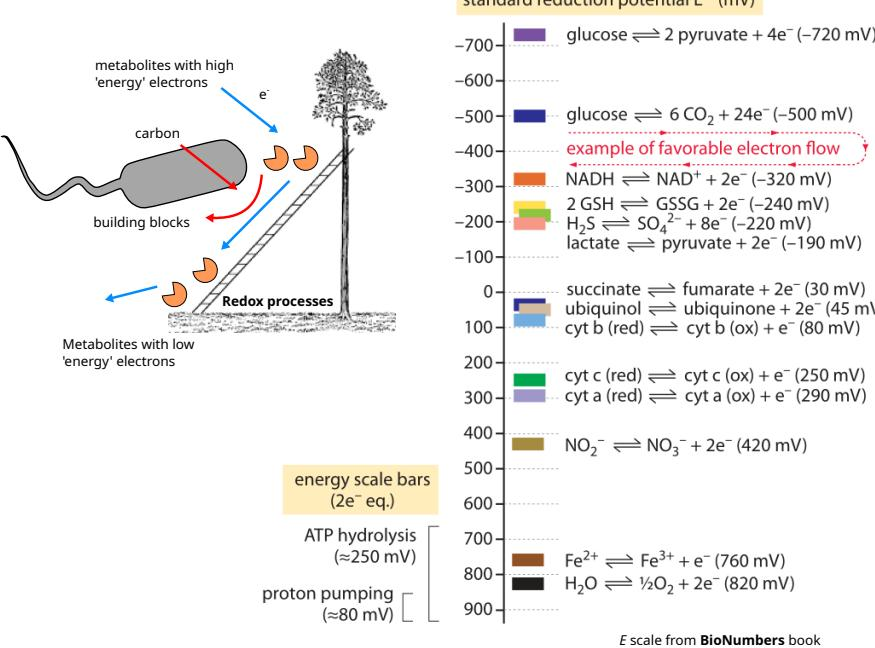

Figure 3.4: Metabolism on a redox ladder. Cartoon representation highlighting the role of electron flows through redox reactions for a functioning metabolism, and a reduction potential chart listing key redox reactions found in cellular metabolism. Notice that the reduction potential chart shows reduction potentials of half-reactions in the reduction direction and using metabolite concentrations under standard conditions, hence the actual potentials would be different and dynamically changing within the cells. A thermodynamically feasible reaction would need to combine one half reaction (run in reverse, oxidation direction) with another one lying below it (i.e. at a higher reduction potential). Two example feasible redox pairs are shown with the blue and red data points.

the different reaction types found in cell metabolism [\[69\]](#page-256-14) - in other words, these two redox pairs seem to be a versatile tool to connect a wide range of redox reactions to each other and ensure electron flows.

### <span id="page-41-0"></span>**3.1.4 Metabolic system and recurring motifs**

Within the highly inter-connected system that is metabolism, specific reaction arrangements seem to recur frequently, so-called "reaction motifs". We have already mentioned the cyclic reaction systems, involving co-substrates as one such motif. Other reaction motifs that have been highlighted include autocatalytic cycles [\[70\]](#page-257-0) and branch points [\[71\]](#page-257-1). As we will discuss below, these reaction motifs can give rise to specific nonlinear dynamics and act in auto-regulatory capacity or create constraints on the metabolic system. In general, however, it is difficult to ascertain the evolutionary significance of reaction motifs. While automated approaches, involving graph theoretical analysis of metabolic systems represented as networks, highlighted certain metabolic motifs as significant compared to random networks, it was subsequently shown that this result is dependent both on the original network representation used and the randomized networks used for comparison [\[72\]](#page-257-2).

## <span id="page-41-1"></span>**3.2 Dynamics and regulation of metabolism**

Independent of our conceptual views on metabolism, the fact remains that the metabolic system involves flux of matter. A myriad of metabolites are combined, converted, broken apart, and re-assembled. These biochemical reactions are catalyzed by enzymes so to improve kinetic rates, and the entire system must obey the laws of thermodynamics (more on these later in section [3.2.1)](#page-42-0). In summary, metabolism constitutes a 'system' of metabolites and their reactions, together with enzymes. Its dynamics over time ensures fluxes of

#### <span id="page-42-4"></span><span id="page-42-1"></span>**Philosophical remarks 3.C**

The involvement of co-substrate and key metabolites results in the coupling of many different parts of the metabolism and in the emergence of cyclic reaction systems - for example, by connecting different parts of the metabolism, the NAD(P)H/NAD(P)+ pairs result in cycling between their different forms. This means that in order to capture the concentration of all the other molecules involved in these reactions, we need to consider dynamics of a series of intertwined cyclic reaction systems, rather than linear pathways akin to an assembly line. Indeed, it has been argued that cyclic reaction motifs should form the basis of developing a dynamic understanding of cell metabolism [\[73\]](#page-257-3). It must also be noted that co-substrates, and possibly other key metabolites, can have 'conserved' concentrations in the time scales of metabolic flux dynamics. In other words, these metabolites form 'conserved moieties' within the system, similar to enzymes, such that altering of the total pool size of these co-substrates or the ratio of their different forms (e.g. the NAD+/NADH ratio) can possibly affect the flux distribution across different pathways that they are connected to [\[74,](#page-257-4) [75,](#page-257-5) [70,](#page-257-0) [76,](#page-257-6) [73,](#page-257-3) [77\]](#page-257-7).

<span id="page-42-0"></span>matter.

### **3.2.1 Biochemical reactions and thermodynamics**

Metabolism consists of individual biochemical reactions of the form:

<span id="page-42-3"></span>
$$
\nu_a \mathbf{A} + \nu_b \mathbf{B} \tag{3.1}
\text{V} \tag{3.2}
\text{V} \tag{3.2}
\text{V} \tag{3.3}
\text{V} \tag{3.3}
\text{V} \tag{3.3}
\text{V} \tag{3.4}
\text{V} \tag{3.4}
\text{V} \tag{3.4}
\text{V} \tag{3.1}
\text{V} \tag{3.3}
\text{V} \tag{3.1}
\text{V} \tag{3.3}
\text{V} \tag{3.3}
\text{V} \tag{3.3}
\text{V} \tag{3.3}
\text{V} \tag{3.3}
\text{V} \tag{3.4}
\text{V} \tag{3.4}
\text{V} \tag{3.4}
\text{V} \tag{3.4}
\text{V} \tag{3.3}
\text{V} \tag{3.3}
\text{V} \tag{3.4}
\text{V} \tag{3.4}
\text{V} \tag{3.4}
\text{V} \tag{3.3}
\text{V} \tag{3.5}
\text{V} \tag{3.5}
\text{V} \tag{3.5}
\text{V} \tag{3.5}
\text{V} \tag{3.5}
\text{V} \tag{3.5}
\text{V} \tag{3.6}
\text{V} \tag{3.6}
\text{V} \tag{3.6}
\text{V} \tag{3.6}
\text{V} \tag{3.7}
\text{V} \tag{3.7}
\text{V} \tag{3.7}
\text{V} \tag{3.7}
\text{V} \tag{3.8}
\text{V} \tag{3.8}
\text{V} \tag{3.8}
\text{V} \tag{3.8}
\text{V} \tag{3.8}
\text{V} \tag{3.9}
\text{V} \tag{3.9}
\text{V} \tag{3.9}
\text{V} \tag{3.1}
\text{V} \tag{3.1}
\text{V} \tag{3.1}
\text{V} \tag{3.1}$$

where *νi* are the so-called stoichiometric coefficients, determining the number of molecules of the *i*'th chemical species taking part in the reaction (Box [3.D)](#page-44-0). While these reactions are catalyzed by enzymes, they still need to obey thermodynamic laws. We will not provide a full treatise of the thermodynamics of chemical reactions here - we refer the reader to excellent books on physical chemistry for this (e.g. [\[78\]](#page-257-8)) and also to books for a conceptual introduction to thermodynamics (e.g. [\[79\]](#page-257-9)). Here, it suffices for us to define the key thermodynamic equation, the Gibbs free energy of reaction, involving the chemical potential of substrates and products. Chemical potentials are related to concentrations, where the relation depends on the ionic strength of the solution. Assuming an ideal solution, we will write here the Gibbs free energy of reaction directly in terms of concentrations:

<span id="page-42-2"></span>
$$
\Delta G_r = \Delta G_r^\ominus + R \cdot T \cdot \ln \frac{c^{\nu_c} \cdot d^{\nu_d}}{a^{\nu_a} \cdot b^{\nu_b}},\tag{3.2}
$$

where the small letters indicate the concentrations of the substrates and products as given in the above reaction. Notice that specifying 'products' and 'substrates' automatically specifies a 'forward' direction to the reaction (Box [3.D)](#page-44-0). In the above expression, the term in the natural logarithm is the ratio of the concentration of the products to the concentration of the substrates (considering the forward direction of the reaction) and is commonly denoted as the mass action ratio, Γ. The term ∆*G* ◦ *r* is the difference between the standard Gibbs free energy of formation of products and substrates.

The Gibbs free energy of a reaction is the key thermodynamic equation we introduce here, as it is this equation that determines whether a reaction would run in the forward direction or not. If the Gibbs free energy of reaction, for a given set of substrates and products concentration, is negative (∆*G* ◦ *r <* 0), the reaction will be spontaneous in the forward direction as it is written (i.e. in the way the 'substrates' and 'products' are defined). In other words, chemical reactions proceed in the direction of lower energy - they minimize the internal energy of the system. We will see later (in section [3.3.2)](#page-51-0) that Gibbs free energy will also feature in rate equations for biochemical reactions.

It is important to introduce here the concept of thermodynamic equilibrium, which is attained when ∆*Gr* = 0.

<span id="page-43-3"></span><span id="page-43-1"></span>Re-arranging equation [3.2](#page-42-2) under this condition, we can obtain:

<span id="page-43-2"></span>
$$
\Delta G_r^\circ = -R \cdot T \cdot \ln \frac{c_{\rm eq}^{\nu_c} \cdot d_{\rm eq}^{\nu_d}}{a_{\rm eq}^{\nu_a} \cdot b_{\rm eq}^{\nu_b}},
\tag{3.3}
$$

where the subscript "eq" denotes the concentrations of each species at the thermodynamic equilibrium. The ensuing ratio is known as the equilibrium constant, *K*eq = *c νc* eq ·*d νd* eq *a νa* eq ·*b νb* eq . Re-arranging equation [3.3,](#page-43-1) we can derive an expression for *K*eq as follows:

$$K_{\alpha\mathbf{q}} = \mathbf{e}^{\frac{-\Delta G_{\mathbf{r}}^{\phi}}{R \cdot T}} \tag{3.4}$$

Notice that *K*eq depends only on ∆*G* ◦ *r*, which is the difference between the standard Gibbs free energy of formation of products and substrates involved in a reaction, and which can be calculated from tabulated values (where available). A good source of *K*eq values of many biochemical reactions is the eQuilibrator tool [(equilibrator.weizmann.ac.il)](https://equilibrator.weizmann.ac.il) [\[80,](#page-257-10) [81\]](#page-257-11).

This thermodynamic treatment, showing that the equilibrium state of a reaction is captured by a constant relating to the ratios of product and substrate concentrations at that state, is fully supported by seminal experimental works from the second half of 1800s conducted on chemical reactions by Peter Waage (1833 - 1900) and Cato Guldberg (1836 - 1902), and their contemporaries. These works were concerned with the equilibrium, or steady-state, of chemical reactions attained under different conditions and when initiated from various starting concentrations of substrates. The key contribution of these studies was the finding that the equilibrium state in a reaction, that is the ratio of the concentration of substrates and products at steady-state, is characterized by a constant [\[82\]](#page-257-12).

This finding, referred to as the "mass action law", later gave rise to the notion (rather erroneously) that reaction rate of a chemical reaction at constant temperature is 'proportional to the product of the concentrations of the reacting substances' [\[83\]](#page-257-13). This derived statement actually is not a law but presents a possible rate model that would be compatible with the experimentally observed equilibrium state (i.e. with the mass action law of equilibrium) [\[82,](#page-257-12) [83\]](#page-257-13) (see Box [3.D](#page-44-0) and the Appendix [A.1)](#page-302-1).

### <span id="page-43-0"></span>**3.2.2 Stoichiometric matrix and ordinary differential equations**

As mentioned above, metabolic systems consists of many reactions. When describing multiple reactions in a biochemical 'system', it is convenient to represent the stoichiometries of individual reactions in a compact form called the stoichiometric matrix, **N**. The rows and columns of this matrix corresponds to *m* species (i.e. the metabolites), and to *n* reactions, found in the system respectively:

### **N** is a *m* × *n* matrix

The intersection of a row and column in the matrix indicates whether the species represented by that row takes part in the particular reaction represented by that column, or not. The sign of the element determines whether there is a net loss or gain of substance, and the magnitude describes the relative quantity of substance taking part in the reaction. It is important to appreciate that the elements of the stoichiometry matrix *do not* concern themselves with the rate of reaction, and just indicate the quantities taking part in the reaction.

A full description of a biochemical network, including the time-varying, dynamical behavior of metabolite concentrations, will augment the stoichiometry matrix with a rate vector, **v**, forming a so-called system equation:

$$\frac{d\mathbf{s}}{dt} = \mathbf{N} \,\mathbf{v}(\mathbf{s})\tag{3.5}$$

This equation represents a system of ordinary differential equations (ODEs) that describe the time evolution of the species, **s**. In other words, the ODE for species *s* describes the rate of change in the concentration of *s* with a given (infinitesimal) change in time. The ODEs can be solved numerically (i.e. simulated) by computer

<span id="page-44-1"></span><span id="page-44-0"></span>

Gibbs free energy of reaction:

$$
\Delta G_r = \Delta G_r^\ominus + R \cdot T \cdot \ln \frac{c^{\nu_c} \cdot d^{\nu_d}}{a^{\nu_a} \cdot b^{\nu_b}}
$$

**Thermodynamic interpretation**

**Kinetic interpretation**

Backward reaction rate:

*k*− · *c νc* · *d νd*

Forward reaction rate:

At equilibrium:

*k*+ · *a νa* · *b νb*

At equilibrium:

$$
\Delta G_r^\diamond = -R \cdot T \cdot \ln \frac{c_{\text{eq}}^{\nu_c} \cdot d_{\text{eq}}^{\nu_d}}{a_{\text{eq}}^{\nu_a} \cdot b_{\text{eq}}^{\nu_b}}
$$

$$
\text{e}^{\frac{-\Delta G_r^\diamond}{R \cdot T}} = \frac{c_{\text{eq}}^{\nu_c} \cdot d_{\text{eq}}^{\nu_d}}{a_{\text{eq}}^{\mu_a} \cdot b_{\text{eq}}^{\nu_b}} = K_{\text{eq}}
$$

$$k_{+} \cdot a_{\text{eq}}^{\nu_{a}} \cdot b_{\text{eq}}^{\nu_{b}} = k_{-} \cdot c_{\text{eq}}^{\nu_{c}} \cdot d_{\text{eq}}^{\nu_{d}}$$

$$\frac{k_{+}}{k_{-}} = \frac{c_{\text{eq}}^{\nu_{c}} \cdot d_{\text{eq}}^{\nu_{d}}}{a_{\text{eq}}^{\mu_{a}} \cdot b_{\text{eq}}^{\nu_{b}}} = K_{\text{eq}}$$

Cartoon representation of Gibbs free energy of reaction and the thermodynamic equilibrium. As a chemical reaction proceeds, the concentrations of substrates and products change, which in turn affects the 'energy in the chemical system'. We can, thus, capture the reaction advancement in a graph, where the x-axis represents the reaction advancement (i.e. the concentrations of substrates and products at different times in the reaction course) and the y-axis the internal energy of the system. The Gibbs free energy of reaction, in a way, indicates the position of the system in this graphical representation, where the thermodynamic equilibrium would be the energy minima. At equilibrium, reaction Gibbs free energy would be zero, allowing us to derive the relation between substrate and product concentrations at that point and their free energy of formation. This relation is known as the equilibrium constant of the reaction. The same relation can be derived using a rate model to describe the forward and backward reactions that make up the overall reaction. The thermodynamic result (or derivation) shows that a given reaction (under a given temperature) would always have the same substrate and product concentrations at equilibrium, a point that is empirically verified by experiments and that is known as the "mass action law". The rate-based interpretation of this thermodynamic result (or law) is known as the "mass action rate model" and assumes that rate of a given reaction is proportional to the concentrations of substrates and products to the power of their stoichiometry, and adjusted by a rate constant (shown as *k*+ and *k*− above).

or studied analytically.

Notice that in mathematics, the time varying entities in a dynamical systems - in our context, the concentrations of chemical species - are known as 'variables', while any elements of the system that stay constant over time are known as 'parameters'. For an insightful and accessible mathematical treatment of differential equations and system dynamics, the reader is referred to these two excellent books [\[84,](#page-257-14) [85\]](#page-257-15), while for a metabolic view of variables and parameters, the article on the Control of Flux, by Kacser and Burns, offers a valuable perspective [\[86\]](#page-257-16).

### <span id="page-45-2"></span><span id="page-45-1"></span>(A) Thermodynamic steady state


*ξ* (Reaction adv.)

### (B) Dynamic steady states – non-equilibrium thermodynamics

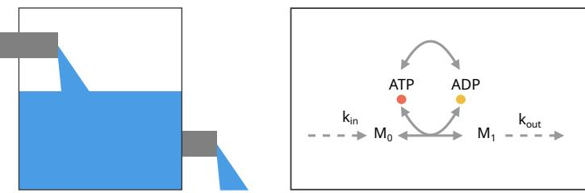

Figure 3.5: Illustration of thermodynamic equilibrium and dynamical steady state. (A) Thermodynamic steady state. (B) Dynamic steady states – non-equilibrium thermodynamics. While the former happens only at chemical equilibrium, the latter can arise in systems that are far from chemical equilibrium. A cartoon of a flowing water through a tank and a reaction involving co-substrate cycling are shown as examples of systems that can attain dynamical steady states.

## <span id="page-45-0"></span>**3.2.3 Dynamic steady state**

As stated above, the ODEs describe the time evolution of all variables **s** in the system. An informative approach to any dynamical system is to consider its steady state, a state where consuming and generating processes on each variable would have the same rate, i.e. the ODEs are equal to zero, and there would be no change in the variable amounts. For example, a water tank filling at a constant rate but emptying at a rate proportional to the height of water in the tank will eventually reach a steady-state where the output flow equals the inflow of water (Fig. [3.5)](#page-45-1). Under these conditions the height of water remains constant, or at a steady state.

It is important to note that the thermodynamic equilibrium mentioned above is also a type of steady-state, but this does not mean that steady-state is only attained at thermodynamic equilibrium. In other words, there can be a steady-state where the system is out of thermodynamic equilibrium but the concentrations of metabolites are not changing. An example of this would be a linear metabolic pathway of connected reactions, with influx and outflux of an initial and endpoint metabolite (as seen in Fig. [3.5)](#page-45-1). In such a system, we can readily consider a scenario where there is influx of the first metabolite, outflux of the last metabolite, and forward flux through each of the reactions in the pathway. Thus, we would have a situation where all reactions are out of thermodynamic equilibrium, but all metabolite concentrations in the pathway attain a dynamic steady-state, where their influx and outflux are equal (Fig. [3.5)](#page-45-1). The distinction between systems that are both at steady-state and thermodynamic equilibrium, and those that are at steady-state but out of thermodynamic equilibrium, is an important one. It has been shown that complex dynamics, such as bistability and oscillations (as discussed below) are only possible in the latter case [\[87,](#page-258-0) [88,](#page-258-1) [89\]](#page-258-2).

Mathematically speaking, the steady-state is defined when the ODE system, i.e. the system equation, is set

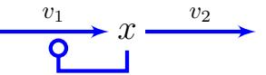

<span id="page-46-3"></span><span id="page-46-2"></span>Figure 3.6: Cartoon of a simple pathway that features allosteric enzyme regulation and that can show multiple steady-state solutions (see Appendix [A.1)](#page-302-1). The metabolite 'x' positively regulates the first step, *v*1. The resulting positive feedback can result in a bistable system under a certain parameter regime.

to zero:

$$\frac{d\mathbf{s}}{dt} = \mathbf{N} \,\mathbf{v}(\mathbf{s}) = \mathbf{0} \tag{3.6}$$

For simple systems, such as a tank of water filling and emptying, there is only one unique steady-state. This is perhaps better illustrated with a simple biochemical example. Consider a two step pathway where the first step has a constant rate *k*1 and the second step a variable rate determined by a first-order reaction rate, *k*2.

$$\mathbf{S} \xrightarrow{\mathbf{v}_{0} = \mathbf{k}_{1}} \mathbf{S} \xrightarrow{\mathbf{v}_{1} = \mathbf{k}_{2} \cdot \mathbf{s}} \tag{3.7}$$

The differential equation describing this system is given by:

$$\frac{\text{d}s}{\text{d}t} = k_1 - k_2 \cdot s \tag{3.8}$$

Setting this equation to zero and solving for *s* yields the steady-state level of *S*:

$$s = \frac{k_1}{k_2} \tag{3.9}$$

This solution indicates there is only a single steady-state for this system dependent on the parameters *k*1 and *k*2.

### <span id="page-46-0"></span>**3.2.4 Multiple steady-states and oscillations**

In the previous section it was shown that a simple two step pathway admitted a single steady-state. There can be, however, metabolic systems that can show multiple steady states. As a simple example, consider the system shown in Figure [3.6.](#page-46-2) This shows a linear pathway of two reactions, with the first reaction activated by the species *x*.

Under certain parameter and model choices, such a system can admit three steady-states. Details of a model that can be simulated can be found in Appendix [A.2)](#page-307-1). Other examples of metabolic systems with multiple steady-states will be given below. In bi-, or multi-stable systems, there can be multiple sets of steady state concentrations and flux rates that the system can settle at. Which set of steady-states is realized is usually determined by initial concentrations or can be caused by a change in one of the concentrations or parameters. Thus, the system can change its steady-state value abruptly at a threshold value of a specific parameter of the system. For a metabolic system displaying bistability, we can expect a rapid switch in multiple fluxes with changes in the concentration of one or few metabolites [\[85\]](#page-257-15). Furthermore, when bistability is combined with noise in some parameters (e.g. enzyme expression level) there can be a multi-modal distribution of flux states across genetically identical cells (e.g. see [\[90,](#page-258-3) [91\]](#page-258-4) and section [3.4)](#page-54-0).

### <span id="page-46-1"></span>**3.2.5 Regulation of fluxes**

How does the cell 'regulate' the flux of matter in metabolism? How does it decide, for example, to make more of an amino acid or rather more of a lipid? Or do these decisions happen automatically, through system dynamics of the metabolic system? The question of regulation of metabolism is a major research area in its own right. Several hypotheses have been formulated and some have been supported by experimental measurements. It is highly likely that many of these hypotheses are true under some conditions, and actual regulation of metabolism involves multiple mechanisms. Two of the key mechanisms we can highlight here and that we

<span id="page-47-2"></span><span id="page-47-1"></span>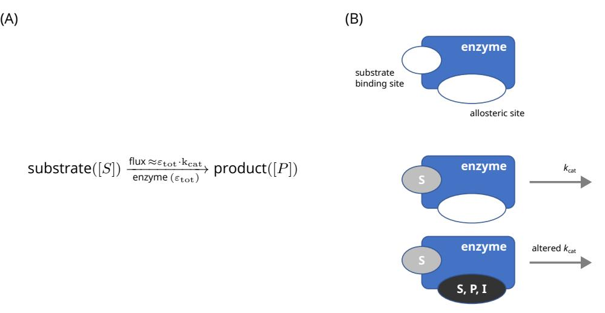

Figure 3.7: Enzymes and flux regulation. (A) Schematic representation of a biochemical reaction, highlighting the involvement of a catalyzing enzyme. For such enzyme-catalyzed reactions, the flux has an upper limit relating to total enzyme concentration and kinetic parameters of the enzyme (see section [3.3](#page-47-0) and Appendix [A.2](#page-307-1) for enzyme catalyzed reaction rate models). (B) Cartoon representation of enzyme structure and possible mechanisms of allosteric or competitive regulation. Such regulation can emerge either by the substrate of the enzyme or other metabolites binding the enzyme and altering its overall reaction rate (either through competition with the substrate or by altering the enzyme structure and affecting its kinetic parameters).

will touch upon in this and other chapters are: flux regulation through control of enzyme levels or enzyme activity. The former is achieved via control of an enzymes' expression level, while the latter can be achieved via substrate-level allosteric regulation (Fig. [3.7)](#page-47-1). Notice that the latter case involves regulation of enzyme activity by metabolites, thereby providing a 'dynamical regulation' that does not require additional elements (such as gene regulatory factors). Additional examples of such dynamical regulation, which is sometimes referred to as 'self-regulation', can also emerge from specific pathway structures and are being proposed and explored continually, e.g. [\[70,](#page-257-0) [76,](#page-257-6) [73,](#page-257-3) [77\]](#page-257-7). We will discuss this topic further in the section [3.4.](#page-54-0)

## <span id="page-47-0"></span>**3.3 Toolbox for modeling dynamics of metabolism**

As explained so far in this chapter, cell metabolism involves biochemical reactions involving metabolites (and often catalyzed by enzymes). Thus, understanding metabolism involves studying the dynamics of this system, trying to predict how metabolite levels will go up or down, or settle to a steady state as cell physiology changes in response to external or internal processes (e.g. cells encountering glucose or undergoing division). Obtaining such understanding requires us to develop models of biochemical reaction systems and predict the 'dynamics' of those systems. In this section, we will learn how to model one biochemical reaction, and how we can readily expand these models to capture multi-reaction systems. The 'art' of developing and analyzing dynamical models falls under the branch of mathematics known as calculus and nonlinear dynamics. Many introductory books to these subjects are available, but we find that two particularly useful ones are those by Silvanus Thompson on calculus [\[84\]](#page-257-14) and by Steven Strogatz on nonlinear dynamics [\[85\]](#page-257-15). Here, we will not re-introduce these topics but focus solely on various reaction rate models for metabolic systems that have been developed based on ODEs. We will highlight relations between these models and reaction thermodynamics and explore their possible limitations and applications in different cases. There are also books that are solely dedicated to models of biochemical reaction kinetics and enzyme kinetics more broadly - the reader is advised to further explore the topic with the help of such books, particularly [\[92,](#page-258-5) [93,](#page-258-6) [94\]](#page-258-7)

### <span id="page-48-3"></span><span id="page-48-0"></span>**3.3.1 Enzymes - a brief note**

We mentioned many biochemical reactions to be catalyzed by enzymes. It is therefore worth briefly explaining enzymes. Enzymes are proteins, chains of amino acids, that fold in the cell in various 3D structures. For our purposes, we do not need to understand all the intricacies of how enzymes are made or how they fold into their structures (the reader is directed to excellent books on these subjects [\[92,](#page-258-5) [95\]](#page-258-8)). Suffice to say that in their folded-state, enzymes can bind a set of target metabolites in such a way that puts these metabolites in a specific physio-chemical environment and physical orientation, where their specific biochemical reaction is facilitated. Thus, enzymes are catalysts that facilitate a chemical reaction among metabolites. As we will discuss further below, modeling of biochemical reactions catalyzed by enzymes requires developing a 'mechanistic' picture of how enzymes function. Such models can be developed based on numerous studies on enzyme structure and function. Here, we will only state that a generally accepted model involves enzymes binding their substrates - thereby forming a enzyme-substrate complex - and then transitioning to a state enabling catalysis. We can expand this model by also considering so-called allosteric binding sites, where specific molecules (including sometimes the enzyme's own substrate or product) can bind and alter the kinetics of either enzyme-substrate binding or catalytic activity. These allosteric sites, thus, provide a mechanism for regulation of enzymatic reactions (Fig. [3.7)](#page-47-1).

### <span id="page-48-1"></span>**3.3.2 Modeling reaction fluxes - reaction rate models**

Metabolic reactions can involve diverse biophysical mechanisms (uncatalyzed, enzyme-catalyzed, etc.) and can take place under diverse biophysical conditions inside a cell (membrane-bound, cytosolic, extracellular, coupled across membranes, etc.). As such, mechanistically complete, biophysical representation of all metabolic reactions in dynamic, mathematical models might never be possible [\[96\]](#page-258-9). Dynamical models of metabolic systems, as with all mathematical models, must therefore balance abstraction of real mechanistic features of a system with achieving a still useful and insight-providing model. At the core of all dynamical metabolic models are rate equations that aim to capture the kinetics of biochemical reactions.

**Non-enzymatic reactions - The reversible and irreversible mass action rate models** All rate models used in metabolic modeling are based on the so-called 'mass action law' described in Box [3.D](#page-44-0) above. As discussed in that section, the "mass action law", which is derived from thermodynamic principles, is compatible with a rate model that assumes reaction rate of a chemical reaction at constant temperature to be 'proportional to the product of the concentrations of the reacting substances' [\[83,](#page-257-13) [82\]](#page-257-12) (see Box [3.D)](#page-44-0). This 'mass action rate model' is commonly used, especially in the context of elementary reactions (i.e. reactions involving one single step), and has been shown empirically to apply in the case of some non-elementary reactions [\[82\]](#page-257-12). According to the mass action model, the net rate of any reaction of the form given in Eq. [(3.1)](#page-42-3) is given by;

<span id="page-48-2"></span>
$$v = k_{+} \cdot a^{\nu_{a}} \cdot b^{\nu_{b}} - k_{-} \cdot c^{\nu_{c}} \cdot d^{\nu_{d}},\tag{3.10}$$

where small letters denote concentration of the relevant species of the same letter, *νi* denote the stoichiometric coefficient for species *i* (as introduced above), and *k*+ and *k*− denote kinetic rate constants relating substrate concentrations to reaction rate.

The mass action rate expression is such that if the first term is larger than the second then *v >* 0, and more reactant will convert to product than product converting to reactant (Box [3.D)](#page-44-0). This situation will continue until some point, where the second term will be larger than the first, and the opposite will occur. Consequently, this expression makes the system converge towards an equilibrium point, or steady-state, where *v* = 0. As long as the reagents are free to move, they will collide and interconvert (in both directions) at the microscopic level, even when the equilibrium is reached. However, at equilibrium, the amount of reactant converting to product equals the amount of product converting to reactant per unit of time, therefore there is no net consumption and production of metabolites (Box [3.D)](#page-44-0). When we have the concentrations that lead to the <span id="page-49-3"></span>thermodynamic equilibrium of the reaction, i.e. equilibrium concentrations, we will have;

$$\begin{aligned} v &= 0 = k_+ \cdot a^{\nu_a} \cdot b^{\nu_b} - k_- \cdot c^{\nu_c} \cdot d^{\nu_d} \\ \frac{k_+}{k_-} &= \frac{c^{\nu_c} \cdot d^{\nu_d}}{a^{\nu_a} \cdot b^{\nu_b}} \end{aligned}$$

This ratio is known as the reaction's equilibrium constant *K*eq and hence the 'mass action rate model' is consistent with the empirical observations of Waage and Guldberg. As we have shown in Eq. [(3.4)](#page-43-2) above, the equilibrium constant is equivalent to the reaction's Gibbs free energy under standard conditions. Note that when considering a biochemical system (rather than a chemical one), it is customary to report Gibbs free energies for standard conditions adjusted for a pH of 7, and denoted with superscript ◦ 0 . Thus, we can write;

$$\frac{k_+}{k_-} = K_{\rm eq} = e^{-\frac{\Delta G^{\prime \rm o}}{R \cdot T}} \tag{3.11}$$

<span id="page-49-2"></span>where ∆*G* 0◦ is the Gibbs free energy under biological standard conditions, and *R* and *T* denote the molar gas constant[1](#page-49-0) and temperature (in Kelvin) respectively (see Box [3.D)](#page-44-0). It is important to note here that, given *K*eq is a constant determined by thermodynamics, the parameters *k*+ and *k*− cannot be chosen independently, i..e *k*− = *K*eq*/k*+.

Following on from this last point, it is important to consider a reaction with large *K*eq, i.e. a reaction for which ∆*G* 0◦ is highly negative. In this case, the value of *k*− can become small to the extent that the reverse reaction can be negligible. In this case the reaction could be considered as effectively irreversible and the rate model can be approximated by;

<span id="page-49-1"></span>
$$v = k_{+} \cdot a^{\nu_{a}} \cdot b^{\nu_{b}} \tag{3.12}$$

**Enzymatic reactions** The mass action rate discussed above forms also the basis of modeling enzymatic reactions. This approach is justified by considering each enzymatic reaction as a series of 'elementary steps', each obeying the mass action rate model. To this end, many alternative elementary steps, or 'enzyme mechanisms', can be considered to 'capture' an enzymatic reaction and subsequently many alternative assumptions can be made to simplify the resulting system of steps. It is also possible to include allosteric regulation or other types of inhibition or activation steps within these elementary steps, allowing generation of a rich variety of enzymatic models and rate equations. Here, we will cover some of the most common of such models, noticing that the construction of these models follows the same general principles of (i) drawing up elementary reactions, (ii) writing down mass action based kinetic rates for the system, and (iii) simplifying the system with assumptions on kinetic parameters (see Appendix [A.1)](#page-302-1). The reader can consult additional books (e.g. [\[93\]](#page-258-6)) for more specific, elaborate enzymatic reaction schemes, or can attempt them as a exercise.

**Single substrate, irreversible enzymatic rate model (Michaelis-Menten model)** A possible representation of an enzyme mediated reaction consisting in the conversion of a reactant S to a product P could be the following reaction scheme:

$$\rm S + E \xrightarrow[\frac{\rm k_1}{\rm k_2}]{\rm k_1} ES \xrightarrow[\rm k_2]{\rm k_{cat}} P + E.$$

This reaction scheme is rather specific, for example, it ignores the possibility that substrate bound enzyme can be converted into product, while remaining bound on the enzyme. Thus, the above reaction scheme is derived from a more complete and more complex reaction scheme through application of several assumptions relating to individual reactions. The resulting rate model from the above scheme is usually known as the Michaelis-Menten model, named after the biochemists Leonor Michaelis and Maud Menten who studied enzyme kinetics in the early 1900's, but several studies of that time and afterwards arrived at a similar model using different assumptions. Implementation of the specific assumptions, as we detailed in Appendix [A.2,](#page-307-1) allows one to arrive at the above reaction system, which can be represented by a reduced ODE system,

<span id="page-49-0"></span><sup>1</sup>The *molar gas constant* (also known simply as the *gas constant*) is the molar equivalent to the Boltzmann constant, expressed in units of energy per temperature increment per amount of substance (quantified in moles rather than single particles). Its value is about 8*.*31 J · K −1 · mol−1 .

<span id="page-50-2"></span><span id="page-50-0"></span>

Figure 3.8: Michaelis-Menten rate law. The x- and y-axis show the substrate concentration (normalized by *K*M) and reaction flux (normalized by *v*max) respectively. The dashed horizontal line corresponds to *v*max, i.e. *ε*tot · *k*cat.

compared to the full system. In this reduced ODE system, the ODE describing the rate of formation of the product, which is equivalent to reaction rate, becomes:

<span id="page-50-1"></span>
$$v = \frac{s \cdot \varepsilon_{\text{tot}} \cdot k_{\text{cat}}}{K_{\text{M}} + s} \tag{3.13}$$

where *ε*tot represents the total enzyme concentration, *k*cat is known as the catalytic rate of an enzyme, and *K*M is known as the Michaelis-Menten coefficient of the enzyme and is equal to (*k*2 + *k*cat)*/k*1 (we note that depending on the assumptions used, the expression for *K*M can vary). Plotting the above rate of formation of product against increasing substrate concentration (see Figure [3.8)](#page-50-0) shows that the rate is a 'saturating function' of substrate, i.e. the rate approaches a threshold point - given by *v*max = *ε*tot · *k*cat as substrate concentration increases. Thus, we can see that the enzymatic nature of the reaction introduces a limiting factor on the reaction rate that depends on *v*max, i.e. total enzyme concentration and enzyme's catalytic rate. This fact underpins the regulation of metabolic flux through regulation of enzyme levels or enzyme's catalytic rate, and is a key conceptual point for the constraint-based methods discussed later in this book.

**Single substrate, reversible enzymatic rate model (Haldane model)** Considering that all chemical reactions are — at least, in theory — reversible, it is also possible to express the rate of an enzyme-mediated reaction as a function of the concentration of both substrate and product. A method to do so has been introduced by Haldane [\[97\]](#page-258-10). It considers the following reaction scheme:

$$\text{S} + \text{E} \xrightleftharpoons[\text{k}_{\text{k}_2}] \text{ES} \xrightleftharpoons[\text{k}_{\text{k}_4}] \text{EP} \xrightleftharpoons[\text{k}_{\text{k}_6}] \text{P} + \text{E}.$$

Deriving the rate equation for this reaction scheme is slightly more involved, but it follows the same strategy as explained above, of creating elementary steps, treating them as obeying mass action rate, and making additional simplifying assumptions. As shown in Appendix [A.1,](#page-302-1) we can follow this strategy to derive the reversible rate equation as follows:

$$v = \varepsilon_{\rm tot} \cdot \frac{k_{\rm cat}^{+}}{K_{\rm S}} \cdot \frac{s - p \cdot \frac{k_{\rm cat}^{-} / K_{\rm P}}{k_{\rm cat}^{+} / K_{\rm S}}}{1 + \frac{p}{K_{\rm P}} + \frac{s}{K_{\rm S}}}\tag{3.14}$$

where *K*S and *K*P are composite constants relating to the substrate and product binding to the enzyme, and *k* + cat and *k* − cat are Haldane coefficients (again, composite parameters of other kinetic constants) describing catalytic rate of the enzyme (see Appendix [A.1](#page-302-1) for further details of these parameters).

As done in the above section on kinetics of the non-enzymatic reversible reaction, we can consider the equilibrium condition for this enzymatic reversible reaction. This would allow us to derive the corresponding relation between *K*eq and reaction Gibbs free energy. Recognizing the relation between the Haldane composite parameters and *K*eq (see Appendix [A.1)](#page-302-1) and the flux-force relation (see below), we can then re-formulate the reversible rate equation as:

<span id="page-51-1"></span>
$$v = \varepsilon_{\text{tot}} \cdot k_{\text{cat}}^{+} \cdot \frac{s/K_{\text{S}}}{1 + p/K_{\text{P}} + s/K_{\text{S}}} \cdot \left(1 - e^{\frac{\Delta G_{r}^{\prime}}{R \cdot T}}\right) \tag{3.15}$$

where ∆*G* 0 *r* is the Gibbs free energy of reaction for a given substrate and product levels under biological conditions and considering the forward direction of the reaction. This rate equation shows that forward reaction rate will be independent of thermodynamics, when the reaction free energy is highly negative (i.e. when the reaction is far from thermodynamic equilibrium, ∆*G* 0 *r* 0). However, as the reaction Gibbs free energy gets close to zero, the reaction rate will decrease, and as such, there will be a dependency of reaction rate to reaction free energy.

Another way of writing equation [3.15](#page-51-1) is this one:

$$v = \varepsilon_{\rm tot} \cdot k_{\rm cat}^{+} \cdot \frac{s/K_{\rm S} \cdot \left(1 - e^{\frac{\Delta G_{r}^{\prime}}{RT}}\right)}{1 + s/K_{\rm S} \cdot \left(1 + \frac{k_{\rm cat}^{+}}{k_{\rm cat}^{-}} \cdot e^{\frac{\Delta G_{r}^{\prime}}{RT}}\right)}\tag{3.16}$$

where we replace *p/K*P with an expression that depends on *s* and ∆*G* 0 *r*. This alternative expression, developed in the context of modeling microbial metabolism [\[98,](#page-258-11) [99\]](#page-258-12), can be useful because it shows us that when the reaction is far from equilibrium (∆*G* 0 *r* 0), the term *e* ∆*G*0 *r /*(*R*·*T* ) will approach zero and the above formula can be approximated by the irreversible Michaelis-Menten rate law (Equation [3.13)](#page-50-1). In this case, we further notice that the Haldane coefficient *Ks* becomes equivalent to *K*M introduced above in the irreversible reaction scheme (see section [3.3.2)](#page-49-1).

It is important to note that many reactions within cell metabolism are experimentally shown to be reversible, indicating that they operate close to thermodynamic equilibrium [\[8,](#page-252-8) [100,](#page-258-13) [80\]](#page-257-10).

**Rate models for representing allosteric effects** Rate models for representing allosteric effects, i.e. binding of additional molecules - or their own substrates - on the enzyme and affecting the enzyme-mediated reaction rate, can be created either by adjusting the rate laws given above empirically, or by considering the additional binding events at 'allosteric sites' of the enzyme and deriving a new 'mechanistic' rate model. To give an example of the former strategy, we can consider a Michaelis-Menten rate model adjusted for an inhibitory effect of the substrate on the enzymatic reaction rate. This adjusted rate model can be expressed as:

<span id="page-51-0"></span>
$$v = \frac{v_{\text{max}} \cdot s}{K_{\text{M}} + s + s^2/K_{\text{I}}} \tag{3.17}$$

where *K*I represents the saturation coefficient for the binding of the substrate at an allosteric site on the enzyme. Notice that we used such a model in the small multi-stable system example introduced above (section [3.2.4)](#page-46-0) and discussed in Appendix [A.2.](#page-307-1)

For the same example, the alternative approach (the latter case mentioned above) would be to develop a mechanistic model involving multiple binding reaction on an enzyme. The resulting elementary reactions and their mass action implementation can be then carried out. This process would result in a set of ODEs, which can then be further simplified to draw a rate model for the proposed allosteric regulation. An example of this type model is developed in the context of multi-substrate binding enzymes, and shown to lead to multi-stability under certain parameter conditions [\[101\]](#page-258-14).

<span id="page-52-0"></span>

Figure 3.9: The ratio of net forward flux (*J*) to forward reaction rate (*v*+) as a function of the negative reaction Gibbs free energy

**Flux-force relationship** All chemical reactions, including biochemical reactions, must obey thermodynamic laws. This fact manifests itself in several ways in dynamical modeling. Firstly, reaction direction (or, rather, feasibility) is determined by the sign of the reaction Gibbs free energy. Second, the kinetic constants associated with the elemental reaction steps are constrained by thermodynamics (section [3.3)](#page-47-0). To see the third relation arising from thermodynamics, we consider again the simple non-enzymatic mass action model we used above – reaction schematic given in Eq. [(3.1)](#page-42-3) and the reaction Gibbs free energy given by Eq. [(3.2)](#page-42-2).

We now re-consider the net rate of reaction as given above in Eq. [(3.10)](#page-48-2), and break this into its components of forward reaction rate (or flux) and reverse reaction rate (or flux), which are given by;

$$v_{+} = k_{+} \cdot a^{\nu_{a}} \cdot b^{\nu_{b}}$$

$$v_{-} = k_{-} \cdot c^{\nu_{c}} \cdot d^{\nu_{d}}$$

and then, we can express the net forward flux (*J*) as:

$$J = v_{+} - v_{-} = v_{+} \cdot \left(1 - \frac{v_{-}}{v_{+}}\right) = v_{+} \cdot \left(1 - \frac{k_{-} \cdot c^{\nu_{c}} \cdot d^{\nu_{d}}}{k_{+} \cdot a^{\nu_{a}} \cdot b^{\nu_{b}}}\right) = v_{+} \cdot \left(1 - \frac{k_{-}}{k_{+}} \cdot \Gamma\right)$$

In this re-organized form of the net forward flux, we notice that the expression in parentheses on the right hand side can be re-expressed in terms of reaction free energy (using Eq. [(3.11)](#page-49-2)) as follows:

$$J = v_+ \cdot \left(1 - \frac{k_-}{k_+} \cdot \Gamma \right) = v_+ \cdot \left(1 - \frac{\Gamma}{K_{\text{eq}}} \right) = v_+ \cdot \left(1 - e^{\frac{\Delta G_r'}{K \cdot T}} \right)$$

Thus, we find that the net forward flux of the reaction is given by the forward reaction rate multiplied by a thermodynamic factor. When the reaction is energetically favored, i.e. has large negative Gibbs free energy, the thermodynamic factor diminishes and the net forward flux is fully determined by forward reaction rate alone (see Figure [3.9)](#page-52-0). When the reaction is closer to equilibrium, i.e. small negative or near-zero Gibbs free energy, then the net forward flux will be determined by a combination of forward and reverse flux rates. This relation between net forward flux and thermodynamics is referred to as the flux-force relation [\[88,](#page-258-1) [102\]](#page-258-15) and holds also for the enzymatic reversible reaction model described above (see section [3.3.2)](#page-50-0).

**A note on choosing a reaction rate model** In the above sections, we have introduced several biochemical reaction rate models. These models fall into two main categories, namely those that model enzyme action (i.e. enzymatic models) and those that ignore the enzyme action (i.e. non-enzymatic models). Notice that derivation of both categories of models rely on the mass action law. In the non-enzymatic case, we model reactions as single-step forward and backward reactions using mass action, while in the enzymatic case, we consider multi-step reaction mechanisms, but still use the mass action for each individual step. For each category, we can consider the reaction thermodynamics and model reactions as reversible, but – as we discussed above – we can also choose to approximate reactions as 'irreversible' when the overall reaction's Gibbs free energy is very negative (i.e. when *K*eq is large).

In a given modeling context and metabolic system, it would be a valid question to ask – which model should one use? This question can be answered in parts. In the first instance, we can make a decision about the use of reversible or irreversible rate models. As already mentioned, this decision should be based on the value of *K*eq – a reaction with a very large *K*eq can be modeled as irreversible, as long as the product concentrations are known not to reach very high levels (in a cell). However, to represent a metabolic reaction as irreversible is not without consequences even if the reaction always runs in the same direction (notice that the assumption of irreversible reaction means that the reaction rate cannot go negative). Reversible kinetics can capture the negative feedback of reaction products on reaction rate, and irreversible reaction models would lose this feature [\[103\]](#page-258-16). A recent study by Shen et al [\[104\]](#page-259-0) showed how important it can be to include product inhibition to create a predictive metabolic model.

In the case of lower *K*eq value – in combination with a consideration of possible product concentration – the modeler should opt for the reversible rate models, which are thermodynamically consistent. The decision about use of enzymatic or non-enzymatic reaction models can be made in a practical manner. If the enzyme associated with the modeled reaction has measured kinetic rates, it would be sensible to opt for a enzymatic model (noting that *in vivo* enzyme kinetics might differ from those measured *in vitro* and that many enzyme kinetics studies use parameter derivations assuming an irreversible Michaelis-Menten model). Consequently, it may not be possible to find all the required parameters in the literature, so to model a reaction using reversible rate model. In the absence of measured enzyme parameters, the modeler can use 'guesstimated' parameters, based – for example – on the distribution of known enzyme kinetic parameters, or alternatively, use the non-enzymatic model.

Given the discussion in the preceding paragraph, it is a useful exercise to consider when the non-enzymatic and enzymatic models might behave in the same way. We have introduced above the concept of flux-force relationship, where we have shown that the net flux in a reversible reaction would be given by the forward flux multiplied by a thermodynamic factor:

$$J = v_+ \cdot \left(1 - \frac{\Gamma}{K_{\text{eq}}}\right)^2$$

If we consider this equation for the reversible non-enzymatic and enzymatic models, we would notice that the thermodynamic factor would show the same behavior for both models, depending only on reaction *K*eq value and substrate and product concentrations. Where the models would differ, would be in the behavior of the *v*+ term, which takes the form:

For the reversible enzymatic case:

$$v_{\text{+}} = \varepsilon_{\text{tot}} \cdot k_{\text{cat}}^{\text{+}} \cdot (s/K_{\text{S}})/(1 + s/K_{\text{S}} + p/K_{\text{P}})$$

And, for the reversible non-enzymatic case:

$$v_{+} = s \cdot k_{+}$$

Where *k*cat, *K*S, and *K*P are the enzyme kinetic parameters for the enzymatic model and *k*+ is the forward reaction rate coefficient for the non-enzymatic model. Thus, the two models would behave in a similar way, when there is correspondence between these two terms, which are sometimes referred to as "saturation terms" [\[102\]](#page-258-15). By re-arranging the above terms, we can show that correspondence between the two models <span id="page-54-2"></span>can be expressed as:

$$
\varepsilon_{\rm tot} \cdot k_{\rm cat}^{+} \cdot (1/K_{\rm S})/(1 + s/K_{\rm S} + p/K_{\rm P}) \approx k_{+}.
$$

We can see that in the regime, where *s K*S and *p K*P, both models would behave in a linear fashion and their behavior would correspond exactly with the right choice of parameters (i.e. assuming (*ε*tot · *k* + cat*/K*S) = *k*+). Outside of this regime, correspondence would be dependent on both parameters and concentration of *S* and *P*. One interesting case to consider is when total amount of *S* and *P* would be conserved, for example, with cycling reaction schemes. In this case, we can introduce a new parameter *C* to describe the total pool of the cycled metabolite (e.g. *C* = *S* + *P*) and the correspondence would be expressed as:

$$(\varepsilon_{\rm tot} \cdot k_{\rm cat}^{+} / K_{\rm S}) / (1 + (s \cdot K_{\rm S} - s \cdot K_{\rm P}) / (K_{\rm S} \cdot K_{\rm P}) + C / K_{\rm P}) \approx k_{+}$$

Thus, in this case of the sum of substrate and product concentrations being conserved, we can have correspondence between the non-enzymatic and enzymatic models when *S* is small or when *K*S = *K*P.

# <span id="page-54-0"></span>**3.4 Dynamics of metabolism: experimental evidence and modelbased explanations**

The high-level of connectivity among reactions, together with the plurality of molecular level mechanisms that can arise in enzyme-mediated reactions, gives metabolic systems the capacity to display rich dynamic behaviors [\[73,](#page-257-3) [89\]](#page-258-2). Here, we highlight some of the illustrative experimental observations on these metabolic dynamics, and their possible model-based explanations.

### <span id="page-54-1"></span>**3.4.1 Flux switching / regulation**

We have introduced above the redox-based, electron flow view of metabolism. A common electron donor in metabolism is glucose, while a common electron acceptor is oxygen together with the associated, membranebound electron transport chain (ETC). The ensuing metabolic pathway linking glucose oxidation to oxygen reduction is termed as 'respiration', resulting in formation of CO2 (from full oxidation of glucose) and water (from reduction of oxygen, cf. Fig. [3.1)](#page-38-0). However, it is possible for cell metabolism to stop the sequential oxidation of glucose (or other sugars) at an intermediate level. In this case, the ensuing metabolism is termed as 'fermentation' due to production of partially oxidized carbon compounds such as acetate and ethanol (Fig. [3.10)](#page-55-0) [\[63\]](#page-256-8).

One of the earliest observation on metabolic dynamics is a shift from pure respiration into fermentation or respiro-fermentation with changing conditions. This shift, known as contre-Pasteur, Warburg, or, Crabtree effect, is described initially in yeast and mammalian cells, especially cancerous cells [\[105\]](#page-259-1). The respiration to fermentation shift happens under lack of electron acceptors or with increasing growth rate [\[105,](#page-259-1) [106,](#page-259-2) [107,](#page-259-3) [108,](#page-259-4) [109,](#page-259-5) [110,](#page-259-6) [111\]](#page-259-7). While a shift into fermentative pathways due to lack of electron acceptors can be intuitively understood as the only route to sustain electron flow, a similar shift due to increased carbon availability or growth rate are non-intuitive as they occur under the continued presence of strong electron acceptors such as oxygen.

A dominant concept to explain the switch to respiro-fermentation has been the idea of 'overflow metabolism'. It postulates that this switch should be seen as an overflow, arising due to limitations in respiration not being sufficient in sustaining metabolic fluxes in the face of increasing substrate availability [\[112\]](#page-259-8). The dynamic regulation and origin of this respiro-fermentation switch is still a focus of significant systems biology research. Hence, this topic is discussed further in other chapters of this book with several alternative models presented for its underlying causes.

It must also be noted that, while respiro-fermentation switch is commonly referred to as 'overflow metabolism'

<span id="page-55-0"></span>

Figure 3.10: Respiration-fermentation switch. Cartoon representation of the respiration and fermentation pathways. There is an observed switch of metabolic fluxes between these pathways, from full respiration to fermentation or a combination of respiration and fermentation, as glucose levels (and consequently growth rate) increases. It is postulated that this relates to a limitation in the respiration and ETC system, but the molecular basis of the switch is not fully clear with several, equally plausible hypotheses postulated.

(due to excretion of fermentation products such as acetate, lactate and ethanol), the phenomenon of overflow, i.e. excretion of energy rich compounds is not limited to fermentation. Excretion of amino acids and vitamins seem particularly common [\[113,](#page-259-9) [114,](#page-259-10) [115,](#page-259-11) [116\]](#page-259-12), and it is not clear in these cases what type of metabolic flux switching happens or how it happens.

**Flux switching / regulation - flux sensors, branch point dynamics and dynamical flux regulation** How can we understand cells switching their metabolic fluxes with changing external or internal conditions. As discussed above, one possibility is that cells alter the expression levels of their various enzymes, so to achieve a re-distribution of fluxes (given that enzyme levels are directly involved in the determination of fluxes, see Eq. [(3.13)](#page-50-1)). This kind of enzyme-level regulation can be mediated through regulation of transcription factors by specific signaling molecules, including metabolites [\[117\]](#page-259-13). The latter case is explored in models of central metabolism [\[118\]](#page-260-0), and it was shown that fructose-1,6-bisphosphate could act as a "flux sensor", conveying information about glycolsyis flux onto key transcription factors regulating glycolytic enzymes [\[119\]](#page-260-1).

While regulation of enzyme levels can alter flux levels, this type of regulation can be made more sensitive if the coupling between enzyme and flux levels can be made more nonlinear. It has been shown that such nonlinear coupling of flux and enzyme levels can arise at branching points in metabolism [\[71\]](#page-257-1). In particular, branch points (as a metabolic motif) have been shown to give rise to ultrasensitivity - a system dynamics feature that describes the situation when a given input to a system results in more than a proportional change in its output. When enzymes at the two branches of a branching point have highly differing affinities for the substrate (i.e. different *Km* values, see Eq. [(3.13)](#page-50-1)), then alterations of the maximal rate of one enzyme with higher affinity to the substrate can result in a nonlinear effect on the flux into the other branch of the branching point [\[71\]](#page-257-1). Thus, branching points can be one structural motif that can result in switch-like, nonlinear flux changes within metabolism.

It is clear that changing of enzyme levels can regulate fluxes, and can do so in an abrupt, switch-like fashion through structural motifs such as branching points. However, regulation of enzyme levels via transcription factors is found to not capture all observed flux changes in experiments (e.g. [\[120,](#page-260-2) [121\]](#page-260-3)). This suggests that cells might be able to regulate fluxes by other means as well. Recently, one such possible mechanisms is proposed to be the co-substrate pools [\[77\]](#page-257-7). For example, in a metabolic branch point, where the two branches <span id="page-56-2"></span>involve different co-substrates, regulating the pool sizes of those two co-substrates can induce flux switching at the branch point.

### <span id="page-56-0"></span>**3.4.2 Bistability**

Bistability is introduced above, and refers to a dynamical system having three steady state, two of which are dynamically stable and can be attained by the system. When bistable systems exist in cell metabolism, their combination with population level variance (i.e. noise) in enzyme levels or activity can lead to bimodal distribution of metabolic fluxes (i.e phenotypes) in isogenic population of cells. In this context, it is notable that significant level of variance is seen in several metabolic parameters, including sugar uptake [\[122,](#page-260-4) [123\]](#page-260-5), ATP levels [\[124\]](#page-260-6), and expression levels of the enzymes involved in glycolysis and the TCA cycle [\[91\]](#page-258-4).

Bistability in metabolic responses is experimentally implicated in the context of respiration to fermentation switch [\[125\]](#page-260-7), and when carbon metabolism is initiated on glucose [\[126\]](#page-260-8) or when it switches from glucose to other carbon sources [\[127,](#page-260-9) [90,](#page-258-3) [128\]](#page-260-10). In particular, the latter studies found sub-populations, within isogenic populations (i.e. no mutations), that show different metabolic responses to changing conditions. Experiments with isotope labeled carbon indicated that these sub-populations emerged at the time of the shift in carbon source is induced, i.e. in response to changing conditions, and in a manner dependent on the concentration of the new carbon source [\[127\]](#page-260-9). This suggests that the metabolic system implements bistable dynamics, such that changes in external glucose concentrations can lead some cells to shift to a new metabolic steady-state flux distribution, while others remain at their original steady state.

**Bistability - negative feedback via substrate inhibition** There have been many theoretical studies indicating the possibility of bistability within simple enzymatic reaction systems. Bistability is shown to be possible even in a single enzymatic reaction, involving allosteric regulation, or in a system of few coupled enzymatic reactions [\[73,](#page-257-3) [89\]](#page-258-2). A particular 'reaction motif' that has been studied extensively is a two-enzyme cyclic reaction system, where a substrate is converted into a product and then back again, with both forward and backward reactions usually involving different enzymes (see Fig. [3.11)](#page-57-0). It is common, in these models, that the enzyme catalyzing the forward reaction is assumed to be regulated by substrate inhibition, or by substrate inhibition coupled with product activation [\[129,](#page-260-11) [130,](#page-260-12) [131,](#page-260-13) [132,](#page-261-0) [133\]](#page-261-1). This motif is found in several locations within metabolism, particularly around dehydrogenases, such as lactate dehydrogenase [\[131\]](#page-260-13), and kinase/ phosphatase pairs, such as those involved around fructose-6-phosphate [\[134\]](#page-261-2), that can convert different metabolites back and forth, using the NAD+/NADH or ADP/ATP pairs as reaction partners.

These theoretical findings are supported by several *in vitro* re-constitution experiments that confirmed bistability experimentally using enzyme preparations of pyruvate kinase, lactate dehydrogenase, and isocitrate dehydrogenase enzymes and their corresponding partners resulting in cyclic reaction schemes [\[130,](#page-260-12) [131,](#page-260-13) [135\]](#page-261-3).

It is notable that many of these models incorporated negative feedback via empirical alteration of a Michaelis-Menten type reaction rate model (i.e. one of the approaches we mentioned in the paragraph above on allosteric rate models, see [3.17)](#page-51-0). This raises the question about the actual biochemical mechanisms that can lead to bistability in a enzyme-mediated reaction model. In a recent study, it was shown that the presence of multiple enzyme-substrate complexes, as would be the case in an enzyme with multiple substrate binding sites, creates a potential in the reaction system for bistability [\[101\]](#page-258-14) (see Fig. [3.11)](#page-57-0). Thus, multi-site enzymes could be points of multistability generation in metabolic systems and any larger models featuring such enzymes or inherently including feedback regulation can demonstrate bistability (e.g [\[136\]](#page-261-4)).

### <span id="page-56-1"></span>**3.4.3 Oscillations**

Sustained and damped oscillations are common dynamics in nonlinear systems and can arise from a combination of positive and negative feedbacks [\[85\]](#page-257-15). In metabolic systems both types of oscillations are seen *in vivo* or *in situ*, with cell extracts, where concentrations of all observed metabolites are found to oscillate over time [\[137,](#page-261-5) [138,](#page-261-6) [139,](#page-261-7) [140,](#page-261-8) [141,](#page-261-9) [142,](#page-261-10) [143,](#page-261-11) [144,](#page-261-12) [145,](#page-261-13) [146,](#page-261-14) [147\]](#page-261-15). In the case of experiments involving cell extracts,

### <span id="page-57-1"></span><span id="page-57-0"></span>(A) Allosteric enzyme model


At steady state:

$$\underbrace{\frac{V_1 \cdot [S]}{K_1 + [S] + [S]^2 / K_3}}_{\text{P production}} = \underbrace{\frac{V_2 \cdot (C - [S])}{K_2 + (C - [S])} + \alpha \cdot (S_0 - [S])}_{\text{P consumption}}$$

(B) Multi-site enzyme model


Figure 3.11: Cartoon representations and brief analysis results of two enzymatic models capable of bistability. (A) Allosteric enzyme model. The first model considers an enzyme that can convert a substrate (S) into a product (P) and that is allosterically regulated by its own substrate. This regulation takes the form of inhibition and is implemented mathematically in the rate of the enzyme - black colored equation. This model results in a nonlinear curve for the relation between rate of production of P at steady state and the total concentration of substrate and product in the system, *Stot* (black curve on the top right panel). The intersections of this curve with the linear curve for the relation between rate of consumption of P at steady state and *Stot* (red curve on top right panel). We can see that the model is capable of resulting in three intersections, i.e. three steady states of the system. (B) Multi-site enzyme model. The second model considers instead of allostery, an enzyme that binds multiple substrates. This results in several enzyme-substrate complexes depending on the number of binding sites - 3 sites in the model shown. The resulting model can be solved for the steady state values of flux through each enzyme complex against *Stot* (shown in red and blue colors on the bottom right panel). The sum of these gives the rate of production of P at steady state (black curve on the bottom right panel). This model can also result in a non-linear production curve and three steady states. For further discussion of these models, see relevant citations.

these metabolite oscillations had a period ranging from few to tens of minutes [\[145,](#page-261-13) [146,](#page-261-14) [147\]](#page-261-15). In these experiments, oscillations are verified not to be due to artificial changes in ATP dynamics arising in the cell extract preparations [\[146\]](#page-261-14), and oscillations could be entrained by controlled glucose additions [\[145\]](#page-261-13). This shows that there is an inherent ability for oscillatory dynamics in the underpinning enzymatic reaction system. This ability is suggested to be linked to the enzyme phosphofructokinase (PFK), which catalyzes the phosphorylation of fructose-6-phosphate into fructose-diphosphate in the glycolysis pathway and is allosterically regulated

### Concluding remarks 49

### [\[134\]](#page-261-2).

*In vivo*, oscillatory dynamics are observed to occur within the central carbon pathways and displaying a phase of tens of minutes [\[137\]](#page-261-5) up to several hours [\[142,](#page-261-10) [144\]](#page-261-12). Metabolic oscillations were demonstrated at single cell level and are found to be autonomous of, but coupled with, the cell cycle oscillations [\[144\]](#page-261-12). Additional studies across cell populations found that cells can synchronize metabolic oscillations under some conditions [\[137,](#page-261-5) [138\]](#page-261-6), and proposed several possible mediators for such synchronization, including acetaldehyde, hydrogen sulphide, carbon dioxide, and media pH [\[139,](#page-261-7) [140,](#page-261-8) [141,](#page-261-9) [143\]](#page-261-11).

**Oscillations - intertwined negative and positive feedbacks** Several mathematical models of the reaction catalyzed by the enzyme phosphofructokinase (PFK) in the glycolysis pathway has shown that oscillations are possible to arise from the dynamics of this reaction alone. These models incorporate some of the observed allosteric regulation of PFK both by its substrates and products, resulting in intertwined negative and positive feedbacks [\[148,](#page-262-0) [149,](#page-262-1) [150\]](#page-262-2).

It must be noted that some of these models, and others, use the same basic models that show bistable behavior (as discussed above) and extend them with in- and out-fluxes of involved metabolites, to display oscillations [\[148,](#page-262-0) [149,](#page-262-1) [132,](#page-261-0) [151,](#page-262-3) [152\]](#page-262-4). While these theoretical demonstrations of specific enzymatic schemes leading to oscillations have not been explored in detail experimentally, metabolic oscillations are readily observed both *in vivo* and *in vitro*, as discussed above. Models, involving some of these proposed synchronization molecules, were also developed [\[153,](#page-262-5) [154,](#page-262-6) [155\]](#page-262-7) and could reproduce experimental findings.

## <span id="page-58-0"></span>**3.5 Concluding remarks**

In this chapter, we set out to introduce cellular metabolism as a dynamical system. We have seen that metabolism comprises many biochemical reactions, that are historically cataloged and described into pathways. These pathways are usually not linear, composing of serial conversions of metabolites, but rather display branching points and inter-connections through metabolites participating in many reactions. This inter-connected nature of metabolic systems, together with the large numbers of participating metabolites and reactions, makes them a complex system to study and conceptualize.

We have introduced both simplified, coarse-grained viewpoints for describing metabolism, and mechanistic approaches for detailed dynamical modeling of it at the level of single reactions. The former can be used to guide specific ideas on how to study metabolism, or to develop analogies to other disciplines, while the latter can provide a toolbox for constructing dynamical models of small or large metabolic systems. We have provided specific examples of such dynamical models and shown how they can allow us to relate system behavior - steady state or temporal behavior - to specific reaction mechanisms or parameters (e.g. allosteric interactions between metabolites and enzymes, cyclic reaction schemes, branching points).

There are many challenges remaining in the analysis and understanding of metabolism as a dynamical system. Recent studies found for example that many fluxes, where measured, are lower than predicted from a enzymatic irreversible reaction rate model (introduced in Eq. [(3.13)](#page-50-1)) [\[31\]](#page-254-6), and changes in flux patterns with changing conditions cannot be explained by enzyme levels alone [\[121\]](#page-260-3). These findings lead to the question on what determines/limits reaction fluxes and how reaction fluxes are regulated besides regulation of enzyme levels. There are several possible answers, including effects relating to allosteric interactions between metabolites and enzymes, reaction thermodynamics, and substrate-related effects. The experimental study and model incorporation of these possibilities is ongoing in systems biology, with increasing interest to include also more of the physico-chemical aspects of the cellular environment into the study of metabolism such as diffusion of molecules, involvement of radical chemistry (especially generation of oxygen radicals in respiration) and membrane potential [\[156,](#page-262-8) [96\]](#page-258-9). As such, we are increasingly hoping to move from metabolic reactions studied in isolation, to cell-scale models and physico-chemical concepts that unite cell metabolism and physiology. Some of this emerging movement is captured in subsequent chapters of this book.

## **Recommended readings**

### **Enzyme kinetics and reaction models**

- "Enzymes" by J. B. S. Haldane [\[97\]](#page-258-10). Historically important book on enzyme kinetics and enzymatic reaction models.
- "Fundamentals of Enzyme Kinetics" by A. Cornish-Bowden [\[93\]](#page-258-6). General introductory book on enzymes and enzyme catalysis.
- "Enzyme Kinetics for Systems Biology" (2012) by H. M Sauro [\[94\]](#page-258-7). In addition to covering enzyme kinetics, this book also discusses stochastic kinetics and the kinetics of gene regulatory systems with an emphasis on systems biology models.
- "Structure and Mechanism in Protein Science: Guide to Enzyme Catalysis and Protein Folding" by A. Fersht [\[92\]](#page-258-5). General introductory book on enzymes and enzyme catalysis.

### **Metabolic system dynamics**

- "Energy metabolism of the cell : a theoretical treatise" by J. G. Reich and E. E. Sel'kov [\[73\]](#page-257-3). Provides an early view of the importance of reaction dynamics as a 'self-regulatory' element in metabolism. Emphasizes the importance of cyclic reaction schemes and interconnections among metabolic processes.
- "Chemical Biophysics: Quantitative Analysis of Cellular Systems" by D. A. Beard and H. Qian [\[156\]](#page-262-8). Provides a rare approach of attempting to combine - co-study the more physical aspects of cell physiology, including membrane potential and compartmentalization, with metabolism dynamics.
- "Systems Biology: An Introduction to Metabolic Control Analysis" (2018) by H. M Sauro [\[157\]](#page-262-9). Discusses biochemical network dynamics from the perspective of metabolic control analysis.

### **Calculus, differential equations, and nonlinear dynamics**

- "Calculus made easy" by P. T. Silvanus [\[84\]](#page-257-14). A historic, yet excellent, book on introduction to calculus and differential equations. If you are unsure or shy of these mathematical topics, make sure you read this book and you will get an intuitive introduction!
- "Nonlinear dynamics and chaos: With applications to physics, biology, chemistry, and engineering" by S. Strogatz [\[85\]](#page-257-15). As it says on the tin - an excellent book introducing nonlinear dynamics within the applied sciences context. A brilliant book. If you don't read anything else, read the introduction chapter and be inspired!

### **Thermodynamics and physical chemistry**

- "Understanding thermodynamics" by H. C. van Ness [\[79\]](#page-257-9). An excellent book that de-mystifies thermodynamics. It provides a conceptual treatise, leaving the mathematics to the side and focusing on what actually the thermodynamic laws mean.
- "Principles and Problems in Physical Chemistry for Biochemists" by N. C. Price [\[78\]](#page-257-8). An introductory book on thermodynamics, physical chemistry, and biochemistry.

## **Problems**

### **Problem 3.1 An irreversible reaction with simultaneous binding**

- 1. Write the reaction scheme for an irreversible enzymatic reaction with two substrates. Assume both substrates bind the enzyme simultaneously (forming one complex *ES*1*S*2), and both products are released simultaneously from this complex (*i.e.* without intermediary *EP*1*P*2 stage).
- 2. Find the rate of product production for this system.

### <span id="page-59-0"></span>**Problem 3.2 A reversible reaction**

- 1. Write the reaction scheme for a reversible enzymatic reaction with two substrates. Assume both substrates
### Concluding remarks 51

bind the enzyme simultaneously (forming one complex *ES*1*S*2), and both products are released/absorbed simultaneously from/into this complex (*i.e.* without intermediary *EP*1*P*2 stage).

- 2. Find the rate of product production for this system.
### **Problem 3.3 An irreversible reaction with sequential binding**

- 1. Write the reaction scheme for an irreversible enzymatic reaction with two substrates. Assume the substrates bind sequentially (forming complexes *ES*1 and *ES*1*S*2), and both products are released simultaneously from *ES*1*S*2 (*i.e.* without intermediary *EP*1*P*2 stage).
- 2. Find the rate of product production for this system.

### **Problem 3.4 An irreversible reaction with random-order binding**

- 1. Write the reaction scheme for an irreversible enzymatic reaction with two substrates. Assume the substrates bind the enzyme in any order (forming complexes *ES*1, *ES*2 and *ES*1*S*2), and both products are released simultaneously from this *ES*1*S*2 (*i.e.* without intermediary *EP*1*P*2 stage).
- 2. Find the rate of product production for this system. Note that symbolic math tools such as Mathematica, Maple or the SymPy Python library will be helpful for this question (though not essential).

# <span id="page-62-2"></span><span id="page-62-0"></span>**Chapter 4**

# **The space of metabolic flux distributions**

Daan de Groot, David Tourigny, and Felipe Scott

### **Chapter overview**

- The metabolic capabilities of an organism can be related to the individual chemical reactions it can catalyze
- Elementary flux modes are minimal metabolic strategies that together span all metabolic capabilities.
- When the analysis of elementary flux modes is prohibited by computational limits, alternatives could be used, such as elementary conversion modes, flux sampling and minimal cut sets.

## <span id="page-62-1"></span>**4.1 Modeling metabolic fluxes in cells**

In the previous chapters we have seen that cells can convert substances from their environment into building blocks for cell components: their metabolism allows cells to grow, reproduce, repair themselves, and produce compounds needed to resist environmental stresses. But how does a cell manage this in detail, and does it have alternative metabolic strategies in case one does not function properly?

The overall metabolic conversion, for example from nutrients and oxygen to all necessary cell components and carbon dioxide, that a cell can use to grow and reproduce is in fact the consequence of many smaller chemical reactions working in concert. All chemical reactions that a cell can catalyze by expressing its enzymes form a very versatile 'metabolic network', which enables a cell to survive and grow, even when the availability of nutrients in its environment changes. There are various (semi-)automatized methods available that can be used to reconstruct this metabolic network from an organism's genome sequence, see Mendoza et al. for a review of the various methods [\[158\]](#page-262-10). In this chapter we will zoom in on this metabolic network and study the fluxes (reaction rates) through all individual reactions.

We call the combination of all reaction rates in a cell a 'metabolic flux distribution', and this flux distribution determines if and how a cell succeeds in taking up and converting the right nutrients to sustain itself. For a growing cell, we may ask: what will its flux distribution be, and how does this distribution change when its environment changes? Modeling metabolic fluxes allows us to answer specific questions, for instance about the change of a cell's metabolism after a gene is deleted: will it survive, and if so, will it take up different nutrients or produce different products? In contrast to the previous chapters, in the current and following

<span id="page-63-0"></span>chapters we are not satisfied with verbal descriptions, but seek predictive models that allow us to compute the state of a cell.

So how can we model metabolism in detail? Our main task is to describe and predict the uptake, conversion, and production of metabolites, as described by the metabolic fluxes. The rate at which a chemical reaction runs depends (through kinetics and thermodynamics) on metabolite concentrations and enzyme activities. Since enzymes are synthesized by the cell itself, the reaction rates are not only controlled by external nutrient supply, but also by gene expression. These dependencies make this a complicated field of study: the metabolic fluxes depend on the enzyme levels and metabolite concentrations, while the metabolite concentrations are again determined by the balance of fluxes through reactions that produce and consume the metabolites. In turn, enzyme levels are determined by gene expression, which is dependent on both external conditions and internal needs (e.g. the enzyme expression may change when different macromolecules need to be made in different phases of the cell cycle). To make matters even less transparent, most of the parameters (e.g. enzyme kinetic constants and details of enzyme regulation) are unknown.

For the moment, we therefore make some simplifying assumptions in order to obtain tractable models:

- 1. **Focus on small molecules** We focus on a subsystem of the cell, the metabolism of small molecules, which generates macromolecular precursors and energy carriers. All other processes (such as macromolecule synthesis) that happen "outside" our metabolic network are ignored.
- 2. **Ignore spatial structure** We largely ignore the spatial structure of cells: metabolite concentrations and reaction rates are assumed to be homogeneous across the cell. The exception to this rule occurs when there are cell compartments, in which case we describe the metabolites in both compartments as if they were separate compounds (e.g. cytosolic ATP vs mitochondrial ATP), which can be converted in each other through transport "reactions".
- 3. **Focus on fluxes as the only variables** Instead of considering metabolite concentrations, enzyme levels and metabolic fluxes together, we will only focus on metabolic fluxes. This has important consequences for the mathematical models that we will construct: many variables, and the corresponding equations, will be ignored. Additionally, fluxes cannot be computed through enzyme kinetics, so that we need to find other, non-mechanistic ways to compute the fluxes!
- 4. **Focus on steady-state metabolism** In a simplified picture of balanced growth (see the chapter on Balanced Growth), all metabolic processes are balanced: the rate at which material flows into the cell matches the rate at which it is converted, which again matches the production rate of macromolecule precursors. In addition, we assume that these fluxes are constant, such that the whole metabolic network is in a 'steadystate'. Taken together, we thus assume that the metabolic network can take up and produce external metabolites (e.g. extracellular metabolites and macromolecular precursors), but that all internal metabolites ("inside" the metabolic network) are mass-balanced, that is, for each of these metabolites, production and consumption cancel out.
- 5. **Describe precursor demand by a "biomass reaction"** We assume that cell growth (or: biomass production) requires a fixed set of macromolecule precursors in fixed proportions, corresponding to the average mixture of cell components that are necessary to make a cell. For metabolism, this means that the production of more macromolecule precursors only leads to more biomass production when the production of all precursors is scaled up proportionally. We formally express this by a hypothetical "biomass reaction" that consumes a mix of precursors and energy carriers in the predefined proportions. Hence, in the metabolic models we will describe the term "biomass" has a special meaning: while it usually means "the totality of compounds in a cell", here we use it for "the totality of compounds *outside* our metabolic model, which metabolism needs to produce".
- <span id="page-64-0"></span>6. **Ignore dilution of small molecules** When a cell doubles its size but does not produce a certain metabolite, the concentration of this metabolite will halve. This basic principle is called 'dilution by growth', and in principle affects all compounds in the cell. During balanced growth, the production of macromolecules that are produced but not degraded should balance dilution, i.e. the number of each macromolecule should double when the cell doubles its size. This requires the rate of precursor supply to match the dilution rate, and hence the cell's growth rate. Similarly, small molecules are diluted, but since these are also degraded by consuming reactions, the rate of dilution is usually negligible compared to the production and consumption by metabolic reactions. Therefore, the models below will usually ignore the dilution of such metabolites.
- 7. **Constrain solutions by modeling limited resources** Since each enzyme has a maximal catalytic rate (the *k*cat value), a reaction flux will require a certain (minimal) amount of enzyme, which takes up cellular space; since cellular space is limited, fluxes cannot increase infinitely since there is always an upper bound on a weighted sum of reaction fluxes. This constraint implies compromises between different reaction fluxes: one flux can only be increased at the expense of others.

With these assumptions, we are converging on a mathematical model: we know which variables to describe (the metabolic fluxes in steady-state metabolism), which constraints to apply (the balance of production and consumption of all internal metabolites) and what main input information we need (the metabolic network, described by a list of chemical reaction equations). Importantly, the model will be able to describe compromise: for example, with a given carbon influx and assuming mass balance, the carbon atoms can either be used to generate energy or biomass; if one function increases, the other one goes down. To obtain realistic predictions, we may introduce additional constraints, for example known flux directions or experimentally measured uptake rates. All this information will not suffice to predict metabolic fluxes precisely, but it allows us to narrow down the possible flux distributions. Importantly, all formulae in these models are linear, which makes them tractable even for very large model sizes (with thousands or even hundreds of thousands of variables).

Notably, all these assumptions depend only on the list of chemical reaction equations (the stoichiometry of the metabolic network), and nothing needs to be known about enzyme kinetics. So if the networks are already known, what do we gain from this kind of modeling? Even if a metabolic network structure is known reaction by reaction, this does not mean that we understand the network-wide behavior, i.e. which overall flux distributions are possible, and what overall flux distributions are useful for the cell. Our aim here is to make the step from structural information (about the network) to physiological insights about how the network can be used. We can learn, for example, how much biomass can be made from a certain amount of glucose, and whether an enzyme deletion is lethal because a certain precursor cannot be produced anymore.

Metabolic network structures (in the form of stoichiometric matrices) are approximately known for many microbial species, and to some extent for higher organisms. Together with the constraints outlined above, this network determines a range (or "space") of possible flux distributions. In this chapter we will characterize this space of possible flux distributions according to our assumptions, and since we characterize fluxes entirely by constraints the models will be called "constraint-based models". We will get to know mathematical tools to characterize this space in a simple way: for instance, to describe all possibilities that a metabolic network provides we can use Elementary Flux Modes (EFMs).

In the next chapter, we will combine such constraint-based models with optimality principles: out of the space of possible flux distributions, specific "optimal" flux distributions will be selected because these are supposedly "most profitable", either for the cell or for metabolic engineering purposes. Some of the flux prediction methods that we will describe refer also to concentrations; for instance, metabolite concentrations play a role in thermodynamic constraints that exclude certain flux directions, and enzyme concentrations come into play in models that associate fluxes with an enzyme demand. However, in all cases, the connection <span id="page-65-5"></span>between fluxes and concentrations is very simple, and real enzyme kinetics are ignored. In later chapters, we will then see how the models change when more and more of the complex details are added about metabolite concentrations, enzyme kinetics, and thermodynamics.

## <span id="page-65-0"></span>**4.2 The flux cone**

### <span id="page-65-1"></span>**4.2.1 Mass-balance constraints**

As described in the introduction, our models will be built on the metabolic network of all chemical reactions that an organism can catalyze. We can conveniently summarize all these chemical reactions as an (*m* × *n*) dimensional stoichiometric matrix **N** where each of the *m* rows corresponds to a metabolite at steady state and each of the *n* columns to a given reaction. The entry **N***ij* is the coefficient of the *i*-th metabolite in the *j*-th chemical reaction equation. Then, we can gather all *n* reaction rates in an *n*-dimensional *flux vector*: **v** = (*v*1*, . . . , vn*) *T* . This is convenient because the multiplication **Nv** now captures the net production and consumption of all *m* metabolites at this flux distribution, and is therefore equal to the time derivative of the metabolite concentrations: **c**˙ = **Nv**. Therefore, the steady-state assumption combined with the assumption that dilution of metabolites due to growth is negligible, can be mathematically captured in a set of linear equations that we call the *mass-balance constraints* on **v**:

<span id="page-65-4"></span>
$$
\dot{\mathbf{c}} = \mathbf{N} \mathbf{v} = \mathbf{0}.\tag{4.7}
$$

Since in a typical metabolic reaction network the number of metabolites is smaller than the number of reactions (*m < n*), the equations for **v** are under-determined. This means that there are infinitely many solutions, **v**, that satisfy the mass-balance constraints. The space of all such **v** is called the *null space* of **N**.

In the absence of any additional constraints on **v**, each *vi* can take on both positive and negative values, where a negative value would mean that the reaction runs in the reverse direction. However, it will often be more intuitive to think of reaction rates as positive quantities, for example when we want to deduce necessary enzyme levels from the reaction rates by assuming that enzyme levels are directly proportional to the catalyzed reaction rate: *vi* ∝ *ei*. Therefore it is often convenient to replace each reversible reaction by a forward irreversible reaction *v* + *i* and a backward irreversible reaction *v* − *i* . Mathematically, we thus introduce non-negative variables *v* + *i , v*− *i* ≥ 0 such that *vi* = *v* + *i* − *v* − *i* . The mass-balance constraints in these new variables become

<span id="page-65-2"></span>
$$\mathbf{0} = \mathbf{N}\mathbf{v} = \mathbf{N}\mathbf{v}^+ - \mathbf{N}\mathbf{v}^- = \begin{pmatrix} \mathbf{N} & -\mathbf{N} \end{pmatrix} \begin{pmatrix} \mathbf{v}^+ \\ \mathbf{v}^- \end{pmatrix} \tag{4.2}$$

where **v** + = (*v* + 1 *, . . . , v*+ *n* ) *T* and **v** − = (*v* − 1 *, . . . , v*− *n* ) *T* , respectively. The mass-balance constraints [(4.2)](#page-65-2) combined with the property that *v* + *i , v*− *i* ≥ 0 can be expressed in the form

<span id="page-65-3"></span>
$$\mathbf{A} \begin{pmatrix} \mathbf{v}^+ \\ \mathbf{v}^- \end{pmatrix} \ge \mathbf{0} \tag{4.3}$$

where

$$\mathbf{A} = \begin{pmatrix} \mathbf{N} & -\mathbf{N} \\ -\mathbf{N} & \mathbf{N} \\ \mathbf{I} & \mathbf{0} \\ \mathbf{0} & \mathbf{I} \end{pmatrix}.$$

In this form the set of constraints on (**v** +*,* **v** −) *T* define a *polyhedral cone* and from the condition **v** + *i ,* **v** − *i* ≥ 0 we see that the cone is also *pointed*, meaning it contains no complete line and the zero vector is the only vertex (extreme point) of the cone (see Figure [4.1](#page-66-1) for an illustration). The space of solutions that satisfies [(4.3)](#page-65-3) is called the *flux cone*. It is important to remember that we only get a pointed polyhedral cone because we have chosen a representation where all reactions are irreversible; it is certainly possible to do useful analyses in

<span id="page-66-3"></span><span id="page-66-1"></span>

Figure 4.1: A pointed polyhedral cone,

the original space with reversible reactions **v**. In what follows however, we will simplify notation by identifying **v** with **v** = (**v** +*,* **v** −) *T* and use **N** in place of (**N***,* −**N**) with the implicit understanding that all components of **v** are non-negative and **N** accounts for all forward and reverse reactions that exist in the network. In this notation the flux cone is defined as the space

<span id="page-66-2"></span>
$$\mathcal{FC} = \{ \mathbf{v} \mid \mathbf{N} \mathbf{v} = \mathbf{0}, \ \mathbf{v} \ge \mathbf{0} \}\tag{4.4}$$

where notation **v** ≥ **0** demands that each component of **v** is non-negative.

To provide a concrete example, we consider the simple representation of central carbon metabolism presented in Figure [4.2.](#page-68-1) In this example there are four external metabolites, *Gex, O, P*1*, P*2 and two internal metabolites: *G*in and *P*. In our model we only require mass-balance for internal metabolites, such that the steady-state constraint can be written as

$$\mathbf{N}\mathbf{v} = \begin{pmatrix} 1 & -1 & 0 & 0 & 0 \\ 0 & 2 & -1 & -1 & 1 \end{pmatrix} \begin{pmatrix} v_0 \\ \vdots \\ v_4 \end{pmatrix} = \mathbf{0},\tag{4.5}$$

where each column thus corresponds to one of the five reactions and where the rows correspond to *Gin* and *P* respectively. The 1 in the first row of the first column thus corresponds to the import of one glucose molecule *Gin*. In a small example like this, it is still tractable to write out all separate steady-state equations:

$$0 = v_0 - v_1, \quad 0 = 2v_1 - v_2 - v_3 + v_4. \tag{4.6}$$

These two mass-balance constraints combine with the non-negativity conditions *v*0*, v*1*, v*2*, v*3*, v*4 ≥ 0 to define the flux cone as the space of all flux vectors, **v**, that satisfy all of these constraints simultaneously.

### <span id="page-66-0"></span>**4.2.2 Elementary flux modes**

Although [(4.4)](#page-66-2) already gives a mathematical description of the flux cone, we will here derive a more useful characterization of this space. One of the main problems of the description in [(4.4)](#page-66-2) is that it does not give us a method to generate (or express in mathematical terms) a steady-state flux distribution, even though it makes it easy to check that any **v** is in FC. Below, we will instead introduce an exhaustive set of generators: minimal flux distributions that can be combined to make all possible flux distributions in FC, called *elementary flux modes* (EFMs). One can think of these EFMs as minimal building blocks that generate the flux cone, similar

<span id="page-67-2"></span>to how basis vectors generate a linear space, but with a particular rule for combining them as we describe below.

An important property of pointed polyhedral cones such as FC is that there exists a unique minimal set of *n*-dimensional *generators* {**e** 1 *, . . . ,* **e** *K*} such that FC can also be represented as

<span id="page-67-0"></span>
$$\mathcal{FC} = \left\{ \mathbf{v} \, \middle| \, \mathbf{v} = \sum_{k=1}^{K} \lambda_k \mathbf{e}^k, \, \lambda_k \ge 0 \,\forall k \right\}. \tag{4.7}$$

We must remark here that the generators **e** *k* are only defined up to scalar multiplication, i.e. any *α***e** *k* with *α >* 0 could replace **e** *k* in the set of generators. Each generator **e** *k* represents one of the *K extreme rays* or "edges" of the pointed cone, and for metabolic reaction networks they turn out to have a particularly useful biological interpretation, which we shall see shortly. In essence, property [(4.7)](#page-67-0) says that any flux vector **v** in the space FC can be expressed as a conical combination of generators {**e** 1 *, . . . ,* **e** *K*}.

To illustrate the concept of EFMs, we return to the simple representation of central carbon metabolism presented in Figure [4.2](#page-68-1) that is associated with the stoichiometric matrix

$$\mathbf{N} = \begin{pmatrix} 1 & -1 & 0 & 0 & 0 \\ 0 & 2 & -1 & -1 & 1 \end{pmatrix} \tag{4.8}$$

and corresponding flux vector **v** with components *v*0*, v*1*, v*2*, v*3*, v*4 ≥ 0. A set of EFMs that serve as generators for the resulting flux cone is given by

$$\mathbf{e}^1 = \begin{pmatrix} 1 \\ 1 \\ 2 \\ 0 \\ 0 \end{pmatrix}, \quad \mathbf{e}^2 = \begin{pmatrix} 0 \\ 0 \\ 0 \\ 1 \\ 1 \end{pmatrix}, \quad \mathbf{e}^3 = \begin{pmatrix} 1 \\ 1 \\ 0 \\ 2 \\ 0 \end{pmatrix}, \tag{4.9}$$

and these are depicted in Figure [4.3.](#page-68-2) In fact, because we split the reversible reactions into a forward and backward reaction, the combination of reactions *v*2 and *v*4 would also be an EFM, but we discard such cycles created by splitting reversible reactions. We see from our understanding of central carbon metabolism that these three EFMs represent the fundamental metabolic pathways of glycolytic fermentation (**e** 1 ), oxidative metabolism of the fermentation product (**e** 2 ), and oxidative metabolism of glucose (**e** 3 ). The definition of the flux cone in terms of EFMs as in [(4.7)](#page-67-0) is in this example equivalent to the statement that any flux vector **v** in our toy carbon metabolism network can be viewed as a (non-negative) weighted combination of these three minimal metabolic pathways. This interpretation remains true for any metabolic reaction network: *elementary flux modes represent the minimal metabolic pathways through the metabolic reaction network at steady state*.

We can make this more precise with a mathematical definition. First, let us introduce the *support* of a vector as supp(**v**) = {*i* | *vi* 6= 0}, i.e. the support of a flux vector is the set of reactions that have a non-zero rate.

**Definition 1.** *A vector* **v** *is an EFM if and only if it satisfies the following two properties:*

<span id="page-67-1"></span>*1.* **v** ∈ FC*, 2. for all* **v** 0 ∈ FC*, if* supp(**v** 0 ) ⊆ supp(**v**) *then either* **v** 0 = **0** *or* **v** 0 = *α***v** *for some α >* 0*.*

This means that **v** is an EFM only if there is no non-zero flux vector in the flux cone that uses only a subset of the reactions that are active in **v**. This also means that if any of the flux-carrying reactions in an EFM is deleted, the flux through the resulting reactions must violate the mass-balance constraints and can therefore not occur in steady-state metabolism; the EFMs are thus minimal in the sense that they cannot be reduced further.

<span id="page-68-3"></span>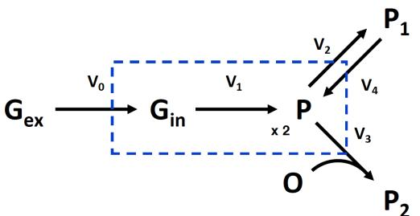

<span id="page-68-2"></span><span id="page-68-1"></span>Figure 4.2: A simple representation of the metabolic reaction network for central carbon metabolism. Extracellular glucose, *Gex*, is imported into the cell via reaction with flux *v*0 and converted via intracellular glucose, *Gin*, to pyruvate, *P*, via the reaction with flux *v*1 that has a stochiometry coefficient of two pyruvate molecules to each glucose molecule. Pyruvate can then either be converted to a fermentation product, *P*1, via the reaction with flux *v*2 or, in the presence of oxygen, *O*, converted to an oxidative phosphorylation (OXPHOS) terminal product *P*2 via the reaction with flux *v*3. The fermentation product *P*1 can also be converted back to pyruvate via the reaction with flux *v*4.

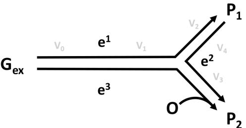

Figure 4.3: EFMs **e** 1 *,* **e** 2 *,* **e** 3 overlaid on the simple metabolic reaction network in Figure [4.2](#page-68-1) with concentrations of intracellular glucose and pyruvate assumed to be at steady state. It can be seen from our understanding of central carbon metabolism that **e** 1 represents the glycolytic fermentation pathway, **e** 2 the oxidative metabolism of the fermentation product, and **e** 3 the oxidative metabolism of glucose.

One may now wonder how it is possible that we have seen two definitions of EFMs. First, we introduced them as the extreme rays of the flux cone; then, we introduced them as support-minimal metabolic subnetworks. Indeed, the beautiful thing about EFMs is that these two characterizations are equivalent (see the Mathematical details-box for a proof). These two definitions of EFMs are complementary. Understanding EFMs as minimal metabolic subnetworks enables us to interpret an EFM in terms of its biological function; an EFM can be seen as a metabolic strategy that a cell can use to obtain steady-state metabolism, and which it can combine with other strategies to reach its purpose. The extreme ray-interpretation on the other hand, allows us to write an arbitrary flux vector **v** ∈ FC as a combination of EFMs, as is done in [(4.7)](#page-67-0). This also means that we can learn something about all flux vectors **v** by learning something about all EFMs. For example, if we know that there is no EFM that produces compound *Y* without using reaction *r*, this immediately implies that there is no flux vector at all that can do this, and that reaction *r* is thus essential for the production of *Y* . In addition, as we will discuss below, the identification of EFMs as extreme rays enables the use of efficient computational algorithms to enumerate them.

We note that there is currently no limit on the amount of flux that a particular EFM may carry, since *λ***e** *k* is also an EFM for any *λ >* 0 when **e** *k* is an EFM, and consequently the absolute value of any flux vector **v** in FC remains unbounded. However, we will see in the next section that this is not necessarily true when additional constraints are introduced.

### <span id="page-68-0"></span>**4.2.3 Irreversibility constraints**

In principle, all reactions in a metabolic reaction network are able to run in both directions, but in many practical examples certain thermodynamic arguments can be used to justify treating a subset of reactions

#### <span id="page-69-1"></span>**Mathematical details 4.A : Characterizations of EFMs**

In this box we will prove (following Gagneur and Klamt [\[159\]](#page-262-11)) that the two characterizations of elementary flux modes that we gave in this chapter are equivalent. To prove this, we should first make precise what we mean when we define EFMs as 'extreme rays' of the flux cone. Let us start generally: a pointed polyhedral cone P is defined by a full rank matrix **A** such that

$$\mathcal{P} = \{ \mathbf{x} \in \mathbb{R}^n : \mathbf{A}\mathbf{x} \ge \mathbf{0} \},$$

(as illustrated in Figure [4.1)](#page-66-1). Such a cone is thus defined as all points that satisfy a certain set of linear inequalities, which can be seen as a region bounded off by halfspaces. Note that the definition of the flux cone as given in [(4.4)](#page-66-2) can be written in this form by taking **A** = [**N***,* −**N***,* **I***n*×*n*] *T* , where **I***n*×*n* is the identity matrix, so FC is indeed a pointed polyhedral cone.

A vector, **r**, is a ray of P if *α***r** 6= **0** and for all *α >* 0 we have **r** ∈ P. Each ray **r** ∈ P has a zero set defined as *Z*(**r**) = {*i* : **A***i*•**r** = **0**}. Thus, the zero set is the index set of inequalities that are met with equality by the ray **r**. We call **r** an extreme ray when for all **r** 0 ∈ P if *Z*(**r**) ⊆ *Z*(**r** 0 ) then **r** 0 = *α***r** for some *α >* 0. In other words, a ray is called extreme if the set of inequalities that it satisfies with equality cannot be increased. With this we are ready for specifying our second definition of EFMs, after which we can prove the equivalency of the two definitions.

<span id="page-69-0"></span>**Definition 2.** *A vector* **v** *is called an elementary flux mode if it is an extreme ray of the flux cone* FC*.*

**Lemma 1.** *In a metabolic network captured by stoichiometric matrix* **N** *in which all reactions are irreversible, the definitions of elementary flux modes as the extreme rays of the flux cone (Def. [2)](#page-69-0) and as support-minimal steady-state flux vectors (Def. [1)](#page-67-1) are equivalent.*

*Proof.* Let **v** be an elementary flux mode according to Definition [1.](#page-67-1) The first requirement in this definition immediately implies that **v** is a ray of the flux cone, where we can define the flux cone as all **x** ∈ R*n* such that **Ax** ≥ **0** with: **A** = [**N***,* −**N***,* **I***n*×*n*] *T* . To show that it is also an extreme ray, let us assume that there is another ray **v** 0 such that *Z*(**v**) ⊆ *Z*(**v** 0 ). Since all rays of FC must satisfy the first 2*m* inequalities, this specificially means that whenever *vi* = 0 for some 1 *< i < n*, also *v* 0 *i* = 0, i.e. supp(**v** 0 ) ⊆ supp(**v**), but according to Property 2 of Definition [1](#page-67-1) we must then have **v** 0 = *α***v**. This implies that **v** is indeed an extreme ray, so it is also an EFM according to Definition [2.](#page-69-0) For the converse, let **v** be an EFM according to Definition [2.](#page-69-0) Again, this immediately shows that **v** ∈ FC, so we should now show that it is support-minimal. For that, let **v** 0 ∈ FC such that supp(**v** 0 ) ⊆ supp(**v**). This means that whenever *v* 0 *i* = 0, also *vi* = 0. Since **v** and **v** 0 both satisfy the first 2*m* inequalities of **Av** ≥ **0** with equality, and this shows that whenever **v** 0 saturates one of the last *n* inequalities, then also **v** does this, we conclude that *Z*(**v**) ⊆ *Z*(**v** 0 ). Using Definition [2](#page-69-0) this implies that **v** 0 = *α***v** for some *α >* 0. This shows that **v** is indeed support-minimal, and is thus an

EFM according to Definition [1.](#page-67-1)

as *irreversible*, meaning that for all modeling purposes they can only run in one direction. This stems from their activation energy being so large for realistic levels of products and substrates that the rate of the reverse reaction is effectively negligible compared to the rate of the forward. The choice of which reactions to assume irreversible is a decision to be taken by the modeler and may affect the results of the downstream constraintbased analysis. Returning to the simple model for central carbon metabolism provided in Figure [4.2,](#page-68-1) the reactions importing glucose into the cell, converting it to pyruvate, and the production of product *P*2 are assumed to be irreversible. A more detailed representation of central carbon metabolism may allow for the first two reactions to be reversible such that 'gluconeogenesis' becomes possible. This would result in the introduction of a fourth EFM associated with the conversion, via pyruvate, of the fermentation product to glucose that is then exported out of the cell.

More generally, in our mathematical description of the metabolic network [(4.4)](#page-66-2), we decomposed each reaction into a forward and a reverse reaction, treating each as individual degrees of freedom, and imposing additional irreversibility constraints is thus as simple as removing a reverse reaction from the network. When this is done, the EFMs of the resulting network do not need to be re-calculated, but can be obtained by simply removing all the EFMs that use the removed directions. This nicely shows the complementarity of Definitions [1](#page-67-1) and [2](#page-69-0) of EFMs: although it is not easy to see that the set of extreme rays of the new flux cone will be a subset of the previous set of extreme rays, it is easy to see that each vector that is a support-minimal flux vector after the removal of some reactions, must have been a support-minimal flux vector before that. The new flux cone is therefore made up of all flux vectors that are expressed as conical combinations of the remaining EFMs, and remains non-bounded.

## <span id="page-70-0"></span>**4.2.4 Practical uses of elementary flux modes**

EFMs represent the full set of possible metabolic capacities of an organism, which can therefore make EFM analysis a useful tool for biology. To this end, application of EFM analysis to bioengineering has been proposed to guide the genetic manipulation of microorganisms to perform desirable properties such as synthesis of a bio-compound or efficient production of a recombinant protein (e.g. [\[160,](#page-262-12) [161\]](#page-262-13)). From a more theoretical point of view, EFMs have also been used in attempts to quantify cellular robustness [\[162\]](#page-262-14), in particular regarding robustness under genetic perturbations [\[163\]](#page-262-15). The relevance of elementary flux mode analysis to cellular robustness stems from the fact that there is rarely a unique conical combination of elementary flux modes for any given flux vector, which implies there are multiple combinations of minimal metabolic pathways to achieve the same desired effect. This redundancy can be interpreted as a measure for the metabolic robustness of an organism, in terms of preserving essential metabolic functionalities under loss of a gene, for example.

There have also been several ways that EFM analysis has been incorporated into analysis of multi-omics data. For example, on the basis of transcriptomic profiling of microorganisms, metabolic pathways associated with elementary flux modes have been scored according to their probability of carrying flux [\[164\]](#page-263-0). The principle here is that, although levels of RNA often serve as a poor proxy for flux through the reaction associated with that particular enzyme's gene, by creating a gene set associated with an entire EFM there might be a better chance of concretely assessing whether the metabolic pathway as a whole is likely to carry flux. The study [\[164\]](#page-263-0) suggested that the integration of EFM analysis with gene expression data enabled the identification of certain metabolic pathways activated during stress conditions, and that the organization of elementary flux mode utilization in *Saccharomyces cerevisiae* involves a disparate combination of highly specialized and multitasking roles. Beyond transcriptomic profiling, isotope tracing experiments in principle provide a much more direct insight into quantifying metabolic flux. To interpret isotope tracing data, an extension of the concept of an EFM was introduced in [\[165\]](#page-263-1).

## <span id="page-70-1"></span>**4.2.5 Computational challenges for elementary flux mode analysis**

Enumerating EFMs for large networks can be computationally challenging if not impossible. In principle, EFMs can be found by removing one reaction at a time and solving the resulting mass-balance constraint problem until it is no longer possible to remove a reaction and still obtain a flux vector that satisfies the steady state conditions. However, the one-to-one identification of EFMs with extreme rays of the flux cone that we described before enables the use of algorithms that are specialized in the efficient enumeration of extreme rays of polyhedral cones, such as the double description method [\[166\]](#page-263-2). Various tools have been developed for elementary flux mode enumeration based on this algorithm (e.g. EFMTOOL [\[167\]](#page-263-3) or Meta-Tool [\[168\]](#page-263-4)). However, when the size of the metabolic reaction network grows, the number of EFMs scales disproportionately, leading to a combinatorial explosion that effectively makes enumeration impossible for genome-scale networks containing several thousands of reactions [\[169\]](#page-263-5). Currently, EFM analysis is therefore restricted to medium-scale reconstructions containing on the order of several hundreds of reactions, and results in the identification of several hundred million EFMs (e.g. enumeration based on the *Escherichia coli* core model results in approximately 272 million EFMs).

Approaches to reduce the complexity of dealing with so many EFMs even for metabolic reaction networks of modest size have also been proposed. These include invoking transcriptional regulatory constraints to eliminate most of the EFMs to be considered in downstream analysis. Imposing additional constraints based on thermodynamic conditions similarly reduces the set of EFMs considerably. A problem with these approaches is evidently that they do still depend on an initial calculation of all EFMs, and so do not solve the problem of <span id="page-71-5"></span>enumeration complexity. A rigorous study of the complexity of EFM mode enumeration was performed by Acuña and colleagues [\[170\]](#page-263-6). They showed that the decision problem if there exists an EFM containing two specific reactions is NP-complete whilst the complexity of enumerating all EFMs remains open.

Later in this chapter we will explore some alternatives to EFM enumeration that reduce the difficulty of enumeration, cf. Section [4.4.](#page-74-0)

## <span id="page-71-0"></span>**4.3 Additional constraints and flux polyhedra**

### <span id="page-71-1"></span>**4.3.1 Inhomogeneous linear flux constraints**

We have so far been working exclusively with mass-conservation and irreversiblity constraints, which are captured entirely by the stochiometric matrix where each row is associated with a metabolite concentration at steady state. We also saw that these considerations alone result in a flux cone that is by definition unbounded, meaning that a flux vector in this space is allowed to take on any absolute value (i.e. multiplying a flux vector in the flux cone by an arbitrarily large positive number again returns a flux vector in the flux cone). However, there are physical constraints limiting the magnitude of flux vectors, especially on the values of flux through exchange reactions that may depend on concentrations of extracellular substrates, numbers of transporter molecules in the membrane, or for which we might have direct experimental measurements. Typically, such bounds on flux values are imposed using inequality constraints of the form *v lb i* ≤ *vi* ≤ *v ub i* where *v lb i* and *v ub i* are lower and upper bounds, respectively, for the flux through the *i*th reaction. When reactions have been decomposed into forward and reverse directions, both upper and lower bounds are non-negative where the latter is usually zero.

In the example from Figure [4.2](#page-68-1) one may impose an upper bound on the flux value *v*0, suggesting that there is a maximal rate at which the cell or organism can import glucose from the extracellular environment. In this case the total set of constraints on the flux vector **v** take the form

$$\mathbf{N}\mathbf{v} = \mathbf{0}, \quad \mathbf{v} \ge \mathbf{0}, \quad v_0 \le v_0^{ub} \tag{4.10}$$

<span id="page-71-3"></span>where *v ub* 0 is the maximal glucose uptake rate. It is important to note that the new constraint is of a different kind than the mass-balance and irreversibility constraints: the right-hand side of the constraint is non-zero. Constraints that involve a non-zero are called *inhomogeneous constraints*. We can write these constraints in matrix form as

$$\mathbf{A}\mathbf{v} \ge \mathbf{b} \tag{4.11}$$

<span id="page-71-4"></span>with

$$\mathbf{A} = \begin{pmatrix} \mathbf{N} \\ -\mathbf{N} \\ \mathbf{I} \\ \mathbf{G} \end{pmatrix}, \quad \mathbf{b} = \begin{pmatrix} \mathbf{0} \\ \mathbf{0} \\ \mathbf{0} \\ \mathbf{0} \\ \mathbf{h} \end{pmatrix}, \tag{4.12}$$

where in this particular case

$$\mathbf{G} = \begin{pmatrix} -1 & 0 & 0 & 0 & 0 \end{pmatrix}, \quad \mathbf{h} = \begin{pmatrix} -v_0^{ub} \\ \end{pmatrix}. \tag{4.13}$$

<span id="page-71-2"></span>In general, the matrix **G** will have *P* rows corresponding to *P* linear, inhomogeneous constraints of the form

$$\sum_{i} w_{i}^{p} v_{i} \le h_{p}, \quad p = 1, \ldots, P \tag{4.14}$$

where each *hp* corresponds to a component of the *P*-dimensional vector **h** and *n* weights *w p i* (*i* = 1*, . . . , n*) are supplied for each constraint. Many constraints can be written in this general form, for example, one might imagine modeling a bound on the total flux that a cell can catalyze, which would be captured by setting all weights equal to 1. In this form the set of constraints on **v** define a *general polyhedron* that is necessarily contained within the flux cone which was based only on the homogeneous constraints: **Nv** = **0** and **v** ≥ **0**.

<span id="page-72-1"></span><span id="page-72-0"></span>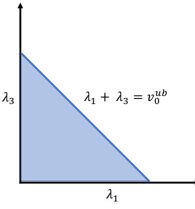

Figure 4.4: Representation of the bounded convex plane within which a flux vector satisfying the massbalance and maximal glucose uptake constraints must lie. The possible combinations of EFM weights *λ*1 and *λ*3 are contained within or on the line in blue given by the equation *λ*1 + *λ*3 = *v ub* 0 .

The additional inhomogeneous constraints serve to sequentially close up the cone such that various (if not all) dimensions become bounded, thus bounding the total magnitude of the flux vector **v**.

In the example described above, bounding the extracellular glucose uptake rate puts an upper bound on the weights of EFMs **e** 1 *,* **e** 3 illustrated in Figure [4.3,](#page-68-2) whose support includes the glucose transport reaction. However, the weight of the EFM associated with uptake and oxidation of the fermentation product (**e** 2 ) can remain unbounded. In short, this restricts the values of weights *λ*1*, λ*2*, λ*3 in the representation [(4.7)](#page-67-0) to satisfy

$$
\lambda_1, \lambda_2, \lambda_3 \ge 0, \quad \lambda_1 + \lambda_3 \le v_0^{ub}.
$$

Recalling that each EFM is associated with an extreme ray of the flux cone coming from mass-balance constraints, for this simple example it is quite straightforward to interpret the geometric consequences of the maximal glucose uptake rate. Any flux vector **v** in the resulting *flux polytope* is now constrained to lie within the bounded convex plane represented in Figure [4.4,](#page-72-0) but remains free to take on any value along the remaining extreme ray parameterized by *λ*2. The maximal glucose uptake has therefore closed up the flux cone along two directions while leaving the third untouched, and the geometry of the resulting flux polytope is represented in Figure [4.5.](#page-73-1) Imposing an upper bound on the uptake rate of the fermentation product, of the form *v*4 ≤ *v ub* 4 , will serve to bound this remaining direction of the polytope such that weights of the EFMs are then restricted to the space defined by

$$
\lambda_1, \lambda_2, \lambda_3 \ge 0, \quad \lambda_1 + \lambda_3 \le v_0^{ub}, \quad \lambda_2 \le v_4^{ub}. \tag{4.15}
$$

More general constraints, for larger metabolic reaction networks will be more difficult to interpret and visualize in such simple geometric terms. Quite quickly the combinatorial complexity associated with combinations of multiple constraints and EFMs will become unmanageable. The intuitive treatment of inhomogeneous linear constraints is partially assisted using the concept of elementary flux vectors on which we will add a section in a later version of this book, but both geometrically and biologically these objects are nowhere near as easy to interpret as their EFM counterparts. We shall see that alternative computational methods for exploring flux space therefore become imperative.

As a final remark, we clarify once more that the general form of constraints [(4.14)](#page-71-2) is by no means restricted to sums on the left hand side that involve just a single reaction and can of course include constraints on weighted sums of flux values for different reactions. These weighted sums are often associated with particular biological interpretations: for example, in the metabolic reaction network from Figure [4.2](#page-68-1) we might want to restrict our search of flux space to those flux vectors **v** that produce adenosine triphosphate (ATP) at a rate of at least *v AT P* . Although a more elaborate model would of course include ATP as one of the metabo-

<span id="page-73-4"></span>

<span id="page-73-1"></span>Figure 4.5: Geometry of the flux polytope (blue) containing any flux vector that satisfies the mass-balance and maximal glucose uptake rate constraints. While bounded in the directions parameterized by *λ*1*, λ*3, it remains unbounded in the direction parameterized by *λ*2.

lites, in this example we can use our biological understanding of central carbon metabolism to see that ATP is produced in reactions *v*1 and *v*3. A lower bound on ATP production would thus be a lower bound on a combination of *v*1 and *v*3 with weights determined by stoichiometry which depends on the organism under investigation. We could write such a constraint as

$$w_1v_1 + w_3v_3 \ge v^{ATP} \tag{4.16}$$

with appropriate weights *w*1*, w*3. Such a constraint forms an additional row of the matrix **G** and we leave it as an exercise for the reader to explore how this affects the geometry of the flux polytope for various values of the weights, minimal ATP production rate and maximal glucose and fermentation product uptake rates. Particular combinations of constraints will be impossible to satisfy simultaneously (i.e. when the minimal rate of ATP production is impossible to achieve under the given bounds on glucose and fermentation product uptake rates), resulting in a flux polytope that is empty. In such cases the set of constraints on **v** are called *infeasible*.

### <span id="page-73-0"></span>**4.3.2 Thermodynamic constraints**

In Chapter [3](#page-36-0) the basic concepts of chemical thermodynamics were introduced, in particular, the Gibbs free energy of a metabolic reaction was defined in terms of the concentrations of its products and substrates. For a metabolic reaction network with stochiometric matrix **N**, the vector of Gibbs free energies (one for each reaction in the network) **∆rG0** can be written in matrix form as

<span id="page-73-3"></span>
$$
\Delta_{\mathbf{r}} \mathbf{G}' = \Delta_{\mathbf{r}} \mathbf{G}'^o + RT \cdot \mathbf{N}^T \cdot \ln(\mathbf{c}) \tag{4.17}
$$

where *R* is the gas constant (see section [3.3.2)](#page-48-1), *T* the temperature and **c** the vector of metabolite concentrations at steady state. The components of the vector **∆rG0***o* are the changes in standard Gibbs free energy for each corresponding reaction. Typically, these values are not known precisely for reactions in the network, but can be estimated or approximated from experimental data using methods beyond the scope of this chapter. Similarly, although it is often difficult to accurately measure all metabolite concentrations, in principle the vector **c** can be obtained experimentally. However, in practice experimental data on **c** and **∆rG0***o* are almost never available. Various methods have therefore been developed to combine estimation of **∆rG0***o* (sometimes with partial measurements of **c**) with advanced computational techniques that allow simultaneous optimization (see next chapter) or sampling (see below) of **v** and **c** (or equivalently: **∆rG0** ).

The second law of thermodynamics applied to chemical reaction networks can be summarized by saying that every component of the metabolic flux vector **v** must satisfy the condition

<span id="page-73-2"></span>
$$\text{sign}(v_i) = -\text{sign}(\Delta_r G_i') \tag{4.18}$$

where *vi* and ∆*rG* 0 *i* are the *i*th components of **v** and **∆rG0** , respectively, and sign(*x*) denotes the sign of a <span id="page-74-2"></span>variable *x*, and sign(0) = 0. It is important to point out that this notation is different to that used previously, where we had assumed all *vi* to be non-negative by decomposing each reaction into irreversible forward and backward reactions. Returning to this reversible notation simplifies the inclusion of thermodynamic constraints into constraint-based models and also their interpretation. According to the second law, a reaction can only proceed in a direction where the change in Gibbs free energy is negative. Thus, to be consistent with mass-balance *and* the second law of thermodynamics, a flux vector **v** must simultaneously satisfy both [(4.1)](#page-65-4) *and* [(4.18)](#page-73-2), with **∆rG0** defined in [(4.17)](#page-73-3). The consequence of these additional constraints on the geometry of the space of metabolic flux distributions is to exclude quadrants incompatible with the signs of **∆rG0** . Equivalently, imposing the second law of thermodynamics on metabolic flux distributions removes regions of the space that are associated with combinations of thermodynamically-infeasible reaction directionalities.

The resulting space of feasible flux vectors is almost always non-convex, which means more advanced computational methods are required to explore it efficiently. The intuitive reason for this is that imposing thermodynamic constraints on top of the mass-balance constraint is usually done in terms of Boolean variables, which breaks the linearity of the problem that we had and exploited so far. Relating this to the EFMs that were discussed previously, it for example becomes clear that any EFM representing an internal cycle –not including any exchange reactions– will never be thermodynamically feasible. Thus, thermodynamic constraints also reduce the set of EFMs that are possible in a metabolic network. Interestingly, it turns out that any thermodynamically-feasible metabolic flux vector can be expressed solely in terms of thermodynamicallyfeasible EFMs [\[171\]](#page-263-7), but the converse statement is not true: a linear combination of thermodynamicallyfeasible elementary flux mode does not necessarily satisfy the thermodynamic constraints. This shows how the workable properties of convex spaces break down as the mathematical models become more complex, in this case by accounting for thermodynamics.

## <span id="page-74-0"></span>**4.4 Alternative methods for flux space exploration**

As we described above, exploration of all possible flux distributions using EFMs can become very complex for larger models. A genome-scale model, which comprises all metabolic reactions that an organism can catalyze, typically contains thousands of reactions, which prohibits the enumeration of EFMs. At the moment, it is unclear whether, even if we would have an enormously fast computer that could compute all EFMs, the number of EFMs would not be so large that we cannot store the EFMs anywhere, nor analyze it in any meaningful way. Here we discuss several alternatives for exploring the metabolic capabilities of a cell that try to avoid the combinatorial complexity that hinders EFM analysis.

### <span id="page-74-1"></span>**4.4.1 Elementary conversion modes**

If we are interested in the metabolic capabilities of an organism, is it always necessary to know all possible flux vectors? For example, what if we want to lab-culture an organism of which we have a reconstructed metabolic network, but no idea what nutrients it needs to grow. Then we only need to know from what combinations of nutrients it can make all its cell components. Or, what if we want to model the possible cross-feeding interactions between several microbial species? Then we are mostly interested in what each of them can consume and produce, and not really in how they do that. Elementary conversion modes (ECMs), introduced in 2005 by Urbanczik and Wagner [\[172\]](#page-263-8), capture all possible overall conversions from nutrients to products that an organism can catalyze, while ignoring which individual reactions are used for this.

ECMs focus on the net results of metabolism, i.e. on the uptake and production of compounds external to the metabolic network, such as sugars, nitrogen sources, fermentation products but also 'biomass'. To get information about these compounds we need to extend our metabolic network by including the external compounds as rows in the stoichiometry matrix; this is in general easy to do since we already had exchange reactions (reactions where an external compound was imported or exported) so we only have to find the stoichiometric coefficient in which the external compound was involved in these reactions. Let us denote the original stoichiometry matrix by **N**int and the submatrix that we add by **N**ext; together they form **N**tot. We can

<span id="page-75-2"></span><span id="page-75-1"></span>

Figure 4.6: (A) Small toy network with three ECMs shown in blue, yellow and red. Note that the red mode can be decomposed as a positive combination of the blue and yellow elementary conversion modes, but that would cancel the production of *B* so this is not allowed. (B) The conversion cone is shown in gray, and the blue and yellow arrow correspond to the blue and yellow ECMs are the extreme rays. The red ECM needs to be added because it is on the intersection with the *B*˙ = 0-plane.

then define the *conversion cone*:

$$\mathcal{C} = \{ \mathbf{\dot{c}} = \mathbf{N}_{\text{ext}} \mathbf{v} \mid \mathbf{N}_{\text{int}} \mathbf{v} = \mathbf{0}, \mathbf{v} \ge \mathbf{0} \}\,. \tag{4.19}$$

If we look carefully at this definition we can see that the flux vectors **v** need to satisfy exactly the same constraints as in the flux cone (Eq. [(4.4)](#page-66-2)). The only difference between flux and conversion cones is that we are either interested in the fluxes themselves, or rather in the conversions that they induce: **c**˙ = **N**ext**v**.

**Definition 3.** *The set of ECMs is the minimal set of conversions* {*ecm*1 *, . . . ecmK*} *(where ecmi k is the amount of metabolite k produced in the ith elementary conversion mode), such that*

- *1. all conversions* **c**˙ ∈ C *can be written as a positive sum of these elementary conversion modes:* **c**˙ = P *i λiecmi , with λi* ≥ 0*,*
- <span id="page-75-0"></span>*2. without the production of any metabolite being canceled in that sum, i.e. for all metabolites k we either have for all λi >* 0 *that ecmi k* ≥ 0 *or for all λi >* 0 *that ecmi k* ≤ 0*.*

We will explain both parts of this definition below, but let us first remark that the definition is in fact perfectly analogous to the definition of EFMs: EFMs are the *elementary vectors* (or precisely: conformally nondecomposable vectors) of the flux cone, and ECMs of the conversion cone. The reason that the definition of ECMs has an additional requirement [(2.](#page-75-0)) is just that the analogous requirement was automatically satisfied for EFMs because we assumed all reactions to be irreversible.

In Figure [4.6A](#page-75-1) we show a small metabolic network with external metabolites *A*, *B* and *BM*, and internal metabolites *C*, *D* and *E*. We can find 9 EFMs in this network: one that goes from *A* to *B*, four that produce *BM* starting from *A* and four that produce *BM* from *B*. We get four EFMs to go from *A* to *BM* because there are two ways of going from *C* to *D* and again two for converting *D* into *E*. This makes clear that having a number of modules of alternative reactions can quickly give rise to large numbers of EFMs, even though the overall conversion from nutrients to products remains the same. In contrast, we will explain that we only get three ECMs.

In Figure [4.6B](#page-75-1) we see the conversion cone in gray. Note that this cone does not live in flux space, but rather in the space of external metabolite changes, or conversions. We recognize that the cone can be spanned by two extreme rays, which correspond to converting *A* into *B* (blue) and to using 2*B* to produce *BM* (yellow), so these rays correspond to elementary conversion modes following the first part of Definition [3.](#page-75-0) Now why do we have a third ECM, when the blue and yellow one already span the whole conversion cone? Indeed, <span id="page-76-1"></span>the third vector in Figure [4.6B](#page-75-1) can be obtained by summing the yellow vector and two times the blue vector: 2(−1*,* 1*,* 0) + (0*,* −2*,* 1) = (−2*,* 0*,* 1). However, note that the production of metabolite *B* would cancel in this sum, which is not allowed according to the second part of Definition [3.](#page-75-0) The reason that this second part of the definition is important, is that the elementary conversion modes are intended to capture all metabolic capabilities of an organism, so taking only the first two modes would not be enough: we also want to account for the possibility of making *BM* from *A* even if we decide that the elementary conversion mode from *B* to *BM* is not possible in the current environment, for example because *B* is not present as a nutrient in the medium.

Because many EFMs result in the same overall conversion, the exploration of metabolic capabilities can now be done in larger networks, at the cost of ignoring information about which reactions are used [\[173\]](#page-263-9). This way of thinking can be pushed even further: what if one is not interested in the conversions between all nutrients and products, but only between a subset of these? In that case, one would want to compute the ECMs only between the external metabolites of the most interest. This can be done with a small trick. Say that we are not interested in the production of external metabolite *X*. Before we start the enumeration algorithm we add a virtual reaction to the network that consumes and produces *X* from nothing, i.e. we add *X* ∅, and then we change *X* from an external metabolite to an internal metabolite. Consequently, it now has to satisfy the mass-balance constraint (which can always be done trivially using the added virtual reaction), and will thus never show up in the computed elementary conversions. In this way it was possible to compute all ECMs between glucose, oxygen and biomass for a real genome-scale network of *E. coli*.

### <span id="page-76-0"></span>**4.4.2 Flux sampling**

In addition to the computational complexity of EFM enumeration for large metabolic networks, these objects are not necessarily related to experimentally-derived flux measurements. This is because when a vector of experimentally-measured flux values **v** would be decomposed into EFMs, this generally does not give a unique solutions because it can be done in many ways. Flux sampling methods can be employed to solve both the computational and interpretability problems simultaneously, exploring the set of flux vectors (i.e. directly measurable in principle) by computationally sampling from the flux space. The goal of flux sampling in general terms is to produce a sequence of flux vectors that satisfy the steady state constraints until enough samples have been generated to provide an approximate representation of the entire flux space. The flux polyhedra defined by mass-balance and additional inhomogenous linear constraints are convex, and therefore uniform sampling of these flux spaces can be achieved using variants of an algorithm developed for convex analysis called the coordinate hit-and-run (CHR) algorithm [\[174\]](#page-263-10). Briefly, the most basic implementation of the CHR algorithm generates a Markov chain of flux vectors by starting in a random position within the flux polytope, picking a direction at random (uniform), and moving a random distance (uniform) in that direction from the current point. The resulting point is returned as a flux vector instance and the process repeats from there. It has been proven that the CHR algorithm converges to a stationary distribution of the Markov chain that is a uniform distribution in the flux space. Alternatives to uniform sampling (i.e. alternative distributions across the flux polytope) can also be achieved using variants of the CHR algorithm.

As highlighted previously in Section [4.3.2,](#page-73-0) mass-balance and inhomogeneous linear constraints alone often do not contain enough information to sufficiently reduce the space of biologically-feasible flux vectors. For example, thermodynamic constraints on flux vectors are important for ruling out a large proportion of the sampled flux vectors as infeasible, but this may disproportionately dominate the resulting sampling distributions. Unfortunately, for mathematical reasons too deep to go into here, simply removing these infeasible flux distributions post-sampling will not result in a uniform distribution over the thermodynamically-feasible portion of flux space. In fact, this relevant subset of flux space cannot be defined explicitly, and is usually neither convex nor connected meaning that no Markov chain methods exist for sampling. As an alternative, a recent method [\[175\]](#page-263-11) has been developed to combine thermodynamic constraints, physiological observations and estimated thermodynamic parameters, with mass-balance and inhomogeneous linear constraints <span id="page-77-1"></span>to provide a probabilistic thermodynamic analysis of metabolic reaction networks. Advances such as these will almost certainly aid a more complete characterization of flux space as data and methods become available.

### <span id="page-77-0"></span>**4.4.3 Minimal cut sets**

A minimal cut set (MCS) is a set of reactions that, when disabled, disables a set of modes, which in turn can represent a biological function, such as the secretion of a side product. This enables the prediction of gene deletion targets, given that the genes coding for the involved reactions are known. A cut set is minimal if the removal of one or more reactions from the set leads to at least one of the targeted modes not being disabled.

In order to avoid also disabling desired functionalities, such as product secretion and growth, the concept of constrained minimal cut sets (cMCSs) has been developed. cMCSs enable targeting a set of modes while at the same time making sure that some elements of another set of modes will remain active.

**Motivation for (constrained) Minimal Cut Sets** The concept of MCSs was introduced by Klamt and Gilles in 2004 [\[176\]](#page-263-12) and subsequently generalized and improved [\[177,](#page-263-13) [178,](#page-263-14) [179\]](#page-263-15). As briefly outlined above, the idea is to define a set of EFMs which should be disabled, for example because they generate an unwanted side product or because they don't generate the product of interest with a sufficiently high yield. Since EFMs are minimal, removing a single reaction will disable it. A cut set is a set of reactions of which at least one is active in each of the EFMs in the targeted group. Thus, disabling the reactions contained in the cut set will disable all of the targeted EFMs, and each cut set therefore represents the prediction of a set of gene deletions. Since it would be pointless to remove reactions which only target EFMs that were already targeted by other reactions, cut sets are required to be minimal. This means that removing a single reaction from the cut set would lead to one or more of the targeted EFMs to survive the intervention and also that adding a single reaction to the cut set would have no additional effect on the set of target EFMs.

The pitfall when using MCSs is that while they guarantee the elimination of the targeted EFMs, all other EFMs may be affected as well. This means that modes with desired phenotypes, such as high growth and/or high product yield, may become impossible. Therefore, cMCSs were developed [\[180\]](#page-264-0). In this extension of the concept of MCSs it is now possible to additionally define a set of EFMs which are desired, i.e. which can not be disabled by the cMCSs. This is usually implemented by the requirement that at least a specified minimum number of EFMs of the desired set need to remain active. Summarizing, cMCSs are sets of reactions which guarantee that (i) the full set of target EFMs is disabled and (ii) a certain minimum of desired EFMs has to remain unaffected. The drawback, with both MCSs and cMCSs, is that the target (and desired) EFMs need to be defined. This is generally achieved by defining cut-offs in terms of product yield and growth, which is, however, ultimately arbitrary.

**Calculation of (constrained) Minimal Cut Sets** Since minimal cut sets in a metabolic network are EFMs in a dual network [\[181\]](#page-264-1), methods used for calculating EFMs can be used to calculate MCSs. Among other approaches [\[182\]](#page-264-2) one based on binary integer programming has been developed [\[183,](#page-264-3) [184\]](#page-264-4). While it requires that the EFMs are calculated before it can be applied, the advantage is that the algorithm is very intuitive. After having calculated the modes, each is represented as a binary vector which is zero for reactions with zero flux and one otherwise. The EFMs are then divided into either targeted or desired. A binary vector, corresponding to the cMCSs being calculated is introduced. It will have a one if the corresponding reaction remains active and zero if the reaction is disabled. The first requirement is that cMCS needs to disable all target modes and thus the vector must have zero elements such that each target EFM must have at least one corresponding non-zero element. The second requirement is that at least a defined minimum of desired modes must remain active. This is achieved by introducing a second binary vector. This vector has an element for each EFM and is calculated so that it has a zero when the mode is disabled by the cMCS and one otherwise. By adding the constraint that the number of ones in this vector must at least equal the previously defined minimum, the second requirement is met. Maximizing the vector corresponding to the cMCS yields the first solution. The next solution can be found by adding constraints to make sure that the current one is <span id="page-78-0"></span>excluded.

## **4.5 Concluding remarks**

In this chapter we studied how the individual reactions that an organism can catalyze together give rise to the overall conversion of nutrients into cell components and secretion products. For that, we studied the cell's metabolism under a number of simplifying assumptions, most notably, we model metabolism in steady-state. Given this steady-state constraint, we explained how all feasible flux distributions form a space of a specific type: a pointed polyhedral cone. By exploring this 'flux cone' we can chart the metabolic capabilities of an organism.

We have seen that an exhaustive charting of these metabolic capabilities is the computation of all *elementary flux modes*: minimal subnetworks that can individually give rise to steady-state flux distributions, and that may be interpreted as minimal metabolic strategies. An especially important use of EFM analysis can be found in the prediction of the effect of gene knockouts: when all EFMs that produce compound *Y* use reaction *r*, then the organism cannot make this compound when the gene is knocked out that codes for the enzyme that catalyzes *r*. And conversely, sometimes gene knockouts can be found such that the cell cannot grow anymore without producing a certain compound of interest. Clearly, these analyses can be very useful for the design of organisms in bio-industry.

On the other hand, we also saw that for large models the computation of all EFMs becomes impossible. There are simply too many of these minimal subnetworks. We presented several alternatives. One could use *elementary conversion modes* if one still desires an exhaustive list of the metabolic capabilities of the cell. The ECMs are easier to enumerate because one can choose to focus only on all possible conversions between (a subset of) the nutrients and products, instead of requiring all information about which reactions are used to get these conversions. For the design of gene knockouts specifically, *minimal cut sets* may be used. Finally, we discussed that the flux cone can be sampled randomly to characterize the flux cone, if this characterization does not need to be exhaustive.

In many cases we have additional information that determines that part of the flux cone is infeasible. For example, some metabolic fluxes may have been measured so that these reaction rates can be fixed to their observed value. In other cases, one may want to use thermodynamic properties to prohibit reactions from occurring that would violate the second law of thermodynamics. These additional constraints can be imposed on top of the mass-balance constraint to further bound the space of feasible flux distributions; each correctlyimposed constraint narrows down the space of feasible fluxes, and thus increases our knowledge of the metabolic state of the cell.

All explorations of the space of feasible flux distributions show one unavoidable conclusion: the metabolic network is incredibly flexible. Even when several constraints are imposed, a genome-scale metabolic model will allow for an almost incomprehensible number of modes in which the metabolic network can function. Consequently, to predict the metabolic state of a cell in more detail we need to make an additional assumption. In the following chapter, we will study what predictions we can make when we assume that the metabolic state is optimized to perform a certain function.

## **Recommended readings**

**Elementary flux modes** A nice paper that gives an understandable introduction of elementary flux mode analysis and its applications: Jürgen Zanghellini, David E. Ruckerbauer, Michael Hanscho, Christian Jungreuthmayer (2013). Elementary flux modes in a nutshell: Properties, calculation and applications. Biotechnology Journal 8 (9), 1009. doi: [doi.org/10.1002/biot.201200269](https://doi.org/10.1002/biot.201200269)

**Elementary Flux Vectors** were introduced as an analog of Elementary Flux Modes in the case that the flux mode is further bound by at least one inhomogeneous constraint. A nice review of these EFVs is can be

<span id="page-79-0"></span>

Figure 4.7: *Spirallus insilicus* network, adapted from [\[185\]](#page-264-5)

found in: Steffen Klamt, Georg Regensburger, Matthias P Gerstl, Christian Jungreuthmayer, Stefan Schuster, Radhakrishnan Mahadevan, Jürgen Zanghellini, and Stefan Müller (2017). From elementary flux modes to elementary flux vectors: Metabolic pathway analysis with arbitrary linear flux constraints. PLoS Computational Biology, 13(4):e1005409, doi: [doi.org/10.1371/journal.pcbi.1005409.](https://doi.org/10.1371/journal.pcbi.1005409)

## **Problems**

<span id="page-79-1"></span>**Problem 4.1 A small metabolic network (2)** *Spirallus insilicus*, a completely fictional organism [\[186\]](#page-264-6), is characterized by the the metabolic network depicted in Figure [4.7](#page-79-0) *X*, *S* and *P* represent the biomass, one substrate and one product, while metabolites A to E denote intracellular metabolites. One directional arrows indicate irreversible reactions (all but *v*4)

- 1. How many intracellular metabolites, intracellular reactions and transport reactions are involved in the model?
- 2. Obtain the stoichiometric matrix (**N**) and the vector of fluxes. How many elements are in the product **Nv** and what do they represent?
- 3. Is the matrix **N** of full rank? How many fluxes should be specified to have a unique solution?
- 4. Transform the set of constraints so that they define a pointed cone. Determine the number of variables (fluxes) and constraints.

**Problem 4.2 A small metabolic network (2)** Consider the following small metabolic network:

$$\mathrm{S}_{c} \xrightarrow{\mathrm{v_{0}}} \mathrm{S}_{c}$$

$$\mathrm{S}_{c} \xrightarrow{\mathrm{v_{1}}} \mathrm{P}_{c}$$

$$\mathrm{P}_{c} \xrightarrow{\mathrm{v_{2}}} \mathrm{C}_{c}$$

$$\mathrm{P}_{c} \xrightarrow{\mathrm{v_{3}}} \mathrm{D}_{c}$$

$$\mathrm{P}_{c} + 2\,\mathrm{C}_{c} \xrightarrow{\mathrm{v_{4}}} \mathrm{X}$$

Metabolites with a *c* subscript are located in the cytosol (intracellular) while *e* stands for extracellular and *X* represent biomass. All fluxes are positive.

- 1. Represent the model as a reaction network (a sketch with metabolites and reactions)
- 2. Obtain the stoichiometric matrix (**N**) and list the variables of the metabolic model (**v**)
- 3. Show that there is no solution to the mass balance equation **Nv** = **0** producing metabolite D. Identify why

### Concluding remarks 71

this is so and modify the model so the production of D is allowed (*v*3 *>* 0)

**Problem 4.3 Elementary Flux Modes (1)** Assume reaction *v*4 is irreversible from *A* to *D* in *Spirallus insilicus* (Problem [4.1)](#page-79-1). Calculate all the Elementary Flux Modes.

- 1. By hand.
- 2. Using a software of your choice (e.g. https://pypi.org/project/efmtool/)

<span id="page-80-0"></span>**Problem 4.4 Elementary Flux Modes (2)** Consider the following metabolic network


Please note that some stoichiometric coefficients in **N** are different from 1 (not shown in the graphics).

- 1. In the network drawing, grey dots denote carbon atoms. Check that carbon atoms are conserved in all reactions. What's the carbon content of the byproduct (not shown) of the reaction from A to D?
- 2. All metabolites are treated as internal, that is, they need to be mass-balanced. Find all EFMs (by pure reasoning or by using a software). Determine all EFMs in which all fluxes are in forward direction, i.e. along the "conventional directions" indicated by arrows.
- 3. Which of the EFMs are thermodynamically realizable? Explain why.

# <span id="page-82-2"></span><span id="page-82-0"></span>**Chapter 5**

# **Optimal metabolic fluxes in constraint-based models**

Daan de Groot, David Tourigny, Felipe Scott, and Jan-Pilipp Dapprich

### **Chapter overview**

- An optimization objective can be added to constraint-based models to make more specific predictions.
- Different purposes can be served by choosing different optimization objectives and constraints
- The optimal solutions can be understood in terms of elementary flux modes

# <span id="page-82-1"></span>**5.1 Can we use an optimality assumption to predict metabolic behavior?**

In the previous chapter, we characterized an organism's metabolism by listing all the biochemical reactions that can be catalyzed by the enzymes encoded within the organism's genome. To understand how the genome constrains patterns of metabolic flux we needed to make several simplifying assumptions. The first important assumption was that intracellular metabolism is at steady-state, i.e., that the production and consumption of all metabolites is balanced such that their concentrations are constant in time. These resulted in the mass-balance constraints on the flux vector **v**. The flux cone of all flux vectors satisfying the mass-balance constraints could be further reduced by additional constraints on **v**, based on extra physical and biological assumptions about the magnitude and directionality of certain reactions within the network. We introduced several ways in which the entire flux space could be explored.

When applied to very large metabolic networks, the flux space will often contain an infinite number of flux vectors **v** that simultaneously satisfy all constraints. From a mathematical perspective, this implies that the constraints do not include enough information to uniquely specify a flux vector **v**. This makes sense biologically, since if we imagine constraints are related to experimental observations it is very unlikely that we will ever be able to make enough to fully account for every reaction encoded within the entire genome of an organism (no matter how simple it might be). Often, however, researchers do want to further narrow down the set of flux vectors that they think biologically relevant to the organism and conditions they are studying, perhaps even to a unique **v** imagined to describe the metabolic state of an organism at a given moment in time. One popular approach for doing so is to provide an additional assumption (or set thereof) in the form of an objective function: it is assumed that the metabolic state of an organism is such that some function of

<span id="page-83-4"></span>**v** (e.g. growth rate) is maximized to satisfy some criteria (e.g. evolutionary selective advantage). The computational problem then becomes one of constrained-optimization: find a flux vector **v** that is optimal in terms of the objective function(s) that simultaneously satisfies all constraints. The resulting space of optimal flux vectors (sometimes containing just one unique vector) is often considerably smaller than the space of those that satisfy only the constraints.

In this chapter, we will study metabolic models based on constrained-optimization. We will introduce a selection of commonly used objective functions and the computational methods used to solve the associated constrained-optimization problem. We will also characterize optimal solutions that we get in terms of the minimal metabolic strategies that we identified in the previous chapter: elementary flux modes. Finally, we will explain how we can handle the cases where the solutions are, even after optimization, not unique.

## <span id="page-83-0"></span>**5.2 Metabolic models based on linear optimization problems**

In the previous chapter, we described how *linear* homogeneous and inhomogeneous constraints arising from biological and physical knowledge can be combined into matrix and vector notation and written in the general form presented in Equations [(4.11)](#page-71-3) and [(4.12)](#page-71-4). The resulting space of all flux vectors **v** satisfying these constraints is called the flux polyhedron. The flux polyhedron can remain high-dimensional and, as explained above, an objective function *f* can be used to narrow down the set of flux vectors to only those that are optimal (i.e., maximize the objective function). The general form in which we can write the resulting constraintbased optimization problem is therefore:

<span id="page-83-1"></span>
$$\max_{\mathbf{v}} f(\mathbf{v}), \text{ (such that } \mathbf{A}\mathbf{v} \ge \mathbf{b}, \tag{5.1}$$

<span id="page-83-2"></span>with

$$\mathbf{A} = \begin{pmatrix} \mathbf{N} \\ -\mathbf{N} \\ \mathbf{I} \\ \mathbf{G} \end{pmatrix}, \quad \mathbf{b} = \begin{pmatrix} \mathbf{0} \\ \mathbf{0} \\ \mathbf{0} \\ \mathbf{b} \end{pmatrix}. \tag{5.2}$$

Recall that **Nv** = **0** models the steady-state assumption, while the multiplication with the identity matrix (**I***n*×*n***v** ≥ **0**) captures the fact that we forced all reactions to be irreversible by splitting reversible reactions into a forward and a backward reaction. Finally, **Gv** ≥ **h** can be used to impose additional 'inhomogeneous' constraints that can be used to input additional biological knowledge such as an experimentally measured upper bound on the uptake rate of a certain nutrient.

In many cases, the objective function is chosen to be a linear function of the fluxes, i.e.,

<span id="page-83-3"></span>
$$f(\mathbf{v}) = \sum_{i} c_{i} v_{i},\tag{5.3}$$

where coefficients *ci* weigh the relevance of the different reaction rates in the objective function. Problems of the form [(5.1)](#page-83-1), [(5.2)](#page-83-2), and [(5.3)](#page-83-3) in general are called *linear programming problems* and as the name suggests can be solved using *linear programming*. Applied to metabolic models, linear programming is called *Flux Balance Analysis* (FBA). Linear programming problems are well studied, such that FBA is perhaps the most popular approach to genome-scale metabolic models [\[187,](#page-264-7) [188\]](#page-264-8). FBA problems are relatively easy to solve using specialized optimization software, which have been highly developed due to the general applicability of linear programming in economics, logistics, and many other fields also. In the following subsections we will briefly describe various choices that can be made for the linear objective function *f*(**v**) in FBA.

As an example FBA problem, in Figure [5.1](#page-84-1) we have extended the minimal example from the previous chapter to include ATP and biomass (*X*) production, assuming the latter is produced from pyruvate using a single reaction that consumes *sX* molecules of ATP with flux value *vX*. We also introduce as a linear objective function the total rate of ATP production, *vAT P* . Since in this example, reactions *v*1 and *v*3 pro-

<span id="page-84-2"></span><span id="page-84-1"></span>

Figure 5.1: A simple representation of the metabolic reaction network for central carbon metabolism. Extracellular glucose is imported into the cell via a reaction with flux *v*0 and converted via intracellular glucose, *G*, to pyruvate, *P*, via the reaction with flux *v*1 that has a stoichiometric coefficient of two pyruvate molecules to each glucose molecule. Pyruvate can then either be converted to a fermentation product, *P*1, via the reaction with flux *v*2 or, in the presence of oxygen, *O*2 imported via *vO*2 , converted to an oxidative phosphorylation (OXPHOS) terminal product *P*2 via the reaction with flux *v*3. It can also be converted to biomass *X* with rate *vX*. The reactions with flux values *v*1 and *v*3 produce ATP from ADP (in red) with stoichiometry *s*1 and *s*3, respectively, which can vary between species. The production of 1.0 grams of new cells, in a dry weight basis, requires one molecule of pyruvate and *sX* molecules of ATP.

duce ATP with stoichiometric coefficients *s*1 and *s*3, respectively, the total rate of ATP production is given by *vAT P* = *s*1*v*1 + *s*3*v*3 − *sXvX*. The FBA problem is then given by simply maximizing *vAT P* subject to *v*0*, vO*2 *, v*1*, v*2*, v*3*, v*4*, vX* satisfying the mass-balance constraints but, as we will see in the next subsection, this would result in a problem that is unbounded: the flux vectors and resulting optimal value of *vAT P* could be indefinitely large. Biologically, this is because there are no bounds on the uptake rates of glucose *v ub* 0 and the fermentation product *v ub* 4 . Thus, if we re-impose these bounds as in the last chapter, the result is an FBA problem that is bounded and therefore has a finite objective value:

$$\begin{array}{ll}\max \boldsymbol{v}_{ATP} = s_1 \boldsymbol{v}_1 + s_3 \boldsymbol{v}_3 - s_X \boldsymbol{v}_X, & \text{such that}: \\\\ 0 = \boldsymbol{v}_0 - \boldsymbol{v}_1, \\\\ 0 = \boldsymbol{v}_{O_2} - \boldsymbol{v}_3, \\\\ 0 = 2\boldsymbol{v}_1 - \boldsymbol{v}_2 - \boldsymbol{v}_3 + \boldsymbol{v}_4 - \boldsymbol{v}_X, \\\\ \boldsymbol{v}_0^{ub} \ge \boldsymbol{v}_0, \\\\ \boldsymbol{v}_4^{ub} \ge \boldsymbol{v}_4, \\\\ \boldsymbol{v}_0, \boldsymbol{v}_1, \boldsymbol{v}_2, \boldsymbol{v}_3, \boldsymbol{v}_4 \ge 0. \end{array} \tag{5.4}$$

To illustrate a particular instance of this FBA problem, we consider the very simple case where *v ub* 4 = 0, *v ub* 0 *>* 0 and *s*3 = *s*1 = 1. It can be checked by hand that an optimal solution is given by *v*0 = *v*1 = *v*2*/*2 = *v ub* 0 , with *v*2 = *v*4 = *vX* = 0. The optimal objective value is given by *vAT P* = 3*v ub* 0 .

### <span id="page-84-0"></span>**5.2.1 Types of linear objective functions used in FBA**

Solving the constraint-based optimization problem of [(5.1)](#page-83-1) will reduce the set of flux vectors to those that are optimal (maximize the objective function), but the biological validity of this prediction is critically dependent on the particular choice of *f*. Consequently, there has been a lot of consideration and debate among researchers working on FBA about the appropriate objective functions to use in different contexts and how best interpret the results. Below, we will provide some popular examples, but for a more systematic comparison of different objective functions we refer the reader to [\[192,](#page-264-9) [193,](#page-264-10) [194\]](#page-264-11).

#### <span id="page-85-1"></span><span id="page-85-0"></span>**Economic analogy 5.A : Linear programming and economic planning in the Soviet Union**

Linear programming as an algorithmic approach to solving constrained linear optimization problems was first developed by soviet mathematician and economist Leonid Kantorovich in the 1930s [\[189,](#page-264-12) [190\]](#page-264-13). Kantorovich was tasked with helping to optimize production in the soviet plywood industry, but soon discovered that the underlying problems could not be solved using analytical methods. He instead developed a method for solving linear optimization problems using an iterative process through which a solution is continuously improved until an optimum is reached. Kantorovich argued that this could be used to make soviet economic planning more efficient.

Soviet planning was primarily based on material balancing, which aimed to create a consistent plan with regards to the inputs and outputs of various industries. For example, the input requirement of steel consuming industries ought not to exceed steel production targets. In a balanced plan the input requirements for steel would match the production of steel. But a balanced plan is not necessarily an optimal one. There can well be several consistent plans of which some lead to higher overall production output than others. Kantorovich observed that productive resources were often not used where they could yield the greatest benefit. By using linear programming, planners could in principle calculate a plan that made the best use of economic resources and maximized production output. One of the problems that needed to be overcome by Kantorovich was that optimization always aims to optimize a singular objective function. However, there was no obvious way of measuring the output of qualitatively distinct products on a single scale. Without prior valuation of the products (for example through market prices) it is not clear whether 3 tanks and 10 trucks should be counted as more than 4 tanks and 8 trucks. Kantorovich circumvented this problem by assuming that outputs ought to be produced at given proportions. For example, it might be specified that 2 trucks ought to be produced for every tank. Linear programming can then be used to calculate the plan that maximizes output at these proportions. Unlike most contemporary economic applications of linear programming, this does not depend on a monetary objective function. So, what's being maximized is not monetary value. Instead, the objective function measures purely physical quantities (such as number of trucks or tons of steel).

In the context of economic planning, constraints are used to represent limits to available economic resources (such as fertile land). A plan that uses more resources than are available will not be feasible and must thus be excluded. Constraints can also be used to fix the proportions at which distinct outputs ought to be produced [\[191\]](#page-264-14). While it was first developed for economic planning, the fundamental principles of linear programming can also be applied to other problems (for example in biology).

**Evolutionary justifications for objective functions: the rate of biomass production** Objective functions are often based on evolutionary arguments: the objective is chosen to capture some proxy for the evolutionary fitness of an organism. The motivation behind this is that cells with a metabolic state that scores well on this fitness-proxy would come to dominate the cell-population because they outgrow their competitors. Proxies for fitness are in principle very hard to choose since evolutionary fitness is mostly related to the average net reproduction rate of a cell over a very long time[\[195\]](#page-264-15). Therefore, to know the metabolic objective that aligns with the maximization of fitness would require us to know what the cell has been selected for in its evolutionary history. This is a non-trivial question, for example, is an *E. coli* cell growing in the human gut selected for the same metabolic objective as a muscle cell in your body?

An objective that is used very often is the maximization of a biomass production rate, because this is used as a proxy for maximizing growth rate. It is indeed arguable that unicellular organisms with high growth rates are selected, since in stationary conditions these cells will come to dominate the population. Indeed, FBA models in which the biomass production rate is optimized seem to predict metabolic states reasonably well [\[196,](#page-264-16) [197,](#page-265-0) [198\]](#page-265-1).

But what exactly do we mean by "biomass"? This is extensively discussed in the Chapter [2,](#page-18-0) but for our purposes it is sufficient to say that it is the entirety of all components that constitute a new cell. In metabolic models, however, "biomass" refers to all precursors that are outputs of the model and that are needed to produce a new cell. This has two consequences. First, biomass in our model does not only consist of the components of which the cell is built, but also of components needed to do the building itself, such as a certain amount of ATP. Second, what is contained in biomass will depend on where we draw a line around the metabolic network - all necessary cell components that are not inside are regarded as biomass. In practice, <span id="page-86-1"></span>biomass appears in metabolic networks in the form of a virtual *biomass reaction* that consumes all necessary precursor molecules in the right proportions and produces one unit of "standard biomass". Maximizing the biomass production rate thus takes the very simple form of just maximizing the rate through the biomass reaction.

The use of such a fixed biomass reaction represents an important assumption, because in reality the biomass composition will be condition dependent. For example, if a cell grows faster and contains more ribosomes, this increases the cellular fraction of proteins and polynucleotides, and hence the need for the respective precursors (amino acids and nucleotides). Moreover, biomass composition can even depend on the choice of metabolic strategy. If a pathway includes enzymes that contain a lot of iron, then depending on the flux solution (which uses this pathway or not), more or less iron will be contained in the biomass. So, the flux solution must be known to know the biomass composition, but the biomass composition must also be known to get to a flux solution. To resolve this, we would need a model of the entire cell, including the synthesis reactions of all enzymes. Such models will be discussed later, in the Chapter [9](#page-144-0) on large cell models.

**Evolutionary justifications for objective functions: alternative fitness-proxies** In some cases, modeling the maximization of the instantaneous growth rate through the biomass reaction is an unrealistic proxy of the evolutionary fitness. For example, in multicellular organisms each cell performs a task that contributes to the fitness of the whole organism, but this is not related to the reproduction rate of the individual cells. In those cases, we may still try to capture an evolutionary objective when we know the main task of the cell-type. For example, beta-cells in the pancreas have as their main task to produce insulin, and we may thus model their metabolism by maximizing the production of insulin.

In other cases, our metabolic model is focused only on a very small part of the true metabolic network, and therefore does not model the production of all biomass precursors. In such cases, energy production rate in the form of ATP production rate is often maximised. Yet other objective functions that are sometimes used and have a (somewhat vague) evolutionary motivation are the minimization of overall ATP usage and the minimization of overall fluxes.

**Synthetic design-oriented objective functions** Metabolic modeling can also be used to identify metabolic states that lead to a certain desired behavior of a microorganism. For example, we may seek to genetically perturb a microbe such that it produces a certain compound of industrial or medicinal interest, while it also retains a certain minimal growth rate [\[199\]](#page-265-2). Indeed, it is often desired to retain a certain minimal ability to grow such that the genetically engineered organisms can be lab-grown after which the produced compound of interest can be harvested. In that case, we can combine maximizing the production rate of the compound while imposing an inhomogeneous constraint that sets a lower bound on the biomass production rate. This can even be combined with a calculation in which we solely maximize the biomass production rate: maximizing the biomass production rate is a model for the wild-type cell, whereas maximizing the generation of the compound models the desired phenotype. By comparing the flux distributions between these 'strains', we can search for target genes that should be up- or downregulated.

## <span id="page-86-0"></span>**5.3 Optimal metabolism in terms of elementary flux modes**

In the previous chapter we introduced elementary flux modes (EFMs) and identified them as the fundamental metabolic pathways that carry flux through the metabolic reaction network. Here, we will show how elementary flux modes also can be very useful for describing optimal metabolic states. We briefly recapitulate the notion of elementary flux modes. All metabolic flux vectors **v** that satisfy both the mass-balance and irreversibility constraints form a pointed polyhedral cone, called the flux cone. The EFMs are the extreme rays of this cone, so that they can be used to decompose all steady-state flux vectors:

$$\mathbf{v} = \sum_{i} \lambda_i \mathbf{e}_i,$$

<span id="page-87-0"></span>

Figure 5.2: We show a cartoon of the solution space of a metabolic network, the so-called flux cone, with respectively zero, one and two constraints. With one constraint, the optimal solution for any linear objective can be attained in a vertex of the space, which means that it can be attained in a single EFM. With two constraints, we need to combine at most two EFMs to describe the optimal solution.

where *λi* ≥ 0 and **e***i* is the *i*-th EFM. Moreover, the EFMs turn out to be the minimal metabolic subnetworks that a cell can use in steady-state without needing any other reaction, so that we can view EFMs as minimal metabolic strategies.

In Figure [5.2](#page-87-0) we depict the EFMs as black lines, and the region in-between these lines is the steady-state solution space that is spanned by the EFMs. Note that this illustration is great simplification, usually the flux cone is a high-dimensional object that can only be visualized in trivial toy examples. In fact, the flux cone is a subspace of R *n* where *n* (the number of reactions) can be in the thousands for a typical genome-scale metabolic network. Moreover, the number of extreme rays of the cone would be overwhelming, due to the complexity issues associated with EFM enumeration as described in the previous chapter.

Figure [5.2](#page-87-0)**a** also shows that there is a direction in which the objective increases fastest. This direction is determined by the choice of objective function, to be specific: the direction of maximal increase of the objective is given by the vector of coefficients, [*c*1 · · · *cn*] *T* , appearing in the linear objective function [(5.3)](#page-83-3). However, as long as we do not impose an inhomogeneous constraint, the flux cone is unbounded, so that we can usually reach infinite values. This makes sense when we think of the metabolic states in terms of elementary flux modes: when we have an EFM that reaches some nonzero objective value, we can always multiply it by any positive scalar. This multiplication will increase the objective value, while the steady-state and irreversibility constraints will not be affected.

Metabolism, however, is never unconstrained, so we will always have at least one inhomogeneous constraint. In the previous chapter, inhomogeneous constraint were written in the general form

<span id="page-87-1"></span>
$$\sum_{i} w_{i}^{p} v_{i} \le h_{p}, \quad p = 1, \ldots, P \tag{5.5}$$

where each *hp* corresponds to a component of the *P*-dimensional vector **h** and *n* weights *w p i* (*i* = 1*, . . . , n*) are supplied for each of the *P* constraints. The second panel of Figure [5.2](#page-87-0) shows how a single inhomogeneous constraint (i.e. the case *P* = 1) can constrain the flux cone and theory dictates an optimal flux vector is found at a vertex of the resulting flux polyhedron, which geometrically corresponds to the intersection of the flux cone and the hyperplane of the inhomogeneous constraint. One particular biological argument for such a constraint is related to resource allocation[\[200,](#page-265-3) [201\]](#page-265-4): only a limited number of macromolecules (proteins, ribosomes, etcetera) fit inside a cell. Since these molecules catalyze reactions, reaction rates are proportional to their concentrations:

$$v_i = e_i g_i(\mathbf{x}_{\text{meta}}),\tag{5.6}$$

where *ei* is the concentration of the enzyme that catalyzes reaction *i*, and *gi*(**x**metab)is a function that describes enzyme kinetics in a non-linear way that is for most reactions unknown. The resource-allocation constraint

### <span id="page-88-1"></span>Phenotypic phase plane analysis 79

then takes the form

$$\sum_{i} w_{i} e_{i} \le 1,\tag{5.7}$$

where *wi* are weights that determine how much of the resources are taken up by one unit of the *i*th enzyme; these weights can for example be proportional to the volume, the mass, or the number of amino acids of the enzyme. Making a change of variables to express the constraint in terms of fluxes gives:

$$\sum_{i} \frac{w_i}{g_i} v_i \le 1,\tag{5.8}$$

such that these resource-allocation constraints again fit the form presented in Equation [(5.5)](#page-87-1). A well-known example of a modeling framework that uses such a constraint is *FBA with macromolecular crowding* (FBAwMC, [\[202\]](#page-265-5)) where such a constraint arises due to a physical limitation on the number of enzymes contained within the cell.

It is not necessarily always the case that an inhomogenous constraint applies to all EFMs. For example, in a metabolic model of an organism able to grow on multiple carbon sources, many EFMs may remain unbounded. For treatment of these cases, the reader is referred to [\[203\]](#page-265-6). Moreover, we may have multiple inhomogenous constraints on flux values as Equation [(5.5)](#page-87-1) suggests. The third panel of Figure [5.2](#page-87-0) illustrates how a second inhomogenous constraint can further constrain the solution space where theory implies an optimal flux vector is found on a vertex lying on the edge between two EFMs (as shown in the example in the figure). Imposing additional inhomogenous constraints can therefore lead to the superposition of additional EFMs in the solution. In general, if we consider a constraint-based model with *K* inhomogeneous constraints it can be proved that an optimal flux vector will be built out of at most *K* EFMs [\[203\]](#page-265-6). We therefore see another important property of EFMs: not only do they form the minimal building blocks that span all metabolic capabilities of the cell, they are also optimal building blocks. When metabolism is optimized, only few of these EFMs are used. As a result, solutions to linear constraint-based optimizations can usually be rationalized in terms of the properties of the available EFMs [\[204\]](#page-265-7), for example, a flux balance analysis with only one constraint on a nutrient uptake will just return the EFM with the highest 'yield', i.e. the highest efficiency of making biomass per nutrient.

## <span id="page-88-0"></span>**5.4 Phenotypic phase plane analysis**

The analysis of the metabolic response to environmental changes is often sought assuming that there is only one substrate limiting growth (or other metabolic reaction). For example, we could be interested in the growth and ethanol production by *S. cerevisiae* under oxygen limitation in a chemostat. In this experimental setup, every other substrate should be provided in excess, including the carbon and energy source. If no oxygen is supplied, ATP must be produced only using oxidative phosphorylation reactions and a fermentation product, such as ethanol, will be produced. On the other extreme, if enough oxygen is available, a fraction of the carbon source will be completely oxidized, producing ATP via respiration. In both cases, the fraction of the carbon and energy source not used for energy generation will be used for the production of biomass at an specific growth rate equal to the dilution rate of the chemostat.

This behavior can be analyzed using the phenotypic phase plane analysis. To calculate a phenotypic phase plane (PPhP), the uptake fluxes values under analysis, typically the uptakes of oxygen and the carbon source are discretized between their upper and lower values and used to construct a meshgrid containing the 2-D grid coordinates based on the coordinates contained in the discretized vectors of oxygen and carbon uptake fluxes. At each tuple in the 2-D grid a FBA problem is solved after fixing the lower and upper bounds of the corresponding fluxes to the values in the tuple. Figure [5.3.](#page-89-0)A shows the PPhP of the metabolic network presented in Figure [5.1](#page-84-1) with *sX* = 10, *s*1 = 1, *s*3 = 4, *v*4 = 0, *v UB* 0 = 10, and *v UB O*2 = 15 mmolg−1 CDWh −1 .

At zero oxygen uptake, Figure [5.3.](#page-89-0)A shows that growth is possible reaching a specific growth rate of 1 *h* −1 at the maximum glucose uptake. Notice that the slope of the line connecting the origin of coordinates and the

<span id="page-89-1"></span><span id="page-89-0"></span>

Figure 5.3: Phenotypic phase plane of the metabolic model shown in Figure [5.1,](#page-84-1) calculated as a function of the uptakes of oxygen and glucose

point of the highest growth rate at a glucose uptake of 10 mmolg−1 CDWh −1 is 0.1 gCDW(mmol)−1 . Biologically, this slope corresponds to the biomass yield on glucose under anaerobic conditions, and in terms of linear programming to the negative of the shadow price defined as:

$$
\gamma_i = \frac{-\mathrm{d}z}{\mathrm{d}b_i^v},
\tag{5.9}
$$

where *z* is the objective function optimal value (specific growth rate in this case) and *b v i* corresponds to the violation of a mass balance constraint and is equivalent to the uptake reaction of the *i*-th metabolite (glucose in this example)[\[205\]](#page-265-8). Figure [5.3.](#page-89-0)C shows that the glucose shadow price is equal to -0.1 at every point in the feasible region of the problem. Figure [5.3.](#page-89-0)D shows the shadow price values for oxygen uptake. For every unit increase in the oxygen uptake flux, the biomass specific growth rate increases by 0*.*4 h−1 . Thus, the plane of increasing growth rate values in Figure [5.3.](#page-89-0)A can be described by the equation 0*.*1*vG* +0*.*4*vO*2 . Concomitantly, as the oxygen uptake increases, the flux of product P1 decreases as more ATP is generated in reaction *v*3. For every constant glucose uptake flux, the specific growth rate increases and the production of P1 decreases until the optimally line (red line) is reached in Figure [5.3.](#page-89-0)A. This line represents the optimal relation between the two metabolic fluxes in the PhPP [\[205\]](#page-265-8). In this example, the optimally line represents the combinations of glucose and oxygen uptake fluxes leading to a complete oxidation of the substrate, and thus supporting the maximal biomass yield. Finally, increasing the oxygen consumption beyond the optimally line, at a constant glucose uptake, leads to an infeasible problem since there is no further glucose to be oxidized.

.

## <span id="page-90-2"></span><span id="page-90-0"></span>**5.5 Non-uniqueness of the optimal metabolic state**

Although the optimization of some objective function strongly reduces the number of solutions, it is still possible that many different metabolic states satisfy the constraints *and* reach the same maximal value for the objective. In that case, we are again undecided on which of the solutions gives the most useful information about the biological problem. This non-uniqueness of the optimum can be explained in terms of the elementary flux modes. In the second panel of Figure [5.2](#page-87-0) we saw that the optimal solution was located on the vertex that was as far as possible in the optimization direction. One can imagine, however, that the flux cone can be located in the space such that there are two vertices that both reach out equally far into that direction. In that case, the two corresponding elementary flux modes perform equally well, and consequently, all convex combinations of these elementary flux modes also reach the same objective value. In metabolic modeling we often work in a high-dimensional space with constraints that concern only few of those dimensions (for example a bound only on a nutrient uptake rate). In such cases it is very likely that many elementary flux modes perform equally well, so that there is a whole subspace of equivalent solutions.

### <span id="page-90-1"></span>**5.5.1 Flux Variability Analysis**

The equality and inequality constraints of the FBA problem form a polytope where the problem is feasible, a cone if the problem is written in canonical form. The optimal solutions of the LP problem can lay on a vertex of the polytope, and be unique, or be non-unique solutions if the objective function hyperplane is parallel to a facet of the constraint polytope at the solution. This means that one or several variables can change their values without affecting the value of the objective function. These variables can be identified using flux variability analysis (FVA), where each flux of the reactions in the metabolic network (the set of *J* reactions with *N* elements and *I* metabolites) maximized and minimized, one at a time, while fixing the value of the objective function to a fraction of the optimal value obtained in the original FBA problem.

max **v** *vj* (or min **v** *vj* )*,* such that : X *j*∈*J Si,j vj* = 0*,* ∀*i* ∈ *I, LBj* ≤ *vj* ≤ *UBj , vbiomass* = *f* · *v* ∗ *biomass, vj* ∈ R*,* ∀*j* ∈ *J.* (5.10)

Hence, 2*N* optimization problems need to be solved if there are *N* unconstrained fluxes. The results of the VFA analysis should be carefully interpreted. Since the maximum and minimum fluxes are calculated one at a time, and although changes in this flux might not affect the objective function, this typically requires changes in the remaining fluxes. Therefore, the polytope that describes all alternate optimal solutions is not captured by VFA. Instead, FVA inscribes this polytope in the smallest possible "box" [\[206\]](#page-265-9). Besides being useful for the identification of alternative solutions, FVA can be utilized to identify blocked reactions under a given growth condition. These reactions are characterized by minimum and maximum flux values (as calculated by VFA) equal to zero and arise due to regulatory constraints imposed to the FBA or due to network gaps, for example, metabolites lacking a consumption or production pathways for whom a steady-state mass balance is impossible. Thus VFA, could help in the identification of dead-end metabolites, and in the long run, in model improvement.

## <span id="page-91-0"></span>**5.6 Limitations of constraint-based metabolic models**

In this and the previous chapter, we have introduced constraint-based analysis of genome-scale metabolic models. We started by pointing out many of the simplifying assumptions that are associated with the study of large metabolic reaction networks. For example, we only considered systems in chemical steady state with their environment, we ignored the effects of metabolite dilution, and we made semi-informed choices for which intracellular molecules are contained in our model or summarized in a biomass reaction. All these assumptions can be relaxed, at the cost of making models more complex. Although it is tempting to think that the more complex a model the more realistic it will be, there is not much use to adding additional complexity if we don't have the data to support it. Constraint-based analysis therefore provides one way to study metabolism at genome-scale when data are limited. In the following chapters we will study the consequences of lifting one or more of these simplifying assumptions.

In constraint-based analysis, one considers reaction rates (fluxes) as the variables in the model, giving the illusion that these are directly set by the cell to regulate its metabolic state. In reality, however, the reaction fluxes are the combined consequences of enzyme expression, regulation and metabolite concentrations. If we wish to model metabolism in more detail, we we should build models that incorporate gene expression and metabolite concentrations systematically. Some of the next chapters attempt this, but we have described that FBA is useful when experimental data are limited. Certain extensions of FBA discussed in later chapters also move beyond the steady state assumption, allowing the environment to change with time. One example is the method dynamic FBA, which will also be discussed in a later chapter.

### <span id="page-91-2"></span>**Philosophical remarks 5.B : Qualities of a model**

When have we made a good model? Is the quality of a model determined by whether it fits all experimental observations? What is the ideal size of a model? Is the purpose of a model that it predicts, or rather that it provides insight into the biological processes?

The answers to these questions are as common as it is unsatisfying: 'it depends'. Sometimes a model can be very useful if it just predicts, and does not explain, as witnessed by the undebatable success that machine learning models have across the sciences. However, only true understanding of the studied process can lead to hypotheses and predictions on phenomena that are far away from the currently available data. The more a model is fitted to a specific dataset, the less we are able to extrapolate it beyond this dataset.

These questions are very relevant in the context of metabolic modeling. Metabolic models have many unknown parameters, stemming from our ignorance of the biological process: What is the true objective? What constraints are relevant for determining metabolism? It is a deceptive trap to view the success of the model in reproducing the observed data as a validation that the right parameters, objective and constraints were chosen. A successful model only indicates that the modeled mechanism can be similar to the true biological mechanism, but it does not show it actually is. The problem is that, since we have many different parameters to choose from, many different models can explain the same metabolic observations [\[207\]](#page-265-10).

An especially important question is whether metabolism is truly optimized for some evolutionary function. It is now an attractive option to view the success of optimization-based models as proof that the cells are indeed optimized, but this would be wrong because we can also explain the data with models that do not require optimization. To really quantify whether metabolism is optimized we should therefore devise quantitative tests that distinguish between randomly chosen and optimized metabolic states. An interesting approach for describing the metabolic outcome of cells, relying on statistical mechanics rather than on a selected objective function, has already been introduced [\[208\]](#page-265-11).

## <span id="page-91-1"></span>**5.7 Concluding remarks**

In this chapter we built upon the exploration of flux spaces derived from constraints by imposing optimality criteria in terms of an objective function. The choice of the objective function(s) and the constraints depend on the modeling purpose. We will summarize some of the possible choices by listing three purposes that this type of models can have.

### Concluding remarks 83

First, constraint-based optimization can be used to collect, integrate and extrapolate data on the metabolism of a specific organism. In this case, as much experimental information as possible can be used to refine the model. For example, measured fluxes can be fixed with constraints, measured metabolite concentrations can be used to determine the thermodynamically feasible direction of reactions, and transcriptome information can be used to exclude some reactions because the corresponding genes are not expressed. One of the applications is then that unknown variables can be inferred such that they are in accordance with the metabolic network and all the measured variables.

Second, hypotheses can be tested on why the studied organism attains its metabolic state. By choosing an objective function we can propose what *drives* the metabolic behavior and by choosing the constraints we propose what *limits* the metabolic behavior. If the model is then in accordance with the experimental observations, we know that at least the hypotheses were not proven wrong. On the other hand, we must be careful not to conclude from this that the hypotheses must be right, as we discussed in the box with philosophical remarks.

Third, we may use these models to search for a metabolic state that results in a certain desired behavior, for example in the secretion of a product that is useful for industrial or medicinal reasons. In this case, the objective function is picked such that exactly the desired behavior is maximized, often while requiring that some biomass production is still possible because the cells need to be able to grow before the harvesting of the product can start.

Despite these useful purposes, we have also identified several limitations of the FBA-type models that we described here, such as ignoring metabolite concentrations, enzyme kinetics, and the assumption of a stationary metabolic state. The reason that these models are still very popular is their computational simplicity: as long as the objective function and constraints are linear in the reaction rates, the optimal solution is relatively easy to find using linear programming. This makes it feasible to make and run these models on genome-scale metabolic networks, which are networks that comprise all the metabolic enzymes for which the genome encodes, and can include thousands of reactions.

Understanding the solutions of such large models can also be very difficult due to their dimensionality. This is made easier when one uses elementary flux modes: we have seen that a solution is always a combination of a relatively small number of EFMs. More precisely, the number of EFMs that are active in the optimal solution cannot exceed the number of imposed constraints. This means that to understand the solution, we only need to understand which EFMs are selected and why. As such, we can interpret optimal solutions in terms of the EFMs, i.e. the minimal metabolic strategies, that are used.

## **Recommended readings and tools**

**Escher FBA** Escher FBA (<https://sbrg.github.io/escher-fba/>) is nicely illustrative. It does FBA on an *E. coli* core model. Bounds on all reactions can be changed and different objectives can be explored. The resulting flux distribution is shown graphically.

## **Problems**

**Problem 5.1** Augment the metabolic network of *Spirallus insilicus* (Problem [4.1)](#page-79-1) by adding the in-homogeneous constraint *vupt* ≤ 10 mmol gDWh and calculate the flux distribution if biomass is the objective function (maximize *v*5).

- 1. Using a spreadsheet and its associated linear programming optimizer.
- 2. Using an LP solver in Python such as linprog available in scipy.optimize.
- 3. Is the flux distribution unique? Calculate the maximum and minimum values of each flux (except for the uptake of substrate and biomass production) if *v*5 should be equal to its optimal value (*v* ∗ 5 ) and if this constraint is relaxed to *v*5 ≥ 0*.*9 *v* ∗ 5 .

<span id="page-93-1"></span>**Problem 5.2** The metabolic network illustrated in Figure [5.1,](#page-93-0) adapted from [\[205\]](#page-265-8), was designed to include four phenotypes that can be reached depending on the ratios of the oxygen and carbon source (A) uptake, defining zones of single nutrient and dual nutrient limitation.

- 1. If the uptake of the carbon source *A* is bounded between 0 and 10 mmol gDWh and no restrictions on the oxygen uptake are imposed, prepare a plot showing the biomass, *C*, *D* and *E* fluxes attained at different uptakes of *A*.
- 2. Repeat the preceding analysis, but limit the maximum uptake rate of oxygen to 10 mmol gDWh.
- 3. If substrates uptakes are bounded between 0 and 10 mmol gDWh for *A* and 0 and 20 mmol gDWh for oxygen, calculate the phenotype phase plane. In each region of the phase plane (defined by a different slope), pick a combination of *A* and oxygen uptakes and analyze the fluxes of *C*, *D* and *E*.

<span id="page-93-0"></span>Table 5.1: Stoichiometry of the metabolic network for problem [5.2.](#page-93-1) Adapted from [\[209\]](#page-265-12) after [\[205\]](#page-265-8).

| qA −−→<br>A                       | ATP Rft −−→                     |
|-----------------------------------|---------------------------------|
| R1 −−→<br>A + ATP<br>B            | Rz −−→<br>C + 10 ATP<br>Biomass |
| R2 −−→<br>B<br>2 ATP + 3 NADH + C | qO2 −−→<br>O2                   |
| R3 −−→<br>0.2 C<br>2 NADH         | C Cout −−−→                     |
| R4 −−→<br>C<br>ATP + 3 D          | D Dout −−−→                     |
| R5 −−→<br>C + 2 NADH<br>3 E       | E Eout −−−→                     |
| RRes −−−→<br>NADH + O2<br>2 ATP   |                                 |

# <span id="page-94-0"></span>**Chapter 6**

# **Rating metabolic pathways by enzyme efficiency**

Wolfram Liebermeister and Elad Noor

### **Chapter overview**

- In this chapter we discuss why certain pathway designs have been selected by evolution, by hypothesizing that some are more beneficial than others – based on several possible criteria and optimization goals: minimizing the number of reactions, maximizing product yield, increasing reaction turnover rates, and avoiding small thermodynamic driving forces.
- It turns out that all these criteria are related to a single objective: minimizing enzyme demand per product production rate or, equivalently, maximizing "enzyme productivity".
- We first focus on simple unbranched pathways with predefined flux distributions. We discuss several feasibility and optimality problems where metabolite concentrations are independent variables and solve for the minimal enzyme demand. In this setting, we see how enzyme productivity can be assessed or predicted and how it depends on different system parameters such as kinetics, thermodynamics, and concentrations of enzymes and metabolites.
- We discuss the difference between growth rate and yield. We then illustrate it by comparing between pathway options for glycolysis.

## <span id="page-94-1"></span>**6.1 What guides evolution to select one pathway over another?**

In the previous chapters, we asked what flux distributions are possible in a network, and which are most profitable for a certain task. Now we shall ask, more specifically, what led to the choice of existing pathways, or what makes a pathway variant favorable over another one that exists, or may have existed, in evolution. Of course, the same question plays also an important role in metabolic engineering, when new pathways are added to an organism, typically with the goal of achieving a maximal production, while imposing the smallest possible burden on the cell.

The chemical space is vast and many options exist for the same process, even if we consider only reactions with known enzyme mechanisms and impose thermodynamic constraints. Hence, while evolution had a choice between many pathway variants, only a tiny fraction of these possible variants is actually realized in nature, and a core part of central metabolism almost always follows the exact same design. The few exceptions that exist actually prove the rule, such the two natural variants of glycolysis discussed later in

#### <span id="page-95-1"></span><span id="page-95-0"></span>**Philosophical remarks 6.A : What do we mean by a pathway?**

The notion of "pathways" is common in cell biology to describe a set of reactions, proteins, or processes that form a functional unit. However, there is no general definition: in practice, a pathway is often just a subregion of interest within a larger network. In metabolism, "pathways" often lead from some important substrate to some important product, with a simple and predefined flux distribution that consumes substrate(s), generates product(s), and may or may not make use of co-factors. Considering fluxes in specific pathways (instead of flux distributions in the entire network) is often a practical choice and, importantly, a choice that assumes that we can model, understand, manipulate, or engineer such a pathway without strongly affecting the rest of the cell. This has a number of benefits: (i) Instead of studying a huge network, we can look at pathways separately; (ii) there are reasons to believe that the flux distributions in enzyme-efficient metabolic states must be elementary flux modes (see Chapter [4)](#page-62-0). Since EFMs often entail discrete choices between different pathways, it can make sense to study these pathways separately (iii) once we understand the costs and benefits of single pathways (with a single, scalable flux mode), we can apply the same thinking to analysing flux distribution on the entire metabolic network. Thus, in the rest of this chapter, all results about "pathways" will also hold generally for entire networks, as long as a (scalable) flux mode is given. Instead of comparing alternative pathways, we can compare alternative flux modes. In the following chapter, we use this for optimizing over the set of all possible flux modes that a given network can support.

this chapter. How can we understand why a certain variant is used in a certain organism or situation? And why are many variants not used at all? Moreover, some very successful pathways show features that might appear strange at first glance [\[210\]](#page-266-0): in glycolysis, an initial investment of ATP is required, and only later it is recovered in higher amounts leading to a net gain. Is this just an evolutionary accident, i.e. a case where the pathway that evolved first is the one that stuck around although it is not necessarily better than all the alternatives? Or, rather, evolution did manage to find the optimal solution and therefore we should try to explain what the advantages of these "engineered" features are?

In this chapter, we assume that it was a selection for functional features, not chance, that determined these pathway "choices", and ask: what guides evolution to select one pathway over another? What are the criteria that make pathways "efficient" or "profitable" for a cell or, alternatively, for a metabolic engineer? To compare pathways, we assume that each pathway comes with a predefined flux distribution, and therefore a predefined product yield, and alternative pathways (yielding the same product) are compared at equal product production rates.

When people talk about natural ecosystems, diversity is usually the first topic discussed. Indeed, evolution through natural selection is almost guaranteed to create diversity where species evolve to occupy biological niches while exploring the vast space of possible phenotypes. Similarly, the world of biochemistry is a vast space of possible reactions. Metabolic enzymes participate in a network of pathways that supply cells with energy, and building blocks for biomass. Scientists have been studying these biochemical reactions for nearly 300 years [\[211\]](#page-266-1) – so far tens of thousands such reactions have been classified; certainly many more exist in nature. Here are a few online databases where biochemical reaction data are collected or predicted: [MetaNetX,](https://www.metanetx.org/) [KEGG,](https://www.kegg.jp/) [MetaCyc,](https://metacyc.org/) [BiGG,](http://bigg.ucsd.edu/) [ModelSEED,](https://modelseed.org/) [ATLAS of biochemistry.](https://lcsb-databases.epfl.ch/pathways/atlas/)

To study the choice between pathways variants, we consider alternative pathways leading from A to B (or having a certain net sum formula) and their respective advantages and disadvantages. For simplicity, let us focus on biosynthesis pathways whose main task is more or less clear: producing a precursor molecule. Thus, the theoretical question would be: if a cell needs to make B from A, which pathway should it use? More specifically, how should the metabolic reactions be chosen and in what order? What should their kinetics and how should they be regulated?

If the pathway variant found in nature is due to selection for "good functioning", then what are the features that make existing pathway designs successful? In short, what are criteria for "good" pathways? One possible criterion seems to be simplicity, that is, choosing a short route from pathway substrate and pathway product.

<span id="page-96-2"></span><span id="page-96-0"></span>

Figure 6.1: Two natural variants of the glycolysis pathway, named after their discoverers: Embden-Meyerhof-Parnas (EMP) and Entner-Doudoroff (ED)

In contrast to the huge diversity that is allowed by the catalytic capabilities of enzymes, a few metabolic pathways are extremely ubiquitous and exist virtually in every living cell. For example, glycolysis is a general term for pathways that convert glucose to pyruvate while producing ATP [\[210\]](#page-266-0). One variant of glycolysis, named after Gustav Embden, Otto Fritz Meyerhof, and Karol Parnas (or the EMP pathway for short, see Figure [6.1)](#page-96-0), was the first metabolic pathway to be discovered by scientists [\[211\]](#page-266-1). Often, the pyruvate is reduced to lactate or ethanol, which makes the pathway redox balanced. Therefore, it one of the most common way for producing ATP anaerobically (i.e. without oxygen to serve as an electron acceptor). Another common variant was discovered in 1952 by Nathan Entner and Michael Doudoroff [\[212\]](#page-266-2) (ED for short). For example, *E. coli* is capable of metabolizing glucose through both the EMP or the ED variants, and often does so simultaneously [\[121\]](#page-260-3).

More generally, the overall reaction describing glycolysis is:

<span id="page-96-1"></span>
$$\text{Glucose} + 2\text{NAD(P)}^{+} + n\text{ADP} + n\text{Phosphate} \longrightarrow 2\text{Pyruvate} + 2\text{NAD(P)H} + n\text{ATP} + n\text{H}_{2}\text{O} \tag{6.1}$$

where the value of *n* for the EMP pathway is 2. Ng et al. [\[213\]](#page-266-3) explored the space of all possible glycolyses (with different values of *n*), by exhaustively enumerating all glycolytic pathway variants. In order to generate the variants, they adapted a computational method first introduced by Bar-Even et al. [\[214\]](#page-266-4) for finding alternative carbon fixation cycles – metabolic cycles whose net reaction converts CO2 into organic compounds. You start by collecting a database of known biochemical reactions (e.g. from a database such as KEGG [\[215\]](#page-266-5)) and then use a linear-programming algorithm to identify the set of reactions with the minimal sum of fluxes that conform to the predefined net reaction (e.g. [6.1)](#page-96-1). The objective is somewhat arbitrary, but since solving the LP requires setting an objective, we chose the min-flux as a reasonable proxy for the simplicity of the

#### <span id="page-97-0"></span>**Mathematical details 6.B : Integer cuts can be used for iterating all possible solutions**

The linear problem can be described by:

<span id="page-97-1"></span>
$$\begin{aligned} \text{minimize} & \sum_{i} v_{i} \\ \text{subject to} & \mathbf{N} \mathbf{v} = 0 \\ & \forall i \quad 0 \le v_{i} \le \beta \\ & v_{\text{gbcoyis}} = -1 \end{aligned} \tag{6.2}$$

where **v** is the flux variable, and **N** is comprised of the universal stoichiometric matrix , and in addition one reaction (whose flux is denoted *v*glycolysis) which has the stoichiometry of Eq. [(6.1)](#page-96-1). The constraint *v*glycolysis = −1 ensures that the sum of all active reactions except for *v*glycolysis will together form a full glycolysis pathway, since their net reaction has to balance the stoichiometry of *v*glycolysis given the mass balance constraint **Nv** = 0. *β* given the upper bound on the flux for all reactions. For simplicity, we assume that all fluxes are positive and that reversible reactions are split into their two opposing directionalities . *β* is a tunable parameter that is an upper bound on all the fluxes in the solution pathways. Setting it too low would exclude solutions with complex stoichiometries. On the other hand, a very high value would increase the complexity of the search and lead to very long run-times. Typically, we choose *β* = 10 which is a good balance between the two extremes. Finally, we set the objective function (P *i vi*) to minimize the sum of fluxes. As we will explain shortly, we can iterate through all possible solutions and therefore the objective will only determine the order at which we find them.

To find all possible glycolysis pathways comprising known enzymatic reactions, Ng et al. [\[213\]](#page-266-3) iteratively introduced constraints in order to exclude all previous solutions and find the next optimal one [\[216\]](#page-266-6): to exclude a solution, they add an *integer cut*, which is an inequality constraint ensuring that the number of active reactions is strictly larger than the sum over their indicator variables (boolean variables that are equal to 1 if the reaction is active, i.e. carries a nonzero flux). Therefore, at least one of those reactions must be inactive in all future solutions. This is quite similar to constrained Minimal Cut Sets (cMCS) which were introduced in Chapter [4.4](#page-74-0) as a way of exploring the flux space. Formally, if {*P*0*, P*1 *. . . Pm*} are the set of solutions already discovered by our algorithm (where ∀*j Pj* ⊆ {0*, . . . , n*}, i.e. each solution is a set of integers which correspond to indices of active reactions) then the added constraints will be:

$$\begin{aligned} \forall i &\quad z_i \in \{0, 1\} \\ \forall i &\quad v_i - \beta z_i \le 0 \\ \forall j &\quad \sum_{i \in P_j} z_i < \|P_j\| \end{aligned} \tag{6.3}$$

where k*Pj*k is the length of pathway *j* (i.e. the number of reactions). The *zi* are boolean reaction indicators, i.e. *zi* must be equal to 1 if a reaction is active (*vi >* 0). The final set of constrains eliminate *Pj* and any pathway which is a superset of *Pj* from the solution space. Using this extra set of constraints iteratively, each time generating the *next* pathway and adding it to the excluded list, will eventually go through all possible solutions (by increasing order of their sum of fluxes). It is important to note that using integer cuts requires switching to an MILP (Mixed-Integer Linear Program) solver, which is computationally much more demanding and typically requires a commercial license.

pathway. In any case, we will soon see how one can iterate through all possible solutions. Ng et al. [\[213\]](#page-266-3) used this algorithm with the stoichiometry from [6.1](#page-96-1) to find all possible glycolysis pathways comprising known enzymatic reactions (see Mathematical Details Box [6.B)](#page-97-0).

The objective set by the linear problem [(6.2)](#page-97-1) is minimizing the sum of fluxes, which corresponds to pathways with fewer reactions and low fluxes in each one. As discussed in [5.2,](#page-83-0) this objective is only a crude proxy for the efficiency of a pathway, and its only purpose is to get the pathway solutions in a relatively logical order. Although we have discussed global enzyme constraints in previous chapters (such as molecular crowding and proteome allocation), when comparing pathways we will focus only on the efficiency of the pathway itself. This will allow us to compare pathways without thinking about the rest of the cell or a specific metabolic context. But how can one quantify the efficiency of a pathway? The next section will be dedicated to exactly this question.

## <span id="page-98-1"></span><span id="page-98-0"></span>**6.2 Pathway efficiency - some basic notions and thoughts**

For glycolysis alone, Ng et al. [\[213\]](#page-266-3) found 11,916 alternatives that produce at least one mole of ATP per mole of glucose. These include, of course, the EMP pathway. Although evolution can explore these options, natural selection typically converges on one or a few efficient variants. This does not mean that every single pathway observed in nature must be optimal, but we generally expect cells hosting highly inefficient pathways to eventually become extinct. Iacometti et al. [\[217\]](#page-266-7) tested this experimentally by knocking out the EMP pathway from *E. coli* and forcing the cells to use the alternatives that naturally exist in this bacterium. In all cases, growth rates were slower than in the wild-type.

Before we discuss other examples for metabolic pathways, we need to define what we mean by "efficiency". There are several criteria one should consider:

- Low consumption rate of the substrate
- High generation rate of the product
- High regeneration rate or low consumption rate of the co-factor
- Small number of steps [\[218\]](#page-266-8)
- Higher thermodynamic forces [\[219,](#page-266-9) [220\]](#page-266-10)
- High enzyme turnover numbers
- High enzyme saturation levels

Some of these criteria refer to the cost (or investment) of the pathway, while others reflect the benefit (or profit) to the cell. By considering two common scenarios – single nutrient limitation or exponential growth in rich media – we can focus on two simple criteria which provide good measures of efficiency.

When the availability of a single nutrient is limiting growth, maximizing the molar yield (i.e. the number of moles of product generated for each mole of the nutrient) becomes the important feature. Yield is rather straightforward to calculate, as it is a direct outcome of the stoichiometry of the pathway. For example, anaerobic fermentation is often compared to respiration and deemed inefficient since it yields two moles of ATP per glucose, instead of ≈30 [\[221\]](#page-266-11).

On the other hand, when conditions are good, such as during exponential growth in rich media, minimizing the total number of proteins required is often the objective which determines growth rate. . Here, we will be using the enzyme demand (e.g. in grams of protein) per unit of flux (typically, in mmol per hour per gram of cell dry weight). In fact, the enzyme demand per flux, as an objective, takes into consideration both the cost (protein) and the benefit (flux). Importantly, these two criteria scale linearly with respect to each other: doubling the amount of all enzymes without changing any of the metabolite concentrations would directly double the flux in the pathway. Therefore, this measure of efficiency is independent of the magnitude of the flux in the pathway. But, as we will see shortly, enzyme demand is a non-linear function, making it trickier to compute compared to other constraint-based problems such as ones we've seen in previous chapters.

Notably, these two measures of efficiency are not only useful for evolutionary processes, but for bioengineering as well. Obviously, the molar yield has economical implications when, for example, producing ethanol from sugar. However, the rate of a bioprocess is important as well due to the costs involved, e.g. for maintaining an operational bioreactor. One can imagine a computational model that accurately predicts the enzyme demand per flux of a pathway. Choosing the pathways with the lowest demand would be a good strategy for increasing the overall rate of bioproduction [\[222\]](#page-266-12).

We define the enzyme demand per unit flux as the total amount of enzyme (in grams of protein) that is required to catalyze all of the pathway reactions at their required rates. We start by deriving a formula for the demand of a single enzymatic reaction. Consider an enzyme-catalyzed reaction:

$$\mathfrak{S} \rightleftharpoons \mathfrak{P} \tag{6.4}$$

<span id="page-99-0"></span>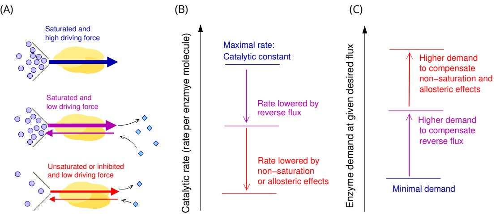

Figure 6.2: Enzyme cost in metabolism. (A) Enzyme-specific flux depends on a number of physical factors. Under ideal conditions, an enzyme molecule catalyses its reaction at a maximal rate given by the enzyme's forward catalytic constant (blue). The rate is reduced by microscopic reverse fluxes (magenta) and by incomplete saturation with substrate, causing waiting times between reaction events, or by enzyme inhibition or incomplete activation (red). (B-C) On a logarithmic scale, catalytic rates and enzyme demand can be split into sums of efficiency terms. With lower catalytic rates, larger amounts of enzyme are required for realizing the same metabolic flux.

where *s* and *p* will be the concentrations of the substrate (S) and product (P) respectively, and *E* the concentration of the enzyme which catalyzes this reaction (for simplicity, we drop the *tot* subscript from *E*tot). Here, we will be using the factorized rate law (Eq. [3.15)](#page-51-1), but other kinetic rate laws would produce similar results. The rate of a reaction is given by:

$$v = E \cdot k_{\rm cat}^{+} \cdot \frac{s/K_{\rm S}}{1 + p/K_{\rm P} + s/K_{\rm S}} \cdot \left(1 - e^{\Delta G_{r}^{\prime}/RT}\right) \tag{6.5}$$

where *k* + cat is the forward turnover rate, *Ks* and *Kp* are the Michaelis-Menten constants for the S and product P, and ∆*G* 0 *r* is the Gibbs free energy. So, the minimal amount of enzyme that is required for reaching a given rate *v* is:

$$q \equiv v \cdot h \cdot \frac{1}{k_{\rm cat}^{+}} \cdot \frac{1 + p/K_{\rm P} + s/K_{\rm S}}{s/K_{\rm S}} \cdot \left(1 - e^{\Delta G_{r}^{\prime}/RT}\right)^{-1},\tag{6.6}$$

where *h* is a number converting enzyme concentration *e* into enzyme amount *q* (for example, the enzyme molecular mass). For an illustration, see Figure [6.2](#page-99-0) . Summing up the demand across all the reactions in the pathway (each with its own rate, kinetic parameters, and substrate/product concentrations) will produce the total enzyme demand. Looking at this function, we can already make some interesting observations. First, the kinetic parameters (*k* + cat, *Kp*, and *Ks*) can be treated as constants since they change only in evolutionary timescales, and we often assume that existing enzymes already have near-optimal kinetics (although that's not always the case). Since we care about the demand *per pathway flux* one can, without loss of generality, set *v* to 1. However, if the pathway requires a non-trivial ratio between some reactions, the value of *v* can be different based on the stoichiometry. Finally, the thermodynamic term, i.e. 1−*e* ∆*G*0 *r /RT* (which we will discuss in more detail in the following section, [6.3)](#page-101-0), is a function of the metabolite concentrations and the *K*eq, which is another constant. So, generally speaking, enzyme demand is defined by a set of constants that are unique to each pathway, and variables that represent the metabolite concentrations. Since these concentrations are subject to change depending on the growth conditions, we often treat them as optimization variables and try to find the minimal demand possible within certain constraints. In Section [6.4,](#page-105-0) we will see a general method for finding the minimal value using convex optimization.

#### <span id="page-100-1"></span><span id="page-100-0"></span>**Mathematical details 6.C : Factorized rate laws and enzyme cost function**

According to Eq. [(6.13)](#page-108-1), reversible rate laws can be factorized into five terms that depend on metabolite concentrations in different ways [\[102\]](#page-258-15). For a reaction S P with reversible Michaelis-Menten kinetics Eq. [(6.11)](#page-106-1), a driving force *θ* = −∆r*G*0*/RT*, and a prefactor for non-competitive inhibition, the rate law can be written as

|      |   |        |   | +<br>v = E · k<br>cat · [1 − e<br> <br>{z<br>ηfor | −θ<br>]<br>·<br>} | s/KS<br>·<br>1 + s/KS + p/KP<br> <br>{z<br>}<br> <br>ηsat | 1<br>1 + x/KI<br>{z<br>ηreg | }          |   |            |
|------|---|--------|---|---------------------------------------------------|-------------------|-----------------------------------------------------------|-----------------------------|------------|---|------------|
| Rate | = | enzyme | · | forward catalytic                                 | ·                 | thermodynamic                                             | ·                           | saturation | · | regulation |
|      |   | level  |   | constant                                          |                   | factor                                                    |                             | factor     |   | factor     |

with inhibitor concentration *x*. The product of the first two terms, *E* and *k* + cat, represents the maximal velocity, i.e. the rate at full substrate-saturation without backward flux and without enzyme inhibition. The following factors decrease this velocity for different reasons: *η* for describes a decrease due to backward fluxes, *η* sat – the decrease due to incomplete substrate saturation, and *η* reg – the decrease due to small-molecule regulation (see Figure b). While *k* + cat is an enzyme-specific constant (yet, dependent on conditions such as pH, ionic strength, or molecular crowding in cells), the efficiency factors are concentration-dependent, unitless, and can vary between 0 and 1. The thermodynamic factor *η* for depends on the driving force (and thus, indirectly, on metabolite concentrations), and the equilibrium constant is required for its calculation. The saturation factor *η* sat depends directly on metabolite levels and contains the *K*M values as parameters. Enzyme regulation by small molecules yields additive or multiplicative terms in the rate law denominator, which in our example and can be captured by a separate factor *η* reg. The enzyme cost for a flux *v*, with an enzyme burden *he*, can be written as

$$q = h_e \cdot E = h_a \cdot v \cdot \frac{1}{k_{\rm cat}^+} \cdot \underbrace{\frac{1}{[1 - \mathbf{e}^{-\theta}]}}_{1/\eta^{\rm for}} \cdot \underbrace{\frac{1 + s/K_S + p/K_P}{s/K_S}}_{1/\eta^{\rm not}} \cdot \underbrace{[1 + x/K_{\rm l}]}_{1/\eta^{\rm reg}}$$

and contains the terms from the rate law in inverse form. The first factors, *he v/k*+ cat, define a minimum enzyme cost, which is then increased by the following efficiency factors. By omitting some of these factors, one can construct simplified enzyme cost functions with higher specific rates, or lower enzyme demands (compare Figure [6.2b](#page-99-0)). For a closer approximation, the factors may be substituted with constant numbers between 0 and 1.

Most of the proposed criteria for good pathways have either to do with material investments (such as substrate, cofactor, or energy demand) or with "machine investments", that is, enzyme demands. Enzyme demands, in turn, depend on pathway length, enzyme masses, and enzyme efficiency, and therefore on rate laws (where *k*cat values, thermodynamic forces, and metabolite concentrations come into play). In fact, many criteria which we discussed earlier as indicators of efficiency are actually an approximation of the enzyme demand under certain assumptions. For example, the number of steps is proportional to the total demand if all enzymes have exactly the same *k* + cat, saturation, and thermodynamics. Therefore, it is quite a useful ruleof-thumb in case not much else is known about the enzymes themselves. A better approximation, denoted *Pathway Specific Activity*, was used by [\[214\]](#page-266-4) to compare CO2 fixation cycles. If we assume that all enzymes are fully saturated and irreversible, the demand would be a direct function of the individual enzyme specific activities (specifically, proportional to the sum of all their reciprocal values). But even if we know nothing about the enzyme kinetic parameters, thermodynamics alone can provide us with useful information with which to grade pathways. Specifically, the *K*eq of a reaction is a universal constant that is not affected by enzymes, but rather determined solely by the chemical structures of the substrates and products.

In the following sections, we will focus on enzyme use efficiency as a main objective and consider a thermodynamic approximation, relating enzyme demands to thermodynamic forces. For linear metabolic pathways, optimal enzyme profiles (and the associated metabolite profiles and enzyme costs) can be computed with closed formulae. We will also discuss a way to compute optimal enzyme profiles numerically, for networks of any shape and size, as long as the flux mode is known.

## <span id="page-101-4"></span><span id="page-101-0"></span>**6.3 The role of thermodynamics**

In general, when considering larger metabolic networks, thermodynamic feasibility can play an important or even crucial role in determining which pathways are used. In this section we will discuss this role more explicitly and see how thermodynamics can still give us useful insights about pathway efficiency even when no other kinetic data is available.

Why are thermodynamic driving forces a meaningful criterion for good pathways? In brief, the driving forces, defined as *θ* ≡ −∆*G* 0 */RT*, play a double role: first, they determine whether or not a pathway flux is feasible at all, given the metabolite concentrations at the pathway boundary (i.e. the metabolites that form connections to the broader metabolic network); and second, in case the pathway *is* feasible, driving forces can affect enzyme efficiency and, consequently, the enzyme demand for a given desired pathway flux. In Chapter [3,](#page-36-0) we learned that ∆*G* 0 , and hence the driving force *θ*, depends on the equilibrium constant *K*eq of the reaction and on the substrate and product concentrations. We also learned that for a flux in forward direction, the driving force must be positive. Beyond that, the efficiency of an enzyme is proportional to *η* for(*θ*) = 1 − e −*θ* , a function that ranges between 0 (for *θ* = 0, reactions in thermodynamic equilibrium) and 1 (*θ* 1, reactions far from equilibrium). Let us now see how this non-equilibrium relation affects pathway efficiency.

### <span id="page-101-1"></span>**6.3.1 Kinetics and driving forces**

We should remind ourselves some of the lessons learned in Chapter [3.](#page-36-0) Specifically, recall the factorized rate law [\[102\]](#page-258-15) with a reversibility term that is an explicit function of the Gibbs energy (Eq. [3.15)](#page-51-1):

<span id="page-101-3"></span>
$$v = E \cdot k_{\rm cat}^{+} \cdot \frac{\prod_{i} s_{i}^{\nu_{i}} / K_{s}}{1 + \prod_{j} p_{j}^{\nu_{j}} / K_{p} + \prod_{i} s_{i}^{\nu_{i}} / K_{s}} \cdot \left(1 - e^{\Delta G_{r}^{\prime} / RT} \right). \tag{6.7}$$

The enzyme mechanism behind this formula assumes fast binding and unbinding of substrate and product, and a slow reversible conversion step (of bound substrate into bound product). Note that here we generalize the rate law for cases with more than one substrate and one product, where *νi* and *νj* are the stoichiometric coefficients of substrates and products, respectively[1](#page-101-2) . This generalization is one out of many, and corresponds to the assumption that all reactants bind independently to the enzyme (and at random order). We focus on this rate law because it is one of the simplest, but the theoretical results in this chapter apply to most other generalizations as well (e.g. convenience kinetics [\[223\]](#page-266-13)).

According to the definition of *k* + cat, and also by noticing that the middle and rightmost terms in Eq. [(6.7)](#page-101-3) are each smaller than 1, the rate of an enzymatic reaction is bounded by *v* ≤ *E* · *k* + cat (see Mathematical Details Box [6.C](#page-100-0) for a detailed explanation). However, the additional terms are often much lower than 1, which means that the rate does not reach its maximum. If we try to measure the apparent catalytic rate by dividing the rate by the enzyme abundance (*k*a*pp* = *v/E*) we would typically get a value that is lower than *k* + cat, while only in rare "ideal" cases, *k*a*pp* would approach the *k* + cat. In fact, this reasoning was used by Davidi et al. [\[31\]](#page-254-6) to estimate the *k* + cat values of more than 100 enzymes in *E. coli*, where they sampled many growth conditions and took the maximum *k*a*pp* as the estimate.

As discussed in Section [3.3.2,](#page-51-0) the factorized rate law has a thermodynamic perspective based on the fluxforce relationship, where we view the reversibility term as a "penalty" for the fact that by lowering the energy barrier, enzymes must catalyze reactions in both directions. When the driving force (*θ*) is low, the reverse reaction flux can become significant and lower the net flux. On the other hand, if the driving force is large enough, this term can be ignored and the rate law resembles irreversible kinetics .

<span id="page-101-2"></span><sup>1</sup> In general, reaction stoichiometries can be arbitrarily scaled. For example, instead of a reaction 2 A → B, we may write A → 1 2 B for convenience, which will only lead to a scaling factor in the reaction rate. However, this holds only if reaction stoichiometries are used to describe mass-balance. In cases like Eq. [(6.7)](#page-101-3), where stoichiometries appear in kinetic rate laws or in thermodynamic balances, we do not have this choice. In these cases, the stoichiometries must reflect the molecularities, that is, the actual number of reactant molecules involved in the enzymatic reaction.

<span id="page-102-2"></span><span id="page-102-1"></span>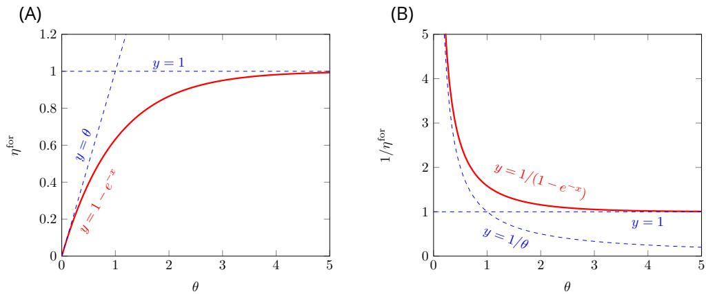

Figure 6.3: The thermodynamic efficiency term *η* for and some approximations. (A) In a given reaction, the thermodynamic efficiency term *η* for = 1 − *e* −*θ* (solid line) can vary between 0 and 1 depending on the driving force *θ*. Small driving forces make the enzyme inefficient, since *η* for → 0, while for large forces, thermodynamics does not play a role as *η* for → 1. The dashed lines show two linear approximation that hold always as bounds, but can also be used as good approximations for small or large *θ* values, respectively: (1 − *e* −*θ* ) *< θ* and (1 − *e* −*θ* ) *<* 1. (B) The reciprocal value 1*/η*for is one of the factors determining enzyme demand. The solid line shows the thermodynamic demand factor 1*/η*for, while the dashed lines show the resulting approximations 1*/η*for *>* 1*/θ* and 1*/η*for *>* 1, corresponding respectively to the enzyme demand approximations *E* ≥ *v k*cat*θ* and *E* ≥ *v k*cat .

So far we've seen that increasing the driving force of a single reaction translates to a better enzyme efficiency and lower demand. If we consider whole pathways, ones whose overall driving force is larger have more of it to distribute among the reactions and therefore should also have higher efficiencies overall. However, using "too much" driving force can also have downsides. Using a larger amount of the Gibbs energy to drive the pathway reactions means that less of that energy would go for building biomass or currency metabolites such as ATP. An example for this trade-off between the efficiency of single enzymes (in terms of backward rates) and the overall pathway efficiency (in terms of ATP yield) was demonstrated by Flamholz et al. [\[224\]](#page-266-14) who analyzed two versions of the famous glycolytic pathway (see Figure [6.1](#page-96-0) below).

### <span id="page-102-0"></span>**6.3.2 Small driving forces should be avoided**

With the factorized rate law [6.7,](#page-101-3) we can approximate the reaction rates by *v* ≤ *E k*cat (1 − e −*θ* ) (where we assume positive fluxes by convention). The thermodynamic efficiency *η* for = 1 − e −*θ* plays a prominent role. As shown in Figure [6.3,](#page-102-1) this formula yields two important approximations: for small forces *θ*, that is, close to equilibrium, we obtain *η* for ≈ *θ*, while for large forces, that is, for strongly forward-driving reactions, we obtain *η* for ≈ 1. In fact, both approximations also serve as upper bounds across all *θ* values. What does this mean? Far from equilibrium, the thermodynamic term does not play a role and can be ignored. Close to equilibrium, in contrast we obtain a simple approximation for fluxes

$$v < E \cdot k_{\rm cat}^{+} \cdot \left(1 - e^{-\theta}\right) < E \cdot k_{\rm cat}^{+} \cdot \theta \tag{6.8}$$

and hence for the enzyme demand

$$E > \frac{v}{k_{\rm cat}^{+} \cdot (1 - e^{-\theta})} > \frac{v}{k_{\rm cat}^{+} \cdot \theta}.\tag{6.9}$$

As *θ* goes to zero, the enzyme demand (for a given desired flux) goes to infinity. We already know the reason from Chapter [3:](#page-36-0) the driving force determines the ratio of forward and reverse one-way fluxes, *v*+ *v*− = e *θ* . If *θ* comes close to zero, their relative difference becomes very small, and in order to obtain a given net flux *v* = *v*+ − *v*−, both *v*+ and *v*− must grow enormously, which would require an a large amount of enzyme.

<span id="page-103-1"></span>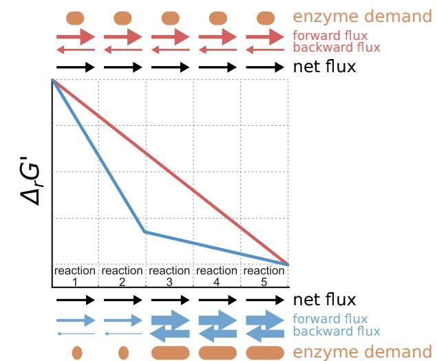

Figure 6.4: Thermodynamic forces, enzyme efficiency, and enzyme demand in a linear chain of reactions. The plot in the center represent two possible profiles of the thermodynamic driving forces (blue and red). The curves describe the cumulative ∆*G* 0 values: while the total ∆*G* 0 is fixed (and determined by external metabolite concentrations), the shape of the profile can vary. In the optimal profile (in red), small driving forces are avoided. The driving forces determine the ratios of forward and backward one-way fluxes (red arrows), and at a given net flux (black arrows) the enzyme demands. In the suboptimal blue curve, in contrast, the last three reactions show lower forces, and therefore relatively high reverse fluxes (blue arrows); to obtain the same net flux, forward and backward fluxes have to be strongly increased, which increases the enzyme demand.

This effect concerns only very small *θ* values - for *θ* much larger than 1 (or ∆*G* 0 much smaller than -RT), it can be neglected. Therefore, redistributing driving forces between reactions, to avoid very small forces, can save enzyme costs. The relation between driving forces, enzyme efficiency enzyme demand is shown in more detail in Figure [6.4.](#page-103-1)

If small driving forces should be avoided to prevent enzyme costs from going infinity, how can this happen in practice? The driving forces themselves depend on metabolite levels, which can vary over several orders of magnitude. While the true metabolite concentrations are usually unknown, we hypothesize that selection favors concentration profiles that prohibit very small driving forces, in order to escape the ensuing large enzyme demands. Of course, completely avoiding small driving forces may be impossible, as there is always a trade-off: if a metabolite concentration decreases, the driving forces of all reactions producing it will increase, but the driving forces of all reactions consuming it will decrease simultaneously. So, all else being equal, the optimal metabolite profile is one that distributes its driving forces as evenly as possible.

### <span id="page-103-0"></span>**6.3.3 Max-Min Driving Force method**

Previously in Chapter [4.3.2,](#page-73-0) we discussed adding thermodynamic constraints to constraint-based models in order to comply with the second law of thermodynamics. We can extend that approach in order to implement the idea of avoiding small driving forces. When we talk about the thermodynamic profile of a metabolic pathway, we usually try to visualize it by the cumulative Gibbs energy of reaction: we start at 0 and at each step add the ∆*rG* 0 of the next reaction, which, assuming the pathway is feasible, is a negative number. The profile therefore has a shape of a downhill slope. The end point represents the total Gibbs energy and depends only on the concentrations of the metabolites that are part of the net reaction. Intermediate metabolites do not affect it, but they do determine the shape of the profile itself (see Figure [6.4)](#page-103-1). Specifically, each intermediate metabolite typically affects the driving force of two reactions – the one producing it and the one consuming it – with opposite signs. Therefore, changing the concentration of an intermediate can help increase the driving force of one reaction, but always at the expense of another reaction. This strong coupling between ∆*rG* 0 is

<span id="page-104-2"></span>why it is not trivial to find the optimal thermodynamic profile of a pathway.

The Max-Min driving force method (MDF) [\[225\]](#page-267-0) is a method for predicting metabolite concentrations, based on the principle of evenly distributed driving forces. All fluxes are fixed and given, and assumed to be positive. It assumes that each metabolite concentration must remain in a predefined range, converts each choice of metabolite concentrations into the corresponding pattern of driving forces, and determines the *smallest* resulting driving force in the network. If this smallest driving force is negative, the flux distribution cannot be realized thermodynamically. Otherwise, the larger this smallest driving force, the better the overall metabolite profile. Hence, among all possible metabolite profiles, MDF predicts the one that maximizes the value of the minimal driving force across the network. Mathematically, this leads to a linear optimization problem: in the space of logarithmic metabolite concentrations, a lower bound on all driving forces (denoted *B*) is maximized (Eq. [6.10)](#page-104-1). An illustrative example is shown in Figure [6.5.](#page-105-2)

<span id="page-104-1"></span>
$$\begin{array}{ll}\textbf{Maximizze}_{\mathbf{x},B} & B\\\textbf{Subject to} & -\left(\Delta_{\mathrm{r}}\mathbf{G}^{\prime\mathrm{o}} + RT \cdot \mathbf{N}^{\top}\mathbf{x}\right) \geq B\\& \ln(\mathbf{C}_{\mathrm{min}}) \leq \mathbf{x} \leq \ln(\mathbf{C}_{\mathrm{max}})\end{array} \tag{6.10}$$

MDF is easy to apply: it is based on a simple Linear Programming problem and requires only the following input data: (i) the stoichiometric network; (ii) the flux directions; (iii)) the known equilibrium constants (or equivalently, the standard reaction Gibbs free energies); (iv) physiological ranges for metabolite concentrations. Based on these data alone, metabolite concentrations and driving forces (or ∆*G* 0 values) are predicted. An example application can be found in Hädicke et al. [\[226\]](#page-267-1), where the potential of CO2 fixation in *E. coli* via endogenous pathways was analyzed using MDF.

A theoretical insight from MDF is the notion of distributed bottlenecks. A simple bottleneck would consist of a single reaction whose driving force cannot be increased because the substrates are at their upper concentration bounds and the products are at their lower concentration bounds. Given the fixed equilibrium constant, nothing can be done to increase the driving force in this reaction. A distributed bottleneck is more complicated: it consists of a series of reactions that all share the same low driving force, which, because of all the concentration constraints in the system, cannot be further increased (e.g. as in Figure [6.4)](#page-103-1). Even though each single reaction looks "harmless" because its own driving force could still be increased, this increase would happen at the expense of other driving forces.

### <span id="page-104-0"></span>**6.3.4 The roles of thermodynamics for metabolic states**

In summary, thermodynamics provides important clues both about the feasibility of pathways fluxes and about their enzyme demand. To use this knowledge, fluxes need to be considered together with metabolite concentrations (to obtain the possible driving forces), but no detailed knowledge of enzyme kinetics is required. Thermodynamics alone yields an upper bound on fluxes (and hence, a lower bound on enzyme demands) that holds for any kinetic rate laws. The only required data (except for the metabolic network itself) are equilibrium constants (or equivalently, standard Gibbs free energies of reactions ∆*G* 0◦), which can be obtained from the eQuilibrator tool [(equilibrator.weizmann.ac.il)](https://equilibrator.weizmann.ac.il) [\[227,](#page-267-2) [80,](#page-257-10) [81\]](#page-257-11) as well as physiological bounds on metabolite concentrations. Given this information, and given a feasible choice of metabolite concentrations, we can compute the driving forces of all reactions, and from the factorized rate law (and assuming positive fluxes by convention) we can then approximate the reaction rates by *v* ≤ *E k*cat (1 − e −*θ* ).

We also recall from Chapter [3](#page-36-0) that driving forces are not independent between reactions, but depend on the metabolite concentrations, which creates trade-offs: in a chain A *R*→1 B *R*→2 C, a lower concentration of B will increase the driving force in *R*1, but decrease the driving force in *R*2. For high enzyme efficiency (low enzyme demand), all driving forces should in principle be high, but this is most important for low *θ* values

<span id="page-105-3"></span><span id="page-105-2"></span>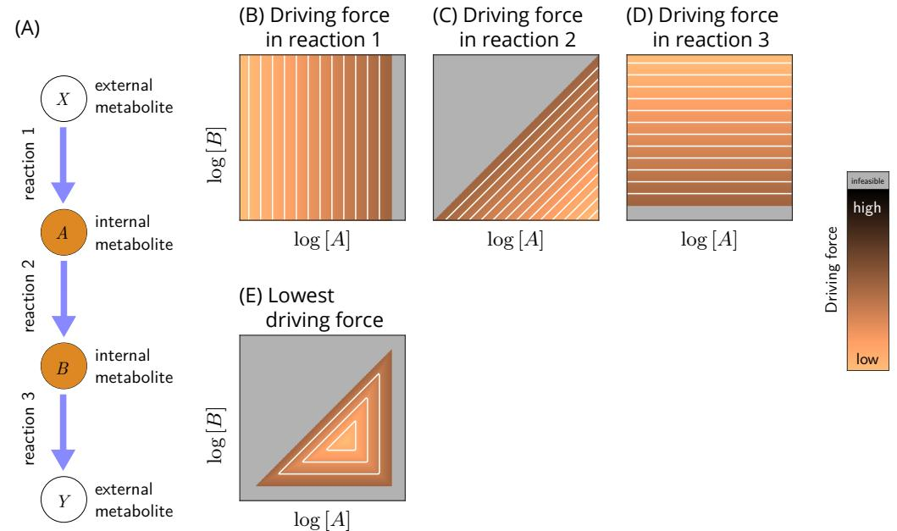

Figure 6.5: Max-Min Driving force method (MDF): an optimality problem in metabolite space. (A) Example pathway with given equilibrium constants and fixed concentrations of the external metabolites *X* and *Y* . What are the most favorable concentrations of the internal metabolites *A* and *B*? Assuming that small driving forces should be avoided in all reactions, MDF determines the metabolite profile that optimizes a worst case: it maximizes the worst (that is, smallest) driving force among all three reactions. (B) Driving force in reaction 1, as a function of the logarithmic concentrations of *A* and *B*, called ln *a* and ln *b*. Higher concentrations of *A* (the reaction product) lead to smaller driving forces. Above a critical value (where *X* and *A* are in equilibrium), the driving force becomes negative, and a forward flux is impossible (grey region). The concentration of *B*, which does not participate in the reaction, does not play a role. (C) Driving force for reaction 2. Here, it is the ratio *b/a* that counts. The lower the ratio (lower right), the higher the driving force. If the ratio is higher than the equilibrium constant, the driving force becomes negative (grey region). (C) Driving force for reaction 3. (E) By overlaying the contours in (B), (C), and (D) and taking the minimum value, we obtain the minimal driving force *θ* min among all three reactions. *θ* min is a piecewise linear function of ln *a* and ln *b* within the feasible range, yielding positive forces in all three reactions. The maximum point of this function is the optimum metabolite profile predicted by MDF. In the example shown, the feasible concentration space is entirely defined by the driving forces themselves, given the external concentrations. In general, physiological concentration ranges for all metabolites could further decrease the solution space and shift the optimum point (not shown).

(while for *θ* 1 it does not even matter). Therefore we may conclude that, to save enzyme, a cell should rearrange its metabolite levels within physiological bounds such that small *θ* are avoided. Implementing this as an optimality problem, we obtain MDF.

In conclusion, we described (i) a general rule of thumb that poor thermodynamics makes reactions costly; (ii) simple approximations of enzyme cost; and (iii) practical methods (MDF) to obtain metabolite profiles with favorable thermodynamic properties.

## <span id="page-105-0"></span>**6.4 Enzyme cost minimization**

## <span id="page-105-1"></span>**6.4.1 Enzyme cost minimization**

The problem of minimizing the total enzyme demand (or cost) for a given pathway can be solved numerically, thanks to the fact that they are always convex [\[228\]](#page-267-3). Finding the minimum of the convex objective (the total enzyme cost) in a convex set (the set of admissible metabolite profiles, a convex polytope in log-metabolite space) can be done efficiently. In contrast to general optimality problems, such problems have a unique local optimum, which can be found by simple numerical methods. In this section, we demonstrate it with a simple <span id="page-106-3"></span>example, the same three-reaction pathway that you already saw in Section [6.3](#page-101-0) above.

### <span id="page-106-0"></span>**6.4.2 Enzyme cost landscape of a metabolic pathway**

Given the fluxes, kinetics, and concentration bounds in a metabolic pathway model, one can predict the enzyme demand by assuming that cells minimize the enzyme cost in that pathway. In the Enzyme Cost Minimization method A reaction rate *v* = *e* · *f*(**c**) depends on enzyme level *e* and metabolite concentrations *ci* through the enzymatic rate law, *f*(**c**). If the metabolite concentrations were known, we could directly compute enzyme demands *e* = *v/f*(**c**) from fluxes, and similarly calculate the flux-specific enzyme demand *e/v* = 1*/f*(**c**). However, metabolite concentrations are usually unknown and vary between experimental conditions. Therefore, there can be many solutions for *e* and **c** realizing one flux distribution. To select one of them, we employ an optimality principle: we define an enzyme cost function (for instance, total enzyme mass) and choose the enzyme profile with the lowest cost while restricting the metabolite levels to physiological ranges and imposing some thermodynamic constraints. As we shall see below, the solution is in many cases unique.

Let us demonstrate this procedure with a simple example (Figure [6.6](#page-107-1) (a)). In the pathway *X A B Y* , the external metabolite levels [X] and [Y] are fixed and given, while the intermediate levels [A] and [B] need to be found. As rate laws for each of the three reactions, we use reversible Michaelis-Menten (MM) kinetics

<span id="page-106-1"></span>
$$v = E \frac{k_{\rm cat}^{+} s/K_{\rm S} - k_{\rm cat}^{-} p/K_{\rm P}}{1 + s/K_{\rm S} + p/K_{\rm P}} \tag{6.17}$$

with enzyme level *E*, substrate and product levels *s* and *p*, turnover rates *k* + cat and *k* − cat, and Michaelis constants *K*S and *K*P. In kinetic modeling, steady-state concentrations would usually be obtained from given enzyme levels and initial conditions through numerical integration. Here, instead, we fix a desired pathway flux *v* and compute the enzyme demand as a function of metabolite concentrations:

<span id="page-106-2"></span>
$$E(s, p, v) = v \frac{1 + s/K_{\rm S} + p/K_{\rm P}}{k_{\rm cat}^{+} s/K_{\rm S} - k_{\rm cat}^{-} p/K_{\rm P}}.\tag{6.12}$$

Figure [6.6](#page-107-1) shows how the enzyme demand in each reaction depends on the logarithmic reactant concentrations. To obtain a positive flux, substrate levels *s* and product levels *p* must be restricted: for instance, to allow for a positive flux in reaction 2, the rate law numerator *k* + cat [*A*]*/K*S − *k* − cat [*B*]*/K*P must be positive. This implies that [*B*]*/*[*A*] *< K*eq where the reaction's equilibrium constant *K*eq is determined by the Haldane relationship, *K*eq = (*k* + cat*/k*− cat)·(*K*P*/K*S). With all model parameters set to 1, we obtain the constraint [*B*]*/*[*A*] *<* 1, i.e. ln[*B*] − ln[*A*] *<* 0, putting a straight boundary on the feasible region (Figure [6.6](#page-107-1) (c)). Close to chemical equilibrium ([*B*]*/*[*A*] ≈ *K*eq), the enzyme demand *e*2 approaches infinity. Beyond that ratio ([*B*]*/*[*A*] *> K*eq) no positive flux can be achieved (grey region). Such a threshold exists for each reaction (see Figure [6.6](#page-107-1) (b)-(d)). The remaining feasible metabolite profiles form a triangle in log-concentration space, which we call *metabolite polytope* P (Figure [6.6](#page-107-1) (e)), and Eq. [(6.12)](#page-106-2) yields the total enzyme demand *E*tot = *E*1+*E*2+*E*3, as a function on the metabolite polytope. The demand increases steeply towards the edges and becomes minimal in the center. The minimum point marks the optimal metabolite profile, and via Eq. [(6.12)](#page-106-2) we obtain the resulting optimal enzyme profile.

The metabolite polytope and the large enzyme demand at its boundaries follow directly from thermodynamics. To see this, we consider the unitless *thermodynamic driving force* Θ = −∆r*G* 0 */RT* [\[88\]](#page-258-1) derived from the reaction Gibbs free energy ∆r*G* 0 . The thermodynamic force can be written as Θ = ln *K*eq [*B*]*/*[*A*] , i.e. the driving force is positive whenever [*B*]*/*[*A*] is smaller than *K*eq, and it vanishes if [*B*]*/*[*A*] = *K*eq. How is this force related to enzyme cost? A reaction's net flux is given by the difference *v* = *v* + − *v* − of forward and backward fluxes, and the ratio *v* +*/v*− depends on the driving force as *v* +*/v*− = eΘ. Thus, only a fraction *v/v*+ = 1−e −Θ of the forward flux acts as a net flux, while the remaining forward flux is partially canceled by the backward flux. Close to chemical equilibrium, where the mass-action ratio [*B*]*/*[*A*] approaches the equilibrium con-

<span id="page-107-1"></span>

Figure 6.6: Enzyme demand in a metabolic pathway. (A) Pathway with reversible Michaelis-Menten kinetics (equilibrium constants, catalytic constants, and *K*M values are set to values of 1, [*A*] and [*B*] denote the variable concentrations of intermediates *A* and *B* in mM). The external metabolite concentrations [*X*] and [*Y* ] are fixed. Plots (B)-(D) show the enzyme demand of reactions 1, 2, and 3 at given flux *v* = 1 according to Eq. [(6.12)](#page-106-2). Grey regions represent infeasible metabolite profiles. At the edges of the feasible region (where *A* and *B* are close to chemical equilibrium), the thermodynamic driving force goes to zero. Since small forces must be compensated by high enzyme levels, edges of the feasible region are always dark blue. For example, in reaction 1 (panel (B)), enzyme demand increases with the level of *A* (x-axis) and goes to infinity as the mass-action ratio [*A*]*/*[*X*] approaches the equilibrium constant (where the driving force vanishes). (E) Total enzyme demand, obtained by summing all enzyme levels. The metabolite polytope – the intersection of feasible regions for all reactions – is a triangle, and enzyme demand is a cup-shaped function on this triangle. The minimum point defines the optimal metabolite concentrations and optimal enzyme levels. (F) As the *k*cat value of the first reaction is lowered by a factor of 5, states close to the triangle edge of reaction 1 become more expensive and the optimum point is shifted away from the edge. (G) The same model with a physiological upper bound on the concentration [*A*]. The bound defines a new triangle edge. Since this edge is not caused by thermodynamics, it can contain an optimum point, in which driving forces are far from zero and enzyme costs are kept low. Please note the resemblance to the MDF problem for the same pathway, shown in Figure [6.5.](#page-105-2)

stant *K*eq, the driving force goes to zero, the reaction's backward flux increases, and the flux per enzyme level drops. This is what happens at the triangle edges in Figure [6.6:](#page-107-1) a reaction approaches chemical equilibrium, the driving force Θ goes to zero, and large enzyme amounts are needed for compensation. Exactly on the edge, the driving force vanishes and no enzyme level, no matter how large, can support a positive flux. The quantitative cost depends on model parameters: for example, by lowering a *k*cat value, the increase in enzyme cost at the boundary becomes steeper and the optimum point is shifted away from the boundary (see Figure [6.6](#page-107-1) (f)).

### <span id="page-107-0"></span>**6.4.3 Enzyme cost as a function of metabolite profiles**

The prediction of optimal metabolite and enzyme levels can be extended to models with general rate laws and complex network structures. In general, enzyme demand depends not only on driving forces and *k*cat values, but also on the kinetic rate law, which includes *K*M values and small-molecule regulation. We can conveniently model or approximate these factors by using factorized rate laws. Let us write this rate laws here again in a general form to see the different factors at play. As we learned in Section [6.2,](#page-98-0) the rate of a reaction depends on enzyme level *e*, forward catalytic constant *k* + cat (i.e. the maximal possible forward rate

per unit of enzyme, in s−1 ), driving force (i.e. the ratio of forward and backward fluxes), and on kinetic effects such as substrate saturation or small-molecule regulation. If all active fluxes are positive, reversible rate laws like the Michaelis-Menten kinetics in Eq. [(6.11)](#page-106-1) can be factorized as [\[102\]](#page-258-15):

<span id="page-108-1"></span>
$$
v_{\
u} = \left. E \cdot k_{\rm cat}^{+} \cdot \eta^{\rm for} \cdot \eta^{\rm sat} \cdot \eta^{\rm reg} \right. \tag{6.13}$$

Negative fluxes, which would complicate our formulae, can be avoided by orienting the reactions in the direction of fluxes.

Enzyme demand can be quantified as a concentration (e.g. enzyme molecules per volume) or mass concentration (where enzyme molecules are weighted by their molecular weights). If rate laws, fluxes, and metabolite concentrations are known, the enzyme demand of a single reaction *l* follows from Eq. [(6.13)](#page-108-1) as

<span id="page-108-2"></span>
$$E(\mathbf{c}, vl) \quad = \quad vl \cdot \frac{1}{k_{\rm cat, l}^{+}} \cdot \frac{1}{\eta_{l}^{\rm for}(\Theta(\mathbf{c}))} \cdot \frac{1}{\eta_{l}^{\rm sat}(\mathbf{c})} \cdot \frac{1}{\eta_{l}^{\rm reg}(\mathbf{c})}.\tag{6.14}$$

To determine the enzyme demand of an entire pathway, we sum over all reactions: *E* path tot = P *l el*. Based on its enzyme demands *El*, we can associate each metabolic flux with an enzyme cost *q* = P *l hEl El*, describing the effort of maintaining the enzymes. The burdens *hEl* of different enzymes represent, e.g. differences in molecular mass, post-translational modifications, enzyme maintenance, overhead costs for ribosomes, as well as effects of misfolding and non-specific catalysis. The enzyme burdens *hEl* can be chosen heuristically, for instance, depending on enzyme sizes, amino acid composition, and lifetimes. Setting *hEl* = *ml* (protein mass in grams per mole), *q* will be in gram protein per gram cell dry weight. Considering the specific amino acid composition of enzymes, we can also assign specific costs to the different amino acids. Alternatively, an empirical cost per protein amount can be established by the level of growth impairment that an artificial induction of protein would cause [\[60,](#page-256-5) [229\]](#page-267-4). Thus, each reaction flux *vl* is associated with an enzyme cost *ql*, which can be written as a function *ql*(*vl,* **c**) ≡ *hEl El*(**c***, vl*) of flux and metabolite concentrations. From now on, we refer to log-scale metabolite concentrations *si* = ln *ci* to obtain simple optimality problems below. From the factorized rate law Eq. [(6.14)](#page-108-2), we obtain the enzyme cost function

<span id="page-108-3"></span>
$$q(\mathbf{s}, \mathbf{v}) \equiv \sum_{l} h_{E_l} E_l(v_l, \mathbf{s}) = \sum_{l} h_{E_l} \cdot v_l \cdot \frac{1}{k_{\rm cat, l}^+} \cdot \frac{1}{\eta_l^{\rm cat}(\mathbf{s})} \cdot \frac{1}{\eta_l^{\rm cat}(\mathbf{s})} \cdot \frac{1}{\eta^{\rm reg}(\mathbf{s})} \tag{6.15}$$

for a given pathway flux **v**. If the fluxes are fixed and given, our enzyme cost becomes, at least formally, a function of the metabolite levels. The cost function is defined on the metabolite polytope P, a convex polytope in log-concentration space containing the feasible metabolite profiles. Like the triangle in Figure [6.6,](#page-107-1) the polytope is defined by physiological and thermodynamic constraints.

Beyond minimizing the total enzyme cost, one can also use Enzyme Cost Minimization to analyze the individual enzyme demands. When the metabolite levels are known, the demand can be directly calculated and each efficiency factor (*η*) in Eq. [(6.15)](#page-108-3). By omitting some factors or replacing them by constant numbers 0 *< η* ≤ 1, simplified enzyme cost functions with fewer parameters can be obtained. For example, *η* for = 1 would imply an infinite driving force Θ → ∞ and a vanishing backward flux, *η* sat = 1 implies full substrate saturation, and *η* reg = 1 implies full enzyme activation and no enzyme inhibition (or no small-molecule regulation at all). In these limiting cases, enzyme activity will not be reduced, and enzyme demand will be given by the capacitybased estimate *v/k*+ cat, a lower estimate of the actual demand. Instead of omitting an efficiency factor, it can also be set to a constant value between 0 and 1. Such simplifications and the resulting enzyme cost functions with fewer parameters can be practical if kinetic constants are unknown.

### <span id="page-108-0"></span>**6.4.4 General lessons from Enzyme Cost Minimization**

Enzyme cost minimization not only provides numerical solutions, but also some general insights.

◦ **Convexity** Enzyme Cost Minimization shows again the importance of the metabolite polytope. The usage

of logarithmic metabolite concentrations not only leads to a good search space for feasible metabolite profiles (as in MDF), but also facilitates optimization because enzyme cost is a convex function of the metabolite log-concentrations [\[230\]](#page-267-5). Convexity makes this optimization tractable and scalable – unlike a direct optimization in enzyme space. Convexity holds for a wide range of rate laws and for extended versions of the problem, e.g. including bounds on the sum of (non-logarithmic) metabolite concentrations or bounds on weighted sums of enzyme fractions.

- **Factorized rate laws disentangle individual enzyme cost effects** To see how metabolic states are shaped by different physical factors, we considered factorized rate laws. The different terms in these functions represent specific physical factors and require different kinetic and thermodynamic data for their calculation. By neglecting some terms, one obtains different approximations of the true enzyme cost. By comparing the different scores, we can estimate the enzyme cost that cells "pay" for running reactions at small driving forces (to save Gibbs free energy) or for keeping enzymes beneath substrate-saturation (e.g., to dampen fluctuations in metabolite levels ).
- **Relationship to other optimality approaches** Beyond their practical advantages, factorized enzyme cost functions also allow us to easily compare our method to earlier modeling and optimization approaches. These approaches typically focused on only one or two of the factors that are taken into account in Enzyme Cost Minimization, and many of them can be reformulated as approximations of this method [\[225,](#page-267-0) [231,](#page-267-6) [219\]](#page-266-9).
- **Enzyme cost is related to thermodynamics** In FBA, thermodynamic constraints and flux costs appear as completely unrelated aspects of metabolism (as is explained in Chapter [5)](#page-82-0). Thermodynamics is used to restrict flux directions, and to relate them to metabolite bounds, while flux costs are used to suppress unnecessary fluxes. In Enzyme Cost Minimization, thermodynamics and flux cost appear as two sides of the same coin. Like in FBA, flux profiles are thermodynamically *feasible* if they lead to a non-empty metabolite polytope, allowing for positive forces in all reactions. However, the values of these forces also play a role in shaping the enzyme cost function on that polytope. Together, metabolite polytope and enzyme cost function (as in Figure [6.6)](#page-107-1) summarize all relevant information about flux cost.

Many pathways are regulated, for instance by feedback inhibition of enzymes via the end product. While this may stabilise the dynamics and adapt it to current demands, such enzyme regulation comes at a cost, which we can estimate by following the logic of Enzyme Cost Minimization. Many enzymes are regulated by small molecules that act as competitive or allosteric inhibitors [\[232\]](#page-267-7), an effective way to implement feedback control, for example to adapt the flux in biosynthesis pathways to current needs. In order for such a regulation to work, the enzyme needs to be partially inhibited on average (because only then, its activity can be increased on demand, by alleviating the inhibition). Therefore, the enzyme efficiency goes down, and the cell needs to provide more enzyme to catalyze the same flux than without the inhibition.

How much will this regulation cost the cell as part of the enzyme budget? From the perspective of Enzyme Cost Minimization, where we start from desired fluxes and compute the enzyme demand, this question is easy to answer: in the inhibited enzyme case, the lower efficiency will be described by a factor *η* reg ∈ [0*,* 1] (Mathematical Details Box [6.C)](#page-100-0). In the same reaction, the enzyme demand increases by a factor 1*/η*reg, so the extra cost is simply 1*/η*reg − 1 times the "baseline" cost of this enzyme (without inhibition). Specifically, a non-competitive inhibitor, with efficiency factor *η* reg = 1 1 + *c/KI* yields a cost factor 1+*c/KI* . If the metabolite concentrations are fixed, this corresponds to an extra enzyme demand ∆*El* = *El ci KI,li* . Similarly, an enzyme activation with efficiency factor *η* reg = *c/KA* 1+*c/KA* in the rate laws yields a cost factor 1+*c/KA c/KA* = 1 + *KA/c* in the formulae for enzyme demands. If the metabolite concentrations are fixed, this corresponds to an extra enzyme demand ∆*El* = *El KA,li ci* (where *l* and *i* denote the regulated reaction and the regulating metabolite, respectively). As usually in Enzyme Cost Minimization, an optimal rearrangement of enzyme and metabolite concentrations must be taken into account, which will then slightly reduce the overall cost.

<span id="page-110-2"></span>The predictions of optimal states by Enzyme Cost Minimization rely on two main inputs: a metabolic model that relates metabolite concentrations, enzyme levels, and fluxes, and an optimality principle based on the assumption that cells realize their production fluxes at a minimal total enzyme cost. To test whether this optimality principle holds at all, Noor et al. [\[228\]](#page-267-3) compared the predictions from Enzyme Cost Minimization to predictions from the same metabolic model and the same flux distribution, but with randomly sampled metabolite profiles (and the corresponding enzyme profiles). In comparison, metabolite profiles sampled close to the Enzyme Cost Minimization optimum yielded significantly better enzyme level predictions than metabolite profiles sampled more broadly. This strongly supports the idea that *E. coli* metabolism, in the conditions studied, is at least partially optimized for low enzyme cost, and thus supports cost-optimality as a principle in living cells.

## <span id="page-110-0"></span>**6.5 Comparison of alternative pathways**

Having clarified our main functional criteria for pathways (substrate productivity and enzyme productivity) and how they depend on pathway details (including outer concentrations), we can now compare alternative pathways by their substrate and enzyme demand per production flux (an example of "cost per benefit") and see which one scores better.

## <span id="page-110-1"></span>**6.5.1 A tale of two glycolyses**

One of the canonical examples discussed throughout this book is how cells choose between respiration and fermentation for making their ATP. However, having a precise kinetic model for respiration is difficult, since it involves electron transfer and membrane-bound reactions. Therefore, it is challenging to calculate the enzyme cost of respiration using models like those discussed in this chapter. Flamholz et al. [\[224\]](#page-266-14) analyzed a similar but simpler case by comparing between the EMP and ED variants of glycolysis, since all the required enzymes are soluble and expressed in the cytoplasm and/or the periplasm and many of their kinetic parameters are measured. The common description of glycolysis ends in pyruvate (e.g., as depicted in Figure [6.1)](#page-96-0). This means that the pathway is not neutral in terms of redox, since the oxidation state of pyruvate is higher than glucose. In order to simplify the comparison and focus only on ATP yield (rather than NADH), the EMP and ED pathways were extended to end in lactate by including lactate dehydrogenase (*ldh*) as an extra step, making them redox neutral. These could be thought of as the more relevant versions of the pathways in anaerobic conditions.

Although EMP-based fermentation is usually described in textbooks as less efficient than respiration, since it produces only 2 moles of ATP per mole glucose instead of ≈ 30, the ED pathway has an even lower yield – 1 mole of ATP. Nevertheless, the ED pathway is quite common among the bacteria. For example, *Zymomonas mobilis* – the bacterium used in fermenting pulque (a.k.a., agave wine [\[233\]](#page-267-8)) and a promising platform for bio-production [\[234\]](#page-267-9) – lacks key enzymes from the EMP pathway and uses the ED pathway exclusively to metabolize sugars. These bacteria don't seem to be bothered by the low ATP yield and can achieve high growth rates [\[235\]](#page-267-10). This already suggests to us that the ED pathway is probably superior to EMP in other aspects, such as the enzyme demand. Another clue was provided by a study which found that the ED pathway improves *E. coli* growth during glucose up-shifts and that the flux through it increases by 130% [\[236\]](#page-267-11) (see Economic Analogy Box [6.D)](#page-112-3)

To see if indeed the models provide predictions that are consistent with the experimental evidence, Flamholz et al. [\[224\]](#page-266-14) first used the MDF method to compare the two pathways. The ED pathway was found to be substantially more thermodynamically favorable, with a much higher score than the EMP pathway (8.0 versus 4.8 kJ/mol, see Figure [6.7](#page-111-0) upper row).

Although the EMP pathway is clearly more favorable, we can still argue that an MDF of 4.8 kJ/mol is good enough, as it means *θ >* 1*.*9 for each one of the pathway reactions. In this case, *η* for *>* 0*.*85 (see Figure [6.3)](#page-102-1) and therefore it might be a small price to pay for double the ATP yield. But, as discussed earlier, the

<span id="page-111-0"></span>

Figure 6.7: Comparing two metabolic pathways using the MDF and the Enzyme Cost Minimization methods. For the MDF analysis (top row), the dashed green line represents the cumulative Gibbs energy along the pathway if all metabolite concentrations were 1 mM. The MDF solution is presented as a grey line, where the bottleneck reactions are marked in red. For the Enzyme Cost Minimization analysis (bottom row), we used the same kinetic parameters for all enzymes in both pathways (*k*cat = 200 s−1 , *K*M = 200 *µ*M, same as in [\[224\]](#page-266-14)). However, here we used an updated version of Enzyme Cost Minimization with the factorized rate law, therefore the results are not identical. A Jupyter notebook for generating the figure can be found on the [book website.](https://gitlab.com/principlescellphysiology/book-economic-principles-in-cell-biology/-/blob/master/book-manuscript/latex/chapters/PAT/jupyter/plot_figures.ipynb)

efficiency of a pathway is affected by other factors besides the thermodynamics. Flamholz et al. [\[224\]](#page-266-14) tried to see whether ED is superior to EMP also in terms of the enzyme cost using the Enzyme Cost Minimization method. Indeed, they found that the ED pathway would require ≈5 times less protein compared to EMP for catalyzing the same flux (see Figure [6.7](#page-111-0) bottom row). So, although the ATP yield of the ED pathways is half that of EMP, one can still generate ATP at a higher rate using the same amount of protein, according to the model.

The comparison of EMP and ED provided some insight as to a trade-off that can exists between the yield of a pathway and its cost, or enzyme burden. However, one can expand the question and ask if there are any other theoretically possible glycolysis pathways that might be able to break this trade-off and be more efficient than EMP and ED in both aspects. Ng et al. [\[213\]](#page-266-3) tried to address this question with an algorithm they called *optStoic* that generates all biochemically feasible routes between glucose and pyruvate, with various ATP/glucose yields. They then ran pathway analysis on all 11,916 options and found that indeed both EMP and ED are both (nearly) Pareto-optimal. This suggests that evolution may indeed select for features such as high yield and low enzyme cost, where one might be more important than the other depending on the context.

## <span id="page-112-4"></span><span id="page-112-0"></span>**6.5.2 Metabolic engineering**

Besides the quest for understanding the evolution of existing biochemical pathways, pathway analysis methods like MDF and Enzyme Cost Minimization have also been used by metabolic engineers in order to rank and prioritize different alternative designs. For example, Volpers et al. [\[237\]](#page-267-12) used the MDF algorithm and the Pathway Specific Activity measure to compare between designs of photo-electro-autotrophic strains. Similarly, Löwe and Kremling [\[238\]](#page-267-13) used the Enzyme Cost Minimization algorithm to predict the enzyme demand of both natural and synthetic carbon fixation cycles.

## <span id="page-112-1"></span>**6.5.3 Predicting the metabolite concentrations**

So far, the examples given in this section focused on analyzing and comparing pathway alternatives in isolation, outside of the context of actual living organisms. However, we should not forget that the motivation for optimization goals such as enzyme demand are derived from physiological and evolutionary principles. Therefore, the optimal solutions coming from MDF and Enzyme Cost Minimization might be good predictions for the actual metabolic state that exists in naturally evolved organisms.

For example, a few years after the *in silico* analysis of the ED pathway [\[224\]](#page-266-14), Jacobson et al. [\[239\]](#page-268-0) measured the intracellular concentrations ED intermediates in *Z. mobilis*, and used them to calculate the Gibbs energies of the pathway's reactions. Indeed, they found that they closely fit the predicted values from the MDF solution. Similarly, measured values of enzyme and metabolite concentrations in *E. coli* correlate with predicted values from Enzyme Cost Minimization (when empricial reaction fluxes were obtained from 13C-MFA measurements, Figure [6.8)](#page-113-0) [\[228\]](#page-267-3). In a related paper, Wortel et al. [\[240\]](#page-268-1) expanded the idea of this method to explore the entire flux polytope.

These results suggest that indeed the optimization process that occurs throughout evolution is somewhat similar to the (much simplified) models presented here. Of course, improving the accuracy of the inputs and accounting for other effects that impact fitness could improve the predictions further. On the other hand, it might be naïve to expect natural systems to be optimal, which would mean that using basic principles to *precisely* predict phenotypes is an impossible task.

### <span id="page-112-3"></span>**Economic analogy 6.D : The push for fast growth**

The ED pathway seems to be useful as a quick response to a sudden increase in abundance of resources (glucose), but less efficient than EMP when the environment is steady. This is somewhat analogous to start-up companies, which burn large amounts of venture capital in order to grow rapidly. However, after reaching a certain scale, the dynamic nature of start-ups often becomes a burden, where overhead costs pile up and signal that it is time to join a larger corporation.

# <span id="page-112-2"></span>**6.6 Concluding remarks**

Coming back to our initial question, what have we learned from theory about the choice between possible pathways? The "choice between pathways" in a larger network is actually a choice between (network-wide) flux distributions that use different alternative pathways. Here we discussed how to score the usefulness of given flux distributions, which can also be used to score single pathways.

Importantly, flux distributions are scalable (by scaling all enzyme levels proportionally, and keeping all metabolite levels constant). If we scale the fluxes, this will scale both the flux benefit (for instance, the production of a desired product or biomass) and the required resources (substrates consumed, enzyme budget invested, or toxic byproducts produced). Because of this scaling property, our "quality criteria" mostly have the form of ratios between an output flux (as the benefit) and some (limited) resource (the cost). Such ratios are called "productivities", where in Chapter [4](#page-62-0)[-5](#page-82-0) we focused mostly on substrate productivity (or yield on substrate) and

<span id="page-113-0"></span>

Figure 6.8: Validation of metabolite and enzyme concentrations, predicted by Enzyme Costs Minimization, in *E. coli*'s central carbon metabolism. (A) Comparing predicted and measured metabolic concentrations. The dashed line marks *x* = *y*, i.e. where the predictions match the measurements. Blue points represent cofactors whose concentration is fixes in the analysis and therefore are not actually predicted. Red points are for all other metabolites whose allowed concentration range was set to 1*µM* − 10*mM*. The Root Mean Squared Error (RMSE), *r* 2 (Pearson correlation), and *p*-value refer only to the red points. (B) Comparing predicted and measured enzyme concentrations. (C) A pie chart showing the distribution of the predicted absolute massconcentrations for both enzymes (green) and metabolites (blue) together. Note that *aconitase* (catalyzing the reactions acn1 and acn2) has a lower specific activity than *glyceraldehyde-3P dehydrogenase* (catalyzing gap), and therefore occupies a higher fraction of the mass-concentration even though the required concentration of the latter enzyme is higher.

#### <span id="page-113-1"></span>**Economic analogy 6.E : Two important assumptions: homogeneity and stationarity**

In the models described in this chapter, we generally assume that our system (for example, a metabolic pathway in a cell) is spatially and temporally homogeneous, and that it shows stable stationary states. This is clearly a simplification: in reality, cells are inhomogeneous, with compartments, with enzymes unequally distributed across the cell, and with enzymes forming complexes or dedicated compartments like the glycosome (an organelle in some organisms that contains the glycolytic enzymes), which changes (average) enzyme kinetics. Cells are also dynamic on various time scales (chemical noise, metabolic dynamics, protein expression dynamics), which also may change (average) enzyme kinetics. If we ignore this in our models – assuming a timeless steady state – this will not only cause approximation errors in our metabolic model, but much more importantly, we ignore the fact that the cell can exploit spatial inhomogeneity (e.g. compartments or channeling) and non-steady states (e.g. metabolic oscillations, or adaptation to fluctuations in the environment) to further improve its fitness (as compared to a steady-state, constant enzyme model).

Interestingly, classical economic theory makes similar assumptions – e.g. about markets in equilibrium– which ignore the spatio-temporal, dynamic side of real economic systems, which – as in the case of metabolic models – is likely to lead to wrong results.

in this chapter on enzyme productivity (or enzyme-specific rate) as important criteria. Why these criteria? On the one hand, they are closely related to some big objectives of the entire cell – depending on the type of competition it is facing. On the other hand, they are easy to link to some concrete criteria about metabolic pathways such as product yield, pathway length, *k*cat values, thermodynamic forces, etc.

Since yield on substrate depends only on the shape of the flux distribution, it can be studied by methods like FBA (see chapters [4](#page-62-0) and [5)](#page-82-0). In this chapter, we focused on the more difficult case, enzyme productivity, where thermodynamics, enzyme kinetics, and the arrangement of metabolite and enzyme concentrations come into play. The factorized law in Eq. [(6.7)](#page-101-3) shows us how the enzyme demand of a flux distribution can be computed if metabolite concentrations are known, and how the demand depends on forward *k*cat, the thermodynamic force, and enzyme saturation. The only difficulty is that the thermodynamic forces and metabolite concen-

### Concluding remarks 105

trations are usually not known. Here we considered some best-case scenarios, assuming that the cell will realize the concentration arrangements that optimize pathway performance. When considering thermodynamics alone (and making some further simplifications), this led to the MDF method. For the full problem, the solution is provided by Enzyme Costs Minimization. This method is directly related to the different pathway criteria we discussed initially (including pathway length, thermodynamic forces, and *k*cat values) and thus shows how these different factors determine enzyme demand. As a numerical method, it is relatively easy to use because it is a convex optimization problem. But if little data is available, simpler methods such as MDF, with their lower demand for parameters, may be useful tools to predict pathway usage.

## **Recommended readings**

**A search for efficient pathways, based on different criteria:** Arren Bar-Even, Elad Noor, Nathan E. Lewis, and Ron Milo. Design and analysis of synthetic carbon fixation pathways. Proceedings of the National Academy of Sciences, 107(19):8889–8894, 2010. doi: [10.1073/pnas.0907176107.](https://doi.org/10.1073/pnas.0907176107)

**The max-min driving force method:** Elad Noor, Arren Bar-Even, Avi Flamholz, Ed Reznik, Wolfram Liebermeister, and Ron Milo. Pathway thermodynamics highlights kinetic obstacles in central metabolism. PLoS Comput. Biol., 10(2):e1003483, 2014. doi: [10.1371/journal.pcbi.1003483.](https://doi.org/10.1371/journal.pcbi.1003483)

**Enzyme cost minimization:** Elad Noor, Avi Flamholz, Arren Bar-Even, Dan Davidi, Ron Milo, and Wolfram Liebermeister. The protein cost of metabolic fluxes: Prediction from enzymatic rate laws and cost minimization. PLoS Comput. Biol., 12(11):e1005167, 2016. doi: [10.1371/journal.pcbi.1005167.](https://doi.org/10.1371/journal.pcbi.1005167)

## **Problems**

**Problem 6.1 Pathway efficiencies** Estimate pathway efficiencies (i.e. product production rates per total enzyme concentration) from simple back-of the envelope calculations and plausible numbers (refer to the BioNumbers database for realistic values). (a) From pathway length (assuming reasonable apparent *k*cat values); (b) from given apparent *k*a*pp* values (or given *k*cat values and ∆*G*). (c) Convert the results into growth rates (assuming realistic estimates of the total protein density; the proteome fraction of metabolic enzymes; the biomass production rate etc). Assume plausible numbers in all cases.

**Problem 6.2 Efficiency – dependence on substrate** Compute the reduction of pathway efficiency in a linear chain when decreasing the external substrate concentration (no constraints on metabolite levels)

**Problem 6.3 ATP yield in glycolysis** Derive the optimal ATP yield in a glycolysis model with a linear flux-force relationship

**Problem 6.4 MDF method** Implement the MDF method in a programming language of your choice.

**Problem 6.5 MDF and enzyme cost** The optimality principle of MDF (avoiding small thermodynamic driving forces) can be justified by assuming that low driving forces would entail high enzyme demands. Do you expect that MDF solutions are also Enzyme Costs Minimization solutions (or vice versa)? Otherwise, can you think of an approximation of the Enzyme Costs Minimization problem, such that MDF provides the correct solution? Show how the Enzyme Costs Minimization objective could be approximated step by step, and illustrate this with an example.

**Problem 6.6 Cycle of chemical reactions** Assume a cycle of chemical reactions *A* ↔ *B* ↔ *C* ↔ *A* without co-factors or external inputs/outputs. (a) Show that there is no stationary, thermodynamically feasible flux distribution except for the (trivial) vanishing flux. (b) Explain why, if there were a flux, this would be a perpetuum mobile.

**Problem 6.7 Optimal enzyme levels in two-reaction chain** Consider a chain of two reactions *S* ↔ *X* ↔ *P* with enzymes *E*1 and *E*2, *v*1 = *E*1(*k*+1*S* − *k*−1*X*)*, v*2 = *E*2(*k*+2*X* − *k*−2*P*). Compute the steady state flux given *E*1*, E*2. Let *E*1 + *E*2 = *E* path tot be fixed. Determine *E*1*, E*2 such that the flux is maximal. Use Lagrange multipliers. Hint: Assume forward flux where *P/S <* (*k*+1*k*+2)*/*(*k*−1*k*−2) = *q*1*q*2.

**Problem 6.8 Flux maximization in a linear pathway** Prove that the function:

$$f(\mathbf{E}) = \frac{1}{\sum_{i} (A_i E_i)^{-1}}\tag{6.16}$$

for a fixed **A** and under the constraint P *i Ei* = *E*tot, is at its maximum when:

$$E_i = E_{\text{tot}} \cdot \frac{A_i^{-1/2}}{\sum_i A_i^{-1/2}}$$

<span id="page-115-1"></span>**Problem 6.9 Haldane kinetic rate law** Haldane described an enzyme-catalyzed reaction by three steps, each following a mass-action rate law:

$$\rm{S} + \rm{E} \xrightarrow[\frac{\rm{k_1}}{\rm{k_2}}] \rm{ES} \xrightarrow[\frac{\rm{k_3}}{\rm{k_4}}] \rm{EP} \xrightarrow[\frac{\rm{k_5}}{\rm{k_6}}] \rm{P} + \rm{E} \,. \tag{6.17}$$

The ODE system describing the change in time of each species is:

$$\begin{array}{rcl}\frac{d[ES]}{dt} &=& [E] \cdot [S] \cdot k_1 + [EP] \cdot k_4 - [ES] \cdot (k_2 + k_3) \\\\ \frac{d[EP]}{dt} &=& [E] \cdot [P] \cdot k_6 + [ES] \cdot k_3 - [EP] \cdot (k_4 + k_5) \\\\ \frac{d[E]}{dt} &=& -[E] \cdot [S] \cdot k_1 + [ES] \cdot k_2 + [EP] \cdot k_5 - [E] \cdot [P] \cdot k_6 \\\\ \end{array} \tag{6.18}$$

<span id="page-115-0"></span>Prove that at quasy-steady-state (where the total enzyme concentration is fixed, and the concentration of each species doesn't change over time), the rate in which [*S*] is converted to [*P*] is governed by the following rate law:

$$v = \left[E_0\right] \frac{k_{\rm cat}^+ \left[S\right]/K_\rm S - k_{\rm cat}^- \left[P\right]/K_\rm P}{1 + \left[S\right]/K_\rm S + \left[P\right]/K_\rm P} \tag{6.19}$$

where:

$$K_{\rm S} = \frac{k_2 k_4 + k_2 k_5 + k_3 k_5}{k_1 (k_3 + k_4 + k_5)};\; K_{\rm P} = \frac{k_2 k_4 + k_2 k_5 + k_3 k_5}{k_6 (k_2 + k_3 + k_4)};\;\; k_{\rm cat}^+ = \frac{k_3 k_5}{k_3 + k_4 + k_5};\;\; k_{\rm cat}^- = \frac{k_2 k_4}{k_2 + k_3 + k_4}$$

### **Problem 6.10 The factorized rate law** Use the Haldane relationship:

$$\frac{k_{\rm cat}^{+}}{k_{\rm cat}^{-}} \frac{K_{\rm P}}{K_{\rm S}} = \frac{k_{1}k_{3}k_{5}}{k_{2}k_{4}k_{6}} = K_{\rm eq} \tag{6.20}$$

and the definition of Gibbs free energy:

$$\begin{aligned} \Delta G_r'^\circ &= -R \cdot T \cdot \ln K_{\text{eq}}\\ \Delta G_r' &= \Delta G_r'^\circ + R \cdot T \cdot \ln \left( [P] / [S] \right) \end{aligned} \tag{6.21}$$

to prove that Eq. [(6.19)](#page-115-0) is equivalent to the following factorized rate law:

$$v = [E_0]k_{\rm cat}^+ \cdot \left(1 - e^{\Delta_r G'/RT}\right) \cdot \frac{[S]/K_{\rm S}}{1 + [S]/K_{\rm S} + [P]/K_{\rm P}}.\tag{6.22}$$

# <span id="page-116-0"></span>**Chapter 7**

# **Metabolism in states of maximal enzyme efficiency**

Andreas Kremling, Wolfram Liebermeister, Elad Noor and Meike T. Wortel

### **Chapter overview**

- Enzyme-efficient states are metabolic states that realize a given flux objective at a minimal enzyme cost.
- In models without further constraints, enzyme-efficient states are Elementary Flux Modes (EFMs).
- Elementary Flux Modes can be used to find enzyme-efficient states in networks that would be too large to optimize metabolic states "by brute force".
- Biomass per enzyme efficiency can be converted to into cell growth rate.
- As growth conditions are changing, the flux profile either changes continuously (and metabolite and enzyme concentrations as well) or fluxes change discontinuously together with metabolite and enzyme concentrations.

# <span id="page-116-1"></span>**7.1 Introduction**

In a simple economic picture of cells, we assume that cells adjust their metabolic state in each environment to obtain a maximal fitness advantage. This may be impossible in reality, but it remains an interesting question what this best metabolic state would look like, according to our knowledge of cells. So what is the best metabolic state overall (comprising metabolic fluxes, metabolite concentrations and enzyme levels)? What pathways should a cell use, which enzymes should be induced or repressed, and how should this change in a new environment? To answer this, we need to remember that all metabolic variables (fluxes, metabolite levels, enzyme levels, and enzyme efficiencies) depend on each other. Physically, fluxes depend on metabolite concentrations through kinetics and enzyme regulation (e.g. competitive inhibition) and metabolites are produced and consumed by the fluxes until a steady state is reached. Hence, if we think in terms of cellular economics (treating enzymes as control variables), then all metabolic variables must be optimized together.

In the previous chapters we saw some ways to predict optimal metabolic fluxes, metabolite concentrations and enzyme levels separately: in Flux Balance Analysis (FBA, Chapter [5)](#page-82-0), we optimized fluxes (while ignoring kinetics or assuming constant enzyme efficiencies); in Enzyme Costs Minimization (Chapter [6)](#page-94-0), in contrast, fluxes were fixed and given and concentrations (and enzyme efficiencies) were optimized. Each of these methods is based on a strong assumption: FBA requires measured flux ranges and/or apparent catalytic <span id="page-117-2"></span>rates and assumes enzyme saturation effects can be neglected, while enzyme cost minimization requires a given flux distribution. But what if we don't know any of the variables in advance? How can we predict all of them from first principles?

Before thinking about this, let us briefly step back: what do we actually mean by an "optimal state"? What quantity should be maximized in metabolism? There could be very different aims (e.g. production in biotechnology, vs offspring and survival in a wild-type cell). However, in both cases an important aim is cell growth – or at least, avoiding strong growth deficits. Below we will see that cell growth depends, to a good approximation, on biomass/enzyme efficiency, that is, biomass production per total enzyme invested. Hence, whenever fast growth is important, cells should maximize this efficiency.

Thus, we will consider the following optimality problem: maximize biomass/enzyme efficiency, defined as the production flux per invested enzyme with respect to all metabolic variables (metabolites, enzymes and fluxes ) and under all constraints (steady state, enzyme kinetics, etc). Solutions to this problem are considered optimal states.

# <span id="page-117-0"></span>**7.2 The enzyme-efficient metabolic states are elementary flux modes**

The optimization problem in this chapter is to reach a maximal flux objective at a minimal enzyme investment. The biological interpretation is that this would lead to the highest growth rate, because it optimizes the ratio between gains (fluxes) and costs (enzymes). When we solve this optimization problem with mathematical tools, it is convenient to either find the minimal enzyme investment for a certain flux, or the maximum flux for a fixed enzyme investment. Although one could think of different biological explanations for those two ways to state the optimization problem, mathematically they are equivalent. For the outline of the proof that optimal states are elementary flux modes, it is convenient to fix the objective flux to an arbitrary value (we choose 1) and then minimize the enzyme investment. This leads to the following optimization problem:

<span id="page-117-1"></span>

| minimize<br>v,e,c | Xr<br>hiei<br>i=1 | (7.1)                   |
|-------------------|-------------------|-------------------------|
| subject to:       | N · v = 0         | steady state            |
|                   | ∀i : vi = eifi(c) | enzyme kinetics         |
|                   | e, c ≥ 0          | positive concentrations |
|                   | vr = 1            | fixed objective flux    |
|                   | c ≤ cmax          | metabolite bounds       |

where ∀*i* means for all reactions *i*, *r* is the number of reactions (with the last the objective), *hi* are the weights, and bold face items denote vectors. This optimization problem states that by adjusting the fluxes (*v*), metabolite concentrations (*c*) and enzyme concentrations (*e*), the cost (sum of the costs (*hiei*) for every reaction) is minimized, while keeping the objective flux constant. The weights (*hi*) can be thought of as the size or production costs of the enzymes (measured in e.g. molecular weight or gene length), which might be different for different enzymes. We need certain constraints to be met for this solution: (i) the metabolic network needs to be in steady state to avoid built-up of intermediates, (ii) enzyme kinetics: the flux of each reaction (*vi*) has to be equal to the enzyme concentration (*ei*) times a metabolite dependent term (*fi*(**c**)), (iii) all enzyme metabolite concentrations have to be positive, and (iv) the objective flux is equal to 1. Optionally, we can add bounds on the metabolite levels, which is mostly necessary with irreversible kinetics. Reversible kinetics usually lead to bounded metabolite levels, because very high concentrations of products will inhibit the reaction forming the products.

In this section we will explain why the optimal state is reached at an Elementary Flux Mode (EFM). One im-

<span id="page-118-1"></span>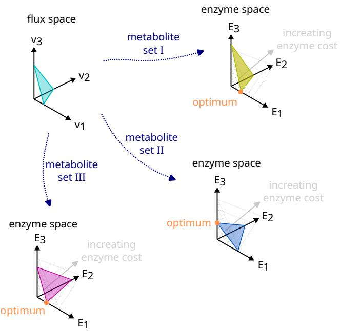

Figure 7.1: Translation from flux to enzyme space retains EFMs as extreme rays. The top left panel shows the feasible flux space with the steady state constraints, all fluxes postive (using splitting of fluxes, as explained in the text, if necessary) and a fixed objective flux. The extreme points here are points where one flux becomes 0 and are elementary flux modes (see Chapter [5)](#page-82-0). Here we show that when we have assumed metabolite concentrations, such as when we keep them at an optimal solution, we get a linear transformation and the extreme rays are maintained. Different metabolite levels, for example solutions to different environmental conditions, can lead to different transformations and therefore different optima (miminal total enzyme), but those are always located at an EFM.

portant starting point is that, as we have seen before in Chapter [4,](#page-62-0) convex optimization problems with only positivity or equality constraints (no other inequalities) lead to an optimal solution at an extreme points of the feasible solution space, and those extreme points are elementary flux modes. However, the optimization problem [(7.1)](#page-117-1) is not convex, mainly due to the hyperbolic dependency of reaction rates on the metabolite concentrations (*fi*(**c**) is usually not linear).

There are several ways to prove that the solution of this optimization problem is an EFM, of which some are outlined in the papers by Wortel et al. [\[241\]](#page-268-2) and Müller et al. [\[242\]](#page-268-3). Here we will outline a proof by assuming a solution that is an EFM and showing that this leads to a contradiction. Assume we have some optimal state that is not an EFM. Any optimal solution is associated with a set of fluxes, and enzyme and metabolite concentrations. Now we set the metabolite concentrations to the concentrations of the assumed optimal state. Then all metabolite dependent terms (*fi*(**c**)) become constants and we return to a convex problem. As explained in Chapter [9](#page-144-0) and Figure [7.1,](#page-118-1) the optimum of this problem (now in terms of enzyme concentrations and fluxes) is a flux distribution that is an EFM. But this contradicts our initial assumption that the optimal state from which we took the set of enzyme concentrations was not an EFM. The proof by contradiction shows that the optimal state must be an EFM.

## <span id="page-118-0"></span>**7.3 Illustration with an example network**

To illustrate the proof, we study a simple network that we have seen previously in Chapter [5](#page-82-0) (Figure [7.2)](#page-120-1), in which we will now include enzyme kinetics. We will use the factorized rate law as in Chapter [6,](#page-94-0) but then generalized for *ns* substrates and *np* products (also compare Eq. [(3.15)](#page-51-1) in Chapter [3)](#page-36-0):

<span id="page-119-1"></span>
$$v = e \cdot k_{\rm cat}^{+} \cdot \frac{\prod_{n_s}^{j=1} s_j / K s_{,j}}{1 + \prod_{n_p}^{k=1} p_k / K_{\rm P,k} + \prod_{n_s}^{j=1} s_j / K_{\rm S,j}} \cdot \left(1 - e^{\Delta G_r' / RT} \right) \tag{7.2}$$

See Box **[??](#page-121-0)** for all detailed rate laws of the example networks. We can simplify this equation by combining the forward catalytic constant, the thermodynamic efficiency factor, the saturation efficiency factor, and the regulation efficiency factor (if that exists) in a function *f*(**c**), which only depends on the metabolites, and not on the enzyme concentrations. We will below write *f* for *f*(**c**).

<span id="page-119-2"></span>
$$v_i = e_i \cdot f_i \tag{7.3}$$

Now we take *v*BM = 1 and optimize all fluxes, enzymes concentrations and metabolite concentrations to minimize the enzyme costs, while satisfying the constraints posed in Equations [(7.1)](#page-117-1), for different levels of external glucose and standard levels of the other external metabolites. We see that for different external glucose concentrations, we get different optimal fluxes, enzyme levels and metabolite levels (Table [7.1)](#page-119-0).

We notice that the total enzyme needed for the biomass flux of one decreases with the increasing glucose levels, as we expect. Also, the optimal level of internal glucose increases with increasing external glucose. Moreover, the fluxes of the solutions do follow an EFM (see Figure [7.2b](#page-120-1)). We can now reformulate the problem for only the flux and enzyme levels, while keeping the metabolite levels as they are in the table. With the metabolite levels in the first row of the table, we can linearly relate the enzyme and flux levels (with the factors *fi*), and thereby the extreme rays of the enzyme and flux space will be equal and EFMs, as pointed out above (see also Chapter [5,](#page-82-0) Figure [7.1](#page-118-1) ). Optimization in this space will lead to the optimal flux distributions following an EFM. If the fluxes in the table would not follow an EFM, this will lead to an inconsistency; if there is an optimum, this should still be the outcome if we keep some variables in the optimum constant and optimize over the rest of the variables.

We point out two important aspects, using the network (Figure [7.2)](#page-120-1) as an example. First, it is convenient to split reversible reactions, such that fluxes are always positive. In this case that means that the reversible reaction from P to P1 is split into the forward reaction *v*2 and the reverse reaction *v*4, which both can have only positive flux. This splitting makes sure that EFMs are the extreme rays of the flux space (see Chapter [5)](#page-82-0). This splitting is purely a mathematical conveniency, we still assume this to be one reaction in the biological sense, and therefore the kinetic equations of both the forward and the backward reaction will be exactly the same. Only, depending on in which direction the flux goes, either one of the reactions will be positive. Any solution with both reactions positive is infeasible, but minimizing enzyme levels will never lead to such a solution, therefore we do not need to set additional constrains. Second, the feasibility of EFMs can depend on external concentrations. In this network the biomass reaction (*v*BM) is the objective flux and there are three EFMs leading to the production of biomass: EFM1 consisting of *v*0, *v*1, *v*2 and *v*BM, EFM2 consisting of *v*0, *v*1, *v*3 and *v*BM and EFM3 consisting of *v*4, *v*3 and *v*BM. However, if P1 is absent in the environment, the uptake flux *v*4 will always be 0 and therefore EFM3 will not be feasible.

<span id="page-119-0"></span>

| [Gex] | Etot  | v0 | v1 | v2 | v3 | v4 | vBM | e0   | e1   | e2   | e3   | e4 | eBM | [G]  | [P]   | [ATP] | [ADP] |
|-------|-------|----|----|----|----|----|-----|------|------|------|------|----|-----|------|-------|-------|-------|
| 0.01  | 156.2 | 5  | 5  | 0  | 9  | 0  | 1   | 54.4 | 4.4  | 0    | 94.4 | 0  | 2.9 | 0.08 | 15.14 | 0.05  | 20.09 |
| 0.1   | 91.3  | 50 | 50 | 99 | 0  | 0  | 1   | 61.3 | 11.3 | 14.2 | 0    | 0  | 4.4 | 0.13 | 4.55  | 0.11  | 20.09 |
| 1     | 36.2  | 50 | 50 | 99 | 0  | 0  | 1   | 13.0 | 8.0  | 12.5 | 0    | 0  | 2.7 | 0.60 | 7.65  | 0.11  | 20.09 |

Table 7.1: Outcomes of the optimization of the example network with standard kinetics, parameter values and external concentrations (see Box **[??](#page-121-0)**) for varying levels of [Gex].

<span id="page-120-1"></span>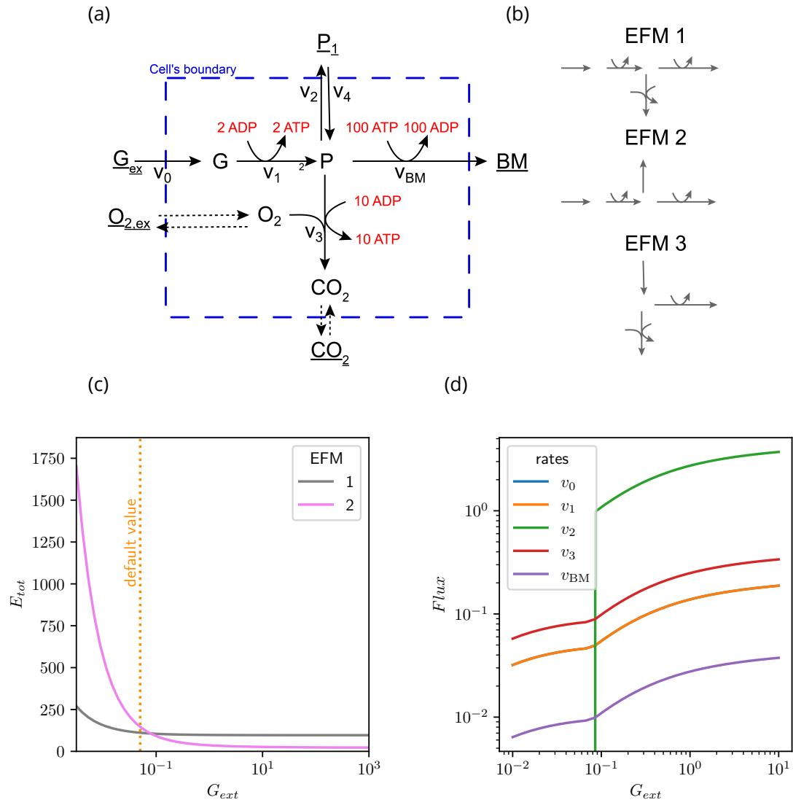

Figure 7.2: States of maximal efficiency in an example model. (a) Example network from Chapter [5](#page-82-0) with added stoichiometry. (b) Three elementary flux modes of this network. (c) Calculated enzyme investment needed for a biomass flux of 1. There is a single concentration of *Gex* for which the optimal EFM switches from EFM2 to EFM1. (d) Specific fluxes (flux divided by total enzyme) associated with the optimal EFM for different levels of *Gex*. The rates show a discontinuity when the optimital EFM switches form EFM1 to EFM2.

## <span id="page-120-0"></span>**7.4 Computation of the optimal state**

We can now use the result that states of maximal enzyme efficiency are reached at an elementary flux mode to calculate these states. We can follow the following steps to calculate these states:

- 1. Enumerate the elementary flux modes
- 2. Calculate the minimal enzyme for each EFM scaled to an objective flux of 1
- 3. Compare the EFMs and select the one with minimal enzyme demands

Step 2 is a convex optimization problem as we have seen in Chapter [6.](#page-94-0) Step 1 is possible for relatively large networks, although usually not for genome scale metabolic networks. The method of these three steps is called Enzyme Flux Cost Minimization, because it is similar to Enzyme Cost Minimization, but while that is focussed on fixes fluxes, Enzyme Flux Cost Minimization simultaneously finds the optimal fluxes. In this section we will show the method on the example network of Figure [7.2.](#page-120-1)

#### <span id="page-121-1"></span>**Box 7.A : Kinetics of the example network**

The detailed kinetic equations for the example model (Figure [7.2)](#page-120-1) using the factorized rate law (see Equation [(7.2)](#page-119-1) and Chapters [3](#page-36-0) and [6)](#page-94-0) are:

*v*0 = *e*0 · *k*+ cat*,*0 · [Gex]*/K*Gex 1 + [G]*/K*G + [Gex]*/K*Gex · 1 − *e* ∆*G*0 *r,*0 */RT v*1 = *e*1 · *k*+ cat*,*1 · ([G]*/K*G)([ADP]*/K*ADP) 1 + ([P]*/K*P)([P]*/K*P)([ATP]*/K*ATP) + ([G]*/K*G)([ADP]*/K*ADP) · 1 − *e* ∆*G*0 *r,*1 */RT v*2 = *e*2 · *k*+ cat*,*2 · [P]*/K*P 1 + [P1]*/K*P1 + [P]*/Kp* · 1 − *e* ∆*G*0 *r,*2 */RT v*3 = *e*3 · *k*+ cat*,*3 · ([P]*/K*P)([ADP]*/K*ADP)([O2]*/K*O2 ) 1 + ([CO2]*/K*CO2 )([ATP]*/K*ATP) + ([P]*/K*P)([ADP]*/K*ADP)([O2]*/K*O2 ) · 1 − *e* ∆*G*0 *r,*3 */RT v*4 = *e*4 · *k*+ cat*,*4 · [P1]*/K*P1 1 + [P1]*/K*P1 + [P]*/K*P · 1 − *e* ∆*G*0 *r,*4 */RT v*BM = *e*BM · *k*+ cat*,*BM · ([P]*/K*P)([ATP]*/K*ATP) 1 + ([BM]*/K*BM)([ADP]*/K*ADP) + ([P]*/K*P)(ATP*/K*ATP) · 1 − *e* ∆*G*0 *r,*0 */RT* (7.7)

Note that P is a product twice in *v*1, as *v*1 produces 2P. Note that *v*2 and *v*4 have a very similar rate equation, but in the different direction, and both should only be used in the positive direction. The standard set of parameters we used for the toy model is all *k*cat*,i* = 10 except *k*cat*,*3 = 0*.*1, all ∆*G*0 *r,i* = −1000, *R* = 8*.*3, *T* = 293 and all *K*M = 1. For the external metabolites [P1] = 1, [Gex] = 0*.*05, [O2] = 0*.*1, [BM] = 1 and [CO2] = 10 unless mentioned otherwise.

First, we describe the network with the toichiometric matrix (**N**) and the concentration vector (**c**):

$$\mathbf{N} = \begin{pmatrix} 1 & -1 & 0 & 0 & 0 & 0 \\ 0 & 2 & -1 & -1 & 1 & -1 \\ 0 & 2 & 0 & 10 & 0 & -100 \\ 0 & -2 & 0 & -10 & 0 & 100 \end{pmatrix}, \qquad \mathbf{c} \equiv \begin{pmatrix} \text{[G]} \\ \text{[P]} \\ \text{[ATP]} \\ \text{[ADP]} \end{pmatrix} \tag{7.4}$$

And with the stoichiometric matrix we can describe the steady state constraints:

$$\frac{\mathbf{d}}{\mathbf{d}t}\mathbf{c} = \mathbf{N} \cdot \mathbf{v} = \begin{pmatrix} 1 & -1 & 0 & 0 & 0 & 0 \\ 0 & 2 & -1 & -1 & 1 & -1 \\ 0 & 2 & 0 & 10 & 0 & -100 \\ 0 & -2 & 0 & -10 & 0 & 100 \end{pmatrix} \begin{pmatrix} v_0 \\ v_1 \\ v_2 \\ v_3 \\ v_4 \\ v_5 \\ v_{\rm BM} \end{pmatrix} = \begin{pmatrix} 0 \\ 0 \\ 0 \\ 0 \\ 0 \end{pmatrix} \tag{7.5}$$

<span id="page-121-0"></span>Now we find the EFMs (for example with EFMtool [\[243\]](#page-268-4)). It can easily be checked that the following EFMs are in the nullspace of the stoichiometric matrix:

$$\begin{aligned} \text{EFM1} &= \begin{pmatrix} 5 \\ 5 \\ 0 \\ 9 \\ 0 \\ 1 \end{pmatrix}, \quad \text{EFM2} = \begin{pmatrix} 50 \\ 50 \\ 99 \\ 99 \\ 0 \\ 0 \\ 1 \end{pmatrix}, \quad \text{EFM3} = \begin{pmatrix} 0 \\ 0 \\ 0 \\ 0 \\ 10 \\ 11 \\ 1 \end{pmatrix} \end{aligned} \tag{7.6}$$

The next step is to perform the convex optimization over the metabolite levels for all three EFMs. Therefore we convert the enzyme levels to ratio of the flux and the function *f*(**c**), using Equation [7.3.](#page-119-2) By taking the <span id="page-122-2"></span>Translating enzyme efficiency into cell growth rate 113

<span id="page-122-1"></span>

Figure 7.3: Translation of enzyme-specific biomass rate to growth rate. (A) Both from experimental data and a cell-optimization point of view, the ribosomal fraction of the proteome increases with the growth rate, while the metabolic fraction decreases. (B) This leads to a hyperbolic dependency of the growth rate on the biomass production rate.

sum of those we make a function for the total enzyme as a function of fluxes, metabolite concentrations and parameters. We use the standard parameters (Box **[??](#page-121-0)**) and for each EFM input the fluxes. We are then left with a convex optimization over the metabolite levels, an Enzyme Cost Minimization problem as in Chapter [6.](#page-94-0) For [Gex] = 0*.*05 we obtain a total enzyme of 111.1 for EFM1 and of 146.3 for EFM2. That means that for this conditions we will conclude that EFM1 is optimal, and we obtain the metabolite concentrations from the optimization of [G] = 0*.*08, [P] = 3*.*93, [ATP] = 0*.*11 and [ADP] = 20*.*09. We can next use the rate equations to calculate the enzyme levels from the fluxes and metabolite levels, using the values for the parameters and external concentrations.

We can repeat this procedure for different levels of external concentrations and see that the optimal EFM can change depending on the external concentration (Figure [7.2c](#page-120-1)). When the optimum shifts to using a different EFM, there is a discontinuity in the fluxes at the external metabolite concentration (Figure [7.2d](#page-120-1)). Many cells show shifts in metabolic strategies depending on the external conditions and with Enzyme Flux Cost Minimization those shift could be explained.

In conclusion, we now found the metabolic state of maximum enzyme efficiency. Even though in our calculation we obtained the enzyme concentrations last, it is by enzyme concentrations that the cell controls the system. If the cells produces enzymes in the concentrations we calculated and reaches a steady state, this state will realize the fluxes and metabolite levels that lead to our optimal state.

## <span id="page-122-0"></span>**7.5 Translating enzyme efficiency into cell growth rate**

In the section above, we learned how to optimize metabolic states for a maximal overall enzyme efficiency. Why is this quantity relevant? One reason is that overall enzyme efficiency, according to some simple reasoning, determines the cell growth rates. If microbes compete by growing fast, their fitness is largely determined by their momentary growth rate in their respective environment. In such environments, the biomass/enzyme efficiency will be under selection, which makes it one of the important objective functions in this book. If higher enzyme efficiency means higher growth rate, and if we have a conversion formula for this, we can put "growth rate" instead of "overall enzyme efficiency" on the axes of our plots.

Enzyme-efficient metabolic states allow us to compute specific biomass production rates, i.e. the rate of biomass production per metabolic enzyme invested. If biomass consisted only of enzymes, the ratio "enzyme production rate / enzyme concentration" would give us directly the growth rate. However, biomass does not only consist of metabolic enzymes, but includes ribosomal enzymes, RNA, DNA, lipids, and other compounds. Therefore we need a formula for converting biomass/enzyme efficiency into cellular growth rate.

Mathematically, a cell's growth rate is given by *µ* = *v*BM*/c*BM, where *v*BM is the biomass production rate (biomass produced per cell volume and time) and *c*BM is the biomass amount per cell volume. If a cell consisted only of metabolic enzymes (more precisely, of the enzymes described in our model) the biomass/en-

<span id="page-123-2"></span>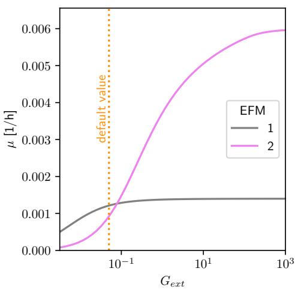

Figure 7.4: Optimal growth rates of the two EFMs for different levels of the external metabolite Gex (using Equation [7.8)](#page-123-1)

zyme efficiency *K*BM = *v*BM*/h*enz would directly describe the cellular growth rate. Since that is not the case, we need to convert between *h*enz and *c*BM. The metabolic protein fraction decreases with the growth rate, leading to a hyperbolic dependency of the growth rate on the biomass production rate (Figure [7.3)](#page-122-1). We may use the empirical approximation *h*enz*/c*BM = *f*prot(*a* − *b µ*), where *f*prot = 0*.*5 is the fraction of protein mass within the cell dry mass and the parameters *a* = 0*.*27 and *b* = 0*.*2 h were fitted to describe the metabolic enzyme fraction in proteomics data, assuming a linear dependence on growth rate [\[15\]](#page-253-1). This yields the conversion formula (see also [\[240\]](#page-268-1)):

<span id="page-123-1"></span>
$$\mu = \frac{a \, f_{\rm prot} \, \, v_{\rm BM}}{h_{\rm env} + b \, f_{\rm prot} \, \, v_{\rm BM}}. \tag{7.8}$$

This formula has been used to convert the minimal enzyme cost per biomass flux for different external concentrations in the toy model (Figure [7.2c](#page-120-1)) to the maximal growth for each EFM (Figure [7.4)](#page-123-2).

## <span id="page-123-0"></span>**7.6 Concluding remarks**

In this chapter we considered the metabolic network of a cell - and enzyme levels, metabolite concentrations, and fluxes as the state variables - and studied its maximally efficient states. Finding such states can be difficult because fluxes, metabolite concentrations, and enzyme levels are tightly coupled: metabolite concentrations determine enzyme efficiencies, enzyme efficiencies determine optimal enzyme levels, and enzyme levels determine fluxes and metabolite concentrations, which in turn determine enzyme efficiencies. To find an optimal state, all variables need to be optimized at the same time, which is a non-linear optimality problem with (possibly) many local optima. In small toy models, solutions can be found numerically, but for large detailed models, the computational effort becomes enormous. Instead of simplifying the problem (as in the previous chapters) we here used the insight that (in models without extra flux bounds) the optimal solutions must be EFMs. Biologically, it is enzyme levels rather than fluxes that are regulated directly (by transcriptional regulation), while metabolite concentrations and fluxes respond dynamically. But from a functional point of view, we may see this differently: we may first think of a task (a flux to be realized) and then ask how this flux can be performed optimally.

# **Recommended readings**

- M.T. Wortel, H. Peters, J. Hulshof, B. Teusink, and F.J. Bruggeman. Metabolic states with maximal specific rate carry flux through an elementary flux mode. FEBS Journal, 281(6):1547–1555, 2014.
- S. Müller, G. Regensburger, and R. Steuer. Enzyme allocation problems in kinetic metabolic networks: Optimal solutions are elementary flux modes. Journal of Theoretical Biology, 347:182–190, 2014.

# **Problems**

**Problem 7.1** Consider the model in Figure [7.2.](#page-120-1) What would be the qualitative effect of a change in oxygen concentration on the enzyme cost of the three EFMs and on the choice of the optimal strategy?

# <span id="page-126-2"></span><span id="page-126-0"></span>**Chapter 8**

# **Models of growing cells**

Ohad Golan, Hollie J. Hindley, Hidde de Jong, Markus Köbis, Elena Pascual Garcia, and Andrea Weiße

### **Chapter overview**

- A comprehensive description of fundamental growth laws in microbial growth, elucidating the core principles that govern biological growth patterns.
- A detailed exploration of the contrasts between coarse-grained and fine-grained modeling is presented, offering insights into the varying levels of detail that each approach encompasses.
- A thorough breakdown of the key assumptions in the modeling of metabolic systems is provided, underlining the foundational premises that are crucial for accurately representing these complex systems.
- The process of deriving fundamental growth laws by modeling key assumptions is meticulously demonstrated, enabling a clear understanding of how theoretical constructs translate into biological realities.

# <span id="page-126-1"></span>**8.1 Introduction**

A key feature of living systems is that they are able to grow and reproduce. The reproductive success in a given environment defines the fitness of a living system. The study of the growth of bacteria and other microorganisms is crucial for better understanding their capacity to cause diseases in humans or for better exploiting their use in biotechnological or environmental processes. Beyond their interest for a variety of applications, bacteria and other microorganisms have shown themselves ideal model systems for investigating fundamental questions on the relation between growth, fitness and characteristics of the environment.

One of the first to systematically and quantitatively study the growth of bacterial cultures was Jacques Monod in the 1940s. He performed so-called diauxic growth experiments, in which bacteria were cultured in a medium containing two different limiting carbon sources. He showed that the bacteria first deplete one carbon source before starting to assimilate the second carbon source. The order in which the primary and secondary carbon source were consumed was determined by the growth rate they support: the preferred carbon source allows the culture to grow at a higher rate. Further work on the molecular basis of diauxic growth led to the discovery that cells inhibit the expression and activity of functions for the use of secondary carbon sources when a preferred carbon source is present, a global regulatory mechanism known as carbon catabolite repression [\[244,](#page-268-5) [245\]](#page-268-6).

Monod characterized bacterial growth by means of batch culture experiments in a well-defined growth medium allowing bacteria to reach a state of balanced growth, where the accumulation of biomass can be described

<span id="page-127-1"></span><span id="page-127-0"></span>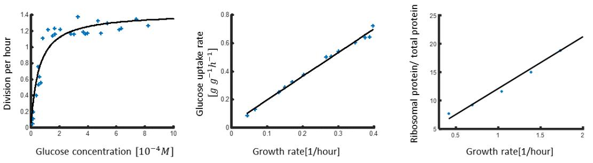

Figure 8.1: Growth laws of bacterial growth. A. Monod growth law: growth rate dependency on nutrient availability [Data from [\[249\]](#page-268-7)]. B. Correlation between growth rate and nutrient uptake rate [Data from [\[255\]](#page-268-8)]. C. Correlation between growth rate and cellular composition [Data from [\[253\]](#page-268-9)]

by a single constant, the exponential growth rate. Together with the chemostat, a device allowing continuous culture of microorganisms at a predefined growth rate [\[246\]](#page-268-10), these methods have become standard in microbial physiology. They notably underlie the discovery of a number of so-called growth laws, relating the growth rate to a variety of properties of the physiology of growing bacteria. The growth laws are conserved across different organisms and a broad range of experimental conditions. Here, we list three well-known growth laws [\[247,](#page-268-11) [248\]](#page-268-12):

- 1. *Dependency of the growth rate on nutrient availability* [\[249\]](#page-268-7): In his characterization of bacterial growth, Monod discovered the first growth law. He observed that the growth rate of bacteria depends upon the nutrient concentration in the medium in a hyperbolic fashion (Fig. [8.1A](#page-127-0)).
- 2. *Correlation between growth rate and nutrient uptake rate* [\[250\]](#page-268-13): In continuous cultures, the growth rate was shown to vary linearly with the nutrient uptake rate (Fig. [8.1B](#page-127-0)). The slope of this linear relation is called the biomass yield and the offset the 'maintenance energy', as it is assumed to be derived from the energy spent on processes required to maintain the basic processes of the cell, in the absence of growth [\[251\]](#page-268-14).
- 3. *Correlation between growth rate and cellular composition* [\[252,](#page-268-15) [253\]](#page-268-9): In 1959, Schaechter, Maaløe and Kjeldgaard showed that RNA, DNA and the number of nuclei in *Salmonella typhimurium* linearly correlate with the growth rate. Later, it was further shown that other physiological parameters, such as the mass fraction of ribosomes in growing populations, also linearly correlate with the growth rate [\[253\]](#page-268-9) (Fig. [8.1C](#page-127-0)). Initially, it was believed that the correlation between ribosomal mass fraction and growth was strictly positive, however, Scott et al. [\[254\]](#page-268-16) showed that when growth is inhibited through translation-inhibiting drugs, growth rate and ribosomal mass fraction exhibit a negative (near-)linear relation.

The conserved nature of the growth laws has led scientists to ask whether there are fundamental principles governing bacterial growth. To answer this question, different types of mathematical models have been developed. One approach aims at integrating all known molecular constituents of the cell and the reactions involving these constituents into a big model, an *in-silico* copy, or 'digital twin', of the cell. Such models, known as fine-grained models, can be useful to predict emergent phenotypes, but they are difficult to construct and maintain, and their complexity makes it hard to grasp certain principles that underpin growth. In this chapter, we will focus on coarse-grained models of bacterial growth. Rather than assembling individual reactions in a bottom-up manner, these models are based on the top-down definition of a limited number of basic cellular functions or processes involved in growth, described by appropriate macro-reactions (Fig. [8.2)](#page-128-1). Coarse-grained models are smaller and therefore easier to construct and analyze. The lack of molecular detail can make their predictions less accurate, but their simplicity allows a focus on how basic cellular functions and their interactions shape bacterial growth. How much detail is included in a model depends on the specific scientific question asked, and similarly, models may vary in their underlying assumptions. Oftentimes, assumptions are based on biochemical principles governing intracellular reactions, on physical limitations faced by cells, on optimality principles, or on a combination of these.

### <span id="page-128-3"></span><span id="page-128-1"></span>Fundamental modeling assumptions of microbial growth 119

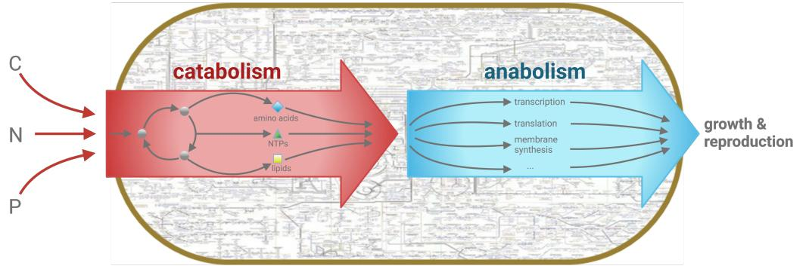

Figure 8.2: Coarse grained modelling of cellular growth. Compared to genome-scale FBA and whole-cell models (Chapters [4,](#page-62-0) [5,](#page-82-0) [9,](#page-144-0) coarse grained models zoom out of the molecular detail and focus on key processes.

In this chapter, we show how to understand and, ultimately, how to develop coarse-grained models of cellular growth. We present a number of coarse-grained models with increasing levels of granularity. The models have been chosen to also represent a variety of commonly used assumptions, for example, based on growth rate maximization or on phenomenological or mechanistic constraints. Despite these differences, however, models we discuss generally recover the basic growth laws, and we show how the latter can be derived from solving two of the simplest coarse-grained models. The goals of this chapter are:

- 1. To enable the reader to understand and analyze any model of microbial growth from the literature.
- 2. To enable the reader to develop their own coarse-grained model of a metabolic system that is directed at their specific scientific question.
- 3. To provide the reader with a new perspective on modeling of complex systems and specifically the biological cell.

## <span id="page-128-0"></span>**8.2 Fundamental modeling assumptions of microbial growth**

The models of microbial growth we consider here are based on fundamental assumptions that follow from biochemical and biophysical constraints. In this section, we discuss and mathematically define assumptions that are found, explicitly or implicitly, in most coarse-grained models of microbial growth. The assumptions are formulated in an abstract manner to hold for any self-replicating biological system, irrespective of the specifics of the underlying molecular mechanisms. In the next section, we use these assumptions to construct increasingly complex models of microbial growth and show how the latter can be used to derive the experimentally observed growth laws presented in the introduction of this chapter.

The growth of microorganisms consists of the uptake of nutrients from the environment and the conversion of these nutrients into new microbial cells through a number of coupled metabolic processes (Fig. [8.2)](#page-128-1). This description brings out the self-replicating or autocatalytic nature of microbial growth: cells transform nutrients from the environment into new cells. In what follows, we consider growth on the population level, that is, an increase in the total amount of cells or, equivalently in many situations, an increase of the biomass of the population. This leads to the well-known model of microbial growth, where the change in biomass over time is proportional to the amount of biomass (Fig. [8.3A](#page-129-1)):

<span id="page-128-2"></span>
$$\frac{\mathrm{d}B}{\mathrm{d}t} = \lambda B,\tag{8.1}$$

where *t* [h] denotes time, *B* in gram dry weight [gDW] the biomass and *λ* [1/h] the population growth rate.

<span id="page-129-2"></span><span id="page-129-1"></span>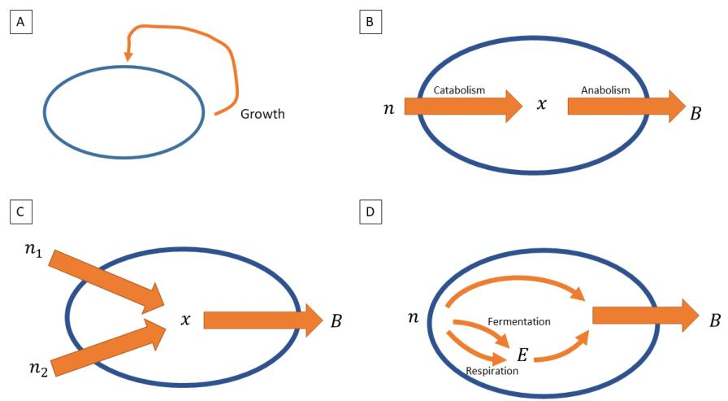

Figure 8.3: Coarse grained models of metabolic systems with increasing complexity. A. A self replicating system. B. The simplest description of a metabolic system: coupled catabolic and anabolic reactions. C. A metabolic system that can catabolize two different nutrient sources. D. A catabolic system requiring two substrates to grow: x and E.

If the growth rate is constant, the solution to Eq. [(8.1)](#page-128-2) describes exponential growth of the biomass:

$$B = B_0 \mathbf{e}^{\lambda t},\tag{8.2}$$

where *B*0 [gDW] is the initial biomass at *t* = 0.

The growth rate is a key parameter that is often used as a proxy for the fitness of microorganisms. It is dependent on the metabolic processes, that is, how a cell utilizes the nutrients to synthesize new biomass (self-replication). The simplest description of metabolism is that it takes up a nutrient, breaks it down into metabolites (catabolism), and then utilizes these metabolites to produce new biomass (anabolism) (Fig. [8.3B](#page-129-1)). Catabolic and anabolic processes comprise a variety of biochemical reactions that are carried out by different sets of proteins and enzymes. The reaction rates of these processes are limited biochemically and biophysically. We formulate these limitations as modeling assumptions and define them as mathematical constraints, four of which we briefly review below.

## <span id="page-129-0"></span>**8.2.1 Conservation of mass and quasi-steady-state assumption**

Dry biomass is often a more readily measurable quantity than cell volume. The latter relates absolute abundances of cell components to their intracellular concentrations. Yet, because bacterial cells have been observed to maintain approximately constant cell density across various growth conditions [\[256,](#page-268-17) [257\]](#page-269-0) (though transient exceptions have been observed at the single-cell level [\[258\]](#page-269-1)), biomass can be regarded a proxy for volume and is therefore assumed to be proportional to cell volume in many growth models. All models considered in this chapter are based on the assumption of constant cell density and approximate the concentration *x* of a cellular component x (we use normal font for cell components and italic font for their concentrations) by its absolute abundance divided by the cell mass.

According to the law of mass conservation, the change of mass is equal to the inflow minus the outflow of mass. As a consequence, the change in concentration of a cell component, for example a metabolite pool, is determined by the sum of the rates of the reactions consuming and producing this cell component (Fig. [8.4A](#page-132-1)).

### <span id="page-130-5"></span>Fundamental modeling assumptions of microbial growth 121

The mass balance for any cell component x is given by the following equation:

<span id="page-130-1"></span>
$$\frac{\mathrm{d}x}{\mathrm{d}t} = \sum_{y} r_{y \to x} - \sum_{k} r_{x \to k},\tag{8.3}$$

where *ry*→*x* denotes the rate of the reaction converting cell component y into cell component x (production of x), and *rx*→*k* the rate of the reaction converting cell component x into cell component k (consumption of x). Typically, cell component concentrations have units mg/gDW or mmol/gDW, so that rates of metabolic reactions are expressed in units mg/(gDW h) or mmol/(gDW h).

In the simple system shown in Fig. [8.3B](#page-129-1), there are two reactions: one converting the nutrient source N into a metabolite X and one utilizing the metabolite for the synthesis of biomass. According to [(8.3)](#page-130-1), the flux balance of metabolite pool *x* is given by d*x/*d*t* = *rn*→*x* − *rx*→*B*.

A key assumption is that intracellular concentrations are in quasi-steady state. This means that cell component pools remain constant:

$$\frac{\text{d}x}{\text{d}t} = 0,\text{ for all cell components }x.\tag{8.4}$$

The quasi-steady-state assumption simplifies the mathematical analysis of the system significantly and holds for balanced growth of the microbial population. In this chapter, we focus mostly on situations in which the quasi-steady-state assumption applies, but also give an example of a model with metabolic dynamics. In metabolic modeling, the rates of reactions at steady state are called fluxes, denoted by the symbol *J*. With the quasi-steady-state assumption, Eq. [(8.3)](#page-130-1) becomes

<span id="page-130-4"></span>
$$\sum_{y} J_{y \to x} = \sum_{k} J_{x \to k} \tag{8.5}$$

that is, for every cell component, the sum of production fluxes equals the sum of consumption fluxes. In the example system, we have *Jn*→*x* = *Jx*→*B*.

### <span id="page-130-0"></span>**8.2.2 Proteome allocation assumption**

The biochemical reactions breaking down nutrients into intracellular metabolites, and the reactions utilizing these metabolites for the synthesis of new biomass, do not occur spontaneously. The reactions are catalyzed mostly by proteins complexes, in particular metabolic enzymes and ribosomes. In coarse-grained models, well-defined sets of biochemical reactions are grouped together into macro-reactions. The cell components that are necessary to catalyze the individual steps of a macro-reaction are grouped together into a corresponding so-called proteome sector. A proteome sector includes mostly proteins that catalyze metabolic reactions but also ribosomes catalyzing the reaction of protein biosynthesis. Proteins constitute most of the biomass of the cell [\[259\]](#page-269-2). Therefore, as a first approximation, the sum of the proteome sectors equals the total biomass of the growing population measured in units of *g* (Fig. [8.4B](#page-132-1)):

<span id="page-130-2"></span>
$$\sum_{r \in \{x \to y\}} P_r = B,\tag{8.6}$$

<span id="page-130-3"></span>where *Px*→*y* is the proteome sector catalyzing the macro-reaction that transforms cell component x into cell component y. The proteome sectors as defined above are extensive quantities, summed over the entire growing population, like the total biomass *B*. For the models, we are rather interested in intensive quantities, the amount of a proteome sector relative to the total amount of biomass (protein), corresponding to protein concentrations or protein fractions. Dividing the left-hand and right-hand sides of Eq. [(8.6)](#page-130-2) by *B*, we thus obtain:

$$\sum_{r \in \{x \to y\}} p_r = 1\tag{8.7}$$

<span id="page-131-3"></span>where *px*→*y* is the fraction of the proteome converting x into y, defined by *px*→*y* = *Px*→*y/B*. Proteome fractions are dimensionless and sum to one.

In the simple example system in Fig. [8.3B](#page-129-1), we distinguish two macro-reactions: a catabolic reaction and an anabolic reaction (biomass synthesis). We therefore define two proteome sectors, corresponding to enzymes and ribosomes, respectively, with fractions *pn*→*x* and *px*→*B*, respectively. In later examples in the chapter, the catabolic and anabolic processes are further broken down into smaller macro-reactions and so are the proteome sectors.

### <span id="page-131-0"></span>**8.2.3 Mathematical description of reaction fluxes**

The rate at which a reaction is converting one cell component, e.g., a metabolite, into another is determined by the proteome fraction, the concentrations of the substrates of the reaction and possible regulation by other cell components in the system. While mass-action kinetics provide a principled framework to develop rate equations for biochemical reactions, in practice, various approximations based on mechanistic assumptions are often used to obtain simplified equations [\[260\]](#page-269-3). Below there are a few examples of rate laws defining the fluxes in coarse-grained models:

- <span id="page-131-2"></span>1. *Excess substrate and no allosteric interactions.* The simplest relation of the flux *J* to the relevant proteome sector is linear, such that

$$J_{x \to y} = p_{x \to y} \, \beta_{x \to y},\tag{8.8}$$

where *βx*→*y* is a parameter describing the efficiency of proteome sector *px*→*y* in generating a flux from *x* to *y*. This expression assumes substrate x is in excess and disregards any regulation of the flux by allosteric interactions of the enzymes and other cell components.

- 2. *Limited substrate and allosteric interactions.* A more complex relation is obtained when the substrate is in excess and allosteric interactions involving a cell component n play a role in the modulation of the flux. The expression of the flux is multiplied by two regulatory functions *f*(*x*) and *g*(*n*) describing the modulation of the flux by the substrate and the allosteric cell component, respectively:

$$J_{x \to y} = p_{x \to y} \, \beta_{x \to y} \, f(x) \, g(n). \tag{8.9}$$

It is important to note that that both *f*(*x*) and *g*(*n*) return values between 0 and 1, and that the flux remains linear in the proteome fraction. Typically, a Michaelis-Menten relation is taken for the effect of the concentration of substrate x on the flux, such that *f*(*x*) = *x/*(*kx*→*y* +*x*) (Fig. [8.4D](#page-132-1)). When the concentration *x* is in excess, such that *x kx*→*y*, the function *f*(*x*) becomes approximately 1. Other types of regulatory functions can be used depending on the macroreactions concerned and the growth conditions.

### <span id="page-131-1"></span>**8.2.4 Volume and surface area assumptions**

The intracellular volume as well as the surface area of the cell are limited (Fig. [8.4C](#page-132-1)). Obviously, the total volume occupied by the components of the cell, in particular proteins, cannot be larger than the cell volume. As such, the total volume of the cell is larger than the sum of the volume of the proteome sectors that are functioning inside the cell plus some constant volume taken up by other cell components such as DNA. This gives the following constraint:

$$\mathsf{Cell} \mathsf{volume} \geq \sum_{r \in \{x \rightarrow y\}} p_r v_r + v_0 \tag{8.10}$$

where *vx*→*y* is the volume of proteome sector *px*→*y* and *v*0 is some constant volume filled by other cell components. Similarly, the total surface occupied by proteins and lipids making up the cell membrane has to equal the surface area of the cell. This constraint gives:

$$\mathsf{Celle surface area} \ge \sum_{r \in \{x \to y\}} p_r s_r + l_0 \tag{8.17}$$

<span id="page-132-1"></span>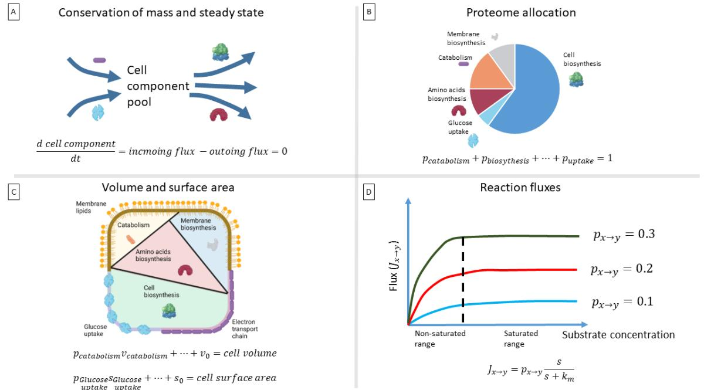

Figure 8.4: Fundamental assumptions in the modeling of microbial growth. A. Conservation of mass and steady-state assumption: The change in concentration of a cell component is equal to the incoming flux minus the outgoing flux. At steady state, the concentration of the cell component is constant. B. Proteome allocation assumption: the proteome is divided into different proteome sectors. The number of proteome sectors in a model depends on the model granularity. The sum of all the proteome sectors always equals 1. C. Volume and surface area assumption: The volume of the cell is limited and is filled with intracellular cell components such as proteins. The sum of the volumes of the intracellular cell components is equal to the cell volume. Similarly, the surface area of the cell is limited and contains membrane cell components such as lipids. The sum of the surface areas of membrane cell components is equal to the cell surface area. D. Example of flux assumption according to Michaelis-Menten kinetics: the reaction *x* → *y* is carried out by proteome sector *px*→*y*. The maximal rate is reached for saturating substrate concentrations and is determined by the size of the proteome sector.

where *sx*→*y* is the surface area of proteome sector *px*→*y* and *l*0 is the surface area of the lipids in the cell membrane.

# <span id="page-132-0"></span>**8.3 Derivation of growth laws from basic modeling assumptions**

In the following section, we will build upon the fundamental assumptions discussed earlier to construct models of microbial metabolism with increasing complexity. We will introduce additional assumptions as necessary to solve each model, and use them to derive one of the growth laws presented in the introduction of this chapter that have been experimentally observed in microorganisms.

## **Example 1 - Basic metabolic system with saturating substrate concentrations**

<span id="page-132-2"></span>In this example, we will use the basic metabolic model to derive the relationship between the concentration of ribosomes and the growth rate in microorganisms.The most basic metabolic model involves the uptake of a single nutrient from the environment, the catabolism of that nutrient into a metabolite x, and the use of this metabolite in anabolic processes to synthesize biomass (Fig. [8.3B](#page-129-1)). This model consists of two reactions and two proteome sectors. According to the proteome allocation constraint, the sum of the proteome sectors must sum to one (according to Eq. [(8.7)](#page-130-3)):

<span id="page-133-3"></span>For simplicity, we assume that the rate of each reaction is proportional to the allocation of the proteome to that reaction (according to Eq. [(8.8)](#page-131-2)), so that:

$$J_{n \to x} = p_{n \to x} \beta_{n \to x}; \quad J_{x \to B} = p_{x \to B} \beta_{x \to B}. \tag{8.13}$$

<span id="page-133-1"></span>The mass conservation constraint, with the assumption of a steady state for metabolite x, gives (according to Eq. [(8.5)](#page-130-4)):

$$J_{n \to x} = J_{x \to B}. \tag{8.14}$$

Finally, due to conservation of mass, the biomass synthesis flux equals the growth rate:

<span id="page-133-0"></span>
$$
\lambda = J_{x \to B}.\tag{8.15}
$$

Solving equations [(8.12)](#page-132-2)-[(8.15)](#page-133-0) gives a prediction for the growth rate:

$$
\lambda = \frac{\beta_{x \to B} \beta_{n \to x}}{\beta_{x \to B} + \beta_{n \to x}}.\tag{8.16}
$$

Solution [(8.15)](#page-133-0) for the growth rate is based solely on *mechanistic assumption* - that is, assumptions that are based on the mechanistic properties of the biochemical reactions in the cell. In this case, that is that the fluxes are linear to the relevant proteome sector. Because we have taken a steady state approximation and the rates of the two reactions must be equal, the growth rate is determined by the relative values of the catalytic constants.

Using this model, we can now derive the relationship between the concentration of ribosomes and the growth rate. Combining Eq. [(8.12)](#page-132-2) and [(8.14)](#page-133-1) gives:

$$
\lambda = p_{x \to B} \beta_{x \to B} \tag{8.17}
$$

This shows that the growth rate is linearly proportional to the anabolic sector. Given that the anabolic sector is composed mostly of ribosomes, this fits well with the experimentally observed linear relationship between the concentration of ribosomes and the growth rate, which was first described by Schaechter *et al.* [\[252\]](#page-268-15) and later confirmed by Bremer *et al.* [\[253\]](#page-268-9). It is important to notice that this relation is due to the assumption that the biomass synthesis flux is linear in the ribosomal proteome sector.

In summary, we have derived the linear relationship between the concentration of ribosomes and the growth rate using only basic assumptions about the properties of the biochemical reactions in the cell and the conservation of mass. This relationship is one of the experimentally observed growth laws in microbial systems.

### **Example 2 - Growth on two nutrient sources**

In this example, we consider a metabolic system that grows on two different nutrient sources, *n*1 and *n*2 Fig. [8.3C](#page-129-1). We use the fundamental assumptions outlined in Section 1.2 and an additional assumption of growth-rate maximization to demonstrate how cells may exhibit catabolite repression - a phenomenon in which cells utilize only one nutrient even when multiple nutrients are available in the environment [\[245\]](#page-268-6).

The metabolic system in this example catabolizes both nutrient sources to the same metabolite x, but at different efficiencies. The anabolic reaction is the same as in Example 1. There are now three proteome sectors in this model: two for catabolism of the nutrients and one for anabolism. Thus, according to the proteome allocation constraint (Eq. [8.7)](#page-130-3), we have:

<span id="page-133-2"></span>
$$p_{n_1 \to x} + p_{n_2 \to x} + p_{x \to B} = 1.\tag{8.18}$$

As before, we assume a linear correlation between reaction rates and proteome sector fractions (according to Eq. [(8.8)](#page-131-2)). The different efficiencies of the catabolic sectors is represented as *βn*2 *> βn*1. Applying the mass <span id="page-134-2"></span>conservation assumption for metabolite x, combined with the steady state assumption, gives

$$J_{n_1 \to x} + J_{n_2 \to x} = J_{x \to B}. \tag{8.19}$$

The growth rate is again equal to biomass synthesis flux, as in Example 1:

<span id="page-134-0"></span>
$$
\lambda = J_{x \to B}.\tag{8.20}
$$

Given that there are more variables than constraints in this example, solving Eqs. [8.18](#page-133-2) - [8.20](#page-134-0) reveals that there is no unique solution for the growth rate, but rather a solution space with one free variable *pn*1→*x*:

$$
\lambda = \frac{\beta_{x \to B} \beta_{n_2 \to x}}{\beta_{x \to B} + \beta_{n_2 \to x}} + p_{n_1 \to x} \left( \frac{\beta_{n_1 \to x} - \beta_{n_2 \to x}}{\beta_{x \to B} + \beta_{n_2 \to x}} \right) \beta_{x \to B}. \tag{8.21}
$$

The solution shows that the metabolic system has a decision to make regarding how much of the proteome to invest in sector *pn*1→*x*. To solve this system, we introduce an additional assumption of *growth rate maximization* – that is, to maximize its fitness, the metabolic system maximizes the growth rate in a given condition. In this example, to maximize the growth rate, the cell uses only the more efficient catabolic system, setting *pn*1→*x* = 0 and the solution for the growth rate is as in example 1. The model predicts that the cells will only utilize the nutrient source with the higher efficiency, even if both nutrient sources are available in the environment. This solution fits the catabolic repression experimental result presented in the introduction in which in which the metabolic system represses the use of a less efficient nutrient source in favor of a more efficient one.

### **Example 3 - Multiple energy generating pathways**

In this example, we focus on a classic question in cell physiology known as overflow metabolism [\[261,](#page-269-4) [262\]](#page-269-5). Within the cell, two primary energy-generating pathways exist: the oxygen-requiring respiration pathway and the oxygen-independent fermentation pathway. It is established that, in the presence of oxygen, the respiration pathway fully oxidizes available nutrients, rendering it more nutrient-efficient in contrast to the fermentation pathway [\[263\]](#page-269-6). Utilization of the fermentation pathway is marked by the secretion of byproducts, such as acetate in *E. coli* or ethanol in yeast, making it inherently wasteful. Intriguingly, experimental observations reveal a counterintuitive phenomenon: even under oxygen-rich conditions, cells often opt for the less efficient fermentation pathway. Under growth rates surpassing a critical threshold, the secretion rate of byproducts, indicating an increased reliance on the fermentation pathway, exhibits a linear rise [\[264,](#page-269-7) [265,](#page-269-8) [266\]](#page-269-9). This counterintuitive preference for fermentation has long presented a profound question in bacterial physiology.

Based on previous studies [\[264\]](#page-269-7), we present a coarse-grained model to elucidate this observed phenomenon (Fig. [8.3D](#page-129-1)). The model postulates steady-state growth on a single nutrient source, denoted as *n*. This nutrient is taken up from the environment, and channeled towards biomass through the proteome sector *pn*→*B*. Additionally, it serves as a precursor for energy generation, either through the respiration pathway catalyzed by proteome sector *pn*→*r* or the fermentation pathway catalyzed by proteome sector *pn*→*f* . Thus, according to the proteome allocation constraint (Eq. [8.7)](#page-130-3), we have:

$$p_{n \to B} + p_{n \to r} + p_{n \to f} = 1.\tag{8.22}$$

<span id="page-134-1"></span>Diverging from earlier models presented in this chapter, our model necessitates two precursors for biomass generation: energy and a carbon precursor. Carbon assimilation is coarse-grained into the biomass generation pathway *n* → *B*, while energy is generated through the energy-producing pathways of respiration *n* → *r* and fermentation *n* → *f*. Consequently, two mass balance equations are requisite – one for carbon flux and another one for energy flux. The carbon mass balance equates the carbon uptake rate coming from nutrient <span id="page-135-1"></span>uptake *J C in* to the carbon fluxes utilized for cell biosynthesis *J C n*→*B*, fermentation *J C n*→*f* and respiration *J C n*→*r*:

$$J_{in}^{C} = J_{n \to B}^{C} + J_{n \to f}^{C} + J_{n \to r}^{C}. \tag{8.23}$$

Similarly, the energy balance equation asserts that the energy generated by fermentation *J E n*→*f* and respiration *J E n*→*r* equals the energy utilized for the biomass synthesis reaction *J E n*→*B*:

$$J_{n \to B}^{E} = J_{n \to f}^{E} + J_{n \to r}^{E}. \tag{8.24}$$

Consistent with prior examples in this chapter, we maintain a linear correlation between reaction rates and proteome sector fractions (as per Eq. [8.8)](#page-131-2).

Both fermentation and respiration reactions utilize a carbon substrate and produce energy, with a key distinction lying in their nutrient utilization efficiency. The ratio of carbon utilized in these reactions to energy generated is expressed as:

$$J_{n \to r}^{E} = \epsilon_{n \to r} J_{n \to r}^{C}; \quad J_{n \to f}^{E} = \epsilon_{n \to f} J_{n \to f}^{C}. \tag{8.25}$$

Given that the respiration pathway exhibits higher nutrient efficiency than the fermentation pathway: *n*→*r > n*→*f* .

Concluding the model description, we incorporate the cellular requirements for growth precursors (energy and carbon) and the proteome. Under carbon limitation, the proteome fraction dedicated to cell biosynthesis *pn*→*B* exhibits a linear growth rate dependence [\[264,](#page-269-7) [267,](#page-269-10) [254,](#page-268-16) [268\]](#page-269-11):

$$p_{n \to B} = p_0 + \sigma_{n \to B} \lambda. \tag{8.26}$$

<span id="page-135-0"></span>The growth rate correlates with the flux of growth precursors, adhering to a fixed stoichiometry of the metabolic network [\[269,](#page-269-12) [270\]](#page-269-13):

$$J_{n \to B}^{E} = \sigma_E \lambda; \quad J_{n \to B}^{C} = \sigma_C \lambda. \tag{8.27}$$

Another key assumption of the model posits that, while the respiration pathway is more nutrient-efficient, utilizing less nutrients per energy unit generated, the fermentation pathway is more proteome-efficient, requiring a smaller proteome fraction per energy unit generated. This assumption is embodied in the efficiency parameters of the reaction fluxes: *βn*→*f > βn*→*r*.

To validate the efficacy of our model in capturing the experimentally observed linear increase in acetate secretion with high growth rates, we endeavored to predict acetate secretion as a function of growth rate. The acetate secretion rate is governed by the flux through the fermentation pathway, represented by *Jac* = *SacJ C n*→*f* , where *Sac* is determined by the involved stoichiometry. Solving Eqs [8.22](#page-134-1) - [8.27](#page-135-0) for acetate secretion yields an expression that increases linearly with the growth rate:

$$J_{ac} = \frac{S_{ac}}{\epsilon_{n \to f}} \beta_E (p_E - \lambda (\sigma_{x \to B} + \frac{\sigma_E}{\beta_{x \to r}})). \tag{8.28}$$

where *βE* = *βn*→*rβn*→*f βn*→*r*−*βn*→*f* and *pE* = 1 − *p*0. The negative value of *βE*, arising from the higher proteome efficiency of the fermentation pathway, results in a positive slope and a negative intercept on the *Jac*-axis. The model provides a good quantitative fit to the experimental observation [\[264\]](#page-269-7). The critical growth rate *λcr*, signifying the growth rate at which the cell activates the fermentation pathway, occurs when *Jac* = 0, giving *λac* = *pE σn*→*B*+*σE/βn*→*r* .

<span id="page-136-1"></span>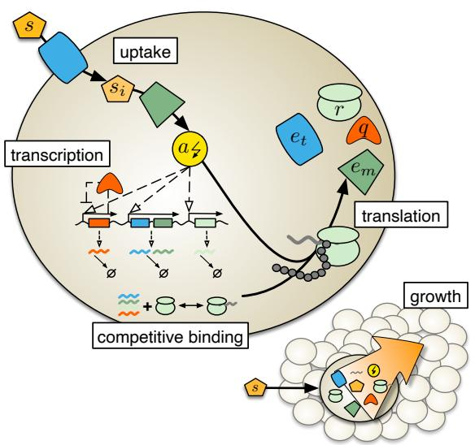

Figure 8.5: Schematic of the dynamic growth model. The model focuses on key cellular processes: nutrient uptake, transcription and translation. Enzymes (shown in blue and dark green) import and metabolize extracellular nutrient (shown in orange), which yields energy (yellow). Availability of energy impacts transcription and translation, however, it is assumed that energy consumption is dominated by translation. The different species of mRNA compete for ribosomes (light green), and their translation consumes energy. Assuming that biomass is dominated by protein, the total rate of translation determines the rate of growth (lower right). Four classes of proteins are modelled: ribosomes, nutrient transporters, enzymes and other house-keeping proteins (red).

It is crucial to highlight the key assumption underlying this solution, which lies in the relative efficiencies of the energy-generating pathways. At high growth rates, the cell encounters inhibition not only in its ability to rapidly extract energy from the nutrient but, more significantly, it is constrained by the available proteome. Consequently, the cell shifts to utilize the more efficient fermentation pathway.

It is also noteworthy to identify the assumptions overlooked by the model. For instance, the model excludes the proteome sector for nutrient uptake, coarsely integrating it into the biomass biosynthesis and energy generation pathways. While this assumption is reasonable for growth on a single nutrient, a model considering multiple nutrients with varying uptake efficiencies necessitates the inclusion of proteome sectors for nutrient uptake. Further analysis of the model can be found in [\[264,](#page-269-7) [271\]](#page-269-14).

# <span id="page-136-0"></span>**8.4 Mechanistic links between cellular trade-offs, gene expression, and growth**

This section presents a coarse-grained cell model that describes the dynamic adaptation of global mechanisms driving the growth of bacterial cells. Compared to the models previously described in this chapter, this model is dynamic, i.e. not based on steady-state assumptions, and it has a higher level of granularity. It is also based on explicit mechanisms, which allows extension with additional mechanisms of interest, for example, the effects of antibiotics or of heterologous gene expression on cellular growth.

Energy metabolism and protein production are the main pillars of biomass production and cell growth, and form the basis of the growth model. A set of ordinary differential equations describes the dynamic interplay of (i) nutrient internalization and catabolism, (ii) transcription, and (iii) and translation (see Fig. [8.5)](#page-136-1). A key assumption of the model is that biomass is dominated by proteins, and so the cellular growth rate corresponds to the total rate of protein synthesis via translation. All processes are part of a feedback loop in which the final protein products act as catalyzers of the model reactions, creating a self-replicating system.

In its basic form, the growth model includes 14 intracellular variables: internal nutrient, *si*; energy molecules, *a*; and four types of proteins along with their corresponding free (*mx*) and ribosome-bound mRNAs (*cx*). Of the four types of proteins considered, there are three groups of catalyzing molecules: transporters (*et*), metabolic enzymes (*em*) and ribosomes (*r*), and one group of housekeeping proteins (*q*). As the model does not assume steady state, the different reactions are defined in terms of reaction rates instead of reaction fluxes. A simplified description of the main reaction rates of the model is shown in Table **[??](#page-137-1)**. For details on all reactions and parameters, readers are referred to the supplementary information of [\[272\]](#page-269-15). In what follows, the focus will be on the conceptual aspects underlying the prediction of cellular growth rate, and some examples of model applications.

<span id="page-137-1"></span>Building on the assumptions of mass balance and proteome allocation described in Section [8.2](#page-128-0) of this chapter, the model centers around three fundamental constraints, namely (*i*) a finite pool of cellular energy that fuels protein biosynthesis, (*ii*) a finite pool of ribosomes for which mRNAs compete for translation, and (*iii*) a finite cell mass. As a result, the model predicts the dynamic allocation of internal resources and its emergent impact on cellular growth rate without the need to assume growth rate maximisation.

| Description              | Reaction              | Reaction rate           |
|--------------------------|-----------------------|-------------------------|
| Nutrient internalisation | s → si                | vts<br>et ·<br>(Kt+s)   |
| Nutrient metabolism      | si → nsa              | vmsi<br>em ·<br>(Km+si) |
| Transcription            | ∅<br>→ mx             | a<br>ωx ·<br>(θx+a)     |
| Ribosome binding         | mx + r ↔ cx           | kb · mxr, ku · cx       |
| Translation              | cx + nxa → x + mx + r | γ(a)<br>cx ·<br>nx      |

Table 8.1: Summary of main model reactions and their accompanying rates. The four proteins represented in the model are denoted in the reactions by *x*, *x* ∈ *r, et, em, q*, *γ*(*a*)is the rate of translational elongation, defined as *γmaxa Kγ*+*a* , and *nx* is the average length of a protein molecule in amino acids. The parameter *ns* represents nutrient quality and determines the yield of energy per catabolized nutrient.

### <span id="page-137-0"></span>**8.4.1 Model definitions**

**Growth rate and biomass synthesis** Based on the assumption that biomass is dominated by protein, and other contributions are negligible, the biomass *B* of a cell can be calculated by summing over the coarsegrained proteome,

<span id="page-137-2"></span>
$$B = \sum_{x} n_{x}x + n_{r} \sum_{x} c_{x}, \qquad x \in r, e_{t}, e_{m}, q,\tag{8.29}$$

which sums over all proteins (*x*) and mRNA-bound ribosomes (*cx*), with *nr* and *nx* denoting the lengths of proteins in terms of amino acids. Equation [(8.29)](#page-137-2) is equivalent to the mass balance assumption described in section 1.2.1 of this chapter. As a consequence, the proteome allocations, defined by *φx* = *x/B* for *x* ∈ {*em, et, r, q*} sum to 1, i.e. P *x φx* = 1.

Similar to the previous examples in this chapter (Section [8.3)](#page-132-0), the model correlates the growth rate with biomass production, which depends on translating ribosomes and their translation elongation rate *γ*(*a*). Importantly, the rate of elongation depends on the energy produced in the catabolic processes described in the model, which dynamically couples protein synthesis with metabolism. Defining the number of translating ribosomes *Rt* = P *x cx*, the change in cellular biomass over time becomes

$$\frac{dB}{dt} = \gamma(a)R_t - \lambda B. \tag{8.30}$$

The second term, *λB*, accounts for dilution via redistribution of mass to daughter cells at division. In homeostatic conditions, that is when *B* is in steady state and so *dB dt* = 0, it then follows that *λ* ∗ is proportional to

<span id="page-138-2"></span><span id="page-138-0"></span>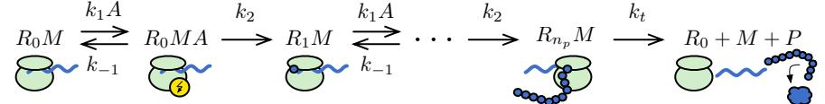

Figure 8.6: Mechanistic derivation of the translational elongation rate. The model assumes that each elongation step consumes a fixed amount of energy. In a first step, energy reversibly binds the mRNA-ribosome complex, upon which elongation takes place. Once the peptide reaches it's final length, the protein is released and ribosome and mRNA are freed up.

the rate of protein synthesis. To define growth dynamically,

<span id="page-138-1"></span>
$$
\lambda(t) := \frac{\gamma(a)R_t}{B_0}, \quad B_0 > 0. \tag{8.31}
$$

Setting *B*0 to the typical biomass of a cell in mid-exponential growth ensures that cells will have a steady-state biomass of *B* ∗ = *B*0.

**Rate of translation** In actively growing bacteria, protein synthesis, and in particular translation-associated processes, account for a major part of the energy budget. The model assumes a simplified mechanism to derive the dependence of the translation rates on the energy levels of the cell. It is assumed that each elongation step of translation consumes a fixed amount of energy (Figure [8.6)](#page-138-0),

and further that intermediate reactions are in quasi-steady state. It can then be shown that the net rate of translation elongation takes the form

$$\gamma(a) = \frac{\gamma_{\text{max}}a}{K_{\gamma} + a}. \tag{8.32}$$

Here, *γ*max denotes the maximal rate of translation elongation per ribosome and *Kγ* the energy threshold of half-maximal elongation. For any protein *x*, the rate of its translation is then given by

$$\nu_x(c_x, a) = c_x \frac{\gamma(a)}{n_x},\tag{8.33}$$

where *cx* denotes ribosomes bound to mRNA of type *x* and division by *nx* accounts for the number of elongation steps to take place for the production of one *px*.

**Rate of transcription** The model assumes that transcription is energy-dependent, but that its consumption is negligible compared to that of translation. Analogous to translation, under the assumption of fixed energy consumption per elongation step, the rate of transcription takes the same shape and is defined by

$$
\omega_x(a) = \frac{\omega_x a}{\theta_x + a}, \qquad x \in r, e_t, e_m. \tag{8.34}
$$

Here, the energy threshold of half-maximal transcription, *θx*, is specific for each proteome sector *x*, which dynamically links the proteome allocations *φx* with different growth conditions. In particular, *θr θx* for *x* 6= *r* ensures that the ribosomal sector increases in rich growth conditions (cf. growth laws in Fig. [8.1C](#page-127-0)).

In addition, the model assumes that the transcription of household genes is negatively auto-regulated to maintain near constant levels across different conditions. Therefore

$$
\omega_q(q, a) = \frac{w_q a}{\theta_q + a} \cdot \mathcal{Z}(q), \qquad \text{with} \quad \mathcal{Z}(q) := \frac{1}{1 + (q/K_q)^{h_q}}, \tag{8.35}
$$

where I is the auto-inhibition function with threshold *Kq* and Hill-coefficient *hq*.

<span id="page-139-3"></span><span id="page-139-2"></span>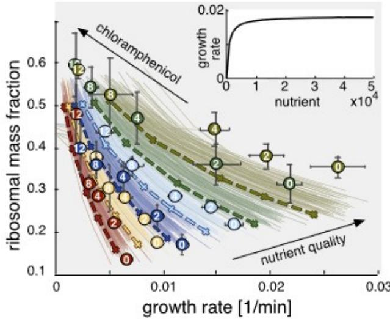

Figure 8.7: Experimental data [coloured circles] and model simulations [lines] depicting the relationship between growth rate and cellular composition. The data describes the ribosomal fraction of the proteome *φr* in different growth conditions. Each colour represents a different media composition, with increasing drugfree growth going from red to green. The numbers within the circles indicate the addition of the antibiotic chloramphenicol to the growth media at a certain concentration [in *µM*]. Although this antibiotic inhibits translation, an increase in *φr* can be observed through all media compositions. The model fit to the experimental data demonstrates the capacity of this model to describe two of the growth laws. (Inset) Model simulation. Besides the composition, varying the amount of external nutrient in the growth media increases the steady-state growth rate up to a saturation point. This reproduces Monod's growth law.

### <span id="page-139-0"></span>**8.4.2 Model predictions**

The model recovers the bacterial growth laws through the automodulation of finite cellular resources in response to changing environments. It robustly fits empirical data (Fig. [8.7)](#page-139-2), suggesting the growth laws are an emerging property of the constraints integrated into the modelling approach.

The model predicts a hyperbolic dependence of the growth rate on nutrient availability as described by Monod's law (Fig. [8.7](#page-139-2) inset), derived using the conservation of mass assumption and when *φr φq*. Energy is created from the metabolism of internalized nutrients and determines the rates of transcription (*ωx*(*a*)) and translation (*γ*(*a*)). In the absence of antibiotics, the latter is proportional to the growth rate of the cell as described in Eq. [(8.31)](#page-138-1). As the nutrient quality is increased, more energy will be available and therefore more transcription will occur. Due to the relationship between transcription thresholds (*θr θx*), the transcription of ribosomes is increased comparatively more, leading to an increase in the ribosomal mass fraction as seen in Fig. [8.7.](#page-139-2)

In a fixed nutrient condition, inhibiting translation by the addition of an antibiotic increases intracellular energy levels as fewer ribosomes can translate. Again, with *θr θx*, this energy increase leads to a proportionally larger increase in transcription of ribosomal mRNAs and so to a larger *φR*. In contrast to the scenario without antibiotics, fewer ribosomes can actively translate and therefore the growth rate will be lower. Consequently, a negative dependence of *φR* and growth rate arises.

### <span id="page-139-1"></span>**8.4.3 Applications**

Due the coarse-grained modelling of mechanisms and the use of non-steady state dynamics, the model lends itself to modular extension for a range of applications. For example, to reproduce the negative correlation between growth rate and ribosome content amid translational inhibition (Fig. **??**), the model was extended to account for inhibitory actions of the antibiotic chloramphenicol on ribosomes. Similarly, mechanisms that <span id="page-140-1"></span>account for drugs with other modes of action could also be included. Further, in [\[272\]](#page-269-15), it was shown that the model can be extended to study a number of applications:

Firstly, the model was extended to account for expression of a heterologous gene circuit and predict constraints between heterologous circuit expression, circuit function, and the growth of the host. This has applications in areas such as chemical production in biotechnology, where host-circuit interactions are not understood and where synthetic circuits have to operate robustly in different growth conditions. In this context, the model can serve to quantify host-circuit interactions for a more host-aware design of synthetic gene circuits.

In another application, the model's ability to dynamically predict growth rate emergently from intracellular mechanisms was used as a proxy for evolutionary 'fitness' to study when gene regulation was evolutionarily stable. This was done by augmenting the cell model with population growth, assuming that all cells of a population are identical, and modelling competitive interactions between a resident and mutant strain.

Finally, in [\[272\]](#page-269-15) it was shown how to use the model to study specific mechanisms within a wider cellular context. With the example of gene-dosage compensation, where the effects of a gene deletion can be reduced by increasing the expression of a paralogous gene, it was shown how and when global regulatory mechanisms caused compensation. The example showed that the constraints underpinning the growth laws can also cause global negative feedbacks on proteins affecting growth.

## <span id="page-140-0"></span>**8.5 Concluding remarks**

In this chapter, we delved into the intricate world of coarse-grained modeling of microbial growth. We began by describing key experimental evidence that has led to what is known as bacterial growth laws. These laws are derived from growth measurements and are deemed to be conserved for various organisms. We then mathematically described the fundamental assumptions necessary to model bacterial growth. Using basic modeling systems, we showed how to analyze such a system and derive fundamental conclusions for bacterial growth. These models reproduce the bacterial growth laws, providing a link between theoretical models and experimental results. Finally, we introduced a more complex model that includes various cell processes such as translation, transcription, and the cellular growth process. Overall, this chapter highlights the power of coarse-grained modeling in unraveling the complexities of microbial growth and offers a framework for exploring a wide range of biological questions.

While this chapter lays a foundation for research on various topics in biology, many areas remain to be explored. For example, the effects of changing environmental conditions such as dynamic changes in nutrient availability, acidity, or temperature are not discussed. Furthermore, various cellular processes such as protein degradation and membrane assembly are not covered in the chapter. Including these processes in a coarse-grained model could potentially lead to the discovery of other growth laws.

In the next chapter, you will explore models that further refine the biological cell and bridge between coarsegrained models and genome-scale models. These models incorporate several of the assumptions discussed here but utilize more knowledge of the metabolic network.

## **Recommended readings**

### **Growth laws in microbiology:**

- Monod, The growth of bacterial cultures, *Annual Review of Microbiology*, 1949 [\[249\]](#page-268-7). Classical reference for the quantitative modeling of microbial growth.
- Schaechter, Maaløe, and Kjeldgaard, Dependency on medium and temperature of cell size and chemical composition during balanced growth of *Salmonella typhimurium*, *Microbiology*, 1958 [\[252\]](#page-268-15). Classical article that introduced the growth law for ribosomes.
- Scott, Gunderson, Mateescu, Zhang, and Hwa. Interdependence of cell growth and gene expression: origins and consequences, *Science*, 2010 [\[254\]](#page-268-16). Article that renewed interest in growth laws for the quantita-

tive study of microbial physiology.

- Jun, Si, Pugatch, and Scott, Fundamental principles in bacterial physiology history, recent progress, and the future with focus on cell size control: a review, *Reports on Progress in Physics*, 2018 [\[247\]](#page-268-11). Recent and very complete review of growth laws in microbiology.
### **Coarse-grained modeling of microbial growth:**

- Hinshelwood, On the chemical kinetics of autosynthetic systems, *Journal of the Chemical Society*, 1952 [\[273\]](#page-270-0). Historical reference for coarse-grained modeling of microbial growth.
- Kafri, Metzl-Raz, Jonas and Barkai, Rethinking cell growth models, *FEMS Yeast Research*, 2016 [\[274\]](#page-270-1). Recent review of coarse-grained models of microbial growth.
- de Jong *et al.*, Mathematical modelling of microbes: metabolism, gene expression and growth, *J. R. Soc. Interface*, 2017 [\[275\]](#page-270-2). Recent review comparing coarse-grained models of microbial growth with other modeling frameworks.
- Bruggeman, Planqué, Molenaar, and Teusink, Searching for principles of microbial physiology, *FEMS Microbiology Reviews*, 2020 [\[276\]](#page-270-3). Recent review summarizing biological insights obtained from coarse-grained models.

### **Examples of coarse-grained models:**

- Molenaar, van Berlo, de Ridder and Teusink, Shifts in growth strategies reflect tradeoffs in cellular economics, *Molecular Systems Biology*, 2009 [\[277\]](#page-270-4). Influential article illustrating the explanatory capacity of coarse-grained models.
- Weiße *et al.*, Mechanistic links between cellular trade-offs, gene expression, and growth, *Proceedings of the National Academy of Sciences of the USA*, 2015 [\[272\]](#page-269-15). Article describing how growth laws for ribosomes can be recovered from coarse-grained model of microbial growth.
- Basan *et al.*, Overflow metabolism in *Escherichia coli* results from efficient proteome allocation, *Nature*, 2015 [\[264\]](#page-269-7). Article describing how proteome allocation constraints can account for overflow metabolism in bacteria.
- Zavřel *et al.*, Quantitative insights into the cyanobacterial cell economy, *eLife*, 2019 [\[278\]](#page-270-5). Example of the use of coarse-grained models for explaining physiological principles underlying growth of less-studied (photosynthetic) microorganisms.

## **Problems**

**Problem 8.1 A linear chain model** A system is composed of a set of 2 linear reactions: nutrient -> metabolite *x*1 -> metabolite *x*2 -> biomass. Using the same approximations as in example 1, solve for the growth rate. What would be the solution for a system composed of *N* reactions? Show that the least efficient reaction determines the growth rate.

**Problem 8.2 A linear chain model with Michaelis-Menten rate laws** Solve example 1 when the nutrients are not available in excess. Use Michaelis-Menten relations for both reactions. First, derive the concentration of metabolite *x* as function of catabolic sector proteome size. What is the minimal size for the catabolic sector? What happens if the catabolic sector is smaller than that? Next, determine the proteome allocation that maximizes the growth rate.

**Problem 8.3 A linear chain model with Michaelis-Menten rate law for the catabolic reaction** Solve Example 2 when the nutrients are not available in excess. Use Michaelis-Menten relations for the catabolic reaction. At what point does the metabolic system switch to use the other nutrient source?

**Problem 8.4 A simple model with allosteric regulation of catabolic reaction**([\[279\]](#page-270-6)): A metabolic system is growing in an environment with one nutrient available. The system allosterically regulates its catabolic reaction according to the concentration of metabolite x. Assume Michaelis-Menten kinetics for all reactions. What is the growth rate as function of catabolic sector proteome size? This is a complex solution, don't solve it

### Concluding remarks 133

analytically and plot a numerical solutions instead. What is the catabolic sector proteome size that maximizes the growth rate?

**Problem 8.5 Growth on a single nutrient that is degraded to both energy and biomass precursors** Consider the model from section 1.3, example 3. Solve the model for the nutrient uptake rate as function of growth rate for:

- 1. Growth rates above the onset of acetate secretion.
- 2. Growth rates below the onset of acetate secretion.

**Problem 8.6 Simulating models numerically** Simple coarse-grained models can generally be solved analytically. However, for models with a higher level of granularity, like the one presented in this section, reaching an analytical solution to the model equations is highly complex. Computational approaches that allow numerically solving high-dimensional systems are of great value.

- 1. With the help of the provided code and following the detailed description of the ODE system in the SI of [\[272\]](#page-269-15), implement and solve the system of ODEs. Using this implementation, reproduce Monod's law, as seen in the inset of Figure [8.1.](#page-127-0)
- 2. The nutrient composition of the growth media is the main driver of increasing growth rates. Simulate the model to steady state for different values of nutrient qualities. What model species are most impacted by an increase in nutrient quality?
- 3. As seen in Figure [8.1,](#page-127-0) the addition of a drug that inhibits protein synthesis results in an upregulation of the ribosomal fraction *φR*. Reproduce Figure [8.1.](#page-127-0) How do the observed results relate to your answer in question 2?

# <span id="page-144-0"></span>**Chapter 9**

# **Large resource allocation models of cells**

Hugo Dourado, Anne Goelzer, Pranas Grigaitis, Wolfram Liebermeister, and Elad Noor

### **Chapter overview**

- Resource balance analysis models are cell models based on three basic constraints formulated at genome-scale: stationary fluxes (balancing production and consumption fluxes, uptake and excretion fluxes, as well as compound dilution by cell growth); flux coupling constraints relating fluxes to the amounts of catalyzing enzymes (or other machines); and density constraints, limiting molecule amounts in cell compartments, or molecule concentrations.
- These constraints narrow down the solution space predicted by FBA towards more physiological solutions
- Large resource allocation models build on the same principles, and have been implemented as different variations (RBA models, ME-models, and pc-models).

# <span id="page-144-1"></span>**9.1 Overcoming the limitations of FBA in predicting phenotypes**

In the previous chapters, we have discussed two principal approaches to modeling biochemical systems. To keep the number of variables low, but with intention of well-parametrizing the model, one can construct small, coarse-grained models of growing cells (Chapter [8)](#page-126-0). On the contrary, Flux Balance Analysis (FBA) models can accommodate a very large number of variables (Chapter [5)](#page-82-0), making them an excellent choice to model metabolic networks at genome-scale.

The small, coarse-grained models are a very suitable platform for investigation of base principles of life. Likely the best example to illustrate this is the work of Douwe Molenaar and co. [\[280\]](#page-270-7), where a self-replicator model was used to proposed that the low-yield, or substrate-inefficient ("wasteful") metabolic strategies are adopted as a consequence of these pathways being more efficient in terms of protein use, compared to the high-yield pathways. In other terms, the growth output of the "wasteful" strategy per unit protein is higher than the "efficient" one. Thus we now believe that fermentation of glucose, often called under an umbrella term "overflow metabolism", will take place in many organisms if the substrate in their environments is abundant enough.

However, we know that the chemistry of life is extremely diverse, and even such a familiar concept as fer-

<span id="page-145-1"></span>mentation can become complicated. Take three representatives of the tree of life: a bacterium *Escherichia coli*, budding yeast *Saccharomyces cerevisiae*, and mammalian, say, human cells. All three exhibit overflow metabolism - even when enough oxygen is available in the environment - yet the underlying biochemistry tells us that *E. coli* ferments glucose into acetic acid, *S. cerevisiae* - into ethanol, and human cells - into lactate. Bringing more contrasts on the table, there might be extreme differences in a single taxon already: some yeasts, for instance, will never produce ethanol when oxygen is present; some of them have lost the ability to do respiration at all over the course of evolution. This might sound like playing a trivia game, but in many cases, meaningful modeling of complex biological systems requires both taking and making biochemical insight. Therefore, when we aim not only to uncover the underlying principles, but also to learn biochemistry, FBA models have an upper hand.

Yet we already know that the predictions of canonical FBA models are limited to substrate-efficient metabolic states. Continuing with the example of the overflow metabolism, FBA models would predict *E. coli* or *S. cerevisiae* to respire on minimal medium with glucose as the main carbon source – irregardless of the maximal flux of glucose into the cell. Thus the prediction of substrate-inefficient metabolism using FBA over the years used to rely on introducing additional, mainly empirical (e.g. maximal oxygen uptake), constraints onto the system [\[207\]](#page-265-10). Moreover, we can impose only linear constraints in FBA models, and this greatly reduces our options.

Overall, we frequently seek to take the advantageous points of both "schools of modeling", however, this is where we need to start doing compromises. In the ideal world, the self-replicator models from the Chapter [8](#page-126-0) would have to be extended with explicit kinetics and thermodynamic constraints to obtain a detailed cell model. However, the number of variables would increase tremendously, and non-linear optimization is very inefficient already past even small systems. On the contrary, we could try to advance on the FBA-type models by introducing the concepts of protein economy (Chapter [7)](#page-116-0) at genome-scale. Following our best understanding, these, again, would constitute non-linear relationships (e.g. enzyme kinetics), yet large-scale non-linear programming is not a viable option either. Thus simplifications are currently necessary to keep linearity (and convexity) to solve optimization problems for large-scale models.

So can we make large-scale models tractable? If we linearize **all** formulae, then instead of a biconvex or convex/concave problem, we obtain a linear problem (a bit like FBA); more precisely, a system of linear equalities and inequalities that define a set of feasible states. This set is a polytope, and linear optimality problems on this set can be solved easily. More specifically, to model metabolism in a growing cell, we need to consider dilution of metabolites in the growing cell volume, or simply - the growth rate *µ* of the cell.

### <span id="page-145-0"></span>**9.1.1 Why growth rate?**

Under the assumption of the balanced growth, the number of copies of every metabolite in the cell is doubled between two consecutive cell divisions. If metabolites are described by their concentration, dilution by growth can be effectively modeled of every metabolite by a "consuming reaction", with a flux given by *v*dil = *µ c*, the compound concentration multiplied by the growth rate. By adding these hypothetical dilution reactions to the metabolic network, we obtain a new stationarity condition **N v** = *µ* **c** that connects the vectors of fluxes and compound concentrations, and in which the growth rate *µ* appears as a parameter. For each choice of the parameter *µ*, we can ask whether a feasible steady growth state – i.e. a feasible combination of **v** and **c** exists. Furthermore, the feasible combinations (*µ,* **v***,* **c**) form a convex set, with possible solutions (**v***,* **c**) for low values of *µ* and no solutions above a critical value *µ*max, the maximal possible growth rate for our model. Finding this critical value as well as the corresponding optimal fluxes **v** and compound concentrations **c** is relatively easy, and can be done by bisection: solving a series of Linear Programming problems (checking for potential solutions (**v***,* **c**) for different values of *µ*).

### <span id="page-146-2"></span><span id="page-146-0"></span>**9.1.2 Replacing complex kinetics by catalytic constraints**

The main downside of this approach is that all relationships between models variables need to be linearized. This concerns, most importantly, all catalyzed processes, in which we assume a linear dependence between catalyzed flux and catalyst (enzyme or machine) concentration, but ignore the dependence on the concentrations of substrates, products, cofactors, or additional regulators. What does this mean in practice? As we know from Chapter [3,](#page-36-0) typical enzymatic rate laws have the form *v* = *e k*(**c**): the rate *v* is proportional to enzyme level *e* and enzyme efficiency *k*, which is given by a kinetic rate law *k*(**c**), a nonlinear function of the metabolite concentrations. Depending on the context, *k* is also called catalytic rate or apparent *k*cat. The kinetic rate laws *k*(*c*) have typical shapes, as described in Chapter [3.](#page-36-0)

To linearize the expression for *v*, while keeping the dependence on *e*, we need to replace the relationship *k* = *v/e* by a fixed number, and so *k* becomes a model parameter. If the metabolite concentrations were known (experimentally, or from kinetic models under optimality assumptions, see Chapter [6)](#page-94-0), the value of *k* could be computed. Otherwise, it can also be determined experimentally, by measuring *v* and *e* and setting *k* = *v/e* [\[31\]](#page-254-6), which is feasible for a limited number of enzymes, however. Obviously, in reality, neither **c** nor *k* will be fixed and given, but for our linearized model, we need to assume this. This holds both for metabolic reactions (with enzymes as catalysts) and for macromolecular reactions (with molecular machines as catalysts). Under this assumption, we can replace all kinetic constraints by two linear constraints on the enzyme. If we consider coefficients *k* and *k* 0 to approximate enzyme kinetics in the forward and backward direction, respectively, the flux the enzyme *e* catalyzes should satisfy −*e k* 0 ≤ *v* ≤ *e k*. We set *k* 0 = 0 for irreversible reactions, and, for simplicity reasons, we usually assume *k* = *k* 0 for reversible reactions, unless kinetic measurements are available that suggest otherwise. This relationship can be formulated as enzyme capacity constraints in order to replace the kinetic rate laws in the FBA model. By writing down such constraints for each enzyme in the model, we can couple the metabolic fluxes with the demand for enzymes, needed to operate these fluxes.

### <span id="page-146-1"></span>**9.1.3 Overview of existing FBA extensions**

The linearization approach described above can be successfully used for very large models, making the genome-scale models of resource allocation possible. What we commonly refer to as "resource allocation models" therefore formalize the mathematical relationships defining the interactions and allocation of resources between the cellular processes to describe optimal resource allocation using constraint-based models. All these relationships take the form of linear, growth-rate dependent equalities and inequalities, and, when linearized, form a convex feasibility problem [\[281,](#page-270-8) [282,](#page-270-9) [283\]](#page-270-10).

By itself, the idea of constraining metabolic models to represent limited metabolic capacity of cells is not a new one. There are two ways to approach this budgeting problem: "protein budgeting", where a fixed amount of protein needs to be partitioned in the optimal manner (maximizing growth), and "resource budgeting", where models include both the protein budgeting and the descriptions of demands for protein synthesis. However, "protein budgeting" problems assume that investments in protein production follow the budget, and not vice versa.

Some extensions of FBA account for extra empirical constraints on the total concentration of metabolic enzymes (FBA with molecular crowding, or FBAwMC [\[284\]](#page-270-11)), or on proteome sectors (Constrained-Allocation FBA, or CAFBA [\[285\]](#page-270-12)). While these can predict metabolic states more reliably, the empirical constraints come as model assumptions and thus cannot be understood by the models themselves. In these models, the primary assumption is that the cell phenotype is obtained by genetic regulations, and the main goal and utility of genetic regulation can be interpreted as ways of saving resources. Thus in many cases when we predict cell phenotype maximizing growth, we find predictions in good agreement with the experimental observations. Therefore, resource allocation models extend and embed the ideas of proteome partitioning beyond frameworks like CAFBA and GECKO [\[286\]](#page-270-13), or representing metabolic capacity limitations beyond FBAwMC.

Currently, there are three main implementations of large-scale resource allocation models: Resource Bal-

<span id="page-147-3"></span>ance Analysis (RBA) [\[287\]](#page-270-14), Models of Metabolism and Macromolecular Expression (ME-models) [\[288\]](#page-270-15) and proteome-constrained models (pc-models) [\[59\]](#page-256-4). All these implementations are formalized as LP feasibility problems at fixed growth rate. Originally, ME-models were considered as an extension of M-models, by including predictions for mRNA, protein, and ribosome levels. Importantly, they do not consider density constraints that, for instance, RBA does. Therefore, limitations on the capacity of exchange fluxes (as in FBA) are necessary to obtain a solution.

## <span id="page-147-0"></span>**9.2 Types of constraints in resource allocation models**

As indicated above, fine-grained models of resource allocation build on the genome-scale metabolic models (GEMs) to encompass all the reactions that potentially could happen in a metabolic network. The technical advance, when constructing such models, is to impose sets of additional constraints onto GEMs to couple the metabolic fluxes with investment into metabolic pathways (production of enzymes). To the date, different implementations of this concept were proposed to predict optimal resource allocation in different microorganisms [\[289\]](#page-270-16).

The general description of these constraints in fact is the same as for small, coarse-grained self-replicator models, only the number of individual constraints increases. Moreover, every of the constraints described can be split into a number of constraints, considering only a subset of fluxes in the model (e.g., fluxes taking place in a certain cell compartment). Although the precise formulations vary, resource allocation models build on three principal types of constraints (Figure [9.1)](#page-148-0):

- (1) Mass-conservation constraints
- (2) Flux coupling constraints
- (3) Compartment capacity, or protein density, constraints

Alongside these three major classes there is another set of constraints, which we could call "environment" constraints - these correspond to, e.g. the composition of growth medium, biomass composition at at given growth rate *µ*, etc. They are implemented by setting target values for amounts and/or fluxes defining a viable cell in a given (or several) environmental conditions, but they are not structural constraints. These constraints usually are added *ad hoc* and do not need to bear any functional meaning *per se*. We will now expand on the three types of constraints used in resource allocation models; note that the description is not exhaustive and peculiarities may vary among different formulations.

### <span id="page-147-1"></span>**9.2.1 Mass-conservation constraints**

The *mass-conservation* constraints define the metabolic network (stoichiometry and relation between fluxes). The initial building blocks of these extended models are GEMs, and thus the metabolic network stoichiometry is already there; what remains to be defined are the protein turnover processes. We consider 4 types of protein turnover reactions in fine-grained resource allocation models: protein synthesis, folding, degradation and dilution-by-growth. So, for every protein present in such a model, we add these four reactions: two of them, translation and degradation, include the stoichiometry of amino acids needed for its translation and released during degradation based on the protein sequence. The reactions which represent either protein folding modeled as the conversion of the "unfolded" protein species into the "folded" ones, and the dilutionby-growth is modeled as a sink for the "folded" protein species ("folded" → ∅).

### <span id="page-147-2"></span>**9.2.2 Flux coupling constraints**

Next, the flux *coupling* constraints couple the metabolic fluxes with protein usage: usually, the usage scales with the catalytic turnover value *k*cat of the enzyme. In this step we have to collect the kinetic information (in most cases, *k*cat values), which are used as model parameters. We establish the coupling between fluxes and protein synthesis by setting *v* = *k*cat *e η*, where *e* is the enzyme concentration and 0 *< η* ≤ 1 is an efficiency term summarizing the effects of reaction thermodynamics, enzyme saturation, and possi<span id="page-148-0"></span>(A) Metabolism Macromolecule production Catalysis Catalysis Localisation Subunits Reactions Processes Metabolites (biomass (extracellular) (internal) precursors) Metabolites Metabolites Enzymes Proteins Compartments Process Machinery Dilution (B) Enzyme capacity constraint Metabolite mass-balance constraint Transporter capacity constraint Machine capacity constraint Density constraint Protein mass-balance

Figure 9.1: Overview of biological components and mathematical constraints in large-scale resource allocation models. Here, Resource Balance Analysis (RBA) model is taken as an example. (A) Typically, an RBA model describes metabolisms and macromolecule production in a growing cell (yellow blocks). Precursors from metabolism are needed to produce macromolecules, and some macromolecules serve as enzymes to catalyze metabolic reactions. In addition, macromolecules are diluted and are localized in cell compartments. (B) Sets of mathematical constraints. The variables and processes described by an RBA model must satisfy a number of constraints, include mass-balance constraints (between production, degradation, and dilution of compounds); capacity constraints (relating process velocities to the concentrations of catalysts); density constraints (on the total amount of compounds in a cell compartment); and possibly empirical physiological constraints on any types of "target variables", to ensure realistic models.

constraint

bly small-molecule regulation. The value for *η* can be either assumed or fitted from experimental data, and when *η* = 1, the enzyme is considered to operate at its maximal rate. Coupling constraints are introduced to couple both (i) the metabolic reactions with enzyme usage (as described above) and (ii) protein turnover reactions with the respective macromolecular machinery (e.g. sum demand of ribosomes for protein translation, *v*translation = [Ribosome] × *k*cat*,*ribosome). The sheer number of the kinetic parameters needed for formulating the coupling constraints in the fine-grained models requires the modeller to consider different assumptions and simplifications when building and parameterizing these models, as briefly discussed below.

The number of processes described in a fine-grained manner directly translates to the number of reactions and metabolites in the model. For instance, transcription is modelled explicitly in the ME-models [\[288\]](#page-270-15). The modellers' decision is key here: under assumption that transcription and translation form a linear pathway with fixed scaling factors (i.e. there is a fixed ratio of peptides translated per mRNA transcribed), the flux through mRNA translation reaction can be computed post-optimization based on the flux through the protein translation reaction. Explicit modelling of transcription would require describing processes of mRNA transcription, processing, export from nucleus, and then cytosolic degradation after the mRNA is translated – for each of the transcripts, with precise stoichiometry and a new set of coupling constraints.

The next issue is kinetic parametrization of these fine-grained models. We currently can use only very sim-

#### <span id="page-149-2"></span><span id="page-149-1"></span>**Box 9.A : Protein** *abundance* **versus** *concentration* **in fine-grained resource allocation models**

Here we would like to include a relevant note for interpretation of the output of the fine-grained resource allocation models. Both the classical FBA and these extensions do not consider "metabolite concentration" as a concept: optimization variables are all *fluxes*. Frameworks discussed in this chapter model protein synthesis from amino acids and energy equivalents explicitly, with a typical flux dimension of *mmol gDW*−1 *h*−1 (as for any other fluxes). To compute the amount of protein that has to be produced in the steady-state growth, we should consider the flux balance for the protein *e*: *v*synthesis*,*e = *v*degradation*,*e + *v*dilution*,*e, or, rewritten with the respective parameters, *v*synthesis*,*e = (*k*deg*,*e + *µ*) *e*. Here, *k*deg*,*e is the degradation rate for the protein *e*, and *µ* is the specific growth (= dilution-by-growth) rate. The [*e*] in the rewritten equation holds dimension of mmol gDW−1 , which is protein *abundance*, rather than *concentration*.

The predicted amount of protein in cells can be compared to experimental measurements in two ways. First option is to convert abundance to concentration using the relationship between the cell volume and dry weight (e.g. *VgDW* = 1*.*7 *mL gDW*−1 in *Saccharomyces cerevisiae*, [\[8\]](#page-252-8)). Alternatively, proteome mass fractions are a popular unit in label-free mass spectrometry-based protein quantification, a popular method in quantitative microbiology. Respectively, predicted proteome mass fractions can be inferred by converting protein abundance in *mmol* to *g*, and scaling to the protein content in dry cell biomass. Here, it is important to consider the conversion factors (protein content in dry biomass). *E. coli* maintains rather constant protein content in dry weight across growth rates (ca. 0.55 (*g* protein) *gDW*−1 ) [\[291,](#page-271-0) [292\]](#page-271-1). On the contrary, the protein content is known to vary in *S. cerevisiae* as a function of growth rate [\[8\]](#page-252-8).

plified kinetics in the models (flux coupling *v* = *k*cat *e η*), and simplify such factors as enzyme saturation and thermodynamic driving force into a single value of factor *η*. Two approaches are used to deal with this, as a large fraction of parameters are not even available. First, condition-dependent kinetic parameters ("apparent catalytic constants", *k*app) are fitted from experimental (mostly quantitative proteomics) data (setting *k*eff = *k*cat *α*, where 0 *< α* ≤ 1) with a value *α* chosen to match predicted enzyme abundance and experimental measurements. Otherwise, for the enzymes with measured *k*cat values, we can assume that enzymes work at their maximal rate, i.e. the saturation function *η* = 1. Then the model computes the *minimal* protein requirement to sustain the flux through the metabolic reactions. The comparison of *minimal predicted* vs. *observed* protein abundance can represent the "apparent saturation", or "overcapacity" of enzymes. For instance, it is common in yeast *S. cerevisiae* that the flux and not protein expression varies across conditions, and the relationship between predicted and measured expression can suggest the nature of the observed protein expression [\[290\]](#page-271-2).

### <span id="page-149-0"></span>**9.2.3 Protein density constraints**

The final layer of information in the fine-grained resource allocation models is a set of *protein density* constraints. These constraints describe the [upper] limit of cellular process(es), e.g. maximal protein capacity of a compartment. These constraints are formulated as weighted sums of protein abundance, and usual weighing multipliers are proportional to the molecular weight of the protein. Usually, the density constraints are expressed in terms of (usually maximal) *mass*, *area*, and *volume* of the compartment (e.g. "what is the maximal mass the mitochondrial proteins can take up in *gDW* of cells?"). Based on the biological interpretation of the constraints, we formulate the weighing multipliers to represent either of the metrics (mass/area/volume) that every protein occupies.

The capacity constraints can be both *equality* and *inequality* constraints: more frequent are the latter (usually defining the "upper limit" of, e.g. amount of protein targeted to mitochondria). However, some cell properties should be described through equality constraints: one of these is the protein density of biomass, defining the "target" protein translation per gram dry cell biomass.

## <span id="page-150-3"></span><span id="page-150-0"></span>**9.2.4 Interpreting the consequences of the additional constraints**

We have briefly discussed what types of additional constraints need to be implemented to extend FBA models to account for cellular resource allocation, and now let us recap on what these sets of rules mean in biological terms. The constraints described above shall couple the metabolic fluxes with the production of enzymes that operate these functions, so the model has to produce amino acids and generate ATP in order to use them for protein translation. Moreover, the enzyme demand will be coupled with the production of the macromolecular machines required to produce, fold, and degrade these enzymes (ribosomes, chaperones, and proteases, respectively), requiring the same building blocks (see Chapter [2)](#page-18-0). These constraints therefore formalize a self-replicating molecular system in balanced growth subject to different structural constraints:

- 1. the metabolic network has to produce all metabolic precursors necessary for biomass production and mass conservation must hold for all intracellular molecule species - i.e. intracellular metabolites and molecular machines.
- 2. the capacity of each type of molecular machine must be sufficient to ensure its function, i.e. to catalyze chemical conversions at a sufficient rate;
- 3. the intracellular density of compartments and the occupancy of membranes must not exceed the defined limits.

As highlighted before, the biological interpretation of the additional constraints discussed above is rather universal for different implementations of resource allocation models, with minor deviations in terminology and/or formulation. To illustrate how resource allocation models are built from conventional GEMs, and how the respective models are formalized in mathematical terms, in the following we will consider one of the popular formulations of resource allocation models in more depth.

# <span id="page-150-1"></span>**9.3 Resource Balance Analysis (RBA) models**

Resource Balance Analysis (RBA) has been developed as (and is considered to be) a flexible and generic modeling framework which describes the functioning of an organism using the most relevant set of linear equality and inequality constraints, described in general terms in Section [9.2.](#page-147-0) As a consequence, an RBA model includes all known metabolic reactions coupled to relevant cell processes with major protein investments (production of biomass precursors; including, but not limited to protein translation, protein folding, protein transmembrane transport, and protein degradation). Where applicable, circumstantial information can be included into the model to establish the dependency of enzyme activity on metal ions, vitamins, and/or cofactors. Which metabolic reactions and cell processes are regarded as relevant may vary between organisms and is a modeler's choice.

## <span id="page-150-2"></span>**9.3.1 Building a draft RBA model**

The software package RBApy [\[293\]](#page-271-3) contains all the routines needed to build and simulate RBA models. In order to build a new RBA model, it takes a genome-scale metabolic network in SBML format [\[294\]](#page-271-4) as an input, together with additional information to formulate the additional constraints described in the previous section. Different types of biological data, are needed to build an RBA model for an organism:

- Amino acid sequences for metabolic enzymes and macromolecular machines (e.g. ribosomes and chaperones),
- If applicable, stoichiometry of known cofactors (e.g. metal ions),
- Efficiencies of metabolic enzymes,
- Molecular weights and localization of proteins (for density constraints),
- Any empirical constraints on concentrations or fluxes ("targets", see previous section).

The software routine first extends the input GEM to include the description of protein turnover in the cell. The software extracts information from the input files on (i) protein sequences and cofactors, (ii) the subunit stoichiometry of protein complexes, and (iii) protein localization (using information from public databases such as UniProt). Using this information, reactions corresponding to protein synthesis, folding, degradation, and dilution by growth are added. Finally, the software maps enzymes to the reactions they catalyze and to the proteins they consist of, and the output of the routine is a draft (uncalibrated) RBA model.

### <span id="page-151-0"></span>**9.3.2 Mathematical description of a RBA problem**

**Notation.** Below *A T* refers to the transpose of the matrix *A*. R *n >*0 ∆ = *x* ∈ R *n* |*xi >* 0 for all *i* ∈ {1*,* · · · *, n*} , R*>*0 ∆ = R 1 *>*0, R *n* ≥0 ∆ = {*x* ∈ R *n* | *xi* ≥ 0 for all *i* ∈ {1*,* · · · *, n*}} and R≥0 ∆ = R 1 ≥0 .

In a standard RBA model, we consider balanced growth (see Chapter **??**), that is, the average state of a cell in a cell bacterial population growing exponentially at the specific (constant) growth rate *µ* ≥ 0, i.e. the amount of produced biomass per biomass per cell per unit of time. Our simulated average cell is composed of different molecule species:

- 1. *ny* types of molecular machines, which can be subdivided further into *ne* enzymes and transporters involved in the metabolic network E ∆ = (E1*, . . . ,*E*ne* ) at the concentrations **e** ∆ = (*e*1*, . . . , ene* ) *T* and metabolic fluxes *ν* ∆ = (*ν*1*, . . . , νne* ) *T* ; and *nm* macromolecular machines M ∆ = (M1*, . . . ,* M*nm*)involved in non-metabolic cellular processes, such as the translation apparatus, at the concentrations **m** ∆ = (*m*1*, . . . , mnm*) *T* ;
- 2. *np* proteins P ∆ = {P1*, . . . ,*P*np* } belonging to unspecified cellular processes. **p** ∆ = (*p*1*, . . . , pnp* ) *T* denotes the set of concentrations of P;
- 3. *ns* intracellular and mass-balanced metabolites S ∆ = (S1*, . . . ,* S*ns* ). Within the set S, we distinguish a subset B ∆ = (B1*, . . . ,* B*nb* ) of abundant metabolites which have fixed growth-independent concentrations **b¯** ∆ = ( ¯*b*1*, . . . ,* ¯*bnb* ) *T* (and usually coincide with biomass macro-components such as DNA, cell wall or plasmic membrane). We also consider a set of extracellular metabolites Sext ∆ = (Sext*,*1*, . . . ,* Sext*,*next ) of concentrations **s**ext ∆ = (*s*ext*,*1*, . . . , s*ext*,*next ) *T* that are not mass-balanced.

Finally, let us introduce the vector **y** *T* ∆ = (**e** *T ,* **m***T* ) of concentrations of molecular machines of size *ny*. Typical units of concentrations **e**, **m** and **p** are in millimoles per gram of cell dry weight, and fluxes *ν* in millimoles per gram of cell dry weight per unit of time.

For a given cell growth rate *µ* ≥ 0, the RBA optimization problem (named Prba(*µ*)) can be formalized mathematically as follows.

For a fixed vector of concentrations **p** ∈ R *Nnp >*0 and the given growth rate *µ* ≥ 0,

| find possible cell states | ny<br>y ∈ R<br>, ν ∈ R<br>ne<br>,<br>≥0            |
|---------------------------|----------------------------------------------------|
| subject to                |                                                    |
| (C1)                      | B b¯ +<br>−Ων + µ(CS<br>Y y + CS<br>CS<br>P p) = 0 |
| (C2a)                     | µ(CM<br>Y y + CM<br>P p) − KT y ≤ 0                |
| (C2b)                     | 0<br>−K<br>E y ≤ ν ≤ KE y                          |
| (C3)                      | P p − d¯ ≤<br>CD<br>Y y + CD<br>0                  |

where all the inequalities are defined component-wise and:

- **Ω** is the stoichiometry matrix of the metabolic network of size *ns* × *ne*, where Ωij corresponds to the stoichiometry of metabolite Si in the *j*-th enzymatic reaction;
- **C**S Y (resp. **C**S P) is an *ns ny* (resp. *ns np*) matrix where each coefficient C S Yij corresponds to the number of metabolite Si consumed (or produced) for the synthesis of one machine Yj (resp. Pj); C S Yij is then positive, negative or null if Si is produced, consumed or not involved in the the synthesis of one machine Yj (resp. Pj);
- **C**S B is an *ns* × *nb* matrix in which each coefficient C S Bij corresponds to a metabolite Si consumed (or produced) for the synthesis of one Bj;
- **K**T (**K**E and **K** 0 E, respectively) are matrices of size *nm* × *ny* (*ne* × *ny*, respectively) in which each coefficient kTi (kEi and k 0 Ei , respectively) is positive and corresponds to the efficiency of molecular machine Mi , i.e. the rate of the process per amount of the catalyzing molecular machine, (the efficiency of the enzyme Ei in forward and backward sense, respectively);
- **C**M Y (resp. **C**M P ) is an *nm* × *ny* (resp. *nm* × *np*) matrix in which each coefficient C M Yij typically corresponds to the length in amino acids of the machine Yj (resp. Pj). In some cases (for instance for the constraints on protein chaperoning), the length in amino acids can be multiplied by a coefficient, such as the fraction of the whole proteome that necessitates chaperoning;
- **d¯** is a vector of size *nc*, where *nc* is the number of compartments (compartment membrane and/or compartment interior for which density constraints are considered. d¯i is the density of molecular entities within the volume or surface area. Densities are typically expressed as a number of amino-acid residues by volume or surface area.
- **C**D Y (resp. **C**D P ) is an *nc* × *Ny* (resp. *nc* × *np*) matrix in which each coefficient C D Yij corresponds to the density of one machine Yj (resp. Pj) in the compartment *i*. By construction, we have one unique localization per machine.

For given growth rate and medium composition, all equalities and inequalities in our RBA problem Prba(*µ*) is linear in the decision variables (**y***, ν*) and is proven to be convex [\[281,](#page-270-8) [283\]](#page-270-10). At given *µ*, Prba(*µ*) is a feasibility optimization problem, where constraints (*C*1-*C*3) define the feasibility domain. The feasibility domain can be empty or non-empty. If there exists a solution (**y***, ν*) to Prba(*µ*) -i.e. the feasibility domain is non-empty-, then there exists a feasible resource distribution compatible with the given growth rate. In other words, the cell can grow at this growth rate value. By construction, the feasibility domain of Prba(*µ*) corresponds to the set of all possible phenotypes of the cell at a growth rate *µ* ≥ 0.

We conclude this with some remarks:

- 1. In practice, the vector **b¯** contains non-zero values only for the concentrations of macro-components such as DNA, cell wall, and lipid membranes, and for a few set of metabolites. These values are usually extracted from the biomass formation reaction used in FBA models (see Chapter [5)](#page-82-0).
- 2. To model reversible enzymes, we introduced two diagonal matrices containing the enzyme efficiencies, i.e. **K**E and **K** 0 E, describing the capacity constraints of enzymes in both directions. If an enzyme Ei is considered irreversible, k 0 Ei is set to 0.
- 3. In [\[282,](#page-270-9) [295\]](#page-271-5), an RBA model was built for *Bacillus subtilis*. It integrates two macromolecular processes in constraint *C*2*a*, the translation and chaperoning of proteins, and two density constraints, the limitation of the cytosolic density and of the membrane occupancy. An RBA model can be refined by integrating for instance other cellular processes and molecular machines, such as the transcription machinery, the protein secretion apparatus (see [\[295,](#page-271-5) [293\]](#page-271-3)), or molecule turnover [\[296\]](#page-271-6), as well as other types of constraints.

### <span id="page-152-0"></span>**9.3.3 Simulation and analysis of RBA models**

**How to incorporate the medium composition.** We represent the medium composition in two aspects, namely (i) qualitatively, by allowing exchange of the medium metabolites in the model (*UBExchange,n >* 0). Note that some metabolites, although not explicitly represented by the growth media, should also adhere to this rule (e.g. oxygen, water, and protons). The (ii) quantitative composition of the growth medium is determined by extracellular concentrations, which, in turn, dictate the efficiencies of metabolic transporters via Michaelis-Menten-like rate laws (as nonlinear *k*(*c*) functions; see section [9.1.1)](#page-145-0). For an extracellular nutrient Sext*,*i with concentration *s*ext*,*i ≥ 0, the efficiency of the corresponding metabolic transporter(s) is given by kE(sext*,*i) = kcatsext*,*i Km+sext*,*i , with parameters kcat and Km for the turnover number and the affinity of the transporter, respectively.

**Calibration of model parameters.** An RBA model may contain a high number of model parameters. First, the global parameters to be estimated are related to cell composition: (i) the concentrations of bulk biomass components **b¯**, which is usually deduced from the biomass reaction of the genome-scale metabolic network of the organism. Using quantitative proteomics data [\[297\]](#page-271-7), one can infer (ii) the protein densities in different compartments (**d¯**), and (iii) the abundance of housekeeping (unspecified) proteins (**p**).

The next set of parameters we need to collect concerns the efficiencies of molecular machines (**K**E, **K** 0 E,**K**T). As we learned in Chapters [2](#page-18-0) and [3,](#page-36-0) the rate of an enzymatic reaction *v* depends on the enzyme's efficiency or "apparent catalytic rate", given by *v* = *e k*app, with *k*app = *f*(**c**) = *k* + cat · *η* rev(**c**) · *η* sat(**c**) *< k*+ cat. The *k*app values are always below the *k*cat value, but may vary from state to state depending on metabolite concentrations. Since internal metabolite concentrations **c** are unknown and difficult to measure at genome-scale, we cannot estimate *k*app from the explicit kinetic law *f*(**c**). We need to obtain these *k*app parameters empirically, for example by measuring the flux *v* and the protein abundance *e* in one condition and taking their ratio.

Hence, for a given environmental condition, efficiency parameters can be estimated using quantitative proteomics in combination with fluxomics [\[295\]](#page-271-5) or FBA to estimate the flux distribution [\[293\]](#page-271-3). To account for variable enzyme efficiencies, one may make the simplifying assumption that enzyme efficiencies depend mostly on growth rate. By estimating the enzyme efficiencies at different growth rates and interpolating between them, one obtains empirical relationships between efficiency and the growth rate [\[295\]](#page-271-5) to be used in Prba(*µ*). For instance, several estimates of enzymatic efficiencies obtained in contrasting growth conditions will provide a relationship **K**E(*µ*) instead of a constant **K**E value.

**Obtaining the RBA solution for a given parameter set.** For an RBA problem with given parameters, there exists a maximal growth rate *µ* ∗ ≥ 0, such that for any *µ*, Prba(*µ*) is feasible if and only if *µ* ≤ *µ* ∗ [\[281,](#page-270-8) [283\]](#page-270-10). For a given medium composition, the maximal growth rate *µ* ∗ can computed by using a bisection algorithm, in which a series of LP problems are solved to narrow down the exact growth rate at which the problem becomes infeasible. A real-life example would be simulating growth in glucose-limited chemostat cultures under different dilution rates *D*. With increasing *D*, the glucose availability increases, and a set of *n* different glucose uptake rates *qGlc* (*qGlc,*1, *qGlc,*2, *. . .* , *qGlc, n*) can be subjected to an RBA model to obtain a set of optimal metabolic states (*µ* ∗ 1, *µ* ∗ 2, *. . .* , *µ* ∗ *n*).

Together with the maximal feasible growth rate one obtains the optimal cell configuration maximizing growth (*µ* ∗ *,* **y** ∗ *, ν*∗ ). The principle of optimal performance, in this case, that a cell phenotype should maximize growth rate, in fact, coincides with the principle of parsimonious resource allocation between cellular processes.

**Exploration of the feasibility domain.** Although RBA models inherently reduce the solution space due to principle of parsimonious resource allocation, the solutions obtained might still contain considerable flux variability. In the same vein as Flux Variability Analysis([\[298\]](#page-271-8), see Chapter [5)](#page-82-0), the feasibility domain can be explored at optimal (*µ* ∗ ) or sub-optimal (*µ* ≤ *µ* ∗ ) growth rates. For one decision variable *yi* (resp. *νi*), two LP problems are solved, where (*i*) constraints *C*1, *C*2 and *C*3 remain unchanged; (*ii*) the decision variable *yi* (resp. *νi*) is maximized (LP 1) and minimized (LP 2). This operation is repeated for each decision variable to obtain *in fine* the feasibility domain of all decision variables.

It was proven that the feasibility domain becomes smaller with increasing growth rate [\[281,](#page-270-8) [283\]](#page-270-10), so it might be worthwhile to probe the solution space at slow-growth regimes. In practice, at the optimum, the cell configuration (*µ* ∗ *,* **y** ∗ *, ν*∗ ) is often unique. Indeed, non-unique solutions will exist if two alternative metabolic pathways have exactly the same cost in resources. Since all enzymes have different amino acid sequences, use different cofactors, are differently localization, etc, this is highly unlikely. A caricatural example of a model with non-unique solutions would be one in which an enzyme pool is arbitrarily split into two, and the two new "enzyme species" are given different names, although they are physically exactly the same.

### <span id="page-153-0"></span>**9.3.4 Use of -omics data-informed** *k*app *vs.* **naïve** *k*cat **values**

The three most popular formalisms of fine-grained resource allocation models, RBA [\[287\]](#page-270-14), ME-models [\[288\]](#page-270-15), and pc-models [\[59\]](#page-256-4), are variations on the same theme, as shown in the general discussion of the underlying constraints in Section [9.2.](#page-147-0) Thus most of the ideas, concepts, and constraints are equivalent (or at least highly similar) in their biological interpretation. Most of the differences arise from the approach taken towards <span id="page-154-1"></span>parametrization of these models, and consequently, interpretation of model output. Here we will discuss an example where implementations differ significantly.

In resource allocation models, two types of constraints define the proteome capacity at given growth rate *µ*, the protein density vector **b¯**, and the fraction of housekeeping proteins **p** in the proteome. The remaining proteome space is to be distributed among the proteins that are explicitly defined in the model. The RBA formalism requires to formulate the function *k*app(*µ*) (or **K**E(*µ*) in the RBA problem, Section [9.3.2)](#page-151-0) for every protein in the model using -omics data (see Section [9.3.3)](#page-152-0), and the fraction of the "housekeeping" proteins in the proteome is determined from data for each simulation.

Conversely, the formulation of pc-models [\[59\]](#page-256-4) allows more flexibility to the "unspecified" protein *UP*, represented by a single artificial protein of average size and amino acid composition. Instead of setting a fixed amount allocated to **p** which changes across conditions, one can determine the *minimal* fraction of this protein in proteome *UPmin*, and formulate the demand to produce *UP* as an inequality constraint *UP* ≥ *UPmin*. Interestingly, in *Saccharomyces cerevisiae*, the proteome mass fraction occupied by non-metabolic proteins is relatively constant under different glucose-limited conditions, as determined by quantitative proteomics data (see [\[59\]](#page-256-4), Fig. S1 for a plot).

This inequality constraint can be interpreted as the upper limit of available protein space, i.e., under fixed protein density **y** + **p** = const*.*, the proteome not occupied by **y** ∆ = **e** + **m** is allocated to **p**. Since now the model can distribute the proteome among explicitly-defined *vs.* unspecified protein freely, the procedure of fitting *k*app values is no longer a prerequisite. Using *k*cat values, collected from literature/databases/own experimental measurements, rather than apparent *k*app values, has consequences both for predictions and the data use: first, the model prediction on the protein use is the "demand" of the enzyme and is strictly coupled to the flux through the enzyme (equivalent to the ECM1 layer of enzyme costs in the *Enzyme Cost Minimization* method, Chapter [6)](#page-94-0). Second, the condition-dependent quantitative proteomics data can be used as validation dataset for model predictions instead [\[299\]](#page-271-9), as the predicted protein abundance is not dependent on these datasets.

Using less data for parameter fitting and redirecting these data-rich datasets towards validation of model prediction strengthens the argument for using resource allocation models for learning new biology, and already has real-life examples. For instance, the discrepancies in predicted *vs.* observed levels of glycolytic enzymes at glucose-scarce conditions in [\[59\]](#page-256-4) inspired the same team to revisit the question whether the high levels of glycolytic enzymes represent the optimal expression given very low thermodynamic driving force and undersaturation of glycolytic enzymes. Comparing predictions of *Enzyme Cost Minimization* models with the results of the pc-model and experimental data, [\[290\]](#page-271-2) proposed that *S. cerevisiae* expresses genuine excess of glycolytic enzymes in glucose-limited conditions, meant to amply consume any glucose as soon as it appears in the environment.

## <span id="page-154-0"></span>**9.4 Biomass composition: both a constraint and a prediction**

Cell models describe, among other things, what a cell is composed of (see Chapter [2)](#page-18-0). In FBA, specifically, "biomass" refers to the proportions of different molecule classes (e.g. lipids, protein, DNA, RNA, cofactors) in 1 gram dry weight of cells, and biomass composition needs to be defined prior to optimization. Since, at least for FBA models of microbes, biomass production usually is the optimization objective, the literature frequently refers to the mathematical description of cell composition as "biomass objective function" (BOF). In most cases, it is assumed that the proportions of biomass constituents are fixed, only the total production (flux through BOF) changes.

For the predictions of FBA models to be reliable, a high-quality BOF is a must (see Chapter [5)](#page-82-0). Therefore, there is a sustained effort to experimental determination biomass composition, even for *E. coli* [\[300\]](#page-271-10); for more details on the usual experimental measurement methods, see the box in Chapter [2.](#page-18-0) In case supporting data are available, the cell composition in the BOF may be described in a more fine-grained manner for individual molecule types (e.g., individual lipids, proteins, mRNA species, etc), or even in terms of atomic composition (which in turn gives clues about the amounts of molecule classes). So, overall, the biomass composition acts as a global, and one of the most stringent, constraint on the predicted solution space in FBA-based models.

However, cell composition may greatly vary not only between (micro-)organisms, or different cell types within the same organism, but also for a the same organism/cell type across different conditions. Budding yeast *S. cerevisiae*, for instance, exhibits rather linear relationships between the proportions of bulk biomass constituents as a function of growth rate in glucose-limited cultures [\[1\]](#page-252-1). This variable composition often poses a challenge for models: just like the uptake rates, the varying biomass composition reflects complex global rearrangements of resources (for instance, different ribosome content at different growth rates [\[55\]](#page-256-0) leads to changes in RNA-to-protein ratio in the cells), and choices between metabolic strategies (e.g. depletion of storage carbohydrates in glucose-fermenting *S. cerevisiae* [\[8\]](#page-252-8)).

A main advance of resource allocation models, compared to conventional FBA models, is that only a part of the biomass composition is given as input information just like in FBA (**b¯** in RBA). The proteome composition, on the contrary, becomes a genuine prediction of the optimization procedure. Unlike small self-replicator models (see the models in Chapter [8)](#page-126-0), this prediction is very detailed, as the the predicted proteome composition is represented by the sum of individual protein abundances. Moreover, if proteins require trace elements or cofactors (e.g. iron in iron-containing proteins) for function, the demand and contribution to the overall biomass of these metabolites will also be predicted by the model (as it will vary with the expression level of those proteins).

In theory, the abundance of biomass constituents other than proteome could be formulated in the way they become predictions of the resource allocation models, rather than hardcoded inputs. Following the idea implemented in the small, coarse-grained models of [\[280\]](#page-270-7), one could set relationships between, e.g., protein density in the cells and production of lipids (in [\[280\]](#page-270-7), the biological interpretation was to maintain the surface area-to-volume ratio constant). Currently this is not widely accepted as a standard practice, and, as we can see from the example above, requires comprehensive experimental evidence, which, by itself, could be interpreted still as "input to the model".

## <span id="page-155-0"></span>**9.5 Concluding remarks**

In this chapter, we have considered the resource allocation models, the extensions of FBA models which couple metabolic networks with the macromolecular machinery that is required to operate them. These models append existing FBA models with a large number of additional reactions, metabolites, constraints, and model parameters, and, overall, offer a fine-grained representation of cellular economy. Many of kinetic parameters cannot be accurately measured for individual enzymes, and/or are condition-dependent. The *quantitative* nature of the predictions of resource allocation (and the most cellular decisions/phenotype shifts), however, are largely governed by global constraints: for instance, when the protein density *g gDW*−1 in a compartment reaches its upper limit (=that compartment is fully packed with protein), the cells switch from fully-respiratory to respiro-fermentative growth (see [\[288\]](#page-270-15) for *E. coli*, or [\[59\]](#page-256-4) for *S. cerevisiae*). Unlike the kinetic parameters, which are rather uncertain, these "global" constraints are based on more trustworthy evidence.

Thus these models still retain a reasonable compromise concerning numerical tractability and model complexity, and can accurately predict complex adaptations, which cannot be captured by GEMs in an autonomous way, i.e. without the addition of empirical constraints on fluxes. A successful use case of using resource allocation models is dissecting iron economy, using RBA models: some proteins require iron for their function, and the cell growth can become iron-limited in some conditions. The RBA model was used to predict cell behavior under iron starvation, and the predictions suggested couple of scenarios, (i) the cell may *increase* the import of iron, but also (ii) *avoid* using proteins that contain iron (and the pathways in which they operate) [\[295,](#page-271-5) [301\]](#page-271-11).

### Concluding remarks 147

As with the biomass composition, another aspect of resource allocation models (and FBA-based models in general) with some duality in its interpretation is the objective function. Although its validity has been always debated since conception, maximization of instantaneous growth rate as the optimization objective has shown incredible success in predicting microbial physiology. The current approach we apply for resource allocation models still remains the FBA-based assumption that the desired cell phenotypes are the ones maximizing instantaneous growth rate *µ*. This time, however, the *µ* is also a model variable, so we have to apply bisection to obtain *the* optimal solution for each parameter set we use in resource allocation models.

It is becoming more and more evident that a lot of phenotypes (and microbial species!) we try to predict divert from the principle maximization of instantaneous growth rate. For instance, the most experimental microbial physiology research has been focused on carbon-limited (C-limited) cultures, especially the yeast work in Delft, the Netherlands (see [\[1,](#page-252-1) [8\]](#page-252-8) for examples). It seems that the maximization of growth rate work very well in C-limited case, and the success of resource allocation models to quantitatively capture these phenotypes [\[288,](#page-270-15) [295,](#page-271-5) [59\]](#page-256-4) affirms this assumption. But is C-limitation descriptive of natural environments? Let us continue the argument with yeasts as an example.

Yeasts in the wild, for instance, very frequently are subjected to feast-famine cycles in terms of carbon availability, and one could argue that these yeasts should act as glucose-limited in the famine phase of the cycle. Yet the current opinion in the yeast ecology seems to see feast-famine cycles as a continuous, although reduced, supply of carbon, and steer towards embracing a higher role of nitrogen (N) limitation in natural environments instead. Currently, our understanding of N-limited growth is not very comprehensive, and N-limitation is also a case where the instantaneous growth rate maximization breaks down: the pc-models of *S. cerevisiae* cannot quantitatively capture the cell behavior under N-limited conditions (Pranas Grigaitis, *unpublished*).

So the selection of a suitable optimization objective can be a choice followed by huge success, but also, the optimal solution might end up contradicting the existing knowledge. How can we try to mitigate that? One huge advance of resource allocation models is that at any condition, the available solution space is greatly reduced, compared to conventional FBA. We can argue that we have introduced a whole new set, a whole new type of constraints into the model by accepting assumptions stemming from the metabolism-molecular machinery coupling. In theory, we should be able to reason further regarding any additional (even empirical/*ad hoc*) constraints and/or additional optimization objectives which would bring our model predictions closer to observed biology. Just remember: fitting models is not a sin; but nontransparent/reckless fitting is! After all, modeling is an art, and there is no one cookbook that represents the ground truth: we should be free to explore the secrets of biology, as unrealistic as our assumptions are at times.

A final remark on modeling being an art. In this book, we have explored several types of cell models of different size, detail, and assumptions behind. This whole hierarchy and diversity of different implementations and formalisms might seem overcomplicated and unnecessary, although it is a mere reflection that "one size does *not* fit all". In the following chapters we shall continue discussing further model types, and we invite (future) modelers to be creative, mix, match, and tailor different models (and modeling types) to advance biology. The compromise between fine-grained but liner modeling *vs.* complex kinetics that materialized into resource allocation models is an inspiring example of how one can push bounds of different methods.

## **Recommended readings**

**RBA website** Website <rba.inrae.fr> for further details on RBA. Under *[Tools](https://rba.inrae.fr/tools.html)*, there are example models and Jupyter notebooks for running them.

**Review article on large-scale resource allocation models** K. de Becker *et al.* ["Using resource constraints](https://doi.org/10.1016/j.coisb.2021.100400) [derived from genomic and proteomic data in metabolic network models"](https://doi.org/10.1016/j.coisb.2021.100400) *Curr Opin Syst Biol* 2022, 29:100400

## **Problems**

**Problem 9.1 The role of metabolite concentrations** The available cell space for proteins depends on the assumed space occupied by small metabolites.

- 1. What if the metabolite content of the cell has been underestimated? Assume that the amount of small metabolites in cells is currently underestimated. What problems in model predictions would arise from the fact? In what way would predictions (by FBA or other methods) be distorted?
- 2. In what way would a cell, in reality, profit from a lower small metabolite content? Can we assume that the ratio between small metabolites and proteins is optimized? Describe possible aspects of this compromise! For inspiration, see [\[302\]](#page-271-12).

# <span id="page-158-2"></span><span id="page-158-0"></span>**Chapter 10**

# **Optimal cell behavior in time**

Hidde de Jong, Dafni Giannari, Diego A. Oyarzún, Steffen Waldherr, and Agustín G. Yabo

### **Chapter overview**

- Microorganisms live in continually changing environments, which require them to develop adaptation strategies.
- These strategies have been profitably studied under the assumption that microorganisms have evolved to optimize one or several aspects of their adaptive response.
- The mathematical formalization of this assumption leads to dynamic optimization problems that can be solved by means of techniques from optimal control theory.
- The chapter discusses three example problems: dynamic optimization of enzyme expression in metabolic pathways, dynamic optimization of coarse-grained models of cellular growth, and dynamic flux balance analysis.
- The results obtained for these problems illustrate the interest of studying adaptation strategies from the perspective of dynamic optimization, and the strengths and weaknesses of this approach.

## <span id="page-158-1"></span>**10.1 Introduction**

The study of microorganisms in the laboratory has often focused on the creation of stable conditions enabling balanced, reproducible growth of the population. Such conditions are almost never found in nature. Microorganisms live in continually changing environments in which nutrients are only intermittently available and in which the cells are submitted to a variety of other temporally varying stresses (acidity, temperature, drought, ...). In order to survive in these conditions, microorganisms have developed a range of molecular mechanisms to detect changes in the environment, or signals announcing such changes, and to adapt their functioning accordingly.

A well-studied example of the dynamic response of bacteria to changes in their environment is the phenomenon of diauxic growth, discovered by Jacques Monod([\[303\]](#page-271-13) (see also Chapter [8)](#page-126-0). When *Escherichia coli* is grown in a medium containing a mixture of two carbon sources, *e.g.*, glucose and lactose, the cells generally first deplete the carbon source supporting the highest growth rate (glucose) before starting to assimilate the other carbon source (lactose). A variety of mechanisms are involved in this switch from a preferred to a secondary carbon source, including the release of the repression of enzymes necessary for lactose utilization, the release of the inhibition of lactose transporters, and the global regulation of a large number of other genes [\[304,](#page-272-0) [305\]](#page-272-1).

<span id="page-159-0"></span>In many situations, the precise functioning of the molecular mechanisms regulating the adaptation of microbial physiology to changes in the environment is not or only qualitatively understood. This precludes their inclusion in quantitative models that accurately predict the dynamic response of the cell in a variety of conditions. The lack of mechanistic, quantitative information can be bypassed by making appropriate assumptions about the regulatory systems, in particular that the latter have evolved under the selection pressure of the environment to optimize the response to external perturbations. More precisely, it is assumed that microorganisms have developed mechanisms that allocate limiting resources (proteins, fluxes, ...) to cellular processes so as to maximize or minimize some objective function, or combination of objective functions, over the time-interval of environment changes.

The use of an optimality assumption to make up for missing or incomplete information was already exploited with success in Chapter [5](#page-82-0) of this book. The difference with those approaches is that here we are interested in cases where the optimality criterion is defined over an interval of time rather than at steady state, and thus we need to consider dynamic instead of static optimization. Moreover, some methods take into account that cells may vary the allocation of limiting resources to cellular processes over the time interval in which the environmental changes occur, instead of only considering a constant response in a stable environment. This generalization of the problem enormously increases its complexity. It may also lead to nontrivial dynamical effects that are not found in the case of static optimization, such as the accumulation of resource buffers to anticipate future changes in the environment [\[306\]](#page-272-2).

The classical argument motivating the optimality assumption in the case of microorganisms is that mutants of genes coding for enzymes in central metabolism often have a lower growth rate than the wild-type strain, where growth rate is interpreted as indicating fitness [\[307\]](#page-272-3). This argument, however, derives from observations of balanced growth in a stable environment. Is there any evidence that, in the case of changing environments, microorganisms have evolved to perform dynamic optimization? Some circumstantial evidence is provided by the observed capacity of microorganisms to anticipate changes in their environment. For example, when moving along the digestive tract, *E. coli* cells are exposed first to lactose and then to maltose, thus requiring the ability to switch from growth on lactose to growth on maltose (reminiscent of diauxic growth in the laboratory) [\[308\]](#page-272-4). Interestingly, reporter gene studies found that the enzymes required for maltose assimilation are expressed at a much higher level in the presence than in the absence of lactose, in otherwise identical conditions [\[309\]](#page-272-5). This suggests a specific effect of the presence of lactose on the expression of maltose enzymes, preparing the cells for the expected future availability of maltose. This and other examples of anticipatory behavior are not conclusive in themselves, but they suggest that dynamic optimization is a plausible working hypothesis that may be useful in practice.

The aim of this chapter is to show how microbial physiology can be studied by means of dynamic optimization, by combining a specific objective function, or combination of objective functions, with models of different scope and granularity, while taking into account a number of biophysical and biochemical constraints. We first provide a general definition of dynamic optimization problems in the mathematical framework of optimal control. We then instantiate this general definition for three types of biological problems, each giving rise to a specific class of models. In particular, we discuss (i) dynamic optimization of enzyme expression in metabolic pathways, (ii) dynamic optimization of resource allocation in coarse-grained models of cellular growth, and (iii) dynamic flux balance analysis (dFBA) of metabolic networks. Across the different examples, the scope of the models varies from metabolic pathways (i) to metabolic networks (iii) to the entire cell (ii). The increase in scope is sometimes traded against a lower granularity of the description of cellular process (ii). Some of the models provide a kinetic description of the rates of the individual reactions (i and ii), whereas other models only provide constraints on the reaction rates (iii). In every case, different objective functions are tried, for example the minimization of the time to produce a given compound or the maximization of the amount of biomass produced.

For each of the biological problems and corresponding models considered, we give the precise definition of the modeling formalism and the optimization problem, a small example as an illustration, a discussion <span id="page-160-4"></span>of the solution of the problem, and a brief description of more realistic applications and the insights they have given into the functioning of cellular networks. The chapter does not give a detailed explanation of the mathematical methods that are used for solving different classes of optimal control problems, because this would require knowledge of specialized mathematical concepts with which the average reader of the book may not be familiar. Moreover, these methods have been the subject of dedicated textbooks [\[310,](#page-272-6) [311\]](#page-272-7). Rather, we focus on the definition of the dynamic optimization problems and the interpretation of the solutions returned by available numerical solvers of optimal control problems.

# <span id="page-160-0"></span>**10.2 Mathematical formalization of dynamic optimization problems**

The models of cellular processes considered in this chapter have the form of systems of ordinary differential equations (ODEs) (Chapter [3)](#page-36-0). Dynamic optimization problems for such systems take the form of so-called optimal control problems, which have their roots in physics and engineering [\[310,](#page-272-6) [311\]](#page-272-7).

Let **x**(*t*) be the (time-varying) state of the dynamical system, typically concentrations of (intracellular or extracellular) metabolites or proteins, and let **f**(·) describe the (linear or nonlinear) dynamics of the state. **u**(*t*) denotes the (time-varying) control variables, *e.g.*, fluxes allocated to specific reactions or protein fractions allocated to specific enzymes. The time-points 0 and *T >* 0 indicate the bounds of the interval over which the behavior of the system is optimized, with respect to an objective function *J*. The behavior of the system, given the control exerted by **u**(*t*), is subject to constraints **c1**(·) and **c2**(·) on the admissible control inputs at specific time-points *t* or over the entire time-interval [*t*0*, te*], respectively. The constraints express physical limitations, such as the intracellular density of molecular constituents (Chapter [2)](#page-18-0), or biochemical limitations, such as the maximum protein synthesis rate. Combining the above elements, we obtain the following definition of dynamic optimization problems:

$$\max_{u \in U} J(\mathbf{x}(t), \mathbf{u}(t), 0, T), \tag{10.1}$$

<span id="page-160-1"></span>such that

$$\frac{d\mathbf{x}}{dt} = \mathbf{f}(\mathbf{x}(t), \mathbf{u}(t)), \ \mathbf{x}(0) = \mathbf{x}_0,\tag{10.2}$$

$$0 \ge \mathbf{c_1(x(t), u(t))},\tag{10.3}$$

<span id="page-160-2"></span>
$$0 \ge \mathbf{c_2(x(0), x(T))}.\tag{10.4}$$

In summary, the problem consists in finding controls that, given the dynamics of the system, maximize the objective function and satisfy the constraints [\[312\]](#page-272-8).

<span id="page-160-3"></span>The above definition makes no specific assumptions about the dynamics of the system under consideration. Given that we deal with biochemical reaction systems, the dynamics can be refined to

$$\frac{d\mathbf{x}}{dt} = \mathbf{N} \,\mathbf{v}(\mathbf{x}(t), \mathbf{u}(t)) - \mu(t) \,\mathbf{x}(t), \,\,\mathbf{x}(0) = \mathbf{x_0},\tag{10.5}$$

where **N** represents the stoichiometry matrix and *µ* is the (time-varying) growth rate. The principles of describing the structure of biochemical reactions systems by means of a stoichiometry matrix were described in Chapter [3](#page-36-0) above.

The problem definition assumes that there is only a single objective function to be optimized. This may not be appropriate, since microorganisms seem to optimize several criteria in parallel, for example growth rate and survival under stress [\[313\]](#page-272-9). In many situations, it is therefore more appropriate to generalize the above problem to the case where **J**(*. . .*) represents a vector of *n* objective functions **J** = [*J*1*, . . . , Jn*]. Thus generalized, the problem does not usually have a single solution, but rather an infinite set of solutions located <span id="page-161-4"></span>on a so-called Pareto surface [\[314\]](#page-272-10). Solutions on the Pareto surface have the property that every alternative solution improving the performance with respect to some objective necessarily degrades the performance with respect to at least one of the other objectives. In the problems developed in the sections below, we principally consider optimality in the case of a single, possibly composite objective.

Many methods for solving optimal control problems [(10.1)](#page-160-1)-[(10.4)](#page-160-2) exist. While some optimal control problems can be solved analytically, most of the problems considered in the examples below require numerical approximations to be solved. All examples developed in the sections below have been solved by means of freely available solvers.

# <span id="page-161-0"></span>**10.3 Dynamic optimization of enzyme expression in metabolic pathways**

A number of experimental works suggest that metabolic regulation encodes temporal patterns in enzyme expression that may be beneficial for cell physiology [\[315,](#page-272-11) [316\]](#page-272-12). Since the timing of gene expression can directly control resource expenditure, several authors have attempted to rationalize such patterns as solutions of optimal control problems defined as in [(10.1)](#page-160-1)-[(10.4)](#page-160-2). The general idea is to optimize the temporal evolution of enzyme concentrations using objective functions that are representative of cellular goals. This provides a rationale to reverse-engineer optimality principles that underlie the expression patterns observed in experiments. In this section, we briefly describe results obtained for unbranched metabolic pathways, the basic building blocks of the metabolic networks of the cell.

Dynamic optimization of enzymatic concentrations was first considered by Klipp and co-workers [\[317\]](#page-272-13). The problem under study was the minimal-time activation of an unbranched network from an "off" state, where only the precursor is present, to a state where all substrate has been converted into product. To this end, the authors considered an unbranched pathway with *n* enzymes and (*n* + 1) metabolites:

<span id="page-161-1"></span>
$$\begin{aligned} \frac{dx_0}{dt} &= -k_1 e_1 x_0, \\ \frac{dx_i}{dt} &= k_i e_i x_{i-1} - k_{i+1} e_{i+1} x_i, \\ \frac{dx_n}{dt} &= k_n e_n x_{n-1}, \end{aligned} \tag{10.6}$$

with a given initial condition *x*0(0) 6= 0 and *xi*(0) = 0 for *i* = 1*,* 2*, . . . , n*, and where all enzymatic reactions are assumed to follow mass-action kinetics with rate constant *ki*. To model the "off" state prior to pathway activation, the initial conditions can be set to *x*0(0) = *s*, where *s* is the concentration of precursor at *t* = 0, and *xi*(0) = *ei*(0) = 0 for all *i* = 1*, . . . n*. The goal was to determine a vector of optimal enzyme concentrations **e**(*t*) that solve the following problem:

$$\mathbf{e}^{\star}(t) = \arg\min_{\mathbf{a}\in U} \frac{1}{s} \int_{0}^{\infty} (s - x_n(t)) \,\mathrm{d}t,\tag{10.7}$$

subject to the dynamic model in [(10.6)](#page-161-1) and constraint set *U* as in [(10.1)](#page-160-1) defined by a limited overall enzyme abundance over the optimization horizon:

<span id="page-161-3"></span><span id="page-161-2"></span>
$$\sum_{i=1}^{n} e_i(t) = e_{\text{tot}},\tag{10.8}$$

where *e*tot is a constant amount of total enzyme concentration. The objective function in [(10.7)](#page-161-2) is called the *transition time* of the pathway and quantifies the time needed to convert all precursor into product. Note that the optimization problem [(10.6)](#page-161-1)-[(10.8)](#page-161-3) falls within the general class of problems defined by [(10.1)](#page-160-1)-[(10.4)](#page-160-2).

Numerical solutions of the optimization problem reveal that the enzyme profiles have a temporal sequence that matches the order in which the enzymes appear in the pathway. Crucially, such pattern resembles the

### <span id="page-162-2"></span>Enzyme expression in metabolic pathways 153

"just-in-time" strategies widely studies in operations research [\[318\]](#page-272-14), whereby costly resources are deployed only when needed in a production line. In the context of cellular metabolism, such a strategy implies that minimal time activation tends to express biosynthetic enzymes only when their substrates have been built up to sufficiently high concentrations, and thus avoid wasteful protein expression.

The first experimental demonstration of the just-in-time principle was presented by Zaslaver and colleagues [\[315\]](#page-272-11). This work employed luminescent and fluorescent reporters to measure the temporal adaptation of *Escherichia coli* upon withdrawal of amino acids from the growth media. Clear just-in-time patterns of enzyme expression were found in the serine, methionine and arginine biosynthetic pathways. To better understand such patterns, the authors studied a model for an unbranched pathway with three enzymatic steps and Michaelis-Menten kinetics:

$$\frac{\mathrm{d}x_{i}}{\mathrm{d}t} = k_{\mathrm{cdt},i}e_{i}\frac{x_{i-1}}{x_{i-1} + K_{\mathrm{M},i}} - k_{\mathrm{cdt},i+1}e_{i+1}\frac{x_{i}}{x_{i} + K_{\mathrm{M},i}} - \mu\,x_{i}, \quad i = 1, \ldots, 3,\tag{10.9}$$

with given initial conditions *x*1(0) 6= 0, *x*2(0) = *x*3(0) = 0, and where (*k*cat*,i, K*M*,i*) are the enzyme turnover rate and Michaelis-Menten constants of each enzyme, respectively. The precursor concentration *x*0 is assumed to be constant. The model also includes a dilution term that accounts for dilution by cell growth at rate *µ*. In contrast to previous works, this model also includes an explicit description of enzyme expression:

$$\frac{\mathrm{d}e_{i}}{\mathrm{d}t} = \frac{\beta_{i}}{1 + r/\kappa_{i}} - \mu \, e_{i}, \quad i = 1, \ldots, 3,\tag{10.10}$$

where the first term is a lumped model of enzyme expression controlled by a time-varying (active) repressor concentration *r*(*t*), with maximal expression rate *βi*, and *κi* being the concentration of (active) repressor required for half-maximal expression. Moreover, since bacterial amino acid pathways are often subject to end-product feedback, the model assumed that the repressor gets activated by the pathway product:

<span id="page-162-0"></span>
$$r(t) = r_\Gamma(t) \frac{x_3(t)}{K_\Gamma + x_3(t)},\tag{10.11}$$

where *r*T(*t*) denotes the total (active and inactive) repressor concentration. The model also included negative autoregulation of the repressor itself:

$$\frac{\mathrm{d}r_{\mathrm{T}}}{\mathrm{d}t} = \frac{\beta_0}{1 + r/\kappa_0} - \mu \, r_{\mathrm{T}},\tag{10.12}$$

where *β*0 and *κ*0 define the strength of autoregulation similarly as in the lumped model for enzyme expression in [(10.10)](#page-162-0).

The authors constructed an optimization problem so as to study the relation between optimality, and the strength of the regulatory parameters **k** = (*k*1*, k*2*, k*3) and *β* = (*β*1*, β*2*, β*3). To this end, they defined the optimization problem

$$\min_{\mathbf{k}, \boldsymbol{\beta}} a \cdot \sum_{i=1}^{3} \underbrace{\int_{0}^{T} \frac{\beta_{0}}{1 + r(t)/\kappa_{0}} \mathrm{d}t}_{\text{total amount of repressor}} + \underbrace{\int_{0}^{T} |F - F_{\text{goal}}| \, \mathrm{d}t}_{\text{deviation from steady state}},\tag{10.13}$$

where *a* is a scalar weight accounting for the protein costs, *T* is the optimization horizon, and *F* is the rate of product synthesis:

<span id="page-162-1"></span>
$$F = k_{\text{cat},3} \, e_3 \, \frac{x_2}{x_2 + K_{\text{M},3}}. \tag{10.14}$$

In problem [(10.13)](#page-162-1), the constant *F*goal is a prescribed production flux that the pathway should achieve at steady state. Minimization of the objective in [(10.13)](#page-162-1) accounts for the activation of the pathway from an "off" state until it reaches a prescribed flux *F*goal. This formulation differs from the previous example [\[317\]](#page-272-13)

<span id="page-163-2"></span>in two important ways. First, it accounts for cellular resources in the objective function itself. The first term of the objective quantifies the total amount of repressor produced through the optimization horizon, and thus relates to the amount of cellular resources required to activate the pathway. Second, the decision variables are the regulatory parameters, not the temporal profiles of the molecular species. Therefore, strictly speaking, this is not an optimal control problem but rather a static optimization problem subject to dynamic constraints encapsulated by the pathway ODE model. Through numerical solutions for different values of the protein cost weight *a* and optimization horizon *T*, the authors determined conditions under which the optimal solutions showed two features of the just-in-time property, namely:

$$
\tau_1 < \tau_2 < \tau_3, \quad \max_t e_1 > \max_t e_2 > \max_t e_3,\tag{10.15}
$$

where *τi* is the response time, i.e. the time to reach 50% of maximal concentration, and max*t ei* is the peak concentration of each enzyme. This theoretical model was designed to mimic the architecture of gene regulation in such pathways, whereby the end product commonly represses the expression of upstream enzymes, and thus gave both experimental and computational evidence that just-in-time patterns may be the result of optimality principles underlying the regulation of metabolic pathways.

Further experimental evidence of temporal patterns in enzyme expression have been found in other pathways [\[319\]](#page-272-15) and organisms [\[316\]](#page-272-12), and number of subsequent works have explored their optimality in more detail; we refer the reader to the review in [\[320\]](#page-273-0) for a detailed discusson on such approaches. Oyarzún and colleagues [\[321\]](#page-273-1), in particular, gave the first mathematical proof that just-in-time dynamics are a general property in models of unbranched metabolic pathways. Using a cost-benefit objective function that balances the speed of response against the cost of expressing pathway enzymes, they showed that the just-intime patterns emerge in pathways of arbitrary length and with minimal assumptions on the enzyme kinetics. Specifically, they considered a general model for an unbranched pathway with *n* + 1 reactions:

$$\frac{\mathrm{d}x_{i}}{\mathrm{d}t} = g_{i-1}(x_{i-1}) \, e_{i-1} - g_{i}(x_{i}) \, e_{i}, \quad i = 1, \ldots, n,\tag{10.16}$$

with initial conditions *xi*(0) = 0 for *i* = 1*,* 2*, . . . n*, and the precursor *x*0 assumed to be at a constant concentration. The functions *gi* represent a general kinetic turnover rate satisfying the following conditions:

<span id="page-163-1"></span><span id="page-163-0"></span>
$$\begin{aligned} g_i(0) &= 0, \\ \frac{\partial g_i(x_i)}{\partial x_i} &> 0. \end{aligned} \tag{10.17}$$

The above assumptions are generally satisfied by most enzyme kinetic functions, as catalytic rates are typically a monotonic function of the substrate concentration. In particular, the assumptions in [(10.17)](#page-163-0) are met by common kinetics such as mass-action, Michaelis-Menten and Hill equations. The optimization problem considered in [\[321\]](#page-273-1) corresponds to a free final-time optimal control problem:

$$\mathbf{e}^{\star}(t) = \arg\min_{\mathbf{e} \in U} \int_{0}^{T} \left(1 + \mathbf{a}' \,\mathbf{e}(t)\right) \mathbf{d}t,\tag{10.18}$$

where **e**(*t*) is the vector of enzyme concentration, *α* is an (*n* + 1)−dimensional vector of tuneable weights, *T* is a free optimization horizon, and *U* is a constraint set as in [(10.1)](#page-160-1). The first term in the objective function [(10.18)](#page-163-1) accounts for the total time taken to activate the pathway from the "off" state up to a steady state flux, while the second term weighs the cost of pathway activation. To account for limited availability of cellular resources, the authors also included a temporal constraint on the enzyme concentrations:

$$\sum_{i=0}^{n} e_i(t) \le e_{\text{tot}},\tag{10.19}$$

which is a relaxation of the constraint originally employed by Klipp *et al* in [(10.8)](#page-161-3), as well as a terminal con-

<span id="page-164-2"></span><span id="page-164-1"></span>(A)

(B)

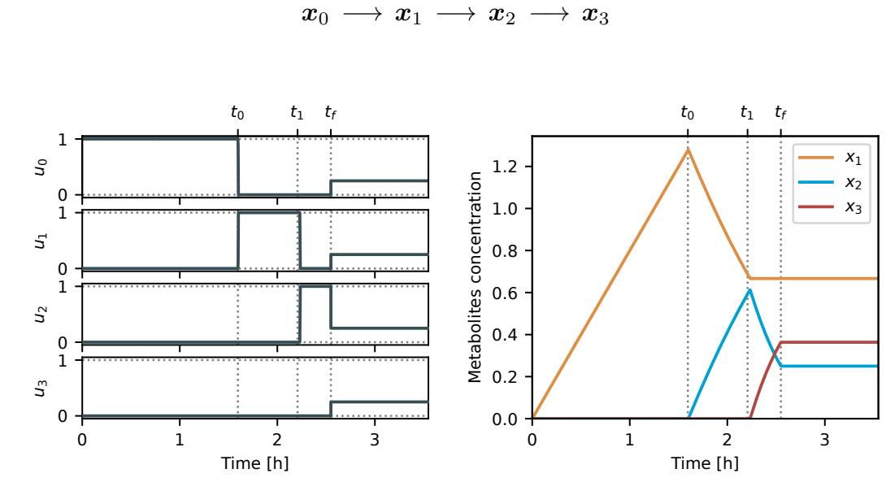

Figure 10.1: Example of optimal enzyme expression in an unbranched metabolic pathway. (A) A simple scheme of the metabolic pathway. (B) Time evolution of the optimal enzyme expression *ui* and metabolite concentration *xi*. For the simulations, the functions *gi* are Michaelis-Menten with constants *k* = (1*,* 2*,* 4*,* 3) s −1 , *K* = 1 mM, *V* = 0*.*2 mM s−1 and *x*0 = 5 mM. Enzymatic weights are set to *αi* = 1 mM−1 s and maximum enzyme availability *E*tot = 1 mM. Resulting activation times are *t*0 = 1*.*59 s, *t*1 = 2*.*2 s and *tf* = 2*.*55 s.

straint of the form:

$$e_i(t) = \frac{F_{\text{goal}}}{g_i(x_i(T))}, \quad \text{for } t \ge T,\tag{10.20}$$

where *F*goal is a (constant) target pathway flux, similar as in [(10.13)](#page-162-1). The terminal constraint ensures that the pathway reaches a steady state at the final time *T*. Using Pontryagin's Minimum Principle [\[311\]](#page-272-7), the authors showed that the optimal enzyme concentrations follow a bang-bang temporal profile that matches the order in the which they act on the pathway. This result was shown to be independent of the weight *α*, the number of enzymatic steps, and valid for a wide range of enzyme kinetics satisfying the assumptions in [(10.17)](#page-163-0), thus extending the original finding in [\[317\]](#page-272-13) to a larger class of pathways. Figure [10.1](#page-164-1) shows a numerical example of the optimal activation pattern obtained for an unbranched metabolic pathway of length three (see also Exercise [10.1)](#page-175-0).

In this section we have reviewed some optimal control approaches for the optimization of unbranched metabolic pathways. While differing in their formulations and solution strategies, these approaches provide substantial computational evidence that some temporal patterns observed in metabolic dynamics can be understood as the solution of an optimal control problem. In the next section we focus on approaches that go beyond individual pathways and include additional components and processes of the cellular machinery.

# <span id="page-164-0"></span>**10.4 Dynamic optimization of resource allocation in coarse-grained models of cellular growth**

In the previous section, we considered models that were essentially limited to metabolic pathways. The optimization problems were formulated in terms of the allocation of enzymes to the different reactions in the pathway. In this section, we generalize the perspective by increasing the scope of the models from <span id="page-165-3"></span>metabolism to protein synthesis and growth. The optimization problems concern the allocation of resources to the synthesis of enzymes catalyzing different metabolic reactions, but also to the synthesis of ribosomes in charge of the production of proteins. Growth is explicitly defined in terms of the increase of protein mass, and leads to growth dilution of all cellular components. The models are very similar to those considered in Chapter [8,](#page-126-0) but the optimization problems are dynamic rather than static. That is, instead of searching an allocation of cellular resources to the synthesis of different classes of proteins that is optimal at steady state, during balanced growth, we are interested in finding a time-varying resource allocation strategy optimizing an objective defined over an interval of time, *e.g.*, during a transition between two states of balanced growth.

We consider the class of models with dynamics given by Eq. [10.5,](#page-160-3) where the input **u** is interpreted as the (timevarying) resource allocation strategy. Among the cellular components **x**, we distinguish between metabolites and proteins, with concentrations **c** and **p**, respectively. Accordingly, the concentration vector can be written as **x** = [**c***,* **p**] 0 . We also distinguish between enzymatic reactions and protein synthesis reactions. While the former have metabolites as substrates and products, the latter convert metabolites (amino acids) into proteins. An enzymatic reaction *i* has the following reaction rate function:

$$v_i(t) = k_i \, p_j(t) \, h_i(c),\tag{10.21}$$

where *ki* is a catalytic constant, *pj* the concentration of protein *j*, and *hi* a function describing enzyme saturation. Enzyme saturation is determined by the substrates, products, and activators/inhibitors of the reaction. Typical rate functions *vi* follow mass-action kinetics or (ir)reversible Michaelis-Menten kinetics. The synthesis of protein *i* is associated with the reaction-rate function

$$
\psi_i(t) = u_i(t) \, v_R(t),\tag{10.22}
$$

<span id="page-165-0"></span>where *vR* is the total protein synthesis rate defined by

$$v_R(t) = k_R \, p_R(t) \, h_R(c(t)),\tag{10.23}$$

with *kR* the maximum protein synthesis rate, *pR* the concentration of ribosomes, and *hR* a function describing the saturation of ribosomes by their substrate, that is, amino acids (or more precisely, tRNAs charged with amino acids). The function *ui* in Eq. [10.22](#page-165-0) is a time-varying resource allocation function, describing the fraction of the total protein synthesis rate allocated to the synthesis of protein *i*. The fractions are non-negative and sum to 1, that is, for every time *t*,

$$\sum_{i} u_i(t) = 1,\text{ and }\ u_i(t) \ge 0,\text{ for all }i. \tag{10.24}$$

<span id="page-165-2"></span>In most models, the biomass of a growing cell population is equated with the mass of proteins, the most abundant cellular component (Chapter [2)](#page-18-0). Under the further assumption that the biomass density is constant, it follows that the total protein concentration *ptot* must be constant, where

$$p_{tot} = \sum_{i} p_i(t),\tag{10.25}$$

<span id="page-165-1"></span>with the index *i* running over all proteins. Moreover, the growth rate reduces to the relative (or specific) increase of the protein mass, which leads to

$$
\mu(t) = \frac{v_R(t)}{p_{tot}} = \frac{k_R \, p_R(t) \, h_R(c(t))}{p_{tot}}.\tag{10.26}
$$

The above model couples metabolism, protein synthesis, and growth in a single formalism, in the spirit of

<span id="page-166-1"></span>the small resource allocation models discussed in Chapter [8.](#page-126-0)

Figure [10.2](#page-167-0) gives an example of a resource allocation model, describing a simple self-replicatory microbial system [\[322,](#page-273-2) [323\]](#page-273-3) inspired by the model of Scott *et al.* [\[324\]](#page-273-4) (see Chapter **??** related models). The model divides the proteome into three categories: ribosomes, enzymes, and housekeeping proteins, with concentrations *pQ*, *pR*, and *pM*, respectively. In addition to the three categories of protein, we add a metabolite representing the precursors for protein synthesis, with concentration *c*. The precursors are produced from nutrients in the environment at a rate *vM*, a macroreaction catalyzed by the enzymes. Protein synthesis occurs at a rate *vR*, catalyzed by the ribosomes. The resource allocation functions *uQ*, *uR*, and *uM* determine the fraction of the protein synthesis rate assigned to each of the three protein categories, where *uQ* is assumed to be a constant, growth-rate-independent fraction. The rate equations for the metabolic and protein synthesis reactions follow irreversible Michaelis-Menten kinetics, where the substrate concentration in the medium is assumed saturating.

The resource allocation functions in the model are not explicitly specified by regulatory mechanisms, but assumed to follow a dynamic pattern optimizing an objective criterion. In many cases, the objective criterion is based on the hypothesis that microorganisms have evolved to maximize growth, that is, the accumulation of biomass. While this hypothesis can be criticized on theoretical and empirical reasons, it is a reasonable choice in well-mixed environments and provides an interesting baseline in other environments. In the model framework considered here, this gives rise to the following objective function:

$$\max_{u \in U} J(x(t), u(t), 0, T) = \int_0^T k_R \, p_R(t) \, h_R(c(t)) \, dt,\tag{10.27}$$

<span id="page-166-0"></span>where like in the general case of Eq. [10.1,](#page-160-1) *U* denotes the set of admissible profiles for the resource allocation functions *u*. Note that the maximization of growth over the time-interval [0*, T*] amounts to taking the integral of the instantaneous growth rate over that time-interval, defined by Eq. [10.26.](#page-165-1) This objective does not generally reduce to maximizing the instantaneous growth rate at every time-point of this interval.

The question can be asked, for the microbial self-replicator in Figure [10.2,](#page-167-0) how the cells redistribute their resources over the different protein categories after a change in environment, in particular a shift of the cells from a poor to a rich carbon source. In the case of *E. coli*, for example, such as shift might involve a change from minimal medium with acetate to minimal medium with glucose. Given that *E. coli* grows faster on glucose than on acetate, and that a higher growth rate requires an increased proportion of resources to be allocated to ribosomes according to the growth law (Chapter [10)](#page-158-0), one expects *uR* to increase after the shift. Since *uQ* is assumed constant, and the resource allocation functions must sum to 1 at every time-point, this overall increase of *uR* must be balanced by a decrease of *uM*. These expectations concern resource allocation before the shift (balanced growth on acetate) and a long time after the shift (balanced growth on glucose), but the growth law provides no information on the pattern of adaptation immediately after the shift.

In order to investigate the optimal adaptation pattern of *uR* immediately after the growth transition, we solve the dynamic optimization problem specified in Figure [10.2.](#page-167-0) For the simple example considered here, the optimal solution can be characterized analytically [\[325,](#page-273-5) [322,](#page-273-2) [323\]](#page-273-3). This is not possible for more complicated examples, however, which require the optimal solution to be constructed numerically, using one of the tools discussed in Appendix []. Figure [10.2C](#page-167-0)-D show a typical solution for parameter values estimated from experimental data [\[323\]](#page-273-3). Starting from a low value of *uR* during balanced growth on acetate, the optimal resource allocation scheme consists of a sequence of switches between *uR* = 1 (maximal ribosome synthesis) and *uR* = 0 (no ribosome synthesis), until an intermediate value of *uR* for balanced growth on glucose is attained. The value of *uR* during balanced growth on glucose is higher than that for balanced growth on acetate, as expected from the growth law.

The sequence of on-off switches followed by the intermediate steady-state value is called a bang-bangsingular solution in optimal control theory [\[322,](#page-273-2) [323\]](#page-273-3). The solution reflects a dynamic trade-off between 158 Optimal cell behavior in time

*c c* + *KR*

*J*(*u*)

<span id="page-167-0"></span>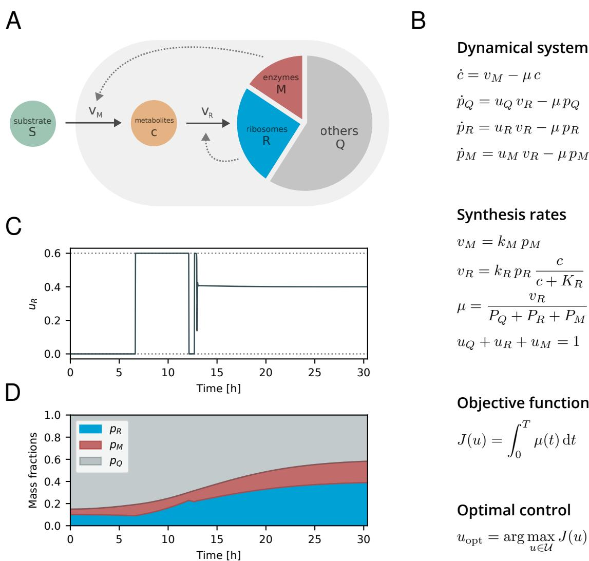

Figure 10.2: Example of optimal resource allocation strategy in a coarse-grained model of microbial growth. (A) Representation of simple self-replicator model of microbial growth. (B) Model and optimization problem for the self-replicator shown in panel A, as discussed in the text. (C) Optimal dynamic resource allocation strategy, in terms of the fraction of resources attributed to ribosome synthesis (*uR*). (D) Time-varying protein mass fractions corresponding to the optimal solution shown in panel C. The parameter values used for the simulation are *kM* = 0*.*5, *kR* = 1, *KR* = 0*.*5 and *uQ* = 0*.*6.

the two different functions contributing to growth: metabolism and protein synthesis. When, due to growth dilution, the ribosome concentration falls to a level that is limiting for maximal protein synthesis, the synthesis of ribosomal proteins is switched on (*uR* = 1), leading to an increase of the ribosome concentration. Switching on the synthesis of ribosomal proteins causes the synthesis of metabolic enzymes to be switched off. When, due to growth dilution, the concentration of metabolic enzymes next falls to a level that the precursors produced by the latter become limiting, the synthesis of metabolic enzymes is switched on (*uR* = 0) to replenish the precursor pool, and so on (see Exercise [10.2)](#page-176-0).

Optimal solutions with a similar bang-bang pattern were already encountered in the previous section. They also occur in a model with a more detailed description of different precursor (amino acid) synthesis pathways under the objective under the minimal time of adaptation after a shift from a medium supplemented with amino acid to a medium lacking amino acids [\[326\]](#page-273-6). In a different type of problem, the development of <span id="page-168-2"></span>intestinal crypts, the minimal time to mature crypts was found to depend on the on-off control of the proliferation of stem and non-stem cells [\[327\]](#page-273-7). There is no convincing experimental evidence that the adaptation of ribosomal synthesis after a nutrient upshift from a poor to a carbon source follows a bang-bang singular pattern. The interpretation of proteomics data after a nutrient upshift in *E. coli* shows that the simple upregulation of ribosomal resource allocation to the steady-state value for growth on the rich nutrient captures the ribosomal protein expression data well [\[328\]](#page-273-8).

This example serves to emphasize that, while the optimality assumption may lead to thought-provoking predictions, these need to be confronted with experimental data. In case the optimal solutions do not agree with the data, several revisions of the problem could be considered. While growth optimization was chosen as the objective criterion in the example of Figure [10.2,](#page-167-0) there is evidence that during balanced growth, microorganisms find a trade-off between maximizing growth rate in a given environment and minimizing necessary adjustments to other environments [\[313\]](#page-272-9). The problem could therefore be generalized to a multi-criteria optimization problem. An example is the analysis of a model similar to that considered here under the objectives of biomass maximization and minimal adaptation time after a nutrient shift [\[329\]](#page-273-9). The formulation of the optimization problem in Figure [10.2](#page-167-0) does not put any constraints on valid optimal resource allocation strategies, except that the individual functions *ui* components need to sum to 1 (Eq. [10.24)](#page-165-2). Bearing in mind that the regulatory mechanisms underlying a resource allocation come with a cost, and need to respect certain physical constraints, the predicted resource allocation strategy may not be feasible. When such constraints are taken into account, the optimal solution may no longer be bang-bang singular, but resemble the observed adaptation pattern [\[330,](#page-273-10) [323\]](#page-273-3).

In summary, the dynamical optimization approach for studying microbial growth presented here provides a way to test the consequences of hypothesized objective functions in combination with simple resource allocation models. The predictions can be confronted with experimental data, but may also inform the redesign of microbial strains for metabolic engineering purposes [\[331\]](#page-273-11) (Box [10.A)](#page-169-0).

## <span id="page-168-0"></span>**10.5 Dynamic flux balance analysis (dFBA) of metabolic networks**

Dynamic Flux Balance Analysis (dFBA) is an extension of Flux Balance Analysis (FBA) as described in Chapter [5,](#page-82-0) that can simulate the interactions between the metabolism of an organism and its dynamic environment. In contrast to the constant, steady-state flux solutions that are generated by classical FBA, dFBA yields flux solutions that may dynamically depend on concentrations of extracellular metabolites, such as sugars or other carbon sources, dissolved oxygen, or secreted waste metabolites. Applying these fluxes to the concentration balance of extracellular metabolites also permits to capture dynamic changes in these concentrations due to the cells' metabolic activity, and track the resulting overall biomass growth. It is noted that a basic assumption of dFBA is that organisms rapidly reach intracellular steady state in response to extracellular perturbations, and on the long run no metabolite can accumulate or deplete.

In general, a dFBA model comprises three main parts as demonstrated in Figure [10.3:](#page-170-0) the dynamic equations, in the form of differential equations, for biomass and extracellular metabolites, constraints on the fluxes as in the FBA model, and an optimization objective that determines how to choose the optimal fluxes.

We first consider the dynamic equations used for dFBA.

The biomass dynamics are given by

<span id="page-168-1"></span>
$$
\dot{X} = \mu X,\tag{10.28}
$$

where *X* denotes the biomass concentration, typically measured as dry mass in g*/*L, and *µ* denotes the growth rate, typically measured in 1*/*h. In principle, this equation follows the equations for balanced growth. However, instead of using simple models, like a Monod equation for the growth rate, the growth rate is taken from the value of the biomass reaction in an FBA model (check in Chapter [5!](#page-82-0)).

Denoting the concentrations of the extracellular metabolites that are modelled dynamically as the vector *c*,

#### <span id="page-169-4"></span><span id="page-169-0"></span>**Box 10.A : Time-dependent optimization for biotechnological applications and process design**

As explained in Section [10.2,](#page-160-0) time-dependent optimization problems are defined by an objective function, expressing the criterion that microorganisms presumably optimize. In the case of microorganisms growing in natural conditions, the choice of a particular objective function is difficult to make and several functions may qualify. For example, microorganisms could be assumed to maximize their biomass over a given interval of time or minimize the time to adapt to their new environment after a change in growth conditions. The choice may be somewhat arbitrary and in many cases it makes sense to consider a multi-criteria optimization problem. Even more fundamentally, the idea that microorganisms have evolved to the point that they optimize one or several objective functions, is controversial. In bioengineering applications, however, the formulation of an objective function is less problematic. In this context, the objective function is not assumed to have evolved through natural selection, but is rather stipulated by the metabolic engineer in an *a-priori* manner, in agreement with a practical objective. Possible objective functions are the maximal amount of fermentation product that can be obtained from a given amount of substrate (maximal yield) or the minimal time to produce a given amount of fermentation product (maximal productivity). The use of optimal control methods for process design in bioengineering is well-known [\[332,](#page-273-12) [333\]](#page-273-13). Most of these methods, however, treat microbial growth as a black box and do not provide much detail about the underlying cellular processes, contrary to the formalisms discussed in this chapter. Opening up the black box of microbial growth allows the use of control variables that go beyond standard process parameters of the bioreactor and represent directed perturbations of specific cellular processes.

One example is the use of coarse-grained models of microbial growth for the design of optimal operating conditions for the so-called growth switch [\[331\]](#page-273-11). The growth switch is a synthetic regulatory circuit allowing growth of *E. coli* to be arrested in order to passively reorient the resources thus becoming available towards the production of a metabolite of interest [\[334\]](#page-273-14). The maximal production of this metabolite from a given amount of substrate, within a given interval of time, was formulated as an optimal control problem. Its solution showed that the optimal solution consists of two phases: a first phase of maximal biomass production followed by a second phase of maximal product synthesis [\[331\]](#page-273-11). The conclusion that this two-phase procedure is optimal corresponds well with established practice in biotechnology [\[335\]](#page-274-0). Very similar conclusions were attained in related work by Jeanne *et al.* [\[336\]](#page-274-1).

the dynamics for these metabolites can be formulated as the differential equation

<span id="page-169-1"></span>
$$
\dot{c} = S_{exch} vX. \tag{10.29}
$$

Here, *v* is the flux vector for the complete metabolic network, including uptake and production reactions for exchange metabolites, and *Sexch* is the stoichiometric matrix that links these reaction fluxes to the metabolite concentrations which are balanced dynamically. Multiplication with the biomass *X* is necessary, since the flux values in the FBA model are determined relative to biomass, whereas the concentrations *c* of the dynamic metabolites are relative to the system volume. The equations are not yet closed, because the fluxes *v* (including the growth rate *µ* as one element of the flux vector) still need to be determined by optimization.

As constraints, two types of constraints are used in dFBA models. A flux balance constraint as in steady state FBA models is applied to the concentrations of all metabolites that are not dynamically balanced in [(10.29)](#page-169-1), e.g., intracellular metabolites. This steady state constraint is given by

<span id="page-169-2"></span>
$$S_{int}v = 0,\tag{10.30}$$

where *Sint* is the stoichiometric matrix that links reaction fluxes in the vector *v* to the steady state metabolites. Further, upper and lower bounds need to be put on the individual reaction fluxes. In contrast to classical FBA, where these bounds are constant, in dFBA flux bounds can depend on concentrations of metabolites in the vector *c*. This is mostly applied to uptake reactions for nutrients, and often as Michelis-Menten kinetics. For example, if *ci* is the concentration of a sugar substrate, and *vi* is the uptake reaction for this substrate (conventionally negative in FBA models), bounds of the form

<span id="page-169-3"></span>
$$-\frac{V_{i,max}c_i}{K_M + c_i} \le v_i \le 0 \tag{10.31}$$

<span id="page-170-1"></span><span id="page-170-0"></span>

Figure 10.3: Schematic representation of dFBA. As in FBA, the intracellular environment in dFBA is represented by a linear programming (LP) optimization problem that describes the metabolism of the microorganism based on its genome-scale metabolic model (GSMM). FBA assumes that all intracellular metabolite concentrations remain constant while the cells optimally distribute their metabolic fluxes to maximize their growth rate and hence, an LP can calculate the growth rate, as well as the intracellular and exchange fluxes of the GSMM. The calculated growth rate and exchange fluxes can be used to update the extracellular environment. The extracellular environment in dFBA is represented by ordinary differential equations (ODEs) that describe the mass balance equations for biomass and metabolites found outside of the cell. Moreover, the intracellular GSMM and the extracellular mass balance equations can be linked through kinetic rules for substrate uptake, like the Michaelis-Menten equations, that can raise concentration-dependent constraints for exchange fluxes and predict growth rate dependencies on substrate concentrations.

would be used, where *Vi,max* and *KM* are the common parameters of the Michealis-Menten kinetics (Chapter [3](#page-36-0) [MET]).

In recent years, dFBA is increasingly applied for the simulation of dynamic biological systems, especially due to the promising use of GSMMs for interpreting cell physiology and evolution, as well as for guiding metabolic engineering and bioprocess design and optimization [\[337,](#page-274-2) [338,](#page-274-3) [339\]](#page-274-4). The dFBA applications based on GSMMs include the bacteria *Escherichia coli* [\[340,](#page-274-5) [341,](#page-274-6) [342,](#page-274-7) [343,](#page-274-8) [344,](#page-274-9) [345,](#page-274-10) [346,](#page-274-11) [347\]](#page-274-12) and *Lactococcus lactis* [\[348\]](#page-274-13), as well as the yeast species *Saccharomyces cerevisiae* [\[349,](#page-274-14) [350,](#page-275-0) [351,](#page-275-1) [352,](#page-275-2) [353,](#page-275-3) [341,](#page-274-6) [344,](#page-274-9) [354,](#page-275-4) [355,](#page-275-5) [347\]](#page-274-12) and *Scheffersomyces (Pichia) stipites* [\[344\]](#page-274-9). However, the majority of dFBA applications use small-scale metabolic models, most of which include less than 100 reactions. Such applications include models of bacteria, like *Escherichia coli* [\[356,](#page-275-6) [357,](#page-275-7) [358,](#page-275-8) [344,](#page-274-9) [359,](#page-275-9) [360,](#page-275-10) [361,](#page-275-11) [362\]](#page-275-12), *Corynebacterium glutamicum* [\[363,](#page-276-0) [343,](#page-274-8) [364,](#page-276-1) [346\]](#page-274-11) and *Bordetella pertussis* [\[365\]](#page-276-2), models of yeast for wine fermentation [\[366\]](#page-276-3) and *Saccharomyces cerevisiae* [\[367,](#page-276-4) [355,](#page-275-5) [368,](#page-276-5) [369\]](#page-276-6), but also plant and animal models, such as a model for the photosynthetic metabolism of C3 plants [\[370\]](#page-276-7), a four-tissue (leaf, root, seed, and stem) model of the core metabolism of *Arabidopsis thaliana* [\[371\]](#page-276-8), a model for fatty acid metabolism and lipid accumulation in rat hepatocytes [\[372\]](#page-276-9), and a model for energy metabolism in myocardial cells [\[373\]](#page-276-10).

It is noted that most of the dFBA applications for microorganisms simulate microbial fermentations under batch or fed-batch conditions. Since dFBA can be used for the analysis, control and optimization of biochemical processes, many dFBA applications focus on either dynamic metabolic engineering or optimal control of bioreactors, or both simultaneously. Dynamic metabolic engineering studies can predict the effect of strain gene insertion and deletion on the dynamic behavior and productivity of a bioprocess [\[349,](#page-274-14) [340,](#page-274-5) [350,](#page-275-0) [351\]](#page-275-1), while optimal control of batch or fed-batch operation of bioreactors is important for the production of desired chemicals [\[349,](#page-274-14) [369\]](#page-276-6). Finally, dFBA has also been expanded for the study of microbial communities, where each microorganism is represented by an LP that is solved independently [\[374,](#page-276-11) [375,](#page-276-12) [376\]](#page-277-0). Co-culture simulations with dFBA can predict possible consortia compositions, as well as metabolic engineering approaches to improve the productivity of the consortia, but they are out of the scope of this chapter.

Coming to the mathematical formulation of dFBA models, dFBA is an optimization problem coupled with a system of ordinary differential equations, that can be solved with the help of various mathematical and numerical techniques. Even though dFBA was first introduced in 1994 [\[356\]](#page-275-6), it was not formalized until 2002

<span id="page-171-0"></span>[\[357\]](#page-275-7). The existing formalized solution approaches that are going to be discussed here involve the static optimization approach (SOA), the dynamic optimization approach (DOA), and the direct approach (DA). More recently, reformulation approaches and surrogate models for the optimization problem have also been proposed in order to ease the computational complexity of dFBA simulations. This complexity arises from several characteristics of dFBA. More specifically, the solution of dFBA problems faces challenges in terms of:

- 1. problem size and scalability: As the size of the metabolic network increases, the computational cost increases. For this reason, simulations that involve large genome-scale metabolic models or multispecies microbial communities are limited.
- 2. stiffness: The stiff behavior of dFBA has been observed in many cases, such as the simulation of the diauxic growth in *E. coli* [\[357\]](#page-275-7).
- 3. nonlinearity: The presence of nonlinear constraints or objective functions can significantly increase the computational cost.
- 4. feasibility: The intracellular optimization problem can become infeasible and lead to failure of the integration of the extracellular ODEs.
- 5. differentiability: The optimal value of the intracellular optimization problem may not be continuously differentiable, which poses an obstacle when dFBA is used for optimal control or parameter estimation.
- 6. non-unique solutions: The solution of the intracellular optimization problem is usually not unique which can make fluxes unrealistically "jump" between different optimal solutions.

**Static Optimization Approach (SOA)** divides the total time horizon of the dFBA simulation into several smaller time intervals. The optimization problem is solved to obtain the flux distribution at the beginning of each time interval, and then the ODEs are integrated over the time interval with this fixed flux distribution. The dynamics calculated from this time step are used to constrain the optimization problem solved at the beginning of the next time interval, and the process is repeated until the end of the simulation time is reached. SOA can be implemented easily with the use of an Euler scheme for integrating the system and a suitable existing LP solver for solving the FBA at each time step. SOA is also implemented in the constraint-based reconstruction and analysis (COBRA) toolbox for MATLAB [\[377\]](#page-277-1) which can perform dFBA simulations. Since its implementation is relatively simple, SOA has been widely used in studies for the diauxic [\[357,](#page-275-7) [359,](#page-275-9) [378\]](#page-277-2), aerobic and fermentative [\[356,](#page-275-6) [379,](#page-277-3) [380,](#page-277-4) [340\]](#page-274-5) growth of *E. coli*, for *S. cerevisiae* fermentations [\[367,](#page-276-4) [351,](#page-275-1) [352,](#page-275-2) [353\]](#page-275-3), as well as for the growth of other bacterial [\[348\]](#page-274-13) and plant organisms [\[371\]](#page-276-8). Many of these applications include larger-scale or genome-scale metabolic networks, due to the scalability of SOA. However, the main drawback is that SOA is inefficient and can become computationally expensive because it has to solve the optimization problem at each time step. This can be challenging for most dFBA problems which are stiff and require small time steps to ensure accuracy, convergence, and stability of the solution.

**Dynamic Optimization Approach (DOA)** follows closely the general dynamic optimization framework described in Section [10.2:](#page-160-0) an objective function that depends on the dynamic states of the system over the complete time horizon of interest is formulated, and the dynamics [(10.28)](#page-168-1)–[(10.29)](#page-169-1) and algebraic constraints [(10.30)](#page-169-2)–[(10.31)](#page-169-3) are added as optimization constraints. In other words, DOA discretizes the total time horizon of the dFBA simulation, and then transforms the dynamic optimization problem into a non-linear programming (NLP) problem, which is solved once by simultaneously optimizing over the entire time of the simulation. In this way, DOA obtains the time profiles of fluxes and metabolite concentrations in the system, and allows the formulation of a dynamic objective function, which could provide useful information about the design of genetically modified metabolic networks or the maximization of bioprocess productivity. Because of this characteristic, DOA is often used in dynamic metabolic engineering, parameter estimation and optimal control applications. For example, DOA has been used for simulating the diauxic growth of *E. coli* [\[357,](#page-275-7) [381,](#page-277-5) [382\]](#page-277-6), as well as the growth of engineered *E. coli* strains on glucose [\[383,](#page-277-7) [384\]](#page-277-8), and the growth of various eukaryotic organisms, such as *S. cerevisiae* [\[368,](#page-276-5) [385\]](#page-277-9), plant [\[370\]](#page-276-7) and animal [\[372,](#page-276-9) [373\]](#page-276-10) cells under genetic and environmental perturbations. On the downside, even though the optimization problem does not need to be repeatedly solved like in SOA, the single NLP of DOA can become easily intractable, as its dimension increases

#### <span id="page-172-1"></span><span id="page-172-0"></span>**Mathematical details 10.B : dFBAlab**

In order to address some of the computational challenges of dFBA, Höffner, Harwood, and Barton proposed a simulator for dFBA, which was initially coded in FORTRAN [\[391\]](#page-278-0), but gained popularity when implemented in MATLAB with the name Dynamic Flux Balance Analysis laboratory (DFBAlab) [\[376\]](#page-277-0), and more recently in Python [\[392\]](#page-278-1). It is noted that the DFBAlab is compatible with the COBRA toolbox [\[377\]](#page-277-1). Based on this dFBA simulator, it is not necessary to resolve the LP each time the right-hand side of the ODEs is evaluated and consequently, the solution process becomes faster. This is possible because the FBA solution at an initial time can be used to compute future optimal solutions by detecting changes in the active set [\[346\]](#page-274-11) or by computing the optimal basis [\[393\]](#page-278-2) of the FBA. Unfortunately, such formulations need to continuously monitor the active set of the LP, which increases with the size of the metabolic network, or need to choose a basis for the optimal solution that is most likely to remain optimal as the simulation proceeds [\[393\]](#page-278-2). The latter is challenging since the optimal basis can be non-unique even for a unique optimal solution. Nevertheless, DFBAlab manages to reduce the number of times that the LP is resolved, and also avoids obtaining infeasible LPs and numerical failure by using the LP feasibility problem and the Karush-Kuhn-Tucker (KKT) optimality conditions of the FBA problem (see below) [\[341,](#page-274-6) [343,](#page-274-8) [346\]](#page-274-11). In addition, the differentiability problem could be solved with the help of non-smooth analysis which provides optimality conditions in terms of sub-gradients or generalized gradients, for convex and non-convex functions respectively [\[342\]](#page-274-7). Furthermore, to tackle the issue of primal multiplicity of the FBA problem, DFBAlab performs lexicographic optimization [\[341,](#page-274-6) [342,](#page-274-7) [343,](#page-274-8) [346\]](#page-274-11).

with the fineness of time discretization. Additionally, DOA has been mainly limited to small-scale metabolic networks, since it cannot be easily applied to genome-scale metabolic networks due to the large number of variables and constraints that are introduced in the NLP as the size of the network increases.

**Direct Approach (DA)** has been formulated more recently than SOA and DOA, and directly includes the LP solver for the FBA in the right-hand side evaluator function of the ODEs. In this way, it can take advantage of existing ODE integrators with adaptive step size and error control that can reduce the number of integration steps and provide better solution accuracy compared to SOA. DA has been implemented in the ORCA toolbox [\[386\]](#page-277-10), which complements the constraint-based reconstruction and analysis (COBRA) toolbox for MAT-LAB [\[377\]](#page-277-1). Furthermore, DA has been used for studying the diauxic [\[387\]](#page-277-11), aerobic and anaerobic[\[358,](#page-275-8) [388\]](#page-278-3) growth of wild type and engineered *E. coli* strains, the aerobic growth of *Corynebacterium glutamicum* on glucose and xylose in biorefinery simulations [\[364\]](#page-276-1), as well as the aerobic and anaerobic growth of wild type and engineered *S. cerevisiae* strains [\[349,](#page-274-14) [350,](#page-275-0) [352\]](#page-275-2). Some of these applications involve dynamic metabolic engineering for product maximization, and many of them include genome-scale metabolic networks, since DA is relatively easily scalable like SOA.

However, DA requires the LP to be resolved at least once, every time the right-hand side of the ODEs is evaluated [\[389\]](#page-278-4). This can make DA computationally demanding, especially for larger metabolic networks. Another major challenge is that when evaluating the right-hand side of the ODEs close to the boundary of feasibility, the LP can become infeasible and make the dFBA simulation fail. The LP can become infeasible either because it is really infeasible and the simulation should be terminated, or because the ODE integrator becomes unable to evaluate the right-hand side of the ODEs and the simulation is discontinued, or erroneous death phase messages are being displayed. The latter can happen as dFBA simulations involve discrete events that correspond to switches in the active set of the LP solution. More specifically, different bases for the optimal solution of the LP can emerge at each time step. Moreover, at the points of change of the active set, the dFBA model is not differentiable, since the optimal value of the LP as a function of the right-hand side of the constraints is not continuously differentiable. This is a problem because the first and second derivatives of the model must be computed when dFBA is used for optimal control or parameter estimation applications. Finally, another drawback emerges due to the primal multiplicity of the LP. As it is well-known, FBA is formulated as an underdetermined problem and therefore, the LP does not have a unique solution [\[390\]](#page-278-5). Non-unique optimal reaction fluxes can lead different ODE integrators to different results.

#### <span id="page-173-2"></span><span id="page-173-1"></span>**Mathematical details 10.C : Lexicographic Optimization**

Lexicographic or hierarchical optimization involves the solution of a series of LPs with auxiliary objectives ranked in priority order. The use of auxiliary objectives reduces the feasible space and leads to a unique optimal solution, while the auxiliary objectives can have specific biological meanings and can be selected based on prior knowledge about the organism [\[313\]](#page-272-9). Some of the most used auxiliary objectives are based on the assumption that evolution leads to the exclusion of inefficient pathways so that cells can biosynthesize the smaller possible number of enzymes. Examples of such auxiliary objectives include the minimization of enzyme cost [\[394\]](#page-278-6), the minimization of the total reaction flux [\[395\]](#page-278-7), and the minimization of the number of active reactions [\[396\]](#page-278-8). However, it has been shown that such objectives may not be suitable for some engineered cells [\[365\]](#page-276-2). In general, it is not trivial to find a series of auxiliary objectives that are consistent with experimental data, assure uniqueness and preserve continuity of the optimal solution. In some cases, even when all auxiliary objectives have been used, hierarchical optimization cannot ensure the uniqueness of the dFBA solution. Apart from the use of auxiliary objectives, auxiliary rules or auxiliary parameters have also been proposed to address the primal multiplicity of FBA. For example, geometric methods have been proposed to identify a unique distribution of reaction fluxes for FBA [\[397\]](#page-278-9), even though there is no biological evidence to justify such methods.

## <span id="page-173-0"></span>**10.6 Concluding remarks**

One approach for understanding the response of microorganisms to changes in their environment is to assume that this response has been optimized by evolution. That is, the regulatory mechanisms controlling the response optimize an objective, or a trade-off between competing objectives, subject to a variety of physical and biochemical constraints. This approach gives rise to dynamic optimization problems [(10.1)](#page-160-1)-[(10.4)](#page-160-2) that can be solved by techniques from optimal control theory. Three examples of such problems were considered in this chapter: dynamic optimization of enzyme expression in metabolic pathways, dynamic optimization of coarse-grained models of cellular growth, and dynamic flux balance analysis. This does not exhaust the range of possible problems that can be considered. One example is the combination of the resource allocation perspective with dynamic flux balance analysis [\[381\]](#page-277-5).

Some of the predictions obtained by means of dynamic optimization seem to be supported by available experimental data, such as the time-ordering of enzyme expression in a linear pathway. Other predictions cannot currently be tested or may not be consistent with the available experimental data, such as the dynamical ribosomal protein synthesis pattern. The contradiction between a predicted optimal response and the observations is interesting, because it indicates that some of the assumptions underlying the problem need to be revised. The model may not account for all relevant processes taking place in the cell, important constraints may have been ignored, or the objective may not capture the actual processes taking place.

The solution of a dynamic optimization problem may be different from the concatenation of the solutions of repeated static optimization problems defined over short, consecutive time intervals making up the time horizon. For instance, the optimal pattern of resource allocation over a time horizon may involve the accumulation of a reserve of unused resources that, while being wasteful in the short run, is beneficial when the whole time interval of interest is considered. One example was given in the introduction of this chapter, concerning the expression of maltose enzymes in the presence of lactose [\[309\]](#page-272-5). Another example is the accumulation of glycogen in cyanobacteria during daylight, providing the energetic resources for maintenance metabolism in the night time [\[306\]](#page-272-2).

The analysis of the growth of microorganisms using dynamic optimization critically depends on the choice of an appropriate objective function. In the examples discussed above, optimization was performed with respect to a single objective, *e.g.*, the maximal accumulation of biomass over a time interval or the minimal time to deplete a given amount of substrate. It is plausible, however, that microorganisms have evolved under the necessity to satisfy several objectives simultaneously. This can be taken into account by formulating a weighted sum of the different objective functions, such as the simultaneous minimization of throughput

<span id="page-174-0"></span>

Figure 10.4: Example result of a dFBA simulation for the *E. coli* core model [\[398\]](#page-278-10) performed with DFBAlab. (A) Illustration of dynamic metabolites and relevant exchange fluxes. Extracellular metabolites use mass concentration (g*/*L), exchange fluxes are in molar amount per dry biomass and time (mmol*/*gDW h). (B) Concentration-dependent constraints applied to the exchange fluxes during the dFBA simulation. (C) Differential equation model for biomass concentration *X* and metabolite mass concentrations. Growth rate *µ* and exchange fluxes *v*∗ (in red) are optimal values from the underlying FBA model. *m*O2 , *m*G, *m*E, *m*A are molar masses of O2, glucose, ethanol, and acetate, respectively. *kLa* = 8*.*5 h−1 is the volumetric mass transfer coefficient for oxygen. (D) Simulation results for concentrations of biomass and metabolites. We can observe four growth phases: aerobic growth on glucose with production of acetate, anaerobic growth on glucose with production of ethanol and acetate, aerobic growth on acetate, and a stationary phase. (E) Simulation result for oxygen concentration in the liquid medium. Oxygen is depleted in the second growth phase due to mass transfer limitations, but replenishes at the start of the third phase. (F) Penalty function time course. Increases of the penalty function indicate periods where the underlying FBA model is infeasible. Here, this occurs when the ATP maintenance constraint cannot be satisfied due to a lack of substrates, and happens in this simulation during a brief period where the switch from glucose to acetate as a substrate takes place, since oxygen needs to be replenished first, and in the stationary phase.

time and investment in enzymes in Eq. [10.18.](#page-163-1) Another approach is to generalize the optimization problem to a multi-objective optimization problem, with sets of Pareto optimal solutions, each providing a trade-off between mutually conflicting objectives. One example of such a multi-objective optimization problem is given by a generalization of the dynamic optimization of enzyme expression in metabolic pathways in Section [10.3,](#page-161-0) with the double objective of minimizing the time to consume a given amount of substrate and minimizing the concentration of (possibly toxic) intermediate metabolites [\[399\]](#page-278-11).

Instead of making *a-priori* assumptions about the objectives presumably optimized by microorganisms, one could try to infer the latter from the experimental data. This inverse optimization approach leverages the large amounts of time-course data on the dynamic response of microorganisms to environmental perturbations that have accumulated in the past decade. Inverse optimization requires the solution of complex inverse optimal control problems that have been little explored until now [\[312\]](#page-272-8).

## **Recommended readings**

**General references introducing the problem of dynamic optimization in biology:**

- Sutherland, The best solution, *Nature*, 2005 [\[400\]](#page-278-12). Influential statement of the use of optimization as an explanatory and predictive principle in biology.
- Banga, Optimization in computational systems biology, *BMC Systems Biology*, 2008 [\[401\]](#page-278-13). General review of optimization approaches in systems biology.
- Heinrich, Schuster, and Holzhütter, Mathematical analysis of enzymic reaction systems using optimization principles, *European Journal of Biochemistry*, 1991 [\[307\]](#page-272-3). Classical review on the use of dynamic optimization in the analysis of biochemical systems.
- Ewald, Bartl, and Kaleta. Deciphering the regulation of metabolism with dynamic optimization: an overview of recent advances. *Biochemical Society Transactions*, 2017 [\[320\]](#page-273-0). Recent review on the use of dynamic optimization in the analysis of metabolism.

### **Methodological foundations of dynamic optimization and optimal control:**

- Gerdts, *Optimal Control of ODEs and DAEs*, De Gruyter, 2011 [\[310\]](#page-272-6). Introduction to optimal control theory.
- Kirk, *Optimal Control Theory: An Introduction*, Courier Corporation, 2004 [\[311\]](#page-272-7).

### **Dynamic optimization of enzyme expression in metabolic pathways:**

- Klipp, Heinrich, and Holzhütter. Prediction of temporal gene expression: metabolic optimization by redistribution of enzyme activities. *European Journal of Biochemistry*, 2002 [\[317\]](#page-272-13). Classical paper on dynamic optimization of enzyme expression in unbranched pathways.
- Oyarzún, Ingalls, Middleton, and Kalamatianos. Sequential activation of metabolic pathways: a dynamic optimization approach. *Bulletin of Mathematical Biology*, 2009 [\[321\]](#page-273-1). Recent example revisiting the problem of dynamic optimization of enzyme expression.

### **Dynamic optimization of resource allocation in coarse-grained models of cellular growth:**

- Pavlov and Ehrenberg. Optimal control of gene expression for fast proteome adaptation to environmental change. *Proceedings of the National Academy of Sciences USA*, 2013 [\[326\]](#page-273-6). Example of the use of optimal control to understand temporal adaptation of gene expression in response to a change in the environment.
- Giordano, Mairet, Gouzé, Geiselmann, and de Jong. Dynamical allocation of cellular resources as an optimal control problem: Novel insights into microbial growth strategies. *PLoS Computational Biology*, 2016 [\[322\]](#page-273-2). Example of dynamic optimization applied to a coarse-grained model of microbial growth, including a review of related work.

### **Dynamic flux balance analysis of metabolic networks:**

- Mahadevan, Edwards, and Doyle. Dynamic flux balance analysis of diauxic growth in *Escherichia coli*, *Biophysical Journal*, 2002 [\[357\]](#page-275-7). Classical paper proposing two different approaches for dynamic flux balance analysis, with an example of diauxic growth in *E. coli*.
- Hjersted and Henson. Steady-state and dynamic flux balance analysis of ethanol production by *Saccharomyces cerevisiae*, *IET Systems Biology*, 2009 [\[350\]](#page-275-0). Comparison of steady-state and dynamic flux balance analysis of variably-sized metabolic models for screening metabolic engineering strategies affecting ethanol production by *Saccharomyces cerevisiae*.

## **Problems**

<span id="page-175-0"></span>**Problem 10.1** The solutions of some of the optimization problems in Section [10.3](#page-161-0) exhibit abrupt switches in enzyme concentrations ("bang-bang behavior"), which in reality are not possible.

- 1. What would be possible adjustments of the models to make the predictions more realistic? (Hint: consider explicit modeling of enzyme synthesis and enzyme degradation or dilution by growth.)
- 2. What predicted behavior would you expect for these modified models?
- 3. In these extended models, which possibilities would the cell have to speed up the adaptation of enzyme concentrations? Under what circumstances could this provide an actual advantage?

<span id="page-176-0"></span>**Problem 10.2** The resource allocation model in Section [10.4](#page-164-0) defines biomass as being composed of proteins only, neglecting notably the (small) contribution of metabolites. This has the disadvantage of putting no constraints on metabolite concentrations, which is not realistic from a biological point of view.

- 1. What would be a possible adjustment of the model to integrate metabolites into the biomass composition, under the assumption that the total biomass density remains constant? (Hint: consider the definition of growth rate in Eq. [10.26.](#page-165-1))
- 2. How would the objective function for this model (Eq. [10.27)](#page-166-0) need to be adapted accordingly?
- 3. How would you expect the resulting constraint on metabolite concentrations to affect the predicted behavior of the microbial self-replicator?

# <span id="page-178-2"></span><span id="page-178-0"></span>**Chapter 11**

# **Control of cell division and coordination with other cell-cycle processes**

Mattia Corigliano, Marco Cosentino Lagomarsino, Jacopo Grilli, and Gabriele Micali

### **Chapter overview**

- Cells require coordination of growth and division, as well as coordination of cell-cycle progression with several essential sub-tasks, such as chromosome replication and segregation.
- Single-cell dynamics data offer correlation patterns that can be used to understand these decisional processes.
- The cell-cycle progression and cell-division decisional process can be described by continuous-time and discrete-time stochastic processes.
- There are quantitative relationships that connect growth, cell-cycle progression, and resource allocation.
- There are differences and common points in the decisional processes by which single cells of different organisms commit to divide (sizers, adders, accumulators, titration-dilutors, etc.)

# <span id="page-178-1"></span>**11.1 Introduction: the decision to divide illustrated through singlecell** *E. coli* **data.**

As nicely put by the Nobel prize winner François Jacob, "the dream of every cell is to become two cells". Achieving this dream often requires multiple steps, such as growing by a certain size, replicating DNA, and dividing. The previous chapters have addressed cell growth as a consequence of optimization of catabolic and biosynthetic fluxes through optimally regulated resource allocation; this chapter deals with the decision to divide (and to progress the cell cycle), based on growth and other important cellular processes and cues. Clearly this decision to divide or progress the cell cycle must be based on a set if inputs (growth, production processes such as DNA replication and cell-wall biosynthesis, partitioning processes, etc.) and entails several outputs, prominently cell division, but also intermediate key cell-cycle substeps, such as initiation of DNA replication or construction of a "divisome" organelle. The questions that we will consider concern the characterization of the known aspects of this decisional process and its coupling to cell size, to cell growth, and

<span id="page-179-2"></span><span id="page-179-0"></span>

Figure 11.1: . Salient quantitative features of cell-division control, explained through *E. coli* data. (A) *E. coli* cells are rod-like. Within a condition they grow by increasing their length, and they divide symmetrically. Following single-cell lineages, growth in length or volume is close to exponential. (B) Size-growth plots quantify the strength of division control. For a timer, multiplicative growth quantified by *G* = log(*sd/s*0) is uncoupled to birth size, for a sizer, it is maximally coupled. The single-cell data show an intermediate trend. (C) Since *G* = log(*sd/so*) = *ατ* , the size-growth plot can be split into contributions correlationg birth size to growth rate (top) and/or interdivision time. The data show that *E. coli* bacteria only compensate by modulating interdivision times. (D) Equivalent quantifications of the strength of the division control size (right). The intermediate control strategy adopted by *E. coli* adds a size that is independent from the initial size ("adder"). This strategy is sufficient to achieve size homeostasis.

to the chromosome cycle. We will use throughout the chapter *E. coli* as an example. This section provides a description of the main problem through an introduction to the data, based on *E. coli* bacteria. Sections 2-5 start from a mathematical toolbox of models that are useful in this context and compare them with data. Finally, section 6 describes applications to other organisms than *E. coli*.

Capturing the key processes regulating cell division is a fundamental question in biology, which remains open despite a history of more than 60 years. During the years, scientists have learned a great deal about the size and shape of bacteria in different nutrient conditions, what most of the molecular players involved in the division process are, how the DNA replication machinery is formed and how it proceeds along the chromosome, how the septum and the new cell wall are synthesized. However, the vast majority of these data are based on population averages, out of which it turns out to be impossible to extract any direct and/or causal link between the different processes involved in cell growth that set cell division [\[402\]](#page-278-14). Today, a new generation of data has the potential to answer several open questions [\[402,](#page-278-14) [403,](#page-278-15) [404\]](#page-279-0). These data differ from the previous generation in the ability to measure single bacterial cells over multiple division events in controlled conditions. At the same time, the expression of a specific gene or the concentration of specific proteins of interest can be monitored using fluorescent reporters. For example, fluorescent tags on the proteins involved in replication are used to score the initiation of replication in each cell cycle. Single-cell data allow for validating mathematical models and thus bring insights into the causal link between the several processes a cell need to complete before dividing.

By following lineages of cells over multiple generations under controlled environmental conditions, scientists collected different important pieces of evidence (Figure [11.1)](#page-179-0): First, within a cell cycle, the cell size *s*(*t*) is welldescribed by a single exponential in time[1](#page-179-1) [\[407,](#page-279-1) [408\]](#page-279-2): *s*(*t*) = *s*0 exp(*αt*), where *s*0 is the size at birth, *α* is the growth rate, and *t* is the time since cell birth.

If division occurs at time *τd*, a simple relationship connects the size at division *sd* with the other cell properties: *sd* = *s*0 exp(*ατd*). All the four parameters of this equation are subject to stochasticity in time and vary across single cells, even when they grow in controlled conditions. Second, in steady growth, the size distribution of newborn cells does not change over time, an observation that is referred to as cell-size homeostasis [\[405\]](#page-279-3).

<span id="page-179-1"></span><sup>1</sup>Note that most of the studies today use cell length as a proxy for size. However, different choices are possible such as volume or mass, and the differences are not fully characterized [\[405,](#page-279-3) [406\]](#page-279-4).

<span id="page-180-0"></span>Equivalently, cells show specific correlation patterns between size at growth and size at division, which are related to their cell-division strategy [\[409,](#page-279-5) [405\]](#page-279-3).

Let us try to understand more in detail how single-cell correlation patterns can be used to understand celldivision behaviors. The observation of near-exponential growth immediately suggests a change of variables that is useful to formulate mathematical models and to understand how single cells control cell division. Indeed, if we can assume that growth is exponential, we can use logarithmic sizes instead of linear sizes. One robust observation, is that the elongation *G* = log(*sd/s*0) = *ατ* depends on the size at birth *s*0 (Figure [11.1B](#page-179-0)). This allows us to generate so-called "size-growth" plots (Figure [11.1B](#page-179-0)), in which the log-multiplicative growth during a cell cycle of a single cell is plotted as a function of the logarithmic size at birth [\[409\]](#page-279-5). Different mechanisms of size control predict different slopes for this plot. A cell division set by a "timer", for instance, would predict no relation between *G* and size. Since *G* = log *sd* − log *s*0, if instead log *sd* were independent of the initial size, a "sizer", one would predict a slope = −1. The *E. coli* data typically fall half way in between these two predictions, a negative slope of about 0.5 (Figure [11.1B](#page-179-0)).

By noticing that the overall logarithmic growth *G* during a cell cycle is the product of the single-cell growth rate and inter-division time (*G* = *ατ* ), we can ask the question of which one of these variables is responsible for the correlation. This analysis disentangles the contributions to cell division control due to growth rate and interdivision timing (Figure [11.1C](#page-179-0)). In other words, the dependency of *G* on initial size can be further decomposed on the dependency of growth rate *α* and division time *τ* . In *E. coli*, when growth rate and interdivision times are plotted separately as a function of the logarithmic size at birth, the negative slope is only observed in the interdivision-time plot, suggesting that cell control size by adjusting the single-cell interdivision time rather than their single-cell growth rates. Hence, *E. coli* data indicate that *τ* does depend strongly on initial size, while the growth rate has only a weak dependency [\[408\]](#page-279-2).

One can visualize and quantify the mutual dependencies between cell sizes and growth properties in other equivalent ways (Figure [11.1D](#page-179-0)). For example, in *E. coli* data, the scatter plot relating size at division in the y-axis to size at birth in the x-axis for single cells has a slope of around 1 (and once again this observation holds true for different strains and under different environmental conditions). In this plot, a slope of 0 would suggest that cells on average need to reach a threshold in size upon division, a sizer. More technically, the division size *sd* is independent on the initial size *s*0 in the case of a sizer. Instead, a slope of 2 in this plot would suggest that cells on average need to wait a fixed time upon division, a timer. The observed intermediate slope of 1 can also be understood using the equivalent plot in which the added size between birth and division is used on the y-axis, studying the dependency of the added size *sd* − *s*0 on *s*0. This latter way to plot the data is particularly popular, given that, for many datasets it shows no dependency, suggesting that adding a constant added size is the mechanism of size control effectively in place. Indeed, for *E. coli* the experimentally observed slope is always close to 0 [\[410,](#page-279-6) [411,](#page-279-7) [405\]](#page-279-3), an observation that goes under the name of "adder" behavior since cells appear to add on average a constant size during the cell cycle (Figure [11.1(](#page-179-0)B,D)).

It is fairly simple to rationalize why, for exponentially growing cells, a cell division strategy based on a timer does not achieve a homeostatic size. In order to do this, we can call *q*(*i*) = log(*s*0(*i*)) the logarithmic cell size at birth of cell-cycle *i*, and look at its dynamics through subsequent cell cycles. Since *s*(*τ* ) = *s*0 exp(*ατ* ), and h*ατ* i = log 2, and assuming that cells divide perfectly in two halves, one immediately gets that

$$q(i+1) - q(i) = \nu(i)$$

where *ν*(*i*)is a zero-average random variable independent for each cell-cycle, arising from the size-independent fluctuations of inter-division times (hence, in technical jargon, we can model *ν* as a discrete-time Markovian random process). Since the jumps in logarithmic size between subsequent cell cycles are random and independent, cell size at birth makes a discrete-time multiplicative random walk, hence, within a population, the distribution of cell sizes at birth tends to get wider and wider across divisions. The following two sections will explain how size homeostasis can be achieved by size-coupled cell divisions.

<span id="page-181-2"></span><span id="page-181-1"></span>

Figure 11.2: Illustration of the inverse hazard rate approach on data. Data from many lineages of dividing cells can be used to estimate the cumulative distribution of non-divided cells, which can also be conditioned on different variables. The drawn example refers to the case where the tested variable is the added size *s* − *s*0. In this case, the formalism allows to extract mathematically the hazard rate *hd*(*s* − *s*0) from this distribution. Experimental *E. coli* data are consistent with this adder scenario, with an hazard rate that peaks at a characteristic added size, after which the division control weakens.

## <span id="page-181-0"></span>**11.2 Hazard rate approach to cell division**

As we have seen in the previous section, *E. coli* cells grow roughly exponentially. Hence, we can describe their growth by a trajectory for size *s* (measured as cell mass or volume) of the kind *s*(*t*) = *s*0 exp(*αt*), where *t* is time from cell birth. While experimentally the growth rate *α* fluctuates with time, we will neglect its variability and assume for the moment that it is constant. As a consequence, the cell grows as a simple exponential function of time. We will address different hypotheses regarding this point in the later sections.

A simple way to describe the decision processes leading to division (or other cell cycle progression events) is the so-called "hazard rate" model [\[412,](#page-279-8) [408,](#page-279-2) [411\]](#page-279-7). In this framework, as the cell cycle progresses, each cell has a certain probability to divide, and we call *hd* the rate of cell division. In principle, this rate can be a function of many different internal cellular parameters, all the processes that contribute setting cell division. However, since we have in mind experiments measuring cell size versus time and recording cell divisions, the most general "empirically accessible" *hd* can depend on *s, t, s*0*, α* with the constraint that *s/s*0 = exp(*αt*). This means that there can be at most three free parameters. We can also consider simplified models, such as *hd* = *hd*(*s*) or *hd* = *hd*(*s, t*). Empirically, the lack of correlation between *α* and birth size suggests a smaller role for this parameter. It is important to realize that this formalism is very powerful, as it can be applied more widely to any sub-cell cycle decision (for example, entry into a specific phase, such as initiation of DNA replication, mitosis, etc.), and to measurements of different relevant cell-cycle processes (for example chromosome configurations or the expression of cell-cycle proteins or other factors), which the hazard rate may depend on.

Given a model for the hazard rate, we are interested in the cumulative probability *F*(*t*|*s*0*, α*) that a cell born at *t* = 0 has not divided at time *t*, given that its initial size is *s*0 and its exponential growth rate *α*. Box [11.A](#page-182-0) discusses the mathematical formalism to obtain this probability.

The considerations we made so far are sufficient to produce "forward models" where a hazard rate is assumed, and one explores its consequences on the division dynamics. The simulation of such a model is straightforward. For each discretized time increment *dt*, the cell will grow by the prescribed dynamics *s*(*t*) and will divide with hazard rate *hd*. If a division occurs, the mother's cell size will halve, and go from *s* to *s/*2 (we assume for simplicity perfect binary divisions, but this assumption can easily be relaxed). What is a "sizer" in this framework? We can define it as a model where *hd* = *hd*(*s*) [\[413\]](#page-279-9). Equally, a timer is a model where *hd* = *hd*(*t*), and an adder has *hd* = *hd*(*s* − *s*0). At this stage, it is only intuitive, but not formally grounded, that the scatter plots of the previous section correspond precisely to these models. This problem will be discussed in section [11.3.](#page-184-0) Note that not all the choices of hazard rates will guarantee a steady-state cell size distribution. As a particular case, one can consider a constant division rate *hd*(*t*) = *r*, which is a simple Poisson process (see the problem above). This is a pure timer and we expect that it will not maintain a steady-state cell size

#### <span id="page-182-0"></span>**Mathematical details 11.A : Probability distribution of (un)divided cells**

This box derives the probability distribution of (un)divided cells from the hazard rate. The probability that a cell divides between time *t* and *t* + *dt* is the probability of not having divided so far times the probability of dividing between *t* and *t*+*dt*, in turn given by the product of the hazard rate and the time interval *dt*, *F*(*t*|*s*0*, α*)*hd*(*s*(*t*)*, t, s*0*, α*)*dt*. During the same time interval, the cumulative probability of not having divided will decrease by the same amount. Hence, we can write

$$F(t+dt|s_0, \alpha) = F(t|s_0, \alpha)[1 - h_d(s(t), t, s_0, \alpha)dt].\tag{11.1}$$

In the limit of *dt* → 0 we obtain a differential equation, which governs the evolution of our system

$$\frac{d}{dt}F(t|s_0,\alpha) = -h_d(s(t),t,s_0,\alpha)F(t|s_0,\alpha)\,,\tag{11.2}$$

and whose formal solution is (for *t* ≥ 0)

$$F(t|s_0, \alpha) = e^{-\int_0^t dz h_d(s(\mathbf{z}), \mathbf{z})}.\tag{11.3}$$

Since we said that the probability of a cell division event in the time interval [*t, t* + *dt*] is *P*(*t*|*s*0*, α*)*dt* = *F*(*t*|*s*0*, α*)*hddt*, the corresponding probability density is

$$P(t|s_0, \alpha) = h_d(s, t)e^{-\int_0^t dz h_d(s(z), z)} = -\frac{d}{dt}F(t|s_0, \alpha). \tag{11.4}$$

Alternatively, the size *s* can be used as a coordinate, considering for *s > s*0,

<span id="page-182-1"></span>
$$F(s|s_0, \alpha) = e^{-\int_{s_0}^{s} dz \, h_d^\pi(z, t(z))},\tag{11.5}$$

while *F*(*s*|*s*0*, α*) = 0 for *s < s*0. Here, *h* ∗ *d* (*s, t*(*s*))*dx* is the probability of cell division in the size range between *s* and *s* + *ds*. The two rates are simply related by *h* ∗ *d* (*s, t*(*s*))*ds* = *hd*(*s*(*t*)*, s*)*dt*, where *ds/dt* = *hg*(*s*) = *αs* is the rate of growth.

#### distribution (the reader can verify it, e.g. by simulations).

Beyond the forward approach, we would like to recognize the trends in the data that favor one model rather than another. In particular, we can ask which model best describes the *E. coli* data, presented in the first section of this chapter. This question is a "reverse problem", and is equivalent to the inference of the hazard rate *hd* from data (Figure [11.2)](#page-181-1). It is a very common reverse problem for the literature, used for example in the so-called "survival analysis" in clinical studies [\[414\]](#page-279-10). In that case, the hazard rate typically corresponds to a one-time negative outcome (death of the patient) and the process is not repeated along lineages as in the case of cell divisions. However, the mathematical ingredients are very similar. Consequently, there are many regression methods available in the literature, which can be transferred to our case. One of the most famous is Cox regression [\[415\]](#page-279-11). However, most of these regression methods need an ansatz for the parameterization of the model, which might be a nuisance, as it would require some previous knowledge. Here we consider a simpler, direct inference method, which does not need any parameterization (but is effective only with a sufficient amount of data, *i.e.*, for many cell divisions).

Suppose for simplicity we deal with a sizer. In this case, it is possible generate an estimator for the functional form of *hd*(*s*) using Eq. [(11.5)](#page-182-1). By inversion, we obtain

$$h_d(s) = -\alpha s \frac{d}{ds} \log[F(s|s_0)],\tag{11.6}$$

where *F* can easily be estimated from data, from the cumulative fraction of undivided cells at size *s* with initial size *s*0. In our case, we can use the mean value of the growth rate h*α*i, since we are neglecting fluctuations in growth rate.

Since we do not know whether our assumption of a sizer apples to data, we can first combine the data and the inference to falsify the assumption [\[408\]](#page-279-2). In order to do this, we can further condition our histograms <span id="page-183-0"></span>in order to fix *s*0. If *hd* depends solely on *s*, then the inferred function *h*˜*d* should not change with varying *s*0. This is indeed the case if the procedure is applied to simulated data. However, when we apply the same procedure to the experimental data shown in the previous section, the inferred *hd*(*s*) changes if it is inferred for different bins of birth size *s*0. Hence, we conclude that our *E. coli* data do not behave as a sizer, in the sense of the hazard rate. Instead, if we consider the adder ansatz for the hazard rate *hd*(*s* − *s*0), and we repeat the procedure, we find that further conditioning by birth size or time from birth does not change our inferred hazard rate [\[411\]](#page-279-7). Hence, we can conclude that a hazard-rate analysis of the data supports an adder (or at least that the data cannot falsify this simple model).

How does the inferred *hd* depend on size? Curiously, for any fixed *s*0, *hd* increases superlinearly for small cell sizes, then reaches a maximum after which it *decreases*. In other words, some cells may "miss" a cell division event and keep growing until they find a better occasion to divide. This process is called "filamentation" (because the cells that miss one or more division elongate and end up looking like filaments), and is typically the consequence of stress, but also present in stress-free growth conditions. experimental observations show that *E. coli* forms filaments in response to DNA damage, antibiotics, host immune systems, temperature, starvation, and many other stresses. As a consequence, size plasticity may be in many cases an adaptive strategy. The quantitative division rules of filamentous *E. coli* cells have been studied experimentally [\[416\]](#page-279-12), but we lack a comprehensive mathematical model.

One very robust observation of cell division statistics, in *E. coli* and beyond [\[417,](#page-279-13) [411,](#page-279-7) [418,](#page-279-14) [419\]](#page-279-15), is that the distributions of size at birth, size at division, and division times measured across conditions, collapse onto the same curve when rescaled by their mean. For instance, the distributions around these values are clearly non-overlapping: the single-cell birth-size distribution in glucose *pglu*(*s*0) strongly differ from the one in TSB medium *pT SB*(*s*0). In particular, the typical size at birth for *E. coli* growing in glucose h*x*0i*glu* is about 2*/*3 the size of *E. coli* growing in TSB h*s*0i*T SB* and the average division time h*τd*i*T SB* is TSB is half the one of *E. coli* in glucose h*τd*i*glu*. This appears to be valid across different environmental conditions (*e.g.*, nutrient quality, temperature, pH, etc.). The remarkable empirical observation is that, when comparing two conditions, the rescaled distribution is universal. If we introduce the rescaled size *s*˜0 = *s*0*/*h*s*0i*c*, the distribution of *s*˜0 is universal, independent of the condition. This observation applies also to size at division, added size between divisions, interdivision time, and, to a certain extent, growth rate [\[418\]](#page-279-14).

An obvious question that follows from this observation is how the size-scaling properties of cell-size at birth constrain the mechanisms of homeostasis and the properties of stochasticity at the single-cell level. A necessary consequence of the distribution collapse is that the processes leading to single-cell heterogeneity and homeostasis must have common underlying properties across conditions. Conditions differ because they are characterized by different *dimensional* scales, but, phenomenologically, division control is governed by the same underlying principles (although the key molecular players may vary). The collapse of all the distributions, when the variables are rescaled by the mean has another, stronger, consequence: whatever the division control mechanism is, it depends on only two scales, a size-scale (setting the typical cell size) and a temporal scale (setting growth rate and division time).

This constraint has strict consequences on the variability of the hazard rate across conditions. In particular, it implies that the hazard rate must take the mathematical form [\[420\]](#page-279-16)

$$h_d(s(t), s_0, t\alpha) = \alpha \ddot{h}\left(\frac{s(t)}{\langle s \rangle_c}, \frac{s_0}{\langle s \rangle_c}\right) \,, \tag{11.7}$$

where the function *h*˜(·*,* ·) is the same across conditions. The dependency on *α* and *t* disappears, as the scaling of division time, implies the existence of a unique time scale. Since *h*˜(·*,* ·)is by definition adimensional, it can only depend on the product *αt*, which can always be re-expressed as a function of *s* and *s*0, as *αt* = log(*s*(*t*)*/s*0). While this is a powerful observation, as it allows to naturally connect division mechanisms across conditions, it does not provide any evidence to a particular decisional mechanism enforcing cell division, which is encoded in the function *h*˜(·*,* ·). Addressing this question needs further experimental details.

## <span id="page-184-2"></span><span id="page-184-0"></span>**11.3 Cell-division control as discrete-time linear response process**

In the previous section, we have seen how the cell-division control mechanism can be mathematically defined using the hazard-rate framework. This approach uses as a fundamental ingredient the probability per unit time of cell division *hd*, which is, *a-priori*, a function of many internal cellular parameters. This approach is, in some sense, very general, as it allows to characterize any complex cellular decision process. However, this generality limits the tractability and interpretability of the model. In this section, we introduce an alternative discrete-time mathematical framework which greatly simplifies the parameterization and the interpretation of a cell-division control model [\[421,](#page-280-0) [422\]](#page-280-1), and easily maps to the empirical parameters discussed in Figure [11.1.](#page-179-0)

Specifically, instead of tracking the division rate at different stages of the cell-cycle, it is often convenient to model directly the cell size at birth across different generations. In this case we can, in full generality, write

<span id="page-184-1"></span>
$$s_0^{i+1} = f(s_0^i, \alpha, \dots) + \eta^i(s_0^i, \alpha, \dots) \,. \tag{11.8}$$

where *s i* 0 is the birth size of the cell at generation *i*. The function *η*(·) represents a random variable whose mean is equal to 0 and having, a priori, arbitrary probability distribution. The function *f*(·) described the control over cell division. Specifically, the function *f*(·) can be simply (almost tautologically) defined as the conditional average of the size at birth at generation *i*+1 given all the variables that contribute to cell division control (the previous size at birth, the growth rate, and others),

$$f(s_0^i, \alpha, \dots) := \langle s_0^{i+1} \rangle |_{x_0^i, \alpha, \dots} \ . \tag{11.9}$$

The random variable *η*(*s i* 0*, α, . . .*) characterizes the fluctuations around this conditionally averaged birth size.

This formulation of the process is as general as the hazard-rate formalism as it allows to express any division probability *F*(*s*|*s*0*, α, . . .*). Eq. [(11.8)](#page-184-1) simply isolates the contribution of the (conditional) average size at division from the deviations from this average. This separation is useful because it allows a clear interpretation of the mechanism of division control, and because the conditional average size at division is typically accessible from single-cell experiments. For instance, a timer corresponds to *f*(*s i* 0*, α*) ∝ *s i* 0, where the proportionality constant equals exp(*ατd*)*/*2. A sizer corresponds to *f*(·) being a constant, independent of the initial size *s i* 0. Along the same lines, an adder is defined as *f*(*s i* 0*, α*) = (*s i* 0 + ∆(*α*))*/*2, where ∆(*α*) corresponds to the (average) added size. The formalism also shows how there is a continuum of possible intermediate behaviors besides these three limit cases.

Given the facts that growth is exponential, and the distribution of sizes at birth is approximately Lognormal [\[411,](#page-279-7) [418\]](#page-279-14), it is once again convenient to introduce the logarithmic size *q i* 0 = log *s i* 0. One can derive the dynamics of the variable *q i* 0 as a function of the dynamics defined in Eq. [(11.8)](#page-184-1) [\[420\]](#page-279-16). This procedure is described in Box **??**. Since the fluctuations of this variable are small, this dynamics is fully specified by a set of linear-response parameters *λab* relating the main observables (i.e. in our case each of the variables *a, b* can be *q*0*, α, τ, G*).

The linear-response framework offers a flexible and analytically tractable tool to formulate and explore different models of division control. The models can be constrained by correlation patterns measured in data, quantified for example by covariances, which relate to the coupling parameters *λab*. However, the question remains of whether such models are consistent with data. For *E. coli* data, the linear-response framework predicts the correct consistency relations between experimental measurements, thereby confirming its usefulness to characterize empirical data [\[422\]](#page-280-1). A second, more biologically relevant, question is identifying the biological mechanism reproducing the observed dependency patterns. As already discussed, the observation that *λqq* ∼ 0*.*5 is a strong indication of adder-like size-control mechanisms [\[421,](#page-280-0) [411,](#page-279-7) [420,](#page-279-16) [422\]](#page-280-1). Interestingly,

<span id="page-185-2"></span><span id="page-185-1"></span>

Figure 11.3: Comparison of different cell-cycle models including chromosome sub-periods proposed in the literature for *E. coli*. (A) The DNA replication-segregation cycle divides of the cell cycle into sub-periods. The B-period is the period between cell birth and initiation of DNA replication; the C-period is the period needed for completing DNA replication; and the D-period is the period between the termination of DNA replication and cell division. Finally, the I-period is the period between two consecutive initiations of DNA replication, which usually spans two generations. (B) Scheme of the 'replication-centric' class of models in which DNA replication-segregation sets division (first column). These models usually assume that the CD and the I periods are adders (blue lines in the third and fourth column, respectively), in agreement with data (red lines in the same panels). The G-period correlation pattern is a prediction of the model in general agreement with data (yellow vs red lines in the second column). (C) Schematic for the 'replication-agnostic' class of models in which a process starting at cell birth drive division (first column). These models assume the G and I periods to be adders (blue lines in the second and fourth panels, respectively). The C+D period correlation pattern is a prediction of this model which does not agree with the available data (yellow vs red lines in the third panel). (D) Schematic for the 'concurrent cycles' class of models in which two processes compete to set division through an AND gate (first column). These models assume the I periods to be an adder (blue lines in the fourth column) and using additional parameters predict both adders in the G and C+D periods (yellow lines in the second and third column). (E) Plotting the slope of the G versus the C+D-period allows to compare the different models with data. Schematic similar Figure 4 in [\[424\]](#page-280-2).

one can show that the non-zero correlation between growth rate and log-initial size h*δαi*+1*δqi* 0i can be explained because of the correlation between mother and daughter single cell growth rates (the presence of a non-zero value *λαα* and a dependency of the division size on the growth rate (a non-zero term *λqα*). Such a relation between parameters point to some dependency on the size at division on the single cell-growth rate. For *E. coli*, it is possible [\[422\]](#page-280-1) to reproduce the empirical values of these coupling parameters by assuming an adder model where the added size depends exponentially on the single-cell growth rate, following the same dependency it has on the population growth rate (this behavior will be discussed in more detail below, and is sometimes termed Schaechter's Law [\[423\]](#page-280-3)).

## <span id="page-185-0"></span>**11.4 Coordination of cell division with different cell-cycle processes**

In the previous sections, we learned that *E. coli* single-cell dynamic data reveal the adder size-control behavior, which allows bacterial cells to maintain size homeostasis. We also discussed a mathematical framework that describes how size control is achieved, and, in particular, how the key measured variables (logarithmic size at birth, interdivision time, growth rate, and total growth during a cell cycle) are connected. Here, we introduce a joint description of the DNA replication cycle, which at the modeling level makes it necessary to partition the cell cycle into sub-periods. We then present the key elements and observations around the debate on whether and how DNA replication and genome segregation is limiting cell division in *E. coli*. In presenting this debate we aim to (i) highlight the positive and innovative aspects of some of the cornerstone studies of recent years, (ii) provide the reader with robust tools necessary to compare mathematical models against data. Finally, we conclude the section by underlying a few open questions.

It is a classic question in biology [\[425,](#page-280-4) [426\]](#page-280-5) how cells achieve the precise coordination of the cell cycle with chromosome replication and segregation is necessary for cell survival. DNA replication defines a way to subdivide the cell cycle into sub-periods. In *E. coli*, the period between cell division and initiation of DNA replication is normally referred as the B-period. The C-period is the period needed to complete replication. Bacterial DNA is organized in circular chromosomes which replicate starting from a well-defined "origin" region (called *ori* locus). The replication machinery moves bi-directionally, and the two "replication forks" proceed approximately at the same speed and terminate in a "terminus" region of the chromosome called *ter* locus [\[427,](#page-280-6) [428,](#page-280-7) [429\]](#page-280-8). For *E. coli* cells dividing at mean interdivision times from about 20 minutes to about one hour, the replication speed is approximately constant, resulting in an approximately constant C period of around 40 minutes [\[430\]](#page-280-9). The D-period is the period that lasts from the end of replication to the next division which thus includes segregation and septum formation. Note that the inter-division time, *i.e.* the time between two consecutive division events, can be as short as 20 minutes in *E. coli*. How can a cell with a division time shorter than the C-period duration have at least two copies of the DNA? Classical studies have shown that *E. coli* and other bacteria can set up multiple overlapping rounds of replication, as summarized by Cooper and Helmstetter in 1968 [\[426\]](#page-280-5). For example, a cell at birth is already replicating DNA and has two forks. During the cell cycle, two new initiation events take place, which will only terminate in the daughter cells [\[431\]](#page-280-10). We will refer to the "G-period" and the "I-period" as the periods between two consequent division and initiation events, respectively.

As briefly mentioned in the introduction of this chapter, the recent single-cell experiments allow to score initiation and termination of DNA replication by fluorescently tagging proteins involved in the formation of the replication forks or directly the *ori* locus [\[432,](#page-280-11) [433,](#page-280-12) [434,](#page-280-13) [435,](#page-280-14) [424\]](#page-280-2). The scoring of initiation and termination makes it possible to produce the size-growth, and the equivalent adder, plots for any of the sub-periods BCD [2](#page-186-0) as well as for the G- and I-periods (jointly). In the remainder of this section, we will refer to the slope of the size-growth plot of a sub-period X (X= B,C,D,G, or I) as *λX*, and to the slope of the corresponding adder plot as *ζX*. The two slopes are linked by the equation (1 − *λX*) = *ζX*+1 *QX* , where *QX* = exp(hgrowth during Xi) (see Mathematical Detail Box [11.B)](#page-187-0).

Having formally defined sub-periods for the cell cycle and the corresponding linear-response formalism, we now proceed by discussing a schematic overview of the experimental observations in *E. coli* that any mathematical model should reproduce:

- The G-period shows an adder behavior, (*λG* = −0*.*5, *ζG* = 0) [\[410,](#page-279-6) [411\]](#page-279-7).
- The C-period duration is approximately constant across cells and experimental conditions with, a tendency to increase for slow growth rates and the C-period generally shows a timer behavior[3](#page-186-1) (*λC* = 0, *ζC* = *QC* − 1) [\[436,](#page-280-15) [437,](#page-281-0) [438,](#page-281-1) [432,](#page-280-11) [428\]](#page-280-7).
- The I-period shows an adder behavior, (*λG* = −0*.*5, *ζG* = 0)[\[439,](#page-281-2) [435,](#page-280-14) [434\]](#page-280-13).
- The CD-period shows an adder behavior (*λCD* = *QCD*−1 *QCD* , *ζCD* = 0)[\[435,](#page-280-14) [440\]](#page-281-3).
- The single-cell growth rate and the duration of the CD period are inversely proportional [\[433\]](#page-280-12).

<span id="page-186-0"></span><sup>2</sup>Note that under fast-growing conditions the termination is experimentally harder to score reliably and hence in many studies the C and D periods of single cells are considered together as a "CD period".

<span id="page-186-1"></span><sup>3</sup>Given the difficulty in observing the C-period in single cells, this last question requires further experimental investigation.

Other interesting observations that are considered in the mathematical models we will present shortly are

- *E. coli* cells divide symmetrically with a narrow distribution of division length with CV = 0.05 [\[408\]](#page-279-2). Note that this CV is lower than the CV of both the growth-rate distribution (CV ≈ 0.1) and interdivision time distribution (CV ≈ 0.2).
- The growth rate of the mother cell is correlated positively with the growth rate of the daughter cells, with a Pearson correlation of around 0.5 [\[407\]](#page-279-1).

<span id="page-187-0"></span>**Mathematical details 11.B : Linear formalism and adder plots**

This box shows how to translate the linear response ("*λ*-formalism") to an equivalent formalism based on the slopes of adder plots ("*ζ*-formalism"). The interested reader can find more information in [\[421,](#page-280-0) [422,](#page-280-1) [439,](#page-281-2) [441,](#page-281-4) [424\]](#page-280-2). As discussed previously, Eq. [(B.2)](#page-310-2) makes it possible to estimate the linear-response parameter *λ* in experimental data from the *δqi*+1 0 *δqi* 0 

covariance of log-size fluctuations between subsequent generations, by noticing that (1 − *λG*) = *σ*2 *q*0 , where we refer to *λ* in Eq. [(B.2)](#page-310-2) as *λG*, to highlight the fact that this equation refers to the G-period. Exponential growth dictates that 2*s i*+1 0 = *s i* 0 *e α iτ i* , where *s i* 0 , *α i* , and *τ i* are the size at birth, the growth rate and the interdivision time, respectively. For the cell cycle *i* one can expand the logarithmic growth *Gi G* := *α iτ i* around its average value (h*GG*i ' log 2) in terms of variations around the logarithmic size at birth *q i* 0 := log *s i* 0 . Following this procedure, the cell size at birth of generation *i*+ 1 within a lineage can be expressed as a function of the parameters of generation *i*, as follows,

$$2s_0^{i+1} = Q_G \left(s_0^i\right)^{1-\lambda_G} \left^{\lambda_G} + \nu_0^i\,,\tag{11.10}$$

where *QG* = *e* h*GG*i = exp hlog *sd/s*0i, *sd* is the cell size at division and *ν i* 0 is a discrete-time Gaussian noise with mean zero and standard deviation *σs*0 . Expanding around the average size, for small fluctuations we obtain a mapping between added size and slope of the size-growth plot,

$$\begin{aligned} 2s_0^{i+1} &= Q_G \left< s_0 \right> + (1 - \lambda_G) Q_G \delta s_0^i + \nu_0^i \\ \delta \Delta_G^i &= + \left[ (1 - \lambda_G) Q_G - 1 \right] \delta s_0^i + \nu_0^i. \end{aligned}$$

Here ∆*i G* = *s i f* −*s i* 0 is the added size during a cell cycle, and *δ*∆*i G* = ∆*i G* − ∆*i G* is its fluctuation. Hence, by definition, the term in square brackets must be the slope of the adder plot

$$
\zeta_G := (1 - \lambda_G) Q_G - 1. \tag{11.11}
$$

Solving the equation for *λG*, we get

<span id="page-187-1"></span>
$$\left(1 - \lambda_G\right) = \frac{\left(\zeta_G + 1\right)}{Q_G},\tag{11.12}$$

which can be used (assuming as usual small fluctuations) to convert the slope *ζG* of the adder plot into the slope of the size-growth plot *λG*, and vice-versa.

The mathematical models proposed in the literature can all be described with the general framework we provided so far. However, they are different in terms of ingredients and relevant variables (Fig. [11.3)](#page-185-1). Specifically, they can be grouped into two broad classes with fundamentally different views on the role of DNA replication, its impact on cell division control, and ultimately on how the cell division and replication cycles are coupled [\[441,](#page-281-4) [442,](#page-281-5) [428,](#page-280-7) [434,](#page-280-13) [435\]](#page-280-14). A class of 'replication-centric' models see the completion of DNA replication as the crucial checkpoint for cell-cycle progression, which fundamentally limits division and initiation events [\[433,](#page-280-12) [435\]](#page-280-14). Instead, 'replication-agnostic' models assume that cell division is limited by a cell cyclerelated process such as septum or cell wall formation and not by DNA replication [\[443,](#page-281-6) [434\]](#page-280-13).

The linear-response theory over sub-periods coupled with the new-generation experimental observations on single cells gives us a powerful tool to compare the different models (see Box [11.C)](#page-188-0). Crucially, while the slopes of the size-growth plots are ultimately correlation patterns, the interpretation of the *causal* link between them changes across different models. For instance, the replication-centric models generally assume that two parameters among *λI* , *λB*, *λCD* are input variables, fixed by an underlying molecular mechanism, while *λG* is an output of the model, *i.e.* an emergent correlation pattern predicted by the model. In contrast, the

#### <span id="page-188-0"></span>**Mathematical details 11.C : Comparing cell-cycle sub-periods models with data**

This box describes the quantitative tools necessary to systematically compare cell-cycle sub-periods models with data using the linear-response formalism and size-growth plots. Since the formalism may become very heavy, to avoid complications we will present the the case of slow-growth conditions, in which there are no overlapping replication rounds. In addition, we will assume that the growth rate is a constant parameter and we will assume perfectly symmetric division.

Replication-centric models assume *λCD* and either *λB* or *λI* to be input parameters in the model. Here, we focus on the case in which *λ* ∗ *CD* and *λ* ∗ *I* are fixed, which is the case for the Cooper and Helmstetter, Ho and Amir, and Witz et al models [\[426,](#page-280-5) [444,](#page-281-7) [445\]](#page-281-8). In these models, one has that *δqi*+1 *I* = (1 − *λ* ∗ *I* )*δqi I* + *ανi I* and *δqi*+1 0 = (1 − *λ* ∗ *CD*)*δqi I* + *ανi CD*, where *q i* 0 and *q i I* are the logarithmic sizes at birth and initiation of the cell cycle *i*, respectively; *α* is the growth rate, and *ν i I* and *ν i CD* are the white noise contribution related to the I and CD periods, respectively. In this class of models, *λG* and *λB* are mathematically linked to *λ* ∗ *CD* and *λ* ∗ *I* , which provides predictions that can be validated or falsified with data:

$$(1 - \lambda_G) := \frac{\left\langle \delta q_0^{i+1} \delta q_0^i \right\rangle}{\sigma_{q_0}^2} = \frac{(1 - \lambda_{CD}^*)^2 (1 - \lambda_I^*) \sigma_{q_I}^2}{\sigma_{q_0}^2},\tag{11.13}$$

$$(1 - \lambda_B) := \frac{\left\langle \delta q_I^\neq \delta q_0^\neq \right\rangle}{\sigma_{q_0}^2} = \frac{(1 - \lambda_{CD}^*)(1 - \lambda_I^*)\sigma_{q_I}^2}{\sigma_{q_0}^2}. \tag{11.14}$$

Note that by combining [(11.13)](#page-188-1) with [(11.14)](#page-188-2), we also get the relationship

<span id="page-188-3"></span><span id="page-188-2"></span><span id="page-188-1"></span>
$$(1 - \lambda_G) = (1 - \lambda_{CD})\left(1 - \lambda_B\right). \tag{11.15}$$

replication-agnostic models assume a mechanism for the G-period (*λG* is fixed), and the other correlation patterns are outputs of the model. Hence, the observed relationships between linear-response constants across conditions can be used to select a specific model. In the following, we present replication-agnostic theories first, then replication-centric models, then we introduce a class of models that find a solution of this dichotomy.

The replication-centric models are in line with the classic views on the *E. coli* cell cycle, but they are challenged by recent findings [\[426,](#page-280-5) [446,](#page-281-9) [441,](#page-281-4) [443,](#page-281-6) [436\]](#page-280-15). The 1968 Cooper and Helmstetter model was based only on the available population-average data at that time. The model posits that cell division happens within a defined period (CD) of time after initiation. Shortly after, Donachie [\[446\]](#page-281-9) combined the Cooper and Helmstetter observation of a constant (population average) CD period with the even older observation that population-average cell size increases with the growth rate with a trend that is compatible with an exponential (Schaechter's law [\[423\]](#page-280-3), which we mentioned above) and postulated that the population-average mass-per-origins is constant with the growth rate. Crucially, the classic paradigm by which replication limits division rested on indirect conclusions based on population averages, but these assumptions needed to be verified by single-cell data, which showed that things are much more complex [\[402\]](#page-278-14).

In recent times, Ho and Amir [\[444\]](#page-281-7) were the first to connect the Cooper-Helmstetter-Donachie ideas with the new observation of adder correlation patterns over the G-period. The authors assumed an adder mechanism during the I-period and a timer mechanism during the CD period. This model produces (in the limit of small noise in the timing of the CD period) an adder behavior in the G-period. Note that in this model *λI* = −0*.*5 and *λCD* = 0 are inputs while *λG* ≈ −0*.*5 is an output of the model. This model, by definition, fails in reproducing the adder behavior in the CD period (which was not known at the time). Although it turned out to be an oversimplification, this work has the merit of connecting the old theories with new single-cell data into a simple and elegant replication-centric model.

The first studies measuring the initiation of DNA replication in single cells [\[432,](#page-280-11) [433\]](#page-280-12) brought two new experimental pieces of evidence into the field: they observed the duration of the CD period was inversely proportional to the single-cell growth rate and that the C period does not display any size compensation. Based on <span id="page-189-0"></span>their data, Wallden and coworkers proposed a replication-centric model with a sizer in the B-period (*ζB* = −1), which was later falsified [\[439,](#page-281-2) [435,](#page-280-14) [434\]](#page-280-13). A subsequent study by a different group [\[435\]](#page-280-14) measured consecutive initiation events in single cells and observed three adders in the G, I, and CD periods. They then designed an improved version of the Ho-Amir model (already proposed for mycobacteria [\[447\]](#page-281-10)) in which the initiation of DNA replication triggers both the next initiation and a division event with an adder mechanism. In this model, the adder in the G-period is an output of the model, which emerges from the adder in I and CD when the growth rate is a random variable and a sufficiently skewed asymmetry in cell division is added into the model. This replicaiton-centric model is unable to capture the growth rate – CD period inverse relationship discovered by Wallden and coworkers. However, it has the merit of improving the Ho and Amir model accounting for both adders in I and CD and introducing a debate over the importance of asymmetric division.

The replication-agnostic models entered the debate more recently. Based on dynamic cell-wall and cellgeometry measurements, Harris and Theriot proposed a model in which the completion of the division septum, and not the chromosome, was the limiting factor for cell division [\[442,](#page-281-5) [443\]](#page-281-6). This model proposes a simple molecular mechanism for the adder based on three main ingredients: (i) a crucial factor involved in setting division is produced at a rate proportional to the cell size; (ii) this factor needs to reach a threshold in the number in order the cell to divide; (iii) the factor in the next generation has to be reset, with no history dependencies on the previous cell cycle (in the case of the septum, this is natural, as a new septum needs to be produced from zero at every cell cycle). This model structure is still the basis for different mechanistic models explaining the adder during the G period, but the mechanistic factor was also proposed to be a protein [\[448,](#page-281-11) [449,](#page-281-12) [434\]](#page-280-13). Further evidence in favor of a replication-agnostic view came from experiments performed by the Jun lab [\[434\]](#page-280-13) aiming to perturb independently the adder correlation pattern in the G-period, while maintaining intact the adder pattern over the I-period, and viceversa. The perturbations were achieved by inducing oscillating levels of the FtsZ protein, which forms a contractile ring structure at the future celldivision site and of the DnaA protein, responsible for the initiation of replication, respectively. The authors interpreted the results of these experiments as a proof that the replication and division cycles are independently regulated, and in particular that completion of DNA replication and segregation is not a limiting factor for cell division. Additionally, the authors re-interpreted the 'molecular adder' model proposed by Harris and Teriot, suggesting that the FtsZ may be the "adder protein" setting division. This work has the merit of providing precious experimental information. However, the model fails to explain the adder behavior over the CD period, as well as the correlation patterns related to how the replication and the division cycles are coordinated [\[439,](#page-281-2) [441,](#page-281-4) [424\]](#page-280-2).

The replication-centric and replication-agnostic views have been firmly opposing each other in recent years (see e.g. [\[450,](#page-282-0) [445,](#page-281-8) [451\]](#page-282-1)). However, a standpoint that is gaining consensus is that neither of these views is able to capture the full complexity of the correlation patterns in the data [\[439,](#page-281-2) [441,](#page-281-4) [424,](#page-280-2) [436,](#page-280-15) [428,](#page-280-7) [452\]](#page-282-2). The recently proposed "concurrent-cycles" scenario [\[439,](#page-281-2) [441,](#page-281-4) [424\]](#page-280-2) bridges the two opposing views and is in better agreement with the data compared to all the above models. The key innovative element in this theoretical framework lies in the assumption that there is no unique process limiting cell division. Rather a set of competing processes have to be completed before division, and some "downstream control" module (modelled as a logic gate) has to process the input from these processes. In its original formulation [\[439,](#page-281-2) [441\]](#page-281-4), based on the available data the competing processes are the DNA replication processes defined by an adder in the I-period, a timer in the replication-segregation period cycle, and a cell division process that adds constant size between two consecutive divisions (division-related cycle). The division is decided by an AND gate, which triggers when both of two actions are completed, the interdivision period is complete and the replication-segregation period is complete. Therefore, the AND gate selects the slowest of the two random processes (which vary across single cells) to set the timing. Note that in this framework the CD period can be set by the intrinsic replication-segregation period of this is the slowest process, or by the interdivision period in case this other process is the slowest one. The concurrent-cycles framework makes precise predictions on how the sub-periods correlations of size change when either the replication-related or the division-related cycles are perturbed. Recently, experiments in which cell wall insertion is delayed confirmed the prediction of

the model [\[424\]](#page-280-2). Other recent studies proposed similar frameworks, adding mechanistic details, where the onset of constriction at the divisome [\[452\]](#page-282-2) and/or a "progression control complex" including the chromosome and the divisome play the role of the gate deciding cell division [\[436,](#page-280-15) [428\]](#page-280-7). Technically, concurrent cycle models need an additional set of parameters compared to the replication-centric and agnostic models (see Box [11.D)](#page-190-0). These parameters are ultimately summarized by one extra relevant parameter, which can be expressed as the probability that the division-related process to sets division (in a given cell cycle). Thus, the replication-centric and replication-agnostic models can be seen as limit cases of the concurrent-cycles framework, where this probability is zero or one respectively.

Despite the large improvement that the concurrent-cycles framework provides in the agreement with data, many questions remain open. For example, we do not know the probability of either of the concurrent processes limiting division varies under different conditions. Recent surveys of the available data [\[424,](#page-280-2) [452\]](#page-282-2) suggest that the probability of a chromosome-agnostic cycle increases with increasing growth rate. At very slow growth (interdivision times of 300 minutes or more), it has been been suggested that replication-segregation is the limiting process. Additionally, we currently do not know what tunes such probability and what the role of the growth rate may be. We also do not know how many concurrent processes there are and which precisely are the relevant players at the molecular level. Finally, the regulation of initiation of DNA replication could also be set by a "gate" integrating a set of processes, a hypothesis that remains underexplored in the literature.

#### <span id="page-190-0"></span>**Mathematical details 11.D : The concurrent-cycles framework**

This box provides the mathematical relationships that correspond to the ones appearing in Box [11.C](#page-188-0) for the more general concurrent-cycles framework. Given the complexity of this model, we restrict to the case of no overlapping rounds. In particular, we will show how Eq. [(11.15)](#page-188-3) is no longer valid in the concurrent-cycles framework (without the need to include additional ingredients such as asymmetric division or mother-daughter growth rate correlations). In the concurrent-cycles model, cell division is determined by the slowest of two processes. The first process is an interdivision, (chromosome-agnostic) cycle that is concluded, for generation *i*, at a log-size *q i H*, which is expressed as *q i H* = *q* ∗ *H* + (1 − *λ* ∗ *H*) *q i* 0 − *q* ∗ *H* − log 2 + *ανi H*, with *λH* size control parameter of this process. The second process is a chromosome replication-segregation cycle (replication-centric), that is concluded, for generation *i*, at a log-size *q i R* , which is expressed as *q i R* = *q* ∗ *R* + *δqi I* + *ανi I* . Note that this equation assumes a timer for this process, *λ* ∗ *CD*0 = 0, where *CD*0 identify the time needed for completing DNA replication, which is identical to the measurable CD-period only when this second cycle sets division. The cell size at division is determined by the slowest process, *i.e. q i d* = max *q i H, qi R* . The initiation of DNA replication decides the next initiation independently on the size at birth or division, generating the fluctuation around the logarithmic size at initiation that we already found in Box [11.C,](#page-188-0) *δqi*+1 *I* = (1 − *λ* ∗ *I* )*δqi I* + *ανi I* .

To calculate the fluctuations of the logarithmic size at division, we assume that the replication-centric process sets the division of generation *i* with probability *pH* independently on *q i* 0 and *q i I* . With this assumption, and considering *λ* ∗ *H*, *λ* ∗ *I* and *λ* ∗ *CD*0 = 0, the model predicts the following values for the strength of the size-growth plots in the B-, CDand G-period,

$$(1 - \lambda_B) = (1 - \lambda_{CD}) \left(1 - \lambda_I\right) \frac{\sigma_{q_I}^2}{\sigma_{q_0}^2} \tag{11.16}$$

$$\left(1 - \lambda_{CD}\right) = \left(1 - p_H\right) + p_H \left(1 - \lambda_H^\star\right) \left(1 - \lambda_B\right) \frac{\sigma_{q_I}^2}{\sigma_{q_0}^2},\tag{11.17}$$

$$(1 - \lambda_G) = (1 - p_H) \left( 1 - \lambda_B \right) + p_H \left( 1 - \lambda_H^* \right) \tag{11.18}$$

Overall, the concurrent-cycles model allows to match the experimental trends in the size-growth plots with an additional parameter (*pH*). In particular, it allows to break the relationship in Eq. [(11.15)](#page-188-3) without including asymmetric divisions or mother-daughter correlations in growth rates [\[439,](#page-281-2) [441,](#page-281-4) [424\]](#page-280-2).

## <span id="page-191-0"></span>**11.5 Protein sectors and cell division**

This chapter focuses on quantitative descriptions of the cell cycle and cell division control, and it is natural to wonder whether and how these consideration relate to the topic of previous Chapters [8](#page-126-0) and [9](#page-144-0) which deal with resource allocation models where cell growth is set by catabolism and biosynthesis. There is a strong link between regulation of growth and cell-cycle progression, which remains a largely open area of investigation both in biology and in quantitative biology / physics of living systems. This section discusses some recent models aimed to describe some specific aspects of the coordination between cell growth and cell-cycle progression. We will start by presenting the main questions that we want to address with the aid of mathematical models. Then we will discuss the main ideas and ingredients behind the models that address these questions, and present some relevant predictions that can be tested and validated against experimental data.

The maintenance of an interplay between cell growth and cell cycle is crucial for the correct functioning of the cell. Specifically, a cell has to adapt both growth and division rates concertedly when either one is perturbed. For example, the response and adaptation to environmental stresses, such as sudden shifts in nutrient conditions or exposure to drugs or toxins, requires the ability to reprogram in a coordinated way cell growth and cell division. Consequently, cells across all kingdoms of life have developed specific mechanisms to precisely coordinate cell cycle progression with cell growth and biosynthesis [\[195,](#page-264-15) [453,](#page-282-3) [405,](#page-279-3) [454,](#page-282-4) [409,](#page-279-5) [455\]](#page-282-5). There are many mechanisms involved in this coordination, and we lack a complete and coherent quantitative understanding of how this coordination works in different contexts. Sometimes we even lack simple ways to frame questions concerning the effects on cell cycle progression of cell growth perturbations/inhibitions, or the effects of cell growth of cell-cycle perturbations (such as cell cycle arrest).

To formulate and address these questions quantitatively, we would need a theoretical framework where both growth physiology (as in "how does a cell grow?") and cell-cycle decisions/progression (as in "how does a cell decide when to divide?") aspects are allowed to play a role and influence each other. However, while both cell growth and cell cycle progression alone have been subject of intense study in the past (especially in bacteria [\[403\]](#page-278-15), but see ref. [\[456\]](#page-282-6) for a recent review of these themes in eukaryotes), comparatively little effort has been directed so far toward the development of such unified framework. Nonetheless, recent work has advanced our quantitative understanding of the cross-talk between cell growth and cell cycle progression in bacteria. The remainder of this section will focus on discussing these aspects.

Relatively to the bacterium *E. coli*, recent and current efforts aimed at integrating already existing coarsegrained models of cell physiology and cell cycle control. More precisely, several studies have extended the classic proteome allocation theory, (presented in chapters [8](#page-126-0) and [9)](#page-144-0), which has proven successful in describing several physiological laws, to include also a cell-division proteome sector "*X*", whose dynamics should implement cell-division control (or cell-cycle progression control) strategies at a phenomenological or molecular level (Fig. [11.4)](#page-193-0). The current models for *E. coli* usually include a threshold accumulation process for cell division, i.e., proteins of the division sector accumulate during cell cycle progression up to a threshold level that triggers cell division. The previous section has mentioned some candidate molecular players for this accumulation (the FtsZ protein and the cell wall insertion).

Let us take a closer look at the ingredients of this modeling framework. The two main ingredients are (i) the standard proteome allocation theory extended to include a division sector *X*, alongside to the standard main sectors (see Chapter [8)](#page-126-0), *Q* (house-keeping), *R* (ribosomes), *P* (catabolism and transport), together with (ii) a threshold-accumulation division strategy to set the decision to divide (Fig[.11.4A](#page-193-0)). Note that the fact that the division factor *X* is a protein is an implicit assumption in these framework and experimentally things could be more complex. Crucially, the fact that cell division is a proteome sector couples the rates of cellular growth and division, by controlling the synthesis of division proteins. Specifically, the models encode a trade-off between ribosomes and division protein synthesis, which as we will see determines many salient predictions.

Box [11.E](#page-192-1) shows how these ideas and ingredients can be translated into a mathematical model. The frame-

#### **Mathematical details 11.E : A mathematical model**

The model consists of two different layers of dynamical equations, and one relationship connecting them. The first set of equations describes cell growth and division as cellular processes

<span id="page-192-3"></span><span id="page-192-1"></span>
$$\frac{ds}{dt} = \lambda s \,, \qquad \frac{dX}{dt} = k \chi s - \frac{d_X}{m_X} X, \qquad X(\tau_d) = X_{th} \implies \begin{cases} s(\tau_d) \to s(\tau_d)/2 \\ X(\tau_d) \to 0 \end{cases} , \tag{11.19}$$

where cell size *s* (mass or volume) grows exponentially at a rate *λ* ([*λ*] = [*T*]−1 ), while division proteins *X*, of mass *mX* being synthesized and degraded at rates (*kX* ([*kX*] = [*s*]−1 [*T*]−1 )*, dX*([*dX*] = [*M*][*T*]−1 )), accumulate until a threshold amount of them is reached and cell division occurs, after that cell size is divided exactly in half and division proteins number is reset to zero.

The second set of equations describes the dynamical allocation of the proteome and the biosynthesis layer underlying cell growth, as follows

<span id="page-192-2"></span>
$$\begin{split} \frac{dA}{dt} &= \frac{1}{m_a} \left( k_n P - a k_l R f_a + \sum_{\substack{P_i \in \{Q, P, R, X\} \\ d \neq a}} d_{P_i} P_i \right), \\ \frac{dP_i}{dt} &= \frac{1}{m_{P_i}} \left( a k_l f_{P_i} R f_a - d_{P_i} P_i \right) \ . \end{split} \tag{11.20}$$

According to Eq. [(11.20)](#page-192-2), free amino-acids (*A*) are produced from import/catalysis of nutrients at a rate *kn* ([*kn*] = [*M*][*T*]−1 )) per number of catabolic/transport proteins *P*, and from protein degradation, occurring at a rate *dPiPi* (where *dPi* ([*dPi* ] = [*M*][*T*]−1 ) is the degradation rate) for each specific sector. Free amino-acids are taken up to synthesise each proteome sector *Pi* at a rate equal to the number of active ribosomes (*Rfa*), times the fraction of ribosomes synthesising the specific sector *fPi* , times an overall protein translation rate, which in this particular model is equal to a constant translation rate per ribosomes *kt* ([*kt*] = [*s*][*T*]−1 ) times the concentration of free amino-acids *a* ≡ (*maA*)*/* ([*a*] = [*M*][*s*]−1 ).

<span id="page-192-4"></span>Finally, there must be a connection between the two levels of description, in the sense that cellular rates should be regarded as the result of the underlying biosynthesis dynamics. To make this connection explicit, we write the equation

$$s = \gamma M = \gamma (m_A A + m_P P + m_R R + m_Q Q + m_X X) \,, \tag{11.21}$$

representing mass conservation (if "size" stands for "mass" *s* = *M*), or the assumption of constant density (if "size" stands for "volume" *s* = *V* ), verified in *E. coli* for population averages but not for single cells, or for certain perturbations [\[406,](#page-279-4) [461\]](#page-282-7).

Together, Eqs. [(11.19)](#page-192-3), [(11.20)](#page-192-2) and [(11.21)](#page-192-4) fully specify the model.

work that we are now going to discuss is consistent with different models recently developed in the literature [\[457,](#page-282-8) [458,](#page-282-9) [459,](#page-282-10) [460,](#page-282-11) [454\]](#page-282-4).

In order to exemplify how this framework can generate relevant predictions, we dedicated an appendix "Growth Laws" at the end of this document where some concrete examples taken from the literature are discussed. The mathematical derivations are not exhaustive, but aimed to give the reader a feeling of the "recipe" followed to obtain a given prediction starting from the model's ingredients. The interested reader should have sufficient information to work out the mathematical calculations autonomously or follow the complete derivation in the cited references (for example by Serbanescu et al. [\[457,](#page-282-8) [458\]](#page-282-9)).

## <span id="page-192-0"></span>**11.6 Control of cell division across species and kingdoms**

The concepts described in the previous sections are widely applicable, but there are many relevant speciesspecific aspects, so that different crucial assumptions that we have taken so far might break down for different species and kingdoms. Additionally, it should be noted that the approach described here is purely phenomenological, while a biological investigation might be concerned with the detailed molecular players responsible for the cell division and cell-cycle progression decisions. Even in this case, the approach is useful and is being applied in recent work. For example, if the goal is to understand how the size control

<span id="page-193-0"></span>

Figure 11.4: Ingredients and predictions of modeling frameworks integrating sector models with cell-division control. (A) The framework unifies growth and cell division by extending the standard proteome allocation model to include a division sector X, implementing a threshold-accumulation process setting the decision to divide. (B) The model is naturally suited to uncover general relationships and growth laws involving proteome composition and growth rate, as well as trade-offs between different proteome sectors. The inclusion of a division protein sector *X* regulating cell division allows the model to make predictions on cell size control and study the transient dynamics in nutrient shifts.

phenomenon is regulated, the phenomenological analyses can quantify how the phenomenology of size correction behaves under different mutants and perturbations, helping to identify molecular players and their effects on cell-cycle decisions.

Let us consider briefly some important variations of the approach used so far, relevant for the understanding of different species-specific behaviors. First, it is not granted that single cells grow exponentially, or even that exponential growth is a good approximate description. Even in the cases where exponential growth appears to be a good average description, these averages may emerge from more complex behaviors at the single-cell level or in cell cycle sub-periods. For bacteria, most studies conclude that exponential growth is a sufficiently good description, although recent accounts show deviations [\[462,](#page-282-12) [463\]](#page-282-13). In budding yeast (*S. cerevisiae*), the average growth rate was reported to change at regulatory checkpoints with the cell-cycle phase [\[464,](#page-283-0) [465,](#page-283-1) [466\]](#page-283-2). In the fission yeast *S. pombe*, a systematic study of single-cell growth concludes that the majority of growth trajectories are best described by a bi-linear growth [\[467\]](#page-283-3). In cell lines of animal cells, most studies suggest that, on average, cells grow exponentially until a certain saturation size after which they slow down, but this mean behavior hides many details [\[405\]](#page-279-3). For example, it seems that cells in the G1 phase of the cell cycle grow at a slightly slower rate than in later stages of the cell cycle [\[468\]](#page-283-4).

A second important aspect to consider is whether division is symmetric or not. In *E. coli*, cells divide symmetrically, giving rise to two daughter cells that are nearly equal in size, with a precision of a few percent [\[408\]](#page-279-2). However, different species use very different strategies for cell division, which increase variability or explicitly aim for asymmetry. For example, *S. cerevisiae* reproduces through budding (hence the term "budding yeast"). The parent cell creates a small outgrowth that eventually becomes a daughter cell. Both division strategies are common among unicellular organisms (many filamentous fungi grow via budding). Budding creates a parent/offspring distinction in which age-related aspects are not transmitted equally. Since aging may correspond to a decrease in fitness/growth rate, it can also create diversity along lineages. A third important aspect to consider is that the growth rate may be coupled to size and enforce size homeostasis. In other words, homeostasis can be achieved by modulating cell-cycle duration based on size at birth, but also if large-born cells grow slower than small-born ones.

As an example of how different issues can be analyzed with extensions of the phenomenological approaches discussed so far, it is instructive to discuss in more detail how one can use the linear-response framework to detect indications of growth-based size homeostasis. As we mentioned previously, the overall multiplicative <span id="page-194-1"></span>growth of a cell in one cycle is quantified by *G* = *qf* − *q*0 = log *sf s*0 =: *ατ* . The slope *λ* of the size-growth plot is equivalent to considering the conditional average of *G* over logarithmic size *q*,

$$
\langle G \rangle_q = \langle G \rangle - \lambda \delta_q \tag{11.22}
$$

As we have seen in Fig [11.1,](#page-179-0) we can consider the separate contributions of timing and growth to the coupling by taking separate scatter plots with growth rate and cell division time. We can give a more formal quantification of their contributions as follows. We call *θ* the coupling strength derived from the slope the first plot quantifying control by modulation of interdivision time,

$$
\langle \tau \rangle_q = \langle \tau \rangle - \langle \tau \rangle \theta \delta_q \ , \tag{11.23}
$$

and *γ* the slope quantifying modulation of growth rate based on birth size,

$$
\alpha - \langle \alpha \rangle = -\langle \alpha \rangle \left( \gamma \delta_q \right) + \nu_\alpha \,. \tag{11.24}
$$

For positive values of *γ*, cells that are born larger than average can correct their sizes by growing with a slower growth rate, and cells that are born with a smaller size than average can correct by growing at a faster rate. Conversely, for negative values of *γ*, birth-size related specific growth rate variations increases systematically size variability.

Intuitively, we can understand that *θ γ* and *λ* must be related. First, the overall homeostasis must be the result of the one enforced by growth-rate modulation and the one enforced by interdivision-time modulation. More formally, the slopes of the correlation plots illustrated in Fig. [11.1](#page-179-0) for *G*, *α* and *τ versus* logarithmic birth size must be related, because *G* = *ατ* .

Using the linear response approach defined in section [11.3,](#page-184-0) one can derive the following equation

<span id="page-194-0"></span>
$$
\lambda = \theta \langle \alpha \rangle \langle \tau \rangle + \gamma \langle \alpha \rangle \langle \tau \rangle \,. \tag{11.25}
$$

Eq. [(11.25)](#page-194-0) states that the overall correction to size over a cell cycle has to be the sum of a correction due to modulation of timing and a correction due to the modulation of specific growth rate based on size at birth. For example, if the overall strength is an adder, and the size coupling of the duration of the cell cycle is already an adder, the growth rate must be uncoupled from initial size.

Going back to the data, one can use Eq. [(11.25)](#page-194-0) to evaluate the different strategies, by evaluating the couplings *θ*, *γ* and *λ* from the different scatter plots. Importantly, the constraint imposed by Eq. [(11.25)](#page-194-0) is realized in data from several bacterial species and growth conditions, indicating that the framework is sufficient to describe the data. Work on different bacteria shows widespread adder correlations [\[403\]](#page-278-15), hence *λ* ' 0*.*5. What is more surprising is that adder behavior has been reported for in budding yeast and cultured human cells. Hence, for many species, the inter-division correlation patterns are nearly always close to an adder. One interesting exception is the fission yeast *S. pombe*, discussed below. The widespread adder patterns may suggest common general principles underlying the division control of microorganisms and cultured single mammalian cells. Considering the couplings *θ*, *γ* shows a different scenario, with a clear distinction between microorganisms and cultured mammalian cells. In the studied unicellular microbes, the inter-division adder is always due to the modulation of cell-cycle duration. Instead, cultured mammalian cells also rely on growth rate modulation to correct their size. In particular, this rejects the hypothesis that adder behavior may be favored by common underlying mechanisms. Additionally, for budding yeast and mammalian cells, the overall adder behavior emerges from homeostatic regulations acting close to the initiation of replication (G1/S transition) during the cell cycle, and from a weaker regulation of the subsequent parts of the cell cycle [\[405\]](#page-279-3). Cell growth outside of G1 is critical in setting the average cell size but appears to be less significant for the size homeostasis effect setting cell-to-cell variability in birth size. This is not the case in bacteria, where we have seen that key questions regarding the specific events in the cell cycle where homeostasis is exerted are

still under debate.

The fission yeast *S. pombe* is an interesting case to discuss. This rapidly dividing microorganism is a yeast but uses symmetric division (hence it is sometimes called "fission yeast"), and was the central model system in pioneering studies of the cell cycle. Its size-correction mechanism is the strongest observed in nature, because it can correct size fluctuations in a single cell cycle. Its inter-division size pattern is close to a sizer, but recently the study of mutants with different cell widths has shown that the mechanism that triggers division is based on a surface-area sensor, triggered at a critical cell surface. The molecular effector of this sensing, a protein called Cdr2, has been indentified [\[469\]](#page-283-5). Curiously, genetic knockout of this protein does not lead to an ablation of size homeostasis. Rather, fission yeast cells fall back to a volume-based mechanism, suggesting that multiple biochemical circuits play a role in the decision to divide.

Finally, since cells of different species and in different conditions use a range of ways to control cell division, for example sizers or adders. An important question is why a particular species would implement one particular strategy. One possibility is that this trait is under selection, and the fitness of individual cells decreases away from the optimal size. In this case sizers would be favored, because they can compensate for deviations in one cell cycle and minimize fluctuations. A second, more likely, possibility is that intrinsic physiological constraints linking cell cycle and growth are important in determining cell division control. For example, it has been argued that in bacteria size control is a result of a cell's attempt to exert a tight control over the initiation of DNA replication – rather than cell division [\[470\]](#page-283-6).

## <span id="page-195-0"></span>**11.7 Concluding remarks**

This chapter focused on modeling the cell cycle. The reader should have acquired an overview of some of the key recent experimental results in this area, as well as the basic mathematical toolbox to address biological questions motivated by single-cell dynamic data, concerning (i) decisional processes during the cell cycle and primarily the decision to divide, (ii) coordination between different cell-cycle processes, and primarily the chromosome cycle with cell division and (iii) the coordination of cell cycle progression with growth.

This chapter is connected with Chapters [8](#page-126-0) and [9](#page-144-0) describing resource allocation models used here to describe growth, and with Chapter [12,](#page-198-0) describing models of growth rate variability, because it provides a framework to include a description of the division rate variability.

## **Problems**

**Problem 11.1** Show that for cells that grow linearly in time an adder and a timer are the same.

**Problem 11.2** Analyze the consequences of a constant per-size hazard rate *h* ∗ *d* = 1*/s*˜ and compare them to the consequence of a constant per-time *hd* = *r* (a Poisson process).

**Problem 11.3** Analyze the forward hazard rate model for cell division where *hd*(*s*) = (*s/s*˜ 2 ) by simulation and/or analytical calculations.

**Problem 11.4** Find the hazard rate corresponding to the process defined by Eq. [(B.2)](#page-310-2).

**Problem 11.5** Write an explicit expression of the four parameters *λab* appearing in Eq. [(B.5)](#page-311-1) and Eq. [(B.4)](#page-311-2) as a function of the covariances between the fluctuations of growth rates and log-size at the same or different generations.

**Problem 11.6** Prove that the adder strategy rapidly achieves cell size homeostasis (that is, a controlled cell size at birth) after a few cell generations, independently of the starting initial size. Prove that convergence to homeostasis and loss of memory of the initial cell size is exponential in the number of cell cycles. Write down a simple numerical code to simulate this process and verify your analytical predictions. What is the role of

### Concluding remarks 187

noise in setting the inter-division added size?

**Problem 11.7** Write the equivalent of Eq. [(B.2)](#page-310-2) for the I-period and for sub-periods B and CD, and prove the following relationships:

$$(1 - \lambda_I) = \frac{\left\langle \delta q_I^{i+1} \delta q_I^i \right\rangle}{\sigma_{qI}^2}, \quad (1 - \lambda_B) = \frac{\left\langle \delta q_I^i \delta q_0^i \right\rangle}{\sigma_{q0}^2}, \quad (1 - \lambda_{CD}) = \frac{\left\langle \delta q_0^{i+1} \delta q_I^i \right\rangle}{\sigma_{qI}^2},$$

where the log-size fluctuation at initiation for the cell cycle *i* is *δqi I* := *q i I* − h*qI* i ≈ log *s i I /* h*sI* i , with *s i I* the cell size at initiation.

**Problem 11.8** Write the equivalent of Eq. [(11.12)](#page-187-1) for the I-period and for sub-periods B and CD.

**Problem 11.9** Write the predicted *λG* and *λI* for a model in which *λ* ∗ *CD* and *λ* ∗ *B* are input parameters of the model. Does Eq. [(11.15)](#page-188-3) still hold?

**Problem 11.10** Extend the models in Box [11.C](#page-188-0) for:

- 1. Overlapping rounds of DNA replication. This case is more difficult to address analytically, but can be easily simulated.
- 2. The *ζ*-formalism (without overlapping rounds). Use the model to answer the question: can an adder in the I- and CD-period provide the adder behavior in the G-period[4](#page-196-0) ?

**Problem 11.11** Run numerical simulations of Eqs. [(11.19)](#page-192-3). Prove that in order to obtain an adder, the ingredients of a size-specific (rather than constant) production rate of the division protein *kX* and a reset to zero (rather than partitioning in half in the two daughter cells) of the division factor *X* turn out to be essential.

**Problem 11.12** Rewrite the system of equations [(11.20)](#page-192-2) in terms of protein fractions, either defined as protein mass fractions *φi* ≡ *Mi/M*prot or protein number fraction *ψi* ≡ *Pi/* P *i Pi*, where *M*prot = *mQQ* + *MP P* + *mRR* + *mXX* = *M* − *mAA*. In both cases one has the obvious constraint P*ψi* = 1 = P *i φi*. Find the connection between *ψi* and *φi*. What can be generally said about the stationary composition of the proteome? How does the senario change if degradation can be neglected?

**Problem 11.13** For the mathematically curious readers, show that the model described in Box [11.E](#page-192-1) far can be written in more general mathematical terms as

$$\begin{aligned} \frac{dX_i}{dt} &= f_i(\mathbf{X}); \qquad \frac{dZ}{dt} = h(\mathbf{X}, Z) \\ V(\mathbf{X}, Z) &= \sum_{i=1}^{N} v_i X_i + v_Z Z \end{aligned} \tag{11.26}$$

where *V* is the volume of the cell and *Xi, Z* its chemical constituents. Identify the functions *fis* and *h*. Show that the *fis* satisfy the property of homogeneity, *fi*(*β***X**) = *βfi*(**X**). The predictions of this model have been studied in the wider framework of dynamical systems theory [\[471,](#page-283-7) [472\]](#page-283-8).

**Problem 11.14** By directly integrating Eq. [(11.19)](#page-192-3), derive the following expression for the threshold number of division proteins *Xth* ≡ *X*(*τd*)

<span id="page-196-1"></span>
$$X(t) = \frac{k_X s_0}{\lambda + \frac{d_X}{m_X}} \left( 2^{\frac{t}{\tau_d}} - 2^{-\frac{d_X}{m_X \lambda} \frac{t}{\tau_d}} \right) \implies X_{th} = \frac{k_X}{\lambda + \frac{d_X}{m_X}} \left( s_d - s_0 2^{-\frac{d_X}{m_X \lambda}} \right). \tag{11.27}$$

<span id="page-196-0"></span><sup>4</sup>Note that the adder behavior can be recovered introducing asymmetric divisions [\[435\]](#page-280-14)

## **Recommended readings**

- Osella M, Tans SJ, Cosentino Lagomarsino M. Step by Step, Cell by Cell: Quantification of the Bacterial Cell Cycle. Trends Microbiol. 2017 Apr;25(4):250-256. doi: 10.1016/j.tim.2016.12.005. Epub 2017 Jan 13. PMID: 28094092.
- Willis L, Huang KC. Sizing up the bacterial cell cycle. Nat Rev Microbiol. 2017 Oct;15(10):606-620. doi: 10.1038/nrmicro.2017.79. Epub 2017 Aug 14. PMID: 28804128.
- Cadart, C., Venkova, L., Recho, P. et al. The physics of cell-size regulation across timescales. Nat. Phys. 15, 993–1004 (2019). https://doi.org/10.1038/s41567-019-0629-y
- Jun S, Si F, Pugatch R, Scott M. Fundamental principles in bacterial physiology-history, recent progress, and the future with focus on cell size control: a review. Rep Prog Phys. 2018 May;81(5):056601. doi: 10.1088/1361-6633/aaa628. Epub 2018 Jan 9. PMID: 29313526; PMCID: PMC5897229.
- Serbanescu D, Ojkic N, Banerjee S. Cellular resource allocation strategies for cell size and shape control in bacteria. FEBS J. 2021 Oct 19. doi: 10.1111/febs.16234. Epub ahead of print. PMID: 34665933.
- Amir A, Männik J, Woldringh CL, Zaritsky A. Editorial: The Bacterial Cell: Coupling between Growth, Nucleoid Replication, Cell Division, and Shape Volume 2. Front Microbiol. 2019 Sep 4;10:2056. doi: 10.3389/fmicb.2019.02056. PMID: 31551989; PMCID: PMC6737747.
- Kleckner NE, Chatzi K, White MA, Fisher JK, Stouf M. Coordination of Growth, Chromosome Replication/Segregation, and Cell Division in E. coli. Front Microbiol. 2018 Jul 9;9:1469. doi: 10.3389/fmicb.2018.01469. PMID: 30038602; PMCID: PMC6046412.

# <span id="page-198-0"></span>**Chapter 12**

# **Metabolic diversity in cell populations: probability densities over the flux polytope**

Andrea De Martino and Marcelo Rivas-Astroza

### **Chapter overview**

Even in clonal populations, cells appear to be strongly heterogeneous in terms of, e.g., protein levels, RNA levels, sizes at birth or division, interdivision times and elongation rates. Part of this variability is likely due to the inherent stochasticity of gene expression at the level of single cells. It is however known that heterogeneous populations may possess an evolutionary advantage, for instance in variable environments or under stress. Despite appearing to be at odds with the idea of optimality presented in the previous Chapters, metabolic diversity can be described and modeled within the constraint-based framework introduced in the previous Chapters. Specifically, a statistical representation of heterogeneous populations can be obtained by defining suitable probability distributions on the flux polytope. This Chapter addresses

- the different sources of variation that affect microbial metabolism along with the mechanisms that may favor higher variability,
- the methods devised to represent heterogeneous microbial populations within the framework of constraint-based models, and
- how these approaches connect to the optimality scenario presented in the previous Chapters.

# <span id="page-198-1"></span>**12.1 Introduction**

The theory of cellular metabolism developed up to this point through constrained-based models (CBMs) relies crucially on some type of optimality assumption: among all viable flux states encoded in the flux polytope by mass-balance, thermodynamic and regulatory constraints, cells strive for those that maximize a physiologically motivated objective function. For *E. coli* cells growing on carbon-limited substrates, for instance, it is reasonable to take such a function to be the growth yield. At the very least, these optimal states provide reference points to gauge cellular behavior. In this respect, having a good grasp of what makes a configuration of fluxes through the network 'optimal' with respect to a certain objective is rather important from

a theoretical viewpoint. On the other hand, it is not easy to prove directly in an experiment that a certain function is *actually* being optimized (in any physical system, let alone in a microbe or a microbial population). An optimality assumption can usually be corroborated *a posteriori*, e.g. by comparing optimality predictions to experimentally measured fluxes or growth rates [\[473,](#page-283-9) [474\]](#page-283-10), or indirectly, e.g. by showing that, in a given growth medium, certain metabolic enzymes are expressed at just the level ensuring maximal growth [\[475\]](#page-283-11). By looking at the behavior of individual cells in a population, however, one cannot help but notice a salient feature: their diversity. Individual cells are macroscopically heterogeneous in terms of parameters like interdivision times, elongation rates, sizes at birth or division, etc. This suggests that a corresponding diversity is present at the level of intracellular processes like cell cycle, gene expression and, of course, metabolism. Quantitative experiments probing populations at single-cell resolution (see Experimental Methods Box [12.A)](#page-199-0) can nowadays characterize such a diversity in some detail. Among the remarkable outcomes of these studies is that, when analyzed through a lens that accounts for diversity, bacterial growth displays signatures of universality [\[476,](#page-283-12) [477,](#page-283-13) [478\]](#page-283-14), suggesting the existence of general, system- and condition-independent control mechanisms (e.g. of cell division and growth) that do not change with specifics like strain, quality of medium, etc. Identifying these mechanisms yields robust insight (and predictive capacity) into the physiology of microbial systems (see also Chapter on *Control of cell division and coordination with other cell-cycle processes*).

#### <span id="page-199-0"></span>**Experimental methods 12.A : Quantitative methods for single-cell analysis of microbial systems**

At the very minimum, quantitative experimental characterization of cell-to-cell diversity in microbial populations requires (i) the possibility of achieving steady-state cell growth in controlled environments, and (ii) the possibility of identifying individual cells within a population. The two setups that are most important for the present Chapter (and most widely used in general for the study of cell-to-cell heterogeneity in microbial systems) are the following.

- High-resolution optical microscopy of bacteria growing on agarose pads. Optical microscopy is the first and still most used technique to address cellular individuality [\[479\]](#page-284-0). Besides giving direct information about the macroscopic growth dynamics of individual cells [\[480,](#page-284-1) [478\]](#page-283-14), it can be used in conjunction with gene expression reporters like fluorescent proteins to quantify diversity in gene expression levels [\[481\]](#page-284-2) and dynamics [\[482\]](#page-284-3). Optical means usually allow to reliably follow the expression of a relatively small number of genes. In addition, however, they can also provide information about many other aspects of bacterial physiology, like motility, chemotaxis or the spatial self-organization of colonies.
- Microfluidic 'lab-on-a-chip' devices. In essence, these techniques allow to confine single cells or small lineages thereof in controlled environments for long-term data acquisition [\[483\]](#page-284-4). A well-known example is the 'mother machine' [\[484\]](#page-284-5). In a mother machine cells grow in narrow (ca. 1 *µ*m) microfluidic dead-end channels such that (a) all cells in the same channel are daughters of a mother cell stuck at the closed side of the channel; (b) a main feeding channel carries away cells that grow out of the length of dead-end channels (which suffice to contain a few cells, usually 5 to 10); and (c) nutrient in-flow and waste out-flow from the feeding channel ensure a constant medium in all dead-end channels via diffusion. This setup effectively keeps the population size fixed. Growing bacteria can then be imaged and analyzed by standard means like time-lapse microscopy to obtain the statistics of quantities like the interdivision time or the size at birth at stationarity [\[477\]](#page-283-13).

The setup of mother machines has the advantage that cells can be followed for many more generations than on agarose pads, since the latter tend to become overcrowded after a limited number of rounds of divisions. On the other hand, agarose pads offer a more natural environment for cell division. In addition to these, a host of other techniques are being increasingly refined and used to probe single-cell properties and behavior in bacterial populations, including single-cell metabolomics by mass spectrometry [\[485\]](#page-284-6), nanoscale secondary ion mass spectrometry (nanoSIMS) [\[486\]](#page-284-7), and single-cell transcriptomics [\[487\]](#page-284-8).

It is not hard to guess why a bunch of identical cells sharing the same medium would, say, elongate at different rates. For one, gene expression has a stochastic component, from e.g. the random diffusion of transcription factors to targets to the thermal noise driving the on/off dynamics of transcription events. We also know that the cell cycle can be highly variable [\[488\]](#page-284-9). And other 'natural' sources of variance can be found in the dynamics of expression in genetic circuits, aging, asymmetric partitioning of cellular resources at division, inter-cellular interactions, and epigenetic modifications [\[489\]](#page-284-10). In other terms, a degree of variability across a population is to be expected. The question, however, is, how can variability be reconciled with the optimality

<span id="page-200-0"></span>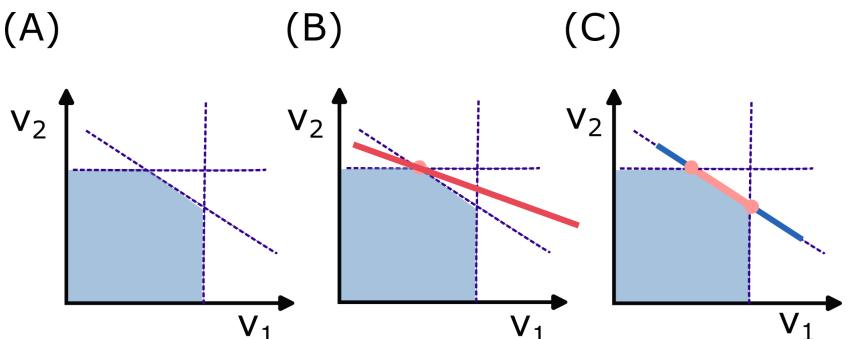

Figure 12.1: One versus multiple optima in the flux polytope. (A) A two-dimensional flux polytope (shaded area) with non-negative fluxes and the defining constraints shown as dashed lines. (B) The linear objective function represented by the red line has a unique maximum (red dot). (C) The linear objective function represented by the blue line, parallel to one of the constraints, has infinitely many maxima, which coincide with the segment highlighted in red.

picture? And related to this: can we explain cell-to-cell differences in terms of some other, perhaps more involved, optimality criterion? Are there cases in which variability is optimized? Can we describe quantitatively a microbial population in ways that account for inter-cellular diversity? Note that cell-to-cell variability is inherently a population-level concept. Addressing it therefore requires a framework that is capable of clearly distinguishing single-cell properties from population-level ones.

It is definitely possible to explain cell-to-cell variability within an optimality framework (see Chapter on *Solutions of constraint-based metabolic models*). For example, one could say that, in appropriate conditions, all microbes in a population are optimal, but the optima are slightly different for different cells. As a matter of fact, optimal states in CBMs need not be isolated points belonging to the flux polytope. There can in fact be infinitely many flux vectors that maximize an objective function (this happens, for instance, when an objective function attains its maxima on one of the edges or faces of the polytope, see Figure [12.1)](#page-200-0). This implies that identical cells subject to the same constraints and sharing the same objective may end up having different metabolic profiles despite carrying the same value for the objective function. In this scenario, diversity is induced by a very special feature of the objective function and, unless some other ingredient is brought into the game to lift the degeneracy, all optimal states would be equally likely for cells. If having an objective function of this type seems unlikely in a high-dimensional setup such as metabolism, one may imagine a scenario in which all cells optimize the same objective but with slightly different constraints (i.e. in a slightly different polytope, e.g. due to small variations in regulatory constraints, energy demands, or nutrient uptakes). In this case, each cell would solve its own optimization problem, ending up having, along with a different metabolic profile, a slightly different value of the objective function. Metabolic diversity is therefore induced by variability in the constraints. But it is also possible that, if cells are subject to fluctuating exogenous constraints (e.g. variable nutrient levels), they would prefer to maximize their, say, growth rate *averaged over conditions*, especially if fluctuations occur on faster timescales than those over which metabolic reactions equilibrate. In such a case, the average growth rate would be maximum (given the external variability), but other than that every cell could carry a different growth rate and a different metabolic profile. In this respect, one can say that diversity is now being optimally adapted to external conditions, or one may even think that different cells have different objective functions. This scenario, possibly unrealistic for growing microbial populations but not for other cell types (think for instance of the mixture of neurons with high energy demands and glia with low energy demands in the brain), would also lead to heterogeneous flux profiles and objectives. And so on.

It is clear from these examples that, in order to represent heterogeneity within CBMs, one must, first and foremost, clarify the origin of heterogeneity as much as possible. Next, it is necessary to shift from the language of individual flux vectors belonging to the flux polytope to that of *ensembles* of flux vectors or, more reasonably for large populations, of *probability densities* defined on the flux polytope. This transition is less trivial and more momentous than it sounds and, together with the causes of variability, is the core subject of the present Chapter. We shall begin by giving a more precise characterization of the different types and sources of diversity that can be considered when modeling metabolic networks. Next, we shall introduce probability densities on the flux polytope and briefly discuss a few simple examples. We shall then address the general problem of using probability densities to represent heterogeneity and uncertainty, most notably that seen in empirical data. Finally, we will show how these ideas can be used to generalize the notion of optimality to heterogeneous populations.

## <span id="page-201-0"></span>**12.2 Sources of variability and uncertainty in metabolism**

Metabolic heterogeneity is widespread among clonal populations of prokaryotic and eukaryotic cells. Populations of *Escherichia coli* display diverse cell-to-cell conversion yields of glucose into final products, such as fatty acids and tyrosine [\[490\]](#page-284-11); not surprisingly, the intracellular concentration of co-factors, including ATP, also vary significantly between cells [\[491\]](#page-284-12). *Saccharomyces cerevisiae* metabolic states have been observed to change over time for each cell. For instance, a single budding yeast does uptake oxygen before duplicating its genetic material, but it changes to an anaerobic metabolism once DNA duplication starts in order to prevent mutations related to free radicals [\[492,](#page-284-13) [493\]](#page-284-14). Animal cells within a single tissue also show heterogeneous metabolisms. Non-small cell lung cancer display a remarkable diversity of preferred carbon sources. Within the tumor, some cells consume glucose and produce lactate, whereas others divert their metabolism to consume lactate as a carbon source [\[494\]](#page-284-15).

The root cause of this metabolic heterogeneity is manifold, including uneven distribution of nutrients in the environment, asymmetric cell partitioning at division, and noise in gene expression [\[495,](#page-285-0) [496\]](#page-285-1). These effects are stochastic, and prevent the determination of a cell metabolic state in advance. This type of uncertainty is rooted in the nature of metabolism itself. We refer to it as *objective uncertainty*.

There is however another type of uncertainty at play, one that comes from our models of metabolism. In any metabolic network reconstruction, there can be missing reactions [\[497\]](#page-285-2), errors or lack of knowledge about the directionality of certain reactions under *in vivo* conditions [\[498\]](#page-285-3), and errors in the experimental estimates of certain parameters –such as exchange fluxes, or the weights of the biomass reaction [\[499\]](#page-285-4). Even when using a *bona fide* metabolic network conditioned by precisely measured parameters, optimality principles can lead to a reduction of the viable polytope as opposed to the identification of a single 'optimal' state [\[500\]](#page-285-5) (see Chapter on *Solutions of constraint-based metabolic models*). This is exemplified in the network of Fig. [12.2.](#page-202-0)A, where the maximization of *v*4 only reduces the viable polytope to a subspace defined by the line shown in Fig. [12.2.](#page-202-0)B. Uncertainties that stem from modeling uncertainties can be categorized as *subjective*, as they arise solely from an observer's imperfect knowledge.

As we will see in the following, although objective and subjective uncertainties have different sources, both can be modeled using probability theory.

## <span id="page-201-1"></span>**12.3 Probability densities over the flux polytope**

In what follows, we shall denote the convex flux polytope by P and a generic flux configuration in P by **v** = {*vi*} *N i*=1. A probability density *p* defined on P is any non-negative function such that

<span id="page-201-2"></span>
$$\int_{\mathcal{P}} p(\mathbf{v})dv_1 \cdots dv_N \equiv \int_{\mathcal{P}} p(\mathbf{v})d\mathbf{v} = 1 \; . \tag{12.1}$$

Notice that the integral over P implicitly encodes two types of constraints: mass-balance equations (i.e. **Sv** = **0**) and ranges of variability of the form *vi,*min ≤ *vi* ≤ *vi,*max (see Chapter on *Solutions of constraint-based metabolic models*). The quantity R P *d***v** represents therefore the *a priori* volume of P (which, understandably, is far from simple to calculate for high-dimensional polytopes like those corresponding to genome-scale metabolic network reconstructions [\[501\]](#page-285-6)). As usual, *p*(**v**) can be interpreted as the relative likelihood of flux <span id="page-202-0"></span>Probability densities over the flux polytope 193


Figure 12.2: Minimal metabolic network with multiple optima. (A) Toy network where the top metabolite is imported by reaction *v*1 and processed by reactions *v*2 and *v*3, which convert it into the bottom metabolite that is then excreted via *v*4. When fixing *v*1 = 10, the maximization of *v*4 –a proxy of biomass growth rate– under mass balance results in *v*4 = 10. There are however infinitely many flux vectors (defined by the condition *v*2 +*v*3 = 10) that are coherent with this solution, including those indicated by red blue and green flux values. (B) The subspace of optimal solutions forms a line (dark purple) in the space of feasible flux vectors (Problem [12.1](#page-214-1) ). The purple-shaded triangle represents the flux polytope for 0 ≤ *v*1 ≤ 10.

configuration **v**: if we imagine that a cell is assigned a flux configuration by "randomly sampling it from P" using the rule described by *p*, then *p*(**v**)*d***v** represents the probability that the cell's flux configuration will lie in a small volume *d***v** around **v**. It is clear then that probability densities on P provide a mathematically convenient way of describing the metabolic state of large populations (or ensembles) of cells at a given time, provided one can assume that cells have the same metabolic network and are subject to the same constraints, so that P is the same for all of them. For the population of cells described by *p*, the probability density clearly contains all the statistics of metabolic fluxes, from mean values to variances to correlations. For instance, by integrating *p* over all fluxes except the *i*-th, one obtains the marginal probability density of flux *vi*, i.e.

$$\int_{\mathcal{P}} p(\mathbf{v})d\mathbf{v}_{\backslash i} = p_i(v_i) \; , \tag{12.2}$$

where the subscript \*i* corresponds to 'except for the flux of index *i*' (so *d***v**\*i* = *dv*1 · · · *dvi*−1*dvi*+1 · · · *dvN* ). And from *pi* we can immediately retrieve the statistical features of flux *vi* (e.g. mean value, variance, etc).

Let us make a few simple examples.

- If we assume that all cells in the population maximize the same objective function, and that there is no degeneracy in the optimal state, then
<span id="page-202-2"></span><span id="page-202-1"></span>
$$p(\mathbf{v}) = \delta(\mathbf{v} - \mathbf{v}^*) \ , \tag{12.3}$$

where **v** *?* denotes the (unique) objective-maximizing flux vector and *δ*(*x*) denotes Dirac's *δ*-distribution. ◦ If we can make no assumption on the cells' metabolic activity other than it has to be compatible with the constraints encoded by P, then any flux vector **v** ∈ P is equally likely to occur in a population. This means that *p* is constant on P. Specifically, its value must be equal to the inverse of the volume of P:

$$p(\mathbf{v}) = \left(\int_{\mathcal{P}} d\mathbf{v}'\right)^{-1} \quad \text{ (
$$\mathbf{v} \in \mathcal{P}$$
)}\;\;. \tag{12.7}$$

For any given flux polytope, this distribution can be sampled at least in principle using the methods described in the Chapter *The space of metabolic flux distributions*.

- Imagine having a dataset derived from a 13C labeling experiment (mass spectrometry) that gives the mean
#### <span id="page-203-3"></span>**Mathematical details 12.B : Dirac's** *δ***-distribution**

For our purposes, the defining property of the *δ*-distribution in one dimension is the following: if a variable *x* is *δ*-distributed around the finite value *x ?*, then, for any continuous function *f*,

$$\int_{-\infty}^{+\infty} f(x)\delta(x - x^{\star})dx = f(x^{\star})\ . \tag{12.4}$$

This means that, intuitively, *δ*(*x* − *x ?*) = 0 everywhere on the real axis except at *x ?*, where its value is +∞. Such a function only makes sense within an integral. In this respect, [(12.3)](#page-202-1) should be seen as an abuse of notation, albeit a convenient one. There are however several ways to represent the *δ*-distribution that comply with the above requirement. For example, one can define

$$\begin{split} \int_{-\infty}^{+\infty} f(x)\delta(x-x^{\star})dx &:= \lim_{\sigma \to 0} \int_{-\infty}^{+\infty} f(x) \frac{1}{\sqrt{2\pi\sigma^{2}}} e^{-\frac{(x-x^{\star})^{2}}{2\sigma^{2}}} dx \\ &= \lim_{\sigma \to 0} \int_{-\infty}^{+\infty} f(x^{\star}+\sigma y) \frac{1}{\sqrt{2\pi}} e^{-\frac{y^{2}}{2\sigma^{2}}} dy = f(x^{\star}) \quad . \tag{12.5} \ (f \in L^{2}(\mathbb{R})) \end{split}$$

<span id="page-203-0"></span>The generalization to *n >* 1 dimensions is obtained by straightforwardly assuming *δ*(**x** − **x** *?*) = Q*n i*=1 *δ*(*xi* − *x ? i* ), so that

$$\int_{\mathbb{R}^n} f(\mathbf{x}) \delta(\mathbf{x} - \mathbf{x}^*) d\mathbf{x} = f(\mathbf{x}^*) \ . \tag{12.6}$$

Because the *δ*-distribution effectively has non-zero probability mass only at a single point, it is reasonable to expect [(12.6)](#page-203-0) to hold also if the integral is carried out over a compact domain *D*, provided **x** *?* belongs to *D*. This is indeed the case, although the proof requires some work. For a quick guide to the many other interesting and useful properties of the *δ*-distribution that are beyond our current scopes, see [\[502\]](#page-285-7).

value *vi* of *every* flux in the network (the average being over the population of cells used in the experiment), together with an experimental error *σi* (which likely conflates different sources of uncertainty of which we may know very little, if anything at all), such that the experimental population-level estimate of *vi* is *vi* ±*σi*. Let us assume that we know enough about the experiment to be able to define a flux polytope for the cell type (P), and that all empirically measured averages and errors are in P. Then, if we want to describe the population by a probability density in P that is uniform over the domain defined by experimental estimates, we can set

<span id="page-203-2"></span>
$$p(\mathbf{v}) = \prod_{i=1}^{N} \frac{\theta(\overline{v}_i + \sigma_i - v_i)\theta(v_i - \overline{v}_i + \sigma_i)}{2\sigma_i} \quad (\mathbf{v} \in \mathcal{P})\;,\tag{12.8}$$

where *θ*(*x*) denotes the Heaviside (step) function defined as (Problem [12.2)](#page-214-2)

<span id="page-203-1"></span>
$$\theta(x) = \begin{cases} 1 & \text{for } x > 0 \\ 0 & \text{for } x < 0 \end{cases}.\tag{12.9}$$

- (Boltzmann distribution) Let *f*(**v**) denote a generic function of the flux vector, such as *f*(**v**) = P*N i*=1 *civi*, with *ci* prescribed constants. The Boltzmann distribution is defined as

$$p(\mathbf{v}) = \frac{1}{Z(\beta)} e^{\beta f(\mathbf{v})} \quad \text{ (
$$\mathbf{v} \in \mathcal{P}$$
)}\,,\tag{12.10}$$

where *β* is a constant and *Z* is a factor ensuring normalization (i.e. [(12.1)](#page-201-2)), namely *Z*(*β*) = R P *e βf*(**v**) *d***v**. The behavior of *p* is simple to grasp in three limits.

- 1. For *β* → 0, [(12.10)](#page-203-1) reduces to [(12.7)](#page-202-2): in other words, *p* becomes uniform over P (and therefore insensitive to *f*).
- 2. For *β* → +∞, *p* effectively concentrates on the flux vector **v** *?* that maximizes *f* (which for simplicity we

<span id="page-204-0"></span>

Figure 12.3: Boltzmann distribution on the flux polytope. The Boltzmann distribution, Eqn [(12.10)](#page-203-1), morphs from a uniform probability density to a *δ*-distribution concentrated on the flux vector that maximizes the function *f* as *β* varies from 0 to +∞.

assume to be unique). To see this at a heuristic level, it suffices to notice that, for any **v** 6= **v** *?* , the ratio

$$\frac{p(\mathbf{v}^*)}{p(\mathbf{v})} = e^{\beta[f(\mathbf{v}^*) - f(\mathbf{v})]} \tag{12.11}$$

increases exponentially as *β* increases. Because densities are normalized, when this ratio becomes large, *p*(**v**) must become very small. Hence, when integrated over P, the larger is *β*, the closer to **v** *?* must flux vectors be in order to give a significant contribution to the integral. For *β* → +∞, the only relevant contribution comes from **v** *?* , so that, effectively, *p*(**v**) ' *δ*(**v** − **v** *?* ). This conclusion can be reached more precisely using Laplace's method (a.k.a. saddle-point approximation) to evaluate integrals of the form R R*n e βg*(**x**) *d***x** in the limit *β* → ∞ for fixed *n* (see e.g. [\[503\]](#page-285-8), Ch. 27).

- 3. By a similar reasoning, for *β* → −∞ the only relevant contribution to integrals involving *p* comes from the (unique, by assumption) flux vector **v***?* that *minimizes f*, so that, effectively, *p*(**v**) ' *δ*(**v** − **v***?*). When *β* varies, things depend strongly on the form of *f* and can become rather complicated when *f* is nonlinear, especially when terms that involve the product of two or more fluxes ('high-order interactions') are present. However, in the simple case in which *f* is linear (as outlined above), then the probability density gradually morphs from a uniform distribution over P to a *δ*-distribution around the maximum of *f* as *β* increases from 0 to +∞ as shown in Fig. [12.3](#page-204-0) (and likewise when *β* decreases from 0 to −∞). In this respect, the parameter *β* can be seen simply as a 'degree of optimization': the closer a population is to optimizing *f*, the higher the value of *β*. For reasons that will become clear in the next section, the Boltzmann distribution plays an especially important role in this Chapter (Problem [12.3)](#page-214-3).
- In Constrained Allocation FBA [\[474\]](#page-283-10) (see the Chapter [9,](#page-144-0) one considers an ensemble of growth-rate maximization problems constructed by sampling (from a prescribed probability density) a family of random variables representing the proteome fraction to be invested in each metabolic enzyme per unit flux of the corresponding reaction. The idea in CAFBA is that different sets of parameters effectively correspond to different cells, reflecting the cell-to-cell variability in e.g. transcription levels and protein abundances. The population-level behavior is then obtained by averaging over different choices of these parameters (i.e. over a population of heterogeneous cells). An alternative interpretation is however possible, namely that different parameters reflect the different environmental conditions that a species can encounter over its life process history. By averaging over parameters one obtains a growth strategy that levels out this environmental variability. Such a strategy may be the one that cells prefer to implement e.g. when environmental fluctuations are fast (faster than regulatory timescales). In either case, in CAFBA, randomness in a family of parameters related to the optimization problem induces randomness in the solutions, and therefore a probability density over the feasible space. This probability is unfortunately hard to write down explicitly in the case of CAFBA due to the complexity of the optimization problem. Its marginal distributions are however easy to calculate numerically. Two of them, specifically for the single-cell growth rate

and acetate excretion fluxes, are shown in Fig. 2 in [\[474\]](#page-283-10).

We could provide more examples but the key message of this section should already be visible: probability densities on the flux polytope are useful (a) when one wants to explicitly represent how uncertainties, experimental knowledge (with errors), or variability in parameters impact our knowledge of what part of the flux space P is occupied by the metabolic states that occur in a true microbial population; and (b) when one is interested in representing an *optimal* (in some sense) population in a way that explicitly accounts for heterogeneity. If one has data (with errors), a probability density can provide a representation of the data, as in [(12.8)](#page-203-2). It can likewise describe the solution to a population-level optimization problem, and therefore a purely theoretical prediction, as in [(12.3)](#page-202-1). Or the solution to an optimization problem with uncertainty, i.e., partial knowledge or variability in some of the parameters, in which case it represents an 'informed' theoretical prediction (as in the CAFBA example, where the 'information' injected into the problem comes from the probability density from which parameters are sampled). Or it can simply be a tool to interpolate between extreme cases when we are unsure about how well a certain function is being optimized (as in [(12.10)](#page-203-1)). Notice how, in our examples, different motivations activate different theoretical routes, all of which lead to working with probability densities that have *a priori* different origins and meanings even though they can be formally the same.

The two broad motivations for working with probability densities on P outlined above [i.e. (a) representing uncertainty and (b) representing optimal heterogeneous populations], pose fundamentally different modeling challenges. In the first case, the key question is one of model selection: given some empirical knowledge, what is the probability density on P that best represents our residual uncertainty? For instance: how good of a choice for *p* is [(12.8)](#page-203-2) given the data we had? Are there criteria that can guide our choice of a probability density? We will briefly consider these issues in the upcoming Sec. [12.4.](#page-205-0) When attempting to model optimal heterogeneous populations at the theoretical level, instead, one basically has to generalize the problem tackled by CBMs like FBA to the case in which an optimal probability density is searched for instead of an optimal flux configuration. We will see how this can be done in Sec. [12.5.](#page-210-0)

## <span id="page-205-0"></span>**12.4 Representing heterogeneity and uncertainty**

### <span id="page-205-1"></span>**12.4.1 ML, MAP and Bayesian inference**

We have seen that probability densities on P can represent, under certain assumptions, populations of microbes whose metabolism can be described by the same flux polytope, and that different probability densities can be surmised to model the distribution of **v** ∈ P when some external information (e.g. experimental data) is available. Here, we will address the following question: how can one choose the *p* that best represents our knowledge about the metabolic state of a population in presence of these external data?

To summarize the huge and highly involved set of problems behind the above (very general) question [\[503\]](#page-285-8) in a way that is useful for the purposes of this Chapter, we can start by assuming we have *a priori* chosen a form of *p* that depends on certain free parameters and ask how to tailor parameters so that *p* 'optimally' matches the empirical evidence. To be concrete, let us denote by *ψ* the vector of parameters of *p*, and by **W** = {**w**1 *,* **w**2 *, ...,* **w***R*} a set of *R* experimental samples of **v**. Each measurement, **w**, is a vector of metabolic fluxes that ideally should include all the reactions of a metabolic network. In practice, a vector **w** typically spans only a subset of all the reactions of the metabolic network, e.g. those that are amenable to 13C labeling (TCA, glycolysis, and pentose phosphate pathways) or that correspond to exchange fluxes that can be reliably measured (glucose and oxygen consumption, or lactate and ethanol, to name a few). According to Bayes' rule (we assume all variables to be continuous), the quantities

◦ *p*(*ψ*|**W**): the conditional probability density of the parameters given the observations (a.k.a. the *posterior*); ◦ *p*(**W**|*ψ*): the conditional probability density of the observations given the parameters (a.k.a. the *likelihood*); ◦ *p*(*ψ*): the prior probability density of parameters (a.k.a. the *prior*);

#### **Mathematical details 12.C : A recognizable case (Gaussian model)**

ML is the most commonly used point estimation method. As said above, the estimated parameters, *ψ*ˆ, are computed as the argument that maximizes the likelihood of the observed data, i.e.

<span id="page-206-2"></span>
$$\hat{\psi} = \arg\max_{\psi} p(\mathbf{W}|\psi) = \arg\max_{\psi} \prod_{i=1}^{R} p(\mathbf{w}^{(i)}|\psi) = \arg\max_{\psi} \sum_{i=1}^{R} \log[p(\mathbf{w}^{(i)}|\psi)] \,, \tag{12.15}$$

where in the last step we used the fact that, as far as the solution is concerned, maximizing *p*(**W**|*ψ*) is equivalent to maximizing its logarithm. ML takes a familiar form if one follows, for instance, Theorell *et al.* [\[504\]](#page-285-9) in modeling **v** according to a multivariate normal distribution:

$$\mathbf{v} \sim N(\mathbf{v}|\boldsymbol{\psi}) = \frac{1}{\sqrt{(2\pi)^N |\boldsymbol{\Sigma}|}} e^{\left(-\frac{1}{2}(\mathbf{v}-\mathbf{v})^T \boldsymbol{\Sigma}^{-1} (\mathbf{v}-\mathbf{v})\right)} \tag{12.16}$$

The parameters encompass the mean values, **v**¯, and the covariance matrix, **Σ**. That is, *ψ* = [**v**¯*,* **Σ**]. Accordingly,

$$p(\mathbf{w}^{(i)}|\boldsymbol{\psi}) = N(\mathbf{w}^{(i)}|\boldsymbol{\psi}) = \frac{1}{\sqrt{(2\pi)^{N}|\boldsymbol{\Sigma}|}} e^{\left(-\frac{1}{2}(\boldsymbol{\Psi} - \mathbf{w}^{(i)})^{T}\boldsymbol{\Sigma}^{-1}(\boldsymbol{\Psi} - \mathbf{w}^{(i)})\right)},\tag{12.17}$$

and

$$\hat{\psi} = \arg\max_{\bar{\mathbf{v}}, \boldsymbol{\Sigma}} \sum_{i=1}^{R} \left[ -\frac{1}{2} (\bar{\mathbf{v}} - \mathbf{w}^{\{i\}})^T \boldsymbol{\Sigma}^{-1} (\bar{\mathbf{v}} - \mathbf{w}^{\{i\}}) - \log \left( \sqrt{(2\pi)^N |\boldsymbol{\Sigma}|} \right) \right],\tag{12.18}$$

which leads to the well-known weighted least squares estimators of mean values (**v**ˆ¯) and variances (**Σ**ˆ ). With **v**ˆ¯ and **Σ**¯ , the frequency of any vector **v** can be computed from *N*(**v**|**v**ˆ¯*,* **Σ**ˆ ). Standard techniques, such as confidence intervals, can be applied to assess the precision of *ψ*ˆ. Generally speaking, the larger the number of samples, *R*, the smaller the uncertainty in *ψ*ˆ.

### ◦ *p*(**W**): the (marginal) probability density of observations (a.k.a. the *evidence*)

are related by the formula

<span id="page-206-1"></span>
$$p(\psi|\mathbf{W}) = \frac{p(\mathbf{W}|\psi)p(\psi)}{p(\mathbf{W})} \ . \tag{12.12}$$

Ideally, what one would like to know in order to 'optimally' set the parameters of *p* is how likely a parameter set is given the data, i.e. the full posterior *p*(*ψ*|**W**), as it allows to quantify our uncertainty on the model itself. One may however also consider different (less ambitious) ways to choose parameters. The three best known methods are the following:

◦ Maximum Likelihood (ML) inference aims at finding the parameter vector that maximizes the likelihood:

$$
\psi_{\rm ML} = \text{arg}\, \underset{\psi}{\text{arg}\, \text{max}} \, p(\mathbf{W}|\psi) \; . \tag{12.13}
$$

<span id="page-206-0"></span>In standard cases, this produces a single 'optimal' vector *ψ* (hence it is called a 'point estimator'), resulting in a *p* that models -in a context-specific manner- the metabolic heterogeneity within the cellular population.

- Maximum a Posteriori (MAP) inference aims instead at finding the parameter vector that maximizes the posterior:

$$\psi_{\text{MAP}} = \text{arg}\, \underset{\psi}{\text{arg}\, \text{max}} \, p(\psi | \mathbf{W}) \equiv \text{arg}\, \underset{\psi}{\text{max}} \, p(\mathbf{W} | \psi) p(\psi) \; \,, \tag{12.14}$$

where the last equality follows from the fact that *p*(**W**) does not depend on *ψ*. As for ML, the MAP estimator is a point estimator.

- Bayesian inference aims finally at computing the full posterior distribution *p*(*ψ*|**W**). It is therefore a 'distribution estimator' rather than a point estimator.
Problem [12.4](#page-214-4) should clarify the way in which point estimators differ from (and are less informative than) distribution estimators in practice.

#### <span id="page-207-2"></span>**Mathematical details 12.D : Inference in metabolic network modeling**

In metabolic network modeling **v** is usually a vector of fluxes. Unfortunately, the number of samples is usually very small [\[505\]](#page-285-10), which may lead to *ψ*ˆ over-fitted to the sample set. One way to overcome limited sample sizes is to regularize the estimation procedure by incorporating *prior* information on *ψ* via the MAP estimation method [(12.14)](#page-206-0). The evidence *p*(*ψ*) in MAP can be used to encode the distribution of **v** values observed in previous experiments or formulated as a plausible non-informative probability distribution. For example, Heinonen *et al.* [\[506\]](#page-285-11) formulated *p*(*ψ*) as a multivariate normal distribution with mean values equal to zero, and variances for each flux adjusted to prevent fluxes extending beyond their lower and upper bounds defined in P. MAP estimation can be considered as an ML estimation whose objective function has been augmented by the prior distribution of *p*(*ψ*). In this sense, MAP estimation is a 'regularized' ML estimation, which helps prevent overfitting.

MAP estimation however does not exploit the capacity of Bayes' theorem to explore the full set of values that the parameters can achieve. By producing a distribution estimation of the parameters, Bayesian inference allows quantifying the parameters' variability. Compared to point estimation methods, though, Bayesian inference is computationally expensive as it requires to asses how different values of *p*(*ψ*) affect *p*(**W**|*ψ*). Fortunately, some families of *p* are susceptible to methods such as Gibbs sampling or Markov Chain Monte Carlo that offer an efficient way to compute the posterior numerically [\[507\]](#page-285-12). This is the case, for instance, for the truncated multivariate normal distributions that Heinonen *et al.* [\[506\]](#page-285-11) used for the likelihood and prior functions appearing in [(12.12)](#page-206-1). The posterior can then be used to derive statistical features of quantities that depend on *ψ*, e.g. metabolic fluxes.

In practice, most parameters underlying the mechanisms that govern cellular metabolism -e.g., enzymes' allosteric regulation or the local conditions within cells' organelles- remain unknown. Various hypotheses can be advanced to close this knowledge gap. Alas, it is not uncommon to have conflicting scenarios. For instance, to explain overflow metabolism in *S. cerevisiae* and *E. coli* [\[508,](#page-285-13) [509,](#page-285-14) [510\]](#page-285-15), numerous plausible explanations have been pushed forward, including ATP savings for the production of non-oxidative enzymes (which by being smaller, compared to their oxidative counterparts, require less ATP in their synthesis) [\[511,](#page-285-16) [512\]](#page-286-0), limited uptake rates capacity [\[513\]](#page-286-1), and an upper limit on the dissipation of Gibbs energy [\[514\]](#page-286-2). (See [\[515\]](#page-286-3) for an excellent review of optimization-based explanations.) Because each mechanism can be encoded through a different prior, it is clear that the choice of the prior is a delicate matter in Bayesian inference. Generally speaking, the choice of the prior becomes less and less problematic the more data we have, i.e. the better sampling we have of the state space of the system. However, if data is scant, the prior will leave an important imprint on the resulting posterior. In these cases, a careful selection of the prior is paramount. Among the methods most commonly employed are (a) the construction of empirical priors (namely priors that encode previous knowledge about parameters), (b) the use of so-called "non-informative priors" (i.e. priors that reflect 'vague knowledge' about parameters, like the fact that a certain parameter is non-negative) [\[516\]](#page-286-4), and (c) the selection of priors based on the Maximum Entropy principle (see below) [\[517,](#page-286-5) [518\]](#page-286-6).

### <span id="page-207-0"></span>**12.4.2 MaxEnt inference**

According to the principle of Maximum Entropy (MaxEnt) [\[519,](#page-286-7) [520\]](#page-286-8), among all probability densities that are consistent with given prior knowledge or data, the one having the largest value of the entropy

<span id="page-207-1"></span>
$$H[p] = -\int_{\mathcal{P}} p(\mathbf{v}) \ln p(\mathbf{v}) d\mathbf{v} \tag{12.19}$$

is the one that best represents our knowledge about the system. A classical intuitive justification of the MaxEnt principle is most easily given for discrete variables [\[521\]](#page-286-9).

Consider *N* cells, each of which can be found in any of *K* states (what precisely defines a state is immaterial for this reasoning). Let an assignment **n** = {*n*(*i*)} be given, such that *n*(*i*) denotes the number of cells in state *i* (with P*K i*=1 *n*(*i*) = *N*). Because we can always exchange the states of two cells without changing **n**, there are multiple 'microscopic' ways to realize an assignment **n**. Combinatorics tells us that the number of different microscopic realizations of an assignment **n** is given by

$$\mathcal{N}(\mathbf{n}) = \frac{N!}{\prod_{i=1}^{K} n(i)!} \; . \tag{12.20}$$

#### <span id="page-208-1"></span>**Economic analogy 12.E : Maximum Entropy economic equilibrium**

Most of economic theory relies on the assumption that markets are capable of allocating resources optimally, i.e. so that the utilities of each of the participating agents is maximized (an assumption can can be seen as the analog of each cell in a population maximizing its growth rate). In order to achieve optimal states (called 'equilibria' in economics), agents endowed with *a priori* different preferences, resources and goals identify the actions that maximize their utilities (e.g. transactions, trade, or production) and carry them out. This process however can become more and more demanding as the number of agents that take part in the market gets larger and larger, because (in short) the set of viable transactions for each agent can become exceedingly large. How can one describe the equilibria that arise from these situations?

A possible approach, used at least since [\[522\]](#page-286-10) (see also [\[523,](#page-286-11) [524,](#page-286-12) [525\]](#page-286-13)), is based on the Maximum Entropy principle. The idea, in short, is the following. Once every agent has somehow chosen their preferred actions (i.e. once a systemwide 'configuration of individual actions' has been selected), the market as a whole presents a set of transactions to be carried out that aggregate the choices of individual agents. When looked at the aggregate level, though, each set of transactions can correspond to more than one configuration of individual actions. (This can happen, for instance, because agents have a degree overlap in their characteristics which makes them indistinguishable from an economic perspective.) If one assumes that agents choose their actions at random from their set of viable transactions, then some sets of transactions are bound to be more likely than others, simply because they can be realized in more 'microscopic' ways (for instance, by interchanging agents of the same type). It is then reasonable to think that the likelihood of any particular set of transactions will be larger, the larger the number of microscopic ways in which it can be realized. Taking entropy as a measure of multiplicity, the most likely set of transactions, then, is the one that maximizes the entropy.

A model of market where the above program is worked out in detail is found in [\[522\]](#page-286-10). The 'statistical equilibrium' theory that follows from the use of the Maximum Entropy principle generalizes the standard competitive equilibrium discussed in microeconomics by providing a description of optimality in large markets with heterogeneous participants. This line of work has also inspired further developments that explicitly included agents' heterogeneity into the theory of competitive equilibria [\[526,](#page-286-14) [527,](#page-286-15) [528\]](#page-287-0). To the best of our knowledge, a similar approach has not yet been used to model heterogeneous microbial systems.

If all *n*(*i*)'s are large enough, we can use Stirling's approximation (*n*! ' (*n/e*) *n* ) to see that

$$\mathcal{N}(\mathbf{n}) \simeq e^{NH(\mathbf{n})} \quad , \quad H(\mathbf{n}) = -\sum_{i=1}^{K} \frac{n(i)}{N} \ln \frac{n(i)}{N} \equiv -\sum_{i=1}^{K} p(i) \ln p(i) \equiv H(\mathbf{p}) \quad , \tag{12.21}$$

where *p*(*i*) denotes the fraction of cells in state *i* (or, equivalently for us, the probability to find a cell in state *i*). *H* is the *entropy* of the assignment **n**, and is in essence a measure of the microscopic degeneracy that underlies a macroscopic arrangement. The distribution **p** = {*p*(*i*)} carrying the largest entropy subject to certain constraints is therefore the one having the largest underlying microscopic degeneracy given those constraints. So, if one were to randomly pick a microscopic state given those constraints, the most likely macroscopic state would be the maximum entropy distribution. In other terms, the MaxEnt distribution is the least biased distribution compatible with the constraints, as any other distribution satisfying the same constraints would correspond to a smaller underlying degeneracy, thereby neglecting some feasible (i.e. constraint-satisfying) microscopic configurations. In this respect, a MaxEnt distribution requires the least information besides prior knowledge (i.e. constraints). (A more detailed justification for using the MaxEnt principle as an inference tool is given e.g. in [\[521\]](#page-286-9).) If for instance cells are assigned to states in a completely random way, the MaxEnt distribution is the solution of

<span id="page-208-0"></span>
$$\max_{\mathbf{p}} - \sum_{i=1}^{K} p(i) \ln p(i) \quad \text{subjected to } \quad \sum_{i=1}^{K} p(i) = 1 \quad , \tag{12.22}$$

which can be found via the method of Lagrange multipliers (Problem [12.5)](#page-215-0). If other constraints are imposed, though, the MaxEnt distribution will clearly change (Problem [12.6)](#page-215-1). For our purposes, the continuous case with entropy given by [(12.19)](#page-207-1) can be seen as a straightforward generalization of the discrete one.

<span id="page-209-0"></span>

Figure 12.4: MaxEnt modeling of single-cell growth rate distributions. Empirical distributions are reproduced by a MaxEnt assumption where the mean growth rate is constrained, leading to a Boltzmann distribution over the flux polytope (Eq. [(12.30)](#page-210-1)).

To get some grasp of the scenario that the MaxEnt rule provides within CBMs, let us work out one especially noteworthy case, namely the MaxEnt probability density of flux configurations with a given mean value of a generic function *f* of the fluxes. This probability density is the solution of

$$\max_{p(\mathbf{v})} - \int_{\mathcal{P}} p(\mathbf{v}) \ln p(\mathbf{v}) d\mathbf{v} \quad \text{subject to} \quad \int_{\mathcal{P}} p(\mathbf{v}) d\mathbf{v} = 1 \quad \text{and} \int_{\mathcal{P}} f(\mathbf{v}) p(\mathbf{v}) d\mathbf{v} = \overline{f} \quad. \tag{12.23}$$

To find it, we construct the functional

$$\mathcal{L}[p] = H[p] + \alpha \left[ \int_{\mathcal{P}} p(\mathbf{v}) d\mathbf{v} - 1 \right] + \beta \left[ \int_{\mathcal{P}} f(\mathbf{v}) p(\mathbf{v}) d\mathbf{v} - \overline{f} \right],\tag{12.24}$$

where *α* and *β* are Lagrange multipliers for the normalization and the mean-value-of-*f* constraints, respectively. Variation of L with respect to *p* yields the maximum condition

$$-1 - \ln p(\mathbf{v}) + \alpha + \beta f(\mathbf{v}) = 0 \; . \tag{12.25}$$

Solving for *p* results in

$$p(\mathbf{v}) = \frac{e^{\beta f(\mathbf{v})}}{e^{1-\alpha}} \ . \tag{12.26}$$

The normalization condition however determines the value of *α*, as one must have

$$\int_{\mathcal{P}} e^{\beta f(\mathbf{v})} d\mathbf{v} = e^{1-\alpha} \equiv \mathbf{Z}(\beta) \;. \tag{12.27}$$

One is then left with

$$p(\mathbf{v}) = \frac{1}{Z(\beta)} e^{\beta f(\mathbf{v})} \quad \text{ (
$$\mathbf{v} \in \mathcal{P}$$
)}\,\,. \tag{12.28}$$

The value of *β* must be determined from the constraint on the mean value, namely from

$$\frac{1}{Z(\beta)} \int_{\mathcal{P}} f(\mathbf{v}) e^{\beta f(\mathbf{v})} d\mathbf{v} = \overline{f} \;. \tag{12.29}$$

Notice that the result is nothing but Boltzmann's distribution [(12.10)](#page-203-1). We have therefore found that [(12.10)](#page-203-1) is the MaxEnt distribution for a given mean value of the function *f*. This means that if we have a dataset returning the empirical mean value of an observable *f* over a population of cells, our knowledge is best represented by assuming that *p*(**v**) is of the form [(12.10)](#page-203-1), with *β* ensuring the matching of empirical and theoretical means.

This suggests a possible way to represent single-cell growth-rate distributions [\[529\]](#page-287-1), such as the *E. coli* populations growing in rich media studied e.g. in [\[530,](#page-287-2) [477,](#page-283-13) [478\]](#page-283-14) (see Figure [12.4)](#page-209-0).

Let us assume that all cells in the population can be described by the same flux polytope P and let *λ*(**v**) denote the growth rate associated to flux configuration **v**. We can ask the following question: what is the *p*(**v**) on P that best represents our knowledge that the mean growth rate of cells is *λ* (empirical)? The answer is

$$p(\mathbf{v}) = \frac{1}{Z(\beta)} e^{\beta \lambda(\mathbf{v})} \quad \text{ (
$$\mathbf{v} \in \mathcal{P}$$
)}\,,\tag{12.30}$$

where *Z*(*β*) = R P *e βλ*(**v**) *d***v**, and where *β* is set so that the empirical mean growth rate (*λ*) matches the theoretical mean, i.e.

<span id="page-210-1"></span>
$$\frac{1}{Z(\beta)} \int_{\mathcal{P}} \lambda(\mathbf{v}) e^{\beta \lambda(\mathbf{v})} \, d\mathbf{v} = \overline{\lambda} \,. \tag{12.31}$$

We can therefore solve the above equation (numerically) and analyze the resulting distribution. One sees from [(12.30)](#page-210-1) that *β* has a 'natural' unit given by *λ* −1 max, the inverse maximum growth rate achievable in P (which is easily computed by LP). In the populations analyzed in [\[529\]](#page-287-1), the value of *β* that ensures the matching condition ranges from 190*/λ*max to 300*/λ*max, suggesting that indeed the degree of optimization of *λ* is significant. The most remarkable result, however is that the marginal distribution of the growth rate computed from [(12.30)](#page-210-1), namely

<span id="page-210-2"></span>
$$p(\lambda) = \int_{\mathcal{P}} \delta(\lambda - \lambda(\mathbf{v})) p(\mathbf{v}) d\mathbf{v} \,\,,\,\tag{12.32}$$

matches the overall empirical growth-rate distributions. In other words, if one adjusts the parameter of [(12.30)](#page-210-1) so that the theoretical mean growth rate and the experimental one coincide, then [(12.32)](#page-210-2) reproduces the entire empirical growth-rate distribution. This observation confirms the empirical evidence that the variance of single-cell growth-rate distributions is a function of the mean, such that, if growth rates are re-scaled by the mean, distributions roughly collapse on 'universal curves' [\[477,](#page-283-13) [478\]](#page-283-14). In addition, the analysis of [\[531\]](#page-287-3) has shown that predictions for individual fluxes obtained from [(12.30)](#page-210-1) (i.e. mean values plus standard deviations) provide a better fit to experimentally measured fluxes than growth-rate maximizing fluxes obtained from FBA. This is especially important as it suggests that, despite the relatively high degree of optimization, the cell-to-cell variability underlied by [(12.30)](#page-210-1) is biologically relevant.

In the following section we will use this observation as a springboard for the analysis of optimal heterogeneous populations.

## <span id="page-210-0"></span>**12.5 Representing optimal populations**

Let us start from a rather abstract question. Suppose that an organism is actually maximizing a certain function *F*, unknown to us, which depends on metabolic fluxes **v** as well as on a set of other variables **w** that are not part of metabolism: *F* ≡ *F*(**v***,* **w**). We shall denote by (**v** *? ,* **w***?* ) the (supposedly unique) configuration of variables where *F* attains its maximum. Let's furthermore say that we have a guess for what the organism's objective function might be, and that this guess is only a function of metabolic fluxes, which we denote by *f* ≡ *f*(**v**). If we trust our guess, and if *f* is maximized by the (supposedly unique) flux vector **v**b, our prediction for the fluxes would be **v**b. Question: what is the probability that **v**b is the true optimum, i.e. that **v**b = **v** *?* ? Note that *f*(**v** *?* ) ≡ *f ? < f*b ≡ *f*(**v**b) (i.e. at the 'true' optimum the value of *f* is bound to be smaller than the maximum value of *f*).

The answer goes like this: according to the MaxEnt principle, the probability density *p*(**v**) for any flux configuration **v** to be the true state of the system (i.e. the true optimum) should be undetermined other than by our knowledge that the real optimum has some value of *f* below *f*b. What is the correct constraint to enforce (besides normalization) if we are to look for such a *p*(**v**)? We could impose that allowed configurations strictly have some fixed value of *f < f*b. This choice would lead to a uniform density over all states with a given value of *f*. In this way, though, we are imposing that states with a different value of *f* are strictly inaccessible, which is not part of our knowledge. However, if we impose that only the mean value of *f* is constrained, MaxEnt will return a probability density with the exact same mean value as the uniform density just described (by construction) but a much larger entropy, just because –intuitively– it will assign a non-zero probability to all states. Hence, as long as we have no other information, the best prediction we can make for *p*(**v**) is given by the probability density that maximizes the entropy *H*[*p*] subject to the constraint h*f*i ≡ R P *p*(**v**)*f*(**v**)*d***v** = *f ?* , i.e. by the solution of

$$\max_{\mathbf{v}} \quad - \int_{\mathcal{P}} p(\mathbf{v}) \ln p(\mathbf{v}) d\mathbf{v} \quad \text{subject to} \quad \int_{\mathcal{P}} p(\mathbf{v}) d\mathbf{v} = 1 \quad \text{and} \quad \int_{\mathcal{P}} p(\mathbf{v}) f(\mathbf{v}) d\mathbf{v} = f^* \quad . \tag{12.33}$$

We now know the result to be given by [(12.10)](#page-203-1), i.e.

<span id="page-211-0"></span>
$$p(\mathbf{v}) = \frac{1}{Z(\beta)} e^{\beta f(\mathbf{v})} \quad \text{ (
$$\mathbf{v} \in \mathcal{P}$$
)}\,,\tag{12.34}$$

where *β* is the Lagrange multiplier enforcing the constraint h*f*i = *f ?* . What this means in practice is this: if one is modeling a microbe's metabolism and is unsure about the objective function but has a guess (*f*), information theory suggests that the best one can do is to assume that metabolic flux configurations are selected according to [(12.34)](#page-211-0). Ideally, the value of *β* for which one obtains the best agreement between predictions based on sampling [(12.34)](#page-211-0) and experiments is the 'degree' to which the system optimizes *f*. If *f* is the true objective function, then the agreement between theory and experiments will get better and better as *β* increases. It is important to keep in mind that (i) while we have assumed that the organism is actually maximizing something, we didn't really use the fact that *F* is maximized at (**v** *? ,* **w***?* ) (only that the true state of the system has some value of *f* below *f*b); (ii) this is a totally ideal situation (for instance, experimental data have errors, so whether comparisons between theory and experiments are informative doesn't only depend on the theory but also on the quality of the data).

The fact that [(12.34)](#page-211-0) is 'optimal' in a rather fundamental sense (*a priori* different from the sense in which *f*-maximizing populations are optimal) encourages to view distributions described by [(12.30)](#page-210-1) through a different lens. When we maximize the entropy at fixed mean growth rate, in practice, we are looking for the 'broadest' probability density (i.e. the most variable population) on P that is compatible with the given mean. In other terms, we are saying that, given a mean growth rate, the optimal population is the one that has the largest possible variability. To quantify variability in a more readily understandable way, it is convenient to transform it into a measure of the amount of information encoded in *p*. One can reason as follows: if no prior information is available about the population, uncertainty is maximal and all flux vectors in P must be considered to be equally likely. This means that, for such a population, the probability density over P is uniform (see [(12.7)](#page-202-2)). We shall denote the entropy of the uniform distribution over P by *H*(0). When we inject information into the problem (e.g. the fact that the population has a certain mean growth rate), then the probability density is no longer uniform but given, say, by [(12.30)](#page-210-1). The uncertainty is therefore reduced by *H*(0) − *H*(*β*), where *H*(*β*) is the entropy of [(12.30)](#page-210-1). (Clearly, *H*(0) is just the entropy of [(12.30)](#page-210-1) for *β* = 0.) The quantity

$$I = \frac{H(0) - H(\beta)}{\ln 2} \tag{12.35}$$

<span id="page-211-2"></span>denotes the amount of information (in bits, hence the factor ln 2) injected by a non-zero value of *β*. Reformulating our population-level optimization, we can say that, for any fixed mean growth rate h*λ*i, the optimal population is the one carrying the smallest value of *I*. A short calculation (Problem [12.7)](#page-215-2) shows that h*λ*i and *I* are related by

<span id="page-211-1"></span>
$$
\beta \langle \lambda \rangle = I \ln 2 + \int_0^\beta \langle \lambda \rangle d\beta' \,, \tag{12.36}
$$

where it should be noted that h*λ*i is an increasing function of *β* (as *β* increases, the density gets more and more concentrated around the growth-rate maximizing flux vector, thereby leading to an increase of h*λ*i).

The curve h*λ*i versus *I* described by [(12.36)](#page-211-1) can therefore be computed numerically for any metabolic network reconstruction (as the only ingredients required are encoded in the flux polytope P) [\[529\]](#page-287-1). The resulting line (see Figure [12.5)](#page-212-0) separates the (h*λ*i*, I*) plane in a viable (achievable) region and a forbidden region where the mean growth rates are too large for the amount of information encoded in the population. This 'phase dia-

<span id="page-212-0"></span>

Figure 12.5: Fitness-information bound (general form). The black line encodes the maximum mean growth rate achievable for any given value of the information content *I* (Eq. [(12.35)](#page-211-2)) of a metabolic flux distribution (or the minimum value of *I* required to achieve any given mean growth rate).

gram' yields, first and foremost, a general prediction linking the mean growth rate (fitness) of a microbial population to its metabolic heterogeneity: all populations must have fitness-heterogeneity values in the viable region. Recent work relying on an advanced statistical inference framework has shown that actual microbial populations indeed lie in the viable part of the plane [\[532\]](#page-287-4). In addition, it provides a quantitative definition of an optimal population that accounts for variability: optimal populations have fitness-heterogeneity pairs that lie on the boundary between the viable and the forbidden region. In this respect, results from [\[529,](#page-287-1) [531,](#page-287-3) [532\]](#page-287-4) can be summarized by saying that heterogeneous, faster-growing *E. coli* populations (mean growth rate larger than roughly 1/h, richer growth media) are very close to optimality, while slower-growing ones tend to have mean growth rates and information contents that get more and more sub-optimal the less rich is the growth medium. (Of course, this notion of optimality refers to the growth rate and information content as the key parameters to evaluate a population's performance. It may well be, and this is an issue definitely worth exploring, that slower-growing population are optimal with respect to some other parameter(s).) At any rate, the above definition of optimality coincides with the standard one (growth-rate maximization) for *β* → +∞, in which case variability goes strictly speaking to zero as all cells collapse on the same flux configuration. And we now understand how it generalizes it: by stressing the way in which heterogeneous populations can be optimal despite growing at sub-maximal rates.

For later convenience, note that, because the entropy is a convex functional, the solution to the MaxEnt problem is the same as the solution to

<span id="page-212-1"></span>
$$\max_{\mathbf{v}} \quad \int_{\mathcal{P}} p(\mathbf{v}) \lambda(\mathbf{v}) d\mathbf{v} \quad \text{sub]} \\ \text{Let } \mathbf{0} \text{ } \not\subset \mathbf{0} \text{ } \\ \text{and } \quad \int_{\mathcal{P}} p(\mathbf{v}) d\mathbf{v} = 1 \text{ } \\ \text{and } \quad -\int_{\mathcal{P}} p(\mathbf{v}) \ln p(\mathbf{v}) d\mathbf{v} = H^* \text{ } . \tag{12.37}$$

The above problem has perhaps a more direct interpretation: the optimal population is the one that has the largest mean growth rate at fixed variability (entropy) or, equivalently, at fixed information content.

Before moving on, we notice that, in the above setting, optimality of heterogeneous populations has a rather simple mechanistic interpretation in terms of how populations 'occupy' the flux polytope. If one considers the uniform distribution on P, Eq. [(12.7)](#page-202-2), and calculates the marginal distribution for the growth rate (i.e. [(12.32)](#page-210-2)), one finds that the growth-rate landscape in which populations grow is extremely skewed towards slow growth rates: the overwhelming majority of metabolic flux configurations corresponds to slow-growing cells, i.e. with growth rates roughly two orders of magnitude below *λ*max. This implies that, whatever flux vector we are in, a small random change to it is overwhelmingly more likely to decrease our growth rate than increase it. In this respect, slow states have an 'entropic' advantage over fast states. On the other hand, by definition, fast-growing flux configurations replicate faster than slow-growing ones, and therefore have a replicative advantage. It is therefore tempting to interpret the probability density [(12.30)](#page-210-1) as resulting from the balance between these two tendencies. One can for instance imagine that a microbial population grows and evolves in time in P due to (i) replication events, and (ii) small random changes of the flux vector (due e.g. to gene

expression noise). Ref. [\[529\]](#page-287-1) has indeed shown that such a population evolves toward a distribution very close to [(12.30)](#page-210-1), where the role of *β* is played by the inverse rate of diffusion of the population in P, that is, by the inverse of the rate at which small random changes occur: fast rate implies small *β*, and vice versa. (As the mathematical analysis of this scenario requires the toolbox of non-linear Fokker-Planck equations, it is beyond the scopes of this Chapter.)

The above theory can be extended in various directions. We shall limit ourselves to one example here, namely that of optimal populations in fluctuating environments [\[533\]](#page-287-5). The basic assumption we make is that the growth rate *λ* is a function of both the flux vector **v** and of a single (for simplicity) exogenous variable *s* ≥ 0 representing the stress level to which the population is subject: *λ* ≡ *λ*(**v***, s*). We furthermore assume that *s* is a random variable with probability density *P*(*s*). For any value of *s*, *λ* will be maximized by a certain flux vector **v** *?* ≡ **v** *?* (*s*). If fluctuations of *s* are sufficiently slow, then cells may be able to perfectly adapt their metabolic response to every value of *s* they encounter. But this is unlikely to be possible in rapidly fluctuating environments. In the latter case, it is instead reasonable to assume that cells will try to maximize their average growth rate, where the average is taken over the distribution of *s*. The relevant quantity is now the probability density to observe a certain flux configuration **v** given that the state of the environment is *s* (*p*(**v**|*s*)), while the objective function (to be maximized over *p*(**v**|*s*)) is just

$$
\langle \lambda \rangle = \int ds \, P(s) \int_{\mathcal{P}} p(\mathbf{v}|s) \lambda(\mathbf{v}, s) d\mathbf{v} \,. \tag{12.38}
$$

We should now specify the constraints. One is simple and concerns normalization: R P *p*(**v**|*s*)*d***v** should be equal to one for all *s*. To introduce the second one, we note that, because one expects **v** to encode information about the environment, it is convenient to constrain the mutual information of **v** and *s*, i.e.

$$I(\mathbf{v};s) = \int ds \, P(s) \int_{\mathcal{P}} p(\mathbf{v}|s) \log_2 \frac{p(\mathbf{v},s)}{p(\mathbf{v})P(s)} d\mathbf{v} \, \,, \tag{12.39}$$

where *p*(**v***, s*) = *P*(*s*)*p*(**v**|*s*) is the joint distribution of **v** and *s*, whereas *p*(**v**) = R *dsP*(*s*)*p*(**v**|*s*). Clearly, *I* = 0 if *p*(**v***, s*) factorizes over **v** and *s* and it gets larger and larger as **v** and *s* become more and more correlated. Putting these pieces together, we can write the cell's optimization problem as

max *p*(**v**|*s*) Z *ds P*(*s*) Z P *p*(**v**|*s*)*λ*(**v***, s*)*d***v** subject to Z P *p*(**v**|*s*)*d***v** = 1 (∀*s*) and Z *ds P*(*s*) Z P *p*(**v**|*s*) log2 *p*(**v**|*s*) *p*(**v**) *d***v** = *I ? .* (12.40)

A comparison with [(12.37)](#page-212-1) should clarify how the above generalizes the previously discussed optimization framework. Again using the method of Lagrange multipliers one finds that the optimal probability density is now given by (Problem [12.8)](#page-215-3)

<span id="page-213-0"></span>
$$p(\mathbf{v}|s) = \frac{p(\mathbf{v})}{Z(s,\beta)} \ e^{\beta \lambda(\mathbf{v},s)}\ ,\tag{12.41}$$

where

$$Z(s,\beta) = \int_{\mathcal{P}} d\mathbf{v} \, p(\mathbf{v}) \, e^{\beta \lambda(\mathbf{v},s)} \, \,, \tag{12.42}$$

while *β* is a Lagrange multiplier.

The meaning of [(12.41)](#page-213-0) is straightforward: when *β* → 0, the metabolic flux configuration **v** becomes independent of *s*, implying *I* = 0. As *β* increases, **v** and *s* get more and more correlated, while *p ?* (**v**|*s*) tends to get more and more sharply peaked around **v** *?* (*s*). In the limit *β* → +∞ cells respond to each value of *s* by selecting the exact flux configuration that maximizes *λ*. To achieve this, maximal *I* is required. A detailed study of the optimal probability density emerging in this case within a highly coarse-grained model of

metabolism has been carried out in [\[533\]](#page-287-5), showing how complex metabolic strategies (including the coexistence of slow-growing, persistent states with fast-growing ones) arise as optimal responses to a fluctuating environment.

## <span id="page-214-0"></span>**12.6 Concluding remarks**

Metabolic variability in cell populations has, as we have discussed, multiple origins, both rooted in unavoidable stochastic effects and (possibly) in the fact that, in certain cases, being heterogeneous can be optimal for a microbial population. Models can account for variability by representing (sufficiently large) populations via probability densities defined on the flux polytope. Two main (different) goals can be achieved. First, one can look for the probability density that yields the best (in a precise sense) description of a set of empirical data. Methods like Maximum Likelihood and Maximum Entropy provide different, albeit related, approaches to this task. Second, one can formulate optimization problems for populations, whose general solution is a probability density rather than a single flux configuration. Solutions to these problems can highlight how fitness and variability are related in optimal populations, providing useful theoretical benchmarks for real microbial systems. While possibly more demanding from a mathematical viewpoint (and certainly more demanding from a computational viewpoint), these approaches expand the scope of CBMs, including in terms of predictive power. In addition, they can refine the notion of optimality and provide insights into the fundamental principles that govern the organization of metabolism across populations. The question of whether variability confers an advantage to microbial populations is however very general, and goes beyond the metabolic level of CBMs on which we focused here. A broader discussion of these aspects is presented in the Chapter *Cell behavior in the face of uncertainty*.

## **Recommended readings**

- Gardiner, C. (2009) *Stochastic Methods: A Handbook for the Natural and Social Sciences*. Springer Series in Synergetics (Springer, Berlin)
- Jaynes, E. T. (1957) Information theory and statistical mechanics. Physical Review, 106:620
- MacKay, D. J. (2003) *Information theory, inference and learning algorithms* (Cambridge University Press)
- De Martino, A., & De Martino, D. (2018) An introduction to the maximum entropy approach and its application to inference problems in biology. Heliyon, 4:e00596
- Scharfenaker, E., & Yang, J. (2020). Maximum entropy economics. The European Physical Journal Special Topics, 229:1577-1590

## **Problems**

<span id="page-214-1"></span>**Problem 12.1** Use the model in Fig. [12.2](#page-202-0) to study different objective functions, specifically combinations of fluxes. Can you find other cases in which the optimum is not unique?

<span id="page-214-2"></span>**Problem 12.2** Show that, for a real variable *x*, a continuous function *f* and upon integration over R, *d dx θ*(*x*) = *δ*(*x*).

**Hint.** Use the fact that *d dx* [*θ*(*x*)*f*(*x*)] = *θ* 0 (*x*)*f*(*x*) + *θ*(*x*)*f* 0 (*x*).

<span id="page-214-3"></span>**Problem 12.3 Well- versus ill-defined flux spaces**. Using the sampling methods introduced in the Chapter *The space of metabolic flux distributions* and a linear objective function of your choice, write a program that will sample a toy two-dimensional flux polytope according to [(12.10)](#page-203-1), and check the outcome for a few values of *β*. Then try changing the shape of the polytope in different ways by changing the constraints. What features of the polytope can make sampling harder and/or less accurate (i.e. require a larger number of samples)? Can you work out a modification of the sampling algorithms that alleviates these problems?

<span id="page-214-4"></span>**Problem 12.4 MAP inference versus Bayesian inference.** Consider a Bernoulli random variable with param-

eter *ψ*, i.e. such that the probability of having *k* successes in *n* trials given *ψ* is

$$p(k|\psi) = \binom{n}{k} \psi^k (1-\psi)^{n-k} \ , \tag{12.43}$$

and assume that the prior for *ψ* is a *β*-distribution with parameters *a* and *b*, i.e.

$$p(\psi) = \frac{\Gamma(a+b)}{\Gamma(a)\Gamma(b)} \psi^{a-1} (1-\psi)^{b-1} \ . \tag{12.44}$$

Calculate the full posterior *p*(*ψ*|*k*) and the MAP estimator for *ψ* as a function of *k*, *n*, *a* and *b*. Then assume *a* = *b* = 2 and compare the following situations: (i) a Bernoulli process that returned 2 successes in 3 trials; (ii) a Bernoulli process that returned 20 successes in 33 trials. Show that the MAP estimator for *ψ* is 60% for both (i) and (ii) (so the two processes are indistinguishable to MAP), while the posterior is different. Knowing the posterior, which process would you pick if you were asked to point to the one that is more likely to have *ψ* = 0*.*6?

<span id="page-215-0"></span>**Problem 12.5** Show that the solution of the maximization problem [(12.22)](#page-208-0) is the uniform distribution *p*(*i*) = 1*/K* for all *i*.

<span id="page-215-1"></span>**Problem 12.6 MaxEnt distribution in different cases.** Assume that a certain real variable *x* takes values *x*(*i*) in the *K* states (one can for instance think of *x*(*i*) as the growth rate of cells in state *i*). Show that the MaxEnt distributions for constraints imposed on (i) normalization of the distribution, (ii) normalization and mean value of *x*, (iii) normalization, mean value of *x* and second moment of *x*, and (iv) normalization and mean of the logarithm of *x*, are, respectively, uniform, exponential, Gaussian, and power-law.

<span id="page-215-2"></span>**Problem 12.7** Retrieve formula [(12.36)](#page-211-1).

<span id="page-215-3"></span>**Problem 12.8** Retrieve formula [(12.41)](#page-213-0) (hard).

# <span id="page-216-2"></span><span id="page-216-0"></span>**Chapter 13**

# **Cell behavior in the face of uncertainty**

David Lacoste, Olivier Rivoire, and David Tourigny

### **Chapter overview**

- Organisms that grow and survive in uncertain environments may need to change their physiological state as the environment changes.
- When the environment is uncertain, one strategy known as bet-hedging is to make these changes randomly and independently of the environment, to ensure that at least part of the population is well adapted.
- Organisms that collect information from their environment may also use this information to modulate their changes of physiological states.
- We review these different strategies and point out parallels with the theory of optimal financial investments.

## <span id="page-216-1"></span>**13.1 Introduction**

To a large extent, the content of this textbook prior to the current chapter has dealt with models of microorganisms under the implicit assumption that the dynamics of both environmental factors and intracellular components are deterministic, and that behavior is optimized uniformly across cells in a population. On longer time scales however, natural selection also acts on populations and these populations may encounter environments that fluctuate across both time and space. Under these conditions, natural selection may not favor a homogeneous deterministic cellular response across the population, but rather select for a certain level of population diversity and heterogeneity, including behaviors arising from mechanisms that are fundamentally stochastic. Stochasticity is inherent to intracellular processes such as gene expression and signal transduction due to the small number of molecules that they involve. It is often referred to as "noise", but this terminology can be misleading because may also fulfill an essential role in cellular function and survival, for example during growth in uncertain environmental conditions. The purpose of this chapter is to highlight this role, introduce the mathematical models necessary for understanding it, and draw a new economic analogy with problems of investment in finance.

Before expanding upon the role that uncertainty plays in shaping cellular behavior, we briefly point out some general limitations of deterministic models based on optimal regulation of behavior in time as described in <span id="page-217-1"></span>Chapter [10.](#page-158-0) In that chapter, it was assumed that microorganisms have evolved, under selective pressures exerted by the environment, to optimize a specific objective criterion or combination of objective criteria that were shared by all cells of a population. This assumption was then incorporated into an optimal control framework to explain how cellular behavior (e.g., enzyme expression) is optimally regulated in time depending on deterministic interactions between a microbial population and its environment. In particular, we consider optimal control strategies across a prescribed time window. Defining in such case assumes the organism has perfect information on how the environment will change (including in response to actions taken) over time. In an uncertain environment, this information is simply not available. An alternative is instantaneous optimization of growth rate at each time point but this is a shortsighted strategy that excludes any partial information on future environmental states that the organism may have acquired over the course of evolution. Such deterministic models may be suitable for deterministically changing environments, but cannot account for stochastic behaviors that may be advantageous to population growth in uncertain environments.

In this chapter, it will be shown how principles of optimality can be formulated to study the behavior of organisms growing under uncertainty. Unlike the deterministic setting however, optimality will instead need to be defined in terms of probabilities and expected returns. Analogous to the general unification of deterministic models for cellular behavior using an optimal control theory framework, models including uncertainty are unified by the subject of *stochastic optimal control*. Beyond biology, this subject has wide-reaching applications to engineering but the most relevant analogy is with finance where stochastic strategies of portfolios diversification mirror stochastic strategies of cellular diversification. This will add a new economic analogy to the economic analogies of previous chapters.

## <span id="page-217-0"></span>**13.2 Strategies to cope with uncertainty: a financial analogy**

We will use the topic of as a recurring example throughout this chapter (Figure [13.1)](#page-218-0). When a clonal population of bacteria is exposed to an antibiotic, not all cells within the population are killed – a small subpopulation, although genetically identical to the rest, may nevertheless be in a distinct phenotypic state that is growth-dormant and resistant to treatment (Figure [13.1A](#page-218-0)). While the peers of this dormant sub-population previously grew well in the absence of antibiotic, upon exposure to treatment these growing cells are killed, and only the dormant cells (the persisters) remain alive. In turn, when the remaining persisters are transferred to an environment without antibiotic a large fraction is able to revert to the growing state, allowing the population as a whole to survive. Remarkably, in this subsequent phase of growth roughly the same small fraction of persisters is retained as before the treatment. Deterministic models based on short-term optimal growth cannot explain how part of a population adopts a slow-growing state: they would predict that each cell should adopt the growing phenotype in absence of antibiotics. Cells could have a mechanism to detect the presence of unfavorable environmental conditions and adopt the persister phenotype as a response, but there are several experimental observations not explained by such a mechanism [\[534\]](#page-287-6): (1) a fraction of persisters exists prior to antibiotic treatment; and (2) not all cells, although genetically identical, adopt the persister phenotype. We will see that a more parsimonious description of persistence involves an optimization of long-term rather than short-term growth, which differs when environmental conditions fluctuate.

Bacterial persistence is an example of , which more generally refers to the benefit of spreading resources across multiple behavioral phenotypes to reduce the associated with investing all resources into any single phenotype. Returning to the example of bacterial persistence, a natural question one may ask is: what determines the precise fraction of persister cells (risk-avoiding, potentially low-reward phenotype) compared to growing cells (risky, potentially high-reward phenotype) within a given population? This question echoes a central question in financial investment: how should investors diversify their portfolio to maximize their capital in the context of uncertain returns? We will see that some of the same mathematical arguments of optimality under uncertainty can be used to analyze these two problems, showing how the optimal fraction

<span id="page-218-1"></span><span id="page-218-0"></span>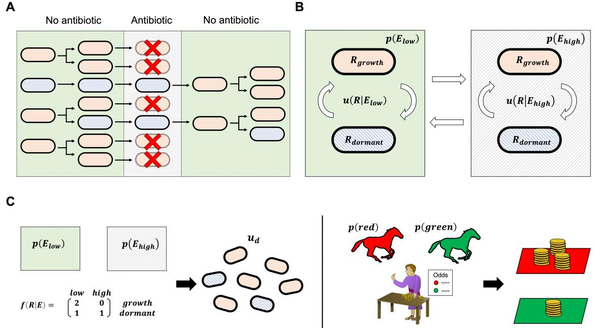

Figure 13.1: Bacterial persistence as an example of a cellular strategy to cope with uncertainty in environmental conditions. **A)** Cells in a genetically identical population can display one of two distinct phenotypes that are associated with growth (pink cells) or dormancy (blue cells) in the absence of antibiotics. Only the dormant cells survive (persist) when exposed to antibiotics, and can transition back to the growth phenotype so that the population as a whole resumes growth in the absence of antibiotic. **B)** In this simplified model of bacterial persistence, the strategy *u* over two responses (phenotypes) *R*growth*, R*dormant depends on environmental states *E*low and *E*high, corresponding to low and high levels of the antibiotic, respectively. The occurrence of the states *E*low and *E*high is governed by probabilities *p*(*E*low) and *p*(*E*high), respectively. **C)** The multiplicative rates *f*(*R*|*E*) associated with phenotypes *R*growth*, R*dormant depend on environmental conditions, so that *f*(*R*|*E*) can be represented in matrix form. The resulting optimal strategy *ud* corresponding to the fraction of dormant cells in the population in turn depends on the probabilities of the environmental state *E*. An analogy with Kelly betting is illustrated on the right-hand side, where the probabilities of a horse winning a race, the odds provided by a bookmaker and the optimal betting strategy are identified with *p*(*E*), *f*(*R*|*E*) and *u*(*R*|*E*), respectively, as displayed in Table [13.1.](#page-219-1)

of persisters is expected to depend critically on the probability to experience different environmental states. The terms of the analogy are presented in Table [13.1.](#page-219-1)

A pure bet-hedging strategy assumes the absence of any direct information on the current environmental state. Biologically, cells may sense signals or cues that encode varying degrees of information on their current environment. For instance, in some populations, a larger proportion of persisters is found in nutrient-poor environments compared to nutrient-rich, implying a direct relationship between shifts in environment and switches between phenotypes. These sensing or signaling mechanisms can come with associated costs however, imparted by the investment of cellular resources in, for example, the gene expression machinery. Thus, optimal cellular behavior in the face of uncertainty may be expected to involve a trade-off between stochastic (e.g., bet-hedging) and deterministic (e.g., signaling) mechanisms that balance benefit to cost in a manner that depends on evolutionary context. Other trade-offs may also exist regarding reward versus risk associated with a particular cellular strategy. Analogously, financial investors face trade-offs when using incomplete information on the current state of the market and developing an investment strategy based on the level of risk they are willing to incur.

<span id="page-219-1"></span>

| Biology                     | Gambling                         | Finance                   |
|-----------------------------|----------------------------------|---------------------------|
| Individual                  | Capital unit                     | Currency unit             |
| Environment p(E)            | Race results p(x)                | Market state              |
| –                           | Gambler                          | Investor                  |
| Phenotype decisions u(R)    | Bets b(x)                        | Investment strategy       |
| Multiplicative rate f(R, E) | Odds o(x)                        | Immediate return          |
| Environmental cue P(S E)    | Side information P(y x)          | Side information          |
| Population growth rate Λ    | Long-term return W               | Long-term return          |
| Extinction probability      | Probability of bankruptcy        | Probability of bankruptcy |
| 2<br>Growth rate variance σ | 2<br>Growth rate variance σ<br>W | Volatility                |
| Population size Nt          | Capital Ct                       | Capital                   |

Table 13.1: Analogy between bet-hedging in biological populations and diversification strategies in Kelly's gambling and finance. The common problem in each case is an uncertain environment that makes it impossible to anticipate which phenotype or investment is optimal for future growth. In finance, the "population" is constituted by the capital which is distributed across different options (different horses of a race or different stocks of a stock market). The main limitation of the analogy is that information is not processed centrally in biological populations but at the level of each individual, with therefore no equivalent to a gambler or investor. The notations are introduced in the main text for the biological problem and in Box 2 for the gambling problem.

## <span id="page-219-0"></span>**13.3 Modeling cells growing in uncertain environments**

We begin with a simple model of persistence before introducing a more general framework. This simple model assumes that bacterial cells experience an alternation of low and high antibiotics environments and can adopt two physiological states, growing or dormant (Fig. [13.1)](#page-218-0). The dormant cells are unable to replicate but persist in either high- or low-antibiotics environments while growing cells always divide when antibiotics are low in concentration but die when they are high. Mathematically, this is described by *f*(*R, E*), the number of descendants of a cell with phenotype *R* in environment *E*: *f*(*R* = dormant*, E* = low) = *f*(*R* = dormant*, E* = high) = 1, while *f*(*R* = growing*, E* = low) = 2 and *f*(*R* = growth*, E* = high) = 0. In absence of sensing mechanism, we consider that the fraction of dormant cells, *ud* ≡ *u*(*R* = dormant), is a fixed quantity that only possibly evolves on very long time scales. The population thus grows by a global factor *A*high = *f*(*R* = dormant*, E* = low)*ud* if the environment is high antibiotics and by a factor *A*low = *f*(*R* = dormant*, E* = low)*ud*+2*f*(*R* = growing*, E* = low)(1−*ud*) if it is low antibiotics. Finally, the environment fluctuates randomly, with a probability *pa* to have high antibiotics and a probability 1 − *pa* to have low antibiotics. Over a large number *T* of generations, a population therefore experiences in average *paT* periods of high antibiotics and (1 − *pa*)*T* periods of low antibiotics. As further explained below, the population size *NT* after *T* generation is hence expected to globally grow as *Nt* = (*A*high) *paT* (*A*low) (1−*pa*)*T N*0. This corresponds to an exponential growth (or decay) of the form *NT* = *e* Λ*T N*0 with a long-term growth rate Λ given by Λ = *pa* ln *ud* + (1 − *pa*) ln(*ud* + 2(1 − *ud*)).

Two bacterial populations which have different "strategies" *ud* will then have different growth rates Λ(*ud*). The optimal strategy which maximizes Λ(*ud*) is therefore when the probability *ud* to adopt the dormant state is

$$u_d = \begin{cases} 2p_a, & \text{if } 0 < p_a \le 1/2. \\ 1, & \text{if } 1/2 < p_a \le 1. \end{cases}$$

The interesting case is when *pa <* 1*/*2, otherwise antibiotics is so often high that the population cannot grow. In this case, we find that a limited fraction of the population should be in the dormant state and that this optimal fraction depends on the frequency *pa* at which high antibiotics occurs.

This example can be extended to an arbitrary number of environmental states *E* and phenotypic (response) states *R* and to the presence of cues collected from the environment. In general, the states and cues may take discrete (as in the above example) or continuous values. The "strategy" of a cell may then be described by its probability *u*(*R*) to adopt a particular phenotype *R*. This strategy depends on the environment if some signal *S* is perceived, in which case the strategy takes the form of a conditional probability *u*(*R*|*S*) satisfying

$$\sum_{R} u(R|S) = 1,\quad \text{with}\quad u(R|S) \ge 0$$

for each possible signal *S*. For the example of bacterial persistence, *u*(*R* = dormant|*S*) may be the fraction of cells adopting a dormant phenotype within the population of cells with intracellular antibiotics concentration *S*. The fraction of growing cells would then be given by *u*(*R* = growing|*S*) = 1 − *u*(*R* = dormant|*S*). By comparison, Figure [13.1B](#page-218-0) illustrates a model where *u*(*R*|*E*) depends directly on the environmental state *E*. In finance, *u*(*R*|*S*) would correspond to the fraction of the capital that an investor allocates to asset *R* when receiving incomplete information *S* on the current market state *E*. More generally, we may also consider that the probability to adopt a phenotype *Rt* at time *t* depends on the phenotype *Rt*−1 adopted at time *t* − 1 by the cell or its parent, which would be described by *u*(*Rt*|*S, Rt*−1) or *u*(*Rt*|*St, Rt*−1) to indicate that the signal *St* is obtained at time *t*.

The model also needs to specify the temporal dynamics of the environment and the relation between *S* and *E*. The simplest assumption is that successive environmental states are uncorrelated, and occur with probability *p*(*E*) and that signals are derived from a conditional probability *p*(*S*|*E*), as illustrated in Figure [13.1B](#page-218-0) where *p*(*S*|*E*) = *δ*(*S*|*E*) is equivalent to *S* ≡ *E*. This is sufficient to demonstrate bet-hedging or discuss the value of signaling and in the examples below we therefore make this simplifying assumption by default. More generally, to address issues of inheritance where *Rt* depend on *Rt*−1, we may assume a discrete-time Markov process where the state of the next environment depends only of the previous one, with transition probabilities *p*(*Et*|*Et*−1) where *Et* denotes the state of the environment at time *t* = 1*,* 2 *. . .* . Even more generally, we may also want to account for the feedback that the population exerts onto its environment and consider that *Et* depends on the size and composition of the population.

Finally, we need to specify the dynamics of the population itself. Between time points *t* and *t* + 1, a cell adopting phenotype *R* in the context of environment *Et* either dies or survives and may additionally produce offsprings. This is summarized by a quantity *f*(*R, Et*) ≥ 0 that indicates the mean number of descendants at time *t* + 1 of an individual with phenotype *R* in environment *Et* (possibly including the individual itself). Given that *u*(*R*|*St*) denotes the fraction of cells or probability of the organism adopting phenotype *R* based on sensed state *St*, a population is therefore expected to globally increase (or decrease) in size by a factor

$$A_t = \sum_{R} f(R, E_t) u(R|S_t) \tag{13.1}$$

that depends both on the strategy *u* and the current environmental state *Et*. This factor *At* is a stochastic variable as it depends on the stochastic variables *Et* and *St*. More explicitly, if *Nt* denotes the size of the population at time *t*, this size will increase or decrease to *Nt*+1 = *AtNt* at time *t* + 1 (in average). We can in this way account for the dynamics of population growth and then ask what is an "optimal" strategy *u*(*R*|*S*) that leads to, for example, the largest population size over a given time interval. Compared to the deterministic setting, however, this is not yet a well-formulated problem as the population size varies with time and therefore generally depends on the particular sequence of environments *E*0*, . . . , Et*, which is in turn stochastic. Thus, we need to extend the concept of optimality to the stochastic regime. We examine this question in the next section.

## <span id="page-220-0"></span>**13.4 Optimization in uncertain environments**

In the previous section, we used notation *At* to denote the fractional increase or decrease in population size given that strategy *u*(*R*|*St*) is adopted in environment *Et*. An alternate name for this quantity is the instantaneous growth rate. It follows from recursion that, given an initial population size of *N*0 at time *t* = 0, <span id="page-221-3"></span><span id="page-221-2"></span>**Mathematical details 13.A : Arithmetic versus geometric mean and logarithmic utility functions**

Additive random processes are governed by the law of large numbers: the sum of many random variables scales with their arithmetic mean. In finance and biology, returns are compounded and growth is a multiplicative process. This is fundamentally different: the typical outcome is no longer described by the arithmetic mean but by the geometric mean [\[535\]](#page-287-7). A simple example illustrates this difference. Imagine a succession of environments in which the population either doubles or is reduced by 2*/*3, with same probability. This corresponds formally to a population size increasing as *Nt* = *At . . . A*1*N*0 where *At* = 2 (doubling) with probability 1*/*2 and *At* = 1*/*3 (2*/*3 dying rate) with probability 1*/*2. The arithmetic mean is 7*/*6 which is *>* 1 and suggests that the population will grow. But as each outcome has the same probability, the typical growth over *t* generation is actually given by 2 *t/*2 (1*/*3)*t/*2 = *e t*Λ with Λ = (1*/*2) ln(2*/*3) which is *<* 0: the population will in fact most likely go extinct. Mathematically, taking the log turns the product into a sum to which the central limit theorem applies. More intuitively, the arithmetic mean is dominated by very rare events. Historically, the importance of the geometric mean for estimating risk was first understood by Daniel Bernoulli in the context of games [\[536,](#page-287-8) [537\]](#page-287-9). Later, it has been the subject of many debates in finance [\[536\]](#page-287-8), reflecting the fact that alternative *utility functions* over which to optimize may be more appropriate when considering a short temporal horizon or when accounting for different degrees of risks.

the population size at time *t* is given by

<span id="page-221-1"></span>
$$N_t = A_t A_{t-1} \cdots A_1 N_0 \tag{13.2}$$

where *At* depends on the environmental state *Et* and is therefore a stochastic variable when the environment varies stochastically. Here the choice of an objective criterion is fundamentally linked to the time scale at which growth is considered.

### <span id="page-221-0"></span>**13.4.1 Long-term versus short-term optimization**

At the shortest time scale, maximization of population growth over a single time step corresponds to adopting the distribution *u*(*R*|*St*) that maximizes the arithmetic mean E[*A*], where *A* denotes the random variable whose realization at time *t*is *At* (Box 1). This maximum is typically achieved by a population where all individuals adopt the same optimal phenotype – the phenotype *R* maximizing E[*f*(*R, Et*)*u*(*R*|*St*)] = P *E,S P*(*S*|*E*)*P*(*E*)*f*(*R, E*)*u*(*R*|*S*). In the example of persistent cells, this strategy would correspond to having all cells in a growing state if the most likely environment is an absence of antibiotics. This strategy is extremely risky if these growing cells cannot survive an episode of antibiotics, which would therefore lead to extinction of the population. Taking into account the rare but important events of high antibiotics concentration requires taking a long-term perspective. Remarkably, in the long-term the problem becomes effectively deterministic due to the law of large numbers. The best known example of a law of large number applies to the sum *A*1+· · ·+*At* of *t* random variables *Ai*, which almost certainly behaves as *t*E[*A*] as *t* → ∞. Here, the problem involves a *product* of random variables and a similar but different law of large number applies: the product *A*1 × · · · × *At* does not typically behave as (E[*A*])*t* but instead as exp(*t*E[ln *A*]) where E[ln *A*] is known as the (Box 1). This corresponds to the intuition that population size typically grows exponentially in the long run, *Nt* ∼ *e* Λ*tN*0, with a well-defined long-term growth rate

$$\Lambda = \mathbb{E}[\ln A] = \sum_{E,S} p(S|E)p(E)\ln\left(\sum_{R} f(R,E)u(R|S)\right),\tag{13.3}$$

that is predictable despite the stochasticity of the environment.

Biologically, therefore, maximizing the geometric mean is equivalent to maximizing the long-term growth rate of the population. This is the relevant measure of fitness in the long-term from an evolutionary point of view, because of two populations with growth rates Λ1 and Λ2, the one with Λ1 *>* Λ2 will almost certainly exponentially outnumber the other.

<span id="page-222-1"></span>The simple example of persistence that we introduced previously illustrates well how maximizing the longterm is different from optimizing the instantaneous growth rate. The arithmetic mean E[*A*] is indeed maximized by *ud* = 0 when *pa <* 1*/*2, which leads to certain extinction unless *pa* = 0. This remains true for general models including multiple environmental states and sensing that conveys information about the environment through conditional probability *p*(*S*|*E*). Using the long-term growth rate Λ as a measure of fitness, it is then possible to quantify the value of information *S* by comparing the optimal growth rate that can be achieved in presence of *S* to that in its absence. Remarkably, for special limits of the model, corresponding to Kelly's horse-race model (Box 2), this value is given by some of the same quantities that appear in Shannon's theory of communication (Box 3).

#### <span id="page-222-0"></span>**Mathematical details 13.B : Kelly's model**

In 1956, [\[538\]](#page-287-10) extended the work of on communication to the field of . This classic model has important implications for investment strategies in and beyond. In the context of biology, Kelly's paper led to a clarification of the notion of value of information which is described in Box 3.

Let us recall the basic elements of Kelly's horse race. The odds paid by the bookmaker when the horse *x* wins is o(*x*), and the probability for this to happen is p(*x*). A gambler can distribute his/her bets on the different horses, and b(*x*) is the fraction of the bet set on horse *x*. Thus, a *strategy* of the gambler is defined by a vector of bets **b** of *M* components b(*x*). At every race, the gambler invests his/her entire capital on all horses, so that P*M x*=1 b(*x*) = 1, always betting a non-zero amount on all horses. Since no bet is zero, there is a well-defined vector of the inverse of the odds paid by the bookmaker denoted **r**. When the odds are *fair*, the bookmaker does not keep any of the invested capital and as a result P*M x*=1 r(*x*) = 1.

At each time *t*, one horse, which we call *x*, wins with probability p(*x*). As a result, the capital at time *t* + 1 is updated according to *Ct*+1 = b*x* r*x Ct*. As explained previously, this multiplicative process is best studied by considering instead the log of the capital, log-cap(*t*) ≡ log *Ct*, which satisfies the assumptions of the law of large numbers when races are independent. In these conditions, log-cap(*t*) ≡ log *Ct* converges on long times towards the growth rate *W*(**b***,* **p**) where

$$W(\mathbf{b}, \mathbf{p}) = \sum_{x} \mathbf{p}(x) \log \mathbf{o}(x) \mathbf{b}(x). \tag{13.4}$$

This growth rate can be rewritten using an information theoretic measure between two probability distributions, **p** and **q**, called the Kullback-Leibler divergence and defined by

$$D_{\mathbb{KL}}(\mathbf{p}, \mathbf{q}) = \sum_{x} \mathbf{p}(x) \log \frac{\mathbf{p}(x)}{\mathbf{q}(x)}. \tag{13.5}$$

One can show that this quantity is a non-negative measure between the two probability distributions. With this notation, the growth rate can be rewritten as

$$W(\mathbf{b}, \mathbf{p}) = D_{\mathbb{KL}} \left( \mathbf{p} \| \mathbf{r} \right) - D_{\mathbb{KL}} \left( \mathbf{p} \| \mathbf{b} \right), \tag{13.6}$$

It follows from this equation that the strategy **b** ∗ = **p** is optimal. This strategy, known as Kelly's strategy or proportional betting, overtakes any other strategy in the long-term as illustrated in Fig. [13.2.](#page-223-1)

This formulation shows that the growth rate is the difference between the distance of the bookie's estimate from the true distribution and the distance of the gambler's estimate from the true distribution. Hence, the gambler makes money if they have a better knowledge of the winning probabilities than the bookie. The optimal long term growth rate is the positive quantity :

$$W^*(\mathbf{b}, \mathbf{p}) = D_{\mathbb{KL}}\left(\mathbf{b} \| \mathbf{r}\right). \tag{13.7}$$

Kelly's horse race model is formally a particular case of the model introduced in the main text when considering that one, and only one phenotype *R* = *R*(*E*) can grow in any given environment *E*, such that *f*(*R, E*) = *f*(*E*) if *R* = *R*(*E*) and 0 otherwise. Horses *x* may then be interpreted as both the environments *E* and their associated phenotypes *R*(*E*) so that *u*(*R*) = b(*x*) and *f*(*E*) = o(*x*). In biology, but also in finance where *R* is interpreted as an asset, there is generally no one-to-one correspondence between environments *E* and phenotypes *R* and multiple phenotypes (assets) may grow (have non-zero return) in any given environment. The optimal strategy is then no longer necessarily proportional betting as illustrated in the example of persistence presented in the main text and as also shown in Ref. [\[539\]](#page-287-11).

<span id="page-223-2"></span><span id="page-223-1"></span>

Figure 13.2: Evolution of the log-capital (left plot) or of the capital itself (right plot) as a function of the number of races for Kelly's optimal strategies (red curve) and for a non-optimal strategy (yellow curve). On left plot, the straight lines have the slope of the corresponding growth rate for each strategy. Note that the fluctuations in Kelly's strategy can in fact be quite large, when plotted in normal scale instead of log-scale.

<span id="page-223-3"></span>**Mathematical details 13.C : The value and cost of information for growing populations**

To see how uncertainty may be quantified by Shannon , first consider a model where *f*(*R, E*) is non-zero only for one phenotype *R* best adapted to each particular environment *E*(*R*). As seen in Box 2, the optimal strategy in the longterm is proportional betting, *u*(*R*(*E*)) = *p*(*E*). To quantify the cost of uncertainty, it must be compared to a situation where full information is available, in which case all the cells can systematically adopt the optimal phenotype, leading to an ideal growth rate Λ∗∗ = P *E p*(*E*) ln *f*(*R*(*E*)). The cost of uncertainty is Λ∗∗ −Λ∗ = − P*p*(*E*) ln *p*(*E*), which is nothing but the Shannon entropy of the environment *H*(*E*). This has a simple interpretation: the more unpredictable the environment, the larger its entropy and the lower the maximal growth rate of the population.

The reasoning can be extended to the presence of partial , modeled by *p*(*S*|*E*). The case of perfect information is indeed the limit case where *S* = *E*. The optimal strategy with partial information is a generalization of proportional betting that takes into account *S* and the difference of growth rate is now given by the mutual information *I*(*S, E*) (Problem [13.1)](#page-229-0). The mutual information is minimal when the signal *S* is uncorrelated to *E*, in which case *I*(*S, E*) = 0, and maximal in presence of perfect information, in which case *I*(*S, E*) = *H*(*E*) [\[540\]](#page-287-12).

These results were first derived by Kelly [\[538\]](#page-287-10). They have been generalized to more general forms of *f*(*R, E*) as well as to more general environmental processes in the context of financial investment in which case the cost of uncertainty and value of information are no longer equal but bounded by information theoretic quantities [\[540,](#page-287-12) [541\]](#page-287-13). This is illustrated in Problem [13.2](#page-229-1) with an extension of the model of persistence presented in the main text.

Information is generally costly as it implies producing and operating an accurate sensor, which may come at the expense of growth rate. Taking into account this cost introduces a trade-off between the cost and value of information that may justify an imperfect sensor, or even explain an absence of sensor (Problem [13.1)](#page-229-0). This trade-off has for instance been invoked to explains that bacteria subject to infrequent periods of antibiotics evolved to stochastically switch their phenotype rather than to sense the presence of antibiotics [\[542\]](#page-287-14).

While the problems of information processing in biology and in finance share many analogies, it is also important to recognize an important difference: in biology, information processing is distributed at the level of each cell, which may perceive different signals, while in finance, information is processed by an investor who centralizes the information. The value of information is bounded by information theoretic quantities only in the second case, or more generally when the same common information is available to all the cells [\[541\]](#page-287-13). If information processing is stochastic at the single cell level, the value of information is effectively higher (Problem [13.3)](#page-229-2).

## <span id="page-223-0"></span>**13.4.2 Trade-offs at intermediate time scales**

So far we considered two extreme limits of immediate and infinite time scales under one important assumption: the population is always large enough to escape extinction. Eq. [(13.2)](#page-221-1) is indeed valid only for large *Nt* and does not apply anymore when *Nt* ∼ 1, in which case the population size is subject to stochastic effects, called demographic noise in population biology. In our analogy with finance, the eventuality of *Nt* = 0 with no possible recovery corresponds to a risk of bankruptcy.

When considering long time scales, a population with Λ *>* 0 will either become extinct or grow exponentially. In this later case, demographic noise is eventually negligible and our approach valid. At intermediate time scales, however, population sizes *Nt* may deviate substantially from *N*0*e* Λ*t* predicted by exponential growth, and may become extinct (*Nt* = 0) as a result. To quantify these deviations, note that for the model defined in the main text where there are no correlations of the instantaneous growth rate *At*, the central limit theorem imposes that the quantity

<span id="page-224-0"></span>
$$
\Delta_t = \frac{1}{\sigma \sqrt{t}} \left( \log \frac{N_t}{N_0} - t\Lambda \right),
\tag{13.8}
$$

converges on long times towards a Gaussian distribution of unit variance, where *σ* is the standard deviation of the instantaneous growth rate. It follows from this property that

<span id="page-224-1"></span>
$$
\sigma^2 = \frac{1}{t} \text{Var}\left(\log\frac{N_t}{N_0}\right),
\tag{13.9}
$$

measures the deviation from exponential growth. This quantity is therefore a natural measure of risk, known in finance under the name of volatility. To understand at which time scale this risk is important, we consider Eq. [13.8,](#page-224-0) assuming ∆*t* is of the order one. Risk will be important, when the term associated with fluctuations, which is of the order of *σ* √ *t* will be larger than the term associated with exponential growth, which is *t*Λ. This will happen when *t* (*σ/*Λ)2 : the risk is relevant at intermediate time scales, long-enough for the central limit theorem to apply but not too long for deviations from exponential growth to become negligible.

This measure of risk has well known drawbacks in finance : it is symmetrical with respect to losses and gains, which does not conform to the intuitive notion of risk, and furthermore typical fluctuations are often non-Gaussian. Nevertheless, the volatility is still an important notion in the study of optimization of portfolios [\[543\]](#page-287-15). In this context, Markowitz introduced plots of the volatility *σ* as a function of the mean growth rate, which define the so-called "efficient frontier". This representation illustrates graphically a fundamental tradeoff that exists between the maximization of the mean return and the minimization of the variance (or risk). The point of zero volatility is a risk-free strategy, which corresponds to dormant states in biology.

This trade-off is naturally present in Kelly's model introduced in Box 2. Indeed, Kelly's strategy is based on the maximization of the long-term growth rate, but at intermediate times the capital can deviate significantly from the expected exponential growth as shown in Figure [13.2.](#page-223-1) Prominent economists, such as Samuelson, strongly opposed the use of Kelly's criterion in finance precisely for that reason [\[544\]](#page-287-16). In practice, however, investors can mitigate this risk by using Kelly's criterion for only a fraction of the bets [\[545\]](#page-288-0). The resulting strategy has reduced fluctuations, and at the same time, a reduced growth rate. Another consequence of the trade-off is that the risk near the optimal strategy (Kelly's strategy) can be reduced significantly provided one is ready to sacrifice a small amount of growth rate, an important lesson for gamblers and investors. In order to build systematically improved gambling strategies with a reasonable amount of risk in Kelly's model, one can introduce an objective function that is a linear combination of the growth rate with the volatility of Kelly' model, *σW* , weighted by a risk aversion parameter *α* [\[546\]](#page-288-1). The method is illustrated in Problem [13.4](#page-230-0) for the two-horse version of Kelly's model. By optimizing this objective function, one builds the Pareto diagram shown in Fig. [13.3](#page-225-0) when varying the parameter *α*.

A general inequality characterizes this trade-off mathematically for an arbitrary number of horses. For Kelly's gambling model with fair odds defined in the box [13.B,](#page-222-0) it has the form

$$
\sigma_W \ge \frac{W}{\sigma_q},
\tag{13.10}
$$

where *σW* is the volatility of Kelly's model, *W* the average growth rate (the equivalent of Λ) and *σq* is the standard deviation of a distribution, q(*x*) defined by q(*x*) = r(*x*)*/*p(*x*). This distribution compares the probability of races outcomes described by p(*x*) with the risk-free strategy described by b(*x*) = r(*x*), for which *σW* = *W* = 0 [\[546\]](#page-288-1). Recently, a similar bound has been derived for other well-known financial models such

<span id="page-225-0"></span>

Figure 13.3: Pareto diagram showing the growth rate *W* versus the fluctuations measured by the standard deviation of the growth rate *σW* (which is the volatility for this model) in the simple case that only two horses are present. The curve can be obtained by varying a risk aversion parameter *α*, which enters in the definition of an objective function (see Problem [13.4](#page-230-0) for details). The point of maximum growth rate (red square) corresponds to Kelly's strategy and divides a trade-off branch (blue solid line) from a non-trade-off branch (red solid line) (adapted from [\[546\]](#page-288-1)).

as the Black-Scholes and the Heston models [\[547\]](#page-288-2).

Let us now illustrate the implications of this trade-off for a biological population using a simple bet-hedging model with only two phenotypes. Individuals in the population can switch from phenotype *A* to phenotype *B* with a transition probability *π*1, and with probability *π*2 from *B* to *A*, assuming no sensing. The population grows in an environment that fluctuates between two values 1 and 2. We denote the population vector, which describes the number of individuals in each phenotype at a given time *t* by **N**(*t*) = (*NA*(*t*)*, NB*(*t*))*T* , where *T* denotes the transpose. The subpopulation of individuals with phenotype *A* grows when placed in the environment *i* with the growth rate *kAi*, while the other subpopulation with phenotype *B* grows with rate *kBi*. The population is assumed to be large, there is no population noise, the dynamics of the system is deterministic in each separate environment. The population dynamics of the model can be described by the vector equation :

$$\frac{d}{dt}\mathbf{N}(t) = M_{S(t)}\mathbf{N}(t),\tag{13.11}$$

with matrices

<span id="page-225-1"></span>
$$M_{S_1} = \begin{pmatrix} k_{A1} - \pi_1 & \pi_2 \\ \pi_1 & k_{B1} - \pi_2 \end{pmatrix} \text{ and } M_{S_2} = \begin{pmatrix} -\pi_1 + k_{A2} & \pi_2 \\ \pi_1 & k_{B2} - \pi_2 \end{pmatrix}. \tag{13.12}$$

The finite time averaged population growth rate is defined as

$$
\Lambda_t = \frac{1}{t} \ln \frac{N(t)}{N(0)},\tag{13.13}
$$

in terms of the total population *N*(*t*) = *NA*(*t*) + *NB*(*t*), and the long term population growth rate is

$$\Lambda = \lim_{t \to \infty} \Lambda_t. \tag{13.14}$$

This optimal long term growth rate Λ can be obtained analytically in this model [\[548\]](#page-288-3), but approximations are needed to evaluate the fluctuations of the growth rate, which is the equivalent of the volatility *σ* 2 of Eq. [13.9](#page-224-1) [\[549\]](#page-288-4). One can then study the trade-off that exists between the average growth of the population (either measured instantaneously or over a long time) and the fluctuations of the growth rate, using the same Pareto plot used for Kelly's model in Figure [13.3.](#page-225-0) This "efficient frontier" is shown in Fig. [13.4,](#page-226-1) and as

<span id="page-226-2"></span><span id="page-226-1"></span>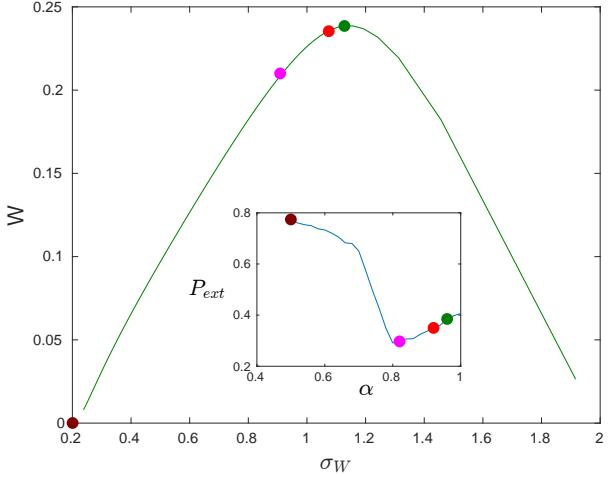

Figure 13.4: Pareto diagram showing the population growth rate versus the fluctuations of that growth rate in a simple model of a biological population evolving in a stochastic environment with no sensing according to Eq. [13.11](#page-225-1) [\[549\]](#page-288-4). In this figure, the time scale of environment fluctuations is comparable to that of phenotypic fluctuations. The inset shows the probability *Pext* that the population goes below a certain extinction level versus the risk aversion parameter *α* which measures the distance along the Pareto plot. Colored bullets represent different points on the Pareto front (adapted from [\[549\]](#page-288-4)).

in the case of Kelly's model, in the region of fast growth rate, it is advantageous for a population to trade growth for less risky fluctuations. In this model, *σ* 2 correlates with the probability that the population *N*(*t*) goes below a certain threshold, where the population is considered as extinct. The probability of extinction is not monotonic along the Pareto front, which explains why in the region of low growth rate, it is more advantageous to prioritize instead the increase the growth rate to avoid extinction.

In the context of ecology, besides the probability of extinction, a quantity of interest is the chance for a population to grow from rarity in the presence of other species. In agreement with the above trade-off, it was found that this chance can not be predicted only from the mean growth rate, and that the mean growth rate and its variance should be both used for such a prediction [\[550\]](#page-288-5). In summary, the similarity of the Pareto plots (called efficient frontier in finance) obtained in Kelly's model and in models of biological populations in fluctuating environments [\[549\]](#page-288-4), and evidences from various works in ecology, suggest that the trade-off discussed here is broadly applicable in various fields ranging from biology and ecology to economics.

## <span id="page-226-0"></span>**13.5 Strategies in correlated environments**

So far we considered two time scales: the time scale at which phenotypic changes occur and at which instantaneous growth is defined (*t* = 1 in our discrete-time model, which may be taken to correspond to one generation), and the longer time scale *t* ∼ (*σ/*Λ)2 beyond which population growth is effectively exponential, with growth rate Λ. We saw that the choice of an optimization criterion depends fundamentally on the time horizon relative to these time scales.

Additional time scales are relevant when environmental states are correlated in time, for instance through a Markov chain *P*(*Et*|*Et*−1). This is for instance the case if conditions of high nutrient or high stress extend over several generations. As a consequence, strategies *u*(*Rt*|*St, Rt*−1) that depend on past internal states *Rt*−1 in addition or instead of externally driven signals *St* may become valuable, since the fact that phenotype *Rt*−1 survived in environment *Et*−1 indirectly carries information on the current environment *Et*. We may then recognize that *Rt* plays two distinct roles: on one hand, it determines survival and growth via *f*(*Rt, Et*) and, on the other, it provides information to determine the next state *Rt*+1 via *u*(*Rt*+1|*St*+1*, Rt*). This corresponds to the fundamental distinction between phenotype and genotype in biology: the genotype *γ* is what

<span id="page-227-0"></span>

Figure 13.5: Example of optimal strategies in correlated environments. (A) We consider here a model where the environment *Et* is a continuous variable following a Gaussian process, *P*(*Et*|*Et*−1) = exp −(*Et* − *aEt*−1) 2 */*(2*σ* 2 *X*) */*(2*πσ*2 *X*) 1*/*2 with two parameters *a* and *σ* 2 *X* that control the overall amplitude of the fluctuations *σ* 2 *E* = *σ* 2 *X/*(1 − *a* 2 ) and their time scales *τE* = −1*/* ln *a*, as illustrated by the different time series. (B) An individual inherits a genotype *γt*−1 which determines its phenotype *φt* with probability *d*(*φt*|*γt*−1) = exp −(*φt* − *γt*−1) 2 */*(2*σ* 2 *D*) */*(2*πσ*2 *D*) 1*/*2 where *σ* 2 *D* thus represents phenotypic noise. *γt*−1 also determines the genotype *γt* of the progeny with probability *h*(*γt*|*γt*−1) = exp −(*γt* − *γt*−1) 2 */*(2*σ* 2 *M*) */*(2*πσ*2 *M*) 1*/*2 where *σ* 2 *M* thus represents mutational noise. The number *ξ* of offsprings is a random variable whose mean *f*(*φt, Et*) = *k* exp −(*φt* − *Et*) 2 */*2 depends on the phenotype *φt* as well as the current state *Et* of the environment. A population of such individuals grows with a long-term growth rate Λ that can be computed analytically [\[551\]](#page-288-6). (C) Values of *σ* 2 *D* and *σ* 2 *M* that optimize Λ define four phases as a function of the environmental parameters *τE* and *σ* 2 *E*. For nearly constant environments, the optimal strategy is to maintain constant phenotypes (*σ* 2 *D* = 0) and genotypes (*σ* 2 *M* = 0) ("no variation"). For strongly varying but poorly correlated environments, the optimal strategy is to introduce phenotypic variations (*σ* 2 *D >* 0) but no genotypic mutations (*σ* 2 *M >* 0) ("phenotypic switching"). For highly correlated environments, the optimal strategy is instead to introduce genotypic mutations (*σ* 2 *M >* 0) while canalizing the phenopype (*σ* 2 *D* = 0) ("inherited variations"). A phase also exists where both types of variations are beneficial ("mixed"). This model thus identifies environmental variations for which bet-hedging (phenotypic switching) is expected to evolve, namely variations of environmental of sufficient amplitude but with limited temporal correlations across generations.

is transmitted from one generation to the next while the phenotype *φ* is what determines instantaneous growth. Formally, *Rt* = (*φt, γt*) with *f*(*Rt, Et*) = *f*(*φt, Et*) and *u*(*Rt*|*St, Rt*−1) = *u*(*Rt*|*St, γt*−1), by definition of *φt* and *γt*. The "central dogma" of molecular biology states that information flows from the genotype to the phenotype but not reciprocally, which corresponds here to assuming that *u*(*φt, γt*|*γt*−1) factorizes as *d*(*φt*|*St, γt*−1)*h*(*γt*|*γt*−1), where *d*(*φt*|*St, γt*−1) may be interpreted as a developmental kernel and *h*(*γt*|*γt*−1) as an inheritance kernel, with no dependence on *St* (no Lamarckism). The mathematical framework that we introduced can be used to study to which extent this particular decomposition is indeed a good "strategy" [\[551\]](#page-288-6). The answer generally depends on the nature and amplitude of the environmental fluctuations.

Similarly, the model can be analyzed to understand the conditions under which it is advantageous to introduce phenotypic variations that are not transmitted – as in bet-hedging – versus genotypic variations that are transmitted – as with genetic mutations. Stochasticity may indeed be introduced either in the mapping from *γt*−1 to *φt* or the mapping from *γt*−1 to *γt*, or in both of them – a problem with no equivalent in finance. This is illustrated in Fig. [13.5](#page-227-0) with a simple solvable model showing how the optimal strategy depends on the nature of the fluctuations of the environment. In particular, bet-hedging strategies where stochasticity is purely phenotypic are found to be optimal for environmental fluctuations of sufficient large amplitude but low temporal correlations from one generation to the next.

Historically, the notions of genotype and phenotype were introduced much before the molecular mecha-

nisms that underlie them were uncovered. In general, the genotype, defined as inherited information, should not be confused with the notion of genetic information: along with DNA, a range of epigenetic states, including metabolic states, are also transmitted from cell to cell which represent genotypic information. In other words, the physiological state of a cell, which we analyzed in most of this book from the standpoint of a phenotype determining current growth, may also represent valuable genotypic information for future generations.

## <span id="page-228-0"></span>**13.6 Concluding remarks**

We presented optimal strategies that biological populations may exploit for coping with uncertain environments and drew analogies with problems of gambling and financial investments. Optimality assumes a measure of performance which, however, is not readily defined when environments are changing stochastically. In particular, the time scale over which the problem is considered is critical. This difficulty has led to multiple debates over the concept of fitness in biology which partly mirror those over the concept of utility in economics.

While the analogy with finance is instructive, its limitations should also be kept in mind. Most importantly, the states that individuals of a biological population adopt are not centrally controlled by a gambler or an investor. This raises a question that is absent in finance but central in evolutionary biology: is a strategy that is optimal for the population but detrimental to some of its members – as for instance the persister cells that "sacrifice" their current growth for the sake of future growth – evolutionary stable? A strategy that is optimal for a population may indeed never be achieved through evolution as natural selection at the individual level may favor non-cooperating individuals – an issue known as a "conflict between levels of selection" which implies that a strategy may be optimal at the population level but not evolutionarily stable. To address this question, we may extend our model to treat strategies as variables that are themselves subject to evolution (Problem [13.5)](#page-230-1). For the model discussed in this chapter, the results show that strategies that optimize the long-term growth rate are indeed evolutionarily stable (but this is no longer necessarily the case when considering, for instance, sexually reproducing populations [\[552\]](#page-288-7)).

The same extension of the model to evolving strategies shows that knowledge of the statistics of the environment (*pd* for our example) is not required a priori but can effectively be learned through an evolutionary process. This solves a problem that appears also in gambling and finance where the statistics of the environment must be inferred from past experience. The question has been particularly studied in finance, where optimal learning strategies known as universal portfolios have been proposed [\[553\]](#page-288-8). In the simpler case of Kelly's model, the gambler may for instance record previous race results and use them together with Bayesian inference to predict the probability of the race outcomes [\[554\]](#page-288-9). With biological populations, however, learning must be performed at the individual level. One theoretical proposal that goes beyond random mutations is for instance that biological populations may use a reinforcement mechanism akin to Hebb's rule in neural learning [\[555\]](#page-288-10).

Finally, we note that the models that we presented rely on a strongly simplifying assumption: the environmental changes occur independently of the population. In fact, the environment is often also changing as the population grows, for instance through the consumption of nutrients. Even more generally, the environment may comprise other individuals from the same or other populations with which they may interact. This ecological dimension is the subject of other chapters.

## **Recommended readings**

**Persistence** This reference describes the phenomenon of bacterial persistence. Nathalie Q Balaban, Jack Merrin, Remy Chait, Lukasz Kowalik, and Stanislas Leibler. Bacterial persistence as a phenotypic switch. Science, 305(5690):1622–1625, 2004. doi: 10.1126/science.1099390

**Information theory for decision making under uncertainty** This book is a classic text on the use of information theory in problems from finance. Thomas M. Cover and Joy A. Thomas. Elements of Information Theory. John Wiley & Sons, Hoboken, 2005. doi: 10.1002/047174882X

**Model for information sensing** The Kussel-Leibler model is one of the first to incorporate information theory into cellular behavior and signaling. Edo Kussell and Stanislas Leibler. Ecology: Phenotypic diversity, population growth, and information in fluctuating environments. Science, 309(5743):2075–2078, 2005. ISSN 00368075. doi: 10.1126/science.1114383.

## **Problems**

<span id="page-229-0"></span>**Problem 13.1 Kelly strategy with partial information** In analogy with Kelly's problem of betting on horse races, assume that different environments *E* occur with independent probabilities *p*(*E*) at each generation with a single phenotype *R* = *E* permitting growth by a factor *f*(*E*). In absence of any information, the optimal strategy *u*(*E*) for long-term growth is proportional betting, *u*(*E*) = *p*(*E*) (Box 2). Now assume that an information *S* is available to each member of the population that relates to *E* through a transition probability *q*(*S*|*E*), i.e., *q*(*S*|*E*) is the probability of perceiving *S* given *E*.

- 1. Show that the long-term growth rate can be written in the form

$$\Lambda = \sum_{S} p(S) \left[ \sum_{E} p(E|S) \ln(f(E)u(E|S)) \right] \tag{13.15}$$

where *p*(*S*) is the probability to perceive *S* averaged across all environments and *p*(*E*|*S*) is the probability that environment is *E* given that *S* is perceived. Write *p*(*E*|*S*) as a function of *p*(*E*) and *q*(*S*|*E*).

- 2. Justify that the optimal strategy is *u*(*E*|*S*) = *p*(*E*|*S*).
- 3. Compare the optimal long-term growth rate in presence of information to the optimal growth rate in absence of information and show that the difference is given by the mutual information

$$I(E, S) = \sum_{E, S} q(S|E)p(E) \ln \frac{q(S|E)}{p(S)}\tag{13.16}$$

The mutual information *I*(*E, S*) therefore quantifies the value of information *S* in this particular context.

- 4. Acquiring information is generally costly. If the presence of the information channel *q*(*S*|*E*) reduces the long-term growth rate by *c*, what are the conditions on *p*(*E*) for the presence of this channel to be beneficial?
- 5. The cost *c* may be expected to depend on the precision of the sensor. Consider for instance a channel that reveals the correct environment with probability 1 − and otherwise does not reveal anything (so-called erasure channel). Given a cost *c*() that increases when decreases, which value of provides an optimal trade-off between the value and the cost of information?

<span id="page-229-1"></span>**Problem 13.2 Value of information beyond Kelly's model** Consider the model of bacterial persistence introduced in the main text where cells can adopt two phenotypes, one growing irrespectively of the environment and the other growing only in absence of antibiotics.

- 1. Express the long-term growth rate Λ in presence of an information *S* modeled by an information channel *q*(*S*|*E*).
- 2. What is the optimal strategy given *S*?
- 3. Show by comparing to a situation with no information that the value of information can be strictly lower than *I*(*S, E*).

<span id="page-229-2"></span>**Problem 13.3 Stochastic sensing at the level of individual cells** In the two previous problems, the information *S* is assumed to be common to each member of the population. Here we assume instead that each

### Concluding remarks 221

individual has its own sensor *q*(*S*|*E*) so that *S* may differ from one individual to the next.

- 1. Justify that in this case the long-term growth rate takes the form

$$\Lambda = \sum_{E} p(E) \ln \left( \sum_{R,S} f(R,E) u(R|S) q(S|E) \right) \tag{13.17}$$

- 2. Use the concavity of the logarithm (Jensen's inequality) to justify that the same information channel *q*(*S*|*E*) has more value at the individual level than at the population level.
<span id="page-230-0"></span>**Problem 13.4 Pareto front for Kelly's model** Let us consider Kelly's model with fair odds for two horses. Let the probability that the first horse wins be *p*, the bet and the odd on the first horse be *b* and 1*/r*.

- 1. Write the expression of the mean growth rate h*W*i, and of the volatility *σW* for this problem. Show that there is a risk free strategy when *b* = *r*. One introduces the objective function

$$J = \alpha \langle W \rangle - (1 - \alpha) \sigma_W. \tag{13.18}$$

- 2. From the optimization of *J* show that the optimal strategy has the two branches shown in Fig. [13.3.](#page-225-0) Show that the optimal bets on these two branches are of the form *b* ± = *p* ± *γσ*, where *γ* = (1 − *α*)*/α* and *σ* = p *p*(1 − *p*).
- 3. Show that the slope of the Pareto border has the form

$$\frac{d\sigma_W}{d\langle W\rangle} = \frac{\sigma}{p-b}.\tag{13.19}$$

What happens to this slope near Kelly's point and near the risk free strategy ?

### <span id="page-230-1"></span>**Problem 13.5 Evolution of an optimal strategy** Here we consider evolving the strategy itself.

- 1. Implement numerically the model of bacterial persistence introduced in the main text for a large but finite population. To this end, consider *N* individuals (e.g., *N* = 1000), each with an attribute *R*. For each individual, draw a random number *ξ* of descendants, with mean *f*(*R, Et*) where *Et* drawn from *P*(*E*) is common to all individuals. Assign a *R* to each of these descendants with probability *u*(*R*). If the total number of descendants *Nt* is non-zero, record the ratio *Nt/N* and re-sample at random the population to bring back its size to *N*. Show that provided that *N* is large enough and *Nt* does not reach 0 then ( P *t* ln(*Nt/N*))*/t* provides a good approximation to the growth rate Λ in the limit of large *t*.
- 2. Extend the model to make *udu*(*R* = dormant) an attribute of each individual. Assume that *ud* is transmitted from one parent to one of its offspring as *ud* = min(1*,* max(0*, ud* + *µ*)) where *µ* is normally distributed with variance *σ* 2 *M*. Show that provided that *σ* 2 *M* is small enough, the distribution of *ud* evolves to be centered around the optimal *ud*.

# <span id="page-232-0"></span>**Chapter 14**

# **Economy of organ shapes and function**

Christophe Goupil, Éric Herbert, Cyril Karamaoun, Benjamin Mauroy and Frédérique Noël

### **Chapter overview**

- The central concept of economy presented in the previous chapters are extended to the level of the organ and the living organisms.
- The development of organs in pluricellular living beings is constrained by several requirements. Nutrients, energy and form are few examples of developmental constraints that are analyzed, in the point of view of the economy of the organ function.
- In mammals, the respiratory system is submitted to a high level of constraints, mainly energetic and morphometric, that did shape the lung through evolutionary processes.
- The lung is the central organ of respiration, connecting the outer atmosphere to the cellular compartment through the ventilation process.
- We show that the constraints on this major organ imply a high level of complexity of the organ's shape and a precise control of the ventilation.
- The control of growth and shape of the lung is highlighted by previous works on the scaling laws that exist and govern the development and function of this organ throughout the entire mammal class.
- Through several examples, we demonstrate how these scaling i.e., *allometric* laws control the ventilation, and the respiratory processes in general.

## <span id="page-232-1"></span>**14.1 Optimization of organs and systems**

In the previous chapters, the central model of the cell has been deeply explored. On another scale, the integration of cells into larger structures such as tissues, organs, and entire systems in multicellular organisms requires an extension of the main concepts presented in this book. Nevertheless, the completion of the multiple functions of an organ follows the same general principles as for individual cells, including the economic aspects.

## <span id="page-232-2"></span>**14.1.1 Organs and constraints**

The way that a cell population aggregates itself into a high-level structure, as part of a pluricellular organism, has been determined through evolutionary processes, following a more general path of specialization of <span id="page-233-1"></span>structures and functions. Each organ evolved to fulfill its functions in the most optimized manner. This observation leads us to interrogate the concept of optimization for such a large structure – from a cellular point of view. In the context of organ function, optimization can be defined through the processes by which the functions are fulfilled as best as possible while minimizing the associated cost variables. Among those variables, energy plays a central role. Thus, one possibility for constraining the organ would be to maintain its function at an optimal level while minimizing its cost in energy. This effect can be expressed mathematically. Let us define the cost in energy E which depends on one or more variables *x* ∈ R *n* (*n* > 1). Furthermore, let us define one or more equality constraints to our problem, *c*(*x*) = 0, where *c* : R *n* → R *m*. The optimization problem under constraints comes down to finding an optimal value for *x* that minimizes the function E(*x*) while *x* satisfies *c*(*x*) = 0. This results in

<span id="page-233-0"></span>
$$\min_{x \in \mathbb{R}^n} \mathcal{E}(x), \text{ \textbf{succ} \,\mathsf{that} \,\mathsf{that} \,\mathsf{c}(x) = 0. \tag{14.1}$$

The optimization under constraint problem can be solved using the Lagrangian function,

$$
\mathcal{L}(x, \lambda) = \mathcal{E}(x) - \sum_{k=1}^{m} \lambda_k c_k(x),
$$

where the *λk* are Lagrange multipliers. Indeed, if we assume that *x*∗ is the optimal solution to the problem [(14.1)](#page-233-0), then thanks to the Lagrange multiplier theorem, there exists a unique Lagrange multiplier *λ*∗ such that,

$$
\nabla \mathcal{E}(x_\star) = \lambda_\star^T J_e(x_\star),
$$

where *Jc* is the Jacobian of the function *c*. It implies that the optimal solution *x*∗ is a stationary point of L, satisfying the condition of minimal energy expenditure.

A study of the constraints on the cardiac system offers an excellent example of energy optimization, due to high consumption of the heart. The cardiac pump delivers deoxygenated blood to the lung through pulmonary circulation and brings oxygenated blood to the whole body through systemic circulation [\[556\]](#page-288-11). Interestingly, blood pressure developed in both ventricles are not of the same order of magnitude, with a left ventricular pressure approximately ten times larger than the right ventricular one [\[556\]](#page-288-11). This makes sense from an energetic point of view; the heart requires a non-negligible amount of energy to fulfill its role of blood pumping. Furthermore, as with any mechanical system, only a fraction of the energy consumed (mainly in the form of ATP) is converted in mechanical work – around 25% [\[557\]](#page-288-12), the rest being dissipated as heat. Thus, the pumping work tends to be optimized from an energy consumption point of view. On one hand, the pressure needed to irrigate the pulmonary circulation is low; the lung presents a small value of resistance to perfusion, and its apex is located only centimeters above the heart position. And on the other hand, the pressure developed in the systemic circulation must allow the oxygenated blood to irrigate all the organs, including high-energy consumers – muscles, brain – that located further above heart position, developing a hydrostatic pressure that the blood flow has to overcome [\[556\]](#page-288-11). It is to be noted that this energetic optimization is also connected to the metabolism requirements, with a pumping work closely related to the body's O2 consumption [\[558\]](#page-288-13), which ensures an optimized adaptation of the cardiac output to the body energy requirements.

Although often considered as a major aspect, this energetic constraint is far from being the only condition for a proper functioning of the organ. Other variables such as nutrient consumption, metabolic integration or physical constraints participate in shaping the organ function. Brain development in primates, and humans especially, is a prime example of effect that combination of several constraints has on energetic and nutrients availability. The underlying mechanisms that determine the evolution towards a large and complex brain structure in humans are still debated [\[559,](#page-288-14) [560\]](#page-288-15). However, it is evident that the development and normal function of this organ is dependent on adequate and specific energetic and nutrients inputs. From the energetic point of view, brain metabolism largely depends on glucose consumption. However, in case of high <span id="page-234-2"></span>consumption and/or deprivation, ketones metabolism takes place in order to furnish a fast and rich source of energy for the organ. Ketones are catabolized mainly in the liver [\[561\]](#page-288-16), and have the important property of being able to cross the blood-brain barrier, to the contrary of long chains of saturated fatty acids [\[562\]](#page-289-0). In parallel, proper brain development and function require a large input of specific nutrients that are not common in every food source [\[563\]](#page-289-1). Among those, iodine [\[564\]](#page-289-2) and iron [\[565\]](#page-289-3) appear to be essential for the brain, and exert a strong constraint on its adequate growth and functioning. The notable presence of iodine-enriched food sources close to the sea shores, compared to traditional terrestrial food sources, is thought to have favored the recent development of the so-called *shore-based paradigm* of human brain evolution i.e., that the access to seafood produce supported and enhanced brain development in early hominid populations, leading to increased brain mass and cognitive functions in those populations [\[563\]](#page-289-1). Among these considerations, let us remind that any organ has to develop and function in specific localization and body environment. Thus, the constraints applied to an organ and its development and function can also be of morphometric nature.

### <span id="page-234-0"></span>**14.1.2 Energy conversion in living systems**

When energy is transferred to a system, its response manifests itself at the microscopic level by the excitation of its individual degrees of freedom, and at the global level when collective excitations are possible. In generic terms, a thermodynamic machine is defined as a system where an incident energy flow *dispersed* is converted into an energy flow *aggregated* and a loss flow. This conversion is performed by a thermodynamic *working fluid* which, carrying entropy, leads to a coupling between the respective potentials through the equations of state.

In the case of thermal machines, the dispersed form of energy is called heat and its associated potential is temperature, while the aggregated form is called work and its associated potential is, for example, pressure. Temperature and pressure are linked by one or more equations of state. The system response results from the collective response of the microscopic degrees of freedom of the working fluid. Thus, part of the energy received by the working fluid can be made available to a load on a global, and possibly macroscopic, scale for a given purpose as useful work, the remainder being redistributed (dispersed) at the microscopic level and dissipated due to internal friction and any other dispersion processes imposed by the boundary conditions [\[566\]](#page-289-4). Conversion efficiency is therefore closely related to the proportion of energy allocated to the system's collective modes.

Living organisms are open, out-of-equilibrium and dissipative systems, as they continuously exchange energy and matter with their environment [\[567,](#page-289-5) [568\]](#page-289-6). Unlike classical thermodynamic engines, for which equilibrium models can be constructed using extremal principles, such a possibility does not exist in the case of living organisms due to the absence of truly identifiable equilibrium states and the absence of principle for nonequilibrium systems. Nevertheless, assuming a global system close to equilibrium, the development of a tractable thermodynamic model of metabolism can be based on notions from classical equilibrium thermodynamics. In this approach, the working fluid acts as a conversion medium, characterized by its thermoelastic properties, or chemicoelastic coefficient for chemical systems.

## <span id="page-234-1"></span>**14.1.3 The example of the lung**

As an example of an organ submitted to geometric limitations, the lung has to face, from its early development to its mature state, multiple constraints on its morphometry and proper functioning. The principal role of this organ is, as well known, to establish the connection between the respiratory gases in the atmosphere and these in circulation in the body i.e., O2 as a reactive agent, and CO2 as a by-product that has to be eliminated from the organism. To fulfill its role, the lung has evolved in a manner that maximizes the gas exchange surface – as diffusion is a surface phenomenon – in a reduced thoracic volume. This surface-tovolume requirement has forged the lung structure has it is known; an intricate dichotomic bronchial tree that conducts the air inwards and outwards, to and from the alveolar sacs, respectively. This semi-fractal, spacefilling structure, presents the advantages of an extremely wide exchange surface enclosed in a relatively small

### <span id="page-235-0"></span>volume [\[556\]](#page-288-11).

The mechanisms of development of the lung branching structure in a closed environment is still a debated question [\[569,](#page-289-7) [570\]](#page-289-8). Indeed, the tree structure presents a series of specific characteristics necessary for a proper functioning of the organ. Among these, the space-filling aspect of the bronchial tree is remarkable, as it solves the problem of the surface-to-volume constraint of the organ. In addition, the whole bronchial tree is a self-avoiding structure, as no bronchus enters in contact with other ones in its local environment, which ensures a proper circulation of the air in the structure. It is striking that these properties, which can be found in fractal geometries, are observed in any well-functioning lung structure, leading to important developmental questionings. For example, the pattern of branching of the bronchi, although strongly stereotyped in the first generations starting from the trachea, appears to follow a space-filling procedural development rather than a deterministic branching pattern [\[569,](#page-289-7) [571,](#page-289-9) [572\]](#page-289-10). Accordingly, some authors have developed a set of hypotheses that tend to explain these mechanisms. A group of restricted genes would encode the steps of branching and growth of the bronchi during the organ development, ensuring a proper structure of the adult lung [\[570\]](#page-289-8), following procedural steps somehow encoded in genes or groups of genes coding for periodicity, bifurcating and rotating routines [\[573\]](#page-289-11). However, to the best of our knowledge, these genes have not been determined nor a proper molecular mechanism of stereotypical branching.

Among the questions raised by the *programmed morphogenesis* approach, the link between the molecular dimensions and the organ world are still elusive. Another path for branching procedure, which could reconcile the deterministic point of view with the problem of the transfer of information along different orders of magnitude is the *self-organized morphogenesis* approach. Several authors [\[569,](#page-289-7) [574,](#page-289-12) [575\]](#page-289-13) suggested that the branching routine of the bronchial tree is less stereotyped than thought, especially in the central and distal generations. This hypothesis is supported by the observation that modeling approaches using stochastic space-filling routines, constructed based on a stereotyped proximal tree, are capable of generating tri-dimensional branched structures that satisfy the constraints of a morphometric adult lung [\[576,](#page-289-14) [577\]](#page-290-0). On another side, the core concept of the *self-organized morphogenesis* approach relies on the observation that key molecular components are necessary and sufficient for proper growth and branching of the bronchial epithelium. Among these, the fibroblast growth factor 10 encoded by the *fgf10* gene has been demonstrated to play a central role in epithelial proliferation [\[578\]](#page-290-1), whose activity is highly regulated [\[569,](#page-289-7) [579\]](#page-290-2).

In 2012, Clément et al. [\[569\]](#page-289-7) proposed a scenario for the spontaneous emergence of a tree structure. This scenario is based on the sole diffusion of a protein promoting cell proliferation, such as FGF10, in an environment with two layers that mimic the bronchial epithelium and the lung mesothelium.In addition, the layers present a resistance to folding and are growing as a function of the received flow of proteins.This scenario forms a model for the lung development and has been studied using mathematical and numerical tools. To mimic the diffusion process from the outer layer of the organ (mesothelium) to the inner layer (bronchial epithelium), Clément et al. solved the Laplace equation applied on the protein concentration *c*:

4*c* = 0

Then, they considered that each layer was growing according to a function of the local protein gradient:

*d***x** *dt* = *fm* (||∇*c*(**x**)||) for **x** in the mesothelium *d***x** *dt* = *fe* (||∇*c*(**x**)||) for **x** in the bronchial epithelium

The functions *fm* and *fe* are increasing functions, typically with a sigmoid shape. To avoid the epithelium to catch up with the mesothelium, *fe* is kept smaller than *fm*. A smoothing of the layers based on a fixed characteristic size is then performed in order to mimic the layers resistance to folding. With this model, Clément et al. observed the spontaneous formation of branching patterns similar to those observed during bronchial development, as depicted in Figure [14.1](#page-236-2) and, based on an extended model, in Figure [14.2.](#page-237-1) Hence, this compact modeling approach is sufficient for observing *de novo* branching and growth patterns in a simulated tissular environment. Since then, this *self-organized morphogenesis* approach has been used as a framework

<span id="page-236-2"></span>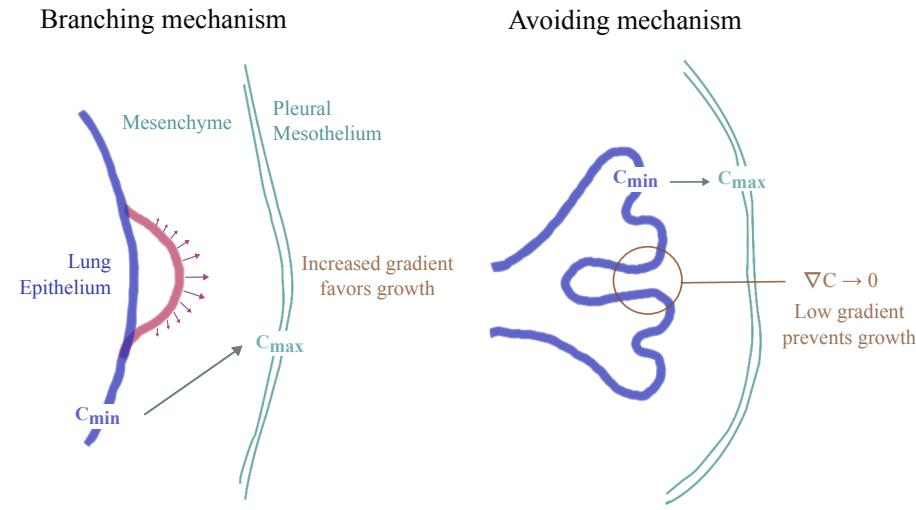

Figure 14.1: Proposed mechanism for the morphogenesis of biological branched structures. In this approach, the gradient of concentration of a key molecular activator guides the growth of specific tissue layer through the activation of the associated receptor. In this example, the local gradient of concentration of FGF10 (black arrows) activates the budding of the epithelium layer (*branching mechanism* – left). As the tissue curvature flattens, the local concentration vanishes and the growth stops, preventing the tissue overlap (*avoiding mechanism* – right) [\[569\]](#page-289-7).

for other organs [\[580\]](#page-290-3) and other branched systems [\[581\]](#page-290-4). To date, the question of the mechanisms of development of branching organs is not clearly elucidated. However, the link between the molecular and cellular components requires further investigation, in order to unveil the determinants at the scale of the tissues and organs.

### <span id="page-236-3"></span>**Philosophical remarks 14.A : The origin of shape?**

How growth and organ specialization define the shape and structure of the mature organ is a long-debated scientific question, which has not unveiled all its secrets and mysteries, as we will discuss in Section [14.3.](#page-242-0)

However, these examples of constrained organ development raises several issues that need to be discussed in details. Among these, one can notice that the shape of the system appears as central in the developmental considerations, especially under constraints.

In the next section, the respiratory system, and the lung as its central organ, will be studied in details in light of the concepts of organ optimization. Indeed, the lung, its structure, its functioning, its efficiency, are all the result of a series of optimization under constraints that shaped the organ through evolution.

## <span id="page-236-0"></span>**14.2 The lung as a model organ for optimization under constraints**

At the core of the respiration process, the lung is the organ that connects the ambient air to the blood, allowing to transport oxygen from the ambient air to blood and carbon dioxide from blood to the ambient air. The needs of the body in oxygen and carbon dioxide, the respiratory gases, determines the lung function, which is based on a complex geometrical structure and on several physical and chemical processes.

## <span id="page-236-1"></span>**14.2.1 Lung morphology, a complex structure**

A basic description of the lung structure would consist in dividing it in two parts: the bronchial tree and the exchange surface with blood. The function of the bronchial tree is limited to the transport of the respiratory gases and no exchange occurs in this part of the lung. It forms a cascade of bifurcating airways with cylindrical

<span id="page-237-2"></span><span id="page-237-1"></span>

Figure 14.2: Tridimensional spontaneous emergence of a tree (*budding*) based on the model of Clément et al. (2014) [\[582\]](#page-290-5). An eighth of the budded sphere has been sliced out to show the branching core (blue). Notice the self-avoiding and space-filling branching, which are commonly found in biological tree structures.

shapes. There is an average of seventeen successive bifurcations in the human lung. The trunk of the tree is called the trachea; it is connected to the ambient air through the tracheo-pharyngeal pathway. The leaves of the tree are called the terminal bronchioles; they are connected to the exchange surface with blood. At each bifurcation the size of the airways is decreasing, with a tracheal diameter of about 2 cm and a diameter of the terminal bronchioles of about 0*.*3 to 0*.*5 mm. The exchange surface with blood consists in a foam-like structure that is an assembly of exchange units called the acini. Each acinus is also shaped as a bifurcating airway tree, but the size of the airways is conserved at the bifurcations. There is an average of six successive bifurcations in a typical acinus. The acinar airways are called the alveolar ducts and their walls are garnished with bubblelike structures, the alveoli. The alveoli walls are mainly blood capillaries, called pulmonary capillaries, and they are the location of the respiratory gas exchanges. Each terminal airway of the bronchial tree feeds an average of two acini. The auto-similar, multi-scaled structure of the bronchial tree and of the acini allows the lung to contain a very large exchange surface that is folded in the thorax. In a typical human, the exchange surface is about 70-100 m2 [\[556\]](#page-288-11).

Since the morphology of the lung is complex, it becomes necessary to make assumptions in order to have a simple model while conserving the principal geometrical properties. Our model is then based on the assembly of self-similar trees with cylindrical branches and symmetric bifurcations that mimic the two functional zones (see Figure [14.3)](#page-239-0). To account for the core geometrical properties of the lung, we assume that the dimensions of the branches in the conductive tree decreases from one generation to the next with a ratio *h* = 1 2 1 3 [\[590,](#page-290-6) [591,](#page-290-7) [592\]](#page-291-0), while in the acinus we assume that the size of the bronchi remains constant [\[590\]](#page-290-6). Note that the airways spatial distribution such as the branching angles or the orientations of the branching planes is not taken into account in our model since it is not really relevant for the computation of oxygen transport in the lung.

## <span id="page-237-0"></span>**14.2.2 Lung dynamics: where physics enters the play**

The transport of the respiratory gases to and from blood involves a combination of physical processes which ensure that the needs of the body in respiratory gases are fulfilled.

**Diffusion : no energy costs, but too weak.** As blood entering the pulmonary capillaries has an oxygen partial pressure lower than the oxygen partial pressure in the alveolar air, oxygen flows to the blood by the process of diffusion that tends to balance the partial pressures between blood and the alveolar air. For the lung's point of view, the blood acts as an oxygen sink. The transport of carbon dioxide in the lung relies on the same processes than that for oxygen, except that blood flowing in the alveoli membranes acts as a source of

#### <span id="page-238-1"></span><span id="page-238-0"></span>**Box 14.B : Energy conversion in muscles**

Despite the complexity of biological systems, it is possible to apply the Onsager's phenomenological approach of locally linearized non-equilibrium thermodynamics Onsager [\[583\]](#page-290-8). Through this approach, it is possible to identify the non-equilibrium processes that link the degradation of the chemical potential of food by its digestion into a macroscopic form of energy made available for muscular work. By applying Onsager's approach and integrating it with macroscopic systems, we can describe the behavior of certain thermodynamic conversion machines under mixed boundary conditions [\[566,](#page-289-4) [584,](#page-290-9) [585\]](#page-290-10). In the case of Dirichlet boundary conditions the system is driven by the potential differences, meanwhile in Neumann boundary conditions the system is driven by the fluxes. Mixed conditions are located between these two extreme configurations. These lead to feedback effects and the emergence of complex dynamic behaviors [\[586\]](#page-290-11).


(A) Illustration of muscle as an energy converter. The incoming energy flow Φ+ is converted into mechanical power *P* = *FMIM* and a waste fraction Φ−. *IM* is the so-called *metabolic intensity*. (B) Plot of the system's response under varying metabolic intensities *IM*. The response extends from the basal resting point to the point of exhaustion, via the point of maximum work production.

If we apply this description to the case of living organisms that have been reduced to chemical conversion machines, we obtain a thermodynamic formalism (see Figure above) that regains the phenomenological description of the muscular response proposed by Hill [\[587,](#page-290-12) [588\]](#page-290-13). In Hill's phenomenology, the metabolic force *FM* and the contracting velocity *v* are linked by three constants represented by the equation *FM* = *c v*+*b* − *a*. The thermodynamic formulation gives *FM* = *Fiso*+*Rfb IM*+*IT IT* − *Rf bIT* + *RMIM* where *IM* ∝ *v*. The thermodynamic approach gives us access to the physical meaning of the parameters i.e., *F*iso is the isometric force of the muscle, *IT* defines the threshold of acceptable metabolic intensity, *RM* is the viscous resistance to displacement and *Rf b* the feedback resistance induced by the mixed conditions previously mentioned .

A proxy for the flow released by the muscle is the quantity of oxygen breathed in during ventilation [\[589\]](#page-290-14). To achieve an effort of a given intensity, the level of O2 adjusts accordingly. Naturally, this quantity cannot grow indefinitely, and is limited by the absolute size of the organ that enables this exchange and by the relative size of this organ compared to the size of the individual.

For an individual, this is an intrinsic limitation on the ability to produce effort. So, depending on the size of the individual, which constrains its volume, the respiratory system must be optimized to maximize the flow of O2. By comparing inter-species data and using a generic description, it is then possible to find an allometric law, as we shall see in this chapter.

carbon dioxide. The diffusion process is passive in the lung i.e., no energy is spent by the organ to perform the transport. Notice that this is not true from the pulmonary blood circulation point of view, as blood has to be incessantly renewed to maintain the respiratory gas partial pressure difference between the alveolar air and the blood. However, at the metabolic time scale, the diffusion process has a limited range in the airway tree. Were the transport of the respiratory gas only based on diffusion, the lung could not maintain the respiratory gas flow at a level compatible with the mammals metabolisms. The reason behind this limitation stands in the size of the airway tree. The pathways from the ambient air to the respiratory zone are too long and narrow for the diffusion to provide gas flows compatible with the metabolism of mammals. In the

<span id="page-239-1"></span><span id="page-239-0"></span>

Figure 14.3: Illustration of the lung model used in this work. The tree in beige mimics the bronchial tree, where oxygen and carbon dioxide are only transported along the branches. The tree in blue mimics the acini, where the respiratory gases are transported along the branches. They are also captured by the alveoli that cover the walls of the branches.

case of the human lung, the typical length of these pathway is of about *Lp* = 30 cm [\[591\]](#page-290-7). The characteristic time *tp* for an oxygen molecule to travel by diffusion through all such a pathway can be estimated using a dimensional analysis. Using *Lp* and the diffusion coefficient of oxygen in air *D* = 0*.*2 cm2 · s −1 [\[593\]](#page-291-1), the order of magnitude of *tp* can be estimated with:

$$t_p = \frac{L_p^2}{D} \simeq 4500\,\text{s} = 1\,\text{hour}\,\text{and } 15\,\text{minutes}\,\text{h}$$

Hence, a pure diffusive transport of the respiratory gas cannot fit the mammals needs. Actually, in human, the order of magnitude of the length *LD* traveled by diffusion during the typical time of inspiration i.e., *ti* = 2 seconds, is *LD* = √ *D* × *ti* ' 6*.*3 mm. Thus, in the resting human, diffusion can transport oxygen from the terminal bronchioles to the nearby exchange surface. However, at a time scale compatible with the metabolism, diffusion cannot reach the upper part of the bronchial tree. It cannot either reach the deeper parts of the respiratory zone, which is non active at rest. Actually, this last phenomenon, called the *screening effect* [\[593\]](#page-291-1), plays a crucial role in the lung. It is described in details later in this chapter. More generally, the limited spatial range of diffusion has many consequences on the living systems. An emblematic example is its role on the size limitation of insects [\[594\]](#page-291-2), where diffusion in the tracheal tubes is the only mean of respiratory gas transport. It participates to the explanation of why the increased atmospheric oxygen concentration during the Palaeozoic era allowed insects to be larger than today as, following Fick's law, the diffusive flow is proportional to the gradient of partial pressure between the ambient air and the inner body.

**Convection : the rescuer.** We have seen that the diffusion process is too weak to transport the respiratory gas through the whole airway tree. In the absence of other transport mean, the oxygen partial pressure in the lung would decrease and the flow of oxygen to blood would drop. Similarly, the carbon dioxide partial pressure would increase and prevent the exchanges with blood to occur. Consequently, the air in the lung has to be renewed in order to expel the excess of carbon dioxide and to refresh the inhaled air volume with oxygen. This phenomenon is called the ventilation. The ventilation is a dynamic i.e., time-dependent, process based on the succession of inhalation and exhalation of a volume of air, the tidal volume, at a given rate, the breathing frequency. Ventilation is performed thanks to a set of muscles that surround the lung and modify its volume. At rest regime, the main acting muscle is the diaphragm, located at the base of the lung. By first pulling onto the lung, this muscle deforms the lung tissues, creating a negative pressure drop and the transport a volume of ambient air inside the lung; this is the inspiration phase. At rest, the elastic energy stored in the tissues during the inspiration phase allows for a passive recoil of the lung and a volume

of air equal to the volume inhaled is expelled; this is the expiration. Then the cycle repeats following the same procedure, at least at rest. Since the duration of a breath cycle for a resting human is about four to five seconds, a human performs, on average, about six to seven hundred millions breaths during her/his lifetime.

**Modeling the oxygen transport.** The transport of oxygen in the lung is then driven by three phenomena: diffusion, convection by the airflow and exchange with blood through the alveoli walls in the alveolar ducts. The partial pressure of oxygen averaged over the lumen area is transported along the longitudinal axis *x* of the airway. Hence, in each airway of our idealized lung, the mean partial pressure of oxygen *P* over the airway section follows,

<span id="page-240-1"></span>
$$\frac{\partial P}{\partial t} - D \frac{\partial^2 P}{\partial x^2} + u \frac{\partial P}{\partial x} = \beta \left( P_{\text{blood}} - P \right), \tag{14.2}$$

where *D* is the oxygen diffusion coefficient, *u* is the velocity of the airflow, *β* is a reactive term and *P*blood is the partial pressure of oxygen in the capillary blood. The reactive term *β* mimics the exchanges with blood through the alveolar membrane. This coefficient depends on the diffusion coefficient of oxygen in water, on the solubility coefficient of oxygen in water, on the thickness of the alveolar-capillary membrane, and on the radius of the alveolar duct. It is equal to zero in the bronchial tree since no exchange with the blood happens in this part of the lung and is positive in the acini. The oxygen partial pressure in blood is determined by assuming that the flow of oxygen leaving an alveolar duct through the alveolar-capillary membrane is equal to the flow of oxygen captured by blood, accounting for the oxygen captured by hemoglobin and for the oxygen dissolved in plasma [\[556\]](#page-288-11). Finally, all generations are linked through bifurcations by assuming continuity between generations and conservation of the quantity of oxygen at each bifurcations.

<span id="page-240-2"></span>**Experimental methods 14.C : Conditions for the numerical simulations**

Our model takes as input the ventilation parameters: the tidal volume *VT* (in mL) and the breathing frequency *fb* (in min−1) and outputs the mean amount of oxygen exchanged with blood over a respiratory cycle. To validate our model, we performed computations at rest by assuming that a human breathes around 12 times per minute and inhales around 500 mL of air for each breathing cycle. With these parameters, our transport model gives an oxygen flow exchanged with blood of 230 mL · min−1 , which is close to the average physiological value of 250 mL · min−1 [\[556\]](#page-288-11).

### <span id="page-240-0"></span>**14.2.3 The energy expenditure or the cost of breathing**

Breathing is part of the basal metabolism, meaning that it is a regular and mandatory energy cost for the maintenance of the body. Yet, natural selection, one of the main processes driving evolution, tends to select for minimal energetic cost so that the organisms can allocate most of their resources to their reproduction [\[595\]](#page-291-3). Hence, in order to understand breathing, it is important to determine the origin of the energetic costs and how they are affected by the breathing process. We already pointed out that diffusion, considered from the lung point of view, is a passive process. So, most of the energetic costs involved in the lung function arise from the process of ventilation. Energy is spent through the action of the muscles on the lung. This action has two main effects: it deforms the tissues and it displaces the air along the bronchial tree. On the one hand, the tissues are deformed due to the action of the thoracic muscles, especially the diaphragm. This deformation is considered as elastic in the normal range of ventilation [\[596\]](#page-291-4), and energy is dissipated along the displacement of the tissues. On the other hand, as every gas, air acts as a fluid with specific viscosity. As the bronchial tree is an assembly of a high number of narrow tubes with decreasing size, the energy spent for the displacement of the air in the bronchial tree is dominated by the energy dissipated by the friction of air in the bronchi. The air kinetic energy is negligible relatively to the dissipation. This can be summarized in term of the power spent by the muscles (energy per unit of time):

$$\underbrace{\mathcal{P}_{\text{muscle power}}}_{\text{muscle }} \simeq \underbrace{\mathcal{P}_{\text{o}}}_{\text{elastic power}} + \underbrace{\mathcal{P}_{\text{air viscosity}}}_{\text{air viscosity}}.$$

<span id="page-241-0"></span>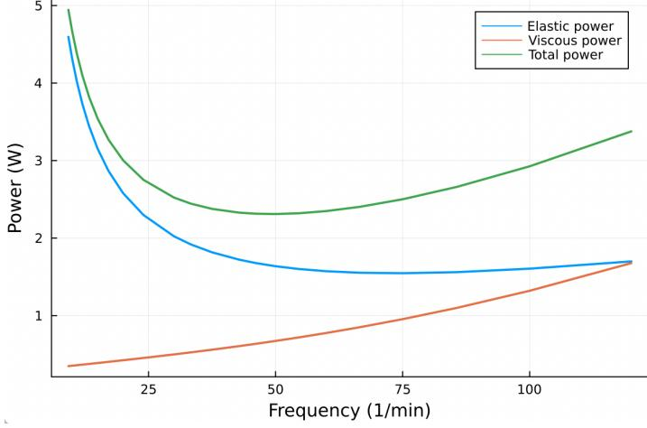

Figure 14.4: Trade-off between elastic energy stored in the tissue and viscous energy dissipated in the air circulation (exercise regime, computed from our model).

These quantities depend on several lung characteristics, on the breathing frequency *f* and on the amount of air inhaled during on breath cycle *VT* . This raises the trade-off shown in Figure [14.4](#page-241-0) and, using optimization theory, optimal ventilation frequencies and tidal volume can be be predicted. The viscous dissipation of air in the bronchial tree is characterized by the lung hydrodynamic resistance R, which is directly related to the geometry, size, number and structuring of the bronchi [\[596\]](#page-291-4). The hydrodynamic resistance is a physical quantity that represents how the energy put in the system is divided between kinetic energy and heat energy. It connects the volume of air displaced per unit of time, also called air flow *F*, to the force per unit of surface applied to the air, also called air pressure *pa*: *p* = R*F*. For the same pressure applied on the lung, the higher the hydrodynamic resistance, the lower the air flow and the higher the dissipation. Then, the power dissipated by viscous friction of the air inside all the bronchi can be estimated by Pa = *pF* = R*F* 2 . By assuming in our case that the velocity of the air follows a sinus function, we can deduce the power dissipated by viscous friction as follows:

$$\mathcal{P}_{\mathrm{a}} = \frac{1}{4} \mathcal{R} \left( \pi f_b V_T \right)^2 \dots$$

The elastic power is characterized by the compliance C of the lung, that relates the force per unit of surface applied by the muscles (*pm*) to the volume change of the lung [\[598\]](#page-291-5). The compliance depends on the lung's volume, especially when the deformation of the lung is high although the compliance can be considered constant while healthy. That is why, in our case, we assume that the compliance is a constant and we neglect the non-linearities arising at large lung's deformations [\[599\]](#page-291-6). The elastic power can be estimated by integration of the volume along the inspiration phase and it gives us,

$$\mathcal{P}_{\circ} = \frac{V_T^2 f_b}{2\mathcal{C}}.$$

Finally, the total energetic cost of breathing P can be written as the sum of the power dissipated by viscous friction Pa and the elastic power Pe. The total power has to be minimized relatively to the tidal volume *VT* and the breathing frequency *fb* with a constraint on the oxygen flow to blood that has to match the oxygen flow demand (see Equation [14.1)](#page-233-0). Thanks to our model previously defined, we can compute the oxygen flow to blood as a function of tidal volume and breathing frequency and compare it to the oxygen flow *V*˙O2 requested by the body at the regime considered.

Our model predicts (see Figure [14.5)](#page-242-2), for a human at rest, an optimal breathing frequency of 12*.*2 breaths per minute and an optimal tidal volume of 497 mL, which are very close to the average physiological values [\[590\]](#page-290-6). The model exhibits a robustness in term of frequency perturbation around the optimal. A 5% shift in the energy brings the frequency into a range between 8 breaths per minute up to 18*.*5 breaths per minute. This effect is due to the fact that, at low regimes, a low tidal volume *VT* is sufficient to perform an optimal ventilation. When the exercise intensity increases, the power profiles as a function of the frequency become steeper and steeper and focus the optimal value within a tighter region. It implies that a shift from the optimal configuration at high intensities is predicted to be costly in term of energy spent. This behavior is fully compatible with the fact that the control of ventilation is stronger at exercise, preventing even talking. The question of the optimal conditions of ventilation in human leads naturally to a series of extensions that need to be considered. We have seen previously that the optimization under constraints occurs in almost every organ in all the living beings. Thus, could we expect the present model to be extended to all mammals, as the control of ventilation is, more than probably, present in the whole mammalian class?

## <span id="page-242-0"></span>**14.3 Allometric scaling laws for respiration and ventilation**

The answer to this question of generalization leads us to a vast scientific question that will bring us back to the late 19th century and which is still open on many aspects.

### <span id="page-242-1"></span>**14.3.1 The emergence of scaling relations in nature**

In 2007, Savage and West published a seminal work in which they present a collection of data of sleep duration in a set of mammalian species. Among other major results, their analysis confirmed the previous observation [\[600\]](#page-291-7) that the larger the animal, the shorter the duration of its sleep cycle [\[601\]](#page-291-8). More precisely, the sleep duration correlates negatively with the body mass of the mammal and follows, based on the data from Savage & West, an interesting exponential law of the form *ts* = 10*.*1 *M*−0*.*103, with *ts* the sleep duration in hours during a 24 hours period and *M* the body mass of the mammal in kilograms, as seen in Figure [14.6](#page-243-1) [\[601\]](#page-291-8). Thus, by taking the *log* of both sides of the equation, one can write this sleep-to-mass relation as log *ts* = log 10.1 - 0.103 log *M* i.e., a linear relation between the logarithm of the sleep duration and the logarithm of the mass of the animal, see Figure [14.7.](#page-244-0) As we will see later, this type of exponential relation is now referred, in ecological sciences, as an *allometric* scaling. In general, an allometric law will write *Y* = *Y*0*Mb* , where *Y* is the studied – physiological, morphometric – property, *M* the mass of the living organism, *Y*0 and *b* the allometric

<span id="page-242-2"></span>

Figure 14.5: Total power expenditure during ventilation (W) as a function of the respiratory frequency (min−1 ) for different intensities of exercise. Dots correspond to the optimal ventilation frequency i.e., that minimizes the dissipated power. Adapted from [\[597\]](#page-291-9).

<span id="page-243-1"></span>

Figure 14.6: Distribution of total sleep duration (h) in mammals, based on data from Savage & West [\[601\]](#page-291-8). The data are best fitted by the curve indicated in light gray.

prefactor and exponent, respectively [\[602,](#page-291-10) [603\]](#page-291-11). Actually, the concept presented by Savage & West is far from being recent. The history of the study of allometric relations dates back to the 19th century. Scientists from various disciplines started to analyze the changes in shape and form of living beings in relation with their overall size [\[604\]](#page-291-12). Let us read the fascinating story told by Jean Gayon about the origins of the allometric concept [\[605\]](#page-291-13).

### <span id="page-243-0"></span>**14.3.2 A brief history of allometry**

In a pioneer work from 1897, Eugène Dubois described the relation that guides the evolution of brain's mass and that of the individual in a variety of mammal species [\[606\]](#page-291-14). He observed that brain is smaller, relatively to the their mass, in bigger animals. He then derived an adequate expression for this relation, such as *e* = *c sr* , where *e* is the brain's mass, *s* the body mass and *c* and *r* two coefficient that define the relation, with *r* close to 1/2, justifying the relative decrease in brain's mass that he observed. As far as we know, this represents the first mathematical expression of an allometric law, years before this term was even coined as it. It is in 1907 that Lapicque [\[607\]](#page-291-15) had the idea to transform Dubois' relation in a log-log dependency, giving a straight line representation in logarithmic coordinates that is now familiar to us, cf. Figure [14.7.](#page-244-0) At that time, this work was purely descriptive and empirical. However, biological and ecological data started to accumulate in the following years that led, mainly in animal species, to a variety of scaling laws. Thus, the ubiquity of allometric relations in every ecological discipline [\[608\]](#page-291-16) raised the question of the nature of the biological mechanisms underlying their observation.

In parallel, the question of the emergence of forms in living organisms arose in the literature. One of the major works at that time came from the Scottish naturalist D'Arcy Wentworth Thompson, whose main contribution came from his book *On Growth and Form*, first published in 1917 [\[609\]](#page-291-17). In this publication, he adopted the – still debated – thesis that the living systems as we know are submitted, in addition to the process of natural selection, to the physical laws of nature that can modify, transform and adapt their form and their path of development i.e., their growth [\[610\]](#page-292-0). This reference publication paved the way to the new disciplinary research field of biomathematics and, even in present times, is still considered as a major contribution to this field [\[611\]](#page-292-1). However, the D'Arcy Thompson's approach has not been accepted by the whole community, and the debate is still vivid more than a century after the publication of the first edition of his work [\[612\]](#page-292-2). Indeed,

<span id="page-244-0"></span>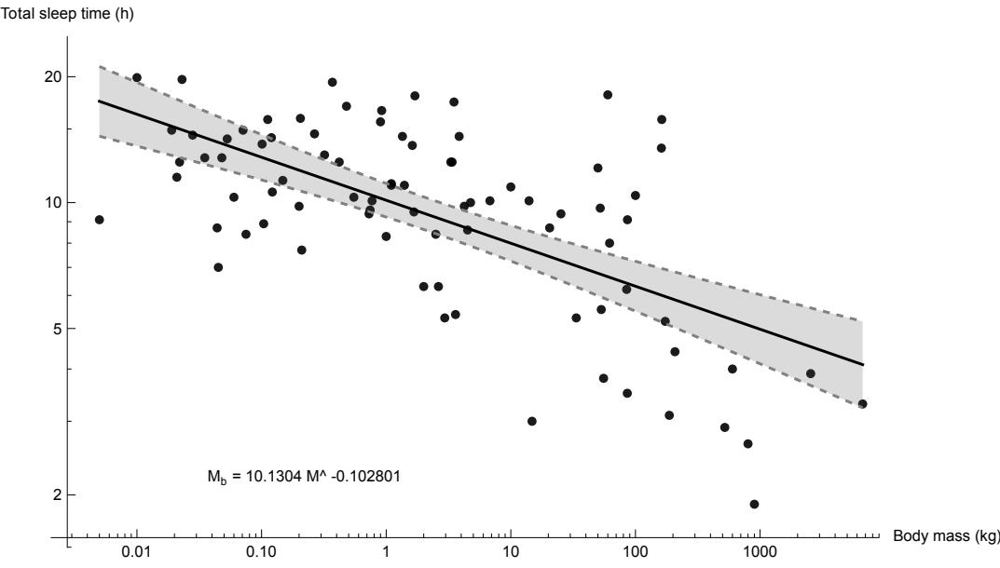

Figure 14.7: Distribution of total sleep duration (h) in mammals in log-log plot, based on data from Savage & West [\[601\]](#page-291-8). The data are best fitted by the line indicated in bold black. Confidence intervals are presented as light gray zones along the regression line. The corresponding allometric relation is presented in its exponential form.

D'Arcy Thompson was not entirely convinced by the pure Darwinian approach that dominated the field of developmental biology in his time. Although a strong Darwin's admirer [\[613\]](#page-292-3), he rather considered that the paths of development of the organisms were not dictated purely by acquired mutations and hard-encoded routines. At the contrary, he was convinced that these paths could only follow a number of sequences, a series of schemes that, following the laws of physics and chemistry, would allow for the formation of the variety of shapes and developments observed in nature [\[611,](#page-292-1) [612\]](#page-292-2). Critics emerged about his teleological – in some ways [\[613\]](#page-292-3) – conception of evolution, or at least of emergence of form. In essence, his work was one of his time, and his theories of forces of development were not supported by the genetic and molecular knowledge that has since been accumulated [\[612\]](#page-292-2). D'Arcy Thompson was an author of his time. He paved the way, with others developmental naturalists, to numerous concepts in biomathematics that influenced a number of past [\[614\]](#page-292-4) and present works, as discussed in Section [14.1.](#page-232-1) But D'Arcy Thompson was also an author among his peers. Motivated by his conception of developmental shaping forces, he started to correspond with a younger British naturalist named Julian Huxley, who will later forge a prolific international career as a biologist and science advocate, although carrying with him some controversies that are beyond the scope of this chapter [\[615\]](#page-292-5).

The scientific correspondence started slightly after one of Huxley's major publication, dated from 1924. In this article, Huxley studied the dynamics of growth of chelae in a crab species whose individuals possess one small and one large chela [\[616\]](#page-292-6). What seems at first a highly specific topic is enlarged by the idea to measure the mass of the chelae *relatively* to the mass of the individual. Following the steps of Dubois and Lapicque, Huxley weighted around 400 specimens of crab and plotted in a logarithmic scale the mass of the large chela against the total weight of the animal minus the weight of the large chela. He then observed that the experimental data could be joined by a straight line in this logarithmic plot. The originality of Huxley's work resides in his interpretation of the results that he obtained. He noticed that the slope *k* of the regression line remained larger than one, in accordance with the observation of the relative larger i.e., heterogonic growth [\[617\]](#page-292-7) of the chela compared to the growth of each individual. He then provided a proposed mechanism for this relative growth: the rate of cellular division in the chela is larger than the one in the rest of the body, more precisely in a *k* : 1 ratio [\[616\]](#page-292-6). With this – still emergent – mechanistic approach, Huxley provided for

<span id="page-245-2"></span>the first time a simple method for deciphering heterogonic growth of a characteristic, that will be observed as a straight line of slope *k >* 1 when plotted against the normalized mass of the individual in logarithmic coordinates.

Finally, the works of Lapicque, Dubois, D'Arcy Thompson and all their contemporaries emerged in 1936 in a joint paper between Huxley and a younger scientist, Georges Teissier, in which they agreed for the terminology of *allometry* and the associated law that is now famous *y* = *bxα* [\[618\]](#page-292-8). Altogether, this brief section on the historical emergence of the allometric concept in ecological sciences depicts a vibrant and active research theme, developed in the late 19th century, which extends the Darwinian concept of natural selection towards the emergence of growth, form and function. However, the reader will notice that the allometric approach of these times is still largely descriptive, with limited causal explanations of the nature of the scaling coefficients and the putative mechanisms that drive their behavior.

## <span id="page-245-0"></span>**14.3.3 Allometry: a mechanistic approach**

Many years later, a possible approach that compensates for this lack of mechanistic causality would be found in the work of West, Brown and Enquist (*WBE*), published in 1997 [\[603\]](#page-291-11). In this major article, the authors focused on the allometries in metabolic properties that have been described in the past decades, with the aim of developing a new mechanistic framework that would explain these allometries i.e., be able to derive the allometric exponents for the numerous physiological properties at stake here. The question of the existence of a general allometry for the metabolic rate of the living beings is a thrilling question. This would imply that all the organisms, from the tiny bacteria to the massive trees or mammals, do possess shared mechanisms of energy expenditure that would reflect on the presence of a common exponent all over the different orders of magnitudes among the species. Furthermore, the exponent should reflect somehow, by its value, the nature of the energetic mechanisms, and thus could be derived by a comprehensive modeling approach. WBE answer positively to these strong hypotheses, and developed a structured approach that focuses on the modeling of energy and mass fluxes in biological networks – cardiovascular and respiratory systems for example – which they consider as the common ground for all the species [\[603\]](#page-291-11). The hypotheses of WBE are of strong nature, and have been discussed largely in the literature (see for example [\[619,](#page-292-9) [620\]](#page-292-10)). Although this important – and still open – debate lies beyond the scope of this chapter, it appears important to emphasize that the WBE approach created a mechanistic, mathematical framework for the study of allometric relations that, somehow, acted as a bridge between the traditional descriptive allometry and the modern mechanistic approach.

## <span id="page-245-1"></span>**14.3.4 Allometric relations for the respiratory system**

As far as the respiratory system is concerned, the model of WBE appears to act as a promising framework for the study of the allometric relations of this system [\[621\]](#page-292-11). Indeed, the lungs of mammals are built as a network of mass and energy transfer, as described before, and share morphological and functional properties, raising the question on whether the previous results for human can be extended or not to all mammals. These properties are known to be dependent on the mass *M* of the mammal with allometric scaling laws [\[602,](#page-291-10) [603,](#page-291-11) [618,](#page-292-8) [622,](#page-292-12) [623\]](#page-292-13). Furthermore, the physics of ventilation, and hence its control, is linked to the geometry of the lung. Consequently, the morphological differences among mammals also affect the control of ventilation.

First, our gas transport model for the human lung presented in the previous section can be slightly modified to be valid for all mammals. Indeed, we know that the lungs of mammals share invariant characteristics [\[590\]](#page-290-6) such as the tree-like structure with bifurcating branches and the decomposition into two parts: the bronchial tree and the acini. The derivation of a lung model that depends only on mammal mass requires to relate explicitly the morphological parameters involved in our model such as the tracheal radius and length, with the animal mass. We used the datasets from [\[603\]](#page-291-11). The oxygen transport and exchange now occur in the idealized lung that has been generalized to fit any mammal. The transport of oxygen in the mammals lung is still driven by the tree phenomena: convection by the airflow, diffusion and exchange with blood through <span id="page-246-0"></span>the alveoli walls. Hence, in each airway, the partial pressure of oxygen follows the convection-diffusionreaction equation [(14.2)](#page-240-1) previously defined. The exchange coefficient *β* is dependent on the mammals mass since it depends on the radius of the alveolar duct which follows an allometric law. Finally, we search for the minimum of the total energetic cost of breathing P relatively to the tidal volume *VT* and the breathing frequency *fb* with a constraint on the oxygen flow to blood that has to match the oxygen flow demand *V*˙O2 . Since allometric scaling laws for oxygen flow demands for mammals at basal, field and metabolic rates are available in the literature [\[602,](#page-291-10) [624,](#page-292-14) [625,](#page-292-15) [626\]](#page-293-0), we can compute the desired oxygen flow *V*˙O2 depending on the mammal mass and on the metabolic regime.

Our model predicts that breathing frequencies and tidal volumes follow indeed allometric scaling laws. Furthermore, these laws can be derived in three different metabolic regimes: basal metabolic rate (BMR), field metabolic rate (FMR) and maximal metabolic rate (MMR), as seen in Figure [14.8,](#page-247-0)

$$\begin{aligned} f_b^{BMR} & \approx 0.61 \, M^{-0.27} \,\text{\text{\textz}} \,\text{\textz}, \,\, V_T^{BMR} \approx 6.1 \, M^{1.04} \,\text{mL},\\ f_b^{FMR} & \approx 1.17 \, M^{-0.31} \,\text{\textz}, \,\, V_T^{FMR} \approx 11.8 \, M^{0.97} \,\text{mL},\\ f_b^{MMR} & \approx 1.37 \, M^{-0.17} \,\text{\textz}, \,\, V_T^{MMR} \approx 29.7 \, M^{1.01} \,\text{mL}.\end{aligned}$$

It predicts exponents that are in accordance with the values observed in the literature. Indeed, breathing rate at BMR has been estimated to follow the law *f* BMR *b* ' 0*.*58 *M*− 1 4 Hz [\[627\]](#page-293-1) and tidal volume to follow the law *V* BMR *T* ' 7*.*14 *M*1 mL [\[603,](#page-291-11) [628\]](#page-293-2). At other metabolic rates, less data is available in the literature except for the breathing rate of mammals at MMR, estimated to follow the law *f* MMR *b* ' 5*.*08 *M*−0*.*14 Hz [\[629\]](#page-293-3). The validation of our model at both minimal and maximal metabolic regimes suggests that its predictions should be coherent whatever the regime, in the limit of the availability of its input parameters. This indicates that the mechanical power spent for ventilation might have driven the selection by evolution of the ventilation patterns.

The idealized representation of the bronchial tree and of the exchange surface used in this study accounts for five core characteristics common to all the mammals lungs, as identified in the literature [\[590,](#page-290-6) [591,](#page-290-7) [597,](#page-291-9) [603,](#page-291-11) [630\]](#page-293-4): a bifurcating tree structure; an homogeneous decrease of the size of the bronchi at the bifurcations; the size of the trachea; the size of the alveoli; and the surface area of the exchange surface. These characteristics are the main determinants for the tuning of the ventilation in order to minimize its energetic cost. This indicates that once the metabolic regime is fixed, the morphology of the lung is probably the primary driver of the physiological control of ventilation. We tested this hypothesis by altering, in our analysis, the allometric scaling laws related to the geometry of the lung. We observed corresponding alteration of the laws predicted for tidal volumes and breathing frequencies. Since morphology itself has probably been selected by evolution in order to minimize the hydrodynamic resistance in a constrained volume [\[591\]](#page-290-7), morphology and ventilation patterns are intertwined together in order for the lung to function with a low global energetic cost i.e., a low hydrodynamic resistance *R* and a low ventilation cost P(*VT , fb*) that also depends on *R*. Interestingly, our representation of the lung does not account for interspecific differences known to exist between the lungs of mammals, such as different degrees of branching asymmetry, monopodial or bipodial lungs, etc. [\[631,](#page-293-5) [632,](#page-293-6) [633,](#page-293-7) [634\]](#page-293-8).

As in the human lung, the transport of gases in the mammalian lung relies on the two major processes of diffusion and convection. We know that, in humans, the diffusive transport in the alveolar ducts is submitted to a physical phenomenon called the *screening effect* [\[593,](#page-291-1) [635\]](#page-293-9). Indeed, as gas exchanges occur through the alveoli walls lining the alveolar ducts, the diffusion can transport the respiratory gases only on a limited range of generations. This range depends on the physico-chemical properties affecting the diffusion of the gas in the alveolar air and through the alveolo-capillary membrane. This range has been estimated to be of about four generations for oxygen and one for carbon dioxide [\[593\]](#page-291-1) in humans. The description of the screening effect in mammals requires several additional hypotheses. Because of the screening effect, the alveolar ducts far from the convection–diffusion transition get only a small diffusive oxygen flow, as most of

<span id="page-247-0"></span>

Figure 14.8: Predicted ventilation frequency (s−1 – *left*) and tidal volume (L – *right*) as a function of the mammal mass (kg – log-log scale) at different metabolic regimes. BMR: Basal Metabolic Rate, FMR: Field Metabolic Rate, MMR: Maximal Metabolic Rate.

<span id="page-247-1"></span>

Figure 14.9: Localization in terms of lung generation index of the conductive zone and of the exchange surface (acini) as a function of the mammal species mass (kg). Both the green line (rest regime – *left*) and the red line (maximal exercise regime – *right*) represent the transition from a transport of the respiratory gas by convection to a transport by diffusion. Adapted from [\[621\]](#page-292-11).

the available oxygen has been captured by the alveolar ducts closer to the transition. In these deep parts of the acini, the oxygen partial pressure gradient between the deoxygenated blood and the alveolar ducts, which drives the oxygen capture by blood, is low. Carbon dioxide is mostly evacuated from the alveolar ducts very close to the transition: they are refilled by carbon dioxide too quickly for the deeper ducts to be drained of gas by diffusion. Hence, the ducts far from the transition cannot be relieved of the carbon dioxide and the exchange with blood in these ducts is low. As a consequence, the deeper part of the exchange surface is not available for the exchanges. The location of the transition between convective and diffusive transport of the respiratory gas drives the magnitude of the screening, and this transition depends on the geometry of the airway tree and of the ventilation regime. The screening phenomenon in mammals has been studied mathematically in [\[621\]](#page-292-11). Within the framework of the models hypotheses, the authors show that the number of conductive airways *N*conD and the number of alveolar ducts *N*ad follow allometric scaling laws:

$$N_{\rm conD} \propto N_{\rm ad} \propto M^{\frac{7}{8}}\dots$$

Additionally, they show that the number of airways *N*conV in which the gases are transported by convection

<span id="page-248-1"></span>**Box 14.D : Convection–diffusion transition and allometry**

It is to be noted that the predictions of our model for the localization of the convection–diffusion transition in idealized lungs lead to good estimations of the allometric scaling laws for tidal volumes and breathing frequencies, indicating that the morphological parameters included in our model might drive primarily the control of ventilation.

also follows an allometric scaling law. This law depends on the ventilation regime:

*N*conV ∝ ( *M*0*.*56 if *M <* 150 kg *M*0*.*405 if *M* ≥ 150 kg at rest *M*0*.*63 at maximal exercise

These equations translate into linear relationships in terms of log(*M*), as shown in Figure [14.9.](#page-247-1) Rest regime is represented on the left plot and maximal exercise regime on the right plot. The figure indicates that, at rest regime, the small mammals use their lung very efficiently, as only a few of their acini generations are fed by diffusion, as indicated by the green curve in Figure [14.9.](#page-247-1) Hence, the screening effect in small mammals is weak. However, this suggests that they have few reserve for increasing their metabolism at exercise [\[593,](#page-291-1) [621\]](#page-292-11). As suggested by the red curve on the right plot in Figure [14.9,](#page-247-1) the shift of the transition between convection and diffusion to deeper generations does not increase significantly the available exchange surface. To the contrary, large mammals are submitted to large screening effects at rest regime, and a large part of their exchange surface is not used. However, during exercise, the shift of the transition towards a deeper lung generation allows to recruit a significantly larger exchange surface.

Through this short introduction to allometry of constrained organs, we started to decipher the latent mechanisms of development of a constrained organ inside a class of organisms. The example of the lung is emblematic: how a complex and central organ can develop, specialize and evolve to fulfill the needs of organisms, while sharing among species its particularities, and efficiency.

## <span id="page-248-0"></span>**14.4 Concluding remarks**

Biological optimization, making the most effective use of limited resources within a set of given constraints, is a multifaceted subject that has been a source of content for countless articles and a stimulus for related discussion. To make the optimization of biological systems more readily comprehensible, this chapter has focused attention on a single organ, the human lung, and used it as a stage on which to introduce basic principles and a canvas on which to illustrate their application. The range of constraints, for the most part energetic or morphometric in nature, that have conditioned the development of the lung over the long course of its evolutionary history and given the mammalian respiratory system its particular shape is expansive. The characteristics of these constraints and the conditions that govern their interplay can be represented as mathematical equations that form the basis for models that describe the scale of the effect constraints have on biological systems and illuminate the magnitude of their impact. The insights into the lung's form that these models yield also provide a more thorough understanding of its function, characterizing, for example, modulations in the regulation of respiratory ventilation that occur in response to changes in the body's state – e.g., when the body is at rest or in motion; when it is healthy or when its health is compromised. The models are also a source of results that can be abstracted and subsequently applied to both human organs and those of other species that are larger and more complex. Considered within this broader context, they can also be seen as integral elements of much larger systems and as instances of the general allometric laws to which those systems adhere. The significance of the larger orthogenetic and phylogenetic implications that this abstraction of specific models into generalized laws carries cannot be overstated and discussion of those implications is vigorous and far-reaching. Through these discussions, many aspects of allometry have

#### <span id="page-249-1"></span><span id="page-249-0"></span>**Box 14.E : Cost and energy**

The allometric relationship found applies to the pulmonary organ. This is a crucial link in muscular activity, and therefore in locomotion or any activity requiring an effort, even moderate. As such, its properties must also be present during physical exercise. A useful quantity, based on oxygen consumption *V*˙O2 and frequently used in the literature, is the Cost of Oxygen Transport (COT). This corresponds to the ratio *V*˙O2 */v* with *v* the locomotion velocity. Using the correct metabolic conversion factor COT is the energy dissipated per unit length. It is known empirically that COT shows a local minimum corresponding to an optimal situation in which the minimum energy is dissipated per unit length. Building on this property, Tucker in 1975 [\[636\]](#page-293-10) noted that this minimum follows distinct allometric laws according to the major locomotion families, runners, swimmers and fliers, see the following Figure, left.


Left is the COT defined here as the ratio *P/*(*M v*), with *P* the power production and *v* the velocity as a function of the body mass *M* for several species (adapted from [\[636\]](#page-293-10)). Green are swimmers, red are fliers, black are runners, blue are engines designed by engineers. Continuous lines correspond to linear fits on data shown with filled markers. Right, top is oxygen consumption *V*˙O2 of a horse plotted against the speed *v/v?* for walk (red stars), trot (blue dots), and gallop (green squares), and their fits with our modeling. Bottom is COT for the same set of data. The three gaits data are normalized by the muscle fiber ratio leading to a unique master curve.

Based on the model proposed in Box [Energy conversion,](#page-238-0) it has been demonstrated [\[637\]](#page-293-11) that a living system can be described as a collection of *N* identical, *standard*, muscle units operating in parallel. Then the COT expression becomes:

$$\mathbf{COT} = -\frac{N}{N_H} \left( a_0 k + r_M k^2 v + \frac{b}{v} \right) \tag{14.3}$$

with *a*0 *k* a constant, *rM* a dissipative term and *b* the basal consumption i.e., out of effort. This last three parameters describing the standard muscle unit. We are then allowed to derive the minimum of the COT as an intrinsic property of energy conversion machines, COTmin ∝ √ *rM b*. It is found independent of the number of standard muscle fibers involved in the effort. Thus, effort is a combination of the number *N* of standard muscle fibers used and their characteristics *b* and *rM*. The parameterization of the standard muscle fiber depends on the specific implementations for an organism. It can be expected to be identical for a single animal. We have carried out this work in the case of the horse, which exhibits three well-differentiated gaits: walk, trot and gallop (see Figure **??**, right). We show that the COT curves, or equivalently *V*˙O2 , of the different gaits can be found using *N* as the only adjustable parameter, leaving the muscle fiber parameters unchanged.

As muscle is the most common means of producing power in animals, the typical behavior described here should be found in the most general way, without barriers between species, genera or classes. Of course, muscular implementation is specific to each animal, constrained by its own characteristics (intensity of effort, size, etc.), which suggests the origin of the observed scaling laws.

been illuminated and a deeper understanding of the complex systems that determine the ways individuals, species and systems function and interact has been achieved. Yet many of the field's underlying mechanisms and governing principles remain to be discovered. This chapter is the prelude to a journey into a space at the intersection of biology, ecology, and mathematics that the allometric universe occupies and the fuel for the exploration of the mysteries those hidden mechanisms are waiting to reveal.

## **Recommended readings**

- For a proper introduction to respiratory physiology, in healthy and pathological conditions: John B. West, *Respiratory Physiology: The Essentials* [\[556\]](#page-288-11).
- A reading for a deeper understanding of the lung morphometry: Ewald R. Weibel, *Morphometry of the human lung* [\[638\]](#page-293-12) and one for the respiratory gases exchange: Ewald R. Weibel, *The Pathway for Oxygen: Structure and Function in the Mammalian Respiratory System* [\[590\]](#page-290-6).
- A nice thesis about (in)organic mechanisms of morphogenesis: Raphaël Clément, *Morphogénèse et développement pulmonaire* [\[639\]](#page-293-13).
- The old but gold textbook in morphogenesis of living beings: D'Arcy Wentworth Thompson, *On Growth and Form* [\[609\]](#page-291-17).
- On allometric relations, in general: Robert H. Peters, *The Ecological Implications of Body Size* [\[602\]](#page-291-10) and from a modeling approach: G. B. West et al., *A general model for the origin of allometric scaling laws in biology* [\[603\]](#page-291-11).

## **Problems**

# <span id="page-252-0"></span>**Bibliography**

- <span id="page-252-1"></span>[1] H. C. Lange and J. J. Heijnen. Statistical reconciliation of the elemental and molecular biomass composition of Saccharomyces cerevisiae. *Biotechnology and Bioengineering*, 75(3):334–344, 2001. doi: 10.1002/bit.10054.
- <span id="page-252-2"></span>[2] Sarah Cohen, Alex M Valm, and Jennifer Lippincott-Schwartz. Interacting organelles. *Current Opinion in Cell Biology*, 53:84–91, aug 2018. doi: 10.1016/j.ceb.2018.06.003.
- <span id="page-252-3"></span>[3] Marian Carlson, Barbara C Osmond, and David Botstein. Mutants of yeast defective in sucrose utilization. *Genetics*, 98(1):25–40, 1981. doi: 10.1093/genetics/98.1.25.
- <span id="page-252-4"></span>[4] Ron Milo, Paul Jorgensen, Uri Moran, Griffin Weber, and Michael Springer. BioNumbers—the database of key numbers in molecular and cell biology. *Nucleic Acids Research*, 38(suppl_1):D750–D753, oct 2010. doi: 10.1093/nar/gkp889.
- <span id="page-252-5"></span>[5] Ron Milo and Rob Phillips. *Cell biology by the numbers*. Garland Science, 2015. doi: 10.1201/ 9780429258770.
- <span id="page-252-6"></span>[6] MT Küenzi and A Fiechter. Regulation of carbohydrate composition of Saccharomyces cerevisiae under growth limitation. *Archiv für Mikrobiologie*, 84(3):254–265, 1972. doi: 10.1007/BF00425203.
- <span id="page-252-7"></span>[7] Jinpeng Wang, Rodrigo Ledesma-Amaro, Yongjun Wei, Boyang Ji, and Xiao-Jun Ji. Metabolic engineering for increased lipid accumulation in Yarrowia lipolytica - A Review. *Bioresource Technology*, 313:123707, 2020. doi: 10.1016/j.biortech.2020.123707.
- <span id="page-252-8"></span>[8] André B. Canelas, Cor Ras, Angela ten Pierick, Walter M. van Gulik, and Joseph J. Heijnen. An in vivo data-driven framework for classification and quantification of enzyme kinetics and determination of apparent thermodynamic data. *Metabolic Engineering*, 13(3):294–306, 2011. doi: 10.1016/j.ymben. 2011.02.005.
- <span id="page-252-9"></span>[9] M. Schaechter, O. Maaloe, and N. O. Kjeldgaard. Dependency on medium and temperature of cell size and chemical composition during balanced grown of Salmonella typhimurium. *Journal of General Microbiology*, 19(3):592–606, 1958. doi: 10.1099/00221287-19-3-592.
- <span id="page-252-10"></span>[10] Stephen Vadia and Petra Anne Levin. Growth rate and cell size: a re-examination of the growth law. *Current Opinion in Microbiology*, 24:96–103, 2015. doi: 10.1016/j.mib.2015.01.011.
- <span id="page-252-11"></span>[11] Martí Aldea, Kirsten Jenkins, and Attila Csikász-Nagy. Growth rate as a direct regulator of the start network to set cell size. *Frontiers in Cell and Developmental Biology*, 5:57, 2017. doi: 10.3389/fcell.2017. 00057.
- <span id="page-252-12"></span>[12] Diana Széliová, David E. Ruckerbauer, Sarah N. Galleguillos, Lars B. Petersen, Klaus Natter, Michael Hanscho, Christina Troyer, Tim Causon, Harald Schoeny, Hanne B. Christensen, Dong-Yup Lee, Nathan E. Lewis, Gunda Koellensperger, Stephan Hann, Lars K. Nielsen, Nicole Borth, and Jürgen

Zanghellini. What CHO is made of: Variations in the biomass composition of Chinese hamster ovary cell lines. *Metabolic Engineering*, 61:288–300, 2020. doi: 10.1016/j.ymben.2020.06.002.

- <span id="page-253-2"></span>[13] Hans Bremer and Patrick P. Dennis. Modulation of chemical composition and other parameters of the cell by growth rate. *EcoSal Plus*, 3(1), 2008. doi: 10.1128/ecosal.5.2.3.
- <span id="page-253-0"></span>[14] Fangwei Si, Dongyang Li, Sarah E. Cox, John T. Sauls, Omid Azizi, Cindy Sou, Amy B. Schwartz, Michael J. Erickstad, Yonggun Jun, Xintian Li, and Suckjoon Jun. Invariance of initiation mass and predictability of cell size in Escherichia coli. *Current Biology*, 27(9):1278–1287, 2017. doi: 10.1016/j.cub.2017.03.022.
- <span id="page-253-1"></span>[15] Matthew Scott, Carl W Gunderson, Eduard M Mateescu, Zhongge Zhang, and Terence Hwa. Interdependence of cell growth and gene expression: origins and consequences. *Science*, 330(6007):1099–1102, 2010. doi: 10.1126/science.1192588.
- <span id="page-253-3"></span>[16] J. Pramanik and J. D. Keasling. Stoichiometric model of Escherichia coli metabolism: incorporation of growth-rate dependent biomass composition and mechanistic energy requirements. *Biotechnology and Bioengineering*, 56(4):398–421, 1997. doi: 10.1002/(SICI)1097-0290(19971120)56:4<398::AID-BIT6> 3.0.CO;2-J.
- <span id="page-253-4"></span>[17] Tatiana V. Karpinets, Duncan J. Greenwood, Carl E. Sams, and John T. Ammons. RNA:protein ratio of the unicellular organism as a characteristic of phosphorous and nitrogen stoichiometry and of the cellular requirement of ribosomes for protein synthesis. *BMC Biology*, 4(1):30, 2006. doi: 10.1186/ 1741-7007-4-30.
- <span id="page-253-5"></span>[18] Allen G Marr. Growth rate of Escherichia coli. *Microbiological reviews*, 55(2):316–333, 1991. doi: 10. 1128/mr.55.2.316-333.1991.
- <span id="page-253-6"></span>[19] Sophia Hsin-Jung Li, Zhiyuan Li, Junyoung O. Park, Christopher G. King, Joshua D. Rabinowitz, Ned S. Wingreen, and Zemer Gitai. Escherichia coli translation strategies differ across carbon, nitrogen and phosphorus limitation conditions. *Nature Microbiology*, 3(8):939–947, 2018. doi: 10.1038/ s41564-018-0199-2.
- <span id="page-253-7"></span>[20] Marc Carnicer, Kristin Baumann, Isabelle Töplitz, Francesc Sánchez-Ferrando, Diethard Mattanovich, Pau Ferrer, and Joan Albiol. Macromolecular and elemental composition analysis and extracellular metabolite balances of Pichia pastoris growing at different oxygen levels. *Microbial Cell Factories*, 8(1): 65, 2009. doi: 10.1186/1475-2859-8-65.
- <span id="page-253-8"></span>[21] J. Pramanik and J. D. Keasling. Effect of Escherichia coli biomass composition on central metabolic fluxes predicted by a stoichiometric model. *Biotechnology and Bioengineering*, 60(2):230–238, 1998. doi: 10.1002/(SICI)1097-0290(19981020)60:2<230::AID-BIT10>3.0.CO;2-Q.
- <span id="page-253-9"></span>[22] Jie Lin and Ariel Amir. The effects of stochasticity at the single-cell level and cell size control on the population growth. *Cell Systems*, 5(4):358–367.e4, oct 2017. doi: 10.1016/j.cels.2017.08.015.
- <span id="page-253-10"></span>[23] Ashley E. Beck, Kristopher A. Hunt, and Ross P. Carlson. Measuring cellular biomass composition for computational biology applications. *Processes*, 6(5):38, 2018. doi: 10.3390/pr6050038.
- <span id="page-253-11"></span>[24] Christopher P Long and Maciek R Antoniewicz. Quantifying biomass composition by gas chromatography/mass spectrometry. *Analytical chemistry*, 86(19):9423–9427, 2014. doi: 10.1021/ac502734e.
- <span id="page-253-12"></span>[25] Diana Széliová, Harald Schoeny, Špela Knez, Christina Troyer, Cristina Coman, Evelyn Rampler, Gunda Koellensperger, Robert Ahrends, Stephen Hann, Nicole Borth, Jürgen Zanghellini, and David E. Ruckerbauer. Robust analytical methods for the accurate quantification of the total biomass composition of mammalian cells. *Methods in Molecular Biology (Clifton, N.J.)*, 2088:119–160, 2020. doi: 10.1007/ 978-1-0716-0159-4_7.
- <span id="page-254-1"></span>[26] Jay Shendure, Shankar Balasubramanian, George M. Church, Walter Gilbert, Jane Rogers, Jeffery A. Schloss, and Robert H. Waterston. DNA sequencing at 40: past, present and future. *Nature*, 550(7676): 345–353, 2017. doi: 10.1038/nature24286.
- <span id="page-254-2"></span>[27] Stark R, Grzelak M, and Hadfield J. RNA sequencing: the teenage years. *Nature reviews. Genetics*, 20(11), 2019. doi: 10.1038/s41576-019-0150-2.
- <span id="page-254-3"></span>[28] Winston Timp and Gregory Timp. Beyond mass spectrometry, the next step in proteomics. *Science Advances*, 6(2):eaax8978, 2020. doi: 10.1126/sciadv.aax8978.
- <span id="page-254-4"></span>[29] Saleh Alseekh, Asaph Aharoni, Yariv Brotman, Kévin Contrepois, John D'Auria, Jan Ewald, Jennifer C. Ewald, Paul D. Fraser, Patrick Giavalisco, Robert D. Hall, Matthias Heinemann, Hannes Link, Jie Luo, Steffen Neumann, Jens Nielsen, Leonardo Perez de Souza, Kazuki Saito, Uwe Sauer, Frank C. Schroeder, Stefan Schuster, Gary Siuzdak, Aleksandra Skirycz, Lloyd W. Sumner, Michael P. Snyder, Huiru Tang, Takayuki Tohge, Yulan Wang, Weiwei Wen, Si Wu, Guowang Xu, Nicola Zamboni, and Alisdair R. Fernie. Mass spectrometry-based metabolomics: a guide for annotation, quantification and best reporting practices. *Nature Methods*, 18(7):747–756, 2021. doi: 10.1038/s41592-021-01197-1.
- <span id="page-254-5"></span>[30] Christopher P. Long and Maciek R. Antoniewicz. High-resolution 13C metabolic flux analysis. *Nature Protocols*, 14(10):2856–2877, 2019. doi: 10.1038/s41596-019-0204-0.
- <span id="page-254-6"></span>[31] Dan Davidi, Elad Noor, Wolfram Liebermeister, Arren Bar-Even, Avi Flamholz, Katja Tummler, Uri Barenholz, Miki Goldenfeld, Tomer Shlomi, and Ron Milo. Global characterization of in vivo enzyme catalytic rates and their correspondence to in vitro *k* cat measurements. *Proceedings of the National Academy of Sciences*, 113(12):3401–3406, 2016. doi: 10.1073/pnas.1514240113.
- <span id="page-254-7"></span>[32] David Heckmann, Anaamika Campeau, Colton J. Lloyd, Patrick V. Phaneuf, Ying Hefner, Marvic Carrillo-Terrazas, Adam M. Feist, David J. Gonzalez, and Bernhard O. Palsson. Kinetic profiling of metabolic specialists demonstrates stability and consistency of in vivo enzyme turnover numbers. *Proceedings of the National Academy of Sciences of the United States of America*, 117(37):23182–23190, 2020. doi: 10.1073/pnas.2001562117.
- <span id="page-254-0"></span>[33] Jean-Marie Volland, Silvina Gonzalez-Rizzo, Olivier Gros, Tomáš Tyml, Natalia Ivanova, Frederik Schulz, Danielle Goudeau, Nathalie H. Elisabeth, Nandita Nath, Daniel Udwary, Rex R. Malmstrom, Chantal Guidi-Rontani, Susanne Bolte-Kluge, Karen M. Davies, Maïtena R. Jean, Jean-Louis Mansot, Nigel J. Mouncey, Esther R. Angert, Tanja Woyke, and Shailesh V. Date. A centimeter-long bacterium with DNA contained in metabolically active, membrane-bound organelles. *Science*, 376(6600):1453–1458, 2022. doi: 10.1126/science.abb3634.
- <span id="page-254-8"></span>[34] William P Jacobs. Caulerpa. *Scientific American*, 271(6):100–105, 1994. URL [http://www.jstor.org/](http://www.jstor.org/stable/24942951) [stable/24942951](http://www.jstor.org/stable/24942951).
- <span id="page-254-9"></span>[35] Xiao Pan, Ciska Dalm, René H. Wijffels, and Dirk E. Martens. Metabolic characterization of a CHO cell size increase phase in fed-batch cultures. *Applied Microbiology and Biotechnology*, 101(22):8101–8113, 2017. doi: 10.1007/s00253-017-8531-y.
- <span id="page-254-10"></span>[36] Leigh K. Harris and Julie A. Theriot. Surface area to volume ratio: a natural variable for bacterial morphogenesis. *Trends in Microbiology*, 26(10):815–832, 2018. doi: 10.1016/j.tim.2018.04.008.
- <span id="page-254-11"></span>[37] Herbert E. Kubitschek. Buoyant density variation during the cell cycle in microorganisms. *CRC Critical Reviews in Microbiology*, 14(1):73–97, 1987. doi: 10.3109/10408418709104436.
- <span id="page-254-12"></span>[38] H. E. Kubitschek and R. A. Ward. Buoyant density constancy of Schizosaccharomyces pombe cells. *Journal of Bacteriology*, 162(3):902–904, 1985. doi: 10.1128/jb.162.3.902-904.1985.
- <span id="page-255-0"></span>[39] Kazem Kashefi and Derek R. Lovley. Extending the upper temperature limit for life. *Science*, 301(5635): 934–934, 2003. doi: 10.1126/science.1086823.
- <span id="page-255-1"></span>[40] Dan Davidi, Liam M. Longo, Jagoda Jabłońska, Ron Milo, and Dan S. Tawfik. A bird's-eye view of enzyme evolution: Chemical, physicochemical, and physiological considerations. *Chemical Reviews*, 118(18): 8786–8797, 2018. doi: 10.1021/acs.chemrev.8b00039.
- <span id="page-255-2"></span>[41] Pascal D Odermatt, Teemu P Miettinen, Joël Lemière, Joon Ho Kang, Emrah Bostan, Scott R Manalis, Kerwyn Casey Huang, and Fred Chang. Variations of intracellular density during the cell cycle arise from tip-growth regulation in fission yeast. *eLife*, 10:e64901, 2021. doi: 10.7554/eLife.64901.
- <span id="page-255-3"></span>[42] Stefan Klumpp, Matthew Scott, Steen Pedersen, and Terence Hwa. Molecular crowding limits translation and cell growth. *Proceedings of the National Academy of Sciences*, 110(42):16754–16759, 2013. doi: 10.1073/pnas.1310377110.
- <span id="page-255-4"></span>[43] Jonas van den Berg, Arnold J. Boersma, and Bert Poolman. Microorganisms maintain crowding homeostasis. *Nature Reviews Microbiology*, 15(5):309–318, 2017. doi: 10.1038/nrmicro.2017.17.
- <span id="page-255-5"></span>[44] Ken A. Dill, Kingshuk Ghosh, and Jeremy D. Schmit. Physical limits of cells and proteomes. *Proceedings of the National Academy of Sciences*, 108(44):17876–17882, 2011. doi: 10.1073/pnas.1114477108.
- <span id="page-255-6"></span>[45] Tamar Friedlander, Avraham E. Mayo, Tsvi Tlusty, and Uri Alon. Evolution of bow-tie architectures in biology. *PLOS Computational Biology*, 11(3):e1004055, mar 2015. doi: 10.1371/journal.pcbi.1004055.
- <span id="page-255-7"></span>[46] Petri-Jaan Lahtvee, Benjamín J. Sánchez, Agata Smialowska, Sergo Kasvandik, Ibrahim E. Elsemman, Francesco Gatto, and Jens Nielsen. Absolute quantification of protein and mRNA abundances demonstrate variability in gene-specific translation efficiency in yeast. *Cell Systems*, 4(5):495–504.e5, may 2017. doi: 10.1016/j.cels.2017.03.003.
- <span id="page-255-10"></span>[47] Michael Lynch and Georgi K. Marinov. The bioenergetic costs of a gene. *Proceedings of the National Academy of Sciences*, 112(51):15690–15695, nov 2015. doi: 10.1073/pnas.1514974112.
- <span id="page-255-9"></span>[48] Arren Bar-Even, Elad Noor, Yonatan Savir, Wolfram Liebermeister, Dan Davidi, Dan S. Tawfik, and Ron Milo. The moderately efficient enzyme: Evolutionary and physicochemical trends shaping enzyme parameters. *Biochemistry*, 50(21):4402–4410, may 2011. doi: 10.1021/bi2002289.
- <span id="page-255-8"></span>[49] Antje Chang, Lisa Jeske, Sandra Ulbrich, Julia Hofmann, Julia Koblitz, Ida Schomburg, Meina Neumann-Schaal, Dieter Jahn, and Dietmar Schomburg. Brenda, the elixir core data resource in 2021: new developments and updates. *Nucleic Acids Research*, 49(D1):D498–D508, 2021. doi: 10.1093/nar/gkaa1025.
- <span id="page-255-11"></span>[50] Gene-Wei Li, David Burkhardt, Carol Gross, and Jonathan S. Weissman. Quantifying absolute protein synthesis rates reveals principles underlying allocation of cellular resources. *Cell*, 157(3):624–635, 2014. doi: 10.1016/j.cell.2014.02.033.
- <span id="page-255-12"></span>[51] Christoph Kaleta, Sascha Schäuble, Ursula Rinas, and Stefan Schuster. Metabolic costs of amino acid and protein production in Escherichia coli. *Biotechnology Journal*, 8(9):1105–1114, 2013. doi: 10.1002/ biot.201200267.
- <span id="page-255-13"></span>[52] Daniel N Wilson and Jamie H Doudna Cate. The structure and function of the eukaryotic ribosome. *Cold Spring Harbor perspectives in biology*, 4(5):a011536, 2012. doi: 10.1101/cshperspect.a011536.
- <span id="page-255-14"></span>[53] John L Woolford and Susan J Baserga. Ribosome biogenesis in the yeast Saccharomyces cerevisiae. *Genetics*, 195(3):643–681, nov 2013. doi: 10.1534/genetics.113.153197.
- <span id="page-255-15"></span>[54] Sergey Proshkin, A. Rachid Rahmouni, Alexander Mironov, and Evgeny Nudler. Cooperation between translating ribosomes and RNA polymerase in transcription elongation. *Science*, 328(5977):504–508, apr 2010. doi: 10.1126/science.1184939.
- <span id="page-256-0"></span>[55] Eyal Metzl-Raz, Moshe Kafri, Gilad Yaakov, Ilya Soifer, Yonat Gurvich, and Naama Barkai. Principles of cellular resource allocation revealed by condition-dependent proteome profiling. *eLife*, 6, aug 2017. doi: 10.7554/eLife.28034.
- <span id="page-256-1"></span>[56] Moshe Kafri, Eyal Metzl-Raz, Ghil Jona, and Naama Barkai. The cost of protein production. *Cell Reports*, 14(1):22–31, jan 2016. doi: 10.1016/j.celrep.2015.12.015.
- <span id="page-256-2"></span>[57] Jan Berkhout, Evert Bosdriesz, Emrah Nikerel, Douwe Molenaar, Dick de Ridder, Bas Teusink, and Frank J Bruggeman. How biochemical constraints of cellular growth shape evolutionary adaptations in metabolism. *Genetics*, 194(2):505–512, 2013. doi: 10.1534/genetics.113.150631.
- <span id="page-256-3"></span>[58] Arijit Maitra and Ken A Dill. Bacterial growth laws reflect the evolutionary importance of energy efficiency. *Proceedings of the National Academy of Sciences*, 112(2):406–411, 2015. doi: 10.1073/pnas. 1421138111.
- <span id="page-256-4"></span>[59] Ibrahim E Elsemman, Angelica Rodriguez Prado, Pranas Grigaitis, Manuel Garcia Albornoz, Victoria Harman, Stephen W Holman, Johan van Heerden, Frank J Bruggeman, Mark MM Bisschops, Nikolaus Sonnenschein, et al. Whole-cell modeling in yeast predicts compartment-specific proteome constraints that drive metabolic strategies. *Nature Communications*, 13(1):1–12, 2022. doi: 10.1038/ s41467-022-28467-6.
- <span id="page-256-5"></span>[60] Erez Dekel and Uri Alon. Optimality and evolutionary tuning of the expression level of a protein. *Nature*, 436(7050):588–592, July 2005.
- <span id="page-256-6"></span>[61] Johan Björkeroth, Kate Campbell, Carl Malina, Rosemary Yu, Francesca Di Bartolomeo, and Jens Nielsen. Proteome reallocation from amino acid biosynthesis to ribosomes enables yeast to grow faster in rich media. *Proceedings of the National Academy of Sciences*, 117(35):21804–21812, 2020. doi: 10.1073/pnas.1921890117.
- <span id="page-256-7"></span>[62] Hugo Dourado, Matteo Mori, Terence Hwa, and Martin J Lercher. On the optimality of the enzyme– substrate relationship in bacteria. *PLoS biology*, 19(10):e3001416, 2021. doi: 10.1371/journal.pbio. 3001416.
- <span id="page-256-8"></span>[63] G. Gottschalk. *Bacterial Metabolism*. Springer Series in Microbiology. Springer, New York, 1985. ISBN 978-0-387-96153-8. doi: https://doi.org/10.1007/978-1-4612-1072-6.
- <span id="page-256-9"></span>[64] F. C. Neidhardt, J. L. Ingraham, and M. Schaechter. *Physiology go the bacterial cell: A molecular approach*. Sinauer Associates, 1990. ISBN 0878936084.
- <span id="page-256-10"></span>[65] H. V. Westerhoff, K. J. Hellingwerf, and K. Van Dam. Thermodynamic efficiency of microbial growth is low but optimal for maximal growth rate. *Proc Natl Acad Sci U S A*, 80(1):305–9, 1983. ISSN 0027-8424 (Print) 1091-6490 (Electronic) 0027-8424 (Linking). doi: 10.1073/pnas.80.1.305.
- <span id="page-256-11"></span>[66] E. Branscomb and M. J. Russell. Turnstiles and bifurcators: the disequilibrium converting engines that put metabolism on the road. *Biochim Biophys Acta*, 1827(2):62–78, 2013. ISSN 0006-3002 (Print) 0006- 3002 (Linking). doi: 10.1016/j.bbabio.2012.10.003.
- <span id="page-256-12"></span>[67] C. Zerfass, M. Asally, and O. S. Soyer. Interrogating metabolism as an electron flow system. *Curr Opin Syst Biol*, 13:59–67, 2019. ISSN 2452-3100 (Print) 2452-3100 (Linking). doi: 10.1016/j.coisb.2018.10.001.
- <span id="page-256-13"></span>[68] W. H. Schlesinger and E. S. Bernhardt. *Biogeochemistry: an analysis of glbal change*. Academic Press, 2013. ISBN 0123858747.
- <span id="page-256-14"></span>[69] A. Jinich, A. Flamholz, H. Ren, S. J. Kim, B. Sanchez-Lengeling, C. A. R. Cotton, E. Noor, A. Aspuru-Guzik, and A. Bar-Even. Quantum chemistry reveals thermodynamic principles of redox biochemistry. *PLoS Comput Biol*, 14(10):e1006471, 2018. ISSN 1553-7358 (Electronic) 1553-734X (Linking). doi: 10.1371/ journal.pcbi.1006471.
- <span id="page-257-0"></span>[70] U. Barenholz, D. Davidi, E. Reznik, Y. Bar-On, N. Antonovsky, E. Noor, and R. Milo. Design principles of autocatalytic cycles constrain enzyme kinetics and force low substrate saturation at flux branch points. *Elife*, 6, 2017. ISSN 2050-084X (Electronic) 2050-084X (Linking). doi: 10.7554/eLife.20667.
- <span id="page-257-1"></span>[71] D. C. LaPorte, K. Walsh, and Jr. Koshland, D. E. The branch point effect. ultrasensitivity and subsensitivity to metabolic control. *J Biol Chem*, 259(22):14068–75, 1984. ISSN 0021-9258 (Print) 0021-9258 (Linking).
- <span id="page-257-2"></span>[72] M. E. Beber, C. Fretter, S. Jain, N. Sonnenschein, M. Muller-Hannemann, and M. T. Hutt. Artefacts in statistical analyses of network motifs: general framework and application to metabolic networks. *J R Soc Interface*, 9(77):3426–35, 2012. ISSN 1742-5662 (Electronic) 1742-5662 (Linking). doi: 10.1098/rsif. 2012.0490.
- <span id="page-257-3"></span>[73] J.G. Reich and E.E. Selkov. *Energy metabolism of the cell : a theoretical treatise*. Academic Press, London ; New York, 1981. ISBN 0125859201.
- <span id="page-257-4"></span>[74] J. H. Hofmeyr, H. Kacser, and K. J. van der Merwe. Metabolic control analysis of moiety-conserved cycles. *Eur J Biochem*, 155(3):631–41, 1986. ISSN 0014-2956 (Print) 0014-2956 (Linking). doi: 10.1111/j. 1432-1033.1986.tb09534.x.
- <span id="page-257-5"></span>[75] H. M. Sauro. Moiety-conserved cycles and metabolic control analysis: problems in sequestration and metabolic channelling. *Biosystems*, 33(1):55–67, 1994. ISSN 0303-2647 (Print) 0303-2647 (Linking). doi: 10.1016/0303-2647(94)90061-2.
- <span id="page-257-6"></span>[76] T. S. Hatakeyama and C. Furusawa. Metabolic dynamics restricted by conserved carriers: Jamming and feedback. *PLoS Comput Biol*, 13(11):e1005847, 2017. ISSN 1553-7358 (Electronic) 1553-734X (Linking). doi: 10.1371/journal.pcbi.1005847.
- <span id="page-257-7"></span>[77] Robert West, Hadrien Delattre, Elad Noor, Elisenda Feliu, and Orkun Soyer. Dynamics of co-substrate pools can constrain and regulate metabolic fluxes. *Elife*, 12:e84379, 2023.
- <span id="page-257-8"></span>[78] N. C. Price, R. A. Dwek, R. G. Ratcliffe, and M. R. Wormald. *Principles and Problems in Physical Chemistry for Biochemists*. Oxford University Press, 1997. ISBN 0198792816.
- <span id="page-257-9"></span>[79] H. C. V. Ness. *Understanding thermodynamics*. Dover Publications, 1983. ISBN 0486632776.
- <span id="page-257-10"></span>[80] E. Noor, A. Bar-Even, A. Flamholz, Y. Lubling, D. Davidi, and R. Milo. An integrated open framework for thermodynamics of reactions that combines accuracy and coverage. *Bioinformatics*, 28(15):2037–44, 2012. ISSN 1367-4811 (Electronic) 1367-4803 (Print) 1367-4803 (Linking). doi: 10.1093/bioinformatics/ bts317.
- <span id="page-257-11"></span>[81] M. E. Beber, M. G. Gollub, D. Mozaffari, K. M. Shebek, A. I. Flamholz, R. Milo, and E. Noor. equilibrator 3.0: a database solution for thermodynamic constant estimation. *Nucleic Acids Res*, 50(D1):D603–D609, 2022. ISSN 1362-4962 (Electronic) 0305-1048 (Print) 0305-1048 (Linking). doi: 10.1093/nar/gkab1106.
- <span id="page-257-12"></span>[82] K. J. Mysels. Textbook errors: Vii. the laws of reaction rates and of equilibrium. *Journal of Chemical Education*, 33(4), 1956.
- <span id="page-257-13"></span>[83] E. A. Guggenheim. Textbook errors: Ix. more about the laws of reaction rates and of equilibrium. *Journal of Chemical Education*, 33(11), 1956.
- <span id="page-257-14"></span>[84] P. T. Silvanus. *Calculus made easy*. Macmillan, 1914.
- <span id="page-257-15"></span>[85] S. H. Strogatz. *Nonlinear dynamics and chaos: With applications to physics, biology, chemistry, and engineering*. CRC Press, 2000. ISBN 0738204536.
- <span id="page-257-16"></span>[86] H. Kacser and J. A. Burns. The control of flux. *Biochem Soc Trans*, 23(2):341–66, 1995. ISSN 0300-5127 (Print) 0300-5127 (Linking). doi: 10.1042/bst0230341.
- <span id="page-258-0"></span>[87] I. Prigogine, R. Lefever, A. Goldbeter, and M. Herschkowitz-Kaufman. Symmetry breaking instabilities in biological systems. *Nature*, 223(5209):913–6, 1969. ISSN 0028-0836 (Print) 0028-0836 (Linking). doi: 10.1038/223913a0.
- <span id="page-258-1"></span>[88] D. A. Beard and H. Qian. Relationship between thermodynamic driving force and one-way fluxes in reversible processes. *PLoS One*, 2(1):e144, 2007. ISSN 1932-6203 (Electronic) 1932-6203 (Linking). doi: 10.1371/journal.pone.0000144.
- <span id="page-258-2"></span>[89] A. Goldbeter. Dissipative structures in biological systems: bistability, oscillations, spatial patterns and waves. *Philos Trans A Math Phys Eng Sci*, 376(2124), 2018. ISSN 1471-2962 (Electronic) 1364-503X (Linking). doi: 10.1098/rsta.2017.0376.
- <span id="page-258-3"></span>[90] E. Simsek and M. Kim. The emergence of metabolic heterogeneity and diverse growth responses in isogenic bacterial cells. *ISME J*, 12(5):1199–1209, 2018. ISSN 1751-7370 (Electronic) 1751-7362 (Linking). doi: 10.1038/s41396-017-0036-2.
- <span id="page-258-4"></span>[91] A. Z. Rosenthal, Y. Qi, S. Hormoz, J. Park, S. H. Li, and M. B. Elowitz. Metabolic interactions between dynamic bacterial subpopulations. *Elife*, 7, 2018. ISSN 2050-084X (Electronic) 2050-084X (Linking). doi: 10.7554/eLife.33099.
- <span id="page-258-5"></span>[92] A. Fersht. *Structure and Mechanism in Protein Science: Guide to Enzyme Catalysis and Protein Folding*. W. H. Freeman & Co., 3rd edition, 1998. ISBN 0716732688.
- <span id="page-258-6"></span>[93] A. Cornish-Bowden. *Fundamentals of Enzyme Kinetics*. Wiley-Blackwell, 4th edition, 2012. ISBN 9783527330744.
- <span id="page-258-7"></span>[94] H. M. Sauro. *Enzyme Kinetics for Systems Biology*. Ambrosius Publishing, 2012. ISBN 0982477333.
- <span id="page-258-8"></span>[95] C. I. Branden and C. Tooze. *Introduction to Protein Structure*. Garland Science, 2nd edition, 1999.
- <span id="page-258-9"></span>[96] D. A. Beard. Simulation of cellular biochemical system kinetics. *Wiley Interdiscip Rev Syst Biol Med*, 3(2): 136–46, 2011. ISSN 1939-005X (Electronic) 1939-5094 (Print) 1939-005X (Linking). doi: 10.1002/wsbm. 116.
- <span id="page-258-10"></span>[97] J. B. S. Haldane. *Enzymes*. MIT Press, 1965. ISBN 0262580039.
- <span id="page-258-11"></span>[98] C. Y. Hoh and R. Cord-Ruwisch. A practical kinetic model that considers endproduct inhibition in anaerobic digestion processes by including the equiiibrium constant. *Biotechnol Bioeng*, 51, 1996.
- <span id="page-258-12"></span>[99] T. Grosskopf and O. S. Soyer. Microbial diversity arising from thermodynamic constraints. *ISME J*, 10 (11):2725–2733, 2016. ISSN 1751-7370 (Electronic) 1751-7362 (Linking). doi: 10.1038/ismej.2016.49.
- <span id="page-258-13"></span>[100] J. O. Park, S. A. Rubin, Y. F. Xu, D. Amador-Noguez, J. Fan, T. Shlomi, and J. D. Rabinowitz. Metabolite concentrations, fluxes and free energies imply efficient enzyme usage. *Nat Chem Biol*, 12(7):482–9, 2016. ISSN 1552-4469 (Electronic) 1552-4450 (Linking). doi: 10.1038/nchembio.2077.
- <span id="page-258-14"></span>[101] C. Hayes, E. Feliu, and O. S. Soyer. Multisite enzymes as a mechanism for bistability in reaction networks. *ACS Synth Biol*, 11(2):596–607, 2022. ISSN 2161-5063 (Electronic) 2161-5063 (Linking). doi: 10.1021/acssynbio.1c00272.
- <span id="page-258-15"></span>[102] E. Noor, A. Flamholz, W. Liebermeister, A. Bar-Even, and R. Milo. A note on the kinetics of enzyme action: a decomposition that highlights thermodynamic effects. *FEBS Lett*, 587(17):2772–7, 2013. ISSN 1873-3468 (Electronic) 0014-5793 (Linking). doi: 10.1016/j.febslet.2013.07.028.
- <span id="page-258-16"></span>[103] A. Cornish-Bowden and M. L. Cardenas. Information transfer in metabolic pathways. effects of irreversible steps in computer models. *Eur J Biochem*, 268(24):6616–24, 2001. ISSN 0014-2956 (Print) 0014-2956 (Linking). doi: 10.1046/j.0014-2956.2001.02616.x.
- <span id="page-259-0"></span>[104] L. Shen, M. Kohlhaas, J. Enoki, R. Meier, B. Schonenberger, R. Wohlgemuth, R. Kourist, F. Niemeyer, D. van Niekerk, C. Brasen, J. Niemeyer, J. Snoep, and B. Siebers. A combined experimental and modelling approach for the weimberg pathway optimisation. *Nat Commun*, 11(1):1098, 2020. ISSN 2041- 1723 (Electronic) 2041-1723 (Linking). doi: 10.1038/s41467-020-14830-y.
- <span id="page-259-1"></span>[105] R. H. De Deken. The crabtree effect : A regulatory system in yeast. *J. gen. Microbiol.*, 44:149–156, 1966.
- <span id="page-259-2"></span>[106] S. Christen and U. Sauer. Intracellular characterization of aerobic glucose metabolism in seven yeast species by 13c flux analysis and metabolomics. *FEMS Yeast Res*, 11(3):263–72, 2011. ISSN 1567-1364 (Electronic) 1567-1356 (Linking). doi: 10.1111/j.1567-1364.2010.00713.x.
- <span id="page-259-3"></span>[107] H-P. Meyer, C. Leist, and A. Fiechter. Acetate formation in continuous culture of escherichia coli k12 dl on defined and complex media. *Journal of Biotechnology*, 355, 1984.
- <span id="page-259-4"></span>[108] A. Nanchen, A. Schicker, and U. Sauer. Nonlinear dependency of intracellular fluxes on growth rate in miniaturized continuous cultures of escherichia coli. *Appl Environ Microbiol*, 72(2):1164–72, 2006. ISSN 0099-2240 (Print) 0099-2240 (Linking). doi: 10.1128/AEM.72.2.1164-1172.2006.
- <span id="page-259-5"></span>[109] K. L. Schulze and R. S. Lipe. Relationship between substrate concentration, growth rate, and respiration rate of escherichia coli in continous culture. *Archiv fuer Mikrobiologie*, 48:1–20, 1964.
- <span id="page-259-6"></span>[110] E. Postma, C. Verduyn, W. A. Scheffers, and J. P. Van Dijken. Enzymic analysis of the crabtree effect in glucose-limited chemostat cultures of saccharomyces cerevisiae. *Applied and Environmental Microbiology*, 55(2):468–477, 1989.
- <span id="page-259-7"></span>[111] M. Dauner, T. Storni, and U. Sauer. Bacillus subtilis metabolism and energetics in carbon-limited and excess-carbon chemostat culture. *J Bacteriol*, 183(24):7308–17, 2001. ISSN 0021-9193 (Print) 0021-9193 (Linking). doi: 10.1128/JB.183.24.7308-7317.2001.
- <span id="page-259-8"></span>[112] R. A. Majewski and M. M. Domach. Simple constraint-optimization view of acetate overflow in e. coli. *Biotechnology and Bioengineering*, 35:732–738, 1990.
- <span id="page-259-9"></span>[113] O. Ponomarova, N. Gabrielli, D. C. Sevin, M. Mulleder, K. Zirngibl, K. Bulyha, S. Andrejev, E. Kafkia, A. Typas, U. Sauer, M. Ralser, and K. R. Patil. Yeast creates a niche for symbiotic lactic acid bacteria through nitrogen overflow. *Cell Syst*, 5(4):345–357 e6, 2017. ISSN 2405-4712 (Print) 2405-4712 (Linking). doi: 10.1016/j.cels.2017.09.002.
- <span id="page-259-10"></span>[114] X. Jiang, C. Zerfass, S. Feng, R. Eichmann, M. Asally, P. Schafer, and O. S. Soyer. Impact of spatial organization on a novel auxotrophic interaction among soil microbes. *ISME J*, 12(6):1443–1456, 2018. ISSN 1751-7370 (Electronic) 1751-7362 (Linking). doi: 10.1038/s41396-018-0095-z.
- <span id="page-259-11"></span>[115] R. Green, Sonal, L. Wang, S. F. M. Hart, W. Lu, D. Skelding, J. C. Burton, H. Mi, A. Capel, H. A. Chen, A. Lin, A. R. Subramaniam, J. D. Rabinowitz, and W. Shou. Metabolic excretion associated with nutrient-growth dysregulation promotes the rapid evolution of an overt metabolic defect. *PLoS Biol*, 18(8):e3000757, 2020. ISSN 1545-7885 (Electronic) 1544-9173 (Linking). doi: 10.1371/journal.pbio.3000757.
- <span id="page-259-12"></span>[116] F. Diaz-Pascual, M. Lempp, K. Nosho, H. Jeckel, J. K. Jo, K. Neuhaus, R. Hartmann, E. Jelli, M. F. Hansen, A. Price-Whelan, L. E. Dietrich, H. Link, and K. Drescher. Spatial alanine metabolism determines local growth dynamics of escherichia coli colonies. *Elife*, 10, 2021. ISSN 2050-084X (Electronic) 2050-084X (Linking). doi: 10.7554/eLife.70794.
- <span id="page-259-13"></span>[117] V. Chubukov, L. Gerosa, K. Kochanowski, and U. Sauer. Coordination of microbial metabolism. *Nat Rev Microbiol*, 12(5):327–40, 2014. ISSN 1740-1534 (Electronic) 1740-1526 (Linking). doi: 10.1038/ nrmicro3238.
- <span id="page-260-0"></span>[118] O. Kotte, J. B. Zaugg, and M. Heinemann. Bacterial adaptation through distributed sensing of metabolic fluxes. *Mol Syst Biol*, 6:355, 2010. ISSN 1744-4292 (Electronic) 1744-4292 (Linking). doi: 10.1038/msb. 2010.10.
- <span id="page-260-1"></span>[119] K. Kochanowski, B. Volkmer, L. Gerosa, B. R. Haverkorn van Rijsewijk, A. Schmidt, and M. Heinemann. Functioning of a metabolic flux sensor in escherichia coli. *Proc Natl Acad Sci U S A*, 110(3):1130–5, 2013. ISSN 1091-6490 (Electronic) 0027-8424 (Linking). doi: 10.1073/pnas.1202582110.
- <span id="page-260-2"></span>[120] V. Chubukov, M. Uhr, L. Le Chat, R. J. Kleijn, M. Jules, H. Link, S. Aymerich, J. Stelling, and U. Sauer. Transcriptional regulation is insufficient to explain substrate-induced flux changes in bacillus subtilis. *Mol Syst Biol*, 9:709, 2013. ISSN 1744-4292 (Electronic) 1744-4292 (Linking). doi: 10.1038/msb.2013.66.
- <span id="page-260-3"></span>[121] L. Gerosa, B. R. Haverkorn van Rijsewijk, D. Christodoulou, K. Kochanowski, T. S. Schmidt, E. Noor, and U. Sauer. Pseudo-transition analysis identifies the key regulators of dynamic metabolic adaptations from steady-state data. *Cell Syst*, 1(4):270–82, 2015. ISSN 2405-4712 (Print) 2405-4712 (Linking). doi: 10.1016/j.cels.2015.09.008.
- <span id="page-260-4"></span>[122] N. Nikolic, T. Barner, and M. Ackermann. Analysis of fluorescent reporters indicates heterogeneity in glucose uptake and utilisation in clonal bacterial populations. *BMC Microbiology*, 13(258), 2013.
- <span id="page-260-5"></span>[123] N. Nikolic, F. Schreiber, A. Dal Co, D. J. Kiviet, T. Bergmiller, S. Littmann, M. M. M. Kuypers, and M. Ackermann. Cell-to-cell variation and specialization in sugar metabolism in clonal bacterial populations. *PLoS Genet*, 13(12):e1007122, 2017. ISSN 1553-7404 (Electronic) 1553-7390 (Linking). doi: 10.1371/journal.pgen.1007122.
- <span id="page-260-6"></span>[124] H. Yaginuma, S. Kawai, K. V. Tabata, K. Tomiyama, A. Kakizuka, T. Komatsuzaki, H. Noji, and H. Imamura. Diversity in atp concentrations in a single bacterial cell population revealed by quantitative single-cell imaging. *Sci Rep*, 4:6522, 2014. ISSN 2045-2322 (Electronic) 2045-2322 (Linking). doi: 10.1038/srep06522.
- <span id="page-260-7"></span>[125] F. Lei, L. Olsson, and S. B. Jorgensen. Experimental investigations of multiple steady states in aerobic continuous cultivations of saccharomyces cerevisiae. *Biotechnol Bioeng*, 82(7):766–77, 2003. ISSN 0006- 3592 (Print) 0006-3592 (Linking). doi: 10.1002/bit.10624.
- <span id="page-260-8"></span>[126] J. H. van Heerden, M. T. Wortel, F. J. Bruggeman, J. J. Heijnen, Y. J. Bollen, R. Planque, J. Hulshof, T. G. O'Toole, S. A. Wahl, and B. Teusink. Lost in transition: start-up of glycolysis yields subpopulations of nongrowing cells. *Science*, 343(6174):1245114, 2014. ISSN 1095-9203 (Electronic) 0036-8075 (Linking). doi: 10.1126/science.1245114.
- <span id="page-260-9"></span>[127] O. Kotte, B. Volkmer, J. L. Radzikowski, and M. Heinemann. Phenotypic bistability in escherichia coli's central carbon metabolism. *Mol Syst Biol*, 10:736, 2014. ISSN 1744-4292 (Electronic) 1744-4292 (Linking). doi: 10.15252/msb.20135022.
- <span id="page-260-10"></span>[128] A. Solopova, J. van Gestel, F. J. Weissing, H. Bachmann, B. Teusink, J. Kok, and O. P. Kuipers. Bethedging during bacterial diauxic shift. *Proc Natl Acad Sci U S A*, 111(20):7427–32, 2014. ISSN 1091-6490 (Electronic) 0027-8424 (Linking). doi: 10.1073/pnas.1320063111.
- <span id="page-260-11"></span>[129] J. F. Hervagault and A. Cimino. Dynamic behaviors of an open substrate cycle: A graphical approach. *Journal of theoretical biology*, 140:399–416, 1989.
- <span id="page-260-12"></span>[130] A. Cimino and J. F. Hervagault. Irreversible transitions in a model substrate cycle: An experimental illustration. *FEBS Lett*, 263, 1990.
- <span id="page-260-13"></span>[131] E. Simonet, C. Bourdillon, and J. F. Hervagault. Bistability in coupled open substrate cycles: Numerical and experimental approaches. *J.Phys. Chem.*, 100, 1996.
- <span id="page-261-0"></span>[132] G. M. Guidi and A. Goldbeter. From bistability to oscillations in a model for the isocitrate dehydrogenase reaction. *Biophysical Chemistry*, 72:201–210, 1998.
- <span id="page-261-1"></span>[133] B. C. Mulukutla, A. Yongky, P. Daoutidis, and W. S. Hu. Bistability in glycolysis pathway as a physiological switch in energy metabolism. *PLoS One*, 9(6):e98756, 2014. ISSN 1932-6203 (Electronic) 1932-6203 (Linking). doi: 10.1371/journal.pone.0098756.
- <span id="page-261-2"></span>[134] M. Laurent and F. J. Seydoux. Allosteric regulation of yeast phosphofructokinase. *The Journal of Biological Chemistry*, 254(16):7515–7520, 1979.
- <span id="page-261-3"></span>[135] GM Guidi, MF Carlier, and A Goldbeter. Bistability in the isocitrate dehydorgenase reaction: An experimentally based theoretical study. *Biophysical Journal*, 74:1229–1240, 1998.
- <span id="page-261-4"></span>[136] B. C. Mulukutla, A. Yongky, S. Grimm, P. Daoutidis, and W. S. Hu. Multiplicity of steady states in glycolysis and shift of metabolic state in cultured mammalian cells. *PLoS One*, 10(3):e0121561, 2015. ISSN 1932- 6203 (Electronic) 1932-6203 (Linking). doi: 10.1371/journal.pone.0121561.
- <span id="page-261-5"></span>[137] Aidar D. Satroutdinov, Hiroshi Kuriyama, and Harumi Kobayashi. Oscillatory metabolism of saccharomyces cerevisiae in continuous culture. *FEMS Microbiology Letters*, 98:261–267, 1992. doi: 10.1111/j.1574-6968.1992.tb05525.x.
- <span id="page-261-6"></span>[138] P. Richard, B. Teusink, H. V. Westerhoff, and K. van Dam. Around the growth phase transition s. cerevisiae's make-up favors sustained oscillations of intracellular metabolites. *FEBS*, 1:80–82, 1993.
- <span id="page-261-7"></span>[139] P. Richard, B. M. Bakker, B. Teusink, K. van Dam, and H. V. Westerhoff. Acetaldehyde mediates the synchronisation of sustained glycolytic oscillations in populations of yeast cells. *European Journal of Biochemistry*, 235:238–241, 1996.
- <span id="page-261-8"></span>[140] M. Keulers, A. D. Satroutdinov, T. Suzuki, and H. Kuriyama. Synchronization affector of autonomous short-period-sustained oscillation of sacchromyces cerevisiae. *Yeast*, 12:673–682, 1996.
- <span id="page-261-9"></span>[141] H. Y. Sohn, D. B. Murray, and H. Kuriyama. Ultradian oscillation of saccharomyces cerevisiae during aerobic continuous culture: hydrogen sulphide mediates population synchrony. *Yeast*, 16:1185–1190, 2000.
- <span id="page-261-10"></span>[142] C. Wittmann, M. Hans, W. A. van Winden, C. Ras, and J. J. Heijnen. Dynamics of intracellular metabolites of glycolysis and tca cycle during cell-cycle-related oscillation in saccharomyces cerevisiae. *Biotechnol Bioeng*, 89(7):839–47, 2005. ISSN 0006-3592 (Print) 0006-3592 (Linking). doi: 10.1002/bit.20408.
- <span id="page-261-11"></span>[143] B. J. T. Dodd and J. M. Kralj. Live cell imaging reveals ph oscillations in saccharomyces cerevisiae during metabolic transitions. *Sci Rep*, 7(1):13922, 2017. ISSN 2045-2322 (Electronic) 2045-2322 (Linking). doi: 10.1038/s41598-017-14382-0.
- <span id="page-261-12"></span>[144] A. Papagiannakis, B. Niebel, E. C. Wit, and M. Heinemann. Autonomous metabolic oscillations robustly gate the early and late cell cycle. *Mol Cell*, 65(2):285–295, 2017. ISSN 1097-4164 (Electronic) 1097-2765 (Linking). doi: 10.1016/j.molcel.2016.11.018.
- <span id="page-261-13"></span>[145] A. Boiteux, A. Goldbeter, and B. Hess. Control of oscillating glycolysis of yeast by stochastic, periodic, and steady source of substrate: A model and experimental stduy. *Proceedings of National Academy of the Sciences, USA*, 72(10):3829–3833, 1975.
- <span id="page-261-14"></span>[146] R. Frenkel. Control of reduced diphopsphopyridine nucleotide oscillations in beef heart extracts. *Archives of Biochemistry*, 125:157–165, 1968.
- <span id="page-261-15"></span>[147] B. Chance, R. W. Eastbrook, and A. Ghosh. Damped sinusoidal oscillations of cytoplasmic reduced pyridine nucleotide in yeast cells. *Biochemistry*, 51:1244–1251, 1964.
- <span id="page-262-0"></span>[148] J. Higgins. A chemical mechanism for oscillation of glycolytic intermediates in yeast cells. *Proceedings of the National Academy of Sciences, USA*, 51(6):989–994, 1964.
- <span id="page-262-1"></span>[149] E. E. Sel'kov. Self-oscillation in glycolysis. *European Journal of Biochemistry*, 4:79–86, 1968.
- <span id="page-262-2"></span>[150] A. Goldbeter and R. Lefever. Dissipative structures for an allosteric model. *Biophysical Journal*, 12: 1302–1315, 1972.
- <span id="page-262-3"></span>[151] A. Goldbeter and J. M. Guilmot. Thresholds and oscillations in enzymatic cascades. *Journal of Physical Chemistry*, 100:19174–19181, 1996.
- <span id="page-262-4"></span>[152] G. M. Guidi and A. Goldbeter. Oscillations and bistability predicted by a model for a cyclical bienzymatic system involving the regulated isocitrate dehydrogenase reaction. *Biophysical chemistry*, 83:153–170, 2000.
- <span id="page-262-5"></span>[153] J. Wolf, J. Passarge, O. J. G. Somsen, J. L. Snoep, R. Heinrich, and H. V. Westerhoff. Transduction of intracellular and intercellular dynamics in yeast glycolytic oscillations. *Biophysical Journal*, 78:1145–1153, 2000.
- <span id="page-262-6"></span>[154] J. Wolf and R. Heinrich. Effect of cellular interaction on glycolytic oscillations in yeast: a theoretical investigation. *Biochemical Journal*, 245:321–334, 2000.
- <span id="page-262-7"></span>[155] J. Wolf, H. Y. Sohn, R. Heinrich, and H. Kuriyama. Mathematical analysis of a mechanism for autonomous metabolic oscillations in continuous culture of saccharomyces cerevisiae. *FEBS Letters*, 499: 230–234, 2001.
- <span id="page-262-8"></span>[156] D. A. Beard and H. Qian. *Chemical Biophysics: Quantitative Analysis of Cellular Systems*. Cambridge University Press, 2008. ISBN 0521870704.
- <span id="page-262-9"></span>[157] H. M. Sauro. *Systems Biology: An Introduction to Metabolic Control Analysis*. Ambrosius Publishing, 2018. ISBN 0982477368.
- <span id="page-262-10"></span>[158] Sebastián N Mendoza, Brett G Olivier, Douwe Molenaar, and Bas Teusink. A systematic assessment of current genome-scale metabolic reconstruction tools. *Genome Biology*, 20(6):158, 2019. doi: https: //doi.org/10.1186/s13059-019-1769-1.
- <span id="page-262-11"></span>[159] Julien Gagneur and Steffen Klamt. Computation of elementary modes: a unifying framework and the new binary approach. *BMC Bioinformatics*, 5(1):175, 2004. doi: https://doi.org/10.1016/10.1186/ 1471-2105-5-175.
- <span id="page-262-12"></span>[160] Ross Carlson, Aaron Wlaschin, and Friedrich Srienc. Kinetic studies and biochemical pathway analysis of anaerobic poly-(r)-3-hydroxybutyric acid synthesis in escherichia coli. *Appl Environ Microbiol*, 71(2): 713–720, 2005. doi: https://doi.org/10.1128/AEM.71.2.713-720.2005.
- <span id="page-262-13"></span>[161] Guido Melzer, Manely Eslahpazir Esfandabadi, Ezequiel Franco-Lara, and Christoph Wittmann. Flux design: In silico design of cell factories based on correlation of pathway fluxes to desired properties. *BMC Systems Biology*, 3(1):120, 2009. doi: https://doi.org/10.1186/1752-0509-3-120.
- <span id="page-262-14"></span>[162] Jörg Stelling, Steffen Klamt, Katja Bettenbrock, Stefan Schuster, and Ernst Dieter Gilles. Metabolic network structure determines key aspects of functionality and regulation. *Nature*, 420(6912):190–193, 2002. doi: https://doi.org/10.1038/nature01166.
- <span id="page-262-15"></span>[163] Jörn Behre, Thomas Wilhelm, Axel von Kamp, Eytan Ruppin, and Stefan Schuster. Structural robustness of metabolic networks with respect to multiple knockouts. *Journal of Theoretical Biology*, 252(3):433–441, 2008. doi: https://doi.org/0.1016/j.jtbi.2007.09.043.
- <span id="page-263-0"></span>[164] Jean-Marc Schwartz, Claire Gaugain, Jose C Nacher, Antoine de Daruvar, and Minoru Kanehisa. Observing metabolic functions at the genome scale. *Genome Biology*, 8(6):R123, 2008. doi: https: //doi.org/10.1186/gb-2007-8-6-r123.
- <span id="page-263-1"></span>[165] J Pey and Francisco J Planes. Direct calculation of elementary flux modes satisfying several biological constraints in genome-scale metabolic networks. *Bioinformatics*, 30(15):2197–2203, 2014. doi: https: //doi.org/10.1093/bioinformatics/btu193.
- <span id="page-263-2"></span>[166] K Fukuda and A Prodon. *Combinatorics and Computer Science*, chapter Double description method revisited. Springer, 1995.
- <span id="page-263-3"></span>[167] Marco Terzer and Jörg Stelling. Large-scale computation of elementary flux modes with bit pattern trees. *Bioinformatics*, 24(19):2229–2235, 2008. doi: https://doi.org/10.1093/bioinformatics/btn401.
- <span id="page-263-4"></span>[168] T Pfeiffer, I Sánchez-Valdenebro, JC Nuño, F Montero, and S Schuster. Metatool: for studying metabolic networks. *Bioinformatics*, 15(3):251–257, 1999. doi: https://doi.org/10.1093/bioinformatics/15.3.251.
- <span id="page-263-5"></span>[169] Steffen Klamt, Jörg Stelling, Martin Ginkel, and Ernst Dieter Gilles. Fluxanalyzer: exploring structure, pathways, and flux distributions in metabolic networks on interactive flux maps. *Bioinformatics*, 19(2): 261–269, 2003. doi: https://doi.org/10.1093/bioinformatics/19.2.261.
- <span id="page-263-6"></span>[170] Vicente Acunña, Flavio Chierichetti, Vincent Lacroix, Alberto Marchetti-Spaccamela, Marie-France Sagot, and Leen Stougie. Modes and cuts in metabolic networks: complexity and algorithms. *Biosystems*, 95(1):51–60, 2009. doi: https://doi.org/10.1016/j.biosystems.2008.06.015.
- <span id="page-263-7"></span>[171] Matthias P Gerstl, Christian Jungreuthmayer, Stefan Müller, and Jürgen Zanghellini. Which sets of elementary flux modes form thermodynamically feasible flux distributions? *FEBS Journal*, 283(9): 1782–1794, 2016. doi: https://doi.org/10.1111/febs.13702.
- <span id="page-263-8"></span>[172] R Urbanczik and C Wagner. Functional stoichiometric analysis of metabolic networks. *Bioinformatics*, 21(22):4176–4180, 2005. doi: https://doi.org/10.1093/bioinformatics/bti674.
- <span id="page-263-9"></span>[173] Tom J Clement, Erik B Baalhuis, Bas Teusink, Frank J Bruggeman, Robert Planqué, and Daan H de Groot. Unlocking elementary conversion modes: ecmtool unveils all capabilities of metabolic networks. *Patterns*, 2(1):100177, 2020. doi: https://doi.org/10.1016/j.patter.2020.100177.
- <span id="page-263-10"></span>[174] Nathan D Price, Jan Schellenberger, and Bernhard O Palsson. Uniform sampling of steady-state flux spaces: means to design experiments and to interpret enzymopathies. *Biophysical Journal*, 87(4): 2172–2186, 2004. doi: https://doi.org/10.1529/biophysj.104.043000.
- <span id="page-263-11"></span>[175] Mattia G Gollub, Hans-Michael Kaltenbach, and Jörg Stelling. Probabilistic thermodynamic analysis of metabolic networks. *Bioinformatics*, 37(18):2938–2945, 2021. doi: https://doi.org/10.1093/ bioinformatics/btab194.
- <span id="page-263-12"></span>[176] Steffen Klamt and Ernst Dieter Gilles. Minimal cut sets in biochemical reaction networks. *Bioinformatics*, 20(2):226–234, 2004.
- <span id="page-263-13"></span>[177] Steffen Klamt. Generalized concept of minimal cut sets in biochemical networks. *Biosystems*, 83(2-3): 233–247, 2006.
- <span id="page-263-14"></span>[178] Axel von Kamp and Steffen Klamt. Enumeration of smallest intervention strategies in genome-scale metabolic networks. *PLoS computational biology*, 10(1):e1003378, 2014.
- <span id="page-263-15"></span>[179] Steffen Klamt, Radhakrishnan Mahadevan, and Axel von Kamp. Speeding up the core algorithm for the dual calculation of minimal cut sets in large metabolic networks. *BMC bioinformatics*, 21(1):1–21, 2020.
- <span id="page-264-0"></span>[180] Oliver Hädicke and Steffen Klamt. Computing complex metabolic intervention strategies using constrained minimal cut sets. *Metabolic engineering*, 13(2):204–213, 2011.
- <span id="page-264-1"></span>[181] Kathrin Ballerstein, Axel von Kamp, Steffen Klamt, and Utz-Uwe Haus. Minimal cut sets in a metabolic network are elementary modes in a dual network. *Bioinformatics*, 28(3):381–387, 2012.
- <span id="page-264-2"></span>[182] David E Ruckerbauer, Christian Jungreuthmayer, and Jürgen Zanghellini. Predicting genetic engineering targets with elementary flux mode analysis: a review of four current methods. *New biotechnology*, 32 (6):534–546, 2015.
- <span id="page-264-3"></span>[183] Christian Jungreuthmayer and Juergen Zanghellini. Designing optimal cell factories: integer programming couples elementary mode analysis with regulation. *BMC systems biology*, 6(1):1–12, 2012.
- <span id="page-264-4"></span>[184] Christian Jungreuthmayer, Govind Nair, Steffen Klamt, and Juergen Zanghellini. Comparison and improvement of algorithms for computing minimal cut sets. *BMC bioinformatics*, 14(1):1–12, 2013.
- <span id="page-264-5"></span>[185] Xiao Zhao, Stephan Noack, Wolfgang Wiechert, and Eric Von Lieres. Dynamic flux balance analysis with nonlinear objective function. *Journal of Mathematical Biology*, 75(6-7):1487–1515, 2017. doi: 10.1007/ s00285-017-1127-4.
- <span id="page-264-6"></span>[186] Wolfgang Wiechert and Katharina Nöh. Isotopically non-stationary metabolic flux analysis: complex yet highly informative. *Current Opinion in Biotechnology*, 24(6):979–986, 2013. doi: https://doi.org/10. 1016/j.copbio.2013.03.024.
- <span id="page-264-7"></span>[187] Xin Fang, Colton J Lloyd, and Bernhard O Palsson. Reconstructing organisms in silico: genome-scale models and their emerging applications. *Nature Reviews Microbiology*, 18(12):731–743, 2020. doi: 10. 1038/s41579-020-00440-4.
- <span id="page-264-8"></span>[188] Daniel A Cuevas, Janaka Edirisinghe, Chris S Henry, Ross Overbeek, Taylor G O'Connell, and Robert A Edwards. From dna to fba: how to build your own genome-scale metabolic model. *Frontiers in microbiology*, 7:907, 2016. doi: 10.3389/fmicb.2016.00907.
- <span id="page-264-12"></span>[189] Leonid V. Kantorovich. Mathematical methods of organizing and planning production. *Management Science*, 6(4):366–422, 1960. doi: 10.1287/mnsc.6.4.366.
- <span id="page-264-13"></span>[190] Leonid V. Kantorovich. *The Best Use of Economic Resources*. Pergamon Press, Oxford, 1965. URL [https:](https://archive.org/details/bestuseofeconomi0000kant/page/n391/mode/2up) [//archive.org/details/bestuseofeconomi0000kant/page/n391/mode/2up](https://archive.org/details/bestuseofeconomi0000kant/page/n391/mode/2up).
- <span id="page-264-14"></span>[191] Jan Philipp Dapprich. Optimal planning with consumer feedback: a simulation of a socialist economy. *Review of Political Economy*, 2022. doi: 10.1080/09538259.2021.2005367.
- <span id="page-264-9"></span>[192] Robert Schuetz, Lars Kuepfer, and Uwe Sauer. Systematic evaluation of objective functions for predicting intracellular fluxes in escherichia coli. *Molecular systems biology*, 3(1):119, 2007.
- <span id="page-264-10"></span>[193] Andrea L Knorr, Rishi Jain, and Ranjan Srivastava. Bayesian-based selection of metabolic objective functions. *Bioinformatics*, 23(3):351–357, 2007.
- <span id="page-264-11"></span>[194] Carlos Eduardo García Sánchez and Rodrigo Gonzalo Torres Sáez. Comparison and analysis of objective functions in flux balance analysis. *Biotechnology progress*, 30(5):985–991, 2014.
- <span id="page-264-15"></span>[195] Frank J Bruggeman, Robert Planqué, Douwe Molenaar, and Bas Teusink. Searching for principles of microbial physiology. *FEMS Microbiology Reviews*, 44(6):821–844, 09 2020. doi: 10.1093/femsre/fuaa034.
- <span id="page-264-16"></span>[196] Rafael U Ibarra, Jeremy S Edwards, and Bernhard O Palsson. Escherichia coli k-12 undergoes adaptive evolution to achieve in silico predicted optimal growth. *Nature*, 420(6912):186–189, 2002. doi: 10.1038/ nature01149.
- <span id="page-265-0"></span>[197] Nathan E Lewis, Kim K Hixson, Tom M Conrad, Joshua A Lerman, Pep Charusanti, Ashoka D Polpitiya, Joshua N Adkins, Gunnar Schramm, Samuel O Purvine, Daniel Lopez-Ferrer, et al. Omic data from evolved e. coli are consistent with computed optimal growth from genome-scale models. *Molecular systems biology*, 6(1):390, 2010. doi: 10.1038/msb.2010.47.
- <span id="page-265-1"></span>[198] William R. Harcombe, Nigel F. Delaney, Nicholas Leiby, Niels Klitgord, and Christopher J. Marx. The ability of flux balance analysis to predict evolution of central metabolism scales with the initial distance to the optimum. *PLOS Computational Biology*, 9(6):1–11, 06 2013. doi: 10.1371/journal.pcbi.1003091.
- <span id="page-265-2"></span>[199] Axel von Kamp and Steffen Klamt. Growth-coupled overproduction is feasible for almost all metabolites in five major production organisms. *Nature communications*, 8(1):15956, 2017. doi: 10.1038/ ncomms15956.
- <span id="page-265-3"></span>[200] Jan Berkhout, Evert Bosdriesz, Emrah Nikerel, Douwe Molenaar, Dick de Ridder, Bas Teusink, and Frank J Bruggeman. How Biochemical Constraints of Cellular Growth Shape Evolutionary Adaptations in Metabolism. *Genetics*, 194(2):505–512, 06 2013. doi: 10.1534/genetics.113.150631.
- <span id="page-265-4"></span>[201] Yu Chen, Eunice van Pelt-KleinJan, Berdien van Olst, Sieze Douwenga, Sjef Boeren, Herwig Bachmann, Douwe Molenaar, Jens Nielsen, and Bas Teusink. Proteome constraints reveal targets for improving microbial fitness in nutrient-rich environments. *Molecular Systems Biology*, 17(4):e10093, 2021. doi: 10.15252/msb.202010093.
- <span id="page-265-5"></span>[202] Qasim K Beg, Alexei Vazquez, Jason Ernst, Marcio A de Menezes, Ziv Bar-Joseph, A-L Barabási, and Zoltán N Oltvai. Intracellular crowding defines the mode and sequence of substrate uptake by escherichia coli and constrains its metabolic activity. *Proceedings of the National Academy of Sciences*, 104 (31):12663–12668, 2007. doi: 10.1073/pnas.0609845104.
- <span id="page-265-6"></span>[203] Daan H De Groot, Coco Van Boxtel, Robert Planqué, Frank J Bruggeman, and Bas Teusink. The number of active metabolic pathways is bounded by the number of cellular constraints at maximal metabolic rates. *PLOS Computational Biology*, 15(3):e1006858, 2019. doi: 10.1371/journal.pcbi.1006858.
- <span id="page-265-7"></span>[204] Eunice van Pelt-KleinJan, Daan H. de Groot, and Bas Teusink. Understanding fba solutions under multiple nutrient limitations. *Metabolites*, 11(5), 2021. doi: 10.3390/metabo11050257.
- <span id="page-265-8"></span>[205] Jeremy S. Edwards, Ramprasad Ramakrishna, and Bernhard O. Palsson. Characterizing the metabolic phenotype: A phenotype phase plane analysis. *Biotechnology and Bioengineering*, 77(1):27–36, 2002. doi: 10.1002/bit.10047.
- <span id="page-265-9"></span>[206] R. Mahadevan and C.H. Schilling. The effects of alternate optimal solutions in constraint-based genome-scale metabolic models. *Metabolic Engineering*, 5(4):264–276, 2003. doi: https://doi.org/10. 1016/j.ymben.2003.09.002.
- <span id="page-265-10"></span>[207] Daan H De Groot, Julia Lischke, Riccardo Muolo, Robert Planqué, Frank J Bruggeman, and Bas Teusink. The common message of constraint-based optimization approaches: overflow metabolism is caused by two growth-limiting constraints. *Cellular and Molecular Life Sciences*, 77:441–453, 2020. doi: 10.1007/ s00018-019-03380-2.
- <span id="page-265-11"></span>[208] Daniele De Martino, Anna Mc Andersson, Tobias Bergmiller, Călin C Guet, and Gašper Tkačik. Statistical mechanics for metabolic networks during steady state growth. *Nature communications*, 9(1):2988, 2018. doi: 10.1038/s41467-018-05417-9.
- <span id="page-265-12"></span>[209] Felipe Scott, Pamela Wilson, Raúl Conejeros, and Vassilios S. Vassiliadis. Simulation and optimization of dynamic flux balance analysis models using an interior point method reformulation. *Computers & Chemical Engineering*, 119:152–170, 2018. doi: 10.1016/j.compchemeng.2018.08.041.
- <span id="page-266-0"></span>[210] Arren Bar-Even, Avi Flamholz, Elad Noor, and Ron Milo. Rethinking glycolysis: on the biochemical logic of metabolic pathways. *Nat. Chem. Biol.*, 8(6):509–517, May 2012. doi: 10.1038/nchembio.971.
- <span id="page-266-1"></span>[211] Nana-Maria Grüning and Markus Ralser. Glycolysis: How a 300yr long research journey that started with the desire to improve alcoholic beverages kept revolutionizing biochemistry. *Current Opinion in Systems Biology*, 28:100380, December 2021. doi: 10.1016/j.coisb.2021.100380.
- <span id="page-266-2"></span>[212] T Conway. The Entner-Doudoroff pathway: history, physiology and molecular biology. *FEMS Microbiol. Rev.*, 9(1):1–27, September 1992. doi: 10.1111/j.1574-6968.1992.tb05822.x.
- <span id="page-266-3"></span>[213] Chiam Yu Ng, Lin Wang, Anupam Chowdhury, and Costas D Maranas. Pareto optimality explanation of the glycolytic alternatives in nature. *Sci. Rep.*, 9(1):2633, February 2019. doi: 10.1038/ s41598-019-38836-9.
- <span id="page-266-4"></span>[214] A Bar-Even, E Noor, N E Lewis, and R Milo. Design and analysis of synthetic carbon fixation pathways. *Proceedings of the National Academy of Sciences*, 107(19):8889–8894, 2010. doi: 10.1073/pnas. 0907176107.
- <span id="page-266-5"></span>[215] Minoru Kanehisa, Miho Furumichi, Mao Tanabe, Yoko Sato, and Kanae Morishima. KEGG: new perspectives on genomes, pathways, diseases and drugs. *Nucleic Acids Research*, 45(D1):D353–D361, 11 2016. ISSN 0305-1048. doi: 10.1093/nar/gkw1092.
- <span id="page-266-6"></span>[216] Priti Pharkya, Anthony P Burgard, and Costas D Maranas. OptStrain: a computational framework for redesign of microbial production systems. *Genome Res.*, 14(11):2367–2376, November 2004. doi: 10. 1101/gr.2872004.
- <span id="page-266-7"></span>[217] Camillo Iacometti, Katharina Marx, Maria Hönick, Viktoria Biletskaia, Helena Schulz-Mirbach, Beau Dronsella, Ari Satanowski, Valérie A Delmas, Anne Berger, Ivan Dubois, Madeleine Bouzon, Volker Döring, Elad Noor, Arren Bar-Even, and Steffen N Lindner. Activating silent glycolysis bypasses in escherichia coli. *BioDesign Research*, 2022, May 2022. doi: 10.34133/2022/9859643.
- <span id="page-266-8"></span>[218] Elad Noor, Eran Eden, Ron Milo, and Uri Alon. Central carbon metabolism as a minimal biochemical walk between precursors for biomass and energy. *Mol. Cell*, 39(5):809–820, September 2010. doi: 10.1016/j.molcel.2010.08.031.
- <span id="page-266-9"></span>[219] S.D. Finley, L.J. Broadbelt, and V.Hatzimanikatis. Computational framework for predictive biodegradation. *Biotechnol. Bioeng.*, 104(6):1086–1097, 2009. doi: 10.1002/bit.22489.
- <span id="page-266-10"></span>[220] Arren Bar-Even, Avi Flamholz, Elad Noor, and Ron Milo. Thermodynamic constraints shape the structure of carbon fixation pathways. *Biochim. Biophys. Acta*, 1817:1646–1659, September 2012. doi: 10.1016/j.bbabio.2012.05.002.
- <span id="page-266-11"></span>[221] P R Rich. The molecular machinery of keilin's respiratory chain. *Biochem. Soc. Trans.*, 31(Pt 6):1095–1105, December 2003. doi: 10.1042/bst0311095.
- <span id="page-266-12"></span>[222] Steffen Klamt, Stefan Müller, Georg Regensburger, and Jürgen Zanghellini. A mathematical framework for yield (vs. rate) optimization in constraint-based modeling and applications in metabolic engineering. *Metab. Eng.*, 47:153–169, May 2018. doi: 10.1016/j.ymben.2018.02.001.
- <span id="page-266-13"></span>[223] Wolfram Liebermeister and Edda Klipp. Bringing metabolic networks to life: convenience rate law and thermodynamic constraints. *Theor. Biol. Med. Model.*, 3(1):41, 2006. doi: 10.1186/1742-4682-3-41.
- <span id="page-266-14"></span>[224] Avi Flamholz, Elad Noor, Arren Bar-Even, Wolfram Liebermeister, and Ron Milo. Glycolytic strategy as a tradeoff between energy yield and protein cost. *Proc. Natl. Acad. Sci. U. S. A.*, 110(24):10039–10044, June 2013. doi: 10.1073/pnas.1215283110.
- <span id="page-267-0"></span>[225] Elad Noor, Arren Bar-Even, Avi Flamholz, Ed Reznik, Wolfram Liebermeister, and Ron Milo. Pathway thermodynamics highlights kinetic obstacles in central metabolism. *PLoS Comput. Biol.*, 10(2):e1003483, February 2014. doi: 10.1371/journal.pcbi.1003483.
- <span id="page-267-1"></span>[226] Oliver Hädicke, Axel von Kamp, Timur Aydogan, and Steffen Klamt. OptMDFpathway: Identification of metabolic pathways with maximal thermodynamic driving force and its application for analyzing the endogenous CO2 fixation potential of escherichia coli. *PLoS Comput. Biol.*, 14(9):e1006492, September 2018. doi: 10.1371/journal.pcbi.1006492.
- <span id="page-267-2"></span>[227] Avi Flamholz, Elad Noor, Arren Bar-Even, and Ron Milo. equilibrator–the biochemical thermodynamics calculator. *Nucleic Acids Res.*, 40, January 2012. doi: 10.1093/nar/gkr874.
- <span id="page-267-3"></span>[228] Elad Noor, Avi Flamholz, Arren Bar-Even, Dan Davidi, Ron Milo, and Wolfram Liebermeister. The protein cost of metabolic fluxes: Prediction from enzymatic rate laws and cost minimization. *PLoS Comput. Biol.*, 12(11):e1005167, November 2016. doi: 10.1371/journal.pcbi.1005167.
- <span id="page-267-4"></span>[229] I. Shachrai, A. Zaslaver, U. Alon, and E. Dekel. Cost of unneeded proteins in E. coli is reduced after several generations in exponential growth. *Molecular Cell*, 38:1–10, 2010. doi: 10.1016/j.molcel.2010. 04.015.
- <span id="page-267-5"></span>[230] W Liebermeister and E Noor. The enzyme cost of given metabolic flux distributions, as a function of logarithmic metabolite levels, is convex. *arXiv: 1501. 02454*, 2015. doi: 10.48550/arXiv.1501.02454.
- <span id="page-267-6"></span>[231] V. Hatzimanikatis, C. Li, J.A. Ionita, C.S. Henry, M.D. Jankowski, and L.J. Broadbelt. Exploring the diversity of complex metabolic networks. *Bioinformatics*, 21(8):1603–1609, 2005. doi: 10.1093/bioinformatics/ bti213.
- <span id="page-267-7"></span>[232] Ed Reznik, Dimitris Christodoulou, Joshua E Goldford, Emma Briars, Uwe Sauer, Daniel Segrè, and Elad Noor. Genome-Scale architecture of small molecule regulatory networks and the fundamental Trade-Off between regulation and enzymatic activity. *Cell Rep.*, 20(11):2666–2677, September 2017. doi: 10.1016/j.celrep.2017.08.066.
- <span id="page-267-8"></span>[233] P L Rogers, K J Lee, M L Skotnicki, and D E Tribe. Ethanol production by zymomonas mobilis. In *Microbial Reactions*, pages 37–84. Springer Berlin Heidelberg, 1982.
- <span id="page-267-9"></span>[234] Gerrich Behrendt, Jonas Frohwitter, Maria Vlachonikolou, Steffen Klamt, and Katja Bettenbrock. Zymo-Parts: A golden gate modular cloning toolbox for heterologous gene expression in zymomonas mobilis. *ACS Synth. Biol.*, November 2022.
- <span id="page-267-10"></span>[235] Tobias Fuhrer, Eliane Fischer, and Uwe Sauer. Experimental identification and quantification of glucose metabolism in seven bacterial species. *J. Bacteriol.*, 187(5):1581–1590, March 2005. doi: 10.1128/JB.187. 5.1581-1590.2005.
- <span id="page-267-11"></span>[236] Richard C Law, Glenn Nurwono, and Junyoung O Park. A parallel glycolysis supports rapid adaptation in dynamic environments. *bioRxiv*, page 2022.08.19.504590, August 2022. doi: 10.1101/2022.08.19. 504590.
- <span id="page-267-12"></span>[237] Michael Volpers, J Nico Claassens, Elad Noor, der John van Oost, de Willem M Vos, M Servé W Kengen, and dos Vitor A P Martins Santos. Integrated in silico analysis of pathway designs for synthetic Photo-Electro-Autotrophy. *PLoS One*, 11, June 2016. doi: 10.1371/journal.pone.0157851.
- <span id="page-267-13"></span>[238] Hannes Löwe and Andreas Kremling. In-Depth computational analysis of natural and artificial carbon fixation pathways. *BioDesign Research*, 2021, September 2021. doi: 10.34133/2021/9898316.
- <span id="page-268-0"></span>[239] Tyler B Jacobson, Paul A Adamczyk, David M Stevenson, Matthew Regner, John Ralph, Jennifer L Reed, and Daniel Amador-Noguez. 2H and 13C metabolic flux analysis elucidates in vivo thermodynamics of the ED pathway in zymomonas mobilis. *Metab. Eng.*, 54:301–316, July 2019. doi: 10.1016/j.ymben. 2019.05.006.
- <span id="page-268-1"></span>[240] Meike T Wortel, Elad Noor, Michael Ferris, Frank J Bruggeman, and Wolfram Liebermeister. Metabolic enzyme cost explains variable trade-offs between microbial growth rate and yield. *PLoS Comput. Biol.*, 14(2):e1006010, February 2018. doi: 10.1371/journal.pcbi.1006010.
- <span id="page-268-2"></span>[241] M.T. Wortel, H. Peters, J. Hulshof, B. Teusink, and F.J. Bruggeman. Metabolic states with maximal specific rate carry flux through an elementary flux mode. *FEBS Journal*, 281(6):1547–1555, 2014.
- <span id="page-268-3"></span>[242] S. Müller, G. Regensburger, and R. Steuer. Enzyme allocation problems in kinetic metabolic networks: Optimal solutions are elementary flux modes. *Journal of Theoretical Biology*, 347:182–190, 2014.
- <span id="page-268-4"></span>[243] Marco Terzer and Jörg Stelling. Large-scale computation of elementary flux modes with bit pattern trees. *Bioinformatics*, 24(19):2229–2235, 08 2008. ISSN 1367-4803. doi: 10.1093/bioinformatics/btn401.
- <span id="page-268-5"></span>[244] François Jacob and Jacques Monod. Genetic regulatory mechanisms in the synthesis of proteins. *Journal of Molecular Biology*, 3(3):318–356, 1961.
- <span id="page-268-6"></span>[245] Boris Magasanik. Catabolite repression. In *Cold Spring Harbor Symposia on Quantitative Biology*, volume 26, pages 249–256. Cold Spring Harbor Laboratory Press, 1961.
- <span id="page-268-10"></span>[246] Aaron Novick and Leo Szilard. Description of the chemostat. *Science*, 112(2920):715–716, 1950.
- <span id="page-268-11"></span>[247] Suckjoon Jun, Fangwei Si, Rami Pugatch, and Matthew Scott. Fundamental principles in bacterial physiology—history, recent progress, and the future with focus on cell size control: a review. *Reports on Progress in Physics*, 81(5):056601, 2018.
- <span id="page-268-12"></span>[248] Matthew Scott and Terence Hwa. Bacterial growth laws and their applications. *Current Opinion in Biotechnology*, 22(4):559–565, 2011.
- <span id="page-268-7"></span>[249] Jacques Monod. The growth of bacterial cultures. *Annual Review of Microbiology*, 3(1):371–394, 1949.
- <span id="page-268-13"></span>[250] SJ Pirt. The maintenance energy of bacteria in growing cultures. *Proceedings of the Royal Society of London. Series B. Biological Sciences*, 163(991):224–231, 1965.
- <span id="page-268-14"></span>[251] P. van Bodegom. Microbial maintenance: a critical review on its quantification. *Microbial Ecology*, 53 (4):513–523, 2007.
- <span id="page-268-15"></span>[252] Moselio Schaechter, Ole Maaløe, and Niels O Kjeldgaard. Dependency on medium and temperature of cell size and chemical composition during balanced growth of salmonella typhimurium. *Microbiology*, 19(3):592–606, 1958.
- <span id="page-268-9"></span>[253] Hans Bremer and Patrick P Dennis. Modulation of chemical composition and other parameters of the cell at different exponential growth rates. *EcoSal Plus*, 3(1), 2008.
- <span id="page-268-16"></span>[254] Matthew Scott, Carl W Gunderson, Eduard M Mateescu, Zhongge Zhang, and Terence Hwa. Interdependence of cell growth and gene expression: origins and consequences. *Science*, 330(6007):1099–1102, 2010.
- <span id="page-268-8"></span>[255] Anke Kayser, Jan Weber, Volker Hecht, and Ursula Rinas. Metabolic flux analysis of *Escherichia coli* in glucose-limited continuous culture. I. growth-rate-dependent metabolic efficiency at steady state. *Microbiology*, 151(3):693–706, 2005.
- <span id="page-268-17"></span>[256] Herbert E Kubitschek, William W Baldwin, and Reinhard Graetzer. Buoyant density constancy during the cell cycle of *Escherichia coli*. *Journal of Bacteriology*, 155(3):1027–1032, 1983.
- <span id="page-269-0"></span>[257] Herbert E Kubitschek, William W Baldwin, Sally J Schroeter, and Rheinhard Graetzer. Independence of buoyant cell density and growth rate in *Escherichia coli*. *Journal of Bacteriology*, 158(1):296–299, 1984.
- <span id="page-269-1"></span>[258] Enno R Oldewurtel, Yuki Kitahara, and Sven van Teeffelen. Robust surface-to-mass coupling and turgordependent cell width determine bacterial dry-mass density. *Proceedings of the National Academy of Sciences of the USA*, 118(32):e2021416118, 2021.
- <span id="page-269-2"></span>[259] Frederick C. Neidhardt and H. Edwin Umbarger. *Escherichia coli and Salmonella: Cellular and Molecular Biology. 2nd edition.* American Society of Microbiology (ASM) Press, 1996.
- <span id="page-269-3"></span>[260] Reinhart Heinrich and Stefan Schuster. *The Regulation of Cellular Systems*. Springer Science & Business Media, 2012.
- <span id="page-269-4"></span>[261] AH Stouthamer and Corry W Bettenhaussen. Determination of the efficiency of oxidative phosphorylation in continuous cultures of *Aerobacter aerogenes*. *Archives of microbiology*, 102:187–192, 1975.
- <span id="page-269-5"></span>[262] Bo Xu, Mehmedalija Jahic, and Sven-Olof Enfors. Modeling of overflow metabolism in batch and fedbatch cultures of *Escherichia coli*. *Biotechnology Progress*, 15(1):81–90, 1999.
- <span id="page-269-6"></span>[263] David L Nelson, Albert L Lehninger, and Michael M Cox. *Lehninger Principles of Biochemistry*. Macmillan, 2008.
- <span id="page-269-7"></span>[264] Markus Basan, Sheng Hui, Hiroyuki Okano, Zhongge Zhang, Yang Shen, James R Williamson, and Terence Hwa. Overflow metabolism in *Escherichia coli* results from efficient proteome allocation. *Nature*, 528(7580):99–104, 2015.
- <span id="page-269-8"></span>[265] Goutham N Vemuri, Elliot Altman, DP Sangurdekar, Arkady B Khodursky, and MA Eiteman. Overflow metabolism in *Escherichia coli* during steady-state growth: transcriptional regulation and effect of the redox ratio. *Applied and Environmental Microbiology*, 72(5):3653–3661, 2006.
- <span id="page-269-9"></span>[266] Ibrahim E Elsemman, Angelica Rodriguez Prado, Pranas Grigaitis, Manuel Garcia Albornoz, Victoria Harman, Stephen W Holman, Johan van Heerden, Frank J Bruggeman, Mark MM Bisschops, Nikolaus Sonnenschein, et al. Whole-cell modeling in yeast predicts compartment-specific proteome constraints that drive metabolic strategies. *Nature Communications*, 13(1):801, 2022.
- <span id="page-269-10"></span>[267] Sheng Hui, Josh M Silverman, Stephen S Chen, David W Erickson, Markus Basan, Jilong Wang, Terence Hwa, and James R Williamson. Quantitative proteomic analysis reveals a simple strategy of global resource allocation in bacteria. *Molecular Systems Biology*, 11(2):784, 2015.
- <span id="page-269-11"></span>[268] Conghui You, Hiroyuki Okano, Sheng Hui, Zhongge Zhang, Minsu Kim, Carl W Gunderson, Yi-Ping Wang, Peter Lenz, Dalai Yan, and Terence Hwa. Coordination of bacterial proteome with metabolism by cyclic AMP signalling. *Nature*, 500(7462):301–306, 2013.
- <span id="page-269-12"></span>[269] Amit Varma and Bernhard O Palsson. Metabolic flux balancing: basic concepts, scientific and practical use. *Bio/Technology*, 12(10):994–998, 1994.
- <span id="page-269-13"></span>[270] Frederick Carl Neidhardt, John L Ingraham, and Moselio Schaechter. *Physiology of the Bacterial Cell: A Molecular Approach*. Sinauer, Sunderland, MA, 1990.
- <span id="page-269-14"></span>[271] Ohad Golan. *Metabolic Insights from Coarse-Grained Modeling of Multiple Nutrient Sources*. PhD thesis, ETH Zurich, 2023.
- <span id="page-269-15"></span>[272] Andrea Y Weiße, Diego A Oyarzún, Vincent Danos, and Peter S Swain. Mechanistic links between cellular trade-offs, gene expression, and growth. *Proceedings of the National Academy of Sciences of the USA*, 112 (9):E1038–E1047, 2015.
- <span id="page-270-0"></span>[273] C.N. Hinshelwood. On the chemical kinetics of autosynthetic systems. *Journal of the Chemical Society*, pages 745–755, 1952.
- <span id="page-270-1"></span>[274] M. Kafri, E. Metzl-Raz, F. Jonas, and N. Barkai N. Rethinking cell growth models. *FEMS Yeast Research*, 16(7):fow081, 2016.
- <span id="page-270-2"></span>[275] H. de Jong, S. Casagranda, N. Giordano, E. Cinquemani, D. Ropers, J. Geiselmann, and J.-L. Gouzé. Mathematical modelling of microbes: metabolism, gene expression and growth. *Journal of the Royal Society Interface*, 14(136):2017050, 2017.
- <span id="page-270-3"></span>[276] F.J. Bruggeman, R. Planqué, D. Molenaar, and B. Teusink. Searching for principles of microbial physiology. *FEMS Microbiology Reviews*, 44(6):821–844, 2020.
- <span id="page-270-4"></span>[277] D. Molenaar, R. van Berlo, D. de Ridder, and B. Teusink. Shifts in growth strategies reflect tradeoffs in cellular economics. *Molecular Systems Biology*, 5:323, 2009.
- <span id="page-270-5"></span>[278] T. Zavřel, M. Faizi, C. Loureiro, G. Poschmann, K. Stühler, M. Sinetova, A. Zorina, R. Steuer, and J. Červenó. Quantitative insights into the cyanobacterial cell economy. *eLife*, 8:e42508, 2019.
- <span id="page-270-6"></span>[279] Benjamin D Towbin, Yael Korem, Anat Bren, Shany Doron, Rotem Sorek, and Uri Alon. Optimality and sub-optimality in a bacterial growth law. *Nature Communications*, 8(1):14123, 2017.
- <span id="page-270-7"></span>[280] Douwe Molenaar, Rogier van Berlo, Dick de Ridder, and Bas Teusink. Shifts in growth strategies reflect tradeoffs in cellular economics. *Molecular Systems Biology*, 5(1):323, 2009. doi: https://doi.org/10.1038/ msb.2009.82.
- <span id="page-270-8"></span>[281] Anne Goelzer, Vincent Fromion, and Gérard Scorletti. Cell design in bacteria as a convex optimization problem controller. In *CDC*, 2009. doi: 10.1016/j.automatica.2011.02.038.
- <span id="page-270-9"></span>[282] Anne Goelzer and Vincent Fromion. Bacterial growth rate reflects a bottleneck in resource allocation. *Biochimica et Biophysica Acta (BBA)-General Subjects*, 1810(10):978–988, 2011. doi: 10.1016/j.bbagen. 2011.05.014.
- <span id="page-270-10"></span>[283] Anne Goelzer, Vincent Fromion, and Gérard Scorletti. Cell design in bacteria as a convex optimization problem. *Automatica*, 47(6):1210–1218, 2011. doi: 10.1016/j.automatica.2011.02.038.
- <span id="page-270-11"></span>[284] Alexei Vazquez, Qasim K Beg, Marcio A DeMenezes, Jason Ernst, Ziv Bar-Joseph, Albert-László Barabási, László G Boros, and Zoltán N Oltvai. Impact of the solvent capacity constraint on e. coli metabolism. *BMC systems biology*, 2(1):1–10, 2008. doi: 10.1186/1752-0509-2-7.
- <span id="page-270-12"></span>[285] Matteo Mori, Terence Hwa, Olivier C Martin, Andrea De Martino, and Enzo Marinari. Constrained allocation flux balance analysis. *PLoS computational biology*, 12(6):e1004913, 2016. doi: 10.1371/journal. pcbi.1004913.
- <span id="page-270-13"></span>[286] Benjamín J Sánchez, Cheng Zhang, Avlant Nilsson, Petri-Jaan Lahtvee, Eduard J Kerkhoven, and Jens Nielsen. Improving the phenotype predictions of a yeast genome-scale metabolic model by incorporating enzymatic constraints. *Molecular systems biology*, 13(8):935, 2017. doi: 10.15252/msb.20167411.
- <span id="page-270-14"></span>[287] Anne Goelzer, Vincent Fromion, and Gérard Scorletti. Cell design in bacteria as a convex optimization problem. *Automatica*, 47(6):1210–1218, 2011. doi: 10.1016/j.automatica.2011.02.038.
- <span id="page-270-15"></span>[288] Edward J O'Brien, Joshua A Lerman, Roger L Chang, Daniel R Hyduke, and Bernhard Ø Palsson. Genomescale models of metabolism and gene expression extend and refine growth phenotype prediction. *Molecular systems biology*, 9(1):693, 2013. doi: 10.1038/msb.2013.52.
- <span id="page-270-16"></span>[289] Kobe De Becker, Niccolò Totis, Kristel Bernaerts, and Steffen Waldherr. Using resource constraints derived from genomic and proteomic data in metabolic network models. *Current Opinion in Systems Biology*, 29:100400, 2022. doi: 10.1016/j.coisb.2021.100400.
- <span id="page-271-2"></span>[290] Pranas Grigaitis and Bas Teusink. An excess of glycolytic enzymes under glucose-limited conditions may enable saccharomyces cerevisiae to adapt to nutrient availability. *FEBS letters*, 2022.
- <span id="page-271-0"></span>[291] E Martinez-Salas, JA Martin, and M Vicente. Relationship of escherichia coli density to growth rate and cell age. *Journal of bacteriology*, 147(1):97–100, 1981. doi: 10.1128/jb.147.1.97\-100.1981.
- <span id="page-271-1"></span>[292] Steven B Zimmerman and Stefan O Trach. Estimation of macromolecule concentrations and excluded volume effects for the cytoplasm of escherichia coli. *Journal of molecular biology*, 222(3):599–620, 1991. doi: 10.1016/0022-2836(91)90499-v.
- <span id="page-271-3"></span>[293] Ana Bulović, Stephan Fischer, Marc Dinh, Felipe Golib, Wolfram Liebermeister, Christian Poirier, Laurent Tournier, Edda Klipp, Vincent Fromion, and Anne Goelzer. Automated generation of bacterial resource allocation models. *Metabolic engineering*, 55:12–22, 2019. doi: 10.1016/j.ymben.2019.06.001.
- <span id="page-271-4"></span>[294] Michael Hucka, Andrew Finney, Herbert M Sauro, Hamid Bolouri, John C Doyle, Hiroaki Kitano, Adam P Arkin, Benjamin J Bornstein, Dennis Bray, Athel Cornish-Bowden, et al. The systems biology markup language (sbml): a medium for representation and exchange of biochemical network models. *Bioinformatics*, 19(4):524–531, 2003.
- <span id="page-271-5"></span>[295] Anne Goelzer, Jan Muntel, Victor Chubukov, Matthieu Jules, Eric Prestel, Rolf Nölker, Mahendra Mariadassou, Stéphane Aymerich, Michael Hecker, Philippe Noirot, et al. Quantitative prediction of genome-wide resource allocation in bacteria. *Metabolic engineering*, 32:232–243, 2015. doi: 10.1016/j. ymben.2015.10.003.
- <span id="page-271-6"></span>[296] Anne Goelzer and Vincent Fromion. RBA for eukaryotic cells: foundations and theoretical developments. *bioRxiv*, page 750182, 2019. doi: 10.1101/750182.
- <span id="page-271-7"></span>[297] Mélisande Blein-Nicolas and Michel Zivy. Thousand and one ways to quantify and compare protein abundances in label-free bottom-up proteomics. *Biochimica et Biophysica Acta (BBA)-Proteins and Proteomics*, 1864(8):883–895, 2016. doi: 10.1016/j.bbapap.2016.02.019.
- <span id="page-271-8"></span>[298] Radhakrishnan Mahadevan and Chrisophe H Schilling. The effects of alternate optimal solutions in constraint-based genome-scale metabolic models. *Metabolic engineering*, 5(4):264–276, 2003. doi: 10. 1016/j.ymben.2003.09.002.
- <span id="page-271-9"></span>[299] Laurence Yang, James T Yurkovich, Colton J Lloyd, Ali Ebrahim, Michael A Saunders, and Bernhard O Palsson. Principles of proteome allocation are revealed using proteomic data and genome-scale models. *Scientific reports*, 6(1):36734, 2016. doi: 10.1038/srep36734.
- <span id="page-271-10"></span>[300] Vetle Simensen, Christian Schulz, Emil Karlsen, Signe Bråtelund, Idun Burgos, Lilja Brekke Thorfinnsdottir, Laura García-Calvo, Per Bruheim, and Eivind Almaas. Experimental determination of Escherichia coli biomass composition for constraint-based metabolic modeling. *Plos one*, 17(1):e0262450, 2022. doi: 10.1371/journal.pone.0262450.
- <span id="page-271-11"></span>[301] Laurent Tournier, Anne Goelzer, and Vincent Fromion. Optimal resource allocation enables mathematical exploration of microbial metabolic configurations. *Journal of mathematical biology*, 75(6):1349–1380, 2017. doi: 10.1007/s00285-017-1118-5.
- <span id="page-271-12"></span>[302] Naama Tepper, Elad Noor, Daniel Amador-Noguez, Hulda S Haraldsdóttir, Ron Milo, Josh Rabinowitz, Wolfram Liebermeister, and Tomer Shlomi. Steady-State metabolite concentrations reflect a balance between maximizing enzyme efficiency and minimizing total metabolite load. *PLoS One*, 8(9):e75370, September 2013. doi: 10.1371/journal.pone.0075370.
- <span id="page-271-13"></span>[303] J. Monod. The growth of bacterial cultures. *Annual Review of Microbiology*, 3:371–394, 1949. doi: 10. 1146/annurev.mi.03.100149.002103.
- <span id="page-272-0"></span>[304] B. Görke and J. Stúlke. Carbon catabolite repression in bacteria: Many ways to make the most out of nutrients. *Nature Reviews Microbiology*, 6(8):613–624, 2008. doi: 10.1038/nrmicro1932.
- <span id="page-272-1"></span>[305] A. Kremling, J. Geiselmann, D. Ropers, and H. de Jong. Understanding carbon catabolite repression in *Escherichia coli* using quantitative models. *Trends in Microbiology*, 23(2):99–109, 2015. doi: 10.1016/j. tim.2014.11.002.
- <span id="page-272-2"></span>[306] A.M. Reimers, H. Knoop, A. Bockmayr, and R. Steuer. Cellular trade-offs and optimal resource allocation during cyanobacterial diurnal growth. *Proceedings of the National Academy of Sciences USA*, 114(31): E6457–65, 2017. doi: 10.1073/pnas.1617508114.
- <span id="page-272-3"></span>[307] R. Heinrich, S. Schuster, and H.G. Holzhütter. Mathematical analysis of enzymic reaction systems using optimization principles. *European Journal of Biochemistry*, 201(1):1–21, 1991. doi: 10.1111/j.1432-1033. 1991.tb16251.x.
- <span id="page-272-4"></span>[308] M.A. Savageau. Demand theory of gene regulation: II. Quantitative application to the lactose and maltose operons of *Escherichia coli*. *Genetics*, 149:1677–1691, 1998. doi: 10.1093/genetics/149.4.1677.
- <span id="page-272-5"></span>[309] A. Mitchell, G.H. Romano, B. Groisman, A. Yona, E. Dekel, M. Kupiec, O. Dahan, and Y. Pilpel. Adaptive prediction of environmental changes by microorganisms. *Nature*, 460:220–4, 2009. doi: 10.1038/ nature08112.
- <span id="page-272-6"></span>[310] M. Gerdts. *Optimal Control of ODEs and DAEs*. De Gruyter, 2011. doi: 10.1515/9783110249996.
- <span id="page-272-7"></span>[311] Donald E Kirk. *Optimal Control Theory: An Introduction*. Courier Corporation, 2004. ISBN 978- 0486434841.
- <span id="page-272-8"></span>[312] N. Tsiantis, E. Balsa-Canto, and J.R. Banga. Optimality and identification of dynamic models in systems biology: an inverse optimal control framework. *Bioinformatics*, 34(14):2433–2440, 2018. doi: 10.1093/ bioinformatics/bty139.
- <span id="page-272-9"></span>[313] R. Schuetz, N. Zamboni, M. Zampieri, M. Heinemann, and U. Sauer. Multidimensional optimality of microbial metabolism. *Science*, 336(6081):601–604, 2012. doi: 10.1126/science.1216882.
- <span id="page-272-10"></span>[314] K. Miettinen. *Nonlinear Multiobjective Optimization*. Springer Science & Business Media, 1999. doi: 10.1007/978-1-4615-5563-6.
- <span id="page-272-11"></span>[315] A. Zaslaver, A. Mayo, R. Rosenberg, P. Bashkin, H. Sberro, M. Tsalyuk, M. Surette, and U. Alon. Just-intime transcription program in metabolic pathways. *Nature Genetics*, 36(5):486–491, 2004. doi: 10.1038/ ng1348.
- <span id="page-272-12"></span>[316] Gal Chechik, Eugene Oh, Oliver Rando, Jonathan Weissman, Aviv Regev, and Daphne Koller. Activity motifs reveal principles of timing in transcriptional control of the yeast metabolic network. *Nature Biotechnology*, 26(11):1251–1259, 2008. ISSN 10870156. doi: 10.1038/nbt.1499.
- <span id="page-272-13"></span>[317] E. Klipp, R. Heinrich, and H. G. Holzhütter. Prediction of temporal gene expression: metabolic optimization by re-distribution of enzyme activities. *European Journal of Biochemistry*, 269:5406–5413, 2002. doi: 10.1046/j.1432-1033.2002.03223.x.
- <span id="page-272-14"></span>[318] TC Cheng and Susan Podolsky. *Just-in-Time Manufacturing: An Introduction*. Springer Science & Business Media, 1996. ISBN 978-0-412-73540-0.
- <span id="page-272-15"></span>[319] Jianhong Ou, Tadashi Yamada, Keisuke Nagahis, Takashi Hirasawa, Chikara Furusawa, Tetsuya Yomo, and Hiroshi Shimizu. Dynamic change in promoter activation during lysine biosynthesis in *Escherichia coli* cells. *Molecular BioSystems*, 4:128–134, 2008. doi: 10.1039/b711035a.
- <span id="page-273-0"></span>[320] Jan Ewald, Martin Bartl, and Christoph Kaleta. Deciphering the regulation of metabolism with dynamic optimization: an overview of recent advances. *Biochemical Society Transactions*, 45(4):BST20170137, 2017. ISSN 0300-5127. doi: 10.1042/BST20170137.
- <span id="page-273-1"></span>[321] Diego A. Oyarzún, Brian P. Ingalls, Richard H. Middleton, and Dimitrios Kalamatianos. Sequential activation of metabolic pathways: a dynamic optimization approach. *Bulletin of Mathematical Biology*, 71 (8):1851–1872, 2009. doi: 10.1007/s11538-009-9427-5.
- <span id="page-273-2"></span>[322] N. Giordano, F. Mairet, J.-L. Gouzé, J. Geiselmann, and H. de Jong. Dynamical allocation of cellular resources as an optimal control problem: Novel insights into microbial growth strategies. *PLoS Computational Biology*, 12(3):e1004802, 2016. doi: 10.1371/journal.pcbi.1004802.
- <span id="page-273-3"></span>[323] A. Yabo, J.B. Caillau, J.L. Gouzé, H. de Jong, and F. Mairet. Dynamical analysis and optimization of a generalized resource allocation model of microbial growth. *SIAM Journal on Applied Dynamical Systems*, 21(1):137–165, 2022. doi: 10.1137/21M141097X.
- <span id="page-273-4"></span>[324] M. Scott, C.W. Gunderson, E.M. Mateescu, Z. Zhang, and T. Hwa. Interdependence of cell growth and gene expression: Origins and consequences. *Science*, 330(6007):1099–1103, 2010. doi: 10.1126/ science.1192588.
- <span id="page-273-5"></span>[325] H.A. van den Berg, Y.N. Kiselev, and M.V. Orlov. Optimal allocation of building blocks between nutrient uptake systems in a microbe. *Journal of Mathematical Biology*, 44(3):276–296, 2002. doi: 10.1007/ s002850100123.
- <span id="page-273-6"></span>[326] M.Y. Pavlov and M. Ehrenberg. Optimal control of gene expression for fast proteome adaptation to environmental change. *Proceedings of the National Academy of Sciences USA*, 110(51):20527–20532, 2013. doi: 10.1073/pnas.1309356110.
- <span id="page-273-7"></span>[327] S. Itzkovitz, I.C. Blat, T. Jacks, H. Clevers, and A. van Oudenaarden. Optimality in the development of intestinal crypts. *Cell*, 148(3):608–619, 2012. doi: 10.1016/j.cell.2011.12.025.
- <span id="page-273-8"></span>[328] D.W. Erickson, S.J. Schink, V. Patsalo, J.R. Williamson, U. Gerland, and T. Hwa. A global resource allocation strategy governs growth transition kinetics of *Escherichia coli*. *Nature*, 551(7678):119–123, 2017. doi: 10.1038/nature24299.
- <span id="page-273-9"></span>[329] M.A. Köbis, A. Bockmayr, and R. Steuer. Time-optimal adaptation in metabolic network models. *Frontiers in Molecular Biosciences*, 9:866676, 2022. doi: 10.3389/fmolb.2022.866676.
- <span id="page-273-10"></span>[330] E. Cinquemani, F. Mairet, I. Yegorov, H. de Jong, and J.-L. Gouzé. Optimal control of bacterial growth for metabolite production: The role of timing and costs of control. In *Proceedings of the 17th European Control Conference (ECC 2019)*. Naples, Italy, 2019. doi: 10.23919/ECC.2019.8796079.
- <span id="page-273-11"></span>[331] I. Yegorov, F. Mairet, H. de Jong, and J.-L. Gouzé. Optimal control of bacterial growth for the maximization of metabolite production. *Journal of Mathematical Biology*, 78(4):985–1032, 2019. doi: 10.1007/s00285-018-1299-6.
- <span id="page-273-12"></span>[332] J.R. Banga, E. Balsa-Canto, C.G. Moles, and A.A. Alonso. Dynamic optimization of bioprocesses: Efficient and robust numerical strategies. *Journal of Biotechnology*, 117(4):407–19, 2005. doi: 10.1016/j.jbiotec. 2005.02.013.
- <span id="page-273-13"></span>[333] G. Bastin and D. Dochain. *On-line Estimation and Adaptive Control of Bioreactors*. Elsevier, Amsterdam, 1990. doi: 10.1016/C2009-0-12088-3.
- <span id="page-273-14"></span>[334] J. Izard, C. Gomez Balderas, D. Ropers, S. Lacour, X. Song, Y. Yang, A. Lindner, J. Geiselmann, and H. de Jong. A synthetic growth switch based on controlled expression of RNA polymerase. *Molecular Systems Biology*, 11(11):840, 2015. doi: 10.15252/msb.20156382.
- <span id="page-274-0"></span>[335] N. Venayak, N. Anesiadis, W.R. Cluett, and R. Mahadevan. Engineering metabolism through dynamic control. *Current Opinion in Biotechnology*, 34:142–152, 2015. doi: 10.1016/j.copbio.2014.12.022.
- <span id="page-274-1"></span>[336] Guillaume Jeanne, Anne Goelzer, Sihem Tebbani, Didier Dumur, and Vincent Fromion. Dynamical resource allocation models for bioreactor optimization. *IFAC-PapersOnLine*, 51(19):20–23, 2018. doi: 10.1016/j.ifacol.2018.09.020.
- <span id="page-274-2"></span>[337] Amit Varma and Bernhard O. Palsson. Metabolic flux balancing: Basic concepts, scientific and practical use. *Bio/Technology*, 12(10):994–998, 1994. ISSN 0733-222X. doi: 10.1038/nbt1094-994.
- <span id="page-274-3"></span>[338] Nathan D Price, Jason A Papin, Christophe H Schilling, and Bernhard O Palsson. Genome-scale microbial in silico models: The constraints-based approach. *Trends in Biotechnology*, 21(4):162–169, 2003. ISSN 01677799. doi: 10.1016/S0167-7799(03)00030-1.
- <span id="page-274-4"></span>[339] Edward J. O'Brien, Jonathan M. Monk, and Bernhard O. Palsson. Using genome-scale models to predict biological capabilities. *Cell*, 161(5):971–987, 2015. ISSN 0092-8674. doi: 10.1016/j.cell.2015.05.019.
- <span id="page-274-5"></span>[340] Nikolaos Anesiadis, William R. Cluett, and Radhakrishnan Mahadevan. Dynamic metabolic engineering for increasing bioprocess productivity. *Metabolic Engineering*, 10(5):255–266, September 2008. ISSN 10967176. doi: 10.1016/j.ymben.2008.06.004.
- <span id="page-274-6"></span>[341] Stuart M. Harwood, Kai Höffner, and Paul I. Barton. Efficient solution of ordinary differential equations with a parametric lexicographic linear program embedded. *Numerische Mathematik*, 133(4):623–653, 2016. ISSN 0029-599X, 0945-3245. doi: 10.1007/s00211-015-0760-3.
- <span id="page-274-7"></span>[342] Kai Höffner, Kamil A. Khan, and Paul I. Barton. Generalized derivatives of dynamic systems with a linear program embedded. *Automatica*, 63:198–208, 2016. ISSN 00051098. doi: 10.1016/j.automatica.2015. 10.026.
- <span id="page-274-8"></span>[343] Amir Akbari and Paul I. Barton. An improved multi-parametric programming algorithm for flux balance analysis of metabolic networks. *Journal of Optimization Theory and Applications*, 178(2):502–537, 2018. ISSN 0022-3239, 1573-2878. doi: 10.1007/s10957-018-1281-x.
- <span id="page-274-9"></span>[344] Felipe Scott, Pamela Wilson, Raúl Conejeros, and Vassilios S. Vassiliadis. Simulation and optimization of dynamic flux balance analysis models using an interior point method reformulation. *Computers & Chemical Engineering*, 119:152–170, 2018. ISSN 00981354. doi: 10.1016/j.compchemeng.2018.08.041.
- <span id="page-274-10"></span>[345] Joel A. Paulson, Marc Martin-Casas, and Ali Mesbah. Fast uncertainty quantification for dynamic flux balance analysis using non-smooth polynomial chaos expansions. *PLoS Computational Biology*, 15(8): e1007308, August 2019. ISSN 1553-7358. doi: 10.1371/journal.pcbi.1007308.
- <span id="page-274-11"></span>[346] Tobias Ploch, Eric von Lieres, Wolfgang Wiechert, Alexander Mitsos, and Ralf Hannemann-Tamás. Simulation of differential-algebraic equation systems with optimization criteria embedded in Modelica. *Computers & Chemical Engineering*, 140:106920, September 2020. ISSN 00981354. doi: 10.1016/j. compchemeng.2020.106920.
- <span id="page-274-12"></span>[347] Rafael D. de Oliveira, Galo A.C. Le Roux, and Radhakrishnan Mahadevan. Nonlinear programming reformulation of dynamic flux balance analysis models. *Computers & Chemical Engineering*, 170:108101, 2023. ISSN 00981354. doi: 10.1016/j.compchemeng.2022.108101.
- <span id="page-274-13"></span>[348] Gian M. Oddone, David A. Mills, and David E. Block. A dynamic, genome-scale flux model of *Lactococcus lactis* to increase specific recombinant protein expression. *Metabolic Engineering*, 11(6):367–381, 2009. ISSN 10967176. doi: 10.1016/j.ymben.2009.07.007.
- <span id="page-274-14"></span>[349] Jared L. Hjersted, Michael A. Henson, and Radhakrishnan Mahadevan. Genome-scale analysis of *Saccharomyces cerevisiae* metabolism and ethanol production in fed-batch culture. *Biotechnology and Bioengineering*, 97(5):1190–1204, 2007. ISSN 00063592, 10970290. doi: 10.1002/bit.21332.
- <span id="page-275-0"></span>[350] J. L. Hjersted and M. A. Henson. Steady-state and dynamic flux balance analysis of ethanol production by *Saccharomyces cerevisiae*. *IET Systems Biology*, 3(3):167–179, 2009. ISSN 1751-8849. doi: 10.1049/ iet-syb.2008.0103.
- <span id="page-275-1"></span>[351] Felipe A Vargas, Francisco Pizarro, J Ricardo Pérez-Correa, and Eduardo Agosin. Expanding a dynamic flux balance model of yeast fermentation to genome-scale. *BMC Systems Biology*, 5(1):75, 2011. ISSN 1752-0509. doi: 10.1186/1752-0509-5-75.
- <span id="page-275-2"></span>[352] Paula Jouhten, Marilyn Wiebe, and Merja Penttilä. Dynamic flux balance analysis of the metabolism of *Saccharomyces cerevisiae* during the shift from fully respirative or respirofermentative metabolic states to anaerobiosis. *FEBS Journal*, 279(18):3338–3354, 2012. ISSN 1742464X. doi: 10.1111/j.1742-4658. 2012.08649.x.
- <span id="page-275-3"></span>[353] William Hohenschuh, Ronald Hector, and Ganti S. Murthy. A dynamic flux balance model and bottleneck identification of glucose, xylose, xylulose co-fermentation in *Saccharomyces cerevisiae*. *Bioresource Technology*, 188:153–160, 2015. ISSN 09608524. doi: 10.1016/j.biortech.2015.02.015.
- <span id="page-275-4"></span>[354] Rafael D. de Oliveira, Matheus N. Guedes, José Matias, and Galo A. C. Le Roux. Nonlinear predictive control of a bioreactor by surrogate model approximation of flux balance analysis. *Industrial & Engineering Chemistry Research*, 60(40):14464–14475, 2021. ISSN 0888-5885, 1520-5045. doi: 10.1021/acs.iecr.1c01242.
- <span id="page-275-5"></span>[355] Rafael D. de Oliveira, Dielle P. Procópio, Thiago O. Basso, and Galo A.C. Le Roux. Parameter estimation in dynamic metabolic models applying a surrogate approximation. In *Computer Aided Chemical Engineering*, volume 51, pages 211–216. Elsevier, 2022. ISBN 978-0-323-95879-0. doi: 10.1016/ B978-0-323-95879-0.50036-9.
- <span id="page-275-6"></span>[356] A Varma and B O Palsson. Stoichiometric flux balance models quantitatively predict growth and metabolic by-product secretion in wild-type *Escherichia coli* W3110. *Applied and Environmental Microbiology*, 60(10):3724–3731, 1994. ISSN 0099-2240, 1098-5336. doi: 10.1128/aem.60.10.3724-3731.1994.
- <span id="page-275-7"></span>[357] Radhakrishnan Mahadevan, Jeremy S. Edwards, and Francis J. Doyle. Dynamic flux balance analysis of diauxic growth in *Escherichia coli*. *Biophysical Journal*, 83(3):1331–1340, 2002. ISSN 0006-3495. doi: 10.1016/S0006-3495(02)73903-9.
- <span id="page-275-8"></span>[358] Adam L. Meadows, Rahi Karnik, Harry Lam, Sean Forestell, and Brad Snedecor. Application of dynamic flux balance analysis to an industrial *Escherichia coli* fermentation. *Metabolic Engineering*, 12(2):150–160, 2010. ISSN 10967176. doi: 10.1016/j.ymben.2009.07.006.
- <span id="page-275-9"></span>[359] Matthias König, Leandro H. Watanabe, Jan Grzegorzewski, and Chris J. Myers. Dynamic flux balance analysis models in SBML. Preprint, Bioinformatics, January 2018.
- <span id="page-275-10"></span>[360] Divya Kumar and Hector Budman. Applications of Polynomial Chaos Expansions in optimization and control of bioreactors based on dynamic metabolic flux balance models. *Chemical Engineering Science*, 167:18–28, 2017. ISSN 00092509. doi: 10.1016/j.ces.2017.03.035.
- <span id="page-275-11"></span>[361] Caroline S.M. Nakama and Johannes Jäschke. Analysis of control models based on dFBA for fed-batch bioreactors solved by interior-point methods. *IFAC-PapersOnLine*, 55(7):131–136, 2022. ISSN 24058963. doi: 10.1016/j.ifacol.2022.07.433.
- <span id="page-275-12"></span>[362] Xin Shen and Hector Budman. Online estimation using dynamic flux balance model and multiparametric programming. *Computers & Chemical Engineering*, 164:107872, 2022. ISSN 00981354. doi: 10.1016/j.compchemeng.2022.107872.
- <span id="page-276-0"></span>[363] Xiao Zhao, Stephan Noack, Wolfgang Wiechert, and Eric von Lieres. Dynamic flux balance analysis with nonlinear objective function. *Journal of Mathematical Biology*, 75(6-7):1487–1515, 2017. ISSN 0303-6812, 1432-1416. doi: 10.1007/s00285-017-1127-4.
- <span id="page-276-1"></span>[364] Tobias Ploch, Xiao Zhao, Jonathan Hüser, Eric Lieres, Ralf Hannemann-Tamás, Uwe Naumann, Wolfgang Wiechert, Alexander Mitsos, and Stephan Noack. Multiscale dynamic modeling and simulation of a biorefinery. *Biotechnology and Bioengineering*, 116(10):2561–2574, 2019. ISSN 0006-3592, 1097-0290. doi: 10.1002/bit.27099.
- <span id="page-276-2"></span>[365] Xin Shen and Hector Budman. A method for tackling primal multiplicity of solutions of dynamic flux balance models. *Computers & Chemical Engineering*, 143:107070, 2020. ISSN 00981354. doi: 10.1016/j. compchemeng.2020.107070.
- <span id="page-276-3"></span>[366] U. Kaplan, M. Türkay, L. Biegler, and B. Karasözen. Modeling and simulation of metabolic networks for estimation of biomass accumulation parameters. *Discrete Applied Mathematics*, 157(10):2483–2493, 2009. ISSN 0166218X. doi: 10.1016/j.dam.2008.06.048.
- <span id="page-276-4"></span>[367] Javier Sainz, Francisco Pizarro, J. Ricardo Pérez-Correa, and Eduardo Agosin. Modeling of yeast metabolism and process dynamics in batch fermentation. *Biotechnology and Bioengineering*, 81(7): 818–828, 2003. ISSN 00063592. doi: 10.1002/bit.10535.
- <span id="page-276-5"></span>[368] Francisco Pizarro, Cristian Varela, Cecilia Martabit, Claudio Bruno, J. Ricardo Pérez-Correa, and Eduardo Agosin. Coupling kinetic expressions and metabolic networks for predicting wine fermentations. *Biotechnology and Bioengineering*, 98(5):986–998, 2007. ISSN 00063592, 10970290. doi: 10.1002/bit.21494.
- <span id="page-276-6"></span>[369] Jared L. Hjersted and Michael A. Henson. Optimization of fed-batch *Saccharomyces cerevisiae* fermentation using dynamic flux balance models. *Biotechnology Progress*, 22(5):1239–1248, 2008. ISSN 87567938. doi: 10.1021/bp060059v.
- <span id="page-276-7"></span>[370] Ruoyu Luo, Haibin Wei, Lin Ye, Kankan Wang, Fan Chen, Lijun Luo, Lei Liu, Yuanyuan Li, M. James C. Crabbe, Li Jin, Yixue Li, and Yang Zhong. Photosynthetic metabolism of C3 plants shows highly cooperative regulation under changing environments: A systems biological analysis. *Proceedings of the National Academy of Sciences*, 106(3):847–852, 2009. ISSN 0027-8424, 1091-6490. doi: 10.1073/pnas. 0810731105.
- <span id="page-276-8"></span>[371] Wheaton L. Schroeder and Rajib Saha. Introducing an optimization- and explicit Runge-Kutta-based approach to perform dynamic flux balance analysis. *Scientific Reports*, 10(1):9241, 2020. ISSN 2045- 2322. doi: 10.1038/s41598-020-65457-4.
- <span id="page-276-9"></span>[372] Korkut Uygun, Howard W. T. Matthew, and Yinlun Huang. DFBA-LQR: An optimal control approach to flux balance analysis. *Industrial & Engineering Chemistry Research*, 45(25):8554–8564, 2006. ISSN 0888- 5885, 1520-5045. doi: 10.1021/ie060218f.
- <span id="page-276-10"></span>[373] Ruo-Yu Luo, Sha Liao, Guan-Yang Tao, Yuan-Yuan Li, Shaoqun Zeng, Yi-Xue Li, and Qingming Luo. Dynamic analysis of optimality in myocardial energy metabolism under normal and ischemic conditions. *Molecular Systems Biology*, 2(1), 2006. ISSN 1744-4292, 1744-4292. doi: 10.1038/msb4100071.
- <span id="page-276-11"></span>[374] Michael A. Henson and Timothy J. Hanly. Dynamic flux balance analysis for synthetic microbial communities. *IET Systems Biology*, 8(5):214–229, October 2014. ISSN 1751-8857, 1751-8857. doi: 10.1049/iet-syb.2013.0021.
- <span id="page-276-12"></span>[375] Kai Zhuang, Mounir Izallalen, Paula Mouser, Hanno Richter, Carla Risso, Radhakrishnan Mahadevan, and Derek R. Lovley. Genome-scale dynamic modeling of the competition between Rhodoferax and Geobacter in anoxic subsurface environments. *The ISME Journal*, 5(2):305–316, 2011. ISSN 1751-7370. doi: 10.1038/ismej.2010.117.
- <span id="page-277-0"></span>[376] Jose A Gomez, Kai Höffner, and Paul I Barton. DFBAlab: A fast and reliable MATLAB code for dynamic flux balance analysis. *BMC Bioinformatics*, 15(1):409, December 2014. ISSN 1471-2105. doi: 10.1186/ s12859-014-0409-8.
- <span id="page-277-1"></span>[377] Laurent Heirendt, Sylvain Arreckx, Thomas Pfau, Sebastián N. Mendoza, Anne Richelle, Almut Heinken, Hulda S. Haraldsdóttir, Jacek Wachowiak, Sarah M. Keating, Vanja Vlasov, Stefania Magnusdóttir, Chiam Yu Ng, German Preciat, Alise Žagare, Siu H. J. Chan, Maike K. Aurich, Catherine M. Clancy, Jennifer Modamio, John T. Sauls, Alberto Noronha, Aarash Bordbar, Benjamin Cousins, Diana C. El Assal, Luis V. Valcarcel, Iñigo Apaolaza, Susan Ghaderi, Masoud Ahookhosh, Marouen Ben Guebila, Andrejs Kostromins, Nicolas Sompairac, Hoai M. Le, Ding Ma, Yuekai Sun, Lin Wang, James T. Yurkovich, Miguel A. P. Oliveira, Phan T. Vuong, Lemmer P. El Assal, Inna Kuperstein, Andrei Zinovyev, H. Scott Hinton, William A. Bryant, Francisco J. Aragón Artacho, Francisco J. Planes, Egils Stalidzans, Alejandro Maass, Santosh Vempala, Michael Hucka, Michael A. Saunders, Costas D. Maranas, Nathan E. Lewis, Thomas Sauter, Bernhard Ø Palsson, Ines Thiele, and Ronan M. T. Fleming. Creation and analysis of biochemical constraint-based models using the COBRA Toolbox v.3.0. *Nature Protocols*, 14(3):639–702, March 2019. ISSN 1750-2799. doi: 10.1038/s41596-018-0098-2.
- <span id="page-277-2"></span>[378] Emil Karlsen, Marianne Gylseth, Christian Schulz, and Eivind Almaas. A study of a diauxic growth experiment using an expanded dynamic flux balance framework. *PLoS ONE*, 18(1):e0280077, 2023. ISSN 1932-6203. doi: 10.1371/journal.pone.0280077.
- <span id="page-277-3"></span>[379] Ali Nikdel and Hector Budman. Identification of active constraints in dynamic flux balance analysis. *Biotechnology Progress*, 33(1):26–36, 2017. ISSN 87567938. doi: 10.1002/btpr.2388.
- <span id="page-277-4"></span>[380] Ricardo Martinez Villegas, Hector Budman, and Ali Elkamel. Identification of dynamic metabolic flux balance models based on parametric sensitivity analysis. *Industrial & Engineering Chemistry Research*, 56(8):1911–1919, 2017. ISSN 0888-5885, 1520-5045. doi: 10.1021/acs.iecr.6b03331.
- <span id="page-277-5"></span>[381] Steffen Waldherr, Diego A. Oyarzún, and Alexander Bockmayr. Dynamic optimization of metabolic networks coupled with gene expression. *Journal of Theoretical Biology*, 365:469–485, January 2015. ISSN 00225193. doi: 10.1016/j.jtbi.2014.10.035.
- <span id="page-277-6"></span>[382] Ali Nikdel, Richard D. Braatz, and Hector M. Budman. A systematic approach for finding the objective function and active constraints for dynamic flux balance analysis. *Bioprocess and Biosystems Engineering*, 41(5):641–655, 2018. ISSN 1615-7591, 1615-7605. doi: 10.1007/s00449-018-1899-y.
- <span id="page-277-7"></span>[383] Kapil G. Gadkar, Francis J. Doyle III, Jeremy S. Edwards, and Radhakrishnan Mahadevan. Estimating optimal profiles of genetic alterations using constraint-based models. *Biotechnology and Bioengineering*, 89(2):243–251, 2005. ISSN 0006-3592, 1097-0290. doi: 10.1002/bit.20349.
- <span id="page-277-8"></span>[384] Robert A. Dromms, Justin Y. Lee, and Mark P. Styczynski. LK-DFBA: A linear programming-based modeling strategy for capturing dynamics and metabolite-dependent regulation in metabolism. *BMC Bioinformatics*, 21(1):93, 2020. ISSN 1471-2105. doi: 10.1186/s12859-020-3422-0.
- <span id="page-277-9"></span>[385] A. Marcel Willemsen, Diana M. Hendrickx, Huub C. J. Hoefsloot, Margriet M. W. B. Hendriks, S. Aljoscha Wahl, Bas Teusink, Age K. Smilde, and Antoine H. C. van Kampen. MetDFBA: Incorporating timeresolved metabolomics measurements into dynamic flux balance analysis. *Molecular BioSystems*, 11 (1):137–145, 2015. ISSN 1742-206X, 1742-2051. doi: 10.1039/C4MB00510D.
- <span id="page-277-10"></span>[386] Longfei Mao and Wynand S. Verwoerd. ORCA: A COBRA toolbox extension for model-driven discovery and analysis. *Bioinformatics*, 30(4):584–585, 2014. ISSN 1367-4811, 1367-4803. doi: 10.1093/ bioinformatics/btt723.
- <span id="page-277-11"></span>[387] Markus W. Covert, Nan Xiao, Tiffany J. Chen, and Jonathan R. Karr. Integrating metabolic, transcriptional regulatory and signal transduction models in *Escherichia coli*. *Bioinformatics*, 24(18):2044–2050, 2008. ISSN 1367-4811, 1367-4803. doi: 10.1093/bioinformatics/btn352.
- <span id="page-278-3"></span>[388] Kai Zhuang, Laurence Yang, William R Cluett, and Radhakrishnan Mahadevan. Dynamic strain scanning optimization: An efficient strain design strategy for balanced yield, titer, and productivity. DySScO strategy for strain design. *BMC Biotechnology*, 13(1):8, 2013. ISSN 1472-6750. doi: 10.1186/1472-6750-13-8.
- <span id="page-278-4"></span>[389] B. Bradie. *A Friendly Introduction to Numerical Analysis*. Pearson Prentice Hall, 2006. ISBN 978- 81-317-0942-9.
- <span id="page-278-5"></span>[390] R. Mahadevan and C.H. Schilling. The effects of alternate optimal solutions in constraint-based genome-scale metabolic models. *Metabolic Engineering*, 5(4):264–276, 2003. ISSN 10967176. doi: 10.1016/j.ymben.2003.09.002.
- <span id="page-278-0"></span>[391] K. Höffner, S. M. Harwood, and P. I. Barton. A reliable simulator for dynamic flux balance analysis. *Biotechnology and Bioengineering*, 110(3):792–802, 2013. ISSN 00063592. doi: 10.1002/bit.24748.
- <span id="page-278-1"></span>[392] David Tourigny, Jorge Muriel, and Moritz Beber. Dfba: Software for efficient simulation of dynamic fluxbalance analysis models in Python. *Journal of Open Source Software*, 5(52):2342, 2020. ISSN 2475-9066. doi: 10.21105/joss.02342.
- <span id="page-278-2"></span>[393] James D. Brunner and Nicholas Chia. Minimizing the number of optimizations for efficient community dynamic flux balance analysis. *PLoS Computational Biology*, 16(9):e1007786, 2020. ISSN 1553-7358. doi: 10.1371/journal.pcbi.1007786.
- <span id="page-278-6"></span>[394] Elad Noor, Avi Flamholz, Arren Bar-Even, Dan Davidi, Ron Milo, and Wolfram Liebermeister. The protein cost of metabolic fluxes: Prediction from enzymatic rate laws and cost minimization. *PLoS Computational Biology*, 12(11):e1005167, 2016. ISSN 1553-7358. doi: 10.1371/journal.pcbi.1005167.
- <span id="page-278-7"></span>[395] Hermann-Georg Holzhütter. The principle of flux minimization and its application to estimate stationary fluxes in metabolic networks. *European Journal of Biochemistry*, 271(14):2905–2922, 2004. ISSN 00142956, 14321033. doi: 10.1111/j.1432-1033.2004.04213.x.
- <span id="page-278-8"></span>[396] Ettore Murabito, Evangelos Simeonidis, Kieran Smallbone, and Jonathan Swinton. Capturing the essence of a metabolic network: A flux balance analysis approach. *Journal of Theoretical Biology*, 260 (3):445–452, 2009. ISSN 00225193. doi: 10.1016/j.jtbi.2009.06.013.
- <span id="page-278-9"></span>[397] Kieran Smallbone and Evangelos Simeonidis. Flux balance analysis: A geometric perspective. *Journal of Theoretical Biology*, 258(2):311–315, 2009. ISSN 00225193. doi: 10.1016/j.jtbi.2009.01.027.
- <span id="page-278-10"></span>[398] Jeffrey D. Orth, R. M. T. Fleming, and Bernhard Ø Palsson. Reconstruction and use of microbial metabolic networks: The core *Escherichia coli* metabolic model as an educational guide. *EcoSal Plus*, 4 (1), 2010. ISSN 2324-6200. doi: 10.1128/ecosalplus.10.2.1.
- <span id="page-278-11"></span>[399] GM de Hijas-Liste, E Klipp, E Balsa-Canto E, and JR Banga. Global dynamic optimization approach to predict activation in metabolic pathways. *BMC Systems Biology*, 8:1, 2014. doi: 10.1186/1752-0509-8-1.
- <span id="page-278-12"></span>[400] W.J. Sutherland. The best solution. *Nature*, 435:569, 2005. doi: 10.1038/435569a.
- <span id="page-278-13"></span>[401] J.R. Banga. Optimization in computational systems biology. *BMC Systems Biology*, 2:47, 2008. doi: 10.1186/1752-0509-2-47.
- <span id="page-278-14"></span>[402] Matteo Osella, Sander J Tans, and Marco Cosentino Lagomarsino. Step by step, cell by cell: Quantification of the bacterial cell cycle. *Trends in microbiology*, 25:250–256, Apr 2017. ISSN 1878-4380. doi: 10.1016/j.tim.2016.12.005.
- <span id="page-278-15"></span>[403] Suckjoon Jun, Fangwei Si, Rami Pugatch, and Matthew Scott. Fundamental principles in bacterial physiology - history, recent progress, and the future with focus on cell size control: A review. *Reports on progress in physics. Physical Society (Great Britain)*, 81(5):056601, May 2018. ISSN 0034-4885. doi: 10.1088/1361-6633/aaa628.
- <span id="page-279-0"></span>[404] Lisa Willis and Kerwyn Casey Huang. Sizing up the bacterial cell cycle. *Nature Reviews Microbiology*, 15 (10):606–620, 2017.
- <span id="page-279-3"></span>[405] Clotilde Cadart, Larisa Venkova, Pierre Recho, Marco Cosentino Lagomarsino, and Matthieu Piel. The physics of cell-size regulation across timescales. *Nature Physics*, 15(10):993–1004, October 2019. ISSN 1745-2481. doi: 10.1038/s41567-019-0629-y. Number: 10 Publisher: Nature Publishing Group.
- <span id="page-279-4"></span>[406] Enno R. Oldewurtel, Yuki Kitahara, and Sven van Teeffelen. Robust surface-to-mass coupling and turgor-dependent cell width determine bacterial dry-mass density. *Proceedings of the National Academy of Sciences of the United States of America*, 118, August 2021. ISSN 1091-6490. doi: 10.1073/pnas. 2021416118.
- <span id="page-279-1"></span>[407] Ping Wang, Lydia Robert, James Pelletier, Wei Lien Dang, Francois Taddei, Andrew Wright, and Suckjoon Jun. Robust growth of escherichia coli. *Current biology*, 20(12):1099–1103, 2010.
- <span id="page-279-2"></span>[408] Matteo Osella, Eileen Nugent, and Marco Cosentino Lagomarsino. Concerted control of *Escherichia coli* cell division. *Proc. Natl. Acad. Sci. (U.S.A.)*, 111(9):3431–5, 2014.
- <span id="page-279-5"></span>[409] Jan M. Skotheim. Cell growth and cell cycle control. *Mol. Biol. Cell*, 24(6):678, 2013.
- <span id="page-279-6"></span>[410] Manuel Campos, Ivan V. Surovtsev, Setsu Kato, Ahmad Paintdakhi, Bruno Beltran, Sarah E. Ebmeier, and Christine Jacobs-Wagner. A constant size extension drives bacterial cell size homeostasis. *Cell*, 159 (6):1433–46, Dec 2014. doi: 10.1016/j.cell.2014.11.022.
- <span id="page-279-7"></span>[411] Sattar Taheri-Araghi, Serena Bradde, John T Sauls, Norbert S Hill, Petra A Levin, Johan Paulsson, Massimo Vergassola, and Suckjoon Jun. Cell-size control and homeostasis in bacteria. *Current biology : CB*, 25:385–391, Feb 2015. ISSN 1879-0445. doi: 10.1016/j.cub.2014.12.009.
- <span id="page-279-8"></span>[412] DJF Davis. An analysis of some failure data. *Journal of the American Statistical Association*, 47(258): 113–150, 1952.
- <span id="page-279-9"></span>[413] John J Tyson and Kenneth B Hannsgen. Global asymptotic stability of the size distribution in probabilistic models of the cell cycle. *Journal of mathematical biology*, 22(1):61–8, 1985.
- <span id="page-279-10"></span>[414] T G Clark, M J Bradburn, S B Love, and D G Altman. Survival analysis part i: Basic concepts and first analyses. *British Journal of Cancer*, 89(2):232–238, July 2003. doi: 10.1038/sj.bjc.6601118.
- <span id="page-279-11"></span>[415] Federico Bassetti, Ilenia Epifani, and Lucia Ladelli. Cox Markov models for estimating single cell growth. *Electronic Journal of Statistics*, 11(2):2931 – 2977, 2017. doi: 10.1214/17-EJS1306.
- <span id="page-279-12"></span>[416] Martijn Wehrens, Dmitry Ershov, Rutger Rozendaal, Noreen Walker, Daniel Schultz, Roy Kishony, Petra Anne Levin, and Sander J. Tans. Size laws and division ring dynamics in filamentous escherichia coli cells. *Current Biology*, 28(6):972–979.e5, March 2018. doi: 10.1016/j.cub.2018.02.006.
- <span id="page-279-13"></span>[417] Andrea Giometto, Florian Altermatt, Francesco Carrara, Amos Maritan, and Andrea Rinaldo. Scaling body size fluctuations. *Proc. Natl. Acad. Sci. (U.S.A.)*, 110(12):4646–50, Mar 2013.
- <span id="page-279-14"></span>[418] Andrew S. Kennard, Matteo Osella, Avelino Javer, Jacopo Grilli, Philippe Nghe, Sander J. Tans, Pietro Cicuta, and Marco Cosentino Lagomarsino. Individuality and universality in the growth-division laws of single *E. coli* cells. *Phys Rev E*, 93(1):012408, Jan 2016. doi: 10.1103/PhysRevE.93.012408.
- <span id="page-279-15"></span>[419] Srividya Iyer-Biswas, Gavin E Crooks, Norbert F Scherer, and Aaron R Dinner. Universality in stochastic exponential growth. *Phys. Rev. Lett.*, 113(2):028101, 2014.
- <span id="page-279-16"></span>[420] Jacopo Grilli, Matteo Osella, Andrew S. Kennard, and Marco Cosentino Lagomarsino. Relevant parameters in models of cell division control. *Physical Review E*, 95(3):032411, 2017. doi: 10.1103/PHYSREVE. 95.032411.
- <span id="page-280-0"></span>[421] Ariel Amir. Cell size regulation in bacteria. *Phys. Rev. Lett.*, 112(20):208102, 2014. doi: 10.1103/ PhysRevLett.112.208102.
- <span id="page-280-1"></span>[422] Jacopo Grilli, Clotilde Cadart, Gabriele Micali, Matteo Osella, and Marco Cosentino Lagomarsino. The empirical fluctuation pattern of e. coli division control. *Frontiers in Microbiology*, 9:1541, 2018. ISSN 1664-302X. doi: 10.3389/fmicb.2018.01541.
- <span id="page-280-3"></span>[423] M Schaechter, O Maaløe, and N O Kjeldgaard. Dependency on medium and temperature of cell size and chemical composition during balanced grown of salmonella typhimurium. *J. Gen. Microbiol.*, 19(3): 592–606, Dec 1958.
- <span id="page-280-2"></span>[424] Alexandra Colin, Gabriele Micali, Louis Faure, Marco Lagomarsino, and Sven van Teeffelen. Two different cell-cycle processes determine the timing of cell division in escherichia coli. 10. doi: 10.7554/ eLife.67495.
- <span id="page-280-4"></span>[425] M Meselson and F W Stahl. The replication of dna in *Escherichia coli*. *Proceedings of the National Academy of Sciences of the United States of America*, 44:671–682, Jul 1958. ISSN 0027-8424.
- <span id="page-280-5"></span>[426] S Cooper and C E Helmstetter. Chromosome replication and the division cycle of *Escherichia coli* B/r. *J. Mol. Biol.*, 31(3):519–40, 1968.
- <span id="page-280-6"></span>[427] David Bates and Nancy Kleckner. Chromosome and replisome dynamics in *E. coli*: loss of sister cohesion triggers global chromosome movement and mediates chromosome segregation. *Cell*, 121(6): 899–911, Jun 2005. doi: 10.1016/j.cell.2005.04.013.
- <span id="page-280-7"></span>[428] Nancy E. Kleckner, Katerina Chatzi, Martin A. White, Jay K. Fisher, and Mathieu Stouf. Coordination of growth, chromosome replication/segregation, and cell division in e. coli. *Frontiers in Microbiology*, 9: 1469, 2018. ISSN 1664-302X. doi: 10.3389/fmicb.2018.01469.
- <span id="page-280-8"></span>[429] David Magnan and David Bates. Regulation of dna replication initiation by chromosome structure. *Journal of bacteriology*, 197(21):3370–3377, 2015.
- <span id="page-280-9"></span>[430] Ole Michelsen, M Joost Teixeira de Mattos, Peter Ruhdal Jensen, and Flemming G Hansen. Precise determinations of C and D periods by flow cytometry in *Escherichia coli* K-12 and B/r. *Microbiology*, 149 (4):1001–10, April 2003. ISSN 1350-0872. doi: 10.1099/mic.0.26058-0.
- <span id="page-280-10"></span>[431] Matthew A A. Grant, Chiara Saggioro, Ulisse Ferrari, Bruno Bassetti, Bianca Sclavi, and Marco Cosentino Lagomarsino. Dnaa and the timing of chromosome replication in *Escherichia coli* as a function of growth rate. *BMC Syst Biol*, 5:201, 2011. doi: 10.1186/1752-0509-5-201.
- <span id="page-280-11"></span>[432] Aileen Adiciptaningrum, Matteo Osella, M Charl Moolman, Marco Cosentino Lagomarsino, and Sander J Tans. Stochasticity and homeostasis in the *E. coli* replication and division cycle. *Scientific reports*, 5: 18261, Dec 2015. ISSN 2045-2322. doi: 10.1038/srep18261.
- <span id="page-280-12"></span>[433] Mats Wallden, David Fange, Ebba Gregorsson Lundius, Özden Baltekin, and Johan Elf. The synchronization of replication and division cycles in individual *E. coli* cells. *Cell*, 166(3):729–739, 2016.
- <span id="page-280-13"></span>[434] Fangwei Si, Guillaume Le Treut, John T. Sauls, Stephen Vadia, Petra Anne Levin, and Suckjoon Jun. Mechanistic origin of cell-size control and homeostasis in bacteria. *Current Biology*, 29(11):1760–1770.e7, June 2019. ISSN 0960-9822. doi: 10.1016/j.cub.2019.04.062. Publisher: Elsevier.
- <span id="page-280-14"></span>[435] Guillaume Witz, Erik van Nimwegen, and Thomas Julou. Initiation of chromosome replication controls both division and replication cycles in e. coli through a double-adder mechanism. *Elife*, 8:e48063, 2019.
- <span id="page-280-15"></span>[436] Hai Zheng, Yang Bai, Meiling Jiang, Taku A Tokuyasu, Xiongliang Huang, Fajun Zhong, Yuqian Wu, Xiongfei Fu, Nancy Kleckner, Terence Hwa, et al. General quantitative relations linking cell growth and the cell cycle in escherichia coli. *Nature Microbiology*, 5(8):995–1001, 2020.
- <span id="page-281-0"></span>[437] Hai Zheng, Po-Yi Ho, Meiling Jiang, Bin Tang, Weirong Liu, Dengjin Li, Xuefeng Yu, Nancy E Kleckner, Ariel Amir, and Chenli Liu. Interrogating the *Escherichia coli* cell cycle by cell dimension perturbations. *Proceedings of the National Academy of Sciences of the United States of America*, 113:15000–15005, Dec 2016. ISSN 1091-6490. doi: 10.1073/pnas.1617932114.
- <span id="page-281-1"></span>[438] Fangwei Si, Dongyang Li, Sarah E Cox, John T Sauls, Omid Azizi, Cindy Sou, Amy B Schwartz, Michael J Erickstad, Yonggun Jun, Xintian Li, and Suckjoon Jun. Invariance of initiation mass and predictability of cell size in *Escherichia coli*. *Current biology : CB*, 27:1278–1287, May 2017. ISSN 1879-0445. doi: 10.1016/j.cub.2017.03.022.
- <span id="page-281-2"></span>[439] Gabriele Micali, Jacopo Grilli, Jacopo Marchi, Matteo Osella, and Marco Cosentino Lagomarsino. Dissecting the control mechanisms for DNA replication and cell division in e. coli. *Cell Reports*, 25(3): 761–771.e4, October 2018. ISSN 2211-1247. doi: 10.1016/j.celrep.2018.09.061.
- <span id="page-281-3"></span>[440] Michelle M. Logsdon, Po-Yi Ho, Kadamba Papavinasasundaram, Kirill Richardson, Murat Cokol, Christopher M. Sassetti, Ariel Amir, and Bree B. Aldridge. A parallel adder coordinates mycobacterial cell-cycle progression and cell-size homeostasis in the context of asymmetric growth and organization. *Current Biology*, 2017.
- <span id="page-281-4"></span>[441] Gabriele Micali, Jacopo Grilli, Matteo Osella, and Marco Cosentino Lagomarsino. Concurrent processes set e. coli cell division. *Science Advances*, 4(11):eaau3324, November 2018. ISSN 2375-2548. doi: 10.1126/sciadv.aau3324. Publisher: American Association for the Advancement of Science Section: Research Article.
- <span id="page-281-5"></span>[442] Leigh K Harris and Julie A Theriot. Surface area to volume ratio: a natural variable for bacterial morphogenesis. *Trends in microbiology*, 26(10):815–832, 2018.
- <span id="page-281-6"></span>[443] Leigh K Harris and Julie A Theriot. Relative rates of surface and volume synthesis set bacterial cell size. *Cell*, 165(6):1479–1492, 2016.
- <span id="page-281-7"></span>[444] P Ho and A Amir. Simultaneous regulation of cell size and chromosome replication in bacteria. *Front. Microbiol. 6: 662*, 2015.
- <span id="page-281-8"></span>[445] Guillaume Witz, Thomas Julou, and Erik van Nimwegen. Response to comment on 'initiation of chromosome replication controls both division and replication cycles in e. coli through a double-adder mechanism'. *bioRxiv*, page 2020.08.04.227694, August 2020. doi: 10.1101/2020.08.04.227694. Publisher: Cold Spring Harbor Laboratory Section: Contradictory Results.
- <span id="page-281-9"></span>[446] William D Donachie. Relationship between Cell Size and Time of Initiation of DNA Replication. *Nature*, 219:1077–9, 1968.
- <span id="page-281-10"></span>[447] Michelle M. Logsdon and Bree B. Aldridge. Stable regulation of cell cycle events in mycobacteria: Insights from inherently heterogeneous bacterial populations. *Frontiers in Microbiology*, 9, 2018. ISSN 1664-302X. doi: 10.3389/fmicb.2018.00514. Publisher: Frontiers.
- <span id="page-281-11"></span>[448] Nikola Ojkic, Diana Serbanescu, and Shiladitya Banerjee. Surface-to-volume scaling and aspect ratio preservation in rod-shaped bacteria. *eLife*, 8:e47033, August 2019. ISSN 2050-084X. doi: 10.7554/eLife. 47033. Publisher: eLife Sciences Publications, Ltd.
- <span id="page-281-12"></span>[449] Mia Panlilio, Jacopo Grilli, Giorgio Tallarico, Ilaria Iuliani, Bianca Sclavi, Pietro Cicuta, and Marco Cosentino Lagomarsino. Threshold accumulation of a constitutive protein explains e. coli cell-division behavior in nutrient upshifts. *Proceedings of the National Academy of Sciences*, 118(18):e2016391118, 2021.
- <span id="page-282-0"></span>[450] Guillaume Le Treut, Fangwei Si, Dongyang Li, and Suckjoon Jun. Comment on 'initiation of chromosome replication controls both division and replication cycles in e. coli through a double-adder mechanism'. *bioRxiv*, page 2020.05.08.084376, May 2020. doi: 10.1101/2020.05.08.084376. Publisher: Cold Spring Harbor Laboratory Section: Contradictory Results.
- <span id="page-282-1"></span>[451] Guillaume Le Treut, Fangwei Si, Dongyang Li, and Suckjoon Jun. Quantitative examination of five stochastic cell-cycle and cell-size control models for escherichia coli and bacillus subtilis. *Frontiers in microbiology*, page 3278, 2021.
- <span id="page-282-2"></span>[452] Sriram Tiruvadi-Krishnan, Jaana Männik, Prathitha Kar, Jie Lin, Ariel Amir, and Jaan Männik. Coupling between dna replication, segregation, and the onset of constriction in escherichia coli. *Cell reports*, 38 (12):110539, 2022.
- <span id="page-282-3"></span>[453] Ariel Amir, Jaan Männik, Conrad L. Woldringh, and Arieh Zaritsky. Editorial: The bacterial cell: Coupling between growth, nucleoid replication, cell division, and shape volume 2. *Frontiers in Microbiology*, 10: 2056, September 2019. ISSN 1664-302X. doi: 10.3389/fmicb.2019.02056.
- <span id="page-282-4"></span>[454] F. Bertaux, S. Marguerat, and V. Shahrezaei. Division rate, cell size and proteome allocation: Impact on gene expression noise and implications for the dynamics of genetic circuits. *Royal Society Open Science*, 5(3), 2018. doi: 10.1098/rsos.172234.
- <span id="page-282-5"></span>[455] Itzhak Fishov, A Zaritsky, and N B Grover. On Microbial States of Growth. *Molecular Microbiology*, 15(5): 789–94, 1995.
- <span id="page-282-6"></span>[456] Shicong Xie, Matthew Swaffer, and Jan M. Skotheim. Eukaryotic cell size control and its relation to biosynthesis and senescence. *Annual review of cell and developmental biology*, May 2022. ISSN 1530- 8995. doi: 10.1146/annurev-cellbio-120219-040142.
- <span id="page-282-8"></span>[457] Diana Serbanescu, Nikola Ojkic, and Shiladitya Banerjee. Nutrient-dependent trade-offs between ribosomes and division protein synthesis control bacterial cell size and growth. 32(12):108183. ISSN 2211-1247. doi: 10.1016/j.celrep.2020.108183.
- <span id="page-282-9"></span>[458] Diana Serbanescu, Nikola Ojkic, and Shiladitya Banerjee. Cellular resource allocation strategies for cell size and shape control in bacteria. *The FEBS Journal*, 2021.
- <span id="page-282-10"></span>[459] François Bertaux, Julius von Kügelgen, Samuel Marguerat, and Vahid Shahrezaei. A bacterial size law revealed by a coarse-grained model of cell physiology. *PLoS Computational Biology*, 16(9), September 2020. ISSN 1553-734X. doi: 10.1371/journal.pcbi.1008245.
- <span id="page-282-11"></span>[460] Parth Pratim Pandey, Harshant Singh, and Sanjay Jain. Exponential trajectories, cell size fluctuations and the adder property in bacteria follow from simple chemical dynamics and division control. *bioRxiv*, page 487504, December 2018. doi: 10.1101/487504. Publisher: Cold Spring Harbor Laboratory Section: New Results.
- <span id="page-282-7"></span>[461] Patrick P Dennis and Hans Bremer. Modulation of Chemical Composition and Other Parameters of the Cell at Different Exponential Growth Rates. *EcoSal Plus*, 1(2), October 2008. ISSN 2324-6200. doi: 10.1128/ecosal.5.2.3.
- <span id="page-282-12"></span>[462] Niclas Nordholt, Johan H. van Heerden, and Frank J. Bruggeman. Biphasic cell-size and growth-rate homeostasis by single bacillus subtilis cells. *Current Biology*, 30(12):2238–2247.e5, June 2020. doi: 10.1016/j.cub.2020.04.030.
- <span id="page-282-13"></span>[463] Prathitha Kar, Sriram Tiruvadi-Krishnan, Jaana Männik, Jaan Männik, and Ariel Amir. Distinguishing different modes of growth using single-cell data. *eLife*, 10, December 2021. doi: 10.7554/elife.72565.
- <span id="page-283-0"></span>[464] Alexi I. Goranov, Michael Cook, Marketa Ricicova, Giora Ben-Ari, Christian Gonzalez, Carl Hansen, Mike Tyers, and Angelika Amon. The rate of cell growth is governed by cell cycle stage. *Genes & Development*, 23(12):1408–1422, June 2009. doi: 10.1101/gad.1777309.
- <span id="page-283-1"></span>[465] Alexi I. Goranov and Angelika Amon. Growth and division–not a one-way road. *Curr Opin Cell Biol*, 22 (6):795–800, Dec 2010. doi: 10.1016/j.ceb.2010.06.004.
- <span id="page-283-2"></span>[466] J.M. Mitchison. The growth of single cells. *Experimental Cell Research*, 15(1):214–221, August 1958. doi: 10.1016/0014-4827(58)90077-6.
- <span id="page-283-3"></span>[467] Stephan Baumgärtner and Iva M. Tolić-Nørrelykke. Growth pattern of single fission yeast cells is bilinear and depends on temperature and DNA synthesis. *Biophysical Journal*, 96(10):4336–4347, May 2009. doi: 10.1016/j.bpj.2009.02.051.
- <span id="page-283-4"></span>[468] Clotilde Cadart, Larisa Venkova, Matthieu Piel, and Marco Cosentino Lagomarsino. Volume growth in animal cells is cell cycle dependent and shows additive fluctuations. *eLife*, 11, January 2022. doi: 10.7554/elife.70816.
- <span id="page-283-5"></span>[469] Giuseppe Facchetti, Benjamin Knapp, Ignacio Flor-Parra, Fred Chang, and Martin Howard. Reprogramming cdr2-dependent geometry-based cell size control in fission yeast. *Current Biology*, 29(2): 350–358.e4, January 2019. doi: 10.1016/j.cub.2018.12.017.
- <span id="page-283-6"></span>[470] Ariel Amir. Is cell size a spandrel? *eLife*, 6, Jan 2017. ISSN 2050-084X. doi: 10.7554/eLife.22186.
- <span id="page-283-7"></span>[471] Parth Pratim Pandey, Harshant Singh, and Sanjay Jain. Exponential trajectories, cell size fluctuations, and the adder property in bacteria follow from simple chemical dynamics and division control. *Physical review. E*, 101:062406, June 2020. ISSN 2470-0053. doi: 10.1103/PhysRevE.101.062406.
- <span id="page-283-8"></span>[472] Wei-Hsiang Lin, Edo Kussell, Lai-Sang Young, and Christine Jacobs-Wagner. Origin of exponential growth in nonlinear reaction networks. *Proceedings of the National Academy of Sciences of the United States of America*, 117:27795–27804, November 2020. ISSN 1091-6490. doi: 10.1073/pnas.2013061117.
- <span id="page-283-9"></span>[473] Daniel Segre, Dennis Vitkup, and George M Church. Analysis of optimality in natural and perturbed metabolic networks. *Proceedings of the National Academy of Sciences*, 99(23):15112–15117, 2002. doi: 10.1073/pnas.232349399.
- <span id="page-283-10"></span>[474] Matteo Mori, Terence Hwa, Olivier C Martin, Andrea De Martino, and Enzo Marinari. Constrained allocation flux balance analysis. *PLoS computational biology*, 12(6):e1004913, 2016. doi: 10.1371/journal. pcbi.1004913.
- <span id="page-283-11"></span>[475] Frank J Bruggeman, Robert Planqué, Douwe Molenaar, and Bas Teusink. Searching for principles of microbial physiology. *FEMS Microbiology Reviews*, 44(6):821–844, 2020.
- <span id="page-283-12"></span>[476] Srividya Iyer-Biswas, Charles S Wright, Jonathan T Henry, Klevin Lo, Stanislav Burov, Yihan Lin, Gavin E Crooks, Sean Crosson, Aaron R Dinner, and Norbert F Scherer. Scaling laws governing stochastic growth and division of single bacterial cells. *Proceedings of the National Academy of Sciences*, 111(45): 15912–15917, 2014. doi: 10.1073/pnas.1403232111.
- <span id="page-283-13"></span>[477] Sattar Taheri-Araghi, Serena Bradde, John T Sauls, Norbert S Hill, Petra Anne Levin, Johan Paulsson, Massimo Vergassola, and Suckjoon Jun. Cell-size control and homeostasis in bacteria. *Current biology*, 25(3):385–391, 2015. doi: 10.1016/j.cub.2014.12.009.
- <span id="page-283-14"></span>[478] Andrew S Kennard, Matteo Osella, Avelino Javer, Jacopo Grilli, Philippe Nghe, Sander J Tans, Pietro Cicuta, and Marco Cosentino Lagomarsino. Individuality and universality in the growth-division laws of single e. coli cells. *Physical Review E*, 93(1):012408, 2016. doi: https://doi.org/10.1103/PhysRevE.93. 012408.
- <span id="page-284-0"></span>[479] John L Spudich and Daniel E Koshland. Non-genetic individuality: chance in the single cell. *Nature*, 262: 467–471, 1976. doi: 10.1038/262467a0.
- <span id="page-284-1"></span>[480] Daniel J Kiviet, Philippe Nghe, Noreen Walker, Sarah Boulineau, Vanda Sunderlikova, and Sander J Tans. Stochasticity of metabolism and growth at the single-cell level. *Nature*, 514(7522):376–379, 2014. doi: doi.org/10.1038/nature13582.
- <span id="page-284-2"></span>[481] James CW Locke and Michael B Elowitz. Using movies to analyse gene circuit dynamics in single cells. *Nature Reviews Microbiology*, 7(5):383–392, 2009. doi: 10.1038/nrmicro2056.
- <span id="page-284-3"></span>[482] Jonathan W Young, James CW Locke, Alphan Altinok, Nitzan Rosenfeld, Tigran Bacarian, Peter S Swain, Eric Mjolsness, and Michael B Elowitz. Measuring single-cell gene expression dynamics in bacteria using fluorescence time-lapse microscopy. *Nature protocols*, 7(1):80–88, 2012. doi: 10.1038/nprot.2011.432.
- <span id="page-284-4"></span>[483] Matthew R Bennett and Jeff Hasty. Microfluidic devices for measuring gene network dynamics in single cells. *Nature Reviews Genetics*, 10(9):628–638, 2009. doi: 10.1038/nrg2625.
- <span id="page-284-5"></span>[484] Ping Wang, Lydia Robert, James Pelletier, Wei Lien Dang, Francois Taddei, Andrew Wright, and Suckjoon Jun. Robust growth of escherichia coli. *Current biology*, 20(12):1099–1103, 2010. doi: 10.1016/j.cub. 2010.04.045.
- <span id="page-284-6"></span>[485] Bindesh Shrestha. Single-cell metabolomics by mass spectrometry. *Single Cell Metabolism: Methods and Protocols*, pages 1–8, 2020. doi: 10.1007/978-1-4939-9831-9_1.
- <span id="page-284-7"></span>[486] Niculina Musat, Florin Musat, Peter Kilian Weber, and Jennifer Pett-Ridge. Tracking microbial interactions with nanosims. *Current opinion in biotechnology*, 41:114–121, 2016. doi: 10.1016/j.copbio.2016. 06.007.
- <span id="page-284-8"></span>[487] Christina Homberger, Lars Barquist, and Jörg Vogel. Ushering in a new era of single-cell transcriptomics in bacteria. *microLife*, 3, 2022. doi: 10.1093/femsml/uqac020.
- <span id="page-284-9"></span>[488] Noreen Walker, Philippe Nghe, and Sander J Tans. Generation and filtering of gene expression noise by the bacterial cell cycle. *BMC biology*, 14(1):1–10, 2016. doi: doi.org/10.1186/s12915-016-0231-z.
- <span id="page-284-10"></span>[489] Martin Ackermann. A functional perspective on phenotypic heterogeneity in microorganisms. *Nature Reviews Microbiology*, 13(8):497–508, 2015. doi: doi.org/10.1038/nrmicro3491.
- <span id="page-284-11"></span>[490] Yi Xiao, Christopher H Bowen, Di Liu, and Fuzhong Zhang. Exploiting nongenetic cell-to-cell variation for enhanced biosynthesis. *Nature chemical biology*, 12(5):339–344, 2016. doi: 10.1038/nchembio.2046.
- <span id="page-284-12"></span>[491] Hideyuki Yaginuma, Shinnosuke Kawai, Kazuhito V Tabata, Keisuke Tomiyama, Akira Kakizuka, Tamiki Komatsuzaki, Hiroyuki Noji, and Hiromi Imamura. Diversity in atp concentrations in a single bacterial cell population revealed by quantitative single-cell imaging. *Scientific reports*, 4(1):1–7, 2014. doi: 10. 1038/srep06522.
- <span id="page-284-13"></span>[492] Benjamin P Tu, Andrzej Kudlicki, Maga Rowicka, and Steven L McKnight. Logic of the yeast metabolic cycle: temporal compartmentalization of cellular processes. *Science*, 310(5751):1152–1158, 2005. doi: 10.1126/science.1120499.
- <span id="page-284-14"></span>[493] Zheng Kuang, Ling Cai, Xuekui Zhang, Hongkai Ji, Benjamin P Tu, and Jef D Boeke. High-temporalresolution view of transcription and chromatin states across distinct metabolic states in budding yeast. *Nature structural & molecular biology*, 21(10):854–863, 2014. doi: 10.1038/nsmb.2881.
- <span id="page-284-15"></span>[494] Christopher T Hensley, Brandon Faubert, Qing Yuan, Naama Lev-Cohain, Eunsook Jin, Jiyeon Kim, Lei Jiang, Bookyung Ko, Rachael Skelton, Laurin Loudat, et al. Metabolic heterogeneity in human lung tumors. *Cell*, 164(4):681–694, 2016. doi: 10.1016/j.cell.2015.12.034.
- <span id="page-285-0"></span>[495] Michael B Elowitz, Arnold J Levine, Eric D Siggia, and Peter S Swain. Stochastic gene expression in a single cell. *Science*, 297(5584):1183–1186, 2002. doi: 10.1126/science.1070919.
- <span id="page-285-1"></span>[496] Arjun Raj and Alexander Van Oudenaarden. Nature, nurture, or chance: stochastic gene expression and its consequences. *Cell*, 135(2):216–226, 2008. doi: 10.1016/j.bpj.2008.12.975.
- <span id="page-285-2"></span>[497] Elias W Krumholz and Igor GL Libourel. Sequence-based network completion reveals the integrality of missing reactions in metabolic networks. *Journal of Biological Chemistry*, 290(31):19197–19207, 2015. doi: 10.1074/jbc.M114.634121.
- <span id="page-285-3"></span>[498] Elad Noor. Removing both internal and unrealistic energy-generating cycles in flux balance analysis. *arXiv preprint arXiv:1803.04999*, 2018. doi: https://doi.org/10.48550/arXiv.1803.04999.
- <span id="page-285-4"></span>[499] Hoang V Dinh, Debolina Sarkar, and Costas D Maranas. Quantifying the propagation of parametric uncertainty on flux balance analysis. *Metabolic engineering*, 69:26–39, 2022. doi: 10.1016/j.ymben. 2021.10.012.
- <span id="page-285-5"></span>[500] Kieran Smallbone and Evangelos Simeonidis. Flux balance analysis: a geometric perspective. *Journal of theoretical biology*, 258(2):311–315, 2009. doi: 10.1016/j.jtbi.2009.01.027.
- <span id="page-285-6"></span>[501] Alfredo Braunstein, Anna Paola Muntoni, and Andrea Pagnani. An analytic approximation of the feasible space of metabolic networks. *Nature communications*, 8(1):14915, 2017.
- <span id="page-285-7"></span>[502] E. Weisstein. "delta Function". From MathWorld–A Wolfram Web Resource. [https://mathworld.](https://mathworld.wolfram.com/DeltaFunction.html) [wolfram.com/DeltaFunction.html](https://mathworld.wolfram.com/DeltaFunction.html).
- <span id="page-285-8"></span>[503] David JC MacKay and David JC Mac Kay. *Information theory, inference and learning algorithms*. Cambridge university press, 2003.
- <span id="page-285-9"></span>[504] Axel Theorell, Samuel Leweke, Wolfgang Wiechert, and Katharina Nöh. To be certain about the uncertainty: Bayesian statistics for 13c metabolic flux analysis. *Biotechnology and bioengineering*, 114(11): 2668–2684, 2017. doi: 10.1002/bit.26379.
- <span id="page-285-10"></span>[505] Zhengdong Zhang, Tie Shen, Bin Rui, Wenwei Zhou, Xiangfei Zhou, Chuanyu Shang, Chenwei Xin, Xiaoguang Liu, Gang Li, Jiansi Jiang, et al. Cecafdb: a curated database for the documentation, visualization and comparative analysis of central carbon metabolic flux distributions explored by 13c-fluxomics. *Nucleic acids research*, 43(D1):D549–D557, 2015. doi: 10.1093/nar/gku1137.
- <span id="page-285-11"></span>[506] Markus Heinonen, Maria Osmala, Henrik Mannerström, Janne Wallenius, Samuel Kaski, Juho Rousu, and Harri Lähdesmäki. Bayesian metabolic flux analysis reveals intracellular flux couplings. *Bioinformatics*, 35(14):i548–i557, 2019. doi: doi.org/10.1093/bioinformatics/btz315.
- <span id="page-285-12"></span>[507] Kevin P Murphy. Machine learning: A probabilistic perspective (adaptive computation and machine learning series), 2018.
- <span id="page-285-13"></span>[508] A. J. Wolfe. The Acetate Switch. *Microbiology and Molecular Biology Reviews*, 69(1):12–50, mar 2005. ISSN 1092-2172. doi: 10.1128/MMBR.69.1.12-50.2005.
- <span id="page-285-14"></span>[509] E. Postma, C. Verduyn, W. A. Scheffers, and J. P. Van Dijken. Enzymic analysis of the crabtree effect in glucose-limited chemostat cultures of *Saccharomyces cerevisiae*. *Applied and environmental microbiology*, 55(2):468–477, feb 1989. ISSN 00992240. doi: 10.1128/aem.55.2.468-477.1989.
- <span id="page-285-15"></span>[510] Otto Warburg. On the origin of cancer cells. *Science*, 123(3191):309–314, 1956. ISSN 00368075. doi: 10.1126/science.123.3191.309.
- <span id="page-285-16"></span>[511] Douwe Molenaar, Rogier Van Berlo, Dick De Ridder, and Bas Teusink. Shifts in growth strategies reflect tradeoffs in cellular economics. *Molecular Systems Biology*, 5:323, jan 2009. ISSN 17444292. doi: doi. org/10.1038/msb.2009.82.
- <span id="page-286-0"></span>[512] Markus Basan, Sheng Hui, Hiroyuki Okano, Zhongge Zhang, Yang Shen, James R. Williamson, and Terence Hwa. Overflow metabolism in *Escherichia coli* results from efficient proteome allocation. *Nature*, 528(7580):99–104, dec 2015. ISSN 14764687. doi: 10.1038/nature15765.
- <span id="page-286-1"></span>[513] K. Zhuang, GN. Vemuri, R. Mahadevan, H. Kim, K. Robin, C. Tung, N. Pourmand, RH. Austin, JW. de Gier, ES. Lander, JP. Mesirov, S. Lovett, ME. Winkler, NJ. Krogan, A. Typas, and CA. Gross. Metabolic constraints on the evolution of antibiotic resistance. *Molecular Systems Biology*, 7(1):500–500, 2017. ISSN 1744-4292. doi: https://doi.org/10.15252/msb.20167028.
- <span id="page-286-2"></span>[514] Bastian Niebel, Simeon Leupold, and Matthias Heinemann. An upper limit on Gibbs energy dissipation governs cellular metabolism. *Nature Metabolism*, 1(1):125–132, 2019. ISSN 25225812. doi: 10.1038/ s42255-018-0006-7.
- <span id="page-286-3"></span>[515] Daan H De Groot, Julia Lischke, Riccardo Muolo, Robert Planqué, Frank J Bruggeman, and Bas Teusink. The common message of constraint-based optimization approaches: overflow metabolism is caused by two growth-limiting constraints. *Cellular and Molecular Life Sciences*, 77:441–453, 2020. doi: 10.1007/ s00018-019-03380-2.
- <span id="page-286-4"></span>[516] Ruoyong Yang and James O Berger. *A catalog of noninformative priors*, volume 2. Institute of Statistics and Decision Sciences, Duke University Durham, NC, USA, 1996.
- <span id="page-286-5"></span>[517] Marcelo Rivas-Astroza and Raúl Conejeros. Metabolic flux configuration determination using information entropy. *Plos one*, 15(12):e0243067, 2020. doi: 10.1371/journal.pone.0243067.
- <span id="page-286-6"></span>[518] Nicolás González-Arrué, Isidora Inostroza, Raúl Conejeros, and Marcelo Rivas-Astroza. Phenotypespecific estimation of metabolic fluxes using gene expression data. *Iscience*, 26(3), 2023. doi: 10.1016/ j.isci.2023.106201.
- <span id="page-286-7"></span>[519] Edwin T Jaynes. Information theory and statistical mechanics. *Physical review*, 106(4):620, 1957. doi: https://doi.org/10.1103/PhysRev.106.620.
- <span id="page-286-8"></span>[520] Edwin T Jaynes. Information theory and statistical mechanics. ii. *Physical review*, 108(2):171, 1957. doi: 10.1103/PhysRev.108.171.
- <span id="page-286-9"></span>[521] Andrea De Martino and Daniele De Martino. An introduction to the maximum entropy approach and its application to inference problems in biology. *Heliyon*, 4(4):e00596, 2018. doi: 10.1016/j.heliyon. 2018.e00596.
- <span id="page-286-10"></span>[522] Duncan K Foley. A statistical equilibrium theory of markets. *Journal of economic theory*, 62(2):321–345, 1994. doi: 10.1006/jeth.1994.1018.
- <span id="page-286-11"></span>[523] Duncan K Foley. Maximum entropy exchange equilibrium. *Department of Economics, Barnard College, Columbia University URL http://cepa. newschool. edu/˜ foleyd/maxentexeq. pdf*, 2002.
- <span id="page-286-12"></span>[524] Duncan K Foley. Information theory and behavior. *The European Physical Journal Special Topics*, 229(9): 1591–1602, 2020. doi: doi.org/10.1140/epjst/e2020-900133-x.
- <span id="page-286-13"></span>[525] Ellis Scharfenaker and Jangho Yang. Maximum entropy economics. *The European Physical Journal Special Topics*, 229(9):1577–1590, 2020. doi: doi.org/10.1140/epjst/e2020-000029-4.
- <span id="page-286-14"></span>[526] Andrea De Martino, Matteo Marsili, and I Perez Castillo. Statistical mechanics analysis of the equilibria of linear economies. *Journal of Statistical Mechanics: Theory and Experiment*, 2004(04):P04002, 2004. doi: 10.1088/1742-5468/2004/04/P04002.
- <span id="page-286-15"></span>[527] Andrea De Martino, Matteo Marsili, and Isaac Pérez Castillo. Typical properties of large random economies with linear activities. *Macroeconomic Dynamics*, 11(S1):34–61, 2007. doi: 10.1017/ S1365100507060191.
- <span id="page-287-0"></span>[528] Marco Bardoscia, Giacomo Livan, and Matteo Marsili. Statistical mechanics of complex economies. *Journal of Statistical Mechanics: Theory and Experiment*, 2017(4):043401, 2017. doi: 10.1088/1742-5468/ aa6688.
- <span id="page-287-1"></span>[529] Daniele De Martino, Fabrizio Capuani, and Andrea De Martino. Growth against entropy in bacterial metabolism: the phenotypic trade-off behind empirical growth rate distributions in e. coli. *Physical biology*, 13(3):036005, 2016. doi: 10.1088/1478-3975/13/3/036005.
- <span id="page-287-2"></span>[530] Gustaf Ullman, Mats Wallden, Erik G Marklund, Anel Mahmutovic, Ivan Razinkov, and Johan Elf. Highthroughput gene expression analysis at the level of single proteins using a microfluidic turbidostat and automated cell tracking. *Philosophical Transactions of the Royal Society B: Biological Sciences*, 368(1611): 20120025, 2013. doi: 10.1098/rstb.2012.0025.
- <span id="page-287-3"></span>[531] Daniele De Martino, Anna Mc Andersson, Tobias Bergmiller, Călin C Guet, and Gašper Tkačik. Statistical mechanics for metabolic networks during steady state growth. *Nature communications*, 9(1):2988, 2018. doi: 10.1038/s41467-018-05417-9.
- <span id="page-287-4"></span>[532] Anna Paola Muntoni, Alfredo Braunstein, Andrea Pagnani, Daniele De Martino, and Andrea De Martino. Relationship between fitness and heterogeneity in exponentially growing microbial populations. *Biophysical Journal*, 121(10):1919–1930, 2022. doi: 10.1016/j.bpj.2022.04.012.
- <span id="page-287-5"></span>[533] Anna Paola Muntoni and Andrea De Martino. Optimal metabolic strategies for microbial growth in stationary random environments. *Physical Biology*, 20:036001, 2023. doi: 10.1088/1478-3975/acc1bc.
- <span id="page-287-6"></span>[534] Nathalie Q Balaban, Jack Merrin, Remy Chait, Lukasz Kowalik, and Stanislas Leibler. Bacterial persistence as a phenotypic switch. *Science*, 305(5690):1622–1625, 2004. doi: 10.1126/science.1099390.
- <span id="page-287-7"></span>[535] Sidney Redner. Random multiplicative processes: An elementary tutorial. *American Journal of Physics*, 58(3):267–273, 1990. doi: 10.1119/1.16497.
- <span id="page-287-8"></span>[536] Daniel Bernoulli. Exposition of a new theory on the measurement of risk (english translation, 1954). *Econometrica*, 22:23–36, 1738.
- <span id="page-287-9"></span>[537] Stephen C Stearns. Daniel bernoulli (1738): evolution and economics under risk. *Journal of biosciences*, 25(3):221–228, 2000. doi: 10.1007/BF02703928.
- <span id="page-287-10"></span>[538] J. L. Kelly. A new interpretation of information rate. *IRE Trans. Inf. Theory*, 2(3):185–189, 1956. doi: 10.1002/j.1538-7305.1956.tb03809.x.
- <span id="page-287-11"></span>[539] Rami Pugatch, Naama Barkai, and Tsvi Tlusty. Asymptotic cellular growth rate as the effective information utilization rate. 2013. doi: 10.48550/ARXIV.1308.0623.
- <span id="page-287-12"></span>[540] Thomas M. Cover and Joy A. Thomas. *Elements of Information Theory*. John Wiley & Sons, Hoboken, 2005. doi: 10.1002/047174882X.
- <span id="page-287-13"></span>[541] Olivier Rivoire and Stanislas Leibler. The value of information for populations in varying environments. *Journal of Statistical Physics*, 142(6):1124–1166, 2011. doi: 10.1007/s10955-011-0166-2.
- <span id="page-287-14"></span>[542] Edo Kussell and Stanislas Leibler. Ecology: Phenotypic diversity, population growth, and information in fluctuating environments. *Science*, 309(5743):2075–2078, 2005. ISSN 00368075. doi: 10.1126/science. 1114383.
- <span id="page-287-15"></span>[543] H. Markowitz. Portfolio selection. *J. of Finance*, 7(1):77–91, 1952. doi: 10.1111/j.1540-6261.1952. tb01525.x.
- <span id="page-287-16"></span>[544] Paul A Samuelson. The fallacy of maximizing the geometric mean in long sequences of investing or gambling. *Proceedings of the National Academy of sciences*, 68(10):2493–2496, 1971. doi: 10.1073/pnas. 68.10.2493.
- <span id="page-288-0"></span>[545] Leonard C. MacLean, Edward O. Thorp, and William T. Ziemba. *The Kelly Capital Growth Investment Criterion*. World Scientific, Singapore, 2011. doi: 10.1142/7598 .
- <span id="page-288-1"></span>[546] L. Dinis, J. Unterberger, and D. Lacoste. Phase transitions in optimal betting strategies. *Europhysics Lett.*, 131(6):1–23, 2020. doi: 10.1209/0295-5075/131/60005.
- <span id="page-288-2"></span>[547] Liu Ziyin and Masahito Ueda. Universal thermodynamic uncertainty relation in non-equilibrium dynamics, 2022.
- <span id="page-288-3"></span>[548] Peter G. Hufton, Yen Ting Lin, Tobias Galla, and Alan J. McKane. Intrinsic noise in systems with switching environments. *Phys. Rev. E*, 93(5):052119, May 2016. doi: 10.1103/PhysRevE.93.052119. Publisher: American Physical Society.
- <span id="page-288-4"></span>[549] L. Dinis, J. Unterberger, and D. Lacoste. Pareto-optimal trade-off for phenotypic switching of populations in a stochastic environment. *J. Stat. Mech.*, 2022(5):053503, May 2022. doi: 10.1088/1742-5468/ ac6f50.
- <span id="page-288-5"></span>[550] Jayant Pande, Yehonatan Tsubery, and Nadav M. Shnerb. Quantifying invasibility. *Ecology Letters*, 25 (8):1783–1794, 2022. doi: https://doi.org/10.1111/ele.14031.
- <span id="page-288-6"></span>[551] Olivier Rivoire and Stanislas Leibler. A model for the generation and transmission of variations in evolution. *Proceedings of the National Academy of Sciences*, 111(19):E1940–E1949, 2014. doi: 10.1073/ pnas.1323901111.
- <span id="page-288-7"></span>[552] Anton S Zadorin and Olivier Rivoire. How sexual dimorphism in phenotypic plasticity may evolve. *bioRxiv*, pages 2022–12, 2022. doi: https://doi.org/10.1101/2022.12.16.520722.
- <span id="page-288-8"></span>[553] Thomas M. Cover. Universal Portfolios. *Math. Financ.*, 1(1):1–29, 1991. doi: 10.1111/j.1467-9965.1991. tb00002.x.
- <span id="page-288-9"></span>[554] Armand Despons, Luca Peliti, and David Lacoste. Adaptive strategies in Kelly's horse races model. *Journal of Statistical Physics*, 2022.
- <span id="page-288-10"></span>[555] BingKan Xue and Stanislas Leibler. Evolutionary learning of adaptation to varying environments through a transgenerational feedback. *Proceedings of the National Academy of Sciences*, 113(40): 11266–11271, 2016. doi: 10.1073/pnas.1608756113.
- <span id="page-288-11"></span>[556] John B. West. *Respiratory Physiology: The Essentials*. Lippincott Williams and Wilkins, Philadelphia, 9th revised edition edition, August 2011. ISBN 978-1-60913-640-6.
- <span id="page-288-12"></span>[557] Paul Knaapen, Tjeerd Germans, Juhani Knuuti, Walter J. Paulus, Pieter A. Dijkmans, Cornelis P. Allaart, Adriaan A. Lammertsma, and Frans C. Visser. Myocardial energetics and efficiency: current status of the noninvasive approach. *Circulation*, 115(7):918–927, February 2007. ISSN 1524-4539. doi: 10.1161/ CIRCULATIONAHA.106.660639.
- <span id="page-288-13"></span>[558] N. Westerhof. Cardiac work and efficiency. *Cardiovasc Res*, 48(1):4–7, October 2000. ISSN 0008-6363. doi: 10.1016/s0008-6363(00)00176-0.
- <span id="page-288-14"></span>[559] Robin I. M. Dunbar. The social brain hypothesis. *Evolutionary Anthropology: Issues, News, and Reviews*, 6(5):178–190, 1998. doi: 10.1080/03014460902960289.
- <span id="page-288-15"></span>[560] R. I. M. Dunbar and Susanne Shultz. Why are there so many explanations for primate brain evolution? *Philos Trans R Soc Lond B Biol Sci*, 372(1727):20160244, August 2017. ISSN 1471-2970. doi: 10.1098/ rstb.2016.0244.
- <span id="page-288-16"></span>[561] David G. Cotter, Rebecca C. Schugar, and Peter A. Crawford. Ketone body metabolism and cardiovascular disease. *Am J Physiol Heart Circ Physiol*, 304(8):H1060–1076, April 2013. ISSN 1522-1539. doi: 10.1152/ajpheart.00646.2012.
- <span id="page-289-0"></span>[562] Ryan W. Mitchell and Grant M. Hatch. Fatty acid transport into the brain: of fatty acid fables and lipid tails. *Prostaglandins Leukot Essent Fatty Acids*, 85(5):293–302, November 2011. ISSN 1532-2823. doi: 10.1016/j.plefa.2011.04.007.
- <span id="page-289-1"></span>[563] Stephen C. Cunnane and Michael A. Crawford. Energetic and nutritional constraints on infant brain development: implications for brain expansion during human evolution. *J Hum Evol*, 77:88–98, December 2014. ISSN 1095-8606. doi: 10.1016/j.jhevol.2014.05.001.
- <span id="page-289-2"></span>[564] P. O. Pharoah, I. H. Buttfield, and B. S. Hetzel. Neurological damage to the fetus resulting from severe iodine deficiency during pregnancy. *Lancet*, 1(7694):308–310, February 1971. ISSN 0140-6736. doi: 10.1016/s0140-6736(71)91040-3.
- <span id="page-289-3"></span>[565] E. Pollitt. Iron deficiency and cognitive function. *Annu Rev Nutr*, 13:521–537, 1993. ISSN 0199-9885. doi: 10.1146/annurev.nu.13.070193.002513.
- <span id="page-289-4"></span>[566] M. V. Volkenshtein. *Biophysics*. Mir Publishers, 1983. ISBN 978-0-12-723150-1.
- <span id="page-289-5"></span>[567] Ilya Prigogine. *in Theoretical Physics and Biology (Proceedings of The First International Conference on Theoretical Physics and Biology, Versailles, 26-30 June 1967)*. Wiley Interscience Division, Amsterdam, 1969. ISBN 978-0-7204-4051-5.
- <span id="page-289-6"></span>[568] P. Glansdorff and Ilya Prigogine. *Thermodynamic Theory of Structure, Stability and Fluctuations*. Wiley-Interscience, 1971. ISBN 978-0-471-30280-3. doi: 10.1002/bbpc.19720760520.
- <span id="page-289-7"></span>[569] Raphaël Clément, Pierre Blanc, Benjamin Mauroy, Vincent Sapin, and Stéphane Douady. Shape selfregulation in early lung morphogenesis. *PLoS ONE*, 7(5):e36925, 2012. ISSN 1932-6203. doi: 10.1371/ journal.pone.0036925.
- <span id="page-289-8"></span>[570] Ross J. Metzger, Ophir D. Klein, Gail R. Martin, and Mark A. Krasnow. The branching programme of mouse lung development. *Nature*, 453(7196):745–750, June 2008. ISSN 1476-4687. doi: 10.1038/ nature07005.
- <span id="page-289-9"></span>[571] Hiroko Kitaoka, Ryuji Takaki, and Béla Suki. A three-dimensional model of the human airway tree. *Journal of Applied Physiology*, 87(6):2207–2217, December 1999. ISSN 8750-7587. doi: 10.1152/jappl. 1999.87.6.2207. Publisher: American Physiological Society.
- <span id="page-289-10"></span>[572] Kelly S. Burrowes, Peter J. Hunter, and Merryn H. Tawhai. Anatomically based finite element models of the human pulmonary arterial and venous trees including supernumerary vessels. *Journal of Applied Physiology*, 99(2):731–738, August 2005. ISSN 8750-7587. doi: 10.1152/japplphysiol.01033.2004.
- <span id="page-289-11"></span>[573] Amanda Ochoa-Espinosa and Markus Affolter. Branching Morphogenesis: From Cells to Organs and Back. *Cold Spring Harb Perspect Biol*, 4(10):a008243, October 2012. ISSN 1943-0264. doi: 10.1101/ cshperspect.a008243.
- <span id="page-289-12"></span>[574] Vincent Fleury and Tomoko Watanabe. Morphogenesis of fingers and branched organs: how collagen and fibroblasts break the symmetry of growing biological tissue. *Comptes Rendus Biologies*, 325(5): 571–583, May 2002. ISSN 1631-0691. doi: 10.1016/s1631-0691(02)01432-4.
- <span id="page-289-13"></span>[575] Pierre Blanc, Karen Coste, Pierre Pouchin, Jean-Marc Azaïs, Loïc Blanchon, Denis Gallot, and Vincent Sapin. A role for mesenchyme dynamics in mouse lung branching morphogenesis. *PLoS One*, 7(7): e41643, 2012. ISSN 1932-6203. doi: 10.1371/journal.pone.0041643.
- <span id="page-289-14"></span>[576] H Kitaoka and B Suki. Branching design of the bronchial tree based on a diameter-flow relationship. *J. Appl. Physiol.*, 82(3):968–976, March 1997. doi: 10.1152/jappl.1997.82.3.968.
- <span id="page-290-0"></span>[577] M. Howatson Tawhai, A. J. Pullan, and P. J. Hunter. Generation of an anatomically based threedimensional model of the conducting airways. *Ann Biomed Eng*, 28(7):793–802, July 2000. ISSN 0090- 6964. doi: 10.1114/1.1289457.
- <span id="page-290-1"></span>[578] S. Bellusci, J. Grindley, H. Emoto, N. Itoh, and B. L. Hogan. Fibroblast growth factor 10 (FGF10) and branching morphogenesis in the embryonic mouse lung. *Development*, 124(23):4867–4878, December 1997. ISSN 0950-1991. doi: 10.1242/dev.124.23.4867.
- <span id="page-290-2"></span>[579] S. Bellusci, Y. Furuta, M. G. Rush, R. Henderson, G. Winnier, and B. L. Hogan. Involvement of Sonic hedgehog (Shh) in mouse embryonic lung growth and morphogenesis. *Development*, 124(1):53–63, January 1997. ISSN 0950-1991. doi: 10.1242/dev.124.1.53.
- <span id="page-290-3"></span>[580] Denis Menshykau, Odyssé Michos, Christine Lang, Lisa Conrad, Andrew P. McMahon, and Dagmar Iber. Image-based modeling of kidney branching morphogenesis reveals GDNF-RET based Turing-type mechanism and pattern-modulating WNT11 feedback. *Nat Commun*, 10(1):239, January 2019. ISSN 2041-1723. doi: 10.1038/s41467-018-08212-8.
- <span id="page-290-4"></span>[581] G. Facchini, A. Lazarescu, A. Perna, and S. Douady. A growth model driven by curvature reproduces geometric features of arboreal termite nests. *J R Soc Interface*, 17(168):20200093, July 2020. ISSN 1742- 5662. doi: 10.1098/rsif.2020.0093.
- <span id="page-290-5"></span>[582] Raphaël Clément and Benjamin Mauroy. An archetypal mechanism for branching organogenesis. *Phys Biol*, 11(1):016003, February 2014. ISSN 1478-3975. doi: 10.1088/1478-3975/11/1/016003.
- <span id="page-290-8"></span>[583] H. Ouerdane, Y. Apertet, C. Goupil, and Ph. Lecoeur. Continuity and boundary conditions in thermodynamics: From Carnot's efficiency to efficiencies at maximum power. *The European Physical Journal Special Topics*, 224(5):839–864, July 2015. ISSN 1951-6401. doi: 10.1140/epjst/e2015-02431-x.
- <span id="page-290-9"></span>[584] A. L. Demain and A. Fang. The natural functions of secondary metabolites. *Advances in Biochemical Engineering/Biotechnology*, 69:1–39, 2000. ISSN 0724-6145. doi: 10.1007/3-540-44964-7_1.
- <span id="page-290-10"></span>[585] Lev A. Blumenfeld. *Problems of Biological Physics*. Springer Berlin Heidelberg, January 1981. ISBN 978- 3-540-10401-8.
- <span id="page-290-11"></span>[586] Marko Jusup, Tânia Sousa, Tiago Domingos, Velimir Labinac, Nina Marn, Zhen Wang, and Tin Klanjšček. Physics of metabolic organization. *Physics of Life Reviews*, 20:1–39, March 2017. ISSN 1873-1457. doi: 10.1016/j.plrev.2016.09.001.
- <span id="page-290-12"></span>[587] Hill Archibald Vivian. The heat of shortening and the dynamic constants of muscle. *Proc. R. Soc. Lond. B Biol. Sci.*, 126(843):136–195, October 1938. doi: 10.1098/rspb.1938.0050.
- <span id="page-290-13"></span>[588] Christophe Goupil, Henni Ouerdane, Eric Herbert, Clémence Goupil, and Yves D'Angelo. Thermodynamics of metabolic energy conversion under muscle load. *New Journal of Physics*, 21(2):023021, February 2019. ISSN 1367-2630. doi: 10.1088/1367-2630/ab0223.
- <span id="page-290-14"></span>[589] Xingbo Yang, Matthias Heinemann, Jonathon Howard, Greg Huber, Srividya Iyer-Biswas, Guillaume Le Treut, Michael Lynch, Kristi L. Montooth, Daniel J. Needleman, Simone Pigolotti, Jonathan Rodenfels, Pierre Ronceray, Sadasivan Shankar, Iman Tavassoly, Shashi Thutupalli, Denis V. Titov, Jin Wang, and Peter J. Foster. Physical bioenergetics: Energy fluxes, budgets, and constraints in cells. *Proc. Natl. Acad. Sci. U.S.A.*, 118(26):e2026786118, June 2021. doi: 10.1073/pnas.2026786118.
- <span id="page-290-6"></span>[590] Ewald R. Weibel. *The Pathway for Oxygen: Structure and Function in the Mammalian Respiratory System*. Harvard University Press, 1984. ISBN 978-0-674-65791-5.
- <span id="page-290-7"></span>[591] B. Mauroy, M. Filoche, E. R. Weibel, and B. Sapoval. An optimal bronchial tree may be dangerous. *Nature*, 427(6975):633–636, February 2004. ISSN 1476-4687. doi: 10.1038/nature02287.
- <span id="page-291-0"></span>[592] Cyril Karamaoun, Benjamin Sobac, Benjamin Mauroy, Alain Van Muylem, and Benoît Haut. New insights into the mechanisms controlling the bronchial mucus balance. *PloS One*, 13(6):e0199319, 2018. ISSN 1932-6203. doi: 10.1371/journal.pone.0199319.
- <span id="page-291-1"></span>[593] Bernard Sapoval, M. Filoche, and E. R. Weibel. Smaller is better–but not too small: a physical scale for the design of the mammalian pulmonary acinus. *Proc. Natl. Acad. Sci. U.S.A.*, 99(16):10411–10416, August 2002. ISSN 0027-8424. doi: 10.1073/pnas.122352499.
- <span id="page-291-2"></span>[594] Jon F. Harrison, Alexander Kaiser, and John M. VandenBrooks. Atmospheric oxygen level and the evolution of insect body size. *Proceedings of the Royal Society B: Biological Sciences*, 277(1690):1937–1946, March 2010. doi: 10.1098/rspb.2010.0001.
- <span id="page-291-3"></span>[595] Stephen Jay Gould. *The Structure of Evolutionary Theory*. Harvard University Press, 2002. ISBN 978- 0-674-00613-3. doi: 10.2307/j.ctvjsf433.
- <span id="page-291-4"></span>[596] Bertrand Maury. *The Respiratory System in Equations*. Number 7 in MS&A - Modeling, Simulations & Applications. Springer-Verlag, 2013. doi: 10.1007/978-88-470-5214-7.
- <span id="page-291-9"></span>[597] Frédérique Noël and Benjamin Mauroy. Interplay Between Optimal Ventilation and Gas Transport in a Model of the Human Lung. *Front Physiol*, 10:488, 2019. ISSN 1664-042X. doi: 10.3389/fphys.2019.00488.
- <span id="page-291-5"></span>[598] Jonathan Stephano. *Conséquences de l'asymétrie et de la compliance des bronches sur les propriétés hydrodynamiques du poumon, applications à la kinésithérapie respiratoire*. PhD thesis, Université Côte d'Azur, May 2021. URL <https://hal.science/tel-03239006v4>.
- <span id="page-291-6"></span>[599] Frédérique Noël. *Influence de la ventilation sur les propriétés de transport dans un poumon sain et enflammé*. PhD thesis, 2021. URL <http://www.theses.fr/2021COAZ4004>. Université Côte d'Azur.
- <span id="page-291-7"></span>[600] H. Zepelin and A. Rechtschaffen. Mammalian sleep, longevity, and energy metabolism. *Brain Behav Evol*, 10(6):425–470, 1974. ISSN 0006-8977. doi: 10.1159/000124330.
- <span id="page-291-8"></span>[601] Van M. Savage and Geoffrey B. West. A quantitative, theoretical framework for understanding mammalian sleep. *Proceedings of the National Academy of Sciences*, 104(3):1051–1056, January 2007. doi: 10.1073/pnas.0610080104. Publisher: Proceedings of the National Academy of Sciences.
- <span id="page-291-10"></span>[602] Robert H. Peters. *The Ecological Implications of Body Size*. Cambridge University Press, March 1986. ISBN 978-0-521-28886-6. doi: 10.1017/CBO9780511608551.
- <span id="page-291-11"></span>[603] G. B. West, J. H. Brown, and B. J. Enquist. A general model for the origin of allometric scaling laws in biology. *Science*, 276(5309):122–126, April 1997. ISSN 0036-8075. doi: 10.1126/science.276.5309.122.
- <span id="page-291-12"></span>[604] Jeffrey Levinton. *Genetics, paleontology, and macroevolution*. Cambridge University Press, 1988. ISBN 978-0824786540. doi: 10.1017/CBO9780511612961.
- <span id="page-291-13"></span>[605] Jean Gayon. History of the Concept of Allometry. *American Zoologist*, 40(5):748–758, October 2000. ISSN 0003-1569. doi: 10.1093/icb/40.5.748.
- <span id="page-291-14"></span>[606] Eugène Dubois. *Bulletins de la Société d'anthropologie de Paris*. 1897.
- <span id="page-291-15"></span>[607] Louis Lapicque. *Bulletins de la Société d'anthropologie de Paris*. 1907.
- <span id="page-291-16"></span>[608] Alexander W. Shingleton. Allometry: The study of biological scaling. *Nature Education Knowledge*, 3(10): 2, 2010.
- <span id="page-291-17"></span>[609] D'Arcy Wentworth Thompson. *On Growth and Form*. Canto. Cambridge University Press, Cambridge, 1992. doi: 10.1017/CBO9781107325852.
- <span id="page-292-0"></span>[610] Philip Ball. In retrospect: On Growth and Form. *Nature*, 494(7435):32–33, February 2013. ISSN 1476- 4687. doi: 10.1038/494032a.
- <span id="page-292-1"></span>[611] James Briscoe and Anna Kicheva. The physics of development 100 years after D'Arcy Thompson's "On Growth and Form". *Mechanisms of Development*, 145:26–31, June 2017. ISSN 1872-6356. doi: 10.1016/j.mod.2017.03.005.
- <span id="page-292-2"></span>[612] Maurizio Esposito. Problematic "Idiosyncrasies": Rediscovering the Historical Context of D'Arcy Wentworth Thompson's Science of Form. *Science in Context*, 27(1):79–107, March 2014. ISSN 0269-8897, 1474-0664. doi: 10.1017/S0269889713000392. Publisher: Cambridge University Press.
- <span id="page-292-3"></span>[613] Matthew Jarron. "Cell and tissue, shell and bone, leaf and flower" – On Growth and Form in Context. *Mechanisms of Development*, 145:22–25, June 2017. ISSN 0925-4773. doi: 10.1016/j.mod.2017.03.004.
- <span id="page-292-4"></span>[614] A. M. Turing. The chemical basis of morphogenesis. *Bulletin of Mathematical Biology*, 52(1):153–197, January 1990. ISSN 0092-8240. doi: 10.1016/S0092-8240(05)80008-4.
- <span id="page-292-5"></span>[615] Paul Weindling. Julian Huxley and the Continuity of Eugenics in Twentieth-century Britain. *Journal of modern European history = Zeitschrift fur moderne europaische Geschichte = Revue d'histoire europeenne contemporaine*, 10(4):480–499, November 2012. ISSN 1611-8944. doi: 10.17104/1611-8944_2012_4.
- <span id="page-292-6"></span>[616] Julian S. Huxley. Constant Differential Growth-Ratios and their Significance. *Nature*, 114(2877):895–896, December 1924. ISSN 1476-4687. doi: 10.1038/114895a0.
- <span id="page-292-7"></span>[617] Albert Pézard. Le conditionnement physiologique des caractères sexuels secondaires chez les oiseaux. *Bulletin biologique de la France et de la Belgique*, 52(1), 1918.
- <span id="page-292-8"></span>[618] J. S. Huxley and G. Teissier. Terminology of Relative Growth. *Nature*, 137(3471):780–781, May 1936. ISSN 1476-4687. doi: 10.1038/137780b0.
- <span id="page-292-9"></span>[619] J. Kozłowski and M. Konarzewski. Is West, Brown and Enquist's model of allometric scaling mathematically correct and biologically relevant? *Functional Ecology*, 18(2):283–289, 2004. ISSN 1365-2435. doi: 10.1111/j.0269-8463.2004.00830.x.
- <span id="page-292-10"></span>[620] Rampal S. Etienne, M. Emile F. Apol, and Han Olff. Demystifying the West, Brown & Enquist Model of the Allometry of Metabolism. *Functional Ecology*, 20(2):394–399, 2006. ISSN 0269-8463. doi: 10.1111/j. 1365-2435.2006.01136.x. Publisher: [British Ecological Society, Wiley].
- <span id="page-292-11"></span>[621] Frédérique Noël, Cyril Karamaoun, Jerome A. Dempsey, and Benjamin Mauroy. The origin of the allometric scaling of lung ventilation in mammals. *Peer Community Journal*, 2, 2022. ISSN 2804-3871. doi: 10.24072/pcjournal.76.
- <span id="page-292-12"></span>[622] B. Gunther. Dimensional analysis and theory of biological similarity. *Physiological Reviews*, 55(4): 659–699, October 1975. ISSN 0031-9333, 1522-1210. doi: 10.1152/physrev.1975.55.4.659.
- <span id="page-292-13"></span>[623] Connie C.W. Hsia, Dallas M. Hyde, and Ewald R. Weibel. Lung Structure and the Intrinsic Challenges of Gas Exchange. In Ronald Terjung, editor, *Comprehensive Physiology*, pages 827–895. John Wiley & Sons, Inc., Hoboken, NJ, USA, March 2016. ISBN 978-0-470-65071-4. doi: 10.1002/cphy.c150028.
- <span id="page-292-14"></span>[624] M. Kleiber. Body size and metabolism. *Hilgardia*, 6(11):315–353, January 1932. ISSN 0073-2230. doi: 10.3733/hilg.v06n11p315.
- <span id="page-292-15"></span>[625] Lawrence N. Hudson, Nick J. B. Isaac, and Daniel C. Reuman. The relationship between body mass and field metabolic rate among individual birds and mammals. *Journal of Animal Ecology*, 82(5):1009–1020, 2013. ISSN 1365-2656. doi: 10.1111/1365-2656.12086.
- <span id="page-293-0"></span>[626] Ewald R. Weibel and Hans Hoppeler. Exercise-induced maximal metabolic rate scales with muscle aerobic capacity. *Journal of Experimental Biology*, 208(9):1635–1644, May 2005. ISSN 0022-0949, 1477- 9145. doi: 10.1242/jeb.01548.
- <span id="page-293-1"></span>[627] J. Worthington, I. S. Young, and J. D. Altringham. The relationship between body mass and ventilation rate in mammals. *Journal of Experimental Biology*, 161(1):533–536, November 1991. doi: 10.1242/jeb. 161.1.533.
- <span id="page-293-2"></span>[628] Hans C Haverkamp, Jerome A Dempsey, Jordan D Miller, Lee M Romer, and Marlowe W Eldridge. Physiologic responses to exercise. In *Physiologic basis of respiratory disease*, page 17. BC Decker, Inc, Hamilton, 2005. ISBN 978-1-55009-236-3.
- <span id="page-293-3"></span>[629] J. D. Altringham and I. S. Young. Power output and the frequency of oscillatory work in mammalian diaphragm muscle: the effects of animal size. *Journal of Experimental Biology*, 157(1):381–389, May 1991. ISSN 0022-0949, 1477-9145. doi: 0.1242/jeb.157.1.381.
- <span id="page-293-4"></span>[630] Arthur B. Otis, Wallace O. Fenn, and Hermann Rahn. Mechanics of Breathing in Man. *Journal of Applied Physiology*, 2(11):592–607, May 1950. ISSN 8750-7587, 1522-1601. doi: 10.1152/jappl.1950.2.11.592.
- <span id="page-293-5"></span>[631] Merryn H. Tawhai, Peter Hunter, Juerg Tschirren, Joseph Reinhardt, Geoffrey McLennan, and Eric A. Hoffman. CT-based geometry analysis and finite element models of the human and ovine bronchial tree. *J. Appl. Physiol.*, 97(6):2310–2321, December 2004. ISSN 8750-7587. doi: 10.1152/japplphysiol. 00520.2004.
- <span id="page-293-6"></span>[632] Benjamin Mauroy and Plamen Bokov. The influence of variability on the optimal shape of an airway tree branching asymmetrically. *Phys Biol*, 7(1):16007, 2010. ISSN 1478-3975. doi: 10.1088/1478-3975/ 7/1/016007.
- <span id="page-293-7"></span>[633] Magali Florens, Bernard Sapoval, and Marcel Filoche. Optimal Branching Asymmetry of Hydrodynamic Pulsatile Trees. *Phys. Rev. Lett.*, 106(17):178104, April 2011. doi: 10.1103/PhysRevLett.106.178104.
- <span id="page-293-8"></span>[634] Adilson Monteiro and Ricardo Luiz Smith. Bronchial tree Architecture in Mammals of Diverse Body Mass. *International Journal of Morphology*, 32(1):312–316, March 2014. ISSN 0717-9502. doi: 10.4067/ S0717-95022014000100050.
- <span id="page-293-9"></span>[635] Bernard Sapoval and Marcel Filoche. Role of Diffusion Screening in Pulmonary Diseases. In Marc J. Poulin and Richard J. A. Wilson, editors, *Integration in Respiratory Control: From Genes to Systems*, Advances in Experimental Medicine and Biology, pages 173–178. Springer, New York, NY, 2008. ISBN 978-0-387-73693-8. doi: 10.1007/978-0-387-73693-8.
- <span id="page-293-10"></span>[636] V. A. Tucker. The Energetic Cost of Moving About: Walking and running are extremely inefficient forms of locomotion. Much greater efficiency is achieved by birds, fish—and bicyclists. *American Scientist*, 63 (4):413–419, 1975. ISSN 0003-0996. doi: 10.1016/0010-406X(70)91006-6.
- <span id="page-293-11"></span>[637] E. Herbert, H. Ouerdane, Ph. Lecoeur, V. Bels, and Ch. Goupil. Thermodynamics of Animal Locomotion. *Physical Review Letters*, 125(22):228102, November 2020. doi: 10.1103/PhysRevLett.125.228102. Publisher: American Physical Society.
- <span id="page-293-12"></span>[638] Ewald R. Weibel. *Morphometry of the human lung*. Academic Press, 1963.
- <span id="page-293-13"></span>[639] Raphaël Clément. *Morphogénèse et développement pulmonaire*. PhD thesis, Paris 7, January 2011. URL <https://theses.hal.science/tel-00585972>.
- <span id="page-293-14"></span>[640] Lucian P Smith, Frank T Bergmann, Deepak Chandran, and Herbert M Sauro. Antimony: a modular model definition language. *Bioinformatics*, 25(18):2452–2454, 2009.
- <span id="page-294-1"></span>[641] Matteo Mori, Zhongge Zhang, Amir Banaei-Esfahani, Jean-Benoît Lalanne, Hiroyuki Okano, Ben C Collins, Alexander Schmidt, Olga T Schubert, Deok-Sun Lee, Gene-Wei Li, et al. From coarse to fine: the absolute escherichia coli proteome under diverse growth conditions. *Molecular systems biology*, 17 (5):e9536, 2021.
- <span id="page-294-2"></span>[642] M. Schaechter, J. P. Williamson, J.R. Jr Hood, and A. L. Koch. Growth, cell and nuclear divisions in some bacteria. *J. Gen. Microbiol.*, 29:421–34, Nov 1962.
- <span id="page-294-3"></span><span id="page-294-0"></span>[643] Ferhat Büke, Jacopo Grilli, Marco Cosentino Lagomarsino, Gregory Bokinsky, and Sander J Tans. ppgpp is a bacterial cell size regulator. *Current Biology*, 32(4):870–877, 2022.

# <span id="page-296-0"></span>**Index**

adder, [171](#page-180-0) allometry, [236](#page-245-2) allosteric enzyme model, [48](#page-57-1) anabolism, [120](#page-129-2) apparent kcat value, [137](#page-146-2) bacterial persistence, [208](#page-217-1) balanced growth, [157](#page-166-1) bang-bang solution, [155,](#page-164-2) [157](#page-166-1) batch growth, [118](#page-127-1) bet-hedging, [208](#page-217-1) biomass composition, [145](#page-154-1) biomass reaction, [54,](#page-63-0) [77](#page-86-1) bioprocesses, [161](#page-170-1) bistability, [47](#page-56-2) bow-tie structure, [20](#page-29-2) carbohydrates, [11](#page-20-0) carbon catabolite repression, [117,](#page-126-2) [124](#page-133-3) catabolism, [120](#page-129-2) cell composition, [9,](#page-18-4) [145](#page-154-1) cell cycle, [169,](#page-178-2) [176](#page-185-2) cell density, [18](#page-27-1) cell division, [169](#page-178-2) cell size, [13](#page-22-1) cell surface, [122](#page-131-3) cell volume, [122](#page-131-3) chemostat, [118](#page-127-1) CHR algorithm, [67](#page-76-1) chromosome, [176](#page-185-2) coarse-grained model, [118,](#page-127-1) [155](#page-164-2) concurrent-cycles scenario, [180](#page-189-0) constraint, [224](#page-233-1) control, [171](#page-180-0) convection, [230](#page-239-1) conversion cone, [66](#page-75-2) convexity, [96](#page-105-3) correlation, [171](#page-180-0) Cost of Oxygen Transport (COT), [240](#page-249-0)

### coupling, [185](#page-194-1)

decision making, [209](#page-218-1) DFBAlab, [163](#page-172-0) diauxic growth, [117,](#page-126-2) [149](#page-158-2) diffusion, [228](#page-237-2) direct approach (DA), [163](#page-172-0) Dynamic Flux Balance Analysis (dFBA), [159](#page-168-2) dynamic optimization, [150,](#page-159-0) [151,](#page-160-4) [156,](#page-165-3) [157,](#page-166-1) [162](#page-171-0) dynamical system, [27](#page-36-2)

electron flow, [29](#page-38-1) elementary conversion mode, [53](#page-62-2) elementary conversion modes, [65](#page-74-2) elementary flux mode, [74,](#page-83-4) [108](#page-117-2) elementary flux modes, [55,](#page-64-0) [57](#page-66-3) elementary vector, [66](#page-75-2) Embden-Meyerhof-Parnas pathway, [87](#page-96-2) end-product feedback, [153](#page-162-2) Entner-Doudoroff pathway, [87](#page-96-2) entropy, [214](#page-223-2) enzyme, [39](#page-48-3) enzyme catalysis, [38](#page-47-2) enzyme cost minimization, [97](#page-106-3) enzyme demand, [89,](#page-98-1) [91](#page-100-1) enzyme efficiency, [23,](#page-32-2) [108](#page-117-2) equilibrium constant, [40](#page-49-3) evolutionary stability, [131](#page-140-1) exponential growth, [120](#page-129-2) extensive quantity, [121](#page-130-5) extreme ray, [58](#page-67-2)

factorized rate law, [91,](#page-100-1) [92](#page-101-4) fermentation, [125](#page-134-2) finance, [213](#page-222-1) fine-grained model, [118](#page-127-1) flux, [121](#page-130-5) flux balance analysis, [74](#page-83-4) flux cone, [56,](#page-65-5) [62,](#page-71-5) [73](#page-82-2)

### 288 *INDEX*

flux coupling constraint, [138](#page-147-3) flux distribution, [53](#page-62-2) flux polytope, [63](#page-72-1) flux sampling, [53,](#page-62-2) [67](#page-76-1) flux space, [73](#page-82-2) flux switching, [45](#page-54-2) flux variability analysis, [81](#page-90-2) flux vector, [56,](#page-65-5) [58,](#page-67-2) [73,](#page-82-2) [74](#page-83-4)

gambling, [213](#page-222-1) gene dosage compensation, [131](#page-140-1) general polyhedron, [62](#page-71-5) geometric mean, [212](#page-221-2) Gibbs free energy, [35](#page-44-1) glycolysis, [101](#page-110-2) growth law, [17,](#page-26-1) [118,](#page-127-1) [130,](#page-139-3) [157](#page-166-1) growth maximization, [157](#page-166-1) growth rate, [113,](#page-122-2) [120,](#page-129-2) [129,](#page-138-2) [156,](#page-165-3) [159,](#page-168-2) [213](#page-222-1) growth rate maximization, [125](#page-134-2)

hazard, [172](#page-181-2) hazard rate, [175](#page-184-2) hierarchical optimization, [164](#page-173-1) homeostasis, [174](#page-183-0)

information, [214](#page-223-2) inhomogeneous constraints, [62](#page-71-5) intensive quantity, [121](#page-130-5) irreversibility constraints, [59,](#page-68-3) [62](#page-71-5)

Jacques Monod, [117](#page-126-2) just-in-time principle, [153](#page-162-2)

Kelly, [213](#page-222-1) kinetic rate law, [122](#page-131-3)

lexicographic optimization, [164](#page-173-1) linear programming (LP), [74,](#page-83-4) [161](#page-170-1) linear response, [175](#page-184-2) linearization, [136](#page-145-1) lipids, [11](#page-20-0) lung, [225](#page-234-2)

macromolecules, [10](#page-19-1) maintenance energy, [118](#page-127-1) mass action rate law, [34,](#page-43-3) [39](#page-48-3) mass action ratio, [33](#page-42-4) mass balance, [54,](#page-63-0) [121](#page-130-5) mass conservation, [120](#page-129-2) mass-conservation constraint, [138](#page-147-3) Max-Min Driving Force method (MDF), [95](#page-104-2) mechanistic assumption, [124](#page-133-3)

metabolic dynamics, [45](#page-54-2) metabolic engineering, [103,](#page-112-4) [161](#page-170-1) metabolic enzyme, [21](#page-30-2) metabolic network, [53](#page-62-2) metabolic pathway, [28,](#page-37-3) [86,](#page-95-0) [152](#page-161-4) metabolic regime, [237](#page-246-0) methionine and arginine biosynthetic pathways, [153](#page-162-2) Michaelis constant, [21](#page-30-2) Michaelis-Menten rate law, [40,](#page-49-3) [41](#page-50-2) microbial community, [161](#page-170-1) minimal cut set, [53,](#page-62-2) [68](#page-77-1) Monod law, [118,](#page-127-1) [130](#page-139-3) morphogenesis, [226](#page-235-0) multi-criteria optimization, [152,](#page-161-4) [159,](#page-168-2) [165](#page-174-0) multi-site enzyme model, [48](#page-57-1)

non-enzymatic reaction, [39](#page-48-3) non-equilibrium thermodynamics, [229](#page-238-1) non-linear programming (NLP), [162](#page-171-0) non-uniqueness (of optima), [81](#page-90-2) nucleic acid, [11](#page-20-0) nutrient upshift, [157](#page-166-1)

objective function, [76,](#page-85-0) [151](#page-160-4) optimal control theory, [150,](#page-159-0) [151](#page-160-4) optimality, [208](#page-217-1) optimization, [150,](#page-159-0) [224](#page-233-1) ordinary differential equation (ODE), [34,](#page-43-3) [151](#page-160-4) oscillation, [47](#page-56-2) overflow metabolism, [125,](#page-134-2) [126](#page-135-1)

Pareto, [217](#page-226-2) Pareto optimality, [152](#page-161-4) Pathway Specific Activity (PSA), [103](#page-112-4) phase plane analysis, [79](#page-88-1) physical constraint, [19](#page-28-2) polyhedral cone, [56](#page-65-5) polymerization, [23](#page-32-2) polytope, [74,](#page-83-4) [81](#page-90-2) Pontryagin's minimum principle, [155](#page-164-2) protein, [10](#page-19-1) protein density constraint, [140](#page-149-1) proteome, [157](#page-166-1) proteome sector, [121](#page-130-5) proteome space, [24](#page-33-2)

quasi-steady-state assumption, [121](#page-130-5)

redox reaction, [30](#page-39-2) regulation of metabolic pathways, [37,](#page-46-3) [154](#page-163-2)

### *INDEX* 289

replication-segregation cycle, [176](#page-185-2) resource allocation, [156](#page-165-3) resource balance analysis (RBA), [141](#page-150-3) respiration, [125](#page-134-2) ribosome, [156](#page-165-3) risk, [208](#page-217-1)

self-replication, [119,](#page-128-3) [157](#page-166-1) shadow price, [80](#page-89-1) Shannon, [213](#page-222-1) single-cell data, [170](#page-179-2) sizer, [171](#page-180-0) small molecules, [10](#page-19-1) static optimization approach (SOA), [162](#page-171-0) steady state, [36,](#page-45-2) [54](#page-63-0) stem cell, [159](#page-168-2)

stochasticity, [207](#page-216-2) stoichiometric coefficient, [75](#page-84-2) stoichiometric matrix, [34,](#page-43-3) [56,](#page-65-5) [151,](#page-160-4) [160](#page-169-4) stoichiometry, [55](#page-64-0) synthetic gene circuit, [131](#page-140-1) system equation, [34](#page-43-3)

thermodynamic constraint, [64](#page-73-4) thermodynamic efficiency, [93](#page-102-2) thermodynamic equilibrium, [35](#page-44-1) timer, [171](#page-180-0) transcription, [129](#page-138-2) transition time, [152](#page-161-4) translation, [129](#page-138-2) turnover number, [21](#page-30-2)

vertex, [81](#page-90-2)

# <span id="page-299-0"></span>**List of boxes**

| Economics 1.A: Black box description of microbial growth and of an economic system<br>. 6                 |
|-----------------------------------------------------------------------------------------------------------|
| Economics 1.B: Catabolic and anabolic processes in cells resemble an economic system: the example         |
| of a construction firm 7                                                                                  |
| Economics 1.C 7                                                                                           |
| Physics 2.A: Macromolecular machines 11                                                                   |
| Experiments 2.B: Experimental quantification of biomass composition 17                                    |
| Experiments 2.C: Examples of biomass quantification methods<br>. 18                                       |
| Economics 2.D: A bakery 20                                                                                |
| Economics 3.A 28                                                                                          |
| Physics 3.B: The redox ladder in metabolism<br>. 31                                                       |
| Philosophy 3.C 33                                                                                         |
| Mathematics 3.D: Mass action law for chemical reactions 35                                                |
| Mathematics 4.A: Characterizations of EFMs 60                                                             |
| Economics 5.A: Linear programming and economic planning in the Soviet Union 76                            |
| Philosophy 5.B: Qualities of a model 82                                                                   |
| Philosophy 6.A: What do we mean by a pathway? 86                                                          |
| Mathematics 6.B: Integer cuts can be used for iterating all possible solutions 88                         |
| Mathematics 6.C: Factorized rate laws and enzyme cost function<br>. 91                                    |
| Economics 6.D: The push for fast growth 103                                                               |
| Economics 6.E: Two important assumptions: homogeneity and stationarity 104                                |
| Physics 7.A: Kinetics of the example network<br>. 112                                                     |
| Physics 9.A: Protein abundance versus concentration in fine-grained resource allocation models 140        |
| Physics 10.A: Time-dependent optimization for biotechnological applications and process design<br>. . 160 |
| Mathematics 10.B: dFBAlab 163                                                                             |
| Mathematics 10.C: Lexicographic Optimization<br>. 164                                                     |
| Mathematics 11.A: Probability distribution of (un)divided cells 173                                       |
| Mathematics 11.B: Linear formalism and adder plots<br>. 178                                               |
| Mathematics 11.C: Comparing cell-cycle sub-periods models with data 179                                   |
| Mathematics 11.D: The concurrent-cycles framework<br>. 181                                                |
| Mathematics 11.E: A mathematical model<br>. 183                                                           |
| Experiments 12.A: Quantitative methods for single-cell analysis of microbial systems 190                  |
| Mathematics 12.B: Dirac's δ-distribution<br>. 194                                                         |
| Mathematics 12.C: A recognizable case (Gaussian model) 197                                                |
| Mathematics 12.D: Inference in metabolic network modeling<br>. 198                                        |
| Economics 12.E: Maximum Entropy economic equilibrium<br>. 199                                             |
| Mathematics 13.A: Arithmetic versus geometric mean and logarithmic utility functions 212                  |
| Mathematics 13.B: Kelly's model 213                                                                       |
| Mathematics 13.C: The value and cost of information for growing populations<br>. 214                      |
| Philosophy 14.A: The origin of shape? 227                                                                 |
| Physics 14.B: Energy conversion in muscles<br>. 229                                                       |
| Experiments 14.C: Conditions for the numerical simulations<br>. 231                                       |

<span id="page-300-0"></span>

| Physics 14.D: Convection–diffusion transition and allometry 239 |  |  |
|-----------------------------------------------------------------|--|--|
| Physics 14.E: Cost and energy 240                               |  |  |

# **List of abbreviations**

## **Biochemical compounds**

- ADP Adenosine diphosphate
- ATP Adenosine triphosphate
- DNA Deoxyribonucleic acid
- RNA Ribonucleic acid
- rRNA ribosomal RNA
- mRNA messenger RNA

## **Biochemical pathways**

- ED Entner-Doudoroff pathway (a version of glycolysis)
- EMP Embden-Meyerhof-Parnas pathway (a version of glycolysis)

## **Modeling methods**

- DA Direct Approach
- DFBA Dynamic Flux Balance Analysis
- DOA Dynamic Optimization Approach
- EFM Elementary Flux Mode
- FBA Flux Balance Analysis
- MDF Max-min Driving Force
- MILP Mixed-Integer Linear Problem
- LP Linear Programming
- ODE Ordinary Differential Equation
- NLP Non-Linear Programming
- PSA Pathway Specific Activity
- (Q)SSA (quasi-) Steady-State Assumption
- RBA Resource Balance Analysis
- <span id="page-300-1"></span>SOA Static Optimization Approach

# **Author contributions**

**[1.](#page-14-0) The cell as a factory.** This chapter was planned and outlined by O. Golan, with the help of W. Liebermeister and E. Noor

**[2.](#page-18-0) What makes up a cell.** This chapter was planned and outlined by P. Grigaitis and D. Széliová, with the help of W. Liebermeister and E. Noor. Feedback was provided by S. van den Bogaard.

**[3.](#page-36-0) The dynamics of metabolic systems.** We thank Francesco Moro, Markus Arthur Köbis, and Maarten Droste for comments on an earlier version of this chapter. We acknowledge funding from the UK's Biotechnology and Biological Sciences Research Council (BBSRC) grant ID BB/T010150/1 and from the Gordon and Betty Moore Foundation grant ID GBMF9200.

**[4.](#page-62-0) Metabolic flux distributions.** This chapter was planned, outlined and written by D. de Groot, D. Tourigny and F. Scott, with input by D. Ruckerbauer on Minimal Cut Sets. Part of the introduction was written by W. Liebermeister. Exercises were added by F. Scott and A. Kremling. Feedback was provided by Diana Széliová, Samira van den Bogaard, Maarten Droste, W. Liebermeister, E. Noor, and H. Sauro.

**[5.](#page-82-0) Optimal metabolic fluxes in constraint-based models.** This chapter was planned and written by Daan de Groot, David Tourigny and Felipe Scott. Exercises were added by Felipe Scott. Feedback was provided by Diana Széliová, Samira van den Bogaard, Maarten Droste, Wolfram Liebermeister, Elad Noor, and Herbert Sauro.

**[6.](#page-94-0) Metabolic pathways and their enzyme efficiency.** This chapter was drafted and written by W. Liebermeister and E. Noor and has been reviewed by Avi Flamholz, Daan de Groot, Maarten Droste, and Ohad Golan.

**[7.](#page-116-0) Metabolism in states of maximal enzyme efficiency.** This chapter was planned and written by the authors and initially discussed with J. Zanghellini. The chapter was reviewed by D.S. Tourigny and H. Dourado and discussed with S. Müller.

**[8.](#page-126-0) Models of growing cells.** Ohad Golan conceived and designed the chapter. Ohad Golan, Hidde de Jong, and Andrea Weiße wrote sections 1.1-1.3. All authors provided critical feedback and helped shape the chapter. Hidde de Jong acknowledges support from the Agence National de la Recherche (MAXIMIC, ANR-17- CE40-0024-01).

**[9.](#page-144-0) Large resource allocation models of cells.** This chapter was planned and outlined by the authors after discussions with O. Bodeit, M. Lercher, and R. Steuer, and has been reviewed by S. Waldherr and F. Moro.

**[10.](#page-158-0) Optimal cell behavior in time.** This chapter was planned and outlined by Hidde de Jong and Steffen Waldherr (chapter editors). The sections were written Diego Oyarzún (dynamic optimization of enzyme expression in metabolic pathways), Hidde de Jong and Agustín Yabo (dynamic optimization of coarse-grained models of cellular growth), and Dafni Giannari and Steffen Waldherr (dynamic flux balance analysis). Agustín Yabo performed the numerical optimization studies for the examples discussed in the chapter. Andreas Kremling, Wolfram Liebermeister, and Felipe Scott provided comments on the chapter draft. Hidde de Jong acknowledges support from the Agence National de la Recherche (MAXIMIC, ANR-17-CE40-0024-01).

**[11.](#page-178-0) Control of cell division.** This chapter was planned and outlined by MCL, with the help of the other authors. All the authors wrote the introduction and discussion sections (11.1 and 11.7). MC drafted section 11.5, MCL drafted sections 11.2 and 11.6, JG drafted section 11.3, GM drafted section 11.4. We thank Andrea De Martino for proof correction and feedback on our manuscript.

**[12.](#page-198-0) Metabolic diversity in cell populations.** This chapter was planned and outlined by the authors, who are indebted with Daan de Groot for many useful comments and suggestions, as well as with Daniele De Martino, Wolfram Liebermeister, Elad Noor and David Tourigny for discussions.

**[13.](#page-216-0) Cells facing uncertainty.** The chapter was written by D. Lacoste, O. Rivoire, and D. Tourigny. We thank Daan de Groot for reviewing this chapter.

**[14.](#page-232-0) Economy of organ shapes and function.** C. Karamaoun, B. Mauroy and F. Noël wrote the major content of the chapter, and contributed equally to this work. Interlude boxes were written by C. Goupil and E. Herbert. This chapter has been kindly reviewed by P. Ross.

# <span id="page-302-0"></span>**Appendix A**

# **Metabolism**

## <span id="page-302-1"></span>**A.1 Derivation of enzymatic reaction rate models**

Enzymatic reactions can be modeled using a mechanistic model of enzyme binding and catalysis. The general approach is to develop a 'cartoon' model of the physical steps in a reaction. This cartoon model usually takes the form of a series of reactions, involving either binding / unbinding events or chemical conversions. Once a model is developed one can write down ordinary differential equations (ODEs) based on these reactions, and assuming each reaction to be governed by mass action kinetics (see Section [3.3)](#page-47-0). The ODEs can be simplified using certain assumptions, or sometimes just kept as is, before applying a quasi steady-state assumption (which states the enzyme-substrate complexes to be in steady-state). This assumption would allow us to solve the ODE for the enzyme-substrate complex(es) at steady-state. We then enter these solutions into the ODE for the product, so to obtain a reduced system and a specific rate equation for product formation. This approach forms the basis of obtaining simplified rate equations, that is, a reduced ODE for the rate of product formation, for enzymatic reactions.

### <span id="page-302-2"></span>**A.1.1 Derivation of the single substrate, irreversible rate equation**

This is the most generic model of an enzymatic reaction that has been developed/studied by Leonor Michaelis (1875 – 1947) and Maud Leonora Menten (1879 – 1960), and their contemporaries. It involves the following reaction scheme, where a substrate binds to an enzyme to form a enzyme-substrate complex, gets converted into a product, and then released from the enzyme:

$$\text{ES} + \text{E} \overset{\text{k}_1}{\underset{\text{k}_2}{\rightleftharpoons}} \text{ES} \overset{\text{k}_3}{\underset{\text{k}_4}{\rightleftharpoons}} \text{EP} \overset{\text{k}_5}{\underset{\text{k}_6}{\rightleftharpoons}} \text{P} + \text{E}.\tag{4.7}$$

We can simplify this reaction system by assuming that (1) the transition between enzyme complexes E*S* and E*P* are instantaneous and are therefore considered as a single entity, e.g. E*S*, and (2) that the release of product and enzyme is irreversible. The scheme now becomes:

$$\text{ES} + \text{E} \xrightleftharpoons[\text{k}]{\text{k}_1} \text{ES} \xrightarrow{\text{k}_3} \text{P} + \text{E}.\tag{4.2}$$

We can now write a set of ODEs to describe the dynamics of this reaction system - using mass action kinetics. The ODEs are as follows:

$$\begin{aligned} \frac{\mathrm{d}s}{\mathrm{d}t} &= -\mathbf{s} \cdot \mathbf{e} \cdot k_1 + \mathbf{e} \mathbf{s} \cdot k_2\\ \frac{\mathrm{d}e}{\mathrm{d}t} &= -\mathbf{s} \cdot \mathbf{e} \cdot k_1 + \mathbf{e} \mathbf{s} \cdot (k_2 + k_3) \\\\ \frac{\mathrm{d}e}{\mathrm{d}t} &= \mathbf{s} \cdot \mathbf{e} \cdot k_1 - \mathbf{e} \mathbf{s} \cdot (k_2 + k_3) \\\\ \frac{\mathrm{d}p}{\mathrm{d}t} &= \mathbf{e} \mathbf{s} \cdot k_3 \end{aligned}$$

where we used the small letter notation to represent the concentration of each species, e.g. "e" for the concentration of the enzyme, E, and "e*s*" for the concentration of the enzyme-substrate complex, ES. At this stage, we can see that if we can formulate "e*s*" as a function of "s", we can provide a simpler rate model that relates production of the product, P, to the level of the substrate, S. To achieve this we make several additional assumptions. First, we will assume that the total level of the enzyme is conserved, i.e. e + e*s* = *C*, where *C* is a constant (referred to as *ε*tot in the main text). This assumption effectively means that total enzyme levels are fixed in the timescale of reaction dynamics. This assumption already allows us to re-define the ODEs and reduce their number to three from four - since, we can now express e, as a function of e*s*. The new ODEs look like this:

$$\begin{aligned} \frac{\mathrm{d}s}{\mathrm{d}t} &= -s \cdot (C - \mathrm{es}) \cdot k_1 + \mathrm{es} \cdot k_2\\ \frac{\mathrm{d}es}{\mathrm{d}t} &= s \cdot (C - \mathrm{es}) \cdot k_1 - \mathrm{es} \cdot (k_2 + k_3) \\ \frac{\mathrm{d}p}{\mathrm{d}t} &= \mathrm{es} \cdot k_3 \end{aligned}$$

Second, we will assume that the binding/unbinding of substrate to the enzyme happens much faster than release of product from the enzyme-substrate complex. This assumption, together with the additional assumption that enzyme levels are much lower than substrate levels, allows us to consider the enzyme-substrate complex to remain constant throughout the reaction. In other words, we consider the enzyme-substrate complex to be in a 'quasi steady-state'. This allows us to solve the second ODE from above for steady-state:

$$\frac{\text{des}}{\text{d}t} = 0 = s \cdot (C - \text{es}) \cdot k_1 - \text{es} \cdot (k_2 + k_3)$$

$$\text{es} \cdot (k_2 + k_3) = s \cdot (C - \text{es}) \cdot k_1$$

$$\text{es} \cdot (k_2 + k_3) = sC \cdot k_1 - s \cdot \text{es} \cdot k_1$$

$$\text{es} \cdot (k_2 + k_3 + s \cdot k_1) = s \cdot C \cdot k_1$$

$$\text{es} = \frac{s \cdot C \cdot k_1}{(k_2 + k_3 + s \cdot k_1)}$$

We have now an expression for "e*s*", which we can simply introduce to the ODE system. We have effectively reduced our ODE system from a three variable system into a two variable one:

$$\begin{aligned} \frac{\mathrm{d}s}{\mathrm{d}t} &= -s \cdot (C - \frac{s \cdot C \cdot k_1}{(k_2 + k_3 + s \cdot k_1)}) k_1 + \frac{s \cdot C \cdot k_1}{(k_2 + k_3 + s \cdot k_1)} \cdot k_2\\ \frac{\mathrm{d}p}{\mathrm{d}t} &= \frac{s \cdot C \cdot k_1}{(k_2 + k_3 + s \cdot k_1)} \cdot k_3 \end{aligned}$$

The second ODE describes the rate of change in product, P, as a function of substrate, S. It is a rate model for this enzymatic reaction, and holds under the assumptions we made in its derivation. It is known as the Michaelis-Menten kinetic rate model and is commonly expressed as:

$$v = \frac{s \cdot \varepsilon_{\text{tot}} \cdot k_{\text{cat}}}{K_{\text{M}} + s}$$

where *ε*tot is equal to *C* and represents total enzyme concentration, *k*cat is equal to *k*3 and is known as the maximal catalytic rate of an enzyme, and *K*M is equal to (*k*2 + *k*3)/*k*1 and is known as the Michaelis-Menten coefficient of the enzyme. Plotting this rate against increasing substrate concentration would show that the rate is a 'saturating function' of S, i.e. the rate approaches a threshold point - given by *v*max = *ε*tot · *k*3 as substrate increases. The enzymatic nature of the reaction introduces a limiting factor on the reaction rate! This saddle point is actually a underpinning point for some of the constraint-based methods discussed in this book.

### <span id="page-304-0"></span>**A.1.2 Derivation of a two substrate, irreversible rate equation**

<span id="page-304-1"></span>See Problem [3.2](#page-59-0)

### **A.1.3 Derivation of the single substrate, reversible rate equation**

We now return to the reaction scheme we considered in the above section:

$$S + E \overset{\text{k}_1}{\underset{\text{k}_2}{\rightleftharpoons}} ES \overset{\text{k}_3}{\underset{\text{k}_4}{\rightleftharpoons}} EP \overset{\text{k}_5}{\underset{\text{k}_6}{\rightleftharpoons}} P + E.$$

The corresponding ODE system, written only for the key variables *E*S, *E*P, and P, is as follows:

$$\begin{aligned} \frac{\text{des}}{\text{dt}} &= e \cdot s \cdot k_1 + ep \cdot k_4 - es \cdot (k_2 + k_3) \\\\ \frac{\text{dep}}{\text{dt}} &= e \cdot p \cdot k_6 + es \cdot k_3 - ep \cdot (k_4 + k_5) \\\\ \frac{\text{dp}}{\text{dt}} &= ep \cdot k_5 - e \cdot p \cdot k_6 \end{aligned}$$

As above, we will now introduce the assumptions of (1) total enzyme being conserved, and (2) the quasi steady-state, but this time for both of the enzyme-substrate and enzyme-product complexes. We will denote total enzyme concentration as *C*, as before, and use these two assumptions to express es and ep in terms of each other, and the other variables. Let us first proceed with es;

$$\frac{\text{des}}{\text{d}t} = 0 = e \cdot s \cdot k_1 + ep \cdot k_4 - es \cdot (k_2 + k_3)$$

$$es \cdot (k_2 + k_3) = (C - es - ep) \cdot s \cdot k_1 + ep \cdot k_4$$

$$es \cdot (k_2 + k_3 + s \cdot k_1) = (C - ep) \cdot s \cdot k_1 + ep \cdot k_4$$

$$es = \frac{C \cdot s \cdot k_1 + ep \cdot (k_4 - s \cdot k_1)}{(k_2 + k_3 + s \cdot k_1)}$$

We carry the same derivation for *ep*;

$$\frac{\text{dep}}{\text{d}t} = 0 = e \cdot p \cdot k_6 + es \cdot k_3 - ep \cdot (k_4 + k_5)$$

$$ep \cdot (k_4 + k_5) = (C - es - ep) \cdot p \cdot k_6 + es \cdot k_3$$

$$ep \cdot (k_4 + k_5 + p \cdot k_6) = (C - es) \cdot p \cdot k_6 + es \cdot k_3$$

$$ep = \frac{C \cdot p \cdot k_6 + es \cdot (k_3 - p \cdot k_6)}{(k_4 + k_5 + p \cdot k_6)}$$

We see that we have a symmetry in the expressions for es and ep, in that the two expressions can be derived from each other by a replacement of variables (*k*1*, k*4*, k*2*, s*) → (*k*6*, k*3*, k*5*, p*). Keeping this symmetry in mind, we now attempt to eliminate one of the complexes from the equation for the other:

*ep* · (*k*4 + *k*5 + *p* · *k*6) = *C* · *p* · *k*6 + *es* · (*k*3 − *p* · *k*6) *ep* · (*k*4 + *k*5 + *p* · *k*6) = *C* · *p* · *k*6 + *C* · *s* · *k*1 + *ep* · (*k*4 − *s* · *k*1) (*k*2 + *k*3 + *s* · *k*1) · (*k*3 − *p* · *k*6) *ep* · (*k*4 + *k*5 + *p* · *k*6) = *C* · *p* · *k*6 + *C* · *s* · *k*1*k*3 − *C* · *s* · *k*1 · *p* · *k*6 + *ep* · (*k*4 − *s* · *k*1) · (*k*3 − *p* · *k*6) (*k*2 + *k*3 + *s* · *k*1) *ep* · (*k*4 + *k*5 + *p* · *k*6) · (*k*2 + *k*3 + *s* · *k*1) = *C* · *p* · *k*6 · (*k*2 + *k*3 + *s* · *k*1) + *C* · *s* · *k*1*k*3 − *C* · *s* · *k*1 · *p* · *k*6+ *ep* · (*k*4 − *s* · *k*1) · (*k*3 − *p* · *k*6) *ep* · (*k*4 + *k*5 + *p* · *k*6) · (*k*2 + *k*3 + *s* · *k*1) = *C* · *p* · *k*6*k*2 + *C* · *p* · *k*6*k*3 + *C* · *s* · *k*1*k*3 + *ep* · (*k*4 − *s* · *k*1) · (*k*3 − *p* · *k*6) *ep* · ((*k*4 + *k*5 + *p* · *k*6) · (*k*2 + *k*3 + *s* · *k*1) − (*k*4 − *s* · *k*1) · (*k*3 − *p* · *k*6)) = *C* · *p* · *k*6*k*2 + *C* · *p* · *k*6*k*3 + *C* · *s* · *k*1*k*3 *ep* = *C* · *p* · *k*6 · (*k*2 + *k*3) + *C* · *s* · *k*1*k*3 (*k*4 + *k*5 + *p* · *k*6) · (*k*2 + *k*3 + *s* · *k*1) − (*k*4 − *s* · *k*1) · (*k*3 − *p* · *k*6)

$$ep = \frac{C \cdot p \cdot (k_6 k_2 + k_6 k_3) + C \cdot s \cdot k_1 k_3}{(k_4 k_2 + k_5 k_2 + k_5 k_3 + s \cdot k_1 k_3 + s \cdot k_1 k_4 + s \cdot k_1 k_5 + p \cdot k_6 k_2 + p \cdot k_6 k_3 + p \cdot k_6 k_4)}$$

Note that, in the above equation set, we have dropped the dot notation from multiplication of parameters for simplicity of expression. Based on the above argument of symmetry, or by following the same steps for "e*s*", we can show that we will have a similar expression with different parameters in the numerator:

$$es = \frac{C \cdot s \cdot (k_1 k_5 + k_1 k_4) + C \cdot p \cdot k_6 k_4}{(k_4 k_2 + k_5 k_2 + k_5 k_3 + s \cdot k_1 k_3 + s \cdot k_1 k_4 + s \cdot k_1 k_5 + p \cdot k_6 k_2 + p \cdot k_6 k_3 + p \cdot k_6 k_4)}$$

With these expressions for *es* and *ep* at hand, we can now derive an expression for *e*:

$$\begin{aligned} e &= C - es - ep\\ e &= C - \frac{C \cdot s \cdot (k_1 k_5 + k_1 k_4) + C \cdot p \cdot k_6 k_4}{(k_4 k_2 + k_5 k_2 + k_5 k_3 + s \cdot k_1 k_3 + s \cdot k_1 k_4 + s \cdot k_1 k_5 + p \cdot k_6 k_2 + p \cdot k_6 k_3 + p \cdot k_6 k_4)} \\ &- \frac{C \cdot p \cdot (k_6 k_2 + k_6 k_3) + C \cdot s \cdot k_1 k_3}{(k_4 k_2 + k_5 k_2 + k_5 k_3 + s \cdot k_1 k_5 + s \cdot k_1 k_4 + s \cdot k_1 k_5 + p \cdot k_6 k_2 + p \cdot k_6 k_3 + p \cdot k_6 k_4)} \end{aligned}$$

$$e = C - C \cdot \frac{s \cdot \left(k_1 k_3 + k_1 k_5 + k_1 k_4\right) + p \cdot \left(k_6 k_2 + k_6 k_3 + k_6 k_4\right)}{\left(k_4 k_2 + k_5 k_2 + k_5 k_3 + s \cdot k_1 k_3 + s \cdot k_1 k_4 + s \cdot k_1 k_5 + p \cdot k_6 k_2 + p \cdot k_6 k_3 + p \cdot k_6 k_4\right)}$$

$$e = C \cdot \frac{k_3 k_5 + k_2 k_5 + k_2 k_4}{(k_4 k_2 + k_5 k_2 + k_5 k_3 + s \cdot k_1 k_3 + s \cdot k_1 k_4 + s \cdot k_1 k_5 + p \cdot k_6 k_2 + p \cdot k_6 k_3 + p \cdot k_6 k_4)}$$

We are now ready to substitute all these expressions into the ODE for the product, so to obtain our rate equation:

$$\frac{\mathrm{d}p}{\mathrm{d}t} = \frac{C \cdot p \cdot (k_6 k_2 + k_6 k_3) + C \cdot s \cdot k_1 k_3}{(k_4 k_2 + k_5 k_2 + k_5 k_3 + s \cdot k_1 k_3 + s \cdot k_1 k_4 + s \cdot k_1 k_5 + p \cdot k_6 k_2 + p \cdot k_6 k_3 + p \cdot k_6 k_4)} \cdot k_5$$

$$-C \cdot \frac{k_3 k_5 + k_2 k_5 + k_2 k_4}{(k_4 k_2 + k_5 k_2 + k_5 k_3 + s \cdot k_1 k_3 + s \cdot k_1 k_4 + s \cdot k_1 k_5 + p \cdot k_6 k_2 + p \cdot k_6 k_3 + p \cdot k_6 k_4)} \cdot p \cdot k_6$$

$$\frac{\mathrm{d}p}{\mathrm{d}t} = C \cdot \frac{s \cdot k_1 k_3 k_5 - p \cdot k_2 k_4 k_6}{(k_4 k_2 + k_5 k_2 + k_5 k_3 + s \cdot k_1 k_3 + s \cdot k_1 k_4 + s \cdot k_1 k_5 + p \cdot k_6 k_2 + p \cdot k_6 k_3 + p \cdot k_6 k_4)}$$

We can somewhat simplify this expression by defining the following composite rate constants:

$$K_{\rm S} = \frac{k_3 k_5 + k_2 k_5 + k_2 k_4}{k_1 \cdot (k_3 + k_4 + k_5)}$$

$$K_{\rm P} = \frac{k_3 k_5 + k_2 k_5 + k_2 k_4}{k_6 \cdot (k_2 + k_3 + k_4)}$$

$$k_{\rm cat}^+ = \frac{k_3 k_5}{k_3 + k_4 + k_5}$$

$$k_{\rm cat}^- = \frac{k_2 k_4}{k_2 + k_3 + k_4}$$

and substituting them into the rate expression from above, to get:

$$\frac{\mathrm{d}p}{\mathrm{d}t} = v = C \cdot \frac{k_{\mathrm{cat}}^{+}}{K_{\mathrm{S}}} \cdot \frac{\frac{k_{\mathrm{cat}}^{-}}{k_{\mathrm{S}}^{+}}}{1 + \frac{p}{K_{\mathrm{P}}} + \frac{s}{K_{\mathrm{S}}}}$$

This reaction rate is referred to as the Haldane kinetic rate equation, named after Jack Burden Sanderson Haldane (5 November 1892 – 1 December 1964). It can be re-expressed by recognizing the fact that the fraction entering as a multiplier for the product concentration is actually equivalent to the equilibrium constant of the reaction scheme drawn above, at the beginning of this section, when we assume the reaction proceeding in the forward direction, i.e. towards product formation:

$$\frac{\frac{k_{\text{cat}}^{-}}{K_{\text{P}}}}{\frac{k_{\text{cat}}^{+}}{K_{\text{S}}}} = \frac{k_{2}k_{4}k_{6}}{k_{1}k_{3}k_{5}} = 1/K_{\text{eq}}$$

This allows us to re-express the Haldane rate equation as:

$$v = C \cdot k_{\rm cat}^{+} \cdot \frac{s/K_{\rm S}}{1 + \frac{p}{K_{\rm P}} + \frac{s}{K_{\rm S}}} \cdot (1 - \frac{p/s}{K_{\rm eq}})$$

This re-arranged expression is interesting because we can recognize that the last term is related to the thermodynamic Gibbs free energy of the reaction, allowing us to finally derive:

$$v = C \cdot k_{\rm cat}^{+} \cdot \frac{s/K_{\rm S}}{1 + p/K_{\rm P} + s/K_{\rm S}} \cdot \left(1 - e^{\Delta G'/RT}\right)^{\varepsilon}$$

where ∆*rG* 0 is the Gibbs free energy of reaction for given substrate and product levels, considering forward direction, and *R* and *T* stand for the gas constant and temperature respectively. This rate equation shows that forward reaction rate will be independent of thermodynamics, when the reaction free energy is highly negative (i.e. thermodynamically highly favored), but the reaction rate will decrease as Gibbs free energy gets close to zero.

A second, faster derivation of this rate equation is found by noting that the ODEs for d*es* d*t* and d*ep* d*t* are linear in *e*, *es* and *ep*, and can therefore be solved with linear matrix algebra. One may write:

$$
\begin{pmatrix} sk_1 & -(k_2 + k_3) & k_4 \\ pk_6 & k_3 & -(k_4 + k_5) \\ 1 & 1 & 1 \end{pmatrix} \begin{pmatrix} e \\ es \\ ep \end{pmatrix} = \begin{pmatrix} 0 \\ 0 \\ C \end{pmatrix},\tag{\text{A.3}}$$

where the first two rows of the matrix correspond to d*es* d*t* = 0 and d*ep* d*t* = 0, and the last row represents conservation of total enzyme concentration. The equilibrium concentrations of *e*, *es* and *ep* are then found by left-multiplying both sides of the equation by the inverse of this matrix. The obtained results are the same as given above.

## <span id="page-307-0"></span>**A.1.4 Derivation of two substrate, reversible rate equation for simultaneous binding of substrates**

The two-substrate case is described by the following reaction scheme:

$$\rm{ES}_1 + \rm{S}_2 + \rm{E} \xrightarrow[\rm{\bf k}_2]{\rm{k}_1} \rm{ES}_1\\\rm{S}_2 \xrightarrow[\rm{\bf k}_4]{\rm{k}_3} \rm{EP}_1\\\rm{P}_2 \xrightarrow[\rm{\bf k}_6]{\rm{k}_3} \rm{P}_1 + \rm{P}_2 + \rm{E}_3$$

Where we assume that binding and unbinding of the substrates and products occurs simultaneously. Proceeding as above we let *e*, *es*1*s*2, *ep*1*p*2, *s*1, *s*2, *p*1 and *p*2 denote the concentrations of *E*, *ES*1*S*2, *EP*1*P*2, *S*1, *S*2, *P*1 and *P*2 respectively. The differential equations for *es*1*s*2, *ep*1*p*2 and *p*1 + *p*2 are:

$$\frac{\text{d}es_1s_2}{\text{d}t} = e \cdot s_1 \cdot s_2 \cdot k_1 + ep_1p_2 \cdot k_4 - es_1s_2 \cdot (k_2 + k_3)$$

$$\frac{\text{d}ep_1p_2}{\text{d}t} = e \cdot p_1 \cdot p_2 \cdot k_6 + es_1s_2 \cdot k_3 - ep_1p_2 \cdot (k_4 + k_5)$$

$$\frac{\text{d}(p_1 + p_2)}{\text{d}t} = ep_1p_2 \cdot k_5 - e \cdot p_1 \cdot p_2 \cdot k_6.$$

Proceeding as in the single substrate case, we note that the the ODEs for d*es*1*s*2 d*t* and d*ep*1*p*2 d*t* are linear in *e*, *es*1*s*2 and *ep*1*p*2, and that the total enzyme concentration *e* + *es*1*s*2 + *ep*1*p*2 is constant, denoted *C*.

$$
\begin{pmatrix} s_1 s_2 k_1 & -(k_2 + k_3) & k_4 \\ p_1 p_2 k_6 & k_3 & -(k_4 + k_5) \\ 1 & 1 & 1 \end{pmatrix} \begin{pmatrix} e \\ es_1 s_2 \\ ep_1 p_2 \end{pmatrix} = \begin{pmatrix} 0 \\ 0 \\ C \end{pmatrix}. \tag{A.4}$$

We therefore see that the results for the two-substrate case are the same as for the single substrate case, with *s* replaced by *s*1*s*2 and *p* replaced by *p*1*p*2. This result is dependent on the assumption that binding/unbinding of substrates/products occurs simultaneously.

## <span id="page-307-1"></span>**A.2 Example metabolic models**

## <span id="page-307-2"></span>**A.2.1 A simple model illustrating product activation**

This model demonstrates that allosteric regulation of an enzymatic reaction by its product can create a bistable system. In this simple example, we consider enzymatic production of a metabolite (labelled 'x') and its non-enzymatic consumption. It is assumed that the metabolite allosterically regulates the enzyme that produces it. The listing uses the Antimony format [\[640\]](#page-293-14) which can be easily converted into SBML [\[294\]](#page-271-4). An online converter can be found at <https://sys-bio.github.io/makesbml/>

```
1 // The following model admits three steady-states at:
2 // x = 0.325, x = 1.671, and x = 0.873
3 // The first reaction step `-> x' uses a rate law that models
4 // positive feedback via the product x. The constant 0.2
5 // is to ensure that the lower steady-state is non-zero.
6 // The statement `ext Xo' indicates that the species Xo is fixed.
7
8 ext Xo
9 Xo -> x; (vo*x^n)/(1 + x^n) + 0.2
10 x ->; k1*x
11
```
Example metabolic models 299

```
12 k1 = 0.65
13 n = 4; vo = 1
14 x = 0
```
Listing A.1: Model illustrating bistability

```
1 # Equivalent model as a differential equation in python:
2 def ode (x, t):
3 vo = 1
4 n = 4
5 k1 = 0.65
6 return [((vo*x**n)/(1 + x**n) + 0.2) - k1*x]
```
Listing A.2: Equivalent model as a differential equation in python

# <span id="page-310-0"></span>**Appendix B**

# **Cell division control**

## <span id="page-310-1"></span>**B.1 Equations for birth size**

Here we derive the dynamic equations of the birth size *q i* 0 across generations (indexed by *i*) in the discretetime formalism. We define h*q*0i*α* as the average value of *q*0, and the log size deviation *δqi* 0 := *q i* 0 − h*q*0i*α*. The dynamics for the log-size deviation takes the form

$$
\delta q_0^{i+1} = g(\delta q_0^i, \alpha) + \zeta^i(\delta q_0^i, \alpha) \,, \tag{\mathbb{B}.\mathbb{I}}
$$

where *ζ i* (*δqi* 0*, α*) is a random variable with zero mean. This equation has the same degree of generality of Eq. [(11.8)](#page-184-1) and can express any arbitrary division control model (or equivalently any shapes of the hazard rate function). In order to make further mathematical (and biological) progress, we need to simplify the equation and make the comparison with data possible. There are several possible choices. In the following, for simplicity, we first neglect the fluctuation of the growth rate *α*. Assume that the size at birth is the only variable influencing cell division (*g*(·) is a function of *δqi* 0 only) will allow us to introduce a linear-response framework. We will then describe how to consider the heterogeneity of multiple growth parameters.

The main empirical observation that comes to our help is the fact that the coefficient of variation of *q i* 0 is small (typically around 0.15) [\[403,](#page-278-15) [411,](#page-279-7) [421,](#page-280-0) [418,](#page-279-14) [420\]](#page-279-16). The small value of the coefficient of variation strongly suggests the possibility of Taylor-expanding the function *g*(*δqi* 0) around *δqi* 0 = 0 [\[421\]](#page-280-0). In this limit, the function *g*(*δqi* 0) is approximately linear and the random variable *ζ i* (*δqi* 0*, α*) can be well approximated by a Gaussian random variable with zero mean and constant variance [\[420\]](#page-279-16). The resulting equation reads

<span id="page-310-2"></span>
$$
\delta q_0^{i+1} = (1 - \lambda)\delta q_0^i + \sigma \xi^i,\tag{\mathbb{B}.2}
$$

where *ξ i* is a Gaussian random variable with zero mean and unit variance. The two parameters *λ* and *σ* encode, respectively, the relevant information about the mechanism of size control and the level of stochasticity. The parameter *σ* simply corresponds to *ζ i* (0*, α*). The parameter *λ*, which quantifies the strength of size control, has a direct relationship with the mechanism at its origin. It is defined as *λ* = 1 − *g* 0 (0*, α*). For instance, the sizer corresponds to *λ* = 1 and an adder to *λ* = 1*/*2. The case *λ* = 0 does not lead to a stationary process and corresponds to a timer. Consequently, this parameter can easily be inferred from the plots in Figure [11.1.](#page-179-0)

Eq. [(B.2)](#page-310-2) can be solved analytically [\[420\]](#page-279-16). In particular one can show that the conditional probability of observing a log-size deviation *δqi* 0 from the average at generation *i* given a deviation at generation 0, is a Gaussian with mean

$$
\langle \delta q_0^{\dagger} \rangle_{\delta q_0^0} = (1 - \lambda)^{\dagger} \delta q_0^0 \,. \tag{\text{B.3}}
$$

This result clearly shows how different mechanisms correspond to different strengths of cell-size homeostasis, leading to fluctuations persisting across a different number of generations. For a sizer, *λ* = 1, the expected deviation of the daughter cell is independent of the mother cell fluctuations. A timer, with *λ* = 0, does not lead to homeostasis, as the expected deviation of size at birth of a daughter cell is the same as the deviation of the mother. The adder, *λ* = 1*/*2, leads on average to a halving of the size at birth deviation at each generation, as approximately observed in experiments [\[411\]](#page-279-7).

One can generalize the linear-response framework to consider fluctuations of different growth parameters [\[422\]](#page-280-1). In general, one can assume that the size at birth of the daughter cell depends on both size at birth of the mother and her individual growth rate fluctuations.

<span id="page-311-2"></span>
$$
\delta q_0^{i+1} = (1 - \lambda_{qq}) \delta q_0^i - \lambda_{q\alpha} \delta \alpha^i + \xi_q^i \,. \tag{\text{B.4}}
$$

Along the same lines, one can assume that the growth rate fluctuations obey a similar equation

<span id="page-311-1"></span>
$$
\delta \alpha^{i+1} = -\lambda_{\alpha q} \delta q_0^i - \lambda_{\alpha \alpha} \delta \alpha^i + \xi_{\alpha}^i \,. \tag{\text{B.5}}
$$

This kind of equation can be written in multiple forms, *i.e.* including multiple variables. For example, one can write an equation explicitly for the elongation rate between divisions *δG* := *δqi*+1 0 − *δqi* 0 or for the division time. Since the linear-response equations assume that the fluctuations around the means of these variables are small, all these choices turn out to be mathematically equivalent. This is also the reason why the different plots in Figure [11.1](#page-179-0) are equivalent. While a linear dependency of growth rate *α* and division time *τd* on (log-)size at birth *q*0 would induce a non linear dependency of the elongation *G* = *ατd* on the initial size, such non-linearities can be neglected in the limit of small fluctuations, leading always to linear dependencies [\[421,](#page-280-0) [422\]](#page-280-1).

The values of the parameters *λab* can be easily inferred using the standard tools of linear regression. Notably, the best (maximum likelihood) estimates of these parameters can be directly obtained from the variable covariances [\[420,](#page-279-16) [422\]](#page-280-1). For instance, h*δqi*+1*δqi* i = *λqqσ* 2 *q* + *λqα*h*δαi δqi* i. By writing the expressions for other correlations (e.g., h*δqi*+1*δαi* i or h*δαi*+1*δqi*+1i ) one can map the coefficient *λab* with the measured covariances.

## <span id="page-311-0"></span>**B.2 Growth laws**

**Growth laws and trade-offs between protein sectors.** Prototypical predictions are the so-called "growth laws", general quantitative relationships linking proteome composition and rates of cellular processes. The reason why relationships of the kind *λ* = *λ*(*φR, φX, . . .*) and *kX*(*φR, φX, . . .*) naturally emerge in the framework is due to cell growth and division rates being coupled to proteome allocation dynamics.

*Growth law for the ribosome sector.* For example, the first growth law, stating that the ribosome mass fraction increases linearly with the nutrient-imposed growth rate, that is *λ* = *λ*(*φR*) = K(*φR* − *φ min R* ), is obtained straightforwardly by noting that upon differentiation of Eq. [(11.21)](#page-192-4) with respect to time and substitution of Eq. [(11.19)](#page-192-3) and Eq. [(11.20)](#page-192-2) one finds the dynamical relation *λ*(*t*) = *knP* (*t*) *M* , which at equilibrium reads (neglecting degradation)

<span id="page-311-3"></span>
$$
\lambda^* = \frac{k_n P^*}{M} = \frac{ak_t R^* f_a}{M} = \frac{ak_t}{m_R} \frac{M_{prot}}{M} \left(\phi_R - \phi_R^{min}\right), \tag{\text{B.6}}
$$

since at equilibrium the amino-acid import flux *knP* ∗ matches the biosynthesis flux *aktR* ∗ *fa* (*dA/dt* = 0 in absence of degradation). Note that we have used the definitions *φi* ≡ (*miPi*)*/Mprot* = (*miPi*)*/*(*M* − *Ma*) and *Rfa* = *R active* = *R* − *R inactive* and we have identified *φ inactive R* = *φ min R* .

*Trade-Offs between Ribosomes and Division Protein Synthesis.* Following Refs. [\[457,](#page-282-8) [458\]](#page-282-9), we re-write Eq. [(B.6)](#page-311-3)

### Growth laws 303

$$\text{as } k_n = \frac{ak_t}{m_R}$$

$$m_P \frac{\phi_R - \phi_R^{min}}{\phi_P}$$

$$\text{and use the constraint } \phi_R^{max} = 1 - \phi_Q = \phi_R + \phi_P + \phi_X$$

$$\text{to obtain }$$

<span id="page-312-0"></span>
$$
\phi_X = -\frac{K_n + K_t}{K_n} \phi_R + \frac{K_t \phi_R^{min} + K_n \phi_R^{max}}{K_n},
\tag{B.7}
$$

where *Kn* ≡ *kn/mP* ([*Kn*] = [*T*] −1 ) and *Kt* ≡ *akt/mR* ([*Kt*] = [*T*] −1 ). Eq. [(B.7)](#page-312-0) shows a negative correlation between the ribosome and division sectors under nutrient or translational perturbations, in agreement with recent published data [\[641\]](#page-294-1). Also, since the rates of growth and division protein synthesis are respectively proportional to the ribosome and the division sector, this negative correlation reflects a trade-offs between allocating ribosomal resources towards growth or division (see Fig.1F in Ref. [\[457\]](#page-282-8)).

*Growth law for the division sector.* So, the larger the fraction of ribosomes making division proteins the smaller the fraction of ribosomes making ribosomes. In other words, there is a negative correlation between the growth rate and the division protein sector. Indeed, the ribosome sector is related to the growth rate via the first growth law *φR* = *Mλ MprotKt* +*φ min R* , but it is also related to *φX* via Eq. [(B.7)](#page-312-0) *φR* = *Ktφmin R* +*Knφmax R Kn*+*Kt* − *Kn Kn*+*Kt φX*. Equating the two terms yields

$$
\lambda = \frac{K_n K_t}{K_n + K_t} \frac{M_{prot}}{M} \left( \phi_R^{max} - \phi_R^{min} - \phi_X \right), \tag{\text{B.8}}
$$

which is Eq. (9) in Ref. [\[457\]](#page-282-8).

We now discuss how two known steady-growth size-related behaviors emerge in the unified framework from the interplay between cell growth and cell division.

**Adder mechanism**. As we discussed, *E. coli* cells regulate their size by adding a constant volume between consecutive cell divisions (adder mechanism). In a previous problem, we investigated with numerical simulations the range of validity of this property. In the following one, we instead show analytically that the adder property is naturally embedded in the unified framework.

It can be seen then that whenever *λ dX/mX* (e.g. fast growth conditions), ∆*s*1cycle ≈ *λ kX Xth* = const which is the adder property. Notably, in increasingly slower growth conditions, where degradation becomes with the growth rate, deviations from the adder are predicted, up to the point *λ dX/mX* where *sd* ≈ *XthdX/*(*kXmX*) = *const*.

**"Schaechter–Maaloe–Kjeldgaard" (SMK) growth law**. According to this law, the population-averaged cellular size scales with growth rate in an approximately exponential fashion [\[642\]](#page-294-2). Interestingly, deviations from the exponential trend have recently been reported, particularly at slow growth, leading to a different proposition [\[436\]](#page-280-15). Notably, deviations from this law are accounted in our framework. Indeed, in an exponentially expanding population the average cell size can be expressed as h*s*i = 2 log 2h*s*0i [\[403\]](#page-278-15), which, combined with Eq. [(11.27)](#page-196-1) and h*sd*i = 2h*s*0i leads to

<span id="page-312-1"></span>
$$\langle s \rangle = \frac{\lambda + \frac{d_X}{m_X}}{\tilde{k}_X \left( 2 - 2^{-\frac{d_X}{m_X \lambda}} \right)} \tag{8.9}$$

where, following Ref. [\[457\]](#page-282-8), we have defined *k*˜*X* ≡ *kX/*(2 log 2*Xth*). Note that since *λ* ∝ *φR* and *kX* ∝ −*φR* the average cell size increases with ribosome abundance, a trend observed in experiments. Notably, upon determining the model parameters and making full explicit the growth rate dependence, the authors in Ref. [\[457\]](#page-282-8) with no further fitting showed that Eq. [(B.9)](#page-312-1) recapitulates the experimental data [\[436,](#page-280-15) [457\]](#page-282-8), a remarkable achievement of the unified framework.

**Non-steady relationships.** Finally, we contextualize within the unified framework some predictions of a model recently proposed to unify cell division and growth in *non-steady* growth conditions [\[449\]](#page-281-12). As we saw, although there is consensus on an inter-division adder at the phenomenological level, the mechanisms regulating cell division dynamics in the bacterium *E. coli* are still widely debated. In particular several mechanistic models based on different mechanisms for division control were proposed for the adder [\[443,](#page-281-6) [512,](#page-286-0) [434,](#page-280-13) [433\]](#page-280-12).

In order to help selecting different scenarios, experiments beyond steady-state growth help comparing the specific causal relationships underlying different models with data. Following this philosophy, and aiming to shed more light on cell division dynamics, Panlilio et al. [\[449\]](#page-281-12) ran multiple long-term *E. coli* microfluidics experiments jointy monitoring size-division dynamics and reporters of ribosomal and constitutive genes through nutritional up-shifts. The fluorescent reporters can be seen as proxies for the dynamics of the *R* and *P* sectors during the shift. Remarkably, in their experiments they observed highly-complex multiple-timescale dynamics in different cell-division variables (particularly inter-division time, division rate, added volume and added-to-initial volume ratio) during the nutritional up-shift. Notably, in spite of this complex dynamics, they found the division control strategy to be unaffected by the shift. The transient observed division dynamics in their shift data falsifies several scenarios, such as the Harris-Theoriot septum-limited division and the classic scenario of replication-limited division. Instead, the authors found that a threshold accumulation model such as the one described by Eq. [(11.19)](#page-192-3) could not be falsified,

$$\frac{ds(t)}{dt} = \alpha(t)s(t) \qquad \qquad \frac{dN(t)}{dt} = r_X(t)s(t) \,. \tag{8.10}$$

This the usual scenario where a *constitutive X*-sector protein accumulates to a threshold value *N* ∗ and at that point triggers cell division. The regulation of cell division from a constitutive sector is coherent with the observation that ppGpp is a cell size and cell division regulator [\[643\]](#page-294-3). These results are also in line with independent conclusions based on steady-state data [\[458,](#page-282-9) [434,](#page-280-13) [448\]](#page-281-11) and isolate FtsZ as a likely candidate cell-division trigger, although the previous section has clarified how the complexity of the decision to divide is likely higher than described by the chromosome-agnostic cell-division models that are used in integrated frameworks. Future efforts will have to integrate this complexity in a description that also accounts for the interplay of different processes relevant for cell cycle progression with cell growth.

# <span id="page-314-0"></span>**Appendix C**

# **Solutions to problems**

## <span id="page-314-1"></span>**C.1 Chapter "What makes up a cell"**

#### **Problem 1 (Intuition for biological numbers)**

Check the results at <http://bionumbers.hms.harvard.edu>, <http://book.bionumbers.org/> or [https://doi.](https://doi.org/10.1016/j.cell.2010.06.019) [org/10.1016/j.cell.2010.06.019](https://doi.org/10.1016/j.cell.2010.06.019).

**Problem 2 (Proteins per cell - estimate one)**

$$\frac{\text{Proteins}}{\text{mL}} = 0.2 \frac{\text{g}}{\text{mL}} \cdot 6 \cdot 10^{23} \frac{1}{\text{mol}} \cdot \frac{1}{40000} \frac{\text{mol}}{\text{g}} = 3 \cdot 10^{18} \frac{1}{\text{mL}}$$

$$\frac{\text{Proteins}}{\text{\mu m}^3} = 3 \cdot 10^{18} \frac{1}{\text{mL}} \cdot 10^{-12} \frac{\text{mL}}{\text{\mu m}^3} = 3 \cdot 10^6 \frac{1}{\text{\mu m}^3}$$

$$\frac{\text{Proteins}}{\text{cell}} \approx \begin{cases} 3 \cdot 10^6 & \text{
$$\text{$$
E. cool}
$$} \\ 2 \cdot 10^8 & \text{$$
\text{
$$S. recevísase}$$
} \\ 9 \cdot 10^9 & \text{
$$\text{$$
\text{\textbullet}
$$}$$
} \end{cases}$$

#### **Problem 3 (Proteins/ribosomes per cell - estimate two)**

109 · 0*.*3*/*25 ≈ 1*.*2 · 107 proteins 109 · 0*.*3*/*3400 ≈ 88000 ribosomes

### **Problem 4 (Buoyant cell density)**

Density = 1 · 0*.*7 + 1*.*3 · 0*.*18 + 1*.*7 · 0*.*08 + 1 · 0*.*03 + 1*.*5 · 0*.*01 = 1*.*115

#### **Problem 5 (Concentrations enzymes and substrates)**

Concentration of one molecule per *E. coli* cell:

$$\frac{1}{\mu \text{m}^3} \cdot 10^{15} \frac{\mu \text{m}^3}{\text{L}} \cdot \frac{1}{6 \cdot 10^{23}} \frac{\text{mol}}{\text{l}} = 1.7 \cdot 10^{-9} \frac{\text{mol}}{\text{L}}$$

Enzyme mass: 40 000 g mol−1 (BNID 105861) Glucose mass: 180 g mol−1

40000*/*180 = 222

Assuming that the mass of the free enzyme and the mass of the substrate should be equal for optimal flux, we

need approximately 222 molecules of substrate (glucose) per one molecule of free enzyme. This corresponds to the following concentrations:

Enzyme: ∼ 1*.*7 nmol L−1 Substrate: ∼ 370 nmol L−1

**Problem 6 (Cell size in different dimensions)**

|              | Cell 1 | Cell 2 | Ratio |
|--------------|--------|--------|-------|
| Diameter     | 1      | 2      | 2     |
| Surface area | 3.14   | 12.57  | 4     |
| Volume       | 0.52   | 4.19   | 8     |
| SA/V         | 6      | 3      | 0.5   |

As the cell diameter increases, the volume grows faster than the surface area, leading to a decrease in the surface area-to-volume ratio (SA/V). This decrease can impact nutrient uptake as there is less relative surface area available for membrane transporters. Therefore, larger cells with lower SA/V ratios may face challenges in obtaining enough nutrients to meet their metabolic demands.

### **Problem 7 (Alien lifeforms)**

We do not know the answer to this question. These are ideas from ChatGPT (<https://openai.com>, GPT-3.5, version 2023) – take them with a grain of salt:

When imagining alien lifeforms, it is difficult to make definitive statements about their nature since we have no direct knowledge of extraterrestrial life. However, we can explore some possibilities and consider the principles of biology and physics as we currently understand them.

**1. Composition of Cells.** While cells are the fundamental building blocks of life on Earth, it is not certain that extraterrestrial life would be composed of cells. Cells are a product of evolution on our planet and are highly efficient structures for carrying out biological processes. However, alternative forms of life may exist with entirely different structures and organization. For example, hypothetical non-cellular life forms based on self-replicating molecules or other complex arrangements have been proposed.

**2. Different Features of Alien Cells.** (a) Membranes: While cells on Earth have lipid bilayer membranes, it is conceivable that alien life forms might have different membrane compositions. For example, they could have membranes composed of different molecules or organized in alternative ways. (b) Genetic Material: On Earth, DNA and RNA are the primary carriers of genetic information. However, it is possible that alternative genetic molecules or information storage systems could exist in alien life. These could have different base pairs or use different coding mechanisms. (c) Metabolism: Alien life could have different metabolic processes compared to Earth organisms. They might utilize different energy sources, employ unique enzymatic reactions, or even rely on completely novel biochemical pathways. (d) Size and Structure: Cells on Earth exhibit a wide range of sizes, from microscopic bacteria to the largest known cells in organisms like ostrich eggs. It is conceivable that alien cells could differ significantly in size and overall structure, depending on the specific conditions and evolutionary paths of their respective environments.

**3. Features Dictated by Physics.** Certain fundamental principles of physics are likely to impose constraints on the functioning and structure of any kind of cell, including potential alien cells. These features include: (a) Biochemistry: Regardless of the specific molecular composition, alien cells would need a biochemistry that allows for the storage and utilization of energy, the replication and expression of genetic information, and the maintenance of internal equilibrium. (b) Thermodynamics: The laws of thermodynamics, such as energy conservation and entropy increase, are universal physical principles. Any living system, including alien cells, would need to adhere to these principles to maintain their internal processes. (c) Water: Water is a highly abundant molecule and a fundamental solvent for life on Earth. It provides a medium for biochemical reactions and allows for efficient transport of molecules within cells. It is possible that water or another suitable liquid would be essential for alien life, but alternative solvents cannot be ruled out entirely.

Chapter "The dynamics of metabolic systems" 307

While these considerations provide a starting point for thinking about alien life, the possibilities are vast, and it is challenging to predict the specific characteristics of extraterrestrial organisms. Future discoveries and investigations in astrobiology will help refine our understanding of life beyond Earth.

**Problem 8 (Substrate demand to saturate an enzyme)** Take the irreversible Michaelis-Menten law, and plug in *v* = 0*.*1 × *vmax* and *v* = 0*.*9 × *vmax*. By rearranging the terms to express *S* in terms of *K*M, the answers are *S*0*.*1 = 0*.*1 0*.*9*K*M ≈ 0*.*11*K*M and *S*0*.*9 = 0*.*9 0*.*1*K*M = 9*K*M. This is approx. 81-fold difference to go from 0*.*1 × *vmax* to 0*.*9 × *vmax*!

## <span id="page-316-0"></span>**C.2 Chapter "The dynamics of metabolic systems"**

**Problem 1** (**An irreversible reaction with simultaneous binding)**

(a)

$$E + S_1 + S_2 \xrightleftharpoons^{\mathbf{k}_1} ES_1\\S_2 \xrightarrow{\mathbf{k}_3} E + P_1 + P_2 \tag{\mathsf{C.I}}$$

(b)

$$\frac{dp}{dt} = k_3 \frac{s_1 s_2 C}{s_1 s_2 + \frac{k_2 + k_3}{k_1}},\tag{C.2}$$

where *p* = [*P*1 + *P*2] and *C* = [*E*] + [*ES*1*S*2].

**Problem 2** (**A reversible reaction with simultaneous binding)**

(a)

$$E + S_1 + S_2 \xrightleftharpoons^{\mathbf{k}_1} ES_1 S_2 \xrightleftharpoons^{\mathbf{k}_3} E + P_1 + P_2 \tag{\text{C.3}}$$

(b)

$$\frac{\mathrm{d}p}{\mathrm{d}t} = k_3 \frac{C(s_1 s_2 - \frac{k_2 k_4}{k_1 k_3} p)}{s_1 s_2 + \frac{k_4}{k_1} p + \frac{k_2 + k_3}{k_1}} \tag{C.4}$$

where *p* = [*P*1 + *P*2] and *C* = [*E*] + [*ES*1*S*2].

**Problem 3** (**An irreversible reaction with sequential binding)**

(a)

$$E + S_1 \overset{\text{k}_1}{\underset{\text{k}_2}{\rightleftharpoons}} ES_1$$

$$ES_1 + S_2 \overset{\text{k}_3}{\underset{\text{k}_4}{\rightleftharpoons}} ES_1S_2 \overset{\text{k}_5}{\longrightarrow} E + P_1 + P_2 \tag{\text{C.5}}$$

(b)

$$\frac{\mathrm{d}p}{\mathrm{d}t} = k_5 \frac{s_1 s_2 C}{s_1 s_2 + s_1 \frac{k_4 + k_5}{k_3} + s_2 \frac{k_5}{k_3} + \frac{k_2}{k_1 k_3} (k_1 + k_5)},\tag{\text{C.6}}$$
 
$$\mathrm{d}t \, ^\circ \mathrm{I} \, e^{\mathrm{I} \, t}$$
 
$$\mathrm{d}t \, e^{\mathrm{I} \, t}$$
 
$$\mathrm{d}t \, e^{\mathrm{I} \, t}$$

where *p* = [*P*1 + *P*2] and *C* = [*E*] + [*ES*1] + [*ES*1*S*2]

### **Problem 4** (**An irreversible reaction with random-order binding)**

(a)

$$E + S_1 \overset{\text{k}_1}{\underset{\text{k}_2}{\rightleftharpoons}} ES_1$$

$$ES_1 + S_2 \overset{\text{k}_3}{\underset{\text{k}_4}{\rightleftharpoons}} ES_1 S_2$$

$$E + S_2 \overset{\text{k}_5}{\underset{\text{k}_6}{\rightleftharpoons}} ES_2$$

$$ES_2 + S_1 \overset{\text{k}_7}{\underset{\text{k}_8}{\rightleftharpoons}} ES_1 S_2$$

$$ES_1 S_2 \overset{\text{k}_9}{\longrightarrow} E + P_1 + P_2 \tag{7.7}$$

(b)

$$\frac{\text{dp}}{\text{dt}} = k_9 \frac{Cs_1s_2\left(k_1k_3(k_6 + k_7s_1) + k_5k_7(k_2 + k_3s_2)\right)}{s_1A(s_1) + s_2B(s_2) + s_1s_2C(s_1, s_2) + D} \tag{\text{C.8}}$$
 
$$\text{where } p = [P_1 + P_2]_\text{ }$$
 
$$C = [E] + [ES_1] + [ES_2] + [ES_1S_2]_\text{ }$$
 
$$\text{and}$$

$$A(s_1) = k_1 k_6 (k_4 + k_8 + k_9) + k_7 (k_0 + k_4)(k_2 + k_1 s_1)$$

$$B(s_2) = k_2 k_5 (k_4 + k_8 + k_9) + k_3 (k_0 + k_8)(k_6 + k_5 s_2)$$

$$C(s_1, s_2) = k_1 k_3 (k_6 + k_8 + k_7 s_1) + k_5 k_7 (k_2 + k_4 + k_3 s_2) + k_3 k_7 k_9$$

$$D = k_2 k_6 (k_4 + k_8 + k_9)$$

## <span id="page-317-0"></span>**C.3 Chapter "The space of metabolic flux distributions"**

**Problem [4.4](#page-80-0) (Elementary Flux Modes (2))**

EFMs containing forward fluxes only:


EFMs containing forward and backward fluxes:

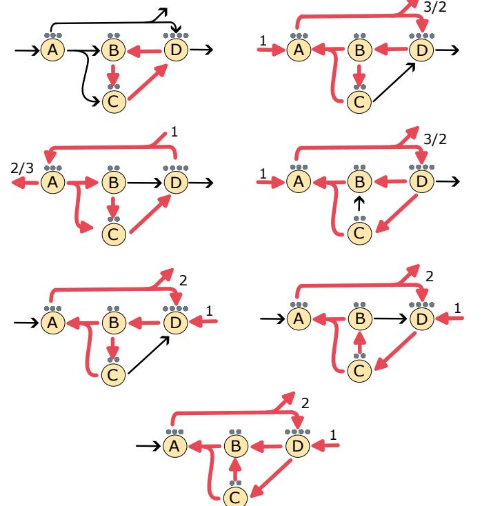

## <span id="page-318-0"></span>**C.4 Chapter "Rating metabolic pathways by enzyme efficiency"**

### **Problem [6.9](#page-115-1) (Haldane kinetic rate law)**

First, we add the constraint on the total enzyme concentration ([*E*] + [*ES*] + [*EP*] = *E*tot) and rewrite the ODE system in matrix notation:

$$
\begin{pmatrix}
1 & 1 & 1 \\
& [S]k_1 & -(k_2 + k_3) & k_4 \\
& [P]k_6 & k_3 & -(k_4 + k_5) \\
-[S]k_1 - [P]k_6 & k_2 & k_5
\end{pmatrix}
\begin{pmatrix}
[E] \\ [ES] \\ [EP] \\ [EP] \end{pmatrix} = 
\begin{pmatrix}
[E_0] \\ 0 \\ 0 \\ 0
\end{pmatrix}.
\tag{\text{C.9}}
$$

Note that the last row is linearly dependent on the two previous ones (it is minus their sum). Therefore, we can drop it from the system without loosing information. Then, we will find exlicit expressions for [*E*], [*ES*], and [*EP*] by using Gaussian elimination – a process of eliminating off-diagonal values in the matrix until we reach the identity matrix, while at the same time applying the same operations to the vector on the right-hand side of the equality.

Step 1, elimination the off-diagonal elements on the first column (subtracting the first row times [*S*]*k*1 from the 2nd row and the first row times [*P*]*k*6 from the 3rd row)

$$
\begin{pmatrix} 1 & 1 & 1 \\ 0 & -(k_2 + k_3) - [S]k_1 & k_4 - [S]k_1 \\ 0 & k_3 - [P]k_6 & -(k_4 + k_5) - [P]k_6 \end{pmatrix} \begin{pmatrix} [E] \\ [ES] \\ [EP] \end{pmatrix} = [E]_{\text{tot}} \begin{pmatrix} 1 \\ -[S]k_1 \\ -[P]k_6 \end{pmatrix}.
$$

Step 2, dividing the second row by −(*k*2 + *k*3 + [*S*]*k*1) to have 1 on the diagonal:

$$
\begin{pmatrix} 1 & 1 & 1 \\ 0 & 1 & \frac{[S]k_1 - k_4}{k_2 + k_3 + [S]k_1} \\ 0 & k_3 - [P]k_6 & -(k_4 + k_5) - [P]k_6 \end{pmatrix} \begin{pmatrix} [E] \\ [ES] \\ [EP] \end{pmatrix} = [E_{\text{tot}}] \begin{pmatrix} 1 \\ \frac{[S]k_1}{k_2 + k_3 + [S]k_1} \\ -[P]k_6 \end{pmatrix}.
$$

Step 3, subtracting the second row from the 1st, and again from the 3rd (after multiplying by *k*3 − [*P*]*k*6):

$$
\begin{pmatrix} 1 & 0 & 1 - \frac{[S]k_1 - k_4}{k_2 + k_3 + [S]k_1} \\ 0 & 1 & \frac{[S]k_1 - k_4}{k_2 + k_3 + [S]k_1} \\ 0 & 0 & -(k_4 + k_5) - [P]k_6 - \frac{([S]k_1 - k_4)(k_3 - [P]k_6)}{k_2 + k_3 + [S]k_1} \end{pmatrix} \begin{pmatrix} [E] \\ [ES] \\ [ES] \end{pmatrix} = [E] \alpha \begin{pmatrix} 1 - \frac{[S]k_1}{k_2 + k_3 + [S]k_1} \\ \frac{[S]k_1}{k_2 + k_3 + [S]k_1} \\ -[P]k_6 - \frac{[S]k_1(k_3 - [P]k_6)}{k_2 + k_3 + [S]k_1} \end{pmatrix}.$$

which after simplifying becomes:

 1 0 *k*2+*k*3+*k*4 *k*2+*k*3+[*S*]*k*1 0 1 [*S*]*k*1−*k*4 *k*2+*k*3+[*S*]*k*1 0 0 − [*S*]*k*1(*k*3+*k*4+*k*5)+[*P* ]*k*6(*k*2+*k*3+*k*4)+*k*2*k*4+*k*2*k*5+*k*3*k*5 *k*2+*k*3+[*S*]*k*1 [*E*] [*ES*] [*EP*] = [*E*tot] *k*2+*k*3 *k*2+*k*3+[*S*]*k*1 [*S*]*k*1 *k*2+*k*3+[*S*]*k*1 − [*P* ]*k*6*k*2+[*P* ]*k*6*k*3+[*S*]*k*1*k*3 *k*2+*k*3+[*S*]*k*1 *.*

and we normalize the last row to have 1 on the diagonal:

$$
\begin{pmatrix} 1 & 0 & \frac{k_2 + k_3 + k_4}{k_2 + k_3 + [S]k_1} \\ 0 & 1 & \frac{[S]k_1 - k_4}{k_2 + k_3 + [S]k_1} \\ 0 & 0 & 1 \end{pmatrix} \begin{pmatrix} [E] \\ [ES] \\ [EP] \end{pmatrix} = [E] \alpha \begin{pmatrix} \frac{k_2 + k_3}{k_2 + k_3 + [S]k_1} \\ \frac{[S]k_1}{k_2 + k_3 + [S]k_1} \\ \frac{[P]k_1(k_3 + k_4 + [S]k_1)}{[S]k_1(k_3 + k_4 + k_5) + [P]k_6(k_2 + k_3 + k_4) + k_2k_4 + k_2k_3 + k_2k_5} \end{pmatrix}.$$

Step 4, we eliminate the off-diagonal values of the third column using the 3rd row:

$$
\begin{pmatrix} 1 & 0 & 0 \\ 0 & 1 & 0 \\ 0 & 0 & 1 \end{pmatrix} \begin{pmatrix} [E] \\ [ES] \\ [ES] \end{pmatrix} = [E_{\mathrm{tot}}] \begin{pmatrix} \frac{k_2 + k_3}{k_2 + k_3 + [S]k_1} - \frac{k_2 + k_3 + k_4}{k_2 + k_3 + [S]k_1} \cdot \frac{[P]k_1k_2 + [P]k_3k_3 + [S]k_1k_3}{[S]k_1(k_3 + k_4 + k_5) + [P]k_6(k_2 + k_3 + k_4) + k_2k_4 + k_2k_3 + k_3k_5} \\\ \frac{[S]k_1}{k_2 + k_3 + [S]k_1} - \frac{[S]k_1 - k_4}{k_2 + k_3 + [S]k_1} \cdot \frac{[P]k_3k_2 + [P]k_4k_3 + [S]k_1k_3}{[S]k_1(k_3 + k_4 + k_5) + [P]k_4(k_2 + k_3 + k_4) + k_2k_4 + k_2k_3 + k_3k_5} \\\ \frac{[P]k_4k_2 + [P]k_3k_3 + [S]k_1k_3}{[S]k_1(k_3 + k_4 + k_5) + [P]k_3(k_2 + k_3 + k_4) + k_2k_4 + k_2k_3 + k_3k_5} \end{pmatrix}
$$

Simplifying the expressions on the right-hand side is a lengthy process (which we do not show here) and in the end we get:

$$
\begin{pmatrix} 1 & 0 & 0 \\ 0 & 1 & 0 \\ 0 & 0 & 1 \end{pmatrix} \begin{pmatrix} [E] \\ [ES] \\ [EP] \end{pmatrix} = [E \text{act}] \begin{pmatrix} \frac{k_2 k_4 + k_2 k_5 + k_3 k_5}{[S]k_1 (k_3 + k_4 + k_5) + [P]k_6 (k_2 + k_3 + k_4) + k_2 k_4 + k_2 k_5 + k_3 k_5} \\ \frac{[P]k_4 k_6 + [S]k_1 k_4 + [S]k_1 k_5}{[S]k_1 (k_3 + k_4 + k_5) + [P]k_6 (k_2 + k_3 + k_4) + k_2 k_4 + k_2 k_5 + k_3 k_5}} \\ \frac{[P]k_2 k_6 + [P]k_3 k_6 + [S]k_1 k_3}{[S]k_1 (k_3 + k_4 + k_5) + [P]k_6 (k_2 + k_3 + k_4) + k_2 k_4 + k_2 k_5 + k_3 k_5} \end{pmatrix}
$$

Therefore,

$$[E] = [E_{\rm{tot}}] \frac{k_2 k_4 + k_2 k_5 + k_3 k_5}{[S]k_1(k_3 + k_4 + k_5) + [P]k_6(k_2 + k_3 + k_4) + k_2 k_4 + k_2 k_5 + k_3 k_5} \tag{\text{C.10}}$$

$$[ES] = [E_{\rm tot}] \frac{[P]k_4k_6 + [S]k_1k_4 + [S]k_1k_5}{[S]k_1(k_3 + k_4 + k_5) + [P]k_6(k_2 + k_3 + k_4) + k_2k_4 + k_2k_5 + k_3k_5} \tag{\text{C.17}}$$

$$\mathbb{E}[EP] = [E_{\text{tot}}] \frac{[P]k_2k_6 + [P]k_3k_6 + [S]k_1k_3}{[S]k_1(k_3 + k_4 + k_5) + [P]k_6(k_2 + k_3 + k_4) + k_2k_4 + k_2k_5 + k_3k_5} \tag{\mathbb{C.12}}$$