# Constructing Free-Energy Approximations and Generalized Belief Propagation Algorithms

Jonathan S. Yedidia*, Member, IEEE*, William T. Freeman*, Member, IEEE*, and Yair Weiss

*Abstract—***Important inference problems in statistical physics, computer vision, error-correcting coding theory, and artificial intelligence can all be reformulated as the computation of marginal probabilities on factor graphs. The belief propagation (BP) algorithm is an efficient way to solve these problems that is exact when the factor graph is a tree, but only approximate when the factor graph has cycles.**

**We show that BP fixed points correspond to the stationary points of the Bethe approximation of the free energy for a factor graph. We explain how to obtain region-based free energy approximations that improve the Bethe approximation, and corresponding generalized belief propagation (GBP) algorithms. We emphasize the conditions a free energy approximation must satisfy in order to be a "valid" or "maxent-normal" approximation. We describe the relationship between four different methods that can be used to generate valid approximations: the "Bethe method," the "junction graph method," the "cluster variation method," and the "region graph method." Finally, we explain how to tell whether a region-based approximation, and its corresponding GBP algorithm, is likely to be accurate, and describe empirical results showing that GBP can significantly outperform BP.**

*Index Terms—***Belief propagation (BP), Bethe free energy, cluster variation method, generalized belief propagation (GBP), Kikuchi free energy, message passing, sum–product algorithm.**

## I. INTRODUCTION

**P**ROBLEMS involving probabilistic inference using graphical models are important in a wide variety of disciplines, including statistical physics, signal processing, artificial intelligence, and digital communications [[1\]](#page-29-0), [[2\]](#page-29-0). Message-passing algorithms are a practical and powerful way to solve such problems. The centrality of such problems and the utility of message-passing algorithms for solving them is an explanation for the fact that equivalent or very closely related message-passing algorithms have now been independently invented many times. They are well known by names like the forward–backward algorithm for hidden Markov models [[3\]](#page-29-0), the Viterbi algorithm [[4\]](#page-29-0), [\[5](#page-29-0)], Gallager's sum–product algorithm for decoding lowdensity parity check codes [\[6](#page-29-0)], the "turbo-decoding" algorithm [[7\]](#page-29-0), [\[8](#page-29-0)], Pearl's "belief propagation" algorithm for inference on

Manuscript received September 2, 2002; revised March 2, 2005. The work of Y. Weiss was supported by the U.S.-Israeli Binational Science Foundation.

J. S. Yedidia is with Mitsubishi Electric Research Labs (MERL), Cambridge Research Lab., Cambridge, MA 02139 USA (e-mail: yedidia@merl.com).

W. T. Freeman is with the Massachusetts Institute of Technology, Computer Science and Artificial Intelligence Laboratory, Stata Center, D32-476, Cambridge, MA 02139 USA (e-mail: billf@ai.mit.edu).

Y. Weiss is with the School of Computer Science and Engineering, The Hebrew University of Jerusalem, 91904 Jerusalem, Israel (e-mail: yweiss@cs.huji.ac.il).

Communicated by A. Kavcic ˇ ´, Associate Editor for Detection and Estimation. Digital Object Identifier 10.1109/TIT.2005.850085

Bayesian networks [[9](#page-29-0)], the "Kalman filter" for signal processing [[10\]](#page-29-0), [[11\]](#page-29-0), and the "transfer matrix" approach in statistical mechanics [[12\]](#page-29-0).

In this list of "standard" belief propagation (BP) algorithms, we have blurred a distinction between two different objectives that one might have, and the slightly different algorithms that result. Sometimes, one might be interested in obtaining the one global state of a system that is most probable or otherwise optimal. In other cases, one is interested in obtaining marginal probabilities for some subset of the nodes of the system, given evidence about other nodes in the system. In this paper, we will focus exclusively on this latter problem.

In all standard BP algorithms, messages are sent from one node in a graphical model to a neighboring node. The algorithms are exact when the graphical model is free of cycles. Thus, a common approach for dealing with graphical models that do have cycles is to try to convert them to equivalent cycle-free graphical models, and then to use the standard BP algorithm [[13\]](#page-29-0). In some cases, this is possible, but for many other cases of practical interest, such an approach is intractable, and one must settle for approximate methods.

Fortunately, the standard BP algorithms are well defined, and often give surprisingly good approximate results, for graphical models with cycles. Nevertheless, in such cases there are no guarantees, and sometimes the results are quite poor, or the algorithm fails to give any result at all because it does not converge [[14\]](#page-29-0). Two major goals of this paper are to explain why the standard BP algorithm often works so well even for graphical models with cycles, and to use that understanding to develop improved algorithms for cases when it does not work well.

The class of algorithms that we will describe, which we call *generalized belief propagation* (GBP) algorithms, all have the characteristic that sets or *regions* of nodes will send messages to other regions of nodes. The regions of nodes that communicate with each other can be easily visualized in terms of a *region graph*. The standard BP algorithm is a special case of a GBP algorithm, with a particular choice of regions. Different choices of region graphs will give different GBP algorithms, and the user can choose to trade off complexity for accuracy.

In practice, GBP algorithms can often dramatically outperform BP algorithms in terms of either their accuracy or their convergence properties, for minimal computational cost, if one makes an intelligent choice of regions. However, how to optimally choose regions for a GBP algorithm remains at this point an open research problem. We hope that this paper contributes to the solution of this problem by delineating what classes of constructions are likely to give good results.

We shall give a theoretical justification of GBP algorithms by showing that their fixed points are identical to the stationary points of a *region-based free energy*, which is an approximation to another free energy that can be justified by a rigorous variational principle. The first specialized examples of such free energies were introduced long ago in the physics literature by Bethe [\[15](#page-29-0)] and Kikuchi [[16\]](#page-29-0). For the important special case of the standard BP algorithm, we show that its fixed points are the same as the stationary points of the *Bethe free energy*, thus establishing an important basic link between a classical algorithm and a classical approximation from physics.

One must be careful in constructing a region graph in order to ensure that the resulting approximations are accurate. In our original work introducing GBP algorithms [\[17](#page-29-0)], we focused on a subclass of GBP algorithms that were equivalent to free-energy approximations based on Kikuchi's *cluster variation method* [\[16](#page-29-0)], [\[18](#page-29-0)]–[\[20](#page-29-0)]. We shall show that this method is only one of a variety of methods to generate region graphs and their corresponding free energies and message-passing algorithms.

In our original work, we also focused on graphical models defined in terms of pair-wise or higher order Markov random fields (MRFs). In this paper, we shall instead focus on graphical models defined in terms of *factor graphs.* All our results can be re-expressed for other graphical models without difficulty. Using factor graphs has certain practical advantages—in particular, we can refer the neophyte reader to the excellent review by Kschischang *et al.* [[21\]](#page-29-0). That review explains the equivalence to factor graphs of other graphical models such as Bayesian networks, Tanner graphs for error-correcting codes, or pair-wise MRFs, and explains the standard BP algorithm in its various guises as an algorithm that operates on factor graphs.

There have been a number of other recent papers that have tried to explain, reformulate, or generalize the standard belief propagation algorithm in a variety of ways. We point the interested reader to [\[22](#page-29-0)]–[[28\]](#page-29-0).

After our original work which introduced region-based free energies and GBP algorithms based on the cluster variation method, other works appeared which explored parallel ideas [\[29](#page-30-0)]–[[32\]](#page-30-0). In fact, one of the goals of this paper is to unify our previous approach with the one that Aji and McEliece presented based on *junction graphs* [\[29](#page-30-0)]. We also recommend the elegant exposition of GBP presented by McEliece and Yildirim in [\[30](#page-30-0)].

We have also previously released a number of technical reports [\[33](#page-30-0)]–[[35\]](#page-30-0) that are largely superseded by this paper, as well as a somewhat more popular introduction [[36\]](#page-30-0).

The outline for the rest of the paper is as follows. In Section II, we review and introduce our notation for factor graphs and the standard BP algorithm. In Sections III and IV, we introduce and explain the physical intuition behind variational free energies and region-based approximations to them. In Section V, we consider the *Bethe method* which can be used to obtain particularly simple region-based free-energy approximations. In Section VI, we show that the standard BP algorithm has fixed points corresponding to the stationary points of the Bethe approximation to the free energy. In Section VII, we describe the *Region Graph Method*, a very general method for generating "valid" region graphs and their associated free energies. In Section VIII, we explain how to determine whether a particular region-based

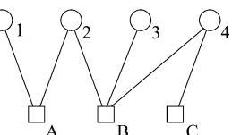

Fig. 1. A small factor graph representing the joint probability distribution p(x ; x ; x ; x ) = (1=Z)f (x ; x )f (x ; x ; x )f (x ).

free-energy approximation is likely to give accurate answers. In Section IX, we introduce GBP algorithms, and show that there are actually a variety of ways to define GBP algorithms for any given region graph, all of which have identical fixed points. We focus on one particular type of GBP algorithm, which we call the *parent-to-child* algorithm. In Section X, we give a detailed example of the implementation of the parent-to-child GBP algorithm. Finally, in Section XI, we give some empirical results showing how GBP algorithms can improve upon the accuracy of standard BP.

We have chosen to put a large amount of material in the Appendices of this paper. The Appendices describe a variety of other methods to generate region graphs and GBP algorithms which could easily prove to be as important in practice as the methods described in the main text.

## II. FACTOR GRAPHS AND BELIEF PROPAGATION

Let be a set of discrete-valued random variables and let represent the possible realizations of random variable . We consider the joint probability mass function , which we shall write more succintly as , where stands for . We suppose that factors into a product of functions. That is, we suppose that has the very general form

$$
\wp(x) = \frac{1}{Z} \prod_a f_a(x_a). \tag{1}
$$

Here is an index labeling functions , where the function has arguments that are some subset of . We assume that the functions are nonnegative and finite, so that is a well-defined probability distribution. is a normalization constant.

A *factor graph* [\[21](#page-29-0)] is a bipartite graph that expresses the factorization structure in (1). A factor graph has a *variable node* (which we draw as a circle) for each variable , a *factor node* (which we draw as a square) for each function , with an edge connecting variable node to factor node if and only if is an argument of . (We shall always index variable nodes with letters starting with , and factor nodes with letters starting with .) As an example, the factor graph corresponding to

$$p(x_1, x_2, x_3, x_4) = \frac{1}{Z} f_A(x_1, x_2) f_B(x_2, x_3, x_4) f_C(x_4) \quad (2)$$

in shown in Fig. 1.

We shall focus on the problem of computing marginal probability distributions. We call the possible values of the *states* of variable node . We use to denote the number of possible states of variable node . If is a set of variable nodes, we use to denote the states of the corresponding variable nodes.

will denote the marginal probability function obtained by marginalizing onto the set of variable nodes , i.e.,

$$p_S(\mathbf{x}_S) = \sum_{\mathbf{x} \nmid \mathbf{x}_S} p(\mathbf{x}). \tag{3}$$

Here the sum over indicates that we sum over the states of all the variable nodes *not* in the set . We shall write for the marginal probability function when the set consists of the single node .

The BP algorithm is a method for computing marginal probability functions. One should note that the problem of computing marginal probability functions is in general hard because it can require summing an exponentially large number of terms. We describe the BP algorithm in terms of operations on a factor graph. As we already mentioned in the Introduction, the computed marginal probability functions will be exact if the factor graph has no cycles, but the BP algorithm is still well defined and empirically often gives good approximate answers even when the factor graph does have cycles.

To define the BP algorithm, we first introduce *messages* between variable nodes and their neighboring factor nodes and *vice versa*. The message from the factor node to the variable node is a vector over the possible states of . This message can be interpreted as a statement from factor node to variable node about the relative probabilities that is in its different states, based on the function . The message from the variable node to the factor node may in turn be interpreted as a statement about the relative probabilities that node is in its different states, based on all the information that node has *except* for that based on the function .

The messages are updated according to the following rules:

$$m_{i \to a}(x_i) := \prod_{c \in N(i) \backslash a} m_{c \to i}(x_i). \tag{4}$$

and

$$m_{a \to i}(x_i) := \sum_{\mathbf{x}_a \backslash x_i} f_a(\mathbf{x}_a) \prod_{j \in N(a) \backslash i} n_{j \to a}(x_j). \qquad (5)$$

Here, denotes all the nodes that are neighbors of node except for node , and denotes a sum over all the variables that are arguments of except . This standard BP algorithm is sometimes called the "sum–product" algorithm because of the sum and product that occurs on the right-hand side of (5).

The messages are usually initialized to and for all factor nodes , variable nodes , and states . In fact, other initializations are also possible, and the overall normalization of the messages can also be chosen arbitrarily. The only important normalization condition is on the beliefs, introduced below, which must sum to one in order to properly represent probabilities. The messages should be initialized to be positive, which implies, because of the nonnegativity of the factors in the message-update rules, that the messages remain nonnegative at every iteration.

The message-update rules may initially appear quite mysterious, and a major goal of this paper will be to explain, justify, and ultimately improve upon them. First though, to complete our preliminary description of the standard BP algorithm, we

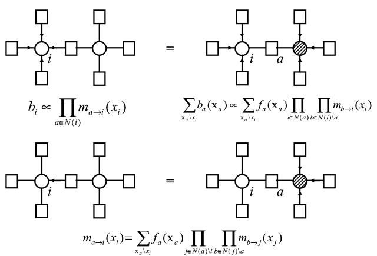

Fig. 2. This figure illustrates how the message update rules can be derived using the belief equations and the marginalization conditions. The one-node belief over node i (upper left) is equal to a multinode belief over nodes including i, which in this case is a two-node belief (upper right), when it is marginalized over all nodes except i. We denote marginalization by using a hatched pattern on the marginalized variable node. If we cancel out equivalent messages on the two sides of the equation, we obtain the message-update rules (lower).

introduce the *belief* at a variable node , which is the BP approximation to the exact marginal probability function . The belief can be computed from the equation

$$b_i(x_i) \propto \prod_{a \in N(i)} m_{a \to i}(x_i) \tag{6}$$

where we have used the proportionality symbol to indicate that one must normalize the beliefs so that they sum to one. The BP message-update equations are iterated until they (hopefully) converge, at which point the beliefs can be read off from (6).

We can also use the BP algorithm to compute joint beliefs over sets of variable nodes that may contain more than one node. Consider the important case when the set consists of all the variable nodes attached to the th function . We denote the corresponding belief by , which will be given within the BP approximation by

$$\begin{split} b_a(\mathbf{z}_a) &\propto f_a(\mathbf{z}_a) \prod_{i \in N(a)} n_{i \to a}(x_i) \\ &\propto f_a(\mathbf{z}_a) \prod_{i \in N(a)} \prod_{c \in N(i) \backslash a} m_{c \to i}(x_i). \end{split} \tag{7}$$

We can directly *derive* the message update rules (4) and (5) from the belief equations (6) and (7), along with the marginalization condition

$$b_i(x_i) = \sum_{x_a \nmid x_i} b_a(x_a) \tag{8}$$

which holds when is one of the arguments in the set . Thus, the belief equations (6) and (7) can be considered to define the BP algorithm, a point of view that will prove useful later. In Fig. 2, we explain this point in more detail, using diagrams to show how the message update rules follow from the belief equations and the marginalization conditions.

The BP algorithm is normally justified as being an exact algorithm when the factor graph has no cycles (i.e., it has the topology of a tree.) We shall not prove that property here, but instead simply give a small example: consider the joint probability distribution given by (2) as illustrated in Fig. 1. Suppose that we would like to compute , the marginal probability distribution at variable node 1. Repeatedly using the BP equations, we find

$$\begin{aligned} &b_1(x_1) \propto m_{A \to 1}(x_1) \\ &\propto \sum_{x_2} f_A(x_1, x_2) n_{2 \to A}(x_2) \\ &\propto \sum_{x_2} f_A(x_1, x_2) m_{B \to 2}(x_2) \\ &\propto \sum_{x_2, x_3, x_4} f_A(x_1, x_2) f_B(x_2, x_3, x_4) \\ &\propto n_{3 \to B}(x_3) n_{4 \to B}(x_4) \\ &\propto \sum_{x_2, x_3, x_4} f_A(x_1, x_2) f_B(x_2, x_3, x_4) m_{C \to 4}(x_4) \\ &\propto \sum_{x_2, x_3, x_4} f_A(x_1, x_2) f_B(x_2, x_3, x_4) f_C(x_4) \end{aligned} (9)$$

which is exactly the desired marginal probability function. We could similarly demonstrate that (7) would give exact multinode marginal probabilities for graphs with no cycles. We can already see from this example that for graphs with no cycles, the BP algorithm is essentially a dynamic programming algorithm that organizes the computations necessary to compute marginal probability distributions in such a way that they become tractable.

The BP algorithm was introduced into the coding literature by Gallager as a suboptimal probabilistic decoding algorithm for linear block error-correcting codes, and some readers may be most familiar with the BP algorithm in that context [[6\]](#page-29-0). Pearl [\[9](#page-29-0)] introduced and popularized a version of the algorithm, along with the widely adopted terminology of "belief propagation," in the context of the problem of probabilistic inference in Bayesian networks. Readers who are more familiar with the BP algorithm written in one of these forms may want to consult the review by Kschischang *et al.* [[21\]](#page-29-0), which explains the equivalence between these forms of the BP algorithm and the one we have chosen to use here.

## III. FREE ENERGIES

In this section, we turn from simply describing the BP algorithm to explaining its success. In Section II, we saw that the BP algorithm can be defined in terms of the belief equations (6) and (7). We shall eventually show that these belief equations correspond to the stationarity conditions for a function of the beliefs called the *Bethe free energy*, . This fact serves in some sense to justify the BP algorithm even when the factor graph it operates on has cycles, because minimizing the Bethe free energy is a sensible approximation procedure that has a long and successful history in physics. It also points to a variety of ways to improve upon or generalize BP, especially by improving upon the approximations used in the Bethe free energy. In the rest of the paper, we will discuss all of these issues, but we first turn to an explanation of the notion of a *free energy*.

Suppose that one has a system of particles, each of which can be in one of a discrete number of states, where the states of the th particle are labeled by . (As an example, one might make a variety of simplifications and characterize the states of the atoms in a magnetic crystal by whether a given electron in each atom has an "up" spin or a "down" spin.) The overall state of the system will be denoted by the vector . Each state of the system has a corresponding *energy* . A fundamental result of statistical mechanics is that, in thermal equilibrium, the probability of a state will be given by *Boltzmann's law*

$$p(\mathbf{z}) = \frac{1}{Z(T)} e^{-E(\mathbf{z})/T}.\tag{10}$$

Here, is the temperature, and is simply a normalization constant, known as the *partition function*

$$Z(T) = \sum_{\mathbf{z} \in S} e^{-E(\mathbf{z})/T} \tag{11}$$

where is the space of all possible states of the system.

A substantial part of statistical mechanics theory is devoted to the justification of Boltzmann's law. On the other hand, if one begins with a joint probability distribution for some nonphysical system, one can view Boltzmann's law as a postulate that serves to define an energy for the system, where the temperature can be set arbitrarily, as it simply sets a scale for the units in which one measures energy. We shall take this point of view and set throughout the rest of this paper. For the case of a factor graph probability distribution function , we therefore define the *energy* of a state to be

$$E(\mathbf{x}) = -\sum_{a=1}^{M} \ln f_a(\mathbf{x}_a) \tag{12}$$

in order to be consistent with Boltzmann's law.

Note that if one or more of the factors are equal to zero for particular configurations of , then the overall probability of states which contain these forbidden configurations is zero. The corresponding energy of states containing forbidden configurations is infinite. A particularly important class of factors that have forbidden configurations are deterministic functions such as exclusive–or functions, which are used, for example, in defining error-correcting codes.

The *Helmholtz free energy* of a system is

$$F_H = -\ln Z.\tag{13}$$

This free energy is a fundamentally important quantity in statistical mechanics, because if one can calculate the functional dependence of on quantities like a macroscopic magnetic field or temperature , then it is easy to compute experimentally measurable quantities like the response of the system to a change in or . Physicists have therefore devoted considerable energy to developing techniques which give good approximations to .

One important technique is based on a variational approach. Suppose again that is the true probability distribution of the system, and obeys Boltzmann's law . It may be that even if we know exactly, it is of a form that makes the computation of difficult. We therefore introduce a "trial" probability distribution , which should, of course, be normalized and obey for all , and a corresponding *variational free energy* (this quantity is also sometimes called the *Gibbs free energy*) defined by

$$F(b) = U(b) - H(b). \tag{14}$$

where is the *variational average energy*

$$U(b) = \sum_{\mathbf{x} \in S} b(\mathbf{x}) E(\mathbf{x}) \tag{15}$$

and is the *variational entropy*

$$H(b) = -\sum_{\mathbf{x} \in S} b(\mathbf{x}) \ln b(\mathbf{x}).\tag{16}$$

(Note that we measure entropy using the natural logarithm instead of the base- logarithm in order to be consistent with the physics literature.)

It follows directly from our definitions that

$$F(b) = F_H + D(b \| \| p) \tag{17}$$

where

$$D(b \| \| p) \equiv \sum_{\mathbf{x} \in S} b(\mathbf{x}) \ln \frac{b(\mathbf{x})}{p(\mathbf{x})} \tag{18}$$

is the Kullback–Leibler divergence between and . Since there exists a theorem (e.g., [[37,](#page-30-0) Theorem 2.6.3]) that is always nonnegative and is zero if and only if , we see that , with equality precisely when .

Minimizing the variational free energy with respect to trial probability functions is therefore an exact procedure for computing and recovering . Of course, as becomes large, this procedure is also totally intractable, as will take exponentially large memory just to store. A more practical possibility is to upper-bound by minimizing over a restricted class of probability distributions. This is the basic idea underlying the *mean field* approach.

One very popular mean-field form for is the factorized form

$$b_{\rm MF}(\mathbf{z}) = \prod_{i=1}^{N} b_i(x_i) \tag{19}$$

where each is a normalized trial probability function over the single variable . Using this , and an energy function of the factor graph form given in (12), we can easily compute the mean field free energy for an arbitrary factor graph

$$U_{\rm MF}(\{b_1, \ldots, b_N\}) = -\sum_{a=1}^M \sum_{\mathfrak{a}_a} \ln f_a(\mathfrak{x}_\mathbf{a}) \prod_{i \in N(a)} b_i(x_i) \tag{20}$$

$$H_{\rm MF}(\{b_1, \ldots, b_N\}) = -\sum_{i=1}^N \sum_{x_i} b_i(x_i) \ln b_i(x_i). \tag{21}$$

Minimizing over the will give us self-consistent equations for the , which can be solved numerically to obtain a mean-field approximation for the beliefs .

Instead of a factorized form, one might consider other more complicated forms for which still lead to tractable approximations. This is the idea behind the "structured mean-field" approach [\[38\]](#page-30-0). We will not follow that path, and will instead describe a quite different approach to approximating in the next section; one which underlies the BP algorithm.

# IV. REGION-BASED FREE-ENERGY APPROXIMATIONS

Kikuchi and the other physicists who further developed the so-called *cluster variation method* [[16\]](#page-29-0), [[18](#page-29-0)]–[\[20](#page-29-0)] introduced a class of approximations to the variational free energy . The idea behind these approximations is similar, but slightly different from the mean-field approximation. Whereas the factorized mean-field free energy is a function of single-node beliefs , in a Kikuchi approximation the approximate free energy will be a function of beliefs over larger sets of variable nodes.

One drawback of the cluster variation method is that in contrast with the mean-field approach, one cannot normally explicitly construct an overall "trial" belief vector that is consistent with the multinode beliefs , and therefore one does not normally obtain any upper bound on [[39\]](#page-30-0). On the other hand, one can make approximations that are much more accurate than the factorized mean-field approximation, and there is a great deal of flexibility in the exact choice of approximation. As we shall also see in further detail, these approximations can be exploited to yield message-passing algorithms, and a particularly simple version—the Bethe approximation—will give results that are equivalent to the standard BP algorithm.

We shall actually describe here a class of approximations that generalize those generated by the cluster variation method as it has been described in the physics literature, and will therefore refer to such approximations as *region-based approximations*. We refer to the subclass of approximations specifically generated using the cluster variation method as *Kikuchi approximations*.

## *A. Region-Based Approximations*

Until this point, we have essentially reviewed notions and definitions that were developed by others. We shall now begin to define concepts that did not appear in the previous literature; to mark this break, we now explicitly indicate important new definitions and theorems. In order to aid the reader in distinguishing the most important results in this paper, we label those as "theorems," while the results of lesser importance are called "propositions."

*Definition:* We define a *region* of a factor graph to be a set of variable nodes and a set of factor nodes, such that if a factor node belongs to , all the variable nodes neighboring are in .

We give examples of sets of nodes that would or would not be considered regions in Fig. 3. Note that the set may be

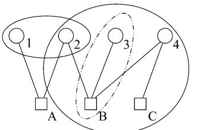

Fig. 3. An illustration of the definition of a *region*. Regions are sets of variable and factor nodes in a factor graph such that all variable nodes connected to any included factor nodes are included. Thus, the sets of nodes f1; 2g and fB; C; 2; 3; 4g could be regions, but fB; 3g could *not* be a region (since factor node B was included, variable nodes 2 and 4 should also be included).

empty, and that a factor need not be included in even if all its neighboring variable nodes are in .

We define the state of a region to be the collective set of variable node states . The marginal probability function over a region will be denoted by , by which we mean a marginalization of onto the variable nodes in . The corresponding belief will be an approximation to the true .

*Definition:* We define the *region energy* to be

$$E_R(\mathbf{z}_R) = -\sum_{a \in A_R} \ln f_a(\mathbf{z}_a). \tag{22}$$

Note that because all the variable nodes neighboring a factor node are guaranteed to be in the region , we can always determine any needed state from the state .

*Definitions:* For any region , we define the *region average energy* , the *region entropy* , and the *region free energy* , by

$$U_R(b_R) = \sum_{\mathbf{x}_R} b_R(\mathbf{x}_R) E_R(\mathbf{x}_R) \tag{23}$$

$$H_R(b_R) = -\sum_{\mathbf{x}_R} b_R(\mathbf{x}_R) \ln b_R(\mathbf{x}_R) \tag{24}$$

and

$$F_R(b_R) = U_R(b_R) - H_R(b_R). \tag{25}$$

The intuitive idea behind a region-based free energy approximation is that we will try to break up the factor graph into a set of large regions that include every factor and variable node, and say that the overall free energy is the sum of the free energies of all the regions. Of course, if some of the large regions overlap, then we will have erred by counting the free energy contributed by some nodes two or more times, so we then need to subtract out the free energies of these overlap regions in such a way that each factor and variable node is counted exactly once. Let us make these notions more precise.

*Definitions:* We define a *region-based approximate entropy* by

$$H_{\mathcal{R}}(\{b_R\}) = \sum_{R \in \mathcal{R}} c_R H_R(b_R) \tag{26}$$

and the *region-based average energy* by

$$U_{\mathcal{R}}(\{b_R\}) = \sum_{R \in \mathcal{R}} c_R U_R(b_R) \tag{27}$$

where the chosen set of regions , and the associated set of *counting numbers* instantiate the approximation. We define the *region-based free energy* by

$$F_{\mathcal{R}}(\{b_R\}) = U_{\mathcal{R}}(\{b_R\}) - H_{\mathcal{R}}(\{b_R\}).\tag{28}$$

Note, in passing, that we could generalize these approximations by allowing for *different* counting numbers for the average energy and entropy. In fact, constructing such approximations, starting with the regions used in the Bethe approximation, but modifying the entropic counting numbers to differ from those given in the Bethe approximation, is one way of deriving the "fractional belief propagation algorithm" [[40\]](#page-30-0) and the essentially equivalent "convexified Bethe free energy" [[41\]](#page-30-0) approximation. In this paper, we will always assume just one set of counting numbers.

In fact, not all region-based approximations to the variational free energy are equally good. At this point, we introduce the notion of a *valid* region-based approximation. Later, we shall narrow our focus even further to a subset of valid approximations that we call *maxent-normal* region-based approximations.

*Definition:* We say that a set of regions and counting numbers give a *valid* region-based approximation when, for every factor node and every variable node in the factor graph

$$\sum_{R \in \mathcal{R}} c_R I_{A_R}(a) = \sum_{R \in \mathcal{R}} c_R I_{V_R}(i) = 1 \tag{29}$$

where is the set-membership indicator function equal to if and equal to otherwise.

These conditions ensure that every factor and variable node will be counted exactly one time in the approximation to the free energy. If a given factor or variable node is added into the free energy in two different regions, then there must be another region where it is subtracted back out.

We now are in a position to prove two propositions that help explain our interest in *valid* region-based approximations.

*Proposition 1: (Exactness of the Average Energy):* If the beliefs are equal to the corresponding exact marginal probabilities , then the average energy

$$U_{\mathcal{R}}(\{b_{\mathcal{R}}\}) = \sum_{R \in \mathcal{R}} c_{R} U_{R}(b_{\mathcal{R}}) \tag{30}$$

of a valid region-based approximation will be exact.

*Proof:* Compare the region-based average energy

$$U_{\mathcal{R}}(\{b_{\mathcal{R}}\}) = -\sum_{R \in \mathcal{R}} c_{\mathcal{R}} \sum_{\mathbf{z}_R} b_R(\mathbf{z}_R) \sum_{a \in A_R} \ln f_a(\mathbf{z}_a) \quad (31)$$

with the exact average energy

$$U = \sum_{\mathbf{x} \in S} p(\mathbf{x})E(\mathbf{x}) = -\sum_{a=1}^{M} \sum_{\mathbf{x}_a} p_a(\mathbf{x}_a) \ln f_a(\mathbf{x}_a) \qquad (32)$$

and note that the overcounting numbers guarantee that each factor is counted exactly once in (31). The region-based average energy is linear in the beliefs, so if all the are exact in (31), they will properly marginalize into the terms in (32).

On the other hand, the region-based entropy

$$\begin{split} H_{\overline{\mathcal{R}}}(\{b_{R}\}) &= \sum_{R \in \mathcal{R}} c_{R} H_{R}(b_{R}) \\ &= -\sum_{R \in \mathcal{R}} c_{R} \sum_{\mathfrak{w}_{R}} b_{R}(\mathfrak{x}_{R}) \ln b_{R}(\mathfrak{x}_{R}) \quad (33) \end{split}$$

will typically only be an approximation even if the beliefs are exactly equal to the true marginal probabilities. Nevertheless, the condition that each variable node is counted once lets us prove the following proposition, which says that the entropy is at least counting the total number of degrees of freedom correctly.

*Proposition 2: (Correct Counting of Degrees of Freedom):* If the true joint probability distribution is an equiprobable distribution over all possible states, and if the beliefs are equal to the corresponding exact marginal probabilities , then the entropy of a valid region-based approximation is exact.

*Proof:* For a uniform joint probability distribution, the entropy is just the logarithm of the number of possible configurations

$$H = \ln \prod_{i=1}^{N} q_i. \tag{34}$$

On the other hand, using the fact that each marginal probability over a region, and therefore, each belief over a region, will also be a uniform distribution, the region-based entropy will be

$$H_{\overline{\mathcal{R}}} = \sum_{R \in \mathcal{R}} c_{\overline{R}} \ln \prod_{i \in V_R} q_i. \tag{35}$$

Because the counting numbers in a valid region-based approximation guarantee that each variable node is counted exactly once, this entropy reduces to the exact entropy.

Although these propositions, particularly the proposition about the entropy, may not seem like very strong results, they still provide some justification for our focus on *valid* region-based approximations, in that choices of counting numbers that did not satisfy our validity conditions would not even give exact results for the average energy or entropy under the restricted conditions of the propositions.

## *B. Constrained Region-Based Free Energies*

In the end, we want to find the minimum of the region-based free energy with respect to the set of region beliefs. More precisely, we will try to minimize the region-based free energy with respect to the region beliefs, subject to a set of constraints on those region beliefs.

*Definition:* We define a *constrained* region-based free energy, entropy, or average energy to be an approximate regionbased free energy, entropy, or average energy subject to the following constraints on the region beliefs. Each region belief has the form of a probability function; that is, it must normalize to one and obey for any state . Moreover, the marginal region beliefs must be consistent for pairs of regions if the set of variable nodes is included in both regions. (As we shall see, the particular pairs of regions that we demand consistency across can change according to the approximation.)

Because the constrained region-based free energy must be *minimized*, we are most interested in the accuracy of the constrained region-based entropy near its *maximum*. Of course, the maximum of the true entropy occurs when the joint probability distribution is uniform. We would like for a similar property to hold for constrained region-based entropies. This motivates the following definition.

*Definition:* We say that a constrained region-based free energy approximation is *maxent-normal* if it is valid and the corresponding constrained region-based entropy achieves its maximum when all the beliefs are uniform.

As we shall see, important classes of region-based approximations, including the Bethe approximation, are provably maxent-normal. On the other hand, not all possible Kikuchi approximations, for example, are maxent-normal. We emphasize that a region-based approximation that is not maxent-normal cannot be expected to give good results, because it will give wrong answers even when there is no energy term.

How does one go about selecting a set of regions , counting numbers , and consistency constraints for a given factor graph that give a valid, or better yet, maxent-normal approximation? There are in fact an infinite number of ways to do that. In the next section, we will describe a very straightforward approach which we call the *Bethe method*, which is guaranteed to give a maxent-normal region-based approximation. In Section VI, we then prove (in broad terms, to be made more precise later) that the fixed points of the standard BP algorithm correspond to stationary points of the constrained Bethe approximation to the free energy.

In Section VII, we introduce the *region graph method*, which is a very general approach for constructing valid region-based approximations, using a *region graph*. Region graphs play a central role in the description both of the region graph free energy, and in the construction of corresponding GBP algorithms, and provide the clear way of visualizing and understanding a region-based approximation.

The Bethe method is an important special case of the much more general region graph method. In Appendices A and B, we discuss two other important methods that are also special cases of the region graph method: the *junction graph method* and the *cluster variation method*. In Appendix C, we discuss in detail the relationship between the different methods.

## V. THE BETHE METHOD

The origins of the Bethe method date back to 1935 and Bethe's famous approximation method for magnets [\[15](#page-29-0)]. In his 1951 paper that pioneered the cluster variation method [[16\]](#page-29-0), Kikuchi recognized that Bethe's approximation was the simplest example of an approximation that could be generated using that method. From the modern point of view, these

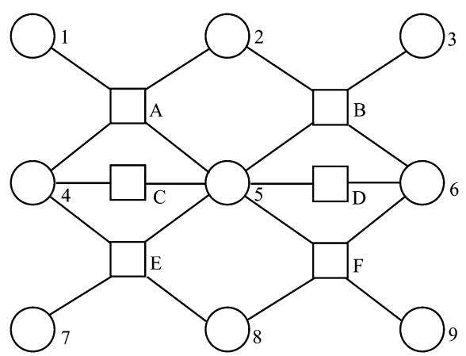

Fig. 4. A factor graph which we use to illustrate a variety of region-based free-energy approximations.

early papers focused on very special graphical models, and we warn the reader who wants to read the original papers that our description of Bethe's and Kikuchi's methods will bear little resemblance to their expositions.

First, we make a small preliminary definition: if and are two regions, we say that is a *subregion* of and is a *super-region* of if the set of variable and factor nodes in are a subset of those in .

*Definition:* In the region-based approximation generated by the *Bethe method*, we take the set of regions included in to be of two types. First, we have a set of *large* regions such that the regions in each contains exactly one factor node and all the variable nodes neighboring that factor node. Second, we have a set of *small* regions , such that the regions in each contains a single variable node. The counting numbers for each region are given by

$$c_R = 1 - \sum_{S \in \mathcal{S}(R)} c_S \tag{36}$$

where is the set of regions that are super-regions of .

We take as an example the factor graph shown in Fig. 4, which has six factor nodes which we label through and nine variable nodes which we label 1 through 9. For this example, we would have the following large regions in , and , and the following small regions in , and . The complete set of regions included in the Bethe approximation is .

Using our definition, we see that for every region , while for every region , where is the degree (number of neighboring factor nodes) of the variable node . It is easy to confirm that the Bethe approximation will always be a *valid* approximation, as each factor and variable node will clearly be counted once as required in (29). We can use our expressions for the counting numbers to obtain the Bethe approximation to the free energy, entropy, and average energy.

*Definition:* The *Bethe free energy* is , where the *Bethe average energy* is

$$U_{\text{Bethe}} = -\sum_{a=1}^{M} \sum_{\mathbf{x}_a} b_a(\mathbf{x}_a) \ln f_a(\mathbf{x}_a) \tag{37}$$

and the *Bethe entropy* is

$$\begin{aligned} H_{\text{Bethe}} &= -\sum_{a=1}^{M} \sum_{\mathbf{x}_a} b_a(\mathbf{x}_a) \ln b_a(\mathbf{x}_a) \\ &\quad + \sum_{i=1}^{N} (d_i - 1) \sum_{x_i} b_i(x_i) \ln b_i(x_i). \end{aligned} (38)$$

The Bethe free energy is sometimes justified in the physics literature by some version of the following proposition, which states that it would be exact if the factor graph had no cycles.

*Proposition 3:* The exact variational free energy is equal to the Bethe free energy when the factor graph has no cycles.

*Proof:* The exact average energy reduces to the Bethe average energy by the argument used in Proposition 1. The Bethe entropy will also be exact if the factor graph has no cycles, because in that case we have the exact formula [[13\]](#page-29-0)

$$p(x) = \frac{\prod_{a=1}^{M} p_a(x_a)}{\prod_{i=1}^{N} (p_i(x_i))^{d_i - 1}} \tag{39}$$

which we can substitute into the formula for the variational entropy to recover .

The Bethe free energy, entropy, and average energy are all functions of the beliefs and . The *constrained* Bethe free energy is defined by enforcing that the beliefs obey the normalization constraints

$$\sum_{x_i} b_i(x_i) = \sum_{\mathfrak{a}_a} b_a(\mathfrak{x}_a) = 1,\qquad(40)$$

the consistency constraints

$$\sum_{\mathbf{x}_{a}\backslash x_{i}} b_{a}(\mathbf{x}_{a}) = b_{i}(x_{i}),\tag{41}$$

and the inequality constraints

$$0 \le b_i(x_i) \le 1\tag{42}$$

and

$$0 \le b_a(\mathfrak{x}_a) \le 1.\tag{43}$$

*Definition:* We refer to the Bethe free energy, subject to the above constraints on the beliefs, as the *constrained Bethe free energy*, and similarly for the *constrained Bethe entropy* and the *constrained Bethe average energy*.

We now prove that the Bethe method gives *maxent-normal* region-based approximations.

# *Theorem 1: (Bethe Approximations Are Maxent-Normal):* The global maximum of the constrained Bethe entropy is achieved when the beliefs and are all uniform.

*Proof:* Rewrite the Bethe entropy as

$$H_{\text{Bethe}} = \sum_{i=1}^{N} H(b_i) - \sum_{a=1}^{M} I(b_a) \tag{44}$$

where

$$H(b_i) \equiv -\sum_{x_i} b_i(x_i) \ln b_i(x_i) \tag{45}$$

and

$$I(b_a) \equiv \left(\sum_{\mathbf{x}_a} b_a(\mathbf{x}_a) \ln b_a(\mathbf{x}_a) - \sum_{i \in N(a)} H(b_i)\right) \quad (46)$$

The maximum of , subject to the constraints on , is achieved when has a uniform distribution. The mutual information must be greater than or equal to zero, and it equals zero if all the beliefs involved have uniform distributions (see, e.g., [\[37](#page-30-0), Theorem 2.6.4]). Since achieves its maximum and achieves its minimum when the beliefs are uniform, the theorem is proved.

It is a simple corollary of this theorem and Proposition 2 that the constrained Bethe entropy is exact at its maximum.

At this point, we wish to re-emphasize that free energies obtained using a region-based approach are only approximations to the true variational free energy, and that in particular the entropy obtained is incorrect. This can give rise to some strange-looking problems, which can already be illustrated with some very simple factor graphs when the Bethe approximation is used.

# *A. Unrealizability of Beliefs*

First, the constrained Bethe free energy may be minimized by a set of beliefs and which are not the marginals of *any* global probability function .

A very simple example, first pointed out in [\[39](#page-30-0)], consists of a factor graph with three binary variable nodes, where each pair of nodes is connected by a factor node. Let us take the factor connecting nodes 1 and 2 to be

$$f_A(x_1, x_2) = \begin{pmatrix} 0.4 & 0.1 \\ 0.1 & 0.4 \end{pmatrix},\tag{47}$$

the factor connecting nodes 1 and 3 to be

$$f_B(x_1, x_3) = \begin{pmatrix} 0.4 & 0.1 \\ 0.1 & 0.4 \end{pmatrix},\tag{48}$$

and the factor connecting nodes 2 and 3 to be

$$f_C(x_1, x_3) = \begin{pmatrix} 0.1 & 0.4\\ 0.4 & 0.1 \end{pmatrix}.\tag{49}$$

Note that the factor connecting nodes 1 and 2, and the factor connecting nodes 1 and 3 prefer that the connected variables to be in the same state, while the factor connecting nodes 2 and 3 prefers them to be in different states. Not all of these factors can be satisfied simultaneously; this is thus a very simple example of what statistical physicists call a "frustrated" system [\[42](#page-30-0)].

The beliefs and that minimize the constrained Bethe free energy for this model are

$$b_A(x_1, x_2) = b_B(x_1, x_3) = \begin{pmatrix} 0.4 & 0.1 \\ 0.1 & 0.4 \end{pmatrix} \qquad (50)$$

$$b_C(x_1, x_2) = \begin{pmatrix} 0.1 & 0.4\\ 0.4 & 0.1 \end{pmatrix} \tag{51}$$

and

$$b_1(x_1) = b_2(x_2) = b_3(x_3) = \begin{pmatrix} 0.5\\0.5 \end{pmatrix}.\qquad(52)$$

For this problem, these beliefs are also the ones that are obtained as stable fixed points of the BP update equations, with messages equal to

$$m_{a \to i}(x_i) = \begin{pmatrix} 1 \\ 1 \end{pmatrix} \tag{53}$$

for all and , as one would expect from the theorems that we prove later. However, one can also prove that this set of beliefs cannot be obtained as the marginals of *any* three-node belief [\[39](#page-30-0)].

Wainwright and Jordan have emphasized this problem and proposed new variational inference techniques, closely related to our region-based approximations, but differentiated by a requirement that the set of beliefs used must be marginals of some global belief [[43\]](#page-30-0). They call the set of beliefs realizable from a global belief the "marginal polytope."

# *B. Negative Entropies*

Because some of the terms in the Bethe entropy have a sign that is flipped from the normal form of the entropy, for some factor graphs it is actually possible to find sets of beliefs that satisfy all our constraints, but for which the Bethe entropy is negative. Of course, the true entropy can never be negative for any global probability distribution.

For example, consider a factor graph with four binary variable nodes, where all pairs of nodes are connected by a factor. There are six pairs of nodes, and four single nodes. Each large region is assigned a counting number of , and each small region containing a single variable node is assigned an overcounting number of in the Bethe approximation. If we consider the set of beliefs (that satisfy all the constraints)

$$b_a(x_i, x_j) = \begin{pmatrix} 1/2 & 0 \\ 0 & 1/2 \end{pmatrix} \tag{54}$$

for all pairs , and

$$b_i(x_i) = \begin{pmatrix} 1/2\\ 1/2 \end{pmatrix} \tag{55}$$

for all , we find that each pair of nodes contributes to the Bethe entropy, but that each single node contributes , so that the total Bethe entropy for this set of beliefs is .

For this example, it does not seem to be possible to construct a set of factors such that this set of beliefs is a *local minimum* of the constrained Bethe free energy. More generally, we conjecture that the Bethe entropy must in fact be nonnegative at all local minima of the constrained Bethe free energy.

Notice, for this example, that if all the factors had the form

$$f_a(x_i, x_j) = \begin{pmatrix} 1 & 0 \\ 0 & 1 \end{pmatrix} \tag{56}$$

then the beliefs given above would actually be equal to the corresponding exact marginal probabilities, so the correct beliefs would give a negative Bethe entropy. However, the minimum of the Bethe free energy would occur for beliefs that had the form

$$b_a(x_i, x_j) = \begin{pmatrix} 1 & 0 \\ 0 & 0 \end{pmatrix} \tag{57}$$

for all pairs , and

$$h_i(x_i) = \begin{pmatrix} 1 \\ 0 \end{pmatrix} \tag{58}$$

or the set obtained by favoring the second state instead of the first, and these beliefs give a nonnegative (zero) Bethe entropy.

# VI. CORRESPONDENCE BETWEEN THE BETHE APPROXIMATION AND STANDARD BP

The logic behind region-based free-energy approximations tells us that we should ultimately minimize the constrained Bethe free energy. We now establish the nature of the connection between the minima, or more generally, the stationary points of the constrained Bethe free energy, and the fixed points of the BP algorithm. We exploit Lagrange multiplier theory, which can be used to identify the stationary points of functions subject to linear equality and inequality constraints.

## *A. Review of Lagrangian Formalism*

We first briefly review some necessary background about the Lagrangian formalism for constrained optimization. An excellent textbook containing more information is [\[44\]](#page-30-0).

Consider a function of variables , where the variables may be subject to equality constraint(s) (written as ) and inequality constraint(s) (written as ). We will assume throughout that the equality and inequality constraints are linear in the , because the constraints that we will later deal with are always of this form, and for such constraints, it is straightforward to prove the existence of Lagrange multipliers (see [[44,](#page-30-0) Proposition 3.3.7]).

An inequality constraint is said to be *active* if it is satisfied with equality, and it is *inactive* otherwise. A point is said to be an *edge* point if one or more of the inequality constraints is active; otherwise, it is an *interior* point.

A point is a *local interior minimum* if it is an interior point, such that an infinitesmal variation away from the point in any direction that satisfies the equality constraints would increase the value of the function. Local interior maxima are similarly defined, although we will drop the modifier "local" and presume all maxima and minima to be local unless explicitly specified otherwise. An *interior stationary point* is an interior point such that the gradient is zero in the direction of all variations that satisfy the equality constraints. Of course, such stationary points may be minima, maxima, or saddle points, depending on the second derivatives of the function.

At an edge point, one or more inequality constraints must be active. An *edge-maintaining variation* is a variation that keeps all active inequality constraints active, while also satisfying all the equality constraints. A point is an *edge stationary point* if it is an edge point whose gradient is zero in the direction of all edge-maintaining variations. Note that an edge stationary point may have gradients not equal to zero in the direction of allowed variations that are not edge-maintaining. Edge stationary points may be minima, maxima, or saddle points.

The Lagrangian formalism can be used to recover all constrained stationary points, whether they be interior or edge stationary points. Let us review how this works. Lagrange multipliers are constructed corresponding to each of the equality constraints , and other Lagrange multipliers are constructed corresponding to each of the inequality constraints . One defines a Lagrangian

$$L(\mathfrak{x}, \{\lambda_j\}) \equiv f(\mathfrak{x}) + \sum_j \lambda_j h_j(\mathfrak{x}) + \sum_k \pi_k g_k(\mathfrak{x}). \qquad (59)$$

One next obtains a set of conditions on the constrained stationary points, which we will call the *Lagrangian stationary point conditions*, by setting equal to zero the derivative of with respect to all and all , and by imposing the so-called *complementary slackness conditions* which enforce that . The complementary slackness conditions enforce that either an inequality constraint must be active at a constrained stationary point, or the corresponding Lagrange multiplier must be zero (or both). All solutions of the Lagrangian stationary point conditions will correspond to interior or edge stationary points, and all interior or edge stationary points will correspond to solutions of the Lagrangian stationary point conditions.

## *B. Application to the Constrained Bethe Free Energy*

We now apply the Lagrangian formalism to the constrained Bethe free energy.

*Theorem 2:* Interior stationary points of the constrained Bethe free energy must be BP fixed points with positive beliefs and vice versa.

*Proof:* The idea of the proof is to show that the Lagrangian stationary point conditions which must hold at interior stationary points of the constrained Bethe free energy are the same as the BP message update rules at BP fixed points. We will begin by assuming that we have an interior stationary point of the constrained Bethe free energy and showing that it is also a BP fixed point with positive beliefs, and then we will prove the theorem in the opposite direction.

Note that we will omit from consideration the small regions consisting of a single variable node that is only connected to a single factor node (i.e., it has degree ). These regions have counting number of zero, which means that they do not contribute to the Bethe free energy. The beliefs at these variable nodes will not be arguments of our Lagrangian, nor will they figure in the BP fixed-point equations that we ultimately derive.

We will need to enforce the the normalization constraints that for every factor node and for every variable node with degree , the marginalization constraints

$$\sum_{\mathfrak{a}_a \backslash x_i} b_a(\mathfrak{x}_a) = b_i(x_i)$$

for every factor node and all its neighboring variable nodes with degree , and the inequality constraints for every factor node . These are a sufficient set of constraints; other constraints, such as , can be derived from the ones we have enforced.

We form Lagrange multipliers and for the normaliziation constraints, Lagrange multipliers for the marginalization constraints, and Lagrange multipliers for the inequality constraints. These Lagrange multipliers will necessarily exist because the equality and inequality constraints are all linear in the beliefs (see [[44,](#page-30-0) Proposition 3.3.7]). In fact, because for this theorem we are assuming an *interior* stationary point, the inequality constraints will all be inactive, and all the will equal zero, so we ignore them hereafter.

We thus construct a Lagrangian of the form

$$\begin{aligned} L &= F_{\text{Bethe}} \\ &+ \sum_{a} \gamma_{a} \left[ \sum_{x_{a}} b_{a}(\mathbf{x}_{a}) - 1 \right] + \sum_{i} \gamma_{i} \left[ \sum_{x_{i}} b_{i}(x_{i}) - 1 \right] \\ &+ \sum_{i} \sum_{a \in N(i)} \sum_{x_{i}} \lambda_{ai}(x_{i}) \left[ b_{i}(x_{i}) - \sum_{\mathbf{x}_{a} \backslash x_{i}} b_{a}(\mathbf{x}_{a}) \right] \end{aligned} (60)$$

where the sum over extends over variable nodes with degree .

Setting the derivatives of the Lagrangian with respect to the Lagrange multipliers equal to zero gives back the equality constraints. Setting the derivatives of the Lagrangian with respect to the beliefs equal to zero gives the equations for the beliefs at the stationary points

$$\hat{b}_a(\mathbf{x}_a) = f_a(\mathbf{x}_a) \exp\left[\gamma_a - 1 + \sum_{i \in N(a)} \lambda_{ai}(x_i)\right] \tag{61}$$

and

$$\hat{b}_i(x_i) = \exp\left[\frac{1}{d_i - 1} \left(1 - \gamma_i + \sum_{a \in N(i)} \lambda_{ai}(x_i)\right)\right]. \tag{62}$$
 
$$\text{If we make the identification}$$

If we make the identification

$$\lambda_{ai}(x_i) = \ln n_{i \to a}(x_i) = \ln \prod_{c \in N(i) \neq a} m_{c \to i}(x_i) \qquad (63)$$

then we find that we recover the standard BP fixed-point belief equations

$$
\hat{b}_a(\mathbf{x}_a) \propto f_a(\mathbf{x}_a) \prod_{i \in N(a)} \prod_{c \in N(i) \backslash a} m_{c \to i}(x_i) \qquad (64)
$$

and

$$h(x_i) \propto \prod_{a \in N(i)} m_{a \to i}(x_i) \tag{65}$$

which, together with the marginalization and normalization constraints already obtained, give us back the fixed-point equations of the BP algorithm.

Note that although we are missing the belief equations for those single variable nodes that are only connected to a single factor node, these equations are not necessary in the BP algorithm in any case. Such variable nodes are "dead-ends" for messages, and their beliefs can always be computed from the beliefs at the factor node to which they are connected.

To prove the theorem in the reverse direction, we start with the BP belief update equations at the fixed point and the marginalization and normalization constraints. We invert (63) to obtain

$$\begin{aligned} &m_{a \to i}(x_i) \\ &= \exp\left(\frac{2 - d_i}{d_i - 1} \lambda_{ai}(x_i) + \frac{1}{d_i - 1} \sum_{c \in N(i) \backslash a} \lambda_{ci}(x_i)\right). \end{aligned} (66)$$

Replacing the messages in the BP update equations with Lagrange multipliers, we reverse the derivation given in the proof of the previous theorem to obtain the Lagrangian stationary point conditions for an interior stationary point of the constrained Bethe free energy.

# *C. Factor Graphs Containing Only Soft Factors*

It is not necessarily the case that all the beliefs are positive at a BP fixed point. But there are large classes of factor graphs for which this is indeed true, namely, those factor graphs that only contain "soft factors."

*Definition:* We say that a factor is a "soft factor" if is strictly positive for all . If for some , we call it a "hard constraint."

Because it helps us prove a variety of interesting results, we will assume for the time being that all factors in our factor graphs are soft, before returning to consider factor graphs that also contain hard constraints.

*Proposition 4:* If all the factors in a factor graph are soft, then all the beliefs at the BP fixed points are positive.

*Proof:* We denote the beliefs and messages that hold at a BP fixed point by , etc. We will show that all the BP fixed-point beliefs are positive, from which one can use the marginalization conditions to show that all the beliefs are also positive. From the fixed-point belief-update equations

$$\tilde{b}_a(\mathfrak{x}_a) \propto f_a(\mathfrak{x}_a) \prod_{i \in N(a)} \tilde{n}_{i \to a}(x_i) \tag{67}$$

one sees (using the assumption that all factors ) that if all the messages are positive, then so are the beliefs .

The messages obey the fixed-point message equations

$$
\tilde{n}_{i \to a}(x_i) \propto \prod_{c \in N(i) \backslash a} \tilde{m}_{c \to i}(x_i) \tag{68}
$$

which tells us that they will all be positive if all the messages are positive. However, the messages obey the update rules

$$\mathfrak{M}_{a \to i}(x_i) \propto \sum_{\mathfrak{a}_a \backslash x_i} f_a(\mathfrak{x}_a) \prod_{j \in N(a) \backslash i} \mathfrak{H}_{j \to a}(x_j). \qquad (69)$$

Recall that we assumed that all messages are initialized to be nonnegative in the BP algorithm, and that this implies that they remain nonnegative. We can therefore assume, without loss of generality, that the messages are all nonnegative and normalized to sum to one, so that at least one of them (as a function of the possible states of ) is positive, and none are negative. Given that, and the assumption that all the factors are positive, the form of (69) implies that all the messages are positive, so the proposition is proved.

This proposition, combined with Theorem 2, gives the following easy corollary.

*Proposition 5:* If all the factors are soft, then all BP fixed points are interior stationary points of the constrained Bethe free energy.

We can also prove the following proposition.

*Proposition 6:* If all the factors are soft, then all local minima of the constrained Bethe free energy are *interior* minima.

*Proof:* We wish to show that given that all the factors are soft, one can decrease the Bethe free energy of any configuration of beliefs that contains zero beliefs by replacing those zero beliefs with very small positive beliefs, while always satisfying the constraints on the beliefs. For simplicity, we will give examples to clarify the proof that use binary variable nodes and "large" regions that contain only two variable nodes, but the examples can easily be extended to the fully general case.

We first assume that all the one-node beliefs are positive, so that the only zero beliefs are in the . These zero beliefs can be replaced with infinitesmally small positive beliefs in such a way that the one-node beliefs are unchanged. For example, if we have a set of beliefs such that

$$b_a(x_i, x_j) = \begin{pmatrix} A & B \\ C & 0 \end{pmatrix} \tag{70}$$

where and are some positive constants of , then we can keep all other beliefs unchanged and replace that belief with

$$b_a(x_i, x_j) = \begin{pmatrix} A + \epsilon & B - \epsilon \\ C - \epsilon & \epsilon \end{pmatrix} . \tag{71}$$

Doing this could possibly gain us an average energy of , but we will also gain an entropy of , so the overall free energy must decrease for small enough . (Note that if some of the factors , we could gain an infinite average energy, so the proof would break down at this point.)

Suppose instead that some of the were zero. Let us suppose, without loss of generality, that node was a "culprit," with belief

$$b_1(x_1) = \begin{pmatrix} 1 \\ 0 \end{pmatrix}.\tag{72}$$

Then, of course, all the "larger" regions that contained node must also have beliefs that contain zeros as well; that is, they must be of the form

$$b_a(x_1, x_j) = \begin{pmatrix} A & 1 - A \\ 0 & 0 \end{pmatrix} \tag{73}$$

or, if node is also a "culprit," the beliefs will be of the form

$$b_a(x_1, x_j) = \begin{pmatrix} 1 & 0 \\ 0 & 0 \end{pmatrix}.\tag{74}$$

We can now increase the Bethe entropy by an amount of if we adjust the belief to be

$$b_1(x_1) = \begin{pmatrix} 1 - \epsilon \\ \epsilon \end{pmatrix} \tag{75}$$

while adjusting the beliefs of the connected "large" regions to be

$$b_a(x_1, x_j) = \begin{pmatrix} A - \epsilon/2 & 1 - A - \epsilon/2 \\ \epsilon/2 & \epsilon/2 \end{pmatrix} \qquad (76)$$

or

$$b_a(x_1, x_j) = \begin{pmatrix} 1 - \epsilon & 0 \\ \epsilon & 0 \end{pmatrix}. \tag{77}$$

The point is that although this adjustment gives a negative contribution to the Bethe entropy from the one-node terms, it will always give a larger positive contribution to the Bethe entropy from the "large" region terms. This is guaranteed by the fact that the sum of the counting number of the "culprit" one-node region plus the sum of the counting numbers of the relevant larger regions must always be one.

Using these "adjustments," we can systematically remove all the zeros from the collections of the beliefs that we started with, while always decreasing the constrained Bethe free energy.

Theorem 2 and Proposition 6 can be combined to give the following.

*Theorem 3:* If all the factors are soft, then all local minima of the constrained Bethe free energy are BP fixed points.

Although we have shown, assuming soft factors, that all interior stationary points and local minima of the constrained Bethe free energy are BP fixed points, one should note that it is easy to construct *edge maxima* of the constrained Bethe free energy that are *not* BP fixed points. For example, consider a factor graph that is a tree, with constant soft factors that weight all local configurations equally, and a set of beliefs consistent with a single configuration where every variable node is completely biased to one of its states. This will be a local maximum of the Bethe free energy, but it will certainly not be a BP fixed point.

We can now prove that at least one BP fixed point must exist, for any factor graph with soft factors.

*Theorem 4:* If all the factors are soft, then at least one BP fixed point exists.

*Proof:* The constrained Bethe free energy is bounded below. This is true because all the factors are nonnegative, so the average energy must be bounded below, while the entropy clearly cannot diverge to positive infinity. The fact that the constrained Bethe free energy is bounded below means that there must be a global minimum, and using Theorem 3, we know that the global minimum will be a BP fixed point.

Of course, the existence of a BP fixed point does not imply that the BP algorithm will converge starting from arbitrary initial conditions.

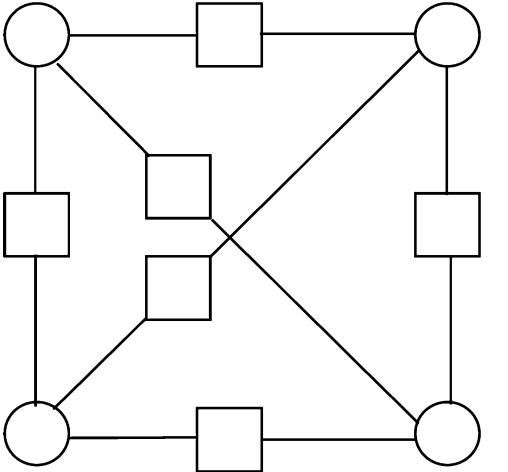

Fig. 5. A factor graph with four variable nodes, each connected by a factor node to all the other variable nodes.

The conditions for the *uniqueness* of BP fixed points are also clarified by the equivalence with the Bethe approximation. In graphs with no more than a single cycle, it was known that if all factors are soft, then there was a unique BP fixed point [\[45](#page-30-0)]. For general graphs, we can use the equivalence established above to show that the same factor graph may sometimes have a unique BP fixed point, and other times have more than one BP fixed point, depending on the strength of the interactions .

To be more precise, we can imagine defining a sequence of probability distributions where some or all of our original functions are all raised by a power: . This is equivalent to changing the temperature in a physical system. Many systems, for example Ising ferromagnets, will have different numbers of solutions above or below a *critical temperature* within the Bethe approximation [[46\]](#page-30-0). Above , the constrained Bethe free energy has a unique stationary point, while below , there are multiple stationary points. Using this equivalence it is easy to define small factor graphs that show similar behavior. Although the topology does not change and the factors are always soft, as we smoothly change the factors we go from a regime with a unique fixed point to one with multiple fixed points.

As an explicit example, consider the factor graph containing four binary variable nodes, where every pair of variable nodes are connected by a factor node, as shown in Fig. 5. We assume that the factors connecting any two variable nodes are identical and "ferromagnetic," that is, they have the form

$$f_a(x_i, x_j) = \begin{pmatrix} \exp(1/T) & \exp(-1/T) \\ \exp(-1/T) & \exp(1/T) \end{pmatrix} \qquad (78)$$

where is a temperature-like parameter. These factors have the effect of making neighboring variable nodes prefer to be in the same binary state, and the effect is stronger at lower .

Given the symmetry of this example, it makes sense to search for fixed points of the BP message update rules where all messages are identical. It is relatively straightforward to work out (see the analysis of the Bethe approximation in [[46\]](#page-30-0) for a similar computation) that above the critical temperature , there is only one such solution, and that solution gives all variable nodes equal beliefs to be in their two states. Above , this fixed point is stable, but below , it becomes unstable, and two new stable fixed points appear. At the new fixed points, all the variable nodes have identical beliefs, but at one of the fixed points, the beliefs are biased toward the first binary state, while at the other fixed point, the beliefs are biased toward the second binary state.

Tatikonda and Jordan [\[47](#page-30-0)] have explored the question of uniqueness of BP fixed points in detail. They used the connection to the Bethe free energy to obtain a set of sufficient conditions on the strength of the factors to ensure *unique* BP fixed points for arbitrary Markov random fields. More recently, Heskes [\[48](#page-30-0)] has analyzed the same question using the connection to the Bethe free energy, but his sufficient conditions for uniqueness also take into consideration the topology of the factor graph.

While we have shown that standard BP converges to stationary points of the constrained Bethe free energy, we emphasize that BP does not perform constrained minimization of the Bethe free energy; that is, it does not decrease the constrained Bethe free energy at every iteration. Indeed, the marginalization constraints are typically not satisfied at intermediate iterations of BP; it is only at a BP fixed point that the beliefs necessarily obey all the consistency constraints. Based on the correspondence between BP fixed points ane Bethe free-energy stationary points, first noted in our earlier work [[17\]](#page-29-0), others have devised algorithms that directly minimize the free energy on the feasible set of beliefs [[49\]](#page-30-0)–[\[51](#page-30-0)]. Such free-energy minimizations are somewhat slower than the BP algorithm, but they are guaranteed to converge.

## *D. Factor Graphs Containing Hard Constraints*

We now return to consider the more general situation of factor graphs that also contain hard constraints. Such hard constraints are ubiquitious, for example, in factor graph representations of parity-check codes.

In contrast to the situation when all the factors are soft, if one has hard constraints, it is possible for the local minima of the constrained Bethe free energy to be *edge* minima, and it is possible for some of the beliefs at BP fixed points to be zero. We now give a small example to illustrate these statements.

Consider again the factor graph with four binary variable nodes, and factors which connect each pair of variable nodes (see Fig. 5). Assume now that all the factors are hard parity checks over two variables of the form

$$(f_a(x_i, x_j) = \begin{pmatrix} 1 & 0 \\ 0 & 1 \end{pmatrix}.\tag{79}$$

For this factor graph, there is an unstable BP fixed point with all messages and one-node beliefs given by

$$m_{a \to i}(x_i) = b_i(x_i) = \begin{pmatrix} 1/2 \\ 1/2 \end{pmatrix} \tag{80}$$

and all two-node beliefs given by

$$b_a(x_i, x_j) = \begin{pmatrix} 1/2 & 0 \\ 0 & 1/2 \end{pmatrix}.\tag{81}$$

There are also two stable BP fixed points; one with the messages and beliefs

$$m_{a \to i}(x_i) = b_i(x_i) = \begin{pmatrix} 1 \\ 0 \end{pmatrix} \tag{82}$$

and

and

$$b_a(x_i, x_j) = \begin{pmatrix} 1 & 0 \\ 0 & 0 \end{pmatrix} \tag{83}$$

and one with the messages and beliefs

$$m_{a \to i}(x_i) = b_i(x_i) = \begin{pmatrix} 0 \\ 1 \end{pmatrix},\tag{84}$$

$$b_a(x_i, x_j) = \begin{pmatrix} 0 & 0 \\ 0 & 1 \end{pmatrix}.\tag{85}$$

From the point of view of the constrained Bethe free energy, the only set of beliefs that satisfy the marginalization and normalization constraints, and do not have an infinite Bethe average energy, are beliefs of the form

$$b_a(x_i, x_j) = \begin{pmatrix} \alpha & 0\\ 0 & 1-\alpha \end{pmatrix} \tag{86}$$

and

$$b_i(x_i) = \begin{pmatrix} \alpha \\ 1-\alpha \end{pmatrix} \tag{87}$$

where the constant is the same for all the beliefs.

For the factor graph that we are considering, these sets of beliefs all give a Bethe average energy that is zero, and a Bethe entropy which is maximized at or , and minimized at .

Based on this example, one might guess that there is a correspondence between Bethe free energy edge minima, and BP fixed points with zero beliefs. We believe and argue later that such a correspondence indeed exists. Unfortunately, there are technical issues that make our arguments for this correspondence less than completely rigorous.

The first issue results from the fact that if one uses the Lagrangian formalism to identify edge stationary points of the constrained Bethe free energy, some of the Lagrange multipliers will diverge logarithmically at edge points. One can already see that such a phenomenon must exist from the form of (63), which relates the marginalization Lagrange multipliers to the logarithm of the BP messages. If a BP message is zero, as it will be at an edge point, the corresponding Lagrange multiplier diverges logarithmically.

The following trivial example demonstrates how inescapable this issue is, and also makes clear that the issue arises because the derivative of the entropy function diverges logarithmically at its edges. Consider a single binary variable, with no factor at all. We denote the belief that the variable is in its two states by and , so that the free energy is just

$$f(b_1, b_2) = b_1 \ln b_1 + b_2 \ln b_2 \tag{88}$$

with the equality constraint , and the inequality constraint and . The minimum of this free energy obviously occurs when and , and two maxima occur at the edge of the region of allowed beliefs when and , or when and . The free energy at the maxima is zero.

To recover these results using the Lagrangian formalism, we introduce a Lagrange multiplier to enforce the normalization equality constraint, and the Lagrange multipliers and for the inequality constraints. Our Lagrangian is then

$$L = b_1 \ln b_1 + b_2 \ln b_2 - \gamma (b_1 + b_2 - 1) - \pi_1 b_1 - \pi_2 b_2. \tag{89}$$

Taking derivatives of the Lagrangian with respect to and and imposing the complementary slackness conditions, we find the five Lagrangian stationary point conditions

$$
\ln \hat{b}_1 + 1 - \gamma - \pi_1 = 0 \tag{90}
$$

$$
\ln \hat{b}_2 + 1 - \gamma - \pi_2 = 0 \tag{91}
$$

$$
\hat{b}_1 + \hat{b}_2 = 1 \tag{92}
$$

$$
\pi_1 \hat{b}_1 = 0 \qquad\qquad\qquad(93)
$$

$$
\pi_2 \hat{b}_2 = 0.\tag{94}
$$

These equations have one solution which is completely unobjectionable, when and corresponding to the free energy interior minimum. They also have two solutions corresponding to the free-energy edge maxima, but only if one accepts Lagrange multipliers that are logarithmically divergent. Thus, we have the solution and , and the solution . Note that the complementary slackness conditions are always satisfied if we assume that .

Following the lessons of this simple example, we would like to assume the legitimacy of all logarithmically divergent Lagrange multipliers in identifying edge stationary points. Readers willing to accept such Lagrange multipliers should upgrade the status of the following "conjecture" to that of a "theorem."

*Conjecture 1:* BP fixed points with some beliefs equal to zero are edge-stationary points of the constrained Bethe free energy.

*Argument:* We need to show that the BP fixed-point conditions can be rewritten in a way that guarantees that all the Lagrangian stationary point conditions are satisfied, including those resulting from inequality constraints. We will use inequality Lagrange multipliers to enforce the inequality constraints . The complementary slackness conditions that will need to be satisfied will be

$$
\pi_a(\mathbf{x}_a)\hat{b}_a(\mathbf{x}_a) = 0.\tag{95}
$$

The other Lagrangian stationary conditions that will need to be satisfied will be the marginalization and normalization conditions on the beliefs, and the belief equations

$$\hat{b}_a(\mathbf{x}_a) = f_a(\mathbf{x}_a) \exp\left[\pi_a(\mathbf{x}_a) + \gamma_a - 1 + \sum_{i \in N(a)} \lambda_{ai}(x_i)\right] \tag{96}$$

and (for variable nodes with degree )

$$\hat{b}_i(x_i) = \exp\left[\frac{1}{d_i - 1} \left(1 - \gamma_i + \sum_{a \in N(i)} \lambda_{ai}(x_i)\right)\right]. \quad (97)$$

Starting with the BP fixed-point conditions, and making the identification between messages and marginalization Lagrange multipliers

$$\lambda_{ai}(x_i) = \ln n_{i \to a}(x_i) = \ln \prod_{c \in N(i) \neq a} m_{c \to i}(x_i) \qquad (98)$$

we recover the Lagrangian stationary conditions with , which will be consistent with the complementary slackness conditions. Note the the marginalization Lagrange multipliers corresponding to zero messages will be logarithmically divergent. Thus, assuming that such Lagrange multipliers are legitimate, we have shown that BP fixed points, even with some of the beliefs equal to zero, are always stationary points of the constrained Bethe free energy.

We emphasize that the converse of this conjecture certainly does not hold; as we described previously, edge *maxima* of the constrained Bethe free energy need not be BP fixed points.

On the other hand, we argue now that edge *minima* of the constrained Bethe free energy are indeed always BP fixed points. However, we again do not claim the following argument is a proof, this time because the argument depends on continuity arguments, that, while reasonable, could be questioned.

*Conjecture 2:* Edge minima of the constrained Bethe free energy are BP fixed points.

*Argument:* Recall from Proposition 6 that if all the factors are positive, then all local minima of the constrained Bethe free energy must necessarily be interior minima. That means that if we have edge minima, they necessarily result from a factor graph that includes factors that equal zero for some state of their arguments .

Let us consider a transformation of the factor graph that adds an infinitesmal positive term to each zero factor. We expect the edge minima to be mapped, under this transformation, to interior minima that are infinitesmally far away. By Theorem 3, all these minima correspond to BP fixed points with all beliefs positive. Making the inverse transformation back to a factor graph with hard constraints, we expect these BP fixed points to be mapped to BP fixed points where some of the beliefs equal zero. Thus, assuming our continuity expectations are indeed met, the original edge minima of the constrained Bethe free energy should be BP fixed points.

To complete the general picture of the relation between BP fixed points and the stationary points of the constrained Bethe free energy, we refer the reader to a paper by Heskes [[52\]](#page-30-0), which argues that *stable* BP fixed points must be local *minima* of the constrained Bethe free energy, but gives a counter-example that shows that the converse is not true.

## VII. THE REGION GRAPH METHOD

We now introduce *region graphs*, which are central to the region graph method for generating valid free energy approximations, and also will provide a graphical framework for GBP algorithms. We will first focus on generating *valid* free-energy approximations, and then turn our attention in the next section to question of when a region graph free-energy approximation will be *maxent-normal*.

It is possible to construct valid, or even maxent-normal, freeenergy approximations that do not correspond to a region graph. The region graph method has the virtue, though, of generalizing other methods, including the Bethe method, the *junction graph method*, and the *cluster variation method*. In Appendices A and B, we discuss the junction graph method and the cluster variation method in detail. In Appendix C, we fully describe the relationship between all the different methods considered in this paper.

*Definitions:* Let be the set of indices for the factor and variable nodes in a factor graph. A *region graph* is a labeled, directed graph in which each vertex (corresponding to a region) is labeled with a subset of . We denote the label of vertex by . A directed edge (or *arc*) may exist pointing from vertex to vertex if is a subset of . If such an arc exists, we say that is a *child* of , that is a *parent* of . If there exists a directed path from vertex to vertex , we say that is an *ancestor* of , and is a *descendant* of .

Note that because of the transitivity of the subset relationship, a region graph must be a directed acyclic graph, in the sense that the arrows cannot loop around.

A region graph is closely related to the *Hasse diagram* for a *partially ordered set*, or *poset* [\[53](#page-30-0)], if we consider our regions to be organized into a poset, with the ordering relationship between the regions to be given by the ancestor–descendant relationship [[30\]](#page-30-0), [[31\]](#page-30-0). There are, however, some differences between region graphs and Hasse diagrams. First, region graphs are labeled graphs, and we will insist on some "region graph conditions," described below, that the labels must satisfy. Second, region graphs can include an arc between two regions that are also connected by a path of length two or greater, which is forbidden for Hasse diagrams.

*Definitions:* The *counting number* for every vertex in the region graph is given by

$$c_{\upsilon} = 1 - \sum_{u \in A(\upsilon)} c_u \tag{99}$$

where is the set of vertices that are ancestors of . For a graph to qualify as a region graph, we insist on the *region graph condition*, which requires that for every (whether it is the index of a factor node or a variable node), the subgraph formed by just those vertices whose labels include is a connected graph that satisfies the condition

$$\sum_{v \in V(i)} c_v = 1.\tag{100}$$

Having defined region graphs, it is almost trivial to define a corresponding *region graph method* for generating valid regionbased free-energy approximations. We simply create a region graph such that the vertices correspond to regions, with labels corresponding to the factor and variable nodes in a region, and

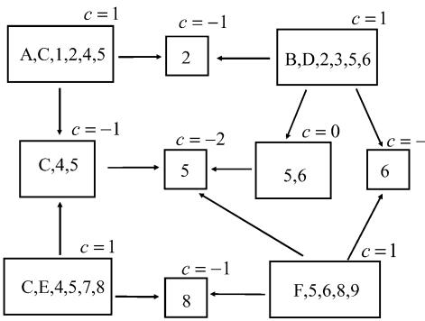

Fig. 6. An example of a region graph. We have listed the counting number c next to each region.

we require that every factor and variable node be contained in at least one region. We associate the counting numbers for regions directly with the counting numbers for the region graph, and the region graph free energy will be given by

$$F_{\rm RG} = \sum_{R} c_{R} F_{R}$$

where is the free energy of the region .

Finally, to obtain a *constrained* region graph free energy, we enforce the constraints that every region belief is normalized, and that for each pair of regions connected by an arc in the region graph, the beliefs for the variable nodes in both regions are consistent.

We have now presented enough definitions, so that the following proposition is true by inspection:

*Proposition 7:* Region based free energy approximations created using the region graph method will be valid.

In Fig. 6, we give an example of a region graph for the factor graph that we already introduced in Fig. 4. This region graph was constructed to demonstrate what is and is not permitted in a legal region graph, rather than what would likely give good results. Note that a region graph enforce any clear delineation of "generations" (region is a child of both regions and regions , while region is a grandchild of region and a child of region .) Note also that regions may have counting number equal to zero (e.g., region ), and that the fact that a region is a subset of another region need not imply that it is also a descendant of that region (e.g., regions and ).

What is essential is that the *region graph conditions* that we described above are obeyed. We insist on these conditions for the following reasons. First, to reiterate the results of the propositions previously proved about valid region-based free-energy approximations, the condition that every factor node in the factor graph is counted once when we do the weighted sum over all regions ensures that the region graph average energy is exact if the region beliefs are exact (recall Proposition 1); and the condition that every variable node is counted once ensures that the region graph entropy correctly counts degrees of freedom (recall Proposition 2). The condition

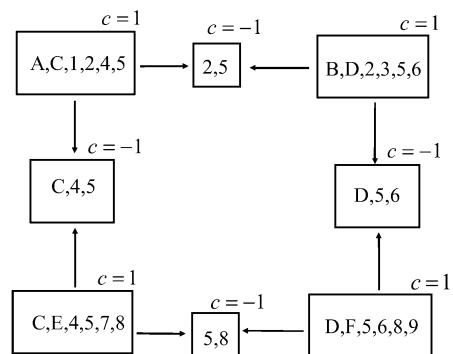

Fig. 7. An example of a graph of regions that is *not* a region graph because the sum of the counting numbers of regions containing variable node 5 is not one.

that the regions containing a particular variable node form a connected subgraph will ensure that the marginal probability at any node is *consistent* irrespective of which region's beliefs one uses to compute it. Empirically, we have found that if one attempts to run a GBP algorithm (as described later) on graphs that do not satisfy all the region graph conditions, the results are likely to be poor.

An example of a "false region graph" or graph of regions that does *not* satisfy the region graph conditions is shown in Fig. 7. The problem with this plausible-looking construction is that the sum of the counting numbers of the regions containing variable node is zero, rather than one. We could modify this false region graph in a variety of ways to obtain a real region graph. For example, we could simply remove node from the region . The resulting region graph would be an example of a *junction graph*; see Appendix A. Alternatively, we could add a region which just contained variable node , and connect the regions and to it (the result of using the cluster variation method; see Appendix B).

We can generalize Proposition 3, which states that the Bethe free energy is exact when the factor graph has no cycles, to the following proposition about region graphs.

*Proposition 8:* The exact variational free energy will equal the region graph free energy if the region graph has no cycles.

*Proof:* The exact average energy reduces to the region graph average energy by the argument used in Proposition 1. The exact entropy reduces to the region graph entropy after recursively applying the following junction graph formula for the probability distribution of a factor graph divided into large regions , and small regions which separate the large regions (see Appendix A for more details)

$$p(\mathbf{z}) = \frac{\prod_{R \in \mathbb{R}_L} p_R(\mathbf{z}_R)}{\prod_{R \in \mathbb{R}_S} p_R(\mathbf{z}_R)^{d_R - 1}}.\tag{101}$$

We illustrate this proposition with an example, that has the factor graph given in Fig. 8, and the region graph given in Fig. 9. We will recursively break down the full joint probability distribution and show that it is equal to a product of marginal probability distributions over regions that has precisely the form necessary to make the region graph free energy be exact.

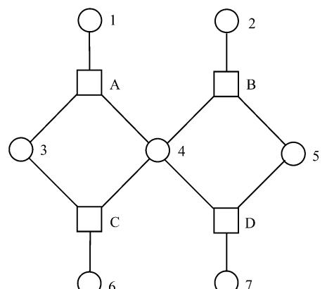

Fig. 8. A factor graph that has a tree region graph shown in Fig. 9.

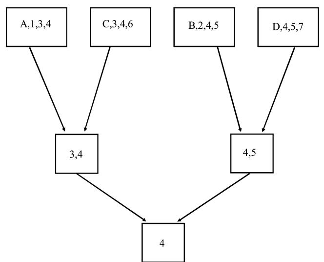

Fig. 9. A region graph with no cycles that has a corresponding region graph free-energy approximation which is exact.

Note that for this region graph, the region separates the left part of the tree and the right part of the tree. That means that we have

$$p(x_1, \ldots, x_7) = \frac{p(x_1, x_3, x_4, x_6)p(x_2, x_4, x_5, x_7)}{p(x_4)}.\quad(102)$$

The marginal probability distributions and can in turn be written in terms of marginal probabilities of smaller regions. For example, we see that the region separates the regions and , so that

$$p(x_1, x_3, x_4, x_6) = \frac{p(x_1, x_3, x_4)p(x_3, x_4, x_6)}{p(x_3, x_4)}.\qquad(103)$$

Expanding everything out, we obtain that the joint probability distribution equals

$$\frac{p(x_1, x_3, x_4)p(x_3, x_4, x_6)p(x_2, x_4, x_5)p(x_4, x_5, x_7)}{p(x_3, x_4)p(x_4, x_5)p(x_4)} \text{. (104)}$$

Notice that (104) is the product of seven local kernels, where each kernal has an exponent corresponding to the counting number of the associated region. Substituting this result into the formula for the exact entropy, we recover the region graph entropy. Since the region graph average energy is always exact when the region beliefs are, this demonstrates that the approximation is exact in this case.

## VIII. MAXENT-NORMAL REGION GRAPH APPROXIMATIONS

The region graph method is not very restrictive, and a natural question to ask is whether there are any criteria that one can use to choose between different region graphs. In this section, we focus on the notion of *maxent-normal* free energy approximations previously defined in Section IV.

Recall that the approximation in all region-based free energies originates from the entropy term. A natural requirement that one can make on the entropy approximation is that it should at least give the correct answer when there are no interactions, that is, that it should achieve its global maximum when all the beliefs are uniform. We defined free energy approximations that obey this criterion to be *maxent-normal*, and proved in Theorem 1 that the Bethe approximation is always maxent-normal. On the other hand, some region graph free-energy approximations are provably *not* maxent-normal, as shown by the following example.

## *A. Example of an Approximation That Is Not Maxent-Normal*

Consider a factor graph which consists of binary variable nodes, where every pair of nodes is connected by a factor. (A version of this factor graph with random factors is known in the physics literature as the Sherrington–Kirpatrick Ising spin glass [[54\]](#page-30-0).)

Now take, as the regions to include in the region graph, every triplet of nodes (and all three factors that connect them), every pair of nodes (and the factor that connects them), and every single node. To complete the definition of the region graph, draw an arc from each triplet region to each of the three pair regions that are subsets of it, and an arc from each pair region to each of the two single-node regions that are subsets of it. This is the region graph that would be obtained using the cluster variation method (see Appendix B), starting with all the triplet regions as the largest regions.

We can compute the counting numbers as follows. There are "triplet" regions, each having a counting number of . There are "pair" regions, each having a counting number of (because each pair of variable nodes belongs to triplet regions). There are single-node regions, each having a counting number of (this can be computed from the fact that each single variable node belongs to triplet regions and pair regions).

Now consider the consistent set of beliefs where each singlenode region had the beliefs

$$b(x_i = 0) = b(x_i = 1) = 1/2,\tag{105}$$

each pair node region had the beliefs

$$b(x_i = 0, x_j = 0) = b(x_i = 1, x_j = 1) = 1/2,\qquad(106)$$

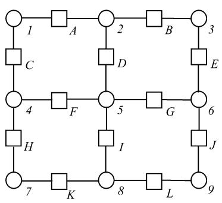

Fig. 10. A 3 by 3 version of a square lattice factor graph.

with other pair beliefs equal to zero, and each triplet node region had the beliefs

$$\begin{aligned} b(x_i = 0, x_j = 0, x_k = 0) &= b(x_i = 1, x_j = 1, x_k = 1) \\ &= 1/2 \end{aligned} \tag{107}$$

with all other triplet beliefs equal to zero. These beliefs are the beliefs that one would obtain from marginalizing a global probability distribution that only allowed two states with equal probability: the all-zeros state and the all-ones state.

For these beliefs, the entropy of every region, whether it be a triplet, pair, or single-node region, will be . So the overall entropy is just determined by the sum of the counting numbers for all the regions, and is given by

$$\frac{H}{\ln 2} = \frac{N(N-1)(N-2)}{6} + \frac{N(N-1)(3-N)}{2}$$

$$+\frac{N(N-2)(N-3)}{2}.\quad(108)$$

Using this formula, it is easy to determine that these beliefs give an entropy greater than , which is the result of using a uniform distribution, for all .

Thus, we see that the approximation derived from the cluster variation method using triplet regions as the largest regions, will surely give poor results, because even if there are no interactions at all, the approximation will disfavor the (correct) uniform distribution. It is therefore no surprise that other researchers have noticed that this approximation gives poor results for the Sherrington–Kirpatrick model [[51\]](#page-30-0), [\[55](#page-30-0)].

## *B. Example of an Approximation That Is Maxent-Normal*

Fortunately, it is not too hard to find examples of region graph approximations that *are* maxent-normal, besides those based on the Bethe approximation. We now present a nontrivial example of an approximation that is provably maxent-normal.

Consider an by square lattice of binary variable nodes, where each variable node is connected by pair-wise factors to its nearest neighbors. Of course, we would normally be interested in cases where is large, but for the sake of example we consider a small by version, shown in Fig. 10.

We can construct a region graph for such square lattice factor graphs by using the cluster variation method (see Appendix B), starting with small by clusters as the largest regions. For our small example, the resulting region graph is shown in Fig. 11.

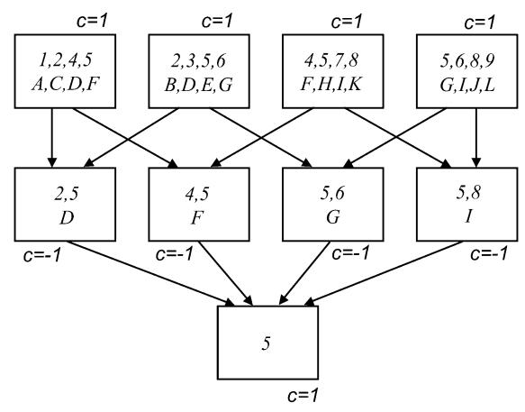

Fig. 11. A region graph for the factor graph in Fig. 10 obtained using the cluster variation method, starting with 2 by 2 clusters. The counting number for each region is listed next to the region.

We can prove that this particular region graph gives a freeenergy approximation that is *maxent-normal* by following the idea of the proof that the Bethe appoximations will be maxentnormal (see the Proof of Theorem 1).

*Proposition 9:* The free-energy approximation for the region graph shown in Fig. 11 is maxent-normal.

*Proof:* We need to show that the entropy of this free-energy approximation attains its maximum when all the beliefs are uniform. Rewrite the region graph entropy as

$$H_{\rm RG} = \sum_{i=1}^{N} H(b_i) - I(1, 2, \{4, 5\}) - I(3, 6, \{2, 5\})$$

$$-I(8, 9, \{5, 6\}) - I(4, 7, \{5, 8\}) \quad (109)$$

where

$$H(b_i) \equiv -\sum_{x_i} b_i(x_i) \ln b_i(x_i) \tag{110}$$

and, for example

$$I(1,2,\{4,5\}) \equiv -H(b_{1245}) + H(b_1) + H(b_2) + H(b_{45}).\tag{111}$$

The maximum of , subject to the constraints on , is achieved when has a uniform distribution. The mutual informations like must be greater than or equal to zero, and will equal zero if all the beliefs involved have uniform distributions (see, e.g., [[37](#page-30-0), Theorem 2.6.4]). Since achieves its maximum and the mutual informations achieve their minimum when the beliefs are uniform, the proposition is proved.

This proposition, and its proof, can easily be generalized to the general case of an by lattice of -ary variables.

*Proposition 10:* For the factor graph consisting of an by lattice of -ary variables, connected by pairwise factors to their nearest neigbhors, the free energy approximation obtained by using the cluster variation method, starting with by overlapping clusters as the largest regions, is maxent-normal.

*Proof:* Left as an exercise for the reader.

## *C. Discussion and Heuristics*

In general, the problem of how to generate region graph approximations that give highly accurate marginals is still very much an open research problem. While the notion of *maxentnormal* region graph approximations is helpful, it is not the complete story. In this subsection, we further discuss this issue, and suggest some heuristics that should prove useful.

First, we point out that we have been focusing on the accuracy of the free-energy approximation, while in the end, we are actually usually most interested in the accuracy of the approximate marginals that we compute. The two are related, but we will not discuss this point further in this paper. Instead, we refer the interested reader to work of Wainwright *et al.* [\[24](#page-29-0)], which develops bounds on the approximation error for the marginals for any algorithm that minimizes the Bethe free energy or its generalizations.

Although we do not here propose a systematic approach to choose promising region graph approximations, we do suggest the following "common-sense" heuristics. First, as we have already emphasized, a region graph approximation should be *maxent-normal*. Secondly, to improve upon the ordinary Bethe approximation, one should try to include at least the shortest cycles in a factor graph inside regions.

Finally, we have observed that region graph approximations that obey the following heuristic tend to be very accurate: namely, that the sum of the counting numbers of all regions equals one

$$\sum_{R \in \mathcal{R}} c_R = 1.\tag{112}$$

To avoid any confusion, we emphasize that this heuristic is different from the validity condition given in (29) that ensures that each variable node and factor node is counted once.

This heuristic can be rationalized by considering a factor graph with binary variable nodes (the following argument can also be easily generalized to -ary variable nodes), and considering the global probability distribution that allows just two states with equal probability: the state where all nodes are zeros, and the state where all nodes are ones. (The reader may be growing familiar with this distribution, which we already used in the examples of approximations that can give negative entropies, and the examples of approximations that are provably not maxent-normal.) The exact entropy of this probability distribution is obviously just .

If we marginalize this distribution, we find that every region also has a marginal probability that allows only the all-zeros or all-ones state for its variable nodes. Therefore, every region will also have a region entropy of . Thus, for any regionbased approximation to give the correct entropy for beliefs corresponding to this global distribution, the sum of the counting numbers, over all regions, must be one.

This heuristic is *not* normally satisfied by Bethe approximations, with the exception of exact Bethe approximations when the factor graph has no cycles. However, some more complicated region graph approximations do indeed satisfy the heuristic, including, for example, the maxent-normal approximation discussed in the previous subsection for square lattices based on two by two clusters.

Clearly, it would be worthwhile to develop a method that would accept arbitrary factor graphs, and automatically construct maxent-normal region graph approximations that also satisfied our heuristics. We do not know of any such method, but we refer the reader to an interesting paper by Welling [[56\]](#page-30-0), who developed a "bottom-up" approach to generating region graph approximations starting from the Bethe approximation.

## IX. GENERALIZED BELIEF PROPAGATION ALGORITHMS

We have already seen that the stationary points of the Bethe approximation to the free energy are equivalent to the fixed points of the standard BP algorithm, which operates on a factor graph. We now introduce *generalized belief propagation* algorithms which operate on region graphs, and demonstrate that their fixed points correspond to the stationary points of the region graph free energy.

One can construct GBP algorithms corresponding to any region graph free-energy approximation. In fact, there are many ways to construct message-passing algorithms whose fixed points are equivalent to the stationary points of a region graph free energy. In all these algorithms, messages of some sort are sent between regions on a region graph.

Note first that we can obtain different GBP algorithms corresponding to the same free energy by using different region graphs that have the same free energy. For example, if we modified a region graph by connecting a grandparent region directly to a grandchild region, then the GBP algorithms that we describe below would be correspondingly modified, but the approximate free energy would not be changed, and the new constraints would be redundant. Making such a modification will thus alter the dynamics of a GBP algorithm, but not its fixed points. Pakzad and Anantharam [\[31\]](#page-30-0), [[32\]](#page-30-0) have focused on the problem of constructing the *minimal* region graph for a free-energy approximation; we will not focus on that problem, and instead refer the interested reader directly to their papers.

Even if we fix attention on a particular region graph, there are still a variety of different GBP algorithms that we can create. In the main text of this paper, we will describe one possible approach, which we call the *parent-to-child algorithm*. In Appendices D and E, we describe two other approaches (the *child-to-parent algorithm* and the *two-way algorithm*) which give algorithms with equivalent fixed points, and which have their own advantages. An main advantage of the parent-to-child algorithm, in comparison with the other algorithms, is that the message-passing rules make no reference to region counting numbers, just as in the standard BP algorithm. The standard BP algorithm is a special case of all three algorithms when the region graph is obtained using the Bethe method.

## *A. The Parent-to-Child Algorithm*

Recall that the standard BP message-passing equations can be derived from the fact that the belief at a single variable node is just the product of all the messages-bearing information from neighboring factor nodes, while the belief at the region of variable nodes adjoining a single factor node is the product of that internal factor, multiplied by all the messages coming into the group of nodes from factor nodes outside the region.

The parent-to-child algorithm generalizes this idea. In this algorithm (which in a previous exposition we called the "canonical" GBP algorithm [\[17](#page-29-0)]) the belief at any region will be the product of all the local factors in that region, multiplied by all the messages coming into region from outside regions. There is one complication, however: to ensure that the algorithm is equivalent to minimizing the region graph free energy, we need to include additional messages into regions which are descendants of from other parent regions that are not themselves descendants of region .

*Definitions:* In the *parent-to-child algorithm*, we only have one kind of message from a parent region to a child region. Each region has a belief given by

$$b_R(\mathbf{z}_R) \propto \prod_{a \in A_R} f_a(\mathbf{z}_a) \left( \prod_{P \in \mathcal{P}(R)} m_{P \to R}(\mathbf{z}_R) \right)$$

$$\cdot \left( \prod_{D \in \mathcal{D}(R)} \prod_{P' \in \mathcal{P}(D) \backslash \mathcal{E}(R)} m_{P' \to D}(\mathbf{z}_D) \right) . \quad (113)$$

Here is the set of regions that are parents to region is the set of all regions that are descendants of region is the set of all regions that are descendants of and also region itself, and is the set of all regions that are parents of region except for region itself or those those regions that are also descendants of region .

The *message-update rules* in the parent-to-child algorithm will be

$$\begin{array}{c} \displaystyle \stackrel{m_{P\rightarrow R}(x_R)}{\displaystyle \sum_{x_{P\_R}} \prod_{a \in F_{P\_R}} f_a(x_a) \prod_{(I,J) \in N(P,R)} m_{I \rightarrow J}(x_J)} \\ := \frac{\prod_{(I,J) \in D(P,R)} m_{I \rightarrow J}(x_J)}{\prod_{(I,J) \in D(P,R)} m_{I \rightarrow J}(x_J)} \end{array} \tag{114}$$

where the sets and can be calculated in advance. is the set of all connected pairs of regions such that is in but not while is *not* in . is the set of all connected pairs of regions such that is in , while is in , but not .

An example should help make these definitions much clearer. Consider the example shown in Fig. 12. The belief at region is the product of its local factors , the messages from its parents , and , and the messages into descendants from other parents who are not descendants: , and .

One obtains self-consistent message-update rules by requiring consistency between the beliefs between every pair of parent and child regions. Thus, in Fig. 12, we might focus on the region and its child . The belief at region is given by

$$b_R \propto m_{A \to R} m_{B \to R} m_{C \to E} m_{C \to H} m_{F \to H} m_{F \to H} \prod_{a \in A_R} f_a(\mathbf{x}_a) \tag{115}$$

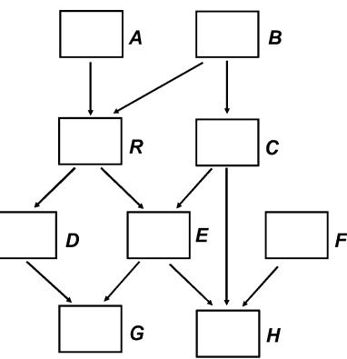

Fig. 12. A region graph used to illustrate the parent-to-child GBP algorithm. Note that we do not explicitly give the variable and factor node labels for each region, as for our purposes, we are only interested in the topology of the region graph.

(where we have lightened the notation by removing the obvious functional dependencies of the messages) and the belief at region is given by

$$b_E \propto m_{R \to Em_C \to Em_D \to Gm_C \to Hm_F \to H} \prod_{a \in A_E} f_a(\mathbf{x}_a). \tag{116}$$

Using the marginalization constraint

$$b_R(\mathbf{x}_R) = \sum_{\mathbf{x}_A \nmid \mathbf{x}_R} b_A(\mathbf{x}_A) \tag{117}$$

we obtain a relation between messages that we can interpret as the message update rule

$$\begin{array}{c} m_{R \to E}(\mathfrak{x}_E) m_{D \to G}(\mathfrak{x}_G) \\ \hugeleftarrow \sum_{\mathfrak{x}_R \backslash \mathfrak{x}_E} m_{A \to R}(\mathfrak{x}_R) m_{B \to R}(\mathfrak{x}_R) \prod_{a \in A_R \backslash A_E} f_a(\mathfrak{x}_a). \end{array} (118)$$

Of course, similar message update rules would be obtained for all the pairs of parent and children regions. There will be enough conditions to determine every message.

## *B. GBP Fixed Points Are Free-Energy Stationary Points*

We now prove that the fixed points of the parent-to-child GBP algorithm using a given region graph correspond to the stationary points of the region-based free energy for the same region graph. To simplify the presentation, we will restrict our attention to interior stationary points. (For an alternative exposition of the following theorem, we refer the reader to the proof of Theorem 3 in [[30\]](#page-30-0) and Proposition 18 in [[32\]](#page-30-0).)

*Theorem 5:* Interior stationary points of the constrained region-based free energy for a valid region graph must be fixed points with positive beliefs of the parent-to-child GBP algorithm for that region graph, and *vice versa*.

*Proof:* The region graph free energy is

$$F_{\mathcal{R}}(\{b_R\}) = \sum_{R \in \mathcal{R}} c_R F_R(b_R). \tag{119}$$

To derive the stationarity conditions, we need to create a Lagrangian for the free energy which enforces consistency between the beliefs in every pair of connected regions. To that end, we add Lagrange multipliers which enforce that

$$b_C(\mathbf{x}_C) = \sum_{\mathbf{x}_P \nmid \mathbf{x}_C} b_P(\mathbf{x}_P) \tag{120}$$

for every pair of parent and child regions and . We also need to include Lagrange multipliers which enforce the normalization of the beliefs: . We can ignore the Lagrange multipliers corresponding to the inequality constraints , because for interior stationary points, these constraints are inactive and the Lagrange multipliers are zero.

Setting the derivatives of with respect to the beliefs equal to zero gives us the following stationarity conditions:

$$\begin{aligned} c_R \ln b_R(\mathbf{z}_R) &= \gamma_R + c_R \sum_{a \in A_R} \ln f_a(\mathbf{z}_a) \\ &- \sum_{P \in \mathcal{P}(R)} \lambda_{PR}(\mathbf{z}_R) + \sum_{C \in \mathcal{C}(R)} \lambda_{RC}(\mathbf{z}_C) \quad (121) \end{aligned}$$

where is the set of regions that are parents of region , and is the set of regions that are children of region . In this expression, and are entirely determined by the value of .

Our proof will now work backward from the belief equations that we want to derive. We want to show that there exists a "rotation" from our Lagrange multipliers to another set of Lagrange multipliers such that the stationary point conditions can be rewritten as

$$\begin{split} c_R \ln b_R(\mathfrak{x}_R) &= \gamma_R + c_R \sum_{a \in A_R} \ln f_a(\mathfrak{x}_a) + c_R \sum_{P \in \mathcal{P}(R)} \mu_{PR}(\mathfrak{x}_R) \\ &+ c_R \sum_{\substack{D \in \mathfrak{X}(R) \ P' \in \mathcal{P}(D)}} \sum_{\mathcal{E}(R)} \mu_{P'D}(\mathfrak{x}_D). \end{split} (122)$$

Clearly, if we can show this, then by identifying the message

$$m_{P \longrightarrow R}(\mathbf{x}_R) = \exp(\mu_{PR}(\mathbf{z}_R)),$$

we will recover our desired belief equations.

So what do the Lagrange multipliers constrain? The answer is that they impose the constraint

$$c_R b_R(\mathfrak{x}_R) + \sum_{A \in \mathcal{A}(R) \backslash \{P \sqcup \mathcal{A}(P)\}} c_A \sum_{\mathfrak{x}_A \backslash \mathfrak{x}_R} b_A(\mathfrak{x}_A) = 0. \tag{123}$$

In words, the Lagrange multiplier constrains the weighted belief in region plus the sum of the weighted beliefs in all the ancestor regions of region , *except* for regions and all its ancestors, to be equal to zero. If we make a Lagrangian using these Lagrange multipliers, it is straightforward to work out that its stationary points are given by (122).

So now to prove the theorem in both its directions we need to show that we can derive the constraints given by the Lagrange multipliers from those given by the Lagrange multipliers and *vice versa*.

We first note that because

$$c_R + \sum_{A \in \mathcal{A}(R)} c_A = 1 \quad \text{and} \quad c_P + \sum_{A \in \mathcal{A}(P)} c_A = 1$$

we can subtract these two equations and obtain

$$c_R + \sum_{A \in \mathcal{A}(R) \backslash \{P \cup \mathcal{A}(P)\}} c_A = 0 \tag{124}$$

If we start with the constraints that for every pair of parent and child regions, we can use (124) as a basis for deriving the constraints associated with the Lagrange multipliers.

To prove that we can derive the constraints from the constraints, we use induction, starting with regions that have no parents ("level " regions), then considering regions all of whose parents are level regions ("level ") regions, then regions all of whose parents are level or level regions ("level " regions), and so on. For each region , we will want to show that the constraint with respect to all of its parents holds, and, because it helps the inductive procedure, we will also want to show that the condition

$$(c_R - 1)b_R(\mathbf{x}_R) + \sum_{A \in \mathcal{A}(R)} c_A \sum_{\mathbf{x}_A \backslash \mathbf{x}_R} b_A(\mathbf{x}_A) = 0 \quad (125)$$

holds.

For the level regions, with counting number , there is nothing to prove. Let us now consider a level region whose parents all have no parents. If we consider one particular parent , then from the constraint, we have

$$c_R b_R(\mathfrak{x}_R) + \sum_{P \in \mathcal{P}(R) \backslash P_1} c_P \sum_{\mathfrak{x}_A \backslash \mathfrak{x}_R} b_P(\mathfrak{x}_A) = 0. \qquad (126)$$

Choosing any other parent , we obtain an analogous equation, so subtracting any two such equations, we obtain

$$\sum_{\mathfrak{p}_{P_1}\backslash x_R} b_{P_1}(\mathfrak{x}_{P_1}) = \sum_{\mathfrak{p}_{P_2}\backslash x_R} b_{P_2}(\mathfrak{x}_{P_2}) \tag{127}$$

for any two parents of .

If we now replace all terms of the form for parents who are not in (126) with equivalent terms using , and remember that and (because at this level we know that parents have no parents), then we obtain

$$b_R(\mathfrak{x}_R) = \sum_{\mathfrak{x}_{P_1} \backslash \mathfrak{x}_R} b_{P_1}(\mathfrak{x}_{P_1}).\tag{128}$$

Obviously, we can obtain a similar equation for any other parent . We also can now simply subtract (128) from (126) to show that (125) holds for any region at level .

Consider now a region at level , where we have shown that (125) holds for all regions at lower levels. We consider a particular parent , and use the constraint

$$c_R b_R(\mathfrak{x}_R) + \sum_{A \in \mathcal{A}(R) \backslash P_1} c_A \sum_{\mathfrak{x}_A \backslash \mathfrak{x}_R} b_A(\mathfrak{x}_A) = 0 \qquad (129)$$

together with (125) applied to to obtain

$$\begin{aligned} c_R b_R(\mathbf{z}_R) + \sum_{A \in \mathcal{A}(R)} c_A \sum_{\mathfrak{a}_A \backslash \mathfrak{a}_R} b_A(\mathbf{z}_A) \\ - \sum_{\mathfrak{a}_{P_1} \backslash \mathfrak{a}_R} b_{P_1}(\mathbf{z}_{P_1}) &= 0. \end{aligned} \quad (130)$$

Of course, we can obtain an analogous equation for any parent of , and subtracting any two such equations, we again obtain (127).

Now we are able to follow the procedure used previously, using the already derived equalities to replace in (129) all terms of the form for ancestors that are not with equivalent terms using , and using the counting number definition to finally obtain the desired constraint between and . Of course, we can obtain the same result for every parent of , and use these results to obtain the condition of (125), which will enable us to proceed to the next level of induction.

Note that we have not given a general formula relating the Lagrange multipliers to the Lagrange multipliers. Fortunately, such a formula is not actually necessary for our proof, as we only need to show there always exists such a rotation to a new set of Lagrange multipliers, even though we do not specify it explicitly. It is very difficult to derive a general formula relating the two sets of Lagrange multipliers, but for region graphs with only two "generations" of regions like those constructed using the junction graph method (see Appendix A), we can in fact give the relationship explicitly in both the forward and inverted directions

$$
\lambda_{PR}(\mathfrak{x}_R) = \sum_{P' \in \mathcal{P}(R) \backslash P} \mu_{P'R}(\mathfrak{x}_R) \tag{131}
$$

$$
\mu_{PR}(\mathfrak{x}_R) = \frac{1 - c_R}{c_R} \lambda_{PR}(\mathfrak{x}_R) + \frac{1}{c_R} \sum_{P' \in \mathcal{P}(R) \backslash P} \lambda_{P'R}(\mathfrak{x}_R) . \tag{132}
$$

Also note that this technical difficulty does not arise at all for the *child-to-parent* and *two-way* GBP algorithms described in Appendix D, because in those algorithm, the messages are directly exponentiated Lagrange multipliers.

We will not investigate here the issue of edge stationary points and active inequality constraints for general constrained region graph free energies. One might expect that the general picture that emerged for the Bethe/BP case to be reproduced here, but the existence of valid constrained region-based free-energy approximations that are nevertheless not maxent-normal makes the problem quite intricate.

## X. DETAILED EXAMPLE OF A GBP ALGORITHM

We will now give a detailed example of how to construct a GBP algorithm. Consider the factor graph drawn in Fig. 13, which has seven variable nodes and ten factor nodes. For this factor graph, it is convenient to slightly alter our labeling conventions so that some of the factor nodes (the ones attached to a single variable node) are labeled with a number rather than a letter. This factor graph corresponds to the joint probability distribution

$$\begin{aligned} p(x_1, x_2, \dots, x_7) &= \frac{1}{Z} \left( \prod_{i=1}^7 f_i(x_i) \right) \dots \\ f_A(x_1, x_2, x_3, x_5) f_B(x_1, x_2, x_4, x_6) f_C(x_1, x_3, x_4, x_7) \end{aligned} \tag{133}$$

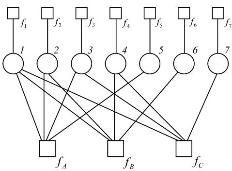

Fig. 13. A factor graph that we will use for our detailed example of how to construct a GBP algorithm.

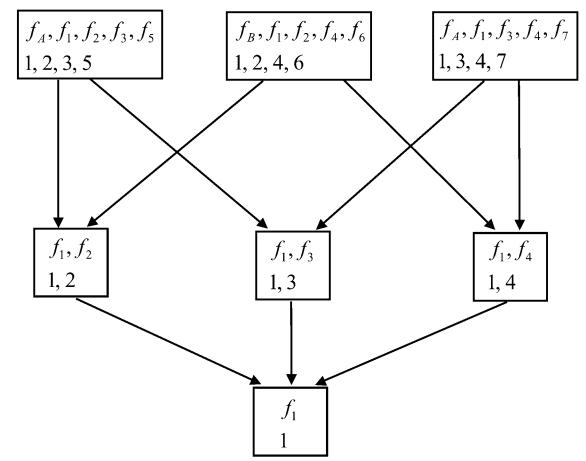

Fig. 14. A region graph obtained for the factor graph of Fig. 13 using the cluster variation method.

We will work out a GBP algorithm making no assumptions about the actual forms of the functions, but we note that this particular factor graph can be used to represent the probability distribution that occurs when decoding a block error-correcting code [\[21](#page-29-0)]. In particular, if each of the variable nodes is binary, with possible states or , and the functions and are parity-check functions (equal to if the sum of their arguments are even, and otherwise), then this factor graph corresponds to the linear block Hamming code with parity-check matrix

$$H = \begin{pmatrix} 1 & 1 & 1 & 0 & 1 & 0 & 0 \\ 1 & 1 & 0 & 1 & 0 & 1 & 0 \\ 1 & 0 & 1 & 1 & 0 & 0 & 1 \end{pmatrix} . \tag{134}$$

For the decoding problem, the functions represent the likelihoods of the possible states of the bits, in light of the received block from the channel and the assumed channel model.

To obtain a GBP algorithm, we first need to create a region graph. We use the cluster variation method, with largest regions and . Following the cluster variation method prescription for finding intersection regions detailed in Appendix B, we obtain the region graph shown in Fig. 14.

Now that we have a region graph, we need to choose what kind of GBP algorithm we want to use and then write down the belief and message equations for the GBP algorithm. We choose to use the parent-to-child algorithm.

Note that although the region graph free energy is useful for theoretically *justifying* a GBP algorithm, it will not be necessary for *constructing* the algorithm. Instead, we can work directly with the belief equations.

Recall that in the parent-to-child algorithm, we only have one kind of message from a parent region to a child region. Each region has a belief given by (113) which we rewrite here

$$b_R(\mathfrak{x}_R) \propto \prod_{a \in A_R} f_a(\mathfrak{x}_a) \left( \prod_{P \in \mathcal{P}(R)} m_{P \to R}(\mathfrak{x}_R) \right)$$

$$\cdot \left( \prod_{D \in \mathcal{D}(R)} \prod_{P' \in \mathcal{P}(D) \backslash \mathcal{E}(R)} m_{P' \to D}(\mathfrak{x}_D) \right) . \quad (135)$$

In words, this equation says that the belief at each region is a product of the local factors in that region, the messages from parents, and the messages into descendant regions from other parents who are not also descendants.

In our region graph, we have seven regions that can be grouped into three types of regions: the three regions exemplified by that contain five factor nodes and four variable nodes; the three regions exemplified by that contain two factor nodes and two variable nodes; and the single region that contains one factor node and one variable node.

We will use an abbreviated notation, dropping explicit dependence, for beliefs and messages and factor functions. The notation is best explained with some examples: we write and for the beliefs at the regions listed in the previous paragraph; we write for the message from region to region for the message from region to region and we abbreviate as .

In this abbreviated notation, the belief equations for the largest regions will be

$$b_{1235} \propto f_4 f_1 f_2 f_3 f_5 m_{46 \to 12} m_{47 \to 13} m_{4 \to 1} \qquad (136)$$

$$b_{1246} \propto f_B f_1 f_2 f_4 f_6 m_{35 \to 12} m_{47 \to 14} m_{3 \to 1} \qquad (137)$$

and

and

$$b_{1347} \propto f_C f_1 f_3 f_4 f_7 m_{25\to 13} m_{26\to 14} m_{2\to 1} \qquad (138)$$

Note that since these regions do not have parents, all the relevant messages are into descendant regions from other parents who are not descendants.

The belief equations for the intermediate-sized regions will be

$$b_{12} \propto f_1 f_2 m_{35 \to 12} m_{46 \to 12} m_{3 \to 1} m_{4 \to 1} \qquad (139)$$

$$b_{13} \propto f_1 f_3 m_{25 \to 13} m_{47 \to 13} m_{2 \to 1} m_{4 \to 1} \qquad (140)$$

$$p_{14} \propto f_1 f_4 m_{26 \to 14} m_{37 \to 14} m_{2 \to 1} m_{3 \to 1} \,. \qquad (141)$$

Finally, the belief equation for the region will be

$$b_1 \propto f_1 m_{2 \to 1} m_{3 \to 1} m_{4 \to 1} \. . \tag{142}$$

The message-update rules are obtained by combining these belief equations with the marginalization conditions between parent and child regions

$$b_C(\mathbf{z}_C) = \sum_{\mathbf{z}_P \nmid \mathbf{z}_C} b_P(\mathbf{z}_P). \tag{143}$$

For example, requiring consistency between the beliefs at the region and the region tells us that

$$b_1(x_1) = \sum_{x_2} b_{12}(x_1, x_2) \tag{144}$$

from which we obtain

$$m_{2\to 1} := \sum_{x_2} f_2 m_{35 \to 12} m_{46 \to 12\text{-}} \qquad (145)$$

The other message-update rules, obtained in the same way (or equivalently by using (114)), will be

$$m_{3 \to 1} := \sum_{x_3} f_3 m_{25 \to 13} m_{47 \to 13} \qquad (146)$$

$$m_{4 \to 1} := \sum_{x_4} f_4 m_{26 \to 14} m_{37 \to 14} \qquad (147)$$

$$m_{3\to1}m_{35\to12} := \sum_{x_3,x_5} f_A f_3 f_5 m_{47\to13} \qquad \qquad (148)$$

$$m_{2\to 1}m_{25\to 13} := \sum_{x_2, x_5} f_A f_2 f_5 m_{46\to 12} \qquad (149)$$

$$m_{4 \to 1} m_{46 \to 12} := \sum_{x_4, x_6} f_B f_4 f_6 m_{37 \to 14} \qquad \qquad (150)$$

$$m_{2\to 1}m_{26\to 14} := \sum_{x_2, x_6} f_B f_2 f_6 m_{35\to 12} \qquad \qquad (151)$$

$$m_{4 \to 1} m_{47 \to 13} := \sum_{x_4, x_7} f_C f_4 f_7 m_{26 \to 14} \qquad (152)$$

and

$$m_{3\to1}m_{37\to14} := \sum_{x_3,x_7} f_C f_3 f_{7} m_{25\to13\text{-}1} \qquad (153)$$

In practice, it often helps convergence to only step the messages part-way to their newly computed values. This simple heuristic can eliminate "overshooting" problems.

We emphasize here one potential practical pitfall to avoid when using this "inertia" heuristic. Let us suppose that we have a set of old messages , which we use in the update equations to calculate a set of messages , and that we want to set our new messages to be half-way between the old messages and the updated messages

$$\{m^{\text{new}}\} = (1/2)\{m^{\text{old}}\} + (1/2)\{m^{\text{update}}\}.$$

We strongly recommend that when using an update equation with more than one message on the left-hand side, that all those messages are equations. Mixing in or messages on the left-hand side empirically often results in poor convergence properties. For example, the update (148) given above should explicitly be

$$m_{3 \to 1}^{\text{update}} m_{35 \to 12}^{\text{update}} \coloneqq \sum_{x_3, x_5} f_A f_3 f_5 m_{47 \to 13}^{\text{old}}.\tag{154}$$

Fortunately, it is always possible to schedule the message updates so that one computes the updated messages into the smallest regions first (e.g., messages like ), so that they are available when needed to compute the updated messages into larger regions.

There are many other details that can be handled in different ways in iterating the message update equations. For example, the messages can be initialized in any way one likes; two reasonable choices are random or uniform messages. The algorithm typically terminates after a fixed number of iterations, or after some convergence criterion is satisfied, but other termination conditions are possible. In a decoding application, one typically checks at each iteration whether the thresholded beliefs correspond to a codeword, and terminates the decoding algorithm if they do, stopping otherwise when some fixed number of iterations has passed.

## XI. ACCURACY OF GBP ALGORITHMS

We naturally are interested in GBP algorithms, and their corresponding region-based free-energy approximations, only to the extent that they improve upon the standard BP/Bethe approach. Fortunately, maxent-normal region-based free-energy approximations, particularly those that satisfy the heuristics described in Section VIII, do indeed reliably give more accurate estimates of marginal probabilities than the Bethe approximation.

Consider, as an example, the square lattice Ising ferromagnet. This is a model where binary variable nodes are arranged in an by square lattice, and each variable node is connected to its nearest neighbors by a pairwise factor of the form

$$f_a(x_i, x_j) = \begin{pmatrix} \exp(J/T) & \exp(-J/T) \\ \exp(-J/T) & \exp(J/T) \end{pmatrix}.\qquad(155)$$

In this model, neighboring variable nodes ("spins") prefer to be in the same state. The parameter measures the strength of this preference, and is the temperature. In the limit of large , this model has a phase transition at a critical temperature , above which it is a in a paramagnetic state, and below which it is in a ferromagnetic state. (For more discussion of this model, see any textbook on statistical mechanics, e.g., [\[46](#page-30-0)].)

Because of the translational symmetry of the model, it is easy to construct Bethe or Kikuchi approximations, treat them analytically, and compare with known exact results. Already in 1951, Kikuchi studied the approximation obtained using the cluster variation method, starting with by overlapping clusters. As we stated in Section VIII, this approximation is maxent-normal, and satisfies our heuristics that the shortest loops are contained in regions, and that the sum of the counting numbers of all regions equals one.

One finds that for this model, the exact critical temperature is approximately , compared to the mean field theory prediction of , the Bethe approximation prediction of , and the Kikuchi prediction (using by clusters) of [[16\]](#page-29-0), [[57\]](#page-30-0).

Qualitatively similar results are available in the physics literature for a wide variety of models of magnetic systems with translationally invariant interactions. However, when considering probabilistic inference for Bayesian networks or decoding an error-correcting code, we are more interested in

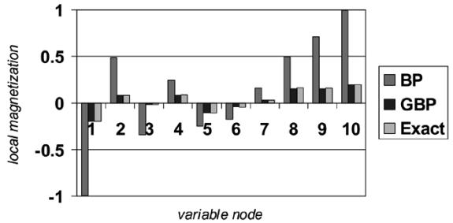

Fig. 15. The local magnetization for ten variable nodes in a 10 by 10 spin glass with random magnetic fields, as computed exactly, and using ordinary BP or GBP.

studying the accuracy of the predictions for marginals made by these approximations for factor graphs that do not have any symmetries.

Besides the results that we now discuss, which were first reported in [\[17](#page-29-0)], the interested reader can find similar empirical results for GBP algorithms in [\[58](#page-30-0)], [\[59](#page-30-0)], [[56\]](#page-30-0), [\[33](#page-30-0)], [[49\]](#page-30-0). Readers who are more interested in rigorous bounds on the accuracy of marginals will want to consult the work of Wainwright *et al.* [\[24](#page-29-0)].

We studied factor graphs known in the physics literature as square lattice Ising spin glasses in a random magnetic field. The variable nodes were arranged in an by square lattice, and connected to their nearest neighbors by factors of the form

$$f_a(x_i, x_j) = \begin{pmatrix} \exp(J_{ij}/T) & \exp(-J_{ij}/T) \\ \exp(-J_{ij}/T) & \exp(J_{ij}/T) \end{pmatrix} \quad (156)$$

where the parameters are chosen independently for each factor from a Gaussian probability distribution. In addition, each variable node was connected to a "local random field" factor node of the form

$$f_i(x_i) = \begin{pmatrix} \exp(h_i/T) \\ \exp(-h_i/T) \end{pmatrix} \tag{157}$$

where the parameters are also chosen independently from a Gaussian probability distribution.

We focused on the case where the parameters were chosen from a zero-mean Gaussian distribution with standard deviation of , while the parameters were chosen from a zero-mean Gaussian distribution with standard deviation of . This highly frustrated model was chosen because it highlights the weaknesses of ordinary BP, which performs perfectly well for many other factor graphs. For all our algorithms, we used "inertia" (see Section X, and also [\[58](#page-30-0)], [[59\]](#page-30-0)) to help convergence.

For , we found, over dozens of samples, that the parent-to-child GBP algorithm always converged to accurate answers, while ordinary BP usually did not usually converge at all. For sufficiently small, we could compute exact marginals by rewriting the factor graph as a chain of by "super-nodes," which could each take on different states. To give a qualitative feel for the results, we compare ordinary BP, parent-to-child GBP, and the exact results for one lattice where ordinary BP did converge. We plot the results for the "local magnetization" (the belief of the node that the node is in the first state minus the belief that it is in the second state) for the ten variable nodes in one row of the lattice in Fig. 15. Note that the GBP algorithm is much more accurate than ordinary BP, which tends to correctly predict the direction of the magnetization, but is highly "overconfident."

# APPENDIX A THE JUNCTION GRAPH METHOD

A natural idea to generalize the Bethe method is to keep the notion that should be the union of a set of large regions and a set of small regions , but to let the regions in or contain more nodes. The *junction graph method*, that we describe here, exploits this idea, and is based on a generalization of the "junction graphs" that were introduced by Aji and McEliece [\[29](#page-30-0)].

We define a *junction graph* to be a labeled bipartite graph in which there are *large vertices* (corresponding to large regions) , *small vertices* (corresponding to small regions) , and directed edges (or *arcs*) connecting large vertices to small vertices. The vertices in the junction graph are labeled, and the label of vertex is denoted . The labels will be subsets of a set of indices representing factor or variable nodes of a factor graph.

For the graph to be considered a junction graph, we insist upon two conditions. First, if is a small vertex neighboring the large vertices then we require that is a subset of each of or equivalently, that

$$l(v_s) \subseteq l(v_1) \cap l(v_2) \cap \dots \cap l(v_k). \tag{A1}$$

Secondly, we require that for any index , the subgraph of consisting only of the vertices which contain in their labels, is a connected tree.

The "junction graphs" introduced by Aji and McEliece [\[29](#page-30-0)] are a special case of those described here. In their junction graphs, small vertices were restricted to have precisely two neighboring large vertices, so that the small vertices can be interpreted as labeled "edges" between the large vertices. They further required that small region labels not include any indices representing factor nodes.

Given a set of regions that are organized into a junction graph, we can always obtain a valid region-based approximation by defining a set of counting numbers as follows. For all regions , we let , while for all region , we let where is the degree (numbering of neighboring large regions) of region . It is through this prescription that the arcs **(of ?)** the junction graph become relevant—a small region's contribution to the free energy is subtracted out from that of a large region only if the two regions are connected by an arc. It is straightforward to confirm that this prescription for the counting numbers gives us a valid region-based free-energy approximation, as the junction graph condition that the subgraph for each variable or factor node is a tree guarantees that each variable and factor node will be counted once as required in (29).

Aji and McEliece proved a theorem that tells us that given *any* set of large regions that contain all the factor and variable nodes in a factor graph, we can find a corresponding set of small regions and organize the regions in into a

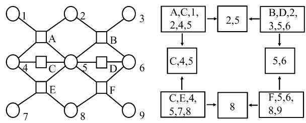

Fig. 16. A junction graph (on the right) for the factor graph on the left.

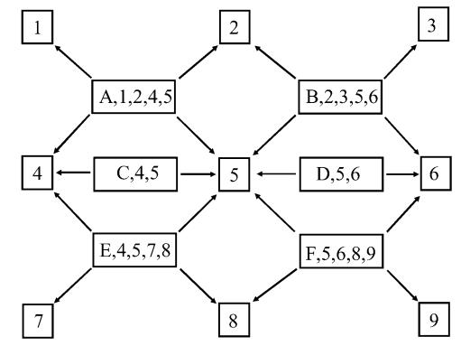

Fig. 17. A junction graph for the factor graph shown in Fig. 4 generated using the Bethe method. Note the isomorphism between this junction graph and the original factor graph.

junction graph. Their theorem generalizes without difficulty to our version of junction graphs.

As an example, consider the factor graph which we introduced in the main text and redraw in Fig. 16. We could take as our set of large regions the four regions

$$\begin{aligned} \{A, C, 1, 2, 4, 5\}, \{B, D, 2, 3, 5, 6\}, \{C, E, 4, 5, 7, 8\}, \\ \text{and } \{F, 5, 6, 8, 9\}. \end{aligned}$$

An acceptable set of corresponding small regions would be , and , with a junction graph as shown in Fig. 16. Because in this case each of the small regions is connected to two large regions, they would each have a counting number of .

The set of regions given by the Bethe method can also always be organized into a junction graph (though not necessarily the restricted Aji–McEliece version of a junction graph); using as an example the same factor graph, the resulting junction graph is shown in Fig. 17. It is obvious from this example that there will always be a one-to-one isomorphism between the original factor graph and the corresponding junction graph obtained from the Bethe method.

The junction graph approximation for the variational free energy is

$$F_{JG}(\{b_R\}) = U_{JG}(\{b_R\}) - H_{JG}(\{b_R\}) \qquad (\text{A2})$$

where

$$U_{JG}(\{b_R\}) = \sum_{R \in \mathbb{R}_L} U_R(b_R) + \sum_{R \in \mathbb{R}_S} (1 - d_R) U_R(b_R)$$

and

$$H_{\mathcal{IG}}(\{b_R\}) = \sum_{R \in \mathcal{R}_L} H_R(b_R) + \sum_{R \in \mathcal{R}_S} (1 - d_R) H_R(b_R). \tag{A4}$$

Junction graphs are a special case of region graphs, where there are only two "generations" of regions. It follows that minimizing the junction graph free energy will once again give beliefs that are equivalent to those obtained from a message-passing BP algorithm. That algorithm is sometimes known as the *generalized distributive law* [\[25](#page-29-0)]. Again, it follows as a corollary of our more general results for region graphs that the junction graph approximation to the variational free energy will be exact, and the generalized distributive law will give exact results, when the junction graph is a tree. In that case, the junction graph is a *junction tree*, and the generalized distributive law reduces to the famous *junction tree algorithm*.

We can apply the well-known result [[13\]](#page-29-0) for the joint probability function in junction trees to our case and obtain

$$p(\mathbf{z}) = \frac{\prod_{R \in \mathcal{R}_L} p_R(\mathbf{z}_R)}{\prod_{R \in \mathcal{R}_S} p_R(\mathbf{z}_R)^{dR - 1}}.\tag{A5}$$

To obtain this result, we note that while we have described region graphs and junction graphs as directed graphs, from the point of view of statistical graphical models, they are equivalent to undirected graphs. In particular, one can rewrite the full joint probability distribution for a factor graph in the form

$$p(\mathbf{x}) = \frac{1}{Z} \prod_{\text{(RS)}} \Psi_{RS}(\mathbf{x}_R, \mathbf{x}_S) \prod_R \Phi_R(\mathbf{x}_R) \qquad (\text{A6})$$

where denotes pairs of connected regions in a given region graph for that factor graph. Specifically, when we set

$$\Phi_R(\mathbf{z}_R) = \left(\prod_{a \in A_R} f_a(\mathbf{z}_a)\right)^{c_R}$$

and equal to if is consistent with and equal to otherwise, this form of the joint probability distribution will be equivalent to the one in the original factor graph form. Since the formula (A5) is true for pairwise Markov random fields when the set of nodes in are separated by the set of nodes in , and we have shown how to convert a region graph into an equivalent pairwise Markov random field, we have justified using formula (A5) for region graphs as well.

# APPENDIX B THE CLUSTER VARIATION METHOD

Another method for selecting a valid set of regions and counting numbers is the *cluster variation method* introduced by Kikuchi in 1951 and further developed in the physics literature since then [[20\]](#page-29-0). The main feature distinguishing this method from the junction graph method is that may be the union of more than just two generations of regions.

In the cluster variation method, we begin with a set of distinct large regions such that every factor node and every variable node in our factor graph is included in at least one region . We also require that no region be a subregion of any other region in . We then construct the set of regions by forming all possible intersections between regions in , but discarding from any intersection regions that are subregions of other intersection regions. If possible, we then construct in the same way the set of regions from the intersections between regions in , but discarding any intersection regions that already appeared in or that are subregions of other intersection regions in . As long as there continue to be intersection regions, we construct sets of regions in the same way. Finally, the set of regions used in the cluster variation method will be .

To form a region graph using the cluster variation method, we draw connections between the regions obtained in in the following way. For regions in , we connect them to all regions in that are super-regions. For a region in , we connect it to all regions in and that are super-regions of , except for those regions in that do not need a direct connection, because they are super-regions of regions in that are also super-regions of . Similar rules are followed for regions in , and so on.

We define the counting numbers in the cluster variation method to be

$$c_R = 1 - \sum_{S \in \mathcal{S}(R)} c_S \tag{B1}$$

where is the set of all regions which are super-regions of region .

Returning to our example factor graph drawn in Fig. 4, we can choose the base set of regions to consist of the four regions and . Once the set of base regions is chosen, there is no further choice in the cluster variation method. In our case, the set of intersection regions would be the regions , and the set of intersection regions would be .

Each of the regions would have a counting number . Because each of the regions is the subregion of two regions in , they each have a counting number of . Finally, since every region in and is a super-region of , its counting number is .

We can represent this set of regions and counting numbers with the region graph shown in Fig. 18.

Note that the Bethe approximation will be a special case of the cluster variation method if and only if no factor node shares more than one variable node with another factor node (or equivalently, there are no cycles of length four in the factor graph.) The factor graph shown in Fig. 18 is therefore one example of a factor graph for which the Bethe approximation can *not* be generated by the cluster variation method.

We remark that in the physics literature, the cluster variation method has normally been applied to a restricted class of factor graphs that are particularly relevant as models of magnetic materials. In particular, the factor graph normally represents a translationally invariant crystal lattice, and the factor nodes normally have degree two, corresponding to two-body

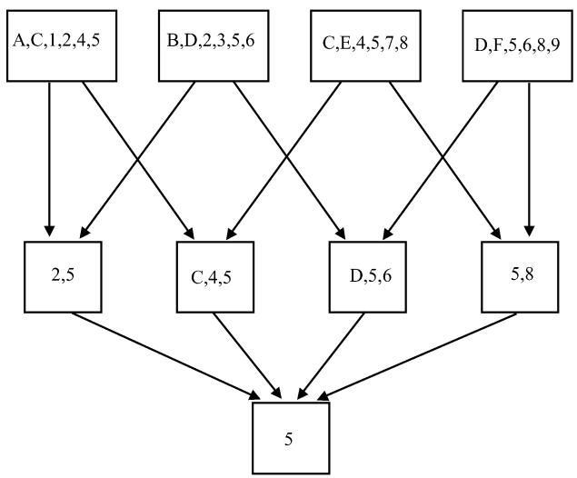

Fig. 18. A region graph generated using the cluster variation method.

interactions. Translational symmetry in the factor graph often dramatically simplifies the problem of minimizing the Kikuchi free energy, and when the factor nodes have degree two, the Bethe method *will* always be a special case of the cluster variation method.

# APPENDIX C RELATIONSHIPS BETWEEN DIFFERENT METHODS

In this Appendix, we summarize the relationships between the different methods for generating valid sets of regions for a region-based free energy approximation. First of all, as is clear from its definition, a junction graph will always be a region graph (though the converse is not true). The sets of regions and counting numbers generated by the cluster variation method can also always be represented by a region graph. We already saw one example in Fig. 18.

We emphasize that one can construct region graph approximations that cannot be generated with either the junction graph or cluster variation methods. We already saw such an example when we introduced region graphs in the main text in Section VII. Constructions that are more general than those constructed using the cluster variation method or the junction graph method may be useful for a variety of reasons, including reducing the computational complexity of a GBP algorithm.

Note, however, that although the region graph method is the most general method we have introduced, there do exist valid region-based free-energy approximations that do not have a region graph representation. We demonstrate an example in Fig. 19.

In summary, we have the following relationships, as illustrated in the Venn diagram of Fig. 20. For a given factor graph, the cluster variation method and the generalized junction graph method each generate valid region-based free-energy approximations that are subclasses of all the possible valid approximations. Neither the cluster variation method nor the generalized junction graph method is more general than the other, and both are subsumed by the more general region graph method. The set of regions generated by the Bethe method is always an examplar of those generated by the junction graph method, and

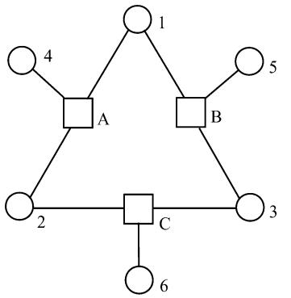

Fig. 19. For this factor graph, the choice of regions fA; 1; 2; 4g; fB; 1; 3; 5g; fC; 2; 3; 6g, and f1; 2; 3g, with corresponding counting numbers of 1; 1; 1; and 1 will give a valid region-based approximation that cannot be represented by a region graph.

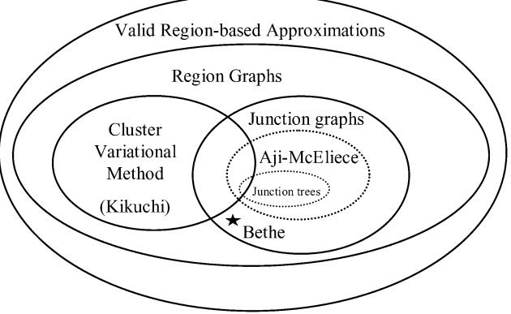

Fig. 20. A Venn diagram illustrating the relationships between different methods of generating valid region-based free-energy approximations. The Bethe method is always an exemplar of the junction graph method, but is only a special case of the cluster variation method if the factor graph has no pair of factor nodes that share more than one variable node, and is only a special case of Aji and McEliece's junction graph method if the relevant factor graph is a Forney "normal" graph (no variable node is connected to more than two factor nodes).

will be an examplar of those generated by the cluster variation method if and only if the factor graph has no cycles of length four. In general, the Bethe method will not be a special case of the Aji–McEliece junction graph method, though it will be for factor graphs such that each variable node is adjacent to no more than two factor nodes (Forney's so-called "normal" factor graphs [\[22](#page-29-0)]).

In addition to being a more general method than the cluster variation method or the junction graph method, we feel that the region graph method is easier to understand on an intuitive level. We simply select a set of regions and counting numbers such that every variable and factor node gets counted once, and we enforce consistency for the beliefs between connected regions. Region graphs also have the important advantage of being a natural graphical structure for describing generalized belief propagation algorithms.

Pakzad and Anantharam have suggested strengthening the region graph requirements described in Section VII so that for every subset of variable nodes in the factor graph, the subgraph of regions containing that subset must be connected and must have a sum of counting numbers equal to one [\[31\]](#page-30-0). Such a strengthening would ensure that the beliefs computed for any subset of nodes would always be consistent, no matter which regions were used to compute it. The cluster variation method produces region graphs that satisfy these stronger requirements, but we chose not to insist on these stronger requirements in general, because region graphs created using the Bethe method will not necessarily satisfy them.

# APPENDIX D THE CHILD-TO-PARENT ALGORITHM

The observation underlying the "child-to-parent algorithm" is that when we minimize the Bethe free energy, the Lagrange multipliers enforcing the marginalization constraints correspond exactly (after exponentiation) to the messages from variable nodes to factor nodes in the BP algorithm. Considering these messages as messages from child regions to parent regions in a region graph, we can try to generalize the approach to arbitrary region graphs. Thus, we construct a GBP algorithm by simply minimizing a region graph free energy and identifying Lagrange multipliers that enforce consistency between beliefs with messages from child regions to parent regions. Such an approach was considered in detail by Kappen and Wiegerinck for region graphs constructed using the cluster variation method [\[51](#page-30-0)].

We begin with the Lagrangian stationary point equation (again assuming interior stationary points) obtained by differentiating the Lagrangian with respect to beliefs. We obtained this equation previously (see (121)), and rewrite it here

$$\begin{aligned} c_R \ln b_R(\mathbf{z}_R) &= \gamma_R + c_R \sum_{a \in A_R} \ln f_a(\mathbf{z}_a) \\ &- \sum_{P \in \mathcal{P}(R)} \lambda_{PR}(\mathbf{z}_R) + \sum_{C \in \mathcal{C}(R)} \lambda_{RC}(\mathbf{z}_C) \quad (\text{D1}) \end{aligned}$$

where is the set of regions that are parents of region , and is the set of regions that are children of region , and are the Lagrange multipliers that enforce consistency between the beliefs in region and those in region .

For , we can rewrite this equation as

$$b_R(\mathbf{z}_R) \propto \prod_{a \in A_R} f_a(\mathbf{z}_a) \left( \frac{\prod_{C \in \mathcal{C}(R)} n_{C \to R}(\mathbf{z}_C)}{\prod_{P \in \mathcal{P}(R)} n_{R \to P}(\mathbf{z}_R)} \right)^{1/c_R} \tag{D2}$$

where is a "message" from a child region to a parent region , in analogy with the messages in standard BP. If , we do not get a condition on ( can still be determined from beliefs in super-regions via the marginalization conditions); instead, we obtain the following condition on the messages into and out of region :

$$\left(\frac{\prod_{C \in \mathcal{C}(R)} n_{C \to R}(\mathbf{z}_C)}{\prod_{P \in \mathcal{P}(R)} n_{R \to P}(\mathbf{z}_R)}\right) = 1. \tag{D3}$$

The message update rules are then obtained by applying the marginalization conditions

A small example might help clarify the meaning of these equations for the reader. Consider the probability distribution

$$p(x_1, x_2, x_3) = \frac{1}{Z} f_A(x_1, x_2) f_B(x_2, x_3). \qquad (\text{D4})$$

We use the Bethe approximation, which should be exact in this case because the factor graph is a tree. Thus, we obtain large regions and , with counting numbers , and small regions , and , with counting numbers and respectively. We obtain the following belief equations for the regions with :

$$b_A(x_1, x_2) \propto f_A(x_1, x_2) n_{1 \to A}(x_1) n_{2 \to A}(x_2) \quad (\text{D5})$$

$$b_B(x_2, x_3) \propto f_B(x_2, x_3) n_{2 \to B}(x_2) n_{3 \to B}(x_3) \quad (\text{D6})$$

$$b_2(x_2) \propto n_{2 \to A}(x_2) n_{2 \to B}(x_2) \tag{D7}$$

and the following conditions on messages for the regions with :

$$n_{1 \to A}(x_1) = 1 \tag{D8}$$

and

$$n_{3\cdots B}(x_3) = 1.\tag{D9}$$

Using these conditions and the marginalization conditions, we find that

$$n_{2\to A}(x_2) = \sum_{x_3} f_B(x_2, x_3) \tag{D10}$$

and

$$n_{2\rightarrow B}(x_2) = \sum_{x_1} f_A(x_1, x_2). \tag{D11}$$

We can now easily check that in this example, the computed beliefs give back the desired marginal probabilities exactly.

The child-to-parent algorithm, by its construction, clearly gives a generalized BP algorithm whose fixed points correspond to the stationary points of the region graph free energy. On the other hand, it might be considered inelegant both because it focuses only on the messages from child regions to parent regions and because the message update equations will inevitably be complicated and involve the counting numbers . The *two-way* algorithm described in Appendix E and the *parent-to-child* described in the main text in Section IX-A are different GBP algorithms that attempt to ameliorate these flaws.

# APPENDIX E THE TWO-WAY ALGORITHM

To motivate the two-way algorithm, we return to the standard BP algorithm, where we recall that the belief equations can be written in the form

$$b_i(x_i) = \prod_{a \in N(i)} m_{a \to i}(x_i) \tag{E1}$$

and

$$b_a(\mathbf{x}_a) = f_a(\mathbf{x}_a) \prod_{i \in N(a)} n_{i \to a}(x_i) \tag{E2}$$

where

$$m_{i \to a}(x_i) = \prod_{c \in N(i) \backslash a} m_{c \to i}(x_i). \tag{E3}$$

Given these equations, it is natural to aim for a generalization where the belief equations will have the form

$$b_R(\mathbf{z}_R) = \check{f}_R(\mathbf{z}_R) \prod_{C \in \mathcal{C}(R)} n_{C \to R}(\mathbf{z}_C) \prod_{P \in \mathcal{P}(R)} m_{P \to R}(\mathbf{z}_P). \tag{E4}$$

In other words, we aim to write the belief equations so that the belief in a region is a product of local factors and messages arriving from all the connected regions, whether they are parents or children. It will turn out that we can do this, but in order for the GBP algorithm to correspond to the region graph free energy, we will need to use modified factors and a rather complicated relation between the messages and messages generalizing the relation for standard BP given in (E3).

It will be convenient to denote the number of parents of region by , and define the numbers and . When a region has no parent so that and , we take . Note that within the Bethe approximation, for all regions. We will assume that so that is well defined (normally, if one has a region graph with a region such that , one should be able to change the connectivity of to avoid this problem).

We first define the set of pseudo-messages for all regions and their parents and children

$$\begin{array}{c} n_{R \to P}^{0}(\mathfrak{x}_{R})\\ \stackrel{\sim}{\to} \tilde{f}_{R}(\mathfrak{x}_{R}) \prod_{P' \in \mathcal{P}(R) \backslash P} m_{P' \to R}(\mathfrak{x}_{R}) \prod_{C \in \mathcal{C}(R)} n_{C \to R}(\mathfrak{x}_{C}) \quad (\mathsf{E5})\\ \vdots \end{array}$$

and

$$\begin{split} \boldsymbol{\varepsilon}_{R \to C}^{0}(\mathbf{z}_{C}) \\ = \sum_{\mathbf{z}_{R} \backslash \mathfrak{a}_{C}} \tilde{f}_{R}(\mathbf{z}_{R}) \prod_{P \in \mathcal{P}(R)} m_{P \to R}(\mathbf{z}_{R}) \prod_{C' \in \mathcal{C}(R) \backslash C} n_{C' \to R}(\mathbf{z}_{C'}) \end{split} \tag{E6}$$

where

$$f_R(x_R) \equiv \left(\prod_{a \in A_r} f_a(x_a)\right)^{c_R}.$$

Aside from the fact that we raised the product of the local factors to a power of , these pseudo-messages are what one would naively expect the message updates to look like. To obtain the true message updates, however, one needs to combine the pseudo-messages going in the two directions of a link as follows:

$$\begin{aligned} n_{R \to P}(\mathbf{z}_R) &= \left( n_{R \to P}^0(\mathbf{z}_R) \right)^{\beta_R} \left( m_{P \to R}^0(\mathbf{z}_R) \right)^{\beta_R - 1} \quad (\mathbf{E}7) \\ \text{and} \end{aligned}$$

$$m_{P \to R}(\mathbf{z}_R) = \left(n_{R \to P}^0(\mathbf{z}_R)\right)^{\beta_R \bullet 1} \left(m_{P \to R}^0(\mathbf{z}_R)\right)^{\beta_R} \quad (\text{E8})$$

Note that when , the messages are precisely the same as the pseudo-messages.

The two-way algorithm is completed by the belief equations, which have the form already given in (E4). We are now in position to prove the following theorem.

*Theorem 6:* The interior stationary points of the region graph free energy are the same as the fixed points of two-way GBP (defined by the message and belief equations given above) that have strictly positive beliefs.

*Proof:* We form a Lagrangian from the region graph energy as already indicated in the previous section on the child-toparent algorithm. If we exponentiate (121) derived there, we obtain the equation

$$\begin{split} p_R(\mathbf{z}_R)^{c_R} \propto \check{f}_R(\mathbf{z}_R) \prod_{C \in \mathcal{C}(R)} e^{\lambda_{KC}(\mathbf{z}_C)} \\ \times \left( \prod_{P \in \mathcal{P}(R)} e^{\lambda_{PR}(\mathbf{z}_R)} \right)^{-1} . \end{split} \tag{E9}$$

Suppose that we are given a set of and that satisfy these stationary conditions of the Lagrangian. Now we define

$$n_{R \to P}(\mathbf{z}_R) = e^{\lambda_{PR}(\mathbf{z}_R)} \qquad \qquad (\to 10)$$

and

$$m_{P\longrightarrow R}(\mathfrak{x}_R) = b_R(\mathfrak{x}_R)^{q_R} e^{-\lambda_{PR}(\mathfrak{x}_R)} \,_\bullet \qquad (\text{E11})$$

Of course, we have one message and one message for every Lagrange multiplier , so for these definitions to hold, we also need to have constraints relating the 's and 's. The constraints will be given by the definitions of the pseudo-messages and the relations between the messages and the pseudo-messages that we defined above. We want to show that these relations, as well as the two-way GBP belief equations previously defined, must hold.

First, we show that the belief equations (E4) hold. We have

$$\begin{split} b_{R}(\mathbf{z}_{R})^{c_{R}} &\propto \tilde{f}_{R}(\mathbf{z}_{R}) \prod_{C \in \mathcal{C}(R)} e^{\lambda_{RC}(\mathbf{z}_{C})} \prod_{P \in \mathcal{P}(R)} e^{-\lambda_{PR}(\mathbf{z}_{R})} \\ &\propto \tilde{f}_{R}(\mathbf{z}_{R}) \prod_{C \in \mathcal{C}(R)} n_{C \to R}(\mathbf{z}_{C}) \\ &\times \prod_{P \in \mathcal{P}(R)} \left( \frac{f_{R}(\mathbf{z}_{R})}{b_{R}(\mathbf{z}_{R})} \right)^{q_{R}} m_{P \to R}(\mathbf{z}_{R}) \\ &\propto (b_{R}(\mathbf{z}_{R}))^{-q_{R}p_{R}} \tilde{f}_{R}(\mathbf{z}_{R}) \prod_{C \in \mathcal{C}(R)} n_{C \to R}(\mathbf{z}_{C}) \\ &\times \prod_{P \in \mathcal{P}(R)} m_{P \to R}(\mathbf{z}_{R}) \\ &\propto (b_{R}(\mathbf{z}_{R}))^{c_{R} - 1} \tilde{f}_{R}(\mathbf{z}_{R}) \prod_{C \in \mathcal{C}(R)} n_{C \to R}(\mathbf{z}_{C}) \\ &\qquad\times \prod_{P \in \mathcal{P}(R)} m_{P \to R}(\mathbf{z}_{R}) \end{split}$$

so that indeed is product of local potentials and incoming messages.

Turning to the constraints, we have from the definition of , that

$$m_{R \longrightarrow P}^{0}(\mathfrak{x}_R) \underline{m_{P \longrightarrow R}}(\mathfrak{x}_R) = b_R(\mathfrak{x}_R) \tag{E12}$$

$$=\sum_{\mathbf{x}_P \nmid \mathbf{x}_R} b_P(\mathbf{x}_P) \tag{E13}$$

$$\mathbf{x} = n_{R \to P}(\mathbf{x}_R) m_{P \to R}^0(\mathbf{x}_R). \tag{E14}$$

Equations (E10) and (E11) imply that

$$m_{R \longrightarrow P}(\mathfrak{x}_R) \\ m_{P \longrightarrow R}(\mathfrak{x}_R) \\ \tag{11.1}$$

$$=b_R(\mathfrak{x}_R)^{q_R} \,_{\times} \,_{\times} \,_{\times} \,_{\times} \,_{\times} q_R \,_{\times} \,_{\times} \,_{\times} \,_{\times} \,_{\times}$$

$$= (n_{R \to P}^{\cup}(\mathfrak{x}_R) m_{P \to R}(\mathfrak{x}_R))^{4N}.\tag{E16}$$

Together these equations give us two equations for the two unknowns and

$$\frac{m_{P\to R}(\mathbf{z}_R)}{n_{R\to P}(\mathbf{z}_R)} = \frac{m_{P\to R}^0(\mathbf{z}_R)}{n_{R\to P}^0(\mathbf{z}_R)} f_R(\mathbf{z}_R)^{-q_R} \tag{E17}$$

and

$$n_{R \to P}(\mathfrak{x}_R) m_{P \to R}(\mathfrak{x}_R)^{1 - q_R} = \left(n_{R \to P}^0(\mathfrak{x}_R)\right)^{q_R}. \quad (\text{E18})$$

The unique solution of these equations is given by (E7) and (E8). Thus, we have shown that the message-passing algorithm previously defined has fixed points that are equivalent to the stationary points of the region graph free energy.

The two-way algorithm will be particularly elegant when and when for all regions. In that case, each region will send messages to all adjacent regions, and the message update rules will be the natural generalization of the ordinary BP rules written with two kinds of messages. It is interesting to note that the condition that can be ensured by requiring that only regions with no parents contain factor nodes, while the condition that for all regions can be ensured by requiring that the subgraph obtained by taking any region and all of its ancestor regions must always form a tree.

When for all regions, the two-way GBP algorithm is equivalent to Pearl's method of clustering [9]: we form new nodes from clusters of variables in the original graph (these are the regions) and run an ordinary BP algorithm on the resulting graph. It is important to bear in mind that this equivalence only holds for a subset of possible region graphs: if one uses the method of clustering on a set of regions that does not satisfy the region graph conditions, or on a region graph for which for some regions, the resulting beliefs will generally be a poor approximation.

## ACKNOWLEDGMENT

The authors wish to thank David Forney, Robert McEliece, and Erik Sudderth for helpful and encouraging discussions, and David MacKay, Erik Sudderth, and Max Welling for their comments on previous drafts of this paper. We also thank the anonymous referees for their criticisms and suggestions.

## REFERENCES

- [1] B. J. Frey, *Graphical Models for Machine Learning and Digital Communication*. Cambridge, MA: MIT Press, 1998.
- [2] *Learning in Graphical Models*, 1998.
- [3] L. R. Rabiner, "A tutorial on hidden Markov models and selected applications," *Proc. IEEE*, vol. 77, no. 2, pp. 257–286, Feb, 1989.
- [4] A. J. Viterbi, "Error bounds for convolutional codes and an asymptotically optimum decoding algorithm," *IEEE Trans. Inf. Theory*, vol. IT-13, no. 2, pp. 260–269, Apr. 1967.
- [5] G. D. Forney Jr., "The Viterbi algorithm," *Proc. IEEE*, vol. 61, no. 3, pp. 268–278, Mar. 1973.
- [6] R. G. Gallager, *Low-Density Parity Check Codes*. Cambridge, MA: MIT Press, 1963.
- [7] C. Berrou, A. Glavieux, and P. Thitimajshima, "Near Shannon limit error-correcting coding and decoding: Turbo-codes," in *Proc. 1993 IEEE Int. Conf. Communications*, Geneva, Switzerland, 1993, pp. 1064–1070.
- [8] R. J. McEliece, D. J. C. MacKay, and J. F. Cheng, "Turbo decoding as an instance of Pearl's 'belief propagation' algorithm," *IEEE J. Sel. Areas Commun.*, vol. 16, no. 2, pp. 140–152, Feb. 1998.
- [9] J. Pearl, *Probabilistic Reasoning in Intelligent Systems: Networks of Plausible Inference*. San Francisco, CA: Morgan Kaufmann, 1988.
- [10] R. E. Kalman, "A new approach to linear filtering and prediction problems," *J. Basic Eng.*, vol. 82, pp. 34–45, 1960.
- [11] A. Gelb, Ed., *Applied Optimal Estimation*. Cambridge, MA: MIT Press, 1974.
- [12] R. J. Baxter, *Exactly Solved Models in Statistical Mechanics*. New York: Academic, 1982.
- [13] R. Cowell, "Advanced inference in Bayesian networks," in *Learning in Graphical Models*, M. I. Jordan, Ed. Cambridge, MA: MIT Press, 1998.
- [14] K. P. Murphy, Y. Weiss, and M. I. Jordan, "Loopy belief propagation for approximate inference: An empirical study," in *Proc. 15th Conf. Uncertainty in Artificial Intelligence*, K. B. Laskey and H. Prade, Eds., Stockholm, Sweden, Jul. 1999, pp. 467–475.
- [15] H. A. Bethe, "Statistical theory of superlattices," in *Proc. Roy. Soc. London A*, 1935, p. 552.
- [16] R. Kikuchi, "A theory of cooperative phenomena," *Phys. Rev.*, vol. 81, no. 6, pp. 988–1003, 1951.
- [17] J. S. Yedidia, W. T. Freeman, and Y. Weiss, "Generalized belief propagation," in *Advances in Neural Information Processing Systems*, T. K. Leen, T. G. Dietterich, and V. Tresp, Eds. Cambridge, MA: MIT Press, 2001, vol. 13, pp. 689–695.
- [18] J. Hijmans and J. De Boer, "An approximation method for order-disorder problems I, II, III," *Physica*, vol. XXI, pp. 471–516, 1955.
- [19] T. Morita, "Cluster variation method for nonuniform Ising and Heisenberg models and spin-pair correlation function," *Progr. Theor. Phys.*, vol. 85, no. 2, pp. 243–255, 1991.
- [20] T. Morita, M. Suzuki, K. Wada, and M. Kaburagi, Eds., "Foundations and applications of cluster variation method and path probability method," in *Progr. Theor. Phys. Suppl.*, 1994, vol. 115.
- [21] F. R. Kschischang, B. J. Frey, and H.-A. Loeliger, "Factor graphs and the sum-product algorithm," *IEEE Trans. Inf. Theory*, vol. 47, no. 2, pp. 498–519, Feb. 2001.
- [22] G. D. Forney Jr., "Codes on graphs: Normal realizations," *IEEE Trans. Inf. Theory*, vol. 47, no. 2, pp. 520–548, Feb. 2001.
- [23] T. P. Minka, "A Family of algorithms for approximate Bayesian inference.," Ph.D. dissertation, MIT, Cambridge, MA, 2001.
- [24] M. J. Wainwright, T. S. Jaakkola, and A. S. Willsky, "Tree-based reparameterization framework for analysis of sum-product and related algorithms," *IEEE Trans. Inf. Theory*, vol. 49, no. 5, pp. 1120–1146, May 2003.
- [25] S. M. Aji and R. J. McEliece, "The generalized distributive law," *IEEE Trans. Inf. Theory*, vol. 46, no. 2, pp. 325–343, Mar. 2000.
- [26] E. Offer and E. Soljanin, "An algebraic description of iterative decoding schemes," in *Codes, Systems, and Graphical Models, Volumes in Mathematics, and Its Applications*, B. Marcus and J. Rosenthal, Eds. New York: Springer Verlag, 2000.
- [27] A. Braunstein, M. Mezard, and R. Zecchina. (2002) Survey Propagation: An Algorithm for Satisfi Ability. [Online]. Available: http://xxx. lanl.gov/pdf/cs/0212002
- [28] J. Dauwels, H.-A. Loeliger, P. Merkli, and M. Ostojic, "Structured-summary propagation, LFSR synchronization, and low-complexity trellis decoding," in *Proc. 41st Annu. Allerton Conf. Communication, Control, and Computing*, Monticello, IL, Oct. 2003, pp. 459–467.
- [29] S. M. Aji and R. J. McEliece, "The generalized distributive law and free energy minimization," in *Proc. 39th Annu. Allerton Conf. Communication, Control, and Computing*, Monticello, IL, Oct. 2001, pp. 672–681.
- [30] R. J. McEliece and M. Yildirim, "Belief propagation on partially ordered sets," in *Mathematical Systems Theory in Biology, Communications, Computation, and Finance*, D. Gilliam and J. Rosenthal, Eds. New York: Springer Verlag, 2002, pp. 275–299.
- [31] P. Pakzad and V. Anantharam, "Minimal graphical representation of Kikuchi regions," in *Proc. 40th Annu. Allerton Conf. Communication, Control, and Computing*, Monticello, IL, Oct. 2002, pp. 1585–1594.
- [32] , (2003) Estimation and Marginalization Using Kikuchi Approximation Methods. [Online]. Available: http://www-inst.eecs.berkeley. edu/~payamp/papers/kikuchi.pdf
- [33] J. S. Yedidia, W. T. Freeman, and Y. Weiss. (2001) Characterizing Belief Propagation and Its Generalizations. [Online]. Available: http://www. merl.com/reports/TR2001-15/index.html
- [34] , (2001) Bethe Free Energies, Kikuchi Approximations, and Belief Propagation Algorithms. [Online]. Available: http://www.merl.com/reports/TR2001-16/index.html
- [35] , (2002) Constructing Free Energy Approximations and Generalized Belief Propagation Algorithms. [Online]. Available: http://www. merl.com/reports/TR2002-35/
- [36] , "Understanding belief propagation and its generalizations," in *Exploring Artificial Intelligence in the New Millenium*, G. Lakemeyer and B. Nebel, Eds. San Francisco, CA: Morgan Kaufmann, 2003, ch. 8, pp. 239–269.
- [37] T. M. Cover and J. A. Thomas, *Elements of Information Theory*. New York: Wiley, 1991.
- [38] M. I. Jordan, Z. Ghahramani, T. Jaakkola, and L. Saul, "An introduction to variational methods for graphical models," in *Learning in Graphical Models*, M. I. Jordan, Ed. Cambridge, MA: MIT Press, 1998, pp. 105–161.
- [39] D. J. C. Mackay, J. S. Yedidia, W. T. Freeman, and Y. Weiss. (2001) A Conversation About the Bethe Free Energy and Sum-Product (Discussion Document). [Online]. Available: http://www.merl.com/reports/ TR2001-18/index.html
- [40] W. Wiegerinck and T. Heskes, "Fractional belief propagation," in *Advances in Neural Information Processing Systems 15*, S. Becker, S. Thrun, and K. Obermayer, Eds. Cambridge, MA: MIT Press, 2003, pp. 438–445.
- [41] M. J. Wainwright, T. Jaakkola, and A. S. Willsky, "A new class of upper bounds on the log partition function," in *Proc. Conf. Uncertainty in Artificial Intelligence*, Edmonton, AB, Canada, Aug. 2002, pp. 536–543.
- [42] G. Toulouse, "Theory of the frustration effect in spin glasses: I," *Commun. Phys.*, vol. 2, pp. 115–119, 1977.
- [43] M. J. Wainwright and M. I. Jordan, "Graphical Models, Exponential Families, and Variational Inference," Dept. Statistics, Univ. Calif., Berkeley, Tech. Rep. 649, 2003.
- [44] D. Bertsekas, *Nonlinear Programming*. Belmont, MA: Athena Scientific, 1999.
- [45] Y. Weiss, "Correctness of local probability propagation in graphical models with loops," *Neural Comput.*, vol. 12, pp. 1–41, 2000.
- [46] K. Huang, *Statistical Mechanics*. New York: Wiley, 1963.
- [47] S. Tatikonda and M. I. Jordan, "Loopy belief propagation and Gibbs measures," in *Proc. 40th Annu. Allerton Conf. Communication, Control, and Computing*, Monticello, IL, Oct. 2002.
- [48] T. Heskes, "On the uniqueness of belief propagation fixed points," *Neural Comput.*, vol. 16, no. 11, pp. 2379–2413, 2004.
- [49] A. L. Yuille, "CCCP algorithms to minimize the Bethe and Kikuchi free energies: Convergent alternatives to belief propagation," *Neural Comput.*, vol. 14, no. 7, pp. 1691–1722, 2002.
- [50] M. Welling and Y. W. Teh, "Belief optimization for binary networks: A stable alternative to belief propagation," in *Proc. Conf. Uncertainty in Artificial Intelligence*, Seattle, WA, Aug. 2001, pp. 554–561.
- [51] H. J. Kappen and W. Wiegerinck, "Novel iteration schemes for the cluster variation method," in *Advances in Neural Information Processing Systems*, T. Dietterich, S. Becker, and Z. Ghahramani, Eds. Cambridge, MA: MIT Press, 2002, vol. 14, pp. 415–422.
- [52] T. Heskes, "Stable fixed points of loopy belief propagation are local minima of the Bethe free energy," in *Advances in Neural Information Processing Systems*, S. Thrun, S. Becker, and K. Obermayer, Eds. Cambridge, MA: MIT Press, 2003, vol. 15, pp. 343–350.
- [53] R. P. Stanley, *Enumerative Combinatorics*. Cambridge, U.K.: Cambridge Univ. Press, 1997, vol. 1.
- [54] D. Sherrington and S. Kirpatrick, "Infinite-ranged models of spin-glasses," *Phys. Rev. B*, vol. 17, pp. 4384–4403, 1978.
- [55] T. Minka and Y. Qi, "Tree-structured approximations by expectation propagation," in *Advances in Neural Information Processing Systems*. Cambridge, MA: MIT Press, 2004, vol. 16.
- [56] M. Welling, "On the choice of regions for generalized belief propagation," in *Proc. Conf. Uncertainty in Artificial Intelligence*, Banff, Canada, Jul. 2004, pp. 585–594.
- [57] S. Fujiki and S. Katsura, "Frustration effect on the d-dimensional ising spin glass: II. Existence of the spin glass phase," *J. Phys. C: Solid State Phys.*, vol. 13, pp. 4723–4734, 1980.
- [58] J. Harel, R. J. McEliece, and R. Palanki, "Poset belief propagation—Experimental results," in *Proc. IEEE Int. Symp. Information Theory*, Yokohama, Japan, Jun./Jul. 2003, p. 177.
- [59] J. Harel, "Poset belief propagation: Experimental results," Caltech senior thesis, Calif. Inst. Technol., Pasadena, 2003.