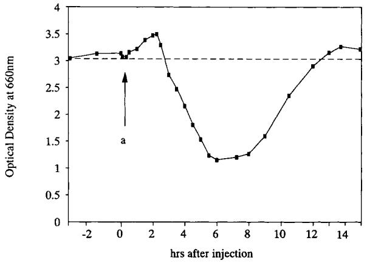
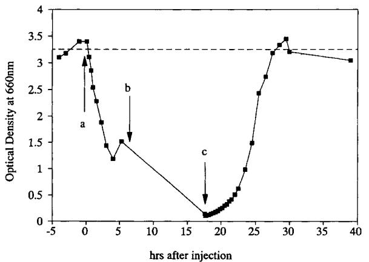
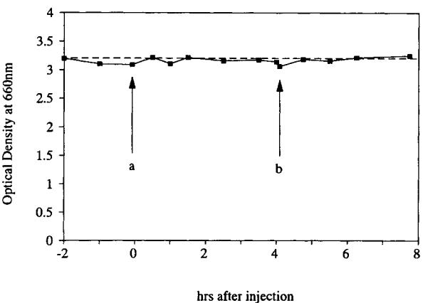
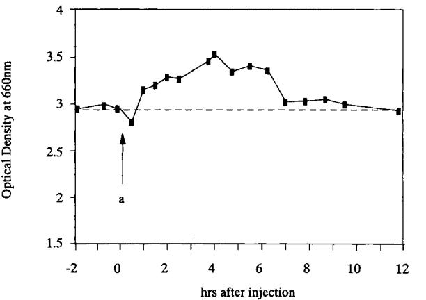
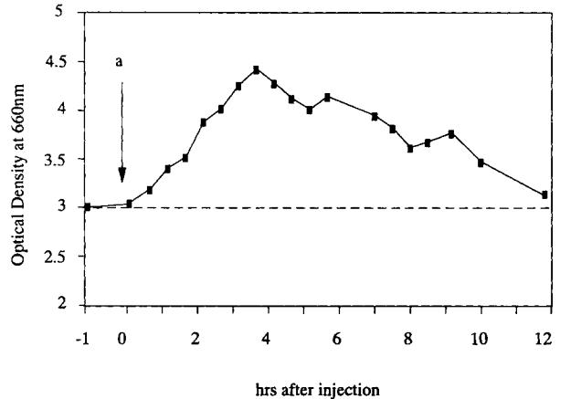
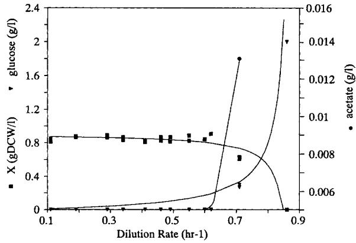
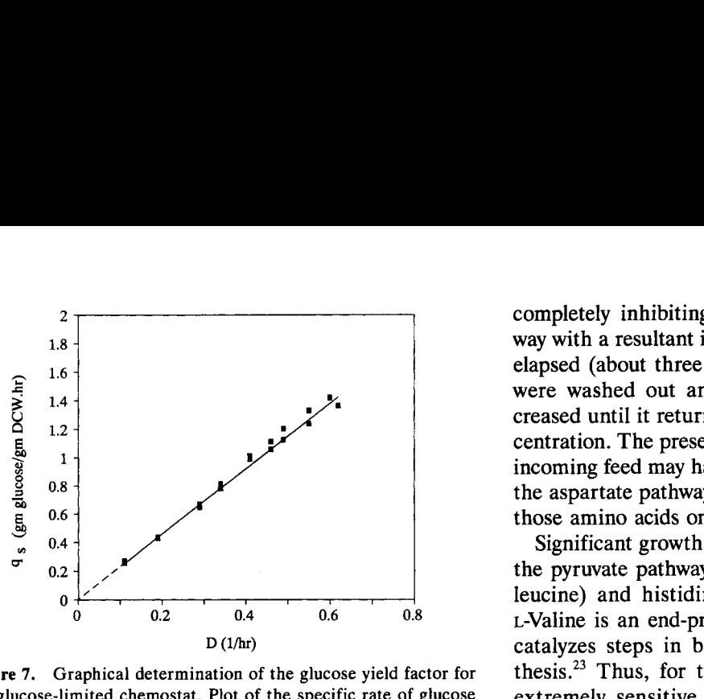
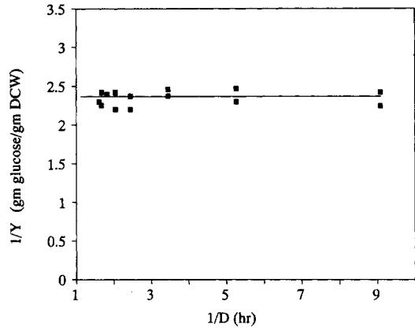

# **Defined Media Optimization for Growth of Recombinant** *Escherichia coli* **X90**

# **L. Yee and H.W. Blanch"**

*Department of Chemical Engineering, University of California at Berkeley, Berkeley, CA 94702* 

*Received June 8, 19921Accepted August 12, 1992* 

An optimized, defined minimal medium was developed to support balanced growth of *Escherichia coli* **X90** harboring a recombinant plasmid. Foreign protein expression was repressed in these studies. A pulse injection technique was used to identify the growth responses to nutrients in a chemostat. Once the nutrients essential for growth had been identified, the yield coefficients for individual medium components were determined in a series of nutrient-limited chemostats. These yield coefficients were used to develop an optimized, glucose-limited defined minimal medium that supports balanced cell growth in chemostat culture. The biomass and substrate concentrations follow the Monod chemostat model. The maximum specific growth rate determined in a washout experiment is 0.87 h-' for this strain in the optimized medium. The glucose yield factor is 0.42 g **DCW/g** glucose and the maintenance coefficient is zero in the glucose-limited chemostat culture. *0* 1993 John Wiley & Sons, Inc.

Key words: *Escherichia coli* medium optimization chemostat

## **INTRODUCTION**

To study the growth of microorganisms, the use of a balanced, optimized medium is desirable. This leads to higher growth rates, growth yields, and cell densities. The use of a defined medium also results in welldefined and reproducible culture conditions. It is preferred over complex media when control of the specific growth rate is desired, because the limiting nutrient is known and balanced cell growth can be achieved. A defined medium is termed "defined minimal" if it only contains the nutrients essential for growth. It is typically comprised of a simple carbon such as glucose, inorganic salts, or trace elements. Individual forms of amino acids and/or vitamins may also be included. Because proteins and other contaminating cellular components are not added to the culture broth as in complex media, product purification can also be greatly simplified. This can be especially important in the production of recombinant products. The objective of the present study was to develop a defined minimal medium for the growth of a recombinant *Escherichia coli.* Such a medium is important in developing high-cell-density, fed-batch fermentation for the production of recombinant proteins.

The development of medium for the cultivation of microorganisms is usually based on a combination of

Biotechnology and Bioengineering, Vol. 41, **Pp.** 221-230 (1993) @ 1993 John Wiley & Sons, Inc. CCC 0006-3592/93/020221-010

cellular composition and previously used media. An arbitrary selection of elements, their forms, and concentrations is usually sufficient to provide satisfactory growth in traditional shake-flask and batch cultivations. However, to develop an optimized medium in which all components necessary for balanced growth are identified and included, nutrient studies are required. Early experiments for media optimization were generally conducted in a sequence of shake-flask experiments. A change in the concentration or nature of medium constituents is made and the resulting change in growth rate and/or cell density is compared to the previous experiment. This method, although simple, requires considerable work and time. Moreover, conditions in the shake flasks can change during the growth period and obfuscate the results.

An alternative technique that can be used for medium development and optimization is continuous culture or chemostat *.9* Modifications of the pulse technique described by Mateles and Battat13 have been used to optimize defined media for different microorganisms. These include studies on *Bacillus caldotenax, Cellulomonas*  sp. and *Bacillus cereus,24 E. coli* B/r,20 and *Bacillus stearothermophilus* LLD-15.' Because this technique permits the establishment of a constant culture environment, Mateles and Battat **(13)** originally used this method to develop a carbon-limited medium for *Pseudomonas* C. Growth in a chemostat is limited by only one factor or substrate throughout the experiment, following Novick and Szilard (17). Thus, when the concentration of this growth-limiting component is increased, the biomass concentration will also increase.

The qualitative aspect of medium optimization involves the identification of all components that are necessary for growth as well as those components that may interfere with growth. The pulse method described by Mateles and Battat13 and Kuhn et a1.l' is useful for this determination. These authors established an actively growing culture in previously developed minimal medium. The batch culture was then converted to a continuous culture and steady-state growth at a fixed dilution rate was achieved. The concentration of the carbon source was increased until it was no longer the growth-limiting substrate. Concentrated solutions of various medium components were then injected directly into the bioreactor. If the injected component was the

* **To whom all correspondence should be addressed.** 

growth-limiting component, then the growth rate and biomass would increase until the component was consumed and/or diluted. The original biomass and steadystate prior to the injection would then be restored. Alternatively, if the biomass decreased upon the injection of a particular component, then the growth was inhibited by that component.

When a component was identified as being growth limiting, its concentration was raised in the feed reservoir until it was no longer the growth-limiting component. This process was repeated until no new limiting components could be identified. After the yield factors are determined, an optimized, balanced growth medium can be formulated in which only one substrate is growth limiting.

Deviations from the theoretical curve may be observed if the limiting nutrient yield factor changes with the specific growth rate. Dean and Rogers4 observed an increase in the cell mass as the rate of growth decreased in chemostat cultures of potassium-, magnesium-, sulfur-, and phosphorus-limited *Aerobacfer aerogenes.* 

This pulse and shift technique has the advantage that medium development and optimization can be obtained in a much shorter time than when compared with shakeflask or batch-culture experiments. Moreover, because one culture parameter can be changed, while the others are held constant, reliable yield factors can be determined. The effect of different nutrient limitations on cell-growth kinetics, physiology, and product formation can be studied. Furthermore, the effect on plasmid stability, plasmid copy number, and cloned gene product formation can also be determined for recombinant systems.

However, the yield factors for different nutrients can be dependent upon many parameters such as the specific growth rate, cultivation temperature, culture broth osmolarity, pH, nutrient concentration and source, and product formation. Therefore, data derived from chemostat studies under one set of conditions cannot always be easily extrapolated to a different set of conditions. These limitations must be considered in the development of an optimized medium.

The pulse injection method was used to identify the influence of various media components on the growth of *E. coli* strain X90 containing a recombinant plasmid, pZ3. The *tac* promoter, which is used to regulate the expression of the recombinant protein, rat anionic trypsin, is repressed throughout the cultivation. Nutrient yields were determined by changing the limiting nutrient in a series of chemostat experiments. From these results, an optimized defined minimal medium was developed to support balanced growth of this recombinant microorganism. This medium was used to generate a growth curve for a single-substrate-limited chemostat, thus verifying that the medium does provide balanced cell growth throughout the growth-rate range of this strain.

## **MATERIALS AND METHODS**

## **Strain and Plasmid**

*E. coli* strain X90 (F' *lac Iq, lac ZY, pro AB/A(lac-pro), ara, nalA, argEam, thi, rif')* harboring plasmid pZ3 was a generous gift of Dr. C.S. Craik of the University of California at San Francisco. Plasmid pZ3 was derived from the previously described plasmid, pT3 .lo Plasmid pZ3 is identical to pT3, with the exception that it also contains a phage M13 origin of replication for the generation of single-stranded DNA and subsequent sitespecific mutations of the rat anionic trypsin gene (C. S. Craik, personal communication). *E. coli* strain X90 is an arginine auxotroph and requires the amino acid for growth in minimal media.

## **Growth Procedures**

#### *Stock Maintenance and lnocula Preparation*

A 40% glycerol stock culture grown in Luria-Bertani (LB) medium (Difco, Detroit, MI) containing 50 pg ampicillin/mL (Sigma Chemical Co., St. Louis, MO) was maintained at -70°C.

Inoculum was prepared by streaking sterile LB-agar plates containing 50 pg ampicillin/mL with cells obtained from the glycerol stock culture. A single colony from the plate was used to inoculate 3 mL of LB/ ampicillin medium and grown overnight at 37°C. This was then transferred to 100 mL of fresh LB/ampicillin medium in a 500-mL baffled shake flask and incubated at 37°C for about 7 hours on a rotary shaker at 250 rpm. All 100 mL of this culture (5%) was used as inoculum.

#### *Plasmid Stability*

The plasmid stability was measured by direct plating onto selective (50 mg/L ampicillin) and nonselective LB-agar (Difco) plates. The sterile culture sample was diluted with sterile water to yield 100 to 300 colonies per plate and incubated at 37°C for 12 to 16 hours. Plasmid stability was calcualted by taking the ratio of the average number of colonies from three selective LB/amp plates to the average from three nonselective LB plates.

#### *Cultivation Conditions*

A 2-L working volume in a 7-L total volume Chemapec Inc. (Woodbury, NY) laboratory fermentor, equipped with agitator and temperature controller, was used for continuous culture experiments. The agitation rate was 400 rpm and the cultivation temperature was 37°C. Dissolved oxygen was measured with an Ingold Electrodes, Inc. (Wilmington, MA) steam sterilizable polarographic electrode and Model 170 amplifier. Air and/or pure *02*  was supplied at a rate of 3 wm to maintain the dissolved

oxygen concentration greater than 50% of air saturation. An Ingold Electrodes Inc. Model 764-31 steamsterilizable pH probe was used to measure the culture pH. An Analytical Instruments, Inc. (Chatham, NJ) Model IC pH indicator and controller was used to control the pH at 6.9 with the addition of either 2M **H2S04**  or 6M NaOH. Glucose, vitamins, amino acids, ampicillin, and antifoam 204 were obtained from Sigma. Medium components were sterilely filters with a 0.22-pm filter (Millipore Corp., Bedford, MA) into a steamsterilized medium bottle.

## **Analytical Procedures**

The cell density was determined by measuring the culture optical density (OD) at 660 nm with a Bausch & Lomb (Rochester, NY) Spectronic 20 spectrophotometer. Culture samples were diluted with an appropriate amount of 0.9% sodium chloride solution to obtain an OD between 0.2 and 0.7. A standard curve was then used to convert the OD to dry cell weight. One optical density unit was found to be equal to 0.43 g dry cell weight (DCW)/L.

Glucose concentrations were determined using a clinical glucose analyzer (Instrument Laboratory, Lexington, MA, Model IL919). After the instrument was calibrated with a 2 g/L glucose standard solution, appropriately diluted experimental samples were analyzed according to the manufacturer's instructions.

Acetate concentration was determined by an enzymatic test kit from Boehringer Mannheim Biochemicals (Indianapolis, IN).

## **Pulse Injection Procedures**

To identify cellular response to individual nutrient components, a modification of the pulse injection technique described by Mateles and Battat13 and Kuhn et a1.12was used. **A** defined minimal medium, containing proline, arginine, minimal salts, vitamins, trace elements, and glucose as the carbon source, was modified from the available literature*720 and is described in Table I. Ampicillin provided a constant selective pressure. Arginine was included in the medium, because the strain employed is an arginine auxotroph. Proline was included because it was suspected that it was required for growth based on its genotype. However, when proline was omitted from the medium for nutrient-limited chemostat studies conducted later, it was determined that it was not required for growth nor did it influence cell growth.

This medium was used to establish steady-state growth in a chemostat, in which glucose was in excess. The dilution rate was set at **0.4** h-', which is approximately half of the maximum specific growth rate of this strain. The steady-state cell density was 1.4 gDCW/L and the residual glucose concentration in the supernatant was 1.4 g/L.

Table I. Initial medium for pulse injection chemostat studies.

| Component             | Concentration | Units |
|-----------------------|---------------|-------|
| D-(+) Glucose         | 5             |       |
| NH4Cl                 | 0.8           |       |
| KHzPO4                | 0.5           |       |
| MgS04                 | 0.5           |       |
| CaC12. 2H20           | 0.01          |       |
| FeS04. 7Hz0           | 0.02          |       |
| L-Arginine . HCI      | 0.2           |       |
| L-proline             | 0.1           |       |
| Ampicillin            | 50            |       |
| Trace metal"          | 1.9           |       |
| Thiamine . HCl        | 5000          |       |
| p-Aminobenzoic acid   | 10            |       |
| d-Biot in             | 10            |       |
| Folk acid             | 10            |       |
| Niacinamide           | 10            |       |
| d-Pantothenic acid    | 1000          |       |
| Pyridoxal . HC1       | 75            |       |
| Pyridoxamine . 2HC1   | 75            |       |
| Pyridoxine . HCl      | 1000          |       |
| Riboflavin            | 500           |       |
| d,l-6,8-Thioctic acid | 10            |       |
| Cyanocobalamine       | 100 ~      | ~~    |

**a** Trace metal solution contained per liter: 10 mg A12(SO4)3 . 7Hz0,8 mg CoClz . 6H20, 2 mg CuSO4 . HzO, 1 mg H3B03, 20 mg MnClZ. 4Hz0, 1 mg NiClZ. 6Hz0, **5** mg NazMo04. 2Hz0, and *5* mg ZnS04. 7H20

To determine whether certain amino acids may affect the growth, "families" of amino acids related by their biosynthetic pathway^:^ were injected into the fermentor. These families are listed in Table 11.

#### **RESULTS**

## **Pulse Injection Studies**

Po hundred milligrams of each amino acid, except tyrosine, were dissolved in 20 to **40** mL of water. Tyrosine was first dissolved in 1M NaOH. A solution of each amino acid family was then sterile filtered and injected into the fermentor. The biomass and glucose concentration in the effluent was monitored for 1 to 10 hours after the pulse. No change was observed following a pulse injection of the glutamate, aromatic, or serine pathway amino acids. However, when the aspartate pathway amino acids were injected, the biomass concentration initially increased and then decreased. It then

Table **11.** Amino acid families.

| Gluturnate: glutamate, glutamine, arginine," proline" Aspartate: aspartate, asparagine, methionine, threonine, isoleucine, lysine |
|-----------------------------------------------------------------------------------------------------------------------------------------|
| Aromatic: tryptophan, phenylalanine, tyrosine Swine: serine, glycine, cysteine                                                       |
| Pyruvate: alanine, valine, leucine                                                                                                      |
| Histidine (no related amino acids)                                                                                                      |

**a** Not included in pulsed solution.

returned to its steady-state concentration as the amino acids were washed out after three residence times (approximately 7.5 to 8 hours), as shown in Figure 1.

When a solution containing the pyruvate pathway amino acids plus histidine was injected, an immediate decrease in the biomass was observed, as shown in Figure **2.** However, when the complex vitamin solution was removed from the feed medium **6** hours after the pulse, the biomass concentration failed to return to the original steady-state concentration even though the pulsed amino acids had been washed out. Growth was almost completely inhibited after 18 hours. One milliliter of 1000-fold concentration of complex vitamin solution was then injected into the chemostat and the biomass concentration increased to the original steady-state value. Moreover, the biomass concentration did not change as the pulsed vitamin solution was washed out.

**Figure 1.** Growth-inhibiting response following pulse injection of aspartate pathway amino acids. (a) Pulse injection of 200 mg each of aspartate, asparagine, methionine, threonine, isoleucine, and lysine. Dilution rate 0.4 h-'.

**Figure 2.** Growth-inhibiting response following pulse injection of histidine and pyruvate pathway amino acids, and subsequent increased growth response following injection of vitamin solution. (a) The injection pulse contained 200 mg each of alanine, valine, and leucine amino acids; (b) vitamins removed from feed medium; and (c) vitamin solution pulse injected into fermentor. Dilution rate **0.4** h-'.

A steady-state biomass concentration was established with the vitamin solution omitted from the medium. Eight milligrams of thiamine was then injected and no change was observed. Similarly, no response was observed when 1 mL **of** 1000-fold concentration of complex vitamin solution was injected, as shown in Figure **3.**  It was concluded that the complex vitamin solution did not affect the cell growth once the biomass concentration had returned to its original steady-state concentration and was omitted from the medium for subsequent pulses.

An increased growth response was observed when a 17-mL salt solution containing **1.36** g NH4CI, 0.85 g **KH2P04,** 0.85 g MgS04, 0.017 g CaCI2, and **0.034** g FeS04 was injected, as shown in Figure **4.** The biomass concentration initially increased by 0.7 optical density units and then decreased as the pulse was washed out after three residence times.

A similar growth response was observed when *2.64* g NH4CI was-injected directly into the fermentor, as

**Figure 3.** No response following pulse of thiamine or vitamins in vitamin-free medium. (a) Pulse injection of thiamine solution; (b) pulse injection of vitamin solution. Dilution rate **0.4** h-'.

**Figure 4.** Increased growth response following injection of the macronutrient salts. (a) Pulse injection of 1.36 **g** NH4C1, 0.85 g KH2P04, 0.85 g MgS04, 0.017 g CaC12, and 0.034 g FeS04. Dilution rate 0.4 h-'.

shown in Figure *5.* The **1.4** increase in optica! density units was proportional to the two-fold amount of NH4Cl injected compared with the amount in the salt solution in Figure **4,** indicating that the chemostat was nitrogen limited.

## **Determination of Yield Coefficients**

Once the cellular response to individual nutrients had been identified, a series of nutrient-limited chemostats were used to determine yield coefficients for those nutrients. The media composition of the different nutrientlimited chemostats is given in Table **111.** 

First, a glucose limited chemostat was established and steady-state samples were taken after 10 residence times. The concentration of the limiting nutrient in the feed was lowered until a residual glucose concentration could be detected in the effluent. In the case of phosphorus, arginine, and sulfur limitations, the initial glu-

**Figure 5. salt. (a) Pulse injection of 2.64 g NH4C1. Dilution rate 0.4 h-'. Increased growth response following injection** of **NH4Cl** 

cose concentration was doubled. At least 10 residence times were allowed to elapse before steady-state samples were taken. Significant cell lysis was detected in the magnesium-limited chemostat. This can affect the yield factor since we were unable to quantify the amount of cell lysis. Because magnesium ions stabilize the cell membrane, it is reasonable to assume that a deficiency can result in morphology changes and, in the extreme case, cell lysis. A summary of the results of the nutrientlimited chemostat studies are listed in Table **IV.** 

## **Glucose-Limited Chemostat**

The yield factors were then used to formulate glucoselimited media in which other nutrients were present in either a two-fold (MM2X) or three-fold (MM3X) excess. The media compositions are listed in Table **V.** 

A glucose-limited chemostat was established using MM2X and steady-state samples were obtained for increasing dilution rates. At least 10 residence times were allowed to elapse after each dilution rate change. Consecutive samples were taken to verify that steady-state had been achieved. **A** washout experiment in which the dilution rate was increased from 0.7 to **1.25** h-' was performed. The maximum specific growth rate was calculated to be 0.87 h-I.

The medium was then changed to MM3X and steadystate samples were taken for decreasing dilution rates. The increased macronutrient concentration had no effect on the steady-state biomass or substrate concentration, indicating that a two-fold excess was adequate to avoid any other nutrient limitation. Moreover, no hysteresis effect was observed upon increasing or decreasing the dilution rate.

Equations used to describe an ideal chemostat have been developed by Novick and Szilard (17). The steady-

**Table 111. Media composition of nutrient-limited chemostats.** 

| Component    |       | Limiting nutrient |           |           |           |        |           |           |
|--------------|-------|-------------------|-----------|-----------|-----------|--------|-----------|-----------|
|              | Units | Glucose           | N         | Mg        | K         | P      | S         | Arginine  |
| Glucose      |       | 2                 | 2         | 2         | 2.85      | 4      | 4         | 4         |
| NH4CI        |       | 0.6               | 0.06      | 0.6       | - 0.6  | 0.68   | 0.6       | 0.6       |
| KHzP04       |       | 0.38              | 0.38      | 0.38      |           | 0.025  | 0.38      | 0.38      |
| (NH4)zHP04   |       | - -            | - -    | - -    | 0.38      | -      | - -    | - -    |
| KC1          |       |                   |           |           | 0.005     | 0.2    | -         |           |
| MgS0.t       |       | 0.38              | 0.38      | 0.0068    | 0.38      | 0.38   |           | 0.38      |
| MgClz        |       | - -            | - -    | - -    | - -    | - - | 0.38      | - -    |
| (NH4)zS04    |       |                   |           |           |           |        | 0.0025    |           |
| CaC12        |       | 0.01              | 0.01      | 0.01      | 0.01      | 0.01   | - 0.01 | 0.01      |
| FeS04        |       | - 0.02         | - 0.02 | - 0.02 | - 0.02 | 0.02   |           | - 0.02 |
| FeClz        |       |                   |           |           |           | -      | 0.02      |           |
| Arginine     |       | 0.2               | 0.2       | 0.2       | 0.2       | 0.2    | 0.2       | 0.02      |
| Citric acidb |       | 0.2               | 0.0       | 0.02      | 0.2       | 0.2    | 0.2       | 0.2       |
| Ampicillin   |       | 50                | 50        | 50        | 50        | 50     | 50        | 50        |
| Trace metala |       | 1.9               | 1.9       | 1.9       | 1.9       | 1.9    | 1.9       | 1.9       |

**a Trace metal solution composition as in Table I.** 

**Citric acid was included as a chelating agent to prevent precipitation.** 

**Table IV.** Nutrient yield coefficients.

| Limiting nutrient | Residual glucose (g/L) | Cell density (gDCW/L) | Limiting nutrient yield (gDCW/g nutrient) | Glucose yield (g DCW/g glucose) |
|----------------------|------------------------------|-----------------------------|-------------------------------------------------|------------------------------------|
| Glucose              | 0                            | 0.82                        | 0.44                                            | 0.44                               |
| N                    | 1.5                          | 0.16                        | 10                                              | 0.33                               |
| Mg                   | 0.5                          | 0.19                        | 278                                             | 0.13                               |
| K                    | 0.2                          | 0.14                        | 53                                              | 0.05                               |
| P                    | 3                            | 0.19                        | 34                                              | 0.19                               |
| S                    | 3                            | 0.2                         | 163                                             | 0.18                               |
| Arginine             | 0.74                         | 0.95                        | 47                                              | 0.28                               |

**Table V.** Optimized glucose-limited media for chemostat.

| Component        | MM2X | MM3X | Units |
|------------------|------|------|-------|
| D-( +) Glucose   | 2    | 2    |       |
| NH4Cl            | 0.76 | 1.14 |       |
| KHzPOd           | 0.26 | 0.39 |       |
| MgS04            | 0.08 | 0.12 |       |
| CaClz. 2H20      | 0.01 | 0.01 |       |
| FeS04. 7Hz0      | 0.02 | 0.02 |       |
| L-Arginine . HCI | 0.04 | 0.06 |       |
| Ampicillin       | 50   | 50   |       |
| Citric acid      | 0.06 | 0.09 |       |
|                  |      |      |       |

**a** Trace metal solution composition as in Table I.

state solutions are:

$$Biomass: \qquad X = Y_{\text{ts}} \left( S_o - \frac{DK_t}{\mu_{\text{max}} - D} \right) \tag{1}$$

$$\text{Substrate:} \qquad \text{S} = \frac{D \text{K}_s}{\mu_{\text{max}} - D} \tag{2}$$

where *X* is the steady-state biomass concentration, **S** is the steady-state substrate concentration, *yXis* is the yield factor for the substrate, and *K,* is the value of the limiting substrate concentration which results in a growth rate of half of the maximum value.

The *X-D* diagram is shown in Figure **6** together with the substrate and acetate concentration in the steadystate samples. The acetate concentration was below the detectable limit until the maximum specific growth rate was approached. The cell density and glucose concentration remain constant over the entire growth rate range and follow the Monod chemostat model for a singlesubstrate-limited chemostat, and suggests that the medium provides balanced growth over the growth-rate range of this strain.

Graphical methods have been presented by Pirt **l9** to calculate the glucose yield and maintenance coefficient. The governing equations are:

$$Yield: \qquad \qquad q_s \stackrel{\mu}{\underset{Y_1}{\rightleftharpoons}} \frac{\mu}{Y_1} + m \tag{3}$$

*Maintenance:* **lml** _- _- + *xis P 5* **(4)** 

where *Xis* is the observed yield factor, *5* is the true growth yield factor, *m* is the maintenance coefficient,

is the specific growth rate, and *qs* is the specific rate of substrate consumption. Thus, from Eq. **(3),** the slope of the line resulting from a plot of *qs* versus *D* will be l/%. Similarly, from Eq. **(4),** the slope of the line from a plot of *1/Y* versus 1/D will be equal to *m.* 

The steady-state values were plotted assuming that *D* = *p* for a steady state chemostat as shown in Figures **7** and 8. The calculated glucose yield factor andmaintenance coefficient were **0.42** gDCW/g glucose and zero, respectively. The zero maintenance coefficient provides further evidence that all the glucose consumed supported cell growth and that the growth was balanced throughout the growth-rate range.

## **Plasmid Stability**

When the steady-state samples were checked for plasmid stability, greater than **90%** of the cells contained the plasmid. The pulse injection studies were completed after 8 days, indicating that the plasmid was stable in continuous culture for at least 8 days, approximately 110 generations.

Moreover, in subsequent nutrient-limited chemostat studies, the plasmid was stable for about **30** days, or **400** generations, at which time 60% to **70%** of the cells

**Figure 6.** Continuous culture of *E. coli* X90/pZ3 utilizing MM2X and MM3X glucose-limited media. Steady-state values of: **(m)** biomass concentration, *X* (g DCW/L); **(V)** glucose concentration (g/L); and *(0)* acetate concentration (g/L) in the effluent plotted as a function of time follows the Monod chemostat model *(K,* = 0.08 g/L, **pmax** = 0.88 h-', = 0.44 g DCW/gglucose, *So* = 2 g/L).

**the glucose-limited chemostat. Plot of the specific rate of glucose consumption,** *qs* **(g glucose/g DCW/h) versus the dilution rate, D (1/h).** 

**Figure 8. Graphical determination of the maintenance coefficient in a glucose-limited chemostat. Plot of the reciprocal of the** ob**served glucose yield factor, 1/Y (g glucose/g DCW) versus the reciprocal of the dilution rate, 1/D (h).** 

contained the plasmid. No determination of whether the plasmid copy number remained constant was made.

## **DISCUSSION**

The results from the pulse-injection experiments indicate that the initial medium contained all the nutrients essential for growth. However, an inhibiting growth response was detected when the aspartate and pyruvate pathway amino acids including histidine were injected. Presumably, this is due to end-product feedback inhibition and repression caused by the sudden increase in the intracellular amino acids concentrations.

Stanier et al.23 discuss the complex and interrelated regulation system present in the aspartate pathway of *E. coli.* Threonine, isoleucine, methionine, and lysine either inhibit the activity and/or repress the synthesis of the enzymes present in the first step of the aspartate pathway. The simultaneous increase in the concentration of these amino acids upon their injection into the bioreactor may have resulted in a synergistic effect,

completely inhibiting the aspartate biosynthesis pathway with a resultant inhibitory effect. After **8** hours had elapsed (about three residence times), the amino acids were washed out and the biomass concentration increased until it returned to its original steady-state concentration. The presence of a mixture of vitamins in the incoming feed may have provided some intermediates in the aspartate pathway and facilitated the biosynthesis of those amino acids once they had been washed out.

Significant growth inhibition was also observed when the pyruvate pathway amino acids (alanine, valine, and leucine) and histidine were added to the bioreactor. L-Valine is an end-product inhibitor of an enzyme that catalyzes steps in both isoleucine and valine biosynthesis.23 Thus, for those strains of *E. coli* which are extremely sensitive to valine inhibition, growth can be completely halted, because the cells will be unable to synthesize isoleucine. The effect can be reversed by providing isoleucine to the medium. This may explain the significant decrease in the biomass concentration when valine was added to the medium, but not isoleucine.

High concentrations of histidine have also been reported to totally inhibit the enzymatic activity of the *hisG* protein which catalyzes the first reaction in the histidine biosynthetic pathway.32 This, in combination with valine end-product inhibition, may further explain the significant decrease in the biomass concentration.

Because the vitamin solution was removed from the feed medium, about *6* hours after the pulse the cells were unable to return to their original steady-state concentration. However, when the vitamin solution was injected into the fermentor **18** hours after the amino acid pulse, the cells began to grow and the original steady-state biomass concentration was restored. This may also be due to the presence of certain intermediate metabolites whose synthesis was repressed by valine end-product inhibition and/or histidine end-product inhibition. The biomass concentration did not decrease as the pulsed vitamins were washed out, suggesting that once steady-state growth had been re-established, they had no effect on the cell growth. This conclusion is further supported by the absence of a response when a solution of thiamine or complex vitamin mixture was injected into the bioreactor when the vitamin solution was omitted from the feed medium.

Although end-product inhibition and repression of enzyme synthesis are also present in the regulatory systems of other amino acid biosynthetic pathways, the sudden increase in the exogenous concentrations of those amino acids was not sufficient to cause a detectable effect on the biomass concentration after the pulse injection. This method will only detect fairly rapid, transient responses which will be dictated by the residence time and concentration of the pulsed nutrient in the bioreactor .

Following the amino acid and vitamin pulse injections, steady-state growth was established with a vitamin-free

medium. A solution of the macronutrient salts was then injected and an increased optical density of **0.7** OD units was detected. The biomass concentration then returned to its original steady-state value as the pulse was washed out after **8** hours. This suggested that one or more of the nutrients in the salt solution were limiting the growth. It was confirmed that nitrogen was the limiting nutrient when the injection of a two-fold amount of NH4CI resulted in a two-fold increase in biomass concentration relative to the macronutrient salt solution. It has been reported that ammonia is the preferred nitrogen source for growth of *E. coli* on minimal media with glucose as the carbon source.21 Thus, it is not surprising that the injection of NH4Cl as a nitrogen source alleviated the nitrogen limitation, whereas the injection of amino acids as organic nitrogen sources did not. In order to utilize amino acids as a nitrogen source, degradation may be required. The degradative enzymes and transport systems for these nitrogen sources are often induced by growth in a nitrogen-limited medium.21 However, if this induction is slower than the residence time of the pulsed nutrients, then an increased growth response will not be detected. This may explain the difference in growth responses observed when NH4Cl was added versus amino acids as a nitrogen source.

The results of the pulse injection studies showed that none of the pulsed vitamins or other amino acids besides arginine and proline are required for growth of this strain. Moreover, in subsequent nutrient-limited chemostat studies, it was determined that proline was not required for growth. The growth inhibition that was observed following the pulse of aspartate pathway, pyruvate pathway, and histidine amino acids indicate that the arbitrary inclusion of a mixture of amino acids such as casamino acids in minimal media may actually inhibit cell growth rather than enhance cell growth.

The yield factor for the individual macronutrients were calculated from the steady-state biomass concentrations and the limiting nutrient concentration in the feed. The phosphorus yield of 34 g DCW/g P that we obtained is comparable with the yield of 36 g DCW/g P reported by Reiling et aL2' who used a similar technique to determine yield factors for *E. coli* B/r. However, the nitrogen yield of 5 g DCW/g N reported was half of that obtained in these experiments. This two-fold difference between nitrogen yield factors may be simply due to the difference in the nitrogen concentration in the feed medium. Thompson et al.30 reported a 24-fold decrease in the ammonia yield with a similar increase in the available concentration of the nitrogen-limited medium that they employed.

Although the ratio of the magnesium yield to sulfur yield factor is about **2** to **1** for data reported by Reiling et al. and the results obtained in our experiments, the individual yield factors themselves are different. The yield factors that Reiling et al. report are both about twice those obtained here. In the magnesium-limited *chemostat* **cultures, significant cell lysis was** observed.

Because it was not possible to quantify the extent of cell lysis, the yield factors were based on the concentration of whole cells, as determined by optical density. This observed yield factor will be lower than the actual yield factor if the cells consumed a significant portion of the supplied magnesium before they lysed. Brock3 has reported a similar response of *E. coli* cells to a magnesium ion deficiency. Because cell membranes are stabilized by magnesium ions, it is reasonable that a deficiency may induce permeability changes, formation of filamentous cells, as well as a decrease in the number of viable cells.

Magnesium ions are also known to play a role in stabilizing ribosomes in *E.* coli3l and *A. aerogenes.28* Furthermore because the ribosomal content was shown to increase with the specific growth rate, the magnesium yield also decreased by a two-fold factor with increasing growth rate in chemostat cultures of *A. aerogenes* by both Tempest et a1.28 and Dean and Roger~.~ This may account for the difference in magnesium yield factors reported here and by Reiling et al. However, these authors do not report the specific growth rate at which their yield factor was determined for comparison.

A similar dependence of sulfur yields on the specific growth rate was also reported by Dean and Rogers. This may also explain the two-fold difference in sulfur yields. Further evidence that this may be the case is the similar magnesium-to-sulfur yield factor ratio of **2** to **1**  for the two studies.

Reiling et al. do not report a potassium yield factor for comparison. The potassium yield factor of 53 g DCW/g K reported here is similar to that obtained by Kuhn et a1.12 for themophillic *Bacillus caldotenax* using the same technique. The potassium yield factor can also vary with the specific growth rate, because it is also associated with the ribosomes, as magnesium and phosphorus are.5 Moreover, because potassium ions play an important role in maintaining the cell's turgor pressure (the difference between the internal and external osmotic pressures), potassium yields can also depend upon the osmolarity of the growth medium as reported by Epstein and Schultz7 in *E. coli* and by Tempest27 in *Aerobacter aerogenes* cultures. In *E. coli,* Epstein and Schultz observed a fourfold increase in the intracellular potassium content with a six-fold increase in the medium osmolality.

The arginine yield is lower than one might expect for an individual amino acid. However, arginine is also a precursor for polyamine synthesis. The two most abundant polyamines, putrescine (1,Cdiaminobutane) and spermidine, are synthesized either from an intermediate of the arginine pathway, ornithine, or directly from arginine.26 In this particular *E. coli* strain, X90, a mutation in the *argE* gene prevents the synthesis of ornithine. Therefore, the only pathway available for polyamine synthesis in this strain is from arginine. Polyamines have been implicated in a wide variety of biological reactions and, although their specific molecular functions in vivo are unclear, they are essential for growth. Some systems that polyamines have been suspected to play a role in include DNA, RNA, and protein biosynthesis, as well as the regulation of intracellular osmotic strength.25

Polyamines are found in high concentrations in gramnegative bacteria such as *E. coli.* The intracellular concentrations of putrescine and spermidine are about *0.02M* and *O.O06M,* respectively. These concentrations can be influenced by culture conditions, including pH, dissolved oxygen concentration, amino acid concentrations, age of the culture, specific growth rate, and medium osmo1arity.'1,26 Because arginine is consumed for polyamine synthesis in this strain, the arginine yield will also vary with these culture conditions.

The glucose yield of 0.44 g DCW/g glucose determined from the glucose-limited chemostat is in agreement with typical yields for growth in minimal medium. Glucose yields are typically higher (ca. 0.7) when complex medium is used since the biosynthetic load is often reduced and alternative carbon sources are usually present **.20**  The glucose yields decreased when other nutrient limitations besides glucose were imposed. An increased oxygen consumption was also observed (data not shown). Similar observations have been reported by Neijssel and Tempest **16s29** in nutrient-limited chemostat cultures of *Klebsiella aerogenes* and *E. coli.* They suggest that because phosphate, magnesium, and potassium are all associated with the energetic machinery of the cell, a limitation of one of these nutrients may result in an increased consumption of the carbon source for energy production. Additionally, the carbon source may be used for energy to maintain the strong proton motive force required to transport the last traces of the limiting nutrient ions from the medium into the cell.

This may also explain the marked decrease in the glucose yield observed under potassium limitation. One of the two major potassium transport systems in *E. coli,*  Kdp, is derepressed by growth in low potassium media.22 This system functions as an ATP-driven potassium pump, and therefore, is an energy-requiring system. Furthermore, the other *E. coli* potassium transport system, Trk, has an ATP dependence as well as proton motive force requirement. A significant portion of the glucose may be used to produce ATP by glycolysis and oxidative phosphorylation and a proton motive force by respiration for this potassium transport system. This effect may be further exaggerated by the role of potassium in maintaining the intracellular osmotic pressure.'

Culture conditions can greatly affect the individual nutrient yield factors. Some examples discussed here include medium osmolarity, specific growth rate, and nutrient concentration. Therefore, in order to account for the possible changes in yield factors due to changes in cultivation conditions, a two- to three-fold excess should be included for non-growth-limiting nutrients in optimized medium formulations.

The continuous culture of **X90** containing plasmid pZ, using a glucose-limited medium in which the macronutrient salts were present in either a two- or three-fold excess follows the Monod model for a single-substratelimited chemostat. The glucose yield factor was constant over the growth rate range and no other nutrient besides glucose limited the growth. The maximum specific growth rate of **0.87** h-', determined from washout experiments, was comparable with that obtained in batch cultures (data not shown).

We were unable to determine at what dilution rate acetate is first produced because the acetate concentration remained below the detectable limit until the maximum specific growth rate was approached. However, the appearance of a detectable amount of acetate at a dilution rate of 0.7 h-' does verify that acetate is produced at higher specific growth rates, as reported by **others.2.6.8.14,15,18'20** The glucose yield factor of **0.42** g DCW/g glucose determined from a plot of the glucose consumption rate, *qs,* versus the dilution rate, D, is comparable to the yield of **0.44** g DCW/g glucose obtained in the glucose-limited chemostat study described earlier. However, this yield is slightly lower than the yield factor of 0.5 g DCW/g glucose reported for *E. coli* B/r by Reiling et a1.20 However, this is in close agreement with the 0.44 to 0.47 g DCW/g glucose yield factors reported by Tempest and Neij~sel~~ for four different *E. coli* strains in glucose-limited chemostat cultures.

The maintenance coefficient of zero that was calculated from a double reciprocal plot of 1/Y, vs 1/D indicates that all the consumed glucose supported cell growth or that maintenance levels were not quantifiable from this type of plot. When the medium is balanced as in these studies, a low level of maintenance might be expected, as less carbon needs to be diverted to the production of metabolic intermediates.

Due to the high cost of the commonly used lactose analog, **isopropyl-P-D-thiogalactopyranoside** (IPTG), for *tac* promoter induction, expression was represed in these studies. However, a basal amount of recombinant trypsin protein was detected in Western blots of the steady-state samples. This chemostat technique can be used to study the effect of culture conditions on recombinant protein expression if the gene is induced. This technique has the advantage that one condition can be changed at a time, while all others are held constant.

**This work was supported by National Science Foundation Grant BCS 8807179.** 

## **NOMENCLATURE**

| D | dilution rate (h-') |  |  |
|---|---------------------|--|--|
|   |                     |  |  |

- **DCW dry cell weight**
- **IPTG isopropyl-/3-D-thiogalactopyranoside**
- *K,* **Monod constant (g/L)**
- **LB Luria-Bertani**  *rn* **maintenance coefficient (g substrate/g dry cell weight** . **h)**

**YEE AND BLANCH: OPTIMIZED MEDIUM FOR** *ESCHERICHIA COLl* **229** 

- optical density
- substrate concentration in the bioreactor (g/L)
- substrate concentration in the feed (g/L)
- specific rate of substrate consumption (g substrate/g dry cell weight . h)
- *X*  biomass concentration (g dry cell weight/L)
- *r,*  true substrate growth yield factor (g dry cell weight/g substrate)
- r,, true substrate growth yield factor (g dry cell weight/g substrate)
- *P*  specific growth rate (h-')
- **Pmax**  maximum specific growth rate (h-')

# **References**

- **1.** Amartey, **S.** A., Leak, D. J., Hartley, B. **S. 1991.** Development and optimization of a defined medium for aerobic growth of *Bacillus stearothermophilus* **LLD-15.** Biotechnol. Lett. **13: 621-626.**
- **2.** Bech Jensen, E., Carlsen, S. **1990.** Production of recombinant human growth hormone in *Escherichia coli:* Expression of different precursors and physiological effects of glucose, acetate, and salts. Biotechnol. Bioeng. **36: 1-11.**
- **3.** Brock, T. D. **1962.** Effects of magnesium ion deficiency on *Escherichia coli* and possible relation to the mode of action of novobiocin. J. Bacteriol. **84: 679-682.**
- **4.** Dean, A.C. R., Rogers, P. L. **1967.** The cell size and macromolecular composition of *Aerobacter aerogenes,* in various systems of continuous culture. Biochim. Biophys. Acta **148: 267-279.**
- 5. Dicks, J.W., Tempest, D.W. **1966.** Potassium metabolism in *Aerobacter aerogenes.* Biochem. **J. 99: 7.**
- **6.** El-Mansi, E. M.T., and Holms, W. H. **1989.** Control of carbon flux to acetate excretion during growth of *Escherichia coli* in batch and continuous cultures. **J.** Gen. Microbiol. **135: 2875- 2883.**
- **7.** Epstein, W., Schultz, S. G. **1965.** Cation transport *inEscherichia coli.* V. Regulation of cation content. **J.** Gen. Physiol. **49: 221-234.**
- **8.** Fieschko, **J.,** Ritch, T. **1986.** Production of human alpha consensus interferon in recombinant *Escherichia* coli. Chem. Eng. Comm. **45: 229-240.**
- **9.** Goldberg, I., Er-el, **Z. 1981.** The chemostat-an efficient technique for medium optimization. Proc. Biochem. **16: 2-8.**
- **10.** Higaki, **J.** N., Evnin, L. B., Craik, C. **S. 1989.** Introduction of a cysteine protease active site into trypsin. Biochemistry **28: 9256-9263.**
- **11.** Ingram, J. **1987.** Effect of temperature, pH, water activity and pressure on growth, pp. **1543-1553. In:** Neidhardt, F. C. (ed.), *Escherichia* coli and *Salmonella typhimurium:* Cellular and molecular biology, vol. **2.** American Society for Microbiology, Washington, DC.
- **12.** Kuhn, H., Friederich, U., Fiechter, A. **1979.** Defined minimal medium for a thermophilic *Bacillus* sp. developed by a chemostat pulse and shift technique. Eur. J. Appl. Microbiol. Biotechnol. **6: 341-349.**
- **13.** Mateles, **R.** I., Battat, E. **1974.** Continuous culture used for media optimization, Appl. Microbiol. **28: 901-905.**
- **14.** Meyer, H.-P., Kuhn, H.-J., Brown, S.W., Fiechter, A. **1984.** Production of human leucocyte interferon by *E.* coli. In: Proceedings of the 3rd European congress on biotechnology, Munich, Germany, vol. **1,** pp. **499-505.** Verlag Chemie GmbH, Weinheim.
- **15.** Meyer, H.-P., Leist, C., Fiechter, A. **1984.** Acetate formation in continuous culture of *Escherichia coli* **K12** D1 on defined and complex media. **J.** Biotechnol. **1: 355-358.**
- **16.** Neijssel, 0. M., Tempest, D.W. **1979.** The physiology of metabolite over-production. Symp. SOC. Gen. Microbiol. **29: 53-82.**
- **17.** Novick, A., Szilard, L. **1950.** Experiments with the chemostat **on** spontaneous mutations of bacteria. Proc. Natl. Acad. Sci. USA **36: 708-719.**
- **18.** Paalme, T., Tiisma, K., Kahru, A., Vanatalu, K., Vilu, R. **1990.**  Glucose-limited fed-batch cultivation of *Escherichia* coli with computer-controlled fixed growth rate. Biotechnol. Bioeng. **35: 312-319.**
- **19.** Pirt, **S.** J. **1975.** Principles of microbe and cell cultivation. Wiley, New York.
- 20. Reiling, H.E., Laurila, H., Fiechter, A. **1985.** Mass culture of *Escherichia coli:* Medium development for low and high density cultivation of *Escherichia* coli B/r in minimal and complex media. J. Biotechnol. **2: 191-206.**
- **21.** Reitzer, L. **J.,** Magasanik, B. **1987.** Ammonia assimilation and the biosynthesis of glutamine, glutamate, aspartate, asparagine, L-alanine, and malanine, pp. **302-317.** In: F. C. Neidhardt (ed.), *Escherichia coli* and *Salmonella typhimurium:* Cellular and molecular biology, vol. **1.** American Society for Microbiology, Washington, DC.
- **22.** Rosen, B. P. **1987.** ATP-coupled solute transport systems, pp. **760-766.** In: F. C. Neidhardt (ed.), *Escherichia coli* and *Salmonellu typhimurium:* Cellular and molecular biology, vol. **1.**  American Society for Microbiology, Washington, DC.
- **23.** Stanier, R.Y., Ingraham, **J.** L., Wheelis, M. L., Painter, P. R. **1986.** The microbial world. 5th edition. Prentice-Hall, Englewood Cliffs, NJ.
- **24.** Summers, R. J., Boudreaux, D. P., Srinivasan, V. R. **1979.** Continuous cultivation for apparent optimization of defined media for *Cellulomonas* sp. and *Bacillus cereus.* Appl. Environ. Microbiol. **38: 66-71.**
- **25.** Tabor, C.W., Tabor, H. **1984.** Polyamines. Ann. Rev. Biochem. **53: 749-790.**
- **26.** Tabor, C.W., Tabor, H. **1985.** Polyamines in microorganisms. Microbiol. Rev. **49: 81-99.**
- **27.** Tempest, D.W. **1969.** Quantitative relationships between inorganic cations and anionic polymers in growing bacteria. Symp. SOC. Gen. Microbiol. **19: 87-111.**
- **28.** Tempest, D.W., Hunter, **J.** R., Sykes, J. **1965.** Magnesiumlimited Growth of *Aerobacter aerogenes* in a chemostat. J. Gen. Microbiol. **39: 355-366.**
- **29.** Tempest, D.W., Neijssel, 0. M. **1987.** Growth yield and energy distribution, pp. **797-805.** In: F. C. Neidhardt (ed.), *Escherichia*  coli and *Salmonella typhimurium:* Cellular and molecular biology, vol. **1.** American Society for Microbiology, Washington, DC.
- **30.** Thompson, B.G., Kole, M., Gerson, D. F. **1985.** Control of ammonium concentration in *Escherichia coli* fermentations. Biotechnol. Bioeng. **27: 818-824.**
- **31.** Tissieres, A,, Watson, J. D., Schlessinger, D., Hollingsworth, B. R. **1959.** Ribonucleoprotein particles from *Escherichia coli.*  J. Molec. Biol. **1: 221-233.**
- **32.** Winkler, M. E. **1987.** Biosynthesis of histidine, pp. **395-409.**  In: F. C. Neidhardt (ed.), *Escherichia coli* and *Salmonella typhimurium:* Cellular and molecular biology, vol. **1.** American Society for Microbiology, Washington, DC.