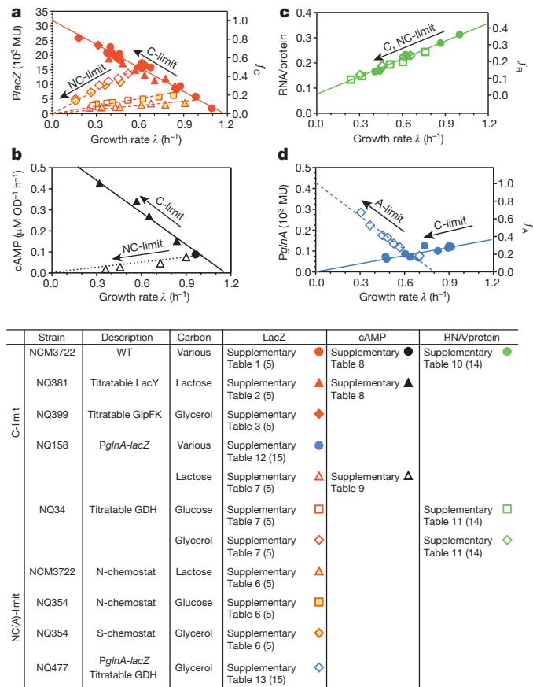
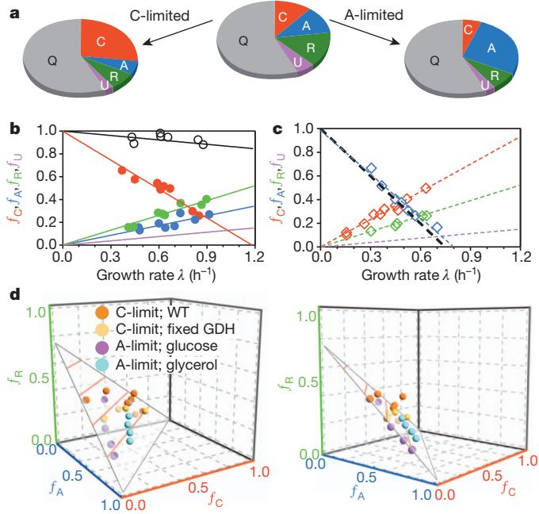
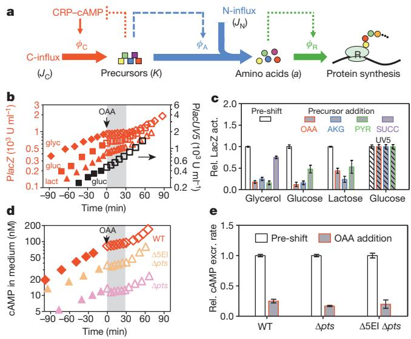
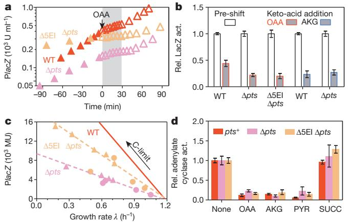

# ARTICLE

## Coordination of bacterial proteome with metabolism by cyclic AMP signalling

Conghui You1,2, Hiroyuki Okano1,2*, Sheng Hui1,3*, Zhongge Zhang2 , Minsu Kim1 , Carl W. Gunderson2 , Yi-Ping Wang4 , Peter Lenz5 , Dalai Yan6 & Terence Hwa1,2,3

The cyclic AMP (cAMP)-dependent catabolite repression effect in Escherichia coli is among the most intensely studied regulatory processes in biology. However, the physiological function(s) of cAMP signalling and its molecular triggers remain elusive. Here we use a quantitative physiological approach to show that cAMP signalling tightly coordinates the expression of catabolic proteins with biosynthetic and ribosomal proteins, in accordance with the cellular metabolic needs during exponential growth. The expression of carbon catabolic genes increased linearly with decreasing growth rates upon limitation of carbon influx, but decreased linearly with decreasing growth rate upon limitation of nitrogen or sulphur influx. In contrast, the expression of biosynthetic genes showed the oppositelinear growth-rate dependence as the catabolic genes. A coarse-grained mathematical model provides a quantitative framework for understanding and predicting gene expression responses to catabolic and anabolic limitations. A scheme of integral feedback control featuring the inhibition of cAMP signalling by metabolic precursors is proposed and validated. These results reveal a key physiological role of cAMPdependent catabolite repression: to ensure that proteomic resources are spent on distinct metabolic sectors as needed in different nutrient environments. Our findings underscore the power of quantitative physiology in unravelling the underlying functions of complex molecular signalling networks.

Biological organisms use a myriad of signalling pathways to monitor the environment and adjust their genetic programs in accordance with environmental changes1–4. Understanding how the signalling systems perceive the environment and orchestrate the downstream genetic changes is a grand challenge of systems biology5–8. One of the earliest signalling systems ever discovered in modern biology is the cyclic AMP (cAMP)-dependent pathway in E. coli9,10. This system is known to mediate carbon catabolite repression (CCR)11, a ubiquitous phenomenon among microorganisms whereby the synthesis of catabolic proteins is inhibited when growing on glucose or other rapidly metabolizable sugars12,13. In E. coli, it was long established that the uptake of glucose inhibited the synthesis of cAMP10, which is required for the expression of many catabolic genes through its activation of the pleiotropic regulator Crp (the cAMP receptor protein)14.

Despite extensive studies on this cAMP signalling pathway, a number of basic issues remain unanswered even for this well-known system: although the inhibitory effect of glucose uptake on cAMP synthesis via the phosphotransferase system (PTS) is well established15,16 (Supplementary Fig. 1), the growth of E. coli cells on various PTS-independent sugars also showed reduced cAMP levels17–19. Moreover, limitation of nitrogen, phosphorous, and other elements also led to much reduced cAMP levels20–22. Elucidating the physiological signal(s) that triggered cAMP signalling in those conditions was in fact the pursuit of Monod's last paper23, but these signal(s) remain elusive. Also, it is unclear to what extent cAMP signalling is intended for implementing CCR24, as hierarchical carbon usage25, a behaviour widely associated with CCR16, was shown to be independent of cAMP in several studies26,27. Thus, the true physiological function of cAMP signalling in E. coli remains open nearly 50 years after its discovery. In this study, we describe a top-down approach whichfirst addresses quantitatively the physiologicalfunction of cAMP signalling—not for CCR per se as we will show, but for the coordination of metabolism with proteomic resource allocation. This knowledge is then used as a guide to reveal the signalling strategy and mechanism by which E. coli cells trigger cAMP signalling.

### Catabolic genes show linear response

To characterize the physiological consequences of cAMP-dependent signalling, we used the well-studied lac system of E. coli, one of the many catabolic operons activated by the Crp–cAMP complex14,28. Wild-type E. coli K-12 cells were grown in minimal medium batch culture with saturating amount of one of many carbon sources, with the Lac repressor (LacI) deactivated by the inducer isopropyl-b-Dthiogalactoside (IPTG). As such, the native LacZ expression indicated the degree of cAMP signalling29. Supplementary Table 1 lists the LacZ expression level (L) together with the growth rate (l) for cells growing in each medium. A scatter plot of the data shows a striking linear relation (solid circles in Fig. 1a). The same relation is obtained by limiting the carbon influx, whether by titrating the lactose permease for cells growing on lactose (Supplementary Table 2, solid triangles in Fig. 1a), or by titrating the glycerol uptake system for cells growing on glycerol (Supplementary Table 3, solid diamonds in Fig. 1a); see Supplementary Figs 2, 3 and Supplementary Table 4 for strain details. The red solid line is the best-fit of all data to the form

$$L = L_{\text{max}} (1 - \lambda/\lambda_{\text{C}}) \tag{1}$$

referred to below as the 'C-line'; see Supplementary Table 5 for fitted values of the x-intercept lC and y-intercept Lmax. Similar linear relations are seen (Supplementary Fig. 4) for lacin various other strains of E. coli

*These authors contributed equally to this work.

1 Department of Physics, University of California at San Diego, La Jolla, California 92093-0374, USA. 2 Section of Molecular Biology, Division of Biological Sciences, University of California at San Diego, La Jolla, California 92093 USA. 3 Center for Theoretical Biological Physics, University of California at San Diego, La Jolla, California 92093-0374 USA. 4 State Key Laboratory of Protein and Plant Gene Research, College of Life Sciences, Peking University, Beijing 100871, China. 5 Department of Physics and Center for Synthetic Microbiology, University of Marburg, 35032 Marburg, Germany. 6 Department of Microbiology and Immunology, Indiana University School of Medicine, Indianapolis, Indiana 46202, USA.

Figure 1 | Catabolic and biosynthetic gene expression under nutrient limitations. For clarity, growth conditions and depository of data are summarized in the legend table. Number in parentheses indicate the Supplementary Tables containing the parameters of the best-fit lines. a, Correlation of PlacZ expression with the growth rate under C-limitations (solid symbols) and NC-limitations (open symbols). The left y-axis shows LacZ expression per OD600 (Miller unit or MU), which is proportional to per total protein; see Supplementary Methods and Supplementary Fig. 14. The right y-axis shows the equivalence in normalized fractionsfC (Supplementary Note 3). b, Internal cAMP level as indicated by the cAMP excretion rate (Supplementary Fig. 11) for cells grown under C- and NC-limitations (filled and open symbols, respectively). c, RNA/protein ratio for both C- and NC-limited growth (filled and open symbols, respectively). The right y-axis shows the equivalence in normalizedfractionsfR (Supplementary Note 3). d, PglnA-lacZexpression under C- and A-limited growth (filled and open symbols, respectively). The right y-axis shows the equivalence in normalized fractions fA (Supplementary Note 3).

characterized here and previously20,30,31, and for different catabolic promoters (solid symbols in Supplementary Fig. 5).

The data above indicate that the C-line is a common response pattern shown by the catabolic genes—a gradual increase upon reduction in carbon influx or for less rapidly metabolized carbon compounds. We refer to such carbon-dependent mode of growth limitation as 'Climitation'. To show that the C-line is a response specific to changes in carbon catabolism rather than to general growth parameters32,33, we modulated cell growth by various non-carbon (NC) modes of growth limitation, including continuous culture with ammonium or sulphate limitation (Supplementary Table 6), and batch culture using a titratable nitrogen uptake system (Supplementary Table 7). The latter system bypasses the highly regulated nitrogen response system34, creating a situation in which the formation of amino acids from their respective carbon can be directly titrated by the expression of glutamate dehydrogenase (GDH); see Supplementary Fig. 6. The expression of the lacZ promoter (PlacZ) obtained for these modes of NC-limited growth is plotted against the growth rates in Fig. 1a and Supplementary Fig. 7 for several exemplar carbon sources (open symbols). In each case, a positive linear relationship was observed (dashed lines). Similar relations are seen for several other catabolic promoters (open symbols in Supplementary Fig. 5d, e). We refer to these positive linear relations as the 'NC-lines'. Both C- and NC-lines also described the expression of a PlacZ-gfp fusion reporter in wild-type cells grown in microfluidic devices with rapid medium exchange35 to maintain low nutrient levels and remove excretion products (Supplementary Fig. 8).

We next examined the dependence of the C- and NC-lines on Crp– cAMP-mediated activation. Upon replacing the lacZ promoter by the lacUV5 promoter, whose independence of Crp–cAMP is well established36, LacZ expression in these strains showed little growthrate dependence under both C- and NC-limited growth (Supplementary Fig. 9). Additionally, we characterized the expression of a synthetic lacZ promoter with the Crp site scrambled, and found only a weak growth-rate dependence, resembling that previously reported for constitutive gene expression33, under both C- and NC-limitations (Supplementary Fig. 10). Thus both the C- and NC-lines rely completely on Crp–cAMP-mediated gene regulation.

We also characterized the cAMP excretion rate (Supplementary Fig. 11), taken to reflect the internal cAMP concentration17. It is seen to correlate well with PlacZ expression in the respective medium for both C- and NC-limited growth (Supplementary Fig. 12, Supplementary Tables 8 and 9). Moreover, scatter plot of cAMP excretion rates against the corresponding growth rates (Fig. 1b) resembles the C- and NC-lines of PlacZ (Fig. 1a). Together, these data strongly indicate that the C- and NC-lines are two sides of the same coin, both regulated by Crp–cAMP primarily through cAMP signalling.

#### Opposing linear response by anabolic genes

To understand the linearity of catabolic gene expression with the growth rate, we recall a linear relation between the cellular ribosome content and the growth rate for exponentially growing bacteria33,37,38. This relation (a bacterial growth law), which arises due to the allocation of ribosomes as a key growth-limiting resource33,38, is verified for our strains by characterizing the RNA/protein ratio (r) under both Cand NC-limited growth (Supplementary Tables 10 and 11, Fig. 1c). The striking contrast between the linear increase in catabolic gene expression (solid red symbols in Fig. 1a) and the concomitant linear decrease in the ribosome content (Fig. 1c) upon C-limitation (solid green symbols in Fig. 1c) indicates that these phenomena might share a common origin.

This line of qualitative reasoning predicts that, upon NC-limitation where the expression levels of catabolic and ribosomal genes both decrease linearly as fractions of total protein (open symbols in Fig. 1a, c), the expression of other genes (for example, biosynthetic genes) should increase linearly with the growth rate. We tested this prediction by characterizing the expression of glnA, which encodes the major ammonia assimilating protein glutamine synthetase34 using the titratable GDH system under a fixed carbon source (glycerol). As expected, the expression level of the chromosomal PglnA-lacZ fusion reporter (open blue diamonds in Fig. 1d, denoted as G) had a negative linear correlation with growth rate; similar behaviours were seen for the expression of several other genes in amino acid synthesis pathways (Supplementary Fig. 13). These responses suggest a general amino acid limitation imposed by the titratable GDH system (Supplementary Fig. 6), referred to henceforth as 'A-limitation' and the resulting response as the 'A-line' (dashed blue line in Fig. 1d). The latter is described mathematically by

$$G = G_{\text{max}}(1 - \lambda/\lambda_A) \tag{2}$$

with an x-intercept lA and a y-interceptGmax (Supplementary Table 15). Interestingly, PglnA-lacZ also had a positive linear correlation with the growth rate in C-limited growth (solid blue line in Fig. 1d). Thus E. coli perceives carbon limitation as a nitrogen excess, a feature reported qualitatively long ago in Klebsiella39.

#### Quantifying the proteome fractions

To see whether the response of the catabolic genes can be quantitatively accounted for by changes in the biosynthetic genes and the ribosome content, we apply and extend a mathematical model of proteome partition introduced recently33,40 to relate various growth laws to the global regulation of gene expression. As illustrated in Fig. 2a and explained in detail in Supplementary Note 1, we propose that the proteome is comprised of several major 'sectors', that is, groups of genes whose expression share similar growth-rate dependences upon various modes of growth limitation. These include a catabolic sector (C) of mass fraction wC that increases specifically in response to C-limitation as exemplified by lacZ (Fig. 1a and Supplementary Fig. 5), an anabolic sector (A) of mass fraction wA that increases specifically in response to A-limitation as exemplified by glnA (Fig. 1d, Supplementary Fig. 13), and a ribosomal sector (R) of mass fraction wR that increases specifically in response to translational inhibition (Supplementary Fig. 15). To account for additional sectors which have not been specifically targeted by the various modes of growth limitation applied in this study, we propose an uninduced sector (U) of mass fraction wU which generally decreases with decreasing growth rate. Examples of the latter might include enzymes for sulphur assimilation and nucleotide synthesis (Supplementary Fig. 16).

As shown by the various reporters, we expect each of the above proteome sector j to contain a growth-rate dependent part Dwj(l) and a growth-rate independent offset wj,0, with wj(l) 5 wj,0 1 Dwj (l); see Supplementary Fig. 17. Additionally, there may exist a growth-rate independent sector (I) of mass fraction wI. Together, the growth-rate independent components can be lumped into an effective sector (Q) of mass fraction wQ~wIzP j wj,0 as suggested from a previous study33, providing a cap wmax 5 1 2 wQ on how large the specific responses of each sector can increase to, that is, P j Dwj(l)~wmax. We estimated wmax < 43% using protein overexpression data (Supplementary Fig. 18 and Supplementary Note 2).

The constraint that the Dwjs add up to a constant (wmax) imposes quantitative relations between the responses of the various sectors upon different modes of growth limitation. This constraint is most simply expressed (Supplementary Note 3) in terms of a normalized fraction, fj(l) 5 Dwj(l)/wmax (see equation S21 in Supplementary Information) for each sector j, as

$$f_{\mathcal{C}}(\dot{\lambda}) + f_{\mathcal{A}}(\dot{\lambda}) + f_{\mathbb{R}}(\dot{\lambda}) + f_{\mathbb{U}}(\dot{\lambda}) = 1 \tag{3}$$

Assuming that changes in the expression levels of PlacZ and PglnA report changes in the C- and A-sectors, respectively, that is, DL / DwC(l) and DG / DwA(l), the normalized proteome sectors fC(l) and fA(l) can be estimated from the reporter expression levels using our model (Supplementary Fig. 17). The results are indicated on the right vertical scales in Fig. 1a, d. Similarly, fR(l) can be obtained from the RNA/protein ratio r(l) (right vertical scale of Fig. 1c and Supplementary Fig. 15a). The values of these normalized fractions under C-limited growth are plotted together as coloured circles in Fig. 2b, and their best linear fits are shown as lines of corresponding colours. Since fC(l) 1 fA(l) 1 fR(l) , 1 (black open circles and line), we deduce from equation (3) the existence of an uninduced sector U whose abundance, fU(l), is shown by the purple line, it is approximately 30% of the R-sector (green line).

#### Tight coordination of proteome sectors

The constraint equation (3) suggests that the growth-rate dependences of the C- and A-sectors are simply related, given that fR(l) follows the growth law (Fig. 1c) and fU < 0.3fR. Applying this to A-limited growth, we can use the observed expression of PlacZ under A-limitation (Fig. 1a) to predict PglnA expression under A-limitation; the result is in good agreement with the best fit as shown in Fig. 2c (black line), with glycerol as the carbon source. This is repeated for A-limitation on glucose, where we expect the smaller C-sector for glucose to lead to an expanded A-sector, and hence an increased intercept lA for PglnA. This prediction is verified in Supplementary Fig. 19, with the data quantitatively accounted for by the predicted A-line (black line). Similarly, the value of the intercept lC for PlacZ under C-limitation with a fixed degree of A-limitation is reduced to the expected range (Supplementary Fig. 20). See Supplementary Fig. 21 and Supplementary Table 16 for the direct comparison of the predicted and best-fit values of lC, lA. As one additional test of this picture, we applied sub-lethal amounts of antibiotics to probe the effect of translational limitation on the various proteome sectors (Supplementary Fig. 22). Whereas the R-sector increased linearly with decreasing growth rate33, PlacZ and PglnA expressions both decreased linearly with decreasing growth rate as predicted, again in a manner that conforms quantitatively to the constraint equation (3).

These data sets (Fig. 2b, c, Supplementary Figs 19, 20) can also be displayed simultaneously on 3D plot (Fig. 2d); the data are seen to lie close to a plane, defined by equation (3) with fU < 0.3fR. This is an example of the Pareto surface41, which results generally from trade-off between competing objectives that cannot be simultaneously optimized. The linear dependences of these fractions on the growth rate further indicate that they arisefrom protein synthesis being the common

Figure 2 | Proteome fractions and the partition model. a, Illustration of the proteome partition model. Upon C-limitation, the C-sector increases and the A-, R-, U-sectors decrease, whereas upon A-limitation, the A-sector increases and the C-, R-, U-sectors decrease; see Supplementary Note 1. b, Normalized responses (fC, fA, fR) indicated by the C-, A-, R- sector reporters upon C-limitation (solid red, green, blue circles respectively from Fig. 1a, c, d). The black circles show the sum fC 1 fA 1 fR at each growth rate; they decrease linearly with the growth rate (black line). The purple line is the predicted U-sector fraction fU based on equation (3). c, fC, fA, fR upon A-limitation with glycerol as the carbon source (open red, green, blue diamonds, respectively. from Fig. 1a, c, d). Taking fU (purple line) to be the same as that in b (fU 5 0.3fR), equation (3) predicts fA to follow the black line, and blue line shows the best fit. d, fC, fA, fR for the four sets of C- and A-limited growth conditions characterized (b, c and Supplementary Figs 19, 20) are plotted in a 3D plot. (Unavailable data forfR, fA are generated from the straight line fit.) Two views are shown. The data are seen to fall on the predicted surface (equation (3) with fU 5 0.3fR).

bottleneck of cell growth. For example, catabolic proteins are needed to increase carbon influx while ribosomal and anabolic proteins are needed to increase biosynthesis, all of which depend on translation by ribosomes (Supplementary Note 4). This logic leads to an important physiological rationale for the pleiotropic regulation of catabolic genes by Crp–cAMP: given rapidly metabolizable carbons, cells reduce catabolic gene expression to increase the expression of ribosomal and anabolic genes for rapid cell growth.

#### Strategy of metabolic–proteome coordination

The opposing behaviours shown by the C- and A-sectors upon different modes of growth limitation (Figs 1 and 2) point strongly to the existence of control system(s). Figure 3a describes a simple regulatory scheme wherein a single signal can sense and eliminate imbalance between metabolic activities on the carbon and nitrogen side. In this coarse-grained scheme, the external carbon source is converted to the pool of carbon precursors (K), for example, a-ketoacids, which subsequently combine with ammonium to form amino acids (a) via transamination reactions (Supplementary Fig. 6). If the carbon influx (JC) exceeds the nitrogen influx (JN), then precursors (K)will accumulate42–44. A signal from K to inhibit Crp–cAMP activity (dotted red line in Fig. 3a) can account for the observed responses by the catabolic genes (Fig. 1a and Supplementary Fig. 5), both for increases in JC (relief of C-limitation) and decreases in JN (A-limitation). An opposite signal from K could underlie changes in the A-sector (dashed blue arrow). Detailed mathematical analysis (Supplementary Note 5) shows how

Figure 3 | Transient repression by metabolic precursors. a, A coarse-grained view of metabolism, focusing on the biosynthesis of amino acids from the carbon and nitrogen influxes (JC and JN respectively). Carbon precursors such as a-ketoacids (K) sense the difference between JC and JN. An integral feedback scheme using the regulation of catabolic and anabolic enzymes (wC and wN, respectively) by K can coordinate these metabolic sectors in a parameter-free manner; see Supplementary Note 5 for details. b, PlacZ-lacZ expression was characterized for wild-type NCM3722 cells grown exponentially in various carbon sources and with 1 mM IPTG to deactivate LacI. At time zero, 20 mM OAA was added; a transient repression period of ,30 min is shaded in grey. PlacUV5-lacZ expression in strain NQ1053 was characterized in the same way (black squares; right y-axis). c, LacZ expression levels before and during the repression period (Fig. 3b and Supplementary Figs 23–27) are summarized by the open and grey bars. Striped bars show the results of PlacUV5-lacZ. d, cAMP concentrations in the medium were monitored for wild-type cells grown in glycerol and the two PTS-deletion strains, NQ721 (Dpts) and NQ506 (D5EI Dpts), grown in lactose. 20 mM OAA was added at time zero. e, Relative cAMP excretion rates were quantified before and during the repression period; see Supplementary Method. In c and e, data were expressed as mean 6 s.e.m. (n \$ 3).

such a feedback loop (known as ''integral feedback''35,45 since K is the time-integral of the flux difference between JC and JN being regulated), together with global constraints provided by proteome partition, can generate the C- and A-lines generically, independent of the detailed forms of the regulatory functions.

The proposed integral feedback strategy can be tested by adding a precursor to an exponentially growing culture. If the uptake of precursor significantly exceeds its metabolic turnover, then the transient build-up of the precursor should reduce the internal cAMP level and the expression of catabolic genes, until a later time when metabolic fluxes are reequilibrated. We first tested oxaloacetate (OAA), a major metabolic precursor (an a-ketoacid) which is co-used with other carbons by wildtype cells to give faster steady-state growth (Supplementary Table 17). The addition of OAA to cells growing exponentially in glycerol, glucose or lactose strongly inhibited PlacZ expression (with LacI deactivated) for up to 30 min (Fig. 3b, c and Supplementary Fig. 23). This transient effect was Crp–cAMP-dependent because no effect was observed for PlacUV5 (Fig. 3b, c) and another Crp-independent promoter (Supplementary Fig. 23f). The inhibitory effect is most probably exerted on cAMP synthesis, because the excretion of cAMP, which reflects the internal cAMP level17, was also inhibited over the same period upon OAA addition (Fig. 3d, e). Thus, OAA is a candidate precursor implementing the feedback inhibition depicted in the dotted red line of Fig. 3a.

Strong to moderate repressive effects were also observed following the addition of a-ketoglutarate (AKG) (Fig. 3c and Supplementary Figs 24, 25) and pyruvate (PYR) (Fig. 3c and Supplementary Fig. 26), both of which are a-ketoacids. In contrast, the addition of succinate (SUCC), which is a dicarboxylic acid like OAA and AKG, but is not an a-ketoacid, leads to only minor repression (Fig. 3c and Supplementary Fig. 27). Although our study does not rule out other possible causes of transient repression46, the inhibitory effects produced by the a-ketoacids are much stronger than those by glucose and the non-hydrolysable compound methylthio-b-galactoside (TMG) investigated previously47; see Supplementary Fig. 28. Finally, a-ketoacid addition also caused transient increase in the expression of the anabolic gene glnA (Supplementary Fig. 29a, b). This regulatory effect is independent of cAMP (Supplementary Fig. 29c, d, e), and is captured by the dashed blue arrow in Fig. 3a.

#### Mechanism of metabolic-proteome coordination

The cAMP signalling pathway linking metabolism to catabolic gene expression is commonly thought to comprise of the PTS proteins15,16 (Supplementary Fig. 1). Recently, AKG was reported to interact directly with enzyme I (EI) of the PTS proteins43, making PTS proteins likely candidates for implementing the proposed feedback by precursors (dotted red line in Fig. 3a). However, strong transient repression was still observed upon the addition of a-ketoacids in strains with deletion of various PTS proteins, including one with the 3 major PTS proteins deleted (Dpts) and another with additionally all 5 EI proteins deleted (D5EI Dpts); see Fig. 4a, b and Supplementary Figs 30, 31. This transient effect was still accompanied by similar fold of reduction in cAMP excretion in vivo (Fig. 3d, e), and the PTS mutants in steady state still showed C-lines for C-limited growth (Fig. 4c). The C-lines of the PTS mutants (dashed lines) showed similar x-intercept (lC) as the wild type (red line), indicating that although PTS proteins do affect the degree of Crp–cAMP-mediated regulation of catabolic gene expression as is long known15, they are not necessary for the existence of this response (that is, the occurrence of the C-line).

Next we investigated directly the inhibitory effect of various candidate metabolites on cAMP synthesis, by in vitro assays with permeabilized cells (ref. 48 and Supplementary Methods). The rate of cAMP synthesis by adenylate cyclase was significantly reduced by several a-ketoacids but not by SUCC, in either PTS1 or PTS2 background (Fig. 4d and Supplementary Fig. 32). Thus, the simplest regulatory route consistent with all data are to have precursors such as

Figure 4 | Mechanism of cAMP-dependent signalling. a, OAA transiently repressed PlacZ-lacZ expression in PTS-deleted cells, NQ721 (Dpts) and NQ506 (D5EI Dpts), grown exponentially in lactose. 20 mM OAA was supplied at time zero. The response of WT cells to OAA in Fig. 3b (red triangles) was plotted for comparison. b, The magnitudes of transient repression by OAA and AKG were quantified as in Fig. 3c, based on the data in Fig. 4a and Supplementary Figs 30, 31. c, Steady state PlacZ-lacZ expression in PTS mutants under various modes of C-limitations; see Supplementary Table 18 for data and conditions. Dashed lines show the best linear fit (Supplementary Table 19). The C-line of Fig. 1a is shown in red for reference. d, in vitro adenylate cyclase activities in strains NQ385 (pts1), NQ976 (Dpts) and NQ977 (D5EI Dpts) were assayed with or without 10 mM of various candidate inhibitors; see Supplementary Methods for details. These strains are also deleted of the cAMP phosphodiesterase which is not primary to signalling in cAMP-dependent CCR; see Supplementary Fig. 33. In b and d, data were expressed as mean 6 s.e.m. (n \$ 3).

OAA inhibiting cAMP synthesis by adenylate cyclase (Supplementary Fig. 34), either directly or through the help of a mediator protein. Simple inhibition kinetics was found for OAA, with half-inhibition concentrations in the sub-millimolar range (Supplementary Fig. 35).

#### Discussion

cAMP-mediated CCR is one of the most intensely studied regulatory systems in biology. Results described here indicate that the physiological function of cAMP signalling is not centred on carbon metabolism per se as commonly thought; rather this pathway coordinates the allocation of proteomic resources (Fig. 2a) with different metabolic demands in different nutrient environments. This global regulatory process is directed by an integral feedback system (Fig. 3a), driven by cAMP signals modulated by metabolic precursors such as several a-ketoacids. These precursors can be identified as the 'catabolites', the accumulation of which was proposed to induce CCR over 50 years ago11.

The complexity of molecular interactions underlying this signalling system made it difficult to elucidate its physiological function in a bottom-up approach despite the wealth of molecular data known for this classic system. However, the top-down physiological approach described here was able to reveal simple quantitative relations between gene expression and growth rates; these relations provided key insight on the physiological function of cAMP signalling, leading to the elucidation of molecular strategy and implementation. The effectiveness of this approach provides a conceptual framework to pursue the use of quantitative physiological approaches to elucidate other complex signalling networks.

#### METHODS SUMMARY

Material and method including strain construction, cell culture, LacZ activity assay, cAMP excretion rate assay, RNA/protein ratio assay, in vitro adenylate cyclase activity assay and theoretical analysis are provided in detail in Supplementary Information.

#### Received 10 February 2012; accepted 11 July 2013. Published online 7 August 2013.

- 1. Laub, M. T. & Goulian, M. Specificity in two-component signal transduction pathways. Annu. Rev. Genet. 41, 121–145 (2007).
- 2. Potrykus, K. & Cashel, M. (p)ppGpp: still magical? Annu. Rev. Microbiol. 62, 35–51 (2008).
- 3. Hengge, R. Principles of c-di-GMP signalling in bacteria. Nature Rev. Microbiol. 7, 263–273 (2009).
- 4. Porter, S. L., Wadhams, G. H. & Armitage, J. P. Signal processing in complex chemotaxis pathways. Nature Rev. Microbiol. 9, 153–165 (2011).
- 5. Brent, R. Cell signaling: what is the signal and what information does it carry? FEBS Lett. 583, 4019–4024 (2009).
- 6. Purvis, J. E. et al. p53 dynamics control cell fate. Science 336, 1440–1444 (2012).
- 7. Hao, N., Budnik, B. A., Gunawardena, J. & O'Shea, E. K. Tunable signal processing through modular control of transcription factor translocation. Science 339, 460–464 (2013).
- 8. Young, J. W., Locke, J. C. & Elowitz, M. B. Rate of environmental change determines stress response specificity. Proc. Natl Acad. Sci. USA 110, 4140–4145 (2013).
- 9. Makman, R. S. & Sutherland, E. W. Adenosine 39,59-phosphate in Escherichia coli. J. Biol. Chem. 240, 1309–1314 (1965).
- 10. Perlman, R. L., De Crombrugghe, B. & Pastan, I. Cyclic AMP regulates catabolite and transient repression in E. coli. Nature 223, 810–812 (1969).
- 11. Magasanik, B. Catabolite repression. Cold Spring Harb. Symp. Quant. Biol. 26, 249–256 (1961).
- 12. Epps, H. M. & Gale, E. F. The influence of the presence of glucose during growth on the enzymic activities of Escherichia coli: comparison of the effect with that produced by fermentation acids. Biochem. J. 36, 619–623 (1942).
- 13. Neidhardt, F. C. & Magasanik, B. Effect of mixtures of substrates on the biosynthesis of inducible enzymes in Aerobacter aerogenes. J. Bacteriol. 73, 260–263 (1957).
- 14. Kolb, A., Busby, S., Buc, H., Garges, S. & Adhya, S. Transcriptional regulation by cAMP and its receptor protein. Annu. Rev. Biochem. 62, 749–797 (1993).
- 15. Saier, M. H. Jr, Feucht, B. U. & Hofstadter, L. J. Regulation of carbohydrate uptake and adenylate cyclase activity mediated by the enzymes II of the phosphoenolpyruvate: sugar phosphotransferase system in Escherichia coli. J. Biol. Chem. 251, 883–892 (1976).
- 16. Deutscher, J., Francke, C. & Postma, P. W. How phosphotransferase system-related protein phosphorylation regulates carbohydrate metabolism in bacteria. Microbiol. Mol. Biol. Rev. 70, 939–1031 (2006).
- 17. Epstein, W., Rothman-Denes, L. B. & Hesse, J. Adenosine 39:59-cyclic monophosphate as mediator of catabolite repression in Escherichia coli. Proc. Natl Acad. Sci. USA 72, 2300–2304 (1975).
- 18. Hogema, B. M. et al. Catabolite repression by glucose 6-phosphate, gluconate and lactose in Escherichia coli. Mol. Microbiol. 24, 857–867 (1997).
- 19. Bettenbrock, K. et al. Correlation between growth rates, EIIACrr phosphorylation, and intracellular cyclic AMP levels in Escherichia coli K-12. J. Bacteriol. 189, 6891–6900 (2007).
- 20. Mandelstam, J. The repression of constitutive beta-galactosidase in Escherichia coli by glucose and other carbon sources. Biochem. J. 82, 489–493 (1962).
- 21. McFall, E. & Magasanik, B. Effects of thymine and of phosphate deprivation on enzyme synthesis in Escherichia coli. Biochim. Biophys. Acta 55, 900–908 (1962).
- 22. Clark, D. J. & Marr, A. G. Studies on the repression of beta-galactosidase in Escherichia coli. Biochim. Biophys. Acta 92, 85–94 (1964).
- 23. Ullmann, A., Tillier, F. & Monod, J. Catabolitemodulator factor: a possiblemediator of catabolite repression in bacteria. Proc. Natl Acad. Sci. USA 73, 3476–3479 (1976).
- 24. Narang, A. & Pilyugin, S. S. Bacterial gene regulation in diauxic and non-diauxic growth. J. Theor. Biol. 244, 326–348 (2007).
- 25. Monod, J. The phenomenon of enzymatic adaptation and its bearings on problems of genetics and cellular differentiation. Growth 11, 223–289 (1947).
- 26. Okada, T. et al. Role of inducer exclusion in preferential utilization of glucose over melibiose in diauxic growth of Escherichia coli. J. Bacteriol. 146, 1030–1037 (1981).
- 27. Inada, T., Kimata, K. & Aiba, H. Mechanism responsible for glucose-lactose diauxie in Escherichia coli: challenge to the cAMP model. Genes Cells 1, 293–301 (1996).
- 28. Mu¨ller-Hill, B. The lac Operon: a Short History of a Genetic Paradigm. (de Gruyter, 1996).
- 29. Kuhlman, T., Zhang, Z., Saier, M. H., Jr & Hwa, T. Combinatorial transcriptional control of the lactose operon of Escherichia coli. Proc. Natl Acad. Sci. USA 104, 6043–6048 (2007).
- 30. Wanner, B. L., Kodaira, R. & Neidhardt, F. C. Regulation of lac operon expression: reappraisal of the theory of catabolite repression. J. Bacteriol. 136, 947–954 (1978).
- 31. Kuo, J. T., Chang, Y. J. & Tseng, C. P. Growth rate regulation oflac operon expression in Escherichia coli is cyclic AMP dependent. FEBS Lett. 553, 397–402 (2003).
- 32. Klumpp, S., Zhang, Z. & Hwa, T. Growth rate-dependent global effects on gene expression in bacteria. Cell 139, 1366–1375 (2009).
- 33. Scott, M., Gunderson, C.W.,Mateescu, E.M., Zhang, Z. & Hwa, T. Interdependence of cell growth and gene expression: origins and consequences. Science 330, 1099–1102 (2010).
- 34. Reitzer, L. Nitrogen assimilation and global regulation inEscherichia coli. Annu. Rev. Microbiol. 57, 155–176 (2003).
- 35. Kim, M. et al. Need-based activation of ammonium uptake in Escherichia coli. Mol. Syst. Biol. 8, 616 (2012).

- 36. Silverstone, A. E., Arditti, R. R. & Magasanik, B. Catabolite-insensitive revertants of lac promoter mutants. Proc. Natl Acad. Sci. USA 66, 773–779 (1970).
- 37. Schaechter, M., Maaloe, O. & Kjeldgaard, N. O. Dependency on medium and temperature of cell size and chemical composition during balanced growth of Salmonella typhimurium. J. Gen. Microbiol. 19, 592–606 (1958).
- 38. Maaloe, O. in Biological Regulation and Development 487–542 (Plenum, 1979).
- 39. Bender, R. A. & Magasanik, B. Regulatory mutations in the Klebsiella aerogenes structural gene for glutamine synthetase. J. Bacteriol. 132, 100–105 (1977).
- 40. Scott, M. & Hwa, T. Bacterial growth laws and their applications. Curr. Opin. Biotechnol. 22, 559–565 (2011).
- 41. Schuetz, R., Zamboni, N., Zampieri, M., Heinemann, M. & Sauer, U. Multidimensional optimality of microbial metabolism. Science 336, 601–604 (2012).
- 42. Goyal, S., Yuan, J., Chen, T., Rabinowitz, J. D. & Wingreen, N. S. Achieving optimal growth through product feedback inhibition in metabolism. PLOS Comput. Biol. 6, e1000802 (2010).
- 43. Doucette, C. D., Schwab, D. J., Wingreen, N. S. & Rabinowitz, J. D. a-ketoglutarate coordinates carbon and nitrogen utilization via enzyme I inhibition. Nature Chem. Biol. 7, 894–901 (2011).
- 44. Yan, D., Lenz, P. & Hwa, T. Overcoming fluctuation and leakage problems in the quantification of intracellular 2-oxoglutarate levels inEscherichia coli. Appl. Environ. Microbiol. 77, 6763–6771 (2011).
- 45. Leigh, J. R. Control Theory (The Institution of Electrical Engineers, 2004).
- 46. Peterkofsky, A. & Gazdar, C. Escherichia coli adenylate cyclase complex: regulation by the proton electrochemical gradient. Proc. Natl Acad. Sci. USA 76, 1099–1103 (1979).
- 47. Tyler, B. & Magasanik, B. Physiological basis of transient repression of catabolic enzymes in Escherichia coli. J. Bacteriol. 102, 411–422 (1970).
- 48. Harwood, J. P. & Peterkofsky, A. Glucose-sensitive adenylate cyclase in toluenetreated cells of Escherichia coli B. J. Biol. Chem. 250, 4656–4662 (1975).

Supplementary Information is available in the [online version of the paper.](www.nature.com/doifinder/10.1038/nature12446)

Acknowledgements We are grateful to R. Bender, A. Danchin, P. Geiduschek, J. Ingraham, S. Kustu, W. F. Loomis, A. Narang, J. Rabinowitz, M. H. Saier and members of the Hwa laboratory for valuable comments. This work was supported by the Human Frontiers in Science Program (RGP0022), and by the NSF to T.H. (PHY1058793) and through the Center for Theoretical Biological Physics (PHY0822283).

Author Contributions C.Y., D.Y. and T.H. designed the study. C.Y., H.O., S.H., Z.Z. M.K., C.W.G. and D.Y. performed experiments. C.Y., S.H., Y.P.W. and T.H. analysed the data. P.L. and T.H. developed the model. All authors contributed to writing the paper and the supplement.

Author Information Reprints and permissions information is available at <www.nature.com/reprints>. The authors declare no competing financial interests. Readers are welcome to comment on the [online version of the paper.](www.nature.com/doifinder/10.1038/nature12446) Correspondence and requests for materials should be addressed to T.H. [(hwa@ucsd.edu)](mailto:hwa@ucsd.edu).