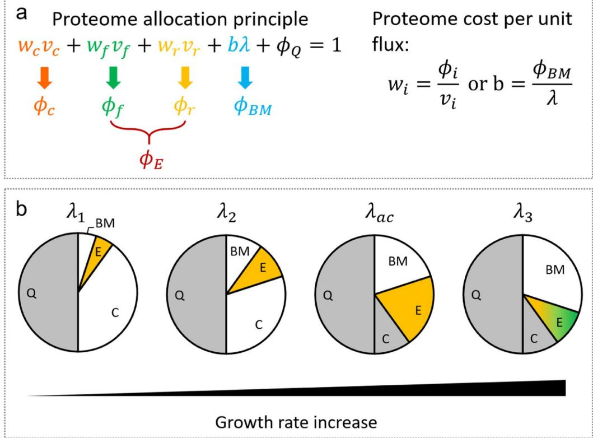
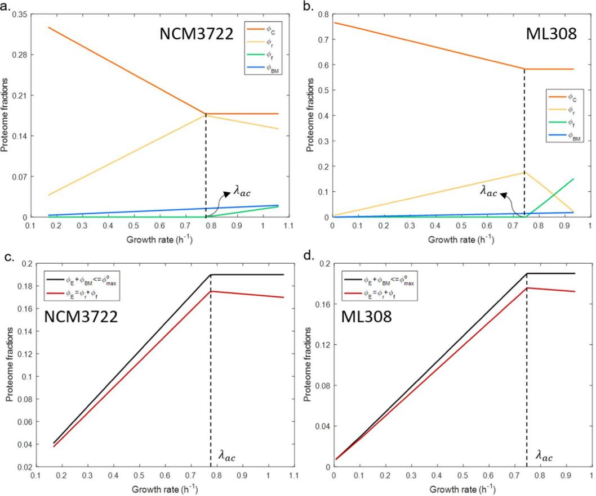
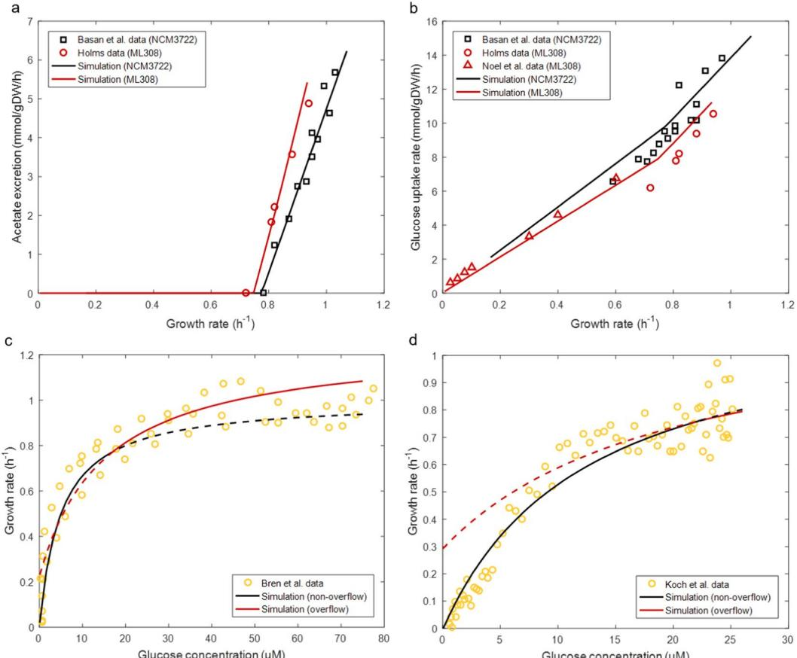

## **OPEN**

# **Bridging substrate intake kinetics and bacterial growth phenotypes with fux balance analysis incorporating proteome allocation**

**Hong Zeng & AidongYang***

**Empirical kinetic models such as the Monod equation have been widely applied to relate the cell growth with substrate availability. The Monod equation shares a similar form with the mechanisticallybased Michaelis-Menten kinetics for enzymatic processes, which has provoked long-standing and un-concluded conjectures on their relationship. In this work, we integrated proteome allocation principles into a Flux Balance Analysis (FBA) model of** *Escherichia coli***, which quantitatively revealed potential mechanisms that underpin the phenomenological Monod parameters: the maximum specifc growth rate could be dictated by the abundance of growth-controlling proteome and growth-pertinent proteome cost; more importantly, the Monod constant (***Ks***) was shown to relate to the Michaelis constant for substrate transport (***Km***,***g***), with the link being dependent on the cell's metabolic strategy. Besides, the proposed model was able to predict glucose uptake rate at given external glucose concentration through the size of available proteome resource for substrate transport and its enzymatic cost, while growth rate and acetate overfow were accurately simulated for two** *E. coli* **strains. Bridging the enzymatic kinetics of substrate intake and overall growth phenotypes, this work ofers a mechanistic interpretation to the empirical Monod law, and demonstrates the potential of coupling local and global cellular constrains in predictive modelling.**

Understanding the growth of microbial cultures occupies a central place in the study of microorganisms. How growth rate varies with internal traits or external conditions greatly afects the choice of process-level parameters such as temperature, medium composition in cell cultures for a specifc purpose and the strategy for the modulation of delicate cellular attributes such as enzyme activity, pathway diversity and regulatory systems.

Ever since Jacques Monod correlated the specifc growth rate (*λ*) with extracellular substrate concentration ([*g*]) via two kinetic parameters, the maximum specifc growth rate *λmax* and the Monod constant *Ks*, the Monod equation *max g g K* [ ] [ ] *s λ* = *λ* + [1](#page-8-0) becomes the best-known microbial growth kinetics for describing various bioprocesses. Other growth models (reviewed i[n2](#page-8-1) ) are less prevalent due to more sophisticated formulation and insufcient experimental validation. Despite its unstructured and empirical natur[e3](#page-8-2) , the Monod equation generally renders satisfactory results in terms of ftting substrate consumption and growth rate profle for a wide range of microorganisms and culture conditions. More recent studies have shown that growth kinetic constants (in Monod terms, *λmax* and *Ks*) are actually a function of the culture history (e.g. sludge ages) and community composition[4](#page-8-3),[5](#page-8-4) . In fact, twenty-years ago Kovarova-Kovar and Egli explicitly pointed out that cells could change their growth kinetics via adaptation, therefore a single set of kinetic parameters is not able to represent such variable properties[2](#page-8-1) . Te notion of variable growth kinetics is further supported by experimental evidence showing the evolution of *Ks* [6](#page-8-5),[7](#page-8-6) , 'intrinsic' and 'extant' *λmax*[8](#page-8-7) and the *λmax s* − *K* relationshi[p9](#page-8-8) .

In addition to the Monod-type empirical models, the development of metabolic network reconstructions and the associated analytical approach, namely Flux Balance Analysis (FBA) facilitates the study of growth phenotypes at the metabolic fux leve[l10.](#page-8-9) A FBA model is established based on the known metabolic reaction stoichiometry and gene-enzyme relationship. It is inherently mechanistic and provides more insight of cellular physiological properties compared to an empirical growth model. More importantly, the general objective of FBA is to predict the maximum growth rate at given culture conditions and possibly genetic modifcations[11](#page-8-10). If the prediction of

Department of Engineering Science, University of Oxford, Parks Road, Oxford, OX1 3PJ, UK. *email: [aidong.yang@](mailto:aidong.yang@eng.ox.ac.uk) [eng.ox.ac.uk](mailto:aidong.yang@eng.ox.ac.uk)

growth rate and intracellular metabolic fuxes were sufciently accurate, FBA would become a very useful tool for engineering efcient microbial systems. Essentially, the accuracy of the fux prediction in FBA is governed by constraints. One typical example is setting uptake limits for oxygen and glucose exchange fuxes to predict aerobic acetate formation (namely the overfow metabolism) in *Escherichia coli*[12](#page-8-11), where acetate was predicted to excrete when the system was limited by oxygen uptake rate. However, it has been proposed and validated that the aerobic acetogensis in *E. coli* is the result of an efcient proteome allocation strategy for rapid growt[h13](#page-8-12)[,14](#page-8-13). Tis example suggests that setting hard limitations on uptake fuxes could be a rather arbitrary and problematic treatment when there is a lack of theoretical basis, not to mention that the boundaries of myriad intracellular fuxes are ofen difcult to determine reliably. In principle, using experimentally determined fux values as lower and/or upper bounds could help FBA to compute more realistic fux distributions. Tis leads a dilemma between the overall accuracy of the simulation and the predictive power of the model (e.g. fuxes with hard-set boundaries are in a sense "weakly" predicted). Progress in incorporating macromolecular expression[s15](#page-8-14) and intracellular resource allocatio[n16–](#page-8-15)[19](#page-8-16) with the classic FBA efectively alleviates the need for setting subtle uptake boundaries and improves the accuracy and scope of the predicted growth phenotypes. For instance, Resource Balance Analysis (RBA[)18](#page-8-17) eliminates the need of defning uptake bounds of substrates by relating the enzyme efciency with the concentration of extracellular nutrients. Multi-scale models of Metabolism and macromolecular Expression (ME-models)[20–](#page-8-18)[22](#page-8-19) enable the prediction of substrate uptake rates by incorporating growth rate-dependent demand functions and limited macromolecular synthesis machineries, e.g. limited ribosomal translation rate, limited mRNA catalytic rate and limited RNA polymerase transcription rate. Despite these successes, the prediction of substrate uptake rate in general highly relies on the accuracy of the enzyme kinetic parameters adopted in the model, most of which are not readily available at the genome scal[e23.](#page-8-20)

In this work, we explore the potential links between the empirical Monod growth kinetics and the FBA-based metabolic modelling, with the latter to reveal the underlying biological mechanisms governing the phenomenological parameters of the former. Using two *E. coli* strains (NCM3722 and ML308) as case studies, we investigate how the integration of the proteome allocation principles into FBA would help depict the intriguing multi-scale mechanisms that govern the various growth phenotypes under a wide range of growth conditions. We frstly divided the overall proteome into coarse-grained functional sectors, i.e. carbon scavenging (C), energy generation (E), biomass synthesis (BM) and growth-independent ofset (Q) sector[s19](#page-8-16)[,24](#page-8-21). Te size of each sector is dictated by the magnitude of the metabolic fux the sector processes and the corresponding proteome cost per unit fux. All individual proteome sectors were assembled together into a global proteome allocation constrain[t24–](#page-8-21)[26.](#page-8-22) Furthermore, we parameterized a correlation between the enzyme cost for carbon transport and the abundance of carbon source. Applying these modelling concepts and parameterisation in FBA simulations, we were able to predict the glucose uptake rate, growth rate and the acetate overfow upon varying extracellular glucose level. Our theoretical model also predicted a step change in *Ks* afer the onset of the acetate excretion. Further analysis of the model suggests that this variation originates from the change in cell's metabolic strategy, which coincides with the previous notion that cells possess variable growth kinetics due to adaptation to the environment[2](#page-8-1) . Besides, *λmax* is shown to be controlled by the abundance of growth-controlling proteome and the proteome cost per unit increase of growth rate. Finally, we propose that a proper connection of local and global physiological constraints may be essential for improving the predictive power of FBA models.

#### **Results**

**Proteomic fraction occupied by the carbon-scavenging sector.** Following the treatment in several recent studies on proteome allocatio[n14](#page-8-13)[,19](#page-8-16)[,25–](#page-8-23)[27,](#page-8-24) we divide the overall cell proteome into four coarse-grained functional sectors: carbon-scavenging sector C that comprises enzymes for importing extracellular carbohydrate, energy biogenesis sector E that consists of enzymes used for respiration and (aerobic) fermentation, biomass synthesis sector BM that accounts for ribosomal proteins and enzymes carrying anabolic fuxes, and an ofset sector Q that contains other proteins whose abundance do not vary with the fuxes in the above three sectors (Fig. [1a](#page-2-0)). Te summation of the fractions of all sectors (i.e. , , , *φC E φ φBM φQ*) equals to one

$$
\phi_C + \phi_E + \phi_{BM} + \phi_Q = 1 \tag{1}
$$

Let the maximum amount of proteome attainable to C, E and BM sectors be *φmax g* , which corresponds to the minimum size of the Q sector, *φQmin*. For cells striving for maximum growth,

$$
\phi_{\rm C} + \phi_{\rm E} + \phi_{\rm RM} = 1 - \phi_{\rm Qmin} = \phi_{\rm max}^{\rm g} \tag{2}
$$

Tis global constraint is coupled to another proteome constraint that was established previously as a key mechanism governing the overfow metabolism in *E. coli*[14,](#page-8-13)[28](#page-8-25)

$$
\phi_E + \phi_{RM} \le \phi_{max}^o \tag{3}
$$

*max o φ* denotes the maximum amount of proteome attainable to energy production and biomass synthesis. Equations [(2](#page-1-0) and [3)](#page-1-1) were used to derive two concise proteome allocation constraints (Eqs. ([16](#page-7-0) and [17)](#page-7-1), Methods), which were integrated into the *E. coli* metabolic network as additional rows. The resulted proteome allocation-constrained FBA model forms a mixed integer liner programing (MILP) problem (Supplementary Text). Determination of model parameters is detailed in Supplementary Text. FBA simulations were performed using the integrated model with extracellular glucose concentration as input and maximising cell growth as the objective function. Simulated optimal growth rate (*μ)*, carbon uptake rate (*vc*), acetate production rate (*vf* ) and tricarboxylic acid cycle fux (*vr*) at *μ*, along with proteome cost parameters (defned in Eqs. [(14–](#page-7-2)[16](#page-7-0))) were used to calculate the distribution of proteome sectors (defned in Eq. ([2](#page-1-0))) at diferent growth rates (Fig. [2a,b](#page-3-0)). Simulation

**Figure 1.** Schematic diagram of the proteome allocation model. **(a)** Te overall proteome comprises four sectors, including carbon-scavenging *φC*, energy biogenesis *φE*, biomass synthesis *φBM* and growth-independent ofset *φQ*. Te enzymatic cost per unit fux of each sector is calculated by the ratio between proteome abundance and the corresponding fux. **(b)** Te evolution of proteome component at increased growth rate. Before acetate overfow, BM and E sectors increase with growth rate while the C sector continuously declines; Te E sector comprises only respiration (marked in yellow). At *λ* = *λac*, *φE r* = *φ* reaches the highest value. At higher growth rates, the E sector starts to decline to save space for the increase of the BM sector and becomes a mixture of fermentation and respiration (marked with a mixture of yellow and green); the C sector reaches its lower bound and stays constant.

results show that *φC* gradually decreases as growth rate increases until it reaches a minimum level ( ) *φCmin* , which is equal to the gap between *φmax g* and *max o φ* :

$$
\phi_{\rm C} > \phi_{\rm Cmin^*} \quad \text{when } \lambda < \lambda_{\rm ac} \tag{4a}
$$

$$
\phi_{\rm C} = \phi_{\rm Cmn} = \phi_{\rm max}^{\rm g} - \phi_{\rm max}^{\rm o}, \text{ when } \lambda \ge \lambda_{\rm ac} \tag{4b}
$$

Te growth rate at which *φC* reaches its lower bound is corresponding to the threshold growth rate *λac*, above which acetate overfow occurs (Fig. [2a,b)](#page-3-0). When growth rate exceeds *λac* the composition of *φE* changes from the enzymes for pure respiration to those for a combination of fermentation and respiration (Fig. [1a](#page-2-0)). Te predicted decline of *φC* is supported by the observed upregulation of catabolic genes under carbon limitation[25](#page-8-23). We did not fnd experimental evidence for a non-zero *φCmin*. However combining Eqs. [(2](#page-1-0) and [3](#page-1-1)) gives *C max g max o φ* ≥ − *φ φ* , which in theory implies a positive value of *φCmin* given *φmax* > *φ g max o* .

**Predictions of glucose uptake rate and the acetate overfow.** It has been shown that the incorporation of Eq. ([3)](#page-1-1) into a metabolic model of *E. coli* enables the prediction of the acetate overfow at *λ* ≥ *λac*[28.](#page-8-25) Assuming a linear relationship between a proteome fraction and the metabolic fux it processe[s25,](#page-8-23) the C sector could be modelled as

$$
\phi_{\mathbf{C}} = \mathbf{w}_{\mathbf{c}} \mathbf{v}_{\mathbf{c}} \tag{5}
$$

where *vc* is the carbon uptake fux. Te linear coefcient *wc* denotes the enzyme cost per unit carbon infux, which has been proposed to be a function of the environmental substrate levels, derived from the Michaelis-Menten equatio[n19](#page-8-16)

**Figure 2.** Simulated distribution of proteome sectors *φC*, *φr*, *φf* and *φBM* against diferent growth rates for *E. coli* NCM3722 **(a)** and ML308 **(b)**; and simulated change of the E sector ( ) *φE* and summation of E and BM sectors ( ) *φ φ E B* + *M* for NCM3722 **(c)** and ML308 **(d)**. *φr* and *φf* are E sector components. Te dashed line indicates the onset of acetate overfow. *λac* is the threshold growth rate, above which acetate overfow occurs.

$$\mathbf{w}_{\mathfrak{k}} = \mathbf{w}_{\mathfrak{k},0} \left( 1 + \frac{K_{m,\mathfrak{g}}}{\lceil \mathfrak{g} \rceil} \right) \tag{6}$$

Te constant *wc*,0 represents the minimum enzyme cost per unit carbon infux; [*g*] is the glucose concentration, where glucose is taken as a representative substrate; *Km,g* is the Michaelis constant. We determined the value of *wc*,0 using strain-specifc cell culture data (Supplementary Text); with reported values of *Km,g* we were subsequently able to compute *wc* as a function of [*g*] (Supplementary Eqs. (S36 and S37)). Coupling Eq. [(6)](#page-3-1) with the proteome allocation constraints (Eqs. ([16](#page-7-0) and [17](#page-7-1))), the glucose uptake rate, acetate production rate and optimal growth rate of two *E. coli* strains were predicted by specifying [*g*] (as opposed to setting glucose infux as pre-determined input[12](#page-8-11)) and maximizing the growth rate. Simulation results agree well with the experimental data (Fig. [3a–d](#page-4-0)).

*λmax* **is a function of proteome resource and proteome cost.** Combining the proteome allocation constraints and the established *w* [ ] *g c* − correlation (Eq. ([6](#page-3-1))) with additional linear assumptions for the *vc* − *λ* pair (Supplementary Text), we have derived

$$
\lambda_{\text{max}} = \phi_{\text{growth}} / \mathbf{p}_{\text{growth}} \tag{7}
$$

*φgrowth* represents the maximal fraction of the growth-controlling proteome, and *p growth* is the proteome cost per unit increase of growth rate. Equation ([7](#page-3-2)) is in line with the previous proposal that *λmax* is closely related to the protein synthesis mechanis[m4](#page-8-3) . During non-overflow growth ( ) *λ λ* < *ac* , we show that (Supplementary Eqs. (S16–S21))

$$
\phi_{\text{growth}} = \phi_{\text{max}}^{\text{g}} - \sum_{i} \phi_{i, \text{atpm}} \tag{8}
$$

$$\mathbf{p}_{\text{growth}} = \sum_{i} \mathbf{p}_{i} \tag{9}$$

**Figure 3.** Comparison between the model simulation and experimental data of the growth of *E. coli* in glucoselimited cultures. **(a)** Comparison between predicted and measured acetate excretion rate. Experimental data for NCM3722 were obtained from Fig. 1 of ref. [14](#page-8-13); experimental data for ML308 were obtained from Table 7 of ref. [52.](#page-9-0) **(b)** Comparison between predicted and measured glucose uptake rate. Experimental data for NCM3722 were obtained from Fig. 3B of ref. [19](#page-8-16); experimental data for ML308 were obtained from Table 7 of ref. [52](#page-9-0) and Fig. 3b of ref. [53.](#page-9-1) **(c)** Comparison between predicted and measured specifc growth rate against glucose concentration profle for NCM3722. Experimental data were obtained from SI Fig. 1 of ref. [51.](#page-9-2) **(d)** Comparison between predicted and measured specifc growth rate against glucose concentration profle for ML308. Experimental data were obtained from Fig. 1 of ref. [34](#page-9-3). Solid lines in **(c**,**d)** are actual model predictions; dashed lines are presented to show the model prediction in the region where the model is not applicable. Simulation results of optimal growth rate, glucose uptake rate and acetate production rate were obtained in FBA simulations of the proteome allocation-integrated metabolic model. In all simulations, the extracellular glucose concentration was specifed as input and the growth rate was maximised.

*φi a*, *tpm* is the proteome fraction of sector *i* occupied by non-growth-associated maintenance; *pi* is the proteome cost of sector *i* per unit increase of growth rate; *i* represents C, E, or BM sector. During overfow growth ( ) *λ λ* ≥ *ac* , we show that (Supplementary Eqs. (S22–S24))

$$
\phi_{\text{growth}} = \phi'_{\text{c}} \tag{10}
$$

$$\mathfrak{p}_{\text{growth}} = \mathfrak{p}_{\mathfrak{c}} \tag{11}$$

*φ*′ *c* denotes the fraction of the proteome allocable to the carbon-scavenging sector (adjusted with an of-set to *φCmin*, see Supplementary Eq. (S22)). Equations ([10](#page-4-1) and [11)](#page-4-2) imply that in the overfow region *λmax* can be dictated solely by the characteristics of the C sector.

Te above results suggest two ways to improve cell growth: increase *φgrowth* or decrease *pi* . *φgrowth* could be elevated by reducing maintenance or eliminating the expression of useless proteins. However, it might be difcult to directly modify *φgrowth* as it is more or less an intrinsic feature of a cell. Reducing *pi* could be more realistic in synthetic biology. In this work *pc* could gradually reduce upon the decline of *wc* at increased growth rate (Supplementary Eqs. (S19 and S23) and Supplementary Fig. S1). *pE* was shown to change from positive to negative due to varied *φE* against growth rate correlation before and afer *λac* (Fig. [2c,d)](#page-3-0). Te variability of *pi* could result from two mechanisms: the cell upregulates catabolic genes under carbon limitation (leads to variable *pc*) and changes its metabolic strategies under diferent culture conditions (leads to variable *pE*). Te latter is governed by the presence of alternative pathways. We could infer that if a cell carries multiple pathways of a similar biological function (e.g. energy biogenesis) but with distinct enzyme (or protein) costs, the cell might be able to improve its growth via directing more metabolic fux to the enzymatically low-cost pathways. Tis could help design synthetic microorganisms with potentially higher robustness and ftness to the growth environment. A recent study also predicted that improved enzyme activity of energy pathways leads to a higher growth rate[29,](#page-8-26) which supports the above suggestions.

*Ks* **depends on the interplay between fractions of proteome sectors and afnity of transport enzymes.** While *λmax* unambiguously refers to the highest specifc growth rate a cell can achieve, the biological meaning of *Ks* is less clear. Ofen taken as a mathematical analogy to the Michaelis-Menten enzyme kinetics, the Monod constant *Ks* seems to share some link with the Michaelis constant for substrate transport *Km,g*. Tis might explain why the Monod growth kinetics is sometimes mistermed as "Michaelis-Menten kinetics" for describing growth-associated bioprocesse[s2](#page-8-1) . While the derivation of the Monod equation is strictly empirical[30,](#page-8-27) Monod himself raised interesting comments between *Ks* and *Km,g*: (i) 'the value of *Ks* should be expected to bear some more or less distant relation to the apparent dissociation constant of the enzyme involved in the frst step of breakdown of a given compound'; (ii) 'since a change of conditions afecting primarily the velocity of only one rate-determining step will, in general (but not necessarily), be only partially refected in the overall rate, one might expect *Ks* values to be lower than the corresponding values of the Michaelis constant of the enzyme catalyzing the reaction'[1](#page-8-0) . Essentially Monod suggested that *Ks* could be a function of *Km,g* and that *Ks* should be generally smaller than *Km,g*. In the past twenty years several attempts have been made to explore the physical meaning of *Ks*. One interpretation is that 1/*Ks* relects the overall afnity of a cell to a substrat[e2](#page-8-1) . A later study suggests that *Ks* is a function of the overall change of free energy of the microbial growth proces[s31.](#page-8-28) More recently, *Ks* was related to *Km,g* via investigating the control of the transport step on the specifc growth rate[30](#page-8-27). In this work, we explicitly derived that *Ks* relates to *Km,g* via a proportional factor *δ* (Supplementary Eqs. (S15) and (S26–S29))

$$K_{\mathfrak{s}} = \delta K_{m,\mathfrak{g}} \tag{12}$$

$$\delta = \begin{cases} \frac{\mathcal{P}_c}{\sum \mathcal{P}_l} < 1, & \text{when } \lambda < \lambda_{ac} \\ 1, & \text{when } \lambda \ge \lambda_{ac} \end{cases} \tag{13}$$

Te discrete feature of *δ* leads to a (upward) step change of *Ks* at the acetate switch (*K M s N*, *CM*3722 = 5 *μ* and *K M* 12 *s M*, *L*308 = *μ* for *λ* < *λac*; *K M* 15 *s N*, *CM*3722 = *μ* and *K M s M*, *L*308 = 20 *μ* for *λ* ≥ *λac*), which perfectly validates Monod's proposition that *K f s m* = ( ) *K* ,*g* and *K K s m* ≤ ,*g* . In fact, it has been noted that *Ks* values for *E. coli* grown with glucose vary signifcantly in diferent studies or diferent growth conditions, and there has been a lack of a satisfactory explanation of why the presumably constant *Ks* spans across such a wide range[32](#page-8-29). Te discrete variable *δ* provides a simple explanation to this long-lasting problem: under strong carbon limitation, the cell benefts from the metabolic strategy where all carbon consumed for energy production is metabolized through respiration; *p p* /( *p p* ) 1 *c c E BM δ* = + + < (Supplementary Eq. (S28)) suggests the relative importance of C, E and BM sectors in dictating the cell's overall afnity to the growth-controlling substrate. When substrate becomes sufcient which potentially allows the cell to grow at a rate beyond a threshold, it becomes more advantageous for a cell to switch to a metabolic strategy where a signifcant portion of carbon consumed for energy production is processed through the proteome-efcient acetate pathway. In this case, the C sector touches its lower bound and decouples from E and BM sectors, *δ* = = *p p*/ 1 *c c* (Supplementary Eq. (S29)). Essentially, *δ* refects the metabolic state of a cell. In principle, if a cell possesses a number of metabolic strategies, *δ* would hold the same number of discrete values, each leading to a distinct value of the apparent afnity constant *Ks*. Tis mechanism could be the underlying reason of the observed large variation in *Ks* under diferent culture conditions. Overall, our theoretical model indicates that *Ks* refects the combined efect of the local characteristics of the carbon transport system and the overarching interplay between carbon-scavenging and other growth-related functions.

#### **Discussion**

In this work, we modifed the classic FBA model (constrained primarily by the mass and energy balance) via embedding the coarse-grained proteome allocation constraints with an intention to reveal the potential mechanistic nature of the empirical growth kinetics proposed by Monod seventy years ago. By doing so, we showed theoretically a non-zero lower bound of the carbon-scavenging sector, which difers from the previous notion that *φC* could continuously decrease towards zero as growth rate increase[s19.](#page-8-16) Under carbon limitation, it seems to be agreeable that *φE B* + *φ M* increases with growth rat[e26](#page-8-22)[,27](#page-8-24) and reaches a plateau (defned by *max o φ* ) where the acetate overfow occurs so that more proteome could be allocated to biomass synthesis as required for rapid growth[14.](#page-8-13) Consequently, the rest of the proteome ( ) *φ φ C Q* + has to decrease and then levels[33.](#page-8-30) If *φQ* remains constant, taking for example its minimum value ( ) *φQmin* as considered in this work for cells striving for maximum growth, the size of the level end of the ( ) *φ φ C Q* + profle will be ( ) *φ φ Cmin* + *Qmin* . We argue that in this level sum, the contribution of *φCmin* is unlikely to be zero, given the signifcant carbon infux to sustain the high rate of biomass synthesis and energy production under overfow conditions. On the maximum value of *φC* ( ) *φCmax* , our parameter estimation based on data assembled from literature (Supplementary Table S1) determined *φ* = . 0 37 *Cmax* for NCM3722 and *φ* = . 0 77 *Cmax* for ML308 (*φCmax* ≈ *φmax g* , determined by extrapolating to zero growth rate, also see Eq. [(2)](#page-1-0) and Fig. [2a,b](#page-3-0)). Tese specifc values are afected by a number of factors, including particularly (i) the assumed value for *φmax o* (0.19, previously suggested for *E. coli* NCM3722[14](#page-8-13)) and (ii) the value of *Ks* estimated from cell culture data (Supplementary Text and Supplementary Eqs. (S30) and (S34 and S35)). In reality, the former could be strain-dependent, while the latter is known to be sensitive to growth conditions and culture history[4](#page-8-3)[,32](#page-8-29),[34.](#page-9-3) Terefore, the specifc results of parameterization from this work were to support the illustration of the overall modelling approach; their biological signifcance needs to be interpreted with caution.

In dynamic FBA (DFBA), *vc* (uptake rate of growth-limiting carbon source) is generally determined by applying the Michaelis-Menten kinetics for substrate transpor[t35–](#page-9-4)[39](#page-9-5). An inherent issue with this approach is that the kinetic parameters are normally valid only for a specifc substrate uptake pattern, which however may vary depending on the variety of fermentative by-products (e.g. acetate, formate, ethanol or a mixture of them[)10](#page-8-9) or more generally on the physiological state. Terefore, using Michaelis-Menten kinetics alone (with a single set of kinetic parameters) to predict the carbon intake sufers from a very limited scope of applicability – it cannot depict a physiological state that deviates from the state that it was originally ftted to. In this work, this drawback is rectifed by introducing the proteome allocation principle, which couples carbon transport with other growth-associated metabolism. Trough a fully parameterized *w* − [ ] *g c* correlation, we compute the variable *wc* given the environmental glucose concentration (as opposed to directly manipulating *wc* [19)](#page-8-16). Te computable *wc* is involved in the proteome allocation constraints, which allows us to simultaneously predict the glucose uptake rate, specific growth rate and acetate overfow upon varying the environmental glucose level. Te coupling of the local metabolic capacity (for carbon transport) and the global regulatory mechanism (on proteomic resource allocation) was shown to be essential in improving the predictive power of FBA models. It should be noted that, while in this work we have adopted a single *Km,g* for the carbon transport system, it is known that in *E. coli, Km,g* difers from diferent transporters which could be active either exclusively or in paralle[l40](#page-9-6)[,41.](#page-9-7) When using a single (aggregated) *Km,g* becomes inadequate, a more accurate representation of the carbon transport could be achieved by explicitly modelling individual transporters (see below for further discussion). Besides, the proteome allocation principle could also be revised to investigate proteomic burdens imposed by the expression of heterologous genes[42](#page-9-8).

In this work, we used the core metabolic model of *E. coli* to demonstrate the efectiveness of proteome allocation constraints (Eqs. ([16](#page-7-0) and [17)](#page-7-1)) in dictating bacterial growth strategies. However, the proposed modelling framework can be implemented with more detailed genome-scale metabolic models (GEMs[)43–](#page-9-9)[45](#page-9-10) to explore biological insights for *E. coli* and other microorganisms with similar putative mechanisms. Te key advance of the GEM over the core model is the extensive information of metabolic reactions originating from genome annotatio[n46.](#page-9-11) Pathways such as alternate carbon metabolism, amino acid metabolism, nucleotide metabolism, cofactor biosynthesis and fatty acid biosynthesis are exclusively modelled in GEMs. To fuse the proteome allocation constraints into a GEM, particular attention is needed for the choice of fuxes underlying *vc*, *vf* and *vr*, as well as the determination of proteome cost parameters ∗ *wc* , ∗ *wf* and ∗ *wr* .

We frst focus on ∗ *wc* and *vc*. In the core model, glucose is the sole carbon source to support growth and is imported via phosphoenolpyruvate(PEP):pyruvate (PYR) phosphotransferase system (PTS). In this case *vc* is related to a one-step transport fux (GLCpts). However in *E. coli* GEM *i*AF1260, glucose can be transported not only via glucose-specifc PTS components, but also via alternative routes such as glucose-specifc ABC system, glucose:proton symporter or simply via difusio[n43.](#page-9-9) In *i*AF1260, glucose import (from extracellular glucose to cytosolic glucose-6-phosphate) is carried out by multiple enzymatic steps, e.g. frst via the glucose:proton symporter then through hexokinase, instead of a simplifed one-step process. Furthermore, 174 carbon sources were predicted to potentially support growth in *i*AF1260, meaning that growth simulation is not limited to glucose minimal media. Te improved details of the metabolic network imply that (a) when modelling cells grown on glucose, *vc* may need to be coupled to multiple glucose transporters and (b) when modelling cells grown on alternative or mixed carbon sources, *vc* needs to correspond to various carbohydrate transport pathways. Accompanying a more detailed account of substrate transport fuxes, the (normalised) proteome cost parameter for carbon transport *wc* ∗ has to be revised. We have shown in this work that ∗ *wc* is a function of *max o φ* , *wc*,0 and *Km,g* (Eqs. [6](#page-3-1) and [16](#page-7-0)) and that *wc*,0 is a function of *φmax o* and *Km,g* (Supplementary Eq. (S34)); combining the two makes ∗ *wc* a function of *Km,g* (the Michaelis constant for glucose transport). When multiple transporters exist, as in GEMs, a set of *Km,g* (for glucose) or multiple sets of *Km,s* (for non-glucose carbon sources) would be required for active transporters in the specifc growth conditions. Correspondingly, ∗ *wc* will be calculated from the combination of *Km,g* for cells grown on a glucose minimal medium. For cells grown on a complex carbon medium, multiple *wc* ∗ will be needed (to match distinct transport fuxes) and should be determined by multiple sets of *Km,s*. In short, integrating the proteome cost constraints into GEM asks for more information of kinetic parameters of carbon transport.

Furthermore, the increased fux variability and potential reactions running in parallel in GEMs may alter the choice of representative fuxes of fermentation and respiration pathways. For example, *vf* and *vr* in *i*AF1260 can become enolase (ENO) and citrate synthase (CS)[42](#page-9-8). Changed *vf* and *vr* will subsequently afect the estimation of proteome cost parameters *wf* ∗ and *wr* ∗ (Supplementary Text).

In conclusion, our model ofers a latest mechanistic interpretation of the seventy-year old Monod growth kinetics: the maximum specific growth rate of a microorganism could be governed by the abundance of growth-controlling proteome and the associated proteome cost per unit increase of growth rate. Te Monod constant *Ks* was shown to be quantitatively related to not only the enzymatic afnity for substrate transport *Km,g* but also the metabolic state of a cell, which might explain the large variations in reported *Ks* values. Our analysis also suggests that a microorganism with a lower maintenance cost, higher fraction of growth-controlling proteome and alternative pathways with diferent enzyme costs likely competes successfully in a changing environment. Finally, the proposed modelling concept eliminates the need for treating substrate intake as an input in FBA simulation, which demonstrates the potential of coupling local and global physiological constrains in predictive modelling for systems biology and synthetic biology.

#### **Methods**

**Modelling proteome allocation in** *E. coli***.** Following the assumption that the fraction of a proteome sector is proportional to the metabolic fux it processe[s26](#page-8-22), Eq. ([2)](#page-1-0) can be rewritten as

$$
\omega_\text{v}\mathbf{v}_\mathbf{c} + \mathbf{w}_f\mathbf{v}_f + \mathbf{w}_r\mathbf{v}_r + b\lambda = \phi_{\text{max}}^\mathbf{g} \tag{14}
$$

*wi* is the enzyme cost per unit fux processed by sector *i* (*i*=*C*, *f or r*). *b* is the proteome cost per unit biomass synthesis fux. *vc* is the carbon transport fux. For *E. coli* grown with glucose as the single growth-controlling substrate, *vc* is the glucose uptake fux which is normally processed by the phosphoenolpyruvate:sugar phosphotransferase system (PTS)[40](#page-9-6),[47](#page-9-12). *vf* (*vr*) is the fermentation (respiration) fux; *λ* is the biomass synthesis fux, which in this work is equal to the specifc growth rate. From ref. [28](#page-8-25), the fraction of proteome attainable to energy biogenesis and biomass synthesis is constrained by an upper bound *φmax o*

$$
\lambda \mathbf{w}_f^* \mathbf{v}_f + \mathbf{w}_r^* \mathbf{v}_r + b^* \lambda \le 1 \tag{15}
$$

where ≡ = *φ* ∗ *w* ( ) *i f or r i wi max o* and *b b max* ≡ *o φ* ∗ are the (normalised) proteome cost per unit fux. Dividing both sides of Eq. [(14)](#page-7-2) by *φmax o*

$$\mathbf{w}_c^* \mathbf{v}_c + \mathbf{w}_f^* \mathbf{v}_f + \mathbf{w}_r^* \mathbf{v}_r + \mathbf{b}^* \lambda = \frac{\phi_{\text{max}}^\mathcal{g}}{\phi_{\text{max}}^\mathcal{g}} \tag{16}$$

Substituting Eq. ([15](#page-7-3)) into Eq. [(16)](#page-7-0), under acetate overfow (hence equal sign applied to Eq. ([15](#page-7-3))

$$\mathbf{w}_c^* \mathbf{v}_c = \frac{\phi_{\text{max}}^{\mathcal{K}}}{\phi_{\text{max}}^o} - 1 \tag{17}$$

It follows that

$$
\phi_{\text{Comin}} = \phi_{\text{max}}^{\text{g}} - \phi_{\text{max}}^{\text{g}} \tag{18}
$$

*φCmin* is the minimum proteome fraction allocated to the carbon-scavenging sector (occurring during acetate overfow). *max g max o φ* > *φ* (due to the inclusion of the C sector). Equations ([16](#page-7-0) and [17](#page-7-1)) are the proteome allocation constraints adopted in model simulations (see below).

**Deriving the hyperbolic** *λ* − [*g*] **correlation.** Starting from the Michaelis-Menten kinetics together with the proteome allocation embedded FBA model presented in this work, we have derived a hyperbolic *λ* − [ ] *g* correlation that is comparable to the Monod equation and reveals the potential biological mechanisms that underpin the phenomenological Monod parameters. Detailed mathematical derivation is provided in the Supplementary Text.

**Determination of GAM and ATPM.** In FBA models, the energy consumption is dictated primarily via growth-associated maintenance (GAM) and non-growth associated maintenance (ATPM), both of which are difcult to quantify accurately[43](#page-9-9). GAM and ATPM could also vary between diferent species and strains (BiGG database, <http://bigg.ucsd.edu/>). Terefore we modifed the default values of GAM and ATPM according to strain-specifc energetic data (Supplementary Table S2). To do so we associated GAM with the molar growth yield (namely the true growth yield *YG* [48)](#page-9-13). ATPM is linked to the maintenance coefcient (*m*), which corresponds to the rate of substrate uptake extrapolated to zero growth rate.

**Model simulation.** Te following linear programing problem was solved in FBA simulations of the growth of *E. coli* under diferent extracellular glucose concentrations. FBA was performed based on the core *E. coli* metabolic model[49](#page-9-14).

$$\begin{aligned} & \text{maximize } \lambda\\ & \text{subject to} \quad \begin{aligned} & \text{subject to} \quad \begin{aligned} & \text{subject to} \\ & \text{l} \quad \text{w} = 0 \\ & \text{w}_f^* \mathbf{v}_f + \mathbf{w}_r^* \mathbf{v}_r + b^* \lambda \le 1 \end{aligned} \\ & \begin{aligned} & \text{w}_c^* \mathbf{v}_c + \left( \mathbf{w}_f^* \mathbf{v}_f + \mathbf{w}_r^* \mathbf{v}_r + b^* \lambda \right) = \phi_{\text{max}}^{\mathcal{S}} / \phi_{\text{max}}^{\mathcal{S}}\\ & \text{w}_c^* \mathbf{v}_c = \phi_{\text{max}}^{\mathcal{S}} / \phi_{\text{max}}^{\mathcal{o}} - 1 \text{ (if } \lambda \ge \lambda_{\text{ac}} \end{aligned} \end{aligned} \tag{19}$$

*vc* is represented by the frst enzymatic step of glycolysis, GLCpts, *vf* is the acetate synthesis reaction ACKr, *vr* adopts the frst reaction afer biomass withdrawal in TCA cycle, AKGDH. *λ* is growth rate and refers to the biomass reaction. *λac* is the threshold growth rate, above which acetate overfow occurs. Te determination of model parameters ( ∗ *wc* ,*wf* ∗ , ∗ *wr* , ∗ *b* , *φmax o* and *φmax g* ) is detailed in the Supplementary Text. Te lower bound of glucose and oxygen exchange fuxes were set to −1000 to avoid artifcial control and to allow prediction of their uptake fux. Enzymatic reactions ICL, MALS, FRD7 were switched of under aerobic-glucose conditions according to[43.](#page-9-9) Irrelevant exchange fuxes around the pyruvate node (EX_pyr(e), EX_lac(e), EX_acald(e), EX_etoh(e)) and the α-ketoglutarate node (EX_glu_L(e) and EX_akg(e)) were closed. Maximum carbon fow to the PP pathway was limited to 67% and 42% of the overall carbon intake for ML308 and NCM3722, respectively according to ref. [28.](#page-8-25) Extracellular glucose concentration was adopted as sole model input (varies from 0.1–75 *μM* for NCM3722 and 0.1–26 *μM* for ML308). Te optimisation model was converted to an MILP problem and solved using the Gurobi optimizer (see Supplementary Text for details). FBA was solved via COBRA Toolbo[x50](#page-9-15). All simulations were performed in MATLAB R2016a. Experimental data used to compare with the simulation results were obtained from Fig. 1 of ref. [14,](#page-8-13) Fig. 3B of ref. [19](#page-8-16) and SI Fig. 1 of ref. [51](#page-9-2) for NCM3722 and from Table 7 of ref. [52,](#page-9-0) Fig. 3b of ref. [53](#page-9-1) and Fig. 1 of ref. [34](#page-9-3) for ML308.

#### **Data availability**

All model equations and parameter values are included in the main text or in the Supplementary Information. Te MATLAB code for running simulations and the generated datasets in this study are available upon request from the corresponding author.

Received: 20 October 2019; Accepted: 24 February 2020; Published: xx xx xxxx

#### **References**

- 1. Monod, J. Te growth of bacterial cultures. *Annu. Rev. Microbiol.* **3**, 371–394 (1949).
- 2. Kovárová-Kovar, K. & Egli, T. Growth kinetics of suspended microbial cells: from single-substrate-controlled growth to mixedsubstrate kinetics. *Microbiol. Mol. Biol. Rev.* **62**, 646–666 (1998).
- 3. Tsipa, A., Koutinas, M., Usaku, C. & Mantalaris, A. Optimal bioprocess design through a gene regulatory network – Growth kinetic hybrid model: Towards replacing Monod kinetics. *Metab. Eng.* **48**, 129–137 (2018).
- 4. Orhon, D., Cokgor, E. U., Insel, G., Karahan, O. & Katipoglu, T. Validity of Monod kinetics at diferent sludge ages – Peptone biodegradation under aerobic conditions. *Bioresour. Technol.* **100**, 5678–5686 (2009).
- 5. Pala-Ozkok, I. *et al*. Characteristics of mixed microbial culture at diferent sludge ages: Efect on variable kinetics for substrate utilization. *Bioresour. Technol.* **126**, 274–282 (2012).
- 6. Wick, L. M., Weilenmann, H. & Egli, T. Te apparent clock-like evolution of Escherichia coli in glucose-limited chemostats is reproducible at large but not at small population sizes and can be explained with Monod kinetics. *Microbiology* **148**, 2889–2902 (2002).
- 7. Franchini, A. G. & Egli, T. Global gene expression in Escherichia coli K-12 during short-term and long-term adaptation to glucoselimited continuous culture conditions. *Microbiology* **152**, 2111–2127 (2006).
- 8. Füchslin, H. P., Schneider, C. & Egli, T. In glucose-limited continuous culture the minimum substrate concentration for growth, s min, is crucial in the competition between the enterobacterium Escherichia coli and Chelatobacter heintzii, an environmentally abundant bacterium. *ISME J.* **6**, 777 (2012).
- 9. Insel, G. *et al*. Respirometric evaluation and modeling of glucose utilization by Escherichia coli under aerobic and mesophilic cultivation conditions. *Biotechnol. Bioeng.* **96**, 94–105 (2007).
- 10. Varma, A., Boesch, B. W. & Palsson, B. Ø. Stoichiometric interpretation of Escherichia coli glucose catabolism under various oxygenation rates. *Appl. Environ. Microbiol.* **59**, 2465–2473 (1993).
- 11. Orth, J. D., Tiele, I. & Palsson, B. Ø. What is fux balance analysis? *Nat. Biotechnol.* **28**, 245–248 (2010).
- 12. Varma, A. & Palsson, B. Ø. Stoichiometric fux balance models quantitatively predict growth and metabolic by-product secretion in wild-type Escherichia coli W3110. *Appl. Environ. Microbiol.* **60**, 3724–3731 (1994).
- 13. Molenaar, D., van Berlo, R., de Ridder, D. & Teusink, B. Shifs in growth strategies refect tradeofs in cellular economics. *Mol Syst Biol* **5** (2009).
- 14. Basan, M. *et al*. Overfow metabolism in Escherichia coli results from efcient proteome allocation. *Nature* **528**, 99–104 (2015).
- 15. Tiele, I., Jamshidi, N., Fleming, R. M. T. & Palsson, B. O. Genome-scale reconstruction of escherichia coli's transcriptional and translational machinery: A knowledge base, its mathematical formulation, and its functional characterization. *PLoS Comput. Biol*. **5** (2009).
- 16. Beg, Q. K. *et al*. Intracellular crowding defnes the mode and sequence of substrate uptake by Escherichia coli and constrains its metabolic activity. *P. Natl. Acad. Sci. USA*. **104** (2007).
- 17. Zhuang, K., Vemuri, G. N. & Mahadevan, R. Economics of membrane occupancy and respiro-fermentation. *Mol. Syst. Biol*. **7** (2011).
- 18. Goelzer, A. & Fromion, V. Bacterial growth rate refects a bottleneck in resource allocation. *Biochim. Biophys. Acta (BBA)-General Subj.* **1810**, 978–988 (2011).
- 19. Mori, M., Hwa, T., Martin, O. C., De Martino, A. & Marinari, E. Constrained Allocation Flux Balance Analysis. *PLoS Comput. Biol*. **12** (2016).
- 20. Tiele, I. *et al*. Multiscale Modeling of Metabolism and Macromolecular Synthesis in E. coli and Its Application to the Evolution of Codon Usage. *PLoS One* **7**, e45635 (2012).
- 21. Lerman, J. A. *et al*. In silico method for modelling metabolism and gene product expression at genome scale. *Nat. Commun.* **3**, 929 (2012).
- 22. O'Brien, E. J., Lerman, J. A., Chang, R. L., Hyduke, D. R. & Palsson, B. O. Genome-scale models of metabolism and gene expression extend and refne growth phenotype prediction. *Mol. Syst. Biol.* **9**, 693–693 (2013).
- 23. Nilsson, A., Nielsen, J. & Palsson, B. O. Metabolic models of protein allocation call for the kinetome. *Cell Syst.* **5**, 538–541 (2017).
- 24. Scott, M., Gunderson, C. W., Mateescu, E. M., Zhang, Z. & Hwa, T. Interdependence of Cell Growth and Gene Expression: Origins and Consequences. *Science* **330**, 1099–1102 (2010).
- 25. You, C. *et al*. Coordination of bacterial proteome with metabolism by cyclic AMP signalling. *Nature* **500**, 301–306 (2013).
- 26. Hui, S. *et al*. Quantitative proteomic analysis reveals a simple strategy of global resource allocation in bacteria. *Mol. Syst. Biol*. **11**, (2015).
- 27. Peebo, K. *et al*. Proteome reallocation in Escherichia coli with increasing specifc growth rate. *Mol. BioSyst.* **11**, 1184–1193 (2015).
- 28. Zeng, H. & Yang, A. Modelling overfow metabolism in Escherichia coli with fux balance analysis incorporating diferential proteomic efciencies of energy pathways. *BMC Syst. Biol.* **13**, 3 (2019).
- 29. Chen, Y. & Nielsen, J. Energy metabolism controls phenotypes by protein efciency and allocation. *Proc. Natl. Acad. Sci.* **116**, 17592–17597 (2019).
- 30. Snoep, J. L., Mrwebi, M., Schuurmans, J. M., Rohwer, J. M. & de Mattos, M. J. Control of specifc growth rate in Saccharomyces cerevisiae. *Microbiology* **155**, 1699–1707 (2009).
- 31. Liu, Y. A simple thermodynamic approach for derivation of a general Monod equation for microbial growth. *Biochem. Eng. J.* **31**, 102–105 (2006).
- 32. Liu, Y. Overview of some theoretical approaches for derivation of the Monod equation. *Appl. Microbiol. Biotechnol.* **73**, 1241–1250 (2007).
- 33. Vazquez, A. & Oltvai, Z. N. Macromolecular crowding explains overfow metabolism in cells. *Sci. Rep.* **6**, 31007 (2016).
- 34. Koch, A. L. & Houston Wang, C. How close to the theoretical difusion limit do bacterial uptake systems function? *Arch. Microbiol.* **131**, 36–42 (1982).
- 35. Hanly, T. J. & Henson, M. A. Dynamic metabolic modeling of a microaerobic yeast co-culture: predicting and optimizing ethanol production from glucose/xylose mixtures. *Biotechnol. Biofuels* **6**, 44 (2013).
- 36. Henson, M. A. & Hanly, T. J. Dynamic fux balance analysis for synthetic microbial communities. *IET Syst. Biol.* **8**, 214–229 (2014).
- 37. Hjersted, J. L. & Henson, M. A. Optimization of fed-batch Saccharomyces cerevisiae fermentation using dynamic fux balance models. *Biotechnol. Prog.* **22**, 1239–1248 (2006).
- 38. Hjersted, J. L., Henson, M. A. & Mahadevan, R. Genome-scale analysis of Saccharomyces cerevisiae metabolism and ethanol production in fed-batch culture. *Biotechnol. Bioeng.* **97**, 1190–1204 (2007).
- 39. Hanly, T. J. & Henson, M. A. Dynamic model-based analysis of furfural and HMF detoxifcation by pure and mixed batch cultures of S. cerevisiae and S. stipitis. *Biotechnol. Bioeng.* **111**, 272–284 (2014).
- 40. Gosset, G. Improvement of Escherichia coli production strains by modification of the phosphoenolpyruvate:sugar phosphotransferase system. *Microb. Cell Fact.* **4**, 14 (2005).
- 41. Stock, J. B., Waygood, E. B., Meadow, N. D., Postma, P. W. & Roseman, S. Sugar transport by the bacterial phosphotransferase system. Te glucose receptors of the Salmonella typhimurium phosphotransferase system. *J. Biol. Chem.* **257**, 14543–14552 (1982).
- 42. Zeng, H. & Yang, A. Quantifcation of proteomic and metabolic burdens predicts growth retardation and overfow metabolism in recombinant Escherichia coli. *Biotechnol. Bioeng*. (2019).
- 43. Feist, A. M. *et al*. A genome-scale metabolic reconstruction for Escherichia coli K-12 MG1655 that accounts for 1260 ORFs and thermodynamic information. *Mol. Syst. Biol*. **3** (2007).
- 44. Orth, J. D. *et al*. A comprehensive genome-scale reconstruction of Escherichia coli metabolism—2011. *Mol. Syst. Biol.* **7**, 535 (2011).
- 45. Mo, M. L., Palsson, B. Ø. & Herrgård, M. J. Connecting extracellular metabolomic measurements to intracellular fux states in yeast. *BMC Syst. Biol.* **3**, 37 (2009).
- 46. Tiele, I. & Palsson, B. Ø. A protocol for generating a high-quality genome-scale metabolic reconstruction. *Nat. Protoc.* **5**, 93–121 (2010).
- 47. Steinsiek, S. & Bettenbrock, K. Glucose Transport in Escherichia coli Mutant Strains with Defects in Sugar Transport Systems. *J. Bacteriol.* **194**, 5897–5908 (2012).
- 48. Pirt, S. J. Te maintenance energy of bacteria in growing cultures. *Proc. R. Soc. Lond. B* **163**, 224–231 (1965).
- 49. Orth, J. D., Palsson, B. Ø. & Fleming, R. M. T. Reconstruction and Use of Microbial Metabolic Networks: the Core Escherichia coli Metabolic Model as an Educational Guide. *EcoSal Plus* **4** (2010).
- 50. Schellenberger, J. *et al*. Quantitative prediction of cellular metabolism with constraint-based models: the COBRA Toolbox v2. 0. *Nat. Protoc.* **6**, 1290 (2011).
- 51. Bren, A., Hart, Y., Dekel, E., Koster, D. & Alon, U. Te last generation of bacterial growth in limiting nutrient. *BMC Syst. Biol.* **7**, 27 (2013).
- 52. Holms, H. Flux analysis and control of the central metabolic pathways in Escherichia coli. *FEMS Microbiol. Rev.* **19**, 85–116 (1996).
- 53. Noel, J. T., Cox, B. & Narang, A. Identifcation of the growth-limiting step in continuous cultures from initial rates measured in response to substrate-excess conditions. *arXiv Prepr. q-bio/0509013* (2005).

#### **Acknowledgements**

H.Z. is sponsored by the China Scholarship Council (CSC) through a Ph.D. scholarship.

#### **Author contributions**

H.Z. and A.Y. designed the research; H.Z. performed simulation and data analysis; H.Z. and A.Y. wrote the paper.

#### **Competing interests**

Te authors declare no competing interests.

### **Additional information**

**Supplementary information** is available for this paper at<https://doi.org/10.1038/s41598-020-61174-0>.

**Correspondence** and requests for materials should be addressed to A.Y.

**Reprints and permissions information** is available at [www.nature.com/reprints.](http://www.nature.com/reprints)

**Publisher's note** Springer Nature remains neutral with regard to jurisdictional claims in published maps and institutional afliations.

**Open Access** This article is licensed under a Creative Commons Attribution 4.0 International License, which permits use, sharing, adaptation, distribution and reproduction in any medium or format, as long as you give appropriate credit to the original author(s) and the source, provide a link to the Creative Commons license, and indicate if changes were made. Te images or other third party material in this article are included in the article's Creative Commons license, unless indicated otherwise in a credit line to the material. If material is not included in the article's Creative Commons license and your intended use is not permitted by statutory regulation or exceeds the permitted use, you will need to obtain permission directly from the copyright holder. To view a copy of this license, visit [http://creativecommons.org/licenses/by/4.0/.](http://creativecommons.org/licenses/by/4.0/)

© Te Author(s) 2020