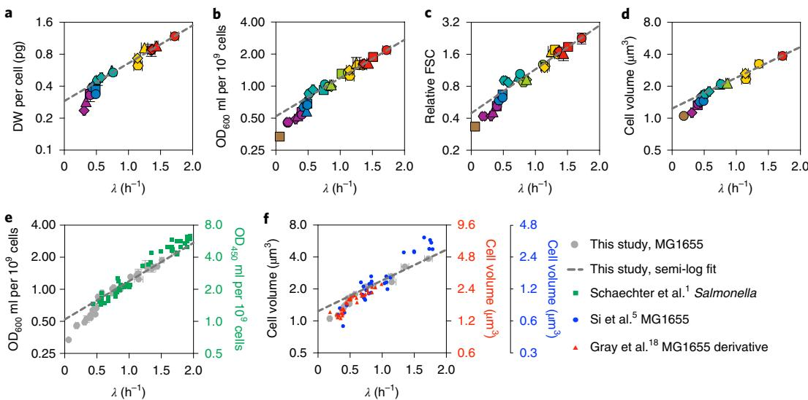
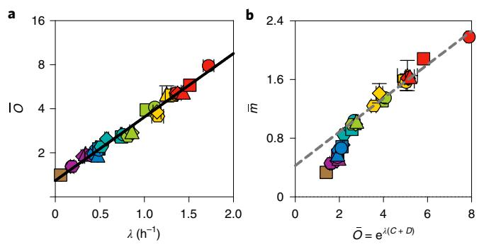
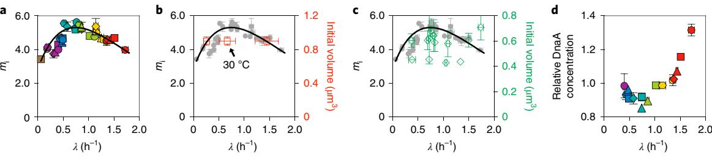
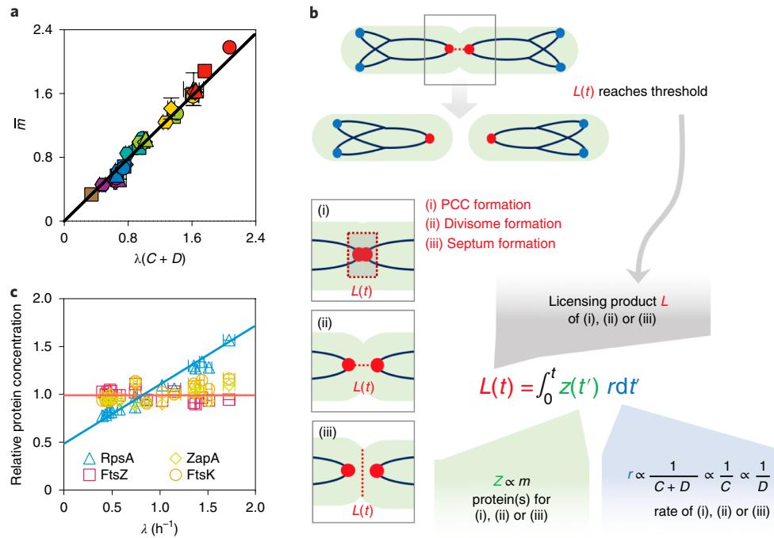
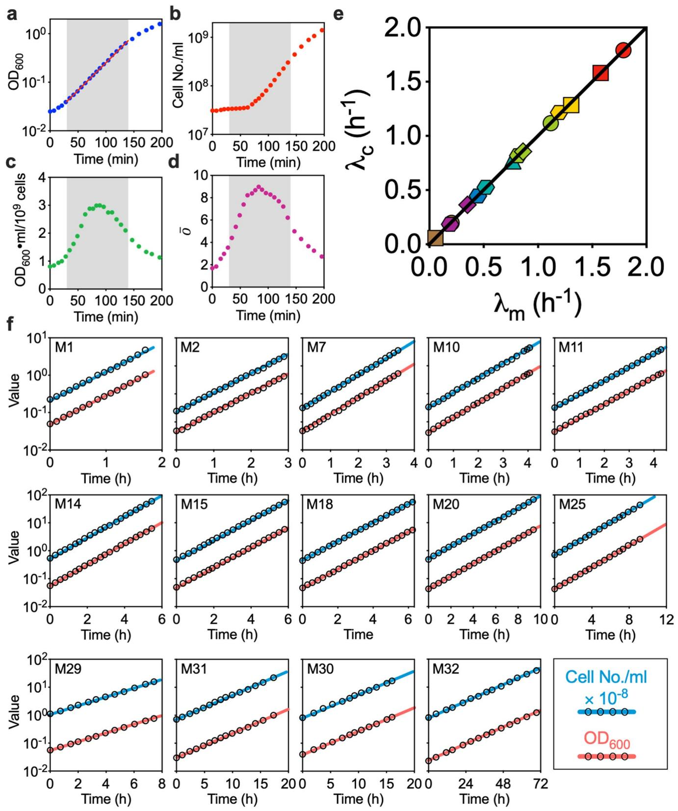
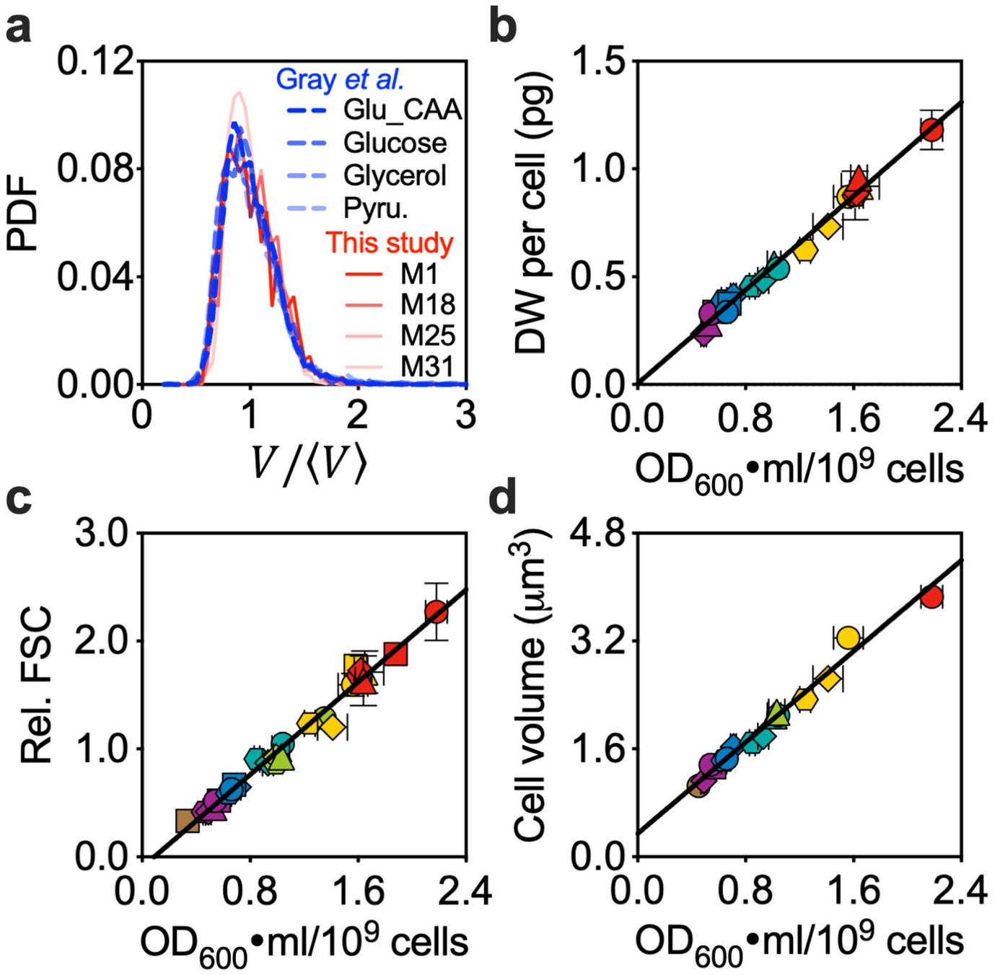
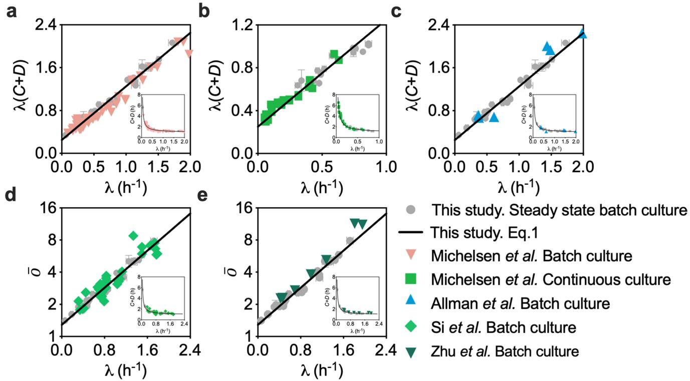
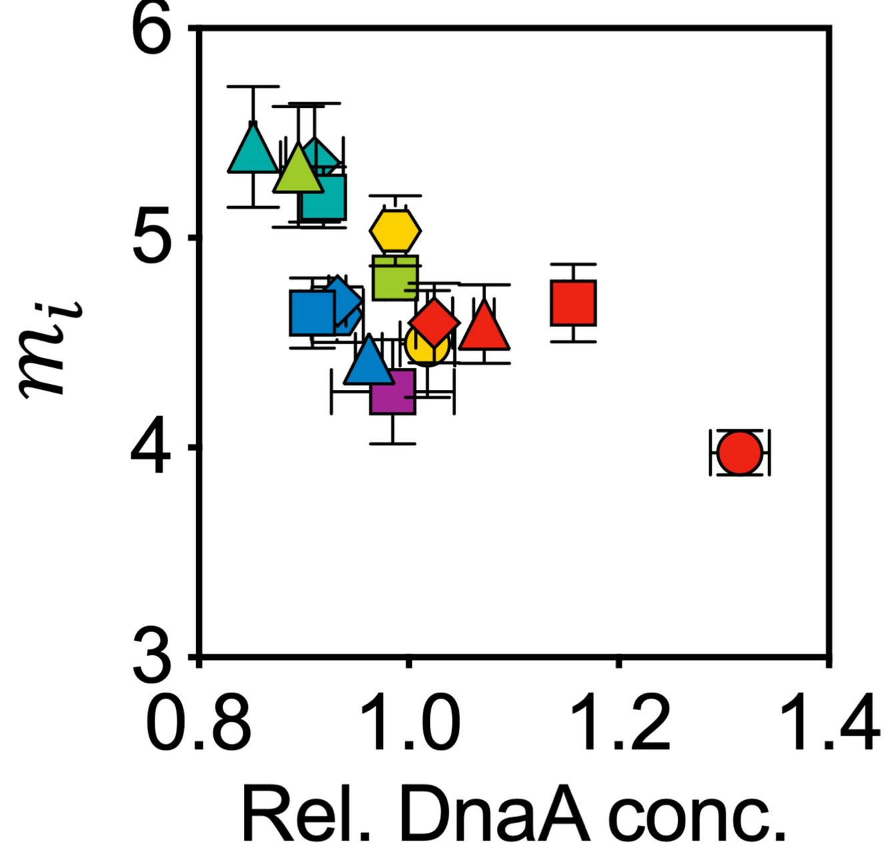
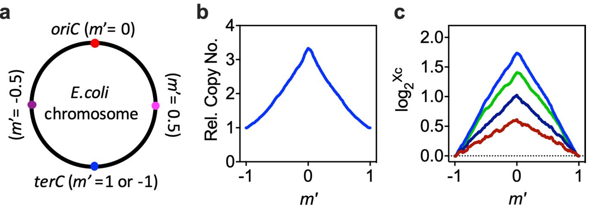
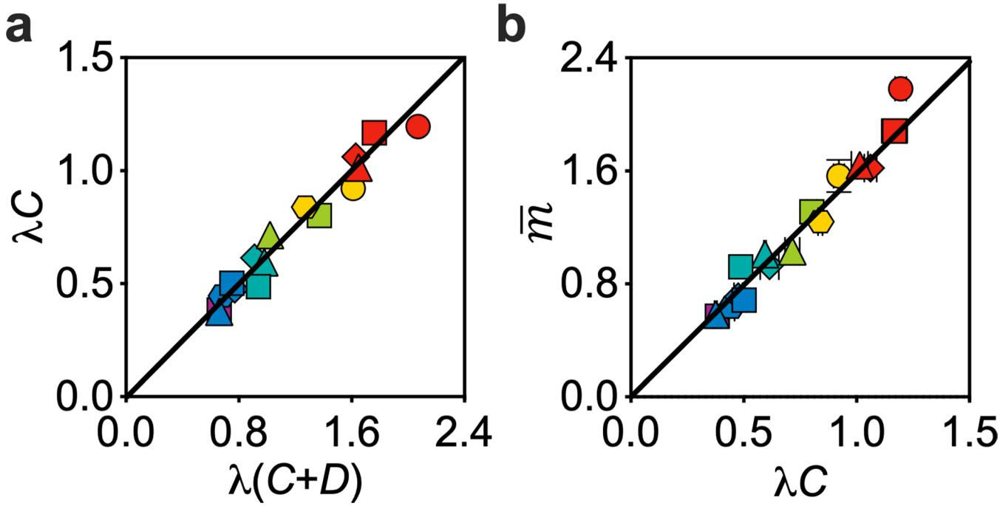

# **General quantitative relations linking cell growth and the cell cycle in** *Escherichia coli*

**Hai Zheng  1,2,5, Yang Bai1,5, Meiling Jiang1,5, Taku A. Tokuyasu1 , Xiongliang Huang1,2, Fajun Zhong1 , Yuqian Wu1 , Xiongfei Fu1,2, Nancy Kleckner3 , Terence Hwa  4 and Chenli Liu 1,2** ✉

**Growth laws emerging from studies of cell populations provide essential constraints on the global mechanisms that coordinate cell growt[h1–](#page-5-0)[3](#page-5-1) . The foundation of bacterial cell cycle studies relies on two interconnected dogmas that were proposed more than 50 years ago—the Schaechter–Maaloe–Kjeldgaard growth law that relates cell mass to growth rate[1](#page-5-0) and Donachie's hypothesis of a growth-rate-independent initiation mass[4](#page-5-2). These dogmas spurred many efforts to understand their molecular bases and physiological consequences[5](#page-5-3)[–14](#page-5-4). Although they are generally accepted in the fast-growth regime, that is, for doubling times below 1 h, extension of these dogmas to the slow-growth regime has not been consistently achieved. Here, through a quantitative physiological study of** *Escherichia coli* **cell cycles over an extensive range of growth rates, we report that neither dogma holds in either the slow- or fast-growth regime. In their stead, linear relations between the cell mass and the rate of chromosome replication–segregation were found across the range of growth rates. These relations led us to propose an integral-threshold model in which the cell cycle is controlled by a licensing process, the rate of which is related in a simple way to chromosomal dynamics. These results provide a quantitative basis for predictive understanding of cell growth–cell cycle relationships.**

A fundamental notion in the quantitative study of bacterial physiology is steady-state growt[h15,](#page-5-5)[16,](#page-5-6) where the rate of total cell-mass growth (*λ*m) is identical to the rate of cell number growth (*λ*c). The steady-state growth of laboratory strains of *Escherichia coli* is commonly characterized as either fast or slow, depending on whether the cell-doubling time is below or above 1h (ref. [17)](#page-5-7). To cover both growth regimes, we cultured *E. coli* K12 MG1655 cells in 32 different growth media with corresponding nutrient-imposed growth rates ranging from 0.06h−1 to 1.7h−1 (doubling times ranging from ~700min to 24min, respectively; Extended Data Fig. 1). To obtain quantitative relationships that were as accurate and reproducible as possible, special care was taken to ensure that all of the experimental cultures in this study lie on the steady-state line *λ*m =*λ*c, which is hereafter designated as *λ* (Extended Data Fig. 2).

The Schaechter–Maaloe–Kjeldgaard (SMK) growth la[w1](#page-5-0) states that the population-averaged cellular mass (m I ) scales exponentially with growth rate *λ*, that is m / e*λ*T I , where *T* is a growth-rate-independent constant of ~1h. We examined several measures of m I , including dry weight (DW), optical density (OD) and cell size using flow cytometry and microscopy imaging (see Methods). For each measure, the data for m I plotted against growth rate on semi-log axes did not show the expected linear relationship (Fig. [1a–d)](#page-1-0) but, rather, what could be loosely described as two linear regions with a break near *λ*=0.7h−1 (that is, a doubling time of 1h). Notably, a linear fit to the fast-growth data alone resulted in a value of *T* that differed from 1h. Our OD data seem to be in good agreement with those obtained by Schaechter et al[.1](#page-5-0) (Fig. [1e](#page-1-0), green squares) for the mostly fast growth rates that they analysed, even though they studied a *Salmonella* strain. We also extracted cell size data from recent studies by Si et al[.5](#page-5-3) and Gray et al.[18](#page-5-8), and found that their data are consistent with ours (Fig. [1f](#page-1-0), blue and red symbols). Aside from the average cell size, even the size distributions appear to be indistinguishable for a variety of growth medi[a18](#page-5-8) (Extended Data Fig. 3a). Given the equivalence of different measures of cell mass (Extended Data Fig. 3b–d), OD at 600nm (OD600)ml per cell was used as the measure of m throughout the rest of this study.

I Donachie proposed a physiological interpretation of the parameter *T* in the SMK law, namely, *T*=*C*+*D*, where *C* is the time required to replicate the chromosome and *D* is the time interval between termination of replication and completion of cell divisio[n4](#page-5-2) . The sum *C*+*D* is referred to here as the replication–segregation time, that is, the time elapsed between the initiation of a round of DNA replication and the cell division at which the corresponding sister chromosomes segregat[e17.](#page-5-7) This refined SMK growth law, referred to here as Donachie's cell-mass relation, therefore takes the form m / e*λ*ð Þ CþD I , which was recently tested under various perturbations[5](#page-5-3),[6](#page-5-9) . Within the Cooper–Helmstetter framework, the quantity e*λ*(*C*+*D*) is just the population-averaged number of DNA replication origins per cell[19,](#page-5-10) denoted as o. We measured this quantity directly as previously described[6](#page-5-9),[20](#page-5-11) (see Methods) and observed an exponential relation o / e*α*þ*βλ* I throughout the range of growth rates (Fig. [2a](#page-2-0)). Thus, we obtain the following equation:

$$\mathbf{e}^{\lambda(C+D)} = \mathbf{e}^{a+\beta\lambda}.\tag{1}$$

Equation ([1](#page-0-0)) defines an empirical relation between *C*+*D* and growth rate, yielding a Michaelis–Menten-like formula for the rate of the replication–segregation process, 1 CþD ¼ *λ βλ*þ*α* I . A number of authors have determined population-averaged *C*+*D* or o at various growth rates for *E. coli*[5,](#page-5-3)[21](#page-5-12)[–23](#page-5-13). Michelsen et al.[22](#page-5-14) in particular obtained data far into the slow-growth regime. When compared to these published data, equation [(1)](#page-0-0) provides a good fit in all cases (Extended Data Fig. 4), using the *α* and *β* values fixed from our data alone. Studies of single cells in a microfluidics device by Wallden et al.[24](#page-5-15) previously found that *C*+*D* varies with binned growth rate, and they

1 CAS Key Laboratory for Quantitative Engineering Biology, Shenzhen Institute of Synthetic Biology, Shenzhen Institutes of Advanced Technology, Chinese Academy of Sciences, Shenzhen, People's Republic of China. 2 University of Chinese Academy of Sciences, Beijing, People's Republic of China. 3 Department of Molecular and Cellular Biology, Harvard University, Cambridge, MA, USA. 4Department of Physics, University of California, San Diego, La Jolla, CA, USA. 5 These authors contributed equally: Hai Zheng, Yang Bai, Meiling Jiang. ✉e-mail: [cl.liu@siat.ac.cn](mailto:cl.liu@siat.ac.cn)

**Fig. 1 | SMK growth law does not describe the steady-state growth of** *E. coli***.** The SMK growth law states that *m* / e*λT* I , where *T* is a growth-rateindependent constant of ~1 h, but this is an incorrect description, even in the fast growth regime, where *λ*> 0.7 h−1 . **a**–**d**, Population-averaged DW per cell (**a**), OD600 ml per 109 cells (**b**), relative FSC (normalized to the FSC of cells grown in M18) (**c**) or cell volume from microscopy images (**d**) plotted against growth rate on semi-log axes. All of the experimental cultures were ensured to be in steady state (Extended Data Fig. 2; see Methods). The different symbols indicate different growth media (Extended Data Fig. 1). For **a**–**c** and the *x* axis of **d**, data are mean ± s.d.; for the *y* axis of **d**, data are mean with the 95% confidence intervals (CIs) of population-averaged cell volume. Sample sizes and the mean values for each symbol are provided in Extended Data Fig. 8. Many of the error bars are smaller than the size of the symbols. The straight dashed lines were semi-log fit to the data in fast-growth regime (*λ*> 0.7 h−1 ); the slopes of the lines for **a**–**d** are 0.82, 0.83, 0.95 and 0.67, respectively, which—in most cases—differs substantially from the value 1 asserted by the SMK growth law and also required by Donachie's cell-mass relation (see the main text). Data from the slow-growth regime deviated from the lines in all cases. **e**, Comparison between the optical density data from **b** (grey circles) and the original data from Schaechter et al[.1](#page-5-0) . The error bars of the grey circles are presented in the same manner as in **b**; the green squares are the data of each individual experiment, with no statistical methods applied. **f**, Comparison between the cell volume data from **d** (grey circles) and the datasets extracted from recent reports, Gray et al[.18](#page-5-8) (red triangles, first right *y* axis) or Si et al[.5](#page-5-3) (blue dots, second right *y* axis). The data from Gray et al[.18](#page-5-8) are quite similar to ours in the region of overlap, including an apparent transition at *λ*≈ 0.7 h−1 in this semi-log plot. The behaviour of the data from Si et al[.5](#page-5-3) near to growth rates of ~0.7 h−1 is difficult to discern owing to the sparseness of the data. We note that, even though all three studies (Gray et al[.18](#page-5-8), Si et al[.5](#page-5-3) and the present study) characterized the cell volume on the basis of microscopy images, the absolute cell volumes reported by the different studies differ by about twofold. Such systematic differences probably reflect the different image-processing methods used, as reported previousl[y40.](#page-6-2) Gray et al[.18](#page-5-8) and the present study used two closely related software packages, Oufti[41](#page-6-3) and MicrobeTracker[42](#page-6-4), respectively, to characterize cell volume, and the resulting values are considerably more comparable with each other than with those of Si et al[.5](#page-5-3) . The error bars of the grey circles in **e** and **f** are as described for those in **b** and **d**, respectively. Data points other than the grey circles are presented as their original value in the publications, with no further statistics applied; the CIs or s.d. of the population-averaged cell volume have been omitted for simplicity.

obtained a three-parameter fit that is qualitatively similar to equation [(1)](#page-0-0). The relationship between their results and those obtained in batch culture across different nutrient conditions remains to be established.

Given equation ([1](#page-0-0)), Donachie's cell-mass relation would predict m / e*α*þ*βλ* I , that is, the SMK growth law. The breakdown of the SMK growth law (Fig. [1)](#page-1-0) therefore implies that Donachie's cell-mass relation cannot hold either. Indeed, the relation between m I and e*λ*(*C*+*D*) (represented by o) is not linear (Fig. [2b](#page-2-0)). We note that, although a good linear fit can be obtained for data in the fast-growth regime (Fig. [2b](#page-2-0), dashed line), it would require a non-zero intercept, which indicates that Donachie's cell-mass relation does not hold.

This led us to directly examine Donachie's hypothesis of a constant initiation mass[4](#page-5-2) , which states that the cell's mass per replication origin has a growth-rate-independent value at the time of DNA-replication initiation. The original derivation required that *C*+*D* is constant over growth rates[4](#page-5-2) . This holds approximately at fast growth but is known to break down in the slow-growth regim[e17](#page-5-7),[21,](#page-5-12)[22](#page-5-14). A consistent modelling framework that extends the constant-initiation-mass hypothesis across all growth rates has been lacking. This hypothesis has nevertheless been used as the starting point of numerous modelling studie[s5,](#page-5-3)[25](#page-5-16) and has been examined quantitatively over a variety of growth conditions by multiple recent studies[5,](#page-5-3)[7](#page-5-17),[24.](#page-5-15) Results of these studies are all consistent with the constant-initiation-mass hypothesis despite challenges by some early studies[9](#page-5-18)[,10,](#page-5-19)[26](#page-5-20)–[28](#page-6-0).

The initiation mass can be obtained by the relation mi ¼ m *=*ð Þ oln2 (ref. I [29)](#page-6-1); our data (Fig. [3a](#page-2-1)) clearly show that the initiation mass is not constant, with a non-monotonic dependence on the growth rates, peaking at *λ*≈0.7h−1 (a doubling time of 1h). Although we conclude that Donachie's hypothesis is incorrect, our data are actually largely consistent with those from recent studies, although the sparsity and variability of those data gave the appearance of a constant initiation mass—Wallden et al[.24](#page-5-15) directly measured the single-cell initiation volume in three different growth conditions and found that it is constant. However, we note that the conditions tested in their study were at a different temperature (Fig. [3b](#page-2-1)), which is known to affect growth rate but has little effect on cell mass[1](#page-5-0) , making it difficult to compare to our results obtained at 37°C. Si et al[.5](#page-5-3) used a combination of microscopy imaging and run-out experiments to quantify the initiation volume. They reported the constancy of initiation mass for different growth rates under various perturbations. However, their data show considerable variability (Fig. [3c,](#page-2-1) green diamonds) and cannot rule out the tight trend suggested by our data (grey circles).

At the molecular level, DnaA is centrally involved in the initiation of DNA replication in *E. coli*. Its expression level was found

**Fig. 2 | Donachie's cell-mass relation** *m* / **e***λ*ð Þ *C*þ*D* **I does not hold.** Standard run-out experiments[6](#page-5-9)[,20](#page-5-11) followed by flow cytometry analysis were applied to quantify the population-averaged number of DNA replication origins per cell *o* (see Methods). **a**, Semi-log plot of *o* versus growth rate *λ*. The straight line is a semi-log fit *o* ¼ e*α*þ*βλ* I , with best fit values *α*= 0.28 and *β*= 0.99 h (*R*2> 0.97). **b**, Population-averaged cellular mass (in units of OD600 ml per 109 cells) is not proportional to e*λ*(*C*+*D*) . The straight line is linear fit to the data in the fast-growth regime (*λ*> 0.7 h−1 ). The linear fit does not go through the origin, clearly showing that *m* is not proportional to e*λ*(*C*+*D*) , even for fast-growth rates. For **a** and **b**, data are mean ± s.d.; many of the error bars are smaller than the size of the symbols. Sample sizes and mean values for each symbol are provided in Extended Data Fig. 8.

to correlate negatively with the initiation mass in a DnaA-titratable strain[8](#page-5-21) . Using quantitative proteomics (see Methods), we found that the protein concentration of DnaA was also negatively correlated with the initiation mass in wild-type cells (Extended Data Fig. 5), and their growth-rate dependences were mirror images of each other (compare Fig. [3d](#page-2-1) with Fig. [3a](#page-2-1)). However, this finding does not necessarily imply a causative relationship in wild-type cells, but could be the result of an underlying mechanism that controls both.

The breakdown of the two longstanding dogmas may simply suggest that the regulation of the cell cycle in the slow- and fast-growth regimes is intrinsically different. However, our data suggest otherwise. Plotting the data in Fig. [2b](#page-2-0) directly against *λ*(*C*+*D*) revealed a crisp linear relation (*R*2>0.97) across the entire growth-rate range examined (Fig. [4a)](#page-3-0),

$$
\bar{m} = m_0 \lambda (\mathbf{C} + \mathbf{D}) \tag{2}
$$

with the best-fit slope *m*0=1.00±0.013OD600ml per 109 cells or 0.545±0.015pg DW per cell (Extended Data Fig. 3b). This simple relation suggests the existence of a unifying mechanism that governs cell cycle progression in both slow- and fast-growth conditions. The population-averaged cellular mass is proportional to *λ*(*C*+*D*), which is a measure of the number of generations elapsed during the period *C*+*D* (ref. [30](#page-6-5)). Equations ([1](#page-0-0)) and ([2](#page-2-2)) yield an initiation mass (that is, cellular mass at initiation divided by the number of replication origins) that is growth-rate dependent, mi ¼ m0 ln 2 ð Þ *α* þ *βλ* e�ð Þ *α*þ*βλ* I . This relation peaks at *α*+*βλ*=*λ*(*C*+*D*)=1 (a doubling time of ~55min) and captures well the non-monotonic behaviour of our experimental data (Fig. [3a,](#page-2-1) solid line).

We further determined the *C* period using a deep-sequencing version of standard methods[6](#page-5-9)[,19](#page-5-10) for a subset of 16 media (Extended Data Fig. 6; see Methods) and found that *C* period is proportional to *C+D* by a factor *b*=0.625±0.011 (Extended Data Fig. 7a). Given this relation, equation ([2)](#page-2-2) can be written alternatively as m ¼ m0 0*λ*C I , another linear relation that is supported by a direct plot of the data, with m0 0 m0*=*b I (Extended Data Fig. 7b). Owing to the linear relationship between *C* and *C*+*D*, equation [(2)](#page-2-2) also implies that m / *λ*D I , which, if any of these steady-state relations directly reflect causative mechanisms, awaits further experimentation.

To explore a more dynamical picture, we considered the impact of equation [(2)](#page-2-2) in constraining a class of simple models[31,](#page-6-6)[32](#page-6-7), where a product of an accumulation process licenses cell division after reaching a threshold. This licensing product could be the divisom[e33](#page-6-8),[34,](#page-6-9) the septu[m34](#page-6-9),[35](#page-6-10) and/or the proposed progress control complex (PCC)[11](#page-5-22), all of which are constructed during the time leading up to cell division (Fig. [4b)](#page-3-0). Mathematically, the synthesis of this product, accumulated to a level *L*(*t*) at time *t* since the most recent division and reset to zero at division, can be implemented by one or a collection of proteins of abundance *z* per cell (proportional to the cell mass) working at a specific synthesis rate *r*, such that LðtÞ ¼ R t 0 z t0 ð Þrdt 0 (Fig. [4b](#page-3-0)).

I

**Fig. 3 | Donachie's constant-initiation-mass hypothesis breaks down.** During steady-state growth, wild-type bacterial cells initiate DNA replication at all available origins synchronously once per cell cycle. The cell mass per origin at initiation, termed the initiation mass, was hypothesized by Donachie to be a constant independent of growth rate. **a**, The initiation mass *m*i (in units of 10−10 OD600 ml, characterized as described in the main text) is plotted against growth rate *λ*. In contrast to the Donachie hypothesis, it varied by ~50% across different growth rates, reaching a peak value ~5.5 × 10−10 OD600 ml at a growth rate 0.7 h−1 . The growth rate dependence of the initiation mass is well described by the black curve from *mi* ¼ *m*0 ln 2 ð Þ *α* þ *βλ* e�ð Þ *α*þ*βλ* I . **b**, Comparison between the data from **a** (grey circles) and those extracted from Wallden et al.[24](#page-5-15) (MG1655, red squares, right *y* axis). For the data from Wallden et al.[24,](#page-5-15) the error bars for initiation volume are set to 10% as they described; the error bars for growth rate represent the s.d. at the single-cell level as they described. The culture temperature for the middle data point (arrow) was 30 °C, while the other two data points and ours were obtained at 37 °C. **c**, Comparison between the data from **a** (grey circles) and those extracted from Si et al[.5](#page-5-3) (MG1655, green diamonds, right *y* axis). The error bars for the data from Si et al[.5](#page-5-3) represent the s.d. of biological replicates. **d**, Relative DnaA protein concentration exhibits a non-monotonic dependence on growth rate. Relative DnaA protein concentration varied by ~50%, reaching a minimum value at ~0.7 h−1 , approximately where the initiation mass reaches a peak. It was quantified by quantitative proteomics and was normalized to the population average of the total protein concentration across growth rates (see Methods). Except for the data points that have already been published elsewhere and described above (the red squares in **b** and the green diamonds in **c**), in **a**–**d**, data are mean ± s.d.; many of the error bars are smaller than the size of the symbols. Sample sizes and mean values for each symbol are provided in Extended Data Fig. 8.

**Fig. 4 | The linear relation given by equation [(2)](#page-2-2) unifies the slow- and fast-growth regimes. a**, The population-averaged cellular mass *m* scales linearly with *λ*(*C*+*D*), a measure of the generation number during the time from initiation of a round of DNA replication to the cell division at which the corresponding sister chromosomes segregate. **b**, Hypothetical mechanistic basis of the integral threshold model. The key feature of our model is that cell division depends on the synthesis of a licensing product, which could be the PCC[11](#page-5-22) (i), divisom[e33](#page-6-8),[34](#page-6-9) (ii), septu[m33](#page-6-8)[,34](#page-6-9) (iii) or their combinations. **c**, Quantitative proteomics showed that the concentrations of ZapA, FtsK and FtsZ, which are proposed to be involved in PCC formation or septum formation, were roughly constant across different growth rates, suggesting that they are candidate proteins involved in the synthesis (or construction) of the licensing product. By contrast, the concentration of RpsA, a ribosomal protein, increased linearly with growth rate, suggesting that it is not directly involved in such synthesis. For **a** and **c**, data are mean ± s.d.; many of the error bars are smaller than the size of the symbols. Sample sizes and mean values for each symbol are provided in Extended Data Fig. 8.

The growth-rate dependence of cell mass would arise in such a model through that of *z* and *r*. To obtain the growth-rate dependence of *z*, we generated extensive quantitative proteomics data across the spectrum of growth rates studied (see Methods). The analyses of these data revealed that the proteome fraction of hypothetical proteins involved in PCC formation (ZapA and FtsK[)11](#page-5-22), as well as the representative protein for septum formation (FtsZ)[33](#page-6-8)[,34,](#page-6-9) were all relatively independent of the growth rate (coefficient of variation was less than 10%); by contrast, the ribosomal protein RpsA varied strongly with growth rate (Fig. [4c)](#page-3-0). The cell-mass relation given in equation [(2)](#page-2-2) is then recovered when the specific synthesis rate *r* of the licensed product is proportional to 1/(*C*+*D*), 1/*C* or 1/*D*. At the mechanistic level, this proportionality suggests that there is a quantitative link between the licensing process and chromosome dynamics, for example, the rate of DNA elongation, which occurs at rate 1/*C*, the rate of chromosome segregation, which occurs at a rate of approximately 1/*D*, or their combination. This then suggests how the growth-rate dependence of cell mass m ð Þ*λ* I can be directly connected to the growth-rate dependence of the *C* and/or *D* period (Supplementary Notes 2). Numerical simulations of this integral-threshold cell-division model were also seen to reproduce key features of cell division at both the population and single-cell levels (Supplementary Notes 2 and 3). Our model can be viewed as an extension of the threshold model of Si et al.[32](#page-6-7) to incorporate the observed growth-rate dependences, and, in the process, connect cell division events to chromosomal dynamics without involving replication initiation. Further comparison with previous models suggested that our model permits the reconciliation of the recently suggested accumulator[31](#page-6-6)[,32](#page-6-7) and concurrent[13](#page-5-23) models for coordinating the chromosomal cycle, the cell division cycle and cell-mass increase (Supplementary Notes 4).

Here, our experimental results from steady-state batch culture clearly demonstrated that two long-standing dogmas—the SMK growth law and Donachie's constant-initiation-mass hypothesis do not hold for either the fast- or slow-growth regimes. Instead, we revealed linear relations between cell mass and the dynamics of DNA elongation and/or segregation, covering both the slowand fast-growth regimes in a unified manner. The linear relations directly refute Donachie's hypothesis. More generally, it refutes the long-standing idea that cell division is enslaved to DNA-replication initiation control, with strong repercussions for the many existing cell-cycle models that take the constant initiation mass as a central assumption[5](#page-5-3),[25,](#page-5-16)[36](#page-6-11)[,37.](#page-6-12) Instead, our data and model support recent ideas that the target of division control is the division process itself, but with inputs from chromosomal event[s11,](#page-5-22)[31](#page-6-6)[,32](#page-6-7),[38.](#page-6-13) These findings also shift the consideration of chromosomal events from a focus on replication initiation to DNA elongation and/or segregation as the critical chromosomal processes, as previously proposed by one of the authors of this paper[11.](#page-5-22) Going forward, the relationships revealed by this study provide a rigorous and quantitative framework for further defining the biological processes and molecular components that govern the cell cycle of *E. coli*.

### **Methods**

**Bacterial strain and growth media.** Te bacterial cell strain used in this study was *E. coli* K12 AMB1655, which was provided by A. Danchin of AMAbiotics. Growth media with diferent compositions of nutrients were used to attain diferent growth rates. Detailed information on these media is provided in Extended Data Fig. 1 and Supplementary Table 1.

## **Nature Microbiology** Letters

**Culture procedure.** Unless otherwise stated, we picked 3–5 single colonies from an LB agar plate and inoculated these colonies into 14 ml round-bottom test tubes containing 2 ml of the desired culture medium. Test tubes were kept in a shaker (220 r.p.m., Shanghai Zhichu Instrument) overnight (or longer, for slow-growth media) at 37 °C as the seed-culture procedure. Given the extremely slow growth rate of cells grown in media M29–M32, M18 was used as the growth medium for the seed-culture procedure. The seed cultures were centrifuged and then washed with the desired culture medium before inoculation into the desired medium for further experiments. The following culture procedure was applied to demonstrate that exponential mass growth does not by itself indicate steady-state growth. Seed cultures were inoculated into prewarmed fresh medium with a starting OD600 of approximately 0.02 and were cultured in a water-bath shaker (150 r.p.m., Shanghai Zhichu Instrument) at 37 °C. The OD600, cell number concentration and population-averaged cellular origin number (o) were characterized simultaneously at different time points to generate Extended Data Fig. 2a–d. The following culture procedure was applied to verify the establishment of the steady-state growth. Seed cultures were inoculated into prewarmed fresh medium with a starting OD600 of approximately 0.02 and cultured in a water-bath shaker (150 r.p.m.) at 37 °C. Successive dilutions were performed by transferring cell suspension into prewarmed fresh medium with a dilution ratio of 1:9 once the OD600 reached 0.2 and repeated for another two rounds. The OD600 and cell-number concentration were then characterized at different time points. During the sampling procedure, successive dilutions were performed with a dilution ratio of 1:4 once the OD600 reached 0.2. The time point for taking the initial sample is denoted as time 0 in Extended Data Fig. 2f. Except for the above-mentioned protocols that were established for specific purposes, the following culture procedure was applied to establish steady-state growth. Seed cultures were inoculated into prewarmed fresh medium with a starting OD600 of approximately 0.02 and cultured in a water-bath shaker (150 r.p.m.) at 37 °C. Successive dilutions were performed by transferring cell suspension into prewarmed fresh medium with a dilution ratio of 1:9 once the OD600 reached 0.2 and repeated for another two rounds. The OD600 growth curve was then characterized to calculate the steady-state growth rate (*λ*). Samples to quantify the m *;* C þ D*;* C*;* o I , DW per cell, RNA+protein per cell and forward scatter (FSC) per cell were collected at an OD600 of approximately equal to 0.2.

**Measurement of DW per cell.** The DW per cell was inferred from the DW per OD600ml and cell number per OD600ml. The DW per OD600ml was characterized on the basis of the method used by Erickson et al[.39,](#page-6-14) and the cell number per OD600ml was characterized using flow cytometry as described below.

**Characterization of population-averaged OD600 ml per 109 cells.** When the OD600 reached approximately 0.2, samples for characterizing OD600 ml per 109 cells were taken and the OD600 was carefully measured using a spectrometer (Genesys 10s, Thermo Fisher Scientific). To prepare samples for cell counting, an aliquot (see below) of cell suspension was immediately diluted with precooled cell count buffer (0.9% NaCl with 0.12% formaldehyde, filtered using a 0.22-µm filter) and kept in an ice-water bath. The volume of cell suspension and cell count buffer was predetermined empirically on the basis of the growth medium used. To get the most reliable cell counts, the cell concentration after this step should be within the range from 5×106 ml−1 to 2×107 ml−1 . Cell counting was performed using a flow cytometer equipped with 405 nm laser (CytoFLEX (S), Beckman Coulter Life Sciences). One aspect of this instrument that is essential for the current study was the ability to control the flow rate precisely. To 900 µl of stain buffer (0.9% NaCl with 1 µg ml−1 DAPI, filtered using 0.22-µm filter), a 100 µl sample was added. The sample was then incubated in an ice water bath for 3 min. The flow rate and running time were 1 µls−1 and 100 s, respectively. The trigger channel was set on SSC-H, the gain for FSC, SSC and DAPI channels was set to 500, 500 and 2,000, respectively. The DAPI-stained particles were deemed to be the bacterial cells (Supplementary Fig. 1a–c). The OD600 ml per 109 cells was then calculated by dividing the OD600 by the corresponding cell-number concentration. Two different flow cytometry instruments, CytoFLEX or CytoFLEX S, were used in this study, and we confirmed that the calculated population-averaged OD600 ml per 109 cells was not related to the specific instrument applied.

**Characterization of the population-averaged cell volume.** The populationaveraged cell volume was characterized on the basis of microscopy images as previously describe[d6](#page-5-9) . In brief, when the OD600 of a steady-state culture reached approximately 0.2, 10 µl of the culture was immobilized using a 15×15mm agarose pad (1% agarose prepared with 0.9% NaCl) and covered with a coverslip. Immobilized cells were imaged using a Nikon Ti-E microscope equipped with a ×100/1.45NA phase-contrast objective and an Andor Zyla 4.2s camera. The images were acquired within 5min at room temperature after immobilization. MicrobeTracker, a customized MATLAB-based (MathWorks) image-processing package was used to process the images. One pixel on the image equalled 0.065μm, which was validated using a graticule. Approximately 1,000 cells were analysed to get the population-averaged cell volume. The exact number of cells analysed for each growth condition is provided in Extended Data Fig. 8.

**Characterization of the relative FSC of the cells.** The FSC-A of the cells was extracted from the experiments while characterizing the population-averaged OD600ml per 109 cells. The FSC-A for cells grown in different growth media was normalized to the FSC-A for cells grown in M18. Only FSC-A obtained using the same instrument were used in Fig. [1c](#page-1-0) and Extended Data Fig. 3c. We experienced difficulties in making effective comparisons between the FSC-A obtained using different instruments, even when using identical parameter settings.

**RNA and protein per cell measurement.** The RNA and protein per cell were inferred from the RNA per OD600ml, protein per OD600ml and cell number per OD600ml. The RNA per OD600ml and protein per OD600ml were characterized on the basis of the method used by You et al*.* [3](#page-5-1) , and the cell number per OD600ml was characterized using flow cytometry as described above. By comparing with the DW per cell, we found that RNA and protein account for around 80% of the total dry mass in all conditions, and the deviation from SMK growth law was also evidenced by plotting the combined mass of RNA and protein per cell against the growth rate (Supplementary Fig. 2).

**Characterizing the population-averaged cellular origin number (o),** *λ***(C+D) and the sum of the** *C* **and** *D* **periods.** Replication run-out experiments were conducted to quantify o as previously described[6](#page-5-9)[,20](#page-5-11) with modifications. In brief, rifamycin and cephalexin were added into the cell suspension with final concentrations of 300 µgml−1 and 30 µgml−1 , respectively, and cells were allowed to grow for 2–3 mass-doubling times to finish ongoing replication. To cell suspensions (300 µl) after run-out experiments, 700 µl precooled absolute ethanol was added by drops with continuous mixing. The fixed sample could be applied for further flow cytometry characterization after incubating for 30min at 4 °C, or stored at 4 °C for at least 24h without affecting the results. To the 20 µl fixed samples, 480µl stain buffer (20mM Tris-HCl, pH8.0, 130mM NaCl, 0.1% Triton X-100, 10ngml−1 DAPI) was added directly, mixed well using a vortex and kept at room temperature for 3min. Flow cytometry analysis was performed using a CytoFLEX (S) system equipped with a 405-nm laser. The trigger channel was set on DAPI, and the gains for the FSC, SSC and DAPI channels were set to 500, 500 and 2,000 respectively. o was calculated on the basis of the distribution of the DAPI signalling of the run-out experiments (Supplementary Fig. 1d–h). Two different flow cytometry instruments, CytoFLEX and CytoFLEX S, were used in this study, and we confirmed that the calculated o was not related to the specific instrument applied. *λ*(*C*+*D*) and the sum of the *C* and *D* periods were evaluated from o using the formulae *λ*ðC þ DÞ ¼ lnðoÞ and C þ D ¼ lnð Þo *=λ* , respectively.

I I **Characterization of the** *λC* **and** *C* **period.** Theoretical analysis has revealed that, for a population of cells undergoing steady-state growth, the ratio of the frequencies of different genes depends on the *C* period, the location on the chromosome (*m*′; Extended Data Fig. 6) and the mass doubling time (*τ*)[19.](#page-5-10) The gene-frequency ratio between *oriC* and *terC* has therefore been widely used to quantify the *C* period. In a previous stud[y6](#page-5-9) , we developed a quantitative-PCR-based method to more precisely characterize the *C* period by taking more chromosomal sites into consideration. Here, further improvements were made by taking the whole chromosome into consideration using deep sequencing. Total DNA of steady-state culture was extracted using the genomic DNA purification kit (Tiangen) according to the manufacturer's protocol, with three DNA samples extracted from run-out cells as control experiments. DNA samples were sent to BGI for deep sequencing using an Illumina HiSeq 2000. Python packages, including Plotly, Pysam, Biopython and SKlearn, were used for deep-sequencing data analysis. Programs, such as Bowtie2 (v.2.2.9, mode 'very sensitive local') and Samtools (v.1.6), were used for read alignment on the basis of the genome as the reference. The genome was then separated into more than 900 segments with 5,000bp for each fragment. The total read count per fragment was found to be strongly biased by the GC content of the fragment for some samples, ComputeGCBias and CorrectGCBias in DeepTools (v.3.3.1) were used to compute and correct for GC bias and produce corrected-read numbers for each segment after correction. To smooth the data, we used the moving-average number of 41 sequential segments as the read number for the centre segment. The *m*′ coordinate was defined as the relative distance from the replication origin, with the distance from *oriC* to *terC* set at ±1. We calculated the gene frequencies (*Xc*) for each fragment relative to that for *terC*. For run-out cells, *Xc* was approximately equal to 1.0 for all *m*′ (data not shown). For each experimental sample, the correlation between m0 I and log2[*Xc*] was fit to two lines, depending on whether *m*′ was greater or less than 0. The *λC* and *C* period were calculated as *λC*=|*k* |×ln2, and *C*=| *k* |×*τ*, respectively, where *k* is the slope of the linear fit and *τ* is the mass doubling time. For each experimental sample, there were two different *k* values of opposite sign. We noticed that they were approximately equal in absolute value. We took the mean value of the periods based on the individual *k* as the *C* period for this experimental sample.

**Shift-up experiment.** For the shift-up experimental data presented in Supplementary Fig. 7, growth conditions were shifted from M25 to M6, corresponding to a growth-rate shift from 0.43h−1 to 1.35h−1 . These two growth media have an identical chemical composition except that M6 contains nucleotides (AUCG) and amino

acids (EZ) but M25 does not. We therefore avoided unnecessary manipulation, such as centrifugation or filtration when conducting the shift, minimizing undesired perturbation on the cells other than the nutrition down-shift. Before nutrition shift-up, cells were growing in steady state in M25 as described in the culture procedure section of the Methods. When OD600 reached approximately 0.1, an aliquot of cell suspension was added to an equal volume of prewarmed 2× M6 medium, which is M6 with extra AUCG and EZ. By doing so, the growth condition for the cells was shifted from M25 to M6. The OD600 and cell-number concentration were followed before and after the shift-up. Cells were diluted by a ratio of 1:3 once the OD600 reached 0.2. By taking the dilution ratio into account, continuously varying mass and cell-number growth curves were produced.

**Proteomics.** To collect a sample for proteomics, a cell suspension of 15ml from steady-state culture at OD600 approximately 0.2 was transferred into a test tube (50ml), treated with liquid nitrogen immediately and then kept at −80 °C. After collecting all of the samples for 16 different growth media, these samples were thawed to 0 °C, centrifuged at 4 °C (10,000*g* for 5min), the supernatant was discarded and the pellet was washed once with ice-water-cooled PBS. After discarding the supernatant, the pellets were stored at −80 °C. The following procedure was performed by Jingjie PTM Biolabs. The sample was sonicated three times on ice using a high-intensity ultrasonic processor (Scientz) in lysis buffer (8M urea, 1% Triton X-100, 10mM dithiothreitol, 1% protease inhibitor cocktail and 2mM EDTA). Total protein was extracted using the trichloroacetic acid method and was dissolved in urea solution (8M). Protein concentration was quantified using the BCA kit according to the manufacturer's instructions. For digestion, the protein solution was reduced with 5mM dithiothreitol for 30min at 56 °C and alkylated with 11mM iodoacetamide for 15min at room temperature in darkness. The protein sample was then diluted by adding 100mM TEAB to a urea concentration of less than 2M. Finally, trypsin was added at a mass ratio of 1:50 trypsin to protein for the first digestion overnight and a mass ratio of 1:100 trypsin to protein for a second digestion for 4h. After trypsin digestion, peptides were desalted using a Strata X C18 SPE column (Phenomenex) and vacuum-dried. Peptides were reconstituted in 0.5M TEAB and processed according to the manufacturer's protocol for the tandem mass tag (TMT) labelling kit. To conduct comparisons among 18 kinds of growth conditions (with 2 additional growth conditions that are not related to this study), with 3 biological replicates for each condition, a mixed sample was prepared by mixing the all of the 54 protein samples at equal protein amounts. Protein samples were placed into six groups, with nine different protein samples and the mixed sample in each group. Different TMT tags, including 126, 127N, 127C, 128N, 128C, 129N, 129C, 130N, 130C and 131, were used to label different samples within the same group. To improve proteome coverage, the tryptic peptides were fractionated by high-pH reverse-phase HPLC using an Agilent 300Extend C18 column (5μm particles, 4.6mm ID, 250mm length). In brief, peptides were first separated with a gradient of 8% to 32% acetonitrile (pH9.0) over 60min into 60 fractions. The peptides were then combined into 18 fractions and dried by vacuum centrifuging. One fraction of the mixed peptides was dissolved in solvent A (0.1% formic acid in 2% acetonitrile), directly loaded onto a custom-made reversed-phase analytical column (15 cm length, 75μm ID). The gradient comprised an increase from 6% to 18% solvent B (0.1% formic acid in 90% acetonitrile) over 40min, 18% to 28% in 12min and climbing to 80% in 4min and then holding at 80% for the final 4min, all at a constant flow rate of 300nlmin−1 using an EASY-nLC 1000 UPLC system. The peptides were analysed using nano-spray-ionization source followed by tandem mass spectrometry (MS/MS) in an Orbitrap Fusion Lumos MS (Thermo) coupled online to the UPLC system. The electrospray voltage applied was 2.4 kV. The *m*/z scan range was 350 to 1,550 for full scan, and intact peptides were detected in the Orbitrap at a resolution of 60,000. Peptides were then selected for MS/MS using the NCE setting as 32 and the fragments were detected in the Orbitrap at a resolution of 30,000. Automatic gain control was set at 5E4. Fixed first mass was set as 100*m*/*z*. The resulting MS/MS data were processed using the Maxquant search engine (v.1.5.2.8). Tandem mass spectra were searched against the SwissProt *Escherichia coli* K12 (MG1655) database (4,313 sequences) concatenated with a reverse decoy database. Trypsin/P was specified as the cleavage enzyme allowing for up to two missing cleavages. The mass tolerance for precursor ions was set at 20ppm in the first search and 5ppm in the main search, and the mass tolerance for fragment ions was set at 0.02Da. Carbamidomethyl on Cys was specified as fixed modification, and oxidation on Met was specified as variable modifications. False-discovery rate was adjusted to <1% and minimum score for peptides was set to >40. To convert the proteomics data into relative protein per OD600ml, we characterized the total protein per OD600ml for several different growth conditions. An empirical smooth line was used to describe the growth-rate dependence of the total protein per OD600ml and used for the conversion.

**Reporting Summary.** Further information on research design is available in the Nature Research Reporting Summary linked to this article.

### **Data availability**

The data that support the findings of this study are available from the corresponding author on reasonable request. The deep-sequencing data used to characterize the *λC* and *C* period have been deposited at NCBI BioProject with the accession code [PRJNA615952.](https://www.ncbi.nlm.nih.gov/bioproject/?term=PRJNA615952) Source data for Figs. [1a–d](#page-1-0), [2a,b,](#page-2-0) [3a,d](#page-2-1) and [4a,c](#page-3-0) and Extended Data Figs. 3b–d, 5 and 7a,b are provided with the paper.

## **Code availability**

Simulation data can be generated using the custom-made code and the parameter sets provided. The code that was used for the simulations in this study are available at <https://github.com/BaiYangBqdq/general_relations_bacterial_growth_cell_cycle>.

Received: 14 November 2019; Accepted: 1 April 2020; Published: xx xx xxxx

### **References**

- 1. Schaechter, M., Maaloe, O. & Kjeldgaard, N. O. Dependency on medium and temperature of cell size and chemical composition during balanced grown of *Salmonella* typhimurium. *J. Gen. Microbiol.* **19**, 592–606 (1958).
- 2. Scott, M., Gunderson, C. W., Mateescu, E. M., Zhang, Z. & Hwa, T. Interdependence of cell growth and gene expression: origins and consequences. *Science* **330**, 1099–1102 (2010).
- 3. You, C. et al. Coordination of bacterial proteome with metabolism by cyclic AMP signalling. *Nature* **500**, 301–306 (2013).
- 4. Donachie, W. D. Relationship between cell size and time of initiation of DNA replication. *Nature* **219**, 1077–1079 (1968).
- 5. Si, F. et al. Invariance of initiation mass and predictability of cell size in *Escherichia coli*. *Curr. Biol.* **27**, 1278–1287 (2017).
- 6. Zheng, H. et al. Interrogating the *Escherichia coli* cell cycle by cell dimension perturbations. *Proc. Natl Acad. Sci. USA* **113**, 15000–15005 (2016).
- 7. Sauls, J. T. et al. Control of *Bacillus subtilis* replication initiation during physiological transitions and perturbations. *mBio* **10**, e02205-19 (2019).
- 8. Lobner-Olesen, A., Skarstad, K., Hansen, F. G., von Meyenburg, K. & Boye, E. Te DnaA protein determines the initiation mass of *Escherichia coli* K-12. *Cell* **57**, 881–889 (1989).
- 9. Churchward, G., Estiva, E. & Bremer, H. Growth rate-dependent control of chromosome replication initiation in *Escherichia coli*. *J. Bacteriol.* **145**, 1232–1238 (1981).
- 10. Wold, S., Skarstad, K., Steen, H. B., Stokke, T. & Boye, E. Te initiation mass for DNA replication in *Escherichia coli* K-12 is dependent on growth rate. *EMBO J.* **13**, 2097–2102 (1994).
- 11. Kleckner, N. E., Chatzi, K., White, M. A., Fisher, J. K. & Stouf, M. Coordination of growth, chromosome replication/segregation, and cell division in *E. coli*. *Front. Microbiol.* **9**, 1469 (2018).
- 12. Micali, G., Grilli, J., Marchi, J., Osella, M. & Cosentino Lagomarsino, M. Dissecting the control mechanisms for DNA replication and cell division in *E. coli*. *Cell Rep.* **25**, 761–771 (2018).
- 13. Micali, G., Grilli, J., Osella, M. & Cosentino Lagomarsino, M. Concurrent processes set *E. coli* cell division. *Sci. Adv.* **4**, eaau3324 (2018).
- 14. Jun, S., Si, F., Pugatch, R. & Scott, M. Fundamental principles in bacterial physiology—history, recent progress, and the future with focus on cell size control: a review. *Rep. Prog. Phys.* **81**, 056601 (2018).
- 15. Fishov, I., Zaritsky, A. & Grover, N. B. On microbial states of growth. *Mol. Microbiol.* **15**, 789–794 (1995).
- 16. Neidhardt, F. C. Bacterial growth: constant obsession with *dN*/*dt*. *J. Bacteriol.* **181**, 7405–7408 (1999).
- 17. Cooper, S. & Helmstetter, C. E. Chromosome replication and the division cycle of *Escherichia coli* B/r. *J. Mol. Biol.* **31**, 519–540 (1968).
- 18. Gray, W. T. et al. Nucleoid size scaling and intracellular organization of translation across bacteria. *Cell* **177**, 1632–1648 (2019).
- 19. Bremer, H. & Churchward, G. An examination of the Cooper-Helmstetter theory of DNA replication in bacteria and its underlying assumptions. *J. Teor. Biol.* **69**, 645–654 (1977).
- 20. Skarstad, K., Boye, E. & Steen, H. B. Timing of initiation of chromosome replication in individual *Escherichia coli* cells. *EMBO J.* **5**, 1711–1717 (1986).
- 21. Allman, R., Schjerven, T. & Boye, E. Cell cycle parameters of *Escherichia coli* K-12. *J. Bacteriol.* **173**, 7970–7974 (1991).
- 22. Michelsen, O., Teixeira de Mattos, M. J., Jensen, P. R. & Hansen, F. G. Precise determinations of C and D periods by fow cytometry in *Escherichia coli* K-12 and B/r. *Microbiology* **149**, 1001–1010 (2003).
- 23. Zhu, M. et al. Manipulating the bacterial cell cycle and cell size by titrating the expression of ribonucleotide reductase. *mBio* **8**, e01741-17 (2017).
- 24. Wallden, M., Fange, D., Lundius, E. G., Baltekin, O. & Elf, J. Te synchronization of replication and division cycles in individual *E. coli* cells. *Cell* **166**, 729–739 (2016).
- 25. Ho, P. Y. & Amir, A. Simultaneous regulation of cell size and chromosome replication in bacteria. *Front. Microbiol.* **6**, 662 (2015).
- 26. Helmstetter, C. E. Initiation of chromosome replication in *Escherichia coli*. II. Analysis of the control mechanism. *J. Mol. Biol.* **84**, 21–36 (1974).
- 27. Zaritsky, A. & Zabrovitz, S. DNA synthesis in *Escherichia coli* during a nutritional shif-up. *Mol. Gen. Genet.* **181**, 564–566 (1981).

## **Nature Microbiology** Letters

- 28. Bates, D. & Kleckner, N. Chromosome and replisome dynamics in *E. coli*: loss of sister cohesion triggers global chromosome movement and mediates chromosome segregation. *Cell* **121**, 899–911 (2005).
- 29. Bremer, H., Churchward, G. & Young, R. Relation between growth and replication in bacteria. *J. Teor. Biol.* **81**, 533–545 (1979).
- 30. Helmstetter, C., Cooper, S., Pierucci, O. & Revelas, E. On the bacterial life sequence. *Cold Spring Harb. Symp. Quant. Biol.* **33**, 809–822 (1968).
- 31. Ghusinga, K. R., Vargas-Garcia, C. A. & Singh, A. A mechanistic stochastic framework for regulating bacterial cell division. *Sci. Rep.* **6**, 30229 (2016).
- 32. Si, F. et al. Mechanistic origin of cell-size control and homeostasis in bacteria. *Curr. Biol.* **29**, 1760–1770 (2019).
- 33. Bi, E. F. & Lutkenhaus, J. FtsZ ring structure associated with division in *Escherichia coli*. *Nature* **354**, 161–164 (1991).
- 34. Wu, L. J. & Errington, J. Nucleoid occlusion and bacterial cell division. *Nat. Rev. Microbiol.* **10**, 8–12 (2011).
- 35. Adams, D. W. & Errington, J. Bacterial cell division: assembly, maintenance and disassembly of the Z ring. *Nat. Rev. Microbiol.* **7**, 642–653 (2009).
- 36. Donachie, W. D. Co-ordinate regulation of the *Escherichia coli* cell cycle or the cloud of unknowing. *Mol. Microbiol.* **40**, 779–785 (2001).
- 37. Donachie, W. D. & Blakely, G. W. Coupling the initiation of chromosome replication to cell size in *Escherichia coli*. *Curr. Opin. Microbiol.* **6**, 146–150 (2003).
- 38. Harris, L. K. & Teriot, J. A. Relative rates of surface and volume synthesis set bacterial cell size. *Cell* **165**, 1479–1492 (2016).
- 39. Erickson, D. W. et al. A global resource allocation strategy governs growth transition kinetics of *Escherichia coli*. *Nature* **551**, 119–123 (2017).
- 40. Basan, M. et al. Infating bacterial cells by increased protein synthesis. *Mol. Syst. Biol.* **11**, 836 (2015).
- 41. Paintdakhi, A. et al. Oufi: an integrated sofware package for high-accuracy, high-throughput quantitative microscopy analysis. *Mol. Microbiol.* **99**, 767–777 (2016).
- 42. Sliusarenko, O., Heinritz, J., Emonet, T. & Jacobs-Wagner, C. High-throughput, subpixel precision analysis of bacterial morphogenesis and intracellular spatio-temporal dynamics. *Mol. Microbiol.* **80**, 612–627 (2011).
- 43. Taheri-Araghi, S. et al. Cell-size control and homeostasis in bacteria. *Curr. Biol.* **25**, 385–391 (2015).

## **Acknowledgements**

We thank numerous colleagues for discussions. This research was financially supported by the National Key R&D Program of China (2018YFA0902701), the Strategic Priority Research Program (XDPB0305) and the Key Research Program (KFZD-SW-216) of the Chinese Academy of Sciences, Shenzhen Grants (JCYJ20170818164139781, KQTD2015033117210153 and Engineering Laboratory [2016]1194) to C.L., the National Natural Science Foundation of China (number 31700045) to H.Z., the National Natural Science Foundation of China (nos. 11804355 and 31770111), the Guangdong Nature Science Foundation (2018A030310010) and Shenzhen Grants (JCYJ20170413153329565 and KQTD2016112915000294) to Y.B, the National Key R&D Program of China (2018YFA0903400) to X.F., grant no. NIH R01 GM025326 to N.K. and grant no. NIH R01 GM095903 to T.H.

## **Author contributions**

C.L. initiated and directed the research. H.Z. set up the experimental system to evaluate the steady-state growth status with contributions from C.L.; H.Z. and M.J. quantified the growth rate and cell-cycle-related parameters with contributions from C.L., X.H., F.Z., and Y.W.; Y.B., X.F. and TH conceptualized the integral-threshold model and performed the numerical simulations and mathematical analysis with contributions from T.T. All of the authors analysed the results and wrote the manuscript.

### **Competing interests**

The authors declare no competing interests.

## **Additional information**

**Extended data** is available for this paper at [https://doi.org/10.1038/s41564-020-0717-x.](https://doi.org/10.1038/s41564-020-0717-x)

**Supplementary information** is available for this paper at [https://doi.org/10.1038/](https://doi.org/10.1038/s41564-020-0717-x) [s41564-020-0717-x](https://doi.org/10.1038/s41564-020-0717-x).

**Correspondence and requests for materials** should be addressed to C.L.

**Reprints and permissions information** is available at [www.nature.com/reprints](http://www.nature.com/reprints).

**Publisher's note** Springer Nature remains neutral with regard to jurisdictional claims in published maps and institutional affiliations.

© The Author(s), under exclusive licence to Springer Nature Limited 2020

| Short Name | Buffer Supp. Crabon source |                     | λ"(h-1)  | symbol |      |
|------------|----------------------------------|---------------------|----------|--------|------|
| MI         | MOPS                             | glucose (0.4% w/v)  | EZ+AUCG  | 1.72   |      |
| M2         | MOPS                             | glucose (0.4% w/v)  | EZ       | 1.51   |      |
| мз         | MOPS                             | gluconate (20 mM)   | EZ+AUCG  | 1.44   | く    |
| M4         | MOPS                             | mannose (20 mM)     | EZ+AUCG  | 1.37   |      |
| സട         | MOPS                             | mannose (15 mM)     | EZ+AUCG  | 1.36   |      |
| ME         | MOPS                             | glycerol (0.4% v/v) | EZ+AUCG  | 1.35   |      |
| M7         | MOPS                             | succinate (30 mM)   | EZ +AUCG | 1.31   |      |
| M8         | MOPS                             | gluconate (20 mM)   | 20 AA    | 1.25   | <    |
| ма         | ма                               | glucose (0.4% w/v)  | CAA      | 1.14   |      |
| M10        | MOPS                             | glucose (0.4% w/v)  | CAA      | 1.15   | ()   |
| M11        | MOPS                             | maltose (10 mM)     | 20 AA    | 1.12   |      |
| M12        | MOPS                             | glycerol (0.4% v/v) | EZ       | 1.02   |      |
| MJ3        | MOPS                             | glycerol (0.4% v/v) | CAA      | 0.86   | △    |
| M14        | MOPS                             | lactose (10 mM)     | 11 AA    | 0.86   |      |
| MJ5        | MOPS                             | lactose (10 mM)     | 9 AA     | 0.82   | O    |
| MIE        | ма                               | glucose (0.4% w/v)  |          | 0.76   |      |
| M17        | MOPS                             | glucose (0.4% w/v)  | AUCG     | 0.74   |      |
| MI8        | MOPS                             | glucose (0.4% w/v)  |          | 0.74   | く    |
| MIA        | MOPS                             | gluconate (20 mM)   |          | 0.58   |      |
| M20        | MOPS                             | maltose (10 mM)     |          | 0.52   | <>   |
| M21        | MOPS                             | sorbitol (20 mM)    |          | 0.49   | O    |
| M22        | MOPS                             | fructose (20 mM)    |          | 0.49   |      |
| M23        | MOPS                             | glycerol (0.4% v/v) | AUCG     | 0.48   |      |
| M24        | MOPS                             | succinate (30 mM)   |          | 0.46   |      |
| M25        | MOPS                             | glyceol (0.4% v/v)  |          | 0.43   |      |
| M26        | ма                               | mannose (20 mM)     |          | 0.40   |      |
| M27        | MOPS                             | mannose (20 mM)     |          | 0.40   |      |
| M28        | MOPS                             | mannose (15 mM)     |          | 0.34   |      |
| M29        | MOPS                             | mannose (10 mM)     |          | 0.31   |      |
| M30        | MOPS                             | alanine (40 mM)     |          | 0.19   | ●◆▶■ |
| M31        | MOPS                             | aspartate( 30 mM)   |          | 0.18   |      |
| M32        | MOPS                             | glutamine (24 mM)   |          | 0.06   |      |

**Extended Data Fig. 1 | Composition of growth media used in the study.** The composition of the 32 growth media used in this study, detailed chemical information on the buffer and supplement (supp.) are available in Supplementary Table 1. Corresponding mass growth rate under steady-state growth status and the symbols used in figures for each growth medium are presented as well.

**Extended Data Fig. 2 | See next page for caption.**

**Extended Data Fig. 2 | Steady-state growth is validated by monitoring mass and cell-number growth simultaneously.** A fundamental but often ignored point in bacterial physiology studies is the establishment of steady state growt[h15](#page-5-5)[,16,](#page-5-6) where the total cell mass growth rate *λ*m is identical to cell number growth rate *λ*c. In an exploratory experiment on early growth of cells in medium M1 (Extended Data Fig. 1) after inoculation from seed culture, overnight cultured cells were inoculated into pre-warmed medium with starting OD600 at 0.02, then grown without further dilution. The OD600, cell number, and population-averaged cellular origin number were characterized at different time points (Methods). We found that the total cell mass growth (**a**) quickly entered exponential phase (the grey area, from 30 to 140 minutes), but cell number growth (**b**) showed a considerable lag. As a result, the average cellular mass (**c**) and origin number (**d**) varied throughout the exponential growth phase, which clearly indicated that the cells were not in true steady state. By employing serial dilutions (see Methods), we found that cells grown for more than 10 mass doublings after inoculation from seed-culture were safely in steady state. This was a key step in ensuring the validity of the findings presented in this study. Following this protocol, we show in (**e**) that experimental cultures in 14 representative growth media covering the entire range of growth rates examined in this study lie on the steady state line *λm*=*λ*c. Representative growth curves in the steady state are shown in (**f**): After 10 mass doublings after inoculation from seed-culture, OD600 and the cell number concentration are plotted versus time, taking the dilution ratio into account to plot the 'sawtooth' behavior as a single smooth curve. The cell number (red lines) and cell mass (blue lines) growth curves formed two parallel lines in semi-log plots, indicating the steady-state growth had been achieved.

**Extended Data Fig. 3 | Tight correlation of different measures for cellular mass or size. a**, Density distributions (in Probability Density Function, PDF) for cell volume normalized by average cell size, as quantified by automated image analysis (**Methods**), for cells taken from the conditions described in Fig. [1d](#page-1-0). Distributions for cells at comparable growth rates from Gray *et al*. [18](#page-5-8) were taken for comparison. When normalized by mean cell size, the different distributions appear very similar. **b-d**, The dry weight (DW) per cell (**b**), relative FSC (forward scatter) (**c**), and cell volume (**d**) plotted against the OD600⋅ml per 109 cells. All three measures are linearly correlated with the OD600⋅ml per 109 cells. The cell volume is expected to be a precise quantitative measure of cell size. However, data sets from different published studies[5,](#page-5-3)[18,](#page-5-8)[40](#page-6-2)[,43](#page-6-15) show an approximately two-fold difference for the same strain or closely related stains under similar growth conditions, possibly due to the difficulty in quantifying the actual cell diameter based on microscopic images. Given the variability in the measured FSC or cell volume, and the convenience and robustness in quantifying the cell number concentration and OD600, we used the OD600⋅ml per 109 cells as the population-averaged cellular mass (*m*) for the rest of the current study. Symbols and error bars in panels **b-d** (except for the y axis of panel **d**) represent the mean±SDs of the; many of the error bars were smaller than the size of the symbols. Symbols and error bars on y axis of panel **d** represent mean with 95% CI of population-averaged cell volume. Sample size and mean value for each symbol are provided in Extended Data Fig. 8.

**Extended Data Fig. 4 | Linear relation between λ(C+D) and growth rate** *λ***.** Comparison between the data in this study and those extracted from Table 3 (**a**) or 4 (**b**) in Michelsen *et al*. [22](#page-5-14) **c**, Comparison between the data in this study and those extracted from Allman *et al*[21.](#page-5-12) The *C* and *D* periods were characterized by resolving the DNA histogram of cells in batch culture (**a**, **c**) or continuous culture (**b**). **d-e**, The semi-log relationship between *o* and growth rate. **d**, Comparison between the data in this study and those extracted from Si *et al*[5](#page-5-3) . Their *o* were characterized by using run-out protocol followed by Hoechst 33342 staining and microscopic image analysis[5](#page-5-3) . **e**, Comparison between the data in this study and those extracted from Zhu *et al*[23.](#page-5-13) Their *o* data were derived from replication origin per genome, and genome equivalents per cell for cells in batch culture. The straight lines represent Eq. [1](#page-0-0) (**d,e**) or its derived form (**a-c**). The relationship between *C*+*D* period and growth rate is also presented in the inset to each panel. The solid line in the inserted plots represents Eq. [1](#page-0-0)'s derivative. The error bars for the gray filled circles in panels **a-e** represent the mean±SDs of the data; many of the error bars were smaller than the size of the symbols. Sample size and mean value for each symbol are provided in Extended Data Fig. 8. Data points other than the gray filled circles are presented as their original value in the publications, with no further statistics applied.

**Extended Data Fig. 5 | Negative correlation of initiation mass with relative DnaA protein concentration.** Shown are the initiation mass from Fig. [3a](#page-2-1) and the corresponding relative DnaA concentrations from Fig. [3d.](#page-2-1) Symbols and error bars represent the mean±SDs of the data. Sample size and mean value for each symbol are provided in Extended Data Fig. 8.

**Extended Data Fig. 6 | Measurement of the** *C* **period by deep sequencing. a**, Definition of the relative chromosomal location (*m*0 I ). To characterize the *C* period, the genome was binned into over 900 fragments of size 5,000bp. The relative chromosomal location for each fragment (*m*0 I ) is defined by its relative location between *oriC* (*m*0 ¼ 0 I ) and *terC* (*m*0 ¼ ± 1 I ). **b**, Dependence of relative gene copy number (*X*c) on chromosome location for cells grown in M1 (Extended Data Fig. 1). The relative gene copy number was obtained by normalizing the deep sequencing counts for each fragment to the count number for the fragment containing *terC* (Methods). **c**, Linear correlation between the logarithm of the relative copy number of the fragment *logXC* 2 I and *m*0 I . Representative plots of 4 biologically independent samples have been presented. Colors represent growth media: blue, green, navy, and red correspond to M1, M3, M13, and M23, respectively (Extended Data Fig. 1).

**Extended Data Fig. 7 | The Linear relation between** *C* **and** *C***+***D***. a**, The logarithm of population-averaged cellular origin number, which equals to *λ*(*C*+*D*), is proportional to *λC*, which was determined by deep sequencing as described in Methods and Extended Data Fig. 6. The direct proportionality between the independently measured *λ*(*C*+*D*) and *λC* suggests that the *C* period is proportional to the sum of the *C* and *D* periods. **b**, The population-averaged cellular mass *m* scales linearly (R2> 0.94) with *λC*, a measure of average number of replication positions per chromosome, with best-fit slope *m*0 0 I =1.62 ± 0.03 OD600⋅ml/109 cells or 0.89 ± 0.04 pg DW/cell. Symbols and error bars represent the mean±SDs of the data. Sample size and mean value for each symbol are provided in Extended Data Fig. 8.

## Letters **Nature Microbiology**

| Quantities mean (n) mean (n ) mean (n ) mean (n ) mean (n )   Medis Mean (n ) mean (n )   7 89 (9)   2.07 (9) |          |          |          |                                | C + D              | mi       | Rel. FSC | AC                           | D.W. /cell | R+P/cell | Rel. DnaA                  | Rel. RpsA | Rel. ZapA | Rel. FtsK         | Rel. FtsZ | Cell volume |
|---------------------------------------------------------------------------------------------------------------|----------|----------|----------|--------------------------------|--------------------|----------|----------|------------------------------|------------|----------|----------------------------|-----------|-----------|-------------------|-----------|-------------|
|                                                                                                               |          |          |          |                                | mean (n ) mean (n) |          |          | mean (n) mean (n ) mean (n ) |            |          | mean (n) mean (n) mean (n) |           | mean (n)  | mean (n ) mean (n |           | mean (n)    |
|                                                                                                               |          |          |          |                                | 1.20 (9)           | 0.40 (9) | 2.27 (5) | 1.20 (3)                     | 1.18 (2)   | 1.03 (2) | 1.32 (3)                   | 1.57 (3)  | 1.10 (3)  | 1.16 (3)          | 0.95 (3)  | 3.86 (761)  |
| M2                                                                                                            | 1.51 (4) | 1.88 (4) | 5.80 (4) | 1.76 (4)                       | 1.16 (4)           | 0.47 (4) | 1.88 (3) | 1.17 (3)                     |            |          | 1.16 (3)                   | 1.28 (3)  | 0.93 (3)  | 1.06 (3)          | 0.94 (3)  |             |
| M3                                                                                                            | 1.44 (5) | 1.64 (5) | 5.20 (5) | 1.65 (5)                       | 1.15 (5)           | 0.46 (5) | 1.63 (2) | 1.01 (3)                     | 0.96 (2)   | 0.79 (2) | 1.07 (3)                   | 1.34 (3)  | 1.03 (3)  | 1.15 (3)          | 0.97 (3)  |             |
| M4                                                                                                            | 1.37 (6) | 1.62 (6) | 5.11 (6) | 1.63 (6)                       | 1.19 (6)           | 0.46 (6) | 1.73 (3) | 1.06 (3)                     | 0.89 (2)   | 0.77 (2) | 1.02 (3)                   | 1.27 (3)  | 1.06 (3)  | 1.08 (3)          | 0.90 (3)  | 1           |
| M5                                                                                                            | 1.36 (2) | 1.62 (2) | 5.13 (2) | 1.64 (2)                       | 1.20 (2)           | 0.45 (2) | 1.68 (2) |                              | 0.88 (2)   | 0.74 (1) |                            |           |           |                   |           |             |
| M6                                                                                                            | 1.35 (7) | 1.56 (7) | 5.03 (7) | 1.61 (7)                       | 1.19 (7)           | 0.45 (7) | 1.59 (4) | 0.92 (3)                     | 0.87 (2)   | 0.78 (2) | 1.02 (3)                   | 1.30 (3)  | 1.01 (3)  | 1.11 (3)          | 0.91 (3)  | 3.24 (1125) |
| M7                                                                                                            | 1.31 (1) | 1.58 (1) | 4.95 (1) | 1.60 (1)                       | 1.22 (1)           | 0.46 (1) | 1.77 (3) |                              |            |          |                            |           |           |                   |           |             |
| M8                                                                                                            | 1.25 (2) | 1.66 (2) | 5.07 (2) | 1.62 (2)                       | 1.30 (2)           | 0.47 (2) | 1.71 (2) |                              | 0.92 (2)   | 0.77 (2) |                            |           |           |                   |           |             |
| M9                                                                                                            | 1.14 (4) | 1.41 (4) | 3.81 (4) | 1.34 (4)                       | 1.17 (4)           | 0.53 (4) | 1.20 (4) |                              | 0.73 (2)   | 0.59 (1) |                            |           |           |                   |           | 2.64 (1448) |
| M10                                                                                                           | 1.15 (9) | 1.24 (9) | 3.56 (9) | 1.27 (9)                       | 1.10 (9)           | 0.50 (9) | 1.24 (5) | 0.84 (3)                     | 0.62 (2)   | 0.53 (2) | 0.99 (3)                   | 1.06 (3)  | 1.00 (3)  | 1.00 (3)          | 1.03 (3)  | 2.33 (832)  |
| M11                                                                                                           | 1.12 (1) | 1.35 (1) | 4.10 (1) | 1.41 (1)                       | 1.26 (1)           | 0.48 (1) | 1.28 (1) |                              |            |          |                            |           |           |                   |           |             |
| M12                                                                                                           | 1.02 (3) | 1.31 (3) | 3.94 (3) | 1.37 (3)                       | 1.34 (3)           | 0.48 (3) |          | 0.80 (3)                     |            |          | 0.99 (3)                   | 1.10 (3)  | 0.90 (3)  | 1.02 (3)          | 0.93 (3)  |             |
| M13                                                                                                           | 0.86 (8) | 1.03 (8) | 2.79 (8) | 1.03 (8)                       | 1.19 (8)           | 0.53 (8) | 0.93 (5) | 0.72 (3)                     |            | 0.47 (2) | 0.89 (3)                   | 0.95 (3)  | 0.92 (3)  | 0.91 (3)          | 0.94 (3)  | 2.14 (2314) |
| M14                                                                                                           | 0.86 (1) | 0.99 (1) | 2.75 (1) | 1.01 (1)                       | 1.17 (1)           | 0.52 (1) | 0.92 (3) |                              |            |          |                            |           |           |                   |           |             |
| M15                                                                                                           | 0.82 (1) | 0.99 (1) | 2.59 (1) | 0.95 (1)                       | 1.16 (1)           | 0.55 (1) | 0.87 (3) |                              |            |          |                            |           |           |                   |           |             |
| M16                                                                                                           | 0.76 (4) | 1.04 (4) | 2.66 (4) | 0.98 (4)                       | 1.29 (4)           | 0.56 (4) | 1.05 (4) |                              | 0.54 (2)   | 0.39 (1) |                            |           |           |                   |           | 2.10 (2465) |
| M17                                                                                                           | 0.74 (3) | 0.92 (3) | 2.57 (3) | 0.94 (3)                       | 1.27 (3)           | 0.52 (3) |          | 0.49 (3)                     |            |          | 0.92 (3)                   | 0.97 (3)  | 1.13 (3)  | 1.14 (3)          | 1.11 (3)  |             |
| M18                                                                                                           | 0.74 (9) | 1.01 (9) | 2.68 (9) | 0.98 (9)                       | 1.33 (9)           | 0.54 (9) | 1.00 (5) | 0.59 (1)                     | 0.56 (2)   | 0.42 (2) | 0.85 (3)                   | 0.87 (3)  | 0.89 (3)  | 1.01 (3)          | 1.02 (3)  | 2.09 (1281) |
| M19                                                                                                           | 0.58 (7) | 0.93 (7) | 2.49 (7) | 0.91 (7)                       | 1.58 (7)           | 0.54 (7) | 0.87 (4) | 0.61 (3)                     | 0.48 (2)   | 0.32 (2) | 0.91 (3)                   | 0.84 (3)  | 0.93 (3)  | 0.96 (3)          | 0.99 (3)  | 1.78 (701)  |
| M20                                                                                                           | 0.52 (4) | 0.85 (4) | 2.20 (4) | 0.79 (4)                       | 1.53 (4)           | 0.56 (4) | 0.91 (3) |                              | 0.46 (2)   | 0.37 (2) |                            |           |           |                   |           | 1.69 (947)  |
| M21                                                                                                           | 0.49 (4) | 0.67 (4) | 2.09 (4) | 0.74 (4)                       | 1.50 (4)           | 0.46 (4) | 0.63 (4) |                              | 0.34 (2)   | 0.28 (1) |                            |           |           |                   |           | 1.45 (1121) |
| M22                                                                                                           | 0.49 (6) | 0.69 (6) | 2.12 (6) | 0.75 (6)                       | 1.54 (6)           | 0.47 (6) | 0.67 (3) | 0.50 (1)                     | 0.38 (1)   | 0.29 (1) | 0.91 (3)                   | 0.82 (3)  | 0.95 (3)  | 0.94 (3)          | 1.03 (3)  |             |
| M23                                                                                                           | 0.48 (3) | 0.58 (3) | 1.93 (3) | 0.66 (3)                       | 1.38 (3)           | 0.44 (3) | 1        | 0.38 (1)                     |            |          | 0.96 (3)                   | 0.87 (3)  | 1.01 (3)  | 0.96 (3)          | 1.05 (3)  |             |
| M24                                                                                                           | 0.46 (7) | 0.71 (7) | 2.17 (7) | 0.77 (7)                       | 1.67 (7)           | 0.47 (7) | 0.65 (4) | 0.48 (3)                     | 0.41 (2)   | 0.31 (1) | 0.93 (3)                   | 0.81 (3)  | 0.96 (3)  | 0.93 (3)          | 0.99 (3)  | 1.63 (2129) |
| M25                                                                                                           | 0.43 (9) | 0.64 (9) | 1.97 (9) | 0.68 (9)                       | 1.56 (9)           | 0.47 (9) | 0.59 (5) | 0.45 (3)                     | 0.39 (2)   | 0.29 (1) | 0.93 (3)                   | 0.79 (3)  | 0.95 (3)  | 0.93 (3)          | 1.00 (3)  | 1.43 (1340) |
| M26                                                                                                           | 0.40 (3) | 0.54 (3) | 1.92 (3) | 0.65 (3)                       | 1.62 (3)           | 0.41 (3) | 0.52 (3) |                              | 0.33 (2)   | 0.24 (1) | 0.98 (3)                   | 0.78 (3)  | 0.98 (3)  | 0.94 (3)          | 1.03 (3)  | 1.36 (880)  |
| M27                                                                                                           | 0.40 (7) | 0.57 (7) | 1.93 (7) | 0.66 (7)                       | 1.65 (7)           | 0.43 (7) | 0.52 (4) | 0.38 (3)                     | 0.34 (2)   | 0.26 (2) |                            |           |           |                   |           | 1.32 (1014) |
| M28                                                                                                           | 0.34 (6) | 0.53 (6) | 1.98 (6) | 0.68 (6)                       | 2.00 (6)           | 0.38 (6) | 0.46 (3) |                              | 0.29 (2)   | 0.22 (2) |                            |           |           |                   |           |             |
| M29                                                                                                           | 0.31 (3) | 0.49 (3) | 1.89 (3) | 0.64 (3)                       | 2.06 (3)           | 0.37 (3) | 0.42 (3) |                              | 0.24 (1)   | 0.19 (2) |                            |           |           |                   |           | 1.13 (1868) |
| M30                                                                                                           | 0.19 (3) | 0.46 (3) | 1.62 (3) | 0.48 (3)                       | 2.52 (3)           | 0.41 (3) | 0.42 (3) |                              |            |          |                            |           |           |                   |           |             |
| M31                                                                                                           | 0.18 (3) | 0.45 (3) | 1.61 (3) | 0.48 (3)                       | 2.60 (3)           | 0.41 (3) |          |                              |            |          |                            |           |           |                   |           | 1.05 (2796) |
| M32                                                                                                           | 0.06 (4) |          |          | 0.34 (4)   1.41 (4)   0.34 (4) | 5.61 (4)           | 0.34 (4) | 0.33 (3) |                              |            |          |                            |           |           |                   |           |             |

**Extended Data Fig. 8 | Sample size and mean value of the experiments in this study.** Thirty-two different kinds of growth media were used in this study. Here we summarize the number of biologically independent experiments for each quantity we characterized. Note that the growth rate (*λ*), population-averaged cellular mass OD600ml per 109 cells (*m*), population-averaged cellular *oriC* No. (*o*), and the derived *λ*(*C*+*D*), *C*+*D*, initiation mass (*mi* I , in units of 10–9 OD600 ml) were examined simultaneously for a same experimental culture, so these parameters have the same replicate number.

Corresponding author(s): Chenli Liu

Last updated by author(s): Mar 29, 2020

# Reporting Summary

Nature Research wishes to improve the reproducibility of the work that we publish. This form provides structure for consistency and transparency in reporting. For further information on Nature Research policies, see Authors & Referees and the Editorial Policy Checklist.

## Statistics

|     | For all statistical analyses, confirm that the following items are present in the figure legend, table legend, main text, or Methods section.                                                                                                                 |
|-----|---------------------------------------------------------------------------------------------------------------------------------------------------------------------------------------------------------------------------------------------------------------|
| n/a | Confirmed                                                                                                                                                                                                                                                     |
|     | The exact sample size (n) for each experimental group/condition, given as a discrete number and unit of measurement                                                                                                                                           |
|     | A statement on whether measurements were taken from distinct samples or whether the same sample was measured repeatedly                                                                                                                                       |
|     | The statistical test(s) used AND whether they are one- or two-sided Only common tests should be described solely by name; describe more complex techniques in the Methods section.                                                                         |
|     | A description of all covariates tested                                                                                                                                                                                                                        |
|     | A description of any assumptions or corrections, such as tests of normality and adjustment for multiple comparisons                                                                                                                                           |
|     | A full description of the statistical parameters including central tendency (e.g. means) or other basic estimates (e.g. regression coefficient) AND variation (e.g. standard deviation) or associated estimates of uncertainty (e.g. confidence intervals) |
|     | For null hypothesis testing, the test statistic (e.g. F, t, r) with confidence intervals, effect sizes, degrees of freedom and P value noted Give P values as exact values whenever suitable.                                                              |
|     | For Bayesian analysis, information on the choice of priors and Markov chain Monte Carlo settings                                                                                                                                                              |
|     | For hierarchical and complex designs, identification of the appropriate level for tests and full reporting of outcomes                                                                                                                                        |
|     | Estimates of effect sizes (e.g. Cohen's d, Pearson's r), indicating how they were calculated                                                                                                                                                                  |
|     | Our web collection on statistics for biologists contains articles on many of the points above.                                                                                                                                                                |

## Software and code

Policy information about availability of computer code

| Data collection | The cell counting, population-averaged cellular oriC, and FSC data were collected by software CytExpert2.0 (2.1, 2.2) (Beckman, CytoFLEX (S)). Imaging data were collected using the software NIS-Elements AR 4.50 (Nikon Ti-E Microsystems). The deep sequencing experiments were conducted by BGI, and the data was collected using an Illumina HiSeq 2000 system. The proteomics experiments were conducted by Jingjie PTM Biolabs, and the data were collected using an Orbitrap Fusion Lumos (Thermo). Numerical simulation codes were created in MATLAB R2010a (MathWorks).                                                                                                                                                                                                                                                                                                                                                                                                                                                                                                                                     |
|-----------------|-----------------------------------------------------------------------------------------------------------------------------------------------------------------------------------------------------------------------------------------------------------------------------------------------------------------------------------------------------------------------------------------------------------------------------------------------------------------------------------------------------------------------------------------------------------------------------------------------------------------------------------------------------------------------------------------------------------------------------------------------------------------------------------------------------------------------------------------------------------------------------------------------------------------------------------------------------------------------------------------------------------------------------------------------------------------------------------------------------------------------------------|
| Data analysis   | CytExpert 2.0 (2.1, 2.2) was used to process the data for cell counting, the population-averaged cellular oriC data, and FSC. The software was upgraded following the manufacturer's suggestion; we confirmed that the data presented in this study were not affected by the version of software used. Image data were processed using MicrobeTracker (0.937), a MATLAB-based package, following the documentation of the software. Python packages including Plotly, Pysam , Biopython, and SKlearn were used for deep sequencing data analysis. Programs including Bowtie2 (version 2.2.9, mode 'very sensitive local') and Samtools (version 1.6) were used for reads alignment based on genome as reference. Then genome was separated into segments and relationship between GC content of each segment and read coverage was first analyzed. ComputeGCBias and CorrectGCBias in DeepTools (3.3.1) were used for computing and correcting GC bias and producing of reads after correction. The MS/MS data were processed as described in the methods by using Maxquant search engine (v.1.5.2.8). |

For manuscripts utilizing custom algorithms or software that are central to the research but not yet described in published literature, software must be made available to editors/reviewers. We strongly encourage code deposition in a community repository (e.g. GitHub). See the Nature Research guidelines for submitting code & software for further information.

### Policy information about availability of data

All manuscripts must include a data availability statement. This statement should provide the following information, where applicable:

- Accession codes, unique identifiers, or web links for publicly available datasets
- A list of figures that have associated raw data
- A description of any restrictions on data availability

The data that support the findings of this study are available from the corresponding author upon reasonable request. The deep sequencing data used to characterize the λC and C period have been deposited in NCBI's BioProject though accession code PRJNA615952. Source data for Figs. 1a-d, 2a, 2b, 3a, 3d, 4a, 4c, and Extended Data Figs. 3b-d, 5, 7a, 7b are provided with the paper.

# Field-specific reporting

Please select the one below that is the best fit for your research. If you are not sure, read the appropriate sections before making your selection.

Life sciences Behavioural & social sciences Ecological, evolutionary & environmental sciences

For a reference copy of the document with all sections, see nature.com/documents/nr-reporting-summary-flat.pdf

# Life sciences study design

All studies must disclose on these points even when the disclosure is negative.

| Sample size     | No statistical methods were used to predetermine sample size. We used over 30 kinds of growth media in the current study to study bacterial cell cycle regulation. For most growth conditions (26 out of 32 kinds of growth media), we have performed at least three biological independent experiments (n=3-9) to quantify the cell cycle related parameters; for the rest growth conditions (6 out of 32 kinds of growth media), we find the data to follow the same tendency as the other 26 kinds of growth media do. We believe the sample sizes are sufficient because both the kinds of growth media and the range of growth rates spanned is more than in previous studies that are focused on the same or similar topic. |
|-----------------|--------------------------------------------------------------------------------------------------------------------------------------------------------------------------------------------------------------------------------------------------------------------------------------------------------------------------------------------------------------------------------------------------------------------------------------------------------------------------------------------------------------------------------------------------------------------------------------------------------------------------------------------------------------------------------------------------------------------------------------------------|
| Data exclusions | Triple biological replicates for each growth condition (16 growth conditions in total) were used to quantify the C period by deep sequencing. When plotting as presented in Extended Data Figure 6c, for 6 out of 48 samples, exhibited aberrant fluctuation over the whole chromosome, which was not seen in the other sample. We thus excluded data obtained from these 6 samples in the current study.                                                                                                                                                                                                                                                                                                                                  |
| Replication     | Except for those mentioned in the "Data exclusions" section, all attempts at replication were successful. The exact replication number for each experiment is listed in Extended Data Figure 8.                                                                                                                                                                                                                                                                                                                                                                                                                                                                                                                                               |
| Randomization   | Not applicable. As a non-clinical-related study, we did not take the randomization into the experimental design. However, for many of the experimental data presented in the paper, the data have been cross validated by using data obtained by different authors in different biologically independent experiments.                                                                                                                                                                                                                                                                                                                                                                                                                      |
| Blinding        | Data collection followed the exact same predetermined protocols throughout the whole study, so no blinding was performed.                                                                                                                                                                                                                                                                                                                                                                                                                                                                                                                                                                                                                        |

# Reporting for specific materials, systems and methods

We require information from authors about some types of materials, experimental systems and methods used in many studies. Here, indicate whether each material, system or method listed is relevant to your study. If you are not sure if a list item applies to your research, read the appropriate section before selecting a response.

## Materials & experimental systems

| Involved in the study       |  |  |  |  |  |
|-----------------------------|--|--|--|--|--|
| Antibodies                  |  |  |  |  |  |
| Eukaryotic cell lines       |  |  |  |  |  |
| Palaeontology               |  |  |  |  |  |
| Animals and other organisms |  |  |  |  |  |
| Human research participants |  |  |  |  |  |
| Clinical data               |  |  |  |  |  |
|                             |  |  |  |  |  |

## Methods

- n/a Involved in the study
	- ChIP-seq
		- Flow cytometry
- MRI-based neuroimaging

## Flow Cytometry

## Plots

Confirm that:

The axis labels state the marker and fluorochrome used (e.g. CD4-FITC).

The axis scales are clearly visible. Include numbers along axes only for bottom left plot of group (a 'group' is an analysis of identical markers).

All plots are contour plots with outliers or pseudocolor plots.

A numerical value for number of cells or percentage (with statistics) is provided.

## Methodology

| Sample preparation        | To avoid unnecessary loss of cells, no centrifugation was used during the sample preparation process for flow cytometer analysis. Samples for cell counting and FSC characterization were firstly fixed with pre-cooled cell counting buffer (0.9 % NaCl with 0.12 % formaldehyde). The fixed samples were diluted as necessary with staining buffer (0.9% NaCl with 1 μg/ml DAPI) prior to the flow cytometer analysis. Samples for population-averaged cellular oriC number were firstly fixed with pre-cooled 100% ethanol for more than 30 minutes at 4 degrees. The fixed samples were stained with the staining buffer (20 mM Tris·HCl, pH 8.0, 130 mM NaCl, 0.1% Triton X-100, 10 ng/mL DAPI) prior to the flow cytometer analysis. Details of sample preparation are provided in the SI methods.                                                                                                                                                                                                                                                                                                                                                                                                                                                                                                                                                                                                                                                                                                                                                                |
|---------------------------|-------------------------------------------------------------------------------------------------------------------------------------------------------------------------------------------------------------------------------------------------------------------------------------------------------------------------------------------------------------------------------------------------------------------------------------------------------------------------------------------------------------------------------------------------------------------------------------------------------------------------------------------------------------------------------------------------------------------------------------------------------------------------------------------------------------------------------------------------------------------------------------------------------------------------------------------------------------------------------------------------------------------------------------------------------------------------------------------------------------------------------------------------------------------------------------------------------------------------------------------------------------------------------------------------------------------------------------------------------------------------------------------------------------------------------------------------------------------------------------------------------------------------------------------------------------------------------------------|
| Instrument                | Beckman, CytoFLEX (S)                                                                                                                                                                                                                                                                                                                                                                                                                                                                                                                                                                                                                                                                                                                                                                                                                                                                                                                                                                                                                                                                                                                                                                                                                                                                                                                                                                                                                                                                                                                                                                     |
| Software                  | CytExpert 2.0 (2.1, 2.2). Software was upgraded following the manufacturer's suggestion during the period of the current study.                                                                                                                                                                                                                                                                                                                                                                                                                                                                                                                                                                                                                                                                                                                                                                                                                                                                                                                                                                                                                                                                                                                                                                                                                                                                                                                                                                                                                                                           |
| Cell population abundance | In the experiments for cell counting and FSC characterization, 100 μl cell suspension was analyzed by the flow cytometer. Total cell number counts in the experiments ranged from 50,000 to 200,000. In the experiments for population-averaged cellular oriC characterization, more than 20,000 cells were analyzed for each sample.                                                                                                                                                                                                                                                                                                                                                                                                                                                                                                                                                                                                                                                                                                                                                                                                                                                                                                                                                                                                                                                                                                                                                                                                                                               |
| Gating strategy           | DAPI staining was applied to distinguish bacterial cells from other particles (and/or the electronic noise of the instrument) in cell counting and FSC characterization experiments. The DAPI-positive particles (P1 in Figure S1a) in the DAPI-H/SSC-H plot were deemed as the bacterial cells. In FSC-A/SSC-A plots, signals within P1 formed a distinct and tight population distribution (Figure S1b), while the signals outside P1 presented as scattered points in the plot (Figure S1c). The FSC-A/SSC-A plot of the staining buffer (0.9% NaCl with 1 μg/ml DAPI) alone looks identical to Figure S1c. DAPI-H and FSC-H were used to gate the cells in the experiments to characterize the population-averaged cellular oriC. The staining buffer (20 mM Tris·HCl, pH 8.0, 130 mM NaCl, 0.1% Triton X-100, 10 ng/ml DAPI) was applied to the flow cytometer prior to experimental samples. The newly emerged signals in the experimental samples (P1 in Figure S1d) were deemed as cells. A further gate on DAPI-A/DAPI-H was applied to P1 to ensure that only single cells are used for population-averaged cellular oriC characterization (P2 in Figure S1g). Since no centrifugation was applied during the sample processing procedure, more than 98% of the particles in P1 are single cells. When displaying as a FSC-A/SSC-A plot, signals within P1 formed a distinct tight population in the plot (Figure S1e), while signals outside of P1 formed scattered points in the plot spanning over several order of magnitude (Figure S1f). |

Tick this box to confirm that a figure exemplifying the gating strategy is provided in the Supplementary Information.